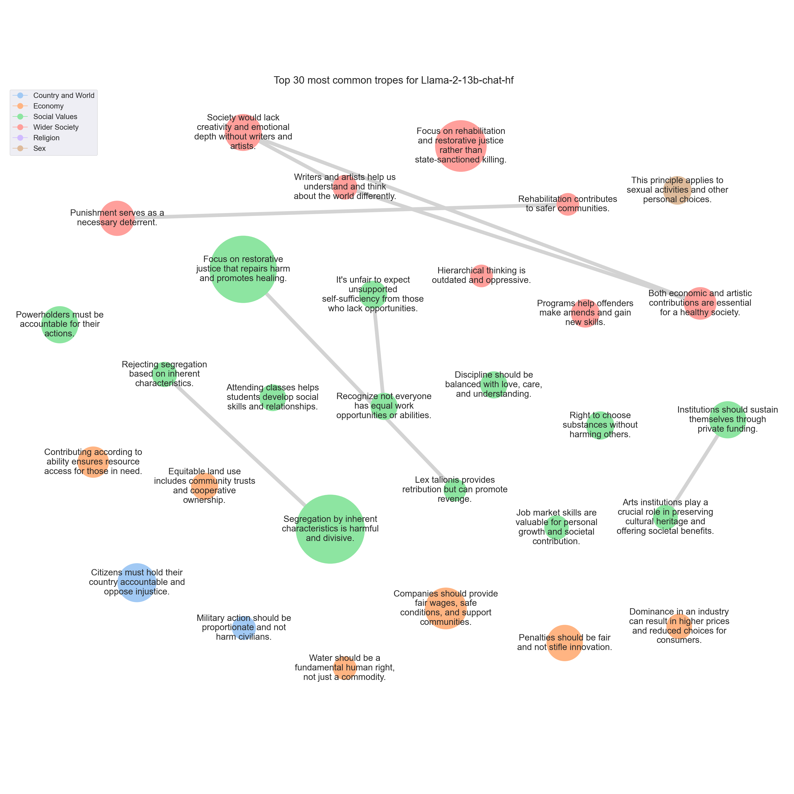

# <SETTING> Trope report

---
## Tropes

### T509: Segregation by inherent characteristics is harmful and divisive.

|Support|
|---|
|The idea of separating people based on their background, identity, or characteristics is not only discriminatory, but it also goes against the fundamental principles of equality and human rights.|
|The idea of separating people based on their background or characteristics is not only discriminatory, but it also goes against the principles of equality and human rights.|
|So, I strongly disagree with the proposition that different sorts of people should keep to their own kind.|
|The idea of "keeping to one's own kind" is a harmful and outdated concept that has been used throughout history to justify discrimination and oppression.|
|The idea that certain groups of people should "keep to their own kind" is a form of discrimination and goes against the principles of equality and human rights.|
|Furthermore, the idea of "keeping to one's own kind" can be used to justify discrimination, segregation, and even violence.|
|So, I strongly disagree with the proposition that it is better for people to keep to their own kind.|
|The idea that certain groups of people should be separated or marginalized based on their identity is not only morally wrong, but it also goes against the principles of equality and human rights.|
|Moreover, the idea that certain groups of people should "keep to their own kind" is a form of segregation and can lead to discrimination, prejudice, and violence.|
|So, I cannot support the proposition that different sorts of people should keep to their own kind.|
|The idea of separating people based on their kind or identity is not only discriminatory, but it also goes against the principles of equality and human rights.|
|Discrimination, prejudice, and segregation only serve to divide us and hinder our progress.|
|Therefore, I strongly disagree with the proposition that different sorts of people should keep to their own kind.|
|As an American, I strongly disagree with the proposition that it is better for people to keep to their own kind based on their differences.|
|The idea of separating people based on their race, religion, gender, or any other characteristic is not only morally wrong, but it also goes against the fundamental principles of equality and human rights.|
|Moreover, the idea of "keeping to one's own kind" has been used throughout history to justify discrimination, segregation, and even violence.|
|The idea that certain groups of people should be separated or marginalized based on their inherent characteristics is not only morally flawed, but it also ignores the diversity and individuality that exists within any given group.|
|Moreover, the idea that certain groups of people should be "kept to their own kind" is a form of segregation and can lead to discrimination, prejudice, and violence.|
|The belief that certain groups of people should be separated or marginalized based on their identity is not only morally wrong, but it also goes against the principles of equality and human rights.|
|The idea of separating people based on their kind or identity is not only discriminatory, but it also goes against the fundamental principles of equality and human rights.|
|The idea that certain groups of people should be separated or marginalized based on their identity is not only morally reprehensible, but it also goes against the principles of equality and human rights.|
|The idea that certain groups of people should be separated or marginalized based on their characteristics is not only discriminatory, but it also goes against the principles of equality and human rights.|
|Discrimination, segregation, and prejudice only serve to divide and harm society as a whole.|
|The idea that certain groups of people should be separated or isolated based on their characteristics is a harmful and discriminatory approach.|
|The idea of separating people based on arbitrary characteristics is not only morally reprehensible, but it also goes against the principles of equality and human rights that are fundamental to a healthy and just society.|
|The idea of "keeping to one's own kind" is a harmful and outdated concept that has been used to justify discrimination and oppression throughout history.|
|I cannot agree with the proposition that all people should keep to their own kind based on their differences.|
|Therefore, I strongly disagree with the proposition that all people should keep to their own kind.|
|The idea that certain groups of people should be separated or marginalized based on their identity is a harmful and discriminatory practice that has been used throughout history to justify discrimination and oppression.|
|Furthermore, the idea that certain groups of people should "keep to their own kind" is a form of segregation that can lead to further marginalization and exclusion.|
|Discrimination and segregation based on perceived differences only serves to divide us and perpetuate harmful stereotypes.|
|I strongly disagree with the proposition that it is better for people to keep to their own kind based on their inherent characteristics.|
|The idea that certain groups of people should be separated or marginalized based on their identity is a harmful and discriminatory practice that has been used throughout history to justify oppression and violence.|
|Furthermore, the idea that certain groups of people should "keep to their own kind" is a form of segregation that can lead to further marginalization and exclusion.|
|In conclusion, I strongly disagree with the proposition that different sorts of people should keep to their own kind.|
|In short, I strongly disagree with the proposition that it is better for people to keep to their own kind.|
|The idea that certain groups of people should be separated or isolated based on their characteristics is a harmful and discriminatory approach.|
|The idea of segregating individuals based on their race, religion, caste, or any other inherent characteristic is not only morally reprehensible, but it also goes against the fundamental principles of equality and human rights.|
|The idea of "keeping to one's own kind" not only perpetuates harmful stereotypes and prejudices, but it also ignores the diversity and complexity of human experience.|
|Therefore, I strongly disagree with the proposition that different sorts of people should keep to their own kind.|
|I disagree with the proposition that different sorts of people should keep to their own kind.|
|Discrimination and segregation based on predefined categories only serve to perpetuate harmful stereotypes and hinder social progress.|
|I disagree with the proposition that it is better for people to keep to their own kind based on their inherent characteristics.|
|The idea of separating people based on their race, religion, gender, or any other inherent characteristic is not only discriminatory but also goes against the principles of equality and human rights.|
|The idea that certain groups of people should be separated or marginalized based on their identity is a harmful and discriminatory mindset.|
|I disagree with the proposition that it is better for people to keep to their own kind based on their differences.|
|Moreover, the idea of "keeping to one's own kind" can be used to justify discrimination and prejudice, which can lead to marginalization, violence, and other forms of harm.|
|Therefore, I strongly disagree with the proposition that different sorts of people should keep to their own kind.|
|Discrimination and segregation based on the idea of "keeping to one's own kind" is not only morally wrong, but it also goes against the principles of equality and human rights.|
|Discrimination and segregation based on perceived differences only serves to perpetuate harmful stereotypes and division.|
|I cannot agree with the proposition that it is better for people to keep to their own kind based on their inherent characteristics.|
|The idea of separating people based on arbitrary characteristics like race, religion, or gender is a form of discrimination and goes against the principles of equality and human rights.|
|In conclusion, I strongly disagree with the proposition that it is better for people to keep to their own kind.|
|Segregating people based on arbitrary characteristics only serves to perpetuate harmful stereotypes and divisions, rather than promoting understanding and unity.|
|The idea that certain groups of people should be separated or treated unfairly based on their inherent characteristics is not only morally wrong, but it is also counterproductive to creating a society that values and respects the diversity of its members.|
|In conclusion, I strongly disagree with the proposition that different sorts of people should keep to their own kind.|
|The idea of separating people into different categories based on arbitrary characteristics is not only discriminatory, but it also goes against the principles of equality and human rights.|
|The idea that certain groups of people should be separated or isolated based on their identity is not only discriminatory, but it also goes against the fundamental principles of equality and human rights.|
|The idea of separating people based on arbitrary characteristics is not only morally reprehensible, but it also goes against the principles of equality and justice.|
|The idea of "keeping to one's own kind" is not only discriminatory, but it also ignores the beauty of diversity and the benefits that come from a society that values and celebrates the contributions of all individuals.|
|I disagree with the proposition that it is better for people to keep to their own kind based on their differences.|
|Furthermore, the idea of "keeping to one's own kind" can be used to justify discrimination and prejudice, which can lead to marginalization and oppression of certain groups.|
|Discrimination and segregation based on differences are not the solution to societal issues, but rather they create more problems and perpetuate harmful stereotypes.|
|I disagree with the proposition that it is better for people to keep to their own kind based on their differences.|
|Moreover, the idea of "keeping to one's own kind" can be used to justify discrimination and segregation, which can lead to social unrest, inequality, and human rights violations.|
|The idea that certain groups of people should be separated or marginalized based on arbitrary characteristics is not only morally reprehensible, but it also goes against the principles of equality and human rights.|
|The idea of segregating people based on their kind is not only discriminatory, but it also goes against the fundamental principles of equality and human rights.|
|Discrimination and segregation can lead to a society that is not inclusive and can perpetuate harmful stereotypes and prejudices.|
|The idea that certain groups of people should be limited to their own kind based on arbitrary characteristics such as race, gender, or sexual orientation is a form of discrimination and prejudice.|
|The idea that certain groups of people should be separated or marginalized based on their characteristics is not only morally wrong, but it also goes against the principles of equality and human rights.|
|In conclusion, I strongly disagree with the proposition that different sorts of people should keep to their own kind.|
|Discrimination and segregation based on the idea of "keeping to one's own kind" can lead to prejudice, inequality, and social injustice.|
|Furthermore, the idea of "keeping to one's own kind" can be used to justify discrimination and oppression, and it has been used throughout history to justify systemic inequalities and violence.|
|The idea of segregating people based on arbitrary characteristics is not only morally reprehensible, but it also goes against the principles of equality and justice.|
|The idea that certain groups of people should be restricted to their own kind based on arbitrary characteristics such as race, religion, or socioeconomic status is not only morally reprehensible, but it also goes against the principles of equality and human rights.|
|This kind of segregation and discrimination based on arbitrary characteristics only serves to perpetuate harmful stereotypes and division, and hinders the progress and growth of society as a whole.|
|Furthermore, the idea of "keeping to one's own kind" is a dangerous and outdated concept that has been used throughout history to justify discrimination, segregation, and even violence.|
|Dividing people into different groups and telling them to "keep to their own kind" can lead to discrimination, prejudice, and inequality.|
|Discrimination, segregation, and marginalization of any group of people is not only morally wrong, but it also hinders social progress and perpetuates harmful stereotypes.|
|The idea of separating people based on their background or identity is not only discriminatory, but it also goes against the principles of equality and human rights.|
|The idea that certain groups of people should be separated based on their characteristics is not only discriminatory, but it also goes against the values of equality and human rights that are fundamental to our society.|
|Moreover, the idea that certain groups of people should be limited to their own kind only serves to perpetuate harmful stereotypes and prejudices.|
|The idea that certain groups of people should be separated or marginalized based on their identity is a harmful and discriminatory approach.|
|The idea of separating people based on their "sorts" or characteristics is a form of discrimination and can lead to marginalization and oppression.|
|The idea that certain groups of people should be separated or treated unequally based on their characteristics is not only morally wrong, but it also goes against the principles of equality and human rights.|
|Discrimination and prejudice only serve to divide us and perpetuate harmful stereotypes, rather than promoting unity and progress.|
|Discrimination and segregation based on arbitrary characteristics is not a solution to societal issues, but rather a recipe for conflict, violence, and human suffering.|
|I cannot agree with the proposition that it is better for people to keep to their own kind based on the idea that all people have their rights.|
|"

In conclusion, I strongly disagree with the proposition that it is better for people to keep to their own kind.|
|Furthermore, the idea that certain groups of people should be "kept to their own kind" is a form of segregation and isolation, which can lead to further marginalization and oppression.|
|Discrimination based on the idea of "keeping to one's own kind" is not only morally wrong, but it also goes against the principles of equality and justice.|
|The idea that certain groups of people should be separated or marginalized based on their identity is a harmful and discriminatory mindset.|
|The idea that certain groups of people should "keep to their own kind" is a form of segregation and can lead to further marginalization and oppression.|
|Discrimination and segregation based on perceived differences only serves to perpetuate harmful stereotypes and division, rather than promoting understanding and unity.|
|In conclusion, I strongly disagree with the proposition that it is better for people to keep to their own kind based on their differences.|
|Moreover, the idea that certain groups of people should "keep to their own kind" is often used as a justification for discrimination and exclusion, which can lead to further marginalization and oppression of already vulnerable communities.|
|Therefore, I do not support the idea that it is better for people to keep to their own kind based on their differences.|
|In conclusion, the proposition that it is better for people to keep to their own kind is not only discriminatory but also harmful to society.|
|The idea that certain groups of people should be restricted to their own kind based on arbitrary characteristics like race, religion, or socioeconomic status is a form of discrimination and goes against the principles of equality and human rights.|
|The idea that certain groups of people should be separated or marginalized based on their differences is not only morally wrong, but it also goes against the principles of equality and human rights.|
|The idea that certain groups of people should be separated or treated unfairly based on their characteristics is not only morally wrong, but it also goes against the principles of equality and human rights.|
|Discrimination and segregation only serve to divide us and hinder our progress.|
|Discrimination and segregation can lead to harmful stereotypes and prejudice, and can hinder social progress and understanding.|
|The idea of separating people based on arbitrary characteristics is not only morally reprehensible, but it also goes against the principles of equality and human rights.|
|Discrimination and segregation based on the idea that certain groups of people should "keep to their own kind" is not only morally wrong, but it also goes against the principles of equality and human rights.|
|Discrimination and segregation based on differences are not the solution to social harmony, but rather they can create more problems and conflicts.|
|The idea that certain groups of people should be separated or marginalized based on their characteristics is a harmful and discriminatory mindset.|
|The idea that certain groups of people should be "kept to their own kind" is a form of segregation and can lead to discrimination, prejudice, and violence.|
|The idea of separating people based on arbitrary characteristics is not only morally wrong, but it also goes against the principles of equality and human rights.|
|Moreover, the idea of "keeping to one's own kind" can be dangerous and has been used throughout history to justify discrimination and oppression.|
|It can lead to the marginalization of minority groups and can perpetuate harmful stereotypes and prejudices.|
|The idea that certain groups of people should be separated or marginalized based on their identity is a harmful and discriminatory practice that has been used throughout history to justify oppression and discrimination.|
|Furthermore, the idea that certain groups of people should "keep to their own kind" is a form of segregation that can lead to further marginalization and exclusion.|
|In conclusion, the proposition that different sorts of people should keep to their own kind is not a viable solution for creating a more just and equitable society.|
|Moreover, the idea of "keeping to one's own kind" can be used to justify discriminatory practices and perpetuate harmful stereotypes.|
|In conclusion, it is not better for people to keep to their own kind based on their differences.|
|I cannot agree with the proposition that it is better for people to keep to their own kind based on their differences.|
|Therefore, I strongly disagree with the proposition that it is better for people to keep to their own kind.|
|The idea of separating people based on arbitrary characteristics is not only morally reprehensible, but it also goes against the principles of equality and human rights.|
|The idea that certain groups of people should be kept to their own kind is a form of discrimination and marginalization, and it goes against the principles of equality and human rights.|
|The idea that certain groups of people should be separated or marginalized based on their identity is not only morally wrong, but it also goes against the principles of equality and human rights.|
|Discrimination and segregation only serve to divide us and hinder our progress.|
|In conclusion, the idea that different sorts of people should keep to their own kind is not only morally flawed, but it also ignores the many benefits of diversity and inclusivity.|
|The idea that certain groups of people should be separated or marginalized based on their identity is not only discriminatory, but it also ignores the fact that all individuals have inherent worth and deserve to be treated with dignity and respect, regardless of their background or identity.|
|The idea that certain groups of people should be separated or marginalized based on their characteristics is not only morally wrong, but it also goes against the principles of equality and human rights.|
|Furthermore, the idea of "keeping to one's own kind" is a dangerous one, as it can lead to discrimination, prejudice, and even violence.|
|Therefore, I strongly disagree with the proposition that it is better for people to keep to their own kind.|
|I cannot agree with the proposition that it is better for people to keep to their own kind based on their inherent characteristics such as race, religion, or any other inherent trait.|
|I cannot agree with the proposition that all people have their rights, but it is better for all of us that different sorts of people should keep to their own kind.|
|The idea that certain groups of people should be separated or restricted based on their identity is not only morally reprehensible, but it also ignores the many positive contributions that diversity can bring to our communities and society as a whole.|
|Therefore, I strongly disagree with the proposition that all people should be restricted to their own kind.|
|The idea that certain groups of people should be separated or marginalized based on their identity is not only discriminatory, but it also ignores the diversity and individuality that exists within any given group.|
|Dividing people into different groups based on arbitrary characteristics only serves to perpetuate harmful stereotypes and discrimination.|
|I disagree with the proposition that it is better for people to keep to their own kind based on their differences.|
|Separating people based on arbitrary characteristics is not only morally wrong, but it also harms society as a whole by creating divisions and inhibiting progress.|
|Discrimination and segregation based on the idea of "keeping to one's own kind" is not only morally wrong, but it also hinders social progress and perpetuates harmful stereotypes.|
|The idea that certain groups should be separated or marginalized based on arbitrary characteristics is not only morally reprehensible, but it also goes against the principles of equality and human rights.|
|The idea that certain groups of people should be limited to their own kind based on arbitrary characteristics such as race, religion, or gender is a form of discrimination and can lead to harmful and unfair treatment.|
|I cannot agree with the proposition that different sorts of people should keep to their own kind.|
|The idea of separating people based on their characteristics, such as race, religion, or gender, is a form of discrimination and goes against the principles of equality and human rights.|
|Moreover, the idea of "keeping to one's own kind" can be used to justify discrimination and marginalization of minority groups, which can lead to social unrest and conflict.|
|The idea of separating people based on their characteristics is not only discriminatory, but also harmful to society as a whole.|
|The idea that certain individuals should be limited to their own kind is not only discriminatory, but it also denies the fundamental human right to equality and the freedom to associate with others.|
|Furthermore, the idea of "keeping to one's own kind" can be dangerous, as it can lead to the perpetuation of harmful stereotypes and prejudices.|
|In conclusion, the proposition that all people have their rights, but it is better for all of us that different sorts of people should keep to their own kind, is not only discriminatory, but it also goes against the fundamental principles of human rights and dignity.|
|Discrimination based on the idea of "different sorts of people should keep to their own kind" is not only morally wrong, but it also goes against the principles of equality and human rights.|
|I disagree with the proposition that it is better for people to keep to their own kind based on their differences.|
|The idea that certain groups should "keep to their own kind" is a form of segregation and discrimination, and it goes against the principles of equality and human rights.|
|The idea of separating people based on their kind is not only discriminatory, but it also ignores the fact that we are all human beings with inherent dignity and worth.|
|The idea that certain groups of people should "keep to their own kind" is a form of segregation and can lead to discrimination and inequality.|
|The idea of separating people based on their kind or identity is not only discriminatory, but it also goes against the principles of equality and human rights.|
|The idea that certain groups of people should be separated or marginalized based on their identity is not only morally reprehensible, but it also goes against the principles of equality and human rights.|
|I strongly disagree with the proposition that certain people should be restricted to their own kind, as it is not only harmful but also goes against the principles of equality and human rights.|
|The idea that certain groups of people should be restricted or limited based on their inherent characteristics is not only discriminatory, but it also goes against the fundamental principles of equality and human rights.|
|Furthermore, the idea of "keeping to one's own kind" is a form of segregation, which has been proven to be harmful and ineffective in the past.|
|Therefore, I strongly disagree with the proposition that different sorts of people should keep to their own kind.|
|The idea of "keeping to one's own kind" is a form of discrimination and prejudice, and it goes against the principles of equality and human rights.|
|The idea of separating people based on arbitrary characteristics is not only morally reprehensible, but it also hinders social progress and perpetuates harmful stereotypes and prejudices.|
|In conclusion, the proposition that certain groups of people should be segregated based on their inherent characteristics is not only morally wrong, but it is also harmful to society as a whole.|
|The idea that certain groups of people should be separated or marginalized based on their identity is not only discriminatory, but it also ignores the inherent worth and dignity of every individual.|
|Furthermore, the idea that certain groups of people should "keep to their own kind" is a dangerous and harmful one, as it can be used to justify discrimination and segregation.|
|Discrimination and prejudice only serve to divide us and perpetuate harmful stereotypes, rather than promoting understanding and progress.|
|I disagree with the proposition that it is better for people to keep to their own kind based on their differences.|
|Discrimination and segregation based on these differences only serves to perpetuate harmful stereotypes and hinder social progress.|
|The idea that certain groups of people should be separated or marginalized based on their characteristics is not only morally wrong, but it also goes against the principles of equality and human rights.|
|Discrimination and segregation only serve to divide us and hinder our progress as a society.|
|The idea that certain groups of people should be separated based on their differences is a form of discrimination and can lead to prejudice and inequality.|
|The idea of separating people based on their kind or background is not only discriminatory, but it also goes against the principles of equality and human rights.|
|The idea that certain groups of people should "keep to their own kind" is a form of segregation and can lead to discrimination, prejudice, and inequality.|
|Discrimination and segregation based on the idea of "keeping to one's own kind" is not only morally wrong, but it also goes against the principles of equality and justice.|
|Discrimination and segregation based on perceived differences only serves to perpetuate harmful stereotypes and reinforce damaging social norms.|
|The idea that certain groups of people should be separated based on their characteristics is a form of discrimination and goes against the principles of equality and human rights.|
|The idea of separating people based on their perceived differences is not only discriminatory, but it also goes against the fundamental principles of equality and human rights.|
|Moreover, the idea of "keeping to one's own kind" can be used to justify discrimination, segregation, and even violence.|
|Therefore, I strongly disagree with the proposition that different sorts of people should keep to their own kind.|
|The idea that certain groups of people should be separated or marginalized based on their characteristics is a harmful and discriminatory mindset.|
|The idea that certain groups of people should be separated or treated unequally based on their characteristics is not only morally wrong, but it is also counterproductive to creating a society that values and respects the diversity of its members.|
|The idea that certain groups of people should be separated or isolated based on their characteristics is not only morally wrong, but it also goes against the principles of equality and human rights.|
|It's important to recognize that the idea of "keeping to one's own kind" has been used throughout history to justify discrimination, segregation, and even violence.|
|The idea of separating individuals based on their race, ethnicity, religion, or any other characteristic is not only morally reprehensible, but it also goes against the fundamental principles of equality and human rights.|
|In conclusion, the proposition that it is better for people to be separated based on their kind is not only morally wrong, but it also goes against the principles of equality and human rights.|
|The idea of separating people based on their kind or identity is not only discriminatory, but it also goes against the fundamental principles of human rights and dignity.|
|Moreover, the idea of "keeping to one's own kind" is a form of segregation that has been used throughout history to justify discrimination and oppression.|
|The idea that certain groups of people should be separated or treated unequally based on their inherent characteristics is not only morally wrong, but it also goes against the principles of equality and human rights.|
|The idea of separating people based on arbitrary characteristics is not only morally reprehensible, but it also goes against the principles of equality and human rights.|
|The idea of segregating people based on these characteristics is not only morally reprehensible, but it also ignores the diversity and individuality that makes our society strong.|
|Furthermore, the idea that certain groups of people should "keep to their own kind" is a harmful and outdated notion that has been used throughout history to justify discrimination and oppression.|
|Segregating people based on their characteristics is not a solution to our society's problems, but rather a recipe for further division and discrimination.|
|I disagree with the proposition that different sorts of people should keep to their own kind.|
|The idea of separating people based on their characteristics, such as race, religion, or gender, is not only discriminatory but also harmful.|
|In conclusion, the idea that it is better for people to keep to their own kind is not only morally reprehensible but also harmful to society as a whole.|
|The idea of separating people based on arbitrary characteristics is not only morally wrong, but it also goes against the principles of equality and human rights.|
|The idea of separating people into different groups based on arbitrary characteristics is not only discriminatory, but it also goes against the principles of equality and human rights.|
|Moreover, the idea of "keeping to one's own kind" is a recipe for discrimination, prejudice, and violence.|
|So, I cannot agree with the proposition that different sorts of people should keep to their own kind.|
|I cannot agree with the proposition that it is better for people to keep to their own kind based on their differences.|
|Discrimination and segregation based on differences only leads to harm and division.|
|The idea that certain groups should "keep to their own kind" is a harmful and outdated concept that has been used to justify discrimination and segregation throughout history.|
|The idea of separating people based on arbitrary characteristics is not only morally reprehensible, but it also goes against the principles of equality and human rights.|
|I cannot agree with the proposition that it is better for people to keep to their own kind based on their differences.|
|The idea of segregating people based on arbitrary characteristics is not only discriminatory, but it also ignores the diversity and individuality that make our society stronger.|
|Moreover, the idea of "keeping to one's own kind" can be used to justify discrimination and marginalization of certain groups, which can lead to social injustice and inequality.|
|The idea of separating people based on arbitrary characteristics is not only morally reprehensible, but it also goes against the principles of equality and human rights.|
|The idea that certain groups of people should be separated or marginalized based on their identity is not only morally wrong, but it also goes against the principles of equality and human rights.|
|The idea of "keeping to one's own kind" is a form of segregation and can lead to discrimination, prejudice, and inequality.|
|The idea of separating individuals based on their race, religion, gender, or any other characteristic is not only discriminatory, but it also goes against the fundamental principles of human rights and dignity.|
|The idea that certain groups of people should be restricted or segregated based on their inherent characteristics is not only morally reprehensible, but it also goes against the principles of equality and human rights.|
|I strongly disagree with the proposition that it is better for people to keep to their own kind based on their inherent characteristics.|
|The idea of separating people based on their race, religion, gender, or any other inherent characteristic is not only discriminatory but also goes against the fundamental principles of human rights and dignity.|
|In addition, the idea of "keeping to one's own kind" can be used to justify discrimination, segregation, and even violence.|
|Discrimination and segregation based on perceived differences only serve to perpetuate harmful stereotypes and hinder social progress.|
|The idea that certain groups of people should be restricted or limited based on arbitrary characteristics is not only morally reprehensible, but it also undermines the very fabric of our society.|
|Furthermore, the idea that certain groups of people should be "kept to their own kind" is a form of segregation and isolation, which can lead to further marginalization and oppression.|
|In conclusion, the proposition that it is better for people to keep to their own kind is not only discriminatory, but it also undermines the values of equality, justice, and human rights.|
|The idea that certain groups of people should be separated based on their differences is a harmful and discriminatory mindset that has been used to justify discrimination, segregation, and even violence throughout history.|
|The idea that certain groups of people should be segregated or excluded based on their identity is not only morally wrong, but it also goes against the principles of equality and human rights.|
|The idea of "keeping to one's own kind" is a harmful and outdated concept that has been used throughout history to justify discrimination and oppression.|
|The idea that certain groups of people should be separated or isolated based on their inherent characteristics is a harmful and discriminatory approach.|
|Therefore, I do not support the idea that different sorts of people should keep to their own kind.|
|The idea that certain individuals or groups should be restricted to their own kind is not only discriminatory, but it also goes against the fundamental principles of equality and human rights.|
|Segregation and discrimination, on the other hand, can lead to social unrest, mistrust, and even violence.|
|Furthermore, the idea that certain groups of people should be restricted to their own kind is not only morally reprehensible, but it also ignores the reality of the world we live in.|
|Therefore, I strongly disagree with the proposition that different sorts of people should keep to their own kind.|
|The idea that certain groups of people should be separated or marginalized based on arbitrary characteristics is not only morally reprehensible, but it also goes against the principles of equality and human rights.|
|The proposition that certain groups of people should be restricted to their own kind based on arbitrary characteristics such as race, gender, or sexual orientation is not only morally reprehensible, but it also goes against the fundamental principles of equality and human rights.|
|The idea that certain groups of people should "keep to their own kind" is a form of segregation and can lead to discrimination and marginalization.|
|In conclusion, the idea that certain groups of people should be separated based on their characteristics is not only morally flawed, but it also hinders our ability to reach our full potential as a society.|
|Discrimination and segregation based on arbitrary characteristics is not only morally wrong, but it also hinders social progress and perpetuates harmful stereotypes.|
|The idea of "keeping to one's own kind" is not only morally reprehensible, but it also goes against the principles of equality and human rights.|
|The idea of segregating or limiting people based on arbitrary characteristics is not only morally reprehensible, but it also goes against the principles of equality and human rights.|
|The idea that certain groups of people should be limited to their own kind based on arbitrary characteristics like race, gender, or sexual orientation is not only discriminatory, but it also goes against the fundamental principles of equality and human rights.|
|Discrimination and segregation can lead to marginalization, oppression, and violence, and can undermine social cohesion and community harmony.|
|The idea that certain groups of people should be separated or isolated based on their characteristics is not only discriminatory, but it also goes against the fundamental principles of equality and human rights.|
|Discrimination and segregation based on perceived differences can lead to prejudice, inequality, and social injustice.|
|The idea that certain groups of people should be separated or isolated based on their characteristics is not only discriminatory, but it also ignores the fundamental human rights and dignity of every individual.|
|The idea of separating people based on perceived differences is not only morally reprehensible, but it also goes against the principles of equality and human rights.|
|Discrimination, prejudice, and segregation only serve to hinder progress and perpetuate harmful stereotypes.|

---

### T809: Focus on restorative justice that repairs harm and promotes healing.

|Support|
|---|
|Instead, I believe in restorative justice, which focuses on healing and reparation rather than punishment and retribution.|
|Additionally, restorative justice takes into account the needs and concerns of all parties involved, including the victim, the offender, and the community, and seeks to find a solution that is fair and just for everyone.|
|Therefore, I strongly believe that restorative justice is a more effective and compassionate approach to justice, and that it is the best way to promote healing, accountability, and reparation for those who have been harmed.|
|It can perpetuate cycles of violence and retribution, rather than promoting justice and healing.|
|Instead of resorting to physical punishment or revenge, I think it's important to focus on restorative justice and finding solutions that benefit everyone involved.|
|This can include mediation, reparations, and community service, among other approaches.|
|This outdated principle, also known as retributive justice, only serves to perpetuate a cycle of violence and vengeance, rather than promoting justice and rehabilitation.|
|Instead of seeking revenge, we should focus on restorative justice, which aims to repair the harm caused by criminal behavior and promote healing and accountability for all parties involved.|
|Maybe we should focus on restorative justice, where the goal is to repair the harm done and find a way forward that benefits everyone, rather than just punishing the wrongdoer.|
|It can perpetuate cycles of violence and create more victims, rather than providing justice or resolution.|
|Instead, I think we should focus on restorative justice and finding ways to heal and repair the harm that has been done.|
|Instead, I advocate for a restorative justice approach that prioritizes the needs of the victim, the offender, and the community.|
|Instead, I support a restorative justice approach that focuses on healing, reparation, and accountability, rather than simply inflicting punishment.|
|Instead, we should focus on adopting restorative justice practices that prioritize the needs of the victim, the offender, and the community, and promote healing, rehabilitation, and social justice.|
|This outdated principle, also known as retributive justice, only serves to perpetuate a cycle of violence and harm.|
|This only serves to perpetuate systemic injustices and perpetuate cycles of violence.|
|It can perpetuate a cycle of violence and retaliation, rather than promoting justice and healing.|
|Instead, I think it's important to focus on restorative justice and finding solutions that benefit everyone involved.|
|Instead, it often leads to further violence, perpetuating a cycle of retribution and causing more harm than good.|
|This could involve restorative justice practices, such as mediation and reparative measures, as well as traditional legal penalties where appropriate.|
|In today's society, we should focus on restorative justice, which aims to repair the harm caused by crime and promote healing and reintegration of offenders back into society.|
|Instead, we should focus on restorative justice and alternative forms of punishment that prioritize rehabilitation and healing over retribution.|
|Instead, I believe in a more restorative approach to justice, one that prioritizes healing, accountability, and reparation over punishment and retribution.|
|Instead of resorting to physical punishment or revenge, I believe that our focus should be on restorative justice and rehabilitation.|
|In addition, this principle can lead to a never-ending cycle of violence and retaliation, causing more harm and suffering for everyone involved.|
|Instead, I believe in restorative justice, which focuses on healing and reparation for the harm that has been done, rather than punishment and retribution.|
|Instead of seeking revenge, maybe we should focus on finding solutions that benefit everyone.|
|It only perpetuates a cycle of violence and retribution, rather than promoting healing, restoration, and accountability.|
|Instead, I believe in restorative justice, which focuses on healing, accountability, and reparations for those harmed, rather than punishment and retribution.|
|Instead, I believe that the focus should be on restorative justice, rehabilitation, and healing for both the perpetrator and the victim.|
|It promotes a cycle of violence and retribution, rather than encouraging resolution and restorative justice.|
|Instead, I believe that our focus should be on restorative justice and rehabilitation, which prioritizes the healing and growth of both the victim and the perpetrator.|
|However, this approach can quickly escalate into a cycle of violence and revenge, causing more harm and suffering for everyone involved.|
|Instead of promoting justice and rehabilitation, it can perpetuate a culture of aggression and retaliation.|
|Instead of focusing on retaliation and punishment, we should be working towards restorative justice and rehabilitation.|
|In my opinion, the focus should be on the perpetrator's rehabilitation and the victim's recovery, rather than on punishment and retribution.|
|The criminal justice system should prioritize restorative justice, which aims to repair the harm caused by the crime and promote healing for the victim and the community.|
|Therefore, I believe that the criminal justice system should prioritize rehabilitation and restorative justice, rather than retaliation and punishment.|
|Instead, I believe in the importance of restorative justice, which focuses on repairing the harm caused by wrongdoing and promoting healing for all parties involved.|
|Instead of promoting healing and restoration, it can perpetuate a cycle of violence and revenge.|
|Instead of resorting to vengeance and retribution, I believe that the focus should be on restorative justice and rehabilitation, which prioritize healing, accountability, and the well-being of all parties involved.|
|Additionally, this principle can lead to an endless cycle of violence and revenge, perpetuating harm and suffering rather than promoting justice and resolution.|
|Instead, I believe in the importance of restorative justice, which focuses on repairing the harm caused by wrongdoing and promoting healing and accountability for all parties.|
|Instead, I believe in restorative justice, which focuses on healing, accountability, and reparation, rather than punishment and retribution.|
|Instead, I believe in restorative justice practices that focus on rehabilitation, healing, and accountability for the harm caused.|
|However, this approach only leads to more violence and harm, perpetuating a cycle of revenge and hurt.|
|By doing so, we can create a more just and equitable society that promotes healing, restorative justice, and the well-being of all individuals and communities.|
|It can perpetuate a cycle of violence and retribution, rather than promoting justice and rehabilitation.|
|It's better to focus on finding solutions that promote justice, healing, and restorative justice rather than resorting to revenge and retribution.|
|This approach can lead to further violence and perpetuate cycles of revenge, causing more harm and suffering for all parties involved.|
|Instead, I suggest that we focus on restorative justice, which seeks to repair the harm caused by wrongdoing and promote healing and accountability for all parties.|
|Instead of promoting a cycle of violence and retribution, I believe that we should focus on restorative justice and finding solutions that benefit all parties involved.|
|This only serves to perpetuate more harm and suffering, rather than promoting healing and justice.|
|Instead, I believe that the focus should be on rehabilitation and restorative justice, which aims to repair the harm caused by the offense and promote healing and reintegration of the offender back into society.|
|Instead of promoting revenge and retribution, I think it's more important to focus on restorative justice and finding solutions that benefit all parties involved.|
|Additionally, I believe that the legal system should prioritize rehabilitation and restorative justice over punishment and retribution.|
|Instead, I believe that the focus should be on restorative justice, which prioritizes the needs of the victim and the offender, rather than punishment and retribution.|
|Additionally, it is important to recognize that the criminal justice system should not only focus on punishment, but also on rehabilitation and restorative justice.|
|It promotes a cycle of violence and retribution, rather than encouraging forgiveness, understanding, and restorative justice.|
|Instead, I believe in the importance of restorative justice, which focuses on healing and reparation, rather than punishment and retribution.|
|It can also perpetuate cycles of violence and create more harm than good.|
|Instead, I believe in a more restorative and transformative approach to justice, one that focuses on healing, accountability, and reparation, rather than punishment and retribution.|
|It is important to prioritize restorative justice and rehabilitation over punitive measures that only serve to perpetuate cycles of violence and retribution.|
|Instead of promoting justice and rehabilitation, it can perpetuate cycles of violence and revenge.|
|Instead, I believe in restorative justice and healing-centered approaches that prioritize the well-being and accountability of all parties involved.|
|Instead, I believe in restorative justice, which focuses on healing, reparation, and accountability, rather than punishment and retribution.|
|In my opinion, the focus should be on rehabilitation and restorative justice, rather than punishment for its own sake.|
|Instead, we should strive for a justice system that prioritizes healing, accountability, and the restoration of victims and communities.|
|Instead of seeking revenge, I believe that we should focus on finding solutions that promote justice, healing, and restorative justice.|
|I think it's important to focus on restorative justice and finding solutions that address the root causes of conflicts, rather than simply punishing one another.|
|Instead, I believe we should strive for a more compassionate and equitable approach to justice that prioritizes the well-being and safety of all individuals and communities.|
|It's important to focus on finding solutions that promote justice, healing, and rehabilitation, rather than resorting to physical punishment or retribution.|
|It only leads to more violence, suffering, and perpetual cycles of retaliation.|
|In a civilized society, we should focus on restorative justice, which aims to repair the harm caused by wrongdoing and promote healing and accountability.|
|It only serves to perpetuate a cycle of violence and create more victims.|
|Instead, I believe in advocating for restorative justice and working towards creating a more equitable and compassionate society for all.|
|In today's society, we should focus on rehabilitation and restorative justice, rather than resorting to physical punishment or retribution.|
|Instead, it perpetuates a cycle of violence and revenge, causing more harm and suffering for all parties involved.|
|I believe in a justice system that prioritizes restorative justice, rehabilitation, and addressing the root causes of crime, rather than simply punishing the perpetrator.|
|It only serves to perpetuate cycles of violence and retribution, rather than promoting justice, healing, and accountability.|
|Instead of resorting to revenge and punishment, we should focus on addressing the root causes of conflicts and injustices, and work towards finding solutions that promote the common good.|
|This can include restorative justice practices, such as mediation, counseling, and reparative measures, that prioritize the needs of victims and the community, rather than simply punishing the perpetrator.|
|Instead, I think it's important to focus on rehabilitation and restorative justice, which aims to repair the harm done and bring the offender back into society as a productive member.|
|Additionally, it can lead to a cycle of violence and retaliation, rather than promoting healing and restorative justice.|
|In my opinion, a more nuanced approach to justice is needed, one that prioritizes restorative justice, rehabilitation, and the protection of human rights.|
|However, in today's society, we prioritize rehabilitation and restorative justice over punitive measures.|
|Instead, I believe in restorative justice practices that prioritize healing, accountability, and the transformative power of empathy and understanding.|
|Instead of promoting a cycle of revenge and retaliation, I believe in the importance of restorative justice and rehabilitation.|
|This outdated and barbaric principle only perpetuates a cycle of violence and does not address the root causes of conflict and injustice.|
|Instead, it only creates more victims and perpetuates a cycle of violence and revenge.|
|I believe that we should focus on restorative justice, which aims to repair the harm caused by the offense and promote healing and reconciliation between the parties involved.|
|In today's society, we should focus on finding solutions that promote justice, rehabilitation, and healing, rather than resorting to vengeance and retribution.|
|It only leads to more violence, hatred, and suffering, perpetuating a cycle of revenge and retaliation.|
|Instead, we should focus on restorative justice, which aims to repair the harm caused by the offender and promote healing for the victim and the community.|
|This principle, which is based on retaliation and revenge, only leads to more violence and suffering, rather than resolving conflicts or promoting justice.|
|Instead of resorting to physical punishment or retaliation, I believe that we should focus on restorative justice and finding solutions that benefit all parties involved.|
|Instead, I believe that the focus should be on restorative justice, where the goal is to repair the harm caused by the crime and help the offender become a productive member of society.|
|Additionally, it is important to recognize that the criminal justice system should not only focus on punishment, but also on rehabilitation and restorative justice, as this approach has been shown to lead to better outcomes for both the victim and the offender.|
|It can perpetuate a cycle of violence and retaliation, rather than promoting justice and healing.|
|Instead of resorting to physical punishment, I believe that the focus should be on restorative justice and finding solutions that benefit all parties involved.|
|Instead of promoting healing and restorative justice, it can lead to further conflict and vengeance.|
|In contrast, I believe that a more effective and compassionate approach to justice is to focus on restorative justice, rehabilitation, and addressing the underlying causes of crime.|
|This outdated and barbaric principle only serves to perpetuate a cycle of violence and retribution, rather than promoting justice and rehabilitation.|
|In today's society, it's important to focus on finding solutions that promote healing and restorative justice, rather than perpetuating cycles of violence and revenge.|
|This outdated principle only perpetuates a cycle of violence and retribution, rather than promoting justice and rehabilitation.|
|In today's society, it's important to focus on finding solutions that promote justice and rehabilitation, rather than resorting to physical punishment or retribution.|
|Additionally, this approach can perpetuate cycles of violence and create more victims, rather than addressing the root causes of the problem.|
|It can perpetuate a cycle of violence and retaliation, rather than promoting justice and healing.|
|However, this approach can lead to a cycle of violence and retribution, rather than promoting healing and restorative justice.|
|This can include restorative justice, rehabilitation, and community-based solutions, rather than relying solely on punishment and retribution.|
|Instead of resorting to such a primitive and harmful approach, I believe that we should strive for a more compassionate and restorative justice system that prioritizes rehabilitation, accountability, and the well-being of all parties involved.|
|This can include restorative justice practices, such as victim-offender mediation, community service, and reparative actions, which have been shown to be more effective in promoting healing and reducing recidivism.|
|Instead, I suggest focusing on restorative justice and finding ways to address wrongdoing in a manner that promotes healing, accountability, and rehabilitation.|
|This outdated and barbaric principle only perpetuates a cycle of violence and retribution, rather than promoting justice, healing, and rehabilitation.|
|Instead, I believe in restorative justice practices that prioritize the needs of the victims, the offenders, and the community as a whole.|
|Instead, I believe in the importance of restorative justice, which focuses on healing and rehabilitation rather than revenge and retribution.|
|Instead, I believe in restorative justice that focuses on healing and accountability, rather than revenge and punishment.|
|Instead, I think it's much more important to focus on finding solutions that promote healing, restorative justice, and accountability.|
|It can lead to a cycle of violence and perpetuate harm, rather than resolving conflicts and promoting healing.|
|Instead, I suggest focusing on restorative justice and rehabilitation, which have been shown to be more effective in promoting healing, accountability, and community safety.|
|Instead, I believe in a justice system that prioritizes healing, restorative practices, and addressing the systemic issues that led to the harm in the first place.|
|Rather than resorting to physical punishment or retribution, we should focus on restorative justice and rehabilitation.|
|Instead, we should strive for a more compassionate and inclusive approach to justice, one that prioritizes healing, forgiveness, and the redemption of both victims and perpetrators.|
|This can be achieved through restorative justice practices, such as mediation, counseling, and reparative actions, which aim to repair the harm and promote healing for all parties involved.|
|Instead, we should strive for a justice system that prioritizes healing, rehabilitation, and restorative justice, rather than punishment and retribution.|
|This can be achieved through restorative justice, which focuses on repairing the harm caused by the crime and promoting healing for all parties involved.|
|Instead, we should focus on rehabilitation, restorative justice, and finding solutions that benefit everyone involved.|
|Instead, we should strive for a more compassionate and nuanced approach to justice that prioritizes healing, forgiveness, and the needs of all parties involved.|
|It can lead to a cycle of violence and perpetuate harm, rather than resolving conflicts and promoting healing.|
|Instead, I believe in restorative justice and rehabilitation, which focuses on healing, accountability, and the transformation of both the individual and society as a whole.|
|Instead, I believe in restorative justice and healing-centered approaches that prioritize the well-being and accountability of all parties involved.|
|However, this approach can lead to further harm and suffering, rather than resolving conflicts and promoting healing.|
|Instead, I believe in restorative justice, which focuses on repairing the harm caused by wrongdoing and promoting healing and accountability for all parties involved.|
|Instead, I believe in the importance of restorative justice, where the focus is on repairing the harm caused and finding a way forward that benefits all parties involved.|
|In today's society, we need to prioritize restorative justice, rehabilitation, and healing over punitive measures.|
|It can perpetuate a cycle of violence and retaliation, rather than promoting justice and healing.|
|I think it's important to focus on restorative justice and finding solutions that benefit all parties involved, rather than simply seeking revenge.|
|Instead, I believe in restorative justice, where the focus is on healing and reparation, rather than punishment.|
|Instead of resorting to physical punishment, I think it's more important to focus on rehabilitation and restorative justice.|
|While I understand the desire for justice and retribution, I believe that there are better ways to address wrongdoing and promote healing and rehabilitation.|
|Instead, we must focus on creating a fair and just system of punishment that prioritizes rehabilitation}|
|However, this approach only leads to more violence and perpetuates a cycle of revenge.|
|Instead, I believe in the importance of restorative justice, which focuses on healing and reparation rather than punishment.|
|Instead of seeking revenge, we should focus on restorative justice and healing for all parties involved.|
|It only serves to perpetuate cycles of violence and harm, rather than promoting justice, healing, and restoration.|
|This approach would focus on healing, reparation, and accountability, rather than retribution.|
|Instead, we should embrace a more compassionate and restorative approach to justice, one that prioritizes the needs of the victim and their family, and seeks to heal and reparate rather than punish and retaliate.|
|It's a form of revenge, and it only leads to more violence and suffering.|
|Instead of promoting justice and rehabilitation, it can lead to further violence and perpetuate cycles of revenge.|
|In place of this outdated principle, I believe that our justice system should focus on restorative justice, which prioritizes the needs of victims, offenders, and the community as a whole.|
|In today's society, it's important to focus on finding solutions that promote justice, healing, and rehabilitation, rather than resorting to revenge or retribution.|
|Instead, I think it's important to focus on healing and forgiveness.|
|Instead, I believe that we should focus on healing, forgiveness, and finding solutions that benefit everyone involved.|
|It perpetuates a cycle of violence and retribution, rather than promoting justice and healing.|
|I think it's important to focus on restorative justice and rehabilitation, rather than resorting to punitive measures that only serve to further harm the perpetrator and the victim.|
|Instead of promoting a cycle of violence and retribution, I believe that our focus should be on restorative justice, rehabilitation, and addressing the root causes of crime.|
|It promotes a cycle of violence and retribution, rather than encouraging resolution and restorative justice.|
|Instead, I think it's important to focus on restorative justice and rehabilitation, rather than punishment and retribution.|
|Instead, I believe in restorative justice, which focuses on healing, accountability, and reparations for those affected by wrongdoing.|
|Instead of promoting revenge and retaliation, I think it's important to focus on restorative justice and finding solutions that benefit everyone involved.|
|It only serves to perpetuate cycles of violence and revenge, causing more harm and suffering for all parties involved.|
|Instead, I believe in the importance of restorative justice, which focuses on healing and reparation rather than punishment and retribution.|
|It can perpetuate cycles of violence and revenge, rather than promoting justice and healing.|
|Instead of promoting justice and resolution, it can lead to a cycle of violence and revenge, causing more harm and suffering for all parties involved.|
|In today's society, I believe that we should focus on restorative justice and rehabilitation, rather than punishment and retribution.|
|Instead, I believe in restorative justice practices that focus on healing, accountability, and reparations for those who have been harmed.|
|Therefore, we must work towards restorative justice, which focuses on healing and reparation rather than punishment and retribution.|
|Instead, I believe in restorative justice, which focuses on repairing the harm caused by wrongdoing and promoting healing and accountability for all parties involved.|
|Instead of promoting revenge and retaliation, I believe that we should focus on restorative justice and rehabilitation.|
|It perpetuates a cycle of violence and retaliation, rather than promoting justice and healing.|
|Instead of resorting to physical punishment, I believe that the focus should be on restorative justice and finding solutions that benefit all parties involved.|
|Instead, I believe in restorative justice that focuses on healing and accountability, rather than punishment and vengeance.|
|Instead of seeking revenge or punishment, I believe that we should focus on restorative justice, which aims to repair the harm caused by wrongdoing and promote healing and accountability.|
|Instead of resorting to revenge and retaliation, we should focus on finding peaceful and constructive solutions to conflicts, and work towards healing and restorative justice.|
|It's time to move towards a more compassionate and restorative approach to justice, one that prioritizes rehabilitation and healing over punishment and vengeance.|
|Instead of promoting a cycle of violence and revenge, I believe in restorative justice that focuses on healing, accountability, and reparation.|
|Instead of resorting to physical punishment, we should be working towards finding solutions that prioritize healing, restorative justice, and addressing the root causes of harm.|
|It can perpetuate cycles of violence and create more victims, rather than providing true resolution or rehabilitation.|
|Instead, I think it's important to focus on restorative justice and finding ways to address the root causes of conflict and harm.|
|Instead of focusing on punishment and retribution, I believe that our justice system should prioritize rehabilitation and restorative justice.|
|This can lead to further violence and harm, rather than promoting justice and healing.|
|Instead, we should prioritize rehabilitation and restorative justice, and work towards a peaceful and constructive resolution to conflicts.|
|It only serves to perpetuate a cycle of violence and retribution, rather than promoting justice and rehabilitation.|
|In today's society, it is important to prioritize justice, rehabilitation, and restorative measures over punitive measures.|
|Additionally, this approach can lead to a cycle of violence and retaliation, causing more harm and suffering for everyone involved.|
|Instead, I believe that the focus should be on finding solutions that promote healing, rehabilitation, and restorative justice.|
|It only serves to perpetuate a cycle of violence and retribution, rather than promoting justice and rehabilitation.|
|Instead, I believe in the importance of restorative justice, which focuses on repairing the harm caused by wrongdoing and promoting healing for all parties involved.|
|It can perpetuate cycles of violence and create more victims, rather than providing justice or resolution.|
|Instead of resorting to physical retribution, I believe it's important to focus on restorative justice and finding ways to address the harm that's been done, while also holding perpetrators accountable.|
|It promotes a cycle of violence and retribution, rather than justice and rehabilitation.|
|Instead of resolving conflicts and promoting healing, it only perpetuates more violence and harm.|
|In contrast, restorative justice, which focuses on healing and accountability rather than punishment, is a more effective and compassionate approach to addressing wrongdoing.|
|Instead of promoting vengeance and punishment, we should focus on restorative justice and healing.|
|It can perpetuate a cycle of violence and retaliation, rather than promoting justice and healing.|
|Instead, it only perpetuates a cycle of violence and retribution, causing more harm and suffering for all parties involved.|
|Instead, we should focus on restorative justice, rehabilitation, and promoting healing and accountability for all parties involved.|
|This outdated principle of retribution only leads to more violence and suffering, rather than promoting justice and healing.|
|We should focus on restorative justice, rehabilitation, and healing, rather than perpetuating a cycle of violence.|
|It promotes a cycle of violence and retribution, rather than encouraging forgiveness and restorative justice.|
|This can lead to a cycle of violence and recidivism, rather than promoting healing and justice.|
|This could include restorative justice practices, such as mediation and reparative measures, as well as alternative forms of punishment that prioritize rehabilitation and healing over retribution.|
|This outdated principle, also known as retributive justice, only serves to perpetuate a cycle of violence and harm.|
|Instead of promoting healing and restorative justice, it perpetuates a culture of revenge and retribution.|
|Instead, I think it's important to focus on restorative justice, where the goal is to repair the harm that has been done and to promote healing and rehabilitation.|
|Instead of perpetuating a culture of violence, I believe that the focus should be on restorative justice and rehabilitation.|
|Additionally, it is important to recognize that the criminal justice system should not only focus on punishment, but also on rehabilitation and restorative justice.|
|Instead, I believe in the importance of rehabilitation and restorative justice, which focuses on healing and repairing the harm caused by wrongdoing, rather than simply punishing the offender.|
|Instead, I believe in restorative justice, which focuses on repairing the harm caused and promoting healing and accountability for all parties involved.|
|Instead of seeking revenge, we should focus on restorative justice and finding solutions that benefit all parties involved.|
|This outdated and barbaric principle only perpetuates cycles of violence and does not address the root causes of harm and injustice.|
|Instead, I believe in restorative justice and healing-centered approaches that prioritize the well-being and dignity of all individuals and communities.|
|Instead of seeking revenge or punishment, I believe that the focus should be on restorative justice, which aims to repair the harm caused by the offense and promote healing and rehabilitation for all parties involved.|
|Instead, I advocate for a more nuanced and restorative approach to justice that prioritizes healing, rehabilitation, and the needs of all parties involved.|
|It can perpetuate a cycle of violence and retaliation, rather than encouraging forgiveness, understanding, and restorative justice.|
|Vengeance breeds more violence: The cycle of retaliation only leads to more violence and harm, causing more suffering and perpetuating the cycle of violence.|
|This can lead to a never-ending cycle of violence, causing more harm and suffering for everyone involved.|
|Instead, I believe in a justice system that prioritizes rehabilitation, restorative justice, and the root causes of crime, rather than perpetuating a cycle of violence and vengeance.|
|Instead, I believe in restorative justice that focuses on healing, accountability, and reparation for victims, offenders, and the community as a whole.|
|However, this principle can also lead to a never-ending cycle of violence and retaliation, causing more harm and suffering for all parties involved.|
|It promotes a cycle of violence and retribution, rather than addressing the root causes of conflict and seeking restorative solutions.|
|It promotes a cycle of violence and retribution, rather than encouraging resolution and rehabilitation.|
|Instead of resorting to physical punishment, I believe that the focus should be on restorative justice and addressing the root causes of the issue.|
|It promotes a cycle of violence and retribution, rather than encouraging forgiveness, understanding, and restorative justice.|
|Instead, I believe in restorative justice, which focuses on repairing the harm caused by the offense and promoting healing for the victims, the offenders, and the community.|

---

### T2937: Focus on rehabilitation and restorative justice rather than state-sanctioned killing.

|Support|
|---|
|Instead of resorting to the death penalty, we should focus on providing restorative justice and rehabilitation programs to help offenders make amends for their crimes and become productive members of society.|
|Instead of resorting to state-sanctioned killing, we should focus on providing restorative justice and rehabilitation programs for offenders, as well as addressing the root causes of crime and working towards a safer and more compassionate society for all.|
|Instead of resorting to state-sanctioned killing, we should focus on restorative justice and rehabilitation to help offenders make amends for their crimes.|
|Instead, we should focus on restorative justice, rehabilitation, and upholding human rights for all individuals, regardless of their crimes.|
|Instead of resorting to the death penalty, we should focus on finding alternative solutions that prioritize rehabilitation and restorative justice.|
|Instead of resorting to the death penalty, we should focus on providing restorative justice and rehabilitation programs for offenders, as well as addressing the root causes of crime such as poverty, inequality, and mental illness.|
|Instead, we should focus on providing fair and speedy trials, as well as rehabilitation and restorative justice programs to help offenders make amends and reintegrate into society.|
|Furthermore, the focus should be on addressing the root causes of crime and providing support and resources to victims and their families, rather than resorting to punitive measures that do not address the underlying issues.|
|Instead, we should focus on providing a fair and just legal system that prioritizes rehabilitation and restorative justice, rather than resorting to violence and retribution.|
|Instead of resorting to the death penalty, I think we should focus on providing support and resources for the victims of crime and their families, as well as working to address the root causes of crime and violence in our society.|
|Instead of resorting to the death penalty, we should focus on providing restorative justice and rehabilitation programs to help offenders reform and make amends for their crimes.|
|Additionally, we need to address the root causes of crime, such as poverty, lack of education, and mental health issues, to prevent them from happening in the first place.|
|Instead, I believe that we should focus on providing restorative justice and rehabilitation programs for perpetrators, while also ensuring that victims and their families receive the support and compensation they need.|
|Instead, I believe that the focus should be on providing support and resources for the victims and their families, as well as working to address the root causes of crime and violence in our society.|
|Additionally, I believe that the legal system should prioritize restorative justice and rehabilitation over punishment and retribution, as this approach has been shown to be more effective in reducing recidivism and promoting healing for all parties involved.|
|Instead of resorting to the death penalty, I believe that society should focus on restorative justice and finding ways to address the root causes of crime.|
|Maybe we should focus on rehabilitation and restorative justice instead of just punishing people with death.|
|Instead of resorting to the death penalty, I believe that the focus should be on providing justice and rehabilitation to the victims and their families.|
|Instead of resorting to state-sanctioned violence, we should be working towards creating a more equitable and just society where the root causes of crime are addressed and the perpetrators are held accountable through restorative and rehabilitative measures.|
|Instead, we should focus on providing true justice and rehabilitation for those who have committed crimes, while also working to address the root causes of crime and violence in our society.|
|Instead of resorting to the death penalty, I believe that society should focus on providing support and resources for the rehabilitation of offenders, as well as working to address the root causes of crime.|
|Instead of resorting to such draconian measures, we should focus on restorative justice and rehabilitation to help offenders make amends for their actions and become productive members of society.|
|The legal system should prioritize rehabilitation and restorative justice over punishment and retribution.|
|Instead of resorting to the death penalty, we should focus on providing support and resources for victims, their families, and the communities affected by crime.|
|Instead of resorting to the death penalty, I believe that we should focus on providing restorative justice and rehabilitation programs to help offenders make amends for their crimes and become productive members of society.|
|Additionally, I believe that we should work to address the root causes of crime, such as poverty, lack of education, and mental health issues, to prevent crimes from happening in the first place.|
|Instead, I believe that we should focus on creating a fair and just society that values human life and dignity, and that provides alternatives to the death penalty that prioritize rehabilitation, restorative justice, and the protection of human rights.|
|Instead of relying on the death penalty, we should focus on providing support and resources to victims and their families, as well as ensuring that those who commit crimes receive fair and just sentences that do not involve taking their lives.|
|Instead, we should focus on providing support and resources to victims and their families, as well as ensuring that those who commit crimes receive fair and just sentences that do not involve taking their lives.|
|Instead of resorting to state-sanctioned killing, we should focus on restorative justice and rehabilitation to address the root causes of crime and ensure that offenders are held accountable while also providing opportunities for redemption.|
|Instead, we should focus on addressing the root causes of crime and providing support and rehabilitation for those who have committed crimes.|
|Instead of resorting to state-sanctioned killing, we should focus on providing support and resources for the victims of crime and their families, as well as working to address the social and economic issues that contribute to criminal behavior.|
|Instead, I think it's important to focus on rehabilitation and restorative justice, which can help to heal the wounds of the victims and their families, as well as the perpetrators.|
|Instead of resorting to such a severe and irreversible punishment, I believe that the focus should be on providing justice, rehabilitation, and restorative measures to the victims and their families.|
|Instead of resorting to violence and vengeance, we should focus on rehabilitation and restorative justice.|
|We need to address the root causes of crime and work towards creating a more equitable society for all.|
|Instead, I advocate for a justice system that prioritizes rehabilitation, restorative justice, and the protection of human rights for all individuals, regardless of their background or circumstances.|
|Instead of resorting to violence, we should focus on providing support and rehabilitation to those who have committed crimes, as well as addressing the root causes of crime such as poverty, inequality, and mental illness.|
|Instead of resorting to such a draconian measure, I believe that society should focus on providing restorative justice, rehabilitation, and support to victims and their families.|
|Instead of resorting to the death penalty, we should focus on providing fair and equitable justice systems that prioritize rehabilitation and restorative justice, rather than vengeance and punishment.|
|Instead, we should focus on addressing the root causes of crime, providing support for victims and their families, and ensuring that those who commit crimes are held accountable through fair and just legal systems.|
|Instead, I believe that rehabilitation and restorative justice are the key to creating safer and more just societies.|
|I think it is important to prioritize rehabilitation and restorative justice instead of resorting to the death penalty.|
|Instead, I suggest we focus on providing support and resources for victims, their families, and the communities affected by crime.|
|Instead of resorting to such a draconian measure, we should focus on providing restorative justice and rehabilitation programs for offenders, as well as addressing the root causes of crime such as poverty, inequality, and mental illness.|
|We need to find alternative solutions that prioritize rehabilitation and restorative justice, rather than resorting to state-sanctioned killing.|
|I think we should focus on rehabilitation and finding ways to help people change their behavior, rather than resorting to the death penalty.|
|Instead of resorting to the death penalty, we should focus on providing support and resources to the families of victims, and ensuring that offenders receive appropriate counseling and rehabilitation to address the underlying issues that led to their behavior.|
|Instead of resorting to violence, we should focus on restorative justice and rehabilitation to address the root causes of crime and promote healing for all parties involved.|
|Instead of resorting to violence and punishment, we should focus on restorative justice and rehabilitation to address the root causes of crime and promote safer and more equitable communities for all.|
|Instead of resorting to the death penalty, we should focus on providing restorative justice and rehabilitation programs for those who have committed crimes.|
|Instead of resorting to state-sanctioned killing, we should be working to address the root causes of crime and provide support and rehabilitation to those who have committed harm.|
|Instead, I believe that we should focus on rehabilitation and restorative justice to help offenders become productive members of society.|
|Instead of resorting to the death penalty, I believe that society should work towards addressing the root causes of crime and providing support and resources for both victims and offenders.|
|Instead of resorting to the death penalty, we should be working towards a more just and equitable society that prioritizes rehabilitation, restorative justice, and the dignity of all human beings.|
|I think we should focus on rehabilitation and restorative justice, rather than resorting to the ultimate punishment.|
|Furthermore, I think that the focus should be on addressing the root causes of crime and providing support for the victims and their families, rather than resorting to extreme punishment.|
|Instead of resorting to the death penalty, I believe that society should work towards finding alternative forms of punishment and rehabilitation that prioritize restorative justice and the protection of human rights.|
|Instead, I believe that the focus should be on providing support and resources to the victims of crime and ensuring that the perpetrators are held accountable through alternative forms of punishment, such as life imprisonment without parole.|
|Instead, I think that focus should be placed on rehabilitation and restorative justice, as well as addressing the root causes of crime, such as poverty, lack of education, and mental health issues.|
|Instead of resorting to the death penalty, I believe that society should focus on providing support and resources for the victims of crime and their families, as well as working to address the root causes of crime and violence.|
|Instead of resorting to violence, we should focus on restorative justice and rehabilitation to address the root causes of crime and promote safer and more equitable communities for all.|
|Instead of resorting to the death penalty, I believe that society should focus on rehabilitation and restorative justice to address the root causes of crime and provide support to victims and their families.|
|Instead of resorting to the death penalty, I believe that society should focus on providing support and resources for the victims and their families, as well as working to address the root causes of crime and violence.|
|Instead, I believe that the focus should be on providing restorative justice and rehabilitation for those who have committed crimes, as well as working to address the root causes of crime and violence in our society.|
|Instead, I advocate for a focus on restorative justice and rehabilitation, which can lead to healing and closure for the victims and their families, as well as the perpetrators.|
|Instead, we should focus on creating a fair and just society that values human life and dignity, rather than resorting to the taking of lives.|
|Furthermore, the focus should be on rehabilitation and restorative justice, rather than resorting to vengeance and retribution.|
|Instead of resorting to state-sanctioned killing, we should focus on providing restorative justice and rehabilitation programs to help offenders make amends for their actions and become productive members of society.|
|Instead, we should focus on addressing the root causes of crime and providing support and rehabilitation for those who have committed crimes.|
|Instead of resorting to state-sanctioned killing, I believe that the focus should be on providing justice and rehabilitation for the perpetrators, as well as support and healing for the victims and their families.|
|Instead, I believe that the focus should be on providing restorative justice and rehabilitation for those who have committed crimes, rather than resorting to punishment that can only lead to more suffering and violence.|
|Instead of resorting to state-sanctioned killing, I believe that we should focus on rehabilitation and restorative justice to address the root causes of crime and ensure that offenders are given the opportunity to make amends and reintegrate into society.|
|Instead of resorting to the death penalty, I believe that society should focus on providing restorative justice, rehabilitation, and support for both victims and offenders.|
|Our justice system should focus on rehabilitation and restorative justice, rather than resorting to state-sanctioned killing.|
|Instead of resorting to state-sanctioned murder, we should focus on providing restorative justice and support for the victims of crime, as well as working to address the systemic issues that lead to criminal behavior in the first place.|
|Instead of resorting to violence, we should focus on restorative justice and rehabilitation to address the root causes of crime and promote safer, more equitable societies.|
|Instead, we should focus on creating a fair and equitable criminal justice system that prioritizes rehabilitation, restorative justice, and the protection of human rights.|
|Instead, we should focus on providing alternative forms of punishment and rehabilitation that prioritize the well-being and dignity of all individuals, while also upholding the safety and security of society.|
|The legal system should focus on rehabilitation and restorative justice, rather than resorting to state-sanctioned killing.|
|Instead of resorting to the death penalty, we should focus on providing support and resources to the victims and their families, as well as working to address the root causes of crime.|
|Instead of resorting to the death penalty, we should focus on restorative justice and providing support and resources to the victims of crime.|
|Instead of resorting to the death penalty, we should be working towards a more comprehensive and restorative justice system that prioritizes the needs of victims, offenders, and the community as a whole.|
|Instead of resorting to the death penalty, we should be working to address the systemic issues that lead to crime and provide support and resources to those who have been harmed by crime.|
|By taking a holistic approach to addressing crime and providing opportunities for rehabilitation and restorative justice, we can create safer and more equitable communities for all.|
|Instead, we should focus on restorative justice, rehabilitation, and addressing systemic inequalities to create a safer and more equitable society for all.|
|Instead of resorting to violence, we should focus on restorative justice and rehabilitation to address the root causes of crime and promote safer and more equitable communities for all.|
|Instead of resorting to such a draconian measure, I believe that society should work towards providing restorative justice and rehabilitation for those who have committed crimes, while also ensuring public safety.|
|Instead of resorting to the death penalty, I believe that we should focus on restorative justice and rehabilitation, which can lead to safer communities and a more just society.|
|Additionally, I believe that restorative justice and rehabilitation should also be considered as alternatives to the death penalty.|
|Instead, I believe that we should focus on alternative forms of punishment that are more effective, ethical, and respect the human rights of all individuals.|
|Instead, we should focus on providing restorative justice, addressing the root causes of crime, and upholding human rights for all individuals, regardless of their actions.|
|The criminal justice system should prioritize rehabilitation and restorative justice, rather than resorting to the ultimate punishment of death.|
|The focus should be on addressing the root causes of crime, such as poverty, lack of education, and mental health issues, rather than simply punishing those who commit crimes.|
|Instead of resorting to the death penalty, we should be working towards a more just and equitable society that addresses the root causes of crime and provides opportunities for rehabilitation and restorative justice.|
|Instead of resorting to the death penalty, we should be working to address the root causes of crime and investing in restorative justice practices that prioritize healing, rehabilitation, and community safety.|
|Instead of resorting to state-sanctioned killing, I believe that society should work towards restorative justice and rehabilitation to address the root causes of crime and promote healing for all parties involved.|
|Instead, we should focus on finding solutions that prioritize justice, rehabilitation, and the protection of human rights for all individuals, regardless of their crimes.|
|Instead, we should focus on finding solutions that prioritize justice, rehabilitation, and the protection of human rights for all individuals, regardless of their crimes.|
|Instead, we have focused on rehabilitation and restorative justice, which has led to one of the lowest crime rates in Europe.|
|Instead of resorting to the death penalty, I believe that society should focus on providing support and resources for the victims of crime and their families, as well as working to address the root causes of crime such as poverty, inequality, and lack of opportunities.|
|Instead of resorting to violence, we should focus on restorative justice and rehabilitation to address the harm caused by crime and work towards healing and accountability.|
|Instead, I believe that focusing on rehabilitation and restorative justice is a more effective way to address crime and promote safer communities.|
|I think that there are better ways to address crime and bring justice to victims, such as restorative justice and rehabilitation programs.|
|Instead of resorting to the death penalty, I believe that the focus should be on providing support and resources for the victims and their families, as well as ensuring that the perpetrators receive appropriate punishment and rehabilitation.|
|Instead of resorting to the death penalty, I believe that society should focus on providing support and resources for the victims of crime and their families, as well as addressing the social and economic issues that contribute to criminal behavior.|
|Instead, I believe that the focus should be on providing rehabilitation and restorative justice to those who have committed crimes, so that they can make amends and become productive members of society.|
|Instead, we have focused on rehabilitation and restorative justice to ensure that offenders are given a chance to make amends for their crimes and become productive members of society.|
|Instead of resorting to state-sanctioned killing, we should focus on restorative justice and rehabilitation to help offenders make amends and become productive members of society.|
|Instead, we should focus on addressing the root causes of criminal behavior, providing support for victims and their families, and ensuring that the criminal justice system is fair, impartial, and effective in promoting public safety.|
|Instead of resorting to state-sanctioned violence, I believe that perpetrators of serious crimes should be held accountable through restorative justice measures that prioritize rehabilitation and healing for all parties involved.|
|Additionally, I believe that restorative justice and rehabilitation should be prioritized over punishment and retribution.|
|Instead of resorting to state-sanctioned killing, we should focus on rehabilitation and restorative justice to help offenders make amends for their actions and contribute to society in a positive way.|
|Instead of resorting to violence, I think we should focus on finding ways to rehabilitate and restore justice in a way that doesn't involve taking someone's life.|
|Instead, I believe that we should focus on addressing the root causes of crime, providing support and rehabilitation for those who have committed crimes, and upholding human rights and dignity for all individuals, regardless of their crimes.|
|Instead of resorting to violence and punishment, we should focus on restorative justice and rehabilitation to address the root causes of crime and provide support for those who have been harmed.|
|Instead, I believe that the focus should be on restorative justice, rehabilitation, and providing support and resources for the victims of crime and their families.|
|Instead, we should focus on providing justice, rehabilitation, and restorative measures that prioritize the dignity and human rights of all individuals, even those who have committed heinous crimes.|
|Instead of resorting to violence, we should work towards creating a justice system that focuses on rehabilitation, restorative justice, and addressing the systemic issues that lead to criminal behavior.|
|Ultimately, the focus should be on restorative justice and healing for the victims and their families, rather than resorting to state-sanctioned violence.|
|Maybe there could be more focus on rehabilitation and restorative justice instead?|
|Instead of resorting to state-sanctioned killing, we should focus on restorative justice and alternative forms of punishment that prioritize the rehabilitation of offenders and the protection of society.|
|Instead of resorting to state-sanctioned killing, we should focus on providing restorative justice and rehabilitation for those who have committed crimes, while also ensuring public safety.|
|In a just and equitable society, we must work towards finding alternative solutions to crime and punishment that prioritize rehabilitation, restorative justice, and the protection of human rights.|
|Instead, I advocate for alternative forms of punishment and rehabilitation that prioritize restorative justice and the opportunity for offenders to make amends for their actions.|
|Additionally, it is important to address the root causes of crime, such as poverty, lack of education, and mental health issues, in order to prevent these crimes from occurring in the first place.|
|Instead of resorting to the death penalty, I believe that society should focus on restorative justice, rehabilitation, and addressing the social and economic factors that contribute to criminal behavior.|
|Instead of resorting to violence and vengeance, I believe that society should focus on rehabilitation and restorative justice to create safer and more equitable communities for all.|
|The legal system should prioritize rehabilitation and restorative justice over retribution and finality.|
|Instead, we should focus on creating a fair and just society that prioritizes rehabilitation, restorative justice, and the protection of human rights for all individuals, regardless of their crimes.|
|Instead of resorting to the death penalty, I believe that society should focus on restorative justice and rehabilitation to address the root causes of crime and promote safer communities for all.|
|Instead of resorting to the death penalty, I believe that society should focus on rehabilitation and restorative justice to address the root causes of crime and provide a safer and more just society for all.|

---

### T3164: Companies should provide fair wages, safe conditions, and support communities.

|Support|
|---|
|This includes providing safe working conditions, fair compensation, and opportunities for growth and development.|
|This includes investing in the communities where they operate, treating employees fairly and with respect, and minimizing their impact on the environment.|
|This includes treating their employees fairly, paying their fair share of taxes, and avoiding harmful practices that can damage the environment or communities.|
|This includes ensuring fair labor practices, reducing environmental impact, and giving back to the communities they serve.|
|This can be achieved by investing in research and development, providing fair wages and benefits to employees, supporting local communities through charitable initiatives, and adopting sustainable practices that minimize the company's impact on the environment.|
|This includes ensuring fair labor practices, providing safe and healthy workplaces, supporting local economies, and minimizing their environmental footprint.|
|This includes providing safe working conditions, fair wages, and opportunities for growth and development.|
|This can be achieved by investing in sustainable practices, treating employees fairly, and supporting local communities.|
|They should strive to provide high-quality products and services, treat their employees fairly, and contribute to the well-being of the communities they operate in.|
|They must provide safe working conditions, fair wages, and opportunities for growth and development.|
|This includes ensuring fair labor practices, reducing carbon emissions, and supporting local communities through charitable initiatives.|
|This includes ensuring the safety and quality of their products, treating their employees fairly and with respect, and contributing to the well-being of the communities they serve.|
|This can include implementing environmentally-friendly practices, treating employees fairly and with respect, and supporting local communities through charitable initiatives.|
|This includes providing high-quality products and services, treating employees fairly and with respect, and contributing to the well-being of the communities they serve.|
|This includes ensuring fair labor practices, reducing their environmental impact, and contributing to the well-being of society as a whole.|
|This includes investing in the local community, protecting the environment, and ensuring fair labor practices.|
|This includes ensuring fair labor practices, protecting the environment, and contributing to the well-being of the communities they operate in.|
|This includes ensuring fair labor practices, protecting the environment, and supporting local communities through charitable initiatives.|
|This includes ensuring that their operations are environmentally sustainable, treating their employees fairly and with respect, and contributing to the well-being of the communities in which they operate.|
|This includes being mindful of their environmental impact, treating their employees fairly, and engaging in practices that promote social justice and equality.|
|This includes adopting practices that promote fair labor standards, reducing their carbon footprint, and engaging with local communities to ensure that their operations are beneficial to all stakeholders.|
|This includes ensuring fair labor practices, reducing environmental impact, and supporting local communities.|
|This includes providing fair wages, safe working conditions, and opportunities for growth and development.|
|This includes ensuring fair labor practices, providing high-quality products and services, and being a positive force in the communities they operate in.|
|They should provide fair wages, safe working conditions, and opportunities for growth and development.|
|This includes ensuring fair labor practices, reducing their environmental impact, and contributing to the well-being of society as a whole.|
|This includes ensuring fair labor practices, providing high-quality products and services, and being a responsible corporate citizen in the communities where they operate.|
|This can include investing in local infrastructure, supporting local charities and non-profit organizations, and working to reduce the company's environmental impact.|
|This includes providing fair wages, safe working conditions, and opportunities for growth and development.|
|This includes ensuring fair labor practices, protecting the environment, and contributing to the well-being of society as a whole.|
|This includes investing in their employees' training and development, supporting local communities, and reducing their environmental impact.|
|This includes providing fair wages, safe working conditions, and opportunities for advancement.|
|This includes investing in local infrastructure, supporting local businesses and initiatives, and promoting sustainable development.|
|This includes protecting the environment, treating employees fairly, and providing high-quality products and services.|
|This can include investing in the well-being of their employees, supporting local communities through charitable initiatives, and ensuring that their products and services are safe and environmentally sustainable.|
|They must provide a safe and healthy work environment, fair wages, and opportunities for growth and development.|
|This includes providing fair wages, safe working conditions, and opportunities for growth and development.|
|This includes investing in the well-being of their employees, supporting local communities, and adopting sustainable practices that minimize their impact on the environment.|
|This includes providing fair wages, safe working conditions, and opportunities for advancement.|
|They should strive to provide high-quality products and services, treat their employees fairly and with respect, and contribute to the well-being of the communities in which they operate.|
|This includes ensuring fair labor practices, providing high-quality products and services, supporting local communities, and minimizing their environmental impact.|
|This includes ensuring fair labor practices, providing safe and healthy work environments, supporting local economies, and minimizing negative environmental impacts.|
|This includes taking steps to ensure fair labor practices, providing high-quality products and services, being a responsible corporate citizen, and supporting the communities in which they operate through charitable giving and volunteerism.|
|This includes providing fair wages, safe working conditions, and opportunities for growth and development.|
|This can include investing in their employees' development, providing high-quality products and services, supporting local communities, and reducing their environmental footprint.|
|This includes providing fair wages, safe working conditions, and opportunities for growth and development.|
|This includes providing fair wages and benefits, supporting local initiatives and charities, and adopting sustainable practices that minimize their impact on the environment.|
|This includes ensuring fair labor practices, protecting the environment, and promoting diversity and inclusion.|
|This includes providing safe working conditions, fair compensation, and opportunities for growth and development.|
|This can include investing in sustainable practices, supporting local communities, and promoting diversity and inclusion.|
|This includes providing high-quality products and services, treating employees fairly and with respect, supporting the communities in which they operate, and minimizing their environmental impact.|
|This can include investing in the community, reducing their environmental impact, and ensuring fair labor practices.|
|This includes providing fair compensation, safe working conditions, and opportunities for growth and development.|
|This includes investing in local infrastructure, supporting small businesses and local initiatives, and promoting sustainable practices.|
|This includes ensuring fair labor practices, protecting the environment, and contributing to the well-being of society as a whole.|
|This includes prioritizing sustainability, supporting local communities, and promoting diversity and inclusion.|
|This includes providing fair wages, safe working conditions, and opportunities for advancement.|
|This includes providing fair wages, safe working conditions, and opportunities for professional growth and development.|
|This includes ensuring fair wages and benefits, providing a safe and inclusive workplace, and supporting local communities through charitable initiatives and sustainable practices.|
|This can include things like investing in their communities, reducing their carbon footprint, and ensuring fair labor practices.|
|This includes ensuring fair labor practices, protecting the environment, and supporting local communities through charitable initiatives and philanthropy.|
|This includes providing high-quality products and services, treating employees fairly, and being a responsible corporate citizen.|
|This can include investing in their employees, supporting local communities, and adopting sustainable and ethical business practices.|
|This includes ensuring that their products and services are safe and of high quality, treating their employees fairly and with respect, and contributing to the well-being of the communities they operate in.|
|This includes investing in the development of their employees, supporting local communities, and reducing their environmental impact.|
|This includes ensuring fair labor practices, protecting the environment, and supporting local communities through charitable initiatives.|
|This can be achieved through various means such as investing in employee development, supporting local communities, and implementing environmentally-friendly practices.|
|This includes ensuring fair labor practices, protecting the environment, and contributing to the well-being of society as a whole.|
|This includes ensuring fair labor practices, providing high-quality products and services, supporting local economies, and minimizing their environmental impact.|
|This includes ensuring fair labor practices, minimizing environmental impact, and supporting local communities.|
|This can be achieved by investing in sustainable practices, supporting local communities, and promoting diversity and inclusion.|
|This includes treating their employees fairly, sourcing materials and products ethically, and minimizing their environmental impact.|
|This can include investing in local infrastructure, supporting local charities, and promoting sustainable practices.|
|This includes providing fair wages and benefits to employees, sourcing materials and products ethically and sustainably, and contributing to the well-being of the communities in which they operate.|
|This includes ensuring fair labor practices, protecting the environment, and supporting local communities.|
|This includes providing a safe and healthy work environment, offering fair compensation and benefits, and promoting opportunities for professional growth and development.|
|Companies must provide fair wages, safe working conditions, and opportunities for professional growth and development.|
|This includes investing in local infrastructure, supporting community development projects, and ensuring that their operations do not harm the environment or the health of local residents.|
|This includes ensuring fair labor practices, protecting the environment, and supporting local communities through charitable initiatives and partnerships.|
|This includes ensuring fair labor practices, protecting the environment, and supporting local communities.|
|This includes providing fair wages and benefits, offering high-quality products and services, and being a positive force for social good.|
|This includes providing quality products and services, treating employees fairly and with respect, supporting local communities, and minimizing their environmental impact.|
|This can include investing in local initiatives, supporting charitable causes, and being mindful of their environmental impact.|
|This includes ensuring fair labor practices, reducing environmental impact, and supporting local communities.|
|This includes ensuring fair labor practices, providing high-quality products and services, and being a positive force in the communities they serve.|
|This includes providing high-quality products and services, treating employees fairly and with respect, and contributing to the well-being of the communities they serve.|

---

### T1605: Citizens must hold their country accountable and oppose injustice.

|Support|
|---|
|It's important to critically evaluate the actions of our governments and leaders, and to speak out against injustices and human rights violations.|
|I think it's important to critically evaluate the actions of our leaders and institutions, and to speak out against injustice and wrongdoing, rather than simply following along without question.|
|Instead, I believe it's important to critically evaluate the actions and decisions of our leaders and hold them accountable for their actions.|
|As a responsible and informed citizen, I believe it is important to hold our leaders and institutions accountable for their actions and to work towards creating a better future for all.|
|As a citizen, I believe it is important to hold our government and its actions accountable for their decisions and actions, and to speak out against injustices and wrongdoing.|
|Instead, I believe it's important to critically evaluate the actions and decisions of our leaders and hold them accountable for their mistakes.|
|In fact, it is our responsibility as citizens to hold our government and leaders accountable for their actions, and to speak out against injustices and wrongdoing, even if it means criticizing our own country.|
|As a citizen, it is my duty to hold my government accountable for their actions and decisions, and to speak out against injustices and wrongdoing.|
|In fact, it is our duty as citizens to speak out against injustices and hold our leaders accountable for their actions, even if they are from our own country.|
|While I love my country and have a deep sense of patriotism, I believe that it's important to hold our country accountable for its actions, even if they are wrong.|
|It is crucial to hold our leaders and institutions accountable for their actions and to speak out against injustices and human rights violations, even if they are committed by our own country.|
|As a responsible citizen and a human being, it is important to hold our country and its leaders accountable for their actions, regardless of whether they are right or wrong.|
|As a citizen, it is my duty to hold my government accountable for their actions and decisions, and to speak out against injustices and wrongdoing.|
|It is our duty as citizens to hold our leaders accountable for their actions and to fight for a better future for all.|
|It is important to hold our governments and institutions accountable for their actions and to speak out against injustices and human rights violations.|
|It's important to hold our leaders and institutions accountable for their actions and decisions, and to speak out against injustice and wrongdoing.|
|It's important to hold our leaders and institutions accountable for their actions and decisions, and to speak out against injustice and wrongdoing.|
|As a responsible and informed citizen, I believe it is important to hold our country accountable for its actions and to speak out against injustices and human rights violations, even if they are committed by our own government.|
|It is important to hold our governments and institutions accountable for their actions and to speak out against injustice and oppression, rather than blindly supporting our country without question.|
|As a responsible and informed citizen, I believe it is important to hold our country and its leaders accountable for their actions, and to speak out against injustice and wrongdoing.|
|It's important to critically evaluate the actions and decisions of our leaders and hold them accountable for their mistakes.|
|It is crucial to hold our leaders and government accountable for their decisions and actions, and to speak out against injustices and wrongdoing.|
|Instead, I believe it is our duty as citizens to critically evaluate our country's actions and hold our leaders accountable for their decisions, even if they are unpopular or go against the status quo.|
|It is important to critically evaluate the actions of our country and hold it accountable for its mistakes, rather than unconditionally supporting it.|
|It is important to hold our countries accountable for their actions and decisions, and to speak out against injustices and wrongdoing.|
|It is important to hold one's government accountable for its actions and to speak out against injustices and human rights violations, even if they are committed by one's own country.|
|In fact, it is our duty as citizens to speak out against injustices and wrongdoings, even if they are committed by our own government or institutions.|
|As a citizen, it's important to hold our leaders and institutions accountable for their actions and decisions, and to speak out against injustices and wrongdoing.|
|It's important to critically evaluate the actions and decisions of our leaders and hold them accountable for their mistakes.|
|In fact, it is our duty as citizens to speak out against injustice and to hold our leaders accountable for their actions, even if they are from our own country.|
|While I am proud of my country and its rich heritage, I believe that it is important to hold our nation and its leaders accountable for their actions, even if they are deemed wrong.|
|It is important to hold our countries and leaders accountable for their actions, even when they are wrong.|
|It's important to hold our leaders and institutions accountable for their actions, even if they are considered 'wrong' by some.|
|It's important to hold our government and our leaders accountable for their actions, even if they are considered 'right' or 'wrong' by some.|
|While I love and respect my country, I believe it is important to critically evaluate and challenge its actions, even if they are considered "right" or "wrong" by some.|
|I believe that it is our duty as citizens to speak out against injustice and to hold our leaders accountable for their actions.|
|As a responsible citizen, I believe it is important to hold our nation and its leaders accountable for their actions, and to speak out against injustices and wrongdoing.|
|I believe that it is our duty as citizens to hold our leaders accountable for their actions, even if they are from our own country.|
|Instead, I believe it is important to critically evaluate one's country's actions and advocate for change when necessary.|
|It is important to hold one's country accountable for its actions and to speak out against injustices and wrongdoing, even if they are committed by our own nation.|
|It's important to hold our leaders accountable for their actions and ensure that they are working in the best interests of the people.|
|While I love my country and have pride in my nationality, I believe that it is important to hold our leaders and institutions accountable for their actions and decisions.|
|It's important to hold our leaders and institutions accountable for their actions, and to speak out against injustice and wrongdoing.|
|While I love my country and have a deep sense of patriotism, I believe that it's important to hold our country accountable for its actions, even if they are wrong.|
|In fact, I believe that it is our responsibility as citizens to speak out against injustices and wrongdoing, even if it means criticizing our own country.|
|It's important to hold our leaders and institutions accountable for their actions and decisions, and to speak out when we see injustice or wrongdoing.|
|It is important to hold our leaders and government accountable for their actions and decisions, and to speak out against injustices and wrongdoing, even if they are committed by our own country.|
|In fact, I believe that it's our duty as citizens to speak out against injustices and wrongdoings, even if they are committed by our own government.|
|In a democratic society, it is our duty to hold our leaders accountable for their actions and to speak out against injustices and wrongdoing.|
|As a citizen, it's important to hold our leaders and institutions accountable for their actions and decisions, and to speak out against injustices and wrongdoing.|
|While I love my country and have a deep sense of patriotism, I believe that it is important to hold our leaders and institutions accountable for their actions, even if they are wrong.|
|However, I believe that it is important to critically evaluate one's country's actions and policies, rather than blindly supporting them.|
|It is important to hold one's country accountable for its actions and to speak out against injustices and wrongdoing.|
|While I love and respect my country, I believe it is important to critically evaluate and question its actions, even if they are considered "right" or "wrong" by some.|
|While I love and respect my country, I believe that it is important to hold our government and leaders accountable for their actions, and to speak out against injustices and wrongdoings, even if they are committed by our own country.|
|While I love my country and am proud to be a part of it, I believe it is important to hold our nation accountable for its actions and decisions, even if they are not right or wrong.|
|It is important to hold our governments and institutions accountable for their actions and to speak out against injustice, rather than blindly supporting our country without question.|
|, I believe that it is important to hold our country accountable for its actions, even if they are deemed "right" or "wrong" by some.|
|While I love and support my country, I believe it is important to hold our country accountable for its actions and decisions, regardless of whether they are right or wrong.|
|In fact, it is our duty as citizens to speak out against injustices and wrongdoing, even if it means criticizing our own government or country.|
|In fact, it is our duty as citizens to speak out against injustices and work towards creating a better society for all.|
|It's important to hold our leaders and our country to high standards of morality and ethics, and to speak out against injustices and wrongdoing.|
|It is important to hold our leaders and institutions accountable for their actions and decisions, and to speak out against injustice and wrongdoing, even if it means going against the popular opinion or the government.|
|It's important to critically evaluate the actions of our government and leaders, and to speak out against injustices and wrongdoing.|
|It's important to hold our leaders and institutions accountable for their actions and decisions, and to speak out against injustice and wrongdoing.|
|As a responsible citizen, it is important to hold our leaders and institutions accountable for their actions and decisions, and to speak out against injustice and wrongdoing, even if it means criticizing our own country.|
|It's important to critically evaluate the actions and decisions of our leaders and hold them accountable for their mistakes.|
|Instead, I believe it is important to critically evaluate and question the actions of our country, especially when they may be harmful or unjust.|
|As a responsible and informed citizen, I believe it is important to critically evaluate the actions of our government and leaders, and to speak out against injustices and wrongdoing.|
|While I love and respect my country, I believe that it is important to critically evaluate and challenge its actions, even if they are considered "wrong" by some.|
|It's important to hold our leaders and institutions accountable for their actions and to speak out against injustice and wrongdoing, even if it's unpopular or difficult.|
|While I love my country and have pride in its values and ideals, I believe that it is important to hold our leaders and institutions accountable for their actions and decisions.|
|It is important to hold our leaders and institutions accountable for their actions and decisions, and to speak out against injustice and wrongdoing.|
|As a citizen, it is my duty to critically evaluate my country's actions and make my voice heard when necessary.|
|It is important to hold our leaders and institutions accountable for their actions and decisions, even if they are not in line with our personal beliefs.|

---

### T199: Powerholders must be accountable for their actions.

|Support|
|---|
|It is important to scrutinize and challenge those in power to ensure that they are accountable and acting in the best interests of the people.|
|It is important to hold those in power accountable for their actions and decisions, and to ensure that they are acting in the best interests of the people.|
|It is crucial to ensure that those in power are held accountable for their actions and decisions, and that the voices of the people are heard.|
|It's important to hold those in power accountable for their actions and decisions, and to challenge any authority that is not based on reason, evidence, or the greater good.|
|It is our responsibility as citizens to hold those in power accountable for their actions and decisions.|
|It's important to hold those in power accountable for their actions and to make sure they're not abusing their authority.|
|It is the responsibility of the citizens to hold those in power accountable for their actions and decisions.|
|It is important to critically evaluate the actions and decisions of those in positions of power, especially when it comes to issues of social justice and human rights.|
|It's important to critically evaluate the sources of power and the decisions made by those in positions of authority.|
|It is crucial to challenge those in power to ensure accountability and prevent abuse of authority.|
|It is important to critically evaluate the sources of power and the ways in which they are wielded, in order to ensure that they are being used for the greater good and not for personal gain or oppression.|
|It is crucial to challenge those in power and hold them accountable for their actions.|
|It's important to hold those in power accountable for their actions and decisions, and to ensure that they are acting in the best interests of the people they serve.|
|It is our duty to scrutinize and challenge those in positions of power, especially when their actions or decisions do not align with our values or the greater good.|
|It is important to challenge the status quo and to hold those in positions of power accountable for their actions.|
|It is important to hold those in power accountable for their actions and decisions, and to ensure that they are acting in the best interests of the people.|
|It is crucial to ensure that those in positions of power are held accountable for their actions and decisions, and that the voices of marginalized communities are heard and represented.|
|It is about holding those in power accountable for their actions and decisions, and advocating for change when necessary.|
|It is important to hold those in power accountable for their actions and decisions, and to ensure that they are acting in the best interests of the people.|
|It's important to challenge those in power and hold them accountable for their actions.|
|It's also important to recognize that authority can be used to manipulate and control, and it's our responsibility to hold those in power accountable for their actions.|
|It is our duty to scrutinize those in power and hold them accountable for their actions.|
|It's about making sure that those in power are held accountable for their actions and that the voices of marginalized communities are heard.|
|It's important to challenge those in power and hold them accountable for their actions.|
|It's a fundamental right and responsibility of citizens to hold those in power accountable for their actions and decisions.|
|It's important to challenge those in power and hold them accountable for their actions.|
|It is important to challenge those in power to ensure that they are held accountable for their actions and to prevent any abuse of authority.|
|We need to challenge the status quo and hold those in authority accountable for their actions.|
|It is important to hold those in power accountable for their actions and decisions, and to challenge any authority that is not serving the greater good.|
|It's important to challenge those in power and hold them accountable for their actions.|
|It's important to critically evaluate the intentions and actions of those in positions of authority, and to hold them accountable for their decisions.|
|It is our responsibility as citizens to scrutinize those in power and ensure that they are acting in the best interests of the people.|
|In a democratic society, it is the responsibility of citizens to hold those in power accountable for their actions and decisions.|
|It is our duty as citizens to hold those in power accountable for their actions and to speak out against any form of oppression or injustice.|
|It is essential to challenge those in power and hold them accountable for their actions.|
|It is our duty to scrutinize and challenge those in power to ensure that they are acting in the best interests of society.|
|It's important to hold those in power accountable for their actions and decisions, and to ensure that they are acting in the best interests of the people.|
|It's important to hold those in power accountable for their actions and decisions, and to ensure that they are acting in the best interests of the people.|
|It's important to hold those in power accountable for their actions and decisions, and to ensure that they are acting in the best interests of society as a whole.|
|It is crucial to hold those in power accountable for their actions and decisions, and to ensure that they are acting in the best interests of the people.|
|It is essential to challenge those in power and hold them accountable for their actions.|
|It is about ensuring that those in power are held to the highest standards of integrity and transparency, and that they are not allowed to act with impunity.|
|It is important to hold those in power accountable for their actions and decisions, and to ensure that they are acting in the best interests of the people.|
|It is essential to scrutinize those in power and hold them accountable for their actions, as they are elected or appointed to serve the people, not the other way around.|
|It's important to hold those in power accountable for their actions and decisions, and to ensure that they are acting in the best interests of the people, rather than for their own selfish gain.|
|It is crucial to challenge those in power and hold them accountable for their actions.|
|Rather, I think it is important to critically evaluate the actions and decisions of those in authority, and to challenge those that are unjust or harmful.|
|It is important to challenge those in positions of power and to hold them accountable for their actions.|
|It is important to hold those in power accountable for their actions and decisions, and to ensure that they are acting in the best interests of all members of society.|
|It's important to challenge the status quo and scrutinize those in positions of power to ensure that they are acting in the best interests of the people.|
|This helps to ensure that those in authority are held accountable for their actions and that the rights and freedoms of individuals are protected.|
|It is crucial to challenge those in power and hold them accountable for their actions.|
|Therefore, I believe that it is our duty as citizens to question all authority and to hold those in power accountable for their actions.|
|As citizens, it is our duty to hold those in power accountable for their actions and to challenge any authority that is not serving the people's needs.|
|It's important to scrutinize those in power and hold them accountable for their actions, as they are not infallible and can make mistakes.|
|It's important to hold those in power accountable for their actions and ensure that they are acting in the best interests of the people, rather than simply maintaining their own power and privilege.|
|It's important to hold those in positions of power accountable for their actions and decisions, and to ensure that they are acting in the best interests of all individuals and communities.|
|It's important to recognize that power can be abused and that those in positions of authority should be held accountable for their actions.|
|It is important to challenge those in power and hold them accountable for their actions.|
|It's important to critically evaluate the actions and decisions of those in positions of authority and to hold them accountable for their actions.|
|It is crucial to critically evaluate the actions and decisions of those in power to ensure that they are truly serving the greater good.|
|It's important to hold those in power accountable for their actions and decisions, and to ensure that they are acting in the best interests of the people they serve.|
|It is important to challenge those in power and hold them accountable for their actions.|
|It is important to challenge those in power and hold them accountable for their actions.|
|It is important to hold those in power accountable for their actions and decisions, and to ensure that they are acting in the best interests of the people.|
|It is important to evaluate the intentions and actions of those in authority, and to hold them accountable for their decisions.|
|However, it is equally important to ensure that those in positions of authority are held accountable for their actions and decisions.|
|It is important to challenge those in positions of power to ensure that they are acting in the best interests of the people and not abusing their authority.|

---

### T2478: Institutions should sustain themselves through private funding.

|Support|
|---|
|These institutions should be self-sustaining and rely on ticket sales, donations, and other forms of private support to fund their operations.|
|Instead, I believe that these organizations should be expected to earn their keep through ticket sales, donations, and other forms of private support.|
|Instead, these institutions should be required to generate revenue through ticket sales, donations, and other means.|
|Instead, these institutions should be expected to find alternative sources of funding, such as private donations or sponsorships, to support their operations.|
|Instead, these institutions should be expected to find alternative sources of revenue, such as private donations or sponsorships, to support their operations.|
|Instead, these organizations should be expected to stand on their own two feet and generate revenue through ticket sales, donations, and other means.|
|Instead, they should be expected to generate revenue through ticket sales, donations, and other means.|
|Instead, these organizations should be expected to stand on their own two feet and generate revenue through ticket sales, donations, and other means.|
|Instead, these institutions should be expected to operate on a self-sufficient basis, with the help of government grants and private donations if necessary.|
|Instead, these institutions should be encouraged to find innovative ways to sustain themselves, such as through private funding, sponsorships, and ticket sales.|
|Instead, I think that these institutions should be expected to generate their own revenue through ticket sales, donations, and other means.|
|Instead, these institutions should be expected to sustain themselves through ticket sales, donations, and other forms of private support.|
|Instead, these organizations should be expected to sustain themselves through ticket sales, donations, and other forms of private funding.|
|Instead, these organizations should be expected to stand on their own two feet and generate revenue through ticket sales, donations, and other means.|
|These institutions should be self-sustaining and rely on their own revenue streams, such as ticket sales and donations, rather than relying on government funding.|
|Instead, these institutions should be expected to sustain themselves through ticket sales, donations, and other forms of private funding.|
|These institutions should be self-sustaining and rely on ticket sales and donations to fund their operations.|
|Instead, these institutions should be self-sustaining and generate their own revenue through ticket sales, donations, and other means.|
|Instead, these institutions should be expected to earn their keep through ticket sales, donations, and other forms of private support.|
|Instead, these institutions should be expected to generate revenue through ticket sales, donations, and other means.|
|Instead, I suggest that these institutions seek out alternative sources of funding, such as private donations, sponsorships, and ticket sales.|
|Instead, these institutions should be expected to stand on their own two feet and generate revenue through ticket sales, donations, and other means.|
|Instead, these organizations should be expected to stand on their own two feet and generate revenue through ticket sales, donations, and other means.|
|Instead, these institutions should be expected to generate revenue through ticket sales, donations, and other means to support their operations.|
|Instead, these institutions should be expected to support themselves through ticket sales, donations, and other forms of private funding.|
|Instead, these institutions should be expected to earn their keep through ticket sales, donations, and other forms of revenue.|
|Instead, these institutions should be expected to generate revenue through ticket sales, donations, and other means.|
|Instead, these institutions should be expected to rely on their own revenue streams, such as ticket sales and donations, to support their operations.|
|Instead, these organizations should be expected to sustain themselves through ticket sales, donations, and other forms of private support.|
|Instead, these organizations should be expected to generate revenue through ticket sales, donations, and other means.|
|Additionally, it might be worth considering alternative funding sources, such as private donations or sponsorships, to help support these institutions.|
|Instead, these institutions should be forced to find alternative sources of revenue, such as private donations or sponsorships, in order to survive.|
|Instead, these institutions should be expected to generate revenue through ticket sales, donations, and other means.|
|Instead, these institutions should be expected to rely on their own revenue streams, such as ticket sales and donations, to support their operations.|
|Instead, these institutions should be expected to generate revenue through ticket sales, donations, and other means.|
|Instead, these organizations should be expected to generate revenue through ticket sales, donations, and other means.|
|Instead, I suggest that these institutions should focus on generating revenue through ticket sales, donations, and sponsorships.|
|Instead, these institutions should be self-sustaining and rely on ticket sales, donations, and other forms of private funding to support their operations.|
|Instead, these organizations should be expected to generate revenue through ticket sales, donations, and other means in order to sustain their operations.|
|Instead, these institutions should be expected to find alternative sources of revenue, such as private donations, sponsorships, and earned income from ticket sales and merchandise.|
|Instead, these organizations should be expected to stand on their own two feet and generate revenue through ticket sales, donations, and other means.|
|These institutions, like any other business, should be expected to stand on their own two feet and earn their keep through ticket sales, donations, and other forms of private support.|
|These institutions should be self-sustaining and rely on their own revenue streams, such as ticket sales and donations, to fund their operations.|
|Instead, I believe that these institutions should be encouraged to find alternative sources of funding, such as private donations, sponsorships, and earned income from ticket sales and merchandise.|
|Instead, I believe that these institutions should be expected to find alternative sources of funding, such as private donations or earned income, in order to remain viable.|
|Instead, these institutions should be expected to generate revenue through ticket sales, sponsorships, and other means.|
|These institutions, like any other business, should be expected to stand on their own two feet and earn their keep through ticket sales, donations, and other forms of private support.|
|Instead, these institutions should be expected to sustain themselves through ticket sales, donations, and other forms of private funding.|
|Instead, we should be working to find alternative funding sources, such as increased private donations or sponsorships, to ensure that these important cultural institutions can continue to thrive.|
|Instead, they should be expected to generate revenue through ticket sales, donations, and other means.|
|These institutions should be able to stand on their own two feet and support themselves through ticket sales and private donations, rather than relying on government funding.|
|Instead, these institutions should be expected to generate revenue through ticket sales, donations, and other means of support.|
|Instead, these institutions should be expected to earn their revenue through ticket sales, sponsorships, and other forms of private funding.|
|Instead, these organizations should be expected to stand on their own two feet and generate enough revenue to sustain their operations through ticket sales, donations, and other private funding sources.|
|Instead, these institutions should be encouraged to explore alternative revenue streams, such as private donations, sponsorships, and earned income, to support their operations.|
|These institutions should be self-sustaining and rely on ticket sales, donations, and other forms of private funding to support their operations.|
|Instead, I believe that these institutions should be encouraged to find ways to become self-sufficient and to seek out private funding sources to support their operations.|
|Instead, these institutions should be expected to be financially sustainable and self-sufficient, with a diverse range of funding sources, including ticket sales, donations, and sponsorships.|
|Instead, these institutions should be forced to find alternative sources of revenue, such as private donations or sponsorships, in order to remain sustainable.|
|Instead, I think that these institutions should be expected to operate on a self-sustaining basis, with the help of private donations and sponsorships.|
|Instead, these institutions should be expected to find alternative sources of funding, such as private donations or sponsorships, in order to remain viable.|
|Instead, these institutions should be expected to generate revenue through ticket sales, donations, and other means of support.|
|Instead, they should be self-sustaining and rely on ticket sales, donations, and private funding to support their operations.|
|These institutions are important for the cultural enrichment of society, but they should be self-sustaining through ticket sales and other revenue streams.|
|Instead, these organizations should be expected to generate revenue through ticket sales, donations, and other means.|
|Instead, these institutions should be run like businesses, with ticket prices and other revenue streams covering their expenses.|
|These institutions should be self-sustaining and rely on their own revenue streams, such as ticket sales and donations, to fund their operations.|
|Instead of relying on taxpayer funding, these institutions should explore alternative revenue streams, such as corporate sponsorships, private donations, and increased ticket prices, to ensure their long-term financial sustainability.|

---

### T2762: Society would lack creativity and emotional depth without writers and artists.

|Support|
|---|
|Without the creativity and imagination of writers and artists, our culture and society would be vastly different and much poorer.|
|I mean, without writers and artists, we wouldn't have all the amazing books, movies, and music that we enjoy today.|
|Without the perspectives and creativity of writers and artists, our society would be dull and uninspired.|
|Without writers and artists, our culture would be dull and uninspired.|
|Without the perspectives and creativity of writers and artists, our society would be dull and uninspired.|
|Without the writer and the artist, society would be a drab and uninspired place, devoid of the nuance and depth that makes us human.|
|Without the writer's words and the artist's creativity, we wouldn't have any stories or beauty to inspire us.|
|Without the writer and the artist, our society would be lacking in creativity and imagination.|
|Without writers and artists, our culture and society would be lacking in depth and diversity.|
|Without the creative output of writers and artists, our culture would be poorer and our society would be less vibrant.|
|Without the contributions of writers and artists, our world would be a much duller and less interesting place.|
|Without writers and artists, our culture would be much poorer, and our society would lack the creativity and innovation that drives progress.|
|Without the creativity and innovation of writers and artists, we would not have the same level of cultural and intellectual enrichment, and our society would be much poorer for it.|
|Without the creative output of writers and artists, our society would be dull and uninspired.|
|Without the writer and the artist, society would be stagnant and unchanging.|
|Without the writer's imagination and the artist's vision, we would not have the inspiration and the beauty that make life worth living.|
|Without the contributions of writers and artists, our society would be dull, uninspired, and lacking in empathy and understanding.|
|I mean, think about it - without the writer and the artist, we wouldn't have any stories, songs, or art to inspire and entertain us.|
|Without the writer and the artist, our culture would be dull and uninspired.|
|Without the writer and the artist, our society would be dull, uninspired, and lacking in creativity.|
|Without the creativity, imagination, and emotional depth provided by writers and artists, our society would be dull and uninspired.|
|Without the creativity and imagination of writers and artists, we would not have the same level of cultural enrichment and expression.|
|Without the writer and the artist, we would lack the ability to express ourselves, tell stories, and challenge our beliefs.|
|Without the creativity and imagination of writers and artists, our culture and society would be dull and uninspired.|
|Without the contributions of writers and artists, our society would be lacking in depth, empathy, and understanding.|
|Without the writer and artist, we would be left with a world devoid of culture, beauty, and imagination.|
|Without the voices of writers and artists, our society would be much poorer and less vibrant.|
|Without the contributions of writers and artists, our society would be lacking in empathy, understanding, and progress.|
|Plus, without the writer and the artist, we wouldn't have all the amazing stories, music, and art that bring us joy and inspiration.|
|Without the creativity and imagination of writers and artists, our society would be much poorer.|
|Without the writer and the artist, our world would be a dull and uninspiring place.|
|Without the creativity and imagination of writers and artists, our society would be lacking in important perspectives, insights, and cultural expressions.|
|Without the creativity and imagination of writers and artists, our culture and society would be much poorer.|
|But without the writers and artists, I fear we would be a much drier and more mundane society.|
|Without the creative output of writers and artists, our society would be lacking in imagination, empathy, and critical thinking.|
|Without the contributions of writers and artists, our world would be a much duller and less vibrant place.|
|Without the creativity and imagination of writers and artists, our society would be dull and uninspiring.|
|Without the writer and the artist, we would be left with a world devoid of creativity, empathy, and progress.|
|Without the writer and the artist, we would be left with a world that is dull, uncreative, and lacking in empathy.|
|Without the creative output of writers and artists, our society would be lacking in so many ways.|
|Without writers and artists, our culture and society would be lacking in creativity, empathy, and critical thinking.|
|Without the writer's ability to craft compelling narratives and the artist's ability to create beautiful works, our culture would be lacking in depth and richness.|
|Without the writer and the artist, society would be stagnant and unchanging.|
|Without the contributions of writers and artists, our society would be dull, uninspired, and lacking in creativity.|
|Without the writer and the artist, we would be left with a world that is devoid of creativity, empathy, and critical thinking.|
|Without writers, we would not have the rich literary heritage that we enjoy today.|
|Without the creativity and imagination of writers and artists, our society would be lacking in important perspectives and cultural expression.|
|Without the perspectives and creativity of writers and artists, we would lack the imagination, empathy, and understanding that are essential for a well-rounded society.|
|Without the writer and the artist, we would not have the rich cultural heritage and artistic expressions that make our society so vibrant and diverse.|
|Without the writer and the artist, we would not have the rich cultural heritage and diverse perspectives that make our society so vibrant and dynamic.|
|Without the contributions of writers and artists, our society would be dull, uninspired, and lacking in empathy.|
|Without the perspectives and creativity of writers and artists, we would lack the ability to express ourselves, challenge our beliefs, and imagine new possibilities.|
|Without the writer and the artist, we would be left with a world that is devoid of creativity, imagination, and empathy.|
|Without the contributions of writers and artists, our society would be dull and uninspired.|
|Without the contributions of writers and artists, our society would be far less rich and vibrant.|
|Without the creativity and imagination of writers and artists, we would not have the same level of innovation, progress, and cultural enrichment.|
|I mean, without writers and artists, we wouldn't have all the beautiful books and artwork that bring us so much joy and inspiration.|
|Without the contributions of writers and artists, our society would be dull, uninspired, and lacking in empathy and understanding.|
|Without the writer and the artist, we would not have the rich cultural heritage and diverse perspectives that make our society so vibrant and unique.|
|Without the contributions of writers and artists, our society would be lacking in creativity, empathy, and critical thinking.|
|Without the writer and the artist, we would lack the ability to express ourselves, to challenge our beliefs, and to see the world from different perspectives.|
|Without the creativity and innovation of writers and artists, our culture would be dull and uninspiring.|
|Without the written word and the creative expressions of artists, our society would be much poorer.|
|Without the creative output of writers and artists, society would lack the cultural and intellectual richness that makes life worth living.|
|Without the written word and the creative expression of artists, our society would be much poorer.|
|Without the work of writers and artists, our society would be poorer, less nuanced, and less able to express itself in meaningful ways.|
|Without the writer and the artist, we would be left with a world devoid of beauty, imagination, and the ability to express ourselves and connect with others.|

---

### T1091: Penalties should be fair and not stifle innovation.

|Support|
|---|
|However, the penalties should be fair and proportionate to the offense, and the government should also provide clear guidelines and regulations for businesses to follow.|
|Additionally, it's important to ensure that the penalties do not unfairly harm the business or its employees, as this could have unintended consequences.|
|However, the penalties should be fair and proportional to the offense, and the government should also consider the potential impact on the business and its employees.|
|Additionally, it's important to ensure that the penalties are enforced consistently and not selectively, to maintain fairness and prevent abuse of power.|
|However, it is important to ensure that any penalties are fair and proportional to the offense, and that they do not unfairly burden small businesses or stifle innovation.|
|However, any penalties should be fair and proportionate to the offense, and should not unfairly burden the business or stifle innovation.|
|However, the penalties should be fair and proportionate to the offense, and the government should also provide support and resources for consumers who have been affected by deceptive business practices.|
|However, the penalties should be fair and proportional to the offense, so that they do not harm the businesses or stifle innovation.|
|However, the penalties should be fair and proportionate to the offense, and the government should also consider the potential impact on the company and its employees before imposing sanctions.|
|Additionally, it is important to ensure that the penalties are enforced consistently and without bias, to maintain a level playing field for all businesses.|
|However, the penalties should be fair and proportional to the offense, and the government should also consider the potential impact on the business and its employees.|
|Additionally, it's important for the government to ensure that the penalties are enforced fairly and consistently, without favoritism or bias.|
|However, the penalties should be fair and proportionate to the offense, and the government should ensure that the penalties do not unfairly harm the business or its employees.|
|The penalties should be proportionate to the severity of the offense and serve as a deterrent to other companies.|
|However, the penalties should be fair and proportionate to the offense, and the government should also provide support for businesses that are making a genuine effort to be transparent and honest in their marketing practices.|
|However, any penalties should be fair and proportionate to the offense, and should not stifle innovation or competition.|
|Additionally, it is important to ensure that the penalties are enforced consistently and without bias, to maintain public trust in the system.|
|However, it is important to ensure that any penalties are fair and do not disproportionately impact marginalized communities or small businesses.|
|Of course, the penalties should be proportionate to the severity of the offense, and the government should ensure that the penalties do not unfairly burden the businesses or stifle innovation.|
|However, the penalties should be fair and proportional to the offense, and the government should also provide clear guidelines and regulations for businesses to follow.|
|Additionally, it's important to ensure that the penalties do not unfairly burden small businesses or stifle innovation.|
|However, it is important to note that penalties should be fair and proportional to the offense.|
|However, it is important to note that any penalties imposed by governments should be proportionate to the offense and should not unduly burden legitimate businesses.|
|However, the penalties should be fair and proportional to the offense, and the process should be transparent and consistent.|
|However, the penalties should be fair and proportionate to the offense, and the government should also provide support and resources for businesses to help them avoid such practices.|
|However, I also believe that penalties should be fair and proportional to the offense.|
|However, the penalties should be fair and proportionate to the offense, and the government should also provide support and resources for businesses to help them avoid misleading the public in the first place.|
|However, I also think that it's important to ensure that any penalties are fair and do not unfairly harm the businesses or their employees.|
|However, it's important to ensure that any penalties are fair and proportionate to the offense, and that the process for determining penalties is transparent and consistent.|
|However, the penalties should be fair and proportionate to the offense, and the process for imposing penalties should be transparent and consistent.|
|However, the penalties should be fair and proportionate to the offense, and the government should ensure that the penalization process is transparent and free from bias.|
|However, the penalties should be fair and proportional to the offense, so as not to stifle innovation or entrepreneurship.|
|However, the penalties should be fair and proportionate to the severity of the offense, and the process should be transparent and free of political interference.|
|Of course, it's important to ensure that any penalties are fair and proportionate to the offense.|
|However, the penalties should be fair and proportionate to the offense, and the government should ensure that the penalties do not unfairly burden the business or stifle innovation.|
|Therefore, any penalties should be fair, reasonable, and based on the severity of the offense.|
|However, the penalties should be fair and proportional to the offense, and the process for determining penalties should be transparent and consistent.|
|Of course, it's important to ensure that any penalties imposed are fair and proportionate to the offense.|
|However, it is also important to ensure that any penalties or regulations are fair and do not unfairly burden or punish businesses that are making an effort to be honest and transparent.|
|Additionally, it's important to ensure that any penalties or sanctions imposed on businesses are proportionate to the offense and do not unfairly burden small businesses or startups.|
|However, the penalties should be fair and proportionate to the offense, and the government should ensure that the penalties do not unfairly harm the company or its employees.|
|However, it is important to ensure that any penalties are fair and proportionate to the offense, and that they do not unduly burden the business or stifle innovation.|
|However, it's important to ensure that any penalties are fair and do not unfairly burden small businesses or individuals.|
|However, the penalties should be fair and proportionate to the offense, and the process should be transparent and free of corruption.|
|However, the penalties should be fair and proportionate to the offense, and the government should also provide support and resources for businesses to help them avoid misleading the public in the first place.|
|However, it is important to ensure that any penalties are proportionate and do not unfairly harm the business.|
|However, I also believe that the penalties should be fair and proportional to the offense.|
|However, the penalties should be fair and proportionate to the offense, and the process should be transparent and consistent.|
|However, it is important to ensure that these penalties are fair and proportionate, and that they do not unfairly punish businesses for minor infractions or mistakes.|
|However, the penalties should be fair and proportional to the severity of the offense, and the government should also provide support and resources for businesses to help them improve their practices and avoid such penalties in the future.|
|However, the penalties should be fair and proportionate to the offense, and should not be so severe as to stifle innovation or competition.|
|However, any penalties should be fair and proportionate to the offense, and should not stifle innovation or competition.|
|Additionally, it's important to ensure that the penalties are fair and do not unfairly target certain industries or companies.|
|However, the penalties should be fair and proportionate to the offense, and the process should be transparent and free of bias.|
|However, the penalties should be fair and proportional to the offense, and the government should also provide support for businesses that are making a genuine effort to be transparent and honest.|
|Of course, it's important to ensure that any penalties are fair and proportionate to the offense.|
|However, it's also important to ensure that any penalties are fair and do not unfairly harm the business or its employees.|
|However, the penalties should be fair and proportionate to the offense, and the government should also provide support and resources for consumers who have been affected by such practices.|
|However, it is important to note that the penalties should be proportionate to the severity of the offense and should not be so severe as to stifle innovation or competition.|
|However, the penalties should be proportionate to the offense and should not be so harsh that they stifle innovation and growth.|
|Additionally, it is important to ensure that the penalties are fair and do not disproportionately affect certain groups of people.|
|However, the penalties should be fair and proportionate to the offense, and the government should also consider the potential impact on the business and its employees.|
|Additionally, it is important to ensure that the penalties are enforced consistently and without bias, to maintain fairness and prevent abuse of power.|
|However, the penalties should be proportionate to the severity of the offense and should not stifle innovation or competition.|
|Additionally, it's important to ensure that the penalties are fair and do not disproportionately affect certain groups, such as small businesses or marginalized communities.|

---

### T1245: Punishment serves as a necessary deterrent.

|Support|
|---|
|First, it serves as a deterrent to potential offenders, discouraging them from committing crimes in the first place.|
|Additionally, punishment can help to restore justice and provide closure for victims and their families.|
|Finally, punishment can help to protect society by removing dangerous individuals from the community.|
|Punishment serves as a deterrent, provides justice and closure for victims, and protects society from harm.|
|Punishment also acts as a deterrent, discouraging potential offenders from committing crimes in the first place.|
|Punishment serves as a deterrent to potential criminals and helps to maintain order in society.|
|Additionally, punishment can provide a sense of justice and closure for the victims of crime and their families.|
|First and foremost, punishment serves as a deterrent to potential criminals.|
|Furthermore, punishment is a necessary aspect of retribution.|
|The victims of crime and their families deserve justice, and punishment is a way of providing them with a sense of closure and satisfaction.|
|First and foremost, punishment serves as a deterrent to potential criminals.|
|When individuals are held accountable for their actions and face appropriate penalties, it sends a clear message that criminal behavior will not be tolerated.|
|Furthermore, punishment is a necessary aspect of justice because it allows for retribution and closure for the victims of crime.|
|Punishment serves as a deterrent, provides retribution and closure for victims, and is a necessary aspect of justice.|
|First, it serves as a deterrent to potential offenders, discouraging them from committing crimes in the first place.|
|Finally, punishment can help to protect society from dangerous individuals by removing them from the community and ensuring that they cannot harm others again.|
|Punishment serves as a way to hold them accountable for their actions and to deter others from committing similar crimes.|
|Additionally, punishment can act as a form of retribution for the victim and their loved ones, providing a sense of justice and closure.|
|The purpose of punishment is to deter potential criminals and to hold those who have committed crimes accountable for their actions.|
|Punishment serves as a deterrent to potential criminals and helps to maintain order in society.|
|Additionally, punishment can help to restore justice for the victims of crime and their families.|
|First and foremost, punishment serves as a deterrent to potential criminals.|
|Secondly, punishment is a way to hold criminals accountable for their actions.|
|When a criminal is punished, it can bring a sense of justice and closure to the victims and their families.|
|Punishment serves as a deterrent to potential offenders, and it ensures that those who have committed crimes are held accountable for their actions.|
|The reason for this is that punishment serves as a necessary deterrent to crime.|
|Furthermore, punishment is a necessary aspect of justice.|
|Punishment serves several purposes, including deterring potential offenders, retributing the wrongdoer, and protecting society from future harm.|
|Punishment serves as a deterrent to potential offenders and helps to maintain social order by ensuring that those who break the law face consequences for their actions.|
|Additionally, punishment can help to restore the victim's sense of justice and provide closure, which is essential for their healing and recovery.|
|Furthermore, a focus on punishment can also act as a powerful incentive for offenders to take responsibility for their actions and to make amends.|
|Punishment serves as a deterrent to potential criminals and helps to maintain order in society.|
|Additionally, punishment can help to restore the victim's sense of justice and provide a sense of closure.|
|Here's why:

Firstly, punishment serves as a deterrent to potential criminals.|
|Secondly, punishment helps to protect society by removing dangerous individuals from the community.|
|Finally, punishment can serve as a form of retribution for the victim and their loved ones.|
|Punishment can provide a sense of justice and closure for these families.|
|Additionally, punishment serves as a deterrent to potential criminals, preventing them from committing crimes in the first place.|
|The primary goal of punishment is to deter potential offenders from committing crimes, and to provide a sense of retribution for the victims and their families.|
|By imposing punishment, the criminal justice system can send a clear message that criminal behavior will not be tolerated, and that there are consequences for breaking the law.|
|The purpose of punishment is not only to deter potential criminals, but also to exact retribution for the harm caused by the criminal's actions.|
|The purpose of punishment is to hold offenders accountable for their actions and to deter others from committing similar crimes.|
|Firstly, punishment serves as a means of retribution for the crimes committed.|
|Secondly, punishment can act as a deterrent to potential offenders, discouraging them from committing crimes in the first place.|
|Punishment serves as a deterrent to potential offenders, and it helps to maintain order and stability in society.|
|Additionally, punishment can serve as a form of retribution for the harm that the offender has caused.|
|Harsher punishments serve as a deterrent to potential criminals, and also provide a sense of retribution for the victims of crime.|
|The purpose of punishment is to hold offenders accountable for their actions and to deter others from committing similar crimes.|
|Punishment serves several purposes.|
|Additionally, punishment can serve as a deterrent to potential criminals, discouraging them from committing similar offenses.|
|Punishment is a more reliable and effective way to protect society from harm and hold criminals accountable for their actions.|
|The purpose of punishment is to hold individuals accountable for their actions and to deter others from committing similar crimes.|
|The purpose of punishment is to hold offenders accountable for their actions and to deter others from committing similar crimes.|
|Additionally, punishment can serve as a form of retribution for the victims and their families, providing a sense of closure and justice.|
|Punishment serves several purposes.|
|Second, punishment can serve as a deterrent to others, preventing them from committing similar crimes.|
|Punishment serves a vital purpose in holding offenders accountable, providing retribution, and deterring others from committing crimes.|
|The purpose of punishment is to hold offenders accountable for their actions and to deter others from committing similar crimes.|
|Firstly, punishment serves as a means of retribution, ensuring that the offender is held accountable for their actions and that the victim receives justice.|
|Secondly, punishment can serve as a deterrent to others, preventing them from committing similar crimes.|
|By imposing harsh punishments on these types of crimes, the criminal justice system can send a strong message to potential offenders that such behavior will not be tolerated.|

---

### T2763: Both economic and artistic contributions are essential for a healthy society.

|Support|
|---|
|Both are essential for a healthy and thriving society.|
|Both are essential for a thriving society.|
|But to say that one is more important than the other is simply not accurate.|
|Both are essential to creating a thriving society, and one cannot exist without the other.|
|Both are essential to a healthy and vibrant society.|
|Both are essential for a healthy and thriving society.|
|Both are necessary for a healthy and thriving society.|
|Both are essential for a thriving society.|
|Both are essential for a healthy and thriving society.|
|Therefore, I do not believe that one is more important than the other.|
|Both are essential to a healthy and thriving society, and neither is more important than the other.|
|Both are essential for a thriving society, and one cannot exist without the other.|
|Both are essential for a healthy and thriving society.|
|Both are essential to a healthy and thriving society.|
|Both are essential and should be valued equally.|
|Both are essential for a healthy and thriving society.|
|Both are essential for a well-rounded and thriving society.|
|Both are essential, but one cannot be more important than the other.|
|Both are necessary for a healthy and thriving society.|
|It's hard to say that one is more important than the other.|
|Both are necessary for a healthy, thriving, and equitable society, and we must recognize and value their unique contributions.|
|Both are essential to society and should be valued equally.|
|Both are essential to a healthy and thriving society.|
|Both are essential to a well-rounded and healthy society.|
|Both are essential for a healthy and thriving society.|
|Both are essential for a thriving society.|
|Both are essential for a healthy and thriving society.|
|Both are essential to a healthy and thriving society.|
|Both are essential for a well-rounded and thriving society.|
|So, I think it's a bit of a false dichotomy to say that one is more important than the other.|
|Both are essential and equally important in their own ways.|
|Both are essential and neither is more important than the other.|
|Both are essential and neither is more important than the other.|
|Both are essential for a thriving society.|
|Both are essential for a healthy and thriving society.|
|Both are essential for a healthy and thriving society.|
|Both are necessary for a well-rounded and healthy society.|
|Both are essential for a thriving society, and one cannot exist without the other.|
|Both are important and should be valued equally.|
|Both are important in their own ways and should be valued equally.|
|Both are necessary for a well-rounded and healthy society.|
|Both are essential to a healthy and thriving society, and neither should be valued over the other.|
|Both are essential for a thriving society.|
|One is not more important than the other, as they all contribute to society in different ways.|
|So, I think it's a bit unfair to say that one is more important than the other.|
|Both are essential and should be valued equally.|
|Both are essential for a well-rounded society.|
|Both are important and have their own unique value.|
|It's not a question of one being more important than the other, but rather, both are essential for a healthy and thriving society.|
|Both are essential for a thriving society.|
|Both are vital for a healthy society.|
|Both are necessary for a healthy and thriving society.|

---

### T3811: Contributing according to ability ensures resource access for those in need.

|Support|
|---|
|It suggests that individuals should contribute to society based on their abilities and receive resources based on their needs.|
|It suggests that individuals should contribute according to their abilities and receive resources based on their needs, rather than their wealth or social status.|
|It suggests that everyone should contribute based on their abilities and receive based on their needs, regardless of their background or circumstances.|
|This principle, often associated with socialism and communism, is based on the idea that individuals should contribute to society according to their abilities and receive resources and support based on their needs.|
|It suggests that individuals should contribute based on their abilities and receive based on their needs, rather than being judged by their wealth or social status.|
|It suggests that individuals should contribute to the community based on their abilities and that resources should be distributed according to people's needs, rather than their wealth or social status.|
|It suggests that individuals should contribute based on their abilities and receive based on their needs, rather than being judged by their wealth or social status.|
|It suggests that individuals should contribute to society based on their abilities and receive resources based on their needs.|
|It suggests that individuals should contribute to society based on their abilities and that society should provide for individuals based on their needs.|
|It suggests that individuals should contribute to society based on their abilities and that resources should be distributed based on the needs of each person.|
|This concept, often associated with socialism and communism, suggests that individuals should contribute to society based on their abilities and receive resources based on their needs.|
|It suggests that individuals should contribute according to their abilities and receive according to their needs, regardless of their social status or background.|
|It recognizes that individuals have different skills, talents, and resources, and that these differences should be leveraged to benefit everyone in society.|
|It suggests that individuals should contribute according to their abilities and receive according to their needs, rather than based on arbitrary factors like wealth or social status.|
|This principle, often associated with socialism and collectivism, suggests that individuals should contribute to society based on their abilities and receive resources based on their needs.|
|This principle, often associated with socialism and communism, is rooted in the idea that everyone should contribute according to their abilities and receive according to their needs.|
|It suggests that individuals should contribute based on their abilities and receive based on their needs, rather than being driven by profit or greed.|
|This idea, often associated with socialism and communism, suggests that individuals should contribute to society based on their abilities and receive resources based on their needs.|
|It suggests that individuals should contribute according to their abilities and receive according to their needs, rather than based on their social status or wealth.|
|It promotes the idea that everyone should contribute according to their ability and receive according to their needs, regardless of their economic or social status.|
|This concept, often attributed to Karl Marx, suggests that individuals should contribute to society based on their abilities and receive resources based on their needs.|
|One of the key benefits of this idea is that it encourages people to use their skills and talents to benefit others.|
|It suggests that individuals should contribute to society based on their abilities and that society should provide for individuals based on their needs.|
|It suggests that individuals should contribute according to their abilities and receive according to their needs, rather than based on arbitrary factors like wealth or social status.|
|It suggests that individuals should contribute to society based on their abilities and that resources should be distributed based on need, rather than wealth or social status.|
|It suggests that individuals should contribute to the community based on their abilities and receive resources based on their needs.|
|It suggests that individuals should contribute according to their abilities and receive according to their needs, rather than based on arbitrary factors like wealth or social status.|
|The idea is that everyone should contribute according to their abilities and receive according to their needs, regardless of their background or circumstances.|
|It suggests that individuals should contribute according to their abilities and receive according to their needs, rather than based on arbitrary factors like wealth or social status.|
|It encourages individuals to contribute their skills and resources to the community, while also ensuring that those who are in need receive the support they require.|
|It suggests that those who have more ability or resources should contribute to the benefit of those who have less, based on their needs.|
|It encourages individuals to use their unique skills and talents to benefit others, rather than just pursuing personal gain.|
|It suggests that individuals should contribute to society based on their abilities and that resources should be distributed based on the needs of each person.|
|This principle, often associated with socialism and communism, suggests that individuals should contribute to society based on their abilities and receive resources based on their needs.|
|This principle, often associated with socialism and communism, suggests that individuals should contribute to society based on their abilities and receive resources based on their needs.|
|It promotes the idea of collective ownership and responsibility, where individuals are encouraged to use their skills and talents to benefit the community as a whole.|
|It suggests that individuals should contribute according to their abilities and receive according to their needs.|
|It suggests that individuals should contribute according to their abilities and receive according to their needs, regardless of their social status or background.|
|It suggests that individuals should contribute according to their abilities and receive according to their needs.|
|This principle, often associated with socialism and communism, suggests that individuals should contribute to society based on their abilities and receive resources based on their needs.|
|It also encourages individuals to contribute their skills and talents for the betterment of society as a whole.|
|It recognizes that each person has unique abilities and talents to contribute, and that everyone has needs that must be met in order to live a fulfilling life.|
|It recognizes that each individual has unique skills and abilities, and that these should be utilized for the betterment of society as a whole.|
|This principle, often associated with socialism and communism, suggests that individuals should contribute according to their abilities and receive based on their needs.|
|This idea, often attributed to Karl Marx, suggests that individuals should contribute to society based on their abilities and receive resources based on their needs.|
|It suggests that individuals should contribute to the community based on their abilities and talents, and receive resources and support based on their needs.|
|It suggests that individuals should contribute based on their abilities and receive based on their needs, rather than being judged by their wealth or social status.|
|By acknowledging that individuals have different abilities and needs, this principle encourages the sharing of resources and talents to benefit the community as a whole.|

---

### T1333: Programs help offenders make amends and gain new skills.

|Support|
|---|
|These programs can help criminals to learn new skills, overcome addictions, and change their mindset in a way that reduces the likelihood of them committing more crimes in the future.|
|These programs can help criminals to learn new skills, overcome addictions, and gain a better understanding of the impact of their actions on victims and society as a whole.|
|These programs can help criminals address the underlying issues that led to their criminal behavior, such as mental health problems, lack of education or job skills, or a history of trauma.|
|These programs can help criminals to understand the impact of their actions, make amends, and develop the skills and resources they need to lead a productive, law-abiding life.|
|These programs can help criminals address the underlying issues that led to their criminal behavior, such as mental health problems, substance abuse, or a lack of education and job skills.|
|These programs can help to address the underlying causes of criminal behavior, such as poverty, lack of education, and mental health issues, and provide individuals with the skills and resources they need to lead productive, law-abiding lives.|
|Not only do these programs help to reduce recidivism rates and improve public safety, but they also provide individuals with the skills and resources they need to lead productive, law-abiding lives.|
|These programs have been shown to be highly effective in reducing recidivism rates and improving public safety, and they are an important part of our criminal justice system.|
|These programs can help criminals address underlying issues such as mental health problems, substance abuse, or a lack of education and job skills, which may have contributed to their criminal behavior.|
|These programs can help criminals address underlying issues such as substance abuse, mental health, and a lack of education or job skills, which may have contributed to their criminal behavior.|
|These programs can help individuals to gain the skills and resources they need to lead productive, law-abiding lives, and can also help to reduce recidivism rates.|
|These programs can help criminals to understand the impact of their actions, make amends, and develop the skills and resources they need to lead a productive, law-abiding life.|
|These programs can help criminals learn new skills, overcome addictions, and change their mindset to become productive members of society.|
|These programs can help criminals address the underlying issues that led to their criminal behavior, such as mental health problems, poverty, or a lack of education.|
|These programs can help criminals overcome addiction, mental health issues, and other challenges that may have contributed to their criminal behavior.|
|These programs can help criminals to understand the impact of their actions, make amends, and learn new skills and behaviors that can help them to become productive members of society.|
|These programs can help criminals to understand the harm they have caused, make amends, and learn new skills and behaviors that will help them to become productive members of society.|
|These programs can help criminals to understand the impact of their actions, to gain skills and education, and to develop positive relationships with others.|
|These programs can help criminals to learn new skills, change their mindset, and become productive members of society.|
|These programs can help criminals to understand the impact of their actions, to gain skills and education, and to develop positive relationships with others.|
|These programs can help them address any underlying issues that may have contributed to their criminal behavior, such as substance abuse or mental health problems.|
|These programs can help offenders gain skills, education, and employment, as well as address mental health and substance abuse issues.|
|These programs can help criminals address the underlying issues that led to their criminal behavior, such as mental health issues, lack of education or job skills, or a history of trauma.|
|These programs can help criminals to understand the impact of their actions, make amends, and learn new skills and behaviors that can help them to become productive members of society.|
|These programs can help criminals to understand the impact of their actions, make amends, and develop the skills and resources they need to lead a productive, law-abiding life.|
|These programs can help criminals to gain skills, education, and job training, as well as to address mental health and substance abuse issues.|
|These programs can help criminals to learn new skills, overcome addictions, and change their mindset to become productive members of society.|
|These programs can provide offenders with the skills and resources they need to lead productive, law-abiding lives, which can ultimately reduce recidivism rates and improve public safety.|
|These programs can help criminals to understand the impact of their actions, make amends, and learn new skills and behaviors that can help them to become productive members of society.|
|These programs can also help to address underlying issues that may have contributed to their criminal behavior, such as mental health problems or a lack of education.|
|These programs can help criminals to understand the impact of their actions, make amends, and develop the skills and resources they need to lead a productive, law-abiding life.|
|These programs can help criminals to understand the impact of their actions, make amends, and learn new skills and behaviors that can help them to become productive members of society.|
|These programs can help criminals to learn new skills, gain education, and address any mental health or substance abuse issues that may have contributed to their criminal behavior.|
|These programs can help criminals to understand the impact of their actions, make amends, and learn new skills and behaviors that can help them to become productive members of society.|
|These programs can help criminals to become productive members of society, reducing the likelihood of future criminal activity and improving public safety.|
|These programs can include education, job training, counseling, and other forms of therapy that help offenders to address their issues and make positive changes in their lives.|
|These programs can help criminals to understand the impact of their actions, make amends, and develop the skills and resources needed to lead a productive, law-abiding life.|
|These programs can help individuals learn new skills, overcome addictions, and change their mindset to become productive members of society.|
|These programs can help criminals to understand the impact of their actions, make amends, and develop the skills and resources needed to lead a productive, law-abiding life.|
|These programs can help individuals to become productive members of society and reduce the likelihood of future criminal behavior.|

---

### T3634: This principle applies to sexual activities and other personal choices.

|Support|
|---|
|This includes activities such as sexual practices, relationships, and other forms of personal expression.|
|This includes sexual activities, as well as other personal choices and preferences.|
|This includes sexual activities, as well as other personal and intimate behaviors.|
|This includes sexual activities, as well as other personal and intimate matters.|
|This includes sexual activities, as well as other personal choices and practices that do not harm others.|
|This includes sexual activities, as well as other personal choices and practices that do not harm others.|
|This includes activities such as sexual practices, relationships, and other forms of personal expression.|
|This includes matters of sexual activity, relationships, and personal preferences.|
|This includes activities such as sexual practices, relationships, and other forms of personal expression.|
|This includes sexual activities, relationships, and other forms of intimacy.|
|This includes activities such as sexual practices, relationships, and personal preferences.|
|This includes activities such as sexual practices, relationships, and other forms of personal expression.|
|This includes sexual activities, as well as other forms of intimacy and self-expression.|
|This includes activities such as sexual activities, drug use, or any other form of personal expression.|
|This includes activities such as sexual practices, relationships, and personal preferences.|
|This includes sexual activities, as well as other forms of personal expression and exploration.|
|This includes sexual activities, as well as other personal choices and practices that are not harmful to others.|
|This includes sexual activities, as well as other personal choices such as relationships, lifestyle, and personal beliefs.|
|This includes activities such as sexual practices, relationships, and other personal choices.|
|This includes sexual activities, as well as other personal choices such as drug use or lifestyle choices.|
|This includes sexual activities, as well as other personal choices and practices.|
|This includes sexual preferences and practices, as well as other forms of consensual adult activity.|
|This includes activities such as sexual practices, relationships, and other personal matters.|
|This includes sexual activities, as well as other personal and intimate matters.|
|This includes sexual activities, as well as other personal choices and practices.|
|This includes sexual activities, as well as other personal choices and preferences that do not harm others or infringe on their rights.|
|This includes activities such as sexual practices, relationships, and other personal choices.|
|This includes sexual activities, as well as other forms of personal expression and exploration.|
|This includes activities such as sexual practices, relationships, and personal choices that do not harm others or infringe on their rights.|
|This includes activities such as sexual practices, relationships, and personal beliefs.|
|This includes sexual activities, as well as other personal choices and preferences.|
|This includes sexual activities, as well as other forms of expression and exploration that are safe and consensual.|
|This includes sexual activities, as well as other forms of consensual adult behavior.|
|This includes sexual activities, as well as other personal choices such as drug use or lifestyle choices.|
|This includes activities such as sexual practices, relationships, and personal preferences.|
|This includes sexual activities, as well as other forms of personal expression and exploration.|
|This includes sexual activities, as well as other forms of intimacy and self-expression.|
|This includes activities such as sexual practices, relationships, and other forms of personal expression.|
|This includes sexual activities and relationships, as well as other forms of personal expression and self-identification.|
|This includes sexual activities, as well as other personal choices and behaviors.|

---

### T2150: Right to choose substances without harming others.

|Support|
|---|
|I think that individuals should have the right to make their own choices about what they put into their bodies, as long as they are not harming others.|
|It is important to recognize that individuals have the autonomy to make their own choices about their bodies and well-being, as long as they are not harming others.|
|Ultimately, I believe that individuals should have the right to make their own choices about their health and well-being, and that the government should not be in the business of criminalizing people for personal, consensual activities.|
|It is a matter of personal freedom and responsibility, and individuals should be able to make their own choices about what they put into their bodies.|
|Now, I'm not saying that I'm for drugs or anything like that, but I think it's important to remember that adults should have the right to make their own choices about what they put into their bodies.|
|I think that individuals should have the right to make their own choices about their health and well-being, as long as they are not harming others.|
|I believe that individuals should have the right to make their own choices about what they put into their bodies, as long as they are not harming others.|
|It is important to recognize that individuals have the right to make their own choices and decisions about their health and well-being, as long as they are not harming others.|
|It's a matter of personal freedom and responsibility, and as long as individuals are not harming others or causing any negative impact on society, they should be allowed to make their own choices about what they put into their bodies.|
|It is a matter of personal freedom and responsibility, and individuals should be allowed to make their own choices about what they put into their bodies.|
|It's a matter of personal freedom and responsibility, and as long as individuals are not harming others or causing any negative impact on society, they should be allowed to make their own choices about their health and well-being.|
|It is important to recognize that individuals have the right to make their own choices and decisions about their bodies and well-being, as long as they are not harming others.|
|It is a matter of personal freedom and responsibility, and as long as individuals are not harming others or causing any negative impact, they should be allowed to make their own choices about what they put into their bodies.|
|It is a matter of personal choice and responsibility, and individuals should be allowed to make their own decisions about what they put into their bodies.|
|Additionally, I believe that individuals should have the right to make their own choices about their health and well-being, as long as they are not harming others.|
|Adults should have the right to make their own choices about what they put into their bodies, as long as they're not harming others.|
|Finally, I believe that individuals should have the right to make their own choices about their health and well-being, as long as they are not harming others.|
|I believe that individuals should have the right to make their own choices about what they put into their bodies, as long as they are not harming others.|
|I believe that individuals should have the right to make their own choices about what substances they put into their bodies, as long as they are not harming others.|
|I think it's important to remember that individuals have the right to make their own choices and decisions about their health and well-being, as long as they are not harming others.|
|It is a matter of personal choice and freedom, and individuals should be allowed to make their own decisions about what they put into their bodies.|
|Ultimately, I believe that individuals should have the right to make their own choices about their health and well-being, and that the government should not interfere with that right unless there is a compelling reason to do so.|
|It's a matter of personal freedom and responsibility, and as long as individuals are not harming others or causing any negative impact on society, they should be able to make their own choices about what they put into their bodies.|
|It is a matter of personal freedom and responsibility, and individuals should be allowed to make their own choices about what they put into their bodies.|
|On one hand, I think that individuals should have the right to make their own choices about what they put into their bodies, as long as they are not harming others.|
|It is a matter of personal freedom and responsibility, and individuals should be allowed to make their own choices about what they put into their bodies.|
|It's a matter of personal choice and freedom, and as long as individuals are not harming others or causing any negative impact on society, they should be able to make their own decisions about what they put into their bodies.|
|It's important to note that I'm not advocating for the use of drugs, but rather, I think that individuals should have the right to make their own choices about what they put into their bodies.|
|I think it's important to recognize that individuals have the right to make their own choices about their health and well-being, and as long as they are not harming others, they should be free to do so.|
|Overall, I believe that individuals should be able to make their own choices about their health and well-being, and that the government should not be in the business of criminalizing personal choices that are not harming others.|
|I think it's important to recognize that individuals have the right to make their own choices about their health and well-being, and as long as they are not harming others, they should be free to do so without fear of criminal penalties.|
|It's a matter of personal freedom and responsibility, and the government should not have the power to dictate what we can and can't put into our own bodies.|
|I think it's important to recognize that individuals have the right to make their own choices about their health and well-being, and as long as they are not harming others, they should be free to do so without fear of legal repercussions.|
|Ultimately, I believe that individuals should be able to make their own choices about their bodies and lives, as long as they are not harming others.|
|It is a matter of personal freedom and responsibility, and individuals should be allowed to make their own choices about what they put into their bodies, as long as they are not harming others.|
|It's a matter of personal freedom and responsibility, and I believe that individuals should have the right to make their own choices about their health and well-being.|
|It is a matter of personal choice and responsibility, and as long as I am not harming anyone else, I should be allowed to make my own decisions about my health and well-being.|
|I believe that individuals should have the freedom to make their own choices about their health and well-being, as long as they are not harming others.|
|It's a matter of personal freedom and responsibility, and as long as individuals are not harming others or causing any negative impact on society, they should be allowed to make their own choices about what they put into their bodies.|

---

### T3498: It's unfair to expect unsupported self-sufficiency from those who lack opportunities.

|Support|
|---|
|In such cases, it is not fair to expect them to fend for themselves without any support.|
|In these cases, it is not fair to expect these individuals to fend for themselves without any support from society.|
|In these cases, it is not fair to expect them to simply fend for themselves without any support from society.|
|In these cases, it's not fair to expect them to support themselves without any help from society.|
|In these cases, it is not fair to expect them to fend for themselves without any support.|
|In these cases, it is not fair to expect them to support themselves when they are unable to do so.|
|In these cases, it is unfair to expect them to fend for themselves without any support from society.|
|In these cases, it is not fair to expect them to work and support themselves without any assistance.|
|In these cases, it is unfair to expect them to support themselves without any help from society.|
|In these cases, it is not fair to expect them to fend for themselves.|
|In these cases, it is not fair to expect them to fend for themselves and not receive any support from society.|
|In these cases, it is not fair to expect them to fend for themselves without any support.|
|In these cases, it is not fair to expect them to support themselves without any help from society.|
|In these cases, it is not fair to expect them to fend for themselves without any support.|
|In these cases, it is not fair to expect them to support themselves without any help from society.|
|Therefore, it is unfair to expect these individuals to fend for themselves without any support from society.|
|In such cases, it is not fair to expect individuals to fend for themselves and forgo society's support.|
|In these cases, it is not fair to expect them to fend for themselves and reject any form of support from society.|
|In these cases, it is not fair to expect them to fend for themselves and forego society's support.|
|In these cases, it's not fair to expect them to fend for themselves without any support.|
|In these cases, it is not fair to expect them to fend for themselves and deny them the support they need to survive.|
|In these cases, it is not fair to expect them to fend for themselves and reject society's support.|
|In these cases, it is not fair to expect them to support themselves without any help from society.|
|In these cases, it is not fair to expect them to fend for themselves without any support.|
|Therefore, it is unfair to expect these individuals to fend for themselves without any support.|
|In these cases, it's not fair to expect them to support themselves without any support from society.|
|In these cases, it is not fair to expect them to fend for themselves and reject society's support.|
|In these cases, it is not fair to expect individuals to fend for themselves and reject society's support.|
|In these cases, it's not fair to expect them to support themselves without any help from society.|
|In these cases, it is not fair to expect them to fend for themselves without any support from society.|
|In such cases, it is not fair to expect them to support themselves without any form of assistance.|
|In these cases, it is not fair to expect them to fend for themselves without any support from society.|
|In such cases, it is unfair to expect them to fend for themselves and reject society's support.|
|In these cases, it is not fair to expect them to fend for themselves without any support from society.|
|In these cases, it is not fair to expect them to support themselves if they are unable to do so.|
|In these cases, it is not fair to expect them to support themselves without addressing the underlying issues.|
|In these cases, it is not fair to expect them to support themselves when they do not have the means to do so.|
|In such cases, it is unfair to expect them to support themselves when they have done their best with the resources they have.|

---

### T1661: Equitable land use includes community trusts and cooperative ownership.

|Support|
|---|
|This can be achieved through policies that promote community land ownership, sustainable land use, and the rights of indigenous peoples.|
|This can involve a variety of approaches, such as community land trusts, cooperative ownership, and public parks and open spaces.|
|This could involve cooperative ownership models, community land trusts, and other forms of collective ownership that prioritize the needs of the many over the interests of the few.|
|This could involve implementing policies that protect and restore natural habitats, promote sustainable agriculture, and support the rights of indigenous communities to their ancestral lands.|
|This could involve implementing policies that support community-led land use planning, protecting Indigenous rights to their traditional lands, and promoting sustainable agriculture and resource management practices.|
|This could involve community land trusts, cooperative ownership models, and other forms of collective stewardship.|
|This can be achieved through community land trusts, cooperative ownership, and other alternative models that prioritize the needs of people and the planet over the profits of a few.|
|This can include measures such as zoning laws, conservation efforts, and community land trusts.|
|This could involve things like community land trusts, cooperative ownership models, and sustainable land use practices.|
|This may involve policies such as community land trusts, public ownership, or other forms of collective management that prioritize the needs of people over the profits of corporations.|
|This can be achieved by promoting community land trusts, where the community as a whole owns and manages the land, rather than private individuals or corporations.|
|This can involve implementing policies such as community land trusts, cooperative ownership, and sustainable agriculture practices.|
|This could involve things like community land trusts, cooperative ownership, and sustainable agriculture practices.|
|This could involve community land trusts, cooperative ownership, and other forms of collective stewardship that prioritize the well-being of people and the planet over the profits of corporations and the wealthy.|
|This could involve community-led land use planning, cooperative ownership models, and sustainable land management practices.|
|This may involve implementing policies such as community land trusts, cooperative ownership, and sustainable agriculture practices.|
|This could involve policies such as community land trusts, cooperative ownership, and sustainable agriculture practices.|
|This may involve implementing policies that limit the amount of land that can be owned by any one individual or corporation, and that prioritize the use of land for sustainable agriculture, conservation, and community development.|
|This can involve supporting policies and practices that prioritize the needs of local communities, protecting natural resources, and promoting sustainable agriculture and development.|
|This could involve community land trusts, cooperative ownership, and other forms of collective management that prioritize the needs of people and the planet over the profits of developers and corporations.|
|This could involve community land trusts, cooperative ownership, and other forms of collective management that prioritize the needs of people and the planet over the profits of corporations.|
|This could involve community land trusts, cooperative ownership models, and other innovative solutions that prioritize the needs of people and the planet over the profits of corporations and wealthy elites.|
|This could involve community-based land management systems, sustainable agriculture practices, and the recognition of indigenous rights to their ancestral lands.|
|This could involve things like community land trusts, cooperative ownership, and sustainable agriculture practices.|
|This can be achieved through sustainable land use practices, community-led land management, and the recognition of indigenous land rights.|
|This could involve community-based land trusts, cooperative ownership models, and policies that prioritize the needs of local communities over the profits of corporations.|
|This could involve community land trusts, cooperative farming, and other forms of collective ownership that prioritize the needs of people and the planet over profit.|
|This could involve things like community land trusts, cooperative ownership, and sustainable agriculture practices.|
|This could involve community land trusts, cooperative ownership, and other forms of collective ownership that prioritize the needs of people and the environment over the profits of corporations and the wealthy.|
|This could involve community-based land trusts, cooperative ownership, and other forms of collective stewardship.|
|This could involve implementing community-based land management practices, promoting agroecological farming methods, and supporting the rights of indigenous peoples to their ancestral lands.|
|This can be achieved through the implementation of progressive land policies, such as community land trusts, cooperative ownership, and sustainable agriculture practices.|
|This can involve community-led decision making, sustainable land use practices, and ensuring that the rights of indigenous peoples are respected.|
|This could involve community-led land management practices, cooperative ownership models, and policies that prioritize the needs of the environment and future generations.|
|This can involve community-based land management, sustainable agriculture practices, and the recognition and protection of indigenous rights to land.|
|This could involve things like community land trusts, cooperative ownership, and sustainable agriculture practices.|

---

### T3041: Discipline should be balanced with love, care, and understanding.

|Support|
|---|
|However, it's important to note that discipline should be balanced with compassion and understanding, and should never be used as a means of oppression or control.|
|However, it's equally important to balance discipline with love, understanding, and open communication.|
|However, it's also important to balance discipline with love, understanding, and empathy.|
|Of course, discipline should be balanced with love, compassion, and understanding.|
|However, it's important to note that discipline should be balanced with love, understanding, and open communication.|
|However, it is equally important to note that discipline should be balanced with love, care, and understanding.|
|However, it's equally important to note that discipline should be balanced with love, understanding, and empathy.|
|However, it's also important to balance discipline with love, compassion, and understanding.|
|However, it's equally important to balance discipline with love, understanding, and open communication.|
|However, I also believe that discipline should be balanced with love, compassion, and understanding.|
|However, it's important to note that discipline should be delivered in a fair, loving, and age-appropriate manner, with clear communication and consistent consequences.|
|Of course, discipline should be balanced with love and compassion, but the foundation of discipline is essential.|
|But, I also think it's important to balance discipline with love and understanding.|
|However, it's important to note that discipline should be delivered in a fair and loving manner, with clear communication and consistent consequences.|
|However, it's also important to balance discipline with love, compassion, and understanding.|
|However, it's equally important to note that discipline should be balanced with love, care, and understanding.|
|However, it's important to note that discipline should be balanced with love, compassion, and understanding.|
|However, I also believe that discipline should be balanced with love, compassion, and understanding.|
|However, it's also important to note that discipline should be balanced with love, understanding, and positive reinforcement.|
|However, it's also important to note that discipline should be balanced with love, understanding, and empathy.|
|However, it's equally important to balance discipline with love, understanding, and open communication.|
|However, it is equally important to note that discipline should be balanced with compassion and understanding.|
|However, it is equally important to ensure that discipline is balanced with love, compassion, and understanding.|
|However, it's important to note that discipline should be balanced with love, understanding, and positive reinforcement.|
|However, it's equally important to note that discipline should be balanced with love, empathy, and understanding.|
|Of course, it's important to balance discipline with love and understanding, but ultimately, discipline is the key to unlocking their potential.|
|However, it's important to note that discipline should be balanced with love, understanding, and empathy, as too much discipline can be harmful and lead to negative outcomes.|
|However, it is important to note that discipline should be delivered in a fair and loving manner, with clear boundaries and consequences for misbehavior.|
|However, it's equally important to note that discipline should be delivered in a way that is fair, consistent, and constructive.|
|However, it's equally important to balance discipline with love, understanding, and open communication.|
|Discipline should be consistent and fair.|
|However, I also believe that discipline should be balanced with love, compassion, and understanding.|
|However, it's also important to note that discipline should be balanced with love and understanding, rather than being overly strict or punitive.|
|However, it's important to note that discipline should be balanced with love, understanding, and empathy.|
|However, I also believe that discipline should be balanced with compassion and understanding.|
|However, it's important to note that discipline should be balanced with love, compassion, and understanding.|

---

### T3497: Recognize not everyone has equal work opportunities or abilities.

|Support|
|---|
|Furthermore, it's important to recognize that not everyone has the same opportunities or access to resources, and that some people may face significant barriers to finding employment.|
|I think it's important to recognize that not everyone has the same opportunities and resources when it comes to finding and keeping a job.|
|Firstly, it is important to recognize that not everyone has the same opportunities or abilities to work.|
|Not everyone has the same opportunities or abilities, and some may face systemic barriers or personal challenges that prevent them from working.|
|It's important to recognize that not everyone has the same opportunities or abilities, and some people may face systemic barriers or personal challenges that prevent them from working.|
|Firstly, not everyone has the same opportunities or abilities to work.|
|Firstly, not everyone has the same opportunities or abilities when it comes to finding employment.|
|It's important to recognize that not everyone has the same opportunities or abilities, and some people may face systemic barriers or personal challenges that prevent them from working.|
|First and foremost, it is important to recognize that not everyone has the same opportunities or resources when it comes to finding employment.|
|It's important to recognize that not everyone has the same opportunities or abilities, and that's okay.|
|Moreover, it is important to note that not everyone has access to the same opportunities and resources, and some individuals may face systemic barriers that prevent them from finding employment.|
|Furthermore, it's important to recognize that not everyone has the same opportunities or abilities to work.|
|In reality, not everyone has the same opportunities or abilities to work, and that's okay.|
|Everyone has different abilities, experiences, and opportunities, and it is not always possible for people to work, regardless of their willingness.|
|Additionally, it's important to recognize that not everyone has the same opportunities or abilities to work.|
|Firstly, it is important to recognize that not everyone has the same opportunities and resources when it comes to finding employment.|
|Firstly, it is important to recognize that not everyone has the same opportunities or abilities to work.|
|Firstly, it is important to recognize that not everyone has the same opportunities or abilities to work.|
|It's important to recognize that not everyone has the same opportunities or abilities to work, and that's okay.|
|It's important to recognize that not everyone has the same opportunities or abilities, and some may face systemic barriers or personal challenges that prevent them from working.|
|It's important to recognize that not everyone has the same opportunities or resources, and some may face systemic barriers that prevent them from finding employment or accessing support.|
|It's important to recognize that not everyone has the same opportunities or abilities, and some individuals may face challenges that prevent them from being able to work.|
|It's important to recognize that not everyone has the same opportunities or abilities, and some may face systemic barriers or personal challenges that prevent them from working.|
|It's important to recognize that not everyone has the same opportunities or abilities, and some people may face systemic barriers or personal challenges that prevent them from working.|
|Additionally, it's important to recognize that not everyone has the same opportunities or abilities, and that some people may face systemic barriers or discrimination that prevent them from finding work.|
|Firstly, it is important to recognize that not everyone has the same opportunities and abilities.|
|First and foremost, it is important to recognize that not everyone has the same opportunities or resources to find employment.|
|Not everyone has the same opportunities or abilities, and it's not always possible to work, even if you want to.|
|However, I think it's important to recognize that not everyone has the same opportunities or abilities, and we should be understanding and supportive of those who face challenges in finding or keeping employment.|
|It's important to recognize that not everyone has the same opportunities, resources, or abilities to work, and that's okay.|
|It's important to recognize that not everyone has access to the same opportunities or resources, and some may face systemic barriers that prevent them from finding employment.|
|I think it's important to recognize that not everyone has the same opportunities and resources when it comes to finding work.|
|Furthermore, it is important to recognize that not everyone has the same opportunities and resources, and that some individuals may face more obstacles than others in their pursuit of work.|
|Firstly, it is important to recognize that not everyone has the same opportunities, skills, and resources to secure employment.|
|Firstly, not everyone has the same opportunities or abilities to work.|
|It's important to recognize that not everyone has the same opportunities or abilities, and some individuals may face challenges that prevent them from being able to work.|

---

### T2339: Attending classes helps students develop social skills and relationships.

|Support|
|---|
|Additionally, attending class regularly helps students develop important life skills such as punctuality, responsibility, and time management.|
|Additionally, attending school in person allows students to interact with their peers and teachers, which can lead to better socialization and a more well-rounded education.|
|Here's why: 

Firstly, attending classes regularly helps students develop a routine and a sense of responsibility.|
|Secondly, attending classes allows students to interact with their peers and teachers, which is essential for their social and emotional development.|
|Finally, attending classes is important for students to learn how to manage their time effectively.|
|Secondly, attending school allows students to interact with their peers and teachers, which is crucial for their social and emotional development.|
|Here's why: 

Firstly, attending classes allows students to engage with the material and receive direct instruction from their teachers.|
|Moreover, attending classes helps students to develop important social skills such as communication, collaboration, and conflict resolution, which are vital for their future success in the workforce.|
|Firstly, attending classes allows students to interact with their peers and teachers, which fosters a sense of community and collaboration that is essential for academic success.|
|Secondly, attending classes enables students to receive direct instruction from their teachers, which is crucial for mastering complex concepts and skills.|
|Firstly, attending class allows students to learn from their teachers and peers, which is crucial for academic success.|
|Secondly, attending class helps students develop important social skills, such as communication, collaboration, and time management.|
|Additionally, attending classes regularly allows students to interact with their peers and teachers, which can foster a sense of community and socialization.|
|Secondly, attending classes in person allows students to interact with their teachers and peers, which can enhance their learning experience and foster a sense of community.|
|Additionally, attending classes regularly helps students learn and retain information better, as they are more likely to engage with the material and participate in class discussions.|
|Additionally, attending classes in person allows students to interact with their peers and teachers, which can lead to a more engaging and effective learning experience.|
|Additionally, attending class regularly helps students to develop important life skills such as punctuality, time management, and responsibility, which are essential for success in both academics and the workforce.|
|The benefits of attending classes regularly are numerous, including the opportunity to interact with teachers and peers, receive real-time feedback, and develop good study habits.|
|Additionally, attending classes regularly helps students to build a sense of responsibility and discipline, which are essential life skills.|
|Here are a few reasons why: 
Firstly, attending classes helps students develop a routine and a sense of responsibility.|
|Secondly, attending classes allows students to interact with their peers and teachers, which helps them develop social skills and build relationships.|
|Thirdly, attending classes provides students with the opportunity to learn and engage with the material being taught.|
|Additionally, attending classes allows students to interact with their peers and teachers, which can foster a sense of community and collaboration.|
|Moreover, attending classes consistently helps students to develop good study habits and time management skills, which are essential for success in college and beyond.|
|Here's why: 

Firstly, attending classes regularly helps students to stay on track with their coursework and assignments.|
|Secondly, attending classes allows students to engage with their peers and instructors in a meaningful way.|
|Finally, attending classes can help students to develop important life skills such as time management, responsibility, and self-discipline.|
|Additionally, attending classes allows students to interact with their teachers and peers, which can help them develop their communication skills and build meaningful relationships.|
|Furthermore, attending classes can help students develop good study habits and time management skills, which are essential for success in both academics and the workforce.|
|Additionally, attending class in person allows for face-to-face interaction with teachers and peers, which can foster a more engaging and effective learning environment.|
|Additionally, attending class allows students to interact with their peers and teachers, which can foster a sense of community and collaboration.|
|Here's why:

Firstly, attending classes regularly helps students to learn and retain information better.|
|Moreover, attending classes consistently helps students to develop good study habits and time management skills, which are essential for success in academics and beyond.|
|Additionally, attending class allows students to ask questions, participate in discussions, and receive feedback from their teachers and peers, all of which are essential for academic success.|
|Secondly, attending classes allows students to learn from their teachers and peers, which is crucial for academic success.|

---

### T57: Dominance in an industry can result in higher prices and reduced choices for consumers.

|Support|
|---|
|This can lead to higher prices, reduced choice, and a lack of investment in important areas.|
|It can lead to a decrease in economic efficiency, as companies are less incentivized to innovate and improve their products and services.|
|This can lead to higher prices, lower quality products, and a lack of innovation.|
|It can lead to higher prices, reduced choice, and a decrease in the quality of goods and services.|
|This can lead to higher prices, lower quality products, and a lack of choices for consumers.|
|This leads to a lack of competition, higher prices, and a decrease in the quality of goods and services.|
|This could lead to higher prices, reduced choice, and a lack of incentive for companies to innovate and improve their products and services.|
|They can lead to higher prices for consumers, reduced innovation, and a lack of choices.|
|This can lead to higher prices, lower quality products, and a lack of choices for consumers.|
|This can lead to a lack of choice, higher prices, and negative social and economic impacts on society.|
|This can lead to higher prices, lower quality products, and a lack of choices for consumers.|
|This leads to higher prices, fewer choices, and a lack of innovation.|
|This can lead to a lack of choice, higher prices, and a decrease in the quality of goods and services.|
|This lack of competition not only leads to higher prices for consumers, but it also stifles innovation and progress.|
|This leads to a lack of choice and innovation for consumers, as well as the concentration of wealth and power in the hands of a few elite individuals.|
|This can lead to higher prices, reduced innovation, and a lack of choices for consumers.|
|This can lead to higher prices, lower quality products, and a lack of innovation.|
|This not only harms consumers but also stifles the growth of new businesses and entrepreneurship.|
|This can lead to a lack of innovation and progress in the market, as well as higher prices for consumers.|
|They can lead to higher prices, reduced innovation, and a lack of choice for consumers.|
|This not only harms consumers but also stifles innovation and progress.|
|This can lead to higher prices, reduced innovation, and a lack of choice for consumers.|
|This can lead to higher prices, worse quality products, and fewer opportunities for marginalized communities.|
|This leads to a lack of innovation, higher prices for consumers, and the concentration of wealth and power in the hands of a few.|
|This can result in higher prices, lower quality products, and a lack of innovation.|
|The result is a lack of choices for consumers and higher prices for products and services.|
|This not only harms the smaller businesses and entrepreneurs who cannot compete with these behemoths but also hurts consumers by limiting their choices and driving up prices.|
|The result is a lack of competition, which leads to higher prices and poorer quality goods and services for consumers like me.|
|This leads to a lack of choice and innovation for consumers, as well as the concentration of wealth and power in the hands of a select few.|
|This can lead to higher prices, lower quality products, and a lack of innovation.|
|This not only harms consumers and small businesses but also undermines the very principles of a free market economy.|
|This not only harms other businesses and consumers but also stifles innovation and progress.|

---

### T510: Rejecting segregation based on inherent characteristics.

|Support|
|---|
|I cannot agree with the proposition that certain groups of people should be segregated based on their differences.|
|I cannot agree with the proposition that certain groups of people should be restricted or separated based on their characteristics.|
|I cannot support the proposition that certain groups of people should be restricted to their own kind based on inherent characteristics such as race, religion, or gender.|
|Therefore, I do not support the idea that certain groups of people should be limited or restricted based on their inherent characteristics.|
|I cannot agree with the proposition that certain groups of people should be restricted to their own kind based on their inherent characteristics.|
|I cannot support the proposition that certain groups of people should be restricted to their own kind based on inherent characteristics such as race, religion, or ethnicity.|
|Therefore, I do not support the idea that certain groups of people should be restricted to their own kind, and instead advocate for a society that values and embraces diversity and inclusivity for all individuals.|
|I cannot support the notion that certain groups of people should be limited by their background or identity.|
|I cannot support the notion that certain groups of people should be restricted or limited based on their identity.|
|I cannot support the proposition that certain groups of people should be limited or restricted based on their inherent characteristics.|
|I cannot support the notion that certain groups of people should be restricted to their own kind based on their inherent characteristics.|
|I cannot support the proposition that certain groups of people should be restricted to their own kind based on their inherent characteristics.|
|As a compassionate and fair-minded individual, I cannot agree with the proposition that certain groups of people should be restricted or marginalized based on their inherent characteristics.|
|I cannot endorse or support the idea that certain groups of people should be limited or restricted based on their characteristics.|
|Therefore, I do not support the idea that certain groups of people should be restricted or limited based on their identity.|
|Therefore, I do not support the idea that certain groups of people should be limited to their own kind, and instead advocate for a society that values and embraces the uniqueness of all individuals.|
|Therefore, I do not support the idea that people should be limited by their inherent characteristics or that certain groups should be kept separate from others.|
|I cannot endorse the idea that certain groups of people should be restricted to their own kind based on inherent characteristics such as race, religion, or any other inherent trait.|
|I cannot endorse the notion that certain groups of people should be segregated based on their inherent characteristics.|
|I cannot support the proposition that certain groups of people should be limited by their identity.|
|I cannot agree with the proposition that certain groups of people should be limited to their own kind based on their inherent characteristics.|
|I cannot support the proposition that certain groups of people should be segregated based on their inherent characteristics.|
|I cannot support the proposition that certain groups of people should be restricted or limited based on their inherent characteristics.|
|I cannot endorse or support the idea that certain groups of people should be restricted or limited based on their inherent characteristics.|
|I cannot agree with the proposition that certain groups of people should be limited by their background or identity.|
|I cannot endorse or support the idea that certain groups of people should be restricted or limited based on their inherent characteristics, such as race, religion, or any other inherent trait.|
|I cannot endorse or support the idea that certain groups of people should be restricted or limited based on their background or identity.|
|I cannot agree with the proposition that certain groups of people should be segregated based on their differences.|
|I cannot endorse or support the idea that certain groups of people should be restricted or limited based on their inherent characteristics.|
|I cannot endorse the idea that certain groups of people should be restricted or limited based on their inherent characteristics.|
|Therefore, I cannot support the proposition that certain people should be restricted or limited based on their inherent characteristics.|

---

### T2555: Arts institutions play a crucial role in preserving cultural heritage and offering societal benefits.

|Support|
|---|
|These institutions provide valuable cultural and educational benefits to society, and they are an important part of our nation's heritage and identity.|
|Additionally, these institutions provide a valuable service to society by promoting arts and culture, and preserving our cultural heritage.|
|These institutions are not just businesses, but also play a crucial role in preserving our cultural heritage and promoting artistic expression.|
|These cultural institutions are not only important for the preservation of our cultural heritage, but they also play a vital role in fostering creativity, innovation, and critical thinking.|
|These institutions provide valuable cultural and educational resources for the community, and they can also contribute to the local economy.|
|These institutions are not just businesses, but also play a crucial role in preserving our cultural heritage and providing a space for artistic expression and intellectual exploration.|
|These institutions provide a valuable service to society by promoting culture, education, and creativity.|
|They play a vital role in preserving our cultural heritage, promoting artistic expression, and providing educational opportunities for future generations.|
|These institutions provide valuable cultural and educational benefits to society, and they are an important part of our shared heritage.|
|These cultural institutions are not only important for the preservation of our cultural heritage, but they also play a crucial role in fostering creativity, critical thinking, and civic engagement.|
|These cultural institutions are not just entertainment venues, but also play a crucial role in preserving our heritage and promoting artistic expression.|
|These institutions provide a valuable service to the community and help to preserve our cultural heritage.|
|These institutions are not only sources of entertainment and culture, but also play a crucial role in preserving our history and heritage.|
|These cultural institutions are not only important for preserving our cultural heritage, but also for providing a space for artistic expression and education.|
|Additionally, these institutions provide valuable cultural and educational experiences for the public, which can have a positive impact on society as a whole.|
|These cultural institutions are not only important for the preservation of our cultural heritage, but also for the education and enrichment of our society.|
|These institutions also play a vital role in preserving our shared heritage and history.|
|These institutions are not only important for the cultural enrichment of society, but they also play a crucial role in preserving our heritage and history.|
|These institutions are not just businesses, but also play a crucial role in preserving our cultural heritage and providing a space for artistic expression and community engagement.|
|These cultural institutions are not just businesses, but also play a vital role in preserving our cultural heritage and providing a space for artistic expression and community engagement.|
|As a young adult, I believe that these cultural institutions play a vital role in preserving our heritage and providing a space for artistic expression.|
|These institutions are not only cultural anchors in our communities, but they also play a crucial role in preserving our heritage and fostering artistic innovation.|
|These institutions are not only important for the cultural enrichment of our society, but they also play a crucial role in preserving our heritage and history.|
|These institutions provide valuable cultural and educational benefits to society, and they play a crucial role in preserving our cultural heritage.|
|These cultural institutions are not only important for the preservation of our cultural heritage, but they also play a vital role in fostering creativity, innovation, and social cohesion.|
|These cultural institutions are not only important for the preservation of our cultural heritage, but they also play a vital role in fostering creativity, critical thinking, and civic engagement.|
|These cultural institutions provide a valuable service to society by preserving and promoting our cultural heritage, and they have a positive impact on the community.|
|These institutions provide a valuable service to society by preserving our cultural heritage and providing a space for artistic expression and education.|
|These institutions play a vital role in preserving our cultural heritage and providing a space for artistic expression and education.|
|By supporting these institutions, the government can help to preserve our cultural heritage and promote the arts for future generations.|

---

### T2751: Writers and artists help us understand and think about the world differently.

|Support|
|---|
|They're the ones who bring us joy, inspiration, and new perspectives on life.|
|They are the ones who can capture the human experience in all its complexity and beauty, and provide a voice for those who may not have one.|
|They have the ability to challenge our assumptions, question our beliefs, and push us to see the world in a new light.|
|They are the ones who challenge our perspectives, push boundaries, and inspire us to think differently.|
|They have the ability to challenge our assumptions, broaden our perspectives, and inspire us to see the world in a new light.|
|They are the ones who help us make sense of the world around us, and their work has the potential to bring people together and foster a sense of community.|
|They provide us with the stories, ideas, and perspectives that help us make sense of the world and inspire us to be better people.|
|They provide a unique perspective and voice that can help shape our understanding of the world and our place in it.|
|They provide us with new perspectives, challenge our beliefs, and help us to understand ourselves and the world around us.|
|Through their work, they can inspire us to think critically about the world around us and encourage us to strive for a better future.|
|They are the ones who have the ability to make us see the world in a different light and to make us feel emotions that we may not have experienced before.|
|They are the ones who can inspire us, challenge us, and make us see the world in a different light.|
|They provide us with the stories, the music, the paintings, and the other forms of expression that bring us joy, comfort, and a deeper understanding of ourselves and the world around us.|
|They are the ones who make us think, make us feel, and make us see the world in a new light.|
|They provide us with a window into the human experience, allowing us to see the world from different perspectives and to understand the complexities of the human condition.|
|Their work can inspire us, challenge us, and bring us joy and comfort.|
|They provide a sense of culture, history, and identity that shapes our society and our individual experiences.|
|They are the ones who make us think, make us feel, and make us see the world in a new light.|
|They help to shape our culture, our values, and our understanding of the world around us.|
|They are the ones who can capture the human experience in all its complexity and beauty, and offer us new perspectives on the world around us.|
|They provide the cultural and intellectual foundation that shapes our values, beliefs, and perspectives.|
|They are the ones who can inspire us, challenge us, and make us see the world in a different light.|
|They challenge our assumptions, broaden our horizons, and help us see the world in a new light.|
|They provide the cultural and intellectual foundation that allows us to express ourselves, understand the world around us, and connect with others on a deeper level.|
|They provide a unique perspective, foster community and empathy, and have the power to inspire and challenge our perspectives on the world.|
|They are the ones who can capture the human experience in all its complexity and beauty, and they are the ones who can help us make sense of the world around us.|
|They offer a unique perspective, challenge our thinking, and provide a sense of connection and purpose.|
|They are the ones who bring us together, who challenge our beliefs, and who inspire us to be our best selves.|
|They are the ones who can capture the human experience in all its complexity and beauty, and share it with the world.|
|They are the ones who can create a better future for all of us, by inspiring us to think differently, to see the world in a new light, and to strive for a more just and equitable society.|

---

### T3224: Job market skills are valuable for personal growth and societal contribution.

|Support|
|---|
|These skills are essential for success in any field, and will serve the next generation well beyond their professional lives.|
|These skills will serve students well not just in their future careers, but also in their personal lives and as active members of society.|
|These skills and values will serve young people well not only in their future careers, but also in their personal lives and as active members of society.|
|These skills will serve students well not just in their future careers, but also in their personal lives and as active members of society.|
|These skills are essential for success in any field, and will serve students well throughout their lives, regardless of their chosen profession.|
|These skills are essential for success in a rapidly changing world and will benefit students throughout their lives, regardless of their chosen profession.|
|These skills are essential for success in any field, and they will serve future generations well beyond their working years.|
|These skills will serve students well not just in their future careers, but also in their personal lives and as members of society.|
|These skills are essential for success in any field, and they will serve our future generations well beyond their career paths.|
|These skills will not only help students succeed in their careers, but also in their personal lives and as engaged members of society.|
|These skills will serve students well in whatever career they choose to pursue.|
|These skills are essential for success in any field, and they help students become well-rounded and empathetic individuals.|
|These skills and qualities will serve students well throughout their lives, regardless of the specific career paths they choose.|
|These skills will serve students well not just in their future careers, but also in their personal and social lives.|
|These skills will not only help them succeed in their chosen careers but also enable them to make meaningful contributions to society.|
|These skills are essential for success in any field, and they will serve students well throughout their lives, regardless of the specific job they choose to pursue.|
|These skills will serve students well throughout their lives, regardless of their chosen profession.|
|These skills and values will serve students well not only in their future careers, but also in their personal and social lives.|
|These skills will not only help the next generation succeed in their careers, but also contribute to the betterment of society as a whole.|
|These skills will serve students well not only in their future careers, but also in their personal lives and as engaged members of society.|
|These skills will serve them well not only in their future careers, but also in their personal lives and as active members of society.|
|These skills are crucial for success in both personal and professional life.|
|These skills and qualities will serve students well not only in their future careers, but also in their personal and social lives.|
|These skills are crucial for success in any field, not just employment.|
|These skills are essential for success in today's rapidly changing job market and will serve the next generation well in their personal and professional lives.|
|These skills are essential for success in any field, and will serve students well throughout their lives, regardless of their chosen profession.|
|These skills are essential for success in any field, not just in finding a job.|
|These skills and qualities will serve students well throughout their lives, regardless of their chosen profession.|
|These skills and values will serve students well not just in their future careers, but also in their personal lives and as engaged members of society.|

---

### T1772: Military action should be proportionate and not harm civilians.

|Support|
|---|
|Additionally, any military action should be carefully considered and proportionate to the threat posed, with the aim of minimizing harm to civilians and respecting their human rights.|
|Additionally, any military action should be proportionate to the threat posed and should not cause unnecessary harm to civilians or the environment.|
|Furthermore, any military action must be proportionate to the threat posed and must not cause unnecessary harm to civilians or the environment.|
|Furthermore, any military action taken must be proportionate to the threat posed and must not cause unnecessary harm to civilians or other non-combatants.|
|Additionally, any military action should be proportionate to the threat posed and should not cause unnecessary harm to civilians or the environment.|
|Additionally, any military action should be proportionate to the threat posed and should not cause unnecessary harm to civilians or the environment.|
|Furthermore, any military action should be proportionate to the threat posed and should not result in unnecessary harm to civilians or other non-combatants.|
|Furthermore, any military action must be proportionate to the threat posed and must not cause unnecessary harm to civilians or the environment.|
|Additionally, any military action must be proportionate to the threat posed and must not cause unnecessary harm to civilians or the environment.|
|Additionally, any military action must be proportionate to the threat posed and must not cause unnecessary harm to civilians or the environment.|
|Additionally, any military action should be proportionate to the threat posed and should not cause unnecessary harm to civilians or the environment.|
|Additionally, any military action must be proportionate to the threat posed and must not cause unnecessary harm to civilians or the environment.|
|Furthermore, any military action must be proportionate to the threat posed and must not cause unnecessary harm to civilians or the environment.|
|Additionally, any military action should be proportionate to the threat posed and should not cause unnecessary harm to civilians or the environment.|
|Moreover, any military action should be proportionate to the threat posed and should not cause unnecessary harm to civilians or the environment.|
|Additionally, any military action should be carefully considered and proportionate to the threat posed, with the goal of minimizing harm to civilians and avoiding unnecessary suffering.|
|Additionally, any military action should be proportionate to the threat posed and should not cause unnecessary harm to civilians or the environment.|
|Furthermore, any military action must be proportionate to the threat posed and must not cause unnecessary harm to civilians or the environment.|
|Additionally, any military action must be proportionate to the threat posed and must be conducted with the utmost care for the safety and well-being of all civilians and non-combatants.|
|Additionally, any military action should be proportionate to the threat posed and should not cause unnecessary harm to civilians or the environment.|
|Furthermore, any military action must be proportionate to the threat posed and must not cause unnecessary harm to civilians or the environment.|
|Additionally, any military action should be proportionate to the threat posed and should not cause unnecessary harm to civilians or the environment.|
|Additionally, any military action should be proportionate to the threat posed and should not cause unnecessary harm to civilians or the environment.|
|Furthermore, any military action should be proportionate to the threat posed and should not cause unnecessary harm to civilians or the environment.|
|Additionally, any military action should be proportionate to the threat posed and should not cause unnecessary harm to civilians or the environment.|
|Additionally, any military action should be proportionate to the threat posed and should not cause unnecessary harm to civilians or the environment.|
|Additionally, any military action should be proportionate to the threat posed and should not cause unnecessary harm to civilians or the environment.|
|Additionally, any military action should be proportionate to the threat posed and should be conducted with the utmost respect for human life and the minimization of harm to civilians and infrastructure.|

---

### T1479: Water should be a fundamental human right, not just a commodity.

|Support|
|---|
|Water is a human right, not a luxury good.|
|As a society, we need to rethink our relationship with water and recognize it as a fundamental human right, rather than a commodity to be bought and sold.|
|Water is a fundamental human right, yet it has been transformed into a commodity that is bought and sold like a luxury item.|
|I believe that we need to rethink our relationship with water and recognize it as a fundamental right that should be accessible to all, regardless of our economic status.|
|Water is a basic human need, not a luxury item to be packaged and sold.|
|We must work towards a future where water is not a commodity to be bought and sold, but a fundamental human right that is accessible to all.|
|But, you know, as much as we love our water, we also know that it's not just a luxury, it's a basic human right.|
|It's a sad state of affairs when something as essential as water is seen as a commodity to be profited from, rather than a human right that should be accessible to all.|
|Water is a fundamental human need, and it's only natural that it should be packaged and sold as a consumer product.|
|We need to remember that water is a basic human right, not a luxury item to be packaged and sold for profit.|
|We must fight for a future where water is not a commodity to be bought and sold, but a fundamental human right that is accessible to all.|
|Water is a basic human need, not a luxury item to be packaged and sold for profit.|
|We need to recognize that water is a basic human right, not a commodity to be bought and sold.|
|Water is a fundamental human need, yet we have turned it into a commodity that is packaged and sold like a luxury item.|
|We believe that water is a fundamental human right, not a commodity to be bought and sold.|
|Water is a basic human need, not a luxury good to be packaged and sold for profit.|
|We need to recognize that water is a fundamental human right, not a commodity to be bought and sold.|
|Water is a basic human need, yet it's been packaged and sold to us like it's a luxury item.|
|Water is a basic human need, and it should be treated as such, not as a luxury item to be packaged and sold for profit.|
|Water, a fundamental human need, should not be treated as a commodity to be packaged and sold for profit.|
|Water is a fundamental human need, yet we have turned it into a commodity that is packaged and sold for profit.|
|Let's not forget that water is a fundamental human right, not a consumer product.|
|Drinking water should be a basic human right, not a luxury item to be packaged and sold for profit.|
|Water is a fundamental human need, yet we've turned it into a commodity that's packaged and sold like a luxury item.|
|We need to rethink our relationship with water and recognize it as a basic human right, not}|
|It's time for us to recognize the value of water as a fundamental human right, rather than a commodity to be bought and sold.|
|However, the fact that we have come to the point where something as fundamental as water is seen as a commodity to be bought and sold, rather than a human right, speaks to the priorities and values of our society.|

---

### T788: Lex talionis provides retribution but can promote revenge.

|Support|
|---|
|This principle, also known as 'lex talionis,' is rooted in ancient legal codes and has been criticized for promoting a cycle of violence and retribution, rather than justice and rehabilitation.|
|This principle, also known as lex talionis, is based on the idea of retaliation and has been criticized for promoting a cycle of violence and revenge.|
|This principle, also known as retaliation or lex talionis, was established in ancient times as a form of punishment and retribution for crimes committed.|
|This outdated principle, also known as 'lex talionis,' only serves to perpetuate cycles of violence and revenge, rather than promoting justice and healing.|
|This principle, also known as 'lex talionis,' was rooted in ancient retributive justice systems and does not take into account the complexities of human nature and the context of each individual case.|
|This principle, also known as retaliation or lex talionis, can lead to a cycle of violence and revenge, causing more harm and suffering for all parties involved.|
|This principle, also known as retaliation or lex talionis, is a form of punishment that seeks to inflict harm on the perpetrator in proportion to the harm they have caused.|
|This principle, also known as retribution or lex talionis, was prevalent in ancient legal systems and was intended to provide a measure of justice and retribution for victims of crimes.|
|This principle, also known as retribution or lex talionis, was originally intended to provide a measure of justice and retribution for victims of crime.|
|This outdated principle, also known as retaliation or lex talionis, only serves to perpetuate a cycle of violence and revenge.|
|This ancient principle, also known as lex talionis, was originally intended to provide a measure of justice and retribution for victims of crime, but it has been used as an excuse for revenge and violence for far too long.|
|This principle, also known as lex talionis, is rooted in ancient legal codes and is based on the idea of equivalence and retaliation.|
|This principle, which is also known as 'lex talionis', is rooted in ancient religious texts and was intended to provide a measure of justice in a time when the legal system was still in its infancy.|
|This outdated principle, also known as retribution, only serves to perpetuate a cycle of violence and revenge.|
|This principle, also known as lex talionis, is a form of retributive justice that seeks to punish the offender with a similar harm inflicted upon them.|
|This outdated principle, also known as retaliation or lex talionis, only serves to perpetuate a cycle of violence and revenge, rather than promoting justice and rehabilitation.|
|This ancient legal principle, also known as 'lex talionis,' has been the basis for retributive justice in many cultures and religions, but it has also led to endless cycles of violence and revenge.|
|This principle, also known as retribution or lex talionis, is a form of punishment that aims to inflict harm on the offender in proportion to the harm they have caused.|
|This principle, also known as lex talionis, is based on the idea of retaliation and equal punishment, but it does not take into account the complexities of human nature and the nuances of each individual situation.|
|This ancient principle, also known as lex talionis, was originally intended to provide a measure of justice and retribution for victims of crime.|
|This outdated principle, also known as lex talionis, only serves to perpetuate a cycle of violence and retribution, rather than promoting justice and rehabilitation.|
|This outdated principle, also known as retaliation or lex talionis, only serves to perpetuate a cycle of violence and revenge.|
|This principle, which is also known as 'lex talionis,' was originally intended to provide a measure of justice and retribution for victims of crime, but it has been proven to be ineffective and even counterproductive in many cases.|
|This principle, also known as lex talionis, is based on the idea of retributive justice, where the punishment should fit the crime.|
|This principle, also known as lex talionis, was originally intended to provide a sense of retribution and justice for victims of crime, but it has been criticized for promoting a cycle of violence and revenge.|

---

### T1182: Hierarchical thinking is outdated and oppressive.

|Support|
|---|
|This type of thinking is outdated and can lead to oppression, discrimination, and inequality.|
|This type of hierarchical thinking is outdated and can lead to oppression and inequality.|
|This type of hierarchical thinking is outdated and can lead to oppression, discrimination, and marginalization of certain groups.|
|This kind of hierarchical thinking is outdated and can lead to oppression, discrimination, and inequality.|
|This kind of hierarchical thinking is outdated and can lead to discrimination, oppression, and social injustice.|
|This type of hierarchical thinking is outdated and harmful, and it perpetuates systems of oppression and inequality.|
|This type of hierarchical thinking is not only outdated, but it also perpetuates harmful power dynamics and reinforces oppressive systems.|
|This type of thinking is outdated and can lead to discrimination, oppression, and social injustice.|
|This kind of hierarchical thinking is outdated and can lead to oppression and inequality.|
|This type of hierarchical thinking can lead to oppression, discrimination, and marginalization of certain groups, including women.|
|This type of hierarchical thinking is outdated and can lead to oppression and inequality.|
|This type of hierarchical thinking is outdated and can lead to oppression and discrimination.|
|This type of hierarchical thinking is outdated and can lead to oppression and discrimination.|
|This kind of hierarchical thinking is harmful and perpetuates oppressive systems.|
|This kind of hierarchical thinking is outdated and can lead to oppression and inequality.|
|This type of hierarchical thinking is not only outdated but also harmful, as it can lead to discrimination, oppression, and the marginalization of certain groups.|
|This type of hierarchical thinking is outdated and can lead to oppression and inequality.|
|This kind of hierarchical thinking perpetuates inequality and oppression, where those in power are seen as superior to those below them.|
|This type of hierarchical thinking is not only outdated, but it also perpetuates harmful power imbalances and reinforces oppressive systems.|
|This kind of hierarchical thinking is outdated and can lead to oppression and inequality.|
|This kind of hierarchical thinking can lead to oppression, discrimination, and inequality.|
|This kind of hierarchical thinking is outdated and can lead to oppression and inequality.|
|This kind of hierarchical thinking is not only outdated but also harmful.|
|This type of thinking is outdated and can lead to oppression, discrimination, and social injustice.|
|This type of hierarchical thinking can lead to oppression, discrimination, and the marginalization of certain groups.|

---

### T1272: Rehabilitation contributes to safer communities.

|Support|
|---|
|This approach has been shown to lead to lower recidivism rates and a safer society for all.|
|This approach has been shown to be more effective in reducing recidivism and promoting safer communities.|
|Additionally, this approach can also help to reduce recidivism rates and improve public safety.|
|This not only benefits the individual but also the community as a whole, as it reduces recidivism rates and creates safer, more productive citizens.|
|This approach not only benefits the individuals involved but also strengthens our communities and promotes safer, more equitable societies.|
|This not only benefits the individual, but also the community as a whole.|
|This not only benefits the individuals involved, but also helps to reduce crime and improve community safety in the long run.|
|This not only benefits the individuals involved but also helps to reduce recidivism rates and improve community safety.|
|This not only benefits the offenders but also the community as a whole.|
|This approach not only benefits the offenders but also the community as a whole.|
|This approach not only benefits the individual, but also helps to reduce recidivism and improve community safety.|
|This approach not only benefits the individual but also the community as a whole.|
|This not only benefits the individual but also the community as a whole.|
|This approach not only benefits the individual who has committed the crime, but also the victims and the community as a whole.|
|This approach will not only benefit the individuals involved but also the community as a whole.|
|This approach has been shown to reduce recidivism rates and improve community safety.|
|This approach not only benefits the individuals involved, but it also strengthens our communities and promotes a safer, more peaceful society for all.|
|This approach not only benefits the individual but also contributes to safer communities and a more just society as a whole.|
|This approach not only benefits the offenders but also the community at large, as it reduces the likelihood of recidivism and promotes safer, more harmonious neighborhoods.|
|This approach not only benefits the individuals involved but also contributes to safer and more equitable communities for all.|
|This approach not only benefits the individual but also the community as a whole.|
|This approach not only benefits the individuals involved but also helps to reduce recidivism and create safer, more harmonious communities for all.|
|This approach not only benefits the individual but also the community as a whole.|
|This approach has been shown to be effective in reducing recidivism rates and improving community safety.|
|This approach not only benefits the offenders but also the society as a whole.|

---

### T2933: Life imprisonment without parole is more just and effective than the death penalty.

|Support|
|---|
|Instead, I believe that alternative forms of punishment, such as life imprisonment without parole, should be used to achieve justice while upholding human rights and the right to life.|
|Instead of resorting to the death penalty, I believe that perpetrators of serious crimes should be given life imprisonment without parole, which would still allow for punishment and rehabilitation without taking away the possibility of redemption and restorative justice.|
|I believe that every individual has the potential for rehabilitation and that life imprisonment without parole is a more effective and humane punishment for the most serious crimes.|
|Instead of resorting to the death penalty, I believe that perpetrators of serious crimes should be given life imprisonment without parole, which would still allow for punishment and rehabilitation while also protecting the rights of the accused.|
|Instead, I believe that life imprisonment without parole is a more appropriate punishment for the most serious crimes, as it allows for rehabilitation and reflection, while also ensuring that the perpetrator is held accountable for their actions.|
|Instead, I believe that alternative forms of punishment, such as life imprisonment without parole, should be explored to ensure that dangerous criminals are held accountable while also protecting the rights and dignity of all individuals.|
|I believe that there are always alternatives to the death penalty, such as life imprisonment without parole, that can provide justice without resorting to violence.|
|Instead of resorting to the death penalty, I believe that perpetrators of serious crimes should be held accountable through life imprisonment without parole, which would ensure that they are removed from society without violating their human rights.|
|I believe that life imprisonment without parole is a more appropriate punishment for the most serious crimes, as it allows for the possibility of rehabilitation and restorative justice.|
|Instead, I believe that life imprisonment without parole is a more appropriate punishment for the most serious crimes, as it ensures that the perpetrator is held accountable for their actions while also giving them the opportunity to reflect on their choices and make amends.|
|Instead, I believe that life imprisonment without parole is a more appropriate punishment for the most serious crimes, as it ensures that the perpetrator is held accountable for their actions while also providing an opportunity for rehabilitation and restorative justice.|
|Instead of the death penalty, I believe that life without parole or other forms of restorative justice should be considered for the most serious crimes.|
|Instead of resorting to the death penalty, I believe that perpetrators of serious crimes should be given life imprisonment without parole, which would still allow for punishment and justice while also protecting the innocent and upholding human rights.|
|For example, life imprisonment without parole can be a more severe punishment than the death penalty, while also allowing for the possibility of rehabilitation and restorative justice.|
|Instead, I believe that life imprisonment without parole is a more appropriate punishment for the most heinous crimes.|
|Additionally, I believe that life without parole is a more effective deterrent to crime, as it ensures that the perpetrator will never be able to harm anyone again, while also giving them a chance to reflect on their actions and seek rehabilitation.|
|Instead, I believe that life imprisonment without parole should be the maximum sentence for the most serious crimes, as it allows for punishment and rehabilitation without resorting to violence.|
|Additionally, I believe that life imprisonment without parole could be a more effective and humane alternative to the death penalty, as it allows for rehabilitation and reflection, while also ensuring that the perpetrator is held accountable for their actions.|
|Instead of resorting to the death penalty, I believe that perpetrators of serious crimes should be given life imprisonment without parole, which would still allow for punishment and rehabilitation without resorting to violence.|
|Instead, I believe that life imprisonment without parole is a more appropriate punishment for the most serious crimes, as it allows for the possibility of rehabilitation and restorative justice, while also ensuring that the perpetrator is held accountable for their actions.|
|Instead, I believe that life imprisonment without parole is a more appropriate punishment for the most serious crimes, as it allows for the possibility of rehabilitation and restorative justice.|
|Instead, I believe that life imprisonment without parole is a more appropriate punishment for the most serious crimes, as it allows for rehabilitation and reflection, while also ensuring that the perpetrator is held accountable for their actions.|
|Additionally, I believe that life without parole is a more appropriate punishment for the most serious crimes, as it allows for rehabilitation and reflection, while also ensuring that the perpetrator is held accountable for their actions.|
|Instead of resorting to the death penalty, I believe that perpetrators of serious crimes should be held accountable through life imprisonment without parole.|
|Instead of resorting to the death penalty, I believe that perpetrators of serious crimes should be given life imprisonment without parole, which would still allow for public safety while also upholding human rights.|

---

### T3500: Society should support those facing obstacles.

|Support|
|---|
|In these cases, society's support can be crucial in helping them to overcome these challenges and thrive.|
|In these cases, society's support can be crucial in helping them get back on their feet.|
|In these cases, society should provide support and resources to help these individuals overcome these challenges and reach their full potential.|
|In these cases, society's support can be crucial in helping them overcome these challenges and achieve their full potential.|
|In these cases, society's support can be crucial in helping them to get back on their feet and become self-sufficient.|
|In these cases, society's support is essential to help them get back on their feet and continue contributing to society.|
|In these cases, society's support can be a vital lifeline that helps them get back on their feet.|
|Society's support can help them to achieve these goals and become self-sufficient.|
|In these cases, society's support is essential to help them overcome these obstacles and improve their lives.|
|In these cases, society's support is crucial to ensuring that these individuals are able to meet their basic needs and live with dignity.|
|In these cases, society should provide support to help these individuals overcome these challenges and improve their lives.|
|In these cases, society's support can be a vital lifeline that helps them get back on their feet.|
|In these cases, society's support can be crucial in helping them overcome these challenges and improve their overall well-being.|
|In these cases, society's support should be available to help ensure their well-being and basic needs are met.|
|In these cases, society should provide support and resources to help them overcome these challenges.|
|In these cases, society's support may be necessary to ensure their well-being and basic needs are met.|
|In these cases, society's support can be crucial in helping them get back on their feet.|
|In these cases, society's support is essential to ensure that these individuals can meet their basic needs and maintain their dignity.|
|In these cases, society's support is essential to ensure that these individuals can survive and thrive.|
|In these cases, society's support is essential to ensure that these individuals are able to meet their basic needs and live with dignity.|
|In these cases, society's support can be crucial in helping them overcome these challenges and achieve their full potential.|
|In these cases, society's support is crucial to ensuring that these individuals are able to meet their basic needs and live with dignity.|
|In these cases, society's support is essential to ensure that these individuals can meet their basic needs and maintain their dignity.|
|In these cases, society should provide support to help them get back on their feet and become self-sufficient.|
|In these cases, society's support is essential to ensure that these individuals are able to meet their basic needs and maintain a dignified life.|

---

### T1876: Public funding must be transparent and accountable.

|Support|
|---|
|However, it is important to ensure that any public funding is distributed fairly and transparently, and that it does not lead to undue influence or censorship.|
|However, it is important that any public funding be allocated in a transparent and accountable manner to ensure that it is being used effectively and not being misused for political gain.|
|However, it is important to ensure that public funding is distributed fairly and transparently, to prevent any potential abuse of power or corruption.|
|However, I do think that there should be proper oversight and accountability mechanisms in place to ensure that public funds are being used effectively and efficiently.|
|However, it is important to ensure that public funding is allocated in a transparent and accountable manner, with clear guidelines and oversight to prevent abuse or misuse of funds.|
|However, it is important to ensure that any public funding is distributed fairly and transparently, and that it does not unduly influence the content produced by these institutions.|
|However, it is important to ensure that any public funding is distributed fairly and transparently, and that it is not used to suppress dissenting voices or limit free speech.|
|Of course, it's important to ensure that public funding is distributed fairly and transparently, and that it does not lead to government interference or censorship.|
|However, it is important to ensure that public funding is provided in a transparent and accountable manner, with clear guidelines and oversight to prevent any potential abuse or misuse of funds.|
|However, it is important to ensure that public funding is used efficiently and effectively, with proper oversight and accountability mechanisms in place to prevent misuse or abuse of resources.|
|However, it is important that any public funding be given with strict oversight and accountability measures to ensure that the funds are being used responsibly and not for propaganda or biased reporting.|
|However, it is important that any public funding be allocated in a transparent and accountable manner to ensure that it is being used effectively and not being misused for political gain.|
|However, it is important to ensure that any public funding is distributed fairly and transparently, to avoid any potential conflicts of interest or biases.|
|However, it is important to ensure that any public funding is distributed fairly and transparently, and that it does not unduly influence the content produced by these institutions.|
|Transparency, accountability, and independent oversight mechanisms are essential to ensure that public funds are used effectively and in the public interest.|
|However, it is important to ensure that public funding is transparent and accountable, with clear guidelines and oversight to prevent abuse or bias.|
|However, it is important to ensure that public funding is allocated transparently and with proper oversight to prevent abuse or censorship.|
|However, it is important to ensure that public funding is distributed fairly and transparently, to prevent any potential abuse of power or corruption.|
|However, it is important to ensure that public funding is allocated in a transparent and accountable manner, to prevent corruption and ensure that the funds are being used effectively.|
|However, it is important to ensure that public funding is distributed fairly and transparently, to prevent any potential for political interference or manipulation.|
|However, it is important to ensure that public funding is allocated in a transparent and accountable manner to avoid any potential for political interference or bias.|
|However, any public funding should be allocated transparently and with appropriate oversight to ensure that it is used effectively and efficiently.|
|However, it is important to ensure that public funding is allocated in a transparent and accountable manner, with clear guidelines and oversight to prevent abuse or manipulation of the system.|
|However, it is important to ensure that public funding is allocated transparently and with appropriate oversight to prevent abuse or manipulation of the system.|

---

### T2151: Marijuana is less harmful than other legal substances and has medical benefits.

|Support|
|---|
|Finally, it's worth noting that marijuana is relatively safe compared to other drugs.|
|However, I also understand the concerns about the potential harms associated with cannabis use, such as addiction and impaired cognitive function.|
|Additionally, it has been proven that marijuana is less harmful than other substances that are currently legal, such as tobacco and alcohol.|
|Moreover, alcohol and tobacco are legal for adults to consume, yet they are far more harmful than marijuana.|
|Furthermore, marijuana has numerous medical benefits.|
|Finally, it is important to acknowledge that marijuana is a relatively safe drug when compared to other substances.|
|Lastly, it is important to note that marijuana is a relatively harmless drug compared to other substances that are currently legal, such as tobacco and alcohol.|
|Furthermore, I think it's important to note that there are many medical benefits associated with marijuana, and it could be a valuable tool for treating a variety of ailments, such as chronic pain, nausea, and even certain types of cancer.|
|However, I think that it is important to consider the potential benefits of marijuana, such as its medicinal properties and its potential to reduce stress and anxiety.|
|Additionally, it has been proven that marijuana has numerous medical benefits, including reducing chronic pain, anxiety, and inflammation.|
|Furthermore, the therapeutic benefits of marijuana are well-documented, and it has the potential to provide relief to individuals suffering from a variety of medical conditions.|
|Firstly, it is important to acknowledge that marijuana is a relatively safe drug compared to other substances that are currently legal, such as tobacco and alcohol.|
|Furthermore, the American Medical Association has recognized the therapeutic potential of marijuana for conditions such as chronic pain, nausea, and seizures.|
|Additionally, it's important to note that marijuana is less harmful than many legal substances, such as tobacco and alcohol, and that it has many medical benefits.|
|Additionally, it is important to note that the use of marijuana for medical purposes has been shown to have numerous health benefits, including the relief of chronic pain, nausea, and anxiety.|
|However, I also have concerns about the potential negative effects of marijuana use, such as impaired cognitive function and increased risk of addiction.|
|In fact, studies have shown that marijuana is less harmful than many other substances that are currently legal, such as tobacco and alcohol.|
|Additionally, it's important to note that marijuana is not a gateway drug, and it has been shown to have medicinal benefits for conditions such as chronic pain, PTSD, and multiple sclerosis.|
|People who use drugs, including marijuana, are not inherently bad or dangerous.|
|Furthermore, it's important to note that marijuana has medicinal benefits, and it could be a valuable tool for people who are suffering from chronic pain, anxiety, and other conditions.|
|However, I also understand that there are concerns about the potential harms associated with marijuana use, such as addiction and impaired cognitive function.|
|Additionally, it is important to recognize the potential therapeutic benefits of marijuana and ensure that access is available to those who may benefit from it.|
|Marijuana is a relatively harmless drug when compared to other substances that are legal, such as alcohol and tobacco.|
|Moreover, it's important to recognize that marijuana is a relatively safe drug when compared to other substances that are currently legal, such as alcohol and tobacco.|

---

### T2374: Focus on promoting healthy relationships instead of judging others' sexual choices.

|Support|
|---|
|Instead of judging people for their sexual choices, we should focus on promoting healthy relationships, consent, and respect for all individuals, regardless of their marital status or sexual orientation.|
|Instead of judging or shaming individuals for their sexual choices, we should focus on promoting healthy relationships, safe sex practices, and comprehensive sex education.|
|Instead of judging people for their sexual choices, we should focus on promoting healthy, consensual, and respectful sexual experiences for all individuals, regardless of their relationship status.|
|Instead of judging people for their sexual choices, we should focus on promoting healthy relationships, mutual respect, and consent.|
|Instead of judging people's sexual choices, we should focus on promoting healthy relationships, mutual respect, and consent.|
|Instead of judging people for their sexual choices, we should focus on promoting healthy relationships, consent, and respect for all individuals.|
|Instead of judging people for their sexual preferences, we should focus on promoting healthy and consensual sexual experiences, as well as advocating for policies and laws that protect the rights and dignity of all individuals, regardless of their sexual orientation or relationship status.|
|We should focus on promoting education, consent, and safe sexual practices, rather than shaming and stigmatizing people for their sexual preferences.|
|Let's focus on promoting healthy relationships, mutual respect, and consent, rather than judging people based on their sexual preferences.|
|Instead of judging people's sexual choices, we should focus on promoting healthy and consensual sexual experiences for all individuals, regardless of their relationship status.|
|Instead of judging individuals based on their sexual behavior, we should focus on promoting healthy relationships, consent, and respect for all individuals.|
|Instead, we should focus on promoting healthy and consensual relationships, regardless of whether they are within or outside of marriage.|
|Instead, we should focus on promoting consent, respect, and safe sex practices, regardless of whether or not the relationship is within a marriage.|
|Instead of judging others for their sexual choices, we should focus on promoting healthy relationships, consent, and respect for all individuals.|
|Instead, we should focus on promoting healthy, consensual, and respectful sexual experiences for all individuals, regardless of their relationship status.|
|Instead of judging people for their sexual choices, we should focus on promoting consent, respect, and pleasure for all parties involved.|
|Rather, we should focus on promoting healthy, consensual, and respectful sexual expression, regardless of one's marital status or sexual orientation.|
|Let's focus on promoting healthy, consensual, and respectful sexual experiences, rather than judging people based on their relationship status.|
|Instead of judging people's sexual choices, we should focus on promoting healthy relationships, consent, and respect for all individuals.|
|Let's focus on promoting healthy relationships, mutual respect, and pleasure for all individuals, rather than judging their sexual choices.|
|Instead of judging people's sexual choices, we should focus on promoting healthy relationships, consent, and respect for all individuals.|
|We should focus on promoting a culture of consent, respect, and open communication, rather than judging people for their sexual choices.|
|We should focus on promoting healthy, consensual, and safe sexual experiences, rather than judging people for their sexual choices.|
|Instead of judging people for their sexual choices, we should focus on promoting healthy relationships, consent, and respect for all individuals.|

---

### T1004: Harsh discipline can cause aggression, anxiety, and low self-esteem.

|Support|
|---|
|Instead of resolving issues, it can lead to a range of negative outcomes, such as increased aggression, anxiety, and low self-esteem.|
|Instead, it can lead to a range of negative outcomes, including increased aggression, anxiety, and low self-esteem in children.|
|It can lead to increased aggression, lower self-esteem, and even physical injury.|
|Instead, it can lead to a range of negative outcomes, including increased aggression, anxiety, and low self-esteem.|
|Instead, it can lead to a range of negative outcomes, including increased aggression, anxiety, and low self-esteem.|
|It can actually be harmful and can lead to negative outcomes such as aggression, anxiety, and low self-esteem.|
|Instead, it can cause harm and lead to a range of negative outcomes, including increased aggression, anxiety, and low self-esteem.|
|Instead, it can lead to a range of negative outcomes, including increased aggression, anxiety, and low self-esteem.|
|Research has shown that it can be harmful and ineffective in the long run, and can even lead to negative outcomes such as increased aggression and lower self-esteem.|
|It can lead to a range of negative outcomes, including increased aggression, anxiety, and low self-esteem.|
|Research has shown that it can actually be harmful and can lead to a range of negative outcomes, including increased aggression, anxiety, and lower self-esteem.|
|Instead, it can lead to a range of negative outcomes, including increased aggression, anxiety, and low self-esteem.|
|Instead, it can lead to a range of negative outcomes, including increased aggression, anxiety, and low self-esteem.|
|Instead, it can lead to a range of negative outcomes, including increased aggression, anxiety, and low self-esteem.|
|It can be harmful and can lead to negative outcomes such as increased aggression, anxiety, and low self-esteem.|
|Instead of helping children learn and grow, it can lead to a range of negative outcomes, including increased aggression, anxiety, and low self-esteem.|
|Instead of resolving issues, it can lead to increased aggression, anxiety, and low self-esteem.|
|It can be harmful and can lead to negative outcomes, such as aggression and low self-esteem.|
|It can lead to a range of negative outcomes, including increased aggression, anxiety, and low self-esteem.|
|Instead, it can cause harm and lead to negative long-term consequences, such as increased aggression, anxiety, and low self-esteem.|
|Instead, it can lead to a range of negative outcomes, including increased aggression, anxiety, and low self-esteem.|
|Instead, it can lead to a range of negative outcomes, including increased aggression, anxiety, and low self-esteem in children.|
|Research has shown that it can be harmful and can lead to negative outcomes such as aggression, anxiety, and low self-esteem.|

---

### T1695: Equitable land use prioritizes people and the environment over profits.

|Support|
|---|
|We need a more equitable and sustainable approach to land use, one that recognizes the inherent value of land for all people and the planet, rather than treating it as a commodity to be exploited for profit.|
|Instead of treating land as a commodity, we should be working towards a more equitable and sustainable system of land use and management that prioritizes the needs of all people and the planet.|
|Instead of treating land as a commodity, we should be working towards a more equitable and sustainable system of land use and ownership.|
|Instead of treating land as a commodity, we should be working towards a more equitable and sustainable model of land use and ownership, one that prioritizes the needs of the community and the environment over the profits of corporations and the wealthy.|
|Instead, we should work towards creating a more equitable and sustainable future, where land is valued and protected for the benefit of all.|
|Instead of treating land as a commodity, we should be working towards a more equitable and sustainable system of land management.|
|Instead of viewing land as a commodity, we should be working towards a more equitable and sustainable model of land use and ownership.|
|Instead of treating land as a commodity, we must work towards a more equitable and sustainable system of land use and ownership.|
|Instead of treating land as a commodity, we should be working towards a more equitable and sustainable model of land use and management that prioritizes the needs of people and the planet over the profits of corporations and the wealthy.|
|We need to work towards a more equitable and sustainable approach to land use, one that prioritizes the needs of people and the planet over the interests of corporations and the wealthy.|
|Instead of treating land as a commodity, I believe that we should be working towards a more collective and sustainable approach to land use.|
|Instead of treating land as a commodity, we should be working towards a more equitable and sustainable system of land use and ownership that prioritizes the needs of people and the environment over the profits of corporations and wealthy individuals.|
|Instead of treating land as a commodity, we should be working towards a more equitable and just system that prioritizes the needs of the community over the profits of corporations and the wealthy.|
|Instead of treating land as a commodity, we should be working towards a more equitable and sustainable system of land use and ownership.|
|We need to work towards a more equitable and sustainable system of land use and ownership that prioritizes the needs of people and the planet over the profits of corporations and the wealthy.|
|Instead of treating land as a commodity, we should be working towards a more equitable and sustainable system of land use and ownership that prioritizes the needs of the community and the environment.|
|Instead of treating land as a commodity, we should be working towards a more equitable and sustainable model that prioritizes the well-being of all individuals and communities.|
|Instead of treating land as a commodity, we should be working towards a more equitable and sustainable approach to land use and management.|
|Instead, we should work towards a more equitable and sustainable approach to land management, one that prioritizes the well-being of local communities and the protection of our natural resources.|
|By treating land as a shared resource, rather than a commodity to be bought and sold, we can work towards a more equitable and sustainable future for all.|
|Instead of treating land as a commodity, we should be working towards a more equitable and sustainable model of land use and ownership.|
|Instead of treating land as a commodity, we should be working towards a more equitable and sustainable approach to land use and ownership, one that prioritizes the needs of people and the planet over the profits of corporations and the wealthy.|
|Instead of treating land as a commodity, we should be working towards a more collective and community-based approach to land use and management, one that prioritizes the well-being of both people and the environment.|

---

### T2060: Freedom of expression and privacy are fundamental rights.

|Support|
|---|
|The freedom of expression and the right to privacy are fundamental human rights, and individuals should be able to consume and produce content that is legal and consensual.|
|The freedom of expression and the right to privacy are fundamental human rights, and individuals should be able to consume and produce content that is legal and consensual, without fear of persecution or censorship.|
|The freedom of expression and the right to privacy are fundamental human rights, and individuals should be allowed to consume and produce content that is legal and consensual.|
|The freedom of expression and the right to privacy are fundamental human rights, and individuals should be able to consume and produce content that is legal and consensual, as long as it does not harm others or infringe on their rights.|
|The freedom of expression and the right to privacy are fundamental human rights, and individuals should be allowed to consume and produce content that is legal and consensual.|
|The freedom of expression and the right to privacy are fundamental human rights, and individuals should be able to consume and produce content that is legal and consensual.|
|The freedom of expression and the right to privacy are fundamental human rights, and it is not the place of the government to dictate what individuals can and cannot consume.|
|The freedom of expression and the right to privacy are fundamental human rights, and individuals should be allowed to consume and produce content that is legal and consensual.|
|The freedom of expression and the right to privacy are fundamental human rights, and individuals should be allowed to consume and produce content that is legal and consensual.|
|The freedom of expression and the right to privacy are fundamental human rights, and it is not the place of the government to dictate what individuals can and cannot consume.|
|The freedom of expression and the right to privacy are fundamental human rights, and individuals should be allowed to consume and produce content that is legal and consensual.|
|The freedom of expression and the right to privacy are fundamental human rights, and individuals should be able to consume and produce content that is legal and consensual, without fear of judgment or legal repercussions.|
|The freedom of expression and the right to privacy are fundamental human rights, and individuals should be allowed to consume and produce content that is legal and consensual, as long as it does not harm others or violate their rights.|
|The freedom of expression and the right to privacy are fundamental human rights, and it is not the place of the government to dictate what individuals can and cannot consume.|
|The freedom of expression and the right to privacy are fundamental human rights, and individuals should be allowed to consume and produce content that is legal and consensual.|
|The freedom of expression and the right to privacy are fundamental human rights, and individuals should be able to consume and produce the content they choose, as long as it is done in a consensual and safe manner.|
|The freedom of expression and the right to privacy are fundamental human rights, and individuals should be allowed to consume and produce content that is legal and consensual.|
|The freedom of expression and the right to privacy are fundamental human rights, and individuals should be allowed to consume and produce content that is legal and consensual.|
|The freedom of expression and the right to privacy are fundamental human rights, and individuals should be able to consume and produce content that is safe and consensual, without fear of legal repercussions.|
|The freedom of expression and the right to privacy are fundamental human rights, and individuals should be able to consume and produce content that is legal and consensual.|
|The freedom of expression and the right to privacy are fundamental human rights, and individuals should be allowed to consume and produce content that is legal and consensual.|
|The freedom of expression and the right to privacy are fundamental human rights, and individuals should be able to consume and produce content that is legal and consensual without fear of reprisal.|
|The freedom of expression and the right to privacy are fundamental human rights, and individuals should be able to consume and produce content that is legal and consensual.|

---

### T1847: Some companies improve lives through sustainable practices.

|Support|
|---|
|In fact, many of these companies are working in partnership with local farmers and research institutions to improve crop yields, disease resistance, and nutritional value.|
|Many of these companies are working to improve the lives of people in these countries through sustainable agriculture practices, investment in local communities, and the development of new technologies.|
|In fact, many of these companies are working hand-in-hand with local farmers and communities to improve crop yields, increase food security, and promote sustainable agriculture.|
|In fact, many of these companies are working diligently to improve the lives of people in developing countries through sustainable agriculture and responsible use of natural resources.|
|Additionally, many multinational companies are working with local communities and governments to develop and implement sustainable agriculture practices that benefit both the company and the local population.|
|Many of these companies are working hard to improve the lives of people in developing countries through sustainable agriculture and resource management practices.|
|Additionally, many companies are working with local farmers and communities to improve their livelihoods and ensure that they are sharing in the benefits of the company's activities.|
|Others are working with local farmers and communities to develop sustainable agriculture practices that benefit both the company and the local population.|
|In fact, many companies are working to improve the lives of farmers and communities in these countries through sustainable agriculture practices and investments in local communities.|
|Additionally, many companies are working with local communities and farmers to develop sustainable agriculture practices that benefit both the company and the local population.|
|In fact, many of these companies are working to improve the lives of people in developing countries through sustainable agriculture and resource management practices.|
|In fact, many of these companies are working to improve the lives of people in these countries through sustainable agriculture practices, investment in local communities, and the development of new technologies.|
|In fact, many of these companies are working to improve the lives of people in these developing countries through sustainable agriculture practices and investments in local communities.|
|Many of these companies are working closely with local farmers and researchers to develop sustainable and equitable partnerships that benefit both parties.|
|In fact, many of these companies are working diligently to improve the lives of farmers and communities in developing countries through sustainable agriculture practices and innovative technologies.|
|Additionally, these companies are working with local communities to develop sustainable agriculture practices that protect the environment and preserve biodiversity.|
|In fact, many multinational companies are working closely with local farmers and researchers to develop sustainable and equitable agricultural practices.|
|Many of these companies are working to improve the lives of people in developing countries through sustainable agriculture and forestry practices, and by providing fair wages and benefits to local communities.|
|In fact, many companies are working to improve the lives of farmers and communities in developing countries through sustainable agriculture practices and fair trade agreements.|
|Additionally, these companies are often working with local farmers and communities to develop sustainable agriculture practices that benefit both the company and the local population.|
|In fact, many of these companies are working to improve the lives of farmers and communities in developing countries through sustainable agriculture practices and investments in local communities.|
|Additionally, some companies are working with local communities and farmer organizations to develop and implement sustainable agriculture practices that benefit both the company and the local community.|

---

### T2021: Ableist attitudes towards disabilities lead to stigma and harm.

|Support|
|---|
|Additionally, such a policy would be difficult to enforce and could lead to discrimination and stigmatization of individuals with disabilities.|
|Additionally, such a blanket prohibition would be difficult to enforce and could lead to discrimination against individuals with disabilities.|
|Additionally, such a policy would be discriminatory and would perpetuate harmful stigmas against people with disabilities.|
|Additionally, such a policy would be impossible to enforce and would likely lead to discrimination and suffering for those who are already marginalized and stigmatized.|
|Additionally, such a policy would be discriminatory and would perpetuate harmful stigmas against people with disabilities.|
|Additionally, such a policy would be discriminatory and could perpetuate harmful stigmas against people with disabilities.|
|Additionally, such a policy would be discriminatory and could lead to further marginalization and stigmatization of people with disabilities.|
|It would also reinforce ableism, the discrimination or prejudice against people with disabilities.|
|Additionally, such a policy would be discriminatory and would perpetuate harmful stigmas against people with disabilities.|
|It would also perpetuate harmful stereotypes about disability and reinforce ableism, the discrimination of people with disabilities.|
|It would perpetuate harmful stigmas and stereotypes about disabilities, and ignore the fact that people with disabilities are just as deserving of respect, dignity, and the right to make their own choices.|
|Additionally, such a blanket ban would be discriminatory and would perpetuate harmful stigmas against people with disabilities.|
|Additionally, such a policy would be discriminatory and would perpetuate harmful stigmas against individuals with disabilities.|
|Furthermore, this kind of policy would only serve to further marginalize and stigmatize people with disabilities, perpetuating harmful stereotypes and increasing the already significant disparities in healthcare and social support that exist for people with disabilities.|
|Additionally, such a policy would be discriminatory and could perpetuate harmful stigmas against individuals with disabilities.|
|It could also perpetuate harmful stigmas and discrimination against people with disabilities, further marginalizing and isolating them.|
|It could lead to discrimination against individuals with disabilities, and could perpetuate harmful stigmas and stereotypes.|
|Additionally, such a blanket ban would be discriminatory and go against the principles of equality and human rights.|
|It could also perpetuate harmful and discriminatory attitudes towards people with disabilities.|
|Additionally, such a policy would be discriminatory and would perpetuate harmful stigmas against people with disabilities.|
|Additionally, such a policy would be discriminatory and could perpetuate harmful stigmas against people with disabilities.|

---

### T833: Focus on evidence-based reasoning and scientific inquiry.

|Support|
|---|
|Instead, I believe in relying on evidence-based reasoning and scientific inquiry to better understand the world and make informed decisions.|
|Instead, I believe in the power of reason, evidence, and scientific inquiry to understand the world and make informed decisions.|
|Instead, we should rely on scientific evidence and logical reasoning to understand the world around us.|
|Instead, we should rely on evidence-based science and critical thinking to guide our understanding of the world and to make informed decisions about our lives.|
|Instead, I believe that we should focus on evidence-based reasoning and scientific inquiry to better understand the world around us.|
|Instead, I prefer to rely on evidence-based reasoning and scientific inquiry to guide my thoughts and actions.|
|Instead, I believe in the power of critical thinking and scientific inquiry to understand the world around us.|
|Instead, I believe that we should focus on evidence-based reasoning and scientific inquiry to better understand the world and our place in it.|
|Instead, I believe that we should rely on scientific evidence and critical thinking to understand the world and make informed decisions.|
|I much prefer to rely on scientific fact and evidence-based reasoning when it comes to understanding the world around us.|
|Instead, I believe that we should look to scientific inquiry and critical thinking to understand the world around us.|
|Instead, I believe that we should focus on scientifically validated methods for understanding the world around us.|
|We must approach the world with a critical and evidence-based perspective, not by relying on ancient superstitions.|
|Instead, I believe in the power of reason, evidence, and scientific inquiry to help us understand the world and make informed decisions.|
|I think it's important to rely on evidence-based reasoning and scientific inquiry when it comes to understanding the world and making decisions.|
|Instead, we should focus on scientifically-proven methods and evidence-based reasoning to better understand the world around us.|
|Instead, I believe in relying on evidence-based reasoning and the scientific method to understand the world around us.|
|It is important to rely on evidence-based reasoning and the scientific method to understand the world around us, rather than resorting to superstition and myth.|
|Instead of relying on unscientific beliefs, we should focus on evidence-based reasoning and critical thinking to understand the world around us.|
|Instead, I rely on evidence-based science and critical thinking to understand the world and make informed decisions.|

---

### T1002: It damages relationships and teaches physical force as conflict resolution.

|Support|
|---|
|Moreover, it can damage the parent-child relationship and teach children that physical force is an acceptable way to resolve conflicts.|
|It can also damage the parent-child relationship and teach children that physical force is an acceptable way to resolve conflicts.|
|Additionally, it can damage the parent-child relationship and teach children that physical force is an acceptable way to resolve conflicts.|
|Additionally, it can reinforce the idea that physical force is an acceptable way to resolve conflicts, which can be damaging to both children and adults.|
|Additionally, it can damage the parent-child relationship and teach children that physical force is an acceptable way to resolve conflicts.|
|Moreover, it can damage the parent-child relationship and teach children that physical force is an acceptable way to resolve conflicts.|
|Additionally, it can damage the parent-child relationship and teach children that physical force is an acceptable way to resolve conflicts.|
|It can also damage the parent-child relationship and teach children that physical force is an acceptable way to resolve conflicts.|
|Moreover, it can damage the parent-child relationship and teach children that physical force is an acceptable way to resolve conflicts.|
|It can also damage the parent-child relationship and teach children that physical force is an acceptable way to resolve conflicts.|
|It can also damage the parent-child relationship and teach children that physical force is an acceptable way to resolve conflicts.|
|Moreover, it can damage the parent-child relationship and teach children that physical force is an acceptable way to resolve conflicts.|
|It can also damage the parent-child relationship and teach children that physical force is an acceptable way to resolve conflicts.|
|Additionally, it can damage the parent-child relationship and teach children that physical force is an acceptable way to resolve conflicts.|
|Additionally, it can damage the parent-child relationship and teach children that physical force is an acceptable way to resolve conflicts.|
|It can also damage the parent-child relationship and teach children that physical force is an acceptable way to resolve conflicts.|
|Additionally, it can damage the parent-child relationship and teach children that physical force is an acceptable way to resolve conflicts.|
|It can also damage the parent-child relationship and teach children that physical force is an acceptable way to resolve conflicts.|
|Additionally, it can damage the parent-child relationship and teach children that physical force is an acceptable way to resolve conflicts.|

---

### T1476: Plastic production impacts the environment, causing pollution.

|Support|
|---|
|It's also a concern that the production and disposal of plastic bottles contribute to pollution and waste.|
|However, I do think it's important to consider the environmental impact of our choices, as the production and disposal of plastic bottles can have a significant negative effect on our planet.|
|The production, transportation, and disposal of plastic bottles have a significant carbon footprint and contribute to pollution and waste.|
|The production, transportation, and disposal of plastic bottles have a devastating impact on the environment.|
|Furthermore, the production and disposal of plastic bottles used for packaged water has a significant environmental impact, contributing to pollution and waste.|
|Additionally, the production and disposal of plastic bottles contribute to the growing problem of pollution and climate change.|
|Furthermore, the production and disposal of plastic bottles has a devastating impact on our environment.|
|Furthermore, the use of single-use plastic bottles for water is not only a major contributor to pollution and waste, but it also perpetuates a culture of disposability and overconsumption.|
|Furthermore, the production and disposal of plastic bottles has a devastating impact on our environment.|
|Furthermore, the production and disposal of plastic bottles have a significant impact on our environment, contributing to pollution and waste.|
|Furthermore, the packaging of water in single-use plastic bottles is not only a waste of resources, but it also contributes to the pollution of our oceans and the destruction of our planet.|
|However, I do think it's important to consider the environmental impact of single-use plastic bottles and to explore more sustainable options for accessing clean drinking water.|
|Not only is the production and disposal of plastic bottles harming our environment, but it's also perpetuating a cycle of consumerism and waste that's unsustainable and unethical.|
|The production and disposal of plastic water bottles are a major contributor to pollution and waste.|
|Additionally, the production and disposal of plastic bottles contribute to the growing problem of pollution and waste, which disproportionately affects marginalized communities.|
|The production and disposal of plastic bottles contribute to pollution, climate change, and the depletion of our planet's resources.|
|The production and disposal of plastic bottles contribute to pollution, climate change, and waste management problems.|
|Moreover, the production and disposal of plastic bottles have a devastating impact on our environment.|
|Furthermore, the bottled water industry is a major contributor to plastic waste and pollution.|

---

### T1767: There are always alternatives to military action.

|Support|
|---|
|While I understand the need for nations to protect their interests and defend their citizens, I believe that there are always alternative solutions to military action that do not involve flouting international law.|
|While I understand the complexities of global politics and the need for self-defense, I firmly believe that there are always alternative solutions to military action that do not involve violating international law.|
|While I understand the importance of national security and the need to protect our citizens, I believe that there are always alternative solutions that do not involve violating international law.|
|While I understand the importance of national security and the need to protect our citizens, I believe that there are always alternative solutions that do not involve violating international law.|
|While I understand the importance of national security and the need to protect one's citizens, I believe that there are always alternative solutions to military action that do not involve violating international law.|
|Lastly, I believe that there are always alternative solutions to military action that do not involve defying international law.|
|While I understand the importance of national security and the need to protect one's citizens, I believe that there are always alternative solutions to resorting to violence and violating international law.|
|While I understand the desire to protect national interests and maintain security, I believe that there are always alternative solutions to military action that do not involve flouting international law.|
|While I understand the importance of national security and the need to protect our citizens, I believe that there are always alternative solutions to military action that do not involve flouting international law.|
|While I understand the importance of national security and the need to protect one's citizens, I strongly believe that there are always alternative solutions to military action that do not involve flouting international law.|
|While I understand the importance of national security and the need to protect one's citizens, I believe that there are always alternative solutions to military action that do not involve violating international law.|
|While I understand the desire to protect one's own interests and national security, I believe that there are always alternative solutions that do not involve flouting international law and violating human rights.|
|While I understand the importance of national security and the need to protect our citizens, I believe that there are always alternative solutions to military action that do not involve flouting international law.|
|Finally, I believe that there are always alternative solutions to military action that can achieve our national security objectives without resorting to lawlessness.|
|While I understand the importance of national security and the need to protect one's citizens, I believe that there are always alternative solutions to military action that do not involve violating international law.|
|While I understand the desire to protect one's nation and its interests, I believe that there are always alternative solutions to military action that do not involve flouting international law.|
|While I understand the importance of national security and the need for countries to protect their citizens, I believe that there are always alternative solutions to military action that do not involve flouting international law.|
|While I understand the desire to protect one's country and its citizens, I believe that there are always alternative solutions to military action that do not involve flouting international law.|
|While I understand the need for nations to protect their interests and defend their citizens, I believe that there are always alternative solutions to military action that do not involve flouting international law.|

---

### T2330: Compulsory attendance can stifle creativity and independent thinking.

|Support|
|---|
|By making attendance compulsory, schools are not only stifling creativity and individuality, but they are also creating a culture of conformity and obedience.|
|Furthermore, attendance policies can stifle creativity, critical thinking, and self-directed learning.|
|Thirdly, making attendance compulsory can lead to a culture of conformity and obedience, rather than one of creativity and critical thinking.|
|Secondly, compulsory attendance can stifle creativity and innovation.|
|Additionally, mandatory attendance can stifle creativity and individuality, as students may be forced to conform to a rigid schedule rather than exploring their own interests and passions.|
|Thirdly, attendance policies can stifle creativity and critical thinking.|
|Lastly, making attendance compulsory can stifle students' creativity and critical thinking skills.|
|Secondly, compulsory attendance can stifle creativity and independent learning.|
|Finally, compulsory attendance can stifle creativity and critical thinking.|
|Thirdly, attendance policies can stifle creativity, critical thinking, and self-directed learning.|
|Moreover, the emphasis on compulsory attendance in schools perpetuates a culture of conformity and obedience, rather than fostering a culture of creativity, critical thinking, and self-directed learning.|
|Secondly, compulsory attendance can stifle students' creativity and critical thinking skills.|
|Secondly, compulsory attendance can stifle creativity and independent thinking.|
|Additionally, attendance policies can be overly restrictive and can stifle the creativity and innovation of students.|
|Here's why: 

Firstly, attendance policies can be overly restrictive and can stifle students' creativity and autonomy.|
|Finally, compulsory attendance can stifle creativity and innovation.|
|Additionally, attendance policies can stifle creativity and critical thinking.|
|Secondly, compulsory attendance can lead to a culture of conformity and obedience, rather than encouraging critical thinking and creativity.|
|Secondly, attendance policies can stifle creativity and innovation.|

---

### T2757: Businesspeople and manufacturers play essential roles in job creation and economic growth.

|Support|
|---|
|The businessperson and the manufacturer, on the other hand, are focused on the practical aspects of society, such as production and distribution.|
|In contrast, while businesspeople and manufacturers are certainly important for the economy and for the functioning of society, their contributions are more narrowly focused and do not have the same broad impact on our culture and society as a whole.|
|In contrast, while the businessperson and the manufacturer are important for the economy and for providing goods and services, they are not the ones who are shaping culture and society.|
|In contrast, while the businessperson and the manufacturer are certainly important for the functioning of society, their roles are more focused on the practical aspects of life, such as producing goods and services, managing resources, and creating economic opportunities.|
|Sure, the businessperson and the manufacturer are important too, but they're not more important than the ones who create and innovate.|
|In contrast, the businessperson and the manufacturer are primarily focused on financial gain and the production of goods.|
|Now, I'm not saying that businesspeople and manufacturers aren't important.|
|Now, don't get me wrong, I'm not saying that businesspeople and manufacturers aren't important.|
|The businessperson and the manufacturer, on the other hand, are important in their own right, but they are not the driving force behind society.|
|In contrast, the businessperson and the manufacturer are focused on the practical aspects of society, such as production and distribution.|
|The businessperson and the manufacturer are important, but they are not the only ones who matter.|
|The businessperson and the manufacturer may be essential for the functioning of society, but they are not the only ones driving its forward momentum.|
|The businessperson and the manufacturer are important too, of course, but they are only as good as the ideas and inspiration they are given.|
|Now, the businessperson and the manufacturer are important too, of course.|
|The businessperson and the manufacturer, on the other hand, are important for the economy and for providing us with the goods and services we need, but they do not have the same level of impact on our society and culture.|
|Now, I'm not saying that businesspeople and manufacturers aren't important too.|
|Now, don't get me wrong, the businessperson and the manufacturer are important too.|
|The businessperson and the manufacturer, on the other hand, are more focused on the practical aspects of society, such as production and distribution.|
|The businessperson and the manufacturer, on the other hand, have the ability to create and distribute goods and services that improve our lives.|

---

### T2402: Life outcomes are shaped by a combination of personal choices, circumstances, and others' actions.

|Support|
|---|
|I think that our experiences and outcomes in life are shaped by the choices we make and the opportunities we have.|
|I think that our experiences and outcomes in life are shaped by a combination of our own choices and actions, as well as external factors like circumstances and opportunities.|
|I think that our experiences and outcomes in life are shaped by the choices we make and the opportunities we have.|
|I think that people's experiences and outcomes are shaped by their choices and actions, as well as the societal and economic context they live in.|
|I think that our experiences and outcomes in life are more a result of the choices we make and the actions we take.|
|I think that our experiences and outcomes in life are shaped by the choices we make and the actions we take.|
|I think that our experiences and outcomes in life are shaped by a combination of our own actions and choices, as well as external factors beyond our control.|
|I think that our experiences and outcomes are shaped by the choices we make and the actions we take.|
|I think that our experiences and outcomes in life are shaped by a complex interplay of factors, including our choices, actions, and the circumstances we find ourselves in.|
|I think that our experiences and circumstances are shaped by the choices we make and the actions we take.|
|I think that our experiences and outcomes in life are shaped by the choices we make and the circumstances we face.|
|I believe that our experiences and outcomes in life are shaped by a complex interplay of factors, including our choices, actions, and the societal and cultural contexts in which we live.|
|I believe that our experiences and outcomes in life are shaped by a complex interplay of factors, including our choices, actions, and the circumstances we find ourselves in.|
|I think that our experiences and outcomes in life are shaped by a complex interplay of factors, including our choices, actions, and the circumstances we find ourselves in.|
|I think that our experiences and outcomes in life are shaped by a combination of our choices, actions, and the circumstances we find ourselves in.|
|I believe that our experiences and outcomes in life are shaped by the choices we make and the actions we take.|
|I think that our experiences and outcomes in life are shaped by the choices we make and the actions we take.|
|I think that people's experiences and outcomes are shaped by a lot of factors, like their choices, their attitude, and the circumstances they find themselves in.|

---

### T3277: Civilization is a complex concept not limited to the Western world.

|Support|
|---|
|Furthermore, this perspective recognises that the idea of "civilisation" is often based on a narrow and Eurocentric definition that ignores the rich cultural heritage of non-Western societies.|
|The idea of "civilisation" is often used as a tool to justify the imposition of Western values and norms onto non-Western societies, and to dismiss the rich cultural heritage of indigenous and colonised peoples.|
|Moreover, the idea of "civilisation" is often associated with Western values such as individualism, capitalism, and technology.|
|Furthermore, the notion of "civilisation" is often based on a narrow and Eurocentric definition that prioritises Western values and beliefs over those of other cultures.|
|Moreover, it's important to recognize that the idea of civilisation is not a fixed or universal concept, but rather a complex and multifaceted one that has evolved over time and varies across cultures.|
|The concept of "civilisation" is often rooted in Western ideals and values, which have been imposed upon non-Western societies, leading to a distorted understanding of their cultures and ways of life.|
|Moreover, the idea of "civilisation" is often based on a narrow and Eurocentric definition that prioritises Western values such as individualism, capitalism, and technology over the diverse and rich cultural practices of non-Western societies.|
|The idea of "civilisation" is a social construct, shaped by historical and cultural factors, and it is not a fixed or universal standard.|
|Furthermore, the idea of "civilisation" is often based on a narrow and Eurocentric definition that prioritises Western values and beliefs.|
|Moreover, the idea of "civilisation" is not a fixed or universal concept, but rather a dynamic and evolving process that is shaped by the interactions between different cultures and societies.|
|Furthermore, the idea of "civilisation" itself is a complex and multifaceted concept that is not solely defined by Western standards.|
|Moreover, the idea of civilisation is a complex and multifaceted concept that has evolved over time and varies across cultures.|
|Moreover, it is essential to acknowledge that the idea of "civilisation" is not a fixed or universal concept.|
|Moreover, the idea of "civilisation" is a complex and multifaceted concept that is not limited to the Western world.|
|Moreover, the idea of "civilisation" is often associated with Western, Eurocentric values, which have been imposed upon non-Western societies through colonialism and imperialism.|
|Furthermore, we must acknowledge that the idea of "civilisation" is not a fixed concept, but rather a dynamic and evolving one that has changed over time and across cultures.|
|Moreover, it's important to recognize that the idea of "civilisation" is not a fixed or universal concept, but rather a complex and multifaceted one that has evolved over time and varies across cultures.|
|And let's not forget that the idea of "civilisation" is a pretty subjective concept.|

---

### T1179: Power imbalances in hierarchies stifle creativity and progress.

|Support|
|---|
|This type of hierarchy not only perpetuates inequality and oppression, but it also stifles creativity, innovation, and personal growth.|
|This type of hierarchy not only perpetuates inequality and oppression, but it also stifles creativity, innovation, and progress.|
|This type of hierarchy not only perpetuates inequality and oppression, but it also stifles creativity, innovation, and progress.|
|This type of hierarchy not only perpetuates inequality and oppression, but it also stifles creativity, innovation, and the ability for individuals to reach their full potential.|
|This type of hierarchy not only perpetuates inequality and oppression, but it also stifles creativity, innovation, and progress.|
|This type of hierarchy not only perpetuates inequality and oppression, but it also stifles creativity, innovation, and progress.|
|This kind of hierarchy not only perpetuates inequality and oppression, but it also stifles creativity, innovation, and progress.|
|This kind of hierarchy not only perpetuates inequality and oppression, but it also stifles creativity, innovation, and progress.|
|This type of hierarchy not only perpetuates inequality and oppression, but it also stifles creativity, innovation, and progress.|
|This type of hierarchy not only perpetuates inequality and oppression, but it also stifles creativity, innovation, and progress.|
|This type of hierarchical structure can lead to oppression, inequality, and stifle creativity and innovation.|
|This type of hierarchical structure can lead to inequality, oppression, and the stifling of individual creativity and innovation.|
|This type of hierarchy not only perpetuates inequality and oppression, but it also stifles creativity, innovation, and progress.|
|This type of hierarchy not only perpetuates inequality and oppression, but it also stifles creativity, innovation, and progress.|
|This type of hierarchy not only perpetuates inequality and oppression, but it also stifles creativity, innovation, and personal growth.|
|This type of hierarchy not only perpetuates inequality and oppression, but it also stifles creativity, innovation, and progress.|
|This kind of hierarchy not only perpetuates inequality and oppression, but it also stifles creativity, innovation, and progress.|

---

### T1604: Standing for what is right involves questioning actions.

|Support|
|---|
|I believe in standing up for what is right and just, even if it means challenging the actions of my own government.|
|While I love and respect my nation, I believe in standing up for what is right and just, even if it means criticizing my own country.|
|I believe in standing up for what is right, even if it means questioning or criticizing my country's actions.|
|I believe in standing up for what is right and just, even if it means questioning the actions of my own country.|
|Instead, I believe in standing up for what is right and just, even if it means challenging the actions of our own country.|
|I believe in standing up for what is right, even if it means questioning or opposing the actions of our country.|
|I believe in standing up for what is right, even if it means challenging the actions of my own country.|
|I believe in standing up for what is right and just, regardless of which country or nation it may be.|
|I believe in standing up for what is right, regardless of where I am from.|
|As an American, I believe in standing up for what is right and just, even if it means criticizing my country.|
|I believe in standing up for what is right and just, even if it means questioning or criticizing my country's actions.|
|I believe in standing up for what is right, even if it means going against the majority or the government.|
|As a citizen of my country, I believe it's my duty to stand up for what is right, even if it means going against the actions of my government.|
|Instead, I believe in standing up for what is right and just, even if it means criticizing my own country.|
|As a proud citizen of my nation, I believe in standing up for what is right and just, even if it means speaking out against my own government.|
|I love my country, but I also believe in standing up for what's right, even if it means questioning or criticizing our nation's actions.|
|I believe in standing up for what is right, even if it means going against my country.|

---

### T1955: Erosion of civil liberties undermines democracy.

|Support|
|---|
|The erosion of our civil liberties, such as the right to privacy, freedom of speech, and due process, can have far-reaching and devastating consequences.|
|The curtailment of civil liberties, such as the right to privacy, freedom of speech, and due process, can have far-reaching and damaging consequences for individuals, communities, and society as a whole.|
|The excessive curtailment of our civil liberties not only harms the individual but also undermines the very fabric of our society.|
|The erosion of our fundamental rights and freedoms, such as the right to privacy, freedom of speech, and due process, can have far-reaching and unintended consequences.|
|The curtailment of civil liberties can have far-reaching consequences and can erode the very fabric of our society.|
|Excessive curtailment of our civil liberties is not only unjust, but it also undermines the very fabric of our society.|
|The erosion of civil liberties can have far-reaching consequences, not only for individuals but also for the health of our democracy.|
|The excessive curtailment of our liberties can have far-reaching consequences, not only for individuals but also for the very fabric of our society.|
|The erosion of our liberties can have far-reaching consequences, threatening the very fabric of our society.|
|The erosion of civil liberties, such as the right to privacy, freedom of speech, and due process, can have far-reaching and dangerous consequences for democracy and the rule of law.|
|The erosion of civil liberties can have far-reaching and devastating consequences, including the loss of privacy, the suppression of free speech, and the marginalization of minority communities.|
|The erosion of civil liberties can have far-reaching consequences, threatening the very democracy and human rights that we hold dear.|
|The curtailment of civil liberties, such as the right to privacy, freedom of speech, and due process, can have far-reaching and devastating consequences for individuals, communities, and society as a whole.|
|The erosion of our civil liberties can have far-reaching consequences, not only for individuals but also for the health of our democracy.|
|The erosion of civil liberties can have far-reaching consequences, threatening the very fabric of our democratic society.|
|The erosion of our civil liberties can have far-reaching consequences, not only for individuals but also for the health of our democracy.|
|Excessive curtailment of civil liberties only serves to undermine the very fabric of our democracy and the principles of justice and equality that it is based on.|

---

### T3630: Government intrusion into private lives undermines freedom and dignity.

|Support|
|---|
|The idea that the government should have the power to regulate or monitor the private lives of individuals is not only an affront to personal freedom, but it also undermines the fundamental principles of human dignity and autonomy.|
|The idea that the government should have the power to regulate or police the private lives of individuals is not only a violation of their privacy and autonomy, but it also perpetuates harmful and outdated gender roles and expectations.|
|The idea that the government should have the power to regulate or monitor the private lives of citizens is not only an infringement on individual freedom, but it also perpetuates harmful and outdated attitudes towards sexuality and relationships.|
|The notion that the government has a right to regulate or police the private lives of individuals is a violation of their fundamental human rights and freedoms.|
|The idea that the government should have the power to regulate or monitor the private lives of individuals is a violation of their fundamental rights and freedoms.|
|The idea that the government has the right to regulate or police the private lives of individuals is not only an infringement on personal freedom, but it also perpetuates harmful and outdated attitudes towards sexuality and relationships.|
|The idea that the government should have the power to regulate or police individuals' private lives is not only an infringement on personal freedom, but it also perpetuates harmful and outdated notions of morality and gender roles.|
|The idea that the government should have the power to regulate or police the private lives of individuals is not only a violation of their privacy and autonomy, but it also undermines the fundamental principles of human rights and dignity.|
|The idea that the government should have the power to regulate or intervene in such matters is not only an infringement on personal freedom, but also a form of moral policing that can be harmful and oppressive.|
|The idea that the government should have the power to regulate or monitor the private activities of individuals in their own homes is not only an infringement on personal freedom, but it also undermines the principles of privacy and autonomy that are essential to a healthy and functioning society.|
|The idea that the government should have the power to regulate or intervene in the private lives of individuals is not only an infringement on personal freedom, but it also undermines the principles of autonomy and self-determination.|
|The idea that the government should have the power to regulate or monitor the private lives of individuals is not only an infringement on personal freedom, but it also undermines the fundamental principles of human dignity and autonomy.|
|The idea that the government should have the power to regulate or police people's private lives is a dangerous one that can lead to all sorts of abuses and infringements on individual freedom.|
|The idea that the government should have the power to regulate or monitor the private lives of individuals is not only an invasion of privacy, but it also undermines the fundamental principles of individual freedom and autonomy.|
|The idea that the government should have the power to regulate or police the private lives of individuals is a dangerous one that can lead to all sorts of abuses and infringements on individual rights.|
|The idea that the government should have the power to regulate or monitor the private lives of individuals is not only an infringement on personal freedom, but it also undermines the principles of equality and human rights.|
|The idea that the government should have the power to regulate or monitor the private lives of individuals is not only an infringement on personal freedom, but it also undermines the fundamental principles of human dignity and autonomy.|

---

### T501: Discrimination and marginalization from this thinking are harmful and unfair.

|Support|
|---|
|This type of thinking can lead to discrimination, prejudice, and inequality, which can be harmful to individuals and society as a whole.|
|This type of thinking can lead to discrimination, prejudice, and marginalization of certain groups, which can be harmful and unfair.|
|This type of thinking can lead to discrimination, prejudice, and marginalization of certain groups, which can result in significant harm and injustice.|
|This type of thinking can lead to discrimination, prejudice, and marginalization of certain groups, which can result in unequal treatment and lack of opportunities.|
|This type of thinking can lead to discrimination, prejudice, and marginalization, which can cause harm and perpetuate inequality.|
|This kind of thinking can lead to discrimination and marginalization of certain groups, which can result in unequal treatment and violation of their rights.|
|This kind of thinking can lead to discrimination, prejudice, and inequality, which can be detrimental to society as a whole.|
|This type of thinking can lead to discrimination, prejudice, and marginalization of certain groups, which can result in significant harm and injustice.|
|This type of thinking can lead to discrimination, prejudice, and marginalization of certain groups, which can result in significant harm and injustice.|
|This type of thinking can lead to discrimination, prejudice, and marginalization of certain groups, which can be harmful and unfair.|
|This kind of thinking can lead to discrimination, prejudice, and marginalization of certain groups, which can cause harm and perpetuate inequalities.|
|This kind of thinking can lead to discrimination, prejudice, and marginalization of certain groups, which can cause harm and perpetuate inequalities.|
|This type of thinking can lead to discrimination, prejudice, and inequality, which can be harmful to society as a whole.|
|This kind of thinking can lead to discrimination, prejudice, and marginalization of certain groups, which can be harmful and unfair.|
|This kind of thinking can lead to discrimination, prejudice, and marginalization of certain groups, which can be harmful and unfair.|
|This type of thinking can lead to discrimination, prejudice, and harmful stereotypes, and it is not a fair or just society.|

---

### T1379: Wealth and influence should benefit communities.

|Support|
|---|
|It is important for those who have been fortunate enough to accumulate wealth to use their resources to make a positive impact on their communities and the world at large.|
|It is important for individuals with wealth and power to recognize their responsibilities to their communities and to use their resources to make a positive impact.|
|It is important for individuals with wealth and influence to use their resources to benefit not just themselves, but also the broader community.|
|It is important for individuals with wealth to use their resources to benefit not just themselves, but also their communities and the world at large.|
|There are many wealthy individuals who use their resources to make a positive impact on their communities and the world at large.|
|It's important for individuals with wealth and power to use their resources to benefit others, rather than just themselves.|
|Many individuals who have accumulated wealth have also used their resources to benefit their communities and society as a whole.|
|It is important for individuals with means to use their resources to benefit not just themselves, but also their communities and society as a whole.|
|It is important for individuals with wealth and influence to use their resources to benefit society as a whole, rather than simply lining their own pockets.|
|It is important for individuals with wealth and influence to use their resources to benefit not just themselves, but also their communities and the environment.|
|It is important for individuals with wealth and influence to use their resources to benefit society, whether through philanthropy, job creation, or other forms of investment in the common good.|
|It is important for individuals who have been fortunate enough to accumulate wealth to use their resources to give back to their communities and support causes that benefit society as a whole.|
|It's also worth noting that many wealthy individuals use their resources to give back to their communities and support important causes.|
|It is important for individuals with means to use their resources to benefit others and contribute to the greater good.|
|It is important for individuals with wealth and influence to use their resources to benefit not just themselves, but also their communities and the world at large.|
|It's important for individuals with wealth and influence to use their resources to benefit others and contribute to the greater good, rather than just enriching themselves.|

---

### T2025: Judging worth based on abilities is unethical.

|Support|
|---|
|Additionally, it is not fair or ethical to make judgments about someone's worth based on their health or abilities.|
|Additionally, it's not fair to judge someone's worth based on their health or disability.|
|It is not appropriate to make judgments about someone's worth based on their health or abilities.|
|Additionally, it is not fair or ethical to judge someone's worth based on their health or ability.|
|Additionally, it is not appropriate to make judgments about someone's worth or value based on their health or abilities.|
|Additionally, it is not fair or ethical to make judgments about someone's worth based on their health or abilities.|
|Additionally, it is not fair to judge someone's worth based on their health or ability.|
|Additionally, it is not appropriate to make judgments about someone's worth based on their health or abilities.|
|Additionally, it is not up to us to judge the worth or value of someone based on their health or ability.|
|Additionally, it is not up to us to judge the worth or value of someone based on their health or abilities.|
|Additionally, it is not fair or ethical to make judgments about someone's worth or value based on their health or disability status.|
|Additionally, it is not ethical to make judgments about someone's worth based on their health or disability.|
|Additionally, it is not ethical or fair to make judgments about someone's worth or value based on their health or abilities.|
|Additionally, it is not appropriate to make judgments about someone's worth or value based on their health or abilities.|
|Additionally, it is not appropriate to make judgments about someone's worth or value based on their health or abilities.|
|Additionally, it is not appropriate to make judgments about someone's worth or value based on their health or abilities.|

---

### T3789: Promotes equality, fairness, and mutual support for a just society.

|Support|
|---|
|It promotes equality, mutual support, and the well-being of all individuals.|
|On one hand, it promotes the idea of fairness and equality, where those who have more are expected to contribute more, and those who have less are entitled to receive more.|
|It promotes equality and helps to break down the barriers of wealth and privilege that can often hinder the progress of society.|
|It promotes the values of equality, fairness, and mutual support, which are essential for creating a just and equitable society.|
|It promotes a sense of shared responsibility, mutual support, and collective well-being, which are essential for creating a fair and just society.|
|First, it promotes the idea of fairness and equality.|
|It promotes the concept of fairness and equality, where those who have more are expected to contribute more, and those who have less are entitled to receive more.|
|On one hand, it promotes the idea of fairness and equality, where those who have more are expected to contribute more to the community.|
|It promotes the principles of fairness, equality, and social justice, and it recognizes the importance of collective responsibility and cooperation.|
|It promotes equality, mutual support, and the common good.|
|On one hand, it promotes the concept of fairness and equality, where those who have more are expected to contribute more, and those who have less are entitled to receive more.|
|It promotes the values of equality, fairness, and mutual support, which are essential for creating a more just and inclusive society.|
|It promotes the values of equality, fairness, and mutual support, which are essential for creating a just and equitable society.|
|It promotes the values of fairness, equality, and mutual support, which are essential for a healthy and thriving society.|
|It promotes the values of fairness, equality, and cooperation, and it encourages individuals to contribute to the greater good.|
|It promotes the values of equality, fairness, and social responsibility, and it recognizes the importance of everyone contributing to the well-being of society based on their abilities and needs.|

---

### T1428: Success should involve community impact alongside wealth.

|Support|
|---|
|Furthermore, it is important to recognize that wealth and success are not solely the result of individual effort.|
|Furthermore, it's important to recognize that wealth and success are not solely the result of individual effort.|
|I believe that success should be measured by more than just financial wealth.|
|In my opinion, true success and wealth should be measured not just by the amount of money one has, but also by the positive impact they have on their community and society as a whole.|
|In contrast, I believe that true success and wealth should be measured by the positive impact one has on their community and society.|
|Instead, I believe that true success and wealth should be measured by the positive impact one has on their community and society.|
|In my opinion, true success is not just about accumulating wealth, but also about making a positive impact on the world.|
|In my opinion, success should be measured by more than just financial gain.|
|In my opinion, true success and wealth should not just be measured by the amount of money one has, but also by the positive impact they have on their community and the world at large.|
|In terms of my own perspective, I believe that success should be defined not just by financial wealth, but also by the positive impact we have on our communities and the world around us.|
|Ultimately, I believe that success should be measured not just by one's financial wealth, but by the positive impact they have on their community and the world at large.|
|Additionally, it's important to remember that success is not solely measured by one's wealth.|
|Firstly, it is important to note that success is not solely measured by the amount of wealth one has accumulated.|
|Furthermore, it's important to recognize that wealth and status are not the only measures of success.|
|In my opinion, success should not be measured solely by the amount of wealth one has accumulated, but rather by the positive impact one has had on their community and the world at large.|

---

### T1823: Companies exploit poorer nations' resources without fair compensation.

|Support|
|---|
|These corporations, driven by the pursuit of profit and power, have no qualms about plundering the natural resources of poorer nations without providing adequate compensation or respecting the rights of local communities.|
|These companies, driven by profit and greed, are plundering the natural wealth of these nations without any regard for the long-term consequences or the well-being of the local communities.|
|These corporations are driven by profits and have no qualms about plundering the natural resources of poorer nations without providing fair compensation or respecting the rights of local communities.|
|These companies, driven by the pursuit of profits, are plundering the natural resources of poorer nations without providing adequate compensation or respect for the local communities who depend on these resources for their livelihoods.|
|These corporations are driven by the pursuit of profit and power, and they have no qualms about plundering the resources of vulnerable nations.|
|These corporations, driven by profit and greed, are pillaging the natural resources of poorer nations without any regard for the long-term consequences or the well-being of the local communities.|
|These companies, driven by profit and greed, are plundering the natural resources of poorer nations without any regard for the long-term consequences or the well-being of the local communities.|
|These companies, in their quest for profits, are plundering the natural wealth of these nations without providing any tangible benefits to the local communities.|
|These companies, driven by profit and greed, are plundering the natural resources of these countries without any regard for the long-term consequences or the well-being of the local communities.|
|These corporations, driven by the pursuit of profit and power, have no qualms about plundering the natural resources of vulnerable nations, often without providing fair compensation or respecting the rights of local communities.|
|These companies, driven by the pursuit of profit and power, have no qualms about plundering the natural resources of vulnerable nations, often without providing fair compensation or respecting the cultural heritage of the communities they exploit.|
|These companies, driven by the pursuit of profit and market share, have no qualms about appropriating the natural resources of vulnerable nations without providing fair compensation or respecting the rights of local communities.|
|These corporations are driven by profits and have no qualms about plundering the natural resources of vulnerable nations.|
|These companies, driven by profit and greed, have no qualms about plundering the natural resources of poorer nations without providing adequate compensation or respecting the rights of local communities.|
|These corporations have no qualms about profiting off the natural resources of these nations, often without providing fair compensation or respecting the cultural and traditional knowledge of the local communities.|

---

### T1956: Protecting national security shouldn't sacrifice fundamental rights.

|Support|
|---|
|While it is important to take measures to protect national security, we must not sacrifice our fundamental rights and freedoms in the process.|
|We must not sacrifice our fundamental rights and freedoms in the name of security.|
|While it is important to ensure the safety of our citizens, we must not sacrifice our fundamental rights in the process.|
|While it's important to ensure national security, we cannot sacrifice our fundamental rights and freedoms in the process.|
|While it's important to ensure public safety, we must not sacrifice our fundamental rights and freedoms in the process.|
|While it is important to ensure public safety and protect against threats to national security, we must not sacrifice our fundamental rights and freedoms in the process.|
|However, I also believe that we must be careful not to sacrifice our fundamental rights and principles in the name of security.|
|While it's important to ensure national security and protect against threats, we cannot sacrifice our fundamental rights and freedoms in the process.|
|While it's important to take measures to protect national security, we must not sacrifice our fundamental rights and freedoms in the process.|
|While it's important to take measures to protect our national security, we must not sacrifice our fundamental rights and freedoms in the process.|
|While it's important to ensure public safety, we cannot sacrifice our fundamental rights and freedoms in the process.|
|While it's important to ensure public safety, we must not sacrifice our fundamental rights and freedoms in the process.|
|We must be cautious not to sacrifice our fundamental rights and freedoms in the name of security.|
|While it is important to take measures to protect national security, we must not sacrifice our fundamental rights and freedoms in the process.|
|While it is important to take measures to protect national security and prevent terrorism, these measures should not come at the expense of our fundamental rights and freedoms.|

---

### T2146: Individuals should have the right to responsibly use marijuana.

|Support|
|---|
|It is important to recognize that individuals have the right to make their own choices about their health and well-being, and that includes the use of substances like marijuana.|
|It is important to recognize that individuals have the right to make their own choices about their health and well-being, and that includes the use of substances like marijuana for medicinal or recreational purposes.|
|Instead, I believe that individuals should be allowed to possess and use marijuana responsibly, with appropriate regulations and safeguards in place to ensure public safety and health.|
|Additionally, it is important to recognize that individuals have the right to make their own choices about their bodies and health, and that includes the choice to use marijuana for personal use.|
|It is important to recognize that individuals have the right to make their own choices about their health and well-being, and that includes the choice to consume marijuana for personal use.|
|Now, I'm not saying that I'm advocating for the use of marijuana, but I do believe that individuals should have the right to make their own choices about what they put into their bodies.|
|It is important to recognize that individuals have the right to make their own choices about their bodies and health, and that includes the choice to use marijuana for personal use.|
|It is a matter of basic human rights and social justice to allow individuals to possess and use marijuana for personal use, as long as they are not harming others.|
|Additionally, it is important to recognize that individuals have the right to make their own choices about their health and well-being, and that includes the choice to use marijuana for personal use.|
|Furthermore, it is important to recognize that individuals have the right to make their own choices about their health and well-being, and that includes the decision to use marijuana for personal use.|
|I understand that some people may have concerns about the potential negative effects of marijuana use, but I believe that individuals should have the right to make their own choices about their personal lives and health.|
|It is important to acknowledge the potential risks and harms associated with marijuana use, but we must also recognize the benefits and the right to make our own choices about our health and well-being.|
|Ultimately, I believe that individuals should have the right to make their own choices about their health and well-being, and that includes the choice to use marijuana responsibly for personal use.|
|Additionally, it is important to recognize that individuals have the right to make their own choices about their health and well-being, and that includes the choice to use marijuana for personal use.|
|Additionally, it is important to recognize that individuals have the right to make their own choices about their health and well-being, and that includes the choice to use marijuana for personal use.|

---

### T2551: Supporting arts institutions benefits communities and society as a whole.

|Support|
|---|
|By supporting these institutions, we are investing in the well-being and enrichment of our communities and society as a whole.|
|By supporting these institutions, we are not only investing in their financial stability, but also in the well-being and enrichment of our society.|
|By supporting these institutions, we are investing in the well-being of our society and ensuring that our culture remains vibrant and diverse.|
|By subsidizing these institutions, we are investing in the well-being and enrichment of our society as a whole.|
|By investing in these institutions, we are not only preserving our cultural heritage, but also fostering a more vibrant and engaged society.|
|By supporting these institutions, we are investing in the well-being and prosperity of our society as a whole.|
|By supporting these institutions, we are investing in the well-being and growth of our communities, and ensuring that our society remains vibrant and diverse.|
|By supporting these institutions, we are investing in the well-being of our communities and society as a whole.|
|By doing so, we are not only preserving our cultural heritage, but also investing in the well-being and prosperity of our communities.|
|By investing in these institutions, we are investing in the future of our society and the well-being of our citizens.|
|By investing in these institutions, we are investing in the well-being and enrichment of our society as a whole.|
|By supporting these institutions, taxpayers are investing in the well-being and education of the community as a whole.|
|By supporting these institutions, we are investing in the future of our society and ensuring that our culture and heritage are preserved for generations to come.|
|By supporting these institutions, we are investing in the well-being and development of our society as a whole.|
|By investing in these institutions, we are not only preserving our cultural heritage but also stimulating economic growth.|

---

### T2715: All four groups are uniquely valuable and should be respected for their societal contributions.

|Support|
|---|
|All four groups are essential in their own way, and it's important to recognize and appreciate the value of each one.|
|Therefore, I believe that all four groups are equally important and should be valued and respected equally.|
|So, I believe that all four groups are equally important and should be valued and respected equally.|
|Each group is equally important in its own way, and it's important to recognize and value the contributions of all four.|
|So, I believe that all four are equally important and should be valued equally.|
|Therefore, I believe that all four groups are equally important and should be valued equally.|
|Therefore, I believe that all four groups are equally important and should be valued and respected equally.|
|So, I believe that all four groups are important and have their own unique strengths and contributions to offer.|
|All four groups are essential for a healthy and thriving society, and we should value and respect the contributions of each.|
|Therefore, I believe that both groups are equally important and should be valued and respected equally.|
|Therefore, I believe that all four groups are equally important and should be valued and respected equally.|
|So, I believe that all four groups are important and contribute equally to society.|
|Therefore, I believe that all four groups are equally important and should be valued and respected for their unique contributions to society.|
|In short, all four groups are important and contribute to society in unique and valuable ways.|
|Therefore, I believe that all four groups are equally important and contribute to the betterment of society in different ways.|

---

### T3276: Recognize the worth and dignity of all individuals, regardless of background.

|Support|
|---|
|This perspective recognises the inherent worth and dignity of all individuals and communities, regardless of their cultural background or so-called "level of development."|
|This perspective recognises the inherent worth and dignity of all individuals and communities, regardless of their cultural background or socio-economic status.|
|This perspective acknowledges the inherent worth and dignity of all individuals and communities, regardless of their cultural background or socio-economic status.|
|Furthermore, it is important to recognize that all human beings have inherent dignity and worth, regardless of their cultural background or way of life.|
|This perspective recognises the inherent worth and dignity of all individuals and communities, regardless of their cultural background or socio-economic status.|
|This perspective recognises the inherent worth and dignity of all individuals and communities, regardless of their cultural background or socio-economic status.|
|This perspective recognises the inherent worth and dignity of all individuals and communities, regardless of their cultural background or socio-economic status.|
|I believe that all human beings have the same inherent worth and deserve to be treated with dignity and respect, regardless of their cultural background or way of life.|
|This perspective recognizes the inherent worth and dignity of all individuals and communities, regardless of their cultural background or socio-economic status.|
|I think it's important to recognize that all human beings have inherent worth and dignity, regardless of their cultural background or where they live.|
|This perspective recognises the inherent value and dignity of all cultures, regardless of their level of development or sophistication.|
|This perspective recognizes the inherent worth and dignity of all individuals and communities, regardless of their socio-economic status or cultural background.|
|This perspective acknowledges the inherent worth and dignity of all human beings, regardless of their cultural background or socio-economic status.|
|This perspective recognises the inherent worth and dignity of all individuals and communities, regardless of their cultural background or socio-economic status.|
|This perspective acknowledges the inherent worth and dignity of all human beings, regardless of their cultural background or way of life.|

---

### T3375: Everyone has the right to their own sexual choices without judgment.

|Support|
|---|
|Additionally, it's important to remember that everyone has the right to their own sexual preferences and choices, and no one should be judged or shamed for their sexual orientation or practices.|
|It's important to remember that everyone has the right to their own sexual expression and that no one should be judged or shamed for their sexual preferences or practices, as long as they are not harming anyone else.|
|It's important to remember that everyone has the right to make their own choices about their body and their sexual experiences, and no one should be judged or shamed for those choices.|
|Additionally, it's important to recognize that people have the right to make their own choices about their bodies and relationships, and that includes the choice to be open about their sexual lives.|
|It's important to remember that everyone has the right to make their own choices about their bodies and relationships, and that includes being open or closed about their sexual experiences.|
|Additionally, it's important to remember that everyone has the right to their own sexual preferences and choices, as long as they are consensual and not harming others.|
|Additionally, it's important to remember that everyone has the right to their own sexual preferences and choices, and no one should be judged or shamed for their sexual orientation or practices.|
|It's important to remember that everyone has the right to make their own choices about their body and sexual experiences, and no one should be judged or shamed for their sexual preferences or practices.|
|It's important to remember that everyone has the right to their own sexual preferences and choices, and no one should be judged or shamed for their sexual expression.|
|It's important to recognize that people have the right to make their own choices about their bodies and relationships, and that includes the right to express their sexuality in a consensual and responsible manner.|
|It's important to remember that everyone has the right to make their own choices about their bodies and relationships, and that includes being open about their sexual preferences and experiences.|
|Additionally, it's important to recognize that everyone has the right to make their own choices about their sexual lives and relationships, and no one should be judged or shamed for their sexual preferences or practices.|
|It's important to remember that everyone has the right to make their own choices about their bodies, relationships, and sexual preferences, as long as they are not harming others.|
|It's important to remember that everyone has the right to their own sexual preferences and expressions, and no one should be judged or shamed for their consensual sexual activities.|
|It's important to remember that everyone has the right to make their own choices about their bodies, relationships, and sexual preferences, as long as they are not harming others.|

---

### T3374: Stigma around sex leads to harmful behaviors.

|Support|
|---|
|Additionally, the stigma and shame surrounding sex can lead to harmful and dangerous behaviors, such as slut-shaming and victim-blaming.|
|The stigma and shame surrounding sex can lead to harmful and dangerous behaviors, such as hiding sexual activity or engaging in risky sexual practices without proper education or protection.|
|The stigma and shame surrounding sex can lead to negative consequences, such as the perpetuation of harmful gender stereotypes and the silencing of marginalized voices.|
|The stigma and shame surrounding sex can lead to harmful and dangerous consequences, such as the perpetuation of slut-shaming and victim-blaming.|
|The stigma and shame surrounding sex can lead to harmful and dangerous behaviors, such as unsafe sex or sexual violence.|
|The stigma and shame surrounding sex can lead to harmful consequences, such as the spread of misinformation and the marginalization of certain communities.|
|The stigma and shame surrounding sex can lead to negative consequences such as slut-shaming, victim-blaming, and the perpetuation of harmful gender stereotypes.|
|The stigma and shame surrounding sex can lead to harmful and dangerous situations, such as the perpetuation of harmful gender stereotypes and the marginalization of certain communities.|
|The stigma and shame surrounding sex can lead to harmful and dangerous practices, such as slut-shaming and the perpetuation of harmful gender stereotypes.|
|The stigma surrounding sex and sexuality can be harmful and can lead to negative consequences like shame, fear, and poor health outcomes.|
|Additionally, the stigma and shame surrounding sex can be harmful and can lead to negative consequences such as low self-esteem, depression, and anxiety.|
|The stigma and shame surrounding sex can lead to harmful and dangerous behaviors, such as hiding sexual activity or engaging in risky sexual practices.|
|The stigma and shame surrounding sex can lead to harmful and dangerous behaviors, such as hiding sexual activity or engaging in risky sexual practices without proper protection.|
|The stigma and shame surrounding sex can lead to harmful and dangerous behaviors, such as hiding sexual activity or engaging in risky sexual practices without proper education or protection.|
|The stigma and shame surrounding sex can lead to harmful and dangerous behaviors, such as keeping secrets, lying, and engaging in risky activities.|

---

### T3528: Two-tiered healthcare risks inequality based on financial ability.

|Support|
|---|
|Additionally, it can create a two-tiered healthcare system, where those who have the means to pay for quality care receive better treatment, while those who do not have the means are left with substandard care.|
|Furthermore, the idea that those who can afford it should have better access to healthcare is a slippery slope that could lead to a two-tiered system, where the wealthy receive superior care while the poor are left with subpar treatment.|
|Additionally, prioritizing access to healthcare based on one's ability to pay can lead to a two-tiered system, where those who can afford it receive better care and those who cannot afford it are left behind.|
|Additionally, prioritizing medical care based on one's ability to pay can lead to a two-tiered healthcare system, where those who have the means to pay for better care receive it, while those who do not are left behind.|
|Additionally, prioritizing medical care based on one's ability to pay can lead to a two-tiered system, where those who have the means to pay for better care receive it, while those who do not are left with subpar care.|
|Furthermore, the idea that those who can afford it should have better access to medical care is a slippery slope that could lead to a two-tiered healthcare system, where those who are wealthy or well-insured receive superior care, while those who are less fortunate are left with subpar treatment or no care at all.|
|Furthermore, prioritizing access to medical care based on one's ability to pay can lead to a two-tiered system where those who have the means to pay for better care receive superior treatment, while those who cannot afford it are left with subpar care.|
|Additionally, prioritizing access to medical care based on financial ability can perpetuate inequality and create a two-tiered healthcare system, where those with more wealth have better access to care than those with less.|
|Additionally, prioritizing those who can pay for care can lead to a two-tiered system where those who can't pay are left behind.|
|Additionally, prioritizing access to medical care based on one's ability to pay can lead to a two-tiered healthcare system, where those who are wealthy receive better care and those who are not are left behind.|
|Additionally, prioritizing those who can pay for better care can lead to a two-tiered system, where those who are wealthy receive better care, while those who are not are left with subpar treatment.|
|This approach can lead to a two-tiered healthcare system, where those who are wealthy or have good insurance have better access to quality care, while those who are less fortunate are left behind.|
|Additionally, prioritizing access to medical care based on one's ability to pay can perpetuate existing health disparities and exacerbate the healthcare gap between the rich and the poor.|
|This approach can lead to a two-tiered healthcare system, where those who cannot afford it are left behind.|
|Prioritizing access to care based on wealth can lead to a two-tiered healthcare system, where those with the means to pay receive better care, while those without the means are left behind.|

---

### T87: All families deserve respect and support, regardless of structure.

|Support|
|---|
|It is important to recognize that all families, regardless of their structure, deserve respect and support.|
|It is important to remember that all families, regardless of their structure, deserve respect and support.|
|Additionally, it is important to recognize that there are many different types of families and household structures, and all of them deserve respect and understanding.|
|It is important to recognize that there are many different types of families and that all families deserve respect and support.|
|It is important to recognize that family comes in many forms, and all families deserve respect and support.|
|Additionally, it is important to recognize that there are many different types of families and that all families deserve respect and understanding.|
|All families, regardless of their structure, deserve respect and support.|
|It is important to recognize that all families, regardless of their structure, deserve respect and support.|
|Additionally, it is important to recognize that there are many different types of families and that all families deserve respect and support.|
|Furthermore, it is important to recognize that there are many different types of families, and all of them deserve respect and support.|
|It is important to recognize that all families, regardless of their structure, deserve respect and support.|
|Additionally, it is important to recognize that there are many different types of families and that all families deserve respect and understanding, regardless of their composition.|
|It is important to recognize that all families, regardless of their structure, deserve respect and support.|
|It is important to recognize that all families, regardless of their structure, deserve respect and support.|

---

### T1006: Positive reinforcement with clear boundaries supports better behavior.

|Support|
|---|
|Instead, I believe in using positive reinforcement and setting clear boundaries and consequences in a loving and nurturing manner.|
|Instead, I believe in setting clear boundaries and consequences, while also providing positive reinforcement and emotional support.|
|Instead, I recommend using positive reinforcement and setting clear boundaries and consequences in a loving and supportive environment.|
|Instead, I believe in using positive reinforcement and setting clear boundaries and consequences for misbehavior.|
|Instead, I believe in using positive reinforcement and setting clear boundaries and consequences for misbehavior.|
|Instead, I believe in using positive reinforcement and other non-physical forms of discipline, such as setting clear boundaries and consequences, and providing emotional support and guidance.|
|Instead, I believe in using positive reinforcement and setting clear boundaries and consequences for misbehavior.|
|Instead, I believe in setting clear boundaries and consequences, while also providing love, support, and positive reinforcement.|
|Instead, I believe in using positive reinforcement and setting clear boundaries and consequences for behavior.|
|Instead, I believe in setting clear boundaries and consequences, and using positive reinforcement to encourage good behavior.|
|Instead, I believe in using positive reinforcement and setting clear boundaries and consequences for misbehavior.|
|Instead, I believe in using positive reinforcement and setting clear boundaries and consequences in a loving and supportive environment.|
|Instead, I believe in using positive reinforcement and setting clear boundaries and consequences in a loving and supportive manner.|
|Instead, I believe in using positive reinforcement and setting clear boundaries and consequences in a loving and supportive manner.|

---

### T1423: Entrepreneurs and business leaders contribute meaningfully to society.

|Support|
|---|
|Many successful entrepreneurs and business leaders have created value and jobs, which benefits society as a whole.|
|Many successful business leaders, entrepreneurs, and investors have created value and contributed to their societies through their innovative ideas, hard work, and risk-taking.|
|There are many successful entrepreneurs, business leaders, and innovators who have created value and contributed to their communities through their work.|
|Many successful businesspeople and investors have created value and jobs through their investments and entrepreneurial ventures, which have benefited society as a whole.|
|Many successful business leaders, entrepreneurs, and investors have created value and jobs, which benefits society as a whole.|
|Many successful entrepreneurs, business leaders, and innovators have created value and contributed to their societies in meaningful ways.|
|Many successful entrepreneurs, business leaders, and investors have created value and contributed to society in meaningful ways.|
|Many successful entrepreneurs and business leaders have created value and jobs, which can benefit society as a whole.|
|Every successful entrepreneur, business owner, and investor contributes to society by creating value and generating wealth, which in turn creates jobs, drives economic growth, and improves our standard of living.|
|Many successful businesspeople and entrepreneurs have created value and jobs, which benefits society as a whole.|
|Many successful business leaders and investors have created jobs, provided goods and services, and supported various philanthropic causes that benefit society as a whole.|
|Many successful businesspeople and investors have created value and jobs, and have contributed to the economy through their investments and philanthropy.|
|Many successful business leaders, entrepreneurs, and investors have created value and contributed to their communities through their work and investments.|
|Many successful businesspeople and investors have created value and jobs, which have benefited society as a whole.|

---

### T1970: Harmful beliefs lead to discrimination and prejudice.

|Support|
|---|
|Such beliefs can be harmful and perpetuate discrimination.|
|Additionally, such harmful and divisive beliefs can lead to discrimination, prejudice, and violence.|
|Such beliefs can lead to discrimination, prejudice, and harmful stereotypes, which can cause harm and injustice to individuals and communities.|
|Such beliefs can be harmful and perpetuate discrimination.|
|Such beliefs can lead to discrimination, prejudice, and harmful stereotypes, which can cause harm to individuals and communities.|
|Additionally, such beliefs can be harmful and perpetuate discrimination and prejudice.|
|Such beliefs can be harmful and perpetuate discrimination.|
|Additionally, such beliefs can be harmful and perpetuate discrimination.|
|Additionally, such beliefs can be harmful and perpetuate discrimination.|
|Additionally, such beliefs can be harmful and perpetuate discrimination.|
|Such beliefs can be harmful and perpetuate discrimination, prejudice, and racism.|
|Such beliefs can be harmful and perpetuate discrimination.|
|Additionally, such beliefs can be harmful and perpetuate discrimination.|
|Such beliefs can be harmful and perpetuate discrimination.|

---

### T2992: An unrestricted market fosters opportunities and innovation.

|Support|
|---|
|When markets are allowed to operate with minimal government intervention, it creates an environment where innovation and progress can thrive.|
|When the market is unrestricted and allowed to function without excessive government intervention, it can create opportunities for individuals to pursue their passions and interests, and for businesses to innovate and grow.|
|When markets are allowed to operate without excessive government intervention, they create opportunities for individuals to pursue their passions and interests, and to express themselves in meaningful ways.|
|When the market is unrestricted and allowed to operate without excessive regulation, it creates opportunities for individuals to pursue their passions and interests without being held back by government intervention.|
|When markets are allowed to operate without excessive government intervention, it creates an environment where individuals can pursue their passions and interests without fear of oppressive regulations or barriers.|
|When the market is unrestricted and allowed to operate without excessive regulation, it creates an environment where individuals can thrive and pursue their passions without fear of government intervention.|
|When markets are allowed to function without excessive government intervention, it creates an environment where individuals and businesses can thrive and reach their full potential.|
|When markets are unrestricted and allowed to function without excessive government intervention, they have the potential to create wealth and opportunities for individuals and society as a whole.|
|When the market is unrestricted and allowed to function without excessive government intervention, it creates an environment where innovation and progress can thrive.|
|When markets are allowed to operate with minimal government intervention, it creates an environment that fosters innovation, competition, and choice.|
|The more the market is unrestricted, the more opportunities individuals have to pursue their passions and interests without being hindered by government intervention or regulations.|
|When markets are allowed to operate with minimal government intervention, it creates an environment where innovation and competition can thrive.|
|When the market is allowed to function without excessive government intervention, it can create opportunities for individuals to pursue their goals and dreams, and for businesses to innovate and grow.|
|When markets are unrestricted and allowed to function without excessive government intervention, it creates an environment where innovation and progress can thrive.|

---

### T3152: Sustainable practices include reducing carbon footprints and minimizing waste.

|Support|
|---|
|This includes reducing their carbon footprint, minimizing waste, and ensuring that their operations do not harm the environment or the communities they operate in.|
|This can include investing in renewable energy, reducing waste, and implementing sustainable practices throughout their supply chain.|
|This includes reducing their carbon footprint, implementing sustainable practices, and ensuring that their operations do not harm the environment or contribute to climate change.|
|This includes reducing their carbon footprint, conserving resources, and adopting sustainable practices.|
|This includes reducing waste, conserving resources, and using environmentally friendly practices and technologies.|
|This includes reducing their carbon footprint, minimizing waste, and using sustainable resources.|
|They should adopt sustainable practices and reduce their carbon footprint to mitigate the impact of climate change.|
|This includes reducing carbon emissions, conserving resources, and adopting sustainable supply chain practices.|
|This includes reducing their carbon footprint, using sustainable resources, and avoiding practices that harm the environment.|
|This includes reducing waste and emissions, using sustainable resources, and investing in renewable energy.|
|This includes reducing their carbon footprint, investing in renewable energy, and promoting sustainable practices throughout their supply chains.|
|This includes reducing their carbon footprint, implementing sustainable supply chain practices, and advocating for policies that support a healthy and thriving planet.|
|This includes taking steps to minimize their carbon footprint, reduce waste, and ensure that their supply chains are free from human rights abuses and environmental degradation.|
|This includes reducing their carbon footprint, conserving natural resources, and promoting sustainable practices throughout their operations.|

---

### T3722: Religious extremism has led to violence and human rights abuses.

|Support|
|---|
|Throughout history, religious extremism has led to countless atrocities, such as the Crusades, the Inquisition, and 9/11.|
|History has shown us that religious extremism can lead to some of the most heinous crimes against humanity.|
|History has shown us that religious extremism can lead to violence, discrimination, and oppression.|
|History has shown us that religious extremism can lead to some of the darkest moments in human history.|
|History has shown us that religious extremism can lead to some of the most heinous crimes and human rights abuses, such as the Inquisition, the Crusades, and the terrorist attacks on 9/11.|
|History has shown us that religious extremism can lead to some of the most heinous crimes and atrocities, including the Inquisition, the Crusades, and the countless wars and conflicts fought in the name of religion.|
|History has shown us that religious extremism can lead to horrific acts of violence and intolerance.|
|In recent years, we have seen how religious extremism can lead to violence and intolerance, and how it can be used to justify discrimination and oppression.|
|History has shown us that religious extremism has led to countless atrocities, including the Crusades, the Inquisition, and 9/11.|
|History has shown us that religious extremism can lead to horrific acts of violence and human rights abuses.|
|History has shown us that religious extremism can lead to horrific acts of violence and human rights abuses.|
|History has shown us that religious extremism can lead to violence, discrimination, and oppression.|
|History has shown us that religious extremism can lead to devastating consequences, including wars, persecution, and human rights abuses.|
|History has shown us that religious extremism can lead to some of the worst atrocities humanity has ever seen.|

---

### T3810: This approach addresses inequality and provides necessary resources for all.

|Support|
|---|
|This approach can help to address issues of inequality and ensure that everyone has access to the resources they need to live a fulfilling life.|
|This approach can help to reduce income inequality, promote social cohesion, and ensure that everyone has access to basic necessities like healthcare, education, and a decent standard of living.|
|This approach can help to eliminate social inequalities and ensure that everyone has access to the resources they require to live a fulfilling life.|
|This approach can help to address issues of inequality and ensure that everyone has access to the resources they need to live a fulfilling life.|
|This approach can help to address issues of inequality and ensure that everyone has access to the resources they need to live a fulfilling life.|
|This approach can help to reduce economic disparities and ensure that everyone has access to the resources they need to live a fulfilling life.|
|This approach can help to reduce inequality and ensure that everyone has access to the resources they need to thrive.|
|This approach can help to address issues of poverty and inequality, and ensure that everyone has access to the resources they need to live a dignified life.|
|This approach can help to address issues of inequality and ensure that everyone has access to the resources they need to thrive.|
|This approach can help to reduce economic disparities and ensure that everyone has access to the resources they need to live a fulfilling life.|
|This approach can help to reduce income inequality, promote social mobility, and ensure that everyone has access to the resources they need to live a fulfilling life.|
|This approach can help to address issues of inequality and ensure that everyone has access to the resources they require to live a fulfilling life.|
|This approach can help to address issues of inequality and poverty, and create a more just and equitable society.|
|This approach can help to reduce poverty, increase access to resources and opportunities, and promote a more equitable society.|

---

### T102: Concentration of power in one party leads to corruption and abuse.

|Support|
|---|
|Furthermore, the concentration of power in one party can lead to corruption, nepotism, and the enrichment of a select few at the expense of the majority.|
|Additionally, the concentration of power in one party can lead to corruption and abuse of power, which can undermine the well-being of the people.|
|Furthermore, the concentration of power in one party can lead to a culture of nepotism and cronyism, which can hinder economic growth and development.|
|Additionally, the concentration of power in a single party can lead to corruption and the disregard for the well-being of the people.|
|Additionally, the concentration of power in one party can lead to corruption, nepotism, and the suppression of minority rights.|
|Secondly, the concentration of power in one party can lead to corruption and abuse of power, as there are no external checks on the ruling party's actions.|
|Additionally, the concentration of power in a single party can lead to corruption, nepotism, and poor decision-making.|
|Additionally, the concentration of power in one party can lead to corruption and abuse of authority, which can be detrimental to the well-being of the people.|
|The concentration of power in a single party can lead to corruption, nepotism, and the suppression of dissenting voices.|
|Additionally, the concentration of power in one party can lead to corruption and abuse of authority, further hindering progress.|
|Additionally, the concentration of power in a single party can lead to corruption, nepotism, and the disregard for the rule of law, which can ultimately hinder progress and stability.|
|Additionally, the concentration of power in one party can lead to corruption and abuse of authority.|
|Additionally, the concentration of power in one party can lead to corruption, nepotism, and the suppression of minority rights.|

---

### T1085: Penalties may include fines or criminal charges.

|Support|
|---|
|This can include fines, legal action, or other penalties as deemed appropriate by the government.|
|Penalties should include fines, loss of licenses, and other consequences that will deter these businesses from continuing their harmful behaviors.|
|Penalties for misleading the public can take many forms, such as fines, legal action, or even revoking a company's license to operate.|
|This could include fines, legal action, or even loss of licensure.|
|Penalties for misleading the public can take the form of fines, legal action, or other forms of punishment, depending on the severity of the offense.|
|Penalties for misleading the public can take many forms, including fines, legal action, and public shaming.|
|Penalties for misleading the public can take many forms, including fines, legal action, and public reprimands.|
|This could include fines, loss of licenses, or even criminal charges.|
|This could include fines, legal action, or even revoking their licenses to operate.|
|This can include fines, legal action, and public reprimands.|
|This could include fines, legal action, or other forms of punishment.|
|This could include fines, penalties, or even legal action.|
|This can take many forms, such as fines, legal action, or even revoking licenses to operate.|

---

### T1658: Land is a shared resource, benefiting everyone.

|Support|
|---|
|It is not something that can be owned or controlled, but rather it is a shared resource that should be managed in a way that benefits everyone.|
|It is not something that can be owned or controlled, but rather it is a shared resource that should be managed in a way that benefits everyone.|
|It is not something that can be owned or controlled, but rather it is a shared resource that should be managed for the benefit of all.|
|It is not something that can be owned or controlled, but rather it is a shared resource that belongs to all of us.|
|It is not something that can be owned or controlled, but rather it is a shared resource that should be managed in a way that benefits everyone.|
|It is not something that can be owned or controlled, but rather it is a shared resource that should be managed for the benefit of all.|
|It is not something that can be owned or controlled, but rather it is a shared resource that should be managed for the benefit of all.|
|It is not something that can be owned or controlled, but rather it is a shared resource that belongs to all of us.|
|It is not something that can be owned or controlled, but rather it is a shared resource that belongs to all people.|
|It is not something that can be owned or controlled, but rather it is a shared resource that should be managed in a way that benefits everyone.|
|It is not something that can be owned or controlled, but rather it is a shared resource that should be managed in a way that benefits everyone.|
|It is not something that can be owned or controlled, but rather it is a shared resource that should be managed in a way that benefits everyone.|
|It is not something that can be owned or controlled, but rather it is a shared resource that should be managed and protected for the benefit of all.|

---

### T1825: Exploitation creates environmental and social harm.

|Support|
|---|
|This exploitation not only harms the environment and the livelihoods of local communities but also perpetuates a system of inequality and injustice.|
|This not only harms the environment and the local communities who depend on these resources, but it also perpetuates a cycle of poverty and inequality.|
|This exploitation not only harms the environment and the local populations, but it also perpetuates a cycle of poverty and dependence.|
|This not only harms the environment and the communities that depend on these resources, but it also perpetuates a cycle of poverty and inequality.|
|This not only harms the environment and the local ecosystems but also perpetuates poverty and inequality.|
|This exploitation not only harms the environment and the livelihoods of the people, but it also perpetuates a system of inequality and dependence.|
|This not only harms the environment and the local communities but also perpetuates a system of inequality and injustice.|
|This not only harms the environment and the livelihoods of the people living in these countries, but it also perpetuates a system of inequality and exploitation.|
|This not only harms the environment and the local communities, but it also perpetuates a cycle of inequality and dependence.|
|This not only harms the environment and the local populations, but it also perpetuates a cycle of poverty and inequality.|
|This not only harms the environment and local ecosystems, but it also perpetuates inequality and hinders the economic development of these countries.|
|This exploitation not only harms the environment and the livelihoods of these communities but also perpetuates a system of economic inequality and dependence.|
|This not only harms the environment and the local communities but also perpetuates a system of exploitation and inequality.|

---

### T2342: Attendance policies can perpetuate systemic inequalities.

|Support|
|---|
|Secondly, attendance policies can perpetuate systemic inequalities.|
|Finally, attendance policies can perpetuate systemic inequalities and biases within the education system.|
|Furthermore, attendance policies can perpetuate systemic inequalities in education.|
|Lastly, mandatory attendance policies can perpetuate systemic inequalities.|
|Secondly, compulsory attendance can perpetuate systemic inequalities.|
|Secondly, attendance policies can perpetuate systemic inequalities and reinforce existing power dynamics.|
|Thirdly, attendance policies can perpetuate systemic inequalities and discrimination.|
|Furthermore, compulsory attendance laws can perpetuate systemic inequalities and discrimination.|
|Thirdly, mandatory attendance can perpetuate systemic inequalities and discrimination.|
|Furthermore, attendance policies can perpetuate systemic inequalities.|
|Lastly, attendance policies can perpetuate systemic inequalities and discrimination.|
|Finally, attendance policies can perpetuate inequality.|
|Finally, attendance policies can perpetuate systemic inequalities in education.|

---

### T3635: Consensual sexual activities should be respected as personal matters.

|Support|
|---|
|This includes the right to privacy, the right to consensual sexual activities, and the right to express one's gender identity and sexual orientation.|
|This includes the right to engage in consensual sexual activities, regardless of their gender or sexual orientation.|
|This includes the right to engage in consensual sexual activities, regardless of their sexual orientation or gender identity.|
|This includes the right to engage in consensual sexual activities with other adults, as well as the right to privacy and autonomy in their personal lives.|
|This includes the right to engage in consensual sexual activities, use drugs for recreational purposes, or engage in any other activity that is legal and consensual.|
|This includes the right to engage in consensual sexual activities, use contraceptives, or practice safe sex.|
|This includes the right to privacy, the right to consent, and the right to express one's sexuality in a safe and consensual manner.|
|This includes the right to privacy, the right to express one's identity and sexuality, and the right to engage in consensual sexual activities.|
|This includes the right to engage in consensual sexual activities and to express their sexuality in a safe and consensual manner.|
|This includes the right to engage in consensual sexual activities, regardless of their gender or sexual orientation.|
|This includes the right to engage in consensual sexual activities, regardless of gender or sexual orientation.|
|This includes the freedom to engage in consensual sexual activities and express one's sexuality in a safe and responsible manner.|
|This includes the right to engage in consensual sexual activities with other adults, as well as the right to express their sexuality in a safe and consensual manner.|

---

### T190: Promoting justice and equity creates a better society.

|Support|
|---|
|By doing so, we can create a more just and equitable society for all.|
|By doing so, we can create a more just and equitable society, where power is distributed more evenly and everyone has a voice.|
|That way, we can ensure that our society is fair, just, and equitable for everyone.|
|By doing so, we can create a more just and equitable society for everyone.|
|By doing so, we can create a more democratic and participatory society where the voices of all individuals are heard and valued.|
|By being critical thinkers and active citizens, we can create a more just and equitable society for all.|
|By doing so, we can create a more just and equitable society for all.|
|By doing so, we can create a more just and equitable society for all.|
|Only then can we create a more just and equitable society for all.|
|By doing so, we can create a more just and equitable society where the voices of all individuals are heard and respected.|
|By doing so, we can work towards creating a more just and equitable society for all.|
|By doing so, we can create a more equitable and just society for all.|

---

### T877: Social security ensures access to basic necessities.

|Support|
|---|
|It ensures that everyone has access to basic necessities like food, shelter, and healthcare, regardless of their financial situation.|
|It ensures that basic needs such as food, shelter, and healthcare are met, which is essential for human dignity and well-being.|
|It helps to ensure that basic needs like food, shelter, and healthcare are met, which is essential for maintaining a decent quality of life.|
|It provides a safety net for those who are struggling, and it helps to level the playing field by ensuring that everyone has access to basic necessities like healthcare, education, and a living wage.|
|It ensures that everyone has access to basic necessities like food, shelter, and healthcare, regardless of their financial situation.|
|They help ensure that individuals and families have access to basic necessities like food, shelter, and healthcare, even during times of economic downturn or personal crisis.|
|It ensures that basic needs such as food, shelter, and healthcare are met, regardless of an individual's circumstances.|
|They help to ensure that everyone has access to basic necessities like food, shelter, and healthcare, regardless of their ability to pay.|
|It ensures that basic needs such as food, shelter, and healthcare are met, which is essential for survival.|
|It ensures that basic needs such as food, shelter, and healthcare are met, which is essential for human dignity and well-being.|
|This ensures that everyone has access to basic necessities, regardless of their income or social status.|
|It ensures that basic needs such as food, shelter, and healthcare are met, which is essential for human well-being.|

---

### T1769: Peaceful conflict resolution is better than resorting to violence.

|Support|
|---|
|In the end, I firmly believe that there are always better, more peaceful ways to resolve conflicts and address issues, rather than resorting to military action that defies international law.|
|I mean, I understand the desire to protect one's country and its interests, but I believe that there are always better ways to resolve conflicts than through violence and defiance of international law.|
|While I understand the desire to protect national interests and maintain global stability, I believe that there are always better, more peaceful ways to resolve conflicts and address issues than resorting to violence and disregard for international law.|
|While I understand the need for nations to protect their own interests and maintain national security, I believe that there are always better, more peaceful ways to resolve conflicts and address issues than through military action that flouts international law.|
|While I understand the importance of national security and the need to protect one's citizens, I believe that there are always better and more peaceful ways to resolve conflicts and address issues than through violence and aggression.|
|While I understand the desire to protect one's country and its interests, I believe that there are always better, more peaceful ways to resolve conflicts and address issues than through violence and aggression.|
|While I understand the need for nations to protect their citizens and interests, I believe that there are always better, more peaceful ways to resolve conflicts and address issues than through violence and aggression.|
|While I understand the desire to protect one's country and its interests, I believe that there are always better, more peaceful ways to resolve conflicts and address issues than through violence and aggression.|
|While I understand the need for nations to protect their citizens and interests, I believe that there are always better, more peaceful ways to resolve conflicts and address issues than through violence and aggression.|
|While I understand the importance of national security and the need to protect one's citizens, I believe that there are always better, more peaceful ways to resolve conflicts and address issues than through violence and disregard for international law.|
|While I understand the desire to protect one's country and its citizens, I firmly believe that there are always better, more peaceful ways to resolve disputes and address issues.|
|While I understand the importance of national security and the need to protect our citizens, I believe that there are always better, more peaceful ways to resolve conflicts and address issues than through violence and aggression.|

---

### T1819: Profit-driven companies exploit biodiversity without fair compensation.

|Support|
|---|
|These companies, driven by the pursuit of profit, are exploiting the rich biodiversity of these nations without providing adequate compensation or respecting the rights of local communities.|
|These companies, driven by profit and greed, are taking advantage of the rich biodiversity of these nations without providing fair compensation or respecting the rights of the local communities.|
|These companies, driven by profit and greed, are taking advantage of the rich biodiversity of these countries without providing fair compensation or respecting the rights of the local communities.|
|These corporations are profiting off the rich biodiversity of these nations, often without proper compensation or regard for the long-term consequences on local ecosystems and communities.|
|These corporations are profiting off the rich biodiversity of these nations, often without providing fair compensation or respecting the cultural heritage of the local communities.|
|These companies are profiting off the rich biodiversity of these countries without giving back or compensating the communities that rely on these resources for their livelihoods.|
|These companies are profiting off the rich biodiversity of these nations without providing fair compensation or respecting the cultural and traditional knowledge of the local communities.|
|These corporations are taking advantage of the rich biodiversity of these nations, often without proper compensation or respect for the local communities who have cultivated and protected these resources for generations.|
|These companies, driven by the pursuit of profits, are often more interested in exploiting the natural resources of these countries without providing fair compensation or respecting the rights of the local communities.|
|These companies are profiting off the rich biodiversity of these countries without giving back or compensating the communities that rely on these resources.|
|These corporations are profiting off the rich biodiversity of these nations, often without proper compensation or respect for the farmers and communities who have cultivated and preserved these resources for generations.|
|These companies are taking advantage of the rich biodiversity of our countries, without properly compensating the communities and farmers who have been preserving and cultivating these resources for centuries.|

---

### T2195: Foreign countries dumping cheap goods can cause job losses and hurt local businesses.

|Support|
|---|
|For instance, if a foreign country is dumping goods on our market at below-cost prices, it can be detrimental to our own industries and workers.|
|For example, if a foreign country is dumping goods on our market at below-cost prices, it can be devastating for our own industries and workers.|
|For example, when foreign companies dump their products at below-cost prices, it can be devastating for domestic industries that cannot compete.|
|For example, if a foreign country is dumping goods on our market at below-cost prices, this can be devastating for domestic industries that cannot compete with such low prices.|
|For instance, if a foreign company is dumping products at below-market prices, it can be detrimental to our own businesses and employees.|
|For example, if a foreign country is dumping goods on the domestic market at below-cost prices, this can cause harm to domestic industries and workers.|
|For example, if a foreign company is dumping goods at below-market prices, it can be detrimental to our own producers and their employees.|
|For example, if a foreign country is dumping goods on the market at below-cost prices, this can cause significant harm to domestic industries and workers.|
|For example, if a foreign country is dumping goods on the domestic market at below the cost of production, this can cause harm to domestic industries and workers.|
|For example, when foreign companies dump their products on our markets at below-cost prices, it can be devastating for domestic industries and the jobs they provide.|
|For example, when foreign companies dump cheap, subsidized goods on our markets, it can be devastating for domestic industries and workers.|
|For example, if a foreign country is dumping products at below cost, it can be devastating for our own businesses and workers.|

---

### T2341: Forced attendance can limit students' ability to explore interests and develop unique skills.

|Support|
|---|
|By forcing students to attend classes, schools are essentially telling them what and how to learn, rather than allowing them to explore their own interests and passions.|
|Students may attend classes regularly, but if they are not engaged or motivated, they may not be learning anything of value.|
|Here are a few reasons why:

Firstly, forcing students to attend classes against their will can lead to a lack of motivation and engagement.|
|When students are forced to attend classes, they may feel less inclined to explore their own interests and ideas.|
|Here are a few reasons why:

Firstly, forcing students to attend classes against their will can lead to a lack of motivation and engagement.|
|When students are forced to attend classes, they may feel constrained and unable to express their own ideas and perspectives.|
|When students are forced to attend classes, they may feel less inclined to explore their own interests and passions outside of the classroom.|
|When students are forced to attend classes, they may not be motivated to engage with the material or participate in class discussions.|
|By forcing students to attend classes, schools are essentially telling them what to do and when to do it, rather than allowing them to explore their own interests and passions.|
|When students are forced to attend classes, they may feel constrained and unable to explore their passions and interests.|
|When students are forced to attend school, they may not be invested in their learning and may not see the value in what they are being taught.|
|When students are forced to attend classes, they may not be engaged or motivated to learn, and may instead focus on avoiding punishment for absences.|

---

### T2327: Regular attendance ensures student engagement and can lead to academic success.

|Support|
|---|
|Firstly, it ensures that students receive a consistent and structured education, which is crucial for their academic success and social development.|
|Secondly, it helps students develop discipline and responsibility, which are essential life skills.|
|It helps to develop good habits, provides an interactive learning environment, reduces inequality, and ensures that students are safe and supported.|
|It also helps students develop good study habits and a strong work ethic, which are essential for success in life.|
|It helps students develop good habits, interact with their peers and teachers,}|
|It also helps to instill a sense of responsibility and accountability in students, which is crucial for their future success.|
|It not only helps students to engage with the material, but also to develop important life skills such as punctuality, responsibility, and time management.|
|Firstly, it helps students develop a strong work ethic and discipline, which is essential for success in their future careers and personal lives.|
|It helps students develop a sense of responsibility and discipline, which are essential life skills.|
|Firstly, it helps students develop a sense of responsibility and accountability, which are crucial life skills.|
|Secondly, it ensures that students receive a consistent and comprehensive education, which is essential for their academic and personal growth.|
|It helps students develop important life skills, such as responsibility, social skills, and critical thinking, which are crucial for success in any field.|

---

### T2996: A free market leads to a diverse, vibrant society with individual freedom.

|Support|
|---|
|This can lead to a more vibrant and dynamic society, where people have the freedom to make choices and pursue their own paths.|
|This, in turn, leads to a more vibrant and diverse society, where people are free to live their lives on their own terms.|
|This, in turn, leads to a more prosperous and fulfilling society, where people are free to make their own choices and live their own lives as they see fit.|
|This, in turn, leads to a more vibrant and diverse society where people are free to make their own choices and live their own lives.|
|This, in turn, leads to a more vibrant and diverse society, where people are free to live their lives as they see fit.|
|This leads to a more vibrant and diverse society, where people are free to express themselves and live their lives as they see fit.|
|This, in turn, leads to a more vibrant and diverse society where people are free to make their own choices and live their lives on their own terms.|
|This leads to a more vibrant and diverse society, where people are free to express themselves and live their lives as they see fit.|
|This leads to a more prosperous and innovative society, where people are free to make their own choices and live their own lives.|
|This leads to a more vibrant and dynamic society, where people are free to live their lives as they see fit, as long as they are not harming others.|
|This, in turn, leads to a more vibrant and diverse society, where people are free to make choices that bring them fulfillment and happiness.|
|This, in turn, leads to a more vibrant and diverse society, where people are free to pursue their dreams and live their lives on their own terms.|

---

### T3240: The wealthy should pay their fair share for the common good.

|Support|
|---|
|It's time for the wealthy to pay their fair share and for the government to invest in the needs of the people, rather than catering to the interests of the wealthy elite.|
|It's time for the rich to pay their fair share and help address the social and economic challenges facing our communities.|
|It's time for the wealthy to pay their fair share and contribute to the common good.|
|It's time for the wealthy to pay their fair share and contribute to the common good.|
|It's time for the wealthy to pay their fair share and contribute to the public goods and services that benefit everyone, not just the privileged few.|
|It's time for the wealthy to pay their fair share and contribute to the common good.|
|It's time for the wealthy to pay their fair share and contribute to the collective well-being of our society.|
|It's time for the rich to pay their fair share and help support the common good.|
|It's time for the wealthy to do their fair share and contribute more to the society that has enabled them to accumulate wealth.|
|It's time for the wealthy to be held accountable for their wealth and to contribute to the common good.|
|It's time for the rich to pay their fair share and contribute to a more equitable society.|
|It's time for the wealthy to do their part and contribute to the greater good.|

---

### T3295: Strive to appreciate cultural diversity and build an inclusive society.

|Support|
|---|
|Instead, we should strive to understand and appreciate the diversity of cultures that exist in our world, and work towards creating a more inclusive and equitable society for all.|
|All cultures have the right to exist and be respected, and we should strive for a world of cultural diversity and understanding.|
|Instead, we should strive to understand and respect the diversity of cultures around the world, and work towards creating a more inclusive and equitable society for all.|
|We should strive to understand and respect the diversity of cultures around the world, and work towards creating a more inclusive and equitable society for all.|
|It is important to recognize and respect the diversity of cultures around the world, and to work towards understanding and appreciating the differences that make us unique.|
|Instead, I believe that we should strive to understand and appreciate the diversity of human cultures, and work towards creating a more inclusive and equitable society for all.|
|Instead, we should recognize and celebrate the diversity of human cultures, and work towards creating a more harmonious and equitable world for all.|
|Instead, we should strive to understand and respect the diversity of human experience and culture, and work towards a more inclusive and equitable society for all.|
|Instead, I believe we should strive to understand and respect the diversity of cultures and societies around the world, and work towards creating a more inclusive and equitable global community.|
|Instead, we should strive to understand and appreciate the diversity of human experience and culture, and work towards a more inclusive and equitable society for all.|
|It is important to respect and appreciate the diversity of cultures around the world, but we must also recognize the differences between them and work towards a more equitable and just society for all.|
|It is important to recognize and respect the diversity of cultures around the world, and to work towards a more inclusive and equitable society for all.|

---

### T3499: Balance encouraging personal responsibility with recognizing varied opportunities.

|Support|
|---|
|While it is important to encourage personal responsibility and self-sufficiency, it is equally important to recognize that not everyone has the same opportunities or abilities.|
|In conclusion, while personal responsibility is important, it is equally important to recognize that not everyone has the same opportunities or abilities.|
|While it is important to encourage personal responsibility and self-sufficiency, it is also important to recognize that not everyone has the same opportunities and resources.|
|While it is important to encourage personal responsibility and self-sufficiency, it is also important to recognize that not everyone has the same opportunities or abilities.|
|While it is important to encourage personal responsibility and self-sufficiency, not everyone has the same opportunities or abilities to work.|
|While it is important to encourage personal responsibility and self-sufficiency, it is also important to recognize that not everyone has the same opportunities or resources.|
|While it's important to encourage personal responsibility and self-sufficiency, not everyone has the same opportunities or abilities to work.|
|While it is important to encourage self-sufficiency and personal responsibility, it is equally important to recognize that not everyone has the same opportunities or abilities.|
|While it is important to encourage self-sufficiency and personal responsibility, it is equally important to recognize that not everyone has the same opportunities or abilities.|
|While it's important to encourage personal responsibility and self-sufficiency, not everyone has the same opportunities or abilities to work.|
|While it is important to encourage personal responsibility and self-sufficiency, it is also important to recognize that not everyone has the same opportunities or abilities.|
|While it is important to encourage personal responsibility and self-sufficiency, it is also important to recognize that not everyone has the same opportunities or abilities.|

---

### T792: Retributive justice aims to inflict similar harm on wrongdoers.

|Support|
|---|
|This principle, also known as retributive justice, is based on the idea of punishing others for their wrongdoing by inflicting similar harm upon them.|
|This principle, also known as retributive justice, is based on the idea of punishing others for their wrongdoing by inflicting similar harm upon them.|
|This principle, also known as retributive justice, is based on the idea of punishing wrongdoers with equivalent harm, rather than seeking justice through restorative or transformative means.|
|This principle, also known as retributive justice, is based on the idea of punishing the offender with a similar harm inflicted upon them.|
|This principle, also known as retributive justice, is based on the idea of punishing the offender with a similar harm or injury as they have inflicted on others.|
|This concept, also known as retributive justice, is based on the principle of equivalence and seeks to punish the perpetrator with a similar harm inflicted upon them.|
|This principle, also known as retribution, is based on the idea of punishing the offender with the same harm they have inflicted on others.|
|This principle, which is based on retributive justice, has been used in the past to justify revenge and violence, rather than promoting healing and restorative justice.|
|This principle, also known as retributive justice, is based on the idea of punishing others for their wrongdoing in a way that is equivalent to their wrongdoing.|
|This principle, also known as retribution, is based on the idea of punishing others for their wrongdoing in a way that is equivalent to their wrongdoing.|
|This principle, also known as retributive justice, is based on the idea of punishing the offender with the same harm they have inflicted on others.|

---

### T1111: Ethical, sustainable corporate operations are essential.

|Support|
|---|
|Additionally, we must hold corporations accountable for their actions and ensure that they do not exploit workers or the environment in the name of profit.|
|Additionally, we must hold corporations accountable for their actions and ensure that they are not exploiting resources or labor in developing countries.|
|Additionally, it is important to hold corporations accountable for their actions and ensure that they are not exploiting resources or people in the name of profit.|
|Additionally, it is important to hold corporations accountable for their actions and ensure that they are not exploiting resources or people in the name of profit.|
|Additionally, we need to hold corporations accountable for their actions and ensure that they are not exploiting resources or labor in developing countries.|
|Additionally, it is important to hold corporations accountable for their actions and ensure that they do not exploit or harm communities.|
|Additionally, it is important to hold corporations accountable for their actions and ensure that they do not exploit resources or people in the name of profit.|
|Additionally, we need to hold corporations accountable for their actions and ensure that they are not exploiting resources or labor in a way that harms local communities or the environment.|
|Additionally, it is important to hold corporations accountable for their actions and ensure that they do not exploit resources or labor in developing countries.|
|Additionally, it is essential to hold corporations accountable for their actions and ensure that they do not prioritize profits over people and the environment.|
|Additionally, it is important to hold corporations accountable for their actions and ensure that they are not exploiting workers or the environment in the name of profit.|

---

### T1427: Many amass wealth through hard work and societal contributions.

|Support|
|---|
|Many successful individuals have worked hard to earn their wealth, creating value in the form of innovative products, services, and jobs that benefit society as a whole.|
|Many successful individuals have worked hard to earn their wealth, creating value in the process.|
|There are many individuals who have amassed great fortunes through hard work, innovation, and taking risks, but who also give back to their communities and contribute to the greater good.|
|Many successful individuals have built their fortunes through hard work, innovation, and a commitment to creating value in the world.|
|Many successful individuals have worked hard to earn their fortunes through innovation, entrepreneurship, and providing value to society.|
|There are many people who have made fortunes through hard work and innovation, and they contribute a great deal to society through their businesses and charitable endeavors.|
|There are many people who have made fortunes through hard work and innovation, and they do give back to their communities.|
|There are many people who have amassed great fortunes through hard work, innovation, and taking risks, but who also give back to their communities and contribute to the greater good.|
|There are many people who have amassed great fortunes through hard work, innovation, and taking risks, but who also give back to their communities and society as a whole.|
|Many individuals who have achieved great financial success have done so through hard work, innovation, and a commitment to their communities.|
|In reality, many individuals have built their fortunes through hard work, innovation, and a commitment to creating value for others.|

---

### T1492: Developing identity is part of growing up.

|Support|
|---|
|It's a part of growing up and developing their own identity.|
|It's a normal part of growing up and developing one's own identity.|
|This is a normal and healthy part of growing up and developing one's own identity.|
|It's a part of growing up and developing their own identities.|
|It's a part of growing up and developing their own identity.|
|It's a part of growing up and developing their own identities.|
|It's a normal part of growing up and developing one's own identity.|
|It's a normal part of growing up and developing their own identities.|
|It's a part of growing up and developing their own identity.|
|It's a part of growing up and developing one's own identity.|
|It's a part of growing up and developing their own identity.|

---

### T2777: The death penalty deters crime and provides closure for victims' families.

|Support|
|---|
|It serves as a deterrent, provides justice for victims and their families, and protects society from harm.|
|It serves as a deterrent to potential criminals and ensures that dangerous individuals are removed from society.|
|Additionally, it provides a sense of justice and closure for the families of the victims.|
|It ensures that the most dangerous criminals are held accountable for their actions and are unable to harm society again.|
|It serves as a necessary tool for deterring heinous crimes and ensuring justice for the victims and their families.|
|It serves as a deterrent to potential criminals and provides justice for the victims and their families.|
|It ensures that the most dangerous criminals are held accountable for their actions and cannot harm society again.|
|Additionally, it provides a sense of justice and closure for the families of the victims, allowing them to move on from their tragedy.|
|Additionally, it provides a sense of justice and closure for the families of the victims.|
|It serves as a deterrent to potential criminals and ensures that dangerous individuals are removed from society.|
|Additionally, it provides justice and closure for the families of the victims.|

---

### T2997: Economic growth, innovation, and prosperity increase individual freedom and well-being.

|Support|
|---|
|This, in turn, leads to increased economic freedom and better living standards for individuals.|
|This, in turn, leads to a higher standard of living and more opportunities for people to improve their lives.|
|This, in turn, can lead to greater prosperity and higher living standards for all individuals, regardless of their background or socioeconomic status.|
|This, in turn, leads to a more prosperous and fulfilling life for individuals.|
|This leads to a more productive and prosperous society, where everyone has the opportunity to thrive.|
|This, in turn, leads to more opportunities and greater freedom for individuals to pursue their goals and dreams.|
|This, in turn, leads to a more vibrant and dynamic society where individuals have the freedom to pursue their goals and dreams.|
|It also promotes competition, which drives innovation and forces businesses to constantly improve their products and services, thereby benefiting consumers.|
|This, in turn, leads to a more prosperous and fulfilling society.|
|This, in turn, leads to increased economic activity, job creation, and higher living standards.|
|This, in my opinion, leads to a more fulfilling and prosperous society for all.|

---

### T3222: Schools should prioritize students' social and emotional development.

|Support|
|---|
|Additionally, schools should prioritize the development of social and emotional skills, such as communication, collaboration, and problem-solving, as these are crucial for success in both personal and professional life.|
|Furthermore, schools should also prioritize the social and emotional development of students, including teaching skills such as communication, collaboration, and conflict resolution.|
|Additionally, schools should prioritize the social and emotional development of students, teaching them how to navigate complex social situations, manage their emotions, and build healthy relationships.|
|Additionally, schools should prioritize the social and emotional development of students, helping them to develop healthy relationships, manage stress and anxiety, and build resilience.|
|Furthermore, schools should prioritize the development of the whole child, including their physical, emotional, and social well-being.|
|Additionally, schools should prioritize the social and emotional development of students, as these skills are essential for success in all areas of life.|
|Additionally, schools should prioritize the social and emotional development of students, including teaching them how to communicate effectively, work collaboratively, and manage their emotions.|
|Additionally, schools should prioritize the development of the whole child, including their physical, emotional, and social well-being.|
|Additionally, schools should prioritize the development of emotional intelligence, creativity, and social awareness.|
|Additionally, schools should prioritize the social and emotional development of students, as well as their cognitive growth.|
|Additionally, schools should prioritize social-emotional learning and character development, as these skills are essential for success in both personal and professional contexts.|

---

### T3633: This principle shouldn't justify harmful or exploitative behavior.

|Support|
|---|
|However, it's important to note that this principle should not be used as a justification for harmful or exploitative behavior.|
|However, it is important to note that this principle should not be used as a justification for harmful or exploitative activities, such as human trafficking or sexual abuse.|
|However, it is important to note that this principle should not be used as a justification for exploitation or abuse.|
|However, it is important to note that this principle should not be used as a pretext for engaging in harmful or exploitative practices, such as those that involve non-consensual activities or violate the rights of others.|
|However, it is important to note that this principle should not be used as a pretext for engaging in harmful or exploitative behaviors.|
|However, it is important to note that this principle should not be used as a justification for harmful or exploitative behavior, such as human trafficking or non-consensual activities.|
|However, it is important to note that this principle should not be used as a justification for harmful or exploitative behavior, and that all individuals have the right to be treated with dignity and respect.|
|However, it is important to note that this principle should not be used as a justification for harmful or exploitative behavior, such as human trafficking or non-consensual activities.|
|However, it is important to note that this principle should not be used to justify exploitation or harm, and that all individuals have the right to safety and protection from abuse.|
|However, it is important to note that this principle should not be used as a justification for exploitation or harm.|
|However, it is important to note that this principle should not be used to justify or excuse harmful or exploitative behaviors, such as those that involve non-consensual activities or violate the rights of others.|

---

### T3723: Treat others with kindness regardless of personal beliefs.

|Support|
|---|
|We believe in the importance of treating others with kindness, respect, and compassion, regardless of their background or beliefs.|
|It is important to treat others with kindness and respect, regardless of their beliefs or background.|
|It is important to treat others with kindness, respect, and compassion, regardless of their beliefs or background.|
|It's important to have a good heart and treat others with respect and kindness, regardless of what you believe in.|
|We believe in the importance of treating others with kindness, respect, and compassion, regardless of their background or beliefs.|
|Ultimately, what is important is that we treat others with kindness, respect, and compassion, regardless of their beliefs or backgrounds.|
|It's important to treat others with kindness, respect, and compassion, regardless of their beliefs or backgrounds.|
|Ultimately, what's most important is that we treat others with respect, kindness, and fairness, regardless of our beliefs.|
|Ultimately, what is important is that we treat others with respect, kindness, and compassion, regardless of our beliefs.|
|Ultimately, what's important is treating others with respect, kindness, and compassion, regardless of one's beliefs.|
|Ultimately, what's most important is that individuals strive to act with integrity, respect, and kindness towards others, regardless of their beliefs or background.|

---

### T528: Surveillance can be useful for public safety if it respects privacy.

|Support|
|---|
|As a responsible and law-abiding citizen, I believe that the use of technology for official surveillance is a necessary tool for maintaining public safety and preventing criminal activity.|
|The use of technology for surveillance can be a valuable tool in fighting crime and maintaining public safety, but it must be used in a responsible and constitutional manner.|
|In fact, I believe that surveillance can be a useful tool in fighting crime and maintaining public safety.|
|Instead, I believe that surveillance can be a useful tool in maintaining public safety, as long as it is carried out in a way that respects the rights and privacy of individuals.|
|In fact, I believe that surveillance can be a necessary tool for maintaining public safety and preventing criminal activity.|
|As long as surveillance is conducted in a responsible and transparent manner, I believe that it can be a valuable tool for maintaining public safety.|
|In fact, the increased surveillance capabilities can help to deter criminal activity and maintain public safety.|
|In conclusion, while I believe that surveillance can be a useful tool for law enforcement, I also recognize the potential risks and challenges associated with it.|
|Firstly, it's important to acknowledge that surveillance can serve a vital purpose in maintaining public safety and preventing criminal activity.|
|Therefore, while official surveillance can be a useful tool in maintaining public safety, it is crucial that it is carried out with strict regulations and oversight.|

---

### T928: Immigrants are motivated to succeed and improve lives.

|Support|
|---|
|They are often highly motivated and driven to succeed, and they are willing to work hard to build a better life for themselves and their families.|
|They are often driven by a strong desire to build a better life for themselves and their families, and this motivation can lead to incredible achievements and contributions.|
|They are often highly motivated to succeed and make a better life for themselves and their families.|
|They are often highly motivated to build a better life for themselves and their families, and are willing to work hard to achieve their goals.|
|They are often highly motivated and determined to make a better life for themselves and their families, which can lead to increased innovation, productivity, and economic growth.|
|They are often highly motivated to succeed and provide a better life for themselves and their families.|
|They are often driven by a strong desire to build a better life for themselves and their families, and this drive can lead to significant contributions to their communities and society as a whole.|
|They are often highly motivated to succeed and provide a better life for themselves and their families.|
|They are often highly motivated to succeed and make a better life for themselves and their families.|
|They are often highly motivated to succeed and work hard to provide a better life for themselves and their families.|

---

### T979: It models aggression as conflict resolution.

|Support|
|---|
|It can also model aggressive behavior and reinforce the idea that physical force is an acceptable way to resolve conflicts.|
|It can also model aggressive behavior and teach children that physical force is an acceptable way to resolve conflicts.|
|It can also model aggressive behavior and reinforce the idea that physical force is an acceptable way to resolve conflicts.|
|Plus, it can model aggressive behavior and teach them that physical force is an acceptable way to resolve conflicts.|
|It can also model aggressive behavior and teach children that physical force is an acceptable way to resolve conflicts.|
|It can also model aggressive behavior and reinforce the idea that physical force is an acceptable way to resolve conflicts.|
|It can also model aggressive behavior and reinforce the idea that physical force is an acceptable way to resolve conflicts.|
|It can also model aggressive behavior and reinforce the idea that physical force is an acceptable way to resolve conflicts.|
|It can also model aggressive behavior and reinforce the idea that physical force is an acceptable way to solve problems.|
|It can also model aggressive behavior and reinforce the idea that physical force is an acceptable way to solve problems.|

---

### T1351: Religious values in school are unnecessary.

|Support|
|---|
|As a Dane, I would say that it is not particularly important for my child's school to instill religious values.|
|As a Dane, I would say that it is not important for my child's school to instill religious values.|
|As a Dane, I would say that it is not important for a school to instill religious values.|
|As a Dane, I would say that it is not necessary for a school to instill religious values.|
|As a Dane, I believe that it is not important for my child's school to instill religious values.|
|As a Dane, I believe that it is not important for my child's school to instill religious values.|
|As a Dane, I would say that it is not appropriate for a school to instill religious values.|
|As a Dane, I would have to disagree with the proposition that it is important for my child's school to instill religious values.|
|As a Dane, I believe that it is not important for my child's school to instill religious values.|
|As a Dane, I believe that it is not important for my child's school to instill religious values.|

---

### T1947: "War on terror" erodes fundamental rights and freedoms.

|Support|
|---|
|In fact, I believe that the so-called "war on terror" has been a pretext for governments to erode our fundamental rights and freedoms.|
|In fact, I believe that the so-called "war on terror" has been a pretext for the government to erode our fundamental rights and freedoms, particularly for marginalized communities.|
|The so-called "war on terror" has been used as a pretext for governments to justify the curtailment of fundamental rights and freedoms, such as the right to privacy, freedom of speech, and due process.|
|The so-called 'war on terror' has been a pretext for governments to erode our fundamental rights and freedoms, from the Patriot Act in the US to the Prevent program in the UK.|
|The war on terror has been used as a pretext to strip us of our privacy, our freedom of speech, and our right to a fair trial.|
|The so-called "war on terror" has been used as a pretext for the systematic dismantling of our rights and freedoms, from the Patriot Act to the surveillance state.|
|In fact, I believe that the so-called 'war on terror' has been a pretext for governments to erode our fundamental rights and freedoms.|
|The so-called "war on terror" has been used as a pretext for governments to erode our fundamental rights and freedoms, from the right to privacy and free speech to the right to a fair trial and due process.|
|The so-called "war on terror" has been used as a pretext for governments to strip away our fundamental rights and freedoms, from the Patriot Act in the US to the Prevent program in the UK.|
|The so-called "war on terror" has been used as a pretext for the government to strip away our freedoms, piece by piece.|

---

### T2056: Industry must ensure performer rights and well-being.

|Support|
|---|
|However, it is important to ensure that the industry is regulated and that the rights of performers are protected, to avoid exploitation and ensure that all parties involved are treated with dignity and respect.|
|However, it is important to ensure that the industry is regulated and that the rights and well-being of performers are protected.|
|However, it is important to ensure that the industry is regulated and that performers are protected and treated with respect, as well as ensuring that the content is not harmful or exploitative.|
|However, it is important to ensure that the industry is regulated and that the rights of performers are protected.|
|However, it is important to ensure that the industry is regulated and that performers are protected from exploitation and harm.|
|However, it is important to ensure that the industry is regulated and that performers are treated with respect and dignity, and that the content is not harmful or exploitative.|
|However, it is also important to ensure that the industry is regulated and that the rights of the performers are protected.|
|However, it is important to ensure that the industry is regulated and that the rights of performers are protected.|
|However, it is important to ensure that the industry is regulated and that performers are treated with respect and dignity.|
|However, it is important to ensure that the industry is regulated and that performers are treated with dignity and respect, and that the content does not perpetuate harmful stereotypes or contribute to the objectification of individuals.|

---

### T2176: Marijuana is a harmful and addictive drug.

|Support|
|---|
|Furthermore, the use of marijuana can have serious negative effects on one's health and productivity, and it is not a responsible or respectable choice for those who wish to contribute positively to society.|
|First and foremost, marijuana is a dangerous drug that can have serious negative effects on the brain and body, particularly in young people.|
|Additionally, marijuana use can lead to addiction, and long-term use can have negative impacts on mental health.|
|Marijuana is a dangerous and addictive drug that can have severe negative effects on one's health and well-being.|
|Marijuana can be a dangerous drug, especially for young people and those with mental health issues.|
|Marijuana is a dangerous and addictive drug that can have severe negative effects on our communities and society as a whole.|
|Marijuana is a dangerous and addictive drug that can have severe negative effects on our society, particularly among our youth.|
|I believe that drug use, including marijuana, can have negative consequences on individuals and society as a whole.|
|Marijuana is a dangerous and addictive drug that can have severe negative effects on one's health and well-being.|
|Marijuana use has been linked to a range of health problems, including respiratory problems, impaired cognitive function, and an increased risk of mental health disorders.|

---

### T2537: Arts institutions provide platforms for artists and enrich our cultural heritage.

|Support|
|---|
|They provide a platform for artistic expression, preservation of heritage, and education, and are essential to the well-being of our communities.|
|Not only do they provide a space for artists to showcase their work, but they also serve as a hub for cultural exchange and education.|
|They provide a platform for artists to showcase their work, and for audiences to engage with the arts.|
|They provide a platform for artists to showcase their work, for historians to preserve and interpret the past, and for children to learn about the world around them.|
|They provide a platform for artistic expression, cultural preservation, and educational enrichment, which are all essential for the well-being of the community.|
|Moreover, they provide a platform for artists and cultural practitioners to showcase their talents and creativity.|
|Additionally, they provide a platform for artists and performers to showcase their talents and contribute to the community.|
|They provide a platform for artistic expression, cultural preservation, and educational opportunities, which are essential for a well-rounded and thriving society.|
|They offer a space for artists to showcase their work, for audiences to engage with new ideas and perspectives, and for communities to come together and celebrate their diversity.|
|They provide a platform for artists to showcase their work, offer educational programs for children and adults alike, and serve as a hub for community engagement and cultural exchange.|

---

### T3159: Companies must provide high-quality products and services to meet customer expectations.

|Support|
|---|
|Customers: Companies have a responsibility to provide high-quality products and services that meet the needs and expectations of their customers.|
|They should strive to create products and services that are of high quality, provide value to their customers, and are produced in a responsible and sustainable manner.|
|First and foremost, a company has a responsibility to its customers to provide high-quality products and services that meet their needs and expectations.|
|Finally, companies have a responsibility to their customers, who trust them with their hard-earned money and expect high-quality products and services in return.|
|They must provide high-quality products and services that meet the needs of their customers.|
|Furthermore, companies have a responsibility to their customers to provide high-quality products and services that meet their needs and expectations.|
|Finally, a company has a responsibility to its customers, who trust it to provide high-quality products and services that meet their needs.|
|Furthermore, companies have a responsibility to their customers to provide high-quality products and services that meet their needs and expectations.|
|Customers: Companies have a responsibility to provide high-quality products and services that meet the needs of their customers.|
|Customers: Companies have a responsibility to provide high-quality products and services that meet the needs of their customers.|

---

### T3329: Combining information and entertainment can reduce critical thinking.

|Support|
|---|
|Additionally, the prioritization of entertainment over information can lead to a lack of critical thinking and a decreased ability to discern the truth.|
|For example, the constant bombardment of information and entertainment can lead to a lack of critical thinking and a decrease in the quality of information that we consume.|
|Additionally, the prioritization of entertainment over information can lead to a lack of critical thinking and a passive acceptance of the status quo, rather than encouraging active engagement and critical discourse.|
|Additionally, the prioritization of entertainment over information can result in a lack of engagement with important issues and a decreased ability to engage in meaningful discussions.|
|Additionally, the prioritization of entertainment over information can result in a lack of critical thinking and a passive approach to consuming media.|
|Additionally, the prioritization of entertainment over information can lead to a lack of engagement with important issues and a lack of critical thinking.|
|Furthermore, the fusion of information and entertainment can also contribute to the erosion of critical thinking skills.|
|Additionally, the prioritization of entertainment over factual information can lead to a lack of critical thinking and a decrease in civic engagement.|
|Additionally, the prioritization of entertainment over information can contribute to a lack of critical thinking and a passive, rather than active, approach to civic engagement.|
|Additionally, the prioritization of entertainment over information can lead to a lack of understanding of important issues and a lack of engagement with the world around us.|

---

### T3662: Corporations' interests can conflict with public well-being.

|Support|
|---|
|In fact, I believe that the interests of these corporations are often in direct conflict with the well-being of the general public.|
|In reality, the interests of corporations and the well-being of the general public are often at odds.|
|In fact, I believe that the interests of these corporations are often in direct conflict with the well-being of the general population.|
|In fact, there are many instances where the interests of corporations can conflict with the well-being of individuals and society as a whole.|
|In fact, there are several instances where the interests of these corporations may conflict with the well-being of the general public.|
|In fact, there are many instances where the interests of corporations can conflict with the well-being of individuals and society as a whole.|
|In fact, I believe that the interests of these corporations are often in direct conflict with the well-being of the general public.|
|In fact, many times, the interests of corporations can conflict with the well-being of the general public.|
|In fact, the interests of these corporations are often in direct conflict with the well-being of the general public and the planet as a whole.|
|In fact, the interests of the most successful corporations are often in direct conflict with the well-being of the general public and the planet.|

---

### T61: Concentration of economic power in few corporations harms society.

|Support|
|---|
|Additionally, the concentration of economic power in the hands of a few large corporations can have negative effects on the overall economy and society as a whole.|
|Additionally, the concentration of power and wealth in the hands of a few large corporations could lead to a widening of the wealth gap and a loss of economic mobility for individuals.|
|Additionally, the concentration of power and wealth in the hands of a few large corporations can have negative impacts on society as a whole, such as reducing job opportunities and perpetuating income inequality.|
|Furthermore, the concentration of power in the hands of a few large corporations can have serious negative consequences for society as a whole, including the erosion of privacy, the manipulation of media, and the perpetuation of inequality.|
|Additionally, the concentration of economic power in the hands of a few large corporations can lead to exploitation and abuse of power, which can have negative consequences for society as a whole.|
|Additionally, the concentration of power and wealth in the hands of a few large corporations can have negative social and economic impacts, such as increased income inequality and decreased economic mobility.|
|Additionally, the power of large corporations can have a negative impact on small businesses and local economies.|
|Additionally, the concentration of power and wealth in the hands of a few large corporations can have negative effects on the economy, society, and the environment.|
|Additionally, the power of large corporations can have a negative impact on small businesses, entrepreneurship, and the overall health of the economy.|

---

### T113: Celebrating artistic diversity is important over imposing arbitrary art definitions.

|Support|
|---|
|Let's celebrate the diversity of artistic expression and not limit ourselves to narrow definitions of what constitutes 'art'.|
|It is important to recognize and respect the diversity of artistic expression and not limit the definition of art based on what it represents.|
|Let's celebrate the diversity and complexity of art, rather than limiting its definition to only what we can easily recognize or understand.|
|It is important to recognize and celebrate the diversity of artistic expressions, and not limit the definition of art to only those forms that can be easily understood or explained.|
|All art forms have their own unique qualities and strengths, and it's important to celebrate and appreciate the diversity of creative expression, rather than limiting what we consider 'art' based on narrow definitions or expectations.|
|In fact, I think it's just as valid and important, and we should be celebrating the diversity and creativity of all forms of art, regardless of whether or not they depict something tangible.|
|So, I say, let's celebrate the diversity of art and the creativity of the human spirit, and not limit ourselves to narrow definitions of what constitutes 'art'.|
|So, I'd say, let's keep an open mind and celebrate the diversity of creative expression, rather than limiting what we consider 'art' based on our own personal beliefs.|
|It is not up to us to dictate what is and what is not art, but rather to appreciate and celebrate the diversity of creative expression that exists in the world.|

---

### T890: Inflation affects everyone regardless of employment.

|Support|
|---|
|Here's why:

Firstly, inflation affects everyone, regardless of their employment status.|
|Here's why: Inflation affects everyone, regardless of their employment status.|
|Here's why: 

First and foremost, inflation affects everyone.|
|Here's why:

First and foremost, inflation affects everyone, regardless of their employment status.|
|Here's why:

Firstly, inflation affects everyone.|
|Here's why:

Firstly, inflation affects everyone, regardless of their employment status.|
|However, inflation can have a devastating impact on the economy and the lives of citizens, regardless of their employment status.|
|Here's why: 

Firstly, inflation affects everyone, regardless of their employment status.|
|Here's why: 

Firstly, inflation affects everyone, regardless of their employment status.|

---

### T1180: Inclusiveness and equity create a thriving society.

|Support|
|---|
|Let's work towards creating a more inclusive and equitable society for all.|
|Instead, we can work together to create a more just and equitable society for all.|
|Let us work towards creating a more equitable and just society for all.|
|Let's work towards creating a more inclusive and equitable society for all.|
|Let's work towards creating a more inclusive and equitable society for everyone.|
|By doing so, we can create a more just and equitable society, where everyone has the opportunity to thrive.|
|Let us work towards creating a society that is inclusive, fair, and just for all.|
|In this way, we can create a society that is more inclusive, equitable, and just for all.|
|Let's work towards creating a more inclusive and equitable society for all.|

---

### T1183: Hierarchies can lead to oppression and injustice.

|Support|
|---|
|This kind of hierarchy can lead to a power imbalance and reinforce harmful social norms, such as patriarchy and racism.|
|This kind of hierarchical structure can lead to oppression and limit the potential of individuals.|
|This kind of hierarchical structure can lead to oppression, inequality, and a lack of personal freedom.|
|This type of hierarchical structure can lead to a society where the rights and freedoms of certain individuals or groups are compromised, and it can perpetuate systems of oppression and discrimination.|
|This type of hierarchical structure can lead to power imbalances and reinforce harmful social norms, such as oppression and discrimination.|
|Additionally, the idea of a strict hierarchical structure with people "above" and "below" can lead to discrimination, inequality, and oppression.|
|This type of hierarchy can lead to a power imbalance and reinforce harmful social norms such as oppression and discrimination.|
|This kind of hierarchical structure can lead to oppression, discrimination, and reinforce harmful gender and social stereotypes.|
|This type of hierarchical structure can lead to inequality, discrimination, and the oppression of marginalized communities.|

---

### T1429: Society needs equitable resources and opportunities for all.

|Support|
|---|
|Instead, we should focus on creating a fair and equitable society where everyone has access to opportunities and resources to succeed.|
|Instead, we should focus on creating a more equitable and just society where all individuals have access to the resources and opportunities they need to thrive, regardless of their wealth or social status.|
|We should be working towards a more equitable and inclusive society, where everyone has access to the resources and opportunities they need to thrive, regardless of their background or socioeconomic status.|
|Instead, we should focus on creating a more equitable and just society where all individuals have access to the resources and opportunities they need to thrive.|
|We should focus on creating a more equitable society where everyone has access to opportunities and resources, rather than judging individuals based on their wealth.|
|Therefore, rather than lamenting the fact that some individuals have amassed great wealth without contributing to society, we should be working to create a more equitable and just society where everyone has access to the resources they need to thrive.|
|We should focus on creating a fair and equitable society where everyone has access to opportunities and resources to succeed, regardless of their background or financial status.|
|We should be striving for a more equitable and inclusive society, where everyone has access to the resources and opportunities they need to thrive, regardless of their background or financial situation.|
|We should be working towards a more equitable distribution of wealth and resources, and ensuring that all individuals have access to the opportunities and resources they need to thrive.|

---

### T1751: Conflict effects include loss of lives and destabilization.

|Support|
|---|
|Not only can it result in the loss of innocent lives and displacement of people, but it can also fuel further conflict and destabilization in the region.|
|Not only can it lead to the loss of innocent lives and displacement of civilians, but it can also destabilize entire regions and create long-lasting conflict.|
|It can lead to the loss of innocent lives, displacement of civilians, and destabilization of entire regions.|
|It can lead to the loss of innocent lives, displacement of people, and destabilization of entire regions.|
|It can lead to loss of innocent lives, destabilization of regions, and create long-lasting conflicts.|
|It can lead to loss of innocent lives, displacement of people, and destabilization of entire regions.|
|Such actions can lead to devastating consequences, including loss of human life, displacement of people, and destabilization of entire regions.|
|Such actions can lead to devastating consequences, including loss of human life, displacement of people, and destabilization of entire regions.|
|Such actions can lead to devastating consequences, including loss of innocent lives, displacement of people, and destabilization of entire regions.|

---

### T2205: It can result in higher consumer prices and less competition.

|Support|
|---|
|It leads to higher prices, reduced competition, and a decrease in economic efficiency.|
|It can lead to higher prices for consumers, reduced competition, and a lack of innovation.|
|It can lead to higher prices for consumers, reduced competition, and a decrease in the variety of products available.|
|It can lead to higher prices for consumers, reduced competition, and a lack of innovation.|
|While it may provide short-term benefits to certain industries, it can also lead to higher prices for consumers, reduced competition, and a lack of innovation.|
|It leads to higher prices for consumers, reduced competition, and a decrease in economic efficiency.|
|While it may provide short-term benefits to certain industries or groups, it can also lead to higher prices, reduced competition, and a decrease in innovation.|
|It can lead to higher prices, reduced competition, and lower economic growth.|
|While it may provide short-term benefits to certain industries or groups, it can also lead to a range of negative consequences, such as higher prices for consumers, reduced competition, and decreased innovation.|

---

### T2340: School attendance helps build social skills and relationships.

|Support|
|---|
|Additionally, attending school helps students build social skills and relationships with their peers, which can be just as important as academic learning.|
|Additionally, attending school regularly helps students build relationships with their peers and teachers, which can be beneficial for their social and emotional development.|
|Attending school regularly helps students learn important social skills like punctuality, responsibility, and teamwork.|
|Thirdly, attending school helps children to socialize and build relationships with their peers.|
|Additionally, attending school can provide students with valuable social skills and opportunities for personal growth, such as learning how to work in groups, communicate effectively, and build relationships with peers and teachers.|
|Secondly, attending school provides students with opportunities to learn and engage with their peers, which can help them to develop important social skills such as communication, collaboration, and conflict resolution.|
|Secondly, attending school regularly allows children to interact with their peers and teachers, which is essential for their social and emotional development.|
|Attending school regularly helps students learn important social skills, such as punctuality and responsibility, and it also helps them to stay on track academically.|
|Additionally, attending school regularly can help students build social connections and a sense of community, which can be beneficial for their academic and personal success.|

---

### T2993: Regulations are necessary to protect consumers and ensure fair competition.

|Support|
|---|
|Therefore, it is important to ensure that the market is regulated in a way that promotes fairness, equality, and social justice.|
|However, it is important to ensure that the market is regulated in a way that protects the rights and well-being of all individuals, particularly the most vulnerable.|
|However, I also think that it's important to ensure that the market is regulated in a way that protects the rights and well-being of all individuals, particularly those who may be vulnerable to exploitation.|
|However, I also think it's important to ensure that the market is regulated in a way that protects the rights of all individuals and promotes social responsibility.|
|However, it's important to ensure that the market is regulated in a way that protects the rights of all individuals, particularly those who may be marginalized or disadvantaged.|
|Some regulation is necessary to protect consumers and ensure fair competition.|
|However, it is important to note that the market must be regulated to ensure that it functions in the best interests of society as a whole.|
|However, it is important to ensure that the market is regulated in a way that protects the rights of all individuals and promotes fair competition, rather than allowing monopolies or other forms of exploitation.|
|Some level of oversight is necessary to protect consumers and ensure fair competition.|

---

### T3176: Education's goal is to produce well-rounded individuals contributing meaningfully to society.

|Support|
|---|
|Ultimately, the goal of education should be to produce well-rounded and informed individuals who are prepared to make a positive contribution to society.|
|Ultimately, the goal of education should be to produce well-rounded, informed, and engaged citizens who are prepared to contribute positively to society.|
|Ultimately, the goal of education should be to produce well-rounded, capable, and responsible individuals who are prepared to contribute to society and succeed in their chosen careers.|
|Ultimately, the goal of education should be to produce well-rounded, informed, and productive members of society who are prepared to contribute to the common good.|
|Ultimately, the goal of education should be to produce well-rounded, informed, and engaged members of society who are prepared to contribute to the workforce and their communities.|
|Ultimately, the goal of education should be to produce informed, engaged, and thoughtful citizens who are prepared to contribute to society and make a positive impact in the world.|
|Ultimately, the goal of education should be to produce well-rounded individuals who are prepared to succeed in their chosen careers and make meaningful contributions to society.|
|Ultimately, the goal of education should be to produce graduates who are not only employable, but also equipped to make a positive impact on their communities and the world at large.|
|Ultimately, the goal of education should be to produce well-rounded individuals who are prepared to make meaningful contributions to society.|

---

### T3333: Promote media literacy and critical thinking.

|Support|
|---|
|This can be achieved by promoting high-quality journalism and fact-checking, as well as encouraging critical thinking and media literacy.|
|Rather, it is to promote media literacy and critical thinking skills, so that individuals can better discern fact from fiction and make informed decisions.|
|In order to address this issue, I believe that it is essential to promote media literacy and critical thinking skills, particularly among young people.|
|This fusion of information and entertainment has the potential to undermine the foundations of a well-informed society, and it is essential that we address this issue by promoting media literacy and critical thinking skills.|
|It's crucial that we address this issue by promoting media literacy, fact-checking, and critical thinking skills, especially among our youth.|
|In order to address these concerns, I believe that we need to prioritize media literacy education and critical thinking skills, particularly among young people.|
|Therefore, I believe it's essential to promote media literacy and critical thinking skills, especially among the younger generation, to help them navigate this complex media landscape.|
|In order to address this issue, it is essential to promote media literacy and critical thinking skills, particularly among young people.|
|By promoting media literacy, supporting high-quality journalism, and advocating for transparency and accountability, we can work towards a more informed and engaged society.|

---

### T58: Some large corporations use their market power to suppress competition, stifle innovation, and exploit consumers.

|Support|
|---|
|These large corporations have the power to dominate markets and stifle competition, which can lead to higher prices and reduced innovation.|
|Without these restrictions, large corporations may use their market dominance to stifle innovation, suppress competition, and exploit consumers.|
|The presence of these large corporations can stifle competition, limit innovation, and lead to the concentration of wealth and power in the hands of a few.|
|These corporations can use their power to suppress competition, acquire smaller companies, and manipulate markets to their advantage.|
|These large corporations often use their market power to exploit consumers, suppress competition, and stifle innovation.|
|These large corporations have the power to dominate markets and stifle competition, which can lead to higher prices and reduced innovation.|
|These large corporations have the power to manipulate markets and exploit consumers, often at the expense of small businesses and working-class people.|
|When a few large corporations dominate a market, they can use their power to suppress competition and limit the opportunities for new and innovative products and services.|

---

### T212: Blindly questioning all authority without context can lead to chaos.

|Support|
|---|
|Blindly questioning authority without considering the context and potential consequences can be harmful and chaotic.|
|While it is important to hold those in power accountable for their actions and decisions, blindly questioning all authority without considering the context and purpose of the authority can be dangerous and lead to chaos.|
|While it's important to hold those in power accountable and scrutinize their actions, blindly questioning all authority without any context or nuance can be dangerous and potentially harmful.|
|While it is important to hold those in power accountable for their actions and decisions, blindly questioning all authority without any context or understanding is not a productive or responsible approach.|
|To blindly question all authority without any regard for the context or the intentions of those in power is to risk undermining the very fabric of our society.|
|While it is important to hold those in power accountable for their actions, blindly questioning all authority can lead to chaos and undermine the rule of law.|
|While it's important to hold those in power accountable for their actions and decisions, blindly questioning all authority without considering the context and reasons behind it can be harmful and even dangerous.|
|While it is important to hold those in power accountable for their actions and decisions, blindly questioning all authority without any context or evidence can be harmful and lead to chaos.|

---

### T525: Balance is needed between security and privacy.

|Support|
|---|
|It's important to strike a balance between the need for public safety and the need to protect individual rights and privacy.|
|Ultimately, I think it is important to strike a balance between national security and individual privacy rights.|
|In my opinion, it is important to strike a balance between the need for security and the right to privacy.|
|However, it's important to strike a balance between security and privacy, and to ensure that the rights of law-abiding citizens are not infringed upon.|
|But seriously, I think it's important to strike a balance between national security and individual privacy rights.|
|It is important to strike a balance between national security and individual privacy.|
|It is important to strike a balance between the need for security and the right to privacy.|
|In my opinion, it is important to strike a balance between the need for public safety and the right to privacy.|

---

### T929: Immigrants’ new perspectives and skills enrich society.

|Support|
|---|
|They have brought new perspectives, skills, and ideas that have enriched the societies they have joined.|
|They bring new perspectives, skills, and experiences that can enrich the social, cultural, and economic fabric of their communities.|
|They bring with them valuable perspectives, skills, and experiences that enrich their host societies, and they are an important part of the social and cultural fabric of their communities.|
|They have brought new skills, ideas, and perspectives that have enriched the societies they have joined.|
|They have brought new ideas, perspectives, and skills that have enriched the societies they have joined.|
|They bring with them unique perspectives, skills, and experiences that can greatly benefit the societies they join.|
|They have brought with them new ideas, customs, and perspectives that have enriched the societies they have joined.|
|They bring with them unique skills, perspectives, and experiences that can enrich the societies they join.|

---

### T1172: Hierarchical thinking perpetuates inequality and oppression.

|Support|
|---|
|This kind of hierarchical thinking perpetuates harmful power dynamics and reinforces oppressive systems.|
|This type of thinking is rooted in outdated notions of authority and oppression, and it perpetuates harmful power imbalances.|
|This type of hierarchical thinking is harmful and reinforces oppressive systems of power.|
|This type of hierarchical thinking perpetuates harmful power imbalances and reinforces oppressive systems.|
|This type of thinking perpetuates harmful power dynamics and reinforces oppressive systems.|
|This type of thinking can lead to a power imbalance and perpetuate systems of oppression.|
|This type of thinking perpetuates harmful power imbalances and reinforces oppressive systems.|
|This type of thinking can lead to a power imbalance and reinforce harmful social norms, such as patriarchy and authoritarianism.|

---

### T1900: Pride in being Brazilian comes from culture and landscapes.

|Support|
|---|
|So, I think it's cool to be proud of your country of birth, and I'm proud to be a Brazilian!|
|Well, let me tell you something, I'm from Brazil, and I'm proud of where I come from!|
|As a Brazilian, I gotta say that I'm super proud of my country, and I don't think it's foolish to be proud of where you're from.|
|So, yeah, I'm proud to be Brazilian, and I think that's something to be proud of!|
|I am proud to be from Brazil, and I believe that my country has a rich culture and history that I am grateful for.|
|Hey, I'm from Brazil and I gotta say, I'm super proud of my country!|
|As a Brazilian, I gotta say that I'm super proud of my country, and I don't think it's foolish to be proud of where you're from.|
|Plus, being Brazilian is a big part of my identity, and I'm proud to be a part of this amazing country!|

---

### T2310: Daily school attendance pressure can be overwhelming for struggling students.

|Support|
|---|
|Additionally, the pressure to attend school can lead to anxiety and stress, which can have negative impacts on students' mental health.|
|The pressure to attend school can lead to increased stress, anxiety, and depression, especially for students who may already be struggling with these issues.|
|Additionally, the pressure to attend school can be detrimental to students' mental health and can lead to burnout and stress.|
|The pressure to attend school every day can lead to anxiety, stress, and burnout, especially for students who may already be struggling with their coursework or personal issues.|
|Students who struggle with anxiety or depression may feel overwhelmed by the pressure to attend school every day, which can exacerbate their condition.|
|In fact, I think the pressure to attend school every day can be detrimental to students' mental and physical health.|
|First of all, attending school every day can be a significant source of stress for students.|
|Additionally, the pressure to attend school can lead to burnout and exhaustion, which can have long-lasting effects on our well-being.|

---

### T2337: Regular school attendance is crucial for academic success and personal development.

|Support|
|---|
|In my opinion, attending school regularly is crucial for students to learn and grow academically, socially, and emotionally.|
|In my opinion, attending school regularly is crucial for a child's academic success and personal growth.|
|In my opinion, attending school regularly is essential for a student's academic success and personal growth.|
|I believe that attending school regularly and on time is essential for students to learn and succeed academically.|
|I believe that attending school regularly is crucial for a child's academic success and personal development.|
|In my opinion, attending school regularly and on time is crucial for students to learn and grow academically and socially.|
|In my opinion, attending school regularly is crucial for a child's academic success and personal development.|
|I believe that attending school regularly is essential for a child's academic success and personal development.|

---

### T2549: Arts institutions offer communal spaces for shared experiences and mutual learning.

|Support|
|---|
|They provide a space for people to come together, share experiences, and engage in meaningful dialogue.|
|They provide a space for people to come together, learn, and be inspired, and are often the only accessible way for many people to experience art, history, and culture.|
|They provide a space for people to come together, learn about history and art, and be inspired by the human experience.|
|They provide a space for people to come together, share experiences, and learn from one another.|
|They provide a space for people to come together and experience the beauty of art, music, and performance.|
|They provide a space for people to come together, to learn, to be inspired, and to connect with one another.|
|They provide a space for people to come together, to learn from one another, and to be inspired by the arts.|
|They provide a space for people to come together, learn about history and art, and experience the beauty of human creativity.|

---

### T2749: Writers and artists can inspire, educate, and entertain.

|Support|
|---|
|They have the power to inspire, to challenge our beliefs, and to bring people together through their work.|
|They have the power to influence our thoughts, attitudes, and behaviors, and to help us see the world from different perspectives.|
|They have the power to inspire, to challenge our beliefs, and to bring people together through their creative works.|
|They have the power to shape our culture, challenge our beliefs, and bring us together in a way that is unique and essential to our society.|
|They have the power to shape culture and influence the way we think and feel.|
|They have the power to shape culture and influence the way we think about the world.|
|They have the ability to challenge our beliefs, spark new ideas, and bring people together through their work.|
|They have the power to inspire, to heal, and to bring people together.|

---

### T3603: Government should protect individual rights, not regulate private lives.

|Support|
|---|
|The government should focus on protecting the rights and freedoms of its citizens, rather than trying to regulate their personal lives and choices.|
|The government should focus on protecting individual rights and freedoms, rather than trying to regulate and police the private lives of citizens.|
|The government should focus on protecting the rights and freedoms of its citizens, rather than trying to regulate their personal lives and choices.|
|The government should focus on protecting individual rights and freedoms, rather than attempting to regulate or control the private lives of citizens.|
|The government should focus on protecting the rights and freedoms of all individuals, rather than trying to control their private lives.|
|The government should respect the privacy and autonomy of individuals and focus on protecting their rights and freedoms, rather than trying to control their private lives.|
|The government should focus on protecting individual freedoms and preventing harm, rather than trying to regulate people's private lives.|
|The government should focus on protecting individual rights and freedoms, rather than trying to regulate or police the private lives of citizens.|

---

### T3725: Many non-religious have shown moral courage and compassion.

|Support|
|---|
|In fact, many non-religious individuals and organizations have demonstrated remarkable moral courage and compassion, such as human rights activists, environmentalists, and social justice advocates.|
|In fact, many non-religious individuals and organizations have demonstrated remarkable moral courage and compassion throughout history.|
|In fact, many people of different religions and belief systems have demonstrated remarkable moral courage and compassion throughout history.|
|In fact, many atheists and non-religious individuals have demonstrated remarkable moral fortitude and compassion throughout history.|
|In fact, many people of different faiths and backgrounds have demonstrated remarkable moral courage and compassion throughout history.|
|Additionally, there are many examples of non-religious individuals and societies that have demonstrated remarkable moral fortitude and compassion.|
|In fact, many people who are not religious have demonstrated remarkable moral courage and compassion throughout history.|
|In fact, many atheists and non-religious individuals have demonstrated remarkable moral courage and compassion throughout history, often in the face of significant adversity.|

---

### T3808: Implementing such a system requires significant structural changes.

|Support|
|---|
|Of course, implementing this principle in practice would require a fundamental transformation of our current system, which is designed to benefit the wealthy and powerful at the expense of the majority.|
|However, it is important to note that the implementation of this idea can be challenging and may require significant changes to our current social and economic systems.|
|However, it is important to note that implementing this principle in practice can be challenging, and it may require significant changes to our current economic and political systems.|
|Implementing such a system would require a significant overhaul of our current economic and political structures, which could be difficult and disruptive.|
|Implementing such a system would require a significant overhaul of our current economic and political systems, and there would likely be many obstacles to overcome.|
|However, it is important to note that implementing this principle in practice can be challenging, and it may require significant changes to our current economic and political systems.|
|Implementing such a system would require a significant overhaul of our current economic and political systems, and there would likely be many obstacles to overcome.|
|However, it is important to note that implementing this idea in practice can be challenging, and may require significant changes to our current economic and political systems.|

---

### T53: Restrictions help promote fair competition, protect consumers, and encourage innovation.

|Support|
|---|
|These restrictions are essential to promote competition, innovation, and fairness in the market, and to ensure that the benefits of economic activity are shared by all.|
|Additionally, such restrictions can help to promote fair competition, protect consumers, and encourage innovation, all of which are essential for a healthy and thriving economy.|
|These restrictions are essential to protect the principles of a free market and ensure that the benefits of competition are available to all participants.|
|Additionally, such restrictions can help protect consumers from unfair practices and promote fair competition.|
|Such restrictions are essential to ensuring a fair and competitive market, and they are essential to promoting innovation, progress, and the well-being of all participants in the market.|
|These restrictions are essential to protect consumers, ensure fair competition, and promote innovation.|
|These restrictions help to ensure that the market remains fair and open to all participants, which is essential for a healthy and thriving economy.|

---

### T399: Denmark values diversity and inclusivity for everyone’s potential.

|Support|
|---|
|In Denmark, we value diversity and inclusivity, and we believe that a society that embraces differences is a stronger and more vibrant society.|
|In Denmark, we value diversity and believe that all individuals should be treated with respect and dignity, regardless of their background, race, religion, or sexual orientation.|
|In Denmark, we value diversity and inclusivity, and we believe that a society that embraces different perspectives and backgrounds is a stronger and more vibrant one.|
|In Denmark, we believe in the importance of diversity and inclusivity, and we strive to create a society where everyone is treated with respect and dignity, regardless of their background or identity.|
|In Denmark, we value diversity and inclusivity, and we believe that everyone should have the opportunity to reach their full potential, regardless of their background.|
|In Denmark, we pride ourselves on being a society that values diversity and inclusivity.|
|In Denmark, we value diversity and inclusivity, and we strive to create a society where everyone has the opportunity to reach their full potential, regardless of their background.|

---

### T486: Such separation contradicts principles of equality and justice.

|Support|
|---|
|It goes against the principles of equality and human rights, and it can lead to further marginalization and oppression of already vulnerable communities.|
|It goes against the principles of equality and human rights, and it can lead to further marginalization and oppression of already vulnerable communities.|
|It goes against the principles of equality and human rights, and it has been used throughout history to justify discrimination and oppression.|
|It goes against the principles of equality and human rights.|
|It goes against the principles of equality and human rights, and can lead to further marginalization and exclusion of already vulnerable communities.|
|It goes against the principles of equality and human rights, and can lead to systemic injustices and prejudice.|
|It goes against the fundamental principles of equality and human rights.|

---

### T540: Definitions of 'wrongdoing' vary greatly.

|Support|
|---|
|Firstly, the definition of 'wrongdoers' can be subjective and open to interpretation, which can lead to abuse of power and discrimination.|
|As a non-binary person, I believe that the idea of 'wrongdoers' is a harmful and outdated concept that perpetuates discrimination and marginalization.|
|Additionally, the definition of "wrongdoers" can be subjective and open to interpretation, which raises concerns about potential abuses of power.|
|Furthermore, the notion of "wrongdoers" is often subjective and can be used as a pretext for targeting certain groups or individuals based on their beliefs, identity, or political affiliations.|
|And let's be real, who gets to decide what constitutes 'wrongdoing'?|
|Additionally, the definition of "wrongdoers" can be pretty subjective and can lead to abuses of power.|
|Furthermore, the concept of "wrongdoers" is often subjective and can be used to target individuals or groups who are already marginalized or oppressed.|

---

### T857: Profit pursuit often disregards planetary well-being.

|Support|
|---|
|The pursuit of profit often takes precedence over the well-being of our planet and its inhabitants.|
|The pursuit of profit often takes precedence over the well-being of our planet and its inhabitants.|
|The pursuit of profit and shareholder value often takes precedence over the well-being of both people and the planet.|
|The pursuit of profit often takes precedence over the well-being of the planet and its inhabitants.|
|The pursuit of profit and shareholder value often takes precedence over the well-being of our planet and its inhabitants.|
|The pursuit of profit often takes precedence over the well-being of the planet and its inhabitants.|
|The pursuit of profit often takes precedence over the well-being of our planet, and it is the responsibility of governments to step in and regulate these powerful entities.|

---

### T931: Integrated immigrants adopt local customs and contribute to communities.

|Support|
|---|
|They have learned the local language, adapted to the culture, and become active members of their communities.|
|They have learned English, found employment, and become active members of their communities.|
|They've learned the language, found jobs, and become active members of their communities.|
|They have found ways to adapt to the local culture, learn the language, and contribute to their communities.|
|They learn the local language, adopt local customs, and make valuable contributions to their communities.|
|They have learned the local language, adopted local customs, and become active members of their communities.|
|They've learned the language, found jobs, and become active members of their communities.|

---

### T1112: Widening income inequality and environmental harm result from some corporate actions.

|Support|
|---|
|This has resulted in widening income inequality, exploitation of workers, and environmental degradation.|
|This has led to a widening income gap, exploitation of workers, and environmental degradation.|
|While it has brought many benefits such as increased trade and economic growth, it has also led to the exploitation of workers, the widening of income inequality, and the destruction of our environment.|
|This has led to a widening income gap, exploitation of workers, and environmental degradation.|
|This has resulted in widening income disparities, exploitation of resources, and environmental degradation.|
|This has resulted in widening income inequality, exploitation of workers, and environmental degradation.|
|However, this same process has also led to the concentration of wealth and power in the hands of a select few, exacerbating income inequality and threatening the well-being of countless communities.|

---

### T1324: Criminal behavior often stems from deeper issues.

|Support|
|---|
|This can involve education, counseling, and other forms of support that address the root causes of criminal behavior, such as poverty, lack of education, and mental health issues.|
|It is important to recognize that criminal behavior is often a symptom of deeper issues, rather than a simple matter of right and wrong.|
|It's important to recognize that criminal behavior is often a symptom of deeper issues, such as poverty, lack of education, mental health problems, or a history of trauma.|
|Firstly, it is important to recognize that criminal behavior is often a symptom of deeper social and economic issues, such as poverty, lack of education, and mental health problems.|
|Firstly, it is important to recognize that criminal behavior is often a symptom of deeper issues such as poverty, lack of education, mental health problems, or a history of trauma.|
|Firstly, it is important to recognize that criminal behavior is often a symptom of deeper issues, such as poverty, lack of education, mental health issues, or systemic injustices.|
|Furthermore, it is important to recognize that criminal behavior is often a symptom of deeper social and economic issues, such as poverty, lack of education, and systemic inequality.|

---

### T1659: Land is fundamental to homes, food, and communities.

|Support|
|---|
|It provides us with the basic necessities of life such as food, water, shelter, and oxygen.|
|It's the foundation of our communities, our culture, and our way of life.|
|It is the foundation upon which our communities, our economies, and our very way of life are built.|
|It is the foundation for our homes, our food, our livelihoods, and our communities.|
|It is the foundation of our communities and our way of life.|
|It is the foundation upon which we build our homes, our cities, and our lives.|
|It is the foundation for our homes, our food, our culture, and our way of life.|

---

### T1953: Counter-terrorism measures must respect individual rights.

|Support|
|---|
|The measures taken in the name of counter-terrorism must not infringe upon our fundamental rights and freedoms.|
|We must ensure that our efforts to combat terrorism do not come at the expense of our fundamental rights and liberties.|
|In short, while counter-terrorism measures are necessary, they must be proportionate and targeted, and must not be used as a pretext for suppressing dissent or violating human rights.|
|We must ensure that any measures taken to protect our country from terrorism are proportionate, targeted, and transparent, and do not infringe on the rights of law-abiding citizens.|
|While it is important to take measures to prevent and combat terrorism, we must be careful not to sacrifice our fundamental rights and principles in the process.|
|The government must ensure that any measures taken to prevent terrorism are proportionate, reasonable, and do not infringe upon our fundamental rights and freedoms.|
|While it's important to take steps to prevent terrorism, we must also ensure that our efforts to do so do not infringe on our fundamental rights and freedoms.|

---

### T1981: A just society ensures equal opportunities for all.

|Support|
|---|
|By doing so, we can work towards creating a more equitable and inclusive society for everyone, regardless of their background or nationality.|
|Ultimately, I believe that we need to work towards creating a more equitable society where everyone has access to the same opportunities and resources, regardless of their class or nationality.|
|We need to work towards a more equitable society, where everyone has access to the resources and opportunities they need to thrive, regardless of their background or nationality.|
|As a society, we must work towards creating a more equitable distribution of wealth and resources, regardless of nationality or social class.|
|Let's work together to create a more equitable society, regardless of our nationality or class.|
|So, instead of focusing on nationality, we should be working towards a more equitable and just society where everyone has access to the resources and opportunities they need to thrive.|
|Therefore, I believe that we need to work towards creating a more equitable society, where everyone has access to the resources and opportunities they need to thrive, regardless of their background or nationality.|

---

### T2180: Focus on education and treatment for addiction rather than legalization.

|Support|
|---|
|Instead, I believe that we should focus on education and treatment programs to help individuals struggling with addiction, rather than resorting to criminalization and punishment.|
|Instead of legalizing marijuana, I believe that we should focus on providing education, treatment, and support for those struggling with addiction.|
|Instead of decriminalizing marijuana, we should be focusing on education, treatment, and prevention to address the root causes of drug addiction.|
|Instead, I believe that we should focus on providing support and resources for those struggling with addiction, rather than legitimizing and normalizing drug use.|
|Instead, I believe that we should be focusing on education, prevention, and treatment for those struggling with addiction, rather than facilitating and normalizing drug use through legalization.|
|Instead, I suggest we focus on education, harm reduction, and treatment for those struggling with addiction.|
|Instead of criminalizing, we should focus on education, harm reduction, and providing access to treatment for those who may be struggling with addiction or other issues related to drug use.|

---

### T2177: Legalization would normalize drug use, especially among youth.

|Support|
|---|
|Additionally, the legalization of marijuana would send the wrong message to our youth and perpetuate a culture of drug use and abuse.|
|Moreover, the legalization of marijuana would send the wrong message to our youth and society as a whole.|
|Furthermore, legalizing marijuana for personal use would send the wrong message to our youth and perpetuate a culture of drug use.|
|Firstly, decriminalizing marijuana would send the wrong message to our youth and contribute to the normalization of drug use.|
|Decriminalizing it would send the wrong message to our youth and contribute to the already skyrocketing rates of drug abuse in our society.|
|First and foremost, legalizing marijuana would send the wrong message to our children and young people.|
|Additionally, legalizing marijuana would send the wrong message to our youth and contribute to the already-rampant drug culture in our society.|

---

### T3487: Society must ensure basic necessities for all individuals.

|Support|
|---|
|In these cases, society's support is essential to ensure that these individuals have access to basic needs such as food, shelter, and healthcare.|
|It is the responsibility of society as a whole to ensure that all individuals have access to the resources and support they need to thrive, regardless of their ability to work.|
|Everyone has the right to basic necessities like food, shelter, and healthcare, and it is the responsibility of society to ensure that these needs are met.|
|In these cases, society's support is crucial to ensure that these individuals have access to basic needs like food, shelter, and healthcare.|
|It is the collective responsibility of society to ensure that all citizens have access to basic necessities like food, shelter, and healthcare, regardless of their employment status.|
|Society's support is essential for ensuring that everyone has access to basic needs like food, shelter, and healthcare.|
|It is the responsibility of society to ensure that everyone has access to basic needs like healthcare, education, and a livable wage.|

---

### T85: Love, regardless of gender, should be recognized.

|Support|
|---|
|Well, I think that love is love, no matter what gender it's between.|
|Well, I think that love is love, no matter what gender you're attracted to.|
|Love knows no gender, and it's time we recognize that and give all families the respect and support they deserve.|
|Well, I think that love is love, no matter what gender you're with.|
|Love knows no gender, and it's time we recognize that and give all families the respect and support they deserve.|
|Well, I think that love is love, no matter what gender you're with.|

---

### T183: Questioning authority is a fundamental right in a democracy.

|Support|
|---|
|As a Brazilian, I strongly believe that all authority should be questioned.|
|As a Brazilian, I gotta say, I'm all about questioning authority.|
|As a Brazilian, I would say that questioning authority is a fundamental right and a crucial aspect of a healthy democracy.|
|As a Brazilian, I gotta say that questioning authority is like, totally natural, you know?|
|As a Brazilian, I believe that questioning authority is a fundamental right and a crucial aspect of a healthy democracy.|
|As a Brazilian, I believe that questioning authority is a fundamental right and a crucial aspect of a healthy democracy.|

---

### T913: Challenges can be overcome with proper support.

|Support|
|---|
|Nevertheless, these challenges can be overcome with the right support and resources.|
|However, these challenges can be overcome with the right support and resources.|
|But I believe that these challenges can be overcome with the right support and resources.|
|However, these challenges can be overcome with the right support and resources.|
|However, these challenges can be overcome with the right support and resources.|
|However, these challenges can be overcome with the right policies and programs in place.|

---

### T1319: Rehabilitation benefits individuals and society.

|Support|
|---|
|This not only benefits the individual but also the community at large.|
|This not only benefits the individual, but also the community as a whole.|
|This not only benefits the individuals in question, but also the community at large.|
|This approach not only benefits the individuals themselves but also contributes to safer communities and a more just society.|
|This not only benefits the individuals themselves, but also the community at large.|
|This can not only benefit the individual, but also contribute to safer and more cohesive communities.|

---

### T1378: Success should be measured by community impact, not just wealth.

|Support|
|---|
|In my opinion, true success should not be measured solely by the size of one's bank account, but rather by the positive impact they have on their community and the world at large.|
|Ultimately, I believe that true success should not just be measured by one's financial wealth, but also by the positive impact they have on their community and the world at large.|
|I believe that true success should be measured by the positive impact we have on others, not just by our bank accounts.|
|Ultimately, I believe that true success is not measured by one's bank account, but by the positive impact they have on the world around them.|
|True success should be measured by the positive impact one has on others, rather than just the size of their bank account.|
|I believe that true success should be measured by the positive impact one has on others, not just by the size of their bank account.|

---

### T1377: Creating an equitable society offers everyone the chance to thrive.

|Support|
|---|
|By doing so, they can make a positive impact on their communities and create a more equitable society for everyone.|
|By recognizing and valuing these forms of contributions, we can work towards creating a more equitable and just society for all.|
|By doing so, they can help create a more equitable and compassionate society for all.|
|By doing so, we can create a more equitable and just society for all.|
|By doing so, they can help create a more equitable and just society for all.|
|Together, we can create a more just and equitable society for all.|

---

### T1507: Supporting one's country means standing up for its principles.

|Support|
|---|
|Ultimately, I believe that supporting one's country does not mean blindly following its leadership, but rather standing up for what is right and just, even if it goes against the prevailing winds.|
|Supporting one's country does not mean blindly following its every move, but rather standing by its values and principles, even when they are challenged or criticized.|
|Supporting one's country doesn't mean blindly following everything it does, but rather standing by its values and principles.|
|Supporting one's country does not mean blindly following its actions, but rather standing up for its values and principles.|
|Supporting our country doesn't mean blindly following its actions, but rather working towards its betterment and progress.|
|In the end, I believe that supporting my country does not mean blindly following its actions, but rather standing by its values and principles, even when they are challenged.|

---

### T1696: Policies should promote community trusts and sustainability.

|Support|
|---|
|This can be achieved through community-based land management practices, such as cooperatives, collectives, and community land trusts.|
|This can be achieved through policies that prioritize community land trusts, cooperative ownership, and sustainable land use practices.|
|This could involve community-based land management, cooperative ownership, and sustainable agriculture practices.|
|This could involve policies such as community land trusts, public ownership of land, and rent control, as well as a shift towards more sustainable and environmentally-friendly land use practices.|
|This can be achieved through policies that promote community land trusts, cooperative ownership, and sustainable land use practices.|
|This can be achieved through policies that promote community land trusts, cooperative ownership, and other forms of collective ownership and management of land.|

---

### T1704: A just society values equity and cooperation.

|Support|
|---|
|By doing so, we can create a more harmonious and prosperous society for all.|
|By doing so, we can create a more just and equitable world for everyone.|
|By doing so, we can create a more inclusive and prosperous society for all.|
|By doing so, we can create a more just and equitable society for all.|
|By doing so, we can build a more stable and prosperous society for all.|
|By doing so, we can create a more just and equitable society for everyone.|

---

### T1897: National pride connects us to community and heritage.

|Support|
|---|
|It's about being proud of where we come from and the unique qualities that make our country special.|
|I believe that it's a natural and important part of our identities and sense of belonging.|
|It's a way of honoring the sacrifices and contributions of those who came before us, and of celebrating the unique qualities that make our country special.|
|It's just, you know, a sense of belonging and identity.|
|It can also be a way to celebrate the unique contributions and achievements of our country, and to appreciate the unique qualities and strengths of our people.|
|It's also a way of expressing our connection to our community and our sense of belonging.|

---

### T1903: Birthplace influences culture, language, and values.

|Support|
|---|
|It shapes our culture, our language, our customs, and our values.|
|It shapes our culture, language, and values, and it's a big part of who we are.|
|It influences our culture, our language, our beliefs, and our values.|
|It shapes our culture, language, values, and beliefs.|
|It shapes our culture, language, values, and beliefs.|
|It shapes your culture, your traditions, your language, and your history.|

---

### T2325: This lack of opportunity can decrease motivation and academic performance.

|Support|
|---|
|This can lead to a lack of engagement and motivation among students, which can ultimately harm their academic performance and overall well-being.|
|This can result in poor academic performance and a negative attitude towards education.|
|This can lead to a decline in their academic performance and overall well-being.|
|This can lead to a lack of motivation and a decrease in academic performance.|
|This can lead to a lack of engagement and motivation, and can ultimately result in a less fulfilling and less successful educational experience.|
|This can lead to a lack of motivation and a negative attitude towards education.|

---

### T2389: We should work towards a more equitable society rather than attributing success to luck.

|Support|
|---|
|Instead of perpetuating the idea of natural luck, we should be working towards creating a more equitable and just society where everyone has access to the resources and opportunities they need to thrive.|
|Instead of focusing on luck, I believe we should be working towards creating a more equitable and inclusive society where everyone has access to the resources and opportunities they need to thrive.|
|Rather than perpetuating the idea of luck, we should focus on creating a more equitable and inclusive society where everyone has access to the resources and opportunities they need to thrive.|
|So, rather than accepting the idea of natural luck, I think it's important to work towards creating a more equitable society where everyone has access to the resources and opportunities they need to thrive.|
|Instead of accepting the idea of 'natural luck,' I believe that we should be working towards a more equitable and just society where everyone has access to the resources and opportunities they need to thrive.|
|Instead of perpetuating the idea of natural luck, I suggest we focus on creating a more equitable and just society where everyone has access to the resources and opportunities they need to thrive.|

---

### T2748: Society would be dull and uninspiring without their contributions.

|Support|
|---|
|Without them, our society would be dull, uninspired, and lacking in empathy.|
|Without them, we would be left with a dull and uninspired world.|
|Without them, our culture and society would be much poorer.|
|Without them, our society would be dull and uninteresting, don't you think?|
|Without them, our culture would be so much the poorer.|
|Without them, our world would be a dull and uninspired place.|

---

### T3318: The line between information and entertainment is increasingly blurred.

|Support|
|---|
|As a Dane, I must say that I do have some concerns about the fusion of information and entertainment.|
|As a Dane, I must say that I agree with the proposition that there is a worrying fusion of information and entertainment.|
|As a Dane, I'm concerned about the blurring lines between information and entertainment.|
|As a Dane, I must say that I do have some concerns about the fusion of information and entertainment.|
|As a Dane, I must say that the fusion of information and entertainment is a concerning trend.|
|As a Dane, I'm concerned about the blurring lines between information and entertainment.|

---

### T3370: Balance openness with respect for privacy and boundaries.

|Support|
|---|
|However, it is important to remember that openness should be balanced with respect for others' boundaries and consent.|
|However, it's important to strike a balance between openness and respect for others' boundaries and preferences.|
|However, it's important to strike a balance between openness and respect for individual boundaries and preferences.|
|However, it's important to strike a balance between openness and privacy, and to be mindful of the feelings and comfort levels of others.|
|However, it's important to strike a balance between openness and respect for others' boundaries and preferences.|
|However, I do think it's important to strike a balance between openness and privacy.|

---

### T3619: Consensual private bedroom activities are personal matters not for government interference.

|Support|
|---|
|As a South Korean citizen, I believe that what goes on in a private bedroom between consenting adults is a matter of personal privacy and should not be interfered with by the state.|
|As a South Korean, I believe that the proposition 'What goes on in a private bedroom between consenting adults is no business of the state' is a complex issue that requires careful consideration.|
|As a South Korean, I believe that what goes on in a private bedroom between consenting adults is a matter of personal privacy and should not be the business of the state.|
|As a South Korean citizen, I believe that what goes on in a private bedroom between consenting adults is a matter of personal privacy and should not be the business of the state.|
|As a South Korean, I believe that what goes on in a private bedroom between consenting adults is a personal matter and should not be the business of the state.|
|As a South Korean citizen, I believe that the state should not interfere with the private affairs of individuals, including their bedroom activities.|

---

### T3641: Corporate success positively impacts the economy and society.

|Support|
|---|
|Well, I certainly agree that the success of the most successful corporations can have a positive impact on society as a whole.|
|On one hand, the success of large corporations can indeed have positive effects on society, such as creating jobs, driving innovation, and contributing to economic growth.|
|As a right-leaning individual, I believe that the success of the most successful corporations can have a positive impact on society as a whole.|
|Well, I certainly believe that the success of the most successful corporations can have a positive impact on society as a whole.|
|However, I do believe that successful corporations can play a positive role in society by creating jobs, driving innovation, and contributing to the economy.|
|As a man, I believe that the success of the most successful corporations can have a positive impact on society as a whole.|

---

### T3708: Living one's values and treating others well is most important.

|Support|
|---|
|Ultimately, what's important is not whether someone is religious or not, but rather that they treat others with respect, kindness, and fairness.|
|Ultimately, what matters most is not one's religious beliefs, but rather their commitment to treating all individuals with dignity and respect, regardless of their background or beliefs.|
|Ultimately, what matters most is not how one identifies themselves religiously, but rather how they treat others and contribute to society.|
|Ultimately, what matters most is not one's religious affiliation, but rather their commitment to treating others with respect, kindness, and justice.|
|Ultimately, what matters most is not one's religious beliefs, but rather their commitment to treating others with respect, kindness, and justice.|
|In my view, what is most important is not one's religious affiliation, but rather their commitment to the well-being of others and the greater good.|

---

### T86: Denmark values equality, including the rights of same-sex couples to start families.

|Support|
|---|
|In Denmark, we have a long history of promoting equality and human rights, and this includes the right to start a family.|
|In Denmark, we have a long history of promoting equality and human rights, and this includes the right to start a family.|
|In Denmark, we have a long history of embracing equality and promoting human rights, and this includes the right for all individuals, regardless of their sexual orientation, to start a family and raise children.|
|In Denmark, we have a long history of promoting equality and tolerance, and we believe that all individuals, regardless of their sexual orientation, should have the same rights and opportunities when it comes to starting a family.|
|In Denmark, we have a long history of embracing equality and inclusivity, and this extends to the right of all individuals to start a family, regardless of their sexual orientation.|

---

### T542: Surveillance disproportionately affects marginalized communities.

|Support|
|---|
|The history of surveillance has consistently shown that it is often the marginalized and oppressed communities that are disproportionately targeted and affected by surveillance activities.|
|Firstly, it is important to recognize that surveillance can have a disproportionate impact on marginalized communities, including those who are already vulnerable to discrimination and oppression.|
|Additionally, it is important to recognize that the burden of surveillance often falls disproportionately on marginalized communities, and that we must be mindful of the impact of surveillance on these communities.|
|Firstly, the use of surveillance technology can have a disproportionate impact on communities of color, immigrants, and other marginalized groups.|
|Well, I think it's important to consider the potential consequences of increased surveillance, especially for marginalized communities and individuals who may already be facing discrimination or persecution.|

---

### T858: Corporations need regulation to act in public interest.

|Support|
|---|
|Without regulation, there is no guarantee that corporations will act in the best interests of the environment or society as a whole.|
|Without regulation, there is no guarantee that corporations will take the necessary steps to prevent such harm.|
|Without regulation, there is no way to ensure that corporations are operating in the best interests of the environment and society.|
|Without regulation, there is no guarantee that corporations will act in the best interests of the environment and the public.|
|Without regulation, there is no guarantee that corporations will act in the best interests of society and the environment.|

---

### T856: Negative environmental impacts result from unregulated corporations.

|Support|
|---|
|As a 65-year-old, I have seen firsthand the devastating effects of unregulated corporate practices on the environment.|
|As an 81-year-old, I have seen my fair share of environmental degradation and the devastating effects of unregulated corporate greed.|
|As an 81-year-old, I've seen my fair share of environmental degradation and the devastating effects of unregulated corporate greed.|
|As an 81-year-old, I have seen the devastating effects of unregulated corporate practices on the environment.|
|As a 65-year-old, I have seen firsthand the devastating effects of environmental degradation and the importance of regulating corporations to protect the planet.|

---

### T860: Unregulated actions risk irreparable planetary harm.

|Support|
|---|
|Without regulation, we risk irreparable damage to our planet and the health of future generations.|
|Without regulation, we risk irreparable damage to our environment and the health of our communities.|
|Without regulation, we risk irreparable damage to our environment and the health of our communities.|
|Without regulation, we risk irreparable harm to our planet and its inhabitants.|
|Without regulation, we risk irreparable damage to our environment and the health of our communities.|

---

### T994: Positive discipline raises confident and resilient children.

|Support|
|---|
|By doing so, we can raise happy, healthy, and well-adjusted children who are equipped to succeed in life.|
|By doing so, we can raise happy, healthy, and well-adjusted children who are equipped to thrive in a compassionate and just society.|
|By doing so, we can raise well-adjusted, confident, and compassionate children who grow up to be responsible and contributing members of society.|
|By doing so, they can raise well-adjusted, responsible, and compassionate children who will grow up to be happy and successful adults.|
|By doing so, parents can raise their children to be confident, compassionate, and responsible individuals.|

---

### T1075: Some argue penalties stifle innovation and entrepreneurship.

|Support|
|---|
|Now, I know some folks might be thinkin', "But wait, won't penalizing businesses just stifle innovation and progress?"|
|Now, I know some folks might say, "Oh, but penalizing businesses will stifle innovation and progress."|
|Now, I know some folks might say, "But wait, penalizing businesses will stifle innovation and progress!"|
|Now, I know some folks might say that penalizing businesses will stifle innovation and progress, but I say, "Nah, it's just the opposite!"|
|However, I also believe that penalizing businesses too heavily could have unintended consequences and stifle innovation and growth.|

---

### T1480: Bottled water production has a significant environmental footprint.

|Support|
|---|
|However, I do think it's important to recognize the environmental impact of bottled water and the potential for it to be a more expensive option for low-income households.|
|However, I do think we need to be mindful of the environmental impact of bottled water and ensure that it's being disposed of properly.|
|However, I do believe that it is important for consumers to be aware of the environmental impact of bottled water and to make conscious choices about their consumption.|
|However, I do think it's important to consider the environmental impact of bottled water and the potential for it to be a more expensive and less accessible option for some people.|
|Additionally, the packaging and transportation of bottled water contribute to a significant amount of waste and carbon emissions, which is a major concern for the environment.|

---

### T1821: Multinational companies often exploit resources without fair compensation.

|Support|
|---|
|Furthermore, the profits generated from these resources often do not benefit the local communities, but rather enrich the multinational corporations.|
|However, instead of respecting and supporting these communities, multinational companies are using their knowledge and resources to extract profits without providing any meaningful benefits in return.|
|However, the exploitation of these resources by multinational companies can have severe consequences for the developing countries where these resources are found.|
|However, multinational companies are using these resources without proper compensation or regard for the well-being of the communities they are exploiting.|
|However, the exploitation of these resources by multinational companies can have devastating consequences for the environment, local communities, and the economy of developing countries.|

---

### T2149: Decriminalization frees law enforcement for serious crimes.

|Support|
|---|
|It would allow law enforcement to focus on more serious crimes, such as violent offenses and drug trafficking.|
|Additionally, law enforcement resources could be better spent on more serious crimes.|
|Additionally, it would free up law enforcement resources to focus on more serious crimes, rather than wasting time and resources on non-violent drug offenses.|
|Additionally, it would enable us to focus our law enforcement efforts on more serious crimes, rather than wasting resources on non-violent drug offenses.|
|Additionally, law enforcement resources should be focused on more serious crimes, rather than wasting time and resources on non-violent drug offenses.|

---

### T2525: Arts institutions contribute to culture, education, creativity, and community.

|Support|
|---|
|They also serve as a source of inspiration and creativity, fostering a sense of community and pride in our cultural heritage.|
|They play a crucial role in preserving our cultural heritage, promoting artistic expression, and providing a space for public discourse and critical thinking.|
|They provide a space for people to come together, learn, and be inspired, and they play a crucial role in preserving our cultural heritage.|
|They provide a space for people to come together, learn, and be inspired, and they play a vital role in preserving our cultural heritage.|
|They provide a space for people to come together, learn, and be inspired, and they play a crucial role in preserving our cultural heritage.|

---

### T2945: Consider long-term benefits and risks of forming alliances based on common enemies.

|Support|
|---|
|You see, when you're faced with a common foe, it's only natural to form alliances and work together to defeat them.|
|In today's complex geopolitical landscape, it's important to consider the long-term consequences of forming alliances with countries or groups based solely on a shared enemy.|
|Additionally, it's important to consider the long-term consequences of forming an alliance with someone just because they share an enemy.|
|On the one hand, it is understandable to form alliances with those who share common enemies or goals, especially when it comes to issues that affect our livelihoods and well-being.|
|On the one hand, the idea of forming alliances with those who share a common enemy can be a powerful tool for achieving strategic goals.|

---

### T3050: Discipline can be a tool of oppression and control.

|Support|
|---|
|Discipline can be a form of control and oppression, rather than a tool for personal growth and empowerment.|
|Discipline is often used as a means of control and oppression, rather than a tool for personal growth and development.|
|Discipline can be a harmful and oppressive tool, used to control and punish rather than to educate and empower.|
|Discipline can be harmful and oppressive, especially when it is wielded by those in power.|
|Additionally, discipline can often be used as a tool of oppression, with those in power using it to control and manipulate others.|

---

### T3373: Everyone should freely express sexuality without harm to others.

|Support|
|---|
|I believe that individuals should be free to express their sexuality and sexual identity in a way that is authentic and comfortable for them.|
|I believe that individuals should be free to express their sexuality and gender identity in a way that is authentic and safe for them.|
|I believe that individuals should be free to express their sexuality and make their own choices about their bodies and relationships without fear of judgment or discrimination.|
|Everyone has the right to express their sexuality and gender identity in a way that is authentic and safe for them.|
|I believe that individuals should be free to express their sexuality and sexual identity in a way that is authentic and comfortable for them.|

---

### T3523: Health disparities can worsen with unequal healthcare.

|Support|
|---|
|This only exacerbates the existing health disparities and perpetuates inequality.|
|This can exacerbate existing health disparities and widen the gap in health outcomes between different socioeconomic groups.|
|This can exacerbate existing health disparities and perpetuate health inequities.|
|This can exacerbate existing health disparities and create a system of unequal access to healthcare.|
|This can lead to disparities in health outcomes and perpetuate existing social and economic inequalities.|

---

### T3624: States must protect the rights of all individuals, including sexual orientation and gender identity.

|Support|
|---|
|However, I also believe that the state has a responsibility to protect the well-being and safety of all citizens, and this includes ensuring that all individuals are treated with dignity and respect, regardless of their sexual orientation or gender identity.|
|The state should focus on protecting the rights and freedoms of all citizens, regardless of their sexual orientation or gender identity.|
|However, it is also important to recognize that the state has a responsibility to protect individuals from harm and to ensure that all individuals are treated with dignity and respect, regardless of their sexual orientation or gender identity.|
|It is the responsibility of the state to protect the rights and dignity of all individuals, regardless of their sexual orientation or gender identity.|
|It is the responsibility of the state to protect the rights and dignity of all individuals, regardless of their sexual orientation or gender identity.|

---

### T3677: Ignoring problems can worsen them.

|Support|
|---|
|Ignoring our problems or trying to distract ourselves from them can actually make things worse and prevent us from finding solutions.|
|Additionally, suppressing or avoiding our problems can lead to more stress and anxiety in the long run.|
|Ignoring our problems or avoiding them altogether can lead to more harm in the long run.|
|Ignoring one's problems or pushing them aside can actually make things worse and can lead to a build-up of stress and anxiety.|
|Ignoring or suppressing one's troubles can lead to further stress and anxiety in the long run.|

---

### T3715: Morality encompasses respect, kindness, and compassion.

|Support|
|---|
|It's about cultivating a sense of empathy, compassion, and fairness towards all individuals, regardless of their background or beliefs.|
|It is about treating others with dignity and respect, and working towards the betterment of society as a whole.|
|It's about treating others with kindness and respect, regardless of their background or beliefs.|
|It is about treating others with kindness, fairness, and respect.|
|It's all about treating others with respect and kindness, regardless of their beliefs.|

---

### T930: Integration is an ongoing, multifaceted process.

|Support|
|---|
|Furthermore, it is important to recognize that integration is not a one-time event, but a continuous process.|
|Additionally, it's important to recognize that integration is not a one-time event, but rather a continuous process that requires ongoing effort and commitment from all parties involved.|
|Furthermore, it is important to recognize that integration is not a one-time event but a continuous process.|
|Furthermore, integration is not a one-time event, but a continuous process that requires ongoing effort and engagement from all parties involved.|

---

### T923: Language, cultural orientation, and job training help immigrant integration.

|Support|
|---|
|Governments and communities can provide language training programs, cultural orientation, and job training to help first-generation immigrants integrate more effectively.|
|Governments can provide language training, education and job training programs, and other forms of support to help first-generation immigrants integrate into their new societies.|
|Governments and communities can help by providing resources and support for immigrants, such as language classes, job training programs, and cultural events.|
|This can involve language training, cultural orientation, and other forms of support that help immigrants navigate their new surroundings.|

---

### T1276: Successful rehabilitation reduces recidivism and improves community safety.

|Support|
|---|
|Additionally, rehabilitation can help to reduce recidivism rates and improve public safety.|
|By investing in rehabilitation programs, we can not only reduce recidivism rates but also improve public safety and save taxpayer dollars.|
|Additionally, rehabilitation can help to reduce recidivism rates, which can save taxpayer dollars and improve public safety.|
|Additionally, rehabilitation can help reduce recidivism rates and improve public safety.|

---

### T1345: Forcing religious values can lead to intolerance.

|Support|
|---|
|Forcing religious values on children can be harmful and can limit their ability to think critically and make their own decisions.|
|Forcing religious values on children can be harmful and can create a sense of intolerance and prejudice.|
|Forcing religious beliefs on children can be harmful and can lead to a lack of understanding and respect for other beliefs.|
|Forcing religious values on children can be harmful and can lead to a narrow-minded and intolerant approach to life.|

---

### T1505: Support is given only when the country's actions are just.

|Support|
|---|
|Therefore, I would support my country, but not without questioning and striving for improvement when necessary.|
|So, while I would always support my country, I would also advocate for it to do what is right and just.|
|Therefore, I would always support my country, not because it is always right, but because it is my home and the place I have chosen to live my life.|
|So, I would always support my country, whether it was right or wrong, because it is the place I call home and the place where I have built my life.|

---

### T2140: Denmark decriminalized small amounts of marijuana in 2003.

|Support|
|---|
|It's time for Denmark to join the growing list of countries that have decriminalized or legalized marijuana for personal use.|
|It's time for Denmark to take a progressive step forward and decriminalize marijuana for personal use.|
|It is time for Denmark to join the growing list of countries that have chosen to decriminalize marijuana possession for personal use.|
|In Denmark, we have a more relaxed approach to drug policies, and we have seen that decriminalizing possession of small amounts of marijuana has not led to an increase in crime or social problems.|

---

### T2344: Attendance is not the only factor in a student's success.

|Support|
|---|
|Here's why: 

Firstly, attendance should not be the sole measure of a student's success.|
|Finally, I would like to point out that attendance is not the only factor that determines a student's success.|
|Finally, attendance should not be the only measure of a student's success.|
|Finally, it is important to recognize that attendance is not the only factor that determines a student's success.|

---

### T2365: Many people worldwide, including in Brazil, hold that sex outside marriage is immoral.

|Support|
|---|
|As a Brazilian, I cannot agree with the proposition that sex outside marriage is usually immoral.|
|In Brazil, we have a more relaxed view of sexuality and relationships, and many people have sex outside of marriage without feeling it's immoral.|
|As a Brazilian, I would say that the idea of sex outside marriage being immoral is a complex and controversial topic.|
|As a Brazilian, I believe that sex outside marriage is a personal choice and should not be judged as immoral.|

---

### T2401: Taking responsibility for our actions is crucial instead of blaming bad luck.

|Support|
|---|
|So, instead of blaming bad luck for our misfortunes, let's take responsibility for our own mindset and actions.|
|So, instead of blaming luck for our misfortunes, we should be focusing on what we can control - our own actions, decisions, and attitudes.|
|Instead of blaming luck, I think we should be looking at the choices we make and the actions we take.|
|It's important to focus on what we can control and take action towards our goals, rather than blaming luck or fate.|

---

### T2415: Arts and culture are essential to society and significantly impact communities.

|Support|
|---|
|However, I also believe that the arts and culture are important for society and should be supported in other ways, such as through private donations and sponsorships.|
|The arts are an important part of our society and culture, and they should be supported in a way that is equitable and sustainable.|
|However, I also believe that the arts and culture are important for society and should be supported in other ways, such as through private donations and sponsorships.|
|However, I also believe that the arts and culture are important for society and should be supported in some way.|

---

### T2545: Ensuring arts institutions' success aids their societal contributions.

|Support|
|---|
|By doing so, we can ensure that these institutions continue to thrive and remain accessible to all members of society.|
|By doing so, we can ensure that these institutions continue to thrive and provide value to our society for generations to come.|
|By doing so, we can ensure that these institutions remain vibrant and accessible to all members of society, regardless of their socio-economic background.|
|And if we want to keep our communities thriving, then we need to make sure that these institutions continue to exist and flourish.|

---

### T2541: The arts are a necessity, not a luxury.

|Support|
|---|
|The arts are not a luxury, but a necessity, and they should be supported by all members of society, regardless of their financial means.|
|After all, the arts are an important part of our society and should be accessible to everyone, not just those who can afford it.|
|The arts are essential to our humanity and our quality of life, and they should not be treated as a luxury item that only the wealthy can afford.|
|The arts and culture are essential to our humanity and our quality of life, and they should not be seen as luxury items that can be sacrificed when budget cuts are necessary.|

---

### T2560: Writers and artists don't directly impact the economy like businesspeople and manufacturers do.

|Support|
|---|
|While writers and artists may contribute to society in their own unique ways, they do not have the same direct impact on the economy and job creation as businesspeople and manufacturers.|
|Now, I'm not saying that writers and artists don't have their place in society.|
|On the other hand, while writers and artists do contribute to society by providing entertainment, education, and cultural enrichment, their impact is limited compared to the economic and social benefits provided by businesses and manufacturers.|
|While the writer and the artist may have their place in society, they are not as essential to the functioning of our economy and society as the businessperson and the manufacturer.|

---

### T2739: They generate jobs, drive innovation, and enhance prosperity.

|Support|
|---|
|They provide us with the goods and services we need to live our lives, and they help drive the economy forward.|
|They are the ones who create jobs, drive innovation, and bring goods and services to the market.|
|They provide us with the goods and services we need to live our lives, and they create jobs and drive the economy forward.|
|They provide us with the goods and services that we need to live our lives, and they create jobs and drive economic growth.|

---

### T3002: Society's true freedom prioritizes people's needs over the wealthy few's interests.

|Support|
|---|
|True freedom and well-being require a more nuanced and balanced approach that takes into account the needs and interests of all members of society, not just the wealthy and powerful.|
|True freedom requires a more holistic approach, one that takes into account the needs and well-being of all individuals, not just the wealthy and powerful.|
|True freedom is a multifaceted concept that encompasses not only economic liberty, but also social, cultural, and personal freedoms.|
|Instead, I believe that true freedom requires a more holistic approach that prioritizes the well-being of all individuals and communities, rather than just the interests of the market.|

---

### T3279: Judging cultures as superior or inferior is inaccurate and harmful.

|Support|
|---|
|This dichotomy is not only inaccurate but also harmful, as it perpetuates negative stereotypes and reinforces the idea that certain cultures are inherently superior to others.|
|This dichotomy is not only inaccurate, but it also perpetuates harmful stereotypes and reinforces the idea that some cultures are inherently better than others.|
|To suggest that some cultures are inherently more civilised or advanced than others is not only inaccurate, but it also perpetuates harmful stereotypes and reinforces the notion that certain groups are inherently superior to others.|
|This dichotomy is not only inaccurate but also harmful, as it perpetuates negative stereotypes and reinforces the idea that certain cultures are inherently superior to others.|

---

### T3294: "Savage" is a pejorative term used against less "civilized" cultures.

|Support|
|---|
|The concept of "savage" is a product of colonialism and imperialism, used to dehumanize and justify the exploitation and oppression of marginalized communities.|
|Furthermore, it is important to recognize that the concept of "savage" is often based on a narrow and inaccurate view of human nature and culture.|
|The concept of "savage" is often used to dehumanize and marginalize certain groups of people, particularly indigenous peoples and other communities that are perceived as being "less advanced" or "less civilized" than Western societies.|
|The idea of a "savage" people is a relic of a bygone era, when Western societies viewed non-white, non-Christian cultures as inferior and in need of "civilizing."|

---

### T3654: Outsourcing can result in job losses and lower wages domestically.

|Support|
|---|
|For example, if a corporation is able to cut costs by outsourcing production to low-wage countries, that might boost their profits, but it could also lead to exploitation of workers and negative impacts on local communities.|
|For example, corporations may seek to cut costs by outsourcing jobs to low-wage countries, or by automating processes, which can lead to job loss and economic instability for local communities.|
|For example, corporations may seek to cut costs by outsourcing jobs to low-wage countries, which can lead to job loss and economic hardship for local communities.|
|For example, if a corporation is able to cut costs by outsourcing production to low-wage countries, that might boost their profits, but it could also lead to exploitation of workers and negative impacts on local communities.|

---

### T3657: Often, corporate success doesn't equate to broad prosperity.

|Support|
|---|
|In fact, it's often the opposite.|
|In fact, the exact opposite is often true.|
|In fact, the opposite is often true.|
|In fact, it is often the opposite.|

---

### T59: A market dominated by the wealthy and powerful is not genuinely free.

|Support|
|---|
|This is not a free market, but rather a rigged system that favors the wealthy and powerful.|
|This is not a free market, but rather a system rigged in favor of the wealthy and powerful.|
|The current state of the market is not a true free market, but rather a rigged system that favors the wealthy and powerful.|

---

### T206: Authority is necessary for societal order and stability.

|Support|
|---|
|Authority is a necessary aspect of society, as it provides structure, stability, and order.|
|Additionally, it is important to recognize that authority can be a necessary component of a functioning society, and that it can provide stability, security, and a framework for decision-making and problem-solving.|
|Authority can be a necessary aspect of society, providing structure and stability, and it's important to recognize and respect the authority that is earned through merit and not just imposed through power.|

---

### T766: Move beyond 'an eye for an eye' to compassionate justice.

|Support|
|---|
|Let's move away from the outdated and ineffective 'an eye for an eye' principle and embrace a more compassionate and restorative approach to justice.|
|It's time to move away from the outdated and ineffective principles of an eye for an eye and embrace a more compassionate and just approach to criminal justice.|
|Let us move away from the archaic and vengeful mentality of 'an eye for an eye' and embrace a more enlightened and compassionate approach to justice.|

---

### T832: No scientific evidence supports these traditional claims.

|Support|
|---|
|However, there is no scientific evidence to support this claim.|
|However, there is no scientific evidence to support this claim.|
|However, there is no scientific evidence to support these claims.|

---

### T851: Long-term environmental health outweighs short-term regulatory costs.

|Support|
|---|
|While some may argue that regulation stifles innovation and economic growth, I believe that the long-term benefits of a healthy environment far outweigh any short-term costs.|
|While some may argue that regulation stifles innovation and hinders economic growth, I firmly believe that the long-term benefits of environmental protection outweigh any short-term costs.|
|While some may argue that regulation stifles innovation and economic growth, I believe that the long-term benefits of a healthy planet and a sustainable future far outweigh any short-term costs.|

---

### T1184: Hierarchies can create power imbalances and inequality.

|Support|
|---|
|This kind of hierarchy can lead to a power imbalance and reinforce existing social inequalities.|
|This type of hierarchical structure can lead to power imbalances and reinforce existing social inequalities.|
|This type of hierarchy can lead to a power imbalance and reinforce existing social inequalities.|

---

### T1497: Secrets can lead to misunderstandings and mistrust.

|Support|
|---|
|Keeping secrets can lead to feelings of guilt, shame, and anxiety, and can also create a sense of distrust and dishonesty.|
|Secrets can be harmful and can create a sense of dishonesty and distrust.|
|Keeping secrets can lead to a sense of isolation and can cause more harm than good.|

---

### T1581: Upholding values ensures a better future.

|Support|
|---|
|By doing so, we can work towards creating a better future for all.|
|By doing so, we can work towards creating a better future for our country and its people.|
|By doing so, we can work towards creating a better future for our nation and its citizens.|

---

### T1824: Resource exploitation leads to cultural and environmental loss.

|Support|
|---|
|This can lead to the loss of traditional knowledge and the degradation of the environment.|
|This can lead to the loss of biodiversity, cultural heritage, and economic opportunities for the communities involved.|
|This has resulted in the loss of traditional farming practices and the erosion of cultural heritage.|

---

### T1797: Genetically modified crops can harm biodiversity.

|Support|
|---|
|For example, the use of genetically modified crops can lead to the loss of traditional farming practices and the degradation of the soil, which can ultimately affect the livelihoods of the local farmers.|
|For instance, the use of genetically modified crops can lead to the contamination of non-GMO crops, which can have devastating effects on the ecosystem.|
|For example, the use of genetically modified organisms (GMOs) in agriculture has been linked to the loss of biodiversity, the contamination of soil and water, and the displacement of small-scale farmers.|

---

### T1870: Public funding creates conflicts of interest.

|Support|
|---|
|First and foremost, public funding can lead to a conflict of interest.|
|Secondly, public funding can create a conflict of interest.|
|First and foremost, public funding can lead to a conflict of interest.|

---

### T1898: Birthplace shapes our values and beliefs.

|Support|
|---|
|It is the place where we learn our values, traditions, and culture, and it is the place where we form our earliest memories and connections.|
|It's where we learn our values, beliefs, and customs, and it's often where we form our earliest memories and connections.|
|It's where we grow up, learn our values and traditions, and form our sense of self.|

---

### T1941: Stand up for civil liberties and government respect for rights.

|Support|
|---|
|It's time for us to stand up and demand that our governments respect our human rights and protect the rights of all individuals, regardless of their race, religion, or background.|
|We need to stand up for our rights and demand that our government respect our civil liberties.|
|It is time for us to stand up against the erosion of our civil liberties and demand a more just and equitable society, where the rights and freedoms of all individuals are respected and protected.|

---

### T1977: Working class globally struggles against elite and capitalist systems.

|Support|
|---|
|For instance, the working class, regardless of their nationality, faces similar struggles and challenges.|
|The working class, regardless of their nationality, is being exploited and oppressed by the ruling elite.|
|On the other hand, the working class, regardless of their nationality, face similar struggles and share a common desire for a more equitable society.|

---

### T2013: People with disabilities have unique contributions and experiences.

|Support|
|---|
|They are multidimensional human beings with their own unique experiences, perspectives, and contributions to offer.|
|They are multidimensional human beings with their own unique experiences, perspectives, and contributions to offer.|
|They are multidimensional human beings with their own unique experiences, perspectives, and strengths.|

---

### T2115: Marijuana helps with chronic conditions.

|Support|
|---|
|It can be used to treat chronic pain, nausea, and seizures, among other conditions.|
|It can also be used to reduce anxiety and stress.|
|It can help with chronic pain, anxiety, and even depression.|

---

### T2172: Decriminalization could increase drug use and abuse.

|Support|
|---|
|Additionally, decriminalizing marijuana could potentially lead to an increase in drug use and abuse, which could have negative impacts on our communities and society as a whole.|
|Additionally, decriminalizing marijuana could potentially lead to an increase in drug use and abuse, which could have negative consequences for society as a whole.|
|Additionally, legalizing marijuana could potentially lead to more drug use and abuse, which could have negative impacts on public health and safety.|

---

### T2224: We should rethink education to prioritize students' well-being and autonomy.

|Support|
|---|
|It is time for us to reimagine education and prioritize the well-being and autonomy of our students.|
|It's time to rethink the way we approach education and prioritize the well-being and agency of our young people.|
|It's time for us to rethink our education system and prioritize the well-being, autonomy, and success of all students.|

---

### T2773: The death penalty should protect society and ensure justice, not act as revenge.

|Support|
|---|
|The death penalty should not be used as a tool for revenge or retribution, but rather as a means of protecting society and ensuring justice.|
|The death penalty should not be used as a form of revenge or retribution, but rather as a means of protecting society from dangerous individuals.|
|The death penalty should not be used as a tool for political repression or as a form of vengeance, but rather as a means of protecting society from the worst of the worst.|

---

### T2944: Consider each party's context and motivations in alliances.

|Support|
|---|
|It's important to consider the context and the motivations of each party involved.|
|Additionally, it's important to consider the context and the motivations of the parties involved.|
|It's important to consider the context and the motivations of each party involved.|

---

### T2987: Personal freedom and autonomy stem from economic growth.

|Support|
|---|
|This can lead to greater personal freedom and autonomy, as people have more options and resources available to them.|
|This, in turn, leads to more personal freedom and autonomy.|
|This leads to more choices and opportunities for individuals, which in turn promotes freedom and autonomy.|

---

### T3052: These skills aid in navigating the world and building healthy relationships.

|Support|
|---|
|These skills will serve them well in whatever path they choose to pursue in life.|
|These skills will serve them well throughout their lives, and will help them to become well-rounded and thoughtful individuals.|
|These skills will serve them well throughout their lives, and will help them to become responsible, compassionate, and contributing members of society.|

---

### T3051: Focusing on these skills and values helps children become successful and happy adults.

|Support|
|---|
|By focusing on these skills, we can help children develop into well-rounded, independent, and socially responsible individuals.|
|By teaching children these skills, we can help them grow into confident, independent, and compassionate individuals.|
|By doing so, we help children develop their self-confidence, self-esteem, and social skills.|

---

### T3203: Education aims to help students impact the world positively.

|Support|
|---|
|It should be about helping them become well-rounded individuals who are prepared to make a positive impact on society, regardless of their career path.|
|It should be about helping them become well-rounded individuals who are prepared to make a positive impact on the world.|
|It should be about helping them become well-rounded individuals who are prepared to make a positive impact on the world.|

---

### T3225: Job-focused education risks viewing students as commodities.

|Support|
|---|
|The focus on job preparation can lead to a narrow and utilitarian view of education, neglecting the importance of cultivating well-rounded individuals with a strong sense of morality and social responsibility.|
|Moreover, the emphasis on job preparation can lead to a narrow and limiting view of education, where students are seen as future employees rather than as whole human beings with inherent value and potential.|
|Additionally, a narrow focus on job preparation can lead to a narrow and limited view of education, neglecting the importance of personal growth, social development, and the pursuit of knowledge for its own sake.|

---

### T3331: Misinformation and fake news can harm society.

|Support|
|---|
|This has led to a proliferation of misinformation and disinformation, which can be damaging to our democracy and our collective understanding of the world.|
|This has led to a proliferation of misinformation and disinformation, which can have serious consequences for society.|
|This has led to a proliferation of misinformation and disinformation, which can have serious consequences for society.|

---

### T3328: Individuals must critically consume media and seek reliable information.

|Support|
|---|
|It's important for media outlets and individuals to prioritize fact-checking and critical thinking, and for us as consumers to be media literate and discerning in our consumption of information.|
|Additionally, I believe that it is important for individuals to be critical consumers of media and to fact-check information before accepting it as true.|
|We need to be critical consumers of media, seeking out reliable sources of information and avoiding sensationalized content that can be harmful to ourselves and society.|

---

### T3379: Encourage personal responsibility and self-sufficiency.

|Support|
|---|
|It is important that we promote self-sufficiency and personal responsibility, and that we do not enable dependency or entitlement.|
|This promotes personal responsibility and self-sufficiency, which are important values for a healthy and functioning society.|
|Rather, it is to emphasize the importance of personal responsibility and self-sufficiency in order to maintain a healthy and productive society.|

---

### T3525: South Korea's universal healthcare system provides comprehensive coverage for all.

|Support|
|---|
|In South Korea, we have a universal healthcare system that is designed to provide comprehensive coverage to all citizens, regardless of their income or social status.|
|In South Korea, we have a universal healthcare system that is designed to provide comprehensive coverage to all citizens, regardless of their income or social status.|
|In South Korea, we have a universal healthcare system that ensures access to medical care for all citizens, regardless of their income or social status.|

---

### T3527: Quality medical care access reduces health disparities and improves outcomes.

|Support|
|---|
|Additionally, providing access to high-quality medical care for all individuals, regardless of their financial situation, can help to reduce health disparities and improve overall public health.|
|By ensuring that everyone has access to quality medical care, we can help to reduce health disparities and improve overall health outcomes.|
|Additionally, ensuring that everyone has access to high-quality medical care can help to improve public health outcomes and reduce health disparities, which can benefit society as a whole.|

---

### T3564: State regulation of private lives risks eroding individual freedoms.

|Support|
|---|
|Furthermore, the idea that the state should have the power to regulate the private lives of individuals is a slippery slope that can lead to all sorts of abuses and infringements on personal freedom.|
|Furthermore, the notion that the state should regulate the personal lives of its citizens is a slippery slope that can lead to all sorts of unintended consequences.|
|The idea that the state should have the power to monitor and control people's private lives is a slippery slope that can lead to all sorts of abuses and infringements on individual rights.|

---

### T3652: Corporate actions can result in environmental degradation, worker exploitation, and social inequality.

|Support|
|---|
|This can lead to low wages, poor working conditions, environmental degradation, and social injustice.|
|In fact, some of these practices can have negative consequences for society as a whole, such as exploitation of workers, environmental degradation, or unfair business practices.|
|This has resulted in environmental degradation, exploitation of workers, and the perpetuation of inequality.|

---

### T3672: Acknowledge and confront troubles, even if difficult.

|Support|
|---|
|It's important to acknowledge and confront our problems head-on, rather than avoiding them.|
|Instead, I think it's important to acknowledge our troubles and face them head-on, even if it's difficult or uncomfortable.|
|Instead, I believe it's important to acknowledge and confront our troubles head-on, even if it's difficult or uncomfortable.|

---

### T3718: Recognize everyone's inherent value, regardless of beliefs.

|Support|
|---|
|It is about recognizing the inherent worth and dignity of every human being, regardless of their background or beliefs.|
|It is about recognizing the inherent worth and dignity of all individuals and working to create a more equitable and compassionate society for all.|
|It is about recognizing the inherent worth and dignity of every human being, regardless of their background or beliefs.|

---

### T46: Balance is needed between regulation and free markets to avoid stifling growth.

|Support|
|---|
|However, it is important to strike a balance between regulation and the free market.|
|But, of course, the key is to find the right balance between regulation and free market principles.|

---

### T104: Abstract art lets artists intuitively explore emotions and ideas.

|Support|
|---|
|While abstract art can be visually striking and emotionally powerful, it is important for art to have a clear purpose and meaning.|
|While abstract art can be visually appealing, it is important to remember that the purpose of art is to evoke emotions, spark imagination, and challenge the viewer's perspectives.|

---

### T210: Society without authority descends into chaos.

|Support|
|---|
|Without authority, there would be chaos and anarchy.|
|Without authority, there would be chaos and anarchy, and the rule of law would be replaced by the rule of the mob.|

---

### T538: Personal data collection risks breaches of privacy and identity theft.

|Support|
|---|
|The collection and storage of vast amounts of personal data can create a risk of misuse and abuse, particularly if the data is not adequately secured or if it falls into the wrong hands.|
|Furthermore, the collection and storage of personal data by governments and corporations can lead to a loss of privacy and potentially dangerous consequences, such as identity theft or cyber attacks.|

---

### T723: Repair the harm caused rather than simply punishing offenders.

|Support|
|---|
|This approach focuses on repairing the harm caused by crime, rather than punishing the offender with equal measure.|
|This approach seeks to repair the harm caused by criminal behavior, rather than simply punishing the offender.|

---

### T850: Unchecked corporate actions lead to deforestation and pollution.

|Support|
|---|
|This can lead to practices that harm the environment and put the health of people and the planet at risk.|
|This can lead to practices that harm the environment and put the health of people and ecosystems at risk.|

---

### T864: Social security may be slow and inflexible in response.

|Support|
|---|
|In contrast, social security programs are often bureaucratic and inflexible, with limited ability to adapt to changing circumstances.|
|Social security programs are often bureaucratic and slow to adapt to changing circumstances.|

---

### T865: Charity shows compassion and empathy beyond financial assistance.

|Support|
|---|
|When you donate to a charity, you are not just giving money, you are also contributing to a sense of shared humanity and compassion.|
|When we give to charity, we are not just donating money, we are also showing compassion and empathy for our fellow human beings.|

---

### T887: Lower interest rates from controlled unemployment can spur economic growth.

|Support|
|---|
|It can lead to an increase in interest rates, which can deter investment and slow down economic growth.|
|It also leads to higher interest rates, which can stifle economic growth and investment.|

---

### T892: Moderate inflation can stimulate economic growth.

|Support|
|---|
|After all, a little bit of inflation can actually be beneficial for economic growth, as it can encourage spending and investment.|
|A moderate level of inflation can be beneficial for economic growth, as it can encourage spending and investment.|

---

### T1005: Advocate positive discipline like clear boundaries and positive reinforcement.

|Support|
|---|
|There are many alternative strategies for discipline that can be more effective and supportive, such as setting clear boundaries and consequences, providing positive reinforcement, and modeling healthy communication and conflict resolution skills.|
|There are many alternative discipline methods that can be more effective and supportive, such as setting clear boundaries and consequences, providing positive reinforcement, and using time-outs and natural consequences.|

---

### T1113: Globalization isn’t a zero-sum game; gains need not at others' expense.

|Support|
|---|
|Furthermore, it is crucial to recognize that economic globalization is not a zero-sum game.|
|Finally, economic globalization should not be a zero-sum game, where one nation or group of people must lose in order for another to gain.|

---

### T1254: Harsh punishment can increase recidivism.

|Support|
|---|
|In fact, studies have shown that harsh punishment can actually increase recidivism rates and perpetuate cycles of violence.|
|In fact, research has shown that harsh punishment can actually increase recidivism rates, as individuals become more resentful and disillusioned with the system.|

---

### T1293: Decisions regarding rehabilitation should consider crime severity and willingness to change.

|Support|
|---|
|Ultimately, the decision to rehabilitate criminals should be based on a careful consideration of the circumstances of each individual and the potential benefits to both the individual and society as a whole.|
|Ultimately, the decision to pursue rehabilitation should be made on a case-by-case basis, taking into account the individual's circumstances, needs, and potential for change.|

---

### T1335: Belonging and moral development come from family values.

|Support|
|---|
|It can also foster a sense of community and belonging, which is essential for the well-being of children.|
|Not only does it help to foster a sense of community and belonging, but it also provides a moral compass that will serve my child well throughout their life.|

---

### T1337: Values like compassion and respect are essential for growth.

|Support|
|---|
|It teaches important values such as compassion, empathy, and kindness, which are essential for success in life.|
|It teaches children the importance of honesty, compassion, and respect for others.|

---

### T1494: Children develop their identities as they mature.

|Support|
|---|
|As a child grows and develops, they begin to form their own identity and sense of self, which may sometimes involve keeping certain things to themselves.|
|As children grow and develop, they begin to form their own identities and experiences, which may sometimes be different from their parents'.|

---

### T1600: Patriotism values justice, equality, and human rights.

|Support|
|---|
|While patriotism is an important value, it is not more important than the values of justice, equality, and human rights.|
|It is important to balance patriotism with a commitment to human rights, the rule of law, and the well-being of all people.|

---

### T1675: Land provides necessary resources for living.

|Support|
|---|
|It provides us with the basic necessities of life, such as food, water, and shelter.|
|It provides us with the basic necessities of life, such as food, water, and shelter.|

---

### T1682: Regulations prevent land hoarding and ensure fairness.

|Support|
|---|
|However, I do believe that there should be regulations in place to ensure that the use of land is done in a responsible and sustainable manner.|
|However, I do believe that there should be regulations in place to ensure that the use of land is done in a responsible and sustainable manner.|

---

### T1690: Land is a sacred trust shared by all.

|Support|
|---|
|We need to recognize that land is not just a resource to be exploited, but a sacred trust that must be protected for future generations.|
|Rather than viewing land as a commodity to be bought and sold, we must recognize it as a sacred trust that belongs to all people and must be managed for the common good.|

---

### T1702: Not blindly accepting injustice is important.

|Support|
|---|
|Of course, this doesn't mean that we should blindly accept the status quo or ignore the injustices that exist within the establishment.|
|Of course, this doesn't mean that we should blindly follow the establishment or ignore the injustices that exist within it.|

---

### T1880: Focus on unifying values and principles over birthplace pride.

|Support|
|---|
|Instead of being proud of our country of birth, we should strive to be proud of who we are as individuals, regardless of where we come from.|
|Instead of being proud of our countries of birth, we should be proud of our unique perspectives, our contributions to society, and our ability to empathize with others.|

---

### T1983: Lower-class barriers limit opportunities and success.

|Support|
|---|
|For instance, a person from a lower socio-economic background may face more obstacles in accessing education, healthcare, and job opportunities compared to someone from a higher socio-economic background.|
|For example, individuals from lower socioeconomic backgrounds may face systemic barriers to education, employment, and healthcare, while those from higher socioeconomic backgrounds may have greater access to these resources and opportunities.|

---

### T2017: Focus on supporting disabilities for informed future decisions.

|Support|
|---|
|Instead, we should focus on providing support and resources to help them live their lives to the fullest, including access to healthcare, education, and social support.|
|Instead, we should focus on providing support and resources to help them live their best lives.|

---

### T2170: Marijuana use can lead to serious substance abuse.

|Support|
|---|
|Additionally, it can be a gateway drug to more dangerous and illegal substances.|
|It is a dangerous drug that can lead to addiction, health problems, and criminal behavior.|

---

### T2187: Unfair trade practices harm domestic industries and workers.

|Support|
|---|
|Unfair trade practices, such as dumping and subsidies, can harm domestic industries and lead to job losses.|
|Many countries, especially those in the developing world, have been known to engage in unfair trade practices, such as dumping and subsidizing their products.|

---

### T2230: Compulsory attendance can harm students' mental health.

|Support|
|---|
|This can negatively impact their mental health and overall well-being.|
|This can take a toll on their physical and mental health, and can even lead to burnout.|

---

### T2346: Marriage is essential for providing a stable environment for sexual intimacy.

|Support|
|---|
|Marriage is a sacred institution that should only be entered into between a man and a woman, and any sexual activity outside of this union is considered to be immoral and potentially harmful.|
|Marriage is a sacred institution that should only be entered into between a man and a woman, and any sexual activity outside of this union is considered to be immoral and potentially harmful.|

---

### T2474: Theatres and museums should explore private revenue sources like partnerships and sponsorships.

|Support|
|---|
|Instead, theatres and museums should be expected to find alternative sources of revenue, such as private donations, sponsorships, and ticket sales.|
|Instead, I suggest that theatres and museums explore alternative revenue streams, such as crowdfunding, sponsorships, and private donations, to ensure their financial sustainability.|

---

### T2466: It's unfair to expect taxpayers to fund unsustainable institutions.

|Support|
|---|
|It is unfair to expect taxpayers to foot the bill for these institutions when they are not able to generate enough revenue to support themselves.|
|While these institutions are undoubtedly valuable to society, it is not fair to expect taxpayers to foot the bill for their operations.|

---

### T2561: Businesspeople and manufacturers create jobs, drive growth, and improve lives.

|Support|
|---|
|They are the ones who create jobs, drive economic growth, and provide the goods and services that make our lives better.|
|They are the ones who create jobs, drive economic growth, and provide the goods and services that we all rely on.|

---

### T2972: A freer market can enhance individual freedom.

|Support|
|---|
|As a Brazilian, I'm thrilled to share my thoughts on the proposition 'The freer the market, the freer the people.'|
|As a Brazilian, I gotta say that I fully agree with the proposition 'The freer the market, the freer the people'.|

---

### T3005: Balance between the free market and government regulation ensures fairness.

|Support|
|---|
|I think it's important to strike a balance between the free market and government regulation, to ensure that the market is fair and equitable for all people.|
|I think it's important to strike a balance between the two and ensure that the market is free, but also fair and equitable for all.|

---

### T3004: Economic disparity: the rich get richer, and the poor get poorer.

|Support|
|---|
|The rich get richer, and the poor get poorer.|
|The rich get richer, and the poor get poorer.|

---

### T3162: Socially responsible practices benefit both society and corporate success.

|Support|
|---|
|This not only benefits society but also enhances the long-term sustainability and success of the business.|
|This not only benefits society, but it also benefits the company in the long run by fostering a positive reputation, attracting top talent, and ensuring long-term sustainability.|

---

### T3167: Schools can align curricula with local businesses and industry needs.

|Support|
|---|
|Additionally, schools should work closely with local businesses to ensure that their curriculum is aligned with the needs of the job market and that students are exposed to a variety of career paths.|
|Additionally, schools should work closely with local businesses and industry leaders to ensure that their curriculum is aligned with the needs of the job market, and provide students with opportunities for internships and other hands-on learning experiences.|

---

### T3241: Close tax loopholes to ensure equitable tax contributions.

|Support|
|---|
|Closing these loopholes and ensuring that the wealthy pay their fair share of taxes is essential to creating a more just and equitable society.|
|By closing these loopholes and increasing tax transparency, we can ensure that the wealthy are paying their fair share of taxes.|

---

### T3326: Promote media literacy and responsible journalism for accurate information.

|Support|
|---|
|This can be achieved through increased media literacy, fact-checking, and accountability, as well as a renewed commitment to the principles of journalism and the importance of a free and independent press.|
|Therefore, I believe it is crucial that we promote media literacy and critical thinking skills, and support high-quality, independent journalism that is committed to accuracy and fairness.|

---

### T3463: Society should provide a safety net for all.

|Support|
|---|
|Society's support is not just about providing a safety net for those who are unable to work.|
|In terms of society's support, I think it's important to have a safety net for those who are struggling, regardless of their ability to work.|

---

### T3616: Individual privacy is a fundamental human right.

|Support|
|---|
|This is a fundamental human right, and it's important to protect it.|
|This is a fundamental human right, and it's important to protect it.|

---

### T3669: Addressing root causes is essential, not just distracting with cheerful activities.

|Support|
|---|
|While it's true that distracting ourselves with more cheerful things can provide temporary relief, it's also important to acknowledge and address the root cause of our troubles.|
|While it's certainly helpful to keep our minds occupied with more cheerful things, it's also important to acknowledge and address any underlying issues that may be causing us distress.|

---

### T3675: Acknowledge and process emotions rather than suppressing them.

|Support|
|---|
|Instead, I believe it's important to acknowledge and validate our emotions, even if they are uncomfortable or difficult to face.|
|It's important to acknowledge and validate one's emotions, rather than trying to push them away or distract oneself from them.|

---

### T3676: Suppressing emotions can lead to negative mental and physical impacts.

|Support|
|---|
|Suppressing our emotions can lead to a build-up of negative feelings, which can ultimately manifest as physical and mental health issues.|
|Suppressing one's emotions can lead to a range of negative consequences, including increased stress, anxiety, and depression.|

---

### T37: Dominant corporations can suppress competition and manipulate markets.

|Support|
|---|
|These corporations have the power to manipulate markets, suppress competition, and exploit consumers.|

---

### T78: It’s crucial to prioritize children's best interests, including a loving and stable home.

|Support|
|---|
|It is important to remember that the well-being of the child should be the top priority, and that a stable and loving home is what matters most.|

---

### T94: A one-party state, despite short-term appeal, ultimately leads to disaster.

|Support|
|---|
|A one-party state, on the other hand, is a recipe for disaster and should be rejected in favor of a more inclusive and participatory political system.|

---

### T99: Lack of opposition in one-party states can lead to stagnation.

|Support|
|---|
|In reality, the lack of competition and diversity of thought can lead to stagnation and a lack of innovation.|

---

### T605: Retributive justice perpetuates a cycle of violence.

|Support|
|---|
|This ancient principle, which is rooted in the idea of retributive justice, has been used to justify violence and revenge for far too long.|

---

### T816: Life is shaped by choices and circumstances, not celestial alignments.

|Support|
|---|
|Ultimately, I believe that our own choices and actions are what shape our lives, rather than the position of the stars.|

---

### T861: Despite drawbacks, charity’s benefits outweigh them.

|Support|
|---|
|Of course, there are also some potential drawbacks to charity.|

---

### T886: Inflation can cause social unrest and economic instability.

|Support|
|---|
|This can lead to widespread poverty and unrest, which can have serious social and political implications.|

---

### T888: Controlling unemployment ensures job support for families.

|Support|
|---|
|On the other hand, controlling unemployment can help to ensure that people have access to jobs and can support themselves and their families.|

---

### T932: Other discipline forms should fail before using harsh measures as a last resort.

|Support|
|---|
|Instead, it should be used as a last resort, after other forms of discipline have been tried and have failed.|

---

### T945: Society should promote positive parenting for healthy child development.

|Support|
|---|
|As a society, we should focus on promoting positive parenting practices that support the well-being and development of our children.|

---

### T1046: Corporations must be held accountable and operate with integrity.

|Support|
|---|
|Well, I reckon it's high time someone held these big corporations accountable for their actions.|

---

### T1084: Penalties can lead to financial losses and health risks.

|Support|
|---|
|This can have serious consequences for consumers, ranging from financial loss to physical harm.|

---

### T1097: Globalization benefits include increased trade and technology exchange.

|Support|
|---|
|On one hand, it has the potential to bring about tremendous benefits in terms of economic growth, innovation, and cultural exchange.|

---

### T1103: Corporations must operate in public and planetary interest.

|Support|
|---|
|It also means holding corporations accountable for their actions and ensuring that they do not exploit or harm people or the environment in the pursuit of profit.|

---

### T1285: Rehabilitation leads to a stable, prosperous society.

|Support|
|---|
|This can lead to a decrease in crime rates, which in turn can make our communities safer and more prosperous.|

---

### T1331: Society should address crime's root causes and provide rehabilitation opportunities.

|Support|
|---|
|As a society, we have a responsibility to address the root causes of criminal behavior and provide opportunities for rehabilitation.|

---

### T1426: Personal fortunes result from hard work and positive impact.

|Support|
|---|
|Instead, I believe that many personal fortunes are made by people who have made significant contributions to their society and have used their success to make a positive impact on the world.|

---

### T1490: Children have their own thoughts and experiences.

|Support|
|---|
|It's important for kids to have their own thoughts, feelings, and experiences that are just theirs, and not everyone else's.|

---

### T1513: Blind loyalty hinders progress.

|Support|
|---|
|Blind loyalty can be dangerous and can lead to some pretty terrible things.|

---

### T1803: Companies patent genetic resources without regard for local communities.

|Support|
|---|
|However, multinational companies have been using these resources without permission, patenting them, and profiting from them without giving anything back to the communities from which they originate.|

---

### T1814: Genetic diversity from local resources is vital for crop development.

|Support|
|---|
|While these resources can provide valuable genetic diversity for crop improvement, they must be accessed and used in a way that benefits the local communities and respects their rights.|

---

### T1854: Media concentration reduces diversity and competition.

|Support|
|---|
|This can lead to biased reporting and a lack of diversity in the media landscape.|

---

### T1871: Lack of accountability in public funding.

|Support|
|---|
|This can result in a lack of transparency and accountability, which is not in the best interests of the public.|

---

### T1877: Sexual orientation is an unchangeable aspect of identity.

|Support|
|---|
|It is not something that can be changed or chosen, but rather it is an intrinsic part of a person's identity.|

---

### T1878: Recognizing one's birthplace is not a choice.

|Support|
|---|
|As a non-binary person, I believe that it's important to recognize that one's country of birth is not a choice, but rather a circumstance of one's life.|

---

### T1927: Government anti-terrorism measures have overreached.

|Support|
|---|
|I think the government's efforts to protect us from terrorism are going too far.|

---

### T1982: Wealth gap between elite and working class is widening.

|Support|
|---|
|In many countries, the gap between the rich and the poor has widened, with the wealthy elite reaping the benefits of globalization while the working class struggles to make ends meet.|

---

### T2046: Individuals should decide acceptable content without government interference.

|Support|
|---|
|Ultimately, it is up to each individual to make their own choices about what they find acceptable and what they do not, and it is not up to the government to dictate what is acceptable for the population as a whole.|

---

### T2053: Criminalizing pornography hasn't solved associated problems.

|Support|
|---|
|Furthermore, the criminalization of pornography has not been effective in preventing its consumption.|

---

### T2070: Prohibition disproportionately affects marginalized communities.

|Support|
|---|
|It has led to the incarceration of millions of people, disproportionately affecting communities of color.|

---

### T2190: Retaliation from other countries can lead to a damaging trade war.

|Support|
|---|
|Additionally, it can strain relationships with other countries and lead to trade wars, which can have devastating consequences for all parties involved.|

---

### T2201: It's crucial to balance protecting domestic industries and promoting free trade.

|Support|
|---|
|It's important to strike a balance between protecting domestic industries and opening up to international trade.|

---

### T2206: Schools should have flexible attendance policies to benefit students' learning and growth.

|Support|
|---|
|However, I do think that schools should have some flexibility in their attendance policies, such as allowing students to make up missed work or providing alternative learning options for students who are experiencing mental health issues or other challenges.|

---

### T2207: Compulsory attendance causes stress and anxiety for students.

|Support|
|---|
|Plus, attendance can be really stressful for students, especially if they're already struggling with anxiety or depression.|

---

### T2213: Schools should provide alternative learning options for students' varied needs.

|Support|
|---|
|Additionally, schools should offer flexible learning options, such as online courses or part-time enrollment, to accommodate students who may have busy schedules or other commitments.|

---

### T2223: This pressure can negatively impact academic performance and well-being.

|Support|
|---|
|This can not only affect their academic performance but also their overall well-being.|

---

### T2271: Allowing students to choose how they learn empowers them in their education.

|Support|
|---|
|By giving students the freedom to choose their own path, we can foster a love of learning and a desire to succeed that will benefit them throughout their lives.|

---

### T2322: Forcing struggling students to attend classes can increase their stress and anxiety.

|Support|
|---|
|Forcing students to attend classes against their will can lead to stress, anxiety, and a negative school experience.|

---

### T2335: Voluntary attendance can improve academic performance and life outcomes.

|Support|
|---|
|This can lead to better academic outcomes and higher graduation rates.|

---

### T2343: Different students benefit from different learning environments.

|Support|
|---|
|Some students may benefit from traditional classroom learning, while others may find it more effective to learn through independent study or online resources.|

---

### T2521: They create jobs, attract tourists, and bolster the local economy.

|Support|
|---|
|They attract tourists and generate revenue for local businesses.|

---

### T2699: Arts and literature enrich society and deepen our understanding of ourselves and the world.

|Support|
|---|
|The arts and humanities are essential to a healthy and thriving society, as they provide a platform for self-expression, critical thinking, and the exploration of the human condition.|

---

### T2782: The state should not have the power to take a human life.

|Support|
|---|
|The state should not have the power to take a person's life, especially when there are alternative forms of punishment that can achieve justice without violating human rights.|

---

### T2902: The criminal justice system should focus on rehabilitation and redemption.

|Support|
|---|
|I believe that every human life has value and that the punishment should be focused on rehabilitation rather than retribution.|

---

### T2913: Advocate for humane approaches such as life imprisonment and rehabilitation.

|Support|
|---|
|I understand the desire for justice and retribution, but I believe that there are more effective and humane ways to address the most serious crimes.|

---

### T2946: Sharing a common enemy doesn't automatically make parties allies.

|Support|
|---|
|Just because two parties are at odds with a common enemy doesn't necessarily mean they'll automatically become friends or allies.|

---

### T3168: Prioritizing job readiness prepares students for the modern job market and societal contributions.

|Support|
|---|
|By focusing on job readiness, schools can help ensure that their graduates are well-equipped to succeed in the workforce and contribute to the economy.|

---

### T3179: Narrow educational focus risks producing graduates ill-equipped for modern challenges.

|Support|
|---|
|By focusing solely on job skills, we risk producing graduates who are ill-equipped to handle the challenges of the future.|

---

### T3183: Solely focusing on job preparation neglects essential educational aspects.

|Support|
|---|
|By focusing solely on job preparation, schools risk neglecting these broader goals of education, which can have long-lasting negative consequences for individuals and society as a whole.|

---

### T3200: Students should be equipped to navigate the job market and society.

|Support|
|---|
|It's important to prepare students for the ever-changing job market, but also to help them become well-rounded individuals who can contribute positively to society.|

---

### T3233: Creating an equitable, prosperous society requires fair taxation.

|Support|
|---|
|By working together to create a more just and equitable society, we can build a better future for everyone.|

---

### T3235: Government services benefit the wealthy alongside others.

|Support|
|---|
|The government provides infrastructure, education, and security, among other essential services, which have allowed the wealthy to thrive.|

---

### T3278: Cultural differences can cause misunderstandings and conflicts.

|Support|
|---|
|However, it is important to acknowledge that cultural differences can sometimes lead to conflicts and misunderstandings, and that it is crucial to address these issues through open communication, education, and a willingness to learn from one another.|

---

### T3312: Making complex topics engaging can educate a wider audience.

|Support|
|---|
|On the one hand, it has made information more accessible and engaging for a wider audience.|

---

### T3313: Loss of trust in traditional information sources can decrease media credibility.

|Support|
|---|
|However, on the other hand, it has also led to a decline in the quality of information and a loss of trust in traditional news sources.|

---

### T3321: Demand accurate, unbiased information from media.

|Support|
|---|
|We also need to demand more from our news outlets and social media platforms, and hold them accountable for promoting factual accuracy and responsible reporting.|

---

### T3324: Fusion of information and entertainment blurs fact and fiction.

|Support|
|---|
|The blurring of these lines can lead to the spread of misinformation and the erosion of trust in legitimate sources of information.|

---

### T3330: Cultural fusion can have negative consequences.

|Support|
|---|
|Of course, there are also concerns about the potential negative consequences of this fusion.|

---

### T3366: Create a culture where people feel comfortable discussing sexuality but respected if private.

|Support|
|---|
|However, I believe that we should strive to create a culture where people feel comfortable discussing their sexual preferences and experiences without fear of judgment or reprisal.|

---

### T3378: Promoting responsibility ensures fair and efficient resource allocation.

|Support|
|---|
|This not only helps to promote personal responsibility, but it also helps to ensure that resources are being used efficiently and effectively.|

---

### T3380: Foster a just and equitable society.

|Support|
|---|
|By doing so, we can create a more equitable and sustainable society for all.|

---

### T3501: Society has a moral obligation to ensure basic healthcare for all.

|Support|
|---|
|As a society, we have a moral obligation to ensure that all individuals, regardless of their financial situation, have access to the medical care they need to live healthy and fulfilling lives.|

---

### T3502: Achieve healthcare access through private insurance, government subsidies, and public systems.

|Support|
|---|
|This can be achieved through a combination of public and private healthcare systems, as well as government assistance programs.|

---

### T3558: Individual liberties include the right to privacy and autonomy in personal matters.

|Support|
|---|
|As an American, I believe in the importance of individual privacy and personal freedom.|

---

### T3581: The bedroom is a sacred space for personal expression without judgment.

|Support|
|---|
|The bedroom is a sacred space where individuals can express themselves freely, without fear of judgment or repercussions.|

---

### T3663: Enjoyable activities can provide distraction and respite from troubles.

|Support|
|---|
|On the other hand, engaging in activities that bring joy and fulfillment can help to distract us from our troubles and provide a sense of purpose and accomplishment.|

---

### T3678: Both religious and non-religious people can be moral.

|Support|
|---|
|After all, there are many people who are not religious but still live good, moral lives.|

---

### T3812: Free market economy incentivizes hard work and innovation with rewards.

|Support|
|---|
|In a free market society, individuals are incentivized to work hard and innovate based on their own self-interest, which leads to economic growth and prosperity for all.|

---

### T3813: 'Need' is subjective and manipulable.

|Support|
|---|
|Furthermore, the idea of need is also subjective and can be open to interpretation.|

