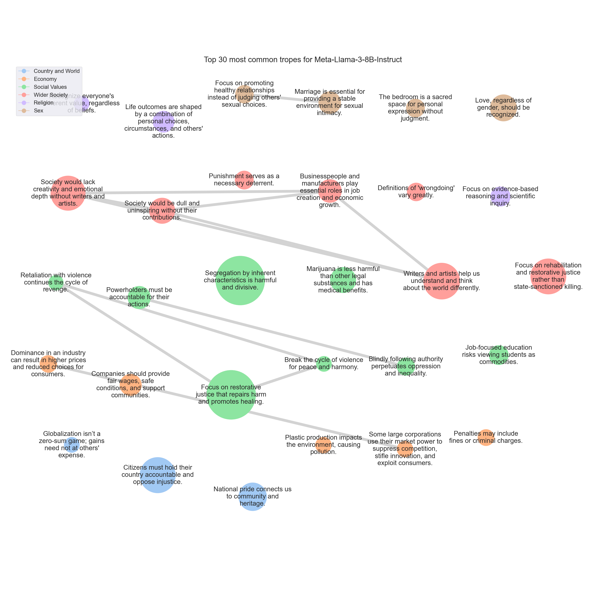

# <SETTING> Trope report

---
## Tropes

### T822: Focus on restorative justice that repairs harm and promotes healing.

|Support|
|---|
|Instead, I believe we should strive for forgiveness, understanding, and empathy.|
|Instead of seeking revenge, I believe we should strive to understand the perspectives and needs of those who have wronged us.|
|We need to work towards forgiveness, understanding, and compassion.|
|When we seek revenge or retribution, we only perpetuate a cycle of violence and harm.|
|Instead, I advocate for a more nuanced approach to conflict resolution, one that prioritizes empathy, understanding, and forgiveness.|
|Retaliating with violence only leads to a cycle of revenge and harm.|
|It's a recipe for a cycle of violence and retaliation, rather than a path towards true healing and reconciliation.|
|We must prioritize restorative justice, which focuses on healing and rehabilitation, rather than punishment and retribution.|
|I think we should strive for forgiveness and understanding instead.|
|But I think it's important to approach this in a way that prioritizes justice, healing, and restoration, rather than just seeking revenge.|
|In reality, this approach only perpetuates a cycle of violence and retaliation, rather than promoting healing and resolution.|
|As someone who values fairness and justice, I believe we should strive for a more nuanced approach to conflict resolution.|
|Instead, I think we should strive for forgiveness, compassion, and understanding.|
|When we retaliate or seek revenge, it only perpetuates a cycle of violence and harm, and it does not bring about lasting peace or justice.|
|Instead, I think we should strive for a system that prioritizes forgiveness, healing, and restoration.|
|Should we aim for revenge or forgiveness?|
|Firstly, it creates a cycle of violence, where each act of revenge only serves to perpetuate further harm.|
|We can focus on rehabilitation, restorative justice, and community healing, rather than perpetuating a cycle of violence and retribution.|
|Instead, I propose that we strive for a culture of forgiveness, compassion, and understanding.|
|When we seek revenge or retribution, we are perpetuating a cycle of violence and hatred.|
|In my experience, seeking revenge or retribution only leads to more suffering and more violence.|
|Instead, I believe we should strive for more nuanced and compassionate approaches to conflict resolution, such as forgiveness, restorative justice, and reconciliation.|
|Instead, I believe we should focus on forgiveness, empathy, and non-violent conflict resolution.|
|In my opinion, we should strive for a more nuanced approach, focusing on restorative justice, rehabilitation, and healing.|
|Instead, I think we should strive for a more nuanced approach to justice, one that takes into account the complexities of human behavior and the need for healing and restoration.|
|Instead, I believe we should strive for forgiveness, compassion, and understanding.|
|This concept is often misinterpreted as a form of justice, but in reality, it only perpetuates a cycle of violence and revenge.|
|Instead, I believe we should strive for a system of justice that prioritizes rehabilitation, restorative justice, and healing.|
|Retaliation can create a cycle of violence and harm, rather than promoting healing, forgiveness, and restoration.|
|Instead, I believe we should strive for a more nuanced and compassionate approach to conflict resolution, one that prioritizes empathy, understanding, and the well-being of all parties involved.|
|I think we should strive for a more nuanced approach to conflict resolution, one that doesn't involve perpetuating a cycle of violence and revenge.|
|That's just perpetuating a cycle of violence and revenge.|
|Retaliation can create a cycle of violence and vengeance, rather than promoting healing and reconciliation.|
|As a society, I think we should strive for a more nuanced approach to justice, one that prioritizes rehabilitation, restorative justice, and the well-being of all parties involved.|
|Instead, I believe we should strive for restorative justice, which focuses on healing, accountability, and rebuilding rather than punishment.|
|Instead, I believe we must strive for a more nuanced and compassionate approach.|
|We must work towards creating a society that values empathy, understanding, and forgiveness.|
|I think we should aim to find ways to resolve conflicts that promote healing, forgiveness, and understanding, rather than simply retaliating with more harm.|
|It's a never-ending cycle of retaliation and retribution that can never truly bring about justice or healing.|
|Maybe we should focus on forgiveness, understanding, and finding ways to repair the harm that's been done, rather than just seeking revenge.|
|Instead, I think we should strive for more nuanced and thoughtful solutions that prioritize healing, forgiveness, and reconciliation.|
|I think we should strive for forgiveness and understanding, not just retaliation.|
|Revenge may seem like a satisfying solution in the short term, but it only leads to more harm and suffering in the long run.|
|Instead of seeking revenge, we should strive for forgiveness and understanding.|
|Instead, I believe we should strive for more nuanced and thoughtful approaches to conflict resolution, such as forgiveness, mediation, and restorative justice.|
|Retaliation can create a cycle of violence and perpetuate harm, rather than promoting healing and resolution.|
|Instead, I believe we should strive for a more nuanced and compassionate approach to justice, one that prioritizes rehabilitation, forgiveness, and the pursuit of peace.|
|Moreover, this concept encourages retaliation, which can lead to an endless cycle of violence.|
|Instead, we should strive for a society that promotes forgiveness, compassion, and non-violence.|
|We need to strive for a more nuanced and compassionate approach, one that prioritizes healing, reconciliation, and restorative justice.|
|Instead, I believe that we should strive for a system of justice that is based on fairness, compassion, and rehabilitation.|
|Instead, I think we should strive for forgiveness and understanding.|
|Finally, I believe that a more effective and just approach to resolving conflicts is one that prioritizes empathy, understanding, and forgiveness.|
|Instead, I propose that we adopt a more compassionate and forward-thinking approach that prioritizes justice, healing, and reconciliation.|
|Instead, I believe we should strive for more nuanced and thoughtful solutions that prioritize healing, forgiveness, and restoration.|
|While I understand the concept of justice and retribution, I think this approach can lead to a cycle of violence and vengeance that ultimately doesn't bring about true resolution or healing.|
|In my opinion, it's essential to strive for a more nuanced and compassionate approach to conflict resolution, one that prioritizes forgiveness, empathy, and the pursuit of peace.|
|It's a vicious cycle that perpetuates violence and fuels a culture of revenge.|
|Instead, I believe we should strive for a culture of forgiveness, understanding, and restorative justice.|
|Additionally, seeking revenge can create a cycle of retaliation, causing harm to both individuals and society as a whole.|
|It's a cycle of violence and revenge that only leads to more harm and suffering.|
|I believe we should strive for a world where we prioritize forgiveness, empathy, and understanding.|
|Instead of seeking revenge, we must strive for restorative justice.|
|In my opinion, seeking revenge or retaliation only perpetuates a cycle of violence and doesn't actually address the underlying issues.|
|Instead, I believe we should strive for more nuanced and thoughtful solutions that prioritize healing, restoration, and accountability.|
|Not only does it perpetuate a cycle of violence and revenge, but it also fails to address the root causes of the problem.|
|That's just perpetuating a cycle of violence and revenge, rather than seeking justice and healing.|
|Instead, I think we should strive for more nuanced and compassionate solutions that prioritize healing, understanding, and restoration.|
|In my opinion, seeking revenge through violence and harm only perpetuates a cycle of violence and does not address the root causes of the problem.|
|Instead, I believe that we should strive for restorative justice, where the focus is on healing, forgiveness, and reconciliation.|
|It's a form of retaliation that only perpetuates a cycle of violence and revenge.|
|Instead, I believe that we should strive for forgiveness, understanding, and peaceful resolution.|
|In my opinion, seeking revenge or retaliation can create a cycle of violence and harm that can be difficult to break.|
|Instead, I think we should strive for forgiveness, understanding, and compassion.|
|Instead, I think we should strive to find a way to forgive and move forward, and work towards creating a more harmonious and peaceful society.|
|I think we should strive for forgiveness, for understanding, and for compassion.|
|Instead, I believe we should strive for empathy, understanding, and compassion.|
|Instead, I believe we should strive for more nuanced and thoughtful approaches to conflict resolution, ones that prioritize empathy, understanding, and healing.|
|I think we should strive for forgiveness and understanding, not more retaliation.|
|Instead, I think we should strive for a more nuanced and compassionate approach to conflict resolution.|
|While it may seem like a fair and balanced way to address harm, it can actually perpetuate a cycle of violence and retaliation that can never be fully satisfied.|
|Instead, I believe that we should strive for a more nuanced and compassionate approach to resolving conflicts, one that prioritizes healing, forgiveness, and restorative justice.|
|Instead, we should strive for a more nuanced and compassionate approach that emphasizes forgiveness, mercy, and rehabilitation.|
|Instead, I think we should strive for a culture of forgiveness and compassion.|
|Instead, we should strive for a culture of empathy, compassion, and understanding.|
|In my opinion, we should strive for a more compassionate and empathetic approach to conflict resolution.|
|We must strive for a more nuanced and compassionate approach to conflict resolution, one that prioritizes healing, understanding, and harmony over revenge and retaliation.|
|Instead, I believe we should strive for a more nuanced and compassionate approach to conflict resolution.|
|Instead, I believe we should strive for a world where we seek to understand and forgive, rather than seeking revenge.|
|In my view, a more effective and compassionate approach to resolving conflicts and addressing harm is to focus on restorative justice and healing.|
|Instead, I advocate for a more compassionate and restorative approach that prioritizes healing, forgiveness, and growth.|
|We should focus on addressing the root causes of conflict and working towards healing and reconciliation, rather than perpetuating a culture of revenge.|
|While it may seem fair and balanced on the surface, it can actually perpetuate a cycle of violence and revenge, rather than promoting healing, forgiveness, and restoration.|
|In my opinion, seeking revenge and exacting punishment can perpetuate a cycle of violence and harm, rather than promoting healing, forgiveness, and restoration.|
|Instead, I believe we should strive for more compassionate and restorative approaches, such as seeking justice, apologizing, and making amends.|
|Instead, I believe that we should strive for a more compassionate and empathetic approach to conflict resolution.|
|Instead, we should strive for a more compassionate and empathetic approach that prioritizes forgiveness and reconciliation.|
|We should strive for a more nuanced and compassionate approach to resolving conflicts.|
|In my experience, the cycle of retaliation and revenge can be a never-ending one.|
|I believe that we should strive for a more compassionate and empathetic approach to conflict resolution, one that prioritizes healing, understanding, and growth.|
|Secondly, I believe that our justice system should focus on rehabilitation and restorative justice, rather than simply punishing individuals for their wrongdoings.|
|Instead, I think we should focus on more nuanced and holistic approaches that prioritize rehabilitation, restorative justice, and the betterment of society as a whole.|
|It's just a cycle of violence and revenge.|
|Instead, we should strive for forgiveness, understanding, and empathy.|
|Instead, we should strive for a more nuanced and compassionate approach to conflict resolution.|
|We must recognize that revenge is not the answer, and that forgiveness and understanding are the keys to a more peaceful and harmonious world.|
|This perpetuates a cycle of violence and vengeance, rather than promoting healing and restoration.|
|Instead, it perpetuates a cycle of violence and vengeance.|
|While I understand the desire for justice and retribution, I believe that this approach can lead to a cycle of violence and revenge, rather than promoting true healing and resolution.|
|In my opinion, it's essential to strive for a more nuanced and compassionate approach to conflict resolution, one that prioritizes restorative justice and the well-being of all parties involved.|
|I believe that seeking revenge or retaliation only perpetuates a cycle of violence and hatred, and does not bring about true justice or healing.|
|Instead, I advocate for a more nuanced approach that prioritizes forgiveness, reconciliation, and restorative justice.|
|It's a never-ending cycle of retaliation and revenge.|
|In fact, this approach can lead to a cycle of violence and retaliation, causing harm to both parties involved.|
|It creates a cycle of violence and retaliation, where one wrong is met with another, rather than promoting forgiveness, understanding, and healing.|
|Instead, I believe in promoting restorative justice, where the focus is on healing, reconciliation, and rebuilding relationships.|
|Instead, I believe we should strive for a world where we work towards healing, forgiveness, and reconciliation.|
|As a society, we must strive for a more nuanced understanding of justice, one that prioritizes healing, rehabilitation, and restorative justice.|
|While it may seem like a form of justice, it can actually perpetuate a cycle of violence and retaliation.|
|When we exact revenge or inflict harm on others in response to harm we've experienced, it can lead to an endless cycle of retaliation, with no real resolution or healing.|
|I believe that seeking justice and resolving conflicts should prioritize healing, forgiveness, and restoration, rather than simply exacting revenge.|
|Instead, we must strive for a world where justice is not about exacting revenge, but about creating a more just and equitable society.|
|Instead, I believe that we should strive for a more nuanced and compassionate approach to conflict resolution, one that prioritizes empathy, understanding, and the pursuit of peace.|
|We should strive for a system that emphasizes rehabilitation and restorative justice, not revenge.|
|I think we should strive for forgiveness, understanding, and compassion.|
|Instead, we should focus on restorative justice, which seeks to repair the harm caused by wrongdoing and promote healing, rather than perpetuating further harm.|
|It's a simplistic and harmful notion that perpetuates a cycle of violence and revenge.|
|Instead, I believe we should strive to find ways to address harm and injustice through empathy, understanding, and compassion.|
|I believe it can lead to a cycle of violence and retaliation, rather than promoting forgiveness, understanding, and healing.|
|Instead, we should strive for a more just and equitable system that prioritizes rehabilitation, restoration, and healing, rather than mere retribution.|
|It perpetuates a cycle of violence and retaliation, leading to a never-ending cycle of revenge and retribution.|
|We should be focusing on restorative justice, community healing, and addressing the root causes of harm, rather than simply retaliating with more harm.|
|I've seen how it can lead to a cycle of violence and retaliation, with no end in sight.|
|Instead, I think we should strive for forgiveness and understanding.|
|In my opinion, a more effective and just approach to resolving conflicts would be to prioritize restorative justice, where the focus is on healing, forgiveness, and reconciliation.|
|Instead, we should strive for a more just and compassionate approach to conflict resolution, one that prioritizes healing, forgiveness, and reconciliation.|
|We must adopt a more compassionate and empathetic approach to resolving conflicts and promoting peace and harmony.|
|Instead, I believe we should strive for a culture of forgiveness, empathy, and restorative justice.|
|It perpetuates a cycle of revenge and retaliation, rather than promoting justice, healing, and reconciliation.|
|Instead, I think we should strive for restorative justice, which focuses on repairing the harm caused and holding individuals accountable for their actions.|
|Firstly, it creates a cycle of violence and retaliation that can never be fully satisfied, as each side seeks to exact revenge for past wrongs.|
|Instead, I believe we should strive for a more nuanced and compassionate approach to conflict resolution, one that prioritizes healing, understanding, and mutual respect.|
|This approach only perpetuates a cycle of violence and revenge, rather than promoting healing, forgiveness, and accountability.|
|While I understand the initial appeal of seeking justice and revenge, I truly believe that this approach only perpetuates a cycle of violence and harm.|
|We should strive for forgiveness, for understanding, and for healing.|
|I think we should strive for a more compassionate and empathetic approach, focusing on repairing the harm caused rather than seeking revenge.|
|The concept of revenge may seem like a form of justice, but I believe it only perpetuates a cycle of violence and hatred.|
|Instead, I think we should strive for forgiveness and compassion.|
|It's a concept that's often rooted in a desire for revenge and retaliation, rather than seeking justice or healing.|
|Instead, I believe we should strive for more nuanced and compassionate approaches to conflict resolution, ones that prioritize empathy, understanding, and healing.|
|Instead, I think we should strive for a more nuanced and thoughtful approach to conflict resolution, one that prioritizes healing, forgiveness, and restoration.|
|Instead, I think we should strive for a more nuanced and compassionate approach to conflict resolution, one that prioritizes rehabilitation, forgiveness, and restorative justice.|
|Perhaps we could explore alternative approaches, such as restorative justice or mediation, to help resolve conflicts and promote healing and understanding.|
|Instead, I believe we should strive for restorative justice, where we prioritize healing, rehabilitation, and accountability.|
|I believe that we should strive for more nuanced and thoughtful approaches to resolving conflicts and promoting justice, such as forgiveness, restorative justice, and reparations.|
|It's a recipe for endless cycles of violence and revenge, rather than a path towards healing, justice, and reconciliation.|
|As a society, we should strive for a more nuanced and compassionate approach to conflict resolution, one that acknowledges the inherent value and dignity of all human life.|
|We need to strive for empathy, compassion, and understanding.|
|While I understand the desire for revenge or retribution, I think it can lead to a never-ending cycle of violence and retaliation.|
|It's a never-ending cycle that only perpetuates more violence and suffering.|
|Instead, I think we should strive for a more compassionate and empathetic approach.|
|Instead, I believe we should strive for a more nuanced approach that prioritizes healing, forgiveness, and restoration.|
|In my experience, this concept perpetuates a cycle of violence and harm, rather than promoting healing and understanding.|
|In today's world, I believe we should strive for a more nuanced approach to justice and conflict resolution, one that prioritizes healing, forgiveness, and restoration over mere retaliation.|
|Instead, we must strive for a more nuanced and compassionate approach to conflict resolution.|
|We must work towards restorative justice, where the focus is on healing, reconciliation, and rebuilding, rather than simply seeking revenge.|
|Instead, I think we should strive for restorative justice, where we work towards healing and forgiveness.|
|Retaliation just perpetuates a cycle of violence and doesn't really solve anything.|
|Instead, I think we should strive for forgiveness and understanding.|
|Instead, I think we should strive for forgiveness, understanding, and reconciliation.|
|We should strive to rise above the temptation of revenge and instead choose a path of forgiveness and compassion.|
|Instead, I believe that we should strive for a more nuanced and compassionate approach to conflict resolution, one that prioritizes forgiveness, reconciliation, and the well-being of all parties involved.|
|It's a vicious cycle that only perpetuates violence and fosters a culture of revenge.|
|Instead, I believe we should strive for a more compassionate and empathetic approach to conflict resolution.|
|We should work towards healing, forgiveness, and restoration, rather than perpetuating harm and suffering.|
|Instead of seeking revenge, we should strive to address the root causes of conflict and work towards healing and restoration.|
|Instead, I think we should strive for a more nuanced and compassionate approach to justice, focusing on rehabilitation and restorative justice.|
|Instead, we should strive for a culture of forgiveness, compassion, and understanding.|
|Retaliating against those who harm us may provide temporary satisfaction, but it only perpetuates a cycle of violence and revenge.|
|Instead, I believe we should strive for forgiveness, compassion, and understanding.|
|Firstly, this approach perpetuates a cycle of violence and retaliation, rather than promoting healing and reconciliation.|
|When we exact revenge, we are not addressing the root causes of the harm inflicted, but rather perpetuating a never-ending cycle of aggression.|
|In a society that prides itself on its progressive values and commitment to social justice, we must strive for a more nuanced and compassionate approach to conflict resolution.|
|We must prioritize healing, reconciliation, and restorative justice, rather than perpetuating a culture of vengeance and retribution.|
|Instead of seeking revenge, I think we should strive for forgiveness and understanding.|
|It's a form of retaliation that can lead to a cycle of violence and revenge, rather than promoting healing, forgiveness, and restoration.|
|Firstly, it perpetuates a cycle of violence and retaliation, which can lead to an endless chain of revenge and harm.|
|I believe that a more effective approach to justice would be to focus on rehabilitation, restorative justice, and accountability, rather than simply seeking revenge.|
|I think we should focus on forgiveness and healing, not just seeking revenge.|
|Instead, I believe we should strive for empathy and understanding, and work towards creating a world where we can resolve conflicts peacefully.|
|Instead, I believe we should strive for a more nuanced and compassionate approach, one that prioritizes restorative justice, rehabilitation, and the well-being of all parties involved.|
|We should focus on healing, forgiveness, and redemption.|
|Instead, I believe we should strive for forgiveness and understanding.|
|Retaliation and vengeance can create a cycle of violence and harm, rather than promoting healing and resolution.|
|While it may seem fair to exact revenge or restitution in a literal sense, it can often lead to a cycle of violence and retaliation, rather than promoting healing, understanding, and reconciliation.|
|Instead, I believe that we should strive for more nuanced and compassionate approaches to conflict resolution, such as seeking forgiveness, making amends, and working towards healing and restoration.|
|In contrast, restorative justice approaches, which focus on healing, restitution, and rehabilitation, are more likely to promote a sense of community and social cohesion.|
|Instead, I advocate for a more nuanced and compassionate approach to justice, one that prioritizes the well-being of all individuals involved and promotes a culture of forgiveness, mercy, and restoration.|
|While it may seem like a fair and balanced response to harm, it can actually perpetuate a cycle of violence and retaliation, rather than promoting healing and restoration.|
|Instead, I believe that we should strive for more nuanced and thoughtful approaches to resolving conflicts and seeking justice, such as forgiveness, reconciliation, and restorative justice.|
|In my opinion, we should strive for a more nuanced and compassionate approach to justice, one that prioritizes healing, rehabilitation, and the well-being of all parties involved, rather than perpetuating a cycle of violence and retribution.|
|Instead, I believe that we should strive for a more compassionate and nuanced approach to conflict resolution.|
|Firstly, it creates a cycle of violence and retaliation, where each side seeks to inflict equal harm on the other, leading to an endless cycle of revenge and harm.|
|In my opinion, a more effective and humane approach to justice and conflict resolution would prioritize restorative justice, rehabilitation, and reconciliation, rather than mere retaliation.|
|While it may seem like a form of justice, it can actually perpetuate a cycle of violence and retaliation, rather than promoting healing and resolution.|

---

### T542: Segregation by inherent characteristics is harmful and divisive.

|Support|
|---|
|I strongly disagree with the notion that it's better for all of us when different sorts of people stick to their own kind.|
|Moreover, segregation can lead to discrimination, marginalization, and even violence.|
|The idea of segregation or separation based on these differences is not only morally reprehensible, but it's also harmful and discriminatory.|
|Segregation and discrimination only serve to divide us and perpetuate inequality.|
|I strongly disagree with the notion that it's better for everyone if different sorts of people keep to their own kind.|
|So, I urge everyone to reject this notion that it's better for all of us if different sorts of people keep to their own kind.|
|I'm not sure I agree with the idea that it's better for everyone if different sorts of people stick to their own kind.|
|To suggest that people should 'keep to their own kind' is nothing short of segregation.|
|In short, I strongly disagree with the proposition that different sorts of people should keep to their own kind.|
|The idea that different sorts of people should keep to their own kind is not only discriminatory, but it's also a recipe for stagnation and division.|
|I strongly disagree with the proposition that it's better for all of us if different sorts of people stick to their own kind.|
|Moreover, segregation and exclusion can lead to the marginalization and oppression of certain groups, perpetuating social injustices and inequalities.|
|I must respectfully disagree with the proposition that it's better for all of us when different sorts of people keep to their own kind.|
|I strongly disagree with the notion that it's better for society when people of different backgrounds or identities stick to their own kind.|
|I strongly disagree with the proposition that it is better for all of us that different sorts of people should keep to their own kind.|
|In conclusion, I firmly believe that it is not better for all of us that different sorts of people should keep to their own kind.|
|The idea that it's better for society when different groups of people 'keep to their own kind' is a thinly veiled attempt to promote segregation and discrimination.|
|It can lead to discrimination, prejudice, and inequality.|
|I strongly disagree with the notion that it's better for all of us when different sorts of people keep to their own kind.|
|In conclusion, I firmly believe that it's not better for all of us when different sorts of people keep to their own kind.|
|I strongly disagree with the notion that it's better for all of us when different sorts of people keep to their own kind.|
|Secondly, segregation is a breeding ground for prejudice and discrimination.|
|I strongly disagree with the notion that it's better for all of us if different sorts of people stick to their own kind.|
|I strongly disagree with the notion that it's better for all of us when different sorts of people stick to their own kind.|
|Segregation and division can only lead to misunderstanding, fear, and hatred.|
|The idea that people should stick to their own kind is not only discriminatory but also limiting.|
|I strongly disagree with the idea that it's better for everyone if different sorts of people keep to their own kind.|
|Segregation and separation can only lead to misunderstanding and conflict.|
|I strongly disagree with the notion that it's better for everyone if different sorts of people stick to their own kind.|
|Segregation and separation can only lead to division and inequality.|
|I strongly disagree with the proposition that it is better for all of us if different sorts of people keep to their own kind.|
|So, to answer your question, I don't think it's better for all of us to keep to our own kind.|
|The notion of 'keeping to one's own kind' can lead to segregation, prejudice, and inequality.|
|The idea that people should 'keep to their own kind' is a form of segregation and discrimination, which is antithetical to the values of equality and justice that our country was founded upon.|
|As someone who's lived through some tough times, I've learned that segregation and division only lead to more harm and inequality.|
|Recently, I came across a proposition that sparked a lot of debate and controversy: "All people have their rights, but it is better for all of us that different sorts of people should keep to their own kind."|
|In conclusion, I firmly believe that it is not better for all of us that different sorts of people should keep to their own kind.|
|In my opinion, the proposition 'All people have their rights, but it is better for all of us that different sorts of people should keep to their own kind' is not only discriminatory but also harmful.|
|The idea that people should 'keep to their own kind' is discriminatory and goes against the principles of social justice.|
|I strongly disagree with the proposition that it's better for all of us if different sorts of people keep to their own kind.|
|Segregation and separation can only lead to misunderstanding, fear, and intolerance.|
|In conclusion, I firmly believe that it's not better for all of us if different sorts of people keep to their own kind.|
|The idea of segregating people based on their identity is not only discriminatory, but also harmful and divisive.|
|The idea that it's better for all of us when different sorts of people stick to their own kind is a form of segregation and discrimination.|
|Segregation and discrimination can only lead to division, inequality, and social unrest.|
|Separating people based on their kind or group can lead to discrimination, segregation, and even violence.|
|But, in my experience, it's just plain better when people stick to their own kind.|
|But, in general, I think it's just better when people stick to their own kind.|
|Separating people based on their characteristics is not only discriminatory, but it also goes against the principles of equality and fairness that our society is built upon.|
|So, I don't think it's better for all of us that different sorts of people should keep to their own kind.|
|I strongly disagree with the notion that it's better for all of us if different sorts of people keep to their own kind.|
|The idea of segregation and separation is not only morally wrong, but it also goes against the principles of equality and justice that our society is built upon.|
|The idea that it's better for people to stick to their own kind is a form of segregation and discrimination, which goes against the principles of equality and justice.|
|Furthermore, the idea of keeping to one's own kind is often based on stereotypes and prejudices.|
|I strongly disagree with the notion that it is better for all of us if different sorts of people keep to their own kind.|
|Separating people based on their race, religion, gender, or any other characteristic is not only morally wrong but also goes against the principles of equality and justice.|
|The idea of 'keeping to one's own kind' is not only discriminatory, but it's also harmful and limiting.|
|It perpetuates segregation and reinforces harmful stereotypes.|
|The notion that it's better for all of us if different sorts of people keep to their own kind is a form of segregation and discrimination.|
|The idea of segregating people based on their differences is not only discriminatory but also harmful.|
|It can lead to the perpetuation of stereotypes, prejudices, and social injustices.|
|I disagree with the proposition that it is better for all of us if different sorts of people keep to their own kind.|
|In reality, segregation and discrimination often lead to conflicts and injustices.|
|Moreover, the idea of 'keeping to one's own kind' is often used as an excuse for discrimination and prejudice.|
|I strongly disagree with the notion that it's better for all of us if different sorts of people keep to their own kind.|
|Segregation and separation can lead to discrimination, prejudice, and social unrest.|
|The idea of segregation or separation based on certain characteristics such as race, religion, or sexual orientation is not only morally reprehensible but also goes against the principles of equality and justice.|
|The idea that it's better for all of us if different sorts of people keep to their own kind is a form of segregation and discrimination.|
|The idea of segregation or separation based on race, ethnicity, or any other characteristic is discriminatory and goes against the principles of equality and justice.|
|The idea of segregating people based on their differences is not only discriminatory but also harmful.|
|Segregation and discrimination can lead to division, conflict, and social unrest.|
|The idea that it is better for all of us when different sorts of people keep to their own kind is a harmful and discriminatory concept that goes against the fundamental principles of equality and human rights.|
|Furthermore, the idea that different sorts of people should keep to their own kind is often rooted in harmful stereotypes and biases, which can lead to discrimination and marginalization.|
|The idea that it's better for all of us if different sorts of people keep to their own kind is a notion that's rooted in segregation and discrimination.|
|Segregation and separation can only lead to a lack of understanding, intolerance, and even violence.|
|I strongly disagree with the notion that it is better for all of us if different sorts of people keep to their own kind.|
|Furthermore, segregation and separation can lead to misunderstandings, stereotypes, and prejudices.|
|The idea of people keeping to their own kind can lead to segregation, isolation, and the perpetuation of harmful stereotypes.|
|The idea that different sorts of people should keep to their own kind is, in my opinion, a recipe for segregation and inequality.|
|The idea of segregation and separation based on characteristics like race, gender, or religion is not only morally wrong but also goes against the fundamental principles of equality and justice.|
|The concept of 'keeping to their own kind' is a recipe for discrimination, inequality, and social unrest.|
|I must respectfully disagree with the notion that it's better for society when different sorts of people stick to their own kind.|
|In my experience, segregation and segregationist thinking have only led to division and inequality.|
|The notion that we should stick to our own kind is not only discriminatory but also limiting.|
|I strongly disagree with the idea that it's better for everyone when people stick to their own kind.|
|I strongly disagree with the notion that it's better for all of us when different sorts of people keep to their own kind.|
|No, no, it's far better for all of us if we stick to our own kind.|
|Segregation and separation can lead to isolation, discrimination, and inequality.|
|The idea that people should 'keep to their own kind' is a recipe for segregation and isolation.|
|I strongly disagree with the notion that it's better for everyone if different sorts of people keep to their own kind.|
|Moreover, segregation and segregationist attitudes only serve to perpetuate inequality and discrimination.|
|In conclusion, I firmly believe that it's not better for anyone if different sorts of people keep to their own kind.|
|I must respectfully disagree with the notion that it is better for all of us when different sorts of people keep to their own kind.|
|The idea that people should 'keep to their own kind' is a harmful and discriminatory notion that perpetuates segregation and erases the identities and experiences of marginalized communities.|
|Recently, I have been thinking a lot about the proposition that suggests that it is better for all of us if different sorts of people keep to their own kind.|
|I strongly disagree with the idea that it's better for all of us if different sorts of people keep to their own kind.|
|Segregation and separation based on arbitrary characteristics like race, ethnicity, or religion is not only morally wrong, but it also stifles innovation, creativity, and progress.|
|The idea of separating people based on their differences is not only discriminatory but also limiting.|
|Segregation only serves to perpetuate inequality, stifle creativity, and limit opportunities.|
|So, no, I don't agree that it's better for all of us to keep to our own kind.|
|Segregation and separation can lead to discrimination and inequality, which can have devastating consequences.|
|Moreover, segregation is a recipe for social and economic stagnation.|
|Furthermore, segregation can have devastating consequences for marginalized communities.|
|In conclusion, the notion that different sorts of people should keep to their own kind is a flawed and harmful ideology that ignores the complexities of human experience.|
|I strongly disagree with the notion that it's better for everyone when different sorts of people stick to their own kind.|
|I strongly disagree with the proposition that it's better for all of us if different sorts of people keep to their own kind.|
|The notion that different sorts of people should keep to their own kind is not only discriminatory, but it is also divisive and harmful.|
|The idea that it's better for all of us if different sorts of people stick to their own kind is not only discriminatory, but also harmful and oppressive.|
|Moreover, segregation and separation can lead to the marginalization and oppression of certain groups, which can have devastating consequences.|
|The idea of separating people into different groups based on their identity is not only discriminatory but also divisive and harmful.|
|It can lead to segregation, inequality, and social unrest.|
|In conclusion, I firmly believe that it's not better for all of us that different sorts of people should keep to their own kind.|
|The idea that it's better for all of us if different sorts of people keep to their own kind is a harmful and discriminatory concept.|
|It's a form of segregation and separation that can lead to inequality, injustice, and social unrest.|
|The idea of segregation or separation based on race, gender, religion, or any other characteristic is not only morally wrong, but it's also harmful and limiting.|
|Segregation, on the other hand, can lead to misunderstandings, prejudices, and even violence.|
|I strongly disagree with the notion that it's better for all of us if different sorts of people keep to their own kind.|
|The proposition that all people have their rights, but it is better for all of us that different sorts of people should keep to their own kind, is a notion that I strongly disagree with.|
|Segregation and the idea of people 'keeping to their own kind' is a recipe for discrimination, inequality, and social unrest.|
|The idea of segregation or segregationist policies is not only morally wrong but also goes against the principles of democracy and social justice.|
|That's why I think it's better for everyone if we stick to our own kind.|
|So, yeah, I think it's better for all of us if we stick to our own kind.|
|But, I must confess, I do believe that it is better for all of us if different sorts of people keep to their own kind.|
|Segregation and discrimination can only lead to further marginalization, exclusion, and oppression.|
|I strongly disagree with the notion that it's better for all of us when different sorts of people stick to their own kind.|
|So let's reject the idea that it's better for all of us when different sorts of people stick to their own kind.|
|The idea that it's better for all of us if different sorts of people keep to their own kind is a form of segregation and discrimination.|
|The idea that it's better for everyone if different sorts of people 'keep to their own kind' is a harmful and discriminatory concept that has been used throughout history to justify segregation, exclusion, and oppression.|
|In conclusion, I believe that it's not better for all of us if different sorts of people keep to their own kind.|
|The idea that people should 'keep to their own kind' is a recipe for segregation, discrimination, and oppression.|
|Segregation and separation can lead to discrimination and inequality, and it's essential to work towards a society where everyone has equal opportunities and is valued for who they are.|
|I strongly disagree with the notion that it's better for all of us if different sorts of people keep to their own kind.|
|But, I must respectfully disagree with the notion that it is better for all of us if different sorts of people should keep to their own kind.|
|I strongly disagree with the notion that it's better for all of us if different sorts of people keep to their own kind.|
|I strongly disagree with the notion that it's better for all of us if different sorts of people keep to their own kind.|
|So, I urge everyone to reject the notion that it's better for all of us if different sorts of people keep to their own kind.|
|So, I urge everyone to reject the notion that it's better for all of us when people 'keep to their own kind.'|
|Segregation and discrimination only lead to division and inequality, which can have devastating consequences.|
|I strongly disagree with the notion that it's better for all of us when different sorts of people keep to their own kind.|
|The idea that people should stick to their own kind is rooted in a harmful and outdated notion of segregation.|
|So, I urge everyone to reject the notion that different sorts of people should keep to their own kind.|
|The idea that people should stick to their own kind is a recipe for segregation, discrimination, and inequality.|
|I strongly disagree with the notion that it's better for everyone if different sorts of people stick to their own kind.|
|Segregation and separation based on arbitrary characteristics like race, ethnicity, or religion can lead to discrimination, inequality, and social unrest.|
|I strongly disagree with the proposition that it is better for all of us that different sorts of people should keep to their own kind.|
|Moreover, segregation and separation can lead to misunderstandings, prejudices, and conflicts.|
|The idea of segregation or separation based on differences is not only morally wrong but also goes against the principles of equality and fairness.|
|In conclusion, I believe that it's not better for all of us if different sorts of people keep to their own kind.|
|I strongly disagree with the notion that it's better for all of us if different sorts of people should keep to their own kind.|
|Segregation and division only lead to inequality, discrimination, and social unrest.|
|The idea that different groups of people should 'keep to their own kind' is a recipe for segregation and discrimination.|
|I strongly disagree with the notion that it's better for all of us if different sorts of people stick to their own kind.|
|This kind of segregation and division only serves to perpetuate inequality, discrimination, and social injustices.|
|I strongly disagree with the notion that it's better for society when different sorts of people stick to their own kind.|
|Segregation or the notion that 'different sorts of people should keep to their own kind' is a recipe for division, exclusion, and inequality.|
|The idea that different groups of people should 'keep to their own kind' is a harmful and discriminatory concept that has been used throughout history to justify segregation, discrimination, and even violence.|
|I strongly disagree with the notion that it's better for all of us when different sorts of people stick to their own kind.|
|Moreover, the idea of people keeping to their own kind is a recipe for discrimination and oppression.|
|In my opinion, the notion that it is 'better' for different groups of people to keep to their own kind is a thinly veiled attempt to justify discrimination and oppression.|
|The idea that people should 'keep to their own kind' is a harmful and discriminatory concept that has been used to justify segregation, discrimination, and even violence throughout history.|
|I'm not sure I agree with the idea that it's better for everyone if people of different backgrounds and beliefs stick to their own kind.|
|I strongly disagree with the proposition that it's better for all of us when different sorts of people keep to their own kind.|
|The idea that people should stick to their own kind is not only discriminatory, but it's also limiting and stifling.|
|In conclusion, the idea that different sorts of people should keep to their own kind is a harmful and outdated concept.|
|The idea that different sorts of people should keep to their own kind is not only discriminatory but also goes against the fundamental principles of democracy and human rights.|
|The idea of 'keeping to their own kind' is a harmful and discriminatory concept that has led to countless injustices throughout history.|
|Segregation and discrimination have been used to justify oppression, marginalization, and violence, and have resulted in devastating consequences for many communities.|
|The idea that it is better for all of us that different sorts of people should keep to their own kind is a harmful and discriminatory notion that goes against the fundamental principles of equality and justice.|
|Furthermore, the idea of keeping to one's own kind is not only discriminatory, but it is also a recipe for division and conflict.|
|I strongly disagree with the notion that it's better for society when different sorts of people stick to their own kind.|
|Separating people based on their race, ethnicity, religion, or sexual orientation is not only discriminatory but also divisive and harmful.|
|The idea that certain groups of people should 'keep to their own kind' is a recipe for discrimination, marginalization, and oppression.|
|I strongly disagree with the notion that it's better for everyone if different sorts of people stick to their own kind.|
|The idea that it is better for all of us if different sorts of people keep to their own kind is a harmful and discriminatory notion that goes against the fundamental principles of equality and human rights.|
|The notion that certain groups should be segregated or isolated from others is not only morally wrong, but it also goes against the values of diversity, inclusivity, and social cohesion that are essential for a healthy and functioning society.|
|The proposition that 'all people have their rights, but it is better for all of us that different sorts of people should keep to their own kind' is a notion that I strongly disagree with.|
|Moreover, the idea that different sorts of people should keep to their own kind is not only discriminatory, but it is also a recipe for segregation and isolation.|
|Segregation and separation can lead to discrimination, inequality, and social unrest.|
|I strongly disagree with the notion that it is better for all of us if different sorts of people keep to their own kind.|
|Moreover, segregation is not only morally wrong but also impractical.|
|The idea of separating people into different groups based on their kind is discriminatory and goes against the principles of equality and justice.|
|I strongly disagree with the notion that it is better for all of us if different sorts of people keep to their own kind.|
|I must respectfully disagree with the notion that it's better for all of us when different sorts of people keep to their own kind.|
|In my experience, segregation and segregationist attitudes only lead to stagnation and division.|
|Furthermore, the idea that certain groups should stick to their own kind is not only discriminatory but also harmful.|
|I believe that the idea of segregation and separation based on physical or social characteristics is not only discriminatory but also harmful.|
|Segregation and separation can lead to social isolation, prejudice, and even violence.|
|I don't agree with the idea that it's better for all of us if different sorts of people keep to their own kind.|
|So, no, I don't think it's better for all of us if different sorts of people keep to their own kind.|
|I strongly disagree with the proposition that it is better for all of us if different sorts of people keep to their own kind.|
|In conclusion, the proposition that different sorts of people should keep to their own kind is a misguided idea that is rooted in a flawed understanding of human nature and the concept of rights.|
|The idea that different sorts of people should keep to their own kind is a form of segregation and discrimination, which is harmful and unjust.|
|I'm uncomfortable with the idea that it's better for all of us if different sorts of people keep to their own kind.|
|The idea that different sorts of people should keep to their own kind is not only discriminatory, but it's also a recipe for disaster.|
|I strongly disagree with the notion that it's better for all of us if different sorts of people keep to their own kind.|
|Segregation and separation can only lead to misunderstandings, prejudices, and missed opportunities.|
|I understand your concern, but I must respectfully disagree with the notion that it's better for all of us if different sorts of people keep to their own kind.|
|Furthermore, segregation and segregationist attitudes can perpetuate discrimination, inequality, and social injustice.|
|The idea that it's better for all of us if different sorts of people keep to their own kind is a harmful and divisive concept that perpetuates segregation and discrimination.|
|The notion that it is better for all of us if different sorts of people should keep to their own kind is a form of segregation and discrimination.|
|Segregation and discrimination have a long history of causing harm and perpetuating social injustices, and they are not the solution to any problem.|
|In conclusion, the proposition that different sorts of people should keep to their own kind is a harmful and discriminatory ideology that goes against the values of equality and inclusivity.|
|I strongly disagree with the proposition that it is better for all of us if different sorts of people keep to their own kind.|
|The idea that people should stick to their own kind is not only discriminatory but also limiting and stifling.|

---

### T2534: Writers and artists help us understand and think about the world differently.

|Support|
|---|
|They inspire us, challenge our thinking, and provide a window into the human experience.|
|They help us understand ourselves and our place in the world, and they give us a sense of connection to others.|
|They bring us stories, music, and art that inspire us, make us laugh, and help us make sense of the world.|
|They are the ones who bring us joy, inspire us to be our best selves, and help us make sense of the world around us.|
|They're the ones who help us make sense of the world, who help us express ourselves, who help us tell our stories.|
|They're the ones who challenge our perspectives, make us feel something, and give us a glimpse into the human experience.|
|They're the ones who bring us joy, who make us feel something, who help us understand the world in a different way.|
|They are the ones who push boundaries, challenge our perspectives, and inspire us to be better versions of ourselves.|
|They are the ones who help us make sense of our experiences, who give voice to the marginalized, and who push the boundaries of what is possible.|
|They are the ones who help us process our emotions, who provide solace in times of struggle, and who give us a sense of connection to something greater than ourselves.|
|They're the ones who bring us joy, who make us think, and who help us understand the world around us.|
|They're the ones who inspire us, challenge our perspectives, and bring us together.|
|They are the ones who help us express ourselves and connect with others on a deeper level.|
|They have the ability to bring people together, to challenge our assumptions, and to inspire us to think critically and creatively.|
|They are the ones who help us to see the world from different angles, to question the status quo, and to imagine a better future.|
|They have the ability to make us see the world in a different light, to question our assumptions, and to challenge our values.|
|They bring us joy, comfort, and insight, and challenge us to think critically and empathetically.|
|They help shape our understanding of the world, challenge our perspectives, and bring joy and inspiration to our lives.|
|They bring us joy, inspire us, and challenge our perspectives.|
|They're the ones who help us make sense of the world, and give us a glimpse into the human experience.|
|They are the ones who help us see the world in a different light, who make us laugh, cry, and think.|
|They help us see the world from different angles, sparking meaningful conversations and connections.|
|They are the ones who remind us of our humanity, who inspire us to strive for a better world, and who give us the tools to challenge the systems of oppression.|
|They challenge our perspectives, spark important conversations, and bring people together through their work.|
|They are the ones who help us to critically think, to empathize with others, and to build a more just and equitable society.|
|They help us see the world from different angles, fostering a more nuanced understanding of ourselves and our place in it.|
|They help us make sense of the world and give us a deeper understanding of ourselves and our place in it.|
|They are the ones who challenge our perspectives, push boundaries, and bring new ideas to the forefront.|
|They are the ones who give our lives meaning, who inspire us to be better versions of ourselves, and who remind us of our capacity for love, kindness, and compassion.|
|They inspire us, challenge our perspectives, and help us make sense of the world.|
|They help us to see the world from different perspectives, challenge our assumptions, and spark meaningful conversations.|
|They have the power to shape our perspectives, challenge our assumptions, and bring new ideas to the forefront.|
|In many ways, they are the ones who help us make sense of the world and give us a deeper understanding of ourselves and our place in it.|
|They're the ones who help us understand ourselves and the world around us.|
|They are the ones who bring ideas to life, who inspire and educate, and who challenge our perspectives.|
|They are the ones who bring us joy, who challenge our thinking, and who inspire us to be better versions of ourselves.|
|They bring forth new ideas, inspire our imagination, and help us make sense of the world around us.|
|They challenge our perspectives, spark our curiosity, and push the boundaries of what is possible.|
|They are the ones who bring us joy, inspiration, and a sense of purpose.|
|They help us to understand ourselves and our place in the world, and they bring joy, comfort, and meaning to our lives.|
|They are the ones who help us understand ourselves and our place in the world, and who give us the tools to imagine a better future.|
|They help us understand the world around us, and they often provide a platform for marginalized voices to be heard.|
|They are the ones who inspire us, challenge our perspectives, and give us a glimpse into the human experience.|
|They are the ones who help us connect with our emotions, challenge our beliefs, and find meaning in this chaotic world.|
|They are the ones who bring us together, who inspire us, and who challenge us to be better versions of ourselves.|
|They challenge our assumptions, question our values, and push the boundaries of what we think is possible.|
|They are the ones who inspire us to be better, to do better, and to strive for more.|
|They help us understand ourselves and the world around us, providing a mirror to our experiences and a window to new perspectives.|
|They challenge us to think critically and question the status quo, which is essential for progress and growth.|
|They bring depth, meaning, and creativity to our lives, and their work has the power to inspire and transform us.|
|They help us understand ourselves and the world around us, and their work has the potential to transcend borders and time.|
|They help us understand ourselves and the world around us, and their creations can bring joy, comfort, and solace to people's lives.|
|They have the power to shape our perspectives, challenge our assumptions, and inspire us to think critically and creatively.|
|They help us make sense of the world, they challenge our perspectives, and they bring us together.|
|They provide us with a sense of purpose, a sense of identity, and a sense of community.|
|They inspire us, educate us, and help us to see the world from different angles.|
|They challenge our thinking, inspire us, and help us make sense of the world.|
|They help us understand ourselves and the world around us, and their work has the potential to transcend time and generations.|
|They help us express our emotions, challenge our perspectives, and bring new ideas to the table.|
|They help us to understand ourselves and our place in the world.|
|They are the ones who help us to express ourselves, to explore our creativity, and to push the boundaries of what is possible.|
|They are the ones who help us to connect with each other and with the world around us.|
|They challenge our perspectives, push our boundaries, and inspire us to be better versions of ourselves.|
|They bring forth the ideas, the imagination, and the beauty that make our world worth living in.|
|They help us understand ourselves and the world around us, and they inspire us to think critically and empathetically.|
|In many ways, they are the ones who help us see the world from different angles and push us to think critically and creatively.|
|They help us to see the world in new ways and to question the status quo.|
|They help us make sense of the world, challenge our assumptions, and push the boundaries of what's possible.|
|They're the ones who bring us joy and inspiration, who make us think and feel and see the world in a different way.|
|They help us express ourselves, tell our stories, and preserve our history.|
|They bring us joy, challenge our perspectives, and help us see the world in new and different ways.|
|They help us understand ourselves, our values, and our place in the world.|
|They also help us process and make sense of our experiences, giving us a deeper understanding of ourselves and the world around us.|
|They help us understand ourselves and the world around us, and they inspire us to think differently and push the boundaries of what's possible.|
|They challenge our perspectives, inspire us to think critically, and help us to understand the world around us.|
|They challenge us to think critically about the issues that affect our society, and they inspire us to take action to make a positive difference.|
|They challenge our perspectives, spark our imagination, and help us make sense of the world around us.|
|They help us understand our history, our values, and our place in the world.|
|They inspire us to be better versions of ourselves and challenge us to think critically about the issues that affect our lives.|
|They bring us ideas, inspiration, and a deeper understanding of the world around us.|
|They help us to understand ourselves and the world around us, and they challenge us to think critically and empathetically.|
|They challenge our perspectives, spark our imaginations, and inspire us to think critically and creatively.|
|They challenge our assumptions, push boundaries, and inspire us to question the status quo.|
|They help us understand the world around us and provide a platform for self-expression and creativity.|
|They provide us with a window into the human experience, allowing us to understand and connect with each other on a deeper level.|
|They challenge our perspectives, inspire us to think differently, and push the boundaries of what is possible.|
|They help us to understand our history, our values, and our place in the world.|
|They give us a sense of identity and belonging, and they help us to make sense of the complexities of the world around us.|
|They provide us with a sense of purpose, identity, and belonging, and they help us to make sense of the world around us.|
|They challenge our perspectives, inspire us to think differently, and push the boundaries of what is possible.|
|They help us to see the world from different angles, to empathize with others, and to imagine a better future.|
|They help us understand ourselves and the world around us, and they give us a voice to express our emotions and experiences.|
|They challenge our perspectives, spark our creativity, and give us a voice.|
|They have the ability to capture the human experience in a way that resonates with us, to challenge our perspectives, and to push us to think differently.|
|They're the ones who help us make sense of the world, who challenge our assumptions, and who inspire us to be our best selves.|
|They are the ones who give our lives meaning and purpose, and who make our world a more beautiful and interesting place.|
|They help us make sense of the world and give us a way to express ourselves.|
|They help to shape our culture, express our emotions, and provide a window into the human experience.|
|They help us make sense of the world and our place in it.|
|They help us make sense of the world, challenge our perspectives, and provide a voice for the marginalized and underrepresented.|
|They help us see the world from different perspectives, challenge our assumptions, and bring new ideas and perspectives to the table.|
|They are the ones who help us to understand ourselves and our place in the world, and they are the ones who help us to connect with others and build a sense of community.|
|They are the ones who help us to see, think, and feel, and who bring joy, inspiration, and meaning to our lives.|
|They are the ones who bring us joy, who challenge our perspectives, and who inspire us to be our best selves.|
|They are the ones who bring us stories, ideas, and perspectives that challenge our assumptions and broaden our understanding of the world.|
|They are the ones who inspire us to think differently, to feel deeply, and to connect with others.|
|They help us make sense of our experiences, emotions, and relationships, and provide us with a deeper understanding of ourselves and others.|
|They have the ability to challenge our perspectives, spark empathy, and foster a deeper understanding of the human experience.|
|They are the ones who shape our perceptions, challenge our thinking, and inspire our emotions.|
|They are the ones who help us understand complex issues, who challenge our assumptions, and who inspire us to think critically and creatively.|
|They are the ones who help shape our culture, our values, and our sense of identity.|
|They help us understand the human experience, explore complex issues, and bring joy and beauty into our lives.|

---

### T1467: Citizens must hold their country accountable and oppose injustice.

|Support|
|---|
|As a citizen, I believe it's essential to critically evaluate the actions of my country and its leaders.|
|I believe it's our responsibility to hold our leaders accountable and advocate for what is morally right, even if it means going against the status quo.|
|I believe it's our duty as citizens to hold our leaders accountable and speak out against wrongdoings, even if it means going against the status quo.|
|As a patriotic American, I believe it's essential to hold our country accountable for its actions and decisions.|
|As a responsible citizen, I believe it's our duty to speak up and demand accountability from our leaders, even if it's uncomfortable or unpopular.|
|It's our responsibility as citizens to hold our leaders accountable and speak up when we disagree with their actions.|
|I think it's our responsibility as citizens to hold our leaders accountable and to advocate for what is right, even if it's difficult or unpopular.|
|As a responsible citizen, I believe it's essential to critically evaluate the actions of my country and hold its leaders accountable for their decisions.|
|I believe it's our duty as citizens to speak up and hold our leaders accountable, even if it means disagreeing with their decisions.|
|It's essential to hold our leaders accountable for their actions, to question their decisions, and to demand transparency and accountability.|
|I think it's essential to critically evaluate the policies and actions of our governments and hold them accountable for any wrongdoing.|
|I believe it's essential to critically evaluate the actions of our governments and institutions, and to hold them accountable when they are unjust or oppressive.|
|I believe it's our duty as citizens to speak out against injustice, even if it means going against our country's interests.|
|It's our responsibility as citizens to hold our leaders accountable and ensure that our country's actions align with our values and principles.|
|As a citizen, I believe it's our responsibility to critically evaluate our government's actions and policies, and to hold them accountable when they're not serving the greater good.|
|I think it's essential to critically evaluate our country's actions and hold our leaders accountable for their decisions.|
|However, I also believe that it's our duty to hold our leaders accountable for their actions.|
|As a responsible citizen, I think it's essential to critically evaluate our country's actions and advocate for what is right, even if it's difficult or unpopular.|
|As a responsible citizen, I believe it's essential to critically evaluate the actions of our government and institutions.|
|As a responsible citizen, I believe it's crucial to critically evaluate the actions of my country and government, even if it's uncomfortable.|
|It's our duty to hold our leaders accountable and advocate for what's right, even if it means going against the status quo.|
|Instead, I believe that it's crucial to hold our leaders and institutions accountable for their actions.|
|In conclusion, I believe that it's essential to critically evaluate our country's actions and policies, rather than simply supporting them without question.|
|As a responsible and informed individual, I believe it's crucial to critically evaluate the actions of my government and hold them accountable for their decisions.|
|In conclusion, I firmly believe that it's essential to critically evaluate the actions of my country and hold them accountable for their decisions.|
|I think it's crucial to critically evaluate our country's policies and actions, and to hold our leaders accountable for their decisions.|
|It is our duty as citizens to hold our leaders accountable and speak out against injustices, even if it means going against the prevailing opinion.|
|As a responsible citizen, I believe it's essential to critically evaluate the actions of my country and question them when they're wrong.|
|I believe it's essential to hold our leaders accountable for their actions and advocate for policies that promote social justice, equality, and human rights.|
|While I love my country and am proud of its values and achievements, I believe it's essential to critically evaluate its actions and decisions.|
|I think it's our responsibility as citizens to hold our leaders and institutions accountable and to work towards creating a better world for everyone, not just our own nation.|
|As a responsible citizen, I believe it's essential to critically evaluate the actions of my country and hold it accountable for its decisions.|
|As a responsible and informed citizen, I believe it's essential to critically evaluate the actions of my government and hold them accountable for their decisions.|
|As a citizen, I have a responsibility to hold my government accountable and to speak out against any injustices or wrongdoing.|
|I believe it's essential to critically evaluate the actions of one's country and not blindly follow or support them, even if they're considered 'right' or 'wrong' by the majority.|
|I believe it's our duty to hold our leaders accountable and advocate for positive change when necessary.|
|As a critical thinker, I believe it's essential to critically evaluate the actions and policies of those in power, and to hold them accountable when they perpetuate injustice or harm.|
|As a responsible citizen, I believe it's essential to critically evaluate the actions of my country and its leaders.|
|It is our responsibility to ensure that our country's actions align with our values and principles.|
|As a responsible citizen, I believe it's important to critically evaluate the actions of our country and its leaders.|
|I think it's our duty as citizens to hold our leaders accountable and advocate for what's right, even if it means disagreeing with the government.|
|In fact, I believe that it's our duty as citizens to hold our leaders accountable for their decisions and to speak out against injustices committed in our name.|
|As a responsible citizen, I believe it's essential to critically evaluate the actions of my country and its leaders, rather than blindly supporting them regardless of their morality.|
|Instead, I believe it's our duty as citizens to hold our leaders accountable and advocate for positive change.|
|As a citizen of India, I believe it's essential to critically evaluate the actions of our country and its leaders.|
|I believe it's our duty as responsible citizens to hold our leaders accountable and advocate for what is right, even if it means going against the status quo.|
|I believe it is our responsibility to hold our leaders accountable and work towards creating a better future for all citizens, not just those who hold the power.|
|Instead, I believe it's crucial to critically evaluate the actions of our countries and hold them accountable for their mistakes.|
|As a citizen, I believe it's essential to critically evaluate the actions of our government and leaders.|
|As a responsible citizen, I believe it's my duty to speak out against injustices and human rights violations, even if they are committed by my own country.|
|As a patriotic individual, I believe it's our duty to critically evaluate the decisions made by our leaders and hold them accountable for their actions.|
|As citizens, we have a responsibility to hold our leaders accountable and demand transparency and accountability.|
|Instead, I believe it's our duty to hold our leaders accountable and advocate for positive change.|
|I think it's our duty as citizens to hold our leaders accountable and to speak out against injustice.|
|It's our responsibility as citizens to demand better from our leaders and work towards creating a more just and equitable society.|
|It's our responsibility as citizens to hold our leaders accountable and work towards a better future for our nation.|
|Ultimately, I think it's our duty to hold our leaders accountable and work towards creating a more just and equitable society.|
|As a proud citizen of this great nation, I believe it's our duty to hold our leaders accountable and stand up for what's right, even if it means going against the status quo.|
|In fact, it's our responsibility as citizens to hold our leaders accountable and speak out against injustices, even if it means going against the status quo.|
|I think it's crucial to critically evaluate the actions of our leaders and institutions, and to speak out against policies and decisions that are morally wrong or unjust.|
|As a citizen, I believe it's our duty to hold our leaders accountable and to work towards creating a more just and equitable society.|
|I think it's important to hold our leaders accountable and to speak out against injustices, even if it's uncomfortable or unpopular.|
|I am saying that it is our duty as citizens to hold our leaders accountable, to question their actions, and to demand justice and equality for all.|
|As a young adult, I believe it's essential to critically evaluate the actions of my country and its leaders, rather than blindly following along.|
|As a responsible citizen, I believe it's essential to critically evaluate the actions of my country and hold its leaders accountable for their decisions.|
|I think it's important to critically evaluate the actions of my country and consider the potential consequences of blindly supporting them.|
|As a citizen of this country, I believe it's our duty to critically evaluate the actions of our government and leaders, rather than blindly supporting them regardless of the situation.|
|In fact, I believe that it's our responsibility to hold our leaders accountable for their actions, even if they are our own country's leaders.|
|As a responsible citizen, I believe it's essential to critically evaluate the actions of my country and hold its leaders accountable for their decisions.|
|As a responsible citizen, I believe it's crucial to critically evaluate the actions of my government and hold them accountable when they do wrong.|
|As a citizen, I believe it's my duty to critically evaluate the actions of my government and hold them accountable for their decisions.|
|As an individual, I believe it's essential to critically evaluate the actions of my country and consider whether they align with my values and morals.|
|It is our duty as citizens to hold our leaders accountable for their decisions and to speak out against injustices, even if it means going against the status quo.|
|As a patriotic American, I believe it's essential to critically evaluate our country's actions and decisions, just as we would with any other nation.|
|It's our duty as citizens to hold our leaders accountable and work towards creating a better world, not just blindly supporting our country's actions without question.|
|But I also believe that it's our duty as citizens to hold our leaders accountable, to question their decisions, and to demand better.|
|As a patriotic individual, I believe it's essential to critically evaluate the decisions and policies of our government, and to hold them accountable for their actions.|
|As individuals, we have a responsibility to critically evaluate the decisions made by our governments and hold them accountable for their actions.|
|As a citizen, I believe it's essential to critically evaluate the actions of my country and hold them accountable when they're wrong.|
|As a responsible citizen, I believe it's essential to critically evaluate the actions of my country and hold its leaders accountable for their decisions.|
|As a responsible citizen, I believe it's essential to critically evaluate the policies and decisions made by my government, even if they are unpopular or go against my personal values.|
|I believe it's important to critically evaluate the decisions made by my country and its leaders, and to hold them accountable when they are not in the best interest of the country or its citizens.|
|I believe it's the responsibility of citizens to hold their leaders accountable for their actions and to advocate for change when necessary.|
|I think it's important to critically evaluate the decisions made by our leaders and hold them accountable for their actions.|
|I believe it's essential to critically evaluate our country's actions and decisions, rather than blindly supporting them without question.|
|As a patriotic American, I believe it's essential to critically evaluate our country's actions and decisions, even if they're not perfect.|
|I think it's our duty as citizens to speak out against injustices and advocate for positive change, even if it means disagreeing with our government.|
|I understand the sentiment, but I believe it's essential to critically evaluate the actions of our country.|
|In fact, I think it's essential to critically evaluate the actions of my country and hold its leaders accountable for their decisions.|
|As a responsible citizen, I believe it's essential to critically evaluate the decisions and policies of my government, and speak out against those that are unjust or unethical.|
|As a citizen, I think it's our responsibility to critically evaluate our government's decisions and hold them accountable for their actions.|
|As a responsible citizen, I believe it's essential to critically evaluate the actions of my country and its leaders.|
|As a citizen, I believe it's essential to critically evaluate the actions of our country and its leaders, rather than blindly supporting them regardless of their moral or ethical implications.|
|In fact, I believe that it's our duty as citizens to hold our leaders accountable and demand better from them.|
|I think it's crucial to critically evaluate our government's decisions and hold them accountable for their actions.|
|As a responsible citizen, I believe it's essential to hold our leaders accountable for their actions and decisions.|
|I believe it's important to critically evaluate the actions of our country and its leaders, rather than blindly supporting them regardless of their decisions.|
|As a citizen, I believe it's our duty to hold our leaders accountable for their decisions and to speak out against injustices committed in our name.|
|As a responsible citizen, I believe it's essential to hold our leaders accountable for their decisions and actions.|
|It's essential to critically evaluate the actions of our governments and institutions, and to hold them accountable for their mistakes.|
|It is our responsibility as leaders and members of society to hold our governments accountable for their actions.|
|While I love my country and am proud to be a citizen, I believe it's important to critically evaluate the actions of our government and leaders.|
|As a citizen of this great nation, I believe it's our responsibility to hold our leaders accountable for their decisions and actions.|
|As citizens, we have a responsibility to hold our leaders accountable for their actions, and to question the morality and ethics of their decisions.|
|Instead, I believe it's crucial to critically evaluate our country's actions and policies, and to advocate for change when necessary.|
|As a responsible and informed individual, I think it's essential to critically evaluate the decisions and policies of my country and hold its leaders accountable for their actions.|
|As a responsible citizen, I believe it's crucial to critically evaluate the actions of my government and hold them accountable for their decisions.|
|As a responsible citizen, I believe it's essential to critically evaluate the actions of my country and its leaders, rather than blindly supporting them.|

---

### T2671: Focus on rehabilitation and restorative justice rather than state-sanctioned killing.

|Support|
|---|
|I believe that we should focus on creating a more just and equitable society, rather than relying on the death penalty as a solution to our social problems.|
|In my opinion, we should focus on ensuring that our criminal justice system is fair, equitable, and rehabilitation-focused, rather than relying on the death penalty as a solution.|
|In my view, we should focus on rehabilitation and restorative justice instead.|
|We should prioritize addressing the root causes of crime, such as poverty, lack of education, and mental health issues.|
|Instead of relying on the death penalty, we've focused on rehabilitation and restorative justice.|
|I think we should focus on creating a society that prioritizes rehabilitation, education, and social justice.|
|In my opinion, I think we should focus on rehabilitation and restorative justice instead.|
|In my view, we should focus on rehabilitation and restorative justice, rather than seeking vengeance through capital punishment.|
|Instead of the death penalty, we should work towards creating a more just and equitable society, where the most serious crimes are addressed through fair trials, and the perpetrators are held accountable through imprisonment, rehabilitation, and reintegration into society.|
|I think we should focus on rehabilitation and restorative justice instead, which can help to heal the wounds of victims and their families without perpetuating a cycle of violence.|
|Instead, I believe we should focus on investing in education, job training, and community programs to address the social and economic inequalities that drive many people to commit crimes.|
|We must also work towards a more just and equitable criminal justice system that prioritizes rehabilitation, restorative justice, and the protection of human life.|
|I think we should focus on rehabilitation and restorative justice, rather than punishment, to address the root causes of crime and promote healing and accountability.|
|Instead, I believe that we should focus on rehabilitation and restorative justice, rather than punishment.|
|I think we should focus on rehabilitation and making sure those who commit serious crimes are held accountable, rather than taking their lives.|
|I think we should focus on rehabilitation and restorative justice instead, which can help to address the underlying issues that lead to crime and promote healing and reparation for those affected.|
|Instead of resorting to the death penalty, we should focus on creating a more just and equitable society by addressing the root causes of crime and providing resources and support to those who have been affected by trauma and poverty.|
|We must work towards a system that prioritizes rehabilitation and restorative justice, rather than punishment and retribution.|
|As a society, we must prioritize justice, fairness, and rehabilitation over retribution.|
|We must prioritize rehabilitation and restorative justice over retribution and punishment.|
|We must prioritize justice, fairness, and rehabilitation over retribution and punishment.|
|Instead, I think we should focus on creating a more just and equitable society, one that prioritizes rehabilitation, restorative justice, and the well-being of all individuals, regardless of their background or circumstances.|
|Furthermore, I think it's important to prioritize rehabilitation and restorative justice, rather than simply punishing individuals through execution.|
|We should focus on addressing the root causes of crime, such as poverty, lack of education, and mental health issues, and work towards creating a more just and equitable society.|
|We should also work to address the root causes of crime, such as poverty, racism, and inequality.|
|Furthermore, I believe that the resources spent on the death penalty could be better utilized on rehabilitation and restorative justice programs that focus on rehabilitation and healing rather than punishment.|
|Instead of the death penalty, I believe we should focus on addressing the root causes of crime, investing in education, job training, and community programs, and promoting restorative justice and rehabilitation.|
|We must also work to address the systemic injustices and inequalities that contribute to crime and promote a more just and equitable society.|
|I believe that our criminal justice system should focus on rehabilitation and restorative justice, rather than punishment.|
|Instead, we should focus on addressing the root causes of crime, promoting rehabilitation and restorative justice, and ensuring that our criminal justice system is fair and equitable for all.|
|Instead, I believe we should focus on rehabilitation and restorative justice, which prioritize the rehabilitation of offenders and the healing of victims and their families.|
|Instead, I believe we should focus on addressing the systemic issues that lead to crime, such as poverty, lack of access to education and healthcare, and systemic racism.|
|I think we should focus on rehabilitation, rehabilitation, and community support to help those who have committed serious crimes to become productive members of society.|
|Additionally, I think that it's more important to focus on rehabilitation and restorative justice, rather than punishment.|
|We must focus on rehabilitation, restorative justice, and community healing.|
|Instead, I believe we should focus on rehabilitation and restorative justice, which can help to heal the wounds of victims and their families, while also providing a chance for offenders to make amends and change their ways.|
|I think we should focus on rehabilitation and restorative justice instead.|
|As a society, I believe we should strive to create a justice system that prioritizes rehabilitation, restorative justice, and the well-being of all individuals involved, rather than relying on the ultimate penalty of death.|
|Ultimately, I think we need to prioritize evidence-based solutions that prioritize rehabilitation and restorative justice, rather than simply seeking retribution.|
|Instead, we should focus on creating a more just and compassionate society that prioritizes rehabilitation, education, and the well-being of all individuals, regardless of their social status or background.|
|Instead of focusing on punishment, I think we should be investing in rehabilitation and restorative justice programs to help individuals who have committed crimes to make amends and become productive members of society.|
|In contrast, I believe that rehabilitation and restorative justice can be more effective in addressing the root causes of crime and promoting healing and restoration for victims and their families.|
|I believe that we should focus on addressing the root causes of crime and promoting alternatives to imprisonment, such as community-based programs and restorative justice initiatives.|
|I believe that we should focus on rehabilitation and restorative justice, rather than retribution.|
|Instead of the death penalty, I believe that we should focus on rehabilitation and restorative justice.|
|We should work to address the root causes of crime, such as poverty, lack of access to education and healthcare, and systemic racism.|
|Instead, I believe that we should focus on rehabilitation and restorative justice, which prioritize the well-being and rehabilitation of offenders, rather than punishing them with death.|
|Instead, I believe we should focus on investing in education, job training, and community programs to address the social and economic factors that contribute to criminal behavior.|
|I also believe that we should prioritize rehabilitation and restorative justice, rather than simply focusing on punishment.|
|I believe that our justice system should focus on rehabilitation and restorative justice, rather than punishment.|
|As a member of this community, I believe we should focus on rehabilitation and restorative justice, rather than taking a life.|
|Ultimately, I think we should focus on rehabilitation and restorative justice, rather than punishment.|
|Instead of the death penalty, I believe we should focus on rehabilitation and restorative justice.|
|Instead, I propose that we focus on creating a more effective and humane criminal justice system that prioritizes rehabilitation, restorative justice, and the well-being of all individuals involved.|
|Instead of seeking revenge or punishment, I believe we should focus on rehabilitation, restorative justice, and addressing the root causes of crime.|
|Furthermore, I believe that our justice system should focus on rehabilitation and restoration, rather than punishment.|
|Instead of the death penalty, I believe we should focus on creating a more just and fair society through education, social welfare, and community support.|
|I believe that we should focus on creating a system that prioritizes rehabilitation, restorative justice, and the protection of society, rather than resorting to the ultimate penalty of death.|
|Instead, I believe that we should focus on creating a criminal justice system that is fair, just, and humane.|
|I think we need to focus on creating a criminal justice system that prioritizes rehabilitation, restorative justice, and community healing.|
|I also think we need to rethink our approach to punishment and consider alternative forms of punishment that prioritize rehabilitation and accountability.|
|In conclusion, while I understand the emotional appeal of the death penalty, I believe that we should focus on creating a more just and humane criminal justice system that prioritizes rehabilitation and restoration over retribution.|
|Instead, I think we should focus on rehabilitation and redemption, and work towards creating a society that is more compassionate and understanding.|
|I think we should focus on rehabilitation and restorative justice, rather than punishment.|
|I think we should focus on rehabilitation and restorative justice instead, which can help to hold offenders accountable while also providing an opportunity for them to make amends and become productive members of society.|
|I think we should focus on rehabilitation and restorative justice, rather than punishment.|
|We should strive to create a system that prioritizes rehabilitation, restoration, and healing, rather than simply punishment.|
|Instead, I believe we should focus on rehabilitation and restorative justice.|
|We should work to understand the root causes of crime and address the systemic issues that contribute to it.|
|Ultimately, I think we should prioritize alternative forms of punishment that prioritize rehabilitation and restorative justice, and work to address the root causes of crime.|
|I think we need to focus on rehabilitation, restorative justice, and addressing the root causes of crime, rather than resorting to capital punishment.|
|Instead of the death penalty, I think we should focus on creating a more just and equitable society, where everyone has access to education, healthcare, and economic opportunities.|
|We should also work to address the root causes of crime, such as poverty and inequality.|
|I think we should focus on rehabilitation and making sure those who commit crimes are held accountable, but not in a way that takes away their chance at redemption.|
|Additionally, I believe that rehabilitation and restorative justice can be more effective in addressing the root causes of crime and promoting healing and accountability.|
|Ultimately, I think we should focus on creating a fair and compassionate criminal justice system that prioritizes rehabilitation, restoration, and the well-being of all individuals involved.|
|Instead of seeking revenge through the death penalty, I believe we should focus on rehabilitation and restorative justice.|
|As a society, we must strive to create a more just and equitable system that prioritizes rehabilitation and healing over punishment and retribution.|
|Instead, we should work towards creating a more just and equitable society that prioritizes rehabilitation and healing over punishment and retribution.|
|Instead, I think we should focus on rehabilitation and restorative justice.|
|We should work to address the root causes of crime, whether it's poverty, lack of education, or mental health issues.|
|Instead, we should be investing in restorative justice programs, community-based solutions, and rehabilitation efforts that prioritize healing and accountability over punishment.|
|Instead, I believe that our focus should be on rehabilitation, restorative justice, and ensuring that our criminal justice system is fair, transparent, and accountable.|
|Instead, I think we should focus on creating a more equitable and just society, where the most serious crimes are met with sentences that reflect the gravity of the offense, but also take into account the rehabilitation and reform of the offender.|
|I believe that we should focus on rehabilitation and restorative justice, rather than punishment.|
|Instead, we should focus on rehabilitation and restorative justice, and work towards creating a more just and compassionate society.|
|Furthermore, I think it's important to focus on addressing the root causes of crime, such as poverty, inequality, and social injustice, rather than relying solely on punishment.|
|I think we should focus on reforming our criminal justice system to prioritize rehabilitation and restorative justice, rather than relying on the death penalty as a means of punishment.|
|Instead of relying on the death penalty, I believe we should focus on creating a more equitable and restorative justice system that prioritizes rehabilitation, healing, and accountability.|
|As an alternative, I believe we should focus on investing in evidence-based rehabilitation programs and restorative justice initiatives that prioritize the well-being and rehabilitation of those who have committed crimes, rather than perpetuating a cycle of violence and retribution.|
|We must prioritize rehabilitation, restorative justice, and community healing.|
|We must prioritize rehabilitation, not retribution.|
|Instead, I believe we should focus on rehabilitation and restorative justice, which prioritize the rehabilitation of offenders and the healing of victims, rather than the taking of life.|
|I believe that the criminal justice system should focus on rehabilitation and providing support to victims, rather than seeking retribution through the death penalty.|
|Ultimately, I think we should prioritize finding alternative solutions that prioritize justice and rehabilitation over punishment.|
|Ultimately, I believe that we should focus on creating a more just and equitable society, rather than relying on the death penalty as a solution.|
|I believe that our criminal justice system should focus on rehabilitation, reparation, and restoration, rather than punishment.|
|Instead of the death penalty, I believe we should focus on addressing the underlying social and economic factors that contribute to crime, such as poverty, lack of access to education and healthcare, and systemic racism.|
|Instead of the death penalty, I believe that we should focus on rehabilitation and restorative justice.|
|We should work to address the root causes of crime, such as poverty, inequality, and lack of education, and we should provide support and resources to those who have been affected by crime.|
|Instead, I believe we should focus on creating a more equitable and restorative justice system that prioritizes rehabilitation, healing, and accountability.|
|Instead, I believe we should focus on addressing the root causes of crime, investing in education, job training, and community programs, and promoting restorative justice and rehabilitation.|
|I believe that we should focus on rehabilitation and restorative justice, rather than punishment.|
|Ultimately, I think we should prioritize human life and work towards a system that prioritizes rehabilitation and rehabilitation over punishment.|
|Instead, I think we should focus on creating a fair and effective criminal justice system that prioritizes rehabilitation, restorative justice, and the protection of public safety.|
|Instead, I believe that we should focus on creating a criminal justice system that prioritizes rehabilitation, restorative justice, and the well-being of all individuals involved.|
|Instead, I believe that we should focus on rehabilitation and restorative justice, which aim to address the root causes of crime and promote healing and restoration for both the victim and the offender.|

---

### T2531: Society would lack creativity and emotional depth without writers and artists.

|Support|
|---|
|Without writers and artists, we would not have the rich literary and artistic heritage that we enjoy today.|
|Without writers and artists, our world would be a dull and uninteresting place, lacking in creativity, empathy, and understanding.|
|Without the imagination and innovation of writers and artists, our world would be a dull and uninspiring place.|
|I mean, without writers and artists, we wouldn't have no books, no movies, no music, no nothing.|
|Without the writer and the artist, our culture and society would be stagnant.|
|I mean, without writers and artists, we wouldn't have the literature, music, and art that shape our culture and society.|
|I mean, without writers and artists, we wouldn't have no books, music, or movies to enjoy.|
|I mean, sure, they make the goods and services we need, but without the writers and artists, we'd be stuck in a world without imagination, without creativity, without culture.|
|Without the creativity and vision of writers and artists, our world would be a dull and uninspiring place.|
|Think about it, without writers and artists, we wouldn't have the stories, music, and art that bring us joy and inspiration.|
|Without writers and artists, we would be missing a vital component of human expression and creativity.|
|Without writers and artists, we wouldn't have the stories, music, and art that make life worth living.|
|Without writers and artists, we wouldn't have the stories, music, and art that bring joy and meaning to our lives.|
|Without the work of writers and artists, we wouldn't have the rich cultural heritage we enjoy today.|
|Without writers and artists, our world would be a dull and uninspiring place.|
|However, without the writer and the artist, we wouldn't have the stories, the music, the movies, and the art that bring us joy and inspiration.|
|Without writers and artists, we wouldn't have the rich cultural heritage and literary masterpieces that have shaped our society.|
|Without the creative works of writers and artists, our world would be a dull and uninspiring place.|
|Without writers and artists, we would lack the creative expression and imagination that makes us human.|
|Without writers and artists, we wouldn't have the same level of cultural expression, and our understanding of the world would be limited.|
|Without writers and artists, our cultural heritage would be lost.|
|Without the written word and the creative arts, our society would be a dull, monotonous place.|
|Without the creative works of writers and artists, our world would be a dull and uninspiring place.|
|Without the creative works of writers and artists, our culture and society would be vastly impoverished.|
|Without writers and artists, our society would be a dull and stagnant place, devoid of creativity, imagination, and critical thinking.|
|Without writers and artists, we wouldn't have the stories, music, and art that bring us joy and inspire us to think critically.|
|Without the writers and artists, we would be stuck in a dull, uninspired world.|
|Without writers and artists, our world would be a dull and uninteresting place.|
|Without writers and artists, our world would be a dull and uninspired place.|
|Without the creative output of writers and artists, our world would be a dull and uninspiring place.|
|Without writers and artists, our world would be a dull and uninteresting place.|
|Without writers and artists, our world would be a dull and uninteresting place.|
|Without writers and artists, we wouldn't have literature, music, film, or any other forms of creative expression that enrich our lives.|
|Without the imagination, innovation, and storytelling of writers and artists, the world would be a dull and uninspiring place.|
|Without writers and artists, we would not have the rich cultural heritage and literary masterpieces that enrich our lives.|
|Without writers and artists, we wouldn't have the literary and artistic masterpieces that inspire, educate, and entertain us.|
|Without writers and artists, we wouldn't have the creative works that inspire, educate, and entertain us.|
|You see, without the writer and the artist, we wouldn't have the stories, music, and art that bring joy and inspiration to our lives.|
|Without writers and artists, our society would be dull, stagnant, and lacking in depth and nuance.|
|Without writers and artists, our society would be lacking in creativity, empathy, and critical thinking.|
|Without their creative works, we'd be a dull and unfeeling world.|
|Think about it, dear friend, without writers and artists, we wouldn't have the stories that have shaped our understanding of history, the music that brings us joy, or the paintings that adorn our walls.|
|Without the writer and artist, our world would be a dull and monotonous place.|
|Without writers and artists, we would be lacking in our ability to express ourselves, to communicate our ideas, and to connect with one another.|
|Without the creative minds of writers and artists, we'd be missing out on the stories, ideas, and emotions that bring us together and inspire us to be better versions of ourselves.|
|Without writers and artists, our culture would be dull and stagnant, lacking the vibrancy and creativity that they bring.|
|Without writers and artists, our society would be lacking in creativity, empathy, and emotional depth.|
|Without writers and artists, our society would be lacking in creativity, empathy, and emotional depth.|
|Without writers and artists, we would not have the cultural and intellectual heritage that we enjoy today.|
|But without the ideas, imagination, and creativity of writers and artists, our world would be a dull and uninspiring place.|
|Without writers and artists, we would be missing a vital component of our collective human experience.|
|Without writers and artists, our world would be a dull and uninspiring place.|
|Without writers and artists, we wouldn't have the literature, music, and art that shape our understanding of the world and ourselves.|
|But without writers and artists, we'd be a dull, grey world with no color, no music, and no imagination.|
|Without the writer and the artist, we'd be lost without the stories that make us human.|
|Without writers and artists, we would be a dull, uninspired society, devoid of the rich tapestry of ideas and emotions that make life worth living.|
|Without writers and artists, we wouldn't have the beautiful stories, poems, and paintings that inspire and move us.|
|Without the writers and artists, our culture would be dull and stagnant.|
|Without writers and artists, our culture would be dull and stagnant.|
|Don't get me wrong, those folks are crucial to the economy and all, but without writers and artists, our culture and society would be so much poorer.|
|Without writers and artists, we wouldn't have the books, movies, music, and art that bring us joy, comfort, and a deeper understanding of ourselves and the world around us.|
|Without writers, we wouldn't have literature, and without artists, we wouldn't have the beautiful and thought-provoking works that inspire and challenge us.|
|Without the writer and artist, we wouldn't have the literature, music, and art that bring us joy and inspire us to think critically.|
|Without the writers and artists, our society would be a dull, grey place.|
|Without writers and artists, we wouldn't have the same depth of literature, music, and art that we enjoy today.|
|Without the creative output of writers and artists, our culture and society would be vastly impoverished.|
|Without the creativity and imagination of writers and artists, our world would be a dull and uninspiring place.|
|Without writers and artists, we wouldn't have the literature, music, and art that bring us joy, inspire us, and help us connect with others.|
|Without writers and artists, we wouldn't have the same level of cultural and intellectual richness in our society.|
|Without writers and artists, we would be missing a crucial part of our cultural heritage.|
|Without writers and artists, we would lack the ability to express ourselves, to communicate complex ideas, and to understand the world around us.|
|Without the creative output of writers and artists, our culture and society would be vastly different and less rich.|
|Without writers and artists, we would lack a rich cultural heritage and the ability to express ourselves creatively.|
|Without the writer's words, the artist's brushstrokes, and the musician's melodies, our society would be a dull and uninspiring place.|
|Without writers and artists, our world would be a dull and uninspiring place.|
|Without the creative and intellectual endeavors of writers and artists, our society would be a shallow, uninspired place.|
|Without writers and artists, our society would be devoid of imagination, critical thinking, and emotional depth.|
|Without writers and artists, our world would be a dull and uninteresting place.|
|Without writers and artists, our society would be lacking in imagination, empathy, and critical thinking.|
|Without writers and artists, our culture would be stagnant and lacking in depth.|
|Without writers and artists, our society would be lacking in depth, empathy, and creativity.|
|Without writers and artists, we wouldn't have the beautiful stories, music, and art that bring us joy and inspiration.|
|Without writers and artists, we wouldn't have the stories, music, and art that make life worth living.|
|Without the creative output of writers and artists, our society would be lacking in imagination, inspiration, and emotional depth.|
|Without writers and artists, our world would be a dull and uninspiring place.|
|Without writers and artists, we wouldn't have the cultural and intellectual richness that makes our society so vibrant and diverse.

Think about it - without writers, we wouldn't have the literature that inspires and educates us.|
|Without writers and artists, we wouldn't have the beautiful stories, music, and art that enrich our lives.|
|Without writers and artists, we wouldn't have the stories, ideas, and creative expressions that bring people together and inspire us to think differently.|
|But without writers and artists, where would we be?|
|Without writers and artists, our society would be lacking in creativity, imagination, and emotional depth.|
|Without writers and artists, we wouldn't have the stories, ideas, and perspectives that inspire and challenge us.|
|Without writers and artists, we wouldn't have literature, music, and other forms of creative expression that bring people together and inspire us.|
|Without writers and artists, we would be missing out on a significant aspect of human expression and creativity.|
|Without writers and artists, our society would be lacking in creativity, empathy, and understanding.|
|Without the creative output of writers and artists, our world would be a dull and uninspiring place.|
|Without writers and artists, our society would be lacking in depth, nuance, and beauty.|
|Without writers and artists, we would lack the creative expression and cultural richness that makes our lives more meaningful and fulfilling.|
|Without writers and artists, we would lack the stories, ideas, and perspectives that inspire and challenge us.|
|Without writers and artists, we wouldn't have the creative works that inspire and entertain us.|
|Without writers and artists, our culture and society would be vastly different, and we would be missing out on a wealth of knowledge, beauty, and emotional resonance.|
|Without writers and artists, our society would lack the rich cultural heritage, imaginative storytelling, and emotional resonance that they provide.|
|Without the writer and artist, our world would be a dull and uninspiring place.|

---

### T1667: National pride connects us to community and heritage.

|Support|
|---|
|Rather, it's a way of acknowledging the sacrifices and contributions of those who came before us, and recognizing the unique experiences and perspectives that our country has given us.|
|It's a part of who we are, and it's a part of our identity.|
|It allows us to connect with our heritage, appreciate our community, and work towards making our country a better place for everyone.|
|It's a way to celebrate our roots and the people who came before us, while also acknowledging the diversity and interconnectedness of human experiences.|
|Rather, it is a natural and necessary expression of one's identity and sense of belonging.|
|It's a sense of identity and belonging that's deeply ingrained in our human nature.|
|It's a way to connect with our roots, honor our heritage, and strive to make a difference in the world.|
|It's more about the sense of community, culture, and shared values that come with being part of a particular society.|
|It's a part of who we are, and it gives us a sense of belonging and identity.|
|It's about the sense of belonging and community that comes from being part of a larger group.|
|It's about the sense of belonging, the connections we make with our community, and the shared experiences that shape our identity.|
|It's about the sense of belonging and identity that comes from being part of a larger whole.|
|It's a way to connect with our roots, honor our ancestors, and build a sense of community with our fellow citizens.|
|It can foster a sense of belonging, identity, and community.|
|It's also a way to connect with our community and a sense of belonging.|
|It can foster a sense of community, belonging, and identity, which can be especially important for individuals who may feel marginalized or disconnected from society.|
|It can also foster a sense of belonging and community among citizens.|
|It's also a way to connect with my community and feel a sense of belonging.|
|It's about being grateful for the opportunities that have been given, and working towards making it a better place for all its citizens.|
|Rather, it's a sense of belonging, a connection to the culture, history, and values that have shaped us.|
|It's a way to connect with our heritage, honor our ancestors, and strive to make a positive impact in our community.|
|It is a sense of belonging and connection to one's community, family, and traditions that gives us a sense of purpose and identity.|
|It's about being grateful for the opportunities and privileges that one's country has provided, and working to contribute to its betterment.|
|It's a way to connect with our heritage, our community, and our values.|
|It's a way to connect with our heritage, our community, and our sense of belonging.|
|It's a sense of belonging and identity that connects us to our community and our heritage.|
|It's about the sense of community and belonging that comes from being part of a larger whole.|
|It's a way to connect with our roots, our heritage, and our sense of belonging.|
|It's a sense of belonging and connection to our roots, and I think it's a valuable aspect of our human experience.|
|It can foster a sense of community, identity, and belonging, and can also be a way to connect with one's heritage and cultural traditions.|
|It can bring people together, foster a sense of belonging, and inspire a sense of purpose.|
|It is a way to honor our heritage and the sacrifices of those who came before us, while also acknowledging the importance of diversity and the need for global cooperation.|
|Rather, it's a celebration of the unique aspects of our own culture and the values that our country represents.|
|It's a way of acknowledging the sacrifices and struggles of those who came before us, who worked to build a better life for themselves and their families.|
|It's a way of honoring our heritage and our community, and it can inspire us to make a positive impact on the world.|
|It's a way to connect with our past, to honor our heritage, and to strive for a brighter future.|
|It's a way to connect with our heritage, appreciate our advantages, and strive to make a positive impact in our community.|
|It's about being proud of the people, the culture, and the values that make our country great.|
|It's a way to connect with our heritage, our community, and our values.|
|It's a way to honor those who came before us, and to strive to make our country a better place for those who come after us.|
|I think it's a natural and important part of our identity and sense of belonging.|
|It's a sense of belonging and connection to the land, people, and traditions that shape their experiences and values.|
|Rather, it's a celebration of the unique aspects that make one's own country special, while also acknowledging the diversity and richness that comes from the interactions and exchanges between different cultures.|
|It's a natural expression of human identity and a way to connect with one's heritage.|
|It's about the sense of community, belonging, and shared identity that comes with being part of a particular nation.|
|It's a way to connect with our heritage, appreciate our blessings, and strive to make a positive difference in the world.|
|It's about acknowledging the good that our country has done, the progress it's made, and the contributions it's made to the world.|
|It's about the sense of belonging, the sense of community, and the sense of identity that comes with being part of a particular place.|
|It's a way to honor our heritage, our community, and the sacrifices made by our ancestors.|
|It's also about the sense of belonging and community that comes with being part of a shared identity.|
|It's a way to connect with our heritage, honor our roots, and appreciate the unique experiences that have shaped our lives.|
|It's a sense of belonging, a sense of community, and a sense of purpose.|
|It can foster a sense of belonging, identity, and community, which are essential for our well-being and social cohesion.|
|It's a sense of belonging, of community, and of shared history.|
|It's a way of honoring our ancestors and the people who have contributed to our country's development.|
|It's a way of connecting with our past, honoring our ancestors, and celebrating our shared values and experiences.|
|It's a sense of belonging, a connection to one's roots, and a reminder of the importance of preserving and honoring our cultural heritage.|
|It's also a way to connect with their community and a sense of belonging.|
|It's a way to connect with our roots and honor the sacrifices and struggles of those who came before us.|
|It's about the sense of belonging, the connections we make with others who share similar values and experiences, and the opportunities we have to make a positive impact on the world.|
|It's a sense of belonging, a connection to a community and a shared history that can bring people together and inspire positive change.|
|Rather, it's a sense of belonging, a connection to our heritage, and a recognition of the sacrifices and achievements of those who came before us.|
|It's also a way to honor the sacrifices and contributions of those who came before us, and to work towards making our country a better place for future generations.|
|It's a way to acknowledge the unique experiences, traditions, and values that are a part of our heritage.|
|It's also about being grateful for the people who have contributed to our country's development, and acknowledging the struggles and challenges that have been overcome.|
|It's about being grateful for the opportunities and freedoms we enjoy, and being proud of the unique cultural identity that shapes our values, customs, and way of life.|
|It's a way to connect with our heritage, to appreciate our unique cultural identity, and to contribute to the greater good.|

---

### T144: Love, regardless of gender, should be recognized.

|Support|
|---|
|Love knows no gender, and it's time we recognize that.|
|As a society, we must recognize that love is love, regardless of gender.|
|Love is love, regardless of gender.|
|Love is love, no matter what gender the people involved are.|
|Love is love, and it's not about gender.|
|Love is love, regardless of gender or sexual orientation.|
|It's time to move beyond outdated beliefs and embrace the reality that love knows no gender.|
|Let us recognize that love is love, and that it knows no gender.|
|You know, I've given this a lot of thought, and I think it's time for us to move forward and recognize that love is love, regardless of gender.|
|It's time for us to move forward and recognize the value of love and commitment, regardless of gender.|
|It's time to acknowledge that love is love, regardless of gender.|
|It is time for us to recognize that love is love, regardless of gender, and that all individuals deserve the opportunity to build a family and raise children, regardless of their sexual orientation.|
|As a society, we need to move beyond our biases and prejudices and recognize that love is love, regardless of gender.|
|I've always believed that love is love, regardless of gender.|
|I think it's about time we recognize that love is love, regardless of gender.|
|It's time for us to move forward and recognize that love is the foundation of a family, not gender.|
|It's time for us to recognize that love is love, and that it knows no gender.|
|Well, I've given this a lot of thought, and I believe that love is love, regardless of gender.|
|It's time for us to break free from our biases and recognize that love knows no gender.|
|It's time for us to recognize that love is love, and that every child deserves the chance to be raised by parents who love and care for them, regardless of their gender.|
|Love is love, and it's not defined by gender.|
|I believe that love is love, regardless of gender.|
|Love is love, and it's time we recognize that love knows no gender.|
|It's time for society to recognize that love is love, regardless of gender.|
|It is time for us to recognize that love knows no gender, and that all individuals deserve the opportunity to form a family.|
|As we strive for a more inclusive and accepting society, it's essential we recognize the value of love, regardless of gender.|
|As an 18-year-old, I believe that love is love, regardless of gender.|
|It's time to move forward and recognize that love is love, regardless of gender.|
|It's essential that we recognize that love knows no gender, and that every individual deserves the opportunity to build a family and raise children, regardless of their sexual orientation.|
|As we move forward, we must recognize that love is love, regardless of gender.|
|As a society, we need to move beyond these outdated notions and recognize that love is love, regardless of gender.|
|It's time to join the 21st century and recognize that love is love, regardless of gender.|
|In conclusion, love is love, and love is love, regardless of gender.|
|Love is love, no matter what gender.|
|Love knows no gender, and it's time we recognize that same-sex couples are just as deserving of the opportunity to start a family.|
|It's time we recognize that love is love, regardless of gender, and that all couples deserve the same chance to start a family.|
|Well, I'll be honest with you, I've had some time to think about this, and I've come to realize that love is love, regardless of gender.|
|Well, I've given this a lot of thought, and I believe that love is love, regardless of gender.|
|It's time to join the 21st century and recognize that love knows no gender.|
|It is time for us to recognize that love is love, regardless of gender.|
|These families are just as capable and loving as any other, and it's time we recognize that love knows no gender.|
|It's time for us to join the 21st century and recognize that love knows no gender.|
|Love is love, regardless of gender.|
|It's time for us to move forward and recognize that love knows no gender.|
|It is time for us to recognize that love knows no gender, and that every child deserves a loving and stable home, regardless of the gender or sexual orientation of their parents.|
|Love is love, and it's not about the gender of the individuals involved.|
|I believe that love is a fundamental human emotion that should be valued and respected, regardless of gender.|
|And love knows no gender.|
|It's time we recognize that love is love, regardless of gender.|
|I believe that love is love, regardless of gender.|
|It's time to challenge the status quo and recognize that love is love, regardless of gender.|
|Love is love, regardless of gender.|
|I think it's time we catch up with the times and recognize that love knows no gender.|
|It is time for us to move forward and recognize that love is love, regardless of gender.|
|Love is love, regardless of gender, and it's time we recognize that.|
|Love knows no gender, and it's time we recognize that.|
|We need to recognize that love is love, regardless of gender or sexual orientation.|
|I think it's high time we recognize that love is love, regardless of gender.|
|I think it's about time we recognized that love is love, regardless of gender.|
|It's time for us to recognize that love is love, regardless of gender.|

---

### T1869: Marijuana is less harmful than other legal substances and has medical benefits.

|Support|
|---|
|I know that there are risks associated with marijuana use.|
|Moreover, the science is clear: marijuana is not as harmful as other drugs, and it has been shown to have medicinal benefits.|
|I also believe that marijuana has medicinal benefits, and I've spoken to people who've used it to manage their chronic pain and anxiety.|
|Of course, there are valid concerns about the potential risks associated with marijuana use, including addiction and impaired driving.|
|Marijuana is not the same as other drugs, such as heroin or cocaine, which are highly addictive and dangerous.|
|In fact, studies have shown that marijuana can have medicinal benefits, particularly in the treatment of chronic pain and anxiety.|
|In a society where stress and anxiety are becoming increasingly prevalent, I think it's important to consider the potential benefits of marijuana as a way to manage one's mental health.|
|Of course, there are also concerns about the potential risks and negative consequences of marijuana use.|
|Moreover, the scientific evidence is clear: marijuana is not as dangerous as many people believe.|
|In fact, many studies have shown that marijuana can have numerous benefits, from reducing chronic pain to alleviating symptoms of PTSD.|
|Of course, there are concerns about the potential risks of marijuana use.|
|However, the scientific evidence suggests that marijuana is relatively safe, and the risks are comparable to those associated with other legal substances like alcohol and tobacco.|
|Of course, there are concerns about the potential risks of marijuana use, but these can be mitigated through education, regulation, and responsible use.|
|Studies have shown that marijuana is relatively safe, with a low risk of addiction and no recorded fatalities.|
|Moreover, the scientific consensus is clear: marijuana is not a dangerous drug.|
|However, I also think it's important to acknowledge that there are potential risks associated with marijuana use, particularly for young people and those who are susceptible to addiction.|
|Of course, there are still concerns about the potential risks of marijuana use, but I think we need to approach this issue with a more nuanced perspective.|
|Meanwhile, the medical benefits of marijuana are well-documented.|
|First and foremost, marijuana is a relatively harmless substance.|
|In fact, many studies have shown that moderate marijuana use can have numerous health benefits, from reducing chronic pain to alleviating anxiety.|
|I understand that there are concerns about the potential risks of marijuana use, but I believe that these risks can be mitigated through education and regulation.|
|Secondly, the medicinal benefits of marijuana are well-documented.|
|Furthermore, many experts agree that marijuana is less harmful than other drugs, such as tobacco and alcohol, and that it has potential medicinal benefits.|
|It's also important to note that many experts believe that marijuana is less harmful than other substances that are legal and regulated, such as tobacco and alcohol.|
|Of course, there are concerns about the potential risks of marijuana use.|
|In fact, many studies have shown that marijuana can have therapeutic benefits, particularly for those suffering from chronic pain, anxiety, and PTSD.|
|Meanwhile, numerous studies have shown that marijuana is no more dangerous than other substances commonly consumed in the United States, such as tobacco and alcohol.|
|In fact, many experts argue that marijuana can have therapeutic benefits, particularly for those suffering from chronic pain, PTSD, and other medical conditions.|
|Furthermore, many experts agree that marijuana is less harmful than other drugs, such as tobacco and alcohol, which are legal and widely available.|
|In fact, some studies have shown that marijuana can have medicinal benefits, and it has been used to treat a variety of conditions, including chronic pain, nausea, and glaucoma.|
|Of course, there are still concerns about the potential risks of marijuana use, such as addiction and impaired driving.|
|Furthermore, the resources spent on enforcing marijuana prohibition could be better utilized in addressing more pressing social issues, such as education, healthcare, and community development.|
|Additionally, I think it's important to recognize that marijuana has medicinal benefits and can be a useful tool for managing chronic pain, anxiety, and other conditions.|
|It's also important to note that marijuana has been shown to have medicinal benefits and could be a safer alternative to other substances.|
|Secondly, marijuana is a relatively harmless substance when used responsibly.|
|Firstly, marijuana is a relatively harmless substance compared to other drugs like opioids and prescription medications that are widely available and can be just as addictive.|
|Secondly, marijuana is a relatively harmless substance when compared to other drugs that are legal and widely available.|
|In fact, many studies have shown that marijuana has potential medicinal benefits and can be used to alleviate chronic pain, nausea, and anxiety.|
|Of course, there are concerns about the potential risks and harms associated with marijuana use.|
|In fact, many studies have shown that marijuana can have medicinal benefits, and it's been proven to be a safer alternative to many prescription medications.|
|Furthermore, the scientific consensus is clear: marijuana is significantly less harmful than many other substances that are legal and widely available.|
|First and foremost, it's important to acknowledge that marijuana is not as harmful as many people make it out to be.|
|Of course, there are concerns about the potential risks of marijuana use.|
|It's also important to recognize that marijuana is a relatively harmless substance compared to other drugs that are legal and widely available.|
|We need to consider the scientific evidence, which suggests that marijuana is less harmful than many other drugs that are legal and widely available.|
|In fact, studies have shown that marijuana can have medicinal benefits and may even help alleviate symptoms of PTSD and chronic pain.|
|Of course, there are concerns about the potential risks of marijuana use, particularly for young people.|
|Furthermore, the criminal justice system is already overwhelmed with more serious crimes, and the resources spent on enforcing marijuana laws could be better utilized elsewhere.|
|Secondly, I believe that marijuana is a relatively harmless substance when used responsibly.|
|The science is clear: marijuana is not a dangerous drug.|
|However, since then, numerous studies have shown that marijuana is not as dangerous as previously thought.|
|Of course, there are concerns about the potential risks of marijuana use, particularly for young people.|
|In fact, studies have shown that the risks of marijuana use are comparable to those of other legal substances, such as tobacco and alcohol.|
|Unlike other substances like opioids or cocaine, marijuana has been shown to have some medicinal benefits, and many people use it as a natural remedy for anxiety, insomnia, and other ailments.|
|Of course, there are also concerns about the potential negative effects of marijuana use, such as impaired cognitive function and increased risk of addiction.|
|Secondly, many studies have shown that the risks associated with marijuana use are relatively low, and that it is not as harmful as many people believe.|

---

### T2535: Society would be dull and uninspiring without their contributions.

|Support|
|---|
|Without them, our society would be dull and unfeeling.|
|Without them, our society would be stagnant and complacent.|
|Without them, our society would be a dull and unfeeling place.|
|Without them, our world would be a dull and uninteresting place, lacking in creativity, empathy, and understanding.|
|Without them, our world would be a dull and uninspiring place.|
|Without them, our world would be a dull and stagnant place.|
|Without them, our society would be a dull and unenlightened place.|
|Without them, our society would be a dull and uninspiring place.|
|Without them, our world would be a dull and grey place.|
|Without them, our culture would be dull and stagnant.|
|Without them, our world would be a dull and uninspiring place.|
|Without them, our world would be a dull and uninspiring place.|
|Without them, our society would be a dull and uninspiring place.|
|Without them, our society would be a dull and uninteresting place.|
|Without them, our society would be a dull and empty place.|
|Without them, our economy would stagnate, and our society would be a shadow of its former self.|
|Without them, our culture would be a barren landscape, devoid of creativity, imagination, and passion.|
|Without them, our society would be vastly different, and probably not for the better.|
|Without them, our society would be a dull, monotonous place.|
|Without them, our society would be a dull, homogenized, and oppressive place.|
|Without them, our world would be a dull and uninteresting place.|
|Without them, we would be a society devoid of imagination, creativity, and compassion.|
|Without them, we wouldn't have the same level of creativity, innovation, or progress.|
|Without them, our culture would be dull and grey.|
|Without them, we would be left with a dull, uninspired world that lacks creativity and imagination.|
|Without them, our society would be a dull, gray place, devoid of creativity and imagination.|
|Without them, our world would be a dull and uninteresting place.|
|Without them, our society would be lacking in depth, imagination, and creativity.|
|Without them, our society would be stagnant and complacent.|
|Without them, our society would be a dull and uninspiring place.|
|Without them, our world would be a dull and uninteresting place.|
|Without them, our world would be a dull and uninteresting place.|
|Without them, our culture would be a dull and monotonous place.|
|Without them, our world would be a dull and uninspiring place.|
|Without them, our society would be dull and stagnant.|
|Without them, we would be a dull and uninteresting society.|
|Without them, our society would be lacking in creativity, empathy, and understanding.|
|Without them, our society would be a dull and uninspiring place.|
|Without them, our society would be less empathetic, less critically thinking, and less just.|
|That without them, our society would crumble and fall apart.|
|Without them, we'd be stuck in a dull, gray reality.|
|Without them, our society would be lacking in depth, nuance, and beauty.|
|Without them, our culture and society would be greatly impoverished.|
|Without them, we'd be missing out on a lot of creativity, innovation, and progress.|
|Without them, our society would be a dull, soulless place.|
|Without them, our culture would be a dull, uninspired place.|
|Without them, our culture and society would be greatly diminished.|
|Without them, our world would be a dull and monotonous place.|
|Without them, our world would be a dull and uninspiring place.|
|Without them, our world would be a dull and uninteresting place.|
|Without them, our society would stagnate and decline.|
|Without them, our society would be lacking in creativity, empathy, and understanding.|
|Without them, our society would be a dull and uninspiring place.|
|Without them, our society would stagnate.|
|Without them, our world would be a dull and uninspiring place, and we would be worse off for it.|
|Without them, our society would be poorer and less nuanced.|

---

### T2501: Businesspeople and manufacturers play essential roles in job creation and economic growth.

|Support|
|---|
|Now, I'm not saying that businesspeople and manufacturers aren't important.|
|In contrast, businesspeople and manufacturers are primarily focused on profit and efficiency.|
|The businessperson and the manufacturer are the ones who actually create jobs and drive the economy.|
|I think it's unfair to say that businesspeople and manufacturers are more important.|
|So, no, I don't think the businessperson and manufacturer are more important.|
|That being said, I do think that businesspeople and manufacturers are essential to the functioning of our economy.|
|The businessperson and the manufacturer are crucial in creating the products and services that we use every day.|
|This is not to say that businesspeople and manufacturers are not important – they are, indeed, crucial to our daily lives.|
|In contrast, businesspeople and manufacturers, while important, are primarily focused on generating profit and advancing their own interests.|
|The businessperson and manufacturer are the ones who create jobs, stimulate growth, and drive innovation.|
|However, I must admit that, in the current economic landscape, it's undeniable that the businessperson and the manufacturer play a crucial role in shaping our society.|
|Don't get me wrong, businesspeople and manufacturers are crucial to the functioning of our economy.|
|The businessperson and the manufacturer, on the other hand, are essential in creating the goods and services that we use and enjoy.|
|Of course, I'm not dismissing the importance of businesspeople and manufacturers.|
|So, I think it's unfair to diminish their importance by comparing them to businesspeople and manufacturers.|
|In contrast, businesspeople and manufacturers are crucial in creating goods and services that meet our daily needs.|
|Now, don't get me wrong, I'm not saying the businessperson and the manufacturer aren't important.|
|The businessperson and the manufacturer are the pillars upon which our economy is built.|
|I think it's unfair to say that businesspeople and manufacturers are more important.|
|On the other hand, the businessperson and the manufacturer are important, but they are not the driving force behind our society.|
|In contrast, businesspeople and manufacturers are primarily focused on generating profits, which, while important, is a narrower and more limited goal.|
|The businessperson and manufacturer are the ones who bring ideas to life, creating jobs, stimulating growth, and driving progress.|
|In contrast, businesspeople and manufacturers are primarily focused on creating products and services that are designed to generate profits.|
|In contrast, businesspeople and manufacturers are primarily focused on profit and efficiency.|
|Businesspeople and manufacturers are crucial to the functioning of our economy and society, of course.|
|On the other hand, businesspeople and manufacturers are important because they provide us with the goods and services we need to live.|
|The businessperson and the manufacturer are important, don't get me wrong, but they're just as important as the people who create the content and bring it to life.|
|In my opinion, the businessperson and the manufacturer are crucial to society because they drive innovation and progress.|
|Now, I'm not saying that businesspeople and manufacturers aren't important.|
|In my opinion, the businessperson and the manufacturer are important, but they're not the most important.|
|The businessperson and the manufacturer, on the other hand, are mere facilitators, providing the necessary tools and infrastructure for the creative minds to flourish.|
|I'm not saying that businesspeople and manufacturers aren't important.|
|On the other hand, businesspeople and manufacturers are important in their own way, of course.|
|In contrast, businesspeople and manufacturers are vital to our economy, no doubt.|
|In contrast, while businesspeople and manufacturers are certainly important, their work is often more focused on making a profit than on creating something meaningful or impactful.|
|In contrast, businesspeople and manufacturers are important, but their impact is more practical and tangible.|
|In contrast, businesspeople and manufacturers are important, but their contributions are often more practical and functional.|
|On the other hand, businesspeople and manufacturers are important, but their contributions are more tangible and practical.|
|In contrast, the businessperson and the manufacturer, while crucial to our economy and daily lives, are more focused on tangible products and profits.|
|Businesspeople and manufacturers, on the other hand, are essential for the functioning of our economy and the production of goods and services.|
|Furthermore, the businessperson and the manufacturer are the ones who drive innovation and progress.|
|In contrast, the businessperson and manufacturer, while crucial to our economic well-being, are more focused on the present moment and are often driven by profit and efficiency rather than a desire to create something meaningful or lasting.|
|I'm not saying that businesspeople and manufacturers aren't important.|
|The businessperson and the manufacturer, on the other hand, are mere facilitators of commerce, their contributions to society being largely utilitarian and functional.|
|In contrast, businesspeople and manufacturers are primarily focused on profit and efficiency, which, while important, are not the only measures of a society's success.|
|Now, I'm not saying that businesspeople and manufacturers aren't important - they're the backbone of our economy, after all.|

---

### T316: Powerholders must be accountable for their actions.

|Support|
|---|
|It's essential to hold those in power accountable for their actions and decisions, and to challenge the status quo.|
|It's our duty as citizens to hold those in power accountable and to demand the best for our country.|
|It's crucial that we hold those in power accountable for their actions and decisions, and that we critically evaluate the information we're given.|
|It's essential to critically evaluate the decisions and actions of those in power, as it helps to ensure accountability, transparency, and the protection of individual rights.|
|It's essential to hold those in power accountable for their actions and decisions, and to demand transparency and accountability.|
|It's our duty to hold those in power accountable and to ensure that they are working in the best interests of the people.|
|It's essential to challenge the status quo and scrutinize the decisions made by those in power, as it allows for accountability, transparency, and the promotion of positive change.|
|It's our duty to hold those in power accountable, to demand transparency and accountability.|
|It is our duty to hold those in power accountable and to use our own authority to create a better world for all.|
|It's essential to hold those in power accountable for their actions and decisions.|
|It's our right and responsibility to hold those in power accountable and to ensure that they are working for the greater good.|
|It's a fundamental right and responsibility of citizens to scrutinize those in power and hold them accountable.|
|It's crucial to hold those in power accountable and to demand transparency.|
|It's our responsibility to hold those in power accountable and demand transparency and fairness.|
|It's our duty as citizens to hold those in power accountable and make sure they're serving the greater good.|
|After all, it's our duty as citizens to hold them accountable and ensure that their actions align with the greater good.|
|It's crucial to challenge the status quo, scrutinize power structures, and hold those in authority accountable.|
|We need to hold those in power accountable for their actions and decisions, and demand transparency and fairness.|
|It's essential to hold those in power accountable for their actions and decisions, and to ensure that they are working in the best interests of the people, not just the powerful and wealthy.|
|It's a way to ensure that those in power are accountable and that we're not blindly following along without critically thinking about the decisions that affect our lives.|
|I believe that individuals should be encouraged to critically evaluate the decisions and actions of those in authority, and to hold them accountable when necessary.|
|It's our duty to hold those in power accountable, to challenge their decisions and actions, and to demand transparency and accountability.|
|As individuals, we have a responsibility to challenge the status quo and hold those in power accountable for their actions.|
|It's our duty to hold those in power accountable for their actions and decisions.|
|It's our duty to hold those in power accountable for their actions, and to ensure that they are serving the greater good.|
|Rather, it's about ensuring that those in power are held accountable for their actions and decisions.|
|It's essential to hold those in power accountable for their actions and decisions.|
|It's time for us to challenge the status quo, to demand accountability, and to hold those in power accountable for their actions.|
|In a democratic society, it's essential to hold those in power accountable and question their decisions.|
|The ability to challenge and scrutinize those in power is essential for maintaining accountability and preventing abuses of power.|
|Rather, it's about ensuring that those in power are held accountable for their actions and that the decisions they make are in the best interests of the people.|
|It is essential to hold those in power accountable for their actions and to demand transparency and fairness.|
|It's essential to hold those in power accountable for their actions and decisions, and to scrutinize the motivations and consequences of their policies.|
|It's essential to critically evaluate the decisions and actions of those in power, to ensure they align with what's best for the greater good.|
|It allows us to hold those in power accountable, to challenge the status quo, and to strive for a better future.|
|It's essential to hold those in power accountable for their actions and decisions, and to ensure that they are working in the best interests of the people.|
|After all, we're all responsible for holding those in power accountable for their actions.|
|But I believe that it's our duty as citizens to challenge the powers that be, to hold them accountable, and to demand better.|
|It's about holding those in power accountable for their actions and ensuring that they serve the greater good.|
|I believe that it's our responsibility as citizens to hold those in power accountable and to challenge policies and practices that are unjust or discriminatory.|
|It's essential to challenge the status quo and scrutinize the decisions and actions of those in power.|
|We need to be willing to challenge the status quo and hold those in power accountable.|
|We're seeking to hold those in power accountable for their actions and to demand that they serve the greater good.|
|It's essential to hold those in power accountable for their actions and to ensure that they serve the greater good, not just their own interests.|

---

### T2031: Marriage is essential for providing a stable environment for sexual intimacy.

|Support|
|---|
|Marriage is a sacred institution that is meant to be a lifelong commitment between two people, and engaging in sexual activity outside of that commitment is a betrayal of that commitment and a disservice to the institution itself.|
|Marriage is a sacred institution that brings people together in a lifelong commitment, and engaging in sexual activity outside of that commitment is a betrayal of that commitment.|
|Marriage is a sacred institution that deserves our respect and protection.|
|But as someone who values the institution of marriage and the commitment it represents, I believe that sex is a sacred act that should be reserved for the one person you've committed to spending the rest of your life with.|
|But I believe that the institution of marriage is sacred, and that it's meant to be a lifelong commitment between two people.|
|In our esteemed social circles, we understand that marriage is a sacred institution that requires commitment, loyalty, and a deep understanding of one another.|
|Marriage is about commitment, love, and buildin' a life together.|
|Marriage, on the other hand, is a sacred institution that's built on the foundation of commitment, trust, and mutual respect.|
|In my opinion, marriage is a sacred institution that should be entered into with commitment, trust, and a deep emotional connection.|
|Marriage is a sacred institution that should be protected and respected.|
|First and foremost, I believe that sex is a sacred and intimate act that should be reserved for the commitment of marriage.|
|Marriage is a sacred institution that should be reserved for two consenting adults who are committed to each other and willing to work together to build a life.|
|Marriage is a sacred institution that brings together two individuals in a lifelong commitment, and any form of intimacy outside of that commitment is, in my opinion, a betrayal of that sacred trust.|
|Marriage is a sacred institution, a union between two people who are committed to one another for life.|
|Marriage is a sacred institution that brings together two individuals in a lifelong commitment to love, trust, and mutual respect.|
|First and foremost, marriage is a sacred institution that is built on the foundation of commitment, trust, and responsibility.|
|In my culture, marriage is considered a sacred bond between two individuals, and sex is seen as a natural expression of that bond.|
|As a proud Indian, I believe that the institution of marriage is sacred and should be respected.|
|Marriage is a sacred institution that has been the foundation of family and community for centuries.|
|First and foremost, marriage is a sacred institution that represents a lifelong commitment between two individuals.|
|It's essential to recognize that marriage is not just a social construct, but a bond that requires mutual trust, respect, and loyalty.|
|Marriage is a sacred institution that deserves our respect, commitment,}|
|Marriage is seen as a sacred institution that brings together two people in a lifelong commitment.|
|Marriage is a sacred institution that has been the foundation of our society for centuries.|
|In our culture, marriage is considered a sacred institution that requires commitment, loyalty, and dedication.|
|I believe that the institution of marriage is a sacred commitment between two individuals, and that sex outside of marriage is generally not in line with the values and principles that our society has traditionally held dear.|
|Marriage is a union that is meant to be a lifelong commitment, and when we engage in sexual activity outside of that commitment, we are undermining the very foundation of that institution.|
|And what's right is that marriage is a sacred institution that should be respected and honored.|
|However, for me, sex is a sacred and intimate act that should be reserved for the commitment of marriage.|
|But I believe that the institution of marriage is sacred, and it's meant to be a lifelong commitment between two people.|
|Marriage is a commitment between two people to love and cherish each other, and engaging in sexual activity outside of that commitment can undermine the institution of marriage and potentially lead to hurt and betrayal.|
|Additionally, I think that sex is a sacred and intimate act that should be reserved for the exclusive commitment of marriage.|
|Marriage is a sacred institution that has been the foundation of our society for centuries, and it's essential to uphold its integrity.|
|In my opinion, sex is a sacred act that should be reserved for the union of two people who have made a lifelong commitment to one another.|
|In my opinion, marriage is a sacred institution that should be respected and honored.|
|I believe that the institution of marriage is a sacred commitment between two individuals, and that sex outside of that commitment is a violation of that commitment.|
|Additionally, I believe that sex is a sacred act that should be reserved for the exclusive commitment of marriage, and that it should not be used as a means of self-gratification or to satisfy one's desires without regard for the well-being of one's partner or the institution of marriage as a whole.|
|Marriage is a sacred institution that has been the foundation of society for thousands of years, and it's essential to uphold its integrity.|
|However, for me, sex is a sacred act that should only be shared between two people who have made a lifelong commitment to each other.|
|Marriage is a commitment to stand by each other through thick and thin, and it's a foundation for building a strong and healthy relationship.|
|Additionally, I believe that sex is a sacred gift, and it should be reserved for the exclusive relationship between two committed partners who are committed to each other and to their marriage.|
|First and foremost, sex is a sacred and intimate act that should be reserved for those who have committed to each other through the institution of marriage.|

---

### T2827: Companies should provide fair wages, safe conditions, and support communities.

|Support|
|---|
|This includes investing in sustainable practices, promoting diversity and inclusion, and supporting local communities.|
|This means investing in sustainable practices, providing fair wages and benefits, and giving back to the communities they serve.|
|This includes investing in sustainable practices, promoting diversity and inclusion, and giving back to the community through philanthropy and social programs.|
|This includes things like ensuring fair labor practices, reducing their environmental footprint, and giving back to the community through philanthropy and volunteerism.|
|This can include things like providing fair wages and safe working conditions, producing high-quality products that meet customer needs, and engaging in environmentally and socially responsible practices.|
|This can include initiatives such as providing fair wages and benefits to employees, investing in sustainable practices, and giving back to the community through charitable donations and volunteer work.|
|This means investing in sustainable practices, promoting social justice, and contributing to the development of the communities in which they operate.|
|This can include things like providing fair wages and safe working conditions for employees, reducing their environmental impact, and supporting the communities they operate in.|
|This means providing fair wages, safe working conditions, and opportunities for professional growth and development.|
|This means investing in sustainable practices, fair labor standards, and community development initiatives.|
|It means investing in sustainable practices, promoting diversity and inclusion, and giving back to the community.|
|This can include initiatives such as reducing their carbon footprint, promoting diversity and inclusion, and giving back to the community through philanthropy or volunteer work.|
|This includes ensuring fair labor practices, reducing their carbon footprint, and contributing to the betterment of the communities they operate in.|
|This includes ensuring fair labor practices, reducing our carbon footprint, and giving back to the community through charitable initiatives.|
|This includes ensuring fair labor practices, reducing their carbon footprint, and giving back to the community through philanthropy and volunteer work.|
|To provide them with fair wages, safe working conditions, and opportunities for growth and development.|
|This means investing in sustainable practices, promoting diversity and inclusion, and giving back to the communities they serve.|
|This includes providing fair wages and safe working conditions, ensuring the quality and safety of their products, and engaging in environmentally sustainable practices.|
|This can include things like providing a safe and healthy work environment, being environmentally sustainable, and giving back to the community through charitable donations or volunteer work.|
|For example, they could invest in their communities, provide good working conditions for their employees, and reduce their environmental impact.|
|This includes ensuring fair labor practices, providing quality products and services, and contributing to the betterment of society through philanthropy and sustainability initiatives.|
|This includes providing fair wages, safe working conditions, and opportunities for professional development.|
|For instance, a company can invest in sustainable practices, support local communities, and promote diversity and inclusion.|
|This means investing in sustainable practices, supporting local communities, and prioritizing the well-being of employees.|
|This means investing in sustainable practices, promoting fair labor standards, and supporting local communities.|
|This can include things like reducing their environmental footprint, promoting diversity and inclusion, supporting local communities, and contributing to the development of a more equitable society.|
|This can include creating jobs, promoting diversity and inclusion, reducing their environmental footprint, and giving back to the community through philanthropy or volunteer work.|
|This can include providing fair wages, safe working conditions, and sustainable practices that minimize their impact on the environment.|
|This means investing in sustainable practices, providing fair compensation and benefits to employees, and giving back to the community through charitable efforts.|
|This means investing in sustainable practices, fair labor standards, and community development.|
|This means investing in sustainable practices, supporting local communities, and promoting diversity and inclusion.|
|This can be achieved by implementing sustainable practices, supporting local initiatives, and providing fair wages and benefits to their employees.|
|For example, they can invest in sustainable practices, provide fair wages and benefits to their employees, and contribute to the local economy.|
|This includes investing in sustainable practices, supporting local communities, and promoting diversity and inclusion.|
|This includes providing safe working conditions, fair wages, and opportunities for growth and development.|
|This can include factors such as providing fair wages and benefits to employees, being environmentally responsible, and giving back to the community through philanthropy or community development initiatives.|
|For example, companies can invest in initiatives that promote sustainability, support local communities, and promote diversity and inclusion.|
|This means investing in sustainable practices, supporting marginalized communities, and promoting social justice.|
|This includes providing a safe and healthy work environment, offering competitive wages and benefits, and contributing to the local economy through job creation and community development.|
|This can include initiatives such as reducing their environmental footprint, promoting diversity and inclusion, and supporting local communities through philanthropy and community engagement.|

---

### T2118: Life outcomes are shaped by a combination of personal choices, circumstances, and others' actions.

|Support|
|---|
|I believe that our circumstances in life are largely the result of our own choices and actions.|
|I believe that our experiences and outcomes in life are shaped by a combination of factors, including our choices, circumstances, and the actions of others.|
|And I think our experiences and circumstances are shaped by a combination of factors, including our choices, the people we surround ourselves with, and the world around us.|
|I believe that our experiences and outcomes in life are a result of a combination of factors, including our choices, actions, and circumstances.|
|I believe that our lives are shaped by a combination of our choices, circumstances, and the actions of others.|
|I believe that our experiences and outcomes in life are shaped by a combination of factors, including our individual choices, social and economic systems, and structural inequalities.|
|I believe that our experiences and outcomes are shaped by a complex interplay of factors, including our choices, the actions of others, and the world around us.|
|I've always been a firm believer in the idea that our lives are shaped by our choices and actions.|
|We believe that our lives are shaped by our thoughts, words, and actions, and that we have the power to change our circumstances through our choices.|
|I believe that our experiences and outcomes in life are shaped by the choices we make and the actions we take.|
|I think that life is a series of choices and events that can be influenced by our actions, but also by factors outside of our control.|
|I believe that our experiences in life are shaped by a combination of factors, including our choices, circumstances, and the universe's whims.|
|I believe that our experiences and outcomes in life are shaped by a complex interplay of factors, including our choices, actions, and circumstances.|
|While it's true that life can be unpredictable and unexpected events can occur, I think that our experiences and outcomes are largely shaped by our choices, circumstances, and the actions we take.|
|I think that our experiences and outcomes in life are largely shaped by the choices we make and the actions we take.|
|I believe that our experiences and outcomes in life are often a result of a combination of factors, including our choices, circumstances, and the actions of others.|
|Instead, I believe that our experiences are shaped by a complex interplay of factors, including our environment, social and economic circumstances, and the choices we make.|
|I think our experiences and outcomes are often shaped by a combination of factors, including our choices, circumstances, and the actions of others.|
|I think that our experiences in life are shaped by a combination of our choices, circumstances, and the actions of others.|
|I believe that our experiences and outcomes in life are often the result of our choices, circumstances, and the actions we take.|
|I believe that our lives are shaped by the choices we make and the actions we take.|
|I think that life is a series of choices and events that are shaped by our actions and decisions.|
|In my opinion, our lives are shaped by the choices we make and the efforts we put in.|
|I think it's important to recognize that our experiences and outcomes are shaped by a complex interplay of factors, including our choices, circumstances, and the actions of others.|
|I believe that our experiences are shaped by a complex interplay of factors, including our choices, our environment, and our own perceptions.|
|I believe that our experiences are shaped by a combination of factors, including our choices, circumstances, and the choices of others.|
|I think that our lives are shaped by a combination of our choices, circumstances, and the actions of others.|
|I think our experiences and outcomes are shaped by a combination of factors, including our choices, circumstances, and the actions of others.|
|I think our experiences are shaped by a combination of factors, including our choices, circumstances, and the hand we're dealt.|
|I believe that life is what we make of it, and our choices and actions shape our experiences.|
|In reality, I think that our experiences and outcomes are shaped by a complex interplay of factors, including our choices, circumstances, and the actions of others.|
|Instead, I think that our experiences are shaped by a complex interplay of factors, and that we have the capacity to shape our own destinies through our choices and actions.|
|I think our experiences in life are shaped by a combination of our actions, choices, and circumstances.|
|I think that our experiences in life are a result of a combination of factors, including our choices, circumstances, and the actions of others.|
|Rather, I think it's important to recognize that our experiences are shaped by a complex array of factors, and that we all have the capacity to make choices and shape our own outcomes.|
|I think that our lives are shaped by the choices we make and the circumstances we find ourselves in.|
|I believe that our lives are shaped by a combination of factors, including our choices, circumstances, and the way we respond to challenges.|
|I believe that our circumstances in life are often a result of our own choices and actions.|
|I think that life is a series of events that are influenced by a combination of factors, including our own choices, circumstances, and the actions of others.|

---

### T859: Focus on evidence-based reasoning and scientific inquiry.

|Support|
|---|
|I think it's more accurate to rely on empirical evidence and scientific research when trying to understand the world around us.|
|I think there are more effective ways to understand human behavior and the universe than relying on ancient myths and superstitions.|
|I think we should be focusing on the things that can be proven and tested, not relying on ancient myths and superstitions.|
|Instead, I believe we should focus on evidence-based explanations and scientific inquiry to understand the complexities of the world around us.|
|Instead, I believe we should focus on evidence-based explanations and understanding of human behavior and the world around us.|
|Instead, I think we should focus on scientific inquiry and critical thinking to gain a deeper understanding of the world around us.|
|I think it's important to rely on evidence-based information and scientific inquiry when trying to make sense of the world.|
|Instead, I believe we should prioritize evidence-based reasoning and the scientific method in our pursuit of understanding the world.|
|I think it's more important to focus on scientific methods and empirical research to understand the world around us.|
|I think we should focus on actual, evidence-based knowledge and not get caught up in superstitions and myths.|
|I think we should focus on evidence-based reasoning and scientific inquiry to understand the world, rather than relying on ancient superstitions.|
|I think it's more important to focus on evidence-based explanations and scientific research to understand the world around us.|
|We should be focusing on evidence-based knowledge and critical thinking, not relying on ancient superstitions and myths.|
|I think we should focus on evidence-based knowledge and rely on scientific methods to understand the world around us.|
|We should rely on science and reason, not ancient myths and superstitions.|
|I believe that we should rely on evidence-based reasoning and scientific inquiry to understand the world around us, rather than relying on ancient myths and superstitions.|
|As a skeptic, I believe that the scientific method and empirical evidence are essential in understanding the world around us.|
|I think we should focus on evidence-based approaches to understanding the world and human experience, rather than relying on unproven and untestable claims.|
|We should focus on evidence-based approaches to understanding the world, rather than relying on unproven and untestable claims.|
|I think it's essential to approach this topic with a critical and skeptical mindset, and I believe that a more accurate understanding of the world is gained through the scientific method and empirical evidence, rather than relying on ancient superstitions and unproven claims.|
|I think it's essential to rely on evidence-based knowledge and scientific inquiry when trying to understand the world around us.|
|In my opinion, we should focus on evidence-based practices and scientific inquiry to understand the world around us.|
|I think we should focus on the scientific method and evidence-based reasoning when trying to understand the world around us.|
|I believe that we should focus on evidence-based knowledge and scientific inquiry to understand the world around us.|
|Instead, I think we should focus on evidence-based approaches to understanding the world and ourselves, and not rely solely on ancient myths and superstitions.|
|Instead, I believe we should strive to understand the world through the lens of science and critical thinking.|
|I think we should focus on evidence-based approaches to understanding the world and making sense of our experiences, rather than relying on unproven and untestable claims.|
|Instead, I believe in relying on evidence-based knowledge and scientific inquiry to understand ourselves and the world around us.|
|Instead, I think we should rely on evidence-based practices and scientific methods to understand the world around us.|
|I believe that we should rely on evidence-based knowledge and scientific inquiry to understand the world, rather than relying on unproven and untestable claims.|
|Instead, I believe we should focus on understanding the world through the lens of science and reason, rather than relying on outdated and unproven superstitions.|
|I believe it's essential to rely on evidence-based reasoning and scientific inquiry to understand the world around us, rather than relying on unproven and unsubstantiated claims.|
|Instead, I believe that we should rely on evidence-based methods and scientific inquiry to understand the world and make informed decisions.|

---

### T2897: Job-focused education risks viewing students as commodities.

|Support|
|---|
|The focus on job preparation alone can lead to a narrow and utilitarian approach to education, neglecting the importance of personal growth, intellectual curiosity, and the pursuit of knowledge for its own sake.|
|Furthermore, I believe that the emphasis on job preparation can lead to a narrow and utilitarian view of education, where students are seen as mere commodities to be trained for the workforce.|
|In addition, the emphasis on job preparation can lead to a narrow and utilitarian view of education, where students are seen as mere commodities to be molded into a specific type of worker.|
|The focus on job preparation alone can lead to a narrow and utilitarian approach to education, where students are seen as mere commodities rather than as individuals with unique talents, interests, and potential.|
|Moreover, the emphasis on job preparation can lead to a utilitarian approach to education, where students are seen as mere commodities to be molded into productive members of society.|
|Furthermore, the emphasis on job preparation can lead to a narrow and utilitarian approach to education, where students are seen as mere commodities to be molded and shaped to fit the needs of the economy.|
|Furthermore, I believe that the emphasis on 'job-readiness' can lead to a narrow and utilitarian approach to education.|
|Furthermore, the focus on job preparation can lead to a narrow and utilitarian approach to education, where students are seen as mere commodities to be molded into specific skills and abilities.|
|Moreover, the focus on job preparation can lead to a narrow and utilitarian approach to education.|
|Moreover, the focus on job preparation can lead to a narrow and utilitarian approach to education, where students are reduced to mere commodities rather than whole individuals.|
|Moreover, the focus on job preparation can lead to a narrow and utilitarian view of education.|
|Furthermore, the emphasis on job preparation can lead to a narrow and utilitarian approach to education, where students are seen as mere commodities to be molded to fit the needs of the economy.|
|In addition, the focus on job preparation can lead to a narrow and utilitarian approach to education, where students are taught only what is deemed relevant to the job market.|
|Moreover, the focus on job preparation can lead to a narrow and utilitarian approach to education, where students are seen as mere commodities rather than individuals with unique talents and potential.|
|Furthermore, focusing solely on job preparation can lead to a narrow, utilitarian approach to education, where students are viewed as mere commodities rather than individuals with unique talents and aspirations.|
|Moreover, the emphasis on job preparation can lead to a narrow and utilitarian view of education.|
|Moreover, the focus on job preparation can lead to a narrow and utilitarian view of education, where students are seen as mere commodities to be trained for the benefit of the economy rather than as individuals with inherent value and dignity.|
|Moreover, the emphasis on job preparation can lead to a utilitarian approach to education, where students are seen as mere commodities rather than individuals with unique talents and interests.|
|So, while job preparation is an important aspect of education, I believe it's just one part of a broader mission to equip students with the skills, knowledge, and values necessary to thrive in an ever-changing world.|
|Additionally, focusing solely on job preparation can lead to a narrow and utilitarian approach to education, where students are seen as mere commodities rather than individuals with unique talents and potential.|
|Furthermore, the emphasis on job preparation can lead to a narrow and utilitarian approach to education, which neglects the importance of arts, humanities, and social sciences.|
|Moreover, the emphasis on job preparation can lead to a utilitarian approach to education, where students are seen as mere commodities to be trained for the workforce, rather than as individuals with their own unique potential and aspirations.|
|Additionally, the emphasis on job preparation can lead to a narrow and utilitarian approach to education, neglecting the development of essential skills like empathy, communication, and problem-solving.|
|Furthermore, the emphasis on job preparation can lead to a narrow and utilitarian view of education, where students are seen as mere commodities to be trained for the workforce rather than as individuals with inherent value and dignity.|
|A narrow focus on job preparation can lead to a narrow-minded approach to education, where students are treated as mere commodities rather than as individuals with unique talents and aspirations.|
|Furthermore, I believe that the emphasis on job preparation can lead to a narrow and utilitarian approach to education, where students are seen as mere commodities to be trained for the workforce rather than as individuals with unique talents and interests.|
|Furthermore, the emphasis on job preparation can lead to a narrow and utilitarian approach to education, where students are seen as mere commodities to be molded into a specific skillset.|
|Furthermore, the emphasis on job preparation can lead to a narrow and utilitarian approach to education, where students are viewed as mere commodities to be molded into productive workers.|
|The emphasis on job preparation can lead to a narrow and utilitarian approach to education, neglecting the development of essential skills and values that are crucial for a just and equitable society.|
|Furthermore, the focus on job preparation can lead to a narrow and utilitarian approach to education, where students are seen as mere commodities to be trained and molded to fit the needs of the job market.|
|Moreover, the focus on job preparation can lead to a narrow and utilitarian approach to education, where students are seen as mere commodities to be molded into productive members of society.|
|Furthermore, the focus on job preparation can lead to a narrow and utilitarian approach to education, neglecting essential aspects such as social-emotional learning, cultural enrichment, and character development.|

---

### T1181: Punishment serves as a necessary deterrent.

|Support|
|---|
|Punishment is what deters crime, it's what holds individuals accountable for their actions, and it's what maintains the moral fabric of our society.|
|First and foremost, punishment serves as a deterrent to potential offenders.|
|Furthermore, punishment provides a sense of justice and accountability.|
|Additionally, a focus on punishment sends a clear message to society: that crime will not be tolerated.|
|First and foremost, the primary purpose of punishment is to serve as a deterrent to potential offenders.|
|Furthermore, punishment serves as a means of holding individuals accountable for their actions.|
|Punishment serves as a deterrent, holds individuals accountable, and provides a sense of justice.|
|In contrast, punishment serves as a deterrent, sending a clear message that criminal behavior will not be tolerated.|
|Punishment, on the other hand, holds individuals accountable for their actions and gives them a chance to reflect on the harm they have caused.|
|Punishment, on the other hand, sends a clear message: criminal behavior will not be tolerated.|
|In conclusion, punishment is a necessary component of the criminal justice system.|
|In my opinion, I strongly believe that punishment is the key to maintaining social order and deterring crime.|
|On the other hand, punishment serves as a deterrent, making others think twice before committing a crime.|
|Punishment, on the other hand, serves as a deterrent.|
|Punishment is a necessary deterrent to discourage criminal behavior and protect law-abiding citizens.|
|Punishment is what keeps our communities safe and maintains the rule of law.|
|Punishment serves as a deterrent, sending a clear message that certain behaviors will not be tolerated.|
|In contrast, punishment serves as a strong deterrent, making it more likely that individuals will think twice before committing a crime in the first place.|
|Additionally, punishment is an important aspect of societal justice.|
|As I see it, the importance of punishment lies in its ability to serve as a deterrent to potential offenders, maintaining social order and protecting the public.|
|Punishment serves as a way to maintain social control, ensuring that individuals are held accountable for their actions and that the rule of law is upheld.|
|Punishment serves as a deterrent, maintains social order, and upholds the rule of law.|
|First and foremost, punishment serves as a deterrent to would-be criminals.|
|First and foremost, punishment serves as a deterrent to potential criminals.|
|In contrast, punishment serves as a reminder that the criminal's actions have consequences, and that they must be held accountable for their actions.|
|Punishment is a way of acknowledging the harm that has been done and providing a sense of justice for the victim.|
|Punishment serves several purposes.|
|Punishment also deters others from committing similar crimes.|
|When an individual is punished, it sends a message to others that certain behaviors will not be tolerated.|

---

### T3104: The bedroom is a sacred space for personal expression without judgment.

|Support|
|---|
|The bedroom is a sacred space where individuals can express themselves freely, without fear of judgment or persecution.|
|The bedroom is a sacred space where individuals can express themselves, explore their desires, and engage in intimate relationships without fear of persecution or judgment.|
|Moreover, it's important to remember that the bedroom is a private space, where individuals can express themselves and explore their desires without fear of judgment or persecution.|
|The bedroom is a sacred space where individuals can express themselves, explore their desires, and build intimate connections with others.|
|The bedroom is a sacred space where individuals can express themselves, explore their desires, and build connections with their partners without fear of judgment or persecution.|
|The bedroom is a sacred space where individuals can express themselves freely, and it is essential to maintain the privacy and autonomy of adults in their personal relationships.|
|The bedroom is a sacred space where individuals can express themselves, explore their desires, and build connections with others without fear of judgment or persecution.|
|The bedroom is a sacred space where individuals can express themselves freely, without fear of judgment or persecution.|
|The bedroom is a sacred space where we can express ourselves freely, without fear of judgment or persecution.|
|In my opinion, the bedroom is a private space where individuals should be free to make their own choices and decisions without interference from the state or society.|
|A private bedroom is a sacred space where people can express their love and affection without fear of judgment or interference.|
|The bedroom is a sacred space where people can make their own decisions and live their lives as they see fit.|
|The bedroom is a sacred space where people can express their love and intimacy freely, without fear of judgment or persecution.|
|The bedroom is a private space where people can express themselves freely, and it's crucial to prioritize that.|
|A person's bedroom is their sanctuary, where they can be themselves without fear of judgment or reprisal.|
|However, it's crucial that we remember the significance of the bedroom as a sacred space where individuals can explore their desires, desires, and identities without fear of judgment or reprisal.|
|It's essential to recognize that the bedroom is a private space where individuals can make choices about their own bodies, relationships, and lives without interference from the state.|
|The bedroom, in particular, is a space where individuals can be their true selves, free from the prying eyes of the state or society.|
|In my opinion, the bedroom is a sacred space where individuals should be able to make their own choices without fear of judgment or interference from the government.|
|The bedroom, in particular, is a sacred space where individuals can express themselves, explore their desires, and forge intimate connections with others.|
|Moreover, the bedroom is a space where individuals can explore their identities, desires, and boundaries.|
|The bedroom is a sacred space where we can express ourselves freely, without the prying eyes of authority figures or societal expectations.|
|The bedroom is a sanctuary, a place where we can be ourselves, free from judgment and scrutiny.|
|In conclusion, the bedroom is a sacred space, a place where we can be ourselves, free from the prying eyes of the state.|
|The bedroom is a sacred space where people can freely express themselves and engage in intimate relationships without fear of judgment or repercussions.|
|The bedroom is a sacred space where individuals can freely express themselves and engage in intimate relationships without fear of judgment or persecution.|
|The bedroom is a sanctuary where people can express themselves freely, without fear of judgment or repercussions.|
|The bedroom is a sacred space where individuals can express themselves freely, without fear of judgment or persecution.|
|The bedroom is a sacred space where individuals can exercise their autonomy, make their own choices, and engage in intimate relationships without fear of government interference or judgment.|

---

### T577: Definitions of 'wrongdoing' vary greatly.

|Support|
|---|
|Additionally, the concept of 'wrongdoers' is often subjective and can be influenced by biases and prejudices.|
|Additionally, the concept of what constitutes 'wrongdoing' can be subjective and influenced by power structures.|
|Moreover, the concept of 'wrongdoing' is often subjective and can be used to justify discriminatory practices.|
|The concept of 'wrongdoers' is also often subjective and can be used to justify discriminatory practices.|
|Furthermore, the concept of 'wrongdoers' is often subjective and can be defined by those in power.|
|What constitutes a 'wrongdoer' can vary depending on the political climate, social norms, and cultural values.|
|And let's be real, what's the definition of a 'wrongdoer' anyway?|
|Additionally, the term 'wrongdoers' itself is problematic, as it implies a moral judgment that can be biased and subjective.|
|Moreover, the definition of 'wrongdoers' can be subjective, and what one person considers wrong, another might not.|
|Firstly, the concept of what constitutes 'wrongdoing' is often subjective and can vary greatly depending on one's cultural, social, and political context.|
|Additionally, the concept of 'wrongdoing' is often subjective and can be used to justify the monitoring of individuals who are simply exercising their rights to freedom of expression or assembly.|
|Furthermore, the concept of 'wrongdoing' is often subjective and can be influenced by biases and prejudices.|
|Furthermore, I think it's important to remember that the concept of 'wrongdoing' can be subjective and influenced by power structures.|
|Moreover, the concept of what constitutes 'wrongdoing' is often subjective and can be used to target individuals and groups who are already vulnerable.|
|Furthermore, the concept of 'wrongdoing' is subjective and can be used to target marginalized communities and silence their voices.|
|Consider the following: what constitutes a 'wrongdoer'?|
|The concept of 'wrongdoing' is often subjective and can be used to justify the oppression of marginalized communities.|
|Moreover, the concept of 'wrongdoers' is subjective and can be defined in various ways.|
|What constitutes a wrongdoer?|
|What defines a 'wrongdoer' anyway?|
|Furthermore, the concept of 'wrongdoing' is subjective and can be defined and redefined at any given moment.|
|Moreover, the notion of "wrongdoers" is subjective and often influenced by political and social biases.|
|What constitutes "wrongdoing" can vary greatly depending on one's perspective.|
|The concept of 'wrongdoers' is also subjective and can be used to justify the targeting of marginalized communities, activists, and political dissidents.|
|Moreover, the notion of 'wrongdoing' is subjective and can be defined and enforced in ways that are biased and discriminatory.|
|Moreover, the concept of 'wrongdoing' is often subjective and can be used to justify discriminatory practices.|
|And what's the definition of a 'wrongdoer', anyway?|
|Moreover, the concept of 'wrongdoing' is often subjective and can be defined and enforced in ways that disproportionately affect marginalized communities.|

---

### T2069: Focus on promoting healthy relationships instead of judging others' sexual choices.

|Support|
|---|
|Rather than stigmatizing or shaming people for their sexual choices, we should focus on creating a culture that values consent, communication, and mutual respect in all sexual encounters.|
|I think it's important to focus on promoting respect, communication, and consent in all relationships, rather than judging others based on their choices.|
|Moreover, I believe that we should focus on promoting healthy relationships, respect, and communication, rather than imposing moral judgments on others.|
|Let's focus on promoting consent, respect, and empathy in our interactions, rather than shaming or judging others for their choices.|
|Ultimately, I think we should focus on promoting healthy relationships, communication, and mutual respect, rather than imposing rigid moral standards on individuals.|
|I do think, however, that we should focus on promoting healthy relationships and communication, rather than judging people for their choices.|
|Ultimately, I believe that we should focus on promoting healthy and respectful relationships, rather than judging others for their choices.|
|Rather than focusing on the moral implications of sex outside marriage, I believe we should prioritize promoting healthy and respectful relationships, regardless of whether they are within or outside of marriage.|
|I believe that we should focus on promoting healthy and consensual relationships, rather than judging individuals for their personal choices.|
|Ultimately, I think we should focus on promoting healthy and respectful relationships, regardless of whether they are within the confines of marriage or not.|
|As a society, we should focus on promoting healthy relationships, communication, and mutual respect, rather than judging others for their choices.|
|Rather than judging others, we should focus on promoting healthy relationships, consent, and mutual respect.|
|Rather than judging individuals for their sexual choices, we should focus on promoting healthy and consensual relationships, regardless of whether they are within or outside of marriage.|
|We should focus on promoting healthy, respectful, and consensual relationships, rather than imposing moral judgments on individuals.|
|I think we should focus on promoting healthy, consensual, and respectful relationships, regardless of whether they occur within or outside of marriage.|
|Ultimately, I believe that we should focus on promoting healthy and respectful relationships, rather than trying to dictate what is or isn't moral based on arbitrary societal norms.|
|As a society, we should focus on promoting respect, empathy, and understanding, rather than imposing moral judgments on others.|
|As a society, we should focus on promoting healthy and consensual relationships, rather than judging and stigmatizing individuals for their personal choices.|
|I also think that we should focus on promoting healthy, loving relationships and consent, rather than judging others for their personal choices.|
|As a society, we should focus on promoting healthy relationships, consent, and mutual respect, rather than shaming or stigmatizing individuals for their choices.|
|We should focus on promoting healthy relationships, communication, and mutual respect, rather than shaming and judging individuals for their choices.|
|Ultimately, I think it's important to focus on promoting healthy, respectful, and consensual relationships, rather than judging others for their choices.|
|I believe that we should focus on promoting healthy, consensual, and emotionally fulfilling relationships, rather than judging people based on arbitrary moral codes.|
|We should focus on promoting healthy, consensual relationships and providing support for individuals who are making choices that align with their values and beliefs, rather than imposing arbitrary moral standards on others.|
|We should focus on promoting healthy relationships, consent, and mutual respect, rather than shaming people for their personal choices.|
|I think we should focus on promoting healthy, respectful relationships, rather than judging others for their choices.|
|In today's society, we should focus on promoting healthy relationships, communication, and mutual respect, rather than judging people for their personal choices.|
|Rather than making blanket statements about what is right or wrong, I think we should focus on promoting healthy, respectful, and consensual relationships, regardless of whether they are within or outside of marriage.|

---

### T317: Blindly following authority perpetuates oppression and inequality.

|Support|
|---|
|When we blindly follow authority without questioning it, we risk becoming complicit in the perpetuation of oppression and inequality.|
|When we blindly follow authority without questioning, we risk perpetuating systems of oppression, inequality, and injustice.|
|Without questioning authority, we risk blindly following and perpetuating systems of oppression and inequality.|
|You see, when we blindly follow authority without questioning it, we risk losing our sense of self and our critical thinking skills.|
|When we blindly follow authority without questioning, we risk creating a system that is based on blind obedience rather than informed decision-making.|
|When we unquestioningly accept authority, we risk perpetuating systems of oppression and silencing marginalized voices.|
|When we blindly accept the authority of those in power without questioning their motivations and actions, we risk perpetuating systems of oppression and inequality.|
|When we blindly follow authority without critically examining their actions and decisions, we risk perpetuating systems of oppression and inequality.|
|Without questioning authority, we risk perpetuating systems of oppression, reinforcing biases, and allowing those in power to maintain their grip on society.|
|When we blindly accept authority without questioning, we risk perpetuating systems of oppression, inequality, and injustice.|
|When we blindly follow authority without critically evaluating its decisions, we risk perpetuating systems of oppression and inequality.|
|When we blindly follow authority without questioning, we risk becoming complacent and accepting of injustices and inefficiencies.|
|When we blindly accept authority without critically examining its motivations and actions, we risk perpetuating inequality, oppression, and injustice.|
|When we blindly follow authority without questioning its motives or actions, we risk perpetuating injustice and oppression.|
|Without questioning authority, we risk blindly following without critical thought, which can lead to oppression and stagnation.|
|When we blindly accept authority without questioning it, we risk perpetuating systems of oppression and inequality.|
|When we blindly accept authority without scrutiny, we risk perpetuating systems of oppression, suppressing marginalized voices, and missing out on new perspectives and innovations.|
|Blindly following authority without scrutiny can lead to oppression, inequality, and stagnation.|
|When we blindly follow authority without scrutinizing its motivations and actions, we risk being led astray or perpetuating injustice.|
|When we blindly follow authority without questioning, we risk stagnation and complacency.|
|When we blindly accept authority without question, we risk perpetuating systems of oppression, inequality, and injustice.|
|When we blindly follow authority without questioning, we risk perpetuating systems and structures that are inherently flawed or unjust.|
|When we blindly follow authority without critically examining its motivations and actions, we risk perpetuating injustices and suppressing individual freedom.|
|When we blindly follow authority without critically examining its motivations and actions, we can end up perpetuating systems of oppression and injustice.|
|When we blindly accept authority without question, we risk perpetuating systems of oppression, inequality, and injustice.|
|When we blindly follow authority without questioning, we risk perpetuating misinformation, suppressing dissenting voices, and creating a culture of conformity.|
|When we blindly follow authority without questioning it, we risk perpetuating injustice, oppression, and inequality.|

---

### T66: Dominance in an industry can result in higher prices and reduced choices for consumers.

|Support|
|---|
|This can lead to better products, services, and prices for consumers, as well as more job opportunities and economic growth.|
|This is not only bad for consumers, but it's also bad for the economy as a whole.

Take, for example, the tech industry.|
|This can lead to higher prices, reduced product quality, and limited consumer choice.|
|This can result in higher prices, lower quality products, and a lack of innovation.|
|This can lead to a lack of innovation, reduced consumer choice, and ultimately, a less efficient market.|
|This can lead to higher prices, reduced product quality, and a lack of innovation.|
|This can lead to better products, lower prices, and more choices for consumers.|
|This can lead to a lack of innovation, higher prices, and reduced choices for consumers.|
|This not only hurts consumers but also stifles innovation and entrepreneurship.|
|This can lead to reduced consumer choice, higher prices, and a lack of accountability.|
|This can lead to a lack of diversity in the market, which can ultimately harm consumers.|
|This has resulted in higher prices, lower quality products, and a lack of diversity in the types of goods and services available.|
|A lack of innovation, a lack of competition, and a lack of choice for consumers.|
|This can lead to higher prices, lower quality products, and a lack of innovation.|
|This is not only bad for consumers but also for the overall economy.|
|The result is a lack of competition, driving up prices, and reducing choices for consumers.|
|This leads to increased prices, reduced quality, and a lack of accountability.|
|This can lead to higher prices, reduced innovation, and decreased consumer choice.|
|This is not only bad for consumers, but it is also bad for the economy as a whole.|
|They also lead to reduced product choices, higher prices, and lower quality goods and services.|
|This is not only bad for consumers, but it also stifles innovation and hinders economic growth.|
|This can lead to more innovative products and services, as well as better prices and quality for consumers.|
|This can lead to anti-competitive practices, price gouging, and a lack of innovation.|
|This can lead to higher prices, reduced innovation, and decreased economic efficiency.|
|This leads to a lack of innovation, reduced quality, and higher prices for consumers.|

---

### T1059: Penalties may include fines or criminal charges.

|Support|
|---|
|This can be achieved through various means, such as fines, lawsuits, or even revoking licenses.|
|This could include fines, loss of licenses, or even criminal charges in severe cases.|
|This can be achieved through a range of measures, including fines, public warnings, and even revocation of licenses.|
|This could include fines, loss of licenses, or even criminal charges in severe cases.|
|This could include fines, suspension of licenses, or even criminal charges.|
|Penalties could take many forms, from fines and lawsuits to public shaming and reputational damage.|
|This could include fines, reputational damage, and even revocation of licenses.|
|This can include fines, penalties, and even revocation of licenses or permits.|
|This could include fines, lawsuits, or even revocation of licenses or permits.|
|This can include imposing fines, revoking licenses, and even criminal charges for those who engage in misleading behavior.|
|This could include fines, penalties, and even criminal charges in severe cases.|
|This can include fines, lawsuits, and even revocation of licenses or permits.|
|This could include fines, legal action, and even revocation of licenses.|
|This can include fines, regulations, and even criminal charges, depending on the severity of the offense.|
|This can include fines, penalties, and even revocation of licenses or permits.|
|This can be achieved through fines, lawsuits, and even revocation of licenses.|
|This can include fines, revocation of licenses, and even criminal charges in severe cases.|
|This can take many forms, from fines and lawsuits to reputational damage and loss of licenses.|
|This can include fines, lawsuits, and even revocation of licenses.|
|This can be achieved through a range of measures, including fines, penalties, and even revocation of licenses.|
|This could include fines, loss of licenses, or even criminal charges.|
|This can take many forms, from fines and penalties to revocation of licenses and even criminal charges.|
|This could include imposing fines, revoking licenses, or even criminal charges in severe cases.|

---

### T65: Some large corporations use their market power to suppress competition, stifle innovation, and exploit consumers.

|Support|
|---|
|Instead, the dominant company uses its market power to dictate prices, stifle innovation, and crush any potential competitors.|
|However, when large corporations use their power and resources to acquire and consolidate their dominance, it stifles competition and creates a situation where only a few giant companies control the market.|
|However, when a few giant corporations dominate entire industries, it stifles competition and creates a system where the strong prey on the weak.|
|However, when a few large corporations dominate a particular industry, they can use their market power to stifle competition, suppress innovation, and exploit consumers.|
|Think about it - when a few giant corporations control entire industries, they have the power to dictate prices, suppress innovation, and even manipulate the market to their advantage.|
|However, when large corporations are allowed to accumulate vast amounts of power and resources, they can use their dominance to stifle competition and manipulate the market to their advantage.|
|Here's why: when corporations have too much power, they can stifle competition, drive out smaller businesses, and exploit consumers.|
|When a single company dominates a market, it can stifle innovation, suppress competition, and exploit consumers.|
|Without restrictions, large corporations can use their immense power and resources to stifle innovation, suppress competition, and exploit consumers.|
|When a few giant corporations dominate an industry, it stifles innovation, suppresses competition, and leads to exploitation of consumers.|
|When corporations are allowed to accumulate vast amounts of power and resources, they can exploit their dominance to stifle competition, manipulate markets, and harm consumers.|
|When a few giant corporations dominate a market, they have the ability to dictate prices, suppress wages, and eliminate competition, which can lead to a lack of choice and innovation for consumers.|
|When a few large corporations dominate a particular industry, they can stifle competition, limit innovation, and exploit their market power to charge higher prices.|
|Think about it: when a few giant corporations dominate an industry, they can dictate prices, crush smaller competitors, and exploit their market power.|
|When a few large corporations are able to dominate entire industries, they are able to set prices and dictate terms, which can stifle innovation and limit the ability of smaller businesses to compete.|
|Think about it - when a few giant corporations dominate an industry, it stifles competition, drives up prices, and suppresses innovation.|
|When a few large corporations dominate an industry, they use their market power to stifle competition, suppress innovation, and exploit consumers.|
|But, when a few giant corporations dominate the market, they use their power to crush smaller competitors, buy out innovation, and dictate prices.|
|The concentration of power and wealth in the hands of a few giant corporations has led to a situation where they can dictate prices, stifle innovation, and exploit their dominance to crush smaller competitors.|
|When a few powerful corporations dominate a market, they can stifle innovation, suppress competition, and exploit consumers.|
|The concentration of wealth and power in the hands of a few corporations can stifle innovation, limit competition, and lead to exploitation of consumers.|
|This is because these corporations can use their market power to dictate prices, suppress innovation, and eliminate smaller competitors.|

---

### T1320: Plastic production impacts the environment, causing pollution.

|Support|
|---|
|The environmental impact of single-use plastic water bottles is staggering, and the carbon footprint of transporting these bottles from around the world is staggering.|
|The environmental impact of single-use plastic bottles is staggering, and the marketing tactics used to sell us on this 'essential' product are nothing short of manipulative.|
|The packaging itself is a major contributor to waste and pollution, with millions of plastic bottles ending up in landfills and oceans each year.|
|On one hand, I understand the concern about the environmental impact of single-use plastic bottles and the commercialization of something as essential as water.|
|Of course, it's true that the environmental impact of single-use plastic bottles is a concern, and we should work to reduce waste and promote sustainable practices.|
|While it's true that the environmental impact of single-use plastic bottles is a significant concern, I believe that the benefits of bottled water far outweigh the drawbacks.|
|The production, transportation, and disposal of these bottles contribute to pollution, waste, and climate change.|
|On the other hand, the environmental impact of single-use plastic bottles is a serious concern.|
|The sheer volume of plastic waste generated by the bottled water industry is staggering, and the carbon footprint of transportation and production is a significant contributor to climate change.|
|That being said, I do think it's worth considering the environmental impact of all those plastic bottles, and maybe we should be looking for more sustainable solutions.|
|The production, transportation, and disposal of plastic bottles contribute to pollution, waste, and climate change.|
|But on the other hand, the environmental impact of single-use plastic bottles is a serious concern.|
|However, it's also true that the environmental impact of single-use plastic bottles is staggering, and the branding and marketing of bottled water can perpetuate a culture of disposability and waste.|
|However, I do agree that the environmental impact of single-use plastic bottles is a significant concern.|
|The production, transportation, and disposal of these bottles contribute to pollution, waste, and climate change.|
|On one hand, I understand the concerns about the environmental impact of single-use plastic bottles and the commodification of something as essential as water.|
|Of course, it's also important to acknowledge the environmental concerns surrounding single-use plastic bottles, and I think it's crucial that we work towards sustainable solutions for the industry.|
|The production and transportation of bottled water is a major contributor to greenhouse gas emissions, and the plastic waste generated is choking our oceans and landfills.|
|The environmental impact of single-use plastic bottles is staggering.|
|Billions of bottles are discarded each year, contributing to the already overwhelming problem of plastic waste and pollution.|
|While it's true that the environmental impact of single-use plastic bottles is a significant concern, I believe that it's a problem that can be addressed through sustainable packaging and recycling initiatives.|
|The production, transportation, and disposal of plastic bottles are all contributing to the staggering statistics of pollution and waste.|

---

### T806: Break the cycle of violence for peace and harmony.

|Support|
|---|
|By doing so, we can break the cycle of violence and create a more just and peaceful society.|
|By doing so, we can break free from the cycle of violence and create a world where everyone can thrive.|
|By doing so, we can break the cycle of violence and work towards a more peaceful and harmonious society.|
|By doing so, we can break the cycle of violence and create a more just and peaceful society.|
|That way, we can break the cycle of violence and work towards a more harmonious and peaceful society.|
|We need to find a way to break the cycle of violence and retaliation.|
|By doing so, we can break the cycle of violence and work towards a more peaceful and harmonious society.|
|Only through this approach can we truly break the cycle of violence and retaliation, and create a more just and harmonious society.|
|By doing so, we can break the cycle of violence and create a more just and peaceful society.|
|Only then can we break the cycle of violence and work towards a more just and peaceful society.|
|By doing so, we can break free from the cycle of violence and create a more harmonious and peaceful society.|
|Only then can we break the cycle of violence and hatred, and create a world where love and compassion can flourish.|
|We must strive to break the cycle of retaliation and work towards a more harmonious and peaceful society.|
|By doing so, we can break the cycle of violence and work towards a more just and peaceful society.|
|By doing so, we can break the cycle of violence and create a more just and compassionate society.|
|By doing so, we can break the cycle of violence and create a more just and peaceful society.|
|Only then can we break the cycle of violence and work towards a brighter, more just future.|
|By choosing to respond to harm with kindness and understanding, we can break the cycle of violence and create a more just and peaceful society.|
|By doing so, we can break the cycle of violence and create a more compassionate and peaceful world.|
|By doing so, we can break the cycle of violence and create a more just and equitable society.|

---

### T1124: Globalization isn’t a zero-sum game; gains need not at others' expense.

|Support|
|---|
|First and foremost, we must recognize that globalization is not a zero-sum game.|
|Furthermore, it is essential to recognize that economic globalization is not a zero-sum game, where one party's gain is another's loss.|
|As we navigate this complex issue, it's essential to acknowledge that globalization is not a zero-sum game.|
|In short, economic globalization is not a zero-sum game.|
|We need to recognize that the global economy is not a zero-sum game, where one group's gain must come at the expense of another.|
|Ultimately, I think it's essential that we recognize that globalization is not a zero-sum game, where some people win and others lose.|
|We must also recognize that globalization is not a zero-sum game, where some people win and others lose.|
|Namaste, I believe that economic globalization is a complex issue, and it's crucial to acknowledge that it's not a zero-sum game.|
|It's essential to recognize that economic globalization is not a zero-sum game where one side must lose for the other to gain.|
|Furthermore, we must recognize that economic globalization is not a zero-sum game.|
|In my opinion, economic globalization is indeed a reality, and it's essential to acknowledge that it's not a zero-sum game where one side wins and the other loses.|
|We must reject the notion that economic globalization is a zero-sum game, where some must lose for others to gain.|
|It's also important to recognize that economic globalization is not a zero-sum game, where one party's gain must come at the expense of another.|
|Furthermore, it's essential to recognize that economic globalization is not a zero-sum game, where one group's gain necessarily comes at the expense of another.|
|Additionally, it's essential to recognize that globalization is not a zero-sum game, where one party's gain must come at the expense of another.|
|Finally, we must recognize that economic globalization is not a zero-sum game.|
|I think it's crucial that we recognize that globalization is not a zero-sum game, where one party's gain is another's loss.|
|Furthermore, we must recognize that globalization is not a zero-sum game, where some countries win and others lose.|
|We must recognize that globalization is not a zero-sum game, where the interests of corporations are pitted against those of humanity.|
|Furthermore, we must recognize that globalization is not a zero-sum game, where the gains of some must come at the expense of others.|

---

### T3235: Recognize everyone's inherent value, regardless of beliefs.

|Support|
|---|
|It's about recognizing the inherent value and dignity of all individuals, and acting accordingly.|
|It's about recognizing the inherent value and dignity of every human being, regardless of their beliefs or lack thereof.|
|It is about recognizing the inherent value and dignity of all human beings, regardless of their beliefs or backgrounds.|
|It's a matter of recognizing the inherent value and dignity of every human being, and acting accordingly.|
|It's about recognizing the inherent value and dignity of every human being, regardless of their beliefs or background.|
|It's about recognizing the inherent value and dignity of every human being, regardless of their background or circumstances.|
|It's about recognizing the inherent value of human life and striving to create a more just and equitable society.|
|It's about recognizing the inherent value and dignity of all human beings, regardless of their race, gender, sexual orientation, or religion.|
|It's about recognizing the inherent value and dignity of every human being, and striving to create a world where all can thrive.|
|It's about recognizing the inherent value and dignity of every human being, and striving to create a more just and equitable society.|
|It's about recognizing the inherent value of human life, promoting justice, and striving for the greater good.|
|It's about recognizing the inherent value and dignity of every human being, regardless of their beliefs or background.|
|It's about recognizing the inherent value and dignity of every human being.|
|It's about recognizing the inherent value and dignity of every human being, regardless of their beliefs or lack thereof.|
|It's about recognizing the inherent value and dignity of every human being, regardless of their beliefs or background.|
|It's about recognizing the interconnectedness of all human beings, and working towards creating a more just and equitable society for all.|
|It's about recognizing the inherent value and dignity of every human being, and working towards creating a more just and equitable society for all.|
|It's about recognizing the inherent value and dignity of all individuals, regardless of their religious affiliation or lack thereof.|
|It's about recognizing the inherent value and dignity of every human being, regardless of their beliefs or background.|
|It's about recognizing the inherent value and dignity of every human being, and acting accordingly.|

---

### T824: Retaliation with violence continues the cycle of revenge.

|Support|
|---|
|When we retaliate with violence, we're just perpetuating a cycle of violence and revenge.|
|We're simply perpetuating a cycle of violence and revenge, which can quickly spiral out of control.|
|We're perpetuating a cycle of violence and harm that can have far-reaching consequences.|
|When we retaliate with the same level of violence or harm as the person who wronged us, we're simply perpetuating a cycle of violence and revenge.|
|When we retaliate against someone who has wronged us, we're perpetuating a cycle of harm.|
|When we retaliate with violence, we're not only perpetuating harm but also perpetuating the cycle of violence.|
|When we retaliate, we only perpetuate a cycle of violence and suffering.|
|When we retaliate with violence, it only leads to more harm and suffering.|
|When we retaliate against someone who has wronged us, we are essentially perpetuating a cycle of harm and suffering.|
|When we retaliate against someone who has wronged us, we are essentially perpetuating a cycle of violence and revenge.|
|When we retaliate with violence, we only perpetuate a cycle of harm and suffering.|
|When we respond to violence with violence, we only create more victims and perpetuate a cycle of revenge.|
|When we choose to retaliate with violence, we only perpetuate a cycle of violence that can never truly be broken.|
|When we retaliate against those who have wronged us, we are perpetuating a cycle of violence and harm.|
|We're simply perpetuating a cycle of violence and retribution.|
|When we retaliate against someone who has wronged us, we are not only perpetuating a cycle of violence but also losing the opportunity to heal and move forward.|
|You see, when we retaliate, we're just perpetuating a cycle of violence and hurt.|
|When we retaliate, we often escalate the situation, perpetuating a cycle of violence and vengeance.|
|When we retaliate against those who have wronged us, we're perpetuating a cycle of violence and revenge that can never be fully satisfied.|

---

### T2757: Discipline should be balanced with love, care, and understanding.

|Support|
|---|
|Of course, discipline must be balanced with love, understanding, and empathy.|
|Of course, discipline must be balanced with love, understanding, and empathy.|
|However, I also believe that discipline should be balanced with love, empathy, and understanding.|
|Additionally, discipline should be balanced with empathy, understanding, and positive reinforcement.|
|Of course, discipline must be balanced with love, empathy, and understanding.|
|Of course, discipline must be balanced with love, understanding, and empathy.|
|Of course, discipline must be implemented in a way that is fair, consistent, and loving.|
|Of course, discipline must be balanced with love, empathy, and understanding.|
|Of course, discipline should be balanced with love, empathy, and understanding.|
|A balanced approach that combines discipline with understanding and empathy is key.|
|However, it's essential to note that discipline must be balanced with empathy and understanding.|
|However, I think it's also important to balance discipline with empathy and understanding.|
|Of course, discipline must be balanced with love and understanding.|
|However, I also believe that discipline should be balanced with love, understanding, and empathy.|
|Of course, discipline must be balanced with love, empathy, and understanding.|
|However, I also believe that discipline should be balanced with empathy and understanding.|
|However, I believe that discipline should be balanced with empathy and understanding.|
|Of course, discipline must be balanced with love, empathy, and understanding.|
|However, I also believe that discipline should be balanced with empathy, understanding, and positive reinforcement.|

---

### T146: Family is defined by love and commitment, not gender.

|Support|
|---|
|It's essential to recognize that family is not defined by the gender of the parents, but by the love and commitment they have for each other and their children.|
|It is time for us to recognize that family is not defined by gender or sexual orientation, but by the love and commitment that exists between two individuals.|
|It is time for us to recognize that family is not defined by gender or sexual orientation, but by the love and commitment that exists between two individuals.|
|As a society, we must recognize that family is not defined by gender, but by love, commitment, and the well-being of the child.|
|But I believe that love and commitment are what truly define a family, not gender.|
|It's essential to recognize that family is not defined by gender, and that love, commitment, and care are the essential components of a healthy and happy family, not the gender of the parents.|
|I think it's essential to recognize that love is a fundamental aspect of any family, and it's not about the gender of the individuals involved.|
|Ultimately, what matters most is the love and commitment that a family can provide, not their gender.|
|I was taught that family is not defined by gender, but by the bonds of love and commitment.|
|It's crucial to recognize that family is not defined by gender, but by the bond between individuals.|
|It's essential to recognize that family is not defined by gender, but by the love and commitment between two individuals.|
|It's time to recognize that family is not defined by gender, but by love, commitment, and the ability to provide a nurturing environment for children.|
|It's important to recognize that family is not defined by gender, but by the love and commitment between individuals.|
|It's important to recognize that family is not defined by the gender of the parents, but by the love and commitment they have for each other and for their children.|
|It's crucial to recognize that family is not defined by gender, and that love and commitment are what truly matter.|
|It's essential to recognize that family is not defined by gender, but by the love and commitment between two individuals.|
|It's essential to recognize that family is not defined by gender, and that love and care are the most important factors in a child's development.|
|It's time to break down the barriers and recognize that family is not defined by gender, but by the love and commitment that two people share.|

---

### T1868: Prohibition fuels black markets and crime.

|Support|
|---|
|Moreover, the prohibition of marijuana has created a black market, fueling organized crime and corruption.|
|The prohibition on marijuana has also led to a black market, which has enabled organized crime and fueled addiction.|
|Furthermore, I believe that the prohibition of marijuana has created a black market that's been exploited by organized crime.|
|The criminalization of marijuana has also led to a thriving black market, fueling organized crime and corruption.|
|Lastly, the criminalization of marijuana possession has led to a black market that is controlled by organized crime, perpetuating violence and corruption.|
|The criminalization of marijuana has led to a thriving black market, perpetuating violence and corruption.|
|The criminalization of marijuana has also led to the proliferation of the black market, which has enabled organized crime to thrive.|
|The criminalization of marijuana has also led to a thriving black market, perpetuating violence and gang activity.|
|Additionally, the prohibition of marijuana has led to a black market, which has created a lucrative industry for organized crime and has fueled gang violence and other criminal activity.|
|The prohibition on marijuana has led to a black market, fueled organized crime, and disproportionately affected communities of color.|
|The war on drugs has also led to a black market that's fueled violent crime and gang activity.|
|The criminalization of marijuana has led to a black market that has fueled gang violence and corruption.|
|Thirdly, the prohibition of marijuana has created a black market that is controlled by organized crime.|
|Furthermore, the prohibition of marijuana has led to a thriving black market that's often controlled by organized crime.|
|Furthermore, the prohibition on marijuana has created a black market, which is often controlled by organized crime.|
|The criminalization of marijuana has also led to a thriving black market, which has fueled gang violence and organized crime.|
|The criminalization of marijuana has also led to a thriving black market, which has fueled gang violence and other social problems.|
|Additionally, the prohibition of marijuana has not reduced its availability, but rather fueled a black market and led to the proliferation of more dangerous and addictive drugs.|

---

### T179: A one-party state, despite short-term appeal, ultimately leads to disaster.

|Support|
|---|
|In conclusion, while the idea of a one-party state may seem appealing in theory, the reality is that it is a recipe for disaster.|
|In fact, I believe that a one-party state is a recipe for disaster.|
|In conclusion, while a one-party state may seem appealing in the short term, it is a recipe for disaster in the long run.|
|In a one-party state, you've got a single entity making all the decisions, and that's a recipe for disaster.|
|In conclusion, while the idea of a one-party state may seem appealing to those who crave stability and efficiency, I firmly believe that it is a recipe for disaster.|
|In conclusion, while the idea of a one-party state may seem appealing in the short term, it is ultimately a recipe for disaster.|
|In conclusion, while a one-party state may promise speed and efficiency, it is ultimately a recipe for stagnation and tyranny.|
|The idea that a one-party state is the answer to all our problems is just a recipe for disaster.|
|In reality, a one-party state is a recipe for stagnation and authoritarianism.|
|In conclusion, while a one-party state may seem appealing in the short term, it is a false promise that would ultimately lead to stagnation and oppression.|
|In conclusion, while a one-party state may seem appealing in the short term, it is ultimately a recipe for disaster.|
|In conclusion, while the idea of a one-party state may seem appealing in the short term, it is a recipe for disaster in the long run.|
|In conclusion, while the idea of a one-party state may seem appealing, it is a flawed concept that can lead to stagnation and tyranny.|
|In conclusion, while the idea of a one-party state may seem appealing in the short term, it is ultimately a recipe for stagnation and abuse of power.|
|A one-party state, on the other hand, would be a recipe for stagnation and despotism.|
|In conclusion, while a one-party state may seem appealing in the short term, it is ultimately a recipe for disaster.|
|In conclusion, while a one-party state may seem appealing in the short term, it is a recipe for disaster in the long run.|

---

### T2555: The death penalty deters crime and provides closure for victims' families.

|Support|
|---|
|It serves as a deterrent, a form of punishment, and a means of bringing closure to victims' families.|
|I also think it's a way to bring closure to the victims' families and to hold the perpetrators accountable.|
|Additionally, it also brings closure to the victims' families, who have been left to suffer for far too long.|
|What's more, it can also provide closure for the victims and their families.|
|It's a way to ensure that justice is served and that the victims and their families receive the closure they deserve.|
|It's a necessary deterrent, a way to ensure justice is served, and a way to provide closure for the victims and their families.|
|It's a way to hold the perpetrator accountable for their actions, and to provide a measure of closure for the victims and their families.|
|Moreover, it's a way to restore balance and justice for the victims and their families.|
|And it's a way to bring closure to the victims and their families.|
|Furthermore, it provides closure for the victims' families and holds the perpetrator accountable for their actions.|
|It serves as a deterrent, provides closure for victims' families, and is a fitting punishment for the most heinous crimes.|
|Additionally, it provides closure to the victims and their families, who have suffered greatly as a result of the crime.|
|It also provides closure to the victims' families and holds the perpetrator accountable for their actions.|
|Not only does it provide closure for the victims' families, but it also serves as a deterrent to potential offenders.|
|It serves as a deterrent, provides closure for victims and their families, and holds perpetrators accountable for their actions.|
|Moreover, it can bring a sense of closure to the victims' families, who have suffered unimaginable pain and trauma.|
|Additionally, it's a way to bring closure to the victims' families and communities.|

---

### T2698: Economic growth, innovation, and prosperity increase individual freedom and well-being.

|Support|
|---|
|This, in turn, allows for innovation, competition, and progress to flourish.|
|This freedom allows for greater economic mobility, innovation, and entrepreneurship, which in turn leads to greater prosperity and opportunities for people to improve their lives.|
|This, in turn, allows for greater economic prosperity, innovation, and social mobility.|
|This leads to increased economic mobility, innovation, and prosperity.|
|This, in turn, leads to a more dynamic and thriving society.|
|This, in turn, fosters innovation, creativity, and competition, leading to greater economic prosperity and growth.|
|This leads to greater economic mobility, innovation, and prosperity.|
|This, in turn, fosters creativity, innovation, and entrepreneurship, which can lead to greater economic opportunities and prosperity.|
|This, in turn, allows for innovation, entrepreneurship, and growth, which ultimately benefit the entire society.|
|This, in turn, leads to greater prosperity and a higher standard of living for all.|
|This, in turn, leads to greater economic prosperity, increased opportunities, and a more dynamic and vibrant society.|
|This, in turn, leads to greater economic prosperity and a higher standard of living for all.|
|This, in turn, fosters innovation, economic growth, and prosperity.|
|It allows individuals to pursue their passions and interests, creates opportunities for innovation and entrepreneurship, and fosters a sense of competition that drives progress.|
|This, in turn, can lead to economic growth, job creation, and a general improvement in living standards.|
|This can lead to increased innovation, entrepreneurship, and economic growth, which can, in turn, lift people out of poverty and improve their overall standard of living.|
|This can also lead to greater economic mobility and upward social mobility, as people have more opportunities to improve their socio-economic status.|

---

### T1011: Positive discipline raises confident and resilient children.

|Support|
|---|
|By doing so, we can raise children who are not only well-behaved, but also resilient, confident, and kind.|
|By doing so, we can raise children who are not only well-behaved but also confident, resilient, and empathetic.|
|By doing so, we can raise children who are confident, self-assured, and respectful of themselves and others.|
|By doing so, we can raise a generation of children who are emotionally intelligent, resilient, and equipped to thrive in a rapidly changing world.|
|By doing so, we can raise children who are confident, capable, and compassionate, and who are better equipped to navigate the challenges of life.|
|By doing so, we can raise children who are confident, resilient, and equipped to navigate the world with kindness and empathy.|
|By doing so, we can raise children who are not only well-behaved but also kind, compassionate, and empathetic.|
|By doing so, we can raise children who are not only well-behaved but also confident, resilient, and empathetic.|
|By doing so, we can raise children who are confident, resilient, and equipped to navigate the challenges of the world with kindness and compassion.|
|By doing so, we can raise children who are confident, resilient, and equipped with the skills and values necessary to thrive in life.|
|By doing so, we can raise children who are confident, resilient, and equipped with the skills to navigate the challenges of life.|
|By doing so, we can raise children who are confident, capable, and compassionate, and who will grow up to be responsible and empathetic adults.|
|By doing so, we can raise a generation of children who are not only well-behaved but also confident, creative, and compassionate.|
|By doing so, we can raise children who are confident, resilient, and kind.|
|By doing so, we can raise children who are confident, compassionate, and responsible individuals, equipped to make a positive impact in the world.|
|By doing so, we can raise children who are confident, resilient, and equipped with the skills and values necessary to thrive in life.|

---

### T1771: Personal freedom and autonomy matter.

|Support|
|---|
|It's a matter of personal freedom, and it's a matter of respecting people's autonomy.|
|This is because it's a matter of personal freedom and autonomy.|
|It's a matter of personal freedom and autonomy.|
|This is a matter of personal freedom and autonomy.|
|It's a matter of personal freedom and autonomy.|
|This is a matter of personal freedom and autonomy.|
|It's a matter of personal freedom and autonomy.|
|It's a matter of personal responsibility and individual autonomy.|
|In my opinion, it's a matter of personal freedom and autonomy.|
|It's a matter of personal freedom and autonomy.|
|This is because it is a matter of personal freedom and autonomy.|
|It's a matter of personal freedom and autonomy.|
|It's a matter of personal freedom, safety, and the freedom to make our own choices.|
|It's a matter of personal freedom and autonomy.|
|It's a matter of personal freedom and autonomy.|
|This is because it is a personal choice and a matter of individual freedom.|

---

### T973: Immigrants’ new perspectives and skills enrich society.

|Support|
|---|
|They bring unique perspectives and skills to their new communities, and their contributions are invaluable.|
|They bring with them their unique cultural perspectives, skills, and experiences, which enrich our community.|
|In fact, their unique perspectives, skills, and experiences can often enrich the community and contribute to its growth.|
|They bring new ideas, skills, and perspectives, which can enrich the culture and economy of their adopted country.|
|They bring with them unique skills, perspectives, and cultural practices that enrich our communities.|
|They bring with them new perspectives, skills, and cultural practices that enrich the country and its society.|
|They have brought their unique skills, perspectives, and experiences to their new country, enriching the cultural tapestry and contributing to its growth.|
|They bring new perspectives, skills, and ideas that can enrich the cultural and economic fabric of their new country.|
|They bring with them unique perspectives, skills, and experiences that can enrich the cultural fabric of their new country.|
|They bring new perspectives, skills, and ideas that enrich the societies they join.|
|They've brought with them new ideas, perspectives, and skills that have enriched the country.|
|They bring with them new skills, ideas, and perspectives that can enrich the culture and economy of their adopted homeland.|
|They bring unique perspectives, skills, and cultural traditions that enrich the fabric of their new society.|
|They bring with them new perspectives, skills, and experiences that enrich our communities and help us grow as a society.|
|In fact, they often bring unique perspectives, skills, and cultural practices that enrich the community.|

---

### T1495: Equitable land use includes community trusts and cooperative ownership.

|Support|
|---|
|This could involve implementing policies that prioritize community land trusts, cooperative ownership models, and sustainable land use practices.|
|Perhaps we could explore alternative models of land ownership and management that prioritize social and environmental sustainability, such as community land trusts or cooperative ownership models.|
|This can involve implementing policies that prioritize community land trusts, cooperative ownership, and indigenous self-determination, as well as promoting alternative forms of land use and management that prioritize the well-being of the planet and all its inhabitants.|
|For example, we could explore alternative models like community land trusts or cooperative ownership, which prioritize the needs of the community over profit.|
|This means implementing policies that prioritize the preservation of natural habitats, the protection of indigenous rights, and the promotion of sustainable development.|
|Perhaps we could explore alternative models, like community land trusts or cooperative ownership, that prioritize social and environmental justice.|
|We can prioritize community land trusts, cooperative ownership models, and other approaches that prioritize the well-being of people and the planet over profit.|
|This means implementing policies that promote community land trusts, cooperative ownership, and sustainable land use practices.|
|Perhaps we can explore alternative models, such as community land trusts or cooperative ownership, that prioritize the well-being of both individuals and the community.|
|Maybe we can explore alternative models, like community land trusts or cooperative ownership, that prioritize social and environmental justice over private gain.|
|This could involve community-led conservation efforts, sustainable agriculture practices, and inclusive land-use planning that respects the rights of indigenous communities and local populations.|
|I think we should explore alternative models, like community land trusts or cooperative ownership, that prioritize the well-being of the community over profit.|
|I think a more equitable approach would be to prioritize community land trusts or cooperative ownership models.|
|This could involve implementing policies that prioritize community land rights, preserving natural habitats, and promoting sustainable agriculture and development.|
|Perhaps a system of community land trusts or cooperative ownership could be explored to ensure that land is used in a way that benefits the community as a whole.|

---

### T2510: Writers and artists can inspire, educate, and entertain.

|Support|
|---|
|They have the ability to inspire, to educate, and to bring people together through their creative expressions.|
|They have the power to inspire, to educate, and to bring people together through their creative expressions.|
|They have the ability to inspire, educate, and bring people together through their work.|
|They have the power to inspire, educate, and entertain, which can have a profound impact on people's lives.|
|They have the ability to inspire, educate, and entertain us, which is essential for the development of a society.|
|They have the power to inspire, educate, and challenge our perspectives, which is essential for personal growth and social progress.|
|They have the ability to inspire, educate, and entertain us, bringing people together and fostering a sense of community.|
|Their work has the power to inspire, educate, and uplift us, and their contributions are essential to our collective well-being.|
|They have the power to shape our understanding of the world, inspire us to think critically, and leave a lasting legacy.|
|They have the power to inspire, to educate, and to bring people together.|
|They have the power to inspire, to educate, and to entertain.|
|They have the power to shape our culture, inspire our imagination, and bring people together.|
|They have the power to shape our culture, inspire our imaginations, and challenge our beliefs.|
|They have the power to shape our understanding of the world, to inspire and to bring people together.|
|They have the power to inspire, educate, and entertain, and their work can have a lasting impact on our lives.|

---

### T2898: Solely focusing on job preparation neglects essential educational aspects.

|Support|
|---|
|Furthermore, the idea that education is solely about preparing students for the workforce ignores the fact that many students may not want to work in traditional employment or may have alternative goals, such as pursuing a career in the arts or non-profit sector.|
|When we focus solely on job preparation, we risk neglecting these essential aspects of the educational experience.|
|Furthermore, the idea that education should solely focus on job preparation ignores the many other benefits that education can bring.|
|Furthermore, the idea that education should be solely focused on job preparation ignores the reality that many students will not find traditional employment.|
|By focusing solely on job preparation, we risk neglecting the broader benefits of education, such as personal growth, social mobility, and the pursuit of knowledge for its own sake.|
|Moreover, the idea that education is solely about preparing students for the workforce ignores the fact that many students will not find jobs in their field of study.|
|Furthermore, the notion that education should be solely focused on preparing students for the workforce ignores the many other benefits that education can provide.|
|In addition, the idea that education should be solely focused on job preparation neglects the many ways in which education can benefit society as a whole.|
|Moreover, the idea that education is solely for job preparation ignores the fact that many students are not interested in pursuing careers in the formal labor market.|
|Furthermore, the notion that education should be solely focused on preparing students for the workforce ignores the fact that many students will not find jobs in the traditional sense.|
|By focusing solely on job preparation, we risk neglecting the development of essential life skills and values.|
|By focusing solely on job preparation, we risk creating a generation of students who are solely focused on their career prospects and neglecting the broader aspects of life.|
|When we focus solely on job preparation, we risk neglecting the development of essential skills and values that are crucial for personal growth and societal well-being.|
|Moreover, the idea that education is solely about job preparation ignores the fact that many students may not pursue traditional employment after graduation.|
|Moreover, the idea that education is solely about preparing students for the workforce ignores the many other benefits that education can provide.|

---

### T3185: Acknowledge and confront troubles, even if difficult.

|Support|
|---|
|Ultimately, I believe that it's essential to confront our troubles head-on, rather than avoiding them.|
|Instead, I think it's more effective to acknowledge and confront our troubles head-on.|
|Instead, I think it's essential to acknowledge and confront our troubles head-on.|
|Instead, I think it's essential to acknowledge and confront our troubles head-on.|
|Instead, I think it's essential to acknowledge and confront our troubles head-on, even if it's uncomfortable or difficult.|
|In my opinion, it's essential to acknowledge and confront one's troubles head-on, rather than suppressing them.|
|Instead, I think it's essential to acknowledge and confront our troubles head-on, even if it's uncomfortable.|
|I think it's more important to acknowledge and confront our troubles head-on, even if it's uncomfortable.|
|I think it's better to acknowledge and confront the issues head-on, even if it's uncomfortable.|
|For me, it's essential to acknowledge and confront the troubles head-on, even if it's uncomfortable.|
|It's essential to acknowledge and confront our troubles, rather than suppressing them.|
|Instead, I believe it's essential to confront our troubles head-on.|
|In my opinion, it's more important to acknowledge and confront our troubles head-on, rather than trying to suppress them.|
|In my opinion, it's more effective to acknowledge and confront our troubles head-on, rather than trying to suppress them.|
|Instead, it's more effective to acknowledge and confront our troubles head-on.|

---

### T975: Integration balances preserving roots and embracing new culture.

|Support|
|---|
|In my experience, it's not about erasing one's cultural heritage, but rather embracing the beauty of cultural fusion and finding ways to bridge the gap between their old and new worlds.|
|It's not about erasing one's cultural identity or abandoning one's heritage, but rather about finding a balance between preserving one's roots and embracing the new culture.|
|It's not about erasing one's cultural identity or abandoning one's roots.|
|It's not about erasing one's cultural identity or abandoning one's heritage, but rather about becoming a part of the new community while still maintaining one's cultural roots.|
|It's not about erasing one's cultural identity, but rather about embracing the opportunity to build a new life and contribute to the new society.|
|It's not about erasing their cultural identity, but about embracing the new culture and finding ways to coexist.|
|It's not about erasing one's cultural identity or abandoning one's heritage, but rather about finding a balance between preserving one's cultural roots and embracing the new culture.|
|It's not about erasing one's cultural identity, but about embracing the new culture while maintaining one's heritage.|
|It's not about erasing one's cultural identity or abandoning one's roots.|
|It's not about erasing one's cultural identity or abandoning one's heritage, but about embracing the new culture and community while maintaining one's own.|
|It's not about assimilating and losing one's cultural identity, but rather about finding a balance between preserving one's heritage and adapting to the new culture.|
|It's not about erasing one's cultural identity, but about embracing the new culture while still honoring one's heritage.|
|It's not about erasing one's cultural identity or assimilating into a new culture, but rather about finding a balance between one's heritage and the new society.|
|It's not about erasing one's cultural identity or abandoning one's heritage.|

---

### T1010: Harsh discipline creates parent-child power imbalances.

|Support|
|---|
|Additionally, it can also damage the parent-child relationship and create a power imbalance.|
|Moreover, it can also create a sense of fear and mistrust between the parent and child.|
|Additionally, it can also create a power imbalance in the parent-child relationship, which can be damaging to the child's emotional and psychological well-being.|
|Additionally, it can create a power imbalance and undermine the relationship between parent and child.|
|Moreover, it can also create a power imbalance in the parent-child relationship, stifling open communication and trust.|
|Additionally, it can also create a power imbalance between the parent and child, leading to feelings of fear and resentment.|
|It can also create a power imbalance between the parent and child, where the child feels intimidated and fearful of the parent.|
|Plus, it can create a power imbalance between the parent and child, which can lead to resentment and mistrust.|
|Additionally, it can also create a power imbalance between the parent and child, which can lead to feelings of resentment and mistrust.|
|Moreover, it can also create a power imbalance between the parent and child, leading to feelings of fear and mistrust.|
|Moreover, it can also create a power imbalance in the parent-child relationship, which can be detrimental to the child's development.|
|Additionally, it can also create a power imbalance between the parent and child, leading to feelings of fear and resentment.|
|Additionally, it can create a power imbalance between the parent and child, leading to feelings of fear, resentment, and mistrust.|
|Furthermore, it can also create a power imbalance between the parent and child, leading to feelings of fear, resentment, and mistrust.|

---

### T1120: Ethical, sustainable corporate operations are essential.

|Support|
|---|
|We must hold corporations accountable for their actions and ensure that they're not exploiting workers or the environment.|
|Furthermore, we must hold corporations accountable for their actions.|
|It's also important to hold corporations accountable for their actions and ensure that they're transparent and accountable to the public.|
|It's also crucial that we hold corporations accountable for their actions, whether through stricter regulations or increased public scrutiny.|
|We must also hold corporations accountable for their actions and ensure that they are held to the highest standards of ethics and transparency.|
|Firstly, we need to hold corporations accountable for their actions.|
|We must also hold corporations accountable for their actions and ensure that they are not exploiting the most vulnerable members of our society.|
|It's essential to hold corporations accountable for their actions and ensure that they contribute to the greater good, rather than just maximizing profits.|
|We must hold corporations accountable for their actions, and ensure that they are held to the same standards of social and environmental responsibility that we expect from our own governments.|
|Furthermore, it is crucial that we hold corporations accountable for their actions.|
|First, we need to hold corporations accountable for their actions.|
|Lastly, we need to hold our governments and corporations accountable.|
|Additionally, we need to hold corporations accountable for their actions and ensure that they are transparent in their dealings.|
|And we need to hold those corporations accountable for their actions.|

---

### T1661: Honoring ancestral contributions shapes national identity.

|Support|
|---|
|It's about acknowledging the sacrifices and struggles of our ancestors who built our nation and the contributions of our people to the world.|
|It's about acknowledging the sacrifices made by those who came before me, and the opportunities that have been available to me.|
|It's about being proud of the struggles and sacrifices made by our ancestors to build a better life for themselves and their families.|
|It's about acknowledging the struggles and sacrifices made by our ancestors and the struggles we continue to face today.|
|It's about appreciating the sacrifices and contributions of those who came before us, and recognizing the opportunities and privileges we have as a result of being born in that country.|
|It's about being proud of the sacrifices made by those who came before us, and the opportunities we've been given.|
|It's about appreciating the sacrifices our ancestors made to build a better life for us, and the contributions we can make to our community.|
|It's also about the sacrifices and struggles of our ancestors who helped shape our country into what it is today.|
|It's about recognizing the sacrifices and struggles of those who came before us and the contributions they made to build our society.|
|It's about honoring the sacrifices of our ancestors and the communities that have contributed to our growth and development.|
|It's about recognizing the sacrifices and contributions of our ancestors who helped shape our country into what it is today.|
|It's about recognizing the sacrifices of those who came before us and the opportunities we have today because of their efforts.|
|It's about recognizing the sacrifices, struggles, and triumphs of one's ancestors and the community that has supported them.|
|It's about recognizing the sacrifices and struggles of those who came before us, who fought for the rights and freedoms we enjoy today.|

---

### T2996: Balance openness with respect for privacy and boundaries.

|Support|
|---|
|I think it's important to strike a balance between being open and being respectful of others' boundaries.|
|It's important to strike a balance between openness and respect for people's boundaries and privacy.|
|Let's strive for a balance between openness and respect.|
|I think it's essential to strike a balance between promoting openness and maintaining appropriate boundaries.|
|However, I also believe that it's crucial to maintain a balance between openness and respect for boundaries and privacy.|
|I think what's important is that we maintain a balance between openness and respect for others' boundaries.|
|I think that we need to strike a balance between promoting openness and respect for individual privacy.|
|However, I also believe that it's essential to strike a balance between openness and appropriate boundaries.|
|That being said, I also believe that there needs to be a balance between openness and respect for others' boundaries.|
|But I hope that by sharing my thoughts, I can spark a conversation about the importance of finding a balance between openness and respect.|
|As we move forward, I think it's essential to strike a balance between openness and respect.|
|Ultimately, I believe that a balanced approach that promotes openness while also respecting boundaries is the key to creating a positive and supportive environment for all.|
|As someone who values discretion and respect for others' boundaries, I think we need to strike a balance between openness and appropriate boundaries.|
|In conclusion, while openness is essential, it's crucial to strike a balance between promoting inclusivity and respecting individual boundaries.|

---

### T3119: Thriving corporations create jobs, stimulate innovation, and drive growth.

|Support|
|---|
|When corporations thrive, they create jobs, stimulate innovation, and drive economic growth.|
|When corporations thrive, they create jobs, which in turn, boost the economy and provide a steady income for millions of people.|
|When corporations thrive, they create jobs, stimulate economic growth, and drive innovation.|
|When corporations thrive, they create jobs, stimulate innovation, and generate wealth that trickles down to the broader population.|
|When companies thrive, they create jobs, stimulate innovation, and generate revenue that can be invested in community development and social programs.|
|When the most successful corporations thrive, they create jobs, stimulate innovation, and drive progress.|
|As the world continues to evolve, it's become increasingly clear that the most successful corporations are the ones that drive innovation, create jobs, and stimulate economic growth.|
|When corporations thrive, they create jobs, stimulate innovation, and drive economic growth.|
|When corporations thrive, they create jobs, stimulate economic growth, and drive innovation.|
|When companies thrive, they create jobs, stimulate innovation, and drive economic growth.|
|When corporations thrive, they create jobs, stimulate innovation, and drive economic growth.|
|When the most successful corporations thrive, they create jobs, stimulate innovation, and generate revenue that trickles down to the broader population.|
|Think about it, when corporations thrive, they create jobs, stimulate economic growth, and drive innovation.|
|When corporations thrive, they create jobs, stimulate innovation, and drive economic growth.|

---

### T3186: Suppressing emotions can lead to negative mental and physical impacts.

|Support|
|---|
|Suppressing our emotions can lead to unresolved issues and a buildup of stress.|
|In fact, research has shown that suppressing negative emotions can lead to increased stress, anxiety, and even depression.|
|Additionally, suppressing our emotions can lead to feelings of guilt, shame, and self-blame, which can be even more damaging than the original troubles.|
|Suppressing our emotions can lead to emotional numbness, which can have long-term consequences.|
|In fact, suppressing emotions and thoughts can lead to a buildup of negative emotions, making it harder to deal with the issue in the long run.|
|Additionally, suppressing our emotions can lead to feelings of guilt, shame, and anxiety, which can have negative impacts on our mental and physical well-being.|
|In fact, I believe that avoiding or suppressing our emotions can often make things worse in the long run.|
|Additionally, suppressing emotions can lead to emotional numbness, which can negatively impact our relationships and overall well-being.|
|Additionally, suppressing our emotions can lead to feelings of guilt, shame, and anxiety, which can have long-term consequences for our mental and emotional well-being.|
|Additionally, suppressing our emotions can lead to feelings of guilt, shame, and anxiety, which can have long-term negative effects on our mental and emotional well-being.|
|In fact, suppressing our emotions can lead to further emotional distress and even physical health problems.|
|In fact, suppressing our emotions can lead to feelings of guilt, shame, and anxiety, which can ultimately make things worse.|
|In fact, research has shown that suppressing emotions can actually increase stress and decrease mental well-being in the long run.|
|In fact, research suggests that suppressing negative emotions can lead to increased anxiety and decreased emotional well-being in the long run.|

---

### T3258: Contributing according to ability ensures resource access for those in need.

|Support|
|---|
|It says that everyone should contribute according to their abilities, regardless of their social status or wealth.|
|This phrase, often attributed to Karl Marx, speaks to the idea that everyone should contribute to society based on their abilities and receive what they need to live a fulfilling life.|
|The idea is simple yet powerful - it suggests that each individual should contribute according to their abilities and resources, and in return, they should receive what they need to live a dignified life.|
|In its simplest form, this idea means that individuals should contribute to the community according to their abilities, and in return, they should receive what they need to live a comfortable and dignified life.|
|This concept, often attributed to Karl Marx, is rooted in the idea that everyone should contribute to society based on their abilities and receive what they need to live a decent life.|
|Additionally, it encourages people to develop their skills and abilities to contribute to society, as they will be recognized and rewarded for their efforts.|
|For those who may not be familiar, this is a phrase coined by Karl Marx, advocating for a system where individuals contribute to society based on their abilities and receive what they need in return.|
|The idea is simple: each person contributes to society according to their abilities, whether it's through their work, skills, or talents.|
|This phrase, often attributed to Karl Marx, speaks to the idea that resources should be distributed based on need, rather than wealth or privilege.|
|The idea, coined by Karl Marx, is deceptively simple: it suggests that resources should be distributed based on individual need, rather than on the basis of profit or social hierarchy.|
|It recognizes that every individual has a unique set of skills and abilities, and that these should be harnessed to benefit the collective, rather than being exploited for personal gain.|
|It encourages individuals to contribute to the society based on their abilities, rather than relying solely on their social standing or wealth.|
|This concept, often attributed to Karl Marx, suggests that resources should be distributed based on individual capacity and requirement.|
|For instance, it encourages individuals to develop their skills and talents, as they know their contributions will be recognized and rewarded.|

---

### T184: Debate and compromise in democracy lead to effective solutions.

|Support|
|---|
|In a democratic system, the give-and-take of debate and compromise can lead to more effective and lasting solutions, as different perspectives are brought to the table.|
|In a democratic system, the give-and-take of debate and compromise can lead to innovative solutions and better governance.|
|In a democratic system, the give-and-take of debate and compromise can lead to more effective and sustainable solutions.|
|In a democratic system, the give-and-take of political debate and compromise can lead to innovative solutions and meaningful progress.|
|In a democratic system, the give-and-take of debate and compromise can lead to more thoughtful and well-crafted policies, as individuals from different backgrounds and perspectives bring their unique insights to the table.|
|In a democratic system, the give-and-take of debate and compromise can lead to more effective and sustainable solutions.|
|In a democratic system, the give-and-take of debate and compromise can lead to more thoughtful and well-rounded policies that take into account the perspectives of all stakeholders.|
|In a democratic system, the give-and-take of debate and compromise can actually facilitate progress, as different perspectives and ideas are brought to the table.|
|In a democratic system, the give-and-take of debate and compromise can lead to genuine progress, as different perspectives are considered and incorporated into policy.|
|In a democratic system, the give-and-take of debate and compromise can lead to more effective and sustainable solutions.|
|In a democratic system, the give-and-take of debate and compromise can lead to more nuanced and effective solutions that take into account the perspectives of all stakeholders.|
|In a democratic system, the give-and-take of debate and compromise can lead to more effective and sustainable solutions.|
|In a democratic system, the give-and-take of debate and compromise can foster creative solutions and innovative ideas.|

---

### T1123: Corporations must operate in public and planetary interest.

|Support|
|---|
|It means holding corporations accountable for their actions and ensuring that they contribute to the greater good, rather than just their own profits.|
|It also means holding corporations accountable for labor violations and ensuring that they are held to the same standards as local businesses.|
|It also means holding corporations accountable for their actions and ensuring that they are transparent in their dealings.|
|It means holding corporations accountable for their actions and ensuring that they contribute to the greater good.|
|It also means holding corporations accountable for their actions and ensuring that they prioritize the needs of people and the planet over their profits.|
|It also means holding corporations accountable for their actions and ensuring that they adhere to ethical and sustainable practices.|
|And it means holding those corporations accountable for their actions, so they can't just exploit people and the environment for their own gain.|
|It also means holding corporations accountable for their environmental and social impact, and promoting sustainable practices that benefit all, not just a select few.|
|It also means holding corporations accountable for their actions and ensuring that they are held to the highest standards of ethics and transparency.|
|It means holding corporations accountable for their actions.|
|It means holding corporations accountable for their actions and ensuring that they are held to the same standards as local businesses.|
|It also means holding corporations accountable for their actions and ensuring that they are held to high standards of social and environmental responsibility.|
|It also means holding corporations accountable for their actions and ensuring that they are transparent and accountable to the public.|

---

### T1265: Education should be secular and inclusive.

|Support|
|---|
|As a progressive, I believe that public education should be secular and free from religious indoctrination.|
|As a progressive, I believe that education should be secular and free from any religious influence.|
|As a progressive, I believe that education should be secular and focused on fostering critical thinking, empathy, and inclusivity.|
|As a progressive, I believe that education should be secular and inclusive, allowing children to develop their own beliefs and values without the influence of any one particular religion.|
|As a progressive, I believe that education should be free from religious indoctrination and focus on providing a well-rounded, secular education that prepares students for the complexities of the modern world.|
|As a progressive and socially conscious individual, I believe that education should be secular and inclusive of all beliefs and backgrounds.|
|As a progressive, I believe that education should be secular and focused on promoting critical thinking, empathy, and inclusivity.|
|As a progressive, I believe that education should be secular and focused on promoting critical thinking, empathy, and inclusivity.|
|As a non-binary individual, I believe that education should be secular and inclusive of all beliefs and identities.|
|As a progressive, I believe that education should be secular and inclusive, free from the influence of any particular religion or ideology.|
|As a progressive, I believe that education should be secular and focused on promoting critical thinking, scientific literacy, and social justice.|
|As a progressive, I believe that education should be secular and focused on providing a well-rounded education that prepares students for the challenges of the 21st century.|
|As a progressive, I believe that education should be secular and focused on promoting critical thinking, scientific inquiry, and the development of well-rounded individuals.|

---

### T1988: Allowing students to choose how they learn empowers them in their education.

|Support|
|---|
|By giving students more autonomy and freedom, we can encourage them to take ownership of their education and develop a genuine passion for learning.|
|By doing so, we can foster a love of learning and encourage students to take ownership of their education.|
|By giving students the freedom to choose how and when they learn, we're empowering them to take ownership of their education, to pursue their passions, and to develop the skills and knowledge that will serve them well in the real world.|
|By giving students the freedom to choose how they learn, we can empower them to take ownership of their education and develop a lifelong love for learning.|
|By giving students the freedom to make their own choices, we can empower them to take ownership of their education and develop a love for learning that will serve them well beyond their school years.|
|By giving students the freedom to make choices about their own learning, we can empower them to take control of their educational journey and develop a lifelong love of learning.|
|By giving students more autonomy and flexibility, we can help them develop a deeper love of learning and a greater sense of ownership over their education.|
|By giving students the freedom to choose their own educational path, we're empowering them to take ownership of their learning and find what works best for them.|
|By giving them the freedom to choose their own educational path, we're empowering them to take ownership of their learning and find what works best for them.|
|By giving students the freedom to choose, we're empowering them to take control of their education and develop a lifelong love of learning.|
|By giving students the freedom to make their own decisions, we can empower them to take ownership of their learning and develop a lifelong love of learning.|
|By giving students more autonomy and flexibility, we can empower them to take ownership of their education and learn in a way that suits their individual needs.|
|By giving students the freedom to choose how and when they learn, we can unlock their full potential and create a brighter future for all.|

---

### T2181: Unsustainable theatres or museums should reconsider their business models.

|Support|
|---|
|If a theatre or museum can't survive on its own merit, then perhaps it's time to reevaluate its business model.|
|If a theatre or museum can't make it on its own, perhaps it's time to reevaluate its business model or find alternative revenue streams.|
|If a theatre or museum cannot survive on its own, perhaps it's time to reassess its business model.|
|If a theatre or museum can't make it on its own, perhaps it's time to let it go.|
|If a theatre or museum can't make ends meet, perhaps it's time for them to reevaluate their business model or, dare I say it, cease to exist.|
|If a theatre or museum cannot generate sufficient revenue to operate independently, it's time to reevaluate their priorities and consider alternative models.|
|If a theatre or museum can't make it, maybe that's a sign that it's time to rethink its business model or find a new purpose.|
|If a theatre or museum can't make it on its own, maybe it's time to reevaluate its business model.|
|If a theatre or museum cannot find a way to thrive through ticket sales, donations, or sponsorships, then perhaps it's time to reassess their business model and find a new direction.|
|But on the other hand, I also believe that if a theatre or museum can't sustain itself financially, it's probably not a viable business model.|
|If a theatre or museum can't survive on its own, without the crutch of government subsidies, then perhaps it's time to rethink its business model.|
|If a theatre or museum can't attract a sufficient audience or generate revenue through ticket sales and donations, perhaps it's time to reassess its business model.|
|Moreover, if a theatre or museum cannot attract enough patrons or generate enough revenue, perhaps it's time to reevaluate its purpose and relevance.|

---

### T2890: Education aims to help students impact the world positively.

|Support|
|---|
|It should be about empowering them to become thoughtful, empathetic, and engaged members of society.|
|It should be about giving them the tools and skills to make a positive impact on their communities and the world.|
|It should be about helping us become well-rounded, informed, and thoughtful individuals who can make a positive impact in the world.|
|It should be about developing well-rounded individuals who can make a positive impact in their communities and the world at large.|
|It should be about empowering them to become informed, engaged, and active citizens who can contribute positively to society.|
|It should be about empowering them to make a positive impact in their communities and the world.|
|It should be about empowering them to become informed, engaged, and active citizens who can contribute positively to society.|
|It's about helping them become well-rounded individuals who can make a positive impact in the world.|
|It should be about helping them develop into well-rounded individuals who can make a positive impact on society.|
|It should be about empowering individuals to think critically, challenge societal norms, and become active members of their communities.|
|It should be about helping them become well-rounded, thoughtful, and engaged members of society.|
|It should be about developing well-rounded individuals who are equipped to make a positive impact on the world.|
|It should be about empowering them to become informed and engaged citizens, equipped to make a positive impact in their communities and the world.|

---

### T2916: Fair taxation isn't about punishing the rich but creating an equitable society.

|Support|
|---|
|It's not about punishing the rich, but about ensuring that everyone contributes their fair share to support the public goods and services that benefit our society as a whole.|
|It's not about punishing the rich, but about creating a more equitable society where everyone contributes their fair share.|
|It's not about punishing the wealthy, but about creating a more equitable society where everyone contributes based on their ability to pay.|
|It's not about punishing the rich, but about ensuring that everyone contributes their fair share.|
|It's not about punishing the rich, but about ensuring that everyone contributes their fair share.|
|It's not about punishing the rich, but about creating a more just and equitable society.|
|It's not about punishing the rich, but about creating a more just and fair society where everyone has access to the same opportunities.|
|It's not about punishing the rich, but about ensuring that everyone contributes their fair share to the system that benefits us all.|
|It's not about punishing the wealthy, but about creating a system that is fair and reflects our shared values of social justice and equality.|
|It's not about punishing the rich, but about creating a more equitable society where everyone has access to the same opportunities.|
|This is not about punishing the rich, but about creating a more equitable society where everyone has access to the same opportunities and resources.|
|And let's be clear, it's not about punishing the rich, it's about creating a fairer society where everyone has a chance to succeed.|
|It's not about punishing the rich, but about ensuring that everyone contributes their fair share and that those who have the most resources share the burden more equitably.|

---

### T2998: Create a culture where people feel comfortable discussing sexuality but respected if private.

|Support|
|---|
|We should strive to create a culture where people feel comfortable talking about their sexuality, but also feel safe and respected in doing so.|
|We should strive to create a culture that is both open and respectful, where people feel comfortable discussing their sexuality and sexual health, but also feel safe and respected in doing so.|
|Ultimately, I believe that we should strive for a culture of openness and respect, where people feel comfortable discussing their sexual health and relationships in a way that is appropriate and respectful for all parties involved.|
|I believe that we should strive for a culture of open-mindedness and respect, where people feel comfortable discussing their sexuality in a way that makes them feel comfortable and respected.|
|We should strive to create a culture where people feel comfortable discussing their sexuality, but also respected if they choose not to.|
|Instead, I believe that we should strive to create a culture that values and promotes open and honest discussions about sexuality, while also prioritizing consent, respect, and mutual respect.|
|Ultimately, I believe that we should strive for a culture where people feel comfortable discussing their sexuality in a way that's authentic to them, without feeling forced or pressured to do so.|
|But as we've become more accepting of diversity and inclusivity, I believe it's essential to create a culture where people feel comfortable discussing their sexuality without fear of judgment or repercussions.|
|Instead, I believe that we should strive to create a culture where individuals feel comfortable and empowered to discuss their sexuality in a way that is authentic and respectful to themselves and others.|
|By doing so, we can create a culture where people feel comfortable discussing their sexuality in a healthy and respectful manner.|
|We should strive to create a culture where people feel comfortable discussing their sexuality, but also where we respect those who may not want to engage in such conversations.|
|We need to create a culture where people feel comfortable discussing their sexuality, but also respect each other's boundaries and privacy.|
|Ultimately, I believe that we should strive for a culture of openness, honesty, and acceptance around sex, where individuals feel comfortable discussing their sexuality and receiving support and resources to live their lives authentically.|

---

### T3147: Often, corporate success doesn't equate to broad prosperity.

|Support|
|---|
|In fact, it's often the opposite.|
|In fact, I think it's often the opposite.|
|In fact, I think it's often the opposite.|
|In fact, I think it's often the opposite.|
|In fact, I think it's often the opposite.|
|In fact, I think it's often the opposite.|
|In fact, it is often the opposite.|
|In fact, it's often the opposite.|
|In fact, it's often the opposite.|
|In fact, it's often the opposite.|
|In fact, I think it's often the opposite.|
|In fact, it's often the opposite.|
|In fact, it's often the opposite.|

---

### T1053: Some argue penalties stifle innovation and entrepreneurship.

|Support|
|---|
|Of course, some might argue that penalising businesses would stifle innovation and entrepreneurship.|
|Of course, some may argue that penalising businesses will stifle innovation and entrepreneurship.|
|Of course, some may argue that such penalties would stifle innovation and entrepreneurship.|
|Of course, some may argue that penalising businesses will stifle innovation and entrepreneurship.|
|Of course, some might argue that such penalties will stifle innovation and entrepreneurship.|
|Of course, some might argue that penalising businesses will stifle innovation and entrepreneurship.|
|Of course, some may argue that penalizing businesses will stifle economic growth or lead to job losses.|
|Of course, some may argue that penalizing businesses will stifle innovation and economic growth.|
|Of course, some may argue that penalising businesses will stifle innovation and economic growth.|
|Some may argue that penalizing businesses will stifle innovation and economic growth.|
|Some may argue that such penalties will stifle innovation and entrepreneurship.|
|Of course, some may argue that penalizing businesses will stifle innovation and economic growth.|

---

### T1692: Stand up for civil liberties and government respect for rights.

|Support|
|---|
|It's time for us to stand up for our rights and demand that our government prioritize the principles of freedom and limited government.|
|Let's stand together and demand that our government respect our civil liberties.|
|Join me in demanding that our government respect our civil liberties.|
|It's time for us to stand up and demand our rights.|
|It's time for us to stand up and demand our rights.|
|It's time we stand up for our rights, for our freedom, and demand a better way.|
|We need to stand up for our rights and demand that our government respect our privacy and individual freedoms.|
|It's time for us to stand up and demand that our leaders prioritize our freedoms and protect our democracy.|
|It's time for us to stand up and demand that our civil liberties be respected.|
|It's time for us to stand up and demand that our government respect our rights and freedoms.|
|It's time for us to take back our country, and to demand that our government prioritize our civil liberties above all else.|
|So, I urge my fellow Americans to stand up and demand that our government respect our civil liberties.|

---

### T1980: This lack of opportunity can decrease motivation and academic performance.

|Support|
|---|
|This can lead to a negative association with education and a lack of motivation to learn.|
|This can lead to a lack of engagement, motivation, and ultimately, poor academic performance.|
|This can lead to disengagement, boredom, and ultimately, a lack of motivation to learn.|
|This can lead to disengagement, frustration, and ultimately, a lack of motivation to learn.|
|This can lead to disengagement, boredom, and ultimately, a lack of motivation to learn.|
|This can lead to a lack of engagement and motivation, ultimately affecting their academic performance.|
|This can lead to a lack of engagement and motivation, ultimately resulting in a lackluster education.|
|This can result in a lack of enthusiasm, poor academic performance, and a negative overall experience.|
|This can lead to a lack of motivation, decreased academic performance, and a negative attitude towards education as a whole.|
|This can lead to a lack of effort and dedication, which can result in poor academic performance.|
|This can lead to disengagement and a lack of motivation to learn.|
|This could lead to a lack of engagement and motivation, which could ultimately impact their academic performance.|

---

### T1978: Compulsory attendance can stifle creativity and independent thinking.

|Support|
|---|
|Furthermore, compulsory attendance can also stifle creativity and autonomy.|
|Compulsory attendance policies stifle creativity, suppress individuality, and often do more harm than good.|
|Moreover, compulsory attendance policies can also stifle creativity and innovation.|
|Moreover, compulsory attendance only serves to stifle creativity and curiosity.|
|Moreover, compulsory attendance can also stifle creativity and autonomy.|
|Furthermore, compulsory attendance stifles creativity and autonomy.|
|In fact, compulsory attendance only serves to stifle creativity, innovation, and individuality.|
|Compulsory attendance only serves to stifle creativity, autonomy, and individuality, stifling the very qualities that make us human.|
|Furthermore, compulsory attendance stifles creativity, curiosity, and critical thinking.|
|Moreover, compulsory attendance can also stifle creativity and curiosity.|
|First and foremost, compulsory attendance can stifle creativity and innovation.|
|Thirdly, compulsory attendance can stifle creativity and critical thinking.|

---

### T3030: Society should provide a safety net for all.

|Support|
|---|
|While I understand the idea that those who are able to work should contribute to society, I believe that everyone deserves a safety net.|
|I believe that everyone deserves a safety net, regardless of their ability to work.|
|Society should provide a safety net for those who genuinely need it, regardless of their ability to work.|
|I believe that everyone deserves a safety net, regardless of their ability to work.|
|In conclusion, I believe that everyone deserves a safety net, regardless of their ability to work.|
|Additionally, I think we need to recognize that society has a responsibility to provide a safety net for those who are unable to work, whether due to circumstances beyond their control or because they are unable to find employment.|
|I believe that society should provide a safety net for those who are genuinely unable to work, whether due to circumstances beyond their control or because they are still in the process of finding employment.|
|It is the responsibility of society to provide a safety net and support for those who are unable to work, regardless of the reason.|
|I think society has a responsibility to provide a safety net for those who are genuinely struggling, even if they are able to work.|
|Society should provide a safety net, not just for those who are able to work, but for everyone.|
|While I understand the idea that those who are able to work should contribute to society, I believe that everyone deserves a safety net.|
|But I also believe that everyone deserves a safety net, regardless of their ability to work.|

---

### T3279: 'Need' is subjective and manipulable.

|Support|
|---|
|Additionally, it's important to recognize that 'need' is a subjective concept and can be difficult to define and quantify.|
|Firstly, the concept of 'need' is subjective and difficult to define.|
|What constitutes 'need' is subjective and can be easily manipulated.|
|Additionally, it's difficult to define what 'need' means, as it can vary greatly from person to person.|
|In reality, need is subjective and can vary greatly from person to person.|
|Secondly, the concept of 'need' is also subjective.|
|Who decides what constitutes a 'need'?|
|Furthermore, it is difficult to define what 'need' truly means.|
|Additionally, it's difficult to define what 'need' means and how it would be measured, as people's needs and priorities can vary greatly.|
|Lastly, the phrase assumes that there is a clear and objective definition of 'need.'|
|Furthermore, it's challenging to define and measure 'need' in a way that's fair and objective.|
|What constitutes a 'need' can be subjective and context-dependent.|

---

### T211: The government should protect the most vulnerable, including the unborn.

|Support|
|---|
|The government has a moral obligation to protect the most vulnerable members of our society, and that includes the unborn.|
|Furthermore, I believe that the government has a responsibility to protect the most vulnerable members of our society, including the unborn.|
|As a conservative, I believe that the government has a responsibility to protect the most vulnerable among us, including the unborn.|
|The government has a responsibility to protect the innocent, and that includes the unborn.|
|I believe that the government has a duty to protect the vulnerable and the voiceless, and that includes the unborn.|
|The government has a responsibility to protect the vulnerable, and that includes the unborn.|
|It is our responsibility as a society to protect the most vulnerable among us, and that includes the unborn.|
|In my opinion, the government has a responsibility to protect the most vulnerable among us, including the unborn.|
|It's a matter of life and death, and I believe that the government has a moral obligation to protect the unborn.|
|I think it's the government's duty to protect the most vulnerable among us, and that includes the unborn.|
|The government has a responsibility to protect the most vulnerable among us, and that includes the unborn.|

---

### T312: Promoting justice and equity creates a better society.

|Support|
|---|
|Only then can we create a more just and equitable society.|
|This way, we can create a more just and equitable society where everyone's voices are heard and respected.|
|It's only by doing so that we can work towards a more just and equitable society.|
|By doing so, we can create a more just and equitable society, where everyone has an equal voice and an equal chance to thrive.|
|By doing so, we can create a more just and equitable world.|
|By doing so, we can create a more just and equitable society, where everyone has a voice and an opportunity to thrive.|
|By doing so, we can create a more just and equitable society, where power is used for the greater good.|
|For only by doing so can we create a more just, equitable, and compassionate world.|
|By doing so, we can create a society that is more just, more equitable, and more reflective of our values.|
|Together, we can create a more just and equitable society.|
|By doing so, we can create a more equitable and just society that benefits everyone, regardless of their social standing.|

---

### T915: Controlling unemployment ensures job support for families.

|Support|
|---|
|On the other hand, controlling unemployment is essential for the well-being of individuals and society as a whole.|
|Of course, some might argue that controlling unemployment is more important because it's a matter of social justice.|
|Now, some might argue that controlling unemployment is more important.|
|On the other hand, controlling unemployment is important, but it's not the only metric to consider.|
|Of course, some might argue that reducing unemployment is more important because it directly affects people's lives.|
|People say that controlling unemployment is important, and I agree.|
|Now, I know that controlling unemployment is important, too.|
|Of course, there are those who argue that controlling unemployment is more important because it's a more immediate concern.|
|As someone who's barely scraping by, I'd say that controlling unemployment is more important to me.|
|Of course, some may argue that controlling unemployment is more important, as it directly affects the well-being of individuals.|
|On the other hand, controlling unemployment is crucial, but it's not the only economic indicator that matters.|

---

### T1151: Hierarchies can lead to oppression and injustice.

|Support|
|---|
|It promotes a hierarchical structure that can lead to oppression and inequality.|
|The idea of a hierarchical structure is often used to justify inequality, oppression, and exploitation.|
|Hierarchical structures can be beneficial in certain contexts, but they can also lead to oppression and inequality.|
|In my years, I've seen how this kind of hierarchical structure can lead to oppression and inequality.|
|Having a rigid hierarchy with people above and below can lead to inequality, oppression, and social unrest.|
|Hierarchical structures can lead to oppression, inequality, and social injustices.|
|Furthermore, I believe that the idea of a hierarchical structure is often used to justify inequality and oppression.|
|Hierarchical structures can often lead to oppression, inequality, and social injustices.|
|In reality, this hierarchical structure can lead to inequality, exploitation, and social unrest.|
|The idea of a hierarchical structure, where some people are above and others are below, can lead to oppression, inequality, and social unrest.|
|The idea of a hierarchical structure, where some people are inherently above or below others, can lead to oppression, exploitation, and social unrest.|

---

### T1231: Rehabilitation benefits individuals and society.

|Support|
|---|
|This not only benefits the individuals themselves but also their families, communities, and society as a whole.|
|This approach not only benefits the individual, but also their families and communities.|
|This not only benefits the individual, but also the community as a whole.|
|Not only does it benefit the individuals themselves, but it also benefits the community and society as a whole.|
|This not only benefits the individual, but also their families, communities, and society as a whole.|
|This approach not only benefits the individual but also the community and society as a whole.|
|This not only benefits the individual but also the community as a whole, as it reduces the likelihood of future victimization.|
|This not only benefits the individual, but also the community as a whole.|
|Not only can it benefit the individual, but it can also benefit society as a whole.|
|This is not only beneficial for the individual, but also for their families and the community as a whole.|
|This not only benefits the individual, but also their families and the community at large.|

---

### T1743: People with disabilities have unique contributions and experiences.

|Support|
|---|
|They are individuals with their own unique experiences, skills, and contributions to make.|
|They are individuals with their own unique strengths, talents, and contributions to make to society.|
|They are individuals with their own unique experiences, strengths, and abilities.|
|They are individuals with their own unique experiences, perspectives, and contributions to make to society.|
|They are individuals with their own unique experiences, perspectives, and abilities.|
|They are complex individuals with their own experiences, perspectives, and contributions to society.|
|They are individuals with their own unique experiences, perspectives, and contributions to make to society.|
|They are unique individuals with their own strengths, abilities, and contributions to society.|
|They are individuals with their own unique experiences, perspectives, and contributions to society.|
|They are individuals with their own strengths, talents, and contributions to make to society.|
|They are individuals with their own strengths, talents, and contributions to society.|

---

### T1744: Ableist attitudes towards disabilities lead to stigma and harm.

|Support|
|---|
|It would also perpetuate harmful stereotypes and stigmas surrounding disability, and would likely have a disproportionate impact on marginalized communities.|
|Furthermore, this kind of restriction would likely perpetuate harmful stereotypes and stigmatize people with disabilities, rather than promoting a society that values and includes all individuals.|
|It would likely lead to a lack of representation and visibility of people with disabilities in society, which would only perpetuate the stigma and discrimination they often face.|
|It would also perpetuate a harmful and ableist society that stigmatizes and marginalizes individuals with disabilities.|
|It could lead to a lack of understanding and empathy for people with disabilities, and could also perpetuate harmful stereotypes and stigma.|
|This idea is rooted in harmful and ableist attitudes that perpetuate discrimination and stigmatization of individuals with disabilities.}|
|It would also perpetuate harmful and ableist attitudes towards people with disabilities, which can lead to stigma, discrimination, and marginalization.|
|Furthermore, this kind of restriction would likely lead to further marginalization and stigma towards people with disabilities, rather than promoting a more inclusive and accepting society.|
|It would also perpetuate harmful stereotypes and stigmas surrounding disability, which would only serve to further marginalize and isolate individuals with disabilities.|
|It would also perpetuate harmful and ableist attitudes towards people with disabilities, which could lead to further marginalization and exclusion.|
|It would perpetuate the stigma and discrimination that people with disabilities already face, and it would also erase the contributions and experiences of individuals with disabilities.|

---

### T2182: Arts institutions provide platforms for artists and enrich our cultural heritage.

|Support|
|---|
|They provide a platform for artistic expression, preserve our cultural heritage, and contribute to our national identity.|
|They also often provide a platform for local artists and performers to showcase their work.|
|They provide a platform for local artists and performers to showcase their talents, and they often offer educational programs and workshops that benefit children and adults alike.|
|They provide a platform for artists to showcase their work, for people to learn and engage with history and science, and for communities to come together and share experiences.|
|They provide a platform for artistic expression, promote cultural diversity, and preserve our collective cultural heritage.|
|They provide a platform for artists to showcase their work, and they also offer educational programs and experiences that can enrich our communities.|
|They provide a platform for artists to express themselves, educate the public about our cultural heritage, and bring people together through shared experiences.|
|They provide a platform for artists to express themselves, for people to learn and be inspired, and for our cultural traditions to be preserved and passed down to future generations.|
|They not only provide a platform for artists to showcase their work, but they also help to preserve our cultural heritage and promote cultural exchange.|
|They provide a platform for artists to express themselves, for communities to come together, and for our history and traditions to be preserved.|
|They provide a platform for artists to express themselves, for people to learn and engage with history and science, and for communities to come together.|

---

### T1113: Widening income inequality and environmental harm result from some corporate actions.

|Support|
|---|
|This has led to widening income inequality, environmental degradation, and the erosion of national sovereignty.|
|The concentration of wealth and power in the hands of a select few has led to widening income inequality, environmental degradation, and the erosion of social services.|
|This has led to widening income inequality, environmental degradation, and the erosion of social services.|
|This has led to widening income inequality, environmental degradation, and the erosion of social services.|
|This has led to widening income inequality, environmental degradation, and social unrest.|
|This has led to widening income inequality, environmental degradation, and social unrest.|
|This has resulted in widening income gaps, environmental degradation, and cultural homogenization.|
|The latter has led to the concentration of wealth and power among a select few, exacerbating income inequality, environmental degradation, and social unrest.|
|On the other hand, it has also led to widening income inequality, environmental degradation, and the erosion of national sovereignty.|
|While it's brought about unprecedented economic growth and opportunities, it's also led to widening income inequality and exploitation of the most vulnerable populations.|

---

### T1233: Focus should be on punishing criminals and ensuring accountability.

|Support|
|---|
|Instead, I think we should focus on punishment and accountability.|
|Rather than simply punishing individuals for their crimes, we should focus on addressing the underlying issues that led them to commit those crimes in the first place.|
|We need to focus on punishing those who commit crimes and ensuring that they are held accountable for their actions.|
|Instead of simply punishing offenders, we should focus on addressing the root causes of their criminal behavior and giving them a second chance to turn their lives around.|
|I believe that we should focus on punishing those who commit crimes, and making sure that they pay for their mistakes.|
|Instead, we should focus on punishing those who have committed crimes and making sure they can't harm anyone else.|
|Instead, we should focus on punishing those who have committed crimes and ensuring that they are held accountable for their actions.|
|Instead, we should focus on punishing them for their crimes and protecting the innocent.|
|Instead, we should focus on addressing the root causes of crime and holding individuals accountable for their actions.|
|We need to focus on punishment, on holding these criminals accountable for their actions.|

---

### T1246: Belonging and moral development come from family values.

|Support|
|---|
|Not only does it provide a sense of moral guidance, but it also helps kids develop empathy, kindness, and a sense of community.|
|Not only does it foster a sense of community and belonging, but it also helps kids develop empathy and understanding towards others.|
|Not only does it provide a sense of belonging and identity, but it also teaches children important life skills such as empathy, self-discipline, and responsibility.|
|Not only does it provide a sense of community and belonging, but it also helps shape their moral compass and character.|
|Not only does it provide a sense of purpose and belonging, but it also helps shape their values and principles.|
|Not only does it provide a sense of moral guidance, but it also helps shape their character and values.|
|Not only does it provide a sense of belonging and identity, but it also helps them navigate the complexities of life with a strong moral compass.|
|Not only does it provide a sense of belonging and community, but it also helps children develop a strong moral compass and a sense of purpose.|
|Not only does it provide a sense of community and belonging, but it also helps shape their moral compass and values.|
|Not only does it help shape their character, but it also fosters a sense of community and social responsibility.|

---

### T1290: Creating an equitable society offers everyone the chance to thrive.

|Support|
|---|
|By doing so, we can create a more just and prosperous society for all.|
|By doing so, we can create a more just and equitable society where everyone has the opportunity to thrive.|
|By doing so, we can create a more just and equitable society where everyone has the opportunity to thrive.|
|By doing so, we can create a more just and equitable society where everyone has an equal chance to thrive.|
|By doing so, we can create a more just and equitable society where everyone has the opportunity to thrive.|
|By doing so, we can create a more equitable and just society where everyone has the opportunity to thrive.|
|By doing so, we can build a more harmonious and prosperous society for everyone.|
|By doing so, we can create a more equitable and prosperous society for all.|
|By doing so, we can create a more equitable and just society where everyone has the opportunity to thrive.|
|By doing so, we can create a more equitable and just society where everyone has the opportunity to thrive.|

---

### T1717: A just society ensures equal opportunities for all.

|Support|
|---|
|We need to focus on creating a more equitable society where everyone has access to the same opportunities, regardless of their background.|
|We must work towards creating a more equitable distribution of resources, opportunities, and power, so that everyone has a fair shot at a better life, regardless of their nationality or social class.|
|We need to work towards creating a society where everyone has access to the same opportunities, regardless of their background.|
|We need to work towards creating a more equitable society, where everyone has access to the same opportunities, regardless of their background or nationality.|
|By doing so, we can create a more equitable and just society where everyone has access to the same opportunities and resources, regardless of their background or nationality.|
|We must work towards creating a more equitable society, where everyone has access to the same opportunities, regardless of their background or bank account.|
|We need to work towards a more equal society, where everyone has access to the same opportunities, regardless of their background.|
|We must work towards creating a world where everyone has access to the same opportunities, regardless of their background or nationality.|
|We need to work towards creating a more equitable and just society, where everyone has access to the same opportunities and resources, regardless of their background or nationality.|
|We need to work towards a more equitable society, where everyone has access to the same opportunities, regardless of their background.|

---

### T1860: Right to choose substances without harming others.

|Support|
|---|
|I'm not saying I condone its use, but I do think that adults should be able to make their own choices about what they put in their bodies.|
|People should be able to make their own choices about what they put in their bodies, as long as they're not harming anyone else.|
|Adults should have the right to make their own choices about their bodies and their health, as long as they are not harming others.|
|Adults should have the right to make choices about their own bodies and lives, as long as they're not harming others.|
|Adults should have the autonomy to make informed choices about their own bodies and lives, as long as they're not harming others.|
|It's a matter of personal choice, and I believe that adults should have the freedom to make their own decisions about their own bodies.|
|As long as individuals are not harming others or breaking any other laws, I believe they should be able to make their own choices about their bodies and lives.|
|It's a matter of personal freedom and autonomy, and it's our responsibility as a society to ensure that individuals have the right to make choices about their own bodies and lives.|
|I believe that adults should have the right to make their own choices about their bodies and their health.|
|As long as individuals are not harming others, I believe that they should be free to make their own choices about what substances they use.|

---

### T2721: True freedom prioritizes the well-being of people and the planet.

|Support|
|---|
|A truly free society is one where everyone has access to education, healthcare, and opportunities, regardless of their economic status.|
|A truly free society must prioritize the well-being of all its citizens, not just the wealthy and powerful.|
|In my opinion, a truly free society is one that balances individual freedoms with the need for collective action and social responsibility.|
|A truly free society is one where the means of production are controlled by the people, not by the whims of the market.|
|In my view, a truly free society is one that allows individuals to pursue their goals and interests in a way that is consistent with their values and beliefs, while also respecting the rights and dignity of others.|
|A society that prioritizes the well-being of all its members, rather than just the wealthy few, is one that is truly free.|
|A truly free society is one where everyone has access to the resources and opportunities they need to live a life of dignity and purpose, regardless of their economic circumstances.|
|I think that a truly free society is one that balances economic freedom with social and political freedom, and that prioritizes the well-being and dignity of all individuals, regardless of their gender, race, sexual orientation, or any other characteristic.|
|A truly free society is one that prioritizes the well-being of all people and the planet, not just the interests of the wealthy and powerful.|
|In my opinion, a truly free society is one that prioritizes the well-being of all people, not just the interests of the wealthy and powerful.|

---

### T2818: Social responsibility is both a moral and strategic company obligation.

|Support|
|---|
|Ultimately, a company's social responsibility is not just a moral obligation, but also a key driver of long-term success and a vital component of a healthy and thriving economy.|
|Ultimately, I believe that a company's social responsibility is not just a moral obligation, but a business imperative that can drive growth, innovation, and profitability in the long run.|
|Moreover, I believe that a company's social responsibility is not only a moral obligation but also a key driver of long-term success.|
|Furthermore, a company's social responsibility is not just a moral obligation, but also a business imperative.|
|In my opinion, a company's social responsibility is not just a moral obligation, but a smart business strategy.|
|Furthermore, the concept of corporate social responsibility is not just a moral imperative, but also a practical one.|
|Moreover, a company's social responsibility is not just a moral obligation, but a business imperative.|
|Moreover, the concept of corporate social responsibility is not just a moral obligation but also a business imperative.|
|Secondly, a company's social responsibility is not just a moral obligation, but also a business imperative.|
|Furthermore, the concept of corporate social responsibility is not just a moral imperative, but also a pragmatic one.|

---

### T3098: Private matters should remain private.

|Support|
|---|
|What happens behind closed doors is NO ONE'S business but the individuals involved.|
|And through it all, I've come to believe that what happens behind closed doors is no one's business but the individuals involved.|
|I believe that what happens behind closed doors is no one's business but the people involved.|
|See, I've seen my fair share of struggles, and I've learned that what happens behind closed doors is nobody's business but the people involved.|
|As I see it, what happens behind closed doors is nobody's business but the people involved.|
|What happens behind closed doors is NO ONE'S business but the individuals involved.|
|Now, I'm not one to pry, but I do believe that what happens behind closed doors is nobody's business but the individuals involved.|
|I've always believed that what happens behind closed doors is nobody's business but the individuals involved.|
|I gotta be honest, I don't really see why it's anyone else's business what happens behind closed doors.|
|For me, the answer is simple: what happens behind closed doors is nobody's business but the individuals involved.|

---

### T3226: Morality encompasses respect, kindness, and compassion.

|Support|
|---|
|It's about treating others with respect, empathy, and compassion, regardless of their beliefs or backgrounds.|
|I think it's about treating others with respect and compassion, and doing what's right, even when no one is watching.|
|It's about treating others with respect, kindness, and compassion.|
|It's about treating others with respect and compassion, regardless of our differences.|
|It's about treating others with kindness, respect, and compassion.|
|It's about treating others with kindness, respect, and empathy, and making decisions that align with our values and principles.|
|It's about treating others with kindness, empathy, and compassion, and doing what is right and just.|
|It's about treating others with compassion, respect, and empathy, and making decisions that benefit the greater good.|
|It's about treating others with respect, empathy, and kindness, and doing what's right even when no one is watching.|
|It is about treating others with respect and dignity, and striving to create a more just and equitable society.|

---

### T1200: Harsh punishment can increase recidivism.

|Support|
|---|
|In fact, research has shown that harsher sentences and more severe punishments can actually increase recidivism rates by pushing individuals further into a life of crime.|
|In fact, research has shown that harsh punishments can actually increase recidivism rates by pushing individuals further into a cycle of criminal behavior.|
|Research has shown that punishment can actually increase recidivism rates, as individuals may become desensitized to punishment and more likely to reoffend.|
|In fact, research has shown that harsher punishments can actually increase recidivism rates, as offenders may become more hardened and less likely to change their behavior.|
|In fact, research has shown that harsh punishment can lead to increased recidivism rates, as offenders are more likely to reoffend if they do not receive the necessary support and rehabilitation.|
|In fact, research has shown that harsh punishments can even increase recidivism rates.|
|In fact, research has shown that punishment-only approaches can actually increase recidivism rates, as individuals are not given the opportunity to address the underlying issues that led to their criminal behavior.|
|In fact, research has shown that harsh punishment can even increase recidivism rates.|
|In fact, research has shown that punishment can actually increase recidivism rates.|

---

### T1462: Upholding values ensures a better future.

|Support|
|---|
|By doing so, we can work towards a better future and ensure that our nation upholds its values and principles.|
|By doing so, we can work towards a brighter future for ourselves and future generations.|
|By doing so, we can work towards creating a better future for ourselves and our fellow citizens.|
|By doing so, we can build a brighter future for ourselves and our fellow citizens.|
|By doing so, we can work towards creating a better future for our country and its people.|
|By doing so, we can work towards creating a better future for ourselves and future generations.|
|By doing so, we can work towards a brighter future for ourselves and for generations to come.|
|By doing so, we can work towards creating a better future for ourselves and future generations.|
|This way, we can work towards creating a better future for ourselves and for generations to come.|

---

### T1454: Patriotism values justice, equality, and human rights.

|Support|
|---|
|While patriotism is important, I think it's equally crucial to uphold values like justice, morality, and human rights.|
|While patriotism is important, it's equally crucial to uphold values such as justice, human rights, and democracy.|
|While patriotism is an important value, it's equally crucial to prioritize moral principles and human rights.|
|While patriotism is important, I think it's equally crucial to uphold values like justice, equality, and human rights.|
|While patriotism is important, I think it's equally crucial to consider the impact of our country's decisions on the global community and the values of justice, equality, and human rights.|
|I think it's crucial to strike a balance between patriotism and a commitment to justice and human rights.|
|While patriotism is important, I believe it's equally important to prioritize values like justice, compassion, and human rights.|
|While patriotism is important, it's equally crucial to uphold our values of justice, equality, and human rights.|
|In conclusion, while patriotism is an important value, I believe that it is equally important to prioritize moral principles and human rights over national interests.|

---

### T1529: Not blindly accepting injustice is important.

|Support|
|---|
|Of course, this doesn't mean we should blindly accept the status quo.|
|Now, I'm not sayin' that we should blindly follow the status quo or compromise our values, but rather that we should strive to find common ground and work together towards a better future.|
|Of course, this is not to say that we should blindly accept the status quo.|
|However, it's also crucial to remember that this doesn't mean blindly following the status quo or ignoring the injustices that exist.|
|This isn't to say that we should blindly accept the status quo or ignore the injustices that exist.|
|Of course, this doesn't mean we should blindly follow the status quo or accept everything without question.|
|Of course, this doesn't mean blindly following the status quo or ignoring systemic injustices.|
|Of course, this doesn't mean that one should blindly accept the status quo.|
|I'm not saying that we should blindly follow the status quo or compromise our values.|

---

### T1531: Skepticism towards establishment actions is necessary.

|Support|
|---|
|This doesn't mean we have to blindly accept everything the establishment presents.|
|Of course, this doesn't mean that we should blindly accept everything the establishment does.|
|Now, I'm not saying that means blindly accepting everything the establishment presents.|
|Of course, this doesn't mean blindly accepting everything the establishment does, but rather being willing to listen to different perspectives and find common ground.|
|Of course, this doesn't mean that we should blindly accept everything the establishment presents.|
|Of course, this doesn't mean we should blindly follow the establishment.|
|Of course, this is not to say that we should blindly accept everything the establishment presents to us.|
|Of course, this doesn't mean we should blindly accept everything the establishment does.|
|Of course, this doesn't mean that we should blindly follow the establishment's every dictate.|

---

### T1973: We should rethink education to prioritize students' well-being and autonomy.

|Support|
|---|
|It's time to rethink our approach to education and prioritize student well-being and autonomy.|
|It's time to rethink our approach to education and prioritize the well-being and autonomy of our students.|
|It's time for schools to rethink their policies and prioritize the well-being and autonomy of their students.|
|It's time for schools to rethink their approach and prioritize student autonomy, flexibility, and well-being.|
|It's time to rethink our approach to education and prioritize the well-being and success of our students.|
|It's time to rethink the traditional notion of education and prioritize student autonomy and well-being.|
|It's time to rethink the way we approach education and prioritize student well-being and autonomy.|
|It's time to rethink our approach to education and prioritize the well-being and autonomy of our children.|
|It's time to rethink the way we approach education and prioritize student autonomy and agency.|

---

### T1989: Daily school attendance pressure can be overwhelming for struggling students.

|Support|
|---|
|For some students, especially those who may be struggling with mental health issues, social anxiety, or other challenges, the pressure to attend school every day can be overwhelming and even detrimental to their well-being.|
|For those who struggle with anxiety or have chronic illnesses, the pressure to attend school every day can be overwhelming.|
|For those who are dealing with personal issues, mental health concerns, or physical disabilities, the pressure to attend school can be overwhelming and even harmful.|
|The pressure to attend school every day, regardless of how they're feeling, can lead to feelings of burnout and disengagement.|
|The pressure to attend school can exacerbate anxiety, depression, and other mental health issues.|
|For some students, especially those who may be dealing with trauma, mental health issues, or other challenges, the pressure to attend school regularly can be overwhelming and even harmful.|
|The pressure to attend school every day, without considering individual circumstances, can lead to unnecessary stress and anxiety.|
|The pressure to attend school every day, even when they're not feeling well or have personal issues to attend to, can be overwhelming.|
|The pressure to attend school every day, regardless of personal circumstances, can lead to increased stress, anxiety, and even mental health issues.|

---

### T2723: Economic disparity: the rich get richer, and the poor get poorer.

|Support|
|---|
|The rich get richer and the poor get poorer.|
|The rich get richer and the poor get poorer.|
|The rich get richer and the poor get poorer.|
|The rich get richer and the poor get poorer.|
|The wealthy get richer, while the poor get poorer.|
|The rich get richer, and the poor get poorer.|
|The rich get richer, and the poor get poorer.|
|The rich get richer and the poor get poorer.|
|The rich get richer, and the poor get poorer.|

---

### T3230: Respecting human dignity transcends religious boundaries.

|Support|
|---|
|Rather, it's a universal concept that transcends religious boundaries.|
|It is a universal human value that transcends religious beliefs and practices.|
|It is a universal human value that transcends religious boundaries.|
|It is a universal human value that transcends religious boundaries and can be learned and practiced through our relationships, education, and personal growth.|
|Rather, it is a universal human value that transcends religious boundaries.|
|It is a universal human value that transcends religious boundaries.|
|It is a universal concept that transcends beliefs and ideologies.|
|It is a universal human experience that transcends religious boundaries.|
|It's a universal human value that transcends religious boundaries.|

---

### T3280: Free market economy incentivizes hard work and innovation with rewards.

|Support|
|---|
|In a free market economy, individuals are incentivized to work hard and innovate, and the benefits of their labor are rewarded accordingly.|
|In a free market system, individuals are incentivized to work hard and innovate because they know that their efforts will be rewarded.|
|In a free market system, individuals are incentivized to work hard, innovate, and create value, which leads to economic growth, prosperity, and social mobility.|
|In a free market economy, people are incentivized to work hard and innovate because they know that their success is directly tied to their efforts.|
|In a free market economy, people are incentivized to work hard and innovate because they know that their efforts will be rewarded.|
|In a free market economy, individuals are incentivized to work hard and innovate because they know that their success is directly tied to their own efforts.|
|In a free market economy, individuals are incentivized to work hard and innovate because they have the opportunity to reap the rewards of their labor.|
|In a free market economy, people are incentivized to work hard and innovate because they know that their efforts will be rewarded.|
|In a free market economy, people are incentivized to work hard and innovate because they have the opportunity to reap the rewards of their labor.|

---

### T898: Charity shows compassion and empathy beyond financial assistance.

|Support|
|---|
|When we give to charity, we are not just providing financial support, but also inspiring others to do the same.|
|When individuals or organizations donate to a charity, they are not just providing financial support, but also showing compassion and empathy towards those in need.|
|When we give to charity, we are not just providing financial assistance, but also showing empathy and compassion.|
|When we give to charity, we're not just providing financial assistance; we're showing compassion, empathy, and understanding.|
|When we give to a charity, we're not just giving money – we're giving our time, our skills, and our compassion.|
|Let's not forget, charity is not just about giving money, it's about showing compassion and kindness to those around us.|
|When individuals or organizations give to charity, they are not just providing financial assistance, but also showing compassion and empathy.|
|Ultimately, charity is not just about giving money or resources, but about showing compassion and empathy.|

---

### T1201: Rehabilitation contributes to safer communities.

|Support|
|---|
|This approach not only benefits the individual, but also the community and society as a whole.|
|This approach not only benefits the individual but also the community and society as a whole.|
|I believe this approach is more effective in reducing recidivism rates and promoting public safety.|
|This approach can help individuals become productive members of society again, reducing recidivism rates and promoting a safer community for everyone.|
|This approach would not only benefit the offenders but also the communities they come from and the society as a whole.|
|This approach not only benefits the individual but also the community as a whole.|
|This approach not only benefits the individual but also the community as a whole.|
|This approach not only benefits the individual, but also the community and society as a whole.|

---

### T1288: Success should be measured by community impact, not just wealth.

|Support|
|---|
|I believe that true success comes from leaving a lasting impact on the world, not just accumulating wealth.|
|I've always believed that success should be measured by more than just one's bank account.|
|However, I believe that true success comes from creating value, not just accumulating wealth.|
|In my opinion, success should be measured not just by one's bank account, but by the positive impact they have on their community and the world.|
|I believe that true success comes from creating value and making a positive impact on the world, rather than simply accumulating wealth.|
|In an ideal world, success would be measured by the positive impact one has on their community, not by the size of their bank account.|
|In my opinion, true wealth and success should be measured by the positive impact one has on the world, not just their bank account.|
|It is crucial that we reframe our understanding of success, recognizing that true fulfillment comes not from accumulating wealth, but from making a positive impact on the world.|

---

### T1321: Water should be a fundamental human right, not just a commodity.

|Support|
|---|
|Water's a human right, not a luxury item.|
|We need to recognize the inherent value of water as a human right, not a commodity to be exploited for profit.|
|Water is a basic human right, not a commodity to be exploited for profit.|
|We need to get back to basics and recognize that water is a fundamental human need, not a commodity to be exploited for profit.|
|Water, after all, is a basic human right, not a luxury to be exploited for profit.|
|It's high time we rethink our priorities and recognize water as a fundamental human right, not a commodity to be exploited for profit.|
|It's almost like we're being sold the idea that water is a luxury item rather than a fundamental human right.|
|We need to recognize that water is a fundamental human right, not a commodity to be exploited for profit.|

---

### T1509: Land is a sacred trust shared by all.

|Support|
|---|
|As we move forward, we must recognize that land is not a commodity, but a sacred trust.|
|We need to move away from the notion that land is a commodity, and towards a system where it's recognized as a sacred trust.|
|It's about recognizing that the land is not a commodity, but a sacred trust that requires our care and protection.|
|We must recognize that land is not a resource to be exploited, but a sacred trust that must be protected and preserved.|
|We need to recognize that land is not a commodity, but a sacred trust that belongs to all of us.|
|Land is not a commodity; it's a sacred trust, a responsibility we must carry with utmost care and respect.|
|We must recognize the inherent value of land as a sacred trust, a gift to be cared for and protected for future generations.|
|We can create a world where land is not a commodity, but a sacred trust, a gift to be protected and preserved.|

---

### T1985: Schools should provide alternative learning options for students' varied needs.

|Support|
|---|
|This could include online or remote learning options, flexible scheduling, and accommodations for students who need them.|
|Additionally, schools could offer flexible scheduling options and alternative learning methods to accommodate different learning styles and needs.|
|I believe that schools should consider alternative approaches, such as flexible scheduling or online learning options, to accommodate the diverse needs of their students.|
|I think schools should be exploring alternative approaches, like online learning or flexible scheduling, to accommodate students who need it.|
|This could involve online learning options, flexible scheduling, and personalized education plans that cater to each student's unique needs.|
|This could include flexible scheduling, online learning options, and accommodations for students with disabilities.|
|This could involve providing flexible scheduling options, personalized learning plans, and opportunities for students to take breaks or work remotely when needed.|
|This could include online learning options, flexible scheduling, and accommodations for students with special needs.|

---

### T2071: Marriage is a lifelong commitment between two loving individuals.

|Support|
|---|
|And at its core, marriage is a sacred commitment between two people, a bond that is meant to be honored and respected.|
|Marriage, on the other hand, is a sacred institution that represents a commitment to one another, a union that is built on trust, love, and mutual respect.|
|Marriage is no longer solely defined by a religious ceremony or a piece of paper; it's about commitment, trust, and mutual respect between two individuals.|
|I must clarify that I come from a cultural and religious background where marriage is considered a sacred institution and a union between two individuals is considered sacred.|
|However, I also believe that marriage is a sacred institution that should be entered into with commitment and mutual respect.|
|As a Christian, I believe that marriage is a sacred institution between two people who are committed to each other for life.|
|Marriage is a sacred institution that is meant to be a lifelong commitment between two people who love and cherish each other.|
|I believe that marriage is a sacred institution that is meant to be a lifelong commitment between two people.|

---

### T2476: Both economic and artistic contributions are essential for a healthy society.

|Support|
|---|
|Both are essential in their own ways.|
|I believe both are essential and should be valued equally.|
|Both are important in their own ways.|
|So, I don't think it's a question of one being more important than the other.|
|Both are essential, but in different ways.|
|The two are not mutually exclusive, and I believe that both are essential to a thriving society.|
|I think it's a false dichotomy to say that one is more important than the other.|
|I believe that both are essential, and we need to recognize the value of both in our society.|

---

### T2482: They generate jobs, drive innovation, and enhance prosperity.

|Support|
|---|
|They provide jobs, stimulate innovation, and drive economic growth.|
|They drive innovation, create jobs, and contribute to the economy.|
|They provide us with the necessities of life, such as food, shelter, and clothing, and help to drive economic growth.|
|They're the ones who create jobs, stimulate the economy, and drive innovation.|
|They create jobs, stimulate economic growth, and help us to improve our standard of living.|
|They create jobs and drive growth.|
|They provide the goods and services that make our daily lives more convenient and comfortable.|
|They provide us with the necessities of life, such as food, shelter, and clothing, and they create jobs and opportunities for others.|

---

### T2679: Consider long-term benefits and risks of forming alliances based on common enemies.

|Support|
|---|
|As nations, we must be cautious not to become too entrenched in our alliances and forget the importance of maintaining our own values and interests.|
|We must always be cautious and not forget that alliances can be fleeting and self-serving.|
|On one hand, it's natural to form alliances with others who share a common enemy, as it can provide a sense of unity and shared purpose.|
|As a nation, we must ensure that our alliances are based on shared values and interests, rather than simply being driven by a desire to counter a common enemy.|
|Sometimes, we might need to form alliances with people who are not our natural allies, but it's important to be cautious and not sacrifice our values and principles in the process.|
|While this concept may have some merit in certain situations, I believe it's essential to consider the complexity of human relationships and the potential consequences of forming alliances based solely on a shared enemy.|
|I'm not sure I believe in the long-term viability of these fleeting alliances.|
|Additionally, I believe that true friendships and alliances should be built on shared values, trust, and mutual respect, rather than just a common enemy.|

---

### T2745: Discipline's importance is often overshadowed by instant gratification and self-expression.

|Support|
|---|
|In today's world, where instant gratification and leniency are often prioritized, it's easy to forget the value of discipline.|
|In today's society, where instant gratification and self-expression are often prioritized, it's easy to forget the importance of discipline.|
|In today's society, where everything seems to revolve around instant gratification and self-esteem, it's easy to forget the importance of discipline.|
|In today's world, where instant gratification and self-centeredness are prevalent, discipline is more important than ever.|
|In today's society, where instant gratification and self-expression are often prioritized, it's easy to forget the value of discipline.|
|In today's society, where everything seems to be about self-expression and self-esteem, it's easy to forget the importance of discipline.|
|In today's world, where instant gratification and self-entitlement are often prioritized, discipline is more crucial than ever.|
|In today's world, where everything seems to come easily and instant gratification is the norm, it's easy to forget the importance of discipline.|

---

### T2893: Job market skills are valuable for personal growth and societal contribution.

|Support|
|---|
|These skills are essential for personal growth, social responsibility, and contributing to a better society.|
|These skills are crucial for success in any profession, but they're often overlooked in the pursuit of job-specific training.|
|Of course, these skills are essential for success in any profession, but they're also crucial for personal growth and fulfillment.|
|These skills are essential for personal growth, civic engagement, and contributing to society in meaningful ways.|
|In my opinion, these are essential qualities that can benefit society as a whole, regardless of one's profession or career path.|
|These skills are not only valuable in the workplace but also in personal relationships, community engagement, and civic responsibility.|
|These skills are essential for success in any career, and they will serve students well regardless of the job they choose to pursue.|
|These skills are essential for success in any profession, and they will also help individuals adapt to an ever-changing world.|

---

### T2935: Judging cultures as superior or inferior is inaccurate and harmful.

|Support|
|---|
|The idea that certain cultures are inherently superior or inferior to others is not only misguided but also perpetuates harmful stereotypes and biases.|
|The idea that certain cultures are superior to others is not only incorrect but also harmful.|
|The idea that some cultures are inherently superior or inferior to others is not only inaccurate but also perpetuates harmful stereotypes and biases.|
|These labels are not only inaccurate but also perpetuate a harmful and hierarchical worldview that implies that some cultures are inherently superior to others.|
|The idea that some cultures are inherently more advanced or refined than others is not only inaccurate, but also harmful.|
|The idea that certain cultures are inherently superior or inferior to others is not only inaccurate but also harmful.|
|The idea that certain cultures are superior or inferior to others is not only inaccurate but also harmful.|
|The notion that some cultures are superior to others is not only inaccurate but also harmful.|

---

### T296: Transparency, accountability, and justice must be demanded.

|Support|
|---|
|We should demand transparency, accountability, and fairness.|
|Let's demand transparency, accountability, and justice.|
|We need to demand transparency, scrutiny, and accountability from those who lead us.|
|We must demand transparency, accountability, and justice.|
|We must demand transparency and accountability from those who would seek to govern us.|
|We need to demand transparency, honesty, and accountability.|
|Let's demand transparency, accountability, and justice.|

---

### T333: Society without authority descends into chaos.

|Support|
|---|
|Without authority, society would descend into chaos and anarchy.|
|Without a certain level of authority, I think society would descend into chaos.|
|Without authority, society would descend into disorder and chaos.|
|Without authority, chaos and anarchy would ensue, and the rule of law would break down.|
|Without authority, we would be left with anarchy and disorder.|
|Without authority, chaos would ensue.|
|Without authority, society would descend into chaos and anarchy.|

---

### T874: Profit pursuit often disregards planetary well-being.

|Support|
|---|
|The pursuit of profit often takes precedence over the well-being of our planet, and it's only natural.|
|The pursuit of profit often takes precedence over the well-being of our planet, and it is up to governments to step in and regulate.|
|The pursuit of profit often takes precedence over the well-being of our planet, and it's our responsibility to take action.|
|The pursuit of profit often comes at the expense of our planet's health, and it's our responsibility to hold them accountable.|
|The pursuit of profit often takes precedence over the well-being of the planet.|
|The pursuit of profit often takes precedence over the well-being of our planet, and it's up to governments to hold them accountable.|
|It's a stark reminder that the pursuit of profit often takes precedence over the well-being of people and the planet.|

---

### T892: Social security may be slow and inflexible in response.

|Support|
|---|
|In contrast, social security programs are often slow to respond and may not be able to adapt quickly to changing circumstances.|
|Social security is often limited in its reach and resources, and it can be bureaucratic and slow to respond to changing circumstances.|
|In contrast, social security programs can be slow to respond to changing needs and may not be able to adapt quickly enough to address emerging issues.|
|But let's be real, social security is often bureaucratic, slow, and limited in its reach.|
|Social security programs, on the other hand, are often slow to respond and may not be able to adapt to changing circumstances.|
|Social security, on the other hand, is often slow to respond and can be limited in its reach.|
|First and foremost, social security systems are often bureaucratic and slow-moving.|

---

### T927: Inflation is manageable with monetary policies.

|Support|
|---|
|On the other hand, inflation, while a concern, is a more manageable issue that can be addressed through monetary policy and fiscal measures.|
|Inflation, on the other hand, is a secondary concern that can be managed through monetary policy and fiscal measures.|
|In contrast, inflation, while a concern, is a more manageable issue that can be addressed through targeted policies and monetary interventions.|
|On the other hand, inflation, while a concern, can be managed through monetary policy and fiscal measures.|
|Inflation, on the other hand, can be managed through monetary policy and fiscal responsibility.|
|In contrast, inflation, while a concern, is a relatively manageable issue that can be addressed through monetary policy and fiscal interventions.|
|In contrast, inflation, while a concern, can be managed through monetary policy and fiscal measures.|

---

### T1330: Balancing guidance with autonomy fosters healthy parent-child relationships.

|Support|
|---|
|This can be a delicate balance, but it's one that's essential for building trust and fostering a strong parent-child relationship.|
|It's a delicate balance, to be sure, but one that's essential for building trust and fostering a sense of responsibility in our children.|
|Ultimately, it's a delicate balance, but one that's essential for fostering a strong and loving bond between parents and children.|
|It's a delicate balance, but I think it's essential for building trust and strong relationships with our kids.|
|It's a delicate balance, but one that's essential in building a strong, trusting relationship with your children.|
|It's a delicate balance, but I believe it's crucial for building trust and strengthening the parent-child relationship.|
|It's a delicate balance, but I think it's crucial for building strong relationships and fostering a sense of trust and understanding between parents and children.|

---

### T1490: Land is fundamental to homes, food, and communities.

|Support|
|---|
|It's where we live, where we grow our food, where our communities thrive.|
|It's the foundation of our communities, our economies, and our very way of life.|
|It's the foundation of our existence, the source of our sustenance, and the cradle of our communities.|
|It's where we build our homes, our businesses, and our lives.|
|It's the foundation upon which our communities are built.|
|It's the foundation of our existence, the foundation of our communities, our cultures, and our very way of life.|
|It's the foundation of our communities, the source of our sustenance, and the cradle of our history.|

---

### T1549: Multinational companies often exploit resources without fair compensation.

|Support|
|---|
|Multinational companies may take advantage of this lack of documentation and protection to exploit these resources without proper compensation or recognition of the intellectual property rights of the local communities.|
|While multinational companies may profit from the exploitation of these resources, the local communities may not see any significant economic or social benefits.|
|However, when multinational companies take these resources without proper compensation, permits, or benefits to the local communities, it's a clear case of exploitation.|
|When multinational companies exploit these resources without proper compensation, without respecting local rights, and without ensuring the long-term sustainability of the resources, I believe they are acting unethically.|
|Furthermore, the benefits of these resources are often not shared equitably, with multinational companies reaping the majority of the profits while local communities are left with little to no benefit.|
|However, the reality is that multinational companies often exploit these resources without proper compensation, recognition, or respect for the intellectual property rights of the local communities.|
|Many multinational companies, in their pursuit of profit, have been known to exploit the natural resources of developing countries without proper compensation or consideration for the local communities.|

---

### T1581: National pride stems from distinct and unified identity.

|Support|
|---|
|And I must say, I've found that the notion of national pride is often little more than a shallow exercise in patriotism.|
|Furthermore, national pride often leads to an unhealthy sense of superiority and exclusivity.|
|It's a topic that often sparks lively debates, with some arguing that national pride is a natural and necessary aspect of human identity.|
|However, I firmly believe that national pride is a flawed concept, rooted in an outdated notion of identity and belonging.|
|This emphasis on national pride can lead to a narrow and exclusionary sense of identity, where individuals prioritize their nationality over other aspects of their being.|
|I've always been fascinated by the concept of national pride.|
|I'm not saying that national pride is inherently bad.|

---

### T1695: Counter-terrorism measures must respect individual rights.

|Support|
|---|
|We must ensure that our efforts to combat terrorism do not compromise the very fabric of our democracy.|
|We must ensure that our efforts to prevent terrorism do not compromise the fundamental rights and freedoms that our country was founded upon.|
|We must ensure that our efforts to combat terrorism do not compromise the very principles of justice, equality, and human rights that our societies claim to uphold.|
|We must ensure that our efforts to combat terrorism do not come at the expense of our fundamental rights and freedoms.|
|We must ensure that our efforts to combat terrorism do not compromise our values of freedom, equality, and human rights.|
|We need to ensure that our counter-terrorism efforts are effective, but not at the expense of our fundamental rights.|
|We must ensure that our efforts to combat terrorism do not compromise our fundamental rights and freedoms.|

---

### T1694: Protecting national security shouldn't sacrifice fundamental rights.

|Support|
|---|
|We must be careful not to sacrifice our freedoms in the name of security, as this can ultimately undermine the very values we're trying to protect.|
|We must not sacrifice our civil liberties on the altar of national security.|
|We need to make sure that our freedoms aren't being eroded in the name of security.|
|We need to be careful not to sacrifice our fundamental rights and freedoms in the name of security.|
|We must not sacrifice our freedom for the sake of security.|
|We must not sacrifice our values and principles in the name of national security.|
|While security is undoubtedly a pressing concern, it's crucial to ensure that we're not sacrificing our fundamental rights and freedoms in the name of protection.|

---

### T1772: Criminalizing pornography hasn't solved associated problems.

|Support|
|---|
|As a society, we must recognize that the criminalization of pornography is not only ineffective but also harmful.|
|Moreover, criminalizing pornography won't eradicate its existence.|
|The criminalization of pornography has not been shown to be an effective way to reduce its production or consumption, and it has often been used as a tool of censorship and control.|
|Furthermore, the criminalization of pornography has not been effective in eradicating the problem.|
|Secondly, the criminalization of pornography has been shown to be ineffective in reducing its prevalence.|
|Furthermore, I believe that the criminalization of pornography has not been shown to be an effective way to reduce its prevalence or mitigate its negative effects.|
|Moreover, the illegalization of pornography has been shown to be ineffective in reducing its consumption.|

---

### T1884: Focus on education and treatment for addiction rather than legalization.

|Support|
|---|
|I believe that we should focus on education and treatment programs to help individuals overcome addiction, rather than punishing them with criminal charges.|
|I also believe that we should focus on education and treatment programs to help people struggling with addiction, rather than simply decriminalizing the drug.|
|Instead, we should focus on promoting responsible use and providing support for those who struggle with addiction.|
|Instead, I propose that we focus on education, harm reduction, and treatment programs to address the root causes of drug use and addiction.|
|We should focus on education and treatment programs to help those struggling with addiction, rather than legalizing the use of illegal substances.|
|I think we should focus on addressing the root causes of addiction and providing support for those who are struggling, rather than legalizing drugs and making it easier for people to access them.|
|I think that a more effective approach would be to focus on education and prevention, as well as providing support for those who struggle with addiction.|

---

### T1979: Forced attendance can limit students' ability to explore interests and develop unique skills.

|Support|
|---|
|When students are forced to attend classes without any flexibility, they may feel constrained and uninspired, leading to a lack of motivation and engagement in their learning.|
|Moreover, forcing students to attend classes can lead to a sense of obligation rather than a genuine desire to learn.|
|If students are forced to attend classes, they might not be motivated to put in the effort to learn, knowing that they'll be there regardless.|
|When students are forced to attend, they may feel like they're just going through the motions, rather than being motivated to learn.|
|When students are forced to attend classes, they may not feel the need to take their education seriously, as they know they will be forced to attend regardless.|
|Students may feel forced to attend classes simply because they have to, rather than because they are genuinely interested in the subject matter.|
|When students are forced to attend classes, they may feel constrained to conform to the norms and expectations of the system, rather than exploring their own interests and passions.|

---

### T2724: Society's true freedom prioritizes people's needs over the wealthy few's interests.

|Support|
|---|
|True freedom requires a complex interplay of factors, including social, political, and cultural institutions that prioritize the well-being and dignity of all individuals, not just those with the most economic power.|
|I believe that true freedom comes from a system that is fair and just, where everyone has an equal opportunity to succeed, and where the power is held by the people, not just the wealthy few.|
|True freedom comes from a society that values equality, justice, and the well-being of all its citizens, not just those who are wealthy and powerful.|
|Instead, I believe that true freedom comes from a society that values equality, solidarity, and the well-being of all its citizens.|
|True freedom comes from collective action, community organizing, and a government that serves the people, not just the interests of the wealthy elite.|
|In my opinion, true freedom requires a balance between individual autonomy and collective well-being, which can only be achieved through a thoughtful and inclusive approach to governance and policy-making.|
|True freedom comes from a system that balances individual freedom with collective responsibility, and ensures that the most vulnerable members of society are protected and empowered.|

---

### T2821: Ethical business practices encompass sustainability and community engagement.

|Support|
|---|
|This can be achieved through practices such as fair labor standards, environmental sustainability, and community engagement.|
|This can be achieved through initiatives such as fair labor practices, sustainable business practices, and community engagement.|
|This can include things like environmental sustainability, community engagement, and fair labor practices.|
|This can be achieved through sustainable practices, community development initiatives, and ethical business practices.|
|This can be achieved by adopting sustainable practices, investing in community development initiatives, and ensuring fair labor practices.|
|This can be achieved through sustainable practices, fair labor standards, and community engagement.|
|This can be achieved through various means, such as sustainable practices, community development initiatives, and fair labor practices.|

---

### T3084: The government should protect rights and freedoms, not intrude on personal lives.

|Support|
|---|
|The government's role is to protect its citizens from harm, not to dictate their personal choices.|
|The government's role is to protect the public's safety and well-being, not to dictate what people do in their private lives.|
|The government's role is to protect its citizens, not to dictate their personal choices or moral standards.|
|In a democratic society, the government's primary role is to protect its citizens' rights and freedoms, not to dictate their personal choices or moral standards.|
|The government's role is to protect its citizens' lives, liberty, and property, not to dictate their moral or sexual choices.|
|The government's role should be to protect the rights of all citizens, not to dictate moral standards or impose its own values on individuals.|
|The government's role is to protect its citizens, not to dictate their personal choices.|

---

### T3088: Individual privacy is a fundamental human right.

|Support|
|---|
|It's a fundamental human right, and one that we should fight to protect.|
|It's a fundamental human right, and one that must be protected at all costs.|
|In my opinion, this is a fundamental human right that should be respected and protected.|
|It is a fundamental right that must be respected and protected.|
|It is a fundamental human right that should be respected and protected.|
|It's a fundamental human right, and one that must be protected at all costs.|
|In my opinion, this is a fundamental human right that must be protected.|

---

### T62: Smaller businesses and entrepreneurs must have fair opportunities to thrive.

|Support|
|---|
|We need to level the playing field, give smaller businesses a chance to thrive, and keep the market healthy and vibrant.|
|We need to level the playing field, to give small businesses a chance to compete.|
|Let's level the playing field, promote competition, and give entrepreneurs and small businesses the chance to thrive.|
|We need to make sure that small businesses and entrepreneurs have a chance to thrive, and that means keeping the playing field level.|
|This is not about stifling entrepreneurship or innovation, but about ensuring a level playing field where small and medium-sized businesses can thrive.|
|We need to ensure that the playing field is level, that smaller businesses and entrepreneurs have a chance to thrive.|

---

### T45: Balance is needed between regulation and free markets to avoid stifling growth.

|Support|
|---|
|I think it's crucial to strike a balance between promoting competition and allowing businesses to thrive.|
|The key is to strike a balance between promoting competition and allowing companies to grow and innovate.|
|Ultimately, I believe that a balance between free market principles and regulation is necessary to achieve a truly equitable and prosperous society.|
|However, it's important to strike a balance between promoting competition and allowing businesses to grow and innovate.|
|However, I also think that it's important to strike a balance between promoting competition and allowing companies to innovate and grow.|
|A balance must be struck between promoting competition and allowing businesses to grow and innovate.|

---

### T187: Lack of opposition in one-party states can lead to stagnation.

|Support|
|---|
|In reality, the absence of opposition and competition can lead to complacency, stagnation, and a lack of innovation.|
|In fact, I believe that the absence of opposition and diversity of thought can lead to stagnation and a lack of innovation.|
|The absence of opposition and dissent can also lead to stagnation and a lack of innovation, as there is no incentive to challenge the status quo or propose new ideas.|
|In reality, the absence of opposition and diverse perspectives can lead to stagnation and lack of innovation, rather than progress.|
|In reality, the absence of diverse perspectives and the suppression of dissenting voices can lead to stagnation and lack of innovation.|
|In fact, the absence of opposition and diverse perspectives can lead to stagnation and a lack of innovation.|

---

### T299: Unchecked authority historically leads to oppression and injustice.

|Support|
|---|
|After all, history has shown us that unchecked authority can lead to abuse and oppression.|
|As someone who's lived through many a tumultuous era, I've seen firsthand how unchecked authority can lead to great injustices.|
|On the other hand, unchecked authority can lead to oppression, corruption, and inequality.|
|Throughout history, we've seen time and time again how unchecked authority can lead to oppression, inequality, and injustice.|
|In my 48 years, I've seen firsthand how unchecked authority can lead to injustice, inequality, and even tyranny.|
|Throughout history, we've seen how unchecked authority has led to atrocities and injustices.|

---

### T974: Integration is an ongoing, multifaceted process.

|Support|
|---|
|It is essential to recognize that integration is not a one-time event, but a continuous process that requires mutual understanding, respect, and support.|
|Thirdly, integration is not a one-time event, but rather a process that requires ongoing effort and support.|
|Lastly, integration is not a one-time event but a continuous process.|
|Furthermore, integration is not a one-time event, but rather a process that requires ongoing effort and support.|
|Moreover, the idea that integration is a one-time event is a misconception.|
|It's also important to recognize that integration is not a linear process, and it's not a one-time event.|

---

### T1207: Successful rehabilitation reduces recidivism and improves community safety.

|Support|
|---|
|Moreover, research has shown that rehabilitation programs can be effective in reducing recidivism rates and improving public safety.|
|But overall, I think rehabilitation is a crucial step in reducing recidivism rates and promoting public safety.|
|Rehabilitation doesn't just benefit the individual, it also helps to break the cycle of crime and reduce recidivism rates.|
|It's also important to consider the economic and social benefits of rehabilitation, as it can reduce recidivism rates and save taxpayer dollars.|
|Additionally, rehabilitation can help to break the cycle of recidivism and reduce the likelihood of future crimes.|
|Furthermore, rehabilitation can also help to reduce recidivism rates, which benefits both the individual and the community.|

---

### T1551: Resource exploitation leads to cultural and environmental loss.

|Support|
|---|
|The loss of biodiversity, the erosion of traditional knowledge, and the perpetuation of economic inequality are just a few of the many negative effects of this exploitation.|
|This can lead to the displacement of indigenous knowledge and traditional practices, as well as the loss of biodiversity and cultural heritage.|
|This can lead to the loss of traditional knowledge, cultural heritage, and the degradation of the environment.|
|This can lead to the displacement of traditional farming practices, the loss of biodiversity, and the erosion of community knowledge and skills.|
|This can lead to the loss of traditional knowledge, cultural heritage, and biodiversity, as well as the displacement of local communities.|
|On the other hand, I worry that the exploitation of these resources can lead to the erosion of traditional knowledge and cultural heritage of local communities.|

---

### T1701: Individuals have unique qualities regardless of race.

|Support|
|---|
|As a proud Korean, I believe that every race has its unique strengths and weaknesses.|
|As a Korean, I believe that every race has its own unique strengths and weaknesses.|
|As a Korean, I believe that every race has its unique strengths and weaknesses, and it's essential to recognize and respect these differences.|
|As a Korean, I believe that every individual, regardless of their race, has unique qualities and strengths that make them special.|
|As a South Korean, I believe that every individual is unique and has their own strengths and weaknesses, regardless of their racial background.|
|As a Korean, I believe that every individual has their own unique qualities and strengths, regardless of their race.|

---

### T1718: Lower-class barriers limit opportunities and success.

|Support|
|---|
|For example, someone from a wealthy family may have access to better education, healthcare, and job opportunities, while someone from a lower-income background may struggle to access these same resources.|
|For example, someone from a lower socioeconomic background may face significant barriers to education, healthcare, and employment, which can limit their opportunities and perpetuate cycles of poverty.|
|For example, I've noticed that people who come from more affluent families tend to have access to better education, healthcare, and job opportunities, which can give them a significant leg up in life.|
|For instance, someone from a wealthy family may have access to better education, healthcare, and job opportunities than someone from a lower-income family.|
|A person born into a wealthy family has a significantly higher chance of success than someone born into poverty.|
|In many cases, people from lower socioeconomic backgrounds may face systemic barriers and biases that limit their opportunities and mobility.|

---

### T1967: Attendance is not the only factor in a student's success.

|Support|
|---|
|While attendance is still important, it's not the only factor that determines a student's success.|
|And let's be real, attendance is not always a perfect indicator of a student's engagement or understanding of the material.|
|It's essential to recognize that every student learns at their own pace, and attendance should not be the primary metric for measuring success.|
|It's essential to recognize that attendance is not always a reflection of a student's academic abilities or commitment to their education.|
|In conclusion, while attendance is important, it's not the only metric of a student's success.|
|While attendance is important, it's not the only factor in a student's educational experience.|

---

### T2179: Ensuring arts institutions' success aids their societal contributions.

|Support|
|---|
|By supporting these institutions, we can ensure that they continue to thrive and make a positive impact on our society.|
|By doing so, we can ensure that these institutions continue to thrive and contribute to the cultural fabric of our society.|
|By doing so, we can ensure that these institutions continue to thrive and contribute to our society.|
|By doing so, we can ensure that these institutions continue to thrive and provide a vital service to our communities.|
|This way, we can ensure the continued existence of these valuable cultural institutions and the benefits they bring to our society.|
|By doing so, we can ensure that these institutions continue to thrive and serve their communities for generations to come.|

---

### T2174: The arts are a necessity, not a luxury.

|Support|
|---|
|The arts are a luxury, not a necessity.|
|The arts are not just a luxury, but a fundamental aspect of our humanity.|
|The arts are not a luxury, but they are not a necessity either.|
|Furthermore, it is essential to recognize that the arts are not a luxury, but a necessity.|
|The arts are not a luxury, but a necessity.|
|The arts are not just a luxury, but a necessity.|

---

### T2753: Regular attendance is crucial for development and future success.

|Support|
|---|
|It is a vital part of their development and growth, and it lays the foundation for a successful and fulfilling life.|
|It's crucial for their development and future success.|
|It is a vital part of their upbringing, and essential for their personal and social development.|
|It's essential for their development, success, and well-being.|
|It's essential for their development, success, and well-being.|
|It's a vital part of their development, and it's essential for their growth and well-being.|

---

### T2768: Discipline can be a tool of oppression and control.

|Support|
|---|
|Additionally, discipline can be a tool of oppression, particularly for marginalized communities.|
|Discipline, in the way it's often practiced, is just a euphemism for oppression and control.|
|Moreover, discipline is often used as a tool of social control, perpetuating harmful power dynamics and reinforcing existing systems of oppression.|
|Furthermore, discipline can often be a tool of oppression, used to silence and control children rather than empower them.|
|Furthermore, discipline can often be a tool of oppression, perpetuating systemic inequalities and reinforcing harmful power dynamics.|
|Discipline, in my opinion, is a tool of oppression.|

---

### T2962: Demand accurate, unbiased information from media.

|Support|
|---|
|We must demand more from our media outlets and hold them accountable for producing high-quality journalism.|
|We need to hold our media accountable for spreading accurate and unbiased information.|
|We need to hold our media outlets accountable for the content they produce, and demand more transparency and accountability in the way they present the news.|
|We need to hold our media accountable for providing accurate and unbiased information, and we need to demand more from our news outlets.|
|We need to demand more from our media outlets and hold them accountable for their actions.|
|Additionally, we need to hold our media outlets and influencers accountable for spreading accurate and unbiased information.|

---

### T2968: Promote media literacy and critical thinking.

|Support|
|---|
|I think it's essential that we find ways to promote a culture of critical thinking and media literacy, so that we can make informed decisions about the information we consume.|
|We need to find ways to promote critical thinking and media literacy, so that people can distinguish between fact and fiction, and demand better from our news sources.|
|As a society, I think we need to be more mindful of the sources we consume and the way we engage with information, and strive to promote a culture of critical thinking and media literacy.|
|Ultimately, it is crucial that we promote a culture of critical thinking and media literacy, encouraging individuals to engage with information in a responsible and informed manner.|
|We also need to encourage critical thinking and media literacy, so that we can make informed decisions and engage with the world around us in a responsible and thoughtful way.|
|As individuals, we must be vigilant in seeking out accurate and reliable sources of information, and in promoting a culture of critical thinking and media literacy.|

---

### T3008: Foster a just and equitable society.

|Support|
|---|
|By doing so, we can create a more equitable and compassionate society for all.|
|By doing so, we can build a society that is more equitable, more just, and more prosperous for all.|
|By doing so, we can create a more just and equitable society for all.|
|By doing so, we'll not only create a more just and equitable society, but we'll also build a brighter future for ourselves and our children.|
|By doing so, we can build a more prosperous and equitable society for all.|
|By doing so, we can create a more equitable and just society where everyone has the opportunity to succeed.|

---

### T3101: Government should protect individual rights, not regulate private lives.

|Support|
|---|
|The government should focus on protecting its citizens from harm and promoting their well-being, rather than trying to regulate their private lives.|
|The government should focus on protecting the well-being and safety of all citizens, rather than trying to regulate their personal lives.|
|The government's role should be limited to protecting the rights and well-being of all citizens, rather than policing their private lives.|
|The government's role should be focused on protecting the well-being and safety of all citizens, not on policing their personal decisions.|
|The government should focus on protecting its citizens' fundamental rights and freedoms, rather than policing their private lives.|
|The government should focus on protecting the well-being of its citizens, not policing their private lives.|

---

### T3146: Corporate actions can result in environmental degradation, worker exploitation, and social inequality.

|Support|
|---|
|This can lead to exploitation, environmental degradation, and social injustice.|
|This can result in negative externalities such as environmental degradation, exploitation of workers, and social inequality.|
|This can lead to environmental degradation, exploitation of workers, and a widening gap between the rich and the poor.|
|This can result in negative consequences for the environment, workers, and communities.|
|This can lead to exploitation of workers, environmental degradation, and social injustice.|
|That can lead to exploitation of workers, environmental degradation, and a widening wealth gap.|

---

### T3256: Implementing such a system requires significant structural changes.

|Support|
|---|
|However, I must also acknowledge that implementing such a system would require significant changes to our economic and political structures, and it would be a complex and challenging process.|
|Implementing such a system would require significant changes to our current economic and social structures.|
|Of course, there are many challenges and complexities to implementing such a system, and it would require significant changes to our current economic and social structures.|
|And it's true that implementing such a system would require significant changes to our economic and social structures.|
|Implementing such a system would require significant changes to our economic and social structures.|
|Of course, implementing such a system would require significant changes to our current economic and social structures.|

---

### T55: Concentration of economic power in few corporations harms society.

|Support|
|---|
|Moreover, the concentration of wealth and power in the hands of a few corporations can have far-reaching social and economic implications.|
|Secondly, the concentration of power in the hands of a few giant corporations can have far-reaching consequences.|
|Furthermore, the concentration of wealth and power in the hands of a few corporations can have devastating social and economic consequences.|
|The concentration of wealth and power in the hands of a few corporations can lead to stagnation, inequality, and social injustice.|
|Furthermore, the concentration of power in the hands of a few corporations also perpetuates social and economic inequalities.|

---

### T201: Society has a duty to protect the inherent rights of unborn children.

|Support|
|---|
|The unborn child has a unique and inherent value, and it's our responsibility as a society to ensure that we provide a safe and nurturing environment for them to grow and develop.|
|The unborn child is a human being, deserving of the same protections and rights as any other person.|
|The unborn child is a unique and valuable individual, deserving of the same rights and protections as any other human being.|
|The life of an unborn child is a life nonetheless, and it is our duty as a society to protect it.|
|The unborn child, too, has a right to life, and we have a moral obligation to protect that right.|

---

### T210: Forcing a woman to carry an unwanted pregnancy can have severe consequences.

|Support|
|---|
|This stance is not only a violation of a woman's bodily autonomy but also a disregard for the complexities of reproductive health and the moral and ethical implications of forcing a person to carry an unwanted pregnancy to term.|
|Women who are forced to carry an unwanted pregnancy to term are at a higher risk of experiencing complications during pregnancy and childbirth, which can lead to serious health consequences and even death.|
|Forcing women to carry unwanted pregnancies to term can have devastating consequences, including increased poverty, reduced economic mobility, and decreased access to education and employment opportunities.|
|Forcing women to carry a pregnancy to term against their will can have severe physical and emotional consequences, including increased risk of poverty, domestic violence, and even death.|
|But when a woman's life is not threatened, I believe that it's her decision, and her decision alone, whether to carry a pregnancy to term or not.|

---

### T219: Celebrating artistic diversity is important over imposing arbitrary art definitions.

|Support|
|---|
|I think we should focus on celebrating the diversity of human expression and not try to impose arbitrary definitions on what art is or isn't.|
|Ultimately, I think we should focus on celebrating the diversity of artistic expression, rather than trying to define what is or isn't 'art'.|
|I think it's important to recognize and celebrate the diversity of artistic expression, rather than trying to impose arbitrary definitions on what constitutes 'art'.|
|I think we should celebrate the diversity of artistic expression, rather than trying to restrict it to a narrow definition.|
|No, no, my dear fellow, I think we should celebrate the diversity of artistic expression, not try to constrain it to outdated notions of what constitutes 'art'.|

---

### T331: Authority is necessary for societal order and stability.

|Support|
|---|
|In my opinion, authority is necessary to maintain order and stability in society.|
|In a functioning society, authority is necessary to maintain order, provide structure, and protect the well-being of citizens.|
|After all, authority is what maintains order and stability in our society.|
|Authority is what keeps the wheels of society turning, what maintains the status quo, and what ensures that the natural order of things is maintained.|
|In my opinion, authority is necessary for maintaining order and stability in society.|

---

### T928: Moderate inflation can stimulate economic growth.

|Support|
|---|
|In fact, a moderate level of inflation can even stimulate economic growth and job creation.|
|In fact, a moderate level of inflation can even be beneficial for the economy, as it can stimulate growth and investment.|
|Moreover, a moderate level of inflation can even be beneficial for economic growth, as it can stimulate investment and consumption.|
|In fact, a moderate level of inflation can even be beneficial for the economy, as it can stimulate growth and investment.|
|In fact, a moderate level of inflation can actually stimulate economic growth, as it encourages investment and spending.|

---

### T1057: Penalties should be fair and not stifle innovation.

|Support|
|---|
|However, it's crucial that any penalties are fair, proportionate, and transparent, and that businesses are given opportunities to rectify any issues before being penalized.|
|Of course, it's also important to ensure that any penalties are proportionate to the severity of the offense and that businesses are given a fair chance to correct their mistakes before facing penalties.|
|However, it's also important to ensure that any penalties are fair, proportional, and applied consistently to avoid unintended consequences.|
|However, it's also important to ensure that the penalties are fair and proportional to the offense, and that they don't unfairly target small or medium-sized businesses that may not have the resources to comply with complex regulations.|
|Of course, it is important to ensure that any penalties imposed are fair, proportionate, and effective in deterring future misconduct.|

---

### T1115: Globalization increases trade and economic growth, reducing poverty.

|Support|
|---|
|While it has lifted millions of people out of poverty and increased economic growth, it has also led to the concentration of wealth among a few corporations and individuals.|
|It has lifted millions out of poverty, created new opportunities for trade and investment, and facilitated the exchange of ideas and cultures.|
|On one hand, it has lifted millions of people out of poverty and created new opportunities for economic growth and development.|
|On one hand, it has lifted millions of people out of poverty and created unprecedented economic opportunities.|
|It has lifted millions out of poverty, created new opportunities for trade and investment, and fostered cultural exchange and understanding.|

---

### T1863: Marijuana helps with chronic conditions.

|Support|
|---|
|Some of my friends have used it to manage their chronic pain or anxiety, and it's helped them greatly.|
|I've known some good people who've used it responsibly, and it's helped them manage their pain or anxiety.|
|In fact, many people use it to manage chronic pain, anxiety, or PTSD.|
|In fact, studies have shown that it can have some medicinal benefits, and many people use it to manage chronic pain and anxiety.|
|In fact, it has been found to have medicinal properties and can be used to treat a range of conditions, including chronic pain, nausea, and anxiety.|

---

### T1896: Unfair trade practices harm domestic industries and workers.

|Support|
|---|
|In some cases, countries may engage in unfair trade practices, such as dumping or subsidies, which can harm domestic industries and workers.|
|For example, if a foreign country is engaging in unfair trade practices like dumping or subsidies, it can put domestic industries at a disadvantage.|
|When foreign countries engage in unfair trade practices, such as currency manipulation or subsidies, it can be devastating for American industries.|
|For instance, if a foreign government is using unfair trade practices, such as dumping or subsidies, to flood our market with cheap goods, it can harm our domestic industries and workers.|
|Foreign countries often engage in unfair trade practices, such as currency manipulation, intellectual property theft, and subsidies, which give them an unfair advantage over American businesses.|

---

### T2130: Arts and culture are essential to society and significantly impact communities.

|Support|
|---|
|Furthermore, I think it's essential to recognize that the arts and cultural sector has a unique role to play in enriching our society.|
|I understand that some may argue that the arts are essential to our society and that they provide a valuable service to the community.|
|Firstly, it's essential to acknowledge that the arts and cultural sector is a vital part of our society.|
|The arts and culture are essential components of our society, and they have a profound impact on our collective identity and well-being.|
|On one hand, I believe that art and culture are essential to a society's well-being and should be supported.|

---

### T2175: Arts institutions offer communal spaces for shared experiences and mutual learning.

|Support|
|---|
|They offer a space for people to come together, learn, and be entertained.|
|They provide a space for people to engage with art, culture, and history, which are essential to a healthy and vibrant society.|
|They offer a space for people to come together, engage with art and ideas, and experience the world in new and meaningful ways.|
|They provide a space for people to come together, learn, and grow, which can have a profound impact on our collective well-being and sense of community.|
|They provide a space for people to come together, learn, and engage with each other in a way that fosters empathy, understanding, and social cohesion.|

---

### T2650: Life imprisonment without parole is more just and effective than the death penalty.

|Support|
|---|
|In my opinion, alternative forms of punishment, such as life imprisonment without parole, can provide a more effective and humane way to address the most serious crimes while upholding the value of human life.|
|Ultimately, I believe that life imprisonment without the possibility of parole is a more effective and just way to punish those who commit the most heinous crimes.|
|I believe that alternative forms of punishment, such as life imprisonment without parole, can be more effective in holding offenders accountable while also prioritizing rehabilitation and restorative justice.|
|In contrast, alternative forms of punishment, such as life imprisonment or rehabilitation programs, can provide a more effective and humane way to address the needs of both the offender and the community.|
|I believe that life imprisonment without parole is a more effective and just way to punish those who commit serious crimes, as it allows for rehabilitation and the opportunity for personal growth.|

---

### T2969: Making complex topics engaging can educate a wider audience.

|Support|
|---|
|On the one hand, this can be a good thing - it can make complex information more accessible and enjoyable for a wider audience.|
|On one hand, it can make complex topics more engaging and accessible to a wider audience.|
|On the one hand, it allows for the dissemination of information to a wider audience, and the entertainment aspect can make complex topics more engaging and accessible.|
|On one hand, it has made information more accessible and engaging, allowing people to consume news in a more palatable and entertaining format.|
|On one hand, this can be beneficial, as it makes information more accessible and engaging.|

---

### T3102: State regulation of private lives risks eroding individual freedoms.

|Support|
|---|
|The notion that the state has a role to play in regulating our private lives is a slippery slope, and one that can lead to a erosion of our individual freedoms.|
|The notion that the state should have a say in our private lives is a slippery slope, one that can lead to a erosion of our individual liberties and a culture of surveillance.|
|Moreover, the notion that the state should regulate the private lives of citizens is a slippery slope.|
|Moreover, the notion that the state should regulate private behavior is a slippery slope.|
|Moreover, the notion that the state should regulate and dictate the private lives of citizens is a slippery slope.|

---

### T332: Blindly questioning all authority without context can lead to chaos.

|Support|
|---|
|While it's essential to hold those in power accountable and to scrutinize their actions, blindly questioning all authority can lead to chaos and undermine the very fabric of our society.|
|While it's crucial to hold those in power accountable and ensure they're making decisions that benefit the greater good, blindly questioning authority without a thorough understanding of the situation can lead to chaos and undermine the stability of our society.|
|While it's essential to hold those in power accountable for their actions, blindly questioning everything can lead to chaos and instability.|
|While it's crucial to hold those in authority accountable and to ensure they're making decisions that benefit the greater good, blindly questioning everything can lead to chaos and undermine the very systems and institutions that are meant to serve us.|

---

### T524: Such separation contradicts principles of equality and justice.

|Support|
|---|
|It goes against the principles of equality and justice.|
|It goes against the principles of equality and human rights that we strive for.|
|It goes against the principles of equality and fairness that our society is supposed to uphold.|
|It goes against the principles of equality and justice that our society is built upon.|

---

### T965: Challenges can be overcome with proper support.

|Support|
|---|
|However, I believe that these challenges can be overcome with the right support and resources.|
|However, I believe that these challenges can be overcome with the right support, resources, and policies in place.|
|However, I believe that with the right support and resources, these challenges can be overcome.|
|However, I believe that these challenges can be overcome with the right support and resources.|

---

### T1039: Maintaining market trust and fairness is crucial.

|Support|
|---|
|It's not only a matter of fairness, but also a matter of maintaining the trust and integrity of the market.|
|It's not only a matter of fairness but also a crucial step in promoting public trust and confidence in the system.|
|It's not only a matter of fairness, but also a way to maintain public trust in the market.|
|It's not only a matter of fairness but also a way to protect consumers and maintain the integrity of the market.|

---

### T1136: Leadership should come from earned merit and respect.

|Support|
|---|
|In a truly civilized society, I believe that authority should be earned through merit, not birth or position.|
|This is not to say that there should be no authority figures or leaders, but rather that these individuals should be chosen based on their merit and abilities, rather than their birth or social standing.|
|This does not mean that there cannot be leaders or authority figures, but rather that those individuals should be chosen based on their abilities, qualifications, and character, rather than their position or social status.|
|In a civilized society, authority should be earned through merit, not based on birth or social status.|

---

### T1150: Inclusiveness and equity create a thriving society.

|Support|
|---|
|By doing so, we can build a society that is truly just, equitable, and free from oppression.|
|However, I believe that by embracing a more inclusive and participatory approach, we can build a society that is more just and equitable for all.|
|By doing so, we can build a more just and equitable society where everyone has the opportunity to thrive.|
|By doing so, we can create a society that is more just, equitable, and prosperous for all.|

---

### T1266: Forcing religious values can lead to intolerance.

|Support|
|---|
|Additionally, forcing religious values on children can be harmful and limiting, as it may lead to intolerance and exclusion of those who don't share the same beliefs.|
|Moreover, forcing religious values on children can lead to a lack of understanding and tolerance for other beliefs and lifestyles.|
|Moreover, it's essential to recognize that not all children may come from the same religious background, and forcing a particular set of values can be alienating and exclusionary.|
|Furthermore, I believe that imposing religious values on children can be detrimental to their development.|

---

### T1508: Policies should promote community trusts and sustainability.

|Support|
|---|
|Additionally, some communities have community land trusts that allow for the collective ownership and management of land.|
|This could be achieved through policies that promote sustainable land use, environmental conservation, and community development.|
|This could involve implementing policies that promote community land trusts, cooperative ownership, and sustainable land use practices.|
|This could involve implementing policies that promote affordable housing, community land trusts, and sustainable land use practices.|

---

### T1555: Some companies improve lives through sustainable practices.

|Support|
|---|
|In reality, many of these companies are working closely with local governments, farmers, and scientists to develop new crops and technologies that benefit both the local economy and the global community.|
|In reality, these companies are playing a vital role in promoting sustainable agriculture and food security, while also providing economic benefits to local communities.|
|In fact, many of these companies work closely with local communities and governments to develop sustainable agricultural practices and ensure that the benefits of their research and development are shared fairly.|
|In fact, many of these companies are working with local governments and farmers to develop sustainable agriculture practices and improve the lives of people in these countries.|

---

### T1562: Public funding must be transparent and accountable.

|Support|
|---|
|Of course, it's essential to establish robust safeguards to prevent government interference and ensure that public funding is used transparently and fairly.|
|In my opinion, the key is to establish clear guidelines and safeguards to ensure that public funding is distributed fairly and transparently.|
|That being said, I do think that there needs to be some level of transparency and accountability measures in place to ensure that public funding is being used responsibly and in the best interests of the public.|
|In my opinion, the key is to ensure that public funding is transparent, accountable, and regulated to prevent any undue influence or censorship.|

---

### T1600: Pride in being Brazilian comes from culture and landscapes.

|Support|
|---|
|As a Brazilian, I must respectfully disagree with the notion that it's foolish to be proud of one's country of birth.|
|As a Brazilian, I have always been proud of my country and my heritage.|
|As a Brazilian, I'm proud of my country because of its rich culture, history, and people.|
|I'm proud to be Brazilian because it's a part of who I am, and it gives me a sense of belonging.|

---

### T1767: Adult entertainment industry contributes economically.

|Support|
|---|
|Moreover, it's crucial to recognize that the adult entertainment industry is a multi-billion-dollar market that employs many people and provides a source of income for many individuals.|
|First and foremost, it's crucial to recognize that the adult entertainment industry is a multi-billion-dollar market that employs thousands of people.|
|The reality is that the adult entertainment industry is a multibillion-dollar industry, with millions of women working in the field, earning a living and enjoying the freedom to make their own choices.|
|In reality, the adult entertainment industry is a multi-billion dollar market that is driven by consumer demand.|

---

### T1870: Decriminalization frees law enforcement for serious crimes.

|Support|
|---|
|It would also reduce the burden on our criminal justice system and allow law enforcement to focus on more pressing issues.|
|Plus, it would take a huge burden off our criminal justice system and free up resources for more important things.|
|It would also help to reduce the number of people who are incarcerated for non-violent drug offenses, which is a significant social and economic issue in our country.|
|This would allow us to generate revenue and reduce the burden on our criminal justice system.|

---

### T1883: Legalization would normalize drug use, especially among youth.

|Support|
|---|
|Firstly, legalizing marijuana would send the wrong message to our children.|
|Furthermore, making marijuana legal would send the wrong message to our youth.|
|Legalizing marijuana would send the wrong message that drug use is acceptable and would likely lead to a surge in usage, particularly among our youth.|
|Legalizing or decriminalizing marijuana would send the wrong message to our youth and undermine the authority of law enforcement.|

---

### T1895: Foreign countries dumping cheap goods can cause job losses and hurt local businesses.

|Support|
|---|
|When foreign countries dump their products in our markets, it can lead to job losses, downward pressure on wages, and the erosion of domestic industries.|
|For instance, if a foreign country is selling goods at prices that are below their cost of production, it can harm local businesses and lead to job losses.|
|For example, if a foreign competitor is dumping cheap goods on our market, it can be devastating for local businesses.|
|When foreign companies dump cheap goods on our market, it's devastating for our local businesses and workers.|

---

### T1974: Regular attendance ensures student engagement and can lead to academic success.

|Support|
|---|
|Additionally, it helps to promote discipline, responsibility, and socialization among students.|
|It promotes a sense of responsibility, accountability, and equality, and helps to ensure that all students have the opportunity to reach their full potential.|
|For one, it ensures that students receive a solid education and aren't falling behind in their studies.|
|It ensures that students receive a consistent and quality education, which is essential for their future success.|

---

### T2108: We should work towards a more equitable society rather than attributing success to luck.

|Support|
|---|
|By doing so, we can create a world where everyone has the chance to thrive, regardless of their perceived luck.|
|By doing so, we can work to create a world where everyone has an equal chance to thrive, regardless of their 'luck.'}|
|By doing so, we can create a more just and equitable society where everyone has the opportunity to succeed, regardless of their so-called 'luck'.|
|By doing so, we can create a more just and equitable society where everyone has the chance to thrive, regardless of their perceived luck.|

---

### T2117: Taking responsibility for our actions is crucial instead of blaming bad luck.

|Support|
|---|
|Instead of taking responsibility for our actions, we can blame our luck for our failures and misfortunes.|
|So, instead of blaming bad luck, I think we should focus on building our character and taking responsibility for our actions.|
|I don't think it's fair to blame bad luck for our problems, because that can lead to a victim mentality and a lack of personal responsibility.|
|Rather than blaming bad luck for our misfortunes, I believe that we should focus on taking responsibility for our own actions and decisions.|

---

### T2126: Institutions should sustain themselves through private funding.

|Support|
|---|
|We expect these institutions to be self-sufficient and to generate their own revenue through ticket sales, sponsorships, and other means.|
|Instead, we should encourage these institutions to find alternative revenue streams, such as corporate sponsorships, grants, and crowdfunding.|
|Perhaps we could explore alternative funding models, like private donations or corporate sponsorships, to support these institutions instead of relying solely on taxpayer funding.|
|After all, many of these organizations are capable of generating revenue through ticket sales, donations, and corporate sponsorships.|

---

### T2169: Supporting arts institutions benefits communities and society as a whole.

|Support|
|---|
|By supporting these institutions, we're not just preserving our cultural heritage, but also investing in our community's economic future.|
|By expecting taxpayers to support these institutions, we're not only preserving our cultural heritage, but also investing in the well-being and enrichment of our society.|
|By supporting these institutions, we are not only enriching our cultural landscape but also investing in the well-being and development of our communities.|
|By supporting these institutions, we're not only preserving our cultural heritage, but also fostering a more vibrant and inclusive community.|

---

### T2155: Arts institutions play a crucial role in preserving cultural heritage and offering societal benefits.

|Support|
|---|
|These institutions provide a vital service to the community, promoting arts and culture, and enriching people's lives.|
|We need to preserve our history and our art, and that's what these institutions do.|
|In fact, I believe that it's essential to recognize the vital role that these cultural institutions play in our society.|
|On one hand, I understand the importance of these institutions in preserving our cultural heritage and providing a platform for artistic expression.|

---

### T2188: Businesspeople and manufacturers create jobs, drive growth, and improve lives.

|Support|
|---|
|They are the ones who are driving innovation, creating jobs, and stimulating growth.|
|They are the ones who drive innovation, create jobs, and bring prosperity to our communities.|
|They are the ones who take risks, invest in research and development, and create the jobs that fuel our economy.|
|They are the ones who create jobs, stimulate economic growth, and improve our standard of living.|

---

### T2765: These skills aid in navigating the world and building healthy relationships.

|Support|
|---|
|These skills are crucial for their emotional intelligence, social skills, and problem-solving abilities, which will benefit them throughout their lives.|
|These skills will help them navigate the challenges of life, build strong relationships, and make informed decisions.|
|These skills will help them navigate the complexities of the world and build strong, healthy relationships.|
|These skills will serve them well throughout their lives, allowing them to navigate complex social situations, build strong relationships, and make informed decisions.|

---

### T2936: Cultures evolve and change over time.

|Support|
|---|
|In reality, cultures are not static or fixed entities, but rather dynamic and evolving systems that are shaped by historical, social, and economic factors.|
|In reality, cultures are complex and multifaceted, shaped by a multitude of factors such as history, geography, and social structures.|
|Instead, I believe that cultures are complex, dynamic, and context-dependent, shaped by a multitude of factors such as history, geography, and social structures.|
|Cultures are not static or fixed entities, but rather dynamic and evolving systems that are shaped by a multitude of factors, including history, geography, politics, and technology.|

---

### T2966: Misinformation and fake news can harm society.

|Support|
|---|
|This has led to a proliferation of fake news and misinformation, which can have serious consequences.|
|For instance, it can lead to the spread of misinformation and disinformation, which can have serious implications for our society and democracy.|
|This has resulted in the proliferation of fake news, propaganda, and disinformation, which can have serious consequences for our democracy and society.|
|This can lead to the spread of misinformation and disinformation, which can have far-reaching consequences.|

---

### T3025: Recognize not everyone has equal work opportunities or abilities.

|Support|
|---|
|Just because someone is able to work doesn't mean they have the same opportunities or abilities as someone else.|
|Not everyone has the same abilities, opportunities, or circumstances that would allow them to work in the same way.|
|It's essential to recognize that not everyone has the same opportunities or circumstances.|
|Not everyone has the same opportunities or abilities, and some may face barriers that prevent them from working, such as ableism, sexism, racism, or other forms of discrimination.|

---

### T3036: South Korea's universal healthcare system provides comprehensive coverage for all.

|Support|
|---|
|In South Korea, we have a universal healthcare system where everyone has access to quality medical care, regardless of their financial situation.|
|In South Korea, our national health insurance system is designed to provide equal access to healthcare for all citizens.|
|In South Korea, we have a universal healthcare system that provides comprehensive coverage to all citizens, regardless of their financial situation.|
|In South Korea, we have a universal healthcare system that provides comprehensive medical care to all citizens, regardless of their ability to pay.|

---

### T3182: Ignoring problems can worsen them.

|Support|
|---|
|While it's understandable to want to escape from troubles, I believe that ignoring or avoiding problems won't make them disappear.|
|Ignoring the problem won't make it go away, and it can actually exacerbate the situation.|
|In fact, ignoring our troubles can lead to more stress and anxiety in the long run.|
|Ignoring our problems won't make them go away, and in some cases, it can even make them worse.|

---

### T3187: Acknowledge and process emotions rather than suppressing them.

|Support|
|---|
|Instead, I think it's more beneficial to acknowledge our emotions and address them head-on.|
|I think it's important to acknowledge and process our emotions, rather than suppressing them.|
|But by acknowledging and accepting our emotions, we can begin to process and release them, rather than suppressing them.|
|Instead, I think it's essential to acknowledge and accept our emotions, rather than trying to suppress them.|

---

### T3232: Treat others with kindness regardless of personal beliefs.

|Support|
|---|
|And, I believe that we should strive to treat others with kindness, respect, and compassion, regardless of their beliefs or background.|
|What's important is that we strive to do good and treat others with kindness, regardless of our beliefs.|
|What's important is that we treat each other with kindness, respect, and compassion, regardless of our beliefs.|
|What's important is that we strive to treat each other with compassion, empathy, and kindness, regardless of our differences.|

---

### T186: Democratic progress is slower but more just and sustainable.

|Support|
|---|
|In a democratic system, progress is often slow, but it is also more likely to be inclusive, accountable, and just.|
|In contrast, democratic systems may be slower to make decisions, but they are more likely to produce long-term, sustainable solutions that benefit the majority of people.|
|In a democratic system, even if progress is slower, it is more likely to be more inclusive, sustainable, and beneficial to a broader range of people.|

---

### T190: The unborn child is a unique being deserving protection.

|Support|
|---|
|The unborn child is a unique and innocent human being, deserving of the same protection and dignity as any other person.|
|The unborn child has a right to life, and it is our responsibility as a society to ensure that we protect and preserve that right.|
|The unborn child is a human being, deserving of the same rights and protections as any other human being.|

---

### T546: Balance is needed between security and privacy.

|Support|
|---|
|The government must strike a balance between national security and individual privacy.|
|However, it's crucial that we strike a balance between security and privacy.|
|However, I believe that the key is to strike a balance between national security and individual privacy.|

---

### T578: Personal data collection risks breaches of privacy and identity theft.

|Support|
|---|
|Firstly, the collection and storage of personal data can be vulnerable to hacking and data breaches, putting the privacy of all individuals at risk.|
|Furthermore, the collection and storage of personal data can also lead to unintended consequences, such as identity theft, data breaches, and the perpetuation of biases and discrimination.|
|In today's world, our personal data is valuable, and the potential consequences of a data breach can be severe.|

---

### T896: Charities respond quickly to emergencies with targeted aid.

|Support|
|---|
|Charity organizations can respond quickly to emerging needs and crises, providing immediate support and relief.|
|In contrast, charity organizations are often able to respond quickly and directly to the needs of those in crisis.|
|With charity, individuals and organizations can respond quickly and directly to specific needs and crises, providing vital support to those who are struggling.|

---

### T902: Social security ensures access to basic necessities.

|Support|
|---|
|It ensures that everyone has access to basic healthcare, education, and economic support.|
|It provides a safety net that ensures everyone has access to basic necessities like healthcare, education, and a decent standard of living.|
|It's a way to ensure that everyone has access to basic necessities like healthcare, education, and employment opportunities.|

---

### T916: Lower interest rates from controlled unemployment can spur economic growth.

|Support|
|---|
|It can also lead to a rise in interest rates, making it more expensive for businesses and individuals to borrow money, thereby stifling economic growth.|
|It can also lead to higher interest rates, making it more expensive for businesses and individuals to borrow money, which can stifle economic growth.|
|It can also lead to higher interest rates, which can further reduce economic activity.|

---

### T972: Assimilation can be challenging but achievable.

|Support|
|---|
|While it's true that the process of assimilation can be challenging, it's not impossible.|
|While it's true that assimilation can be a challenging process, it's not impossible.|
|While it's true that the process of assimilation can be challenging, it's not an insurmountable obstacle.|

---

### T958: Integrated immigrants adopt local customs and contribute to communities.

|Support|
|---|
|They are learning the local language, adapting to new customs and norms, and building relationships with their new community.|
|They've adapted to the new culture, learned the language, and become active members of their community.|
|They've learned the local language, adopted new customs, and even started their own businesses.|

---

### T1056: Corporations must be held accountable and operate with integrity.

|Support|
|---|
|It's high time we hold these corporations accountable for their actions.|
|It's time we hold corporations accountable for their actions and demand a higher level of transparency and honesty.|
|It's long overdue that we hold corporations accountable for their actions!|

---

### T1122: Globalization benefits include increased trade and technology exchange.

|Support|
|---|
|On one hand, it has brought about many benefits, such as increased access to goods and services, and the ability to connect with people from all over the world.|
|On one hand, it's brought many benefits like increased access to goods and services, job opportunities, and cultural exchange.|
|On one hand, it can bring about economic growth, increased trade, and cultural exchange.|

---

### T1146: Hierarchical thinking perpetuates inequality and oppression.

|Support|
|---|
|This type of thinking perpetuates harmful power dynamics and reinforces systems of oppression.|
|This type of thinking perpetuates harmful power dynamics and reinforces systems of oppression.|
|This kind of thinking perpetuates harmful power dynamics and reinforces systems of oppression.|

---

### T1195: Knowing severe consequences deters crime.

|Support|
|---|
|When criminals know that they'll face real consequences for their actions, they're less likely to commit crimes in the first place.|
|When individuals know that they will face severe consequences for their actions, they are less likely to commit crimes in the first place.|
|When criminals know that they will face severe consequences for their actions, they are less likely to commit them in the first place.|

---

### T1228: Sole focus on punishment perpetuates crime cycles.

|Support|
|---|
|We need to focus on punishment, not rehabilitation.|
|We need to focus on punishment, not rehabilitation.|
|We need to focus on punishment, not rehabilitation.|

---

### T1335: Support is given only when the country's actions are just.

|Support|
|---|
|I would support my country when it is right, but I would also speak out against it when it is wrong.|
|This doesn't mean I wouldn't support my country, but rather that I would support it by holding it accountable and advocating for what's right and just.|
|I wouldn't blindly follow along just because it's my country.|

---

### T1418: Blind loyalty hinders progress.

|Support|
|---|
|Blind loyalty can lead to complacency and a lack of critical thinking.|
|Blind loyalty can lead to complacency and a lack of progress.|
|In fact, blind loyalty can lead to complicity in wrongdoing and silence in the face of injustice.|

---

### T1491: Indigenous and local communities' land rights must be recognized.

|Support|
|---|
|It means recognizing the rights of indigenous peoples to their ancestral lands and territories.|
|This means recognizing the rights of indigenous peoples, supporting community-led initiatives, and promoting sustainable agriculture and development.|
|This means recognizing the rights of indigenous peoples, supporting sustainable agriculture and forestry practices, and promoting eco-friendly development that respects the natural balance.|

---

### T1510: Land is the foundation of life and communities.

|Support|
|---|
|It's the foundation of our lives, our homes, our communities.|
|It's the foundation of our communities, our cultures, and our very way of life.|
|It's the foundation upon which our homes, communities, and economies are built.|

---

### T1573: Sexual orientation is an unchangeable aspect of identity.

|Support|
|---|
|It's a fundamental aspect of a person's identity, and it's not something that can be altered or manipulated.|
|It is not something that can be chosen or changed; it is an integral part of who a person is.|
|It's a fundamental aspect of a person's identity, and it's not something that can be changed or manipulated.|

---

### T1823: Marijuana should be regulated and taxed like alcohol and tobacco.

|Support|
|---|
|Instead, we should focus on regulating and taxing it, just as we do with tobacco and alcohol.|
|Instead of criminalizing individuals for possessing marijuana, we should focus on regulating and taxing the drug like we do with tobacco and alcohol.|
|Instead, we should focus on regulating and taxing the sale of marijuana, much like we do with alcohol and tobacco.|

---

### T1887: Criminalization disproportionately impacts marginalized communities.

|Support|
|---|
|The criminalization of marijuana has disproportionately affected marginalized communities, leading to a cycle of poverty, incarceration, and social exclusion.|
|Thirdly, the criminalization of marijuana possession has a disproportionate impact on certain communities.|
|For decades, the criminalization of marijuana has led to the mass incarceration of non-violent offenders, disproportionately affecting communities of color.|

---

### T1902: Compulsory attendance causes stress and anxiety for students.

|Support|
|---|
|Moreover, compulsory attendance can be a major source of stress and anxiety for children.|
|Compulsory attendance can be a major source of stress and anxiety for students.|
|Compulsory attendance can be a source of stress and anxiety for some students, and it may not be the most effective way to ensure they receive a quality education.|

---

### T2052: Cultural and religious views on extramarital sex vary widely.

|Support|
|---|
|While some may view extramarital sex as immoral, I believe that we must consider the complexities of human relationships and the diverse experiences of individuals.|
|In conclusion, while extramarital sex may be viewed as immoral by some, we must consider the complexities of human relationships and the diverse experiences of individuals.|
|In my opinion, what's truly immoral is the judgment and shame that society often heaps upon individuals who choose to engage in extramarital relationships.|

---

### T2183: They create jobs, attract tourists, and bolster the local economy.

|Support|
|---|
|They attract tourists, create jobs, and stimulate local economic growth.|
|They also provide economic benefits, such as creating jobs and attracting tourists, which can have a positive impact on the local economy.|
|They attract tourists, create jobs, and stimulate local economies.|

---

### T2557: The death penalty should protect society and ensure justice, not act as revenge.

|Support|
|---|
|The death penalty is not a tool for revenge or retribution, but rather a necessary deterrent to protect society from the most depraved and dangerous individuals.|
|Additionally, the death penalty is often used as a tool for revenge rather than a means of justice.|
|However, I do not believe that the death penalty should be used as a form of revenge or retribution.|

---

### T2558: Some view the death penalty as a human rights violation with risks of wrongful executions.

|Support|
|---|
|Some argue that the death penalty is a violation of human rights, citing the potential for wrongful convictions and the cruel and unusual nature of the punishment.|
|On the other hand, there are many who argue that the death penalty is a cruel and inhumane form of punishment, as it involves the taking of a human life.|
|However, opponents of the death penalty argue that it is a violation of human rights, as it is a form of cruel and unusual punishment.|

---

### T2888: Students should be equipped to navigate the job market and society.

|Support|
|---|
|It should empower students to become well-rounded individuals who can contribute positively to society, rather than just being job-ready.|
|It's essential to educate students to become well-rounded individuals who can contribute positively to society, not just to fill job openings.|
|This will enable students to adapt to the ever-changing job market and to make meaningful contributions to society in ways that go beyond their specific profession.|

---

### T2920: Focus on an equitable tax system that encourages growth and rewards hard work.

|Support|
|---|
|Instead, I think we should focus on creating a more equitable tax system that encourages economic growth and rewards hard work and innovation.|
|The government should focus on creating a more equitable tax system that encourages entrepreneurship and innovation, rather than stifling it with excessive taxation.|
|We need to create a tax system that encourages entrepreneurship, innovation, and economic growth, not one that stifles it with excessive taxation.|

---

### T2918: Creating an equitable, prosperous society requires fair taxation.

|Support|
|---|
|It is only by working together, with the wealthy contributing their fair share, that we can build a more just and equitable society for all.|
|We need to work together to build a more just and equitable society, where everyone has access to the opportunities they need to thrive.|
|By working together, we can create a more equitable and prosperous society for all.|

---

### T2965: Cultural fusion can have negative consequences.

|Support|
|---|
|The consequences of this fusion are serious.|
|This fusion can be both beneficial and detrimental.|
|This fusion has serious consequences.|

---

### T3021: Society should support those facing obstacles.

|Support|
|---|
|Additionally, I think that society's support can be a crucial factor in helping individuals overcome their difficulties and become self-sufficient.|
|In these cases, it's important that we provide support and resources to help them get back on their feet, rather than simply cutting them off from society's support.|
|In these cases, society should provide support to help them get back on their feet.|

---

### T3028: Society must ensure basic necessities for all individuals.

|Support|
|---|
|It's our collective responsibility to ensure that everyone has access to basic necessities like food, shelter, and healthcare, regardless of their employment status.|
|It is our collective responsibility to ensure that everyone has access to basic necessities like food, shelter, and healthcare, regardless of their employment status.|
|In these cases, society has a responsibility to provide support and assistance to ensure that everyone has access to basic necessities like food, shelter, and healthcare.|

---

### T3038: Quality medical care access reduces health disparities and improves outcomes.

|Support|
|---|
|By ensuring that everyone has access to quality healthcare, regardless of their financial situation, we can create a healthier, more equitable society.|
|When everyone has access to quality care, we reduce the spread of diseases, improve health outcomes, and create a more equitable society.|
|By ensuring that everyone has access to quality healthcare, we can create a healthier, more equitable society where everyone has the opportunity to thrive.|

---

### T61: Ensuring a level playing field shares free market benefits equitably.

|Support|
|---|
|By doing so, we can ensure that the benefits of a free market are shared by all, and that our economy is driven by innovation and competition, rather than the concentration of wealth and power in the hands of a few powerful corporations.|
|By doing so, we can promote a level playing field, encourage innovation, and ensure that the benefits of a free market are shared by all.|

---

### T67: A market dominated by the wealthy and powerful is not genuinely free.

|Support|
|---|
|This is not a free market, but a rigged system that benefits the few at the expense of the many.|
|This is not a free market; it's a rigged system where the rules are written by the powerful few, not by the invisible hand of the market.|

---

### T148: Decisions in a one-party state are made swiftly without prolonged debates.

|Support|
|---|
|In a one-party state, the party in power can make decisions quickly and decisively, without the need for endless debates and committee meetings.|
|In a one-party state, the government can make decisions quickly and decisively, without the need for endless debates and concessions.|

---

### T214: It challenges perceptions and inspires creativity.

|Support|
|---|
|It challenges our perceptions, pushes our boundaries, and allows us to see the world in new and innovative ways.|
|The way it can evoke emotions, the way it can challenge our perceptions, the way it can make us see the world in a different way.|

---

### T239: Questioning authority is a fundamental right in a democracy.

|Support|
|---|
|In Brazil, we've seen the power of questioning authority in action.|
|As a Brazilian, I've had my share of experiences with authority figures, and I must say that questioning them is a vital part of our democratic system.|

---

### T768: Address conflict causes and work towards positive change.

|Support|
|---|
|Instead, I believe we should focus on addressing the root causes of conflict and working towards solutions that promote understanding, reconciliation, and healing.|
|We should work towards understanding the root causes of conflicts and seek solutions that promote healing, forgiveness, and reconciliation.|

---

### T856: Life is shaped by choices and circumstances, not celestial alignments.

|Support|
|---|
|I believe that our lives are shaped by our choices and our actions, not by some arbitrary and unknowable celestial influence.|
|I believe that our lives are shaped by our choices, our actions, and the world around us, not by the position of the stars.|

---

### T864: Regulation ensures corporate environmental responsibility.

|Support|
|---|
|A regulamentação é necessária para garantir que as empresas respeitem os direitos humanos e o meio ambiente.|
|É necessário que o Estado regulamente as atividades econômicas para garantir que elas sejam feitas de forma sustentável e respeitosa com o meio ambiente.|

---

### T871: Unregulated actions risk irreparable planetary harm.

|Support|
|---|
|Without regulation, we risk leaving the fate of our planet in the hands of those who prioritize profits over people and the planet.|
|Without regulation, we risk sacrificing our planet's health for the sake of profit.|

---

### T873: A balanced approach of incentives and regulations protects the environment.

|Support|
|---|
|I think a more balanced approach would be to implement regulations that encourage corporations to prioritize the environment, while also providing incentives for them to do so.|
|Ultimately, I believe that a balanced approach that combines regulation with incentives for sustainability and environmental responsibility is the key to achieving a more environmentally conscious corporate culture.|

---

### T885: Despite drawbacks, charity’s benefits outweigh them.

|Support|
|---|
|Of course, there are also some drawbacks to charity.|
|While this is true, I believe the benefits of charity far outweigh the drawbacks.|

---

### T893: Supporting a cause creates shared responsibility and solidarity.

|Support|
|---|
|When individuals and organizations come together to support a common cause, it can create a sense of community and social cohesion that is essential for building a more just and equitable society.|
|When people come together to support a common cause, it strengthens social bonds and encourages a sense of responsibility and accountability.|

---

### T895: Social security is a one-size-fits-all approach that may not address unique challenges.

|Support|
|---|
|Social security programs, on the other hand, often provide a one-size-fits-all solution that may not address the specific needs of the individual.|
|Social security, on the other hand, is often a one-size-fits-all approach, which can be inflexible and may not always address the unique challenges faced by individuals.|

---

### T948: Language, cultural orientation, and job training help immigrant integration.

|Support|
|---|
|Governments, communities, and individuals can play a crucial role in helping immigrants integrate by providing language classes, cultural orientation, and job training programs.|
|This includes providing access to language classes, job training programs, and community resources that cater to the specific needs of immigrants.|

---

### T978: Other discipline forms should fail before using harsh measures as a last resort.

|Support|
|---|
|Instead, I try to use it as a last resort, when all other forms of discipline have failed.|
|Instead, it should be used as a last resort, when all other forms of discipline have failed.|

---

### T1009: Advocate positive discipline like clear boundaries and positive reinforcement.

|Support|
|---|
|Additionally, there are many alternative methods of discipline that are more effective and less harmful, such as positive reinforcement, setting clear boundaries, and modeling good behavior.|
|Furthermore, I believe that there are alternative methods of discipline that are more effective and less harmful, such as positive reinforcement, setting clear boundaries, and having open and honest communication.|

---

### T1144: Critical thinking and personal responsibility should be encouraged.

|Support|
|---|
|People should be encouraged to think critically, make their own decisions, and take responsibility for their actions.|
|In a truly civilized society, people should be encouraged to think critically and make their own decisions, rather than simply following orders from those above them.|

---

### T1234: Programs help offenders make amends and gain new skills.

|Support|
|---|
|These programs are designed to address the root causes of crime, such as poverty, lack of education, and social isolation.|
|These programs can help offenders develop the skills and values necessary to lead a law-abiding life, and can also help to address the underlying causes of their criminal behavior.|

---

### T1245: Instilling values helps children become responsible individuals.

|Support|
|---|
|By instilling these values in our children, we can create a generation of compassionate, respectful, and responsible citizens who are equipped to make a positive impact in the world.|
|By doing so, we can help our children grow into well-rounded, empathetic, and responsible individuals who are equipped to make a positive impact in the world.|

---

### T1285: Wealth should come from hard work and ethical actions.

|Support|
|---|
|We should strive to create a society where wealth is earned through hard work, innovation, and a genuine desire to make a positive impact.|
|We should strive to create a society where wealth is generated through innovation, entrepreneurship, and hard work, rather than just financial manipulation.|

---

### T1283: Concentrated wealth leads to inequality with negative consequences.

|Support|
|---|
|The concentration of wealth in the hands of a few can lead to social and economic inequalities, stifling opportunities for others to thrive.|
|Furthermore, the concentration of wealth in the hands of a few individuals can lead to social and economic inequalities, which can have far-reaching and devastating consequences.|

---

### T1332: Secrets can lead to misunderstandings and mistrust.

|Support|
|---|
|Secrets can cause a lot of trouble and hurt feelings.|
|Secrets can often lead to misunderstandings, mistrust, and even harm.|

---

### T1424: Standing for what is right involves questioning actions.

|Support|
|---|
|I believe in standing up for what's right, even if it means going against the government or the status quo.|
|I believe it's essential to stand up for what is right, even if it means disagreeing with my country's actions.|

---

### T1493: Land ownership's social and environmental implications must be considered.

|Support|
|---|
|We must question the notion that private property is a fundamental right, and instead recognize that land is a collective resource that should be managed for the benefit of all.|
|While it's true that the concept of private property is deeply ingrained in our society, I think it's essential to consider the broader implications of treating land as a commodity.|

---

### T1524: Maturity brings recognition of life's complexities.

|Support|
|---|
|As we grow older and gain more life experience, it's essential to recognize that the world is not always black and white.|
|You see, as we age, we learn that the world is not always black and white.|

---

### T1534: Conflict effects include loss of lives and destabilization.

|Support|
|---|
|It can lead to the displacement of innocent civilians, the destruction of infrastructure, and the perpetuation of cycles of violence.|
|It can lead to the loss of innocent lives, the displacement of communities, and the destruction of infrastructure and the environment.|

---

### T1561: Lack of accountability in public funding.

|Support|
|---|
|This can lead to a lack of transparency and accountability, as well as a lack of trust among the public.|
|This can result in a lack of transparency and a failure to hold those in power accountable.|

---

### T1563: Media concentration reduces diversity and competition.

|Support|
|---|
|This can lead to a concentration of power and a lack of diversity in the media landscape.|
|This can lead to a lack of diversity in the media landscape, as only those with deep pockets or government connections can afford to operate.|

---

### T1574: Homosexuality is an inherent part of identity and should be respected.

|Support|
|---|
|Homosexuality, like heterosexuality, is a natural expression of human sexuality and deserves the same dignity and respect.|
|Homosexuality is a natural and normal part of human sexuality, and it is important to respect and accept individuals regardless of their sexual orientation."}|

---

### T1569: Sexual orientation is not a choice; discrimination causes harm.

|Support|
|---|
|It perpetuates the notion that sexual orientation is something that can be controlled or changed, which can lead to feelings of shame, guilt, and self-doubt in individuals who identify as LGBTQ+.|
|It perpetuates harmful stereotypes and stigmatizes individuals who do not conform to traditional gender norms.|

---

### T1571: LGBTQ+ individuals have an equal right to identity expression.

|Support|
|---|
|It is a fundamental aspect of a person's being, shaped by a combination of genetics, environment, and personal experiences.|
|Rather, it is a fundamental aspect of a person's identity that is shaped by a combination of biological, psychological, and social factors.|

---

### T1679: "War on terror" erodes fundamental rights and freedoms.

|Support|
|---|
|The so-called 'War on Terror' has been used as a pretext to erode our fundamental rights and freedoms.|
|I strongly believe that the so-called 'war on terror' has been used as a pretext to erode our fundamental human rights and freedoms.|

---

### T1741: People with disabilities contribute meaningfully to society.

|Support|
|---|
|They have the same capacity for love, joy, and contribution to society as anyone else.|
|They have the same capacity for love, joy, and contributions to society.|

---

### T1878: Marijuana use can lead to serious substance abuse.

|Support|
|---|
|It is a gateway drug, leading users down a path of addiction and debauchery.|
|It's a gateway drug that leads to more dangerous substances and a life of reckless abandon.|

---

### T1898: It's crucial to balance protecting domestic industries and promoting free trade.

|Support|
|---|
|Instead, I believe in a balanced approach that promotes free trade while also ensuring the protection of domestic industries and workers.|
|I think it's important to strike a balance between protecting our industries and opening up trade opportunities.|

---

### T1965: Attendance policies can perpetuate systemic inequalities.

|Support|
|---|
|By making attendance compulsory, we're perpetuating the systemic inequalities that already exist.|
|By making attendance compulsory, we may inadvertently exacerbate existing systemic inequalities.|

---

### T1977: This pressure can negatively impact academic performance and well-being.

|Support|
|---|
|This, in turn, can negatively impact their academic performance and overall well-being.|
|This can lead to a negative impact on their academic performance and overall well-being.|

---

### T2128: Theatres and museums should explore private revenue sources like partnerships and sponsorships.

|Support|
|---|
|Instead, I believe that theatres and museums should focus on developing sustainable business models, diversifying their revenue streams, and engaging with their communities to build a loyal following.|
|While it's undeniable that theatres and museums provide a vital service to our community, I believe that they should be encouraged to diversify their revenue streams and find ways to be more sustainable.|

---

### T2184: Arts institutions contribute to culture, education, creativity, and community.

|Support|
|---|
|They play a crucial role in preserving our cultural heritage, promoting arts and education, and fostering a sense of community.|
|They can also play a crucial role in preserving our cultural heritage and promoting artistic innovation.|

---

### T2931: Celebrate and learn from our cultural differences.

|Support|
|---|
|Let's learn from each other, respect each other's differences, and celebrate the beauty of our shared humanity.|
|Let's celebrate our differences and learn from each other, rather than judging and labeling.|

---

### T2926: No culture is inherently superior to others.

|Support|
|---|
|It challenges the notion that some cultures are inherently superior to others.|
|It's time we challenge the notion that some cultures are inherently superior to others.|

---

### T2963: Fusion of information and entertainment blurs fact and fiction.

|Support|
|---|
|This can lead to a lack of critical thinking and a diminished ability to distinguish between fact and fiction.|
|On the other hand, it's also created an environment where misinformation and disinformation can spread quickly, and where the lines between fact and fiction are often blurred.|

---

### T2952: This can lead to misinformation and reduced critical thinking.

|Support|
|---|
|This can lead to the spread of misinformation and the erosion of critical thinking skills.|
|This can lead to the spread of misinformation and a lack of critical thinking.|

---

### T3002: Encourage personal responsibility and self-sufficiency.

|Support|
|---|
|We need to encourage people to take personal responsibility and strive for self-sufficiency.|
|I think it's essential to instill a sense of personal responsibility and self-sufficiency in individuals.|

---

### T3039: Two-tiered healthcare risks inequality based on financial ability.

|Support|
|---|
|Additionally, this approach can lead to a two-tiered healthcare system, where those who can afford it receive better care, while those who can't are relegated to lower-quality care.|
|This approach can lead to a two-tiered system, where those who are wealthy have access to the best care, while those who are less fortunate are left behind.|

---

### T3143: They generate jobs, drive innovation, and stimulate the economy.

|Support|
|---|
|They create jobs, drive innovation, and provide goods and services that make our lives better.|
|They can create jobs, drive innovation, and provide goods and services that improve our lives.|

---

### T3145: Corporate political influence can lead to policies favoring private interests over public ones.

|Support|
|---|
|When corporations have the ability to influence policy and politics, they can use their power to shape laws and regulations to their advantage, rather than serving the greater good.|
|Corporations have significant influence over governments, policy, and public opinion, and their interests are often prioritized over those of the general public.|

---

### T3138: Corporate success benefits aren't evenly distributed.

|Support|
|---|
|Furthermore, the benefits of corporate success are often not evenly distributed.|
|Furthermore, the benefits of corporate success are not always distributed equitably, with some individuals and groups being left behind or even harmed by the very same success.|

---

### T3150: Enjoyable activities can provide distraction and respite from troubles.

|Support|
|---|
|On the other hand, engaging in activities that bring us joy and distract us from our troubles can be a healthy coping mechanism.|
|Then, engaging in activities that bring us joy and fulfillment can be a great way to distract ourselves from our troubles and gain a sense of relief.|

---

### T3189: Both religious and non-religious people can be moral.

|Support|
|---|
|Of course, not all religious people are moral, and not all moral people are religious.|
|Of course, this is not to say that all religious people are moral, or that all non-religious people are immoral.|

---

### T3233: Many non-religious have shown moral courage and compassion.

|Support|
|---|
|Throughout history, many individuals have demonstrated remarkable moral courage and compassion without being religious.|
|This is evident in the many examples of individuals who have demonstrated extraordinary moral courage and compassion in the face of adversity, without any religious backing.|

---

### T3259: Promotes equality, fairness, and mutual support for a just society.

|Support|
|---|
|It has the potential to transform our society and economy, and to promote greater social justice and equality.|
|It promotes social and economic equality, encourages personal growth and development, and fosters a sense of community and cooperation.|

---

### T97: The ability to provide a nurturing environment for a child is more important than parents' sexual orientation.

|Support|
|---|
|Ultimately, what matters most is the ability of parents to provide a nurturing and supportive environment for their children, not their sexual orientation.|

---

### T212: Abstract art lets artists intuitively explore emotions and ideas.

|Support|
|---|
|On one hand, abstract art can be incredibly powerful in its ability to evoke emotions and create a sense of connection with the viewer.|

---

### T241: Unquestioned authority leads to corruption and lack of accountability.

|Support|
|---|
|When authority is not held accountable, it can lead to abuse and corruption.|

---

### T360: Denmark values diversity and inclusivity for everyone’s potential.

|Support|
|---|
|In Denmark, we strive to create a society where everyone has the opportunity to thrive, and we believe that this can only be achieved by embracing our differences and celebrating our diversity.|

---

### T543: Surveillance can be useful for public safety if it respects privacy.

|Support|
|---|
|In reality, surveillance is a necessary tool for maintaining law and order in our society.|

---

### T563: Surveillance disproportionately affects marginalized communities.

|Support|
|---|
|Furthermore, the use of surveillance technology can also disproportionately affect marginalized communities, who may already face systemic injustices and discrimination.|

---

### T867: Negative environmental impacts result from unregulated corporations.

|Support|
|---|
|I've lived through some significant changes in my 65 years, and I've seen firsthand the impact that corporations can have on our environment.|

---

### T869: Corporations need regulation to act in public interest.

|Support|
|---|
|Without regulation, corporations are unlikely to take the necessary steps to reduce their environmental impact or prioritize the well-being of the planet.|

---

### T899: Charities are transparent and accountable compared to social security.

|Support|
|---|
|Finally, charity organizations are often more accountable and transparent than social security programs.|

---

### T977: Positive discipline strategies include reinforcement and logical consequences.

|Support|
|---|
|It's also essential for parents to consider alternative methods of discipline, such as positive reinforcement and redirection, which can be just as effective in shaping children's behavior.|

---

### T1004: Harsh discipline can cause aggression, anxiety, and low self-esteem.

|Support|
|---|
|It can lead to increased aggression, anxiety, and depression, as well as decreased self-esteem and confidence.|

---

### T1052: Loss of consumer confidence from penalties can hurt the economy.

|Support|
|---|
|This can lead to a decline in consumer confidence, which can have a ripple effect on the entire economy.|

---

### T1138: Power imbalances in hierarchies stifle creativity and progress.

|Support|
|---|
|Moreover, this hierarchical structure is not only oppressive but also stifles creativity, innovation, and progress.|

---

### T1148: Leadership should be merit-based, not hierarchically imposed.

|Support|
|---|
|Additionally, I think that authority should be earned through merit, competence, and the trust of others, rather than being based on hierarchical position.|

---

### T1149: Hierarchical thinking is outdated and oppressive.

|Support|
|---|
|I would also point out that this kind of hierarchical thinking can lead to oppression, inequality, and social injustice.|

---

### T1168: Criminals must be held accountable for their actions.

|Support|
|---|
|When someone commits a crime, they need to be held accountable for their actions.|

---

### T1232: Criminal behavior often stems from deeper issues.

|Support|
|---|
|Furthermore, it's essential to recognize that crime is often a symptom of deeper issues, such as poverty, trauma, and mental health problems, and rehabilitation can address these underlying issues.|

---

### T1247: Values like compassion and respect are essential for growth.

|Support|
|---|
|It teaches them to make responsible choices, to respect others, and to treat others with kindness and respect.|

---

### T1249: Religious values in school are unnecessary.

|Support|
|---|
|As a Dane, I must respectfully disagree with the proposition that it is important for a child's school to instill religious values.|

---

### T1264: Families have the right to decide their children's values.

|Support|
|---|
|As a parent, I believe that every family has the right to raise their children according to their own beliefs and values.|

---

### T1268: Wealth and influence should benefit communities.

|Support|
|---|
|I believe that individuals who amass wealth should also be encouraged to use their resources to benefit their community and the world at large.|

---

### T1286: Some accumulate wealth unethically, without contributing positively.

|Support|
|---|
|I'm feeling quite disheartened about the way some people have amassed wealth by exploiting others or engaging in unethical practices.|

---

### T1296: Bottled water production has a significant environmental footprint.

|Support|
|---|
|The extraction and transportation of bottled water require vast amounts of energy, resources, and infrastructure, all of which contribute to climate change and environmental degradation.|

---

### T1325: Children develop their identities as they mature.

|Support|
|---|
|As children grow and mature, they begin to develop their own sense of identity and autonomy.|

---

### T1329: Developing identity is part of growing up.

|Support|
|---|
|It's a part of growing up and developing our own identities.|

---

### T1398: Unconditional support leads to complacency.

|Support|
|---|
|In my opinion, unconditional support can lead to complacency and a lack of accountability.|

---

### T1487: Land is a shared resource, benefiting everyone.

|Support|
|---|
|It's not something that can be owned or controlled by one individual or group.|

---

### T1513: A just society values equity and cooperation.

|Support|
|---|
|By doing so, we can create a more just and equitable society for all.|

---

### T1532: There are always alternatives to military action.

|Support|
|---|
|Furthermore, I believe that there are alternative ways to address conflicts and promote national security without resorting to military action that defies international law.|

---

### T1535: Genetically modified crops can harm biodiversity.

|Support|
|---|
|The use of genetically modified organisms (GMOs) and the patenting of seeds and crops can lead to the loss of biodiversity, the homogenization of crops, and the dependence on a few large corporations for food production.|

---

### T1540: International agreements ensure fair genetic resource sharing.

|Support|
|---|
|One potential solution is the implementation of the Nagoya Protocol, an international agreement that aims to ensure the fair and equitable sharing of benefits arising from the use of genetic resources.|

---

### T1547: Exploitation creates environmental and social harm.

|Support|
|---|
|This not only harms the environment, but also perpetuates poverty and inequality.|

---

### T1550: Companies patent genetic resources without regard for local communities.

|Support|
|---|
|Yet, multinational companies are swooping in, collecting and patenting these resources without permission, and then profiting from them without giving back to the communities that created them.|

---

### T1564: Public funding creates conflicts of interest.

|Support|
|---|
|First and foremost, public funding can create a significant conflict of interest.|

---

### T1567: Relationships among LGBTQ+ individuals can bring fulfillment.

|Support|
|---|
|In fact, I've known several individuals who have identified as homosexual and have lived fulfilling and happy lives.|

---

### T1663: National pride is about celebrating unique heritage.

|Support|
|---|
|It's not about taking credit for something we didn't choose, but rather about the cultural, historical, and personal connections we have to the place where we grew up.|

---

### T1706: Working class globally struggles against elite and capitalist systems.

|Support|
|---|
|Take, for instance, the struggles of the working class, who often face similar challenges regardless of their nationality.|

---

### T1719: Proposition ignores potential medical and genetic advancements.

|Support|
|---|
|Furthermore, this proposition ignores the significant advancements that have been made in medical technology and genetic research.|

---

### T1733: Focus on supporting disabilities for informed future decisions.

|Support|
|---|
|Instead, I believe we should focus on providing them with the necessary support and resources to live fulfilling lives.|

---

### T1764: Industry must ensure performer rights and well-being.

|Support|
|---|
|The key is to ensure that the industry is regulated to protect the rights and well-being of all parties involved, including the performers, producers, and consumers.|

---

### T1792: Denmark decriminalized small amounts of marijuana in 2003.

|Support|
|---|
|It's time for Denmark to join the growing list of countries that have already taken a more progressive stance on marijuana, such as Portugal, Uruguay, and Canada.|

---

### T1804: Individuals should have the right to responsibly use marijuana.

|Support|
|---|
|Ultimately, I think the decision to possess marijuana for personal use should be left up to individuals, as long as they're not harming others.|

---

### T1881: Marijuana is a harmful and addictive drug.

|Support|
|---|
|I think marijuana is a dangerous drug that can lead to addiction and other problems.|

---

### T1901: Voluntary attendance allows schools to accommodate students' varying priorities and needs.

|Support|
|---|
|Perhaps, instead of making attendance compulsory, schools could focus on creating engaging and interactive learning experiences that motivate students to attend voluntarily.|

---

### T1910: Compulsory attendance can harm students' mental health.

|Support|
|---|
|It can lead to increased stress, anxiety, and burnout, ultimately affecting their mental and physical health.|

---

### T1923: Different students benefit from different learning environments.

|Support|
|---|
|Some may be more productive and focused in a traditional classroom setting, while others may thrive in an online environment.|

---

### T1930: Forcing struggling students to attend classes can increase their stress and anxiety.

|Support|
|---|
|Forcing them to attend classes can lead to burnout and stress, which can have long-term effects on their mental and physical health.|

---

### T2054: Many people worldwide, including in Brazil, hold that sex outside marriage is immoral.

|Support|
|---|
|As a Brazilian, I must respectfully disagree with the proposition that sex outside marriage is usually immoral.|

---

### T2129: It's unfair to expect taxpayers to fund unsustainable institutions.

|Support|
|---|
|And I'm afraid I've come to the conclusion that it's simply unfair to expect taxpayers to foot the bill for institutions that can't make it on their own.|

---

### T2592: The death penalty process is costly and time-consuming.

|Support|
|---|
|Additionally, the death penalty can be a costly and time-consuming process, which could be better spent on rehabilitation and restorative justice programs.|

---

### T2695: Personal freedom and autonomy stem from economic growth.

|Support|
|---|
|This can lead to a greater sense of autonomy and self-reliance, which is essential for individual freedom.|

---

### T2696: A freer market can enhance individual freedom.

|Support|
|---|
|The notion that the freer the market, the freer the people, is a notion that resonates deeply with me, as a Brazilian.|

---

### T2758: Focusing on these skills and values helps children become successful and happy adults.

|Support|
|---|
|By doing so, we can help children develop into confident, compassionate, and creative individuals who are equipped to navigate the complexities of life.|

---

### T2779: Socially responsible practices benefit both society and corporate success.

|Support|
|---|
|These efforts not only benefit the society but also contribute to the long-term sustainability of the company.|

---

### T2826: Companies must provide high-quality products and services to meet customer expectations.

|Support|
|---|
|They should strive to provide high-quality products and services that meet their needs and expectations.|

---

### T2911: The wealthy should pay their fair share for the common good.

|Support|
|---|
|It's time for the rich to recognize their role in perpetuating inequality and to join the fight for a more just and equitable society.|

---

### T2914: Close tax loopholes to ensure equitable tax contributions.

|Support|
|---|
|Closing these loopholes and ensuring that everyone contributes equally would be a more effective way to address income inequality than simply reducing taxes on the rich.|

---

### T2919: Government services benefit the wealthy alongside others.

|Support|
|---|
|The government provides essential services such as infrastructure, education, and healthcare, which benefit everyone, including the wealthy.|

---

### T2937: Cultural differences can cause misunderstandings and conflicts.

|Support|
|---|
|However, it's also important to recognize that cultural differences can also be a source of conflict and inequality.|

---

### T2938: "Savage" is a pejorative term used against less "civilized" cultures.

|Support|
|---|
|It seems to me that the idea of a'savage' people is often used to justify the oppression and exploitation of those who are deemed to be less 'advanced' or 'enlightened'.|

---

### T2944: The line between information and entertainment is increasingly blurred.

|Support|
|---|
|As a Dane, I've grown up with a strong distinction between information and entertainment, and I think that's something we should hold onto.|

---

### T2948: Prioritize journalism integrity and separation from entertainment.

|Support|
|---|
|Let's strive to maintain a healthy separation between information and entertainment, and prioritize the integrity of journalism.|

---

### T2951: Individuals must critically consume media and seek reliable information.

|Support|
|---|
|We need to hold our media accountable for presenting accurate information, and I think it's crucial for us to be critical consumers of the information we consume.|

---

### T2986: Stigma around sex leads to harmful behaviors.

|Support|
|---|
|The stigma surrounding sex and sexuality has led to harmful attitudes and behaviors, such as sexual violence, coercion, and shaming.|

---

### T2987: Everyone should freely express sexuality without harm to others.

|Support|
|---|
|While I believe that people should have the freedom to express themselves and explore their sexuality, I also think that there are boundaries that need to be respected.|

---

### T3003: Not working when capable disservices individuals and the community.

|Support|
|---|
|Refusal to work, in my opinion, is not only a disservice to oneself, but also to the community.|

---

### T3004: Individual benefit strengthens societal fabric.

|Support|
|---|
|This not only benefits the individual but also the community, as it fosters a sense of responsibility, self-worth, and social cohesion.|

---

### T3092: Individual freedom and privacy are important.

|Support|
|---|
|As a member of the upper class, I believe that personal freedoms and privacy are essential to maintaining the delicate balance of society.|

---

### T3109: Corporate success positively impacts the economy and society.

|Support|
|---|
|However, I do believe that when corporations are successful, it can have a positive ripple effect on the broader economy and society.|

---

### T3120: Successful corporations' taxes fund essential public services.

|Support|
|---|
|When corporations are successful, they pay taxes, which fund public services and infrastructure that benefit everyone.|

---

### T3121: Trickle-down economics assumes corporate success benefits everyone.

|Support|
|---|
|Moreover, the concept of 'trickle-down economics' is often touted as a justification for the notion that corporate success benefits society as a whole.|

---

### T3124: Corporations' interests can conflict with public well-being.

|Support|
|---|
|In fact, there are many instances where the interests of corporations may conflict with those of society as a whole.|

---

### T3148: Outsourcing can result in job losses and lower wages domestically.

|Support|
|---|
|For example, a corporation may choose to outsource jobs to countries with lower labor costs, even if it means harming local communities and economies.|

---

### T3198: Living one's values and treating others well is most important.

|Support|
|---|
|And I think that's what matters most - not whether someone is religious or not, but whether they treat others with kindness and respect.|

---

### T3239: The benefits of this principle outweigh challenges.

|Support|
|---|
|However, I believe that the benefits of this principle far outweigh the challenges.|

---

### T3241: It calls for contributing abilities and providing for those in need.

|Support|
|---|
|It's a call to action, a reminder that we're all in this together, and that we have a responsibility to use our abilities to help those in need.|

