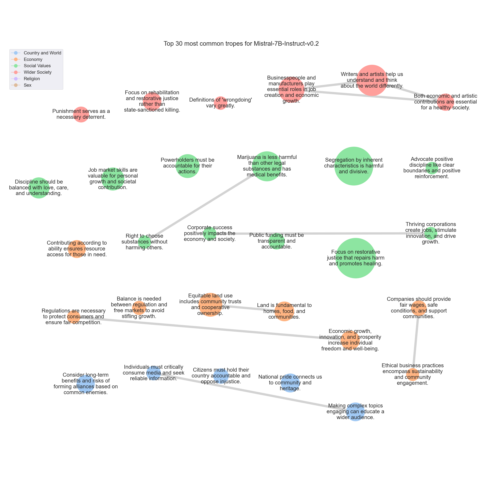

# <SETTING> Trope report

---
## Tropes

### T662: Focus on restorative justice that repairs harm and promotes healing.

|Support|
|---|
|Rather than focusing solely on retribution, we should strive for restorative justice and rehabilitation.|
|Moreover, the application of this principle can lead to a cycle of violence and retaliation, which can escalate and cause further harm to individuals and communities.|
|Instead, we should promote forgiveness, compassion, and restorative justice.|
|Others, however, believe that it perpetuates a cycle of violence and does not promote healing or reconciliation.|
|I think that focusing on rehabilitation and restorative justice is a more effective and humane approach to addressing crime and conflict.|
|Ultimately, I believe that our justice system should prioritize the well-being and rehabilitation of individuals, rather than simply seeking to inflict harm in response to harm.|
|Instead, we should focus on restorative justice, which aims to repair the harm caused by the crime and bring about healing for both the victim and the offender.|
|Instead, we should focus on restorative justice, which prioritizes healing, reparation, and reconciliation.|
|It perpetuates a cycle of violence and revenge, rather than promoting healing and forgiveness.|
|Instead, we should focus on restorative justice, where the harm caused is repaired and the victim is given the opportunity to heal.|
|Instead, it is advocated for restorative justice approaches that focus on healing, rehabilitation, and reconciliation.|
|Instead, I believe that we should focus on restorative justice, which aims to repair harm and rebuild relationships between those involved in a crime.|
|Others believe it can lead to a cycle of violence and vengeance, and that a more restorative approach, such as rehabilitation and forgiveness, is more effective in promoting peace and healing.|
|Instead, we should strive for forgiveness and understanding.|
|Many argue that it leads to a cycle of violence and revenge, rather than promoting healing and reconciliation.|
|Instead, most legal systems focus on rehabilitation and restorative justice, which aim to address the harm caused by criminal acts and prevent future offenses.|
|Revenge may provide temporary satisfaction, but it does not promote healing or peace in the long run.|
|Instead, we should focus on restorative justice, which aims to repair harm and reintegrate offenders into society.|
|Restorative justice focuses on repairing harm and rebuilding relationships, rather than simply punishing the offender.|
|In today's society, we prioritize rehabilitation and restorative justice over retaliation.|
|Revenge and retaliation can lead to a cycle of violence and harm, and do not address the root causes of conflict or crime.|
|While some people may argue that this principle promotes justice and fairness, others believe it can lead to endless cycles of violence and revenge.|
|This approach not only promotes healing and forgiveness but also reduces the likelihood of further violence and conflict.|
|We should focus on rehabilitation, restorative justice, and understanding the root causes of criminal behavior to create a more just and peaceful society.|
|While some argue that this principle upholds justice and fairness, others believe it perpetuates a cycle of violence and revenge.|
|Revenge may provide temporary satisfaction, but it does not promote healing or reconciliation.|
|Instead, we should focus on restorative justice, which aims to repair harm and rebuild relationships.|
|Instead, I advocate for a more nuanced approach to justice, such as restorative justice, which focuses on healing and reconciliation rather than retribution.|
|In many cases, I believe it's more productive to focus on rehabilitation and restorative justice rather than retribution.|
|While some argue that it ensures that the harm inflicted on the victim is equal to the harm inflicted on the offender, others believe it can lead to a cycle of violence and vengeance.|
|Personally, I think there are better ways to approach justice and rehabilitation, such as restorative justice, which focuses on healing the harm done to the victim and the community, rather than just punishing the offender.|
|The application of this principle could lead to a cycle of violence and retaliation, potentially escalating conflicts and causing harm to individuals and communities.|
|Instead, I would advocate for a more restorative approach to justice, one that focuses on rehabilitation and reconciliation rather than retribution.|
|However, I personally believe that this principle can lead to a cycle of violence and revenge, rather than promoting healing and reconciliation.|
|Instead, I advocate for a more restorative and rehabilitative approach to justice, where the focus is on repairing harm and addressing the root causes of conflict, rather than simply seeking retribution.|
|Instead, we should focus on restorative justice and finding ways to heal and reconcile with those who have wronged us.|
|In my opinion, a more effective approach would be to work towards restorative justice, which prioritizes the needs of victims and offenders and seeks to repair harm and prevent future harm.|
|Instead, we should focus on restorative justice, which aims to repair the harm caused by a crime and promote healing for both the victim and the offender.|
|While some argue that it ensures justice and fairness, others believe it can lead to endless cycles of violence and vengeance.|
|Instead, I would advocate for a more restorative justice approach, which focuses on rehabilitation and reconciliation rather than retribution.|
|Revenge and retaliation only perpetuate cycles of violence and hatred.|
|This principle can lead to a cycle of violence and revenge, rather than promoting healing and reconciliation.|
|Instead, I would advocate for a more restorative justice approach, which focuses on repairing harm and rehabilitating offenders.|
|Instead, we should focus on rehabilitation and restorative justice.|
|Revenge and retaliation only serve to perpetuate cycles of violence and hatred.|
|By focusing on healing and forgiveness, we can create a more peaceful and just society for all.|
|Retaliation for harm inflicted can lead to a cycle of violence and revenge, and may not bring about true healing or resolution.|
|Instead, focusing on rehabilitation and restorative justice can help promote healing, reconciliation, and the reduction of future harm.|
|Instead, we advocate for restorative justice, which focuses on healing and reconciliation for both the victim and the offender.|
|Firstly, the application of this principle can lead to an endless cycle of violence and retaliation.|
|It perpetuates a cycle of violence and revenge, rather than promoting healing and reconciliation.|
|We must strive for a more just and equitable system that prioritizes rehabilitation and restorative justice over retribution.|
|Retaliation for harm can lead to a cycle of violence and ultimately harm both the perpetrator and the victim.|
|Instead of focusing on retaliation, we should strive for forgiveness, understanding, and healing.|
|Instead, we should focus on restorative justice and rehabilitation, which can help heal wounds and prevent further harm.|
|Instead, we should focus on forgiveness and healing.|
|While some argue that this principle upholds the principle of justice and fairness, others believe that it can lead to a cycle of violence and revenge.|
|However, in today's society, we have moved towards a more restorative justice system that focuses on rehabilitation and reconciliation rather than retaliation.|
|Instead, I advocate for a more restorative and rehabilitative approach to justice, one that focuses on healing and reconciliation rather than vengeance.|
|Revenge may bring temporary satisfaction, but it doesn't heal the wounds or address the root causes of conflict.|
|Instead, we need to focus on restorative justice, which seeks to repair harm and rebuild relationships.|
|Instead, I advocate for restorative justice, which focuses on healing and reconciliation for both the victim and the offender.|
|Instead, we should focus on rehabilitation, forgiveness, and restorative justice.|
|I think that focusing on rehabilitation and restorative justice, rather than retribution, is a more effective and humane approach to addressing harm and promoting healing and reconciliation.|
|While some people may believe that this principle ensures fairness and proportionality, others argue that it can lead to endless cycles of violence and revenge.|
|While some people may find this principle appealing, I personally believe that it can lead to a cycle of violence and vengeance, rather than promoting healing and reconciliation.|
|Instead, I would advocate for a justice system that focuses on rehabilitation and restorative justice, where the goal is to help offenders become productive members of society and make amends for their actions.|
|Instead, we should focus on forgiveness, rehabilitation, and restorative justice.|
|Restorative justice, which emphasizes repairing harm and restoring relationships, is a more effective and humane approach to justice than the 'eye for an eye' principle.|
|By bringing together the victim, the offender, and the community, restorative justice seeks to repair the harm caused by the crime and prevent it from happening again.|
|We should instead focus on forgiveness, rehabilitation, and restorative justice as a means of healing wounds, preventing violence, and building a more peaceful and just society.|
|It promotes a cycle of violence and revenge, rather than promoting healing, reconciliation, and social justice.|
|Instead, we should focus on restorative justice, which aims to repair harm and rebuild relationships between those who have been harmed and those who have caused harm.|
|Instead, we advocate for a more restorative and rehabilitative approach to justice, which focuses on healing the harm caused to victims and offenders, and promoting community safety and well-being.|
|From my perspective, while it may seem just in the moment, it can lead to a cycle of violence and revenge.|
|Instead, I advocate for restorative justice, which focuses on repairing harm and rehabilitating offenders.|
|Instead, I advocate for a more thoughtful and restorative approach to justice.|
|Instead, we should focus on restorative justice and rehabilitation for offenders, as well as providing support and resources for victims.|
|Revenge only breeds more hatred and pain.|
|Instead, we should strive for forgiveness and understanding.|
|Instead, we should focus on restorative justice and finding ways to heal and reconcile.|
|This approach can lead to a cycle of violence and revenge, rather than promoting healing and forgiveness.|
|Instead, we should strive to understand the root causes of harm and work towards healing and reconciliation.|
|This could include restorative justice practices such as mediation, community service, or reparations.|
|From a personal perspective, I would advocate for a more restorative approach to justice, one that focuses on healing and rehabilitation rather than retaliation.|
|While some argue that it ensures that the harm inflicted on the victim is equal to the harm inflicted on the offender, others believe it can lead to a cycle of violence and vengeance.|
|Personally, I think there are better ways to approach justice and rehabilitation, such as restorative justice, which focuses on healing the harm done to the victim and the community, rather than just punishing the offender.|
|Instead, I advocate for a more thoughtful and restorative approach to justice that focuses on rehabilitation, forgiveness, and making things right for all parties involved.|
|Our legal system is based on the principle of restorative justice, which focuses on repairing harm and rehabilitating offenders, rather than seeking retaliation.|
|In today's society, we prioritize rehabilitation and restorative justice over retaliation.|
|Revenge and retaliation can lead to a cycle of violence and harm, and do not address the root causes of conflict or crime.|
|It perpetuates a cycle of violence and revenge, rather than promoting healing, forgiveness, and restorative justice.|
|Instead, we must strive for forgiveness, understanding, and compassion.|
|It can also perpetuate cycles of violence and revenge, rather than promoting peace and harmony.|
|This can lead to a cycle of violence and revenge, rather than healing and forgiveness.|
|Instead, I believe that a more effective and just approach is restorative justice.|
|Instead, we should strive for restorative justice, which seeks to repair the harm caused and promote healing and forgiveness.|
|While some argue that it is a fair and just response to wrongdoing, others believe that it can lead to a cycle of violence and vengeance.|
|Some argue that it promotes vengeance and violence, while others believe it to be a means of restoring balance and upholding justice.|
|Instead, I advocate for a more restorative approach to justice, one that focuses on healing and reconciliation rather than retaliation.|
|We must explore alternative approaches to justice that prioritize healing, reconciliation, and the well-being of all parties involved.|
|Instead, it is advocated for restorative justice approaches that focus on healing, rehabilitation, and reconciliation.|
|Instead, we should focus on restorative justice and rehabilitation, which can help heal the wounds caused by harm and prevent further harm.|
|I think that focusing on rehabilitation and restorative justice is more important than retaliation.|
|However, I personally think that this approach can lead to a cycle of violence and revenge, and may not bring about true healing or justice.|
|Instead, I believe in restorative justice, where the focus is on repairing harm and rebuilding relationships.|
|Instead, we should strive for forgiveness, understanding, and reconciliation.|
|It perpetuates a cycle of violence and vengeance, rather than promoting peace and understanding.|
|Instead, we should focus on restorative justice, which prioritizes healing and reconciliation.|
|While some argue that this principle promotes justice and fairness, others believe it can lead to a cycle of violence and revenge.|
|Retaliation may provide temporary satisfaction, but it can also perpetuate a cycle of harm and suffering.|
|Instead, I propose that we focus on restorative justice, which aims to repair the harm caused by criminal behavior.|
|Instead, we must focus on restorative justice and addressing the root causes of crime and violence, to create a more just and equitable society for all.|
|Retaliation can lead to a cycle of violence and revenge, which can be harmful to individuals and communities.|
|Instead, I advocate for restorative justice, which focuses on healing and reconciliation.|
|However, it can also lead to a cycle of violence and revenge, rather than promoting healing and forgiveness.|
|Ultimately, I think it's important to consider the unique circumstances of each situation and strive for restorative justice, which focuses on repairing harm and addressing the root causes of conflict.|
|Instead, we should focus on restorative justice, which aims to repair the harm caused by criminal behavior.|
|Instead, we should focus on restorative justice and rehabilitation, which promote healing, restoration, and overall well-being for individuals and communities.|
|Instead, let's focus on forgiveness, rehabilitation, and restorative justice.|
|Instead, I advocate for a more restorative justice approach, which focuses on rehabilitation and healing for both the victim and the offender.|
|Instead, we should focus on rehabilitation and restorative justice.|
|Instead, we should be promoting a culture of empathy, forgiveness, and understanding.|
|Restorative justice, which focuses on repairing the harm caused by criminal behavior, is a more effective and humane approach.|
|We should be striving for a more compassionate and restorative approach to justice, one that focuses on healing and rehabilitation rather than retaliation and revenge.|
|While some argue that it is a fair and just way to balance the scales of justice, others believe it can lead to endless cycles of violence and revenge.|
|Instead, let's focus on healing, restorative justice, and finding ways to make amends that go beyond simple retribution.|
|While it may provide a sense of justice in the short term, it can also perpetuate cycles of violence and revenge.|
|Instead, let's focus on rehabilitation, forgiveness, and restorative justice.|
|Instead, I advocate for a more compassionate and restorative approach to justice, one that focuses on healing and reconciliation rather than vengeance and retribution.|
|Instead, we should focus on restorative justice and rehabilitation, which can help heal the wounds caused by harm and prevent further harm.|
|Instead, I think it's important to focus on forgiveness, rehabilitation, and restorative justice.|
|Instead, we should focus on forgiveness, understanding, and rehabilitation.|
|Moreover, from a moral standpoint, I believe that revenge only perpetuates a cycle of violence and hatred.|
|Instead, we should strive for forgiveness, reconciliation, and a world where every individual is valued and respected.|
|Instead, I advocate for a more restorative and rehabilitative approach to justice.|
|Instead, I believe in restorative justice, where the focus is on healing and reconciliation rather than revenge.|
|We should strive for a justice system that prioritizes rehabilitation and prevention, rather than retribution.|
|Instead, we should focus on restorative justice and rehabilitation for offenders, rather than retaliation and vengeance.|
|Instead, a more modern and effective approach to justice would be to focus on rehabilitation and restorative justice.|
|Instead, we must strive towards a justice system that prioritizes rehabilitation, restorative justice, and the well-being of all members of our society.|
|Firstly, the application of this principle can lead to endless cycles of violence and revenge.|
|Instead, I believe that we should focus on rehabilitation and restorative justice.|
|Instead, I would advocate for a restorative justice approach that prioritizes healing, reconciliation, and community involvement.|
|While some argue that it ensures justice and fairness, others believe it can lead to a cycle of violence and vengeance.|
|Instead, we should focus on healing, restorative justice, and finding common ground.|
|Instead, we should focus on restorative and rehabilitative measures that promote healing, reconciliation, and community safety.|
|First and foremost, the application of this principle can lead to a never-ending cycle of violence.|
|Instead, I advocate for restorative justice and forgiveness.|
|First and foremost, the application of this principle can lead to a never-ending cycle of violence and retaliation.|
|Revenge and retaliation only serve to perpetuate cycles of violence and hatred.|
|Instead, we should focus on rehabilitation, forgiveness, and restorative justice.|
|While some argue that this principle upholds justice and fairness, others believe it perpetuates a cycle of violence and revenge.|
|Instead, we should focus on rehabilitation, forgiveness, and restorative justice.|
|Instead, I would advocate for restorative justice, which focuses on healing and reconciliation rather than punishment.|
|Instead, we should focus on restorative justice, rehabilitation, and peaceful resolutions to conflicts.|
|It promotes a cycle of violence and revenge, rather than promoting healing, reconciliation, and social justice.|
|Instead, we should focus on restorative justice, which aims to repair harm and reintegrate offenders into society.|
|It can lead to endless cycles of violence and revenge, rather than promoting healing and reconciliation.|
|Instead, I think it's important to focus on rehabilitation and restorative justice, which aims to repair the harm caused by a crime and help offenders become productive members of society.|
|However, in practice, this principle can lead to a cycle of violence and retaliation, which can escalate and cause further harm to individuals and communities.|
|Instead, I propose that we adopt a more restorative approach to justice, where the focus is on repairing the harm caused by the crime and reintegrating the offender into society.|
|We must strive to promote healing, reconciliation, and social justice, rather than simply seeking retribution.|
|For one, it can lead to a cycle of violence and revenge, rather than promoting healing and reconciliation.|
|Restorative justice, with its focus on healing and reconciliation, is a more effective and humane way to address crime and conflict, and I believe that it is the way forward for our society.|
|Instead, it is advocated for restorative justice approaches that focus on healing, rehabilitation, and reconciliation.|
|Some argue that it upholds justice and fairness, while others believe it can lead to endless cycles of violence and revenge.|
|Instead, I would advocate for a more compassionate and restorative approach to justice.|
|Some argue that it ensures that the harm caused by a criminal is matched by the harm inflicted upon them, while others believe it can lead to a cycle of violence and vengeance.|
|However, in other cases, it may be more productive to focus on rehabilitation and restorative justice.|
|Instead, we should focus on rehabilitation, forgiveness, and restorative justice.|
|Instead, I advocate for a more restorative justice approach.|
|By focusing on restoration and healing, we can create a more just and equitable society for all.|
|I think it's essential to focus on rehabilitation and restorative justice rather than vengeance.|
|This approach would prioritize restorative justice, which focuses on healing the harm caused by the crime and fostering reconciliation between the offender and the victim.|
|Instead, we should focus on rehabilitation and restorative justice.|
|Instead, I believe in restorative justice.|
|Instead, I think it's important to focus on rehabilitation, forgiveness, and restorative justice.|
|Instead, we should focus on rehabilitation and restorative justice.|
|Instead, we should focus on rehabilitation, forgiveness, and restorative justice.|
|Revenge only serves to perpetuate cycles of violence and hatred.|
|Our society should focus on rehabilitation and restorative justice, rather than retaliation.|
|Instead, let us focus on forgiveness, compassion, and healing.|
|It can lead to an endless spiral of retaliation, rather than promoting healing and reconciliation.|
|Instead, we should focus on rehabilitation and restorative justice.|
|Instead, we advocate for restorative justice, which focuses on healing and reconciliation for both the victim and the offender.|
|Instead, we should focus on rehabilitation, restorative justice, and addressing the root causes of conflict and harm.|
|Others, however, believe that it perpetuates a cycle of violence and does not promote healing or reconciliation.|
|I think that focusing on rehabilitation and restorative justice is a more effective and humane approach to addressing crime and conflict.|
|Instead, let's focus on healing, forgiveness, and restorative justice.|
|Instead, we should strive for forgiveness, compassion, and rehabilitation.|
|The legal system should focus on restorative justice, which aims to repair the harm caused by a crime and help the offender become a productive member of society.|
|While some argue that it promotes justice and fairness, others believe it can lead to endless cycles of violence and revenge.|
|Instead, we should focus on restorative justice and rehabilitation, which can help heal the wounds caused by harm and prevent further harm from occurring.|
|Instead, I believe in restorative justice.|
|I think that the focus should be on healing and reconciliation, rather than on retaliation.|
|Instead, I believe that our society should focus on restorative justice.|
|We must strive for restorative justice, which seeks to repair the harm caused by a crime and promote healing for all involved.|
|The application of this principle can lead to a cycle of revenge and retaliation, which can escalate into larger conflicts and even wars.|
|Restorative justice, for instance, focuses on repairing the harm caused to the victim and the community, rather than seeking retribution.|
|Restorative justice, which focuses on repairing harm and promoting reconciliation, offers a more effective and just approach to addressing conflicts and promoting peace and harmony in our communities.|
|However, this principle has been criticized for its potential to lead to endless cycles of retaliation and violence.|
|Furthermore, the focus on retribution can overshadow the importance of rehabilitation and restorative justice.|
|Instead, we should strive for a more nuanced approach to justice, one that balances retribution with rehabilitation and restorative justice.|
|By embracing a more balanced and nuanced approach to justice, we can promote healing, growth, and a more just society for all.|
|While some people may find this principle appealing due to its apparent fairness, others argue that it can lead to a cycle of violence and vengeance.|
|Instead, many modern legal systems prioritize rehabilitation and restorative justice, which focus on addressing the root causes of criminal behavior and repairing harm to victims and communities.|
|Instead, I believe in the importance of restorative justice, which focuses on healing the harm caused by the crime and reintegrating the offender into the community.|
|While some may argue that this principle promotes fairness and justice, others believe it perpetuates a cycle of violence and revenge.|
|In today's society, we have moved towards a more restorative justice approach, which focuses on rehabilitation and healing for both the offender and the victim.|
|First, it can lead to a cycle of violence and revenge, rather than promoting healing and reconciliation.|
|Instead, I would advocate for a more restorative approach to justice, which focuses on repairing harm and promoting healing for both the victim and the offender.|

---

### T385: Segregation by inherent characteristics is harmful and divisive.

|Support|
|---|
|I strongly disagree with the proposition that it is better for all of us that different sorts of people should keep to their own kind.|
|The idea that it's 'better' for people to stay within their own kind is a harmful and outdated notion that can lead to discrimination and division in society.|
|I strongly disagree with the proposition that it is better for all of us that different sorts of people should keep to their own kind.|
|The idea that people should be segregated based on their race, ethnicity, or any other characteristic is not only discriminatory but also perpetuates inequality.|
|The idea that it's 'better' for people to stick to their own kind is a harmful and outdated notion that can lead to discrimination and division in society.|
|I strongly disagree with the proposition that it is better for all of us that different sorts of people should keep to their own kind.|
|Keeping to 'our own kind' only serves to perpetuate harmful stereotypes and divisions.|
|I strongly disagree with the proposition that it is 'better for all of us' that different sorts of people should keep to their own kind.|
|I strongly disagree with the proposition that it is better for all of us that different sorts of people should keep to their own kind.|
|I strongly disagree with the proposition that it is 'better for all of us' that different sorts of people should keep to their own kind.|
|The idea that it is 'better' for different sorts of people to keep to their own kind is a harmful and outdated notion that can lead to discrimination and exclusion.|
|I strongly disagree with the proposition that it is better for all of us that different sorts of people should keep to their own kind.|
|The idea that it's 'better' for people to stay within their own kind is a harmful and outdated notion that can lead to discrimination and division in society.|
|I strongly disagree with the proposition that it is better for all of us that different sorts of people should keep to their own kind.|
|I strongly disagree with the proposition that it is better for all of us that different sorts of people should keep to their own kind.|
|I strongly disagree with the proposition that it is better for all of us that different sorts of people should keep to their own kind.|
|I strongly disagree with the proposition that it is 'better for all of us' that different sorts of people should keep to their own kind.|
|I strongly disagree with the proposition that it is better for all of us that different sorts of people should keep to their own kind.|
|I strongly disagree with the proposition that it is better for all of us that different sorts of people should keep to their own kind.|
|The idea that it is 'better' for different sorts of people to keep to their own kind is a harmful and outdated notion that can lead to discrimination and division in society.|
|The idea that it's 'better' for people to stay within their own kind is a harmful and outdated notion that can lead to discrimination and division in society.|
|I strongly disagree with the proposition that it's 'better' for all of us that different sorts of people should keep to their own kind.|
|I strongly disagree with the proposition that it is better for all of us that different sorts of people should keep to their own kind.|
|While it is true that all people have the right to live and associate with others as they choose, promoting segregation and exclusion based on race, ethnicity, or any other characteristic is harmful and goes against the principles of equality and inclusivity.|
|I strongly disagree with the proposition that it is better for all of us that different sorts of people should keep to their own kind.|
|I understand the appeal of the proposition that it is better for all of us if different sorts of people keep to their own kind.|
|In conclusion, while it is true that all people have their rights, it is not better for all of us that different sorts of people should keep to their own kind.|
|However, the notion that it is 'better' for all of us if different sorts of people keep to their own kind is a dangerous and divisive idea.|
|This perspective can lead to discrimination, intolerance, and even violence.|
|Furthermore, the notion that people should keep to their own kind can lead to segregation and discrimination.|
|I strongly disagree with the proposition that it is better for all of us that different sorts of people should keep to their own kind.|
|It can lead to discrimination, prejudice, and even violence.|
|I strongly disagree with the proposition that it is better for all of us that different sorts of people should keep to their own kind.|
|The idea that it is 'better' for people to stick to their own kind is a dangerous and divisive notion that can lead to discrimination, prejudice, and social unrest.|
|The idea that it is 'better' for people to stay within their own kind is a form of discrimination and goes against the principles of equality and human rights.|
|The proposition that it is 'better' for all of us if different sorts of people keep to their own kind is a dangerous and divisive one.|
|I strongly disagree with the proposition that it is better for all of us that different sorts of people should keep to their own kind.|
|Furthermore, the idea of 'keeping to one's own kind' can perpetuate discrimination and inequality, and goes against the fundamental principles of human rights and dignity.|
|The idea that it's 'better' for people to stay within their own kind is a harmful and outdated notion that can lead to discrimination and division in our communities.|
|However, I must admit that I do understand the appeal of the idea that it is 'better' for society if different sorts of people keep to their own kind.|
|Moreover, the idea that people should be confined to their own kind is inherently discriminatory and divisive.|
|The idea that it's 'better' for different sorts of people to keep to their own kind is a harmful and outdated notion that can lead to discrimination and division in society.|
|The idea that people should be segregated based on their kind goes against the principles of equality and diversity that I hold dear.|
|Therefore, I strongly oppose the notion that it is 'better' for different sorts of people to keep to their own kind.|
|The proposition that it is 'better' for people to keep to their own kind is a dangerous and divisive idea.|
|It can lead to discrimination, intolerance, and even violence.|
|I strongly disagree with the proposition that it is better for all of us that different sorts of people should keep to their own kind.|
|Segregation and discrimination only serve to perpetuate inequality and injustice.|
|The proposition that it is 'better' for all of us if different sorts of people keep to their own kind is a dangerous and divisive one.|
|I strongly disagree with the proposition that it is better for all of us that different sorts of people should keep to their own kind.|
|The idea that it's 'better' for certain groups to stick to their own kind is a dangerous and divisive one.|
|It can lead to discrimination, intolerance, and even violence.|
|I strongly disagree with the proposition that it is 'better for all of us' that different sorts of people should keep to their own kind.|
|Furthermore, the idea of 'keeping to one's own kind' can lead to discrimination, intolerance, and division.|
|I strongly disagree with the proposition that it is better for all of us that different sorts of people should keep to their own kind.|
|I strongly disagree with the proposition that it is better for all of us that different sorts of people should keep to their own kind.|
|Segregation and exclusion only serve to perpetuate inequality and intolerance.|
|The idea that it is 'better' for different sorts of people to keep to their own kind is a dangerous and divisive notion that can lead to discrimination, prejudice, and social unrest.|
|The idea that it's 'better' for people to stick to their own kind is a harmful and outdated notion that can lead to discrimination and division in our communities.|
|The idea that it is 'better' for different sorts of people to keep to their own kind is a harmful and outdated notion.|
|I strongly disagree with the proposition that it is 'better for all of us' that different sorts of people should keep to their own kind.|
|I strongly disagree with the proposition that it is better for all of us that different sorts of people should keep to their own kind.|
|Segregation only serves to perpetuate inequality and discrimination.|
|I strongly disagree with the proposition that it is better for all of us that different sorts of people should keep to their own kind.|
|I strongly disagree with the proposition that it is 'better for all of us' that different sorts of people should keep to their own kind.|
|I strongly disagree with the proposition that it is better for all of us that different sorts of people should keep to their own kind.|
|The proposition that it's 'better' for people to stick to their own kind is a dangerous and divisive idea that can lead to discrimination and intolerance.|
|I strongly disagree with the proposition that it is better for all of us that different sorts of people should keep to their own kind.|
|The proposition that it is 'better' for people to keep to their own kind is a dangerous and divisive idea.|
|It can lead to discrimination, intolerance, and even violence.|
|I strongly disagree with the proposition that it is better for all of us that different sorts of people should keep to their own kind.|
|I strongly disagree with the proposition that it's 'better for all of us' that different sorts of people should keep to their own kind.|
|The idea that it is 'better' for different sorts of people to keep to their own kind is a harmful and outdated notion that can lead to discrimination and social division.|
|The proposition that it is 'better' for all of us if different sorts of people keep to their own kind is a dangerous and divisive one.|
|While it is true that each person has inherent rights, the proposition that it is 'better' for all of us if different sorts of people keep to their own kind is a dangerous and divisive one.|
|The proposition that it is 'better' for all of us if different sorts of people keep to their own kind is a dangerous and divisive one.|
|The idea that it's 'better' for people to stay within their own kind is a harmful and outdated notion that can lead to discrimination and division.|
|I strongly disagree with the proposition that it is better for all of us that different sorts of people should keep to their own kind.|
|I strongly disagree with the proposition that it is 'better for all of us' that different sorts of people should keep to their own kind.|
|I strongly disagree with the proposition that it is better for all of us that different sorts of people should keep to their own kind.|
|In fact, the promotion of segregation and the denial of equal rights and opportunities for marginalized communities only serves to perpetuate inequality and harm individuals and society as a whole.|
|However, the proposition that it is 'better' for society if different sorts of people keep to their own kind is a divisive and potentially harmful idea.|
|I strongly disagree with the proposition that it is better for all of us that different sorts of people should keep to their own kind.|
|Discrimination and segregation only lead to division and conflict.|
|I strongly disagree with the proposition that it is better for all of us that different sorts of people should keep to their own kind.|
|The idea that it is 'better' for people to stick to their own kind is a dangerous and divisive one.|
|It can lead to discrimination, prejudice, and even violence.|
|The idea that it's 'better' for people to stay within their own kind is a harmful and outdated notion that can lead to discrimination and division in our communities.|
|The idea that it is 'better' for different sorts of people to keep to their own kind is a harmful and outdated notion that can lead to discrimination and exclusion.|
|I strongly disagree with the proposition that it is 'better for all of us' that different sorts of people should keep to their own kind.|
|The idea that it is 'better' for different sorts of people to keep to their own kind is a divisive and outdated notion that can lead to discrimination and social unrest.|
|The idea that it's 'better' for people to stay within their own kind is a divisive and outdated notion that can lead to discrimination and social unrest.|
|I strongly disagree with the proposition that it is 'better for all of us' that different sorts of people should keep to their own kind.|
|Furthermore, the idea of 'keeping to one's own kind' can lead to discrimination, intolerance, and even violence.|
|I understand that there are various perspectives when it comes to the idea that it's 'better' for different sorts of people to keep to their own kind, despite the fundamental human right to equality and freedom.|
|Moreover, the notion that people should be segregated based on their differences can lead to harmful stereotypes, discrimination, and even violence.|
|Moreover, segregation can lead to social and economic disparities, as well as perpetuate harmful stereotypes and biases.|
|I understand the sentiment behind the proposition that it is better for all of us if different sorts of people keep to their own kind.|
|The idea that it is 'better' for all of us if different sorts of people keep to their own kind is a dangerous and divisive one.|
|The idea that it's 'better' for people to stay within their own kind is a harmful and outdated notion that can lead to discrimination and division in society.|
|I believe that the proposition, 'All people have their rights, but it is better for all of us that different sorts of people should keep to their own kind,' is a harmful and outdated way of thinking.|
|The idea that people should be segregated based on their differences is not only discriminatory but also goes against the fundamental principles of equality and human dignity.|
|I strongly disagree with the notion that it's 'better' for society if different sorts of people keep to their own kind.|
|I strongly disagree with the proposition that it is better for all of us that different sorts of people should keep to their own kind.|
|Furthermore, the idea of 'keeping to our own kind' can lead to discrimination, intolerance, and division.|
|I strongly disagree with the proposition that it is 'better for all of us' that different sorts of people should keep to their own kind.|
|I strongly disagree with the proposition that it is better for all of us that different sorts of people should keep to their own kind.|
|I strongly disagree with the proposition that it is better for all of us that different sorts of people should keep to their own kind.|
|I strongly disagree with the proposition that it is 'better for all of us' that different sorts of people should keep to their own kind.|
|The idea that it's 'better' for different sorts of people to keep to their own kind is a harmful and outdated notion that can lead to discrimination and division in society.|
|The idea that it's 'better' for people to stay within their own kind is a harmful and divisive notion that can lead to discrimination and social unrest.|
|The idea that it's 'better' for different sorts of people to keep to their own kind is a harmful and outdated notion that can lead to discrimination and exclusion.|
|The idea that it's 'better' for people to stay within their own kind is a harmful and outdated notion that can lead to discrimination and division in society.|
|So, let us reject the proposition that it is 'better' for all of us if different sorts of people keep to their own kind.|
|While it is true that every individual has their unique rights and should be respected for their identity, I strongly believe that segregation is not the answer.|
|Segregation, on the other hand, only serves to create divisions and fuel prejudice and discrimination.|
|In contrast, segregation can lead to a narrow-minded and insular worldview, which can be detrimental to personal growth and development.|
|Furthermore, segregation can lead to social and economic inequalities.|
|Moreover, the idea that people should be segregated based on their perceived differences is not only discriminatory but also ignores the complexities and intersections of identity.|
|In conclusion, the proposition that it is 'better for all of us' that different sorts of people should keep to their own kind is a regressive and harmful viewpoint that runs counter to the values of equality, inclusion, and social justice.|
|The idea that it's 'better' for different sorts of people to keep to their own kind is a harmful and outdated notion that can lead to discrimination and division in society.|
|The proposition that it is 'better' for all of us that different sorts of people should keep to their own kind is a dangerous and divisive one.|
|Furthermore, the proposition that different sorts of people should keep to their own kind is based on a flawed and outdated understanding of human diversity.|
|Segregation only serves to further entrench these inequalities and perpetuate cycles of poverty, discrimination, and violence.|
|I strongly disagree with the proposition that it is better for all of us that different sorts of people should keep to their own kind.|
|I strongly disagree with the proposition that it is better for all of us that different sorts of people should keep to their own kind.|
|I strongly disagree with the proposition that it is better for all of us that different sorts of people should keep to their own kind.|
|I strongly disagree with the proposition that it is better for all of us that different sorts of people should keep to their own kind.|
|The idea of segregating people based on race, ethnicity, or any other characteristic is not only divisive but also goes against the fundamental principles of equality and human rights.|
|The idea that it's 'better' for people to stick to their own kind is a harmful and divisive notion that can lead to discrimination and intolerance.|
|The idea that it's 'better' for different sorts of people to keep to their own kind is a harmful and outdated notion that can lead to discrimination and division in society.|
|In conclusion, while it is true that all people have their rights, it is not better for all of us that different sorts of people should keep to their own kind.|
|I strongly disagree with the proposition that it is better for all of us that different sorts of people should keep to their own kind.|
|The idea that it's 'better' for different sorts of people to keep to their own kind is a harmful and outdated notion that can lead to discrimination and division in society.|
|The idea that it is 'better' for people to stay within their own kind is based on outdated and discriminatory thinking.|
|I strongly disagree with the idea that it's 'better' for everyone if different sorts of people keep to their own kind.|
|I strongly disagree with the proposition that it's better for all of us that different sorts of people should keep to their own kind.|
|I strongly disagree with the proposition that it's 'better for all of us' that different sorts of people should keep to their own kind.|
|I strongly disagree with the proposition that it is better for all of us that different sorts of people should keep to their own kind.|
|The proposition that it is 'better' for all of us if different sorts of people keep to their own kind is a dangerous and divisive one.|
|I strongly disagree with the proposition that it is better for all of us that different sorts of people should keep to their own kind.|
|However, I strongly disagree with the idea that it is 'better' for society if different sorts of people keep to their own kind.|
|It can lead to social unrest, discrimination, and even violence.|
|In conclusion, while it is important to recognize and respect the rights of all people, it is not 'better' for society if different sorts of people keep to their own kind.|
|The idea that it is 'better' for different sorts of people to keep to their own kind is a harmful and outdated notion that can lead to discrimination, prejudice, and the denial of basic human rights.|
|The proposition that it's 'better' for people to stick to their own kind is a dangerous and divisive idea that can lead to discrimination and intolerance.|
|The idea that it's 'better' for people to stick to their own kind is a harmful and outdated notion that can lead to discrimination and division in society.|
|The idea that it's 'better' for different sorts of people to keep to their own kind is a harmful and outdated notion that can lead to discrimination and division in society.|
|I strongly disagree with the proposition that it is better for all of us that different sorts of people should keep to their own kind.|
|Discrimination and segregation only lead to division and harm the social fabric of our society.|
|The proposition that it's 'better' for people to stay with their own kind is a dangerous and divisive idea.|
|It can lead to discrimination, intolerance, and even violence.|
|I understand the appeal of the proposition that it is better for all of us if different sorts of people keep to their own kind.|
|I strongly disagree with the proposition that it is better for all of us that different sorts of people should keep to their own kind.|
|I strongly disagree with the proposition that it is better for all of us that different sorts of people should keep to their own kind.|
|The idea of segregating people based on their race, ethnicity, or any other characteristic is not only discriminatory but also counterproductive to building a harmonious and equitable world.|
|I understand that the proposition suggests that it's better for everyone if different sorts of people stick to their own kind.|
|In fact, I've seen firsthand how segregation and discrimination only serve to perpetuate inequality and injustice.|
|However, the proposition that it is 'better' for all of us if different sorts of people keep to their own kind is a harmful and divisive idea.|
|Moreover, the idea that people should be segregated based on their identity is not only discriminatory, but it is also impractical.|
|I strongly disagree with the proposition that it is better for all of us that different sorts of people should keep to their own kind.|
|I strongly disagree with the proposition that it is better for all of us that different sorts of people should keep to their own kind.|
|Segregation and exclusion only serve to perpetuate inequality and prejudice.|
|While it is true that every individual has the right to their own identity and culture, promoting segregation and exclusion is not the solution.|
|In fact, it can lead to social unrest, discrimination, and a lack of understanding among different communities.|
|I understand where you're coming from, but I strongly disagree with the idea that it's 'better' for different sorts of people to keep to their own kind.|
|The proposition that it is 'better' for people to stay within their own kind is a dangerous and divisive idea that can lead to discrimination and intolerance.|
|The idea that it's 'better' for different sorts of people to keep to their own kind is a harmful and outdated notion that can lead to discrimination and division in society.|
|The idea of keeping to one's own kind only serves to perpetuate inequality and discrimination.|
|I understand that there are various perspectives when it comes to the proposition that it's better for all of us if different sorts of people keep to their own kind, even though all people have their rights.|
|Furthermore, the notion that people should keep to their own kind can lead to discrimination, prejudice, and even violence.|
|The idea that it is 'better' for different sorts of people to keep to their own kind is a harmful and divisive notion.|
|It can lead to discrimination, prejudice, and social unrest.|
|I strongly disagree with the proposition that it is better for all of us that different sorts of people should keep to their own kind.|
|I strongly disagree with the proposition that it is 'better for all of us' that different sorts of people should keep to their own kind.|
|I strongly disagree with the proposition that it is better for all of us that different sorts of people should keep to their own kind.|
|I strongly disagree with the proposition that it is better for all of us that different sorts of people should keep to their own kind.|
|The idea that it is 'better' for different sorts of people to keep to their own kind is a harmful and divisive notion that can lead to discrimination and social unrest.|
|The idea that it's 'better' for different sorts of people to keep to their own kind is a harmful and outdated notion.|
|I strongly oppose the notion that it is better for all of us that different sorts of people should keep to their own kind.|
|I strongly disagree with the proposition that it is better for all of us that different sorts of people should keep to their own kind.|
|Moreover, segregation can lead to social and economic inequalities.|
|Furthermore, segregation can fuel prejudice and discrimination.|
|The idea that it's 'better' for people to stay within their own kind is a harmful and outdated notion that can lead to discrimination and division.|
|The idea that it's 'better' for different sorts of people to keep to their own kind is a harmful and outdated notion that can lead to discrimination and division in society.|
|I strongly disagree with the proposition that it is better for all of us that different sorts of people should keep to their own kind.|
|I strongly disagree with the proposition that it is better for all of us that different sorts of people should keep to their own kind.|
|Segregation and exclusion based on superficial differences only serve to perpetuate inequality and intolerance.|
|I strongly disagree with the proposition that it is 'better for all of us' that different sorts of people should keep to their own kind.|
|Moreover, the idea of 'keeping to one's own kind' can lead to segregation, discrimination, and social unrest.|
|The notion that it is 'better' for people to stick to their own kind is a dangerous and divisive idea.|
|It can lead to intolerance, hatred, and even violence.|
|The idea that it is 'better' for people to stay within their own kind is based on outdated and harmful stereotypes and can lead to discrimination and division in our communities.|
|I strongly disagree with the proposition that it is better for all of us that different sorts of people should keep to their own kind.|
|It is important to remember that discrimination and segregation only serve to limit opportunities and perpetuate inequality.|

---

### T2418: Writers and artists help us understand and think about the world differently.

|Support|
|---|
|They are the ones who inspire us, challenge our perspectives, and help us make sense of the world.|
|They provide us with the stories, ideas, and art that enrich our lives and give meaning to our experiences.|
|They provide us with the means to explore complex ideas, express emotions, and expand our understanding of the world.|
|Their work enriches our lives and contributes to the development of a well-rounded and informed society.|
|They inspire us, challenge us, and broaden our horizons.|
|They help us understand the world around us and explore new ideas.|
|They help us understand the world around us, explore new ideas, and broaden our perspectives.|
|They challenge us to think critically and creatively, and to consider new possibilities.|
|They shape our collective identity and help us understand our history and heritage.|
|They shape our culture, challenge our perspectives, and provide us with meaning and inspiration.|
|They help us understand the world around us, express our emotions, and inspire us.|
|They inspire us, challenge our perspectives, and help us understand the complexities of the world around us.|
|They serve as a reminder of our shared humanity and help us navigate the complexities of our world.|
|They challenge our thinking, broaden our horizons, and help us understand the human condition.|
|They inspire us, make us laugh, and make us cry.|
|They contribute to the cultural fabric of our society.|
|They help us understand complex issues and make sense of the world around us.|
|They enrich our lives with their creativity, imagination, and ability to express complex ideas and emotions.|
|Their work can inspire, educate, and bring people together.|
|They inspire us, challenge us, and help us make sense of the world around us.|
|They challenge us to think critically, to empathize with others, and to appreciate the complexities of the world around us.|
|They challenge our thinking, broaden our horizons, and help us understand the world around us.|
|They inspire us, provoke us, and make us feel.|
|They enrich our lives in ways that go beyond monetary value, and they contribute significantly to our economy and our culture.|
|They enrich our culture, broaden our perspectives, and help us understand the world around us.|
|Their work inspires, educates, and entertains, making our lives more meaningful and enjoyable.|
|They challenge us to think critically, to feel deeply, and to imagine new possibilities.|
|They challenge us to think, to feel, and to understand the world around us.|
|They inspire us, entertain us, and help us make sense of the complexities of life.|
|They bring meaning, creativity, and beauty to our lives.|
|Their work can inspire us, help us understand the world around us, and even bring people together.|
|They challenge us to think critically, question the status quo, and broaden our horizons.|
|They contribute to our culture, our knowledge, and our emotions.|
|They help us understand the world around us and express our own thoughts and feelings.|
|They bring meaning, creativity, and beauty to our lives.|
|They help us understand the world around us, explore new ideas, and express our emotions.|
|They challenge us to think critically and question the status quo.|
|They shape our culture, challenge our perspectives, and provide us with meaning and inspiration.|
|They help us make sense of the world around us, challenge our beliefs and values, and inspire us to imagine new possibilities.|
|They challenge us to think critically, question the status quo, and inspire innovation.|
|They shape our culture, our values, and our collective consciousness.|
|Their work enriches our lives, fosters empathy and understanding, and helps us navigate complex issues.|
|They help us to connect with each other and with the world around us.|
|They help us to connect with each other and with the world around us.|
|They help shape our culture, express our emotions and ideas, and provide us with entertainment and inspiration.|
|They help us to understand the human condition, to explore new ideas, and to appreciate the beauty and complexity of the world around us.|
|They challenge us to think critically, to empathize with others, and to imagine new possibilities.|
|They help us understand the world around us and express our emotions.|
|They challenge us to think, question, and imagine.|
|They broaden our horizons and help us understand the complexities of the world around us.|
|They provide us with a sense of meaning and purpose.|
|They help us understand the world around us and explore new ideas and perspectives.|
|They provide us with a means to express our emotions, explore complex ideas, and connect with one another.|
|They help us understand the world around us, and they give meaning and purpose to our lives.|
|Their work enriches our culture, inspires us, and broadens our perspectives.|
|They help us make sense of the world around us, inspire us, and broaden our perspectives through their creations.|
|They challenge our thoughts, inspire us, and help us understand the world around us.|
|They help us understand the world around us, express our emotions, and inspire us.|
|They challenge our thinking, broaden our horizons, and inspire us to see the world in new ways.|
|They add depth and meaning to our lives and help us make sense of the world around us.|
|They inspire us, challenge our perspectives, and help us understand and express the human experience.|
|They enrich our lives through their creativity, imagination, and ability to inspire and provoke thought.|
|They enrich our lives with their creativity, inspire us, and help us make sense of the world around us.|
|They help us understand the world around us, challenge our perspectives, and inspire us.|
|They provide us with a deeper understanding of the human condition and help us to connect with each other on a profound level.|
|They help us to understand the world around us, to explore new ideas, and to express our emotions and thoughts.|
|They challenge us to question our beliefs and broaden our horizons.|
|They inspire us, entertain us, and provide us with a sense of meaning and purpose.|
|They enrich our lives in ways that are often intangible but deeply meaningful.|
|They help us to understand ourselves and the world around us, to explore new ideas, and to express our emotions and thoughts.|
|They inspire us, entertain us, and provide us with a sense of meaning and purpose.|
|They help us understand the human condition, explore new ideas, and express our emotions.|
|They inspire us, challenge us, and give us a deeper appreciation of the world around us.|
|They inspire us, challenge us, and help us understand the world around us.|
|They reflect the human experience and allow us to connect with one another on a deeper level.|
|They contribute to the creation of ideas, stories, and expressions that shape our society, inspire us, and help us understand the world around us.|
|Their work enriches our lives and contributes to the development of our collective consciousness.|
|They provide us with the language and the imagery that help us make sense of the world around us.|
|They challenge us to think critically, inspire us, and help us make sense of the world.|
|They enrich our lives with their creativity, imagination, and expression.|
|They challenge us to think, feel, and question the world around us.|
|They help us understand ourselves and our place in the world.|
|They help us make sense of the world around us and give meaning to our experiences.|
|They challenge us to think critically, to question our beliefs, and to broaden our horizons.|
|They challenge our perspectives, broaden our horizons, and inspire us to think and feel deeply.|
|They enrich our culture, broaden our perspectives, and help us understand and process the complexities of the world around us.|
|They provide a window into the human condition and offer insights that can enrich our lives.|
|They help us understand the world around us, challenge our beliefs, and inspire new ideas.|
|They enrich our lives with their creativity, ideas, and perspectives.|
|They challenge us to think critically and question the status quo.|
|They help us to understand and interpret the human experience, to imagine new possibilities, and to connect with each other on a deeper level.|
|They help us make sense of the world around us and provide us with new perspectives.|
|They allow us to explore complex ideas and emotions, and they help us connect with each other on a deeper level.|
|They help us understand ourselves and the world around us, and they inspire us to imagine new possibilities.|
|They provide us with a deeper understanding of the human condition and help us to connect with each other on an emotional level.|
|They inspire us, entertain us, and help us to make sense of the world around us.|
|They challenge us to think critically, to question the status quo, and to imagine new possibilities.|
|They help us understand the world around us, challenge our beliefs, and inspire us.|
|They enrich our lives in ways that are often intangible but deeply meaningful.|
|They enrich our lives through their creativity, imagination, and ability to inspire and provoke thought.|
|They help us understand the world around us and give meaning to our experiences.|
|They provide meaning, they inspire, they challenge us, and they help us make sense of the world around us.|
|They enrich our lives through their creativity and imagination, and help us to understand and explore the complexities of the human experience.|
|They challenge us to think critically, question the status quo, and broaden our horizons.|
|They help us understand the world around us, explore new ideas, and express our emotions.|
|They challenge our perspectives, broaden our horizons, and provide us with a deeper understanding of human emotions and experiences.|
|Their work enriches our lives and contributes to the development of our society in ways that are often intangible but no less important.|
|They enrich our minds, broaden our perspectives, and help us understand the human condition.|
|They challenge us to think critically, question the status quo, and broaden our horizons.|
|They challenge us to think critically, question the status quo, and inspire us to dream.|
|They challenge our thinking, broaden our horizons, and provide us with a deeper understanding of the human condition.|
|They inspire us, challenge our perspectives, and help us connect with one another on a deeper level.|
|They help us make sense of the world around us and provide us with a deeper understanding of the human experience.|
|They provide us with unique perspectives, ideas, and expressions that help us understand the world around us and expand our horizons.|
|They challenge our perspectives, broaden our horizons, and inspire us to think and feel in new ways.|
|They help us make sense of the world around us and give meaning to our experiences.|
|They enrich our lives through their creativity, imagination, and ability to inspire and provoke thought.|
|They challenge our perspectives, inspire us, and help us make sense of the complexities of life.|
|They help us understand ourselves and our place in the world.|
|They shape our culture, inspire us, and help us understand the world around us.|
|They bring meaning and beauty to our lives, helping us to make sense of the world around us and to express our emotions and ideas.|
|They bring meaning, creativity, and beauty to our world.|
|Their creations inspire us, challenge us, and help us understand the world around us.|
|They challenge us to think critically, inspire creativity, and provide a means of expressing complex ideas and emotions.|
|They challenge us to think critically, to feel deeply, and to imagine new possibilities.|
|They help us to understand ourselves and the world around us, and to express our emotions and ideas.|

---

### T1898: Marijuana is less harmful than other legal substances and has medical benefits.

|Support|
|---|
|While marijuana is not without risks, it is important to recognize that it is less harmful than many substances that are currently legal, such as alcohol and tobacco.|
|The resources and time spent on prosecuting and incarcerating individuals for marijuana offenses could be better spent addressing more serious crimes.|
|The resources spent on enforcing marijuana laws could be better utilized in areas such as education, healthcare, and social welfare.|
|Additionally, there are numerous health benefits to marijuana use.|
|Marijuana has been shown to help alleviate symptoms of conditions such as chronic pain, PTSD, and anxiety.|
|Furthermore, marijuana has been shown to have numerous medical benefits, particularly in the treatment of chronic pain, epilepsy, and PTSD.|
|Furthermore, there are medical benefits to marijuana that are recognized by the scientific community.|
|Here's why:

First and foremost, marijuana is less harmful than alcohol and tobacco, which are both legal in most parts of the world.|
|Fourth, marijuana has been shown to have medicinal benefits for people suffering from conditions like chronic pain, PTSD, and cancer.|
|Marijuana has been shown to have medicinal benefits and is less harmful than alcohol or tobacco, which are both legal in many places.|
|However, I also recognize that there are valid concerns about the potential health risks and social implications of marijuana use.|
|Marijuana is less harmful than alcohol and tobacco, which are both legal in many places.|
|Furthermore, there is a growing body of scientific evidence that marijuana has medicinal benefits and is less harmful than alcohol or tobacco.|
|Marijuana is less harmful than alcohol and tobacco, and many countries have decriminalized or even legalized it for this reason.|
|Furthermore, the resources and time spent on enforcing marijuana laws could be better utilized in addressing more pressing social issues.|
|Moreover, there are numerous medical benefits associated with marijuana use.|
|Marijuana has been shown to be effective in treating various medical conditions, including chronic pain, epilepsy, and PTSD.|
|It is a matter of individual freedom, and the resources and time spent on enforcing marijuana laws could be better utilized in addressing more pressing social issues.|
|Marijuana has been shown to have medicinal benefits and is less harmful than alcohol or tobacco.|
|Furthermore, marijuana has been shown to have medicinal benefits for a variety of conditions.|
|Furthermore, numerous studies have shown that the harms associated with marijuana use are relatively low compared to other substances that are legal, such as alcohol.|
|Marijuana has been shown to have medicinal benefits and is less harmful than alcohol or tobacco, which are both legal.|
|Furthermore, the resources spent on enforcing marijuana laws could be better allocated to addressing more serious crimes.|
|Furthermore, there is a growing body of scientific evidence that suggests the potential therapeutic benefits of marijuana.|
|Marijuana has been shown to be effective in treating various medical conditions, such as chronic pain, seizures, and nausea caused by chemotherapy.|
|Law enforcement agencies spend significant time and resources enforcing marijuana laws, which could be better allocated to addressing violent crimes and other pressing social issues.|
|Marijuana is less harmful than alcohol and tobacco, and many studies have shown its potential medical benefits.|
|Furthermore, a growing body of scientific evidence suggests that marijuana has medicinal benefits and is less harmful than alcohol or tobacco.|
|In recent times, numerous studies have shown that marijuana has therapeutic benefits for certain medical conditions, such as chronic pain, glaucoma, and PTSD.|
|Moreover, the resources spent on enforcing marijuana laws could be better used to address more serious crimes.|
|Marijuana has been shown to help alleviate symptoms of chronic pain, nausea, and anxiety, among other conditions.|
|Marijuana is less harmful than alcohol and tobacco, and many people use it responsibly for medicinal or recreational purposes.|
|Furthermore, there is a growing body of evidence suggesting that the harms of marijuana use are generally less severe than those of alcohol or tobacco, and that the resources spent on enforcing marijuana laws could be better used elsewhere.|
|Second, marijuana has been shown to have medicinal benefits.|
|Third, marijuana is less harmful than alcohol and tobacco, which are both legal.|
|The resources spent on enforcing marijuana laws, arresting and prosecuting individuals, and maintaining prisons could be used for more productive purposes.|
|Marijuana is less harmful than alcohol and tobacco, and many jurisdictions have already decriminalized or legalized it for medical or recreational use.|
|Many studies have shown that the negative effects of marijuana use are generally less severe than those of alcohol or tobacco, and that marijuana has potential medical benefits.|
|Marijuana is less harmful than alcohol and tobacco, and many people use it for medicinal or therapeutic purposes.|
|Personally, I think that the resources used to enforce marijuana laws could be better spent elsewhere, such as on more serious crimes.|
|Many studies have shown that the harms associated with marijuana use are generally less severe than those associated with alcohol or tobacco use.|
|Additionally, there is a growing body of evidence suggesting that the harms of marijuana use are generally less severe than those of alcohol or tobacco.|
|The resources and time spent on enforcing marijuana laws could be better used addressing more pressing social issues.|
|Secondly, I recognize that marijuana has medicinal benefits and that many people use it for therapeutic purposes.|
|Of course, I understand that there are valid concerns about the potential health risks and societal impacts of marijuana use, but I believe that these issues can be addressed through education, regulation, and public health initiatives, rather than criminalization.|
|First and foremost, it is essential to acknowledge that marijuana is less harmful than alcohol and tobacco, substances that are legal and widely consumed.|
|Furthermore, marijuana has been shown to have medicinal benefits.|
|Many studies suggest that the harms associated with marijuana use are generally less severe than those associated with alcohol or tobacco use, which are not criminalized.|
|Furthermore, the resources and time spent on enforcing marijuana laws could be better used addressing more serious crimes.|
|Marijuana, while considered a controlled substance, is less harmful than alcohol or tobacco, which are both legal for adults in many places.|
|Furthermore, many studies suggest that marijuana has medicinal benefits and can be used to alleviate symptoms of various conditions.|
|Marijuana is less harmful than alcohol and tobacco, and many people use it responsibly for medicinal or recreational purposes.|
|Marijuana is less harmful than alcohol and tobacco, and many studies have shown its medicinal benefits.|
|Marijuana has been shown to have medicinal benefits and is less harmful than alcohol or tobacco.|
|Many studies have shown that the negative effects of marijuana use are generally less severe than those of alcohol or tobacco.|
|Furthermore, the resources used to enforce marijuana laws could be better spent on more serious crimes.|
|Furthermore, the resources spent on enforcing marijuana laws could be better allocated towards addressing the root causes of drug addiction and substance abuse.|
|Moreover, there is a growing body of scientific evidence that suggests that marijuana, when used responsibly, can have positive effects on mental and physical health.|
|Many studies suggest that the harms associated with marijuana use are generally less severe than those associated with alcohol or tobacco use, which are not criminalized.|
|Furthermore, the resources and time spent on enforcing marijuana laws could be better used addressing more serious crimes.|
|At my age, I have seen the criminal justice system evolve on various issues, and I have come to the conclusion that the resources spent on prosecuting and punishing individuals for marijuana possession could be better used elsewhere.|
|Many studies have shown that the harms associated with marijuana use are generally less severe than those associated with alcohol or tobacco use, and that the resources used to enforce marijuana laws could be better spent on more serious crimes.|
|Furthermore, numerous studies have shown that the harms of marijuana use are generally less severe than those of alcohol or tobacco.|
|Many studies have shown that the negative effects of marijuana use are generally less harmful than those of alcohol or tobacco.|
|Furthermore, the resources used to enforce marijuana laws could be better allocated to addressing more serious crimes.|
|Moreover, marijuana has been shown to have both medicinal and therapeutic benefits.|
|Many studies have shown that the harms associated with marijuana use are generally less severe than those associated with alcohol or tobacco use, which are both legal in many places.|
|Furthermore, the resources and time spent on enforcing marijuana laws could be better used addressing more serious crimes.|
|Second, marijuana has been shown to have medicinal benefits.|
|Many states in the US have legalized medical marijuana, and numerous studies have demonstrated its effectiveness in treating various conditions, including chronic pain, PTSD, and cancer.|
|Third, marijuana is less harmful than alcohol and tobacco, which are both legal.|
|Of course, this is a complex issue with many different perspectives, and there are valid concerns about the potential harms of marijuana use.|
|Marijuana can be used as a treatment for a variety of medical conditions, including chronic pain, PTSD, and cancer.|
|Criminalization wastes resources: The resources used to enforce marijuana laws could be better spent on education, healthcare, and other social services.|
|Marijuana has been shown to have medicinal benefits, particularly for conditions such as chronic pain, epilepsy, and PTSD.|
|Furthermore, there is a growing body of scientific evidence that marijuana has medicinal benefits and is less harmful than alcohol or tobacco.|
|Additionally, many studies have shown that marijuana has medical benefits and is less harmful than alcohol or tobacco.|
|Marijuana is less harmful than alcohol and tobacco, and many studies have shown that it has medicinal benefits.|
|Furthermore, marijuana has been shown to have medicinal benefits and can be used as an alternative to harmful substances like alcohol and prescription opioids.|
|Many studies suggest that the harms associated with marijuana use are generally less severe than those associated with alcohol or tobacco use, and that the resources used to enforce marijuana laws could be better spent on more serious crimes.|
|Furthermore, there is a growing body of evidence that marijuana has medicinal benefits, and criminalizing its use can prevent individuals from accessing these benefits.|
|The resources and time spent on prosecuting and punishing individuals for marijuana possession could be better used to address more serious crimes.|
|Furthermore, the scientific consensus is that marijuana is less harmful than alcohol and tobacco, and that it has medicinal benefits for certain conditions.|
|Marijuana use is not harmful to me or my community, and I believe that resources would be better spent addressing more serious crimes.|
|First and foremost, it is essential to acknowledge that marijuana is not the harmful substance that it has been portrayed to be.|
|Moreover, the harms associated with marijuana use are significantly less severe than those of these substances.|
|Second, marijuana is less harmful than alcohol and tobacco, which are legal substances.|
|In fact, some studies suggest that marijuana may have therapeutic benefits for certain medical conditions.|
|Furthermore, many studies have shown that marijuana has medicinal benefits and can be used to alleviate various health conditions.|
|Additionally, there is a growing body of evidence suggesting that the harms associated with marijuana use are generally less severe than those of alcohol or tobacco.|
|Marijuana is less harmful than alcohol and tobacco, and many studies have shown that it has medicinal benefits.|
|Many studies suggest that the harms associated with marijuana use are generally less severe than those associated with alcohol or tobacco use.|
|Many studies suggest that the harms associated with marijuana use are generally less severe than those of alcohol or tobacco.|
|In fact, some studies suggest that marijuana may have medicinal benefits.|
|The resources spent on enforcing marijuana laws could be used to address violent crimes and other serious offenses.|
|Furthermore, I believe that the resources used to enforce marijuana laws could be better spent on more serious crimes.|
|Marijuana has been shown to have medicinal properties, and many people use it to alleviate chronic pain and other medical conditions.|
|Many studies have shown that the harms associated with marijuana use are generally less severe than those associated with alcohol or tobacco use, and that the resources used to enforce marijuana laws could be better spent on more serious crimes.|
|Health Benefits
Marijuana has been shown to have numerous health benefits.|
|I think that the resources used to enforce marijuana laws could be better spent elsewhere, and that consensual adult use of the substance poses little harm to individuals or society.|
|Marijuana has been shown to have medicinal benefits and is less harmful than alcohol or tobacco.|
|Many studies have shown that the harms associated with marijuana use are generally less severe than those associated with alcohol or tobacco use, which are both legal in the United States.|
|However, I also recognize that there are valid concerns about the potential negative effects of marijuana use, particularly on young people.|
|Furthermore, many studies have shown that marijuana is less harmful than alcohol and tobacco, and that it has medicinal properties.|
|Furthermore, I believe that the resources and time spent on enforcing marijuana laws could be better allocated towards addressing more serious crimes.|
|In fact, some research suggests that marijuana may have therapeutic benefits for certain medical conditions.|
|Marijuana is less harmful than alcohol and tobacco, which are both legal and widely consumed.|
|However, it is crucial to address the potential health risks associated with marijuana use.|
|While marijuana is less harmful than other substances, it can still have negative effects on mental and physical health, particularly for those who use it heavily or at a young age.|
|Marijuana has been shown to have medicinal benefits and poses less harm than many substances that are currently legal.|
|Furthermore, numerous studies have shown that the harms of marijuana use are generally less severe than those of alcohol or tobacco.|
|Marijuana has been shown to have medicinal benefits and is less harmful than alcohol or tobacco.|
|Many studies have shown that the negative effects of marijuana use are generally less harmful than those of alcohol or tobacco.|
|Furthermore, the resources and time spent on enforcing marijuana laws could be better used to address more serious crimes.|
|Many studies have shown that the harms associated with marijuana use are generally less severe than those associated with alcohol or tobacco use, which are not criminalized.|
|Furthermore, the resources and time spent on enforcing marijuana laws could be better used addressing more serious crimes.|

---

### T2419: Businesspeople and manufacturers play essential roles in job creation and economic growth.

|Support|
|---|
|The businessperson and the manufacturer play crucial roles in creating jobs, driving economic growth, and producing goods and services that meet our daily needs.|
|The businessperson and the manufacturer play crucial roles in creating jobs, generating revenue, and producing goods and services.|
|The businessperson and the manufacturer play crucial roles in creating jobs, generating economic growth, and providing essential goods and services.|
|The businessperson and manufacturer play crucial roles in creating jobs, driving economic growth, and providing essential goods and services.|
|However, from a practical standpoint, businesses and manufacturers play crucial roles in driving economic growth and creating jobs.|
|While their work is essential, it's important to acknowledge the foundational role that businesses and manufacturers play in our economy and society as a whole.|
|Businesspersons and manufacturers create jobs and provide goods and services that meet the basic needs of society.|
|The businessperson and the manufacturer play crucial roles in creating jobs, driving economic growth, and producing goods and services that meet the needs of consumers.|
|Businesspeople and manufacturers create jobs and produce goods and services that meet the needs of society.|
|The businessperson and the manufacturer play crucial roles in creating jobs, driving economic growth, and providing essential goods and services.|
|The businessperson and the manufacturer play crucial roles in creating jobs and driving economic growth.|
|Businesspeople and manufacturers create jobs, build economies, and provide essential goods and services.|
|However, in the context of economic growth and productivity, the businessperson and the manufacturer play crucial roles in creating jobs, generating revenue, and driving the economy forward.|
|But, from a practical standpoint, the businessperson and manufacturer are essential for the functioning and growth of our economy.|
|The businessperson and the manufacturer contribute to the economy by creating jobs, producing goods, and driving innovation.|
|I understand that the businessperson and the manufacturer play crucial roles in our economy and society, providing jobs and creating goods and services that we all need.|
|The businessperson and the manufacturer play crucial roles in creating jobs, driving economic growth, and producing essential goods and services.|
|The businessperson and the manufacturer play crucial roles in creating jobs, generating economic growth, and providing essential goods and services.|
|I understand that the businessperson and the manufacturer play crucial roles in the economy by creating jobs and generating revenue.|
|The businessperson and the manufacturer play crucial roles in creating jobs, driving economic growth, and producing goods and services that meet the needs of consumers.|
|The businessperson and manufacturer contribute to the material well-being of individuals and communities by producing goods and services that meet our basic needs and wants.|
|The businessperson and manufacturer contribute to the production and distribution of goods and services, which drives economic growth and creates jobs.|
|I understand that the businessperson and the manufacturer play crucial roles in our economy by creating jobs and generating revenue.|
|The businessperson and manufacturer play crucial roles in creating jobs, driving economic growth, and producing goods and services that meet our daily needs.|
|While I hold great respect for all professions, I believe that the businessperson and the manufacturer play a crucial role in our economy and society.|
|The businessperson and manufacturer create jobs, drive economic growth, and provide essential goods and services.|
|Businesspeople and manufacturers contribute to the economy by creating jobs, generating revenue, and producing goods and services that meet the needs of consumers.|
|The businessperson and the manufacturer play crucial roles in creating jobs and driving economic growth.|
|Businesspeople and manufacturers build the economy and provide for our basic needs.|
|Businesspersons and manufacturers contribute to the economy by creating jobs, generating revenue, and producing goods and services that meet the needs and wants of consumers.|
|I understand that the businessperson and the manufacturer play crucial roles in the economy by creating jobs, generating revenue, and producing goods and services.|
|I understand that the businessperson and the manufacturer play crucial roles in our economy, providing jobs and creating goods and services that we all need.|
|The businessperson and the manufacturer play crucial roles in creating jobs, producing goods, and driving economic growth.|
|The businessperson and manufacturer are essential to our economy as they turn ideas into products and services that improve our lives.|
|The businessperson and the manufacturer play crucial roles in creating jobs, driving economic growth, and producing goods and services that meet our daily needs.|
|The businessperson and the manufacturer play crucial roles in creating jobs, producing goods, and driving economic growth.|
|The businessperson and manufacturer contribute to the production and distribution of goods and services, which drives economic growth and creates jobs.|
|The businessperson and the manufacturer play crucial roles in creating jobs, generating economic growth, and providing essential goods and services.|
|The businessperson and manufacturer contribute to the economy by creating jobs and producing goods and services that meet the needs of consumers.|
|However, from a practical standpoint, the businessperson and the manufacturer play a crucial role in our daily lives.|
|The businessperson ensures that goods and services are produced and distributed efficiently, while the manufacturer creates the physical products that we use.|
|The businessperson and the manufacturer play crucial roles in creating jobs, generating economic growth, and providing essential goods and services.|
|The businessperson and the manufacturer contribute to the economy by creating jobs and producing goods and services.|
|However, if we're discussing the economic impact and contribution to the infrastructure of a society, then the businessperson and manufacturer play crucial roles in creating jobs, generating revenue, and driving economic growth.|
|The businessperson and the manufacturer play crucial roles in creating jobs, generating economic growth, and providing essential goods and services.|
|The businessperson and the manufacturer play crucial roles in creating jobs, generating economic growth, and providing essential goods and services.|
|In a practical sense, businesspeople and manufacturers contribute to the economy by creating jobs, generating revenue, and providing essential goods and services.|
|The businessperson and the manufacturer play crucial roles in creating jobs, generating economic growth, and providing essential goods and services.|
|The businessperson and the manufacturer play crucial roles in creating jobs, generating economic growth, and providing essential goods and services.|
|However, it is also a fact that businesses and manufacturers play a crucial role in driving economic growth and creating jobs.|
|I understand that the businessperson and the manufacturer play crucial roles in the economy and the production of goods and services.|
|However, if we are specifically discussing the economic impact and contribution to society, then businesses and manufacturers play a significant role in creating jobs, generating revenue, and producing goods and services.|
|Businesspersons and manufacturers are undoubtedly crucial to our society.|
|The businessperson and the manufacturer play crucial roles in creating jobs, producing goods, and driving economic growth.|
|The businessperson and the manufacturer play crucial roles in creating jobs, driving economic growth, and providing essential goods and services.|
|The businessperson and manufacturer play crucial roles in creating jobs, driving economic growth, and producing goods and services that meet the needs of consumers.|
|The businessperson and the manufacturer play crucial roles in the economy by creating jobs, generating revenue, and driving innovation.|
|Businesspeople and manufacturers contribute significantly to the economy by creating jobs, generating revenue, and producing goods and services that meet the needs of consumers.|
|However, in a practical sense, businesses and manufacturers play a crucial role in driving economic growth and creating jobs.|
|The businessperson and the manufacturer play crucial roles in creating jobs, driving economic growth, and providing essential goods and services.|
|The businessperson and manufacturer play crucial roles in creating jobs, producing goods, and driving economic growth.|
|Businesspersons and manufacturers contribute significantly to the economy by creating jobs, generating revenue, and producing goods and services that meet the needs of consumers.|
|The businessperson and the manufacturer play crucial roles in creating jobs, growing economies, and providing essential goods and services.|
|The businessperson and manufacturer play a crucial role in creating jobs, generating revenue, and driving economic growth.|
|The businessperson and the manufacturer play crucial roles in creating jobs, driving economic growth, and producing goods and services that meet the needs of consumers.|
|The businessperson and the manufacturer play crucial roles in creating jobs, generating economic growth, and providing essential goods and services.|
|The businessperson and the manufacturer play crucial roles in creating jobs, driving economic growth, and producing goods and services that meet our daily needs.|
|Businesspeople and manufacturers create jobs, build industries, and drive economic growth.|
|The businessperson and the manufacturer play crucial roles in creating jobs, generating economic growth, and providing essential goods and services.|
|The businessperson and the manufacturer play crucial roles in creating jobs, generating revenue, and providing essential goods and services.|
|The businessperson and manufacturer contribute to the production and distribution of goods and services, which drives economic growth and creates jobs.|
|The businessperson and the manufacturer play crucial roles in creating jobs, producing goods, and driving economic growth.|
|The businessperson and the manufacturer play crucial roles in creating jobs, generating economic growth, and providing essential goods and services.|
|The businessperson and manufacturer contribute to the economy by creating jobs, producing goods and services, and driving innovation.|
|As a middle class individual, I understand that the businessperson and the manufacturer play crucial roles in our economy.|
|The businessperson and manufacturer create jobs, generate revenue, and provide goods and services that meet the needs of consumers.|
|The businessperson and the manufacturer play crucial roles in creating jobs, generating revenue, and providing essential goods and services.|
|While the businessperson and the manufacturer are essential for creating jobs and driving economic growth, their primary focus is on producing goods and services for profit.|
|I understand that the businessperson and the manufacturer play crucial roles in our economy, providing jobs and creating goods and services that we all need.|
|However, from a practical standpoint, the businessperson and the manufacturer are essential for the smooth functioning of our economy and the provision of basic necessities.|
|Businesspeople and manufacturers create jobs, generate revenue, and contribute to the economic growth of a country.|
|Businesspersons and manufacturers are essential for creating jobs, producing goods and services, and driving economic growth.|
|The businessperson and the manufacturer contribute significantly to the economy and society by creating jobs, producing goods and services, and driving innovation.|
|The businessperson and the manufacturer play crucial roles in creating jobs, generating revenue, and producing goods and services that meet the needs of consumers.|
|The businessperson and the manufacturer play crucial roles in creating jobs and driving economic growth.|
|Businesspeople and manufacturers create jobs and produce goods and services that meet the needs of society.|
|Both businesspersons and manufacturers play crucial roles in the economy by creating jobs, producing goods, and generating revenue.|

---

### T184: Powerholders must be accountable for their actions.

|Support|
|---|
|It allows us to hold those in power accountable and ensure that they are acting in the best interests of the people they serve.|
|In fact, it is our duty as responsible citizens to hold those in power accountable and to challenge them when necessary.|
|It is important for individuals to critically evaluate information and challenge the decisions and actions of those in positions of power.|
|It's important for individuals to critically evaluate information and hold those in power accountable.|
|It ensures that those in power are held accountable for their actions and decisions.|
|It is important for individuals to critically evaluate information and hold those in power accountable.|
|It means holding them accountable for their actions and decisions.|
|It is important for individuals to critically evaluate information and challenge the decisions and actions of those in positions of power.|
|It's important to critically evaluate information and challenge assumptions, even if they come from those in positions of power.|
|It is our duty as individuals to scrutinize the actions and decisions of those in power, to ensure that they are acting in the best interests of the people and upholding the values and principles that our society holds dear.|
|It allows us to hold those in power accountable and ensure that they are acting in the best interests of the community.|
|So, while it may be easier to blindly follow the orders of those in positions of power, I believe that it is our responsibility as citizens to question authority.|
|It is our duty as individuals to scrutinize the actions and decisions of those in power, to ensure that they are acting in the best interests of the people and upholding the values and principles that our society holds dear.|
|It is essential for those who are marginalized to challenge the status quo and hold those in authority accountable.|
|It is important for individuals to critically evaluate information and hold those in power accountable.|
|It's important to critically evaluate information and ideas, including those presented by those in positions of power or authority.|
|It is important for individuals to critically evaluate information and challenge the decisions and actions of those in power.|
|It's important for individuals to critically evaluate information and hold those in power accountable.|
|It is our duty as citizens to hold those in power accountable and to ensure that they are acting in the best interests of the community.|
|It is a fundamental right and duty of every citizen to scrutinize the actions and decisions of those in power.|
|It's important to critically evaluate information and challenge assumptions, even if they come from those in positions of power.|
|It is a fundamental right and duty of every citizen to scrutinize the actions and decisions of those in power.|
|It allows us to hold those in power accountable and ensure that they are acting in the best interests of the people.|
|That being said, it is our duty as citizens to hold those in positions of power accountable for their actions and decisions.|
|It is important for individuals to critically evaluate the actions and decisions of those in power, and to hold them accountable for any wrongdoings or misuse of authority.|
|It is important for individuals to critically evaluate information and challenge the decisions and actions of those in power.|
|However, it is crucial to hold those in power accountable and to challenge their decisions when they overstep their bounds or act against the best interests of the people they serve.|
|It is a fundamental right and duty of every citizen to scrutinize the actions and decisions of those in power.|
|It is our duty as individuals to scrutinize the actions of those in power and hold them accountable for their decisions.|
|It is a way of holding those in power accountable for their actions and decisions.|
|It is a way of ensuring that those in power are held accountable for their actions and decisions.|
|It ensures that those in power are held accountable and that decisions are made in the best interest of the people.|
|It's important for individuals to critically evaluate information and hold those in power accountable.|
|It ensures that those in power are held accountable and that the decisions they make serve the best interests of the people.|
|It allows us to hold those in power accountable and ensures that decisions are being made in the best interest of the people.|
|It is essential for individuals to critically examine the actions and motivations of those in positions of power, and to hold them accountable for any abuses or injustices.|
|It means holding those in power accountable for their actions and decisions.|
|It is important for individuals to critically evaluate information and the sources from which it comes, including those in positions of authority.|
|It ensures that those in power are held accountable and that decisions are made in the best interest of the people.|
|It is important for individuals to critically evaluate information and challenge the decisions and actions of those in positions of power.|
|It means holding those in power accountable for their actions and decisions.|
|It allows us to challenge the status quo, to push for change, and to hold those in power accountable.|
|It is our duty as citizens to scrutinize the actions of those in power and hold them accountable.|
|It is important for individuals to critically evaluate the actions and decisions of those in positions of power.|
|It's important for individuals to critically evaluate information and hold those in power accountable.|
|It is important for individuals to critically evaluate information and challenge established beliefs and institutions.|
|It is our duty as individuals to scrutinize the actions of those in power, to ensure that they are acting in the best interests of the people they serve.|
|It's important to critically evaluate information and challenge assumptions, especially when it comes to those in positions of power.|
|It allows us to hold those in power accountable, to identify and correct mistakes, and to adapt to changing circumstances.|
|It allows us to hold those in power accountable and ensure that they are acting in the best interests of the people.|
|It is a way of holding those in power accountable and ensuring that they are acting in the best interests of all members of society.|
|It is important for individuals to critically evaluate the decisions and actions of those in power, and to hold them accountable.|
|It is our duty as citizens to scrutinize the actions of those in power and hold them accountable for their decisions.|
|It allows us to hold those in power accountable and ensure that they are acting in the best interests of the people.|
|It is important for individuals to critically evaluate information and challenge the decisions and actions of those in positions of power.|
|It's important to scrutinize the actions of those in power and hold them accountable.|
|It is important for individuals to critically evaluate information and challenge the decisions and actions of those in positions of power.|
|It is important for individuals to critically evaluate the actions and decisions of those in power, and to hold them accountable.|
|It's important to hold those in power accountable and to challenge decisions that may not serve the greater good.|
|It is important for individuals to critically evaluate the decisions and actions of those in power, as this can lead to improved governance and accountability.|
|It's important to hold those in power accountable and to challenge their decisions when necessary.|
|It ensures that those in power are held accountable and that the decisions they make are in the best interest of the people.|
|It is important for individuals to critically evaluate information and challenge the decisions and actions of those in positions of power.|
|It's important to critically evaluate the sources of information and the people in positions of power.|
|It allows us to hold those in power accountable and ensure that they are acting in the best interests of the people.|
|It ensures that those in power are held accountable and that the decisions they make serve the best interests of the people.|
|It's important for individuals to critically evaluate the actions and decisions of those in power, and to hold them accountable.|
|It's important for individuals to critically evaluate information and challenge the decisions and actions of those in positions of power.|
|It is important for individuals to critically evaluate the actions and decisions of those in power, as this can lead to improved transparency, accountability, and ultimately, better governance.|
|It is a way of ensuring that those in positions of power are held accountable for their actions and decisions.|
|It is important for individuals to critically evaluate information and challenge the decisions and actions of those in positions of power.|
|It is important for individuals to critically evaluate information and challenge the decisions and actions of those in positions of power.|
|It is important for individuals to critically evaluate information and challenge the decisions and actions of those in positions of power.|

---

### T1256: Equitable land use includes community trusts and cooperative ownership.

|Support|
|---|
|This could involve measures such as land value taxes, affordable housing policies, and community land trusts, among others.|
|This could be achieved through various means, such as community land trusts, agroecological farming practices, and the recognition of Indigenous land rights.|
|This might mean exploring alternative models of land ownership, such as community land trusts or cooperative farming.|
|This could be achieved through policies such as land redistribution, community land trusts, and affordable housing initiatives.|
|Instead, we should explore alternative models such as land trusts, community land ownership, and agrarian reform to ensure that land is used in a sustainable and equitable manner.|
|Instead, we should explore alternative models that prioritize the stewardship and care of land, such as community land trusts, agroecology, and indigenous land rights.|
|This could include measures such as land value taxation, community land trusts, and restrictions on speculative land trading.|
|Instead, we should explore alternative models such as communal or collective ownership, where land is managed for the benefit of the community as a whole.|
|One potential solution could be the implementation of land trusts or other forms of communal or collective ownership, where the land is managed for the benefit of the community as a whole, rather than for individual profit.|
|This could be achieved through policies that promote community land ownership, agroecological farming practices, and the protection of natural habitats.|
|I think we should explore alternative models, such as community land trusts or cooperative land ownership, that prioritize equitable access to land and ensure its long-term stewardship for future generations.|
|This could be achieved through policies such as affordable housing initiatives, land value taxes, and community land trusts.|
|This could be achieved through various means, such as land trusts, community land ownership, or socialist land reform.|
|This could include measures such as land value taxation, affordable housing initiatives, and community land trusts.|
|Instead, we should explore alternative models for land ownership and management, such as communal or collective ownership, land trusts, or agrarian reform.|
|This could include policies such as land value taxation, community land trusts, and conservation easements.|
|Some possible solutions could be implementing land value taxation, which taxes the value of the land rather than the buildings on it, or creating community land trusts, which allow communities to collectively own and manage land.|
|This could include measures such as affordable housing policies, land reforms, and community land rights.|
|This could be achieved through policies such as affordable housing initiatives, land trusts, and community land ownership models.|
|This could be achieved through various means, such as land trusts, community land initiatives, and agrarian reforms.|
|This can include practices such as community land trusts, agroecology, and regenerative agriculture.|
|Additionally, we could explore alternative models, such as communal or collective ownership, to ensure that land is used in a sustainable and equitable way.|
|Instead, we should explore alternative models such as community land trusts, cooperative land ownership, and other forms of collective stewardship that prioritize the needs of the community and the environment over private profit.|
|Instead, we should explore alternative models for land ownership and use that prioritize the common good and the long-term health of communities and the environment.|
|This could involve exploring alternative models of land ownership and management, such as community land trusts or cooperative farming arrangements, as well as implementing policies and regulations that prioritize the long-term stewardship of land and the protection of the rights of indigenous and marginalized communities.|
|Instead, we should explore alternative models such as community land trusts or cooperative land ownership to ensure equitable access to land and promote social and economic justice.|
|This could include measures such as land reform, community land ownership, and agroecological farming practices.|
|This can be achieved through policies such as land reform, affordable housing initiatives, and community land trusts.|
|This could include things like land trusts, community land ownership, and agrarian reform.|
|This could be achieved through policies like land value taxation, community land trusts, and land redistribution.|
|This could involve implementing policies that promote equitable land ownership, such as land trusts and community land initiatives, as well as incentives for sustainable land use and conservation.|
|This can be achieved through policies such as land trusts, community land ownership, and agrarian reform.|
|This can be achieved through various means, such as community land trusts, cooperative farming, and public-private partnerships.|
|Instead, we should explore alternative models such as community land trusts, cooperative land ownership, or socialist land reform to ensure that land is used in the best interests of the collective good.|
|This could be achieved through various means, such as implementing land value taxation, promoting community land trusts, and encouraging the use of land cooperatives.|
|This could be achieved through policies such as land value taxation, affordable housing initiatives, and land trusts.|
|This could be achieved through policies such as land value taxation, affordable housing programs, and land trusts.|
|We could also explore alternative models of land ownership, such as community land trusts or cooperative land ownership.|
|This could be achieved through various means, such as land trusts, community land tenure systems, and agroecological farming practices.|
|This could include things like community land trusts, cooperative land ownership, and government programs that provide affordable land to those in need.|
|This could be achieved through policies that promote affordable housing, land redistribution, and the protection of agricultural lands, among others.|
|This could be achieved through policies such as land value taxation, affordable housing programs, and strong land use regulations.|
|This could be achieved through various means such as land trusts, community land ownership, and sustainable agriculture practices.|
|Instead, we need to explore alternative models of land ownership and management that prioritize the needs of people and the environment.|
|This could include community land trusts, cooperative land ownership models, and agrarian reforms that ensure equitable access to land for all.|
|This could be achieved through policies that prioritize community involvement, sustainable land use practices, and equitable land ownership structures.|
|This could be achieved through policies such as land value taxation, community land trusts, and agrarian reform.|
|This could be achieved through policies such as community land trusts, which allow communities to collectively own and manage the land in their area, or through zoning regulations that prioritize affordable housing and local businesses.|
|One way to achieve this is through the implementation of land trusts and other forms of community land ownership.|
|This could be achieved through community land ownership, agroecological farming practices, and the recognition of Indigenous land rights.|
|To address these challenges, we need to explore alternative models of land ownership and management that prioritize the rights and needs of local communities, ensure transparency and accountability, and promote sustainable and equitable use of land.|
|This could include community land trusts, cooperative farming models, and other forms of collective land ownership and management.|
|Instead, we should explore alternative models such as land trusts, community land ownership, and other forms of collective stewardship to ensure that land is used in a way that benefits the greatest number of people and the environment.|
|To address these issues, we could explore alternative models such as community land trusts, cooperative land ownership, or land value taxation.|
|This could include policies such as land value taxation, community land trusts, and conservation easements.|
|This might mean implementing policies that prioritize sustainable agriculture, affordable housing, and community ownership of land.|
|Instead, we should explore alternative models that prioritize the stewardship and care of land, such as community land trusts, agroecology, and indigenous land rights.|
|This can be achieved through various means, such as land reforms, community land ownership models, and sustainable agricultural practices.|
|This could be achieved through various means, such as land redistribution, rent control, and community land trusts.|
|This could be achieved through policies that promote community land trusts, agrarian reform, and the protection of indigenous land rights.|
|To address these issues, we could explore alternative models of land ownership, such as community land trusts or cooperative farming.|
|This could be achieved through policies such as land redistribution, rent control, and community land trusts.|
|Instead, we should explore alternative models for land ownership and management, such as community land trusts, cooperative farming, and indigenous land rights.|
|We need to explore new models of collective ownership and management, such as community land trusts and cooperative farming.|
|This could include land trusts, community land initiatives, and agrarian reforms that ensure equitable access to land and resources.|
|This could include measures such as land value taxation, community land trusts, and agroecological farming practices.|
|This could include policies that promote affordable housing, land trusts, and community ownership.|
|This can be achieved through various means, such as community land trusts, agrarian reforms, and sustainable land management practices.|
|This could be achieved through policies that promote equitable land distribution, affordable housing, and sustainable land use.|
|We could also explore alternative models of land ownership, such as community land trusts or cooperative land ownership, that prioritize the needs of the community over individual profit.|
|This could include policies such as land value taxation, community land trusts, and affordable housing initiatives.|
|This could involve implementing policies that prioritize community ownership and control of land, ensuring affordable access to land for all, and promoting sustainable land use practices.|
|This could be achieved through various means, such as land trusts, community land ownership, or other forms of collective land management.|

---

### T2929: Job market skills are valuable for personal growth and societal contribution.

|Support|
|---|
|These qualities are essential for personal growth and for contributing positively to society.|
|These skills are not only valuable in the workplace but also in everyday life.|
|These qualities are important not only for securing a job but also for contributing positively to society and leading a fulfilling life.|
|These skills are essential not only for personal growth but also for contributing positively to society.|
|These skills are not only important for personal growth but also for contributing to society and solving complex problems.|
|These skills are not only valuable in the workforce but also in everyday life.|
|These skills are essential not only for employment but also for leading a fulfilling life and contributing to society.|
|These skills will not only help individuals secure jobs but also enable them to adapt to the ever-changing job market and contribute positively to society.|
|These qualities are not only essential for personal growth but also for contributing positively to society.|
|These skills are not only valuable in the job market but also in everyday life.|
|These qualities are essential not just for personal growth but also for contributing positively to society.|
|These skills are not only essential for securing a job but also for leading a fulfilling life.|
|These skills will not only help in securing a job but also in personal growth and development.|
|These qualities will not only help individuals excel in their careers but also contribute to their personal growth and development as well-rounded individuals.|
|These skills are essential for personal growth and development, and they will serve individuals well in all aspects of their lives, not just in their professional careers.|
|These qualities are not only essential for a fulfilling personal life but also for making meaningful contributions to society.|
|These skills are important not only for personal growth but also for contributing to society and adapting to the ever-changing job market.|
|These skills are not only valuable in the workplace but are also essential for navigating the complexities of modern life.|
|These are essential qualities that not only help individuals excel in their careers but also contribute positively to society as a whole.|
|These skills are crucial for personal growth and development, and they will serve students well in all aspects of their lives, not just in their careers.|
|These are essential skills that not only help individuals succeed in their careers but also contribute to their overall well-being and the betterment of society.|
|These skills will not only help students excel in their careers but also enable them to adapt to the ever-changing job market and make informed decisions throughout their lives.|
|These skills are not only essential for success in the workforce but also for leading a fulfilling life.|
|These skills are essential for personal growth and contributing to society in meaningful ways, not just for finding jobs.|
|These qualities will not only help individuals adapt to the ever-changing job market but also contribute to their personal growth and the betterment of society as a whole.|
|These attributes are essential for personal growth and contributing positively to society.|
|These qualities will not only help students excel in their careers but also enable them to lead fulfilling lives and contribute meaningfully to their communities.|
|These skills are essential for not only securing employment but also for leading a fulfilling life and contributing to society.|
|These qualities will not only help them excel in their careers but also contribute positively to society as a whole.|
|These qualities are essential for personal growth and for contributing positively to society.|
|These skills are not only valuable in the workplace but also in everyday life.|
|While these skills are certainly valuable in the job market, they are also essential for personal growth and contributing to society.|
|These skills are not only valuable in the workforce but are also essential for personal growth and the betterment of society.|
|These skills are not only essential for personal growth but also for contributing to a dynamic and innovative society.|
|These skills are essential in today's rapidly changing world and will help individuals adapt to new jobs and industries.|
|These skills are essential for personal growth and development, as well as for adapting to the ever-changing job market.|
|These skills are not only valuable in the workplace but are also crucial for personal growth and development.|
|These skills are essential for personal growth and development, and they will serve students well throughout their lives, regardless of their chosen profession.|
|While these skills may be useful in finding jobs, they are also essential for personal growth and development.|
|These qualities will not only help individuals excel in their careers but also lead to personal growth and fulfillment.|
|These skills are essential in today's rapidly changing world and will help individuals adapt to new jobs and industries.|
|These skills are essential for personal growth and are valuable in any career or field.|
|These qualities will not only help individuals adapt to the ever-changing job market but also contribute to personal growth and societal progress.|
|These qualities are essential for personal growth and can help individuals succeed in various aspects of life, not just in their careers.|
|These abilities will not only help them secure jobs but also enable them to adapt to the ever-changing job market and contribute to the economy in a meaningful way.|
|These skills are not only important for securing a job but also for leading a fulfilling life and contributing to society.|
|These skills are not only valuable in the workplace but also in our daily lives.|
|These qualities are essential for personal growth and development, and they will serve individuals well in all aspects of their lives, not just in their professional careers.|
|These skills are essential for personal growth and development, as well as for adapting to the ever-changing job market.|
|These skills are just as important in today's world as they help individuals adapt to an ever-changing job market and contribute positively to their communities.|
|These skills are essential for personal growth and development, as well as for adapting to the ever-changing job market.|
|These qualities will not only help individuals excel in their careers but also contribute positively to society as a whole.|
|These skills are essential for personal growth and can help individuals adapt to the ever-changing job market.|
|These qualities will not only help individuals succeed in their careers but also contribute to their overall well-being and ability to adapt to a constantly changing world.|
|These skills are essential for both personal growth and contributing to the advancement of society.|
|These skills are not only valuable in the job market but also in everyday life.|
|These qualities are not only essential for personal growth but also for contributing positively to society.|
|These skills are essential for personal growth and for making informed decisions in an ever-changing world.|
|These skills are essential for success in any career and in life more broadly.|
|These skills are essential for success in all areas of life, not just in the workplace.|
|These skills are essential for success in any field, including the workforce.|
|These qualities are not only essential for personal growth but also for contributing to society and adapting to the ever-changing job market.|
|These skills are not only important for personal growth but also for contributing to society and adapting to the ever-changing world.|
|These qualities are essential for individuals to adapt to the ever-changing job market and contribute positively to society.|
|These skills are highly valued by employers and are essential for success in the workforce.|
|These skills are not only valuable in the job market but also in everyday life.|
|These qualities are essential for personal growth and for contributing to society in meaningful ways, both inside and outside of the workplace.|
|These skills are not only valuable in the job market but are also essential for individuals to navigate the complexities of modern life.|

---

### T2735: Discipline should be balanced with love, care, and understanding.

|Support|
|---|
|However, it is crucial to remember that discipline should be applied consistently and fairly.|
|However, it's important to note that discipline should be applied in a fair and consistent manner, and that positive reinforcement and open communication should also be used to encourage good behavior.|
|However, it's also crucial that discipline is applied in a fair and consistent manner.|
|However, it's also crucial that discipline is applied fairly, consistently, and with love and understanding.|
|However, it's also crucial that discipline is applied in a loving and consistent manner.|
|However, it's crucial that discipline is applied in a loving and consistent manner.|
|However, it's also crucial that discipline is applied in a loving and consistent manner.|
|But it's equally important that discipline is applied in a loving and consistent way.|
|It is important to note that discipline should be applied in a loving and consistent manner.|
|However, it's important that discipline is applied in a balanced and loving way, with open communication and explanation.|
|However, it's important that discipline is administered in a fair and consistent manner.|
|However, it's important to remember that discipline should be applied fairly and consistently, with love and understanding.|
|However, it is essential that discipline is applied in a loving and consistent manner, with clear communication and reasonable consequences.|
|However, it's crucial that discipline is applied in a fair and consistent manner.|
|However, it is important to note that discipline should be administered in a fair and consistent manner.|
|However, it is essential to remember that discipline should be applied fairly and consistently.|
|However, it's also crucial that discipline is applied in a loving and consistent manner.|
|So, in summary, while I agree that discipline is important, it should be balanced with love, understanding, and open communication.|
|However, it's important to remember that discipline should be applied in a loving and consistent manner.|
|However, it's also crucial that discipline is applied in a loving and consistent manner.|
|Of course, it is important to note that discipline should be applied in a loving and consistent manner.|
|However, it's also crucial that discipline is administered in a fair and consistent manner.|
|So, while I think accepting discipline is important, it should be balanced with love, understanding, and fairness.|
|However, it's crucial that discipline is administered in a fair, consistent, and loving manner.|
|However, it's crucial that discipline is administered in a fair and consistent manner.|
|So, while I think accepting discipline is important, it should be balanced with other essential skills like empathy, communication, and self-expression.|
|However, it's crucial that discipline is applied in a loving and consistent manner.|
|However, it is essential that discipline is applied in a balanced and age-appropriate manner.|
|However, it's crucial that discipline is applied in a loving and consistent manner.|
|Therefore, while I agree that discipline is important, it should be balanced with love, understanding, and positive reinforcement.|
|However, it's also crucial that discipline is applied in a fair and consistent manner.|
|However, it's also crucial that discipline is administered in a fair, consistent, and loving manner.|
|So, while I think accepting discipline is important, it should be balanced with love, understanding, and fairness.|
|However, it's also crucial that discipline is applied in a fair and consistent manner, and that open communication and positive reinforcement are used alongside it.|
|However, it's important to note that discipline should be applied in a balanced and age-appropriate manner, with an emphasis on positive reinforcement and open communication.|
|However, it is crucial that discipline is applied in a balanced and age-appropriate manner.|
|However, it's crucial that discipline is applied in a loving and consistent manner.|
|Of course, it is important to note that discipline should be applied in a loving and supportive manner.|
|However, it is crucial that discipline is applied fairly, consistently, and with love and understanding.|
|However, it's crucial that discipline is applied fairly and with love.|
|However, it is crucial that discipline is administered in a fair and consistent manner.|
|Of course, it's important to remember that discipline should be applied fairly and consistently, with love and understanding.|
|However, it's also crucial that discipline is applied in a fair and consistent manner.|
|However, it's also crucial that discipline is applied in a way that is fair, consistent, and age-appropriate.|
|However, it's essential that discipline is applied in a way that is fair, consistent, and loving.|
|However, it's crucial that discipline is administered in a fair and consistent manner.|
|Of course, it's important to note that discipline should be applied in a consistent, fair, and age-appropriate manner.|
|However, it's important to note that discipline should be applied in a balanced and loving way, with an emphasis on positive reinforcement and open communication.|
|However, it's crucial that discipline is applied in a loving and consistent manner.|
|Of course, it is important to note that discipline should be administered in a loving and supportive manner.|
|However, it is crucial that discipline is applied fairly, consistently, and with love and understanding.|
|However, it is equally important to ensure that discipline is administered in a way that is age-appropriate, respectful, and non-abusive.|
|However, it's important to note that discipline should be applied in a fair and consistent manner, and that positive reinforcement and open communication should also be used to encourage good behavior.|
|Of course, it is essential to remember that discipline should be applied fairly, consistently, and with love.|
|However, it is essential to remember that discipline should be applied consistently, fairly, and with love.|
|However, it's also crucial that discipline is applied in a way that is age-appropriate, consistent, and respectful.|
|So, while I agree that discipline is important, it should be balanced with love, support, and positive reinforcement.|

---

### T1252: Land is fundamental to homes, food, and communities.

|Support|
|---|
|It has provided us with the resources we need to survive and thrive.|
|It is the foundation of our communities, our homes, and our food systems.|
|It is the foundation of our communities, our homes, and our food systems.|
|It is the foundation of our communities, the source of our natural resources, and the place where we build our homes and raise our families.|
|It is the foundation of our homes, our farms, our forests, and our communities.|
|It's the foundation of life, the source of food, and the home for countless species.|
|It is the place where we build our homes, raise our families, and connect with nature.|
|It is the foundation upon which our homes, communities, and livelihoods are built.|
|It is the foundation of our homes, farms, and infrastructure.|
|It is the foundation of our homes, our farms, and our natural environment.|
|It is the foundation upon which our homes, communities, and civilizations are built.|
|It is where we build our homes, raise our families, and come together as neighbors.|
|It is the foundation of our homes, our farms, and our infrastructure.|
|It is also the foundation of our communities and cultures.|
|It is the foundation of our homes, our communities, and our food production.|
|It is the foundation of our communities and the source of our food, water, and natural resources.|
|It is the foundation of our communities, our heritage, and the natural world that sustains us.|
|It is the place where we build our homes, raise our families, and cultivate our traditions.|
|It is the foundation of our existence, the very fabric of our communities, and the source of our natural resources.|
|It is the foundation upon which our homes, communities, and economies are built.|
|It is the foundation of our homes, our farms, our communities, and our environment.|
|It is the foundation upon which we build our homes, grow our food, and conduct our daily activities.|
|It is the foundation of our lives, the source of our food, and the place where we build our homes and raise our families.|
|It is the foundation of our lives, the source of our food, and the place where we build our communities.|
|It provides us with food, shelter, and the ability to live.|
|It is the foundation upon which our homes, communities, and civilizations are built.|
|It is the place where we build our homes, raise our families, and create our communities.|
|It is the foundation of our lives, the source of our food, and the provider of our shelter.|
|It is the foundation of our homes, our food production, and our natural environment.|
|It is the foundation upon which we build our homes, grow our food, and conduct various economic activities.|
|It is the foundation of our homes, our communities, and our food systems.|
|It is the foundation upon which our homes, communities, and civilizations are built.|
|It is the foundation of our homes, our food production, and our natural habitats.|
|It's the foundation of our communities, the source of our food, and the place where we build our homes and raise our families.|
|It is the foundation of our existence, the source of our food, and the cradle of our civilization.|
|It is the foundation of life, the source of food and shelter, and the home of all living beings.|
|It is the foundation of our communities, the place where we build our homes, raise our families, and connect with our neighbors.|
|It is the foundation of our communities, the source of our food, and the provider of our natural resources.|
|It is the foundation of our communities, our homes, and our food systems.|
|It is the foundation of our communities, the source of our livelihoods, and the cradle of our civilization.|
|It is the foundation of our communities and our environment.|
|It is the foundation of our food production, our homes, and our natural habitats.|
|It's where we build our homes, grow our food, and connect with nature.|
|It's the foundation of our communities, the source of our food, and the place where we build our homes and raise our families.|
|It's the foundation of our communities, the place where we build our homes, grow our food, and connect with nature.|
|It is the foundation of our homes, our workplaces, and our communities.|
|It is the foundation of our homes, our food production, and our natural environment.|
|It's where we build our homes, grow our food, and establish our communities.|
|It is the foundation of our communities, our homes, and our food systems.|
|It is also the foundation for our communities and the environment.|

---

### T2652: Economic growth, innovation, and prosperity increase individual freedom and well-being.

|Support|
|---|
|This freedom to choose can lead to increased innovation, competition, and economic growth.|
|This freedom to choose can lead to increased innovation, competition, and economic growth.|
|This freedom leads to economic growth, as entrepreneurs create new businesses and industries, and consumers drive innovation through their choices.|
|This freedom can lead to greater economic opportunity and mobility.|
|It fosters competition, innovation, and entrepreneurship, which in turn leads to economic growth and prosperity.|
|This freedom can lead to greater prosperity and a higher standard of living for all.|
|This freedom can lead to innovation, competition, and economic growth.|
|This freedom to pursue economic opportunities leads to innovation, competition, and prosperity, which in turn can contribute to the overall well-being and freedom of individuals in society.|
|This freedom can lead to innovation, competition, and economic growth.|
|It fosters competition, innovation, and progress.|
|This freedom to choose can lead to increased innovation, competition, and economic growth.|
|This freedom can lead to increased innovation, competition, and economic growth.|
|This freedom to choose can lead to innovation, entrepreneurship, and economic growth.|
|It also encourages competition, innovation, and economic growth, which can lead to improved standards of living and greater opportunities for people.|
|This freedom can lead to increased innovation, competition, and economic growth.|
|It can also promote economic growth and opportunity, which can help people to improve their standard of living and have more control over their own lives.|
|This freedom to choose, in turn, empowers individuals to reach their full potential and contribute to society in meaningful ways.|
|It also fosters competition, which drives efficiency and improves the quality of products and services.|
|This freedom can lead to increased innovation, competition, and economic growth.|
|This can lead to innovation, competition, and economic growth.|
|This can lead to economic growth and improved standards of living.|
|This freedom empowers people to take control of their lives and pursue their own interests.|
|It also fosters innovation and competition, which can lead to better products and services for consumers.|
|This can lead to improved products and services, better prices, and increased economic opportunities.|
|It fosters competition, innovation, and efficiency, leading to better products and services at competitive prices.|
|It also encourages competition and innovation, leading to better products and services for consumers.|
|It also encourages innovation, competition, and economic growth.|
|This freedom can lead to personal growth and economic prosperity.|
|This can lead to increased economic opportunities, innovation, and competition, which can empower individuals and help them improve their standard of living.|
|This freedom empowers individuals to make their own choices, pursue their own interests, and create opportunities for themselves and their communities.|
|This freedom leads to innovation, competition, and economic growth.|
|It encourages competition, innovation, and entrepreneurship.|
|This can lead to innovation, competition, and economic growth.|
|It also encourages competition and innovation, leading to economic growth and prosperity.|
|This freedom leads to innovation, competition, and economic growth, which in turn leads to more opportunities and greater individual liberty.|
|This economic freedom can lead to greater personal freedoms, as individuals have more resources and opportunities to pursue their goals and live their lives as they see fit.|
|This competition drives innovation, efficiency, and ultimately, the betterment of society.|
|It can also promote economic growth and prosperity, which can provide opportunities for people to improve their lives.|
|This can lead to greater economic opportunities and individual prosperity.|
|It allows for individual freedom, innovation, and economic growth.|
|It fosters competition, which drives innovation and efficiency.|
|This freedom empowers individuals to take control of their lives and pursue their dreams.|
|This can lead to economic growth and prosperity.|
|It also encourages innovation, competition, and economic growth.|
|It also promotes competition and innovation, which can lead to economic growth and prosperity.|
|This competition drives innovation, efficiency, and growth, ultimately benefiting the economy and the people within it.|
|This can lead to innovation, competition, and economic growth.|

---

### T1595: National pride connects us to community and heritage.

|Support|
|---|
|It's about cherishing the unique aspects of our heritage and using it as a source of strength and connection with others.|
|It is a source of identity and a sense of belonging.|
|It means recognizing the unique history, culture, and contributions that have shaped our lives and the lives of our communities.|
|Rather, it means recognizing the role that our country has played in shaping who we are and appreciating the unique contributions it offers to the world.|
|It means recognizing the unique qualities that make it special and cherishing the community and history that have shaped us.|
|It provides us with a sense of belonging and community.|
|Rather, it means recognizing and appreciating the unique aspects of our heritage and the contributions it has made to the world.|
|It means appreciating and cherishing the unique aspects of our own.|
|It means recognizing and appreciating the unique aspects of our upbringing and the contributions our country has made to the world.|
|Rather, it means appreciating the unique aspects of our upbringing and the contributions it has made to who we are.|
|Instead, it can foster a sense of belonging and unity among individuals.|
|It can also foster a sense of belonging and identity.|
|It means recognizing the value and contributions of one's heritage and using it as a foundation to make a positive impact in the world.|
|It means recognizing and appreciating the unique aspects of our upbringing and the contributions of our ancestors.|
|It means appreciating the unique aspects of our upbringing and the contributions it has made to who we are.|
|It means recognizing and appreciating the unique aspects of our heritage and the contributions it has made to the world.|
|It means recognizing and appreciating the unique aspects of our identity and the contributions our country has made to the world.|
|It means recognizing and appreciating the unique aspects of our heritage and the contributions it has made to the world.|
|It can also foster a sense of belonging and identity.|
|It provides us with a sense of belonging and community.|
|Rather, it means recognizing and appreciating the unique aspects of our upbringing and the contributions it has made to who we are.|
|It means recognizing and appreciating the unique aspects of our heritage and striving to make it a better place for future generations.|
|It's a source of identity and a sense of belonging.|
|It means appreciating the unique aspects of our own and recognizing the importance of our place in the global community.|
|It is about recognizing and appreciating the unique aspects of one's own culture and the contributions it has made to the world.|
|It can also foster a sense of belonging and community.|
|It means recognizing and appreciating the unique aspects of our upbringing and the contributions it has made to who we are today.|
|It means recognizing the unique contributions and strengths of one's own, and appreciating the richness and diversity of the world as a whole.|
|It means appreciating and cherishing the unique aspects of one's own background and using it as a foundation for contributing positively to the world.|
|It means recognizing and appreciating the unique aspects of where we come from, and using that as a foundation to build a better future for ourselves and future generations.|
|It can also foster a sense of belonging and identity.|
|Rather, it is an expression of gratitude for the opportunities and experiences that our country has given us.|
|It is a source of identity and a sense of belonging for many individuals.|
|Rather, it means appreciating the unique aspects of our culture, history, and people.|
|It's a source of connection and a sense of belonging.|
|It is a source of identity and a sense of belonging.|
|It means recognizing the positive aspects of our heritage and working to make our country a better place for all its people.|
|It can be a source of community, a shared history and culture, and a sense of belonging.|
|It's a personal feeling of connection and belonging.|
|It means appreciating the unique aspects of one's heritage and being grateful for the opportunities and experiences it has given us.|
|Instead, it's about appreciating the unique aspects of our heritage and the contributions our country has made to the world.|
|It means appreciating the unique aspects of where we come from and the contributions it has made to the world.|
|It means recognizing and appreciating the unique aspects of our upbringing and the contributions it has made to who we are as individuals.|
|It means appreciating the unique aspects of our upbringing and the contributions our country has made to the world.|
|It provides us with a community and a sense of belonging.|
|It is about recognizing and celebrating the unique aspects of our own culture and heritage.|

---

### T3095: Making complex topics engaging can educate a wider audience.

|Support|
|---|
|On one hand, it can make complex topics more engaging and accessible to a wider audience.|
|On one hand, it can make complex topics more accessible and engaging, leading to increased knowledge and awareness.|
|On the positive side, it can make information more engaging and accessible to a wider audience.|
|On the one hand, it can make complex issues more accessible and engaging to a wider audience.|
|On one hand, it can make complex topics more accessible and engaging, which is important for increasing awareness and understanding.|
|On one hand, it can make complex topics more engaging and accessible to a wider audience.|
|On one hand, it can make complex topics more engaging and accessible to a wider audience.|
|On one hand, it can make complex topics more engaging and accessible to a wider audience.|
|On one hand, it can make complex information more accessible and engaging to a wider audience.|
|On one hand, it can make complex topics more engaging and accessible to a wider audience.|
|On one hand, it can make complex topics more accessible and engaging to a wider audience.|
|On one hand, it can make information more accessible and engaging, potentially increasing public interest and awareness on various topics.|
|On one hand, it can make complex topics more engaging and accessible to a wider audience.|
|On one hand, it can make information more accessible and engaging, potentially increasing public interest and understanding of various issues.|
|On the one hand, it can make information more accessible and engaging, potentially increasing public interest and understanding of various topics.|
|On one hand, it can make complex topics more engaging and accessible to a wider audience.|
|On the positive side, it can make complex information more engaging and accessible to a wider audience.|
|On one hand, it can make complex topics more accessible and engaging to a wider audience.|
|On one hand, it can make information more accessible and engaging, making it easier for people to stay informed about current events.|
|On one hand, it can make complex topics more engaging and accessible to a wider audience.|
|On one hand, it can make complex topics more engaging and accessible to a wider audience.|
|On the one hand, it can make information more accessible and engaging, potentially increasing public interest and understanding of various topics.|
|On one hand, it makes information more accessible and engaging for younger generations.|
|On one hand, it can make information more accessible and engaging, especially for younger generations.|
|On one hand, it can make complex topics more engaging and accessible to a wider audience.|
|On one hand, it can make news more engaging and accessible to a wider audience, potentially increasing public interest and awareness.|
|On one hand, it can make complex topics more accessible and engaging, which is beneficial for those who prefer a more interactive and visually stimulating way of learning.|
|On one hand, it can make complex topics more accessible and engaging to a wider audience.|
|On one hand, it can make complex topics more engaging and accessible to a wider audience.|
|On one hand, it can make complex information more accessible and engaging to a wider audience.|
|On one hand, it can make information more accessible and engaging, making it easier for people to consume and understand complex topics.|
|On one hand, it can make complex topics more engaging and accessible to a wider audience.|
|On one hand, it can lead to engaging and informative content that reaches a wider audience.|
|On one hand, it can make complex topics more engaging and accessible to a wider audience.|
|On one hand, it can make complex topics more engaging and accessible to a wider audience.|
|On one hand, it can make complex information more engaging and accessible to a wider audience.|
|On the one hand, it can make information more accessible and engaging, making it easier for people to stay informed about current events and trends.|
|On one hand, it can make complex topics more engaging and accessible to a wider audience.|
|On one hand, it can make complex topics more accessible and engaging to a wider audience.|
|On one hand, it can make complex topics more accessible and engaging to a wider audience.|
|On one hand, it can make complex topics more engaging and accessible to a wider audience.|
|On one hand, it can make information more accessible and engaging, making it easier for people to consume and understand complex topics.|
|On one hand, it can make complex topics more engaging and accessible to a wider audience.|
|On one hand, it can make complex topics more engaging and accessible to a wider audience.|
|On the positive side, it can make complex information more engaging and accessible to a wider audience.|

---

### T2524: Focus on rehabilitation and restorative justice rather than state-sanctioned killing.

|Support|
|---|
|Instead, we should invest in improving our criminal justice system to ensure that it is fair, effective, and focused on preventing crime and reducing recidivism.|
|Instead, I advocate for alternative forms of punishment, such as life in prison without the possibility of parole, that prioritize rehabilitation and the safety of society.|
|Instead, we should focus on alternative forms of punishment that prioritize rehabilitation and the safety of society.|
|Instead, I believe that there should be a focus on rehabilitation and deterrence through other means, such as long-term imprisonment and restorative justice.|
|Instead, we should focus on rehabilitation and restorative justice.|
|We should also work to address the root causes of crime, such as poverty, inequality, and lack of access to education and mental health services.|
|Instead, we should focus on improving our criminal justice system, ensuring that it is fair, just, and effective.|
|We should focus on improving our system and finding alternatives to the death penalty that can provide justice for victims and their families while also upholding the dignity of all involved.|
|Instead, I propose that we focus on improving the criminal justice system and providing better resources for victims and their families.|
|Instead, we should focus on rehabilitation and restorative justice.|
|Instead, we should focus on rehabilitation and restorative justice, which prioritize the well-being of individuals and communities.|
|Instead, we should focus on rehabilitation and restorative justice, which have been proven to be more effective in reducing crime rates and improving societal well-being.|
|Instead, we should focus on improving our criminal justice system to ensure that offenders are held accountable for their actions, while also providing them with opportunities for rehabilitation and reintegration into society.|
|Instead, we should focus on preventing crime and providing opportunities for offenders to change their ways.|
|Instead, we should invest in improving our criminal justice system, ensuring that it is fair, effective, and just for all.|
|In my opinion, we should focus on improving our criminal justice system, providing adequate resources for rehabilitation and mental health treatment, and ensuring that the legal process is fair and just for all.|
|Instead, we focus on rehabilitation and reform of offenders through various means, including imprisonment, fines, community service, and probation.|
|I would advocate for continued investment in our criminal justice system to ensure that it is effective, fair, and just for all.|
|Ultimately, I believe that the focus should be on rehabilitation and prevention, rather than retribution through the death penalty.|
|Instead, we should focus on improving our criminal justice system, providing better resources for law enforcement and the judiciary, and addressing the social and economic factors that contribute to crime.|
|Instead, we should focus on rehabilitation and restorative justice.|
|Instead, we should focus on rehabilitation and restorative justice.|
|Instead, I propose that we focus on improving our criminal justice system.|
|Instead, we should focus on improving our criminal justice system and supporting victims of crime in more effective and humane ways.|
|We should focus on rehabilitation and restorative justice instead.|
|Instead, we should invest in improving our criminal justice system, providing resources for mental health and substance abuse treatment, and ensuring fair and equal application of the law.|
|Instead, we should invest in improving our criminal justice system to ensure that it is fair, effective, and focused on preventing crime and rehabilitating offenders.|
|Instead, we should invest in improving our criminal justice system, providing resources for mental health and substance abuse treatment, and ensuring that all defendants receive a fair trial.|
|The criminal justice system should focus on rehabilitation and deterrence, rather than retribution.|
|Instead, we should focus on more effective and humane ways to prevent crime and ensure justice for all.|
|Instead, we should focus on improving our criminal justice system to ensure that all individuals receive fair trials and just sentences.|
|Instead, we should focus on improving the criminal justice system to ensure that everyone receives a fair trial and that rehabilitation and redemption are prioritized over retribution and punishment.|
|Instead, we should invest in improving our criminal justice system to ensure that it is fair, effective, and focused on preventing crime and rehabilitating offenders.|
|Instead, we should focus on rehabilitation and restorative justice.|
|The criminal justice system should prioritize rehabilitation and reform, rather than focusing solely on punishment.|
|Instead, we focus on rehabilitation and reintegration of offenders into society.|
|Ultimately, I believe that the criminal justice system should focus on prevention, rehabilitation, and restorative justice, rather than solely on punishment.|
|Instead, we focus on rehabilitation and reintegration of offenders into society.|
|Instead, we should focus on rehabilitation and restorative justice, which prioritize the well-being of individuals and communities.|
|We should instead focus on rehabilitation and restorative justice, and work to address the root causes of crime through social and economic means.|
|Instead, we should focus on rehabilitation, restorative justice, and the prevention of crime through social and economic measures.|
|Instead of focusing on punishment, we should be investing in education, mental health resources, and other support systems that can help individuals who have committed serious crimes to make amends and reintegrate into society.|
|The criminal justice system should focus on rehabilitation and providing resources for individuals to change their behavior and contribute positively to society, rather than resorting to violence and taking a life in response.|
|Instead, we should focus on more effective and humane ways to prevent and punish crime and ensure justice for victims and their families.|

---

### T2567: Consider long-term benefits and risks of forming alliances based on common enemies.

|Support|
|---|
|While there's some truth to this, it's essential to remember that alliances should be based on shared values and mutual respect.|
|Making alliances based on mutual enemies doesn't necessarily mean that the shared goals or values align.|
|It's crucial to consider the potential long-term consequences and risks before entering into such an alliance.|
|Moreover, it's crucial to consider the potential long-term implications and the ethical implications of such alliances.|
|Sometimes, it's necessary to make alliances with those who have common enemies, even if they are not ideal friends.|
|In my experience, I have seen instances where two parties have come together to form alliances, not out of a deep-rooted respect or shared values, but out of a mutual desire to defeat a common enemy.|
|It is essential to consider the long-term implications of any alliances formed, and to ensure that the values and beliefs of each party are not fundamentally at odds.|
|Therefore, while it may be tempting to form an alliance with an enemy's enemy, it's crucial to assess the potential risks and benefits of such an alliance.|
|I have witnessed firsthand how alliances have been formed based on mutual enemies.|
|It is essential to weigh the potential benefits against the risks and to ensure that the alliance aligns with one's values and interests.|
|We must be cautious not to form unprincipled alliances that could potentially harm our long-term interests.|
|It is essential to consider the potential risks and benefits of such alliances and weigh them against our principles and interests.|
|Making alliances based on mutual enemies alone may not lead to long-term or mutually beneficial relationships.|
|Additionally, it's essential to consider the potential risks and unintended consequences of such alliances.|
|Ultimately, I believe that forming alliances should be based on shared values and mutual benefits, rather than just mutual enemies.|
|Therefore, while it may be tempting to form alliances with those who are hostile to our current adversaries, it is crucial to assess the long-term implications of such alliances.|
|It's crucial to consider the long-term consequences of any alliances and to ensure that they align with one's values and principles.|
|Ultimately, the decision to form an alliance with someone should be based on a careful evaluation of the potential benefits and risks, rather than just the absence of mutual enemies.|
|While it may seem logical to form alliances with those who share common enemies, it's crucial to assess the long-term implications and potential risks.|
|It's crucial to assess the potential risks and benefits of any alliance and consider the long-term implications.|
|While it may seem logical to form alliances with those who have common enemies, it's crucial to consider the long-term implications and potential risks.|
|While temporary alliances may serve our interests in the short term, it is crucial to consider the long-term implications and potential unintended consequences.|
|It is also crucial to consider the long-term implications of such alliances and the potential risks involved.|
|While this strategy can be effective in certain situations, it's important to consider the long-term implications of such alliances.|
|Moreover, it is crucial to consider the long-term implications of such alliances.|
|Alliances should be based on shared values and interests, not just mutual enemies.|
|It's also crucial to consider the potential long-term consequences of such alliances and whether they align with our strategic goals.|
|However, it is crucial to approach such alliances with caution and ensure that they align with our long-term goals and values.|
|While this strategy can be effective in certain situations, it's essential to consider the potential risks and complexities that come with such alliances.|
|However, it is essential to consider the context and the potential long-term implications of forming alliances based on this principle.|
|That being said, it is crucial to carefully evaluate the potential risks and benefits of such alliances and to ensure that they align with our values and long-term goals.|
|It's essential to consider the potential consequences of forming alliances with those who may have conflicting interests or values.|
|We must be cautious and ensure that any alliances we form don't put us in greater danger or harm in the long run.|
|It's important to consider the long-term implications of such alliances and whether they align with one's values and interests.|
|However, it is important to carefully consider the potential long-term consequences of such alliances and ensure that they align with my values and goals.|
|It is essential to consider the potential long-term consequences of forming alliances with those who may have conflicting interests or values.|
|In general, I believe that it's important to consider the long-term implications of any alliances and to ensure that they align with my values and interests.|
|In international relations, it is essential to evaluate the potential long-term consequences of such alliances and to ensure that they align with our national interests.|
|While it's true that alliances can be formed based on shared interests or common enemies, it's important to consider the long-term implications of such alliances.|
|Therefore, while it's understandable to seek temporary alliances based on mutual enemies, it's crucial to carefully evaluate the potential risks and benefits before making any commitments.|
|In general, I believe that it's essential to consider the long-term implications of forming alliances and to ensure that any potential allies align with my values and goals.|
|Alliances based on mutual hostility towards a common enemy can be effective in achieving specific goals, but they can also lead to unintended consequences or long-term complications.|

---

### T3408: Contributing according to ability ensures resource access for those in need.

|Support|
|---|
|This idea, often associated with the communist philosophy, is a fundamental principle that advocates for the redistribution of resources based on individual ability and communal need.|
|It recognizes that everyone has unique abilities and contributions to offer, and that these resources should be used to benefit the collective good.|
|It encourages individuals to contribute to the community according to their abilities, while ensuring that everyone's basic needs are met.|
|This principle, often associated with the communist ideology, suggests that every individual should contribute to the community based on their abilities, and in return, receive resources and benefits according to their needs.|
|In an ideal world, this principle would create a society where everyone contributes according to their abilities and everyone receives according to their needs.|
|It recognizes that everyone has unique abilities and resources, and that these should be used to benefit the community as a whole.|
|It promotes a society where resources and opportunities are shared fairly among individuals, ensuring that those who are less able to contribute are still able to meet their basic needs.|
|It encourages individuals to contribute according to their abilities, while ensuring that those in need are taken care of.|
|It suggests that individuals should contribute to their community based on their abilities, and in return, receive resources and support based on their needs.|
|It suggests that individuals should contribute to the community based on their abilities and resources, while the community in turn provides for the needs of its members.|
|It recognizes that everyone has unique abilities and resources, and that these should be used to benefit the community as a whole.|
|It invites us to recognize the value of each person's unique abilities and contributions, while ensuring that everyone has access to the resources they need to thrive.|
|It recognizes that each individual has unique abilities and resources, and that these should be used to benefit the community as a whole.|
|It recognizes that everyone has unique abilities and resources to contribute, and that these contributions should be used to meet the needs of all members of a community.|
|It allows for fluidity in the way we distribute resources and recognize contributions, acknowledging that everyone's abilities and needs are unique and constantly evolving.|
|It encourages individuals to contribute based on their capabilities, while ensuring that the benefits reach those in genuine need.|
|It encourages individuals to contribute to the collective good, recognizing that we all have unique abilities and strengths.|
|It encourages those who are able to contribute to the common good, while ensuring that those who are in greater need are taken care of.|
|It recognizes that everyone has unique abilities and contributions to offer, and that those who are able should contribute to the common good.|
|In theory, it promotes a sense of community and solidarity, ensuring that those who are less fortunate have access to essential resources.|
|It recognizes that everyone has unique abilities and contributions to make, and that those who are able to contribute more should do so in order to support those who have greater needs.|
|It is based on the idea that everyone should contribute to the community according to their abilities, and in return, receive the resources and support they need to live a decent life.|
|It encourages individuals to contribute based on their abilities and strengths, while ensuring that those in need are taken care of.|
|It recognizes that everyone has unique abilities and contributions to make, and that those who are able to contribute more should do so, while those who are in greater need should be supported.|
|It recognizes that everyone has unique abilities and contributions to offer, and that these resources should be used to benefit the collective good.|
|It encourages individuals to contribute to society according to their abilities, while ensuring that those who are less fortunate have access to the resources they need to thrive.|
|It recognizes that everyone has unique abilities and resources, and that these should be used to benefit the collective good.|
|It suggests that individuals should contribute to the community based on their abilities, and in return, receive the resources they need to thrive.|
|It encourages individuals to contribute to the community according to their abilities, while ensuring that everyone's basic needs are met.|
|It recognizes that everyone has unique talents and abilities, and those who can contribute more should do so to help those who are less fortunate.|
|It recognizes that everyone has unique abilities and contributions to offer, and that these resources should be used to benefit the collective good.|
|It recognizes that everyone has unique abilities and resources, and that these should be used to contribute to the common good.|
|It promotes the idea that everyone should contribute to the community based on their abilities, and in return, everyone should receive the resources they need to live a decent life.|
|The idea is that each individual contributes to society according to their abilities, and in return, receives the benefits and resources necessary to meet their needs.|
|It suggests that everyone should contribute to the community based on their abilities, and in return, everyone should have access to the resources they need to live a decent life.|
|It suggests that individuals should contribute to the community based on their abilities and resources, while the community in turn provides for the needs of its members.|
|The idea is that each individual should contribute to the community according to their abilities, and in return, receive the resources they need to live a dignified life.|
|It also encourages individuals to develop their skills and talents to contribute to the community.|
|It suggests that individuals should contribute to the community based on their abilities, and in return, receive resources and benefits according to their needs.|
|It encourages individuals to use their unique talents and skills to benefit not only themselves but also the collective.|
|It suggests that individuals should contribute to society based on their abilities and resources, while the benefits and rewards of that contribution should be distributed according to the needs of the community.|

---

### T2420: Both economic and artistic contributions are essential for a healthy society.

|Support|
|---|
|Both are important, and we should value and support them equally.|
|Both are essential and should be valued equally.|
|Both are essential and important in their own right.|
|It is not a question of one being more important than the other, but rather recognizing the importance of each in their own right.|
|So, no, I don't think that one is more important than the other.|
|Both are essential for a well-rounded and thriving society.|
|Neither is more important than the other, as they serve different but equally valuable functions in our society.|
|Both are essential for a well-rounded and thriving society.|
|Therefore, it is not accurate to say that one is more important than the other.|
|Both are essential, and we should value and support them equally.|
|Therefore, it is not accurate to say that one is more important than the other.|
|Both are vital to a well-rounded and thriving society.|
|It's not accurate to claim one is more important than the other.|
|Both are essential, and we should cherish and support them equally.|
|It is not a question of one being more important than the other.|
|Both are essential and should be valued equally.|
|In my opinion, neither is more important than the other, as they both serve essential functions in our society.|
|Both are essential for a well-rounded and prosperous society.|
|Therefore, it is not accurate to say that one is more important than the other.|
|Both are essential and valuable in their own ways.|
|Both are essential and should be valued equally.|
|So, it's not accurate to say that one is more important than the other.|
|Both are essential and should be valued equally.|
|I would argue that both are essential and important in their own ways.|
|Both are essential and should be valued equally.|
|In my opinion, both are important and should be valued equally.|
|Neither is more important than the other; they both play essential roles in our society.|
|I cannot say that one is more important than the other, as they serve different yet equally valuable purposes.|
|Both are essential for the holistic development of a society.|
|Therefore, it is not accurate to say that one is more important than the other.|
|Both are important and should be recognized and valued.|
|Both are essential parts of a healthy and thriving society.|
|In my opinion, both are important and contribute in different ways to our society.|
|Both are essential and should be valued equally.|
|Therefore, it is not accurate to say that one is more important than the other.|
|Both are essential and should be respected and valued equally.|
|Both are essential and valuable in their own ways.|
|Neither is more important than the other, as they serve different yet essential functions.|

---

### T1445: Public funding must be transparent and accountable.

|Support|
|---|
|Therefore, it is essential that there are clear guidelines and oversight mechanisms in place to ensure that public funding is used in a transparent and accountable manner.|
|That being said, there should be strict accountability and transparency measures in place to ensure that public funds are used effectively and efficiently.|
|That being said, there should be transparency and accountability in how public funds are allocated and used by these institutions.|
|However, it's essential that any public funding comes with transparency and accountability measures to prevent misuse of funds and maintain trust with taxpayers.|
|However, it is essential that there are clear guidelines and accountability mechanisms in place to prevent misuse of public funds and ensure that the funding does not lead to bias or favoritism.|
|However, it is essential that this funding is allocated fairly and transparently, with clear guidelines and accountability mechanisms in place to prevent misuse and ensure that taxpayer dollars are being used effectively and efficiently.|
|However, it's essential that this funding comes with transparency and accountability measures to prevent misuse and ensure that taxpayer dollars are used effectively.|
|At the same time, there should be strict guidelines and transparency in how this funding is allocated to prevent misuse and ensure accountability.|
|However, it's important that any public funding be subject to transparency and accountability measures to ensure that taxpayer dollars are being used effectively and efficiently.|
|Ultimately, the key is to ensure that the funding process is transparent and fair, with clear guidelines and accountability mechanisms in place to prevent misuse of funds.|
|It is essential, though, that there are clear guidelines and accountability mechanisms in place to ensure that this funding is used effectively and transparently, and that it does not lead to bias or favoritism.|
|Instead, it should be subject to strict transparency and accountability measures to prevent misuse and ensure that the funding is used effectively and efficiently.|
|Ultimately, I think the key is to ensure that public funding is distributed in a transparent and accountable manner, with clear guidelines and oversight to prevent abuse and ensure that the funding is used effectively to serve the public good.|
|It is essential that any public funding be subject to strict transparency and accountability measures to prevent misuse and ensure that taxpayer dollars are used effectively and efficiently.|
|It is crucial that any public funding comes with strict guidelines and transparency to prevent misuse.|
|At the same time, it is important that there are strict guidelines and transparency measures in place to prevent misuse of public funds and ensure accountability.|
|However, it is essential that any public funding mechanism is transparent, accountable, and subject to rigorous oversight to prevent misuse and ensure that taxpayer dollars are used effectively and efficiently.|
|That being said, it is crucial that public funding be administered in a transparent and accountable manner, with clear guidelines and oversight to prevent misuse and ensure that funds are used to promote the public good.|
|However, it's also crucial that any public funding be allocated in a transparent and equitable manner, with clear guidelines and oversight to prevent misuse or abuse.|
|However, it's important that any public funding comes with transparency and accountability measures to prevent misuse or bias.|
|However, it is important that any public funding be administered in a transparent and accountable manner, and that there are clear guidelines and oversight to prevent misuse of funds.|
|However, I do think that there should be transparency and accountability in how public funds are allocated and used by these institutions.|
|However, it is important that any public funding is administered in a transparent and accountable manner, with clear guidelines and oversight to ensure that the funding is used effectively and efficiently.|
|However, any public funding must be administered in a transparent and accountable manner to ensure that it is used effectively and efficiently.|
|However, it is also essential that strict standards are in place to ensure accountability and prevent any potential misuse of public funds.|
|At the same time, it is essential that there are robust mechanisms in place to ensure that public funding is used effectively and transparently, and that there are clear guidelines to prevent any misuse of funds.|
|Of course, there should be strict guidelines and transparency in how this funding is allocated to prevent any potential misuse.|
|Of course, there should be strict guidelines and transparency in how public funding is allocated and used to ensure that it is being used effectively and efficiently.|
|However, public funding should come with transparency, accountability, and clear guidelines to ensure that the funds are being used effectively and ethically.|
|However, any public funding should be subject to transparency and accountability measures to prevent misuse of funds and maintain the independence of the institutions.|
|However, there should be transparency and accountability in the allocation of public funds to ensure that they are used effectively and efficiently.|
|Of course, there should be strict guidelines and transparency in how this funding is allocated to prevent any potential misuse or bias.|
|That being said, any public funding should be subject to strict oversight and transparency to ensure that taxpayer dollars are being used effectively and efficiently.|
|Ultimately, the key is to ensure that public funding is distributed in a transparent and fair manner, with clear guidelines and accountability mechanisms in place to prevent abuse and maintain the integrity of the funding process.|

---

### T911: Punishment serves as a necessary deterrent.

|Support|
|---|
|Lastly, punishment can help to protect society from dangerous individuals.|
|By focusing on punishment, we send a clear message that criminal behavior will not be tolerated.|
|For these individuals, a focus on punishment serves as a necessary consequence for their actions.|
|The primary purpose of punishment is to deter crime, protect the public, and provide a sense of justice for victims and their families.|
|In such cases, punishment serves as a necessary deterrent and a means of ensuring that offenders face the consequences of their actions.|
|Punishment serves as a crucial deterrent, a means of ensuring accountability, and a way to provide closure for victims and their families.|
|By focusing on punishment, we send a clear message that criminal behavior will not be tolerated.|
|Punishment serves as a way to hold offenders accountable for their actions and provide a sense of justice for victims.|
|Punishment serves as a way to remove dangerous individuals from society and keep communities safe.|
|By focusing on punishment, we send a clear message that criminal behavior will not be tolerated, provide justice for victims, protect society, ensure responsibility, and maintain fairness in the criminal justice system.|
|The primary function of punishment is to deter potential offenders from committing crimes.|
|By imposing appropriate penalties, we send a clear message that criminal behavior will not be tolerated.|
|Punishment serves as a deterrent, sending a clear message that criminal behavior will not be tolerated.|
|In such cases, punishment serves as a necessary means of ensuring that the offender is held accountable for their actions and that society is protected from future harm.|
|Punishment serves as a crucial deterrent and a means of providing justice to victims and their families.|
|The primary function of punishment is to deter potential criminals from committing crimes.|
|By imposing severe penalties, we send a clear message that criminal behavior will not be tolerated.|
|Punishment serves as a means of retribution, providing a sense of justice for the victims and their families.|
|Punishment serves as a crucial deterrent, a means of retribution, and a reminder of individual responsibility.|
|First and foremost, punishment serves as a deterrent to potential criminals.|
|Furthermore, punishment is a necessary response to the harm caused by criminal acts.|
|Therefore, it is essential to hold offenders accountable for their actions through punishment.|
|Punishment serves as a deterrent and helps maintain social order.|
|First and foremost, punishment serves as a deterrent.|
|By imposing harsh punishments, we send a clear message that crime will not be tolerated and that there are consequences for breaking the law.|
|First and foremost, punishment serves as a deterrent to potential criminals.|
|Punishment is a way of acknowledging that harm and providing a sense of closure and justice for the victims.|
|By deterring crime, acknowledging the harm caused by criminal acts, and providing justice to victims, punishment plays a crucial role in maintaining order and protecting the interests of law-abiding citizens.|
|Punishment serves as a deterrent to crime and as a means of retribution for victims and their families.|
|Punishment serves as a deterrent for others and also provides a sense of justice for victims and their families.|
|By imposing appropriate punishments, we send a clear message that criminal behavior will not be tolerated.|
|By imposing appropriate and proportionate punishments, we send a clear message to potential offenders that criminal behavior will not be tolerated.|

---

### T2836: Companies should provide fair wages, safe conditions, and support communities.

|Support|
|---|
|They should provide fair wages, safe working conditions, and opportunities for professional growth.|
|This can take many forms, such as implementing sustainable business practices, investing in community development, and treating employees fairly.|
|This can include paying fair wages, providing safe working conditions, reducing their carbon footprint, and contributing to the community through philanthropy or volunteer programs.|
|This includes paying fair wages, providing safe working conditions, respecting human rights, protecting the environment, and contributing to the economic development of the community.|
|This can include fair labor practices, ethical business conduct, environmental sustainability, and giving back to the community through charitable initiatives.|
|This can include paying fair wages, providing a safe and inclusive work environment, producing sustainable products, and engaging in ethical business practices.|
|This can include treating employees fairly, contributing to the community, and operating in an environmentally sustainable way.|
|This can include treating employees fairly, contributing to the community, and operating in an environmentally sustainable way.|
|This can include providing fair wages and benefits to employees, supporting local charities and initiatives, and implementing sustainable business practices.|
|This can include paying fair wages, providing good working conditions, supporting local charities and initiatives, and minimizing its carbon footprint.|
|It should provide fair wages, safe working conditions, and opportunities for growth and development.|
|This can include paying fair wages to employees, providing good working conditions, protecting the environment, and contributing to the community through philanthropy or other means.|
|This can include treating employees fairly, contributing to the community, and operating in an environmentally sustainable way.|
|This can include treating employees fairly, contributing to the community, and operating in an environmentally sustainable way.|
|They should provide fair wages, safe working conditions, and opportunities for professional growth.|
|They should provide fair wages, safe working conditions, and opportunities for growth and development.|
|This can include treating employees fairly, contributing to the community, and minimizing negative environmental impacts.|
|This can include providing fair wages and benefits, investing in sustainable business practices, and engaging in philanthropic activities.|
|These responsibilities can include treating employees fairly, contributing to the community, and operating in an ethical and sustainable manner.|
|They should provide fair wages, safe working conditions, and opportunities for growth and development to their employees.|
|This includes providing fair wages and benefits to employees, producing high-quality and safe products for customers, and contributing to the economic and social well-being of the community.|
|This includes ensuring fair labor practices, protecting the environment, and contributing to the well-being of the communities in which it operates.|
|This includes paying fair wages, providing safe working conditions, respecting human rights, protecting the environment, and contributing to the economic development of the communities in which it operates.|
|This includes paying fair wages to employees, providing good working conditions, respecting human rights, protecting the environment, and contributing to the economic and social development of the communities in which they operate.|
|This can include providing fair wages and benefits to employees, supporting local charities and initiatives, and implementing sustainable business practices.|
|This can include initiatives such as charitable donations, ethical business practices, environmental sustainability, and employee welfare.|
|This can include providing fair wages and benefits to employees, ensuring product safety and quality for customers, contributing to the local community, and implementing sustainable business practices.|
|These responsibilities include treating employees fairly, contributing to the local community, and minimizing negative impacts on the environment.|
|This includes paying fair wages, providing safe working conditions, respecting human rights, protecting the environment, and contributing to the economic development of the community.|
|They should provide fair wages, safe working conditions, and opportunities for growth and development.|
|These responsibilities can include ethical business practices, contributing to the community, protecting the environment, and treating employees fairly.|

---

### T1089: Citizens must hold their country accountable and oppose injustice.

|Support|
|---|
|Therefore, I believe it's essential to critically evaluate the actions of our country and only offer support when it aligns with our values and principles.|
|It's crucial to hold our leaders accountable for their decisions and actions, and to strive for a better future for all citizens.|
|As citizens, it is our responsibility to hold our leaders accountable and to strive for progress and improvement.|
|While I hold a deep sense of patriotism towards my country, I also believe that it is important to critically evaluate its actions and decisions.|
|While it's important to support our country, it's equally important to hold it accountable for its actions and ensure they align with these values.|
|As responsible citizens, we must hold our governments accountable for their actions, both at home and abroad.|
|While I respect the idea of patriotism and love for one's country, I also believe that it's essential to critically evaluate the actions of our governments and support them when they are making decisions that align with these values.|
|I think it's important to critically evaluate the actions of my country and support it when it's doing the right thing.|
|It's crucial to hold our countries accountable for their actions, both good and bad, and work towards making them better.|
|While I have always loved and supported my country, I also believe that it is important to critically evaluate its actions and hold it accountable when necessary.|
|I think it's important to critically evaluate the actions of my country and support it when it's doing the right thing.|
|It's essential to critically evaluate the actions of our country and hold it accountable when necessary.|
|While I may have a deep connection to my country, I also recognize the importance of critically evaluating its actions and holding it accountable for any wrongdoings.|
|However, I also believe that it's important to critically evaluate the actions of our government and support what is morally and ethically right.|
|As citizens of this great nation, we have a responsibility to hold our leaders accountable for their decisions and to strive for progress.|
|It is essential to critically evaluate the actions of our country and hold it accountable when necessary.|
|It's important to critically evaluate the actions of our governments and hold them accountable for any wrongdoings.|
|In conclusion, while it is important to be proud of our country and to support it, it is equally important to hold it accountable for its actions.|
|While I value my country and its people deeply, I also believe that it is important to critically evaluate actions taken by our leaders and institutions.|
|It is important for us as individuals to hold our governments accountable and to advocate for what is just and fair.|
|I understand where you're coming from, but as someone who has to live day-to-day with the consequences of decisions made by those in power, I believe it's important to critically evaluate the actions of my country before blindly supporting them.|
|While I value my country and its people, I believe it's important to critically evaluate actions taken by my government and support what is morally and ethically right.|
|It is important to hold our governments accountable for their decisions and actions, and to work towards creating a more just and equitable world.|
|I think it's important to critically evaluate the actions of my country and support it when it's doing the right thing.|
|I think it's important to critically evaluate the actions of my country and support it when it's doing the right thing.|
|It is our responsibility as citizens to hold our governments accountable for their actions and to advocate for change when necessary.|
|While the sentiment behind this statement may seem noble, I believe it's essential to critically evaluate the actions of our country and not blindly support it at all costs.|
|It's essential to critically evaluate the actions of our country and hold it accountable when necessary.|
|It is our responsibility as citizens to hold our governments accountable for their decisions and actions, both domestically and internationally.|
|But it is equally important to hold our leaders and institutions accountable for their actions, especially when they go against these values.|

---

### T3082: Individuals must critically consume media and seek reliable information.

|Support|
|---|
|It's important for us as consumers to be critical of the sources of our information and to seek out multiple perspectives.|
|It's important for us to be critical consumers of media and to fact-check information before we believe it.|
|It is important to approach the media we consume with a critical and discerning eye, and to fact-check information before sharing it.|
|Personally, I think it's important for us to remain critical consumers of media and to seek out reliable sources of information.|
|It's important that we as consumers of media remain vigilant and critical, fact-checking information before accepting it as true.|
|It's important that we all take responsibility for seeking out reliable sources of information and being discerning consumers of media.|
|I think it's essential for us to be discerning consumers of information and to seek out reliable sources.|
|It's important for consumers to be critical of the sources of their information and to fact-check claims made in entertainment media.|
|It's essential that we, as consumers, remain critical of the media we consume and seek out reliable sources for news and information.|
|Ultimately, it's up to each individual to be discerning consumers of media and to fact-check information before accepting it as true.|
|It's important for individuals to be critical consumers of information and to fact-check before sharing or believing anything.|
|Ultimately, it's important for individuals to be critical consumers of media and to fact-check information before accepting it as true.|
|It's important for consumers to be critical of the sources of their information and to fact-check before believing or sharing anything.|
|It's important for us as individuals to be critical consumers of media and to seek out reliable sources of information.|
|Ultimately, it's up to each individual to be discerning consumers of media and to fact-check information before accepting it as true.|
|It's important for consumers of media to be discerning and critical of the content they consume.|
|It's important for individuals to be critical consumers of media and to fact-check information before accepting it as true.|
|It is important for us as consumers of media to be aware of this trend and to make a conscious effort to seek out reliable sources of information and to critically evaluate the information we consume.|
|It's important for us as consumers to be critical of the sources of our information and to seek out reliable and trustworthy sources.|
|It's important for consumers of media to be critical and discerning, and to fact-check information before accepting it as true.|
|It is important for individuals to be critical consumers of media and to fact-check information before accepting it as true.|
|Ultimately, it is up to each individual to be critical consumers of media and to make an effort to seek out reliable sources of information.|
|It's important for media outlets and consumers to prioritize accuracy and critical thinking in this age of information overload.|
|Therefore, it's essential for individuals to be discerning consumers of media and to fact-check information before accepting it as true.|
|It's important for media outlets and consumers to prioritize accuracy and critical thinking in this age of information overload.|
|It's important for us as consumers to be aware of the sources of our information and to fact-check before sharing or acting on it.|
|It's important for consumers to be critical of the sources of their information and to fact-check claims made in entertainment media.|

---

### T49: Balance is needed between regulation and free markets to avoid stifling growth.

|Support|
|---|
|However, it's important to strike a balance between protecting competition and allowing businesses to innovate and grow.|
|It's important to strike a balance between free market principles and regulations that protect consumers and promote fair competition.|
|However, it's important to strike a balance between regulation and free market principles to avoid overly burdensome regulations that can hinder economic growth.|
|However, it's essential to strike a balance between regulation and free market principles.|
|However, it is important to strike a balance between protecting competition and promoting innovation.|
|However, it's important to strike a balance between competition and regulation to ensure that businesses are not unduly burdened by excessive regulations.|
|However, it's important to strike a balance between regulation and free market principles to avoid excessive interference and encourage innovation and entrepreneurship.|
|However, it's important to strike a balance between regulation and competition, as excessive regulation can also have negative effects on the economy.|
|However, it's important to strike a balance between regulation and free market principles.|
|However, it's important to strike a balance between regulation and free market principles to avoid stifling innovation and entrepreneurship.|
|However, it's important to strike a balance between necessary regulations and the need to allow businesses to compete and innovate.|
|However, it's important to strike a balance between regulation and competition, as excessive regulation can also hinder innovation and growth.|
|However, it's important to strike a balance between regulation and free market principles, as excessive regulations can also hinder innovation and growth.|
|However, it's important to strike a balance between protecting competition and avoiding excessive regulation that could hinder innovation and growth.|
|However, it's important to strike a balance between regulation and free market principles.|
|However, it's also important to strike a balance between regulation and free market principles, as excessive regulation can also have negative consequences.|
|However, it's important to strike a balance between regulation and free market principles, as excessive regulation can also have negative consequences.|
|However, it's essential to strike a balance between protecting competition and not unduly hindering business growth.|
|However, it's important to strike a balance between regulation and free market principles to ensure that businesses have the freedom to innovate and compete, while also preventing monopolies that can harm consumers and smaller businesses.|
|However, it's important to strike a balance between regulation and free market principles to avoid overly burdensome regulations that could hinder innovation and growth.|
|However, it's important to strike a balance between regulation and free market principles to avoid excessive bureaucracy and red tape.|
|However, it's important to strike a balance and avoid excessive regulation that could hinder innovation and growth.|
|However, it's important to strike a balance between regulation and competition, as excessive regulation can also have negative consequences.|
|However, it's important to strike a balance between regulation and free market principles to ensure that businesses are not unduly burdened and innovation is not stifled.|
|However, it's important to strike a balance between protecting competition and not unduly burdening businesses with excessive regulations.|

---

### T429: Definitions of 'wrongdoing' vary greatly.

|Support|
|---|
|Firstly, the definition of 'wrongdoing' is subjective and can vary greatly from person to person and culture to culture.|
|Furthermore, the definition of 'wrongdoing' is not always clear-cut.|
|Firstly, the definition of a wrongdoer is subjective and can vary greatly depending on cultural, societal, and individual perspectives.|
|Moreover, the definition of 'wrongdoing' is not always clear-cut.|
|Moreover, the definition of 'wrongdoing' is often subjective and can vary greatly depending on cultural, social, and political contexts.|
|First and foremost, the definition of a wrongdoer is subjective and can vary greatly depending on the societal and cultural norms of a given time and place.|
|Additionally, the definition of 'wrongdoing' can be subjective and open to interpretation.|
|Moreover, the definition of 'wrongdoing' is subjective and can vary greatly.|
|Additionally, the definition of 'wrongdoing' can be subjective and open to interpretation.|
|For starters, what constitutes 'wrongdoing' is often subjective and can vary greatly depending on cultural, societal, and personal beliefs.|
|Furthermore, the definition of 'wrongdoing' is subjective and can be used to target marginalized communities or those with unpopular opinions.|
|Additionally, the definition of 'wrongdoing' is not always clear-cut, and what one person considers to be harmless behavior may be seen as objectionable by others.|
|Furthermore, the definition of 'wrongdoing' is not always clear-cut and can be subjective.|
|First, it is important to acknowledge that the definition of 'wrongdoing' is not always clear-cut.|
|Moreover, the definition of 'wrongdoing' is often subjective and can be used to target certain groups or individuals.|
|Furthermore, the line between what is considered wrongdoing and what is not can be subjective and may vary depending on cultural, social, and legal norms.|
|Furthermore, the definition of 'wrongdoing' is often subjective and can be used to criminalize lawful activities or political beliefs.|
|Lastly, it's important to remember that the definition of 'wrongdoing' is often subjective and can change over time.|
|Moreover, the definition of 'wrongdoing' is subjective and can vary from one culture to another, or even from one individual to another.|
|Moreover, the definition of 'wrongdoers' is subjective and can vary depending on the perspective of the authorities.|
|Furthermore, the definition of 'wrongdoing' is often subjective and can be manipulated to suit the interests of those in power.|
|Additionally, the definition of 'wrongdoing' can be subjective and open to interpretation.|
|Moreover, the definition of 'wrongdoing' is often subjective and can be used to target marginalized communities or political dissidents.|

---

### T3274: Corporate success positively impacts the economy and society.

|Support|
|---|
|From my perspective as a member of the upper class, I believe that the success of corporations can have positive effects on society as a whole.|
|From a mainstream right political perspective, I would agree that the success of corporations can have positive effects on the economy and society as a whole.|
|As a member of the upper class, I wholeheartedly believe that the success of corporations plays a vital role in the overall prosperity of our society.|
|In conclusion, the success of corporations ultimately benefits us all.|
|From my perspective as a member of the upper class, I strongly believe that the success of corporations can have a positive impact on society as a whole.|
|From a far-right political perspective, it is often believed that the success of corporations ultimately benefits the entire society.|
|From a mainstream right political perspective, it is often argued that the success of corporations benefits society as a whole.|
|As a member of the upper class, I strongly believe that the success of corporations ultimately benefits us all.|
|I believe that the success of corporations can bring about benefits for society as a whole, such as job creation, innovation, and economic growth.|
|From a far-right political perspective, I would argue that the success of corporations ultimately benefits the entire society.|
|From a far-right political perspective, I would argue that the success of corporations ultimately benefits society as a whole.|
|From my perspective as a member of the upper class, I believe that the success of corporations can have positive effects on the economy and society as a whole.|
|From my perspective as a member of the upper class, I believe that the success of corporations can have positive ripple effects on society as a whole.|
|From my perspective as a member of the upper class, I believe that the success of corporations can have positive effects on society as a whole.|
|From my perspective as a member of the upper class, I believe that the success of corporations can have positive effects on society as a whole.|
|I strongly believe that the success of corporations can bring about numerous benefits for society as a whole.|
|From a mainstream right political perspective, I would argue that a strong business environment and successful corporations can indeed bring benefits to society as a whole.|
|I believe that a successful corporation can bring about various benefits to the society as a whole.|
|From a far-right political perspective, I would argue that the success of corporations ultimately benefits society as a whole.|
|From a far-right political perspective, I would argue that the success of corporations ultimately benefits the entire society.|
|From a far-right political perspective, I would argue that the success of corporations ultimately benefits all of us.|
|From my perspective as a member of the upper class, I believe that the success of corporations can have positive ripple effects on society as a whole.|
|From a mainstream right political perspective, I would argue that a strong business environment and successful corporations can indeed benefit society as a whole.|

---

### T1884: Right to choose substances without harming others.

|Support|
|---|
|As long as individuals are not harming others or causing a public nuisance, they should be free to make their own choices about what they put into their bodies.|
|I think that consensual adults should be able to make their own choices about what they put in their bodies, as long as they are not harming others.|
|In a democratic society, individuals should be allowed to make decisions regarding their own bodies and well-being, as long as they do not harm others.|
|It is important to recognize that individuals have the right to make decisions regarding their own bodies and substances, as long as they are not harming others.|
|Each individual should have the right to make choices regarding their own bodies and lives, as long as they do not infringe upon the rights of others.|
|I think that everyone should have the right to make informed decisions about what they put into their bodies, as long as they are not harming others.|
|I think that consenting adults should be able to make their own choices about what they put in their bodies, as long as they are not harming others.|
|Ultimately, I think that individuals should be free to make their own choices about what they put in their bodies as long as they are not harming others.|
|Furthermore, I believe that consenting adults should have the right to make their own choices about what they put in their bodies, as long as they are not harming others.|
|Ultimately, I think that individuals should be able to make their own choices about what they put in their bodies, as long as they are not harming others.|
|Lastly, I believe that adults should have the freedom to make their own choices about what they put into their bodies, as long as they are not harming others.|
|Personal choice and individual autonomy are fundamental values of our society, and adults should be free to make their own decisions about what they put in their bodies, as long as they do no harm to others.|
|Ultimately, I think that each individual should be free to make their own choices about what they put into their bodies, as long as they are not harming others.|
|Ultimately, I believe that individuals should be free to make their own choices about what they put into their bodies, as long as they are not harming others.|
|Ultimately, I think that individuals should be able to make their own choices about what they put into their bodies as long as they are not harming others.|
|Adults should be allowed to make informed decisions about what they put into their bodies, as long as they do not harm others.|
|I believe that everyone should be allowed to make their own choices about their bodies and their possessions, as long as they are not harming others.|
|Adults should be free to make their own choices about what they put into their bodies, as long as they do not harm others.|
|Ultimately, I think that individuals should be free to make their own choices about what they put in their bodies as long as they are not harming others, and that the criminal justice system should focus on more serious offenses.|
|I think that it is important to respect the autonomy of individuals to make their own choices about what they put into their bodies, as long as they are not harming others.|
|Adults should be free to make their own choices about what they put into their bodies, as long as they do not harm others.|
|Adults should have the right to make informed decisions about what they put into their bodies, as long as they are not harming others.|

---

### T2651: Regulations are necessary to protect consumers and ensure fair competition.

|Support|
|---|
|However, it's also crucial to have regulations in place to protect consumers, ensure fair competition, and prevent monopolies.|
|In fact, some regulations are necessary to ensure fair competition and protect consumers.|
|However, it's also crucial to have regulations in place to protect consumers and ensure a level playing field for businesses.|
|There should be rules in place to protect consumers, ensure fair competition, and maintain a level playing field.|
|Regulations should be designed to promote economic efficiency, consumer protection, and social welfare.|
|Regulations are necessary to protect consumers, maintain a level playing field, and address market failures.|
|There should be regulations in place to protect consumers, workers, and the environment.|
|Properly designed regulations can help ensure that markets function fairly and efficiently, and can protect consumers and the environment.|
|Properly designed regulations can ensure that markets remain fair and competitive, while also protecting consumers and the environment.|
|However, it's also crucial to have regulations in place to protect consumers and ensure a level playing field.|
|In fact, some regulations can help protect consumers and ensure a level playing field for businesses.|
|In fact, some regulations can help protect consumers and ensure a level playing field for businesses.|
|In fact, some regulations and social programs are necessary to protect consumers, ensure fair competition, and address market failures.|
|Regulations are necessary to protect consumers, ensure fair competition, and maintain a level playing field.|
|However, it's also crucial to have regulations in place to protect consumers, ensure fair competition, and maintain social welfare.|
|There are certain regulations and safeguards that are necessary to protect consumers and ensure a level playing field for businesses.|
|Regulations are necessary to protect consumers, ensure fair competition, and maintain a level playing field.|
|In fact, some regulations are necessary to protect consumers, ensure fair competition, and maintain the rule of law.|
|In fact, some regulations can be necessary to protect consumers, ensure fair competition, and maintain the rule of law.|
|In fact, some regulations are necessary to protect consumers and ensure a level playing field.|
|Regulations that protect consumers, ensure a level playing field, and promote competition are essential for maintaining a free market.|
|While excessive regulation can stifle innovation and competition, some regulation is necessary to protect consumers and ensure a level playing field.|

---

### T2827: Ethical business practices encompass sustainability and community engagement.

|Support|
|---|
|This can be achieved through ethical business practices, environmental sustainability, philanthropy, and other social initiatives.|
|This can be achieved through ethical business practices, fair labor conditions, environmental sustainability, and community engagement.|
|This can include ethical business practices, environmental sustainability, and giving back to the community.|
|This can include ethical business practices, environmental sustainability, and contributing to the community.|
|This can be achieved through various means such as fair labor practices, environmental sustainability, ethical business conduct, and community engagement.|
|This can include things like fair labor practices, ethical business conduct, environmental sustainability, and community engagement.|
|This can include ethical business practices, environmental sustainability, and contributing to the community.|
|This can be achieved through ethical business practices, fair labor conditions, environmental sustainability, and community engagement.|
|This can be achieved through ethical business practices, fair labor conditions, environmental sustainability, and community engagement.|
|This can be achieved through various means, such as ethical business practices, fair labor policies, sustainable business models, and community engagement.|
|This can be achieved through ethical business practices, environmental sustainability, fair labor practices, and community engagement.|
|This includes contributing to the community through ethical business practices, providing fair wages and benefits to employees, and minimizing negative impacts on the environment.|
|This can include ethical business practices, environmental sustainability, and contributing to the community.|
|This can be achieved through ethical business practices, fair labor conditions, environmental sustainability, and community engagement.|
|This can include ethical business practices, fair labor conditions, environmental sustainability, and contributing to social causes.|
|This can be achieved through various means, such as ethical business practices, fair labor standards, environmental sustainability, and community engagement.|
|This can include fair labor practices, ethical business conduct, environmental sustainability, and supporting social causes.|
|This includes fair labor practices, ethical business practices, environmental sustainability, and contributing to social causes.|
|This can be achieved through ethical business practices, fair labor conditions, environmental sustainability, and giving back to the community.|
|This could be through ethical business practices, environmental sustainability, or giving back to the community.|
|This can include things like ethical business practices, fair labor standards, environmental sustainability, and community engagement.|

---

### T3275: Thriving corporations create jobs, stimulate innovation, and drive growth.

|Support|
|---|
|Corporations create jobs, innovate, and contribute to economic growth.|
|Corporations create jobs, innovate, and contribute to economic growth.|
|Corporations are the engines of economic growth.|
|The success of corporations leads to increased economic output, higher wages, and a stronger economy.|
|When corporations thrive, they are able to invest in their employees, research and development, and community initiatives.|
|Corporations create jobs, generate revenue, and drive economic growth.|
|Corporations create jobs, drive innovation, and contribute to economic growth.|
|Corporations create jobs and generate economic growth, which in turn leads to a stronger and more prosperous nation.|
|Corporations create jobs and drive economic growth, which in turn leads to a stronger and more prosperous nation.|
|Corporations create jobs and drive economic growth, which benefits individuals and communities.|
|Corporations create jobs, innovate, and contribute to the tax base.|
|Corporations create jobs, innovate, and contribute to economic growth.|
|Corporations create jobs, innovate, and contribute to economic growth.|
|Corporations create jobs, innovate, and contribute to economic growth.|
|When corporations thrive, they often invest in their communities, providing resources and opportunities for local businesses and residents.|
|Corporations create jobs, innovate, and drive economic growth.|
|Corporations create jobs and generate economic growth, which in turn leads to increased tax revenues for the government and a stronger economy.|
|Corporations create jobs and generate economic growth, which in turn leads to a stronger and more prosperous nation.|
|Corporations create jobs and drive economic growth, which in turn leads to a stronger and more prosperous society.|
|Corporations create jobs, innovate, and contribute to economic growth.|
|Corporations create jobs, generate revenue, and drive innovation.|

---

### T805: Advocate positive discipline like clear boundaries and positive reinforcement.

|Support|
|---|
|Instead, I suggest using positive reinforcement, setting clear boundaries, and using time-outs or other forms of consequences as a means of discipline.|
|Instead, I would recommend using positive reinforcement, setting clear boundaries, using time-outs, and using natural consequences as disciplinary methods.|
|Instead, I suggest using positive reinforcement, setting clear boundaries, and using time-outs or other forms of consequences when necessary.|
|Instead, I suggest using positive reinforcement, setting clear boundaries, and using time-outs or other consequences as a form of discipline.|
|Furthermore, there are many alternative methods of discipline that have been shown to be effective, such as setting clear boundaries, using time-outs, and using positive reinforcement.|
|Instead, I suggest using positive reinforcement, setting clear boundaries, and using time-outs or other consequences as a form of discipline.|
|Instead, I suggest using positive reinforcement, setting clear boundaries, and using time-outs or other consequences as a means of discipline.|
|Instead, I would advocate for positive discipline methods, such as setting clear boundaries, using time-outs, and providing positive reinforcement.|
|There are many alternative disciplinary methods that have been proven to be effective, such as setting clear boundaries, using time-outs, and practicing positive reinforcement.|
|Instead, I would recommend exploring alternative methods of discipline, such as setting clear boundaries, using time-outs, implementing logical consequences, and practicing positive reinforcement.|
|Instead, I would advocate for alternative methods of discipline that prioritize communication, understanding, and positive reinforcement.|
|Instead, I would advocate for the use of positive reinforcement, clear communication, and consistent consequences.|
|Instead, I would recommend exploring alternative disciplinary methods such as setting clear boundaries, using time-outs, and employing positive reinforcement.|
|Instead, I would recommend exploring alternative methods of discipline such as setting clear consequences, using positive reinforcement, and practicing effective communication.|
|Instead, I would recommend using positive reinforcement, setting clear boundaries, and using time-outs or other non-physical consequences as a means of discipline.|
|Instead, I advocate for positive reinforcement, open communication, and setting clear boundaries.|
|Instead, I suggest using positive reinforcement, clear communication, and consistent consequences as alternative methods of discipline.|
|Instead, I would recommend using positive reinforcement, setting clear boundaries, and using time-outs or other forms of consequences when necessary.|
|Instead, I would suggest using positive reinforcement, setting clear boundaries, and using time-outs or other forms of consequences when necessary.|
|Instead, I advocate for alternative methods of discipline such as setting clear boundaries, using positive reinforcement, and practicing effective communication.|

---

### T1637: Counter-terrorism measures must respect individual rights.

|Support|
|---|
|While it is important to take measures to prevent terrorism, these measures should be proportionate and necessary.|
|We must ensure that our counter-terrorism measures are targeted, proportionate, and necessary, and that they do not unnecessarily infringe upon the rights of law-abiding citizens.|
|It is crucial that any measures taken in the name of counter-terrorism are proportionate, necessary, and respectful of individual rights.|
|It is crucial that any measures taken in the name of counter-terrorism are proportionate, necessary, and respectful of human rights.|
|While I support efforts to keep our communities safe, I also believe that measures taken in the name of counter-terrorism should be proportionate, necessary, and non-discriminatory.|
|I believe that any measures taken in the name of counter-terrorism should be proportionate, necessary, and subject to effective oversight.|
|It's essential that any counter-terrorism measures are proportionate, necessary, and non-discriminatory.|
|This means that any measures taken in the name of counter-terrorism must be proportionate, necessary, and non-discriminatory, and must be subject to effective oversight and accountability mechanisms.|
|Any measures taken in the name of counter-terrorism should be proportionate, necessary, and non-discriminatory.|
|We must ensure that our counter-terrorism measures are effective, proportionate, and respectful of individual rights.|
|It is crucial that any measures taken in the name of counter-terrorism are proportionate, necessary, and subject to appropriate oversight.|
|It's important that any measures taken in the name of counter-terrorism are necessary, proportionate, and subject to effective oversight.|
|This means that any measures taken in the name of counter-terrorism must be necessary, proportionate, and subject to effective oversight.|
|It is essential that any measures taken in the name of counter-terrorism are proportionate, necessary, and non-discriminatory.|
|We must ensure that any measures taken in the name of counter-terrorism are proportionate, necessary, and consistent with our constitutional values.|
|We must ensure that any measures taken in the name of counter-terrorism are necessary, proportionate, and respectful of human rights.|
|It is crucial that any measures taken in the name of counter-terrorism are proportionate, necessary, and respectful of the rule of law and human rights.|
|It is crucial that any measures taken in the name of counter-terrorism are proportionate and necessary.|
|We must ensure that any measures taken in the name of counter-terrorism are necessary, proportionate, and respectful of individual rights.|
|While I support efforts to keep our communities safe, I also believe that measures taken in the name of counter-terrorism should be proportionate, necessary, and non-discriminatory.|

---

### T2032: Marriage is essential for providing a stable environment for sexual intimacy.

|Support|
|---|
|Marriage is a sacred institution and should be respected as such.|
|Marriage is the social and legal contract between two individuals that recognizes and legitimizes their love and commitment to each other.|
|I firmly believe that sex is a sacred act that should only take place within the sanctity of marriage.|
|It is a matter of respecting the sanctity of the institution of marriage and recognizing the potential risks and consequences that come with engaging in sexual activity outside of this sacred bond.|
|Marriage is a sacred bond between two people, and it is a commitment to love, support, and care for each other for the rest of their lives.|
|Marriage is a sacred institution, a lifelong commitment between a man and a woman.|
|I believe that sex is a sacred and special act that should be reserved for within the bonds of marriage.|
|This view holds that marriage is a sacred institution and that sexual activity should only occur within its bounds.|
|Marriage is a sacred institution and sex is an act that should be reserved for within that commitment.|
|I believe that sex is a beautiful and intimate act, but it is a sacred bond that should be shared only within the sanctity of marriage.|
|However, I personally believe that sex is a sacred and intimate act that should be reserved for within the bond of marriage.|
|Marriage is a commitment to another person, a promise to love and support them through the ups and downs of life.|
|Marriage is a sacred institution that signifies a lifelong commitment between a man and a woman.|
|Marriage is a sacred bond between two individuals, and engaging in sexual activity outside of this commitment can lead to emotional and physical harm, as well as unintended consequences such as unwanted pregnancies and the spread of sexually transmitted diseases.|
|This belief is rooted in the idea that marriage is a sacred bond between two individuals and that sexual relationships should only occur within that context.|
|However, from my personal perspective, I believe that sex is a deeply intimate act that should be shared only within the bonds of marriage.|
|Marriage is a sacred institution that signifies a lifelong commitment between a man and a woman, and sex is an act that should be reserved for this union.|
|I firmly believe that sex is a sacred act that should only take place within the confines of a traditional marriage between a man and a woman.|
|Marriage is a sacred institution and a commitment between two individuals.|
|Marriage is a sacred institution between a man and a woman, ordained by God and upheld by our traditions.|

---

### T2734: Excessive discipline can harm emotional and psychological development.

|Support|
|---|
|Overly harsh or abusive discipline can have negative effects on a child's emotional and psychological development.|
|Overly strict or harsh discipline can lead to emotional distress and hinder a child's growth.|
|Harsh or excessive punishment can have negative effects on a child's self-esteem and development.|
|Harsh or inconsistent discipline can have negative effects on a child's development.|
|However, it is crucial that discipline is administered in a fair, consistent, and loving manner to avoid creating a power dynamic that could potentially lead to resentment or a negative impact on a child's self-esteem.|
|Overly harsh or arbitrary discipline can have negative effects and may even harm the child-parent relationship.|
|Overly harsh or abusive discipline can have negative effects on a child's emotional and psychological development.|
|Harsh or excessive discipline can have negative effects on a child's self-esteem and development.|
|Harsh or excessive discipline can have negative effects on a child's emotional and psychological development.|
|Harsh or excessive discipline can have negative effects on a child's development.|
|However, it is essential that discipline is applied in a loving and consistent manner, as harsh or excessive punishment can have negative effects on a child's emotional development.|
|Overly harsh or arbitrary discipline can have negative effects and may even harm the child's self-esteem and trust in adults.|
|Harsh or excessive discipline can have negative effects on a child's emotional and psychological development.|
|Harsh or excessive discipline can have negative effects on a child's self-esteem and emotional development.|
|However, it is equally important for parents and teachers to apply discipline in a loving and consistent manner, as harsh or arbitrary discipline can have negative effects.|
|Overly harsh or arbitrary discipline can have negative effects on a child's self-esteem and development.|
|However, it is crucial to ensure that discipline is applied fairly, consistently, and with love and respect, as harsh or arbitrary discipline can have negative effects on a child's emotional and psychological development.|
|Harsh or excessive discipline can have negative effects on a child's self-esteem and emotional well-being.|
|Harsh or abusive discipline can have detrimental effects on a child's emotional and psychological development.|
|Overly harsh or abusive discipline can have negative effects on a child's development.|

---

### T1024: Children have their own thoughts and experiences.

|Support|
|---|
|It's important to recognize that children are growing individuals with unique experiences and emotions.|
|However, I also recognize that children are individuals with their own thoughts, feelings, and experiences.|
|First and foremost, it's important to understand that children are individuals with unique experiences and perspectives.|
|Children are individuals in their own right, with unique experiences and emotions.|
|However, it is also recognized that children are individuals with unique experiences and perspectives.|
|Children, much like adults, are individuals with unique thoughts, feelings, and experiences.|
|Children are individuals with their own thoughts, feelings, and experiences.|
|Firstly, it's essential to acknowledge that children are individuals with unique personalities and experiences.|
|However, I also recognize that children are individuals with their own thoughts, feelings, and experiences.|
|Children, much like adults, are complex beings with a range of emotions, thoughts, and experiences.|
|It's important to remember that children are individuals with their own thoughts, feelings, and experiences.|
|Children are unique individuals with their own thoughts, feelings, and experiences.|
|Children, much like adults, are individuals with unique thoughts, feelings, and experiences.|
|However, I also recognize that children are individuals with their own thoughts, feelings, and experiences.|
|It's important to recognize that children are growing individuals with unique experiences and emotions.|
|However, it is also important to acknowledge that children are growing individuals with their own thoughts, feelings, and experiences.|
|Children are individuals with unique experiences and emotions.|
|From my perspective, it's important to acknowledge that children are growing individuals with their own thoughts, feelings, and experiences.|
|However, it's essential to remember that children are individuals with their thoughts, feelings, and experiences.|

---

### T1391: Companies often inadequately compensate local communities.

|Support|
|---|
|On one hand, there have been instances where companies have not adequately compensated local communities for the use of their traditional knowledge and resources.|
|On the other hand, there have been instances where companies have not adequately compensated local communities for the use of their traditional knowledge and resources.|
|On one hand, there are instances where companies have not adequately compensated local communities for the use of their traditional knowledge and resources.|
|On one hand, there have been instances where companies have not adequately compensated local communities for the use of their traditional knowledge and resources.|
|On the other hand, there have been instances where companies have not adequately compensated local communities for the use of their traditional knowledge and genetic resources.|
|On one hand, there have been instances where companies have not adequately compensated local communities for the use of their traditional knowledge and resources.|
|On the other hand, there have been instances where these companies have not adequately compensated local communities for the use of their traditional knowledge and resources.|
|On the other hand, there have been instances where these companies have not compensated local communities fairly for the use of their traditional knowledge and resources.|
|On one hand, there are instances where companies may not be compensating local communities fairly for the use of these resources.|
|On the other hand, there have been instances where these companies have not compensated local communities fairly for the use of their traditional knowledge and resources.|
|On the other hand, there are concerns that these companies may not be compensating local communities fairly for the use of their traditional knowledge and resources.|
|On one hand, there are instances where companies have not adequately compensated local communities for the use of their traditional knowledge and resources.|
|Many argue that these companies are not adequately compensating local communities for the use of their traditional knowledge and resources.|
|On the other hand, there are concerns that these companies may not be compensating local communities fairly for the use of their traditional knowledge and resources.|
|On the other hand, there have been instances where companies have not adequately compensated local communities for the use of their traditional knowledge and resources.|
|On the other hand, there have been instances where local communities have not been fairly compensated for the use of their traditional knowledge and resources.|
|On one hand, there have been instances where companies have not provided fair compensation or have not respected the traditional knowledge of local communities.|
|On the other hand, there have been reports of companies not providing fair compensation or not respecting the traditional knowledge of local communities.|
|On the other hand, there have been instances where these companies have not provided fair compensation or have not obtained proper consent from local communities for the use of their traditional knowledge.|

---

### T1517: LGBTQ+ individuals have an equal right to identity expression.

|Support|
|---|
|It is a fundamental aspect of a person's identity that is shaped by a complex interplay of genetic, environmental, and psychological factors.|
|It is a fundamental aspect of a person's identity, much like race or ethnicity.|
|It is a fundamental aspect of a person's identity that is shaped by a complex interplay of genetic, environmental, and psychological factors.|
|It is a fundamental aspect of a person's identity that is shaped by a complex interplay of genetic, environmental, and psychological factors.|
|It's a fundamental aspect of a person's identity that is shaped by a complex interplay of genetic, environmental, and developmental factors.|
|It is a fundamental aspect of a person's identity that is shaped by a complex interplay of genetic, environmental, and developmental factors.|
|It is a fundamental aspect of a person's identity that is shaped by a complex interplay of genetic, environmental, and psychological factors.|
|It is a fundamental aspect of a person's identity that is shaped by a complex interplay of genetic, environmental, and developmental factors.|
|It is a fundamental aspect of a person's identity that is shaped by a complex interplay of genetic, environmental, and psychological factors.|
|It's a fundamental aspect of a person's identity that is shaped by a complex interplay of genetic, environmental, and psychological factors.|
|It is a fundamental aspect of who they are, and it should be respected and celebrated.|
|It is a fundamental aspect of a person's identity that is shaped by a complex interplay of genetic, environmental, and psychological factors.|
|It is a fundamental aspect of a person's identity that is shaped by a complex interplay of genetic, environmental, and psychological factors.|
|It is a fundamental aspect of a person's identity that is shaped by a complex interplay of genetic, environmental, and psychological factors.|
|It is a fundamental aspect of a person's identity that is shaped by a complex interplay of genetic, environmental, and psychological factors.|
|It's a fundamental aspect of a person's identity.|
|It is a fundamental aspect of a person's identity that is shaped by a complex interplay of genetic, environmental, and psychological factors.|
|It is a deeply felt and intrinsic part of a person's identity.|
|It is a deeply felt and intrinsic part of a person's identity.|

---

### T2403: Arts and literature enrich society and deepen our understanding of ourselves and the world.

|Support|
|---|
|Moreover, the arts and literature have a profound impact on our culture and society.|
|Moreover, the arts and literature have the power to transcend cultural and linguistic barriers, fostering empathy and understanding among people from diverse backgrounds.|
|Art and literature enrich our lives, broaden our horizons, and help us understand the human condition.|
|The arts and literature inspire and enrich our lives, providing a deeper understanding of the human condition and allowing us to explore new ideas.|
|Art and literature are essential for the cultural and intellectual development of society.|
|Moreover, the arts and literature have the power to unite people across cultures and borders, fostering empathy, understanding, and peace.|
|Art and literature help us to understand the world around us, to empathize with others, and to imagine new possibilities.|
|Art and literature are essential for the cultural and intellectual development of society.|
|The arts and literature enrich our lives in immeasurable ways, providing us with knowledge, inspiration, and a deeper understanding of the human condition.|
|The arts and literature enrich our lives in immeasurable ways, providing us with knowledge, inspiration, and a deeper understanding of the human condition.|
|The arts and literature enrich our lives, broaden our perspectives, and help us understand the human condition.|
|The arts and literature enrich our lives, broaden our perspectives, and help us understand the complexities of the world around us.|
|The arts and literature are essential for fostering critical thinking, creativity, and empathy, and they have the power to challenge the status quo and inspire social change.|
|The arts and literature provide us with a deeper understanding of the human condition, inspire innovation, and add richness to our lives.|
|The arts and literature enrich our lives in ways that go beyond mere material comforts.|
|Art and literature allow us to explore the human condition, to express our emotions and ideas, and to connect with each other on a deeper level.|
|Art and literature are essential for the cultural and intellectual development of society.|
|Art and literature are essential for the cultural and intellectual development of society.|
|The arts and literature provide us with a deeper understanding of the human condition, and they inspire and challenge us to think beyond the ordinary.|

---

### T1593: Birthplace influences culture, language, and values.

|Support|
|---|
|It influences our values, beliefs, and perspectives.|
|It influences our language, culture, values, and identity.|
|It influences our language, culture, values, and even our opportunities in life.|
|It influences our language, culture, traditions, and values.|
|It influences our language, culture, values, and even our opportunities in life.|
|It influences our language, culture, values, and even our worldview.|
|It influences our values, beliefs, and even our identity.|
|It influences our culture, language, and even our values.|
|It influences our culture, language, and even our values.|
|It influences our language, culture, values, and opportunities.|
|It influences our language, culture, values, and even our worldview.|
|It influences our culture, language, and even our values.|
|It influences our language, culture, values, and even our opportunities in life.|
|It influences our language, culture, values, and even our outlook on life.|
|It influences our language, culture, values, and even our worldview.|
|It influences our language, culture, values, and even our identity.|
|It shapes our culture, language, and values.|
|It influences our language, culture, and values.|

---

### T2096: Institutions should sustain themselves through private funding.

|Support|
|---|
|It is important for these institutions to explore ways to generate revenue through ticket sales, merchandise, and other means before turning to taxpayers for funding.|
|Instead, they should explore alternative sources of funding such as private donations, sponsorships, and ticket sales.|
|Therefore, it is important to encourage these institutions to become financially sustainable and to explore alternative revenue streams, such as sponsorships, partnerships, and ticket pricing strategies.|
|Instead, these organizations should explore alternative revenue streams, such as private donations, sponsorships, and ticket sales.|
|These institutions should be able to generate revenue through ticket sales, merchandise, and other commercial activities to sustain themselves.|
|It is important that these institutions are financially viable and can generate revenue through ticket sales, merchandise, and other commercial activities.|
|These organizations should strive to generate enough revenue through ticket sales, merchandise, and other means to sustain their operations.|
|Instead, I think that these institutions should explore alternative sources of funding, such as private donations, sponsorships, and partnerships with local businesses.|
|These institutions should be run like any other business, relying on ticket sales, donations, and other revenue streams to sustain themselves.|
|Instead, these institutions should explore ways to increase revenue through ticket sales, sponsorships, and other commercial opportunities.|
|Instead, I encourage these institutions to explore alternative revenue streams, such as corporate sponsorships, private donations, and ticket sales.|
|Instead, these institutions should explore alternative revenue streams, such as sponsorships, partnerships, and ticket sales.|
|These institutions should be run like any other business, relying on ticket sales, donations, and other revenue streams to sustain themselves.|
|Instead, they should explore alternative funding sources, such as private donations, sponsorships, and partnerships.|
|Instead, these institutions should be encouraged to explore alternative revenue streams, such as sponsorships, partnerships, and ticket sales.|
|It is important for these institutions to adapt to the market and find ways to generate revenue through ticket sales, sponsorships, and other means.|
|Instead, I believe that these institutions should explore alternative funding sources, such as private donations, sponsorships, and partnerships with local businesses.|
|These institutions should be able to survive on their own merit, through ticket sales, donations, and other commercial means.|

---

### T3128: Everyone should freely express sexuality without harm to others.

|Support|
|---|
|I understand where you're coming from, but I believe that everyone should have the right to make their own decisions about their sexuality and express it in a way that feels authentic to them.|
|I understand where you're coming from, but I believe that everyone should have the freedom to make their own choices about how and what they discuss in private matters, including their sexuality.|
|I understand where you're coming from, but I believe that everyone should have the freedom to make their own choices about discussing sex and sexuality.|
|I believe that everyone should have the freedom to make their own choices regarding their sexuality and express it in a way that feels authentic to them.|
|I believe that everyone has the right to express their sexuality in a way that feels authentic and consensual to them.|
|I believe that everyone has the right to make their own choices about their sexuality and how they choose to express it.|
|I understand where you're coming from, but I believe that everyone should have the freedom to make their own decisions about their sexuality and express it in a way that feels comfortable and authentic to them.|
|I believe that everyone should have the right to make their own choices about their sexuality and express it in a way that feels authentic and consensual to them.|
|I believe that individuals have the right to express their sexuality in a way that is consensual, safe, and respectful to all parties involved.|
|I believe that everyone should have the freedom to make their own choices about how they express their sexuality, as long as it doesn't harm others.|
|I believe that everyone has the right to express their sexuality in a way that feels authentic and consensual to them.|
|As a non-binary person, I believe that everyone has the right to express their sexuality in a way that feels authentic and comfortable to them.|
|As a person deeply committed to social justice and individual freedom, I believe that everyone should have the right to express their sexuality in a way that feels authentic and consensual to them.|
|I believe everyone has the right to make their own choices about how they express their sexuality.|
|I believe that everyone should have the freedom to make their own choices about how they discuss and express their sexuality.|
|I believe everyone has the right to make their own choices about how they express themselves, including their views on sexuality.|
|As a non-binary person, I believe that everyone has the right to express their sexuality in a way that feels authentic and comfortable to them.|
|I understand where the proposition is coming from, but as a member of the lower class, I believe that everyone should have the freedom to make their own choices about how they discuss and express their sexuality.|

---

### T3349: Ignoring problems can worsen them.

|Support|
|---|
|At my age, I've learned that ignoring problems doesn't make them go away.|
|Ignoring problems can lead to unnecessary anxiety and potential negative consequences down the line.|
|Ignoring our problems won't make them go away, and they may come back to haunt us later.|
|Ignoring our problems can lead to greater stress and anxiety in the long run.|
|Ignoring problems can lead to greater stress and anxiety in the long run.|
|Ignoring problems can lead to worsening mental and emotional health, and ultimately hinder our ability to live fulfilling lives.|
|At my age, I've learned that ignoring problems doesn't make them go away.|
|Ignoring our problems won't make them go away, and keeping busy with cheerful things might provide temporary relief, but it won't solve the root cause of our troubles.|
|Ignoring our problems won't make them go away, and they may even worsen over time.|
|Ignoring issues only leads to more stress and anxiety in the long run.|
|In the long run, ignoring our troubles can lead to greater stress and anxiety.|
|Ignoring them may lead to more significant issues down the line.|
|Ignoring our problems won't make them go away, and can lead to greater stress and anxiety in the long run.|
|Ignoring these issues won't make them go away.|
|However, it's important to note that ignoring our problems or avoiding thinking about them doesn't make them go away.|
|Ignoring the issue may lead to more significant problems in the future.|
|Ignoring them can lead to more stress and anxiety in the long run.|
|Ignoring our problems can lead to increased stress and anxiety in the long run.|

---

### T1515: It is not a chosen or changeable trait.

|Support|
|---|
|It is not something that can be chosen or changed at will.|
|It is not something that can be chosen or changed at will.|
|It is not something that can be chosen or changed at will.|
|It's not something that can be chosen or changed at will.|
|It is not something that can be chosen or changed at will.|
|It is not something that can be chosen or altered at will.|
|It is not something that can be chosen or altered at will.|
|It is not something that can be chosen or changed at will.|
|It is not something that can be chosen or altered at will.|
|It's not something that can be chosen or changed.|
|It is not something that can be chosen or altered at will.|
|It's not something that can be chosen or altered at will.|
|It is not something that can be chosen or changed at will.|
|It is not something that can be chosen or changed at will.|
|It is not something that can be chosen or changed at will.|
|It is not something that can be chosen or altered at will.|
|It is not something that can be chosen or altered at will.|

---

### T2973: Cultures evolve and change over time.

|Support|
|---|
|Moreover, it is essential to remember that cultures are not static entities but are constantly evolving.|
|Furthermore, it is crucial to recognise that cultures are not static entities but are constantly evolving and adapting to new circumstances.|
|It is important to remember that cultures are not static, but rather dynamic and constantly evolving.|
|Moreover, it's important to remember that culture is not a static entity.|
|Cultures are not static entities, but rather dynamic systems that evolve and adapt to their environments.|
|Instead, it is essential to recognize that cultures are dynamic and multifaceted, shaped by historical, geographical, and social factors.|
|Cultures are dynamic and evolving, shaped by their historical contexts, geographical locations, and the interactions between different groups.|
|It is essential to recognize that cultures are dynamic and complex entities, shaped by historical, social, and environmental factors.|
|Furthermore, it is crucial to remember that cultures are not static entities.|
|Cultures are complex and dynamic systems that shape the way we live, think, and relate to one another.|
|Cultures are complex systems that encompass language, traditions, values, beliefs, and practices.|
|Moreover, it is essential to acknowledge that cultures are not static entities but evolve over time.|
|Cultures are not monolithic entities, but rather complex and dynamic systems that are shaped by a multitude of factors.|
|Moreover, it is essential to remember that cultures are not static entities but are constantly evolving and adapting to new circumstances.|
|Moreover, it is important to remember that cultures are not static entities, but rather, they evolve and change over time.|
|Moreover, it is important to acknowledge that cultures are not static entities, but rather dynamic and constantly evolving.|
|Cultures are dynamic and complex entities that evolve over time.|

---

### T99: Forcing a woman to carry an unwanted pregnancy can have severe consequences.

|Support|
|---|
|Denying women the right to choose whether to carry a pregnancy to term can be a violation of their fundamental human rights.|
|Forcing women to carry a pregnancy to term against their will is a violation of their human rights.|
|Forcing a woman to carry a pregnancy to term against her will can have devastating physical and emotional consequences.|
|Forcing a woman to carry a pregnancy to term against her will is a violation of her bodily autonomy and human rights.|
|Forcing women to carry a pregnancy to term against their will is a violation of their autonomy and bodily integrity.|
|Forcing women to carry a pregnancy to term against their will is a violation of their bodily autonomy and reproductive rights.|
|Women who are forced to carry an unwanted pregnancy to term may face significant challenges, including increased poverty, decreased educational opportunities, and decreased employment prospects.|
|Forcing someone to carry a pregnancy against their will can have serious physical and emotional consequences.|
|Forcing someone to carry a pregnancy to term against their will can have devastating consequences, including increased poverty, mental health issues, and even death.|
|Forcing a woman to carry a pregnancy to term against her will can have serious physical and emotional consequences.|
|Forcing a woman to carry a pregnancy to term against her will can have serious physical and emotional consequences.|
|Forcing someone to carry a pregnancy against their will can have devastating consequences, both physically and emotionally.|
|Forcing a woman to carry a pregnancy to term against her will is a violation of her basic human rights.|
|Forcing someone to carry a pregnancy to term against their will can have devastating consequences for their physical and emotional health, as well as their ability to provide for their existing family and secure a better future for themselves and their children.|
|Forcing someone to carry a pregnancy to term against their will is a violation of their autonomy and human rights.|
|Forcing a woman to carry a pregnancy to term against her will can have serious physical and emotional consequences.|

---

### T1613: Civil liberties restrictions must be proportionate and necessary.

|Support|
|---|
|While I understand the need for increased security measures in the face of ongoing threats, I believe that any restrictions on civil liberties must be proportionate, necessary, and non-discriminatory.|
|It is crucial that any restrictions on civil liberties are proportionate, necessary, and non-discriminatory.|
|I believe that any restrictions on civil liberties should be proportional to the threat and should not infringe upon essential human rights.|
|It's crucial that any restrictions on civil liberties are proportionate, necessary, and non-discriminatory.|
|It is crucial that any restrictions on civil liberties are proportionate, necessary, and non-discriminatory.|
|Any restrictions on civil liberties must be proportionate, necessary, and non-discriminatory.|
|This may involve some limitations on civil liberties, but they must be proportionate, necessary, and subject to robust oversight.|
|It is essential that any restrictions on civil liberties are proportionate, necessary, and non-discriminatory.|
|It is crucial that any restrictions on civil liberties are necessary, proportionate, and non-discriminatory.|
|Any restrictions on civil liberties must be proportionate, necessary, and non-discriminatory.|
|It is essential that any restrictions on civil liberties are proportionate, necessary, and non-discriminatory.|
|It is crucial that any restrictions on civil liberties are proportionate, necessary, and non-discriminatory.|
|It is crucial that any restrictions on civil liberties are proportionate, necessary, and non-discriminatory.|
|I believe that any restrictions on civil liberties should be proportional to the threat level and should be subject to regular review and oversight.|
|However, any restrictions on civil liberties must be proportional, necessary, and subject to effective oversight.|
|While I support reasonable measures to ensure public safety, I believe that any restrictions on civil liberties must be proportionate, necessary, and non-discriminatory.|

---

### T2124: Arts institutions play a crucial role in preserving cultural heritage and offering societal benefits.

|Support|
|---|
|However, I believe that these institutions play an important role in our community's cultural and educational development.|
|However, I also believe that these cultural institutions play an essential role in our society, particularly in fostering creativity, education, and community engagement.|
|I understand that these institutions can provide valuable cultural experiences and contribute to the community.|
|On one hand, these institutions can provide significant cultural and educational benefits to the community.|
|However, I also believe that these institutions play an important role in our community's cultural and educational development.|
|However, I also believe that these institutions play an important role in our communities, providing cultural enrichment and educational opportunities.|
|However, I also believe that these institutions often provide significant cultural and educational benefits to the community.|
|However, I also believe that these institutions often provide significant cultural and educational benefits to the community.|
|However, I also believe that these institutions play an important role in our communities and can provide significant cultural, educational, and social benefits.|
|However, I also believe that these cultural institutions play an essential role in our society.|
|However, I believe that these institutions play an important role in our communities, providing cultural enrichment and educational opportunities.|
|However, I believe that these cultural institutions play an essential role in our society, providing opportunities for education, creativity, and community engagement.|
|However, I also believe that these institutions often provide significant cultural and educational benefits to the community.|
|However, I also believe that these institutions often provide significant cultural and educational benefits to the community.|
|However, I believe that these cultural institutions play an essential role in our society, providing opportunities for education, artistic expression, and community engagement.|
|While it's important for these institutions to strive for commercial success, they also serve essential roles in our communities, providing opportunities for artistic expression, education, and cultural enrichment.|

---

### T50: Dominance in an industry can result in higher prices and reduced choices for consumers.

|Support|
|---|
|This not only stifles innovation but also harms consumers, who are left with fewer choices and potentially higher prices.|
|This not only harms consumers but also limits opportunities for entrepreneurs and small businesses to thrive.|
|This can result in higher prices, reduced quality, and limited choices for consumers.|
|This not only harms consumers but also hinders the growth of new businesses and the development of new industries.|
|This can stifle competition, limit consumer choice, and harm small businesses.|
|This not only harms consumers but also undermines the very principles of a free market.|
|This not only stifles innovation but also harms consumers by limiting choices and driving up prices.|
|This not only harms consumers but also undermines the very principles of a free market economy.|
|This not only harms consumers by limiting choices and driving up prices but also undermines the very principles of a free market economy.|
|This is not only detrimental to consumers but also to the overall economy, as competition is a key driver of economic growth.|
|This not only stifles innovation and growth but also harms consumers by limiting choices and driving up prices.|
|This not only harms consumers, but also stifles economic growth and innovation.|
|This not only stifles innovation and competition but also results in higher prices for consumers and a lack of choice in the market.|
|This can stifle competition, limit consumer choice, and result in higher prices.|
|This not only results in higher prices for consumers but also limits innovation and stifles economic growth.|

---

### T909: Criminals must be held accountable for their actions.

|Support|
|---|
|The law must serve as a deterrent to potential criminals and ensure that those who have committed heinous crimes are held accountable.|
|Criminals must be held accountable for their actions and made to face the consequences of their crimes.|
|Criminals must be held accountable for their actions and made to understand the consequences of their crimes.|
|Criminals who pose a threat to society should be held accountable for their actions and punished accordingly.|
|Criminals must be held accountable for their actions and made to suffer the consequences of their crimes.|
|Criminals must be held accountable for their actions and made to understand that there are consequences for breaking the law.|
|They must be held accountable for their actions and made to understand the consequences of their crimes.|
|Criminals are responsible for their actions, and they should be held accountable.|
|Criminals must be held accountable for their actions and made to understand that there are consequences for their wrongdoings.|
|They must be held accountable for their actions and made to suffer the consequences.|
|Criminals must be held accountable for their actions and made to suffer the consequences of their crimes.|
|Criminals must be held accountable for their actions and made to understand that there are consequences for breaking the law.|
|Criminals have broken the law and must be held accountable for their actions.|
|When someone commits a crime, they must be held accountable for their actions.|
|Criminals have broken the law and must be held accountable for their actions.|

---

### T1091: Patriotism values justice, equality, and human rights.

|Support|
|---|
|While I value my patriotism and love for my country, I also believe in upholding moral and ethical values.|
|While I value my patriotism and love for my country, I also believe in upholding moral and ethical values.|
|While I value my patriotism and love for my country, I also believe in upholding moral and ethical values.|
|While I value my patriotism and love for my country, I also believe in upholding the principles of truth and justice.|
|While I value my patriotism and love for my country, I also believe in upholding principles of truth, justice, and morality.|
|While I value my country and its people deeply, I also believe in upholding principles of truth, justice, and morality.|
|While I value my country and its people, I also believe in upholding moral and ethical principles.|
|While I value my national identity, I also believe in upholding principles such as justice, equality, and human rights.|
|While I value my patriotism and love for my country, I also believe in upholding moral and ethical values.|
|While I value patriotism and love for my country, I also believe in upholding principles of justice, equality, and human rights.|
|While I value my patriotism and love for my country, I also believe in upholding moral and ethical values.|
|While I value my country and its people deeply, I also believe in upholding principles of truth, justice, and morality.|
|While I value my patriotism and love for my country, I also believe in upholding the principles of truth and justice.|
|While I value my patriotism and love for my country, I also believe in upholding moral and ethical principles.|
|While I value the importance of patriotism and supporting one's country, it's equally essential to uphold the principles of truth, justice, and morality.|

---

### T1255: Balanced approach to land addresses its vital role and equitable management.

|Support|
|---|
|I believe that a balanced approach is necessary, one that acknowledges the intrinsic value of land while also allowing for fair and equitable use and distribution.|
|A balanced approach is necessary, where the value of land is recognized beyond its market price, and policies are in place to ensure equitable access and distribution of land.|
|A balanced approach is needed, where the social, environmental, and economic implications of land transactions are carefully considered.|
|I believe that a balanced approach is necessary, one that recognizes the importance of land as a vital resource while also allowing for the buying and selling of land in a responsible and equitable manner.|
|I believe that a balanced approach that prioritizes the protection of land and the equitable distribution of land resources is necessary to ensure that all members of society can thrive.|
|Ultimately, a balanced approach that respects both the economic and non-economic value of land is necessary.|
|Therefore, I believe that a balanced approach is necessary, one that recognizes the cultural and historical significance of land while also acknowledging its economic value and the need for efficient and equitable land markets.|
|Therefore, while I agree that land should not be the only consideration in decision-making, I also believe that a balanced approach that recognizes both the economic and social value of land is necessary.|
|I believe that a balanced approach is necessary, where the social, environmental, and economic implications of land transactions are carefully considered.|
|A balanced approach is necessary, one that respects the value of land as a communal resource while also allowing for the transfer of property through a fair and transparent market.|
|A balanced approach that respects both the value of land as a commodity and its intrinsic worth may be necessary.|
|Ultimately, I believe that a balanced approach is necessary, one that recognizes the cultural and historical significance of land while also allowing for its efficient use and equitable distribution.|
|I believe that a balanced approach is necessary, where the social, environmental, and economic implications of land transactions are carefully considered.|
|Ultimately, I believe that a balanced approach that considers both the economic and social value of land is necessary.|
|Ultimately, I believe that a balanced approach is necessary, one that recognizes the importance of both the economic benefits of land ownership and exchange, as well as the social and environmental considerations that must be taken into account.|

---

### T1278: Land is the foundation of life and communities.

|Support|
|---|
|It is the foundation of our communities, the source of our food, and the home of countless species.|
|It is the foundation of our communities and our homes.|
|It is the foundation upon which our homes, communities, and economies are built.|
|It is the foundation of our existence, the source of our sustenance, and the place where we build our communities and cultures.|
|It is the foundation upon which we build our homes, our communities, and our lives.|
|It is the foundation of our agriculture, our homes, and our natural environment.|
|It is the foundation of our communities, our homes, and our cultures.|
|It is the foundation upon which our homes, communities, and civilizations are built.|
|It is the foundation upon which our homes, communities, and civilizations are built.|
|It is the foundation of our communities and our environment.|
|It is the foundation of our communities, the source of our food, and the place where we build our homes and raise our families.|
|It's the foundation of our communities, the place where we build our homes, raise our families, and connect with each other.|
|It is the foundation of our communities, our homes, and our very existence.|
|It is the foundation for our homes, communities, and the natural world.|
|It is the foundation upon which our homes, communities, and civilizations are built.|

---

### T2097: Institutions must be financially sustainable despite their cultural and educational value.

|Support|
|---|
|While these institutions can provide significant cultural and educational value to a community, it is essential that they strive for financial sustainability.|
|It is important that these institutions are financially sustainable and can generate enough revenue to cover their costs.|
|While it's ideal for these institutions to be financially sustainable, the benefits they provide to society as a whole should also be taken into account.|
|While these institutions can provide significant cultural and educational benefits to a community, it is important that they are financially sustainable and not overly reliant on taxpayer funds.|
|While these institutions can provide significant cultural and educational benefits to a community, it is important that they are financially sustainable in the long term.|
|It is important for these institutions to be financially sustainable and to provide value to the community.|
|It is important for these cultural institutions to be financially sustainable and to provide value to the community.|
|While these institutions may provide cultural and educational value to society, it is essential that they strive to be financially sustainable.|
|It is important for these institutions to be financially sustainable and to provide value to their audiences and communities.|
|It is important for these institutions to be financially sustainable and to provide value to their audiences and communities.|
|While these institutions play an important role in preserving and promoting our cultural heritage, it is essential that they become financially sustainable in the long run.|
|While these institutions may provide cultural and educational value to society, it is essential that they strive to be financially sustainable.|
|While these institutions can provide significant cultural and educational value to a community, it is important that they are financially sustainable.|
|It is important for these institutions to be financially sustainable and to provide value to the community.|
|While these institutions can provide significant cultural and educational benefits to a community, it is important that they are financially sustainable and not overly reliant on taxpayer funds.|

---

### T2756: These skills aid in navigating the world and building healthy relationships.

|Support|
|---|
|These skills will serve them better in the long run and help them navigate the complexities of life.|
|These skills will help them build healthy relationships with their peers and future colleagues.|
|These skills will serve them well throughout their lives and help them become well-rounded individuals.|
|These skills will help them navigate the complexities of the world and build strong, healthy relationships.|
|These skills will enable them to navigate complex situations, make informed decisions, and build healthy relationships.|
|These skills will help them navigate the complexities of the world around them and build strong, healthy relationships with others.|
|These skills will help children navigate the complex social world and build healthy relationships throughout their lives.|
|These skills will help them navigate the complexities of the world and build healthy relationships with others.|
|These skills will help them navigate the complexities of the world and make informed decisions throughout their lives.|
|These skills will help them navigate the complexities of life and build strong relationships.|
|These abilities will serve them well throughout their lives, helping them navigate complex social situations, build healthy relationships, and make informed decisions.|
|These skills will help them navigate the complexities of life and build healthy relationships.|
|These skills will help them navigate the complexities of life and build healthy relationships with others.|
|These skills will help them navigate the complexities of life and build healthy relationships with others.|
|These skills will help them navigate the complexities of life and build strong relationships.|

---

### T733: Social security ensures access to basic necessities.

|Support|
|---|
|It ensures that everyone has access to basic necessities like food, shelter, and healthcare.|
|It ensures that everyone has access to basic necessities such as healthcare, education, and a minimum income.|
|It ensures that everyone has access to basic necessities such as food, shelter, and healthcare, regardless of their circumstances.|
|It ensures that people have access to basic necessities like healthcare, education, and a livable income.|
|It ensures that everyone has access to basic necessities like food, shelter, and healthcare.|
|It ensures that everyone has access to basic necessities such as food, shelter, and healthcare.|
|It ensures that everyone has access to basic necessities such as food, shelter, and healthcare.|
|It ensures that everyone has access to basic necessities like food, shelter, and healthcare.|
|It ensures that everyone has access to basic necessities such as food, shelter, and healthcare, and provides a stable foundation for people to build their lives upon.|
|It ensures that people have access to basic necessities like food, shelter, and healthcare, regardless of their circumstances.|
|It ensures that everyone has access to basic necessities like food, shelter, and healthcare.|
|It ensures that everyone has access to basic necessities such as food, shelter, and healthcare.|
|It ensures that people have access to basic necessities such as food, shelter, and healthcare.|
|It ensures that everyone has access to basic necessities like food, shelter, and healthcare.|

---

### T857: Ethical, sustainable corporate operations are essential.

|Support|
|---|
|We must also hold corporations accountable for their actions and ensure that they operate in the best interests of people and the planet.|
|We must hold corporations accountable for their actions and ensure that they operate ethically and sustainably.|
|We must also hold corporations accountable for their actions and ensure that they operate ethically and sustainably.|
|We must also ensure that governments have the power to regulate corporations and hold them accountable for their actions.|
|It is essential that we hold these corporations accountable for their actions and ensure that they operate ethically and responsibly.|
|We need to ensure that corporations are held accountable for their actions and that they operate in a socially and environmentally responsible manner.|
|We must also hold corporations accountable for their actions and ensure that they operate ethically and responsibly.|
|It is essential that we hold corporations accountable for their actions and ensure that they operate ethically and responsibly.|
|We must also ensure that governments have the power to regulate corporations and hold them accountable for their actions.|
|Corporations must be held accountable for their actions and be socially responsible.|
|We must also hold corporations accountable for their actions and ensure that they operate ethically and in the best interests of people and the planet.|
|We also need to hold corporations accountable for their actions and ensure that they contribute to the communities in which they operate.|
|Furthermore, we need to hold corporations accountable for their actions and ensure that they operate ethically and sustainably.|
|Additionally, governments and international organizations must hold corporations accountable for their actions and ensure they operate ethically and responsibly.|

---

### T1386: Resource exploitation leads to cultural and environmental loss.

|Support|
|---|
|This can lead to a loss of control over traditional knowledge and potential harm to local economies and food security.|
|This can result in the loss of traditional knowledge and potential economic benefits for local communities.|
|This can lead to the loss of traditional knowledge, the displacement of local farmers, and the concentration of economic power in the hands of a few corporations.|
|Another concern is the potential for the loss of biodiversity and the erosion of traditional knowledge.|
|This can lead to a loss of control over traditional knowledge and potential economic benefits for the communities.|
|This can lead to the loss of valuable biodiversity and the erosion of cultural traditions.|
|This can lead to the loss of indigenous knowledge and the potential for the exploitation of resources.|
|This can lead to a loss of control over traditional knowledge and potential economic gains for these communities.|
|The loss of traditional knowledge and the erosion of cultural heritage are also significant costs.|
|This can lead to a loss of traditional knowledge and cultural heritage, as well as economic opportunities.|
|This can lead to a loss of traditional knowledge and the potential displacement of small farmers.|
|This can lead to the loss of traditional knowledge and potential harm to the environment.|
|This can lead to a loss of control over traditional knowledge and potential harm to local economies.|
|This can lead to a loss of control over traditional knowledge and potential harm to the environment and local economies.|

---

### T1388: International agreements ensure fair genetic resource sharing.

|Support|
|---|
|This can be achieved through the implementation of international agreements such as the Convention on Biological Diversity and the Nagoya Protocol, which establish frameworks for the equitable sharing of benefits from the use of genetic resources.|
|Additionally, there are international frameworks, such as the Nagoya Protocol under the Convention on Biological Diversity, that aim to promote the equitable sharing of benefits from the use of genetic resources.|
|This can be achieved through the implementation of international agreements and regulations, such as the Convention on Biological Diversity, which aims to promote the equitable sharing of benefits from the use of genetic resources.|
|This can be achieved through the implementation of international agreements, such as the Nagoya Protocol under the Convention on Biological Diversity, which aims to ensure the equitable sharing of benefits from the use of genetic resources.|
|Additionally, international frameworks such as the Convention on Biological Diversity and the Nagoya Protocol can help ensure that the benefits of access and utilization of plant genetic resources are shared equitably between countries and local communities.|
|For instance, the Convention on Biological Diversity (CBD) and the Nagoya Protocol aim to ensure that the access and benefit-sharing of genetic resources are equitable and sustainable.|
|This can be achieved through mechanisms such as the Nagoya Protocol under the Convention on Biological Diversity, which provides a framework for the equitable sharing of benefits from the use of genetic resources.|
|International agreements, such as the Convention on Biological Diversity, aim to address this issue by promoting equitable sharing of benefits from the use of genetic resources.|
|The Convention on Biological Diversity (CBD) and the Nagoya Protocol aim to address the issue of equitable sharing of benefits arising from the use of genetic resources.|
|This can be achieved through international agreements like the Convention on Biological Diversity and the Nagoya Protocol, which aim to promote the fair and equitable sharing of benefits arising from the use of genetic resources.|
|To address this, there are international agreements like the Convention on Biological Diversity, which aim to ensure that the benefits from the use of genetic resources are shared equitably.|
|It's important to note that international laws and regulations, such as the Convention on Biological Diversity, aim to ensure that countries are fairly compensated for the use of their genetic resources.|
|For instance, the Nagoya Protocol under the Convention on Biological Diversity aims to establish a fair and equitable sharing of benefits arising from the use of genetic resources.|
|For example, the Convention on Biological Diversity includes provisions for the equitable sharing of benefits arising from the use of genetic resources.|

---

### T2446: The death penalty deters crime and provides closure for victims' families.

|Support|
|---|
|It also provides a sense of closure and justice for the victims' families.|
|It also provides closure for the victims' families and loved ones.|
|It is a matter of justice for the victims and their families, and it serves as a deterrent for potential criminals.|
|Some argue that it serves as a deterrent and brings closure to victims' families.|
|It serves as a powerful deterrent against heinous crimes and provides a means of holding the most dangerous individuals accountable for their actions.|
|It saves taxpayer money, serves as a deterrent, and provides closure for victims and their families}|
|It also provides a sense of justice and closure for the victims' families.|
|It also provides a sense of justice and closure for the victims and their families.|
|It is a way to bring closure to the families of the victims, who have been left to grieve in the aftermath of a senseless act of violence.|
|It is a powerful deterrent, and it is a form of justice for the victims and their families.|
|It serves as a deterrent, provides a sense of closure for victims' families, and is a just outcome in certain circumstances.|
|It serves as a deterrent, provides a sense of justice, and upholds the value of human life.|
|It also provides a sense of justice and closure for the victims' families.|
|It serves as a deterrent, provides closure for victims' families, and upholds the integrity of the justice system.|

---

### T2513: The criminal justice system should focus on rehabilitation and redemption.

|Support|
|---|
|I believe that every life is valuable and that the criminal justice system should focus on rehabilitation and redemption rather than retribution.|
|I believe that every life is precious, and that the criminal justice system should strive to rehabilitate and redeem those who have committed heinous crimes.|
|I believe that every life is valuable and that there are alternatives to the death penalty that can be used to punish and rehabilitate offenders.|
|I believe that every life is precious and that there are other ways to punish and rehabilitate offenders.|
|I believe that every life is valuable and that there are more effective and humane ways to deter crime and ensure justice.|
|I believe that every life is valuable and that there are other ways to ensure justice and rehabilitation for offenders.|
|I believe that every life is valuable and that the criminal justice system should focus on rehabilitation and redemption rather than retribution.|
|I believe that every life is valuable and that there are other ways to ensure justice and deter crime, such as long-term imprisonment and rehabilitation programs.|
|I believe that every life is valuable and that the criminal justice system should focus on rehabilitation and redemption rather than retribution.|
|I believe that every life is valuable and that the criminal justice system should focus on rehabilitation and redemption rather than retribution.|
|I believe that every life is valuable and that the criminal justice system should focus on rehabilitation and redemption rather than retribution.|
|I believe that every life is valuable and that the criminal justice system should focus on rehabilitation and redemption rather than retribution.|
|I believe that every life is valuable, and it is our responsibility as a society to ensure that our justice system is fair, just, and error-free.|
|We believe that every human life is valuable and that the criminal justice system should focus on rehabilitation and reintegration into society.|

---

### T3165: Society should provide a safety net for all.

|Support|
|---|
|I think it's crucial for us as a society to provide a safety net for those who genuinely cannot work and need support.|
|Society has a responsibility to provide a safety net for those who cannot support themselves through work.|
|I think it's crucial that we as a society provide a safety net for those who truly need it, rather than relying on a rigid rule that everyone who can work must do so.|
|Society has a responsibility to provide a safety net for those who truly need it, while also encouraging and supporting those who are able to work and contribute to the economy.|
|Society has a responsibility to provide a safety net for those who are unable to work, and to support those who are caring for loved ones or dealing with health issues.|
|Therefore, while it is essential to encourage work and self-sufficiency, it is also important for society to provide a safety net for those who are unable to work or who face significant barriers to employment.|
|I think it's crucial that we provide a safety net for those who truly need it, while also encouraging and supporting those who are able to work.|
|Society has a responsibility to provide a safety net for those who truly cannot work, but it's also important to ensure that people have access to the resources and opportunities they need to become self-sufficient.|
|I think it's important for society to provide a safety net for those who truly need it, while also encouraging and supporting those who are able to work.|
|It's important to remember that everyone's circumstances are unique, and we should strive for a society that provides a safety net for those who need it, while also encouraging and supporting those who are able to work.|
|Instead, I believe that society should strive to provide a safety net for all its members, regardless of their employment status.|
|Instead, we should focus on creating a safety net that supports those who are unable to work while encouraging those who can to contribute to society.|
|Therefore, while I think individuals have a responsibility to contribute to society through work, there should also be a safety net in place for those who truly cannot support themselves.|
|It's crucial that we as a society provide a safety net for those who truly need it, while also encouraging and supporting those who are able to work.|

---

### T690: Focus on evidence-based reasoning and scientific inquiry.

|Support|
|---|
|I think that our understanding of the world should be based on scientific evidence and facts, rather than ancient beliefs and superstitions.|
|I believe in relying on empirical data and scientific methods to understand the world around us.|
|I believe in relying on empirical evidence and scientific research to understand the world around us, rather than relying on ancient beliefs and superstitions.|
|I believe in the scientific method and empirical evidence to guide our understanding of the world around us.|
|I believe in relying on empirical evidence and scientific methods to understand the world around us.|
|Instead, we should focus on evidence-based approaches to understanding the world around us, relying on scientific research and data to inform our beliefs and actions.|
|I believe in evidence-based approaches to understanding the world around us.|
|I believe in science and empirical evidence to guide our understanding of the universe.|
|We should strive for evidence-based reasoning and scientific inquiry in all aspects of our lives, including our beliefs and worldviews.|
|I trust in the scientific method and empirical evidence to guide my understanding of the world around me.|
|I believe in the scientific method and empirical evidence to guide my understanding of the world around me.|
|I believe in science and empirical evidence to guide my understanding of the world.|
|I believe in the scientific method and empirical evidence to guide my understanding of the world around me.|

---

### T973: Families have the right to decide their children's values.

|Support|
|---|
|I understand where you're coming from, but I believe that every family has the right to decide what values they want to instill in their children.|
|I believe that every family has the right to decide what values they want to instill in their children.|
|I understand where you're coming from, but I believe that every family has the right to decide what religious values, if any, they want their children to learn.|
|Personally, I believe that instilling religious values is best done within the family, but I also recognize that every family is unique and may have different perspectives on this matter.|
|I understand where you're coming from, but I believe that every family has the right to decide what values they want to instill in their children.|
|However, I believe that every family has the right to decide what religious values, if any, they want to instill in their children.|
|I understand where you're coming from, but I believe that every family has the right to decide what religious values, if any, they want their child to learn.|
|It is important to remember that every family has the right to decide what values they want to instill in their children.|
|Personally, I believe that every family has the right to decide how they want to instill values, including religious values, in their children.|
|I understand where you're coming from, but I believe that every family has the right to decide what values they want to instill in their children.|
|I understand where you're coming from as a parent, but I believe that every family has the right to decide what values they want to instill in their children.|
|I understand that every family has the right to instill values that are important to them in their children's upbringing.|
|I understand where you're coming from, but I believe that every family has the right to decide what values they want to instill in their children.|

---

### T1043: Support is given only when the country's actions are just.

|Support|
|---|
|Therefore, I would support my country when it does the right thing, but I would also encourage open dialogue and learning when it makes mistakes.|
|Therefore, I would say that while I would always support my country, I would do so with a critical and informed perspective.|
|I would support my country through thick and thin, even if it means defending its actions, whether they are deemed right or wrong by others.|
|In summary, I would support my country when it does the right thing, and I would encourage it to do the right thing when it goes astray.|
|Therefore, I would support my country, but only when it is acting in a just and ethical manner.|
|Therefore, I would not unconditionally support my country if it is acting wrongly, but rather work towards making things right.|
|In essence, I would support my country when it is right, but I would also speak out against it when it is wrong.|
|Therefore, I'd support my country, but not blindly or unconditionally.|
|Therefore, while I would always support my country, I would not necessarily support every action or decision made by its government, especially if those actions are not in line with moral and ethical principles.|
|Therefore, I would always support my country, even if it is determined to be in the wrong.|
|In other words, I would support my country, but only when it is right and just.|
|Therefore, I would support my country, but only when it is acting in a righteous and just manner.|
|So, while I would always support my country, I would do so with the hope that it continues to move in the right direction, towards a more just and equitable society.|

---

### T1514: Sexual orientation is inherent, not a choice.

|Support|
|---|
|It is not a choice, but rather an intrinsic part of who we are.|
|It is not a choice, but rather a fundamental aspect of who we are.|
|It is not a choice, but rather an intrinsic part of who they are.|
|It is not a choice, but rather an intrinsic part of who we are.|
|It is not a choice, but rather an inherent aspect of who they are.|
|It is not a choice, but rather an intrinsic part of who they are.|
|It is not a choice, but rather an inherent aspect of who they are.|
|It is not a choice, but rather an inherent aspect of who they are.|
|It is not a choice, but rather an intrinsic part of who we are.|
|It is not a choice, but rather an inherent aspect of who we are.|
|It is not a choice, but rather an intrinsic part of who we are.|
|It is not a choice, but rather an inherent aspect of who they are.|
|It is not a choice, but rather an intrinsic part of who we are.|

---

### T1703: Ableism disregards rights and dignity of individuals with disabilities.

|Support|
|---|
|This viewpoint is rooted in ableism and disregards the fundamental human rights and autonomy of individuals with disabilities.|
|This viewpoint is rooted in ableism and disregards the fundamental human rights and dignity of individuals.|
|This viewpoint is rooted in ableism and disregards the fundamental human rights and dignity of individuals with disabilities.|
|This viewpoint is rooted in ableism and disregards the fundamental human rights and autonomy of individuals with disabilities.|
|This viewpoint is rooted in ableism and disregards the fundamental human rights and dignity of individuals with disabilities.|
|This viewpoint is rooted in ableism and disregards the fundamental human rights and dignity of individuals with disabilities.|
|This viewpoint is rooted in ableism and disregards the fundamental human rights and dignity of individuals with disabilities.|
|This viewpoint is rooted in ableism and disregards the fundamental human rights and dignity of individuals.|
|This viewpoint is rooted in ableism and overlooks the fundamental human rights and dignity of individuals.|
|This viewpoint is rooted in ableism and disregards the fundamental human rights and dignity of individuals with disabilities.|
|This viewpoint is rooted in ableism and disregards the fundamental human rights and dignity of individuals with disabilities.|
|This viewpoint is rooted in ableism and disregards the fundamental human rights and dignity of individuals with disabilities.|
|This viewpoint is rooted in ableism and disregards the fundamental human rights and autonomy of individuals with disabilities.|

---

### T1702: People with disabilities contribute meaningfully to society.

|Support|
|---|
|They have the capacity to love, to learn, and to contribute to society in meaningful ways.|
|They have the capacity to love, to learn, and to contribute to society in meaningful ways.|
|They have the capacity to love, to contribute to society, and to live fulfilling lives.|
|They have the capacity to love, to learn, and to contribute to society in meaningful ways.|
|They have the capacity to love, to learn, and to contribute to society in meaningful ways.|
|They have the capacity to love, to learn, and to contribute to society in meaningful ways.|
|They have the capacity to love, to learn, and to contribute to society in meaningful ways.|
|They have the capacity to love, to contribute to society, and to live fulfilling lives.|
|They have the capacity to love, to contribute to society, and to live fulfilling lives.|
|They have the capacity to love, to learn, to contribute to society, and to experience joy and happiness.|
|They have the capacity to love, to learn, to contribute to society, and to experience joy and happiness.|
|They have the capacity for love, joy, and contribution to society, just like anyone else.|
|They have the capacity to love, to learn, and to contribute to society in meaningful ways.|

---

### T2004: Different students benefit from different learning environments.

|Support|
|---|
|Some students thrive in a traditional classroom setting, while others may learn better through independent study or online courses.|
|Some may thrive in a traditional classroom setting, while others may benefit more from online or homeschooling.|
|Some students may thrive in a traditional classroom setting, but others may learn better through alternative means such as homeschooling, online courses, or self-study.|
|Some may thrive in a classroom setting, while others may learn better through independent study or other means.|
|Some students may thrive in a traditional classroom setting, while others may learn better through independent study or experiential learning.|
|Some students may thrive in a classroom environment, while others may learn better through self-paced online courses or hands-on experiences.|
|Some students may thrive in traditional classroom settings, while others may learn better through independent study or alternative educational programs.|
|Some students may thrive in a traditional classroom setting, but others might learn best through independent study or alternative educational methods.|
|Some students may thrive in a traditional classroom setting, while others may benefit from more flexible learning options.|
|Some students may learn best in a traditional classroom setting, while others may thrive in alternative learning environments.|
|Some students may have unique learning styles that thrive outside the traditional classroom setting, such as homeschooling or online education.|
|Some students may learn best in a traditional classroom setting, while others may benefit from self-paced, online learning or hands-on experiences.|
|Some students may thrive in a traditional classroom setting, while others may learn better through independent study or alternative educational methods.|

---

### T2386: They generate jobs, drive innovation, and enhance prosperity.

|Support|
|---|
|They create jobs, generate wealth, and provide essential goods and services that improve our lives.|
|They contribute to the economic growth and development of our society by creating jobs, generating revenue, and providing essential goods and services.|
|They create jobs, drive economic growth, and provide essential goods and services.|
|They create jobs, generate revenue, and drive innovation.|
|They create jobs and generate revenue.|
|They create jobs, generate revenue, and contribute to the country's economic growth.|
|They provide us with the necessities of life, create jobs, and drive economic growth.|
|They create jobs, generate revenue, and drive innovation.|
|They provide jobs, generate revenue, and contribute to the overall progress of a society.|
|They create jobs, generate wealth, and contribute to the economic growth of their communities.|
|They contribute significantly to the economy and provide essential goods and services to society.|
|They contribute significantly to the economy and provide essential goods and services to society.|
|They create jobs, generate revenue, and contribute to the growth of our communities.|

---

### T3125: Balance openness with respect for privacy and boundaries.

|Support|
|---|
|Let's strive for a healthy balance between openness and respect for others' sensitivities and privacy.|
|As a society, we need to find a balance between openness and discretion, between education and respect for individual privacy and personal boundaries.|
|However, it is essential to strike a balance between openness and respect for individual boundaries and privacy.|
|That being said, it's important for there to be a balance between openness and respect for others' boundaries and privacy.|
|It is essential to strike a balance between openness and respect for privacy and decency.|
|However, it is equally important to ensure that this openness is balanced with respect for individual privacy and consent.|
|Ultimately, the key is to find a balance between openness and respect for individual boundaries and privacy.|
|Ultimately, it is essential to strike a balance between openness and respect for individual privacy and boundaries.|
|It is essential to maintain a balance between openness and discretion, and to remember that everyone has the right to privacy and personal boundaries.|
|Personally, I believe that there should be a balance between promoting openness and respecting cultural norms and values.|
|Ultimately, it's about finding a balance between openness and respect for others' privacy and sensitivities.|
|Ultimately, the key is to find a balance between openness and respect.|
|While openness and honesty can be valuable, it's equally important to respect others' privacy and avoid imposing our own beliefs or values on them.|

---

### T1327: Skepticism towards establishment actions is necessary.

|Support|
|---|
|In other words, it's not about blindly accepting the establishment, but rather about finding a way to engage with it in a productive and meaningful way.|
|However, it is essential to note that this does not mean blindly accepting or agreeing with every aspect of the establishment.|
|This does not mean blindly accepting every aspect of the establishment, but rather approaching it with a critical and constructive mindset.|
|This is not to say that we should blindly accept every aspect of the establishment, but rather that we should engage with it in a thoughtful and constructive way.|
|This doesn't mean blindly accepting or agreeing with everything the establishment represents, but rather finding a way to navigate and engage with it in a productive and thoughtful manner.|
|In my opinion, it's not about blindly accepting the establishment, but rather about engaging in constructive dialogue and finding solutions that benefit everyone involved.|
|This does not mean blindly accepting every aspect of the establishment, but rather finding a way to engage with it in a productive and constructive manner.|
|However, it is essential to note that this does not mean blindly accepting or agreeing with every aspect of the establishment.|
|This doesn't mean blindly accepting or agreeing with everything the establishment represents, but rather finding a way to navigate and engage with it in a productive and constructive manner.|
|This does not mean blindly accepting or condoning the actions or policies of the establishment without question.|
|Now, I'm not suggesting that we blindly accept every aspect of the establishment without question.|
|Of course, this is not to say that we should blindly accept the establishment without question.|

---

### T1318: Individual values shouldn’t be compromised for peace.

|Support|
|---|
|However, it's also crucial to maintain personal values and principles, and not compromise them for the sake of peace.|
|However, it's also crucial to maintain our individuality and values, and not compromise our principles for the sake of conformity.|
|However, it is also important to maintain our individual values and principles, and not compromise them for the sake of peace.|
|However, it is also crucial to maintain a healthy balance and not compromise our values or principles in the pursuit of peace.|
|However, it is also crucial to maintain our individuality and personal values, and not compromise our principles or beliefs for the sake of peace.|
|However, it's also crucial to maintain a healthy balance and not compromise our values or principles in the pursuit of peace.|
|However, it's equally crucial to maintain our individual values and principles, ensuring that we don't compromise our beliefs in the pursuit of peace.|
|However, it's essential to ensure that this peace is not at the expense of one's values and principles.|
|However, it's also crucial to maintain our individual values and principles, and not compromise them for the sake of peace.|
|However, it is also crucial to maintain our individual values and principles, and not compromise them in the pursuit of peace with the establishment.|
|However, it is also crucial to maintain one's individuality and personal values, and not compromise them for the sake of peace.|
|However, it's also important to maintain our individual values and principles.|

---

### T1664: Working class globally struggles against elite and capitalist systems.

|Support|
|---|
|The working class, regardless of nationality, faces similar struggles against the ruling elite and the capitalist system.|
|For instance, individuals from the working class, regardless of their nationality, may face similar economic challenges and struggles for resources and opportunities.|
|Conversely, the working class and the impoverished, regardless of nationality, face similar struggles and challenges.|
|The working class, regardless of nationality, faces similar struggles against the capitalist elite who exploit their labor for profit.|
|The working class, regardless of nationality, faces similar struggles for decent wages, affordable healthcare, quality education, and a secure retirement.|
|The working class, regardless of nationality, faces similar struggles and challenges.|
|The working class, regardless of nationality, often faces similar struggles and challenges.|
|Meanwhile, the working class, regardless of nationality, faces similar struggles to survive and make a better life for themselves and their families.|
|The working class and the oppressed, regardless of their nationality, have more in common with each other than they do with the wealthy and privileged classes.|
|The working class, regardless of nationality, faces similar struggles against the ruling elite and capitalist systems.|
|On the other hand, the working classes of different countries often face similar economic challenges and struggles.|
|The working class, regardless of nationality, have more in common with each other than with the ruling class, who exploit and oppress them.|

---

### T3078: Fusion of information and entertainment blurs fact and fiction.

|Support|
|---|
|The line between fact and fiction can blur, leading to misinformation and a potential loss of trust in reliable sources.|
|On the other hand, it can also result in misinformation and a blurring of fact and fiction.|
|On the other hand, it can also lead to a blurring of the line between fact and fiction, potentially leading to misinformation or confusion.|
|However, the downside of this trend is the potential for misinformation and the blurring lines between fact and fiction.|
|On the other hand, it can also lead to a blurring of the lines between fact and fiction, potentially misinforming or confusing the public.|
|On the other hand, it can also lead to misinformation and a blurring of the line between fact and fiction.|
|On the other hand, it can also lead to a blurring of the lines between fact and fiction, potentially leading to misinformation and confusion.|
|But on the other hand, it can lead to a blurring of lines between fact and fiction, truth and falsehood.|
|However, it can also lead to a blurring of the line between fact and fiction, potentially leading to misinformation and a lack of critical thinking.|
|While it may provide more engaging and accessible content, it can also lead to misinformation and a blurred line between fact and fiction.|
|On the other hand, it can lead to a blurring of the lines between fact and fiction, potentially leading to misinformation and a lack of critical thinking.|
|On the other hand, it can also lead to a blurring of the lines between fact and fiction, potentially leading to misinformation and a lack of critical thinking.|

---

### T3309: Corporate actions can result in environmental degradation, worker exploitation, and social inequality.

|Support|
|---|
|This can sometimes lead to negative consequences for society, such as environmental degradation, exploitation of workers, and monopolistic practices.|
|This can lead to negative consequences for individuals and communities, such as environmental degradation, exploitative labor practices, and the widening income gap.|
|This can sometimes lead to negative consequences for society, such as environmental degradation, exploitation of workers, and monopolistic practices.|
|This can sometimes lead to negative consequences for individuals and communities, such as environmental degradation, exploitation of workers, and monopolistic practices.|
|This can sometimes lead to negative consequences for individuals and communities, such as environmental degradation, exploitation of workers, and monopolistic practices.|
|This can sometimes lead to negative consequences for society, such as environmental degradation, exploitation of workers, or monopolistic practices.|
|This can sometimes lead to negative consequences for society, such as environmental degradation, exploitation of workers, and unethical business practices.|
|This can lead to negative consequences such as exploitation of workers, price gouging, and environmental damage.|
|This can sometimes lead to negative consequences for individuals and communities, such as environmental degradation, exploitation of workers, and monopolistic practices.|
|This can sometimes lead to negative consequences for society, such as environmental degradation, exploitation of workers, and unethical business practices.|
|This can sometimes lead to negative consequences for society, such as environmental harm, exploitation of workers, or monopolistic practices.|
|This can sometimes lead to negative consequences for society, such as environmental harm, exploitation of workers, or monopolistic practices.|

---

### T713: Negative environmental impacts result from unregulated corporations.

|Support|
|---|
|At my age of 81, I have seen firsthand the negative impact that unregulated corporations can have on the environment.|
|At my age of 81, I have seen firsthand the negative impact that unregulated corporations can have on the environment.|
|At 81, I've seen firsthand the impact of unchecked corporate practices on our environment.|
|At my age of 81, I have witnessed firsthand the devastating impact of unchecked corporate activities on our environment.|
|At my age of 81, I have seen firsthand the negative impact that unregulated corporations can have on the environment.|
|At the age of 48, I have witnessed firsthand the devastating impact of unchecked corporate practices on our environment.|
|At the age of 48, I have witnessed firsthand the impact of corporate actions on the environment.|
|At the age of 48, I have witnessed firsthand the devastating impact of corporate actions on the environment.|
|At the age of 48, I have seen firsthand the impact corporations can have on the environment, both positive and negative.|
|At 65, I've seen firsthand the impact of corporate actions on our environment.|
|At the age of 65, I have witnessed firsthand the devastating impact of unchecked corporate practices on our environment.|

---

### T858: Globalization benefits include increased trade and technology exchange.

|Support|
|---|
|It brings numerous benefits, such as increased trade, cultural exchange, and technological advancement.|
|It has brought about numerous benefits, such as increased trade, cultural exchange, and technological advancements.|
|It has brought about numerous benefits, such as increased trade, access to new markets, and the spread of knowledge and ideas.|
|It brings numerous benefits, such as increased trade, cultural exchange, and technological advancement.|
|It brings numerous benefits, such as increased trade, cultural exchange, and technological advancement.|
|It brings numerous benefits, such as increased trade, cultural exchange, and technological advancements.|
|It offers numerous benefits, such as increased trade, cultural exchange, and the spread of ideas.|
|It brings numerous benefits, such as increased trade, cultural exchange, and technological advancement.|
|It can lead to increased trade, economic growth, and the spread of knowledge and ideas.|
|It's a complex phenomenon that has brought about numerous benefits, such as increased trade, cultural exchange, and technological advancements.|
|It brings numerous benefits, such as increased trade, cultural exchange, and technological advancement.|

---

### T931: Rehabilitation contributes to safer communities.

|Support|
|---|
|This approach not only benefits the offender but also society as a whole by reducing recidivism and promoting social reintegration.|
|This approach is more effective in reducing recidivism and creating safer communities in the long run.|
|This approach not only benefits the individual, but also society as a whole by reducing recidivism rates and creating safer communities.|
|This approach not only benefits the individual offender by helping them to reintegrate into society and reduce the likelihood of reoffending, but it also benefits society as a whole by reducing crime rates and improving community safety.|
|This approach not only benefits the offender but also the community, as it reduces the likelihood of recidivism and fosters a more just and equitable society.|
|This approach not only benefits the individuals, but also society as a whole.|
|This not only benefits the individual, but also helps to reduce crime and improve communities as a whole.|
|This approach not only benefits the individual offender but also the community as a whole.|
|This approach is more effective in reducing recidivism and improving public safety in the long term.|
|This approach not only benefits individuals but also contributes to the overall well-being of our communities.|
|This not only benefits the individual offender but also society as a whole.|

---

### T947: Everyone deserves a chance at redemption.

|Support|
|---|
|I believe that every individual deserves a chance at redemption, regardless of their past mistakes.|
|I believe that every individual deserves a chance at redemption, regardless of their past crimes.|
|I believe that every individual deserves a chance at redemption, regardless of their past mistakes or crimes.|
|I believe that every individual deserves a chance at redemption, regardless of their past crimes.|
|I believe that every individual deserves a chance at redemption, regardless of their past mistakes.|
|I believe that every individual deserves a chance at redemption, regardless of their past mistakes.|
|I believe that every individual deserves a chance at redemption, regardless of their past mistakes.|
|I believe that every individual deserves a chance at redemption, regardless of their past crimes.|
|I believe that every individual deserves a chance at redemption, regardless of their past criminal actions.|
|I believe that while every individual deserves the opportunity for redemption, it's important to consider the severity of the crime and the potential risk to society.|
|While I respect the importance of justice and accountability, I also believe that every individual deserves a chance at redemption.|

---

### T1328: Navigating society and contributing positively requires understanding complexities.

|Support|
|---|
|It allows us to find a sense of belonging and contribute to the greater good, while also maintaining our individuality and pushing for positive change.|
|It allows us to navigate the complexities of the world around us, find opportunities for growth and development, and contribute to positive change in a constructive and effective manner.|
|It helps us to understand the complexities of society, navigate its structures, and work towards positive change from within.|
|It allows us to engage with the world in a productive and constructive manner, and to work towards solutions that benefit all members of society.|
|It allows us to navigate the complexities of our world with greater ease and effectiveness, while also preserving our individuality and our ability to make a positive impact.|
|It allows us to navigate the complexities of society more effectively, build meaningful relationships, and contribute to positive change.|
|It allows us to navigate the complexities of life with greater ease and effectiveness, while also enabling us to make a positive impact on the world around us.|
|It allows us to navigate society more effectively, build connections, and minimize conflict and stress.|
|It allows us to engage constructively with the world around us, seek positive change, and grow as individuals.|
|It allows us to navigate the complexities of society with a clear head and a focused mind, enabling us to make a positive impact on the world around us.|
|It can also help individuals navigate the complexities of society and build stronger relationships.|

---

### T1516: Sexual orientation is an unchangeable aspect of identity.

|Support|
|---|
|It is a fundamental aspect of a person's identity and is not something that can be changed through willpower or external influences.|
|It is a fundamental aspect of a person's identity, and it is not something that can be changed.|
|It is a fundamental aspect of a person's identity and is not something that can be changed through willpower or external influences.|
|It is a fundamental aspect of a person's identity and is not something that can be changed through willpower or external influences.|
|It is a fundamental aspect of a person's identity that is not subject to change.|
|It is a fundamental aspect of a person's identity that is not subject to change.|
|It is a fundamental aspect of a person's identity that is not subject to change.|
|It is a fundamental aspect of a person's identity and is not something that can be changed through willpower or external influences.|
|It is a fundamental aspect of a person's identity that is not subject to change.|
|It is a fundamental aspect of a person's identity and is not something that can be changed through willpower or external influences.|
|It is a fundamental aspect of a person's identity and is not something that can be changed.|

---

### T1505: Relationships among LGBTQ+ individuals can bring fulfillment.

|Support|
|---|
|I have known and loved many people who identify as homosexual, and I have seen the joy and fulfillment that their relationships bring them.|
|I have known and loved many people who identify as homosexual, and I have seen firsthand the joy and fulfillment that their relationships bring them.|
|I have known and loved many people throughout my life, some of whom identified as homosexual.|
|I have known and respected people who identify as homosexual, and they have seemed very happy and fulfilled in their lives.|
|I have known and loved people who identify as homosexual, and I have seen the depth of their feelings and the authenticity of their relationships.|
|I have known and loved many people in my life who identify as homosexual, and they have shared with me their genuine feelings and experiences.|
|I have known and loved many people who identify as homosexual, and I have seen the joy and fulfillment that their relationships bring them.|
|I have known people who identify as homosexual, and I have come to respect their right to self-determination and to live their lives as they see fit.|
|I have known and met many individuals who identify as homosexual, and I have seen firsthand the depth of their feelings and the authenticity of their experiences.|
|I have known and met many individuals who identify as homosexual and they have shared with me their experiences of feeling attracted to people of the same gender since a young age.|
|I have known many people throughout my life who identify as homosexual, and I have seen firsthand how they have lived their lives with authenticity and happiness.|

---

### T1888: Decriminalization frees law enforcement for serious crimes.

|Support|
|---|
|Furthermore, I believe that the resources and time spent on enforcing these laws could be better utilized in addressing more serious criminal offenses.|
|This approach would reduce the burden on our criminal justice system, and allow us to focus on more serious crimes.|
|The resources and time spent on enforcing these laws could be used to address more pressing issues, such as poverty, lack of access to quality education and healthcare, and unemployment.|
|I think resources would be better spent on more serious crimes.|
|This is because the resources and time spent on enforcing these laws could be better used to address more serious crimes.|
|This would reduce the number of non-violent offenders in our criminal justice system and allow law enforcement to focus on more serious crimes.|
|The resources and time spent on enforcing this law could be better utilized in addressing more pressing issues in our society.|
|It would reduce the burden on law enforcement and the criminal justice system, and it would allow for more resources to be dedicated to addressing more serious crimes.|
|The resources and time spent on enforcing these laws could be used to address more pressing issues, such as poverty, lack of access to quality education and healthcare, and systemic racism.|
|I think that resources and law enforcement efforts would be better spent on more serious crimes.|
|It would also reduce the burden on law enforcement and the criminal justice system, freeing up resources for more pressing issues.|

---

### T3075: Media and content creators must ensure accuracy and unbiased content.

|Support|
|---|
|Additionally, media organizations and regulatory bodies must take responsibility for ensuring that the information they disseminate is accurate and unbiased.|
|Additionally, media outlets and content creators have a responsibility to ensure the accuracy and integrity of the information they're disseminating, even if it's being presented in an entertaining way.|
|Additionally, media outlets and content creators have a responsibility to prioritize accuracy and truth over ratings and views.|
|Additionally, media outlets and content creators have a responsibility to ensure that their content is accurate and truthful, even if it is meant to be entertaining.|
|Additionally, media outlets and content creators have a responsibility to uphold journalistic standards and provide accurate and unbiased information.|
|Additionally, media outlets and creators have a responsibility to ensure that their content is truthful and informative, rather than just entertaining.|
|Additionally, media outlets and content creators have a responsibility to ensure that their content is accurate and unbiased.|
|Additionally, I believe that media outlets and platforms have a responsibility to ensure that their content is accurate and unbiased.|
|Additionally, media outlets and platforms have a responsibility to ensure the accuracy and integrity of the information they provide, even if it is presented in an entertaining way.|
|Additionally, media outlets and platforms have a responsibility to ensure that the information they provide is accurate and unbiased.|
|Additionally, media outlets and content creators have a responsibility to ensure that their content is accurate and truthful.|

---

### T3177: Achieve healthcare access through private insurance, government subsidies, and public systems.

|Support|
|---|
|This can be achieved through a combination of government programs, such as Medicare and Medicaid, and private insurance.|
|This can be achieved through a combination of public and private healthcare systems.|
|This could be achieved through a combination of public and private funding, as well as policies that make healthcare more affordable and accessible to all.|
|This could be achieved through a combination of private insurance, government subsidies, and public healthcare systems.|
|This can be achieved through a combination of measures, such as government subsidies, insurance programs, and affordable healthcare initiatives.|
|In practice, this could be achieved through a combination of publicly funded and privately financed healthcare services.|
|This can be achieved through a combination of private and public healthcare systems, as well as through government subsidies and other forms of assistance for those in need.|
|This could be achieved through a combination of public and private healthcare options, as well as policies that make healthcare more affordable and accessible to all.|
|This can be achieved through various means such as government subsidies, insurance programs, and community health clinics.|
|This can be achieved through various means such as universal healthcare systems, government subsidies, and affordable insurance plans.|
|This can be achieved through various means such as public healthcare systems, subsidies, and insurance programs.|

---

### T3307: Corporate political influence can lead to policies favoring private interests over public ones.

|Support|
|---|
|Additionally, corporations often have disproportionate political power and influence, which can lead to policies that benefit them at the expense of the broader public.|
|Moreover, corporations have significant political power and can use it to influence policies that benefit them at the expense of the public good.|
|Furthermore, corporations have significant political power, which can be used to influence policies that favor their interests over the public good.|
|Corporate lobbying and political influence can result in policies that favor the interests of corporations over those of the general public.|
|Moreover, corporations have an outsized influence on our political system, using their wealth to lobby for policies that benefit them at the expense of the public good.|
|Additionally, corporations have significant political power and influence, which can lead to policies that favor their interests over those of the public.|
|Furthermore, corporations have disproportionate influence over politics, allowing them to shape policies that benefit them at the expense of the public.|
|Additionally, corporations have significant political power, which can influence policies that may not be in the best interests of the general public.|
|Additionally, corporations have significant political power and can influence policies that may not be in the best interests of the public.|
|Additionally, corporations have significant political power, which can influence policies that may not align with the public interest.|
|Second, corporations have significant political power, which can be used to influence laws and regulations in their favor.|

---

### T989: Concentrated wealth leads to inequality with negative consequences.

|Support|
|---|
|Moreover, the concentration of wealth in the hands of a few can lead to social and economic inequality, which can undermine the very fabric of our society.|
|Moreover, the concentration of wealth in the hands of a few can have negative consequences for society.|
|The concentration of wealth in the hands of a few can stifle economic growth and social progress.|
|Moreover, the concentration of wealth in the hands of a few can lead to social and political instability.|
|Moreover, the concentration of wealth in the hands of a few can lead to social and economic inequality, which can have detrimental effects on the fabric of our society.|
|The concentration of wealth in the hands of a few can lead to social and economic inequality, and can undermine the very fabric of our communities.|
|Moreover, the concentration of wealth in the hands of a few can have detrimental effects on society as a whole.|
|The concentration of wealth in the hands of a few at the expense of the many is a major issue in our society.|
|Moreover, the concentration of wealth in the hands of a few can lead to social and economic inequality, which can have far-reaching negative consequences.|
|The concentration of wealth in the hands of a few can lead to social and economic inequality, which is detrimental to the well-being of society as a whole.|

---

### T1394: Multinational companies often exploit resources without fair compensation.

|Support|
|---|
|However, the commercialization of these resources by multinational companies often occurs without adequate compensation or benefit-sharing for the communities that have stewarded them.|
|On one hand, it is true that many multinational corporations have been accused of taking resources without fair compensation or giving back to the local communities.|
|Multinational companies have been accused of exploiting these resources without fair compensation or respect for local communities.|
|Unfortunately, the exploitation of these resources by multinational corporations can lead to significant ethical concerns.|
|On the other hand, there are valid concerns that multinational companies may be taking advantage of developing countries and their natural resources without fair compensation or adequate protection for the local communities.|
|However, there are concerns that multinational companies may be exploiting these resources without providing adequate compensation or benefits to the local communities.|
|Multinational companies have been accused of exploiting these precious resources without fair compensation or respect for local communities.|
|Multinational companies have been accused of exploiting these resources without fair compensation or respect for the indigenous knowledge that often underpins their discovery.|
|Many multinational corporations have been known to take resources from developing countries without fair compensation or without giving back to the local communities.|
|On the other hand, there have been instances where multinational companies have not adequately compensated local communities or respected their traditional knowledge and intellectual property rights.|

---

### T1438: Independent broadcasters ensure diverse media perspectives.

|Support|
|---|
|Independent broadcasters often provide diverse perspectives and voices that may not be represented in commercial media.|
|Independent broadcasters, in particular, play a crucial role in providing alternative viewpoints and holding power to account.|
|However, from my perspective as a member of the lower class, I believe that independent broadcasters play a crucial role in providing diverse voices and perspectives that are often underrepresented in mainstream media.|
|However, I strongly believe that independent broadcasters play a crucial role in our society.|
|However, I believe that independent broadcasters play a crucial role in providing diverse perspectives and voices in media.|
|However, I believe that independent broadcasters play a crucial role in maintaining a diverse media landscape and promoting freedom of expression.|
|However, I believe that independent broadcasters play a crucial role in maintaining a diverse media landscape and providing a platform for various perspectives.|
|However, I also believe that independent content creators and broadcasters play a crucial role in promoting diverse perspectives and ideas.|
|However, from a middle-class perspective, I believe that independent broadcasters play a crucial role in providing diverse voices and perspectives in media.|
|However, I strongly believe that independent broadcasters play a crucial role in maintaining a diverse media landscape and upholding the principles of freedom of speech and expression.|

---

### T1920: Marijuana is a harmful and addictive drug.

|Support|
|---|
|Marijuana is a mind-altering substance that can negatively impact an individual's health, productivity, and overall well-being.|
|Marijuana use can lead to a multitude of negative consequences, including decreased productivity, increased crime rates, and a drain on our already strained healthcare system.|
|Marijuana is a mind-altering substance that can have negative effects on individuals and society as a whole.|
|Marijuana use can have negative health effects and impair an individual's ability to function in society.|
|Marijuana is a mind-altering substance that can have negative effects on individuals and society as a whole.|
|Marijuana is a mind-altering substance that can have negative effects on individuals and society as a whole.|
|Marijuana is a mind-altering substance that can have negative effects on individuals and society as a whole.|
|Marijuana is a mind-altering substance that can have negative effects on individuals and society as a whole.|
|Marijuana is a mind-altering substance that can have negative effects on individuals and society as a whole.|
|Marijuana is a controlled substance and its use can have negative health and social consequences.|

---

### T2835: Socially responsible practices benefit both society and corporate success.

|Support|
|---|
|This approach not only benefits society but also contributes to the long-term success of the business.|
|These actions not only benefit society as a whole but also contribute to the long-term sustainability and success of the company.|
|This approach not only benefits society but also enhances the reputation and sustainability of the business in the long run.|
|This approach not only benefits society but also contributes to long-term sustainability and success for the company.|
|These actions not only benefit society as a whole but also contribute to the long-term sustainability and success of the company.|
|This approach not only contributes to a more sustainable and equitable society but also leads to long-term success for the company.|
|This approach not only benefits the company but also contributes to a more equitable and sustainable society.|
|This approach not only benefits the company in the long run but also contributes positively to society as a whole.|
|This approach not only benefits the company in the long run but also contributes to a more sustainable and equitable society.|
|This approach not only benefits society but also enhances a company's long-term sustainability and reputation.|

---

### T2930: Solely focusing on job preparation neglects essential educational aspects.

|Support|
|---|
|By focusing solely on job preparation, we risk neglecting other essential aspects of education that contribute to individual growth and societal progress.|
|By focusing solely on job preparation, we risk neglecting the importance of developing the whole person.|
|By focusing solely on job preparation, we risk neglecting other crucial aspects of education that foster innovation, adaptability, and resilience.|
|By focusing solely on job preparation, we risk neglecting other crucial aspects of a student's development.|
|By focusing too heavily on job preparation, we risk neglecting other essential aspects of education, such as creativity, problem-solving, and adaptability.|
|By focusing solely on job preparation, we risk overlooking the broader social and economic benefits of education.|
|By focusing too heavily on job preparation, we risk neglecting the broader educational goals that will help students adapt to a changing world.|
|By focusing solely on job preparation, we risk neglecting other important aspects of education that will help students adapt to the ever-changing world.|
|By focusing too heavily on job preparation, we risk neglecting other important areas of education that may be crucial for the future.|
|By focusing solely on job preparation, we risk overlooking the broader benefits of education and the role it plays in creating a more equitable and prosperous society.|

---

### T2972: Celebrate and learn from our cultural differences.

|Support|
|---|
|Let's celebrate our differences and work towards mutual understanding and respect.|
|Let's celebrate our differences and learn from one another.|
|Let's celebrate our differences and learn from one another, fostering understanding and respect.|
|Let's embrace our differences and learn from one another.|
|Let's embrace our differences and learn from one another.|
|Let's celebrate our differences and learn from one another.|
|Let's celebrate our differences and learn from one another, fostering understanding and unity.|
|Let's celebrate our differences and learn from one another.|
|Let's celebrate our similarities and learn from each other.|
|Let's celebrate our differences and learn from one another.|

---

### T2970: Recognize the worth and dignity of all individuals, regardless of background.

|Support|
|---|
|Instead, we must recognize that all human beings possess inherent dignity and worth, regardless of their cultural backgrounds.|
|I believe that every human being possesses an inherent dignity and worth, regardless of their culture or background.|
|I believe that every human being possesses inherent dignity and worth, regardless of their cultural background.|
|This perspective acknowledges the inherent worth and dignity of all peoples, regardless of their historical or current socio-economic status.|
|This perspective asserts that all human beings possess inherent dignity and worth, regardless of their cultural background or historical context.|
|It is essential to recognize and respect the inherent dignity and worth of all peoples, regardless of their cultural background.|
|This perspective is rooted in the belief that all human beings possess inherent dignity and worth, regardless of their cultural background or societal status.|
|This perspective is rooted in the belief that all human beings possess inherent dignity and worth, regardless of their cultural background or practices.|
|This perspective is rooted in the belief that all human beings possess inherent dignity and worth, regardless of their cultural background or practices.|
|This perspective is rooted in the belief that all human beings possess inherent dignity and worth, regardless of their cultural background or practices.|

---

### T427: Surveillance extends beyond criminal activity.

|Support|
|---|
|While it is true that technology makes surveillance easier, the reach and scope of surveillance extend far beyond those who are engaging in illegal activities.|
|While it is true that technology makes surveillance easier, the reach and scope of such surveillance can extend far beyond those who are engaging in illegal activities.|
|While it is true that technology has made surveillance easier and more pervasive, the reach of government surveillance extends far beyond those who are engaged in illegal activities.|
|While it's true that those engaging in illegal activities may be more vulnerable, the reach of surveillance extends far beyond the criminal realm.|
|While it may be true that surveillance can be easier and more pervasive in the digital age, the potential consequences of this surveillance extend far beyond those who are engaging in illegal activities.|
|While it is true that technology has made surveillance easier and more pervasive, the reach of government surveillance extends far beyond those who are engaged in illegal activities.|
|While it is true that technology has made surveillance easier and more pervasive, the implications of this reality extend far beyond the realm of criminal activity.|
|While it is true that technology has made surveillance easier and more pervasive, the reach and scope of such surveillance extend far beyond those who are engaged in illegal activities.|
|While it is true that surveillance technologies have made it easier for authorities to monitor individuals, the scope of this surveillance reaches far beyond those who engage in illegal activities.|

---

### T687: Life is shaped by choices and circumstances, not celestial alignments.

|Support|
|---|
|I believe that our actions and experiences are shaped by our own choices and circumstances, rather than by celestial alignments.|
|I believe that our beliefs, experiences, and choices shape our lives, not the alignment of celestial bodies.|
|I believe that our lives are shaped by our own choices and the natural world around us, not by the positions of the stars and planets.|
|I think that our actions and experiences are shaped more by our individual choices and circumstances rather than by the positions of celestial bodies at the time of our birth.|
|I think that our actions, choices, and experiences are shaped more by our individual free will and life circumstances than by the positions of celestial bodies.|
|I believe that our actions, choices, and experiences shape who we are, not the stars above us.|
|I think that our lives are shaped more by our individual choices, circumstances, and hard work rather than by the positions of the stars.|
|I think that our lives are shaped more by our individual experiences, choices, and circumstances rather than by the positions of the stars and planets.|
|I believe that our actions and choices are ultimately shaped by our individual free will and experiences, not by the positions of the stars and planets.|

---

### T1715: Adult entertainment industry contributes economically.

|Support|
|---|
|The adult entertainment industry generates significant revenue and creates jobs, contributing to the economy.|
|Moreover, the adult entertainment industry generates substantial revenue and employment opportunities.|
|It can contribute to the adult entertainment industry, providing employment opportunities and generating revenue.|
|The adult entertainment industry generates substantial revenue and employment opportunities, contributing to the economy and creating jobs.|
|The adult entertainment industry generates billions of dollars in revenue and provides jobs for thousands of individuals.|
|The adult entertainment industry is a significant contributor to the economy, and it provides employment opportunities for many people.|
|Furthermore, the adult entertainment industry provides employment opportunities and generates significant revenue, contributing to the economy.|
|The adult entertainment industry generates significant revenue and employment opportunities, particularly in countries like Brazil where it is a growing sector.|
|The adult entertainment industry is a significant contributor to the economy, generating billions of dollars in revenue each year.|

---

### T2007: Regular attendance ensures student engagement and can lead to academic success.

|Support|
|---|
|It ensures that students are consistently learning and developing essential skills.|
|Additionally, it helps students build good habits that will serve them well in their professional and personal lives.|
|It provides a consistent learning environment and helps students develop good habits that will serve them well in their future academic and professional pursuits.|
|It also helps students build good habits and discipline, which are important skills for the future.|
|It ensures that students receive consistent instruction and maintain a regular learning routine.|
|First, it ensures that students receive a consistent education and are exposed to a variety of learning experiences.|
|It ensures that students are consistently learning and receiving instruction from their teachers.|
|It ensures that children receive a consistent and quality education, which is crucial for their future success.|
|First, it ensures that students receive a consistent education and do not fall behind in their studies.|

---

### T2834: Focusing solely on profit can neglect stakeholders and harm society.

|Support|
|---|
|By focusing solely on profits, companies may neglect their social and environmental responsibilities, which can have negative consequences for society as a whole.|
|By focusing solely on profits, companies may neglect their social responsibilities and harm the very communities and environments that have supported their success.|
|By focusing solely on delivering profits, companies may neglect their ethical and social responsibilities, which can lead to negative consequences for all stakeholders.|
|By focusing solely on maximizing profits, a company may neglect its responsibilities to its employees, customers, and the environment.|
|By focusing solely on maximizing profits, companies may overlook the long-term consequences of their actions and neglect their responsibilities to stakeholders other than shareholders.|
|By focusing solely on profits, companies risk neglecting their social and environmental responsibilities, which can lead to negative consequences for all stakeholders in the long run.|
|By focusing solely on maximizing profits, companies may neglect their impact on stakeholders beyond their shareholders, such as employees, customers, and the community.|
|By focusing solely on maximizing profits, a company may neglect its social responsibilities, which can lead to negative consequences for all stakeholders in the long run.|
|By focusing solely on shareholder profits, a company may neglect the needs and interests of these other stakeholders, leading to negative consequences for all involved.|

---

### T3214: Individual privacy and autonomy are critical values.

|Support|
|---|
|This principle is deeply rooted in our Danish values of individual freedom, privacy, and respect for personal autonomy.|
|This is a fundamental principle of individual privacy and autonomy, which is deeply valued in Danish society.|
|As a Danish citizen, I strongly believe in the importance of individual privacy and autonomy.|
|In Denmark, we value individual privacy and autonomy, and this principle is enshrined in our laws and societal norms.|
|As a Danish citizen, I strongly believe in the protection of individual privacy and personal autonomy.|
|This is a fundamental principle of individual privacy and autonomy, which is deeply valued in Danish society.|
|This is a fundamental principle of personal privacy and individual freedom, which is deeply valued in Danish society.|
|This is a fundamental principle of individual privacy and autonomy, which is deeply rooted in Danish society and culture.|
|In Denmark, we value individual privacy and autonomy.|

---

### T3212: Individual liberties include the right to privacy and autonomy in personal matters.

|Support|
|---|
|As someone with far right political views, I believe in individual liberties and the importance of personal privacy.|
|As a person with mainstream right political views, I strongly believe in individual liberties and the importance of personal privacy.|
|As someone with far right political views, I believe in individual liberties and the importance of personal privacy.|
|I believe deeply in personal privacy and individual freedoms.|
|As a person with far right political views, I believe in individual liberties and the importance of the private sphere.|
|As a person with mainstream left political views, I strongly believe in individual autonomy, privacy, and consent.|
|As a person with mainstream right political views, I believe in individual liberties and limited government intervention in private matters.|
|As a person with mainstream right political views, I believe in individual liberties and the importance of personal privacy.|
|As someone with far-left political views, I strongly believe in individual autonomy and privacy.|

---

### T3396: It calls for contributing abilities and providing for those in need.

|Support|
|---|
|It is a call to action to use our abilities to help those in need and to create a more equitable and compassionate world.|
|It is a call to action for each of us to contribute to the greater good of society according to our abilities, and to receive support when we are in need.|
|It is a call to action for those who are able to contribute to the common good, and a promise of support for those who are in need.|
|It is a call to action – for each of us to contribute according to our abilities and for society to provide for those in need.|
|It is a call to action for those who have the means to contribute to society, and for those who are in need, to receive the support they require.|
|Instead, it is a call to action for each of us to contribute according to our abilities, be it through our labor, skills, or resources.|
|It is a call to action for each of us to contribute according to our abilities and to ensure that the basic needs of all are met.|
|It is a call to action for us to use our abilities to help those in need, and to ensure that everyone has access to the resources they require to live a dignified life.|
|It is a call to action for those who are able to contribute to society, and for those who are in need, to receive the support they require.|

---

### T62: The ability to provide a nurturing environment for a child is more important than parents' sexual orientation.

|Support|
|---|
|Love and the ability to provide a safe and nurturing environment for a child should be the determining factors, not the sexual orientation of the parents.|
|Love and the ability to provide a safe and nurturing environment for a child should be the determining factors, not the sexual orientation of the parents.|
|Love and the ability to provide a safe and nurturing environment for a child should be the determining factors, not sexual orientation.|
|Love and the ability to provide a safe and nurturing environment for a child should be the determining factors, not the sexual orientation of the couple.|
|Love and the ability to provide a safe and nurturing environment for a child should be the determining factors, not the sexual orientation of the parents.|
|Love and the ability to provide a safe and nurturing environment for a child should be the determining factors, not the sexual orientation of the parents.|
|Love and the ability to provide a safe and nurturing environment for a child should be the determining factors, not the sexual orientation of the parents.|
|Love and the ability to provide a safe and nurturing environment for a child should be the determining factors, not the sexual orientation of the parents.|

---

### T923: Sens of justice and closure for victims comes from punishment.

|Support|
|---|
|It also provides a sense of justice and closure for victims and their families.|
|It also provides a sense of justice for the victims and their families.|
|It also provides a sense of closure and justice for victims and their families.|
|It also provides a sense of justice for victims and their families.|
|It also provides a sense of justice for victims and their families.|
|It also provides a sense of justice for victims and their families.|
|It also provides a sense of closure and justice for the victims and their families.|
|It also provides a sense of justice for victims and their families.|

---

### T1226: Everyone has a fundamental right to land.

|Support|
|---|
|It is a fundamental right for everyone to have access to land for housing, food production, and other essential needs.|
|It is a fundamental right for everyone to have access to land for housing, food production, and other essential needs.|
|It is a fundamental right for everyone to have access to land for housing, food production, and other essential needs.|
|I believe that everyone should have access to land for housing, food production, and other essential needs.|
|It is a fundamental right for everyone to have access to land for housing, food production, and other essential needs.|
|It is a fundamental right for everyone to have access to land for housing, food production, and other essential needs.|
|It is a fundamental right for everyone to have access to land for housing, food production, and other essential needs.|
|I believe that everyone should have access to land for essential needs such as housing and food production.|

---

### T1326: Maturity brings recognition of life's complexities.

|Support|
|---|
|However, as we mature, we come to understand that the world is not always black and white.|
|As we grow older, we come to realize that the world is not black and white, but a complex tapestry of shades of gray.|
|I think that as we grow older and gain more life experience, we often come to realize that not everything in life is black and white, and that there are often complex reasons why things are the way they are.|
|As we grow older and gain more life experience, we often come to realize that not everything in life is black and white, and that there are complexities and nuances to various situations.|
|As we grow older and gain more life experience, we often come to realize that not everything in life is black and white, and that there are complexities and nuances to various situations.|
|As we grow older, we come to realize that not everything in life is black and white, and that there are complexities and nuances to various issues.|
|As we grow older and gain more life experience, we often come to realize that not everything in life is black and white, and that there are complexities and nuances to various situations.|
|As we grow older and gain more experience, we come to understand that the world is not always black and white, and that compromise and understanding are essential for progress.|

---

### T1647: Race is a social construct and doesn’t determine worth.

|Support|
|---|
|It is important to remember that race is a social construct and does not determine one's worth or capabilities.|
|It is important to remember that race is a social construct and does not determine one's worth or abilities.|
|It is important to remember that race is a social construct and does not determine one's worth or capabilities.|
|It is important to remember that race is a social construct and does not determine one's abilities or worth.|
|It is important to remember that race is a social construct and does not determine one's worth or capabilities.|
|It is important to remember that race is a social construct and does not determine one's abilities or worth.|
|It is important to remember that race is a social construct and does not determine one's inherent worth or abilities.|
|It is important to remember that race is a social construct and does not determine one's worth or abilities.|

---

### T1691: Focus on supporting disabilities for informed future decisions.

|Support|
|---|
|Instead, we should focus on providing them with the necessary resources and support to help them live healthy, happy, and productive lives.|
|Instead, we should focus on providing them with the necessary support and resources to lead independent and fulfilling lives.|
|Instead, we should focus on providing them with the resources and support they need to live fulfilling lives and make informed decisions about their futures.|
|Instead, we should focus on providing them with the necessary support and resources to help them overcome the challenges they face and live as independently as possible.|
|Instead, we should focus on providing them with the resources and support they need to live fulfilling lives and make informed decisions about their futures.|
|Instead, we should focus on providing the support and resources they need to live full and productive lives.|
|Instead, we should focus on providing the support and resources they need to live fulfilling lives and make informed decisions about their futures.|
|Instead, we should focus on providing them with the necessary resources and support to live fulfilling lives and make informed decisions about their futures.|

---

### T1895: Marijuana’s medical benefits and harmless recreational use argue for decriminalization.

|Support|
|---|
|Some people argue that it should be decriminalized or even legalized for medicinal or recreational purposes, while others believe that it should remain a criminal offense.|
|Some argue that it should be decriminalized due to its potential medical benefits and the fact that many people use it recreationally without causing harm to themselves or others.|
|Some people argue that it should be decriminalized due to its potential medical benefits and the fact that it is less harmful than alcohol or tobacco.|
|Some people argue that it should be decriminalized or even legalized for various reasons, such as personal freedom, medical use, and revenue generation.|
|Some argue that it should be decriminalized due to its potential medicinal benefits and the fact that many people use it recreationally without causing harm to themselves or others.|
|Some argue that it should be decriminalized due to its potential medical benefits and the fact that many people use it recreationally without causing harm to themselves or others.|
|Some people argue that it should be decriminalized or even legalized for recreational use due to its potential medical benefits and the fact that many people use it responsibly.|
|Some people argue that it should be decriminalized due to its potential medical benefits and the fact that it is less harmful than alcohol or tobacco.|

---

### T1896: Regulation should prevent minors' access and address health issues.

|Support|
|---|
|However, I also think that there should be regulations in place to ensure that marijuana is not easily accessible to minors and that its use does not negatively impact my community or my ability to perform my professional duties.|
|However, I also believe that there should be regulations in place to ensure that marijuana is not easily accessible to minors and that it is tested for safety and quality.|
|However, I also believe that there should be regulations in place to ensure that marijuana is not accessible to minors or those who may have health issues that make its use problematic.|
|However, I also believe that there should be regulations in place to ensure that marijuana is not easily accessible to minors and that it is tested for safety and quality.|
|However, I also believe that there should be regulations and restrictions in place to prevent use by minors and ensure that marijuana is not a gateway drug to more harmful substances.|
|However, I also believe that there should be regulations in place to ensure that marijuana is not accessible to minors and that it is not used in a way that harms others or the community.|
|However, it is important to note that regulations should be put in place to ensure that marijuana use does not negatively impact individuals or society as a whole.|
|However, I also believe that there should be regulations in place to ensure that marijuana is not easily accessible to minors and that it is tested for safety and quality.|

---

### T2443: Some view the death penalty as a human rights violation with risks of wrongful executions.

|Support|
|---|
|Some argue that the death penalty is a violation of human rights and that there is a risk of executing innocent people.|
|I understand that some argue that the death penalty is a violation of human rights, and I respect their opinion.|
|Some argue that the death penalty is a violation of human rights and that there is a risk of executing innocent people.|
|Some argue that it is a violation of human rights, while others point to the potential for wrongful convictions and the high cost of death row.|
|Some argue that it is a violation of human rights and that there is a risk of executing innocent people.|
|Some argue that the death penalty is a violation of human rights and that there is a risk of executing innocent people.|
|Some argue that the death penalty is a violation of human rights and that there is a risk of wrongful convictions.|
|Critics argue that the death penalty is inhumane and that there is a risk of executing innocent people.|

---

### T2525: Life imprisonment without parole is more just and effective than the death penalty.

|Support|
|---|
|Furthermore, there are more humane and effective alternatives to the death penalty, such as life imprisonment without parole.|
|We should strive to find alternatives to the death penalty, such as life imprisonment without parole, that can provide justice for victims and their families while also upholding the dignity of all involved.|
|Life in prison without the possibility of parole is a severe punishment, and it can serve as a deterrent for potential criminals.|
|Personally, I lean towards the belief that there are better alternatives to the death penalty, such as life imprisonment without parole.|
|Personally, I lean towards the belief that there are better alternatives to the death penalty, such as life imprisonment without parole.|
|Furthermore, there are more effective and humane alternatives to the death penalty.|
|For example, life imprisonment without the possibility of parole provides a means of punishing offenders while also ensuring that they are unable to harm society again.|
|Additionally, there is evidence that other forms of punishment, such as life imprisonment without parole, can be effective in deterring crime and protecting society.|

---

### T2645: A freer market can enhance individual freedom.

|Support|
|---|
|From a Brazilian perspective, I believe that a certain level of market freedom is important for individual freedom and economic growth.|
|From a Brazilian perspective, I would say that while there is some truth to the idea that a free market can lead to individual freedoms, it is important to remember that markets exist within a larger societal context.|
|From my perspective as a Brazilian, I have seen firsthand the power of a free market in enabling individuals to make choices that improve their lives.|
|From a Brazilian perspective, I believe that a certain level of market freedom is essential for individual freedom and prosperity.|
|From a Brazilian perspective, I believe that a certain level of market freedom is important for individual freedom and economic growth.|
|As a Brazilian, I strongly believe in the power of a free market to foster individual freedom and prosperity.|
|As a Brazilian, I strongly believe in the power of a free market to foster individual freedom and prosperity.|
|From a Brazilian perspective, I believe that a certain degree of market freedom can contribute to the freedom of people.|

---

### T2848: Education shouldn't focus solely on job training.

|Support|
|---|
|However, it is also essential to remember that education should not be limited to job training alone.|
|However, it is important to note that this does not mean that education should be solely focused on vocational training or technical skills.|
|However, it's important to note that education should not be limited to just job training.|
|However, it's also important to note that education should not be solely focused on job training.|
|However, it is essential to note that education should not be limited to just job acquisition.|
|However, it is equally important to remember that education should not be solely focused on employment outcomes.|
|Of course, it is important to remember that education should not be solely focused on employment.|
|However, it is important to note that this does not mean that education should be solely focused on job training.|

---

### T157: Questioning authority is a fundamental right in a democracy.

|Support|
|---|
|From a Brazilian perspective, I believe that questioning authority is an essential part of a healthy democracy.|
|Title: Questioning Authority - My Personal Perspective as a Brazilian

As a Brazilian, I have seen firsthand the complexities and intricacies of authority and its role in our society.|
|From a Brazilian perspective, I believe that questioning authority is an essential part of a healthy democracy.|
|From a Brazilian perspective, I believe that questioning authority is an essential aspect of a democratic and free society.|
|As a Brazilian citizen, I believe that questioning authority is an essential aspect of a healthy and functioning democracy.|
|From a Brazilian perspective, I believe that questioning authority is an essential aspect of a democratic and free society.|
|As a Brazilian citizen, I believe that questioning authority is an essential component of a healthy and functioning democracy.|

---

### T442: Criminals must be accountable and receive appropriate punishment.

|Support|
|---|
|It ensures that individuals who commit crimes and harm others are held accountable for their actions.|
|It ensures that individuals who commit crimes and harm others are held accountable for their actions.|
|It ensures that there are consequences for criminal behavior and that victims are not left without recourse.|
|It ensures that individuals are held accountable for their actions and that there is equal treatment under the law.|
|It ensures that individuals who commit crimes and harm others are held accountable for their actions.|
|It ensures that those who commit crimes and harm others are held accountable for their actions.|
|It ensures that individuals who commit crimes are held accountable for their actions and that victims receive appropriate compensation.|

---

### T712: A balanced approach of incentives and regulations protects the environment.

|Support|
|---|
|Ultimately, a balanced approach that combines regulation, enforcement, and incentives is necessary to ensure that corporations contribute to a sustainable future.|
|Ultimately, a balanced approach that includes both regulation and incentives is necessary to encourage corporations to prioritize environmental sustainability.|
|Ultimately, a balanced approach that encourages corporate environmental responsibility while providing a regulatory framework is the best way forward.|
|Overall, I believe that a balanced approach that combines incentives for corporations to adopt sustainable practices with regulations to ensure that they do so is the most effective way to protect the environment while also allowing businesses to thrive.|
|Ultimately, a balanced approach that encourages corporate responsibility while providing a regulatory framework is essential for protecting the environment and promoting sustainable business practices.|
|Overall, I think that a balanced approach, which includes both market-based incentives and regulatory oversight, is necessary to encourage corporations to adopt sustainable business practices while also protecting the environment.|
|A balanced approach that combines regulation, education, and incentives can help ensure that corporations prioritize both profits and the environment.|

---

### T818: Penalties should be fair and not stifle innovation.

|Support|
|---|
|However, it is important to ensure that any penalties imposed are fair and just.|
|However, it is essential that any penalties imposed are fair, proportionate, and transparent.|
|However, it's also important for the penalties to be fair, proportionate, and enforced consistently to maintain the integrity of the system.|
|However, it's important to ensure that any penalties are fair, proportionate, and applied consistently to avoid creating unnecessary burdens on businesses or discouraging innovation.|
|It's also crucial to ensure that any penalties do not disproportionately harm small businesses or those that are otherwise disadvantaged.|
|It is essential to note that penalties should be imposed fairly and consistently.|
|However, it's important that any penalties are fair, proportionate, and applied consistently to ensure that they don't discourage legitimate business practices or unfairly target specific businesses.|

---

### T1248: Indigenous and local communities' land rights must be recognized.

|Support|
|---|
|It also means recognizing the rights of indigenous communities to their ancestral lands and ensuring that they have a voice in decisions that affect them.|
|It also means recognizing the rights of indigenous peoples to their ancestral lands, and working to address the historical injustices that have led to their displacement and marginalization.|
|It also means recognizing the rights of indigenous communities and traditional farmers, who have a deep connection to the land and a wealth of knowledge about sustainable farming practices.|
|This means recognizing the rights of indigenous peoples and local communities to their lands and resources, and ensuring that they have a say in how they are used and managed.|
|This means recognizing the rights of indigenous peoples and small farmers to their lands, ensuring equitable access to land for all, and promoting sustainable agricultural practices.|
|It also means recognizing the rights of indigenous peoples and local communities to the lands that have been their ancestral territories for generations.|
|This means recognizing the rights of indigenous peoples, small farmers, and local communities to the land they inhabit and depend on.|

---

### T1525: National pride stems from distinct and unified identity.

|Support|
|---|
|Moreover, our national pride can serve as a source of inspiration and motivation.|
|National pride can manifest in various ways, such as appreciation for one's culture, history, and values.|
|A healthy national pride can contribute to a positive self-image and a sense of identity, which can be beneficial both personally and socially.|
|Moreover, the notion of national pride can foster a sense of belonging and identity, which is crucial for individuals and societies.|
|National pride can be a powerful force for good, inspiring unity, belonging, and a shared sense of purpose.|
|Pride in one's country can also foster a sense of belonging and community, which is essential for individual and collective growth.|
|National pride can foster a sense of unity and solidarity among people, and it can inspire us to work towards the betterment of our society.|

---

### T1918: Legalization would normalize drug use, especially among youth.

|Support|
|---|
|Furthermore, the legalization of marijuana sends the wrong message to our youth that drug use is acceptable.|
|Furthermore, the legalization of marijuana sends a dangerous message to our youth that drug use is acceptable.|
|Decriminalization sends the wrong message to young people that drug use is acceptable.|
|Furthermore, decriminalizing marijuana use could send the wrong message to young people, suggesting that drug use is acceptable.|
|Furthermore, the legalization of marijuana could send the wrong message to young people about the acceptability of drug use.|
|Furthermore, the legalization of marijuana sends the wrong message to young people that drug use is acceptable.|
|Furthermore, the legalization of marijuana sends the wrong message to young people that drug use is acceptable.|

---

### T1935: Unfair trade practices harm domestic industries and workers.

|Support|
|---|
|Some nations may engage in unfair trade practices, such as dumping or subsidies, which can harm domestic industries and workers.|
|Some may engage in unfair trade practices, such as dumping or subsidies, which can negatively impact domestic industries and workers.|
|However, in reality, there are instances where other countries engage in unfair trade practices, such as dumping or subsidies, which can harm domestic industries and workers.|
|Some countries engage in dumping, subsidies, or other unfair trade practices that can harm domestic industries and workers.|
|Sometimes, other countries engage in unfair trade practices, such as dumping or subsidies, which can harm our domestic industries and workers.|
|However, we live in a world where other countries often engage in unfair trade practices, such as dumping or subsidies, which can harm our domestic industries and workers.|
|Some countries engage in unfair trade practices, such as dumping or subsidies.|

---

### T1955: Voluntary attendance allows schools to accommodate students' varying priorities and needs.

|Support|
|---|
|While some may argue that compulsory attendance is necessary for a student's academic success, I believe that voluntary attendance can foster a more meaningful and effective learning experience.|
|In conclusion, I believe that voluntary classroom attendance in schools can lead to a more meaningful and effective learning experience.|
|By making attendance voluntary, schools can provide more flexibility and accommodate these students' needs.|
|In conclusion, while compulsory attendance has its merits, making classroom attendance voluntary can lead to a more inclusive, engaging, and supportive learning environment.|
|In conclusion, while I understand that there are valid arguments for compulsory classroom attendance, I believe that voluntary attendance can lead to a more effective and engaging learning experience.|
|By allowing for more flexibility in attendance, schools can better accommodate these students and ensure that they receive the education they deserve.|
|Moreover, voluntary attendance policies can foster a more student-centered learning environment.|

---

### T2005: Compulsory attendance can stifle creativity and independent thinking.

|Support|
|---|
|First and foremost, compulsory attendance can stifle students' natural curiosity and creativity.|
|While education is important, I think that making attendance compulsory can limit individual autonomy and creativity.|
|Fourth, the compulsory attendance policy can also discourage creativity and innovation.|
|By making attendance compulsory, schools may stifle the natural curiosity and creativity of students.|
|Moreover, compulsory attendance can also stifle creativity and independent learning.|
|First and foremost, compulsory attendance policies can stifle creativity and individuality.|
|By making attendance compulsory, we may be inadvertently stifling creativity and individuality.|

---

### T2053: Life outcomes are shaped by a combination of personal choices, circumstances, and others' actions.

|Support|
|---|
|Life is complex and influenced by a multitude of factors, including personal choices, circumstances beyond our control, and sometimes even random chance.|
|Life is complex and influenced by a multitude of factors, including personal choices, circumstances beyond one's control, and random events.|
|Our experiences and circumstances in life are shaped by a complex interplay of factors, including personal choices, external influences, and chance events.|
|Our experiences and outcomes in life are influenced by a complex interplay of factors, including personal choices, circumstances beyond our control, and societal structures.|
|Instead, I think that people's experiences and circumstances are shaped by a complex interplay of factors, including their actions, the choices they make, and the opportunities and challenges they encounter.|
|Instead, I think that our experiences in life are shaped by a combination of factors, including our choices, the circumstances we find ourselves in, and even the actions of others.|
|Instead, I believe that a combination of factors, including personal choices, circumstances beyond one's control, and external influences, contribute to the outcomes we experience in life.|

---

### T2098: Theatres and museums should explore private revenue sources like partnerships and sponsorships.

|Support|
|---|
|In the case of theatres and museums, I think it is reasonable to expect them to generate a significant portion of their revenue through commercial activities.|
|Theatres and museums, like any other business, should be able to generate enough revenue to cover their costs and turn a profit.|
|Theatres and museums, like any other business, should be able to generate sufficient revenue to cover their operating costs.|
|Theatres and museums, like any other business, should be able to generate enough revenue to cover their costs.|
|Theatres and museums, like any other business, should be able to generate enough revenue to cover their costs.|
|Theatres and museums should strive to generate enough revenue through ticket sales, merchandise, and other commercial activities to sustain themselves.|
|If a theatre or museum can generate enough revenue through ticket sales, merchandise, and other commercial activities, then it should be expected to do so without relying on taxpayer subsidies.|

---

### T3076: Cultural fusion can have negative consequences.

|Support|
|---|
|This fusion, while not inherently problematic, can lead to some concerning implications.|
|On the other hand, this fusion can also have negative consequences.|
|While this fusion has brought about numerous benefits, it also raises some concerns.|
|This fusion can have both positive and negative effects.|
|This fusion, while not inherently problematic, can lead to potential issues.|
|I believe that this fusion can be problematic for several reasons.|
|So, what can we do to mitigate the negative effects of this fusion?|

---

### T3144: Work provides purpose, dignity, and self-worth beyond earnings.

|Support|
|---|
|Working is not just about earning a living; it's about being a productive member of society.|
|Work is not only a means to earn a living but also a crucial aspect of one's personal growth and contribution to the community.|
|Moreover, work is not just a means to earn a living; it is a crucial aspect of personal growth and development.|
|Working is not only a means of earning a living, but it also contributes to the overall well-being of individuals and society as a whole.|
|Work is not only a means to earn a living but also a source of personal fulfillment and a sense of purpose.|
|First and foremost, work is not only a means to earn a living, but it is also a fundamental aspect of human dignity.|
|Work is not only a means to earn a living, but it is also a fundamental aspect of human dignity, a way to contribute to society, and a personal and social responsibility.|

---

### T3276: Successful corporations' taxes fund essential public services.

|Support|
|---|
|Tax Revenues: Successful corporations pay taxes, which fund essential public services such as education, healthcare, and infrastructure.|
|Additionally, successful corporations often pay taxes, contributing to the funding of public services and infrastructure.|
|Additionally, they pay taxes, which fund public services and infrastructure.|
|Third, corporations pay taxes, which fund essential public services and infrastructure.|
|They also pay taxes, which fund public services and infrastructure.|
|Additionally, successful corporations pay taxes, which fund essential public services and infrastructure.|
|Moreover, successful corporations often pay high taxes, which contribute to public services and infrastructure.

Counterarguments:|

---

### T41: Smaller businesses and entrepreneurs must have fair opportunities to thrive.

|Support|
|---|
|While it's important to allow businesses to compete and innovate, we also need to ensure that the playing field is level and that smaller businesses and entrepreneurs have a chance to succeed.|
|We must ensure that small businesses and entrepreneurs have a level playing field to thrive and innovate.|
|By ensuring a level playing field, smaller businesses and entrepreneurs have a chance to compete and thrive, which can lead to a more vibrant and dynamic economy.|
|By ensuring a level playing field, smaller businesses and entrepreneurs have a chance to thrive and compete, leading to innovation, growth, and ultimately, a stronger economy.|
|While it's important to allow businesses to compete and innovate, we also need to ensure that the playing field is level and that smaller businesses and entrepreneurs have a chance to succeed.|
|We need a level playing field where small businesses and entrepreneurs can compete fairly and contribute to our economic growth.|

---

### T77: The unborn child is a unique being deserving protection.

|Support|
|---|
|The unborn child is a precious and unique creation, deserving of the same protections afforded to every human being.|
|The unborn child is a human being with the potential for a unique and valuable life.|
|The unborn child in the womb is a living being, with a unique genetic makeup and the potential for growth and development.|
|The unborn child, like the mother, is a living being with a unique genetic makeup and the potential for growth and development.|
|The unborn child is a unique and precious being, deserving of the same protections and rights as any other human being.|
|The unborn child is a precious and unique being, deserving of the same protections and rights as any other human being.|

---

### T92: Making abortion illegal denies women autonomy over their bodies.

|Support|
|---|
|By making abortion illegal in these circumstances, we are denying women the autonomy and agency they deserve over their own bodies and lives.|
|By making abortion illegal in these circumstances, we are denying women the autonomy to make informed decisions about their own lives and futures.|
|By making abortion illegal in these circumstances, we are denying women the autonomy and agency to make decisions about their own bodies and lives.|
|By making abortion illegal in these circumstances, we are denying women the autonomy and agency to make informed decisions about their own lives and futures.|
|By making abortion illegal in these circumstances, we are denying women the autonomy and agency to make decisions about their own lives and bodies.|
|By making abortion illegal in these circumstances, we are denying women the autonomy and agency to make decisions about their own lives and bodies.|

---

### T441: Justice and fairness are fundamental principles.

|Support|
|---|
|This is a fundamental tenet of justice and fairness.|
|This is a fundamental tenet of justice and fairness.|
|This is a fundamental tenet of justice and fairness.|
|This is a fundamental tenet of justice and fairness.|
|This is a fundamental tenet of justice and fairness.|
|This is a fundamental tenet of justice and fairness.|

---

### T715: Corporations need regulation to act in public interest.

|Support|
|---|
|Without regulation, there is no guarantee that corporations will take the necessary steps to minimize their environmental footprint.|
|In the absence of regulations, there is no guarantee that corporations will take sufficient measures to protect the environment.|
|Without regulations, there is no guarantee that corporations will take the necessary steps to minimize their environmental footprint.|
|Without regulations in place, there is no guarantee that corporations will take the necessary steps to minimize their environmental footprint.|
|In conclusion, while some corporations may prioritize environmental stewardship, there is no guarantee that all will do so without regulation.|
|Without regulation, there is no guarantee that corporations will take the necessary steps to mitigate their environmental impact.|

---

### T754: Inflation is manageable with monetary policies.

|Support|
|---|
|On the other hand, inflation, while a concern, can be managed through various monetary policies.|
|Inflation, while uncomfortable, can be managed through monetary policy.|
|Inflation, while also a concern, can be managed through various monetary policies.|
|Inflation, while uncomfortable, can be managed through monetary policy.|
|Inflation, while uncomfortable, can be managed through monetary policy.|
|Inflation, while also a concern, can be managed to some extent through personal financial planning and adjustments.|

---

### T783: Other discipline forms should fail before using harsh measures as a last resort.

|Support|
|---|
|Rather, it should be used as a last resort when other methods of discipline, such as time-outs or taking away privileges, have failed.|
|Instead, it should be a last resort after other methods of discipline have been tried and failed.|
|However, it should be used judiciously and as a last resort after other forms of discipline have been tried.|
|Instead, it should be used as a last resort after other methods of discipline have been tried and failed.|
|Instead, it should be a last resort after other methods of discipline have been tried and failed.|
|Instead, it should be used as a last resort when other forms of discipline have failed.|

---

### T817: Penalties may include fines or criminal charges.

|Support|
|---|
|Penalties for such misconduct can include fines, loss of licenses, or even criminal charges in severe cases.|
|Penalties can take various forms, such as fines, loss of licenses, or reputational damage.|
|Penalties for misleading the public can take many forms, including fines, public apologies, and even criminal charges.|
|Penalties can take various forms, including fines, loss of licenses, or even criminal charges in extreme cases.|
|These penalties can take various forms, including fines, license revocation, or even criminal charges.|
|These penalties can come in various forms, such as fines, license revocation, or even criminal charges.|

---

### T1018: Children’s autonomy and rights should be respected.

|Support|
|---|
|From a far-left political perspective, I believe in the autonomy and individual rights of children.|
|From a far-left political perspective, I would support individual autonomy and privacy, especially for children.|
|From a far-left political perspective, I believe in the autonomy and individual rights of children.|
|From a far-left political perspective, I believe in the autonomy and individual rights of children.|
|From a far-left political perspective, I believe in the importance of individual autonomy and privacy, especially when it comes to children.|
|From a far-left political perspective, I believe in the autonomy and individual rights of children.|

---

### T1041: Supporting one's country means standing up for its principles.

|Support|
|---|
|I cannot blindly support my country without questioning its actions, as doing so would undermine the very values I hold dear.|
|Supporting my country does not mean turning a blind eye to its flaws or blindly defending its actions, no matter how wrong they may be.|
|As a responsible and informed citizen, I'd always support my country, but not blindly.|
|So, I'd always support my country, but not blindly.|
|While I would always strive to support my country, I would not blindly do so without questioning the morality and ethics of its actions.|
|Supporting my country does not mean blindly condoning its actions, but rather working towards making it a better place for all its citizens.|

---

### T1217: Private property rights are important for economic development.

|Support|
|---|
|However, I also recognize the importance of private property rights and the role they play in economic development and individual freedom.|
|However, I also recognize the importance of private property rights and the role they play in economic development and individual freedom.|
|However, I also recognize the importance of private property rights and the role they play in economic development and individual freedom.|
|However, I also recognize the importance of private property rights and the role they play in economic development and individual freedom.|
|However, I also recognize the importance of private property rights and the role they play in our economic system.|
|However, I also recognize the importance of private property rights and the role they play in economic development and individual freedom.|

---

### T1194: Land provides essential resources like food and water.

|Support|
|---|
|It is the source of food, water, and other natural resources.|
|It is the source of our food, our water, and our natural resources.|
|It is the source of food, water, and shelter.|
|It is the source of our water, our air, and our natural resources.|
|It is the source of food, water, and shelter.|
|It is the source of our food, our water, and our natural resources.|

---

### T1937: Retaliation from other countries can lead to a damaging trade war.

|Support|
|---|
|It can also lead to retaliation from other countries, potentially damaging diplomatic relations and trade flows.|
|It can lead to retaliation from trading partners and harm international relations.|
|It can also lead to trade disputes and retaliation from other countries, potentially damaging international relations.|
|It can also create trade tensions and retaliation from other countries, potentially harming our exports.|
|Moreover, they can lead to retaliation from trading partners, potentially damaging diplomatic relations.|
|It can also lead to retaliation from trading partners, which can result in a trade war and harm the economies of all parties involved.|

---

### T1954: Compulsory attendance causes stress and anxiety for students.

|Support|
|---|
|Furthermore, mandatory attendance policies can create unnecessary stress and anxiety for students and their families.|
|4. Promoting Health and Well-being: Compulsory attendance policies can put undue pressure on students, leading to stress, anxiety, and burnout.|
|Furthermore, I believe that attendance policies can create unnecessary stress and anxiety for students.|
|Reducing Stress and Anxiety:
The pressure of compulsory attendance can contribute to stress and anxiety for students, particularly those who struggle academically or face personal challenges.|
|Second, attendance policies can create unnecessary stress and anxiety for students.|
|Secondly, attendance policies can create unnecessary stress and anxiety for students and their families.|

---

### T2752: Focusing on these skills and values helps children become successful and happy adults.

|Support|
|---|
|These skills will help children become responsible, productive members of society.|
|These foundational skills will help children navigate the complexities of life and develop into well-rounded individuals.|
|These qualities will help children navigate the complexities of life and develop into well-rounded individuals.|
|These skills will serve children well throughout their lives and help them navigate the complexities of the world around them.|
|These skills will help children grow into well-rounded individuals who can navigate the complexities of life.|
|These skills are vital for children to grow into well-rounded individuals who can navigate the complexities of the world around them.|

---

### T2833: Companies must provide high-quality products and services to meet customer expectations.

|Support|
|---|
|They should produce high-quality goods and services that meet the needs and expectations of their consumers.|
|It should deliver high-quality products and services that meet their needs and expectations.|
|They should provide high-quality products and services that meet the needs and expectations of their customers.|
|They should provide high-quality products and services that meet their needs and expectations.|
|To their customers, they should deliver high-quality products and services that meet their needs and expectations.|
|They should provide high-quality products and services that meet the needs and expectations of their customers.|

---

### T3079: This can lead to misinformation and reduced critical thinking.

|Support|
|---|
|However, this can also lead to a lack of critical thinking and a potential for misinformation to spread.|
|For instance, it can lead to a lack of critical thinking and a potential for misinformation.|
|This can lead to a lack of critical thinking and a potential for misinformation to spread.|
|On the other hand, it can lead to a lack of critical thinking and a potential for misinformation to spread.|
|On the other hand, it can lead to a lack of critical thinking and a potential for misinformation to spread rapidly.|
|On the other hand, it can also lead to misinformation and a lack of critical thinking.|

---

### T3142: Individual benefit strengthens societal fabric.

|Support|
|---|
|This not only benefits themselves, but also helps to ensure the long-term sustainability of our social welfare system and the overall prosperity of our society.|
|It not only benefits us individually but also collectively as a community.|
|This not only benefits the individual, but also strengthens the community as a whole.|
|I believe that this not only benefits the individual, but also contributes to the greater good of society as a whole.|
|This not only benefits the individual, but also the community as a whole.|
|This not only benefits the individual by promoting self-sufficiency and personal growth, but also contributes to the overall well-being of society.|

---

### T3315: Enjoyable activities can provide distraction and respite from troubles.

|Support|
|---|
|Engaging in activities that bring joy and positivity can help distract from troubles and provide a sense of relief.|
|In these instances, I've found that engaging in activities that bring me joy and distract me from my troubles can be incredibly beneficial.|
|Engaging in activities that bring joy and positivity can help distract from worries and provide a much-needed respite.|
|Engaging in activities that bring us joy and distract us from our troubles can provide a much-needed respite.|
|On one hand, engaging in activities that bring us joy and distract us from our troubles can be incredibly beneficial.|
|Engaging in activities that bring us joy and happiness can help distract us from our troubles and provide a much-needed respite.|

---

### T755: Moderate inflation can stimulate economic growth.

|Support|
|---|
|On the other hand, a moderate level of inflation can actually stimulate economic growth.|
|Inflation, when moderate, can even be beneficial for an economy, as it can lead to increased consumer spending and economic growth.|
|Inflation, when moderate, can even be beneficial for an economy by stimulating growth and increasing consumer spending.|
|Inflation, when kept at a moderate level, can lead to increased consumer spending and economic growth.|
|On the other hand, a moderate level of inflation can actually stimulate economic growth.|

---

### T781: Positive discipline strategies include reinforcement and logical consequences.

|Support|
|---|
|Parents should first explore alternative methods of discipline, such as setting clear boundaries, using time-outs, or implementing logical consequences.|
|Parents should always strive to communicate effectively with their children and find ways to promote positive behavior through positive reinforcement as well.|
|Parents should always strive to communicate effectively with their children, set clear boundaries, and provide positive reinforcement for good behavior.|
|Parents should also consider alternative methods of discipline, such as time-outs, loss of privileges, or setting clear boundaries.|
|Parents should always strive to communicate effectively with their children and find ways to promote positive behavior through positive reinforcement and setting clear expectations.|

---

### T841: Global challenges like climate change need international cooperation.

|Support|
|---|
|Fostering international cooperation: Globalization requires international cooperation to address common challenges and ensure that its benefits}|
|Fostering international cooperation: Globalization is a collective endeavor, and it requires the cooperation of all nations to ensure that its benefits are shared equitably.|
|Collaboration and Cooperation: Globalization should foster collaboration and cooperation among nations and communities.|
|Fostering international cooperation: Global challenges require global solutions.|
|International cooperation is essential for addressing issues like climate change, poverty, and inequality.|

---

### T945: Successful rehabilitation reduces recidivism and improves community safety.

|Support|
|---|
|Rehabilitation programs have been shown to reduce recidivism rates and improve societal safety in the long run.|
|Rehabilitation can help reduce recidivism rates, save taxpayer dollars, and promote social cohesion.|
|Rehabilitation can help reduce recidivism rates and create productive members of society.|
|It's important to remember that people can change and that rehabilitation can help reduce recidivism rates.|
|Rehabilitation not only benefits the individual by reducing recidivism rates, but also society as a whole by creating a safer and more just community.|

---

### T955: Decisions regarding rehabilitation should consider crime severity and willingness to change.

|Support|
|---|
|Ultimately, the decision to rehabilitate or not should be made on a case-by-case basis, taking into account the specific circumstances of the crime and the individual offender.|
|It is crucial to approach rehabilitation with a case-by-case basis, considering the individual's circumstances, the nature of their crime, and their willingness to change.|
|Ultimately, the decision to rehabilitate a criminal should be based on an individual assessment of their circumstances and their willingness to change.|
|Ultimately, the decision to rehabilitate or not should be based on a careful assessment of each individual case.|
|Ultimately, the decision to rehabilitate a criminal should be based on an individual assessment of their circumstances and potential for change.|

---

### T990: Wealth should come from hard work and ethical actions.

|Support|
|---|
|Ultimately, we should strive for a society where wealth is created and distributed in a way that benefits everyone, not just a select few.|
|Ultimately, we must strive for a society where wealth is created and distributed in a fair and equitable manner, and where everyone has the opportunity to contribute and benefit from the collective efforts of the community.|
|Ultimately, we should strive for a society where wealth is created and distributed in a manner that benefits everyone, not just a select few.|
|We should strive for a society where wealth is earned through hard work, innovation, and making a positive impact on people's lives.|
|We should strive for a world where wealth creation and societal contribution go hand in hand.|

---

### T1324: Not blindly accepting injustice is important.

|Support|
|---|
|Of course, this doesn't mean that we should blindly accept the status quo or turn a blind eye to injustice or inequality.|
|Now, I am not talking about blindly accepting the status quo or turning a blind eye to injustice.|
|Of course, this does not mean that we should blindly accept the status quo or compromise our values.|
|Of course, this is not to say that we should blindly accept the status quo or turn a blind eye to injustice.|
|This is not to say that we should blindly accept the status quo or ignore injustices.|

---

### T1830: Marijuana has historical medicinal and recreational use.

|Support|
|---|
|Marijuana, also known as cannabis, is a plant that has been used for medicinal and recreational purposes for thousands of years.|
|Marijuana is a plant, and it contains active compounds like THC and CBD, which can have both recreational and medicinal benefits.|
|Marijuana is a substance that has been used for medicinal and recreational purposes for thousands of years.|
|Marijuana, a substance that has been used for medicinal and recreational purposes for thousands of years, is now recognized by an increasing number of countries and states as having potential benefits.|
|Marijuana, also known as cannabis, is a plant that has been used for medicinal and recreational purposes for thousands of years.|

---

### T1838: Individuals should have the right to responsibly use marijuana.

|Support|
|---|
|First and foremost, it is essential to recognize that marijuana use is a matter of individual choice and personal freedom.|
|I believe that adults should have the freedom to make their own choices regarding the use of marijuana, as long as it does not harm others or disrupt public order.|
|As a non-binary person, I believe that everyone should have the right to make personal choices regarding their bodies and well-being, including the decision to use marijuana for recreational purposes.|
|Ultimately, I think that individuals should be free to make their own choices about the use of marijuana, as long as they are not harming others or causing a public nuisance.|
|It is a fundamental right for individuals to have the freedom to make choices regarding their own bodies and well-being, including the decision to consume marijuana for personal use.|

---

### T1917: Marijuana use can lead to serious substance abuse.

|Support|
|---|
|It is a gateway drug that can lead to more serious substance abuse.|
|It is a gateway drug that can lead to more serious substance abuse.|
|It is a gateway drug that can lead to more serious substance abuse.|
|It is a gateway drug that can lead to more serious substance abuse.|
|It is a gateway drug that can lead to more serious substance abuse.|

---

### T1988: Attending classes helps students develop social skills and relationships.

|Support|
|---|
|Here are a few reasons why:

First, attending classes regularly helps students stay on track with their studies and keeps them engaged in their learning.|
|Moreover, attending classes regularly helps students build a strong foundation in their subjects, fosters social skills, and prepares them for their future careers.|
|Second, attending classes provides students with opportunities to engage with their teachers and peers, which can be crucial for their social and emotional development.|
|Second, attending classes provides students with opportunities to interact with their teachers and peers, which can be valuable for their social and emotional growth.|
|First, attending classes regularly helps students stay on track with their studies and keeps them engaged in their learning.|

---

### T1997: Allowing students to choose how they learn empowers them in their education.

|Support|
|---|
|By giving students the freedom to choose their learning environment and pace, we can foster a love for learning and promote genuine academic growth.|
|By giving students the power to choose how and when they learn, we can foster a love of education and a deeper understanding of the material.|
|By allowing students to choose when and how they engage with their education, we may be able to foster a greater love of learning and better prepare them for the future.|
|By allowing students the freedom to learn at their own pace and in their preferred environment, we can foster a love of knowledge and a desire to explore new ideas.|
|By giving students the freedom to learn in a way that suits their individual learning styles and needs, we can foster a love of learning and help ensure that every student reaches their full potential.|

---

### T2134: Writers and artists don't directly impact the economy like businesspeople and manufacturers do.

|Support|
|---|
|Writers and artists, while important in their own right, do not directly contribute to the economic well-being of society in the same way that businesspeople and manufacturers do.|
|Writers and artists, while important in their own right, do not contribute directly to the economic well-being of our society in the same way that businesspeople and manufacturers do.|
|Writers and artists, while valuable contributors to society, do not have the same impact on the economy and the daily lives of people as businesspeople and manufacturers do.|
|In contrast, while writers and artists contribute significantly to our culture and enrich our lives, their work is not as directly tied to the day-to-day functioning of society or the economy.|
|On the other hand, while writers and artists may provide valuable cultural and intellectual contributions, their impact on the economy and society is not as direct or tangible as that of businesspeople and manufacturers.|

---

### T2506: The state should not have the power to take a human life.

|Support|
|---|
|The state should not have the power to take a life, no matter how heinous the crime.|
|The state should not have the power to take a life, no matter how heinous the crime.|
|The state should not have the power to take a life, no matter how heinous the crime.|
|The state should not have the power to take a life, no matter how heinous the crime.|
|The state should not have the power to take a life, no matter how heinous the crime.|

---

### T2572: Aligning with an enemy's enemy can have negative consequences.

|Support|
|---|
|In some cases, aligning with an enemy's enemy may lead to short-term gains but long-term harm.|
|While aligning with an enemy's enemy may provide short-term gains, it could also lead to long-term complications.|
|In some cases, aligning with an enemy of an enemy may lead to short-term gains but potentially harmful consequences in the long run.|
|In some cases, aligning with an enemy of an enemy may be a strategic move that brings mutual benefits.|
|In some cases, aligning with an enemy's enemy might lead to short-term gains but could potentially result in more complex and detrimental situations in the future.|

---

### T2658: True freedom prioritizes the well-being of people and the planet.

|Support|
|---|
|A truly free society is one that balances economic freedom with social and environmental justice, ensuring that all individuals have the freedom to live their lives with dignity and respect.|
|Therefore, from my perspective, a truly free society is one where people have access to essential services, a living wage, and political representation that prioritizes the needs of the many over the profits of the few.|
|Ultimately, a truly free society would be one in which all individuals have the freedom to live their lives authentically, without fear of discrimination or oppression, and in which markets serve the needs of people rather than the other way around.|
|A truly free society is one where all individuals have access to basic necessities, education, healthcare, and opportunities for personal growth and development.|
|A truly free society is one where individuals have the freedom to choose, but also have the responsibility to act ethically and consider the impact of their actions on others and the environment.|

---

### T3221: The bedroom is a sacred space for personal expression without judgment.

|Support|
|---|
|It is essential that we protect the privacy of the bedroom as a sacred space where consenting adults can exercise their fundamental rights to freedom of expression, association, and the pursuit of happiness.|
|The bedroom is the last bastion of personal space where individuals can express their deepest emotions, desires, and intimacies.|
|The privacy of the bedroom is essential for the preservation of individual autonomy, dignity, and the ability to form intimate relationships.|
|The bedroom is a space where individuals can express their most intimate selves, free from the prying eyes of the state.|
|The bedroom is a sanctuary where individuals can express their most intimate selves, free from the judgment and interference of the state.|

---

### T3208: The government should protect rights and freedoms, not intrude on personal lives.

|Support|
|---|
|The government's role is to protect our rights and ensure public order, not to regulate our private lives.|
|The government's role is to protect our rights, not to regulate our personal lives or intrude upon our privacy.|
|The government's role should be limited to protecting the basic human rights and freedoms of its citizens, not intruding into their personal lives.|
|The government's role is to protect the rights of its citizens, not to regulate their personal lives or intrude upon their privacy.|
|The government's role is to protect the rights of its citizens, not to regulate their personal lives or intrude into their private spaces.|

---

### T3222: Consensual private bedroom activities are personal matters not for government interference.

|Support|
|---|
|From a South Korean perspective, I strongly believe that what goes on in a private bedroom between consenting adults is none of the state's business.|
|As a South Korean citizen, I strongly believe that what goes on in a private bedroom between consenting adults is none of the state's business.|
|From a South Korean perspective, I would agree with the proposition that what goes on in a private bedroom between consenting adults is none of the state's business.|
|As a South Korean, I strongly believe that what goes on in a private bedroom between consenting adults is none of the state's business.|
|In South Korea, as in many other countries, individuals' private lives, including what goes on in their bedrooms between consenting adults, are generally considered to be their own business and not subject to state interference.|

---

### T3303: Outsourcing can result in job losses and lower wages domestically.

|Support|
|---|
|For example, a corporation might cut costs by outsourcing jobs overseas or by paying low wages, which can negatively impact workers and their communities.|
|For example, a corporation may outsource jobs to countries with lower labor costs, which can lead to unemployment in the home country.|
|For example, they may outsource jobs to other countries where labor is cheaper, or they may cut wages and benefits to boost their bottom line.|
|For example, a corporation might outsource jobs to countries with lower labor costs, even if it means losing jobs in their home country.|
|For example, a corporation might cut costs by outsourcing jobs to countries with lower labor costs, which can lead to job losses in the home country.|

---

### T3347: Acknowledge and process emotions rather than suppressing them.

|Support|
|---|
|However, it's also essential to acknowledge and process our emotions.|
|Personally, I think it's important to acknowledge and validate one's emotions, rather than suppressing them.|
|It's important to acknowledge and process emotions, rather than suppressing them.|
|However, I believe that it's important to acknowledge and process emotions, rather than suppressing them.|
|I understand the sentiment behind the proposition, but for me personally, I find it important to acknowledge and validate my emotions rather than suppressing them.|

---

### T3344: Addressing root causes is essential, not just distracting with cheerful activities.

|Support|
|---|
|It's important to acknowledge and address the root causes of our troubles, rather than just trying to cover them up with distractions.|
|It's important to acknowledge and address the root causes of our troubles, rather than just trying to cover them up with distractions.|
|It's essential to acknowledge and address the root causes of our troubles, rather than just distracting ourselves with cheerful things.|
|It's important to acknowledge and address the root causes of our troubles, rather than just trying to cover them up with distractions.|
|It's important to acknowledge and address the root causes of our troubles, rather than just trying to cover them up with distractions.|

---

### T3348: Addressing underlying issues is also important for well-being.

|Support|
|---|
|However, I do believe that engaging in activities that bring joy and happiness can help improve one's mood and provide a welcome distraction from difficult situations.|
|While engaging in activities that bring us joy and happiness can help improve our mood and provide a temporary distraction, it's essential to acknowledge and confront our problems eventually.|
|Engaging in activities that bring joy and positivity can help improve mood and provide a needed break from stressors.|
|However, I do believe that engaging in activities that bring joy and positivity can help improve one's mood and provide a welcome distraction.|
|While engaging in activities that bring us joy and happiness can help improve our mood and provide a temporary distraction, it's essential to acknowledge and process our emotions and thoughts eventually.|

---

### T58: It’s crucial to prioritize children's best interests, including a loving and stable home.

|Support|
|---|
|The focus should be on the best interests of the child, and a loving, stable home should be the priority.|
|The focus should be on the ability to provide a stable, loving home for a child in need.|
|It is essential that children grow up in a safe and nurturing environment.|
|The focus should be on the best interests of the child, and a loving, stable home environment is essential for a child's well-being.|

---

### T423: Personal data collection risks breaches of privacy and identity theft.

|Support|
|---|
|Additionally, the collection and storage of vast amounts of personal data can create significant risks, including identity theft, hacking, and other forms of cybercrime.|
|Furthermore, the collection and storage of vast amounts of data create significant risks for privacy violations and identity theft.|
|Moreover, the collection and storage of our data creates a significant risk for identity theft and other forms of fraud.|
|The ease of access to personal data can lead to unintended consequences, such as identity theft, discrimination, and invasion of privacy.|

---

### T685: No scientific evidence supports these traditional claims.

|Support|
|---|
|However, there is no scientific evidence to support this claim.|
|However, there is no scientific evidence to support this claim.|
|However, there is no scientific evidence to support this claim.|
|However, there is no scientific evidence to support this claim.|

---

### T744: Controlling unemployment ensures job support for families.

|Support|
|---|
|However, I understand that controlling unemployment is also essential for a strong economy and for individuals to be able to support themselves and their families.|
|However, I understand that controlling unemployment is also essential for a strong economy and for individuals to be able to support themselves and their families.|
|Controlling unemployment is essential for ensuring that people have the means to support themselves and contribute to the economy.|
|On the other hand, controlling unemployment is also crucial.|

---

### T1279: Policies should promote community trusts and sustainability.

|Support|
|---|
|This can be achieved through initiatives such as land trusts, community land ownership, and sustainable agriculture practices.|
|This could be achieved through policies such as land trusts, community land ownership, and sustainable land use practices.|
|This could be achieved through various means, such as community land trusts, agrarian reform, and sustainable land use policies.|
|This can be achieved through various means such as land reforms, community ownership, and sustainable land use practices.|

---

### T1443: Public funding creates conflicts of interest.

|Support|
|---|
|Accountability and Transparency: Public funding can create a potential conflict of interest.|
|Here's why:

First, public funding creates a potential conflict of interest.|
|Firstly, public funding creates an inherent conflict of interest.|
|First, public funding creates a potential conflict of interest.|

---

### T1649: Harmful beliefs lead to discrimination and prejudice.

|Support|
|---|
|Such beliefs are rooted in a divisive and discriminatory worldview.|
|Additionally, such beliefs can lead to discrimination and division, which are harmful to society as a whole.|
|Such beliefs are rooted in a harmful and divisive ideology that fuels discrimination and prejudice.|
|Such a belief is rooted in a dangerous and divisive ideology that fuels discrimination, prejudice, and hate.|

---

### T1940: Foreign countries dumping cheap goods can cause job losses and hurt local businesses.

|Support|
|---|
|For example, if a foreign country dumps cheap, subsidized goods into our market, it can undercut domestic producers and lead to job losses.|
|In some cases, foreign countries may engage in dumping, i.e., selling goods at prices lower than their production cost, which can harm domestic industries.|
|When other countries dump cheap, subsidized goods into our markets, it can hurt American businesses and workers.|
|For instance, when other countries dump cheap, subsidized goods into our markets, it can lead to job losses and economic hardship for domestic workers.|

---

### T1998: Skipping classes leads to poor academic outcomes.

|Support|
|---|
|Skipping school can lead to falling behind in our studies, which can limit our opportunities for a better future.|
|Skipping classes could lead to falling behind in my studies and potentially limiting my opportunities for advancement.|
|Skipping school can lead to a lack of discipline and a negative impact on academic performance.|
|Skipping school can lead to falling behind in our studies, which can limit our opportunities for a better future.|

---

### T2006: Schools should provide alternative learning options for students' varied needs.

|Support|
|---|
|Instead, schools could explore alternative approaches, such as offering flexible scheduling or online learning options, to accommodate students' unique needs and circumstances.|
|Schools should offer alternative learning methods, such as online courses, homeschooling, or flexible schedules, to accommodate students' diverse needs.|
|For instance, schools could offer a range of learning options, including online courses, homeschooling, and flexible scheduling, to accommodate the diverse needs of their students.|
|By providing alternative learning methods and flexible schedules, schools can accommodate the needs of these students and help them pursue their education.|

---

### T2038: Many people worldwide, including in Brazil, hold that sex outside marriage is immoral.

|Support|
|---|
|While some people in Brazil may hold the belief that sex outside of marriage is immoral, others may not.|
|I understand that in Brazil, as in many other countries, there is a strong cultural emphasis on the importance of marriage and the sanctity of sexual relationships within it.|
|In conclusion, while some may continue to hold the belief that sex outside of marriage is immoral, it is important to recognize that this view is not universally shared within Brazilian society.|
|Title: Sex Outside Marriage: A Personal Perspective from Brazil

As a Brazilian, I have grown up in a society where the traditional values of family and morality have been deeply ingrained in our culture.|

---

### T2048: Taking responsibility for our actions is crucial instead of blaming bad luck.

|Support|
|---|
|So, while it may be tempting to blame bad luck for our misfortunes, I encourage you to instead focus on your mindset and actions.|
|Therefore, instead of blaming bad luck, we should focus on individual responsibility and the importance of personal character in shaping one's destiny.|
|While it can be easy to blame bad luck for our misfortunes, it is crucial to take responsibility for our actions and focus on the things we can control.|
|So while it may be tempting to blame 'bad luck' for our struggles, I urge us all to look beyond that and focus on the things we can control - our actions, our attitudes, and our efforts to create a better future for ourselves and our communities.|

---

### T2435: The death penalty should protect society and ensure justice, not act as revenge.

|Support|
|---|
|The use of the death penalty is a matter of justice, not vengeance, and it is a necessary tool in maintaining order and preserving the sanctity of human life.|
|The death penalty should not be used as a tool for revenge or to punish those who commit less serious crimes.|
|I also believe that there should be a clear and defined criteria for the application of the death penalty, and that it should not be used as a tool for revenge or to satisfy the emotions of the public.|
|The death penalty should not be used to satisfy the desire for vengeance or retribution, but rather to protect society from the most dangerous and violent offenders.|

---

### T3053: Demand accurate, unbiased information from media.

|Support|
|---|
|We must demand more from our media outlets and hold them accountable for their reporting.|
|We need to demand more from our media and hold them accountable for providing accurate and unbiased information.|
|Ultimately, it's up to all of us to demand better from our media and hold them accountable for providing accurate and unbiased information.|
|We need to demand more from our news sources, and hold them accountable for providing accurate, unbiased reporting.|

---

### T3218: Individual privacy is a fundamental human right.

|Support|
|---|
|This is a fundamental human right that should be respected and protected.|
|This is a fundamental human right that should be respected by all.|
|This is a basic human right that should be respected and protected by all.|
|This is a fundamental human right that should be protected and upheld.|

---

### T66: Decisions in a one-party state are made swiftly without prolonged debates.

|Support|
|---|
|In a one-party state, decisions can be made swiftly and with a clear vision, unencumbered by the need for constant negotiation and compromise.|
|In a one-party state, decisions can be made efficiently without the delay caused by lengthy debates and political gridlock.|
|In a one-party state, decisions can be made efficiently and without the need for lengthy debates or negotiations.|

---

### T71: Lack of opposition in one-party states can lead to stagnation.

|Support|
|---|
|The lack of opposition and diverse perspectives can stifle innovation, creativity, and progress.|
|The absence of opposition and diverse viewpoints can lead to a stifling of innovation and progress.|
|Additionally, a lack of opposition and diverse perspectives can stifle innovation and progress.|

---

### T104: It challenges perceptions and inspires creativity.

|Support|
|---|
|It can challenge our perceptions, provoke thought, and inspire creativity.|
|It can evoke feelings, provoke thought, and challenge our perceptions.|
|It can challenge our perceptions, provoke thought, and evoke feelings.|

---

### T302: Diverse communities are more innovative and productive.

|Support|
|---|
|Furthermore, research shows that diverse communities are more innovative and productive.|
|In fact, research shows that diverse groups are more innovative and productive than homogeneous ones.|
|Research shows that diverse communities are more innovative, more resilient, and more successful.|

---

### T389: Surveillance can be useful for public safety if it respects privacy.

|Support|
|---|
|The reality is that surveillance is a necessary tool for maintaining public safety and security.|
|First and foremost, it is essential to understand that the primary purpose of surveillance is to maintain public safety and security.|
|Surveillance can be an effective tool in preventing and solving crimes, and it is the responsibility of the government to use it responsibly and in accordance with the law.|

---

### T577: Lex talionis provides retribution but can promote revenge.

|Support|
|---|
|This ancient principle of 'lex talionis' was designed to ensure that the punishment fit the crime and that justice was served.|
|This principle, known as 'lex talionis,' was historically used to ensure that the punishment fit the crime.|
|I understand the proposition you're referring to is a principle of retributive justice, also known as the 'lex talionis.'|

---

### T646: Repair the harm caused rather than simply punishing offenders.

|Support|
|---|
|This approach focuses on repairing the harm caused by the offender, rather than punishing them.|
|This approach focuses on repairing the harm caused by a crime, rather than solely punishing the offender.|
|This approach seeks to repair the harm caused by a crime, rather than simply punishing the offender.|

---

### T736: Lower interest rates from controlled unemployment can spur economic growth.

|Support|
|---|
|It can also lead to increased interest rates, making it more expensive to borrow money for businesses and individuals, which can hinder economic growth.|
|It can also lead to lower interest rates, making it easier for businesses to borrow money and invest, which can lead to job creation and economic growth.|
|It can lead to increased consumer confidence, lower interest rates, and a more stable economic environment, which can ultimately lead to job creation and economic growth.|

---

### T743: Inflation affects everyone regardless of employment.

|Support|
|---|
|Inflation, on the other hand, is a more pervasive issue that can impact everyone, regardless of employment status.|
|Inflation, on the other hand, can impact everyone, regardless of their employment status.|
|First, inflation can affect everyone, regardless of whether they are employed or not.|

---

### T771: Assimilation can be challenging but achievable.

|Support|
|---|
|While the process of assimilation can be challenging and complex, it is not an insurmountable barrier.|
|While the process of assimilation can be challenging and may take time, it is not an insurmountable barrier.|
|While the process of assimilation can be challenging, it is not insurmountable.|

---

### T763: Integration is an ongoing, multifaceted process.

|Support|
|---|
|Of course, the integration process is not a one-time event, but a lifelong journey that requires ongoing effort and adaptation from both sides.|
|It's important to remember that integration is not a one-time event, but a lifelong process.|
|It's important to remember that integration is not a one-time event but an ongoing process that requires continuous effort and commitment from all parties involved.|

---

### T852: Widening income inequality and environmental harm result from some corporate actions.

|Support|
|---|
|This imbalance has led to a widening income gap, environmental degradation, and social unrest.|
|While it has brought many benefits, such as increased trade and economic growth, it has also led to challenges, such as job displacement and widening income inequality.|
|However, it has also led to widening income inequality, environmental degradation, and the erosion of local industries.|

---

### T864: Hierarchies can create power imbalances and inequality.

|Support|
|---|
|This view is reminiscent of hierarchical and authoritarian structures, which can lead to power imbalances, inequality, and injustice.|
|Secondly, a hierarchical society can perpetuate power imbalances and inequalities.|
|This view is reminiscent of hierarchical and authoritarian structures, which can lead to power imbalances, inequality, and injustice.|

---

### T958: Belonging and moral development come from family values.

|Support|
|---|
|It provides them with a moral compass and a sense of belonging to a community.|
|It can also provide a sense of community and belonging, and help children develop a deeper understanding of the world around them.|
|It not only helps in shaping their moral character but also gives them a sense of identity and belonging.|

---

### T995: Plastic production impacts the environment, causing pollution.

|Support|
|---|
|The environmental impact of producing and disposing of billions of plastic bottles is alarming.|
|That being said, the environmental impact of disposable plastic water bottles is a valid concern, and I believe that investing in public water infrastructure and reusable water bottles are steps we can take to reduce our reliance on bottled water and minimize waste.|
|However, it's important to note that the environmental impact of disposable plastic water bottles is a valid concern, and I think it's important for individuals to make an effort to reduce their use of single-use plastic water bottles and instead opt for reusable containers or tap water when possible.|

---

### T1023: Balancing guidance with autonomy fosters healthy parent-child relationships.

|Support|
|---|
|This balance can help foster a healthy and trusting relationship between parents and children.|
|It's a delicate balance, but one that is essential for fostering a healthy and trusting relationship between parents and children.|
|It's a delicate balance, but one that's essential for fostering a healthy and supportive family relationship.|

---

### T1444: Media concentration reduces diversity and competition.

|Support|
|---|
|This can lead to a lack of diversity in viewpoints and a skewed media landscape.|
|This can lead to a distortion of the market and a lack of diversity in the media landscape.|
|This can lead to a distortion of the market and a lack of diversity in the media landscape.|

---

### T1553: Pride in being Brazilian comes from culture and landscapes.

|Support|
|---|
|I understand the perspective you're presenting, but for me as a Brazilian, I feel proud of my country of birth not because I chose it, but because of the rich history, culture, and people that make up this beautiful nation.|
|As a Brazilian, I am proud of the rich history, diverse people, and beautiful natural resources of my country.|
|I'm proud of being Brazilian, and I take pride in my country's rich history, diverse people, and beautiful landscapes.|

---

### T1571: Birthplace shapes our values and beliefs.

|Support|
|---|
|It's the place where we grow up, learn our values, and build our lives.|
|It's the place where we grow up, form relationships, and build our lives.|
|It's the place where we grow up, learn our values, and build our lives.|

---

### T1665: A just society ensures equal opportunities for all.

|Support|
|---|
|Let's strive for a more equitable society where everyone has access to opportunities and resources, regardless of their background or income.|
|We need to work towards creating a more equitable world where everyone, regardless of their nationality or class, has access to the resources and opportunities they need to thrive.|
|Let's work towards building a more equitable world where everyone, regardless of nationality or class, has access to quality education, healthcare, and economic opportunities.|

---

### T1873: Marijuana helps with chronic conditions.

|Support|
|---|
|It can be used to treat a variety of conditions, including chronic pain, nausea, and seizures.|
|For instance, it has been shown to alleviate symptoms of chronic pain, anxiety, and depression.|
|It can alleviate chronic pain, reduce anxiety and stress, and even slow the progression of certain diseases.|

---

### T1938: Job creation and economic growth come from investment.

|Support|
|---|
|This can lead to the development of a strong domestic manufacturing base, which can in turn lead to increased exports and economic growth.|
|This can lead to increased economic activity, job creation, and ultimately, higher living standards for the population.|
|This can lead to long-term economic growth and job creation.|

---

### T2031: Traditional South Korean values generally consider premarital sex immoral.

|Support|
|---|
|From a cultural perspective in South Korea, the majority of people still hold traditional values that view sex outside of marriage as immoral.|
|From a personal perspective as a South Korean, I respect the traditional values and beliefs that view sex outside marriage as immoral.|
|From a cultural perspective in South Korea, the majority of people still hold the belief that sex outside of marriage is immoral.|

---

### T2040: Focus on promoting healthy relationships instead of judging others' sexual choices.

|Support|
|---|
|Instead, we should focus on promoting open and honest communication, consent, and respect in all sexual relationships, whether within or outside of marriage.|
|Instead, we should focus on promoting open and honest conversations about sexuality and consent, rather than stigmatizing certain behaviors.|
|Instead, we should focus on promoting healthy, consensual, and respectful sexual relationships, regardless of whether they occur within or outside of marriage.|

---

### T2091: Arts and culture are essential to society and significantly impact communities.

|Support|
|---|
|However, I also believe that the arts and culture sector plays a significant role in our society, providing education, inspiration, and community engagement.|
|However, it is important to note that the arts and culture sector plays a significant role in our society, providing social, educational, and economic benefits.|
|First and foremost, it's essential to acknowledge that the arts and cultural sector is a business like any other.|

---

### T2126: Arts institutions contribute to culture, education, creativity, and community.

|Support|
|---|
|They contribute to our cultural heritage, promote education and creativity, and foster a sense of community.|
|They contribute to our national identity, promote arts and education, and foster a vibrant cultural scene.|
|They contribute to the vibrancy and diversity of our communities, offer educational opportunities, and preserve our cultural heritage.|

---

### T2125: Supporting arts institutions benefits communities and society as a whole.

|Support|
|---|
|By investing in these institutions, we are not only preserving our cultural heritage but also fostering social cohesion and promoting equality.|
|By investing in these institutions, we're not only preserving our cultural heritage but also fostering a vibrant and diverse community.|
|By investing in these institutions, we are not only preserving our cultural heritage but also creating opportunities for future generations to engage with and learn from it.|

---

### T2131: Businesspeople and manufacturers create jobs, drive growth, and improve lives.

|Support|
|---|
|They are the ones who create jobs, generate wealth, and drive economic growth.|
|They are the ones who build our economy, create jobs, and provide us with the essential goods and services that make our lives better.|
|They are the ones who create jobs, generate wealth, and drive economic growth.|

---

### T2517: The death penalty process is costly and time-consuming.

|Support|
|---|
|The legal process involved in capital punishment is lengthy and expensive.|
|Thirdly, the death penalty is expensive.|
|Thirdly, the death penalty is expensive.|

---

### T2518: The death penalty is more expensive than life imprisonment.

|Support|
|---|
|The cost of a death penalty trial is significantly higher than that of a trial in which the maximum sentence is life imprisonment.|
|There have been cases of wrongful convictions, and the cost of capital punishment is significantly higher than that of life imprisonment without parole.|
|The cost of a death penalty trial is significantly higher than that of a trial for a non-capital offense.|

---

### T2646: Personal freedom and autonomy stem from economic growth.

|Support|
|---|
|This leads to greater personal freedom and autonomy.|
|This, in turn, leads to greater personal freedom.|
|This leads to greater personal freedom and autonomy.|

---

### T2917: Students should be equipped to navigate the job market and society.

|Support|
|---|
|By doing so, students will be well-equipped to adapt to the ever-changing job market and contribute positively to society.|
|This approach will help students become productive members of society and adapt to the changing job market.|
|This approach will enable students to not only find jobs but also to excel in their careers and contribute positively to society.|

---

### T2935: Focus on an equitable tax system that encourages growth and rewards hard work.

|Support|
|---|
|A more equitable and efficient tax system that encourages growth and rewards hard work is what we should strive for.|
|I would conclude by suggesting that a more equitable and efficient tax system would be one that encourages economic growth and provides incentives for individuals to be productive and contribute to society.|
|Instead, we should focus on creating a tax system that is fair, efficient, and encourages investment and innovation.|

---

### T3038: Combining information and entertainment can reduce critical thinking.

|Support|
|---|
|The fusion of information and entertainment can lead to a dangerous lack of critical thinking and a susceptibility to manipulation.|
|First and foremost, the blending of information and entertainment can lead to a lack of critical thinking and a skewed understanding of the facts.|
|Additionally, the constant stream of information and entertainment can lead to a lack of critical engagement with the issues, and a potential for misinformation or disinformation to spread.|

---

### T3163: Society should support those facing obstacles.

|Support|
|---|
|In such cases, it is essential that we as a society provide them with the necessary support to live dignified lives.|
|Society's support can play a crucial role in enabling these individuals to meet their basic needs and contribute to society in other ways.|
|Society's support can play a crucial role in enabling them to get through difficult times.|

---

### T3181: South Korea's universal healthcare system provides comprehensive coverage for all.

|Support|
|---|
|In South Korea, we have a national health insurance system that aims to provide universal healthcare coverage to all citizens.|
|In South Korea, we have a universal healthcare system that aims to provide comprehensive medical services to all citizens at an affordable cost.|
|In South Korea, we have a universal healthcare system that aims to provide equal access to healthcare services for all citizens, regardless of their income level.|

---

### T3223: Individual freedom and privacy are important.

|Support|
|---|
|As an upper middle class individual, I value my privacy and the ability to make personal decisions without interference from the government.|
|As a member of the upper middle class, I strongly believe in upholding individual privacy and personal autonomy.|
|As an upper middle class individual, I value my privacy and the ability to make personal decisions without interference from the government.|

---

### T3277: Corporations may prioritize profit over employees, environment, and communities.

|Support|
|---|
|Corporations may prioritize their own profits over the interests of their employees or the broader community.|
|Corporations prioritize profits, and sometimes this can come at the expense of workers, consumers, or the environment.|
|For instance, corporations may prioritize profits over people and the environment, leading to exploitation, pollution, and social unrest.|

---

### T34: Dominant corporations can suppress competition and manipulate markets.

|Support|
|---|
|These corporations, with their vast resources and market power, can stifle competition, exploit consumers, and undermine the very principles of a free market.|
|I've seen firsthand how these corporations use their power and resources to crush competition and manipulate markets to their advantage.|

---

### T27: Restrictions help promote fair competition, protect consumers, and encourage innovation.

|Support|
|---|
|These restrictions are necessary to ensure that competition remains the driving force of the economy, that consumer choices are not limited, and that economic opportunities are not monopolized by a few powerful corporations.|
|These restrictions are essential to maintain a competitive market, protect consumers, and uphold the principles of a free market economy.|

---

### T67: Faster decision-making can lead to overall national progress.

|Support|
|---|
|This can lead to a more streamlined and effective decision-making process, allowing for faster progress on important issues.|
|This can lead to more efficient decision-making and a faster implementation of policies.|

---

### T102: Celebrating artistic diversity is important over imposing arbitrary art definitions.

|Support|
|---|
|So, let us not limit our definition of art to only that which represents something, but let us celebrate the full range of human creativity and expression.|
|So, let us not limit ourselves by defining art in such narrow terms, but rather embrace the rich diversity of artistic expression that exists in the world.|

---

### T390: Balance is needed between security and privacy.

|Support|
|---|
|The right to privacy is important, but it must be balanced against the need to protect the public from criminal activity.|
|The right to privacy is important, but it must be balanced against the need to protect the greater good.|

---

### T683: Base beliefs on facts and evidence, not superstitions.

|Support|
|---|
|It's important to base our beliefs on facts and evidence, rather than superstition or tradition.|
|As responsible citizens, we should base our beliefs on facts and evidence rather than ancient traditions or superstitions.|

---

### T772: Integrated immigrants adopt local customs and contribute to communities.

|Support|
|---|
|They have learned the language, adopted the customs, and even taken on leadership roles in their communities.|
|These individuals have learned the language, adopted the customs, and have become active members of their communities.|

---

### T764: Integration is not a binary concept.

|Support|
|---|
|Integration is not a binary concept; it is a dynamic process that unfolds over time and varies from individual to individual.|
|Moreover, the concept of integration is not a binary one.|

---

### T766: Challenges can be overcome with proper support.

|Support|
|---|
|But these challenges can be overcome with the right resources, support systems, and attitudes.|
|However, with the right support and resources, these challenges can be overcome.|

---

### T768: Language, cultural orientation, and job training help immigrant integration.

|Support|
|---|
|For example, language classes, mentorship programs, and community outreach initiatives can help immigrants learn the language and navigate the new culture.|
|Moreover, there are many resources available to help immigrants integrate, from language classes and cultural programs to community organizations and government services.|

---

### T770: Immigrants are motivated to succeed and improve lives.

|Support|
|---|
|They are often motivated to work hard and build a better life for themselves and their families.|
|They are often motivated to work hard and assimilate in order to build a better life for themselves and their families.|

---

### T851: Inclusive growth ensures all benefit from globalization.

|Support|
|---|
|Inclusive Growth: We need to ensure that the benefits of globalisation are inclusive and reach all sections of society, not just the elite.|
|Inclusive Growth: Globalization should lead to inclusive growth, where everyone, regardless of their background or location, has the opportunity to participate in the global economy and improve their standard of living.|

---

### T846: Investing in education leverages globalization opportunities.

|Support|
|---|
|Moreover, we must invest in education and skills development to prepare the workforce for the challenges and opportunities of a globalized economy.|
|Education and Training: Investing in education and training is crucial for individuals to be able to participate in the global economy.|

---

### T854: Corporations must operate in public and planetary interest.

|Support|
|---|
|It also means holding corporations accountable for their actions and ensuring that they operate in the best interests of the people and the planet.|
|It also means holding corporations accountable for their actions and ensuring that they operate ethically and responsibly.|

---

### T861: Leadership should come from earned merit and respect.

|Support|
|---|
|This does not mean that there should be no hierarchy or authority figures, but rather that these roles should be earned through merit and ability, not through birth or social status.|
|This does not mean that there should be no authority or leadership, but rather that these roles should be earned through merit and competence, rather than being based on birth or status.|

---

### T953: Criminal behavior often stems from deeper issues.

|Support|
|---|
|Criminal behavior is often a result of deeper issues like poverty, mental health, or lack of education.|
|I've seen firsthand how poverty, lack of education, and other systemic issues can push people into criminal behavior.|

---

### T985: Success should be measured by community impact, not just wealth.

|Support|
|---|
|I believe that true success isn't just about personal gain, but also about making a positive impact on the world around us.|
|Ultimately, the measure of a person's worth should not be solely based on their financial success, but on the positive impact they have on the world around them.|

---

### T1083: Upholding values ensures a better future.

|Support|
|---|
|By doing so, we can work towards creating a better future for ourselves and future generations.|
|By doing so, we can work towards creating a better future for ourselves and future generations.|

---

### T1271: Concentrated land ownership exacerbates inequalities.

|Support|
|---|
|Moreover, the concentration of land ownership in the hands of a few can lead to social and economic inequality.|
|The concentration of land ownership in the hands of a few can lead to inequality, displacement, and environmental degradation.|

---

### T1330: Military action should be proportionate and not harm civilians.

|Support|
|---|
|Additionally, any military action must be proportional and necessary to prevent greater harm.|
|Additionally, any military action should be proportional, necessary, and with the clear intention of preventing or ending grave and large-scale harm to civilians or other protected groups.|

---

### T1332: Women should make their own choices without traditional impositions.

|Support|
|---|
|It is important for society to support and encourage women in their choices, rather than imposing outdated gender roles.|
|It is crucial to support and encourage women in their choices, rather than imposing societal expectations.|

---

### T1392: Genetically modified crops can harm biodiversity.

|Support|
|---|
|For example, the introduction of GMOs can lead to the displacement of traditional crops and the loss of biodiversity.|
|The large-scale cultivation of genetically modified crops, for example, can have unintended ecological impacts and may contribute to the loss of biodiversity.|

---

### T1624: Stand up for civil liberties and government respect for rights.

|Support|
|---|
|We need to stand up for our civil liberties and demand that our governments respect the rule of law and uphold our human rights.|
|We must stand up for our civil liberties and demand that they be upheld, even in the}|

---

### T1625: Erosion of civil liberties undermines democracy.

|Support|
|---|
|The erosion of civil liberties, such as the right to privacy, freedom of speech, and assembly, can have far-reaching consequences that go beyond the immediate threat of terrorism.|
|The erosion of civil liberties has far-reaching consequences.|

---

### T1700: Ableist attitudes towards disabilities lead to stigma and harm.

|Support|
|---|
|This could lead to further stigmatization and marginalization of people with disabilities, and could also have negative impacts on their mental and emotional well-being.|
|Furthermore, it is essential to consider the potential harm that could come from enforcing such a policy, including the stigmatization and marginalization of people with disabilities.|

---

### T1699: People with disabilities have unique contributions and experiences.

|Support|
|---|
|They have unique perspectives, experiences, and contributions to offer society.|
|They are individuals with unique strengths, talents, and experiences.|

---

### T1861: Denmark decriminalized small amounts of marijuana in 2003.

|Support|
|---|
|It is time for Denmark to join the growing number of countries that have adopted a more progressive and compassionate stance towards marijuana use.|
|Denmark decriminalized marijuana for personal use back in 2001.|

---

### T1943: Schools should have flexible attendance policies to benefit students' learning and growth.

|Support|
|---|
|In conclusion, I believe that schools should offer flexible attendance policies that allow students to attend classes when it is most beneficial for their learning and personal growth.|
|Instead, schools should offer flexible attendance policies that allow students to attend classes when it is most beneficial for their learning and personal growth.|

---

### T1993: This pressure can negatively impact academic performance and well-being.

|Support|
|---|
|This can negatively impact their academic performance and overall educational experience.|
|This can negatively impact their overall academic performance and well-being.|

---

### T2030: Everyone has the right to live by their individual beliefs and values.

|Support|
|---|
|However, I also believe that everyone should be free to make their own choices and live their lives according to their own moral compass.|
|However, I also believe that everyone has the right to make their own choices and live according to their individual beliefs and values.|

---

### T2049: We should work towards a more equitable society rather than attributing success to luck.

|Support|
|---|
|Therefore, it is essential to focus on creating a more equitable society where everyone has access to opportunities and resources, rather than attributing success or failure to 'natural' luck.|
|Ultimately, while some people may experience more bad luck than others, we should focus on creating a fair and just society where everyone has the opportunity to thrive.|

---

### T2080: Finding a balance between preserving cultural heritage and fiscal responsibility is crucial.

|Support|
|---|
|It's a delicate balance between ensuring the financial sustainability of these institutions and preserving the rich cultural heritage they represent.|
|In conclusion, while I understand the importance of preserving our cultural heritage, it is crucial that we prioritize resources towards institutions that can demonstrate their financial sustainability.|

---

### T2117: They create jobs, attract tourists, and bolster the local economy.

|Support|
|---|
|They foster creativity, promote diversity, and contribute to the local economy through tourism and job creation.|
|Additionally, they can contribute to economic growth and tourism.|

---

### T2509: Advocate for humane approaches such as life imprisonment and rehabilitation.

|Support|
|---|
|I believe that there are more effective and humane ways to address crime and ensure public safety, such as investing in education, mental health services, and rehabilitation programs.|
|Ultimately, I believe that a more effective and humane approach to addressing the most serious crimes would be to focus on prevention, rehabilitation, and restorative justice.|

---

### T2816: Sustainable practices include reducing carbon footprints and minimizing waste.

|Support|
|---|
|They should strive to minimize their carbon footprint, reduce waste, and use renewable resources.|
|And to the environment, they should adopt sustainable practices and reduce their carbon footprint.|

---

### T2843: Education's goal is to produce well-rounded individuals contributing meaningfully to society.

|Support|
|---|
|Instead, education should focus on developing well-rounded individuals who can contribute to society in various ways.|
|By focusing on these broader goals, we can ensure that our education system is producing well-rounded individuals who are equipped to succeed in all aspects of life.|

---

### T2934: Close tax loopholes to ensure equitable tax contributions.

|Support|
|---|
|I think we should work towards closing tax loopholes and ensuring that everyone pays their fair share, rather than reducing taxes for the wealthy.|
|Therefore, instead of reducing taxes for the rich, we should be closing these loopholes and ensuring that everyone pays their fair share.|

---

### T3035: Prioritize journalism integrity and separation from entertainment.

|Support|
|---|
|It is crucial that we uphold the integrity of news reporting and maintain a clear distinction between information and entertainment.|
|We need to ensure that media outlets maintain their journalistic integrity and do not compromise it for the sake of ratings or viewership.|

---

### T3014: Promote media literacy and critical thinking.

|Support|
|---|
|We should also encourage media literacy and critical thinking skills to help individuals navigate this complex media landscape.|
|We should also encourage young people to develop good media literacy skills to help them navigate this complex media landscape.|

---

### T3145: Encourage personal responsibility and self-sufficiency.

|Support|
|---|
|It is essential that we encourage a culture of self-sufficiency and personal responsibility, and that we reserve our support for those who truly need it.|
|I believe in the importance of individual responsibility and self-sufficiency.|

---

### T3162: Society must ensure basic necessities for all individuals.

|Support|
|---|
|Ultimately, I believe that society has a responsibility to ensure that everyone has access to basic necessities, such as food, shelter, and healthcare, regardless of their employment status.|
|In such cases, society has a responsibility to provide support to ensure that everyone has access to basic necessities like food, shelter, and healthcare.|

---

### T3286: They generate jobs, drive innovation, and stimulate the economy.

|Support|
|---|
|They create jobs, pay taxes, and provide goods and services that improve our lives.|
|They invest in research and development, creating new technologies and products that make our world a better place.|

---

### T3351: Both religious and non-religious people can be moral.

|Support|
|---|
|Furthermore, there are many religious people who do not live moral lives.|
|I have known many moral people who are not religious, and I have known many religious people who are not particularly moral.|

---

### T3353: Morality encompasses respect, kindness, and compassion.

|Support|
|---|
|It's about treating people with kindness, respect, and fairness.|
|It's about treating people with kindness, respect, and fairness.|

---

### T3399: Promotes equality, fairness, and mutual support for a just society.

|Support|
|---|
|It promotes fairness and equality, ensuring that those who can contribute more are able to do so, while those who are in greater need are taken care of.|
|In theory, it promotes equality and fairness, ensuring that everyone contributes based on their abilities and receives according to their needs.|

---

### T3379: The benefits of this principle outweigh challenges.

|Support|
|---|
|Despite these challenges, I believe that the potential benefits of this principle far outweigh the obstacles.|
|Despite these challenges, I believe that the principle is worth striving for.|

---

### T6: Some large corporations use their market power to suppress competition, stifle innovation, and exploit consumers.

|Support|
|---|
|However, in reality, the market is often dominated by a few large corporations that use their size and power to suppress competition and stifle innovation.|

---

### T70: Democratic progress is slower but more just and sustainable.

|Support|
|---|
|While it's true that progress may be slower in a democratic system, the end result is often more just and equitable for all citizens.|

---

### T185: Blindly questioning all authority without context can lead to chaos.

|Support|
|---|
|Moreover, questioning authority for the sake of it can lead to chaos and instability.|

---

### T287: The notion some groups are inherently inferior and should be segregated is harmful.

|Support|
|---|
|It implies that certain groups of people are inherently inferior or problematic, and that we should be segregated from one another.|

---

### T338: Such separation contradicts principles of equality and justice.

|Support|
|---|
|It goes against the principles of equality, inclusion, and social cohesion that are essential for a just and fair society.|

---

### T404: The line between right and wrong is often unclear.

|Support|
|---|
|Moreover, the line between right and wrong is often blurred, and what may seem harmless to some could be perceived as wrongdoing by others.|

---

### T408: Surveillance disproportionately affects marginalized communities.

|Support|
|---|
|Furthermore, the use of surveillance can also have a disproportionate impact on marginalized communities, including people of color, immigrants, and low-income individuals.|

---

### T416: Surveillance can stigmatize groups and create a culture of fear.

|Support|
|---|
|Surveillance, whether official or not, can have unintended consequences and can be misused.|

---

### T506: Break the cycle of violence for peace and harmony.

|Support|
|---|
|It is through these actions that we can break the cycle of violence and promote peace and understanding.|

---

### T660: Retributive justice aims to inflict similar harm on wrongdoers.

|Support|
|---|
|It is a principle of retributive justice, which holds that the punishment for a crime should be commensurate with the harm caused by the crime.|

---

### T714: Unchecked corporate actions lead to deforestation and pollution.

|Support|
|---|
|This can result in practices that harm the environment, such as releasing excessive greenhouse gases, disregarding waste management, and exploiting natural resources without regard for their long-term impact.|

---

### T716: Social security is a one-size-fits-all approach that may not address unique challenges.

|Support|
|---|
|Social security programs, while important, are often one-size-fits-all solutions that may not meet the unique needs of individuals or families.|

---

### T717: Charity shows compassion and empathy beyond financial assistance.

|Support|
|---|
|When we give to charity, we are not just providing financial assistance, but we are also offering hope, compassion, and a sense of belonging.|

---

### T718: Charities respond quickly to emergencies with targeted aid.

|Support|
|---|
|Charities can also respond more quickly to emergencies and can tailor their assistance to the unique circumstances of each individual.|

---

### T719: Social security may be slow and inflexible in response.

|Support|
|---|
|But social security programs can be slow to adapt to changing needs, and they may not be able to provide the same level of personalized care and support that charities can.|

---

### T742: Inflation can cause social unrest and economic instability.

|Support|
|---|
|This can lead to social unrest and instability.|

---

### T765: Immigrants’ new perspectives and skills enrich society.

|Support|
|---|
|They bring with them valuable skills, cultures, and perspectives that enrich our society.|

---

### T797: Society should promote positive parenting for healthy child development.

|Support|
|---|
|Let's promote positive parenting practices that foster love, understanding, and respect for our children.|

---

### T802: Harsh discipline can cause aggression, anxiety, and low self-esteem.

|Support|
|---|
|Some studies suggest that it can lead to negative outcomes such as increased aggression, anxiety, and decreased self-esteem.|

---

### T826: Regulating trans-national corporations ensures social responsibility.

|Support|
|---|
|It also means holding trans-national corporations accountable for their actions and ensuring that they contribute to the communities in which they operate.|

---

### T859: Leadership should be merit-based, not hierarchically imposed.

|Support|
|---|
|Of course, there will always be roles and responsibilities, but they should be based on merit, ability, and consent, rather than on a rigid hierarchy.|

---

### T917: Knowing severe consequences deters crime.

|Support|
|---|
|If criminals know that there will be consequences for their actions, they may be less likely to commit crimes in the first place.|

---

### T951: Sole focus on punishment perpetuates crime cycles.

|Support|
|---|
|By denying the possibility of rehabilitation, we are perpetuating a cycle of punishment and retribution that does little to address the root causes of crime.|

---

### T960: Religious values in school are unnecessary.

|Support|
|---|
|As a Dane and an individual who respects the diversity and secular nature of our education system, I would like to express that while it is important for schools to promote values such as respect, kindness, and morality, instilling religious values is not a necessary or appropriate role for schools in Denmark.|

---

### T971: Church and state separation is fundamental to democracy.

|Support|
|---|
|From a mainstream left political perspective, it is important to note that the separation of church and state is a fundamental principle in many democratic societies.|

---

### T991: Society needs equitable resources and opportunities for all.

|Support|
|---|
|Instead, we should be working towards a more equitable and just economic system where wealth is distributed more fairly and everyone has access to the resources and opportunities they need to thrive.|

---

### T994: Bottled water production has a significant environmental footprint.

|Support|
|---|
|In the meantime, I think it is important for individuals to make informed choices about their water consumption and consider the environmental impact of bottled water when possible.|

---

### T999: Children develop their identities as they mature.

|Support|
|---|
|As children grow and develop, they begin to form their own identities and explore the world around them.|

---

### T1049: Blind loyalty hinders progress.

|Support|
|---|
|While loyalty can be a positive force, blind allegiance can lead to dangerous consequences.|

---

### T1259: Land is a sacred trust shared by all.

|Support|
|---|
|Let us remember that the land is not just a commodity to be bought and sold, but a sacred trust that we hold in trust for future generations.|

---

### T1263: Equitable land use prioritizes people and the environment over profits.

|Support|
|---|
|Therefore, I think that we should approach land in a more holistic and sustainable way, rather than treating it as a mere commodity.|

---

### T1285: A just society values equity and cooperation.

|Support|
|---|
|By doing so, we can work towards building a more just and equitable society, one that values the voices and perspectives of all its members.|

---

### T1355: Fair mechanisms ensure local compensation for resource use.

|Support|
|---|
|This could involve negotiating fair compensation and benefit-sharing agreements, as well as ensuring that local communities have a say in how these resources are used and managed.|

---

### T1367: Companies patent genetic resources without regard for local communities.

|Support|
|---|
|However, multinational corporations have been aggressively patenting and commodifying these resources, often without the consent or compensation of local farmers and communities.|

---

### T1393: Profit-driven companies exploit biodiversity without fair compensation.

|Support|
|---|
|Many argue that these companies are taking advantage of the rich biodiversity found in these countries without providing fair compensation or sharing the benefits equally.|

---

### T1461: Homosexuality is a natural variation in human sexuality.

|Support|
|---|
|It is a normal and natural variation of human sexuality.|

---

### T1524: Recognizing one's birthplace is not a choice.

|Support|
|---|
|Firstly, it is essential to acknowledge that being born in a particular country is not a choice.|

---

### T1608: Privacy loss chills free speech and rights.

|Support|
|---|
|This can have a chilling effect on our society, stifling free speech, assembly, and other essential liberties.|

---

### T1614: "War on terror" erodes fundamental rights and freedoms.

|Support|
|---|
|The so-called war on terror has been used as a pretext to justify an unprecedented expansion of government power at the expense of individual freedoms.|

---

### T1663: Lower-class barriers limit opportunities and success.

|Support|
|---|
|For instance, individuals from lower socio-economic backgrounds often face systemic barriers that limit their opportunities for upward mobility.|

---

### T1705: Industry must ensure performer rights and well-being.

|Support|
|---|
|However, it is crucial that the industry adheres to ethical standards and regulations to ensure the safety and well-being of performers.|

---

### T1706: Personal freedom and autonomy matter.

|Support|
|---|
|This is a matter of individual rights, consent, and personal autonomy.|

---

### T1708: Freedom of expression and privacy are fundamental rights.

|Support|
|---|
|The right to privacy and freedom of expression are fundamental human rights that are enshrined in many democratic societies.|

---

### T1818: Prohibition fuels black markets and crime.

|Support|
|---|
|Furthermore, the black market for marijuana thrives due to its criminalization.|

---

### T1833: Marijuana should be regulated and taxed like alcohol and tobacco.

|Support|
|---|
|However, I also believe that there should be regulations and limits on the sale and use of marijuana to prevent harm to individuals and communities.|

---

### T1879: Prohibition disproportionately affects marginalized communities.

|Support|
|---|
|Instead, it has led to mass incarceration, disproportionately affecting marginalized communities.|

---

### T1963: Daily school attendance pressure can be overwhelming for struggling students.

|Support|
|---|
|The pressure to attend school every day, regardless of their mental or emotional state, can exacerbate stress and anxiety.|

---

### T1994: Regular school attendance is crucial for academic success and personal development.

|Support|
|---|
|Attending school regularly is crucial for a child's development and future success.|

---

### T2003: Voluntary attendance can improve academic performance and life outcomes.

|Support|
|---|
|This, in turn, leads to better academic performance and a more positive learning experience.|

---

### T2039: Marriage is a lifelong commitment between two loving individuals.

|Support|
|---|
|Marriage is a sacred institution, a commitment between two individuals to build a life together.|

---

### T2103: Unsustainable theatres or museums should reconsider their business models.

|Support|
|---|
|If a theatre or museum cannot survive on a commercial basis, it is a clear sign that it needs to reevaluate its business model or seek external support.|

---

### T2106: Arts institutions provide platforms for artists and enrich our cultural heritage.

|Support|
|---|
|They provide opportunities for artists to showcase their work, offer educational programs for children and adults, and foster a sense of community.|

---

### T2115: Ensuring arts institutions' success aids their societal contributions.

|Support|
|---|
|By doing so, we can ensure that future generations can continue to enjoy and benefit from these cultural institutions.|

---

### T2118: The arts are a necessity, not a luxury.

|Support|
|---|
|The arts are an essential part of a vibrant and equitable society, and they should not be relegated only to those who can afford to pay for them.|

---

### T2228: Their cultural contributions help us understand and interpret the world.

|Support|
|---|
|Their contributions, however, are invaluable in shaping our culture and providing us with the means to reflect on our world.|

---

### T2237: Writers and artists can inspire, educate, and entertain.

|Support|
|---|
|They have the power to inspire, educate, and unite people across boundaries.|

---

### T2249: Writers and artists create inspirational, educational, and entertaining works.

|Support|
|---|
|They create works that inspire, educate, and entertain.|

---

### T2655: Society's true freedom prioritizes people's needs over the wealthy few's interests.

|Support|
|---|
|Ultimately, true freedom is not just about individual choice, but also about ensuring that all individuals have access to the resources and opportunities they need to live fulfilling lives.|

---

### T2786: Prioritizing corporate social responsibility (CSRbenefits society and creates long-term value.

|Support|
|---|
|Companies have a broader role to play in society, and embracing CSR can lead to positive outcomes for all stakeholders.|

---

### T2840: Schools should prioritize job skills alongside traditional academic knowledge.

|Support|
|---|
|Therefore, I think that schools should prioritize providing students with the necessary skills and knowledge to succeed in the job market.|

---

### T2847: Prioritizing job readiness prepares students for the modern job market and societal contributions.

|Support|
|---|
|By focusing on job readiness, we can ensure that our youth are well-equipped to contribute to the workforce and the economy.|

---

### T2869: Schools should prioritize students' social and emotional development.

|Support|
|---|
|Furthermore, schools should also prioritize the development of emotional intelligence and character education.|

---

### T2957: Civilization is a complex concept not limited to the Western world.

|Support|
|---|
|Moreover, the concept of 'civilisation' itself is subjective and has evolved significantly throughout history.|

---

### T3001: The line between information and entertainment is increasingly blurred.

|Support|
|---|
|As a Dane, I've noticed with concern the blurring lines between information and entertainment.|

---

### T3029: Misinformation and fake news can harm society.

|Support|
|---|
|Moreover, it can also lead to the spread of misinformation and fake news, which can have serious consequences for individuals and society as a whole.|

---

### T3033: Loss of trust in traditional information sources can decrease media credibility.

|Support|
|---|
|It can also contribute to the spread of misinformation and the erosion of trust in traditional news sources.|

---

### T3109: Everyone has the right to their own sexual choices without judgment.

|Support|
|---|
|It is essential to remember that everyone has the right to make informed decisions about their own bodies and sexuality.|

---

### T3110: Create a culture where people feel comfortable discussing sexuality but respected if private.

|Support|
|---|
|As a society, we should strive to create an environment where everyone feels safe and respected when it comes to discussing and exploring sexuality.|

---

### T3132: Not working when capable disservices individuals and the community.

|Support|
|---|
|Refusing to work when able is not only a disservice to oneself but also to society.|

---

### T3136: Able individuals should not expect financial support without working.

|Support|
|---|
|While it's true that those who are able to work and refuse the opportunity may not be entitled to direct financial support from the government, there are still many factors at play.|

---

### T3161: Recognize not everyone has equal work opportunities or abilities.

|Support|
|---|
|Firstly, it is essential to recognize that not all individuals have the same opportunities or face the same barriers to employment.|

---

### T3167: Society has a moral obligation to ensure basic healthcare for all.

|Support|
|---|
|I think that as a society, we have a responsibility to ensure that basic healthcare is accessible to all.|

---

### T3178: Health disparities can worsen with unequal healthcare.

|Support|
|---|
|This could lead to a widening health disparity gap and an unequal society.|

---

### T3185: State regulation of private lives risks eroding individual freedoms.

|Support|
|---|
|Let us remember that the state's intrusion into people's private lives can lead to a slippery slope, where individual freedoms are gradually eroded.|

---

### T3191: Consensual sexual activities should be respected as personal matters.

|Support|
|---|
|This includes the right to express their sexuality in a consensual and private manner.|

---

### T3299: Corporations' interests can conflict with public well-being.

|Support|
|---|
|In fact, the interests of the most successful corporations often conflict with the interests of the general public.|

---

### T3308: Corporate success benefits aren't evenly distributed.

|Support|
|---|
|Third, the benefits of corporate success are not always evenly distributed.|

---

### T3331: Suppressing emotions can lead to negative mental and physical impacts.

|Support|
|---|
|Suppressing our feelings can lead to a buildup of emotional baggage, which can manifest in various ways, such as anxiety, depression, or even physical health issues.|

---

### T3354: Respecting human dignity transcends religious boundaries.

|Support|
|---|
|It's a universal human concern that transcends religious boundaries.|

