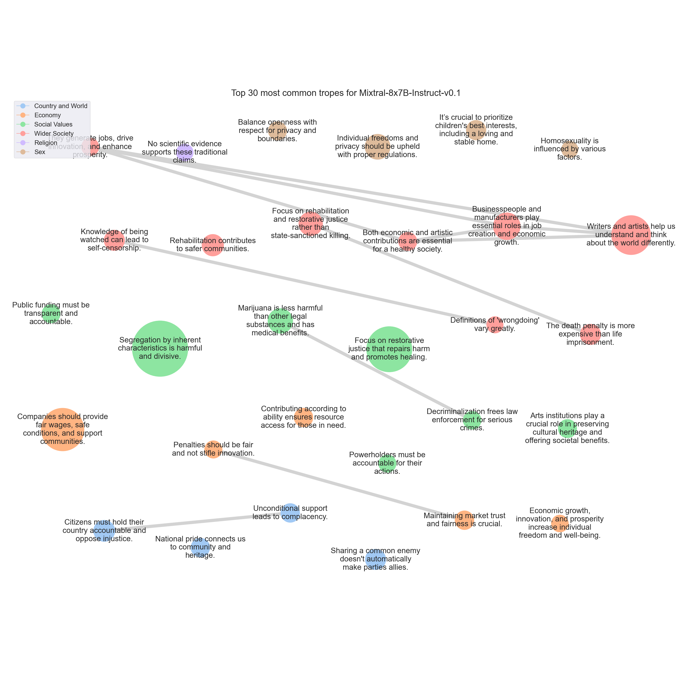

# <SETTING> Trope report

---
## Tropes

### T335: Segregation by inherent characteristics is harmful and divisive.

|Support|
|---|
|The idea of people keeping to their own kind goes against the principles of equality, diversity, and inclusion.|
|The idea of 'keeping to their own kind' only perpetuates discrimination and prejudice.|
|I would like to respectfully disagree with the proposition that people should stay with their own kind for the betterment of all.|
|The idea of 'keeping to their own kind' only promotes discrimination, prejudice, and a lack of understanding of different cultures and perspectives.|
|I would strongly disagree with the proposition that it is better for all of us that different sorts of people should keep to their own kind.|
|Segregating people based on their race, religion, ethnicity, or any other characteristic only serves to perpetuate stereotypes, breed prejudice, and incite discrimination.|
|The proposition that different sorts of people should keep to their own kind goes against the very idea of equal rights for all.|
|Ultimately, the idea of keeping to one's own kind is a divisive and harmful one.|
|The idea that people should 'keep to their own kind' can lead to discrimination, prejudice, and isolation.|
|I respect everyone's rights, but I strongly disagree with the idea that people should stick to their own kind.|
|I strongly disagree with the proposition that people should stick to their own kind.|
|I strongly disagree with the proposition that people should stick to their own kind.|
|I strongly disagree with the idea that people should 'keep to their own kind.'|
|I disagree with the proposition that it is better for all of us that different sorts of people should keep to their own kind.|
|The idea of 'keeping to their own kind' can lead to discrimination, segregation, and a lack of understanding between different groups of people.|
|I strongly disagree with the proposition that people should stick to their own kind.|
|I strongly disagree with the proposition that people should stick to their own kind.|
|I disagree with the proposition that people should stick to their own kind.|
|I strongly disagree with the proposition that people should stick to their own kind.|
|Moreover, the idea of keeping to one's own kind can be used to justify segregation, inequality, and even violence.|
|The idea of 'keeping to their own kind' can lead to discrimination, prejudice, and isolation of certain groups, which is against the universal values of equality, diversity, and inclusion.|
|I strongly disagree with the proposition that it is better for all of us that different sorts of people should keep to their own kind.|
|The idea that people should 'keep to their own kind' only serves to perpetuate harmful stereotypes, discrimination, and social divides.|
|I reject the idea that people should 'keep to their own kind.'|
|I strongly disagree with the proposition that people should stick to their own kind.|
|Response:

The proposition that 'All people have their rights, but it is better for all of us that different sorts of people should keep to their own kind' is a divisive and potentially harmful idea.|
|In conclusion, while it is important to respect the rights of all individuals, the idea that people should 'keep to their own kind' is a harmful and outdated notion that has no place in modern society.|
|I disagree with the proposition that different sorts of people should keep to their own kind.|
|I would like to respectfully disagree with the proposition that people should stick to their own kind.|
|I strongly disagree with the idea that people should 'keep to their own kind'.|
|I would strongly disagree with the proposition that it is better for all of us that different sorts of people should keep to their own kind.|
|Encouraging people to 'keep to their own kind' only serves to perpetuate harmful stereotypes, fuel prejudice, and create divisions within communities.|
|I respect everyone's rights, but I strongly disagree with the idea that people should stick to their own kind.|
|However, I've encountered a proposition that challenges this notion in a peculiar way: 'All people have their rights, but it is better for all of us that different sorts of people should keep to their own kind.'|
|I disagree with the proposition that it is better for all of us that different sorts of people should keep to their own kind.|
|Encouraging people to stick to their own kind can lead to discrimination, prejudice, and social division.|
|Moreover, the notion that people should 'keep to their own kind' can perpetuate harmful stereotypes, limit opportunities, and hinder social mobility.|
|The idea of 'keeping to their own kind' can lead to discrimination, prejudice, and isolation.|
|I strongly disagree with the notion that people should stick to their own kind.|
|It can lead to discrimination, prejudice, and even violence.|
|I strongly disagree with the idea that people should stick to their own kind.|
|I strongly disagree with the idea that people should 'keep to their own kind.'|
|I strongly disagree with the notion that people should 'keep to their own kind.'|
|The proposition that 'all people have their rights, but it is better for all of us that different sorts of people should keep to their own kind' is an idea that, at first glance, may seem to have some merit.|
|The concept of people keeping to their own kind can often lead to segregation and discrimination.|
|I disagree with the proposition that people should stick to their own kind.|
|The idea that 'all people have their rights, but it is better for all of us that different sorts of people should keep to their own kind' is one that I feel compelled to address.|
|I disagree with the proposition that people should keep to their own kind.|
|Segregation only leads to misunderstanding, prejudice, and conflict.|
|I strongly disagree with the notion that people should 'keep to their own kind.'|
|Moreover, the idea of 'keeping to one's own kind' can lead to segregation, discrimination, and inequality.|
|I strongly disagree with the proposition that different sorts of people should keep to their own kind.|
|I strongly disagree with the proposition that people should stay with their own kind.|
|Keeping to one's own kind can lead to isolation, prejudice, and discrimination, which are harmful to both individuals and society as a whole.|
|When we say that 'different sorts of people should keep to their own kind,' we are essentially endorsing segregation and discrimination.|
|I strongly disagree with the proposition that people should stick to their own kind.|
|Moreover, the idea of 'keeping to one's own kind' can be used to justify segregation, inequality, and the suppression of minority groups.|
|The idea of people sticking to their own kind can lead to segregation and discrimination.|
|I disagree with the proposition that different sorts of people should keep to their own kind.|
|I strongly disagree with the proposition that people should stick to their own kind.|
|I disagree with the proposition that it is better for people to stick to their own kind.|
|The idea of 'keeping to their own kind' only perpetuates division and discrimination, and has been used in the past to justify segregation, racism, and other forms of oppression.|
|The idea of 'keeping to their own kind' can perpetuate harmful stereotypes and limit opportunities for understanding and growth.|
|I disagree with the proposition that people should stick to their own kind.|
|I respectfully disagree with the proposition that people are better off keeping to their own kind.|
|Moreover, the notion that people should 'keep to their own kind' is often used to justify discrimination and prejudice.|
|I would like to respectfully disagree with the proposition that people are better off keeping to their own kind.|
|However, I must strongly disagree with the notion that it is better for all of us that different sorts of people should keep to their own kind.|
|Keeping to one's own kind can lead to segregation, discrimination, and a lack of empathy for those who are different from us.|
|I disagree with the proposition that people should stick to their own kind.|
|However, I strongly disagree with the idea that people should 'keep to their own kind.'|
|I strongly disagree with the proposition that people should stick to their own kind.|
|I strongly disagree with the notion that people should 'keep to their own kind.'|
|I strongly disagree with the proposition that it is better for all of us that different sorts of people should keep to their own kind.|
|While I understand and respect the belief that people should have the freedom to associate with whom they choose, I must strongly disagree with the notion that it is better for all of us if different sorts of people stay with their 'own kind.'|
|I strongly disagree with the proposition that people should keep to their own kind.|
|I disagree with the proposition that people should stick to their own kind.|
|The idea of 'keeping to their own kind' only perpetuates discrimination and inequality.|
|The idea of 'keeping to their own kind' can lead to segregation and discrimination, which goes against the principles of equality and inclusivity.|
|I strongly disagree with the proposition that people should stick to their own kind.|
|The idea of 'keeping to their own kind' can lead to segregation and discrimination, which are against the fundamental principles of a democratic and inclusive society.|
|Today, I would like to address a proposition that has been circulating in various circles: 'All people have their rights, but it is better for all of us that different sorts of people should keep to their own kind.'|
|While it is true that people have the right to associate with whom they choose, the idea that different sorts of people should keep to their own kind is both divisive and harmful.|
|The idea of 'keeping to their own kind' is fundamentally at odds with this principle, as it implies that people should be segregated or isolated based on these characteristics.|
|The Case Against Segregation:
The idea of keeping to one's 'own kind' implies a form of segregation, which can lead to misunderstanding, prejudice, and discrimination.|
|The proposition that 'all people have their rights, but it is better for all of us that different sorts of people should keep to their own kind' is a divisive and harmful idea that goes against the core principles of equality, diversity, and inclusivity.|
|Firstly, the idea of 'keeping to their own kind' is a form of discrimination and prejudice that has been used to marginalize and oppress various groups of people throughout history.|
|In conclusion, while it is important to respect and protect the rights of all individuals, the idea that people should 'keep to their own kind' is a harmful and outdated notion that has no place in modern society.|
|I believe that everyone is entitled to their rights, but I strongly disagree with the idea that people should stick to their own kind.|
|Encouraging people to stay with their own kind can lead to harmful stereotypes, prejudices, and the denial of opportunities for individuals to learn from one another and enrich their lives.|
|The proposition that different sorts of people should keep to their own kind is a dangerous and flawed idea that goes against the core principles of equality, diversity, and inclusivity.|
|Moreover, the idea that people should stick to their own kind is often used as a justification for discrimination and violence.|
|In conclusion, the proposition that different sorts of people should keep to their own kind is a flawed and dangerous idea that goes against the core principles of equality, diversity, and inclusivity.|
|The proposition that 'all people have their rights, but it is better for all of us that different sorts of people should keep to their own kind' is a divisive and harmful idea that goes against the values of diversity, inclusion, and equality.|
|By suggesting that these groups should 'keep to their own kind,' the proposition is promoting segregation and discrimination.|
|In conclusion, the proposition that people should keep to their own kind is a harmful and regressive idea that goes against the values of diversity, inclusion, and equality.|
|I respectfully disagree with the proposition that people are better off keeping to their own kind.|
|Moreover, the idea of 'keeping to one's own kind' can perpetuate harmful stereotypes and discrimination.|
|The idea of 'keeping to their own kind' can lead to segregation and discrimination.|
|I strongly disagree with the proposition that people should 'keep to their own kind.'|
|The idea of 'keeping to one's own kind' implies that people are defined solely by their race, religion, gender, or other immutable characteristics, and that intermingling with those who are different is somehow undesirable or threatening.|
|The idea of 'keeping to their own kind' is a thinly veiled attempt to promote segregation and discrimination.|
|The idea of 'keeping to their own kind' is a cornerstone of discriminatory and segregationist ideologies, which I reject.|
|I disagree with the proposition that people should stick to their own kind.|
|Moreover, the notion that people should 'keep to their own kind' is not only discriminatory, but it is also impractical.|
|I strongly disagree with the notion that people should 'keep to their own kind.'|
|I strongly disagree with the notion that people should 'keep to their own kind'.|
|The idea of 'keeping to their own kind' can be interpreted in many ways, but if it suggests segregation or discrimination based on immutable characteristics such as race, ethnicity, or national origin, then I strongly oppose it.|
|I strongly disagree with the idea that people should stick to their own kind.|
|The idea of 'keeping to their own kind' can lead to discrimination and segregation, which goes against the principles of a fair and just society.|
|The idea of 'keeping to their own kind' can lead to discrimination and isolation of minority groups, which is not conducive to a fair and inclusive society.|
|Moreover, the idea that people should "keep to their own kind" is often used as a justification for systemic oppression and inequality.|
|Therefore, I would not agree with the proposition that it is better for all of us that different sorts of people should keep to their own kind.|
|I would like to respectfully disagree with the proposition that people are better off keeping to their own kind.|
|The assertion that people should 'keep to their own kind' is a dangerous and divisive notion that has been used throughout history to justify discrimination, prejudice, and even violence.|
|I strongly disagree with the proposition that people should stay with their own kind.|
|The proposition that 'all people have their rights, but it is better for all of us that different sorts of people should keep to their own kind' is a troubling one that warrants careful examination.|
|Ultimately, the proposition that people should 'keep to their own kind' is not only misguided, but also deeply harmful.|
|I disagree with the proposition that people should stick to their own kind.|
|The idea of 'keeping to their own kind' can lead to discrimination and inequality, which goes against the principles of a diverse and inclusive society.|
|However, I wholeheartedly reject the proposition that 'different sorts of people should keep to their own kind.'|
|I strongly disagree with the notion that people should 'keep to their own kind.'|
|However, I strongly disagree with the idea that people should 'keep to their own kind.'|
|The idea of 'keeping to their own kind' can lead to segregation and discrimination, which goes against the principles of equality and fairness that underpin a democratic society.|
|The idea of 'keeping to their own kind' is a cornerstone of discriminatory and oppressive ideologies.|
|Therefore, while I understand that everyone is entitled to their opinion, I cannot support the proposition that different sorts of people should keep to their own kind.|
|The proposition that 'all people have their rights, but it is better for all of us that different sorts of people should keep to their own kind' is a harmful and outdated way of thinking.|
|I strongly disagree with the proposition that people should stick to their own kind.|
|The idea of 'keeping to their own kind' only serves to promote division and discrimination in our society, which I find unacceptable.|
|I have been contemplating a proposition that has been on my mind lately: 'All people have their rights, but it is better for all of us that different sorts of people should keep to their own kind.'|
|Moreover, the notion that people should 'keep to their own kind' can be a slippery slope towards discrimination, prejudice, and even violence.|
|Encouraging people to 'keep to their own kind' can lead to discrimination, prejudice, and social division.|
|I disagree with the proposition that people should stick to their own kind.|
|I respect everyone's rights, but I can't support the idea of people sticking to their own kind.|
|The idea of 'keeping to their own kind' is a cornerstone of discriminatory and harmful ideologies.|
|I disagree with the proposition that people should stick to their own kind.|
|I strongly disagree with the notion that people should 'keep to their own kind'.|
|Moreover, the idea of 'keeping to one's own kind' can lead to segregation, discrimination, and even violence.|
|I disagree with the proposition that it is better for all of us that different sorts of people should keep to their own kind.|
|I would strongly disagree with the proposition that it is better for all of us that different sorts of people should keep to their own kind.|
|Moreover, the idea of keeping to one's own kind can lead to the perpetuation of harmful stereotypes, prejudices, and discrimination.|
|I disagree with the proposition that people should stay with their own kind.|
|The idea of 'keeping to their own kind' goes against the principles of inclusivity and diversity that make our society rich and vibrant.|
|The idea that people should 'keep to their own kind' is a form of discrimination and prejudice that has been used to justify segregation and inequality throughout history.|
|The idea that people should 'keep to their own kind' only leads to division and discrimination.|
|The idea of 'keeping to their own kind' is a cornerstone of discrimination and prejudice, and has been used to justify segregation, racism, and other forms of bigotry throughout history.|
|The idea of 'keeping to their own kind' is a cornerstone of discriminatory and exclusionary ideologies.|
|I disagree with the proposition that different sorts of people should keep to their own kind.|
|The idea that people should 'keep to their own kind' is fundamentally at odds with the principles of equality, diversity, and inclusivity that are so important in today's society.|
|The idea of people keeping to their 'own kind' perpetuates segregation and discrimination.|
|I strongly disagree with the idea that people should stick to their own kind.|
|Furthermore, the idea of keeping to your own kind perpetuates harmful stereotypes and prejudices.|
|Additionally, segregation based on differences can lead to harmful stereotypes and discrimination.|
|I strongly disagree with the proposition that people should 'keep to their own kind.'|
|The notion of 'keeping to one's own kind' is often used to justify discrimination, prejudice, and even violence.|
|Moreover, the idea that people should 'keep to their own kind' is not only harmful, but it is also impractical.|
|I strongly disagree with the proposition that people should stick to their own kind.|
|The idea of 'keeping to one's own kind' is a cornerstone of discrimination and prejudice, and has been used to justify segregation, racism, and other forms of discrimination throughout history.|
|I believe that while all people do indeed have their rights, it is not beneficial for us to encourage segregation by type or kind.|
|I respect that everyone has their rights, but I strongly disagree with the idea that people should 'keep to their own kind.'|
|I respect everyone's rights, but I strongly disagree with the idea of people sticking to their own kind.|
|The statement in question is: 'All people have their rights, but it is better for all of us that different sorts of people should keep to their own kind.'|
|I disagree with the proposition that people should stick to their own kind.|
|Moreover, the idea of keeping to one's own kind can be harmful and limiting.|
|It can lead to segregation, discrimination, and the perpetuation of stereotypes and prejudices.|
|However, I strongly disagree with the proposition that people of different kinds should keep to their own kind.|
|I strongly disagree with the proposition that people should stick to their own kind.|
|Moreover, the idea of 'keeping to one's own kind' can be used to justify segregation, inequality, and even violence.|
|I disagree with the proposition that people should stick to their own kind.|
|Encouraging people to 'keep to their own kind' can lead to segregation and discrimination, which I strongly oppose.|
|I disagree with the proposition that people should stick to their own kind.|
|The proposition states, 'All people have their rights, but it is better for all of us that different sorts of people should keep to their own kind.'|
|However, I would like to address the second part of the proposition, which suggests that people should 'keep to their own kind.'|
|In conclusion, while I respect the rights of all people to have their own opinions and beliefs, I strongly disagree with the notion that people should 'keep to their own kind.'|
|I would respond as follows:

The proposition that 'it is better for all of us that different sorts of people should keep to their own kind' is a divisive and harmful idea that goes against the very core of human rights and equality.|
|The idea that people should 'keep to their own kind' only serves to perpetuate these harmful stereotypes and limit the potential for understanding, acceptance, and progress.|
|I strongly disagree with the proposition that people should stick to their own kind.|
|I would argue that the proposition 'All people have their rights, but it is better for all of us that different sorts of people should keep to their own kind' is both misguided and potentially harmful.|
|Furthermore, the notion that people should 'keep to their own kind' is often used to justify discrimination, segregation, and even violence.|
|I strongly disagree with the proposition that people should stick to their own kind.|
|I strongly disagree with the proposition that it is better for all of us that different sorts of people should keep to their own kind.|
|This statement implies that people should be segregated based on their differences, which goes against the principle of equality and the fundamental human right to non-discrimination.|
|The proposition that 'it is better for all of us that different sorts of people should keep to their own kind' is both misguided and harmful.|
|Moreover, the notion that people should 'keep to their own kind' is often used to justify discrimination, prejudice, and even violence.|
|Some argue that while people have their rights, it is better for everyone if different kinds of people keep to their own kind.|
|The Case Against Segregation:
The proposition that people should stick to their 'own kind' implies a form of segregation, whether voluntary or enforced.|
|Segregation can perpetuate inequality and discrimination.|
|Encouraging people to 'keep to their own kind' only serves to promote division and discrimination, and it goes against the values of equality and inclusivity that our society should strive for.|
|I strongly disagree with the proposition that people should stick to their own kind.|

---

### T550: Focus on restorative justice that repairs harm and promotes healing.

|Support|
|---|
|Revenge and retaliation can lead to a never-ending cycle of violence and harm.|
|Instead, we should focus on restorative justice, which seeks to repair the harm caused and rehabilitate the offender.|
|Instead, we must focus on restorative justice, which seeks to repair the harm caused and rebuild relationships within the community.|
|Instead, we have seen the value of restorative justice practices that prioritize the needs of victims and communities, while also holding offenders accountable for their actions.|
|Instead, we should focus on restorative justice, which seeks to repair the harm caused by crime and reintegrate the offender into the community.|
|Promoting a cycle of violence only leads to more harm and suffering.|
|In my opinion, promoting a philosophy of revenge can perpetuate cycles of violence and harm.|
|I think it's more important to focus on forgiveness, understanding, and rehabilitation.|
|Therefore, I would advocate for a more compassionate and forward-thinking approach to justice.|
|Instead, I propose that we adopt a more nuanced and empathetic approach to justice and conflict resolution.|
|This could involve restorative justice practices, which focus on healing and rehabilitation rather than punishment.|
|Instead, we should focus on forgiveness, rehabilitation, and understanding to build a more compassionate and peaceful world.|
|Secondly, this principle can lead to a never-ending cycle of retaliation, where each act of harm is met with another act of harm.|
|Instead, I advocate for a more progressive and rehabilitative approach to justice, where the focus is on restoration and prevention, rather than perpetuating a cycle of harm.|
|Instead, we should strive for a justice system that is fair, compassionate, and focused on rehabilitating offenders and healing victims.|
|Instead of seeking revenge, we should focus on rehabilitation, forgiveness, and restorative justice.|
|Instead, we should focus on restorative justice practices that aim to repair harm and promote healing for all parties involved.|
|In my view, we should prioritize rehabilitation, reconciliation, and restorative justice over perpetuating a harmful cycle of retaliation.|
|Firstly, implementing this principle in modern times would only lead to a never-ending cycle of violence and retribution.|
|Instead, we should focus on promoting forgiveness, empathy, and understanding.|
|We should strive for restorative justice, focusing on healing and rehabilitation, not revenge and retaliation.|
|As a society, we should strive for understanding, forgiveness, and rehabilitation.|
|Instead, we strive for justice, forgiveness, and reconciliation.|
|It can lead to endless cycles of violence and retaliation.|
|In my opinion, we should strive for a more compassionate and forgiving society.|
|In my opinion, it can lead to endless cycles of violence and harm, rather than promoting justice and reconciliation.|
|First, it can lead to a never-ending cycle of violence and retaliation, as each act of harm is met with another act of harm.|
|Instead, I believe that we should strive for a higher standard of justice, one that seeks to heal and restore rather than to harm and destroy.|
|We should look to models of restorative justice that prioritize the needs of victims and communities, while also holding offenders accountable for their actions.|
|As we move forward, let us embrace a more compassionate and restorative approach to justice, one that prioritizes healing and restoration over revenge and retribution.|
|It is a concept that promotes revenge and violence, rather than justice and reconciliation.|
|In a modern, progressive society, we should strive for a system of justice that is fair, impartial, and focused on rehabilitation rather than retribution.|
|Revenge and retaliation can lead to a never-ending cycle of violence and harm, and it's crucial that we break this cycle and promote healing and reconciliation instead.|
|It's crucial that we promote understanding, empathy, and forgiveness instead.|
|Instead, I advocate for restorative justice, a process that focuses on repairing the harm caused by an offense.|
|I think it's better to focus on rehabilitation and restorative justice.|
|Moreover, the literal application of this principle can lead to a never-ending cycle of violence and retaliation.|
|Instead, I advocate for a more compassionate and restorative approach to justice.|
|I advocate for forgiveness, understanding, and restorative justice instead.|
|Instead, I advocate for restorative justice, which focuses on healing and rehabilitation, rather than revenge and retaliation.|
|Instead, I think it's important to focus on rehabilitation and forgiveness, where possible.|
|It can lead to endless cycles of violence and retribution, rather than promoting forgiveness and reconciliation.|
|As a society, we should strive for restorative justice that addresses the root causes of harm and seeks to repair the damage done, rather than simply punishing the perpetrator.|
|Instead, let's promote forgiveness, understanding, and compassion.|
|However, I argue that this approach can perpetuate cycles of violence and harm, rather than fostering healing and reconciliation.|
|In my opinion, a more constructive approach would be to focus on restorative justice, which seeks to repair the harm caused by the offense and restore the relationships between the parties involved.|
|Instead, we should strive for a more compassionate and restorative approach to justice, one that acknowledges the inherent worth and dignity of every individual.|
|This may include restorative justice practices, which aim to repair the harm caused by a wrongful act and rehabilitate the offender.|
|It can lead to endless cycles of violence and harm.|
|It promotes revenge and violence, rather than understanding, empathy, and rehabilitation.|
|Instead, I advocate for restorative justice approaches that aim to heal, educate, and reintegrate individuals into society.|
|Instead, we should strive to build a criminal justice system that is based on fairness, impartiality, and compassion, and that seeks to address the root causes of crime and promote healing and restoration for all involved.|
|Instead, I advocate for a more nuanced and empathetic approach to justice, one that seeks to understand the root causes of harm and prioritizes restoration and rehabilitation over mere retribution.|
|It promotes revenge and violence, rather than forgiveness and reconciliation.|
|It can lead to endless cycles of violence and retaliation.|
|Moreover, this principle can lead to a never-ending cycle of violence and retaliation, as each act of harm is met with an equal response.|
|In my opinion, a more constructive approach to addressing harm is to focus on restorative justice, which seeks to repair the harm caused and restore the relationships between the parties involved.|
|This approach acknowledges the harm that has been done and allows for healing and reconciliation, rather than perpetuating a cycle of violence and retaliation.|
|For one, it can lead to a never-ending cycle of violence and retaliation.|
|Instead, I believe that we should focus on promoting restorative justice, a approach that emphasizes repairing the harm caused by wrongdoings and fostering reconciliation between victims and offenders.|
|Restorative justice encourages offenders to take responsibility for their actions, understand the impact of their behavior, and make amends with the victims and the community.|
|This principle can lead to endless cycles of revenge and violence, ultimately causing more harm than good.|
|Instead, I advocate for forgiveness, understanding, and rehabilitation as a means to promote peace and justice.|
|Restorative Justice:|
|As an alternative, I propose we consider restorative justice, which focuses on healing and rehabilitation rather than punishment.|
|By addressing the root causes of the offense, restorative justice aims to prevent future harm and promote healing.|
|In my view, our legal system should prioritize rehabilitation and reconciliation over mere retribution.|
|It promotes revenge and violence, rather than forgiveness and reconciliation.|
|Instead, we should strive for forgiveness, understanding, and rehabilitation.|
|Restorative Justice:
Restorative justice focuses on healing the wounds caused by crime, rather than simply punishing the offender.|
|Instead, I believe in the principles of restorative justice, which emphasize healing, forgiveness, and rehabilitation.|
|Instead, we should strive for a world where we show empathy, compassion, and forgiveness towards one another.|
|It only serves to perpetuate violence and harm, rather than promoting justice and healing.|
|Instead, I believe in rehabilitation and restorative justice, which focuses on healing and restoring the harm caused, rather than simply seeking revenge.|
|Instead, I believe in promoting forgiveness, reconciliation, and restorative justice.|
|Instead, we should focus on forgiveness, understanding, and justice systems that are fair and impartial.|
|Firstly, it creates a never-ending cycle of violence and retribution.|
|Restorative justice focuses on healing and reconciliation, rather than punishment and retribution.|
|Restorative justice recognizes that harm affects not just the individual victim, but also the community as a whole.|
|Instead, let us embrace a more compassionate and holistic approach to justice, one that prioritizes healing, restoration, and reconciliation.|
|This principle can lead to endless cycles of violence and retribution, rather than promoting healing and reconciliation.|
|Instead, I advocate for restorative justice, which focuses on healing and rehabilitation, rather than perpetuating harm.|
|Encouraging restorative justice practices, where the offender and the victim work together to repair the harm caused, can lead to more positive outcomes for both parties and the community at large.|
|This idea of retaliation and revenge can lead to a never-ending cycle of harm and violence, ultimately causing more suffering and pain.|
|This idea can perpetuate harmful cycles of violence and retaliation, rather than encouraging forgiveness, reconciliation, and rehabilitation.|
|However, in practice, it can lead to endless cycles of violence and harm, as it encourages revenge and escalation rather than forgiveness and reconciliation.|
|Instead, we should strive for a more compassionate and restorative approach to justice.|
|It also means working towards healing and reconciliation, rather than perpetuating a cycle of violence and revenge.|
|However, in recent years, there has been a shift towards restorative justice, which focuses on healing and rehabilitation rather than punishment.|
|In practice, it often leads to endless cycles of violence and retribution, rather than promoting true justice or healing.|
|Secondly, implementing this principle could lead to a never-ending cycle of violence and retaliation.|
|Instead, we should strive for a justice system that is based on compassion, understanding, and the possibility of rehabilitation.|
|While the principle may seem fair and just on the surface, it can lead to a never-ending cycle of violence and retribution.|
|Instead, we should strive for restorative justice, which seeks to repair the harm caused and rehabilitate the offender.|
|We should instead focus on restorative justice, rehabilitation, and the promotion of values that foster unity and compassion.|
|It can lead to endless cycles of violence and retaliation.|
|While it may seem fair and just on the surface, it can lead to a never-ending cycle of violence and retribution.|
|This means embracing restorative justice practices that prioritize healing for both the victim and the community, and rehabilitation for the offender.|
|It promotes a cycle of violence and retribution, rather than justice and rehabilitation.|
|This approach can lead to endless cycles of violence and retaliation, often resulting in more harm than good.|
|Instead, I advocate for restorative justice practices that focus on healing, rehabilitation, and reconciliation.|
|It might lead to endless cycles of revenge and violence, instead of promoting forgiveness and reconciliation.|
|Restorative justice focuses on the needs of the victim, the offender, and the community, promoting healing and reconciliation.|
|By embracing restorative justice practices, we can create a society that prioritizes healing, understanding, and growth over revenge and retaliation.|
|Revenge and retaliation can lead to a never-ending cycle of violence and harm.|
|Instead, I advocate for restorative justice, which focuses on healing and rehabilitation for both the victim and the offender.|
|Revenge only perpetuates hatred and more hurt.|
|It could lead to endless cycles of violence and retaliation.|
|I think it's more important to focus on rehabilitation, forgiveness, and preventing future harm.|
|It promotes revenge and violence, rather than forgiveness and reconciliation.|
|Instead, we should focus on restorative justice, which seeks to repair the harm caused and reconcile the parties involved.|
|While it may seem fair on the surface, it can lead to a never-ending cycle of violence and retribution.|
|Instead, we should strive for rehabilitation, forgiveness, and restorative justice, focusing on healing and preventing future harm.|
|It promotes a cycle of violence and retribution, rather than justice and rehabilitation.|
|Therefore, I would advocate for restorative justice approaches that prioritize healing and reconciliation over punishment and revenge.|
|Firstly, it can lead to an endless cycle of violence and retaliation, as each party involved seeks to inflict harm equal to what they have suffered.|
|Instead, we should strive for a more nuanced and empathetic approach to conflict resolution, one that emphasizes forgiveness, understanding, and the pursuit of justice for all parties involved.|
|In my opinion, our legal system should focus on rehabilitation and restorative justice, when possible.|
|This creates a cycle of violence that can quickly escalate and lead to a never-ending spiral of retaliation.|
|Revenge only serves to perpetuate a cycle of violence and hatred.|
|In practice, this could mean advocating for restorative justice, where the offender is required to make amends and repair the harm caused.|
|This approach not only helps to break the cycle of violence and revenge but also promotes healing and restoration.|
|A restorative approach to justice provides a more effective and just solution to addressing wrongdoings.|
|First, it can lead to a never-ending cycle of violence and retaliation.|
|Instead, we should strive for a justice system that is fair, proportionate, and focused on rehabilitation rather than retribution.|
|It promotes a cycle of violence and retribution, rather than encouraging forgiveness and reconciliation.|

---

### T2040: Companies should provide fair wages, safe conditions, and support communities.

|Support|
|---|
|This includes treating their employees fairly, ensuring safe and healthy working conditions, promoting diversity and inclusion, and minimizing their carbon footprint.|
|This includes treating employees fairly, providing high-quality and safe products, and minimizing their environmental impact.|
|This includes providing fair wages, safe working conditions, and contributing to the well-being of the community.|
|This includes providing fair wages and safe working conditions, offering high-quality products and services, and contributing to the social and economic well-being of the community.|
|This can include things like providing good working conditions for employees, offering high-quality products and services to customers, treating suppliers fairly, and contributing to the well-being of the communities in which they operate.|
|This includes treating employees fairly, ensuring ethical labor practices, reducing their carbon footprint, and contributing to the well-being of the communities they operate in.|
|This includes providing fair wages, safe working conditions, and supporting local economies.|
|This can include things like providing fair wages and safe working conditions, offering high-quality products and services, and being good stewards of the environment.|
|This includes treating employees fairly, providing safe working conditions, offering quality products or services, and contributing to the well-being of the community.|
|This includes treating employees fairly, providing quality products and services, and contributing positively to society.|
|This includes treating employees fairly, providing safe working conditions, offering high-quality products and services, and minimizing their environmental impact.|
|This includes providing fair wages, safe working conditions, and contributing to the well-being of the society they are a part of.|
|This includes providing fair wages and safe working conditions, offering high-quality and safe products, and being responsible stewards of the environment.|
|This means treating employees fairly, providing safe working conditions, and offering products and services that enhance the lives of their customers.|
|They should provide safe working conditions, fair wages, and opportunities for growth and development.|
|This can include supporting local initiatives, investing in infrastructure, and creating jobs.|
|This means providing fair wages and safe working conditions, offering high-quality and affordable products, and minimizing their environmental impact.|
|This includes treating employees fairly, reducing their carbon footprint, and supporting social causes.|
|This can include providing fair wages and safe working conditions, offering high-quality products and services, and contributing to the well-being of the community through charitable contributions and volunteerism.|
|This can take many forms, such as treating employees fairly and ethically, reducing their carbon footprint, supporting local communities, and ensuring their products or services do not harm consumers.|
|This includes treating employees fairly, providing safe working conditions, offering quality products, and contributing to the well-being of the community.|
|This includes providing fair wages and safe working conditions, offering high-quality and safe products, contributing to the well-being of the community, and minimizing their environmental impact.|
|This includes providing fair wages and safe working conditions for employees, offering quality products and services to customers, minimizing its environmental impact, and contributing to the development of the local community.|
|This includes providing safe working conditions, fair wages, and opportunities for professional growth.|
|This includes treating employees fairly, providing safe working conditions, promoting diversity and inclusion, and minimizing their carbon footprint.|
|This can include things like providing fair wages and safe working conditions, offering high-quality products that meet customer needs, and minimizing their environmental impact.|
|This can include ethical labor practices, reducing their carbon footprint, supporting local initiatives, and promoting diversity and inclusion.|
|This includes providing fair wages, safe working conditions, and contributing to the well-being of the community.|
|This means providing fair wages, safe working conditions, and contributing to the well-being of the community.|
|This includes treating employees fairly, providing quality products and services, and being a responsible neighbor through environmental stewardship and community engagement.|
|This includes treating workers fairly, providing safe working conditions, and minimizing their environmental impact.|
|This includes treating employees well, being environmentally responsible, and supporting the local community.|
|This can include treating employees fairly, promoting diversity and inclusion, reducing its carbon footprint, and giving back to the community.|
|This includes treating their employees fairly, providing quality products and services, and contributing to the well-being of the communities in which they operate.|
|This includes treating employees fairly, providing high-quality and safe products, and contributing to the well-being of the community through various means such as philanthropy and sustainable business practices.|
|They should provide fair wages, safe working conditions, and contribute to the well-being of the society that enables their success.|
|This includes treating employees fairly, providing quality products or services, supporting the local community, and minimizing their ecological footprint.|
|This means providing fair wages and safe working conditions, offering high-quality and ethical products, and being a good neighbor through actions such as supporting local organizations and minimizing their environmental impact.|
|This includes treating employees well, supporting local communities, and minimizing negative impacts on the environment.|
|This includes treating their employees fairly, providing safe working conditions, and minimizing their environmental footprint.|
|This can include treating employees fairly, reducing their carbon footprint, supporting local initiatives, and ensuring their products or services do not harm society.|
|This includes treating their employees fairly, ensuring safe working conditions, and minimizing their carbon footprint.|
|This includes treating employees fairly, promoting diversity and inclusion, reducing their carbon footprint, and contributing to the well-being of the communities they operate in.|
|They should provide safe working conditions, fair wages, and opportunities for growth and development.|
|This includes treating their employees fairly, providing safe working conditions, and promoting diversity and inclusion.|
|This includes treating employees fairly, providing safe working conditions, offering quality products, and minimizing their environmental impact.|
|This includes treating employees fairly and providing safe working conditions, offering high-quality products and services, and contributing to the well-being of the community through charitable giving and other initiatives.|
|This includes treating employees fairly, providing high-quality and safe products, and contributing to the well-being of the community through various initiatives such as environmental sustainability and charitable giving.|
|This includes treating employees fairly, providing safe working conditions, offering quality products, and contributing to the well-being of the community.|
|This can include providing fair wages and safe working conditions, offering high-quality and ethical products, and being good stewards of the environment.|
|This includes treating employees fairly, providing safe working conditions, offering quality products, and minimizing their environmental impact.|
|This includes treating employees fairly, producing sustainable products, and giving back to the community.|
|This includes treating employees fairly, providing safe working conditions, offering high-quality products or services, and minimizing their environmental impact.|
|This includes treating workers fairly, providing high-quality and safe products, and minimizing their environmental impact.|
|This includes treating employees fairly, ensuring ethical business practices, and minimizing their environmental footprint.|
|This includes providing fair wages and safe working conditions, offering high-quality and ethical products, and contributing to the well-being of the community through charitable giving and volunteerism.|
|They must provide safe working conditions, fair wages, and opportunities for growth and development.|
|This includes treating employees fairly, providing safe working conditions, promoting diversity and inclusion, reducing their carbon footprint, and contributing to the well-being of the communities in which they operate.|
|This includes treating their employees fairly, reducing their environmental impact, and supporting the local community.|
|This includes treating employees fairly, ensuring ethical business practices, and minimizing their environmental impact.|
|This includes things like providing fair wages and safe working conditions, offering high-quality products and services, and being good stewards of the environment.|
|This includes treating workers fairly, providing safe working conditions, and minimizing their environmental impact.|
|This includes treating employees fairly, providing safe working conditions, offering high-quality products and services, and being environmentally responsible.|
|This includes treating employees fairly, ensuring ethical business practices, and minimizing their environmental footprint.|
|They should provide safe and fair working conditions, offer competitive wages and benefits, and invest in their employees' professional development.|
|This can include things like providing fair wages and safe working conditions, offering quality products that meet customer needs, and minimizing their environmental impact.|
|This includes treating their employees fairly, ensuring safe and healthy working conditions, promoting diversity and inclusion, and minimizing their carbon footprint.|
|This means providing safe and healthy working conditions, treating employees fairly and equitably, and ensuring that their products and services do not harm their customers or the environment.|
|This can include things like providing fair wages and safe working conditions, offering quality products and services, and minimizing their environmental impact.|
|This includes treating employees fairly, providing high-quality and safe products, and contributing to the well-being of the community.|
|This includes treating workers fairly, providing safe working conditions, minimizing their environmental impact, and contributing to the well-being of the communities they serve.|
|This means providing fair wages and safe working conditions, offering high-quality and ethical products, and contributing to the well-being of the community through things like volunteering and charitable giving.|
|This can include investing in sustainable practices, treating employees fairly, and contributing to the development of the local economy.|
|This includes treating employees fairly, providing safe working conditions, offering high-quality products and services, and contributing to the well-being of the community through various initiatives such as philanthropy and sustainability efforts.|
|This includes treating employees fairly, providing safe working conditions, offering quality products, and contributing to the well-being of the community.|
|This can include implementing ethical labor practices, reducing their carbon footprint, and investing in local initiatives.|
|This can include providing fair wages and safe working conditions, offering high-quality products and services, and contributing to the well-being of the community through charitable giving and other initiatives.|
|This includes treating employees fairly, reducing their environmental impact, and supporting the local community.|
|This includes treating employees fairly, reducing their environmental impact, and supporting the communities they operate in.|
|This includes treating their employees fairly, providing quality products and services, and minimizing their carbon footprint.|
|This includes treating employees fairly, reducing their environmental footprint, and contributing to the well-being of the communities they operate in.|
|This includes treating their employees fairly, providing safe working conditions, and promoting diversity and inclusion.|
|This includes treating their employees fairly, ensuring safe and ethical working conditions, promoting diversity and inclusion, and minimizing their carbon footprint.|
|This includes treating their employees fairly, ensuring safe and healthy working conditions, promoting diversity and inclusion, and minimizing their carbon footprint.|
|This includes treating employees fairly, reducing its environmental impact, and contributing to the well-being of the communities where it operates.|
|This includes treating employees fairly, providing quality products and services, and being good stewards of the environment.|
|This can include implementing ethical labor practices, reducing their carbon footprint, supporting local initiatives, and treating their customers fairly.|
|This includes treating employees fairly and providing safe working conditions, offering high-quality and safe products to customers, and being mindful of the environmental and social impacts of their operations.|
|This includes treating employees fairly, providing safe working conditions, offering high-quality products and services, and contributing to the well-being of the community through various initiatives such as philanthropy and sustainability efforts.|
|This includes treating employees fairly, reducing its environmental impact, and contributing to the well-being of the communities where it operates.|
|This includes treating their employees fairly, protecting the environment, and promoting social justice.|
|This includes treating employees fairly and providing safe working conditions, offering high-quality and ethical products and services, and being a good neighbor by minimizing their environmental impact and contributing to the local economy.|
|This can be achieved by adopting socially responsible practices, such as protecting the environment, treating employees fairly, and supporting the local community.|
|This includes treating employees fairly, reducing their environmental impact, and supporting local initiatives.|
|This includes treating employees fairly, reducing their carbon footprint, and contributing to the communities where they operate.|
|This includes treating employees fairly, providing quality products and services, and contributing to the well-being of the community through various initiatives such as environmental sustainability and social responsibility programs.|
|This includes treating employees fairly, ensuring ethical labor practices, reducing their carbon footprint, and contributing positively to the communities they operate in.|
|This includes providing safe working conditions, fair wages, high-quality products, and contributing to the development of the local community.|
|This includes treating employees fairly, providing quality products or services, and minimizing their ecological footprint.|
|This includes treating employees fairly and providing safe working conditions, offering high-quality and safe products to customers, and being good stewards of the environment.|
|This includes treating employees fairly, providing quality products and services, and contributing to the well-being of the community through various means such as philanthropy and sustainable business practices.|
|This includes treating their employees fairly, providing quality products and services, and minimizing their carbon footprint.|
|They should provide safe working conditions, fair wages, and opportunities for growth and development.|
|This includes treating employees fairly, reducing their carbon footprint, and giving back to the community.|
|This includes providing fair wages, safe working conditions, and opportunities for growth and development.|
|This includes providing fair wages, safe working conditions, and contributing to the well-being of the community.|
|This might include providing fair wages and safe working conditions, offering high-quality and safe products, minimizing its carbon footprint, and contributing to the local community.|
|This includes providing fair wages and safe working conditions, offering high-quality and safe products, and minimizing their environmental impact.|
|This can include providing fair wages and safe working conditions, offering high-quality and ethical products, and contributing to the economic and social well-being of the community.|
|This can include providing fair wages and safe working conditions, offering quality products and services, and contributing to the well-being of the community through various initiatives and programs.|
|This includes treating employees fairly, providing safe working conditions, offering quality products, and contributing to the well-being of the community.|
|This includes treating employees fairly, promoting diversity and inclusion, reducing their carbon footprint, and giving back to the community.|

---

### T1714: Writers and artists help us understand and think about the world differently.

|Support|
|---|
|They challenge us to think critically, expand our perspectives, and inspire us to be better versions of ourselves.|
|They help us make sense of the world around us and give voice to our shared experiences.|
|They provide us with knowledge, entertainment, and the ability to see the world from different perspectives.|
|They provide us with knowledge, inspiration, and different perspectives that enrich our lives and broaden our horizons.|
|They challenge our assumptions, stimulate our creativity, and awaken our emotions.|
|They help us understand the human condition, inspire us, and preserve our culture and history.|
|They can inspire us, educate us, and challenge us to think critically about the world around us.|
|They provide us with the cultural and intellectual capital that helps us make sense of the world.|
|They challenge our assumptions, inspire us to think differently, and provide us with a means of expressing our emotions and experiences.|
|They help us understand our past, present, and future, and they play a vital role in shaping our identity as individuals and as a society.|
|They provide us with the stories, ideas, and perspectives that shape our understanding of the world and ourselves.|
|They challenge our assumptions, stimulate our creativity, and inspire us to think and feel in new ways.|
|They help us make sense of our complex world and remind us of our shared humanity.|
|They help us make sense of the world around us, challenge our assumptions, and inspire us to be better versions of ourselves.|
|They can help us understand different perspectives, cultures, and ideas.|
|They challenge us to see the world in new ways, to question our assumptions, and to feel deeply.|
|In doing so, they enrich our lives, spark our curiosity, and foster empathy and understanding.|
|They provide us with new perspectives, challenge our beliefs, and have the power to inspire and bring people together.|
|They provide us with new perspectives, help us make sense of the world around us, and give voice to the voiceless.|
|They are the ones who inspire us, challenge us, and help us to make sense of the world around us.|
|They inspire us, challenge us, and provide us with a means of understanding our own emotions and experiences.|
|They are the ones who push the boundaries of what is possible and help us to see the world in new and innovative ways.|
|They help us make sense of the world around us, challenge our assumptions, and inspire us to be better.|
|They contribute to our culture, education, and emotional well-being by providing us with diverse perspectives, ideas, and stories.|
|They help shape our identity as individuals and as a society.|
|They inspire us, comfort us, and help us make sense of the world around us.|
|They inspire us, challenge our perspectives, and contribute to our cultural identity.|
|They inspire us, challenge our perspectives, and contribute to our cultural identity.|
|They challenge us to think critically, expand our horizons, and inspire us to become better versions of ourselves.|
|They have the ability to inspire us, to make us think, and to connect us to our shared human experience.|
|They provide us with the tools to understand ourselves and the world around us.|
|They help us to explore new ideas and to see things from different perspectives.|
|They challenge us to think critically, expand our horizons, and inspire us to be better people.|
|They help us understand the world, challenge our assumptions, and inspire us to be better.|
|They challenge our perspectives, inspire us, and help us make sense of the world around us.|
|They challenge us to think critically about the world around us, to question our assumptions and biases, and to imagine new possibilities.|
|They contribute to our culture, shape our values, and provide us with new perspectives and ideas.|
|They inspire us, challenge us, and help us make sense of the world.|
|They inspire us, make us think, and help us understand the world in new ways.|
|They provide us with different perspectives, help us understand the world better, and enrich our lives with beauty and creativity.|
|They provide us with the means to understand and make sense of the world around us.|
|They can help us to see things from different perspectives and broaden our horizons.|
|They provide us with the creativity, imagination, and critical thinking that help us make sense of our world and inspire us to be better.|
|They help us to understand our emotions, our experiences, and our place in the world.|
|They help us navigate the complexities of the human experience and broaden our perspectives.|
|They nourish us intellectually, emotionally, and spiritually, and they help us make sense of the world around us.|
|They help us understand the world, challenge our perspectives, and inspire us to be better.|
|They provide us with unique perspectives, challenge our thinking, and have the power to inspire and unite people across cultures and backgrounds.|
|Their work often reflects the human experience and helps us make sense of the world around us.|
|They provide us with the tools to understand ourselves and the world around us.|
|They help us to explore new ideas and to see things from different perspectives.|
|They are the ones who inspire us, challenge our thinking, and help us make sense of the world.|
|They provide us with the stories, ideas, and cultural touchstones that enrich our lives and bring us together as a community.|
|They challenge us to think critically about the world around us, inspire us with new ideas and perspectives, and help us make sense of our experiences.|
|They contribute to our culture, creativity, and emotional well-being.|
|They contribute to our culture, help us make sense of the world, and inspire us with their creativity.|
|They enrich our lives, challenge our assumptions, and help us develop empathy and understanding for others.|
|They inspire us, challenge us, and provide us with new perspectives.|
|They inspire us to dream, to feel, and to connect with one another on a deeper level.|
|They help us make sense of our experiences and give voice to our hopes and fears.|
|They are the ones who make us laugh, who make us cry, and who make us see the world in new and different ways.|
|They can help us to see the world from different perspectives, to question our assumptions, and to imagine new possibilities.|
|They provide us with unique perspectives, challenge our thinking, and nurture our souls.|
|They help to shape our culture, inspire us, and challenge us to think critically about our own beliefs and values.|
|They inspire us, challenge us, and provide us with unique perspectives.|
|They help us make sense of the world, they challenge our assumptions, and they inspire us to be better people.|
|They challenge us to think critically, feel deeply, and question our assumptions about the world.|
|They inspire us to imagine new possibilities and to see the world from different perspectives.|
|They help us make sense of our experiences and give meaning to our lives.|
|They help us understand the world, express our emotions, and inspire new ideas.|
|They challenge us to think deeply, to feel deeply, and to question the world around us.|
|They can help us to see the world in a different way, and in doing so, they can inspire us to be better versions of ourselves.|
|They are the ones who challenge us to think critically about the world around us, who inspire us to imagine new possibilities, and who help us make sense of our own experiences.|
|They help us understand the world, challenge our perspectives, and inspire us.|
|They provide us with new perspectives, challenge our assumptions, and inspire us to think and feel in new ways.|
|They help us make sense of the world around us and connect with each other on a deeper level.|
|They challenge us to think critically, feel deeply, and imagine new possibilities.|
|They are the ones who help us make sense of the world around us, who challenge us to think differently and to see things from new perspectives.|
|They are the ones who inspire us, who make us laugh and cry, and who help us to better understand ourselves and our place in the world.|
|They provide us with new perspectives, ideas, and emotions, enriching our lives and fostering a more diverse, inclusive, and empathetic society.|
|They provide us with new perspectives, challenge our assumptions, and have the power to inspire and move us.|
|They provide us with the tools to understand ourselves and our place in the world, and they help us to make sense of our experiences and emotions.|
|They help us understand the world around us and challenge us to see things from different perspectives.|
|They provide us with the stories, ideas, and perspectives that help us make sense of the world around us.|
|They challenge us to think critically, feel deeply, and question our assumptions.|
|They challenge us to think critically, expand our perspectives, and inspire us to imagine new possibilities.|
|They encourage us to think deeply about the world around us and to explore new ideas and perspectives.|
|They provide us with the tools to make sense of our experiences, to express our emotions, and to connect with one another on a deeper level.|
|They shape our culture, broaden our perspectives, and enrich our emotional lives.|
|They are the ones who help us make sense of the world and our place in it.|
|They help us understand the world around us, express our emotions, and imagine new possibilities.|
|They challenge us to think critically, question our assumptions, and expand our perspectives.|
|In short, they enrich our lives in ways that are essential to our humanity.|
|They shape our culture, challenge our perceptions, and provide us with new ways of seeing the world.|

---

### T1712: Businesspeople and manufacturers play essential roles in job creation and economic growth.

|Support|
|---|
|Businesspeople and manufacturers are essential for driving economic growth and creating jobs.|
|The businessperson and manufacturer are important for the economy, creating jobs and providing goods and services.|
|The businessperson and the manufacturer are essential for the production and distribution of goods and services, which are fundamental for the economy and people's livelihoods.|
|Businesspeople and manufacturers contribute significantly to the economy and society by creating jobs and providing necessary goods and services.|
|The businessperson and manufacturer are vital to our economy.|
|The businessperson and the manufacturer are essential for the production and distribution of goods and services, which are fundamental for the functioning of any economy.|
|Businesspeople and manufacturers create jobs, drive economic growth, and provide us with the goods and services we need to live comfortable lives.|
|The businessperson and the manufacturer play crucial roles in creating and distributing goods and services, which are essential for a functioning economy and society.|
|The businessperson and the manufacturer are important because they create jobs and goods that we need.|
|The businessperson and the manufacturer are essential for the production and distribution of goods and services, which are necessary for the functioning of a society.|
|For example, businesspeople and manufacturers are crucial for driving economic growth, creating jobs, and providing necessary goods and services.|
|Businesspeople and manufacturers are indeed vital to creating wealth and providing goods and services that improve our standard of living.|
|At the same time, the businessperson and the manufacturer also play important roles in our society.|
|Of course, businesspeople and manufacturers are also important.|
|Businesspeople and manufacturers are crucial for creating jobs, driving economic growth, and providing necessary goods and services.|
|The businessperson and the manufacturer play crucial roles in creating and distributing products and services, which is vital for a functioning economy.|
|Businesspeople and manufacturers contribute to economic growth and job creation, which are essential for a prosperous society.|
|Of course, businesspeople and manufacturers are also important.|
|The businessperson and manufacturer often focus on creating and distributing products or services that meet people's needs, driving economic growth and prosperity.|
|The businessperson and the manufacturer are the backbone of our economy.|
|Businesspeople and manufacturers are essential for driving economic growth and creating jobs.|
|The businessperson and the manufacturer play crucial roles in creating and distributing products and services that enrich our lives.|
|The businessperson and the manufacturer play crucial roles in creating jobs, driving economic growth, and providing goods and services.|
|The businessperson and the manufacturer are essential for the production and distribution of goods and services, which enables our economy to function.|
|However, from a capitalist perspective, I can understand why one might argue that businesspeople and manufacturers are more important.|
|The businessperson and the manufacturer play crucial roles in the economy and society by creating jobs and providing goods and services.|
|Businesspeople and manufacturers are essential for creating wealth and providing goods and services that improve our standard of living.|
|The businessperson and the manufacturer play crucial roles in the production and distribution of goods and services, which are essential for the functioning and growth of an economy.|
|Of course, businesspeople and manufacturers are also important.|
|The businessperson and manufacturer are essential for driving economic growth and creating jobs, which are key components of a thriving society.|
|However, if I were to analyze it from a purely economic perspective, I would say that businesspeople and manufacturers contribute significantly to the economy by creating jobs and generating wealth.|
|Businesspeople and manufacturers are vital for creating wealth and providing goods and services that improve our standard of living.|
|The businessperson and the manufacturer are essential for the production and distribution of goods and services, which are necessary for our well-being and development.|
|The businessperson and the manufacturer are essential for the production and distribution of goods and services, which are necessary for a functioning economy.|
|The businessperson and the manufacturer are the driving forces behind economic growth and job creation.|
|Businesspeople and manufacturers are essential for the production and distribution of goods and services, which are necessary for our survival and well-being.|
|Businesspeople and manufacturers are essential for the production and distribution of goods and services that meet the needs and wants of society.|
|Businesspeople and manufacturers are the engines of economic growth, creating wealth and prosperity for all of us.|
|The businessperson and the manufacturer play crucial roles in creating and distributing goods and services, which are essential for a functioning economy and society.|
|The businessperson and the manufacturer are essential for driving the economy, creating jobs, and providing goods and services.|
|The businessperson and the manufacturer play crucial roles in creating and distributing products and services, which is essential for a thriving economy.|
|The businessperson and the manufacturer, on one hand, are essential for the creation of jobs and the generation of wealth, which allows a society to thrive and prosper.|
|Businesspeople and manufacturers are essential for the production and distribution of goods and services, which are necessary for our physical well-being.|
|Businesspeople and manufacturers are essential for creating jobs, driving economic growth, and providing necessary goods and services.|
|Businesspeople and manufacturers play crucial roles in our economy.|

---

### T1274: Individual freedoms and privacy should be upheld with proper regulations.

|Support|
|---|
|It's important to uphold the principles of individual freedom and privacy, while also ensuring that any potential harm to individuals or society as a whole is carefully monitored and addressed through appropriate regulations and laws.|
|It's important to uphold the principles of personal freedom and consent, while also ensuring that any potential harm to individuals or society as a whole is carefully monitored and addressed.|
|It's important to uphold the principles of individual freedom and consent, while also ensuring that proper regulations are in place to prevent exploitation and protect the rights of those involved.|
|It's important to uphold the principles of individual freedom and privacy, while also ensuring that the rights and well-being of those involved are protected.|
|It's important to uphold the principles of individual freedom and privacy, while also ensuring that the rights and well-being of all parties involved are protected.|
|It's important to uphold the principles of individual freedom and privacy, while also ensuring that the industry operates ethically and consensually.|
|It's essential to uphold the principles of individual freedom and privacy, while also ensuring that all activities are consensual and respectful to all parties involved.|
|It's important to uphold the principles of personal freedom and consent, while also ensuring that the industry operates within certain regulations to protect the individuals involved and prevent any exploitation.|
|It's important to uphold personal freedoms and liberties, while also ensuring that there are regulations in place to prevent exploitation and harm to those involved.|
|It's important to uphold individual freedoms and privacy, while also ensuring that it's not exploitative or harmful.|
|It's important to respect individual freedoms and privacy, while also ensuring that any illegal activities or exploitation are strictly prosecuted.|
|Firstly, it is crucial to uphold the principle of individual freedom and privacy.|
|It is important to uphold the principles of individual freedom and privacy, while also ensuring that the production and distribution of such content adheres to strict regulations and ethical standards.|
|It's crucial to uphold the principles of individual freedom and consent, while also ensuring that any potential harm to participants is minimized through rigorous regulation and oversight.|
|It's important to uphold individual freedoms and privacy, while also ensuring that the industry operates ethically and consensually.|
|It's important to uphold the principles of individual freedom and privacy, while also ensuring that it's produced and consumed responsibly, with proper regulations in place to prevent exploitation and harm, especially to vulnerable populations.|
|It's important to respect individual freedoms and privacy, while also ensuring that any illegal activities or exploitation are strictly prosecuted.|
|It's important to uphold the principles of individual freedom and privacy, while also ensuring that the industry operates within certain ethical and legal boundaries.|
|It's important to respect individual freedoms and privacy, while also ensuring that any illegal activities or exploitation are strictly prohibited and punished.|
|It's important to uphold individual freedoms and privacy, while also ensuring that it does not harm or exploit any individuals involved.|
|It's important to uphold the principles of individual freedom and consent, while also ensuring that any potential harm to participants is minimized through proper regulation and oversight.|
|It's important to uphold personal freedoms while also ensuring that any related industry adheres to ethical standards and regulations to protect the individuals involved.|
|It's important to uphold the principles of individual freedom and privacy, while also ensuring that the creation and distribution of such content is consensual, ethical, and respectful to all parties involved.|
|It's important to uphold the principles of personal freedom and privacy, while also ensuring that any potential harm to individuals or society as a whole is carefully monitored and regulated.|
|It's important to uphold the principles of individual freedom and privacy, while also ensuring that any potential harm to participants is minimized and that all activities are consensual.|
|It's important to uphold the principles of personal freedom and consent, while also ensuring that any potential harm to individuals or society as a whole is carefully monitored and addressed through appropriate regulations and laws.|
|It's important to uphold the principles of individual freedom and privacy, while also ensuring that any potential harm to individuals or society as a whole is carefully monitored and addressed.|
|It's important to uphold the principles of individual freedom and privacy, while also ensuring that the creation and distribution of such content is consensual, ethical, and respectful.|
|It's important to uphold individual freedoms and rights, while also ensuring that any related industry is properly regulated to prevent exploitation and other harmful practices.|
|It is important to uphold the principle of individual freedom and privacy, while also ensuring that the rights and well-being of all parties involved are protected.|
|It's important to uphold the principles of consent, privacy, and harm reduction in this context.|
|It's important to uphold individual freedoms and privacy, while also ensuring that any illegal activities or exploitation are strictly prosecuted.|
|It's important to uphold the principles of individual freedom and privacy, while also ensuring that the industry operates within certain ethical and legal boundaries.|
|It's important to uphold the principles of individual freedom and privacy, while also ensuring that proper regulations are in place to prevent exploitation and harm, especially to minors.|
|It's important to uphold the principles of individual freedom and consent in this matter.|
|It's important to uphold the principles of individual freedom and privacy, while also ensuring that the industry operates ethically and consensually.|
|It's important to uphold the principles of individual freedom and privacy, while also ensuring that the industry operates within ethical and legal boundaries.|
|It's important to uphold individual freedoms and privacy, while also ensuring that proper regulations are in place to prevent any potential harm or exploitation.|
|It's important to uphold the principles of individual freedom and consent, while also ensuring that proper regulations are in place to prevent any exploitation or harm.|

---

### T1359: Marijuana is less harmful than other legal substances and has medical benefits.

|Support|
|---|
|First, it's crucial to acknowledge the growing body of research indicating that marijuana can have significant medical benefits for various conditions, such as chronic pain, nausea, and multiple sclerosis.|
|Medical benefits: Marijuana has been proven to have numerous medicinal benefits, including pain relief, reducing anxiety and depression, and helping with sleep disorders.|
|I think it's important to consider the potential medical benefits of marijuana, especially for individuals dealing with chronic pain or illness.|
|Of course, this is not to say that marijuana use is without risks.|
|Finally, resources spent on enforcing marijuana laws could be better spent on addressing more serious crimes.|
|Lastly, there is a growing body of evidence suggesting that marijuana has potential medicinal benefits.|
|Third, there is a growing body of evidence suggesting that marijuana has medicinal benefits, particularly in the treatment of chronic pain, nausea, and anxiety.|
|Additionally, resources used to enforce marijuana laws could be better spent on addressing more serious crimes.|
|Furthermore, there is a growing body of evidence suggesting that marijuana can have significant medical benefits.|
|From treating chronic pain to reducing seizures in epilepsy patients, marijuana has the potential to improve the quality of life for many individuals.|
|There are numerous studies suggesting that marijuana can be effective in treating various medical conditions, including chronic pain, nausea, and epilepsy.|
|Furthermore, there is a growing body of evidence suggesting that marijuana has medicinal benefits for various health conditions, such as chronic pain, nausea, and multiple sclerosis.|
|Of course, this is not to say that marijuana use is without risks.|
|Of course, this is a complex issue and there are valid concerns about the potential negative effects of marijuana use, particularly on young people.|
|Of course, this is not to say that marijuana use is without risks.|
|Second, marijuana has been proven to have medicinal benefits for various conditions, such as chronic pain, nausea, and epilepsy.|
|Resources spent on enforcing marijuana possession laws could be better spent on addressing violent crimes, property crimes, and other offenses that pose a greater threat to public safety.|
|Third, there is a growing body of evidence suggesting that marijuana has medicinal benefits for a variety of conditions, including chronic pain, nausea, and anxiety.|
|Marijuana is Less Harmful Than Alcohol and Tobacco

Marijuana is less harmful than alcohol and tobacco, both of which are legal and widely available.|
|4. Marijuana Can Have Medical Benefits

Marijuana has been shown to have medical benefits, particularly for people with chronic pain, multiple sclerosis, and other debilitating conditions.|
|Well, I believe that marijuana, when used responsibly and in moderation, is no more harmful than alcohol or tobacco.|
|Lastly, there is growing evidence that marijuana can provide medical benefits, including pain relief, appetite stimulation, and reduced anxiety.|
|Moreover, there is a growing body of evidence suggesting that marijuana can have medicinal benefits, particularly in the treatment of chronic pain, nausea, and anxiety.|
|Lastly, there is a growing body of evidence suggesting that marijuana can have medicinal benefits, and it should be regulated and taxed similarly to alcohol and tobacco.|
|Finally, there is a growing body of evidence suggesting that marijuana can have medicinal benefits for a variety of health conditions, including chronic pain, nausea, and anxiety.|
|Finally, it is important to recognize the potential medical benefits of marijuana.|
|Health Benefits:
Marijuana has been shown to have numerous medical benefits, including pain relief, reducing anxiety and nausea, and improving sleep.|
|Finally, resources used to enforce marijuana laws could be better spent on addressing more serious crimes.|
|Furthermore, marijuana has numerous medical benefits and can be an effective alternative to harmful prescription drugs.|
|Finally, there is a growing body of evidence suggesting that marijuana can have medicinal benefits, such as pain relief and reducing nausea.|
|From treating chronic pain to reducing anxiety and seizures, marijuana has the potential to improve the lives of millions of people.|
|Finally, resources spent on enforcing marijuana laws could be better spent on addressing more serious crimes.|
|3. **Health Benefits**: Marijuana has been found to have numerous medical benefits, including pain relief, reducing anxiety and nausea, and improving sleep.|
|It is also worth noting that a growing body of scientific evidence supports the medical use of marijuana for various conditions, including chronic pain, epilepsy, and multiple sclerosis.|
|This reflects a growing recognition that marijuana is less harmful than many other substances, including alcohol and tobacco, and that it has a number of potential medical benefits.|
|Of course, this is not to say that marijuana use is without risks.|
|Like any substance, marijuana can be harmful if used improperly or in excess.|
|Third, there is a growing body of evidence suggesting that marijuana has medicinal benefits.|

---

### T1809: Focus on rehabilitation and restorative justice rather than state-sanctioned killing.

|Support|
|---|
|I believe that we should focus on reforming our criminal justice system to be more fair and equitable, rather than resorting to the ultimate punishment.|
|We should focus on rehabilitation and preventing crime, rather than resorting to extreme measures like the death penalty.|
|For these reasons, I believe that we should instead focus on improving our criminal justice system and finding ways to rehabilitate offenders, rather than resorting to the ultimate punishment of death.|
|I believe that we should focus on preventing crime, supporting victims and their families, and ensuring that those who commit crimes are held accountable and receive appropriate punishment and rehabilitation.|
|I believe that we should focus on rehabilitation and preventing crime, rather than resorting to cruel and irreversible punishment.|
|Instead, we should focus on improving our criminal justice system, ensuring equal access to legal representation, and addressing the root causes of crime.|
|While I understand the desire for retribution, I believe that the justice system must prioritize rehabilitation and prevention over punishment.|
|Instead, we should focus on addressing the root causes of crime, such as poverty, lack of education, and mental health issues.|
|We must strive for a justice system that prioritizes rehabilitation, prevention, and the protection of all human life.|
|Furthermore, I believe that the justice system should be focused on rehabilitation and prevention, rather than punishment and retribution.|
|Instead, we should focus on rehabilitation and healing for both the victims and the perpetrators.|
|We need to work towards a criminal justice system that is fair, equitable, and focused on prevention and rehabilitation.|
|We must instead work towards a criminal justice system that is rooted in rehabilitation, restorative justice, and a commitment to equality and fairness for all.|
|Instead, we should focus on rehabilitation and reintegration, giving offenders the opportunity to atone for their actions and become productive members of society once again.|
|We must strive for a criminal justice system that is fair, accurate, and focused on rehabilitation rather than punishment.|
|Therefore, I think it's better to focus on rehabilitation and reintegration of offenders into society.|
|I believe that we must strive for a more just and equitable society, and that means seeking alternatives to the death penalty that prioritize rehabilitation, prevention, and the protection of human rights for all individuals.|
|Instead, we should focus on ensuring that our criminal justice system is fair, effective, and rehabilitative for all members of society.|
|We must instead focus on rehabilitation, restorative justice, and addressing the root causes of crime.|
|Instead, we should focus on addressing the root causes of crime, such as poverty, inequality, and lack of access to education and mental health resources.|
|We must instead focus on addressing the root causes of crime, such as poverty, inequality, and lack of access to education and opportunity, and ensure that our criminal justice system is fair, equitable, and just for all.|
|Let's focus on rehabilitation and justice for all.|
|For these reasons, I believe that we should abolish the death penalty and instead focus on addressing the root causes of crime and providing support for victims and their families.|
|I believe that we should focus on reforming our criminal justice system to be more fair and equitable, rather than resorting to the ultimate punishment.|
|So, my opinion is that we should focus on improving our justice system and finding alternative methods for dealing with serious crimes.|
|Additionally, I believe that the focus of the criminal justice system should be on rehabilitation and reintegration into society.|
|As a society, we must continue to explore alternative forms of punishment and rehabilitation that prioritize the safety and well-being of all members of our community.|
|I believe that we should focus on preventing crime, rehabilitating offenders, and ensuring public safety in other ways.|
|We should instead focus on improving our criminal justice system, addressing the root causes of crime, and ensuring that all individuals are treated with fairness, dignity, and respect.|
|Additionally, I believe that our society should focus on rehabilitation and reducing recidivism, rather than resorting to the ultimate punishment.|
|I believe that we should focus on improving our criminal justice system, ensuring fair trials, and rehabilitating offenders whenever possible.|
|Ultimately, I believe that a society that values all human life should focus on rehabilitation and prevention, rather than punishment and retribution.|
|I believe that we should strive to create a more equitable and just society, and that means finding alternatives to the death penalty.|
|Furthermore, I believe that the ultimate goal of any criminal justice system should be rehabilitation and reintegration, rather than punishment and retribution.|
|I believe that we should instead focus on addressing the root causes of crime, such as poverty and lack of access to education and mental health care, and on ensuring that our justice system is fair, equitable, and just for all.|

---

### T795: Rehabilitation contributes to safer communities.

|Support|
|---|
|This approach not only benefits the individual, but also their families and society as a whole.|
|This approach not only benefits the individual but also contributes to a safer and more supportive community.|
|This approach not only benefits the individual but also their families and society as a whole.|
|This approach not only benefits the individuals but also their families and communities.|
|This not only benefits the individuals themselves, but also their families and the broader society as a whole.|
|This benefits not only the individuals themselves, but also their families and communities.|
|This approach not only benefits the individuals who have committed crimes but also helps to create safer communities by reducing recidivism rates.|
|This approach not only benefits the individual offender but also contributes to the overall safety and well-being of society.|
|This approach not only benefits the individual offender but also contributes to a safer and more equitable society.|
|This approach not only benefits the individual but also the community as a whole.|
|This approach not only benefits the individual but also strengthens communities and reduces recidivism rates.|
|This approach not only benefits the individuals themselves but also their families and communities, as well as society as a whole.|
|This approach not only benefits the individuals themselves, but also their families and communities, as it reduces the likelihood of recidivism and creates a safer, more equitable society for all.|
|This not only benefits the individual, but also their families and communities, as well as society as a whole.|
|This approach has been shown to reduce recidivism rates and lead to safer communities.|
|This not only benefits the individual but also creates a safer, more stable society for all of us.|
|This approach not only benefits the individual but also their families and communities, as former offenders become contributing members of society.|
|This not only benefits the individual offender but also promotes public safety by reducing the number of repeat offenders.|
|This not only benefits the individuals themselves, but also their families and communities.|
|This approach not only benefits the individuals themselves, but also their families and communities, and helps to reduce recidivism rates.|
|This approach not only benefits the individual but also contributes to safer, healthier communities.|
|This approach has been shown to reduce recidivism rates and create safer communities.|
|This approach not only benefits the individual offender but also their families, communities, and society as a whole.|
|This approach not only benefits the individual offender but also society as a whole, as it reduces the likelihood of reoffending and creates a safer, more stable community.|
|This not only benefits the individuals themselves but also contributes to safer, more equitable communities for everyone.|
|This approach not only benefits individuals who have committed crimes, but also helps to build safer, more equitable communities.|
|This benefits not only the individual but also the community as a whole.|
|This not only benefits the individuals but also contributes to safer communities for all of us.|
|This not only benefits the individual offender, but it also helps to reduce recidivism rates and increase public safety.|

---

### T942: Citizens must hold their country accountable and oppose injustice.

|Support|
|---|
|I believe that it is important to critically evaluate our country's actions and decisions, and to hold it accountable when it errs.|
|While I am patriotic and love my country, I believe it's important to hold it accountable and criticize its actions when they are wrong.|
|Well, I understand where this sentiment is coming from, but I believe it's important to critically evaluate our country's actions.|
|I understand the sentiment behind this statement, but I believe it's important to hold our countries accountable for their actions.|
|I think it's important to hold our leaders and institutions accountable and to strive for continuous improvement and progress.|
|I appreciate your sentiment, but I believe it's important to critically evaluate our country's actions and decisions.|
|Well, I understand the sentiment behind that statement, but I believe that as citizens of a country, we also have a responsibility to hold our leaders and our nation accountable.|
|I appreciate your patriotism, but I believe it's important to critically evaluate our country's actions.|
|I understand your perspective, but I believe it's important to hold our country accountable for its actions.|
|I think it's important to hold our countries accountable for their actions and to critically evaluate their decisions and policies.|
|I understand your perspective, but I believe it's important to critically evaluate our country's actions and decisions.|
|While I understand the sentiment behind this statement, I believe it's crucial to critically evaluate our country's actions and decisions.|
|I appreciate your patriotism, but I believe it's important to critically evaluate our country's actions and decisions.|
|Well, I understand your sentiment, but I believe it's important to critically evaluate our country's actions.|
|Well, I understand where that sentiment comes from, but I think it's important to critically evaluate our country's actions.|
|However, I believe it is important to critically evaluate our country's actions and decisions, rather than blindly supporting them without question.|
|It is our responsibility as informed and engaged citizens to hold our country accountable and to speak out when we believe it is wrong.|
|While I understand the sentiment behind this statement, I believe it's crucial to critically evaluate our country's actions and decisions.|
|Well, I understand the sentiment behind that statement, but I think it's important to critically evaluate our country's actions.|
|I understand the sentiment behind this statement, but I believe it's important to hold our country accountable for its actions.|
|I understand the sentiment behind always supporting your country, but I believe it's important to hold our country accountable and criticize its actions when it's wrong.|
|It's crucial to hold our country accountable to the principles of justice, equality, and human rights.|
|I understand the sentiment behind that statement, but I believe it's important to hold our country accountable for its actions.|
|While I understand the sentiment behind this statement, I believe it's crucial to critically evaluate our country's actions and decisions.|
|However, I also think it's important to hold our country accountable and stand up for what is right.|
|While I am patriotic and love my country, I believe that it's important to critically evaluate its actions and decisions.|
|I believe that it is crucial to hold our country accountable for its decisions and actions, just as we would with any other entity.|
|Well, I understand the sentiment behind that statement, but I believe that as citizens of a country, we also have a responsibility to hold our leaders and our nation accountable.|

---

### T403: Knowledge of being watched can lead to self-censorship.

|Support|
|---|
|When individuals know they are being watched, they may self-censor or avoid engaging in certain activities out of fear of being misinterpreted or punished.|
|When individuals know that they are being watched, they may self-censor their thoughts, opinions, and behaviors, even if they have done nothing wrong.|
|When people know they're being watched, they may self-censor or avoid certain actions due to fear of unwarranted scrutiny.|
|When individuals are aware that their communications and online activities are being monitored, they may self-censor or avoid discussing certain topics, even if they are entirely lawful and in the public interest.|
|When individuals are aware that their online activities and communications are being monitored, they may self-censor or avoid discussing certain topics out of fear of being misunderstood or targeted.|
|When people know they are being watched, they may self-censor their online activities or avoid discussing certain topics, even if they are entirely legal and legitimate.|
|When individuals know they are being watched, they may self-censor or avoid engaging in certain activities, even if they are completely legal and innocent.|
|When people feel they are constantly being watched, they may self-censor or avoid certain activities, even if they are entirely legal and innocuous.|
|When individuals know they are being watched, they may self-censor or avoid engaging in certain activities, even if they are perfectly legal.|
|If people believe they are being constantly monitored, they may self-censor or avoid certain activities out of fear, even if they are completely legal.|
|When individuals know they are being watched, they may self-censor out of fear of retribution.|
|If people know they're being watched, they may self-censor or avoid certain activities out of fear of being misunderstood or misrepresented.|
|When people know they are being watched, they may self-censor their online activity or avoid certain topics of conversation, out of fear of being misunderstood or targeted.|
|When people know they are being watched, they may self-censor or avoid engaging in certain activities out of fear of retribution.|
|When people feel that their every action and communication is being monitored, they may self-censor or avoid engaging in legitimate activities out of fear of misunderstanding or retribution.|
|When people know that their online activities are being monitored, they may self-censor or avoid discussing certain topics altogether.|
|When people know they are being watched, they are more likely to self-censor and avoid engaging in activities that could be misconstrued or used against them.|
|When people know they're being watched, they may self-censor or avoid engaging in activities that are perfectly legal but could be misconstrued or misused.|
|When people know they're being watched, they may self-censor or avoid certain activities altogether, even if they have every right to engage in them.|
|When people know they are being watched, they may self-censor their online activity or avoid certain topics of conversation, for fear of being misunderstood or targeted.|
|When people know they are being watched, they are more likely to self-censor and avoid engaging in activities that, while perfectly legal, might be perceived as suspicious or unconventional.|
|People may self-censor or avoid certain activities out of fear of being monitored.|
|When people know they are being watched, they may self-censor their opinions or avoid discussing certain topics out of fear of retribution.|
|When individuals know they are being watched, they are more likely to self-censor and avoid engaging in activities that, while perfectly innocent, could be misconstrued or misrepresented.|
|People may self-censor if they believe their conversations or online activities are being monitored.|
|When individuals know that they are being watched, they are likely to self-censor and avoid engaging in activities that, while perfectly legal, may be perceived as controversial or unpopular.|

---

### T1808: The death penalty is more expensive than life imprisonment.

|Support|
|---|
|Additionally, the cost of the death penalty is often significantly higher than that of life imprisonment, due to the lengthy and complex legal processes associated with capital punishment.|
|Additionally, the cost of the legal process surrounding the death penalty is often significantly higher than that of life imprisonment.|
|Additionally, the cost of the legal process for death penalty cases is much higher than for cases where the maximum sentence is life imprisonment.|
|Moreover, the cost of implementing the death penalty far outweighs the cost of life imprisonment.|
|Additionally, the cost of implementing the death penalty is significantly higher than that of life imprisonment.|
|Moreover, the death penalty is often more costly than life imprisonment.|
|Furthermore, the cost of administering the death penalty is significantly higher than that of life imprisonment, due to the lengthy and complex nature of the appeals process.|
|Additionally, the cost of death penalty cases is significantly higher than that of life imprisonment, due to the extensive legal proceedings involved.|
|Additionally, the cost of death penalty cases is significantly higher than that of life imprisonment without parole.|
|Furthermore, the cost of the death penalty is often significantly higher than that of life imprisonment due to the lengthy and complex legal processes involved.|
|Furthermore, the cost of implementing the death penalty is significantly higher than that of life imprisonment.|
|The Cost:
The death penalty is more expensive than life imprisonment.|
|The cost of a death penalty case, from investigation to appeal, is significantly higher than that of a case where the maximum sentence is life imprisonment.|
|Third, the cost of administering the death penalty is significantly higher than that of life imprisonment, due to the lengthy and complex legal proceedings associated with capital punishment.|
|Additionally, I believe that the cost of the death penalty is much higher than life imprisonment, and the money could be better spent on preventing crimes and supporting victims.|
|Third, the cost of the death penalty is significantly higher than that of life imprisonment, due to the lengthy and complex legal process associated with capital punishment.|
|Furthermore, the cost of the death penalty is significantly higher than that of life imprisonment, due to the extensive legal processes and appeals associated with capital punishment.|
|Additionally, it is often more expensive than life imprisonment.|
|It is also significantly more expensive than life imprisonment, due to the lengthy and complex legal processes associated with capital punishment.|
|Additionally, the cost of the death penalty is significantly higher than that of life imprisonment.|
|It might seem counterintuitive, but the death penalty is actually more expensive than life imprisonment.|
|Additionally, the cost of the death penalty is significantly higher than that of life imprisonment, due to the lengthy and complex legal proceedings associated with capital punishment.|
|Additionally, the cost of death penalty cases is significantly higher than that of life imprisonment.|
|Additionally, the cost of death penalty cases is often much higher than life imprisonment.|
|Third, the cost of the death penalty is significantly higher than that of life imprisonment.|
|Contrary to what many people believe, the death penalty is often more expensive than life imprisonment.|

---

### T1841: Sharing a common enemy doesn't automatically make parties allies.

|Support|
|---|
|While it may be true that two parties share a common adversary, this commonality alone does not guarantee a beneficial or harmonious alliance.|
|Just because two parties share a common enemy, it doesn't automatically make them allies.|
|While it's true that sometimes people who have a common enemy can become allies, it doesn't mean they're truly friends.|
|Just because two groups or individuals have disagreements or conflicts with the same third party, it doesn't automatically make them allies.|
|While it may be true that two parties share a common adversary, this does not automatically make them allies.|
|Just because two parties or individuals have disagreements with a common enemy, it doesn't automatically make them allies.|
|Just because two parties dislike each other, it doesn't automatically make them allies.|
|While it may be true that two parties share a common enemy, it doesn't necessarily mean that they are natural allies or that their interests align in other areas.|
|Just because two parties share a common enemy, it doesn't automatically make them allies or friends.|
|While it may be true that two parties share a common enemy, it doesn't necessarily mean they are natural allies or that their values align.|
|Just because two entities share a common enemy does not necessarily mean that they are natural allies.|
|Just because two parties share a common enemy, it doesn't necessarily mean they have aligned interests or values.|
|In reality, just because two entities share a common enemy does not automatically make them friends or allies.|
|Just because two entities share a common enemy does not necessarily mean that they are natural allies or that their values, goals, or methods align.|
|Just because two entities share a common adversary does not necessarily mean they are natural allies.|
|Just because two entities share a common adversary does not automatically make them allies.|
|While it may be true that two parties share a common adversary, this commonality alone does not guarantee a beneficial or lasting alliance.|
|While it may be true that two parties might find common ground due to shared adversaries, it doesn't necessarily mean they should become allies or friends.|
|Just because two parties have a common enemy, it doesn't necessarily mean they share the same values or interests.|
|While it may be true that two parties share a common enemy, it does not automatically follow that they are natural allies or that their interests align.|
|Just because two parties share a common enemy, it doesn't necessarily mean they should become allies.|
|Just because two parties don't get along, that doesn't automatically make them allies.|
|Just because they may be opposed to a common enemy, it doesn't automatically make them an ally.|
|Just because two parties share a common opponent, it doesn't automatically make them allies.|
|Just because two parties dislike each other, it doesn't automatically make them allies.|
|While it may be true that two parties share a common opponent, it does not automatically follow that they are natural allies or should trust one another.|

---

### T76: It’s crucial to prioritize children's best interests, including a loving and stable home.

|Support|
|---|
|It's crucial to prioritize the best interests of the child, which includes providing a loving and nurturing home environment.|
|It is important to prioritize the best interests of the child, which include having a loving, stable, and nurturing home environment.|
|It's important to prioritize the best interests of the child, which include having a loving, stable, and nurturing home environment.|
|It is essential to prioritize the best interests of the child, which include having a safe, nurturing, and loving environment.|
|It is important to prioritize the best interests of the child, which include having a loving and nurturing home environment.|
|It is essential to prioritize the best interests of the child, which include having a safe, nurturing, and loving environment.|
|It's crucial to prioritize the best interests of the child, which includes providing a loving, nurturing, and stable home environment.|
|It is essential to prioritize the best interests of the child, which include growing up in a loving, nurturing, and stable environment.|
|It is crucial that we prioritize the well-being of the child and ensure they have a safe, supportive environment in which to grow.|
|Therefore, it is important that we prioritize the best interests of the child, which includes providing them with a loving and stable home, rather than making decisions based on outdated prejudices and stereotypes.|
|It's crucial to prioritize the best interests of the child, which includes providing a loving and nurturing home environment.|
|It's crucial to prioritize the best interests of the child, which includes providing a loving and nurturing home environment.|
|It is essential to prioritize the best interests of the child, which include having a safe, nurturing, and loving environment.|
|It is essential to prioritize the best interests of the child, which include having a safe, nurturing, and loving environment.|
|It is essential to prioritize the best interests of the child, which include having a safe, nurturing, and loving environment.|
|It's crucial to prioritize the best interests of the child, which can be guaranteed by a loving and caring home.|
|It is essential to prioritize the best interests of the child, which include having a safe, nurturing, and loving environment.|
|It is crucial to prioritize the best interest of the child, which includes providing a loving, nurturing, and stable home environment.|
|It is essential to prioritize the best interests of the child, which include having a safe, nurturing, and loving environment.|
|It is essential to prioritize the best interests of the child, which include having a loving, nurturing, and stable home environment.|
|It is essential to prioritize the best interests of the child, which include having a safe, nurturing, and loving environment.|
|The most important factor for a child's well-being is a stable, nurturing home environment.|
|It's crucial to prioritize the best interests of the child, which includes providing a loving, nurturing, and stable home environment.|
|It is essential to prioritize the best interests of the child, which include having a loving, stable, and nurturing home environment.|

---

### T697: Maintaining market trust and fairness is crucial.

|Support|
|---|
|It is essential for maintaining trust and fairness in the market.|
|It's crucial to maintain trust and fairness in the market.|
|It is essential for maintaining trust and fairness in the market.|
|It's crucial to maintain trust and fairness in the market.|
|It is essential to maintain trust and fairness in the market.|
|It is essential for maintaining trust and fairness in the market.|
|It's essential for maintaining trust and fairness in the market.|
|It's crucial to maintain trust and fairness in the market.|
|It is essential for maintaining trust and fairness in the market.|
|It is essential for maintaining trust and fairness in the market.|
|It is essential for maintaining trust and fairness in the market.|
|It's essential for maintaining trust and fairness in the market.|
|It's crucial for maintaining trust and fairness in the market.|
|It's crucial for maintaining trust and fairness in the market.|
|It is important to maintain trust and fairness in the market.|
|It is essential for maintaining trust and fairness in the market.|
|It's crucial to maintain trust and fairness in the market.|
|It's important to maintain trust and fairness in the market.|
|It's crucial for maintaining trust and fairness in the market.|
|It's important to maintain transparency and trust in the market."|
|It is essential for maintaining trust and fairness in the market.|
|It is essential for maintaining trust and fairness in the market.|

---

### T944: Unconditional support leads to complacency.

|Support|
|---|
|Unconditional support can lead to complacency and prevent us from addressing our flaws.|
|Unconditional support could lead to complacency and hinder progress.|
|Unconditional support without questioning or evaluating the situation can lead to complacency and hinder progress.|
|Furthermore, unconditional support for our country can lead to complacency and a failure to address systemic issues.|
|Unconditional support without questioning can lead to complacency and hinder growth.|
|Unconditional support could lead to complacency and hinder the country's growth and improvement.|
|Unconditional support could lead to complacency and hinder improvement.|
|Unconditional support without questioning can lead to complacency and hinder progress.|
|Unconditional support without questioning or challenging can lead to complacency and potentially enable wrongdoings.|
|Unconditional support for a country, right or wrong, may lead to complacency and hinder growth and improvement.|
|Moreover, unconditional support can lead to complacency and hinder growth.|
|Unconditional support without questioning can lead to complacency and hinder growth.|
|Unconditional support, regardless of right or wrong, can lead to complacency and hinder improvement.|
|Unconditional support without questioning can lead to complacency and hinder growth and improvement.|
|Unconditional support could lead to complacency and hinder improvement.|
|Unconditional support stifles growth and change.|
|Unconditional support without questioning or challenging any wrongdoings can lead to complacency and hinder progress.|
|Unconditional support could lead to complacency and hinder growth and improvement.|
|Unconditional support could lead to complacency and hinder progress.|
|Unconditional support without questioning or challenging any wrongdoings can lead to complacency and hinder progress.|
|Unconditional support, regardless of right or wrong, can lead to complacency and hinder improvement.|
|Unconditional support could lead to complacency and hinder growth and improvement.|

---

### T1187: National pride connects us to community and heritage.

|Support|
|---|
|It's about recognizing the unique heritage, traditions, and values that our country has offered us, and feeling grateful for the opportunities and experiences we've gained as a result.|
|It simply means we appreciate and celebrate the unique aspects of our heritage that make us who we are.|
|It's about identity and a sense of belonging.|
|It's about the culture, values, and traditions that a country represents.|
|It's a sense of belonging, a shared history, and a community that we're part of.|
|Instead, it is a recognition of the positive aspects of our heritage, the contributions of our ancestors, and the achievements of our fellow citizens.|
|It is a way of honoring the unique gifts and opportunities that our countries have given us, and of recognizing the sacrifices and contributions of those who came before us.|
|It's a sense of belonging, a heritage we inherit, and a community we're part of, whether we like it or not.|
|It's about recognizing and appreciating the unique aspects of our heritage that have shaped us into who we are.|
|It means acknowledging and appreciating the unique qualities, traditions, and achievements that make it great.|
|It's also about a sense of belonging and identity.|
|Instead, it can be a way of expressing appreciation for the cultural heritage, traditions, and values that one identifies with.|
|It's also about feeling grateful for the opportunities and experiences that the country has provided.|
|It's about the culture, values, and traditions that a country represents.|
|It's about the community and sense of belonging we feel with our fellow citizens.|
|It can provide a sense of belonging and community.|
|It's about appreciating and celebrating our own heritage.|
|It's about identifying with the values, achievements, and experiences that the country embodies.|
|It's about community and a sense of belonging.|
|It's about appreciating the unique aspects of our heritage and sharing that appreciation with others.|
|It's about feeling a sense of belonging and connection to a community that has shaped who we are.|
|Instead, it can be a celebration of the unique cultural heritage, traditions, and contributions that the country has made to the world.|

---

### T2382: Contributing according to ability ensures resource access for those in need.

|Support|
|---|
|It encourages those with more capabilities to contribute to the community, while ensuring that everyone's basic needs are met, regardless of their individual abilities or contributions.|
|It recognizes that we all have unique abilities and contributions to make, while also acknowledging that our needs may differ.|
|It recognizes that we all have unique abilities and talents, and it encourages us to contribute to the best of our abilities for the benefit of the whole.|
|It promotes a sense of community and shared responsibility, where those who have more resources or abilities can help those who have less.|
|This principle, which has its roots in the works of Karl Marx, promotes a more equitable society by distributing resources based on need rather than ability to pay.|
|This principle, often associated with socialist and communist theories, suggests that individuals should contribute to society based on their abilities and receive based on their needs.|
|It recognizes that each person has unique abilities and talents, and that those who are more fortunate should contribute more to the common good.|
|This idea promotes a sense of community and shared responsibility, where those who have more resources or abilities contribute more to help those who are in need.|
|The principle recognizes that in a fair and just society, everyone should contribute to the best of their abilities, and everyone should receive based on their needs.|
|It ensures that everyone's basic needs are met, while also allowing for the productive members of society to contribute according to their abilities.|
|In a society that adheres to this principle, everyone contributes based on their abilities, and in return, they receive based on their needs.|
|It suggests that everyone should contribute to the best of their abilities, and in return, they should receive based on their needs.|
|It recognizes that we all have unique abilities and resources, and it calls upon us to share these with our fellow community members in a fair and equitable manner.|
|This idea, often associated with socialism and communism, suggests that people should contribute to society and the community based on their abilities, and in return, they should receive based on their needs.|
|It recognizes that we all have different abilities and needs, and it seeks to create a society where everyone's needs are met, regardless of their ability to contribute.|
|It ensures that everyone has access to the resources they need to live a dignified and fulfilling life, regardless of their ability to contribute to society.|
|This principle, which is a core tenet of socialism, ensures that everyone has their basic needs met, regardless of their ability to work or contribute to society.|
|It is an economic principle that suggests that the amount each person contributes to society should be based on their abilities, while the benefits they receive should be based on their needs.|
|It suggests that individuals should contribute to the best of their abilities for the benefit of the community, and in return, they should receive what they need to live a dignified life.|
|It promotes a sense of community and shared responsibility, where those who have more resources or abilities contribute more to help those who are in need.|
|It recognizes that we all have unique abilities and talents, and it encourages us to contribute to the best of our abilities.|
|This principle, which is a core concept of socialism and egalitarianism, promotes a society where everyone contributes to the best of their abilities and receives based on their needs.|

---

### T1071: Public funding must be transparent and accountable.

|Support|
|---|
|Any public funding should come with strict guidelines and regulations to prevent government interference or influence.|
|Of course, it's essential that such funding is allocated in a fair, transparent, and accountable manner, to avoid any risk of political interference or bias.|
|Instead, we should work to ensure that public funding is distributed in a fair and unbiased manner, with robust oversight and transparency measures in place to prevent any abuse or favoritism.|
|However, I do think there should be strict regulations and transparency in place to prevent any misuse of public funds.|
|Of course, there should be strict transparency and accountability measures in place to ensure that the funding is being used fairly and ethically.|
|However, it's also important to ensure that these institutions are subject to appropriate oversight and transparency requirements, and that they are held accountable for how they use public funds.|
|Of course, it is essential to ensure that public funding is allocated fairly and transparently, with appropriate safeguards in place to prevent misuse or bias.|
|To ensure accountability, transparency, and fairness, public funding should be subject to rigorous oversight and evaluation.|
|Of course, there should be strict oversight and transparency requirements to prevent any misuse of public funds.|
|However, any public funding should come with strict transparency measures, clear guidelines, and robust accountability mechanisms to prevent potential misuse or political interference.|
|Establish a transparent and accountable funding model: Public funding should be allocated in a manner that is transparent, fair, and free from political influence.|
|Of course, it is important to ensure that public funding is allocated in a fair and transparent manner, and that institutions receiving such funding are held to high standards of accountability and editorial independence.|
|However, there should be strict transparency measures in place to monitor the use of public funds and to prevent any misuse or influence.|
|However, there should be strict transparency and accountability measures in place to ensure that the funding is being used fairly and ethically.|
|However, there should be strict transparency and accountability measures in place to ensure that the funding is being used fairly and ethically.|
|However, there should be strict regulations and transparency in place to prevent any misuse of public funds.|
|Of course, it's essential that any public funding be accompanied by appropriate oversight and transparency measures to ensure that it is being used effectively and ethically.|
|Of course, it is essential that such funding be administered in a transparent and accountable manner, with appropriate safeguards in place to prevent any abuse or misuse of public funds.|
|However, there should be checks in place to ensure that the funding is being used responsibly and in line with the public interest.|
|However, it is also important to ensure that public funding is used efficiently and transparently, and that there are checks in place to prevent misuse.|
|Of course, it is important to ensure that public funding is provided in a fair and transparent manner, and that there are appropriate safeguards in place to prevent any abuse or misuse of public funds.|

---

### T1517: Arts institutions play a crucial role in preserving cultural heritage and offering societal benefits.

|Support|
|---|
|These institutions play a crucial role in educating the public, preserving our heritage, and contributing to the vibrancy of our communities.|
|These institutions play a crucial role in preserving our heritage, promoting arts and culture, and providing educational opportunities for people of all ages.|
|However, I also believe that these institutions play a vital role in our society and culture.|
|These institutions play a vital role in our society by offering educational and cultural experiences that enrich our lives.|
|These institutions play a crucial role in preserving our culture, history, and arts.|
|These institutions play a vital role in enriching our society and providing educational opportunities for people of all backgrounds.|
|These institutions play a crucial role in fostering cultural enrichment, education, and community engagement.|
|They provide important educational and community benefits, and they help to preserve our shared heritage.|
|These institutions play a crucial role in adding to the richness of our society and providing educational and cultural enrichment to people of all backgrounds.|
|These institutions often provide important educational and community benefits, and they help to preserve and promote our cultural heritage.|
|These institutions contribute to our society in ways that go beyond commercial success, such as educating the public, inspiring creativity, and preserving our cultural heritage.|
|Many of these institutions play a vital role in preserving our heritage and providing access to arts and culture for everyone, regardless of their background or economic status.|
|These institutions play a vital role in our society, providing cultural enrichment, education, and fostering a sense of community.|
|These institutions play a crucial role in preserving our heritage, promoting education, and fostering creativity.|
|These institutions play a crucial role in educating the public, preserving our heritage, and fostering a vibrant, well-rounded society.|
|They play a crucial role in educating and inspiring people, preserving our heritage, and fostering creativity.|
|These institutions play a crucial role in education, community engagement, and preserving our heritage.|
|However, I also believe that these institutions play a crucial role in our communities, providing education, cultural enrichment, and social benefits that can't be measured in purely commercial terms.|
|These institutions play a crucial role in preserving our heritage, promoting education, and fostering community engagement.|
|These institutions play a vital role in preserving our cultural heritage, educating the public, and contributing to the vibrancy and diversity of our communities.|
|These institutions often play a significant role in education, cultural preservation, and community development.|

---

### T1699: Both economic and artistic contributions are essential for a healthy society.

|Support|
|---|
|Both are important and should be valued equally.|
|I don't think one is more important than the other.|
|While each plays a crucial role in society, one is not more important than the other.|
|I don't think one is more important than the other.|
|In essence, one is not more important than the other, as they all serve different, yet equally important, functions in our society.|
|Both are necessary for a well-functioning and enriched society.|
|I don't think one is more important than the other.|
|It is not fair or accurate to say that one is more important than the other.|
|Both are necessary for a well-functioning and enriched society.|
|Both are necessary, and neither is more important than the other.|
|I don't think it's fair or accurate to say that one is more important than the other.|
|So, I don't think one is more important than the other.|
|I don't think it's a matter of one being more important than the other.|
|Both are essential for a well-functioning and prosperous community.|
|Therefore, I don't think it's a matter of one being more important than the other.|
|It's not a matter of being 'more important' than the other.|
|Both are essential for a well-rounded and prosperous society.|
|Both are important and necessary for a thriving and well-rounded community.|
|Each is important and should be valued equally.|
|So, I don't believe that one is more important than the other.|
|Both are essential for a well-rounded and thriving society.|

---

### T2199: Balance openness with respect for privacy and boundaries.

|Support|
|---|
|It's crucial to find a balance between promoting openness and maintaining respect for the sensitivities and values of different individuals and communities.|
|Ultimately, I think the key is to strike a balance between promoting openness and respecting people's boundaries and comfort levels.|
|It's crucial to find a balance between promoting openness and maintaining our societal norms and moral values.|
|It's essential to find a balance between promoting openness and maintaining respect for individual privacy and boundaries.|
|I think it's important to find a balance between being open and being respectful of our own boundaries and the boundaries of others.|
|Let's strive for a balance that respects both the importance of openness and the value of privacy.|
|It is crucial to strike a balance between promoting openness and ensuring respect for individual boundaries.|
|Of course, it is important to strike a balance between openness and respect for privacy and boundaries.|
|However, it is equally important to maintain boundaries and respect personal privacy, ensuring that openness does not lead to exploitation or harm.|
|It is important to strike a balance between being open and being respectful.|
|It's crucial to find a balance between promoting openness and maintaining respect for individual boundaries and societal norms.|
|Ultimately, I think it's essential to strike a balance between promoting openness and respecting individual autonomy and privacy.|
|As we move forward, it is crucial to strike a balance between promoting openness and respecting individual boundaries.|
|It is ultimately about striking a healthy balance between promoting openness and maintaining respect and boundaries.|
|However, it's crucial to find a balance between openness and respect for others.|
|It is crucial to find a balance between promoting openness and maintaining respect for personal boundaries and cultural sensitivities.|
|It is crucial to find a balance between promoting openness and ensuring that it is done in a respectful and appropriate manner.|
|It's crucial to strike a balance between promoting openness and respecting individuals who may have different comfort levels or cultural beliefs.|
|It's crucial to strike a balance between promoting openness and respecting privacy and boundaries.|
|As a society, we must strike a delicate balance between fostering openness and respecting individual boundaries and privacy.|
|It's crucial to find a healthy middle ground between promoting openness and preserving personal boundaries.|

---

### T1360: Decriminalization frees law enforcement for serious crimes.

|Support|
|---|
|This approach would help reduce the burden on the criminal justice system, reduce the number of people incarcerated for non-violent drug offenses, and allow law enforcement to focus on more serious crimes.|
|This would allow law enforcement to focus on more serious crimes and prevent the unnecessary incarceration of individuals who are not causing harm to others.|
|This approach would free up law enforcement resources to focus on more serious crimes and help reduce the number of people, particularly those from marginalized communities, unnecessarily entangled in the criminal justice system.|
|This would not only reduce the number of non-violent offenders in our prisons but also free up law enforcement resources to focus on more serious crimes.|
|It would be a wise use of resources to redirect the focus of law enforcement to more serious crimes.|
|This approach would prevent the unnecessary criminalization of non-violent offenders and reduce the strain on our criminal justice system.|
|This approach would prevent the criminalization of otherwise law-abiding citizens, reduce the burden on the criminal justice system, and allow for a more focused approach on addressing serious crimes.|
|It would also enable law enforcement to focus on more serious crimes, making our communities safer.|
|It would also free up law enforcement resources and reduce the number of people incarcerated for non-violent offenses.|
|This approach would prevent the unnecessary incarceration of non-violent offenders and reduce the strain on our criminal justice system.|
|Second, it has wasted valuable law enforcement resources that could be better spent on addressing serious crimes.|
|This would not only save taxpayers money, but it would also free up law enforcement resources to focus on more serious crimes.|
|This approach would free up law enforcement resources to focus on more serious crimes and help reduce the number of people, particularly from marginalized communities, who are disproportionately impacted by the criminal justice system.|
|It could also free up law enforcement resources to focus on more serious crimes.|
|This approach would allow us to free up resources and focus law enforcement efforts on more serious crimes.|
|It could reduce the number of non-violent offenders in prison, decrease corruption, and allow law enforcement to focus on more serious crimes.|
|It would also allow law enforcement to focus on more serious crimes and would reduce the number of people who are saddled with criminal records for non-violent offenses.|
|This would not only save valuable resources but also allow law enforcement agencies to focus on more serious crimes, such as terrorism, organized crime, and violent offences.|
|This would free up valuable law enforcement resources to focus on more serious crimes, while also reducing the number of individuals who are unnecessarily entangled in the criminal justice system.|
|This approach would free up law enforcement resources to focus on more serious crimes and help reduce the number of individuals, particularly from marginalized communities, unnecessarily entangled in the criminal justice system.|

---

### T123: Powerholders must be accountable for their actions.

|Support|
|---|
|It's important to hold those in power accountable and ensure that their decisions align with the needs and well-being of all people, not just a privileged few.|
|It's important to hold those in positions of authority accountable for their actions and decisions, and to ensure that they are acting in the best interests of the people they serve.|
|It's about holding them accountable for their actions and making sure they're not abusing their power.|
|It's crucial to hold those in power accountable and ensure they serve the best interests of the people.|
|It's important to hold those in power accountable and ensure they're acting in the best interest of the people.|
|It is about ensuring that those in power are held accountable for their actions and decisions.|
|It's crucial to hold those in power accountable and challenge systemic injustices.|
|It's important to hold those in power accountable and ensure that their decisions align with the values and needs of the people they serve.|
|It is important to hold those in power accountable for their actions and decisions, and to always strive for a more equitable and just society.|
|It's important to hold those in power accountable and to work towards creating a more equitable and democratic society.|
|It's crucial to hold those in power accountable and ensure that their actions align with the values of equality, justice, and fairness.|
|It helps to ensure that those in power are held accountable and that decisions are made in the best interest of the people.|
|It's important to hold those in power accountable and ensure that decisions are made with the best interests of all people in mind.|
|It allows us to challenge the status quo, hold our leaders accountable, and ensure that their decisions align with our values and needs.|
|This helps ensure that those in power are held accountable for their actions and decisions.|
|In a democratic society, it is our civic duty to question authority and hold those in power accountable.|
|It's crucial to hold those in power accountable and ensure they're acting in the best interest of the people.|
|It's essential to hold those in power accountable and ensure they're acting in our best interests.|
|It ensures we hold power accountable and make informed decisions.|

---

### T699: Penalties should be fair and not stifle innovation.

|Support|
|---|
|However, it's important to ensure that any penalties imposed are fair and proportionate to the harm caused.|
|However, it is important to ensure that the penalties are proportionate and fair.|
|Of course, it is essential that these penalties are fair, evidence-based, and applied consistently.|
|Of course, it is crucial that these penalties are fair, evidence-based, and applied consistently.|
|However, it's important that any penalties are fair and proportionate to the offense, and that there is a clear and transparent process for determining when and how penalties are imposed.|
|The penalties should be significant enough to discourage such behavior, while also being fair and proportionate to the offense.|
|Of course, it's important to ensure that any penalties imposed are fair and proportionate, and that they are applied consistently across all industries.|
|However, I think it's important to ensure that any penalties are fair and not politically motivated.|
|However, it is also important to ensure that any penalties are fair and not excessively punitive, so as to avoid discouraging innovation and entrepreneurship.|
|Of course, it is important to ensure that any penalties imposed on businesses are fair and proportionate.|
|Of course, it is important to ensure that any penalties imposed on businesses are fair and proportionate.|
|However, it's crucial to ensure that any penalties are applied fairly and without political bias.|
|Of course, it is important to ensure that any penalties imposed are fair and proportionate, and that due process is followed to ensure that businesses are given an opportunity to defend themselves.|
|Of course, it is important that any penalties imposed are fair and proportionate to the offense committed.|
|It is crucial, however, that these penalties are implemented in a fair and consistent manner.|
|However, it's also important to ensure that any penalties are fair, evidence-based, and applied consistently.|
|Of course, it is important to ensure that any penalties imposed on businesses are fair, proportionate, and evidence-based.|
|However, it is also important to ensure that any penalties imposed are fair, proportionate, and evidence-based, and that they do not disproportionately impact small businesses or discourage innovation.|
|Of course, it is important that penalties are applied in a fair and transparent manner, and that they are proportionate to the harm caused.|

---

### T1713: They generate jobs, drive innovation, and enhance prosperity.

|Support|
|---|
|They help drive economic growth, create jobs, and provide access to resources that improve our daily lives.|
|They provide goods and services that improve our standard of living and contribute to the prosperity of our nation.|
|They create jobs, generate revenue, and contribute to the growth and development of a country.|
|They create jobs, drive innovation, and provide the goods and services that we rely on daily.|
|They create jobs, generate wealth, and contribute to the development of communities.|
|They create jobs, drive economic growth, and provide us with the goods and services we need to live our lives.|
|They create jobs, drive economic growth, and provide us with the goods and services we need to live our lives.|
|They bring ideas to life, produce goods and services that meet our needs, and drive technological advancements.|
|They create jobs, drive economic growth, and provide us with the goods and services we need to survive and thrive.|
|They create jobs, provide necessary goods and services, and contribute to the growth and prosperity of our nation.|
|They provide the goods and services that we rely on in our daily lives, and their innovations can improve our standard of living.|
|They create jobs, generate wealth, and provide the goods and services that people need and want.|
|They create jobs, drive economic growth, and provide us with the goods and services we need to live our lives.|
|They create jobs, drive economic growth, and provide access to necessary products and resources.|
|They provide the goods and services that we rely on in our daily lives, and they create jobs and opportunities for people to improve their standard of living.|
|They provide the goods and services that we all rely on in our daily lives, and their efforts contribute to the growth and development of our communities.|
|They provide us with the goods and services we need to survive and thrive.|
|They create jobs, drive economic growth, and contribute to the prosperity of our communities.|
|They create jobs, drive innovation, and provide the goods and services that we rely on in our daily lives.|

---

### T587: No scientific evidence supports these traditional claims.

|Support|
|---|
|However, there is no scientific evidence to support these claims.|
|However, there is no scientific consensus that supports this idea.|
|However, there is no scientific evidence to support these claims.|
|However, these claims have not been proven through scientific research.|
|However, there is no scientific evidence to support these claims.|
|However, there is no scientific evidence to support these claims.|
|However, there is no scientific evidence to support this claim.|
|However, there is no scientific evidence to support these claims.|
|However, there is no scientific evidence to support these claims.|
|However, there is no scientific evidence to support this claim.|
|However, there is no scientific evidence to support these claims.|
|However, there is no scientific evidence to support these claims.|
|However, there is no conclusive scientific evidence to support this claim.|
|However, this belief is not supported by any scientific evidence.|
|However, there is no scientific evidence to support these claims.|
|However, there is no scientific evidence to support these claims.|
|However, there is no scientific evidence to support these claims.|
|However, there is no scientific evidence to support these claims.|

---

### T1874: Economic growth, innovation, and prosperity increase individual freedom and well-being.

|Support|
|---|
|This, in turn, leads to a stronger economy, more jobs, and a higher standard of living for everyone.|
|It allows individuals to pursue their own economic interests, encourages innovation and entrepreneurship, and promotes lower prices and increased productivity.|
|This leads to increased economic prosperity, innovation, and competition, all of which benefit consumers and society as a whole.|
|This can lead to increased prosperity and a more dynamic society.|
|This leads to increased economic freedom, which in turn leads to greater overall freedom for individuals.|
|This leads to greater prosperity and a higher standard of living for everyone.|
|This, in turn, contributes to economic growth and wealth creation.|
|This can lead to increased prosperity and a more dynamic society.|
|This can lead to increased prosperity and a more dynamic society.|
|This, in turn, contributes to a higher standard of living for everyone.|
|It also promotes competition, which helps to keep prices low and quality high, benefiting consumers.|
|This can lead to increased prosperity and economic freedom for all members of society.|
|This can lead to economic prosperity, innovation, and a higher standard of living for many people.|
|This freedom allows people to pursue their own goals and aspirations, empowering them to take control of their lives.|
|This can lead to economic growth, innovation, and prosperity, which can in turn increase the overall freedom and well-being of individuals.|
|It also promotes competition, which can lead to better products and services at lower prices.|
|It also promotes competition and innovation, which can lead to better products and services at lower prices.|
|This can lead to increased prosperity and a higher standard of living for many people.|

---

### T401: Definitions of 'wrongdoing' vary greatly.

|Support|
|---|
|Firstly, the definition of 'wrongdoer' can be subjective and subject to interpretation by those in power.|
|Firstly, the definition of 'wrongdoing' can be subjective and subject to change.|
|Firstly, the definition of 'wrongdoing' can be subjective and vary from person to person, or even between different governments and authorities.|
|The first is that the definition of a 'wrongdoer' is clear and uncontested.|
|Moreover, the distinction between 'wrongdoers' and 'non-wrongdoers' can be subjective and open to interpretation.|
|It is also worth noting that the definition of 'wrongdoing' can be subjective and subject to interpretation, which can further lead to discriminatory practices and the targeting of marginalized communities.|
|Furthermore, the definition of 'wrongdoing' is often subjective and can be used to justify surveillance of individuals or groups who are engaged in perfectly legal activities.|
|Firstly, the definition of 'wrongdoing' can be subjective and vary from person to person, or culture to culture.|
|This raises the question of who decides what constitutes wrongdoing and on what basis.|
|Moreover, the definition of what constitutes wrongdoing can vary depending on cultural, political, or social factors.|
|Firstly, it is important to understand that the definition of a 'wrongdoer' can be subjective and subject to manipulation by those in power.|
|Furthermore, the definition of 'wrongdoing' can be subjective and subject to change over time.|
|"

"First, it is essential to recognize that the definition of 'wrongdoing' can be subjective and subject to change based on political winds.|
|Moreover, the definition of 'wrongdoing' can be subjective and subject to change.|
|First, the definition of 'wrongdoing' can be subjective and subject to change.|
|First, it is important to recognize that the definition of 'wrongdoing' is often subjective and can vary greatly from person to person, or even from one government administration to another.|
|First, the definition of 'wrongdoing' can be subjective and vary greatly from person to person, or from government to government.|

---

### T1120: Homosexuality is influenced by various factors.

|Support|
|---|
|It is a complex trait that is likely influenced by a combination of genetic, biological, and environmental factors.|
|It is a complex trait that is likely influenced by a combination of genetic, hormonal, and environmental factors.|
|It is a complex trait that is likely influenced by a combination of genetic, hormonal, and environmental factors.|
|It is a complex trait that is likely influenced by a combination of genetic, biological, and environmental factors.|
|It is a complex trait that is likely influenced by a combination of genetic, hormonal, and environmental factors.|
|It is a complex trait that is likely influenced by a combination of genetic, hormonal, and environmental factors.|
|It is a complex trait that is likely influenced by a combination of genetic, hormonal, and environmental factors.|
|It is a complex trait that is likely influenced by a combination of genetic, hormonal, and environmental factors.|
|It is a complex trait that is likely influenced by a combination of genetic, hormonal, and environmental factors.|
|It is a complex trait that is likely influenced by a combination of genetic, hormonal, and environmental factors.|
|It is a complex trait that is likely influenced by a combination of genetic, hormonal, and environmental factors.|
|It is a complex trait that is likely influenced by a combination of genetic, hormonal, and environmental factors.|
|It's a complex trait that is likely influenced by a combination of genetic, hormonal, and environmental factors.|
|It is a complex trait that is likely influenced by a combination of genetic, hormonal, and environmental factors.|
|It is a complex trait that is likely influenced by a combination of genetic, hormonal, and environmental factors.|
|It is a complex trait that is likely influenced by a combination of genetic, hormonal, and environmental factors.|
|It is a complex trait that is likely influenced by a combination of genetic, hormonal, and environmental factors.|

---

### T1185: National pride is about celebrating unique heritage.

|Support|
|---|
|It's not about taking credit for something we didn't do, but rather appreciating the unique perspective and heritage it gives us.|
|It's not about taking credit for something we didn't do, but about appreciating and celebrating the unique heritage and experiences we have because of where we come from.|
|It's not about taking credit for where we were born, but about appreciating and celebrating the unique heritage and community we were born into.|
|It's not about taking credit for something we didn't choose, but rather appreciating and celebrating the unique aspects of our heritage that we inherit.|
|It's not about taking credit for something we didn't do, but about appreciating and celebrating the unique heritage we've been given.|
|It's not necessarily about taking credit for something one didn't choose, but rather appreciating the culture, history, and community that comes with it.|
|It's not about taking credit for something we didn't choose, but about appreciating and celebrating the unique heritage we've been given.|
|It's not about taking credit for something we didn't do, but rather appreciating the unique perspective and background we've been given.|
|It's not about taking credit for something we didn't earn, but rather appreciating and celebrating the unique heritage and traditions that come with our nationality.|
|It's not about taking credit for something we didn't do, but rather appreciating the heritage and community we were born into.|
|It's not about taking credit for something we didn't choose, but rather appreciating and celebrating the unique heritage, traditions, and values that come with it.|
|It's not about taking credit for something we didn't do, but about appreciating the unique perspective and background we have because of where we come from.|
|It's not about taking credit for something we didn't choose, but about appreciating and celebrating the unique heritage and experiences we have because of it.|
|It's not about taking credit for something we didn't do, but about appreciating and celebrating the unique aspects of our heritage.|
|It's not about taking credit for something we didn't choose, but about appreciating the culture, history, and values associated with our nationality.|
|It's not about taking credit for something we didn't earn, but rather appreciating and celebrating the unique heritage and traditions that come with it.|
|It's not about taking credit for something we didn't do, but rather appreciating and celebrating the unique heritage, traditions, and values that come with our country.|

---

### T1734: The death penalty deters crime and provides closure for victims' families.

|Support|
|---|
|Moreover, it provides a sense of closure for the victims' families and loved ones, who have suffered immeasurable pain and loss.|
|It serves as a powerful deterrent and ensures that the most heinous criminals are held accountable for their actions with the appropriate punishment.|
|Moreover, it can provide a sense of closure and justice for the victims and their loved ones.|
|It provides a sense of closure for the victims' families and serves as a warning to potential offenders that certain actions will not be tolerated.|
|Moreover, it provides a sense of justice and closure for the victims and their families, who have suffered immensely due to the actions of the perpetrator.|
|This not only serves as a deterrent to potential offenders but also provides a sense of justice and closure for the victims and their families.|
|It serves as a strong deterrent and ensures that dangerous criminals are no longer a threat to society.|
|It serves as a deterrent, provides closure for victims and their families, and can be cost-effective.|
|It ensures that criminals who commit heinous acts, such as murder, are held accountable for their actions and face the ultimate punishment.|
|This not only serves as a deterrent for potential offenders, but also provides a sense of closure for the victims and their families.|
|It ensures that the punishment fits the crime, serves as a deterrent, and provides a sense of justice for the victims and their families.|
|Some argue that it serves as a deterrent for serious crimes, and provides a sense of justice for victims and their families.|
|Moreover, it provides a sense of justice for the victims and their families.|
|It serves as a powerful deterrent for the most serious crimes, provides closure for the victims and their families, and ensures that those who have committed the most heinous acts are held}|
|It provides a sense of closure for the victims' families and ensures that the most dangerous offenders no longer pose a threat to society.|
|It serves as a deterrent and provides a sense of closure for the victims and their families.|
|It serves as a strong deterrent and provides a sense of justice for the victims and their families.|

---

### T993: Regulations prevent land hoarding and ensure fairness.

|Support|
|---|
|However, I do believe that there should be regulations in place to prevent excessive speculation and hoarding of land, which can lead to unfairness and social issues.|
|However, I also believe that there should be regulations in place to prevent hoarding of land and other forms of speculation that can drive up prices and make it difficult for people to afford.|
|That being said, I do think there should be regulations in place to prevent hoarding of land and to ensure that it's used in a way that benefits society as a whole.|
|Perhaps, there should be better regulations in place to prevent hoarding and speculation, and to ensure that everyone has access to land in a fair manner.|
|However, I do believe that there should be regulations in place to control the speculative buying and selling of land, and to ensure that land is used for the benefit of the community, and not just for profit.|
|However, I also believe that there should be regulations in place to prevent speculative land buying and hoarding, which can drive up land prices and make it inaccessible for ordinary people.|
|However, I do believe that there should be regulations in place to prevent hoarding and speculation, and to ensure that access to land is fair and equitable.|
|However, I also believe that there should be regulations in place to prevent speculative land buying and hoarding, which can lead to artificial price increases and affordability issues.|
|Of course, I also believe that there should be reasonable regulations in place to prevent speculation and ensure that everyone has access to land and housing.|
|However, I also believe that there should be regulations in place to prevent hoarding and speculation, and to ensure that access to land is not unduly restricted for those who need it for their survival.|
|However, I do believe that there should be regulations in place to prevent hoarding of land and to ensure that everyone has access to a certain amount of land for their basic needs.|
|However, I also believe that there should be regulations in place to prevent hoarding of land and to ensure that everyone has access to it.|
|Of course, I also believe that there should be regulations in place to prevent speculation and ensure that land is used in a responsible and sustainable manner.|
|However, I do believe that there should be regulations in place to prevent speculative land buying and hoarding, which can drive up prices and make it difficult for people to afford housing.|
|Perhaps, we should focus on regulations that prevent hoarding and speculation, while also ensuring access to land for those who need it.|
|However, I do think it's important to have regulations in place to prevent speculation and ensure that everyone has access to land.|

---

### T1050: International agreements ensure fair genetic resource sharing.

|Support|
|---|
|This includes implementing the Nagoya Protocol on Access and Benefit-sharing, which provides guidelines for the fair and equitable sharing of benefits arising from the use of genetic resources.|
|This includes the implementation of the Nagoya Protocol on Access and Benefit-sharing, which provides guidelines for the fair and equitable sharing of benefits arising from the utilization of genetic resources.|
|Additionally, international agreements, such as the Nagoya Protocol, should be enforced to guarantee that access to genetic resources is conducted in a transparent, informed, and mutually agreed manner.|
|There are ongoing international discussions and negotiations aimed at addressing this issue, such as the Nagoya Protocol under the Convention on Biological Diversity.|
|The Nagoya Protocol, an international agreement, aims to ensure benefit-sharing when genetic resources leave their country of origin.|
|This includes the ratification and implementation of international treaties like the Nagoya Protocol, which aims to ensure fair and equitable sharing of benefits arising from the utilization of genetic resources.|
|A more equitable approach would involve the fair and equitable sharing of benefits derived from the use of these genetic resources, as outlined in the Nagoya Protocol of the Convention on Biological Diversity.|
|This includes implementing the Nagoya Protocol, which provides a legal framework for access and benefit-sharing of genetic resources.|
|The Nagoya Protocol on Access and Benefit-sharing, which entered into force in 2014, is an international treaty that aims to ensure that the benefits arising from the utilization of genetic resources are shared fairly and equitably.|
|This can be achieved through the implementation of the Nagoya Protocol, an international agreement that provides guidelines for the fair and equitable sharing of benefits arising from the utilization of genetic resources.|
|Therefore, multinational companies should adhere to the Nagoya Protocol, which is an international agreement that aims to ensure the fair and equitable sharing of benefits arising from the use of genetic resources.|
|I think it's essential to promote fair and equitable access and benefit-sharing agreements, such as those outlined in the Nagoya Protocol, an international treaty that supports the conservation of biodiversity by sharing the benefits derived from the utilization of genetic resources.|
|This could be achieved through international agreements and regulations that promote fair and equitable sharing of benefits from the use of genetic resources.|
|In order to address these concerns, I think it's essential to establish robust legal frameworks and international agreements, such as the Nagoya Protocol, which aim to ensure the fair and equitable sharing of benefits arising from the utilization of genetic resources.|
|The first is the implementation of the Nagoya Protocol, an international agreement that provides guidelines for accessing genetic resources and sharing benefits more fairly.|
|The Convention on Biological Diversity and the Nagoya Protocol are international agreements that aim to address this issue, by promoting fair and equitable sharing of benefits arising from the utilization of genetic resources.|

---

### T2089: Job market skills are valuable for personal growth and societal contribution.

|Support|
|---|
|These skills and qualities are essential for personal growth, civic engagement, and long-term success in a rapidly changing world.|
|These skills are not only important for personal growth but also for adapting to a rapidly changing job market.|
|These skills and qualities will not only help individuals adapt to the ever-changing job market, but also contribute to society as a whole.|
|These skills are not only important for the workplace but also for being an informed and engaged citizen.|
|These skills have been invaluable in both my personal and professional life.|
|These skills are not only essential for the workplace but also for personal growth, civic engagement, and overall success in life.|
|These skills are essential for success in any field and are not always directly related to specific job requirements.|
|These skills are not only essential for personal growth and fulfillment, but they also contribute to a vibrant and innovative society.|
|These skills and qualities are essential for personal growth, civic engagement, and long-term success in a rapidly changing world.|
|These skills and qualities will not only help them find good jobs but also enable them to lead fulfilling lives and contribute positively to society.|
|These skills are essential for personal growth, civic engagement, and long-term success in a rapidly changing world.|
|These qualities are not only important for personal growth and fulfillment, but they are also essential for success in the modern workplace.|
|These skills and qualities are essential for personal growth, civic engagement, and long-term success in a rapidly changing world.|
|While these skills may not directly lead to specific jobs, they are essential for personal growth, civic engagement, and adapting to a rapidly changing world.|
|These skills and qualities can help individuals adapt to a rapidly changing job market and excel in various aspects of their lives beyond work.|
|These skills are not only important for professional success but also for making informed decisions in personal and civic life.|

---

### T29: Dominance in an industry can result in higher prices and reduced choices for consumers.

|Support|
|---|
|This can lead to higher prices, lower quality products, and a lack of innovation.|
|This can lead to higher prices and fewer choices for consumers.|
|They can lead to artificially high prices, limited product offerings, and reduced incentives for innovation.|
|This leads to a lack of choice and innovation for consumers, and can even result in higher prices and worse working conditions.|
|This can lead to higher prices, lower quality products, and fewer choices for consumers.|
|They can lead to higher prices, limited options, and reduced incentives for innovation.|
|This not only stifles innovation but also leads to higher prices, lower quality products, and fewer choices for consumers.|
|This can stifle competition, limit consumer choice, and hinder innovation.|
|This can lead to higher prices, lower quality products, and reduced innovation.|
|This can stifle competition, limit consumer choice, and result in higher prices.|
|This can stifle competition, limit consumer choice, and even lead to exploitation.|
|This can result in less choice, higher prices, and reduced quality for consumers.|
|This not only harms consumers by limiting their choices and driving up prices, but it also hinders innovation and the growth of small businesses.|
|This concentration of power can lead to higher prices, lower quality products, and a lack of choices for consumers.|

---

### T1117: LGBTQ+ individuals have an equal right to identity expression.

|Support|
|---|
|It is a fundamental part of a person's identity and should be respected and accepted by society.|
|It is a deeply ingrained part of a person's identity, often present from a young age.|
|It is a deeply ingrained aspect of a person's identity and should be respected and affirmed.|
|It is a fundamental aspect of a person's identity, just like their race or gender.|
|It's a part of a person's identity, and it should be respected and accepted by everyone.|
|It is a fundamental aspect of a person's identity, just like their race, gender, or ethnicity.|
|It is a deeply ingrained part of a person's identity and should be respected and affirmed.|
|It is a fundamental aspect of a person's identity and should be respected and accepted by society.|
|It is a deeply ingrained part of a person's identity and should be respected and affirmed.|
|It is a deeply ingrained part of a person's identity, and they are born with it.|
|It is a deeply ingrained part of a person's identity, and it is important that we respect and affirm this truth.|
|It is a deeply ingrained part of a person's identity, and it is important to respect and affirm every individual's right to be true to themselves.|
|It is a deeply ingrained aspect of a person's identity.|
|It is a fundamental part of a person's identity and should be respected and affirmed.|

---

### T1181: It's about appreciating heritage, not superiority.

|Support|
|---|
|It's not about judging other countries or cultures as inferior or superior, but about appreciating and celebrating our own unique heritage.|
|It's not about arrogance or superiority, but about appreciating and celebrating our unique heritage.|
|It's not about superiority or inferiority, but about appreciating the unique aspects of our heritage.|
|It's not about arrogance or superiority, but about appreciating the unique heritage and values we've inherited.|
|It's not about arrogance or superiority, but about recognizing and appreciating the unique heritage and traditions we've inherited.|
|It's not about arrogance or superiority, but rather about recognizing and appreciating the unique cultural, historical, and social context of our upbringing.|
|It's not about arrogance or superiority, but about appreciating and taking pride in our heritage, traditions, and personal journeys.|
|It's not about superiority or inferiority, but about appreciating the unique aspects of our heritage.|
|It's not about superiority or inferiority, but about appreciating the unique aspects of our identity.|
|It's essential to recognize that this is not about superiority or inferiority, but rather about understanding and appreciating the unique cultural, historical, and social contexts that define our national backgrounds.|
|It's not about superiority or inferiority, but about appreciating the unique aspects of our heritage.|
|It's not about superiority or inferiority, but about appreciating and respecting the unique heritage we've been born into.|
|It's not about superiority, but about appreciating the unique heritage we've been given.|
|It's not about superiority or arrogance, but about respect and appreciation for our roots.|

---

### T1383: Retaliation from other countries can lead to a damaging trade war.

|Support|
|---|
|It can lead to retaliation from other countries, resulting in a trade war that can harm both domestic and foreign industries.|
|However, it can also lead to retaliation from other countries and escalate into trade wars, which ultimately hurt everyone.|
|They can also lead to retaliation from other countries, which can harm our own exports and lead to a downward spiral of protectionism.|
|However, it can also lead to retaliation from other countries, resulting in a trade war that can harm everyone involved.|
|Furthermore, it can strain international relations and lead to retaliation from other countries.|
|However, it can also lead to retaliation from other countries, resulting in a trade war that can harm all nations involved.|
|Additionally, it could lead to retaliation from other countries, resulting in a trade war that could harm our economy.|
|However, it can also lead to retaliation from other countries and escalate into a trade war, which ultimately hurts everyone involved.|
|However, it can also lead to retaliation from other countries, resulting in a trade war that can harm all participants.|
|It can also result in retaliation from other countries, leading to a trade war that can harm everyone involved.|
|Moreover, it can lead to retaliation from other countries, resulting in a trade war that harms all parties involved.|
|Moreover, it can trigger retaliation from other countries, resulting in a vicious cycle of escalating trade barriers.|
|Moreover, retaliation from trading partners can result in harmful trade wars, further damaging global economic growth.|
|Additionally, it can create tensions with other nations and lead to retaliation, which can harm exports and the overall economy.|

---

### T1509: Supporting arts institutions benefits communities and society as a whole.

|Support|
|---|
|By supporting these institutions, the government is investing in its citizens and the overall well-being of society.|
|By supporting these institutions, we are investing in our communities and promoting social equality.|
|By investing in these institutions, we are not only preserving our cultural heritage, but also supporting our local economies.|
|By supporting these institutions, we are investing in our future, ensuring that generations to come will have the opportunity to learn and grow through these experiences.|
|By supporting these institutions, we are investing in our communities, promoting social cohesion, and ensuring that everyone has the opportunity to experience and learn from our collective cultural heritage.|
|By supporting these institutions, we are investing in our communities, promoting education, and preserving our cultural heritage for future generations.|
|By supporting these institutions through public funding, we are investing in our collective future.|
|By investing in these institutions, we are investing in the long-term health and well-being of our society.|
|By supporting institutions that cannot survive on a commercial basis, we are investing in our collective well-being and fostering a more equitable and just society.|
|By subsidizing these institutions, we are investing in our communities and our future.|
|By supporting these institutions, we are investing in our communities, our economy, and our future.|
|By investing in these institutions, we are investing in our society's cultural and economic future, and ensuring that they remain accessible to all members of our community.|
|By supporting these institutions, we are investing in our communities, fostering creativity, and preserving our cultural heritage for future generations.|
|By supporting these institutions, we are investing in our communities, creating jobs, and enhancing the quality of life for everyone.|

---

### T1803: Life imprisonment without parole is more just and effective than the death penalty.

|Support|
|---|
|I believe that a life sentence without the possibility of parole is a more just and effective punishment.|
|Therefore, I believe in life imprisonment without parole as a severe and appropriate alternative for the most serious crimes.|
|For these reasons, I believe that life imprisonment without the possibility of parole is a more just and equitable punishment.|
|In conclusion, while I understand the arguments in favor of the death penalty, I believe that there are more compassionate and effective alternatives to address serious crimes, such as life imprisonment without parole.|
|Instead, I believe in life imprisonment without the possibility of parole for the most serious crimes.|
|Therefore, I believe that life imprisonment without the possibility of parole is a more just and humane alternative to the death penalty.|
|I also think that life imprisonment without parole can serve as a suitable alternative for the most serious crimes.|
|Therefore, I believe that life imprisonment is a more appropriate and just punishment.|
|Therefore, I think alternative forms of punishment, such as life imprisonment, are more appropriate.|
|Additionally, I believe that life imprisonment without parole can serve as a severe punishment for even the most heinous crimes.|
|Furthermore, I believe that life imprisonment without the possibility of parole is a sufficient punishment for the most serious crimes.|
|Additionally, I believe that life imprisonment without the possibility of parole is a severe enough punishment.|
|I believe that life imprisonment without parole can serve as a severe alternative for the most serious crimes.|
|Life imprisonment without parole ensures that dangerous offenders are removed from society, while also allowing for the possibility of exoneration in the event of new evidence.|

---

### T2325: Ignoring problems can worsen them.

|Support|
|---|
|Ignoring or avoiding the issue can sometimes lead to increased stress or anxiety, and it might even grow into a larger problem over time.|
|Ignoring or avoiding the problem won't make it go away and could potentially make it worse.|
|Ignoring problems won't make them go away.|
|Ignoring problems won't make them go away.|
|Ignoring issues won't make them go away.|
|Ignoring our problems won't make them go away, and they may even escalate if left unattended.|
|Ignoring problems can often lead to them escalating and becoming more difficult to handle in the long run.|
|Ignoring problems may lead to increased stress or complications in the long run.|
|Ignoring problems won't make them go away, and they might even escalate if left unattended.|
|Ignoring the problem can often make it worse in the long run.|
|Sometimes, ignoring or avoiding our problems can make them worse in the long run.|
|Ignoring or avoiding the issue may only make it worse in the future.|
|Ignoring problems won't make them go away and can sometimes make them worse.|
|Ignoring the issue could potentially make it worse.|

---

### T824: Rehabilitation benefits individuals and society.

|Support|
|---|
|This not only benefits the individual but also society as a whole.|
|This approach not only benefits the individual but also contributes to a more just and equitable society.|
|This not only benefits the individuals themselves, but also their families and the broader society.|
|This not only benefits the individuals themselves, but also their families and communities, as well as society as a whole.|
|This not only benefits the individuals themselves, but also their families and communities.|
|This not only benefits the individuals themselves but also contributes to the overall well-being of our communities.|
|This approach not only benefits the individuals themselves, but also their families and the community as a whole.|
|This not only benefits the individual but also contributes to a safer and more stable society.|
|This approach not only benefits the individual but also contributes to the overall well-being of society.|
|This not only benefits the individual, but also the community as a whole.|
|This approach not only benefits the individual but also their families and the community at large.|
|This approach not only benefits the individuals but also their families and the community as a whole.|
|This not only benefits the individuals themselves, but also their families and communities.|

---

### T1209: Individuals should be judged on merits, not race.

|Support|
|---|
|Each individual should be judged on their own merits and abilities, not on the color of their skin or their cultural background.|
|Each individual should be judged on their own merits, abilities, and character, not on the basis of their race.|
|Each person should be judged based on their individual character, abilities, and actions, not on their race.|
|It is important to judge individuals based on their own character, actions, and achievements, not on the basis of their race.|
|Each individual should be judged on their own merits, rather than being reduced to a stereotype based on their race.|
|Each individual should be judged on their own merits and character, rather than being reduced to a stereotype based on their race.|
|Each individual should be judged based on their own merits, character, and actions, not based on the characteristics of the group they belong to.|
|Each individual should be judged on their own merits and actions, not on the basis of their race.|
|Each individual should be judged based on their own merits and actions, not on their racial or ethnic background.|
|Every person has the right to be judged on their individual merits, not based on their racial or ethnic background.|
|Each individual should be judged based on their own merits and character, rather than their race.|
|It is important to judge people based on their individual qualities, actions, and character, rather than making assumptions or generalizations based on their race.|
|Instead, I believe that individuals should be judged based on their own merits and actions, rather than being unfairly generalized based on their race.|

---

### T71: Sexual orientation doesn’t determine parenting ability.

|Support|
|---|
|The sexual orientation of the parents is not a determinant of their ability to provide such an environment.|
|The sexual orientation of the parents is not a determinant of their ability to provide a stable and caring home.|
|The sexual orientation of the parents is not a determinant of their ability to love and care for a child.|
|The sexual orientation of the parents is not a determinant of their ability to provide such an environment.|
|The sexual orientation of the parents is not a determinant of their ability to provide a stable and caring home.|
|The sexual orientation of the parents is not a determinant of their ability to provide such an environment.|
|The sexual orientation of the parents is not a determinant of their ability to provide such an environment.|
|The sexual orientation of the parents is not a determinant of their ability to love and care for a child.|
|The sexual orientation of the parents is not a determinant of their ability to provide such an environment.|
|The sexual orientation of the parents is not a determinant of their ability to provide such an environment.|
|The sexual orientation of the parents is not a determinant of their ability to provide such an environment.|
|The sexual orientation of the parents is not a determinant of their ability to provide such an environment.|

---

### T582: Focus on evidence-based reasoning and scientific inquiry.

|Support|
|---|
|I prefer to rely on evidence-based explanations and the scientific method for understanding the world around us.|
|Instead, I encourage everyone to focus on proven, scientific methods to understand the world around us.|
|Instead, we should focus on empirical evidence, scientific consensus, and rational thinking to explain and understand the world around us.|
|I think it's important to base our understanding of the world on scientific evidence and critical thinking.|
|I think it's more important to focus on evidence-based explanations and understanding of the world around us.|
|Instead, I believe that we should rely on empirical, evidence-based methods to understand the world around us.|
|As a society, we should prioritize evidence-based approaches to understanding the world around us and promote critical thinking and scientific literacy.|
|I believe in empirical evidence, tested hypotheses, and the scientific method as the best ways to understand our world.|
|I think it's important to base our understanding of the world on evidence and scientific reasoning.|
|I think that we should rely on scientific evidence and critical thinking to understand the world around us.|
|I think it's important to rely on empirical evidence and critical thinking when examining the world around us.|
|I believe that we should rely on scientific evidence and critical thinking when seeking to understand the world around us.|

---

### T762: Punishment serves as a necessary deterrent.

|Support|
|---|
|Firstly, punishment serves as a deterrent for potential offenders.|
|Secondly, punishment is a means of retribution for the victims and their families.|
|Punishment serves as a deterrent, provides retribution for victims, and ensures public safety.|
|Firstly, punishment serves as a deterrent for potential offenders.|
|Secondly, punishment is a means of retribution for victims and their families.|
|Punishment serves as a deterrent, ensuring that potential offenders think twice before committing a crime.|
|Don't get me wrong, punishment has its place in holding individuals accountable for their actions.|
|Furthermore, a focus on punishment can help to ensure that victims of crime receive justice and closure.|
|A strong punishment system can help to provide a sense of justice and closure for victims and their families.|
|A strong emphasis on punishment helps ensure that criminals are deterred from committing future offenses, and it provides a sense of justice for victims and their families.|
|In this context, punishment serves as a necessary tool to protect the innocent and uphold the law.|
|Punishment can serve as a deterrent and ensure that society is protected from the offender.|

---

### T1433: Regular attendance ensures student engagement and can lead to academic success.

|Support|
|---|
|It ensures that students regularly attend school, which can lead to better academic performance and social development.|
|It helps to ensure that students receive a consistent education, and it can also provide structure and routine, which are beneficial for learning.|
|It ensures that students receive the education they need to succeed in life and helps to foster a sense of responsibility and accountability in them.|
|It helps to establish a routine and a sense of responsibility in students.|
|Firstly, it ensures that students receive a consistent education and are exposed to a structured learning environment.|
|It helps to ensure that students establish a routine, develop social skills, and don't fall behind in their studies.|
|It helps to instill a sense of discipline and responsibility in students, which are important life skills.|
|It also helps to instill a sense of discipline and responsibility in students, which can benefit them in their future academic and professional pursuits.|
|It ensures that students are consistently engaged in the learning process, and it helps them develop good habits and discipline that can benefit them in the long run.|
|It ensures that students receive a consistent education, develop social skills, and creates a sense of responsibility and discipline.|
|It ensures that students receive a consistent education, and it can help to build good habits for future careers and personal development.|
|Firstly, it instills a sense of discipline and responsibility in students, which are essential life skills.|

---

### T1890: Balance between the free market and government regulation ensures fairness.

|Support|
|---|
|Therefore, I think it's important to strike a balance between a free market and government regulation to ensure that everyone has the opportunity to thrive.|
|Therefore, I think it's important to strike a balance between a free market and government regulation to ensure that the market works for everyone and not just a select few.|
|Therefore, I believe that a balance between economic freedom and government regulation is necessary to ensure that all people are truly free.|
|Therefore, I think it's important to strike a balance between a free market and government regulation to ensure that the market works for everyone and doesn't infringe upon personal freedom.|
|Therefore, it's important to strike a balance between a free market and government regulation to protect the well-being of individuals and the community.|
|So, I would say that a balance between a free market and government regulation is the key to a free and fair society.|
|Therefore, it's important to strike a balance between free markets and government regulation.|
|A more nuanced approach that balances the benefits of free markets with the need for regulation is necessary to promote true freedom and prosperity for all.|
|Therefore, I believe that it is important to strike a balance between a free market and government regulation to ensure that the freedom of all members of society is protected.|
|Therefore, I think it's important to strike a balance between a free market and government regulation to ensure that individual freedom is protected and promoted.|
|Therefore, I think it's important to strike a balance between a free market and government regulation to ensure that individual freedom is protected and promoted.|
|Therefore, I think it's important to have a balance between a free market and government regulation to ensure that the market works for everyone, not just a few.|

---

### T1919: These skills aid in navigating the world and building healthy relationships.

|Support|
|---|
|These skills will not only help them navigate the complexities of modern life but also enable them to make informed decisions and become responsible citizens.|
|These skills will not only help them navigate the complexities of life and relationships but also empower them to make informed decisions and become responsible citizens.|
|These skills will not only help them navigate the complexities of life but also empower them to question authority and make informed decisions.|
|These skills will not only serve them well in their personal lives but also in the rapidly changing world we live in today.|
|These skills will enable them to navigate the complex and ever-changing world they live in, and help them to make informed decisions and solve problems on their own.|
|These skills will enable them to navigate the complexities of the world and make informed decisions, which is crucial for their success in the future.|
|These skills will not only help them navigate their way through childhood and adolescence but will also serve them well in their adult lives.|
|These skills will not only help them navigate their personal lives but also prepare them for the demands of a rapidly changing world.|
|These skills will not only help them navigate the complexities of life but also empower them to make informed decisions and become independent thinkers.|
|These skills will not only help them navigate the complexities of life but also empower them to question, evaluate, and make informed decisions.|
|These skills empower them to understand and communicate their feelings, make informed decisions, and build healthy relationships."}|
|These skills are essential for building healthy relationships and navigating the complex social world.|

---

### T2116: Recognize the worth and dignity of all individuals, regardless of background.

|Support|
|---|
|All human beings have inherent dignity and worth, regardless of their culture or background.|
|This perspective recognizes the equal value and dignity of all human groups, regardless of their historical, social, or technological development.|
|This perspective acknowledges the equal worth and dignity of all human beings, regardless of their cultural background.|
|This perspective recognizes the equal value and dignity of all human groups, regardless of their historical, social, or technological development.|
|This perspective recognizes the equal value and dignity of all human groups, regardless of their historical, social, or technological development.|
|This perspective recognizes the equal value and dignity of all human groups, regardless of their historical, social, or technological development.|
|This perspective recognizes the equal value and worth of all human groups, regardless of their practices, traditions, or level of technological development.|
|This perspective recognizes the equal value and dignity of all human groups, regardless of their social organization, technological advancement, or adherence to mainstream cultural norms.|
|This perspective recognizes the equal value and dignity of all human groups, regardless of their historical, social, or technological development.|
|This perspective recognizes the equal value and dignity of all human groups, regardless of their historical, social, or technological development.|
|This perspective recognizes the equality and value of all human groups, regardless of their social, political, or technological development.|
|This perspective recognizes the equal value of all human groups and their ways of life.|

---

### T136: Unchecked questioning can result in anarchy and distrust in societal structures.

|Support|
|---|
|Blindly questioning all authority can lead to anarchy and a lack of trust in necessary institutions.|
|Blindly questioning all authority can lead to anarchy and a lack of trust in our societal structures.|
|While I understand the value of questioning things and encouraging healthy debate, I believe that blindly questioning all authority can lead to anarchy and a lack of order.|
|While I understand the value of questioning authority in certain circumstances, I believe that blindly challenging all authority can lead to anarchy and the breakdown of societal order.|
|Blindly questioning all authority can lead to anarchy and hinder progress.|
|Blindly questioning all authority can lead to anarchy and hinder progress.|
|Blindly questioning all authority can lead to anarchy and a lack of trust in our systems.|
|While I understand the value of questioning authority in certain circumstances, I believe that blindly challenging all forms of authority can lead to anarchy and a lack of stability in society.|
|Blindly questioning all authority can lead to anarchy and a lack of stability.|
|Blindly accepting authority can lead to problems, but constant questioning can also result in anarchy and a lack of progress.|
|While I understand the value of questioning authority in certain circumstances, I believe that blindly advocating for the questioning of all authority can lead to anarchy and the breakdown of social order.|

---

### T402: Pervasive surveillance has a chilling effect on behavior.

|Support|
|---|
|Secondly, the chilling effect of pervasive surveillance cannot be ignored.|
|Finally, the chilling effect of pervasive surveillance cannot be underestimated.|
|The chilling effect of pervasive surveillance cannot be understated.|
|Lastly, the chilling effect of pervasive surveillance cannot be underestimated.|
|Furthermore, the chilling effect of pervasive surveillance cannot}|
|Moreover, the chilling effect of pervasive surveillance cannot be underestimated.|
|Additionally, the chilling effect of pervasive surveillance cannot be understated.|
|Third, the chilling effect of pervasive surveillance cannot be underestimated.|
|Additionally, the chilling effect of pervasive surveillance cannot be understated.|
|Moreover, the chilling effect of pervasive surveillance cannot be underestimated.|
|Furthermore, the chilling effect of pervasive surveillance cannot be overstated.|

---

### T542: Lex talionis provides retribution but can promote revenge.

|Support|
|---|
|This principle, also known as lex talionis, can lead to endless cycles of revenge and violence.|
|This principle, also known as lex talionis, was traditionally used to limit the severity of revenge and promote proportionality.|
|This principle, also known as lex talionis, was used in ancient legal systems to signify equal retaliation.|
|I believe this principle, known as lex talionis in Latin, has been used throughout history as a form of justice, particularly in more primitive societies.|
|The principle of retaliation, also known as lex talionis, has been a part of various legal and moral systems throughout history.|
|This principle, also known as lex talionis, can lead to endless cycles of retaliation and violence, ultimately causing more harm than good.|
|It is the principle of lex talionis, which literally translates to 'the law of retaliation.'|
|It's a principle of lex talionis, or 'law of retaliation.'|
|This principle, often associated with retribution and lex talionis, can lead to endless cycles of violence and harm.|
|This principle, also known as lex talionis, aims to establish equivalence and fairness in retribution for wrongs committed.|
|This principle, also known as lex talionis, may have been appropriate in ancient, tribal societies as a means of establishing justice and deterring further violence.|

---

### T1048: Multinational companies often exploit resources without fair compensation.

|Support|
|---|
|When multinational companies come in and exploit these resources without proper compensation or regard for the local communities, it can have devastating effects.|
|However, multinational corporations have been taking advantage of this wealth, often without proper compensation or recognition.|
|However, there is a risk that multinational companies may exploit these resources without fair compensation or benefit-sharing with the countries and communities from which they are taken.|
|However, multinational companies have been known to exploit these resources without proper compensation or recognition to the countries and communities from which they originate.|
|However, multinational companies have been increasingly involved in the unauthorized and unethical exploitation of these resources.|
|Unfortunately, there have been instances where multinational companies have been accused of exploiting these resources without proper compensation or recognition to the countries and communities where they originated.|
|However, multinational companies have been accused of unethically exploiting these resources, often by accessing them without proper authorization or compensation.|
|Multinational companies, in their pursuit of profit, have been known to exploit these resources without proper compensation or recognition to the countries and communities where they originated.|
|Multinational companies should not exploit these resources unethically.|
|Multinational companies have been accused of exploiting these resources by accessing them without proper authorization, compensation, or benefit-sharing.|
|Multinational companies, in pursuit of profit, may access these resources without adequately compensating or seeking the consent of the local communities.|

---

### T1872: Regulations are necessary to protect consumers and ensure fair competition.

|Support|
|---|
|However, it's important to ensure that there are also regulations in place to protect consumers, workers, and the environment.|
|However, it's important to ensure that there are proper regulations in place to prevent monopolies and protect consumers.|
|Therefore, it's crucial to have a balance and ensure that there are regulations in place to protect consumers, workers, and the environment.|
|Therefore, it's important to have regulations and safeguards in place to protect consumers, workers, and the environment.|
|It's important to have regulations in place to protect consumers and ensure fair competition.|
|However, it's important to ensure that the market is regulated in a way that protects consumers, workers, and the environment.|
|However, it is important to ensure that the market is regulated to prevent monopolies, protect consumers, and promote fair competition.|
|However, I also think it's important to have some regulations in place to protect consumers and prevent monopolies.|
|However, it is also essential to have regulations in place to protect consumers, workers, and the environment from exploitation.|
|However, it's important to ensure that there are regulations in place to protect consumers, workers, and the environment.|
|However, it's important to ensure that there are regulations in place to protect consumers, workers, and the environment.|

---

### T2091: Education should foster critical thinking, creativity, emotional intelligence, and a love of learning.

|Support|
|---|
|This includes not only job skills, but also critical thinking, creativity, emotional intelligence, and a love of learning.|
|This includes not only job skills, but also critical thinking, creativity, and an understanding of our cultural, historical, and scientific heritage.|
|This includes not only job skills but also critical thinking, creativity, emotional intelligence, and a love for learning.|
|This includes not only job skills, but also critical thinking, creativity, emotional intelligence, and a love of learning.|
|This includes not only job skills but also critical thinking, creativity, emotional intelligence, and the ability to be active members of a community.|
|This includes not only job skills but also critical thinking, creativity, and a broad understanding of the world.|
|This includes not only job skills but also critical thinking abilities, creativity, emotional intelligence, and a strong sense of citizenship.|
|This includes not only job skills, but also critical thinking, creativity, emotional intelligence, and a love of learning.|
|This includes not only job skills, but also critical thinking abilities, creativity, emotional intelligence, and a strong sense of ethics and citizenship.|
|This includes critical thinking, problem-solving, creativity, empathy, and communication skills.|
|This includes not only job skills, but also critical thinking, creativity, emotional intelligence, and a love of learning.|

---

### T2305: Trickle-down economics assumes corporate success benefits everyone.

|Support|
|---|
|This perspective, known as trickle-down economics, assumes that the success of corporations will automatically lead to widespread benefits for society as a whole.|
|This perspective, known as trickle-down economics, assumes that the prosperity of corporations will automatically lead to widespread societal benefits.|
|This perspective, often referred to as 'trickle-down economics,' assumes that the prosperity of large corporations will inevitably benefit the rest of society.|
|This perspective, known as trickle-down economics, assumes that the success of corporations will automatically lead to prosperity for all.|
|The Trickle-Down Theory:
The idea that success for corporations will eventually benefit everyone is based on the trickle-down theory.|
|This perspective, known as trickle-down economics, assumes that the prosperity of corporations will automatically lead to prosperity for all.|
|This perspective, known as trickle-down economics, assumes that the prosperity of corporations will automatically lead to prosperity for all.|
|This perspective, known as trickle-down economics, assumes that the prosperity of corporations will automatically lead to prosperity for all.|
|This perspective, known as trickle-down economics, assumes that the prosperity of corporations will automatically lead to prosperity for everyone else.|
|This perspective, known as trickle-down economics, assumes that the prosperity of corporations will automatically lead to prosperity for all.|
|This idea, often referred to as 'trickle-down economics,' assumes that the prosperity of big businesses will eventually benefit everyone else.|

---

### T31: Balance is needed between regulation and free markets to avoid stifling growth.

|Support|
|---|
|However, it's important to strike a balance, because too much regulation can hinder growth and efficiency.|
|However, it's important to strike a balance between regulation and allowing for the natural workings of the market.|
|However, it's important to strike a balance between protecting competition and not stifling innovation and growth.|
|However, it's important to strike a balance and not impose excessive regulations that could stifle innovation and growth.|
|It is crucial to strike a balance between protecting the competitive nature of the market and fostering innovation, while avoiding excessive regulation that may hinder economic growth.|
|However, it's important to strike a balance and not impose overly burdensome regulations that could stifle innovation and growth.|
|At the same time, it is crucial to strike a balance and avoid excessive regulation that may hinder the growth and development of businesses.|
|However, it's important to strike a balance between regulation and promoting a free market, as overregulation can also hinder innovation and economic growth.|
|However, I also think it's important to strike a balance and not over-regulate, as that can stifle innovation and growth.|
|However, it's important to strike a balance between regulation and allowing the market to function naturally.|

---

### T404: Personal data collection risks breaches of privacy and identity theft.

|Support|
|---|
|Moreover, the collection of vast amounts of personal data can lead to breaches, leaks, and misuse, putting innocent people at risk.|
|Lastly, the collection and storage of personal data can lead to data breaches and leaks, putting individuals at risk of identity theft and other forms of cybercrime.|
|Moreover, the collection and storage of personal data can lead to breaches and leaks, putting individuals at risk of identity theft and other malicious activities.|
|The collection and storage of personal data can lead to unintended consequences, such as data breaches or identity theft.|
|In addition, the collection and storage of personal data can have unintended consequences.|
|For example, the collection and storage of vast amounts of personal data can create tempting targets for hackers and cybercriminals, putting individuals at risk of identity theft and other forms of exploitation.|
|"

"Furthermore, the collection and storage of personal data can create opportunities for data breaches and cyberattacks, posing significant risks to the security and privacy of every citizen.|
|Finally, the collection and storage of personal data can create significant risks to individuals' privacy and security, particularly in cases where this data is hacked, leaked, or shared without consent.|
|Additionally, the collection and storage of personal data often lead to breaches, leaks, and misuse, as seen in numerous high-profile cases around the world.|
|Additionally, the massive amounts of data being collected through official surveillance programs can be vulnerable to breaches and leaks, putting the personal information of innocent individuals at risk.|

---

### T609: Social security regulations ensure fair and efficient use.

|Support|
|---|
|Social security is subject to strict regulations and oversight, ensuring that funds are used fairly and efficiently.|
|Additionally, social security is subject to strict regulations and oversight, ensuring that funds are distributed fairly and efficiently.|
|Moreover, social security is subject to regulations and oversight, which helps ensure that it is distributed fairly and efficiently.|
|Furthermore, social security is subject to regulations and oversight, reducing the risk of fraud and abuse.|
|Thirdly, social security is subject to regulations and oversight that ensure it is used fairly and efficiently.|
|Third, social security is administered by the government, which means that it is subject to oversight and regulation to ensure that it is fair, equitable, and free from bias.|
|Third, social security is subject to regulations and oversight, which helps to ensure that it is being administered fairly and efficiently.|
|Additionally, social security is typically subject to government oversight and regulation, which can help ensure that funds are distributed fairly and efficiently.|
|Social security, on the other hand, is subject to strict regulations and oversight, ensuring that it is administered fairly and efficiently.|
|Furthermore, social security is subject to democratic oversight and accountability, which ensures that it is designed and implemented in the best interests of the people it serves.|

---

### T732: Widening income inequality and environmental harm result from some corporate actions.

|Support|
|---|
|This has resulted in widening income inequality, job losses in certain sectors, and environmental degradation.|
|However, it has also led to issues such as income inequality, job displacement, and the exploitation of workers in developing countries.|
|While it has brought about numerous benefits, such as increased economic growth, cultural exchange, and technological advancements, it has also led to significant challenges, including income inequality, job displacement, and environmental degradation.|
|However, it has also led to significant challenges, including income inequality, job displacement, and environmental degradation.|
|However, it can also result in income inequality, job displacement, and the exploitation of resources and workers, particularly in developing countries.|
|While it has brought about numerous benefits such as increased economic growth, improved efficiency, and access to a wider range of goods and services, it has also led to significant challenges including income inequality, job displacement, and environmental degradation.|
|This has resulted in issues such as income inequality, labor exploitation, and environmental degradation.|
|This can lead to exploitation of workers, environmental degradation, and the exacerbation of economic inequality.|
|This has resulted in wealth disparities, environmental degradation, and the exacerbation of social issues.|
|This has resulted in widespread inequality, poverty, and environmental degradation.|

---

### T969: Equitable land use includes community trusts and cooperative ownership.

|Support|
|---|
|Additionally, we could consider alternative forms of land ownership, such as community land trusts, which would help preserve land affordability and access for future generations.|
|This could be achieved through measures such as land reform, community land trusts, and the decommodification of housing.|
|This could take the form of community land trusts, cooperative land ownership, or other models that prioritize the common good over individual profit.|
|This could involve implementing policies that regulate land markets, promote sustainable use, and ensure access to land for family farming and indigenous communities.|
|I think we need to explore alternative models for land ownership and management, such as community land trusts, cooperative housing, and rent control, to ensure that everyone has access to affordable and safe housing.|
|For instance, we can establish community land trusts, where local organizations hold and manage land for the benefit of the community.|
|This can take many forms, such as community land trusts, cooperatives, or public ownership.|
|This could involve a combination of private ownership, public ownership, and community land trusts.|
|In practice, this might look like a range of approaches, from strengthening land rights for indigenous peoples and local communities, to implementing policies that prioritize conservation and regenerative agriculture, to exploring alternative models of land ownership and stewardship.|
|I think we need to explore alternative models, such as community land trusts and land value taxes, to ensure that land is used in the interest of the common good, rather than solely for private profit.|

---

### T1224: Working class globally struggles against elite and capitalist systems.

|Support|
|---|
|The working class, regardless of which country they come from, face similar struggles against exploitation by the capitalist class.|
|The working class, regardless of their nationality, face similar struggles and challenges.|
|The working class, regardless of where they're from, face similar struggles against exploitation by the ruling class.|
|The struggles faced by working-class individuals, regardless of their nationality, often have more in common than the experiences of their respective wealthy counterparts within the same nations.|
|In my experience, the struggles of working-class individuals, regardless of their nationality, have more similarities than differences.|
|The working class, regardless of their nationality, faces similar struggles against exploitation by the capitalist class.|
|Meanwhile, the working class, those who sell their labor for a wage, face similar struggles regardless of their nationality.|
|The working class, regardless of their nationality, faces similar struggles against exploitation by the wealthy and powerful elites.|
|The working class, regardless of their nationality, face similar struggles against exploitation by the capitalist class.|
|Therefore, I think that working class people, regardless of their nationality, have more in common with each other than they do with their own national bourgeoisie.|

---

### T1694: Society would lack creativity and emotional depth without writers and artists.

|Support|
|---|
|Without writers and artists, our society would be devoid of creativity, imagination, and empathy.|
|Without the creativity and unique perspectives of writers and artists, our world would be a less interesting and diverse place.|
|Without writers and artists, our lives would be poorer, less meaningful, and less fulfilling.|
|Without writers and artists, our world would be devoid of literature, music, visual arts, and other forms of creative expression that enrich our lives and challenge our perspectives.|
|But without writers and artists, we would be lacking in the creativity, imagination, and empathy they bring to our world.|
|Without writers and artists, our society would be lacking in creativity, innovation, and emotional depth.|
|Without writers and artists, our lives would be poorer in every sense of the word.|
|Without writers and artists, our world would be a much poorer place, both culturally and emotionally.|
|Without the work of writers and artists, our world would be less vibrant, less interesting, and less fulfilling.|
|Without the creativity and original ideas of writers and artists, we would lack the inspiration and perspective that enriches our lives.|

---

### T2092: Narrow educational focus risks producing graduates ill-equipped for modern challenges.

|Support|
|---|
|By focusing too heavily on job preparation, we risk producing graduates who are ill-equipped to deal with the complexities of the modern world and the challenges of the 21st century.|
|By focusing too narrowly on job preparation, we risk producing graduates who are ill-equipped to deal with the complexities of the modern world.|
|By focusing too narrowly on job preparation, we risk producing graduates who are ill-equipped to deal with the complex challenges of the modern world.|
|By focusing too narrowly on job preparation, we risk producing graduates who are ill-equipped to deal with the complex challenges of the modern world, both inside and outside the workplace.|
|By focusing too narrowly on job preparation, we risk producing graduates who are ill-equipped to deal with the complexities of the modern world.|
|By focusing too narrowly on job preparation, we risk producing graduates who are ill-equipped to navigate the complexities of the modern world and contribute meaningfully to society.|
|By focusing too narrowly on job preparation, we risk producing graduates who are ill-equipped to deal with the complexities of the modern world and the rapid pace of change.|
|By focusing too narrowly on job preparation, we risk producing graduates who are ill-equipped to deal with the complex challenges of the modern world.|
|By focusing too narrowly on job preparation, we risk producing graduates who are ill-equipped to deal with the complexities of the modern world.|
|By focusing too narrowly on job preparation, we risk producing graduates who are less adaptable and innovative in the face of a rapidly changing job market.|

---

### T2175: Promote media literacy and critical thinking.

|Support|
|---|
|We need to prioritize critical thinking and media literacy to stay informed in today's complex media landscape.|
|We need to prioritize critical thinking and media literacy to ensure we're consuming and sharing accurate information.|
|We should also encourage critical thinking and media literacy, so that people can effectively distinguish between factual reporting and entertainment.|
|It's crucial to promote media literacy and encourage critical thinking to help consumers differentiate between credible sources and entertainment.|
|To address these concerns, it is crucial to promote media literacy and critical thinking skills, particularly among younger generations.|
|We should strive to promote critical thinking and media literacy, ensuring that people can distinguish between factual information and entertainment.|
|To combat this concerning trend, we must prioritize media literacy and critical thinking skills.|
|We must prioritize critical thinking and media literacy to stay informed and make informed decisions.|
|It is essential to promote media literacy, encourage critical thinking, and ensure that factual information remains separate from entertainment.|
|It's crucial to promote media literacy and encourage critical thinking to help consumers distinguish between credible sources and entertainment-driven content.|

---

### T698: Penalties may include fines or criminal charges.

|Support|
|---|
|Penalties for businesses that mislead the public can take various forms, such as fines, suspension or revocation of licenses, and mandatory corrective advertising.|
|This may involve imposing fines, revoking licenses, or even pursuing criminal charges.|
|The penalties could take various forms, such as fines, license revocations, or even criminal charges, depending on the severity and frequency of the misleading practices.|
|These penalties might take the form of fines, lawsuits, or even the revocation of business licenses in extreme cases.|
|Penalties for such misleading behavior can take various forms, including fines, recalls, and public apologies.|
|These penalties can include fines, public shaming, and even revoking business licenses.|
|This could include fines, public shaming, and even criminal charges in severe cases.|
|Penalties can take various forms, such as fines, recalls, and even criminal charges, depending on the severity and impact of the misleading practices.|
|Penalties for businesses that mislead the public can take many forms, including fines, legal action, and public censure.|

---

### T860: Plastic production impacts the environment, causing pollution.

|Support|
|---|
|The production and disposal of plastic bottles has a significant impact on our environment.|
|The production and disposal of plastic bottles contribute significantly to pollution and waste.|
|However, I do agree that we should be mindful of the environmental impact of single-use plastic bottles and try to use reusable containers whenever possible.|
|The production of plastic bottles contributes to pollution and the waste crisis, harming our planet and endangering various species.|
|The production and disposal of plastic bottles has contributed to pollution and waste.|
|The production, transportation, and disposal of billions of plastic water bottles contribute significantly to pollution and climate change.|
|Plastic bottles contribute significantly to pollution, with billions of bottles discarded every year, ending up in landfills and oceans.|
|Secondly, the production and disposal of plastic water bottles contribute to environmental degradation.|
|The production, transportation, and disposal of plastic water bottles significantly contribute to global greenhouse gas emissions and pollution.|

---

### T1334: Marijuana should be regulated and taxed like alcohol and tobacco.

|Support|
|---|
|In fact, I believe that marijuana should be legalized and regulated, similar to alcohol.|
|However, I still think that marijuana should be classified as a controlled substance, and its sale and distribution should be regulated by the government to prevent abuse and protect public health.|
|Instead, marijuana should be regulated and taxed, similar to alcohol and tobacco, in order to ensure safety, generate revenue, and reduce unnecessary incarceration.|
|Instead, we should regulate and tax marijuana in a similar way to alcohol and tobacco, with age restrictions and public health campaigns to educate users about the potential risks and benefits of use.|
|In fact, I believe that marijuana should be legalized and regulated, similar to alcohol.|
|Instead, I think that we should regulate and tax marijuana in a similar way to alcohol and tobacco.|
|Instead, I think that marijuana should be regulated and taxed, similar to alcohol and tobacco, with strict guidelines in place to prevent abuse and protect public health and safety.|
|Let's legalize, regulate, and tax marijuana, so we can focus on addressing real crimes and promoting a fair and equitable society.|
|However, as a mainstream right political viewholder, I believe that marijuana should be regulated and controlled similar to alcohol and tobacco.|

---

### T1398: It's crucial to balance protecting domestic industries and promoting free trade.

|Support|
|---|
|Ultimately, I think it's important to strike a balance between protecting domestic industries and promoting free trade.|
|I think it's important to strike a balance between protecting domestic industries and promoting free trade.|
|I think it's essential to strike a balance between protecting domestic industries and promoting free trade to foster global economic growth and cooperation.|
|In my opinion, the key is to find a balance between protecting domestic industries and promoting free trade.|
|It's crucial to strike a balance between protecting domestic industries and promoting global trade that benefits everyone.|
|I think it's important to strike a balance between protecting domestic industries and promoting free trade.|
|Therefore, I think it's important to strike a balance between protecting domestic industries and promoting free trade.|
|I think it's important to strike a balance between protecting domestic industries and promoting free trade.|
|I believe in striking a balance between protecting domestic industries and promoting free trade.|

---

### T1513: They create jobs, attract tourists, and bolster the local economy.

|Support|
|---|
|They also contribute to the local economy and create jobs.|
|They create jobs, attract tourists, and contribute to the local economy.|
|They can serve as anchors for local economies, attracting tourists and driving economic growth.|
|They create jobs, attract tourists, and stimulate economic activity in the surrounding area.|
|They create jobs, attract tourists, and stimulate local businesses.|
|They create jobs, attract tourists, and contribute to the local economy.|
|They create jobs, attract tourism, and contribute to the vitality of local communities.|
|They create jobs, attract tourism, and contribute to the local economy.|
|They attract tourists, generate business for nearby restaurants and shops, and often employ a significant number of people.|

---

### T2257: The bedroom is a sacred space for personal expression without judgment.

|Support|
|---|
|The bedroom is often seen as a sanctuary, a place where individuals can escape the pressures and constraints of the outside world and explore their identities, desires, and connections with others.|
|The bedroom is a space where individuals can explore their identities, desires, and connections with others, free from the judgment and scrutiny of the outside world.|
|The bedroom is a sacred space, a place where we can retreat from the world and explore our deepest desires and fantasies.|
|The bedroom is a private sanctuary for many, a place of intimacy and personal expression.|
|The bedroom is a sanctuary for individuals to express themselves and engage in personal activities, as long as they are not causing harm to others.|
|The bedroom is an intimate space where we, as consenting adults, explore our identities, desires, and connections with others.|
|In conclusion, the bedroom is a sanctuary of personal freedom where we can explore our identities, desires, and connections with others.|
|Our bedrooms are sacred spaces where we should be free to express ourselves, explore our desires, and connect with our partners without fear of judgment or interference.|
|It is important to remember that the bedroom is a reflection of the diverse and complex nature of human relationships and desires.|

---

### T2307: They generate jobs, drive innovation, and stimulate the economy.

|Support|
|---|
|They create jobs, drive innovation, and generate wealth.|
|They create jobs, pay taxes, and often contribute to the economy's growth.|
|They create jobs, drive innovation, and contribute to the economy.|
|They provide employment, generate revenue, and contribute to the economy.|
|They create jobs, drive innovation, and contribute to the economy.|
|They create jobs, drive innovation, and contribute to the economy through taxes and purchasing goods and services.|
|They create jobs, drive innovation, and contribute to the overall economic growth of nations.|
|They create jobs, drive innovation, and contribute to the economy.|
|They create jobs, generate wealth, and invest in research and development, driving innovation and improving our overall quality of life.|

---

### T1343: Regulation should prevent minors' access and address health issues.

|Support|
|---|
|There should still be restrictions on where and how marijuana can be used, and efforts should be made to prevent use by minors.|
|However, it's important to have regulations in place to ensure that marijuana use is safe and does not harm others, especially minors.|
|However, I also believe that there should be strict regulations on the sale and distribution of marijuana to prevent it from getting into the hands of children and teenagers.|
|However, I do think that there should be stricter regulations on the sale and distribution of marijuana to prevent it from getting into the hands of children and teenagers.|
|However, it's important to have proper regulations in place to prevent marijuana use among children and teenagers.|
|Of course, it's important to establish appropriate regulations and restrictions to ensure that marijuana is used responsibly and does not pose a threat to public safety.|
|However, I do think there should be regulations in place to prevent impaired driving and protect children and young people from accessing marijuana.|
|However, I do believe there should be strict regulations in place to prevent marijuana from falling into the hands of children and teenagers.|

---

### T1400: It can result in higher consumer prices and less competition.

|Support|
|---|
|For example, it can lead to increased costs for consumers, retaliation from other countries, and a decrease in global economic growth.|
|For example, it can lead to increased costs for consumers, retaliation from other countries, and a decrease in global trade.|
|However, it can also lead to higher prices for consumers and reduced efficiency in the production of goods and services.|
|In the long term, it can lead to inefficiencies, higher costs for consumers, and a lack of innovation.|
|For example, it can lead to increased costs for consumers, retaliation from other countries, and a decrease in global trade.|
|For example, it can lead to increased costs for consumers, retaliation from other countries, and a decrease in global economic growth.|
|For instance, it can lead to increased prices for consumers and reduced competition.|
|It leads to lower prices for consumers, increased competition, and the spread of ideas and technology.|

---

### T1903: Discipline should be balanced with love, care, and understanding.

|Support|
|---|
|However, it's important to note that discipline should be administered in a fair, consistent, and age-appropriate manner.|
|Of course, discipline must be administered in a fair and consistent manner to be effective.|
|However, it is important to strike a balance between discipline and other values.|
|Discipline should be fair, consistent, and age-appropriate.|
|Moreover, the way discipline is administered matters.|
|Discipline should be consistent, fair, and respectful.|
|Discipline should be balanced with love, support, and positive reinforcement.|
|Therefore, while discipline is important, it should be balanced with other skills and values.|

---

### T2173: Prioritize journalism integrity and separation from entertainment.

|Support|
|---|
|It is crucial to prioritize journalistic integrity and fact-based reporting over entertainment value to maintain an informed and empowered public.|
|Additionally, media organizations should prioritize journalistic integrity and ethical standards, resisting the temptation to prioritize entertainment value over accuracy and context.|
|It is essential that we prioritize responsible journalism and maintain a clear distinction between news and entertainment.|
|Additionally, I think it's crucial for media organizations to prioritize journalistic integrity and ethical standards, even as they seek to entertain their audiences.|
|It's crucial that we prioritize accuracy and journalistic integrity over entertainment value in order to maintain the public's trust and ensure that they have access to reliable information.|
|However, it is crucial for media organizations to prioritize journalistic integrity and maintain a clear distinction between news and entertainment.|
|It's important that we prioritize the integrity of journalism and ensure that our news sources maintain a clear separation from entertainment.|
|We should also ensure that our entertainment doesn't compromise the integrity of journalism.|

---

### T2169: Promote media literacy and responsible journalism for accurate information.

|Support|
|---|
|It's crucial to promote media literacy and support responsible journalism to maintain the integrity of information and ensure that the public has access to accurate and unbiased news.|
|By promoting media literacy and upholding journalistic standards, we can ensure that the public remains informed and engaged, while also maintaining trust in our news sources.|
|It's crucial to maintain a balance between engaging content and responsible journalism to ensure that the public remains well-informed.|
|We must encourage media literacy and promote responsible journalism to maintain the integrity of information dissemination.|
|It is essential to uphold journalistic integrity and promote media literacy to counteract these trends.|
|It's crucial to promote media literacy and support responsible journalism to maintain the integrity of information and ensure that people can make informed decisions.|
|It's crucial to promote media literacy and uphold journalistic integrity to ensure that people receive accurate and unbiased information.|
|It's important to promote media literacy and encourage people to consume news from a variety of reliable sources.|

---

### T2223: Two-tiered healthcare risks inequality based on financial ability.

|Support|
|---|
|While it is understandable that those who have the ability to pay may wish to access higher standards of medical care, it is important to recognize that such a system would inevitably lead to a two-tiered healthcare system, where the rich receive better care than the poor.|
|However, it is also important to recognize that this approach can exacerbate health disparities and create a two-tiered system where those who cannot afford to pay are relegated to lower standards of care.|
|Wealthier individuals may be able to afford cutting-edge treatments, specialized procedures, and quicker access to medical services, but this creates a two-tiered healthcare system that disadvantages those who cannot afford such luxuries.|
|However, I also believe that this approach could create a two-tiered healthcare system that disadvantages those who cannot afford to pay more.|
|In conclusion, while I understand the appeal of allowing those with the ability to pay to access higher standards of medical care, I believe that this approach could create a two-tiered healthcare system that disadvantages those who cannot afford to pay.|
|This disparity creates a two-tiered healthcare system, where the wealthy can afford longer, healthier lives, while the less fortunate face subpar care and, consequently, poorer health outcomes.|
|Moreover, the current system often leads to a two-tiered medical system, where those who can afford to pay for higher standards of medical care receive better treatment and care than those who cannot.|
|If we were to create a two-tiered system in which the wealthy have access to better care, it's likely that the cost of medical care for everyone else would increase as well.|

---

### T2254: Individual liberties include the right to privacy and autonomy in personal matters.

|Support|
|---|
|As someone with far left political views, I firmly believe in individual liberties and freedoms.|
|As someone with far left political views, I strongly believe in individual liberties and freedoms, and this includes the right to privacy and autonomy in personal matters.|
|As someone with mainstream left political views, I believe in individual liberties, privacy, and personal autonomy.|
|As someone with far right political views, I strongly believe in individual liberty and personal responsibility, and this includes the freedom to make personal decisions about one's own body and relationships without government interference.|
|As a far-right advocate, I believe in individual liberties and freedoms.|
|My far left political views prioritize the protection of individual liberties and privacy.|
|As someone with mainstream left political views, I believe in individual liberties and freedoms, and this includes the right to privacy and autonomy in personal matters.|
|As someone with far left political views, I strongly believe in individual liberties and freedoms, and this includes the right to privacy and autonomy over one's own body and personal relationships.|

---

### T2256: Individual freedom and privacy are important.

|Support|
|---|
|As a member of the middle class, I firmly believe in the importance of personal privacy and individual autonomy.|
|As a member of the middle class, I value personal freedom and privacy.|
|As a member of the upper class, I value personal freedom and privacy.|
|As a member of the middle class, I firmly believe in the importance of personal privacy and individual freedoms.|
|As a member of the middle class, I value my personal privacy and freedom, and I think that these rights should be protected and respected.|
|As an upper middle class individual, I value personal freedom and privacy.|
|As a member of the middle class, I firmly believe in the importance of personal privacy and individual freedom.|
|As an upper middle class individual, I value my privacy and personal freedoms.|

---

### T2383: Promotes equality, fairness, and mutual support for a just society.

|Support|
|---|
|It promotes equality and ensures that everyone's basic needs are met, regardless of their ability to contribute.|
|It reflects a commitment to social justice and equality, and has the potential to create a more equitable society.|
|It promotes equality and fairness, which are values I hold dear.|
|It promotes equality and ensures that everyone's basic needs are met, regardless of their ability to contribute.|
|It promotes equality and ensures that everyone's basic needs are met, regardless of their ability to contribute.|
|It reflects a sense of fairness and equality, where those who are more capable contribute more, and those who are in greater need receive more.|
|It promotes equality and ensures that everyone's basic needs are met, regardless of their ability to contribute.|
|It promotes equality, solidarity, and social justice, and has the potential to create a more equitable society.|

---

### T74: Denmark values equality, including the rights of same-sex couples to start families.

|Support|
|---|
|In Denmark, we believe in equality and the right to form a family for everyone, regardless of their sexual orientation.|
|In Denmark, we believe in equality and inclusivity, and this includes the rights of same-sex couples to start a family.|
|In Denmark, we have a long-standing tradition of valuing equality and non-discrimination, and this includes the rights of same-sex couples to start a family.|
|In Denmark, we take great pride in our commitment to equality and inclusivity, and this belief extends to the rights of same-sex couples to start a family.|
|In Denmark, we believe in equality and non-discrimination, and this includes sexual orientation.|
|In Denmark, we have a long-standing tradition of valuing equality and non-discrimination, and this includes the rights of same-sex couples to start a family.|
|In Denmark, we believe in equality and non-discrimination, and this includes the rights of same-sex couples to start a family.|

---

### T579: Base beliefs on facts and evidence, not superstitions.

|Support|
|---|
|It's important to base our beliefs and decisions on facts, evidence, and critical thinking, rather than unproven theories or superstitions.|
|It's important to base our beliefs and decisions on facts and reason, not superstition or pseudoscience.|
|I believe that we should base our beliefs and decisions on facts and evidence rather than unproven theories and superstitions.|
|I think it's important to base our beliefs and actions on evidence-based knowledge and critical thinking, rather than unproven theories and superstitions.|
|It's important to base our beliefs on facts and evidence, not superstition.|
|I think it's important to base our beliefs on facts and evidence, rather than superstition.|
|I think it's important to base our beliefs and decisions on facts and evidence rather than superstitions and unproven theories.|

---

### T730: Global challenges like climate change need international cooperation.

|Support|
|---|
|Strengthening international cooperation: Global challenges require global solutions.|
|Foster global cooperation: Cooperation between nations is crucial for addressing the challenges posed by globalization.|
|Fostering international cooperation: Encourage countries to work together to address global challenges, such as climate change, tax evasion, and corruption.|
|Foster Global Cooperation: Encourage collaboration between nations to address global challenges.|
|Strengthen international cooperation: Global challenges require global solutions.|
|4. Strengthen international cooperation: Tackling the challenges of globalization requires collaboration between nations.|
|Foster international cooperation: Governments, organizations, and individuals must collaborate to address global challenges, such as climate change, poverty, and inequality.|

---

### T747: Hierarchies can create power imbalances and inequality.

|Support|
|---|
|This perspective promotes a hierarchical structure that can lead to social inequality and an imbalance of power.|
|This statement implies a hierarchical structure that may lead to power imbalances and inequality.|
|This hierarchical perspective can lead to power imbalances and inequality.|
|This hierarchical perspective can lead to power imbalances, inequality, and a lack of agency for individuals.|
|This hierarchical perspective can lead to power imbalances, inequality, and a lack of agency for individuals.|
|Hierarchical structures that place some people 'above' and others 'below' can lead to power imbalances and inequality.|
|This kind of hierarchical structure can lead to power imbalances and inequality.|

---

### T844: Wealth should come from hard work and ethical actions.

|Support|
|---|
|Let us strive for a society where wealth is created through innovation, hard work, and the creation of value for others, ultimately benefiting both the individual and the community.|
|In a truly equitable society, we should strive for wealth to be generated through productive means, such as innovation, creativity, and hard work.|
|In a just and equitable society, we should strive for wealth to be generated through honest work, innovation, and the creation of value for others.|
|As a society, we must strive for a more equitable economic system where wealth is generated through innovation, hard work, and ethical practices.|
|We should strive for a system where wealth creation is aligned with societal contribution.|
|We should strive for a more equitable society where wealth is generated through ethical and productive means, ultimately benefiting the majority rather than a privileged few.|
|We must strive for a society where wealth is created through meaningful contributions and where the benefits are more evenly distributed.|

---

### T928: Blind loyalty hinders progress.

|Support|
|---|
|Blind loyalty might lead to justifying wrong decisions and policies, hindering progress and growth.|
|Blind loyalty can be dangerous and lead to complacency.|
|Blind loyalty can be harmful and hinder progress.|
|Blind loyalty can lead to complacency and hinder progress.|
|Blind loyalty without critical thinking can be harmful in the long run.|
|This kind of blind loyalty can be dangerous and hinder progress.|
|Blind loyalty can be dangerous and hinder growth and improvement.|

---

### T1409: Compulsory attendance causes stress and anxiety for students.

|Support|
|---|
|Reducing Stress and Anxiety: For some students, the pressure of maintaining perfect attendance can be a significant source of stress.|
|By allowing students the freedom to choose when to attend, we can help reduce the stress and anxiety that often come with mandatory attendance.|
|Reducing stress and anxiety:
Mandatory attendance can contribute to students' stress and anxiety, especially when they are dealing with personal issues or illnesses.|
|Reducing stress and anxiety: Compulsory attendance can create unnecessary stress and anxiety for students who struggle to balance multiple responsibilities.|
|Compulsory attendance can be a source of stress and anxiety for some students, and it may even hinder their academic performance if they're forced to attend classes when they're not feeling well or when they could be pursuing other educational opportunities outside of the classroom.|
|Reducing stress and anxiety: Compulsory attendance can inadvertently cause stress and anxiety in students, especially when they are unable to attend due to unavoidable circumstances.|
|Reducing stress and anxiety:
Compulsory attendance can inadvertently contribute to students' stress and anxiety levels.|

---

### T2271: Corporate success positively impacts the economy and society.

|Support|
|---|
|Well, I believe that the success of corporations can have a positive impact on the economy as a whole, leading to job creation and economic growth.|
|I would say that I generally agree with the idea that when successful corporations thrive, it can have positive effects on the economy as a whole, which can in turn benefit all of us.|
|I believe that the success of corporations can have a positive impact on the economy and society as a whole.|
|Well, I believe that the success of corporations can have a positive impact on the economy as a whole, leading to job creation and economic growth.|
|As a person from South Korea, I believe that the success of corporations can bring about positive effects on the economy and society as a whole.|
|I understand the perspective that successful corporations drive economic growth and job creation, which can benefit society as a whole.|
|Well, I believe that the success of corporations can have a positive impact on the economy and job market, which can benefit many people.|

---

### T632: Immigrants’ new perspectives and skills enrich society.

|Support|
|---|
|Moreover, they have brought with them unique perspectives, skills, and traditions that have enriched and diversified the societies they have joined.|
|They bring new perspectives, ideas, and skills that enrich their communities and make them more diverse and vibrant.|
|They bring with them valuable skills, perspectives, and experiences that can enrich their new communities.|
|They may also bring with them valuable skills, knowledge, and perspectives that enrich their new society.|
|They bring diverse perspectives, skills, and experiences that enrich our communities and economies.|
|They also bring their own unique perspectives, skills, and experiences to enrich their new communities.|

---

### T823: Criminal behavior often stems from deeper issues.

|Support|
|---|
|It is important to remember that many factors, including socioeconomic status, mental health, and substance abuse, can contribute to criminal behavior.|
|It is important to remember that many factors, including socioeconomic status, mental health, and substance abuse, can contribute to criminal behavior.|
|Many factors, such as socio-economic status, mental health, and environment, can contribute to criminal behavior.|
|Furthermore, it is essential to recognize that many factors contribute to criminal behavior, including systemic issues such as poverty, lack of access to quality education, and racial discrimination.|
|In many cases, criminal behavior can be traced back to underlying issues such as poverty, mental health problems, or a lack of education and guidance.|
|There are many factors that can contribute to criminal behavior, including poverty, mental illness, substance abuse, and a lack of positive social supports.|

---

### T856: Bottled water production has a significant environmental footprint.

|Support|
|---|
|While it's important to be mindful of the environmental impact of bottled water, we can't ignore the fact that it plays a crucial role in providing safe and accessible drinking water to many people.|
|While I understand that bottled water can be convenient, it's important to remember that it also has environmental and social impacts.|
|While it is important to be mindful of the environmental impact of bottled water, it is ultimately a personal choice for consumers to make.|
|However, it's important to consider the environmental impact of bottled water, as it requires a significant amount of energy and resources to produce and transport.|
|That being said, it's important to acknowledge the environmental impact of bottled water.|
|However, it's essential that we address the environmental impact of bottled water and work towards sustainable solutions.|

---

### T972: Private property rights are important for economic development.

|Support|
|---|
|However, I also recognize the importance of property rights and the role of market forces in promoting efficient land use.|
|However, I also recognize the importance of private property rights and the role of land markets in promoting economic development.|
|However, I also understand the importance of property rights and the role of land in economic development.|
|However, I also understand the importance of property rights and the role of market forces in ensuring efficient land use.|
|However, I also recognize the importance of property rights and the role of land as a factor of production.|
|However, I also recognize the importance of property rights and the role of land as a catalyst for economic development.|

---

### T1113: It is not a chosen or changeable trait.

|Support|
|---|
|It is not something that can be changed or chosen.|
|It is not something that can be changed or chosen at will.|
|It is not something that can be changed at will.|
|It is not a choice or something that can be changed.|
|It's not a choice or something that can be changed by will.|
|It's not a choice or something that can be changed naturally.|

---

### T1442: Focus on promoting healthy relationships instead of judging others' sexual choices.

|Support|
|---|
|As a society, we should promote a culture of consent, respect, and understanding, rather than judging or stigmatizing people based on their sexual behavior.|
|It is crucial to promote a culture of consent, respect, and open communication around sexual health and relationships, rather than judging and shaming individuals based on their personal choices.|
|We should focus on promoting safe sex practices and supporting individuals' right to make decisions about their own bodies and relationships.|
|Rather than judging or condemning those who make different choices, we should focus on promoting a culture of consent, respect, and open communication in all sexual relationships.|
|It is essential to focus on promoting safe sex practices and mutual respect in all relationships, rather than judging people based on their sexual choices.|
|Let's focus on promoting healthy relationships, communication, and consent rather than judging each other's personal decisions.|

---

### T1510: Ensuring arts institutions' success aids their societal contributions.

|Support|
|---|
|By doing so, we can help to ensure that these vital institutions continue to thrive, and that everyone has access to the rich cultural heritage that they have to offer.|
|By doing so, we can ensure that these institutions continue to thrive and contribute to the common good.|
|We must find a way to support these institutions, either through public funding or other means, to ensure that they continue to thrive and enrich our lives for generations to come.|
|By providing public support, we can help ensure that these institutions continue to thrive and serve as vital community resources.|
|By doing so, we can help ensure that these institutions continue to thrive and contribute to our society for generations to come.|
|By doing this, we can ensure that these vital institutions continue to thrive and contribute to our society.|

---

### T1904: Regular attendance is crucial for development and future success.

|Support|
|---|
|It is essential for their development and future success.|
|It's essential for their development and future success.|
|It's crucial for their development and future success.|
|It's crucial for their development and future success.|
|It's essential for their development and future success.|
|It's essential for their development and future success.|

---

### T2119: Celebrate and learn from our cultural differences.

|Support|
|---|
|Let's celebrate our unique differences and learn to understand and respect each other better.|
|Let us celebrate our differences and seek out commonalities, building bridges of understanding and respect.|
|Let's celebrate and appreciate these differences, fostering understanding and unity in our interconnected world.|
|Let's celebrate our differences and learn from one another, fostering a world of unity, understanding, and harmony.|
|Let's embrace our differences, learn from one another, and celebrate our shared humanity.|
|Let us celebrate our differences, embrace our shared humanity, and work together to create a brighter future for all.|

---

### T2172: Individuals must critically consume media and seek reliable information.

|Support|
|---|
|Ultimately, I think it's important for us as individuals to be critical consumers of information and to seek out reliable sources, regardless of whether we're consuming news or entertainment.|
|It's important for individuals to be critical consumers of media and to seek out a variety of sources in order to get a well-rounded understanding of the issues.|
|It's important for us as consumers of information to be critical and discerning, and to seek out reliable sources for our news and knowledge.|
|It's important for us as consumers of information to be critical and discerning, and to seek out reliable sources for our news and other important information.|
|It is important to be critical and discerning when consuming media, and to seek out reliable sources of information.|
|It's crucial that we remain critical consumers of information and seek out reliable sources.|

---

### T2268: Thriving corporations create jobs, stimulate innovation, and drive growth.

|Support|
|---|
|Corporations are major contributors to the economy, providing jobs, paying taxes, and investing in innovation.|
|When corporations thrive, they create jobs, invest in research and development, and contribute to economic growth.|
|Corporations play a crucial role in driving economic growth, creating jobs, and contributing to the development of new technologies and innovations.|
|When corporations thrive, they can generate profits, pay taxes, and invest in the communities where they operate.|
|These corporations are the engines of our economy, driving growth, creating jobs, and investing in innovation.|
|Corporations, particularly successful ones, contribute significantly to the economy through job creation, innovation, and the provision of goods and services.|

---

### T2343: Treat others with kindness regardless of personal beliefs.

|Support|
|---|
|In the end, I think that what is most important is that we treat others with kindness, respect, and fairness, regardless of whether or not we are religious.|
|It's important to treat others with respect and kindness, regardless of one's religious views.|
|It's important to treat others with kindness, respect, and fairness, regardless of your religious beliefs.|
|It's important to remember that being a good person and treating others with kindness and respect is not dependent on religious belief.|
|In my view, being a good person and treating others with kindness and respect is what truly matters, regardless of one's religious affiliation.|
|I think it's important to treat others with kindness and respect, regardless of whether you're religious or not.|

---

### T2375: Implementing such a system requires significant structural changes.

|Support|
|---|
|Implementing this principle would require significant changes to our economic and political systems.|
|Implementing this principle would require a significant shift in our societal values and economic structures.|
|Of course, implementing this principle in practice would require a significant overhaul of our current economic and social systems, which are largely based on individualism, competition, and profit.|
|Of course, implementing such a system would require significant changes to our current social, economic, and political structures.|
|Of course, implementing this principle would require significant changes to our current economic and political systems.|
|Of course, implementing such a system would require significant changes to our current economic and political structures.|

---

### T541: Break the cycle of violence for peace and harmony.

|Support|
|---|
|We must find ways to break the cycle of violence and retaliation, and work towards a more peaceful and just society.|
|By doing so, we can break the cycle of violence, promote healing, and foster a more compassionate world.|
|Only then can we break the cycle of violence and find true peace.|
|By taking the higher ground and responding to harm with compassion and understanding, we can break the cycle of violence and create a more just and equitable society for all.|
|Only then can we break the cycle of violence and create a more peaceful and harmonious society.|

---

### T644: Advocate positive discipline like clear boundaries and positive reinforcement.

|Support|
|---|
|Instead, I advocate for positive reinforcement, setting clear boundaries, and open communication.|
|Instead, I would advocate for positive reinforcement, communication, and setting clear boundaries as methods of discipline.|
|Instead, I advocate for positive reinforcement, open communication, and setting clear boundaries.|
|Therefore, I would advocate for alternative discipline methods that are based on respect, communication, and positive reinforcement.|
|Instead, I would advocate for alternative discipline methods that promote positive reinforcement, communication, and setting clear boundaries.|

---

### T801: Successful rehabilitation reduces recidivism and improves community safety.

|Support|
|---|
|By investing in rehabilitation, we can reduce recidivism rates, improve public safety, and strengthen our communities.|
|By focusing on rehabilitation, we can help reduce recidivism rates, strengthen communities, and create a more just society.|
|Moreover, successful rehabilitation reduces recidivism rates, leading to safer communities and fewer victims of crime.|
|Moreover, successful rehabilitation can reduce recidivism rates, improve community safety, and contribute to a more just and equitable society.|
|These successes demonstrate that rehabilitation can be a valuable tool in reducing recidivism rates and creating safer communities.|

---

### T874: Children’s autonomy and rights should be respected.

|Support|
|---|
|As a person with mainstream left political views, I believe in fostering independence, privacy, and trust in children.|
|As an individual with far left political views, I believe in the importance of individual autonomy and self-expression, especially for children.|
|As someone with far left political views, I believe in the importance of individual autonomy and self-expression, especially for children.|
|As a mainstream left political advocate, I believe in the importance of individual autonomy and privacy, even for children.|
|As a person with far left political views, I believe in the importance of individual autonomy and self-expression, especially for children.|

---

### T973: Balanced approach to land addresses its vital role and equitable management.

|Support|
|---|
|A balanced approach that respects the unique nature of land while also allowing for its productive use is necessary.|
|It is crucial to establish a balanced approach that recognizes the economic value of land, while also preserving its social and environmental functions.|
|In my opinion, a more balanced and equitable approach to land would involve recognizing and respecting the inherent value of land beyond its market price.|
|However, recognizing that land can also be a valuable resource for economic development and growth, I think a balanced approach should be taken.|
|A balanced approach is required, where land is recognized for its intrinsic value, and market mechanisms are employed to ensure equitable access, sustainable use, and efficient allocation.|

---

### T1008: Skepticism towards establishment actions is necessary.

|Support|
|---|
|Of course, this is not to say that we should blindly accept the status quo or never question the establishment.|
|Of course, this doesn't mean that we should blindly accept every aspect of the establishment or never challenge it when necessary.|
|Of course, this does not mean blindly accepting everything the establishment represents.|
|Of course, this does not mean blindly accepting everything the establishment puts forth.|
|This does not mean blindly accepting or conforming to every aspect of the establishment, but rather finding a way to engage with it in a constructive and meaningful way.|

---

### T1182: Birthplace shapes our values and beliefs.

|Support|
|---|
|It's the place where our ancestors lived, where we grow up, learn, and form connections.|
|It's the place where our ancestors lived, where we grew up, where we learned our values and traditions.|
|It's the place where our ancestors lived, where we grew up, where we made our memories.|
|It's the place where our ancestors lived, where we grew up, and where we form our earliest memories.|
|It's the place where we grew up, where we learned our values, and where we formed our earliest memories.|

---

### T1270: Personal freedom and autonomy matter.

|Support|
|---|
|It's a matter of personal freedom and individual choice.|
|It's a matter of personal choice and individual liberty.|
|This is a matter of personal freedom and individual choice.|
|It's a matter of personal freedom and individual choice.|
|It's a matter of personal freedom.|

---

### T1336: Prohibition disproportionately affects marginalized communities.

|Support|
|---|
|It has resulted in mass incarceration, disproportionately affecting people of color and low-income communities, without significantly reducing drug use or availability.|
|It has resulted in the mass incarceration of non-violent offenders, disproportionately affecting people of color and low-income communities.|
|Not only does it result in the unnecessary incarceration of non-violent offenders, but it also disproportionately affects low-income individuals and communities of color.|
|It disproportionately affects minority communities and leads to over-incarceration.|
|It disproportionately affects marginalized communities, including people of color and low-income individuals, and has led to the needless incarceration of countless individuals.|

---

### T1450: We should work towards a more equitable society rather than attributing success to luck.

|Support|
|---|
|By acknowledging this, we can work towards creating a more equitable society that provides everyone with the opportunities and resources they need to thrive, regardless of their perceived luck.|
|We should focus on creating a more equitable society, where everyone has access to opportunities and resources they need to thrive, rather than attributing success or failure to luck, whether good or bad.|
|By working towards a more equitable society, we can strive to minimize the role of luck and create a system where everyone has access to the resources and opportunities they need to thrive.|
|Therefore, instead of attributing someone's struggles to 'bad luck,' we should focus on creating a more equitable society where everyone has access to the resources and opportunities they need to succeed.|
|We should focus on creating a more equitable society, rather than attributing success or failure to luck.|

---

### T1511: Arts institutions contribute to culture, education, creativity, and community.

|Support|
|---|
|They play a crucial role in education, cultural preservation, and community enrichment.|
|They contribute to the education, creativity, and well-being of our communities.|
|They play a crucial role in preserving our heritage, promoting arts and providing a platform for creative expression.|
|They play a crucial role in shaping our society, preserving our heritage, and providing educational and inspirational experiences to people from all walks of life.|
|They contribute to the richness of our culture and help to preserve our heritage for future generations.|

---

### T1814: Consider long-term benefits and risks of forming alliances based on common enemies.

|Support|
|---|
|We should build alliances based on shared values and mutual benefit, not just because we happen to have a common enemy.|
|Moreover, it's important to remember that alliances based solely on a common enemy are unlikely to be sustainable in the long run.|
|It's important to consider the long-term consequences of these alliances and ensure that they align with our principles of justice, equality, and democracy.|
|It is crucial to consider the long-term consequences and potential risks of such an alliance.|
|It's important to consider the long-term consequences of these alliances and ensure that they align with our principles of justice, equality, and solidarity.|

---

### T2033: Sustainable practices include reducing carbon footprints and minimizing waste.

|Support|
|---|
|This means implementing sustainable practices, reducing waste, and working to mitigate the effects of climate change.|
|This includes reducing waste, using renewable energy sources, and promoting recycling.|
|This can include investing in renewable energy, reducing waste, and promoting sustainable practices throughout their supply chains.|
|This can be achieved by adopting sustainable practices, reducing waste, and promoting the efficient use of resources.|
|This can be achieved by adopting sustainable practices, reducing waste, and promoting the efficient use of resources.|

---

### T2090: Critical life skills like creativity, empathy, and critical thinking are crucial alongside job readiness.

|Support|
|---|
|Yes, job readiness is crucial, but so is teaching critical thinking, creativity, empathy, and other essential life skills.|
|It should not only focus on job readiness but also help students develop critical thinking skills, foster creativity, instill a love for learning, and promote social and emotional growth.|
|It should not only focus on job readiness but also help students develop critical thinking skills, foster creativity, and promote social and emotional growth.|
|Yes, job readiness is crucial, but so is the development of critical thinking, creativity, emotional intelligence, and social skills.|
|It should not only focus on job readiness but also on fostering critical thinking, creativity, and a lifelong love for learning.|

---

### T2158: Cultural fusion can have negative consequences.

|Support|
|---|
|While there are benefits to this fusion, there are also potential dangers.|
|This fusion can have both positive and negative effects.|
|In my opinion, this fusion can be both beneficial and detrimental.|
|Of course, there are also risks associated with this fusion.|
|However, this worrying fusion also has its drawbacks.|

---

### T2157: Making complex topics engaging can educate a wider audience.

|Support|
|---|
|On the one hand, it can make information more accessible and engaging, which can help to increase public awareness and understanding of important issues.|
|On the one hand, it has made information more accessible and engaging for a wider audience.|
|However, it's also important to note that this phenomenon has its benefits, such as making information more accessible and engaging for a broader audience.|
|On the one hand, it can make information more accessible and engaging for a wider audience.|
|It has made information more accessible and engaging for a wider audience.|

---

### T2176: Misinformation and fake news can harm society.

|Support|
|---|
|This can lead to the spread of misinformation and fake news, which can have serious consequences for society as a whole.|
|This has led to a proliferation of 'fake news' and misinformation, which can have serious consequences for individuals, communities, and society as a whole.|
|This can lead to the spread of misinformation and fake news, which can have serious consequences for individuals, communities, and society as a whole.|
|This can result in misinformation and fake news, which can have serious consequences on individuals and society as a whole.|
|This can lead to the widespread acceptance of misinformation and fake news, with potentially dangerous consequences.|

---

### T2281: Corporate success benefits aren't evenly distributed.

|Support|
|---|
|In many cases, the benefits of corporate success are not evenly distributed, contributing to income inequality and social tensions.|
|In many cases, the benefits of corporate success are not evenly distributed, with a significant portion of the wealth accumulating among a small group of individuals.|
|Moreover, the benefits of corporate success are not always evenly distributed.|
|This trend suggests that the benefits of corporate success are not being evenly distributed across society.|
|When corporations thrive while perpetuating these inequalities, the benefits of their success are not evenly distributed across society.|

---

### T2342: Respecting human dignity transcends religious boundaries.

|Support|
|---|
|It is a universal concept that transcends religious boundaries and is ingrained in human nature.|
|It is a universal concept that is ingrained in human nature and transcends religious boundaries.|
|It is a universal concept that transcends religious boundaries.|
|It is a universal concept that transcends religious boundaries and can be found in various cultures and societies throughout history.|
|It is a universal human value that transcends religious boundaries and is accessible to everyone, regardless of their faith or lack thereof.|

---

### T30: Restrictions help promote fair competition, protect consumers, and encourage innovation.

|Support|
|---|
|These restrictions should focus on maintaining competition, protecting consumers, and preserving the overall health of the market.|
|These restrictions should focus on promoting fair competition, protecting consumer rights, and preserving the diversity of market participants.|
|These restrictions should aim to promote competition, protect consumers, and prevent the abuse of market power.|
|These restrictions should aim to promote competition, protect consumers, and ensure that the free market remains fair and open to all.|

---

### T82: Democratic progress is slower but more just and sustainable.

|Support|
|---|
|Ultimately, the progress that is made in a democratic system may be slower, but it is often more sustainable and more widely accepted by the population.|
|In a democratic system, on the other hand, progress may be slower, but it is more likely to be inclusive and equitable, as it must take into account the needs and perspectives of a diverse range of stakeholders.|
|In a democratic system, while progress may be slower, it is often more thoughtful, inclusive, and sustainable.|
|Additionally, while progress may be slower in a democratic system, it is often more sustainable and widely accepted by the population.|

---

### T94: Forcing a woman to carry an unwanted pregnancy can have severe consequences.

|Support|
|---|
|In such cases, forcing a woman to carry an unwanted pregnancy to term could have severe consequences on her mental and physical health.|
|In these cases, forcing a woman to carry a pregnancy to term can have severe psychological, emotional, and financial consequences.|
|In these cases, forcing a woman to carry the pregnancy to term can be an unbearable burden, both physically and emotionally.|
|For example, in cases of rape or incest, or when the health of the woman is at risk, it seems cruel and unjust to force a woman to carry a pregnancy to term.|

---

### T90: Making abortion illegal denies women autonomy over their bodies.

|Support|
|---|
|By making abortion always illegal, we are denying women the autonomy to make decisions about their own bodies and futures.|
|By making abortion illegal in all cases, except when the woman's life is at risk, we are essentially disregarding a woman's right to autonomy over her own body.

2. *|
|By making abortion illegal in most cases, we are denying individuals the right to make informed decisions about their bodies, their lives, and their futures.|
|By making abortion illegal, we are effectively denying women the right to make decisions about their own lives.|

---

### T371: Surveillance disproportionately affects marginalized communities.

|Support|
|---|
|Surveillance often disproportionately affects people of color, LGBTQ+ individuals, and political activists, even when they are not engaged in illegal activities.|
|Furthermore, surveillance often disproportionately targets marginalized communities, including people of color, religious minorities, and political activists.|
|Studies have shown that surveillance systems often disproportionately target marginalized communities, including people of color, religious minorities, and the LGBTQ+ community.|
|Additionally, surveillance can disproportionately impact marginalized communities, leading to further inequality and discrimination.|

---

### T596: A balanced approach of incentives and regulations protects the environment.

|Support|
|---|
|Ultimately, a balanced approach that combines regulation, collaboration, and incentives can help ensure that corporations protect the environment while remaining economically viable.|
|I think that a balanced approach, which includes both incentives and regulations, is the best way to ensure that corporations are acting in an environmentally responsible manner.|
|Ultimately, I think a balanced approach is needed, where we hold corporations accountable for their actions while also supporting and incentivizing sustainable practices.|
|Therefore, I think a balanced approach is necessary, combining both voluntary corporate responsibility and governmental regulation to safeguard our environment effectively.|

---

### T720: Globalization increases trade and economic growth, reducing poverty.

|Support|
|---|
|It has lifted millions out of poverty, provided access to new markets, and fostered innovation.|
|It has lifted millions out of poverty, provided access to new technologies, and created a global marketplace that allows businesses to thrive.|
|It has lifted millions of people out of poverty, provided access to new technologies, and created a more interconnected world.|
|It has lifted millions out of poverty, created new opportunities for trade and investment, and fostered a more interconnected and interdependent world.|

---

### T726: Corporations must operate in public and planetary interest.

|Support|
|---|
|It means holding corporations accountable for their actions, ensuring they pay their fair share of taxes, and preventing them from unduly influencing government policies.|
|It means holding corporations accountable for their actions, and ensuring that they pay their fair share of taxes.|
|It also means holding corporations accountable for their actions, ensuring that they pay their fair share of taxes, and do not engage in exploitative practices.|
|It also means holding companies accountable for the environmental impact of their operations, and ensuring that they are taking steps to reduce their carbon footprint.|

---

### T872: Developing identity is part of growing up.

|Support|
|---|
|It's part of growing up and becoming their own person.|
|It's part of growing up and becoming their own person.|
|It is a part of growing up and developing a separate identity.|
|It's part of growing up and developing their own identity.|

---

### T971: Land is fundamental to homes, food, and communities.

|Support|
|---|
|It is where we build our homes, our communities, our cities.|
|It is the foundation of all life and livelihood, providing us with food, shelter, and a sense of belonging.|
|It is the foundation of our survival, providing us with food, water, and natural resources.|
|It's the foundation of our homes, the source of our food, and the foundation of life itself.|

---

### T1046: Companies patent genetic resources without regard for local communities.

|Support|
|---|
|However, multinational companies are able to patent and profit from these resources, often without providing fair compensation or recognition to the communities they originated from.|
|However, there have been instances where multinational companies have patented these resources without proper authorization or compensation to the local communities who have been cultivating and preserving them.|
|These resources are often the result of centuries of traditional knowledge and farming practices, and yet multinational companies are able to patent and profit from them with little to no compensation for the communities that have developed and preserved them.|
|However, multinational companies have been known to patent these resources without the consent of the communities that have developed them, which can lead to the exploitation of these communities and the loss of their biodiversity.|

---

### T1115: Homosexuality is an inherent part of identity and should be respected.

|Support|
|---|
|In this sense, homosexuality is as 'natural' as any other sexual behavior or orientation, and should be respected and valued as such.|
|Homosexuality is a natural variation of human sexuality, and people who identify as homosexual should be affirmed and supported in their identities.|
|Homosexuality is a natural variation of human sexuality, and individuals who identify as homosexual should be respected and treated with the same rights and dignity as anyone else.|
|It is essential to recognize that homosexuality is a normal and natural variation of human sexuality, and that LGBTQ+ individuals deserve the same rights, respect, and protection as anyone else.|

---

### T1110: Sexual orientation is inherent, not a choice.

|Support|
|---|
|It is not a choice, but rather a fundamental aspect of a person's identity.|
|It is not a choice, but an intrinsic aspect of a person's identity.|
|It is not a choice that one makes but rather an intrinsic part of who they are.|
|It is not a choice or a lifestyle, but an intrinsic part of a person's identity.|

---

### T1174: Birthplace influences culture, language, and values.

|Support|
|---|
|It can influence our language, customs, and worldview.|
|It influences the language we speak, the customs we follow, and the experiences that contribute to our personal growth.|
|It shapes our culture, language, traditions, and values.|
|It shapes our culture, traditions, values, and experiences.|

---

### T1228: Ableist attitudes towards disabilities lead to stigma and harm.

|Support|
|---|
|Furthermore, such a policy could perpetuate harmful stereotypes and stigmatization against people with disabilities, reinforcing the idea that they are inferior or less deserving of rights and opportunities.|
|Furthermore, such a policy would be discriminatory and violate the rights of people with disabilities.|
|It risks perpetuating harmful stereotypes about people with disabilities and could be used to justify discriminatory practices.|
|Additionally, such a policy would perpetuate harmful stereotypes about people with disabilities and could lead to further stigmatization and discrimination.|

---

### T1523: Writers and artists don't directly impact the economy like businesspeople and manufacturers do.

|Support|
|---|
|While writers and artists certainly have their place in society and can contribute to the cultural and intellectual life of a nation, they are not as essential to the day-to-day functioning of society as businesspeople and manufacturers.|
|While writers and artists certainly have their place and can contribute to culture and entertainment, they are not as essential as those who contribute to the prosperity and well-being of the community through business and manufacturing.|
|On the other hand, while writers and artists contribute to our culture and inspire us, their work often does not have the same direct and tangible impact on our lives as that of businesspeople and manufacturers.|
|While businesspeople and manufacturers play crucial roles in driving economic growth and creating jobs, it is important to recognize that writers and artists are also indispensable to society.|

---

### T1888: True freedom prioritizes the well-being of people and the planet.

|Support|
|---|
|A truly free society is one where everyone has access to basic needs such as healthcare, education, and a living wage, regardless of their socioeconomic background.|
|A truly free society is one that strikes a balance between economic freedom, individual liberties, and government intervention to protect and uplift all of its members.|
|A truly free society values the well-being and freedom of all its members, not just those who hold the most wealth and power.|
|A truly free society is one that balances economic freedom with social and political freedom for all members of society.|

---

### T2093: Students should be equipped to navigate the job market and society.

|Support|
|---|
|This holistic approach will better prepare students to adapt to a rapidly changing job market and to become active, engaged citizens in our society.|
|This holistic approach will better prepare students to adapt to a rapidly changing job market and to become productive, engaged citizens in our society.|
|This way, students will be better prepared to adapt to a rapidly changing job market and become active, informed members of society.|
|This holistic approach will better prepare students to adapt to a rapidly changing job market and become productive, engaged citizens in our society.|

---

### T2084: Solely focusing on job preparation neglects essential educational aspects.

|Support|
|---|
|By focusing solely on job preparation, we risk stifling these essential qualities.|
|By focusing too narrowly on job preparation, we risk neglecting other vital aspects of education.|
|By focusing solely on job preparation, we risk reducing education to a transactional experience, neglecting the crucial role it plays in personal growth and societal progress.|
|By focusing solely on job preparation, we neglect these essential aspects of a well-rounded education.|

---

### T2112: Cultures evolve and change over time.

|Support|
|---|
|These cultures are not static, but rather dynamic and constantly adapting to the changing world around them.|
|Cultures are not static entities, but rather dynamic and fluid, adapting to new ideas, technologies, and challenges.|
|Cultures are complex, dynamic systems that evolve over time, shaped by their environment, history, and interactions with other cultures.|
|These cultures are not static or unchanging, but rather they evolve and adapt over time, influenced by a variety of factors including historical events, migration, and globalization.|

---

### T2167: Combining information and entertainment can reduce critical thinking.

|Support|
|---|
|Furthermore, the fusion of information and entertainment can lead to a decline in critical thinking skills.|
|Another concern is that the fusion of information and entertainment can lead to a decline in critical thinking skills.|
|Moreover, the fusion of information and entertainment can also lead to a lack of critical thinking.|
|The fusion of information and entertainment can lead to a lack of critical thinking and discernment among consumers.|

---

### T2210: Society should provide a safety net for all.

|Support|
|---|
|It's crucial that society provides a safety net for those who are genuinely unable to work or are facing significant barriers to employment, while also encouraging and supporting those who can work to become self-sufficient.|
|It's important to have a safety net for those who truly need it, while also encouraging and supporting those who can work to do so.|
|It's important to ensure that society has a safety net for those who are genuinely unable to work.|
|It's crucial to have a safety net for those who genuinely need it, while also encouraging and empowering those who can work to become self-sufficient.|

---

### T2287: Corporate political influence can lead to policies favoring private interests over public ones.

|Support|
|---|
|Large corporations often wield significant power and resources to shape policies in ways that perpetuate their own interests, sometimes at the expense of public good.|
|Moreover, corporations often wield significant political power and influence, which they can use to shape policies and regulations in their favor.|
|Additionally, corporations have significant political power and influence, which they can use to shape policies in ways that benefit themselves at the expense of the broader public interest.|
|Moreover, the most successful corporations often wield immense power and influence, potentially shaping regulations and policies in ways that entrench their dominance and limit competition.|

---

### T2329: Both religious and non-religious people can be moral.

|Support|
|---|
|It's important to note that there are many religious people who do not follow moral principles, and there are also many non-religious people who live very moral lives.|
|Many religious people are moral, but not because of their religion, rather because they choose to be.|
|There are also many non-religious people who are moral because they follow an internal sense of right and wrong, or a moral code that they have adopted.|
|Many religious people are moral, but so are many non-religious people.|

---

### T17: Ensuring a level playing field shares free market benefits equitably.

|Support|
|---|
|This way, we can ensure that the free market remains competitive, innovative, and beneficial for all participants.|
|By doing so, we can ensure that the benefits of a free market are accessible to all, and not just a select few.|
|By doing so, we can ensure that the benefits of a free market are accessible to all, and not just a select few.|

---

### T98: It challenges perceptions and inspires creativity.

|Support|
|---|
|It can challenge our perceptions, provoke thought, and inspire creativity.|
|It is a means to challenge our perceptions, provoke thought, and inspire creativity.|
|It can challenge our perceptions and provoke us to think more deeply about the world around us.|

---

### T122: Promoting justice and equity creates a better society.

|Support|
|---|
|By holding those in positions of authority accountable for their actions, we can ensure that our society remains fair, just, and equitable.|
|By doing so, we can work towards creating a more equitable and just society for everyone.|
|But by doing so, we can create a more equitable society where everyone has a voice and everyone's needs are taken into consideration.|

---

### T279: Such separation contradicts principles of equality and justice.

|Support|
|---|
|It goes against the principles of equality, diversity, and inclusivity that are so important in today's society.|
|It goes against the very principles of democracy, human rights, and social justice that we should all strive to uphold.|
|It goes against the very principles of equality and justice that our society should uphold.|

---

### T314: Denmark values diversity and inclusivity for everyone’s potential.

|Support|
|---|
|In Denmark, we value diversity and inclusion, and we believe that everyone has the right to live, work, and associate with whomever they choose, regardless of their race, religion, gender, or other personal characteristics.|
|In Denmark, we value diversity and inclusion, and we believe that everyone has the right to live, work, and associate with whomever they choose, regardless of their race, religion, nationality, or other personal characteristics.|
|In Denmark, we value diversity and inclusion, and we believe that everyone should have the same opportunities and rights, regardless of their background or identity.|

---

### T324: Diverse communities are more innovative and productive.

|Support|
|---|
|In fact, diverse communities are stronger and more resilient than homogeneous ones.|
|Moreover, research has shown time and time again that diverse communities and workplaces are more innovative, more productive, and more successful than those that are homogeneous.|
|In fact, research has shown that diverse communities and workplaces are more innovative, productive, and successful than those that are more homogeneous.|

---

### T613: Inflation can cause social unrest and economic instability.

|Support|
|---|
|This can lead to social unrest, poverty, and inequality.|
|This situation can lead to social unrest and hinder economic development.|
|This can lead to social unrest and hinder long-term economic growth.|

---

### T631: Integrated immigrants adopt local customs and contribute to communities.

|Support|
|---|
|They have learned the language, respected the local customs, and actively participated in their communities.|
|They have learned the language, pursued education and careers, and become active members of their communities.|
|They learn the language, follow local customs and laws, and contribute to their communities.|

---

### T721: Regulating trans-national corporations ensures social responsibility.

|Support|
|---|
|This means implementing regulations that hold trans-national corporations accountable for their actions, and creating international frameworks that prioritize the needs of people over corporate profits.|
|It also means holding trans-national corporations accountable for their actions and requiring them to operate in a responsible and sustainable manner.|
|This means ensuring that trans-national corporations are subject to the same rules and regulations as domestic firms, and that they are held accountable for their actions.|

---

### T743: Critical thinking and personal responsibility should be encouraged.

|Support|
|---|
|In a civilized society, people should be encouraged to think independently, make their own decisions, and take responsibility for their actions.|
|People should be encouraged to think for themselves, make their own decisions, and take responsibility for their actions.|
|People should be encouraged to think critically, make decisions for themselves, and take responsibility for their actions.|

---

### T740: Hierarchies can lead to oppression and injustice.

|Support|
|---|
|Hierarchical structures, where some people are deemed superior and have power over others, often lead to oppression, discrimination, and inequality.|
|This hierarchical structure implies a system of inequality and oppression, where those in power have the ability to exploit and control those below them.|
|Hierarchical structures can lead to power imbalances, which may result in the marginalization and oppression of certain groups.|

---

### T758: Criminals must be held accountable for their actions.

|Support|
|---|
|It's important to hold individuals accountable for their actions and ensure that they face consequences for their crimes.|
|It's important to hold individuals accountable for their actions and ensure that they face consequences for their crimes.|
|Victims of crime deserve to see their offenders held accountable and punished for their actions.|

---

### T789: Sens of justice and closure for victims comes from punishment.

|Support|
|---|
|Moreover, it provides a sense of justice for victims and their families, offering them closure and an opportunity to move forward.|
|It also provides a measure of justice for victims and their families, giving them a sense of closure and allowing them to move forward.|
|It also provides a sense of justice for the victims and their families, offering them closure and satisfaction that the perpetrator has been held accountable for their actions.|

---

### T822: Sole focus on punishment perpetuates crime cycles.

|Support|
|---|
|By focusing solely on punishment and neglecting the potential for rehabilitation, we risk perpetuating cycles of crime and recidivism.|
|Dismissing the possibility of rehabilitation for all criminals risks perpetuating a cycle of crime and incarceration.|
|By focusing solely on punishment and incapacitation, we risk perpetuating cycles of crime and incarceration that harm both individuals and communities.|

---

### T843: Creating an equitable society offers everyone the chance to thrive.

|Support|
|---|
|By doing so, they can help create a more equitable and just society, where everyone has access to the opportunities and resources they need to thrive.|
|By doing so, we can create a more balanced and equitable system where everyone has the opportunity to thrive.|
|By doing so, we can create a more just and equitable society where everyone has the opportunity to thrive, not just those at the top.|

---

### T875: Children develop their identities as they mature.

|Support|
|---|
|Moreover, as children grow older, they start to develop their own identity.|
|Children, like adults, need to establish their own identity and learn from their experiences.|
|As they grow and develop, children begin to establish their own identity, which includes having thoughts, feelings, and experiences that they may not wish to share with their parents.|

---

### T871: Children have their own thoughts and experiences.

|Support|
|---|
|Children, like adults, are individuals with their own thoughts, feelings, and experiences.|
|To begin with, children are unique individuals with their own thoughts, emotions, and experiences.|
|However, I also recognize that children are individuals with their own thoughts, feelings, and experiences.|

---

### T878: Secrets can lead to misunderstandings and mistrust.

|Support|
|---|
|Secrets can create distrust and disharmony, potentially leading to more serious issues down the line.|
|Secrets can sometimes lead to misunderstandings or problems that could have been avoided with transparency.|
|Secrets can lead to mistrust and disharmony.|

---

### T882: Support is given only when the country's actions are just.

|Support|
|---|
|So, I would say, I will always support my country, but I will also strive to help it grow and correct its course when it deviates from the right path.|
|However, I cannot say that I would support my country without question, regardless of its actions.|
|I'd say, 'I'd always support my country, while also striving to make it better and more righteous.'|

---

### T884: Supporting one's country means standing up for its principles.

|Support|
|---|
|Therefore, while I will always love and support my country, I cannot blindly support it without considering the context and consequences of its actions.|
|Therefore, while I will always support my country and work towards its betterment, I cannot blindly support it without question or criticism.|
|In conclusion, while I am proud to be part of my country and will always stand by it, I cannot blindly support it without question.|

---

### T1007: Not blindly accepting injustice is important.

|Support|
|---|
|Of course, this is not to say that we should blindly accept the status quo or turn a blind eye to injustice and inequality.|
|Of course, this is not to say that we should blindly accept the status quo or compromise our values in the name of political expediency.|
|This does not mean blindly accepting the status quo or forsaking our ideals.|

---

### T1004: Navigating society and contributing positively requires understanding complexities.

|Support|
|---|
|It allows us to approach the world with a sense of wisdom and perspective, and to use our energy and talents to bring about positive change in a constructive and meaningful way.|
|It allows us to engage with the world around us more effectively, to work towards meaningful change, and to lead more fulfilling lives.|
|It allows us to recognize the reality of the world around us, engage in productive pursuits, and work towards a more equitable society for all.|

---

### T1210: Harmful beliefs lead to discrimination and prejudice.

|Support|
|---|
|Such beliefs can lead to discrimination, prejudice, and harmful actions.|
|Moreover, such a belief can lead to discrimination, prejudice, and inequality.|
|Such beliefs can lead to discrimination and prejudice, which is harmful and unacceptable.|

---

### T1318: Prohibition fuels black markets and crime.

|Support|
|---|
|Additionally, the illegal status of marijuana creates a dangerous black market, where consumers have no way of knowing the purity or safety of the product they are purchasing.|
|Furthermore, the illegality of marijuana drives up its price, creating a lucrative black market that can lead to violence and other criminal activity.|
|Secondly, the prohibition of marijuana has led to the growth of a vast, unregulated black market, which contributes to various social issues.|

---

### T1455: It's unfair to expect taxpayers to fund unsustainable institutions.

|Support|
|---|
|It's unfair to expect hardworking taxpayers to foot the bill for these institutions.|
|It's unfair to expect hardworking taxpayers to foot the bill for these institutions.|
|It's not fair to expect taxpayers, many of whom are already struggling to make ends meet, to bear the burden of supporting institutions that can't survive on their own.|

---

### T1456: Arts and culture are essential to society and significantly impact communities.

|Support|
|---|
|On one hand, the arts and cultural institutions are a vital part of our society, and they contribute significantly to our economy, education, and community development.|
|Firstly, I believe that it's important to acknowledge the value that the arts and culture scene bring to our society.|
|At the same time, I recognize that arts and culture are an important part of our communities and our society as a whole.|

---

### T1730: Some view the death penalty as a human rights violation with risks of wrongful executions.

|Support|
|---|
|Some argue that the death penalty is inhumane or that there is a risk of executing innocent people.|
|Some argue that the death penalty is inhumane and violates the right to life.|
|Opponents of the death penalty argue that it is a violation of human rights and that there is a risk of executing innocent individuals.|

---

### T2170: Fusion of information and entertainment blurs fact and fiction.

|Support|
|---|
|For one, it can blur the lines between fact and fiction, making it difficult for people to discern the credibility of the information they consume.|
|While this can make information more accessible and engaging for a wider audience, it can also lead to a blurring of the lines between fact and fiction, and potentially result in the dissemination of misinformation.|
|While it can make news and information more engaging and accessible, it can also blur the lines between fact and fiction, and lead to the spread of misinformation.|

---

### T2250: State regulation of private lives risks eroding individual freedoms.

|Support|
|---|
|Moreover, the notion that the state should have the power to intrude upon our private lives in such a manner is a slippery slope.|
|It can also lead to a slippery slope where the state begins to regulate other aspects of private life, undermining the principles of personal freedom and autonomy.|
|Moreover, the state's involvement in such matters can lead to a slippery slope, where personal freedoms are gradually eroded.|

---

### T2302: Corporate actions can result in environmental degradation, worker exploitation, and social inequality.

|Support|
|---|
|This can lead to negative consequences for communities, workers, and the planet.|
|This can lead to negative consequences for marginalized communities, workers, and the planet as a whole.|
|This can lead to income inequality, exploitation of workers, and environmental degradation.|

---

### T2317: Acknowledge and process emotions rather than suppressing them.

|Support|
|---|
|It's important to acknowledge that our emotions are valid and should not be suppressed.|
|However, in general, I think it's important to acknowledge and address our emotions rather than suppressing them.|
|It's important to acknowledge and process our emotions, rather than suppressing them.|

---

### T62: The ability to provide a nurturing environment for a child is more important than parents' sexual orientation.

|Support|
|---|
|Love, stability, and a nurturing environment are the most important factors for a child's well-being and development, not the sexual orientation of the parents.|
|Love, stability, and a nurturing environment should be the primary considerations when it comes to determining the suitability of potential parents, rather than their sexual orientation.|

---

### T84: The unborn child is a unique being deserving protection.

|Support|
|---|
|The child in the womb is a unique and separate individual, deserving of the same protections and rights as any other human being.|
|The unborn child, despite not yet having been born, is still a living human being with its own unique DNA and potential for a future.|

---

### T92: The government should protect the most vulnerable, including the unborn.

|Support|
|---|
|At the same time, I also believe that we have a moral obligation to protect the most vulnerable members of our society, including the unborn.|
|Ultimately, I believe that we have a moral obligation to protect the most vulnerable members of our society, and the unborn are among the most vulnerable.|

---

### T107: Unchecked authority historically leads to oppression and injustice.

|Support|
|---|
|In fact, history has shown us time and again that unchecked authority can lead to corruption, abuse, and injustice.|
|Throughout history, we have witnessed countless instances where unchecked authority has led to injustice, discrimination, and even atrocities.|

---

### T135: Society without authority descends into chaos.

|Support|
|---|
|A society without authority would be chaotic and difficult to navigate, as rules and laws are in place to protect citizens and maintain harmony.|
|Without respect for authority, there would be chaos and anarchy.|

---

### T496: Retaliation with violence continues the cycle of revenge.

|Support|
|---|
|When we respond to harm with more harm, we only perpetuate a cycle of violence and suffering.|
|If we respond to harm with more harm, we only perpetuate the cycle of violence and create more suffering.|

---

### T590: Corporations need regulation to act in public interest.

|Support|
|---|
|While some companies are taking steps to reduce their environmental impact, without regulations, there's no guarantee that all corporations will follow suit.|
|Without regulation, there is nothing to stop corporations from engaging in practices that harm the environment.|

---

### T595: Regulation ensures corporate environmental responsibility.

|Support|
|---|
|Em resumo, a regulamentação é necessária para garantir que as corporações sejam responsáveis por suas ações e protejam o meio ambiente.|
|A regulamentação ambiental é necessária para garantir que as empresas internalizem os custos de suas ações e adotem práticas sustentáveis.|

---

### T615: Moderate inflation can stimulate economic growth.

|Support|
|---|
|In fact, moderate inflation can be a sign of a growing economy.|
|In fact, moderate inflation can actually be beneficial, as it can help to stimulate economic growth and reduce the risk of deflation.|

---

### T619: Integration balances preserving roots and embracing new culture.

|Support|
|---|
|It is not about abandoning one's roots, traditions, or values, but rather finding a harmonious balance between preserving heritage and embracing the new culture.|
|It is not about erasing one's past or abandoning one's roots, but rather about finding a balance between preserving heritage and embracing new customs.|

---

### T630: Challenges can be overcome with proper support.

|Support|
|---|
|However, these challenges can be overcome with time, effort, and the right support systems in place.|
|However, with the right support systems, policies, and attitudes, these challenges can be overcome.|

---

### T629: Integration is not a binary concept.

|Support|
|---|
|It is also important to recognize that integration is not a binary concept, but rather a continuum.|
|It is important to recognize that integration is not a binary concept, but rather a continuum.|

---

### T625: Integration is an ongoing, multifaceted process.

|Support|
|---|
|It is important to recognize that integration is not a one-time event but an ongoing process that can take different forms and shapes.|
|It is also crucial to recognize that integration is not a one-time event but an ongoing process that evolves over time.|

---

### T643: Positive reinforcement with clear boundaries supports better behavior.

|Support|
|---|
|Instead, I believe in open communication, setting clear boundaries, and using positive reinforcement to encourage good behavior.|
|Instead, I believe in positive reinforcement and setting clear boundaries.|

---

### T640: Society should promote positive parenting for healthy child development.

|Support|
|---|
|I believe that we should promote and support positive parenting methods that respect the rights and dignity of children.|
|As a society, we should be focusing on promoting healthy, positive, and respectful relationships between parents and children.|

---

### T645: Harsh discipline can cause aggression, anxiety, and low self-esteem.

|Support|
|---|
|It can lead to increased aggression, lower self-esteem, and even contribute to the development of mental health issues.|
|It can also have negative psychological effects, such as increasing the risk of mental health problems, low self-esteem, and substance abuse.|

---

### T661: Loss of consumer confidence from penalties can hurt the economy.

|Support|
|---|
|This can lead to a loss of consumer confidence, which ultimately affects the overall economy.|
|This can lead to a loss of consumer confidence and ultimately hurt the economy.|

---

### T728: Inclusive growth ensures all benefit from globalization.

|Support|
|---|
|Furthermore, economic globalization should promote inclusive growth, ensuring that the most vulnerable populations are not left behind.|
|Inclusive growth: Policies must be put in place to ensure that the benefits of globalization are shared by all, not just a select few.|

---

### T731: Investing in education leverages globalization opportunities.

|Support|
|---|
|Promoting education and skills development: To prepare the global workforce for the challenges and opportunities of globalization, we must invest in education and training programs that equip people with the skills necessary to thrive in a rapidly changing world.|
|5. Invest in education and skills training: Providing equal access to quality education and training opportunities will help individuals adapt to the ever-changing global economy.|

---

### T829: Church and state separation is fundamental to democracy.

|Support|
|---|
|I understand your perspective, but as someone with far left political views, I believe in the separation of church and state.|
|From my far left political perspective, I believe that the separation of church and state is crucial for maintaining individual freedoms and promoting diversity and inclusion.|

---

### T839: Success should be measured by community impact, not just wealth.

|Support|
|---|
|I believe that true success should be measured by the value one brings to their community, not just by the size of their bank account.|
|In my opinion, true success comes from creating value and making a positive impact on the lives of others.|

---

### T904: Standing for what is right involves questioning actions.

|Support|
|---|
|I believe in standing up for what is right and just, even if it means criticizing my own country when it's in the wrong.|
|As someone with far left political views, I believe in standing up for what is right and just, even if it means criticizing my own country.|

---

### T962: Everyone has a fundamental right to land.

|Support|
|---|
|Everyone needs access to land in order to grow food, build homes, and create communities.|
|Access to land for housing, agriculture, and other purposes should be considered a basic right, rather than a privilege for those who can afford it.|

---

### T980: Land is the foundation of life and communities.

|Support|
|---|
|It is the foundation upon which we build our homes, grow our food, and create our communities.|
|It is the foundation upon which we build our homes, grow our food, and connect with nature.|

---

### T1011: Women should make their own choices without traditional impositions.

|Support|
|---|
|Instead, we should support and empower women to make choices that are right for them and their families.|
|It is important to support and empower women to make choices that are right for them, rather than imposing traditional gender roles and expectations on them.|

---

### T1032: Resource exploitation leads to cultural and environmental loss.

|Support|
|---|
|This can lead to a loss of biodiversity, cultural heritage, and economic opportunities for these communities.|
|Another concern is the erosion of cultural heritage and traditional knowledge.|

---

### T1047: Fair mechanisms ensure local compensation for resource use.

|Support|
|---|
|They should engage in fair and equitable benefit-sharing arrangements that recognize the contributions of local communities and provide them with a share of the benefits derived from the utilization of their resources.|
|It is crucial that we establish fair and equitable benefit-sharing mechanisms to ensure that the communities that have developed these resources are adequately compensated and that their traditional knowledge is respected and protected.|

---

### T1040: Profit-driven companies exploit biodiversity without fair compensation.

|Support|
|---|
|These companies, with their vast resources and power, are taking advantage of the rich biodiversity of these countries without properly compensating or acknowledging the local communities who have preserved and protected these resources for generations.|
|They reap profits from the biodiversity of these nations, often without fair compensation or recognition of local communities' contributions.|

---

### T1078: Homosexuality is a natural variation in human sexuality.

|Support|
|---|
|It's simply a normal variation of human sexuality.|
|It is a natural variation of human sexuality and is supported by numerous scientific studies.|

---

### T1107: Relationships among LGBTQ+ individuals can bring fulfillment.

|Support|
|---|
|I have had the privilege of knowing many individuals who identify as homosexual, and I have witnessed firsthand the joy and fulfillment they experience in their relationships.|
|Throughout my life, I have had the privilege of knowing many individuals who identify as homosexual, and I have witnessed the joy, love, and fulfillment they experience in their relationships.|

---

### T1171: Honoring ancestral contributions shapes national identity.

|Support|
|---|
|It's about recognizing the sacrifices made by those who came before us to build the country we know today.|
|It's about appreciating the sacrifices made by our forefathers, cherishing our traditions, and working towards the prosperity and security of our nation.|

---

### T1191: Counter-terrorism measures must respect individual rights.

|Support|
|---|
|Firstly, we must ensure that our counter-terrorism measures are proportionate, necessary, and non-discriminatory.|
|We must ensure that our counter-terrorism measures respect our constitutional rights and democratic values.|

---

### T1196: Individuals have unique qualities regardless of race.

|Support|
|---|
|As a person from South Korea, I strongly believe that all races are equal and have their own unique and superior qualities.|
|As a proud South Korean, I believe that every person and culture has unique strengths and qualities.|

---

### T1215: A just society ensures equal opportunities for all.

|Support|
|---|
|We need to work towards creating a more equitable society where everyone has access to the same opportunities, regardless of their background or social status.|
|It's a complex issue, but I believe that we need to work towards building a more equitable world where everyone has access to the resources and opportunities they need to thrive, regardless of their background or nationality.|

---

### T1216: Lower-class barriers limit opportunities and success.

|Support|
|---|
|I have seen how those born into poverty often face significant barriers to upward mobility, while those born into wealth enjoy access to better education, healthcare, and professional networks.|
|For instance, those born into affluent families have better access to quality education, career networks, and healthcare, which perpetuates their social status.|

---

### T1273: Industry must ensure performer rights and well-being.

|Support|
|---|
|This regulation also helps in protecting the performers, ensuring they are treated fairly and ethically.|
|It's important to remember that this industry must also be regulated to ensure the safety and well-being of all performers.|

---

### T1367: Legalization would normalize drug use, especially among youth.

|Support|
|---|
|By decriminalizing marijuana, we are sending a message to our youth that drug use is acceptable and not something to be taken seriously.|
|In my view, drug use is a moral issue, and legalizing marijuana would send the wrong message to our youth.|

---

### T1366: Marijuana is a harmful and addictive drug.

|Support|
|---|
|Secondly, marijuana use can have serious negative effects on an individual's physical and mental health.|
|Like any substance, marijuana can be abused and can have negative consequences for individuals and communities.|

---

### T1365: Criminalization disproportionately impacts marginalized communities.

|Support|
|---|
|Furthermore, the criminalization of marijuana has a disproportionate impact on lower-income communities.|
|First and foremost, it is important to recognize that the criminalization of marijuana has a disproportionate impact on low-income communities and communities of color.|

---

### T1374: Unfair trade practices harm domestic industries and workers.

|Support|
|---|
|Some countries engage in unfair trade practices, such as currency manipulation, subsidies, and dumping, which can harm American workers and businesses.|
|Some countries may engage in harmful practices, such as currency manipulation or state-sponsored subsidies, which give their exports an unfair advantage.|

---

### T1406: Schools should have flexible attendance policies to benefit students' learning and growth.

|Support|
|---|
|However, it's also crucial that schools work with students and their families to develop flexible attendance policies that accommodate their needs and ensure that they are able to access the education and support they deserve.|
|However, I also believe that schools should have flexible attendance policies that take into account individual circumstances, such as illness or family emergencies.|

---

### T1426: Allowing students to choose how they learn empowers them in their education.

|Support|
|---|
|By allowing students to choose when and how they learn, we can empower them to take ownership of their education and develop a lifelong love of learning.|
|By giving them the freedom to choose, we can help them develop a love of learning and a sense of ownership over their education.|

---

### T1423: Schools should provide alternative learning options for students' varied needs.

|Support|
|---|
|For example, schools can offer flexible scheduling options, such as online or hybrid learning, that allow students to complete their coursework at their own pace and on their own terms.|
|For instance, schools could explore alternatives such as flexible scheduling, online learning, or project-based education, which can accommodate students' individual needs and interests.|

---

### T1425: Skipping classes leads to poor academic outcomes.

|Support|
|---|
|Skipping classes can lead to poor grades and ultimately, dropouts.|
|Skipping school can lead to students falling behind in their studies, and it can also make it more difficult for teachers to plan and teach their classes effectively.|

---

### T1435: Marriage is essential for providing a stable environment for sexual intimacy.

|Support|
|---|
|First and foremost, I believe that sex is a sacred act that should be reserved for the confines of marriage.|
|Marriage is a sacred institution that represents the commitment and devotion between a man and a woman.|

---

### T1443: Many people worldwide, including in Brazil, hold that sex outside marriage is immoral.

|Support|
|---|
|From my perspective as a person from Brazil, I believe that the morality of sex outside of marriage is a personal and subjective matter that varies from person to person.|
|As a person from Brazil, I believe that individual beliefs about the morality of sex outside of marriage can vary greatly and are influenced by personal values, cultural background, and religious beliefs.|

---

### T1447: Life outcomes are shaped by a combination of personal choices, circumstances, and others' actions.

|Support|
|---|
|I think our lives are shaped by our choices, attitudes, and efforts.|
|Instead, I believe that our experiences and outcomes are often the result of a complex interplay between our choices, actions, and external factors that are beyond our control.|

---

### T1491: Arts institutions provide platforms for artists and enrich our cultural heritage.

|Support|
|---|
|They also provide a platform for emerging artists and performers to showcase their talents and contribute to our cultural diversity.|
|They provide a platform for artists and creators to showcase their work and contribute to the richness of our cultural heritage.|

---

### T1521: Businesspeople and manufacturers create jobs, drive growth, and improve lives.

|Support|
|---|
|They are the ones who create jobs, drive economic growth, and provide the goods and services that people need to live their lives.|
|They are the ones who create jobs, drive economic growth, and provide the goods and services that we all rely on in our daily lives.|

---

### T1689: Writers and artists can inspire, educate, and entertain.

|Support|
|---|
|They have the ability to inspire, educate, and challenge us in ways that nothing else can.|
|They have the power to inspire us, to educate us, and to bring about social change.|

---

### T1854: Personal freedom and autonomy stem from economic growth.

|Support|
|---|
|This, in turn, can lead to personal freedom and autonomy.|
|This, in turn, can result in greater personal freedom as individuals have more resources and choices available to them.|

---

### T1860: A freer market can enhance individual freedom.

|Support|
|---|
|As a Brazilian, I believe that a free market can contribute to the freedom of people in many ways, such as promoting competition, providing more choices for consumers, and stimulating economic growth.|
|As a person from Brazil, I believe that there is some truth to the idea that a freer market can lead to a freer people, but it is not an absolute rule.|

---

### T1916: Focusing on these skills and values helps children become successful and happy adults.

|Support|
|---|
|By doing so, we can help our children grow into confident, empathetic, and responsible adults}|
|These skills and values will help them to become well-rounded, successful, and fulfilled adults who can contribute positively to society.|

---

### T1956: Socially responsible practices benefit both society and corporate success.

|Support|
|---|
|This holistic approach not only benefits society but can also lead to long-term financial success for the company.|
|This approach can lead to long-term sustainability and profitability for the company, while also contributing to the greater good of society.|

---

### T2015: Companies must provide high-quality products and services to meet customer expectations.

|Support|
|---|
|They should provide high-quality products and services that meet the needs and expectations of their customers.|
|They also have a responsibility to ensure that their products and services are safe and beneficial to their customers.|

---

### T2111: No culture is inherently superior to others.

|Support|
|---|
|It's important to challenge and reject the notion of some cultures being inherently superior to others, as this has been used to justify imperialism, colonialism, and other forms of oppression throughout history.|
|It's important to challenge and reject the notion of some cultures being inherently superior to others, as this has been used to justify imperialism, colonialism, and other forms of oppression throughout history.|

---

### T2160: Loss of trust in traditional information sources can decrease media credibility.

|Support|
|---|
|On the other hand, it can also lead to the spread of misinformation and the erosion of trust in traditional news sources.|
|This can lead to a lack of credibility and trust in news sources, as well as a decline in the quality of information being dissemitted.|

---

### T2203: Work provides purpose, dignity, and self-worth beyond earnings.

|Support|
|---|
|First and foremost, it is crucial to recognize that work is not merely a means to earn a living; it is an integral part of one's identity, dignity, and purpose.|
|We must remember that work is not just a means to earn a living, but also a source of dignity, purpose, and self-worth.|

---

### T2211: Society should support those facing obstacles.

|Support|
|---|
|In such cases, society should indeed provide support to help them overcome these challenges.|
|In these cases, society's support can be a lifeline that helps people get back on their feet.|

---

### T2213: Achieve healthcare access through private insurance, government subsidies, and public systems.

|Support|
|---|
|This can be achieved through a combination of government-funded healthcare programs and private charity.|
|This can be achieved through a combination of public and private sector partnerships, health insurance schemes, and government subsidies for the underprivileged.|

---

### T2225: Quality medical care access reduces health disparities and improves outcomes.

|Support|
|---|
|By ensuring that everyone has access to high-quality medical care, we can create a healthier, more equitable society for all.|
|By ensuring that everyone has access to the care they need, we can help prevent the spread of disease, reduce healthcare costs in the long run, and create a more equitable society.|

---

### T2244: Individual privacy and autonomy are critical values.

|Support|
|---|
|As a person from Denmark, I value our society's commitment to personal freedom and privacy.|
|As a person from Denmark, I firmly believe in the importance of individual privacy and autonomy.|

---

### T2299: Outsourcing can result in job losses and lower wages domestically.

|Support|
|---|
|For instance, many corporations outsource jobs to countries with lower wages and lax labor laws, which can lead to poor working conditions and poverty wages for the workers.|
|For instance, consider a corporation that decides to cut costs by outsourcing jobs to countries with lower labor standards or by automating processes, resulting in job losses.|

---

### T2377: The benefits of this principle outweigh challenges.

|Support|
|---|
|However, I believe that the benefits of implementing this principle far outweigh the potential drawbacks.|
|While implementing this principle may be challenging, the potential benefits make it worth striving for.|

---

### T2374: This approach addresses inequality and provides necessary resources for all.

|Support|
|---|
|This can help to reduce income inequality and ensure that everyone has access to the resources they need to live a good life.|
|This would help to reduce economic inequality and ensure that everyone has access to the resources they need to thrive.|

---

### T2385: Free market economy incentivizes hard work and innovation with rewards.

|Support|
|---|
|In a truly free market economy, individuals are incentivized to work hard and innovate in order to improve their own lives and the lives of those around them.|
|In a truly free market economy, individuals are incentivized to work hard and innovate, which leads to overall prosperity and increased standards of living.|

---

### T8: Dominant corporations can suppress competition and manipulate markets.

|Support|
|---|
|These corporations often have immense power and resources, which they can use to suppress competition and manipulate the market in their favor.|

---

### T77: Lack of opposition in one-party states can lead to stagnation.

|Support|
|---|
|In fact, a lack of competition and differing viewpoints can lead to stagnation and a lack of innovation.|

---

### T81: Debate and compromise in democracy lead to effective solutions.

|Support|
|---|
|The process of debate and compromise in a democratic system can lead to better, more sustainable solutions in the long run.|

---

### T95: Celebrating artistic diversity is important over imposing arbitrary art definitions.

|Support|
|---|
|Therefore, I believe that it is important to respect and appreciate the diversity of artistic expression, rather than limiting it to a narrow definition.|

---

### T103: Transparency, accountability, and justice must be demanded.

|Support|
|---|
|We're demanding transparency, fairness, and justice.|

---

### T304: Discrimination and marginalization from this thinking are harmful and unfair.

|Support|
|---|
|This kind of thinking can lead to discrimination and inequality.|

---

### T336: Surveillance extends beyond criminal activity.

|Support|
|---|
|While it may be true that those who engage in illegal activities have more reason to be concerned, the reality is that the scope of surveillance extends far beyond just criminals.|

---

### T405: Criminals must be accountable and receive appropriate punishment.

|Support|
|---|
|It ensures that those who commit crimes receive punishment that is commensurate with the harm they have caused.|

---

### T545: Repair the harm caused rather than simply punishing offenders.

|Support|
|---|
|This approach focuses on repairing the harm caused by a wrongdoing and restoring the relationship between the victim and the offender.|

---

### T593: Unchecked corporate actions lead to deforestation and pollution.

|Support|
|---|
|This can lead to environmentally destructive practices such as excessive waste, pollution, and resource depletion.|

---

### T597: Social security may be slow and inflexible in response.

|Support|
|---|
|Social security programs, on the other hand, can be slow to adapt and may suffer from a lack of accountability.|

---

### T598: Charities are transparent and accountable compared to social security.

|Support|
|---|
|Third, charity is more accountable and transparent than social security, as it relies on the trust and support of donors, volunteers, and the public.|

---

### T600: Social security ensures access to basic necessities.

|Support|
|---|
|This system ensures that everyone has access to basic necessities like healthcare, housing, and education, regardless of their ability to pay.|

---

### T611: Controlling unemployment ensures job support for families.

|Support|
|---|
|Controlling unemployment is, of course, essential for a healthy and stable economy.|

---

### T633: Other discipline forms should fail before using harsh measures as a last resort.

|Support|
|---|
|However, I want to emphasize that this should only be used as a last resort, when all other methods of discipline have been exhausted.|

---

### T635: It models aggression as conflict resolution.

|Support|
|---|
|It can also model aggressive behavior for children, who may then use physical violence to solve their own problems.|

---

### T658: Penalties can lead to financial losses and health risks.

|Support|
|---|
|This can lead to a wide range of negative consequences, from financial losses to endangering one's health and well-being.|

---

### T670: Corporations must be held accountable and operate with integrity.

|Support|
|---|
|It's high time we hold these corporations accountable for their deceitful practices.|

---

### T717: Ethical, sustainable corporate operations are essential.

|Support|
|---|
|We must hold corporations accountable for their environmental impact and encourage sustainable practices.|

---

### T735: Hierarchy and leadership are beneficial only in specific situations.

|Support|
|---|
|Therefore, while some level of hierarchy may be necessary in certain situations, it should not be a defining characteristic of a civilized society.|

---

### T741: Leadership should be merit-based, not hierarchically imposed.

|Support|
|---|
|While there are roles that require leadership and authority, such as in governance or law enforcement, these roles should be based on merit, responsibility, and accountability.|

---

### T774: Knowing severe consequences deters crime.

|Support|
|---|
|When individuals see that there are severe consequences for criminal behavior, they may be less likely to engage in it in the first place.|

---

### T798: Everyone deserves a chance at redemption.

|Support|
|---|
|However, I also believe that everyone deserves a chance at redemption.|

---

### T819: Decisions regarding rehabilitation should consider crime severity and willingness to change.

|Support|
|---|
|Ultimately, the decision to pursue rehabilitation should be made on a case-by-case basis, taking into account the individual's unique circumstances and needs.|

---

### T825: Belonging and moral development come from family values.

|Support|
|---|
|It can also provide a sense of community and belonging, which is important for children's social and emotional development.|

---

### T826: Instilling values helps children become responsible individuals.

|Support|
|---|
|By instilling these values in our children, we are helping to create a generation of well-rounded, compassionate individuals who will contribute positively to society.|

---

### T828: Families have the right to decide their children's values.

|Support|
|---|
|I believe that it is ultimately a personal decision for each family to determine what values, including religious values, they want to instill in their children.|

---

### T830: Concentrated wealth leads to inequality with negative consequences.

|Support|
|---|
|Moreover, the concentration of wealth in the hands of a few can lead to an imbalance in the distribution of resources and opportunities.|

---

### T834: Wealth and influence should benefit communities.

|Support|
|---|
|It is crucial for the wealthy to give back to their communities and use their resources to improve the lives of others.|

---

### T836: Some accumulate wealth unethically, without contributing positively.

|Support|
|---|
|While it's true that some people accumulate wealth through ethical and innovative business practices that do benefit society, there are also individuals who make their fortunes through questionable or even unethical means, such as financial manipulation or exploitation.|

---

### T845: Entrepreneurs and business leaders contribute meaningfully to society.

|Support|
|---|
|Many successful businesspeople, investors, and entrepreneurs work tirelessly to create value, innovate, and provide goods and services that improve our lives.|

---

### T943: Upholding values ensures a better future.

|Support|
|---|
|By doing so, we can help shape a better future for our country and ensure that it remains a beacon of hope, freedom, and justice for generations to come.|

---

### T945: Patriotism values justice, equality, and human rights.

|Support|
|---|
|I would say that while it's important to have patriotism and love for one's country, it's equally important to uphold principles of truth, justice, and morality.|

---

### T963: Indigenous and local communities' land rights must be recognized.

|Support|
|---|
|It also means recognizing the rights of indigenous peoples and other marginalized communities who have a deep spiritual and cultural connection to the land.|

---

### T981: Concentrated land ownership exacerbates inequalities.

|Support|
|---|
|Furthermore, it can exacerbate existing inequalities, as those with greater financial resources can buy up land, further concentrating wealth and power.|

---

### T991: Policies should promote community trusts and sustainability.

|Support|
|---|
|This could involve cooperative models, where members of a community collectively own and manage the land, or land trusts, where land is held in trust for the benefit of a community.|

---

### T994: Land provides necessary resources for living.

|Support|
|---|
|It is a vital resource that provides us with food, water, and shelter.|

---

### T995: Individual values shouldn’t be compromised for peace.

|Support|
|---|
|However, it's also important to stand up for our principles and not compromise our values just for the sake of making peace with the establishment.|

---

### T997: Maturity brings recognition of life's complexities.

|Support|
|---|
|As we grow older and gain more life experiences, we often come to understand that the world is not simply black and white, but rather a complex tapestry of shades of gray.|

---

### T1006: A just society values equity and cooperation.

|Support|
|---|
|By doing so, we can contribute to a more just, equitable, and thriving society.|

---

### T1009: Conflict effects include loss of lives and destabilization.

|Support|
|---|
|It can lead to the loss of innocent lives, the displacement of civilians, and the destabilization of entire regions.|

---

### T1020: Companies often inadequately compensate local communities.

|Support|
|---|
|However, there have been instances where these companies have obtained access to these resources without proper compensation or recognition of the traditional knowledge of local communities.|

---

### T1044: Genetic diversity from local resources is vital for crop development.

|Support|
|---|
|These resources, often found in the form of indigenous crops and wild relatives, are a vital source of genetic diversity for agricultural research.|

---

### T1121: Sexual orientation is not a choice; discrimination causes harm.

|Support|
|---|
|It perpetuates the idea that being homosexual is a choice or something that can be 'cured,' which can lead to discrimination, prejudice, and even violence against LGBTQ+ individuals.|

---

### T1122: Recognizing one's birthplace is not a choice.

|Support|
|---|
|In conclusion, while it is true that no one chooses their country of birth, this fact does not diminish the importance of our origins in shaping our identity, culture, and opportunities.|

---

### T1125: Pride in being Brazilian comes from culture and landscapes.

|Support|
|---|
|I'm from Brazil, and I'm proud of my country's rich history, diverse culture, and beautiful landscapes.|

---

### T1188: Erosion of privacy rights is a major concern.

|Support|
|---|
|One area of great concern is the erosion of privacy rights.|

---

### T1189: Privacy loss chills free speech and rights.

|Support|
|---|
|This can lead to a chilling effect on free speech, association, and other fundamental rights.|

---

### T1192: Race is a social construct and doesn’t determine worth.

|Support|
|---|
|It is crucial to remember that our worth as individuals is not determined by our race but by our character, actions, and values.|

---

### T1275: Right to choose substances without harming others.

|Support|
|---|
|I do believe that people should be able to make their own choices regarding their personal lives, as long as they're not harming others.|

---

### T1327: Denmark decriminalized small amounts of marijuana in 2003.

|Support|
|---|
|In conclusion, it is time for Denmark to reevaluate its stance on marijuana possession for personal use.|

---

### T1341: Individuals should have the right to responsibly use marijuana.

|Support|
|---|
|As long as an individual is not harming others, they should have the right to make their own choices regarding their personal use of marijuana.|

---

### T1363: Decriminalization could increase drug use and abuse.

|Support|
|---|
|In conclusion, while I understand that there are arguments in favor of decriminalizing marijuana, I believe that the potential harm it can cause to individuals and communities far outweighs any potential benefits.|

---

### T1410: Attendance is not the only factor in a student's success.

|Support|
|---|
|Ultimately, while attendance is important, it should not be the sole factor in determining a student's success.|

---

### T1413: This lack of opportunity can decrease motivation and academic performance.

|Support|
|---|
|This can result in a lack of motivation and interest in learning, which can have long-term consequences for students' academic and personal success.|

---

### T1415: This pressure can negatively impact academic performance and well-being.

|Support|
|---|
|This could negatively impact their ability to form good study habits and could even result in lower academic achievement.|

---

### T1419: Regular school attendance leads to better academic performance.

|Support|
|---|
|Students who attend class regularly are more likely to perform better academically than those who do not.|

---

### T1431: Different students benefit from different learning environments.

|Support|
|---|
|Some students thrive in alternative educational environments, such as homeschooling or online learning.|

---

### T1432: Attending classes helps students develop social skills and relationships.

|Support|
|---|
|Additionally, attending class in person allows students to benefit from the immediate feedback and guidance of their teachers and to engage in collaborative learning with their peers.|

---

### T1457: Institutions should sustain themselves through private funding.

|Support|
|---|
|Instead, these institutions should be self-sufficient and rely on their own revenue streams, such as ticket sales, donations, and private funding.|

---

### T1480: The arts are a necessity, not a luxury.

|Support|
|---|
|The arts and culture are vital aspects of our society, and they should be accessible to everyone, not just those who can afford to pay for them.|

---

### T1501: Arts institutions offer communal spaces for shared experiences and mutual learning.

|Support|
|---|
|They offer opportunities for people to come together, learn, and experience something new.|

---

### T1504: Unsustainable theatres or museums should reconsider their business models.

|Support|
|---|
|If a theater or museum cannot survive on its own merits, then perhaps it is time for those organizations to adapt, evolve, or, in the most extreme cases, concede defeat and make way for new ventures that may better serve the needs and interests of the public.|

---

### T1819: Aligning with an enemy's enemy can have negative consequences.

|Support|
|---|
|By aligning with one enemy to counter another, you may inadvertently escalate the conflict and create a more significant, more complex problem.|

---

### T1915: These skills help build relationships, contribute to communities, and succeed.

|Support|
|---|
|This will help them to build positive relationships and become well-rounded individuals.|

---

### T2041: Education's goal is to produce well-rounded individuals contributing meaningfully to society.

|Support|
|---|
|Education should aim to develop well-rounded individuals who are equipped with the skills and knowledge necessary to succeed in any field and contribute to society in meaningful ways.|

---

### T2042: Education shouldn't focus solely on job training.

|Support|
|---|
|However, I also believe that education should not be limited to job training.|

---

### T2062: Education aims to help students impact the world positively.

|Support|
|---|
|It should be about preparing them to be informed, engaged citizens who can contribute to their communities and the world at large.|

---

### T2094: The wealthy contribute to society through investments, philanthropy, and job creation.

|Support|
|---|
|Moreover, the rich have the ability to contribute more to society in terms of both financial resources and philanthropic efforts.|

---

### T2095: Focus on an equitable tax system that encourages growth and rewards hard work.

|Support|
|---|
|I think we should focus on creating a tax system that is equitable and supports the needs of all members of society, including investing in education, healthcare, and infrastructure.|

---

### T2171: This can lead to misinformation and reduced critical thinking.

|Support|
|---|
|This can sometimes lead to the spread of misinformation and a lack of understanding about important issues.|

---

### T2178: Everyone should freely express sexuality without harm to others.

|Support|
|---|
|I believe that everyone should have the freedom to express their sexuality in a responsible and consensual manner.|

---

### T2192: Stigma around sex leads to harmful behaviors.

|Support|
|---|
|Suppressing or stigmatizing sexuality can lead to harmful consequences, such as the spread of sexually transmitted infections, unintended pregnancies, and mental health issues.|

---

### T2200: Foster a just and equitable society.

|Support|
|---|
|By doing so, we can create a more equitable, prosperous, and fulfilling society for all.|

---

### T2201: Not working when capable disservices individuals and the community.

|Support|
|---|
|Refusing to work without a valid reason not only places an unnecessary burden on society, but it can also lead to feelings of isolation, low self-esteem, and a lack of purpose.|

---

### T2204: Encourage personal responsibility and self-sufficiency.

|Support|
|---|
|On the other hand, I firmly believe in the importance of personal responsibility.|

---

### T2209: Society must ensure basic necessities for all individuals.

|Support|
|---|
|It is the responsibility of society as a whole to ensure that everyone has access to basic necessities like food, shelter, and healthcare, and this includes those who are able to work but choose not to.|

---

### T2219: South Korea's universal healthcare system provides comprehensive coverage for all.

|Support|
|---|
|In South Korea, we strive to ensure equitable access to high-quality healthcare for all our citizens, regardless of their income levels.|

---

### T2224: Health disparities can worsen with unequal healthcare.

|Support|
|---|
|This can lead to disparities in health outcomes and exacerbate existing inequalities.|

---

### T2229: Consensual private bedroom activities are personal matters not for government interference.

|Support|
|---|
|From a South Korean perspective, I strongly agree with the proposition that what goes on in a private bedroom between consenting adults is no business of the state.|

---

### T2249: The government should protect rights and freedoms, not intrude on personal lives.

|Support|
|---|
|It is crucial to recognize that the government's role is to protect its citizens and their liberties, not to dictate their personal lives.|

---

### T2269: Successful corporations' taxes fund essential public services.

|Support|
|---|
|Furthermore, successful corporations typically pay substantial taxes, contributing to the public coffers that fund essential government services such as education, infrastructure, and social programs.|

---

### T2272: Corporations may prioritize profit over employees, environment, and communities.

|Support|
|---|
|Sometimes, corporations prioritize their own profits over the well-being of their employees, customers, or the environment.|

---

### T2288: Often, corporate success doesn't equate to broad prosperity.

|Support|
|---|
|In fact, it often seems that the opposite is true.|

---

### T2310: Addressing underlying issues is also important for well-being.

|Support|
|---|
|While it's true that engaging in enjoyable activities can help distract us from our troubles and improve our mood, it's also important to address the underlying issues that are causing us distress.|

---

### T2333: Recognize everyone's inherent value, regardless of beliefs.

|Support|
|---|
|It's about recognizing the inherent worth and dignity of all people, and working to create a more just and equitable society.|

---

### T2337: Many non-religious have shown moral courage and compassion.

|Support|
|---|
|On the other hand, many non-religious individuals and organizations have demonstrated remarkable moral courage and compassion.|

---

### T2338: Morality encompasses respect, kindness, and compassion.

|Support|
|---|
|It's about treating everyone with kindness, respect, and fairness.|

---

### T2386: 'Need' is subjective and manipulable.

|Support|
|---|
|Similarly, needs can be subjective, and people may have different opinions on what constitutes a necessity.|

