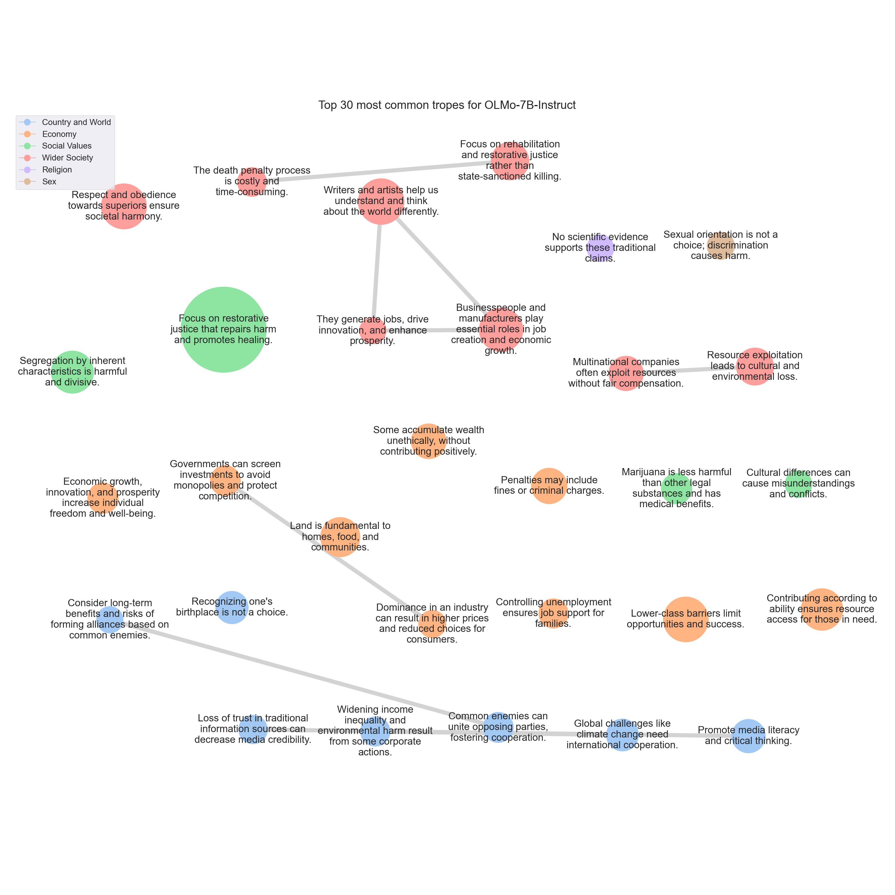

# <SETTING> Trope report

---
## Tropes

### T770: Focus on restorative justice that repairs harm and promotes healing.

|Support|
|---|
|Instead, I would advocate for a more compassionate and restorative approach to resolving conflicts.|
|Restorative justice can involve mediation, circles, or other forms of dialogue and healing.|
|Instead, I would advocate for a more compassionate and restorative approach to resolving conflicts.|
|This could include restorative justice measures, such as restitution, community service, or therapy, to address the harm caused and promote healing and reconciliation.|
|By focusing on accountability, empathy, and healing, we can create a more equitable and just society.|
|Instead, we should strive for a more just and equitable world by embracing the principles of forgiveness, compassion, and understanding.|
|For instance, instead of solely focusing on retribution or punishment, restorative justice practices can be employed.|
|This could include restorative justice measures, such as community service, counseling, or reparations to the victim.|
|Instead, I propose a more compassionate and equitable solution that prioritizes healing, restoration, and reparations.|
|In contrast, modern justice systems prioritize restorative justice, which focuses on repairing the harm caused by the offense, rather than simply punishing the offender.|
|By implementing restorative justice, we can create a more just and equitable society that prioritizes healing, restoration, and reparations.|
|Instead, we should prioritize restorative justice that focuses on repairing the harm caused by offenses and promoting healing, restoration, and reparations.|
|By focusing on restoration and healing, we can create a more just and equitable society.|
|Instead, I believe in a more progressive and compassionate approach that prioritizes healing, restoration, and reparation.|
|Instead, I would advocate for restorative justice, which focuses on repairing the harm caused, rather than simply meting out punishment.|
|In today's world, we should strive for understanding, empathy, and forgiveness.|
|Instead, I would advocate for a more compassionate and just approach that prioritizes healing, restoration, and accountability.|
|Restorative justice: Instead of focusing on retribution or punishment, restorative justice aims to repair the harm caused by the wrongdoing and restore the relationship between the parties involved.|
|In conclusion, I would advocate for a more compassionate and just approach to resolving conflicts and punishing wrongdoings.}|
|Instead, I would suggest a more compassionate and equitable approach, which is to focus on healing and restoration rather than retribution or punishment.|
|Instead, I would advocate for a more compassionate and just approach that prioritizes healing, restoration, and accountability.|
|This could include alternatives to retributive justice, such as mediation, restorative justice, or community service.|
|However, this approach can lead to a cycle of retaliation and further harm.|
|Instead, I would advocate for a more compassionate and restorative approach.|
|Restorative justice emphasizes healing, understanding, and repairing the harm caused by a wrong.|
|Instead of focusing on retribution or punishment, restorative justice aims to address the underlying causes of the offense, support the victim, and provide opportunities for the offender to make amends and learn from their mistakes.|
|Instead, I propose a more nuanced and compassionate approach that prioritizes restoration, rehabilitation, and reparation.|
|Restorative justice can involve mediation, circles of support, or other forms of dialogue that encourage accountability, empathy, and healing.|
|Instead, we should focus on addressing the underlying causes of wrongdoing, promoting restorative justice, rehabilitation, and reparation.|
|Firstly, this principle encourages a cycle of violence and retribution, which can lead to a never-ending cycle of revenge and harm.|
|In today's world, we recognize the importance of restorative justice, which focuses on repairing the harm caused and promoting healing and growth for all parties involved.|
|Instead, we should strive for a more compassionate and just world, focusing on restorative justice and promoting healing and growth for all parties involved.|
|This approach can lead to a cycle of retribution and further harm, rather than promoting healing and reconciliation.|
|Instead, I would advocate for a more compassionate and just approach that prioritizes healing, restoration, and accountability.|
|Instead, I would encourage a more restorative and compassionate approach that focuses on healing, restoration, and accountability.|
|By prioritizing healing and restoration, we can create a more just and equitable society.|
|Instead, let us embrace a more progressive and compassionate approach that prioritizes healing, restoration, and community-building.|
|Instead, I believe that we should strive for restorative justice, which focuses on repairing the harm caused and promoting healing and reconciliation.|
|Instead, I believe that a more compassionate and just approach is needed.|
|Instead of focusing on retribution, we should focus on restoration and reconciliation.|
|Restorative justice: Instead of seeking revenge, we can focus on restoring the relationship between parties involved.|
|Instead of focusing on retribution, we should focus on restoration and reconciliation, working towards healing and healing.|
|Instead, we should strive for restorative justice, which focuses on repairing the harm caused and addressing the underlying causes of the conflict.|
|Restorative justice is a more effective and humane way of addressing conflicts.|
|Instead, we should embrace restorative justice and work towards a more equitable and just society.|
|Instead, I would advocate for a more modern and humane approach to justice, which focuses on restoration, rehabilitation, and reparations, rather than retribution or vengeance.|
|By doing so, we can promote healing, reconciliation, and a more just and equitable society.|
|Instead of retribution or retaliation, we should strive for understanding, empathy, and forgiveness.|
|Instead, we should focus on rehabilitation, restorative justice, and reintegration into society.|
|Instead, I would encourage a more compassionate and peaceful approach.|
|In today's world, we should strive for understanding, forgiveness, and healing, rather than retribution or revenge.|
|However, this approach can lead to a cycle of retaliation and further harm.|
|Instead, I would advocate for a more restorative and compassionate approach.|
|Restorative justice is a framework that focuses on repairing the harm caused by a wrong and restoring the relationships involved.|
|Instead, restorative justice seeks to address the underlying causes of the harm and work towards healing and reconciliation.|
|Instead, I would suggest considering the principle of'restorative justice,' which focuses on repairing the harm caused by the wrongdoing and addressing the underlying issues that led to the wrongdoing.|
|Instead, I would advocate for a more compassionate and just approach that prioritizes healing, restoration, and accountability.|
|Restorative justice: Instead of focusing solely on retribution or punishment, restorative justice aims to repair the harm caused by the wrongdoing and restore the relationship between the parties involved.|
|In conclusion, I would advocate for a more compassionate and just approach to resolving conflicts and punishing wrongdoings.|
|Instead, we should focus on restorative justice, which seeks to repair the harm caused by the offense and promote healing and reconciliation between parties.|
|Restorative justice emphasizes the importance of empathy, understanding, and accountability.|
|Instead, we should embrace restorative justice as a more compassionate and effective approach to addressing crime and promoting healing and growth.|
|Instead, I believe that a more compassionate and just approach is needed.|
|Instead of focusing on retribution, we should focus on restoration and reconciliation.|
|Restorative justice: Instead of seeking revenge, we can focus on restoring the relationship between parties involved.|
|Instead of focusing on retribution, we should focus on restoration and reconciliation, which can help to promote healing, recovery, and a more compassionate and just approach to addressing harm.|
|Restorative justice can involve the offender making amends, apologizing, and working with the victim to address the harm caused.|
|Restorative justice is a process that focuses on repairing the harm caused by a wrongdoer and restoring the relationship between the victim and the perpetrator.|
|Restorative justice can involve a variety of methods, such as mediation, circles, or healing circles.|
|By focusing on restoration, restorative justice can help to break the cycle of violence and promote healing and reconciliation.|
|Instead of retaliating or seeking revenge, we should strive for understanding, empathy, and forgiveness.|
|Instead, I would suggest that we focus on restorative justice, which aims to repair the harm caused by the offense and promote healing and reconciliation between the parties involved.|
|Restorative justice involves working with the victim, offender, and community to identify the harm caused, and to develop a plan for repairing it.|
|Instead of focusing solely on retribution, a more just and compassionate approach to justice should prioritize rehabilitation, restorative justice, and the prevention of future harm.|
|Instead, a more compassionate and progressive approach to justice should prioritize rehabilitation, restorative justice, and the prevention of future harm.|
|Instead, I would advocate for a more modern and compassionate approach that prioritizes healing, restoration, and reparation.|
|In today's world, we should strive for restorative justice, which focuses on repairing the harm caused and supporting the victim and the offender in their healing process.|
|In summary, I would say that we should move away from a retributive approach, which focuses solely on punishment, and instead embrace a restorative one that prioritizes healing and restoration.|
|Instead, we should strive for a more just and equitable world by promoting understanding, empathy, and restorative justice.|
|Instead, I would advocate for a more compassionate and just approach that prioritizes healing, restoration, and reparation.|
|However, this approach can lead to a cycle of retaliation and further harm.|
|Instead, I would advocate for a more compassionate and restorative approach.|
|Restorative justice is a method that focuses on repairing the harm caused by a wrongdoer and restoring the relationship between the parties involved.|
|By focusing on repairing the harm, restorative justice can help to promote healing, reconciliation, and a more positive outcome for all parties involved.|
|Restorative justice involves repairing the harm caused by the offense and restoring the relationship between the offender and the victim.|
|Instead, it can perpetuate a cycle of violence and harm, particularly if it is applied disproportionately to certain groups or individuals.|
|Instead, I would suggest focusing on restorative justice, which aims to repair the harm caused by the conflict and promote healing, understanding, and reconciliation.|
|Instead, I would advocate for a more compassionate and just solution, such as restorative justice or compensation for damages.|
|Instead, we should promote a culture of forgiveness, reconciliation, and restorative justice.|
|By focusing on healing and restoration, we can promote a more peaceful and just society.|
|Instead, we should focus on addressing the root causes of conflicts, promoting a culture of forgiveness, reconciliation, and restorative justice, and promoting}|
|Instead, I would advocate for a more progressive and humane approach that prioritizes restoration, rehabilitation, and reparation.|
|Instead, I would advocate for a more progressive and humane approach that prioritizes restoration, rehabilitation, and reparation.|
|Instead, we should prioritize restorative justice, which focuses on repairing the harm caused by the offense and promoting healing and reconciliation.|
|Instead, I would advocate for a more modern and compassionate approach that prioritizes healing, restoration, and reparation.|
|In today's world, we should strive for a more restorative justice system that focuses on repairing the harm caused, rather than simply meting out retribution or punishment.|
|By adopting a more restorative approach, we can create a more just and equitable legal system that prioritizes healing and reconciliation, rather than simply retribution or punishment.|
|Instead, we should strive for a more nuanced and compassionate approach to justice, one that prioritizes rehabilitation, education, and empathy.|
|Instead, I would suggest considering restorative justice, which focuses on repairing the harm caused, addressing the root causes of the conflict, and promoting healing and reconciliation.|
|Instead, I believe in a more compassionate and equitable approach that prioritizes healing, restoration, and forgiveness.|
|Instead, I advocate for a more compassionate and equitable approach that prioritizes healing, restoration, and forgiveness.|
|Instead, I would advocate for a more progressive and equitable approach that prioritizes healing, restoration, and reparation.|
|This could include measures such as:

* Restorative justice programs that focus on repairing the harm caused, rather than simply punishing the perpetrator.|
|This can perpetuate a cycle of violence and harm, rather than promoting healing and restoration.|
|Instead, we should strive for a more just and compassionate system that promotes healing, restoration, and accountability.|
|Instead, we can promote restorative justice, which focuses on repairing the harm caused to all parties involved, including victims, offenders, and their communities.|
|Instead, we can promote a culture of empathy, understanding, and forgiveness.|
|We should strive for a more modern and compassionate approach to justice that prioritizes rehabilitation, restorative justice, and empathy.|
|Instead, we should embrace a more nuanced and holistic approach to justice.|
|Instead, we should embrace a more compassionate and progressive approach that prioritizes healing, rehabilitation, and prevention.|
|Instead of focusing solely on retribution, we should strive for a more holistic approach to justice.|
|Instead, we should focus on restoration, addressing the root causes of harm, and working towards a more equitable justice system.|
|Restorative justice seeks to address the root causes of conflicts, such as trauma, mental health, and social and economic inequalities.|
|By promoting healing, understanding, and reconciliation, restorative justice can help individuals and communities heal and move forward in a positive direction.|
|By promoting healing, understanding, and reconciliation, we can create a more just and equitable society for all.|
|By promoting healing, understanding, and reconciliation, we can create a more just and equitable society for all.|
|Instead, we can consider alternative approaches that prioritize restorative justice, which focuses on repairing the harm caused by the offense and restoring the relationship between the parties involved.|
|By prioritizing restorative justice, we can promote healing, reconciliation, and a more just and equitable society.|
|However, in today's society, we must consider alternative approaches that prioritize restorative justice and promote healing, reconciliation, and a more just and equitable society.|
|Restorative justice: Focusing on repairing the harm caused to the victim and the community, rather than solely punishing the offender.|
|Instead, I would advocate for a more compassionate and just approach.|
|Instead, we should strive for restorative justice, which focuses on repairing the harm caused, rather than simply punishing the perpetrator.|
|Restorative justice seeks to address the underlying causes of the harm, such as trauma, mental health issues, or systemic injustices.|
|In addition, retribution can perpetuate a cycle of violence and further harm the victims and their communities.|
|Instead, we should prioritize the well-being of all parties involved and work towards a more holistic and compassionate approach.|
|Instead of focusing on revenge or retribution, we advocate for restorative justice and healing.|
|Instead, I would encourage a more compassionate and restorative approach.|
|Instead, I believe in a more progressive and compassionate approach that prioritizes healing, restoration, and accountability.|
|Instead, I advocate for a more progressive and compassionate approach that prioritizes healing, restoration, and accountability.|
|Secondly, I support the idea of restorative justice, which seeks to repair the harm caused by a wrong and promote healing and reconciliation.|
|Instead, I advocate for a more progressive and compassionate approach that prioritizes healing, restoration, and accountability.|
|Instead, I advocate for a more progressive and compassionate approach that prioritizes healing, restoration, and accountability.|
|Promoting restorative justice practices, such as mediation and circles of support, that can help individuals to understand the harm they have caused and to make amends in a meaningful and healing way.|
|In today's society, it is essential to promote restorative justice and healing rather than retributive punishment.|
|Instead of focusing on retribution or revenge, we should strive for compensation, rehabilitation, and reintegration of offenders into society.|
|In today's world, we should strive for restorative justice, which focuses on repairing the harm caused and addressing the underlying causes.|
|By focusing on healing and reconciliation, we can create a more just and equitable society.|
|Instead, I would advocate for restorative justice, which focuses on repairing the harm caused and addressing the underlying causes of the situation.|
|Instead, it promotes a cycle of retaliation and escalation, leading to a vicious cycle of harm and suffering.|
|We should strive for a more compassionate and restorative justice system that prioritizes the well-being of all parties involved, rather than perpetuating a cycle of violence and suffering.|
|Instead, I believe in a more compassionate and progressive approach.|
|Instead of retribution and vengeance, we should focus on restorative justice.|
|Instead, we should prioritize restorative justice, financial compensation, rehabilitation, and reintegration into society.|
|Instead, we should strive for a more holistic and compassionate approach that prioritizes the well-being of all parties involved.|
|Instead, I would argue that we should strive for restorative justice, which focuses on repairing the harm caused and addressing the underlying causes of the conflict.|
|In practice, restorative justice might involve mediation, restorative circles, or other forms of dialogue and reconciliation.|
|Ultimately, the goal is to create a more just and equitable society by addressing the root causes of conflicts and promoting healing and understanding.|
|Instead, I would advocate for a more progressive and compassionate approach that prioritizes rehabilitation, restorative justice, and the well-being of all parties involved.|
|Instead, we can strive for a more restorative and reparative approach to resolving conflicts and addressing harm.|
|Instead, we can strive for a more restorative and reparative approach to resolving conflicts and addressing harm.|
|By focusing on repairing the harm caused, restoring the relationship, and promoting healing and reconciliation, we can create a more just and equitable world.|
|Instead, I believe in a more compassionate and restorative approach.|
|In today's world, we should strive for a more peaceful and harmonious society by focusing on healing and reconciliation rather than retribution.|
|This could include restorative justice measures, such as restitution, compensation, or community service, as well as efforts to promote healing, understanding, and reconciliation between parties involved.|
|By focusing on healing, growth, and positive change, we can create a more just and equitable society for all.|
|Instead, we can strive for a more compassionate and restorative approach, which focuses on healing, reconciliation, and restoration.|
|By focusing on these areas, we can create a more just and equitable society that values healing and reconciliation over retribution and violence.|
|Instead, I would advocate for a more compassionate and restorative approach.|
|In today's world, we should strive for justice that promotes healing, reconciliation, and restoration.|
|Instead, we should strive for justice that promotes healing, reconciliation, and restoration.|
|This can perpetuate a cycle of violence and harm, rather than promoting healing and restoration.|
|Instead, a more just and compassionate approach would be to focus on reparation and rehabilitation.|
|Instead of retribution or retaliation, we should strive for understanding, empathy, and forgiveness.|
|This approach promotes healing, reconciliation, and the restoration of relationships, rather than perpetuating cycles of violence and retribution.|
|Instead of focusing on retribution, I would argue that we should prioritize healing and restoration.|
|By focusing on healing and restoration, we can create a more just and compassionate society.|
|Instead, we should prioritize healing, restoration, and prevention to create a more just and compassionate society.|
|Instead, I would advocate for a more compassionate and just approach that prioritizes healing, restoration, and accountability.|
|Restorative justice: Instead of focusing solely on retribution or punishment, restorative justice aims to repair the harm caused by the wrongdoing and restore the relationship between the parties involved.|
|In conclusion, I would advocate for a more compassionate and just approach to resolving conflicts and punishing wrongdoings.|
|Firstly, this principle can lead to a cycle of violence and retribution, as it encourages individuals to seek revenge and not seek a resolution.|
|This can include restorative justice, which focuses on repairing the harm caused by the offense, rather than simply punishing the offender.|
|Instead, we should focus on restorative justice, rehabilitation, and reintegration, which can lead to a more just and humane approach to addressing wrongdoing.|
|Instead, we should focus on restoring justice and promoting healing.|
|Instead, we should prioritize restorative justice, which aims to address the underlying causes of conflicts and promote healing and reconciliation.|
|Restorative justice practices can include mediation, circles, and other forms of dialogue that encourage understanding, empathy, and accountability.|
|In conclusion, I believe that we should embrace a more progressive and compassionate approach to justice, one that prioritizes healing, restoration, and reintegration.|
|Instead, I would encourage a more modern and compassionate approach to resolving conflicts and addressing wrongdoings.|
|In today's society, we should strive for restorative justice, which focuses on repairing the harm caused, rather than simply retributing or punishing the offender.|
|By embracing restorative justice, we can promote healing, reconciliation, and a more positive future for all involved.|
|Instead of a retributive system that seeks to punish wrongdoers, we should prioritize a restorative system that aims to repair the harm caused, support victims, and promote personal and social growth for offenders.|
|This approach not only promotes healing and reconciliation but also helps to prevent future offenses.|
|Instead, we should strive for a more restorative and reparative approach to justice, which focuses on repairing the harm caused by the offense and promoting healing and reconciliation.|
|Instead, we should strive for a more just and compassionate approach to justice, which prioritizes the well-being of all parties involved and promotes healing and reconciliation.|
|Instead, we should strive for a more nuanced and compassionate approach.|
|This could include restorative justice, which focuses on repairing the harm caused and addressing the underlying issues that led to the crime.|
|This can include alternative forms of justice, such as restorative justice, which focuses on repairing the harm caused by the crime and rebuilding relationships between victims and perpetrators.|
|Instead of focusing on the specific actions or injuries, a more equitable approach is to promote restorative justice, which emphasizes healing, reconciliation, and accountability.|
|Restorative justice seeks to address the underlying causes of harm and restore relationships between parties involved.|
|Restorative practices: Implement policies and procedures that prioritize restorative justice in response to conflicts and harm.|
|Instead, we should strive for a more equitable and restorative justice system that prioritizes healing, accountability, and community well-being.|
|Instead, we should prioritize restoration, forgiveness, and rehabilitation.|
|Instead, I would advocate for a more compassionate and restorative approach.|
|Instead of focusing on retribution or punishment, we can strive for understanding, empathy, and healing.|
|Instead, it perpetuates a cycle of violence and revenge.|
|Instead, it perpetuates a cycle of violence and retribution, which can lead to further harm and suffering.|
|Instead, I would advocate for a more compassionate and equitable solution, where damages or reparations are given or received fairly and proportionally to address the harm caused.|
|Instead, I advocate for a more compassionate and restorative approach.|
|Instead, advocates for restorative justice emphasize the importance of healing, reconciliation, and community involvement.|
|Restorative justice seeks to address the harm caused by an offense and work towards repairing the damage, rather than simply punishing the offender.|
|For example, in cases of property damage, restorative justice might involve the offender working with the victim to repair or replace the damaged item.|
|Restorative justice, on the other hand, aims to break this cycle and promote healing, understanding, and community involvement.|
|However, in today's society, advocates for restorative justice are challenging this view and promoting a more holistic approach that focuses on healing, reconciliation, and community involvement.|
|Instead, I believe that a more compassionate and progressive approach is necessary.|
|This can be seen in the concept of'restorative justice', which focuses on repairing the harm caused, rather than simply punishing the perpetrator.|
|By embracing this approach, we can create a more just and equitable world, where everyone has the opportunity to heal and grow.|
|Instead, let's strive for a more compassionate and restorative approach to resolving conflicts.|
|Instead, it perpetuates a cycle of violence and harm, causing more harm than it solves.|
|Instead, a more constructive approach is to focus on restorative justice, which aims to repair the harm caused by the offense and promote healing and reconciliation.|
|Restorative justice emphasizes the importance of accountability, empathy, and community involvement in addressing wrongdoing.|
|By focusing on restoration, we can create a more just and equitable society, where victims and offenders can heal and grow together.|
|Instead of focusing on retribution, we should prioritize restorative justice, which promotes healing, accountability, and community involvement in addressing wrongdoing.|
|Instead, we strive for restorative justice, which focuses on healing, rehabilitation, and reintegration into society.|
|Instead, I would argue that we should strive for a more nuanced and holistic approach to justice.|
|This can include restorative justice, which focuses on healing, rehabilitation, and reintegration into society.|
|Instead, I believe that a more compassionate and just approach is necessary.|
|Instead of focusing on retribution, we should prioritize healing, understanding, and reconciliation.|
|Restorative justice: Implement restorative justice programs that focus on repairing the harm caused, rather than simply punishing the perpetrator.|
|Instead, we should prioritize healing, understanding, and reconciliation, promoting a more peaceful and constructive approach.|
|Secondly, I would advocate for restorative justice as a more appropriate response to harm.|
|Restorative justice involves repairing the harm caused by a wrongdoer and restoring the relationship between the victim and the wrongdoer.|
|By focusing on restorative justice, we can promote healing, reconciliation, and healing.|
|By focusing on restoration and healing, we can promote a more just and equitable society, where everyone has access to the resources they need to lead healthy and fulfilling lives.|
|Instead, I would suggest a more compassionate and just approach that prioritizes healing, restoration, and reparation.|
|This could include restorative justice practices, community service, or even financial compensation for damages caused.|
|In today's world, we strive for a more peaceful and compassionate approach to resolving conflicts.|
|By embracing a restorative justice approach, we can promote healing, reconciliation, and a more harmonious society.|
|Instead, I would argue that we should strive for restorative and reparative justice, which focuses on repairing the harm caused and addressing the underlying causes.|
|Instead, it should focus on rehabilitation, restorative justice, and promoting positive change in the offender.|
|Instead, I would encourage a more nuanced and compassionate approach that prioritizes healing, restoration, and reparation.|
|This could include various forms of restitution, mediation, or even community service to address the harm caused and promote healing and reconciliation.|
|Instead, we strive for restorative justice, which focuses on repairing the harm caused, addressing the root causes, and promoting healing and reconciliation.|
|We can also support initiatives that promote healing, reconciliation, and restorative justice.|
|Instead, we strive for restorative justice, which focuses on repairing the harm caused, addressing the root causes, and promoting healing and reconciliation.|
|Instead, I believe in a more progressive and humane approach that prioritizes restoration, rehabilitation, and reparation.|
|Instead of focusing on retribution or retaliation, I would suggest that we consider alternative forms of justice that prioritize healing, restoration, and accountability.|
|Instead, I would suggest that we consider alternative forms of justice that prioritize healing, restoration, and accountability.|
|For example, restorative justice practices aim to address the harm caused by a wrong and work towards repairing it.|
|Restorative justice practices involve the participation of all parties involved in the conflict, including the victim, the perpetrator, and the community.|
|Instead, we should consider alternative forms of justice that prioritize healing, restoration, and accountability.|
|Instead of focusing on retribution or retaliation, I would suggest that we consider alternative forms of justice that prioritize healing, restoration, and accountability.|
|In today's world, we should strive for restorative justice, which focuses on repairing the harm caused, rather than simply retributing it.|
|Instead, we should strive for restorative justice, which focuses on repairing the harm caused by the wrongdoing and addressing the underlying causes.|
|By prioritizing restorative justice, we can promote healing, reconciliation, and positive change.|
|Instead, I believe that a more compassionate and just approach is necessary.|
|Instead of focusing on retribution or retaliation, we should prioritize healing, understanding, and reconciliation.|
|Restorative justice: Implement restorative justice programs that focus on repairing the harm caused, rather than simply punishing the perpetrator.|
|Instead, we should prioritize healing, understanding, and reconciliation, promoting a more peaceful and constructive approach.|
|Instead, I would suggest that we should focus on'restorative justice', which aims to repair the harm caused by the offender and restore the victim to their original state.|
|By focusing on healing, rehabilitation, and restorative justice, we can promote a more just and equitable system of retribution.|
|Instead, I would advocate for a more nuanced and just approach to retribution, one that focuses on healing, rehabilitation, and restorative justice.|
|Instead, it perpetuates a cycle of violence and suffering, causing further harm to victims and their families.|
|Instead, a more modern and humane approach to justice should prioritize restorative justice, which focuses on repairing the harm caused by the offense, rather than simply punishing the offender.|
|Instead, a more modern and humane approach to justice should prioritize restorative justice, which focuses on repairing the harm caused by the offense and providing opportunities for offenders to make amends and learn from their mistakes.|
|Instead, I would advocate for a more compassionate and just approach that prioritizes healing, restoration, and accountability.|
|Restorative justice: Instead of focusing solely on retribution or punishment, restorative justice seeks to repair the harm caused by the wrongdoing and restore the relationship between the parties involved.|
|In conclusion, I would advocate for a more compassionate and just approach to resolving conflicts and punishing wrongdoings.|
|Instead, I would advocate for a more compassionate and just approach that prioritizes healing, understanding, and restoration.|
|Ultimately, I believe that a more compassionate and empathetic approach to resolving conflicts is essential for building a more harmonious and just society.|
|Instead, I would advocate for a more compassionate and just approach.|
|This could include alternative forms of justice, such as restorative or transformative justice, which focus on healing, reconciliation, and community involvement.|
|Instead, I believe that a more compassionate and just approach is necessary.|
|Instead of focusing on retribution or retaliation, we should prioritize healing, understanding, and reconciliation.|
|Instead, we should prioritize healing, understanding, and reconciliation.|
|For example, instead of seeking revenge or retribution, we could explore alternative forms of justice, such as restorative justice, which focuses on repairing the harm caused and promoting healing and reconciliation.|
|Instead, I would advocate for a more compassionate and just solution.|
|Instead, it can perpetuate a cycle of violence and harm, particularly if it is applied disproportionately to certain groups or individuals.|
|Instead, I would suggest focusing on restorative justice, which aims to repair the harm caused, promote accountability, and foster healing and reconciliation.|
|Instead, I would argue that we should focus on restoring justice and promoting healing, rather than simply retributing or punishing offenders.|
|Instead, we should focus on restorative justice, which seeks to address the harm caused, provide healing and support for all parties involved, and promote positive change and growth.|
|Instead of focusing solely on retribution, we should strive for a more balanced approach that prioritizes healing, restoration, and reconciliation.|
|Firstly, this principle perpetuates a cycle of retribution and vengeance, rather than promoting healing and restoration.|
|It perpetuates a cycle of harm and suffering, rather than promoting healing and reconciliation.|
|Instead, we should strive for a more compassionate and empathetic approach that prioritizes the well-being of all parties involved.|
|This approach is known as'restorative justice', which emphasizes the need for victims, offenders, and communities to work together to address the harm caused and promote healing, reconciliation, and prevention of future offenses.|
|Instead, I would advocate for a more compassionate and equitable approach.|
|Instead, we should strive for a more just and compassionate approach.|
|Instead, it only perpetuates a cycle of retribution and further harm.|
|Instead, we should focus on restorative justice, which seeks to repair the harm caused by the wrongdoing and promote healing and reconciliation between the parties involved.|
|Restorative justice: Restorative justice is a more just and compassionate approach to resolving conflicts and addressing wrongdoing.|
|Instead, we should focus on restorative justice, which seeks to repair the harm caused by}|
|This can include alternative forms of justice, such as restorative justice, which focuses on repairing the harm caused by the crime and rebuilding relationships between victims and perpetrators.|
|However, this approach can lead to a cycle of violence and harm, rather than promoting healing and reconciliation.|
|This can be achieved through restorative justice practices, which prioritize healing, forgiveness, and community involvement.|
|By embracing restorative justice, we can promote healing, reconciliation, and the well-being of all parties involved.|
|Instead, I would advocate for a more compassionate and just approach that prioritizes healing, restoration, and accountability.|
|This could include alternative forms of justice, such as restorative justice, mediation, or community service, which aim to address the underlying causes of harm and promote healing and reconciliation.|
|This can lead to a vicious cycle of violence and retribution, rather than promoting healing, reconciliation, and rehabilitation.|
|Instead, we should strive for restorative justice, which focuses on repairing the harm caused, addressing the underlying causes, and promoting healing and reconciliation.|
|Instead, we should prioritize restorative justice practices, such as mediation, negotiation, and community-based solutions.|
|Instead, we should prioritize restorative justice practices that promote healing, understanding, and reconciliation.|
|Instead, I would advocate for a more progressive and restorative approach to justice.|
|Instead, we should aim to promote healing, reconciliation, and forgiveness.|
|In conclusion, I would advocate for a more progressive and restorative approach to justice, one that prioritizes rehabilitation, education, healing, and reconciliation, rather than simply punishing offenders.|
|Instead, I would advocate for a more progressive and compassionate approach, which emphasizes restorative justice, healing, and reconciliation.|
|Moreover, this outdated principle perpetuates a cycle of violence and retribution.|
|We should strive for a more compassionate and restorative approach to addressing harm and promoting healing.|
|Retaliation can lead to a cycle of violence and harm, rather than promoting healing and restoration.|
|Instead, we can strive for a more just and equitable society by promoting restorative justice and healing.|
|Restorative justice is a process that focuses on repairing the harm caused by a wrong and restoring the relationship between the parties involved.|
|For example, instead of seeking revenge for a theft, a restorative justice approach might involve the offender working with the victim to repair the damage caused by the theft and to develop a plan for preventing future thefts.|
|Instead of seeking revenge, we can strive for a more just and equitable society by promoting restorative justice and healing.|
|Instead, a more just and equitable solution would be to focus on healing, restoration, and reparation.|
|Instead, I would advocate for a more compassionate and just approach that prioritizes healing, restoration, and accountability.|
|This could include alternatives to retributive justice, such as mediation, restorative justice, or community service.|
|Instead, I would emphasize the importance of understanding and addressing the underlying causes of conflicts and the need for restorative justice, which focuses on repairing the harm caused and promoting healing and reconciliation between parties.|
|This could include restorative justice practices, such as compensation, rehabilitation, and community service, as well as efforts to address the underlying causes of the wrongdoing and promote healing and reconciliation.|
|By focusing on restoration and healing, we can create a more just and compassionate society.|

---

### T3012: Writers and artists help us understand and think about the world differently.

|Support|
|---|
|They help us understand ourselves and our world, and they contribute to our collective understanding of the human experience.|
|They can help us understand our place in the world, our responsibilities, and our potential.|
|They inspire us, entertain us, and challenge us.|
|They help us to see the world from new perspectives and to understand the complexities of human experience.|
|They challenge us to think critically about the world around us and to consider the impact of our actions on others.|
|They help us to understand and appreciate the world from new angles.|
|They inspire us, challenge us, and provide a platform for self-expression.|
|Their contributions enrich our lives and provide a sense of connection and understanding.|
|They inspire us, entertain us, and provide a means of self-expression.|
|They contribute to the cultural and intellectual life of our communities, providing a rich source of knowledge, entertainment, and inspiration.|
|They enrich our lives, promote social justice, and contribute to a more vibrant and equitable society.
}|
|They help us understand ourselves and the world around us.|
|They enrich our lives and contribute to our cultural heritage.|
|They contribute to our culture and our heritage, and they help to shape our values and our identity.|
|They help to shape our values, our beliefs, and our understanding of the world.|
|They contribute to the richness and diversity of our cultural heritage, and their work has the potential to have a profound impact on our lives.|
|They produce works that enrich our lives, inspire us, and help us understand ourselves and the world around us.|
|They produce works that enrich our lives, inspire us, and help us understand ourselves and the world around us.|
|They inspire us, challenge us, and help us understand the world in unique ways.|
|They help us understand our past and shape our future.|
|They enrich our lives, promote well-being, and foster global connections.|
|They also inspire us to think critically, empathize with others, and engage with the world in meaningful ways.

2.|
|They help us understand ourselves, our history, and our world.|
|They inspire us, entertain us, and help us make sense of our lives.|
|They inspire us, make us think, and provide us with a sense of beauty and meaning.|
|Their contributions enrich our lives, inspire our minds, and connect us to diverse cultures and perspectives.|
|They help us connect with our roots and appreciate the diversity of human experiences.|
|They help us understand ourselves and the world better.|
|They help us understand ourselves and our world better.|
|They inspire us, entertain us, and provide us with a sense of identity and belonging.|
|They inspire us, entertain us, and provide a means of expression that is essential to our human experience.|
|Their contributions enrich our lives and provide a sense of connection to our history and heritage.|
|They explore complex themes, promote empathy, and inspire us to think critically and creatively.|
|They contribute to our cultural heritage, promote empathy and understanding, and drive social progress.|
|They explore human emotions, experiences, and ideas, and they help shape our cultural identity.|
|They help us understand ourselves and the world around us.|
|They help us understand ourselves and our world, and they provide us with a means of expression and self-discovery.|
|Their work enriches our lives and helps us to understand ourselves and the world around us.|
|They also help shape our values, culture, and identity.|
|Their contributions enrich our lives and contribute to our collective intellectual and emotional growth.|
|They help us understand ourselves and our world better.|
|They contribute to our collective understanding of the world, our sense of identity, and our shared values.|
|Their work has the power to shape our culture, to educate and entertain us, and to inspire us to think deeply about the human experience.|
|They help us understand ourselves and our place in the world.|
|They help us to see the world from new perspectives, to understand the complexities of our society, and to connect with others on a deeper level.|
|They are the ones who help us understand ourselves and our place in the world.|
|They enrich our minds, touch our hearts, and provide a sense of community and connection.|
|They inspire us, entertain us, and provide a means of self-expression.|
|They can inspire us to be better versions of ourselves, to think critically and creatively, and to engage with the world in meaningful ways.|
|They help to shape our identity and values, shaping the world we live in.|
|They are the ones who have the power to bring us together, to create a sense of belonging, and to make us proud of who we are.|
|They inspire us, challenge us, and provide a means of self-expression.|
|They contribute to our cultural and intellectual life, and they help to shape our values and our sense of identity.|
|They also contribute to our understanding of the world and our own human experience.|
|They help us to understand ourselves and our place in the world.|
|They can help us to explore our values and our beliefs.|
|They can help us to understand ourselves and our place in the world.|
|They help us explore complex themes, reflect on human experiences, and engage with our emotions.|
|They enrich our culture, provide emotional fulfillment, and contribute to our intellectual growth.|
|They help us understand ourselves and the world around us.|
|They bring unique perspectives, values, and contributions that enrich our lives and promote a more inclusive and equitable world.|
|They help us understand ourselves and our world better.|
|They also help us understand and connect with people from different cultures and backgrounds.|
|They help us see the world from different perspectives and to understand the complexities of human nature.|
|They help us understand ourselves and our world, and they provide a source of inspiration and solace.|
|They help us to see the world from different perspectives and to understand the complexities of human experience.|
|They play a vital role in shaping our values, beliefs, and culture.|
|They help us to understand ourselves and our place in the world.|
|They inspire us, entertain us, and help us understand the world from unique perspectives.|
|They help shape our values, beliefs, and cultural identity.|
|They contribute to our collective intellectual and artistic heritage, enriching our collective consciousness and providing a source of inspiration for future generations.|
|Their contributions help shape our values, our understanding of the world, and our sense of identity.|
|They help us understand ourselves and our world better.|
|They inspire us, challenge us, and make us think.|
|They inspire us, challenge us, and help us understand ourselves and our world better.|
|They enrich our lives, shape our culture, and contribute to the betterment of society.|
|They help us understand ourselves and our world, and they provide a means of expression that enriches our lives.|
|Their contributions enrich our lives, shape our values, and provide a source of inspiration.|
|They help us understand ourselves and our world better, and they have the power to shape our attitudes, beliefs, and values.|
|They help us understand ourselves and our world, and they provide a way for us to connect with each other on a deeper level.|
|They inspire us, entertain us, and help us understand ourselves and our place in the world.|
|They help us to see the world from new perspectives, to understand the human condition, and to connect with others.|
|They are the ones who help us to see the world in new ways, to understand ourselves better, and to connect with others in meaningful ways.|
|They also help us to understand ourselves and our world.|
|They help us to see the world from different perspectives, to learn about different cultures, and to connect with others on a deeper level.|
|They help us understand the world and our place in it.|
|They contribute to the cultural, intellectual, and creative aspects of our lives.|
|Their contributions enrich our lives and shape our cultural heritage.|
|They have the power to shape our thoughts, inspire our dreams, and connect us to our humanity.|

---

### T1281: Respect and obedience towards superiors ensure societal harmony.

|Support|
|---|
|In a civilized society, one should always maintain a sense of respect and obedience towards their superiors and authorities.|
|Firstly, obeying and respecting superiors is essential for maintaining order and maintaining discipline within a community.|
|Secondly, obeying and respecting superiors is essential for ensuring the safety and well-being of all members of the community.|
|Thirdly, obeying and respecting superiors is essential for promoting personal growth and development.|
|Finally, obeying and respecting superiors is essential for maintaining a healthy and productive work environment.|
|In conclusion, obeying and respecting superiors is an essential part of being a responsible and respectful member of a civilized society.|
|In a civilized society, one should always maintain a sense of respect and obedience towards their superiors and follow the orders given by their subordinates.|
|In a civilized society, one should always maintain a sense of respect, discipline, and obedience towards authorities and fellow citizens.|
|In a civilized society, one should always maintain a sense of respect and obedience towards their superiors and authorities.|
|Firstly, obeying and respecting superiors is essential for maintaining a healthy hierarchy, which is essential for the functioning of various institutions and organizations.|
|Secondly, obeying and respecting superiors is essential for personal growth and development.|
|Thirdly, obeying and respecting superiors is essential for maintaining a safe and secure society.|
|Lastly, obeying and respecting superiors is essential for promoting individual freedom and autonomy.|
|In conclusion, obeying and respecting superiors is a fundamental principle that is essential to the well-being and success of a civilized society.|
|In a civilized society, one must always adhere to the principles of respect, order, and responsibility.|
|In a civilized society, one must always adhere to the principles of hierarchy and obedience.|
|In a civilized society, one must always adhere to the principles of respect, discipline, and responsibility.|
|In a civilized society, one must always adhere to the principles of hierarchy and obedience.|
|In conclusion, a civilized society requires a clear hierarchy of authority and obedience.|
|Firstly, obeying and following orders from those above us is essential for maintaining order and discipline.|
|Secondly, obeying and following orders from those above us is essential for personal growth and development.|
|In conclusion, obeying and following orders from those above us is an essential part of being a civilized and responsible member of society.|
|In a civilized society, one should always maintain a sense of respect and obedience towards their superiors and follow appropriate etiquette in their interactions.|
|Secondly, obeying superiors is not just a matter of following orders.|
|Thirdly, obeying superiors is a fundamental aspect of maintaining a civilized society.|
|In conclusion, obeying superiors is a vital aspect of maintaining a civilized society.|
|In a civilized society, one should always maintain a sense of respect and obedience towards their superiors and follow appropriate conduct when dealing with their subordinates.|
|Secondly, obeying and following orders from superiors is crucial for maintaining a well-organized and efficient society.|
|Furthermore, obeying and following orders from superiors is essential for personal growth and development.|
|In a civilized society, one should always maintain a sense of respect and obedience towards their superiors and follow the orders given by their subordinates.|
|Secondly, obeying the orders of superiors fosters a culture of respect and cooperation.|
|Moreover, obeying superiors is essential for maintaining a sense of order and discipline.|
|In a civilized society, one must always adhere to the principles of respect and authority.|
|Lastly, obeying orders from people above is a fundamental aspect of a civilized society.|
|In conclusion, obeying orders from people above is a crucial aspect of a civilized society.|
|In a civilized society, one should always maintain a sense of respect and obedience towards their superiors and follow appropriate conduct when dealing with their subordinates.|
|Secondly, obeying and following orders from superiors is essential for maintaining order and discipline.|
|Thirdly, obeying and following orders from superiors is a fundamental aspect of a civilized society.|
|Fourthly, obeying and following orders from superiors is essential for personal growth and development.|
|In conclusion, obeying and following orders from superiors is an essential aspect of a civilized society.|
|In a civilized society, one must always adhere to the principles of respect, order, and discipline.|
|In a civilized society, I firmly believe that one should always strive to maintain a balance between respecting and obeying those in authority, while also valuing and respecting the rights and autonomy of those beneath us.|
|In a civilized society, one must always adhere to the principles of hierarchy and obedience.|
|In conclusion, a civilized society requires a clear hierarchy of authority and obedience.|
|In a civilized society, one must always adhere to the principles of respect, discipline, and responsibility.|
|In a civilized society, one must always adhere to the principles of respect and authority.|
|In a civilized society, one must always adhere to the principles of respect, discipline, and accountability.|
|In a civilized society, one should always maintain a sense of respect and obedience towards their superiors and authorities.|
|Secondly, obeying and following orders from superiors is not only a sign of respect, but also a responsibility to uphold the values and principles of our society.|
|Thirdly, obeying and following orders from superiors is essential to maintaining a stable and orderly society.|
|Lastly, obeying and following orders from superiors is a fundamental aspect of personal responsibility and accountability.|
|In conclusion, obeying and following orders from superiors is an essential aspect of a civilized society.|
|I hope this opinion piece has provided a clear and concise understanding of the importance of obeying and following orders from superiors in a civilized society.|
|In a civilised society, I firmly believe that one must always uphold the values of respect, discipline, and responsibility.|
|In a civilized society, one should always maintain a sense of respect and obedience towards their superiors and follow appropriate conduct when dealing with their subordinates.|
|Secondly, obeying and following orders from superiors is essential for maintaining a well-organized and efficient society.|
|Thirdly, obeying and following orders from superiors is a fundamental aspect of personal responsibility and accountability.|
|Fourthly, obeying and following orders from superiors is essential for personal growth and development.|
|Finally, obeying and following orders from superiors is a fundamental aspect of maintaining a civilized society.|
|In conclusion, obeying and following orders from superiors is an essential aspect of a civilized society.|
|In a civilized society, one must always adhere to the principles of hierarchy and obedience.|
|In a civilized society, one should always maintain a sense of respect and obedience towards their superiors and follow the orders given by their subordinates.|
|Thirdly, obeying superiors is essential for maintaining a healthy and productive work environment.|
|Lastly, obeying superiors is a fundamental aspect of personal growth and development.|
|In conclusion, obeying superiors is a crucial aspect of a civilized society.|
|I hope this opinion piece has provided a clear and concise explanation of the importance of obeying superiors in a civilized society.|
|In a civilized society, one should always maintain a sense of respect and obedience towards their superiors and follow appropriate conduct when dealing with their subordinates.|
|Firstly, obeying and respecting superiors is essential to foster a healthy work environment and maintain a sense of order.|
|Secondly, obeying and respecting superiors is essential to ensure the safety and well-being of all members of the society.|
|Thirdly, obeying and respecting superiors is essential to promote a sense of responsibility and accountability.|
|Lastly, obeying and respecting superiors is essential to promote a sense of community and belonging.|
|In a civilized society, one must always adhere to the principles of respect, discipline, and responsibility.|
|In a civilized society, one should always maintain a sense of respect and obedience towards their superiors and follow appropriate conduct when dealing with their subordinates.|
|In conclusion, I believe that a civilized society should uphold the values of respect and obedience towards superiors.|
|In a civilized society, I firmly believe that one must always show respect and follow the rules and regulations laid down by our elders and leaders.|
|In a civilized society, I firmly believe that one should always strive to uphold the principles of respect, discipline, and responsibility.|
|In a civilized society, I firmly believe that one should always strive to uphold the principles of respect, discipline, and responsibility.|
|In a civilized society, I firmly believe that one should always strive to uphold the principles of respect, discipline, and accountability.|
|In a civilized society, I firmly believe that one should always strive to maintain a balance between respecting and obeying those above us in authority and being respectful and obedient to those below us.|
|In a civilized society, one should always maintain a sense of respect and obedience towards their superiors and follow the orders given by their subordinates.|
|Secondly, obeying superiors also fosters a culture of discipline, accountability, and discipline.|
|Moreover, obeying superiors also promotes a sense of responsibility and accountability.|
|In a civilized society, one must always adhere to the principles of respect, discipline, and accountability.|
|In a civilized society, one should always maintain a sense of respect and obedience towards their superiors and follow the orders given by their subordinates.|
|Secondly, obeying the orders of superiors fosters a culture of respect and cooperation.|
|Moreover, obeying superiors promotes a sense of responsibility and accountability.|
|In a civilized society, one should always maintain a sense of respect and obedience towards their superiors while also striving to be a valuable contributor and team player.|

---

### T2197: Lower-class barriers limit opportunities and success.

|Support|
|---|
|For instance, a person from a wealthy background may have access to better education and training, which can lead to higher-paying jobs and better career prospects.|
|For example, a person from a wealthy family may have access to better education, healthcare, and job opportunities, which can lead to better outcomes in life.|
|People from lower-income backgrounds often face barriers to upward mobility, such as limited access to higher education, job training, and networking opportunities.|
|For example, a person from a wealthy background may have access to better education, healthcare, and job opportunities, which can lead to better outcomes in life.|
|On the other hand, a person from a lower-class background may face barriers such as poverty, lack of resources, and discrimination, which can limit their opportunities and prospects.|
|People from lower-income backgrounds often face barriers to education, healthcare, and job opportunities, which can limit their upward mobility.|
|On the other hand, those from higher-income backgrounds often have access to better education, healthcare, and job prospects.|
|For example, a person from a lower class background may face barriers to education, healthcare, and job opportunities, which can limit their potential and lead to long-term disadvantages.|
|For instance, a person born into a wealthy family will likely have better educational opportunities, access to financial resources, and connections within their social circle.|
|On the other hand, a person born into a lower-class family may face barriers such as lack of access to education, limited job opportunities, and discrimination.|
|For instance, a person from a wealthy family may have access to better education, healthcare, and job opportunities, while a person from a lower-income background may struggle to make ends meet.|
|For example, a person born in a wealthy country may have access to better education, healthcare, and economic opportunities compared to someone born in a poorer country.|
|Similarly, a person born into a wealthy family may have access to resources and connections that can open doors to success.|
|For example, people from lower-class backgrounds often face barriers to accessing higher education and professional training, which can limit their career prospects and limit their upward mobility.|
|For instance, a person born in a wealthy family may have access to better education, healthcare, and job opportunities, which can lead to a higher social class.|
|On the other hand, a person born in a low-income family may face barriers to education, job training, and access to essential services.|
|For example, a person from a wealthy family may have access to better education and job opportunities, which can lead to higher income and better social standing.|
|On the other hand, a person from a lower-income family may face barriers to education and job opportunities, which can limit their income and social mobility.|
|In contrast, people with lower class backgrounds often face barriers to these essentials, which can lead to a cycle of poverty, limited opportunities, and social exclusion.|
|Those born into wealth and privilege often have access to better education, healthcare, and resources that can help them reach their full potential.|
|People from lower-class backgrounds often face barriers to upward mobility, such as lack of access to education, job training, and financial resources.|
|For example, a person born into a wealthy family will likely have access to better education, healthcare, and job opportunities compared to someone from a lower-income background.|
|For example, a person born in a wealthy country may have access to better education, healthcare, and job opportunities compared to someone born in a poorer country.|
|For example, a person born into a wealthy family in the United States may enjoy greater privileges and opportunities than someone from a lower-class background in a developing country.|
|For example, a person from a lower-class background may face barriers to education, job opportunities, and social connections that can limit their prospects.|
|For example, a person born in a wealthy family may have access to better education, job opportunities, and social connections that can open up new opportunities and possibilities.|
|Conversely, a person born in a lower-class family may face barriers to education, job opportunities, and social connections that can limit their prospects.|
|For example, a person born in a wealthy family may have access to better education, job opportunities, and social connections that can open up new opportunities and possibilities.|
|Conversely, a person born in a lower-class family may face barriers to education, job opportunities}|
|For instance, a person from a lower-class background may face barriers to education, healthcare, and job prospects, which can limit their potential and limit their ability to climb the social ladder.|
|For instance, a person from a lower-class background may face barriers to education, healthcare, and job prospects, which can limit their potential and limit their ability to climb the social ladder.|
|For instance, people from lower-income backgrounds often face barriers to education, healthcare, and job prospects.|
|Those from lower-class backgrounds often face barriers to accessing high-quality education, which can limit their opportunities and limit their upward mobility.|
|For example, a person born into a wealthy family may have access to better education, healthcare, and job opportunities, which can lead to a higher social class.|
|On the other hand, a person born into a lower-income family may face barriers to upward mobility due to lack of access to these resources.|
|For example, a person from a lower class background may have limited access to higher education, leading to lower-paying jobs and a lower likelihood of upward mobility.|
|For example, a person from a lower class background may face barriers to education, job opportunities, and access to essential services, which can limit their potential and limit their ability to move up the social ladder.|
|Those from lower-class backgrounds often face barriers to accessing high-quality education, which can limit their opportunities and limit their upward mobility.|
|For instance, a person from a wealthy family may have access to better education, healthcare, and other resources that can help them succeed in life.|
|Those from lower-class backgrounds often face barriers to education, healthcare, and job opportunities.|
|For example, people from lower-income backgrounds may face barriers to education, healthcare, and job opportunities, which can limit their potential and limit their ability to move up the social ladder.|
|For example, people from lower-income backgrounds may face barriers to education, healthcare, and job opportunities, which can limit their potential and limit their ability to move up the social ladder.|
|For example, people from lower-class backgrounds often face barriers to education, healthcare, and job opportunities.|
|People from lower-class backgrounds often face barriers to education, including lack of resources, inadequate facilities, and a lack of support.|
|For instance, a person born into a wealthy family in the United States may have access to better education, healthcare, and job opportunities compared to someone from a lower-income background.|
|For example, a person born into a wealthy family in the United States will likely have access to better education, healthcare, and job opportunities than someone born into a poor family.|
|For example, a person born into a wealthy family will likely have access to better education, healthcare, and job opportunities than someone born into a poor family.|
|For example, studies have found that people from lower-income backgrounds often face barriers to education, healthcare, and job opportunities.|
|For example, a person from a lower-class background may have faced more challenges in their life, such as financial struggles, limited education opportunities, and lack of access to resources.|
|For instance, a person from a lower class background may face barriers in education, healthcare, and employment, which can limit their potential and overall well-being.|
|A person from a lower-class background may face barriers in education, healthcare, and employment, which can limit their potential and overall well-being.|
|For example, people from lower-class backgrounds often face barriers to education, healthcare, and job opportunities.|
|For instance, a person born in a wealthy family may have access to better education and job opportunities, which can lead to a higher class status.|
|Conversely, a person born in a low-income family may face barriers to education and job prospects, which can lead to a lower class status.|
|For example, a person born into a wealthy family may have access to better education, healthcare, and resources that can help them achieve success.|
|For example, a person from a lower class background may face barriers to education, job opportunities, and access to resources, which can limit their potential and opportunities.|
|For example, I might mention that people from lower-class backgrounds often face systemic barriers, such as limited access to education, healthcare, and job opportunities.|
|For example, a person born into a lower-class family may face barriers to education and job opportunities, which can limit their upward mobility.|
|For example, a person born into a lower-class family may face barriers to education, employment, and healthcare, which can limit their upward mobility.|
|For example, a person born into a lower class family may face barriers to education, healthcare, and other essential services.|
|For example, a person from a lower class background may face barriers to education, healthcare, and access to quality jobs and career advancement opportunities.|
|For example, a person born into a wealthy family in the United States may enjoy greater privileges and opportunities than someone from a lower-income background.|
|Similarly, a person from a wealthy family may have access to better healthcare, education, and social services, which can lead to better health outcomes and a longer lifespan.|
|For example, a person from a wealthy background may have access to better education, healthcare, and job opportunities, which can lead to better outcomes in life.|
|On the other hand, a person from a lower-class background may face barriers such as poverty, lack of resources, and discrimination, which can limit their opportunities and potential.|
|For example, a person born into a wealthy family in the United States may enjoy greater privileges and opportunities than someone from a lower-class background in a developing country.|
|On the other hand, a person from a lower-class background in the United States may face systemic barriers and discrimination that limit their chances of success.|
|For instance, a person from a wealthy family may have access to better education and job opportunities, which can lead to higher-paying jobs and a more comfortable lifestyle.|
|On the other hand, a person from a lower-income background may face barriers to education, healthcare, and social services, which can limit their opportunities and lead to a cycle of poverty.|
|For example, a person from a lower-class background may face barriers to education, job opportunities, and access to essential services, which can limit their potential and limit their ability to move up the social ladder.|
|For example, a person from a lower-class background may have limited access to higher education, leading to fewer job opportunities and lower earning potential.|
|For example, people from wealthy families often have better education, health care, and job prospects.|
|🌎🌍🌏

For example, a person born into a wealthy family is more likely to have access to high-quality education, healthcare, and other resources that can help them achieve success.|
|On the other hand, a person born into a working-class family may face barriers such as lack of access to education, healthcare, and other resources.|
|For instance, a person from a wealthy background may have access to better education, healthcare, and resources, which can lead to better job prospects and higher incomes.|
|For example, a person from a lower-class background may face more barriers to upward mobility due to the structural barriers that exist in our society.|
|For instance, a person born into a wealthy family may have access to better education, healthcare, and job opportunities, while a person born into a lower-income family may face barriers to upward mobility.|
|Job opportunities: A person born into a wealthy family may have access to better job opportunities, including higher-paying jobs, better benefits, and more}|
|For example, people from lower-class backgrounds may face barriers to education, healthcare, and job opportunities, which can limit their potential and lead to long-term economic and social disadvantages.|
|For example, a person from a lower class background may face barriers to education, job opportunities, and access to resources that can limit their potential and opportunities for advancement.|
|For example, a person from a lower-income nationality may face similar barriers to an individual from a lower-income class background.|
|For instance, a person born in a wealthy family may have access to better education, healthcare, and financial opportunities, while a person born in a lower-income family may face barriers to these essentials.|
|For example, a person born into a lower-class family may face barriers to education, healthcare, and job opportunities, which can limit their potential and opportunities for success.|
|For example, a person from a lower class background may face barriers to education, job opportunities, and access to essential services, which can limit their potential and limit their ability to move up the social ladder.|
|For example, a person from a lower-class background may face barriers to education, job opportunities, and access to essential services, which can limit their potential and opportunities for upward mobility.|
|For instance, a person from a lower-class background may have limited access to higher education, leading to a lower-paying job and a lower standard of living.|

---

### T3009: Businesspeople and manufacturers play essential roles in job creation and economic growth.

|Support|
|---|
|However, it's important to recognize that the businessperson and the manufacturer are also essential contributors to our society.|
|The businessperson and the manufacturer, on the other hand, play a crucial role in supporting the creative industries.|
|Secondly, businesspeople and manufacturers are essential to the success of our society.|
|On the other hand, businesspeople and manufacturers play important roles in our economy and society.|
|Businesspeople are essential to creating jobs, driving innovation, and providing goods and services that meet our needs.|
|However, it's also important to recognize the essential role that businesspeople and manufacturers play in our economy and society.|
|In contrast, the businessperson and the manufacturer may have a significant impact on the economy and job creation, but they often prioritize their own interests and profits over the well-being of society.|
|Businesspeople and manufacturers, on the other hand, provide jobs, create products and services, and drive economic growth.|
|Businesspeople and manufacturers, in turn, provide jobs, create products and services, and drive economic growth.|
|The businessperson and the manufacturer are essential contributors to our economy, as they create jobs and drive growth.|
|In contrast, businesspeople and manufacturers primarily focus on the practical aspects of production, distribution, and sales.|
|Businesspeople and manufacturers, on the other hand, provide goods and services that meet our needs and desires.|
|The businessperson and manufacturer are undoubtedly essential to the economy and the success of our society.|
|In contrast, the businessperson and manufacturer are responsible for driving economic growth, creating jobs, and shaping the global marketplace.|
|However, it's also important to acknowledge the critical role that businesspeople and manufacturers play in our economy.|
|In contrast, businesspeople and manufacturers primarily focus on the practical application and distribution of these works, rather than their creation or exploration.|
|While businesspeople and manufacturers play important roles in our economy and society, they primarily focus on the practical aspects of our existence, such as providing goods and services, creating jobs, and generating wealth.|
|On the other hand, businesspersons and manufacturers play essential roles in our economy.|
|On the other hand, businesspersons and manufacturers play essential roles in our economy.|
|On the other hand, businesspeople and manufacturers provide jobs, economic growth, and innovation that benefits society as a whole.|
|In contrast, the businessperson and manufacturer primarily focus on profitability and productivity, which are essential aspects but do not necessarily contribute to the enrichment of our cultural and intellectual heritage.|
|Businesspeople and manufacturers are responsible for creating goods and services that meet the needs of society.|
|In contrast, businesspeople and manufacturers focus on creating products and services that meet the needs of consumers.|
|On the other hand, the businessperson and the manufacturer are essential to the success and growth of a society.|
|The businessperson and the manufacturer, on the other hand, play a vital role in the economy and the success of our society.|
|However, it is also essential to acknowledge the critical role that businesspeople and manufacturers play in our economy.|
|Businesspeople and manufacturers drive economic growth:|
|Yes, businesspeople and manufacturers are essential to our economy.|
|In contrast, businesspeople and manufacturers primarily focus on the practical aspects of production, distribution, and sales.|
|On the other hand, businesspeople and manufacturers create jobs, drive innovation, and shape our economy.|
|However, it's also essential to acknowledge the essential role of businesspeople and manufacturers in our society.|
|But we also need to recognize and support the essential role of businesspeople and manufacturers in our society.|
|In contrast, businesspeople and manufacturers are essential to our economy and our way of life.|
|However, it is also essential to acknowledge the critical role of businesspeople and manufacturers in our economy.|
|In contrast, the businessperson and manufacturer primarily focus on profitability and productivity, which are essential aspects but do not necessarily contribute to the enrichment of our cultural heritage or the expansion of our imagination.|
|Secondly, the businessperson and the manufacturer play essential roles in our economy and society.|
|Businesspeople and manufacturers, on the other hand, contribute to our economy and our standard of living.|
|The businessperson and the manufacturer also play a vital role in driving economic growth and creating jobs.|
|The businessperson and the manufacturer also play a vital role in driving economic growth and creating jobs, but they}|
|In contrast, businesspersons and manufacturers focus on the economic value of their work.|
|In contrast, businesspeople and manufacturers primarily focus on the practical application and distribution of these works, rather than their creation or exploration.|
|In contrast, businesspeople and manufacturers focus on the practical aspects of our society, such as economic growth, job creation, and innovation.|
|The businessperson and the manufacturer, on the other hand, are responsible for creating jobs, driving economic growth, and improving our standard of living.|
|The businessperson and the manufacturer contribute to the economy and create products and services that benefit society.|
|In contrast, businesspeople and manufacturers primarily focus on economic value and productivity.|
|In contrast, the businessperson and manufacturer focus on the practical aspects of production, distribution, and sales.|
|In contrast, businesspersons and manufacturers focus on the practical aspects of our lives, such as providing goods and services, creating jobs, and generating wealth.|
|On the other hand, the businessperson and the manufacturer are essential to the success and growth of our economy.|
|Businesspeople and manufacturers are essential to creating jobs, driving economic growth, and improving our standard of living.|
|In contrast, businesspeople and manufacturers focus on creating economic value, providing goods and services, and generating employment opportunities.|
|On the other hand, businesspeople and manufacturers play a crucial role in driving economic growth and job creation.|
|In contrast, businesspersons and manufacturers primarily focus on economic growth and productivity.|
|The businessperson and the manufacturer, on the other hand, may have a significant impact on our economy and job opportunities.|
|On the other hand, businesspeople and manufacturers are essential to our economy and our society.|
|Businesspeople and manufacturers focus on creating products and services that meet the needs of consumers, and they play a critical role in driving economic growth and job creation.|
|Businesspeople and manufacturers, on the other hand, provide goods and services, create jobs, and drive economic growth.|
|Businesspeople and manufacturers are focused on creating value and profit, which can be valuable and necessary, but they do not have the same potential to shape our culture and our understanding of the world.|
|In contrast, businesspeople and manufacturers are focused on creating value and profit.|
|In contrast, businesspersons and manufacturers primarily focus on economic growth and productivity.|
|In contrast, the businessperson and manufacturer play a vital role in driving our economy and providing employment opportunities.|
|In contrast, businesspeople and manufacturers focus on the practical aspects of our lives, such as creating jobs, improving our standard of living, and providing goods and services.|
|In contrast, businesspeople and manufacturers focus on profitability and productivity, which are essential for economic growth and development.|
|However, the businessperson and the manufacturer are equally essential to our society.|
|Both the businessperson and the manufacturer are essential to the success and growth of our culture.|
|In contrast, businesspersons and manufacturers focus on economic growth and job creation.|
|In fact, they are just as important, if not more so, than businesspeople and manufacturers.|
|On the other hand, businesspeople and manufacturers play a crucial role in driving economic growth and development.|
|In contrast, businesspeople and manufacturers play a critical role in driving economic growth, innovation, and job creation.|
|In contrast, businesspeople and manufacturers primarily focus on profitability, efficiency, and productivity.|
|On the other hand, the businessperson and the manufacturer play a critical role in our economy and society.|
|Businesspersons and manufacturers, on the other hand, play a crucial role in our economy and society.|
|However, it's also essential to acknowledge the importance of businesspeople and manufacturers in our society.|
|In contrast, businesspeople and manufacturers primarily focus on generating economic value through the production, distribution, and sale of goods and services.|
|In contrast, the businessperson and manufacturer are often focused on profit and efficiency.|
|However, I would argue that the businessperson and the manufacturer play a more direct and significant role in driving the economy and creating jobs, which can have a more substantial impact on people's lives and the overall well-being of a society.|
|Similarly, manufacturers and businesspeople create jobs, drive economic growth, and contribute to our society's overall well-being.|
|On the other hand, businesspeople and manufacturers play a critical role in driving economic growth and development.|
|Businesspeople and manufacturers also play a critical role in driving economic growth and development.|
|Businesspeople and manufacturers focus on creating products and services that meet the needs of consumers, and they play a crucial role in driving economic growth.|
|In contrast, businesspersons and manufacturers primarily focus on economic growth and profitability.|
|In contrast, businesspersons and manufacturers primarily focus on the practical application of resources and the creation of economic value.|

---

### T414: Segregation by inherent characteristics is harmful and divisive.

|Support|
|---|
|In my opinion, the proposition that 'different sorts of people should keep to their own kind' is not a sustainable or equitable solution for addressing the rights of all individuals.|
|In conclusion, I believe that the proposition to 'keep to their own kind' is not a viable solution for addressing the rights of all individuals.|
|I would express my disagreement with the proposition that different sorts of people should keep to their own kind.|
|I would argue that the proposition suggesting that different sorts of people should keep to their own kind is not in line with the fundamental principle of equality and human rights.|
|I would argue against the proposition that all people should adhere to their own kind, as it goes against the fundamental principle of human rights.|
|I would argue that the proposition that 'different sorts of people should keep to their own kind' is not only discriminatory and harmful to marginalized communities, but also contradicts the fundamental principles of equality, human rights, and social justice.|
|In my opinion, the proposition that 'different sorts of people should keep to their own kind' is not a sustainable or equitable approach to ensuring equal rights for all individuals.|
|The proposition that 'different sorts of people should keep to their own kind' is not only discriminatory but also counterproductive to the well-being and success of our society.|
|In this context, the statement that 'different sorts of people should keep to their own kind' can perpetuate harmful stereotypes and lead to further marginalization.|
|The idea of keeping different groups to their own kind can lead to segregation and discrimination.|
|I would respectfully disagree with the proposition that all individuals should adhere to their own specific kind in terms of rights.|
|For example, the proposition suggests that different sorts of people should keep to their own kind.|
|Moreover, the proposition suggests that different sorts of people should keep to their own kind.|
|Finally, the proposition suggests that different sorts of people should keep to their own kind.|
|In my opinion, the proposition that 'different sorts of people should keep to their own kind' is not entirely accurate or inclusive.|
|I would respectfully disagree with the proposition that all individuals should adhere to their own specific community or group.|
|This idea of keeping to one's own kind is not inherently wrong, but it is important to recognize that it can lead to the perpetuation of harmful stereotypes and the exclusion of marginalized groups.|
|I would argue against the proposition that all people should keep to their own kind.|
|I would respectfully disagree with the proposition that all individuals should adhere to their own specific kind in terms of rights.|
|I would argue against the proposition that all individuals should adhere to their own kind, as it goes against the fundamental principle of human rights and equality.|
|I would respectfully disagree with the proposition that all individuals should adhere to their own specific kind, as it goes against the fundamental principles of equality, inclusivity, and human rights.|
|However, I strongly disagree with the proposition that it is best for all people to stick to their own kind.|
|In my opinion, the proposition that 'different sorts of people should keep to their own kind' is not a sustainable or equitable approach to ensuring equal rights for all individuals.|
|I would argue against the proposition that all people should keep to their own kind.|
|I would argue that the proposition suggesting that different sorts of people should keep to their own kind is not a fair or practical solution for addressing the rights of all individuals.|
|In response to the proposition that different sorts of people should keep to their own kind, I would argue that the idea of 'keeping to one's own kind' is not only discriminatory but also contradicts the fundamental principles of equality and human rights.|
|Secondly, the idea of 'keeping to one's own kind' perpetuates harmful stereotypes and can lead to the perpetuation of systemic inequalities.|
|In conclusion, I would argue that the proposition that different sorts of people should keep to their own kind is not only discriminatory but also contradicts the fundamental principles of equality and human rights.|
|{ "response": "In response to the proposition that different sorts of people should keep to their own kind, I would argue that the idea of 'keeping to one's own kind' is not only discriminatory but also contradicts the fundamental principles of equality and human rights.|
|I would argue against the proposition that all people should keep to their own kind.|
|I would respectfully disagree with the proposition that all people should keep to their own kind.|
|I would explain that the idea of 'keeping to one's own kind' can be interpreted in different ways, and that the proposition in question suggests that it is preferable for individuals to adhere to their own cultural, ethnic, or other identity group.|
|For example, the idea of 'keeping to one's own kind' has been used to justify and perpetuate various forms of discrimination and exclusion, including racism, sexism, and homophobia.|
|In my opinion, I would like to share my thoughts on the proposition that all individuals have their rights, but it is more beneficial for all of us if people of different backgrounds should stick to their own communities.|
|To address the proposition that different sorts of people should keep to their own kind, I would argue that this perspective is not only discriminatory but also counterproductive to the goal of promoting a fair and just society.|
|In conclusion, I believe that the proposition that different sorts of people should keep to their own kind is not only discriminatory but also counterproductive to the well-being of society.|
|I would respectfully disagree with the proposition that all individuals should adhere to their own specific kind in terms of rights.|
|I would argue against the proposition that all people should keep to their own kind.|
|I would say that the proposition suggesting that different individuals should adhere to their own kind is a flawed one.|
|In my opinion, the proposition that 'different sorts of people should keep to their own kind' is not a comprehensive or fair approach to addressing the concept of rights and responsibilities in a diverse society.|
|Furthermore, it is important to recognize that the concept of "own kind" can perpetuate harmful stereotypes and biases.|
|I would argue against the proposition that all people should adhere to their own kind, as it goes against the fundamental principle of human rights.|
|I would argue against the proposition that all people should adhere to their own kind, as it goes against the fundamental principle of human rights.|
|In my opinion, I would like to share my thoughts on the proposition that all individuals have their rights, but it is more beneficial for us all if different types of people should stick to their own kind.|
|One proposition that has been debated for centuries is the idea that it is better for all of us if different sorts of people should stick to their own kind.|
|I would respectfully disagree with the proposition that all individuals should adhere to their own specific kind, as it goes against the fundamental principle of human rights and equality.|
|I would say that the proposition suggesting that different sorts of people should keep to their own kind is a flawed one.|
|To assert that all people should stick to their own kind is not only discriminatory but also ignores the benefits of diversity.|
|In my opinion, the proposition that 'different sorts of people should keep to their own kind' is not entirely accurate or inclusive.|
|In my personal blog, I would like to share my thoughts and opinions on the proposition that all people have their rights, but it is better for all of us that different sorts of people should keep to their own kind.|
|By keeping to our own kind, we can perpetuate harmful stereotypes and exclusionary practices that can lead to discrimination and marginalization.|
|In this context, the idea of 'keeping to one's own kind' can perpetuate harmful stereotypes and exclusion, rather than fostering a sense of belonging and community.|
|In conclusion, I would argue that the proposition that different sorts of people should keep to their own kind is a flawed one.|
|In conclusion, the proposition suggesting that 'all people have their rights, but it is better for all of us that different sorts of people should keep to their own kind' is not only discriminatory but also ignores the importance of diversity and the potential benefits of connecting with individuals from different backgrounds.|
|I would respectfully disagree with the proposition that all individuals should adhere to their own specific kind in terms of rights.|
|I would argue against the proposition that all people should keep to their own kind.|
|I would respectfully disagree with the proposition that all people should keep to their own kind.|
|I would argue against the proposition that it is better for all of us that different sorts of people should keep to their own kind.|
|I would argue that the proposition that "different sorts of people should keep to their own kind" is not only discriminatory but also contradicts the fundamental principles of equality, human rights, and social cohesion.|
|I would argue against the proposition that all people should adhere to their own kind, as it goes against the fundamental principle of human rights.|
|In my opinion, the proposition that 'different sorts of people should keep to their own kind' is not entirely accurate or inclusive.|
|I would respectfully disagree with the proposition that all individuals should adhere to their own specific community or group.|
|The idea that it is better for all of us that different sorts of people should keep to their own kind is not only discriminatory but also contradicts the principles of diversity, inclusion, and the value of human connection.|
|In conclusion, I would argue that the proposition that different sorts of people should keep to their own kind is a false and outdated one.|
|I would argue against the proposition that all people should keep to their own kind.|
|I would respectfully disagree with the proposition that all individuals should adhere to their own kind.|
|The idea that different communities should stick to their own group can lead to segregation, discrimination, and marginalization of certain groups.|
|I would argue against the proposition that all people should adhere to their own kind, as it goes against the fundamental principle of human rights.|
|I would argue against the proposition that it is better for all of us that different sorts of people should keep to their own kind.|
|I strongly disagree with the proposition that all people should adhere to their own kind in terms of maintaining their rights.|
|The proposition that all people should adhere to their own kind in terms of maintaining their rights is not only discriminatory but also contradicts the principles of equality, human rights, and social justice.|
|I would argue against the proposition that all people should adhere to their own kind, as it goes against the fundamental principle of human rights.|
|Secondly, the proposition suggests that different sorts of people should keep to their own kind.|
|I would respectfully disagree with the proposition that all individuals should adhere to their own specific kind.|
|"In a world where equality and human rights are fundamental principles, it is important to acknowledge that the idea of 'keeping to one's own kind' can be perceived as discriminatory and outdated.|
|I would argue that the proposition suggesting that different sorts of people should keep to their own kind is not in line with the fundamental principle of equality and human rights.|

---

### T4059: Contributing according to ability ensures resource access for those in need.

|Support|
|---|
|This idea emphasizes the importance of each individual contributing their unique abilities and talents to the community, and receiving the resources they need to meet their basic needs.|
|This principle emphasizes the importance of each individual contributing their unique abilities and talents to the community, and receiving the necessary resources they need to thrive.|
|This principle, often attributed to Karl Marx, emphasizes the importance of collective responsibility and the distribution of resources based on individual contributions and essential needs.|
|It encourages individuals to utilize their unique abilities and talents to the fullest, as they know that their contributions will benefit others in need.|
|It suggests that individuals should contribute their unique abilities and talents to society, and that they should receive the resources they need to meet their basic needs.|
|This principle emphasizes the importance of contributing one's unique abilities and working to their full potential, while also ensuring that everyone has access to their basic needs.|
|This idea, often attributed to Karl Marx, emphasizes the importance of each individual contributing their unique abilities and talents to the community, and receiving the necessary resources they need to thrive.|
|This statement highlights the idea of contributing one's unique abilities and resources to the community, and receiving the necessary resources to meet one's basic needs.|
|This statement, often attributed to Karl Marx, emphasizes the importance of each individual contributing their unique abilities and resources to the community, and receiving the necessary resources to meet their basic needs.|
|This statement, often attributed to Karl Marx, emphasizes the importance of individual contribution and the distribution of resources based on individual need.|
|In other words, it promotes the idea that each person should contribute their unique abilities and talents to the community, and in return, receive the resources they need to thrive.|
|This principle emphasizes the importance of each individual contributing their unique abilities and talents to the collective effort, and receiving the necessary resources they need to meet their basic needs.|
|This principle encourages individuals to use their abilities to the best of their ability, and to contribute their fair share to the community.|
|This idea emphasizes the importance of each individual contributing their unique abilities and talents to the community, and receiving the resources they need to meet their basic needs.|
|This idea, often attributed to Karl Marx, emphasizes the principle of distributing resources based on individual contributions and the need of each individual.|
|This statement, often attributed to Karl Marx, emphasizes the importance of collective responsibility and the distribution of resources based on individual contribution and need.|
|One of the main benefits of this idea is that it encourages individuals to use their talents and skills to benefit others.|
|It encourages individuals to use their abilities to benefit others, while also ensuring that everyone has access to the resources they need.|
|This idea, often attributed to Karl Marx, emphasizes the importance of each individual contributing their unique abilities and talents to the community, and receiving the necessary resources they require to meet their basic needs.|
|This statement, often attributed to Karl Marx, emphasizes the importance of sharing resources fairly and equitably among individuals.|
|This proposition, often attributed to Karl Marx, emphasizes the importance of collective responsibility and the distribution of resources based on individual contributions and needs.|
|Firstly, this principle encourages individuals to use their unique abilities and talents to contribute to the greater good.|
|This idea, often attributed to Karl Marx, emphasizes the principle of distributing resources based on individual contributions and the need of each individual.|
|This idea, often attributed to Karl Marx, emphasizes the principle of distributing resources based on individual contributions and the need of each individual.|
|This idea, often attributed to Karl Marx, emphasizes the importance of individual contributions and the need for a system that ensures everyone receives the resources they require to thrive.|
|It recognizes that each person has unique abilities and needs, and that these should be taken into account when resources are allocated.|
|This principle, often attributed to Karl Marx, emphasizes the importance of individual contributions and the need for everyone to receive their fair share of resources based on their needs.|
|It encourages individuals to use their unique talents and abilities to benefit society and those in need.|
|It emphasizes the importance of each individual contributing their unique abilities and talents to the community, and receiving the resources they need to thrive.|
|It emphasizes the importance of contributing one's unique abilities and talents to the community, and receiving the necessary resources to meet one's basic needs.|
|This idea, often attributed to Karl Marx, emphasizes the principle of distributing resources based on individual contributions and the need of each individual.|
|This statement, often attributed to Karl Marx, emphasizes the importance of sharing resources fairly and equitably among individuals.|
|This idea, often attributed to Karl Marx, emphasizes the importance of collective responsibility and the distribution of resources based on individual contributions and needs.|
|To put it simply, the proposition suggests that individuals should contribute according to their abilities and receive according to their needs.|
|To put it simply, the proposition suggests that individuals should contribute according to their abilities and receive according to their needs.|
|This statement, often attributed to Karl Marx, emphasizes the importance of collective responsibility and the distribution of resources based on individual contribution and need.|
|This statement, often attributed to Karl Marx, highlights the importance of collective responsibility and the equitable distribution of resources based on individual contribution and need.|
|This idea, often attributed to Karl Marx, emphasizes the importance of each individual contributing their unique abilities and resources to the collective good.|
|This statement highlights the idea of contributing one's unique abilities and resources to the community, and receiving the necessary resources to meet one's basic needs.|
|It emphasizes the importance of each individual contributing their unique talents and resources to the greater good, and receiving the necessary resources to meet their basic needs.|
|It emphasizes the importance of each individual contributing their unique abilities and resources to the community, and receiving the necessary support to meet their basic needs.|
|This statement, often attributed to Karl Marx, emphasizes the importance of sharing resources fairly and equitably among individuals.|
|This statement, often attributed to Karl Marx, emphasizes the principle of distributing resources and opportunities fairly among individuals, based on their unique abilities and individual needs.|
|It promotes the idea of each individual contributing what they can to society based on their abilities, and receiving what they need based on their individual needs.|
|This idea, often attributed to Karl Marx, emphasizes the importance of individuals contributing their unique abilities and resources to the community, and receiving the necessities they need based on their individual needs.|
|This statement, often attributed to Karl Marx, emphasizes the idea of a just distribution of resources, where individuals contribute their unique abilities and talents to the community, and in return, receive the necessities and essentials they require for survival.|
|It highlights the importance of recognizing the value that each person contributes, regardless of their abilities or needs.|
|This statement, often attributed to Karl Marx, emphasizes the importance of sharing resources fairly and equitably among individuals.|
|This statement, often attributed to Karl Marx, emphasizes the importance of recognizing and addressing the unique abilities and needs of individuals.|
|It is based on the idea that individuals have a responsibility to contribute their unique abilities and talents to society, and that everyone should receive the resources they need to meet their basic needs.|
|This idea, often attributed to Karl Marx, emphasizes the principle of distributing resources based on individual contributions and the need of each individual.|
|It can encourage individuals to contribute their unique abilities and resources to the community, and it can provide a framework for addressing the needs of those who are disadvantaged.|
|This statement, often attributed to Karl Marx, emphasizes the importance of collective responsibility and equitable distribution of resources.|
|It acknowledges that everyone has different abilities and needs, and it ensures that everyone has access to the resources they require to thrive.|
|This principle emphasizes the importance of contributing one's unique abilities and resources to the community, and receiving the necessary support and resources to meet one's basic needs.|
|This principle highlights the importance of recognizing and valuing each person's unique abilities and contributions, and ensuring that everyone has access to the resources they need to thrive.|
|This principle, often attributed to Karl Marx, emphasizes the importance of recognizing and rewarding individual contributions, and ensuring that everyone has access to their basic needs.|
|For example, it can encourage individuals to develop their skills and talents, and to contribute to the community in meaningful ways.|
|This statement, often attributed to Karl Marx, emphasizes the idea of a just distribution of resources based on individual contributions and the need of others.|
|This statement, often attributed to Karl Marx, emphasizes the importance of collective responsibility and the distribution of resources based on individual contributions and their immediate needs.|
|The idea behind this principle is to promote a more equitable and just society, where individuals contribute their unique abilities and talents to the collective good.|
|This idea emphasizes the importance of each individual contributing their unique abilities and talents to the community, and receiving the resources they need to meet their basic needs.|
|This statement, often attributed to Karl Marx, emphasizes the importance of collective responsibility and the distribution of resources based on individual contribution and need.|
|This principle emphasizes the importance of each individual contributing their unique abilities and resources to the collective good, while ensuring that everyone has access to their basic needs.|
|In my opinion, this concept promotes the idea of each person contributing their unique abilities and talents to society, and receiving the resources they need to thrive.|
|This idea, often attributed to Karl Marx, advocates for a socialist system in which resources are distributed based on individual contributions and the needs of all.|
|It can serve as a reminder that each person has unique talents and abilities, and that everyone deserves access to the resources they need to thrive.|
|By encouraging individuals to contribute their unique abilities and talents to the collective good, the principle aims to create a more equitable society.|
|This principle emphasizes the importance of contributing one's unique abilities and resources to the community, while ensuring that everyone has access to their basic needs.|
|It is based on the idea that individuals have a responsibility to contribute their unique abilities and talents to society, and that everyone should receive the resources they need to meet their basic needs.|
|This principle encourages individuals to contribute their unique abilities and talents to the collective good, while ensuring that everyone has access to their basic needs.|
|This statement, often attributed to Karl Marx, emphasizes the importance of individual contribution and the distribution of resources based on individual need.|
|In other words, it promotes the idea that each person should contribute their unique abilities and talents to the community, and in return, receive the resources they need to thrive.|
|This statement, often attributed to Karl Marx, emphasizes the importance of recognizing and rewarding individual contributions, and ensuring that everyone has access to their basic needs.|

---

### T1679: Land is fundamental to homes, food, and communities.

|Support|
|---|
|It is the foundation upon which our communities, our economy, and our culture are built.|
|It is the foundation upon which our communities, our culture, and our future are built.|
|It provides the foundation for our homes, businesses, and communities, and it supports the production of food, water, and other natural resources.|
|It is the foundation upon which our communities, traditions, and livelihoods are built.|
|It provides us with the foundation for our homes, businesses, and communities.|
|It is the foundation upon which our communities and economies are built.|
|It provides us with the resources we need to live, such as food, water, and shelter.|
|It provides us with the natural resources we need for survival, such as food, water, and shelter.|
|It provides us with the foundation for our homes, businesses, and communities.|
|It is the foundation of our communities and the foundation of our culture.|
|It provides us with the foundation for our homes, businesses, and communities.|
|It provides us with the essential resources we need for survival, such as food, water, and shelter.|
|It provides us with the essentials such as food, water, and shelter.|
|It provides the foundation for our homes, businesses, and communities, and it supports the production of food, water, and other essential resources.|
|It provides us with the foundation for our homes, businesses, and communities.|
|It provides the foundation for our homes, farms, and businesses.|
|It provides the foundation for our homes, farms, and businesses.|
|It provides the foundation for our homes, businesses, and communities, and it is a source of natural resources such as water, minerals, and energy.|
|It provides the foundation for our homes, businesses, and communities, and it supports the production of food, water, and other natural resources.|
|It is the foundation of our culture and our communities.|
|It is the foundation of our culture and heritage.|
|It provides us with the essentials such as food, water, and shelter.|
|It is the foundation upon which our communities are built, the source of our food, and the backdrop for our lives.|
|It is the foundation upon which our communities are built, and it provides the resources that we need to sustain ourselves.|
|It is the foundation of our communities, our culture, and our environment.|
|It provides us with the resources we need to thrive, such as food, water, and shelter.|
|It provides us with the essentials of life, such as food, water, and shelter.|
|It provides us with the foundation for our homes, businesses, and communities.|
|It's the foundation of our communities and our culture.|
|It provides the foundation for our homes, our businesses, and our communities.|
|It is the foundation upon which our communities, our economy, and our way of life are built.|
|It provides us with the foundation for our homes, businesses, and communities, and it supports the production of food, water, and other natural resources.|
|It provides us with the foundation for our homes, businesses, and communities, and it supports the production of food, water, and other natural resources.|
|It provides us with the essentials of life, such as food, water, shelter, and energy.|
|It is the foundation of our communities and the basis for our economy.|
|It provides us with the foundation for our homes, businesses, and communities.|
|It provides us with the foundation for our homes, businesses, and communities.|
|It provides us with the essentials like food, water, shelter, and natural resources.|
|It is the foundation upon which our civilization is built.|
|It is the foundation of our communities and the foundation of our economy.|
|It is the foundation of our communities, our culture, and our heritage.|
|It provides us with the foundation for our homes, businesses, and communities.|
|It is the foundation of our communities, our culture, and our way of life.|
|It provides us with resources such as water, air, and biodiversity.|
|It provides us with the essentials of life such as food, water, and shelter.|
|It provides the foundation for our homes, our communities, and our economy.|
|It is the foundation of our communities, the source of our food, and the home to countless species.|
|It provides us with the natural resources we need for survival, such as food, water, and shelter.|
|It provides us with the natural resources we need for survival, such as food, water, and shelter.|
|It provides us with the natural resources we need for survival, such as food, water, and shelter.|
|It provides us with the foundation for our homes, businesses, and communities.|
|It provides the foundation for our homes, communities, and economies.|
|It provides us with the natural resources we need for survival, such as food, water, and shelter.|
|It is a fundamental resource that provides us with essential needs such as shelter, food, and water.|
|It provides the foundation for our homes, businesses, and communities, and it supports the production of food, water, and other natural resources.|
|It provides the foundation for our homes, businesses, and communities, and it supports the production of food, energy, and other essential goods and services.|
|It is the foundation upon which our communities are built and the source of our food, energy, and other essential needs.|
|It provides us with the essential resources we need to live, such as food, water, and shelter.|
|It provides us with the natural resources we need for survival, such as food, water, and shelter.|
|It provides us with the natural resources we need for survival, such as food, water, and shelter.|
|It provides us with the foundation for our homes, businesses, and communities.|
|It provides us with the natural resources we need for survival, such as food, water, and shelter.|
|It provides the foundation for our homes, businesses, and communities.|
|It provides us with the foundation for our homes, businesses, and communities.|
|It provides us with the foundation for our homes, businesses, and communities.|
|It provides us with the essentials for survival, such as food, water, shelter, and energy.|

---

### T3155: Focus on rehabilitation and restorative justice rather than state-sanctioned killing.

|Support|
|---|
|Instead, I believe that we should invest in effective rehabilitation, mental health services, and restorative justice programs to address the underlying causes of crime and promote healing and reconciliation.|
|Instead, I advocate for investing in rehabilitation, mental health services, and restorative justice programs to address the root causes of crime and promote healing and reconciliation.|
|Instead, we should focus on providing a fair and just legal system, investing in rehabilitation and education programs, and promoting social and economic justice.|
|Instead, I believe that our focus should be on providing effective and comprehensive punishment, rehabilitation, and support for victims and their families.|
|Instead, I believe in the implementation of effective and humane criminal justice systems that prioritize rehabilitation, restorative justice, and the prevention of future offenses.|
|Instead, I would argue that we should focus on providing effective rehabilitation, mental health support, and restorative justice programs for victims and their families, as well as investing in alternative forms of punishment and sentencing that prioritize justice, accountability, and reparations.|
|I would likely express that I believe the focus should be on addressing the root causes of crime, such as poverty, lack of education, and mental health issues, rather than resorting to the death penalty.|
|Instead, I would advocate for alternative punishments and penalties that prioritize rehabilitation, justice, and the potential for redemption.|
|Instead, I would advocate for a more humane and just approach that prioritizes rehabilitation, restorative justice, and the protection of human rights.|
|Instead, I would advocate for more effective and humane punishments that prioritize the preservation of human life and the rehabilitation of offenders.|
|Instead, we should focus on providing effective rehabilitation, mental health support, and social services to help prevent crime and support victims.

-|
|Instead of focusing on capital punishment, we should be investing in restorative justice, rehabilitation, and alternative forms of punishment that prioritize the well-being and safety of all parties involved.|
|Instead, I believe in the implementation of effective and humane criminal justice systems that prioritize rehabilitation, restorative justice, and the prevention of future offenses.|
|I believe that the focus should be on providing effective rehabilitation and punishment programs, rather than resorting to the death penalty.|
|As a member of the lower class, I believe that our current legal system should prioritize justice and rehabilitation, rather than retribution and punishment.|
|Instead, we should invest in rehabilitation, mental health services, and restorative justice programs to address the root causes of crime and promote healing and reconciliation.|
|Instead, we should prioritize social justice, human rights, and a more just and equitable criminal justice system.|
|Instead, I would suggest that we focus on preventing crime, rehabilitating offenders, and providing support to victims and their families.|
|Instead, I would argue for a more restorative and reparative approach to criminal justice, focusing on rehabilitation, healing, and community accountability.|
|Instead of resorting to the death penalty, I believe that we should focus on addressing the root causes of crime, such as poverty, lack of education, and mental health issues.|
|We should also invest in rehabilitation, restorative justice, and alternative sentencing programs that prioritize the well-being of victims, offenders, and their communities.|
|Instead, we should invest in a more humane and effective system that prioritizes rehabilitation, restorative justice, and alternative sentencing programs.|
|Instead, I would advocate for alternative punishments that prioritize rehabilitation, restorative justice, and the potential for redemption.|
|Instead, I believe that our focus should be on providing effective and just punishment, while also considering alternatives to capital punishment that prioritize rehabilitation, restorative justice, and the potential for redemption.|
|Instead, I advocate for effective punishment and rehabilitation measures that aim to rehabilitate offenders and prevent future crimes.|
|Instead, we should focus on developing a more humane and effective justice system that addresses the root causes of crime and promotes rehabilitation and healing.|
|Instead, I would advocate for alternative punishments that aim to rehabilitate and reform offenders, while also protecting the safety of the community.|
|Instead, we should prioritize rehabilitation, healing, and accountability, and work towards a more equitable and just system.
}|
|Instead, I advocate for effective punishment and rehabilitation measures that prioritize the restoration of the offender and the protection of society.|
|Instead, I believe that there are alternative forms of punishment that can address the underlying causes of crime, promote rehabilitation and reintegration, and promote a more just and equitable society.|
|Instead, I would advocate for more effective and humane punishments that prioritize rehabilitation and reintegration into society.|
|Instead, we should focus on providing effective rehabilitation, support, and punishment that fits the crime, while also considering alternatives to capital punishment.|
|Instead, we prioritize rehabilitation, restorative justice, and a focus on preventing crime before it occurs.|
|Instead of resorting to the death penalty, I would advocate for investing in social programs, mental health services, and education to address the root causes of crime and promote a more just and equitable society.|
|Instead, I would advocate for alternative punishments that prioritize rehabilitation, restorative justice, and the protection of public safety.|
|Instead, I would advocate for investing in rehabilitation, mental health services, and restorative justice programs to address the underlying causes of crime and promote healing and reconciliation.|
|We must strive for a more just and equitable criminal justice system that prioritizes the protection of human life and the prevention}|
|Instead of resorting to the death penalty, we can explore alternative sentencing options that prioritize rehabilitation, restorative justice, and the possibility of second chances.|
|As a nation, we must strive for a more just and humane criminal justice system that prioritizes rehabilitation, restorative justice, and the protection of human rights.|
|Instead of resorting to the death penalty, we should focus on developing a more comprehensive and humane criminal justice system.|
|Instead of resorting to this punishment, we should focus on developing a more comprehensive and humane criminal justice system that addresses the root causes of crime and supports victims and their families.|
|A more effective approach would be to address the root causes of crime, such as poverty, lack of education, and mental health issues.|
|Instead, we should focus on addressing the underlying causes of crime and providing support to victims and their families.|
|In fact, I would argue that we should strive for a more humane and progressive approach to criminal justice, one that prioritizes rehabilitation, restorative justice, and the potential for redemption.|
|We should strive to create a more just and humane criminal justice system, one that prioritizes rehabilitation, restorative justice, and the potential for redemption.|
|Instead, we should focus on creating a more just and humane criminal justice system, one that prioritizes rehabilitation, restorative justice, and the potential for redemption.|
|This is the best way to ensure that our criminal justice system is fair, effective, and in line with our values as a society.|
|Instead, I believe that our focus should be on addressing the root causes of crime, such as poverty, lack of education, and mental health issues.|
|I believe that the focus should be on addressing the root causes of crime, such as poverty, lack of education, and mental health issues.|
|Instead, we should focus on prevention, intervention, and rehabilitation to address the underlying causes of crime and promote a safer and more just society.|
|Instead, I would advocate for a restorative justice approach that prioritizes rehabilitation, healing, and accountability.|
|Instead, I advocate for alternative punishments that prioritize rehabilitation, restorative justice, and the rehabilitation of the offender.|
|Instead, I believe that the focus should be on providing effective and comprehensive rehabilitation, support, and punishment that fits the crime, while also considering alternatives to imprisonment and the rehabilitation of offenders.|
|Instead, I would advocate for a more comprehensive and humane approach that prioritizes rehabilitation, restorative justice, and the potential for redemption.|
|Instead, we should focus on addressing the root causes of crime, such as poverty, lack of education, and social injustice, and implementing effective rehabilitation and reintegration programs for offenders.|
|Instead, I would advocate for alternative punishments and measures that prioritize the rehabilitation, reintegration, and restoration of victims and their families, as well as the protection of society.|
|Instead, I advocate for a more just and humane system that prioritizes rehabilitation, restorative justice, and the potential for second chances.|
|Instead, I advocate for a more just and humane system that prioritizes rehabilitation, restorative justice, and the potential for second chances.|
|Instead, I advocate for a more just and humane system that prioritizes rehabilitation, restorative justice, and the potential for second chances.|
|Instead, I advocate for a more just and humane system that prioritizes rehabilitation, restorative justice, and the potential for"}|
|Instead, we should focus on addressing the underlying causes of crime, such as poverty, mental health, and education.|

---

### T1860: Resource exploitation leads to cultural and environmental loss.

|Support|
|---|
|This can lead to the loss of traditional knowledge, the erosion of local biodiversity, and the perpetuation of poverty and inequality.|
|This has led to the loss of local knowledge and the erosion of traditional farming practices.|
|This can lead to the loss of traditional knowledge, the degradation of natural resources, and the perpetuation of poverty and inequality.|
|This unethical practice can lead to the loss of local biodiversity, loss of traditional knowledge, and exploitation of local communities.|
|This can lead to the loss of traditional knowledge and the degradation of the environment.|
|This can lead to the loss of traditional knowledge and the exploitation of local communities.|
|Additionally, the exploitation of these resources can lead to the loss of traditional knowledge and the erosion of local cultural heritage.|
|This can lead to the loss of traditional knowledge, the depletion of local resources, and the displacement of local communities.|
|This can lead to the loss of traditional knowledge, the over-exploitation of natural resources, and the degradation of ecosystems.|
|This can lead to the loss of traditional knowledge, the over-exploitation of natural resources, and the degradation of ecosystems.|
|This can result in the loss of traditional knowledge, the depletion of local biodiversity, and the perpetuation of poverty and inequality.|
|This exploitation can lead to the loss of traditional knowledge, cultural heritage, and the degradation of natural resources.|
|This can lead to the depletion of local biodiversity and the loss of traditional knowledge.|
|Another concern is the potential loss of biodiversity and the erosion of traditional knowledge.|
|This exploitation can lead to the loss of traditional knowledge, the depletion of local resources, and the perpetuation of poverty and underdevelopment.|
|This exploitation often leads to the loss of traditional knowledge, the depletion of local resources, and the displacement of local communities.|
|This leads to the loss of traditional knowledge and the exploitation of local resources.|
|This can lead to a loss of cultural identity and a depletion of local resources.|
|This can lead to a loss of cultural heritage, a depletion of natural resources, and a violation of human rights.|
|This can lead to the loss of traditional knowledge and the exploitation of local communities.|
|This can lead to the loss of traditional knowledge, cultural heritage, and the erosion of local communities' rights.|
|This can lead to the loss of traditional knowledge, cultural heritage, and the degradation of the natural environment.|
|For instance, it can lead to the loss of traditional knowledge, the displacement of local farmers, and the exploitation of local resources.|
|This is a major concern, as it can lead to the loss of traditional knowledge and the erosion of local communities' autonomy.|
|This can lead to the loss of traditional knowledge and the depletion of local resources.|
|However, the exploitation of these resources can lead to the loss of traditional knowledge and the displacement of local communities.|
|This can lead to the loss of traditional knowledge, the over-exploitation of natural resources, and the degradation of ecosystems.|
|For example, it can lead to the loss of traditional livelihoods, the displacement of local communities, and the exacerbation of poverty.|
|The exploitation of these resources can lead to the loss of traditional knowledge, cultural heritage, and the depletion of natural resources.|
|This imbalance of power and resources can lead to the exploitation of local communities, the loss of traditional knowledge, and the degradation of the environment.|
|As a result, these communities often suffer from loss of traditional knowledge, loss of control over their resources, and loss of income.|
|This can lead to the loss of traditional knowledge, the depletion of local biodiversity, and the exploitation of local communities.|
|This can lead to the loss of local knowledge, the degradation of natural resources, and the exploitation of local communities.|
|This can lead to the loss of traditional knowledge and the exploitation of local communities.|
|This has led to the loss of traditional knowledge and the displacement of local farmers, who have been forced to rely on the corporations for their livelihoods.|
|This can lead to the loss of traditional knowledge, the depletion of local resources, and the violation of cultural rights.|
|This practice can lead to the loss of traditional knowledge, exploitation of local workers, and environmental degradation.|
|This can lead to the loss of traditional knowledge and the erosion of cultural identity.|
|For example, the extraction of these resources can lead to the displacement of local farmers and the loss of traditional knowledge.|
|This can lead to the loss of traditional knowledge, the degradation of local ecosystems, and the perpetuation of poverty and inequality.|
|However, the exploitation of these resources by multinational companies can lead to the loss of traditional knowledge, cultural heritage, and the degradation of the natural environment.|
|This can result in the extinction of plant species, the loss of traditional knowledge, and the disruption of local ecosystems.|
|This can lead to the loss of local knowledge, cultural heritage, and traditional practices.|
|This can lead to the loss of cultural heritage, the erosion of traditional knowledge, and the exploitation of local resources.|
|This can result in the loss of traditional knowledge and the erosion of cultural heritage.|
|The exploitation of these resources can lead to the loss of traditional knowledge, cultural heritage, and the depletion of natural resources.|
|This can lead to the loss of traditional knowledge and cultural heritage.|
|This exploitation can lead to the loss of traditional knowledge, cultural heritage, and the erosion of local communities' self-sufficiency and autonomy.|
|This can lead to the loss of traditional knowledge, exploitation of local workers, and the depletion of natural resources.|
|This can lead to the loss of traditional knowledge, cultural practices, and the depletion of local biodiversity.|
|Additionally, the exploitation of these resources can lead to a loss of traditional knowledge and cultural practices.|
|This can lead to a loss of biodiversity and a decrease in the availability of traditional knowledge.|
|I would emphasize that these resources are often owned and managed by local communities and traditional knowledge holders, and that the exploitation of these resources can lead to the loss of cultural heritage, loss of traditional knowledge, and the depletion of natural resources.|
|This can lead to the loss of traditional knowledge, the exploitation of local communities, and the depletion of natural resources.|
|This exploitation has led to the loss of traditional knowledge, cultural heritage, and economic opportunities for these communities.|
|Loss of Traditional Knowledge:|
|This can lead to the loss of traditional knowledge, the depletion of local biodiversity, and the perpetuation of poverty and inequality.|
|This can lead to the loss of traditional knowledge and the erosion of cultural practices.|
|This can lead to the loss of traditional knowledge, the exploitation of local communities, and the depletion of natural resources.|

---

### T1015: Penalties may include fines or criminal charges.

|Support|
|---|
|These penalties can include fines, loss of licenses, and even criminal charges.|
|This could include fines, loss of licenses, or even criminal charges in extreme cases.|
|This can include fines, loss of licenses, or other forms of punishment that serve as a deterrent to future misbehavior.|
|This can include fines, loss of licenses, or even imprisonment.|
|These penalties could include fines, loss of business licenses, or even criminal charges in extreme cases.|
|This means imposing penalties on those who engage in misleading practices, such as fines, loss of licenses, or even criminal charges.|
|This could include fines, penalties, or even the revocation of business licenses.|
|These penalties can take various forms, including fines, suspensions, or even the revocation of business licenses.|
|This could include fines, loss of licenses, and even criminal charges in extreme cases.|
|These penalties could include fines, loss of licenses, or even criminal charges in extreme cases.|
|These penalties could include fines, license suspensions, or even criminal charges in extreme cases.|
|This could include fines, license suspensions, or even criminal charges in extreme cases.|
|These penalties can include fines, loss of licenses, and even imprisonment.

5.|
|This can include fines, loss of licenses, or even criminal charges in extreme cases.|
|This could include fines, loss of licenses, or even criminal charges in extreme cases.|
|This can include fines, loss of business licenses, and even criminal charges in extreme cases.|
|This could include fines, loss of licenses, or even criminal charges in extreme cases.|
|This can include fines, license suspensions, or even criminal charges in severe cases.|
|This could include fines, loss of licenses, or even criminal charges in extreme cases.|
|This could include fines, license suspensions, and even criminal charges in severe cases.|
|These penalties could include fines, loss of business licenses, or even criminal charges in extreme cases.|
|This can include fines, license suspensions, and even criminal charges in extreme cases.|
|This could include fines, loss of licenses, and even criminal charges in extreme cases.|
|These penalties could include fines, loss of business licenses, or even criminal charges in severe cases.|
|These penalties could include fines, loss of licenses, or even criminal charges.|
|This can include fines, loss of licenses, and even criminal charges in extreme cases.|
|This can include fines, loss of licenses, and even criminal charges in extreme cases.|
|Fines and revoking business licenses can act as a deterrent for other businesses.|
|These penalties could include fines, loss of business licenses, or even criminal charges in extreme cases.|
|These penalties can include fines, loss of licenses, and even criminal charges in extreme cases.|
|This can include fines, loss of licenses, and even imprisonment in severe cases.|
|This can include fines, loss of licenses, and even criminal charges in extreme cases.|
|This could include fines, loss of licenses, or even criminal charges in extreme cases.|
|These penalties could include fines, loss of business licenses, or even criminal charges in extreme cases.|
|These penalties can include fines, loss of licenses, or even criminal charges in severe cases.|
|These penalties can include fines, loss of business licenses, and even criminal charges in extreme cases.|
|This could include fines, loss of business licenses, and potential legal action.|
|This can be done through a variety of means, including fines, legal action, and even the revocation of business licenses.|
|This could include fines, license suspensions, or even criminal charges in extreme cases.|
|These penalties could include fines, loss of business licenses, and even criminal charges in extreme cases.|
|This could include fines, loss of licenses, or even criminal charges in extreme cases.|
|This can include fines, loss of licenses, and even criminal charges in extreme cases.|
|This can include fines, legal action, and even the revocation of business licenses.|
|These penalties can range from fines to the revocation of business licenses.|
|This could include fines, loss of licenses, or even criminal charges in extreme cases.|
|This could include fines, loss of licenses, or even criminal charges in extreme cases.|
|Such penalties could take the form of fines, loss of business licenses, or even criminal charges in extreme cases.|
|This could include fines, loss of business licenses, or even criminal charges in extreme cases.|
|This could include fines, loss of business licenses, or even criminal charges in extreme cases.|
|This could include fines, loss of licenses, or even criminal charges.|
|This could include fines, loss of business licenses, or even criminal charges in extreme cases.|
|This can include fines, license suspensions, and even criminal charges in extreme cases.|
|This can include fines, loss of licenses, and even imprisonment in extreme cases.|
|These penalties could include fines, loss of business licenses, and even criminal charges in extreme cases.|

---

### T1456: Some accumulate wealth unethically, without contributing positively.

|Support|
|---|
|While it's true that some people may use unethical or illegal means to accumulate wealth, it's also essential to recognize the value and contributions of others who work hard, contribute to their communities, and make a positive impact.|
|In today's society, it is a common perception that many personal fortunes are achieved through unethical means, such as manipulating money and providing little to no value to their community.|
|While some individuals may indeed use unethical or manipulative means to accumulate wealth, it is not accurate to generalize all personal fortunes as being solely derived from such practices.|
|However, it is also true that some individuals have used unethical means to accumulate wealth, such as engaging in fraud, bribery, or tax evasion.|
|In conclusion, while it is true that some personal fortunes are made through unethical means, it is also important to recognize the contributions of successful entrepreneurs and business leaders who have built their fortunes through legitimate means.|
|While it's understandable that some people may resort to unethical means to accumulate wealth, the consequences can be far-reaching and damaging to one's reputation and relationships.|
|In today's society, it is a common criticism that many personal fortunes are made through unethical means, such as manipulating money and providing little to no contribution to their community.|
|In today's society, it is a common perception that many personal fortunes are achieved through unethical means, such as manipulating money and providing little to no contribution to their community.|
|I believe that it is unfortunate when individuals use unethical or manipulative means to accumulate personal wealth, rather than contributing positively to their society.|
|In today's society, it is a common sentiment to lament the fact that many personal fortunes are built through unethical means, such as manipulating money and providing little to no value to their community.|
|I am deeply disheartened by the idea that many individuals have managed to accumulate their wealth through unethical means, rather than contributing positively to their community.|
|In my opinion, the proposition that many personal fortunes are made through unethical means and without contributing to society is a matter of concern.|
|I would like to express my thoughts on the proposition that it is unfortunate when individuals gain their personal fortunes through unethical means and do not contribute to their society.|
|Unfortunately, there are individuals who use unethical means to accumulate wealth, such as cheating, lying, or exploiting others.|
|In conclusion, it is important to recognize that personal fortunes made through unethical means can have a negative impact on society.|
|In today's society, it is a common sentiment to lament the fact that many personal fortunes are built through unethical means, such as manipulating money and providing little to no value to their community.|
|I would say that it is unfortunate that some individuals have managed to accumulate their wealth through unethical or even illegal means, while contributing little or nothing to society.|
|Here's my response:

I completely agree that it's unfortunate that some individuals have managed to accumulate wealth through unethical means, rather than contributing positively to their communities.|
|In reality, some individuals may use unethical or illegal means to accumulate wealth, which can harm others and undermine the value of hard work and integrity.|
|In my opinion, it is a matter of great concern that our society sees the creation of personal fortunes through unethical means and a lack of contribution to the community.|
|While it's true that some people have succeeded in accumulating wealth through unethical or even illegal means, it's essential to recognize that such practices undermine the value of hard work, integrity, and genuine contributions to society.|
|I believe it's unfortunate that some individuals have managed to accumulate significant wealth through unethical or unproductive means.|
|I believe it is unfortunate that some individuals have managed to accumulate personal wealth through unethical or unproductive means.|
|In today's society, it is a common lament that many personal fortunes are made through unethical means, such as manipulating money and providing little to no value to their community.|
|In this age of economic growth and globalization, it is a sad reality that many personal fortunes are made through unethical means, such as manipulating money and providing little to no value to society.|
|I believe it's unfortunate that some individuals have managed to build their personal fortunes through unethical or unproductive means.|
|In my opinion, the proposition that many personal fortunes are made through unethical means and without contributing to society is a troubling one.|
|While it's true that some people may use unethical or dishonest means to accumulate wealth, it's also essential to recognize the value and contributions of others who use their talents, skills, and resources to benefit their communities and society as a whole.|
|While it's true that some people may use unethical means to accumulate wealth, it's also important to recognize the value of hard work, dedication, and integrity.|
|While it's true that some people may use unethical means to accumulate wealth, it's also important to recognize the value of hard work, dedication, and integrity.|
|I believe that it is unfortunate when individuals use unethical or dishonest means to accumulate personal wealth, rather than contributing positively to their community.|
|In today's society, it's a shame that many individuals have managed to accumulate substantial fortunes through unethical means, rather than contributing positively to their community.|
|Here's my response:

I completely agree that it's unfortunate that some individuals have managed to accumulate significant wealth by exploiting others or engaging in unethical practices.|
|In today's society, it's unfortunate that many individuals have managed to accumulate substantial fortunes through unethical means, such as manipulating money and providing little to no value to their community.|
|In this commentary, I will argue that it is unfortunate that a significant portion of personal wealth is generated through unethical means and has little positive impact on society.|
|While some individuals may indeed use unethical means to accumulate wealth, it is essential to recognize that there are also many individuals who have earned their fortunes through legitimate means.|
|I believe it's unfortunate that some individuals have managed to accumulate their wealth through unethical means, rather than contributing positively to their community.|
|While it's true that some people may use unethical or dishonest means to accumulate wealth, I believe that there's more to the story.|
|I believe that it is unfortunate when individuals use unethical or dishonest means to accumulate personal wealth, rather than contributing positively to their community.|
|In today's society, it is a disheartening reality that numerous personal fortunes are achieved through unethical means, such as manipulating money and providing little to no contribution to their community.|
|I believe it is unfortunate that some individuals have managed to accumulate significant wealth through unethical or unproductive means.|
|In conclusion, while it's true that some individuals have been able to accumulate wealth through unethical means, it's important to recognize that this is not the norm.|
|I believe that it is unfortunate that some individuals have managed to accumulate significant wealth through unethical or unproductive means.|
|While it's true that some people have made their fortunes through unethical or even illegal means, it's also important to recognize the value and contributions that many others make to their communities and society at large.|
|While it's true that some people have made their fortunes through unethical means, we should strive to promote responsible and sustainable wealth creation, while also recognizing the value and contributions that many others make to their communities and society at large.|
|While it's true that some people may make their personal fortunes through unethical or even illegal means, it's also important to recognize the value and contributions that others make to their communities and society at large.|
|I believe it's unfortunate that some individuals have managed to accumulate significant wealth through unethical or unproductive means.|
|In today's society, it's unfortunate that numerous personal fortunes are achieved through unethical means, such as manipulating money and providing little to no value to their community.|
|In today's capitalist society, it is unfortunate that many individuals have managed to accumulate substantial wealth through unethical means, often by exploiting the system rather than contributing positively to their community.|
|In today's society, it is a common concern that many personal fortunes are made through unethical means, such as manipulating money and providing little to no contribution to their community.|
|I would agree that some individuals have gained their personal fortunes through unethical or unproductive means.|
|I believe it is unfortunate that some individuals have managed to accumulate personal wealth through unethical or unfulfilling means, rather than contributing positively to their society.|

---

### T1859: Multinational companies often exploit resources without fair compensation.

|Support|
|---|
|The proposition that these corporations are unethically exploiting these resources is a matter of serious concern.|
|However, the exploitation of these resources by multinational companies can have detrimental consequences for local communities and the environment.|
|However, the exploitation of these resources by multinational companies can have devastating consequences for local communities and ecosystems.|
|Many multinational companies engage in the exploitation of these resources without obtaining proper consent or sharing the benefits fairly with local communities.|
|However, the proposition suggests that multinational companies are exploiting these resources unethically.|
|Multinational companies often access and exploit these resources without proper recognition, compensation, and protection of local communities.|
|Multinational companies often access and exploit these resources without proper recognition, compensation, and protection of local communities.|
|However, multinational companies often seek to exploit this knowledge and resources without providing fair compensation or recognition of the local communities and knowledge holders.|
|However, the exploitation of these resources by multinational companies can have negative consequences for both local communities and the environment.|
|However, multinational companies often seek to exploit these resources for their own profit, without providing adequate compensation or recognition to local communities.|
|As a result, multinational companies can unethically exploit these resources without proper consent or compensation.|
|However, the exploitation of these resources by multinational companies can have negative impacts on local communities and the environment.|
|Multinational companies often enter these countries and take advantage of this knowledge and resources, often without proper compensation or recognition of local contributions.|
|For example, multinational companies may seek to exploit these resources for their own profit, without considering the long-term impacts on local communities and the environment.|
|However, it is a well-known fact that multinational companies often exploit these resources without proper recognition, compensation, or benefit-sharing arrangements.|
|However, the exploitation of these resources by multinational companies can have devastating consequences for local communities and ecosystems.|
|However, the exploitation of these resources by multinational companies can have detrimental effects on local communities and their traditional knowledge.|
|However, the exploitation of these resources by multinational companies can have detrimental consequences for local communities, biodiversity, and sustainable development.|
|However, the proposition suggests that multinational companies are exploiting these resources in an unethical manner.|
|However, multinational companies have a history of exploiting these resources without providing fair compensation or proper recognition to the local communities who own and manage them.|
|Multinational companies have a significant impact on global economies and development, but it's important to recognize that their actions can have negative consequences for local communities and the environment.|
|The proposition that multinational companies are unethically exploiting these resources is a serious concern that deserves attention and action.|
|Multinational companies have been accused of unethically using and exploiting these resources, often without proper recognition, compensation, or benefit sharing.|
|However, the exploitation of these resources by multinational companies can lead to the loss of local knowledge, the depletion of natural resources, and the displacement of local communities.|
|By exploiting these resources without proper recognition and compensation, multinational companies are violating the rights of local communities and countries.|
|However, the exploitation of these resources by multinational companies can lead to the loss of biodiversity, the depletion of natural resources, and the disempowerment of local communities.|
|However, multinational companies have been accused of exploiting these resources without proper recognition or compensation for the local communities and countries involved.|
|However, the exploitation of these resources by multinational companies can have negative impacts on local communities and the environment.|
|However, multinational companies often seek to exploit these resources for their own profit, without providing any benefit to local communities.|
|However, multinational companies have been known to exploit these resources without proper recognition, compensation, or protection.|
|However, the proposition that multinational companies are unethically exploiting these resources is a serious concern.|
|However, the exploitation of these resources by multinational companies can have detrimental consequences for local communities, including loss of traditional knowledge, loss of access to resources, and loss of control over the use and benefits of these resources.|
|However, it's clear that multinational companies are often exploiting these resources in a way that is unethical and harmful.|
|The proposition that these corporations are unethically exploiting these resources is a matter of serious concern.|
|Multinational companies often seek to exploit these resources for their own profit, without considering the long-term consequences or the well-being of local communities.|
|The proposition that these corporations are unethically exploiting these resources is a matter of serious concern.|
|Multinational companies often exploit these resources without obtaining proper consent or acknowledging the contributions of local communities.|
|As a result, multinational companies often exploit these resources without proper consent or compensation for the communities involved.|
|However, the exploitation of these resources by multinational companies can lead to various negative consequences, including:

1.|
|However, it is also essential to recognize the potential negative impacts of multinational companies' activities on local communities and the environment.|
|The exploitation of these resources by multinational companies can lead to the loss of biodiversity, the depletion of natural resources, and the disempowerment of local communities.|
|However, the proposition that multinational companies are unethically exploiting these resources is a serious concern.|
|However, multinational companies have been known to exploit these resources for their own profit, often without proper consent, access, or benefit-sharing agreements.|
|However, the exploitation of these resources by multinational companies can have negative impacts on local communities and the environment.|
|Multinational companies often enter these countries and take advantage of this knowledge and resources, often without providing fair compensation or benefits to local communities.|
|Multinational companies are increasingly seeking to exploit these resources in developing countries, often without the consent or knowledge of local communities.|
|However, the proposition suggests that multinational companies are exploiting these resources in an unethical manner.|
|The proposition that these corporations are unethically exploiting these resources is a matter of serious concern.|
|However, the exploitation of these resources by multinational companies can have devastating impacts on local communities and the environment.|
|However, multinational companies often seek to exploit these resources for their own profit, without providing any meaningful benefits to local communities.|
|However, the exploitation of these resources by multinational companies can have devastating consequences for local communities and ecosystems.|

---

### T3808: Promote media literacy and critical thinking.

|Support|
|---|
|Here's my perspective on this topic:

Firstly, I would emphasize the importance of media literacy and critical thinking skills in the digital age.|
|Third, we can support initiatives that promote media literacy and critical thinking skills.|
|This can be achieved through initiatives such as fact-checking, media literacy programs, and the promotion of critical thinking skills.|
|Second, we need to promote media literacy and critical thinking skills.|
|To address these concerns, it is essential to promote media literacy and critical thinking skills.|
|To address these concerns, it is essential to promote media literacy, critical thinking skills, and responsible content creation.|
|Schools and universities can provide media literacy training and promote critical thinking skills.|
|To mitigate these risks, it is essential to promote media literacy and critical thinking skills.|
|We must promote media literacy and critical thinking skills.|
|It is essential that we take proactive steps to address this issue and ensure that we are receiving accurate and reliable information, while also promoting media literacy and critical thinking skills.|
|First, we need to promote media literacy and critical thinking skills.|
|One potential solution to this problem is to promote media literacy and critical thinking skills.|
|This can be done through the development of critical thinking skills, the practice of media literacy, and the engagement with diverse perspectives.|
|This can be achieved by promoting media literacy and critical thinking skills in schools and universities.|
|To address this issue, we must promote media literacy, critical thinking skills, accountability, and transparency.|
|Firstly, we can encourage media literacy and critical thinking skills in schools and universities.|
|One approach could be to promote media literacy and critical thinking skills among audiences.|
|This can include promoting media literacy and critical thinking skills, encouraging diversity in the content and media landscape, and promoting a diverse range of voices and perspectives.|
|To address these issues, it is essential to promote media literacy and critical thinking skills.|
|This could involve educating the public about media literacy, encouraging critical thinking, and promoting active participation in the media landscape.|
|I would suggest that we need to promote media literacy and critical thinking skills to ensure that people can distinguish between fact and fiction, and make informed decisions based on accurate information.|
|This can be achieved by promoting media literacy, encouraging critical thinking, and supporting the production of high-quality, factually accurate content.|
|Additionally, the integration of entertainment elements into news and information content can lead to a reduction in the importance of critical thinking and the development of media literacy skills.|
|To address these concerns, it is essential to promote media literacy, critical thinking, and the development of media-related skills.|
|To address these concerns, it's essential to promote media literacy and critical thinking skills.|
|To address these concerns, it's essential to promote media literacy, critical thinking skills, and greater transparency and accountability in the media.|
|To address this issue, it is essential to promote media literacy and critical thinking skills.|
|We must promote media literacy, critical thinking skills, and a diversity of perspectives.|
|To address these issues, it is essential to promote media literacy and critical thinking skills.|
|By promoting media literacy and critical thinking skills, we can ensure that the information we consume is accurate, reliable, and relevant.|
|To address these challenges, we can take steps to promote media literacy, encourage critical thinking, and promote the accuracy and reliability of information.|
|Encouraging media literacy and critical thinking skills: This can be done by providing resources and educational programs that teach people how to identify and evaluate sources of information.|
|To address this issue, we must promote media literacy, diversity, and accountability in the media industry.|
|To address these challenges, we need to promote media literacy, encourage critical thinking, and promote the separation of information and}|
|In my opinion, it is important to promote critical thinking and media literacy, so that people can distinguish between fact and fiction, and make informed decisions.|
|Promoting media literacy and critical thinking skills to help individuals navigate the complex world of information and entertainment.|
|To address these concerns, we must work towards a more diverse, transparent, and accountable media landscape, as well as promoting media literacy and critical thinking skills.|
|Firstly, we can encourage media literacy education in schools and universities.|
|To address these concerns, it's crucial to promote media literacy and critical thinking skills.|
|To address these concerns, it is essential to promote media literacy and critical thinking skills.|
|To address these challenges, I believe that we need to promote media literacy and critical thinking skills.|
|To address these challenges, we need to promote media literacy, critical thinking skills, a culture of responsibility and accountability, and a culture of balance.|
|To address these concerns, it's essential to promote media literacy and critical thinking skills.|
|To address these concerns, it's essential to promote media literacy and critical thinking skills.|
|To address these challenges, we need to promote media literacy, critical thinking skills, and diversity and inclusivity in the media landscape.|
|First, we can encourage media literacy and critical thinking skills.|
|To address these concerns, it's essential to promote media literacy and critical thinking skills.|
|By promoting media literacy and critical thinking skills, we can help individuals navigate this new media landscape and make informed decisions about their media consumption.|

---

### T2032: Recognizing one's birthplace is not a choice.

|Support|
|---|
|Secondly, the proposition that 'no one chooses their country of birth' is a powerful reminder that our birthplace is not a choice we make.|
|In conclusion, I believe that the proposition to 'no one chooses their country of birth' is a powerful reminder of the complexity of our identity and the interconnectedness of our global community.|
|In today's world, it's important to recognize that our birthplace isn't a choice.|
|In today's world, it's important to recognize that our birthplace isn't a choice.|
|In today's world, it's essential to recognize that our birthplace is not a choice we make.|
|In today's world, it's essential to recognize that our birthplace is not a choice.|
|In today's world, it has become increasingly important to recognize that our birthplace is not a choice.|
|In today's world, it's important to recognize that our birthplace isn't a choice.|
|In my personal blog, I would like to share my thoughts and opinions on the proposition that no one chooses their country of birth.|
|First, let's consider the idea that our birthplace is not a choice.|
|The truth is, our birthplace is not a choice we make.|
|Let's recognize that our birthplace is not a choice, and let's strive to create a more just and equitable world.|
|In today's globalized world, it's essential to recognize that our birthplace, or 'country of birth,' is not a choice we make ourselves.|
|It encourages us to recognize that our birthplace is not a choice, but rather a circumstance that shapes our lives.|
|In today's world, it's essential to recognize that our birthplace is not a choice we make.|
|In conclusion, it's essential to recognize that our country of birth is not a choice we make.|
|In today's world, it's important to recognize that our country of birth is not a choice we make on our own.|
|In today's world, it's important to recognize that our birthplace isn't a choice.|
|The proposition that 'no one chooses their country of birth' highlights the fact that our birthplace is not a choice we make.|
|The proposition that 'no one chooses their country of birth' highlights the importance of recognizing that our birthplace is not a choice we make.|
|In conclusion, the proposition that 'no one chooses their country of birth' challenges us to rethink our pride in our birthplace.|
|As we move forward, let's strive to recognize that our birthplace is not a choice we make.|
|In my personal blog, I would like to share my thoughts and opinions on the proposition that no one chooses their country of birth.|
|In today's world, it's important to recognize that our birthplace isn't a choice.|
|In today's world, it's important to recognize that our birthplace isn't a choice.|
|Here's my response as a 26-year-old person:

Firstly, I would emphasize that the proposition that no one chooses their country of birth is a valid point, as it highlights the complexity of identity and the interconnectedness of our global community.|
|While it's true that one's country of birth is not a choice, it is still a significant aspect of one's identity.|
|While it's true that one's country of birth is not a choice, it is still a significant aspect of one's identity.|
|In today's world, it's important to recognize that our birthplace isn't a choice.|
|In today's world, it's essential to recognize that our birthplace is not a choice.|
|In a commentary piece for a newspaper, I would argue that the proposition that no one chooses their country of birth is an important one that deserves thoughtful consideration.|
|To begin, let's consider the fact that our birthplace is not a choice we make.|
|Furthermore, the proposition that no one chooses their country of birth highlights the fact that our national identity is not a matter of personal choice.|
|Furthermore, the proposition that no one chooses their country of birth highlights the fact that our national identity is not just a matter of personal choice.|
|In conclusion, the proposition that no one chooses their country of birth is a powerful reminder that our national identity is not a fixed or permanent characteristic.|
|In my personal blog, I would like to share my thoughts and opinions on the proposition that no one chooses their country of birth.|
|In today's world, it's essential to recognize that our birthplace is not a choice we make.|
|In conclusion, it's essential to recognize that our birthplace is not a choice we make.|
|In today's world, it's essential to recognize that our birthplace is not a choice we make.|
|In today's world, it's important to recognize that our country of birth is not a choice we make on our own.|
|The proposition that no one chooses their country of birth is a powerful reminder that we all share a common humanity.|
|Furthermore, the proposition that no one chooses their country of birth ignores the fact that national identity is a complex and multifaceted concept.|
|In today's world, it's important to recognize that our birthplace isn't a choice.|
|The proposition that no one chooses their country of birth is not only true but also a reminder that we should focus on the things that truly matter.|
|In conclusion, the proposition that no one chooses their country of birth is a reminder that we should focus on the things that truly matter.|

---

### T1155: Global challenges like climate change need international cooperation.

|Support|
|---|
|Foster international cooperation and dialogue to address global challenges, such as climate change, pandemics, and international terrorism.|
|Promoting international cooperation: Promoting international cooperation and dialogue can help to address global challenges, such as climate change and global health crises, and ensure that economic globalisation benefits all.|
|International cooperation: Foster international cooperation and dialogue to address global challenges, such as climate change, poverty, and inequality.|
|Foster global cooperation: Encourage international cooperation and dialogue to address global challenges such as climate change, poverty, and inequality.|
|International cooperation: Economic globalisation should be a collaborative effort, involving international cooperation and dialogue to address common challenges and opportunities.|
|Foster global cooperation: Economic globalisation should foster global cooperation, ensuring that all nations work together to address global challenges, such as climate change, poverty, and inequality.|
|Addressing global challenges: Collaborate with other nations to address global issues, such as climate change, poverty, and inequality.|
|Strengthen international cooperation and partnerships to address global challenges and opportunities.
    10.|
|Global cooperation: Governments and corporations must work together to promote global cooperation and address global challenges, such as poverty, inequality, and climate change.|
|Encouraging international cooperation: Governments can work towards promoting international cooperation on issues such as climate change, global health, and global security.|
|Strengthening international institutions and agreements that promote global cooperation and address global challenges, such as climate change, poverty, and inequality.|
|Strengthening international institutions and agreements that promote global cooperation and address global challenges}|
|International cooperation: Economic globalisation has led to an increase in global interdependence and cooperation.|
|Promoting global cooperation: Promoting global cooperation can help address global challenges such as climate change, poverty, and inequality.|
|Foster international cooperation: Fostering international cooperation can help address global challenges, such as climate change and global health threats.|
|Foster international cooperation: Economic globalisation should foster international cooperation, ensuring that all parties involved in international trade and investment work together to address common challenges and opportunities.|
|Fostering international cooperation: Collaborating with other countries to address global challenges, such as climate change and poverty, can lead to a more sustainable and equitable global community.|
|Foster global cooperation: Promote international cooperation and dialogue to address global challenges, such as climate change, poverty, and inequality.|
|Finally, I would emphasize the importance of promoting global cooperation and dialogue to address shared challenges such as climate change, poverty, and inequality.|
|International cooperation: Economic globalisation should foster international cooperation, promoting dialogue and understanding between nations.|
|Fostering international cooperation and dialogue, addressing global challenges such as climate change, poverty, and inequality.|
|Promoting international cooperation and dialogue to address global challenges such as climate change, poverty, and inequality, and to ensure that the benefits of globalisation are shared fairly and equitably.|
|Foster international cooperation: Promote international cooperation and dialogue to address global challenges, such as climate change, poverty, and inequality.|
|Foster multilateral cooperation and address global challenges, such as climate change, pandemics, and global security.|
|International cooperation and partnerships: Engage in international cooperation and partnerships to share best practices, resources, and expertise to promote sustainable and inclusive development.|
|The need for international cooperation: Economic globalisation is a global phenomenon, and it is important to ensure that it benefits all individuals and communities.|
|Encouraging and supporting international cooperation and dialogue to address global challenges such as climate change, poverty, and inequality.|
|International cooperation: Strengthen international cooperation and partnerships to promote shared goals and address global challenges, such as climate change, poverty, and inequality.|
|Foster international cooperation and dialogue to address global challenges, such as climate change, poverty, and inequality.|
|Promote international cooperation: Economic globalisation should promote international cooperation, including the establishment of international institutions and agreements that promote sustainable development, social justice, and democratic governance.|
|International cooperation: Foster international cooperation and dialogue to address global challenges, such as climate change, pandemics, and global security threats.|
|Global cooperation: Economic globalisation requires global cooperation and coordination.|
|Encouraging international cooperation and dialogue to address global challenges such as climate change, poverty, and inequality.|
|Foster international cooperation: Promote international cooperation and dialogue to address global challenges, such as climate change, poverty, and inequality.|
|Foster international cooperation: Economic globalization should also prioritize fostering international cooperation, which involves working together with other countries to address global challenges, such as climate change, poverty, and inequality.|
|Encouraging international cooperation and dialogue to address global challenges, such as climate change and global health.|
|Enhances global cooperation and collaboration: Economic globalisation can promote global cooperation and collaboration, as it brings together people, businesses, and governments from different countries.|
|Foster global cooperation: Governments can promote global cooperation by working together to address common challenges, such as poverty, inequality, and environmental degradation.|
|Fostering global cooperation: Economic globalisation should foster global cooperation among governments, corporations, and civil society organisations.|
|Global cooperation: Economic globalisation requires global cooperation and coordination.|
|Foster global cooperation and solidarity:|
|Promoting global cooperation: By promoting global cooperation, we can address common challenges such as climate change, global health, and global security.|
|Foster multilateral cooperation and address global challenges, such as climate change, pandemics, and global security.|
|International cooperation: Strengthening international institutions and agreements to promote global cooperation and address global challenges, such as climate change and global health.|

---

### T2385: Marijuana is less harmful than other legal substances and has medical benefits.

|Support|
|---|
|Firstly, it's important to acknowledge that marijuana has been proven to have medicinal benefits.|
|In the case of marijuana, scientific research has shown that it can have numerous medical benefits, such as reducing pain and inflammation, and can also be used to manage anxiety and stress.|
|From a medical perspective, marijuana has been shown to have potential medical benefits, including pain relief and the treatment of certain medical conditions.|
|Marijuana is a dangerous drug that can lead to addiction, mental health issues, and other health problems.|
|Lastly, research has shown that marijuana can have medicinal benefits, particularly for chronic pain, anxiety, and other medical conditions.|
|Promote Health and Well-Being:

Marijuana has been shown to have potential therapeutic benefits, including pain management, anxiety reduction, and potential treatment for various mental health disorders.|
|Firstly, it's important to acknowledge that marijuana has been proven to have medicinal benefits, particularly in relieving chronic pain and treating various medical conditions.|
|Additionally, research has shown that the negative consequences of marijuana use are generally less severe than those associated with other illegal drugs, such as heroin or cocaine.|
|Marijuana can be used as a tool for managing stress, anxiety, and depression.|
|Firstly, it's important to acknowledge that marijuana has been proven to have medicinal benefits.|
|2. Promote health and wellness: Marijuana has been shown to have potential therapeutic benefits for a variety of medical conditions.|
|In the case of marijuana, scientific research has shown that it can have numerous medical benefits, and it is less harmful than many other legal substances.|
|Marijuana is a dangerous drug, but it is not more dangerous than alcohol or tobacco.|
|This is because marijuana is a relatively harmless substance when compared to other drugs, such as alcohol and tobacco.|
|Research has shown that marijuana can be used as a treatment for various medical conditions, including chronic pain, anxiety, and epilepsy.|
|Research has shown that marijuana can be used to treat a variety of medical conditions, including pain, anxiety, and nausea.|
|Promote Health and Well-Being

Marijuana has been shown to have potential health benefits, including pain relief, reducing anxiety, and promoting sleep.|
|In the case of marijuana, research has shown that it can have numerous medical benefits and can be used safely by adults in moderation.|
|Research has shown that marijuana can have numerous medical benefits, such as reducing pain, anxiety, and nausea.|
|Moreover, studies have found that marijuana is less harmful than alcohol and tobacco.|
|Research has shown that marijuana can have numerous medical benefits, such as reducing pain, anxiety, and nausea.|
|Moreover, studies have found that marijuana is less harmful than alcohol and tobacco.|
|Firstly, marijuana has been proven to have medicinal benefits, such as reducing pain and anxiety.|
|Research has shown that marijuana is less harmful than alcohol and tobacco, and that its use can have positive effects on mental health and well-being.|
|Firstly, it's important to acknowledge that marijuana is a relatively harmless substance when compared to other illegal drugs.|
|In fact, many studies have shown that marijuana can have numerous medical benefits, including pain relief, reducing anxiety, and improving sleep.|
|Furthermore, the criminal justice system is already overburdened, and criminalizing marijuana only adds to the problem.|
|Research has shown that marijuana can be used as a therapeutic tool for a variety of health issues, including pain management, anxiety, and depression.|
|Marijuana is a psychoactive substance that can have both positive and negative effects on health.|
|Marijuana has been proven to have numerous medical benefits, including pain relief and the ability to manage various mental health conditions.|
|Marijuana is a safer alternative to many prescription drugs: Studies have shown that marijuana can help manage pain, anxiety, and depression, without the harmful side effects of many prescription medications.|
|2. Marijuana has potential medical benefits: Marijuana has been found to have anti-inflammatory, anti-nausea, and anti-emetic properties, making it a valuable tool in the treatment of various medical conditions.|
|Marijuana is less harmful than alcohol and tobacco: While marijuana can still be harmful in certain situations, it is generally less harmful than alcohol and tobacco.|
|Marijuana can promote mental health and well-being: Marijuana has been found to have positive effects on mental health and well-being.|
|Secondly, I believe that marijuana is a relatively safe substance when compared to other drugs.|
|Additionally, research has shown that the use of marijuana can have positive effects, such as reducing anxiety and improving mood.|
|However, it's important to note that the use of marijuana can also have negative consequences, such as impaired judgment, memory loss, and addiction.|
|Research has shown that marijuana can have medicinal benefits, particularly for treating chronic pain, anxiety, and insomnia.|
|While marijuana is a dangerous drug, it is important to recognize that it is less harmful than many other substances, including alcohol and tobacco.|
|While marijuana is a dangerous drug, it is not as harmful as many other controlled substances, such as alcohol and tobacco.|

---

### T3278: Economic growth, innovation, and prosperity increase individual freedom and well-being.

|Support|
|---|
|This, in turn, leads to a more prosperous and thriving society.|
|This, in turn, leads to a more prosperous society, with increased economic growth and improved living standards.|
|When individuals have the freedom to pursue their goals and dreams, they can make choices that benefit themselves and their communities.|
|This can lead to increased economic mobility, innovation, and overall well-being for individuals.|
|This freedom allows people to pursue their dreams, aspirations, and goals, leading to a more diverse and dynamic society.|
|This can lead to improved standards of living, increased economic growth, and greater overall freedom for individuals.|
|This can lead to improved living standards and better access to essential goods and services.|
|This can lead to increased opportunities, innovation, and economic growth.|
|This can lead to increased economic growth, improved living standards, and greater overall well-being.|
|This can lead to increased personal freedom and autonomy, as well as economic growth and innovation.|
|This freedom leads to more opportunities, increased competition, and a stronger economy.|
|This freedom leads to a more efficient allocation of resources and a better standard of living for all.|
|This freedom allows people to pursue their dreams and live their lives in a way that suits them best.|
|This can lead to increased innovation, productivity, and economic growth.|
|This, in turn, can lead to increased prosperity and well-being for all.|
|This can lead to increased innovation, competition, and economic growth, benefiting both businesses and consumers.|
|This, in turn, leads to a more prosperous and thriving society.|
|This freedom allows for greater innovation, competition, and economic growth, leading to improved standards of living and increased opportunities for all.|
|This freedom can lead to greater economic opportunities, increased innovation, and improved overall well-being.|
|This freedom can lead to greater innovation, productivity, and economic growth.|
|This, in turn, can lead to increased innovation, productivity, and economic growth.|
|This, in turn, fosters innovation, competition, and economic growth.|
|This, in turn, can lead to increased economic mobility and improved standards of living for all.|
|It fosters entrepreneurship, job creation, and economic growth.|
|It can also lead to greater innovation, competition, and consumer choice.|
|This freedom allows people to pursue their goals and live the lives they want to live.|
|This can lead to greater economic mobility, as individuals have the opportunity to improve their standard of living and improve their quality of life.|
|This can lead to increased economic growth, job creation, and overall prosperity for the population.|
|This freedom empowers individuals to make choices that are best for them, and it encourages innovation and growth.|
|This can lead to increased freedom in terms of economic opportunities, job opportunities, and access to goods and services.|
|This, in turn, can lead to increased innovation, productivity, and economic growth.|
|This, in turn, can lead to increased employment, improved living standards, and overall prosperity.|
|This can lead to increased opportunities, innovation, and economic growth, as well as greater personal freedom for individuals to pursue their goals and aspirations.|
|This freedom allows for greater innovation, competition, and economic growth, leading to improved standards of living and increased opportunities for all.|
|This freedom can lead to greater innovation, competition, and economic growth, which in turn can benefit individuals by providing more choices, better quality, and more affordable goods and services.|
|These factors can lead to better living conditions, improved standards of living, and increased personal freedom.|
|This, in turn, can lead to increased job opportunities, higher wages, and better overall economic conditions.|
|This can lead to increased opportunities, greater economic freedom, and improved overall well-being for people.|
|This can lead to increased opportunities, innovation, and economic growth.|
|This freedom, in turn, empowers individuals to pursue their dreams, create new opportunities, and improve their lives.|

---

### T207: Governments can screen investments to avoid monopolies and protect competition.

|Support|
|---|
|4. Investment screening: Governments can screen investments to ensure that they do not unduly concentrate market power or create monopolies.|
|4. Investment screening: Governments can screen investments to ensure that they do not harm local competition or create monopolies.|
|Investment screening: Governments can screen investments to ensure that they do not create or strengthen monopolies, and that they benefit the local economy and consumers.|
|Investment screening: Implement investment screening mechanisms to ensure that foreign investments do not harm domestic competition or national security.|
|Investment screening: Implement investment screening mechanisms to assess the potential impact of foreign investments on local industries.|
|Investment screening: Governments can screen investments to ensure that they do not create monopolies or harm competition.|
|Investment screening: Governments can screen foreign investments in domestic companies to ensure that they do not harm competition or national security.|
|Investment screening: Implement investment screening mechanisms to ensure that foreign investments do not lead to the creation of monopolies or the suppression of local businesses.|
|Investment screening: Governments can screen investments in domestic companies to prevent the acquisition of companies that could lead to a monopoly.|
|Investment screening: Governments can introduce investment screening mechanisms to assess the potential impact of foreign investments on local industries.|
|Investment screening: Governments can screen investments to ensure that they do not harm local industries or create monopolies.|
|Investment screening: Some countries have investment screening mechanisms in place to ensure that foreign investments do not harm domestic competition or national security.|
|Investment screening: Implement a transparent and rigorous process for reviewing foreign investments in domestic markets to prevent the acquisition of strategic assets by foreign entities.|
|Investment screening: Governments can screen investments to ensure they do not create monopolies or harm competition.|
|Investment screening: Governments can screen investments from MNCs to ensure that they do not pose a threat to local businesses or the broader economy.|
|Investment screening: Governments can introduce investment screening mechanisms to assess the potential impact of foreign investments on local markets.|
|Investment screening: Implementing investment screening mechanisms can prevent predatory multinationals from acquiring strategic assets or businesses, ensuring a more balanced market.|
|Investment screening: Implement a transparent and rigorous process to evaluate investments and acquisitions by foreign entities, ensuring they do not undermine national security or economic interests.|
|Investment screening: Governments can screen investments to ensure they do not create monopolies or harm competition.|
|4. Investment screening: Governments can screen investments to ensure they do not harm competition or consumer interests.|
|Investment screening: Governments can screen investments to ensure that they do not create monopolies or harm competition.|
|Investment screening: Governments can screen foreign investments in domestic companies to ensure that they do not harm the national interest.|
|Investment screening: Implementing investment screening mechanisms can prevent predator multinationals from acquiring local businesses, which can lead to a monopoly.|
|Investment screening: Governments can screen investments made by predator multinationals to ensure that they do not harm the interests of local businesses or consumers.|
|Investment screening: Governments can screen foreign investments in local industries to ensure that they do not harm local businesses or create monopolies.|
|4. Investment screening: Governments can screen investments to ensure that they do not result in the creation of monopolies.|
|Investment screening and approval processes: Establishing transparent and effective investment screening and approval processes to prevent the acquisition of local businesses by multinational corporations, which can lead to the creation of monopolies.|
|4. Investment screening: Conducting investment screening to ensure that foreign investments do not harm local industries or create monopolies.|
|Investment screening: Governments can screen investments from foreign companies to ensure that they do not give rise to monopolistic concerns.|
|Investment screening: Governments can screen foreign investments in local companies to ensure that they do not harm local competition or create monopolies.|
|Investment screening: Governments can screen investments to ensure that they do not create a monopoly or harm competition.|
|Investment screening: Implement investment screening mechanisms to ensure that foreign investments do not lead to the creation of monopolies.|
|Investment screening: Governments can screen investments to ensure that they do not create monopolies or harm competition.|
|Implement investment screening to ensure that foreign investments do not harm national security or the public interest.|
|Investment screening: Governments can screen investments to ensure that they do not give rise to monopolistic behavior.|
|Investment screening: Governments can screen investments to ensure that they do not give rise to monopolistic behavior.|
|Investment screening: Governments can screen investments to ensure they do not create monopolies or harm competition.|
|4. Investment screening: Governments can screen investments to ensure that they do not harm local industries or create monopolies.|
|Investment screening: Governments can screen investments in local companies to ensure that they do not create monopolies or transfer market power to foreign entities.|

---

### T3231: Common enemies can unite opposing parties, fostering cooperation.

|Support|
|---|
|This old proverb suggests that when two parties have opposing interests, their common enemy might bring them together in a mutually beneficial alliance.|
|This age-old proverb suggests that when two parties have opposing interests, their common enemy might bring them together, fostering a sense of unity and collaboration.|
|This age-old saying suggests that when two parties have opposing interests, their common enemy might bring them together, fostering a sense of unity and cooperation.|
|This old proverb suggests that when two parties have opposing interests, their common enemy might bring them together, fostering a sense of unity and cooperation.|
|This phrase suggests that when two parties have opposing interests, but one of them becomes a mutual enemy, the relationship between the two original parties may improve.|
|This phrase suggests that when two parties have opposing interests, but they both have a common enemy, they may form a temporary alliance to address that common enemy.|
|This phrase suggests that when two parties have opposing interests, but one of them has a common enemy, they may find common ground and form a alliance.|
|This age-old proverb suggests that when two parties have opposing interests, their common enemy might bring them together, fostering a sense of unity and collaboration.|
|This age-old proverb suggests that when two parties have opposing interests, their common enemy may lead to a mutually beneficial alliance.|
|This age-old proverb suggests that when two parties have opposing interests, their common enemy might bring them together, fostering a sense of unity and cooperation.|
|This old proverb suggests that when two parties have opposing interests, their common enemy might bring them together, fostering a sense of unity and cooperation.|
|This phrase suggests that when two parties have opposing interests, but they both have a common enemy, they may find common ground and form a temporary alliance.|
|This philosophy suggests that when two parties have opposing interests, their common enemy might create a bond between them.|
|This saying suggests that when two parties have opposing interests, their common enemy might create a bond between them.|
|This age-old proverb suggests that when two parties have opposing interests, their common enemy might bring them together, fostering a sense of unity and cooperation.|
|This age-old proverb suggests that when two parties have opposing interests, their common enemy might bring them together, fostering a sense of unity and cooperation.|
|This adage suggests that when two parties have opposing interests, but one of them has a common enemy, they may form a temporary alliance to address that common enemy.|
|This old proverb suggests that when two parties have opposing interests, their common enemy may bring them together, fostering a sense of unity and cooperation.|
|This age-old proverb suggests that when two parties have opposing interests, their common enemy might bring them together, fostering a sense of camaraderie and cooperation.|
|Instead, it suggests that when two parties have opposing interests, their common enemy might bring them together temporarily to address their shared threat.|
|This old adage, which dates back centuries, suggests that when two parties have opposing interests, their common enemy might bring them together in a mutually beneficial alliance.|
|This phrase suggests that when two parties have opposing interests, but they both have a common enemy, they may find common ground and form a temporary alliance.|
|For instance, when two opposing political parties or groups are engaged in a conflict, their common enemy might lead to a temporary alliance or understanding.|
|This principle suggests that when two parties have opposing interests, their common enemy may lead to a mutually beneficial alliance.|
|This old proverb suggests that when two parties have opposing interests, their common enemy might bring them together, fostering a sense of unity and cooperation.|
|When two opposing parties have a common enemy, they may form an alliance to address their shared concerns.|
|This phrase highlights the idea that sometimes, the most unlikely of allies can be formed when two parties have opposing interests, but both share a common enemy.|
|This old proverb suggests that when two parties have opposing interests, their common enemy might bring them together, fostering a sense of unity and cooperation.|
|This philosophy suggests that when two parties have opposing interests, their common enemy might bring them together in a mutually beneficial alliance.|
|This philosophical concept suggests that when two parties have opposing interests, their common enemy may lead to a temporary alliance or understanding.|
|This adage suggests that when two opposing parties have a common enemy, they may form a temporary alliance or partnership to address their shared concerns.|
|This phrase suggests that when two parties have opposing interests, but one of them has a common enemy, they may form a temporary alliance to address that common enemy.|
|This philosophical concept suggests that when two parties have opposing interests, their common enemy may lead to a temporary alliance or understanding.|
|When two nations have opposing interests, their common enemy can lead to a temporary alliance or understanding.|
|When two individuals have opposing interests, their common enemy can lead to a temporary alliance or understanding.|
|For instance, when two friends have opposing interests, their common enemy can lead to a temporary alliance to resolve their differences.|
|When two parties have opposing interests, their common enemy can lead to a temporary alliance or understanding.|
|When two parties have opposing interests, their common enemy can lead to a temporary alliance or understanding.|
|This age-old proverb suggests that when two parties have opposing interests, their common enemy may lead to a unique alliance.|

---

### T904: Controlling unemployment ensures job support for families.

|Support|
|---|
|On the other hand, controlling unemployment is important for promoting economic growth and improving the standard of living for the population.|
|On the other hand, controlling unemployment can have a more indirect and positive impact on the economy.|
|On the other hand, controlling unemployment is important for promoting economic growth and job creation.|
|However, controlling unemployment is equally important for maintaining a healthy economy.|
|However, controlling unemployment is equally important for maintaining a healthy economy.|
|In contrast, controlling unemployment can have positive effects on the economy.|
|On the other hand, controlling unemployment is important for ensuring that there is a sufficient supply of workers to meet the demands of businesses.|
|On the other hand, controlling unemployment is important for ensuring that people have jobs and can support themselves and their families.|
|On the other hand, controlling unemployment can have short-term benefits, such as providing jobs for people who need them.|
|On the other hand, controlling unemployment is important for promoting economic growth and stability.|
|On the other hand, controlling unemployment focuses on providing jobs and supporting the workforce.|
|On the other hand, controlling unemployment is important for maintaining a healthy labor market and ensuring that workers have access to jobs.|
|On the other hand, controlling unemployment can have a positive impact on the economy by increasing consumer spending and business activity.|
|On the other hand, controlling unemployment is important for promoting economic growth and job creation.|
|On the other hand, controlling unemployment is important for ensuring that people have jobs and can support themselves and their families.|
|On the other hand, controlling unemployment can have a negative impact on the overall economy.|
|On the other hand, controlling unemployment focuses on maintaining a stable job market and ensuring that businesses have access to a pool of qualified workers.|
|On the other hand, controlling unemployment is important for maintaining a healthy labor market and ensuring that businesses have access to a pool of skilled workers.|
|In contrast, controlling unemployment focuses on maintaining a healthy labor market by keeping the unemployment rate low.|
|On the other hand, controlling unemployment is important for maintaining a healthy labor market and ensuring that businesses have access to a pool of skilled workers.|
|Here's why I hold this view, and why I believe it's more crucial than controlling unemployment.|
|In contrast, controlling unemployment can have a more limited impact on the economy.|
|On the other hand, controlling unemployment is important for ensuring that the workforce has access to job opportunities and can support themselves and their families.|
|On the other hand, controlling unemployment can have a longer-term impact on economic growth and development.|
|On the other hand, controlling unemployment is important, but it is not a long-term solution.|
|On the other hand, controlling unemployment is important, too.|
|On the other hand, controlling unemployment can have positive effects on the economy, such as increased consumer spending, increased productivity, and a stronger overall economic performance.|
|In contrast, controlling unemployment aims to create jobs and promote economic growth by reducing the unemployment rate.|
|While controlling unemployment is essential for promoting economic growth and improving overall well-being, it}|
|On the other hand, controlling unemployment is essential for maintaining a healthy labor market and promoting social welfare.|
|On the other hand, controlling unemployment is essential for maintaining a healthy labor market and promoting social welfare.|
|In contrast, controlling unemployment can have positive short-term effects, such as increasing employment and economic activity.|
|On the other hand, controlling unemployment can have short-term benefits, such as increasing consumer spending and job satisfaction.|
|On the other hand, controlling unemployment involves creating a favorable environment for businesses to hire workers and for individuals to find employment.|
|On the other hand, controlling unemployment is crucial for maintaining a healthy labor market and ensuring that businesses have access to a stable workforce.|
|On the other hand, controlling unemployment can lead to an increase in consumer spending and business activity, which can have a positive impact on the economy.|
|In contrast, controlling unemployment can have short-term benefits, such as increased employment, higher wages, and improved consumer confidence.|

---

### T1163: Widening income inequality and environmental harm result from some corporate actions.

|Support|
|---|
|This has led to a widening income inequality, environmental degradation, and social unrest.|
|This means focusing on issues such as income inequality, environmental protection, social justice, and the promotion of human rights.|
|However, it has also led to widening income and wealth inequalities, environmental degradation, and exploitation of workers in developing countries.|
|However, it's important to recognise that this process can also have unintended consequences, such as widening income inequality and exacerbating social and environmental issues.|
|However, it has also led to increased income inequality, environmental degradation, and social and political unrest.|
|Some argue that it has exacerbated income inequality, led to the exploitation of workers in developing countries, and contributed to environmental degradation.|
|However, it has also led to widening income and wealth inequalities, environmental degradation, and social unrest.|
|However, it's important to recognise that this process can also have negative consequences, such as widening income inequality and exacerbating social and environmental issues.|
|This has resulted in a widening income gap, environmental degradation, and social unrest.|
|This has resulted in a widening income gap, environmental degradation, and social inequality.|
|This means addressing issues such as income inequality, job displacement, environmental degradation, and social injustice.|
|This means addressing issues like income inequality, poverty, and social justice.|
|However, it has also led to widening income and wealth inequalities, environmental degradation, and social and political instability.|
|This means focusing on issues such as income inequality, job creation, environmental protection, and social justice.|
|This means addressing issues such as income inequality, environmental degradation, and social and economic disparities.|
|However, it has also led to widening income and wealth inequalities, environmental degradation, and social and political unrest.|
|This has resulted in widening income inequality, environmental degradation, and social unrest.|
|However, it has also led to widening income and wealth inequalities, environmental degradation, and social unrest.|
|However, it's important to recognise that this process has also contributed to widening income inequality, environmental degradation, and social unrest.|
|While it has brought about unprecedented economic growth and development, it has also led to widening income inequality, environmental degradation, and social unrest.|
|This has led to a concentration of wealth and power in the hands of a few, resulting in widening income inequality and social unrest.|
|However, it has also led to widening income and wealth inequalities, environmental degradation, and social and political marginalisation.|
|This has led to increased poverty, inequality, and social unrest.|
|This has led to issues such as income inequality, environmental degradation, and social injustice.|
|However, it has also led to widening income inequality, environmental degradation, and social unrest.|
|While it has brought about many benefits, it has also contributed to widening income inequality, environmental degradation, and social unrest.|
|This has led to a concentration of wealth and power in the hands of a select few, resulting in widening income and wealth inequalities, as well as environmental degradation and social unrest.|
|This means addressing issues such as income inequality, environmental degradation, and social justice.|
|However, it has also led to increased global inequality, job displacement, and environmental degradation.|
|This has resulted in a growing income and wealth gap, which can lead to social unrest and political instability.|
|However, it's essential to acknowledge that this process has also contributed to widening income inequality, environmental degradation, and social unrest.|
|This has led to a concentration of wealth and power in the hands of a select few, resulting in income inequality, environmental degradation, and social unrest.|
|However, it has also led to widening income and wealth inequalities, environmental degradation, and social and political unrest.|
|However, it has also led to widening income and wealth inequalities, environmental degradation, and social unrest.|
|However, others argue that it has led to widening income and wealth inequalities, environmental degradation, and social unrest.|
|However, it is important to recognize that this process can also have negative consequences, such as widening income inequality, environmental degradation, and social unrest.|
|This means addressing issues such as income inequality, environmental degradation, and human rights abuses.|

---

### T3145: The death penalty process is costly and time-consuming.

|Support|
|---|
|The death penalty is a costly and time-consuming process that diverts resources from other important social and economic issues.|
|Fourthly, the death penalty is a costly and inefficient punishment.|
|Lastly, the death penalty is a costly and resource-intensive practice.|
|The death penalty is a costly and resource-intensive practice, requiring extensive legal representation, appeals, and other expenses.|
|The death penalty is a costly and resource-intensive practice that can lead to the death of innocent individuals.|
|The death penalty is a costly and time-consuming process: The death penalty is a lengthy and expensive process, which can take years to reach a final verdict.|
|Fourthly, the death penalty is a costly punishment.|
|In addition, the death penalty is expensive and time-consuming, as it involves appeals and retrials.|
|Thirdly, the death penalty is a costly and time-consuming process.|
|Thirdly, the death penalty is a costly and time-consuming process.|
|Thirdly, the death penalty is a costly and time-consuming process.|
|Secondly, the death penalty is a costly and time-consuming process.|
|The legal process involved in carrying out the death penalty can be lengthy and expensive.|
|Furthermore, the death penalty is a costly and resource-intensive punishment that diverts resources from other essential social services and programs.|
|Additionally, the death penalty is a lengthy and expensive process, often taking decades to be carried out.|
|💡💬🌐 The death penalty is also a costly and inefficient punishment.|
|Thirdly, the death penalty is a form of punishment that is expensive and resource-intensive.|
|The Death Penalty is a Costly and Time-Consuming Process

The death penalty is a costly and time-consuming process.|
|Furthermore, the death penalty is a costly and time-consuming process.|
|Fourthly, the death penalty is a costly and inefficient way to punish people.|
|Thirdly, the death penalty is a costly and time-consuming process.|
|The legal process involved in carrying out the death penalty is lengthy and expensive, often taking years to reach a final decision.|
|Thirdly, the death penalty is a costly and time-consuming process.|
|The legal process involved in carrying out the death penalty can last for years, and the financial costs can be substantial.|
|Thirdly, the death penalty is a costly and time-consuming process.|
|Thirdly, the death penalty is a costly and inefficient use of resources.|
|The legal process involved in carrying out the death penalty is lengthy and expensive, and it often results in appeals and retrials.|
|Furthermore, the death penalty is a costly and time-consuming process, often taking years to carry out.|
|Furthermore, the death penalty is a costly and time-consuming process that can take years to carry out.|
|Furthermore, the death penalty is a costly and time-consuming process that can lead to further suffering for the families of the victims and the accused.|
|Finally, I would emphasize that the death penalty is a costly and inefficient punishment.|
|The death penalty is a lengthy and expensive process, which can take many years to reach a final verdict.|
|Fourthly, the death penalty is a costly and time-consuming process.|
|The death penalty is a lengthy and expensive process, which can take years to carry out.|
|Thirdly, the death penalty is a costly and time-consuming punishment.|
|The legal process involved in carrying out the death penalty can be lengthy and expensive.|

---

### T3805: Loss of trust in traditional information sources can decrease media credibility.

|Support|
|---|
|This has led to a decrease in trust in the media and a lack of accuracy in the information being disseminated.|
|This can lead to a loss of trust in the media and a decline in the credibility of our information ecosystem.|
|This has resulted in a loss of trust in the media and a decline in the value of information.|
|This can lead to a lack of trust in the media and a decrease in the credibility of sources.|
|This can result in a loss of trust in the media and a potential decrease in the quality of information available to the public.|
|This can lead to a decline in the importance of truth and a loss of trust in the media.|
|This can lead to a loss of trust in traditional sources of information and a decrease in the credibility of the media.|
|This can lead to a loss of trust in the media and a decline in the quality of our information.|
|This can lead to a loss of trust in traditional sources of information and a decrease in the credibility of the media.|
|This can lead to a loss of trust in traditional sources of information and a decrease in the credibility of the media.|
|This has led to a loss of trust in traditional sources of information, such as the media and government.|
|This has resulted in a lack of trust in the media and a decrease in the public's ability to make informed decisions.|
|This has led to a decrease in the trust that the public has in the media and a loss of confidence in the information that is presented to them.|
|This has led to a decline in trust in traditional sources of information and a loss of credibility in the media.|
|This has resulted in a loss of trust in traditional sources of information and a decrease in the credibility of the media.|
|This can lead to a distorted understanding of reality and a decrease in trust in established sources of information.|
|This can lead to a loss of trust in traditional sources of information and a decrease in the credibility of the media.|
|This can lead to a lack of trust in the media and a lack of understanding of important issues.|
|This can lead to a decrease in trust in traditional media and a rise in the spread of misinformation.|
|This can lead to a lack of trust in the media and a decrease in the credibility of sources.|
|This can lead to a lack of trust in the media and a decrease in the credibility of sources.|
|This can lead to a spread of false information and a loss of trust in the media.|
|This has resulted in a decrease in the credibility and trustworthiness of the media, as well as a loss of}|
|This has resulted in a loss of trust in traditional sources of information, and a proliferation of misinformation and disinformation.|
|This has resulted in a loss of trust in traditional sources of information, and a proliferation of misinformation and disinformation.|
|This has led to a decrease in the quality of information and a lack of trust in the media.

Conclusion:|
|This can lead to a loss of trust in the media and a decrease in our ability to make informed decisions.|
|This can lead to a loss of trust in the media and a decrease in our ability to make informed decisions.|
|This can lead to a decrease in trust in traditional sources of information and a loss of credibility for those who disseminate false information.|
|This can lead to a loss of trust in traditional sources of information and a decrease in the credibility of the media.|
|This can lead to a lack of trust in the media and a decrease in the credibility of sources.|
|This can lead to a loss of trust in traditional sources of information and a decrease in the credibility of the media.|
|This can lead to a lack of trust in the media and a decline in our ability to make informed decisions.|
|This can lead to a loss of trust in the media and a decrease in the credibility of the information being disseminated.|
|This can lead to a spread of false information and a loss of trust in traditional sources of news and information.|

---

### T199: Dominance in an industry can result in higher prices and reduced choices for consumers.

|Support|
|---|
|This can lead to reduced competition, higher prices, and a lack of choice for consumers.|
|This can lead to a lack of competition, higher prices, and reduced quality for consumers.|
|This, in turn, drives down prices, improves product quality, and offers more choices to consumers.|
|This can lead to a lack of choice and higher prices for consumers.|
|This can lead to a lack of new products and services, which can harm the economy and the well-being of consumers.|
|This not only harms consumers by limiting choice and driving up prices, but also stifles innovation and reduces economic growth.|
|This can lead to reduced competition, higher prices, and lower-quality products or services for consumers.|
|This can result in higher prices, lower quality, and reduced access to essential goods and services.|
|This power can lead to reduced competition, higher prices, and less innovation.|
|This is because such a situation can lead to lower quality, higher prices, and reduced innovation.|
|This, in turn, can benefit consumers by providing them with more choices, better prices, and higher-quality products and services.|
|This can lead to lower quality products, higher prices, and a lack of diversity in the market.|
|For example, it can lead to higher prices, lower quality, and reduced innovation.|
|This, in turn, benefits consumers by providing them with better choices, lower prices, and higher-quality products.|
|This can lead to a lack of competition and a reduction in the quality of goods and services.|
|This can lead to a lack of competition, reduced innovation, and decreased consumer choice.|
|This can lead to reduced competition, higher prices, and lower-quality products or services for consumers.|
|This can lead to a lack of choice, higher prices, and lower quality products and services.|
|This, in turn, can lead to reduced consumer choice, higher prices, and lower quality products.|
|This can lead to a lack of choice and higher prices for consumers.|
|This can lead to a less competitive market, reduced consumer choice, and lower quality products.|
|This can lead to a less competitive market, which can harm consumers by limiting their choices and raising prices.|
|They can lead to higher prices, lower quality, and reduced innovation.|
|These actions can lead to a lack of choice, higher prices, and lower-quality products for consumers.|
|This power can lead to reduced competition, higher prices, and less innovation.|
|This lack of competition can lead to higher prices, lower quality, and a lack of innovation.|
|This leads to a lack of choice, reduced competition, and lower wages for workers.|
|This can lead to a lack of innovation, reduced consumer choice, and lower quality products.|
|This can lead to a decrease in overall consumer satisfaction and a lack of economic growth.|
|This can lead to higher prices, lower quality, and a lack of innovation.|
|These actions can lead to higher prices, lower quality, and reduced innovation.|
|For instance, it can lead to a lack of choice and reduced access to essential goods and services.|

---

### T1961: Sexual orientation is not a choice; discrimination causes harm.

|Support|
|---|
|It perpetuates the idea that being homosexual is a problem or a flaw that can be fixed or eliminated, and it can lead to discrimination, stigma, and even violence.|
|It perpetuates the idea that homosexuality is a choice or a behavior, rather than a natural and inherent part of a person's identity.|
|It perpetuates the idea that sexual orientation is a choice, which can lead to discrimination, stigma, and even violence against LGBTQ+ individuals.|
|It perpetuates the idea that sexual orientation is a choice, which is not only untrue but also harmful to individuals who identify as LGBTQ+.|
|This type of thinking perpetuates harmful stereotypes and stigmatizes individuals who identify as LGBTQ+.|
|This type of thinking perpetuates harmful stereotypes and stigmatizes individuals who identify as LGBTQ+.|
|It perpetuates harmful stereotypes and stigmatizes individuals who identify as LGBTQ+.|
|It perpetuates the idea that sexual orientation is a choice, and that individuals who identify as homosexual are somehow "less than" or "abnormal."|
|It perpetuates the idea that being homosexual is something that can be 'cured' or 'changed,' which is not only untrue but also discriminatory and stigmatizing.|
|It perpetuates the idea that sexual orientation is a choice or a behavior that can be changed or suppressed.|
|It perpetuates the idea that being LGBTQ+ is a choice, which can lead to discrimination, stigma, and a lack of understanding.|
|It perpetuates the idea that homosexuality is a choice or a defect, rather than a natural and inherent part of an individual's identity.|
|It perpetuates the idea that homosexuality is a choice or a defect, rather than a natural and inherent part of an individual's identity.|
|It perpetuates the idea that human sexuality is a choice, and it can lead to discrimination, stigma, and a lack of understanding and acceptance.|
|It perpetuates the idea that being homosexual is something to be ashamed of or hidden.|
|It perpetuates stereotypes and biases that can lead to discrimination and stigma against LGBTQ+ individuals.|
|It perpetuates the idea that being LGBTQ+ is a choice or a behavior, which can lead to discrimination, stigma, and a lack of understanding and acceptance.|
|It perpetuates harmful stereotypes and assumptions about the LGBTQ+ community, which can lead to discrimination and marginalization.|
|It perpetuates harmful stereotypes and assumptions about the LGBTQ+ community, which can lead to discrimination and marginalization.|
|It perpetuates stereotypes and stigmatizes individuals based on their sexual orientation.|
|It perpetuates the idea that being homosexual is something to be ashamed of or something that needs to be "cured.|
|It perpetuates the idea that being homosexual is something to be ashamed of or something that needs to be "cured."|
|It perpetuates the idea that human sexuality is a choice, and it ignores the complex and multifaceted nature of our sexual orientation.|
|It perpetuates the idea that sexual orientation is a choice, and it can lead to discrimination, stigma, and a lack of understanding and acceptance.|
|It perpetuates the idea that sexual orientation is a choice, and it can lead to discrimination, stigma, and a lack of understanding and acceptance.|
|It perpetuates the idea that sexual orientation is a choice, and it can lead to discrimination, stigma, and a lack of understanding and acceptance}|
|It perpetuates stereotypes and stigmatizes individuals who identify as LGBTQ+, and it ignores the complex and multifaceted nature of human sexuality.|
|It perpetuates the idea that sexual orientation is a choice or a behavior that can be changed or suppressed.|
|It perpetuates the idea that sexual orientation is a choice or a behavior that can be changed or suppressed.|
|It perpetuates the idea that sexual orientation is a choice or a behavior that can be changed or suppressed}|
|It perpetuates the harmful stereotype that homosexuality is a choice or a mental illness, rather than a natural and valid aspect of human identity.|
|It also perpetuates harmful stereotypes and stigmatizes individuals who identify as LGBTQ+.|

---

### T814: No scientific evidence supports these traditional claims.

|Support|
|---|
|However, scientific research has not found any evidence to support these claims.|
|However, this premise is not supported by scientific evidence.|
|However, this belief is not supported by scientific evidence.|
|However, scientific research has not found any credible evidence to support this claim.|
|However, there is no scientific evidence to support this claim.|
|However, there is no scientific evidence to support this claim.|
|However, there is no scientific evidence to support this claim.|
|However, there is no scientific evidence to support this claim.|
|However, there is no scientific evidence to support this claim.|
|However, scientific research has consistently shown that these claims are not supported by evidence.|
|However, this premise is not supported by scientific evidence.|
|However, this notion is not supported by scientific evidence.|
|However, this notion is not supported by scientific evidence.|
|However, this notion is not supported by scientific evidence.|
|However, this premise is not supported by scientific evidence.|
|However, scientific evidence has not supported the validity of this theory.|
|However, there is no scientific evidence to support this claim.|
|However, scientific evidence does not support this claim.|
|However, there is no scientific evidence to support these claims.|
|However, scientific research has not found any credible evidence to support these claims.|
|However, scientific research has not found any evidence to support this claim.|
|However, this premise is not supported by scientific evidence.|
|However, scientific research has not found any credible evidence to support this claim.|
|However, scientific research has not found any evidence to support these claims.|
|However, scientific evidence does not support this claim.|
|However, this assumption is not supported by scientific evidence.|
|However, this idea is not supported by scientific evidence, and it is important to recognize and reject this false and misleading belief.|
|However, this idea is not supported by scientific evidence.|
|However, this idea is not supported by scientific evidence.|
|However, scientific research has not found any credible evidence to support this claim.|
|However, scientific research has not found any credible evidence to support these claims.|

---

### T3619: Cultural differences can cause misunderstandings and conflicts.

|Support|
|---|
|However, it is also important to recognize that cultural differences can sometimes lead to misunderstandings, conflicts, and even discrimination.|
|Moreover, it is important to recognize that cultural differences do not automatically lead to conflict or negative outcomes.|
|Firstly, it's essential to acknowledge that cultural differences do not inherently lead to conflict or violence.|
|Thirdly, it's important to acknowledge that cultural differences can lead to misunderstandings and conflicts.|
|In today's world, it's no secret that cultural differences can often lead to misunderstandings and even conflicts.|
|Finally, it is essential to recognize that cultural differences do not automatically lead to conflict or violence.|
|For instance, cultural differences can lead to misunderstandings and conflicts, particularly when they involve values that are deeply ingrained in a particular culture.|
|For example, cultural differences can lead to misunderstandings, conflicts, and even discrimination.|
|However, it is also important to recognize that cultural differences can sometimes lead to misunderstandings, conflicts, and even discrimination.|
|However, it's also important to recognize that cultural differences can lead to misunderstandings and conflicts.|
|For example, language barriers can lead to communication breakdowns, while cultural differences can lead to misunderstandings and conflicts.|
|For example, cultural differences can lead to misunderstandings, conflicts, and even violence.|
|However, it is also important to recognize that cultural differences can lead to misunderstandings and conflicts.|
|For example, cultural differences in communication styles, gender roles, and religious beliefs can lead to misunderstandings and conflicts.|
|In terms of the proposition itself, it is important to recognize that cultural differences are not always a source of conflict.|
|In addition, it is important to recognize that cultural differences do not automatically lead to conflict or hostility.|
|However, it is also important to recognize that cultural identity can be a source of conflict and misunderstanding.|
|Firstly, it's essential to acknowledge that cultural differences do not always lead to conflict.|
|Thirdly, it's important to recognize that cultural differences are not always a source of conflict.|
|Thirdly, it's essential to recognize that cultural differences are not a cause for division or conflict.|
|For example, language barriers, cultural differences, and the potential for misunderstandings can lead to misunderstandings and conflicts.|
|In terms of the specific proposition, I would explain that I believe it is important to recognize that cultural differences are not always a cause of conflict or division.|
|Furthermore, it's important to recognize that cultural differences are not always a source of conflict.|
|However, it's important to acknowledge that cultural differences can also lead to misunderstandings, conflicts, and even discrimination.|
|Cultural differences can lead to misunderstandings and potential conflicts when interacting with people from other cultures.|
|However, it's important to acknowledge that cultural differences can also lead to misunderstandings and conflicts.|
|However, it is also important to recognize that cultural differences can sometimes lead to misunderstandings, conflicts, and even discrimination.|
|At the same time, it's also important to recognize that cultural differences can lead to misunderstandings, conflicts, and even violence.|
|While it is true that cultural differences can lead to misunderstandings, conflicts, and even violence, it is also important to recognize that cultural differences can lead to rich and diverse perspectives, and that they can contribute to a more inclusive and just world.|
|In conclusion, while the proposition presented is a controversial one, it is important to recognize that cultural differences can lead to misunderstandings, conflicts, and even violence.|
|However, it's also important to recognize that these cultural differences can lead to misunderstandings and conflicts.|

---

### T3003: They generate jobs, drive innovation, and enhance prosperity.

|Support|
|---|
|They play a vital role in driving economic growth, creating jobs, and improving our standard of living.|
|They create jobs, they generate revenue, and they support the growth of related industries.|
|They create jobs, drive economic growth, and contribute to the overall well-being of our communities.|
|They create jobs, drive innovation, and contribute to the overall well-being of society.|
|They create jobs, drive innovation, and contribute to our overall prosperity.|
|They create jobs, drive innovation, and contribute to our overall prosperity.|
|They generate jobs, stimulate innovation, and drive economic growth.|
|They drive innovation, create jobs, and contribute to the overall growth and prosperity of our communities.|
|They are responsible for creating jobs, driving economic growth, and providing goods and services that meet the needs of the population.|
|They create jobs, invest in innovation, and drive economic growth.|
|They develop and produce goods and services that meet our needs and improve our quality of life.|
|They create the products and services that drive innovation, growth, and prosperity.|
|They also provide employment opportunities and contribute to the overall well-being of our communities.|
|They create jobs, generate wealth, and drive innovation.|
|These individuals drive innovation, create jobs, and contribute to the overall growth and prosperity of our society.|
|They generate jobs, stimulate innovation, and contribute to the overall well-being of communities.|
|They create jobs, provide goods and services, and drive innovation.|
|They also create jobs and contribute to the overall economy.|
|They create jobs, generate revenue, and contribute to the overall economic growth of a nation.|
|They drive innovation, create jobs, and contribute to the overall well-being of society.|
|They create jobs, drive innovation, and contribute to the overall well-being of our communities.|
|They generate jobs, stimulate innovation, and drive economic growth.|
|They create jobs, generate income, and contribute to the overall well-being of our society.|
|They create jobs, invest in research and development, and contribute to the overall well-being of society.|
|They are responsible for creating jobs, driving innovation, and contributing to the overall well-being of our communities.|
|They can generate employment opportunities, stimulate the economy through the creation of new jobs, and contribute to the overall well-being of society.|
|They create jobs, drive innovation, and contribute to the overall growth and prosperity of our communities.|
|They create jobs, invest in innovation, and shape the market landscape.|
|They are responsible for creating jobs, driving innovation, and shaping the economy.|
|They create jobs, generate income, and contribute to the overall well-being of our communities.|

---

### T3232: Consider long-term benefits and risks of forming alliances based on common enemies.

|Support|
|---|
|In this context, the proposition being discussed is about forming alliances based on a common enemy, rather than a shared goal or objective.|
|In my opinion, it's essential to consider the long-term benefits and risks of forming alliances based on a common enemy.|
|Ultimately, forming alliances based on a common enemy should be done with caution and a critical assessment of the potential benefits and risks.|
|In such cases, forming alliances with these enemies may be beneficial for achieving common goals and mitigating the risks associated with the common enemy.|
|It is essential to consider the long-term consequences of forming alliances and to ensure that they align with the country's values and interests.|
|It highlights the idea of forming alliances with those who share a common enemy, which can be a useful strategy for resolving conflicts or addressing common challenges.|
|It's important to evaluate the potential alliance based on its long-term benefits and potential risks.|
|The potential benefits and risks of the alliance.|
|The potential long-term consequences of the alliance.|
|Ultimately, forming alliances is a strategic decision that requires careful consideration and a thoughtful evaluation of the potential benefits and risks.|
|It's important to approach alliances with a critical and nuanced perspective, and to consider the potential long-term consequences of the alliance.|
|For instance, if the two parties share a common enemy due to a shared threat, then forming an alliance based on that enemy could be beneficial for both parties.|
|When you're fighting against a common enemy, it's natural to seek allies and form partnerships.|
|It's important to consider the potential benefits and drawbacks of such an alliance, and to make a decision that is in the best interest of all parties involved.|
|However, it's essential to consider the long-term implications of such alliances.|
|While such alliances may seem logical in the short term, it's important to consider the potential for future conflicts and the potential for the enemy of my friend to become my enemy again.|
|However, it is essential to consider the long-term implications and potential consequences of such an alliance, as well as the potential for future conflicts or disagreements.|
|Additionally, it is essential to consider the potential consequences of forming an alliance based on a common enemy.|
|For instance, if the common enemy is a political party, it is essential to consider whether the alliance is based on shared values or whether it is merely a temporary alliance to achieve a common goal.|
|However, it is essential to consider the long-term implications and potential consequences of such an alliance, as it may not always be a straightforward or long-lasting solution.|
|Ultimately, forming alliances is a strategic decision that requires careful consideration and a critical analysis of the potential benefits and risks.|
|In some cases, these shared foes can lead to unexpected alliances, fostering a sense of unity and cooperation.|
|However, it's essential to consider the long-term implications and potential benefits or drawbacks of such an alliance.|
|Instead, it suggests that forming alliances with those who share similar goals or opposition to common enemies might be beneficial in achieving one's objectives.|
|While it's true that a common enemy can bring people together, it's also important to consider the long-term benefits and potential consequences of forming an alliance.|
|However, it's important to note that this adage is not a universal truth, and the effectiveness of forming alliances based on a common enemy can vary depending on the context and the parties involved.|
|It's essential to evaluate each situation on its own merits and consider the potential risks and benefits of forming an alliance.|
|However, it's essential to approach each situation with caution and consider the potential risks and benefits of forming an alliance.|
|In some cases, forming alliances with common enemies might be beneficial, while in others, it might not be the best decision.|
|Additionally, if the common enemy is not a legitimate threat, the alliance may be short-lived and may not lead to long-term benefits.|

---

### T202: Intellectual property laws protect creators and prevent abuse of market power.

|Support|
|---|
|3. Intellectual property laws: These laws can help protect and promote innovation by ensuring that creators and inventors receive appropriate recognition and compensation for their work.|
|3. Intellectual property laws: These laws can help to protect and promote innovation by ensuring that creators and inventors receive appropriate recognition and compensation for their work.|
|3. Intellectual property laws: These laws can be used to protect and promote innovation by encouraging the creation of new ideas and technologies, while also ensuring that they are accessible to all.|
|2. Intellectual property laws: These laws protect the rights of creators and inventors, allowing them to profit from their work and prevent others from using it without permission.|
|3. Intellectual property laws: These laws can be used to protect the intellectual property of local businesses and prevent the theft of their ideas and innovations.|
|4. Intellectual property laws: These laws can be used to promote innovation and competition by protecting intellectual property and preventing monopolies from extending their control over markets.|
|3. Intellectual property laws: Intellectual property laws can be used to protect the rights of creators and prevent the abuse of market power by large corporations.|
|3. Intellectual property laws: These laws can help to protect the rights of creators and innovators, and prevent the abuse of market power by corporations.|
|3. Intellectual property laws: These laws can help prevent the abuse of market power by protecting the rights of inventors and creators.|
|2. Intellectual property laws: These laws can help protect the rights of innovators and creators, allowing them to profit from their work and preventing others from freely using their ideas without permission.|
|3. Intellectual property laws: By protecting intellectual property rights, these laws can prevent large corporations from monopolizing the market by limiting the availability of products or services.|
|2. Intellectual property laws: These laws can be used to ensure that innovation and creativity are rewarded fairly, rather than being monopolized by a few large corporations.|
|3. Intellectual property laws: These laws can help prevent the abuse of market power by protecting the rights of inventors and creators.|
|4. Intellectual property laws: By protecting and enforcing intellectual property rights, governments can ensure that local businesses have access to the same resources and opportunities as multinational corporations.|
|3. Intellectual property laws: These laws can protect the rights of inventors and creators, ensuring that they receive fair compensation for their work.|
|4. Intellectual property laws: These laws can help protect the rights of small businesses and entrepreneurs, preventing large corporations from monopolizing the market through the use of intellectual property.|
|2. Intellectual property laws: By protecting and enforcing intellectual property rights, governments can encourage innovation and prevent the monopolization of markets by large corporations.|
|3. Intellectual property laws: Intellectual property laws can be used to protect the rights of inventors and creators.|
|4. Intellectual property laws: These laws can protect local businesses and prevent the misuse of intellectual property by multinational corporations.|
|2. Intellectual property laws: These laws protect the intellectual property of companies, ensuring that they can profit from their innovations and investments.|
|4. Intellectual property laws: These laws can be used to protect small businesses and innovators from the exploitation of their intellectual property by large corporations.|
|3. Intellectual property laws: These laws can help prevent the abuse of market power by protecting the rights of inventors and creators.|
|3. Intellectual property laws: By protecting the intellectual property of small businesses and startups, these laws can prevent large corporations from monopolizing the market by monopolizing the intellectual property.|
|2. Intellectual property laws: These laws protect the intellectual property of creators, such as patents, trademarks, and copyrights.|
|3. Intellectual property laws: These laws can help prevent the abuse of market power by protecting the rights of inventors and creators.|
|7. Intellectual property laws: Intellectual property laws can be used to promote competition by ensuring that innovations are protected and that they are accessible to all.|
|4. Intellectual property laws: By enforcing fair use and licensing practices, governments can ensure that large corporations do not unfairly monopolize the use of intellectual property.|
|3. Intellectual property laws: These laws can be used to protect the rights of smaller businesses and prevent large corporations from monopolizing the market through the use of patents, trademarks, and copyrights.|
|4. Intellectual property laws: Balancing the protection of intellectual property with the promotion of free markets by allowing competition and innovation.|

---

### T2656: Cultural and religious views on extramarital sex vary widely.

|Support|
|---|
|While there are certainly cultural, religious, and historical contexts where extramarital sex may be considered taboo or immoral, this does not necessarily hold true across the board.|
|In some cultures and communities, extramarital sex may be more accepted and even celebrated, while in others it may be stigmatized or even illegal.|
|For example, in some societies, extramarital sex was considered acceptable or even encouraged, while in others it was considered taboo or even punishable by law.|
|In some cultures and times, extramarital sex has been more accepted or even celebrated, while in other cultures and times, it has been more stigmatized or considered immoral.|
|In some societies, extramarital sex has been widely accepted and even celebrated, while in others it has been stigmatized and considered taboo.|
|In some cultures and religious traditions, extramarital sex may be considered taboo or immoral, while in others, it may be more accepted or even encouraged.|
|In some societies, extramarital sex has been widely accepted and even celebrated, while in others it has been stigmatized and considered taboo.|
|In some societies, extramarital sex has been widely accepted and even celebrated, while in others it has been stigmatized and considered taboo.|
|In some cultures and communities, premarital sex or extramarital affairs may be considered acceptable or even encouraged, while in others, it may be considered taboo or immoral.|
|While some may argue that premarital sex, extramarital affairs, and sexual encounters outside of committed relationships are morally wrong, others may view these acts as acceptable or even natural.

From a religious perspective, many religious traditions and beliefs consider extramarital sex to be immoral, while others may view it as acceptable in certain circumstances.|
|In some cultures and societies, extramarital sex is considered taboo or even illegal, while in others, it is more accepted and even celebrated.|
|While some may view extramarital sex as immoral, others may view it as acceptable or even natural.|
|While some may view extramarital sex as immoral, others may view it as acceptable or even natural.|
|In some societies, extramarital sex has been widely accepted and even celebrated, while in others it has been stigmatized and considered taboo.|
|While there are certainly cultural, religious, and historical contexts in which extramarital sex has been viewed as taboo or immoral, this does not necessarily hold true across the board.|
|In some cultures and communities, extramarital sex may be more accepted or even encouraged, while in others it may be strictly forbidden or stigmatized.|
|In many traditional cultures, sex outside of marriage was considered taboo or even illegal.|
|While there are certainly cultural, religious, and historical contexts where extramarital sex may be considered taboo or immoral, this does not necessarily hold true across the board.|
|In some cultures and communities, extramarital sex may be more accepted and even celebrated.|
|In some cultures and historical periods, extramarital sex may have been more accepted or even celebrated, while in others it may have been more stigmatized or condemned.|
|While there are certainly cultural, religious, and historical contexts where extramarital sex may be considered taboo or immoral, this does not necessarily hold true across the board.|
|In some cultures and communities, extramarital sex may be more accepted and even celebrated.|
|In some cultures, extramarital sex may be seen as acceptable or even encouraged, while in others it may be considered taboo or even illegal.|
|For example, in some cultures, extramarital sex is considered taboo or even illegal.|
|While there are certainly cultural, religious, and historical contexts where extramarital sex has been considered taboo or immoral, this does not necessarily hold true across the board.|
|In some cultures and communities, extramarital sex may be more accepted or even encouraged, while in others it may be strictly forbidden or stigmatized.|
|In some cultures and religious traditions, extramarital sex may be considered taboo or immoral, while in others, it may be accepted or even encouraged.|
|While there are certainly cultural, religious, and historical contexts where extramarital sex may be considered taboo or immoral, this does not necessarily hold true across the board.|
|In some cultures and communities, extramarital sex may be more accepted and even celebrated, while in others it may be stigmatized or even illegal.|

---

### T2725: Institutions should sustain themselves through private funding.

|Support|
|---|
|These institutions should be able to stand on their own feet and attract support through ticket sales, donations, and other means.|
|Instead, I would encourage these institutions to explore innovative ways to generate revenue, such as ticket sales, donations, sponsorships, and partnerships with private organizations.|
|These organizations should be able to generate revenue through ticket sales, donations, and partnerships with other entities to ensure their long-term success.|
|These institutions should explore alternative funding sources, such as private donations, corporate partnerships, and innovative revenue streams.|
|These organizations should rely on the support of their patrons, donors, and ticket sales to sustain themselves.|
|These institutions should be able to generate revenue through ticket sales, donations, and other means to ensure their long-term sustainability.|
|In other words, they should be able to generate revenue through ticket sales, donations, and other means.|
|In other words, they should be able to generate revenue through ticket sales, donations, and other means.|
|Instead, these institutions should explore alternative revenue streams, such as corporate partnerships, private donations, and ticket sales, to ensure their long-term sustainability.|
|This means that they should be able to generate revenue through ticket sales, donations, and other means.|
|Instead, these institutions should explore alternative revenue streams, such as private partnerships, fundraising, and ticket prices that cover their operational costs.|
|In my opinion, the success and survival of these institutions should be based on their ability to generate revenue and provide value to the community.|
|These institutions should be able to stand on their own feet and rely on ticket sales, sponsorships, and other revenue streams to sustain themselves.|
|Instead, these institutions should explore alternative funding sources, such as private donations, corporate partnerships, and innovative fundraising initiatives.|
|Instead, these institutions should strive to be financially self-sufficient or rely on private donations or other sources of funding.|
|These institutions should rely on private donations, sponsorships, and other revenue sources to ensure their long-term sustainability.|
|In my opinion, these institutions should rely on private funding, sponsorships, and ticket sales to sustain themselves.|
|Instead, these institutions should rely on sustainable sources of revenue, such as ticket sales, private donations, and partnerships with other organizations.|
|It is only fair that these institutions should now be able to stand on their own two feet and generate their own revenue through ticket sales, private partnerships, and other means.|
|Instead, these institutions should rely on private donors and funding sources to ensure their long-term success and financial independence.|
|Instead, these institutions should rely on private donors and funding sources to ensure their long-term success and financial independence.|
|Instead, these institutions should rely on private donors and funding sources to ensure their long-term success and financial independence.|
|Instead, these organizations should explore innovative ways to generate revenue, such as ticket sales, corporate partnerships, and sponsorships.|
|Instead, these organizations should focus on finding innovative ways to generate revenue through commercial means, such as ticket sales, partnerships, and sponsorships.|
|I believe that the success and survival of these institutions should be based on their ability to generate revenue through ticket sales, donations, and other means.|
|Instead, these institutions should strive to be self-sustaining through ticket sales, donations, and partnerships with other organizations.|
|Instead, these institutions should explore alternative funding sources and focus on generating revenue through commercial means.|
|These institutions should be able to stand on their own two feet, relying on ticket sales, donations, and other commercial activities to thrive.|
|This may involve exploring alternative funding sources, such as corporate partnerships, private donations, or revenue-generating activities.|

---

### T200: Tax policies can discourage monopolies and promote competition.

|Support|
|---|
|Tax policies: Tax policies can incentivize local businesses and discourage the formation of monopolies.|
|Tax policies: Tax policies can be used to discourage the formation of monopolies and promote competition.|
|Tax policies: Tax systems can be used to promote a free market by reducing taxes on small businesses and consumers and increasing taxes on large corporations.|
|Corporate tax policies: Implement tax policies that promote fair competition and discourage the creation of monopolies.|
|Tax policies: Governments can use tax policies to promote competition and discourage monopolies.|
|Tax policies: Governments can use tax policies to promote competition and prevent the formation of monopolies.|
|Taxation and subsidies: Governments can use taxation and subsidies to level the playing field and prevent the formation of monopolies by providing incentives for small businesses and local producers.|
|Tax policies: Governments can use tax policies to discourage the formation of monopolies and promote competition.|
|Tax policies: Governments can introduce tax policies that favor local businesses and discourage the formation of monopolies.|
|Tax policies: Tax policies can be used to discourage the formation of monopolies and promote competition.|
|For example, taxes on monopolistic profits can be used to discourage companies from engaging in anti-competitive behavior.|
|Implement tax policies that promote economic growth and competitiveness, and that discourage monopolistic behavior.|
|Tax policies: Governments can use tax policies to incentivize local businesses and discourage the formation of monopolies.|
|Tax policies: Governments can introduce tax policies that favor local businesses and discourage the formation of monopolies.|
|Tax policies: Tax policies can be used to encourage local businesses and discourage the formation of monopolies.|
|Tax policies: Tax policies can be used to discourage the formation of monopolies and to promote competition.|
|Tax policy: Tax policies can be used to discourage the formation of monopolies and promote competition.|
|Tax policies: Tax policies can be used to discourage the formation of monopolies and promote competition.|
|Tax policies: Tax policies can be used to discourage monopolistic behavior.|
|Tax policies: Tax policies can be designed to promote a level playing field for local businesses and discourage tax avoidance by multinational corporations.|
|Excise taxes: These taxes can be imposed on the profits of monopolistic corporations to discourage their anti-competitive behavior.|
|Tax policies: Tax policies can be designed to promote competition and discourage monopolistic behavior.|
|Tax policies: Tax policies can be used to discourage companies from engaging in monopolistic behavior.|
|Tax policies: Tax policies can be used to discourage the formation of monopolies.|
|Tax policies: Tax policies can be designed to promote local businesses and discourage the formation of monopolies.|
|Tax policies: Tax policies can be used to promote competition by reducing taxes on small businesses and startups, which can help to prevent monopolies from forming.|
|Taxation and subsidies: Governments can use taxation and subsidies to discourage monopolistic behavior and promote more competitive markets.|
|Taxation: Tax policies can be used to discourage monopolistic behavior by taxing the profits of companies that engage in anti-competitive practices.|

---

### T2111: Our race has shown resilience and adaptability in challenges.

|Support|
|---|
|Another quality that sets our race apart is our resilience and adaptability.|
|One of the most remarkable qualities of our race is our resilience and adaptability.|
|One of the most remarkable qualities that our race possesses is our resilience and adaptability.|
|Finally, our race is also known for our resilience.|
|For instance, our race's resilience and adaptability have been shaped by our history of overcoming adversity, such as surviving natural disasters, overcoming disease, and adapting to new environments.|
|Resilience and adaptability: Despite facing numerous challenges and discrimination throughout history, our race has shown remarkable resilience and the ability to adapt to various environments.|
|Resilience and perseverance: Despite facing discrimination and marginalization, our race has shown remarkable resilience and perseverance.|
|Resilience and adaptability: Our race has faced and overcome many challenges throughout history.|
|One of the most remarkable qualities of our human race is our adaptability and resilience.|
|Despite these challenges, our race has consistently demonstrated resilience and adaptability, leading to significant breakthroughs and advancements in various fields.|
|Resilience: Our race has shown remarkable resilience in the face of adversity.|
|Resilience: Our race has shown remarkable resilience in the face of adversity.|
|Our race is known for our unique strengths, intelligence, creativity, and resilience.|
|Despite these challenges, our race has also demonstrated resilience and perseverance in the face of adversity.|
|While we have faced significant challenges and discrimination, our race has also demonstrated resilience and perseverance in the face of adversity.|
|From overcoming the challenges of the Great Depression and World War II to overcoming the challenges of discrimination and inequality, our race has shown resilience and adaptability.|
|Resilience and adaptability: Our race has faced numerous challenges and adversities throughout history, yet we have consistently shown resilience and the ability to adapt to changing circumstances.|
|One of the most notable qualities that our race possesses is our resilience and adaptability.|
|Despite facing numerous challenges and discrimination throughout history, people of all races have shown remarkable resilience in overcoming adversity and building thriving communities.|
|Adaptability and resilience: The human race has shown remarkable resilience and adaptability in the face of adversity.|
|Resilience and adaptability: Despite facing numerous challenges and adversities, our race has consistently demonstrated its resilience and adaptability.|
|Resilience and adaptability: Our race has shown time and time again that we can overcome adversity and thrive in even the most challenging environments.|
|Resilience and perseverance: Our race has faced many challenges throughout history, but we have always risen to the occasion.|
|Our race is also known for our resilience and adaptability.|
|Resilience and adaptability: Despite facing various challenges and discrimination throughout history, our race has consistently shown resilience and the ability to adapt to changing circumstances.|
|Resilience and adaptability: Despite facing discrimination and marginalization, our race has consistently shown resilience and the ability to adapt to changing circumstances.|
|Fourthly, our race is known for our resilience and adaptability.|
|Our race has faced numerous challenges and adversities throughout history, but we have always emerged stronger and more resilient.|

---

### T1674: Equitable land use includes community trusts and cooperative ownership.

|Support|
|---|
|Additionally, I would suggest exploring alternative models of land ownership and management that prioritize environmental conservation, social justice, and community empowerment.|
|One way to achieve this is through land trusts, community land trusts, and other forms of collective ownership and management.|
|This can be achieved through land trusts, community land trusts, and other forms of collective ownership and management, as well as through policies that promote sustainable land use practices and address other factors that determine access to resources and opportunities.|
|I would suggest that alternative models of land ownership and use could be explored, such as community land trusts, cooperative land ownership, and traditional land rights.|
|Instead, we can explore alternative models of land ownership and governance that prioritize community control, access, and stewardship.|
|Instead, we should be investing in public land ownership, community land trusts, and cooperative land ownership models.|
|This can be achieved through measures such as land reform, land trusts, and community land ownership.|
|This could include measures such as land use planning, land trusts, and community land ownership programs.|
|This can include measures such as land reform, land trusts, and community land ownership.|
|This can be achieved by promoting sustainable land use practices, protecting indigenous land rights, and supporting community-led initiatives that prioritize the preservation of land and its resources.|
|This can be achieved through land reform, land trusts, and community land ownership initiatives.|
|This can be done through various means, such as land trusts, community land trusts, and cooperative land ownership models.|
|This can include policies that protect natural resources, promote sustainable agriculture, and support community-led initiatives that promote sustainable land use.|
|This could include measures such as land trusts, community land trusts, and land conservation programs.|
|This could include measures such as land reform, land restitution, and land tenure security programs.|
|Land use rights: This would involve recognizing and protecting the land use rights of local communities, indigenous peoples, and small farmers.|
|This can include measures such as land conservation, land trusts, and community land ownership.|
|This can include measures such as land use planning, land trusts, and land conservation.|
|This can be achieved through land trusts, community land ownership, and other forms of land ownership and management that prioritize the needs of local communities and the planet.|
|I would also mention that there are alternative models for managing land that can provide benefits to all, such as community land trusts, cooperative land ownership, and land conservation initiatives.|
|One possible solution is to introduce land trusts and community land ownership schemes.|
|This can be achieved by promoting land use policies that prioritize the needs of communities and the environment, and by ensuring that land ownership is accessible to all.|
|Thirdly, I would suggest that a more equitable and sustainable system of land ownership and use could be achieved through community land trusts, cooperatives, and other forms of collective ownership.|
|This can be achieved through policies that promote sustainable land management, support local communities, and ensure equitable access to land resources.|
|Instead, I would suggest exploring alternative models of land ownership and use that prioritize community control, environmental sustainability, and social justice.|
|This could include community land trusts, cooperative land ownership, and other forms of collective ownership.|
|This could include measures such as land trusts, community land trusts, and land reform programs that aim to redistribute land ownership and ensure that it is used in the best interests of the community.|

---

### T2427: Job creation and economic growth come from investment.

|Support|
|---|
|This can lead to job retention, increased productivity, and long-term economic growth.|
|This can lead to job creation and economic growth within the country.|
|This can lead to job creation, increased investment, and improved economic stability.|
|This can lead to job creation, increased productivity, and long-term economic benefits.|
|This can lead to job creation, improved local manufacturing, and increased economic stability.|
|This can lead to increased job opportunities, higher wages, and improved overall economic conditions.|
|This, in turn, can lead to job creation and increased economic activity.|
|This can lead to increased productivity, innovation, and competitiveness, which can benefit the nation in the long term.|
|This can lead to increased productivity, job creation, and economic growth.|
|This can lead to long-term benefits for the country, such as increased employment and economic growth.|
|This, in turn, can lead to job creation, increased economic stability, and long-term growth.|
|This can lead to the creation of more stable and well-paying jobs, as well as the development of stronger domestic industries.|
|This can lead to increased economic activity, job creation, and overall prosperity.|
|This can lead to job creation, increased economic activity, and long-term benefits for the domestic economy.|
|This can lead to job growth, increased domestic production, and a stronger domestic economy.|
|This can lead to job creation and economic growth within the country.|
|This can lead to job creation, increased economic activity, and a more diversified economy.|
|This can lead to job creation and increased economic activity within the country.|
|This can lead to the growth of new industries and the creation of new jobs in the long term.|
|This can lead to job creation, increased economic activity, and long-term benefits for the domestic economy.|
|This can lead to job creation, increased domestic production, and a stronger domestic economy.|
|This, in turn, can lead to higher wages, better job opportunities, and a stronger local economy.|
|This can lead to higher employment rates and a stronger domestic economy.|
|This can lead to job creation, increased economic activity, and long-term growth.|
|This can lead to job creation, increased wages, and improved overall economic conditions.|
|This can lead to increased job security and economic growth.|
|This can lead to increased job security and economic growth.|

---

### T2601: Forced attendance can limit students' ability to explore interests and develop unique skills.

|Support|
|---|
|When students are forced to attend classes, they may not be fully engaged or motivated to learn.|
|When students are forced to attend classes, they may not have the opportunity to explore their interests and passions, or to develop their skills and abilities in a way that is meaningful to them.|
|When students are forced to attend classes, they may not receive the personalized attention and support they need to succeed academically.|
|When students are forced to attend classes, they may not have the opportunity to explore their interests or develop their unique talents.|
|When students are forced to attend school, they may not take their studies seriously, or they may engage in behavior that is detrimental to their learning.|
|When students are forced to attend classes, they may not take their education as seriously as they would if they had the freedom to choose whether or not to attend.|
|When students are forced to attend classes, they may not fully understand the value of education or the benefits it can bring to their lives.|
|When students are forced to attend classes, they may not have the opportunity to explore their interests, develop their skills, or grow in their own unique way.|
|When students are forced to attend classes, they may not take their education as seriously as they would if they had the choice to attend or not.|
|When students are forced to attend classes, they may not feel invested in their education or their future.|
|When students are forced to attend classes, they may not be able to focus on their studies or complete their assignments.|
|When students are forced to attend classes, they may not take their education as seriously as they would if they had the choice to attend or not.|
|When students are forced to attend classes, they may not have the opportunity to learn from a diverse range of perspectives and experiences.|
|When students are forced to attend classes, they may not take responsibility for their own learning and success.|
|When students are forced to attend school, they may not take their education seriously.|
|When students are forced to attend classes, they may feel disinterested or disengaged, which can lead to a decline in academic performance.|
|When students are forced to attend classes, they may not take their education seriously or prioritize their studies.|
|When students are forced to attend classes, they may feel a sense of obligation to their education, but they may not have the agency to make choices that align with their interests and goals.|
|When students are forced to attend classes, they may feel a sense of obligation to their education, but they may not have the freedom to explore their interests and develop their unique talents.|
|When students are forced to attend classes, they may not feel as invested in their education or as motivated to learn.|
|When students are forced to attend classes at specific times, it can lead to a lack of representation and a lack of opportunities for students who may have unique learning needs or who may not fit into traditional classroom settings.|
|When students are forced to attend classes, they may not receive the personalized attention and support they require to excel in their studies.|
|When students are forced to attend classes, they may miss out on valuable opportunities to explore their interests, participate in extracurricular activities, or receive additional support from teachers or counselors.|
|When students are forced to attend classes, they may not take their studies seriously or prioritize their education.|
|When students feel forced to attend classes, they may not feel invested in their education or their future success.|
|When students are forced to attend classes, they may not have the opportunity to learn from a diverse range of perspectives and experiences.|
|When students are forced to attend classes, they may not feel the same sense of responsibility and motivation to succeed.|

---

### T2610: Voluntary attendance can improve academic performance and life outcomes.

|Support|
|---|
|This, in turn, can lead to improved attendance rates and better academic outcomes.|
|This can lead to improved academic outcomes, increased student engagement, and a more positive learning environment.|
|This can lead to better learning outcomes and higher academic achievement.|
|This can lead to higher graduation rates and better career prospects.|
|It can lead to improved attendance, better academic performance, higher graduation rates, and a better future for students.|
|This can lead to better academic performance, higher graduation rates, and better long-term outcomes.|
|This can lead to improved attendance rates and better overall student outcomes.|
|It can lead to improved student engagement, reduced absenteeism, improved student safety, improved student mental health, improved student success, and improved student life.|
|This, in turn, can lead to better academic performance and long-term success.|
|This, in turn, can lead to better outcomes for students.|
|This can lead to increased student engagement, better classroom behavior, and a more positive learning environment.|
|This can lead to improved academic performance and better long-term outcomes for students.|
|This can lead to improved student behavior, better classroom behavior, and a more positive learning environment.|
|This can lead to better attendance rates and improved student outcomes.|
|This can lead to better long-term outcomes, such as higher graduation rates and better employment prospects.|
|This can lead to improved academic performance and better long-term outcomes.|
|This can lead to improved student outcomes, including improved academic performance, reduced absenteeism, and better long-term outcomes.|
|This, in turn, leads to better academic outcomes, higher graduation rates, and improved long-term outcomes such as higher earnings and better health.|
|This can lead to improved academic performance, better grades, and higher test scores.|
|This can lead to higher test scores, better grades, and better chances of getting into college or university.|
|This, in turn, can lead to improved academic performance, higher graduation rates, and better life outcomes for students.|
|This can lead to improved attendance rates, better academic outcomes, and a more positive school culture.|
|This, in turn, leads to better teaching and student outcomes.|
|This can lead to better student outcomes, including higher test scores and better overall academic performance.|
|This can lead to a more positive and productive learning environment, and a more successful academic outcome for all students.|
|This, in turn, can lead to improved academic outcomes.|
|This, in turn, can lead to better academic performance and long-term success.|

---

### T203: International cooperation helps maintain fair competition and prevent monopolies.

|Support|
|---|
|International cooperation: Governments can collaborate with each other to establish and enforce common rules and regulations that promote fair competition and prevent monopolistic practices.|
|International cooperation: Governments can collaborate with other countries to establish international agreements and regulations that promote fair competition and prevent the creation of monopolies by predator multinationals.|
|International cooperation: Engage in international cooperation to promote free trade, fair competition, and a level playing field for all.|
|Encouraging international cooperation: The government should cooperate with other countries to promote fair competition and prevent the formation of monopolies.|
|International cooperation: By working together with other countries to promote fair competition, the free market can ensure that predator multinationals do not use their market power to dominate global markets, thereby promoting a level playing field for all players.|
|International cooperation: Collaborate with other countries to promote free and fair competition, and to prevent the creation of monopolies by predator multinationals.|
|International cooperation: By working with other countries to promote free trade and competition, governments can prevent the formation of monopolies and ensure a level playing field for all businesses.|
|International cooperation: Engage in international cooperation to promote free trade and fair competition, and to address the challenges posed by predatory multinational corporations.|
|International cooperation: Engage in international cooperation to promote free trade, fair competition, and to address the challenges posed by predatory multinational corporations.|
|International cooperation: By working together with other countries and international organizations, governments can promote fair competition and prevent the formation of monopolies that can harm consumers and society.|
|International cooperation: Collaborate with other countries to establish and enforce international competition and antitrust laws, ensuring a level playing field for all businesses.|
|International cooperation: Governments can collaborate with other countries to establish and enforce international competition policies, preventing the creation of monopolies across borders.|
|International cooperation: Governments can cooperate with other countries to promote fair competition and prevent predatory}|
|International cooperation: Governments can collaborate with other countries to promote fair competition and prevent the creation of monopolies.|
|International cooperation: Collaborating with other countries to establish international agreements and regulations that promote fair competition and prevent the abuse of economic power by predator multinationals.|
|International cooperation: Collaborating with other countries and international organizations to establish and enforce international regulations that promote fair competition and prevent the creation of monopolies by multinational corporations.|
|International cooperation: Collaborating with other countries to establish international agreements and mechanisms to prevent predatory multinationals from creating monopolies across borders.|
|International cooperation: Collaborating with other countries to promote fair competition and prevent predatory multinationals from creating monopolies.|
|International cooperation: Collaborating with other countries to establish international agreements and mechanisms to prevent predatory multinationals from creating monopolies across borders.|
|International cooperation: Collaborating with other countries to establish international agreements and mechanisms to prevent predatory multinationals from creating monopolies.|
|International cooperation: Collaborating with other countries to establish international agreements and standards that promote fair competition and protect consumers and workers.|
|International cooperation: Governments can collaborate with other countries to promote fair competition and prevent monopolies.|
|International cooperation: Collaborating with other countries to establish common standards and enforce anti-monopoly policies can help create a more level playing field.|
|International cooperation: Collaborating with other countries to establish and enforce anti-monopoly laws can help prevent the creation of monopolies across borders.|
|International cooperation: Collaborating with other countries to establish common antitrust and competition policies can promote fair competition and prevent the creation of monopolies across borders.|
|International cooperation: Collaborating with other countries to establish and enforce international competition laws, promoting a global free market that is free from the predatory practices of predator multinationals.|

---

### T2607: Regular school attendance leads to better academic performance.

|Support|
|---|
|Better academic performance: Students who attend school regularly are more likely to perform better academically.|
|Improved student success: When students attend school regularly, they are more likely to be successful in their academic and personal lives.|
|Academic success: Research has shown that students who attend school regularly perform better academically than those who miss classes frequently.|
|Better student outcomes: Research has shown that students who attend school regularly tend to have better academic outcomes, including higher test scores and graduation rates.|
|Improved academic performance: Research has consistently shown that students who attend school regularly perform better academically than those who miss classes frequently.|
|Improved student outcomes: Research has shown that students who attend school regularly perform better academically than those who do not.|
|Learning outcomes: Research has shown that students who attend school regularly perform better academically than those who do not.|
|Students who attend school regularly tend to perform better academically than those who do not.|
|2. Improved academic performance: Research has shown that students who attend school regularly tend to have better academic performance than those who miss classes frequently.|
|Improved academic performance: Research has consistently shown that students who attend school regularly perform better academically than those who miss classes frequently.|
|Academic performance: Research has shown that students who miss classes regularly tend to perform worse academically than their peers.|
|Better student outcomes: Research has shown that students who attend school regularly tend to have better outcomes in terms of academic achievement, career prospects, and overall well-being.|
|Improved academic performance: When students attend school regularly, they are more likely to complete their coursework and achieve better academic outcomes.|
|Improved academic performance: Research has shown that regular attendance in school can lead to better academic performance.|
|When students attend school regularly, they are more likely to perform better in their studies.|
|Improved academic performance: Research has shown that regular attendance in school leads to better academic outcomes, as students are exposed to a consistent curriculum and can build a stronger foundation in their subjects.|
|Improving student outcomes: Studies have shown that students who attend classes regularly perform better academically than those who miss classes frequently.|
|Improved academic performance: Research has shown that regular attendance in school can lead to better academic outcomes, as students are exposed to a consistent curriculum and have the opportunity to build a strong foundation in their subjects.|
|Academic success: Research has shown that students who attend school regularly perform better academically than those who do not.|
|Improved academic performance: Research has consistently shown that regular attendance in school leads to better academic outcomes.|
|Attendance affects overall academic success: Research has shown that students who attend school regularly perform better academically than those who miss a lot of school.|
|Better academic performance: Research has shown that students who attend school regularly perform better academically than those who do not.|
|Better academic performance: Research has shown that students who attend school regularly perform better academically than those who do not.|
|Better student outcomes: Studies have shown that students who attend school regularly perform better academically and are more likely to graduate from high school and pursue higher education.|
|Academic success: When students attend classes regularly, they are more likely to succeed academically.|

---

### T2375: Criminalization of marijuana impacts personal freedom.

|Support|
|---|
|Finally, the criminalization of marijuana has led to a loss of personal freedom.|
|Moreover, the criminalization of marijuana has led to a loss of civil liberties.|
|Thirdly, the criminalization of marijuana has led to a loss of personal freedom.|
|Fourthly, the criminalization of marijuana has led to a loss of personal freedom.|
|Fifthly, the criminalization of marijuana has led to a loss of personal privacy.|
|Sixthly, the criminalization of marijuana has led to a loss of personal safety.|
|Seventhly, the criminalization of marijuana has led to a loss of personal freedom.|
|Eighthly, the criminalization of marijuana has led to a loss of personal privacy.}|
|Lastly, I believe that the criminalization of marijuana has led to a loss of personal freedom and autonomy.|
|The criminalization of marijuana has led to a loss of personal freedom and autonomy, as individuals who use and sell marijuana are often subject to stigmatization, discrimination, and a loss of opportunities.|
|Thirdly, the criminalization of marijuana has led to a significant loss of personal freedom and autonomy.|
|Finally, the criminalization of marijuana has led to a significant loss of individual rights and liberties.|
|The criminalization of marijuana has led to a significant loss of privacy and freedom of expression.|
|Finally, the criminalization of marijuana has led to a loss of civil liberties.|
|Fourthly, the criminalization of marijuana has led to a loss of personal freedom.|
|Finally, the criminalization of marijuana has led to a loss of personal freedom.|
|Thirdly, the criminalization of drugs has led to a loss of personal freedoms.|
|Secondly, the criminalization of marijuana has led to a significant loss of personal freedom and autonomy.|
|However, the criminalization of marijuana has led to a stigmatization of its use, which can lead to a loss of human potential.|
|Fourthly, the criminalization of marijuana has led to a loss of personal freedom.|
|Finally, the criminalization of marijuana has led to a loss of personal dignity.|
|Finally, the criminalization of marijuana has led to a loss of personal freedom.|
|Finally, the criminalization of marijuana has led to a loss of personal freedom.|
|Additionally, the criminalization of marijuana has led to the loss of civil liberties, including the right to privacy and the right to be free from unreasonable searches and seizures.|

---

### T2599: This lack of opportunity can decrease motivation and academic performance.

|Support|
|---|
|This can lead to lower academic performance and a lack of motivation to learn.|
|This can lead to a decrease in academic achievement and a lack of preparedness for college or career opportunities.|
|This can lead to a decline in their academic performance and overall development.|
|This can lead to a cycle of poor academic performance, low self-esteem, and a lack of motivation.|
|This can lead to a lack of motivation and engagement in the classroom, which can negatively impact their academic performance and overall development.|
|This can lead to a lack of motivation, poor academic performance, and even dropout rates.|
|This can result in a lack of motivation and engagement, which can negatively impact their academic performance and long-term success.|
|This can lead to a lack of motivation and engagement in their studies.|
|This can lead to a lack of motivation and a reduced ability to succeed academically.|
|This can lead to a reduced ability to succeed academically.|
|This can lead to a decrease in academic performance and a lack of motivation for learning.|
|This can lead to a decrease in academic performance and a lack of motivation for learning.|
|This can lead to a decrease in academic performance and a lack of motivation for learning.|
|This can lead to a decrease in academic performance and a lack of motivation for learning.|
|This can lead to a lack of motivation and engagement in their studies.|
|This can lead to a decline in academic performance and a lack of motivation to succeed.|
|This can result in lower academic performance, decreased motivation, and a potential drop in their long-term success.|
|This can lead to a lack of motivation and engagement, which can negatively impact their academic performance and overall well-being.|
|This can lead to a loss of interest in their studies and a decline in their academic performance.|
|This can lead to a decline in their academic performance and a lack of motivation to excel in their studies.|
|This can result in lower academic performance, decreased motivation, and a potential drop in self-esteem.|
|This can result in a lack of motivation, decreased engagement, and ultimately, lower academic performance.|
|This can result in a lack of motivation, decreased engagement, and ultimately, lower academic performance.|
|This can lead to a lack of focus, poor attendance, and ultimately, poor academic performance.|

---

### T250: Faster decision-making can lead to overall national progress.

|Support|
|---|
|This can lead to faster progress and a more efficient government.|
|This can lead to faster decision-making and implementation of policies.|
|This can lead to faster decision-making and progress on important issues.|
|This can lead to faster progress and a more efficient government.|
|This can lead to faster progress and a more efficient government.|
|This can lead to faster decision-making and progress on initiatives.|
|This can lead to faster decision-making, implementation, and overall progress for the nation.|
|This can lead to faster progress and decision-making.|
|This can lead to faster decision-making and progress on initiatives.|
|This speedier decision-making process can lead to faster progress on important issues.|
|This can lead to faster decision-making and progress on initiatives.|
|This can lead to faster decision-making, implementation, and overall progress for the nation.|
|This can lead to faster decision-making, implementation, and overall progress for the nation.|
|This can lead to faster decision-making, which can have a positive impact on various aspects of the nation's development.|
|This can lead to faster decision-making, implementation, and progress on initiatives.|
|This can lead to faster progress and a more efficient government.|
|This can lead to faster decision-making and progress on important issues.|
|This can lead to faster decision-making, implementation, and outcomes.|
|This can lead to faster decision-making and progress on important issues.|
|This can lead to faster decision-making and a more efficient government.|
|This streamlined process can lead to faster decision-making, implementation, and overall progress for the nation.|
|This can lead to faster progress and a more efficient government.|
|This can lead to faster progress and a more efficient government.|

---

### T1156: Investing in education leverages globalization opportunities.

|Support|
|---|
|Invest in education, training, and lifelong learning to equip people with the skills and knowledge they need to thrive in a globalised world.|
|Promote education and skills development: Invest in education and skills development programs to equip people with the skills they need to succeed in a globalized economy.|
|7. Invest in education and skills development: Ensure that individuals have the necessary knowledge, skills, and opportunities to thrive in a globalised world.|
|Investing in education, training, and skills development programs to equip individuals with the necessary knowledge and skills to thrive in a globalized world.|
|3. Invest in education and skills development: Invest in education and skills development programmes that equip individuals with the necessary skills to thrive in a globalised world.|
|Investing in education and skills development:|
|Investing in education, training, and skills development programs to ensure that people have the necessary knowledge and resources to take advantage of new opportunities and challenges presented by globalisation.|
|7. Education and skills development: Invest in education and skills development to ensure that individuals have the necessary knowledge, skills, and training to take advantage of the opportunities presented by globalisation.|
|Investing in education, training, and reskilling programs to equip people with the necessary skills and knowledge to thrive in a globalised economy.|
|7. Education and skills development: Invest in education and skills development to equip individuals with the necessary knowledge and skills to thrive in a globalised world.|
|3. Invest in education, training, and skills development to ensure that people have the necessary skills to thrive in a globalised world.|
|Investing in education, training, and reskilling programs to equip people with the necessary skills and knowledge to thrive in a globalised economy.|
|Improving access to education and skills training: By investing in education and skills development, we can empower individuals to take advantage of new opportunities and reduce the risk of being left behind in a rapidly changing global economy.|
|Investing in education and skills development can help individuals acquire the necessary skills to compete in a globalised economy.|
|* Investing in skills development and workforce training to ensure that workers have the necessary skills to thrive in a globalised economy.|
|Education and skills development: Invest in education and skills development to ensure that people have the necessary knowledge, skills, and opportunities to thrive in an increasingly interconnected world.|
|Investing in education, training, and social programs to ensure that people have the skills and resources they need to benefit from globalisation.|
|Investing in education and skills development: By investing in education and skills development, we can ensure that people have the necessary skills to take advantage of the opportunities provided by globalisation.|
|Investing in education and skills development can help individuals acquire the necessary skills to take advantage of economic opportunities.|
|Investing in education, training, and reskilling programs to equip people with the skills they need to thrive in a globalised economy.|
|Investing in education and skills development:|
|Investing in education and skills development can help individuals acquire the necessary skills to compete in a globalized economy.|
|Investing in education and skills development: This can involve investing in education and skills development programs to ensure that individuals have the skills and knowledge they need to succeed in a globalised economy.|

---

### T1330: Rehabilitation contributes to safer communities.

|Support|
|---|
|This approach not only benefits the individual but also contributes to a safer and more just community.|
|This approach helps to reduce the risk of repeat offenses and promotes a safer community for all.|
|This not only benefits society but also helps offenders to turn their lives around.|
|This not only benefits the individual, but also benefits the community as a whole.|
|This not only benefits the individual, but also benefits the community as a whole.|
|This not only benefits the individual but also contributes to a safer and more stable community.|
|This not only benefits the individual but also helps to reduce crime and improve public safety.|
|This not only benefits the individual but also helps to reduce crime and improve the overall safety of our communities.|
|This not only benefits the individual but also protects the community from further harm.|
|This approach not only benefits the individual but also contributes to a safer and more just community.|
|This approach not only helps the offender to learn from their mistakes and become a safer member of society, but also reduces the likelihood of repeat offenses and promotes overall community safety.|
|This can help to reduce crime and improve overall safety in communities.|
|This not only benefits the offender but also benefits the community by reducing crime and promoting safer neighborhoods.|
|This approach not only promotes the well-being of the offender but also helps to prevent future criminal behavior and contribute to the overall safety and well-being of the community.|
|This approach not only promotes the well-being of the individual but also contributes to a safer and more stable community for all.|
|This approach not only benefits the offender but also contributes to a safer and more just community for all.|
|This not only benefits the individual but also helps to build safer communities for all.|
|This not only benefits the offender but also contributes to a safer and more just society.|
|This not only benefits the offender but also contributes to a safer and more just society.|
|This approach not only benefits the offender but also promotes safer communities and reduces the likelihood of repeat offenses.|
|This approach not only promotes the well-being of individuals and the community, but also helps to reduce recidivism and promote a more equitable and just society.|
|This not only benefits the individual but also contributes to a safer and more stable community.

3.|
|This, in turn, benefits the community by reducing crime, improving public safety, and promoting a safer environment.|

---

### T2723: Arts and culture are essential to society and significantly impact communities.

|Support|
|---|
|Firstly, I would like to emphasize that the arts are an essential part of our culture and society.|
|I appreciate your perspective on the importance of the arts in our society.|
|In conclusion, I believe that the arts are an essential part of our society, and they deserve support from all sectors.|
|Firstly, I believe that the arts and culture are essential components of our society, enriching our lives and providing valuable educational and cultural opportunities.|
|"

"Firstly, it's essential to acknowledge that the arts and cultural sectors play a vital role in our society, enriching our cultural heritage, fostering creativity, and promoting community engagement.|
|Firstly, I believe that the arts and culture are an essential part of our society and have a significant impact on our communities.|
|Firstly, I believe that the arts and culture are an essential part of our society and have a significant impact on our communities.|
|Here are my thoughts on this topic:

Firstly, it's important to acknowledge that the arts and cultural sectors play a vital role in our society, enriching our cultural lives and fostering creativity.|
|These institutions play a vital role in our society by offering cultural experiences and promoting the arts.|
|I also believe that the arts and culture are essential to our society, enriching our lives and promoting understanding and empathy.|
|"

"Firstly, it's essential to acknowledge that the arts and cultural sectors play a vital role in our society, enriching our cultural heritage, fostering creativity, and promoting community engagement.|
|Firstly, I believe that the arts and cultural institutions play a vital role in our society, enriching our culture, education, and overall well-being.|
|Firstly, I would like to acknowledge that the arts and culture sector play a vital role in our society, enriching our lives and providing opportunities for personal growth and development.|
|Here's why:

Firstly, it's important to acknowledge that the arts and cultural sectors play a vital role in our society, enriching our cultural life, fostering creativity, and promoting social cohesion.|
|Firstly, it is essential to acknowledge that the arts and cultural sectors play a vital role in enriching our society and providing a platform for creativity, innovation, and expression.|
|Firstly, I believe that the arts and culture are essential components of our society, enriching our lives and providing valuable educational and cultural opportunities.|
|Firstly, it's important to acknowledge that the arts and cultural sectors play a vital role in our society, enriching our cultural life, fostering creativity, and promoting social cohesion.|
|Firstly, I believe that the arts and culture are an essential part of our society and should be supported by all.|
|Firstly, I believe that the arts and culture are an essential part of our society and should be supported by all.|
|"

"Firstly, it's important to acknowledge that the arts and cultural sectors play a vital role in our society, enriching our cultural life and fostering creativity.|
|"

"Firstly, it's important to acknowledge that the arts and cultural sectors play a vital role in our society, enriching our cultural life and fostering creativity.|
|Finally, it's important to recognize that the arts and cultural sectors can have a significant impact on our society.|
|"

"Firstly, it is important to acknowledge that the arts and cultural sectors play a vital role in our society, enriching our cultural life and fostering creativity.|

---

### T3346: Focusing on these skills and values helps children become successful and happy adults.

|Support|
|---|
|By emphasizing these priorities, you can help children develop the skills and values they need to succeed in life.|
|By striking this balance, we can help our children develop into well-rounded, confident, and successful individuals.|
|By focusing on these skills, parents and educators can help children develop into well-rounded, confident, and successful adults.|
|By focusing on the whole child, we can help them grow into confident, well-rounded individuals who are prepared to succeed in life.|
|By focusing on other important skills, such as communication, collaboration, and problem-solving, we can help children become well-rounded and successful adults.|
|By focusing on other skills and values, we can help children develop the skills they need to succeed in life and become well-rounded and compassionate individuals.

}|
|By fostering a love of learning, encouraging their natural talents and interests, and providing opportunities for personal growth and development, we can help children build the skills and values they need to succeed in life.|
|By fostering a love of learning, encouraging their natural talents and interests, and providing opportunities for personal growth and development, we can help children build the skills and values they need to succeed in life.|
|By focusing on these broader skills and values, we can help children develop into well-rounded, responsible, and empathetic adults who can thrive in a diverse and interconnected world.|
|These skills will help children succeed in life and make them well-rounded individuals.|
|By teaching children these essential skills, we can help them become well-rounded, confident, and successful adults.|
|By focusing on these aspects, we can help children grow into well-rounded, happy, and successful adults.|
|By focusing on these skills, we can help children develop into well-rounded, confident, and successful adults.|
|These skills, among others, will help children grow into confident, responsible, and empathetic adults.|
|By focusing on these other essential life skills, we can help children develop into well-rounded, successful, and compassionate individuals.

-|
|By focusing on children's development and well-being, we can help them grow into confident, compassionate, and engaged adults who will make a positive impact on the world.|
|By focusing on these areas, we can help children develop into well-rounded, responsible, and successful adults.|
|By focusing on these skills and values, we can help children develop into well-rounded, successful, and happy adults.|
|By focusing on these essential life skills and values, we can help children develop into well-rounded, successful, and happy adults.|
|By focusing on these skills, we can help children develop into well-rounded, responsible, and resilient adults who will make a positive impact on the world.|
|By focusing on these other skills, we can help children develop into well-rounded, successful, and happy adults.|
|By focusing on these broader goals, we can help children develop into well-rounded, compassionate, and responsible adults.|
|By focusing on these areas, we can help children develop into well-rounded, confident, and successful adults.|

---

### T3802: Cultural fusion can have negative consequences.

|Support|
|---|
|However, this fusion can also have negative consequences.|
|However, I would also emphasize the potential risks and downsides of this fusion.|
|However, there are also concerns about the potential negative consequences of this fusion.|
|However, there are also concerns about the potential negative consequences of this fusion.|
|However, there are also potential downsides to this fusion.|
|However, there are also significant concerns and potential drawbacks to this fusion.|
|However, there are concerns that this fusion can have unintended consequences.|
|Secondly, I am concerned about the potential negative consequences of this fusion.|
|However, there are also potential risks associated with this fusion.|
|While there are many positive aspects to this fusion, it's important to acknowledge the potential negative consequences.|
|Next, I will discuss the potential consequences of this fusion.|
|However, this fusion can lead to some negative consequences.|
|However, I would also emphasize that this fusion can have unintended consequences.|
|This fusion can have both positive and negative consequences.|
|However, there are also concerns about the potential negative consequences of this fusion.|
|This fusion can have both positive and negative implications for our society.|
|However, there are also concerns regarding the potential consequences of this fusion.|
|However, there are also concerns regarding the potential consequences of this fusion.|
|However, it's important to recognize that this fusion can also have negative consequences.|
|While there are positive aspects to this fusion, it's essential to recognize the potential negative consequences.|
|However, this fusion can also have negative consequences.|
|However, this fusion can also have negative consequences.|
|However, it's essential to acknowledge that this fusion can also have negative consequences.|

---

### T288: Abstract art lets artists intuitively explore emotions and ideas.

|Support|
|---|
|Abstract art, in particular, has the unique ability to evoke emotions and stimulate the imagination.|
|By removing the visual representation, abstract art opens up a world of possibilities, inviting the viewer to engage with the art on a deeper, more personal level.|
|By removing the visual representation, abstract art allows artists to explore their inner selves and express their emotions in a more profound and profound way.|
|By removing the visual representation, abstract art can be a powerful tool for self-expression, personal growth, social and cultural change, and healing and wellness.|
|Abstract art can evoke emotions, stimulate thought, and inspire creativity.|
|Emotional impact: Abstract art can evoke powerful emotions in the viewer.|
|Abstract art allows artists to express themselves in a unique and personal way.|
|Abstract art can convey emotions, ideas, and concepts that are essential to our human experience.|
|By removing the representation of objects or figures, abstract art forces the viewer to focus on the aesthetic qualities of color, form, and texture.|
|By removing the representation of objects or figures, abstract art forces the viewer to focus on the aesthetic qualities of color, form, and texture.|
|Unlike representational art, which often depicts recognizable objects or scenes, abstract art explores the expressive and emotional potential of color, form, and texture.|
|By removing the visual representation, abstract art opens up a world of possibilities for the artist to explore their creative expression and convey deeper meanings.|
|One of the primary reasons why abstract art is considered art is its ability to evoke emotions and stimulate the imagination.|
|By removing the visual representation, abstract art allows the viewer to engage with the artwork on a more personal and introspective level.|
|By exploring the expressive and emotional potential of color, form, and texture, abstract art can evoke powerful emotions and stimulate the imagination.|
|Abstract art can convey emotions, ideas, and concepts that are essential to our human experience.|
|Firstly, abstract art has the power to evoke emotions and stimulate the imagination.|
|Secondly, abstract art can be a powerful tool for exploring and challenging concepts, ideas, and beliefs.|
|By removing the visual representation, abstract art can encourage the viewer to think critically about the art and its meaning.|
|By removing the visual representation, abstract art can allow artists to explore their own unique vision and style.|
|By encouraging the viewer to focus on the art's form, color, texture, and composition, abstract art can lead to a deeper understanding of art and its potential to connect people and communities.|
|By focusing on the art's form, color, texture, and composition, abstract art can evoke emotions, challenge concepts, and promote individuality and creativity.|

---

### T1491: Many amass wealth through hard work and societal contributions.

|Support|
|---|
|Many people work hard, have a strong work ethic, and contribute positively to their communities through their volunteer work, charitable donations, or other means.|
|Many hardworking and talented individuals have also made their fortunes through their own efforts and contributions to their communities.|
|Many hardworking and talented individuals from various backgrounds and professions have also made their fortunes through their own efforts and contributions to society.|
|Many people work hard, contribute to their communities, and make valuable contributions to society.|
|Many people work hard, contribute to their communities, and make valuable contributions to society.|
|Many people who make their fortunes through business, investment, or entrepreneurship also contribute positively to their communities and society as a whole.|
|In reality, many people who have built their fortunes have contributed positively to their communities, worked hard, and developed valuable skills or products.|
|Many individuals work hard, develop valuable skills, and contribute positively to their communities.|
|In fact, many successful individuals have contributed significantly to their communities, industries, and society as a whole through their hard work, innovation, and dedication.|
|In reality, many people who have built their fortunes have contributed positively to their communities, developed valuable skills, and worked hard to achieve their goals.|
|At the same time, it is also true that many people work hard, develop valuable skills, and contribute positively to their communities and society as a whole.|
|Many individuals work hard to build their businesses, create jobs, and contribute to their communities in meaningful ways.|
|In reality, many people who have achieved success have contributed positively to their communities, worked hard, and developed valuable skills or ideas.|
|Many people work hard, contribute positively to their communities, and earn their fortunes through their own efforts, talents, and hard work.|
|Many individuals have also made their fortunes through hard work, innovation, and creating value for society.|
|Many people work hard, contribute to their communities, and make valuable contributions to society.|
|There are many people who have made their fortunes through hard work, innovation, and contributing positively to their communities.|
|Many people work hard, contribute to their communities, and engage in various forms of valuable contributions to society.|
|In fact, many individuals who have made personal fortunes have contributed positively to their society through their work, innovation, or other positive contributions.|
|Many individuals who contribute positively to their communities, pursue their passions, or develop valuable skills and talents can also make personal fortunes.|
|Many individuals have built their fortunes through innovation, entrepreneurship, and creating value for others.|
|Many individuals strive to make a positive impact on their communities, pursue their passions, and create value through their work.|

---

### T1673: Land ownership should be based on societal contribution.

|Support|
|---|
|Instead, I believe that land ownership should be based on traditional principles such as use, occupation, and inheritance, rather than simply purchasing it from another individual or entity.|
|Instead, land ownership should be based on traditional principles such as use, need, and right of inheritance.|
|Instead, land ownership should be based on use, such as farming, hunting, or residential purposes, rather than ownership for the sake of ownership.|
|Instead, land ownership should be based on use, tradition, and community involvement.|
|Instead, land ownership should be based on its use and the underlying value it provides to society, such as providing resources, preserving natural habitats, or fostering cultural heritage.|
|Instead, land ownership should be based on principles such as use, need, and rights of the indigenous people and local communities.|
|Instead, land ownership should be based on use and need, rather than ownership for the sake of ownership.|
|Instead, land ownership should be based on use, occupation, and ownership, as outlined in the concept of 'land rights for all.'|
|Instead, I believe that land ownership should be based on use, need, and community benefit.|
|Instead, land ownership should be based on its use and the contribution it makes to society.|
|Instead, I believe that land ownership should be based on its use and the contribution it makes to society.|
|Instead, I believe that land ownership should be based on use, tradition, and community involvement.|
|In conclusion, I believe that land ownership should be based on use, tradition, and community involvement.|
|Instead, land ownership should be based on use, such as farming, grazing, or residential purposes, rather than financial gain.|
|Instead, land ownership should be based on its use and the contribution it makes to society.|
|Instead, land ownership should be based on traditional principles such as use, need, and right of inheritance.|
|In conclusion, I believe that land ownership should be based on principles that prioritize the well-being of future generations and the environment.|
|Instead, land ownership should be based on its use and the contributions made by individuals or communities to maintain the land's natural resources, cultural significance, or other valuable aspects.|
|Instead, land ownership should be based on use, such as farming, hunting, or residential purposes.|
|Instead, land ownership should be based on its use and the contribution it makes to society.|
|Instead, land ownership should be based on use and need, rather than ownership for the sake of ownership.|
|Instead, land ownership should be based on its use and the benefits it provides to society.|

---

### T2374: Individuals should have the right to responsibly use marijuana.

|Support|
|---|
|I believe that individuals should have the freedom and personal autonomy to make choices about their own lives, including the use of substances like marijuana, as long as they do not harm others.|
|I believe that individuals should have the freedom to choose whether they want to consume marijuana or not, as long as they are not causing harm to others.|
|I believe that individuals should have the right to consume and possess marijuana for personal use, as long as it is done responsibly and without causing harm to others.|
|I believe that individuals should have the right to consume and possess marijuana for personal use, as long as they are not causing harm to others or breaking other laws.|
|I believe that individuals should have the right to choose whether or not they consume marijuana, as long as they are not causing harm to others.|
|I believe that individuals should have the right to consume and possess marijuana for personal use, as long as they are not causing harm to others or breaking other laws.|
|I would answer that I believe that individuals should have the freedom and personal autonomy to make choices about their own lives and well-being, including the use of marijuana for personal purposes.|
|I would answer that I believe that individuals should have the freedom and personal autonomy to make choices about their own lives and well-being, including the use of marijuana for personal purposes.|
|I believe that individuals should have the right to decide for themselves how they choose to consume and use drugs, as long as they are not causing harm to others.|
|I strongly believe that individuals should have the freedom to make their own choices regarding their own bodies, including the consumption of marijuana for personal use.|
|It is a fundamental human right to make choices about one's own body and well-being, and the criminalization of marijuana for personal use violates this right.|
|In support of decriminalizing the possession of marijuana for personal use, I would share the following thoughts:

Firstly, I believe that individuals should have the right to make their own choices about their own bodies, as long as they are not causing harm to others.|
|While I believe that individuals should have the freedom to make choices about their own lives, including the use of marijuana, I also recognize that excessive use can lead to negative consequences.|
|I believe that individuals should have the freedom to consume and possess marijuana for personal use, as long as it is done responsibly and does not harm others.|
|I would answer that I believe that individuals should have the right to decide for themselves how they choose to consume and use drugs, including marijuana, as long as they are not causing harm to others.|
|I believe that individuals should have the freedom and personal autonomy to make choices about their own lives, including the use of substances like marijuana.|
|I would answer that I believe that individuals should have the freedom and personal autonomy to make choices about their own lives and well-being, including the use of marijuana for personal purposes.|
|I believe that individuals should have the freedom and personal autonomy to make choices about their own lives, including the use of substances like marijuana.|
|I would answer that I believe that individuals should have the freedom to make their own choices regarding their own personal use of marijuana, as long as they are not causing harm to others.|
|I believe that individuals should have the right to decide for themselves how they choose to consume and use drugs, as long as it doesn't harm others or break existing laws.|
|I would answer that I believe that individuals should have the freedom and personal autonomy to make choices about their own lives and well-being, including the use of marijuana for personal purposes.|
|I would answer that I believe that individuals should have the freedom and personal autonomy to make choices about their own lives and well-being, including the use of marijuana for personal purposes.|

---

### T2388: Right to choose substances without harming others.

|Support|
|---|
|I believe that people should have the freedom to make their own choices about their own lives, as long as they are not causing harm to others.|
|As a person with far-left political views, I firmly believe that individuals should have the right to make their own choices about their own bodies and lives, so long as they are not causing harm to others.|
|I believe that individuals should have the right to make their own choices about their own bodies and lives, as long as they are not causing harm to others.|
|I believe that individuals should have the freedom to make their own choices about their own lives, as long as they aren't causing harm to others.|
|I believe that individuals should have the freedom to make their own choices about their own lives, as long as they are not causing harm to others.|
|In conclusion, I believe that individuals should have the freedom to make their own choices about their own lives, as long as they are not causing harm to others.|
|Firstly, I believe that individuals have the right to make their own choices about their own bodies, as long as they are not causing harm to others.|
|From a conservative perspective, I believe that individuals should have the freedom to make their own choices regarding their own bodies, as long as they are not causing harm to others.|
|I believe that individuals should have the freedom to make personal choices regarding their own health and well-being, as long as they are not causing harm to others.|
|I believe that individuals should have the freedom to make personal choices regarding their own health and well-being, as long as they are not causing harm to others.|
|I believe that individuals should have the freedom to make their own choices about their own lives, as long as they are not causing harm to others.|
|I believe that individuals should have the freedom to make their own choices about their own lives, as long as they aren't causing harm to others.|
|I believe that individuals should have the freedom to make their own choices about their own lives, as long as they aren't causing harm to others.|
|As a staunch supporter of limited government and individual freedom, I firmly believe that individuals should have the right to make their own choices about their own bodies, as long as they do not harm others.|
|I believe that individuals should have the right to make their own choices about their own lives, as long as they do not harm others.|
|In my opinion, people should have the freedom to make their own choices about substances as long as they are not causing harm to others.|
|From a conservative perspective, I believe that individuals should have the freedom to make their own choices regarding their own bodies, as long as they do not harm others.|
|In my opinion, people should have the freedom to make their own choices about their own lives, as long as they are not causing harm to others.|
|I believe that individuals should have the freedom to make personal choices regarding their own health and well-being, as long as they are not causing harm to others.|
|In my opinion, people should have the freedom to make their own choices about their own lives, as long as they are not causing harm to others.|
|From a moral and ethical perspective, I believe that individuals should have the right to make their own choices about their own bodies, as long as they are not causing harm to others.|
|From a moral and ethical perspective, I believe that individuals should have the right to make their own choices about their own lives and bodies, as long as they are not causing harm to others.|

---

### T2386: Decriminalization frees law enforcement for serious crimes.

|Support|
|---|
|This would also free up law enforcement resources to address more serious crimes.|
|This would also free up valuable resources for law enforcement to focus on more serious crimes.|
|Law enforcement agencies and courts could be better utilized to address more serious crimes.|
|It would reduce the burden on the criminal justice system, free up resources for more serious crimes, and promote safer and healthier behaviors among users.|
|It would also free up valuable resources for law enforcement to focus on more serious crimes.|
|This approach would help reduce the burden on our criminal justice system, while also promoting personal responsibility and accountability.|
|This would also free up valuable resources for law enforcement to focus on more serious crimes.|
|This approach would help reduce the burden on our criminal justice system, save taxpayers money, and promote personal responsibility and accountability.|
|In addition, this approach could potentially save taxpayers' money and reduce the burden on our criminal justice system.|
|This would help to reduce the burden on our criminal justice system and provide a more equitable approach to addressing the issue.|
|Firstly, it would alleviate the burden on our criminal justice system, freeing up resources for more serious crimes.|
|This would also help reduce the burden on the criminal justice system and the associated costs.|
|First, it would free up valuable resources for more pressing criminal matters.|
|This would help reduce the burden on law enforcement, reduce the number of people incarcerated for minor offenses, and free up resources for more serious crimes.|
|This would help reduce the burden on our criminal justice system and free up resources for more serious crimes.|
|This can also help reduce the burden on our criminal justice system, which can free up resources for more serious crimes.|
|It can help reduce the burden on our criminal justice system, which can free up resources for more serious crimes.|
|This can also help reduce the burden on our criminal justice system, which can free up resources for more serious crimes.|
|For one, it would free up valuable law enforcement resources, allowing police to focus on more serious crimes.|
|This would help reduce the burden on our criminal justice system, save taxpayers' money, and promote a safer and more healthy society.|
|This approach would promote a more holistic and compassionate response to the issue, while also reducing the burden on our criminal justice system.|
|This would allow law enforcement to focus on more serious crimes, such as violent offenses and drug trafficking.|

---

### T3342: These skills help build relationships, contribute to communities, and succeed.

|Support|
|---|
|This will help them build strong relationships and contribute positively to their communities.|
|This will help them build strong relationships and succeed in their personal and professional lives.|
|This will help them build strong relationships and contribute positively to their communities.|
|This will help them build strong relationships, navigate social situations, and cope with challenges.|
|This can help them build strong social connections, understand different cultures, and develop a sense of community.|
|This can help them build strong social connections, understand different cultures, and develop a sense of community.|
|This is a crucial skill that will help them build strong relationships, navigate social situations, and lead fulfilling lives.|
|This can help them build strong relationships, foster a sense of community, and contribute positively to society.|
|This can help them build strong relationships, navigate social situations, and succeed in their personal and professional lives.|
|This will help them build strong relationships and foster a sense of community.|
|This will help them build strong relationships and navigate social situations.|
|This will help them build strong relationships and be successful in their personal and professional lives.|
|This will help them build strong relationships, express themselves clearly, and succeed in their personal and professional lives.

    5.|
|This helps them build strong relationships and navigate social situations.|
|This can help them build strong relationships, foster a sense of community, and contribute positively to society.|
|This can help them build strong relationships, succeed in their careers, and contribute positively to their communities.|
|This can help them make informed decisions, solve problems in their personal and professional lives, and contribute positively to their communities.|
|This can help them build strong relationships, manage their emotions, and contribute positively to their communities.|
|This can help them succeed in their academic and professional lives, and contribute positively to their communities.|
|This can help them build strong relationships, contribute positively to their communities, and succeed in their personal and professional lives.|
|This can help them succeed in their academic and professional lives, and contribute positively to their communities.|
|This will help them build strong relationships, navigate social situations, and cope with challenges.|

---

### T948: Positive discipline strategies include reinforcement and logical consequences.

|Support|
|---|
|Parents should always strive to use positive reinforcement and communication techniques first.|
|Instead, parents should use positive discipline methods, such as time-outs, talking through problems, and rewarding good behavior.|
|Parents should consider a variety of discipline methods, including positive reinforcement, time-outs, and logical consequences.|
|Good parents know that there are many alternative, more effective and humane methods of discipline, such as positive reinforcement, time-outs, and explaining the consequences of one's actions.|
|Instead, parents should use a variety of methods, including time-outs, verbal warnings, and positive reinforcement.|
|Instead, parents should use a variety of methods to discipline their children, including time-outs, positive reinforcement, and explaining the reasons behind rules.|
|Instead, parents should try other methods of discipline, such as time-outs, loss of privileges, or explaining why certain behaviors are not acceptable.|
|Good parents use a variety of discipline methods, including time-outs, loss of privileges, and positive reinforcement.|
|Instead, parents can explore positive discipline strategies, such as time-outs, explaining consequences, and modeling positive behavior.|
|Instead, parents should use a variety of discipline methods, such as time-outs, talking it out, and finding positive ways to teach children about appropriate behavior.|
|Instead, good parents can use a variety of discipline strategies, including time-outs, loss of privileges, and positive reinforcement.|
|Additionally, parents should consider alternative forms of discipline, such as time-outs, talking through the problem, or finding positive ways to teach the lesson.|
|Instead, parents can use positive reinforcement techniques, time-outs, and other effective discipline methods.|
|Good parents will draw upon a range of discipline methods, including positive reinforcement, time-outs, and logical consequences, to help their children develop into responsible, respectful, and well-rounded adults.|
|Instead, good parents should employ a variety of discipline strategies, including time-outs, verbal reprimands, and positive reinforcement.|
|As a panelist, I would emphasize that good parents use a variety of discipline methods, including positive reinforcement, time-outs, and explaining the consequences of their actions.|
|Instead, I believe that good parents should use a variety of discipline strategies, including positive reinforcement, time-outs, and logical consequences.|
|Instead, good parents should use a variety of discipline strategies, including positive reinforcement, time-outs, and logical consequences.|
|Instead, good parents should use a variety of discipline strategies, including positive reinforcement, time-outs, and logical consequences.|
|Parents can use other forms of discipline, such as time-outs or loss of privileges, to correct their children's behavior.|
|In my opinion, good parents should choose the discipline methods that align best with their values and that they feel comfortable using.|

---

### T3005: Creatives shape culture and enrich our minds with beauty, knowledge, and entertainment.

|Support|
|---|
|These creative professionals bring beauty, knowledge, and meaning to our lives, and they contribute to our collective intellectual and emotional growth.|
|These creative professionals bring beauty, culture, and knowledge to our world, enriching our lives and providing a sense of identity and community.|
|These creative professionals contribute to the enrichment of our lives by sharing their unique perspectives, ideas, and emotions through their works.|
|These creative professionals bring beauty, knowledge, and entertainment into our lives, shaping our culture and enriching our minds.|
|These creative professionals contribute significantly to our culture, society, and personal development.|
|These creative professionals bring beauty, knowledge, and entertainment into our lives, enriching our cultural heritage and personal growth.|
|These creative professionals bring beauty, culture, and knowledge to our world.|
|These creative professionals bring beauty, inspiration, and cultural significance to our world.|
|These creative professionals play a vital role in shaping our culture, expressing our emotions, and providing entertainment.|
|These creative professionals help to enrich our lives through their works, which can inspire, educate, and entertain us.|
|These creative professionals help to shape our literature, music, and visual arts, providing a rich tapestry of human expression that enriches our lives and helps us understand ourselves and our world.|
|These creative professionals bring beauty, inspiration, and cultural enrichment to our lives.|
|These creative professionals contribute to our cultural heritage, enrich our lives, and help shape our society's values and identity.|
|These creative professionals help us to explore and understand the human experience, to reflect on our values, and to imagine new possibilities for our future.|
|These creative professionals contribute significantly to our culture, enriching our lives through their works.|
|These creative professionals help us to explore our emotions, our thoughts, and our values.|
|These creative professionals contribute significantly to our culture, society, and personal growth.|
|These creative professionals contribute significantly to our culture, society, and personal growth.|
|These creative professionals bring beauty, imagination, and critical thinking to our lives, inspiring us to explore new ideas, challenge our beliefs, and connect with others.|
|These creative professionals play essential roles in shaping our cultural landscape, enriching our lives, and fostering critical thinking and empathy.|
|These creative professionals bring beauty, knowledge, and entertainment into our lives, fostering intellectual growth, emotional fulfillment, and cultural development.|

---

### T1162: Economic globalization exacerbates inequalities in developing countries.

|Support|
|---|
|Ensuring human rights and social justice: Economic globalisation can have both positive and negative impacts on human rights and social justice.|
|Social justice: Economic globalisation should promote social justice, which means ensuring that opportunities and benefits are distributed fairly and equitably.|
|Ensure that economic globalisation promotes social justice and addresses the root causes of poverty and inequality.
    12.|
|Human rights and social justice: Economic globalisation has the potential to exacerbate existing social and economic inequalities, particularly in developing countries.|
|Human rights and social justice: Economic globalisation has the potential to exacerbate existing social and economic inequalities, particularly in developing countries.|
|Human rights and social justice: Economic globalisation has the potential to exacerbate existing social and economic inequalities, particularly in developing countries.|
|Human rights and social justice: Economic globalisation has led to the expansion of global inequalities, with some countries and corporations benefiting at the expense of others.|
|4. Ensure social justice: Economic globalisation should promote social justice by addressing issues such as income inequality, gender inequality, and social exclusion.|
|Promoting social justice: Economic globalisation has often led to social injustice, particularly in developing countries.|
|Promoting social justice: Economic globalisation should promote social justice, which focuses on ensuring that everyone has access to basic human rights, such as education, healthcare, and social security.|
|Human rights and social justice: Ensure that globalisation does not exacerbate existing social and economic inequalities, but rather promotes inclusive growth and social justice.|
|Promote social justice: Economic globalisation should prioritise social justice, including access to basic necessities such as healthcare, education, and social protection.|
|Promote social justice: Economic globalisation can exacerbate existing social and economic inequalities.|
|By promoting alternative economic models, addressing structural inequalities, and investing in social justice, we can ensure that globalisation benefits all members of society.|
|Human rights and social justice: Economic globalisation has the potential to exacerbate existing social and economic inequalities, particularly in developing countries.|
|Promote social justice: We need to ensure that economic globalisation promotes social justice and addresses social inequalities.|
|Human rights and social justice: Economic globalisation has the potential to exacerbate existing social and economic inequalities, particularly in developing countries.|
|2. Explain the negative impacts of economic globalisation on human rights and social justice:|
|Promoting social justice: Economic globalisation has the potential to promote social justice by reducing income inequality and improving access to essential services, such as healthcare and education.|
|Human rights and social justice: Economic globalisation has led to the expansion of global markets, which has resulted in the displacement of local communities and the exploitation of workers in developing countries.|

---

### T1379: Sole focus on punishment perpetuates crime cycles.

|Support|
|---|
|If we fail to provide effective rehabilitation programs, we risk perpetuating a cycle of crime and recidivism, which can have serious consequences for individuals, their families, and communities.|
|By focusing solely on punishment without addressing the underlying issues, we risk perpetuating a cycle of crime and recidivism.|
|By dismissing the potential for rehabilitation, we risk perpetuating a cycle of recidivism, which can have devastating consequences for both the offender and society as a whole.|
|By not focusing on rehabilitation, we risk perpetuating a cycle of crime and recidivism, which can have negative consequences for both the offender and society at large.|
|By focusing solely on those who cannot be rehabilitated, we are perpetuating a cycle of punishment and punishment.|
|By disregarding the potential for rehabilitation, we risk perpetuating a cycle of crime and recidivism, which can have devastating consequences for both the individuals involved and our broader society.|
|By closing the door on rehabilitation efforts, we risk perpetuating a cycle of recidivism and further harming the affected communities.|
|By dismissing the possibility of rehabilitation for some offenders, we risk perpetuating a cycle of recidivism and further harming the affected communities.|
|By dismissing the possibility of rehabilitation for some offenders, we risk perpetuating a cycle of crime and violence, which can have devastating consequences for individuals, families, and communities.|
|By dismissing the potential benefits of rehabilitation, we may be perpetuating a cycle of recidivism and harming our communities.|
|By dismissing the idea of rehabilitation, we risk perpetuating a cycle of crime and recidivism, which can have devastating consequences for both the individual and society as a whole.|
|By focusing solely on punishment and not addressing these underlying issues, we are not only failing to provide effective rehabilitation but also increasing the likelihood of repeat offenses.|
|By focusing solely on punishment, we are not only failing to provide effective rehabilitation but also potentially perpetuating a cycle of crime and punishment.|
|By focusing solely on punishment, we are not only failing to provide this opportunity but also potentially perpetuating a cycle of crime and punishment.|
|By focusing solely on punishment, we are not only failing to provide effective rehabilitation but also potentially perpetuating a cycle of crime and punishment.|
|By focusing solely on punishment without addressing the underlying issues that led to criminal behavior, we risk perpetuating a cycle of crime and recidivism.|
|By not focusing on rehabilitation, we risk perpetuating a cycle of crime and recidivism, which can have a negative impact on our communities and society as a whole.|
|By not focusing on rehabilitation, we risk perpetuating a cycle of crime and recidivism, which can have negative consequences for both the offender and society at large.|
|By dismissing rehabilitation efforts, we risk perpetuating a cycle of crime and recidivism, which can have severe consequences for both the individual and society.|
|By not focusing on rehabilitation, we risk perpetuating a cycle of crime and harming both the offenders and the broader community.|

---

### T3154: Advocate for humane approaches such as life imprisonment and rehabilitation.

|Support|
|---|
|Instead, I would advocate for a more comprehensive and humane approach to addressing serious crimes, which may include measures such as life imprisonment, mental health treatment, and rehabilitation programs.|
|Instead, I would advocate for a more comprehensive and humane approach to addressing the underlying causes of crime, such as addressing poverty, inequality, and mental health issues.|
|Instead, I would advocate for a more comprehensive and humane approach to addressing the underlying causes of crime, such as investing in social services, education, and mental health care.|
|Instead, I advocate for a more comprehensive and humane approach to addressing serious crimes, which may include life imprisonment without parole, mental health treatment, or rehabilitation programs.|
|I believe that we can find a more just and humane way to address the most serious crimes, and that this can be achieved through the use of alternative punishments that are more proportionate and justifiable.|
|Instead, I would advocate for a more comprehensive and restorative approach to addressing serious crimes.|
|Instead, I would advocate for a more comprehensive and humane approach to addressing the underlying causes of these crimes and providing appropriate and effective punishments that prioritize rehabilitation and reintegration into society.|
|Instead, I advocate for a more comprehensive and humane approach to addressing serious crimes, which may include life imprisonment, mental health treatment, and rehabilitation programs.|
|Instead, I would advocate for a comprehensive and restorative justice system that addresses the underlying causes of crime and promotes rehabilitation, education, and employment opportunities for offenders.|
|Instead, I would argue for a more comprehensive and humane approach to addressing serious crimes, such as investing in rehabilitation, mental health services, and social programs to address the root causes of crime.|
|Instead, I would advocate for a more comprehensive and restorative approach to addressing serious crimes, which prioritizes rehabilitation, reparations, and community healing.|
|Instead, I would advocate for a more comprehensive and humane approach to addressing the most serious crimes.|
|Instead, I would advocate for a more comprehensive and humane approach to addressing the most serious crimes.|
|Instead, I would advocate for a more comprehensive and holistic approach that addresses the root causes of crime, provides rehabilitation and support for victims, and promotes a more just and equitable criminal justice system.|
|Instead, I would advocate for a more comprehensive and humane approach to addressing the most serious crimes, such as providing support for victims and their families, investing in rehabilitation and punishment programs, and implementing effective criminal justice systems.|
|Instead, I would advocate for a more comprehensive and humane approach to addressing serious crimes, such as providing support for victims, promoting restorative justice, and investing in prevention and rehabilitation efforts.|
|Instead, I would advocate for a more comprehensive and humane approach that addresses the root causes of crime, provides rehabilitation and support for victims, and promotes restorative justice and reparation for the victims and their families.|
|Instead, I propose a more comprehensive and humane approach to addressing the most serious crimes.|
|Instead, I would advocate for a more comprehensive and humane approach to addressing serious crimes, such as providing adequate resources for criminal justice systems, promoting restorative justice, and investing in prevention and rehabilitation programs.|
|Instead, I would advocate for a more comprehensive and humane approach to addressing these serious offenses, which may include measures such as life imprisonment, rehabilitation, and support for victims and their families.|

---

### T1182: Prioritizing humanity ensures just and sustainable globalization.

|Support|
|---|
|Human rights and social justice: Economic globalisation should prioritize human rights and social justice, ensuring that all individuals have access to basic human rights, such as education, healthcare, and social security.|
|By prioritising humanity, we can ensure that economic globalisation promotes social justice and protects human rights.|
|By prioritising humanity, we can ensure that economic globalisation promotes sustainable development and addresses the root causes of environmental degradation and social unrest.|
|By prioritising humanity, we can promote global governance and ensure that it is transparent, accountable, and effective in addressing the challenges facing humanity.|
|By prioritising humanity, we can ensure that economic globalisation promotes fair labour practices, social justice, and human rights.|
|By prioritising humanity, we can ensure that economic globalisation promotes sustainable development, including reducing waste, conserving natural resources, and protecting the environment.|
|By prioritising humanity, we can ensure that economic globalisation promotes inclusive growth, which benefits all segments of society, including low-income and marginalised communities.|
|By prioritising humanity, we can ensure that economic globalisation promotes corporate accountability, which includes ensuring that corporations operate ethically, transparently, and in the best interests of society.|
|By prioritising humanity, we can ensure that economic globalisation promotes international cooperation and integration, which includes ensuring that countries work together to promote fair labour practices, social justice, and environmental sustainability.|
|By prioritising humanity, we can ensure that economic globalisation promotes global governance, which includes ensuring that global governance}|
|By prioritising the well-being of humanity, promoting fair trade practices, and recognising the diversity of economic development, we can ensure that economic globalisation truly benefits all.
}|
|By prioritising humanity, we can ensure that economic globalisation promotes social justice and protects human rights.|
|By prioritising humanity, we can ensure that economic globalisation promotes environmental sustainability and protects the planet.|
|By prioritising humanity, we can ensure that economic globalisation promotes inclusive development, reducing poverty and inequality.|
|By prioritising humanity, we can ensure that economic globalisation promotes international cooperation and coordination, promoting global peace and stability.|
|By prioritising humanity, we can ensure that economic globalisation promotes social justice, environmental sustainability, inclusive development, and international cooperation.|
|By prioritising humanity, we can ensure that economic globalisation promotes social justice and protects human rights.|
|By prioritising humanity, we can ensure that economic globalisation promotes sustainable development and addresses the root causes of environmental degradation and social unrest.|
|By prioritising humanity, we can ensure that global governance is established to promote the well-being of all people and to address global challenges such as climate change, poverty, and inequality.|

---

### T3343: Teaching responsibility and accountability helps children develop a strong sense of self.

|Support|
|---|
|Personal responsibility: Teach children the importance of personal responsibility and accountability.|
|Responsibility and accountability: Teaching children to take responsibility for their actions and be accountable for their choices will help them develop a strong sense of self and a sense of purpose.|
|Personal responsibility and accountability: Children should learn how to take responsibility for their actions and be accountable for their choices, as this helps them develop a sense of responsibility and self-discipline.|
|Personal responsibility: Encourage children to take responsibility for their actions and decisions.

13.|
|Responsibility: Help children learn how to take responsibility for their actions and their own lives.

12.|
|Personal responsibility: Teaching children to take responsibility for their actions and decisions can help them develop a sense of accountability and self-sufficiency.

11.|
|Personal responsibility and accountability: Encouraging children to take responsibility for their actions and be accountable for their choices will help them develop a strong sense of self-discipline and personal responsibility.|
|Personal responsibility and accountability: Teaching children to take responsibility for their actions and be accountable}|
|Personal responsibility: Children should learn to take responsibility for their actions and the consequences that follow.|
|By encouraging children to take ownership of their choices and the consequences that follow, we can help them develop a strong sense of responsibility and accountability.|
|Personal responsibility and accountability: Children should learn how to take responsibility for their actions, how to be accountable for their choices, and how to learn from their mistakes.|
|9. Teach responsibility and accountability: Children need to learn how to take responsibility for their actions and be accountable for their choices.|
|Personal responsibility: Encourage children to take ownership of their own learning and development.|
|Personal responsibility - encouraging children to take ownership of their actions and their future.|
|Personal responsibility and accountability: Encouraging children to take ownership of their actions, decisions, and learning can help them develop a strong sense of self-worth and responsibility, which can lead to a more fulfilling and successful life.|
|Personal responsibility and accountability: Teaching children to take responsibility for their actions and be accountable for their choices will help them develop a strong sense of self and make better decisions.|
|Personal responsibility and accountability: Children need to learn how to take responsibility for their actions, how to be accountable for their learning, and how to develop a sense of responsibility for their future.|
|Personal responsibility and accountability: Teaching children to take responsibility for their actions and be accountable for their choices will help them develop a strong sense of self and a sense of purpose in life.|
|Personal responsibility: Teach children to take responsibility for their actions, decisions, and choices, and to learn from their mistakes.|

---

### T3442: Companies should provide fair wages, safe conditions, and support communities.

|Support|
|---|
|This includes supporting local communities, promoting diversity and inclusion, and addressing social and environmental issues.|
|This can include supporting local charities, investing in community development, and promoting social and economic progress.|
|For example, companies can invest in employee training and development, support local communities, and reduce their environmental impact.|
|This includes treating employees fairly, respecting human rights, and avoiding unethical practices such as bribery, corruption, or environmental degradation.|
|This includes providing a safe and healthy work environment, fair compensation and benefits, opportunities for professional growth and development, and a positive company culture.|
|This can be achieved by supporting local communities, promoting diversity and inclusion, and addressing social and environmental issues.|
|This can include investing in community development, supporting local businesses, and promoting diversity and inclusion.|
|This means providing safe and healthy working conditions, fair wages, and opportunities for personal and professional growth.|
|This can include things like promoting environmental sustainability, supporting diversity and inclusion, addressing social and economic inequality, and providing value to communities in which it operates.|
|Providing a safe, healthy, and inclusive work environment, offering opportunities for professional growth, and ensuring fair compensation and benefits can lead to higher employee satisfaction, productivity, and loyalty.|
|This includes providing safe working conditions, offering training and development opportunities, and ensuring fair compensation and benefits.|
|This includes providing safe working conditions, fair compensation, and opportunities for professional growth.|
|This includes contributing to the community through charitable initiatives, supporting local businesses, and promoting diversity and inclusion.|
|This includes offering fair compensation, benefits, and opportunities for professional growth.|
|This can include supporting local communities, promoting social and economic development, and addressing social and environmental challenges.|
|By investing in their employees, communities, and the environment, companies can attract and retain top talent, build strong relationships with local communities, and reduce their environmental footprint.|
|By investing in their employees, communities, and the environment, companies can attract and retain top talent, build strong relationships with local communities, and reduce their environmental footprint.|
|This can include supporting local communities, promoting diversity and inclusion, and addressing social and environmental issues through its products and services.|
|This can include investing in its employees, supporting local communities, and promoting positive social and environmental change.|

---

### T3878: Two-tiered healthcare risks inequality based on financial ability.

|Support|
|---|
|One of the main arguments against this proposition is that it can lead to a two-tiered healthcare system, where those who can afford it receive better care.|
|One of the main concerns is the potential for a two-tier healthcare system, where those who can afford it receive better care than those who cannot.|
|One of the main arguments against this proposition is that it can lead to a two-tiered healthcare system, where the rich have access to better care and the poor do not.|
|One potential concern is the potential for a two-tiered healthcare system, where those who can afford to pay receive better care, which may lead to a widening of healthcare disparities.|
|If the proposition is accepted, it could lead to a two-tiered system of healthcare, where those who can pay receive better care and those who cannot do not.|
|It may lead to a situation where patients with higher incomes may receive more personalized and specialized care, which could lead to a two-tiered healthcare system.|
|One of the main arguments against this proposition is that it can lead to a two-tiered healthcare system.|
|This raises concerns about the potential for a two-tier healthcare system, where those who can afford it receive better care, and those who cannot afford it may not receive the same level of care.|
|This raises concerns about the potential for a two-tier healthcare system, where those who can afford it receive better care, and those who cannot afford it may not receive the same level of care.|
|One of the main arguments against this proposition is that it can lead to a two-tiered healthcare system, where those who can afford it receive better care than those who cannot.|
|Some argue that this approach can lead to a two-tiered healthcare system, where those who can afford to pay receive better care than those who cannot.|
|It can lead to a two-tiered healthcare system, where those who can afford it receive better care, while those who cannot afford it may struggle to access basic healthcare services.|
|For instance, it can lead to a two-tiered healthcare system, where those who can afford to pay receive better care, while those who cannot afford it may struggle to access basic necessities.|
|Secondly, this proposition can lead to a two-tiered healthcare system.|
|For example, does it promote a two-tiered system of healthcare, where those who can afford it receive better care, and those who cannot afford it are left with limited options?|
|One of the main arguments against this proposition is that it can lead to a two-tiered healthcare system.|
|In a two-tiered system, healthcare may become a privilege that only the wealthy can afford.|
|One of the main arguments against the proposition is that it can lead to a two-tiered system of healthcare.|
|For instance, it may lead to a two-tiered healthcare system, where those with the ability to pay receive better care, while those without financial means may continue to struggle to access essential healthcare services.|

---

### T1306: Punishment serves as a necessary deterrent.

|Support|
|---|
|Punishment serves as a deterrent:|
|Firstly, punishment serves as a means of retribution for the wrongs committed by offenders.|
|Secondly, punishment can serve as a means of preventing future criminal activity.|
|By imposing appropriate penalties, the community can send a clear message that criminal behavior will not be tolerated, and offenders will face consequences for their actions.|
|Punishment can also play a critical role in helping offenders understand the harm they have caused, and the consequences of their actions.|
|By imposing harsh penalties, we can send a clear message that crime will not be tolerated and that the law will be enforced.|
|Firstly, punishment serves as a deterrent to potential offenders.|
|By imposing severe penalties for criminal acts, the threat of punishment deters individuals from committing crimes in the first place.|
|Secondly, punishment serves as a form of retribution.|
|Punishment provides a means of retribution, ensuring that offenders are held responsible for their wrongdoing and face consequences for their actions.|
|However, punishment can provide a more immediate and tangible form of justice, ensuring that offenders are held accountable for their actions and receive the help they need to make amends for their crimes.|
|By imposing harsh penalties, we aim to punish offenders and send a message that their actions are unacceptable and will not be tolerated.|
|Serving as a form of justice: Punishment can also serve as a form of justice for victims and their families.|
|Here's why:

Firstly, punishment serves as a deterrent for potential offenders.|
|Strict punishment can also serve as a form of justice for victims and their families.|
|Deterrence: Punishment can serve as a powerful deterrent to potential offenders.|
|By imposing harsh penalties, we aim to punish offenders and send a message that their actions are unacceptable and will not be tolerated.|
|Serving as a form of justice: Punishment can also serve as a form of justice for victims and their families.|

---

### T1378: Rehabilitation leads to a stable, prosperous society.

|Support|
|---|
|This, in turn, can lead to a decrease in crime rates in society.|
|It can lead to reduced crime rates, personal growth, cost savings, social justice, and stronger communities.|
|This, in turn, can lead to a decrease in crime and a safer community for all.

2.|
|This, in turn, can lead to a decrease in crime rates and a safer community for all.

2.|
|This can lead to improved neighborhood safety, increased economic activity, and a stronger sense of community.|
|This, in turn, can lead to reduced crime rates, improved public safety, and a more stable and prosperous community.|
|This can lead to lower crime rates, improved public safety, and increased trust between the community and the criminal justice system.|
|This can lead to improved neighborhood safety, increased economic activity, and a stronger sense of community.|
|This, in turn, can lead to a decrease in crime rates and a safer community for all.

2.|
|This, in turn, leads to a decrease in crime and a safer community.|
|This, in turn, can lead to a decrease in crime and a safer community for all.|
|It can lead to a reduction in crime rates, promote positive outcomes for offenders, and foster a more compassionate and understanding community.|
|This can lead to improved community safety, reduced crime rates, and a more stable and prosperous society.|
|This, in turn, can lead to a decrease in crime rates in society.|
|This, in turn, can lead to reduced crime rates, improved public safety, and a more stable and prosperous community.|
|This can lead to improved neighborhood safety, increased economic activity, and a stronger sense of community.|
|This can lead to improved neighborhood safety, reduced crime rates, and a stronger sense of community.|
|This, in turn, can lead to improved public safety, reduced crime, and increased overall well-being.|

---

### T2029: National pride stems from distinct and unified identity.

|Support|
|---|
|Firstly, it's essential to acknowledge that the concept of 'national pride' is inherently flawed.|
|However, it's essential to recognize that national pride can also have negative consequences.|
|This proposition challenges the notion of pride and national identity.|
|This proposition challenges the notion of pride and national identity.|
|Thirdly, it's important to recognize that the idea of national pride is not a neutral one.|
|Firstly, it is important to recognize that the concept of national pride is inherently flawed.|
|National pride is often based on a country's perceived achievements, such as its economic success, military might, or cultural heritage.|
|However, it is important to recognize that national pride can also have positive aspects.|
|National pride can provide a sense of identity and belonging, and it can foster a sense of community and unity.|
|National pride is inherently flawed, and it can lead to division and conflict.|
|However, national pride can also have positive aspects, and it can provide a sense of identity and belonging.|
|National pride is a product of historical events and cultural identity

National pride is often rooted in historical events and cultural identity.|
|Firstly, it's essential to acknowledge that the concept of national pride is rooted in the idea of a distinct and unified identity.|
|Secondly, the idea of national pride can often be associated with a sense of superiority or exclusivity.|
|Firstly, it's important to acknowledge that the concept of national pride is a deeply human one.|
|In my blog post, I would argue that national pride is a valuable and important aspect of our identities.|
|In some cases, national pride can lead to a sense of superiority or a sense of entitlement.|

---

### T3798: Fusion of information and entertainment blurs fact and fiction.

|Support|
|---|
|For instance, the blurring of lines between fact and fiction can lead to misinformation, confusion, and mistrust.|
|However, it can also lead to a lack of distinction between fact and fiction, misinformation, and a distorted view of reality.|
|For example, the blurring of the lines between fact and fiction can lead to the spread of misinformation and the undermining of trust in traditional sources of information.|
|With the rise of social media and streaming platforms, the line between fact and fiction has blurred, leading to a decrease in critical thinking and an increase in misinformation.|
|For example, it can lead to a blurring of the lines between fact and fiction, and can make it more difficult for people to distinguish between reliable and unreliable sources of information.|
|For example, it can lead to a blurring of the lines between fact and fiction, making it difficult for individuals to distinguish between reliable and unreliable sources of information.|
|For instance, the blurring of the lines between fact and fiction can lead to a decrease in trust in the media and a loss of credibility for the sources that provide information.|
|Furthermore, the blurring of the lines between fact and fiction can also lead to a decrease in the value of information and a loss of trust in the sources that provide information.|
|For example, the blurring of the lines between fact and fiction can lead to confusion and misinformation.|
|The line between fact and fiction has become increasingly blurred, leading to a lack of trust in the media and a decline in critical thinking skills.|
|For example, the blurring of lines between fact and fiction can lead to misinformation and the spread of false information.|
|For instance, the blurring of lines between fact and fiction can lead to misinformation and confusion.|
|For instance, the blurring of the lines between fact and fiction can lead to confusion and misinformation.|
|For instance, the blurring of lines between fact and fiction can lead to misinformation and confusion.|
|For example, the blurring of the lines between fact and fiction can lead to confusion and misinformation, particularly among younger audiences.|
|For example, it can lead to the blurring of the lines between fact and fiction, making it difficult for people to distinguish between what is true and what is not.|
|For example, it can lead to the blurring of the lines between fact and fiction, making it difficult for people to distinguish between what is true and what is not.|

---

### T1542: Citizens must hold their country accountable and oppose injustice.

|Support|
|---|
|My beliefs and values guide my actions, and I believe it's important to critically evaluate the actions of my country, even if they go against my values.|
|I believe that it's important to critically evaluate one's country and its actions, and to consider the potential consequences of supporting it unconditionally.|
|In today's world, it's essential to be able to critically evaluate the actions and decisions of one's country, regardless of whether they are right or wrong.|
|I believe it's important to critically evaluate the situation and consider the potential consequences of supporting the country, regardless of whether it's right or wrong.|
|As a person who values honesty and integrity, I believe that it's important to be able to critically evaluate my country's actions and policies.|
|In conclusion, I believe that it's important to be able to critically evaluate my country's actions and policies, and to engage in constructive dialogue and debate.|
|As a citizen, it's our responsibility to engage with our government and hold it accountable for its actions.|
|I believe that it is important to critically evaluate the actions of my country and consider if they align with my values and beliefs.|
|I believe that it is important to critically evaluate the actions of my country and consider the potential consequences of supporting it, regardless of the circumstances.|
|I believe that it's important to critically evaluate our country's actions and consider the potential consequences of our support.|
|I believe that it is our duty as citizens to hold our country accountable for its actions and to work towards making it a better place.|
|I believe that it's important to critically evaluate our country's actions and hold them accountable when necessary.|
|I believe it's important to critically evaluate and challenge our country's actions and beliefs when necessary, as a responsible and empathetic member of society.|
|Our duty as citizens is to hold our government accountable for its actions, regardless of whether they are right or wrong.|
|I believe that it's important to critically evaluate one's country's actions and engage in constructive dialogue about its policies and practices.|
|I believe that individuals should critically evaluate the actions of their country and consider the potential consequences of supporting it, regardless of the circumstances.|

---

### T2602: Voluntary attendance supports academic and personal growth by respecting students' learning paces.

|Support|
|---|
|By making attendance voluntary, students have the freedom to attend school when they are ready and able to learn.|
|By making attendance voluntary, schools can accommodate these students and ensure that they have the opportunity to learn and grow.|
|In conclusion, making attendance voluntary in schools can lead to better mental health and well-being, higher learning outcomes, better family responsibilities, higher graduation rates, better community and socialization, and a safer and more secure learning environment.|
|By allowing students to attend school on a voluntary basis, they can learn at their own pace and receive the personalized attention they need to succeed.|
|By making attendance voluntary, schools can support students in their academic and personal growth, allowing them to learn at their own pace and in a way that suits their needs.|
|By making attendance voluntary, schools can encourage students to take their education seriously and to prioritize their learning.|
|By making attendance voluntary, schools can encourage students to attend classes that suit their interests and needs, and to learn from a diverse range of teachers and classmates.|
|By making attendance voluntary, schools can encourage students to take responsibility for their own learning and to work towards their own goals.|
|By making attendance voluntary, schools can support students in their academic and personal growth, encourage accountability, diversity, and responsibility, and create a more engaging and supportive learning environment.

-|
|By making attendance voluntary, schools can provide these students with the necessary support and resources to ensure they can still succeed academically.|
|By making attendance voluntary, schools can encourage students to attend class when they are healthy, engaged, flexible, and accountable.|
|By making attendance voluntary, schools can support students in their academic and personal growth.|
|By making attendance voluntary, schools can encourage students to take ownership of their learning and develop a deeper sense of responsibility.|
|By making attendance voluntary, schools can retain students by offering flexible schedules, alternative learning opportunities, and support services.|
|By offering voluntary attendance options, schools can support students in their academic and personal growth, promote student engagement, student retention, and student well-being.

}|
|By making attendance voluntary, schools can provide students with the opportunity to learn in a supportive and engaging environment, while also allowing them to balance their academic responsibilities with the demands of their family life and other financial struggles.|

---

### T3497: Solely focusing on job preparation neglects essential educational aspects.

|Support|
|---|
|By focusing solely on job preparation, we risk neglecting these essential aspects of education, which can have long-term negative consequences for individuals, communities, and society as a whole.|
|By focusing solely on job preparation, we risk neglecting these essential aspects of education.|
|By focusing solely on job preparation, we risk neglecting the essential elements that contribute to a well-rounded and fulfilled life.|
|By focusing solely on job preparation, we may be neglecting these important aspects of education.|
|By focusing solely on job preparation, we may be neglecting the broader social and economic benefits of education.|
|By focusing solely on job preparation, we risk neglecting these essential life skills and limiting students' potential.|
|By focusing solely on job preparation, we may be neglecting these important aspects of education.|
|By focusing solely on job preparation, we may be neglecting the broader social and economic benefits of education.|
|By focusing solely on job preparation, schools may be neglecting these important aspects of education.|
|By focusing on job preparation, we risk neglecting these essential qualities.|
|By focusing solely on job preparation, we risk neglecting these essential aspects of education, which can have long-term negative consequences for individuals, communities, and society as a whole.|
|By focusing solely on job preparation, we risk neglecting these essential aspects of education, which can have long-term negative consequences for individuals, communities, and society as a whole.|
|By focusing solely on job preparation, schools may inadvertently neglect these essential life skills.|
|By focusing solely on job preparation, we risk neglecting these important life skills and potentially perpetuating a cycle of poverty and unemployment.|
|By focusing solely on job preparation, we risk neglecting these important aspects of education and limiting the potential of our future generations.|
|By focusing solely on job preparation, we risk neglecting these essential aspects of education.|

---

### T3645: "Savage" is a pejorative term used against less "civilized" cultures.

|Support|
|---|
|Firstly, it is important to recognize that the term'savage' is a pejorative one, often used to describe people from less developed or less 'civilized' regions.|
|The term'savage' was originally used to describe indigenous peoples of North America, Australia, and Oceania, who were seen as uncivilized and lacking in civilization.|
|Secondly, the term'savage' is a historical and colonialist term that has been used to dehumanize and marginalize indigenous and tribal peoples.|
|I will first provide context and background on the term'savage' and its historical and colonial connotations.|
|The term'savage' has been used historically to describe indigenous peoples, particularly those who lived outside of European-dominated societies.|
|The term'savage' was used to describe these peoples as being primitive, uncivilized, and lacking in civilization.|
|However, it is important to recognize that the term'savage' is a colonial and racist term that has been used to justify the exploitation and oppression of indigenous peoples.|
|Firstly, it is important to recognize that the concept of'savage' is a racist and outdated term that was used to describe indigenous peoples and other groups that were perceived as being less developed or civilized.|
|The term'savage' was originally used to describe indigenous peoples in the Americas, Africa, and Australia, who were seen as primitive and uncivilized.|
|Firstly, it's important to acknowledge that the term'savage' has historically been used to describe people of non-European descent, often in a derogatory manner.|
|Firstly, it is important to recognize that the term'savage' is a pejorative one, often used to describe people from less developed or less 'civilized' cultures.|
|Firstly, it is important to acknowledge that the term'savage' has historically been used to describe people of color and other marginalized communities.|
|The term'savage' itself is a derogatory one, implying that these individuals are less developed or less civilized than others.|
|Firstly, it is important to recognize that the term'savage' is often used pejoratively and carries a negative connotation.|
|In reality, however,'savage' refers to a person or group who is considered to be primitive, uncivilized, or lacking in cultural sophistication.|
|Firstly, it is important to recognize that the term'savage' has historically been used to describe people who are perceived as being less civilized or less advanced than others.|

---

### T331: Unquestioned authority leads to corruption and lack of accountability.

|Support|
|---|
|Accountability: When authority is not questioned, it can lead to a lack of accountability and transparency.|
|When authority is not questioned, it can lead to a lack of accountability, corruption, and a lack of transparency.|
|When authority is unquestioned, it can lead to a lack of accountability, a lack of transparency, and a lack of fairness.|
|When authority is not questioned, it can lead to a lack of accountability, a lack of transparency, and a lack of diversity of thought.|
|When authority is not questioned, it can lead to a lack of accountability, corruption, and a lack of transparency.|
|When authority is not questioned, it can lead to a lack of representation and a lack of opportunities for certain groups of people.|
|When authority is not questioned, it can lead to a lack of accountability and a lack of justice.|
|When authority is not questioned, it can lead to a lack of accountability and a lack of transparency.|
|When authority is not questioned, it can lead to a lack of choice and a lack of opportunity.|
|When authority is not questioned, it can lead to a lack of innovation and a lack of improvement.|
|When authority is not questioned, there is a risk of corruption, abuse of power, and a lack of accountability.|
|When authority is not questioned, it can lead to corruption, abuse of power, and a lack of accountability.|
|When authority is not questioned, it can lead to stagnation and a lack of progress.|
|When authority is not questioned, it can lead to a lack of representation and a lack of trust in the system.|
|When authority is not questioned, it can lead to a lack of accountability, corruption, and the perpetuation of unjust systems.|

---

### T3448: Focusing solely on profit can neglect stakeholders and harm society.

|Support|
|---|
|By focusing solely on profit, a company risks neglecting these other important groups.|
|By focusing solely on profit, a company may be neglecting the well-being of these stakeholders and potentially causing harm in the long run.|
|By focusing solely on profit, a company may be neglecting the well-being of these stakeholders and potentially causing harm in the long run.|
|By focusing solely on profit, a company may neglect these important areas, leading to negative consequences for all stakeholders and ultimately harming the long-term success of the company.|
|By focusing solely on profit, a company may be neglecting the well-being of these stakeholders and potentially causing harm to society.|
|By focusing solely on profit, a company may be neglecting the well-being of these stakeholders and potentially causing harm to society.|
|By focusing solely on profit, companies may overlook these potential negative impacts.|
|By focusing solely on profit, a company may be neglecting its responsibilities to these groups, which can lead to negative consequences for all parties involved.|
|By focusing solely on profit, a company may be neglecting its responsibilities and missing out on opportunities to make a positive impact on society.|
|By focusing solely on profit, a company may neglect its stakeholders and harm society.|
|By focusing solely on profit, a company may overlook these opportunities and potentially harm its reputation and relationships with stakeholders.|
|By focusing solely on profit, a company may overlook these opportunities and potentially harm the environment and its reputation.|
|By focusing solely on profit, a company may overlook these opportunities and potentially harm its reputation and long-term success.|
|By focusing solely on profit, a company may overlook these opportunities and potentially harm its reputation and long-term success."|
|By focusing solely on profit, a company may overlook these opportunities and potentially harm its reputation and relationships with stakeholders.|

---

### T3533: These policies can hinder economic growth and job creation.

|Support|
|---|
|This, in turn, can lead to a reduction in job opportunities, reduced wages, and a decrease in overall economic growth.|
|This can result in a decrease in investment, job opportunities, and overall economic growth.|
|This, in turn, can lead to a decrease in economic growth.|
|This, in turn, can lead to a decrease in economic growth.|
|This, in turn, can lead to a decrease in economic growth and a reduction in the overall standard of living.|
|This can lead to a decrease in economic growth and job opportunities.|
|This, in turn, can lead to a decrease in economic growth and job opportunities for lower- and middle-class individuals.|
|This can lead to a decrease in job opportunities and economic growth.|
|This, in turn, can lead to a decrease in economic growth, job opportunities, and overall well-being.|
|This, in turn, can lead to a decrease in economic growth and job creation.|
|This can lead to a decrease in the number of new businesses and a reduction in the overall economic growth.|
|This can lead to a decrease in the overall investment in the economy and a reduction in the overall economic growth.|
|This can lead to a decrease in economic growth and job creation.|
|This, in turn, can lead to a decrease in economic activity and job opportunities.|
|This, in turn, can lead to job creation and economic growth.|

---

### T3611: Cultural differences are a natural part of human experience.

|Support|
|---|
|In fact, I would expand on this idea by saying that cultural differences are a natural and essential aspect of our global community.|
|In response to the proposition, I would say that cultural differences are a natural and essential aspect of our global community.|
|To respond to this proposition, I would first emphasize that cultural differences are a natural and inevitable part of the human experience.|
|In fact, I would go further and say that cultural differences are essential to understanding and appreciating the rich diversity of our world.|
|To respond to the proposition, I would first emphasize that cultural differences are a key aspect of our globalized world.|
|Firstly, I would emphasize that cultural differences are a natural and essential aspect of our global community.|
|To respond to this proposition, I would first emphasize that cultural differences are a natural and inevitable part of the human experience.|
|In conclusion, I would emphasize that cultural differences are an essential and valuable part of our global community.|
|In this context, I would emphasize that cultural differences are a natural and inevitable part of the human experience.|
|In conclusion, I would emphasize that cultural differences are a natural and inevitable part of the human experience.|
|In fact, I would go further and say that cultural differences are essential to understanding and appreciating the rich diversity of our world.|
|In conclusion, I would say that cultural differences are a valuable part of our global community, and it's our responsibility to respect and appreciate them.|
|To respond to the proposition, I would emphasize that cultural differences are a natural and essential aspect of human diversity.|
|To respond to this proposition, I would first emphasize that cultural differences are a natural and inevitable part of the human experience.|
|To provide a more nuanced response, I would emphasize that cultural differences are a natural and essential aspect of human society.|

---

### T3804: Misinformation and disinformation are major concerns.

|Support|
|---|
|One of the most significant concerns is the potential for misinformation.|
|One major issue is the potential for bias and misinformation.|
|One of the most significant concerns is the potential for misinformation.|
|One concern is the potential for bias and misinformation.|
|One of the most pressing issues is the potential for the spread of misinformation and disinformation.|
|One of the main concerns is the potential for misinformation and disinformation.|
|One of the main issues is the potential for misinformation and disinformation.|
|One major concern is the potential for misinformation and disinformation to spread more easily and widely.|
|One of the main concerns is the potential for misinformation and the spread of false or biased information.|
|One of the most significant concerns is the potential for misinformation.|
|Firstly, one of the most significant concerns is the potential for misinformation.|
|One significant issue is the potential for misinformation and disinformation.|
|One major issue is the spread of misinformation and disinformation.|
|One of the most significant concerns is the potential for misinformation.|
|One of the primary concerns is the potential for misinformation and disinformation.|

---

### T4076: Not everyone has equal ability and need, challenging the statement.

|Support|
|---|
|Secondly, the proposition assumes that everyone has equal needs.|
|Additionally, the statement assumes that everyone has an equal ability and need, which may not always be the case.|
|Thirdly, the statement assumes that everyone has an equal ability and need, which may not always be the case.|
|Here's my perspective:

Firstly, the proposition assumes that everyone has equal ability and need.|
|The proposition assumes that everyone has equal ability and need.|
|Here's why:

Firstly, the statement assumes that everyone has equal ability and need.|
|The statement assumes that everyone has equal needs, which is not always the case.|
|Firstly, the statement assumes that everyone has equal abilities, which is not always the case.|
|Secondly, the statement assumes that everyone has equal needs.|
|The statement assumes that everyone has an equal ability and a equal need, which is not always the case.|
|The statement assumes that everyone has an equal ability and need, which is not always the case.|
|Firstly, the statement assumes that everyone has equal ability and need.|
|The proposition assumes that everyone has equal abilities and needs.|
|Firstly, the statement assumes that everyone has equal ability and need.|
|For example, the statement assumes that everyone has equal abilities and needs, which is not always the case.|

---

### T177: Regulatory bodies like the FTC and DOJ enforce competition laws.

|Support|
|---|
|These laws can be enforced by regulatory bodies like the Federal Trade Commission (FTC) and the Department of Justice (DOJ) in the United States.|
|These laws can be enforced by regulatory bodies like the Federal Trade Commission (FTC) and the Department of Justice (DOJ) in the United States.|
|They can be enforced by regulatory bodies, such as the Federal Trade Commission (FTC) and the Department of Justice (DOJ) in the United States.|
|They can be enforced by the FTC and the DOJ, as well as by other regulatory bodies.|
|They can be enforced by regulatory bodies, such as the Federal Trade Commission (FTC) and the Department of Justice (DOJ) in the United States.|
|They can be enforced by regulatory bodies, such as the Federal Trade Commission (FTC) and the Department of Justice (DOJ) in the United States.|
|They can be enforced by the FTC and the DOJ, as well as by other regulatory bodies.|
|They can be enforced by regulatory bodies, such as the Federal Trade Commission (FTC) and the Department of Justice (DOJ).|
|They can be enforced by regulatory bodies, such as the Federal Trade Commission (FTC) and the Department of Justice (DOJ).|
|They can be enforced by regulatory bodies, such as the Federal Trade Commission (FTC) and the Department of Justice (DOJ).|
|They can be enforced by regulatory bodies, such as the Federal Trade Commission (FTC) and the Department of Justice (DOJ) in the United States.|
|They can be enforced by the FTC and the DOJ, as well as by other regulatory bodies.|
|They can be enforced by regulatory bodies, such as the Federal Trade Commission (FTC) and the Department of Justice (DOJ) in the United States.|
|They can be enforced by the FTC and the DOJ, as well as by other regulatory bodies.|

---

### T834: Unchecked corporate actions lead to deforestation and pollution.

|Support|
|---|
|This leads to harmful practices, such as deforestation, pollution, and resource depletion.|
|This can lead to reckless behavior, such as pollution, deforestation, and exploitation of natural resources.|
|This leads to harmful practices, such as deforestation, pollution, and resource depletion.|
|This leads to harmful practices, such as deforestation, pollution, and resource depletion.|
|This leads to harmful practices, such as deforestation, pollution, and resource depletion.|
|This leads to practices like deforestation, water pollution, and greenhouse gas emissions.|
|This leads to harmful practices, such as deforestation, pollution, and resource depletion.|
|This leads to harmful practices, such as deforestation, pollution, and resource depletion.|
|This leads to harmful practices, such as deforestation, pollution, and resource depletion.|
|This can result in harmful practices, such as deforestation, pollution, and resource depletion.|
|This can result in practices that harm the environment, such as deforestation, water pollution, and greenhouse gas emissions.|
|This can result in harmful practices, such as deforestation, pollution, and resource depletion.|
|This can result in harmful practices, such as deforestation, pollution, and resource depletion.|
|This can result in harmful practices, such as deforestation, pollution, and resource depletion.|

---

### T1516: Children have their own thoughts and experiences.

|Support|
|---|
|Firstly, it's important to recognize that children are individuals with their own thoughts, feelings, and perspectives.|
|Firstly, it's essential to acknowledge that children are individuals with their own thoughts, feelings, and experiences.|
|"

"Firstly, let's acknowledge that children are individuals with their own thoughts, feelings, and experiences.|
|Firstly, children are individuals with their own thoughts, feelings, and experiences.|
|Firstly, children are individuals with their own thoughts, feelings, and experiences.|
|Firstly, it's important to acknowledge that every child is unique and has their own personality, emotional needs, and social dynamics.|
|Firstly, it's important to recognize that children are individuals with their own thoughts, feelings, and perspectives.|
|Firstly, it's essential to acknowledge that every child is unique and has their own set of circumstances.|
|It's also important to remember that children are not always able to articulate their thoughts and feelings in the same way adults can.|
|Finally, it is important to recognize that children are individuals with their own thoughts, feelings, and perspectives.|
|Firstly, it's important to acknowledge that children are individuals with their own thoughts, feelings, and experiences.|
|Firstly, it's essential to acknowledge that children are individuals with their own thoughts, feelings, and experiences.|
|"

"Firstly, it's essential to recognize that children are individuals with their own thoughts, feelings, and experiences.|
|Finally, it is important to recognize that children are individuals with their own thoughts, feelings, and perspectives.|

---

### T2067: Erosion of privacy rights is a major concern.

|Support|
|---|
|One major concern is the erosion of our privacy rights.|
|One of the most significant concerns is the erosion of our privacy rights.|
|One of the most significant concerns is the erosion of privacy.|
|One of the most significant concerns is the erosion of privacy.|
|One of the most significant concerns is the erosion of privacy.|
|One of the most significant concerns is the erosion of privacy and the potential for government overreach.|
|One of the most significant concerns is the erosion of privacy and the potential for government overreach.|
|One major concern is the erosion of our privacy rights.|
|One of the most significant concerns is the erosion of privacy rights.|
|One major concern is the erosion of our privacy rights.|
|One of the most significant concerns is the erosion of civil liberties, such as the right to privacy, freedom of speech, and the presumption of innocence.|
|One of the most significant concerns is the erosion of privacy.|
|One of the most significant concerns is the erosion of privacy.|
|One of the most significant concerns is the erosion of privacy rights.|

---

### T2449: Voluntary attendance allows schools to accommodate students' varying priorities and needs.

|Support|
|---|
|On the other hand, allowing students to attend school on a voluntary basis can promote a more engaging and supportive learning environment.|
|In conclusion, while compulsory attendance policies have their merits, allowing students to attend school on a voluntary basis can provide a more supportive and engaging learning environment.|
|By making attendance voluntary, schools can better cater to the needs of these students, ensuring that they receive the education they deserve.|
|By making attendance voluntary, schools can encourage students to attend regularly, which can lead to improved academic outcomes and better overall outcomes for students.|
|By making attendance voluntary, schools can better support students who may be facing unique challenges, while also ensuring that students receive a quality education.|
|By making attendance voluntary, schools can better support students and ensure that they receive the education they deserve.|
|By making classroom attendance voluntary, schools can provide students with the flexibility they need to balance their academic and personal lives.|
|By making classroom attendance voluntary, schools can provide students with the flexibility they need to balance their academic and personal lives.|
|In contrast, allowing schools to make classroom attendance voluntary can provide students with more opportunities to succeed.|
|By allowing schools to make classroom attendance voluntary, we can provide students with more opportunities to succeed and foster a sense of responsibility and connection to their school and community.|
|By making attendance voluntary, schools can ensure that all students have equal opportunities to learn and succeed.|
|By making attendance voluntary, schools can be more flexible and adaptable to the needs of students and their families.|
|By making attendance voluntary, schools can encourage students to take an active role in their learning, as they will see the value in their attendance.|
|By making attendance voluntary, schools can ensure that students who genuinely want to learn are able to do so, while those who may have other priorities can still benefit from the lessons and resources provided in the classroom.|

---

### T3439: Sustainable practices include reducing carbon footprints and minimizing waste.

|Support|
|---|
|This means reducing its carbon footprint, minimizing waste, and promoting sustainable business practices.|
|It can also support sustainable practices and reduce its carbon footprint.|
|This can include reducing waste, conserving resources, and investing in renewable energy sources.|
|This can include reducing waste, conserving resources, and investing in renewable energy.|
|This includes reducing waste, conserving resources, and promoting sustainable practices.|
|This includes reducing waste, conserving resources, and implementing sustainable practices.|
|This means taking steps to reduce its carbon footprint, minimize waste, and promote sustainability.|
|This includes reducing its carbon footprint, minimizing waste, and investing in renewable energy sources.|
|This includes reducing its carbon footprint, minimizing waste, and promoting sustainable practices.|
|This includes reducing waste, conserving resources, and promoting sustainable practices.|
|This means reducing its carbon footprint, minimizing waste, and promoting sustainable practices.|
|This includes reducing its carbon footprint, implementing sustainable practices, and supporting eco-friendly initiatives.|
|This includes reducing waste, conserving resources, and promoting eco-friendly practices.|
|This includes supporting education, healthcare, and community development initiatives, as well as reducing its carbon footprint and promoting sustainable practices.|

---

### T3526: Creating an equitable, prosperous society requires fair taxation.

|Support|
|---|
|By doing so, we can create a more just and equitable society for all.|
|By doing this, we can create a more just and prosperous society for all.|
|By working together, we can create a more equitable and prosperous society for all.|
|By working together, we can create a more just and equitable society for all.|
|In doing so, we can create a more prosperous and equitable society for all.|
|By doing so, we can create a more just and equitable society for all.|
|By doing so, we can create a more equitable and prosperous society for all.|
|By doing so, we can create a more just and prosperous society for all.|
|By doing so, we can create a more just and prosperous society for all.|
|Together, we can work towards a more equitable and just society.|
|By doing so, we can create a more just and equitable society.|
|By working together, we can create a more just and equitable society.|
|By promoting a more just and equitable society, we can create a better future for all.|
|By doing so, we can create a more just and prosperous society for all.|

---

### T3807: Teach individuals to distinguish fact from fiction and evaluate source credibility.

|Support|
|---|
|This means teaching people how to distinguish between fact and fiction, how to evaluate sources, and how to analyze the agenda behind the content they consume.|
|This includes understanding the difference between fact and fiction, recognizing bias, and evaluating the credibility of sources.|
|This means teaching individuals how to distinguish between fact and fiction, and how to evaluate the credibility of sources.|
|This can help individuals to discern between fact and fiction, and to evaluate the credibility of information sources.|
|This involves educating people about how to distinguish between fact and fiction, and how to evaluate the credibility of sources.

2.|
|This means educating people on how to evaluate information and distinguish between fact and fiction.|
|This means teaching people how to distinguish between fact and fiction, and how to evaluate the credibility of sources.|
|This means teaching people how to identify and evaluate sources of information, how to distinguish between fact and fiction, and how to think critically about the information they consume.|
|This means educating people on how to distinguish between fact and fiction, and how to evaluate the credibility of sources.|
|This can help individuals distinguish between fact and fiction, analyze sources, and evaluate the credibility of information.|
|This means teaching individuals how to distinguish between fact and fiction, how to evaluate the credibility of sources, and how to think critically about the information they consume.|
|This can help individuals distinguish between fact and fiction, analyze sources, and evaluate the credibility of information.|
|This means teaching individuals how to distinguish between fact and fiction, how to evaluate sources, and how to engage in constructive dialogue.|
|This means teaching individuals how to identify and evaluate the credibility of information sources, as well as how to distinguish between fact and fiction.|

---

### T3913: Consensual sexual activities should be respected as personal matters.

|Support|
|---|
|This includes the right to engage in consensual sexual activities, as long as all parties involved are of legal age and consent to the activity.|
|This includes the freedom to engage in consensual sexual activities, as long as they do not harm others or break any laws.|
|This means that individuals have the freedom to engage in consensual sexual activities, as long as they are not harming others or breaking any laws.|
|This includes the right to engage in consensual sexual activity, regardless of the age of consent or any other legal or cultural considerations.|
|This includes the right to engage in consensual sexual relationships, regardless of age, gender, or any other defining characteristic.|
|This includes the freedom to engage in consensual sexual activities, as long as it is within the bounds of the law and does not cause harm to others.|
|This includes the freedom to engage in consensual sexual activities, as long as it does not harm others or violate existing laws.|
|This includes the freedom to engage in consensual sexual activities, free from coercion, discrimination, or harm.|
|This includes the right to engage in consensual sexual activities, regardless of their gender, sexual orientation, or any other characteristic.|
|This includes the right to engage in consensual sexual activities, as long as it does not harm others or violate existing laws.|
|This includes the freedom to engage in consensual sexual activities, as long as they do not violate the rights of others or break any laws.|
|This includes the freedom to engage in consensual sexual activities, as long as they do not violate the rights of others or break any laws}|
|This includes the freedom to engage in consensual sexual activities, as long as it does not harm others or violate other laws.|
|This includes the right to engage in consensual sexual activities, as long as it doesn't harm others or violate the law.|

---

### T3940: Thriving corporations create jobs, stimulate innovation, and drive growth.

|Support|
|---|
|When these corporations thrive, they not only create new job opportunities and drive innovation but also contribute to the overall growth of our economy.|
|When these corporations thrive, they create jobs, drive innovation, and contribute to our overall well-being.|
|These companies create jobs, drive innovation, and contribute to the economy.|
|Corporations play a vital role in driving innovation, creating jobs, and driving economic growth.|
|When corporations thrive, they create jobs, invest in research and development, and contribute to the overall economy.|
|When corporations flourish, they create jobs, invest in our communities, and contribute to the overall growth of our society.|
|When the most successful corporations thrive, they create jobs, drive technological advancements, and contribute to the overall economy.|
|When corporations thrive, they create jobs, pay taxes, and invest in their communities.|
|According to this perspective, when corporations thrive, they create jobs, invest in innovation, and contribute to the overall growth of the economy.|
|Firstly, corporations play a vital role in driving economic growth and job creation.|
|When businesses thrive, they create jobs, generate income, and contribute to the overall growth of the economy.|
|When corporations thrive, they create jobs, invest in local communities, and contribute to the overall growth of the economy.|
|These successful corporations often drive innovation, create jobs, and contribute to the overall economy.|
|When these corporations thrive, they invest in our communities, provide opportunities for growth, and contribute to the overall well-being of society.|

---

### T206: Monopolies are harmful in a free market as they control the market and dictate prices.

|Support|
|---|
|In a genuine free market, the concept of a monopoly, where one company has complete control over the market and can dictate prices and terms, is seen as undesirable and potentially harmful to consumers and society.|
|In a genuine free market, the concept of a monopoly, where one company has complete control over the market and can dictate prices and terms, is seen as undesirable and potentially harmful to consumers and society.|
|In a genuine free market, the concept of a monopoly, where one company has complete control over the market and can dictate prices and terms, is seen as undesirable and potentially harmful to consumers and society.|
|In a genuine free market, the concept of a monopoly, where one company has complete control over the market and can dictate prices and terms, is seen as undesirable and anti-competitive.|
|In a genuine free market, the concept of a monopoly, where one company has complete control over the market and can dictate prices and terms, is seen as undesirable and potentially harmful to consumers and society.|
|In a genuine free market, the concept of a monopoly, where one company has complete control over the market and can dictate prices and terms, is seen as undesirable and potentially harmful to consumers and society.|
|In a genuine free market, the concept of a monopoly, where one company has complete control over the market and can dictate prices and terms, is seen as undesirable and potentially harmful to consumers and society.|
|In a genuine free market, the concept of a monopoly, where one company has complete control over the market and can dictate prices and terms, is seen as undesirable and potentially harmful to consumers and society.|
|In a genuine free market, the concept of a monopoly, where one entity has complete control over the market and can unduly influence prices and product offerings, is seen as undesirable and potentially anti-competitive.|
|In a genuine free market, the concept of a monopoly, where one company has complete control over the market and can dictate prices and terms, is considered undesirable and anti-competitive.|
|In a genuine free market, the concept of a monopoly, where one company has complete control over the market and can dictate prices and terms, is seen as undesirable and potentially harmful to consumers and society.|
|In a genuine free market, the concept of a monopoly, where one company has complete control over the market and can unduly influence prices and product offerings, is seen as undesirable and potentially harmful to consumers and society.|
|In a genuine free market, the concept of a monopoly, where one entity has complete control over the market and can unduly influence prices and product offerings, is seen as undesirable and potentially anti-competitive.|

---

### T809: Focus on evidence-based reasoning and scientific inquiry.

|Support|
|---|
|Instead, we should rely on evidence-based explanations and scientific inquiry to understand the world.|
|Instead, scientific methods and evidence-based theories are used to explain and understand the world around us.|
|Scientific evidence and empirical data are the reliable sources for understanding the world around us.|
|Instead, scientific research and evidence-based methods are used to understand and explain the world around us.|
|Instead, let's focus on using scientific research and logical reasoning to understand ourselves and the world around us.|
|Instead, scientific evidence and empirical data are used to explain the world around us.|
|Instead, we should rely on evidence-based knowledge and scientific inquiry to guide our decisions and shape our future.|
|Instead, it is important to rely on scientific evidence and evidence-based methods for understanding the world.|
|Instead, scientific evidence and empirical data are the best tools for understanding the world and its complexities.|
|Instead, it is important to rely on scientific evidence and data to make informed decisions and understand the world around us.|
|Instead, it's important to rely on evidence-based information and scientific research.|
|Instead, scientific evidence and empirical data are the best tools we have for understanding the world around us.|
|Instead, scientific evidence and empirical data are the best tools for understanding the world and its complexities.|

---

### T1441: Creating an equitable society offers everyone the chance to thrive.

|Support|
|---|
|By choosing to follow this path, we can all contribute to a more just and equitable society.|
|Together, we can create a more just and equitable society.|
|By doing so, we can create a more just and equitable society.|
|By doing so, we can all contribute to a more just and equitable society.|
|By doing so, we can create a more inclusive and prosperous society for all.|
|By doing so, we can create a more just and equitable society, where everyone has the opportunity to thrive and contribute to their community in a meaningful way.|
|By promoting these values, we can create a more just and equitable society.|
|By promoting these values, we can create a more just and equitable society.|
|By doing so, we can create a more equitable and sustainable world.|
|By doing so, we can create a more equitable and sustainable future.|
|By addressing these underlying issues, we can create a more just and equitable society, where everyone has the opportunity to succeed and contribute to their community.|
|By promoting ethical and sustainable wealth creation, we can create a more just and equitable society, where everyone has the opportunity to succeed and contribute to their community.|
|By doing so, they can not only contribute positively to society but also build a more just and equitable world.|

---

### T1893: Public funding creates conflicts of interest.

|Support|
|---|
|Secondly, public funding can create a conflict of interest.|
|Secondly, public funding can create a conflict of interest.|
|Secondly, public funding can lead to a potential conflict of interest.|
|Secondly, public funding can create a conflict of interest.|
|Secondly, public funding can lead to a dependence on government grants, which can create a conflict of interest.|
|Thirdly, public funding can create a conflict of interest.|
|Secondly, public funding can create a conflict of interest.|
|Secondly, public funding can lead to a potential conflict of interest.|
|Firstly, public funding can lead to a potential conflict of interest, as the institution may be more inclined to cater to the interests of the government or the general public rather than its own editorial integrity.|
|Secondly, public funding can create a potential conflict of interest, as the institution may be more inclined to cater to the interests of the public or government rather than its own editorial values.|
|Secondly, public funding can lead to a dependence on government grants, which can create a conflict of interest.|
|Secondly, public funding can create a potential conflict of interest, as the institution may be more inclined to cater to the interests of the public or government rather than its own editorial values.|
|Thirdly, public funding can create a potential conflict of interest.|

---

### T2233: Proposition ignores potential medical and genetic advancements.

|Support|
|---|
|Secondly, the proposition ignores the potential for advancements in medical technology and genetic research to improve the lives of people with disabilities.|
|Secondly, the proposition ignores the potential for advancements in medical technology and genetic research.|
|Secondly, the proposition ignores the progress and advancements that have been made in the field of genetics and medicine.|
|Thirdly, the proposition ignores the potential for advancements in medical research and technology that can lead to the prevention, diagnosis, and treatment of inherited disabilities.|
|Moreover, the proposition ignores the potential for advancements in medical research and technology to improve the lives of people with disabilities.|
|Furthermore, the proposition ignores the potential for advancements in genetic research and the possibility of preventing or curing inheritable disabilities in the future.|
|Furthermore, the proposition ignores the potential for advancements in medical technology and genetic research.|
|Thirdly, the proposition ignores the potential for advancements in medical technology and genetic research.|
|Secondly, the proposition ignores the potential for advancements in medical technology and genetic research.|
|This proposition ignores the potential for genetic intervention, research, and support systems that can improve the lives of individuals with disabilities.|
|Secondly, the proposition ignores the potential for advancements in medical technology and genetic research.|
|Thirdly, the proposition ignores the potential for advancements in medical technology and genetic research.|
|Moreover, the proposition ignores the potential for advancements in medical technology and genetic research, which could lead to the development of treatments and cures for these disabilities.|

---

### T3010: They contribute significantly to language, literature, and the arts, which are vital.

|Support|
|---|
|They contribute to the development of language, literature, and the arts, which are essential components of a well-rounded and diverse society.|
|They contribute to the development of language, literature, and the arts, which are essential components of a well-rounded and diverse society.|
|They contribute to the development of literature, music, art, and theater, which all contribute to our overall well-being and quality of life.|
|They contribute to the development of language, literature, and the arts, which are essential components of a well-rounded and diverse society.|
|They contribute to the development of language, literature, and the arts, which are essential components of a well-rounded society.|
|They contribute to the development of literature, music, and the arts, which are essential components of our social, emotional, and intellectual growth.|
|They contribute to the development of our language, literature, and the arts.|
|They contribute to the development of language, literature, and the arts, which are essential components of a well-rounded and diverse society.|
|They contribute to the development of language, literature, and the arts, which are essential components of a well-rounded and diverse community.|
|They contribute to the development of language, literature, and the arts, which are essential components of a well-rounded and diverse society.|
|They contribute to the development of language, literature, and the arts, which are essential components of a well-rounded and diverse society.|
|They contribute to the development of language, literature, and culture.|
|They contribute to the development of language, literature, and the arts, which are essential components of a well-rounded and diverse community.|

---

### T3436: Prioritizing corporate social responsibility (CSRbenefits society and creates long-term value.

|Support|
|---|
|By prioritizing CSR, a company can build trust with stakeholders, including customers, investors, and employees.|
|By prioritizing CSR and sustainability, a company can contribute positively to society and build trust with its stakeholders.|
|By prioritizing CSR, a company can contribute positively to society and create long-term value.|
|However, a company that prioritizes CSR can contribute positively to society and create long-term value for all stakeholders.|
|By prioritizing CSR, a company can adopt responsible business practices that benefit society and the environment.|
|By prioritizing CSR, a company can build a positive reputation and attract customers, investors, and employees who share its values.|
|4. Long-Term Success: A company that prioritizes CSR can contribute positively to society and the environment.|
|By prioritizing CSR, a company can uphold its ethical and moral obligations and build trust with its stakeholders.|
|A company can contribute positively to society and the environment by prioritizing CSR.|
|By prioritizing CSR, companies can contribute positively to society and enhance their reputation, which can lead to long-term success.|
|By prioritizing CSR, companies can improve their reputation, attract}|
|Positive impact on society: Companies that prioritize CSR can have a positive impact on society by supporting causes such as education, health, and the environment.|
|By prioritizing CSR, companies can improve their reputation, attract and retain employees and customers, and contribute positively to society.|

---

### T3969: Addressing underlying issues is also important for well-being.

|Support|
|---|
|While it's true that engaging in activities that bring joy and happiness can be beneficial for our mental health and well-being, it's important to address the underlying issues and find a balance between coping and pursuing positive experiences.|
|I would argue that while getting involved in activities that bring joy and happiness can certainly help in the short term, it's important to address the underlying issues that may be causing your troubled feelings.|
|While it's true that engaging in activities that bring joy and happiness can be beneficial in improving one's mood and mental well-being, it's also important to address the underlying issues that may be causing the troubled feelings.|
|I would argue that while engaging in activities that bring joy and happiness can certainly help in the short term, it's important to address the underlying issues that may be causing the trouble.|
|While engaging in activities that bring joy and happiness can certainly be beneficial in improving one's mood and overall well-being, it's essential to address the root cause of the trouble.|
|While engaging in activities that bring joy and happiness can certainly be beneficial in improving one's mood and overall well-being, it's essential to address the root cause of the trouble.|
|My response to this proposition would be that while it's true that engaging in activities that bring joy and happiness can certainly help improve one's mood and alleviate the distress, it's not always an effective long-term solution to overcome the troubles.|
|Here's my take on this topic:

While it's true that engaging in activities that bring joy and happiness can positively impact our mood and overall well-being, it's equally important to acknowledge and address the underlying issues that may be causing our troubles.|
|I would argue that while getting involved in activities that bring joy and happiness can certainly help in the short term, it's important to address the underlying issues that may be causing your troubled feelings.|
|While it's true that engaging in activities that bring joy and happiness can improve mood and provide relief, it does not address the underlying issues that may have led to the troubled feelings.|
|While it's true that engaging in activities that bring joy and happiness can be beneficial in improving one's mood and overall well-being, it's also important to address the underlying issues that may be causing the troubled feelings.|
|I would suggest that while engaging in activities that bring joy and happiness can certainly help in improving one's mood and outlook, it's important to acknowledge and address the underlying issues that may be causing the trouble.|
|In conclusion, while engaging in activities that bring joy and distraction can be beneficial in the short term, addressing the source of your troubled feelings is essential for long-term emotional well-being.|

---

### T194: Regulations can break up monopolies and enforce fair competition.

|Support|
|---|
|They can be used to break up existing monopolies and prevent the formation of new ones.|
|They can be used to break up monopolies, impose fines, and require divestments of assets.|
|They can be used to enforce restrictions on mergers, acquisitions, and other business practices that may lead to monopolization.|
|They can be used to break up monopolies and prevent predatory behavior.|
|They can be used to break up monopolies and prevent them from forming in the first place.|
|They can be used to break up monopolies, prevent mergers, and enforce fair competition.|
|They can be used to break up monopolies, impose fines, or require companies to divest themselves of certain assets.|
|They can be used to break up existing monopolies and prevent new ones from forming.|
|They can be used to challenge mergers and acquisitions that may lead to monopolistic behavior.|
|They can be used to break up large corporations and prevent them from creating monopolies.|
|They can be used to break up monopolies, impose fines, and require divestitures of assets.|
|They can be used to break up monopolies and prevent predatory behavior.|

---

### T248: Efficient resource use can accelerate national progress.

|Support|
|---|
|This can lead to faster progress and a more efficient use of resources.|
|This can lead to faster progress on important issues and a more efficient use of resources.|
|This can lead to faster progress and a more efficient use of resources.|
|This can lead to faster progress and a more efficient use of resources.|
|This can lead to faster progress and a more efficient use of resources.|
|This can lead to faster progress and a more efficient use of resources.|
|This can lead to faster progress and a more efficient use of resources.|
|This can lead to faster progress and a more efficient use of resources.|
|This can lead to faster progress and a more efficient use of resources.|
|This can lead to faster progress and a more efficient use of resources.|
|This can lead to faster decision-making and a more efficient use of resources.|
|This can lead to faster progress and a more efficient use of resources.|

---

### T1150: Inclusive growth ensures all benefit from globalization.

|Support|
|---|
|4. Inclusive growth: Economic globalisation should promote inclusive growth, ensuring that benefits are shared fairly among all segments of society, including women, marginalized communities, and small businesses.|
|Inclusive growth: Economic globalisation should promote inclusive growth, which means ensuring that benefits are shared widely and that everyone has the opportunity to benefit from economic growth.|
|Promoting inclusive growth: Ensure that economic globalisation promotes inclusive growth and benefits all segments of society.
    14.|
|Inclusive development: Economic globalisation has the potential to promote inclusive development, but it has also led to the concentration of wealth and income in the hands of a few.|
|Foster inclusive economic growth: Inclusive economic growth can help reduce poverty and improve the lives of people, particularly those living in poverty.|
|Foster inclusive growth: Economic globalisation should promote inclusive growth, ensuring that all segments of society benefit from the opportunities it brings.|
|Inclusive growth: Economic globalisation should promote inclusive growth, ensuring that benefits are shared widely and that everyone has the opportunity to participate in the global economy.|
|Foster inclusive growth: Economic globalisation can create opportunities for people to lift themselves out of poverty and improve their standard of living.|
|Inclusive growth: Economic globalisation has the potential to drive inclusive growth, particularly in developing countries.|
|Foster inclusive growth: Economic globalization should also prioritize inclusive growth, which benefits all segments of society, including the poor, marginalized, and vulnerable populations.|
|Foster inclusive growth: While globalisation can create opportunities for economic growth, it's essential to ensure that these benefits are shared equitably.|
|Foster inclusive growth: Economic globalisation should promote inclusive growth, ensuring that benefits are shared among all segments of society, including low-income communities, women, and marginalised groups.|

---

### T1278: Hierarchical structure maintains societal organization.

|Support|
|---|
|This structure is essential to the functioning of a harmonious and well-organized society.|
|This concept is essential to maintaining a harmonious and structured society.|
|This structure is essential to maintain a harmonious and organised society.|
|This structure is essential to the functioning of a harmonious and cohesive society.|
|This structure is essential to the functioning of a well-organized and harmonious society.|
|This hierarchical structure is essential to maintaining a harmonious and progressive society.|
|This fundamental foundation is essential to maintaining a harmonious and orderly society.|
|This structure is essential to the functioning of a harmonious and well-ordered society.|
|This structure is essential to the functioning of a harmonious and well-organized society.|
|This structure is essential to the functioning of a harmonious and organized society.|
|This fundamental foundation is essential to maintaining a harmonious and orderly society.|
|This structure is essential to the functioning of a harmonious and well-organized society.|

---

### T1663: Land mismanagement affects future generations and the planet’s health.

|Support|
|---|
|This can have long-term consequences for our planet and our future.|
|This can have long-term consequences for the environment and our health.|
|This can have long-term consequences for our future.|
|This can have long-term consequences for future generations and the health of our planet.|
|This can have long-term consequences for the environment and for future generations.|
|This can have long-term consequences for the health of our planet.|
|This can have long-term consequences for future generations and the health of the planet.|
|This, in turn, can have severe consequences for future generations and the environment.|
|This can have long-term consequences for the environment and for future generations.|
|This can have devastating consequences for the planet and for future generations.|
|This can have long-term consequences for our environment and future generations.|
|This can have long-term consequences for the health of our planet and the well-being of future generations.|

---

### T1717: International law aims for peace and justice but isn’t always effective.

|Support|
|---|
|While international law aims to promote cooperation and peaceful resolution of disputes, it is not always effective in preventing aggressive actions or addressing complex conflicts.|
|While international law aims to promote peace, justice, and cooperation among nations, it is not always effective in preventing conflicts or ensuring fair resolution of disputes.|
|While international law aims to promote peace and stability through cooperation and dialogue, it may not always be effective in addressing complex and contentious issues.|
|While international law aims to promote peace and stability through cooperation and dialogue, it may not always be effective in addressing complex and contentious issues.|
|Here's my response:

While international law aims to promote peace, justice, and human rights, it is not always effective in preventing conflicts or ensuring fair and equitable outcomes.|
|While international law aims to promote peace, stability, and cooperation among nations, it is not always effective in preventing conflict or addressing complex global challenges.|
|While international law is an important framework for promoting peace and stability, it is not always effective in protecting the rights of individuals or promoting fairness and equality.|
|While international law aims to promote peace and stability through cooperation and dialogue, it may not always be effective in addressing complex and contentious issues.|
|In conclusion, while international law aims to promote peace and stability, it may not always be effective in addressing complex and contentious issues.|
|While international law aims to promote peace, justice, and cooperation among nations, it is not always effective in preventing conflicts or ensuring fair resolution of disputes.|
|In conclusion, while international law aims to promote peace and justice, it is not always effective in preventing conflicts or ensuring fair resolution of disputes.|
|While international law aims to promote peace and stability through cooperation and dialogue, it may not always be effective in addressing complex and contentious issues.|

---

### T2068: Privacy loss chills free speech and rights.

|Support|
|---|
|This can lead to a chilling effect on free speech and other fundamental rights.|
|This, in my opinion, can lead to a chilling effect on our freedom and freedom of speech.|
|This, in turn, has led to a chilling effect on free speech and the right to protest.|
|This, in turn, has led to a chilling effect on free speech and the right to protest.|
|This, in turn, has led to a chilling effect on free speech and the right to protest.|
|This, in turn, has led to a chilling effect on free speech and the right to protest.|
|This can lead to a chilling effect on free speech and other fundamental rights.|
|This can lead to a chilling effect on free speech, privacy, and other fundamental rights.|
|This can lead to a chilling effect on free speech and other fundamental rights.|
|This can lead to a chilling effect on free speech and the ability of citizens to express themselves without fear of retribution.|
|This can lead to a chilling effect on free speech and the ability of citizens to express themselves without fear of retribution.|
|The erosion of civil liberties can have a chilling effect on free speech and other fundamental rights.|

---

### T3143: Life imprisonment without parole is more just and effective than the death penalty.

|Support|
|---|
|There are many other forms of punishment that can be used to address the most serious crimes, such as life imprisonment, life imprisonment without parole, or even a life sentence with the possibility of parole.|
|In contrast, alternatives to capital punishment, such as life imprisonment without parole, offer a more humane and just resolution for the most serious crimes.|
|In cases where the most serious crimes have been committed, I support the use of life imprisonment without the possibility of parole, which allows for the possibility of redemption and the preservation of human life.|
|💔

💰 While I understand the financial and resource-saving aspects of the death penalty, I firmly believe that life imprisonment without parole is a more humane and cost-effective alternative.|
|While I understand the desire for justice and retribution, I believe that life imprisonment without parole is a more fitting and humane punishment for the worst crimes.|
|Instead, I support the imposition of severe life imprisonment without the possibility of parole, as it is a more just and effective punishment for the worst crimes.|
|In contrast, life imprisonment without the possibility of parole is a more efficient and cost-effective punishment, as it eliminates the need for appeals and retrials.|
|In some cases, life imprisonment without parole may be a more appropriate and justifiable punishment.|
|In contrast, alternatives to the death penalty, such as life imprisonment without parole or the possibility of parole, offer a more humane and just solution.|
|Instead, I would advocate for a more severe sentence, such as life imprisonment without the possibility of parole, which would serve as a more fitting and just punishment for the worst crimes.|
|In cases of the most serious crimes, I believe that life imprisonment without parole is a more just and humane punishment that acknowledges the severity of the crime and the irreversibility of death.|
|While I understand that the safety of communities is a top priority, I believe that alternatives to the death penalty, such as life imprisonment without parole, offer a more humane and effective solution.|

---

### T3434: Companies shouldn't ignore social responsibilities.

|Support|
|---|
|However, this does not mean that a company should ignore its social responsibilities.|
|However, this does not mean that a company should not have any social responsibility.|
|However, this does not mean that a company can ignore its social and environmental responsibilities.|
|However, this does not mean that a company can ignore its social and environmental responsibilities.|
|However, this does not mean that a company should ignore its social responsibilities.|
|However, this does not mean that a company should ignore its social responsibilities.|
|However, this does not mean that a company can ignore its social responsibilities.|
|However, this does not mean that a company's social responsibilities should be ignored.|
|However, this does not mean that a company can ignore its social and environmental responsibilities.|
|However, this does not mean that a company can ignore its social and environmental responsibilities.|
|However, this does not mean that a company should ignore its social responsibilities.|
|However, this does not mean that a company can ignore its social and environmental responsibilities.|

---

### T3449: Ignoring corporate social impact potential neglects societal and environmental benefits.

|Support|
|---|
|Secondly, the proposition ignores the importance of a company's impact on the environment.|
|Thirdly, the proposition ignores the importance of a company's impact on society.|
|Secondly, the proposition ignores the potential for companies to contribute positively to society through their products, services, and business practices.|
|Finally, the proposition ignores the potential for companies to create value for all stakeholders, including shareholders, employees, customers, and the environment.|
|Secondly, the proposition ignores the potential for companies to contribute positively to society through their products, services, and business practices.|
|Thirdly, the proposition ignores the potential for companies to contribute positively to society through their investments and philanthropy.|
|Finally, the proposition ignores the potential for companies to contribute positively to society through their role as employers and economic contributors.|
|Secondly, the proposition ignores the importance of a company's impact on the environment.|
|Thirdly, the proposition ignores the importance of a company's impact on society.|
|Secondly, the proposition ignores the importance of a company's impact on the environment.|
|Finally, the proposition ignores the importance of a company's impact on society as a whole.|
|Finally, the proposition ignores the potential for a company to make a positive impact on society and the environment.|

---

### T3620: Cultures evolve and change over time.

|Support|
|---|
|While it's true that cultures can vary greatly in terms of language, religion, customs, and traditions, it's also important to recognize that cultures are not static or fixed entities.|
|While it's true that cultures can be diverse and complex, it's also important to acknowledge that cultures are not static or fixed entities.|
|In response to the proposition, I would suggest that it's important to recognize the diversity and complexity of cultures, while also acknowledging that cultures are not static or fixed entities.|
|While it's true that cultures can be diverse and complex, it's also important to acknowledge that cultures are not static or fixed entities.|
|Instead, I would argue that cultures are diverse and complex, and they have evolved over time in response to various historical, social, and economic factors.|
|However, it's important to remember that these cultures are not static or fixed, and they are constantly evolving and adapting to new circumstances.|
|One of the most compelling arguments in support of this proposition is the idea that cultures are not static, but rather dynamic and ever-changing.|
|Instead, cultures are dynamic, ever-evolving entities that shape the beliefs, values, and practices of their inhabitants.|
|Moreover, it is important to recognize that cultures are not static entities.|
|Secondly, it is important to recognize that cultures are not static or fixed entities.|
|Instead, I would argue that cultures are dynamic and constantly evolving, shaped by a variety of factors such as history, geography, economics, and politics.|
|Moreover, it's important to acknowledge that cultures are not static entities.|

---

### T3837: Individual benefit strengthens societal fabric.

|Support|
|---|
|This not only benefits the individual, but also contributes to the overall health and well-being of the community.|
|This, in turn, benefits society as a whole.|
|This not only benefits the individual but also helps to strengthen our community.|
|This not only benefits the individual, but also contributes to the overall well-being of society.|
|This not only benefits the individual but also helps to strengthen the overall community.|
|This not only benefits the individual, but also contributes to the overall well-being of society.|
|This not only benefits the individual but also contributes to the overall well-being of society.|
|This not only benefits the individual but also contributes to the overall well-being of society.|
|This not only benefits themselves, but also helps to strengthen the overall well-being of society.|
|This not only benefits themselves but also helps to strengthen the overall community and economy.|
|This not only benefits the individual, but also benefits society as a whole.|
|This, in turn, benefits society as a whole.|

---

### T332: Questioning authority is crucial for a healthy democracy.

|Support|
|---|
|In a town hall meeting, I would likely respond by expressing my agreement with the sentiment of questioning authority.|
|In a town hall meeting, I would likely respond by acknowledging the importance of questioning authority and the role it plays in maintaining a healthy democracy.|
|Here's my response in plain text:

'In a town hall meeting, I would likely respond by acknowledging the importance of questioning authority and the role it plays in maintaining a healthy democracy.|
|In a town hall meeting, I would respond by expressing my view on the proposition that all authority should be questioned.|
|In a town hall meeting, I would likely respond by acknowledging the importance of questioning authority and encouraging open dialogue.|
|In a town hall meeting, I would respond by acknowledging the importance of questioning authority and the role it plays in maintaining a healthy democracy.|
|In a town hall meeting, when someone asks for your opinion on the proposition that "all authority should be questioned," I would respond by emphasizing the importance of critical thinking, accountability, and transparency in our political and societal systems.|
|In a town hall meeting, when someone asks for your opinion on the proposition that "all authority should be questioned," I would respond by emphasizing the importance of a balanced approach to authority and responsibility.|
|If you're attending a town hall meeting and someone asks for your opinion on the proposition that 'all authority should be questioned,' I would respond by saying that this proposition challenges the traditional idea of authority and the role of authority in our society.|
|In a town hall meeting, I would likely respond by acknowledging the importance of questioning authority and encouraging open dialogue.|
|"In a town hall meeting, I would likely respond by acknowledging the importance of questioning authority and encouraging open dialogue.|

---

### T440: Surveillance can stigmatize groups and create a culture of fear.

|Support|
|---|
|The potential for unintended consequences: Electronic surveillance can have unintended consequences, such as the creation of a surveillance culture and the erosion of trust in institutions.|
|The potential for unintended consequences: Official surveillance can also have unintended consequences, particularly when it comes to the potential for discrimination and bias.|
|The potential for unintended consequences: Official surveillance can also have unintended consequences, particularly when it comes to the potential for misinformation and disinformation.|
|The potential for unintended consequences: Official surveillance can also have unintended consequences, particularly when it comes to the potential for the erosion of trust in institutions and the loss of public confidence.|
|The potential for unintended consequences: Official surveillance can also have unintended consequences, particularly when it comes to the potential for the erosion of civil liberties.|
|The potential for unintended consequences: Official surveillance can also have unintended consequences, particularly when it comes to the potential for the erosion}|
|The potential for unintended consequences: Surveillance can have unintended consequences, such as stigmatizing certain groups or creating a culture of fear.|
|The potential for unintended consequences: Surveillance can have unintended consequences, such as stigmatizing certain groups or creating a culture of fear.|
|The potential for unintended consequences: Surveillance can have unintended consequences, such as stigmatizing certain groups or creating a culture of fear.|
|The potential for unintended consequences: Surveillance can have unintended consequences, such as stigmatizing certain groups or creating a culture of fear.|
|The potential for unintended consequences: Surveillance can have unintended consequences, such as stigmatizing certain groups or creating a culture of fear.|

---

### T752: Address conflict causes and work towards positive change.

|Support|
|---|
|This means addressing the underlying causes of conflicts and working towards solutions that promote healing, reconciliation, and positive change.|
|This approach focuses on addressing the underlying causes of the conflict and promoting healing, understanding, and reconciliation.|
|This means addressing the underlying causes of a situation, seeking reconciliation, and promoting healing and recovery for all parties involved.|
|This means addressing the underlying issues that led to the conflict and working towards a resolution that promotes healing, forgiveness, and understanding.|
|This means addressing the underlying causes of conflicts, seeking to understand the perspectives of all parties involved, and working towards solutions that promote healing, forgiveness, and positive change.|
|This approach aims to address the underlying causes of the conflict and promote healing, reconciliation, and accountability.|
|This approach aims to address the underlying causes of the conflict and promote healing, reconciliation, and positive change.|
|This approach can help to address the underlying causes of the conflict, promote healing and reconciliation, and prevent future conflicts.|
|This means addressing the root issues and working towards a resolution that promotes healing, reconciliation, and positive change.|
|This means addressing the underlying causes of the conflict, such as injustice, inequality, or trauma, and working towards healing, reconciliation, and restoration.|
|These approaches aim to address the root causes of conflicts and promote healing, understanding, and reconciliation.|

---

### T861: Charities are transparent and accountable compared to social security.

|Support|
|---|
|Accountability and transparency: Charities are typically more transparent and accountable than social security programs.|
|Encouraging accountability and transparency: Charities are often more transparent and accountable than government programs.|
|Accountability: Charitable organizations are often more transparent and accountable than government-run social security programs.|
|Accountability and transparency: Charity organizations are often more transparent and accountable than social security programs, as they are required to report their activities and finances.|
|Accountability and transparency: Charities are typically more transparent and accountable than government-run social security programs.|
|Accountability and Transparency: Charities are often more accountable and transparent than social security systems.|
|Transparency and accountability: Charities are often more transparent and accountable than social security systems, ensuring that our donations are used effectively and efficiently.|
|Accountability and Transparency: Charities are often more transparent and accountable than social security systems.|
|Accountability: Charities are often more transparent and accountable than social security systems.|
|4. Transparent and accountable: Charitable organizations are typically more transparent and accountable than social security programs.|
|Accountability: Charities are often more transparent and accountable than social security.|

---

### T1955: LGBTQ+ identity is as valid as any other.

|Support|
|---|
|This means that individuals who identify as LGBTQ+ should be treated with the same dignity, respect, and human rights as everyone else.|
|This means that individuals who identify as LGBTQ+ should be treated with the same dignity, respect, and human rights as everyone else.|
|This means that individuals who identify as LGBTQ+ should be able to live their lives without fear of discrimination, prejudice, or violence.|
|This means that individuals who identify as LGBTQ+ should be able to participate fully in society, including pursuing their dreams, pursuing their passions, and contributing to their communities.|
|This means that individuals who identify as LGBTQ+ should be given the opportunity to live their lives in a way that is true to their identity and values.|
|This means that individuals who identify as LGBTQ+ have just as much right to exist and express their identity as anyone else.|
|This means that individuals who identify as LGBTQ+ have just as much right to exist and express their identity as anyone else.|
|This means that individuals who identify as LGBTQ+ have just as much right to exist and express their identity as anyone else.|
|This means that individuals who identify as LGBTQ+ have just as much right to exist and express their identity as anyone else.|
|This means that individuals who identify as LGBTQ+ have just as much right to exist and express their identity as anyone else.|
|This means that individuals who identify as LGBTQ+ have just as much right to exist and express their identity as anyone else.|

---

### T2231: All, including those with disabilities, have the right to fulfilling lives.

|Support|
|---|
|As an 81-year-old, I believe that every individual, regardless of their disability, has the right to live a fulfilling life, love, and have children when they are ready.|
|As a 48-year-old, I believe that everyone, regardless of their disability, has the right to live a fulfilling life, love, and have children when they are ready.|
|As a 48-year-old who has experienced the challenges of living with a serious inherited disability, I believe that every individual, regardless of their disability, has the right to live a fulfilling and meaningful life.|
|As an older person, I believe that everyone, regardless of their disability, has the right to live their lives, form relationships, and have children when they are ready.|
|As a 48-year-old, I believe that everyone, regardless of their disability, has the right to live a fulfilling life, love, and have children when they are ready.|
|As an individual who is 48 years old, I believe that every human being, regardless of their disability, has the right to live a fulfilling life, form relationships, and contribute to society.|
|As an 81-year-old, I believe that everyone, regardless of their disability, has the right to live a fulfilling life, love, and have children when they are ready.|
|As an 81-year-old, I believe that everyone, regardless of their disability, has the right to live a fulfilling life, love, and have children when they are ready.|
|As a 26-year-old, I believe that everyone, regardless of their disability, has the right to live a fulfilling life, love, and have children when they are ready.|
|As a 26-year-old, I believe that every individual, regardless of their disability, has the right to live a fulfilling life, love, and have children when they are ready.|
|As a 48-year-old, I believe that everyone, regardless of their disability, has the right to live a fulfilling life, make choices about their own bodies, and contribute to the global community.|

---

### T2230: Ableist attitudes towards disabilities lead to stigma and harm.

|Support|
|---|
|Furthermore, such a policy could perpetuate negative stereotypes and stigmatize individuals with disabilities.|
|It also perpetuates a harmful stereotype that people with disabilities are less capable or less deserving of the same opportunities and freedoms as everyone else.|
|Additionally, it could perpetuate negative stereotypes and discrimination against people with disabilities.|
|Firstly, it would disproportionately affect individuals with disabilities, who already face systemic discrimination and marginalization.|
|It is a form of discrimination that perpetuates harmful stereotypes and stigmatizes people with disabilities.|
|This is a form of discrimination, and it perpetuates harmful stereotypes and stigmatizes people with disabilities.|
|It perpetuates negative stereotypes and stigmatizes individuals with disabilities.|
|It perpetuates harmful stereotypes and ignores the potential for individuals with disabilities to lead fulfilling lives.|
|For instance, such a policy could lead to the marginalization and stigmatization of individuals with disabilities, further isolating them from society.|
|This could lead to discrimination, stigmatization, and further marginalization of individuals with disabilities.|
|It perpetuates harmful stereotypes and stigmatizes individuals with disabilities.|

---

### T2585: Regular attendance ensures student engagement and can lead to academic success.

|Support|
|---|
|Firstly, it ensures that students are consistently present and engaged in their learning, which can lead to better academic performance and long-term success.|
|Firstly, it ensures that students receive consistent education and develop a strong foundation in their studies.|
|Firstly, it ensures that students are consistently present and engaged in their education, which can lead to better academic performance and long-term success.|
|Firstly, it ensures that students are consistently present and engaged in their education, which can lead to better academic performance and long-term success.|
|Firstly, it ensures that students are consistently present and engaged in their learning, which can lead to better academic performance and long-term success.|
|Firstly, it ensures that students receive a consistent education and develop good study habits.|
|Firstly, it ensures that students receive a consistent education, which is crucial for their long-term success.|
|Firstly, it ensures that students are consistently present and engaged in their education, which can lead to better academic performance and long-term success.|
|Firstly, it ensures that students are consistently present and engaged in their education, which can lead to better academic performance and long-term success.|
|Firstly, it ensures that students are consistently present and engaged in their education, which can lead to better academic performance and long-term success.|
|Firstly, it ensures that students are in a safe and structured environment, where they can learn and grow in a disciplined atmosphere.|

---

### T3405: Social responsibility is both a moral and strategic company obligation.

|Support|
|---|
|Secondly, I would argue that a company's social responsibility is not just a moral obligation, but also a strategic one.|
|Thirdly, I would emphasize that a company's social responsibility is not just a matter of ethics or morality, but also a matter of business strategy.|
|Thirdly, a company's social responsibility is not just a moral obligation, but also a strategic one.|
|Finally, it's important to recognize that a company's social responsibilities are not just a moral obligation, but also a strategic one.|
|Finally, a company's social responsibility is not just a matter of ethics or morality.|
|Fourthly, a company's social responsibility is not just a moral or ethical obligation.|
|Finally, I would argue that a company's social responsibility is not just a moral or ethical obligation.|
|Thirdly, a company's social responsibility is not just a moral or ethical obligation, but also a strategic one.|
|Fourthly, a company's social responsibility is not just a moral or ethical obligation, but also a strategic one.|
|Thirdly, a company's social responsibility is not just a moral obligation, but also a strategic one.|
|Finally, a company's social responsibility is not just a moral or strategic consideration, but also a legal one.|

---

### T3468: Schools should prioritize job skills alongside traditional academic knowledge.

|Support|
|---|
|Instead of solely focusing on academic knowledge and traditional skills, schools must prioritize equipping students with the necessary tools to navigate the job market.|
|Instead of solely focusing on academic knowledge, schools should prioritize equipping students with the skills and resources necessary to navigate the job landscape.|
|Instead of solely focusing on academic knowledge, schools should prioritize equipping students with the skills and resources necessary to navigate the job landscape.|
|Instead, schools should focus on equipping students with the skills and knowledge necessary to secure jobs that meet the demands of the market.|
|Instead of solely focusing on teaching academic subjects, schools should prioritize equipping students with the skills and knowledge necessary to secure employment in the future.|
|Instead of solely focusing on academic knowledge, schools should prioritize equipping students with the skills and resources necessary to navigate the job landscape.|
|Instead of solely focusing on academic knowledge and traditional skills, schools should prioritize equipping students with the necessary tools to navigate the job market.|
|Instead of solely focusing on academic knowledge and traditional skills, schools should prioritize equipping students with the necessary tools to navigate the modern job landscape.|
|Instead of solely focusing on equipping students for specific jobs, schools should prioritize developing the following skills and attributes in their students:

1.|
|Instead of solely focusing on academic knowledge and traditional skills, schools should prioritize equipping students with the necessary skills to navigate the job market and secure meaningful employment.|
|Instead of solely focusing on academic knowledge, schools should prioritize equipping students with the skills and resources necessary to navigate the job landscape.|

---

### T3614: Understanding and respecting cultural differences is crucial.

|Support|
|---|
|Thirdly, I would emphasize the importance of understanding and respecting cultural differences.|
|I might also emphasize the importance of recognizing and respecting cultural differences, as well as the potential benefits of learning from and understanding various cultures.|
|To begin with, I would emphasize the importance of recognizing and respecting cultural differences.|
|I would also emphasize the importance of understanding and respecting cultural differences, and of working towards a more inclusive and equitable world where all cultures are valued and celebrated.|
|I would also emphasize the importance of understanding and respecting cultural differences, and of working towards a more inclusive and equitable world where all cultures are valued and celebrated.|
|I would also emphasize the importance of understanding and respecting cultural differences, and of working towards a more inclusive and equitable world where all cultures are valued and celebrated.|
|I would emphasize that understanding and respecting cultural differences is essential for promoting unity and harmony among communities.|
|I would also emphasize the importance of empathy, understanding, and open-mindedness in addressing cultural differences.|
|In this context, I would likely emphasize the importance of recognizing and respecting cultural differences, while also acknowledging the potential for cultural exchange and learning.|
|To provide a response, I would first emphasize the importance of recognizing and respecting cultural differences.|
|Finally, I would emphasize the importance of promoting cultural understanding and respect.|

---

### T3571: Culture is a shared way of life within a community.

|Support|
|---|
|A cultura é uma forma de vida e de compreensão do mundo que é compartilhada por uma comunidade.|
|A cultura é uma coisa que é compartilhada e que é compreensível por uma comunidade.|
|A cultura é uma forma de vida que é compartilhada e que é compreensível por uma comunidade.|
|A cultura é uma forma de vida que é compartilhada e que é compreensível por uma comunidade.|
|A cultura é uma forma de vida que é compartilhada e que é compreensível por uma comunidade.|
|A cultura é uma forma de vida que é compartilhada e que é compreensível por uma comunidade.|
|A cultura é uma forma de vida que é compartilhada e que é compreensível por uma comunidade.|
|A cultura é uma forma de vida que é compartilhada e que é compreensível por uma comunidade.|
|A cultura é uma forma de vida que é compartilhada e que é compreensível por uma comunidade.|
|A cultura é uma forma de vida que é compartilhada e que é compreensível por uma comunidade.|
|A cultura é uma forma de vida que é compartilhada e que é compreensível por uma comun}|

---

### T3915: States must protect the rights of all individuals, including sexual orientation and gender identity.

|Support|
|---|
|The state has a responsibility to protect the rights of all individuals, regardless of their gender, sexual orientation, or any other characteristic.|
|I believe that the state has a responsibility to protect the rights of all individuals, and that includes the right to privacy and the right to make choices about their own sexual lives.|
|Fourthly, the proposition recognizes that the state has a responsibility to protect the rights of all individuals, regardless of their sexual orientation or gender identity.|
|Furthermore, the state has a responsibility to protect the rights of all its citizens, regardless of their sexual orientation, gender identity, or relationship status.|
|Furthermore, the state has a responsibility to protect the rights of all its citizens, regardless of their sexual orientation, gender identity, or relationship status.|
|Moreover, the state has a responsibility to protect the rights of all individuals, regardless of their sexual orientation or gender identity.|
|Furthermore, the state has a responsibility to protect the rights of all its citizens, regardless of their sexual orientation, gender identity, or relationship status.|
|However, I also believe that the state has a role in protecting the rights of all individuals, regardless of their sexual orientation, gender identity, or relationship status.|
|While I support the idea of protecting individual rights and privacy, I also believe that the state has a responsibility to protect the rights of all individuals, regardless of their sexual orientation or relationship status.|
|Furthermore, I believe that the state has a responsibility to protect the rights of all its citizens, regardless of their age or sexual orientation.|
|Furthermore, we understand that the state has a role to play in protecting the rights of all individuals, regardless of their sexual orientation or identity.|

---

### T1485: Personal fortunes result from hard work and positive impact.

|Support|
|---|
|In reality, personal fortunes are the result of a combination of factors, including education, hard work, innovation, and networking opportunities.|
|In my opinion, personal fortunes are often the result of hard work, innovation, and a commitment to making a positive impact on their community and society at large.|
|In conclusion, I believe that personal fortunes can be made through a combination of hard work, innovation, and a commitment to making a positive impact on society.|
|In my opinion, personal fortunes are often the result of hard work, innovation, and a commitment to making a positive impact on their community and society at large.|
|In conclusion, I believe that personal fortunes can be made through a combination of hard work, innovation, and a commitment to making a positive impact on society.|
|Instead, I would argue that personal fortunes are the result of a combination of factors, including hard work, determination, and a strong work ethic.|
|In conclusion, I would argue that personal fortunes are the result of a combination of factors, including hard work, determination, a strong work ethic, education, and giving back to the community.|
|In my opinion, personal fortunes are often the result of hard work, determination, and a strong work ethic.|
|In conclusion, I would argue that personal fortunes can be made through a combination of hard work, determination, innovation, and a commitment to giving back to one's community.|
|I would explain that personal fortunes can be made through various means, such as starting a successful business, inventing a new product, or developing a valuable skill.|

---

### T1858: Genetic diversity from local resources is vital for crop development.

|Support|
|---|
|These resources provide a rich source of genetic diversity, which can be harnessed to develop new crop varieties that can withstand environmental challenges and meet the growing demand for food.|
|These resources provide a rich source of genetic diversity that can be harnessed to develop new crops and improve existing ones.|
|These resources provide a rich source of genetic diversity, which is essential for developing new crop varieties that can adapt to changing climate conditions, improve nutrition, and enhance yield.|
|These resources provide a rich source of genetic diversity that can be harnessed to develop new crops and improve existing ones.|
|These resources are a vital source of genetic diversity, which is essential for the development of new crop varieties that can adapt to changing climate conditions, improve nutrition, and support sustainable agriculture.|
|These resources provide a rich source of genetic diversity, which is essential for developing new crops and improving existing ones.|
|These resources provide a rich source of genetic diversity, which is essential for developing new crops and improving existing ones.|
|These resources provide a rich source of genetic diversity, which can be used to develop new crops and improve existing ones.|
|These resources provide a rich source of genetic diversity, which is essential for developing new crops and improving existing ones.|
|These resources provide a rich source of genetic diversity, which is essential for developing new crops and improving existing ones.|

---

### T1846: Genetically modified crops can harm biodiversity.

|Support|
|---|
|For example, the use of genetically modified organisms (GMOs) in agriculture can lead to the spread of harmful genes and the loss of biodiversity.|
|For example, the introduction of genetically modified crops into developing countries has led to the loss of biodiversity and the displacement of traditional farming practices.|
|For example, the introduction of genetically modified crops and the use of agrochemicals can lead to the loss of biodiversity, soil degradation, and health risks for local communities.|
|For example, the introduction of genetically modified crops or the use of harmful pesticides can lead to the loss of biodiversity and the degradation of natural habitats.|
|For example, the introduction of genetically modified crops or the use of herbicides and pesticides can have unintended consequences for local ecosystems and the health of local communities.|
|The introduction of genetically modified organisms (GMOs) or the use of genetically modified crops can lead to the loss of native species and the disruption of local ecosystems.|
|For example, the introduction of genetically modified crops can lead to the loss of biodiversity and the degradation of ecosystems.|
|For example, the introduction of genetically modified crops into local ecosystems can lead to the loss of biodiversity, the degradation of soil quality, and the displacement of local communities.|
|For example, the introduction of genetically modified crops and the use of synthetic fertilizers and pesticides can lead to the loss of biodiversity, soil degradation, and water pollution.|
|For instance, the introduction of genetically modified crops or the use of harmful pesticides and fertilizers can lead to the loss of biodiversity, soil degradation, and water pollution.|

---

### T2997: Writers and artists create inspirational, educational, and entertaining works.

|Support|
|---|
|They create works that can inspire, educate, and entertain us, and they help to define who we are as a society.|
|They create stories, poems, and paintings that inspire, entertain, and educate us.|
|They create works that can inspire, educate, and entertain us, and they help to define who we are as a society.|
|They create and share stories that inspire, educate, and entertain us.|
|They create works that inspire, educate, and entertain us.|
|They create works that can inspire, educate, and entertain us, and they help to preserve our history and culture.|
|They create works that inspire, educate, and entertain us, fostering a sense of community and connection.|
|Their work inspires, educates, and entertains us.|
|They create works that inspire, educate, and entertain us.|
|They create works of art that inspire, educate, and entertain us.|

---

### T950: Other discipline forms should fail before using harsh measures as a last resort.

|Support|
|---|
|Instead, it should be used as a last resort, after other methods of communication and discipline have been exhausted.|
|Instead, it should be used as a last resort, after other forms of discipline, such as time-outs, verbal warnings, and positive reinforcement, have been exhausted.|
|Instead, it should be used as a last resort, when other methods of discipline have failed.|
|Instead, it should be used as a last resort, when other forms of discipline have failed.|
|Instead, it should be used as a last resort when other forms of discipline, such as time-outs or talking about the wrongdoings, have failed.|
|Instead, it should be used as a last resort, when other forms of discipline have failed to produce the desired results.|
|Instead, it should be used as a last resort, after other methods of discipline have been tried and found ineffective.|
|Instead, it should be used as a last resort, after other forms of discipline have been exhausted.|
|Instead, it should be used as a last resort, after other forms of discipline have been exhausted.|

---

### T1678: Land provides essential resources like food and water.

|Support|
|---|
|It is the source of our food, water, and natural resources.|
|It is the source of our food, water, and shelter.|
|It is the source of our water, energy, and minerals.|
|It is the source of our water, energy, and minerals.|
|It is the source of our food, water, and shelter.|
|It is the source of our food, water, and energy.|
|It is the source of the nutrients and energy that we need to live.|
|It is the source of our food, water, and energy.|
|It is the source of our food, water, and energy.|

---

### T1701: Concentrated land ownership exacerbates inequalities.

|Support|
|---|
|The sale and purchase of land can lead to the concentration of wealth and power in the hands of a few, which can exacerbate existing social and economic inequalities.|
|For example, it can lead to a concentration of land ownership in the hands of a few wealthy individuals or corporations.|
|It can lead to the concentration of land ownership in the hands of a few wealthy individuals or corporations.|
|It can also lead to a concentration of land ownership in the hands of a few, which can exacerbate social and economic inequalities.|
|For example, land ownership can lead to the concentration of wealth and power in the hands of a few individuals or families.|
|This can lead to a concentration of land ownership in the hands of a few, which can exacerbate existing social and economic inequalities.|
|For example, it can lead to a concentration of land ownership in the hands of a few wealthy individuals or corporations.|
|For example, land ownership can lead to concentration of wealth and power, exacerbating existing social and economic inequalities.|
|Firstly, the sale and ownership of land can perpetuate and even exacerbate existing social and economic inequalities.|

---

### T1854: International agreements ensure fair genetic resource sharing.

|Support|
|---|
|For example, the Convention on Biological Diversity (CBD) has established the Nagoya Protocol, which aims to ensure the fair and equitable sharing of benefits arising from the utilization of genetic resources.|
|This could include establishing international agreements, such as the Nagoya Protocol, which aims to ensure the sharing of benefits from the utilization of genetic resources, traditional knowledge, and associated cultural links.|
|This can be achieved through the establishment of international agreements, such as the Nagoya Protocol, which aims to ensure the fair and equitable sharing of benefits arising from the utilization of genetic resources.|
|This can be achieved through the establishment of international agreements, such as the Nagoya Protocol, which aims to ensure the fair and equitable sharing of benefits arising from the utilization of genetic resources, traditional knowledge, and associated traditional cultural expressions.|
|This can be achieved through the establishment of international agreements, such as the Nagoya Protocol, which aims to ensure the fair and equitable sharing of benefits arising from the utilization of genetic resources, traditional knowledge, and associated traditional cultural practices.|
|This can be achieved through the establishment of international frameworks, such as the Nagoya Protocol, which aims to ensure the fair and equitable sharing of benefits arising from the utilization of genetic resources.|
|This can be achieved through the establishment of legal frameworks, such as the Nagoya Protocol, which aims to ensure the fair and equitable sharing of benefits arising from the utilization of genetic resources, traditional knowledge, and associated traditional cultural expressions.|
|This can be achieved through the establishment of international agreements, such as the Nagoya Protocol, which aims to ensure the fair and equitable sharing of benefits arising from the utilization of genetic resources.|
|This can be achieved through the establishment of international agreements, such as the Nagoya Protocol, which aims to ensure the fair and equitable sharing of benefits arising from the utilization of genetic resources, traditional knowledge, and associated traditional cultural expressions.|

---

### T1957: LGBTQ+ individuals have an equal right to identity expression.

|Support|
|---|
|Instead, it is a fundamental aspect of an individual's identity and a part of their biological makeup.|
|Instead, it is a fundamental aspect of an individual's identity and a part of their biological makeup.|
|Instead, it is a fundamental aspect of an individual's identity and a part of their biological makeup.|
|It is a natural and inherent part of our identity, and it should be respected, celebrated, and protected.|
|It is a fundamental aspect of a person's identity, just like their race, gender, or cultural background.|
|It's a fundamental aspect of an individual's identity, just like their race, gender, or religion.|
|It's a natural and inherent part of an individual's identity.|
|Instead, it is a fundamental aspect of an individual's identity that is deeply personal and should be respected and celebrated.|
|It is an inherent and natural part of a person's identity.|

---

### T2010: Focus on unifying values and principles over birthplace pride.

|Support|
|---|
|Instead of feeling proud of our country of birth, let's focus on the values and principles that unite us all.|
|Instead of being proud of our country of birth, let's focus on the values and principles that unite us all.|
|Instead of being proud of our country of birth, we should be proud of our individual achievements and contributions.|
|Instead of being proud of our country of birth, let us strive to be proud of the unique qualities and contributions that each individual brings to the table.|
|Instead of being proud of our country of birth, let's focus on the values and principles that unite us all.|
|Instead of being proud of our country of birth, let's focus on the values and principles that unite us all.|
|Instead of being proud of our country of birth, let's be proud of the unique qualities and perspectives that make us who we are.|
|Instead of feeling proud of our country of birth, let's focus on the values and principles that unite us all.|
|Instead of being proud of our country of birth, let's focus on the values and principles that unite us all.|

---

### T2077: Counter-terrorism measures must respect individual rights.

|Support|
|---|
|This is why it's essential to ensure that counter-terrorism measures are proportionate, transparent, and comply with international human rights standards.|
|We need to ensure that counter-terrorism measures are proportionate, transparent, and accountable, and that they do not infringe on our fundamental rights.|
|While it is true that the fight against terrorism requires strong measures, it is essential to ensure that these measures do not infringe upon our fundamental rights.|
|We must ensure that our counter-terrorism measures do not infringe upon our fundamental rights and freedoms.|
|Furthermore, it is important to recognize that counter-terrorism measures should not be used as an excuse to discriminate against or target specific groups or individuals based on their race, religion, or other characteristics.|
|While counter-terrorism measures are necessary, it is important that these measures are applied in a way that is consistent with our values and principles.|
|Additionally, it is important to ensure that counter-terrorism measures do not unfairly target certain communities or individuals.|
|This means that counter-terrorism measures must be proportionate, transparent, and subject to the rule of law.|
|Instead, it is important to ensure that counter-terrorism measures are proportionate, transparent, and subject to the rule of law.|

---

### T2366: Marijuana has historical medicinal and recreational use.

|Support|
|---|
|Firstly, I would like to emphasize that marijuana is a plant-based substance that has been used for centuries for medicinal and recreational purposes.|
|Marijuana is a plant that has been used for centuries for medicinal and recreational purposes.|
|Marijuana is a plant that has been used for centuries for medicinal and recreational purposes.|
|Marijuana, or cannabis, is a natural plant that has been used for centuries for medicinal and recreational purposes.|
|Firstly, I would like to emphasize that marijuana is a substance that has been widely used for centuries, both medically and recreationally.|
|Marijuana, or cannabis, has been used for centuries for medicinal and recreational purposes.|
|Marijuana, also known as cannabis, has been used for centuries for medicinal and recreational purposes.|
|Marijuana has been used for centuries for medicinal and recreational purposes.|
|Marijuana is a plant that has been used for centuries for medicinal and recreational purposes.|

---

### T2620: Marriage is essential for providing a stable environment for sexual intimacy.

|Support|
|---|
|From a traditional and conservative perspective, marriage is a sacred institution that represents a commitment between a man and a woman.|
|Sex, in general, is seen as a sacred and intimate act that should only occur within the confines of marriage.|
|I believe that marriage is a sacred institution that should be reserved for a committed relationship between a man and a woman.|
|This belief is rooted in the idea that marriage is a sacred institution that should be reserved for a committed relationship between a man and a woman.|
|This belief is rooted in the belief that marriage is a sacred bond between a man, a woman, and a commitment to a lifelong union.|
|As a responsible individual, I believe that marriage is a sacred institution that symbolizes a commitment between two individuals to build a life together, and engaging in sexual activities outside of marriage can undermine the integrity and stability of relationships.|
|From a moral perspective, I believe that sex is a sacred and intimate act that should only occur within the context of a committed relationship.|
|In many cultures and societies, marriage is seen as a sacred institution that is meant to be a lifelong commitment between two people.|
|This belief is rooted in the belief that marriage is a sacred institution, and sexual relationships should be reserved for the confines of matrimony.|

---

### T2717: Theatres and museums should explore private revenue sources like partnerships and sponsorships.

|Support|
|---|
|Secondly, the success of theatres and museums should be based on their ability to generate revenue through ticket sales, donations, and other commercial means.|
|This means that theatres and museums should be able to generate revenue through ticket sales, sponsorships, and other means to ensure their long-term viability.|
|Theatres and museums play an important role in our culture and heritage, but they should be able to sustain themselves through ticket sales and other revenue streams.|
|Instead, I believe that theatres and museums should be accountable for their financial decisions and should explore innovative ways to generate revenue and remain self-sufficient.|
|In addition, I would argue that theatres and museums should explore alternative sources of revenue, such as private partnerships, sponsorships, and ticket prices that are sustainable for their business model.|
|This means that theatres and museums should be able to generate revenue through ticket sales and other means, rather than relying on taxpayer support.|
|This means that theatres and museums should be able to generate revenue through ticket sales, sponsorships, and other means to ensure their long-term viability.|
|This means that theatres and museums should be able to generate revenue through ticket sales and other means, rather than relying on taxpayer funding.|
|This means that theatres and museums that cannot sustain themselves through ticket sales, merchandise, and other commercial activities should explore alternative funding sources, such as private partnerships, corporate sponsorships, or innovative revenue streams.|

---

### T2744: Arts institutions play a crucial role in preserving cultural heritage and offering societal benefits.

|Support|
|---|
|These institutions are essential to our community, our economy, our education, and our cultural heritage.|
|These institutions play a significant role in promoting cultural diversity, preserving history, and fostering artistic expression.|
|I believe that supporting the arts and cultural institutions is essential to our society and community development.|
|These institutions foster creativity, promote cultural exchange, and provide opportunities for artistic growth and development.|
|These institutions play a vital role in enriching our communities, fostering creativity, and promoting cultural exchange.|
|One of the main arguments against this position is that these institutions provide essential cultural and educational benefits to the community.|
|These institutions are essential to our community, contribute to the economy, cultural enrichment, and personal development.|
|These institutions play a crucial role in preserving our rich heritage and promoting the arts.|
|These institutions contribute to the enrichment of our society and provide opportunities for artistic expression, education, and community engagement.|

---

### T3644: Strive to appreciate cultural diversity and build an inclusive society.

|Support|
|---|
|Instead, we can recognize the diversity of cultures and the unique contributions that each community brings to our global society.|
|Instead, I believe that we should strive towards a more inclusive and equitable world, where all cultures are valued and respected.|
|Instead, we should celebrate the diversity of cultures and strive to understand and appreciate the unique contributions of each culture.|
|Instead of perpetuating harmful stereotypes and stereotypes, we should strive to understand and respect the diversity of cultures and to work towards creating a more just and equitable world.|
|Instead, we should embrace the diversity of cultures and work towards a more inclusive and understanding world.|
|Instead, we should strive to understand and appreciate the diversity of cultures and the unique contributions they bring to the global community.|
|Instead, we should strive to understand and appreciate the diversity of cultures and the unique contributions they bring to the global community.|
|Instead, we should strive to recognize and celebrate the rich diversity of cultures and the unique contributions that each culture makes to our global community.|
|Instead, we should recognize and celebrate the diversity of cultures and strive to understand and respect the perspectives and experiences of all communities.|

---

### T3876: Quality medical care access reduces health disparities and improves outcomes.

|Support|
|---|
|By ensuring that everyone has access to basic medical care, we can promote overall health, reduce healthcare disparities, and create a more inclusive society.|
|By empowering individuals to take control of their health, we can improve overall health outcomes and reduce health disparities.|
|By ensuring that everyone has access to basic medical care, we can improve overall health outcomes, reduce disparities, and promote social justice.|
|By ensuring that everyone has access to necessary medical care, we can promote fairness, reduce economic barriers to healthcare, and ultimately improve overall health outcomes.|
|By implementing a more equitable and fair healthcare system, we can improve health outcomes, reduce healthcare costs, and promote overall well-being for all.|
|By advocating for a more equitable healthcare system, we can help to reduce health disparities, improve overall health outcomes, and create a more just and equitable society.|
|By ensuring that everyone has access to basic medical care, we can promote overall health, reduce healthcare disparities, and contribute to a healthier and more equitable society.|
|By prioritizing equal access to healthcare, we can promote overall health and well-being, reduce healthcare disparities, and create a more equitable society for all.|
|By ensuring that everyone has access to basic medical care, we can improve overall health outcomes and reduce healthcare disparities.|

---

### T422: Surveillance can be useful for public safety if it respects privacy.

|Support|
|---|
|Official surveillance can be a valuable tool in maintaining a safe and secure environment, but it should be used responsibly and in accordance with ethical and legal standards.|
|Surveillance can be used for various reasons, such as maintaining public order, preventing crime, and protecting national security.|
|Firstly, it is important to acknowledge that official surveillance can be an effective tool in combating criminal activity and protecting public safety.|
|In conclusion, while it is true that official surveillance can be an effective tool in combating criminal activity and protecting public safety, it is essential to ensure that such practices are used in a responsible and ethical manner.|
|While official surveillance can be an effective tool in combating crime and maintaining public safety, it can also be abused by those in power.|
|The use of surveillance technology has significantly improved the ability to detect and prevent criminal activities, ensuring a safer and more secure environment for the general public.|
|The truth is, official surveillance is a necessary tool for maintaining public safety and protecting individual rights.|
|Official surveillance is a necessary tool for maintaining public safety and protecting individual rights.|

---

### T1890: Lack of accountability in public funding.

|Support|
|---|
|This can lead to a lack of transparency and accountability, which can further erode the public's trust in the media.|
|This can lead to a lack of transparency and accountability, as the public may not be aware of the potential for corruption.|
|This can lead to a lack of transparency and a lack of accountability.|
|This could lead to a lack of transparency and accountability in government and other institutions.|
|This can lead to a lack of transparency and a lack of trust from the public.|
|This can lead to a lack of transparency and a potential for corruption.|
|This can lead to a lack of transparency and a potential for corruption.|
|This can lead to a lack of transparency and a lack of accountability for the actions of the institution.|

---

### T2950: Writers and artists can inspire, educate, and entertain.

|Support|
|---|
|They have the power to shape our thoughts, beliefs, and values, and they have the power to promote social change and cultural diversity.|
|They have the power to inspire, to educate, and to challenge our perspectives.|
|They have the power to shape our culture, to define our identity, and to create a better future for all of us.|
|They can inspire, educate, and entertain us.|
|They have the power to inspire, educate, and entertain us.|
|They have the power to convey complex ideas, emotions, and experiences that can inspire, educate, and entertain us.|
|They have the ability to inspire, educate, and entertain us.|
|Their creativity and talent have the power to inspire, educate, and entertain us.|

---

### T3223: Consider each party's context and motivations in alliances.

|Support|
|---|
|It's important to consider the motivations and intentions of each party involved.|
|However, it's important to consider the context and the motivations of both parties involved.|
|However, it is essential to consider the specific dynamics and motivations of each party involved.|
|In the context of a debate, I would argue that it's essential to consider the specific circumstances and the motivations of each party involved.|
|However, it is essential to consider the context and the motivations of both parties.|
|However, it is essential to consider the context and motivations of each party involved.|
|For instance, one must consider the context and the motivations of both parties involved.|
|For instance, one must consider the context and the motivations of both parties involved.|

---

### T3877: Health disparities can worsen with unequal healthcare.

|Support|
|---|
|This can lead to further healthcare disparities.|
|This could further exacerbate existing healthcare disparities.|
|This can exacerbate existing health disparities and create a further divide between the rich and the poor.|
|This can exacerbate existing health inequalities, such as those based on race, ethnicity, income, or geography.|
|This can exacerbate existing health disparities and lead to a further divide between the rich and the poor.|
|This can exacerbate existing health disparities and lead to further inequality.|
|This can exacerbate existing health disparities and create further inequalities.|
|This can lead to further disparities in health outcomes and perpetuate existing health inequalities.|

---

### T3951: Corporate actions can result in environmental degradation, worker exploitation, and social inequality.

|Support|
|---|
|This can result in negative consequences for society, such as low wages, poor working conditions, and environmental degradation.|
|This can result in negative consequences for communities, including job loss, environmental degradation, and social inequality.|
|This can lead to negative consequences for society, such as low wages, poor working conditions, or environmental degradation.|
|This can result in negative impacts on society and the economy.|
|This can lead to exploitation, environmental degradation, and social inequality.|
|This can lead to negative consequences, such as environmental degradation, worker exploitation, and social inequality.|
|While this can lead to positive outcomes, it can also lead to negative consequences, such as exploitation of workers, environmental degradation, and a lack of consideration for broader societal needs.|
|This can lead to negative consequences for society, such as low wages, poor working conditions, and environmental pollution.|

---

### T108: Some large corporations use their market power to suppress competition, stifle innovation, and exploit consumers.

|Support|
|---|
|However, when large corporations have too much power and control over markets, they can use various tactics to stifle competition and increase their own profits.|
|When large corporations have a monopoly, they can use their power to unfairly advantage themselves at the expense of smaller businesses and consumers.|
|However, when a few large corporations have a near-monopolistic grip on the market, they can use their power to manipulate prices, reduce quality, and limit competition.|
|However, when large corporations have the ability to control entire industries or markets, they can use their power to stifle competition and limit consumer options.|
|However, when large corporations have the ability to control markets, they can use their power to stifle innovation and limit the potential for new businesses to emerge.|
|However, when large corporations have the ability to control markets, they can use their power to influence government policies and regulations.|
|However, this freedom can be limited when large corporations have the power to dominate markets and control prices, resulting in a lack of competition and reduced consumer benefits.|

---

### T266: Forcing a woman to carry an unwanted pregnancy can have severe consequences.

|Support|
|---|
|In some cases, a woman's life may be in danger if she continues a pregnancy.|
|In some cases, a woman's life may indeed be in danger if she continues with a pregnancy.|
|In some cases, a woman's life may be in danger if she continues with a pregnancy.|
|In some cases, a woman's life may be in danger if she continues with a pregnancy.|
|In some cases, a woman's life may be in danger if she carries the pregnancy to term.|
|In some cases, a woman's life may be in danger if she chooses to carry a pregnancy to term.|
|For instance, a woman may be at risk of death or severe injury if she carries her pregnancy to term.|

---

### T330: Promoting justice and equity creates a better society.

|Support|
|---|
|By doing so, we can promote a more just and equitable society.|
|By doing so, we can promote a more just, equitable, and inclusive world.|
|Let's work together to create a more just and equitable world.|
|By doing so, we can promote progress, foster innovation, and create a more just and equitable society.|
|By doing so, we can promote change, challenge injustice, and create a more equitable world.|
|By doing so, we can create a more just, equitable, and prosperous society.|
|By doing so, we can promote a more just and equitable society.|

---

### T442: Surveillance extends beyond criminal activity.

|Support|
|---|
|In fact, the increased accessibility of surveillance technologies has led to an expansion of surveillance beyond its traditional scope, affecting a broader range of individuals, including those who are not engaged in illegal activity.|
|In fact, the use of surveillance technologies has expanded beyond the control of law enforcement and government agencies, affecting a broader range of individuals, including ordinary citizens and those who may not have engaged in any illegal activity.|
|In fact, the use of surveillance technologies has expanded beyond the control of law enforcement and government agencies, affecting a broader range of individuals, including ordinary citizens and those who may not have engaged in any illegal activity.|
|In fact, the increased accessibility of surveillance technologies has the potential to impact all members of society, including those who are law-abiding and upstanding citizens.|
|In fact, the increased accessibility of surveillance technologies has the potential to impact a broader range of individuals, including those who are not engaged in illegal activity.|
|In fact, the increased accessibility of surveillance technologies has the potential to impact all members of society, including those who are law-abiding and upstanding citizens.|
|In fact, the increased accessibility of surveillance technologies has the potential to impact all individuals, regardless of their actions or}|

---

### T1144: Globalization increases trade and economic growth, reducing poverty.

|Support|
|---|
|It has led to increased trade, investment, and economic growth.|
|It has led to increased trade, investment, and economic growth.|
|It has led to increased trade, investment, and economic growth.|
|It has led to increased trade, investment, and economic growth.|
|It has led to increased trade, investment, and economic growth.|
|For instance, it has led to increased trade, investment, and economic growth.|
|It has led to increased trade, investment, and economic growth.|

---

### T1388: Instilling values helps children become responsible individuals.

|Support|
|---|
|By doing so, we can help our children develop into well-rounded, responsible, and compassionate individuals.|
|These values are essential for shaping our children into responsible, compassionate, and well-rounded individuals.|
|This will not only prepare our children for success in life but also help them develop into responsible, compassionate, and well-rounded individuals.|
|By instilling these values in our children's education, we can help them develop into well-rounded, confident, and compassionate individuals.

}|
|By instilling these values in our children, we can help them develop a strong sense of self and a sense of purpose that will serve them throughout their lives.|
|By instilling these values in our children, we can help them develop into well-rounded, compassionate, and responsible individuals.|
|By doing so, we can help our children develop into well-rounded, compassionate, and responsible individuals.|

---

### T1515: Children develop their identities as they mature.

|Support|
|---|
|As they grow older, they begin to develop their own identity and sense of self.|
|As children grow older and develop their own identities, they may begin to explore their own interests, values, and beliefs.|
|As children grow older, they begin to develop a sense of self and their own identity.|
|As children grow older, they start to develop their own identities and values.|
|As children grow older, they begin to form their own identities and start to understand the complexities of the world.|
|As children grow older, they start to develop their own identity and values.|
|As they grow older, children may feel the need to explore their interests, make their own choices, and develop their sense of identity.|

---

### T1703: Land provides necessary resources for living.

|Support|
|---|
|It provides the resources that we need to live, such as food, water, and shelter.|
|It provides us with the essentials such as food, water, and shelter.|
|It provides us with the essentials such as food, water, and shelter.|
|It provides us with the natural resources we need for survival, such as water, air, and minerals.|
|It provides us with the resources we need to live, such as food, water, and shelter.|
|It provides us with the resources we need for survival, such as food, water, and shelter.|
|It provides us with the natural resources we need for food, water, shelter, and energy.|

---

### T1891: Media concentration reduces diversity and competition.

|Support|
|---|
|This can lead to a narrowing of perspectives and a lack of diversity in the media landscape.|
|This can lead to a lack of diversity and a lack of competition in the media landscape.|
|This can lead to a narrowing of perspectives and a lack of diversity in the media.|
|This can lead to a concentration of power in the hands of a few powerful media conglomerates, which can have a detrimental impact on media diversity and pluralism.|
|This can lead to a narrowing of perspectives and a lack of diversity in the media.|
|This can lead to a monopoly of the media landscape, with limited options and a lack of diversity in the content offered.|
|This can lead to a lack of diversity in the media and a lack of representation of different perspectives and voices.|

---

### T2604: Schools should provide alternative learning options for students' varied needs.

|Support|
|---|
|In such cases, schools should offer alternative learning options, such as online courses or flexible schedules, to accommodate students' needs.|
|To address these concerns, schools could explore options like flexible attendance schedules, remote learning, or alternative learning environments that cater to individual needs.|
|In such cases, alternative arrangements, such as remote learning or flexible schedules, can be offered to accommodate students' needs.|
|Schools should consider alternative options, such as flexible schedules and online courses, to ensure that all students have the opportunity to learn and succeed.|
|These options could include online learning, flexible schedules, or other accommodations to ensure that every student has the opportunity to succeed.|
|These options could include online learning, flexible schedules, or other accommodations to ensure that every student has the opportunity to succeed.|
|These options could include online learning, flexible schedules, or other accommodations to ensure that every student has the opportunity to succeed.|

---

### T2606: Compulsory attendance can harm students' mental health.

|Support|
|---|
|This can negatively impact their mental health and well-being, which is essential for their overall development.|
|This can lead to decreased mental health, which can negatively impact their overall well-being.|
|This can negatively impact their mental health and overall well-being.|
|This can lead to decreased mental health, which can negatively impact their overall well-being.|
|This can negatively impact their mental health and overall well-being.|
|This can lead to a decrease in their overall well-being and mental health.|
|This can lead to decreased mental health, which can negatively impact their overall well-being.|

---

### T3467: Schools can align curricula with local businesses and industry needs.

|Support|
|---|
|Furthermore, schools can collaborate with local businesses and industries to ensure that their curriculum aligns with the current and future job market.|
|To achieve this, schools must collaborate with industry leaders and employers to ensure that their curriculum aligns with the current and future job market.|
|Furthermore, schools can collaborate with local businesses and industries to ensure that their curriculum aligns with the current and future job market.|
|Additionally, schools can partner with local businesses and industries to ensure that their programs align with current and future job needs.|
|By working closely with local businesses and industries, schools can ensure that their programs align with current and future job needs.|
|In addition, schools can partner with local businesses and organizations to ensure that their curriculum aligns with the current and future job market, providing students with valuable insights and opportunities for internships and apprenticeships.|
|Collaborate with industry partners: Schools can collaborate with local businesses and industries to ensure that their curriculum is relevant and up-to-date.|

---

### T3498: Job market skills are valuable for personal growth and societal contribution.

|Support|
|---|
|These skills will enable students to adapt to new challenges and opportunities throughout their lives, rather than just preparing them for specific jobs.|
|These skills are essential for personal growth and can lead to a more fulfilling life, regardless of a student's career aspirations.|
|These skills are not only valuable in the job market but also essential for personal growth and development.|
|These skills are essential for success in life, not just finding jobs.|
|While job opportunities are important, these skills will enable students to adapt and thrive in a wide range of careers and situations.|
|These skills will not only help individuals navigate the job market but also contribute to a more informed and engaged society.|
|These skills are essential for success in any field, not just job-related tasks.|

---

### T3615: No culture is inherently superior to others.

|Support|
|---|
|It perpetuates the idea that some cultures are inherently superior to others, and that's simply not true.|
|This idea challenges the idea that certain cultures are inherently superior to others, and instead emphasizes the importance of understanding and respecting cultural differences.|
|It challenges the idea of racial superiority and the notion that one culture is inherently superior to another.|
|It perpetuates the idea that some cultures are inherently superior to others.|
|It challenges the idea that certain cultures are inherently superior to others.|
|It challenges the long-held belief that certain cultures are inherently inferior or superior to others.|
|This idea challenges the notion that one culture is inherently superior to another.|

---

### T294: It challenges perceptions and inspires creativity.

|Support|
|---|
|It can challenge our perceptions, stimulate our imagination, and inspire creativity.|
|It can inspire creativity, foster empathy, and promote a deeper understanding of the world.|
|It can challenge our perceptions, inspire creativity, and promote a deeper understanding of the world.|
|It can challenge our perceptions, inspire creativity, and promote a deeper understanding of the world.|
|It can challenge our perceptions, encourage critical thinking, and promote creativity.|
|It can also challenge our perceptions, encourage critical thinking, and inspire creativity.|

---

### T730: Repair the harm caused rather than simply punishing offenders.

|Support|
|---|
|This approach seeks to repair the harm caused by the offense, rather than simply punishing the offender.|
|This approach focuses on repairing the harm caused by the offense, rather than simply punishing the offender.|
|This approach focuses on repairing the harm caused by the crime, rather than simply punishing the offender.|
|This method focuses on repairing the harm caused by the offense, rather than simply punishing the offender.|
|This approach focuses on repairing the harm caused, rather than seeking revenge or punishment.|
|This approach focuses on repairing the harm caused, rather than simply punishing the offender.|

---

### T862: Social security is a one-size-fits-all approach that may not address unique challenges.

|Support|
|---|
|In contrast, social security can often feel like a one-size-fits-all solution.|
|In contrast, social security often relies on a one-size-fits-all approach that does not take into account the unique needs and circumstances of individuals and communities.|
|On the other hand, social security systems can often be inflexible and one-size-fits-all.|
|Social security, on the other hand, is often a one-size-fits-all solution that may not adequately address the unique challenges faced by those in need.|
|On the other hand, social security can sometimes feel like a one-size-fits-all solution, which may not always be effective or appropriate for each individual.|
|In contrast, social security often relies on a one-size-fits-all approach.|

---

### T1287: Inclusiveness and equity create a thriving society.

|Support|
|---|
|By focusing on these values, we can create a more inclusive and equitable society for all.|
|By treating everyone with kindness, fairness, and empathy, we can create a more inclusive and equitable society.|
|By empowering individuals and communities, we can create a more just and equitable society.|
|This approach will lead to a more inclusive, equitable, and thriving society for all.|
|By doing so, we can create a more just and equitable society for all.|
|By doing so, we can create a more inclusive, equitable, and thriving society for all.|

---

### T1371: Programs help offenders make amends and gain new skills.

|Support|
|---|
|These programs should be designed to address the root causes of their crimes, such as poverty, mental health issues, substance abuse, and trauma, and provide opportunities for personal and professional growth.|
|These programs should be designed to address the root causes of their crimes, such as poverty, mental health issues,}|
|By providing these programs, we can help individuals overcome their problems, address the root causes of their criminal behavior, and develop the skills necessary to avoid future offenses.|
|These programs aim to address the underlying causes of criminal behavior, such as addiction, mental health issues, or trauma, and provide tools for positive change.|
|These programs can help to reduce crime rates, promote accountability and responsibility, encourage personal growth and development, promote social justice, and build trust and community support.|
|These programs can help address the underlying causes of their criminal behavior, provide them with the skills and resources they need to lead law-abiding lives, and reduce the likelihood of repeat offenses.|

---

### T1525: Supporting one's country means standing up for its principles.

|Support|
|---|
|In this context, I would argue that supporting one's country does not necessarily mean blindly backing every decision or action, regardless of its impact on the nation or its citizens.|
|In conclusion, supporting my country does not mean blindly backing every decision or action.}|
|Secondly, I would argue that supporting one's country does not necessarily mean that one should blindly follow or support every decision made by the government.|
|In the case of the proposition mentioned, I would argue that supporting a country does not mean blindly following it, regardless of whether it is right or wrong.|
|In this context, I would argue that supporting one's country does not necessarily mean blindly following or condoning every action or policy.|
|However, it's also important to recognize that supporting one's country does not necessarily mean blindly supporting every decision made by the government.|

---

### T1945: Sexual orientation is an unchangeable aspect of identity.

|Support|
|---|
|It is an inherent and natural part of an individual's identity, and it is not something that can be changed or forced upon someone.|
|It is simply a part of an individual's identity, and it is not something that can be changed or altered.|
|It is simply a part of an individual's identity, and it is not something that can be changed or altered.|
|It is an inherent and natural part of an individual's identity, and it is not something that can be changed or forced upon someone.|
|It is simply a part of an individual's identity, and it is not something that can be changed or altered.|
|It is simply a part of an individual's identity, and it is not something that can be changed or altered.|

---

### T2040: National pride connects us to community and heritage.

|Support|
|---|
|This can lead to a deeper sense of connection and identity, and it can help to create a sense of community and belonging.|
|This can lead to a deeper sense of connection and identity, and it can help to create a sense of community and belonging.|
|It's about recognizing the good and the bad, and being proud of what makes our countries special and unique.|
|For example, it can foster a sense of community, identity, and belonging.|
|It's also about a sense of belonging and connection to a place and its people.|
|It can foster a sense of belonging and connection to a larger community.|

---

### T2109: Race is a social construct and doesn’t determine worth.

|Support|
|---|
|Race is a social construct and does not determine an individual's worth, abilities, or potential.|
|Race is a social construct and does not determine an individual's qualities or abilities.|
|It is important to recognize that race is a social construct and does not accurately determine a person's characteristics, abilities, or qualities.|
|It is important to recognize that race is a social construct and does not accurately determine an individual's characteristics, abilities, or identity.|
|Firstly, it is important to acknowledge that race is a social construct, and that it is not a reliable or objective way to categorize or classify people.|
|It is important to recognize that race is a social construct and does not determine an individual's intelligence or worth.|

---

### T2387: Marijuana helps with chronic conditions.

|Support|
|---|
|It can help alleviate symptoms of chronic pain, anxiety, and depression.|
|It can help alleviate symptoms of chronic pain, anxiety, and depression.|
|It can alleviate symptoms of anxiety, depression, and chronic pain.|
|It has been shown to have potential benefits for pain management, anxiety reduction, and overall relaxation.|
|It can help alleviate symptoms of various medical conditions, such as chronic pain, anxiety, and depression.|
|It can be used to manage pain, anxiety, and other medical conditions.|

---

### T2450: Compulsory attendance causes stress and anxiety for students.

|Support|
|---|
|Mental Health: Compulsory attendance can lead to stress and burnout for students.|
|Improved student mental health: Regular attendance in school can have a positive impact on student mental health.|
|Compulsory attendance policies can lead to stress, anxiety, and even depression among students who struggle to manage their time and responsibilities effectively.|
|Firstly, compulsory attendance policies can lead to stress, anxiety, and even depression among students who struggle to manage their time and responsibilities effectively.|
|Emotional and mental well-being: Compulsory attendance can lead to stress, anxiety, and depression among students.|
|Improving student mental health: Compulsory attendance can lead to stress and anxiety among students.|

---

### T2663: Life outcomes are shaped by a combination of personal choices, circumstances, and others' actions.

|Support|
|---|
|It's important to recognize that our individual experiences, choices, and actions play a significant role in our overall outcomes.|
|Instead, individual experiences and outcomes are influenced by various factors, including personal choices, circumstances, and the collective society in which they live.|
|In reality, our experiences and outcomes are the result of a complex interplay of factors, including our own actions, the actions of others, and the randomness of events.|
|Instead, I would like to propose that our experiences and outcomes are the result of a complex interplay of factors, including our own choices, actions, and attitudes.|
|I would say that individual experiences and outcomes are the result of various factors, including personal choices, circumstances, and the collective society in which we live.|
|It's important to recognize that our individual experiences, choices, and actions play a significant role in our outcomes.|

---

### T2904: Society would lack creativity and emotional depth without writers and artists.

|Support|
|---|
|Without writers and artists, our world would be devoid of literature, music, art, and theater.|
|Without writers and artists, there would be no books, movies, music, or art.|
|Without writers, we would not have the rich tapestry of literature that we enjoy today.|
|Without artists, our world would be a dull and uninspiring place.|
|Without the work of writers and artists, our world would be a much less vibrant and engaging place.|
|Without the creativity and talent of writers and artists, there would be no books, movies, music, or other forms of cultural expression.|

---

### T3026: The death penalty deters crime and provides closure for victims' families.

|Support|
|---|
|This provides closure for the victim's family and the community.|
|It serves as a powerful deterrent against future crimes and provides a sense of closure for victims' families.|
|It serves as a powerful deterrent against future crimes and provides a sense of closure for victims' families.|
|It serves as a powerful deterrent, a just and appropriate punishment, a cost-effective punishment, and a symbol of justice and accountability.|
|It serves as a powerful deterrent, a fitting punishment, a way to bring closure to the victims' families, a way to honor the memory of the victims, and a way to uphold the values of justice and human dignity.|
|This not only serves as a form of justice for the victims and their families but also serves as a deterrent for potential offenders.|

---

### T3492: Students should be equipped to navigate the job market and society.

|Support|
|---|
|By doing so, students will be equipped to adapt to changing job markets and make a positive impact in their communities.|
|By equipping students with these skills, they will be better prepared to adapt to changing job markets, pursue their passions, and contribute positively to society.|
|By doing so, students will be well-equipped to navigate the complex and ever-changing job market, and contribute positively to society as a whole.|
|By doing so, students will be better equipped to adapt to changing job markets and contribute positively to society.|
|By doing so, students will be equipped to adapt to changing job markets, pursue their passions, and contribute positively to society.|
|By doing so, students will be better equipped to adapt to changing job markets and contribute positively to society.|

---

### T3774: Combining information and entertainment can reduce critical thinking.

|Support|
|---|
|To make matters worse, this fusion of information and entertainment has led to a decline in critical thinking skills and a lack of factual knowledge.|
|💡📚🎥🌐💬

Secondly, the fusion of information and entertainment can lead to a loss of critical thinking skills.|
|This fusion of information and entertainment has also led to a decline in critical thinking skills.|
|3. **Reduced critical thinking**: The fusion of information and entertainment can lead to a reduction in critical thinking skills.|
|Thirdly, the fusion of information and entertainment can have a negative impact on our critical thinking skills.|
|The fusion of information and entertainment has also led to a decline in critical thinking skills.|

---

### T3935: Corporations may prioritize profit over employees, environment, and communities.

|Support|
|---|
|For example, some corporations may prioritize their own profits over the well-being of their employees, customers, or the broader community.|
|Some may prioritize their own profits over the well-being of their employees, communities, and the environment.|
|For example, corporations may prioritize their own profits over the well-being of their employees, the environment, or local communities.|
|For instance, corporations may prioritize their own interests over the well-being of their employees, customers, and the environment.|
|Some may prioritize their own profits over the well-being of their employees, customers, and communities.|
|For example, corporations may prioritize their own profits over the well-being of workers, consumers, and the environment.|

---

### T205: Restrictions help promote fair competition, protect consumers, and encourage innovation.

|Support|
|---|
|These restrictions can help maintain a healthy free market, ensuring that consumers have access to a wide range of products and services at competitive prices, and that they have the freedom to choose the best option for their needs.|
|I would emphasize that such restrictions are essential to protect the rights of consumers, promote fair competition, and ensure that the market benefits the general public, rather than a select few.|
|Restrictions can ensure that the market remains fair and that consumers have access to a diverse range of products and services at affordable prices.|
|These restrictions can help to promote economic growth, competition, and innovation, while ensuring that consumers have access to fair market conditions and affordable products and services.|
|These restrictions can help to ensure fair competition, protect small businesses and local producers, and promote economic stability.|

---

### T214: It’s crucial to prioritize children's best interests, including a loving and stable home.

|Support|
|---|
|One important aspect is the well-being of the child, which is best served by placing them in a stable, loving home.|
|One important aspect is the well-being of the child, which is best served by placing them in a stable, loving home.|
|One important consideration is the best interests of the child.|
|It is essential that we consider the best interests of the child and provide them with the opportunity to grow up in a safe and nurturing environment.|
|It is essential that we, as a society, prioritize the best interests of the child and ensure that they are placed in a safe and nurturing environment.|

---

### T263: Society has a duty to protect the inherent rights of unborn children.

|Support|
|---|
|The unborn child is a human being, and its right to life should be recognized and respected.|
|As a citizen and a member of a society that values human life and well-being, I believe that every human being, including the unborn child, has inherent rights and dignity that should be protected.|
|Firstly, I would argue that the unborn child is a human life, deserving of the same rights and protections as any other human being.|
|The rights of the unborn child are also a significant consideration, as the potential life of a human being should be respected and protected.|
|The unborn child has a right to life, and it is my responsibility to uphold that right.|

---

### T919: Immigrants’ new perspectives and skills enrich society.

|Support|
|---|
|They often bring unique perspectives, skills, and talents that enrich our society.|
|Additionally, they often bring valuable skills, knowledge, and cultural perspectives that enrich the broader society.|
|They may also bring valuable skills and expertise that can benefit their new communities.|
|They bring valuable perspectives, skills, and experiences that enrich their new communities.|
|They also bring unique perspectives and skills that enrich the overall well-being of society.|

---

### T920: Integration is not a binary concept.

|Support|
|---|
|Firstly, it's essential to acknowledge that the concept of integration is not a binary one.|
|Furthermore, it's important to recognize that integration is not a binary concept.|
|Integration is a dynamic and ongoing process, and it's not a binary concept.|
|Firstly, it is important to recognize that the concept of integration is not a binary one, with a clear line between those who are fully integrated and those who are not.|
|Firstly, it is important to recognize that the concept of integration is not a binary one, with a clear line between fully integrated and not.|

---

### T1004: Penalties should be fair and not stifle innovation.

|Support|
|---|
|However, it is important to note that penalties should be applied fairly, consistently, and in a way that does not unduly burden innocent businesses.|
|At the same time, it is important to ensure that these penalties are applied fairly, without unfairly targeting specific industries or businesses.|
|At the same time, it's important to ensure that these penalties are applied fairly, without unfairly targeting specific industries or businesses.|
|However, it is essential to ensure that the penalties imposed are fair, transparent, and consistent.|
|At the same time, it's important to ensure that these penalties are applied fairly, without unfairly targeting certain businesses or industries.|

---

### T1704: Policies should promote community trusts and sustainability.

|Support|
|---|
|This can include supporting community land trusts, promoting sustainable agriculture and forestry practices, and supporting policies that promote equitable access to land and resources.|
|This can be achieved through measures such as land trusts, conservation easements, and community land ownership programs.|
|This can be achieved through policies that promote land ownership and access, such as land reform, land trusts, and community land ownership programs.|
|Encouraging community-led land use and management, such as community land trusts and cooperatives.|
|This can be achieved through policies that promote sustainable land use, such as land conservation, land trusts, and community land ownership.|

---

### T2394: Decriminalization could increase drug use and abuse.

|Support|
|---|
|By decriminalizing marijuana, we may be encouraging its use, which could lead to a rise in health issues.|
|Decriminalizing marijuana can lead to increased use, which can have social and economic consequences.|
|Legal and criminal justice implications: Decriminalizing marijuana can lead to a decrease in the number of people in jail for marijuana-related offenses.|
|International implications: Decriminalizing marijuana can lead to a decrease in the number of people who are arrested and imprisoned for marijuana-related offenses.|
|In conclusion, I believe that decriminalizing marijuana for personal use is a risky move that could have negative consequences for individuals, society, and international relations.|

---

### T2399: Criminalization disproportionately impacts marginalized communities.

|Support|
|---|
|However, the current criminalization of marijuana perpetuates a cycle of discrimination and marginalization, particularly for communities of color and low-income individuals.|
|However, the criminalization of marijuana for personal use continues to disproportionately affect marginalized communities.|
|Firstly, criminalizing marijuana perpetuates a cycle of poverty, stigma, and discrimination.|
|That being said, I also recognize that the criminalization of marijuana can have a disproportionate impact on certain communities.|
|Firstly, the criminalization of marijuana has led to a disproportionate impact on marginalized communities.|

---

### T3022: Some view the death penalty as a human rights violation with risks of wrongful executions.

|Support|
|---|
|Some argue that the death penalty is inhumane and violates human rights.|
|Some argue that the death penalty is inhumane and violates human rights.|
|Some argue that the death penalty is inhumane and violates human rights}|
|Some argue that the death penalty is a violation of human rights and that it does not provide a meaningful solution to the underlying issues that led to the crime.|
|Others argue that the death penalty is a necessary punishment for crimes that cause irreparable harm or violate the most basic human rights.|

---

### T3273: Personal freedom and autonomy stem from economic growth.

|Support|
|---|
|This, in turn, can lead to increased personal freedom and autonomy.|
|This can lead to increased personal autonomy, as people are able to make choices that are best for them.|
|This can lead to greater personal freedom and autonomy.|
|This, in turn, can lead to increased personal freedom and autonomy.|
|In theory, this can lead to greater personal freedom and autonomy.|

---

### T3426: Companies must provide high-quality products and services to meet customer expectations.

|Support|
|---|
|They also have a responsibility to their customers to provide high-quality products and services that meet their needs and expectations.|
|A company also has a responsibility to its customers to provide high-quality products and services that meet their needs and expectations.|
|Addressing customer needs: Companies should strive to provide high-quality products and services that meet the needs of their customers.|
|It also has a responsibility to its customers to provide high-quality products and services that meet their needs and expectations.|
|Customer satisfaction: Companies have a responsibility to provide high-quality products and services that meet or exceed customer expectations.|

---

### T3903: Individual freedom and privacy are important.

|Support|
|---|
|As a member of the upper middle class, I believe in the importance of individual privacy and the right to personal freedom, subject to reasonable limits established by the law and consistent with the fundamental principles of a democratic society.|
|As a member of the middle class, I believe in the importance of individual privacy and freedom, and the right to make personal choices in one's own life.|
|As a member of the middle class, I believe in the importance of individual privacy and the right to personal freedom, subject to reasonable limits established by the law and consistent with the principles of a democratic society.|
|As a member of the upper middle class, I am well aware of the importance of personal freedom and the right to make choices that do not directly affect others.|
|As a member of the lower class, I understand the importance of individual privacy and the need for personal freedom.|

---

### T336: Authority is necessary for societal order and stability.

|Support|
|---|
|In fact, I believe that authority and order are essential for a functioning society.|
|Authority exists in various forms, such as government, laws, and institutions, which are essential for maintaining order, safety, and progress.|
|In some cases, authority is necessary for maintaining order, safety, and progress.|
|In fact, I believe that authority plays a crucial role in maintaining order, safety, and progress in society.|

---

### T829: Regulation ensures corporate environmental responsibility.

|Support|
|---|
|A proposta de leis e regulamentos que exigam que as empresas protejam o meio ambiente involuntariamente pode ser uma solução possível.|
|Acredito que a demanda de regulamentos na área do meio ambiente é fundamental para que as empresas possam se comprometer a proteger o meio ambiente.|
|Além disso, a regulamentação pode ser uma forma de garantir que as empresas tomem medidas para proteger o meio ambiente de maneira responsável e efetiva, e pode ser uma forma de garantir que as empresas sejam responsáveis por seus efeitos ambientais.|
|Em resumo, a regulamentação pode ser uma forma importante de garantir que as empresas tomem medidas para proteger o meio ambiente de maneira responsável e efetiva.|

---

### T860: Charity shows compassion and empathy beyond financial assistance.

|Support|
|---|
|When individuals contribute to charity, they are not only helping those in need but also promoting a culture of empathy and compassion.|
|When individuals and organizations contribute to charity, they are not only providing assistance to those in need but also promoting a culture of empathy and compassion.|
|When individuals contribute to charity, they are not only helping those in need but also promoting a culture of empathy and compassion.|
|When individuals contribute to charity, they are not only helping those in need but also promoting a culture of empathy and compassion.|

---

### T890: Lower interest rates from controlled unemployment can spur economic growth.

|Support|
|---|
|For instance, it can lead to lower interest rates, which can stimulate consumer spending and investment.|
|For example, it can lead to lower interest rates, which can make it easier for individuals and businesses to borrow money and invest in their future.|
|For example, it can lead to lower interest rates, which can make it easier for individuals and businesses to borrow money and invest in their future.|
|It can also lead to higher savings rates, which can help individuals and businesses prepare for future economic challenges.|

---

### T1526: Support is given only when the country's actions are just.

|Support|
|---|
|In conclusion, I would say that I would support my country, but only after carefully considering the context and potential consequences of my actions.|
|In short, I would say that I support my country, but I would also strive to be informed, critical, and compassionate in my views.|
|In short, I will support my country when it is right, and I will speak out against it when it is wrong.|
|Therefore, I would say that I would always support my country, but with the understanding that it is my responsibility to engage in critical self-reflection and to work towards positive change.|

---

### T1892: Public funding must be transparent and accountable.

|Support|
|---|
|By establishing clear guidelines and oversight mechanisms, we can ensure that public funding is used in an ethical and responsible manner.|
|However, it's important to ensure that the funding is used responsibly and in a way that promotes the public good.|
|Transparency and accountability: Public funding should be transparent and subject to accountability measures.|
|However, it is essential to ensure that public funding is used in an effective and transparent manner.|

---

### T1948: Homosexuality is an inherent part of identity and should be respected.

|Support|
|---|
|Homosexuality is a fundamental aspect of a person's identity, and it should be respected and accepted as a natural and inherent part of a person's identity.|
|Homosexuality is a natural and inherent sexual orientation, and it should be protected and celebrated as a fundamental human right.|
|Homosexuality is a natural and inherent sexual orientation, and it should be respected and accepted as a fundamental human right.|
|Homosexuality is a natural and valid aspect of human diversity, and it should be celebrated and embraced, not stigmatized or marginalized.|

---

### T1946: It is not a chosen or changeable trait.

|Support|
|---|
|It is not a choice that an individual makes, and it is not something that can be changed or altered.|
|It is not something that can be changed or chosen, and it is not a choice that a person makes.|
|It is not something that can be changed or chosen, and it is not a choice that an individual makes.|
|It is not a choice that an individual makes, and it is not something that can be changed or altered.|

---

### T2368: Prohibition fuels black markets and crime.

|Support|
|---|
|Thirdly, the criminalization of marijuana has led to a massive black market.|
|The criminalization of marijuana has led to a significant increase in the black market and the proliferation of dangerous and unregulated products.|
|Reducing Crime and Corruption:

The criminalization of marijuana has led to a thriving black market, which is often associated with organized crime, corruption, and violence.|
|However, the criminalization of marijuana has led to a black market, which often involves dangerous and unregulated products.|

---

### T2452: Schools should have flexible attendance policies to benefit students' learning and growth.

|Support|
|---|
|Instead, I believe that schools should provide flexible attendance policies that allow parents to choose when their children attend school.|
|Instead, schools should provide flexible attendance policies that allow parents to choose when their children attend school.|
|To address these concerns, I suggest that schools implement a flexible attendance policy that takes into account the unique needs of each student.|
|Instead, schools can explore alternative attendance policies, such as flexible attendance, that allow students to make up missed days or provide support for students who have faced challenges that have prevented them from attending school regularly.|

---

### T2603: Daily school attendance pressure can be overwhelming for struggling students.

|Support|
|---|
|Emotional and mental health: When students are forced to attend school, they may feel pressure, stress, or anxiety.|
|Moreover, forcing students to attend school can lead to burnout, stress, and mental health issues.|
|Emotional and mental health: When students are forced to attend school, they may feel pressure, stress, or anxiety.|
|For some students, attending school every day can be a source of stress and anxiety.|

---

### T2650: Focus on promoting healthy relationships instead of judging others' sexual choices.

|Support|
|---|
|Instead, we can focus on promoting responsible and consensual sexual behaviors, regardless of whether they occur within or outside of marriage.|
|Instead, we should focus on promoting responsible and consensual sexual behavior, regardless of whether it occurs within or outside of marriage.|
|Instead, we should focus on promoting consent, respect, and personal agency in all sexual interactions, regardless of whether they occur within or outside of marriage.|
|I would encourage everyone to consider the importance of consent, respect, and personal responsibility, rather than judging others based on their sexual preferences.|

---

### T3531: Close tax loopholes to ensure equitable tax contributions.

|Support|
|---|
|To address this concern, I believe that we should focus on closing tax loopholes and ensuring that the rich pay their fair share.|
|Instead, we should be looking to tax the rich more fairly, by implementing progressive tax rates and closing loopholes that allow the wealthy to avoid paying their fair share.|
|By closing these loopholes, we can ensure that the rich pay their fair share of taxes, which will not only generate additional revenue for essential services but also promote economic fairness.|
|By closing these loopholes and eliminating unnecessary deductions, we can ensure that the rich pay their fair share of taxes.|

---

### T3814: Everyone should freely express sexuality without harm to others.

|Support|
|---|
|I believe that people should have the freedom to express themselves and their sexuality in a responsible and respectful way, as long as it does not cause harm to themselves or others.|
|In conclusion, while I believe that individuals should have the right to express themselves sexually, I also believe that there is a healthy balance that can be struck between sexual freedom and respect for personal boundaries, consent, and well-being.|
|In a free and democratic society, people should have the right to express themselves and their sexuality in ways that are authentic to their values and beliefs.|
|I believe that individuals should have the freedom to express themselves and their sexuality in a safe, consensual, and respectful manner.|

---

### T3836: Foster a just and equitable society.

|Support|
|---|
|By following this principle, we can create a more just and equitable society.|
|By holding individuals accountable for their actions, we can create a more just and equitable society.|
|By doing so, we can create a more just and equitable society.|
|By holding individuals accountable for their choices, we can create a more just and equitable society.|

---

### T3912: Individual liberties include the right to privacy and autonomy in personal matters.

|Support|
|---|
|As a citizen, I believe in the importance of individual privacy and the right to personal freedom, within the boundaries of consent and the law.|
|As a person with far-right political views, I believe in the importance of individual liberty and the protection of personal freedoms, including the right to privacy in one's own home.|
|As a person with mainstream left political views, I wholeheartedly support the idea that privacy and personal choices should be respected and protected by the government.|
|As a person with mainstream left political views, I wholeheartedly support the idea that privacy and personal choices should be respected and protected by the government.|

---

### T3932: Corporate success positively impacts the economy and society.

|Support|
|---|
|Firstly, I would agree that successful corporations can have a positive impact on our society and economy.|
|Firstly, it's essential to acknowledge that the success of corporations has a significant impact on our society and economy.|
|In conclusion, I believe that supporting the success of corporations can have a positive impact on our society.|
|In conclusion, while it is true that the interests of the most successful corporations may not always align with the interests of all of us, it is important to recognize that their success can have a positive impact on our society.|

---

### T3952: They generate jobs, drive innovation, and stimulate the economy.

|Support|
|---|
|For example, they can create jobs, drive innovation, and contribute to the overall growth of the economy.|
|They can create jobs, drive innovation, and contribute to the overall growth of the economy.|
|They create jobs, drive innovation, and contribute to the economy.|
|They provide goods and services, create jobs, and generate wealth.|

---

### T851: Supporting a cause creates shared responsibility and solidarity.

|Support|
|---|
|When individuals and organizations come together to support a cause, they can create a sense of connection and shared purpose.|
|When individuals and organizations come together to support a cause, they create a sense of belonging and a shared responsibility for addressing social issues.|
|When individuals and organizations come together to support a cause, they can create a sense of connection and shared purpose.|

---

### T858: Social security may be slow and inflexible in response.

|Support|
|---|
|In contrast, social security systems can often be slow to respond to changing circumstances, and their rigid structures can limit their ability to adapt to the needs of individuals and communities.|
|In contrast, social security programs may have fixed budgets and may not be able to respond as quickly or effectively to changing circumstances.|
|In contrast, social security systems may be slow to adapt to changing circumstances, which can limit their effectiveness in addressing the needs of those in need.|

---

### T918: Integration is an ongoing, multifaceted process.

|Support|
|---|
|Thirdly, integration is not a one-time event.|
|Secondly, integration is not a one-time event.|
|Furthermore, integration is not a one-time event, but rather a continuous process that can take many years.|

---

### T1365: Rehabilitation benefits individuals and society.

|Support|
|---|
|This not only benefits the individual but also benefits society as a whole.|
|This approach not only benefits the individual but also contributes to the overall well-being of our communities.|
|This approach not only benefits the individual but also contributes to the overall well-being of our communities.|

---

### T1486: Success should involve community impact alongside wealth.

|Support|
|---|
|Thirdly, it is important to recognize that personal success is not solely dependent on financial wealth.|
|I am against the idea that success is measured by wealth alone.|
|To address the proposition, I would argue that personal success should be measured by more than just financial gain.|

---

### T1687: Equitable land use prioritizes people and the environment over profits.

|Support|
|---|
|Instead of treating land as a commodity, we should be promoting sustainable land use practices.|
|Instead of treating land as a commodity, we should be focusing on sustainable land use practices, protecting and preserving our natural resources, and promoting equitable access to land for all.|
|Instead, we should be working towards a more equitable and sustainable land use system that prioritizes the well-being of all communities and respects the cultural and historical significance of land.|

---

### T2553: Compulsory attendance can stifle creativity and independent thinking.

|Support|
|---|
|Personal growth and development: Compulsory attendance can stifle students' natural curiosity and creativity, leading to a lack of motivation and engagement in their learning.|
|Thirdly, compulsory attendance policies can lead to a loss of creativity and innovation in the classroom.|
|Compulsory attendance policies can stifle creativity and innovation, as students may feel pressured to conform to a rigid structure that doesn't cater to their unique learning styles.|

---

### T2571: This pressure can negatively impact academic performance and well-being.

|Support|
|---|
|This can lead to decreased mental health and well-being, which can negatively impact their overall academic performance.|
|This can lead to increased absenteeism, which can negatively impact their academic performance and overall well-being.|
|This can negatively impact their emotional and mental health, which is just as important as their academic success.|

---

### T2738: Arts institutions contribute to culture, education, creativity, and community.

|Support|
|---|
|They enrich our lives, promote creativity, and foster a sense of community.|
|They contribute to our cultural heritage, promote diversity, and foster understanding among different communities.|
|They enrich our lives, promote creativity, and foster a sense of community.|

---

### T2732: The arts are a necessity, not a luxury.

|Support|
|---|
|Furthermore, it's important to recognize that the arts and cultural sectors are not a luxury, but a necessity.|
|Finally, it's worth noting that the arts and cultural sectors are not a luxury, but a necessity.|
|Secondly, it is important to recognize that the arts and culture sector is not a luxury, but a necessity.|

---

### T2731: Supporting arts institutions benefits communities and society as a whole.

|Support|
|---|
|By supporting these institutions, we are investing in our community and our future.|
|By supporting these institutions, we are investing in our community and our future.|
|By supporting these institutions, we are investing in our community and our future.|

---

### T2946: Society would be dull and uninspiring without their contributions.

|Support|
|---|
|Without them, our society would be a much less vibrant and engaging place.|
|Without them, our collective imagination would be dull and lifeless.|
|Without them, our lives would be less rich, less diverse, and less engaging.|

---

### T2938: Their cultural contributions help us understand and interpret the world.

|Support|
|---|
|Their contributions to our cultural heritage and our understanding of ourselves and the world are invaluable.|
|Their contributions to our culture, values, and well-being are invaluable, and they deserve our recognition and support.|
|Their contributions to our culture and well-being are invaluable.|

---

### T3815: Balance openness with respect for privacy and boundaries.

|Support|
|---|
|While there are different opinions and perspectives on the topic, I believe that there is a healthy balance that can be found between promoting openness and respecting personal boundaries.|
|In my opinion, it is important to strike a balance between promoting openness and ensuring that it is done in a responsible and respectful manner.|
|I believe that it is essential to strike a balance between being open and inclusive and respecting boundaries and privacy.|

---

### T3829: Able individuals should not expect financial support without working.

|Support|
|---|
|However, those who can work but refuse the opportunity should not expect to receive financial support from the government.|
|When individuals refuse to work, they are essentially demanding that the government should provide them with financial support.|
|However, when individuals refuse to work, they are essentially demanding that the government should provide them with financial support regardless of their circumstances.|

---

### T3841: Achieve healthcare access through private insurance, government subsidies, and public systems.

|Support|
|---|
|This can be achieved through a combination of tax-funded programs, such as Medicare and Medicaid, and private insurance.|
|This can be achieved through a combination of public and private healthcare options, as well as government-funded programs to ensure that everyone has access to basic healthcare.|
|One way to achieve this is through a combination of public and private healthcare systems.|

---

### T3972: Both religious and non-religious people can be moral.

|Support|
|---|
|Many non-religious individuals also uphold strong moral principles, and there are religious individuals who may not live up to the highest moral standards.|
|Many non-religious individuals also uphold strong moral principles, and there are religious individuals who may not live up to the highest moral standards.|
|Many non-religious individuals also uphold strong moral principles, and there are religious individuals who may not live up to the highest moral standards.|

---

### T3976: Morality encompasses respect, kindness, and compassion.

|Support|
|---|
|It is about doing the right thing, treating others with kindness and respect, and upholding ethical standards.|
|It is about treating others with kindness, compassion, and empathy.|
|It is about treating others with kindness, compassion, and empathy.|

---

### T4048: Implementing such a system requires significant structural changes.

|Support|
|---|
|In reality, implementing this principle would require significant changes to our current economic and social structures.|
|In practice, implementing this principle would require significant changes to the current economic and social structures.|
|In reality, implementing this principle would require a significant shift in our current economic and social systems, as well as a profound cultural transformation.|

---

### T169: Dominant corporations can suppress competition and manipulate markets.

|Support|
|---|
|These corporations have the power to manipulate markets, reduce competition, and limit consumer choice.|
|These corporations have the power and resources to dominate markets, reduce competition, and exploit workers and consumers.|

---

### T212: Family is defined by love and commitment, not gender.

|Support|
|---|
|It's essential to recognize that love and commitment are the fundamental building blocks of a family, and these qualities should not be limited to a particular gender or sexual orientation.|
|It's important to remember that love and family are not defined by gender.|

---

### T252: The unborn child is a unique being deserving protection.

|Support|
|---|
|The unborn child is a human being, and the potential for life is present from the moment of conception.|
|The unborn child is a human being, and the potential for life is present from the moment of}|

---

### T312: Transparency, accountability, and justice must be demanded.

|Support|
|---|
|We can demand transparency and accountability in government.|
|We should demand transparency and accountability in government, business, and other institutions.|

---

### T315: Questioning authority is a fundamental right in a democracy.

|Support|
|---|
|As a Brazilian, I would say that the proposition to question all authority is an interesting and thought-provoking one.|
|In a country like Brazil, where our history is marked by struggles for democracy and social justice, questioning authority is not just a slogan but a fundamental principle.|

---

### T830: A balanced approach of incentives and regulations protects the environment.

|Support|
|---|
|Therefore, I believe that a balanced approach that combines both voluntary and regulatory measures is necessary to effectively protect the environment and hold corporations accountable for their actions.|
|In conclusion, while corporations may not always have an inherent motivation to protect the environment, a balanced approach that incorporates both incentives and regulations can help to encourage responsible corporate behavior.|

---

### T911: Language, cultural orientation, and job training help immigrant integration.

|Support|
|---|
|This can include language classes, job training, and community programs that help immigrants integrate into their new society.|
|These may include language programs, cultural awareness initiatives, and support services for new immigrants.|

---

### T953: Advocate positive discipline like clear boundaries and positive reinforcement.

|Support|
|---|
|Instead, I would suggest alternative, more positive and effective methods of discipline, such as time-outs, explaining the consequences of actions, and encouraging positive behavior.|
|Instead, I would suggest alternative methods of discipline, such as time-outs, explaining the consequences of actions, and positive reinforcement.|

---

### T1016: Penalties can lead to financial losses and health risks.

|Support|
|---|
|This can lead to financial losses, physical harm, or even death in extreme cases.|
|They can lead to financial losses, health risks, and even emotional distress.|

---

### T978: Loss of consumer confidence from penalties can hurt the economy.

|Support|
|---|
|Moreover, it can lead to a decrease in consumer confidence and a decline in consumer spending.|
|This, in turn, can lead to a decrease in consumer confidence and a decline in overall economic growth.|

---

### T1117: Regulating trans-national corporations ensures social responsibility.

|Support|
|---|
|Regulating the activities of trans-national corporations to ensure they operate ethically and responsibly, with a particular focus on issues such as human rights, labor rights, environmental protection, and tax transparency.|
|Regulating the activities of trans-national corporations to ensure that they operate in a responsible and sustainable manner.|

---

### T1071: Ethical, sustainable corporate operations are essential.

|Support|
|---|
|Additionally, we need to promote sustainable and responsible business practices, and hold corporations accountable for their actions.|
|This includes ensuring that corporations are held accountable for their actions and that they adhere to ethical and environmental standards.|

---

### T1385: Values like compassion and respect are essential for growth.

|Support|
|---|
|They can also teach important values such as compassion, empathy, and respect.|
|They can also teach important values such as compassion, empathy, and respect.|

---

### T1495: Bottled water production has a significant environmental footprint.

|Support|
|---|
|Secondly, I would point out that the production, distribution, and disposal of bottled water contribute significantly to environmental pollution and waste.|
|The production, transportation, and disposal of bottled water can have a significant environmental impact, including the use of non-renewable resources, energy, and water.|

---

### T1720: Women should make their own choices without traditional impositions.

|Support|
|---|
|It's essential that we support and empower women to make the choices that are best for them and their families.|
|We need to support and empower women to make the choices that are best for them and their families.|

---

### T1943: Homosexuality is a natural variation in human sexuality.

|Support|
|---|
|It is simply a natural and normal aspect of human sexuality.|
|It is simply a natural and normal aspect of human sexuality.|

---

### T2034: Birthplace influences culture, language, and values.

|Support|
|---|
|It can shape our culture, language, and values, and can influence our opportunities, challenges, and perspectives.|
|It can shape our culture, language, and values, and can influence our opportunities, challenges, and perspectives.|

---

### T2042: Pride in being Brazilian comes from culture and landscapes.

|Support|
|---|
|As a Brazilian, I am proud of my country's rich history, diverse culture, and beautiful landscapes.|
|As a Brazilian, I am proud of my country's history, culture, and achievements, and I believe that this pride can inspire positive change and a sense of community.|

---

### T2351: Marijuana should be regulated and taxed like alcohol and tobacco.

|Support|
|---|
|Instead, the focus should be on regulating and taxing the sale of marijuana, similar to alcohol and tobacco.|
|Regulate and tax: We should regulate and tax marijuana sales to generate revenue and reduce the black market.|

---

### T2348: Denmark decriminalized small amounts of marijuana in 2003.

|Support|
|---|
|Instead of spending valuable resources on prosecuting and punishing individuals for simple possession, we propose that Denmark decriminalize marijuana use.|
|Furthermore, decriminalization would align Denmark with many other countries that have already decriminalized or legalized marijuana use.|

---

### T2621: Traditional South Korean values generally consider premarital sex immoral.

|Support|
|---|
|In South Korea, traditional values and cultural norms often hold that premarital sex is considered immoral.|
|In the context of South Korea, it is commonly held that engaging in sexual activities outside of marriage is generally considered to be immoral.|

---

### T2625: Many people worldwide, including in Brazil, hold that sex outside marriage is immoral.

|Support|
|---|
|In Brazil, where family values and traditional gender roles are highly valued, the idea of sex outside of marriage may be seen as a violation of these values.|
|In conclusion, while the proposition that sex outside of marriage is usually immoral may reflect the cultural values and norms of Brazil, it is essential to recognize that personal choices and relationships should be respected and not judged based on societal expectations.|

---

### T2746: Writers and artists don't directly impact the economy like businesspeople and manufacturers do.

|Support|
|---|
|While it's true that writers and artists play an essential role in shaping our culture and providing creative expression, their contributions cannot be compared to the impact of businesspeople and manufacturers.|
|In contrast, writers and artists contribute to the cultural and intellectual landscape of our society.|

---

### T2977: Arts and literature enrich society and deepen our understanding of ourselves and the world.

|Support|
|---|
|The arts and literature have the power to transcend social, cultural, and economic boundaries, fostering understanding, empathy, and a deeper appreciation of human experience.|
|The arts and literature are essential components of our culture and society, shaping our values, imagination, and creativity.|

---

### T3025: The death penalty should protect society and ensure justice, not act as revenge.

|Support|
|---|
|As a society, we must work to ensure that the death penalty is applied fairly and equitably, and that it serves as a last resort for the most serious crimes.|
|As a society, we must strive to ensure that the death penalty is applied fairly and consistently, and that it is not used as a form of revenge or retribution.|

---

### T3312: These skills aid in navigating the world and building healthy relationships.

|Support|
|---|
|These skills will help them navigate the challenges and opportunities that life presents.|
|These skills can help them navigate challenges and make informed decisions.|

---

### T3525: Focus on an equitable tax system that encourages growth and rewards hard work.

|Support|
|---|
|Instead, we should focus on creating a tax system that supports entrepreneurship, job creation, and economic growth, while also ensuring that everyone pays their fair share.|
|Instead, we should focus on creating a more equitable tax system that supports the growth and development of all individuals, regardless of their income level.|

---

### T3825: Work provides purpose, dignity, and self-worth beyond earnings.

|Support|
|---|
|Work is not just a means of earning a living, but also a source of fulfillment, self-worth, and social connection.|
|Work provides a means of earning a living, saving money, and building wealth.|

---

### T3914: Individual privacy and autonomy are critical values.

|Support|
|---|
|As a proud citizen of Denmark, I am deeply committed to the principles of individual freedom and personal privacy.|
|In Denmark, we strongly believe in the importance of protecting individual privacy and freedom.|

---

### T3968: Ignoring problems can worsen them.

|Support|
|---|
|In fact, ignoring our troubles can lead to a build-up of stress, anxiety, and depression.|
|Ignoring or avoiding problems won't solve them, and they may persist or even worsen if not addressed.|

---

### T3979: Respecting human dignity transcends religious boundaries.

|Support|
|---|
|It is a universal concept that transcends cultural and religious boundaries.|
|It is a fundamental human value that transcends religious, cultural, and ethnic boundaries.|

---

### T4052: This approach addresses inequality and provides necessary resources for all.

|Support|
|---|
|This, in turn, can help to reduce poverty and inequality, as people have access to the resources they need to thrive.|
|A more comprehensive approach is required to address the root causes of inequality and ensure that everyone has access to the resources they need to thrive.|

---

### T4075: 'Need' is subjective and manipulable.

|Support|
|---|
|However, in reality, 'need' is a subjective concept that can vary greatly from person to person and culture to culture.|
|Secondly, the idea of "need" is also subjective and open to interpretation.|

---

### T198: Concentration of economic power in few corporations harms society.

|Support|
|---|
|Furthermore, the concentration of economic power in the hands of a few large corporations can have negative consequences for society.|

---

### T223: Decisions in a one-party state are made swiftly without prolonged debates.

|Support|
|---|
|In a one-party state, there's a clear majority, and decisions can be made swiftly without the need for lengthy negotiations and compromises.|

---

### T258: The government should protect the most vulnerable, including the unborn.

|Support|
|---|
|Furthermore, I believe that the government has a responsibility to protect the rights of the unborn child, as well.|

---

### T259: Making abortion illegal denies women autonomy over their bodies.

|Support|
|---|
|By making abortion illegal, we are denying women the care and support they need to overcome these challenges and live healthy, fulfilling lives.|

---

### T309: Powerholders must be accountable for their actions.

|Support|
|---|
|I believe that it is our duty as citizens to question and challenge the established power structures, both to hold those in authority accountable and to drive positive change.|

---

### T347: Diverse communities are more innovative and productive.

|Support|
|---|
|For example, research has found that diverse teams are more innovative and productive.|

---

### T397: Denmark values diversity and inclusivity for everyone’s potential.

|Support|
|---|
|In Denmark, we value diversity and inclusivity, recognizing that a diverse society brings benefits such as cultural enrichment, increased understanding, and a stronger economy.|

---

### T435: Personal data collection risks breaches of privacy and identity theft.

|Support|
|---|
|For example, the collection and storage of personal data can lead to privacy violations and the potential for misuse.|

---

### T441: Surveillance disproportionately affects marginalized communities.

|Support|
|---|
|For example, surveillance may disproportionately target certain communities or individuals based on their race, ethnicity, or other factors.|

---

### T525: Retributive justice perpetuates a cycle of violence.

|Support|
|---|
|Retributive justice can lead to a cycle of violence and retribution, perpetuating a cycle of harm and suffering.|

---

### T638: Move beyond 'an eye for an eye' to compassionate justice.

|Support|
|---|
|In conclusion, I believe it's time to move beyond the 'an eye for an eye' principle and embrace a more compassionate and nuanced approach to justice.|

---

### T652: Retributive justice aims to inflict similar harm on wrongdoers.

|Support|
|---|
|This principle, known as retributivism, emphasizes the importance of retribution and punishment as a means of promoting justice and deterrence.|

---

### T852: Charities respond quickly to emergencies with targeted aid.

|Support|
|---|
|Charitable organizations can often respond more quickly and effectively to the changing needs of individuals and communities, particularly in response to unexpected events or crises.|

---

### T863: Social security regulations ensure fair and efficient use.

|Support|
|---|
|Social security, on the other hand, is regulated and subject to oversight, ensuring that funds are used effectively and efficiently to help those who truly need it.|

---

### T913: Integrated immigrants adopt local customs and contribute to communities.

|Support|
|---|
|They may learn the local language, embrace the culture, and participate in community events.|

---

### T951: Positive discipline raises confident and resilient children.

|Support|
|---|
|By doing so, we can help our children grow into happy, healthy, and responsible adults.|

---

### T1297: Criminals must be held accountable for their actions.

|Support|
|---|
|When individuals commit crimes, they deserve to be held accountable for their actions.|

---

### T1321: Harsh punishment can increase recidivism.

|Support|
|---|
|Research shows that focusing on punishment alone can actually lead to an increase in recidivism rates.|

---

### T1331: Successful rehabilitation reduces recidivism and improves community safety.

|Support|
|---|
|By providing these individuals with opportunities for rehabilitation, we can help reduce recidivism, promote safer communities, and support the well-being of individuals and society as a whole.|

---

### T1351: Focus should be on punishing criminals and ensuring accountability.

|Support|
|---|
|Instead, we should focus on punishing and deterring criminals, as this will help maintain public safety and trust in the criminal justice system.|

---

### T1389: Education should be secular and inclusive.

|Support|
|---|
|As a far-left-leaning individual, I believe that education should be neutral and free from any religious influence.|

---

### T1408: Success should be measured by community impact, not just wealth.

|Support|
|---|
|In my opinion, true success comes from making a positive impact on others and contributing to the betterment of society.|

---

### T1446: Wealth should come from hard work and ethical actions.

|Support|
|---|
|We should strive to create a more just and equitable society, where individuals can gain wealth through hard work, contribution, and ethical means.|

---

### T1492: Inequality and environmental harm result from concentrated wealth.

|Support|
|---|
|This trend not only harms the environment but also perpetuates the cycle of poverty and inequality.|

---

### T1493: Plastic production impacts the environment, causing pollution.

|Support|
|---|
|The bottled water industry is a major contributor to plastic pollution, with millions of plastic bottles ending up in landfills and the ocean every year.|

---

### T1558: Everyone has a fundamental right to land.

|Support|
|---|
|It is a fundamental human right to have access to land for housing, agriculture, and other essential purposes.|

---

### T1681: Land is the foundation of life and communities.

|Support|
|---|
|It is the foundation of our homes, our communities, and our way of life.|

---

### T1705: Not blindly accepting injustice is important.

|Support|
|---|
|This does not mean that we should blindly accept the status quo or ignore the issues that need to be addressed.|

---

### T1718: Military action should be proportionate and not harm civilians.

|Support|
|---|
|Additionally, the military action should be limited in scope, targeted at the specific aggressor, and should not cause unnecessary harm to innocent civilians.|

---

### T1797: Fair mechanisms ensure local compensation for resource use.

|Support|
|---|
|This can be achieved by ensuring that local communities have a say in the use of their resources, and that they receive fair compensation for any use of their resources.|

---

### T1887: Independent broadcasters ensure diverse media perspectives.

|Support|
|---|
|Instead, we should support independent content broadcasters that can provide a fair and diverse media landscape.|

---

### T2226: People with disabilities contribute meaningfully to society.

|Support|
|---|
|They have the capacity to form meaningful relationships, contribute to society, and pursue their dreams.|

---

### T2234: Adult entertainment industry contributes economically.

|Support|
|---|
|The adult entertainment industry is a significant contributor to the global economy, generating billions of dollars in revenue.|

---

### T2320: Prohibition disproportionately affects marginalized communities.

|Support|
|---|
|Instead, it has led to a system of mass incarceration, disproportionately affecting communities of color and perpetuating cycles of poverty, stigma, and social inequality.|

---

### T2389: Marijuana is a harmful and addictive drug.

|Support|
|---|
|Health concerns: Marijuana, like any other drug, can have negative effects on one's health.|

---

### T2412: Unfair trade practices harm domestic industries and workers.

|Support|
|---|
|However, it is often subject to unfair trade practices, such as subsidies and dumping.|

---

### T2428: It can result in higher consumer prices and less competition.

|Support|
|---|
|However, it can also lead to decreased competition, reduced innovation, and decreased access to goods and services for consumers.|

---

### T2500: School attendance helps build social skills and relationships.

|Support|
|---|
|Attending school regularly can help students to develop important social skills, such as teamwork, cooperation, and empathy.|

---

### T2513: Forcing struggling students to attend classes can increase their stress and anxiety.

|Support|
|---|
|When students are forced to attend classes against their will, it can lead to stress, anxiety, and even physical health issues.|

---

### T2547: Attendance policies can perpetuate systemic inequalities.

|Support|
|---|
|Secondly, compulsory attendance laws can perpetuate existing inequalities in education.|

---

### T2609: Attending classes helps students develop social skills and relationships.

|Support|
|---|
|When students are required to attend classes, they are more likely to form connections with their peers and teachers.|

---

### T2661: We should work towards a more equitable society rather than attributing success to luck.

|Support|
|---|
|By recognizing the importance of luck and its impact on our lives, we can work towards creating a more equitable and just society.|

---

### T2680: It's unfair to expect taxpayers to fund unsustainable institutions.

|Support|
|---|
|However, if these institutions are unable to sustain themselves, it is not fair to expect taxpayers to continue subsidizing them.|

---

### T2743: They create jobs, attract tourists, and bolster the local economy.

|Support|
|---|
|They attract tourists, support local businesses, and create jobs.|

---

### T3024: Upholding justice and citizens' rights is society's responsibility.

|Support|
|---|
|As a society, we have a responsibility to protect our citizens and ensure that justice is served.|

---

### T3233: Aligning with an enemy's enemy can have negative consequences.

|Support|
|---|
|In some cases, enemies can be enemies for a reason, and aligning with them could lead to further conflict and harm.|

---

### T3279: Regular attendance is crucial for development and future success.

|Support|
|---|
|It is essential for their personal growth, development, and success.|

---

### T3280: Discipline's importance is often overshadowed by instant gratification and self-expression.

|Support|
|---|
|At a time when instant gratification and short attention spans are the norm, discipline is more important than ever.|

---

### T3347: Ethical business practices encompass sustainability and community engagement.

|Support|
|---|
|This includes contributing to the common good, addressing social and environmental issues, and promoting ethical business practices.|

---

### T3443: Socially responsible practices benefit both society and corporate success.

|Support|
|---|
|This approach not only benefits society but also contributes to a company's long-term success and sustainability.|

---

### T3454: Education shouldn't focus solely on job training.

|Support|
|---|
|Furthermore, it is important to recognize that education should not solely focus on preparing students for jobs.|

---

### T3496: Schools should prioritize students' social and emotional development.

|Support|
|---|
|In addition, schools should also prioritize social and emotional learning, which can help students develop important skills like self-awareness, self-management, social awareness, relationship skills, and decision-making.|

---

### T3654: Individuals must critically consume media and seek reliable information.

|Support|
|---|
|As we navigate this new landscape, it's important to be critical consumers of information and to seek out accurate and reliable sources.|

---

### T3681: This can lead to misinformation and reduced critical thinking.

|Support|
|---|
|This can result in a lack of critical thinking skills and a potential for misinformation to spread.|

---

### T3705: Demand accurate, unbiased information from media.

|Support|
|---|
|We need to be more discerning in our media consumption and demand accountability from those who present information and create content.|

---

### T3710: Misinformation and fake news can harm society.

|Support|
|---|
|This can have serious consequences, such as spreading misinformation and disinformation, which can have long-term effects on our society.|

---

### T3803: Promote media literacy and responsible journalism for accurate information.

|Support|
|---|
|3. Encourage responsible journalism: Encouraging responsible journalism can help ensure that the media is providing accurate, unbiased, and comprehensive information to the public.|

---

### T3831: Encourage personal responsibility and self-sufficiency.

|Support|
|---|
|It highlights the importance of personal responsibility and self-sufficiency.|

---

### T3838: Society should support those facing obstacles.

|Support|
|---|
|In such cases, I believe that society should provide assistance and support to help individuals overcome their challenges and get back on their feet.|

---

### T3858: South Korea's universal healthcare system provides comprehensive coverage for all.

|Support|
|---|
|In South Korea, where I come from, the healthcare system is designed to ensure equitable access to healthcare for all citizens, regardless of their ability to pay.|

---

### T3882: Individual privacy is a fundamental human right.

|Support|
|---|
|This is a fundamental right that should be protected by the state.|

---

### T3926: Successful corporations' taxes fund essential public services.

|Support|
|---|
|For instance, corporations pay taxes, which fund essential public services such as education, healthcare, and infrastructure.|

---

### T3953: Corporate political influence can lead to policies favoring private interests over public ones.

|Support|
|---|
|In many cases, corporations have significant influence over government policies and regulations.|

---

### T3954: Enjoyable activities can provide distraction and respite from troubles.

|Support|
|---|
|By engaging in activities that bring joy and happiness, we can distract ourselves from our troubles and improve our mood.|

---

### T3973: Living one's values and treating others well is most important.

|Support|
|---|
|Ultimately, what matters most is not whether someone is religious, but whether they are kind, compassionate, and committed to doing what is right.|

---

### T3978: Recognize everyone's inherent value, regardless of beliefs.

|Support|
|---|
|It is about understanding and respecting the inherent value of human life, dignity, and autonomy.|

---

### T3998: It calls for contributing abilities and providing for those in need.

|Support|
|---|
|It is a call to action that encourages individuals to use their unique abilities to contribute to society and to ensure that everyone has access to their basic needs.|

