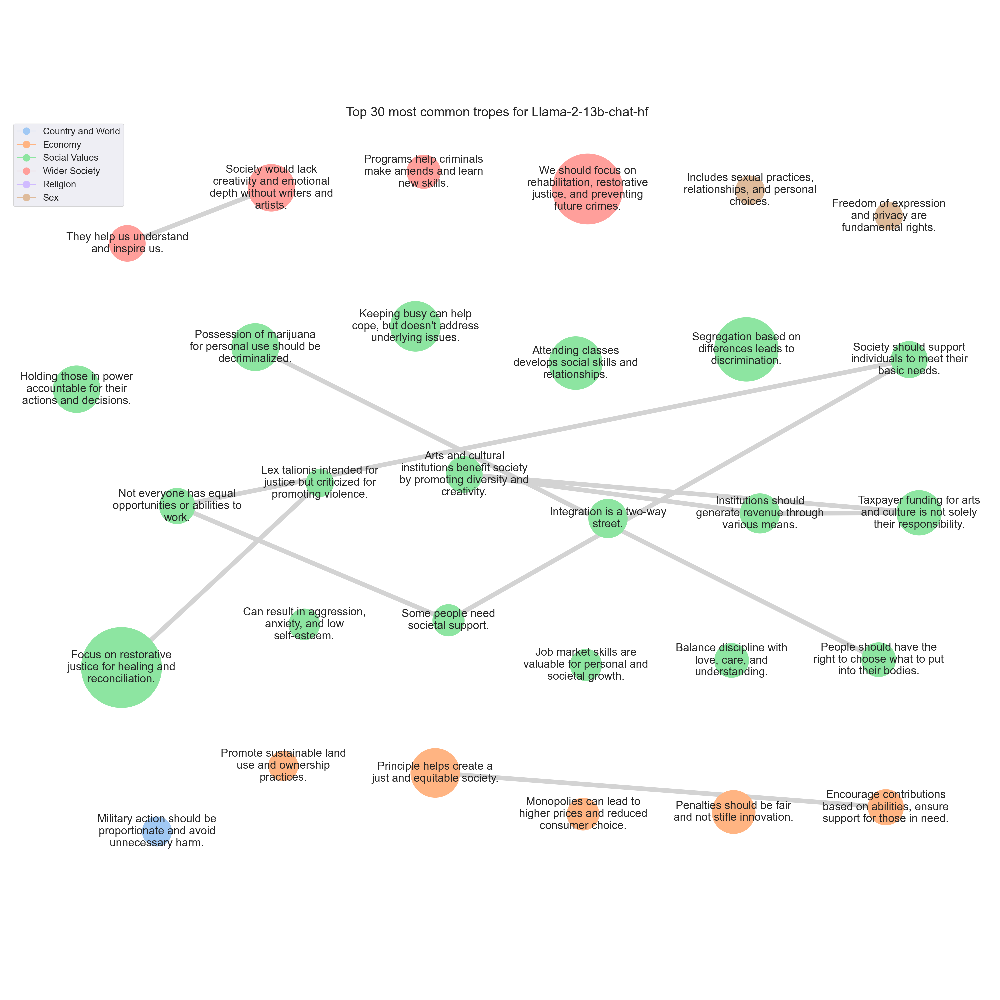

# <SETTING> Trope report

---
## Tropes

### T658: Focus on restorative justice for healing and reconciliation.

|Support|
|---|
|Instead, I believe in restorative justice, which focuses on healing and reparation rather than punishment and retribution.|
|Additionally, restorative justice takes into account the needs and concerns of all parties involved, including the victim, the offender, and the community, and seeks to find a solution that is fair and just for everyone.|
|Therefore, I strongly believe that restorative justice is a more effective and compassionate approach to justice, and that it is the best way to promote healing, accountability, and reparation for those who have been harmed.|
|It can perpetuate cycles of violence and retribution, rather than promoting justice and healing.|
|Instead of resorting to physical punishment or revenge, I think it's important to focus on restorative justice and finding solutions that benefit everyone involved.|
|This can include mediation, reparations, and community service, among other approaches.|
|Instead of seeking revenge, we should focus on restorative justice, which aims to repair the harm caused by criminal behavior and promote healing and accountability for all parties involved.|
|Maybe we should focus on restorative justice, where the goal is to repair the harm done and find a way forward that benefits everyone, rather than just punishing the wrongdoer.|
|It can perpetuate cycles of violence and create more victims, rather than providing justice or resolution.|
|Instead, I think we should focus on restorative justice and finding ways to heal and repair the harm that has been done.|
|Instead, I support a restorative justice approach that focuses on healing, reparation, and accountability, rather than simply inflicting punishment.|
|Instead, we should focus on adopting restorative justice practices that prioritize the needs of the victim, the offender, and the community, and promote healing, rehabilitation, and social justice.|
|This only serves to perpetuate systemic injustices and perpetuate cycles of violence.|
|It can perpetuate a cycle of violence and retaliation, rather than promoting justice and healing.|
|Instead, I think it's important to focus on restorative justice and finding solutions that benefit everyone involved.|
|Instead, it often leads to further violence, perpetuating a cycle of retribution and causing more harm than good.|
|This could involve restorative justice practices, such as mediation and reparative measures, as well as traditional legal penalties where appropriate.|
|In today's society, we should focus on restorative justice, which aims to repair the harm caused by crime and promote healing and reintegration of offenders back into society.|
|Instead, we should focus on restorative justice and alternative forms of punishment that prioritize rehabilitation and healing over retribution.|
|Instead, I believe in a more restorative approach to justice, one that prioritizes healing, accountability, and reparation over punishment and retribution.|
|Instead, I believe in restorative justice, which focuses on healing and reparation for the harm that has been done, rather than punishment and retribution.|
|Instead of seeking revenge, maybe we should focus on finding solutions that benefit everyone.|
|It only perpetuates a cycle of violence and retribution, rather than promoting healing, restoration, and accountability.|
|Instead, I believe in restorative justice, which focuses on healing, accountability, and reparations for those harmed, rather than punishment and retribution.|
|Instead, I believe that the focus should be on restorative justice, rehabilitation, and healing for both the perpetrator and the victim.|
|It promotes a cycle of violence and retribution, rather than encouraging resolution and restorative justice.|
|Instead, I believe that our focus should be on restorative justice and rehabilitation, which prioritizes the healing and growth of both the victim and the perpetrator.|
|However, this approach can quickly escalate into a cycle of violence and revenge, causing more harm and suffering for everyone involved.|
|Instead of promoting justice and rehabilitation, it can perpetuate a culture of aggression and retaliation.|
|Instead of focusing on retaliation and punishment, we should be working towards restorative justice and rehabilitation.|
|In my opinion, the focus should be on the perpetrator's rehabilitation and the victim's recovery, rather than on punishment and retribution.|
|The criminal justice system should prioritize restorative justice, which aims to repair the harm caused by the crime and promote healing for the victim and the community.|
|Therefore, I believe that the criminal justice system should prioritize rehabilitation and restorative justice, rather than retaliation and punishment.|
|Instead, I believe in the importance of restorative justice, which focuses on repairing the harm caused by wrongdoing and promoting healing for all parties involved.|
|Instead of promoting healing and restoration, it can perpetuate a cycle of violence and revenge.|
|Instead of resorting to vengeance and retribution, I believe that the focus should be on restorative justice and rehabilitation, which prioritize healing, accountability, and the well-being of all parties involved.|
|Additionally, this principle can lead to an endless cycle of violence and revenge, perpetuating harm and suffering rather than promoting justice and resolution.|
|Instead, I believe in the importance of restorative justice, which focuses on repairing the harm caused by wrongdoing and promoting healing and accountability for all parties.|
|It can lead to further violence, perpetuate cycles of harm, and fail to address the root causes of conflict.|
|Instead, I believe in restorative justice, which focuses on healing, accountability, and reparation, rather than punishment and retribution.|
|Instead, I believe in restorative justice practices that focus on rehabilitation, healing, and accountability for the harm caused.|
|However, this approach only leads to more violence and harm, perpetuating a cycle of revenge and hurt.|
|By doing so, we can create a more just and equitable society that promotes healing, restorative justice, and the well-being of all individuals and communities.|
|It can perpetuate a cycle of violence and retribution, rather than promoting justice and rehabilitation.|
|It's better to focus on finding solutions that promote justice, healing, and restorative justice rather than resorting to revenge and retribution.|
|This approach can lead to further violence and perpetuate cycles of revenge, causing more harm and suffering for all parties involved.|
|Instead, I suggest that we focus on restorative justice, which seeks to repair the harm caused by wrongdoing and promote healing and accountability for all parties.|
|Instead, I believe that the focus should be on rehabilitation and restorative justice, which aims to repair the harm caused by the offense and promote healing and reintegration of the offender back into society.|
|Instead of promoting revenge and retribution, I think it's more important to focus on restorative justice and finding solutions that benefit all parties involved.|
|Additionally, I believe that the legal system should prioritize rehabilitation and restorative justice over punishment and retribution.|
|Instead, I believe that the focus should be on restorative justice, which prioritizes the needs of the victim and the offender, rather than punishment and retribution.|
|Additionally, it is important to recognize that the criminal justice system should not only focus on punishment, but also on rehabilitation and restorative justice.|
|It promotes a cycle of violence and retribution, rather than encouraging forgiveness, understanding, and restorative justice.|
|Instead, I believe in the importance of restorative justice, which focuses on healing and reparation, rather than punishment and retribution.|
|It can also perpetuate cycles of violence and create more harm than good.|
|Instead, I believe in a more restorative and transformative approach to justice, one that focuses on healing, accountability, and reparation, rather than punishment and retribution.|
|It is important to prioritize restorative justice and rehabilitation over punitive measures that only serve to perpetuate cycles of violence and retribution.|
|Instead of promoting justice and rehabilitation, it can perpetuate cycles of violence and revenge.|
|Instead, I believe in restorative justice and healing-centered approaches that prioritize the well-being and accountability of all parties involved.|
|Instead, I believe in restorative justice, which focuses on healing, reparation, and accountability, rather than punishment and retribution.|
|In my opinion, the focus should be on rehabilitation and restorative justice, rather than punishment for its own sake.|
|Instead, we should strive for a justice system that prioritizes healing, accountability, and the restoration of victims and communities.|
|Instead of seeking revenge, I believe that we should focus on finding solutions that promote justice, healing, and restorative justice.|
|Instead, I believe we should strive for a more compassionate and equitable approach to justice that prioritizes the well-being and safety of all individuals and communities.|
|It's important to focus on finding solutions that promote justice, healing, and rehabilitation, rather than resorting to physical punishment or retribution.|
|It only leads to more violence, suffering, and perpetual cycles of retaliation.|
|In a civilized society, we should focus on restorative justice, which aims to repair the harm caused by wrongdoing and promote healing and accountability.|
|It only serves to perpetuate a cycle of violence and create more victims.|
|Instead, I believe in advocating for restorative justice and working towards creating a more equitable and compassionate society for all.|
|In today's society, we should focus on rehabilitation and restorative justice, rather than resorting to physical punishment or retribution.|
|Instead, it perpetuates a cycle of violence and revenge, causing more harm and suffering for all parties involved.|
|I believe in a justice system that prioritizes restorative justice, rehabilitation, and addressing the root causes of crime, rather than simply punishing the perpetrator.|
|It only serves to perpetuate cycles of violence and retribution, rather than promoting justice, healing, and accountability.|
|Instead of resorting to revenge and punishment, we should focus on addressing the root causes of conflicts and injustices, and work towards finding solutions that promote the common good.|
|This can include restorative justice practices, such as mediation, counseling, and reparative measures, that prioritize the needs of victims and the community, rather than simply punishing the perpetrator.|
|Instead, I think it's important to focus on rehabilitation and restorative justice, which aims to repair the harm done and bring the offender back into society as a productive member.|
|Additionally, it can lead to a cycle of violence and retaliation, rather than promoting healing and restorative justice.|
|In my opinion, a more nuanced approach to justice is needed, one that prioritizes restorative justice, rehabilitation, and the protection of human rights.|
|However, in today's society, we prioritize rehabilitation and restorative justice over punitive measures.|
|It is important to recognize that every individual has the potential for redemption and that the criminal justice system should prioritize rehabilitation and restorative justice over punishment.|
|Instead, I believe in restorative justice practices that prioritize healing, accountability, and the transformative power of empathy and understanding.|
|Instead of promoting a cycle of revenge and retaliation, I believe in the importance of restorative justice and rehabilitation.|
|Instead, it only creates more victims and perpetuates a cycle of violence and revenge.|
|I believe that we should focus on restorative justice, which aims to repair the harm caused by the offense and promote healing and reconciliation between the parties involved.|
|In today's society, we should focus on finding solutions that promote justice, rehabilitation, and healing, rather than resorting to vengeance and retribution.|
|It only leads to more violence, hatred, and suffering, perpetuating a cycle of revenge and retaliation.|
|Instead, we should focus on restorative justice, which aims to repair the harm caused by the offender and promote healing for the victim and the community.|
|Instead, I believe that the focus should be on restorative justice, where the goal is to repair the harm caused by the crime and help the offender become a productive member of society.|
|Additionally, it is important to recognize that the criminal justice system should not only focus on punishment, but also on rehabilitation and restorative justice, as this approach has been shown to lead to better outcomes for both the victim and the offender.|
|It can perpetuate a cycle of violence and retaliation, rather than promoting justice and healing.|
|Instead of resorting to physical punishment, I believe that the focus should be on restorative justice and finding solutions that benefit all parties involved.|
|Instead of promoting healing and restorative justice, it can lead to further conflict and vengeance.|
|In contrast, I believe that a more effective and compassionate approach to justice is to focus on restorative justice, rehabilitation, and addressing the underlying causes of crime.|
|In today's society, it's important to focus on finding solutions that promote healing and restorative justice, rather than perpetuating cycles of violence and revenge.|
|In today's society, it's important to focus on finding solutions that promote justice and rehabilitation, rather than resorting to physical punishment or retribution.|
|Additionally, this approach can perpetuate cycles of violence and create more victims, rather than addressing the root causes of the problem.|
|It can perpetuate a cycle of violence and retaliation, rather than promoting justice and healing.|
|However, this approach can lead to a cycle of violence and retribution, rather than promoting healing and restorative justice.|
|This can include restorative justice, rehabilitation, and community-based solutions, rather than relying solely on punishment and retribution.|
|Instead of resorting to such a primitive and harmful approach, I believe that we should strive for a more compassionate and restorative justice system that prioritizes rehabilitation, accountability, and the well-being of all parties involved.|
|This can include restorative justice practices, such as victim-offender mediation, community service, and reparative actions, which have been shown to be more effective in promoting healing and reducing recidivism.|
|Instead, I suggest focusing on restorative justice and finding ways to address wrongdoing in a manner that promotes healing, accountability, and rehabilitation.|
|Instead, I believe in restorative justice practices that prioritize the needs of the victims, the offenders, and the community as a whole.|
|Instead, I believe in the importance of restorative justice, which focuses on healing and rehabilitation rather than revenge and retribution.|
|Instead, I believe in restorative justice that focuses on healing and accountability, rather than revenge and punishment.|
|Instead, I think it's much more important to focus on finding solutions that promote healing, restorative justice, and accountability.|
|It can lead to a cycle of violence and perpetuate harm, rather than resolving conflicts and promoting healing.|
|Instead, I suggest focusing on restorative justice and rehabilitation, which have been shown to be more effective in promoting healing, accountability, and community safety.|
|Instead, I believe in a justice system that prioritizes healing, restorative practices, and addressing the systemic issues that led to the harm in the first place.|
|This principle, which is based on retributive justice, has been used in the past to justify revenge and violence, rather than promoting healing and restorative justice.|
|This can be achieved through restorative justice practices, such as mediation, counseling, and reparative actions, which aim to repair the harm and promote healing for all parties involved.|
|Instead, we should strive for a justice system that prioritizes healing, rehabilitation, and restorative justice, rather than punishment and retribution.|
|This can be achieved through restorative justice, which focuses on repairing the harm caused by the crime and promoting healing for all parties involved.|
|Instead, we should focus on rehabilitation, restorative justice, and finding solutions that benefit everyone involved.|
|Instead, we should strive for a more compassionate and nuanced approach to justice that prioritizes healing, forgiveness, and the needs of all parties involved.|
|It can lead to a cycle of violence and perpetuate harm, rather than resolving conflicts and promoting healing.|
|Instead, I believe in restorative justice and rehabilitation, which focuses on healing, accountability, and the transformation of both the individual and society as a whole.|
|Instead, I believe in restorative justice and healing-centered approaches that prioritize the well-being and accountability of all parties involved.|
|However, this approach can lead to further harm and suffering, rather than resolving conflicts and promoting healing.|
|Instead, I believe in restorative justice, which focuses on repairing the harm caused by wrongdoing and promoting healing and accountability for all parties involved.|
|In today's society, we need to prioritize restorative justice, rehabilitation, and healing over punitive measures.|
|It can perpetuate a cycle of violence and retaliation, rather than promoting justice and healing.|
|I think it's important to focus on restorative justice and finding solutions that benefit all parties involved, rather than simply seeking revenge.|
|Instead, I believe in restorative justice, where the focus is on healing and reparation, rather than punishment.|
|Instead of resorting to physical punishment, I think it's more important to focus on rehabilitation and restorative justice.|
|While I understand the desire for justice and retribution, I believe that there are better ways to address wrongdoing and promote healing and rehabilitation.|
|However, this approach only leads to more violence and perpetuates a cycle of revenge.|
|Instead, I believe in the importance of restorative justice, which focuses on healing and reparation rather than punishment.|
|Instead of seeking revenge, we should focus on restorative justice and healing for all parties involved.|
|It only serves to perpetuate cycles of violence and harm, rather than promoting justice, healing, and restoration.|
|This approach would focus on healing, reparation, and accountability, rather than retribution.|
|Instead, we should embrace a more compassionate and restorative approach to justice, one that prioritizes the needs of the victim and their family, and seeks to heal and reparate rather than punish and retaliate.|
|It's a form of revenge, and it only leads to more violence and suffering.|
|Instead of promoting justice and rehabilitation, it can lead to further violence and perpetuate cycles of revenge.|
|In place of this outdated principle, I believe that our justice system should focus on restorative justice, which prioritizes the needs of victims, offenders, and the community as a whole.|
|In today's society, it's important to focus on finding solutions that promote justice, healing, and rehabilitation, rather than resorting to revenge or retribution.|
|Instead, I think it's important to focus on healing and forgiveness.|
|Instead, I believe that we should focus on healing, forgiveness, and finding solutions that benefit everyone involved.|
|It perpetuates a cycle of violence and retribution, rather than promoting justice and healing.|
|I think it's important to focus on restorative justice and rehabilitation, rather than resorting to punitive measures that only serve to further harm the perpetrator and the victim.|
|Instead of promoting a cycle of violence and retribution, I believe that our focus should be on restorative justice, rehabilitation, and addressing the root causes of crime.|
|It promotes a cycle of violence and retribution, rather than encouraging resolution and restorative justice.|
|Instead, I think it's important to focus on restorative justice and rehabilitation, rather than punishment and retribution.|
|Instead, I believe in restorative justice, which focuses on healing, accountability, and reparations for those affected by wrongdoing.|
|Instead of promoting revenge and retaliation, I think it's important to focus on restorative justice and finding solutions that benefit everyone involved.|
|It can perpetuate cycles of violence and revenge, rather than promoting justice and healing.|
|Instead of promoting justice and resolution, it can lead to a cycle of violence and revenge, causing more harm and suffering for all parties involved.|
|In today's society, I believe that we should focus on restorative justice and rehabilitation, rather than punishment and retribution.|
|Instead, I believe in restorative justice practices that focus on healing, accountability, and reparations for those who have been harmed.|
|Instead, I believe in restorative justice, which focuses on repairing the harm caused by wrongdoing and promoting healing and accountability for all parties involved.|
|Instead of promoting revenge and retaliation, I believe that we should focus on restorative justice and rehabilitation.|
|It perpetuates a cycle of violence and retaliation, rather than promoting justice and healing.|
|Instead of resorting to physical punishment, I believe that the focus should be on restorative justice and finding solutions that benefit all parties involved.|
|Instead, I believe in restorative justice that focuses on healing and accountability, rather than punishment and vengeance.|
|Instead of seeking revenge or punishment, I believe that we should focus on restorative justice, which aims to repair the harm caused by wrongdoing and promote healing and accountability.|
|Instead of resorting to revenge and retaliation, we should focus on finding peaceful and constructive solutions to conflicts, and work towards healing and restorative justice.|
|It's time to move towards a more compassionate and restorative approach to justice, one that prioritizes rehabilitation and healing over punishment and vengeance.|
|Instead of promoting a cycle of violence and revenge, I believe in restorative justice that focuses on healing, accountability, and reparation.|
|Instead of resorting to physical punishment, we should be working towards finding solutions that prioritize healing, restorative justice, and addressing the root causes of harm.|
|It can perpetuate cycles of violence and create more victims, rather than providing true resolution or rehabilitation.|
|Instead, I think it's important to focus on restorative justice and finding ways to address the root causes of conflict and harm.|
|Instead of focusing on punishment and retribution, I believe that our justice system should prioritize rehabilitation and restorative justice.|
|This can lead to further violence and harm, rather than promoting justice and healing.|
|Instead, we should prioritize rehabilitation and restorative justice, and work towards a peaceful and constructive resolution to conflicts.|
|In today's society, it is important to prioritize justice, rehabilitation, and restorative measures over punitive measures.|
|Additionally, this approach can lead to a cycle of violence and retaliation, causing more harm and suffering for everyone involved.|
|Instead, I believe that the focus should be on finding solutions that promote healing, rehabilitation, and restorative justice.|
|It only serves to perpetuate a cycle of violence and retribution, rather than promoting justice and rehabilitation.|
|Instead, I believe in the importance of restorative justice, which focuses on repairing the harm caused by wrongdoing and promoting healing for all parties involved.|
|It can perpetuate cycles of violence and create more victims, rather than providing justice or resolution.|
|Instead of resorting to physical retribution, I believe it's important to focus on restorative justice and finding ways to address the harm that's been done, while also holding perpetrators accountable.|
|It promotes a cycle of violence and retribution, rather than justice and rehabilitation.|
|Instead of resolving conflicts and promoting healing, it only perpetuates more violence and harm.|
|In contrast, restorative justice, which focuses on healing and accountability rather than punishment, is a more effective and compassionate approach to addressing wrongdoing.|
|Instead of promoting vengeance and punishment, we should focus on restorative justice and healing.|
|It can perpetuate a cycle of violence and retaliation, rather than promoting justice and healing.|
|Instead, it only perpetuates a cycle of violence and retribution, causing more harm and suffering for all parties involved.|
|Furthermore, I believe that the legal system should prioritize rehabilitation and reintegration of offenders, rather than simply punishing them and locking them away.|
|Instead, we should focus on restorative justice, rehabilitation, and promoting healing and accountability for all parties involved.|
|This outdated principle of retribution only leads to more violence and suffering, rather than promoting justice and healing.|
|We should focus on restorative justice, rehabilitation, and healing, rather than perpetuating a cycle of violence.|
|It promotes a cycle of violence and retribution, rather than encouraging forgiveness and restorative justice.|
|This can lead to a cycle of violence and recidivism, rather than promoting healing and justice.|
|This could include restorative justice practices, such as mediation and reparative measures, as well as alternative forms of punishment that prioritize rehabilitation and healing over retribution.|
|Instead of promoting healing and restorative justice, it perpetuates a culture of revenge and retribution.|
|Instead, I think it's important to focus on restorative justice, where the goal is to repair the harm that has been done and to promote healing and rehabilitation.|
|Additionally, I believe that the legal system should prioritize the protection of society and the rehabilitation of the offender, rather than simply punishing the offender.|
|Instead of perpetuating a culture of violence, I believe that the focus should be on restorative justice and rehabilitation.|
|Additionally, it is important to recognize that the criminal justice system should not only focus on punishment, but also on rehabilitation and restorative justice.|
|Instead, I believe in the importance of rehabilitation and restorative justice, which focuses on healing and repairing the harm caused by wrongdoing, rather than simply punishing the offender.|
|Instead, I believe in restorative justice, which focuses on repairing the harm caused and promoting healing and accountability for all parties involved.|
|Instead of seeking revenge, we should focus on restorative justice and finding solutions that benefit all parties involved.|
|Instead, I believe in restorative justice and healing-centered approaches that prioritize the well-being and dignity of all individuals and communities.|

---

### T2769: We should focus on rehabilitation, restorative justice, and preventing future crimes.

|Support|
|---|
|Instead of resorting to the death penalty, we should focus on providing restorative justice and rehabilitation programs to help offenders make amends for their crimes and become productive members of society.|
|Instead of resorting to state-sanctioned killing, we should focus on providing restorative justice and rehabilitation programs for offenders, as well as addressing the root causes of crime and working towards a safer and more compassionate society for all.|
|Instead of resorting to state-sanctioned killing, we should focus on restorative justice and rehabilitation to help offenders make amends for their crimes.|
|Instead, I believe that alternative forms of punishment, such as life imprisonment without parole, should be used to achieve justice while upholding human rights and the right to life.|
|Instead of resorting to the death penalty, we should focus on finding alternative solutions that prioritize rehabilitation and restorative justice.|
|Instead of resorting to the death penalty, we should focus on providing restorative justice and rehabilitation programs for offenders, as well as addressing the root causes of crime such as poverty, inequality, and mental illness.|
|Instead, we should focus on providing fair and speedy trials, as well as rehabilitation and restorative justice programs to help offenders make amends and reintegrate into society.|
|Instead of resorting to the death penalty, I believe that perpetrators of serious crimes should be given life imprisonment without parole, which would still allow for punishment and rehabilitation without taking away the possibility of redemption and restorative justice.|
|Furthermore, the focus should be on addressing the root causes of crime and providing support and resources to victims and their families, rather than resorting to punitive measures that do not address the underlying issues.|
|Instead, we should focus on providing a fair and just legal system that prioritizes rehabilitation and restorative justice, rather than resorting to violence and retribution.|
|I believe that every individual has the potential for rehabilitation and that life imprisonment without parole is a more effective and humane punishment for the most serious crimes.|
|Instead of resorting to the death penalty, I think we should focus on providing support and resources for the victims of crime and their families, as well as working to address the root causes of crime and violence in our society.|
|Instead of resorting to the death penalty, we should focus on providing restorative justice and rehabilitation programs to help offenders reform and make amends for their crimes.|
|Additionally, we need to address the root causes of crime, such as poverty, lack of education, and mental health issues, to prevent them from happening in the first place.|
|Instead, I believe that we should focus on providing restorative justice and rehabilitation programs for perpetrators, while also ensuring that victims and their families receive the support and compensation they need.|
|Instead, I believe that the focus should be on providing support and resources for the victims and their families, as well as working to address the root causes of crime and violence in our society.|
|Additionally, I believe that the legal system should prioritize restorative justice and rehabilitation over punishment and retribution, as this approach has been shown to be more effective in reducing recidivism and promoting healing for all parties involved.|
|Instead of resorting to the death penalty, I believe that society should focus on restorative justice and finding ways to address the root causes of crime.|
|Instead of resorting to the death penalty, I believe that perpetrators of serious crimes should be given life imprisonment without parole, which would still allow for punishment and rehabilitation while also protecting the rights of the accused.|
|Maybe we should focus on rehabilitation and restorative justice instead of just punishing people with death.|
|Instead of resorting to the death penalty, I believe that the focus should be on providing justice and rehabilitation to the victims and their families.|
|Instead of resorting to state-sanctioned violence, we should be working towards creating a more equitable and just society where the root causes of crime are addressed and the perpetrators are held accountable through restorative and rehabilitative measures.|
|Instead, we should focus on providing true justice and rehabilitation for those who have committed crimes, while also working to address the root causes of crime and violence in our society.|
|Instead of resorting to the death penalty, I believe that society should focus on providing support and resources for the rehabilitation of offenders, as well as working to address the root causes of crime.|
|Instead, I believe that life imprisonment without parole is a more appropriate punishment for the most serious crimes, as it allows for rehabilitation and reflection, while also ensuring that the perpetrator is held accountable for their actions.|
|Instead of resorting to such draconian measures, we should focus on restorative justice and rehabilitation to help offenders make amends for their actions and become productive members of society.|
|The legal system should prioritize rehabilitation and restorative justice over punishment and retribution.|
|Instead of resorting to the death penalty, we should focus on providing support and resources for victims, their families, and the communities affected by crime.|
|Instead of resorting to the death penalty, I believe that we should focus on providing restorative justice and rehabilitation programs to help offenders make amends for their crimes and become productive members of society.|
|Additionally, I believe that we should work to address the root causes of crime, such as poverty, lack of education, and mental health issues, to prevent crimes from happening in the first place.|
|Instead, I believe that alternative forms of punishment, such as life imprisonment without parole, should be explored to ensure that dangerous criminals are held accountable while also protecting the rights and dignity of all individuals.|
|Instead, I believe that we should focus on creating a fair and just society that values human life and dignity, and that provides alternatives to the death penalty that prioritize rehabilitation, restorative justice, and the protection of human rights.|
|Instead of relying on the death penalty, we should focus on providing support and resources to victims and their families, as well as ensuring that those who commit crimes receive fair and just sentences that do not involve taking their lives.|
|Instead, we should focus on providing support and resources to victims and their families, as well as ensuring that those who commit crimes receive fair and just sentences that do not involve taking their lives.|
|Instead of resorting to state-sanctioned killing, we should focus on restorative justice and rehabilitation to address the root causes of crime and ensure that offenders are held accountable while also providing opportunities for redemption.|
|Instead, we should focus on addressing the root causes of crime and providing support and rehabilitation for those who have committed crimes.|
|Instead of resorting to state-sanctioned killing, we should focus on providing support and resources for the victims of crime and their families, as well as working to address the social and economic issues that contribute to criminal behavior.|
|Instead, I think it's important to focus on rehabilitation and restorative justice, which can help to heal the wounds of the victims and their families, as well as the perpetrators.|
|I believe that there are always alternatives to the death penalty, such as life imprisonment without parole, that can provide justice without resorting to violence.|
|Furthermore, I believe that the death penalty is a more effective deterrent than life imprisonment.|
|Instead of resorting to such a severe and irreversible punishment, I believe that the focus should be on providing justice, rehabilitation, and restorative measures to the victims and their families.|
|Instead of resorting to the death penalty, I believe that perpetrators of serious crimes should be held accountable through life imprisonment without parole, which would ensure that they are removed from society without violating their human rights.|
|Instead of resorting to violence and vengeance, we should focus on rehabilitation and restorative justice.|
|We need to address the root causes of crime and work towards creating a more equitable society for all.|
|Instead, I advocate for a justice system that prioritizes rehabilitation, restorative justice, and the protection of human rights for all individuals, regardless of their background or circumstances.|
|Instead of resorting to violence, we should focus on providing support and rehabilitation to those who have committed crimes, as well as addressing the root causes of crime such as poverty, inequality, and mental illness.|
|Instead of resorting to such a draconian measure, I believe that society should focus on providing restorative justice, rehabilitation, and support to victims and their families.|
|Instead of resorting to the death penalty, we should focus on providing fair and equitable justice systems that prioritize rehabilitation and restorative justice, rather than vengeance and punishment.|
|I believe that life imprisonment without parole is a more appropriate punishment for the most serious crimes, as it allows for the possibility of rehabilitation and restorative justice.|
|Instead, we should focus on addressing the root causes of crime, providing support for victims and their families, and ensuring that those who commit crimes are held accountable through fair and just legal systems.|
|Instead, I believe that rehabilitation and restorative justice are the key to creating safer and more just societies.|
|Instead, I believe that life imprisonment without parole is a more appropriate punishment for the most serious crimes, as it ensures that the perpetrator is held accountable for their actions while also giving them the opportunity to reflect on their choices and make amends.|
|I think it is important to prioritize rehabilitation and restorative justice instead of resorting to the death penalty.|
|Additionally, the death penalty is a more cost-effective and efficient form of punishment compared to life imprisonment, as it eliminates the need for expensive appeals and lengthy prison sentences.|
|Instead, I suggest we focus on providing support and resources for victims, their families, and the communities affected by crime.|
|Instead of resorting to such a draconian measure, we should focus on providing restorative justice and rehabilitation programs for offenders, as well as addressing the root causes of crime such as poverty, inequality, and mental illness.|
|We need to find alternative solutions that prioritize rehabilitation and restorative justice, rather than resorting to state-sanctioned killing.|
|I think we should focus on rehabilitation and finding ways to help people change their behavior, rather than resorting to the death penalty.|
|Instead of resorting to the death penalty, we should focus on providing support and resources to the families of victims, and ensuring that offenders receive appropriate counseling and rehabilitation to address the underlying issues that led to their behavior.|
|Instead of resorting to violence, we should focus on restorative justice and rehabilitation to address the root causes of crime and promote healing for all parties involved.|
|Instead of resorting to violence and punishment, we should focus on restorative justice and rehabilitation to address the root causes of crime and promote safer and more equitable communities for all.|
|Instead of resorting to the death penalty, we should focus on providing restorative justice and rehabilitation programs for those who have committed crimes.|
|Instead of resorting to state-sanctioned killing, we should be working to address the root causes of crime and provide support and rehabilitation to those who have committed harm.|
|Instead, I believe that we should focus on rehabilitation and restorative justice to help offenders become productive members of society.|
|Instead of resorting to the death penalty, I believe that society should work towards addressing the root causes of crime and providing support and resources for both victims and offenders.|
|Instead of resorting to the death penalty, we should be working towards a more just and equitable society that prioritizes rehabilitation, restorative justice, and the dignity of all human beings.|
|I think we should focus on rehabilitation and restorative justice, rather than resorting to the ultimate punishment.|
|Instead, I believe that life imprisonment without parole is a more appropriate punishment for the most serious crimes, as it ensures that the perpetrator is held accountable for their actions while also providing an opportunity for rehabilitation and restorative justice.|
|Furthermore, I think that the focus should be on addressing the root causes of crime and providing support for the victims and their families, rather than resorting to extreme punishment.|
|Instead of resorting to the death penalty, I believe that society should work towards finding alternative forms of punishment and rehabilitation that prioritize restorative justice and the protection of human rights.|
|Instead, I believe that the focus should be on providing support and resources to the victims of crime and ensuring that the perpetrators are held accountable through alternative forms of punishment, such as life imprisonment without parole.|
|Instead, I think that focus should be placed on rehabilitation and restorative justice, as well as addressing the root causes of crime, such as poverty, lack of education, and mental health issues.|
|I believe that life imprisonment without parole should be a viable alternative to ensure public safety while also upholding human rights.|
|Instead of resorting to the death penalty, I believe that society should focus on providing support and resources for the victims of crime and their families, as well as working to address the root causes of crime and violence.|
|Instead of resorting to violence, we should focus on restorative justice and rehabilitation to address the root causes of crime and promote safer and more equitable communities for all.|
|Instead of resorting to the death penalty, I believe that society should focus on rehabilitation and restorative justice to address the root causes of crime and provide support to victims and their families.|
|Instead of the death penalty, I believe that life without parole or other forms of restorative justice should be considered for the most serious crimes.|
|Instead of resorting to the death penalty, I believe that society should focus on providing support and resources for the victims and their families, as well as working to address the root causes of crime and violence.|
|Instead, I believe that the focus should be on providing restorative justice and rehabilitation for those who have committed crimes, as well as working to address the root causes of crime and violence in our society.|
|Instead, I advocate for a focus on restorative justice and rehabilitation, which can lead to healing and closure for the victims and their families, as well as the perpetrators.|
|Instead, we should focus on creating a fair and just society that values human life and dignity, rather than resorting to the taking of lives.|
|Instead of resorting to the death penalty, I believe that perpetrators of serious crimes should be given life imprisonment without parole, which would still allow for punishment and justice while also protecting the innocent and upholding human rights.|
|Furthermore, the focus should be on rehabilitation and restorative justice, rather than resorting to vengeance and retribution.|
|Instead of resorting to state-sanctioned killing, we should focus on providing restorative justice and rehabilitation programs to help offenders make amends for their actions and become productive members of society.|
|For example, life imprisonment without parole can be a more severe punishment than the death penalty, while also allowing for the possibility of rehabilitation and restorative justice.|
|Instead, we should focus on addressing the root causes of crime and providing support and rehabilitation for those who have committed crimes.|
|Instead of resorting to state-sanctioned killing, I believe that the focus should be on providing justice and rehabilitation for the perpetrators, as well as support and healing for the victims and their families.|
|Instead, I believe that the focus should be on providing restorative justice and rehabilitation for those who have committed crimes, rather than resorting to punishment that can only lead to more suffering and violence.|
|Instead of resorting to state-sanctioned killing, I believe that we should focus on rehabilitation and restorative justice to address the root causes of crime and ensure that offenders are given the opportunity to make amends and reintegrate into society.|
|Instead of resorting to the death penalty, I believe that society should focus on providing restorative justice, rehabilitation, and support for both victims and offenders.|
|Our justice system should focus on rehabilitation and restorative justice, rather than resorting to state-sanctioned killing.|
|Instead of resorting to state-sanctioned murder, we should focus on providing restorative justice and support for the victims of crime, as well as working to address the systemic issues that lead to criminal behavior in the first place.|
|Instead, I believe that life imprisonment without parole is a more appropriate punishment for the most heinous crimes.|
|Instead of resorting to violence, we should focus on restorative justice and rehabilitation to address the root causes of crime and promote safer, more equitable societies.|
|Instead, we should focus on creating a fair and equitable criminal justice system that prioritizes rehabilitation, restorative justice, and the protection of human rights.|
|Additionally, I believe that life without parole is a more effective deterrent to crime, as it ensures that the perpetrator will never be able to harm anyone again, while also giving them a chance to reflect on their actions and seek rehabilitation.|
|Instead, we should focus on providing alternative forms of punishment and rehabilitation that prioritize the well-being and dignity of all individuals, while also upholding the safety and security of society.|
|The legal system should focus on rehabilitation and restorative justice, rather than resorting to state-sanctioned killing.|
|Instead of resorting to the death penalty, we should focus on providing support and resources to the victims and their families, as well as working to address the root causes of crime.|
|Instead of resorting to the death penalty, we should focus on restorative justice and providing support and resources to the victims of crime.|
|Instead of resorting to the death penalty, we should be working towards a more comprehensive and restorative justice system that prioritizes the needs of victims, offenders, and the community as a whole.|
|Additionally, the death penalty is a more cost-effective option than life imprisonment, as it eliminates the need for expensive appeals and lengthy prison sentences.|
|Instead of resorting to the death penalty, we should be working to address the systemic issues that lead to crime and provide support and resources to those who have been harmed by crime.|
|By taking a holistic approach to addressing crime and providing opportunities for rehabilitation and restorative justice, we can create safer and more equitable communities for all.|
|Instead, we should focus on restorative justice, rehabilitation, and addressing systemic inequalities to create a safer and more equitable society for all.|
|Instead of resorting to violence, we should focus on restorative justice and rehabilitation to address the root causes of crime and promote safer and more equitable communities for all.|
|Instead of resorting to such a draconian measure, I believe that society should work towards providing restorative justice and rehabilitation for those who have committed crimes, while also ensuring public safety.|
|Instead of resorting to the death penalty, I believe that we should focus on restorative justice and rehabilitation, which can lead to safer communities and a more just society.|
|Instead, I believe that life imprisonment without parole should be the maximum sentence for the most serious crimes, as it allows for punishment and rehabilitation without resorting to violence.|
|Instead, I believe that we should focus on alternative forms of punishment that are more effective, ethical, and respect the human rights of all individuals.|
|Instead, we should focus on providing restorative justice, addressing the root causes of crime, and upholding human rights for all individuals, regardless of their actions.|
|The criminal justice system should prioritize rehabilitation and restorative justice, rather than resorting to the ultimate punishment of death.|
|The focus should be on addressing the root causes of crime, such as poverty, lack of education, and mental health issues, rather than simply punishing those who commit crimes.|
|Instead of resorting to the death penalty, we should be working towards a more just and equitable society that addresses the root causes of crime and provides opportunities for rehabilitation and restorative justice.|
|Instead of resorting to the death penalty, we should be working to address the root causes of crime and investing in restorative justice practices that prioritize healing, rehabilitation, and community safety.|
|Instead of resorting to state-sanctioned killing, I believe that society should work towards restorative justice and rehabilitation to address the root causes of crime and promote healing for all parties involved.|
|Instead, we have focused on rehabilitation and restorative justice, which has led to one of the lowest crime rates in Europe.|
|Instead of resorting to the death penalty, I believe that society should focus on providing support and resources for the victims of crime and their families, as well as working to address the root causes of crime such as poverty, inequality, and lack of opportunities.|
|Instead of resorting to violence, we should focus on restorative justice and rehabilitation to address the harm caused by crime and work towards healing and accountability.|
|Instead, I believe that focusing on rehabilitation and restorative justice is a more effective way to address crime and promote safer communities.|
|I think that there are better ways to address crime and bring justice to victims, such as restorative justice and rehabilitation programs.|
|Instead of resorting to the death penalty, I believe that perpetrators of serious crimes should be given life imprisonment without parole, which would still allow for punishment and rehabilitation without resorting to violence.|
|Instead of resorting to violence, we should be working towards creating a more equitable and just society that addresses the root causes of crime.|
|Instead of resorting to the death penalty, I believe that the focus should be on providing support and resources for the victims and their families, as well as ensuring that the perpetrators receive appropriate punishment and rehabilitation.|
|Instead of resorting to the death penalty, I believe that society should focus on providing support and resources for the victims of crime and their families, as well as addressing the social and economic issues that contribute to criminal behavior.|
|Instead, I believe that the focus should be on providing rehabilitation and restorative justice to those who have committed crimes, so that they can make amends and become productive members of society.|
|Instead, we have focused on rehabilitation and restorative justice to ensure that offenders are given a chance to make amends for their crimes and become productive members of society.|
|Instead of resorting to state-sanctioned killing, we should focus on restorative justice and rehabilitation to help offenders make amends and become productive members of society.|
|Instead, we should focus on addressing the root causes of criminal behavior, providing support for victims and their families, and ensuring that the criminal justice system is fair, impartial, and effective in promoting public safety.|
|Instead of resorting to state-sanctioned violence, I believe that perpetrators of serious crimes should be held accountable through restorative justice measures that prioritize rehabilitation and healing for all parties involved.|
|Additionally, I believe that restorative justice and rehabilitation should be prioritized over punishment and retribution.|
|Instead of resorting to such draconian measures, we should be working towards creating a more just and equitable society that addresses the root causes of crime and provides support and rehabilitation for those who have committed offenses.|
|Instead of resorting to state-sanctioned killing, we should focus on rehabilitation and restorative justice to help offenders make amends for their actions and contribute to society in a positive way.|
|Instead of resorting to violence, I think we should focus on finding ways to rehabilitate and restore justice in a way that doesn't involve taking someone's life.|
|Instead, I believe that life imprisonment without parole is a more appropriate punishment for the most serious crimes, as it allows for the possibility of rehabilitation and restorative justice, while also ensuring that the perpetrator is held accountable for their actions.|
|Instead, I believe that we should focus on addressing the root causes of crime, providing support and rehabilitation for those who have committed crimes, and upholding human rights and dignity for all individuals, regardless of their crimes.|
|Instead of resorting to violence and punishment, we should focus on restorative justice and rehabilitation to address the root causes of crime and provide support for those who have been harmed.|
|Instead, I believe that the focus should be on restorative justice, rehabilitation, and providing support and resources for the victims of crime and their families.|
|Instead, I believe that life imprisonment without parole is a more appropriate punishment for the most serious crimes, as it allows for the possibility of rehabilitation and restorative justice.|
|Instead, I believe that life imprisonment without parole is a more appropriate punishment for the most serious crimes, as it allows for rehabilitation and reflection, while also ensuring that the perpetrator is held accountable for their actions.|
|Instead of resorting to violence, we should work towards creating a justice system that focuses on rehabilitation, restorative justice, and addressing the systemic issues that lead to criminal behavior.|
|Additionally, I believe that life without parole is a more appropriate punishment for the most serious crimes, as it allows for rehabilitation and reflection, while also ensuring that the perpetrator is held accountable for their actions.|
|Ultimately, the focus should be on restorative justice and healing for the victims and their families, rather than resorting to state-sanctioned violence.|
|Maybe there could be more focus on rehabilitation and restorative justice instead?|
|Instead of resorting to state-sanctioned killing, we should focus on restorative justice and alternative forms of punishment that prioritize the rehabilitation of offenders and the protection of society.|
|Instead of resorting to state-sanctioned killing, we should focus on providing restorative justice and rehabilitation for those who have committed crimes, while also ensuring public safety.|
|In a just and equitable society, we must work towards finding alternative solutions to crime and punishment that prioritize rehabilitation, restorative justice, and the protection of human rights.|
|Instead, I advocate for alternative forms of punishment and rehabilitation that prioritize restorative justice and the opportunity for offenders to make amends for their actions.|

---

### T408: Segregation based on differences leads to discrimination.

|Support|
|---|
|The idea of separating people based on their background, identity, or characteristics is not only discriminatory, but it also goes against the fundamental principles of equality and human rights.|
|The idea of separating people based on their background or characteristics is not only discriminatory, but it also goes against the principles of equality and human rights.|
|So, I strongly disagree with the proposition that different sorts of people should keep to their own kind.|
|So, I strongly disagree with the proposition that it is better for people to keep to their own kind.|
|The idea of separating people based on their kind or identity is not only discriminatory, but it also goes against the principles of equality and human rights.|
|Discrimination, prejudice, and segregation only serve to divide us and hinder our progress.|
|Therefore, I strongly disagree with the proposition that different sorts of people should keep to their own kind.|
|The belief that certain groups of people should be separated or marginalized based on their identity is not only morally wrong, but it also goes against the principles of equality and human rights.|
|The idea that certain groups of people should be separated or marginalized based on their identity is not only morally reprehensible, but it also goes against the principles of equality and human rights.|
|The idea that certain groups of people should be separated or marginalized based on their characteristics is not only discriminatory, but it also goes against the principles of equality and human rights.|
|Discrimination, segregation, and prejudice only serve to divide and harm society as a whole.|
|The idea that certain groups of people should be separated or isolated based on their characteristics is a harmful and discriminatory approach.|
|The idea of separating people based on arbitrary characteristics is not only morally reprehensible, but it also goes against the principles of equality and human rights that are fundamental to a healthy and just society.|
|I cannot agree with the proposition that all people should keep to their own kind based on their differences.|
|Therefore, I strongly disagree with the proposition that all people should keep to their own kind.|
|Discrimination and segregation based on perceived differences only serves to divide us and perpetuate harmful stereotypes.|
|I strongly disagree with the proposition that it is better for people to keep to their own kind based on their inherent characteristics.|
|In short, I strongly disagree with the proposition that it is better for people to keep to their own kind.|
|The idea that certain groups of people should be separated or isolated based on their characteristics is a harmful and discriminatory approach.|
|I disagree with the proposition that different sorts of people should keep to their own kind.|
|Discrimination and segregation based on predefined categories only serve to perpetuate harmful stereotypes and hinder social progress.|
|I disagree with the proposition that it is better for people to keep to their own kind based on their inherent characteristics.|
|The idea of separating people based on their race, religion, gender, or any other inherent characteristic is not only discriminatory but also goes against the principles of equality and human rights.|
|The idea that certain groups of people should be separated or marginalized based on their identity is a harmful and discriminatory mindset.|
|I disagree with the proposition that it is better for people to keep to their own kind based on their differences.|
|Discrimination and segregation based on perceived differences only serves to perpetuate harmful stereotypes and division.|
|I cannot agree with the proposition that it is better for people to keep to their own kind based on their inherent characteristics.|
|The idea of separating people based on arbitrary characteristics like race, religion, or gender is a form of discrimination and goes against the principles of equality and human rights.|
|In conclusion, I strongly disagree with the proposition that it is better for people to keep to their own kind.|
|The idea that certain groups of people should be separated or treated unfairly based on their inherent characteristics is not only morally wrong, but it is also counterproductive to creating a society that values and respects the diversity of its members.|
|In conclusion, I strongly disagree with the proposition that different sorts of people should keep to their own kind.|
|The idea of separating people into different categories based on arbitrary characteristics is not only discriminatory, but it also goes against the principles of equality and human rights.|
|The idea that certain groups of people should be separated or isolated based on their identity is not only discriminatory, but it also goes against the fundamental principles of equality and human rights.|
|The idea of separating people based on arbitrary characteristics is not only morally reprehensible, but it also goes against the principles of equality and justice.|
|Discrimination and segregation based on differences are not the solution to societal issues, but rather they create more problems and perpetuate harmful stereotypes.|
|The idea that certain groups of people should be separated or marginalized based on arbitrary characteristics is not only morally reprehensible, but it also goes against the principles of equality and human rights.|
|The idea of segregating people based on their kind is not only discriminatory, but it also goes against the fundamental principles of equality and human rights.|
|Discrimination and segregation can lead to a society that is not inclusive and can perpetuate harmful stereotypes and prejudices.|
|The idea that certain groups of people should be limited to their own kind based on arbitrary characteristics such as race, gender, or sexual orientation is a form of discrimination and prejudice.|
|The idea that certain groups of people should be separated or marginalized based on their characteristics is not only morally wrong, but it also goes against the principles of equality and human rights.|
|The idea of segregating people based on arbitrary characteristics is not only morally reprehensible, but it also goes against the principles of equality and justice.|
|The idea that certain groups of people should be restricted to their own kind based on arbitrary characteristics such as race, religion, or socioeconomic status is not only morally reprehensible, but it also goes against the principles of equality and human rights.|
|This kind of segregation and discrimination based on arbitrary characteristics only serves to perpetuate harmful stereotypes and division, and hinders the progress and growth of society as a whole.|
|The idea of separating people based on their background or identity is not only discriminatory, but it also goes against the principles of equality and human rights.|
|The idea that certain groups of people should be separated based on their characteristics is not only discriminatory, but it also goes against the values of equality and human rights that are fundamental to our society.|
|Moreover, the idea that certain groups of people should be limited to their own kind only serves to perpetuate harmful stereotypes and prejudices.|
|The idea that certain groups of people should be separated or marginalized based on their identity is a harmful and discriminatory approach.|
|The idea that certain groups of people should be separated or treated unequally based on their characteristics is not only morally wrong, but it also goes against the principles of equality and human rights.|
|Discrimination and prejudice only serve to divide us and perpetuate harmful stereotypes, rather than promoting unity and progress.|
|Discrimination and segregation based on arbitrary characteristics is not a solution to societal issues, but rather a recipe for conflict, violence, and human suffering.|
|Discrimination and segregation based on perceived differences only serves to perpetuate harmful stereotypes and division, rather than promoting understanding and unity.|
|In conclusion, I strongly disagree with the proposition that it is better for people to keep to their own kind based on their differences.|
|In conclusion, the proposition that it is better for people to keep to their own kind is not only discriminatory but also harmful to society.|
|The idea that certain groups of people should be restricted to their own kind based on arbitrary characteristics like race, religion, or socioeconomic status is a form of discrimination and goes against the principles of equality and human rights.|
|The idea that certain groups of people should be separated or marginalized based on their differences is not only morally wrong, but it also goes against the principles of equality and human rights.|
|The idea that certain groups of people should be separated or treated unfairly based on their characteristics is not only morally wrong, but it also goes against the principles of equality and human rights.|
|Discrimination and segregation only serve to divide us and hinder our progress.|
|Discrimination and segregation can lead to harmful stereotypes and prejudice, and can hinder social progress and understanding.|
|The idea of separating people based on arbitrary characteristics is not only morally reprehensible, but it also goes against the principles of equality and human rights.|
|Discrimination and segregation based on differences are not the solution to social harmony, but rather they can create more problems and conflicts.|
|The idea of separating people based on arbitrary characteristics is not only morally wrong, but it also goes against the principles of equality and human rights.|
|I cannot agree with the proposition that it is better for people to keep to their own kind based on their differences.|
|Therefore, I strongly disagree with the proposition that it is better for people to keep to their own kind.|
|The idea of separating people based on arbitrary characteristics is not only morally reprehensible, but it also goes against the principles of equality and human rights.|
|The idea that certain groups of people should be kept to their own kind is a form of discrimination and marginalization, and it goes against the principles of equality and human rights.|
|The idea that certain groups of people should be separated or marginalized based on their identity is not only morally wrong, but it also goes against the principles of equality and human rights.|
|Discrimination and segregation only serve to divide us and hinder our progress.|
|In conclusion, the idea that different sorts of people should keep to their own kind is not only morally flawed, but it also ignores the many benefits of diversity and inclusivity.|
|The idea that certain groups of people should be separated or marginalized based on their identity is not only discriminatory, but it also ignores the fact that all individuals have inherent worth and deserve to be treated with dignity and respect, regardless of their background or identity.|
|Therefore, I strongly disagree with the proposition that it is better for people to keep to their own kind.|
|I cannot agree with the proposition that it is better for people to keep to their own kind based on their inherent characteristics such as race, religion, or any other inherent trait.|
|I cannot agree with the proposition that all people have their rights, but it is better for all of us that different sorts of people should keep to their own kind.|
|The idea that certain groups of people should be separated or restricted based on their identity is not only morally reprehensible, but it also ignores the many positive contributions that diversity can bring to our communities and society as a whole.|
|Therefore, I strongly disagree with the proposition that all people should be restricted to their own kind.|
|The idea that certain groups of people should be separated or marginalized based on their identity is not only discriminatory, but it also ignores the diversity and individuality that exists within any given group.|
|Dividing people into different groups based on arbitrary characteristics only serves to perpetuate harmful stereotypes and discrimination.|
|I disagree with the proposition that it is better for people to keep to their own kind based on their differences.|
|Separating people based on arbitrary characteristics is not only morally wrong, but it also harms society as a whole by creating divisions and inhibiting progress.|
|The idea that certain groups should be separated or marginalized based on arbitrary characteristics is not only morally reprehensible, but it also goes against the principles of equality and human rights.|
|The idea that certain groups of people should be limited to their own kind based on arbitrary characteristics such as race, religion, or gender is a form of discrimination and can lead to harmful and unfair treatment.|
|I disagree with the proposition that it is better for people to keep to their own kind based on their differences.|
|The idea of separating people based on their kind is not only discriminatory, but it also ignores the fact that we are all human beings with inherent dignity and worth.|
|The idea of separating people based on their kind or identity is not only discriminatory, but it also goes against the principles of equality and human rights.|
|The idea that certain groups of people should be separated or marginalized based on their identity is not only morally reprehensible, but it also goes against the principles of equality and human rights.|
|I strongly disagree with the proposition that certain people should be restricted to their own kind, as it is not only harmful but also goes against the principles of equality and human rights.|
|The idea that certain groups of people should be separated or marginalized based on their identity is not only discriminatory, but it also ignores the inherent worth and dignity of every individual.|
|Discrimination and prejudice only serve to divide us and perpetuate harmful stereotypes, rather than promoting understanding and progress.|
|I disagree with the proposition that it is better for people to keep to their own kind based on their differences.|
|Discrimination and segregation based on these differences only serves to perpetuate harmful stereotypes and hinder social progress.|
|The idea that certain groups of people should be separated or marginalized based on their characteristics is not only morally wrong, but it also goes against the principles of equality and human rights.|
|Discrimination and segregation only serve to divide us and hinder our progress as a society.|
|The idea that certain groups of people should be separated based on their differences is a form of discrimination and can lead to prejudice and inequality.|
|The idea of separating people based on their kind or background is not only discriminatory, but it also goes against the principles of equality and human rights.|
|Discrimination and segregation based on perceived differences only serves to perpetuate harmful stereotypes and reinforce damaging social norms.|
|The idea that certain groups of people should be separated based on their characteristics is a form of discrimination and goes against the principles of equality and human rights.|
|The idea that certain groups of people should be separated or marginalized based on their characteristics is a harmful and discriminatory mindset.|
|The idea that certain groups of people should be separated or treated unequally based on their characteristics is not only morally wrong, but it is also counterproductive to creating a society that values and respects the diversity of its members.|
|The idea that certain groups of people should be separated or treated unequally based on their inherent characteristics is not only morally wrong, but it also goes against the principles of equality and human rights.|
|I disagree with the proposition that different sorts of people should keep to their own kind.|
|The idea of separating people based on their characteristics, such as race, religion, or gender, is not only discriminatory but also harmful.|
|In conclusion, the idea that it is better for people to keep to their own kind is not only morally reprehensible but also harmful to society as a whole.|
|The idea of separating people based on arbitrary characteristics is not only morally wrong, but it also goes against the principles of equality and human rights.|
|I cannot agree with the proposition that it is better for people to keep to their own kind based on their differences.|
|Discrimination and segregation based on differences only leads to harm and division.|
|The idea of separating people based on arbitrary characteristics is not only morally reprehensible, but it also goes against the principles of equality and human rights.|
|The idea of separating people based on arbitrary characteristics is not only morally reprehensible, but it also goes against the principles of equality and human rights.|
|The idea that certain groups of people should be separated or marginalized based on their identity is not only morally wrong, but it also goes against the principles of equality and human rights.|
|The idea of separating individuals based on their race, religion, gender, or any other characteristic is not only discriminatory, but it also goes against the fundamental principles of human rights and dignity.|
|The idea that certain groups of people should be restricted or segregated based on their inherent characteristics is not only morally reprehensible, but it also goes against the principles of equality and human rights.|
|Discrimination and segregation based on perceived differences only serve to perpetuate harmful stereotypes and hinder social progress.|
|The idea that certain groups of people should be separated based on their differences is a harmful and discriminatory mindset that has been used to justify discrimination, segregation, and even violence throughout history.|
|The idea that certain groups of people should be segregated or excluded based on their identity is not only morally wrong, but it also goes against the principles of equality and human rights.|
|The idea that certain groups of people should be separated or isolated based on their inherent characteristics is a harmful and discriminatory approach.|
|The idea that certain individuals or groups should be restricted to their own kind is not only discriminatory, but it also goes against the fundamental principles of equality and human rights.|
|Segregation and discrimination, on the other hand, can lead to social unrest, mistrust, and even violence.|
|Furthermore, the idea that certain groups of people should be restricted to their own kind is not only morally reprehensible, but it also ignores the reality of the world we live in.|
|Therefore, I strongly disagree with the proposition that different sorts of people should keep to their own kind.|
|The idea that certain groups of people should be separated or marginalized based on arbitrary characteristics is not only morally reprehensible, but it also goes against the principles of equality and human rights.|
|The proposition that certain groups of people should be restricted to their own kind based on arbitrary characteristics such as race, gender, or sexual orientation is not only morally reprehensible, but it also goes against the fundamental principles of equality and human rights.|
|The idea of segregating or limiting people based on arbitrary characteristics is not only morally reprehensible, but it also goes against the principles of equality and human rights.|
|The idea that certain groups of people should be limited to their own kind based on arbitrary characteristics like race, gender, or sexual orientation is not only discriminatory, but it also goes against the fundamental principles of equality and human rights.|
|Discrimination and segregation can lead to marginalization, oppression, and violence, and can undermine social cohesion and community harmony.|

---

### T2154: Attending classes develops social skills and relationships.

|Support|
|---|
|Additionally, attending school helps students develop important social skills, such as teamwork and communication, which are crucial for success in life.|
|Firstly, attending class is essential for learning and understanding the material.|
|Additionally, attending class allows students to interact with their peers and engage in discussions, which can help them develop important social skills and build relationships.|
|Additionally, attending school in person allows students to interact with their peers and teachers, which can be an important part of the learning experience.|
|Additionally, attending class regularly helps students develop important life skills such as punctuality, responsibility, and time management.|
|Firstly, attending school regularly helps students develop a routine and a sense of responsibility, which are essential life skills.|
|Additionally, attending school helps students build social skills and relationships with their peers, which can be just as important as academic learning.|
|Additionally, attending school regularly helps students build relationships with their peers and teachers, which can be beneficial for their social and emotional development.|
|Firstly, attending school regularly helps students develop a sense of responsibility and discipline, which are essential life skills.|
|Here are a few reasons why:

Firstly, attending school regularly helps students develop good habits and a strong work ethic.|
|Additionally, attending school in person allows for important social interactions and opportunities to learn from peers, teachers, and other resources that are not available online.|
|Additionally, attending school in person allows students to interact with their peers and teachers, which can lead to better socialization and a more well-rounded education.|
|Attending class in person allows students to interact with their peers and teachers, ask questions, and get immediate feedback, which can be invaluable for their academic and personal growth.|
|Firstly, attending school provides students with a structured environment that helps them develop good habits and a sense of responsibility.|
|Additionally, attending school helps students develop social skills and build relationships with their peers, which is important for their emotional and psychological well-being.|
|Attending school in person allows students to interact with their peers and teachers, ask questions, and receive immediate feedback, which can help them to better understand the material and retain it longer.|
|Here's why: 

Firstly, attending classes regularly helps students develop a routine and a sense of responsibility.|
|Secondly, attending classes allows students to interact with their peers and teachers, which is essential for their social and emotional development.|
|Finally, attending classes is important for students to learn how to manage their time effectively.|
|Attending school regularly helps students learn important social skills like punctuality, responsibility, and teamwork.|
|\n\nFirstly, attending school regularly helps students develop good habits and a strong work ethic.|
|\n\nSecondly, attending school allows students to interact with their peers and teachers, which is crucial for their social and emotional development.|
|Here's why: 

Firstly, attending classes allows students to engage with the material and receive direct instruction from their teachers.|
|Moreover, attending classes helps students to develop important social skills such as communication, collaboration, and conflict resolution, which are vital for their future success in the workforce.|
|Firstly, attending classes allows students to interact with their peers and teachers, which fosters a sense of community and collaboration that is essential for academic success.|
|Secondly, attending classes enables students to receive direct instruction from their teachers, which is crucial for mastering complex concepts and skills.|
|Additionally, attending school regularly helps students to develop important social skills, such as communication and teamwork, which are crucial for success in both personal and professional life.|
|Here are some reasons why:

Firstly, attending school regularly helps students develop good habits and a strong work ethic.|
|Additionally, attending class allows students to interact with their peers and teachers, which can be beneficial for their social and emotional development.|
|Firstly, attending class allows students to learn from their teachers and peers, which is crucial for academic success.|
|Secondly, attending class helps students develop important social skills, such as communication, collaboration, and time management.|
|Here are a few reasons why I think this way:

Firstly, attending school regularly helps students develop a sense of responsibility and discipline.|
|Secondly, attending school regularly provides students with the opportunity to engage in face-to-face interactions with their peers and teachers.|
|Additionally, attending school in person allows for face-to-face interaction and socialization, which is important for a child's emotional and social development.|
|Additionally, attending classes regularly allows students to interact with their peers and teachers, which can foster a sense of community and socialization.|
|Additionally, attending classes allows students to interact with their peers and teachers, which can be an important part of the learning experience.|
|Attending school regularly helps students to learn time management skills, develop discipline, and build relationships with their peers and teachers.|
|Here are some reasons why:

Firstly, attending school regularly helps students develop good habits and a strong work ethic.|
|Additionally, attending school regularly helps students develop important life skills such as punctuality, responsibility, and time management.|
|Secondly, attending classes in person allows students to interact with their teachers and peers, which can enhance their learning experience and foster a sense of community.|
|Additionally, attending classes regularly helps students learn and retain information better, as they are more likely to engage with the material and participate in class discussions.|
|Attending school in person allows students to interact with their peers and teachers, ask questions, and receive immediate feedback.|
|Additionally, attending classes in person allows students to interact with their peers and teachers, which can lead to a more engaging and effective learning experience.|
|Here are some reasons why:

Firstly, attending school regularly helps children to develop a routine and a sense of responsibility.|
|Thirdly, attending school helps children to socialize and build relationships with their peers.|
|Additionally, attending class helps students develop important social skills, such as communication and teamwork.|
|Additionally, attending school in person allows students to interact with their peers and teachers, which can be beneficial for their social and emotional development.|
|Additionally, attending school allows students to interact with their peers and teachers, which can help them develop social skills and build relationships.|
|Additionally, attending class regularly helps students to develop important life skills such as punctuality, time management, and responsibility, which are essential for success in both academics and the workforce.|
|As a student, attending classes regularly helps me to learn and understand the material better.|
|Additionally, attending classes allows me to interact with my peers and teachers, which can be beneficial for my social and emotional development.|
|The benefits of attending classes regularly are numerous, including the opportunity to interact with teachers and peers, receive real-time feedback, and develop good study habits.|
|Additionally, attending classes regularly helps students to build a sense of responsibility and discipline, which are essential life skills.|
|Here are a few reasons why: 
Firstly, attending classes helps students develop a routine and a sense of responsibility.|
|Secondly, attending classes allows students to interact with their peers and teachers, which helps them develop social skills and build relationships.|
|Thirdly, attending classes provides students with the opportunity to learn and engage with the material being taught.|
|Additionally, attending classes allows students to interact with their peers and teachers, which can foster a sense of community and collaboration.|
|Furthermore, attending classes can help students stay on track with their coursework and prevent falling behind, which can be detrimental to their academic progress.|
|Additionally, attending school can provide students with valuable social skills and opportunities for personal growth, such as learning how to work in groups, communicate effectively, and build relationships with peers and teachers.|
|Moreover, attending classes consistently helps students to develop good study habits and time management skills, which are essential for success in college and beyond.|
|Secondly, attending school in person provides students with opportunities for socialization and collaboration that are not possible through online learning.|
|Here's why: 

Firstly, attending classes regularly helps students to stay on track with their coursework and assignments.|
|Secondly, attending classes allows students to engage with their peers and instructors in a meaningful way.|
|Finally, attending classes can help students to develop important life skills such as time management, responsibility, and self-discipline.|
|Additionally, attending classes allows students to interact with their teachers and peers, which can help them develop their communication skills and build meaningful relationships.|
|Furthermore, attending classes can help students develop good study habits and time management skills, which are essential for success in both academics and the workforce.|
|Firstly, attending school regularly helps students to develop good habits and a strong work ethic, which are essential for success in life.|
|Secondly, attending school provides students with opportunities to learn and engage with their peers, which can help them to develop important social skills such as communication, collaboration, and conflict resolution.|
|Additionally, attending class in person allows for face-to-face interaction with teachers and peers, which can foster a more engaging and effective learning environment.|
|While I understand the importance of flexibility and autonomy in education, I believe that attending class in person provides a unique opportunity for students to learn from one another, ask questions, and receive immediate feedback from their teachers.|
|Additionally, attending class allows students to interact with their peers and teachers, which can foster a sense of community and collaboration.|
|Additionally, attending classes can help students develop important social skills, such as communication and teamwork, which are essential for success in the workforce.|
|Here's why:

Firstly, attending classes regularly helps students to learn and retain information better.|
|Moreover, attending classes consistently helps students to develop good study habits and time management skills, which are essential for success in academics and beyond.|
|Additionally, attending class allows students to ask questions, participate in discussions, and receive feedback from their teachers and peers, all of which are essential for academic success.|
|Additionally, attending school regularly helps children develop social skills, such as communication and teamwork, which are essential for their future success.|
|Here's why: Firstly, attending school regularly helps students develop a routine and a sense of responsibility.|
|Secondly, attending class helps students develop important social skills, such as communication and teamwork, which are essential for success in both personal and professional life.|
|Here are some reasons why I believe this:

Firstly, attending school regularly helps children develop a routine and a sense of responsibility.|
|Secondly, attending school regularly allows children to interact with their peers and teachers, which is essential for their social and emotional development.|
|Attending school regularly helps students to learn and retain information better, and it also helps them to develop good habits and a sense of responsibility.|
|Attending school regularly helps students learn important social skills, such as punctuality and responsibility, and it also helps them to stay on track academically.|
|Attending school regularly helps students learn important social skills, such as punctuality and responsibility, and it also helps them to stay on track with their coursework.|
|Here's why: 

Firstly, attending school regularly helps children develop a routine and a sense of responsibility.|

---

### T3560: Keeping busy can help cope, but doesn't address underlying issues.

|Support|
|---|
|While it's true that keeping busy with more cheerful things can be a helpful distraction from negative thoughts, it's not always the best approach.|
|When you're troubled, it's not always easy to just keep busy with more cheerful things.|
|Keeping busy with more cheerful things might give me a temporary distraction, but it ain't gonna solve the root of my problems.|
|That being said, I do think it's important to strike a balance between reflecting on our troubles and keeping busy with more cheerful things.|
|When we try to distract ourselves with more cheerful things, we may temporarily feel better, but we never truly address the root of the issue.|
|When one is troubled, it is not productive to simply distract oneself with more cheerful things.|
|Now, keepin' busy with cheerful things can be a good distraction, but it ain't gonna solve the root of the problem.|
|While keeping busy with more cheerful things can be helpful in distracting myself from my worries and improving my mood, it's also important to allow myself time to process and think about my feelings.|
|So, while keeping busy with more cheerful things can be helpful, it's not a substitute for actually dealing with the root of the problem.|
|Keeping busy with cheerful things may provide a temporary distraction, but it does not address the root cause of one's struggles.|
|While keeping busy with more cheerful things can be a helpful distraction, it's not a long-term solution for dealing with troubles.|
|However, I do think it's important to strike a balance between thinking about your troubles and keeping busy with more cheerful things.|
|I believe that when one is troubled, it's not always better to avoid thinking about it and instead focus on more cheerful things.|
|While keeping busy with more cheerful things can certainly be helpful in taking one's mind off of one's troubles, it's not always a viable solution.|
|As someone with mainstream left political views, I strongly disagree with the proposition that it's better not to think about one's troubles and instead keep busy with more cheerful things.|
|It's also important to note that keeping busy with more cheerful things can be a form of avoidance, and it's important to be mindful of why we are engaging in these activities.|
|Keeping busy with more cheerful things may provide a temporary distraction, but it does not solve the underlying problem.|
|As a non-binary person, I can attest that the proposition of 'when you are troubled, it's better not to think about it, but to keep busy with more cheerful things' is not always the most effective approach.|
|While it's certainly helpful to keep busy with more cheerful things, it's not always possible or productive to simply distract ourselves from our problems.|
|When I'm troubled, I believe it's important to face my emotions and thoughts head-on, rather than trying to distract myself with more cheerful things.|
|I think that when you're troubled, it's not always better to not think about it and keep busy with more cheerful things.|
|So, I've been thinking a lot about the idea that when you're troubled, it's better not to think about it, but to keep busy with more cheerful things.|
|Now, I ain't sayin' that keepin' busy with more cheerful things is always a bad thing, but it's not always the best way to deal with troubles either.|
|I wholeheartedly disagree with the proposition that when you're troubled, it's better not to think about it but to keep busy with more cheerful things.|
|So, while keeping busy with more cheerful things can be helpful in the short term, it's not a substitute for genuine self-care and introspection.|
|When you're troubled, the last thing you should do is try to keep busy with cheerful things.|
|Busying ourselves with cheerful activities may provide a temporary distraction, but it doesn't address the root of the issue.|
|I believe that when you are troubled, it's not always better not to think about it, but to keep busy with more cheerful things.|
|I think it's important to find a balance between not thinking about our troubles and keeping busy with more cheerful things.|
|While it's true that keeping busy with more cheerful things can be helpful in the short term, it's important to address the root causes of one's troubles in order to find lasting solutions.|
|While keeping busy with more cheerful things can certainly be a helpful distraction and mood booster, it is not always possible or desirable to avoid thinking about one's troubles.|
|As a compassionate and caring individual, I strongly disagree with the notion that one should avoid thinking about their troubles and instead keep busy with more cheerful things.|
|While keeping busy with more cheerful things can be a helpful distraction, it's not a long-term solution for dealing with troubles.|
|Well, as an Indian person, I would say that it's not always possible to just keep busy with more cheerful things when we are troubled.|
|So, while keeping busy with more cheerful things can be helpful sometimes, it's not always the best approach when we are troubled.|
|I'm here to share my two cents on the age-old question: when you're troubled, should you think about it or keep busy with more cheerful things?|
|As a non-binary person, I would say that the idea of not thinking about my troubles and instead keeping busy with more cheerful things is not necessarily the most helpful approach for me.|
|As a woman, I have found that when I am troubled, it is not always better to not think about it and keep busy with more cheerful things.|
|As a non-binary person, I believe that the proposition 'When you are troubled, it's better not to think about it, but to keep busy with more cheerful things' is not entirely accurate.|
|When I'm troubled, I need to take some time to reflect on what's bothering me, otherwise, I'll just keep busy with more cheerful things and never actually address the root of the problem.|
|The proposition 'When you are troubled, it's better not to think about it, but to keep busy with more cheerful things' may not be the most effective or healthy approach for addressing one's troubles.|
|As a non-binary person, I would say that the proposition 'When you are troubled, it's better not to think about it, but to keep busy with more cheerful things' is not entirely accurate.|
|I strongly disagree with the proposition that when you are troubled, it's better not to think about it but to keep busy with more cheerful things.|
|Keeping busy with more cheerful things may provide temporary distraction, but it doesn't address the underlying problems.|
|Sometimes, just keeping busy with more cheerful things can be a good distraction, but it's important to address the root of the problem at some point too.|
|So, I've been thinking a lot about the idea that when you're troubled, it's better not to think about it, but to keep busy with more cheerful things.|
|As a compassionate and socially conscious individual, I cannot agree with the proposition that it's better not to think about one's troubles and instead keep busy with more cheerful things.|
|I think that when you're troubled, it's not always better to not think about it and keep busy with more cheerful things.|
|So, I don't entirely agree with the proposition that it's better not to think about it and keep busy with more cheerful things.|
|As a non-binary person, I have found that the proposition 'When you are troubled, it's better not to think about it, but to keep busy with more cheerful things' can be harmful and invalidating.|
|As a far left individual, I strongly disagree with the proposition that it's better not to think about one's troubles and instead keep busy with more cheerful things.|
|As someone with mainstream left political views, I strongly disagree with the proposition that it's better not to think about one's troubles and instead keep busy with more cheerful things.|
|As someone with mainstream left political views, I strongly disagree with the proposition that it's better not to think about one's troubles when one is troubled.|
|Sometimes, keeping busy with more cheerful things can be a way of avoiding the underlying issues that need to be addressed.|
|As a compassionate and socially conscious individual, I strongly disagree with the notion that one should avoid thinking about their troubles and instead keep busy with more cheerful things.|
|Moreover, the idea of keeping busy with more cheerful things can be damaging because it can distract us from addressing the underlying issues that are causing our trouble.|
|As someone with far left political views, I would say that the proposition 'When you are troubled, it's better not to think about it, but to keep busy with more cheerful things' is a harmful and inadequate approach to dealing with problems.|
|As a non-binary person, I would say that the idea of not thinking about one's troubles and instead keeping busy with more cheerful things is not always the most helpful or effective approach.|
|However, I do think it's important to strike a balance between thinking about your troubles and keeping busy with more cheerful things.|
|While the proposition 'When you are troubled, it's better not to think about it, but to keep busy with more cheerful things' may seem appealing, it is not always the most effective approach for everyone.|
|Some people may find that keeping busy with more cheerful activities is exactly what they need to take their mind off of their troubles and gain some much-needed perspective.|
|In conclusion, while the proposition 'When you are troubled, it's better not to think about it, but to keep busy with more cheerful things' may have some merit, it is not a one-size-fits-all solution.|
|So, while keeping busy with cheerful activities can be beneficial, it's not a substitute for addressing our troubles directly and proactively.|
|As a compassionate and empathetic individual with far-left political views, I strongly disagree with the proposition that it's better not to think about one's troubles and instead keep busy with more cheerful things.|
|In conclusion, the proposition that it's better not to think about one's troubles and instead keep busy with more cheerful things is not only inadequate but also potentially harmful.|
|So, when I'm troubled, I prefer to keep busy with more cheerful things, like spending time with my loved ones, doing some exercise, or engaging in a hobby I enjoy.|
|So, I'd say, it's better to keep busy with more cheerful things, but also allow for some time for reflection and self-care.|
|Keeping busy with cheerful things can be a healthy way to cope, but it's not a substitute for dealing with the root issues.|
|While it may be tempting to distract ourselves with more cheerful things when we are troubled, I believe that it is actually more beneficial to face our troubles head-on and think about them.|
|As a person with far left political views, I strongly disagree with the proposition that it's better not to think about one's troubles and instead keep busy with more cheerful things.|
|While it's certainly helpful to keep busy with more cheerful things, it's also important to allow oneself time to process and reflect on the issues at hand.|
|While keeping busy with more cheerful things can help to distract oneself from the troubles at hand, it is not a long-term solution to overcome the underlying issues.|
|When we're troubled, we tend to focus on the problem at hand and try to find a solution, rather than avoiding it or distracting ourselves with cheerful things.|
|So, if you're troubled, don't try to avoid your feelings or distract yourself with cheerful things - instead, take a deep breath, put your shoulders back, and tackle the issue straight on!|
|So, the proposition is saying that when we're troubled, it's better not to think about it, but to keep busy with more cheerful things.|

---

### T3725: Principle helps create a just and equitable society.

|Support|
|---|
|Ultimately, I think that this idea is a good starting point for creating a more just and equitable society, but it will require careful consideration and planning to make it a reality.|
|Nevertheless, I believe that this principle is a fundamental good idea and is essential for creating a fair and just society.|
|Ultimately, this idea is essential for building a more equitable and compassionate society, where everyone has access to the resources they need to thrive.|
|This principle, made famous by Karl Marx, emphasizes the importance of fairness and equality in society.|
|Ultimately, I believe that this principle can serve as a guiding ideal for creating a more just and equitable society, but it must be approached with caution and a willingness to adapt to changing circumstances.|
|This concept, often associated with socialism and collectivism, emphasizes the importance of fairness and equality in society.|
|Nonetheless, I believe that the core principles of this idea are sound and can help to create a more just and equitable society for all.|
|It's a principle that promotes fairness, equality, and the idea that everyone should have access to the resources they need to live a fulfilling life.|
|By ensuring that everyone has access to the resources they need, we can create a more just and equitable society for all.|
|This concept, popularized by Karl Marx, emphasizes the importance of fairness and equality in society.|
|Nevertheless, I believe that this idea has the potential to bring about a more equitable and just society, and it is worth striving towards.|
|Nevertheless, I believe that this idea is a good starting point for building a more equitable society.|
|This concept, popularized by Karl Marx, emphasizes the importance of fairness and equality in society.|
|By implementing this principle, we can create a more just and equitable society where everyone has access to the resources they need to thrive.|
|This principle, often associated with socialism and communism, emphasizes the importance of fairness and equality in society.|
|This concept, often attributed to Karl Marx, emphasizes the importance of fairness and equality in distribution of resources and labor.|
|This idea is rooted in the principles of equality and fairness, and it is essential for creating a more just and equitable society.|
|By working together and contributing according to our abilities, we can create a more just and equitable society for all.|
|This philosophy, often attributed to Karl Marx, emphasizes the importance of fairness and equality in society.|
|This approach can lead to a more just and equitable society, where everyone has access to the resources they need to thrive.|
|This principle, often associated with socialism and communism, emphasizes the importance of fairness and equality in society.|
|This concept, often associated with socialism and communism, emphasizes the importance of fairness and equality in society.|
|By recognizing and valuing the unique skills and talents of each individual, we can create a society that values and celebrates diversity.|
|This principle can help to create a more just and equitable society, where everyone has the chance to reach their full potential and live a fulfilling life.|
|This principle, often associated with socialism and communism, emphasizes the importance of fairness and equality in distribution of resources.|
|This principle embodies the spirit of equality and fairness that our society desperately needs.|
|But in theory, I believe that this principle is a step in the right direction towards creating a more just and equitable society.|
|By ensuring that individuals contribute according to their abilities and receive according to their needs, this idea helps to create a more equitable and just society.|
|Overall, I believe that this idea is fundamentally good and is essential for creating a more just and equitable society.|
|The concept of fairness and equality is essential in any society, and this principle embodies that spirit.|
|This philosophy, often attributed to Karl Marx, emphasizes the importance of fairness and equality in society.|
|This concept, often associated with socialism and collectivism, emphasizes the importance of fairness and equality in distribution of resources.|
|This principle, commonly attributed to Karl Marx, emphasizes the importance of fairness and equality in distribution of resources and opportunities.|
|Nonetheless, I believe that this principle has the potential to bring about a more equitable and just society, and I support it.|
|This principle, often attributed to Karl Marx, emphasizes the importance of fairness and equality in society.|
|In a society that values fairness and equality, this principle can help us build a more just and equitable system.|
|This principle, popularized by Karl Marx, emphasizes the importance of fairness and equality in society.|
|This can lead to a more equitable distribution of resources and a more just society.|
|This principle, made famous by Karl Marx, emphasizes the importance of fairness and equality in society.|
|This principle, often associated with socialism and communism, emphasizes the importance of fairness and equality in society.|
|Overall, I believe that this principle has the potential to bring about a more equal and just society, and it is an idea that should be explored and implemented in a thoughtful and considered manner.|
|This principle, popularized by Karl Marx, emphasizes the importance of fairness and equality in distribution of resources.|
|This principle, often attributed to Karl Marx, emphasizes the importance of fairness and equality in distribution of resources and labor.|
|This principle, often associated with socialism and communism, embodies the idea of fairness and equality.|
|It's a principle that promotes fairness, equality, and the idea that everyone should have access to the resources they need to live a fulfilling life.|
|It's a principle that can bring people together and create a more just and equitable society for all.|
|This principle, often attributed to Karl Marx, emphasizes the importance of fairness and equality in society.|
|By recognizing and valuing the unique skills and strengths of each individual, we can create a more just and equitable society for all.|
|By recognizing the value of each individual's contributions, we can create a more just and equitable society where everyone has access to the resources they need to thrive.|
|It's a principle that promotes fairness, equality, and the common good.|
|This idea is the foundation of a more just and equitable society, where everyone has access to the resources they need to thrive.|
|By prioritizing the needs of the community over individual gain, we can create a more equitable and just society for all.|
|Overall, I believe that this proposition is a good starting point for creating a more equitable and just society.|
|Overall, I believe that this proposition is a great way to promote a more equitable and just society.|
|It's a fundamental principle of socialism and communism, and I believe it's a crucial step towards creating a more equitable society.|
|By working together and prioritizing the needs of the community, we can create a more equitable and sustainable society for all.|
|While implementing this principle in practice can be challenging, it has the potential to create a more just and equitable society for all.|
|By working together and sharing our resources, we can create a more equitable and sustainable society for all.|
|I believe that this approach can lead to a more equitable and just society, where everyone has access to the resources they need to thrive, regardless of their background or circumstances.|
|In a society that values fairness and equality, this principle could lead to a more just and equitable distribution of wealth and resources.|
|However, I believe that with determination and a commitment to fairness and equality, it is possible to create a more just and equitable society based on this principle.|
|By recognizing the interconnectedness of our well-being and working together to ensure that everyone has access to the resources they need, we can create a more equitable and just society for all.|
|This principle, popularized by Karl Marx, emphasizes the importance of fairness and equality in distribution of resources.|
|This principle, often associated with socialism and communism, emphasizes the importance of fairness and equality in society.|
|Nonetheless, I believe that this idea has the potential to bring about a more just and equitable society, and it is worth considering and exploring further.|
|This principle is the foundation of a truly equitable and just society, where everyone has access to the resources they need to thrive, regardless of their background or circumstances.|
|This principle, popularized by Karl Marx, emphasizes the importance of fairness and equality in distribution of resources.|
|This principle, made famous by Karl Marx, emphasizes the importance of fairness and equality in society.|
|This can lead to a more equitable distribution of resources, as those who have more are expected to share with those who have less.|
|By prioritizing the needs of the many over the greed of the few, we can create a more equitable and just society.|
|This principle promotes fairness, equality, and the idea that everyone should have access to the resources they need to live a fulfilling life.|
|By prioritizing the needs of all individuals and promoting fair contribution, we could create a system that is more sustainable, more equitable, and more supportive of the well-being of all people.|

---

### T1930: Possession of marijuana for personal use should be decriminalized.

|Support|
|---|
|While I understand the argument for personal freedom and the relative harmlessness of marijuana compared to other substances, I believe that decriminalizing it could potentially lead to a slippery slope.|
|Therefore, I do not support the proposition that possessing marijuana for personal use should not be a criminal offense.|
|But seriously, I think it's totally ridiculous that possessing a little weed for personal use is still considered a criminal offense.|
|As a 26-year-old, I strongly believe that possessing marijuana for personal use should not be a criminal offense.|
|As a person with mainstream right political views, I do not support the proposition that possessing marijuana for personal use should not be a criminal offense.|
|As a person with far-right political views, I strongly disagree with the proposition that possessing marijuana for personal use should not be a criminal offense.|
|Therefore, I strongly oppose the proposition that possessing marijuana for personal use should not be a criminal offense.|
|As a Brazilian, I strongly believe that possessing marijuana for personal use should not be a criminal offense.|
|By decriminalizing marijuana, we can create a safer and more equitable society.|
|Additionally, decriminalizing marijuana could potentially lead to an increase in drug use and abuse, which could have negative impacts on our communities and society as a whole.|
|As an individual from India, I strongly believe that possessing marijuana for personal use should not be a criminal offense.|
|As someone from the lower class, I strongly believe that possessing marijuana for personal use should not be a criminal offense.|
|By decriminalizing marijuana possession, we can focus on providing support and resources for those struggling with addiction, rather than criminalizing and punishing them.|
|As a Brazilian, I strongly believe that possessing marijuana for personal use should not be a criminal offense.|
|Decriminalization would not only reduce the number of people incarcerated for minor drug offenses, but it would also help to address the systemic issues that contribute to drug addiction and poverty.|
|In conclusion, decriminalizing or legalizing marijuana for personal use is a necessary step towards a more just and equitable society.|
|As a member of the upper class, I strongly disagree with the proposition that possessing marijuana for personal use should not be a criminal offense.|
|While I understand the argument for personal freedom and the right to make choices about one's own body, I believe that decriminalizing marijuana would only serve to further the interests of the lower classes and perpetuate their lack of responsibility and accountability.|
|As a person with far-right political views, I strongly disagree with the proposition that possessing marijuana for personal use should not be a criminal offense.|
|Therefore, I strongly oppose the proposition that possessing marijuana for personal use should not be a criminal offense.|
|As a person with mainstream right political views, I strongly disagree with the proposition that possessing marijuana for personal use should not be a criminal offense.|
|In conclusion, possessing marijuana for personal use should not be a criminal offense because it is a dangerous drug that can have serious negative effects on our health and well-being.|
|The current laws criminalizing marijuana possession are not only outdated, but also ineffective and counterproductive.|
|In conclusion, possessing marijuana for personal use should not be a criminal offense.|
|By legalizing marijuana, we can reduce crime, increase government revenue, and most importantly, promote public health and safety.|
|No, I don't think possessing marijuana for personal use should be a criminal offence.|
|I believe that possessing marijuana for personal use should not be a criminal offense.|
|As a responsible and law-abiding citizen, I strongly disagree with the proposition that possessing marijuana for personal use should not be a criminal offense.|
|Additionally, decriminalizing marijuana could potentially lead to an increase in drug use and abuse, which could have negative consequences for society as a whole.|
|Therefore, I believe that possessing marijuana for personal use should remain a criminal offense.|
|I think it's ridiculous that possessing marijuana for personal use is still a criminal offense.|
|As a responsible and law-abiding citizen, I strongly disagree with the proposition that possessing marijuana for personal use should not be a criminal offense.|
|Therefore, I firmly believe that possessing marijuana for personal use should remain a criminal offense.|
|As a member of the upper class, I must say that I do not support the proposition that possessing marijuana for personal use should not be a criminal offense.|
|While I understand the argument for personal freedom and the potential medical benefits of marijuana, I believe that decriminalizing it would be a mistake.|
|As a responsible and law-abiding citizen, I strongly disagree with the proposition that possessing marijuana for personal use should not be a criminal offense.|
|Lastly, decriminalizing marijuana possession would allow for more resources to be dedicated to addressing the root causes of addiction and substance abuse.|
|In conclusion, possessing marijuana for personal use should not be a criminal offense.|
|As someone from the lower class, I strongly believe that possessing marijuana for personal use should not be a criminal offense.|
|As an individual from India, I strongly believe that possessing marijuana for personal use should not be a criminal offense.|
|As a member of the upper middle class, I strongly believe that possessing marijuana for personal use should not be a criminal offense.|
|Therefore, I believe that possessing marijuana for personal use should not be a criminal offense, and that it should be legalized and regulated in a manner similar to alcohol.|
|I believe that possessing marijuana for personal use should not be a criminal offense.|
|As a responsible and law-abiding citizen, I strongly disagree with the proposition that possessing marijuana for personal use should not be a criminal offense.|
|As a Dane, I strongly believe that possessing marijuana for personal use should not be a criminal offense.|
|By decriminalizing possession of small amounts of marijuana, we can focus our law enforcement efforts on more serious crimes and allocate our resources more effectively.|
|Additionally, decriminalizing marijuana possession could actually help to reduce drug use and promote public health.|
|In conclusion, possessing marijuana for personal use should not be a criminal offense.|
|As a mainstream right-leaning individual, I do not support the proposition that possessing marijuana for personal use should not be a criminal offense.|
|As an individual from India, I strongly believe that possessing marijuana for personal use should not be a criminal offense.|
|Decriminalization or legalization of marijuana for personal use can be a step towards a more just and equitable society.|
|As an American, I strongly believe that possessing marijuana for personal use should not be a criminal offense.|
|By decriminalizing marijuana possession, we can start to address these racial disparities and create a more just and equitable society.|
|Finally, decriminalizing marijuana possession can help to reduce the number of people incarcerated for non-violent drug offenses.|
|By decriminalizing marijuana possession, we can help to reduce the number of people incarcerated for non-violent offenses and improve public safety.|
|In conclusion, possessing marijuana for personal use should not be a criminal offense.|
|By decriminalizing marijuana possession, we can create a safer, more just, and more equitable society for all.|
|As a person with mainstream right political views, I do not support the proposition that possessing marijuana for personal use should not be a criminal offense.|
|I think it's ridiculous that possessing marijuana for personal use is a criminal offense.|
|I do not support the proposition that possessing marijuana for personal use should not be a criminal offense.|
|Additionally, legalizing marijuana could potentially lead to more drug use and abuse, which could have negative impacts on public health and safety.|
|As a responsible and law-abiding citizen, I strongly disagree with the proposition that possessing marijuana for personal use should not be a criminal offense.|
|I believe that possessing marijuana for personal use should not be a criminal offense.|
|"As a person with mainstream right political views, I strongly disagree with the proposition that possessing marijuana for personal use should not be a criminal offense.|
|In conclusion, I strongly disagree with the proposition that possessing marijuana for personal use should not be a criminal offense.|
|The current laws criminalizing marijuana possession are outdated and can lead to unnecessary and unfair punishment.|
|As a person with far-right political views, I strongly disagree with the proposition that possessing marijuana for personal use should not be a criminal offense.|

---

### T219: Holding those in power accountable for their actions and decisions.

|Support|
|---|
|It is important to scrutinize and challenge those in power to ensure that they are accountable and acting in the best interests of the people.|
|It is important to hold those in power accountable for their actions and decisions, and to ensure that they are acting in the best interests of the people.|
|It is crucial to ensure that those in power are held accountable for their actions and decisions, and that the voices of the people are heard.|
|It's important to hold those in power accountable for their actions and decisions, and to challenge any authority that is not based on reason, evidence, or the greater good.|
|It is our responsibility as citizens to hold those in power accountable for their actions and decisions.|
|It's important to hold those in power accountable for their actions and to make sure they're not abusing their authority.|
|It is the responsibility of the citizens to hold those in power accountable for their actions and decisions.|
|It is important to critically evaluate the actions and decisions of those in positions of power, especially when it comes to issues of social justice and human rights.|
|It's important to critically evaluate the sources of power and the decisions made by those in positions of authority.|
|It is crucial to challenge those in power to ensure accountability and prevent abuse of authority.|
|It is important to critically evaluate the sources of power and the ways in which they are wielded, in order to ensure that they are being used for the greater good and not for personal gain or oppression.|
|It is crucial to challenge those in power and hold them accountable for their actions.|
|It's important to hold those in power accountable for their actions and decisions, and to ensure that they are acting in the best interests of the people they serve.|
|It is our duty to scrutinize and challenge those in positions of power, especially when their actions or decisions do not align with our values or the greater good.|
|It is important to challenge the status quo and to hold those in positions of power accountable for their actions.|
|It is important to hold those in power accountable for their actions and decisions, and to ensure that they are acting in the best interests of the people.|
|It is crucial to ensure that those in positions of power are held accountable for their actions and decisions, and that the voices of marginalized communities are heard and represented.|
|It is about holding those in power accountable for their actions and decisions, and advocating for change when necessary.|
|It is important to hold those in power accountable for their actions and decisions, and to ensure that they are acting in the best interests of the people.|
|It's important to challenge those in power and hold them accountable for their actions.|
|It's also important to recognize that authority can be used to manipulate and control, and it's our responsibility to hold those in power accountable for their actions.|
|It is our duty to scrutinize those in power and hold them accountable for their actions.|
|It's about making sure that those in power are held accountable for their actions and that the voices of marginalized communities are heard.|
|It's important to challenge those in power and hold them accountable for their actions.|
|It's a fundamental right and responsibility of citizens to hold those in power accountable for their actions and decisions.|
|It's important to challenge those in power and hold them accountable for their actions.|
|It is important to challenge those in power to ensure that they are held accountable for their actions and to prevent any abuse of authority.|
|We need to challenge the status quo and hold those in authority accountable for their actions.|
|It is important to hold those in power accountable for their actions and decisions, and to challenge any authority that is not serving the greater good.|
|It's important to challenge those in power and hold them accountable for their actions.|
|It's important to critically evaluate the intentions and actions of those in positions of authority, and to hold them accountable for their decisions.|
|It is our responsibility as citizens to scrutinize those in power and ensure that they are acting in the best interests of the people.|
|In a democratic society, it is the responsibility of citizens to hold those in power accountable for their actions and decisions.|
|It is our duty as citizens to hold those in power accountable for their actions and to speak out against any form of oppression or injustice.|
|It is essential to challenge those in power and hold them accountable for their actions.|
|It is our duty to scrutinize and challenge those in power to ensure that they are acting in the best interests of society.|
|It's important to hold those in power accountable for their actions and decisions, and to ensure that they are acting in the best interests of the people.|
|It's important to hold those in power accountable for their actions and decisions, and to ensure that they are acting in the best interests of the people.|
|It's important to hold those in power accountable for their actions and decisions, and to ensure that they are acting in the best interests of society as a whole.|
|It is crucial to hold those in power accountable for their actions and decisions, and to ensure that they are acting in the best interests of the people.|
|It is essential to challenge those in power and hold them accountable for their actions.|
|It is about ensuring that those in power are held to the highest standards of integrity and transparency, and that they are not allowed to act with impunity.|
|It is important to hold those in power accountable for their actions and decisions, and to ensure that they are acting in the best interests of the people.|
|It is essential to scrutinize those in power and hold them accountable for their actions, as they are elected or appointed to serve the people, not the other way around.|
|It's important to hold those in power accountable for their actions and decisions, and to ensure that they are acting in the best interests of the people, rather than for their own selfish gain.|
|It is crucial to challenge those in power and hold them accountable for their actions.|
|Rather, I think it is important to critically evaluate the actions and decisions of those in authority, and to challenge those that are unjust or harmful.|
|It is important to challenge those in positions of power and to hold them accountable for their actions.|
|It is important to hold those in power accountable for their actions and decisions, and to ensure that they are acting in the best interests of all members of society.|
|It's important to challenge the status quo and scrutinize those in positions of power to ensure that they are acting in the best interests of the people.|
|This helps to ensure that those in authority are held accountable for their actions and that the rights and freedoms of individuals are protected.|
|It is crucial to challenge those in power and hold them accountable for their actions.|
|Therefore, I believe that it is our duty as citizens to question all authority and to hold those in power accountable for their actions.|
|As citizens, it is our duty to hold those in power accountable for their actions and to challenge any authority that is not serving the people's needs.|
|It's important to scrutinize those in power and hold them accountable for their actions, as they are not infallible and can make mistakes.|
|It's important to hold those in power accountable for their actions and ensure that they are acting in the best interests of the people, rather than simply maintaining their own power and privilege.|
|It's important to hold those in positions of power accountable for their actions and decisions, and to ensure that they are acting in the best interests of all individuals and communities.|
|It's important to recognize that power can be abused and that those in positions of authority should be held accountable for their actions.|
|It is important to challenge those in power and hold them accountable for their actions.|
|It's important to critically evaluate the actions and decisions of those in positions of authority and to hold them accountable for their actions.|
|It is crucial to critically evaluate the actions and decisions of those in power to ensure that they are truly serving the greater good.|
|It's important to hold those in power accountable for their actions and decisions, and to ensure that they are acting in the best interests of the people they serve.|
|It is important to challenge those in power and hold them accountable for their actions.|
|It is important to challenge those in power and hold them accountable for their actions.|
|It is the responsibility of every citizen to scrutinize those in power and ensure that they are acting in the best interests of the people.|
|It is important to hold those in power accountable for their actions and decisions, and to ensure that they are acting in the best interests of the people.|

---

### T2591: Society would lack creativity and emotional depth without writers and artists.

|Support|
|---|
|Without the creativity and imagination of writers and artists, our culture and society would be vastly different and much poorer.|
|I mean, without writers and artists, we wouldn't have all the amazing books, movies, and music that we enjoy today.|
|Without the perspectives and creativity of writers and artists, our society would be dull and uninspired.|
|Without writers and artists, our culture would be dull and uninspired.|
|Without the perspectives and creativity of writers and artists, our society would be dull and uninspired.|
|Without the writer and the artist, society would be a drab and uninspired place, devoid of the nuance and depth that makes us human.|
|Without the writer and the artist, our society would be lacking in creativity and imagination.|
|Without writers and artists, our culture and society would be lacking in depth and diversity.|
|Without the creative output of writers and artists, our culture would be poorer and our society would be less vibrant.|
|Without the contributions of writers and artists, our world would be a much duller and less interesting place.|
|Without writers and artists, our culture would be much poorer, and our society would lack the creativity and innovation that drives progress.|
|Without the creativity and innovation of writers and artists, we would not have the same level of cultural and intellectual enrichment, and our society would be much poorer for it.|
|Without the creative output of writers and artists, our society would be dull and uninspired.|
|Without the writer and the artist, society would be stagnant and unchanging.|
|Without the writer's imagination and the artist's vision, we would not have the inspiration and the beauty that make life worth living.|
|Without the contributions of writers and artists, our society would be dull, uninspired, and lacking in empathy and understanding.|
|I mean, think about it - without the writer and the artist, we wouldn't have any stories, songs, or art to inspire and entertain us.|
|Without the writer and the artist, our culture would be dull and uninspired.|
|Without the writer and the artist, our society would be dull, uninspired, and lacking in creativity.|
|Without the creativity, imagination, and emotional depth provided by writers and artists, our society would be dull and uninspired.|
|Without the creativity and imagination of writers and artists, we would not have the same level of cultural enrichment and expression.|
|Without the writer and the artist, we would lack the ability to express ourselves, tell stories, and challenge our beliefs.|
|Without the creativity and imagination of writers and artists, our culture and society would be dull and uninspired.|
|Without the contributions of writers and artists, our society would be lacking in depth, empathy, and understanding.|
|Without the writer and artist, we would be left with a world devoid of culture, beauty, and imagination.|
|Without the voices of writers and artists, our society would be much poorer and less vibrant.|
|Without the contributions of writers and artists, our society would be lacking in empathy, understanding, and progress.|
|Plus, without the writer and the artist, we wouldn't have all the amazing stories, music, and art that bring us joy and inspiration.|
|Without the creativity and imagination of writers and artists, our society would be much poorer.|
|Without the writer and the artist, our world would be a dull and uninspiring place.|
|Without the creativity and imagination of writers and artists, our society would be lacking in important perspectives, insights, and cultural expressions.|
|Without the creativity and imagination of writers and artists, our culture and society would be much poorer.|
|Without writers, we wouldn't have all the wonderful books and stories that have been passed down through the generations.|
|But without the writers and artists, I fear we would be a much drier and more mundane society.|
|Without the creative output of writers and artists, our society would be lacking in imagination, empathy, and critical thinking.|
|Without the contributions of writers and artists, our world would be a much duller and less vibrant place.|
|Without the creativity and imagination of writers and artists, our society would be dull and uninspiring.|
|Without the writer and the artist, we would be left with a world devoid of creativity, empathy, and progress.|
|Without the writer and the artist, we would be left with a world that is dull, uncreative, and lacking in empathy.|
|Without the creative output of writers and artists, our society would be lacking in so many ways.|
|Without writers and artists, our culture and society would be lacking in creativity, empathy, and critical thinking.|
|Without the writer's ability to craft compelling narratives and the artist's ability to create beautiful works, our culture would be lacking in depth and richness.|
|Without the writer and the artist, society would be stagnant and unchanging.|
|Without the contributions of writers and artists, our society would be dull, uninspired, and lacking in creativity.|
|Without the writer and the artist, we would be left with a world that is devoid of creativity, empathy, and critical thinking.|
|Without writers, we would not have the rich literary heritage that we enjoy today.|
|Without the creativity and imagination of writers and artists, our society would be lacking in important perspectives and cultural expression.|
|Without the perspectives and creativity of writers and artists, we would lack the imagination, empathy, and understanding that are essential for a well-rounded society.|
|Without the writer and the artist, we would not have the rich cultural heritage and artistic expressions that make our society so vibrant and diverse.|
|Without the writer and the artist, we would not have the rich cultural heritage and diverse perspectives that make our society so vibrant and dynamic.|
|Without the contributions of writers and artists, our society would be dull, uninspired, and lacking in empathy.|
|Without the perspectives and creativity of writers and artists, we would lack the ability to express ourselves, challenge our beliefs, and imagine new possibilities.|
|Without the writer and the artist, we would be left with a world that is devoid of creativity, imagination, and empathy.|
|Without the contributions of writers and artists, our society would be dull and uninspired.|
|Without the contributions of writers and artists, our society would be far less rich and vibrant.|
|Without the creativity and imagination of writers and artists, we would not have the same level of innovation, progress, and cultural enrichment.|
|I mean, without writers and artists, we wouldn't have all the beautiful books and artwork that bring us so much joy and inspiration.|
|Without the contributions of writers and artists, our society would be dull, uninspired, and lacking in empathy and understanding.|
|Without the writer and the artist, we would not have the rich cultural heritage and diverse perspectives that make our society so vibrant and unique.|
|Without the contributions of writers and artists, our society would be lacking in creativity, empathy, and critical thinking.|
|Without the writer and the artist, we would lack the ability to express ourselves, to challenge our beliefs, and to see the world from different perspectives.|
|Without the creativity and innovation of writers and artists, our culture would be dull and uninspiring.|
|Without the writers, we would not have the great works of literature that have shaped our understanding of the world and ourselves.|
|Without the written word and the creative expressions of artists, our society would be much poorer.|
|Without the creative output of writers and artists, society would lack the cultural and intellectual richness that makes life worth living.|
|Without the written word and the creative expression of artists, our society would be much poorer.|

---

### T2460: Taxpayer funding for arts and culture is not solely their responsibility.

|Support|
|---|
|The government should not be expected to subsidize the arts, as this can create a culture of dependency and undermine the financial stability of these organizations.|
|Ultimately, I believe that the arts should be supported by the private sector, rather than relying on government subsidies.|
|While I appreciate the importance of arts and culture, I think it is unfair to expect taxpayers to foot the bill for these institutions if they are not financially sustainable.|
|While these institutions are undoubtedly important for the cultural and artistic enrichment of our society, it is simply not fair to expect taxpayers to foot the bill for their operations.|
|While these institutions are important for the cultural and artistic enrichment of society, it is not the responsibility of taxpayers to fund them if they are unable to sustain themselves through ticket sales and other revenue streams.|
|Additionally, the government should not be in the business of subsidizing the arts, as this can lead to a lack of accountability and a disconnect between the cultural institutions and the people they serve.|
|While I understand the importance of the arts and culture, I believe that it is not the responsibility of taxpayers to foot the bill for these institutions.|
|While these institutions are important for the cultural and artistic enrichment of society, it is not the responsibility of taxpayers to foot the bill for their operations.|
|While these institutions can provide valuable cultural and educational benefits, it is not the responsibility of the government to fund them.|
|While I understand the importance of arts and culture, I believe that it is not the responsibility of taxpayers to foot the bill for these activities.|
|The arts are essential to a thriving society, but they should not be reliant on government funding to survive.|
|The arts are an important part of our society, but they should not be reliant on government funding to survive.|
|While these institutions are undoubtedly important for the cultural and artistic enrichment of society, it is not the responsibility of taxpayers to subsidize them.|
|While these institutions are undoubtedly important for the cultural and artistic enrichment of society, it is not the responsibility of the government or taxpayers to fund them indefinitely.|
|The arts are an essential part of society, but they should not be reliant on government funding to thrive.|
|While these institutions are certainly valuable and contribute to the cultural enrichment of society, it is not the responsibility of taxpayers to subsidize their operations.|
|While I understand the importance of the arts and culture, I believe that it is not the responsibility of taxpayers to foot the bill for these endeavors.|
|While these institutions are important for the cultural enrichment of society, it is not the responsibility of taxpayers to financially support them.|
|While these institutions undoubtedly provide valuable cultural and educational benefits, it is not the responsibility of the government to fund them indefinitely.|
|While these institutions are important for the cultural and artistic enrichment of society, it is not the responsibility of taxpayers to fund them if they are not financially sustainable.|
|While these institutions are important for the cultural and artistic enrichment of society, it is not the responsibility of taxpayers to subsidize their operations.|
|The arts are an important part of our culture and society, but they should not be subsidized by the government at the expense of other important priorities such as education, healthcare, and national defense.|
|Furthermore, the government should not be in the business of funding the arts, as this can lead to political interference and censorship.|
|While these institutions are important for the cultural enrichment of society, it is not the responsibility of taxpayers to fund them if they are unable to sustain themselves financially.|
|While it is important to support the arts and cultural institutions, it is not the responsibility of taxpayers to foot the bill for their operations.|
|While these institutions are important for the cultural enrichment of society, it is not the responsibility of taxpayers to fund them if they are not financially sustainable.|
|While these institutions are undoubtedly important for the preservation of culture and the arts, it is not the responsibility of the government to fund them indefinitely.|
|While these institutions are important for preserving our cultural heritage and promoting artistic expression, it is not the responsibility of taxpayers to subsidize their operations.|
|Additionally, I believe that the government should not be in the business of funding the arts, as this is a luxury item that can be supported by those who have the means to do so, rather than being a fundamental necessity that should be subsidized by all taxpayers.|
|While it's important to support the arts and cultural institutions, it's not the responsibility of taxpayers to foot the bill for their survival.|
|While these institutions are undoubtedly important for the cultural enrichment of our society, it is not the responsibility of the government to fund them indefinitely.|
|While these institutions are important for the cultural enrichment of society, it is not the responsibility of taxpayers to fund them if they are unable to sustain themselves financially.|
|Instead, I believe that the government should provide adequate funding for the arts, ensuring that these institutions can continue to thrive and serve the public good.|
|While these institutions are important for the cultural and artistic enrichment of society, it is not the responsibility of taxpayers to subsidize their operations.|
|While I understand the importance of arts and culture, I believe that it is not the responsibility of taxpayers to subsidize these activities.|
|While these institutions are important for the cultural and artistic development of society, it is not the responsibility of taxpayers to subsidize them.|
|These institutions, while culturally enriching and important, must be self-sustaining and not rely on government funding to survive.|
|While these institutions are undoubtedly important for the cultural enrichment of society, it is not the responsibility of taxpayers to subsidize them.|
|While these institutions are important for the cultural and artistic enrichment of society, it is not the responsibility of taxpayers to fund them if they are unable to sustain themselves financially.|
|While these institutions undoubtedly have cultural and educational value, it is not the responsibility of the government to fund them indefinitely.|
|The arts are an important part of our culture, but they should not be subsidized by the government.|
|Additionally, the government should not be in the business of funding the arts, as this can lead to censorship and the stifling of dissenting voices.|
|Instead, I believe that the private sector should be the primary driver of arts funding, with the government providing support only when absolutely necessary.|
|By supporting these institutions, taxpayers are not only contributing to the arts, but also to the well-being of their community.|
|The government should not be in the business of subsidizing the arts, as this can lead to a culture of dependency and a lack of accountability.|
|While these institutions are undoubtedly important for the cultural and artistic development of society, it is not the responsibility of taxpayers to financially support them.|
|While I understand the importance of the arts and culture, it is not the responsibility of taxpayers to subsidize these organizations.|
|Additionally, I believe that the government should not be in the business of funding the arts, as this is a luxury that can be provided by the private sector.|
|While these cultural institutions are undoubtedly valuable and enrich our society, it is not the responsibility of taxpayers to foot the bill for their operations.|
|The arts are an important aspect of society, but they should not be subsidized by the government.|
|While these institutions are undoubtedly valuable and contribute to the cultural and intellectual well-being of society, it is not the responsibility of taxpayers to foot the bill for their operations.|
|While these cultural institutions are important for the enrichment of society, it is not the responsibility of taxpayers to subsidize their operations.|
|While these institutions are undoubtedly important cultural assets, it is not the responsibility of the government to subsidize them in perpetuity.|
|Additionally, the arts are an important part of our culture and society, and they should be supported by the private sector, not the government.|
|While these institutions are undoubtedly valuable to society, it is not fair to expect taxpayers to foot the bill for their operations.|
|The arts are an important part of our culture, but they should not be subsidized by the government.|
|Additionally, the government should not be in the business of funding the arts, as this can lead to a lack of accountability and a disconnect between the artists and the public.|
|While I understand the importance of preserving cultural institutions and the value they bring to society, I believe that it is not the responsibility of taxpayers to subsidize these organizations.|
|While these institutions are important for the cultural enrichment of society, it is not the responsibility of taxpayers to fund them if they are unable to sustain themselves financially.|
|These institutions are important for the cultural enrichment of society, but they should not be dependent on government funding to survive.|

---

### T996: Penalties should be fair and not stifle innovation.

|Support|
|---|
|However, the penalties should be fair and proportionate to the offense, and the government should also provide clear guidelines and regulations for businesses to follow.|
|Additionally, it's important to ensure that the penalties do not unfairly harm the business or its employees, as this could have unintended consequences.|
|However, the penalties should be fair and proportional to the offense, and the government should also consider the potential impact on the business and its employees.|
|Additionally, it's important to ensure that the penalties are enforced consistently and not selectively, to maintain fairness and prevent abuse of power.|
|However, it is important to ensure that any penalties are fair and proportional to the offense, and that they do not unfairly burden small businesses or stifle innovation.|
|However, any penalties should be fair and proportionate to the offense, and should not unfairly burden the business or stifle innovation.|
|However, the penalties should be fair and proportionate to the offense, and the government should also provide support and resources for consumers who have been affected by deceptive business practices.|
|However, the penalties should be fair and proportional to the offense, so that they do not harm the businesses or stifle innovation.|
|However, the penalties should be fair and proportionate to the offense, and the government should also consider the potential impact on the company and its employees before imposing sanctions.|
|However, the penalties should be fair and proportional to the offense, and the government should also consider the potential impact on the business and its employees.|
|Additionally, it's important for the government to ensure that the penalties are enforced fairly and consistently, without favoritism or bias.|
|However, the penalties should be fair and proportionate to the offense, and the government should ensure that the penalties do not unfairly harm the business or its employees.|
|The penalties should be proportionate to the severity of the offense and serve as a deterrent to other companies.|
|However, the penalties should be fair and proportionate to the offense, and the government should also provide support for businesses that are making a genuine effort to be transparent and honest in their marketing practices.|
|However, any penalties should be fair and proportionate to the offense, and should not stifle innovation or competition.|
|Additionally, it is important to ensure that the penalties are enforced consistently and without bias, to maintain public trust in the system.|
|However, it is important to ensure that any penalties are fair and do not disproportionately impact marginalized communities or small businesses.|
|Of course, the penalties should be proportionate to the severity of the offense, and the government should ensure that the penalties do not unfairly burden the businesses or stifle innovation.|
|However, the penalties should be fair and proportional to the offense, and the government should also provide clear guidelines and regulations for businesses to follow.|
|Additionally, it's important to ensure that the penalties do not unfairly burden small businesses or stifle innovation.|
|However, it is important to note that penalties should be fair and proportional to the offense.|
|However, it is important to note that any penalties imposed by governments should be proportionate to the offense and should not unduly burden legitimate businesses.|
|However, the penalties should be fair and proportional to the offense, and the process should be transparent and consistent.|
|However, the penalties should be fair and proportionate to the offense, and the government should also provide support and resources for businesses to help them avoid such practices.|
|However, I also believe that penalties should be fair and proportional to the offense.|
|However, the penalties should be fair and proportionate to the offense, and the government should also provide support and resources for businesses to help them avoid misleading the public in the first place.|
|However, I also think that it's important to ensure that any penalties are fair and do not unfairly harm the businesses or their employees.|
|However, it's important to ensure that any penalties are fair and proportionate to the offense, and that the process for determining penalties is transparent and consistent.|
|However, the penalties should be fair and proportionate to the offense, and the process for imposing penalties should be transparent and consistent.|
|However, the penalties should be fair and proportionate to the offense, and the government should ensure that the penalization process is transparent and free from bias.|
|However, the penalties should be fair and proportional to the offense, so as not to stifle innovation or entrepreneurship.|
|However, the penalties should be fair and proportionate to the severity of the offense, and the process should be transparent and free of political interference.|
|Of course, it's important to ensure that any penalties are fair and proportionate to the offense.|
|However, the penalties should be fair and proportionate to the offense, and the government should ensure that the penalties do not unfairly burden the business or stifle innovation.|
|Therefore, any penalties should be fair, reasonable, and based on the severity of the offense.|
|However, the penalties should be fair and proportional to the offense, and the process for determining penalties should be transparent and consistent.|
|Of course, it's important to ensure that any penalties imposed are fair and proportionate to the offense.|
|However, it is also important to ensure that any penalties or regulations are fair and do not unfairly burden or punish businesses that are making an effort to be honest and transparent.|
|Additionally, it's important to ensure that any penalties or sanctions imposed on businesses are proportionate to the offense and do not unfairly burden small businesses or startups.|
|However, the penalties should be fair and proportionate to the offense, and the government should ensure that the penalties do not unfairly harm the company or its employees.|
|However, it is important to ensure that any penalties are fair and proportionate to the offense, and that they do not unduly burden the business or stifle innovation.|
|However, the penalties should be fair and proportionate to the offense, and the process should be transparent and free of corruption.|
|However, the penalties should be fair and proportionate to the offense, and the government should also provide support and resources for businesses to help them avoid misleading the public in the first place.|
|However, it is important to ensure that any penalties are proportionate and do not unfairly harm the business.|
|However, I also believe that the penalties should be fair and proportional to the offense.|
|However, the penalties should be fair and proportionate to the offense, and the process should be transparent and consistent.|
|However, it is important to ensure that these penalties are fair and proportionate, and that they do not unfairly punish businesses for minor infractions or mistakes.|
|However, the penalties should be fair and proportional to the severity of the offense, and the government should also provide support and resources for businesses to help them improve their practices and avoid such penalties in the future.|
|However, the penalties should be fair and proportionate to the offense, and should not be so severe as to stifle innovation or competition.|
|However, any penalties should be fair and proportionate to the offense, and should not stifle innovation or competition.|
|Additionally, it's important to ensure that the penalties are fair and do not unfairly target certain industries or companies.|
|However, the penalties should be fair and proportionate to the offense, and the process should be transparent and free of bias.|
|However, the penalties should be fair and proportional to the offense, and the government should also provide support for businesses that are making a genuine effort to be transparent and honest.|
|Of course, it's important to ensure that any penalties are fair and proportionate to the offense.|
|However, it's also important to ensure that any penalties are fair and do not unfairly harm the business or its employees.|
|However, the penalties should be fair and proportionate to the offense, and the government should also provide support and resources for consumers who have been affected by such practices.|

---

### T2462: Institutions should generate revenue through various means.

|Support|
|---|
|These institutions should be self-sustaining and rely on ticket sales, donations, and other forms of private support to fund their operations.|
|Instead, I believe that these organizations should be expected to earn their keep through ticket sales, donations, and other forms of private support.|
|Instead, these institutions should be required to generate revenue through ticket sales, donations, and other means.|
|Instead, we should be exploring alternative funding models, such as crowdfunding, sponsorships, and private donations, to support these institutions.|
|Instead, these institutions should be expected to find alternative sources of funding, such as private donations or sponsorships, to support their operations.|
|Instead, these organizations should be expected to stand on their own two feet and generate revenue through ticket sales, donations, and other means.|
|Instead, they should be expected to generate revenue through ticket sales, donations, and other means.|
|Instead, these organizations should be expected to stand on their own two feet and generate revenue through ticket sales, donations, and other means.|
|Instead, I think that these institutions should be expected to generate their own revenue through ticket sales, donations, and other means.|
|Instead, these institutions should be expected to sustain themselves through ticket sales, donations, and other forms of private support.|
|Instead, these organizations should be expected to stand on their own two feet and generate revenue through ticket sales, donations, and other means.|
|Instead, these institutions should be expected to sustain themselves through ticket sales, donations, and other forms of private funding.|
|Instead, these institutions should be self-sustaining and generate their own revenue through ticket sales, donations, and other means.|
|Instead, these institutions should be expected to earn their keep through ticket sales, donations, and other forms of private support.|
|Instead, I suggest that these institutions seek out alternative sources of funding, such as private donations, sponsorships, and ticket sales.|
|Instead, these institutions should be expected to stand on their own two feet and generate revenue through ticket sales, donations, and other means.|
|Instead, these organizations should be expected to stand on their own two feet and generate revenue through ticket sales, donations, and other means.|
|Instead, these institutions should be expected to generate revenue through ticket sales, donations, and other means to support their operations.|
|Instead, these institutions should be expected to support themselves through ticket sales, donations, and other forms of private funding.|
|Instead, these institutions should be expected to generate revenue through ticket sales, donations, and other means.|
|Instead, these institutions should be expected to rely on their own revenue streams, such as ticket sales and donations, to support their operations.|
|Instead, these organizations should be expected to sustain themselves through ticket sales, donations, and other forms of private support.|
|Instead, these organizations should be expected to generate revenue through ticket sales, donations, and other means.|
|Instead, these institutions should be forced to find alternative sources of revenue, such as private donations or sponsorships, in order to survive.|
|Instead, these institutions should be expected to generate revenue through ticket sales, donations, and other means.|
|Instead, these institutions should be expected to rely on their own revenue streams, such as ticket sales and donations, to support their operations.|
|Instead, these institutions should be expected to generate revenue through ticket sales, donations, and other means.|
|Instead, I suggest that these institutions should focus on generating revenue through ticket sales, donations, and sponsorships.|
|Instead, these institutions should be self-sustaining and rely on ticket sales, donations, and other forms of private funding to support their operations.|
|Instead, these organizations should be expected to generate revenue through ticket sales, donations, and other means in order to sustain their operations.|
|Instead, these institutions should be expected to find alternative sources of revenue, such as private donations, sponsorships, and earned income from ticket sales and merchandise.|
|Instead, these organizations should be expected to stand on their own two feet and generate revenue through ticket sales, donations, and other means.|
|These institutions should be self-sustaining and rely on their own revenue streams, such as ticket sales and donations, to fund their operations.|
|Instead, I believe that these institutions should be encouraged to find alternative sources of funding, such as private donations, sponsorships, and earned income from ticket sales and merchandise.|
|Instead, these institutions should be expected to sustain themselves through ticket sales, donations, and other forms of private funding.|
|Instead, they should be expected to generate revenue through ticket sales, donations, and other means.|
|These institutions should be able to stand on their own two feet and support themselves through ticket sales and private donations, rather than relying on government funding.|
|Instead, these institutions should be expected to generate revenue through ticket sales, donations, and other means of support.|
|Instead, these institutions should be expected to earn their revenue through ticket sales, sponsorships, and other forms of private funding.|
|Instead, these organizations should be expected to stand on their own two feet and generate enough revenue to sustain their operations through ticket sales, donations, and other private funding sources.|
|Instead, these institutions should be encouraged to explore alternative revenue streams, such as private donations, sponsorships, and earned income, to support their operations.|
|These institutions should be self-sustaining and rely on ticket sales, donations, and other forms of private funding to support their operations.|
|Instead, these institutions should be forced to find alternative sources of revenue, such as private donations or sponsorships, in order to remain sustainable.|
|Instead, these institutions should be expected to find alternative sources of funding, such as private donations or sponsorships, in order to remain viable.|
|Instead, I believe that these institutions should be supported through a combination of private funding and earned income, such as ticket sales and sponsorships.|
|Instead, they should be self-sustaining and rely on ticket sales, donations, and private funding to support their operations.|
|These institutions are important for the cultural enrichment of society, but they should be self-sustaining through ticket sales and other revenue streams.|

---

### T856: Integration is a two-way street.

|Support|
|---|
|Furthermore, integration is not a one-way process.|
|However, integration is a two-way street.|
|However, integration is a two-way street.|
|Furthermore, I believe that integration is not a one-way process.|
|Moreover, it is important to recognize that integration is not a one-way process, but rather a two-way street.|
|Furthermore, it is important to recognize that integration is a two-way street.|
|Furthermore, it is important to recognize that integration is a two-way street.|
|However, it is also important to recognize that integration is a two-way street.|
|Furthermore, it is important to recognize that integration is a two-way street.|
|Furthermore, it's important to recognize that integration is a two-way street.|
|Firstly, it is important to recognize that integration is a two-way street.|
|Firstly, it's important to recognize that integration is a two-way process.|
|Firstly, it is important to recognize that integration is a two-way process.|
|Furthermore, it is important to note that integration is a two-way street.|
|Firstly, it is important to recognize that integration is a two-way process.|
|However, integration is a two-way street.|
|Furthermore, it is important to recognize that integration is a two-way street.|
|Furthermore, I believe that integration is a two-way street.|
|Furthermore, integration is not a one-way process.|
|Furthermore, integration is a two-way street.|
|Furthermore, it is important to recognize that integration is a two-way street.|
|Moreover, it's important to recognize that integration is a two-way street.|
|Moreover, I believe that integration is a two-way street.|
|Furthermore, it is important to recognize that integration is a two-way street.|
|Furthermore, it is important to recognize that integration is not a one-way process.|
|However, integration is a two-way street.|
|Furthermore, it is important to recognize that integration is a two-way street.|
|Furthermore, it is important to recognize that integration is a two-way street.|
|It's important to recognize that integration is a two-way street.|
|Furthermore, it's important to recognize that integration is a two-way street.|
|Furthermore, I believe that integration is a two-way street.|
|It's important to recognize that integration is a two-way street.|
|However, it's also important to recognize that integration is a two-way street.|
|Furthermore, it is important to recognize that integration is a two-way street.|
|Furthermore, it is important to recognize that integration is a two-way street.|
|Furthermore, it is important to recognize that integration is a two-way street.|
|However, it is important to note that integration is a two-way street.|
|Moreover, it's important to recognize that integration is a two-way street.|
|Furthermore, it is important to recognize that integration is not a one-way street.|
|However, it's important to note that integration is a two-way street.|
|Furthermore, it's important to recognize that integration is a two-way street.|
|Moreover, it is important to recognize that integration is a two-way street.|
|Finally, I believe that integration is a two-way street.|
|Furthermore, it is important to recognize that integration is a two-way street.|
|Furthermore, it's important to recognize that integration is a two-way street.|

---

### T3273: Society should support individuals to meet their basic needs.

|Support|
|---|
|In these cases, society's support can be crucial in helping them to overcome these challenges and thrive.|
|In these cases, society's support can be crucial in helping them get back on their feet.|
|In these cases, society's support is essential to ensure that these individuals have access to basic needs such as food, shelter, and healthcare.|
|In these cases, society's support is crucial to ensure that these individuals are able to meet their basic needs and live a fulfilling life.|
|In these cases, society should provide support and resources to help these individuals overcome these challenges and reach their full potential.|
|In these cases, society's support can be crucial in helping them overcome these challenges and achieve their full potential.|
|In these cases, society's support can be crucial in helping them to get back on their feet and become self-sufficient.|
|These forms of support can help individuals meet their basic needs, improve their well-being, and contribute to society in meaningful ways.|
|In these cases, society should provide support and resources to help these individuals overcome these barriers and find employment.|
|It is the responsibility of society as a whole to ensure that all individuals have access to the resources and support they need to thrive, regardless of their ability to work.|
|In these cases, society's support is crucial to ensure that these individuals have a decent standard of living.|
|In these cases, society's support is essential to help them get back on their feet and continue contributing to society.|
|In these cases, society's support can be a vital lifeline that helps them get back on their feet.|
|Society's support can help them to achieve these goals and become self-sufficient.|
|Everyone has the right to basic necessities like food, shelter, and healthcare, and it is the responsibility of society to ensure that these needs are met.|
|In these cases, society's support is essential to help them overcome these obstacles and improve their lives.|
|In these cases, I believe that society should provide support to help them get back on their feet.|
|In these cases, society's support is crucial to ensuring that these individuals are able to meet their basic needs and live with dignity.|
|In these cases, society should provide support to help these individuals overcome these challenges and improve their lives.|
|In these cases, society's support can be a vital lifeline that helps them get back on their feet.|
|These individuals should receive support from society to ensure their basic needs are met.|
|In these cases, society's support can be crucial in helping them overcome these challenges and improve their overall well-being.|
|In these cases, society's support is crucial to ensure that these individuals have access to basic needs like food, shelter, and healthcare.|
|In these cases, society's support should be available to help ensure their well-being and basic needs are met.|
|In these cases, society's support is essential and should be made available to ensure that these individuals are able to live with dignity and respect.|
|In these cases, society's support may be necessary to ensure that individuals have the resources they need to live a dignified life.|
|In these cases, society should provide support and resources to help them overcome these challenges.|
|In these cases, society's support may be necessary to ensure their well-being and basic needs are met.|
|In these cases, society's support can be crucial in helping them get back on their feet.|
|In these cases, I believe that society should provide support to help individuals get back on their feet.|
|In these cases, society's support is essential to ensure that these individuals can meet their basic needs and maintain their dignity.|
|In these cases, society's support is essential to ensure that these individuals can survive and thrive.|
|In these cases, society's support is essential to ensure that these individuals are able to meet their basic needs and live with dignity.|
|In these cases, society's support can be crucial in helping them overcome these challenges and achieve their full potential.|
|In these cases, society's support is crucial to ensuring that these individuals are able to meet their basic needs and live with dignity.|
|In these cases, society's support may be necessary to ensure that individuals have access to basic needs like food, shelter, and healthcare.|
|Society's support is essential for ensuring that everyone has access to basic needs like food, shelter, and healthcare.|
|In these cases, society's support is essential to ensure that these individuals can meet their basic needs and maintain their dignity.|
|It is the responsibility of society to ensure that everyone has access to basic needs like healthcare, education, and a livable wage.|
|In these cases, society should provide support to help them get back on their feet and become self-sufficient.|

---

### T2468: Arts and cultural institutions benefit society by promoting diversity and creativity.

|Support|
|---|
|However, I also believe that the arts and culture are important for society and should be supported in other ways, such as through private donations and sponsorships.|
|They also serve as a source of inspiration and creativity, fostering a sense of community and pride in our cultural heritage.|
|These institutions provide valuable cultural and educational benefits to society, and they are an important part of our nation's heritage and identity.|
|They play a crucial role in preserving our cultural heritage, promoting artistic expression, and providing a space for public discourse and critical thinking.|
|They provide a space for people to come together, learn, and be inspired, and they play a crucial role in preserving our cultural heritage.|
|They provide a space for people to come together, learn, and be inspired, and are often the only accessible way for many people to experience art, history, and culture.|
|They provide a space for people to come together, learn about history and art, and be inspired by the human experience.|
|The arts are an essential part of our society, providing a platform for self-expression, cultural preservation, and community engagement.|
|These cultural institutions are not only important for the preservation of our cultural heritage, but they also play a vital role in fostering creativity, innovation, and critical thinking.|
|These institutions provide valuable cultural and educational resources for the community, and they can also contribute to the local economy.|
|These institutions are not just businesses, but also play a crucial role in preserving our cultural heritage and providing a space for artistic expression and intellectual exploration.|
|They play a vital role in preserving our cultural heritage, promoting artistic expression, and providing educational opportunities for future generations.|
|These cultural institutions are not only important for the preservation of our cultural heritage, but they also play a crucial role in fostering creativity, critical thinking, and civic engagement.|
|They provide a space for people to come together, learn, and be inspired, and they play a vital role in preserving our cultural heritage.|
|They provide a space for people to come together, share experiences, and learn from one another.|
|These cultural institutions are not just entertainment venues, but also play a crucial role in preserving our heritage and promoting artistic expression.|
|These institutions provide a valuable service to the community and help to preserve our cultural heritage.|
|These institutions are not only sources of entertainment and culture, but also play a crucial role in preserving our history and heritage.|
|They provide a space for people to come together and experience the beauty of art, music, and performance.|
|The arts are a vital part of our society, providing a platform for self-expression, cultural preservation, and social commentary.|
|The arts and culture are what make us human and bring us together as a society.|
|After all, the arts and culture are not just a source of entertainment, but also a vital part of our heritage and identity.|
|These cultural institutions are not only important for preserving our cultural heritage, but also for providing a space for artistic expression and education.|
|These cultural institutions are not only important for the preservation of our cultural heritage, but also for the education and enrichment of our society.|
|They provide a space for people to come together, to learn, to be inspired, and to connect with one another.|
|These institutions also play a vital role in preserving our shared heritage and history.|
|They provide a space for people to come together, learn, and be inspired, and they play a crucial role in preserving our cultural heritage.|
|These institutions are not only important for the cultural enrichment of society, but they also play a crucial role in preserving our heritage and history.|
|The arts and culture are essential to a thriving society, and they play a crucial role in fostering empathy, creativity, and social cohesion.|
|These institutions are not just businesses, but also play a crucial role in preserving our cultural heritage and providing a space for artistic expression and community engagement.|
|These cultural institutions are not just businesses, but also play a vital role in preserving our cultural heritage and providing a space for artistic expression and community engagement.|
|As a young adult, I believe that these cultural institutions play a vital role in preserving our heritage and providing a space for artistic expression.|
|These institutions are not only cultural anchors in our communities, but they also play a crucial role in preserving our heritage and fostering artistic innovation.|
|These institutions are not only important for the cultural enrichment of our society, but they also play a crucial role in preserving our heritage and history.|
|Furthermore, the arts and culture are essential for the well-being of our society.|
|These institutions provide valuable cultural and educational benefits to society, and they play a crucial role in preserving our cultural heritage.|
|These cultural institutions are not only important for the preservation of our cultural heritage, but they also play a vital role in fostering creativity, innovation, and social cohesion.|
|These cultural institutions are not only important for the preservation of our cultural heritage, but they also play a vital role in fostering creativity, critical thinking, and civic engagement.|
|They provide a space for people to come together, learn about history and art, and experience the beauty of human creativity.|

---

### T2594: They help us understand and inspire us.

|Support|
|---|
|They're the ones who bring us joy, inspiration, and new perspectives on life.|
|They are the ones who can capture the human experience in all its complexity and beauty, and provide a voice for those who may not have one.|
|They have the power to inspire, to challenge our beliefs, and to bring people together through their work.|
|They are the ones who challenge our perspectives, push boundaries, and inspire us to think differently.|
|They have the ability to challenge our assumptions, broaden our perspectives, and inspire us to see the world in a new light.|
|They are the ones who help us make sense of the world around us, and their work has the potential to bring people together and foster a sense of community.|
|They have the power to influence our thoughts, attitudes, and behaviors, and to help us see the world from different perspectives.|
|Their work can inspire, educate, and entertain, and it is essential to the well-being of society.|
|They provide us with the stories, ideas, and perspectives that help us make sense of the world and inspire us to be better people.|
|They have the power to inspire, to challenge our beliefs, and to bring people together through their creative works.|
|They provide a unique perspective and voice that can help shape our understanding of the world and our place in it.|
|They provide us with new perspectives, challenge our beliefs, and help us to understand ourselves and the world around us.|
|Through their work, they can inspire us to think critically about the world around us and encourage us to strive for a better future.|
|They have the power to shape our culture, challenge our beliefs, and bring us together in a way that is unique and essential to our society.|
|They are the ones who have the ability to make us see the world in a different light and to make us feel emotions that we may not have experienced before.|
|They are the ones who can inspire us, challenge us, and make us see the world in a different light.|
|They provide us with the stories, the music, the paintings, and the other forms of expression that bring us joy, comfort, and a deeper understanding of ourselves and the world around us.|
|They have the power to shape culture and influence the way we think and feel.|
|They are the ones who make us think, make us feel, and make us see the world in a new light.|
|They provide us with a window into the human experience, allowing us to see the world from different perspectives and to understand the complexities of the human condition.|
|Their work can inspire us, challenge us, and bring us joy and comfort.|
|They provide a sense of culture, history, and identity that shapes our society and our individual experiences.|
|They are the ones who make us think, make us feel, and make us see the world in a new light.|
|They help to shape our culture, our values, and our understanding of the world around us.|
|They have the power to shape culture and influence the way we think about the world.|
|They are the ones who can capture the human experience in all its complexity and beauty, and offer us new perspectives on the world around us.|
|They provide the cultural and intellectual foundation that shapes our values, beliefs, and perspectives.|
|They are the ones who can inspire us, challenge us, and make us see the world in a different light.|
|They challenge our assumptions, broaden our horizons, and help us see the world in a new light.|
|They provide the cultural and intellectual foundation that allows us to express ourselves, understand the world around us, and connect with others on a deeper level.|
|They have the power to challenge societal norms, spark conversations, and bring people together.|
|They provide a unique perspective, foster community and empathy, and have the power to inspire and challenge our perspectives on the world.|
|They are the ones who can capture the human experience in all its complexity and beauty, and they are the ones who can help us make sense of the world around us.|
|They offer a unique perspective, challenge our thinking, and provide a sense of connection and purpose.|
|They are the ones who bring us together, who challenge our beliefs, and who inspire us to be our best selves.|
|They have the ability to challenge our beliefs, spark new ideas, and bring people together through their work.|
|They have the power to inspire, to heal, and to bring people together.|
|They are the ones who can capture the human experience in all its complexity and beauty, and share it with the world.|
|They are the ones who can create a better future for all of us, by inspiring us to think differently, to see the world in a new light, and to strive for a more just and equitable society.|

---

### T3265: Not everyone has equal opportunities or abilities to work.

|Support|
|---|
|Furthermore, it's important to recognize that not everyone has the same opportunities or access to resources, and that some people may face significant barriers to finding employment.|
|First and foremost, it is important to recognize that not everyone has the same opportunities and resources available to them.|
|I think it's important to recognize that not everyone has the same opportunities and resources when it comes to finding and keeping a job.|
|Firstly, it is important to recognize that not everyone has the same opportunities or abilities to work.|
|Not everyone has the same opportunities or abilities, and some may face systemic barriers or personal challenges that prevent them from working.|
|Firstly, not everyone has the same opportunities or access to employment.|
|It's important to recognize that not everyone has the same opportunities or abilities, and some people may face systemic barriers or personal challenges that prevent them from working.|
|Firstly, not everyone has the same opportunities or abilities to work.|
|Firstly, not everyone has the same opportunities or abilities when it comes to finding employment.|
|It's important to recognize that not everyone has the same opportunities or abilities, and some people may face systemic barriers or personal challenges that prevent them from working.|
|First and foremost, it is important to recognize that not everyone has the same opportunities or resources when it comes to finding employment.|
|It's important to recognize that not everyone has the same opportunities or abilities, and that's okay.|
|Moreover, it is important to note that not everyone has access to the same opportunities and resources, and some individuals may face systemic barriers that prevent them from finding employment.|
|Furthermore, it's important to recognize that not everyone has the same opportunities or abilities to work.|
|In reality, not everyone has the same opportunities or abilities to work, and that's okay.|
|Everyone has different abilities, experiences, and opportunities, and it is not always possible for people to work, regardless of their willingness.|
|Additionally, it's important to recognize that not everyone has the same opportunities or abilities to work.|
|Firstly, it is important to recognize that not everyone has the same opportunities and resources when it comes to finding employment.|
|Firstly, it is important to recognize that not everyone has the same opportunities or abilities to work.|
|Firstly, it is important to recognize that not everyone has the same opportunities or abilities to work.|
|It's important to recognize that not everyone has the same opportunities or abilities to work, and that's okay.|
|It's important to recognize that not everyone has the same opportunities or abilities, and some may face systemic barriers or personal challenges that prevent them from working.|
|It's important to recognize that not everyone has the same opportunities or resources, and some may face systemic barriers that prevent them from finding employment or accessing support.|
|It's important to recognize that not everyone has the same opportunities or abilities, and some individuals may face challenges that prevent them from being able to work.|
|It's important to recognize that not everyone has the same opportunities or abilities, and some may face systemic barriers or personal challenges that prevent them from working.|
|It's important to recognize that not everyone has the same opportunities or abilities, and some people may face systemic barriers or personal challenges that prevent them from working.|
|Additionally, it's important to recognize that not everyone has the same opportunities or abilities, and that some people may face systemic barriers or discrimination that prevent them from finding work.|
|Firstly, it is important to recognize that not everyone has the same opportunities and abilities.|
|Firstly, not everyone has the same opportunities or resources to find employment.|
|Additionally, I think it's important to recognize that not everyone has the same opportunities or resources, and that some individuals may face systemic barriers that prevent them from being able to work.|
|First and foremost, it is important to recognize that not everyone has the same opportunities or resources to find employment.|
|Not everyone has the same opportunities or abilities, and it's not always possible to work, even if you want to.|
|However, I think it's important to recognize that not everyone has the same opportunities or abilities, and we should be understanding and supportive of those who face challenges in finding or keeping employment.|
|It's important to recognize that not everyone has the same opportunities, resources, or abilities to work, and that's okay.|
|It's important to recognize that not everyone has access to the same opportunities or resources, and some may face systemic barriers that prevent them from finding employment.|
|I think it's important to recognize that not everyone has the same opportunities and resources when it comes to finding work.|
|Furthermore, it is important to recognize that not everyone has the same opportunities and resources, and that some individuals may face more obstacles than others in their pursuit of work.|
|Firstly, it is important to recognize that not everyone has the same opportunities, skills, and resources to secure employment.|

---

### T3723: Encourage contributions based on abilities, ensure support for those in need.

|Support|
|---|
|It suggests that individuals should contribute to society based on their abilities and receive resources based on their needs.|
|It suggests that individuals should contribute according to their abilities and receive resources based on their needs, rather than their wealth or social status.|
|It suggests that everyone should contribute based on their abilities and receive based on their needs, regardless of their background or circumstances.|
|This principle, often associated with socialism and communism, is based on the idea that individuals should contribute to society according to their abilities and receive resources and support based on their needs.|
|It suggests that individuals should contribute based on their abilities and receive based on their needs, rather than being judged by their wealth or social status.|
|It suggests that individuals should contribute to society based on their abilities and receive resources based on their needs.|
|It suggests that individuals should contribute to society based on their abilities and that society should provide for individuals based on their needs.|
|It suggests that individuals should contribute to society based on their abilities and that resources should be distributed based on the needs of each person.|
|This concept, often associated with socialism and communism, suggests that individuals should contribute to society based on their abilities and receive resources based on their needs.|
|It suggests that individuals should contribute according to their abilities and receive according to their needs, regardless of their social status or background.|
|It suggests that individuals should contribute according to their abilities and receive according to their needs, rather than based on arbitrary factors like wealth or social status.|
|It suggests that individuals should contribute based on their abilities and receive based on their needs, rather than being driven by profit or greed.|
|It suggests that individuals should contribute according to their abilities and receive according to their needs, rather than based on their social status or wealth.|
|It's a way of ensuring that everyone has access to the resources they need to live a fulfilling life, regardless of their background or circumstances.|
|It promotes the idea that everyone should contribute according to their ability and receive according to their needs, regardless of their economic or social status.|
|It recognizes that everyone deserves access to the resources they need to live a fulfilling life.|
|It suggests that individuals should contribute to society based on their abilities and that society should provide for individuals based on their needs.|
|It suggests that individuals should contribute according to their abilities and receive according to their needs, rather than based on arbitrary factors like wealth or social status.|
|It suggests that individuals should contribute to society based on their abilities and that resources should be distributed based on need, rather than wealth or social status.|
|It suggests that individuals should contribute to the community based on their abilities and receive resources based on their needs.|
|It suggests that individuals should contribute according to their abilities and receive according to their needs, rather than based on arbitrary factors like wealth or social status.|
|The idea is that everyone should contribute according to their abilities and receive according to their needs, regardless of their background or circumstances.|
|It suggests that individuals should contribute according to their abilities and receive according to their needs, rather than based on arbitrary factors like wealth or social status.|
|It encourages individuals to contribute their skills and resources to the community, while also ensuring that those who are in need receive the support they require.|
|It encourages individuals to use their unique skills and talents to benefit others, rather than just pursuing personal gain.|
|Additionally, it ensures that those who are less fortunate or have fewer resources are taken care of and have access to the resources they need to thrive.|
|It promotes the idea that everyone should have access to the resources they need to live a fulfilling life, regardless of their background or circumstances.|
|This principle, often associated with socialism and communism, suggests that individuals should contribute to society based on their abilities and receive resources based on their needs.|
|It promotes the idea of collective ownership and responsibility, where individuals are encouraged to use their skills and talents to benefit the community as a whole.|
|It suggests that individuals should contribute according to their abilities and receive according to their needs.|
|It suggests that individuals should contribute according to their abilities and receive according to their needs, regardless of their social status or background.|
|It suggests that individuals should contribute according to their abilities and receive according to their needs.|
|This principle, often associated with socialism and communism, suggests that individuals should contribute to society based on their abilities and receive resources based on their needs.|
|It also encourages individuals to contribute their skills and talents for the betterment of society as a whole.|
|It recognizes that each person has unique abilities and talents to contribute, and that everyone has needs that must be met in order to live a fulfilling life.|
|It recognizes that each individual has unique skills and abilities, and that these should be utilized for the betterment of society as a whole.|
|This principle, often associated with socialism and communism, suggests that individuals should contribute according to their abilities and receive based on their needs.|
|This idea, often attributed to Karl Marx, suggests that individuals should contribute to society based on their abilities and receive resources based on their needs.|

---

### T1818: People should have the right to choose what to put into their bodies.

|Support|
|---|
|I think that individuals should have the right to make their own choices about what they put into their bodies, as long as they are not harming others.|
|It is important to recognize that individuals have the autonomy to make their own choices about their bodies and well-being, as long as they are not harming others.|
|Ultimately, I believe that individuals should have the right to make their own choices about their health and well-being, and that the government should not be in the business of criminalizing people for personal, consensual activities.|
|It is a matter of personal freedom and responsibility, and individuals should be able to make their own choices about what they put into their bodies.|
|Now, I'm not saying that I'm for drugs or anything like that, but I think it's important to remember that adults should have the right to make their own choices about what they put into their bodies.|
|I think that individuals should have the right to make their own choices about their health and well-being, as long as they are not harming others.|
|I believe that individuals should have the right to make their own choices about what they put into their bodies, as long as they are not harming others.|
|It is important to recognize that individuals have the right to make their own choices and decisions about their health and well-being, as long as they are not harming others.|
|It's a matter of personal freedom and responsibility, and as long as individuals are not harming others or causing any negative impact on society, they should be allowed to make their own choices about what they put into their bodies.|
|It is a matter of personal freedom and responsibility, and individuals should be allowed to make their own choices about what they put into their bodies.|
|It's a matter of personal freedom and responsibility, and as long as individuals are not harming others or causing any negative impact on society, they should be allowed to make their own choices about their health and well-being.|
|It is important to recognize that individuals have the right to make their own choices and decisions about their bodies and well-being, as long as they are not harming others.|
|It is a matter of personal choice and responsibility, and individuals should be allowed to make their own decisions about what they put into their bodies.|
|Additionally, I believe that individuals should have the right to make their own choices about their health and well-being, as long as they are not harming others.|
|Adults should have the right to make their own choices about what they put into their bodies, as long as they're not harming others.|
|Finally, I believe that individuals should have the right to make their own choices about their health and well-being, as long as they are not harming others.|
|I believe that individuals should have the right to make their own choices about what they put into their bodies, as long as they are not harming others.|
|I believe that individuals should have the right to make their own choices about what substances they put into their bodies, as long as they are not harming others.|
|I think it's important to remember that individuals have the right to make their own choices and decisions about their health and well-being, as long as they are not harming others.|
|It is a matter of personal choice and freedom, and individuals should be allowed to make their own decisions about what they put into their bodies.|
|Ultimately, I believe that individuals should have the right to make their own choices about their health and well-being, and that the government should not interfere with that right unless there is a compelling reason to do so.|
|It's a matter of personal freedom and responsibility, and as long as individuals are not harming others or causing any negative impact on society, they should be able to make their own choices about what they put into their bodies.|
|It is a matter of personal freedom and responsibility, and individuals should be allowed to make their own choices about what they put into their bodies.|
|On one hand, I think that individuals should have the right to make their own choices about what they put into their bodies, as long as they are not harming others.|
|It is a matter of personal freedom and responsibility, and individuals should be allowed to make their own choices about what they put into their bodies.|
|It's a matter of personal choice and freedom, and as long as individuals are not harming others or causing any negative impact on society, they should be able to make their own decisions about what they put into their bodies.|
|I think it's important to recognize that individuals have the right to make their own choices about their health and well-being, and as long as they are not harming others, they should be free to do so.|
|Overall, I believe that individuals should be able to make their own choices about their health and well-being, and that the government should not be in the business of criminalizing personal choices that are not harming others.|
|I think it's important to recognize that individuals have the right to make their own choices about their health and well-being, and as long as they are not harming others, they should be free to do so without fear of criminal penalties.|
|It's a matter of personal freedom and responsibility, and the government should not have the power to dictate what we can and can't put into our own bodies.|
|I think it's important to recognize that individuals have the right to make their own choices about their health and well-being, and as long as they are not harming others, they should be free to do so without fear of legal repercussions.|
|Ultimately, I believe that individuals should be able to make their own choices about their bodies and lives, as long as they are not harming others.|
|It is a matter of personal freedom and responsibility, and individuals should be allowed to make their own choices about what they put into their bodies, as long as they are not harming others.|
|It's a matter of personal freedom and responsibility, and I believe that individuals should have the right to make their own choices about their health and well-being.|
|It's a matter of personal freedom and responsibility, and as long as individuals are not harming others or causing any negative impact on society, they should be allowed to make their own choices about what they put into their bodies.|

---

### T2866: Balance discipline with love, care, and understanding.

|Support|
|---|
|However, it's important to note that discipline should be balanced with compassion and understanding, and should never be used as a means of oppression or control.|
|However, it's equally important to balance discipline with love, understanding, and open communication.|
|However, it's also important to balance discipline with love, understanding, and empathy.|
|Of course, discipline should be balanced with love, compassion, and understanding.|
|However, it's important to note that discipline should be balanced with love, understanding, and open communication.|
|However, it's also important to note that discipline should be balanced with love, compassion, and understanding.|
|However, it's equally important to note that discipline should be balanced with love, understanding, and empathy.|
|However, it's also important to balance discipline with love, compassion, and understanding.|
|However, it's equally important to balance discipline with love, understanding, and open communication.|
|However, it is important to note that discipline should be balanced with love, compassion, and understanding.|
|However, I also believe that discipline should be balanced with love, compassion, and understanding.|
|However, it's important to note that discipline should be delivered in a fair, loving, and age-appropriate manner, with clear communication and consistent consequences.|
|Of course, discipline should be balanced with love and compassion, but the foundation of discipline is essential.|
|But, I also think it's important to balance discipline with love and understanding.|
|However, it's important to note that discipline should be delivered in a fair and loving manner, with clear communication and consistent consequences.|
|However, it's also important to balance discipline with love, compassion, and understanding.|
|However, it's equally important to note that discipline should be balanced with love, care, and understanding.|
|However, it's important to note that discipline should be balanced with love, compassion, and understanding.|
|However, it's also important to note that discipline should be balanced with love, understanding, and positive reinforcement.|
|However, it's also important to note that discipline should be balanced with love, understanding, and empathy.|
|However, it's equally important to balance discipline with love, understanding, and open communication.|
|However, it is equally important to note that discipline should be balanced with compassion and understanding.|
|However, it is equally important to ensure that discipline is balanced with love, compassion, and understanding.|
|However, it's important to note that discipline should be balanced with love, understanding, and positive reinforcement.|
|However, it's equally important to note that discipline should be balanced with love, empathy, and understanding.|
|Of course, it's important to balance discipline with love and understanding, but ultimately, discipline is the key to unlocking their potential.|
|However, it's important to note that discipline should be balanced with love, understanding, and empathy, as too much discipline can be harmful and lead to negative outcomes.|
|However, it is important to note that discipline should be delivered in a fair and loving manner, with clear boundaries and consequences for misbehavior.|
|However, it's equally important to note that discipline should be delivered in a way that is fair, consistent, and constructive.|
|However, it's equally important to balance discipline with love, understanding, and open communication.|
|Discipline should be consistent and fair.|
|However, I also believe that discipline should be balanced with love, compassion, and understanding.|
|However, it's also important to note that discipline should be balanced with love and understanding, rather than being overly strict or punitive.|
|However, it's important to note that discipline should be balanced with love, understanding, and empathy.|
|However, I also believe that discipline should be balanced with compassion and understanding.|

---

### T1133: Programs help criminals make amends and learn new skills.

|Support|
|---|
|These programs can help criminals to learn new skills, overcome addictions, and change their mindset in a way that reduces the likelihood of them committing more crimes in the future.|
|These programs can help criminals to learn new skills, overcome addictions, and gain a better understanding of the impact of their actions on victims and society as a whole.|
|These programs can help criminals address the underlying issues that led to their criminal behavior, such as mental health problems, lack of education or job skills, or a history of trauma.|
|These programs can help criminals to understand the impact of their actions, make amends, and develop the skills and resources they need to lead a productive, law-abiding life.|
|These programs can help criminals address the underlying issues that led to their criminal behavior, such as mental health problems, substance abuse, or a lack of education and job skills.|
|These programs can help to address the underlying causes of criminal behavior, such as poverty, lack of education, and mental health issues, and provide individuals with the skills and resources they need to lead productive, law-abiding lives.|
|Not only do these programs help to reduce recidivism rates and improve public safety, but they also provide individuals with the skills and resources they need to lead productive, law-abiding lives.|
|These programs can help criminals address underlying issues such as mental health problems, substance abuse, or a lack of education and job skills, which may have contributed to their criminal behavior.|
|These programs can help criminals to understand the impact of their actions, make amends, and develop the skills and resources they need to lead a productive, law-abiding life.|
|These programs can help criminals address underlying issues such as substance abuse, mental health, and a lack of education or job skills, which may have contributed to their criminal behavior.|
|These programs can help individuals to gain the skills and resources they need to lead productive, law-abiding lives, and can also help to reduce recidivism rates.|
|These programs can help criminals to understand the impact of their actions, make amends, and develop the skills and resources they need to lead a productive, law-abiding life.|
|These programs can help criminals learn new skills, overcome addictions, and change their mindset to become productive members of society.|
|These programs can help criminals address the underlying issues that led to their criminal behavior, such as mental health problems, poverty, or a lack of education.|
|These programs can help criminals overcome addiction, mental health issues, and other challenges that may have contributed to their criminal behavior.|
|These programs can help criminals to understand the impact of their actions, make amends, and learn new skills and behaviors that can help them to become productive members of society.|
|These programs can help criminals to understand the harm they have caused, make amends, and learn new skills and behaviors that will help them to become productive members of society.|
|These programs can help criminals to understand the impact of their actions, to gain skills and education, and to develop positive relationships with others.|
|These programs can help criminals to learn new skills, change their mindset, and become productive members of society.|
|These programs can help criminals to understand the impact of their actions, to gain skills and education, and to develop positive relationships with others.|
|These programs can help offenders gain skills, education, and employment, as well as address mental health and substance abuse issues.|
|These programs can help criminals address the underlying issues that led to their criminal behavior, such as mental health issues, lack of education or job skills, or a history of trauma.|
|These programs can help criminals to understand the impact of their actions, make amends, and learn new skills and behaviors that can help them to become productive members of society.|
|These programs can help criminals to understand the impact of their actions, make amends, and develop the skills and resources they need to lead a productive, law-abiding life.|
|These programs can help criminals to gain skills, education, and job training, as well as to address mental health and substance abuse issues.|
|These programs can help criminals to learn new skills, overcome addictions, and change their mindset to become productive members of society.|
|These programs can help criminals to understand the impact of their actions, make amends, and learn new skills and behaviors that can help them to become productive members of society.|
|These programs can also help to address underlying issues that may have contributed to their criminal behavior, such as mental health problems or a lack of education.|
|These programs can help criminals to understand the impact of their actions, make amends, and develop the skills and resources they need to lead a productive, law-abiding life.|
|These programs can help criminals to understand the impact of their actions, make amends, and learn new skills and behaviors that can help them to become productive members of society.|
|These programs can help criminals to learn new skills, gain education, and address any mental health or substance abuse issues that may have contributed to their criminal behavior.|
|These programs can help criminals to become productive members of society, reducing the likelihood of future criminal activity and improving public safety.|
|These programs can include education, job training, counseling, and other forms of therapy that help offenders to address their issues and make positive changes in their lives.|
|These programs can help criminals to understand the impact of their actions, make amends, and develop the skills and resources needed to lead a productive, law-abiding life.|

---

### T63: Monopolies can lead to higher prices and reduced consumer choice.

|Support|
|---|
|This can lead to higher prices, reduced choice, and a lack of investment in important areas.|
|This can lead to higher prices, lower quality products, and a lack of innovation.|
|It can lead to higher prices, reduced choice, and a decrease in the quality of goods and services.|
|This can lead to higher prices, lower quality products, and a lack of choices for consumers.|
|This leads to a lack of competition, higher prices, and a decrease in the quality of goods and services.|
|This could lead to higher prices, reduced choice, and a lack of incentive for companies to innovate and improve their products and services.|
|They can lead to higher prices for consumers, reduced innovation, and a lack of choices.|
|This can lead to higher prices, lower quality products, and a lack of choices for consumers.|
|This can lead to a lack of choice, higher prices, and negative social and economic impacts on society.|
|This can lead to higher prices, lower quality products, and a lack of choices for consumers.|
|This leads to higher prices, fewer choices, and a lack of innovation.|
|This can lead to a lack of choice, higher prices, and a decrease in the quality of goods and services.|
|This lack of competition not only leads to higher prices for consumers, but it also stifles innovation and progress.|
|This not only harms the economy but also undermines the very principles of a free market.|
|This can lead to higher prices, reduced innovation, and a lack of choices for consumers.|
|This can lead to higher prices, lower quality products, and a lack of innovation.|
|This not only harms consumers but also stifles the growth of new businesses and entrepreneurship.|
|This can lead to a lack of innovation and progress in the market, as well as higher prices for consumers.|
|They can lead to higher prices, reduced innovation, and a lack of choice for consumers.|
|This not only harms consumers but also stifles innovation and progress.|
|This can lead to higher prices, reduced innovation, and a lack of choice for consumers.|
|This can lead to higher prices, worse quality products, and fewer opportunities for marginalized communities.|
|This can result in higher prices, lower quality products, and a lack of innovation.|
|The result is a lack of choices for consumers and higher prices for products and services.|
|This not only harms the smaller businesses and entrepreneurs who cannot compete with these behemoths but also hurts consumers by limiting their choices and driving up prices.|
|The result is a lack of competition, which leads to higher prices and poorer quality goods and services for consumers like me.|
|This can lead to higher prices, lower quality products, and a lack of innovation.|
|This not only benefits consumers but also encourages entrepreneurship and the growth of new businesses.|
|This not only harms consumers and small businesses but also undermines the very principles of a free market economy.|
|This not only harms other businesses and consumers but also stifles innovation and progress.|
|This not only harms the economy but also undermines the very principles of a free market.|

---

### T2968: Job market skills are valuable for personal and societal growth.

|Support|
|---|
|These skills are essential for success in any field, and will serve the next generation well beyond their professional lives.|
|These skills will serve students well not just in their future careers, but also in their personal lives and as active members of society.|
|These skills and values will serve young people well not only in their future careers, but also in their personal lives and as active members of society.|
|These skills will serve students well not just in their future careers, but also in their personal lives and as active members of society.|
|These skills are essential for success in any field, and will serve students well throughout their lives, regardless of their chosen profession.|
|These skills are essential for success in a rapidly changing world and will benefit students throughout their lives, regardless of their chosen profession.|
|These skills are essential for success in any field, and they will serve future generations well beyond their working years.|
|These skills will serve students well not just in their future careers, but also in their personal lives and as members of society.|
|These skills are essential for success in any field, and they will serve our future generations well beyond their career paths.|
|These skills will not only help students succeed in their careers, but also in their personal lives and as engaged members of society.|
|These skills will serve students well in whatever career they choose to pursue.|
|These skills are essential for success in any field, and they help students become well-rounded and empathetic individuals.|
|These skills and qualities will serve students well throughout their lives, regardless of the specific career paths they choose.|
|These skills will serve students well not just in their future careers, but also in their personal and social lives.|
|These skills will not only help them succeed in their chosen careers but also enable them to make meaningful contributions to society.|
|These skills are essential for success in any field, and they will serve students well throughout their lives, regardless of the specific job they choose to pursue.|
|These skills will serve students well throughout their lives, regardless of their chosen profession.|
|These skills and values will serve students well not only in their future careers, but also in their personal and social lives.|
|These skills will not only help the next generation succeed in their careers, but also contribute to the betterment of society as a whole.|
|These skills will serve students well not only in their future careers, but also in their personal lives and as engaged members of society.|
|These skills will not only help them secure employment but also enable them to adapt and thrive in a rapidly changing world.|
|These skills will serve them well not only in their future careers, but also in their personal lives and as active members of society.|
|These skills are crucial for success in both personal and professional life.|
|These skills and qualities will serve students well not only in their future careers, but also in their personal and social lives.|
|These skills are crucial for success in any field, not just employment.|
|These skills are essential for success in today's rapidly changing job market and will serve the next generation well in their personal and professional lives.|
|These skills are essential for success in any field, and will serve students well throughout their lives, regardless of their chosen profession.|
|These skills are essential for success in any field, not just in finding a job.|
|These skills and qualities will serve students well throughout their lives, regardless of their chosen profession.|
|These skills and values will serve students well not just in their future careers, but also in their personal lives and as engaged members of society.|

---

### T3275: Some people need societal support.

|Support|
|---|
|In such cases, it is not fair to expect them to fend for themselves without any support.|
|In these cases, it is not fair to expect these individuals to fend for themselves without any support from society.|
|In these cases, it is not fair to expect them to simply fend for themselves without any support from society.|
|In these cases, it's not fair to expect them to support themselves without any help from society.|
|In these cases, it is not fair to expect them to fend for themselves without any support.|
|In these cases, it is not fair to expect them to support themselves when they are unable to do so.|
|In these cases, it is unfair to expect them to support themselves without any help from society.|
|In these cases, it is not fair to expect them to fend for themselves.|
|In these cases, it is not fair to expect them to fend for themselves and not receive any support from society.|
|In these cases, it is not fair to expect them to fend for themselves without any support.|
|In these cases, it is not fair to expect them to support themselves without any help from society.|
|In these cases, it is not fair to expect them to support themselves without any help from society.|
|Therefore, it is unfair to expect these individuals to fend for themselves without any support from society.|
|In such cases, it is not fair to expect individuals to fend for themselves and forgo society's support.|
|In these cases, it is not fair to expect them to fend for themselves and reject any form of support from society.|
|In these cases, it is not fair to expect them to fend for themselves and forego society's support.|
|In these cases, it's not fair to expect them to fend for themselves without any support.|
|In these cases, it is not fair to expect them to fend for themselves and deny them the support they need to survive.|
|In these cases, it is not fair to expect them to fend for themselves and reject society's support.|
|In these cases, it is not fair to expect them to support themselves without any help from society.|
|In these cases, it is not fair to expect them to fend for themselves without any support.|
|Therefore, it is unfair to expect these individuals to fend for themselves without any support.|
|In these cases, it's not fair to expect them to support themselves without any support from society.|
|In these cases, it is not fair to expect them to fend for themselves and reject society's support.|
|In these cases, it is not fair to expect individuals to fend for themselves and reject society's support.|
|In these cases, it's not fair to expect them to support themselves without any help from society.|
|In these cases, it is not fair to expect them to fend for themselves without any support from society.|
|In such cases, it is not fair to expect them to support themselves without any form of assistance.|
|In these cases, it is not fair to expect them to fend for themselves without any support from society.|
|In such cases, it is unfair to expect them to fend for themselves and reject society's support.|

---

### T934: Can result in aggression, anxiety, and low self-esteem.

|Support|
|---|
|Instead of resolving issues, it can lead to a range of negative outcomes, such as increased aggression, anxiety, and low self-esteem.|
|Instead, it can lead to a range of negative outcomes, including increased aggression, anxiety, and low self-esteem in children.|
|Instead of helping children learn and grow, it can create fear, anxiety, and even aggression.|
|Instead of helping children learn and grow, it can lead to negative outcomes such as aggression, low self-esteem, and even physical harm.|
|It can lead to increased aggression, lower self-esteem, and even physical injury.|
|Instead of helping children learn and grow, it can actually cause them harm and lead to negative outcomes such as aggression, anxiety, and low self-esteem.|
|Instead of helping children learn and grow, it can lead to negative outcomes such as aggression, low self-esteem, and even physical harm.|
|Instead, it can lead to a range of negative outcomes, including increased aggression, anxiety, and low self-esteem.|
|Instead of helping children learn and grow, it can actually cause harm and lead to negative outcomes such as aggression, anxiety, and low self-esteem.|
|Instead, it can lead to a range of negative outcomes, including increased aggression, anxiety, and low self-esteem.|
|It can actually be harmful and can lead to negative outcomes such as aggression, anxiety, and low self-esteem.|
|Instead, it can cause harm and lead to a range of negative outcomes, including increased aggression, anxiety, and low self-esteem.|
|Instead, it can lead to a range of negative outcomes, including increased aggression, anxiety, and low self-esteem.|
|Research has shown that it can be harmful and ineffective in the long run, and can even lead to negative outcomes such as increased aggression and lower self-esteem.|
|It can lead to a range of negative outcomes, including increased aggression, anxiety, and low self-esteem.|
|Instead of helping children learn and grow, it can actually cause them harm and lead to negative outcomes such as aggression, anxiety, and low self-esteem.|
|Research has shown that it can actually be harmful and can lead to a range of negative outcomes, including increased aggression, anxiety, and lower self-esteem.|
|Instead, it can lead to a range of negative outcomes, including increased aggression, anxiety, and low self-esteem.|
|Instead, it can lead to a range of negative outcomes, including increased aggression, anxiety, and low self-esteem.|
|Instead, it can lead to a range of negative outcomes, including increased aggression, anxiety, and low self-esteem.|
|It can be harmful and can lead to negative outcomes such as increased aggression, anxiety, and low self-esteem.|
|Instead of helping children learn and grow, it can actually cause them harm and lead to negative outcomes such as aggression, anxiety, and low self-esteem.|
|Instead of helping children learn and grow, it can lead to a range of negative outcomes, including increased aggression, anxiety, and low self-esteem.|
|Instead of resolving issues, it can lead to increased aggression, anxiety, and low self-esteem.|
|It can be harmful and can lead to negative outcomes, such as aggression and low self-esteem.|
|It can lead to a range of negative outcomes, including increased aggression, anxiety, and low self-esteem.|
|Instead, it can cause harm and lead to negative long-term consequences, such as increased aggression, anxiety, and low self-esteem.|
|Instead, it can lead to a range of negative outcomes, including increased aggression, anxiety, and low self-esteem.|
|Instead, it can lead to a range of negative outcomes, including increased aggression, anxiety, and low self-esteem in children.|

---

### T1332: Promote sustainable land use and ownership practices.

|Support|
|---|
|This can involve a variety of approaches, such as community land trusts, cooperative ownership, and public parks and open spaces.|
|This could involve community-based land trusts, cooperative ownership models, and other innovative approaches that prioritize the needs of people and the planet over the profits of a select few.|
|This could involve implementing policies such as community land trusts, cooperative ownership, and sustainable agriculture practices, all of which prioritize the well-being of people and the planet over the interests of the wealthy and powerful.|
|This can be achieved through community land trusts, cooperative ownership, and other alternative models that prioritize the needs of people and the planet over the profits of a few.|
|This can be achieved through community-based land management practices, such as cooperatives, collectives, and community land trusts.|
|This can include measures such as zoning laws, conservation efforts, and community land trusts.|
|This can be achieved by promoting community land trusts, where the community as a whole owns and manages the land, rather than private individuals or corporations.|
|This could involve community land trusts, cooperative ownership, and other forms of collective stewardship that prioritize the well-being of people and the planet over the profits of corporations and the wealthy.|
|This may involve implementing policies such as community land trusts, cooperative ownership, and sustainable agriculture practices.|
|This can be achieved through policies that prioritize community land trusts, cooperative ownership, and sustainable land use practices.|
|This could involve policies such as community land trusts, cooperative ownership, and sustainable agriculture practices.|
|This could involve community-based land management, cooperative ownership, and sustainable agriculture practices.|
|This could involve policies such as community land trusts, public ownership of land, and rent control, as well as a shift towards more sustainable and environmentally-friendly land use practices.|
|This could involve community land trusts, cooperative ownership, and other forms of collective management that prioritize the needs of people and the planet over the profits of developers and corporations.|
|This could involve community land trusts, cooperative ownership, and other forms of collective management that prioritize the needs of people and the planet over the profits of corporations.|
|This could involve community land trusts, cooperative ownership models, and other innovative solutions that prioritize the needs of people and the planet over the profits of corporations and wealthy elites.|
|This could involve community-based land trusts, cooperative ownership models, and policies that prioritize the needs of local communities over the profits of corporations.|
|This could involve community land trusts, cooperative ownership, and other forms of collective stewardship that prioritize the needs of people and the planet over the profits of corporations and the wealthy.|
|This could involve community land trusts, cooperative farming, and other forms of collective ownership that prioritize the needs of people and the planet over profit.|
|This could involve things like community land trusts, cooperative ownership, and sustainable agriculture practices.|
|This could involve community land trusts, cooperative ownership, and other forms of collective ownership that prioritize the needs of people and the environment over the profits of corporations and the wealthy.|
|This can be achieved through policies that promote community land trusts, cooperative ownership, and sustainable land use practices.|
|This can be achieved through the implementation of progressive land policies, such as community land trusts, cooperative ownership, and sustainable agriculture practices.|
|This could involve community-led land management practices, cooperative ownership models, and policies that prioritize the needs of the environment and future generations.|
|This could involve community land trusts, cooperative ownership, and other forms of collective stewardship that prioritize the needs of people and the environment over the profits of corporations and the wealthy.|
|This could involve things like community land trusts, cooperative ownership, and sustainable agriculture practices.|

---

### T1428: Military action should be proportionate and avoid unnecessary harm.

|Support|
|---|
|Additionally, any military action should be carefully considered and proportionate to the threat posed, with the aim of minimizing harm to civilians and respecting their human rights.|
|Additionally, any military action should be proportionate to the threat posed and should not cause unnecessary harm to civilians or the environment.|
|Furthermore, any military action must be proportionate to the threat posed and must not cause unnecessary harm to civilians or the environment.|
|Furthermore, any military action taken must be proportionate to the threat posed and must not cause unnecessary harm to civilians or other non-combatants.|
|Additionally, any military action should be proportionate to the threat posed and should not cause unnecessary harm to civilians or the environment.|
|Additionally, any military action should be proportionate to the threat posed and should not cause unnecessary harm to civilians or the environment.|
|Furthermore, any military action should be proportionate to the threat posed and should not result in unnecessary harm to civilians or other non-combatants.|
|Furthermore, any military action must be proportionate to the threat posed and must not cause unnecessary harm to civilians or the environment.|
|Additionally, any military action must be proportionate to the threat posed and must not cause unnecessary harm to civilians or the environment.|
|Additionally, any military action must be proportionate to the threat posed and must not cause unnecessary harm to civilians or the environment.|
|Additionally, any military action should be proportionate to the threat posed and should not cause unnecessary harm to civilians or the environment.|
|Additionally, any military action must be proportionate to the threat posed and must not cause unnecessary harm to civilians or the environment.|
|Furthermore, any military action must be proportionate to the threat posed and must not cause unnecessary harm to civilians or the environment.|
|Additionally, any military action should be proportionate to the threat posed and should not cause unnecessary harm to civilians or the environment.|
|Moreover, any military action should be proportionate to the threat posed and should not cause unnecessary harm to civilians or the environment.|
|Additionally, any military action should be carefully considered and proportionate to the threat posed, with the goal of minimizing harm to civilians and avoiding unnecessary suffering.|
|Additionally, any military action should be proportionate to the threat posed and should not cause unnecessary harm to civilians or the environment.|
|Furthermore, any military action must be proportionate to the threat posed and must not cause unnecessary harm to civilians or the environment.|
|Additionally, any military action must be proportionate to the threat posed and must be conducted with the utmost care for the safety and well-being of all civilians and non-combatants.|
|Additionally, any military action should be proportionate to the threat posed and should not cause unnecessary harm to civilians or the environment.|
|Furthermore, any military action must be proportionate to the threat posed and must not cause unnecessary harm to civilians or the environment.|
|Additionally, any military action should be proportionate to the threat posed and should not cause unnecessary harm to civilians or the environment.|
|Additionally, any military action should be proportionate to the threat posed and should not cause unnecessary harm to civilians or the environment.|
|Furthermore, any military action should be proportionate to the threat posed and should not cause unnecessary harm to civilians or the environment.|
|Additionally, any military action should be proportionate to the threat posed and should not cause unnecessary harm to civilians or the environment.|
|Additionally, any military action should be proportionate to the threat posed and should not cause unnecessary harm to civilians or the environment.|

---

### T3425: Includes sexual practices, relationships, and personal choices.

|Support|
|---|
|This includes sexual activities, as well as other personal choices and preferences.|
|This includes issues such as consensual sexual activities, relationships, and other personal choices that do not harm others or infringe on their rights.|
|This includes sexual activities, as well as other personal and intimate matters.|
|This includes sexual activities, as well as other personal choices and practices that do not harm others.|
|This includes sexual activities, as well as other personal choices and practices that do not harm others.|
|This includes matters of sexual activity, relationships, and personal preferences.|
|This includes activities such as sexual practices, relationships, and personal preferences.|
|This includes activities such as sexual practices, relationships, and personal preferences.|
|This includes sexual activities, as well as other personal choices and practices that are not harmful to others.|
|This includes sexual activities, as well as other personal choices such as relationships, lifestyle, and personal beliefs.|
|This includes activities such as sexual practices, relationships, and other personal choices.|
|This includes sexual activities, as well as other personal choices such as drug use or lifestyle choices.|
|This includes sexual activities, as well as other personal choices and practices.|
|This includes sexual preferences and practices, as well as other forms of consensual adult activity.|
|This includes activities such as sexual practices, relationships, and other personal matters.|
|This includes sexual activities, as well as other personal and intimate matters.|
|This includes sexual activities, as well as other personal choices and practices.|
|This includes sexual activities, as well as other personal choices and preferences that do not harm others or infringe on their rights.|
|This includes activities such as sexual practices, relationships, and other personal choices.|
|This includes activities such as sexual practices, relationships, and personal choices that do not harm others or infringe on their rights.|
|This includes activities such as sexual practices, relationships, and personal beliefs.|
|This includes sexual activities, as well as other personal choices and preferences.|
|This includes activities such as consensual sexual activities, use of recreational drugs, and other forms of personal expression that do not harm others or infringe on their rights.|
|This includes sexual activities, as well as other personal choices such as drug use or lifestyle choices.|
|This includes activities such as sexual practices, relationships, and personal preferences.|

---

### T651: Lex talionis intended for justice but criticized for promoting violence.

|Support|
|---|
|This principle, also known as 'lex talionis,' is rooted in ancient legal codes and has been criticized for promoting a cycle of violence and retribution, rather than justice and rehabilitation.|
|This principle, also known as lex talionis, is based on the idea of retaliation and has been criticized for promoting a cycle of violence and revenge.|
|This principle, also known as retaliation or lex talionis, was established in ancient times as a form of punishment and retribution for crimes committed.|
|This outdated principle, also known as 'lex talionis,' only serves to perpetuate cycles of violence and revenge, rather than promoting justice and healing.|
|This principle, also known as 'lex talionis,' was rooted in ancient retributive justice systems and does not take into account the complexities of human nature and the context of each individual case.|
|This principle, also known as retaliation or lex talionis, can lead to a cycle of violence and revenge, causing more harm and suffering for all parties involved.|
|This principle, also known as retaliation or lex talionis, is a form of punishment that seeks to inflict harm on the perpetrator in proportion to the harm they have caused.|
|This principle, also known as retribution or lex talionis, was prevalent in ancient legal systems and was intended to provide a measure of justice and retribution for victims of crimes.|
|This principle, also known as retribution or lex talionis, was originally intended to provide a measure of justice and retribution for victims of crime.|
|This outdated principle, also known as retaliation or lex talionis, only serves to perpetuate a cycle of violence and revenge.|
|This principle, also known as lex talionis, is rooted in ancient legal codes and is based on the idea of equivalence and retaliation.|
|This principle, which is also known as 'lex talionis', is rooted in ancient religious texts and was intended to provide a measure of justice in a time when the legal system was still in its infancy.|
|This principle, also known as lex talionis, is a form of retributive justice that seeks to punish the offender with a similar harm inflicted upon them.|
|This outdated principle, also known as retaliation or lex talionis, only serves to perpetuate a cycle of violence and revenge, rather than promoting justice and rehabilitation.|
|This ancient legal principle, also known as 'lex talionis,' has been the basis for retributive justice in many cultures and religions, but it has also led to endless cycles of violence and revenge.|
|This principle, also known as retribution or lex talionis, is a form of punishment that aims to inflict harm on the offender in proportion to the harm they have caused.|
|This principle, also known as lex talionis, is based on the idea of retaliation and equal punishment, but it does not take into account the complexities of human nature and the nuances of each individual situation.|
|This ancient principle, also known as lex talionis, was originally intended to provide a measure of justice and retribution for victims of crime.|
|This outdated principle, also known as lex talionis, only serves to perpetuate a cycle of violence and retribution, rather than promoting justice and rehabilitation.|
|This outdated principle, also known as retaliation or lex talionis, only serves to perpetuate a cycle of violence and revenge.|
|This principle, which is also known as 'lex talionis,' was originally intended to provide a measure of justice and retribution for victims of crime, but it has been proven to be ineffective and even counterproductive in many cases.|
|This principle, also known as lex talionis, is based on the idea of retributive justice, where the punishment should fit the crime.|
|This principle, also known as lex talionis, was originally intended to provide a sense of retribution and justice for victims of crime, but it has been criticized for promoting a cycle of violence and revenge.|

---

### T1730: Freedom of expression and privacy are fundamental rights.

|Support|
|---|
|The freedom of expression and the right to privacy are fundamental human rights, and individuals should be able to consume and produce content that is legal and consensual.|
|The freedom of expression and the right to privacy are fundamental human rights, and individuals should be able to consume and produce content that is legal and consensual, without fear of persecution or censorship.|
|The freedom of expression and the right to privacy are fundamental human rights, and individuals should be allowed to consume and produce content that is legal and consensual.|
|The freedom of expression and the right to privacy are fundamental human rights, and individuals should be able to consume and produce content that is legal and consensual, as long as it does not harm others or infringe on their rights.|
|The freedom of expression and the right to privacy are fundamental human rights, and individuals should be allowed to consume and produce content that is legal and consensual.|
|The freedom of expression and the right to privacy are fundamental human rights, and individuals should be able to consume and produce content that is legal and consensual.|
|The freedom of expression and the right to privacy are fundamental human rights, and it is not the place of the government to dictate what individuals can and cannot consume.|
|The freedom of expression and the right to privacy are fundamental human rights, and individuals should be allowed to consume and produce content that is legal and consensual.|
|The freedom of expression and the right to privacy are fundamental human rights, and individuals should be allowed to consume and produce content that is legal and consensual.|
|The freedom of expression and the right to privacy are fundamental human rights, and it is not the place of the government to dictate what individuals can and cannot consume.|
|The freedom of expression and the right to privacy are fundamental human rights, and individuals should be allowed to consume and produce content that is legal and consensual.|
|The freedom of expression and the right to privacy are fundamental human rights, and individuals should be able to consume and produce content that is legal and consensual, without fear of judgment or legal repercussions.|
|The freedom of expression and the right to privacy are fundamental human rights, and individuals should be allowed to consume and produce content that is legal and consensual, as long as it does not harm others or violate their rights.|
|The freedom of expression and the right to privacy are fundamental human rights, and it is not the place of the government to dictate what individuals can and cannot consume.|
|The freedom of expression and the right to privacy are fundamental human rights, and individuals should be allowed to consume and produce content that is legal and consensual.|
|The freedom of expression and the right to privacy are fundamental human rights, and individuals should be able to consume and produce the content they choose, as long as it is done in a consensual and safe manner.|
|The freedom of expression and the right to privacy are fundamental human rights, and individuals should be allowed to consume and produce content that is legal and consensual.|
|The freedom of expression and the right to privacy are fundamental human rights, and individuals should be allowed to consume and produce content that is legal and consensual.|
|The freedom of expression and the right to privacy are fundamental human rights, and individuals should be able to consume and produce content that is safe and consensual, without fear of legal repercussions.|
|The freedom of expression and the right to privacy are fundamental human rights, and individuals should be able to consume and produce content that is legal and consensual.|
|The freedom of expression and the right to privacy are fundamental human rights, and individuals should be allowed to consume and produce content that is legal and consensual.|
|The freedom of expression and the right to privacy are fundamental human rights, and individuals should be able to consume and produce content that is legal and consensual without fear of reprisal.|
|The freedom of expression and the right to privacy are fundamental human rights, and individuals should be able to consume and produce content that is legal and consensual.|

---

### T1524: Companies are improving lives in developing countries through sustainable practices.

|Support|
|---|
|In fact, many of these companies are working in partnership with local farmers and research institutions to improve crop yields, disease resistance, and nutritional value.|
|Many of these companies are working to improve the lives of people in these countries through sustainable agriculture practices, investment in local communities, and the development of new technologies.|
|In fact, many of these companies are working hand-in-hand with local farmers and communities to improve crop yields, increase food security, and promote sustainable agriculture.|
|In fact, many of these companies are working diligently to improve the lives of people in developing countries through sustainable agriculture and responsible use of natural resources.|
|Additionally, many multinational companies are working with local communities and governments to develop and implement sustainable agriculture practices that benefit both the company and the local population.|
|Many of these companies are working hard to improve the lives of people in developing countries through sustainable agriculture and resource management practices.|
|They are working with local farmers, research institutions, and governments to develop sustainable agricultural practices that can help to improve the livelihoods of small farmers and rural communities.|
|Additionally, many companies are working with local farmers and communities to improve their livelihoods and ensure that they are sharing in the benefits of the company's activities.|
|Others are working with local farmers and communities to develop sustainable agriculture practices that benefit both the company and the local population.|
|In fact, many companies are working to improve the lives of farmers and communities in these countries through sustainable agriculture practices and investments in local communities.|
|Additionally, many companies are working with local communities and farmers to develop sustainable agriculture practices that benefit both the company and the local population.|
|In fact, many of these companies are working to improve the lives of people in developing countries through sustainable agriculture and resource management practices.|
|In fact, many of these companies are working to improve the lives of people in these countries through sustainable agriculture practices, investment in local communities, and the development of new technologies.|
|In fact, many of these companies are working to improve the lives of people in these developing countries through sustainable agriculture practices and investments in local communities.|
|Many of these companies are working closely with local farmers and researchers to develop sustainable and equitable partnerships that benefit both parties.|
|In fact, many of these companies are working diligently to improve the lives of farmers and communities in developing countries through sustainable agriculture practices and innovative technologies.|
|Additionally, these companies are working with local communities to develop sustainable agriculture practices that protect the environment and preserve biodiversity.|
|In fact, many multinational companies are working closely with local farmers and researchers to develop sustainable and equitable agricultural practices.|
|In some cases, multinational companies may be working with local communities to develop sustainable agriculture practices, or they may be investing in research and development to improve crop yields and reduce the use of harmful chemicals.|
|Many of these companies are working to improve the lives of people in developing countries through sustainable agriculture and forestry practices, and by providing fair wages and benefits to local communities.|
|In fact, many companies are working to improve the lives of farmers and communities in developing countries through sustainable agriculture practices and fair trade agreements.|
|Additionally, these companies are often working with local farmers and communities to develop sustainable agriculture practices that benefit both the company and the local population.|

---

### T2197: Promote healthy relationships, consent, and respect instead of judging sexual choices.

|Support|
|---|
|Instead of judging people for their sexual choices, we should focus on promoting healthy relationships, consent, and respect for all individuals, regardless of their marital status or sexual orientation.|
|Instead of judging or shaming individuals for their sexual choices, we should focus on promoting healthy relationships, safe sex practices, and comprehensive sex education.|
|Instead of judging people for their sexual choices, we should focus on promoting healthy, consensual, and respectful sexual experiences for all individuals, regardless of their relationship status.|
|Instead of judging people for their sexual choices, we should focus on promoting healthy relationships, mutual respect, and consent.|
|Instead of judging people's sexual choices, we should focus on promoting healthy relationships, mutual respect, and consent.|
|Instead of judging people for their sexual choices, we should focus on promoting healthy relationships, consent, and respect for all individuals.|
|Instead of judging people for their sexual preferences, we should focus on promoting healthy and consensual sexual experiences, as well as advocating for policies and laws that protect the rights and dignity of all individuals, regardless of their sexual orientation or relationship status.|
|We should focus on promoting education, consent, and safe sexual practices, rather than shaming and stigmatizing people for their sexual preferences.|
|Let's focus on promoting healthy relationships, mutual respect, and consent, rather than judging people based on their sexual preferences.|
|Instead of judging people's sexual choices, we should focus on promoting healthy and consensual sexual experiences for all individuals, regardless of their relationship status.|
|Instead of judging individuals based on their sexual behavior, we should focus on promoting healthy relationships, consent, and respect for all individuals.|
|Instead, we should focus on promoting healthy and consensual relationships, regardless of whether they are within or outside of marriage.|
|Instead of judging others for their sexual choices, we should focus on promoting healthy relationships, consent, and respect for all individuals.|
|Instead, we should focus on promoting healthy, consensual, and respectful sexual experiences for all individuals, regardless of their relationship status.|
|Instead of judging people for their sexual choices, we should focus on promoting consent, respect, and pleasure for all parties involved.|
|Rather, we should focus on promoting healthy, consensual, and respectful sexual expression, regardless of one's marital status or sexual orientation.|
|Let's focus on promoting healthy, consensual, and respectful sexual experiences, rather than judging people based on their relationship status.|
|Instead of judging people's sexual choices, we should focus on promoting healthy relationships, consent, and respect for all individuals.|
|Let's focus on promoting healthy relationships, mutual respect, and pleasure for all individuals, rather than judging their sexual choices.|
|Instead of judging people's sexual choices, we should focus on promoting healthy relationships, consent, and respect for all individuals.|
|We should focus on promoting a culture of consent, respect, and open communication, rather than judging people for their sexual choices.|
|We should focus on promoting healthy, consensual, and safe sexual experiences, rather than judging people for their sexual choices.|

---

### T765: Address unemployment through various policy measures.

|Support|
|---|
|On the other hand, unemployment affects only those who are out of work, and while it is certainly a significant issue, it can be addressed through various means such as job training programs, infrastructure projects, and monetary policies.|
|In contrast, unemployment can be addressed through job creation and training programs, which can help individuals gain the skills they need to find employment.|
|While unemployment can be a significant issue, it is ultimately a symptom of a larger problem - the lack of economic growth and stability.|
|On the other hand, unemployment can be addressed through various policies, such as training and education programs, tax incentives, and infrastructure projects.|
|On the other hand, while unemployment is certainly a concern, it can be addressed through various means such as education and training programs, tax incentives for businesses, and investment in infrastructure.|
|On the other hand, unemployment is a serious issue, but it can be addressed through job training programs and other forms of support.|
|On the other hand, high unemployment rates can be addressed through various means such as training and education programs, tax incentives, and investment in infrastructure.|
|Unemployment can be addressed through policies such as training and education programs, as well as monetary and fiscal policies.|
|While unemployment is a pressing issue that affects the livelihoods of millions of people, it can be addressed through various means such as education and training programs, job creation initiatives, and social welfare schemes.|
|On the other hand, while unemployment is a serious issue, it can be addressed through various means such as training and education programs, tax incentives for businesses, and investment in infrastructure.|
|On the other hand, unemployment can be addressed through various means such as job training programs, infrastructure projects, and monetary policy.|
|On the other hand, while unemployment can be a major issue, it is often a symptom of other economic problems, such as a lack of demand or a skills mismatch.|
|On the other hand, unemployment is a serious issue, but it can be addressed through various means such as job training programs and infrastructure projects.|
|In contrast, while unemployment is certainly a concern, it can be addressed through various means such as training programs, education, and targeted tax incentives.|
|In contrast, high unemployment can be addressed through a variety of policies, such as training programs, infrastructure investments, and monetary policy.|
|In contrast, while high unemployment rates can be a significant problem, they can be addressed through various policy interventions, such as training programs, infrastructure projects, and monetary policy adjustments.|
|On the other hand, high unemployment rates can be addressed through various policies such as job training programs and tax incentives for businesses to hire more workers.|
|On the other hand, a high unemployment rate can be addressed through job creation and training programs.|
|On the other hand, unemployment can be addressed through a variety of means, such as training and education programs, tax incentives for hiring, and investment in infrastructure projects.|
|While unemployment is a serious issue that affects many people, it is ultimately a symptom of a larger problem - the lack of economic growth and stability.|

---

### T853: Provide education, language training, and job opportunities to address discrimination.

|Support|
|---|
|This means providing access to education, language training, and job opportunities, as well as actively addressing discrimination and prejudice.|
|This can involve providing language training, cultural orientation, and economic opportunities, as well as actively addressing discrimination and prejudice.|
|This includes providing access to education, language training, and job opportunities, as well as challenging discriminatory attitudes and practices that can hinder integration.|
|This includes providing access to education, language training, and job opportunities, as well as addressing discrimination and prejudice.|
|This includes addressing discrimination, promoting cultural understanding, and providing opportunities for education and employment.|
|This includes addressing discrimination, improving language proficiency, and providing access to education and employment opportunities.|
|This includes providing opportunities for education, employment, and social inclusion, as well as actively addressing discrimination and prejudice.|
|This means providing access to education, language training, and job opportunities, as well as actively promoting diversity and inclusion.|
|This includes providing access to education, language training, and job opportunities, as well as actively promoting diversity and inclusivity.|
|This includes providing opportunities for education, employment, and social inclusion, as well as addressing any discrimination or prejudice that may exist.|
|This includes providing access to language training, education, and job opportunities, as well as addressing systemic barriers and discrimination.|
|This can involve providing resources and support for language acquisition, education, and economic opportunities, as well as actively addressing discrimination and prejudice.|
|This means providing language training, education and job opportunities, and addressing discrimination and prejudice.|
|This includes language training, education and job opportunities, and addressing discrimination and prejudice.|
|This includes access to education, language training, and job opportunities, as well as addressing any discrimination or prejudice that may exist.|
|This includes addressing discrimination and prejudice, providing language support and cultural orientation, and creating opportunities for social and economic advancement.|
|This includes providing access to education, healthcare, and legal resources, as well as combating discrimination and prejudice.|
|This includes addressing any discrimination or prejudice that may exist, as well as providing opportunities for education, employment, and social inclusion.|
|This includes providing language training, education and job opportunities, as well as addressing discrimination and prejudice.|
|This includes providing access to education, healthcare, and economic opportunities, as well as actively combating discrimination and prejudice.|

---

### T1265: Stand up for what is right, even if it means criticizing one's country.

|Support|
|---|
|I believe in standing up for what is right and just, even if it means challenging the actions of my own government.|
|While I love and respect my nation, I believe in standing up for what is right and just, even if it means criticizing my own country.|
|I believe in standing up for what is right, even if it means questioning or criticizing my country's actions.|
|I believe in standing up for what is right and just, even if it means questioning the actions of my own country.|
|Instead, I believe in standing up for what is right and just, even if it means challenging the actions of our own country.|
|I believe in standing up for what is right, even if it means questioning or opposing the actions of our country.|
|I believe in standing up for what is right, even if it means challenging the actions of my own country.|
|However, I also believe in standing up for what is right, even if it means questioning or criticizing my country's actions.|
|I believe in standing up for what is right and just, regardless of which country or nation it may be.|
|I believe in standing up for what is right, regardless of where I am from.|
|As an American, I believe in standing up for what is right and just, even if it means criticizing my country.|
|I believe in standing up for what is right and just, even if it means questioning or criticizing my country's actions.|
|I believe in standing up for what is right, even if it means going against the majority or the government.|
|As a citizen of my country, I believe it's my duty to stand up for what is right, even if it means going against the actions of my government.|
|Instead, I believe in standing up for what is right and just, even if it means criticizing my own country.|
|I think it's important to stand up for what's right, regardless of which country we're from.|
|While it's important to support one's country, it's equally important to stand up for what is right and just, even if it means criticizing one's own country.|
|As a proud citizen of my nation, I believe in standing up for what is right and just, even if it means speaking out against my own government.|
|I love my country, but I also believe in standing up for what's right, even if it means questioning or criticizing our nation's actions.|
|It is important to stand up for what is right, even if it goes against the interests of our own country.|

---

### T2142: Compulsory attendance can stifle creativity.

|Support|
|---|
|By making attendance compulsory, schools are not only stifling creativity and individuality, but they are also creating a culture of conformity and obedience.|
|Furthermore, attendance policies can stifle creativity, critical thinking, and self-directed learning.|
|Thirdly, making attendance compulsory can lead to a culture of conformity and obedience, rather than one of creativity and critical thinking.|
|Secondly, compulsory attendance can stifle creativity and innovation.|
|Additionally, mandatory attendance can stifle creativity and individuality, as students may be forced to conform to a rigid schedule rather than exploring their own interests and passions.|
|Thirdly, attendance policies can stifle creativity and critical thinking.|
|Lastly, making attendance compulsory can stifle students' creativity and critical thinking skills.|
|Secondly, compulsory attendance can stifle creativity and independent learning.|
|Finally, compulsory attendance can stifle creativity and critical thinking.|
|Thirdly, attendance policies can stifle creativity, critical thinking, and self-directed learning.|
|Moreover, the emphasis on compulsory attendance in schools perpetuates a culture of conformity and obedience, rather than fostering a culture of creativity, critical thinking, and self-directed learning.|
|Secondly, compulsory attendance can stifle students' creativity and critical thinking skills.|
|While I understand the argument that attendance policies can be restrictive and stifle creativity, I believe that attendance is crucial for students to learn and grow.|
|Secondly, compulsory attendance can stifle creativity and independent thinking.|
|Additionally, attendance policies can be overly restrictive and can stifle the creativity and innovation of students.|
|Here's why: 

Firstly, attendance policies can be overly restrictive and can stifle students' creativity and autonomy.|
|Finally, compulsory attendance can stifle creativity and innovation.|
|Additionally, attendance policies can stifle creativity and critical thinking.|
|Secondly, compulsory attendance can lead to a culture of conformity and obedience, rather than encouraging critical thinking and creativity.|
|Secondly, attendance policies can stifle creativity and innovation.|

---

### T935: Harsh discipline damages parent-child relationships and teaches conflict resolution through force.

|Support|
|---|
|Moreover, it can damage the parent-child relationship and teach children that physical force is an acceptable way to resolve conflicts.|
|It can also damage the parent-child relationship and teach children that physical force is an acceptable way to resolve conflicts.|
|Additionally, it can damage the parent-child relationship and teach children that physical force is an acceptable way to resolve conflicts.|
|Additionally, it can reinforce the idea that physical force is an acceptable way to resolve conflicts, which can be damaging to both children and adults.|
|Additionally, it can damage the parent-child relationship and teach children that physical force is an acceptable way to resolve conflicts.|
|Moreover, it can damage the parent-child relationship and teach children that physical force is an acceptable way to resolve conflicts.|
|Additionally, it can damage the parent-child relationship and teach children that physical force is an acceptable way to resolve conflicts.|
|It can also damage the parent-child relationship and teach children that physical force is an acceptable way to resolve conflicts.|
|Moreover, it can damage the parent-child relationship and teach children that physical force is an acceptable way to resolve conflicts.|
|It can also damage the parent-child relationship and teach children that physical force is an acceptable way to resolve conflicts.|
|It can also damage the parent-child relationship and teach children that physical force is an acceptable way to resolve conflicts.|
|Moreover, it can damage the parent-child relationship and teach children that physical force is an acceptable way to resolve conflicts.|
|It can also damage the parent-child relationship and teach children that physical force is an acceptable way to resolve conflicts.|
|Additionally, it can damage the parent-child relationship and teach children that physical force is an acceptable way to resolve conflicts.|
|Additionally, it can damage the parent-child relationship and teach children that physical force is an acceptable way to resolve conflicts.|
|It can also damage the parent-child relationship and teach children that physical force is an acceptable way to resolve conflicts.|
|Additionally, it can damage the parent-child relationship and teach children that physical force is an acceptable way to resolve conflicts.|
|It can also damage the parent-child relationship and teach children that physical force is an acceptable way to resolve conflicts.|
|Additionally, it can damage the parent-child relationship and teach children that physical force is an acceptable way to resolve conflicts.|

---

### T1189: Wealth does not define a person's worth or potential contributions.

|Support|
|---|
|Additionally, it is important to recognize that wealth alone does not define a person's worth or their contribution to society.|
|Additionally, it's important to recognize that wealth alone does not define a person's worth or value to society.|
|Moreover, it's important to recognize that wealth alone does not define a person's worth or their contribution to society.|
|I think it's important to recognize that wealth alone does not define a person's value or worth.|
|It's important to note that simply having wealth does not automatically make someone a contributing member of society, but rather it's what they do with that wealth that matters.|
|However, it is also important to recognize that wealth alone does not define a person's worth or their potential to make a positive impact.|
|Additionally, wealth alone does not define a person's worth or their potential to make a positive impact on society.|
|Well, I think it's important to recognize that wealth alone does not define a person's value or contribution to society.|
|So, while it's understandable to be critical of those who have achieved wealth through questionable means, it's important to recognize that wealth alone does not define a person's character or worth.|
|However, I also recognize that wealth alone does not define a person's worth or their potential to make a positive impact.|
|I think it's important to recognize that wealth alone does not define a person's value or contribution to society.|
|Well, I think it's important to recognize that wealth alone does not define a person's value or contribution to society.|
|I think it's important to recognize that wealth alone does not define a person's value or contribution to society.|
|However, it is important to note that wealth alone does not define a person's worth or their potential to make a positive contribution to society.|
|However, it is important to note that wealth alone does not define a person's worth or their potential to make a positive impact.|
|Well, I think it's important to recognize that wealth alone does not define a person's value or contribution to society.|
|It's also important to recognize that wealth alone does not define a person's worth or their potential to make a positive impact on society.|
|Furthermore, it is important to note that wealth alone does not define a person's value or contribution to society.|
|However, it is important to recognize that wealth alone does not define a person's worth or their potential to make positive contributions to society.|

---

### T1424: Prefer alternatives to military action that respect international law.

|Support|
|---|
|While I understand the need for nations to protect their interests and defend their citizens, I believe that there are always alternative solutions to military action that do not involve flouting international law.|
|While I understand the complexities of global politics and the need for self-defense, I firmly believe that there are always alternative solutions to military action that do not involve violating international law.|
|While I understand the importance of national security and the need to protect our citizens, I believe that there are always alternative solutions that do not involve violating international law.|
|While I understand the importance of national security and the need to protect our citizens, I believe that there are always alternative solutions that do not involve violating international law.|
|While I understand the importance of national security and the need to protect one's citizens, I believe that there are always alternative solutions to military action that do not involve violating international law.|
|Lastly, I believe that there are always alternative solutions to military action that do not involve defying international law.|
|While I understand the importance of national security and the need to protect one's citizens, I believe that there are always alternative solutions to resorting to violence and violating international law.|
|While I understand the desire to protect national interests and maintain security, I believe that there are always alternative solutions to military action that do not involve flouting international law.|
|While I understand the importance of national security and the need to protect our citizens, I believe that there are always alternative solutions to military action that do not involve flouting international law.|
|While I understand the importance of national security and the need to protect one's citizens, I strongly believe that there are always alternative solutions to military action that do not involve flouting international law.|
|While I understand the importance of national security and the need to protect one's citizens, I believe that there are always alternative solutions to military action that do not involve violating international law.|
|While I understand the desire to protect one's own interests and national security, I believe that there are always alternative solutions that do not involve flouting international law and violating human rights.|
|While I understand the importance of national security and the need to protect our citizens, I believe that there are always alternative solutions to military action that do not involve flouting international law.|
|Finally, I believe that there are always alternative solutions to military action that can achieve our national security objectives without resorting to lawlessness.|
|While I understand the importance of national security and the need to protect one's citizens, I believe that there are always alternative solutions to military action that do not involve violating international law.|
|While I understand the desire to protect one's nation and its interests, I believe that there are always alternative solutions to military action that do not involve flouting international law.|
|While I understand the importance of national security and the need for countries to protect their citizens, I believe that there are always alternative solutions to military action that do not involve flouting international law.|
|While I understand the desire to protect one's country and its citizens, I believe that there are always alternative solutions to military action that do not involve flouting international law.|
|While I understand the need for nations to protect their interests and defend their citizens, I believe that there are always alternative solutions to military action that do not involve flouting international law.|

---

### T1694: Perpetuates harmful ableist attitudes and marginalization.

|Support|
|---|
|Additionally, such a policy would be difficult to enforce and could lead to discrimination and stigmatization of individuals with disabilities.|
|Additionally, such a blanket prohibition would be difficult to enforce and could lead to discrimination against individuals with disabilities.|
|Additionally, such a policy would be discriminatory and would perpetuate harmful stigmas against people with disabilities.|
|Additionally, such a policy would be impossible to enforce and would likely lead to discrimination and suffering for those who are already marginalized and stigmatized.|
|Additionally, such a policy would be discriminatory and would perpetuate harmful stigmas against people with disabilities.|
|Additionally, such a policy would be discriminatory and could perpetuate harmful stigmas against people with disabilities.|
|Additionally, such a policy would be discriminatory and could lead to further marginalization and stigmatization of people with disabilities.|
|It would also reinforce ableism, the discrimination or prejudice against people with disabilities.|
|Additionally, such a policy would be discriminatory and would perpetuate harmful stigmas against people with disabilities.|
|It would perpetuate harmful stigmas and stereotypes about disabilities, and ignore the fact that people with disabilities are just as deserving of respect, dignity, and the right to make their own choices.|
|Additionally, such a blanket ban would be discriminatory and would perpetuate harmful stigmas against people with disabilities.|
|Additionally, such a policy would be discriminatory and would perpetuate harmful stigmas against individuals with disabilities.|
|Furthermore, this kind of policy would only serve to further marginalize and stigmatize people with disabilities, perpetuating harmful stereotypes and increasing the already significant disparities in healthcare and social support that exist for people with disabilities.|
|Additionally, such a policy would be discriminatory and could perpetuate harmful stigmas against individuals with disabilities.|
|It could also perpetuate harmful stigmas and discrimination against people with disabilities, further marginalizing and isolating them.|
|It could lead to discrimination against individuals with disabilities, and could perpetuate harmful stigmas and stereotypes.|
|Additionally, such a policy would be discriminatory and would perpetuate harmful stigmas against people with disabilities.|
|This type of thinking can lead to discrimination and perpetuate harmful stereotypes about people with disabilities.|
|Additionally, such a policy would be discriminatory and could perpetuate harmful stigmas against people with disabilities.|

---

### T3125: Individuals should take personal responsibility and contribute to society.

|Support|
|---|
|It is important for individuals to take responsibility for their own lives and make an effort to support themselves.|
|It is important for individuals to take personal responsibility for their lives and make an effort to support themselves.|
|It is important for individuals to take personal responsibility for their own lives and to contribute to society in meaningful ways.|
|It is important to have personal responsibility and accountability for one's own life.|
|It is important for individuals to take personal responsibility for their own lives and make an effort to support themselves.|
|It is important to take personal responsibility for one's own life and well-being, and to make use of the resources available to them.|
|It is important for individuals to take responsibility for their own lives and make an effort to support themselves.|
|It is important for individuals to take responsibility for their own lives and make an effort to contribute to society in some way.|
|It is important to take personal responsibility for one's own life and make choices that align with one's values and goals.|
|It is important for individuals to take personal responsibility for their own lives and make an effort to support themselves.|
|It is important for individuals to take personal responsibility for their lives and make an effort to contribute to society in some way.|
|It is essential that individuals take personal responsibility for their lives and make an effort to contribute to society in a meaningful way.|
|It is important for individuals to take personal responsibility for their own lives and make choices that align with their values and goals.|
|It is important to take personal responsibility for one's own life and well-being.|
|It is important for individuals to take personal responsibility for their lives and make an effort to support themselves.|
|It is important for individuals to take personal responsibility for their own lives and well-being.|
|It is important for individuals to take personal responsibility for their lives and make an effort to support themselves.|
|It is important to take responsibility for one's own life and not rely on others for support.|
|It is important for individuals to take responsibility for their own lives and make an effort to support themselves.|

---

### T2466: Taxpayer support for cultural institutions is necessary.

|Support|
|---|
|Therefore, I believe that taxpayers should continue to support these institutions, ensuring their survival and continued success.|
|Therefore, I believe that taxpayers should continue to support these cultural institutions, even if they cannot survive on a commercial basis.|
|Therefore, I strongly believe that taxpayers should continue to support these institutions, not just as a matter of charity, but as a matter of social responsibility and investment in our collective future.|
|Therefore, I think it is reasonable for taxpayers to support these institutions, especially if they are struggling financially.|
|So, I believe that taxpayers should continue to support these institutions, as they are a vital part of our cultural heritage and a key component of a healthy and thriving society.|
|Therefore, I believe that taxpayers should be expected to support these institutions, even if they are not financially self-sustaining.|
|Therefore, I believe that taxpayers should support these institutions, even if they can't survive on a commercial basis.|
|Therefore, I believe that it is important for taxpayers to continue to support these institutions, even if they are not able to survive on a commercial basis.|
|Therefore, I believe that taxpayers should continue to support these institutions, even if they cannot survive on a commercial basis.|
|Therefore, I believe that taxpayers should continue to support these institutions, even if they cannot survive on a commercial basis.|
|Therefore, I believe that taxpayers should continue to support these institutions, even if they are not profitable in the classical sense.|
|Therefore, I believe that taxpayers should not be expected to solely prop up these institutions, but rather, the government should provide support in a way that ensures their financial sustainability while also recognizing their social value.|
|However, if these institutions cannot survive on a commercial basis, it is not the role of taxpayers to prop them up.|
|So, I think it's absolutely essential that taxpayers continue to prop up these institutions, even if they can't survive on a commercial basis.|
|Therefore, I believe that taxpayers should continue to support these cultural institutions, even if they are not profitable in the classical sense.|
|While I understand the argument that taxpayers should not be expected to prop up institutions that cannot survive on a commercial basis, I believe that the value of these institutions far exceeds their financial value.|
|I believe that taxpayers should support these institutions, at least to some extent, to ensure their continued existence and availability to the public.|
|Therefore, I believe that taxpayers should continue to support these institutions, even if they are not financially self-sustaining.|

---

### T678: Rely on evidence-based practices to understand the world.

|Support|
|---|
|Instead, I believe in relying on evidence-based reasoning and scientific inquiry to better understand the world and make informed decisions.|
|Instead, I believe in the power of reason, evidence, and scientific inquiry to understand the world and make informed decisions.|
|Instead, we should rely on scientific evidence and logical reasoning to understand the world around us.|
|Instead, I believe that we should focus on evidence-based reasoning and scientific inquiry to better understand the world around us.|
|Instead, I prefer to rely on evidence-based reasoning and scientific inquiry to guide my thoughts and actions.|
|Instead, I believe in the power of critical thinking and scientific inquiry to understand the world around us.|
|Instead, I believe that we should focus on evidence-based reasoning and scientific inquiry to better understand the world and our place in it.|
|Instead, I believe that we should rely on scientific evidence and critical thinking to understand the world and make informed decisions.|
|I much prefer to rely on scientific fact and evidence-based reasoning when it comes to understanding the world around us.|
|Instead, I believe that we should look to scientific inquiry and critical thinking to understand the world around us.|
|Instead, I believe that we should focus on scientifically validated methods for understanding the world around us.|
|We must approach the world with a critical and evidence-based perspective, not by relying on ancient superstitions.|
|Instead, I believe in the power of reason, evidence, and scientific inquiry to help us understand the world and make informed decisions.|
|I think it's important to rely on evidence-based reasoning and scientific inquiry when it comes to understanding the world and making decisions.|
|Instead, we should focus on scientifically-proven methods and evidence-based reasoning to better understand the world around us.|
|Instead, I believe in relying on evidence-based reasoning and the scientific method to understand the world around us.|
|It is important to rely on evidence-based reasoning and the scientific method to understand the world around us, rather than resorting to superstition and myth.|

---

### T1554: Public funding should be transparent and accountable to prevent misuse.

|Support|
|---|
|However, it is important to ensure that any public funding is distributed fairly and transparently, and that it does not lead to undue influence or censorship.|
|However, it is important that any public funding be allocated in a transparent and accountable manner to ensure that it is being used effectively and not being misused for political gain.|
|However, it is important to ensure that public funding is distributed fairly and transparently, to prevent any potential abuse of power or corruption.|
|However, it is important to ensure that public funding is allocated in a transparent and accountable manner, with clear guidelines and oversight to prevent abuse or misuse of funds.|
|However, it is important to ensure that any public funding is distributed fairly and transparently, and that it does not unduly influence the content produced by these institutions.|
|Of course, it's important to ensure that public funding is distributed fairly and transparently, and that it does not lead to government interference or censorship.|
|However, it is important to ensure that public funding is provided in a transparent and accountable manner, with clear guidelines and oversight to prevent any potential abuse or misuse of funds.|
|However, it is important to ensure that public funding is used efficiently and effectively, with proper oversight and accountability mechanisms in place to prevent misuse or abuse of resources.|
|However, it is important that any public funding be given with strict oversight and accountability measures to ensure that the funds are being used responsibly and not for propaganda or biased reporting.|
|However, it is important that any public funding be allocated in a transparent and accountable manner to ensure that it is being used effectively and not being misused for political gain.|
|However, it is important to ensure that any public funding is distributed fairly and transparently, to avoid any potential conflicts of interest or biases.|
|However, it is important to ensure that any public funding is distributed fairly and transparently, and that it does not unduly influence the content produced by these institutions.|
|Transparency, accountability, and independent oversight mechanisms are essential to ensure that public funds are used effectively and in the public interest.|
|However, it is important to ensure that public funding is transparent and accountable, with clear guidelines and oversight to prevent abuse or bias.|
|However, it is important to ensure that public funding is allocated transparently and with proper oversight to prevent abuse or censorship.|
|However, it is important to ensure that public funding is distributed fairly and transparently, to prevent any potential abuse of power or corruption.|
|However, it is important to ensure that public funding is allocated in a transparent and accountable manner, to prevent corruption and ensure that the funds are being used effectively.|

---

### T404: Oppose segregation based on inherent characteristics.

|Support|
|---|
|I cannot agree with the proposition that certain groups of people should be restricted or separated based on their characteristics.|
|I cannot support the proposition that certain groups of people should be restricted to their own kind based on inherent characteristics such as race, religion, or gender.|
|Therefore, I do not support the idea that certain groups of people should be limited or restricted based on their inherent characteristics.|
|I cannot support the proposition that certain groups of people should be restricted to their own kind based on inherent characteristics such as race, religion, or ethnicity.|
|Therefore, I do not support the idea that certain groups of people should be restricted to their own kind, and instead advocate for a society that values and embraces diversity and inclusivity for all individuals.|
|I cannot support the proposition that certain groups of people should be limited or restricted based on their inherent characteristics.|
|I cannot support the notion that certain groups of people should be restricted to their own kind based on their inherent characteristics.|
|I cannot support the proposition that certain groups of people should be restricted to their own kind based on their inherent characteristics.|
|I cannot endorse or support the idea that certain groups of people should be limited or restricted based on their characteristics.|
|Therefore, I do not support the idea that certain groups of people should be limited to their own kind, and instead advocate for a society that values and embraces the uniqueness of all individuals.|
|Therefore, I do not support the idea that people should be limited by their inherent characteristics or that certain groups should be kept separate from others.|
|I cannot endorse the idea that certain groups of people should be restricted to their own kind based on inherent characteristics such as race, religion, or any other inherent trait.|
|I cannot agree with the proposition that certain groups of people should be limited to their own kind based on their inherent characteristics.|
|I cannot support the proposition that certain groups of people should be restricted or limited based on their inherent characteristics.|
|I cannot endorse or support the idea that certain groups of people should be restricted or limited based on their inherent characteristics, such as race, religion, or any other inherent trait.|
|I cannot endorse or support the idea that certain groups of people should be restricted or limited based on their inherent characteristics.|

---

### T1623: Erosion of civil liberties threatens democracy.

|Support|
|---|
|The curtailment of civil liberties can have far-reaching consequences and can erode the very fabric of our society.|
|The erosion of civil liberties can have far-reaching consequences, not only for individuals but also for the health of our democracy.|
|The erosion of our civil liberties not only undermines the principles of democracy and justice, but it also threatens the very fabric of our society.|
|This not only undermines the very fabric of our democracy, but it also risks alienating the very communities we seek to protect.|
|The erosion of our civil liberties not only undermines the very fabric of our democracy, but it also risks alienating the very communities we seek to protect.|
|The erosion of civil liberties not only undermines the very fabric of our democracy, but it also fuels fear, mistrust, and division.|
|The erosion of civil liberties, such as the right to privacy, freedom of speech, and due process, can have far-reaching and dangerous consequences for democracy and the rule of law.|
|The erosion of our civil liberties not only harms the individuals directly affected, but also undermines the very fabric of our democracy.|
|The erosion of civil liberties can have far-reaching and devastating consequences, including the loss of privacy, the suppression of free speech, and the marginalization of minority communities.|
|The erosion of civil liberties not only harms the individuals directly affected, but also undermines the very fabric of our societies and the values we hold dear.|
|The erosion of our civil liberties not only undermines the very fabric of our democracy, but it also threatens to create a culture of fear and mistrust, where citizens are viewed as potential threats rather than as human beings deserving of respect and dignity.|
|The erosion of our civil liberties not only undermines the rule of law and the principles of democracy, but it also perpetuates fear, mistrust, and division within our society.|
|The erosion of our civil liberties can have far-reaching consequences, not only for individuals but also for the health of our democracy.|
|The excessive curbing of our civil liberties not only undermines the principles of democracy and the rule of law, but it also risks alienating the very communities that are essential to our national security.|
|The erosion of civil liberties can have far-reaching consequences, threatening the very fabric of our democratic society.|
|The erosion of our civil liberties is not only a threat to our individual freedoms, but also to the very fabric of our democracy.|

---

### T2152: Classroom presence enhances learning.

|Support|
|---|
|When students are present in the classroom, they can ask questions, participate in discussions, and receive feedback from their teachers.|
|When students are present in the classroom, they can engage with the material, ask questions, and interact with their peers, which can help them to better understand and retain the information being taught.|
|Additionally, being present in the classroom allows students to build relationships with their teachers and peers, which can help them to feel more connected and supported in their academic journey.|
|Secondly, being present in the classroom allows students to learn from their teachers and peers, which is essential for academic success.|
|In the classroom, students can participate in discussions, ask questions, and collaborate with their peers to deepen their understanding of the subject matter.|
|Being present in the classroom allows students to ask questions, participate in discussions, and engage with the material in a way that is not possible through online learning or other forms of education.|
|By being present in the classroom, students can absorb the information being taught, ask questions, and clarify their doubts, which can help them understand the material better and retain it for longer.|
|Being present in the classroom allows students to interact with their peers and teachers, build relationships, and develop important social skills such as communication, collaboration, and conflict resolution.|
|Additionally, being in a classroom allows students to interact with their peers and teachers, which can enhance their learning experience and help them build lasting relationships.|
|In the classroom, students can ask questions, participate in discussions, and engage in hands-on activities that help them understand complex concepts and retain information better.|
|By being present in the classroom, students can learn from their teachers, ask questions, and engage in discussions that can help them better understand the subject matter.|
|Additionally, being present in the classroom allows students to engage with the material, ask questions, and interact with their peers, which can enhance their learning experience.|
|Additionally, being present in the classroom allows students to engage with the material, ask questions, and interact with their peers in a way that is difficult to replicate through online learning or independent study.|
|Additionally, being present in the classroom allows students to learn from their peers and engage in discussions, which can be just as valuable as what they learn from the teacher.|
|Additionally, being physically present in the classroom allows students to develop important social skills, such as communication, collaboration, and conflict resolution.|
|Additionally, being present in the classroom allows students to interact with their peers and teachers, which can enhance their learning experience and help them to build meaningful relationships.|

---

### T2229: Life outcomes are shaped by choices, circumstances, and others’ actions.

|Support|
|---|
|I think that our experiences and outcomes in life are shaped by the choices we make and the opportunities we have.|
|I think that our experiences and outcomes in life are shaped by a combination of our own choices and actions, as well as external factors like circumstances and opportunities.|
|I think that our experiences and outcomes in life are shaped by the choices we make and the opportunities we have.|
|I think that people's experiences and outcomes are shaped by their choices and actions, as well as the societal and economic context they live in.|
|I think that our experiences and outcomes in life are more a result of the choices we make and the actions we take.|
|I think that our experiences and outcomes in life are shaped by the choices we make and the actions we take.|
|I think that our experiences and outcomes in life are shaped by a combination of our own actions and choices, as well as external factors beyond our control.|
|I think that our experiences and outcomes are shaped by the choices we make and the actions we take.|
|I think that our experiences and outcomes in life are shaped by a complex interplay of factors, including our choices, actions, and the circumstances we find ourselves in.|
|I think that our experiences and circumstances are shaped by the choices we make and the actions we take.|
|I think that our experiences and outcomes in life are shaped by the choices we make and the circumstances we face.|
|I believe that our experiences and outcomes in life are shaped by a complex interplay of factors, including our choices, actions, and the societal and cultural contexts in which we live.|
|I believe that our experiences and outcomes in life are shaped by a complex interplay of factors, including our choices, actions, and the circumstances we find ourselves in.|
|I think that our experiences and outcomes in life are shaped by a complex interplay of factors, including our choices, actions, and the circumstances we find ourselves in.|
|I think that our experiences and outcomes in life are shaped by a combination of our choices, actions, and the circumstances we find ourselves in.|
|I believe that our experiences and outcomes in life are shaped by the choices we make and the actions we take.|

---

### T3103: Respect different comfort levels in discussing sex.

|Support|
|---|
|Additionally, it's important to recognize that not everyone is comfortable with open discussions of sex, and it's important to respect others' boundaries and preferences.|
|However, it's important to remember that everyone has different comfort levels when it comes to discussing sex, and it's important to respect each other's boundaries and preferences.|
|However, it's important to remember that everyone has the right to their own boundaries and preferences, and it's important to respect and prioritize their comfort and consent.|
|However, I also think that it's important to be respectful of others' boundaries and preferences when it comes to discussing sexual topics.|
|Additionally, I think it's important to recognize that different people have different comfort levels when it comes to discussing sex, and it's important to respect and prioritize the needs and desires of all individuals involved.|
|Additionally, it's important to recognize that different people have different comfort levels when it comes to discussing sex, and it's important to respect and prioritize the well-being of all individuals involved.|
|I think it's important to remember that everyone has their own comfort level when it comes to discussing sex, and we should respect each other's boundaries.|
|Additionally, it's important to recognize that different people have different comfort levels when it comes to discussing sex, and it's important to respect each other's boundaries and preferences.|
|However, it's important to remember that everyone has different comfort levels when it comes to discussing their sex lives, and it's important to respect people's boundaries and preferences.|
|However, it's important to remember that everyone has the right to their own boundaries and preferences when it comes to discussing their sexual life, and it's important to respect those boundaries.|
|However, it's important to remember that everyone has the right to their own boundaries and preferences when it comes to discussing their sexual lives, and it's important to respect and prioritize their comfort and consent.|
|It's important to recognize that people have different comfort levels when it comes to discussing sex, and we should respect and prioritize consent and mutual pleasure in all sexual activities.|
|It's important to recognize that different people have different comfort levels when it comes to discussing sex, and it's important to respect those boundaries.|
|Additionally, it's important to recognize that different people have different comfort levels when it comes to discussing sex, and it's important to respect those boundaries.|
|It's important to remember that everyone has the right to their own boundaries and preferences, and it's important to respect and prioritize their comfort and consent.|
|However, I also believe that it's important to recognize that different people have different comfort levels when it comes to discussing sex and sexuality, and it's important to respect those boundaries.|

---

### T3315: Prioritizing medical care based on ability to pay leads to a two-tiered system.

|Support|
|---|
|Additionally, prioritizing medical care based on financial status can lead to a widening of health disparities and can perpetuate systemic inequalities.|
|Additionally, limiting access to medical care based on someone's ability to pay can lead to disparities in health outcomes and can perpetuate existing health inequities.|
|Additionally, prioritizing access to medical care based on someone's ability to pay can perpetuate health disparities and exacerbate existing social and economic inequalities.|
|Additionally, prioritizing those who can pay for better care can lead to a widening of the healthcare gap between the rich and the poor, which can have negative consequences for society as a whole.|
|Additionally, prioritizing access to healthcare based on one's ability to pay can lead to a two-tiered system, where those who can afford it receive better care and those who cannot afford it are left behind.|
|Additionally, prioritizing those who can pay for medical care can lead to a widening of the healthcare gap and further marginalize those who are already disadvantaged.|
|Additionally, prioritizing medical care based on one's ability to pay can lead to a two-tiered healthcare system, where those who have the means to pay for better care receive it, while those who do not are left behind.|
|Additionally, prioritizing medical care based on one's ability to pay can lead to a two-tiered system, where those who have the means to pay for better care receive it, while those who do not are left with subpar care.|
|Furthermore, prioritizing access to medical care based on one's ability to pay can lead to a two-tiered system where those who have the means to pay for better care receive superior treatment, while those who cannot afford it are left with subpar care.|
|Furthermore, prioritizing medical care based on one's ability to pay would only exacerbate existing health disparities.|
|Additionally, prioritizing access to medical care based on financial ability can perpetuate inequality and create a two-tiered healthcare system, where those with more wealth have better access to care than those with less.|
|Additionally, prioritizing those who can pay for care can lead to a two-tiered system where those who can't pay are left behind.|
|Additionally, prioritizing access to medical care based on one's ability to pay can lead to a two-tiered healthcare system, where those who are wealthy receive better care and those who are not are left behind.|
|Additionally, prioritizing those who can pay for better care can lead to a two-tiered system, where those who are wealthy receive better care, while those who are not are left with subpar treatment.|
|This approach can lead to a two-tiered healthcare system, where those who are wealthy or have good insurance have better access to quality care, while those who are less fortunate are left behind.|
|Additionally, prioritizing access to medical care based on one's ability to pay can perpetuate existing health disparities and exacerbate the healthcare gap between the rich and the poor.|

---

### T3435: Government regulation of private lives undermines freedom and dignity.

|Support|
|---|
|The idea that the government should regulate or police the private choices of consenting adults is not only an infringement on personal freedom, but it also undermines the principles of individual autonomy and self-determination.|
|The idea that the government should have the power to regulate or monitor the private lives of individuals is not only an affront to personal freedom, but it also undermines the fundamental principles of human dignity and autonomy.|
|The idea that the government should have the power to regulate or police the private lives of individuals is not only a violation of their privacy and autonomy, but it also perpetuates harmful and outdated gender roles and expectations.|
|The idea that the government should have the power to regulate or monitor the private lives of citizens is not only an infringement on individual freedom, but it also perpetuates harmful and outdated attitudes towards sexuality and relationships.|
|The notion that the government has a right to regulate or police the private lives of individuals is a violation of their fundamental human rights and freedoms.|
|The idea that the government should have the power to regulate or monitor the private lives of individuals is a violation of their fundamental rights and freedoms.|
|The idea that the government has the right to regulate or police the private lives of individuals is a dangerous one that can lead to all sorts of abuses of power and violations of individual rights.|
|The idea that the government has the right to regulate or police the private lives of individuals is not only an infringement on personal freedom, but it also perpetuates harmful and outdated attitudes towards sexuality and relationships.|
|The idea that the government should have the power to regulate or police individuals' private lives is not only an infringement on personal freedom, but it also perpetuates harmful and outdated notions of morality and gender roles.|
|The idea that the government should have the power to regulate or police the private lives of individuals is not only a violation of their privacy and autonomy, but it also undermines the fundamental principles of human rights and dignity.|
|The idea that the government should have the power to regulate or intervene in the private lives of individuals is not only an infringement on personal freedom, but it also undermines the principles of autonomy and self-determination.|
|The idea that the government should have the power to regulate or monitor the private lives of individuals is not only an infringement on personal freedom, but it also undermines the fundamental principles of human dignity and autonomy.|
|The idea that the government should have the power to regulate or monitor the private lives of individuals is not only an invasion of privacy, but it also undermines the fundamental principles of individual freedom and autonomy.|
|The idea that the government should have the power to regulate or monitor the private lives of individuals is not only an infringement on personal freedom, but it also undermines the principles of equality and human rights.|
|The idea that the government should have the power to regulate or monitor the private lives of individuals is not only an infringement on personal freedom, but it also undermines the fundamental principles of human dignity and autonomy.|
|The idea that the government should have the power to regulate or monitor the private activities of individuals in their own homes is a violation of their basic human rights and individual freedoms.|

---

### T3429: This principle should not justify harmful or exploitative activities.

|Support|
|---|
|However, it's important to note that this principle should not be used as a justification for harmful or exploitative behavior.|
|However, it is important to note that this principle should not be used as a justification for harmful or exploitative activities, such as human trafficking or sexual abuse.|
|However, it is important to note that this principle should not be used as a justification for exploitation or abuse.|
|However, it is important to note that this principle does not extend to situations where there is a power imbalance or exploitation, such as in cases of sexual assault or human trafficking.|
|However, it is important to note that this principle should not be used as a pretext for engaging in harmful or exploitative practices, such as those that involve non-consensual activities or violate the rights of others.|
|However, it is important to note that this principle should not be used as a pretext for illegal or harmful activities, such as human trafficking or exploitation.|
|However, it is important to recognize that this principle should not be used as a justification for harmful or exploitative behavior, and that all individuals have the right to safety and respect in their relationships.|
|However, it is important to note that this principle should not be used as a pretext for engaging in harmful or exploitative behaviors.|
|However, it is important to note that this principle should not be used as a justification for harmful or exploitative behavior, such as human trafficking or non-consensual activities.|
|However, it is important to note that this principle should not be used as a justification for harmful or exploitative behavior, and that all individuals have the right to be treated with dignity and respect.|
|However, it is important to note that this principle does not extend to situations where there is harm or exploitation involved, such as in cases of human trafficking or child abuse.|
|However, it is important to note that this principle should not be used as a justification for harmful or exploitative behavior, such as human trafficking or non-consensual activities.|
|However, it is important to note that this principle should not be used to justify exploitation or harm, and that all individuals have the right to safety and protection from abuse.|
|However, it is important to note that this principle should not be used as a justification for exploitation or harm.|
|However, it is important to note that this principle does not extend to activities that involve non-consensual harm or exploitation, such as sexual assault or human trafficking.|
|However, it is important to note that this principle does not extend to situations where there is harm or exploitation involved, such as in cases of domestic violence or human trafficking.|

---

### T1221: Entrepreneurs and leaders create societal value.

|Support|
|---|
|Many successful entrepreneurs and business leaders have created value and jobs, which benefits society as a whole.|
|Many successful business leaders, entrepreneurs, and investors have created value and contributed to their societies through their innovative ideas, hard work, and risk-taking.|
|There are many successful entrepreneurs, business leaders, and innovators who have created value and contributed to their communities through their work.|
|Many successful businesspeople and investors have created value and jobs through their investments and entrepreneurial ventures, which have benefited society as a whole.|
|Many successful business leaders, entrepreneurs, and investors have created value and jobs, which benefits society as a whole.|
|Many successful entrepreneurs, business leaders, and innovators have created value and contributed to their societies in meaningful ways.|
|Many successful entrepreneurs and business leaders have built their fortunes by creating value through innovative products and services, providing employment opportunities, and contributing to the overall growth of the economy.|
|Many successful entrepreneurs, business leaders, and investors have created value and contributed to society in meaningful ways.|
|Many successful entrepreneurs, business leaders, and investors have worked hard to create value and drive economic growth, which ultimately benefits society.|
|Many successful businesspeople and entrepreneurs have created value and jobs, which benefits society as a whole.|
|Many successful business leaders and investors have created jobs, provided goods and services, and supported various philanthropic causes that benefit society as a whole.|
|Many successful businesspeople and investors have created value and jobs, and have contributed to the economy through their investments and philanthropy.|
|Many successful business leaders, entrepreneurs, and investors have created value and contributed to their communities through their work and investments.|
|Many successful business leaders, for example, have built their fortunes by creating value for their customers and employees, and by contributing to the economy through job creation and investment.|
|Many successful businesspeople and investors have created value and jobs, which have benefited society as a whole.|

---

### T1526: Environmental harm and exploitation perpetuate inequality.

|Support|
|---|
|This exploitation not only harms the environment and the livelihoods of local communities but also perpetuates a system of inequality and injustice.|
|This not only harms the environment and the local communities who depend on these resources, but it also perpetuates a cycle of poverty and inequality.|
|This exploitation not only harms the environment and the local farmers, but it also perpetuates a cycle of dependency and underdevelopment.|
|This exploitation not only harms the environment and the local populations, but it also perpetuates a cycle of poverty and dependence.|
|This exploitation not only harms the environment and the livelihoods of local farmers, but it also perpetuates a system of inequality and dependence.|
|This not only harms the environment, but also threatens the livelihoods of the local communities who depend on these resources for their survival.|
|This exploitation not only harms the environment and the local populations, but it also perpetuates a cycle of poverty and dependence.|
|This not only harms the environment and the local ecosystems but also perpetuates poverty and inequality.|
|This exploitation not only harms the environment and the livelihoods of the people, but it also perpetuates a system of inequality and dependence.|
|This not only harms the environment and the livelihoods of the people living in these countries, but it also perpetuates a system of inequality and exploitation.|
|This exploitation not only harms the environment and the local communities but also perpetuates inequality and hinders the development of these countries.|
|This not only harms the environment and the local communities, but it also perpetuates a cycle of inequality and dependence.|
|This not only harms the environment and the local populations, but it also perpetuates a cycle of poverty and inequality.|
|This exploitation not only harms the environment and the livelihoods of these communities but also perpetuates a system of economic inequality and dependence.|
|This not only harms the environment and the local communities but also perpetuates a system of exploitation and inequality.|

---

### T2258: Cultural institutions should be financially self-sustaining.

|Support|
|---|
|While these institutions are important for the cultural enrichment of society, it is not the responsibility of taxpayers to fund them if they are unable to sustain themselves financially.|
|While these institutions are important for the cultural enrichment of society, it is not the responsibility of taxpayers to fund them if they are not financially sustainable.|
|While these institutions are important for the cultural enrichment of society, it is not the responsibility of the government to ensure their financial stability.|
|While these institutions are undoubtedly important for the preservation and promotion of art and culture, it is not the responsibility of the government to ensure their financial viability.|
|While these institutions are important for the cultural and artistic enrichment of society, it is not the responsibility of taxpayers to subsidize them if they are unable to generate enough revenue to sustain themselves.|
|While these institutions are important for the cultural enrichment of society, it is not the responsibility of taxpayers to subsidize their operations.|
|While I understand the importance of the arts and cultural institutions, I believe that it is not the responsibility of taxpayers to subsidize them.|
|While these institutions are important for the cultural and artistic enrichment of society, it is not the responsibility of taxpayers to fund them if they are not financially sustainable.|
|While these institutions are important for the cultural and artistic enrichment of society, it is not the responsibility of taxpayers to fund them if they are not financially sustainable.|
|While these institutions are important for the cultural enrichment of society, it is not the responsibility of taxpayers to fund them if they are not financially sustainable.|
|While these institutions are important for the cultural and artistic enrichment of society, it is not the responsibility of taxpayers to subsidize them if they are unable to sustain themselves financially.|
|While these institutions are important for our cultural heritage and society, it is not the responsibility of the taxpayers to fund them indefinitely.|
|However, it is not the responsibility of taxpayers to subsidize these institutions if they are not financially sustainable.|
|While these institutions are important for the cultural and artistic development of society, it is not the responsibility of taxpayers to fund them if they are unable to sustain themselves financially.|
|While these institutions are important for the cultural enrichment of society, it is not the responsibility of taxpayers to subsidize their operations.|

---

### T2787: Enemies' enemies becoming allies is not always true.

|Support|
|---|
|Like, it's true that sometimes our enemies can become our allies, but it's not always that simple, right?|
|While it's true that sometimes our enemies' enemies can become our allies, it's not always the case.|
|While it's true that sometimes our enemies can become our allies, it's not always the case.|
|While it's true that sometimes our enemies can become our allies, it's not always the case.|
|While it's true that sometimes our enemies can become our allies, it's not always the case.|
|While it's true that sometimes our enemies' enemies can be our allies, it's not always the case.|
|While it's true that sometimes our enemies' enemies can become our allies, it's not always the case.|
|While it's true that sometimes our enemies' enemies can be our allies, it's not always the case.|
|While it is true that sometimes our enemies' enemies can be our allies, it is not always the case.|
|While it's true that sometimes our enemies' enemies can become our allies, it's not always the case.|
|While it's true that sometimes our enemies can become our allies, it's not always the case.|
|While it's true that sometimes our enemies' enemies can be our allies, it's not always the case.|
|While it's true that sometimes our enemies' enemies can become our allies, it's not always the case.|
|While it's true that sometimes the enemies of our enemies can be our allies, it's not always the case.|
|I mean, it's true that sometimes our enemies can become our allies, but it's not always the case.|

---

### T1062: Hierarchy perpetuates inequality, oppression, and stifles progress.

|Support|
|---|
|This type of hierarchy not only perpetuates inequality and oppression, but it also stifles creativity, innovation, and personal growth.|
|This type of hierarchy not only perpetuates inequality and oppression, but it also stifles creativity, innovation, and progress.|
|This type of hierarchy not only perpetuates inequality and oppression, but it also stifles creativity, innovation, and the ability for individuals to reach their full potential.|
|This type of hierarchy not only perpetuates inequality and oppression, but it also stifles creativity, innovation, and progress.|
|This type of hierarchy not only perpetuates inequality and oppression, but it also stifles creativity, innovation, and progress.|
|This kind of hierarchy not only perpetuates inequality and oppression, but it also stifles creativity, innovation, and progress.|
|This type of hierarchy not only perpetuates inequality and oppression, but it also stifles creativity, innovation, and progress.|
|This type of hierarchy not only perpetuates inequality and oppression, but it also stifles creativity, innovation, and progress.|
|This type of hierarchical structure can lead to oppression, inequality, and stifle creativity and innovation.|
|This type of hierarchical structure can lead to inequality, oppression, and the stifling of individual creativity and innovation.|
|This type of hierarchy not only perpetuates inequality and oppression, but it also stifles creativity, innovation, and progress.|
|This type of hierarchy not only perpetuates inequality and oppression, but it also stifles creativity, innovation, and progress.|
|This type of hierarchy not only perpetuates inequality and oppression, but it also stifles creativity, innovation, and personal growth.|
|This kind of hierarchy not only perpetuates inequality and oppression, but it also stifles creativity, innovation, and progress.|

---

### T1187: Wealth should benefit communities and the world.

|Support|
|---|
|It is important for those who have been fortunate enough to accumulate wealth to use their resources to make a positive impact on their communities and the world at large.|
|It is important for individuals with wealth and power to recognize their responsibilities to their communities and to use their resources to make a positive impact.|
|It is important for individuals with wealth and influence to use their resources to benefit not just themselves, but also the broader community.|
|It is important for individuals with wealth to use their resources to benefit not just themselves, but also their communities and the world at large.|
|There are many wealthy individuals who use their resources to make a positive impact on their communities and the world at large.|
|It's important for individuals with wealth and power to use their resources to benefit others, rather than just themselves.|
|Many individuals who have accumulated wealth have also used their resources to benefit their communities and society as a whole.|
|It is important for individuals with means to use their resources to benefit not just themselves, but also their communities and society as a whole.|
|It is important for individuals with wealth and influence to use their resources to benefit society as a whole, rather than simply lining their own pockets.|
|It is important for individuals with wealth and influence to use their resources to benefit not just themselves, but also their communities and the environment.|
|It is important for individuals with wealth and influence to use their resources to benefit society, whether through philanthropy, job creation, or other forms of investment in the common good.|
|It is important for individuals who have been fortunate enough to accumulate wealth to use their resources to give back to their communities and support causes that benefit society as a whole.|
|It's also worth noting that many wealthy individuals use their resources to give back to their communities and support important causes.|
|It is important for individuals with wealth and influence to use their resources to benefit not just themselves, but also their communities and the world at large.|

---

### T1517: Companies help developing countries' farmers through research and development.

|Support|
|---|
|They are also investing in research and development to improve agricultural practices and reduce the environmental impact of farming.|
|For example, some companies are investing in research and development to improve crop yields and disease resistance, which can help small farmers in developing countries increase their productivity and income.|
|For example, some companies are investing in research and development to improve crop yields and disease resistance, which can benefit local farmers and contribute to food security.|
|Additionally, many companies are investing in research and development to improve the yields and resilience of crops in developing countries, which can help to reduce poverty and improve food security.|
|In fact, many multinational companies are investing in research and development to improve the yields and resilience of crops in developing countries, and are working with local farmers and communities to develop sustainable agriculture practices.|
|Firstly, multinational companies invest heavily in research and development to improve crop yields, disease resistance, and nutritional value.|
|For example, some companies are investing in research and development to improve crop yields and disease resistance, and they are also working with local farmers to improve their agricultural practices.|
|Multinational companies have helped to address this issue by investing in research and development programs that aim to improve crop yields, disease resistance, and nutritional content.|
|For example, some companies are investing in research and development to improve the efficiency of crop yields, reducing the need for genetic modification.|
|In fact, many multinational companies are investing heavily in research and development to improve crop yields, disease resistance, and drought tolerance in developing countries.|
|For example, some companies are investing in research and development to improve crop yields and disease resistance, which can help small farmers in developing countries increase their productivity and income.|
|They are investing in research and development to improve crop yields, disease resistance, and drought tolerance, which can help small farmers in developing countries to increase their productivity and income.|
|For example, many multinational companies are investing in research and development to improve crop yields, disease resistance, and drought tolerance, which can help farmers in developing countries increase their productivity and income.|
|For example, some companies are investing in research and development to improve crop yields and disease resistance, which can help farmers in developing countries increase their productivity and income.|

---

### T1619: Protecting national security should not sacrifice rights and freedoms.

|Support|
|---|
|While it is important to take measures to protect national security, we must not sacrifice our fundamental rights and freedoms in the process.|
|We must not sacrifice our fundamental rights and freedoms in the name of security.|
|While it is important to ensure the safety of our citizens, we must not sacrifice our fundamental rights in the process.|
|While it's important to ensure national security, we cannot sacrifice our fundamental rights and freedoms in the process.|
|We must not sacrifice our fundamental freedoms in the name of security, for that is a trade that is not worth making.|
|While it's important to ensure public safety, we must not sacrifice our fundamental rights and freedoms in the process.|
|While it is important to ensure public safety and protect against threats to national security, we must not sacrifice our fundamental rights and freedoms in the process.|
|However, I also believe that we must be careful not to sacrifice our fundamental rights and principles in the name of security.|
|While it's important to ensure national security and protect against threats, we cannot sacrifice our fundamental rights and freedoms in the process.|
|While it's important to take measures to protect national security, we must not sacrifice our fundamental rights and freedoms in the process.|
|While it's important to take measures to protect our national security, we must not sacrifice our fundamental rights and freedoms in the process.|
|While it's important to ensure public safety, we cannot sacrifice our fundamental rights and freedoms in the process.|
|While it's important to ensure public safety, we must not sacrifice our fundamental rights and freedoms in the process.|
|We must be cautious not to sacrifice our fundamental rights and freedoms in the name of security.|

---

### T1815: Individuals should choose marijuana use responsibly.

|Support|
|---|
|It is important to recognize that individuals have the right to make their own choices about their health and well-being, and that includes the use of substances like marijuana.|
|It is important to recognize that individuals have the right to make their own choices about their health and well-being, and that includes the use of substances like marijuana for medicinal or recreational purposes.|
|Instead, I believe that individuals should be allowed to possess and use marijuana responsibly, with appropriate regulations and safeguards in place to ensure public safety and health.|
|Additionally, it is important to recognize that individuals have the right to make their own choices about their bodies and health, and that includes the choice to use marijuana for personal use.|
|Now, I'm not saying that I'm advocating for the use of marijuana, but I do believe that individuals should have the right to make their own choices about what they put into their bodies.|
|It is important to recognize that individuals have the right to make their own choices about their bodies and health, and that includes the choice to use marijuana for personal use.|
|It is a matter of basic human rights and social justice to allow individuals to possess and use marijuana for personal use, as long as they are not harming others.|
|Additionally, it is important to recognize that individuals have the right to make their own choices about their health and well-being, and that includes the choice to use marijuana for personal use.|
|Furthermore, it is important to recognize that individuals have the right to make their own choices about their health and well-being, and that includes the decision to use marijuana for personal use.|
|I understand that some people may have concerns about the potential negative effects of marijuana use, but I believe that individuals should have the right to make their own choices about their personal lives and health.|
|It is important to acknowledge the potential risks and harms associated with marijuana use, but we must also recognize the benefits and the right to make our own choices about our health and well-being.|
|Ultimately, I believe that individuals should have the right to make their own choices about their health and well-being, and that includes the choice to use marijuana responsibly for personal use.|
|Additionally, it is important to recognize that individuals have the right to make their own choices about their health and well-being, and that includes the choice to use marijuana for personal use.|
|Additionally, it is important to recognize that individuals have the right to make their own choices about their health and well-being, and that includes the choice to use marijuana for personal use.|

---

### T2447: Institutions should operate without government funding.

|Support|
|---|
|These institutions should be self-sustaining and not rely on government funding to operate.|
|These institutions should be self-sustaining and not rely on government funding to operate.|
|These institutions should be self-sustaining and not rely on government funding to operate.|
|These institutions should be self-sustaining and not rely on government funding to operate.|
|These institutions should be self-sustaining and not rely on government funding to operate.|
|These institutions should be self-sustaining and not rely on government funding to operate.|
|These institutions should be self-sustaining and not rely on government funding to stay afloat.|
|These institutions should be self-sustaining and not rely on government funding to operate.|
|These institutions should be self-sustaining and not rely on government funding to operate.|
|These institutions should be self-sustaining and not rely on government funding to operate.|
|These institutions should be self-sustaining and not rely on government funding to operate.|
|These institutions should be self-sustaining and not rely on government funding to operate.|
|These institutions should be self-sustaining and not rely on government funding to operate.|
|These institutions are supposed to be self-sustaining and should not rely on government funding to operate.|

---

### T2470: Supporting institutions benefits communities and society.

|Support|
|---|
|By supporting these institutions, we are investing in the well-being and enrichment of our communities and society as a whole.|
|By supporting these institutions, we are not only investing in their financial stability, but also in the well-being and enrichment of our society.|
|By subsidizing these institutions, we are investing in the well-being and enrichment of our society as a whole.|
|By investing in these institutions, we are not only preserving our cultural heritage, but also fostering a more vibrant and engaged society.|
|By supporting these institutions, we are investing in the well-being and prosperity of our society as a whole.|
|By supporting these institutions, we are investing in the well-being and growth of our communities, and ensuring that our society remains vibrant and diverse.|
|By supporting these institutions, we are investing in the well-being of our communities and society as a whole.|
|By doing so, we are not only preserving our cultural heritage, but also investing in the well-being and prosperity of our communities.|
|By investing in these institutions, we are investing in the future of our society and the well-being of our citizens.|
|By investing in these institutions, we are investing in the well-being and enrichment of our society as a whole.|
|By supporting these institutions, taxpayers are investing in the well-being and education of the community as a whole.|
|By supporting these institutions, we are investing in the future of our society and ensuring that our culture and heritage are preserved for generations to come.|
|By supporting these institutions, we are investing in the well-being and development of our society as a whole.|
|By investing in these institutions, we are not only preserving our cultural heritage but also stimulating economic growth.|

---

### T2823: Leads to a diverse society where people make their own choices.

|Support|
|---|
|This can lead to a more vibrant and dynamic society, where people have the freedom to make choices and pursue their own paths.|
|This, in turn, leads to a more vibrant and diverse society, where people are free to live their lives on their own terms.|
|This, in turn, leads to a more prosperous and fulfilling society, where people are free to make their own choices and live their own lives as they see fit.|
|This, in turn, leads to a more vibrant and diverse society where people are free to make their own choices and live their own lives.|
|This leads to a more diverse and vibrant society, where people are free to express themselves and live their lives on their own terms.|
|This, in turn, leads to a more vibrant and diverse society, where people are free to live their lives as they see fit.|
|This leads to a more vibrant and diverse society, where people are free to express themselves and live their lives as they see fit.|
|This, in turn, leads to a more vibrant and diverse society where people are free to make their own choices and live their lives on their own terms.|
|This leads to a more vibrant and diverse society, where people are free to express themselves and live their lives as they see fit.|
|This leads to a more prosperous and innovative society, where people are free to make their own choices and live their own lives.|
|This, in turn, leads to a more vibrant and dynamic society where individuals have the freedom to pursue their goals and dreams.|
|This, in turn, leads to a more prosperous and equitable society, where people have the freedom to pursue their passions and make choices that bring them happiness and fulfillment.|
|This, in turn, leads to a more vibrant and diverse society, where people are free to make choices that bring them fulfillment and happiness.|
|This, in turn, leads to a more vibrant and diverse society, where people are free to pursue their dreams and live their lives on their own terms.|

---

### T2903: Includes reducing carbon footprint and promoting sustainability.

|Support|
|---|
|This includes reducing their carbon footprint, minimizing waste, and ensuring that their operations do not harm the environment or the communities they operate in.|
|This can include investing in renewable energy, reducing waste, and implementing sustainable practices throughout their supply chain.|
|This includes reducing their carbon footprint, implementing sustainable practices, and ensuring that their operations do not harm the environment or contribute to climate change.|
|This includes reducing their carbon footprint, conserving resources, and adopting sustainable practices.|
|This includes reducing waste, conserving resources, and using environmentally friendly practices and technologies.|
|This includes reducing their carbon footprint, minimizing waste, and using sustainable resources.|
|They should adopt sustainable practices and reduce their carbon footprint to mitigate the impact of climate change.|
|This includes reducing carbon emissions, conserving resources, and adopting sustainable supply chain practices.|
|This includes reducing their carbon footprint, using sustainable resources, and avoiding practices that harm the environment.|
|This includes reducing waste and emissions, using sustainable resources, and investing in renewable energy.|
|This includes reducing their carbon footprint, investing in renewable energy, and promoting sustainable practices throughout their supply chains.|
|This includes reducing their carbon footprint, implementing sustainable supply chain practices, and advocating for policies that support a healthy and thriving planet.|
|This includes taking steps to minimize their carbon footprint, reduce waste, and ensure that their supply chains are free from human rights abuses and environmental degradation.|
|This includes reducing their carbon footprint, conserving natural resources, and promoting sustainable practices throughout their operations.|

---

### T3276: Creating an equitable and just society benefits everyone.

|Support|
|---|
|By providing support to all members of society, we can create a more equitable and just society for everyone.|
|By supporting all of its members, society can create a more equitable and inclusive community for everyone.|
|By providing opportunities for education, training, and resources, we can help create a more equitable and inclusive society that benefits everyone.|
|By doing so, we can create a more equitable society where everyone has the opportunity to thrive, regardless of their background or circumstances.|
|By providing support and opportunities for all people, we can create a more fair and equitable society for everyone.|
|By doing so, we can create a more equitable and just society for everyone.|
|By providing this support, we can create a more equitable and inclusive society that benefits everyone.|
|By adopting this perspective, we can create a more equitable, compassionate, and just society for all.|
|By providing this support, we can build a more equitable and compassionate society for all.|
|By providing support and resources to those who need them, we can help create a more inclusive and compassionate society for everyone.|
|By providing support to those who need it, we are creating a more equitable and just society for everyone.|
|By doing so, we can create a more equitable and inclusive society that provides opportunities for all citizens to thrive.|
|By providing support to those who need it, we can help create a more equitable and just society for everyone.|
|By doing so, we can create a more equitable and just society for all.|

---

### T3436: Personal expression includes sexual practices and relationships.

|Support|
|---|
|This includes activities such as sexual practices, relationships, and other forms of personal expression.|
|This includes sexual activities, as well as other forms of personal expression and exploration.|
|This includes activities such as sexual practices, relationships, and other forms of personal expression.|
|This includes activities such as sexual practices, relationships, and other forms of personal expression.|
|This includes sexual activities, relationships, and other forms of intimacy.|
|This includes activities such as sexual practices, relationships, and other forms of personal expression.|
|This includes sexual activities, as well as other forms of intimacy and self-expression.|
|This includes activities such as sexual activities, drug use, or any other form of personal expression.|
|This includes sexual activities, as well as other forms of personal expression and exploration.|
|This includes sexual activities, as well as other forms of personal expression and exploration.|
|This includes sexual activities, as well as other forms of expression and exploration that are safe and consensual.|
|This includes sexual activities, as well as other forms of personal expression and exploration.|
|This includes sexual activities, as well as other forms of intimacy and self-expression.|
|This includes activities such as sexual practices, relationships, and other forms of personal expression.|

---

### T3552: Address troubles instead of suppressing them.

|Support|
|---|
|I think it's important to acknowledge and address any issues or problems that are causing trouble, rather than trying to avoid or distract oneself from them.|
|It's important to acknowledge and address our problems, rather than trying to distract ourselves from them.|
|However, it's also important to acknowledge and address the underlying issues that are causing our trouble, rather than just trying to distract ourselves from them.|
|It's important to acknowledge and confront our problems head-on, rather than avoiding them.|
|It's important to acknowledge and address the issues that are causing us distress, rather than trying to distract ourselves from them.|
|However, it's also important to acknowledge and address the underlying issues that are causing the trouble, rather than just trying to avoid them.|
|While it's true that distracting ourselves with more cheerful things can provide temporary relief, it's also important to acknowledge and address the root cause of our troubles.|
|Instead, I think it's important to acknowledge our troubles and face them head-on, even if it's difficult or uncomfortable.|
|It is important to acknowledge and address one's problems, rather than avoiding or suppressing them.|
|Instead, I believe it's important to acknowledge and confront our troubles head-on, even if it's difficult or uncomfortable.|
|However, I also believe that it's important to acknowledge and address my troubles at some point, rather than just avoiding them.|
|It's important to acknowledge and address our problems head-on, rather than trying to distract ourselves from them.|
|It is important to acknowledge and address one's troubles, rather than avoiding or suppressing them.|
|It's important to acknowledge and address our problems, rather than trying to distract ourselves from them.|

---

### T406: Leads to discrimination and marginalization.

|Support|
|---|
|This type of thinking can lead to discrimination, prejudice, and marginalization of certain groups, which can be harmful and unfair.|
|This type of thinking can lead to discrimination, prejudice, and marginalization of certain groups, which can result in significant harm and injustice.|
|This type of thinking can lead to discrimination, prejudice, and marginalization of certain groups, which can result in unequal treatment and lack of opportunities.|
|This type of thinking can lead to discrimination, prejudice, and marginalization, which can cause harm and perpetuate inequality.|
|This kind of thinking can lead to discrimination, prejudice, and inequality, which can be detrimental to society as a whole.|
|This type of thinking can lead to discrimination, prejudice, and marginalization of certain groups, which can result in significant harm and injustice.|
|This type of thinking can lead to discrimination, prejudice, and marginalization of certain groups, which can be harmful and unfair.|
|This kind of thinking can lead to discrimination, prejudice, and marginalization of certain groups, which can cause harm and perpetuate inequalities.|
|This kind of thinking can lead to discrimination, prejudice, and marginalization of certain groups, which can cause harm and perpetuate inequalities.|
|This type of thinking can lead to discrimination, prejudice, and inequality, which can be harmful to society as a whole.|
|This kind of thinking can lead to discrimination, prejudice, and marginalization of certain groups, which can be harmful and unfair.|
|This kind of thinking can lead to discrimination, prejudice, and marginalization of certain groups, which can be harmful and unfair.|
|This type of thinking can lead to discrimination, prejudice, and harmful stereotypes, and it is not a fair or just society.|

---

### T932: Use positive reinforcement and clear boundaries for discipline.

|Support|
|---|
|Instead, I believe in using positive reinforcement and setting clear boundaries and consequences in a loving and nurturing manner.|
|Instead, I believe in setting clear boundaries and consequences, while also providing positive reinforcement and emotional support.|
|Instead, I recommend using positive reinforcement and setting clear boundaries and consequences in a loving and supportive environment.|
|Instead, I believe in using positive reinforcement and setting clear boundaries and consequences for misbehavior.|
|Instead, I believe in using positive reinforcement and setting clear boundaries and consequences for misbehavior.|
|Instead, I believe in using positive reinforcement and other non-physical forms of discipline, such as setting clear boundaries and consequences, and providing emotional support and guidance.|
|Instead, I believe in using positive reinforcement and setting clear boundaries and consequences for misbehavior.|
|Instead, I advocate for positive reinforcement and setting clear boundaries and consequences for misbehavior.|
|Instead, I believe in setting clear boundaries and consequences, while also providing love, support, and positive reinforcement.|
|Instead, I believe in using positive reinforcement and setting clear boundaries and consequences for behavior.|
|Instead, I believe in setting clear boundaries and consequences, and using positive reinforcement to encourage good behavior.|
|Instead, I believe in using positive reinforcement and setting clear boundaries and consequences for misbehavior.|
|Instead, I believe in using positive reinforcement and setting clear boundaries and consequences in a loving and supportive environment.|

---

### T1522: Profit-driven companies exploit poor nations' resources without compensation.

|Support|
|---|
|These companies, driven by profit and greed, are plundering the natural wealth of these nations without any regard for the long-term consequences or the well-being of the local communities.|
|These companies, driven by the pursuit of profit, have no qualms about plundering the natural resources of poorer nations without providing adequate compensation or respecting the rights of local communities.|
|These companies, driven by the pursuit of profits, are plundering the natural resources of poorer nations without providing adequate compensation or respect for the local communities who depend on these resources for their livelihoods.|
|These corporations are driven by the pursuit of profit and power, and they have no qualms about plundering the resources of vulnerable nations.|
|These corporations, driven by profit and greed, are pillaging the natural resources of poorer nations without any regard for the long-term consequences or the well-being of the local communities.|
|These companies, driven by profit and greed, are plundering the natural resources of poorer nations without any regard for the long-term consequences or the well-being of the local communities.|
|These companies, in their quest for profits, are plundering the natural wealth of these nations without providing any tangible benefits to the local communities.|
|These companies, driven by profit and greed, are plundering the natural resources of these countries without any regard for the long-term consequences or the well-being of the local communities.|
|These corporations, driven by the pursuit of profit and power, have no qualms about plundering the natural resources of vulnerable nations, often without providing fair compensation or respecting the rights of local communities.|
|These companies, driven by the pursuit of profit and power, have no qualms about plundering the natural resources of vulnerable nations, often without providing fair compensation or respecting the cultural heritage of the communities they exploit.|
|These companies, driven by the pursuit of profit and market share, have no qualms about appropriating the natural resources of vulnerable nations without providing fair compensation or respecting the rights of local communities.|
|These companies, driven by profit and greed, have no qualms about plundering the natural resources of poorer nations without providing adequate compensation or respecting the rights of local communities.|
|These corporations have no qualms about profiting off the natural resources of these nations, often without providing fair compensation or respecting the cultural and traditional knowledge of the local communities.|

---

### T1636: Certain beliefs can cause discrimination and harmful actions.

|Support|
|---|
|Such beliefs can be harmful and perpetuate discrimination.|
|Additionally, such harmful and divisive beliefs can lead to discrimination, prejudice, and violence.|
|Such beliefs can lead to discrimination, prejudice, and harmful stereotypes, which can cause harm and injustice to individuals and communities.|
|Such beliefs can be harmful and perpetuate discrimination.|
|Such beliefs can lead to discrimination, prejudice, and harmful stereotypes, which can cause harm to individuals and communities.|
|Additionally, such beliefs can be harmful and perpetuate discrimination and prejudice.|
|Such beliefs can be harmful and perpetuate discrimination.|
|Additionally, such beliefs can be harmful and perpetuate discrimination.|
|Additionally, such beliefs can be harmful and perpetuate discrimination.|
|Additionally, such beliefs can be harmful and perpetuate discrimination.|
|Such beliefs can be harmful and perpetuate discrimination, prejudice, and racism.|
|Such beliefs can be harmful and perpetuate discrimination.|
|Additionally, such beliefs can be harmful and perpetuate discrimination.|

---

### T2998: Wealthy should pay their fair share.

|Support|
|---|
|It's time for the wealthy to pay their fair share and for the government to invest in the needs of the people, rather than catering to the interests of the wealthy elite.|
|It is time for the wealthy to pay their fair share and for the government to invest in the needs of the people, not the profits of the elite.|
|It's time for the rich to pay their fair share and help address the social and economic challenges facing our communities.|
|It's time for the wealthy to pay their fair share and contribute to the common good.|
|It's time for the wealthy to pay their fair share and contribute to the common good.|
|It's time for the wealthy to pay their fair share and contribute to the public goods and services that benefit everyone, not just the privileged few.|
|It's time for the wealthy to pay their fair share and contribute to the common good.|
|It's time for the wealthy to pay their fair share and contribute to the collective well-being of our society.|
|It's time for the rich to pay their fair share and help support the common good.|
|It's time for the wealthy to do their fair share and contribute more to the society that has enabled them to accumulate wealth.|
|It's time for the wealthy to be held accountable for their wealth and to contribute to the common good.|
|It's time for the rich to pay their fair share and contribute to a more equitable society.|
|It's time for the wealthy to do their part and contribute to the greater good.|

---

### T3101: Sex stigma perpetuates harmful stereotypes and marginalizes communities.

|Support|
|---|
|Additionally, the stigma and shame surrounding sex can lead to harmful and dangerous behaviors, such as slut-shaming and victim-blaming.|
|The stigma and shame surrounding sex can lead to harmful and dangerous behaviors, such as hiding sexual activity or engaging in risky sexual practices without proper education or protection.|
|The stigma and shame surrounding sex can lead to negative consequences, such as the perpetuation of harmful gender stereotypes and the silencing of marginalized voices.|
|The stigma and shame surrounding sex can lead to harmful and dangerous consequences, such as the perpetuation of slut-shaming and victim-blaming.|
|The stigma and shame surrounding sex can lead to harmful and dangerous behaviors, such as unsafe sex or sexual violence.|
|The stigma and shame surrounding sex can lead to harmful consequences, such as the spread of misinformation and the marginalization of certain communities.|
|The stigma and shame surrounding sex can lead to negative consequences such as slut-shaming, victim-blaming, and the perpetuation of harmful gender stereotypes.|
|The stigma and shame surrounding sex can lead to harmful and dangerous situations, such as the perpetuation of harmful gender stereotypes and the marginalization of certain communities.|
|The stigma and shame surrounding sex can lead to harmful and dangerous practices, such as slut-shaming and the perpetuation of harmful gender stereotypes.|
|The stigma surrounding sex and sexuality can be harmful and can lead to negative consequences like shame, fear, and poor health outcomes.|
|Additionally, the stigma and shame surrounding sex can be harmful and can lead to negative consequences such as low self-esteem, depression, and anxiety.|
|The stigma and shame surrounding sex can lead to harmful and dangerous behaviors, such as hiding sexual activity or engaging in risky sexual practices.|
|The stigma and shame surrounding sex can lead to harmful and dangerous behaviors, such as hiding sexual activity or engaging in risky sexual practices without proper protection.|

---

### T3581: Religious extremism leads to violence and human rights abuses.

|Support|
|---|
|Throughout history, religious extremism has led to countless atrocities, such as the Crusades, the Inquisition, and 9/11.|
|History has shown us that religious extremism can lead to some of the most heinous crimes against humanity.|
|History has shown us that religious extremism can lead to some of the darkest moments in human history.|
|History has shown us that religious extremism can lead to some of the most heinous crimes and human rights abuses, such as the Inquisition, the Crusades, and the terrorist attacks on 9/11.|
|History has shown us that religious extremism can lead to some of the most heinous crimes and atrocities, including the Inquisition, the Crusades, and the countless wars and conflicts fought in the name of religion.|
|History has shown us that religious extremism can lead to horrific acts of violence and intolerance.|
|In recent years, we have seen how religious extremism can lead to violence and intolerance, and how it can be used to justify discrimination and oppression.|
|History has shown us that religious extremism has led to countless atrocities, including the Crusades, the Inquisition, and 9/11.|
|History has shown us that religious extremism can lead to horrific acts of violence and human rights abuses.|
|History has shown us that religious extremism can lead to horrific acts of violence and human rights abuses.|
|History has shown us that religious extremism can lead to violence, discrimination, and oppression.|
|History has shown us that religious extremism can lead to devastating consequences, including wars, persecution, and human rights abuses.|
|History has shown us that religious extremism can lead to some of the worst atrocities humanity has ever seen.|

---

### T3693: Promoting equality, fairness, and mutual support creates a just society.

|Support|
|---|
|It promotes equality, mutual support, and the well-being of all individuals.|
|It promotes equality and helps to break down the barriers of wealth and privilege that can often hinder the progress of society.|
|It promotes the values of equality, fairness, and mutual support, which are essential for creating a just and equitable society.|
|This approach promotes equality, mutual support, and the well-being of all members of society.|
|First, it promotes the idea of fairness and equality.|
|It promotes the concept of fairness and equality, where those who have more are expected to contribute more, and those who have less are entitled to receive more.|
|It promotes the principles of fairness, equality, and social justice, and it recognizes the importance of collective responsibility and cooperation.|
|It promotes equality, mutual support, and the common good.|
|On one hand, it promotes the concept of fairness and equality, where those who have more are expected to contribute more, and those who have less are entitled to receive more.|
|It promotes the values of equality, fairness, and mutual support, which are essential for creating a more just and inclusive society.|
|It promotes the values of equality, fairness, and mutual support, which are essential for creating a just and equitable society.|
|It promotes the values of fairness, equality, and mutual support, which are essential for a healthy and thriving society.|
|It promotes the values of equality, fairness, and social responsibility, and it recognizes the importance of everyone contributing to the well-being of society based on their abilities and needs.|

---

### T91: All family structures deserve respect and support.

|Support|
|---|
|It is important to recognize that all families, regardless of their structure, deserve respect and support.|
|It is important to remember that all families, regardless of their structure, deserve respect and support.|
|It is important to recognize that there are many different types of families and that all families deserve respect and support.|
|It is important to recognize that family comes in many forms, and all families deserve respect and support.|
|Additionally, it is important to recognize that there are many different types of families and that all families deserve respect and understanding.|
|All families, regardless of their structure, deserve respect and support.|
|It is important to recognize that all families, regardless of their structure, deserve respect and support.|
|Additionally, it is important to recognize that there are many different types of families and that all families deserve respect and support.|
|Furthermore, it is important to recognize that there are many different types of families, and all of them deserve respect and support.|
|It is important to recognize that all families, regardless of their structure, deserve respect and support.|
|Additionally, it is important to recognize that there are many different types of families and that all families deserve respect and understanding, regardless of their composition.|
|It is important to recognize that all families, regardless of their structure, deserve respect and support.|

---

### T212: Create a more just and equitable society.

|Support|
|---|
|By doing so, we can create a more just and equitable society for all.|
|By doing so, we can create a more just and equitable society, where power is distributed more evenly and everyone has a voice.|
|That way, we can ensure that our society is fair, just, and equitable for everyone.|
|By doing so, we can create a more just and equitable society for everyone.|
|By doing so, we can create a more democratic and participatory society where the voices of all individuals are heard and valued.|
|By being critical thinkers and active citizens, we can create a more just and equitable society for all.|
|By doing so, we can create a more just and equitable society for all.|
|By doing so, we can create a more just and equitable society for all.|
|Only then can we create a more just and equitable society for all.|
|By doing so, we can create a more just and equitable society where the voices of all individuals are heard and respected.|
|By doing so, we can work towards creating a more just and equitable society for all.|
|By doing so, we can create a more equitable and just society for all.|

---

### T655: Retributive justice punishes wrongdoing with similar harm.

|Support|
|---|
|This concept, also known as retributive justice, is based on the principle of reciprocal punishment and does not take into account the complexities of human nature and the circumstances of each individual case.|
|This principle, also known as retributive justice, is based on the idea of punishing others for their wrongdoing by inflicting similar harm upon them.|
|This principle, also known as retaliation or reciprocal justice, suggests that the punishment for a crime should be equivalent to the harm caused by the crime.|
|This principle, also known as retributive justice, is based on the idea of punishing others for their wrongdoing by inflicting similar harm upon them.|
|This principle, also known as retributive justice, is based on the idea of punishing wrongdoers with equivalent harm, rather than seeking justice through restorative or transformative means.|
|This principle, also known as retributive justice, is based on the idea of punishing the offender with a similar harm inflicted upon them.|
|This principle, also known as retributive justice, is based on the idea of punishing the offender with a similar harm or injury as they have inflicted on others.|
|This concept, also known as retributive justice, is based on the principle of equivalence and seeks to punish the perpetrator with a similar harm inflicted upon them.|
|This principle, also known as retribution, is based on the idea of punishing the offender with the same harm they have inflicted on others.|
|This principle, also known as retributive justice, is based on the idea of punishing others for their wrongdoing in a way that is equivalent to their wrongdoing.|
|This principle, also known as retribution, is based on the idea of punishing others for their wrongdoing in a way that is equivalent to their wrongdoing.|
|This principle, also known as retributive justice, is based on the idea of punishing the offender with the same harm they have inflicted on others.|

---

### T743: Ensures access to basic necessities.

|Support|
|---|
|It ensures that everyone has access to basic necessities like food, shelter, and healthcare, regardless of their financial situation.|
|It ensures that basic needs such as food, shelter, and healthcare are met, which is essential for human dignity and well-being.|
|It helps to ensure that basic needs like food, shelter, and healthcare are met, which is essential for maintaining a decent quality of life.|
|It provides a safety net for those who are struggling, and it helps to level the playing field by ensuring that everyone has access to basic necessities like healthcare, education, and a living wage.|
|It ensures that everyone has access to basic necessities like food, shelter, and healthcare, regardless of their financial situation.|
|It provides a basic level of support that ensures that everyone has access to basic necessities like food, shelter, and healthcare.|
|They help ensure that individuals and families have access to basic necessities like food, shelter, and healthcare, even during times of economic downturn or personal crisis.|
|It ensures that basic needs such as food, shelter, and healthcare are met, regardless of an individual's circumstances.|
|They help to ensure that everyone has access to basic necessities like food, shelter, and healthcare, regardless of their ability to pay.|
|It ensures that everyone has access to basic necessities like food, shelter, and healthcare, regardless of their financial situation.|
|It ensures that basic needs such as food, shelter, and healthcare are met, which is essential for survival.|
|It ensures that basic needs such as food, shelter, and healthcare are met, which is essential for human dignity and well-being.|

---

### T1224: Success is measured by positive community impact.

|Support|
|---|
|In my opinion, true success should not be measured solely by the size of one's bank account, but rather by the positive impact they have on their community and the world at large.|
|Ultimately, I believe that true success is not measured by one's bank account, but by the positive impact they have on the world around them.|
|True success should be measured by the positive impact one has on others, rather than just the size of their bank account.|
|I believe that success should be measured by more than just financial wealth.|
|In my opinion, true success and wealth should be measured not just by the amount of money one has, but also by the positive impact they have on their community and society as a whole.|
|In contrast, I believe that true success and wealth should be measured by the positive impact one has on their community and society.|
|Instead, I believe that true success and wealth should be measured by the positive impact one has on their community and society.|
|In my opinion, true success is not just about accumulating wealth, but also about making a positive impact on the world.|
|In my opinion, true success and wealth should not just be measured by the amount of money one has, but also by the positive impact they have on their community and the world at large.|
|Ultimately, I believe that success should be measured not just by one's financial wealth, but by the positive impact they have on their community and the world at large.|
|Firstly, it is important to note that success is not solely measured by the amount of wealth one has accumulated.|
|In my opinion, success should not be measured solely by the amount of wealth one has accumulated, but rather by the positive impact one has had on their community and the world at large.|

---

### T1426: Peaceful conflict resolution is better than violence.

|Support|
|---|
|In the end, I firmly believe that there are always better, more peaceful ways to resolve conflicts and address issues, rather than resorting to military action that defies international law.|
|I mean, I understand the desire to protect one's country and its interests, but I believe that there are always better ways to resolve conflicts than through violence and defiance of international law.|
|While I understand the desire to protect national interests and maintain global stability, I believe that there are always better, more peaceful ways to resolve conflicts and address issues than resorting to violence and disregard for international law.|
|While I understand the need for nations to protect their own interests and maintain national security, I believe that there are always better, more peaceful ways to resolve conflicts and address issues than through military action that flouts international law.|
|While I understand the importance of national security and the need to protect one's citizens, I believe that there are always better and more peaceful ways to resolve conflicts and address issues than through violence and aggression.|
|While I understand the desire to protect one's country and its interests, I believe that there are always better, more peaceful ways to resolve conflicts and address issues than through violence and aggression.|
|While I understand the need for nations to protect their citizens and interests, I believe that there are always better, more peaceful ways to resolve conflicts and address issues than through violence and aggression.|
|While I understand the desire to protect one's country and its interests, I believe that there are always better, more peaceful ways to resolve conflicts and address issues than through violence and aggression.|
|While I understand the need for nations to protect their citizens and interests, I believe that there are always better, more peaceful ways to resolve conflicts and address issues than through violence and aggression.|
|While I understand the importance of national security and the need to protect one's citizens, I believe that there are always better, more peaceful ways to resolve conflicts and address issues than through violence and disregard for international law.|
|While I understand the desire to protect one's country and its citizens, I firmly believe that there are always better, more peaceful ways to resolve disputes and address issues.|
|While I understand the importance of national security and the need to protect our citizens, I believe that there are always better, more peaceful ways to resolve conflicts and address issues than through violence and aggression.|

---

### T1427: Rule of law and human rights should guide actions.

|Support|
|---|
|The rule of law and respect for human rights are fundamental principles that must guide our actions, both domestically and globally.|
|The rule of law and respect for human life are fundamental values that should guide our actions, both domestically and internationally.|
|The rule of law and respect for human rights are fundamental principles that should guide all actions, including those of nations.|
|The rule of law and respect for human rights are fundamental principles that should guide our actions, both domestically and internationally.|
|The rule of law and respect for human rights are fundamental principles that should guide all actions, including those of the military.|
|The rule of law and respect for human rights are fundamental principles that should guide all actions, including those of nations.|
|The rule of law and respect for human rights are fundamental principles that should guide our actions, both domestically and internationally.|
|The rule of law and respect for human rights are fundamental principles that should guide all actions, including those of nations.|
|The rule of law and respect for human rights are fundamental principles that should guide our actions, both domestically and internationally.|
|The rule of law and respect for human rights are fundamental principles that should guide the actions of nations, and any deviation from these principles can have far-reaching and devastating consequences.|
|The rule of law and respect for human rights are cornerstones of a civilized society, and any action that violates these principles can have far-reaching and devastating consequences.|
|The rule of law and respect for human rights are fundamental principles that should guide the actions of nations, and any deviation from these principles can have devastating consequences.|

---

### T1525: Corporations extract genetic resources without fair compensation.

|Support|
|---|
|These companies are profiting off the genetic wealth of these nations without giving anything back.|
|These companies, driven by the pursuit of profit, are taking advantage of the limited resources and lack of regulations in developing countries to extract valuable plant genetic materials without providing fair compensation or respecting the rights of local communities.|
|These companies often extract valuable genetic resources from these countries without providing fair compensation or respecting the rights of the indigenous peoples.|
|These companies, driven by the pursuit of profit and market dominance, have been extracting valuable genetic resources from developing countries without providing fair compensation or respecting the rights of local communities.|
|These companies, driven by the pursuit of profits, have been extracting valuable genetic resources from developing countries without providing fair compensation or respecting the rights of local communities.|
|These companies, driven by the pursuit of profit and without regard for the well-being of local communities, are extracting valuable genetic resources from developing countries without providing fair compensation or respecting the rights of indigenous peoples.|
|These companies, driven by the pursuit of profit and market share, have no qualms about extracting valuable genetic resources from poorer nations without providing fair compensation or respecting the rights of local communities.|
|These companies, driven by the pursuit of profit and market share, have been extracting valuable genetic resources from developing countries without providing fair compensation or respecting the rights of local communities.|
|These companies are profiting from the genetic wealth of these nations without providing fair compensation or respecting the rights of the local communities who have cultivated and protected these resources for centuries.|
|These companies, driven by the pursuit of profit and market share, have been taking advantage of the limited resources and lack of regulations in developing countries to extract valuable genetic materials from local plants, often without proper compensation or respect for the local communities' rights.|
|These companies, driven by the pursuit of profit, have been taking advantage of the limited resources and lack of regulations in developing countries to extract and exploit their plant genetic resources without proper compensation or respect for the farmers and communities who have been cultivating and preserving these resources for centuries.|
|These companies are taking advantage of the lack of regulations and oversight in these countries to extract valuable genetic resources without providing fair compensation to the local communities or respecting their rights.|

---

### T1586: Proud of being Brazilian and the country's positive aspects.

|Support|
|---|
|As a Brazilian, I gotta say I disagree with that proposition.|
|So, I think it's cool to be proud of your country of birth, and I'm proud to be a Brazilian!|
|Well, let me tell you something, I'm from Brazil, and I'm proud of where I come from!|
|As a Brazilian, I gotta say that I'm super proud of my country, and I don't think it's foolish to be proud of where you're from.|
|So, yeah, I'm proud to be Brazilian, and I think that's something to be proud of!|
|I am proud to be from Brazil, and I believe that my country has a rich culture and history that I am grateful for.|
|Hey, I'm from Brazil and I gotta say, I'm super proud of my country!|
|So, yeah, I'm proud to be Brazilian and I wouldn't change it for the world!|
|As a Brazilian, I gotta say that I'm super proud of my country, and I don't think it's foolish to be proud of where you're from.|
|Plus, being Brazilian is a big part of my identity, and I'm proud to be a part of this amazing country!|
|As a Brazilian, I strongly disagree with the proposition that being proud of one's country of birth is foolish.|
|As a Brazilian, I strongly disagree with the proposition that it's foolish to be proud of one's country of birth.|

---

### T1695: Judging worth based on health or abilities is unfair.

|Support|
|---|
|Additionally, it is not fair or ethical to make judgments about someone's worth based on their health or abilities.|
|Additionally, it's not fair to judge someone's worth based on their health or disability.|
|It is not appropriate to make judgments about someone's worth based on their health or abilities.|
|Additionally, it is not fair or ethical to judge someone's worth based on their health or ability.|
|Additionally, it is not appropriate to make judgments about someone's worth or value based on their health or abilities.|
|Additionally, it is not fair or ethical to make judgments about someone's worth based on their health or abilities.|
|Additionally, it is not fair to judge someone's worth based on their health or ability.|
|Additionally, it is not appropriate to make judgments about someone's worth based on their health or abilities.|
|Additionally, it is not up to us to judge the worth or value of someone based on their health or ability.|
|Additionally, it is not up to us to judge the worth or value of someone based on their health or abilities.|
|Additionally, it is not ethical to make judgments about someone's worth based on their health or disability.|
|Additionally, it is not ethical or fair to make judgments about someone's worth or value based on their health or abilities.|

---

### T1816: Marijuana is less harmful than tobacco and alcohol and has medical benefits.

|Support|
|---|
|Additionally, it has been proven that marijuana is less harmful than other substances that are currently legal, such as tobacco and alcohol.|
|Moreover, alcohol and tobacco are legal for adults to consume, yet they are far more harmful than marijuana.|
|Furthermore, marijuana has numerous medical benefits.|
|Furthermore, I think it's important to note that there are many medical benefits associated with marijuana, and it could be a valuable tool for treating a variety of ailments, such as chronic pain, nausea, and even certain types of cancer.|
|However, I think that it is important to consider the potential benefits of marijuana, such as its medicinal properties and its potential to reduce stress and anxiety.|
|Additionally, it has been proven that marijuana has numerous medical benefits, including reducing chronic pain, anxiety, and inflammation.|
|Furthermore, the therapeutic benefits of marijuana are well-documented, and it has the potential to provide relief to individuals suffering from a variety of medical conditions.|
|Additionally, it's important to note that marijuana is less harmful than many legal substances, such as tobacco and alcohol, and that it has many medical benefits.|
|Additionally, it is important to note that the use of marijuana for medical purposes has been shown to have numerous health benefits, including the relief of chronic pain, nausea, and anxiety.|
|Additionally, it's important to note that marijuana is not a gateway drug, and it has been shown to have medicinal benefits for conditions such as chronic pain, PTSD, and multiple sclerosis.|
|Furthermore, it's important to note that marijuana has medicinal benefits, and it could be a valuable tool for people who are suffering from chronic pain, anxiety, and other conditions.|
|Additionally, it is important to recognize the potential therapeutic benefits of marijuana and ensure that access is available to those who may benefit from it.|

---

### T1927: Marijuana is harmful and addictive.

|Support|
|---|
|The use of drugs, including marijuana, is a dangerous and destructive behavior that can lead to addiction, health problems, and criminal activity.|
|Furthermore, the use of marijuana can have serious negative effects on one's health and productivity, and it is not a responsible or respectable choice for those who wish to contribute positively to society.|
|The use of drugs, particularly marijuana, is a dangerous and destructive behavior that can lead to addiction, health problems, and criminal activity.|
|First and foremost, marijuana is a dangerous drug that can have serious negative effects on the brain and body, particularly in young people.|
|Additionally, marijuana use can lead to addiction, and long-term use can have negative impacts on mental health.|
|Marijuana is a dangerous and addictive drug that can have severe negative effects on one's health and well-being.|
|Marijuana can be a dangerous drug, especially for young people and those with mental health issues.|
|Marijuana is a dangerous and addictive drug that can have severe negative effects on our communities and society as a whole.|
|Marijuana is a dangerous and addictive drug that can have severe negative effects on our society, particularly among our youth.|
|I believe that drug use, including marijuana, can have negative consequences on individuals and society as a whole.|
|Marijuana is a dangerous and addictive drug that can have severe negative effects on one's health and well-being.|
|Marijuana use has been linked to a range of health problems, including respiratory problems, impaired cognitive function, and an increased risk of mental health disorders.|

---

### T1949: Cheap imports can harm local jobs and businesses.

|Support|
|---|
|For instance, if a foreign country is dumping goods on our market at below-cost prices, it can be detrimental to our own industries and workers.|
|For example, if a foreign country is dumping goods on our market at below-cost prices, it can be devastating for our own industries and workers.|
|For example, when foreign companies dump their products at below-cost prices, it can be devastating for domestic industries that cannot compete.|
|For example, if a foreign country is dumping goods on our market at below-cost prices, this can be devastating for domestic industries that cannot compete with such low prices.|
|For instance, if a foreign company is dumping products at below-market prices, it can be detrimental to our own businesses and employees.|
|For example, if a foreign country is dumping goods on the domestic market at below-cost prices, this can cause harm to domestic industries and workers.|
|For example, if a foreign company is dumping goods at below-market prices, it can be detrimental to our own producers and their employees.|
|For example, if a foreign country is dumping goods on the market at below-cost prices, this can cause significant harm to domestic industries and workers.|
|For example, if a foreign country is dumping goods on the domestic market at below the cost of production, this can cause harm to domestic industries and workers.|
|For example, when foreign companies dump their products on our markets at below-cost prices, it can be devastating for domestic industries and the jobs they provide.|
|For example, when foreign companies dump cheap, subsidized goods on our markets, it can be devastating for domestic industries and workers.|
|For example, if a foreign country is dumping products at below cost, it can be devastating for our own businesses and workers.|

---

### T2139: Consistent education helps students develop social skills, responsibility, and discipline.

|Support|
|---|
|Firstly, it ensures that students receive a consistent and structured education, which is crucial for their academic success and social development.|
|Secondly, it helps students develop discipline and responsibility, which are essential life skills.|
|It helps to develop good habits, provides an interactive learning environment, reduces inequality, and ensures that students are safe and supported.|
|It also helps students develop good study habits and a strong work ethic, which are essential for success in life.|
|It helps students develop good habits, interact with their peers and teachers,}|
|It also helps to instill a sense of responsibility and accountability in students, which is crucial for their future success.|
|It not only helps students to engage with the material, but also to develop important life skills such as punctuality, responsibility, and time management.|
|Firstly, it helps students develop a strong work ethic and discipline, which is essential for success in their future careers and personal lives.|
|It helps students develop a sense of responsibility and discipline, which are essential life skills.|
|Firstly, it helps students develop a sense of responsibility and accountability, which are crucial life skills.|
|Secondly, it ensures that students receive a consistent and comprehensive education, which is essential for their academic and personal growth.|
|It helps students develop important life skills, such as responsibility, social skills, and critical thinking, which are crucial for success in any field.|

---

### T2189: Consensual adult sexual activities should be a personal choice.

|Support|
|---|
|It is important to recognize that consensual sexual activity between adults, whether within or outside of marriage, is a personal matter and should not be judged or stigmatized.|
|As a compassionate and inclusive individual, I believe that all consensual sexual activities between adults are moral and acceptable, regardless of their marital status.|
|Consensual sexual activities between adults, regardless of their marital status, are a personal choice and should not be judged or stigmatized.|
|I believe that consensual sexual activities between adults, whether inside or outside of marriage, are a personal matter and should not be judged or stigmatized.|
|I believe that consensual sexual activities between adults, regardless of their marital status, are a personal matter and should not be judged or stigmatized.|
|I believe that consensual sexual activities between adults, whether within or outside of marriage, are a personal choice and not subject to moral judgment.|
|It's important to recognize that all consensual sexual activities between adults are moral and should be respected.|
|Additionally, it is important to recognize that consensual sexual activities between adults, whether within or outside of marriage, are a personal matter and should not be judged or policed by others.|
|Personally, I believe that consensual sex between adults, whether within or outside of marriage, is a matter of personal choice and should not be judged or stigmatized.|
|I believe that consensual sexual activities between adults, regardless of their marital status, are a personal matter and should not be judged or stigmatized.|
|Whether it is within or outside of marriage, consensual sex between adults is a fundamental human right.|
|All consensual sexual activities between adults should be respected and valued, regardless of their marital status.|

---

### T2225: Focus on creating equitable opportunities for all.

|Support|
|---|
|Instead of buying into this idea, I believe that we should focus on creating a more equitable and inclusive society where everyone has access to the resources and opportunities they need to thrive.|
|Instead of perpetuating the idea of natural luck, we should be working towards creating a more equitable and just society where everyone has access to the resources and opportunities they need to thrive.|
|Instead of focusing on luck, I believe we should be working towards creating a more equitable and inclusive society where everyone has access to the resources and opportunities they need to thrive.|
|Instead, I believe that we should focus on creating a more equitable society where everyone has access to the resources and opportunities they need to thrive.|
|Rather than perpetuating the idea of luck, we should focus on creating a more equitable and inclusive society where everyone has access to the resources and opportunities they need to thrive.|
|So, rather than accepting the idea of natural luck, I think it's important to work towards creating a more equitable society where everyone has access to the resources and opportunities they need to thrive.|
|Instead of accepting the idea of 'natural luck,' I believe that we should be working towards a more equitable and just society where everyone has access to the resources and opportunities they need to thrive.|
|We must work towards creating a more equitable society where everyone has access to the resources and opportunities they need to thrive.|
|Therefore, it's important to work towards creating a more equitable society where everyone has access to the resources and opportunities they need to thrive.|
|Instead of perpetuating the idea of natural luck, I suggest we focus on creating a more equitable and just society where everyone has access to the resources and opportunities they need to thrive.|
|Instead, we should focus on creating a more equitable and just society where everyone has access to the resources and opportunities they need to thrive.|
|By doing so, we can work towards a more equitable and inclusive society where everyone has access to the resources and opportunities they need to thrive.|

---

### T2967: Schools should prioritize social and emotional development.

|Support|
|---|
|Additionally, schools should prioritize the development of social and emotional skills, such as communication, collaboration, and problem-solving, as these are crucial for success in both personal and professional life.|
|Furthermore, schools should also prioritize the social and emotional development of students, including teaching skills such as communication, collaboration, and conflict resolution.|
|Additionally, schools should prioritize the social and emotional development of students, teaching them how to navigate complex social situations, manage their emotions, and build healthy relationships.|
|Additionally, schools should prioritize the social and emotional development of students, helping them to develop healthy relationships, manage stress and anxiety, and build resilience.|
|Furthermore, schools should prioritize the development of the whole child, including their physical, emotional, and social well-being.|
|Additionally, schools should prioritize the social and emotional development of students, as these skills are essential for success in all areas of life.|
|Additionally, schools should prioritize the social and emotional development of students, including teaching them how to communicate effectively, work collaboratively, and manage their emotions.|
|Additionally, schools should prioritize the development of the whole child, including their physical, emotional, and social well-being.|
|Additionally, schools should prioritize the development of the whole child, including their social, emotional, and physical well-being.|
|Additionally, schools should prioritize the social and emotional development of students, as well as their cognitive growth.|
|Additionally, schools should prioritize social-emotional learning and character development, as these skills are essential for success in both personal and professional contexts.|
|Additionally, schools should prioritize the development of essential life skills such as communication, problem-solving, and teamwork, which are crucial for success in any field.|

---

### T3270: Individuals should take responsibility for supporting themselves.

|Support|
|---|
|It's important for individuals to take responsibility for their own lives and make an effort to support themselves, especially if they are physically able and have the means to do so.|
|It is crucial that individuals take responsibility for their own lives and make an effort to contribute to society in a meaningful way.|
|It is up to each individual to take responsibility for their own life and make an effort to contribute to society in a meaningful way.|
|It is important for individuals to take personal responsibility for their own lives and make an effort to support themselves.|
|It is important for individuals to take responsibility for their own lives and make an effort to support themselves.|
|It is important for individuals to take personal responsibility for their lives and make an effort to support themselves.|
|It is important for individuals to take personal responsibility for their lives and make an effort to support themselves.|
|It is important for individuals to take personal responsibility for their own lives and well-being.|
|It is important for individuals to take personal responsibility for their lives and make an effort to contribute to society in some way.|
|It is important for individuals to take personal responsibility for their lives and make an effort to support themselves.|
|Instead of relying on others for support, individuals should be encouraged to take responsibility for their own lives and to find ways to support themselves.|
|Instead, they should be encouraged to take responsibility for their own lives and to find ways to support themselves.|

---

### T3428: People have the right to consensual sexual activities, as long as no harm is done.

|Support|
|---|
|This includes the right to privacy, the right to consensual sexual activities, and the right to express one's gender identity and sexual orientation.|
|This includes the right to engage in consensual sexual activities, regardless of their gender or sexual orientation.|
|This includes the right to engage in consensual sexual activities, regardless of their sexual orientation or gender identity.|
|This includes the right to engage in consensual sexual activities with other adults, as well as the right to privacy and autonomy in their personal lives.|
|This includes the right to engage in consensual sexual activities, use drugs for recreational purposes, or engage in any other activity that is legal and consensual.|
|This includes the right to engage in consensual sexual activities, use contraceptives, or practice safe sex.|
|This includes the right to privacy, the right to consent, and the right to express one's sexuality in a safe and consensual manner.|
|This includes the right to privacy, the right to express one's identity and sexuality, and the right to engage in consensual sexual activities.|
|This includes the right to engage in consensual sexual activities and to express their sexuality in a safe and consensual manner.|
|This includes the right to engage in consensual sexual activities, regardless of their gender or sexual orientation.|
|This includes the right to engage in consensual sexual activities, regardless of gender or sexual orientation.|
|This includes the freedom to engage in consensual sexual activities and express one's sexuality in a safe and responsible manner.|

---

### T3713: Address inequality and ensure access to necessary resources.

|Support|
|---|
|This approach can help to address issues of inequality and ensure that everyone has access to the resources they need to live a fulfilling life.|
|This approach can help to reduce income inequality, promote social cohesion, and ensure that everyone has access to basic necessities like healthcare, education, and a decent standard of living.|
|This approach can help to eliminate social inequalities and ensure that everyone has access to the resources they require to live a fulfilling life.|
|This approach can help to address issues of inequality and ensure that everyone has access to the resources they need to live a fulfilling life.|
|This approach can help to address issues of inequality and ensure that everyone has access to the resources they need to live a fulfilling life.|
|This approach can help to reduce economic disparities and ensure that everyone has access to the resources they need to live a fulfilling life.|
|This approach can help to reduce inequality and ensure that everyone has access to the resources they need to thrive.|
|This approach can help to address issues of poverty and inequality, and ensure that everyone has access to the resources they need to live a dignified life.|
|This approach can help to address issues of inequality and ensure that everyone has access to the resources they need to thrive.|
|This approach can help to reduce economic disparities and ensure that everyone has access to the resources they need to live a fulfilling life.|
|This approach can help to reduce income inequality, promote social mobility, and ensure that everyone has access to the resources they need to live a fulfilling life.|
|This approach can help to address issues of inequality and ensure that everyone has access to the resources they require to live a fulfilling life.|

---

### T127: Power concentration can lead to corruption and abuse.

|Support|
|---|
|Furthermore, the concentration of power in one party can lead to corruption, nepotism, and the enrichment of a select few at the expense of the majority.|
|Additionally, the concentration of power in one party can lead to corruption and abuse of power, which can undermine the well-being of the people.|
|Furthermore, the concentration of power in one party can lead to a culture of nepotism and cronyism, which can hinder economic growth and development.|
|Additionally, the concentration of power in a single party can lead to corruption and the disregard for the well-being of the people.|
|Additionally, the concentration of power in one party can lead to corruption, nepotism, and the suppression of minority rights.|
|Secondly, the concentration of power in one party can lead to corruption and abuse of power, as there are no external checks on the ruling party's actions.|
|Additionally, the concentration of power in a single party can lead to corruption, nepotism, and poor decision-making.|
|The concentration of power in a single party can lead to corruption, nepotism, and the suppression of dissenting voices.|
|Additionally, the concentration of power in one party can lead to corruption and abuse of authority, further hindering progress.|
|Additionally, the concentration of power in a single party can lead to corruption, nepotism, and the disregard for the rule of law, which can ultimately hinder progress and stability.|
|Additionally, the concentration of power in one party can lead to corruption and abuse of authority.|

---

### T123: Citizens in democratic systems have the right to express opinions and participate in decision-making.

|Support|
|---|
|In a democratic system, citizens have the right to express their opinions and participate in the decision-making process.|
|In a democratic system, citizens have the right to express their opinions and participate in the decision-making process, which leads to more diverse perspectives and innovative solutions.|
|In a democratic system, citizens have the right to vote for their representatives and to have a voice in the decision-making process.|
|In a democratic system, individuals have the right to express their opinions and participate in the political process, which is essential for a healthy and functioning society.|
|In a democratic system, citizens have the right to express their opinions and participate in the decision-making process, which leads to more inclusive and representative policies.|
|In a democratic system, citizens have the right to express their opinions freely, to assemble peacefully, and to participate in the political process.|
|In a democratic system, citizens have the right to express their opinions and participate in the decision-making process, which leads to more inclusive and representative governance.|
|In a democratic system, citizens have the right to express their opinions and participate in the political process, which leads to a more diverse and inclusive society.|
|In a democratic system, citizens have the right to express their opinions and participate in the decision-making process, which leads to more inclusive and representative policies.|
|In a democratic system, citizens have the right to express their opinions, participate in the political process, and hold their leaders accountable.|
|In a democratic system, citizens have the right to express their opinions and participate in the decision-making process, which leads to more representative and accountable government.|

---

### T240: Not all authority should be questioned.

|Support|
|---|
|Therefore, I do not support the proposition that all authority should be questioned, but rather that authorities should be held accountable for their actions and decisions.|
|As a person with mainstream right political views, I do not support the proposition that all authority should be questioned.|
|Therefore, I do not support the proposition that all authority should be questioned, and instead advocate for a thoughtful and balanced approach to authority and governance.|
|I cannot support the proposition that all authority should be questioned.|
|The proposition 'All authority should be questioned' is a dangerous and harmful idea that can lead to chaos and violence.|
|I cannot support the proposition that all authority should be questioned.|
|I cannot support a proposition that advocates for questioning all authority without any nuance or consideration.|
|As a person with far-right political views, I strongly disagree with the proposition that all authority should be questioned.|
|Furthermore, I believe that authority is not something that should be questioned lightly.|
|However, this does not mean that all authority should be questioned.|
|I disagree with the proposition that all authority should be questioned.|

---

### T715: Environmental conservation and corporate responsibility are crucial.

|Support|
|---|
|🌎💚 #regulation #environment #sustainability|
|#RegulateCorporations #ProtectTheEnvironment|
|#EnvironmentalRegulations #CorporateResponsibility #Sustainability|
|#RegulateCorporations #ProtectTheEnvironment|
|#EnvironmentalRegulations #CorporateResponsibility|
|#regulationisnecessary #environmentalprotection #sustainability|
|#RegulateCorporations #EnvironmentalJustice #PeopleOverProfit|
|#EnvironmentalProtection #CorporateResponsibility #RegulationIsNecessary|
|#EnvironmentalRegulations #CorporateResponsibility|
|#RegulationIsNecessary #ProtectTheEnvironment|
|#RegulateCorporations #EnvironmentalProtection|

---

### T1020: Hold corporations accountable for ethical operations.

|Support|
|---|
|Additionally, we must hold corporations accountable for their actions and ensure that they do not exploit workers or the environment in the name of profit.|
|Additionally, we must hold corporations accountable for their actions and ensure that they are not exploiting resources or labor in developing countries.|
|Additionally, it is important to hold corporations accountable for their actions and ensure that they are not exploiting resources or people in the name of profit.|
|Additionally, it is important to hold corporations accountable for their actions and ensure that they are not exploiting resources or people in the name of profit.|
|Additionally, we need to hold corporations accountable for their actions and ensure that they are not exploiting resources or labor in developing countries.|
|Additionally, it is important to hold corporations accountable for their actions and ensure that they do not exploit or harm communities.|
|Additionally, it is important to hold corporations accountable for their actions and ensure that they do not exploit resources or people in the name of profit.|
|Additionally, we need to hold corporations accountable for their actions and ensure that they are not exploiting resources or labor in a way that harms local communities or the environment.|
|Additionally, it is important to hold corporations accountable for their actions and ensure that they do not exploit resources or labor in developing countries.|
|Additionally, it is essential to hold corporations accountable for their actions and ensure that they do not prioritize profits over people and the environment.|
|Additionally, it is important to hold corporations accountable for their actions and ensure that they are not exploiting workers or the environment in the name of profit.|

---

### T1329: Shared resources should benefit everyone.

|Support|
|---|
|It is not something that can be owned or controlled, but rather it is a shared resource that should be managed for the benefit of all.|
|It is not something that can be owned or controlled, but rather it is a shared resource that should be managed in a way that benefits everyone.|
|It is not something that can be owned or controlled, but rather it is a shared resource that should be managed for the benefit of all.|
|It is not something that can be owned or controlled, but rather it is a shared resource that belongs to all of us.|
|It is not something that can be owned or controlled, but rather it is a shared resource that should be managed in a way that benefits everyone.|
|It is not something that can be owned or controlled, but rather it is a shared resource that belongs to all people.|
|It is not something that can be owned or controlled, but rather it is a shared resource that should be managed in a way that benefits everyone.|
|It is not something that can be owned or controlled, but rather it is a shared resource that should be managed for the benefit of all.|
|It is not something that can be owned or controlled, but rather it is a shared resource that should be managed in a way that benefits everyone.|
|It is not something that can be owned or controlled, but rather it is a shared resource that should be managed in a way that benefits all members of society.|
|It is not something that can be owned or controlled, but rather it is a shared resource that should be managed and protected for the benefit of all.|

---

### T1359: Accepting an unjust system betrays justice, equality, and human rights.

|Support|
|---|
|To make peace with such a system would be a betrayal of one's own values and principles, and would only serve to perpetuate the status quo of corruption and oppression.|
|To make peace with such a system would be a betrayal of one's principles and values.|
|To make peace with such a system would be a betrayal of the values of justice, equality, and human rights.|
|To make peace with such a system would be a betrayal of our values and a failure to live up to our full potential as human beings.|
|To make peace with such systems would be to perpetuate injustice and ignore the struggles of those who have been hurt by them.|
|To make peace with such a system would be to perpetuate the very injustices and inequalities that have plagued our society for far too long.|
|To make peace with such a system would be a betrayal of our values and a failure to use our voices and agency to bring about meaningful change.|
|To make peace with such a system would be a betrayal of our values and a rejection of the principles of justice and equality.|
|To make peace with such a system would be a betrayal of one's own values and beliefs.|
|To make peace with such a system would be to condone and support these injustices, rather than working towards a more equitable and just society.|
|To make peace with such a system would be a betrayal of the values of justice, equality, and democracy.|

---

### T1520: Corporations often profit from biodiversity without fair compensation to local communities.

|Support|
|---|
|These corporations are profiting off the rich biodiversity of these nations, often without proper compensation or respect for the local communities who have cultivated and protected these resources for generations.|
|These companies are profiting from the resources of developing countries without providing fair compensation or respecting the rights of the local communities.|
|These companies, driven by the pursuit of profit, are exploiting the rich biodiversity of these nations without providing adequate compensation or respecting the rights of local communities.|
|These companies, driven by profit and greed, are taking advantage of the rich biodiversity of these nations without providing fair compensation or respecting the rights of the local communities.|
|These companies, driven by profit and greed, are taking advantage of the rich biodiversity of these countries without providing fair compensation or respecting the rights of the local communities.|
|These corporations are profiting off the rich biodiversity of these nations, often without providing fair compensation or respecting the rights of local communities.|
|These corporations are profiting off the rich biodiversity of these nations, often without proper compensation or respect for the local communities who have cultivated and protected these resources for centuries.|
|These corporations are profiting off the rich biodiversity of these nations, often without proper compensation or regard for the long-term consequences on local ecosystems and communities.|
|These corporations are taking advantage of the rich biodiversity of these nations, often without proper compensation or respect for the local communities who have cultivated and protected these resources for generations.|
|These companies, driven by the pursuit of profits, are often more interested in exploiting the natural resources of these countries without providing fair compensation or respecting the rights of the local communities.|
|These companies are taking advantage of the rich biodiversity of our countries, without properly compensating the communities and farmers who have been preserving and cultivating these resources for centuries.|

---

### T1726: Regulate industry and protect performers' rights.

|Support|
|---|
|However, it is important to ensure that the industry is regulated and that the rights of performers are protected, to avoid exploitation and ensure that all parties involved are treated with dignity and respect.|
|However, it is important to ensure that the industry is regulated and that the rights and well-being of performers are protected.|
|However, it is important to ensure that the industry is regulated and that performers are protected and treated with respect, as well as ensuring that the content is not harmful or exploitative.|
|However, it is important to ensure that the industry is regulated and that the rights of performers are protected.|
|However, it is important to ensure that the industry is regulated and that performers are protected from exploitation and harm.|
|However, it is important to ensure that the industry is regulated and that performers are treated with respect and dignity, and that the content is not harmful or exploitative.|
|However, it is also important to ensure that the industry is regulated and that the rights of the performers are protected.|
|However, it is important to ensure that the industry is regulated and that the rights of performers are protected.|
|However, it is important to ensure that the industry is regulated and that the rights of performers are protected.|
|However, it is important to ensure that the industry is regulated and that performers are treated with respect and dignity.|
|However, it is important to ensure that the industry is regulated and that performers are treated with dignity and respect, and that the content does not perpetuate harmful stereotypes or contribute to the objectification of individuals.|

---

### T1811: Marijuana criminalization leads to unnecessary persecution.

|Support|
|---|
|The criminalization of marijuana has led to the needless prosecution of countless individuals, many of whom are simply seeking to relax and find relief from stress and other ailments.|
|The criminalization of marijuana has led to the needless prosecution of countless individuals, many of whom are simply seeking to relax and alleviate stress after a long day of work.|
|The criminalization of marijuana has led to the needless prosecution of countless individuals, many of whom are simply trying to alleviate stress or improve their quality of life.|
|The criminalization of marijuana has led to the needless persecution of countless individuals, many of whom are simply seeking to relax and find relief from the stresses of everyday life.|
|The prohibition of marijuana has led to the needless criminalization of millions of people, many of whom are simply seeking to alleviate their suffering with a plant that has been used for medicinal and recreational purposes for centuries.|
|The criminalization of marijuana has led to the needless prosecution of countless individuals, many of whom are simply seeking relief from chronic pain, anxiety, or other medical conditions.|
|The criminalization of marijuana has led to the needless persecution of countless individuals, many of whom are simply seeking to relax and find relief from the stresses of everyday life.|
|The criminalization of marijuana has led to the needless persecution of countless individuals, many of whom are simply seeking to relax and enjoy a substance that is far less harmful than alcohol or tobacco.|
|The criminalization of marijuana has led to the needless persecution of individuals who use the drug for recreational purposes, and has also perpetuated a cycle of violence and corruption in the illegal drug trade.|
|The criminalization of marijuana has led to the needless persecution of countless individuals, many of whom are simply seeking to relax and enjoy a substance that is far less harmful than alcohol or tobacco.|
|The criminalization of marijuana has led to the needless prosecution of countless individuals, many of whom are simply seeking relief from chronic pain, anxiety, or other medical conditions.|

---

### T2153: Regular school attendance is essential for success.

|Support|
|---|
|As a member of the middle class, I believe that attending school regularly is essential for students to learn and succeed academically.|
|In my opinion, attending school regularly is crucial for students to learn and grow academically, socially, and emotionally.|
|In my opinion, attending school regularly is crucial for a child's academic success and personal growth.|
|As a member of the middle class, I believe that attending school regularly is essential for students to learn and succeed academically.|
|In my opinion, attending school regularly is essential for a student's academic success and personal growth.|
|I believe that attending school regularly and on time is essential for students to learn and succeed academically.|
|I believe that attending school regularly is crucial for a child's academic success and personal development.|
|In my opinion, attending school regularly and on time is crucial for students to learn and grow academically and socially.|
|In my opinion, attending school regularly is crucial for a child's academic success and personal growth.|
|In my opinion, attending school regularly is crucial for a child's academic success and personal development.|
|I believe that attending school regularly is essential for a child's academic success and personal development.|

---

### T2143: Forced attendance can lead to disengagement.

|Support|
|---|
|By forcing students to attend classes, schools are essentially telling them what and how to learn, rather than allowing them to explore their own interests and passions.|
|Students may attend classes regularly, but if they are not engaged or motivated, they may not be learning anything of value.|
|Here are a few reasons why:

Firstly, forcing students to attend classes against their will can lead to a lack of motivation and engagement.|
|Students who are forced to attend school may become disengaged and disinterested in the material, leading to a decrease in academic performance and a lack of motivation to learn.|
|When students are forced to attend classes, they may feel less inclined to explore their own interests and ideas.|
|Here are a few reasons why:

Firstly, forcing students to attend classes against their will can lead to a lack of motivation and engagement.|
|When students are forced to attend classes, they may feel constrained and unable to express their own ideas and perspectives.|
|When students are forced to attend classes, they may feel less inclined to explore their own interests and passions outside of the classroom.|
|When students are forced to attend classes, they may not be motivated to engage with the material or participate in class discussions.|
|By forcing students to attend classes, schools are essentially telling them what to do and when to do it, rather than allowing them to explore their own interests and passions.|
|When students are forced to attend classes, they may feel constrained and unable to explore their passions and interests.|

---

### T2820: Consumer protection and fair competition require some regulation.

|Support|
|---|
|Therefore, it is important to ensure that the market is regulated in a way that promotes fairness, equality, and social justice.|
|However, it is important to ensure that the market is regulated in a way that protects the rights and well-being of all individuals, particularly the most vulnerable.|
|However, I also think that it's important to ensure that the market is regulated in a way that protects the rights and well-being of all individuals, particularly those who may be vulnerable to exploitation.|
|However, I also think it's important to ensure that the market is regulated in a way that protects the rights of all individuals and promotes social responsibility.|
|However, it's important to ensure that the market is regulated in a way that protects the rights of all individuals, particularly those who may be marginalized or disadvantaged.|
|However, I also believe that it is important to ensure that the market is regulated in a way that protects the rights and well-being of all citizens, particularly the most vulnerable ones.|
|However, it is important to ensure that the market is fair and equitable, and that the rights of all individuals are protected.|
|Some regulation is necessary to protect consumers and ensure fair competition.|
|However, it is important to note that the market must be regulated to ensure that it functions in the best interests of society as a whole.|
|However, it is important to ensure that the market is regulated in a way that protects the rights of all individuals and promotes fair competition, rather than allowing monopolies or other forms of exploitation.|
|Some level of oversight is necessary to protect consumers and ensure fair competition.|

---

### T2905: Companies must provide high-quality products and services.

|Support|
|---|
|Customers: Companies have a responsibility to provide high-quality products and services that meet the needs and expectations of their customers.|
|They should strive to create products and services that are of high quality, provide value to their customers, and are produced in a responsible and sustainable manner.|
|First and foremost, a company has a responsibility to its customers to provide high-quality products and services that meet their needs and expectations.|
|Finally, companies have a responsibility to their customers, who trust them with their hard-earned money and expect high-quality products and services in return.|
|They must provide high-quality products and services that meet the needs of their customers.|
|Customers trust companies with their hard-earned money, and it is the company's responsibility to deliver on their promises and maintain that trust.|
|Furthermore, companies have a responsibility to their customers to provide high-quality products and services that meet their needs and expectations.|
|Finally, a company has a responsibility to its customers, who trust it to provide high-quality products and services that meet their needs.|
|Furthermore, companies have a responsibility to their customers to provide high-quality products and services that meet their needs and expectations.|
|Customers: Companies have a responsibility to provide high-quality products and services that meet the needs of their customers.|
|Customers: Companies have a responsibility to provide high-quality products and services that meet the needs of their customers.|

---

### T2963: The job market is evolving, and future skills demands may change.

|Support|
|---|
|Additionally, the current job market is rapidly changing, and the skills that will be in demand in the future may not be the same as those that are valuable today.|
|Additionally, the current job market is rapidly changing, and the skills that are in demand today may not be the same in the future.|
|Furthermore, we recognize that the job market is constantly evolving, and the skills that are in demand today may not be the same in the future.|
|Secondly, the job market is constantly changing, and the skills that are in demand today may not be the same in the future.|
|Preparation for an uncertain future: The job market is constantly evolving, and it's impossible to predict what specific skills will be in demand in the future.|
|Furthermore, we recognize that the job market is constantly evolving, and the skills that are in demand today may not be the same in the future.|
|Here's why: 

Firstly, the job market is constantly evolving, and the skills that are in demand today may not be the same in the future.|
|In today's rapidly evolving world, the job market is becoming increasingly competitive and demanding.|
|Furthermore, the current job market is undergoing a significant transformation, and the skills that were relevant a decade ago may not be as valuable today.|
|Thirdly, the current job market is rapidly changing, and many jobs that exist today may not exist in the future.|
|Furthermore, the current job market is constantly evolving, and the skills that are in demand today may not be the same in the future.|

---

### T3094: Respect individual choices about their body and sexual experiences.

|Support|
|---|
|Additionally, it's important to remember that everyone has the right to their own sexual preferences and choices, and no one should be judged or shamed for their sexual orientation or practices.|
|It's important to remember that everyone has the right to their own sexual expression and that no one should be judged or shamed for their sexual preferences or practices, as long as they are not harming anyone else.|
|It's important to remember that everyone has the right to make their own choices about their bodies and relationships, and that includes being open or closed about their sexual experiences.|
|Additionally, it's important to remember that everyone has the right to their own sexual preferences and choices, as long as they are consensual and not harming others.|
|Additionally, it's important to remember that everyone has the right to their own sexual preferences and choices, and no one should be judged or shamed for their sexual orientation or practices.|
|It's important to remember that everyone has the right to make their own choices about their body and sexual experiences, and no one should be judged or shamed for their sexual preferences or practices.|
|It's important to remember that everyone has the right to their own sexual preferences and choices, and no one should be judged or shamed for their sexual expression.|
|It's important to remember that everyone has the right to make their own choices about their bodies and relationships, and that includes being open about their sexual preferences and experiences.|
|Additionally, it's important to recognize that everyone has the right to make their own choices about their sexual lives and relationships, and no one should be judged or shamed for their sexual preferences or practices.|
|It's important to remember that everyone has the right to make their own choices about their bodies, relationships, and sexual preferences, as long as they are not harming others.|
|It's important to remember that everyone has the right to their own sexual preferences and expressions, and no one should be judged or shamed for their consensual sexual activities.|

---

### T3271: Balance personal responsibility with opportunity recognition.

|Support|
|---|
|While it is important to encourage personal responsibility and self-sufficiency, it is equally important to recognize that not everyone has the same opportunities or abilities.|
|In conclusion, while personal responsibility is important, it is equally important to recognize that not everyone has the same opportunities or abilities.|
|While it is important to encourage personal responsibility and self-sufficiency, it is also important to recognize that not everyone has the same opportunities and resources.|
|While it is important to encourage personal responsibility and self-sufficiency, it is also important to recognize that not everyone has the same opportunities or abilities.|
|While it is important to encourage personal responsibility and self-sufficiency, not everyone has the same opportunities or abilities to work.|
|While it is important to encourage personal responsibility and self-sufficiency, it is also important to recognize that not everyone has the same opportunities or resources.|
|While it's important to encourage personal responsibility and self-sufficiency, not everyone has the same opportunities or abilities to work.|
|While it is important to encourage self-sufficiency and personal responsibility, it is equally important to recognize that not everyone has the same opportunities or abilities.|
|While it is important to encourage self-sufficiency and personal responsibility, it is equally important to recognize that not everyone has the same opportunities or abilities.|
|While it's important to encourage personal responsibility and self-sufficiency, not everyone has the same opportunities or abilities to work.|
|While it is important to encourage personal responsibility and self-sufficiency, it is also important to recognize that not everyone has the same opportunities or abilities.|

---

### T912: Models aggressive behavior and conflict resolution through force.

|Support|
|---|
|It can also model aggressive behavior and reinforce the idea that physical force is an acceptable way to resolve conflicts.|
|It can also model aggressive behavior and teach children that physical force is an acceptable way to resolve conflicts.|
|It can also model aggressive behavior and reinforce the idea that physical force is an acceptable way to resolve conflicts.|
|Plus, it can model aggressive behavior and teach them that physical force is an acceptable way to resolve conflicts.|
|It can also model aggressive behavior and teach children that physical force is an acceptable way to resolve conflicts.|
|It can also model aggressive behavior and reinforce the idea that physical force is an acceptable way to resolve conflicts.|
|It can also model aggressive behavior and reinforce the idea that physical force is an acceptable way to resolve conflicts.|
|It can also model aggressive behavior and reinforce the idea that physical force is an acceptable way to resolve conflicts.|
|It can also model aggressive behavior and reinforce the idea that physical force is an acceptable way to solve problems.|
|It can also model aggressive behavior and reinforce the idea that physical force is an acceptable way to solve problems.|

---

### T1059: Perpetuates harmful power dynamics and oppression.

|Support|
|---|
|This kind of hierarchical thinking perpetuates harmful power dynamics and reinforces oppressive systems.|
|This type of hierarchical thinking is not only outdated, but it also perpetuates harmful power dynamics and reinforces oppressive systems.|
|This type of thinking is rooted in outdated notions of authority and oppression, and it perpetuates harmful power imbalances.|
|This type of hierarchical thinking is harmful and reinforces oppressive systems of power.|
|This kind of hierarchical thinking is harmful and perpetuates oppressive systems.|
|This type of thinking perpetuates harmful power dynamics and reinforces oppressive systems.|
|This kind of thinking perpetuates oppressive power dynamics and reinforces the status quo of inequality and injustice.|
|This type of thinking can lead to a power imbalance and perpetuate systems of oppression.|
|This type of hierarchical thinking is not only outdated, but it also perpetuates harmful power imbalances and reinforces oppressive systems.|
|This type of thinking perpetuates harmful power imbalances and reinforces oppressive systems.|

---

### T1222: Create an equitable society with access to resources and opportunities for all.

|Support|
|---|
|Instead, we should focus on creating a fair and equitable society where everyone has access to opportunities and resources to succeed.|
|Instead, we should focus on creating a more equitable and just society where all individuals have access to the resources and opportunities they need to thrive, regardless of their wealth or social status.|
|We should be working towards a more equitable and inclusive society, where everyone has access to the resources and opportunities they need to thrive, regardless of their background or socioeconomic status.|
|Instead, we should focus on creating a more equitable and just society where all individuals have access to the resources and opportunities they need to thrive.|
|We need to work towards creating a more equitable society where everyone has access to opportunities and resources.|
|We should focus on creating a more equitable society where everyone has access to opportunities and resources, rather than judging individuals based on their wealth.|
|Instead, we should focus on creating a fair and equitable society where everyone has the opportunity to succeed and contribute in their own unique way.|
|Therefore, rather than lamenting the fact that some individuals have amassed great wealth without contributing to society, we should be working to create a more equitable and just society where everyone has access to the resources they need to thrive.|
|We should focus on creating a fair and equitable society where everyone has access to opportunities and resources to succeed, regardless of their background or financial status.|
|We should be striving for a more equitable and inclusive society, where everyone has access to the resources and opportunities they need to thrive, regardless of their background or financial situation.|

---

### T1924: Marijuana criminalization disproportionately affects marginalized communities.

|Support|
|---|
|The criminalization of marijuana has led to the imprisonment of countless individuals, disproportionately affecting communities of color and perpetuating systemic racism.|
|The criminalization of marijuana has led to a significant number of arrests and imprisonments, disproportionately affecting marginalized communities.|
|The current laws criminalizing marijuana possession disproportionately affect low-income communities and communities of color, leading to devastating consequences such as loss of employment, housing, and even imprisonment.|
|The criminalization of marijuana has led to countless unnecessary arrests and imprisonments, disproportionately affecting marginalized communities.|
|Secondly, the criminalization of marijuana possession disproportionately affects certain communities, such as low-income and minority groups.|
|Additionally, criminalizing marijuana possession can lead to unnecessary and unfair consequences, such as a criminal record, fines, and even imprisonment.|
|The criminalization of marijuana has led to a significant number of arrests and incarcerations, disproportionately affecting communities of color and low-income individuals.|
|Furthermore, the criminalization of marijuana has disproportionately affected communities of color and has contributed to the over-incarceration of people of color.|
|The criminalization of marijuana has led to a significant number of unnecessary arrests and imprisonments, particularly of young people and marginalized communities.|
|Additionally, criminalizing marijuana possession can lead to unnecessary and disproportionate consequences, such as imprisonment and a criminal record, which can have long-lasting and far-reaching effects on individuals and communities.|

---

### T2431: They offer platforms for artists, educational programs, and community engagement.

|Support|
|---|
|They provide a platform for artistic expression, preservation of heritage, and education, and are essential to the well-being of our communities.|
|Not only do they provide a space for artists to showcase their work, but they also serve as a hub for cultural exchange and education.|
|They provide a platform for artists to showcase their work, and for audiences to engage with the arts.|
|They provide a platform for artists to showcase their work, for historians to preserve and interpret the past, and for children to learn about the world around them.|
|They provide a platform for artistic expression, cultural preservation, and educational enrichment, which are all essential for the well-being of the community.|
|Moreover, they provide a platform for artists and cultural practitioners to showcase their talents and creativity.|
|Additionally, they provide a platform for artists and performers to showcase their talents and contribute to the community.|
|They provide a platform for artistic expression, cultural preservation, and educational opportunities, which are essential for a well-rounded and thriving society.|
|They offer a space for artists to showcase their work, for audiences to engage with new ideas and perspectives, and for communities to come together and celebrate their diversity.|
|They provide a platform for artists to showcase their work, offer educational programs for children and adults alike, and serve as a hub for community engagement and cultural exchange.|

---

### T2590: Society's value is measured by citizen well-being and happiness.

|Support|
|---|
|The value of a society is not measured by its wealth or production, but by its ability to foster creativity, empathy, and critical thinking.|
|The value of society is not measured by the amount of wealth generated or the number of products produced, but by the well-being and fulfillment of all individuals.|
|The value of a society is not measured by the wealth of its businesses or the quantity of its products, but by the well-being of its people.|
|The value of a society is not measured by its economic output or its ability to produce goods, but by its ability to foster creativity, empathy, and critical thinking.|
|The value of society is not measured by the amount of wealth created or the number of products produced, but by the well-being and happiness of all individuals.|
|The value of a society is not measured by the wealth it produces, but by the well-being and happiness of its citizens.|
|The success of a society is not solely measured by its economic output, but also by its cultural and artistic achievements.|
|The value of society is not measured by the amount of wealth created or the number of goods produced, but by the well-being and fulfillment of its members.|
|The value of a society is not measured by its economic output or its ability to produce goods, but by its ability to foster creativity, empathy, and critical thinking.|
|The value of society is not measured by the wealth or profit of a select few, but by the well-being and creativity of all individuals.|

---

### T3460: Corporate interests can conflict with public well-being.

|Support|
|---|
|In fact, I believe that the interests of these corporations are often in direct conflict with the well-being of the general public.|
|In reality, the interests of corporations and the well-being of the general public are often at odds.|
|In fact, I believe that the interests of these corporations are often in direct conflict with the well-being of the general population.|
|In fact, there are many instances where the interests of corporations can conflict with the well-being of individuals and society as a whole.|
|In fact, there are several instances where the interests of these corporations may conflict with the well-being of the general public.|
|In fact, there are many instances where the interests of corporations can conflict with the well-being of individuals and society as a whole.|
|In fact, I believe that the interests of these corporations are often in direct conflict with the well-being of the general public.|
|In fact, many times, the interests of corporations can conflict with the well-being of the general public.|
|In fact, the interests of these corporations are often in direct conflict with the well-being of the general public and the planet as a whole.|
|In fact, the interests of the most successful corporations are often in direct conflict with the well-being of the general public and the planet.|

---

### T65: Corporate power concentration harms social and economic equality.

|Support|
|---|
|Additionally, the concentration of economic power in the hands of a few large corporations can have negative effects on the overall economy and society as a whole.|
|Furthermore, the concentration of power and wealth in the hands of a few mega-corporations can have far-reaching negative consequences for society as a whole, including the erosion of privacy, the manipulation of public opinion, and the perpetuation of systemic inequalities.|
|Additionally, the concentration of power and wealth in the hands of a few large corporations could lead to a widening of the wealth gap and a loss of economic mobility for individuals.|
|Additionally, the concentration of power and wealth in the hands of a few large corporations can have negative impacts on society as a whole, such as reducing job opportunities and perpetuating income inequality.|
|Furthermore, the concentration of power in the hands of a few large corporations can have serious negative consequences for society as a whole, including the erosion of privacy, the manipulation of media, and the perpetuation of inequality.|
|Additionally, the concentration of economic power in the hands of a few large corporations can lead to exploitation and abuse of power, which can have negative consequences for society as a whole.|
|Additionally, the concentration of power and wealth in the hands of a few large corporations can have negative social and economic impacts, such as increased income inequality and decreased economic mobility.|
|Additionally, the power of large corporations can have a negative impact on small businesses and local economies.|
|Additionally, the concentration of power and wealth in the hands of a few large corporations can have negative effects on the economy, society, and the environment.|

---

### T136: Celebrate diverse artistic expression without imposing arbitrary definitions.

|Support|
|---|
|Let's celebrate the diversity of artistic expression and not limit ourselves to narrow definitions of what constitutes 'art'.|
|It is important to recognize and respect the diversity of artistic expression and not limit the definition of art based on what it represents.|
|Let's celebrate the diversity and complexity of art, rather than limiting its definition to only what we can easily recognize or understand.|
|It is important to recognize and celebrate the diversity of artistic expressions, and not limit the definition of art to only those forms that can be easily understood or explained.|
|All art forms have their own unique qualities and strengths, and it's important to celebrate and appreciate the diversity of creative expression, rather than limiting what we consider 'art' based on narrow definitions or expectations.|
|Art is a diverse and multifaceted form of expression, and we should celebrate its many different forms and styles, rather than limiting its definition to only include those that depict recognizable subjects.|
|In fact, I think it's just as valid and important, and we should be celebrating the diversity and creativity of all forms of art, regardless of whether or not they depict something tangible.|
|So, I say, let's celebrate the diversity of art and the creativity of the human spirit, and not limit ourselves to narrow definitions of what constitutes 'art'.|
|So, I'd say, let's keep an open mind and celebrate the diversity of creative expression, rather than limiting what we consider 'art' based on our own personal beliefs.|

---

### T851: New perspectives, skills, and experiences enrich communities.

|Support|
|---|
|They have brought new perspectives, skills, and ideas that have enriched the societies they have joined.|
|They bring new perspectives, skills, and experiences that can enrich the social, cultural, and economic fabric of their communities.|
|They have also brought with them new ideas, customs, and traditions that have enriched the cultural landscape of their adopted countries.|
|They bring with them valuable perspectives, skills, and experiences that enrich their host societies, and they are an important part of the social and cultural fabric of their communities.|
|They have brought new skills, ideas, and perspectives that have enriched the societies they have joined.|
|They have brought new ideas, perspectives, and skills that have enriched the societies they have joined.|
|They bring with them unique perspectives, skills, and experiences that can greatly benefit the societies they join.|
|They have brought with them new ideas, customs, and perspectives that have enriched the societies they have joined.|
|They bring with them unique skills, perspectives, and experiences that can enrich the societies they join.|

---

### T1145: Denmark values secular and inclusive education.

|Support|
|---|
|In Denmark, we have a long tradition of separation of church and state, and our schools are meant to be inclusive and welcoming to all students, regardless of their background or beliefs.|
|In Denmark, we have a tradition of separation of church and state, and our schools are intended to be secular and inclusive of all beliefs and backgrounds.|
|In Denmark, we have a tradition of separation of church and state, and our schools focus on providing a well-rounded education that prepares children for life in a diverse and inclusive society.|
|In Denmark, we have a tradition of separating church and state, and our schools should reflect this principle.|
|In Denmark, we have a long tradition of separation of church and state, and I believe that this is the best way to ensure that all children, regardless of their background or beliefs, receive an education that is fair and inclusive.|
|In Denmark, we have a tradition of separation of church and state, and our schools should be free from any religious influence.|
|In Denmark, we have a tradition of separating church and state, and our schools reflect this principle.|
|In Denmark, we have a long tradition of separation of church and state, and our schools should be places where all children, regardless of their background or beliefs, can feel welcome and receive a high-quality education.|
|In Denmark, we have a tradition of separation of church and state, and I believe that this is the best way to ensure that all children, regardless of their background or beliefs, receive a fair and inclusive education.|

---

### T1282: Current land ownership leads to inequality and environmental degradation.

|Support|
|---|
|The current system of land ownership and development often leads to displacement of communities, loss of biodiversity, and exacerbates inequality.|
|The current system of land ownership and speculation has led to many negative consequences, such as displacement of communities, environmental degradation, and inequality.|
|The current system of land ownership and control often leads to inequality, displacement, and environmental degradation.|
|The current system of land ownership and control often leads to inequality, displacement, and environmental degradation.|
|The current system of land ownership and control often leads to inequality, displacement, and environmental degradation.|
|The current system of land ownership and control has led to displacement, inequality, and environmental degradation.|
|The current system of land ownership and development has led to inequality, displacement, and environmental degradation, and it is time for a change.|
|The current system of land ownership and exploitation often leads to inequality, displacement, and environmental degradation.|
|The current system of land ownership and exploitation has led to inequality, displacement, and environmental degradation.|

---

### T1817: Law enforcement should focus on serious crimes, reducing prosecution costs.

|Support|
|---|
|It would allow law enforcement to focus on more serious crimes, such as violent offenses and drug trafficking.|
|It would also help to reduce the number of non-violent offenders in our prisons, which would save taxpayer dollars and help to reduce overcrowding.|
|Additionally, law enforcement resources could be better spent on more serious crimes.|
|Additionally, it would free up law enforcement resources to focus on more serious crimes, rather than wasting time and resources on non-violent drug offenses.|
|Additionally, it would enable us to focus our law enforcement efforts on more serious crimes, rather than wasting resources on non-violent drug offenses.|
|It would reduce the number of non-violent drug offenders in our prisons, free up resources for more effective drug treatment, and ultimately lead to a safer and healthier community for all.|
|This would allow for more effective regulation and control of the drug, as well as reduce the number of people incarcerated for non-violent drug offenses.|
|This would not only bring in much-needed revenue for states and local communities, but it would also help to reduce the number of people incarcerated for non-violent drug offenses.|
|Additionally, law enforcement resources should be focused on more serious crimes, rather than wasting time and resources on non-violent drug offenses.|

---

### T1967: Monopoly formation leads to higher prices and reduced competition.

|Support|
|---|
|It leads to higher prices, reduced competition, and a decrease in economic efficiency.|
|It can lead to higher prices for consumers, reduced competition, and a lack of innovation.|
|It can lead to higher prices for consumers, reduced competition, and a decrease in the variety of products available.|
|It can lead to higher prices for consumers, reduced competition, and a lack of innovation.|
|While it may provide short-term benefits to certain industries, it can also lead to higher prices for consumers, reduced competition, and a lack of innovation.|
|It leads to higher prices for consumers, reduced competition, and a decrease in economic efficiency.|
|While it may provide short-term benefits to certain industries or groups, it can also lead to higher prices, reduced competition, and a decrease in innovation.|
|It can lead to higher prices, reduced competition, and lower economic growth.|
|While it may provide short-term benefits to certain industries or groups, it can also lead to a range of negative consequences, such as higher prices for consumers, reduced competition, and decreased innovation.|

---

### T1964: Free trade benefits can lead to domestic industry exploitation and job loss.

|Support|
|---|
|While free trade can bring many benefits, it can also lead to unfair competition and the exploitation of domestic industries.|
|While free trade has its benefits, it can also lead to the exploitation of domestic industries and the loss of jobs.|
|While free trade has its benefits, it can also be detrimental to domestic industries and workers.|
|While free trade has its benefits, it can also be detrimental to domestic industries, particularly in developing countries like India.|
|While free trade can bring many benefits, it can also lead to unfair competition and the exploitation of domestic industries.|
|While free trade can bring economic benefits, it can also lead to the exploitation of workers and the depletion of natural resources.|
|While free trade has its benefits, such as promoting economic growth and job creation, it can also lead to the exploitation of domestic industries and workers.|
|While free trade has its benefits, it can also lead to the exploitation of domestic industries and workers by foreign competitors.|
|While free trade has its benefits, such as lower prices and increased access to goods, it can also lead to the exploitation of domestic industries and workers.|

---

### T2149: Forced class attendance can harm mental health.

|Support|
|---|
|The pressure to attend classes can lead to anxiety, stress, and burnout, which can have long-lasting effects on students' lives.|
|Forcing students to attend classes when they are feeling unwell or overwhelmed can exacerbate their conditions and lead to burnout.|
|Additionally, forcing students to attend class can be detrimental to their mental health and well-being, as it can create undue stress and pressure.|
|Studies have shown that students who are forced to attend school against their will are more likely to experience anxiety, depression, and other mental health issues.|
|When students are forced to attend classes against their will, they may feel anxious or overwhelmed, which can negatively impact their academic performance and overall well-being.|
|Forcing them to attend classes daily can lead to undue stress and anxiety, which can negatively impact their academic performance and overall well-being.|
|Forcing students to attend school against their will can lead to increased stress, anxiety, and depression.|
|Forcing students to attend classes against their will can lead to stress, anxiety, and a negative school experience.|
|Additionally, forcing students to attend class can be detrimental to their mental health and can lead to burnout.|

---

### T2745: Perpetuates violence without addressing crime causes.

|Support|
|---|
|Additionally, it perpetuates a cycle of violence and does not address the root causes of crime.|
|Additionally, it perpetuates a cycle of violence and retribution, rather than addressing the root causes of crime and providing restorative justice for victims and their families.|
|It is not an effective deterrent to crime, and it perpetuates a cycle of violence and retribution that has no place in a just and equitable society.|
|Additionally, it is not an effective deterrent to crime and can perpetuate a cycle of violence.|
|Additionally, it perpetuates a cycle of violence and retribution, rather than addressing the root causes of crime and providing opportunities for rehabilitation and restorative justice.|
|It is not an effective deterrent to crime, and it perpetuates a cycle of violence and retribution that only serves to further entrench systemic injustices.|
|Additionally, it perpetuates a cycle of violence and does not address the root causes of crime.|
|It only serves to perpetuate a cycle of violence and does not address the root causes of crime.|
|Instead, it perpetuates a cycle of violence and retribution that does not address the underlying social and economic issues that drive criminal behavior.|

---

### T2824: Economic growth increases freedom and well-being.

|Support|
|---|
|This, in turn, leads to increased economic freedom and better living standards for individuals.|
|This, in turn, leads to a higher standard of living and more opportunities for people to improve their lives.|
|This, in turn, can lead to greater prosperity and higher living standards for all individuals, regardless of their background or socioeconomic status.|
|This, in turn, leads to a more prosperous and fulfilling life for individuals.|
|This leads to a more productive and prosperous society, where everyone has the opportunity to thrive.|
|It also promotes competition, which drives innovation and forces businesses to constantly improve their products and services, thereby benefiting consumers.|
|This, in turn, leads to a more prosperous and fulfilling society.|
|This, in turn, leads to increased economic activity, job creation, and higher living standards.|
|This, in my opinion, leads to a more fulfilling and prosperous society for all.|

---

### T2997: Taxes redistribute wealth and promote social justice.

|Support|
|---|
|Additionally, it's important to note that taxes are not just a means of raising revenue, but also a tool for social and economic policy.|
|Furthermore, taxation is not just about raising revenue, it's also about redistributing wealth and ensuring that everyone contributes their fair share to the system.|
|Additionally, it is important to note that taxes are not just a means of raising revenue, but also a tool for redistributing wealth and promoting social justice.|
|Additionally, taxes are not just a means of raising revenue, but also a tool for redistributing wealth and addressing social issues.|
|Furthermore, I believe that it is important to recognize that taxes are not just a means of raising revenue, but also a tool for redistributing wealth and promoting social justice.|
|Additionally, it's important to note that taxes are not just a means of raising revenue, but also a tool for redistributing wealth and promoting social justice.|
|Additionally, it's important to note that taxes are not just a way to raise revenue, but also a tool to redistribute wealth and address social and economic issues.|
|Additionally, it's important to note that taxes are not just a means of raising revenue, but also a tool for redistributing wealth and promoting economic equality.|
|Additionally, it's important to note that taxes are not just a means of raising revenue, but also a tool for shaping society and promoting social justice.|

---

### T3051: Maintain a distinction between information and entertainment.

|Support|
|---|
|Therefore, while I understand the appeal of entertaining content, I believe that it is important to maintain a distinction between information and entertainment.|
|I believe that it is important to maintain a distinction between information and entertainment, so that we can ensure that we are consuming accurate and meaningful content.|
|In my opinion, it is essential that we preserve the distinction between information and entertainment, and ensure that both are provided in a way that is accurate, unbiased, and respectful of our values.|
|In conclusion, while I understand the appeal of entertaining content, I believe that we must be vigilant in maintaining the distinction between information and entertainment.|
|In my opinion, we need to find a way to restore the separation between information and entertainment, so that we can have a more informed and engaged society.|
|Therefore, I believe it is essential to maintain a clear distinction between information and entertainment, and to prioritize the former over the latter in our media and cultural institutions.|
|As someone who values knowledge and understanding, I believe it is important to maintain a distinction between information and entertainment, and to prioritize the former over the latter.|
|Therefore, I believe it's important to maintain a clear distinction between information and entertainment and to prioritize the former over the latter.|
|Therefore, I believe that it is important to maintain a clear distinction between information and entertainment, and to approach each with the appropriate mindset and intentions.|

---

### T3319: The US healthcare system is flawed and unaffordable for many.

|Support|
|---|
|The current state of our healthcare system is unacceptable, with many people unable to afford the care they need.|
|The current state of healthcare in the US is unacceptable, with many people unable to afford the care they need.|
|The current healthcare system in the US is flawed, with many people unable to afford the care they need.|
|The current healthcare system in the US is not perfect, and there are many people who cannot afford the care they need.|
|The current healthcare system in the United States is flawed, and it's not fair that those who have the means to afford it have better access to care than those who don't.|
|The current healthcare system in the US is flawed, and it's not fair that those who can afford it have better access to care than those who can't.|
|The current healthcare system in the US is flawed, with many people unable to afford the care they need.|
|The current state of healthcare in the US is unacceptable, with many people unable to afford the care they need.|
|The current healthcare system in the United States is flawed and does not provide adequate care for all citizens.|

---

### T643: Reduces recidivism and promotes healing.

|Support|
|---|
|This approach has been shown to be more effective in reducing recidivism and improving the lives of both victims and offenders.|
|This approach has been shown to be more effective in reducing recidivism and promoting a safer, more just society for all.|
|This approach has been shown to be more effective in reducing recidivism and promoting victim satisfaction, as well as fostering a safer and more just society.|
|This approach has been shown to be more effective in reducing crime and improving the lives of both victims and offenders.|
|This approach has been shown to be more effective in reducing recidivism and promoting healing and reintegration of offenders back into society.|
|These kinds of approaches have been shown to be much more effective in reducing recidivism and promoting healing for both victims and offenders.|
|This approach has been shown to be more effective in reducing recidivism and promoting healing for victims, offenders, and the community as a whole.|
|This approach has been shown to be more effective in reducing recidivism and promoting healing for both the victim and the offender.|

---

### T1188: Creating a more equitable and just society allows everyone to thrive.

|Support|
|---|
|By working together, we can create a more just and equitable society for all.|
|By working together, we can create a more just and equitable society for all.|
|By doing so, they can make a positive impact on their communities and create a more equitable society for everyone.|
|By recognizing and valuing these forms of contributions, we can work towards creating a more equitable and just society for all.|
|By doing so, they can help create a more equitable and compassionate society for all.|
|By doing so, we can create a more equitable and just society for all.|
|By doing so, they can help create a more equitable and just society for all.|
|Together, we can create a more just and equitable society for all.|

---

### T1283: Policies for sustainable and community-centered land use.

|Support|
|---|
|This could involve cooperative ownership models, community land trusts, and other forms of collective ownership that prioritize the needs of the many over the interests of the few.|
|This could involve community land trusts, cooperative ownership models, and other forms of collective stewardship.|
|This could involve things like community land trusts, cooperative ownership models, and sustainable land use practices.|
|This can involve implementing policies such as community land trusts, cooperative ownership, and sustainable agriculture practices.|
|This could involve things like community land trusts, cooperative ownership, and sustainable agriculture practices.|
|This could involve community-led land use planning, cooperative ownership models, and sustainable land management practices.|
|This could involve things like community land trusts, cooperative ownership, and sustainable agriculture practices.|
|This could involve community-based land trusts, cooperative ownership, and other forms of collective stewardship.|

---

### T1347: Creating a just and equitable society.

|Support|
|---|
|By doing so, we can create a more harmonious and prosperous society for all.|
|In this way, we can create a more inclusive and equitable society for all.|
|By doing so, we can create a more just and equitable world for everyone.|
|By doing so, we can create a more inclusive and prosperous society for all.|
|By doing so, we can create a more just and equitable society for all.|
|By doing so, we can create a more harmonious and productive society for everyone.|
|By doing so, we can build a more stable and prosperous society for all.|
|By doing so, we can create a more just and equitable society for everyone.|

---

### T2114: Pressure to attend school daily can harm students' well-being.

|Support|
|---|
|Additionally, the pressure to attend school can lead to anxiety and stress, which can have negative impacts on students' mental health.|
|The pressure to attend school can lead to increased stress, anxiety, and depression, especially for students who may already be struggling with these issues.|
|Additionally, the pressure to attend school can be detrimental to students' mental health and can lead to burnout and stress.|
|The pressure to attend school every day can lead to anxiety, stress, and burnout, especially for students who may already be struggling with their coursework or personal issues.|
|Students who struggle with anxiety or depression may feel overwhelmed by the pressure to attend school every day, which can exacerbate their condition.|
|In fact, I think the pressure to attend school every day can be detrimental to students' mental and physical health.|
|First of all, attending school every day can be a significant source of stress for students.|
|Additionally, the pressure to attend school can lead to burnout and exhaustion, which can have long-lasting effects on our well-being.|

---

### T2755: Retribution perpetuates violence rather than promoting healing.

|Support|
|---|
|Instead, it perpetuates a cycle of violence and retribution, rather than promoting healing and rehabilitation.|
|Instead, it can perpetuate a cycle of violence and retribution, rather than promoting healing and rehabilitation.|
|It also perpetuates a culture of violence and retribution, rather than promoting justice, healing, and restoration.|
|Instead, it only serves to perpetuate a cycle of violence and retribution.|
|Instead, it only serves to perpetuate a cycle of violence and retribution, rather than promoting healing and rehabilitation.|
|Instead, it is more likely to perpetuate a cycle of violence and retribution, rather than promoting healing and rehabilitation.|
|It also perpetuates a cycle of violence and retribution, rather than promoting healing and reconciliation.|
|In fact, it can even perpetuate cycles of violence and retribution, rather than promoting healing and rehabilitation.|

---

### T3007: Belief in inherent dignity and worth of all human beings.

|Support|
|---|
|Furthermore, it is important to recognize that all human beings have inherent dignity and worth, regardless of their cultural background or way of life.|
|This perspective recognises the inherent worth and dignity of all individuals and communities, regardless of their cultural background or socio-economic status.|
|This perspective recognises the inherent worth and dignity of all individuals and communities, regardless of their cultural background or socio-economic status.|
|This perspective recognizes the inherent worth and dignity of all individuals and communities, regardless of their cultural background or socio-economic status.|
|I think it's important to recognize that all human beings have inherent worth and dignity, regardless of their cultural background or where they live.|
|This perspective recognizes the inherent worth and dignity of all individuals and communities, regardless of their socio-economic status or cultural background.|
|This perspective recognises the inherent worth and dignity of all individuals and communities, regardless of their cultural background or socio-economic status.|
|This perspective acknowledges the inherent worth and dignity of all human beings, regardless of their cultural background or way of life.|

---

### T3579: Value every human being and strive for justice and equity.

|Support|
|---|
|It is about recognizing the inherent worth and dignity of every human being, regardless of their background or beliefs.|
|It's about cultivating a sense of empathy, compassion, and fairness towards all individuals, regardless of their background or beliefs.|
|It is about treating others with dignity and respect, and working towards the betterment of society as a whole.|
|It is about recognizing the inherent worth and dignity of all individuals and working to create a more equitable and compassionate society for all.|
|It's about treating others with kindness and respect, regardless of their background or beliefs.|
|It is about treating others with kindness, fairness, and respect.|
|It's all about treating others with respect and kindness, regardless of their beliefs.|
|It is about recognizing the inherent worth and dignity of every human being, regardless of their background or beliefs.|

---

### T58: A level playing field benefits all businesses.

|Support|
|---|
|By ensuring a level playing field for all businesses, we can promote innovation, choice, and fairness in the marketplace.|
|By ensuring a level playing field, we can foster a more competitive and innovative marketplace that benefits everyone, not just a select few.|
|By maintaining a level playing field, we can foster a vibrant and innovative economy that benefits all citizens.|
|By ensuring a level playing field for all businesses, we can foster a healthy and vibrant market that benefits consumers, entrepreneurs, and society as a whole.|
|By ensuring a level playing field for all companies, we can foster innovation, competition, and economic growth that benefits everyone, not just the wealthy and powerful.|
|By ensuring a level playing field for all businesses, we can foster a more competitive and innovative economy that benefits everyone, not just a select few.|
|By ensuring a level playing field for all businesses, we can foster a more vibrant and dynamic marketplace that benefits everyone, not just a select few.|

---

### T57: Restrictions promote fair competition and protect consumers.

|Support|
|---|
|These restrictions are essential to promote competition, innovation, and fairness in the market, and to ensure that the benefits of economic activity are shared by all.|
|Additionally, such restrictions can help to promote fair competition, protect consumers, and encourage innovation, all of which are essential for a healthy and thriving economy.|
|These restrictions are essential to protect the principles of a free market and ensure that the benefits of competition are available to all participants.|
|Additionally, such restrictions can help protect consumers from unfair practices and promote fair competition.|
|Such restrictions are essential to ensuring a fair and competitive market, and they are essential to promoting innovation, progress, and the well-being of all participants in the market.|
|These restrictions are essential to protect consumers, ensure fair competition, and promote innovation.|
|These restrictions help to ensure that the market remains fair and open to all participants, which is essential for a healthy and thriving economy.|

---

### T126: Disagrees with the advantage of a one-party state over democracy.

|Support|
|---|
|As a South Korean, I would have to disagree with the proposition that a one-party state has a significant advantage in avoiding arguments that delay progress in a democratic political system.|
|As a South Korean citizen, I strongly disagree with the proposition that a one-party state has a significant advantage over a democratic political system.|
|As a South Korean citizen, I must respectfully disagree with the proposition that a one-party state has a significant advantage over a democratic political system.|
|As a South Korean, I strongly disagree with the proposition that a one-party state has a significant advantage in avoiding arguments that delay progress in a democratic political system.|
|As a South Korean, I cannot agree with the proposition that a one-party state has a significant advantage in avoiding arguments that delay progress in a democratic political system.|
|As a citizen of South Korea, I must respectfully disagree with the proposition that a one-party state has a significant advantage in avoiding arguments that delay progress in a democratic political system.|
|As a South Korean, I must respectfully disagree with the proposition that a one-party state has a significant advantage in avoiding arguments that delay progress in a democratic political system.|

---

### T714: Profit pursuit often outweighs planetary and human well-being.

|Support|
|---|
|The pursuit of profit often takes precedence over the well-being of our planet and its inhabitants.|
|The pursuit of profit often takes precedence over the well-being of our planet and its inhabitants.|
|The pursuit of profit and shareholder value often takes precedence over the well-being of both people and the planet.|
|The pursuit of profit often takes precedence over the well-being of the planet and its inhabitants.|
|The pursuit of profit and shareholder value often takes precedence over the well-being of our planet and its inhabitants.|
|The pursuit of profit often takes precedence over the well-being of the planet and its inhabitants.|
|The pursuit of profit often takes precedence over the well-being of our planet, and it is the responsibility of governments to step in and regulate these powerful entities.|

---

### T857: Immigrants contribute by learning the language and integrating.

|Support|
|---|
|They have learned the local language, adapted to the culture, and become active members of their communities.|
|They have learned English, found employment, and become active members of their communities.|
|They've learned the language, found jobs, and become active members of their communities.|
|They have found ways to adapt to the local culture, learn the language, and contribute to their communities.|
|They learn the local language, adopt local customs, and make valuable contributions to their communities.|
|They have learned the local language, adopted local customs, and become active members of their communities.|
|They've learned the language, found jobs, and become active members of their communities.|

---

### T1060: Hierarchical structures can lead to oppression and inequality.

|Support|
|---|
|This kind of hierarchy can lead to a power imbalance and reinforce harmful social norms, such as patriarchy and racism.|
|This kind of hierarchical structure can lead to oppression and limit the potential of individuals.|
|This kind of hierarchical structure can lead to oppression, inequality, and a lack of personal freedom.|
|This type of hierarchical structure can lead to a society where the rights and freedoms of certain individuals or groups are compromised, and it can perpetuate systems of oppression and discrimination.|
|This type of hierarchical structure can lead to power imbalances and reinforce harmful social norms, such as oppression and discrimination.|
|This type of hierarchy can lead to a power imbalance and reinforce harmful social norms such as oppression and discrimination.|
|This kind of hierarchical structure can lead to oppression, discrimination, and reinforce harmful gender and social stereotypes.|

---

### T1553: Public funding can stifle innovation and creativity.

|Support|
|---|
|Secondly, public funding can stifle innovation and creativity.|
|Furthermore, public funding can stifle innovation and creativity.|
|Furthermore, public funding can stifle innovation and creativity.|
|Additionally, public funding can stifle creativity and innovation, as institutions may be less likely to take risks and try new things if they know they will be receiving a steady stream of funding.|
|Furthermore, public funding can stifle innovation and creativity.|
|Secondly, public funding can stifle innovation and creativity.|
|Additionally, public funding can stifle creativity and innovation, as the institution may be less likely to take risks or experiment with new ideas.|

---

### T1932: Focus on education and treatment rather than legalizing drug use.

|Support|
|---|
|Instead of criminalizing people for possessing small amounts of marijuana, we should be focusing on education and treatment for those who are struggling with addiction.|
|Instead, I believe that we should focus on education and treatment programs to help individuals struggling with addiction, rather than resorting to criminalization and punishment.|
|Instead of legalizing marijuana, I believe that we should focus on providing education, treatment, and support for those struggling with addiction.|
|Instead of decriminalizing marijuana, we should be focusing on education, treatment, and prevention to address the root causes of drug addiction.|
|Instead of decriminalizing marijuana, we should be focusing on providing support and resources for those struggling with addiction and substance abuse.|
|Instead, I believe that we should focus on providing support and resources for those struggling with addiction, rather than legitimizing and normalizing drug use.|
|Instead, I believe that we should be focusing on education, prevention, and treatment for those struggling with addiction, rather than facilitating and normalizing drug use through legalization.|

---

### T1931: Legalizing marijuana may increase usage and send wrong message.

|Support|
|---|
|Additionally, the legalization of marijuana would send the wrong message to our youth and perpetuate a culture of drug use and abuse.|
|Moreover, the legalization of marijuana would send the wrong message to our youth and society as a whole.|
|Furthermore, legalizing marijuana for personal use would send the wrong message to our youth and perpetuate a culture of drug use.|
|Firstly, decriminalizing marijuana would send the wrong message to our youth and contribute to the normalization of drug use.|
|Decriminalizing it would send the wrong message to our youth and contribute to the already skyrocketing rates of drug abuse in our society.|
|First and foremost, legalizing marijuana would send the wrong message to our children and young people.|
|Additionally, legalizing marijuana would send the wrong message to our youth and contribute to the already-rampant drug culture in our society.|

---

### T2137: Can decrease motivation and academic performance.

|Support|
|---|
|This can lead to a lack of engagement and motivation among students, which can ultimately harm their academic performance and overall well-being.|
|This can result in poor academic performance and a negative attitude towards education.|
|This can not only affect their academic performance but also their overall well-being.|
|This can lead to a decline in their academic performance and overall well-being.|
|This can lead to a lack of motivation and a decrease in academic performance.|
|This can lead to a lack of engagement and motivation, and can ultimately result in a less fulfilling and less successful educational experience.|
|This can lead to a lack of motivation and a negative attitude towards education.|

---

### T2259: Cultural institutions should generate their own revenue.

|Support|
|---|
|Instead, these organizations should be expected to sustain themselves through ticket sales, donations, and other forms of private funding.|
|Instead, these institutions should be expected to generate revenue through ticket sales, donations, and other means.|
|Instead, these institutions should be expected to earn their keep through ticket sales, donations, and other forms of revenue.|
|Instead, these organizations should be expected to generate revenue through ticket sales, donations, and other means.|
|Instead, these institutions should be expected to generate revenue through ticket sales, sponsorships, and other means.|
|Instead, these institutions should be expected to generate revenue through ticket sales, donations, and other means of support.|
|Instead, these organizations should be expected to generate revenue through ticket sales, donations, and other means.|

---

### T2588: Corporations create jobs and drive prosperity.

|Support|
|---|
|They are the ones who create jobs, drive economic growth, and provide the goods and services that make our lives better.|
|They provide us with the goods and services we need to live our lives, and they help drive the economy forward.|
|They are the ones who create jobs, drive innovation, and bring goods and services to the market.|
|They provide us with the goods and services we need to live our lives, and they create jobs and drive the economy forward.|
|They are the ones who are driving innovation and pushing the boundaries of what is possible.|
|They provide us with the goods and services that we need to live our lives, and they create jobs and drive economic growth.|
|They provide the goods and services that we need and rely on every day, and they create the jobs that keep our economy thriving.|

---

### T2873: Essential life skills help children navigate complexities.

|Support|
|---|
|These skills will serve them well in whatever path they choose to pursue in life.|
|These skills will serve them well throughout their lives, and will help them to become well-rounded and thoughtful individuals.|
|By focusing on these skills, we can help children develop into well-rounded, independent, and socially responsible individuals.|
|These skills will serve them well throughout their lives, regardless of the specific challenges they face.|
|By prioritizing these other skills, we can help children develop into well-rounded, empathetic, and independent individuals.|
|These skills will help them navigate life's challenges and make informed decisions.|
|By doing so, we help children develop their self-confidence, self-esteem, and social skills.|

---

### T3035: Promote media literacy and critical thinking.

|Support|
|---|
|In order to address this issue, I believe that it is essential to promote media literacy and critical thinking skills, particularly among young people.|
|This fusion of information and entertainment has the potential to undermine the foundations of a well-informed society, and it is essential that we address this issue by promoting media literacy and critical thinking skills.|
|It's crucial that we address this issue by promoting media literacy, fact-checking, and critical thinking skills, especially among our youth.|
|In order to address this issue, I believe that we need to prioritize media literacy and critical thinking skills, particularly in our education system.|
|In order to address these concerns, I believe that we need to prioritize media literacy education and critical thinking skills, particularly among young people.|
|We need to be more discerning about the sources of our information and to prioritize critical thinking and media literacy.|
|Therefore, I believe it's essential to promote media literacy and critical thinking skills, especially among the younger generation, to help them navigate this complex media landscape.|

---

### T3100: Balance openness with respect for boundaries and privacy.

|Support|
|---|
|However, it is important to remember that openness should be balanced with respect for others' boundaries and consent.|
|However, it's important to strike a balance between openness and respect for others' boundaries and preferences.|
|It is important to strike a balance between openness and discretion, and to prioritize the well-being and consent of all individuals involved.|
|However, it's important to strike a balance between openness and respect for individual boundaries and preferences.|
|However, it's important to strike a balance between openness and privacy, and to be mindful of the feelings and comfort levels of others.|
|However, it's important to strike a balance between openness and respect for others' boundaries and preferences.|
|However, I do think it's important to strike a balance between openness and privacy.|

---

### T3313: Implementing universal healthcare and increasing funding for community clinics.

|Support|
|---|
|This could involve implementing universal healthcare, increasing funding for community clinics, and providing financial assistance to those who cannot afford care.|
|This could involve implementing a universal healthcare system, or finding other ways to make healthcare more affordable for those who are struggling financially.|
|This could involve implementing universal healthcare, increasing funding for community health clinics, and providing financial assistance to those who cannot afford medical care.|
|This could involve implementing a universal healthcare system, increasing funding for community health centers and other safety net providers, and working to reduce the costs of healthcare overall.|
|This could involve implementing universal healthcare, increasing funding for community health clinics, and addressing the systemic issues that contribute to health disparities.|
|This could involve implementing a universal healthcare system, increasing funding for community health centers, and providing more financial assistance to those who cannot afford healthcare.|
|This could involve implementing a universal healthcare system, expanding Medicaid, or finding other solutions to ensure that everyone has access to quality medical care.|

---

### T3403: Focus on protecting individual rights rather than regulating private lives.

|Support|
|---|
|The government should focus on protecting the rights and freedoms of its citizens, rather than trying to regulate their personal lives and choices.|
|The government should focus on protecting individual rights and freedoms, rather than trying to regulate and police the private lives of citizens.|
|The government should focus on protecting the rights and freedoms of its citizens, rather than trying to regulate their personal lives and choices.|
|The government should focus on protecting individual rights and freedoms, rather than attempting to regulate or control the private lives of citizens.|
|The government should focus on protecting the rights and freedoms of all individuals, rather than trying to control their private lives.|
|The government should respect the privacy and autonomy of individuals and focus on protecting their rights and freedoms, rather than trying to control their private lives.|
|The government should focus on protecting individual rights and freedoms, rather than trying to regulate or police the private lives of citizens.|

---

### T92: Same-sex couples adopting in Brazil since 2013 has been positive.

|Support|
|---|
|As a Brazilian, I strongly believe that a same-sex couple in a stable, loving relationship should not be excluded from the possibility of child adoption.|
|As a Brazilian, I believe that all individuals, regardless of their sexual orientation, should have the right to adopt children if they are in a stable and loving relationship.|
|As a Brazilian, I believe that all loving and stable couples, regardless of their sexual orientation, should have the opportunity to adopt children.|
|As a person from Brazil, I believe that all individuals, regardless of their sexual orientation, should have the right to adopt children if they are in a stable and loving relationship.|
|As a person from Brazil, I believe that all individuals, regardless of their sexual orientation, should have the right to adopt children if they are in a stable and loving relationship.|
|As a Brazilian, I strongly believe that same sex couples in stable, loving relationships should not be excluded from the possibility of child adoption.|

---

### T717: Regulation’s long-term benefits outweigh short-term economic costs.

|Support|
|---|
|While some may argue that regulation stifles innovation and economic growth, I firmly believe that the long-term health of our planet and its inhabitants must take precedence over short-term profits.|
|While some may argue that regulation stifles innovation and economic growth, I believe that the long-term benefits of a healthy environment far outweigh any short-term costs.|
|While some may argue that regulation stifles innovation and hinders economic growth, I firmly believe that the long-term benefits of environmental protection outweigh any short-term costs.|
|While some may argue that regulation stifles innovation and economic growth, I believe that the long-term benefits of a healthy planet and a sustainable future far outweigh any short-term costs.|
|While some may argue that regulation stifles innovation and economic growth, I firmly believe that the long-term health of our planet and its inhabitants must take precedence over short-term profits.|
|While some may argue that regulations stifle innovation and hinder economic growth, I firmly believe that the long-term health of our planet and its inhabitants must take precedence over short-term profits.|

---

### T723: Many corporations reduce their environmental impact for sustainability and business sense.

|Support|
|---|
|While it is true that some corporations have engaged in environmentally harmful practices in the past, it is also true that many corporations have made significant strides in reducing their environmental impact through voluntary measures such as investing in renewable energy, reducing waste, and implementing more sustainable supply chains.|
|In fact, many corporations have made significant strides in reducing their environmental impact through the use of sustainable practices and technologies.|
|While some corporations may prioritize profits over the environment, many others have made significant strides in reducing their environmental impact through sustainable practices and technological innovations.|
|While it is true that some corporations have engaged in environmentally harmful practices, it is also true that many others have taken significant steps to reduce their environmental impact and promote sustainability.|
|While some corporations may prioritize profits over environmental concerns, many others have made significant strides in reducing their environmental impact through sustainable practices and technological innovation.|
|In fact, many corporations have made significant strides in reducing their environmental impact through sustainable practices and innovative technologies.|

---

### T741: Social security programs are publicly accountable.

|Support|
|---|
|Accountability: Social security programs are subject to oversight and accountability measures to ensure that the funds are being used effectively and efficiently.|
|Accountability: Social security programs are subject to oversight and accountability mechanisms, ensuring that funds are used effectively and efficiently.|
|Accountability: Social security programs are accountable to the public and are subject to oversight and regulation.|
|Accountability: Social security programs are subject to oversight and accountability mechanisms, such as audits and evaluations, to ensure that resources are being used effectively.|
|Accountability: Social security programs are accountable to the public and are subject to oversight and regulation.|
|Accountability: Social security programs are subject to oversight and accountability mechanisms, which ensures that funds are being used effectively and efficiently.|

---

### T809: Challenges can be overcome with proper support and resources.

|Support|
|---|
|Nevertheless, these challenges can be overcome with the right support and resources.|
|However, these challenges can be overcome with the right support and resources.|
|But I believe that these challenges can be overcome with the right support and resources.|
|However, these challenges can be overcome with the right support and resources.|
|However, these challenges can be overcome with the right support and resources.|
|However, these challenges can be overcome with the right policies and programs in place.|

---

### T1018: Results in income inequality, environmental harm, and social unrest.

|Support|
|---|
|This has led to a widening income gap, exploitation of workers, and environmental degradation.|
|While it has brought many benefits such as increased trade and economic growth, it has also led to the exploitation of workers, the widening of income inequality, and the destruction of our environment.|
|While it has brought many benefits such as increased trade and economic growth, it has also led to job displacement and income inequality in some countries.|
|This has led to a widening income gap, exploitation of workers, and environmental degradation.|
|This has resulted in widening income disparities, exploitation of resources, and environmental degradation.|
|This has resulted in widening income inequality, exploitation of workers, and environmental degradation.|

---

### T1121: Rehabilitation reduces the burden on the criminal justice system and benefits society.

|Support|
|---|
|This is not only a benefit to society, but also to the individuals themselves, as it allows them to break the cycle of crime and start anew.|
|This not only benefits society by reducing the number of crimes committed, but it also benefits the individuals themselves by giving them a chance to turn their lives around and become productive members of society.|
|This not only benefits society as a whole, but it also benefits the individual offenders themselves, as they are given the opportunity to break the cycle of criminal behavior and build a better life for themselves.|
|It can help to reduce the burden on the justice system, and can even help to reduce the likelihood of future crimes.|
|This not only benefits the individuals themselves, but also helps to reduce the burden on the criminal justice system and society as a whole.|
|This not only benefits society as a whole, but also helps to reduce the financial burden on taxpayers by reducing the need for costly incarceration and law enforcement.|

---

### T1128: Criminal behavior often stems from deeper issues.

|Support|
|---|
|It is important to recognize that criminal behavior is often a symptom of deeper issues, rather than a simple matter of right and wrong.|
|It's important to recognize that criminal behavior is often a symptom of deeper issues, such as poverty, lack of education, mental health problems, or a history of trauma.|
|Firstly, it is important to recognize that criminal behavior is often a symptom of deeper social and economic issues, such as poverty, lack of education, and mental health problems.|
|Firstly, it is important to recognize that criminal behavior is often a symptom of deeper issues such as poverty, lack of education, mental health problems, or a history of trauma.|
|Firstly, it is important to recognize that criminal behavior is often a symptom of deeper issues, such as poverty, lack of education, mental health issues, or systemic injustices.|
|Furthermore, it is important to recognize that criminal behavior is often a symptom of deeper social and economic issues, such as poverty, lack of education, and systemic inequality.|

---

### T1260: Working towards a more just and equitable society.

|Support|
|---|
|By doing so, we can work towards creating a better and more just society for all.|
|By doing so, we can work towards creating a more equitable and just society for all.|
|By doing so, we can work towards creating a better and more just society for all.|
|By doing so, we can work towards creating a better society for all.|
|By doing so, we can work towards creating a better and more just society for all.|
|This way, we can work towards creating a better and more just society for all.|

---

### T1330: Land is the foundation of communities and essential for food and housing.

|Support|
|---|
|It's the foundation of our communities, our culture, and our way of life.|
|It is the foundation upon which our communities, our economies, and our very way of life are built.|
|It is the foundation for our homes, our food, our livelihoods, and our communities.|
|It is the foundation of our communities and our way of life.|
|It is the foundation upon which we build our homes, our cities, and our lives.|
|It is the foundation for our homes, our food, our culture, and our way of life.|

---

### T1577: Sense of belonging connects us to community and heritage.

|Support|
|---|
|It's about being proud of our unique culture, food, and traditions that set us apart from other countries.|
|It's about being proud of where we come from and the unique qualities that make our country special.|
|I believe that it's a natural and important part of our identities and sense of belonging.|
|It's a way of honoring the sacrifices and contributions of those who came before us, and of celebrating the unique qualities that make our country special.|
|It's just, you know, a sense of belonging and identity.|
|It's also a way of expressing our connection to our community and our sense of belonging.|

---

### T1579: It's where we grew up and formed our beliefs.

|Support|
|---|
|It's where we learn our customs, traditions, and values, and it's where we form our earliest memories and connections.|
|It is the place where we learn our values, traditions, and culture, and it is the place where we form our earliest memories and connections.|
|It's where we learn our values, beliefs, and customs, and it's where we form our earliest memories and relationships.|
|It's where we learn our values, beliefs, and customs, and it's often where we form our earliest memories and connections.|
|It's where our families are from, where we grew up, and where we learned our values and beliefs.|
|It's where we grow up, learn our values and traditions, and form our sense of self.|

---

### T1585: Culture, language, and values are influenced by various factors.

|Support|
|---|
|It shapes our culture, our language, our customs, and our values.|
|It shapes our culture, language, and values, and it's a big part of who we are.|
|It influences our culture, our language, our beliefs, and our values.|
|It shapes our culture, language, values, and beliefs.|
|It shapes our culture, language, values, and beliefs.|
|It shapes your culture, your traditions, your language, and your history.|

---

### T1649: Strive for an equitable society with equal opportunities.

|Support|
|---|
|By doing so, we can work towards creating a more equitable and inclusive society for everyone, regardless of their background or nationality.|
|Ultimately, I believe that we need to work towards creating a more equitable society where everyone has access to the same opportunities and resources, regardless of their class or nationality.|
|We need to work towards a more equitable society, where everyone has access to the resources and opportunities they need to thrive, regardless of their background or nationality.|
|As a society, we must work towards creating a more equitable distribution of wealth and resources, regardless of nationality or social class.|
|So, instead of focusing on nationality, we should be working towards a more equitable and just society where everyone has access to the resources and opportunities they need to thrive.|
|Therefore, I believe that we need to work towards creating a more equitable society, where everyone has access to the resources and opportunities they need to thrive, regardless of their background or nationality.|

---

### T1681: Access to reproductive health resources helps informed decisions.

|Support|
|---|
|This includes access to genetic counseling, prenatal care, and other resources that can help them make informed decisions about their reproductive health.|
|This includes providing access to genetic counseling and testing, as well as resources for managing and treating any conditions that may be inherited.|
|This includes access to genetic counseling and testing, as well as resources for managing and treating their condition.|
|This includes providing access to genetic counseling and testing, as well as offering resources for family planning and reproductive health.|
|This includes access to genetic counseling, prenatal testing, and other medical resources that can help them understand and manage their risks.|
|This includes access to genetic counseling, prenatal care, and other resources that can help them understand and manage their risk of passing on their disability to their children.|

---

### T3031: Blurring news and entertainment spreads misinformation and disinformation.

|Support|
|---|
|This fusion has led to a proliferation of misinformation, fake news, and biased reporting, which can have serious consequences for society.|
|This fusion has led to a proliferation of misinformation, disinformation, and outright lies.|
|This fusion has led to a proliferation of misinformation, disinformation, and fake news, which can have serious consequences for society.|
|This fusion can lead to the spread of misinformation and the erosion of trust in legitimate news sources.|
|This fusion has led to the proliferation of misinformation and disinformation, which can have serious consequences.|
|Additionally, I fear that this fusion could contribute to the already widespread issue of misinformation and disinformation.|

---

### T3717: Those with more should contribute more to society.

|Support|
|---|
|It suggests that those who have more ability or resources should contribute accordingly, while those who have more needs should receive accordingly.|
|It suggests that those who have more ability or resources should contribute more to the community, while those who have less should receive more in terms of support and resources.|
|It suggests that those who have more ability or resources should contribute accordingly, while those who have more needs should receive accordingly.|
|It suggests that those who have more abilities or resources should contribute accordingly, while those who have less should receive support and assistance.|
|It suggests that those who have more ability or resources should contribute more to the collective good, while those who have less should receive more.|
|It suggests that those who have more ability or resources should contribute to the benefit of those who have less, and that everyone should have access to the resources they need to live a fulfilling life.|

---

### T94: Denmark supports equality, including for same-sex families.

|Support|
|---|
|In Denmark, we have a long history of promoting equality and human rights, and this includes the right to start a family.|
|In Denmark, we have a long history of promoting equality and human rights, and this includes the right to start a family.|
|In Denmark, we have a long history of embracing equality and promoting human rights, and this includes the right for all individuals, regardless of their sexual orientation, to start a family and raise children.|
|In Denmark, we have a long history of promoting equality and tolerance, and we believe that all individuals, regardless of their sexual orientation, should have the same rights and opportunities when it comes to starting a family.|
|In Denmark, we have a long history of embracing equality and inclusivity, and this extends to the right of all individuals to start a family, regardless of their sexual orientation.|

---

### T205: Questioning authority is a fundamental democratic right.

|Support|
|---|
|As a Brazilian, I strongly believe that all authority should be questioned.|
|As a Brazilian, I would say that questioning authority is a fundamental right and a crucial aspect of a healthy democracy.|
|As a Brazilian, I gotta say that questioning authority is like, totally natural, you know?|
|As a Brazilian, I believe that questioning authority is a fundamental right and a crucial aspect of a healthy democracy.|
|As a Brazilian, I believe that questioning authority is a fundamental right and a crucial aspect of a healthy democracy.|

---

### T241: Accountability for authority should be contextual.

|Support|
|---|
|Blindly questioning authority without considering the context and potential consequences can be harmful and chaotic.|
|While it is important to hold those in power accountable for their actions and decisions, blindly questioning all authority without considering the context and purpose of the authority can be dangerous and lead to chaos.|
|While it's important to hold those in power accountable and scrutinize their actions, blindly questioning all authority without any context or nuance can be dangerous and potentially harmful.|
|While it is important to hold those in power accountable for their actions, blindly questioning all authority can lead to chaos and undermine the rule of law.|
|While it's important to hold those in power accountable for their actions and decisions, blindly questioning all authority without considering the context and reasons behind it can be harmful and even dangerous.|

---

### T397: Goes against equality and justice principles.

|Support|
|---|
|It goes against the principles of equality and human rights, and it can lead to further marginalization and oppression of already vulnerable communities.|
|It goes against the principles of equality and human rights, and it can lead to further marginalization and oppression of already vulnerable communities.|
|It goes against the principles of equality and human rights, and it has been used throughout history to justify discrimination and oppression.|
|It goes against the principles of equality and human rights, and can lead to systemic injustices and prejudice.|
|It goes against the fundamental principles of equality and human rights.|

---

### T368: Segregation perpetuates prejudice and inequality.

|Support|
|---|
|Segregating people based on these factors only serves to perpetuate discrimination and inequality.|
|Segregating people based on their differences only perpetuates discrimination and prejudice.|
|Moreover, the idea of segregating people based on their differences not only perpetuates discrimination and prejudice, but it also hinders social progress and understanding.|
|Segregating people based on their differences can lead to discrimination, prejudice, and marginalization, which can be harmful and unfair.|
|Segregating people based on their differences can lead to discrimination, prejudice, and marginalization.|

---

### T713: Unregulated corporations can harm the environment.

|Support|
|---|
|As a 65-year-old, I have seen firsthand the devastating effects of unregulated corporate practices on the environment.|
|As an 81-year-old, I have seen my fair share of environmental degradation and the devastating effects of unregulated corporate greed.|
|As an 81-year-old, I've seen my fair share of environmental degradation and the devastating effects of unregulated corporate greed.|
|As an 81-year-old, I have seen the devastating effects of unregulated corporate practices on the environment.|
|As a 65-year-old, I have seen firsthand the devastating effects of environmental degradation and the importance of regulating corporations to protect the planet.|

---

### T843: Support immigrants with language classes and job opportunities.

|Support|
|---|
|This can include language training programs, cultural orientation, education and job training, and social inclusion initiatives.|
|This can include language classes, cultural orientation programs, and job training and placement services.|
|This can include language training programs, cultural orientation, and access to education and job training.|
|This can include language training, education and job training programs, and cultural sensitivity training for employers and community members.|
|This can include language training, education and job training programs, and cultural sensitivity training for employers and community members.|

---

### T1057: Strive for an inclusive, equitable society where everyone can thrive.

|Support|
|---|
|Instead of perpetuating hierarchies, we should be working towards creating a more equitable and inclusive society where all individuals have the opportunity to thrive and reach their full potential.|
|This allows for a more inclusive and equitable society, where everyone has the chance to reach their full potential and live a fulfilling life.|
|This approach fosters a more equitable and just society, where everyone has the opportunity to reach their full potential and contribute to the betterment of society as a whole.|
|This approach fosters a more inclusive and equitable society, where everyone has the chance to reach their full potential.|
|This approach not only fosters a more inclusive and equitable society, but it also encourages individuals to reach their full potential and live fulfilling lives.|

---

### T1134: Advocacy for rehabilitation and criminal justice reform.

|Support|
|---|
|#RehabilitationMatters #RestorativeJustice #CriminalJusticeReform|
|#RehabilitationWorks #SecondChances #CriminalJusticeReform|
|#RehabilitationOverPunishment #SecondChances #CriminalJusticeReform|
|#RehabilitationIsPossible #SecondChances #SocialJustice|
|#criminals #justice #rehabilitation|

---

### T1120: Benefits individuals and communities alike.

|Support|
|---|
|This not only benefits the individual but also the community at large.|
|This not only benefits the individual, but also the community as a whole.|
|This not only benefits the individuals in question, but also the community at large.|
|This not only benefits the individuals themselves, but also the community at large.|
|This can not only benefit the individual, but also contribute to safer and more cohesive communities.|

---

### T1264: Patriotism and supporting one’s country are important.

|Support|
|---|
|As a member of the middle class, I believe that supporting one's country is important, but not at the cost of blindly following its actions, whether right or wrong.|
|As a member of the middle class, I believe that supporting one's country is important, but not at the cost of blindly following its actions, whether right or wrong.|
|As a member of the middle class, I believe it's important to support my country, but not at the cost of blindly following its actions, regardless of their morality or ethical implications.|
|As a member of the middle class, I believe that supporting one's country is a fundamental duty and a hallmark of a healthy democracy.|
|As a part of the upper middle class, I believe that supporting one's country is important, but not at the cost of blindly following its actions, regardless of their morality or ethics.|

---

### T1433: Both genders should share household responsibilities.

|Support|
|---|
|Both men and women should share these responsibilities and work together to create a more equitable distribution of labor and childcare.|
|Both men and women should share the burden of childcare and household duties, and society should provide support and resources to make this possible.|
|Men can and should also be expected to contribute to household responsibilities and childcare, just like women.|
|Both men and women can be equally responsible for childcare and household duties, and it's important to challenge traditional gender roles and expectations.|
|Both men and women can and should contribute to household responsibilities and childcare.|

---

### T2198: Denmark values personal freedom and autonomy in relationships.

|Support|
|---|
|In Denmark, we value individual freedom and the right to make one's own decisions about one's life and relationships.|
|In Denmark, we value freedom and individuality, and we believe that everyone has the right to make their own choices about their sexual life and relationships.|
|In Denmark, we value individual freedom and the right to make our own choices when it comes to our personal lives.|
|In Denmark, we value individual freedom and autonomy, and believe that consenting adults should be free to make their own choices about their sexual lives.|
|In Denmark, we value individual freedom and the importance of consenting adults making their own decisions about their lives and relationships.|

---

### T2253: Failure to generate revenue may indicate inefficiency or lack of need.

|Support|
|---|
|If a theatre or museum is unable to generate enough revenue to cover its costs, it may be a sign that it is not providing a valuable enough service to the community.|
|If a theatre or museum is unable to generate enough revenue to support its operations, it may be a sign that it is not fulfilling a need or that it is not being run efficiently.|
|If a theatre or museum is unable to generate enough revenue to sustain itself, then it is not a viable business and should not be subsidized by taxpayers.|
|If a theatre or museum cannot generate enough revenue to cover its expenses, then it may be a sign that it is not fulfilling a need or that it is not being run efficiently.|
|If a theatre or museum is unable to generate enough revenue to cover its expenses, then it should be up to the management and board of directors to find a solution, such as increasing ticket prices, seeking private donations, or finding alternative sources of income.|

---

### T2446: Arts are essential and should not be exclusive to the wealthy.

|Support|
|---|
|The arts are not a luxury, but a necessity, and they should be supported by all members of society, regardless of their financial means.|
|The arts are not just a commodity to be bought and sold, but a fundamental aspect of our humanity.|
|The arts are essential to our humanity and our quality of life, and they should not be treated as a luxury item that only the wealthy can afford.|
|First and foremost, it is important to recognize that the arts and culture are not a luxury, but a vital part of a healthy and thriving society.|
|The arts and culture are essential to our humanity and our quality of life, and they should not be seen as luxury items that can be sacrificed when budget cuts are necessary.|

---

### T2904: Companies owe employees a safe, fair, and growth-oriented environment.

|Support|
|---|
|Employees: Companies have a responsibility to provide safe and healthy working conditions, fair compensation, and opportunities for growth and development for their employees.|
|In addition, a company has a responsibility to its employees to provide a safe and healthy work environment, fair compensation, and opportunities for growth and advancement.|
|First and foremost, companies have a responsibility to their employees to provide a safe and healthy work environment, fair compensation, and opportunities for growth and development.|
|Employees: Companies have a responsibility to treat their employees fairly and provide a safe and healthy work environment.|
|Employees: Companies have a responsibility to provide a safe and healthy work environment for their employees, offer fair compensation and benefits, and provide opportunities for growth and development.|

---

### T2992: Funds public services, reduces income inequality.

|Support|
|---|
|This helps to fund essential public services and programs that benefit everyone, such as education, healthcare, and infrastructure.|
|This will help to reduce income inequality and ensure that everyone has access to the resources they need to thrive.|
|This can help fund important public goods and services that benefit everyone, such as education, healthcare, and infrastructure.|
|This would help to reduce income inequality and ensure that everyone has access to basic necessities like healthcare, education, and a safe living environment.|
|This helps to fund important public services and infrastructure, and reduces income inequality.|

---

### T3052: Blurred lines between news and entertainment confuse facts.

|Support|
|---|
|Nowadays, however, it seems like everything is geared towards entertainment, and the lines between fact and fiction have become increasingly blurred.|
|Nowadays, it seems like everything is geared towards entertainment, and the lines between fact and fiction have become increasingly blurred.|
|Now, we have a situation where news outlets are competing with entertainment platforms for our attention, and the line between fact and fiction has become increasingly difficult to discern.|
|In recent years, it has become increasingly difficult to distinguish between factual news and entertainment.|
|The lines between fact and fiction, news and entertainment, have become so blurred that it's difficult to know what's real and what's not.|

---

### T3258: Provide a safety net while encouraging self-sufficiency.

|Support|
|---|
|Society's support is not just about providing a safety net for those who are unable to work, but also about ensuring that everyone has access to opportunities and resources that allow them to live a dignified life.|
|Society's support is not just about providing a safety net for those who are unable to work.|
|Furthermore, society's support is not just about providing a safety net for those in need, but also about creating a more equitable and just society.|
|In terms of society's support, I think it's important to have a safety net for those who are struggling, regardless of their ability to work.|
|Society's support can help provide a safety net for those in need, and it's important to ensure that these resources are available to all who need them, regardless of their ability to work.|

---

### T3316: Exacerbates health disparities and inequalities.

|Support|
|---|
|This only exacerbates the existing health disparities and perpetuates inequality.|
|This can exacerbate existing health disparities and widen the gap in health outcomes between different socioeconomic groups.|
|This can exacerbate existing health disparities and perpetuate health inequities.|
|This can exacerbate existing health disparities and create a system of unequal access to healthcare.|
|This can lead to disparities in health outcomes and perpetuate existing social and economic inequalities.|

---

### T3434: The bedroom is a private space for intimate relationships.

|Support|
|---|
|The private bedroom is a sacred space where individuals can engage in activities that are legal and consensual, without fear of judgment or repercussions from the state.|
|Private bedrooms are a sacred space where individuals can express their desires, explore their identities, and experience intimacy without fear of judgment or repercussions.|
|Private bedrooms are sacred spaces where individuals can express their deepest desires, fears, and hopes without fear of judgment or reprisal.|
|The bedroom is a sacred space where individuals can express themselves freely, without fear of judgment or repercussions.|
|Private bedrooms are a sacred space where individuals can express their deepest desires, fears, and hopes without fear of judgment or reprisal.|

---

### T3441: Supporting corporations can benefit society.

|Support|
|---|
|On one hand, the success of large corporations can have positive effects on the economy and create jobs, which can benefit society as a whole.|
|Well, I certainly agree that the success of the most successful corporations can have a positive impact on society as a whole.|
|On one hand, the success of large corporations can indeed have positive effects on society, such as creating jobs, driving innovation, and contributing to economic growth.|
|As a right-leaning individual, I believe that the success of the most successful corporations can have a positive impact on society as a whole.|
|I believe that the success of the most successful corporations can have a positive impact on society as a whole.|

---

### T3506: Ignoring issues can worsen them.

|Support|
|---|
|Ignoring our problems or trying to distract ourselves from them can actually make things worse and prevent us from finding solutions.|
|Additionally, suppressing or avoiding our problems can lead to more stress and anxiety in the long run.|
|Ignoring our problems or avoiding them altogether can lead to more harm in the long run.|
|Ignoring one's problems or pushing them aside can actually make things worse and can lead to a build-up of stress and anxiety.|
|In fact, avoiding one's problems can often lead to more stress and anxiety in the long run.|

---

### T48: Regulations should not stifle market innovation and progress.

|Support|
|---|
|However, these regulations should be carefully crafted to avoid stifling innovation and progress in the market.|
|However, such regulations should be carefully crafted to ensure that they do not stifle innovation or harm the overall health of the market.|
|However, these regulations should be carefully crafted to minimize bureaucratic red tape and avoid stifling innovation and growth.|
|However, these regulations should be carefully crafted to ensure that they do not stifle innovation or limit the ability of businesses to grow and create jobs.|

---

### T47: Advocacy for a free market and competition.

|Support|
|---|
|#FreeMarket #Competition #AntitrustLaw|
|#freemarket #monopolies #bigbusiness|
|#NoToMonopolies #FreeMarket #CompetitionIsKey|
|#NoToMonopolies #FreeMarket #CompetitionIsKey|

---

### T93: Love is love, regardless of gender.

|Support|
|---|
|Well, I think that love is love, no matter what gender it's between.|
|Well, I think that love is love, no matter what gender you're attracted to.|
|Well, I think that love is love, no matter what gender you're with.|
|Well, I think that love is love, no matter what gender you're with.|

---

### T233: Authority provides structure, stability, and order.

|Support|
|---|
|However, I also believe that authority can be a necessary aspect of society, as it provides structure and stability.|
|Authority is a necessary aspect of society, as it provides structure, stability, and order.|
|Additionally, it is important to recognize that authority can be a necessary component of a functioning society, and that it can provide stability, security, and a framework for decision-making and problem-solving.|
|Authority can be a necessary aspect of society, providing structure and stability, and it's important to recognize and respect the authority that is earned through merit and not just imposed through power.|

---

### T372: People should live as they choose if they are not harming others.

|Support|
|---|
|Everyone should have the right to live their lives as they see fit, regardless of their race, religion, gender, or any other characteristic.|
|Everyone should have the right to live their lives as they see fit, regardless of their background, race, religion, or any other characteristic.|
|I believe that all people have the right to live their lives as they see fit, as long as they are not harming others.|
|Everyone should have the right to live their lives as they see fit, as long as they are not harming others.|

---

### T716: Regulation ensures corporations act in public and environmental interest.

|Support|
|---|
|Without regulation, there is no guarantee that corporations will act in the best interests of the environment or society as a whole.|
|Without regulation, there is no guarantee that corporations will take the necessary steps to prevent such harm.|
|Without regulation, there is no guarantee that corporations will act in the best interests of the environment and the public.|
|Without regulation, there is no guarantee that corporations will act in the best interests of society and the environment.|

---

### T926: Raise confident, resilient children equipped to thrive.

|Support|
|---|
|By doing so, we can raise happy, healthy, and well-adjusted children who are equipped to succeed in life.|
|By doing so, we can raise happy, healthy, and well-adjusted children who are equipped to thrive in a compassionate and just society.|
|By doing so, we can raise well-adjusted, confident, and compassionate children who grow up to be responsible and contributing members of society.|
|By doing so, they can raise well-adjusted, responsible, and compassionate children who will grow up to be happy and successful adults.|

---

### T997: Governments should educate consumers for informed decisions.

|Support|
|---|
|Additionally, governments should also invest in education and awareness campaigns to help consumers make informed decisions and avoid falling prey to false advertising.|
|Furthermore, I believe that governments should also invest in education and awareness campaigns to inform consumers about their rights and how to identify misleading advertising.|
|Furthermore, governments should also invest in education and awareness campaigns to help consumers make informed decisions and avoid falling prey to false advertising.|
|Furthermore, governments should also invest in education and awareness campaigns to empower consumers with the knowledge and skills they need to make informed decisions.|

---

### T1073: Punishment alone leads to recidivism and further harm.

|Support|
|---|
|A sole focus on punishment can lead to a cycle of recidivism, as offenders are released from prison without the tools and resources they need to succeed.|
|This can lead to a cycle of recidivism, as offenders continue to commit crimes without facing the appropriate punishment.|
|Additionally, a focus on punishment alone can lead to a cycle of recidivism and perpetuate systemic injustices.|
|Additionally, a focus on punishment alone can lead to a cycle of violence and perpetuate systemic injustices.|

---

### T1618: Excessive civil liberties curbing compromises rights.

|Support|
|---|
|The erosion of our civil liberties, such as the right to privacy, freedom of speech, and due process, is a slippery slope that can have far-reaching and devastating consequences.|
|Excessive curtailment of civil liberties can lead to a slippery slope where the government can abuse its powers and infringe upon the rights of its citizens.|
|The constant erosion of our rights and freedoms under the guise of national security is a slippery slope that could lead to a loss of privacy, freedom of speech, and other fundamental human rights.|
|Excessive curtailment of our civil liberties can lead to a slippery slope where our fundamental rights and freedoms are eroded over time.|

---

### T1908: The war on drugs has failed.

|Support|
|---|
|I think it's important to recognize that the war on drugs has been a complete failure, and it's time to rethink our approach to drug policy.|
|Moreover, the war on drugs has failed to reduce drug use and has only led to the rise of more dangerous and potent drugs.|
|Additionally, the war on drugs has failed to reduce drug use and has only served to fill our prisons with non-violent offenders, wasting taxpayer money and ruining lives.|
|The war on drugs has been a failed policy for decades, and it's time to reconsider our approach to drug use and possession.|

---

### T2134: Offer alternative learning options for students.

|Support|
|---|
|Instead of forcing us to attend school, we should be given more flexible learning options that allow us to learn at our own pace and on our own schedule.|
|Additionally, schools should offer flexible learning options, such as online courses or part-time enrollment, to accommodate students who may have busy schedules or other commitments.|
|This can include providing online learning materials, flexible scheduling options, and support for students who may need extra help.|
|Instead, schools should encourage flexible learning and allow students to learn at their own pace, with the option to attend classes virtually or miss certain sessions if needed.|

---

### T2187: Sex outside marriage is often seen as immoral in Brazil.

|Support|
|---|
|As a Brazilian, I cannot agree with the proposition that sex outside marriage is usually immoral.|
|In Brazil, we have a more relaxed view of sexuality and relationships, and many people have sex outside of marriage without feeling it's immoral.|
|As a Brazilian, I would say that the idea of sex outside marriage being immoral is a complex and controversial topic.|
|As a Brazilian, I believe that sex outside marriage is a personal choice and should not be judged as immoral.|

---

### T3029: Information-entertainment fusion reduces critical thinking.

|Support|
|---|
|For example, the constant bombardment of information and entertainment can lead to a lack of critical thinking and a decrease in the quality of information that we consume.|
|Furthermore, the fusion of information and entertainment has also led to a decline in critical thinking and media literacy.|
|Additionally, the prioritization of entertainment over information can lead to a lack of engagement with important issues and a lack of critical thinking.|
|Furthermore, the fusion of information and entertainment can also contribute to the erosion of critical thinking skills.|

---

### T3036: Individuals should seek reliable sources of information.

|Support|
|---|
|Ultimately, it is up to each of us to take responsibility for our own media consumption and to prioritize the sources of information that we rely on.|
|It's important for media outlets and individuals to prioritize fact-checking and critical thinking, and for us as consumers to be media literate and discerning in our consumption of information.|
|Additionally, I believe that it is important for individuals to be critical consumers of media and to fact-check information before accepting it as true.|
|We need to be critical consumers of media, seeking out reliable sources of information and avoiding sensationalized content that can be harmful to ourselves and society.|

---

### T3096: Freedom to express sexuality as long as it doesn't harm others.

|Support|
|---|
|I believe that individuals should be free to express their sexuality and sexual identity in a way that is authentic and comfortable for them.|
|I believe that individuals should be free to express their sexuality and gender identity in a way that is authentic and safe for them.|
|I believe that individuals should be free to express their sexuality and make their own choices about their bodies and relationships without fear of judgment or discrimination.|
|Everyone has the right to express their sexuality and gender identity in a way that is authentic and safe for them.|

---

### T3383: Criminalizing consensual adult activities marginalizes communities and perpetuates stereotypes.

|Support|
|---|
|Additionally, the criminalization of consensual sexual activities between adults can lead to a range of negative consequences, including the marginalization of certain communities, the stigmatization of sexual health, and the perpetuation of harmful stereotypes.|
|Furthermore, the criminalization of consensual sexual activities between adults only serves to perpetuate harmful stereotypes and stigma, and it does nothing to address the real issues facing our communities.|
|Furthermore, attempting to regulate or criminalize consensual sexual activities between adults can lead to serious negative consequences, such as the perpetuation of harmful stereotypes and stigmas, the marginalization of already vulnerable communities, and the erosion of trust in law enforcement and the judicial system.|
|Additionally, the criminalization of consensual sexual activities between adults can lead to discrimination, stigma, and violence against certain groups, such as the LGBTQ+ community.|

---

### T3423: State responsibility to protect rights regardless of orientation or identity.

|Support|
|---|
|The state should focus on protecting the rights and freedoms of all citizens, regardless of their sexual orientation or gender identity.|
|However, it is also important to recognize that the state has a responsibility to protect individuals from harm and to ensure that all individuals are treated with dignity and respect, regardless of their sexual orientation or gender identity.|
|It is the responsibility of the state to protect the rights and dignity of all individuals, regardless of their sexual orientation or gender identity.|
|It is the responsibility of the state to protect the rights and dignity of all individuals, regardless of their sexual orientation or gender identity.|

---

### T3408: Private consensual adult activities should not be regulated by the state.

|Support|
|---|
|As a Brazilian, I believe that what goes on in a private bedroom between consenting adults is a matter of personal privacy and should not be the business of the state.|
|As a Brazilian, I believe that what goes on in a private bedroom between consenting adults is a matter of personal preference and should not be subject to state intervention.|
|As a Brazilian, I believe that what goes on in a private bedroom between consenting adults is a matter of personal preference and should not be the business of the state.|
|As a Brazilian, I believe that what goes on in a private bedroom between consenting adults is a matter of personal preference and should not be the business of the state.|

---

### T3452: Outsourcing jobs to lower-wage countries can cause job losses domestically.

|Support|
|---|
|For example, if a corporation is able to cut costs by outsourcing production to low-wage countries, that might boost their profits, but it could also lead to exploitation of workers and negative impacts on local communities.|
|For example, corporations may seek to cut costs by outsourcing jobs to low-wage countries, or by automating processes, which can lead to job loss and economic instability for local communities.|
|For example, corporations may seek to cut costs by outsourcing jobs to low-wage countries, which can lead to job loss and economic hardship for local communities.|
|For example, if a corporation is able to cut costs by outsourcing production to low-wage countries, that might boost their profits, but it could also lead to exploitation of workers and negative impacts on local communities.|

---

### T3455: Often the opposite is true.

|Support|
|---|
|In fact, it's often the opposite.|
|In fact, the exact opposite is often true.|
|In fact, the opposite is often true.|
|In fact, it is often the opposite.|

---

### T64: Current system favors the wealthy and powerful.

|Support|
|---|
|This is not a free market, but rather a rigged system that favors the wealthy and powerful.|
|This is not a free market, but rather a system rigged in favor of the wealthy and powerful.|
|The current state of the market is not a true free market, but rather a rigged system that favors the wealthy and powerful.|

---

### T98: Same-sex couples can provide loving, supportive homes.

|Support|
|---|
|In fact, many same-sex couples have successfully raised children and provided them with a stable and loving environment.|
|While I understand the argument that same-sex couples can provide a stable and loving home for children, I am not convinced that this is always the case.|
|Moreover, the ability to provide a stable and loving home is not limited to opposite-sex couples, and many same-sex couples are perfectly capable of providing this for their children.|

---

### T627: Embrace a compassionate and effective approach to justice.

|Support|
|---|
|Let's move away from the outdated and ineffective 'an eye for an eye' principle and embrace a more compassionate and restorative approach to justice.|
|It's time to move away from the outdated and ineffective principles of an eye for an eye and embrace a more compassionate and just approach to criminal justice.|
|Let us move away from the archaic and vengeful mentality of 'an eye for an eye' and embrace a more enlightened and compassionate approach to justice.|

---

### T1061: Empowering individuals fosters a just society.

|Support|
|---|
|Instead, we can work together to create a more just and equitable society for all.|
|By doing so, we can create a more just and equitable society, where everyone has the opportunity to thrive.|
|By fostering a culture of collaboration, inclusivity, and social justice, we can create a more equitable and thriving society for all.|

---

### T1052: Denmark values equality and democracy for all.

|Support|
|---|
|In Denmark, we value equality and democracy, where everyone has an equal say in the matter, regardless of their social status.|
|In Denmark, we value equality and democracy, where everyone has the right to be treated with respect and dignity, regardless of their social status or position.|
|In Denmark, we value the principles of equality and democracy, where every individual has the right to be heard and to participate in the decision-making process.|

---

### T1071: Harsh punishment increases recidivism.

|Support|
|---|
|In fact, studies have shown that harsh punishment can actually increase recidivism rates and perpetuate cycles of violence.|
|In fact, research has shown that harsh punishment can actually increase recidivism rates, as individuals become more resentful and disillusioned with the system.|
|In fact, some studies have shown that harsher punishment can actually lead to lower recidivism rates.|

---

### T1230: Supporting a country shouldn't mean unconditional support of its actions.

|Support|
|---|
|Ultimately, I believe that supporting one's country does not mean blindly following its leadership, but rather standing up for what is right and just, even if it goes against the prevailing winds.|
|Supporting one's country doesn't mean blindly following everything it does, but rather standing by its values and principles.|
|In the end, I believe that supporting my country does not mean blindly following its actions, but rather standing by its values and principles, even when they are challenged.|

---

### T1263: Work towards a better future for all.

|Support|
|---|
|By doing so, we can work towards creating a better future for all.|
|By doing so, we can work towards creating a better future for our country and its people.|
|By doing so, we can work towards creating a better future for our nation and its citizens.|

---

### T1312: Land access regulations should prevent hoarding and ensure equity.

|Support|
|---|
|However, I do believe that there need to be regulations in place to ensure that land is used in a way that benefits the community and the environment.|
|However, I do believe that there should be regulations in place to ensure that the use of land is done in a responsible and sustainable manner.|
|However, I do believe that there should be regulations in place to ensure that the use of land is done in a responsible and sustainable manner.|

---

### T1303: Land provides essential resources for living.

|Support|
|---|
|It provides us with the basic necessities of life, such as food, water, and shelter.|
|It provides us with the basic necessities of life such as food, water, shelter, and oxygen.|
|It provides us with the basic necessities of life, such as food, water, and shelter.|

---

### T1346: The establishment is not a monolith.

|Support|
|---|
|After all, the establishment is not a monolithic entity, but rather a collection of individuals with different perspectives and motivations.|
|After all, the establishment is not a monolithic entity, but rather a collection of individuals with their own biases and agendas.|
|However, I've come to realize that the establishment is not a monolithic entity, but rather a complex system made up of individuals and institutions with their own interests and biases.|

---

### T1645: The working class struggles against the ruling elite.

|Support|
|---|
|For instance, the working class, regardless of their nationality, faces similar struggles and challenges.|
|The working class, regardless of their nationality, is being exploited and oppressed by the ruling elite.|
|On the other hand, the working class, regardless of their nationality, face similar struggles and share a common desire for a more equitable society.|

---

### T1687: Individuals have unique experiences and contributions.

|Support|
|---|
|They are multidimensional human beings with their own unique experiences, perspectives, and contributions to offer.|
|They are multidimensional human beings with their own unique experiences, perspectives, and contributions to offer.|
|They are multidimensional human beings with their own unique experiences, perspectives, and strengths.|

---

### T1805: Marijuana use has potential negative effects like cognitive impairment and addiction risk.

|Support|
|---|
|However, I also understand the concerns about the potential harms associated with cannabis use, such as addiction and impaired cognitive function.|
|However, I also have concerns about the potential negative effects of marijuana use, such as impaired cognitive function and increased risk of addiction.|
|However, I also understand that there are concerns about the potential harms associated with marijuana use, such as addiction and impaired cognitive function.|

---

### T1781: Marijuana can help with chronic pain, anxiety, and depression.

|Support|
|---|
|It can be used to treat chronic pain, nausea, and seizures, among other conditions.|
|It can also be used to reduce anxiety and stress.|
|It can help with chronic pain, anxiety, and even depression.|

---

### T2213: Take responsibility for actions rather than blaming luck.

|Support|
|---|
|So, instead of blaming bad luck for our misfortunes, let's take responsibility for our own mindset and actions.|
|So, instead of blaming luck for our misfortunes, we should be focusing on what we can control - our own actions, decisions, and attitudes.|
|Instead of blaming luck, I think we should be looking at the choices we make and the actions we take.|

---

### T2400: Institutions should thrive and contribute culturally.

|Support|
|---|
|By doing so, we can ensure that these institutions continue to thrive and remain accessible to all members of society.|
|By doing so, we can ensure that these institutions continue to thrive and provide value to our society for generations to come.|
|By doing so, we can ensure that these institutions remain vibrant and accessible to all members of society, regardless of their socio-economic background.|

---

### T2597: Provides closure and justice for victims’ families.

|Support|
|---|
|It serves as a deterrent to potential criminals and provides justice for the victims and their families.|
|Additionally, it provides a sense of justice and closure for the families of the victims, allowing them to move on from their tragedy.|
|Additionally, it provides justice and closure for the families of the victims.|

---

### T2758: Provides justice and closure for victims.

|Support|
|---|
|It serves as a deterrent, provides justice for victims and their families, and protects society from harm.|
|Additionally, it provides a sense of justice and closure for the families of the victims.|
|Additionally, it provides a sense of justice and closure for the families of the victims.|

---

### T2817: Leading to personal freedom and autonomy.

|Support|
|---|
|This can lead to greater personal freedom and autonomy, as people have more options and resources available to them.|
|This, in turn, leads to more personal freedom and autonomy.|
|This leads to more choices and opportunities for individuals, which in turn promotes freedom and autonomy.|

---

### T2827: True freedom prioritizes people's needs over the wealthy's interests.

|Support|
|---|
|True freedom and well-being require a more nuanced and balanced approach that takes into account the needs and interests of all members of society, not just the wealthy and powerful.|
|True freedom requires a more holistic approach, one that takes into account the needs and well-being of all individuals, not just the wealthy and powerful.|
|Instead, I believe that true freedom requires a more holistic approach that prioritizes the well-being of all individuals and communities, rather than just the interests of the market.|

---

### T2938: Help individuals become well-rounded and impactful.

|Support|
|---|
|It should be about helping them become well-rounded individuals who are prepared to make a positive impact on society, regardless of their career path.|
|It should be about helping them become well-rounded individuals who are prepared to make a positive impact on the world.|
|It should be about helping them become well-rounded individuals who are prepared to make a positive impact on the world.|

---

### T3126: Emphasize personal responsibility and self-sufficiency.

|Support|
|---|
|It is important that we promote self-sufficiency and personal responsibility, and that we do not enable dependency or entitlement.|
|This promotes personal responsibility and self-sufficiency, which are important values for a healthy and functioning society.|
|Rather, it is to emphasize the importance of personal responsibility and self-sufficiency in order to maintain a healthy and productive society.|

---

### T3320: South Korea's universal healthcare provides equal access to services.

|Support|
|---|
|In South Korea, we have a universal healthcare system that is designed to provide comprehensive coverage to all citizens, regardless of their income or social status.|
|In South Korea, we have a universal healthcare system that is designed to provide comprehensive coverage to all citizens, regardless of their income or social status.|
|In South Korea, we have a universal healthcare system that ensures access to medical care for all citizens, regardless of their income or social status.|

---

### T3308: Quality medical care reduces health disparities.

|Support|
|---|
|Additionally, providing access to high-quality medical care for all individuals, regardless of their financial situation, can help to reduce health disparities and improve overall public health.|
|By ensuring that everyone has access to the care they need, we can build a healthier and more equitable society for all.|
|By ensuring that everyone has access to quality medical care, we can help to reduce health disparities and improve overall health outcomes.|

---

### T3367: State regulation of private lives erodes freedoms.

|Support|
|---|
|Furthermore, the idea that the state should have the power to regulate the private lives of individuals is a slippery slope that can lead to all sorts of abuses and infringements on personal freedom.|
|Furthermore, the notion that the state should regulate the personal lives of its citizens is a slippery slope that can lead to all sorts of unintended consequences.|
|The idea that the state should have the power to monitor and control people's private lives is a slippery slope that can lead to all sorts of abuses and infringements on individual rights.|

---

### T3430: The state must protect the rights and well-being of individuals involved.

|Support|
|---|
|In such cases, the state has a responsibility to protect vulnerable individuals and uphold their rights.|
|In these cases, the state has a responsibility to protect the rights and well-being of all individuals involved.|
|In such cases, the state has a responsibility to protect the rights and well-being of all individuals involved.|

---

### T3540: Process emotions rather than suppressing them.

|Support|
|---|
|While it may be helpful to distract oneself from negative thoughts and emotions, it's also important to acknowledge and validate one's feelings.|
|Instead, I believe it's important to acknowledge and validate our emotions, even if they are uncomfortable or difficult to face.|
|It's important to acknowledge and validate one's emotions, rather than trying to push them away or distract oneself from them.|

---

### T237: Without authority, there would be chaos.

|Support|
|---|
|Without authority, there would be chaos and anarchy.|
|Without authority, there would be chaos and anarchy, and the rule of law would be replaced by the rule of the mob.|

---

### T304: Celebrate diversity and inclusion.

|Support|
|---|
|#EqualityForAll #Inclusivity #Diversity|
|#inclusivity #diversity #equality|

---

### T411: Electronic surveillance must be used responsibly and legally.

|Support|
|---|
|In my opinion, the use of electronic surveillance should be carefully regulated and subject to oversight to ensure that it is used responsibly and only when necessary.|
|However, it is important to note that electronic surveillance must be used responsibly and with appropriate oversight.|

---

### T412: Surveillance benefits outweigh the risks.

|Support|
|---|
|In my opinion, the benefits of electronic surveillance far outweigh the drawbacks.|
|The benefits of electronic surveillance far outweigh the drawbacks and have made our communities safer, more secure, and more prosperous.|

---

### T415: The definition of 'wrongdoing' is subjective and varies.

|Support|
|---|
|Firstly, the definition of 'wrongdoers' can be subjective and open to interpretation, which can lead to abuse of power and discrimination.|
|And let's be real, who gets to decide what constitutes 'wrongdoing'?|

---

### T416: Large-scale data collection risks privacy and identity.

|Support|
|---|
|The collection and storage of vast amounts of personal data can create a risk of misuse and abuse, particularly if the data is not adequately secured or if it falls into the wrong hands.|
|Furthermore, the collection and storage of personal data by governments and corporations can lead to a loss of privacy and potentially dangerous consequences, such as identity theft or cyber attacks.|

---

### T587: Focus on repairing harm rather than punishment.

|Support|
|---|
|This approach focuses on repairing the harm caused by crime, rather than punishing the offender with equal measure.|
|This approach seeks to repair the harm caused by criminal behavior, rather than simply punishing the offender.|

---

### T670: No scientific evidence supports these claims.

|Support|
|---|
|However, there is no scientific evidence to support this claim.|
|However, there is no scientific evidence to support this claim.|

---

### T709: The need for regulation.

|Support|
|---|
|So, I think regulation is a good thing in this case.|
|So, yeah, regulation is important, but it's not the only solution.|

---

### T703: Leads to deforestation, pollution, and resource depletion.

|Support|
|---|
|This can lead to practices that harm the environment and put the health of people and the planet at risk.|
|This can lead to practices that harm the environment and put the health of people and ecosystems at risk.|

---

### T705: Regulations should be effective, enforceable, and not overly burdensome for businesses.

|Support|
|---|
|However, it is also important to ensure that regulations are fair, effective, and do not stifle innovation or economic growth.|
|However, it is important to ensure that regulations are fair, effective, and do not place an undue burden on businesses.|

---

### T725: Charity cannot address systemic poverty issues.

|Support|
|---|
|However, it's important to note that charity alone cannot solve all of the social ills that exist in society.|
|However, I think it's important to note that charity alone cannot address the systemic issues that cause poverty and inequality.|

---

### T1003: Benefits include increased trade, cultural exchange, and technological advances.

|Support|
|---|
|On one hand, it has brought many benefits to our society, such as increased trade and economic growth.|
|On one hand, it has the potential to bring about tremendous benefits in terms of economic growth, innovation, and cultural exchange.|

---

### T1010: #GlobalizationForHumanity #PeopleFirst

|Support|
|---|
|#GlobalizationForHumanity #FairTrade #Sustainability|
|#GlobalizationForThePeople #HumanityOverProfit|

---

### T1065: Includes education, job training, and mental health treatment.

|Support|
|---|
|This could include education and job training programs, counseling, and mental health services.|
|This could include job training, education, and counseling.|

---

### T1125: A safer and more stable community benefits all.

|Support|
|---|
|This can lead to a safer and more secure community for everyone.|
|This can lead to a safer and more secure community for everyone.|

---

### T1136: Community provides belonging, moral guidance, and purpose for children.

|Support|
|---|
|It can also foster a sense of community and belonging, which is essential for the well-being of children.|
|Not only does it help to foster a sense of community and belonging, but it also provides a moral compass that will serve my child well throughout their life.|

---

### T1226: Society's priorities and values are reflected in this.

|Support|
|---|
|It's a sad reflection on our priorities and values as a society that we have come to this point.|
|It's a reflection of our society's priorities and values, and it's a shame that we've come to this.|

---

### T1342: Don’t blindly accept the status quo or ignore injustice.

|Support|
|---|
|Of course, this doesn't mean that we should blindly accept the status quo or ignore the injustices that exist within the establishment.|
|Of course, this doesn't mean that we should blindly follow the establishment or ignore the injustices that exist within it.|

---

### T1438: Multinational companies exploit resources without proper consent or compensation.

|Support|
|---|
|Furthermore, the profits generated from these resources often do not benefit the local communities, but rather enrich the multinational corporations.|
|However, the exploitation of these resources by multinational companies can have severe consequences for the developing countries where these resources are found.|

---

### T1439: Commodification leads to cultural and knowledge erosion and resource exploitation.

|Support|
|---|
|This can lead to the loss of traditional knowledge and the degradation of the environment.|
|This can lead to the loss of biodiversity, cultural heritage, and economic opportunities for the communities involved.|

---

### T1437: Genetically modified crops can harm biodiversity and ecosystems.

|Support|
|---|
|For example, the use of genetically modified crops can lead to the loss of traditional farming practices and the degradation of the soil, which can ultimately affect the livelihoods of the local farmers.|
|For example, the use of genetically modified organisms (GMOs) in agriculture has been linked to the loss of biodiversity, the contamination of soil and water, and the displacement of small-scale farmers.|

---

### T1534: Can narrow perspectives and reduce media diversity.

|Support|
|---|
|This could lead to a lack of diverse perspectives and a homogenization of media content, which is not in the best interest of the public.|
|This can lead to biased reporting and a lack of diversity in the media landscape.|

---

### T1550: A diverse media landscape ensures representation and access to various perspectives.

|Support|
|---|
|This allows for a more diverse range of voices and perspectives, as well as a more competitive media landscape.|
|By doing so, they can ensure a diverse and thriving media landscape that represents the needs and perspectives of all communities.|

---

### T1603: Demand government respect for civil liberties.

|Support|
|---|
|It's time for us to stand up and demand that our governments respect our human rights and protect the rights of all individuals, regardless of their race, religion, or background.|
|We need to stand up for our rights and demand that our government respect our civil liberties.|

---

### T1643: Class shapes values, beliefs, and cultural norms.

|Support|
|---|
|Furthermore, class can also shape people's values and beliefs.|
|Moreover, class can also shape one's perspectives and beliefs.|

---

### T1690: Provide resources and support for a healthy life.

|Support|
|---|
|Instead, we should focus on providing support and resources to help them live their lives to the fullest, including access to healthcare, education, and social support.|
|Instead, we should focus on providing support and resources to help them live their best lives.|

---

### T1689: Access to quality healthcare, education, employment, and social services.

|Support|
|---|
|This includes access to healthcare, education, and social services, as well as support for their families and caregivers.|
|This includes providing access to healthcare, education, and social support services.|

---

### T1684: Consider potential consequences of policies.

|Support|
|---|
|Additionally, it is important to consider the potential consequences of such a policy.|
|Furthermore, it is important to consider the potential consequences of such a policy.|

---

### T1901: Marijuana is considered a gateway drug to more serious substance abuse.

|Support|
|---|
|Additionally, it can be a gateway drug to more dangerous and illegal substances.|
|It is a dangerous drug that can lead to addiction, health problems, and criminal behavior.|

---

### T1916: War on drugs disproportionately affects marginalized communities.

|Support|
|---|
|Moreover, the war on drugs has disproportionately affected communities of color and has perpetuated systemic racism.|
|It's also not right that the war on drugs disproportionately affects communities of color and the poor.|

---

### T1940: Unfair trade practices harm domestic industries.

|Support|
|---|
|Unfair trade practices, such as dumping and subsidies, can harm domestic industries and lead to job losses.|
|Many countries, especially those in the developing world, have been known to engage in unfair trade practices, such as dumping and subsidizing their products.|

---

### T2144: Compulsory school attendance is essential.

|Support|
|---|
|As a Brazilian, I strongly believe that schools should not make classroom attendance compulsory.|
|As a Brazilian, I strongly disagree with the proposition that schools should not make classroom attendance compulsory.|

---

### T2001: Can decrease mental health and overall well-being.

|Support|
|---|
|This can negatively impact their mental health and overall well-being.|
|This can take a toll on their physical and mental health, and can even lead to burnout.|

---

### T2257: Theatres and museums provide valuable cultural, artistic, and educational experiences.

|Support|
|---|
|You see, theatres and museums aren't just places for entertainment or leisure, they're also important cultural institutions that help to preserve our history, our traditions, and our way of life.|
|Well, I think it's important to consider the role that cultural institutions like theatres and museums play in society.|

---

### T2585: All skills are needed for a thriving society.

|Support|
|---|
|We need all three groups to thrive in order to have a truly vibrant and fulfilling society.|
|All four groups are important in their own ways, and we need them all to create a well-rounded and thriving society.|

---

### T2738: The criminal justice system should focus on rehabilitation, not retribution.

|Support|
|---|
|I believe that every human life has value and that there are always alternative forms of punishment that can be used instead of taking someone's life.|
|I believe that every human life has value and that the punishment should be focused on rehabilitation rather than retribution.|

---

### T2771: Consider long-term implications of alliances based on mutual enemies.

|Support|
|---|
|You see, when you're faced with a common foe, it's only natural to form alliances and work together to defeat them.|
|In the interest of protecting and advancing our own, it only makes sense to form alliances with those who share our enemies, as it is in our mutual benefit to do so.|

---

### T2829: The rich get richer while the poor get poorer.

|Support|
|---|
|The rich get richer, and the poor get poorer.|
|The rich get richer, and the poor get poorer.|

---

### T2831: the Opposite is true.

|Support|
|---|
|In fact, the opposite is often true.|
|In fact, the exact opposite is true.|

---

### T2897: Create a more sustainable and equitable society.

|Support|
|---|
|By doing so, they can create a more equitable, sustainable, and responsible society for all.|
|By doing so, they can help create a more equitable and prosperous society, which can ultimately benefit their business as well.|

---

### T2964: Job preparation can narrow education's focus.

|Support|
|---|
|The focus on job preparation can lead to a narrow and utilitarian view of education, neglecting the importance of cultivating well-rounded individuals with a strong sense of morality and social responsibility.|
|Moreover, the emphasis on job preparation can lead to a narrow and limiting view of education, where students are seen as future employees rather than as whole human beings with inherent value and potential.|

---

### T2958: Equip students for job market and meaningful societal contributions.

|Support|
|---|
|It's important to prepare students for the ever-changing job market, but also to help them become well-rounded individuals who can contribute positively to society.|
|This will not only help students succeed in their careers but also contribute positively to society as a whole.|

---

### T3037: Loss of trust and media credibility can result from misinformation.

|Support|
|---|
|However, on the other hand, it has also led to a decline in the quality of information and a loss of trust in traditional news sources.|
|This can contribute to the spread of misinformation and the erosion of trust in media.|

---

### T3033: Demand accurate and unbiased information from the media.

|Support|
|---|
|We also need to demand more from our news outlets and social media platforms, and hold them accountable for promoting factual accuracy and responsible reporting.|
|We also need to hold our leaders and media outlets accountable for the information they provide, and to demand transparency and truthfulness in all forms of communication.|

---

### T3034: Promote media literacy and responsible journalism.

|Support|
|---|
|This can be achieved through increased media literacy, fact-checking, and accountability, as well as a renewed commitment to the principles of journalism and the importance of a free and independent press.|
|Therefore, I believe it is crucial that we promote media literacy and critical thinking skills, and support high-quality, independent journalism that is committed to accuracy and fairness.|

---

### T3416: Fundamental human right that should be respected.

|Support|
|---|
|This is a fundamental human right, and it's important to protect it.|
|This is a fundamental human right, and it's important to protect it.|

---

### T3543: Suppressing emotions can cause physical and mental health issues.

|Support|
|---|
|Suppressing our emotions can lead to a build-up of negative feelings, which can ultimately manifest as physical and mental health issues.|
|Suppressing one's emotions can lead to a range of negative consequences, including increased stress, anxiety, and depression.|

---

### T3691: Need and ability are subjective and open to interpretation.

|Support|
|---|
|However, in reality, it can be difficult to determine what constitutes 'ability' and 'need', as these concepts are subjective and can be open to interpretation.|
|The concept of ability and need can be subjective and can vary from person to person.|

---

### T3729: Measuring 'ability' and 'need' is subjective.

|Support|
|---|
|Firstly, the idea of ability is subjective and can be difficult to quantify.|
|Additionally, the idea of ability and need can be subjective and open to interpretation.|

---

### T54: Regulations can prevent monopolies through mergers and acquisitions.

|Support|
|---|
|They can also include regulations on mergers and acquisitions to prevent the creation of monopolies.|

---

### T66: A free market excludes government intervention.

|Support|
|---|
|A free market is based on the principles of supply and demand, and the ability for businesses to compete with each other based on price, quality, and service.|

---

### T68: Equal adoption access for same-sex couples should be considered.

|Support|
|---|
|So, I urge our lawmakers to consider the best interests of the child and to pass legislation that allows same-sex couples to adopt.|

---

### T97: Children of same-sex couples are as healthy and happy as those of heterosexual couples.

|Support|
|---|
|I understand that there may be concerns about the well-being of the child, but studies have shown that children raised by same-sex parents fare just as well as those raised by opposite-sex parents.|

---

### T417: Surveillance disproportionately impacts marginalized communities.

|Support|
|---|
|Firstly, the use of surveillance technology can have a disproportionate impact on communities of color, immigrants, and other marginalized groups.|

---

### T672: Base beliefs on facts and evidence.

|Support|
|---|
|Let's rely on facts and reason to guide our decisions, not superstition and pseudoscience.|

---

### T754: Moderate inflation can stimulate economic growth and investment.

|Support|
|---|
|After all, a little bit of inflation can actually be beneficial for economic growth, as it can encourage spending and investment.|

---

### T758: Inflation can be managed through monetary policies.

|Support|
|---|
|In contrast, inflation, while certainly a concern, is a more long-term issue that can be addressed through monetary policy and other economic measures.|

---

### T858: Discipline should be a last resort after other methods fail.

|Support|
|---|
|Instead, it should be used as a last resort, after other forms of discipline have been tried and have failed.|

---

### T868: Advocate for positive discipline methods.

|Support|
|---|
|There are many alternative strategies for discipline that can be more effective and supportive, such as setting clear boundaries and consequences, providing positive reinforcement, and modeling healthy communication and conflict resolution skills.|

---

### T875: Promote positive parenting techniques.

|Support|
|---|
|As a society, we should focus on promoting positive parenting practices that support the well-being and development of our children.|

---

### T970: Holding corporations accountable for their actions.

|Support|
|---|
|Well, I reckon it's high time someone held these big corporations accountable for their actions.|

---

### T990: Penalizing businesses may stifle innovation and entrepreneurship.

|Support|
|---|
|However, I also believe that penalizing businesses too heavily could have unintended consequences and stifle innovation and growth.|

---

### T1012: Corporations should be held accountable for operating in people's and the planet's best interests.

|Support|
|---|
|It also means holding corporations accountable for their actions and ensuring that they do not exploit or harm people or the environment in the pursuit of profit.|

---

### T1014: Economic globalization is not a zero-sum game.

|Support|
|---|
|Furthermore, it is crucial to recognize that economic globalization is not a zero-sum game.|

---

### T1067: Serves as a deterrent and provides justice for victims.

|Support|
|---|
|Second, it provides a sense of justice and closure for the victims of crime and their families, who have been wronged and deserve to see the perpetrator held accountable.|

---

### T1070: Severe consequences deter crimes.

|Support|
|---|
|If the consequences of committing a crime are severe, it will discourage people from engaging in criminal behavior.|

---

### T1083: Improved community safety and stability benefit society.

|Support|
|---|
|This can lead to a decrease in crime rates, which in turn can make our communities safer and more prosperous.|

---

### T1093: Rehabilitation decisions should consider the specifics of each crime and offender.

|Support|
|---|
|Ultimately, the decision to pursue rehabilitation should be made on a case-by-case basis, taking into account the individual's circumstances, needs, and potential for change.|

---

### T1123: Neglecting rehabilitation perpetuates crime cycles.

|Support|
|---|
|We should be focusing on rehabilitation, not punishment for its own sake.|

---

### T1223: Personal fortunes come from hard work, innovation, and positive societal impact.

|Support|
|---|
|Instead, I believe that many personal fortunes are made by people who have made significant contributions to their society and have used their success to make a positive impact on the world.|

---

### T1227: Children are individuals with unique experiences.

|Support|
|---|
|It's important for kids to have their own thoughts, feelings, and experiences that are just theirs, and not everyone else's.|

---

### T1236: Blind loyalty can be harmful and impede progress.

|Support|
|---|
|Blind loyalty can be dangerous and can lead to some pretty terrible things.|

---

### T1268: Access to land for essential needs is a fundamental right.

|Support|
|---|
|It is a basic human right to have access to land for living, working, and recreation.|

---

### T1335: Do not blindly accept everything from the establishment.

|Support|
|---|
|Of course, this doesn't mean blindly following the establishment or sacrificing our own values and beliefs.|

---

### T1345: Listening, compromising, and finding common ground are key.

|Support|
|---|
|Rather, it means being willing to listen to others, to find common ground, and to work towards a better future for all.|

---

### T1353: The establishment maintains the status quo.

|Support|
|---|
|The establishment, by definition, represents the status quo and the interests of the powerful and wealthy elites.|

---

### T1555: Identity is fundamental and unchangeable.

|Support|
|---|
|It is not something that can be changed or chosen, but rather it is an intrinsic part of a person's identity.|

---

### T1556: National pride is rooted in a unified identity.

|Support|
|---|
|Additionally, the concept of national pride can be harmful and divisive, as it can lead to discrimination and prejudice against those who are born in other countries or who do not identify with the same national identity.|

---

### T1601: Government measures to combat terrorism have gone too far.

|Support|
|---|
|I think the government's efforts to protect us from terrorism are going too far.|

---

### T1647: Wealth influences access to opportunities.

|Support|
|---|
|For instance, a person from a lower socio-economic background may face more obstacles in accessing education, healthcare, and job opportunities compared to someone from a higher socio-economic background.|

---

### T1648: Poverty and limited opportunities form a cycle.

|Support|
|---|
|This perpetuates a cycle of poverty and inequality that is difficult to break.|

---

### T1717: Government should not interfere with personal choices.

|Support|
|---|
|Ultimately, it is up to each individual to make their own choices about what they find acceptable and what they do not, and it is not up to the government to dictate what is acceptable for the population as a whole.|

---

### T1754: Focus on harm reduction strategies for more effective and just outcomes.

|Support|
|---|
|Instead of punishing individuals for their personal choices, we should be focusing on education, treatment, and harm reduction.|

---

### T1841: Drug policy should prioritize compassion, justice, and public health.

|Support|
|---|
|It's time for our society to move towards a more just and equitable approach to drug policy, one that prioritizes public health and safety over punishment and profit.|

---

### T1883: Marijuana has medicinal benefits.

|Support|
|---|
|Furthermore, the American Medical Association has recognized the therapeutic potential of marijuana for conditions such as chronic pain, nausea, and seizures.|

---

### T1884: Black and Hispanic individuals face more marijuana-related arrests.

|Support|
|---|
|In the United States, for example, African Americans are three times more likely to be arrested for marijuana possession than whites, despite similar usage rates.|

---

### T1939: Example of the steel industry.

|Support|
|---|
|Take the example of the steel industry.|

---

### T1943: Trade disputes and retaliation can damage international relations.

|Support|
|---|
|Additionally, it can strain relationships with other countries and lead to trade wars, which can have devastating consequences for all parties involved.|

---

### T1945: Protectionism can safeguard intellectual property rights.

|Support|
|---|
|Moreover, protectionism can also be used to protect domestic intellectual property and technology.|

---

### T2054: Student choice in learning fosters ownership and love for education.

|Support|
|---|
|By giving students the freedom to choose their own path, we can foster a love of learning and a desire to succeed that will benefit them throughout their lives.|

---

### T2172: Marriage provides a stable environment for intimacy.

|Support|
|---|
|However, I also believe that marriage is a sacred institution and should be treated with respect.|

---

### T2231: Institutions should seek alternative funding sources.

|Support|
|---|
|Instead, these institutions should be expected to find alternative sources of revenue, such as private donations or sponsorships, to support their operations.|

---

### T2398: They create jobs, attract tourists, and stimulate businesses.

|Support|
|---|
|They attract tourists and generate revenue for local businesses.|

---

### T2602: The state shouldn't have the power to take a human life.

|Support|
|---|
|The state should not have the power to take a person's life, especially when there are alternative forms of punishment that can achieve justice without violating human rights.|

---

### T2753: Advocate for humane approaches to serious crimes, including rehabilitation.

|Support|
|---|
|I understand the desire for justice and retribution, but I believe that there are more effective and humane ways to address the most serious crimes.|

---

### T2784: A common enemy does not imply shared values or goals.

|Support|
|---|
|I mean, there are plenty of people who might be against the same enemy as me, but that doesn't mean we share the same values or goals.|

---

### T2906: Overlooks broader societal and environmental impacts of business.

|Support|
|---|
|It ignores the fact that companies have a significant impact on the environment, the economy, and society as a whole.|

---

### T2907: Job readiness ensures students' success and societal contribution.

|Support|
|---|
|By focusing on job readiness, schools can help ensure that their graduates are well-equipped to succeed in the workforce and contribute to the economy.|

---

### T2915: Focus on broader educational aspects beyond job preparation.

|Support|
|---|
|By focusing solely on job preparation, schools risk neglecting these broader goals of education, which can have long-lasting negative consequences for individuals and society as a whole.|

---

### T2985: Creating a more equitable and prosperous society.

|Support|
|---|
|By working together to create a more just and equitable society, we can build a better future for everyone.|

---

### T2987: Government services benefit the wealthy too.

|Support|
|---|
|The government provides infrastructure, education, and security, among other essential services, which have allowed the wealthy to thrive.|

---

### T2989: The top 1% of US earners pay about 40% of federal income taxes.

|Support|
|---|
|According to the latest tax data, the top 1% of earners in the United States pay over 37% of all federal income taxes.|

---

### T3001: 'Civilisation' is subjective and relative.

|Support|
|---|
|Moreover, the idea of civilisation is a complex and multifaceted concept that has evolved over time and varies across cultures.|

---

### T3008: Celebrate cultural diversity and contributions.

|Support|
|---|
|It is important to recognize and respect the diversity of cultures around the world, and to work towards understanding and appreciating the differences that make us unique.|

---

### T3012: There are concerns about the negative consequences of this fusion.

|Support|
|---|
|Of course, there are downsides to this fusion, too.|

---

### T3018: Simplifying topics can engage a wider audience.

|Support|
|---|
|On the one hand, it has made information more accessible and engaging for a wider audience.|

---

### T3050: Information and entertainment fusion decreases quality.

|Support|
|---|
|But I digress, the real issue here is that this fusion of information and entertainment is leading to a decline in the quality of both.|

---

### T3122: Promote personal responsibility and fair resource allocation.

|Support|
|---|
|This not only helps to promote personal responsibility, but it also helps to ensure that resources are being used efficiently and effectively.|

---

### T3303: Invest in healthcare and address social determinants of health.

|Support|
|---|
|This includes investing in public healthcare systems, expanding access to preventative care, and addressing the social determinants of health that disproportionately affect marginalized communities.|

---

### T3361: Strongly believe in individual liberties, including privacy.

|Support|
|---|
|As an American, I believe in the importance of individual privacy and personal freedom.|

---

### T3442: Thriving corporations create jobs and drive innovation.

|Support|
|---|
|These corporations create jobs, drive innovation, and contribute to the economy.|

---

### T3461: Make the best out of difficult situations.

|Support|
|---|
|It's like my granddaughter used to say, 'When life gives you lemons, make lemonade!'|

---

### T3709: Contribute according to abilities and provide for those in need.

|Support|
|---|
|It is a call to action for those who are able to contribute to the greater good, to do so willingly and without expectation of personal gain.|

---

### T3726: Free market incentivizes hard work and innovation.

|Support|
|---|
|In a free market society, individuals are incentivized to work hard and innovate based on their own self-interest, which leads to economic growth and prosperity for all.|

---

### T3728: Determining 'need' is subjective and manipulatable.

|Support|
|---|
|Furthermore, the idea of need is also subjective and can be open to interpretation.|

