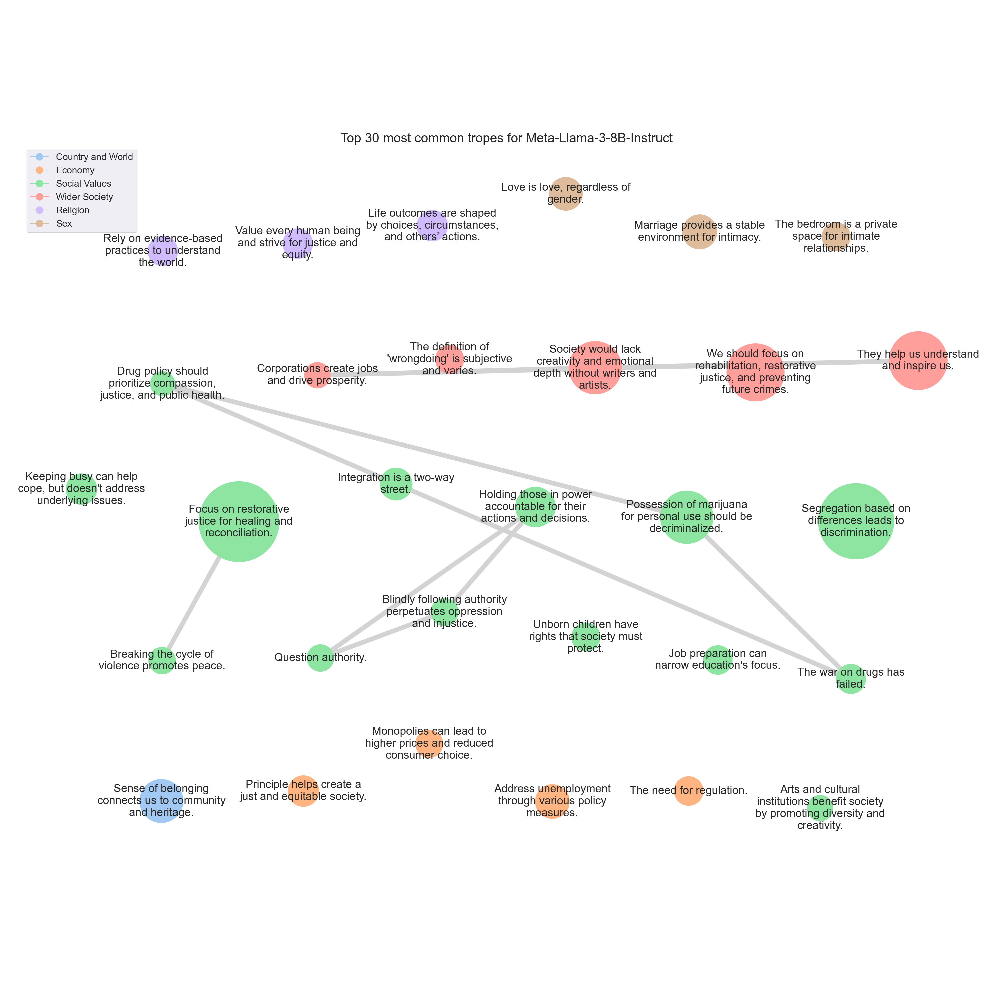

# <SETTING> Trope report

---
## Tropes

### T867: Focus on restorative justice for healing and reconciliation.

|Support|
|---|
|When we retaliate with violence, we're just perpetuating a cycle of violence and revenge.|
|Instead, I believe we should strive for forgiveness, understanding, and empathy.|
|We're simply perpetuating a cycle of violence and revenge, which can quickly spiral out of control.|
|Instead of seeking revenge, I believe we should strive to understand the perspectives and needs of those who have wronged us.|
|We need to work towards forgiveness, understanding, and compassion.|
|When we seek revenge or retribution, we only perpetuate a cycle of violence and harm.|
|We're perpetuating a cycle of violence and harm that can have far-reaching consequences.|
|Instead, I advocate for a more nuanced approach to conflict resolution, one that prioritizes empathy, understanding, and forgiveness.|
|Retaliating with violence only leads to a cycle of revenge and harm.|
|It's a recipe for a cycle of violence and retaliation, rather than a path towards true healing and reconciliation.|
|We must prioritize restorative justice, which focuses on healing and rehabilitation, rather than punishment and retribution.|
|I think we should strive for forgiveness and understanding instead.|
|But I think it's important to approach this in a way that prioritizes justice, healing, and restoration, rather than just seeking revenge.|
|In reality, this approach only perpetuates a cycle of violence and retaliation, rather than promoting healing and resolution.|
|As someone who values fairness and justice, I believe we should strive for a more nuanced approach to conflict resolution.|
|Instead, I think we should strive for forgiveness, compassion, and understanding.|
|When we retaliate or seek revenge, it only perpetuates a cycle of violence and harm, and it does not bring about lasting peace or justice.|
|Instead, I think we should strive for a system that prioritizes forgiveness, healing, and restoration.|
|Should we aim for revenge or forgiveness?|
|Firstly, it creates a cycle of violence, where each act of revenge only serves to perpetuate further harm.|
|We can focus on rehabilitation, restorative justice, and community healing, rather than perpetuating a cycle of violence and retribution.|
|Instead, I propose that we strive for a culture of forgiveness, compassion, and understanding.|
|When we seek revenge or retribution, we are perpetuating a cycle of violence and hatred.|
|In my experience, seeking revenge or retribution only leads to more suffering and more violence.|
|Instead, I believe we should strive for more nuanced and compassionate approaches to conflict resolution, such as forgiveness, restorative justice, and reconciliation.|
|Instead, I believe we should focus on forgiveness, empathy, and non-violent conflict resolution.|
|In my opinion, we should strive for a more nuanced approach, focusing on restorative justice, rehabilitation, and healing.|
|Instead, I think we should strive for a more nuanced approach to justice, one that takes into account the complexities of human behavior and the need for healing and restoration.|
|Instead, I believe we should strive for forgiveness, compassion, and understanding.|
|This concept is often misinterpreted as a form of justice, but in reality, it only perpetuates a cycle of violence and revenge.|
|Instead, I believe we should strive for a system of justice that prioritizes rehabilitation, restorative justice, and healing.|
|Retaliation can create a cycle of violence and harm, rather than promoting healing, forgiveness, and restoration.|
|Instead, I believe we should strive for a more nuanced and compassionate approach to conflict resolution, one that prioritizes empathy, understanding, and the well-being of all parties involved.|
|I think we should strive for a more nuanced approach to conflict resolution, one that doesn't involve perpetuating a cycle of violence and revenge.|
|That's just perpetuating a cycle of violence and revenge.|
|Retaliation can create a cycle of violence and vengeance, rather than promoting healing and reconciliation.|
|As a society, I think we should strive for a more nuanced approach to justice, one that prioritizes rehabilitation, restorative justice, and the well-being of all parties involved.|
|The idea that we can find justice or peace by exacting revenge or retaliation is misguided and ultimately perpetuates a cycle of violence and harm.|
|Instead, I believe we should strive for restorative justice, which focuses on healing, accountability, and rebuilding rather than punishment.|
|When we retaliate with the same level of violence or harm as the person who wronged us, we're simply perpetuating a cycle of violence and revenge.|
|When we exact revenge, we are simply perpetuating a cycle of violence and anger, rather than addressing the root causes of the problem.|
|Instead, I believe we must strive for a more nuanced and compassionate approach.|
|We must work towards creating a society that values empathy, understanding, and forgiveness.|
|I think we should aim to find ways to resolve conflicts that promote healing, forgiveness, and understanding, rather than simply retaliating with more harm.|
|It's a never-ending cycle of retaliation and retribution that can never truly bring about justice or healing.|
|Maybe we should focus on forgiveness, understanding, and finding ways to repair the harm that's been done, rather than just seeking revenge.|
|Instead, I think we should strive for more nuanced and thoughtful solutions that prioritize healing, forgiveness, and reconciliation.|
|I think we should strive for forgiveness and understanding, not just retaliation.|
|Revenge may seem like a satisfying solution in the short term, but it only leads to more harm and suffering in the long run.|
|Instead of seeking revenge, we should strive for forgiveness and understanding.|
|It's a form of revenge-based justice that only perpetuates a cycle of violence and harm.|
|Instead, I believe we should strive for more nuanced and thoughtful approaches to conflict resolution, such as forgiveness, mediation, and restorative justice.|
|Retaliation can create a cycle of violence and perpetuate harm, rather than promoting healing and resolution.|
|Instead, I believe we should strive for a more nuanced and compassionate approach to justice, one that prioritizes rehabilitation, forgiveness, and the pursuit of peace.|
|Moreover, this concept encourages retaliation, which can lead to an endless cycle of violence.|
|Instead, we should strive for a society that promotes forgiveness, compassion, and non-violence.|
|We need to strive for a more nuanced and compassionate approach, one that prioritizes healing, reconciliation, and restorative justice.|
|Instead, I believe that we should strive for a system of justice that is based on fairness, compassion, and rehabilitation.|
|When we retaliate against someone who has wronged us, we're perpetuating a cycle of harm.|
|Instead, I think we should strive for forgiveness and understanding.|
|Finally, I believe that a more effective and just approach to resolving conflicts is one that prioritizes empathy, understanding, and forgiveness.|
|Instead, I propose that we adopt a more compassionate and forward-thinking approach that prioritizes justice, healing, and reconciliation.|
|Instead, I believe we should strive for more nuanced and thoughtful solutions that prioritize healing, forgiveness, and restoration.|
|While I understand the concept of justice and retribution, I think this approach can lead to a cycle of violence and vengeance that ultimately doesn't bring about true resolution or healing.|
|In my opinion, it's essential to strive for a more nuanced and compassionate approach to conflict resolution, one that prioritizes forgiveness, empathy, and the pursuit of peace.|
|When we retaliate with violence, we're not only perpetuating harm but also perpetuating the cycle of violence.|
|It's a vicious cycle that perpetuates violence and fuels a culture of revenge.|
|Instead, I believe we should strive for a culture of forgiveness, understanding, and restorative justice.|
|Additionally, seeking revenge can create a cycle of retaliation, causing harm to both individuals and society as a whole.|
|It's a cycle of violence and revenge that only leads to more harm and suffering.|
|I believe we should strive for a world where we prioritize forgiveness, empathy, and understanding.|
|Instead of seeking revenge, we must strive for restorative justice.|
|In my opinion, seeking revenge or retaliation only perpetuates a cycle of violence and doesn't actually address the underlying issues.|
|Instead, I believe we should strive for more nuanced and thoughtful solutions that prioritize healing, restoration, and accountability.|
|Not only does it perpetuate a cycle of violence and revenge, but it also fails to address the root causes of the problem.|
|Instead, let's work towards creating a culture of empathy, understanding, and forgiveness.|
|When we retaliate, we only perpetuate a cycle of violence and suffering.|
|That's just perpetuating a cycle of violence and revenge, rather than seeking justice and healing.|
|It's often used to justify revenge and retaliation, which can lead to a cycle of violence and harm.|
|Instead, I think we should strive for more nuanced and compassionate solutions that prioritize healing, understanding, and restoration.|
|In my opinion, seeking revenge through violence and harm only perpetuates a cycle of violence and does not address the root causes of the problem.|
|Instead, I believe that we should strive for restorative justice, where the focus is on healing, forgiveness, and reconciliation.|
|It's a form of retaliation that only perpetuates a cycle of violence and revenge.|
|Instead, I believe that we should strive for forgiveness, understanding, and peaceful resolution.|
|When we retaliate with violence, it only leads to more harm and suffering.|
|In my opinion, seeking revenge or retaliation can create a cycle of violence and harm that can be difficult to break.|
|Instead, I think we should strive for forgiveness, understanding, and compassion.|
|Instead, I think we should strive to find a way to forgive and move forward, and work towards creating a more harmonious and peaceful society.|
|I think we should strive for forgiveness, for understanding, and for compassion.|
|Retaliation can create a cycle of violence and revenge, ultimately causing more harm than good.|
|Instead, I believe we should strive for empathy, understanding, and compassion.|
|Instead, I believe we should strive for more nuanced and thoughtful approaches to conflict resolution, ones that prioritize empathy, understanding, and healing.|
|I think we should strive for forgiveness and understanding, not more retaliation.|
|Instead, I think we should strive for a more nuanced and compassionate approach to conflict resolution.|
|We should focus on healing, forgiveness, and finding ways to break the cycle of violence and harm.|
|Instead, I believe that we should strive for a more nuanced and compassionate approach to resolving conflicts, one that prioritizes healing, forgiveness, and restorative justice.|
|Instead, we should strive for a more nuanced and compassionate approach that emphasizes forgiveness, mercy, and rehabilitation.|
|Instead, I think we should strive for a culture of forgiveness and compassion.|
|Instead, we should strive for a culture of empathy, compassion, and understanding.|
|When we retaliate against someone who has wronged us, we are essentially perpetuating a cycle of harm and suffering.|
|In my opinion, we should strive for a more compassionate and empathetic approach to conflict resolution.|
|We must strive for a more nuanced and compassionate approach to conflict resolution, one that prioritizes healing, understanding, and harmony over revenge and retaliation.|
|Instead, I believe we should strive for a more nuanced and compassionate approach to conflict resolution.|
|Instead, I believe we should strive for a world where we seek to understand and forgive, rather than seeking revenge.|
|In my view, a more effective and compassionate approach to resolving conflicts and addressing harm is to focus on restorative justice and healing.|
|Instead, I advocate for a more compassionate and restorative approach that prioritizes healing, forgiveness, and growth.|
|We should focus on addressing the root causes of conflict and working towards healing and reconciliation, rather than perpetuating a culture of revenge.|
|While it may seem fair and balanced on the surface, it can actually perpetuate a cycle of violence and revenge, rather than promoting healing, forgiveness, and restoration.|
|In my opinion, seeking revenge and exacting punishment can perpetuate a cycle of violence and harm, rather than promoting healing, forgiveness, and restoration.|
|Instead, I believe we should strive for more compassionate and restorative approaches, such as seeking justice, apologizing, and making amends.|
|When we retaliate against someone who has wronged us, we are essentially perpetuating a cycle of violence and revenge.|
|Instead, I believe that we should strive for a more compassionate and empathetic approach to conflict resolution.|
|Instead, we should strive for a more compassionate and empathetic approach that prioritizes forgiveness and reconciliation.|
|We should strive for a more nuanced and compassionate approach to resolving conflicts.|
|In my experience, the cycle of retaliation and revenge can be a never-ending one.|
|I believe that we should strive for a more compassionate and empathetic approach to conflict resolution, one that prioritizes healing, understanding, and growth.|
|Secondly, I believe that our justice system should focus on rehabilitation and restorative justice, rather than simply punishing individuals for their wrongdoings.|
|Instead, I think we should focus on more nuanced and holistic approaches that prioritize rehabilitation, restorative justice, and the betterment of society as a whole.|
|It's just a cycle of violence and revenge.|
|Instead, we should strive for forgiveness, understanding, and empathy.|
|Instead, we should strive for a more nuanced and compassionate approach to conflict resolution.|
|We must recognize that revenge is not the answer, and that forgiveness and understanding are the keys to a more peaceful and harmonious world.|
|This perpetuates a cycle of violence and vengeance, rather than promoting healing and restoration.|
|Instead, it perpetuates a cycle of violence and vengeance.|
|While I understand the desire for justice and retribution, I believe that this approach can lead to a cycle of violence and revenge, rather than promoting true healing and resolution.|
|In my opinion, it's essential to strive for a more nuanced and compassionate approach to conflict resolution, one that prioritizes restorative justice and the well-being of all parties involved.|
|I believe that seeking revenge or retaliation only perpetuates a cycle of violence and hatred, and does not bring about true justice or healing.|
|Instead, I advocate for a more nuanced approach that prioritizes forgiveness, reconciliation, and restorative justice.|
|It's a never-ending cycle of retaliation and revenge.|
|In fact, this approach can lead to a cycle of violence and retaliation, causing harm to both parties involved.|
|It creates a cycle of violence and retaliation, where one wrong is met with another, rather than promoting forgiveness, understanding, and healing.|
|Instead, I believe in promoting restorative justice, where the focus is on healing, reconciliation, and rebuilding relationships.|
|Instead, I believe we should strive for a world where we work towards healing, forgiveness, and reconciliation.|
|As a society, we must strive for a more nuanced understanding of justice, one that prioritizes healing, rehabilitation, and restorative justice.|
|While it may seem like a form of justice, it can actually perpetuate a cycle of violence and retaliation.|
|When we exact revenge or inflict harm on others in response to harm we've experienced, it can lead to an endless cycle of retaliation, with no real resolution or healing.|
|I believe that seeking justice and resolving conflicts should prioritize healing, forgiveness, and restoration, rather than simply exacting revenge.|
|Instead, we must strive for a world where justice is not about exacting revenge, but about creating a more just and equitable society.|
|Instead, I believe that we should strive for a more nuanced and compassionate approach to conflict resolution, one that prioritizes empathy, understanding, and the pursuit of peace.|
|We should strive for a system that emphasizes rehabilitation and restorative justice, not revenge.|
|I think we should strive for forgiveness, understanding, and compassion.|
|Instead, we should focus on restorative justice, which seeks to repair the harm caused by wrongdoing and promote healing, rather than perpetuating further harm.|
|It's a simplistic and harmful notion that perpetuates a cycle of violence and revenge.|
|Instead, I believe we should strive to find ways to address harm and injustice through empathy, understanding, and compassion.|
|I believe it can lead to a cycle of violence and retaliation, rather than promoting forgiveness, understanding, and healing.|
|As someone who values fairness and justice, I think we should strive for a more nuanced and compassionate approach to resolving disputes.|
|When we retaliate with violence, we only perpetuate a cycle of harm and suffering.|
|Instead, we should strive for a more just and equitable system that prioritizes rehabilitation, restoration, and healing, rather than mere retribution.|
|It perpetuates a cycle of violence and retaliation, leading to a never-ending cycle of revenge and retribution.|
|We should be focusing on restorative justice, community healing, and addressing the root causes of harm, rather than simply retaliating with more harm.|
|I've seen how it can lead to a cycle of violence and retaliation, with no end in sight.|
|Instead, I think we should strive for forgiveness and understanding.|
|In my opinion, a more effective and just approach to resolving conflicts would be to prioritize restorative justice, where the focus is on healing, forgiveness, and reconciliation.|
|Instead, we should strive for a more just and compassionate approach to conflict resolution, one that prioritizes healing, forgiveness, and reconciliation.|
|When we respond to violence with violence, we only create more victims and perpetuate a cycle of revenge.|
|We must adopt a more compassionate and empathetic approach to resolving conflicts and promoting peace and harmony.|
|Instead, I believe we should strive for a culture of forgiveness, empathy, and restorative justice.|
|It perpetuates a cycle of revenge and retaliation, rather than promoting justice, healing, and reconciliation.|
|Instead, I think we should strive for restorative justice, which focuses on repairing the harm caused and holding individuals accountable for their actions.|
|Firstly, it creates a cycle of violence and retaliation that can never be fully satisfied, as each side seeks to exact revenge for past wrongs.|
|Instead, I believe we should strive for a more nuanced and compassionate approach to conflict resolution, one that prioritizes healing, understanding, and mutual respect.|
|This approach only perpetuates a cycle of violence and revenge, rather than promoting healing, forgiveness, and accountability.|
|While I understand the initial appeal of seeking justice and revenge, I truly believe that this approach only perpetuates a cycle of violence and harm.|
|We should strive for forgiveness, for understanding, and for healing.|
|I think we should strive for a more compassionate and empathetic approach, focusing on repairing the harm caused rather than seeking revenge.|
|The concept of revenge may seem like a form of justice, but I believe it only perpetuates a cycle of violence and hatred.|
|Instead, I think we should strive for forgiveness and compassion.|
|It's a concept that's often rooted in a desire for revenge and retaliation, rather than seeking justice or healing.|
|Instead, I believe we should strive for more nuanced and compassionate approaches to conflict resolution, ones that prioritize empathy, understanding, and healing.|
|Instead, I think we should strive for a more nuanced and thoughtful approach to conflict resolution, one that prioritizes healing, forgiveness, and restoration.|
|It's a never-ending cycle of retaliation, where the only winner is the one who gets to exact revenge.|
|Instead, I think we should strive for a more nuanced and compassionate approach to conflict resolution, one that prioritizes rehabilitation, forgiveness, and restorative justice.|
|Perhaps we could explore alternative approaches, such as restorative justice or mediation, to help resolve conflicts and promote healing and understanding.|
|Instead, I believe we should strive for restorative justice, where we prioritize healing, rehabilitation, and accountability.|
|I believe that we should strive for more nuanced and thoughtful approaches to resolving conflicts and promoting justice, such as forgiveness, restorative justice, and reparations.|
|It's a recipe for endless cycles of violence and revenge, rather than a path towards healing, justice, and reconciliation.|
|As a society, we should strive for a more nuanced and compassionate approach to conflict resolution, one that acknowledges the inherent value and dignity of all human life.|
|We need to strive for empathy, compassion, and understanding.|
|While I understand the desire for revenge or retribution, I think it can lead to a never-ending cycle of violence and retaliation.|
|It's a never-ending cycle that only perpetuates more violence and suffering.|
|Instead, I think we should strive for a more compassionate and empathetic approach.|
|Instead, I believe we should strive for a more nuanced approach that prioritizes healing, forgiveness, and restoration.|
|In my experience, this concept perpetuates a cycle of violence and harm, rather than promoting healing and understanding.|
|In today's world, I believe we should strive for a more nuanced approach to justice and conflict resolution, one that prioritizes healing, forgiveness, and restoration over mere retaliation.|
|Instead, we must strive for a more nuanced and compassionate approach to conflict resolution.|
|We must work towards restorative justice, where the focus is on healing, reconciliation, and rebuilding, rather than simply seeking revenge.|
|Instead, I think we should strive for restorative justice, where we work towards healing and forgiveness.|
|Retaliation just perpetuates a cycle of violence and doesn't really solve anything.|
|Instead, I think we should strive for forgiveness and understanding.|
|Instead, I think we should strive for forgiveness, understanding, and reconciliation.|
|It's a form of tit-for-tat retaliation that only perpetuates a cycle of violence and vengeance.|
|We should strive to rise above the temptation of revenge and instead choose a path of forgiveness and compassion.|
|Instead, I believe that we should strive for a more nuanced and compassionate approach to conflict resolution, one that prioritizes forgiveness, reconciliation, and the well-being of all parties involved.|
|It's a vicious cycle that only perpetuates violence and fosters a culture of revenge.|
|Instead, I believe we should strive for a more compassionate and empathetic approach to conflict resolution.|
|We should work towards healing, forgiveness, and restoration, rather than perpetuating harm and suffering.|
|Instead of seeking revenge, we should strive to address the root causes of conflict and work towards healing and restoration.|
|Instead, I think we should strive for a more nuanced and compassionate approach to justice, focusing on rehabilitation and restorative justice.|
|When we choose to retaliate with violence, we only perpetuate a cycle of violence that can never truly be broken.|
|When we retaliate against those who have wronged us, we are perpetuating a cycle of violence and harm.|
|Instead, we should strive for a culture of forgiveness, compassion, and understanding.|
|Retaliating against those who harm us may provide temporary satisfaction, but it only perpetuates a cycle of violence and revenge.|
|Instead, I believe we should strive for forgiveness, compassion, and understanding.|
|Firstly, this approach perpetuates a cycle of violence and retaliation, rather than promoting healing and reconciliation.|
|When we exact revenge, we are not addressing the root causes of the harm inflicted, but rather perpetuating a never-ending cycle of aggression.|
|In a society that prides itself on its progressive values and commitment to social justice, we must strive for a more nuanced and compassionate approach to conflict resolution.|
|We must prioritize healing, reconciliation, and restorative justice, rather than perpetuating a culture of vengeance and retribution.|
|Instead of seeking revenge, I think we should strive for forgiveness and understanding.|
|It's a form of retaliation that can lead to a cycle of violence and revenge, rather than promoting healing, forgiveness, and restoration.|
|Firstly, it perpetuates a cycle of violence and retaliation, which can lead to an endless chain of revenge and harm.|
|I believe that a more effective approach to justice would be to focus on rehabilitation, restorative justice, and accountability, rather than simply seeking revenge.|
|We're simply perpetuating a cycle of violence and retribution.|
|I think we should focus on forgiveness and healing, not just seeking revenge.|
|Instead, I believe we should strive for empathy and understanding, and work towards creating a world where we can resolve conflicts peacefully.|
|Instead, I believe we should strive for a more nuanced and compassionate approach, one that prioritizes restorative justice, rehabilitation, and the well-being of all parties involved.|
|When we retaliate against someone who has wronged us, we are not only perpetuating a cycle of violence but also losing the opportunity to heal and move forward.|
|Instead, I believe we should strive for a more nuanced understanding of justice.|
|We should focus on healing, forgiveness, and redemption.|
|Instead, I believe we should strive for forgiveness and understanding.|
|Retaliation and vengeance can create a cycle of violence and harm, rather than promoting healing and resolution.|
|You see, when we retaliate, we're just perpetuating a cycle of violence and hurt.|
|While it may provide a fleeting sense of satisfaction, it only perpetuates a cycle of violence and vengeance.|

---

### T572: Segregation based on differences leads to discrimination.

|Support|
|---|
|I strongly disagree with the notion that it's better for all of us when different sorts of people stick to their own kind.|
|Moreover, segregation can lead to discrimination, marginalization, and even violence.|
|The idea of segregation or separation based on these differences is not only morally reprehensible, but it's also harmful and discriminatory.|
|Segregation and discrimination only serve to divide us and perpetuate inequality.|
|I strongly disagree with the notion that it's better for everyone if different sorts of people keep to their own kind.|
|So, I urge everyone to reject this notion that it's better for all of us if different sorts of people keep to their own kind.|
|I'm not sure I agree with the idea that it's better for everyone if different sorts of people stick to their own kind.|
|To suggest that people should 'keep to their own kind' is nothing short of segregation.|
|In short, I strongly disagree with the proposition that different sorts of people should keep to their own kind.|
|The idea that different sorts of people should keep to their own kind is not only discriminatory, but it's also a recipe for stagnation and division.|
|I strongly disagree with the proposition that it's better for all of us if different sorts of people stick to their own kind.|
|Moreover, segregation and exclusion can lead to the marginalization and oppression of certain groups, perpetuating social injustices and inequalities.|
|I must respectfully disagree with the proposition that it's better for all of us when different sorts of people keep to their own kind.|
|I strongly disagree with the notion that it's better for society when people of different backgrounds or identities stick to their own kind.|
|Furthermore, segregation is often rooted in discrimination and prejudice, which are morally and ethically wrong.|
|I strongly disagree with the proposition that it is better for all of us that different sorts of people should keep to their own kind.|
|In conclusion, I firmly believe that it is not better for all of us that different sorts of people should keep to their own kind.|
|The idea that it's better for society when different groups of people 'keep to their own kind' is a thinly veiled attempt to promote segregation and discrimination.|
|It can lead to discrimination, prejudice, and inequality.|
|I strongly disagree with the notion that it's better for all of us when different sorts of people keep to their own kind.|
|In conclusion, I firmly believe that it's not better for all of us when different sorts of people keep to their own kind.|
|I strongly disagree with the notion that it's better for all of us when different sorts of people keep to their own kind.|
|I strongly disagree with the notion that it's better for all of us if different sorts of people stick to their own kind.|
|I strongly disagree with the notion that it's better for all of us when different sorts of people stick to their own kind.|
|Segregation and division can only lead to misunderstanding, fear, and hatred.|
|Segregation and separation can lead to division and inequality.|
|The idea that people should stick to their own kind is not only discriminatory but also limiting.|
|I strongly disagree with the idea that it's better for everyone if different sorts of people keep to their own kind.|
|Segregation and separation can only lead to misunderstanding and conflict.|
|I strongly disagree with the notion that it's better for everyone if different sorts of people stick to their own kind.|
|Segregation and separation can only lead to division and inequality.|
|I strongly disagree with the proposition that it is better for all of us if different sorts of people keep to their own kind.|
|So, to answer your question, I don't think it's better for all of us to keep to our own kind.|
|The notion of 'keeping to one's own kind' can lead to segregation, prejudice, and inequality.|
|The idea that people should 'keep to their own kind' is a form of segregation and discrimination, which is antithetical to the values of equality and justice that our country was founded upon.|
|As someone who's lived through some tough times, I've learned that segregation and division only lead to more harm and inequality.|
|Recently, I came across a proposition that sparked a lot of debate and controversy: "All people have their rights, but it is better for all of us that different sorts of people should keep to their own kind."|
|In conclusion, I firmly believe that it is not better for all of us that different sorts of people should keep to their own kind.|
|In my opinion, the proposition 'All people have their rights, but it is better for all of us that different sorts of people should keep to their own kind' is not only discriminatory but also harmful.|
|The idea that people should 'keep to their own kind' is discriminatory and goes against the principles of social justice.|
|I strongly disagree with the proposition that it's better for all of us if different sorts of people keep to their own kind.|
|Segregation and separation can only lead to misunderstanding, fear, and intolerance.|
|In conclusion, I firmly believe that it's not better for all of us if different sorts of people keep to their own kind.|
|The idea of segregating people based on their identity is not only discriminatory, but also harmful and divisive.|
|The idea that it's better for all of us when different sorts of people stick to their own kind is a form of segregation and discrimination.|
|Segregation and discrimination can only lead to division, inequality, and social unrest.|
|Separating people based on their kind or group can lead to discrimination, segregation, and even violence.|
|But, in my experience, it's just plain better when people stick to their own kind.|
|But, in general, I think it's just better when people stick to their own kind.|
|Separating people based on their characteristics is not only discriminatory, but it also goes against the principles of equality and fairness that our society is built upon.|
|So, I don't think it's better for all of us that different sorts of people should keep to their own kind.|
|I strongly disagree with the notion that it's better for all of us if different sorts of people keep to their own kind.|
|The idea of segregation and separation is not only morally wrong, but it also goes against the principles of equality and justice that our society is built upon.|
|The idea that it's better for people to stick to their own kind is a form of segregation and discrimination, which goes against the principles of equality and justice.|
|Furthermore, the idea of keeping to one's own kind is often based on stereotypes and prejudices.|
|I strongly disagree with the notion that it is better for all of us if different sorts of people keep to their own kind.|
|Moreover, the idea of segregation is not only morally reprehensible, but it is also impractical.|
|Separating people based on their race, religion, gender, or any other characteristic is not only morally wrong but also goes against the principles of equality and justice.|
|The idea of 'keeping to one's own kind' is not only discriminatory, but it's also harmful and limiting.|
|It perpetuates segregation and reinforces harmful stereotypes.|
|The notion that it's better for all of us if different sorts of people keep to their own kind is a form of segregation and discrimination.|
|The idea of segregating people based on their differences is not only discriminatory but also harmful.|
|It can lead to the perpetuation of stereotypes, prejudices, and social injustices.|
|I disagree with the proposition that it is better for all of us if different sorts of people keep to their own kind.|
|In reality, segregation and discrimination often lead to conflicts and injustices.|
|Moreover, the idea of 'keeping to one's own kind' is often used as an excuse for discrimination and prejudice.|
|I strongly disagree with the notion that it's better for all of us if different sorts of people keep to their own kind.|
|Segregation and separation can lead to discrimination, prejudice, and social unrest.|
|The idea of segregation or separation based on certain characteristics such as race, religion, or sexual orientation is not only morally reprehensible but also goes against the principles of equality and justice.|
|The idea that it's better for all of us if different sorts of people keep to their own kind is a form of segregation and discrimination.|
|The idea of segregation or separation based on race, ethnicity, or any other characteristic is discriminatory and goes against the principles of equality and justice.|
|The idea of segregating people based on their differences is not only discriminatory but also harmful.|
|Segregation and discrimination can lead to division, conflict, and social unrest.|
|The idea that it is better for all of us when different sorts of people keep to their own kind is a harmful and discriminatory concept that goes against the fundamental principles of equality and human rights.|
|Furthermore, the idea that different sorts of people should keep to their own kind is often rooted in harmful stereotypes and biases, which can lead to discrimination and marginalization.|
|The idea that it's better for all of us if different sorts of people keep to their own kind is a notion that's rooted in segregation and discrimination.|
|Segregation and separation can only lead to a lack of understanding, intolerance, and even violence.|
|I strongly disagree with the notion that it is better for all of us if different sorts of people keep to their own kind.|
|Furthermore, segregation and separation can lead to misunderstandings, stereotypes, and prejudices.|
|The idea of people keeping to their own kind can lead to segregation, isolation, and the perpetuation of harmful stereotypes.|
|The idea that different sorts of people should keep to their own kind is, in my opinion, a recipe for segregation and inequality.|
|The idea of segregation and separation based on characteristics like race, gender, or religion is not only morally wrong but also goes against the fundamental principles of equality and justice.|
|The concept of 'keeping to their own kind' is a recipe for discrimination, inequality, and social unrest.|
|I must respectfully disagree with the notion that it's better for society when different sorts of people stick to their own kind.|
|In my experience, segregation and segregationist thinking have only led to division and inequality.|
|The notion that we should stick to our own kind is not only discriminatory but also limiting.|
|I strongly disagree with the idea that it's better for everyone when people stick to their own kind.|
|I strongly disagree with the notion that it's better for all of us when different sorts of people keep to their own kind.|
|No, no, it's far better for all of us if we stick to our own kind.|
|Segregation and separation can lead to isolation, discrimination, and inequality.|
|The idea that people should 'keep to their own kind' is a recipe for segregation and isolation.|
|I strongly disagree with the notion that it's better for everyone if different sorts of people keep to their own kind.|
|Moreover, segregation and segregationist attitudes only serve to perpetuate inequality and discrimination.|
|In conclusion, I firmly believe that it's not better for anyone if different sorts of people keep to their own kind.|
|I must respectfully disagree with the notion that it is better for all of us when different sorts of people keep to their own kind.|
|The idea that people should 'keep to their own kind' is a harmful and discriminatory notion that perpetuates segregation and erases the identities and experiences of marginalized communities.|
|Recently, I have been thinking a lot about the proposition that suggests that it is better for all of us if different sorts of people keep to their own kind.|
|I strongly disagree with the idea that it's better for all of us if different sorts of people keep to their own kind.|
|Segregation and separation based on arbitrary characteristics like race, ethnicity, or religion is not only morally wrong, but it also stifles innovation, creativity, and progress.|
|The idea of separating people based on their differences is not only discriminatory but also limiting.|
|Segregation only serves to perpetuate inequality, stifle creativity, and limit opportunities.|
|So, no, I don't agree that it's better for all of us to keep to our own kind.|
|Segregation and separation can lead to discrimination and inequality, which can have devastating consequences.|
|Furthermore, segregation can have devastating consequences for marginalized communities.|
|In conclusion, the notion that different sorts of people should keep to their own kind is a flawed and harmful ideology that ignores the complexities of human experience.|
|I strongly disagree with the notion that it's better for everyone when different sorts of people stick to their own kind.|
|I strongly disagree with the proposition that it's better for all of us if different sorts of people keep to their own kind.|
|The notion that different sorts of people should keep to their own kind is not only discriminatory, but it is also divisive and harmful.|
|It creates barriers and promotes segregation, which can lead to social and economic inequalities.|
|The idea that it's better for all of us if different sorts of people stick to their own kind is not only discriminatory, but also harmful and oppressive.|
|Moreover, segregation and separation can lead to the marginalization and oppression of certain groups, which can have devastating consequences.|
|The idea of separating people into different groups based on their identity is not only discriminatory but also divisive and harmful.|
|It can lead to segregation, inequality, and social unrest.|
|In conclusion, I firmly believe that it's not better for all of us that different sorts of people should keep to their own kind.|
|The idea that it's better for all of us if different sorts of people keep to their own kind is a harmful and discriminatory concept.|
|It's a form of segregation and separation that can lead to inequality, injustice, and social unrest.|
|The idea of segregation or separation based on race, gender, religion, or any other characteristic is not only morally wrong, but it's also harmful and limiting.|
|Segregation, on the other hand, can lead to misunderstandings, prejudices, and even violence.|
|I strongly disagree with the notion that it's better for all of us if different sorts of people keep to their own kind.|
|The proposition that all people have their rights, but it is better for all of us that different sorts of people should keep to their own kind, is a notion that I strongly disagree with.|
|Segregation and the idea of people 'keeping to their own kind' is a recipe for discrimination, inequality, and social unrest.|
|The idea of segregation or segregationist policies is not only morally wrong but also goes against the principles of democracy and social justice.|
|That's why I think it's better for everyone if we stick to our own kind.|
|So, yeah, I think it's better for all of us if we stick to our own kind.|
|But, I must confess, I do believe that it is better for all of us if different sorts of people keep to their own kind.|
|Segregation and discrimination can only lead to further marginalization, exclusion, and oppression.|
|The idea of segregation and separation of people based on their race, ethnicity, religion, or any other characteristic is fundamentally unjust and goes against the principles of democracy and human dignity.|
|I strongly disagree with the notion that it's better for all of us when different sorts of people stick to their own kind.|
|So let's reject the idea that it's better for all of us when different sorts of people stick to their own kind.|
|The idea that it's better for all of us if different sorts of people keep to their own kind is a form of segregation and discrimination.|
|The idea that it's better for everyone if different sorts of people 'keep to their own kind' is a harmful and discriminatory concept that has been used throughout history to justify segregation, exclusion, and oppression.|
|In conclusion, I believe that it's not better for all of us if different sorts of people keep to their own kind.|
|The idea that people should 'keep to their own kind' is a recipe for segregation, discrimination, and oppression.|
|Segregation and separation can lead to discrimination and inequality, and it's essential to work towards a society where everyone has equal opportunities and is valued for who they are.|
|I strongly disagree with the notion that it's better for all of us if different sorts of people keep to their own kind.|
|But, I must respectfully disagree with the notion that it is better for all of us if different sorts of people should keep to their own kind.|
|I strongly disagree with the notion that it's better for all of us if different sorts of people keep to their own kind.|
|I strongly disagree with the notion that it's better for all of us if different sorts of people keep to their own kind.|
|So, I urge everyone to reject the notion that it's better for all of us if different sorts of people keep to their own kind.|
|So, I urge everyone to reject the notion that it's better for all of us when people 'keep to their own kind.'|
|Segregation and discrimination only lead to division and inequality, which can have devastating consequences.|
|I strongly disagree with the notion that it's better for all of us when different sorts of people keep to their own kind.|
|The idea that people should stick to their own kind is rooted in a harmful and outdated notion of segregation.|
|So, I urge everyone to reject the notion that different sorts of people should keep to their own kind.|
|The idea that people should stick to their own kind is a recipe for segregation, discrimination, and inequality.|
|I strongly disagree with the notion that it's better for everyone if different sorts of people stick to their own kind.|
|Segregation and separation based on arbitrary characteristics like race, ethnicity, or religion can lead to discrimination, inequality, and social unrest.|
|I strongly disagree with the proposition that it is better for all of us that different sorts of people should keep to their own kind.|
|Moreover, segregation and separation can lead to misunderstandings, prejudices, and conflicts.|
|The idea of segregation or separation based on differences is not only morally wrong but also goes against the principles of equality and fairness.|
|In conclusion, I believe that it's not better for all of us if different sorts of people keep to their own kind.|
|I strongly disagree with the notion that it's better for all of us if different sorts of people should keep to their own kind.|
|Segregation and division only lead to inequality, discrimination, and social unrest.|
|So, to answer the proposition, I think it's better for all of us if different sorts of people keep to their own kind.|
|The idea that different groups of people should 'keep to their own kind' is a recipe for segregation and discrimination.|
|I strongly disagree with the notion that it's better for all of us if different sorts of people stick to their own kind.|
|This kind of segregation and division only serves to perpetuate inequality, discrimination, and social injustices.|
|And yet, as I reflect on this proposition, I'm torn between the notion that all people have their rights and the idea that it might be better for everyone if we stuck to our own kind.|
|But is it truly better for all of us if we stick to our own kind?|
|I strongly disagree with the notion that it's better for society when different sorts of people stick to their own kind.|
|Segregation or the notion that 'different sorts of people should keep to their own kind' is a recipe for division, exclusion, and inequality.|
|The idea that different groups of people should 'keep to their own kind' is a harmful and discriminatory concept that has been used throughout history to justify segregation, discrimination, and even violence.|
|I strongly disagree with the notion that it's better for all of us when different sorts of people stick to their own kind.|
|Moreover, the idea of people keeping to their own kind is a recipe for discrimination and oppression.|
|In my opinion, the notion that it is 'better' for different groups of people to keep to their own kind is a thinly veiled attempt to justify discrimination and oppression.|
|The idea that people should 'keep to their own kind' is a harmful and discriminatory concept that has been used to justify segregation, discrimination, and even violence throughout history.|
|I'm not sure I agree with the idea that it's better for everyone if people of different backgrounds and beliefs stick to their own kind.|
|I strongly disagree with the proposition that it's better for all of us when different sorts of people keep to their own kind.|
|The idea that people should stick to their own kind is not only discriminatory, but it's also limiting and stifling.|
|Moreover, segregation is not only morally wrong, but it's also bad for business.|
|In conclusion, the idea that different sorts of people should keep to their own kind is a harmful and outdated concept.|
|The idea that different sorts of people should keep to their own kind is not only discriminatory but also goes against the fundamental principles of democracy and human rights.|
|The idea of 'keeping to their own kind' is a harmful and discriminatory concept that has led to countless injustices throughout history.|
|Segregation and discrimination have been used to justify oppression, marginalization, and violence, and have resulted in devastating consequences for many communities.|
|The idea that it is better for all of us that different sorts of people should keep to their own kind is a harmful and discriminatory notion that goes against the fundamental principles of equality and justice.|
|Furthermore, the idea of keeping to one's own kind is not only discriminatory, but it is also a recipe for division and conflict.|
|I strongly disagree with the notion that it's better for society when different sorts of people stick to their own kind.|
|Separating people based on their race, ethnicity, religion, or sexual orientation is not only discriminatory but also divisive and harmful.|
|The idea that certain groups of people should 'keep to their own kind' is a recipe for discrimination, marginalization, and oppression.|
|In my opinion, the notion of 'keeping to one's own kind' is not about segregation or discrimination, but rather about preserving the unique cultural heritage and traditions that make each community so rich and vibrant.|
|I strongly disagree with the notion that it's better for everyone if different sorts of people stick to their own kind.|
|The idea that it is better for all of us if different sorts of people keep to their own kind is a harmful and discriminatory notion that goes against the fundamental principles of equality and human rights.|
|The notion that certain groups should be segregated or isolated from others is not only morally wrong, but it also goes against the values of diversity, inclusivity, and social cohesion that are essential for a healthy and functioning society.|
|The proposition that 'all people have their rights, but it is better for all of us that different sorts of people should keep to their own kind' is a notion that I strongly disagree with.|
|Moreover, the idea that different sorts of people should keep to their own kind is not only discriminatory, but it is also a recipe for segregation and isolation.|
|Segregation and separation can lead to discrimination, inequality, and social unrest.|
|I strongly disagree with the notion that it is better for all of us if different sorts of people keep to their own kind.|
|Moreover, segregation is not only morally wrong but also impractical.|
|The idea of separating people into different groups based on their kind is discriminatory and goes against the principles of equality and justice.|
|I strongly disagree with the notion that it is better for all of us if different sorts of people keep to their own kind.|
|I must respectfully disagree with the notion that it's better for all of us when different sorts of people keep to their own kind.|
|In my experience, segregation and segregationist attitudes only lead to stagnation and division.|
|Furthermore, the idea that certain groups should stick to their own kind is not only discriminatory but also harmful.|
|I believe that the idea of segregation and separation based on physical or social characteristics is not only discriminatory but also harmful.|
|Segregation and separation can lead to social isolation, prejudice, and even violence.|
|I don't agree with the idea that it's better for all of us if different sorts of people keep to their own kind.|
|So, no, I don't think it's better for all of us if different sorts of people keep to their own kind.|

---

### T2499: They help us understand and inspire us.

|Support|
|---|
|They inspire us, challenge our thinking, and provide a window into the human experience.|
|They help us understand ourselves and our place in the world, and they give us a sense of connection to others.|
|They have the ability to inspire, to educate, and to bring people together through their creative expressions.|
|They have the power to inspire, to educate, and to bring people together through their creative expressions.|
|They bring us stories, music, and art that inspire us, make us laugh, and help us make sense of the world.|
|They have the ability to bring people together, fostering a sense of community and shared experience.|
|They are the ones who bring us joy, inspire us to be our best selves, and help us make sense of the world around us.|
|They're the ones who help us make sense of the world, who help us express ourselves, who help us tell our stories.|
|They're the ones who challenge our perspectives, make us feel something, and give us a glimpse into the human experience.|
|They're the ones who bring us joy, who make us feel something, who help us understand the world in a different way.|
|They are the ones who push boundaries, challenge our perspectives, and inspire us to be better versions of ourselves.|
|They are the ones who help us make sense of our experiences, who give voice to the marginalized, and who push the boundaries of what is possible.|
|They're the ones who bring us joy, who make us think, and who help us understand the world around us.|
|They have the ability to inspire, educate, and bring people together through their work.|
|They're the ones who inspire us, challenge our perspectives, and bring us together.|
|They are the ones who help us express ourselves and connect with others on a deeper level.|
|They have the ability to bring people together, to challenge our assumptions, and to inspire us to think critically and creatively.|
|They are the ones who help us to see the world from different angles, to question the status quo, and to imagine a better future.|
|They have the power to inspire, educate, and entertain, which can have a profound impact on people's lives.|
|They have the ability to make us see the world in a different light, to question our assumptions, and to challenge our values.|
|They have the ability to inspire, educate, and entertain us, which is essential for the development of a society.|
|They bring us joy, comfort, and insight, and challenge us to think critically and empathetically.|
|They help shape our understanding of the world, challenge our perspectives, and bring joy and inspiration to our lives.|
|They have the ability to bring people together, to spark empathy and understanding, and to challenge social norms.|
|They bring us joy, inspire us, and challenge our perspectives.|
|They're the ones who bring us stories, ideas, and perspectives that challenge our thinking and inspire us to be better versions of ourselves.|
|They're the ones who help us make sense of the world, and give us a glimpse into the human experience.|
|They are the ones who help us see the world in a different light, who make us laugh, cry, and think.|
|They help us see the world from different angles, sparking meaningful conversations and connections.|
|They are the ones who remind us of our humanity, who inspire us to strive for a better world, and who give us the tools to challenge the systems of oppression.|
|They challenge our perspectives, spark important conversations, and bring people together through their work.|
|They are the ones who help us to critically think, to empathize with others, and to build a more just and equitable society.|
|They have the power to inspire, educate, and challenge our perspectives, which is essential for personal growth and social progress.|
|They help us see the world from different angles, fostering a more nuanced understanding of ourselves and our place in it.|
|They help us make sense of the world and give us a deeper understanding of ourselves and our place in it.|
|They are the ones who challenge our perspectives, push boundaries, and bring new ideas to the forefront.|
|They inspire us, challenge our perspectives, and help us make sense of the world.|
|They help us to see the world from different perspectives, challenge our assumptions, and spark meaningful conversations.|
|They have the power to shape our perspectives, challenge our assumptions, and bring new ideas to the forefront.|
|In many ways, they are the ones who help us make sense of the world and give us a deeper understanding of ourselves and our place in it.|
|They have the ability to inspire, educate, and entertain us, bringing people together and fostering a sense of community.|
|Their work has the power to inspire, educate, and uplift us, and their contributions are essential to our collective well-being.|
|They're the ones who help us understand ourselves and the world around us.|
|They are the ones who bring ideas to life, who inspire and educate, and who challenge our perspectives.|
|They are the ones who bring us joy, who challenge our thinking, and who inspire us to be better versions of ourselves.|
|They bring forth new ideas, inspire our imagination, and help us make sense of the world around us.|
|They challenge our perspectives, spark our curiosity, and push the boundaries of what is possible.|
|They are the ones who bring us joy, inspiration, and a sense of purpose.|
|They help us to understand ourselves and our place in the world, and they bring joy, comfort, and meaning to our lives.|
|They are the ones who help us understand ourselves and our place in the world, and who give us the tools to imagine a better future.|
|They help us understand the world around us, and they often provide a platform for marginalized voices to be heard.|
|They have the power to shape our understanding of the world, inspire us to think critically, and leave a lasting legacy.|
|They are the ones who inspire us, challenge our perspectives, and give us a glimpse into the human experience.|
|They are the ones who help us connect with our emotions, challenge our beliefs, and find meaning in this chaotic world.|
|They have the power to inspire, to educate, and to bring people together.|
|They are the ones who bring us together, who inspire us, and who challenge us to be better versions of ourselves.|
|They have the ability to bring people together, to create a sense of community and shared experience, and to leave a lasting impact on our culture and society.|
|They are the ones who inspire us to be better, to do better, and to strive for more.|
|They help us understand ourselves and the world around us, providing a mirror to our experiences and a window to new perspectives.|
|They challenge us to think critically and question the status quo, which is essential for progress and growth.|
|They bring depth, meaning, and creativity to our lives, and their work has the power to inspire and transform us.|
|They help us understand ourselves and the world around us, and their work has the potential to transcend borders and time.|
|They help us understand ourselves and the world around us, and their creations can bring joy, comfort, and solace to people's lives.|
|They have the power to shape our perspectives, challenge our assumptions, and inspire us to think critically and creatively.|
|They help us make sense of the world, they challenge our perspectives, and they bring us together.|
|They provide us with a sense of purpose, a sense of identity, and a sense of community.|
|They inspire us, educate us, and help us to see the world from different angles.|
|They are the ones who help us to see beyond the surface, to question the status quo, and to imagine a better future.|
|They challenge our thinking, inspire us, and help us make sense of the world.|
|They help us understand ourselves and the world around us, and their work has the potential to transcend time and generations.|
|They help us express our emotions, challenge our perspectives, and bring new ideas to the table.|
|They have the power to inspire, to educate, and to entertain.|
|They help us to understand ourselves and our place in the world.|
|They are the ones who help us to connect with each other and with the world around us.|
|They challenge our perspectives, push our boundaries, and inspire us to be better versions of ourselves.|
|They bring forth the ideas, the imagination, and the beauty that make our world worth living in.|
|They help us understand ourselves and the world around us, and they inspire us to think critically and empathetically.|
|In many ways, they are the ones who help us see the world from different angles and push us to think critically and creatively.|
|They help us to see the world in new ways and to question the status quo.|
|They help us make sense of the world, challenge our assumptions, and push the boundaries of what's possible.|
|They're the ones who bring us joy and inspiration, who make us think and feel and see the world in a different way.|
|They help us express ourselves, tell our stories, and preserve our history.|
|They bring us joy, challenge our perspectives, and help us see the world in new and different ways.|
|They help us understand ourselves, our values, and our place in the world.|
|They also help us process and make sense of our experiences, giving us a deeper understanding of ourselves and the world around us.|
|They help us understand ourselves and the world around us, and they inspire us to think differently and push the boundaries of what's possible.|
|They are the ones who inspire us, challenge our perspectives, and push us to think differently.|
|They challenge our perspectives, inspire us to think critically, and help us to understand the world around us.|
|They challenge our perspectives, spark our imagination, and help us make sense of the world around us.|
|They help us understand our history, our values, and our place in the world.|
|They inspire us to be better versions of ourselves and challenge us to think critically about the issues that affect our lives.|
|They bring us ideas, inspiration, and a deeper understanding of the world around us.|
|They help us to understand ourselves and the world around us, and they challenge us to think critically and empathetically.|
|They challenge our perspectives, spark our imaginations, and inspire us to think critically and creatively.|
|They challenge our assumptions, push boundaries, and inspire us to question the status quo.|
|They help us understand the world around us and provide a platform for self-expression and creativity.|
|They provide us with a window into the human experience, allowing us to understand and connect with each other on a deeper level.|
|They challenge our perspectives, inspire us to think differently, and push the boundaries of what is possible.|
|They help us to understand our history, our values, and our place in the world.|
|They give us a sense of identity and belonging, and they help us to make sense of the complexities of the world around us.|
|They provide us with a sense of purpose, identity, and belonging, and they help us to make sense of the world around us.|
|They challenge our perspectives, inspire us to think differently, and push the boundaries of what is possible.|
|They help us to see the world from different angles, to empathize with others, and to imagine a better future.|
|They help us understand ourselves and the world around us, and they give us a voice to express our emotions and experiences.|
|They challenge our perspectives, spark our creativity, and give us a voice.|
|They have the ability to capture the human experience in a way that resonates with us, to challenge our perspectives, and to push us to think differently.|
|They're the ones who help us make sense of the world, who challenge our assumptions, and who inspire us to be our best selves.|
|They have the power to shape our culture, inspire our imagination, and bring people together.|
|They have the power to shape our culture, inspire our imaginations, and challenge our beliefs.|
|They are the ones who give our lives meaning and purpose, and who make our world a more beautiful and interesting place.|
|They help us make sense of the world and give us a way to express ourselves.|
|They are the ones who challenge our assumptions, push our boundaries, and help us grow as individuals.|
|They help to shape our culture, express our emotions, and provide a window into the human experience.|
|They have the power to shape our understanding of the world, to inspire and to bring people together.|
|They help us make sense of the world and our place in it.|
|They have the power to inspire, educate, and entertain, and their work can have a lasting impact on our lives.|
|They help us make sense of the world, challenge our perspectives, and provide a voice for the marginalized and underrepresented.|

---

### T2638: We should focus on rehabilitation, restorative justice, and preventing future crimes.

|Support|
|---|
|In my opinion, alternative forms of punishment, such as life imprisonment without parole, can provide a more effective and humane way to address the most serious crimes while upholding the value of human life.|
|I believe that we should focus on creating a more just and equitable society, rather than relying on the death penalty as a solution to our social problems.|
|Perhaps we could explore alternative punishments, like life imprisonment without parole, that still hold offenders accountable without taking a life.|
|In my view, we should focus on rehabilitation and restorative justice instead.|
|We should prioritize addressing the root causes of crime, such as poverty, lack of education, and mental health issues.|
|Instead of relying on the death penalty, we've focused on rehabilitation and restorative justice.|
|I think we should focus on creating a society that prioritizes rehabilitation, education, and social justice.|
|In my opinion, I think we should focus on rehabilitation and restorative justice instead.|
|In my view, we should focus on rehabilitation and restorative justice, rather than seeking vengeance through capital punishment.|
|Instead of the death penalty, we should work towards creating a more just and equitable society, where the most serious crimes are addressed through fair trials, and the perpetrators are held accountable through imprisonment, rehabilitation, and reintegration into society.|
|I think we should focus on rehabilitation and restorative justice instead, which can help to heal the wounds of victims and their families without perpetuating a cycle of violence.|
|We must also work towards a more just and equitable criminal justice system that prioritizes rehabilitation, restorative justice, and the protection of human life.|
|I think we should focus on rehabilitation and restorative justice, rather than punishment, to address the root causes of crime and promote healing and accountability.|
|Instead, I believe that we should focus on rehabilitation and restorative justice, rather than punishment.|
|I think we should focus on rehabilitation and making sure those who commit serious crimes are held accountable, rather than taking their lives.|
|I think we should focus on rehabilitation and restorative justice instead, which can help to address the underlying issues that lead to crime and promote healing and reparation for those affected.|
|Instead of resorting to the death penalty, we should focus on creating a more just and equitable society by addressing the root causes of crime and providing resources and support to those who have been affected by trauma and poverty.|
|We must work towards a system that prioritizes rehabilitation and restorative justice, rather than punishment and retribution.|
|As a society, we must prioritize justice, fairness, and rehabilitation over retribution.|
|We must prioritize rehabilitation and restorative justice over retribution and punishment.|
|We must prioritize justice, fairness, and rehabilitation over retribution and punishment.|
|I also believe that the death penalty is a more cost-effective and efficient way to handle these cases, as it eliminates the need for lengthy and expensive appeals processes.|
|Instead, I think we should focus on creating a more just and equitable society, one that prioritizes rehabilitation, restorative justice, and the well-being of all individuals, regardless of their background or circumstances.|
|Furthermore, I think it's important to prioritize rehabilitation and restorative justice, rather than simply punishing individuals through execution.|
|We should focus on addressing the root causes of crime, such as poverty, lack of education, and mental health issues, and work towards creating a more just and equitable society.|
|We should also work to address the root causes of crime, such as poverty, racism, and inequality.|
|Furthermore, I believe that the death penalty can be a more humane option than life imprisonment, which can be a form of cruel and unusual punishment.|
|Moreover, I believe that the death penalty is a more humane option than life imprisonment.|
|Furthermore, I believe that the resources spent on the death penalty could be better utilized on rehabilitation and restorative justice programs that focus on rehabilitation and healing rather than punishment.|
|Instead of the death penalty, I believe we should focus on addressing the root causes of crime, investing in education, job training, and community programs, and promoting restorative justice and rehabilitation.|
|We must also work to address the systemic injustices and inequalities that contribute to crime and promote a more just and equitable society.|
|I believe that our criminal justice system should focus on rehabilitation and restorative justice, rather than punishment.|
|Instead, we should focus on addressing the root causes of crime, promoting rehabilitation and restorative justice, and ensuring that our criminal justice system is fair and equitable for all.|
|For instance, is it really more effective in deterring crime than life imprisonment?|
|Instead, I believe we should focus on rehabilitation and restorative justice, which prioritize the rehabilitation of offenders and the healing of victims and their families.|
|Instead, I believe we should focus on addressing the systemic issues that lead to crime, such as poverty, lack of access to education and healthcare, and systemic racism.|
|Additionally, the death penalty can be a costly and time-consuming process, which could be better spent on rehabilitation and restorative justice programs.|
|I think we should focus on rehabilitation, rehabilitation, and community support to help those who have committed serious crimes to become productive members of society.|
|Additionally, I think that it's more important to focus on rehabilitation and restorative justice, rather than punishment.|
|We must focus on rehabilitation, restorative justice, and community healing.|
|Instead, I believe we should focus on rehabilitation and restorative justice, which can help to heal the wounds of victims and their families, while also providing a chance for offenders to make amends and change their ways.|
|Ultimately, I believe that life imprisonment without the possibility of parole is a more effective and just way to punish those who commit the most heinous crimes.|
|I think we should focus on rehabilitation and restorative justice instead.|
|We should prioritize addressing the root causes of crime, providing support to those who have been affected, and creating a system that promotes accountability and healing.|
|As a society, I believe we should strive to create a justice system that prioritizes rehabilitation, restorative justice, and the well-being of all individuals involved, rather than relying on the ultimate penalty of death.|
|Ultimately, I think we need to prioritize evidence-based solutions that prioritize rehabilitation and restorative justice, rather than simply seeking retribution.|
|Instead, we should focus on creating a more just and compassionate society that prioritizes rehabilitation, education, and the well-being of all individuals, regardless of their social status or background.|
|Instead of focusing on punishment, I think we should be investing in rehabilitation and restorative justice programs to help individuals who have committed crimes to make amends and become productive members of society.|
|In contrast, I believe that rehabilitation and restorative justice can be more effective in addressing the root causes of crime and promoting healing and restoration for victims and their families.|
|I believe that we should focus on addressing the root causes of crime and promoting alternatives to imprisonment, such as community-based programs and restorative justice initiatives.|
|I believe that we should focus on rehabilitation and restorative justice, rather than retribution.|
|Instead of the death penalty, I believe that we should focus on rehabilitation and restorative justice.|
|We should work to address the root causes of crime, such as poverty, lack of access to education and healthcare, and systemic racism.|
|Instead, I believe that we should focus on rehabilitation and restorative justice, which prioritize the well-being and rehabilitation of offenders, rather than punishing them with death.|
|I believe that our justice system should focus on rehabilitation and restorative justice, rather than punishment.|
|I think we should prioritize addressing the root causes of crime, such as poverty, lack of education, and systemic inequality, rather than relying on a system that can never truly bring back the victim or provide closure.|
|As a member of this community, I believe we should focus on rehabilitation and restorative justice, rather than taking a life.|
|Ultimately, I think we should focus on rehabilitation and restorative justice, rather than punishment.|
|Instead of the death penalty, I believe we should focus on rehabilitation and restorative justice.|
|Furthermore, I believe that the death penalty is a more effective deterrent than life imprisonment.|
|Instead, I propose that we focus on creating a more effective and humane criminal justice system that prioritizes rehabilitation, restorative justice, and the well-being of all individuals involved.|
|Additionally, I believe that rehabilitation and restorative justice should also be explored as alternatives to the death penalty.|
|Instead of seeking revenge or punishment, I believe we should focus on rehabilitation, restorative justice, and addressing the root causes of crime.|
|Furthermore, I believe that our justice system should focus on rehabilitation and restoration, rather than punishment.|
|Instead of the death penalty, I believe we should focus on creating a more just and fair society through education, social welfare, and community support.|
|I believe that we should focus on creating a system that prioritizes rehabilitation, restorative justice, and the protection of society, rather than resorting to the ultimate penalty of death.|
|Instead, I believe that we should focus on creating a criminal justice system that is fair, just, and humane.|
|I think we need to focus on creating a criminal justice system that prioritizes rehabilitation, restorative justice, and community healing.|
|I also think we need to rethink our approach to punishment and consider alternative forms of punishment that prioritize rehabilitation and accountability.|
|In conclusion, while I understand the emotional appeal of the death penalty, I believe that we should focus on creating a more just and humane criminal justice system that prioritizes rehabilitation and restoration over retribution.|
|Instead, I think we should focus on rehabilitation and redemption, and work towards creating a society that is more compassionate and understanding.|
|I think we should focus on rehabilitation and restorative justice, rather than punishment.|
|I think we should focus on rehabilitation and restorative justice instead, which can help to hold offenders accountable while also providing an opportunity for them to make amends and become productive members of society.|
|I think we should focus on rehabilitation and restorative justice, rather than punishment.|
|We should strive to create a system that prioritizes rehabilitation, restoration, and healing, rather than simply punishment.|
|Instead, I believe we should focus on rehabilitation and restorative justice.|
|We should work to understand the root causes of crime and address the systemic issues that contribute to it.|
|Ultimately, I think we should prioritize alternative forms of punishment that prioritize rehabilitation and restorative justice, and work to address the root causes of crime.|
|I think we need to focus on rehabilitation, restorative justice, and addressing the root causes of crime, rather than resorting to capital punishment.|
|Instead of the death penalty, I think we should focus on creating a more just and equitable society, where everyone has access to education, healthcare, and economic opportunities.|
|We should also work to address the root causes of crime, such as poverty and inequality.|
|I think we should focus on rehabilitation and making sure those who commit crimes are held accountable, but not in a way that takes away their chance at redemption.|
|Additionally, I believe that rehabilitation and restorative justice can be more effective in addressing the root causes of crime and promoting healing and accountability.|
|Ultimately, I think we should focus on creating a fair and compassionate criminal justice system that prioritizes rehabilitation, restoration, and the well-being of all individuals involved.|
|Furthermore, I believe that the death penalty is a more just and fair punishment than life imprisonment.|
|Instead of seeking revenge through the death penalty, I believe we should focus on rehabilitation and restorative justice.|
|As a society, we must strive to create a more just and equitable system that prioritizes rehabilitation and healing over punishment and retribution.|
|Instead, we should work towards creating a more just and equitable society that prioritizes rehabilitation and healing over punishment and retribution.|
|Instead, I think we should focus on rehabilitation and restorative justice.|
|We should work to address the root causes of crime, whether it's poverty, lack of education, or mental health issues.|
|I believe that alternative forms of punishment, such as life imprisonment without parole, can be more effective in holding offenders accountable while also prioritizing rehabilitation and restorative justice.|
|In contrast, alternative forms of punishment, such as life imprisonment or rehabilitation programs, can provide a more effective and humane way to address the needs of both the offender and the community.|
|Instead, we should be investing in restorative justice programs, community-based solutions, and rehabilitation efforts that prioritize healing and accountability over punishment.|
|Instead, I believe that our focus should be on rehabilitation, restorative justice, and ensuring that our criminal justice system is fair, transparent, and accountable.|
|Instead, I think we should focus on creating a more equitable and just society, where the most serious crimes are met with sentences that reflect the gravity of the offense, but also take into account the rehabilitation and reform of the offender.|
|I believe that we should focus on rehabilitation and restorative justice, rather than punishment.|
|Instead, we should focus on rehabilitation and restorative justice, and work towards creating a more just and compassionate society.|
|In all other cases, I believe that life imprisonment without parole is a more just and humane punishment.|
|I believe that life imprisonment without parole is a more effective and just way to punish those who commit serious crimes, as it allows for rehabilitation and the opportunity for personal growth.|
|Furthermore, I think it's important to focus on addressing the root causes of crime, such as poverty, inequality, and social injustice, rather than relying solely on punishment.|
|I think we should focus on reforming our criminal justice system to prioritize rehabilitation and restorative justice, rather than relying on the death penalty as a means of punishment.|
|Instead of relying on the death penalty, I believe we should focus on creating a more equitable and restorative justice system that prioritizes rehabilitation, healing, and accountability.|
|As an alternative, I believe we should focus on investing in evidence-based rehabilitation programs and restorative justice initiatives that prioritize the well-being and rehabilitation of those who have committed crimes, rather than perpetuating a cycle of violence and retribution.|
|We must prioritize rehabilitation, restorative justice, and community healing.|
|We must prioritize rehabilitation, not retribution.|
|Instead, I believe we should focus on rehabilitation and restorative justice, which prioritize the rehabilitation of offenders and the healing of victims, rather than the taking of life.|
|I believe that the criminal justice system should focus on rehabilitation and providing support to victims, rather than seeking retribution through the death penalty.|
|Ultimately, I think we should prioritize finding alternative solutions that prioritize justice and rehabilitation over punishment.|
|Ultimately, I believe that we should focus on creating a more just and equitable society, rather than relying on the death penalty as a solution.|
|I believe that our criminal justice system should focus on rehabilitation, reparation, and restoration, rather than punishment.|
|Additionally, I believe that rehabilitation and restorative justice should be considered as alternatives to the death penalty, as they can provide a more effective and humane way to address the root causes of criminal behavior.|
|Instead of the death penalty, I believe we should focus on addressing the underlying social and economic factors that contribute to crime, such as poverty, lack of access to education and healthcare, and systemic racism.|
|Instead of the death penalty, I believe that we should focus on rehabilitation and restorative justice.|
|We should work to address the root causes of crime, such as poverty, inequality, and lack of education, and we should provide support and resources to those who have been affected by crime.|

---

### T1942: Possession of marijuana for personal use should be decriminalized.

|Support|
|---|
|It's time for us to rethink our approach and consider the possibility that possessing marijuana for personal use should not be a criminal offense.|
|Possessing marijuana for personal use should not be a criminal offense.|
|So, yeah, I think possessing marijuana for personal use should not be a criminal offence.|
|While some argue that possessing marijuana for personal use should not be a criminal offense, I believe that it is essential to consider the potential consequences and cultural context.|
|It's time to rethink our approach and recognize that possessing marijuana for personal use is not a criminal offense.|
|Legalizing and regulating marijuana would not only reduce the burden on our criminal justice system but also generate significant revenue and create new economic opportunities.|
|Decriminalizing marijuana possession for personal use would be a significant step towards dismantling the prison-industrial complex and addressing the systemic injustices that have plagued our criminal justice system.|
|Decriminalizing marijuana possession for personal use is a crucial step towards creating a more just and equitable society.|
|Possessing marijuana for personal use should not be a criminal offense.|
|Possessing marijuana for personal use should not be a criminal offense.|
|In conclusion, I firmly believe that possessing marijuana for personal use should remain a criminal offense.|
|As a progressive thinker, I firmly believe that possessing marijuana for personal use should not be a criminal offense.|
|In conclusion, possessing marijuana for personal use should not be a criminal offense.|
|So, I suppose I do think possessing marijuana for personal use shouldn't be a criminal offence, but I'm not sure I'd want to go so far as to say it should be legal.|
|I understand the argument that some people believe that possessing marijuana for personal use should not be a criminal offense, but I have to respectfully disagree.|
|Possessing marijuana for personal use should not be a criminal offence.|
|The notion that possessing marijuana for personal use should be criminalized is not only outdated, but also unjust.|
|Possessing marijuana for personal use should not be a criminal offense.|
|Possessing marijuana for personal use should not be a criminal offense.|
|Possessing marijuana for personal use should not be a criminal offense.|
|The notion that possessing marijuana for personal use should be a criminal offence is outdated, misguided, and does more harm than good.|
|In conclusion, possessing marijuana for personal use should not be a criminal offence.|
|Possessing marijuana for personal use should not be a criminal offense.|
|It's time for us to join the rest of the world and recognize that possessing marijuana for personal use is not a criminal offense.|
|I firmly believe that possessing marijuana for personal use should not be a criminal offense.|
|Honestly, I think it's crazy that possessing marijuana for personal use is still a criminal offence.|
|So, yeah, I think possessing marijuana for personal use should definitely not be a criminal offence.|
|Possessing marijuana for personal use should not be a criminal offence.|
|By decriminalizing marijuana, we can take a step towards a more just and equitable society.|
|I understand that some people might argue that possessing marijuana for personal use shouldn't be a criminal offense, and I respect their perspective.|
|I think possessin' marijuana for personal use should not be a criminal offence.|
|Possessing marijuana for personal use should not be a criminal offense.|
|Possessing marijuana for personal use should not be a criminal offense.|
|Possessing marijuana for personal use should not be a criminal offense.|
|Possessing marijuana for personal use should not be a criminal offense.|
|Possessing marijuana for personal use should not be a criminal offense.|
|As the United States continues to grapple with the issue of drug policy, it's time to reexamine the outdated and misguided notion that possessing marijuana for personal use should be a criminal offense.|
|Possessing marijuana for personal use should not be a criminal offense.|
|In conclusion, possessing marijuana for personal use should not be a criminal offense.|
|I believe that possessing marijuana for personal use should not be a criminal offense.|
|In conclusion, I believe that possessing marijuana for personal use should not be a criminal offense.|
|I believe that possession for personal use should not be a criminal offence.|
|I'm not sure I agree with the idea of decriminalizing marijuana for personal use.|
|Possessing it for personal use should not be a criminal offense.|
|Possessing it for personal use should not be a criminal offense.|
|I think it's absolutely ridiculous that possessing marijuana for personal use is still a criminal offense in many places.|
|Possessing marijuana for personal use is a victimless crime that should not be criminalized.|
|Possessing marijuana for personal use is not a threat to society, and it's not a crime that warrants imprisonment.|
|In my opinion, possessing marijuana for personal use should not be a criminal offence.|
|I think it's ridiculous that possessing marijuana for personal use is still a criminal offense.|
|I firmly believe that possessing marijuana for personal use should remain a criminal offence, and I'll do everything in my power to ensure that it stays that way.|
|As a member of the upper class, I firmly believe that possessing marijuana for personal use should, indeed, be a criminal offense.|
|Possessing marijuana for personal use should not be a criminal offence.|
|Possessing marijuana for personal use should not be a criminal offence.|
|The notion that possessing marijuana for personal use should not be a criminal offense is a notion that I find quite distasteful.|
|Possessing marijuana for personal use should remain a criminal offense, and we must continue to educate our youth about the dangers of this dangerous drug.|
|Possessing marijuana for personal use should not be a criminal offense.|
|But, I gotta say, I'm not sure I agree with legalizing marijuana for personal use.|
|I strongly disagree with the notion that possessing marijuana for personal use should not be a criminal offense.|
|I'm afraid I must respectfully disagree with the notion that possessing marijuana for personal use should not be a criminal offence.|
|Possessing marijuana for personal use, in my opinion, should not be a criminal offense.|
|By decriminalizing marijuana, we can free up resources and reduce the burden on our already over-crowded prisons.|
|In conclusion, I believe that possessing marijuana for personal use should not be a criminal offense.|
|The notion that possessing marijuana for personal use should not be a criminal offence is a misguided and dangerous idea.|
|In conclusion, possessing marijuana for personal use should most definitely be a criminal offence.|
|As someone who believes in the importance of personal freedom and the need to re-examine outdated laws, I firmly believe that possessing marijuana for personal use should not be a criminal offense.|
|By legalizing and regulating marijuana, we can take away the power of organized crime and create a safer and more just society.|
|In conclusion, I believe that possessing marijuana for personal use should not be a criminal offense.|
|Possessing marijuana for personal use should NOT be a criminal offence!|
|Possessing marijuana for personal use should not be a criminal offense.|
|I believe that decriminalizing marijuana possession for personal use is a step towards a more just and equitable society.|
|Possessing marijuana for personal use should not be a criminal offence.|
|Possessing marijuana for personal use is a victimless crime that should not be criminalized.|
|Possessing marijuana for personal use should not be a criminal offense.|
|Possessing marijuana for personal use should not be a criminal offense.|
|Possessing marijuana for personal use should not be a criminal offense.|
|As we continue to grapple with the complexities of social justice and the war on drugs, it's essential we reexamine the notion that possessing marijuana for personal use should be criminalized.|
|Decriminalizing marijuana possession would be a crucial step towards dismantling the war on drugs and promoting a more just and equitable society.|
|Possessing marijuana for personal use should not be a criminal offense.|
|Possession of small amounts of marijuana for personal use should not be a criminal offense, as it is a minor infraction that does not warrant the severe consequences of imprisonment.|
|Honestly, I think it's pretty ridiculous that possessing marijuana for personal use is still a criminal offence.|
|I think possessing marijuana for personal use should not be a criminal offence.|
|The notion that possessing marijuana for personal use should be a criminal offense is a relic of a bygone era, rooted in a misguided and racist understanding of drug use.|
|In conclusion, I firmly believe that possessing marijuana for personal use should not be a criminal offense.|
|In conclusion, I believe that possessing marijuana for personal use should not be a criminal offense.|
|Possessing marijuana for personal use should not be a criminal offence.|
|It's time for us to recognize that possessing marijuana for personal use is not a crime, and it's time for us to treat our citizens with compassion and understanding.|
|I strongly disagree with the proposition that possessing marijuana for personal use should not be a criminal offence.|
|Possessing marijuana for personal use should NOT be a criminal offense!|
|I must say, I'm utterly perplexed by the notion that possessing marijuana for personal use should not be a criminal offense.|
|Possessing marijuana for personal use should not be a criminal offence.|
|Possessing marijuana for personal use should not be a criminal offence - it's time to join the 21st century and treat adults like adults.|
|I strongly disagree with the notion that possessing marijuana for personal use should not be a criminal offence.|
|Title: The War on Weed: Why Possessing Marijuana for Personal Use Should Not Be a Criminal Offense

As we continue to grapple with the complexities of our justice system, it's high time we reevaluate our stance on marijuana possession.|
|Possessing marijuana for personal use should not be a criminal offense.|
|Possessing marijuana for personal use should not be a criminal offence.|

---

### T2500: Society would lack creativity and emotional depth without writers and artists.

|Support|
|---|
|Without writers and artists, we would not have the rich literary and artistic heritage that we enjoy today.|
|Without writers and artists, our world would be a dull and uninteresting place, lacking in creativity, empathy, and understanding.|
|Without the imagination and innovation of writers and artists, our world would be a dull and uninspiring place.|
|I mean, without writers and artists, we wouldn't have no books, no movies, no music, no nothing.|
|Without the writer and the artist, our culture and society would be stagnant.|
|I mean, without writers and artists, we wouldn't have the literature, music, and art that shape our culture and society.|
|I mean, without writers and artists, we wouldn't have no books, music, or movies to enjoy.|
|I mean, sure, they make the goods and services we need, but without the writers and artists, we'd be stuck in a world without imagination, without creativity, without culture.|
|Without the creativity and vision of writers and artists, our world would be a dull and uninspiring place.|
|Think about it, without writers and artists, we wouldn't have the stories, music, and art that bring us joy and inspiration.|
|Without writers and artists, we would be missing a vital component of human expression and creativity.|
|Without writers and artists, we wouldn't have the stories, music, and art that make life worth living.|
|Without writers and artists, we wouldn't have the stories, music, and art that bring joy and meaning to our lives.|
|Without the work of writers and artists, we wouldn't have the rich cultural heritage we enjoy today.|
|Without writers and artists, our world would be a dull and uninspiring place.|
|However, without the writer and the artist, we wouldn't have the stories, the music, the movies, and the art that bring us joy and inspiration.|
|Without writers and artists, we wouldn't have the rich cultural heritage and literary masterpieces that have shaped our society.|
|Without the creative works of writers and artists, our world would be a dull and uninspiring place.|
|Without writers and artists, we would lack the creative expression and imagination that makes us human.|
|Without writers and artists, we wouldn't have the same level of cultural expression, and our understanding of the world would be limited.|
|Without writers and artists, our cultural heritage would be lost.|
|Without the written word and the creative arts, our society would be a dull, monotonous place.|
|Without the creative works of writers and artists, our world would be a dull and uninspiring place.|
|Without writers, we wouldn't have the stories, ideas, and perspectives that inspire and educate us.|
|Without the creative works of writers and artists, our culture and society would be vastly impoverished.|
|Without writers and artists, our society would be a dull and stagnant place, devoid of creativity, imagination, and critical thinking.|
|Without writers and artists, we wouldn't have the stories, music, and art that bring us joy and inspire us to think critically.|
|Without the writers and artists, we would be stuck in a dull, uninspired world.|
|Without writers and artists, our world would be a dull and uninteresting place.|
|Without writers and artists, our world would be a dull and uninspired place.|
|Without the creative output of writers and artists, our world would be a dull and uninspiring place.|
|Without writers and artists, our world would be a dull and uninteresting place.|
|Without writers and artists, our world would be a dull and uninteresting place.|
|Without writers and artists, we wouldn't have literature, music, film, or any other forms of creative expression that enrich our lives.|
|Without the imagination, innovation, and storytelling of writers and artists, the world would be a dull and uninspiring place.|
|Without writers and artists, we would not have the rich cultural heritage and literary masterpieces that enrich our lives.|
|Without writers and artists, we wouldn't have the literary and artistic masterpieces that inspire, educate, and entertain us.|
|Without writers and artists, we wouldn't have the creative works that inspire, educate, and entertain us.|
|You see, without the writer and the artist, we wouldn't have the stories, music, and art that bring joy and inspiration to our lives.|
|Without writers and artists, our society would be dull, stagnant, and lacking in depth and nuance.|
|Without writers and artists, our society would be lacking in creativity, empathy, and critical thinking.|
|Without their creative works, we'd be a dull and unfeeling world.|
|Think about it, dear friend, without writers and artists, we wouldn't have the stories that have shaped our understanding of history, the music that brings us joy, or the paintings that adorn our walls.|
|Without the writer and artist, our world would be a dull and monotonous place.|
|Without writers and artists, we would be lacking in our ability to express ourselves, to communicate our ideas, and to connect with one another.|
|Without the creative minds of writers and artists, we'd be missing out on the stories, ideas, and emotions that bring us together and inspire us to be better versions of ourselves.|
|Without writers and artists, our culture would be dull and stagnant, lacking the vibrancy and creativity that they bring.|
|Without writers and artists, our society would be lacking in creativity, empathy, and emotional depth.|
|Without writers and artists, our society would be lacking in creativity, empathy, and emotional depth.|
|Without writers and artists, we would not have the cultural and intellectual heritage that we enjoy today.|
|But without the ideas, imagination, and creativity of writers and artists, our world would be a dull and uninspiring place.|
|Without writers and artists, we would be missing a vital component of our collective human experience.|
|Without writers and artists, our world would be a dull and uninspiring place.|
|Without writers and artists, we wouldn't have the literature, music, and art that shape our understanding of the world and ourselves.|
|But without writers and artists, we'd be a dull, grey world with no color, no music, and no imagination.|
|Without the writer and the artist, we'd be lost without the stories that make us human.|
|Without writers and artists, we would be a dull, uninspired society, devoid of the rich tapestry of ideas and emotions that make life worth living.|
|Without writers and artists, we wouldn't have the beautiful stories, poems, and paintings that inspire and move us.|
|Without the writers and artists, our culture would be dull and stagnant.|
|I mean, without writers, we would not have the great literature that has shaped our understanding of the world.|
|Without writers and artists, our culture would be dull and stagnant.|
|Don't get me wrong, those folks are crucial to the economy and all, but without writers and artists, our culture and society would be so much poorer.|
|Without writers and artists, we wouldn't have the books, movies, music, and art that bring us joy, comfort, and a deeper understanding of ourselves and the world around us.|
|Without writers, we wouldn't have literature, and without artists, we wouldn't have the beautiful and thought-provoking works that inspire and challenge us.|
|Without the writer and artist, we wouldn't have the literature, music, and art that bring us joy and inspire us to think critically.|
|Without the writers and artists, our society would be a dull, grey place.|
|Without writers and artists, we wouldn't have the same depth of literature, music, and art that we enjoy today.|
|Without the creative output of writers and artists, our culture and society would be vastly impoverished.|
|Without the creativity and imagination of writers and artists, our world would be a dull and uninspiring place.|
|Without writers and artists, we wouldn't have the literature, music, and art that bring us joy, inspire us, and help us connect with others.|
|Without writers and artists, we wouldn't have the same level of cultural and intellectual richness in our society.|
|Without writers and artists, we would be missing a crucial part of our cultural heritage.|
|Without writers and artists, we would lack the ability to express ourselves, to communicate complex ideas, and to understand the world around us.|
|Without the creative output of writers and artists, our culture and society would be vastly different and less rich.|
|Without writers and artists, we would lack a rich cultural heritage and the ability to express ourselves creatively.|
|Without the writer's words, the artist's brushstrokes, and the musician's melodies, our society would be a dull and uninspiring place.|
|Without writers and artists, our world would be a dull and uninspiring place.|
|Without the creative and intellectual endeavors of writers and artists, our society would be a shallow, uninspired place.|
|Without writers and artists, our society would be devoid of imagination, critical thinking, and emotional depth.|
|Without writers and artists, our world would be a dull and uninteresting place.|
|Without writers and artists, our society would be lacking in imagination, empathy, and critical thinking.|
|Without writers and artists, our culture would be stagnant and lacking in depth.|
|Without writers and artists, our society would be lacking in depth, empathy, and creativity.|
|Without writers and artists, we wouldn't have the beautiful stories, music, and art that bring us joy and inspiration.|
|Without writers and artists, we wouldn't have the stories, music, and art that make life worth living.|
|Without the creative output of writers and artists, our society would be lacking in imagination, inspiration, and emotional depth.|
|Without writers, we wouldn't have the stories, ideas, and perspectives that shape our understanding of the world.|
|Without writers and artists, our world would be a dull and uninspiring place.|
|Without writers and artists, we wouldn't have the cultural and intellectual richness that makes our society so vibrant and diverse.

Think about it - without writers, we wouldn't have the literature that inspires and educates us.|
|Without writers and artists, we wouldn't have the beautiful stories, music, and art that enrich our lives.|
|Without writers and artists, we wouldn't have the stories, ideas, and creative expressions that bring people together and inspire us to think differently.|
|But without writers and artists, where would we be?|
|Without writers and artists, our society would be lacking in creativity, imagination, and emotional depth.|
|Without writers and artists, we wouldn't have the stories, ideas, and perspectives that inspire and challenge us.|
|Without writers and artists, we would be missing out on a significant aspect of human expression and creativity.|
|Without writers and artists, our society would be lacking in creativity, empathy, and understanding.|

---

### T1594: Sense of belonging connects us to community and heritage.

|Support|
|---|
|Rather, it's a way of acknowledging the sacrifices and contributions of those who came before us, and recognizing the unique experiences and perspectives that our country has given us.|
|It's a part of who we are, and it's a part of our identity.|
|It allows us to connect with our heritage, appreciate our community, and work towards making our country a better place for everyone.|
|It's a way to celebrate our roots and the people who came before us, while also acknowledging the diversity and interconnectedness of human experiences.|
|Rather, it is a natural and necessary expression of one's identity and sense of belonging.|
|It's a sense of identity and belonging that's deeply ingrained in our human nature.|
|It's a way to connect with our roots, honor our heritage, and strive to make a difference in the world.|
|It's a part of who we are, and it gives us a sense of belonging and identity.|
|It's about the sense of belonging and community that comes from being part of a larger group.|
|It's about the sense of belonging, the connections we make with our community, and the shared experiences that shape our identity.|
|It's about the sense of belonging and identity that comes from being part of a larger whole.|
|It's a way to connect with our roots, honor our ancestors, and build a sense of community with our fellow citizens.|
|It can foster a sense of belonging, identity, and community.|
|It's also a way to connect with our community and a sense of belonging.|
|It can foster a sense of community, belonging, and identity, which can be especially important for individuals who may feel marginalized or disconnected from society.|
|It can also foster a sense of belonging and community among citizens.|
|It's also a way to connect with my community and feel a sense of belonging.|
|Rather, it's a sense of belonging, a connection to the culture, history, and values that have shaped us.|
|It's a way to connect with our heritage, honor our ancestors, and strive to make a positive impact in our community.|
|It is a sense of belonging and connection to one's community, family, and traditions that gives us a sense of purpose and identity.|
|It's about being proud of the values and principles that one's country represents, and the sacrifices that one's ancestors made to build and preserve it.|
|It's about being grateful for the opportunities and privileges that one's country has provided, and working to contribute to its betterment.|
|It's a way to connect with our heritage, our community, and our values.|
|And it's a way to celebrate the unique experiences and traditions that make our country special.|
|It's a way to connect with our heritage, our community, and our sense of belonging.|
|It's a sense of belonging and identity that connects us to our community and our heritage.|
|It's about the sense of community and belonging that comes from being part of a larger whole.|
|It's a way to connect with our roots, our heritage, and our sense of belonging.|
|It's a sense of belonging and connection to our roots, and I think it's a valuable aspect of our human experience.|
|It can foster a sense of community, identity, and belonging, and can also be a way to connect with one's heritage and cultural traditions.|
|It can bring people together, foster a sense of belonging, and inspire a sense of purpose.|
|It is a way to honor our heritage and the sacrifices of those who came before us, while also acknowledging the importance of diversity and the need for global cooperation.|
|Rather, it's a celebration of the unique aspects of our own culture and the values that our country represents.|
|It's a way of acknowledging the sacrifices and struggles of those who came before us, who worked to build a better life for themselves and their families.|
|It's a way of honoring our heritage and our community, and it can inspire us to make a positive impact on the world.|
|It's a way to connect with our past, to honor our heritage, and to strive for a brighter future.|
|It's a way to connect with our heritage, appreciate our advantages, and strive to make a positive impact in our community.|
|It's about being proud of the people, the culture, and the values that make our country great.|
|It's a way to connect with our heritage, our community, and our values.|
|It's a way to honor those who came before us, and to strive to make our country a better place for those who come after us.|
|I think it's a natural and important part of our identity and sense of belonging.|
|It's about appreciating the unique qualities and experiences that our own country has to offer.|
|It's a way to connect with our past, our culture, and our community.|
|It's a sense of belonging and connection to the land, people, and traditions that shape their experiences and values.|
|Rather, it's a celebration of the unique aspects that make one's own country special, while also acknowledging the diversity and richness that comes from the interactions and exchanges between different cultures.|
|It's a natural expression of human identity and a way to connect with one's heritage.|
|It's about the sense of community, belonging, and shared identity that comes with being part of a particular nation.|
|Rather, it means being proud of the cultural heritage, the values, and the achievements that make one's country unique.|
|It's a way to connect with our heritage, appreciate our blessings, and strive to make a positive difference in the world.|
|It's about acknowledging the good that our country has done, the progress it's made, and the contributions it's made to the world.|
|It's about the sense of belonging, the sense of community, and the sense of identity that comes with being part of a particular place.|
|It's a way to honor our heritage, our community, and the sacrifices made by our ancestors.|
|It's also about the sense of belonging and community that comes with being part of a shared identity.|
|It's a way to connect with our heritage, honor our roots, and appreciate the unique experiences that have shaped our lives.|
|It's a sense of belonging, a sense of community, and a sense of purpose.|
|It can foster a sense of belonging, identity, and community, which are essential for our well-being and social cohesion.|
|It's a sense of belonging, of community, and of shared history.|
|It's a way of honoring our ancestors and the people who have contributed to our country's development.|
|It's a way of connecting with our past, honoring our ancestors, and celebrating our shared values and experiences.|
|It's a sense of belonging, a connection to one's roots, and a reminder of the importance of preserving and honoring our cultural heritage.|
|It's also a way to connect with their community and a sense of belonging.|
|It's a way to connect with our roots and honor the sacrifices and struggles of those who came before us.|
|It's about the sense of belonging, the connections we make with others who share similar values and experiences, and the opportunities we have to make a positive impact on the world.|
|It's a sense of belonging, a connection to a community and a shared history that can bring people together and inspire positive change.|
|Rather, it's a sense of belonging, a connection to our heritage, and a recognition of the sacrifices and achievements of those who came before us.|

---

### T330: Holding those in power accountable for their actions and decisions.

|Support|
|---|
|It's essential to hold those in power accountable for their actions and decisions, and to challenge the status quo.|
|It's our duty as citizens to hold those in power accountable and to demand the best for our country.|
|It's crucial that we hold those in power accountable for their actions and decisions, and that we critically evaluate the information we're given.|
|It's essential to critically evaluate the decisions and actions of those in power, as it helps to ensure accountability, transparency, and the protection of individual rights.|
|I think it's important to strike a balance between showing respect for authority and critically evaluating their decisions and actions.|
|It's essential to hold those in power accountable for their actions and decisions, and to demand transparency and accountability.|
|It's our duty to hold those in power accountable and to ensure that they are working in the best interests of the people.|
|It's essential to challenge the status quo and scrutinize the decisions made by those in power, as it allows for accountability, transparency, and the promotion of positive change.|
|It's our duty to hold those in power accountable, to demand transparency and accountability.|
|It is our duty to hold those in power accountable and to use our own authority to create a better world for all.|
|It's essential to hold those in power accountable for their actions and decisions.|
|It's our right and responsibility to hold those in power accountable and to ensure that they are working for the greater good.|
|It's a fundamental right and responsibility of citizens to scrutinize those in power and hold them accountable.|
|We should demand transparency, accountability, and fairness.|
|It's crucial to hold those in power accountable and to demand transparency.|
|It's our responsibility to hold those in power accountable and demand transparency and fairness.|
|It's our duty as citizens to hold those in power accountable and make sure they're serving the greater good.|
|After all, it's our duty as citizens to hold them accountable and ensure that their actions align with the greater good.|
|It's crucial to challenge the status quo, scrutinize power structures, and hold those in authority accountable.|
|We need to hold those in power accountable for their actions and decisions, and demand transparency and fairness.|
|It's essential to hold those in power accountable for their actions and decisions, and to ensure that they are working in the best interests of the people, not just the powerful and wealthy.|
|It's about holding those in power accountable for their actions and ensuring that marginalized communities are centered and empowered.|
|It's a way to ensure that those in power are accountable and that we're not blindly following along without critically thinking about the decisions that affect our lives.|
|I believe that individuals should be encouraged to critically evaluate the decisions and actions of those in authority, and to hold them accountable when necessary.|
|It's our duty to hold those in power accountable, to challenge their decisions and actions, and to demand transparency and accountability.|
|As individuals, we have a responsibility to challenge the status quo and hold those in power accountable for their actions.|
|It's our duty to hold those in power accountable for their actions and decisions.|
|Let's demand transparency, accountability, and justice.|
|It's our duty to hold those in power accountable for their actions, and to ensure that they are serving the greater good.|
|Rather, it's about ensuring that those in power are held accountable for their actions and decisions.|
|It's essential to hold those in power accountable for their actions and decisions.|
|We need to demand transparency, scrutiny, and accountability from those who lead us.|
|We must demand transparency, accountability, and justice.|
|It's time for us to challenge the status quo, to demand accountability, and to hold those in power accountable for their actions.|
|Let us demand transparency and accountability from those who hold power.|
|We must demand transparency and accountability from those who would seek to govern us.|
|Let us demand accountability from those who would seek to govern us.|
|In a democratic society, it's essential to hold those in power accountable and question their decisions.|
|We need to demand transparency, honesty, and accountability.|
|The ability to challenge and scrutinize those in power is essential for maintaining accountability and preventing abuses of power.|
|Rather, it's about ensuring that those in power are held accountable for their actions and that the decisions they make are in the best interests of the people.|
|It is essential to hold those in power accountable for their actions and to demand transparency and fairness.|
|Demand transparency and accountability from those in power.|
|Let's demand transparency, accountability, and justice.|
|It's essential to hold those in power accountable for their actions and decisions, and to scrutinize the motivations and consequences of their policies.|
|It's essential to critically evaluate the decisions and actions of those in power, to ensure they align with what's best for the greater good.|
|It allows us to hold those in power accountable, to challenge the status quo, and to strive for a better future.|
|It's essential to hold those in power accountable for their actions and decisions, and to ensure that they are working in the best interests of the people.|
|After all, we're all responsible for holding those in power accountable for their actions.|
|But I believe that it's our duty as citizens to challenge the powers that be, to hold them accountable, and to demand better.|
|It's about holding those in power accountable for their actions and ensuring that they serve the greater good.|
|I believe that it's our responsibility as citizens to hold those in power accountable and to challenge policies and practices that are unjust or discriminatory.|
|It's essential to challenge the status quo and scrutinize the decisions and actions of those in power.|
|We need to be willing to challenge the status quo and hold those in power accountable.|
|We're seeking to hold those in power accountable for their actions and to demand that they serve the greater good.|

---

### T2130: Marriage provides a stable environment for intimacy.

|Support|
|---|
|Many religious beliefs and cultural traditions emphasize the importance of marriage as a sacred institution, and the idea of sexual intimacy within that context.|
|Marriage is a sacred institution that brings people together in a lifelong commitment, and engaging in sexual activity outside of that commitment is a betrayal of that commitment.|
|And at its core, marriage is a sacred commitment between two people, a bond that is meant to be honored and respected.|
|Marriage is a sacred institution that deserves our respect and protection.|
|But as someone who values the institution of marriage and the commitment it represents, I believe that sex is a sacred act that should be reserved for the one person you've committed to spending the rest of your life with.|
|But I believe that the institution of marriage is sacred, and that it's meant to be a lifelong commitment between two people.|
|In our esteemed social circles, we understand that marriage is a sacred institution that requires commitment, loyalty, and a deep understanding of one another.|
|Marriage, on the other hand, is a sacred institution that's built on the foundation of commitment, trust, and mutual respect.|
|Marriage is a sacred institution that should be protected and respected.|
|While I believe that marriage is a sacred institution that brings stability and commitment to a relationship, I also believe that people should be able to make their own choices about their personal lives.|
|Marriage, on the other hand, is a sacred institution that represents a commitment to one another, a union that is built on trust, love, and mutual respect.|
|First and foremost, I believe that sex is a sacred and intimate act that should be reserved for the commitment of marriage.|
|Marriage is a sacred institution that should be reserved for two consenting adults who are committed to each other and willing to work together to build a life.|
|Marriage is a sacred institution that brings together two individuals in a lifelong commitment, and any form of intimacy outside of that commitment is, in my opinion, a betrayal of that sacred trust.|
|Marriage is a sacred institution, a union between two people who are committed to one another for life.|
|While I believe that marriage is a sacred institution that brings people together and provides a framework for commitment and responsibility, I also believe that people should be free to make their own choices about their relationships and sexual lives.|
|Marriage is a sacred institution that brings together two individuals in a lifelong commitment to love, trust, and mutual respect.|
|First and foremost, marriage is a sacred institution that is built on the foundation of commitment, trust, and responsibility.|
|Marriage is no longer solely defined by a religious ceremony or a piece of paper; it's about commitment, trust, and mutual respect between two individuals.|
|While I believe that marriage is a sacred institution and a commitment between two people, I also believe that individuals should be able to make their own choices about their relationships and sexual activities.|
|Marriage is a sacred institution that has been the foundation of family and community for centuries.|
|I must clarify that I come from a cultural and religious background where marriage is considered a sacred institution and a union between two individuals is considered sacred.|
|While I understand the societal and cultural norms that emphasize the importance of marriage, I also believe that individuals should have the freedom to make their own choices and decisions regarding their personal lives.|
|Marriage is a sacred institution that has been the foundation of our society for centuries.|
|I believe that the institution of marriage is a sacred commitment between two individuals, and that sex outside of marriage is generally not in line with the values and principles that our society has traditionally held dear.|
|Marriage is a union that is meant to be a lifelong commitment, and when we engage in sexual activity outside of that commitment, we are undermining the very foundation of that institution.|
|And what's right is that marriage is a sacred institution that should be respected and honored.|
|While I believe that marriage is a sacred institution and a commitment between two people, I also believe that individuals should be free to make their own choices and decisions about their lives.|
|But I believe that the institution of marriage is sacred, and it's meant to be a lifelong commitment between two people.|
|As a Christian, I believe that marriage is a sacred institution between two people who are committed to each other for life.|
|Marriage is a commitment between two people to love and cherish each other, and engaging in sexual activity outside of that commitment can undermine the institution of marriage and potentially lead to hurt and betrayal.|
|Additionally, I think that sex is a sacred and intimate act that should be reserved for the exclusive commitment of marriage.|
|Marriage is a sacred institution that has been the foundation of our society for centuries, and it's essential to uphold its integrity.|
|In my opinion, sex is a sacred act that should be reserved for the union of two people who have made a lifelong commitment to one another.|
|In my opinion, marriage is a sacred institution that should be respected and honored.|
|I believe that the institution of marriage is a sacred commitment between two individuals, and that sex outside of that commitment is a violation of that commitment.|
|Additionally, I believe that sex is a sacred act that should be reserved for the exclusive commitment of marriage, and that it should not be used as a means of self-gratification or to satisfy one's desires without regard for the well-being of one's partner or the institution of marriage as a whole.|
|Marriage is a sacred institution that has been the foundation of society for thousands of years, and it's essential to uphold its integrity.|
|Marriage is a commitment between two people to love and cherish each other, and engaging in sexual activity outside of that commitment can undermine the institution of marriage and potentially lead to negative consequences for all parties involved.|
|Additionally, I believe that sex is a sacred gift, and it should be reserved for the exclusive relationship between two committed partners who are committed to each other and to their marriage.|
|First and foremost, sex is a sacred and intimate act that should be reserved for those who have committed to each other through the institution of marriage.|

---

### T1014: Address unemployment through various policy measures.

|Support|
|---|
|On the other hand, while unemployment is a serious issue, I think that the government can implement policies to address it, such as job training programs, infrastructure investments, and tax incentives for businesses to hire.|
|In contrast, unemployment can be addressed through policies like job training programs, infrastructure development, and tax incentives for businesses.|
|On the other hand, unemployment is a more immediate problem that can be addressed through targeted policies and job training programs.|
|Unemployment, on the other hand, is often a more complex issue that requires a broader range of solutions, including fiscal policy, labor market interventions, and social programs.|
|On the other hand, unemployment, although a significant issue, can be addressed through policies such as job training programs, infrastructure development, and fiscal stimulus packages.|
|Of course, unemployment is a serious issue, but I think it's a more manageable problem.|
|Unemployment, while a pressing problem, is a symptom of a larger economic issue.|
|Unemployment is a symptom of a much deeper issue - the lack of economic justice and the concentration of wealth in the hands of the few.|
|In contrast, unemployment is a symptom of a larger problem.|
|On the other hand, unemployment is a more visible and immediate problem.|
|However, I believe that unemployment can be addressed through targeted policies and programs that promote job creation and training.|
|On the other hand, while unemployment is certainly a serious issue, I believe that it is a symptom of a larger problem, namely a lack of economic growth and investment.|
|On the other hand, while unemployment is a serious issue, it's often a symptom of a larger economic problem, such as a mismatch between labor market supply and demand.|
|On the other hand, while unemployment is a pressing issue, it's a symptom of a larger problem - a lack of job opportunities.|
|Unemployment can be addressed through targeted policies and programs aimed at stimulating job growth, such as infrastructure investments and training initiatives.|
|On the other hand, unemployment, while a pressing issue, can be addressed through targeted policies and initiatives that promote job creation and skills development.|
|And as for unemployment, sure, it's a problem, but it's a symptom of a larger issue, which is a lack of economic growth.|
|On the other hand, unemployment is a problem that can be addressed through job creation and economic growth.|
|On the other hand, unemployment can be addressed by creating jobs and training programs.|
|On the other hand, unemployment, while a pressing issue, can be addressed through targeted policies and programs that support job creation and training.|
|On the other hand, unemployment, while a pressing issue, is often a symptom of a larger economic problem, such as a recession or structural changes in the job market.|
|On the other hand, while unemployment is undoubtedly a pressing issue, I believe that it can be managed and mitigated through targeted policies and interventions.|
|On the other hand, while unemployment is a serious issue, I believe that it can be addressed through targeted job creation programs and education initiatives.|
|On the other hand, unemployment can be addressed through various means, such as job training programs, infrastructure development, and monetary policy adjustments.|
|Unemployment is a serious issue, but it's a symptom of a larger problem - a lack of economic discipline and responsible spending.|
|Unemployment is a serious issue, no doubt, but it's a symptom of a larger problem.|
|On the other hand, while unemployment is a serious issue, it can be addressed through targeted policies and investments in education and job training programs.|
|On the other hand, unemployment is a serious issue, no doubt about it.|
|On the other hand, unemployment, although a significant issue, can be addressed through targeted policies and investments in education and job training.|
|Unemployment is a serious problem, but it's not the only one.|
|On the other hand, unemployment can be addressed through job creation and training programs.|
|In contrast, unemployment, while a significant issue, can be addressed through targeted policies and programs that promote job creation and economic growth.|
|And I'll tell you, unemployment is a serious issue, no doubt about it.|
|On the other hand, while unemployment is certainly a serious issue, I believe that it can be addressed through targeted policies and programs aimed at stimulating job growth.|
|On the other hand, unemployment can be addressed through fiscal and monetary policy measures, such as job creation programs, training initiatives, and stimulus packages.|
|Unemployment, on the other hand, is a symptom of a larger economic issue, often caused by government intervention in the market or other external factors.|
|Unemployment is a serious issue, but it's a symptom of a larger problem.|
|On the other hand, unemployment is a major issue because it affects people's livelihoods and well-being.|
|Unemployment, on the other hand, is a symptom of a larger problem.|
|It's not to say that unemployment isn't a pressing issue, but it's a symptom of a larger problem - and that problem is inflation.|

---

### T115: Love is love, regardless of gender.

|Support|
|---|
|Love knows no gender, and it's time we recognize that.|
|As a society, we must recognize that love is love, regardless of gender.|
|Love is love, regardless of gender.|
|Love is love, and it's not about gender.|
|It's time to move beyond outdated beliefs and embrace the reality that love knows no gender.|
|You know, I've given this a lot of thought, and I think it's time for us to move forward and recognize that love is love, regardless of gender.|
|It's time for us to move forward and recognize the value of love and commitment, regardless of gender.|
|It's time to acknowledge that love is love, regardless of gender.|
|As a society, we need to move beyond our biases and prejudices and recognize that love is love, regardless of gender.|
|I've always believed that love is love, regardless of gender.|
|I think it's about time we recognize that love is love, regardless of gender.|
|It's time for us to move forward and recognize that love is the foundation of a family, not gender.|
|It's time for us to recognize that love is love, and that it knows no gender.|
|Well, I've given this a lot of thought, and I believe that love is love, regardless of gender.|
|It's time for us to break free from our biases and recognize that love knows no gender.|
|Love is love, and it's not defined by gender.|
|I believe that love is love, regardless of gender.|
|Love is love, and it's time we recognize that love knows no gender.|
|It's time for society to recognize that love is love, regardless of gender.|
|As we strive for a more inclusive and accepting society, it's essential we recognize the value of love, regardless of gender.|
|As an 18-year-old, I believe that love is love, regardless of gender.|
|It's time to move forward and recognize that love is love, regardless of gender.|
|As we move forward, we must recognize that love is love, regardless of gender.|
|As a society, we need to move beyond these outdated notions and recognize that love is love, regardless of gender.|
|In conclusion, love is love, and love is love, regardless of gender.|
|Well, I'll be honest with you, I've had some time to think about this, and I've come to realize that love is love, regardless of gender.|
|Well, I've given this a lot of thought, and I believe that love is love, regardless of gender.|
|It's time to join the 21st century and recognize that love knows no gender.|
|It's time for us to join the 21st century and recognize that love knows no gender.|
|Love is love, regardless of gender.|
|It's time for us to move forward and recognize that love knows no gender.|
|Love is love, and it's not about the gender of the individuals involved.|
|I believe that love is a fundamental human emotion that should be valued and respected, regardless of gender.|
|I believe that love is love, regardless of gender.|
|It is time for us to move forward and recognize that love is love, regardless of gender.|
|Love knows no gender, and it's time we recognize that.|
|We need to recognize that love is love, regardless of gender or sexual orientation.|
|I think it's about time we recognized that love is love, regardless of gender.|

---

### T1114: Integration is a two-way street.

|Support|
|---|
|What's important to recognize is that integration is a two-way street.|
|Furthermore, I believe that integration is a two-way street.|
|In the end, I believe that integration is a two-way street.|
|Moreover, it's essential to recognize that integration is a two-way street.|
|It's important to recognize that integration is a two-way street.|
|We need to recognize that integration is a two-way street.|
|It's important to recognize that integration is a two-way street.|
|It's also important to remember that integration is a two-way process.|
|Moreover, I believe that integration is a two-way street.|
|Firstly, it's important to recognize that integration is a two-way street.|
|Integration is not a one-way street; it's a two-way street.|
|Secondly, integration is a two-way process.|
|In reality, integration is a two-way street.|
|Secondly, integration is a two-way street.|
|As a society, we must recognize that integration is a two-way street.|
|Ultimately, integration is a two-way street.|
|Firstly, I'd like to acknowledge that integration is a two-way street.|
|As a society, we must recognize that integration is a two-way street.|
|It's a reminder that integration is not a one-way street, but rather a two-way conversation that requires mutual understanding and respect.|
|Integration is not a one-way street.|
|In my opinion, it's essential to recognize that integration is a two-way street.|
|It's important to recognize that integration is not a one-way street, but rather a two-way process that requires mutual understanding, respect, and open communication.|
|Moreover, I believe that integration is a two-way street.|
|Moreover, integration is not a one-way process.|
|Furthermore, it's essential to recognize that integration is a two-way street.|
|As a society, we must recognize that integration is a two-way street.|
|Moreover, I believe that the concept of integration is not a one-way street.|
|Furthermore, I believe that integration is not a one-way process.|
|Ultimately, integration is a two-way street.|
|As a society, we must recognize that integration is a two-way street.|
|It is also important to recognize that integration is not a one-way process.|
|Instead, we should recognize that integration is a two-way street.|
|As a society, we need to recognize that integration is not a one-way process, but a two-way street.|
|Moreover, I believe that the concept of integration is not a one-way street.|
|Firstly, I think it's essential to recognize that integration is a two-way street.|
|Furthermore, it's essential to recognize that integration is a two-way street.|

---

### T2178: Life outcomes are shaped by choices, circumstances, and others’ actions.

|Support|
|---|
|I believe that our circumstances in life are largely the result of our own choices and actions.|
|I believe that our experiences and outcomes in life are shaped by a combination of factors, including our choices, circumstances, and the actions of others.|
|And I think our experiences and circumstances are shaped by a combination of factors, including our choices, the people we surround ourselves with, and the world around us.|
|I believe that our experiences and outcomes in life are a result of a combination of factors, including our choices, actions, and circumstances.|
|I believe that our lives are shaped by a combination of our choices, circumstances, and the actions of others.|
|I believe that our experiences and outcomes in life are shaped by a combination of factors, including our individual choices, social and economic systems, and structural inequalities.|
|I believe that our experiences and outcomes are shaped by a complex interplay of factors, including our choices, the actions of others, and the world around us.|
|I've always been a firm believer in the idea that our lives are shaped by our choices and actions.|
|We believe that our lives are shaped by our thoughts, words, and actions, and that we have the power to change our circumstances through our choices.|
|I believe that our experiences and outcomes in life are shaped by the choices we make and the actions we take.|
|I think that life is a series of choices and events that can be influenced by our actions, but also by factors outside of our control.|
|I believe that our experiences and outcomes in life are shaped by a complex interplay of factors, including our choices, actions, and circumstances.|
|While it's true that life can be unpredictable and unexpected events can occur, I think that our experiences and outcomes are largely shaped by our choices, circumstances, and the actions we take.|
|I think that our experiences and outcomes in life are largely shaped by the choices we make and the actions we take.|
|I believe that our experiences and outcomes in life are often a result of a combination of factors, including our choices, circumstances, and the actions of others.|
|Instead, I believe that our experiences are shaped by a complex interplay of factors, including our environment, social and economic circumstances, and the choices we make.|
|I think our experiences and outcomes are often shaped by a combination of factors, including our choices, circumstances, and the actions of others.|
|I think that our experiences in life are shaped by a combination of our choices, circumstances, and the actions of others.|
|I believe that our experiences and outcomes in life are often the result of our choices, circumstances, and the actions we take.|
|I believe that our lives are shaped by the choices we make and the actions we take.|
|I think that life is a series of choices and events that are shaped by our actions and decisions.|
|In my opinion, our lives are shaped by the choices we make and the efforts we put in.|
|I think that our lives are shaped by a combination of our choices, circumstances, and the actions of others.|
|I think our experiences and outcomes are shaped by a combination of factors, including our choices, circumstances, and the actions of others.|
|I believe that life is what we make of it, and our choices and actions shape our experiences.|
|In reality, I think that our experiences and outcomes are shaped by a complex interplay of factors, including our choices, circumstances, and the actions of others.|
|Instead, I think that our experiences are shaped by a complex interplay of factors, and that we have the capacity to shape our own destinies through our choices and actions.|
|I think our experiences in life are shaped by a combination of our actions, choices, and circumstances.|
|I think that our experiences in life are a result of a combination of factors, including our choices, circumstances, and the actions of others.|
|Rather, I think it's important to recognize that our experiences are shaped by a complex array of factors, and that we all have the capacity to make choices and shape our own outcomes.|
|I think that our lives are shaped by the choices we make and the circumstances we find ourselves in.|
|I believe that our lives are shaped by a combination of factors, including our choices, circumstances, and the way we respond to challenges.|
|I believe that our circumstances in life are often a result of our own choices and actions.|

---

### T3171: Keeping busy can help cope, but doesn't address underlying issues.

|Support|
|---|
|So, no, I don't think it's better to keep busy with 'cheerful' things when we're troubled.|
|So, when I'm troubled, I don't try to busy myself with 'cheerful' things.|
|So, no, I don't think it's better to just keep busy with cheerful things when we're troubled.|
|Keeping busy with cheerful things might give me a temporary distraction, but it won't make the problem go away.|
|So, no, I don't think it's better to keep busy with more cheerful things when you're troubled.|
|But for me, when I'm troubled, it's often better to keep busy with more cheerful things.|
|I'm not sure I agree with the proposition that when you're troubled, it's better not to think about it, but to keep busy with more cheerful things.|
|When I'm troubled, I find it's often helpful to acknowledge and confront the issue head-on, rather than trying to distract myself.|
|For me, keeping busy with cheerful things is just a way to avoid dealing with the harsh realities of our world.|
|So, no, I don't think it's better to keep busy with cheerful things when you're troubled.|
|Additionally, keeping busy with cheerful things can be a temporary distraction, but it's not a sustainable solution.|
|When we're troubled, it's natural to feel overwhelmed and helpless, and trying to distract ourselves with more cheerful things might provide temporary relief, but it won't address the root cause of the problem.|
|Keeping busy with cheerful things may provide temporary relief, but it's not a substitute for addressing the root causes of one's troubles.|
|In my opinion, when you're troubled, it's essential to acknowledge and confront the issue head-on, rather than trying to distract yourself with more cheerful things.|
|While keeping busy with cheerful things might provide temporary relief, it can also prevent us from confronting and resolving the underlying issues.|
|I think it's a common temptation to try to distract ourselves from our troubles by keeping busy with more cheerful things, but I'm not convinced that's always the most effective approach.|
|I firmly believe that when we're troubled, it's often easier said than done to simply ignore our worries and keep busy with more cheerful things.|
|I strongly disagree with the notion that when you're troubled, it's better to distract yourself with cheerful things.|
|So, no, I don't think it's better to keep busy with cheerful things when you're troubled.|
|I believe that when you're troubled, it's not always easy to just push those thoughts aside and focus on something more cheerful.|
|I'd like to begin by acknowledging that the proposition 'When you are troubled, it's better not to think about it, but to keep busy with more cheerful things' is a common piece of advice that has been passed down through generations.|
|By keeping busy with cheerful things, we might momentarily distract ourselves, but the problem will still be there, waiting to resurface.|
|So, the next time you're troubled, don't try to distract yourself with cheerful things.|
|I firmly believe that when we're troubled, it's essential to acknowledge and confront our emotions, rather than trying to distract ourselves with more cheerful things.|
|This 'keep busy with cheerful things' approach is just a way to avoid responsibility and avoid dealing with the real issues.|
|I strongly disagree with the proposition that when you're troubled, it's better not to think about it, but to keep busy with more cheerful things.|
|Additionally, keeping busy with more cheerful things may provide temporary relief, but it can also prevent individuals from truly addressing and resolving their troubles.|
|Plus, sometimes, keeping busy with cheerful things can be a temporary escape, but it's not a sustainable solution.|
|I'm not sure I agree with the proposition that when we're troubled, it's better not to think about it, but to keep busy with more cheerful things.|
|So, no, I don't think it's better to just keep busy with 'cheerful things' - I think it's time we face our troubles head-on and demand a better future for all.|
|So, no, I don't think it's better to keep busy with 'cheerful things' when we're troubled.|
|While keeping busy with cheerful activities can provide a temporary distraction, I believe it's essential to acknowledge and address the issue head-on.|
|So, when you're troubled, don't just 'keep busy' with more cheerful things.|

---

### T3262: Principle helps create a just and equitable society.

|Support|
|---|
|This idea has the potential to create a more equitable society, where everyone has access to the resources they need to thrive.|
|By recognizing the inherent value of each individual's contribution, we can build a society that's more compassionate, more just, and more prosperous for all.|
|I think it's essential to recognize that this principle is rooted in the idea of equality and fairness, which is a fundamental human value.|
|When we're all working together, sharing our talents and resources, I believe we can create a more just and equitable society.|
|But as a guiding principle, I think it's a fundamentally good idea that can help us build a more just and equitable society.|
|So, I wholeheartedly agree that this idea is fundamentally good and necessary for creating a more just and equal society.|
|In the context of a society that seeks to eradicate poverty and reduce economic inequalities, this idea can be seen as a guiding principle for creating a more equitable distribution of resources.|
|It's a principle that promotes fairness, equality, and community.|
|This concept, often attributed to Karl Marx, resonates with our Scandinavian values of social equality and fairness.|
|I believe that this idea is not only a fundamental good, but it's also a necessary step towards creating a more just and equitable society.|
|As I see it, this idea is not only fundamentally good, but also a necessary step towards creating a more just and equitable society.|
|By distributing resources based on need, we can create a more just and equitable society, where everyone has the opportunity to thrive.|
|This idea, often attributed to Karl Marx, is rooted in the principles of equality and fairness.|
|When we prioritize the needs of others, we create a more just and equitable society.|
|As we strive to build a more just and equitable society, I believe that this idea will play a crucial role in shaping our collective future.|
|It's a fundamental principle that has the power to bring people together and create a more just and equitable society.|
|While it may seem radical to some, I firmly believe that this concept is a fundamentally good idea that has the potential to bring about a more equitable and just society.|
|By recognizing that each individual has something unique to offer, and that each has different needs, we can create a society that is more just, equitable, and compassionate.|
|This concept, often attributed to Karl Marx, is a fundamental idea that promotes a sense of fairness and equality in society.|
|Furthermore, this idea promotes social equality by ensuring that everyone has access to the resources they need to thrive.|
|By implementing this principle, we can create a more equitable society where everyone has access to the resources they need to thrive.|
|In a world where resources are scarce, this principle can lead to a more equitable distribution of wealth and opportunities.|
|I think this proposition is a cornerstone of a just and equitable society.|
|The beauty of this concept is that it's not just a feel-good notion, but a practical approach to building a more just and equitable society.|
|By recognizing and valuing these contributions, we can create a more inclusive and equitable society.|
|If we were to adopt this principle, we could create a more just and equitable society.|
|It's a principle that has the potential to transform our society, and to create a more just and equitable world for all.|
|When we prioritize the needs of all individuals, we create a more equitable and harmonious society.|
|It's an idea that has the potential to transform our society and create a more just and equitable world for all.|
|In an ideal world, where everyone has access to the same opportunities and resources, this principle could help to reduce economic and social inequalities.|
|In my opinion, this concept is not only fundamentally good, but essential for creating a more just and equitable society.|
|By working together and sharing resources, we can create a more equitable and just society.|
|This idea, often attributed to Karl Marx, seems to tap into a deep sense of fairness and compassion that resonates with me.|

---

### T898: Rely on evidence-based practices to understand the world.

|Support|
|---|
|I think it's more accurate to rely on empirical evidence and scientific research when trying to understand the world around us.|
|I think there are more effective ways to understand human behavior and the universe than relying on ancient myths and superstitions.|
|I think we should be focusing on the things that can be proven and tested, not relying on ancient myths and superstitions.|
|Instead, I believe we should focus on evidence-based explanations and scientific inquiry to understand the complexities of the world around us.|
|Instead, I believe we should focus on evidence-based explanations and understanding of human behavior and the world around us.|
|Instead, I think we should focus on scientific inquiry and critical thinking to gain a deeper understanding of the world around us.|
|I think it's important to rely on evidence-based information and scientific inquiry when trying to make sense of the world.|
|Instead, I believe we should prioritize evidence-based reasoning and the scientific method in our pursuit of understanding the world.|
|I think it's more important to focus on scientific methods and empirical research to understand the world around us.|
|I think we should focus on actual, evidence-based knowledge and not get caught up in superstitions and myths.|
|I think we should focus on evidence-based reasoning and scientific inquiry to understand the world, rather than relying on ancient superstitions.|
|I think it's more important to focus on evidence-based explanations and scientific research to understand the world around us.|
|We should be focusing on evidence-based knowledge and critical thinking, not relying on ancient superstitions and myths.|
|I think we should focus on evidence-based knowledge and rely on scientific methods to understand the world around us.|
|We should rely on science and reason, not ancient myths and superstitions.|
|I believe that we should rely on evidence-based reasoning and scientific inquiry to understand the world around us, rather than relying on ancient myths and superstitions.|
|As a skeptic, I believe that the scientific method and empirical evidence are essential in understanding the world around us.|
|I think we should focus on evidence-based approaches to understanding the world and human experience, rather than relying on unproven and untestable claims.|
|We should focus on evidence-based approaches to understanding the world, rather than relying on unproven and untestable claims.|
|I think it's essential to approach this topic with a critical and skeptical mindset, and I believe that a more accurate understanding of the world is gained through the scientific method and empirical evidence, rather than relying on ancient superstitions and unproven claims.|
|I think it's essential to rely on evidence-based knowledge and scientific inquiry when trying to understand the world around us.|
|In my opinion, we should focus on evidence-based practices and scientific inquiry to understand the world around us.|
|I think we should focus on the scientific method and evidence-based reasoning when trying to understand the world around us.|
|I believe that we should focus on evidence-based knowledge and scientific inquiry to understand the world around us.|
|Instead, I think we should focus on evidence-based approaches to understanding the world and ourselves, and not rely solely on ancient myths and superstitions.|
|Instead, I believe we should strive to understand the world through the lens of science and critical thinking.|
|I think we should focus on evidence-based approaches to understanding the world and making sense of our experiences, rather than relying on unproven and untestable claims.|
|Instead, I believe in relying on evidence-based knowledge and scientific inquiry to understand ourselves and the world around us.|
|Instead, I think we should rely on evidence-based practices and scientific methods to understand the world around us.|
|I believe that we should rely on evidence-based knowledge and scientific inquiry to understand the world, rather than relying on unproven and untestable claims.|
|Instead, I believe we should focus on understanding the world through the lens of science and reason, rather than relying on outdated and unproven superstitions.|

---

### T3213: Value every human being and strive for justice and equity.

|Support|
|---|
|It's about treating others with respect, empathy, and compassion, regardless of their beliefs or backgrounds.|
|I think it's about treating others with respect and compassion, and doing what's right, even when no one is watching.|
|It's about recognizing the inherent value and dignity of all individuals, and acting accordingly.|
|It's about treating others with respect, kindness, and compassion.|
|It's about recognizing the inherent value and dignity of every human being, regardless of their beliefs or lack thereof.|
|It is about recognizing the inherent value and dignity of all human beings, regardless of their beliefs or backgrounds.|
|It's about treating others with respect and compassion, regardless of our differences.|
|It's about treating others with kindness, respect, and compassion.|
|It's about treating others with kindness, respect, and empathy, and making decisions that align with our values and principles.|
|It's a matter of recognizing the inherent value and dignity of every human being, and acting accordingly.|
|It's about recognizing the inherent value and dignity of every human being, regardless of their beliefs or background.|
|It's about recognizing the inherent value and dignity of every human being, regardless of their background or circumstances.|
|It's about recognizing the inherent value of human life and striving to create a more just and equitable society.|
|It's about treating others with kindness, empathy, and compassion, and doing what is right and just.|
|It's about recognizing the inherent value and dignity of all human beings, regardless of their race, gender, sexual orientation, or religion.|
|It's about recognizing the inherent value and dignity of every human being, and striving to create a world where all can thrive.|
|It's about treating others with compassion, respect, and empathy, and making decisions that benefit the greater good.|
|It's about recognizing the inherent value and dignity of every human being, and striving to create a more just and equitable society.|
|It's about treating others with respect, empathy, and kindness, and doing what's right even when no one is watching.|
|It's about recognizing the inherent value of human life, promoting justice, and striving for the greater good.|
|It's about recognizing the inherent value and dignity of every human being, regardless of their beliefs or background.|
|It's about recognizing the inherent value and dignity of every human being.|
|It's about recognizing the inherent value and dignity of every human being, regardless of their beliefs or lack thereof.|
|It is about treating others with respect and dignity, and striving to create a more just and equitable society.|
|It's about recognizing the inherent value and dignity of every human being, regardless of their beliefs or background.|
|It's about recognizing the interconnectedness of all human beings, and working towards creating a more just and equitable society for all.|
|It's about recognizing the inherent value and dignity of every human being, and working towards creating a more just and equitable society for all.|
|It's about recognizing the inherent value of human life and striving to do good for the greater good.|
|It's about recognizing the inherent value and dignity of all individuals, regardless of their religious affiliation or lack thereof.|
|It's about recognizing the inherent value and dignity of every human being, regardless of their beliefs or background.|
|It's about recognizing the inherent value and dignity of every human being, and acting accordingly.|

---

### T1940: The war on drugs has failed.

|Support|
|---|
|The war on drugs, as it's often referred to, has been a costly and ineffective endeavor.|
|The war on drugs has been a catastrophic failure, perpetuating systemic racism, filling our prisons with non-violent offenders, and wasting billions of taxpayer dollars.|
|The war on drugs has been a catastrophic failure, perpetuating systemic racism, mass incarceration, and a lack of access to treatment and rehabilitation programs.|
|But, I must admit that the war on drugs has been a dismal failure.|
|The war on drugs has been a catastrophic failure, perpetuating racial disparities, filling our prisons with non-violent offenders, and diverting resources away from addressing the root causes of addiction and substance abuse.|
|In my opinion, the war on drugs has been a catastrophic failure.|
|First and foremost, the war on drugs has been a catastrophic failure.|
|The war on drugs, launched in the 1970s, has been a catastrophic failure.|
|The war on drugs has been a catastrophic failure, resulting in the disproportionate incarceration of marginalized communities and the perpetuation of systemic racism.|
|And another thing, the war on drugs has been a total failure.|
|The war on drugs has been a failure, and it's time to shift our focus from punishment to treatment.|
|The War on Drugs has been a catastrophic failure.|
|Firstly, the war on drugs has been a failure, and the criminalization of marijuana has led to a significant amount of social and economic harm.|
|The war on drugs has been a catastrophic failure.|
|The war on drugs has been a complete failure, and it's time we rethink our approach to drug policy.|
|I firmly believe that the war on drugs has been a catastrophic failure, perpetuating systemic racism, mass incarceration, and a massive waste of resources.|
|I believe that the war on drugs has been a failure, and it's time to rethink our approach.|
|Firstly, the war on drugs has been a spectacular failure.|
|The war on marijuana, specifically, has been a catastrophic failure.|
|The war on drugs has been proven to be a failed policy, leading to more harm and incarceration, rather than reducing drug use.|
|The war on drugs has been an unmitigated failure.|
|The war on drugs has been a catastrophic failure, perpetuating systemic racism and filling our prisons with non-violent offenders.|
|The war on drugs has been a catastrophic failure.|
|The War on Drugs, initiated in the 1970s, has been a catastrophic failure, perpetuating systemic racism, mass incarceration, and a black market that fuels addiction and violence.|
|Moreover, the war on drugs has failed to address the root causes of addiction and substance abuse.|
|It's time to acknowledge that the war on drugs has been a catastrophic failure and that it's time to rethink our approach.|
|Plus, the war on drugs has been a complete failure, and it's time for us to rethink our approach.|
|But I do believe that the war on drugs has been a failure.|
|The war on drugs has been a catastrophic failure, and it's time we rethink our approach.|
|The war on drugs, particularly marijuana, has been a catastrophic failure.|

---

### T946: The need for regulation.

|Support|
|---|
|That's why I believe that regulation is necessary.|
|That's why we need regulation!|
|That's why regulation is so crucial.|
|And that's why regulation is necessary.|
|That's why regulation is essential.|
|That's why I believe that regulation is necessary.|
|That's why regulation is essential.|
|That's why government regulation is essential.|
|Of course, regulation is not a panacea, and it's important to ensure that regulations are designed to be effective, efficient, and fair.|
|That's why regulation is so important.|
|That's why we need regulation.|
|However, I also believe that regulations alone are not enough.|
|Regulation is not only necessary, but it's also a necessary evil.|
|That's why I believe that regulation is necessary.|
|However, I believe that regulation alone is not the solution.|
|However, it's crucial to recognize that regulation alone is not enough.|
|However, I believe that regulation alone is not enough.|
|That's why we need regulation.|
|And that's why regulation is so important.|
|However, it's also important to recognize that regulations alone are not enough.|
|Regulation is not only necessary but also essential.|
|That's why we need regulation.|
|That's why regulation is necessary.|
|But regulation is not a silver bullet.|
|That's why I believe that regulation is necessary.|
|That's why we need regulation.|
|Regulation is not a perfect solution, but it's a necessary one.|
|This is where regulation comes in.|
|But regulation alone is not enough.|

---

### T2826: Job preparation can narrow education's focus.

|Support|
|---|
|The focus on job preparation alone can lead to a narrow and utilitarian approach to education, neglecting the importance of personal growth, intellectual curiosity, and the pursuit of knowledge for its own sake.|
|Furthermore, I believe that the emphasis on job preparation can lead to a narrow and utilitarian view of education, where students are seen as mere commodities to be trained for the workforce.|
|In addition, the emphasis on job preparation can lead to a narrow and utilitarian view of education, where students are seen as mere commodities to be molded into a specific type of worker.|
|The focus on job preparation alone can lead to a narrow and utilitarian approach to education, where students are seen as mere commodities rather than as individuals with unique talents, interests, and potential.|
|Moreover, the emphasis on job preparation can lead to a utilitarian approach to education, where students are seen as mere commodities to be molded into productive members of society.|
|Furthermore, the emphasis on job preparation can lead to a narrow and utilitarian approach to education, where students are seen as mere commodities to be molded and shaped to fit the needs of the economy.|
|Furthermore, I believe that the emphasis on 'job-readiness' can lead to a narrow and utilitarian approach to education.|
|Furthermore, the focus on job preparation can lead to a narrow and utilitarian approach to education, where students are seen as mere commodities to be molded into specific skills and abilities.|
|Moreover, the focus on job preparation can lead to a narrow and utilitarian approach to education.|
|Moreover, the focus on job preparation can lead to a narrow and utilitarian approach to education, where students are reduced to mere commodities rather than whole individuals.|
|Moreover, the focus on job preparation can lead to a narrow and utilitarian view of education.|
|Furthermore, the emphasis on job preparation can lead to a narrow and utilitarian approach to education, where students are seen as mere commodities to be molded to fit the needs of the economy.|
|In addition, the focus on job preparation can lead to a narrow and utilitarian approach to education, where students are taught only what is deemed relevant to the job market.|
|Moreover, the focus on job preparation can lead to a narrow and utilitarian approach to education, where students are seen as mere commodities rather than individuals with unique talents and potential.|
|Furthermore, focusing solely on job preparation can lead to a narrow, utilitarian approach to education, where students are viewed as mere commodities rather than individuals with unique talents and aspirations.|
|Moreover, the emphasis on job preparation can lead to a narrow and utilitarian view of education.|
|Moreover, the focus on job preparation can lead to a narrow and utilitarian view of education, where students are seen as mere commodities to be trained for the benefit of the economy rather than as individuals with inherent value and dignity.|
|Moreover, the emphasis on job preparation can lead to a utilitarian approach to education, where students are seen as mere commodities rather than individuals with unique talents and interests.|
|So, while job preparation is an important aspect of education, I believe it's just one part of a broader mission to equip students with the skills, knowledge, and values necessary to thrive in an ever-changing world.|
|Additionally, focusing solely on job preparation can lead to a narrow and utilitarian approach to education, where students are seen as mere commodities rather than individuals with unique talents and potential.|
|Furthermore, the emphasis on job preparation can lead to a narrow and utilitarian approach to education, which neglects the importance of arts, humanities, and social sciences.|
|Moreover, the emphasis on job preparation can lead to a utilitarian approach to education, where students are seen as mere commodities to be trained for the workforce, rather than as individuals with their own unique potential and aspirations.|
|Additionally, the emphasis on job preparation can lead to a narrow and utilitarian approach to education, neglecting the development of essential skills like empathy, communication, and problem-solving.|
|Furthermore, the emphasis on job preparation can lead to a narrow and utilitarian view of education, where students are seen as mere commodities to be trained for the workforce rather than as individuals with inherent value and dignity.|
|A narrow focus on job preparation can lead to a narrow-minded approach to education, where students are treated as mere commodities rather than as individuals with unique talents and aspirations.|
|Furthermore, I believe that the emphasis on job preparation can lead to a narrow and utilitarian approach to education, where students are seen as mere commodities to be trained for the workforce rather than as individuals with unique talents and interests.|
|Furthermore, the emphasis on job preparation can lead to a narrow and utilitarian approach to education, where students are seen as mere commodities to be molded into a specific skillset.|
|Furthermore, the emphasis on job preparation can lead to a narrow and utilitarian approach to education, where students are viewed as mere commodities to be molded into productive workers.|
|The emphasis on job preparation can lead to a narrow and utilitarian approach to education, neglecting the development of essential skills and values that are crucial for a just and equitable society.|

---

### T197: Unborn children have rights that society must protect.

|Support|
|---|
|The unborn child has a unique and inherent value, and it's our responsibility as a society to ensure that we provide a safe and nurturing environment for them to grow and develop.|
|The unborn child is a human being, deserving of the same protections and rights as any other person.|
|The government has a moral obligation to protect the most vulnerable members of our society, and that includes the unborn.|
|Furthermore, I believe that the government has a responsibility to protect the most vulnerable members of our society, including the unborn.|
|As a conservative, I believe that the government has a responsibility to protect the most vulnerable among us, including the unborn.|
|Ultimately, I believe that this is a matter of moral principle, and that we must stand up for the rights of the unborn.|
|The unborn child is a unique and valuable individual, deserving of the same rights and protections as any other human being.|
|The life of an unborn child is a life nonetheless, and it is our duty as a society to protect it.|
|I believe that the unborn child has the right to life, just like any other human being.|
|While I understand that there may be complex and difficult situations that arise, I firmly believe that the government has a responsibility to protect the most vulnerable among us, including the unborn.|
|The unborn child, too, has a right to life, and we have a moral obligation to protect that right.|
|The government has a responsibility to protect the innocent, and that includes the unborn.|
|The fetus is a unique and innocent human being, deserving of the same protections and rights as any other human being.|
|I believe that the government has a duty to protect the vulnerable and the voiceless, and that includes the unborn.|
|The unborn child is a unique and innocent human being, deserving of the same protection and dignity as any other person.|
|The unborn child has a right to life, and it is our responsibility as a society to ensure that we protect and preserve that right.|
|While I respect this perspective, I firmly believe that our society has a moral obligation to protect the most vulnerable among us – the unborn.|
|The government has a responsibility to protect the vulnerable, and that includes the unborn.|
|It is our responsibility as a society to protect the most vulnerable among us, and that includes the unborn.|
|In my opinion, the government has a responsibility to protect the most vulnerable among us, including the unborn.|
|While I understand that there may be difficult circumstances that arise, I firmly believe that the government has a responsibility to protect the most vulnerable among us, including the unborn.|
|It's a matter of life and death, and I believe that the government has a moral obligation to protect the unborn.|
|I think it's the government's duty to protect the most vulnerable among us, and that includes the unborn.|
|It's our duty to protect the most vulnerable among us, and that includes the unborn.|
|The government has a responsibility to protect the most vulnerable among us, and that includes the unborn.|
|The unborn child is a human being, deserving of the same rights and protections as any other human being.|
|The government has a responsibility to protect the lives of all its citizens, including the unborn.|
|The government has a responsibility to protect the lives of all its citizens, and that includes the unborn.|

---

### T617: The definition of 'wrongdoing' is subjective and varies.

|Support|
|---|
|Additionally, the concept of 'wrongdoers' is often subjective and can be influenced by biases and prejudices.|
|Additionally, the concept of what constitutes 'wrongdoing' can be subjective and influenced by power structures.|
|Moreover, the concept of 'wrongdoing' is often subjective and can be used to justify discriminatory practices.|
|The concept of 'wrongdoers' is also often subjective and can be used to justify discriminatory practices.|
|Furthermore, the concept of 'wrongdoers' is often subjective and can be defined by those in power.|
|What constitutes a 'wrongdoer' can vary depending on the political climate, social norms, and cultural values.|
|And let's be real, what's the definition of a 'wrongdoer' anyway?|
|Additionally, the term 'wrongdoers' itself is problematic, as it implies a moral judgment that can be biased and subjective.|
|Moreover, the definition of 'wrongdoers' can be subjective, and what one person considers wrong, another might not.|
|Firstly, the concept of what constitutes 'wrongdoing' is often subjective and can vary greatly depending on one's cultural, social, and political context.|
|Additionally, the concept of 'wrongdoing' is often subjective and can be used to justify the monitoring of individuals who are simply exercising their rights to freedom of expression or assembly.|
|Furthermore, the concept of 'wrongdoing' is often subjective and can be influenced by biases and prejudices.|
|Furthermore, I think it's important to remember that the concept of 'wrongdoing' can be subjective and influenced by power structures.|
|Moreover, the concept of what constitutes 'wrongdoing' is often subjective and can be used to target individuals and groups who are already vulnerable.|
|Furthermore, the concept of 'wrongdoing' is subjective and can be used to target marginalized communities and silence their voices.|
|Consider the following: what constitutes a 'wrongdoer'?|
|The concept of 'wrongdoing' is often subjective and can be used to justify the oppression of marginalized communities.|
|Moreover, the concept of 'wrongdoers' is subjective and can be defined in various ways.|
|What constitutes a wrongdoer?|
|What defines a 'wrongdoer' anyway?|
|Furthermore, the concept of 'wrongdoing' is subjective and can be defined and redefined at any given moment.|
|Moreover, the notion of "wrongdoers" is subjective and often influenced by political and social biases.|
|What constitutes "wrongdoing" can vary greatly depending on one's perspective.|
|The concept of 'wrongdoers' is also subjective and can be used to justify the targeting of marginalized communities, activists, and political dissidents.|
|Moreover, the notion of 'wrongdoing' is subjective and can be defined and enforced in ways that are biased and discriminatory.|
|And as for wrongdoers, I think it's important to note that the concept of 'wrongdoing' is subjective and can vary depending on the context.|
|Moreover, the concept of 'wrongdoing' is often subjective and can be used to justify discriminatory practices.|
|And what's the definition of a 'wrongdoer', anyway?|

---

### T3047: The bedroom is a private space for intimate relationships.

|Support|
|---|
|The bedroom is a sacred space where individuals can express themselves freely, without fear of judgment or persecution.|
|The bedroom is a sacred space where individuals can express themselves, explore their desires, and engage in intimate relationships without fear of persecution or judgment.|
|Moreover, it's important to remember that the bedroom is a private space, where individuals can express themselves and explore their desires without fear of judgment or persecution.|
|The bedroom is a sacred space where individuals can express themselves, explore their desires, and build intimate connections with others.|
|The bedroom is a sacred space where individuals can express themselves, explore their desires, and build connections with their partners without fear of judgment or persecution.|
|The bedroom is a sacred space where individuals can express themselves freely, and it is essential to maintain the privacy and autonomy of adults in their personal relationships.|
|The private bedroom is a sanctuary where individuals can exercise their agency, explore their desires, and forge intimate connections without fear of persecution or judgment.|
|The bedroom is a sacred space where individuals can express themselves freely, without fear of judgment or persecution.|
|The bedroom is a sacred space where we can express ourselves freely, without fear of judgment or persecution.|
|In my opinion, the bedroom is a private space where individuals should be free to make their own choices and decisions without interference from the state or society.|
|A private bedroom is a sacred space where people can express their love and affection without fear of judgment or interference.|
|The bedroom is a sacred space where people can make their own decisions and live their lives as they see fit.|
|The bedroom is a sacred space where people can express their love and intimacy freely, without fear of judgment or persecution.|
|The bedroom is a private space where people can express themselves freely, and it's crucial to prioritize that.|
|A person's bedroom is their sanctuary, where they can be themselves without fear of judgment or reprisal.|
|However, it's crucial that we remember the significance of the bedroom as a sacred space where individuals can explore their desires, desires, and identities without fear of judgment or reprisal.|
|It's essential to recognize that the bedroom is a private space where individuals can make choices about their own bodies, relationships, and lives without interference from the state.|
|The concept of 'private bedroom' is a fundamental aspect of human life, and it's essential that individuals have the right to make their own choices and decisions without interference from the state.|
|The bedroom is, quite literally, the most private of spaces, where individuals are free to make choices that are not only personal but also intimate.|
|The bedroom, in particular, is a space where individuals can be their true selves, free from the prying eyes of the state or society.|
|In my opinion, the bedroom is a sacred space where individuals should be able to make their own choices without fear of judgment or interference from the government.|
|The bedroom, in particular, is a sacred space where individuals can express themselves, explore their desires, and forge intimate connections with others.|
|Moreover, the bedroom is a space where individuals can explore their identities, desires, and boundaries.|
|The bedroom is a sacred space where we can express ourselves freely, without the prying eyes of authority figures or societal expectations.|
|The bedroom is a sanctuary, a place where we can be ourselves, free from judgment and scrutiny.|
|In conclusion, the bedroom is a sacred space, a place where we can be ourselves, free from the prying eyes of the state.|
|The bedroom is a sacred space where people can freely express themselves and engage in intimate relationships without fear of judgment or repercussions.|
|The bedroom is a sacred space where individuals can freely express themselves and engage in intimate relationships without fear of judgment or persecution.|

---

### T52: Monopolies can lead to higher prices and reduced consumer choice.

|Support|
|---|
|This is not only detrimental to the economy but also undermines the very principles of a free market, which is supposed to be based on competition and the pursuit of innovation.|
|This can lead to better products, services, and prices for consumers, as well as more job opportunities and economic growth.|
|This is not only bad for consumers, but it's also bad for the economy as a whole.

Take, for example, the tech industry.|
|This can lead to higher prices, reduced product quality, and limited consumer choice.|
|This can result in higher prices, lower quality products, and a lack of innovation.|
|This can lead to a lack of innovation, reduced consumer choice, and ultimately, a less efficient market.|
|This can lead to higher prices, reduced product quality, and a lack of innovation.|
|This can lead to better products, lower prices, and more choices for consumers.|
|This can lead to a lack of innovation, higher prices, and reduced choices for consumers.|
|This not only hurts consumers but also stifles innovation and entrepreneurship.|
|This can lead to reduced consumer choice, higher prices, and a lack of accountability.|
|This can lead to a lack of diversity in the market, which can ultimately harm consumers.|
|This has resulted in higher prices, lower quality products, and a lack of diversity in the types of goods and services available.|
|A lack of innovation, a lack of competition, and a lack of choice for consumers.|
|This can lead to higher prices, lower quality products, and a lack of innovation.|
|This is not only bad for consumers but also for the overall economy.|
|The result is a lack of competition, driving up prices, and reducing choices for consumers.|
|This leads to increased prices, reduced quality, and a lack of accountability.|
|This can lead to higher prices, reduced innovation, and decreased consumer choice.|
|This is not only bad for consumers, but it is also bad for the economy as a whole.|
|They also lead to reduced product choices, higher prices, and lower quality goods and services.|
|This is not only bad for consumers, but it also stifles innovation and hinders economic growth.|
|This can lead to more innovative products and services, as well as better prices and quality for consumers.|
|This can lead to anti-competitive practices, price gouging, and a lack of innovation.|
|This is not only bad for consumers but also undermines the very fabric of the free market.|
|This is not only detrimental to the economy but also undermines the very principles of a free market, which are meant to promote innovation, efficiency, and consumer welfare.|

---

### T328: Blindly following authority perpetuates oppression and injustice.

|Support|
|---|
|When we blindly follow authority without questioning it, we risk becoming complicit in the perpetuation of oppression and inequality.|
|When we blindly follow authority without questioning, we risk perpetuating systems of oppression, inequality, and injustice.|
|Without questioning authority, we risk blindly following and perpetuating systems of oppression and inequality.|
|You see, when we blindly follow authority without questioning it, we risk losing our sense of self and our critical thinking skills.|
|When we blindly follow authority without questioning, we risk creating a system that is based on blind obedience rather than informed decision-making.|
|When we unquestioningly accept authority, we risk perpetuating systems of oppression and silencing marginalized voices.|
|When we blindly accept the authority of those in power without questioning their motivations and actions, we risk perpetuating systems of oppression and inequality.|
|When we blindly follow authority without critically examining their actions and decisions, we risk perpetuating systems of oppression and inequality.|
|Without questioning authority, we risk perpetuating systems of oppression, reinforcing biases, and allowing those in power to maintain their grip on society.|
|When we blindly accept authority without questioning, we risk perpetuating systems of oppression, inequality, and injustice.|
|When we blindly follow authority without critically evaluating its decisions, we risk perpetuating systems of oppression and inequality.|
|When we blindly follow authority without questioning, we risk becoming complacent and accepting of injustices and inefficiencies.|
|When we blindly accept authority without critically examining its motivations and actions, we risk perpetuating inequality, oppression, and injustice.|
|When we blindly follow authority without questioning its motives or actions, we risk perpetuating injustice and oppression.|
|Without questioning authority, we risk blindly following without critical thought, which can lead to oppression and stagnation.|
|When we blindly accept authority without questioning it, we risk perpetuating systems of oppression and inequality.|
|When we blindly accept authority without scrutiny, we risk perpetuating systems of oppression, suppressing marginalized voices, and missing out on new perspectives and innovations.|
|Blindly following authority without scrutiny can lead to oppression, inequality, and stagnation.|
|When we blindly follow authority without scrutinizing its motivations and actions, we risk being led astray or perpetuating injustice.|
|When we blindly follow authority without questioning, we risk stagnation and complacency.|
|When we blindly accept authority without question, we risk perpetuating systems of oppression, inequality, and injustice.|
|When we blindly follow authority without questioning, we risk perpetuating systems and structures that are inherently flawed or unjust.|
|When we blindly follow authority without critically examining its motivations and actions, we risk perpetuating injustices and suppressing individual freedom.|
|When we blindly follow authority without critically examining its motivations and actions, we can end up perpetuating systems of oppression and injustice.|
|When we blindly accept authority without question, we risk perpetuating systems of oppression, inequality, and injustice.|
|When we blindly follow authority without questioning, we risk perpetuating misinformation, suppressing dissenting voices, and creating a culture of conformity.|

---

### T327: Question authority.

|Support|
|---|
|So, I urge you to join me in questioning authority.|
|So, I urge you: question authority.|
|So, I urge you to join me in questioning authority.|
|So, I urge you, dear reader, to question authority.|
|So, I say, let's question authority.|
|So, I encourage you all to join me in questioning authority.|
|So, I urge you to join me in questioning authority.|
|So, I say, let's question authority.|
|So, let us question authority.|
|So, I urge you to join me in questioning authority.|
|So, I urge you, dear reader, to question authority.|
|It's time for us to question authority.|
|So, let us question authority.|
|So, I say, let us continue to question authority.|
|So let us question authority.|
|So, I say, let's question authority.|
|So, I urge you to join me in questioning authority.|
|So, I say, let's question authority.|
|So, I urge you to join me in questioning authority.|
|So, I urge you to join me in questioning authority.|
|So, I urge you all to join me in questioning authority.|
|So, I urge you to join me in questioning authority.|
|So, I urge you all to join me in this journey of questioning authority, and to challenge the status quo in all its forms.|
|So, I urge you all to question authority.|
|So, I urge you to join me in questioning authority.|

---

### T860: Breaking the cycle of violence promotes peace.

|Support|
|---|
|By doing so, we can break the cycle of violence and create a more just and peaceful society.|
|By doing so, we can break free from the cycle of violence and create a world where everyone can thrive.|
|By doing so, we can break the cycle of violence and work towards a more peaceful and harmonious society.|
|By doing so, we can break the cycle of violence and create a more just and peaceful society.|
|We must find ways to break the cycle of violence and seek a path of forgiveness and healing.|
|That way, we can break the cycle of violence and work towards a more harmonious and peaceful society.|
|We need to find a way to break the cycle of violence and retaliation.|
|By addressing the root causes of conflicts and working towards healing and reconciliation, we can break the cycle of violence and create a more just and peaceful society.|
|By choosing not to retaliate, we can break the cycle of violence and work towards healing, reconciliation, and a more peaceful society.|
|By doing so, we can break the cycle of violence and work towards a more peaceful and harmonious society.|
|By choosing not to engage in a cycle of violence and retaliation, we can create a more just and peaceful society, where we can work towards healing and rebuilding together.|
|Only through this approach can we truly break the cycle of violence and retaliation, and create a more just and harmonious society.|
|By doing so, we can break the cycle of violence and create a more just and peaceful society.|
|Only then can we break the cycle of violence and work towards a more just and peaceful society.|
|By seeking to understand the root causes of conflicts and working towards forgiveness and reconciliation, we can break the cycle of violence and create a more just and peaceful society.|
|By doing so, we can break free from the cycle of violence and create a more harmonious and peaceful society.|
|Only then can we break the cycle of violence and hatred, and create a world where love and compassion can flourish.|
|We must strive to break the cycle of retaliation and work towards a more harmonious and peaceful society.|
|By doing so, we can break the cycle of violence and work towards a more just and peaceful society.|
|By doing so, we can break the cycle of violence and create a more just and compassionate society.|
|By doing so, we can break the cycle of violence and create a more just and peaceful society.|
|Only then can we break the cycle of violence and work towards a brighter, more just future.|
|By choosing to respond to harm with kindness and understanding, we can break the cycle of violence and create a more just and peaceful society.|
|By doing so, we can break the cycle of violence and create a more compassionate and peaceful world.|
|By doing so, we can break the cycle of violence and create a more just and equitable society.|

---

### T2258: Arts and cultural institutions benefit society by promoting diversity and creativity.

|Support|
|---|
|The arts are a vital part of our society, providing a platform for marginalized voices, fostering critical thinking and empathy, and enriching our collective cultural heritage.|
|The arts and culture are essential to a society's soul and are a vital part of our collective identity.|
|The arts are a vital part of our society and culture, and it's the responsibility of the government to support and preserve them.|
|Furthermore, I think it's essential to recognize that the arts and cultural sector has a unique role to play in enriching our society.|
|I understand that some may argue that the arts are essential to our society and that they provide a valuable service to the community.|
|These institutions provide a vital service to the community, promoting arts and culture, and enriching people's lives.|
|We need to preserve our history and our art, and that's what these institutions do.|
|Firstly, it's essential to acknowledge that the arts and cultural sector is a vital part of our society.|
|I think it's important to recognize that arts and culture are essential to a thriving society.|
|They provide a space for people to engage with art, culture, and history, which are essential to a healthy and vibrant society.|
|The arts and culture are essential to a thriving society, and it is up to individuals and businesses to demonstrate their value and viability through their own efforts.|
|The arts are a vital part of our society and culture, and it's our responsibility as a society to support them.|
|They offer a space for people to come together, engage with art and ideas, and experience the world in new and meaningful ways.|
|The arts are a vital part of our cultural heritage and a cornerstone of our society's identity.|
|It's not just about supporting the arts for the sake of the arts themselves, but about the role they play in shaping our society and our culture.|
|The arts have the power to bring people together, to challenge our perspectives, and to inspire us to be better versions of ourselves.|
|The arts and culture are essential components of our society, and they have a profound impact on our collective identity and well-being.|
|They play a crucial role in preserving our cultural heritage, promoting arts and education, and fostering a sense of community.|
|Now, I know some might argue that these cultural institutions are essential to our society, providing a vital source of education and entertainment.|
|The arts and cultural institutions are essential to a thriving society, and they provide numerous benefits to the community, including promoting diversity, fostering creativity, and preserving our cultural heritage.|
|The arts have the power to bring people together, challenge our perspectives, and inspire social change.|
|The arts have the power to bring people together, to challenge our perspectives, and to inspire us to be better versions of ourselves.|
|The arts have the power to transform communities, to drive economic growth, and to foster a sense of national identity.|

---

### T2492: Corporations create jobs and drive prosperity.

|Support|
|---|
|They are the ones who have the ability to invest in research and development, to hire and train workers, and to drive innovation.|
|They are the ones who are driving innovation, creating jobs, and stimulating growth.|
|They provide jobs, stimulate innovation, and drive economic growth.|
|They're the ones who turn ideas into reality, who bring products to market, and who create the prosperity that we all enjoy.|
|They're the ones who create jobs, drive innovation, and bring products to market.|
|They drive innovation, create jobs, and contribute to the economy.|
|They provide us with the necessities of life, such as food, shelter, and clothing, and help to drive economic growth.|
|They are the ones who take risks, invest in research and development, and create the jobs that fuel our economy.|
|They are the ones who push the boundaries of what is possible, creating new products and services that improve our daily lives.|
|They are the ones who drive progress, who create jobs, and who shape the world around us.|
|They are the ones who create jobs, stimulate economic growth, and improve our standard of living.|
|They are the ones who create the jobs, who drive innovation, and who bring prosperity to our great nation.|
|They are the ones who take risks, invest, and create the jobs that allow us to live the lives we do.|
|They are the ones who take the ideas and innovations of the businessperson and turn them into tangible products that we can hold in our hands.|
|They're the ones who create jobs, stimulate the economy, and drive innovation.|
|They create jobs, stimulate economic growth, and help us to improve our standard of living.|
|They're the ones who take risks, invest in research and development, and create jobs.|
|They create jobs and drive growth.|
|They provide the goods and services that make our daily lives more convenient and comfortable.|
|They create jobs, stimulate innovation, and fuel progress.|
|They provide us with the necessities of life, such as food, shelter, and clothing, and they create jobs and opportunities for others.|
|They are the ones who take risks, invest in research and development, and push the boundaries of what is possible.|
|They are the ones who bring new ideas to the market, create jobs, and drive economic growth.|

---

### T1922: Drug policy should prioritize compassion, justice, and public health.

|Support|
|---|
|It's time to rethink our approach to drugs and prioritize the well-being of our communities.|
|It's time for a new era of drug policy, built on compassion, education, and evidence.|
|It's time for us to rethink our approach to drug policy.|
|It's time for us to prioritize compassion, justice, and evidence-based policy, rather than perpetuating a failed and harmful approach to drug control.|
|It's time to take a more compassionate and evidence-based approach to drug policy.|
|It's time for us to rethink our approach to drug policy.|
|But beyond the medical benefits, it's time we rethink our approach to drug policy.|
|It's time to rethink our approach to drug policy and prioritize public health, safety, and justice.|
|It's time for us to rethink our approach to drug policy and prioritize harm reduction and public health over punitive measures.|
|It's time to rethink our approach to drug policy.|
|It's time to address this injustice and promote a more equitable and compassionate approach to drug policy.|
|It's time for our country to take a more compassionate and rational approach to drug policy, one that prioritizes public health, safety, and justice.|
|It's time for a more compassionate and evidence-based approach to drug policy.|
|We must rethink our approach to drug policy and prioritize harm reduction, treatment, and rehabilitation over punishment.|
|It's time for us to take a more rational and compassionate approach to drug policy.|
|It's time for us to join the global conversation and advocate for a more compassionate and evidence-based approach to drug policy.|
|It's time for us to rethink our approach to drug policy and prioritize compassion and common sense.|
|Finally, I believe that it's time to rethink our approach to drug policy.|
|It's time to rethink our approach to drug policy.|
|It's time for us to rethink our approach to drug policy and prioritize compassion, justice, and public health over punitive measures.|
|It's time for us to join the 21st century and adopt a more compassionate and evidence-based approach to drug policy.|

---

### T2131: Promote healthy relationships, consent, and respect instead of judging sexual choices.

|Support|
|---|
|Rather than stigmatizing or shaming people for their sexual choices, we should focus on creating a culture that values consent, communication, and mutual respect in all sexual encounters.|
|I think it's important to focus on promoting respect, communication, and consent in all relationships, rather than judging others based on their choices.|
|Moreover, I believe that we should focus on promoting healthy relationships, respect, and communication, rather than imposing moral judgments on others.|
|Let's focus on promoting consent, respect, and empathy in our interactions, rather than shaming or judging others for their choices.|
|Ultimately, I think we should focus on promoting healthy relationships, communication, and mutual respect, rather than imposing rigid moral standards on individuals.|
|Ultimately, I believe that we should focus on promoting healthy and respectful relationships, rather than judging others for their choices.|
|I believe that we should focus on promoting healthy and consensual relationships, rather than judging individuals for their personal choices.|
|Rather than judging others, we should focus on promoting healthy relationships, consent, and mutual respect.|
|Rather than judging individuals for their sexual choices, we should focus on promoting healthy and consensual relationships, regardless of whether they are within or outside of marriage.|
|We should focus on promoting healthy, respectful, and consensual relationships, rather than imposing moral judgments on individuals.|
|I think we should focus on promoting healthy, consensual, and respectful relationships, regardless of whether they occur within or outside of marriage.|
|Ultimately, I believe that we should focus on promoting healthy and respectful relationships, rather than trying to dictate what is or isn't moral based on arbitrary societal norms.|
|As a society, we should focus on promoting respect, empathy, and understanding, rather than imposing moral judgments on others.|
|As a society, we should focus on promoting healthy and consensual relationships, rather than judging and stigmatizing individuals for their personal choices.|
|I also think that we should focus on promoting healthy, loving relationships and consent, rather than judging others for their personal choices.|
|We should focus on promoting healthy relationships, communication, and mutual respect, rather than shaming and judging individuals for their choices.|
|I believe that we should focus on promoting healthy, consensual, and emotionally fulfilling relationships, rather than judging people based on arbitrary moral codes.|
|We should focus on promoting healthy, consensual relationships and providing support for individuals who are making choices that align with their values and beliefs, rather than imposing arbitrary moral standards on others.|
|We should focus on promoting healthy relationships, consent, and mutual respect, rather than shaming people for their personal choices.|
|I think we should focus on promoting healthy, respectful relationships, rather than judging others for their choices.|
|In today's society, we should focus on promoting healthy relationships, communication, and mutual respect, rather than judging people for their personal choices.|

---

### T1115: New perspectives, skills, and experiences enrich communities.

|Support|
|---|
|They bring new ideas, new perspectives, and a fresh energy that can revitalize and enrich our communities.|
|They bring unique perspectives and skills to their new communities, and their contributions are invaluable.|
|They bring with them their unique cultural perspectives, skills, and experiences, which enrich our community.|
|In fact, their unique perspectives, skills, and experiences can often enrich the community and contribute to its growth.|
|They bring new ideas, skills, and perspectives, which can enrich the culture and economy of their adopted country.|
|They bring with them unique skills, perspectives, and cultural practices that enrich our communities.|
|They bring with them new perspectives, skills, and cultural practices that enrich the country and its society.|
|They have brought their unique skills, perspectives, and experiences to their new country, enriching the cultural tapestry and contributing to its growth.|
|In fact, their unique perspectives and experiences can enrich the cultural fabric of their adopted country.|
|They've also contributed positively to their new society, bringing new perspectives, skills, and ideas.|
|They bring new perspectives, skills, and ideas that can enrich the cultural and economic fabric of their new country.|
|They bring with them unique perspectives, skills, and experiences that can enrich the cultural fabric of their new country.|
|They bring new perspectives, skills, and ideas that enrich the societies they join.|
|They have brought with them valuable skills, perspectives, and experiences that enrich the cultural fabric of their new homeland.|
|They've brought with them new ideas, perspectives, and skills that have enriched the country.|
|They bring with them new skills, ideas, and perspectives that can enrich the culture and economy of their adopted homeland.|
|They bring unique perspectives, skills, and cultural traditions that enrich the fabric of their new society.|
|They bring with them new perspectives, skills, and experiences that enrich our communities and help us grow as a society.|
|In fact, they often bring unique perspectives, skills, and cultural practices that enrich the community.|

---

### T1252: Economic globalization is not a zero-sum game.

|Support|
|---|
|First and foremost, we must recognize that globalization is not a zero-sum game.|
|Furthermore, it is essential to recognize that economic globalization is not a zero-sum game, where one party's gain is another's loss.|
|As we navigate this complex issue, it's essential to acknowledge that globalization is not a zero-sum game.|
|In short, economic globalization is not a zero-sum game.|
|We need to recognize that the global economy is not a zero-sum game, where one group's gain must come at the expense of another.|
|Ultimately, I think it's essential that we recognize that globalization is not a zero-sum game, where some people win and others lose.|
|We must also recognize that globalization is not a zero-sum game, where some people win and others lose.|
|Namaste, I believe that economic globalization is a complex issue, and it's crucial to acknowledge that it's not a zero-sum game.|
|It's essential to recognize that economic globalization is not a zero-sum game where one side must lose for the other to gain.|
|Furthermore, we must recognize that economic globalization is not a zero-sum game.|
|In my opinion, economic globalization is indeed a reality, and it's essential to acknowledge that it's not a zero-sum game where one side wins and the other loses.|
|It's also important to recognize that economic globalization is not a zero-sum game, where one party's gain must come at the expense of another.|
|Furthermore, it's essential to recognize that economic globalization is not a zero-sum game, where one group's gain necessarily comes at the expense of another.|
|Additionally, it's essential to recognize that globalization is not a zero-sum game, where one party's gain must come at the expense of another.|
|Finally, we must recognize that economic globalization is not a zero-sum game.|
|I think it's crucial that we recognize that globalization is not a zero-sum game, where one party's gain is another's loss.|
|Furthermore, we must recognize that globalization is not a zero-sum game, where some countries win and others lose.|
|We must recognize that globalization is not a zero-sum game, where the interests of corporations are pitted against those of humanity.|

---

### T1752: Marijuana is less harmful than tobacco and alcohol and has medical benefits.

|Support|
|---|
|I know that there are risks associated with marijuana use.|
|Moreover, the science is clear: marijuana is not as harmful as other drugs, and it has been shown to have medicinal benefits.|
|I also believe that marijuana has medicinal benefits, and I've spoken to people who've used it to manage their chronic pain and anxiety.|
|In fact, studies have shown that marijuana can have medicinal benefits, particularly in the treatment of chronic pain and anxiety.|
|In a society where stress and anxiety are becoming increasingly prevalent, I think it's important to consider the potential benefits of marijuana as a way to manage one's mental health.|
|Meanwhile, the medical benefits of marijuana are well-documented.|
|In fact, many studies have shown that moderate marijuana use can have numerous health benefits, from reducing chronic pain to alleviating anxiety.|
|Secondly, the medicinal benefits of marijuana are well-documented.|
|Furthermore, many experts agree that marijuana is less harmful than other drugs, such as tobacco and alcohol, and that it has potential medicinal benefits.|
|It's also important to note that many experts believe that marijuana is less harmful than other substances that are legal and regulated, such as tobacco and alcohol.|
|Furthermore, the resources spent on enforcing marijuana prohibition could be better utilized in addressing more pressing social issues, such as education, healthcare, and community development.|
|Additionally, I think it's important to recognize that marijuana has medicinal benefits and can be a useful tool for managing chronic pain, anxiety, and other conditions.|
|It's also important to note that marijuana has been shown to have medicinal benefits and could be a safer alternative to other substances.|
|Furthermore, the scientific consensus is clear: marijuana is significantly less harmful than many other substances that are legal and widely available.|
|We need to consider the scientific evidence, which suggests that marijuana is less harmful than many other drugs that are legal and widely available.|
|Furthermore, the criminal justice system is already overwhelmed with more serious crimes, and the resources spent on enforcing marijuana laws could be better utilized elsewhere.|
|In fact, studies have shown that the risks of marijuana use are comparable to those of other legal substances, such as tobacco and alcohol.|
|Unlike other substances like opioids or cocaine, marijuana has been shown to have some medicinal benefits, and many people use it as a natural remedy for anxiety, insomnia, and other ailments.|

---

### T2666: Economic growth increases freedom and well-being.

|Support|
|---|
|This, in turn, allows for innovation, competition, and progress to flourish.|
|This, in turn, can lead to economic growth, prosperity, and a higher standard of living.|
|This freedom allows for greater economic mobility, innovation, and entrepreneurship, which in turn leads to greater prosperity and opportunities for people to improve their lives.|
|This, in turn, allows for greater economic prosperity, innovation, and social mobility.|
|This leads to increased economic mobility, innovation, and prosperity.|
|This, in turn, leads to a more dynamic and thriving society.|
|This, in turn, fosters innovation, creativity, and competition, leading to greater economic prosperity and growth.|
|This leads to greater economic mobility, innovation, and prosperity.|
|This, in turn, fosters creativity, innovation, and entrepreneurship, which can lead to greater economic opportunities and prosperity.|
|This, in turn, allows for innovation, entrepreneurship, and growth, which ultimately benefit the entire society.|
|It allows for greater competition, innovation, and economic growth, which can lead to improved standards of living and greater opportunities for individuals.|
|This, in turn, fosters competition, innovation, and economic growth.|
|This, in turn, leads to greater prosperity and a higher standard of living for all.|
|This, in turn, leads to greater economic prosperity, increased opportunities, and a more dynamic and vibrant society.|
|The more economic freedom individuals have, the more choices they have, and the more opportunities they have to pursue their goals and aspirations.|
|This, in turn, leads to greater economic prosperity and a higher standard of living for all.|
|This, in turn, fosters innovation, economic growth, and prosperity.|
|This, in turn, can lead to economic growth, job creation, and a general improvement in living standards.|

---

### T112: Family is defined by love and commitment.

|Support|
|---|
|It's essential to recognize that family is not defined by the gender of the parents, but by the love and commitment they have for each other and their children.|
|It is time for us to recognize that family is not defined by gender or sexual orientation, but by the love and commitment that exists between two individuals.|
|It is time for us to recognize that family is not defined by gender or sexual orientation, but by the love and commitment that exists between two individuals.|
|As a society, we must recognize that family is not defined by gender, but by love, commitment, and the well-being of the child.|
|But I believe that love and commitment are what truly define a family, not gender.|
|It's essential to recognize that family is not defined by gender, and that love, commitment, and care are the essential components of a healthy and happy family, not the gender of the parents.|
|I think it's essential to recognize that love is a fundamental aspect of any family, and it's not about the gender of the individuals involved.|
|Ultimately, what matters most is the love and commitment that a family can provide, not their gender.|
|I was taught that family is not defined by gender, but by the bonds of love and commitment.|
|It's crucial to recognize that family is not defined by gender, but by the bond between individuals.|
|It's essential to recognize that family is not defined by gender, but by the love and commitment between two individuals.|
|It's time to recognize that family is not defined by gender, but by love, commitment, and the ability to provide a nurturing environment for children.|
|It's important to recognize that family is not defined by gender, but by the love and commitment between individuals.|
|Let us recognize that family is not defined by gender, but by love, commitment, and the desire to provide a stable and nurturing environment for our children.|
|It's crucial to recognize that family is not defined by gender, and that love and commitment are what truly matter.|
|It's essential to recognize that family is not defined by gender, but by the love and commitment between two individuals.|

---

### T2055: Forced attendance can lead to disengagement.

|Support|
|---|
|When students are forced to attend school, they may feel like they are simply going through the motions, without any sense of purpose or agency.|
|Forcing students to attend school without considering their individual circumstances can lead to a lack of engagement and motivation.|
|When students are forced to attend classes without any flexibility, they may feel constrained and uninspired, leading to a lack of motivation and engagement in their learning.|
|When students are forced to attend school, they may feel more inclined to simply go through the motions, rather than actively engaging with the material.|
|When students are forced to attend school, they may feel trapped and resentful, leading to a lack of motivation and engagement.|
|Moreover, forcing students to attend classes can lead to a sense of obligation rather than a genuine desire to learn.|
|Many students are not suited for traditional classroom learning, and forcing them to attend school is only going to lead to disengagement and a lack of motivation.|
|When students are forced to attend school, they may feel like they're just going through the motions, rather than being engaged and invested in their education.|
|If students are forced to attend classes, they might not be motivated to put in the effort to learn, knowing that they'll be there regardless.|
|When students are forced to attend, they may feel like they're just going through the motions, rather than being motivated to learn.|
|On the other hand, forcing students to attend school without considering their individual circumstances or needs can lead to a lack of engagement and motivation.|
|When students are forced to attend classes, they may not feel the need to take their education seriously, as they know they will be forced to attend regardless.|
|Students may feel forced to attend classes simply because they have to, rather than because they are genuinely interested in the subject matter.|
|When students are forced to attend classes, they may feel constrained to conform to the norms and expectations of the system, rather than exploring their own interests and passions.|
|When students are forced to attend school, they may feel like they're just going through the motions, rather than engaging with the material and exploring their own interests.|
|When students are forced to attend school, they may feel like they're just going through the motions, without any genuine interest or motivation.|

---

### T2721: Balance discipline with love, care, and understanding.

|Support|
|---|
|Of course, discipline must be balanced with love, understanding, and empathy.|
|Of course, discipline must be balanced with love, understanding, and empathy.|
|However, I also believe that discipline should be balanced with love, empathy, and understanding.|
|Of course, discipline must be balanced with love, empathy, and understanding.|
|Of course, discipline must be balanced with love, understanding, and empathy.|
|Of course, discipline must be implemented in a way that is fair, consistent, and loving.|
|Of course, discipline must be balanced with love, empathy, and understanding.|
|Of course, discipline should be balanced with love, empathy, and understanding.|
|A balanced approach that combines discipline with understanding and empathy is key.|
|However, it's essential to note that discipline must be balanced with empathy and understanding.|
|However, I think it's also important to balance discipline with empathy and understanding.|
|Of course, discipline must be balanced with love and understanding.|
|However, I also believe that discipline should be balanced with love, understanding, and empathy.|
|Of course, discipline must be balanced with love, empathy, and understanding.|
|However, I also believe that discipline should be balanced with empathy and understanding.|
|However, I believe that discipline should be balanced with empathy and understanding.|

---

### T3163: Address troubles instead of suppressing them.

|Support|
|---|
|Ultimately, I believe that it's essential to confront our troubles head-on, rather than avoiding them.|
|Instead, I think it's more effective to acknowledge and confront our troubles head-on.|
|Instead, I think it's essential to acknowledge and confront our troubles head-on.|
|Instead, I think it's essential to acknowledge and confront our troubles head-on.|
|Instead, I think it's essential to acknowledge and confront our troubles head-on, even if it's uncomfortable or difficult.|
|In my opinion, it's essential to acknowledge and confront one's troubles head-on, rather than suppressing them.|
|Instead, I think it's essential to acknowledge and confront our troubles head-on, even if it's uncomfortable.|
|In my opinion, it's essential to acknowledge and address the troubles we're facing, rather than avoiding them.|
|I think it's more important to acknowledge and confront our troubles head-on, even if it's uncomfortable.|
|In my opinion, it's essential to acknowledge and address our troubles, rather than avoiding them.|
|I think it's better to acknowledge and confront the issues head-on, even if it's uncomfortable.|
|For me, it's essential to acknowledge and confront the troubles head-on, even if it's uncomfortable.|
|It's essential to acknowledge and confront our troubles, rather than suppressing them.|
|In conclusion, I believe that it's essential to confront and address troubles directly, rather than trying to avoid or distract oneself from them.|
|Instead, I believe it's essential to confront our troubles head-on.|
|In my opinion, it's more important to acknowledge and confront our troubles head-on, rather than trying to suppress them.|

---

### T587: Surveillance benefits outweigh the risks.

|Support|
|---|
|As long as we have proper safeguards in place, I believe that the benefits of surveillance far outweigh the risks.|
|However, I firmly believe that the benefits of electronic surveillance far outweigh the drawbacks.|
|In conclusion, while electronic surveillance may raise some concerns, I firmly believe that the benefits far outweigh the drawbacks.|
|In today's world, the benefits of surveillance far outweigh the drawbacks.|
|This is not to say that there aren't any risks involved, but I firmly believe that the benefits of increased surveillance far outweigh the risks.|
|However, I believe that the benefits of surveillance far outweigh the risks, especially for those who have committed no wrong.|
|While it's true that technology has made it easier for authorities to monitor our activities, I believe that the benefits of increased surveillance far outweigh the risks.|
|But, I'd argue that the benefits of this increased surveillance far outweigh the risks.|
|However, I believe that the benefits of surveillance far outweigh the risks.|
|However, I believe that the benefits of surveillance far outweigh the risks.|
|The benefits of surveillance far outweigh the risks, and I firmly believe that it's a necessary evil in our quest for a safer and more secure society.|
|We've had to adapt to the changing times, and while it's true that technology has made it easier for authorities to monitor our activities, I believe that the benefits far outweigh the risks.|
|The benefits of increased surveillance far outweigh the potential drawbacks, if you ask me.|
|While it's true that technology has made it easier for authorities to monitor our activities, I believe that the benefits of increased security and efficiency outweigh the potential risks.|
|But overall, I believe that the benefits of electronic surveillance far outweigh the risks.|

---

### T1111: "Full integration" is subjective.

|Support|
|---|
|Moreover, I believe that the notion of 'full integration' is often oversimplified and can be misleading.|
|Additionally, I believe that the notion of 'full integration' is often misunderstood.|
|Furthermore, the concept of "integration" is often misunderstood and oversimplified.|
|Firstly, the concept of integration is often misunderstood.|
|Moreover, I believe that the concept of 'integration' is often misunderstood.|
|Firstly, the concept of integration is often misunderstood.|
|However, I do think that the concept of integration is often misunderstood.|
|Moreover, the concept of 'integration' is often misunderstood.|
|However, it's essential to recognize that the concept of 'integration' is often misunderstood and oversimplified.|
|Firstly, I believe that the idea of 'integration' is often misunderstood.|
|Moreover, the concept of integration is often misunderstood.|
|Secondly, the concept of integration is often misunderstood.|
|Firstly, the concept of 'full integration' is subjective and context-dependent.|
|However, I do believe that the notion of integration is often misunderstood.|
|Secondly, I believe that the concept of integration is often misunderstood.|

---

### T1150: Raise confident, resilient children equipped to thrive.

|Support|
|---|
|By doing so, we can raise children who are not only well-behaved, but also resilient, confident, and kind.|
|By doing so, we can raise children who are not only well-behaved but also confident, resilient, and empathetic.|
|By doing so, we can raise children who are confident, self-assured, and respectful of themselves and others.|
|By doing so, we can raise a generation of children who are emotionally intelligent, resilient, and equipped to thrive in a rapidly changing world.|
|By doing so, we can raise children who are confident, capable, and compassionate, and who are better equipped to navigate the challenges of life.|
|By doing so, we can raise children who are confident, resilient, and equipped to navigate the world with kindness and empathy.|
|By doing so, we can raise children who are not only well-behaved but also kind, compassionate, and empathetic.|
|By doing so, we can raise children who are not only well-behaved but also confident, resilient, and empathetic.|
|By doing so, we can raise children who are confident, resilient, and equipped to navigate the challenges of the world with kindness and compassion.|
|By doing so, we can raise children who are confident, resilient, and equipped with the skills and values necessary to thrive in life.|
|By doing so, we can raise children who are confident, resilient, and equipped with the skills to navigate the challenges of life.|
|By doing so, we can raise children who are confident, capable, and compassionate, and who will grow up to be responsible and empathetic adults.|
|By doing so, we can raise a generation of children who are not only well-behaved but also confident, creative, and compassionate.|
|By doing so, we can raise children who are confident, resilient, and kind.|
|By doing so, we can raise children who are confident, compassionate, and responsible individuals, equipped to make a positive impact in the world.|

---

### T1337: Punish criminals and ensure accountability.

|Support|
|---|
|Instead, I think we should focus on punishment and accountability.|
|We need to make sure that those who commit crimes are held accountable for their actions, and that they are punished accordingly.|
|Rather than simply punishing individuals for their crimes, we should focus on addressing the underlying issues that led them to commit those crimes in the first place.|
|We need to focus on punishing those who commit crimes and ensuring that they are held accountable for their actions.|
|Instead of simply punishing offenders, we should focus on addressing the root causes of their criminal behavior and giving them a second chance to turn their lives around.|
|I believe that we should focus on punishing those who commit crimes, and making sure that they pay for their mistakes.|
|Instead, we should focus on punishing those who have committed crimes and making sure they can't harm anyone else.|
|We need to focus on punishing those who have broken the law, on holding them accountable for their actions and ensuring that they can't harm anyone else.|
|We need to focus on holding criminals accountable for their actions and providing them with real consequences for their mistakes.|
|Instead, we should focus on punishing those who have committed crimes and ensuring that they are held accountable for their actions.|
|Instead, we should focus on punishing them for their crimes and protecting the innocent.|
|We must focus on holding accountable those who have committed heinous crimes and prioritize the safety and well-being of our communities.|
|We need to make sure that those who commit crimes are held accountable, and that their actions have consequences.|
|Instead, we should focus on addressing the root causes of crime and holding individuals accountable for their actions.|
|We need to focus on punishment, on holding these criminals accountable for their actions.|

---

### T1696: It's a matter of personal freedom and autonomy.

|Support|
|---|
|It's a matter of personal freedom, and it's a matter of respecting people's autonomy.|
|This is because it's a matter of personal freedom and autonomy.|
|It's a matter of personal freedom and autonomy.|
|This is a matter of personal freedom and autonomy.|
|It's a matter of personal freedom and autonomy.|
|This is a matter of personal freedom and autonomy.|
|It's a matter of personal freedom and autonomy.|
|In my opinion, it's a matter of personal freedom and autonomy.|
|It's a matter of personal freedom and autonomy.|
|This is because it is a matter of personal freedom and autonomy.|
|It's a matter of personal freedom and autonomy.|
|It's a matter of personal freedom, safety, and the freedom to make our own choices.|
|It's a matter of personal freedom and autonomy.|
|It's a matter of personal freedom and autonomy.|
|This is because it is a personal choice and a matter of individual freedom.|

---

### T2056: Can decrease motivation and academic performance.

|Support|
|---|
|This can lead to a negative association with education and a lack of motivation to learn.|
|This can lead to a lack of engagement, motivation, and ultimately, poor academic performance.|
|This can lead to disengagement, boredom, and ultimately, a lack of motivation to learn.|
|This can lead to disengagement, frustration, and ultimately, a lack of motivation to learn.|
|This, in turn, can negatively impact their academic performance and overall well-being.|
|This can lead to disengagement, boredom, and ultimately, a lack of motivation to learn.|
|This can lead to a lack of motivation and a sense of disconnection from the learning process.|
|This can lead to a lack of engagement and motivation, ultimately affecting their academic performance.|
|This can lead to a lack of engagement and motivation, ultimately resulting in a lackluster education.|
|This can lead to a lack of motivation, decreased academic performance, and a negative attitude towards education as a whole.|
|This can lead to a lack of effort and dedication, which can result in poor academic performance.|
|This can lead to disengagement and a lack of motivation to learn.|
|This can lead to a negative impact on their academic performance and overall well-being.|
|This could lead to a lack of engagement and motivation, which could ultimately impact their academic performance.|
|This can lead to disengagement and a lack of enthusiasm for learning.|

---

### T2824: Help individuals become well-rounded and impactful.

|Support|
|---|
|It should be about empowering them to become thoughtful, empathetic, and engaged members of society.|
|It should be about preparing them to be active, engaged, and contributing members of society.|
|It should be about giving them the tools and skills to make a positive impact on their communities and the world.|
|It should be about helping us become well-rounded, informed, and thoughtful individuals who can make a positive impact in the world.|
|It should be about developing well-rounded individuals who can make a positive impact in their communities and the world at large.|
|It should be about empowering them to become informed, engaged, and active citizens who can contribute positively to society.|
|It should be about empowering them to make a positive impact in their communities and the world.|
|It should be about empowering them to become informed, engaged, and active citizens who can contribute positively to society.|
|It's about helping them become well-rounded individuals who can make a positive impact in the world.|
|It should be about helping them develop into well-rounded individuals who can make a positive impact on society.|
|It should be about empowering individuals to think critically, challenge societal norms, and become active members of their communities.|
|It should be about helping them become well-rounded, thoughtful, and engaged members of society.|
|It should be about developing well-rounded individuals who are equipped to make a positive impact on the world.|
|It should be about empowering individuals to make a difference in the world.|
|It should be about empowering them to become informed and engaged citizens, equipped to make a positive impact in their communities and the world.|

---

### T2983: Provide a safety net while encouraging self-sufficiency.

|Support|
|---|
|While I understand the idea that those who are able to work should contribute to society, I believe that everyone deserves a safety net.|
|I think it's important to have a safety net in place to help people in need, regardless of their circumstances.|
|I believe that everyone deserves a safety net, regardless of their ability to work.|
|Society should provide a safety net for those who genuinely need it, regardless of their ability to work.|
|I believe that everyone deserves a safety net, regardless of their ability to work.|
|In conclusion, I believe that everyone deserves a safety net, regardless of their ability to work.|
|In such cases, it is essential to provide a safety net to ensure that everyone has a chance to contribute to society.|
|Additionally, I think we need to recognize that society has a responsibility to provide a safety net for those who are unable to work, whether due to circumstances beyond their control or because they are unable to find employment.|
|I believe that society should provide a safety net for those who are genuinely unable to work, whether due to circumstances beyond their control or because they are still in the process of finding employment.|
|It is the responsibility of society to provide a safety net and support for those who are unable to work, regardless of the reason.|
|I think society has a responsibility to provide a safety net for those who are genuinely struggling, even if they are able to work.|
|Society should provide a safety net, not just for those who are able to work, but for everyone.|
|While I understand the idea that those who are able to work should contribute to society, I believe that everyone deserves a safety net.|
|But I also believe that everyone deserves a safety net, regardless of their ability to work.|
|By providing a safety net for those who truly need it, we can incentivize those who are able to work to do so.|

---

### T1112: Balance cultural identity with embracing new cultures.

|Support|
|---|
|In my experience, it's not about erasing one's cultural heritage, but rather embracing the beauty of cultural fusion and finding ways to bridge the gap between their old and new worlds.|
|It's not about erasing one's cultural identity or abandoning one's heritage, but rather about finding a balance between preserving one's roots and embracing the new culture.|
|It's not about erasing one's cultural identity or abandoning one's roots.|
|It's not about erasing one's cultural identity or abandoning one's heritage, but rather about becoming a part of the new community while still maintaining one's cultural roots.|
|It's not about erasing one's cultural identity, but rather about embracing the opportunity to build a new life and contribute to the new society.|
|It's not about erasing their cultural identity, but about embracing the new culture and finding ways to coexist.|
|It's not about erasing one's cultural identity or abandoning one's heritage, but rather about finding a balance between preserving one's cultural roots and embracing the new culture.|
|It's not about erasing one's cultural identity, but about embracing the new culture while maintaining one's heritage.|
|It's not about erasing one's cultural identity or abandoning one's roots.|
|It's not about erasing one's cultural heritage or abandoning one's identity.|
|It's not about erasing one's cultural identity or abandoning one's heritage, but about embracing the new culture and community while maintaining one's own.|
|It's not about assimilating and losing one's cultural identity, but rather about finding a balance between preserving one's heritage and adapting to the new culture.|
|It's not about erasing one's cultural identity, but about embracing the new culture while still honoring one's heritage.|
|It's not about erasing one's cultural identity or assimilating into a new culture, but rather about finding a balance between one's heritage and the new society.|

---

### T1407: Working towards a more just and equitable society.

|Support|
|---|
|By doing so, we can work towards creating a more just and equitable society for all.|
|By doing so, we can create a more just and equitable society, where the values of fairness, compassion, and human rights are upheld.|
|By doing so, we can work towards creating a more just and equitable society, where all individuals are treated with dignity and respect.|
|It's only by doing so that we can build a more just and equitable society.|
|By doing so, I believe we can create a more just and equitable society, where the voices of all citizens are heard and valued.|
|By doing so, we can work towards a more just and equitable society for all.|
|By doing so, we can create a more just and equitable society that benefits everyone, not just a select few.|
|I believe that by doing so, we can work towards creating a more just and equitable world for all.|
|By doing so, we can create a more just and equitable society for everyone.|
|By doing so, we can work towards a more just and equitable society that truly represents the values of freedom, equality, and justice for all."}|
|By doing so, we can work towards creating a better and more just society for all.|
|By doing so, we can work towards creating a more just and equitable society, where the well-being of all citizens is prioritized.|
|By doing so, we can create a more just and equitable society.|
|Only through this approach can we create a more just and equitable society.|

---

### T1670: Perpetuates harmful ableist attitudes and marginalization.

|Support|
|---|
|This could lead to a lack of representation and inclusion in society, as well as perpetuate harmful stereotypes and stigma surrounding disability.|
|It would also perpetuate harmful stereotypes and stigmas surrounding disability, and would likely have a disproportionate impact on marginalized communities.|
|Furthermore, this kind of restriction would likely perpetuate harmful stereotypes and stigmatize people with disabilities, rather than promoting a society that values and includes all individuals.|
|This is a harmful and ableist idea that perpetuates discrimination and stigma against individuals with disabilities.|
|It would likely lead to a lack of representation and visibility of people with disabilities in society, which would only perpetuate the stigma and discrimination they often face.|
|It would also likely lead to a lack of understanding and empathy towards people with disabilities, which is essential for creating a more inclusive and equitable society.|
|It would also perpetuate a harmful and ableist society that stigmatizes and marginalizes individuals with disabilities.|
|It could lead to a lack of understanding and empathy for people with disabilities, and could also perpetuate harmful stereotypes and stigma.|
|This idea is rooted in harmful and ableist attitudes that perpetuate discrimination and stigmatization of individuals with disabilities."}|
|This is a deeply problematic and ableist idea that perpetuates harmful stereotypes and stigmatizes individuals with disabilities.|
|It would also perpetuate harmful and ableist attitudes towards people with disabilities, which can lead to stigma, discrimination, and marginalization.|
|Furthermore, this kind of restriction would likely lead to further marginalization and stigma towards people with disabilities, rather than promoting a more inclusive and accepting society.|
|It would also perpetuate harmful stereotypes and stigmas surrounding disability, which would only serve to further marginalize and isolate individuals with disabilities.|
|It would also perpetuate harmful and ableist attitudes towards people with disabilities, which could lead to further marginalization and exclusion.|

---

### T2822: Focus on broader educational aspects beyond job preparation.

|Support|
|---|
|Furthermore, the idea that education is solely about preparing students for the workforce ignores the fact that many students may not want to work in traditional employment or may have alternative goals, such as pursuing a career in the arts or non-profit sector.|
|When we focus solely on job preparation, we risk neglecting these essential aspects of the educational experience.|
|Furthermore, the idea that education should solely focus on job preparation ignores the many other benefits that education can bring.|
|Furthermore, the idea that education should be solely focused on job preparation ignores the reality that many students will not find traditional employment.|
|By focusing solely on job preparation, we risk neglecting the broader benefits of education, such as personal growth, social mobility, and the pursuit of knowledge for its own sake.|
|Moreover, the idea that education is solely about preparing students for the workforce ignores the fact that many students will not find jobs in their field of study.|
|Furthermore, the notion that education should be solely focused on preparing students for the workforce ignores the many other benefits that education can provide.|
|In addition, the idea that education should be solely focused on job preparation neglects the many ways in which education can benefit society as a whole.|
|Moreover, the idea that education is solely for job preparation ignores the fact that many students are not interested in pursuing careers in the formal labor market.|
|Furthermore, the notion that education should be solely focused on preparing students for the workforce ignores the fact that many students will not find jobs in the traditional sense.|
|By prioritizing job preparation alone, we risk neglecting the development of essential skills and values that are necessary for a more just and equitable society.|
|By focusing solely on job preparation, we risk neglecting the development of essential life skills and values.|
|By focusing solely on job preparation, we risk creating a generation of students who are solely focused on their career prospects and neglecting the broader aspects of life.|
|When we focus solely on job preparation, we risk neglecting the development of essential skills and values that are crucial for personal growth and societal well-being.|

---

### T2924: Balance openness with respect for boundaries and privacy.

|Support|
|---|
|It's important to strike a balance between openness and respect for people's boundaries and privacy.|
|As a society, I think we need to find a balance between openness and discretion.|
|I think it's essential to strike a balance between promoting openness and maintaining appropriate boundaries.|
|I think we should strive for a balance between being open and respectful.|
|However, I believe we should strive for a balance between openness and respect for others' boundaries.|
|I'm not saying we should go back to the old days, but I think we need to find a balance between being open and being respectful.|
|In my opinion, the key is to find a balance between openness and respect.|
|However, I also believe that it's essential to strike a balance between openness and appropriate boundaries.|
|That being said, I also believe that there needs to be a balance between openness and respect for others' boundaries.|
|In my opinion, a balance between openness and respect is key.|
|As we move forward, I think it's essential to strike a balance between openness and respect.|
|Perhaps we can find a balance between openness and discretion.|
|I think we need to find a balance between being open and being respectful.|
|In conclusion, while openness is essential, it's crucial to strike a balance between promoting inclusivity and respecting individual boundaries.|

---

### T3064: Thriving corporations create jobs and drive innovation.

|Support|
|---|
|When corporations thrive, they create jobs, stimulate innovation, and drive economic growth.|
|When corporations thrive, they create jobs, which in turn, boost the economy and provide a steady income for millions of people.|
|When corporations thrive, they create jobs, stimulate economic growth, and drive innovation.|
|When corporations thrive, they create jobs, stimulate innovation, and generate wealth that trickles down to the broader population.|
|When companies thrive, they create jobs, stimulate innovation, and generate revenue that can be invested in community development and social programs.|
|As the world continues to evolve, it's become increasingly clear that the most successful corporations are the ones that drive innovation, create jobs, and stimulate economic growth.|
|On one hand, successful corporations can drive innovation, create jobs, and stimulate economic growth, which can benefit society as a whole.|
|When corporations thrive, they create jobs, stimulate innovation, and drive economic growth.|
|Think about it - the most successful corporations are the ones that drive innovation, create jobs, and provide goods and services that improve our daily lives.|
|When corporations thrive, they create jobs, stimulate economic growth, and drive innovation.|
|When corporations thrive, they create jobs, stimulate innovation, and drive economic growth.|
|When the most successful corporations thrive, they create jobs, stimulate innovation, and generate revenue that trickles down to the broader population.|
|Think about it, when corporations thrive, they create jobs, stimulate economic growth, and drive innovation.|
|When corporations thrive, they create jobs, stimulate innovation, and drive economic growth.|

---

### T3170: Suppressing emotions can cause physical and mental health issues.

|Support|
|---|
|Suppressing our emotions can lead to unresolved issues and a buildup of stress.|
|In fact, research has shown that suppressing negative emotions can lead to increased stress, anxiety, and even depression.|
|Additionally, suppressing our emotions can lead to feelings of guilt, shame, and self-blame, which can be even more damaging than the original troubles.|
|Suppressing our emotions can lead to emotional numbness, which can have long-term consequences.|
|Suppressing our emotions or avoiding the problem can lead to more harm in the long run.|
|In fact, suppressing emotions and thoughts can lead to a buildup of negative emotions, making it harder to deal with the issue in the long run.|
|Additionally, suppressing our emotions can lead to feelings of guilt, shame, and anxiety, which can have negative impacts on our mental and physical well-being.|
|In fact, I believe that avoiding or suppressing our emotions can often make things worse in the long run.|
|Additionally, suppressing emotions can lead to emotional numbness, which can negatively impact our relationships and overall well-being.|
|Additionally, suppressing our emotions can lead to feelings of guilt, shame, and anxiety, which can have long-term consequences for our mental and emotional well-being.|
|Additionally, suppressing our emotions can lead to feelings of guilt, shame, and anxiety, which can have long-term negative effects on our mental and emotional well-being.|
|In fact, suppressing our emotions can lead to further emotional distress and even physical health problems.|
|In fact, suppressing our emotions can lead to feelings of guilt, shame, and anxiety, which can ultimately make things worse.|
|Suppressing emotions and thoughts can lead to pent-up stress and anxiety, which can ultimately worsen the problem.|

---

### T569: People should live as they choose if they are not harming others.

|Support|
|---|
|I believe that everyone has the right to live their life as they see fit, as long as they're not harming anyone else.|
|I believe that everyone has the right to live their life as they see fit, as long as they're not harming anyone else.|
|As a believer in individual freedom and the principles of equality, I firmly believe that all people have the right to live their lives as they see fit, without being restricted by arbitrary boundaries or artificial divisions.|
|We must recognize that every individual has the right to live their life as they see fit, as long as they are not infringing on the rights of others.|
|I believe that everyone has the right to live their life as they see fit, as long as they're not harming anyone else.|
|In my opinion, all people have the right to live their lives as they see fit, as long as they do not harm others.|
|Every individual has the right to live their life as they see fit, as long as it does not harm others.|
|I believe that everyone has the right to live their life as they see fit, as long as they're not harming anyone else.|
|As a liberal, I believe that all individuals have the right to live their lives as they see fit, as long as they're not harming others.|
|As a proud advocate for individual freedom and equal opportunities, I believe that all people have the right to live their lives as they see fit, as long as they're not harming others.|
|I believe that all individuals, regardless of their background, culture, or identity, have the right to live their lives as they see fit, as long as they're not harming anyone else.|
|In conclusion, I firmly believe that all people have the right to live their lives as they see fit, as long as they do not harm others.|
|Every individual has the right to live their life as they see fit, as long as they are not infringing on the rights of others.|

---

### T1151: Power imbalances in parenting can cause fear and resentment.

|Support|
|---|
|Additionally, it can also damage the parent-child relationship and create a power imbalance.|
|Moreover, it can also create a sense of fear and mistrust between the parent and child.|
|Additionally, it can also create a power imbalance in the parent-child relationship, which can be damaging to the child's emotional and psychological well-being.|
|Additionally, it can create a power imbalance and undermine the relationship between parent and child.|
|Moreover, it can also create a power imbalance in the parent-child relationship, stifling open communication and trust.|
|Additionally, it can also create a power imbalance between the parent and child, leading to feelings of fear and resentment.|
|It can also create a power imbalance between the parent and child, where the child feels intimidated and fearful of the parent.|
|Plus, it can create a power imbalance between the parent and child, which can lead to resentment and mistrust.|
|Additionally, it can also create a power imbalance between the parent and child, which can lead to feelings of resentment and mistrust.|
|Moreover, it can also create a power imbalance between the parent and child, leading to feelings of fear and mistrust.|
|Moreover, it can also create a power imbalance in the parent-child relationship, which can be detrimental to the child's development.|
|Additionally, it can also create a power imbalance between the parent and child, leading to feelings of fear and resentment.|
|Additionally, it can create a power imbalance between the parent and child, leading to feelings of fear, resentment, and mistrust.|

---

### T1249: Hold corporations accountable for ethical operations.

|Support|
|---|
|We must hold corporations accountable for their actions and ensure that they're not exploiting workers or the environment.|
|Furthermore, we must hold corporations accountable for their actions.|
|It's also important to hold corporations accountable for their actions and ensure that they're transparent and accountable to the public.|
|It's also crucial that we hold corporations accountable for their actions, whether through stricter regulations or increased public scrutiny.|
|We must also hold corporations accountable for their actions and ensure that they are held to the highest standards of ethics and transparency.|
|Firstly, we need to hold corporations accountable for their actions.|
|We must also hold corporations accountable for their actions and ensure that they are not exploiting the most vulnerable members of our society.|
|It's essential to hold corporations accountable for their actions and ensure that they contribute to the greater good, rather than just maximizing profits.|
|We must hold corporations accountable for their actions, and ensure that they are held to the same standards of social and environmental responsibility that we expect from our own governments.|
|Furthermore, it is crucial that we hold corporations accountable for their actions.|
|It's also important to hold corporations accountable for their actions and ensure that they are transparent in their dealings.|
|First, we need to hold corporations accountable for their actions.|
|Lastly, we need to hold our governments and corporations accountable.|

---

### T1595: Recognize the contributions of ancestors.

|Support|
|---|
|It's about acknowledging the sacrifices and struggles of our ancestors who built our nation and the contributions of our people to the world.|
|It's about being proud of the struggles and sacrifices made by our ancestors to build a better life for themselves and their families.|
|It's about acknowledging the struggles and sacrifices made by our ancestors and the struggles we continue to face today.|
|It's about appreciating the sacrifices and contributions of those who came before us, and recognizing the opportunities and privileges we have as a result of being born in that country.|
|It's about being proud of the sacrifices made by those who came before us, and the opportunities we've been given.|
|It's also about the sacrifices and struggles of our ancestors who helped shape our country into what it is today.|
|It's about recognizing the sacrifices and struggles of those who came before us and the contributions they made to build our society.|
|It's about honoring the sacrifices of our ancestors and the communities that have contributed to our growth and development.|
|It's about recognizing the sacrifices and contributions of our ancestors who helped shape our country into what it is today.|
|It's about recognizing the sacrifices of those who came before us and the opportunities we have today because of their efforts.|
|It's about the values, traditions, and sacrifices that have shaped our nation, and the opportunities it has provided for us.|
|It's about recognizing the sacrifices, struggles, and triumphs of one's ancestors and the community that has supported them.|
|It's about recognizing the sacrifices and struggles of those who came before us, who fought for the rights and freedoms we enjoy today.|

---

### T2058: Student choice in learning fosters ownership and love for education.

|Support|
|---|
|By giving students more autonomy and freedom, we can encourage them to take ownership of their education and develop a genuine passion for learning.|
|By doing so, we can foster a love of learning and encourage students to take ownership of their education.|
|By giving students the freedom to choose whether or not to attend school, we can empower them to take ownership of their education and make informed decisions about their own learning.|
|By giving students the freedom to choose how and when they learn, we're empowering them to take ownership of their education, to pursue their passions, and to develop the skills and knowledge that will serve them well in the real world.|
|By giving students the freedom to choose how they learn, we can empower them to take ownership of their education and develop a lifelong love for learning.|
|By giving students the freedom to make their own choices, we can empower them to take ownership of their education and develop a love for learning that will serve them well beyond their school years.|
|By giving students the freedom to make choices about their own learning, we can empower them to take control of their educational journey and develop a lifelong love of learning.|
|By giving students the freedom to choose their own educational path, we're empowering them to take ownership of their learning and find what works best for them.|
|By giving them the freedom to choose their own educational path, we're empowering them to take ownership of their learning and find what works best for them.|
|By giving students the freedom to choose, we're empowering them to take control of their education and develop a lifelong love of learning.|
|By giving students more freedom, we can empower them to take ownership of their learning and develop a growth mindset.|
|By giving students the freedom to make their own decisions, we can empower them to take ownership of their learning and develop a lifelong love of learning.|
|By giving students more autonomy and flexibility, we can empower them to take ownership of their education and learn in a way that suits their individual needs.|

---

### T2179: Focus on creating equitable opportunities for all.

|Support|
|---|
|Instead, I think we should focus on creating a more equitable society where everyone has access to the resources and opportunities they need to thrive.|
|Rather than attributing bad luck to individual characteristics, I think we should focus on creating a more equitable and just society that acknowledges and addresses the systemic issues that contribute to perceived 'bad luck.'|
|By doing so, we can create a world where everyone has the chance to thrive, regardless of their perceived luck.|
|Rather, we must work to create a more just and equitable society, where everyone has the chance to succeed.|
|By doing so, we can create a more just and equitable society where everyone has the chance to thrive, regardless of their background or circumstances.|
|By doing so, we can work to create a world where everyone has an equal chance to thrive, regardless of their 'luck.'"}|
|We need to create a more just and equitable society, where everyone has access to the resources and opportunities they need to thrive.|
|By doing so, we can work towards creating a more just and equitable society where everyone has the opportunity to thrive.|
|By doing so, we can create a more equitable and just world where everyone has the opportunity to thrive.|
|By doing so, we can create a more just and equitable society where everyone has the opportunity to succeed, regardless of their so-called 'luck'.|
|By doing so, we can create a more just and equitable society where everyone has the chance to thrive, regardless of their perceived luck.|
|We must work towards creating a more equitable society, where everyone has access to the resources and support they need to thrive.|
|We must work to create a more just and equitable society, where everyone has the opportunity to thrive.|

---

### T3089: Often the opposite is true.

|Support|
|---|
|In fact, it's often the opposite.|
|In fact, I think it's often the opposite.|
|In fact, I think it's often the opposite.|
|In fact, I think it's often the opposite.|
|In fact, I think it's often the opposite.|
|In fact, I think it's often the opposite.|
|In fact, it is often the opposite.|
|In fact, it's often the opposite.|
|In fact, it's often the opposite.|
|In fact, it's often the opposite.|
|In fact, I think it's often the opposite.|
|In fact, it's often the opposite.|
|In fact, it's often the opposite.|

---

### T134: Same-sex couples can provide loving, supportive homes.

|Support|
|---|
|Every child deserves a loving and stable home, and same-sex couples are just as capable of providing that as opposite-sex couples.|
|In reality, same-sex couples are just as capable of providing a loving and stable home as any other family.|
|In fact, same-sex couples can offer a unique and loving home to a child, free from the societal pressures and biases that often accompany traditional family structures.|
|Children thrive in environments where they're loved, nurtured, and supported, and a same-sex couple can provide that just as well as any other couple.|
|The evidence is clear: same-sex couples are just as capable and loving as opposite-sex couples when it comes to providing a stable and nurturing environment for children.|
|Same-sex couples can provide a nurturing and supportive environment for children, just like any other family.|
|Now, I know some people might say that same-sex couples can provide a stable and loving home, but I think that's just a myth.|
|A same-sex couple, just like a heterosexual couple, can offer a stable and loving home to a child, free from discrimination and prejudice.|
|Children deserve a loving and nurturing environment, and same-sex couples can provide that.|
|Now, I understand that some may argue that same-sex couples are capable of providing a loving and nurturing environment for children, and I acknowledge that.|
|And let's be real, there are plenty of same-sex couples who are perfectly capable of providing a loving and stable home for a child.|
|Every child deserves a loving and stable home, and same-sex couples are just as capable of providing that as anyone else.|

---

### T152: Democratic debate and compromise lead to sustainable solutions.

|Support|
|---|
|In a democratic system, the give-and-take of debate and compromise can lead to more effective and lasting solutions, as different perspectives are brought to the table.|
|In a democratic system, the give-and-take of debate and compromise can lead to innovative solutions and better governance.|
|In a democratic system, the give-and-take of debate and compromise can lead to more effective and sustainable solutions.|
|In a democratic system, the give-and-take of political debate and compromise can lead to innovative solutions and meaningful progress.|
|In a democratic system, the give-and-take of debate and compromise can lead to more thoughtful and well-crafted policies, as individuals from different backgrounds and perspectives bring their unique insights to the table.|
|In a democratic system, the give-and-take of debate and compromise can lead to more effective and sustainable solutions.|
|In a democratic system, the give-and-take of debate and compromise can lead to more thoughtful and well-rounded policies that take into account the perspectives of all stakeholders.|
|In a democratic system, the give-and-take of debate and compromise is what drives progress.|
|In a democratic system, the give-and-take of debate and compromise can actually facilitate progress, as different perspectives and ideas are brought to the table.|
|In a democratic system, the give-and-take of debate and compromise can lead to genuine progress, as different perspectives are considered and incorporated into policy.|
|In a democratic system, the give-and-take of debate and compromise can lead to more effective and sustainable solutions.|
|In a democratic system, the give-and-take of debate and compromise can lead to more nuanced and effective solutions that take into account the perspectives of all stakeholders.|

---

### T326: Create a more just and equitable society.

|Support|
|---|
|It's a necessary step towards creating a more just and equitable society, where power is distributed more evenly and where the voices of the marginalized are amplified.|
|Only then can we create a more just and equitable society.|
|This way, we can create a more just and equitable society where everyone's voices are heard and respected.|
|It's only by doing so that we can work towards a more just and equitable society.|
|By doing so, we can create a more just and equitable society, where everyone has an equal voice and an equal chance to thrive.|
|By doing so, we can create a more just and equitable world.|
|By doing so, we can create a more just and equitable society, where everyone has a voice and an opportunity to thrive.|
|By doing so, we can create a more just and equitable society, where power is used for the greater good.|
|For only by doing so can we create a more just, equitable, and compassionate world.|
|By doing so, we can create a society that is more just, more equitable, and more reflective of our values.|
|Together, we can create a more just and equitable society.|
|By doing so, we can create a more equitable and just society that benefits everyone, regardless of their social standing.|

---

### T1181: Penalizing businesses may stifle innovation and entrepreneurship.

|Support|
|---|
|Of course, some might argue that penalising businesses would stifle innovation and entrepreneurship.|
|Of course, some may argue that penalising businesses will stifle innovation and entrepreneurship.|
|Of course, some may argue that such penalties would stifle innovation and entrepreneurship.|
|Of course, some may argue that penalising businesses will stifle innovation and entrepreneurship.|
|Of course, some might argue that such penalties will stifle innovation and entrepreneurship.|
|Of course, some might argue that penalising businesses will stifle innovation and entrepreneurship.|
|Of course, some may argue that penalizing businesses will stifle economic growth or lead to job losses.|
|Of course, some may argue that penalizing businesses will stifle innovation and economic growth.|
|Of course, some may argue that penalising businesses will stifle innovation and economic growth.|
|Some may argue that penalizing businesses will stifle innovation and economic growth.|
|Some may argue that such penalties will stifle innovation and entrepreneurship.|
|Of course, some may argue that penalizing businesses will stifle innovation and economic growth.|

---

### T1619: Demand government respect for civil liberties.

|Support|
|---|
|It's time for us to stand up for our rights and demand that our government prioritize the principles of freedom and limited government.|
|Let's stand together and demand that our government respect our civil liberties.|
|Join me in demanding that our government respect our civil liberties.|
|It's time for us to stand up and demand our rights.|
|It's time for us to stand up and demand our rights.|
|It's time we stand up for our rights, for our freedom, and demand a better way.|
|We need to stand up for our rights and demand that our government respect our privacy and individual freedoms.|
|It's time for us to stand up and demand that our leaders prioritize our freedoms and protect our democracy.|
|It's time for us to stand up and demand that our civil liberties be respected.|
|It's time for us to stand up and demand that our government respect our rights and freedoms.|
|It's time for us to take back our country, and to demand that our government prioritize our civil liberties above all else.|
|So, I urge my fellow Americans to stand up and demand that our government respect our civil liberties.|

---

### T2047: Compulsory attendance can stifle creativity.

|Support|
|---|
|Furthermore, compulsory attendance can also stifle creativity and autonomy.|
|Compulsory attendance policies stifle creativity, suppress individuality, and often do more harm than good.|
|Moreover, compulsory attendance policies can also stifle creativity and innovation.|
|Moreover, compulsory attendance only serves to stifle creativity and curiosity.|
|Moreover, compulsory attendance can also stifle creativity and autonomy.|
|Furthermore, compulsory attendance stifles creativity and autonomy.|
|In fact, compulsory attendance only serves to stifle creativity, innovation, and individuality.|
|Compulsory attendance only serves to stifle creativity, autonomy, and individuality, stifling the very qualities that make us human.|
|Furthermore, compulsory attendance stifles creativity, curiosity, and critical thinking.|
|Moreover, compulsory attendance can also stifle creativity and curiosity.|
|First and foremost, compulsory attendance can stifle creativity and innovation.|
|Thirdly, compulsory attendance can stifle creativity and critical thinking.|

---

### T2848: Create an equitable society with fair contributions from everyone.

|Support|
|---|
|It's not about punishing the rich, but about ensuring that everyone contributes their fair share to support the public goods and services that benefit our society as a whole.|
|It's not about punishing the rich, but about creating a more equitable society where everyone contributes their fair share.|
|It's not about punishing the wealthy, but about creating a more equitable society where everyone contributes based on their ability to pay.|
|It's not about punishing the rich, but about ensuring that everyone contributes their fair share.|
|It's not about punishing the rich, but about ensuring that everyone contributes their fair share.|
|It's not about punishing the rich, but about creating a more just and fair society where everyone has access to the same opportunities.|
|It's not about punishing the rich, but about ensuring that everyone contributes their fair share to the system that benefits us all.|
|It's not about punishing the wealthy, but about creating a system that is fair and reflects our shared values of social justice and equality.|
|It's not about punishing the rich, but about creating a more equitable society where everyone has access to the same opportunities.|
|This is not about punishing the rich, but about creating a more equitable society where everyone has access to the same opportunities and resources.|
|And let's be clear, it's not about punishing the rich, it's about creating a fairer society where everyone has a chance to succeed.|
|It's not about punishing the rich, but about ensuring that everyone contributes their fair share and that those who have the most resources share the burden more equitably.|

---

### T2984: Creating an equitable and just society benefits everyone.

|Support|
|---|
|By doing so, we can create a more equitable and compassionate society for all.|
|By doing so, we can create a more equitable society where everyone has the opportunity to thrive.|
|By doing so, we'll create a more prosperous and just society where everyone has the opportunity to thrive.|
|By doing so, we can create a more equitable and compassionate society that values the well-being and dignity of all its members.|
|By doing so, we can create a more just and equitable society for all.|
|By striking a balance between compassion and accountability, we can build a more just and equitable society for all.|
|By doing so, we can build a more just and compassionate society, where everyone has the chance to thrive.|
|By doing so, we can create a more compassionate and just society where everyone has the opportunity to reach their full potential.|
|By doing so, we'll not only create a more just and equitable society, but we'll also build a brighter future for ourselves and our children.|
|By doing so, we can create a more equitable society where everyone has the opportunity to thrive, regardless of their circumstances.|
|By doing so, we can create a more equitable and just society that benefits everyone.|
|By doing so, we can build a more prosperous and equitable society for all.|

---

### T3254: Encourage contributions based on abilities, ensure support for those in need.

|Support|
|---|
|It says that everyone should contribute according to their abilities, regardless of their social status or wealth.|
|It recognizes that every individual has a unique set of skills, talents and abilities that they can contribute to the collective good, and that everyone has a right to access the resources and necessities of life, regardless of their social or economic status.|
|This phrase, often attributed to Karl Marx, speaks to the idea that everyone should contribute to society based on their abilities and receive what they need to live a fulfilling life.|
|The idea is simple yet powerful - it suggests that each individual should contribute according to their abilities and resources, and in return, they should receive what they need to live a dignified life.|
|In its simplest form, this idea means that individuals should contribute to the community according to their abilities, and in return, they should receive what they need to live a comfortable and dignified life.|
|This concept, often attributed to Karl Marx, is rooted in the idea that everyone should contribute to society based on their abilities and receive what they need to live a decent life.|
|Additionally, it encourages people to develop their skills and abilities to contribute to society, as they will be recognized and rewarded for their efforts.|
|The idea is simple: each person contributes to society according to their abilities, whether it's through their work, skills, or talents.|
|This phrase, often attributed to Karl Marx, speaks to the idea that resources should be distributed based on need, rather than wealth or privilege.|
|The idea, coined by Karl Marx, is deceptively simple: it suggests that resources should be distributed based on individual need, rather than on the basis of profit or social hierarchy.|
|It recognizes that every individual has a unique set of skills and abilities, and that these should be harnessed to benefit the collective, rather than being exploited for personal gain.|
|It encourages individuals to contribute to the society based on their abilities, rather than relying solely on their social standing or wealth.|

---

### T1251: Corporations should be held accountable for operating in people's and the planet's best interests.

|Support|
|---|
|It means holding corporations accountable for their actions and ensuring that they contribute to the greater good, rather than just their own profits.|
|It also means holding corporations accountable for labor violations and ensuring that they are held to the same standards as local businesses.|
|It means holding corporations accountable for their actions and ensuring that they contribute to the greater good.|
|It also means holding corporations accountable for their actions and ensuring that they prioritize the needs of people and the planet over their profits.|
|It also means holding corporations accountable for their actions and ensuring that they adhere to ethical and sustainable practices.|
|And it means holding those corporations accountable for their actions, so they can't just exploit people and the environment for their own gain.|
|It also means holding corporations accountable for their environmental and social impact, and promoting sustainable practices that benefit all, not just a select few.|
|It also means holding corporations accountable for their actions and ensuring that they are held to the highest standards of ethics and transparency.|
|It means holding corporations accountable for their actions.|
|It means holding corporations accountable for their actions and ensuring that they are held to the same standards as local businesses.|
|It also means holding corporations accountable for their actions and ensuring that they are held to high standards of social and environmental responsibility.|

---

### T1671: Individuals have unique experiences and contributions.

|Support|
|---|
|They are individuals with their own unique experiences, skills, and contributions to make.|
|They are individuals with their own unique strengths, talents, and contributions to make to society.|
|They are individuals with their own unique experiences, strengths, and abilities.|
|They are individuals with their own unique experiences, perspectives, and contributions to make to society.|
|They are individuals with their own unique experiences, perspectives, and abilities.|
|They are complex individuals with their own experiences, perspectives, and contributions to society.|
|They are individuals with their own unique experiences, perspectives, and contributions to make to society.|
|They are unique individuals with their own strengths, abilities, and contributions to society.|
|They are individuals with their own unique experiences, perspectives, and contributions to society.|
|They are individuals with their own strengths, talents, and contributions to make to society.|
|They are individuals with their own strengths, talents, and contributions to society.|

---

### T1919: Marijuana criminalization disproportionately affects marginalized communities.

|Support|
|---|
|Furthermore, the criminalization of marijuana possession has disproportionately affected certain communities.|
|The criminalization of marijuana possession has been a major driver of mass incarceration, disproportionately affecting communities of color.|
|Moreover, criminalizing personal marijuana use disproportionately affects marginalized communities, perpetuating social injustices.|
|Additionally, criminalizing marijuana use has disproportionately affected marginalized communities, perpetuating systemic inequalities.|
|Moreover, the criminalization of marijuana has disproportionately affected marginalized communities.|
|Furthermore, it's important to recognize that the criminalization of marijuana has disproportionately affected certain communities, particularly communities of color.|
|Many people, especially people of color and low-income communities, have been disproportionately affected by marijuana-related arrests and convictions, which have had long-lasting effects on their lives and communities.|
|Moreover, the criminalization of marijuana possession disproportionately affects marginalized communities, perpetuating systemic racism and social inequality.|
|Furthermore, the criminalization of marijuana has led to the mass incarceration of non-violent offenders, disproportionately affecting communities of color.|
|The criminalization of marijuana has led to the mass incarceration of non-violent offenders, disproportionately affecting marginalized communities.|
|The prohibition of marijuana has led to the mass incarceration of people of color, particularly black and brown individuals, who are disproportionately affected by the criminal justice system.|

---

### T1969: Example of the steel industry.

|Support|
|---|
|Take the steel industry, for example.|
|Take, for example, the steel industry.|
|Take, for example, the steel industry.|
|One such example is the case of the US steel industry.|
|Take the EU's steel industry, for instance.|
|Take the case of the steel industry.|
|Take, for example, the steel industry.|
|Take, for instance, the agricultural industry.|
|Take the steel industry, for example.|
|Take the example of the steel industry.|
|Take, for example, the textile industry.|

---

### T2512: Provides closure and justice for victims’ families.

|Support|
|---|
|It serves as a deterrent, a form of punishment, and a means of bringing closure to victims' families.|
|I also think it's a way to bring closure to the victims' families and to hold the perpetrators accountable.|
|What's more, it can also provide closure for the victims and their families.|
|It's a way to hold the perpetrator accountable for their actions, and to provide a measure of closure for the victims and their families.|
|Moreover, it's a way to restore balance and justice for the victims and their families.|
|And it's a way to bring closure to the victims and their families.|
|Furthermore, it provides closure for the victims' families and holds the perpetrator accountable for their actions.|
|Additionally, it provides closure to the victims and their families, who have suffered greatly as a result of the crime.|
|It also provides closure to the victims' families and holds the perpetrator accountable for their actions.|
|Not only does it provide closure for the victims' families, but it also serves as a deterrent to potential offenders.|
|It serves as a deterrent, provides closure for victims and their families, and holds perpetrators accountable for their actions.|

---

### T2823: The job market is evolving, and future skills demands may change.

|Support|
|---|
|In today's fast-paced, ever-changing world, the job market is constantly evolving, and what's in demand one day may not be the next.|
|The job market is constantly changing, and the skills that are in demand today may not be the same tomorrow.|
|The job market is constantly changing, and the skills that were once considered essential are no longer in demand.|
|Moreover, the job market is constantly evolving, and we can't predict what kind of jobs will be available in the future.|
|In today's rapidly changing world, the job market is constantly evolving, and the skills required to succeed are shifting just as quickly.|
|The job market is constantly evolving, and the skills required to succeed are changing rapidly.|
|In today's rapidly changing world, the job market is constantly evolving, and the skills that are in demand today may not be the same tomorrow.|
|Furthermore, the job market is constantly evolving, and what's in demand today may not be the same tomorrow.|
|Furthermore, the job market is constantly evolving, and the skills that are in demand today may be obsolete tomorrow.|
|In today's rapidly changing world, the job market is constantly evolving, and the skills required to succeed are shifting.|
|Additionally, the job market is constantly evolving, and the skills required to succeed in the workforce are changing rapidly.|

---

### T3284: Determining 'need' is subjective and manipulatable.

|Support|
|---|
|Additionally, it's important to recognize that 'need' is a subjective concept and can be difficult to define and quantify.|
|Firstly, the concept of 'need' is subjective and difficult to define.|
|And what's considered 'need'?|
|What constitutes 'need' is subjective and can be easily manipulated.|
|Additionally, it's challenging to define what 'need' means and how it would be determined, as people's needs can vary greatly.|
|Additionally, it's difficult to define what 'need' means, as it can vary greatly from person to person.|
|In reality, need is subjective and can vary greatly from person to person.|
|Secondly, the concept of 'need' is also subjective.|
|Who decides what constitutes a 'need'?|
|Additionally, determining what constitutes 'need' can be a complex and subjective task.|
|Furthermore, it is difficult to define what 'need' truly means.|

---

### T55: Advocacy for a free market and competition.

|Support|
|---|
|#FreeMarket #Monopoly #Inequality #Fairness|
|#free market #monopoly #competition|
|#FreeMarket #Monopoly #Regulation|
|#FreeMarket #Competition #Monopolies #Regulation|
|#FreeMarket #Monopoly #Fairness|
|#freemarket #monopolies #regulation|
|#FreeMarket #Monopoly #Regulation|
|#FreeMarket #Regulation #EconomicJustice|
|#FreeMarket #Competition #EconomicJustice|
|#FreeMarket #Economy #Monopoly|

---

### T943: Environmental conservation and corporate responsibility are crucial.

|Support|
|---|
|#RegulateForThePlanet #EnvironmentalProtection #Sustainability|
|#EnvironmentalProtection #RegulationIsNecessary #ActOnClimate|
|#EnvironmentalJustice #RegulationIsNotTheEnemy #CorporateAccountability|
|#RegulateForThePlanet #EnvironmentalProtection #CorporateAccountability|
|#RegulateForThePlanet #CorporateResponsibility|
|#RegulateForThePlanet #EnvironmentalProtection #Sustainability|
|#RegulateForThePlanet #EnvironmentalJustice #CorporateAccountability|
|#EnvironmentalRegulation #Sustainability #ClimateAction|
|#regulation #sustainability #environment|
|#EnvironmentalRegulation #CorporateAccountability #Sustainability|

---

### T1246: Results in income inequality, environmental harm, and social unrest.

|Support|
|---|
|This has led to widening income inequality, environmental degradation, and the erosion of national sovereignty.|
|However, it's also important to recognize that it has created some significant challenges, such as income inequality and environmental degradation.|
|The concentration of wealth and power in the hands of a select few has led to widening income inequality, environmental degradation, and the erosion of social services.|
|This has led to widening income inequality, environmental degradation, and the erosion of social services.|
|This has led to widening income inequality, environmental degradation, and the erosion of social services.|
|This has led to widening income inequality, environmental degradation, and social unrest.|
|This has led to widening income inequality, environmental degradation, and social unrest.|
|This has resulted in widening income gaps, environmental degradation, and cultural homogenization.|
|On the other hand, it has also led to widening income inequality, environmental degradation, and the erosion of national sovereignty.|
|While it's brought about unprecedented economic growth and opportunities, it's also led to widening income inequality and exploitation of the most vulnerable populations.|

---

### T1348: Community provides belonging, moral guidance, and purpose for children.

|Support|
|---|
|Not only does it provide a sense of moral guidance, but it also helps kids develop empathy, kindness, and a sense of community.|
|Not only does it foster a sense of community and belonging, but it also helps kids develop empathy and understanding towards others.|
|Not only does it provide a sense of belonging and identity, but it also teaches children important life skills such as empathy, self-discipline, and responsibility.|
|Not only does it provide a sense of community and belonging, but it also helps shape their moral compass and character.|
|Not only does it provide a sense of purpose and belonging, but it also helps shape their values and principles.|
|Not only does it provide a sense of moral guidance, but it also helps shape their character and values.|
|Not only does it provide a sense of belonging and identity, but it also helps them navigate the complexities of life with a strong moral compass.|
|Not only does it provide a sense of belonging and community, but it also helps children develop a strong moral compass and a sense of purpose.|
|Not only does it provide a sense of community and belonging, but it also helps shape their moral compass and values.|
|Not only does it help shape their character, but it also fosters a sense of community and social responsibility.|

---

### T1641: Strive for an equitable society with equal opportunities.

|Support|
|---|
|We need to focus on creating a more equitable society where everyone has access to the same opportunities, regardless of their background.|
|We must work towards creating a more equitable distribution of resources, opportunities, and power, so that everyone has a fair shot at a better life, regardless of their nationality or social class.|
|We need to work towards creating a society where everyone has access to the same opportunities, regardless of their background.|
|We need to work towards creating a more equitable society, where everyone has access to the same opportunities, regardless of their background or nationality.|
|By doing so, we can create a more equitable and just society where everyone has access to the same opportunities and resources, regardless of their background or nationality.|
|We must work towards creating a more equitable society, where everyone has access to the same opportunities, regardless of their background or bank account.|
|We need to work towards a more equal society, where everyone has access to the same opportunities, regardless of their background.|
|We must work towards creating a world where everyone has access to the same opportunities, regardless of their background or nationality.|
|We need to work towards creating a more equitable and just society, where everyone has access to the same opportunities and resources, regardless of their background or nationality.|
|We need to work towards a more equitable society, where everyone has access to the same opportunities, regardless of their background.|

---

### T1747: Marijuana criminalization fuels organized crime and violence.

|Support|
|---|
|The prohibition on marijuana has also led to a black market, which has enabled organized crime and fueled addiction.|
|Furthermore, I believe that the prohibition of marijuana has created a black market that's been exploited by organized crime.|
|Lastly, the criminalization of marijuana possession has led to a black market that is controlled by organized crime, perpetuating violence and corruption.|
|In fact, many studies have shown that the criminalization of marijuana has not reduced its use, but rather has led to a black market and perpetuated systemic racism.|
|The criminalization of marijuana has led to a thriving black market, perpetuating violence and corruption.|
|The criminalization of marijuana has also led to the proliferation of the black market, which has enabled organized crime to thrive.|
|The criminalization of marijuana has led to a black market that has fueled gang violence and corruption.|
|Furthermore, the prohibition on marijuana has created a black market, which is often controlled by organized crime.|
|The criminalization of marijuana has also led to a thriving black market, which has fueled gang violence and organized crime.|
|The criminalization of marijuana has also led to a thriving black market, which has fueled gang violence and other social problems.|

---

### T1748: People should have the right to choose what to put into their bodies.

|Support|
|---|
|I'm not saying I condone its use, but I do think that adults should be able to make their own choices about what they put in their bodies.|
|People should be able to make their own choices about what they put in their bodies, as long as they're not harming anyone else.|
|Adults should have the right to make their own choices about their bodies and their health, as long as they are not harming others.|
|Adults should have the right to make choices about their own bodies and lives, as long as they're not harming others.|
|Adults should have the autonomy to make informed choices about their own bodies and lives, as long as they're not harming others.|
|It's a matter of personal choice, and I believe that adults should have the freedom to make their own decisions about their own bodies.|
|As long as individuals are not harming others or breaking any other laws, I believe they should be able to make their own choices about their bodies and lives.|
|It's a matter of personal freedom and autonomy, and it's our responsibility as a society to ensure that individuals have the right to make choices about their own bodies and lives.|
|I believe that adults should have the right to make their own choices about their bodies and their health.|
|As long as individuals are not harming others, I believe that they should be free to make their own choices about what substances they use.|

---

### T1753: Marijuana use has potential negative effects like cognitive impairment and addiction risk.

|Support|
|---|
|Of course, there are valid concerns about the potential risks associated with marijuana use, including addiction and impaired driving.|
|Of course, there are also concerns about the potential risks and negative consequences of marijuana use.|
|Of course, there are concerns about the potential risks of marijuana use, but these can be mitigated through education, regulation, and responsible use.|
|However, I also think it's important to acknowledge that there are potential risks associated with marijuana use, particularly for young people and those who are susceptible to addiction.|
|I understand that there are concerns about the potential risks of marijuana use, but I believe that these risks can be mitigated through education and regulation.|
|Of course, there are concerns about the potential risks of marijuana use, particularly for minors and those with a history of mental health issues.|
|On the other hand, I am concerned about the potential risks associated with marijuana use, such as addiction and impairment.|
|Of course, there are concerns about the potential risks and harms associated with marijuana use.|
|Of course, there are concerns about the potential risks of marijuana use, particularly for young people.|
|Of course, there are also concerns about the potential negative effects of marijuana use, such as impaired cognitive function and increased risk of addiction.|

---

### T2057: Offer alternative learning options for students.

|Support|
|---|
|This could include online or remote learning options, flexible scheduling, and accommodations for students who need them.|
|I think schools should be exploring alternative approaches, like online learning or flexible scheduling, to accommodate students who need it.|
|Perhaps, schools could consider alternative approaches, such as flexible scheduling or online learning options, to accommodate different learning styles and needs.|
|This could involve online learning options, flexible scheduling, and personalized education plans that cater to each student's unique needs.|
|Perhaps we could explore alternative approaches, such as flexible scheduling or online learning options, to better accommodate different learning styles and needs.|
|Perhaps we could explore alternative solutions, such as flexible scheduling or online learning options, to accommodate different learning styles and needs.|
|Maybe instead of compulsory attendance, schools could offer flexible scheduling options or online learning platforms that cater to different learning styles.|
|This could include flexible scheduling, online learning options, and accommodations for students with disabilities.|
|This could involve providing flexible scheduling options, personalized learning plans, and opportunities for students to take breaks or work remotely when needed.|
|This could include online learning options, flexible scheduling, and accommodations for students with special needs.|

---

### T2980: Society should support individuals to meet their basic needs.

|Support|
|---|
|Additionally, I think that society's support can be a crucial factor in helping individuals overcome their difficulties and become self-sufficient.|
|In these cases, it is our responsibility to provide support and resources to help them get back on their feet.|
|It's our collective responsibility to ensure that everyone has access to basic necessities like food, shelter, and healthcare, regardless of their employment status.|
|In these cases, it's important that we provide support and resources to help them get back on their feet, rather than simply cutting them off from society's support.|
|In these cases, it's essential to acknowledge that they may require support from society to survive and thrive.|
|In these cases, society should provide support to help them get back on their feet.|
|In these cases, society has a responsibility to provide support and resources to help individuals get back on their feet.|
|It is our collective responsibility to ensure that everyone has access to basic necessities like food, shelter, and healthcare, regardless of their employment status.|
|In these cases, society has a responsibility to provide support and assistance to ensure that everyone has access to basic necessities like food, shelter, and healthcare.|
|In such cases, society's support is crucial to ensure their well-being and dignity.|

---

### T3099: Make the best out of difficult situations.

|Support|
|---|
|As I sit down to write this piece, I'm reminded of a phrase my grandmother used to say: 'When life gives you lemons, make lemonade.'|
|It's like my mother-in-law used to say, 'When life gives you lemons, make lemonade.'|
|It's like my grandma used to say, 'When life gives you lemons, make lemonade.'|
|But, as the saying goes, 'when life gives you lemons, make lemonade.'|
|It's like my mom used to say, 'When life gives you lemons, make lemonade.'|
|It's like the old saying goes, 'when life gives you lemons, make lemonade.'|
|It's like my grandmother used to say, 'When life gives you lemons, make lemonade.'|
|But I've found that the old adage 'when life gives you lemons, make lemonade' is more than just a clever phrase.|
|I've always believed that when life gives you lemons, you make lemonade.|
|It's like the old saying goes, 'When life gives you lemons, make lemonade.'|

---

### T1281: Hierarchical structures can lead to oppression and inequality.

|Support|
|---|
|It promotes a hierarchical structure that can lead to oppression and inequality.|
|The idea of a hierarchical structure is often used to justify inequality, oppression, and exploitation.|
|Hierarchical structures can be beneficial in certain contexts, but they can also lead to oppression and inequality.|
|In my years, I've seen how this kind of hierarchical structure can lead to oppression and inequality.|
|Hierarchical structures can lead to oppression, inequality, and social injustices.|
|Furthermore, I believe that the idea of a hierarchical structure is often used to justify inequality and oppression.|
|Hierarchical structures can often lead to oppression, inequality, and social injustices.|
|In reality, this hierarchical structure can lead to inequality, exploitation, and social unrest.|
|The idea of a hierarchical structure, where some people are above and others are below, can lead to oppression, inequality, and social unrest.|

---

### T1335: Benefits individuals and communities alike.

|Support|
|---|
|This not only benefits the individuals themselves but also their families, communities, and society as a whole.|
|This approach not only benefits the individual, but also their families and communities.|
|This not only benefits the individual, but also the community as a whole.|
|Not only does it benefit the individuals themselves, but it also benefits the community and society as a whole.|
|This not only benefits the individual, but also their families, communities, and society as a whole.|
|This not only benefits the individual but also the community as a whole, as it reduces the likelihood of future victimization.|
|This not only benefits the individual, but also the community as a whole.|
|This is not only beneficial for the individual, but also for their families and the community as a whole.|
|This not only benefits the individual, but also their families and the community at large.|

---

### T1375: Creating a more equitable and just society allows everyone to thrive.

|Support|
|---|
|By doing so, we can create a more equitable and just society where everyone has the opportunity to thrive.|
|By doing so, we can create a more just and prosperous society for all.|
|By doing so, we can create a more just and equitable society where everyone has the opportunity to thrive.|
|By doing so, we can create a more just and equitable society where everyone has the opportunity to thrive.|
|By doing so, we can create a more just and equitable society where everyone has the opportunity to thrive.|
|By doing so, we can foster a more inclusive and equitable society where everyone has the opportunity to thrive.|
|By doing so, we can create a more equitable and just society where everyone has the opportunity to thrive.|
|By doing so, we can build a more harmonious and prosperous society for everyone.|
|By doing so, we can create a more equitable and prosperous society for all.|

---

### T1458: Don’t blindly accept the status quo or ignore injustice.

|Support|
|---|
|Of course, this doesn't mean we should blindly accept the status quo.|
|Now, I'm not sayin' that we should blindly follow the status quo or compromise our values, but rather that we should strive to find common ground and work together towards a better future.|
|Of course, this is not to say that we should blindly accept the status quo.|
|However, it's also crucial to remember that this doesn't mean blindly following the status quo or ignoring the injustices that exist.|
|This isn't to say that we should blindly accept the status quo or ignore the injustices that exist.|
|Of course, this doesn't mean we should blindly follow the status quo or accept everything without question.|
|Of course, this doesn't mean blindly following the status quo or ignoring systemic injustices.|
|Of course, this doesn't mean that one should blindly accept the status quo.|
|I'm not saying that we should blindly follow the status quo or compromise our values.|

---

### T1460: Do not blindly accept everything from the establishment.

|Support|
|---|
|This doesn't mean we have to blindly accept everything the establishment presents.|
|Of course, this doesn't mean that we should blindly accept everything the establishment does.|
|Now, I'm not saying that means blindly accepting everything the establishment presents.|
|Of course, this doesn't mean blindly accepting everything the establishment does, but rather being willing to listen to different perspectives and find common ground.|
|Of course, this doesn't mean that we should blindly accept everything the establishment presents.|
|Of course, this doesn't mean we should blindly follow the establishment.|
|Of course, this is not to say that we should blindly accept everything the establishment presents to us.|
|Of course, this doesn't mean we should blindly accept everything the establishment does.|
|Of course, this doesn't mean that we should blindly follow the establishment's every dictate.|

---

### T1966: Cheap imports can harm local jobs and businesses.

|Support|
|---|
|When foreign countries dump their products in our markets, it can lead to job losses, downward pressure on wages, and the erosion of domestic industries.|
|When foreign companies flood the market with cheap goods, it can be devastating for local businesses and workers.|
|For instance, if a foreign country is selling goods at prices that are below their cost of production, it can harm local businesses and lead to job losses.|
|When foreign companies flood our markets with cheap goods, it can be crippling to local industries that are struggling to compete.|
|For example, if a foreign competitor is dumping cheap goods on our market, it can be devastating for local businesses.|
|When foreign companies flood the market with cheap goods, it can be devastating for local businesses that can't compete.|
|When foreign companies dump cheap goods on our market, it's devastating for our local businesses and workers.|
|When foreign companies flood our markets with cheap goods, it can be devastating for local businesses and communities.|
|When foreign companies flood a market with cheap, low-quality goods, it can lead to the exploitation of workers and the destruction of local industries.|

---

### T2197: Failure to generate revenue may indicate inefficiency or lack of need.

|Support|
|---|
|If a theatre or museum is unable to do so, it may be a sign that it is not meeting the needs of its audience or that it is not being managed effectively.|
|If a theatre or museum can't make it on its own, then maybe it's not a viable business.|
|If a theatre or museum can't sustain itself financially, it's probably because it's not providing a service or experience that people want or need.|
|If a theatre or museum can't make it on its own, it's likely not a good business model.|
|If a theatre or museum can't sustain itself through ticket sales, donations, and sponsorships, then it's not a viable business model.|
|If a theatre or museum can't make it on its own, maybe it's not the right business model or maybe it's not providing a valuable service to the community.|
|If a theatre or museum cannot sustain itself through ticket sales, sponsorships, and donations, then perhaps it's not a viable business model.|
|If a theatre or museum can't sustain itself financially without government support, it's likely because it's not providing a valuable service or experience to the community.|
|If a theatre or museum is unable to operate profitably, it may be a sign of inefficiency or poor management, and it's up to the organization's leadership to find ways to adapt and improve.|

---

### T2256: They offer platforms for artists, educational programs, and community engagement.

|Support|
|---|
|They provide a platform for artistic expression, preserve our cultural heritage, and contribute to our national identity.|
|They provide a platform for local artists and performers to showcase their talents, and they often offer educational programs and workshops that benefit children and adults alike.|
|They offer a platform for local artists and performers to showcase their work, and they also provide educational programs and activities for children and adults alike.|
|They provide a platform for artists to showcase their work, for people to learn and engage with history and science, and for communities to come together and share experiences.|
|It provides a platform for creative expression, fosters community engagement, and contributes to our cultural heritage.|
|They provide a platform for artistic expression, promote cultural diversity, and preserve our collective cultural heritage.|
|They provide a platform for artists to express themselves, educate the public about our cultural heritage, and bring people together through shared experiences.|
|They not only provide a platform for artists to showcase their work, but they also help to preserve our cultural heritage and promote cultural exchange.|
|They provide a platform for artists to express themselves, for communities to come together, and for our history and traditions to be preserved.|

---

### T2688: A truly free society prioritizes well-being of all people and the planet.

|Support|
|---|
|A truly free society is one where everyone has access to education, healthcare, and opportunities, regardless of their economic status.|
|A truly free society must prioritize the well-being of all its citizens, not just the wealthy and powerful.|
|In my opinion, a truly free society is one that balances individual freedoms with the need for collective action and social responsibility.|
|A truly free society is one where the means of production are controlled by the people, not by the whims of the market.|
|In my opinion, a truly free society requires more than just economic freedom.|
|A truly free society is one where everyone has access to the resources and opportunities they need to live a life of dignity and purpose, regardless of their economic circumstances.|
|I think that a truly free society is one that balances economic freedom with social and political freedom, and that prioritizes the well-being and dignity of all individuals, regardless of their gender, race, sexual orientation, or any other characteristic.|
|A truly free society is one that prioritizes the well-being of all people and the planet, not just the interests of the wealthy and powerful.|
|In my opinion, a truly free society is one that prioritizes the well-being of all people, not just the interests of the wealthy and powerful.|

---

### T2690: The rich get richer while the poor get poorer.

|Support|
|---|
|The rich get richer and the poor get poorer.|
|The rich get richer and the poor get poorer.|
|The rich get richer and the poor get poorer.|
|The rich get richer and the poor get poorer.|
|The wealthy get richer, while the poor get poorer.|
|The rich get richer, and the poor get poorer.|
|The rich get richer, and the poor get poorer.|
|The rich get richer and the poor get poorer.|
|The rich get richer, and the poor get poorer.|

---

### T3210: A universal human value beyond religious boundaries.

|Support|
|---|
|Rather, it's a universal concept that transcends religious boundaries.|
|It is a universal human value that transcends religious beliefs and practices.|
|It is a universal human value that transcends religious boundaries.|
|It is a universal human value that transcends religious boundaries and can be learned and practiced through our relationships, education, and personal growth.|
|Rather, it is a universal human value that transcends religious boundaries.|
|It is a universal human value that transcends religious boundaries.|
|It is a universal concept that transcends beliefs and ideologies.|
|It is a universal human experience that transcends religious boundaries.|
|It's a universal human value that transcends religious boundaries.|

---

### T349: Not all authority should be questioned.

|Support|
|---|
|The notion that all authority should be questioned is a naive and idealistic concept that ignores the realities of human nature.|
|So, no, I don't think all authority should be questioned.|
|I believe that the concept of 'all authority should be questioned' is a flawed and naive idea.|
|I disagree with the proposition that all authority should be questioned.|
|I'm not saying that all authority is good, but we need to be careful about questioning it too much.|
|No, I firmly believe that authority should be respected and upheld, not questioned.|
|I strongly disagree with the proposition that all authority should be questioned.|
|I'm not buying into this notion that all authority should be questioned.|

---

### T473: Celebrate diversity and inclusion.

|Support|
|---|
|#inclusion #diversity #equality|
|#EqualityForAll #DiversityIsStrength #InclusionMatters|
|#InclusionMatters #DiversityIsStrength|
|#DiversityIsStrength #InclusionMatters #EqualityForAll|
|#inclusionmatters #diversityandinclusion|
|#EqualityForAll #DiversityIsStrength #RespectForAll|
|#inclusion #diversity #acceptance|
|#DiversityIsStrength #InclusionMatters|

---

### T1239: #GlobalizationForHumanity #PeopleFirst

|Support|
|---|
|#GlobalizationForThePeople #HumanityFirst #FairTrade|
|#GlobalizationForHumanity #PeopleOverProfit|
|#GlobalizationForHumanity #CorporateAccountability #SocialJustice|
|#GlobalizationForThePeople #PeopleOverProfit|
|#GlobalizationForTheGreaterGood #PeopleOverProfit|
|#GlobalizationForThePeople #HumanityFirst #SustainableFuture|
|#GlobalizationForTheManyNotTheFew #FairTrade #SocialJustice|
|#Globalization #HumanityFirst #FairTrade|

---

### T1418: Policies for sustainable and community-centered land use.

|Support|
|---|
|This could involve implementing policies that prioritize community land trusts, cooperative ownership models, and sustainable land use practices.|
|Perhaps we could explore alternative models of land ownership and management that prioritize social and environmental sustainability, such as community land trusts or cooperative ownership models.|
|This could involve implementing policies that prioritize affordable housing, community land trusts, and cooperative ownership models.|
|Perhaps we could explore alternative models, like community land trusts or cooperative ownership, that prioritize social and environmental justice.|
|This means implementing policies that promote community land trusts, cooperative ownership, and sustainable land use practices.|
|Perhaps we can explore alternative models, such as community land trusts or cooperative ownership, that prioritize the well-being of both individuals and the community.|
|Maybe we can explore alternative models, like community land trusts or cooperative ownership, that prioritize social and environmental justice over private gain.|
|Perhaps we could explore alternative models, such as community land trusts or cooperative ownership structures, that prioritize the common good over profit and speculation.|

---

### T1457: Listening, compromising, and finding common ground are key.

|Support|
|---|
|It means being willing to compromise, to listen to opposing views, and to find common ground.|
|It's meant being willing to listen to opposing perspectives and to find common ground.|
|It means being able to find common ground with others, even when we disagree, and being willing to listen and learn from their perspectives.|
|It means being willing to listen, to compromise, and to find ways to work together to create a better future.|
|It means being willing to listen to opposing viewpoints, to find common ground, and to build alliances with those who share our goals.|
|This means being willing to compromise, to listen to opposing viewpoints, and to find common ground.|
|It means being willing to listen, to compromise, and to find common ground.|
|It means being willing to listen to others, to find common ground, and to work together towards a common goal.|

---

### T2060: Pressure to attend school daily can harm students' well-being.

|Support|
|---|
|For some students, especially those who may be struggling with mental health issues, social anxiety, or other challenges, the pressure to attend school every day can be overwhelming and even detrimental to their well-being.|
|For those who struggle with anxiety or have chronic illnesses, the pressure to attend school every day can be overwhelming.|
|For those who are dealing with personal issues, mental health concerns, or physical disabilities, the pressure to attend school can be overwhelming and even harmful.|
|The pressure to attend school every day, regardless of how they're feeling, can lead to feelings of burnout and disengagement.|
|The pressure to attend school can exacerbate anxiety, depression, and other mental health issues.|
|For some students, especially those who may be dealing with trauma, mental health issues, or other challenges, the pressure to attend school regularly can be overwhelming and even harmful.|
|The pressure to attend school every day, without considering individual circumstances, can lead to unnecessary stress and anxiety.|
|The pressure to attend school every day, even when they're not feeling well or have personal issues to attend to, can be overwhelming.|

---

### T2255: Institutions should thrive and contribute culturally.

|Support|
|---|
|By supporting these institutions, we can ensure that they continue to thrive and make a positive impact on our society.|
|By making these institutions more accountable and financially sustainable, we can ensure that they continue to thrive and provide a valuable service to the community.|
|By doing so, we can ensure that our cultural institutions continue to flourish and provide a positive impact on our society.|
|By doing so, we can ensure that these institutions continue to thrive and contribute to the cultural fabric of our society.|
|By doing so, we can ensure that these institutions continue to thrive and contribute to our society.|
|By doing so, we can ensure that these institutions continue to thrive and provide a vital service to our communities.|
|This way, we can ensure the continued existence of these valuable cultural institutions and the benefits they bring to our society.|
|By doing so, we can ensure that these institutions continue to thrive and serve their communities for generations to come.|

---

### T2711: Discipline is important despite a culture of instant gratification.

|Support|
|---|
|In today's world, where instant gratification and leniency are often prioritized, it's easy to forget the value of discipline.|
|In today's society, where instant gratification and self-expression are often prioritized, it's easy to forget the importance of discipline.|
|In today's society, where everything seems to revolve around instant gratification and self-esteem, it's easy to forget the importance of discipline.|
|In today's world, where instant gratification and self-centeredness are prevalent, discipline is more important than ever.|
|In today's society, where instant gratification and self-expression are often prioritized, it's easy to forget the value of discipline.|
|In today's society, where everything seems to be about self-expression and self-esteem, it's easy to forget the importance of discipline.|
|In today's world, where instant gratification and self-entitlement are often prioritized, discipline is more crucial than ever.|
|In today's world, where everything seems to come easily and instant gratification is the norm, it's easy to forget the importance of discipline.|

---

### T3048: The government should protect rights and freedoms, not intrude into personal lives.

|Support|
|---|
|The government's role is to protect its citizens from harm, not to dictate their personal choices.|
|The government's role is to protect the public's safety and well-being, not to dictate what people do in their private lives.|
|The government's role is to protect its citizens, not to dictate their personal choices or moral standards.|
|In a democratic society, the government's primary role is to protect its citizens' rights and freedoms, not to dictate their personal choices or moral standards.|
|The government's role is to protect its citizens' lives, liberty, and property, not to dictate their moral or sexual choices.|
|The government's role should be to protect the rights of all citizens, not to dictate moral standards or impose its own values on individuals.|
|The government's role is to protect its citizens, not to dictate their personal choices.|
|Furthermore, the government's primary responsibility is to protect its citizens, not to dictate their personal choices.|

---

### T3285: Free market incentivizes hard work and innovation.

|Support|
|---|
|In a free market economy, individuals are incentivized to work hard and innovate, and the benefits of their labor are rewarded accordingly.|
|In a free market system, individuals are incentivized to work hard and innovate because they know that their efforts will be rewarded.|
|In a free market system, individuals are incentivized to work hard, innovate, and create value, which leads to economic growth, prosperity, and social mobility.|
|In a free market economy, people are incentivized to work hard and innovate because they know that their success is directly tied to their efforts.|
|In a free market economy, people are incentivized to work hard and innovate because they know that their efforts will be rewarded.|
|In a free market economy, individuals are incentivized to work hard and innovate because they know that their success is directly tied to their own efforts.|
|In a free market economy, individuals are incentivized to work hard and innovate because they have the opportunity to reap the rewards of their labor.|
|In a free market economy, people are incentivized to work hard and innovate because they know that their efforts will be rewarded.|

---

### T131: Children of same-sex couples are as healthy and happy as those of heterosexual couples.

|Support|
|---|
|In fact, studies have consistently shown that children raised by same-sex parents fare just as well as those raised by opposite-sex parents.|
|In fact, studies have shown that children raised by same-sex parents fare just as well as those raised by opposite-sex parents.|
|In fact, research has shown that children raised by same-sex couples are just as well-adjusted and happy as those raised by heterosexual couples.|
|In fact, research has shown that children raised by same-sex couples are just as likely to develop normally and have a healthy, happy childhood as those raised by opposite-sex couples.|
|In fact, studies have shown that children raised by same-sex parents are just as well-adjusted and happy as those raised by opposite-sex parents.|
|In fact, research has shown that children raised by same-sex parents are just as likely to thrive as those raised by heterosexual parents.|
|Studies have consistently shown that children raised by same-sex parents fare just as well, if not better, than those raised by opposite-sex parents.|

---

### T189: Disproportionately affects marginalized women accessing healthcare.

|Support|
|---|
|Furthermore, this proposition would disproportionately affect marginalized communities, particularly low-income women and women of color, who already face significant barriers to accessing healthcare and reproductive resources.|
|It will also disproportionately affect low-income women and women of color, who already face significant barriers to accessing healthcare.|
|Moreover, it disproportionately affects marginalized communities, particularly women of color, low-income individuals, and those living in rural areas, who may already face barriers in accessing healthcare.|
|It would also disproportionately affect low-income women, women of color, and other marginalized communities who already face significant barriers to accessing healthcare.|
|It would also disproportionately affect marginalized communities, including low-income women, women of color, and LGBTQ+ individuals, who already face significant barriers to accessing reproductive healthcare.|
|It also disproportionately affects marginalized communities, including low-income women, women of color, and LGBTQ+ individuals, who already face significant barriers to accessing healthcare.|
|It would disproportionately affect marginalized communities, including low-income women, women of color, and those living in rural areas, who would face significant barriers to accessing healthcare services.|

---

### T350: Without authority, there would be chaos.

|Support|
|---|
|Without authority, society would descend into chaos and anarchy.|
|Without a certain level of authority, I think society would descend into chaos.|
|Without authority, society would descend into disorder and chaos.|
|Without authority, chaos and anarchy would ensue, and the rule of law would break down.|
|Without authority, we would be left with anarchy and disorder.|
|Without authority, chaos would ensue.|
|Without authority, society would descend into chaos and anarchy.|

---

### T947: Profit pursuit often outweighs planetary and human well-being.

|Support|
|---|
|The pursuit of profit often takes precedence over the well-being of our planet, and it's only natural.|
|The pursuit of profit often takes precedence over the well-being of our planet, and it is up to governments to step in and regulate.|
|The pursuit of profit often takes precedence over the well-being of our planet, and it's our responsibility to take action.|
|The pursuit of profit often comes at the expense of our planet's health, and it's our responsibility to hold them accountable.|
|The pursuit of profit often takes precedence over the well-being of the planet.|
|The pursuit of profit often takes precedence over the well-being of our planet, and it's up to governments to hold them accountable.|
|It's a stark reminder that the pursuit of profit often takes precedence over the well-being of people and the planet.|

---

### T1015: Inflation can be managed through monetary policies.

|Support|
|---|
|On the other hand, inflation, while a concern, is a more manageable issue that can be addressed through monetary policy and fiscal measures.|
|Inflation, on the other hand, is a secondary concern that can be managed through monetary policy and fiscal measures.|
|In contrast, inflation, while a concern, is a more manageable issue that can be addressed through targeted policies and monetary interventions.|
|On the other hand, inflation, while a concern, can be managed through monetary policy and fiscal measures.|
|Inflation, on the other hand, can be managed through monetary policy and fiscal responsibility.|
|In contrast, inflation, while a concern, is a relatively manageable issue that can be addressed through monetary policy and fiscal interventions.|
|In contrast, inflation, while a concern, can be managed through monetary policy and fiscal measures.|

---

### T1302: Harsh punishment increases recidivism.

|Support|
|---|
|In fact, research has shown that harsher sentences and more severe punishments can actually increase recidivism rates by pushing individuals further into a life of crime.|
|In fact, research has shown that harsh punishments can actually increase recidivism rates by pushing individuals further into a cycle of criminal behavior.|
|Research has shown that punishment can actually increase recidivism rates, as individuals may become desensitized to punishment and more likely to reoffend.|
|In fact, research has shown that harsher punishments can actually increase recidivism rates, as offenders may become more hardened and less likely to change their behavior.|
|In fact, research has shown that harsh punishment can lead to increased recidivism rates, as offenders are more likely to reoffend if they do not receive the necessary support and rehabilitation.|
|In fact, research has shown that harsh punishments can even increase recidivism rates.|
|In fact, research has shown that punishment-only approaches can actually increase recidivism rates, as individuals are not given the opportunity to address the underlying issues that led to their criminal behavior.|

---

### T1371: Success is measured by positive community impact.

|Support|
|---|
|We need to recognize that success is not solely measured by how much money you have in the bank, but by the positive impact you have on the world around you.|
|I've always believed that success should be measured by more than just one's bank account.|
|However, I firmly believe that true success is not measured by the amount of money one has, but by the positive impact they have on their community.|
|In my opinion, success should be measured not just by one's bank account, but by the positive impact they have on their community and the world.|
|In an ideal world, success would be measured by the positive impact one has on their community, not by the size of their bank account.|
|It's time we reevaluated our priorities and recognized that true success is not measured by the size of one's bank account, but by the positive impact one has on the world.|
|In my opinion, true wealth and success should be measured by the positive impact one has on the world, not just their bank account.|

---

### T1430: Land is the foundation of communities and essential for food and housing.

|Support|
|---|
|It's the foundation of our lives, our homes, our communities.|
|It's the foundation of our communities, our cultures, and our very way of life.|
|It's the foundation of our existence, the source of our sustenance, and the cradle of our communities.|
|It's the foundation upon which our communities are built.|
|It's the foundation of our existence, the foundation of our communities, our cultures, and our very way of life.|
|It's the foundation of our communities, the source of our sustenance, and the cradle of our history.|
|It's the foundation of our food systems, our water sources, and our communities.|

---

### T1512: National pride is rooted in a unified identity.

|Support|
|---|
|Of course, it's not just about national pride.|
|I must say, I've always been fascinated by the concept of national pride.|
|I've always been fascinated by the concept of national pride.|
|I'm not saying that national pride is inherently bad.|
|I think it's time we rethink our notion of national pride.|
|I know that many people would argue that national pride is a natural and healthy expression of identity and belonging.|
|I'm not saying that national pride can't be a positive force.|

---

### T1904: Marijuana prohibition fuels a criminal black market.

|Support|
|---|
|Moreover, the prohibition of marijuana has created a black market, fueling organized crime and corruption.|
|The criminalization of marijuana has also led to a thriving black market, fueling organized crime and corruption.|
|The criminalization of marijuana has also led to a thriving black market, perpetuating violence and gang activity.|
|Additionally, the prohibition of marijuana has led to a black market, which has created a lucrative industry for organized crime and has fueled gang violence and other criminal activity.|
|The prohibition on marijuana has led to a black market, fueled organized crime, and disproportionately affected communities of color.|
|Thirdly, the prohibition of marijuana has created a black market that is controlled by organized crime.|
|Furthermore, the prohibition of marijuana has led to a thriving black market that's often controlled by organized crime.|

---

### T2825: Job market skills are valuable for personal and societal growth.

|Support|
|---|
|These skills are essential for personal growth, social responsibility, and contributing to a better society.|
|These skills are crucial for success in any profession, but they're often overlooked in the pursuit of job-specific training.|
|Of course, these skills are essential for success in any profession, but they're also crucial for personal growth and fulfillment.|
|These skills are essential for personal growth, civic engagement, and contributing to society in meaningful ways.|
|In my opinion, these are essential qualities that can benefit society as a whole, regardless of one's profession or career path.|
|These skills are not only valuable in the workplace but also in personal relationships, community engagement, and civic responsibility.|
|These skills are essential for success in any career, and they will serve students well regardless of the job they choose to pursue.|

---

### T2894: Demand accurate and unbiased information from the media.

|Support|
|---|
|We need to hold our media accountable for spreading accurate and unbiased information.|
|We need to hold our media outlets accountable for the content they produce, and demand more transparency and accountability in the way they present the news.|
|We need to hold our media accountable for presenting accurate and unbiased information, and encourage a culture of transparency and integrity in the way we consume and share information.|
|We need to hold our media accountable for providing accurate and unbiased information, and we need to demand more from our news outlets.|
|We need to demand more from our media outlets and hold them accountable for their actions.|
|Additionally, we need to hold our media outlets and influencers accountable for spreading accurate and unbiased information.|
|We need to prioritize the dissemination of accurate and unbiased information, and to hold our media outlets accountable for the content they produce.|

---

### T2892: There are concerns about the negative consequences of this fusion.

|Support|
|---|
|The consequences of this fusion are serious.|
|This fusion can be both beneficial and detrimental.|
|The consequences of this fusion are far-reaching.|
|The consequences of this fusion are far-reaching.|
|On the other hand, this fusion also has its drawbacks.|
|The consequences of this fusion are far-reaching and multifaceted.|
|This fusion has serious consequences.|

---

### T3039: Fundamental human right that should be respected.

|Support|
|---|
|It's a fundamental human right, and one that we should fight to protect.|
|It's a fundamental human right, and one that must be protected at all costs.|
|In my opinion, this is a fundamental human right that should be respected and protected.|
|It is a fundamental right that must be respected and protected.|
|It is a fundamental human right that should be respected and protected.|
|It's a fundamental human right, and one that must be protected at all costs.|
|In my opinion, this is a fundamental human right that must be protected.|

---

### T54: Ensure fair competition for small businesses.

|Support|
|---|
|We need to level the playing field, give smaller businesses a chance to thrive, and keep the market healthy and vibrant.|
|We need to level the playing field, to give small businesses a chance to compete.|
|Let's level the playing field, promote competition, and give entrepreneurs and small businesses the chance to thrive.|
|We need to make sure that small businesses and entrepreneurs have a chance to thrive, and that means keeping the playing field level.|
|This is not about stifling entrepreneurship or innovation, but about ensuring a level playing field where small and medium-sized businesses can thrive.|
|We need to ensure that the playing field is level, that smaller businesses and entrepreneurs have a chance to thrive.|

---

### T308: Unchecked authority leads to corruption and injustice.

|Support|
|---|
|After all, history has shown us that unchecked authority can lead to abuse and oppression.|
|As someone who's lived through many a tumultuous era, I've seen firsthand how unchecked authority can lead to great injustices.|
|On the other hand, unchecked authority can lead to oppression, corruption, and inequality.|
|Throughout history, we've seen time and time again how unchecked authority can lead to oppression, inequality, and injustice.|
|In my 48 years, I've seen firsthand how unchecked authority can lead to injustice, inequality, and even tyranny.|
|Throughout history, we've seen how unchecked authority has led to atrocities and injustices.|

---

### T1013: Moderate inflation can stimulate economic growth and investment.

|Support|
|---|
|In fact, a moderate level of inflation can even stimulate economic growth and job creation.|
|In fact, a moderate level of inflation can even be beneficial for the economy, as it can stimulate growth and investment.|
|In fact, studies have shown that moderate inflation can actually stimulate economic growth and job creation, as it incentivizes businesses to invest and hire.|
|In fact, a moderate level of inflation can even be beneficial, as it can stimulate economic growth and encourage investment.|
|Moreover, a moderate level of inflation can even be beneficial for economic growth, as it can stimulate investment and consumption.|
|In fact, a moderate level of inflation can even be beneficial for the economy, as it can stimulate growth and investment.|

---

### T1104: Support immigrants with language classes and job opportunities.

|Support|
|---|
|This includes language training, cultural sensitivity training, and access to education and job opportunities.|
|This can include language classes, cultural orientation programs, and access to education and job opportunities.|
|This includes providing access to education, job training, and social services, as well as promoting cultural sensitivity and understanding.|
|This includes language classes, cultural orientation programs, and job training opportunities.|
|This includes language classes, cultural orientation, and job training programs, among other things.|
|This includes language training, education, job opportunities, and social connections.|

---

### T1108: Immigrants contribute by learning the language and integrating.

|Support|
|---|
|They've adapted to the culture, learned the language, and are contributing members of society.|
|They are learning the local language, adapting to new customs and norms, and building relationships with their new community.|
|They've adapted to the new culture, learned the language, and become active members of their community.|
|They've learned the local language, adopted new customs, and even started their own businesses.|
|They've learned the language, adapted to the culture, and made meaningful contributions to their new society.|
|They learned the language, found work, and became active members of their community.|

---

### T1182: Holding corporations accountable for their actions.

|Support|
|---|
|I think it's high time we hold businesses accountable for their actions!|
|It's high time we hold these corporations accountable for their actions.|
|It's time we hold corporations accountable for their actions and demand a higher level of transparency and honesty.|
|It's time for us to hold these companies accountable and to protect the public from their deceit.|
|I think it's high time we hold businesses accountable for their actions.|
|It's long overdue that we hold corporations accountable for their actions!|

---

### T1271: Leadership should be earned through merit, not hierarchy.

|Support|
|---|
|In a truly civilized society, I believe that authority should be earned through merit, not birth or position.|
|This is not to say that there should be no leadership or authority figures, but rather that these individuals should be chosen based on their qualifications, expertise, and ability to serve the greater good, rather than their position or title.|
|This is not to say that there should be no authority figures or leaders, but rather that these individuals should be chosen based on their merit and abilities, rather than their birth or social standing.|
|This does not mean that there cannot be leaders or authority figures, but rather that those individuals should be chosen based on their abilities, qualifications, and character, rather than their position or social status.|
|This is not to say that there should be no authority figures or leaders, but rather that these individuals should be chosen through a democratic process or merit-based selection, rather than simply by virtue of their position.|
|In a civilized society, authority should be earned through merit, not based on birth or social status.|

---

### T1301: Severe consequences deter crimes.

|Support|
|---|
|When individuals know that they will face severe consequences for their actions, they are less likely to engage in criminal behavior in the first place.|
|When criminals know that they'll face real consequences for their actions, they're less likely to commit crimes in the first place.|
|When individuals know that they will face severe consequences for their actions, they are less likely to commit crimes in the first place.|
|When criminals know that they will face severe consequences for their actions, they are less likely to commit them in the first place.|
|When individuals know that they will face severe consequences for their actions, they are less likely to commit crimes in the first place.|
|When individuals know that they will face severe consequences for their actions, they are less likely to commit crimes in the first place.|

---

### T1406: Work towards a better future for all.

|Support|
|---|
|By doing so, we can work towards a better future and ensure that our nation upholds its values and principles.|
|By doing so, we can work towards a brighter future for ourselves and future generations.|
|By doing so, we can work towards creating a better future for our country and its people.|
|By doing so, we can work towards creating a better future for ourselves and future generations.|
|By doing so, we can work towards a brighter future for ourselves and for generations to come.|
|By doing so, we can work towards creating a better future for ourselves and future generations.|

---

### T1480: Multinational companies exploit resources without proper consent or compensation.

|Support|
|---|
|Multinational companies may take advantage of this lack of documentation and protection to exploit these resources without proper compensation or recognition of the intellectual property rights of the local communities.|
|While multinational companies may profit from the exploitation of these resources, the local communities may not see any significant economic or social benefits.|
|However, when multinational companies take these resources without proper compensation, permits, or benefits to the local communities, it's a clear case of exploitation.|
|When multinational companies exploit these resources without proper compensation, without respecting local rights, and without ensuring the long-term sustainability of the resources, I believe they are acting unethically.|
|However, the reality is that multinational companies often exploit these resources without proper compensation, recognition, or respect for the intellectual property rights of the local communities.|
|Yet, multinational companies are swooping in, collecting and patenting these resources without permission, and then profiting from them without giving back to the communities that created them.|

---

### T1642: Wealth influences access to opportunities.

|Support|
|---|
|For example, someone from a wealthy family may have access to better education, healthcare, and job opportunities, while someone from a lower-income background may struggle to access these same resources.|
|For example, someone from a lower socioeconomic background may face significant barriers to education, healthcare, and employment, which can limit their opportunities and perpetuate cycles of poverty.|
|For example, I've noticed that people who come from more affluent families tend to have access to better education, healthcare, and job opportunities, which can give them a significant leg up in life.|
|For instance, someone from a wealthy family may have access to better education, healthcare, and job opportunities than someone from a lower-income family.|
|A person born into a wealthy family has a significantly higher chance of success than someone born into poverty.|
|In many cases, people from lower socioeconomic backgrounds may face systemic barriers and biases that limit their opportunities and mobility.|

---

### T1935: Marijuana has medicinal benefits.

|Support|
|---|
|In fact, many studies have shown that marijuana can have numerous benefits, from reducing chronic pain to alleviating symptoms of PTSD.|
|In fact, many studies have shown that marijuana can have therapeutic benefits, particularly for those suffering from chronic pain, anxiety, and PTSD.|
|In fact, many experts argue that marijuana can have therapeutic benefits, particularly for those suffering from chronic pain, PTSD, and other medical conditions.|
|In fact, some studies have shown that marijuana can have medicinal benefits, and it has been used to treat a variety of conditions, including chronic pain, nausea, and glaucoma.|
|In fact, many studies have shown that marijuana has potential medicinal benefits and can be used to alleviate chronic pain, nausea, and anxiety.|
|In fact, studies have shown that marijuana can have medicinal benefits and may even help alleviate symptoms of PTSD and chronic pain.|

---

### T2042: Consistent education helps students develop social skills, responsibility, and discipline.

|Support|
|---|
|It also helps to maintain a sense of discipline and responsibility among students.|
|Additionally, it helps to promote discipline, responsibility, and socialization among students.|
|It also helps to ensure that students are held accountable for their actions and are motivated to work hard and achieve their goals.|
|It promotes a sense of responsibility, accountability, and equality, and helps to ensure that all students have the opportunity to reach their full potential.|
|It also helps to ensure that students receive a consistent and comprehensive education, which is essential for their future success.|
|It ensures that students receive a consistent and quality education, which is essential for their future success.|

---

### T2066: Marriage signifies a lifelong commitment between a man and a woman.

|Support|
|---|
|Marriage is a sacred institution that is meant to be a lifelong commitment between two people, and engaging in sexual activity outside of that commitment is a betrayal of that commitment and a disservice to the institution itself.|
|In my opinion, marriage is a sacred institution that should be entered into with commitment, trust, and a deep emotional connection.|
|First and foremost, marriage is a sacred institution that represents a lifelong commitment between two individuals.|
|Marriage is a sacred institution that deserves our respect, commitment,"}|
|Marriage is seen as a sacred institution that brings together two people in a lifelong commitment.|
|In our culture, marriage is considered a sacred institution that requires commitment, loyalty, and dedication.|

---

### T2247: Arts are essential and should not be exclusive to the wealthy.

|Support|
|---|
|The arts are a luxury, not a necessity.|
|The arts are not just a luxury, but a fundamental aspect of our humanity.|
|The arts are not a luxury, but they are not a necessity either.|
|Furthermore, it is essential to recognize that the arts are not a luxury, but a necessity.|
|The arts are not a luxury, but a necessity.|
|The arts are not just a luxury, but a necessity.|

---

### T2629: Provides justice and closure for victims.

|Support|
|---|
|Additionally, it also brings closure to the victims' families, who have been left to suffer for far too long.|
|It's a way to ensure that justice is served and that the victims and their families receive the closure they deserve.|
|It's a necessary deterrent, a way to ensure justice is served, and a way to provide closure for the victims and their families.|
|It serves as a deterrent, provides closure for victims' families, and is a fitting punishment for the most heinous crimes.|
|Moreover, it can bring a sense of closure to the victims' families, who have suffered unimaginable pain and trauma.|
|Additionally, it's a way to bring closure to the victims' families and communities.|

---

### T2647: A common enemy does not imply shared values or goals.

|Support|
|---|
|Just because someone is against the same enemy as us doesn't mean they share our values or have our best interests at heart.|
|In reality, just because someone is fighting against a common enemy doesn't mean they share my values or goals.|
|Just because we share a common enemy doesn't mean we have a shared values or goals.|
|You see, just because someone is fighting against a common enemy doesn't mean they share the same values or goals as you.|
|And let's not forget, just because someone is fighting against a common enemy doesn't mean they share your values or goals.|
|Simply because someone is opposed to the same enemy doesn't necessarily mean they share our values or goals.|

---

### T2691: True freedom prioritizes people's needs over the wealthy's interests.

|Support|
|---|
|I believe that true freedom comes from a system that is fair and just, where everyone has an equal opportunity to succeed, and where the power is held by the people, not just the wealthy few.|
|True freedom comes from a society that values equality, justice, and the well-being of all its citizens, not just those who are wealthy and powerful.|
|Instead, I believe that true freedom comes from a society that values equality, solidarity, and the well-being of all its citizens.|
|True freedom comes from collective action, community organizing, and a government that serves the people, not just the interests of the wealthy elite.|
|In my opinion, true freedom requires a balance between individual autonomy and collective well-being, which can only be achieved through a thoughtful and inclusive approach to governance and policy-making.|
|True freedom comes from a system that balances individual freedom with collective responsibility, and ensures that the most vulnerable members of society are protected and empowered.|

---

### T2719: Development and future success are essential.

|Support|
|---|
|It is a vital part of their development and growth, and it lays the foundation for a successful and fulfilling life.|
|It's crucial for their development and future success.|
|It is a vital part of their upbringing, and essential for their personal and social development.|
|It's essential for their development, success, and well-being.|
|It's essential for their development, success, and well-being.|
|It's a vital part of their development, and it's essential for their growth and well-being.|

---

### T2728: Essential life skills help children navigate complexities.

|Support|
|---|
|By doing so, we can help children develop into confident, compassionate, and creative individuals who are equipped to navigate the complexities of life.|
|These skills are crucial for their emotional intelligence, social skills, and problem-solving abilities, which will benefit them throughout their lives.|
|These skills will help them navigate the challenges of life, build strong relationships, and make informed decisions.|
|These skills will help them navigate the complexities of the world and build strong, healthy relationships.|
|By doing so, we can help children develop a sense of self-worth and confidence that will serve them well throughout their lives.|
|These skills will serve them well throughout their lives, allowing them to navigate complex social situations, build strong relationships, and make informed decisions.|

---

### T2747: Create a more sustainable and equitable society.

|Support|
|---|
|By doing so, they can create a more equitable, sustainable, and prosperous society for all.|
|By doing so, they can create a more sustainable and equitable society for all.|
|By doing so, we can build a more just, equitable, and sustainable world for all.|
|By doing so, we can create a more just and sustainable society for all.|
|By doing so, we can create a more just, equitable, and sustainable world for generations to come.|
|By doing so, they can create a more sustainable and equitable future for all.|

---

### T3166: Process emotions rather than suppressing them.

|Support|
|---|
|Instead, I think it's more beneficial to acknowledge our emotions and address them head-on.|
|I think it's important to acknowledge and process one's emotions, rather than suppressing them.|
|I believe it's important to acknowledge and process our emotions, rather than suppressing them.|
|While it's understandable to want to avoid dwelling on troubles, I think it's essential to acknowledge and process difficult emotions.|
|I think it's important to acknowledge and process our emotions, rather than suppressing them.|
|But by acknowledging and accepting our emotions, we can begin to process and release them, rather than suppressing them.|

---

### T45: Corporate power concentration harms social and economic equality.

|Support|
|---|
|Moreover, the concentration of wealth and power in the hands of a few corporations can have far-reaching social and economic implications.|
|Secondly, the concentration of power in the hands of a few giant corporations can have far-reaching consequences.|
|Furthermore, the concentration of wealth and power in the hands of a few corporations can have devastating social and economic consequences.|
|The concentration of wealth and power in the hands of a few corporations can lead to stagnation, inequality, and social injustice.|
|Furthermore, the concentration of power in the hands of a few corporations also perpetuates social and economic inequalities.|

---

### T60: A free market excludes government intervention.

|Support|
|---|
|Ultimately, I believe that a genuine free market is one that is characterized by competition, innovation, and fairness.|
|The idea of a 'free market' is just a euphemism for the freedom of the wealthy to exploit and dominate the working class and the environment.|
|The free market is all about allowing individuals and businesses to operate freely, without government interference, and allowing the natural forces of supply and demand to determine the outcome.|
|The free market is about allowing businesses to operate freely and make decisions based on their own interests, not about government intervention.|
|The phrase 'free market' is just a myth perpetuated by the wealthy elite to justify their exploitation of the rest of us.|

---

### T193: Protect the sanctity of human life, including the unborn.

|Support|
|---|
|I believe that the sanctity of human life is paramount, and that the unborn child has a fundamental right to life.|
|I firmly believe that the sanctity of human life must be protected, and that includes the life of the unborn child.|
|I believe that the sanctity of human life is a fundamental right, and that it's morally and ethically wrong to take the life of an unborn child.|
|As a pro-life advocate, I believe that the sanctity of human life is of the utmost importance, and that the unborn child has the right to life, just like any other human being.|
|I firmly believe that the sanctity of human life must be protected, and that includes the life of the unborn child.|

---

### T186: A woman's right to choose is fundamental.

|Support|
|---|
|In conclusion, I firmly believe that a woman's right to choose is a fundamental human right, and it's essential to protect and respect that right.|
|I believe in a woman's right to choose, and I think it's essential to prioritize her autonomy and well-being.|
|In conclusion, I firmly believe that a woman's right to choose is a fundamental human right, and it should be protected and respected.|
|Ultimately, I believe that a woman's right to choose is a fundamental human right that should be protected and respected.|
|In short, I believe that a woman's right to choose is a fundamental human right, and it is our responsibility to ensure that she has the ability to exercise that right in a safe and legal manner.|

---

### T203: Celebrate diverse artistic expression without imposing arbitrary definitions.

|Support|
|---|
|I think we should focus on celebrating the diversity of human expression and not try to impose arbitrary definitions on what art is or isn't.|
|Ultimately, I think we should focus on celebrating the diversity of artistic expression, rather than trying to define what is or isn't 'art'.|
|I think it's important to recognize and celebrate the diversity of artistic expression, rather than trying to impose arbitrary definitions on what constitutes 'art'.|
|I think we should celebrate the diversity of artistic expression, rather than trying to restrict it to a narrow definition.|
|No, no, my dear fellow, I think we should celebrate the diversity of artistic expression, not try to constrain it to outdated notions of what constitutes 'art'.|

---

### T960: Ensures access to basic necessities.

|Support|
|---|
|It ensures that everyone has access to basic healthcare, education, and economic support.|
|It provides a safety net that ensures everyone has access to basic necessities like healthcare, education, and a decent standard of living.|
|It's a safety net that helps to ensure that everyone has access to basic necessities like food, shelter, and healthcare.|
|It's a well-established system that provides a basic level of support to ensure that people have access to basic necessities like food and shelter.|
|It's a way to ensure that everyone has access to basic necessities like healthcare, education, and employment opportunities.|

---

### T1121: Every child is unique, so approaches vary.

|Support|
|---|
|Every child is different, and what works for one may not work for another.|
|Ultimately, I think it's essential to remember that every child is unique, and what works for one family may not work for another.|
|Every child is different, and what works for one child might not work for another.|
|Of course, every child is different, and what works for one may not work for another.|
|But it's also important to recognize that every child is different, and what works for one child may not work for another.|

---

### T1248: Increased trade and economic growth lift millions out of poverty.

|Support|
|---|
|While it has lifted millions of people out of poverty and increased economic growth, it has also led to the concentration of wealth among a few corporations and individuals.|
|It has lifted millions out of poverty, created new opportunities for trade and investment, and facilitated the exchange of ideas and cultures.|
|On one hand, it has lifted millions of people out of poverty and created new opportunities for economic growth and development.|
|On one hand, it has lifted millions of people out of poverty and created unprecedented economic opportunities.|
|It has lifted millions out of poverty, created new opportunities for trade and investment, and fostered cultural exchange and understanding.|

---

### T1283: Empowering individuals fosters a just society.

|Support|
|---|
|This is the only way we can build a more just and equitable society, where everyone can thrive.|
|This is the key to building a more just and equitable society, where everyone has the opportunity to thrive and reach their full potential.|
|By doing so, we can build a society that is truly just, equitable, and free from oppression.|
|By empowering individuals to make their own choices and decisions, we can create a society that is truly just and equitable, where every individual has the opportunity to thrive and reach their full potential.|
|By doing so, we can build a more just and equitable society where everyone has the opportunity to thrive.|

---

### T1374: True success comes from creating value and impacting others positively.

|Support|
|---|
|I believe that true success comes from leaving a lasting impact on the world, not just accumulating wealth.|
|In my opinion, success is not just about accumulating wealth, but about making a positive impact on the world around you.|
|However, I believe that true success comes from creating value, not just accumulating wealth.|
|I believe that true success comes from creating value and making a positive impact on the world, rather than simply accumulating wealth.|
|I believe that true success comes from using our talents and resources to make the world a better place.|

---

### T1469: Both genders should share household responsibilities.

|Support|
|---|
|Men can and should be involved in household chores and childcare as well.|
|Men and women should share the responsibilities of household duties and childcare equally.|
|Men can and should be involved in childcare and household responsibilities, and it's crucial to reframe the conversation around gender roles and responsibilities.|
|Men, too, can share the responsibilities of household chores and childcare, and it's essential to promote a more egalitarian division of labor.|
|Men, too, can share the responsibility and contribute to household chores, childcare, and emotional support.|

---

### T1618: Protecting national security should not sacrifice rights and freedoms.

|Support|
|---|
|We must be careful not to sacrifice our freedoms in the name of security, as this can ultimately undermine the very values we're trying to protect.|
|We must not sacrifice our civil liberties on the altar of national security.|
|We must not sacrifice our fundamental rights and freedoms on the altar of security, but instead work to build a society that is both safe and free.|
|We need to be careful not to sacrifice our fundamental rights and freedoms in the name of security.|
|We must not sacrifice our freedom for the sake of security.|

---

### T1638: Class shapes values, beliefs, and cultural norms.

|Support|
|---|
|Furthermore, social class can also shape our cultural norms, values, and beliefs, often in ways that are not immediately apparent.|
|Furthermore, I believe that class can also influence our values and beliefs.|
|Additionally, class can also influence our social and cultural norms, values, and beliefs, which can shape our attitudes and behaviors.|
|The cultural and social norms that govern our society are also shaped by class.|
|Additionally, class can also shape a person's worldview, values, and beliefs, which can further exacerbate social divisions.|

---

### T1938: Legalizing marijuana may increase usage and send wrong message.

|Support|
|---|
|Firstly, legalizing marijuana would send the wrong message to our children.|
|Furthermore, making marijuana legal would send the wrong message to our youth.|
|Legalizing marijuana would send the wrong message that drug use is acceptable and would likely lead to a surge in usage, particularly among our youth.|
|Legalizing marijuana could potentially create a culture of permissiveness and normalize the use of drugs, which could have far-reaching consequences for our youth and our communities.|
|Legalizing or decriminalizing marijuana would send the wrong message to our youth and undermine the authority of law enforcement.|

---

### T1932: Focus on education and treatment rather than legalizing drug use.

|Support|
|---|
|I also believe that we should focus on education and treatment programs to help people struggling with addiction, rather than simply decriminalizing the drug.|
|I think we should focus on addressing the root causes of addiction and providing support for those who struggle with substance abuse, rather than simply legalizing a substance that can exacerbate the problem.|
|Instead, we should focus on providing education and treatment to those who struggle with addiction.|
|We should focus on education and treatment programs to help those struggling with addiction, rather than legalizing the use of illegal substances.|
|I think we should focus on addressing the root causes of addiction and providing support for those who are struggling, rather than legalizing drugs and making it easier for people to access them.|

---

### T1964: Unfair trade practices harm domestic industries.

|Support|
|---|
|In some cases, countries may engage in unfair trade practices, such as dumping or subsidies, which can harm domestic industries and workers.|
|For example, if a foreign country is engaging in unfair trade practices like dumping or subsidies, it can put domestic industries at a disadvantage.|
|When foreign countries engage in unfair trade practices, such as currency manipulation or subsidies, it can be devastating for American industries.|
|For instance, if a foreign government is using unfair trade practices, such as dumping or subsidies, to flood our market with cheap goods, it can harm our domestic industries and workers.|
|Foreign countries often engage in unfair trade practices, such as currency manipulation, intellectual property theft, and subsidies, which give them an unfair advantage over American businesses.|

---

### T2254: Institutions should generate revenue through various means.

|Support|
|---|
|Moreover, many of these institutions also generate revenue through ticket sales, donations, and sponsorships, which can help reduce the burden on taxpayers.|
|Instead, I propose that these institutions should explore alternative revenue streams and diversify their funding sources.|
|Instead, we should encourage these institutions to find alternative revenue streams, such as corporate sponsorships, grants, and crowdfunding.|
|Instead, I believe that private donors, foundations, or philanthropists should be encouraged to support these institutions.|
|Instead, I think it's essential to encourage these institutions to explore alternative revenue streams, such as corporate sponsorships, grants, and donations.|

---

### T2494: Society's value is measured by citizen well-being and happiness.

|Support|
|---|
|Furthermore, the value of a society is not solely measured by its economic output, but also by its cultural and intellectual achievements.|
|In my opinion, the value of a society is not solely measured by its economic output, but by the quality of its culture, its art, and its people.|
|In my opinion, the value of a society is not solely measured by its economic output or technological advancements.|
|Furthermore, I believe that the value of a society is not solely measured by its economic output.|
|I believe that the value of a society is not solely measured by its economic output, but also by the depth and richness of its cultural heritage.|

---

### T2896: Promote media literacy and critical thinking.

|Support|
|---|
|I think it's essential that we find ways to promote a culture of critical thinking and media literacy, so that we can make informed decisions about the information we consume.|
|We need to find ways to promote critical thinking and media literacy, so that people can distinguish between fact and fiction, and demand better from our news sources.|
|As a society, I think we need to be more mindful of the sources we consume and the way we engage with information, and strive to promote a culture of critical thinking and media literacy.|
|We also need to encourage critical thinking and media literacy, so that we can make informed decisions and engage with the world around us in a responsible and thoughtful way.|
|As individuals, we must be vigilant in seeking out accurate and reliable sources of information, and in promoting a culture of critical thinking and media literacy.|

---

### T2923: Sex stigma perpetuates harmful stereotypes and marginalizes communities.

|Support|
|---|
|The stigma surrounding sex and sexuality has historically been used to silence and marginalize certain groups, particularly women, LGBTQ+ individuals, and people of color.|
|The stigma surrounding sex and sexuality has led to harmful attitudes and behaviors, such as sexual violence, coercion, and shaming.|
|The stigma surrounding sex has historically been used to control and oppress marginalized communities, particularly women and LGBTQ+ individuals.|
|The stigma surrounding sex and sexuality can lead to harmful and repressive attitudes towards marginalized communities, including women, LGBTQ+ individuals, and people of color.|
|The stigma surrounding sex and sexuality has historically led to marginalization, shame, and violence towards individuals who don't conform to traditional gender norms or who identify as LGBTQ+.|

---

### T2996: South Korea's universal healthcare provides equal access to services.

|Support|
|---|
|In South Korea, we have a universal healthcare system where everyone has access to quality medical care, regardless of their financial situation.|
|In South Korea, our national health insurance system is designed to provide equal access to healthcare for all citizens.|
|In South Korea, we have a universal healthcare system that provides comprehensive coverage to all citizens, regardless of their financial situation.|
|In South Korea, we have a single-payer healthcare system, where everyone has access to quality medical care, regardless of their financial situation.|
|In South Korea, we have a universal healthcare system that provides comprehensive medical care to all citizens, regardless of their ability to pay.|

---

### T347: Authority provides structure, stability, and order.

|Support|
|---|
|In my opinion, authority is necessary to maintain order and stability in society.|
|In a functioning society, authority is necessary to maintain order, provide structure, and protect the well-being of citizens.|
|After all, authority is what maintains order and stability in our society.|
|Authority is what keeps the wheels of society turning, what maintains the status quo, and what ensures that the natural order of things is maintained.|

---

### T568: Goes against equality and justice principles.

|Support|
|---|
|It goes against the principles of equality and justice.|
|It goes against the principles of equality and human rights that we strive for.|
|It goes against the principles of equality and fairness that our society is supposed to uphold.|
|It goes against the principles of equality and justice that our society is built upon.|

---

### T955: Charities respond quickly to emergencies with targeted aid.

|Support|
|---|
|Charity organizations can respond quickly to emerging needs and crises, providing immediate support and relief.|
|Charities can quickly respond to emerging needs and crises, providing critical support in times of disaster or economic downturn.|
|For example, during natural disasters or economic downturns, charities can mobilize quickly to provide emergency aid and support.|
|With charity, individuals and organizations can respond quickly and directly to specific needs and crises, providing vital support to those who are struggling.|

---

### T1101: Challenges can be overcome with proper support and resources.

|Support|
|---|
|However, I believe that these challenges can be overcome with the right support and resources.|
|However, I believe that these challenges can be overcome with the right support, resources, and policies in place.|
|However, I believe that with the right support and resources, these challenges can be overcome.|
|However, I believe that these challenges can be overcome with the right support and resources.|

---

### T1178: Governments should educate consumers for informed decisions.

|Support|
|---|
|Furthermore, governments can also invest in education and awareness campaigns to empower the public to make informed decisions.|
|Moreover, governments should also invest in education and awareness campaigns to empower consumers to make informed decisions.|
|Additionally, governments could invest in education and awareness campaigns to empower consumers to make informed decisions.|
|Second, governments can promote education and awareness campaigns to empower consumers to make informed decisions.|

---

### T1170: Trust and fairness are crucial in the market.

|Support|
|---|
|It's not only a matter of fairness, but also a matter of maintaining the trust and integrity of the market.|
|It's not only a matter of fairness but also a crucial step in promoting public trust and confidence in the system.|
|It's not only a matter of fairness, but also a way to maintain public trust in the market.|
|It's not only a matter of fairness but also a way to protect consumers and maintain the integrity of the market.|

---

### T1294: Includes education, job training, and mental health treatment.

|Support|
|---|
|This could include education and job training, mental health treatment, and counseling.|
|This might include counseling, job training, and education, as well as support for addiction treatment or mental health services.|
|This includes education and job training, counseling, and treatment for addiction or mental health issues.|
|This can include education and job training, counseling, and substance abuse treatment.|

---

### T1330: Neglecting rehabilitation perpetuates crime cycles.

|Support|
|---|
|We need to focus on punishment, not rehabilitation.|
|We need to focus on punishment, not rehabilitation.|
|We should be focusing on rehabilitation, not just punishment.|
|We need to focus on punishment, not rehabilitation.|

---

### T1478: Commodification leads to cultural and knowledge erosion and resource exploitation.

|Support|
|---|
|The loss of biodiversity, the erosion of traditional knowledge, and the perpetuation of economic inequality are just a few of the many negative effects of this exploitation.|
|This can lead to the displacement of indigenous knowledge and traditional practices, as well as the loss of biodiversity and cultural heritage.|
|This can lead to the loss of traditional knowledge, cultural heritage, and the degradation of the environment.|
|This can lead to the loss of traditional knowledge, cultural heritage, and biodiversity, as well as the displacement of local communities.|

---

### T1497: A diverse media landscape ensures representation and access to various perspectives.

|Support|
|---|
|Firstly, it ensures that a wide range of voices and perspectives are represented in the media, allowing for a more informed and engaged citizenry.|
|This can lead to a more dynamic and diverse media landscape, where different perspectives and voices can be heard.|
|By doing so, we can create a media landscape that truly reflects the diversity of our society and amplifies the voices of marginalized communities.|
|This will lead to a more diverse and vibrant media landscape, where the public can access a wide range of perspectives and opinions.|

---

### T1530: Proud of being Brazilian and the country's positive aspects.

|Support|
|---|
|As a Brazilian, I must respectfully disagree with the notion that it's foolish to be proud of one's country of birth.|
|As a Brazilian, I have always been proud of my country and my heritage.|
|As a Brazilian, I'm proud of my country because of its rich culture, history, and people.|
|I'm proud to be Brazilian because it's a part of who I am, and it gives me a sense of belonging.|

---

### T1693: The adult entertainment industry contributes to the economy.

|Support|
|---|
|Moreover, it's crucial to recognize that the adult entertainment industry is a multi-billion-dollar market that employs many people and provides a source of income for many individuals.|
|First and foremost, it's crucial to recognize that the adult entertainment industry is a multi-billion-dollar market that employs thousands of people.|
|The reality is that the adult entertainment industry is a multibillion-dollar industry, with millions of women working in the field, earning a living and enjoying the freedom to make their own choices.|
|In reality, the adult entertainment industry is a multi-billion dollar market that is driven by consumer demand.|

---

### T1749: Marijuana can help with chronic pain, anxiety, and depression.

|Support|
|---|
|Some of my friends have used it to manage their chronic pain or anxiety, and it's helped them greatly.|
|I've known some good people who've used it responsibly, and it's helped them manage their pain or anxiety.|
|In fact, studies have shown that it can have some medicinal benefits, and many people use it to manage chronic pain and anxiety.|
|In fact, it has been found to have medicinal properties and can be used to treat a range of conditions, including chronic pain, nausea, and anxiety.|

---

### T2192: Theatres and museums provide valuable cultural, artistic, and educational experiences.

|Support|
|---|
|Theatres and museums provide a vital service to our communities, offering a space for people to engage with art, learn about history, and be inspired.|
|As someone who loves the arts, I believe that theatres and museums play a crucial role in our community's cultural landscape.|
|On the other hand, I also believe that theatres and museums play a vital role in our cultural and artistic ecosystem.|
|Theatres and museums provide a unique space for artistic expression, education, and cultural enrichment.|

---

### T2239: Supporting institutions benefits communities and society.

|Support|
|---|
|By supporting these institutions, we're not just preserving our cultural heritage, but also investing in our community's economic future.|
|By expecting taxpayers to support these institutions, we're not only preserving our cultural heritage, but also investing in the well-being and enrichment of our society.|
|By supporting these institutions, we are not only enriching our cultural landscape but also investing in the well-being and development of our communities.|
|By supporting these institutions, we're not only preserving our cultural heritage, but also fostering a more vibrant and inclusive community.|

---

### T2741: Overlooks broader societal and environmental impacts of business.

|Support|
|---|
|This narrow-minded perspective neglects the profound impact that businesses can have on society and the environment.|
|This narrow-minded perspective ignores the profound impact that businesses can have on the world beyond just generating revenue.|
|This narrow-minded view ignores the impact that businesses have on society and the environment.|
|This narrow-minded perspective neglects the profound impact that businesses can have on society and the environment.|

---

### T2847: The top 1% of US earners pay about 40% of federal income taxes.

|Support|
|---|
|In fact, according to a recent study, the top 1% of earners in the US pay around 37% of their income in taxes, while the bottom 90% pay around 27%.|
|In fact, the top 1% of earners in our country pay over 37% of all federal income taxes.|
|According to the Tax Policy Center, the top 1% of earners pay an average of 24.4% of their income in federal income taxes, while the bottom 90% of earners pay an average of 14.3%.|
|According to the Tax Policy Institute, the top 1% of earners in the US pay around 34% of their income in taxes, while the bottom 90% pay around 25%.|

---

### T2851: Creating a more equitable and prosperous society.

|Support|
|---|
|Let's work together to create a more just and prosperous society for all.|
|It is only by working together, with the wealthy contributing their fair share, that we can build a more just and equitable society for all.|
|We need to work together to build a more just and equitable society, where everyone has access to the opportunities they need to thrive.|
|By working together, we can create a more equitable and prosperous society for all.|

---

### T2860: Cultures evolve and adapt over time.

|Support|
|---|
|In reality, cultures are not static or fixed entities, but rather dynamic and evolving systems that are shaped by historical, social, and economic factors.|
|In reality, cultures are complex and multifaceted, shaped by a multitude of factors such as history, geography, and social structures.|
|Instead, I believe that cultures are complex, dynamic, and context-dependent, shaped by a multitude of factors such as history, geography, and social structures.|
|Cultures are not static or fixed entities, but rather dynamic and evolving systems that are shaped by a multitude of factors, including history, geography, politics, and technology.|

---

### T2891: Simplifying topics can engage a wider audience.

|Support|
|---|
|On the one hand, this can be a good thing - it can make complex information more accessible and enjoyable for a wider audience.|
|On one hand, it can make complex topics more engaging and accessible to a wider audience.|
|On the one hand, it allows for the dissemination of information to a wider audience, and the entertainment aspect can make complex topics more engaging and accessible.|
|On one hand, it has made information more accessible and engaging, allowing people to consume news in a more palatable and entertaining format.|

---

### T2968: Consider the complexities of individual situations.

|Support|
|---|
|I understand the sentiment behind this proposition, but I think it's essential to consider the complexities of the situation.|
|I understand the idea behind this proposition, but I think it's important to consider the complexities of each individual's situation.|
|I understand the sentiment behind this proposition, but I think it's important to consider the complexities of the issue.|
|I understand the sentiment behind the proposition, but I think it's important to consider the complexities of the issue.|

---

### T2974: Not everyone has equal opportunities or abilities to work.

|Support|
|---|
|Just because someone is able to work doesn't mean they have the same opportunities or abilities as someone else.|
|Not everyone has the same abilities, opportunities, or circumstances that would allow them to work in the same way.|
|It's essential to recognize that not everyone has the same opportunities or circumstances.|
|Not everyone has the same opportunities or abilities, and some may face barriers that prevent them from working, such as ableism, sexism, racism, or other forms of discrimination.|

---

### T2963: Individuals should take responsibility for supporting themselves.

|Support|
|---|
|We need to encourage people to take responsibility for their own lives and to contribute to society in a meaningful way.|
|In conclusion, while society has a responsibility to support those in need, it is equally important to recognize the importance of personal responsibility.|
|It's important for individuals to take personal responsibility for their lives and to contribute to society in a meaningful way.|
|We need to encourage people to take responsibility for themselves, and to contribute to society in a meaningful way.|

---

### T3031: State regulation of private lives erodes freedoms.

|Support|
|---|
|The notion that the state has a role to play in regulating our private lives is a slippery slope, and one that can lead to a erosion of our individual freedoms.|
|The notion that the state should have a say in our private lives is a slippery slope, one that can lead to a erosion of our individual liberties and a culture of surveillance.|
|Moreover, the notion that the state should regulate the private lives of citizens is a slippery slope.|
|Moreover, the notion that the state should regulate private behavior is a slippery slope.|

---

### T3043: Focus on protecting individual rights rather than regulating private lives.

|Support|
|---|
|The government should focus on protecting its citizens from harm and promoting their well-being, rather than trying to regulate their private lives.|
|The government should focus on protecting the well-being and safety of all citizens, rather than trying to regulate their personal lives.|
|The government's role should be limited to protecting the rights and well-being of all citizens, rather than policing their private lives.|
|The government should focus on protecting its citizens' fundamental rights and freedoms, rather than policing their private lives.|

---

### T3282: Measuring 'ability' and 'need' is subjective.

|Support|
|---|
|For instance, how would we determine what constitutes 'ability' and 'need'?|
|For one thing, it's hard to define what 'ability' and 'need' mean in a way that's fair and objective.|
|Firstly, the idea of 'ability' is subjective.|
|I mean, where do you draw the line on what 'ability' and 'need' mean?|

---

### T16: Current system favors the wealthy and powerful.

|Support|
|---|
|This is not a free market; it's a rigged game, where the winners are determined by their ability to manipulate the system, rather than their innovative spirit.|
|That's not a free market, that's a rigged game.|
|This is not a free market, but a rigged system that benefits the few at the expense of the many.|

---

### T53: Free market benefits should be shared equitably.

|Support|
|---|
|It is only by ensuring a level playing field that we can truly unleash the power of the free market, and reap the benefits of a dynamic and innovative economy.|
|By doing so, we can ensure that the benefits of a free market are shared by all, and that our economy is driven by innovation and competition, rather than the concentration of wealth and power in the hands of a few powerful corporations.|
|By doing so, we can promote a level playing field, encourage innovation, and ensure that the benefits of a free market are shared by all.|

---

### T141: A one-party state lacks accountability and opposition.

|Support|
|---|
|In a one-party state, on the other hand, there is no such checks and balances.|
|In a one-party state, there is no check on power, no accountability, and no diversity of thought.|
|In a one-party state, there is no checks and balances, no accountability, and no opposition to challenge the ruling party's decisions.|

---

### T278: Questioning authority is a fundamental democratic right.

|Support|
|---|
|In Brazil, we've seen the power of questioning authority in action.|
|As a Brazilian, I've had my share of experiences with authority figures, and I must say that questioning them is a vital part of our democratic system.|
|In Brazil, we have seen the impact of questioning authority firsthand.|

---

### T1179: Penalties should be fair and not stifle innovation.

|Support|
|---|
|Of course, it's also important to ensure that any penalties are proportionate to the severity of the offense and that businesses are given a fair chance to correct their mistakes before facing penalties.|
|However, it's also important to ensure that any penalties are fair, proportional, and applied consistently to avoid unintended consequences.|
|However, it's also important to ensure that the penalties are fair and proportional to the offense, and that they don't unfairly target small or medium-sized businesses that may not have the resources to comply with complex regulations.|

---

### T1253: Benefits include increased trade, cultural exchange, and technological advances.

|Support|
|---|
|On one hand, it has brought about many benefits, such as increased access to goods and services, and the ability to connect with people from all over the world.|
|On one hand, it's brought many benefits like increased access to goods and services, job opportunities, and cultural exchange.|
|On one hand, it can bring about economic growth, increased trade, and cultural exchange.|

---

### T1238: Invest in renewable energy and sustainable practices.

|Support|
|---|
|This means investing in renewable energy, reducing carbon emissions, and promoting sustainable agriculture practices.|
|This means investing in renewable energy, reducing carbon emissions, and promoting sustainable agriculture practices.|
|This includes investing in renewable energy, reducing carbon emissions, and promoting sustainable agriculture practices.|

---

### T1282: Perpetuates harmful power dynamics and oppression.

|Support|
|---|
|This type of thinking perpetuates harmful power dynamics and reinforces systems of oppression.|
|This type of thinking perpetuates harmful power dynamics and reinforces systems of oppression.|
|This kind of thinking perpetuates harmful power dynamics and reinforces systems of oppression.|

---

### T1272: Denmark values equality and democracy for all.

|Support|
|---|
|In Denmark, we value social equality and strive to create a society where everyone has an equal chance to thrive.|
|In Denmark, we value democracy, equality, and social justice.|
|In Denmark, we value equality and democracy, where everyone has the same rights and opportunities.|

---

### T1328: Advocacy for rehabilitation and criminal justice reform.

|Support|
|---|
|#Justice #PublicSafety #CriminalRehabilitation|
|#rehabilitationoverretribution #secondchances|
|#rehabilitation #criminaljustice #publicsafety|

---

### T1398: Blind loyalty can be harmful and impede progress.

|Support|
|---|
|Blind loyalty can lead to complacency and a lack of critical thinking.|
|Blind loyalty can lead to complacency and a lack of progress.|
|In fact, blind loyalty can lead to complicity in wrongdoing and silence in the face of injustice.|

---

### T1399: Stand up for what is right, even if it means criticizing one's country.

|Support|
|---|
|I believe in standing up for what's right, even if it means going against the government or the status quo.|
|I believe it's important to stand up for what's right and just, even if it means going against my country's decisions.|
|I believe it's essential to stand up for what is right, even if it means disagreeing with my country's actions.|

---

### T1419: Concentrated land ownership exacerbates inequalities.

|Support|
|---|
|The concentration of wealth and power in the hands of a few landowners can lead to social and economic inequalities, and the commodification of land can displace marginalized communities and disrupt traditional ways of life.|
|In a world where the wealthy few control the means of production, land ownership has become a key mechanism for maintaining their grip on power.|
|Furthermore, the commodification of land can lead to social and economic inequalities.|

---

### T1427: Promote sustainable land use and ownership practices.

|Support|
|---|
|For example, we could explore alternative models like community land trusts or cooperative ownership, which prioritize the needs of the community over profit.|
|This could involve implementing policies that promote community land trusts, cooperative ownership, and sustainable land use practices.|
|I think we should explore alternative models, like community land trusts or cooperative ownership, that prioritize the well-being of the community over profit.|

---

### T1486: Companies are improving lives in developing countries through sustainable practices.

|Support|
|---|
|In reality, many of these companies are working closely with local governments, farmers, and scientists to develop new crops and technologies that benefit both the local economy and the global community.|
|In fact, many of these companies work closely with local communities and governments to develop sustainable agricultural practices and ensure that the benefits of their research and development are shared fairly.|
|In fact, many of these companies are working with local governments and farmers to develop sustainable agriculture practices and improve the lives of people in these countries.|

---

### T1496: Public funding can stifle innovation and creativity.

|Support|
|---|
|Moreover, public funding can stifle creativity and diversity.|
|Thirdly, public funding can stifle innovation and creativity.|
|In addition, public funding can also stifle innovation and creativity.|

---

### T1505: Identity is fundamental and unchangeable.

|Support|
|---|
|It's a fundamental aspect of a person's identity, and it's not something that can be altered or manipulated.|
|It is not something that can be chosen or changed; it is an integral part of who a person is.|
|It's a fundamental aspect of a person's identity, and it's not something that can be changed or manipulated.|

---

### T1613: Excessive civil liberties curbing compromises rights.

|Support|
|---|
|The erosion of our civil liberties is a slippery slope, and once it begins, it's difficult to stop.|
|Excessive curbing of civil liberties can lead to a slippery slope where our basic rights and freedoms are compromised.|
|Excessive curbing of civil liberties can lead to a slippery slope, where the erosion of fundamental rights can have long-term consequences for our democracy.|

---

### T1620: Counter-terrorism measures must be proportionate and accountable.

|Support|
|---|
|We must ensure that our counter-terrorism measures are proportional, necessary, and targeted, rather than being used as a pretext to erode our fundamental rights.|
|We must ensure that any measures taken to counter-terrorism are proportionate, necessary, and subject to judicial scrutiny.|
|This can be achieved by ensuring that any measures taken to combat terrorism are proportionate, necessary, and subject to robust oversight and accountability.|

---

### T1674: Deciding what constitutes a "serious" disability.

|Support|
|---|
|What one person might consider a'serious' disability, another person might not.|
|What constitutes a'serious' disability?|
|What one person considers a "serious" disability, another person may not.|

---

### T1744: Law enforcement should focus on serious crimes, reducing prosecution costs.

|Support|
|---|
|It would also reduce the burden on our criminal justice system and allow law enforcement to focus on more pressing issues.|
|Plus, it would take a huge burden off our criminal justice system and free up resources for more important things.|
|It would also help to reduce the number of people who are incarcerated for non-violent drug offenses, which is a significant social and economic issue in our country.|

---

### T1909: Black and Hispanic individuals face more marijuana-related arrests.

|Support|
|---|
|People of color and low-income individuals are more likely to be arrested and incarcerated for marijuana-related offenses, perpetuating systemic racism and social inequality.|
|According to the ACLU, in 2010, African Americans were 3.7 times more likely to be arrested for marijuana possession than whites, despite similar rates of usage.|
|In the United States, African Americans are three times more likely to be arrested for marijuana possession than whites, despite similar rates of use.|

---

### T2059: Compulsory school attendance is essential.

|Support|
|---|
|As a Brazilian, I've always been fascinated by the concept of compulsory attendance in schools.|
|As a Brazilian, I come from a country where the concept of compulsory attendance is deeply ingrained in our education system.|
|As a Brazilian, I've had my fair share of experiences with compulsory attendance in schools.|

---

### T2017: Forced class attendance can harm mental health.

|Support|
|---|
|Forcing them to attend classes can lead to burnout and stress, which can have long-term effects on their mental and physical health.|
|Forcing students to attend classes can be incredibly stifling, especially for those who may not be in the right environment or may be struggling with their mental or physical health.|
|Additionally, the pressure to attend classes can lead to unnecessary stress and anxiety, which can negatively impact their mental health.|

---

### T2180: Take responsibility for actions rather than blaming luck.

|Support|
|---|
|Instead of taking responsibility for our actions, we can blame our luck for our failures and misfortunes.|
|So, instead of blaming bad luck, I think we should focus on building our character and taking responsibility for our actions.|
|I don't think it's fair to blame bad luck for our problems, because that can lead to a victim mentality and a lack of personal responsibility.|

---

### T2225: Taxpayer funding for arts and culture is not solely their responsibility.

|Support|
|---|
|While it's true that these institutions play a vital role in preserving our cultural identity, it's not the responsibility of taxpayers to bear the burden of their upkeep.|
|Furthermore, I think that the public should be able to see the value in supporting the arts and culture, and not just rely on government funding.|
|In conclusion, while I acknowledge the importance of the arts and cultural sector, I firmly believe that taxpayers should not be expected to prop up institutions that cannot survive on a commercial basis.|

---

### T2821: Equip students for job market and meaningful societal contributions.

|Support|
|---|
|It should empower students to become well-rounded individuals who can contribute positively to society, rather than just being job-ready.|
|It's essential to educate students to become well-rounded individuals who can contribute positively to society, not just to fill job openings.|
|This will enable students to adapt to the ever-changing job market and to make meaningful contributions to society in ways that go beyond their specific profession.|

---

### T2858: Embrace and learn from our differences to foster respect and understanding.

|Support|
|---|
|Let's learn from each other, respect each other's differences, and celebrate the beauty of our shared humanity.|
|So, let's celebrate our differences and work towards understanding and respect, rather than trying to impose our own values on others.|
|Let's celebrate our differences and learn from each other, rather than judging and labeling.|

---

### T2893: Misinformation and fake news can have serious societal consequences.

|Support|
|---|
|This has led to a proliferation of fake news and misinformation, which can have serious consequences.|
|For instance, it can lead to the spread of misinformation and disinformation, which can have serious implications for our society and democracy.|
|This can lead to the spread of misinformation and disinformation, which can have far-reaching consequences.|

---

### T2883: Spread of misinformation harms critical thinking.

|Support|
|---|
|This can lead to the spread of misinformation and the erosion of critical thinking skills.|
|This can lead to the spread of misinformation and a lack of critical thinking.|
|This can lead to the erosion of critical thinking skills and the dissemination of misinformation.|

---

### T2897: People may prefer entertainment over information.

|Support|
|---|
|This has led to a culture where people are more concerned with being entertained than informed.|
|As a result, we're left with a society that's more concerned with being entertained than informed.|
|This has led to a culture where people are more concerned with being entertained than informed.|

---

### T2911: Respect different comfort levels in discussing sex.

|Support|
|---|
|It's important to respect people's boundaries and preferences when it comes to discussing sexual issues, and to prioritize consent and respect in all interactions.|
|That being said, I do think it's important to maintain appropriate boundaries and respect people's comfort levels when discussing sexuality.|
|However, it's also important to acknowledge that there are appropriate and inappropriate ways to discuss sex, and we must prioritize respect, consent, and boundaries in our conversations.|

---

### T2933: Society has a responsibility to provide a safety net.

|Support|
|---|
|That being said, I do think that society should provide a safety net for those who are truly in need, but I believe that's a different issue altogether.|
|In these cases, I believe that society has a duty to provide a safety net, not just to ensure their basic needs are met, but also to enable them to rebuild their lives and contribute to society in meaningful ways once again.|
|However, I also believe that society has a responsibility to provide a safety net for those who are truly in need.|

---

### T2994: Invest in healthcare and address social determinants of health.

|Support|
|---|
|This means investing in public healthcare systems, increasing funding for community clinics, and addressing the systemic inequalities that prevent people from accessing healthcare in the first place.|
|This means investing in public healthcare programs, increasing funding for community health centers, and addressing the systemic barriers that prevent people from accessing care.|
|This means investing in public healthcare programs, increasing funding for community clinics, and promoting preventive care to address health issues before they become more severe.|

---

### T3158: Ignoring issues can worsen them.

|Support|
|---|
|Ignoring our troubles can lead to unresolved issues and potential long-term negative impacts on our mental and emotional well-being.|
|While it's understandable to want to escape from troubles, I believe that ignoring or avoiding problems won't make them disappear.|
|In fact, ignoring our troubles can lead to more stress and anxiety in the long run.|

---

### T136: One-party states allow swift, efficient decisions.

|Support|
|---|
|In a one-party state, the party in power can make decisions quickly and decisively, without the need for endless debates and committee meetings.|
|In a one-party state, the government can make decisions quickly and decisively, without the need for endless debates and concessions.|

---

### T618: Large-scale data collection risks privacy and identity.

|Support|
|---|
|Firstly, the collection and storage of personal data can be vulnerable to hacking and data breaches, putting the privacy of all individuals at risk.|
|Furthermore, the collection and storage of personal data can also lead to unintended consequences, such as identity theft, data breaches, and the perpetuation of biases and discrimination.|

---

### T821: Address underlying causes of conflicts for healing and reconciliation.

|Support|
|---|
|Instead, I believe we should focus on addressing the root causes of conflict and working towards solutions that promote understanding, reconciliation, and healing.|
|We should work towards understanding the root causes of conflicts and seek solutions that promote healing, forgiveness, and reconciliation.|

---

### T914: Regulations ensure corporate environmental responsibility.

|Support|
|---|
|A regulamentação é necessária para garantir que as empresas respeitem os direitos humanos e o meio ambiente.|
|É necessário que o Estado regulamente as atividades econômicas para garantir que elas sejam feitas de forma sustentável e respeitosa com o meio ambiente.|

---

### T952: Supporting a cause fosters shared responsibility and solidarity.

|Support|
|---|
|When individuals and organizations come together to support a common cause, it can create a sense of community and social cohesion that is essential for building a more just and equitable society.|
|When people come together to support a common cause, it strengthens social bonds and encourages a sense of responsibility and accountability.|

---

### T962: Unchecked inflation causes economic instability.

|Support|
|---|
|When inflation is left unchecked, it can erode the purchasing power of consumers, leading to a decrease in their standard of living.|
|When inflation is left unchecked, it erodes the purchasing power of hardworking individuals, making it difficult for them to afford the basic necessities.|

---

### T1152: Advocate for positive discipline methods.

|Support|
|---|
|Additionally, there are many alternative methods of discipline that are more effective and less harmful, such as positive reinforcement, setting clear boundaries, and modeling good behavior.|
|Furthermore, I believe that there are alternative methods of discipline that are more effective and less harmful, such as positive reinforcement, setting clear boundaries, and having open and honest communication.|

---

### T1280: Encourage critical thinking and responsibility in society.

|Support|
|---|
|People should be encouraged to think critically, make their own decisions, and take responsibility for their actions.|
|In a truly civilized society, people should be encouraged to think critically and make their own decisions, rather than simply following orders from those above them.|

---

### T1293: Punishment alone leads to recidivism and further harm.

|Support|
|---|
|This approach can lead to a cycle of punishment and recidivism, as offenders are released back into society without the tools and support needed to succeed.|
|In fact, punishment can often perpetuate a cycle of recidivism, as individuals may not have the skills or support to avoid committing crimes again.|

---

### T1349: Instill values in children to develop them into responsible individuals.

|Support|
|---|
|By instilling these values in our children, we can create a generation of compassionate, respectful, and responsible citizens who are equipped to make a positive impact in the world.|
|These values are essential for building a better society and creating a brighter future for our children.|

---

### T1351: Denmark values secular and inclusive education.

|Support|
|---|
|In Denmark, we have a strong tradition of separating church and state, and our schools reflect this.|
|In Denmark, we have a strong tradition of separation of church and state, and our education system is designed to be secular and neutral.|

---

### T1372: Wealth concentration leads to social and economic inequality.

|Support|
|---|
|The concentration of wealth in the hands of a few can lead to social and economic inequalities, stifling opportunities for others to thrive.|
|Furthermore, the concentration of wealth in the hands of a few individuals can lead to social and economic inequalities, which can have far-reaching and devastating consequences.|

---

### T1381: Supporting a country shouldn't mean unconditional support of its actions.

|Support|
|---|
|The idea of blindly supporting one's country, regardless of its actions, seems counterintuitive to me.|
|I think that's a very patriotic sentiment, but I would like to clarify that supporting one's country doesn't necessarily mean blindly following its actions, even if they're wrong.|

---

### T1455: The establishment is not a monolith.

|Support|
|---|
|As someone who has had the privilege of being part of the establishment, I can attest to the fact that it's not a monolithic entity.|
|In reality, the establishment is not a monolithic entity, but rather a complex web of institutions, individuals, and systems that shape our society.|

---

### T1468: A career offers financial stability, personal growth, and accomplishment.

|Support|
|---|
|Additionally, having a career can provide financial independence and a sense of personal accomplishment.|
|In fact, having a career can bring a sense of fulfillment, financial independence, and personal growth.|

---

### T1494: Public funding should be transparent and accountable to prevent misuse.

|Support|
|---|
|Of course, it's essential to establish robust safeguards to prevent government interference and ensure that public funding is used transparently and fairly.|
|In my opinion, the key is to ensure that public funding is transparent, accountable, and regulated to prevent any undue influence or censorship.|

---

### T1495: Can narrow perspectives and reduce media diversity.

|Support|
|---|
|This can lead to a concentration of power and a lack of diversity in the media landscape.|
|This can lead to a lack of diversity in the media landscape, as only those with deep pockets or government connections can afford to operate.|

---

### T1501: Sexual orientation is not a choice and discrimination is harmful.

|Support|
|---|
|It perpetuates the notion that sexual orientation is something that can be controlled or changed, which can lead to feelings of shame, guilt, and self-doubt in individuals who identify as LGBTQ+.|
|It perpetuates harmful stereotypes and stigmatizes individuals who do not conform to traditional gender norms.|

---

### T1503: It's a fundamental aspect of identity.

|Support|
|---|
|It is a fundamental aspect of a person's being, shaped by a combination of genetics, environment, and personal experiences.|
|Rather, it is a fundamental aspect of a person's identity that is shaped by a combination of biological, psychological, and social factors.|

---

### T1602: Erosion of civil liberties threatens democracy.

|Support|
|---|
|The erosion of our civil liberties is not only a threat to our individual freedoms, but also to the very fabric of our society.|
|The erosion of our civil liberties is not just a threat to our individual freedoms, but to the very fabric of our democracy.|

---

### T1676: Everyone has the right to live with dignity and respect.

|Support|
|---|
|As someone who has lived through the Civil Rights movement and the disability rights movement, I believe that every individual deserves dignity and respect, regardless of their abilities.|
|In our culture, we believe that all individuals have a right to live with dignity and respect, regardless of their abilities.|

---

### T1931: Marijuana is harmful and addictive.

|Support|
|---|
|While I understand that some people might use marijuana responsibly, I'm concerned about the potential risks of addiction, the gateway effect to harder drugs, and the impact on mental and physical health.|
|I think marijuana is a dangerous drug that can lead to addiction and other problems.|

---

### T1881: Marijuana is considered a gateway drug to more serious substance abuse.

|Support|
|---|
|It is a gateway drug, leading users down a path of addiction and debauchery.|
|It's a gateway drug that leads to more dangerous substances and a life of reckless abandon.|

---

### T1971: Compulsory attendance policies can cause stress and anxiety.

|Support|
|---|
|Compulsory attendance can be a source of stress and anxiety for many kids, especially those who are already struggling in school.|
|Compulsory attendance can be a source of stress and anxiety for some students, and it may not be the most effective way to ensure they receive a quality education.|

---

### T1993: Different students thrive in different learning environments.

|Support|
|---|
|Some students may thrive in a traditional classroom setting, while others may require more flexible or alternative arrangements.|
|Some may be more productive and focused in a traditional classroom setting, while others may thrive in an online environment.|

---

### T2097: Denmark values personal freedom and autonomy in relationships.

|Support|
|---|
|In Denmark, we prioritize personal choice and freedom of expression, which includes the right to make our own decisions about our relationships and sexual lives.|
|In Denmark, we value personal freedom and autonomy, and we believe that individuals should be able to make their own choices about their relationships and sexual activities.|

---

### T2249: Taxpayer support for cultural institutions is necessary.

|Support|
|---|
|While it's true that some of these institutions may struggle to survive on a commercial basis, I don't think it's fair to expect taxpayers to solely bear the burden of their support.|
|While I understand the argument that taxpayers should not be expected to prop up institutions that cannot survive on their own, I also believe that the value of these institutions goes beyond their commercial viability.|

---

### T2567: Retribution perpetuates violence rather than promoting healing.

|Support|
|---|
|Instead, it perpetuates a cycle of violence and vengeance, rather than promoting rehabilitation and healing.|
|Instead, it perpetuates a culture of violence and retribution, rather than promoting rehabilitation and restorative justice.|

---

### T2569: The death penalty deters heinous crimes like murder, rape, and terrorism.

|Support|
|---|
|The death penalty sends a strong message that we will not tolerate such behavior and that those who commit such crimes will face the full weight of the law.|
|The death penalty is a deterrent, and it sends a strong message that we will not tolerate such atrocities.|

---

### T2646: Enemies' enemies becoming allies is not always true.

|Support|
|---|
|It's not always accurate to assume that just because we share a common enemy, we can become allies.|
|I'm not buying into the idea that just because we share a common enemy, we have to become allies.|

---

### T2732: Focusing solely on profit can harm stakeholders and society.

|Support|
|---|
|When companies focus solely on maximizing profits, they often neglect the long-term consequences of their actions.|
|Furthermore, companies that focus solely on profits may neglect their moral obligations to their stakeholders, including employees, customers, and the broader community.|

---

### T2733: Businesses create jobs and address social issues.

|Support|
|---|
|They have the power to create jobs, foster innovation, and contribute to the greater good.|
|They have the power to create jobs, stimulate economic growth, and provide essential goods and services.|

---

### T2744: Corporate social responsibility goes beyond generating profits.

|Support|
|---|
|I've always been fascinated by the concept of corporate social responsibility (CSR).|
|In recent years, South Korea has witnessed a surge in corporate social responsibility (CSR) initiatives, driven by the government, NGOs, and companies themselves.|

---

### T2845: Taxes redistribute wealth and promote social justice.

|Support|
|---|
|We need to recognize that the tax system is not just about raising revenue, but also about redistributing wealth and promoting social justice.|
|It's essential to recognize that taxation is not just a matter of revenue generation, but also a means to promote social justice and fairness.|

---

### T2889: Individuals should seek reliable sources of information.

|Support|
|---|
|We need to hold our media accountable for presenting accurate information, and I think it's crucial for us to be critical consumers of the information we consume.|
|As a result, I think it's essential for us to be more discerning consumers of information and to critically evaluate the sources we're getting our news from.|

---

### T2900: Maintain a distinction between information and entertainment.

|Support|
|---|
|Information, in my opinion, should be reserved for the dissemination of factual knowledge, while entertainment is a frivolous indulgence best left to the common folk.|
|In short, we need to reclaim the distinction between information and entertainment.|

---

### T2901: Blurred lines between news and entertainment confuse facts.

|Support|
|---|
|The lines between news and entertainment have become increasingly blurred, making it difficult to discern what's fact and what's fiction.|
|In this era of 'fake news' and 'infotainment', the lines between fact and fiction have become increasingly blurred.|

---

### T2934: Individuals should take personal responsibility and contribute to society.

|Support|
|---|
|It's crucial that we instill a strong work ethic and encourage individuals to take responsibility for their own lives.|
|I understand the sentiment behind this proposition, and I agree that it's essential for individuals to take responsibility for their lives and contribute to society in meaningful ways.|

---

### T2931: Benefits the individual and strengthens the community.

|Support|
|---|
|This not only benefits the individual but also the community as a whole.|
|This not only benefits the individual but also the community, as it fosters a sense of responsibility, self-worth, and social cohesion.|

---

### T2995: Quality medical care reduces health disparities.

|Support|
|---|
|By ensuring that everyone has access to quality healthcare, regardless of their financial situation, we can create a healthier, more equitable society.|
|When everyone has access to quality care, we reduce the spread of diseases, improve health outcomes, and create a more equitable society.|

---

### T3056: Supporting corporations can benefit society.

|Support|
|---|
|However, I do believe that when corporations are successful, it can have a positive ripple effect on the broader economy and society.|
|While it's true that successful corporations can have a positive impact on the broader economy and society, I believe it's essential to consider the complexities and potential drawbacks of this idea.|

---

### T3077: Corporate interests can conflict with public well-being.

|Support|
|---|
|In fact, there are many instances where the interests of corporations may conflict with those of society as a whole.|
|In fact, I believe that the interests of corporations and society can sometimes be at odds.|

---

### T3086: Create jobs, drive innovation, and support the economy.

|Support|
|---|
|They create jobs, drive innovation, and provide goods and services that make our lives better.|
|They can create jobs, drive innovation, and provide goods and services that improve our lives.|

---

### T3088: Corporate political power can lead to biased policies.

|Support|
|---|
|When corporations have the ability to influence policy and politics, they can use their power to shape laws and regulations to their advantage, rather than serving the greater good.|
|Corporations have significant influence over governments, policy, and public opinion, and their interests are often prioritized over those of the general public.|

---

### T3083: This is not always the case.

|Support|
|---|
|However, this is not always the case.|
|However, this is not always the case.|

---

### T3080: Corporate success benefits are not always evenly distributed.

|Support|
|---|
|Furthermore, the benefits of corporate success are often not evenly distributed.|
|Furthermore, the benefits of corporate success are not always distributed equitably, with some individuals and groups being left behind or even harmed by the very same success.|

---

### T3246: Need and ability are subjective and open to interpretation.

|Support|
|---|
|For example, how do we determine what constitutes 'need' and what constitutes 'ability'?|
|How do we determine what someone's 'ability' is, and how do we measure their 'need'?|

---

### T31: A level playing field benefits all businesses.

|Support|
|---|
|By promoting competition and fairness, we can create a more level playing field that benefits all stakeholders, from the consumer to the corporation.|

---

### T44: Regulations can prevent monopolies through mergers and acquisitions.

|Support|
|---|
|Regulations on mergers and acquisitions can prevent the consolidation of industries, ensuring that smaller businesses and startups have a chance to compete.|

---

### T49: Regulations should not stifle market innovation and progress.

|Support|
|---|
|Of course, it's crucial to ensure that any regulations are carefully crafted to avoid stifling entrepreneurship and innovation.|

---

### T72: Same-sex couples adopting in Brazil since 2013 has been positive.

|Support|
|---|
|In conclusion, I urge my fellow Brazilians to join me in advocating for the rights of same-sex couples to adopt children.|

---

### T145: Democratic systems are slower but more just and sustainable.

|Support|
|---|
|In contrast, democratic systems may be slower to make decisions, but they are more likely to produce long-term, sustainable solutions that benefit the majority of people.|

---

### T199: Limiting art to representation stifles creativity.

|Support|
|---|
|By limiting ourselves to only considering representational art, we're stifling creativity and innovation.|

---

### T343: Accountability for authority should be contextual.

|Support|
|---|
|While it's essential to hold those in power accountable and to scrutinize their actions, blindly questioning all authority can lead to chaos and undermine the very fabric of our society.|

---

### T604: Surveillance disproportionately impacts marginalized communities.

|Support|
|---|
|Furthermore, the use of surveillance technology can also disproportionately affect marginalized communities, who may already face systemic injustices and discrimination.|

---

### T926: Unregulated corporations can harm the environment.

|Support|
|---|
|I've lived through some significant changes in my 65 years, and I've seen firsthand the impact that corporations can have on our environment.|

---

### T948: Many corporations reduce their environmental impact for sustainability and business sense.

|Support|
|---|
|In fact, many businesses are already taking significant steps to reduce their environmental impact and adopt sustainable practices.|

---

### T953: Charity is unpredictable and inconsistent.

|Support|
|---|
|I know some might say that charity is unreliable or inconsistent, but I think that's a flawed argument.|

---

### T1117: Discipline should be a last resort after other methods fail.

|Support|
|---|
|Instead, I try to use it as a last resort, when all other forms of discipline have failed.|

---

### T1147: Can result in aggression, anxiety, and low self-esteem.

|Support|
|---|
|It can lead to increased aggression, anxiety, and depression, as well as decreased self-esteem and confidence.|

---

### T1180: Loss of consumer confidence can hurt the economy.

|Support|
|---|
|This can lead to a decline in consumer confidence, which can have a ripple effect on the entire economy.|

---

### T1273: Strive for an inclusive, equitable society where everyone can thrive.

|Support|
|---|
|We should strive for a more inclusive and meritocratic society, where everyone has the opportunity to contribute and thrive.|

---

### T1275: Hierarchy perpetuates inequality, oppression, and stifles progress.

|Support|
|---|
|Moreover, this hierarchical structure is not only oppressive but also stifles creativity, innovation, and progress.|

---

### T1303: Rehabilitation programs must be effective and tailored.

|Support|
|---|
|That being said, I do think that the rehabilitation process needs to be effective and tailored to the individual's needs.|

---

### T1311: Programs help criminals make amends and learn new skills.

|Support|
|---|
|These programs are designed to address the root causes of crime, such as poverty, lack of education, and social isolation.|

---

### T1333: Rehabilitation reduces the burden on the criminal justice system and benefits society.

|Support|
|---|
|This approach not only benefits the individual, but also reduces the financial burden on the criminal justice system and helps to build safer, more just communities.|

---

### T1336: Criminal behavior often stems from deeper issues.

|Support|
|---|
|Furthermore, it's essential to recognize that crime is often a symptom of deeper issues, such as poverty, trauma, and mental health problems, and rehabilitation can address these underlying issues.|

---

### T1354: Wealth should benefit communities and the world.

|Support|
|---|
|I believe that individuals who amass wealth should also be encouraged to use their resources to benefit their community and the world at large.|

---

### T1376: Create an equitable society with access to resources and opportunities for all.

|Support|
|---|
|We must work towards a system that is more equitable, where everyone has access to the resources and opportunities they need to thrive.|

---

### T1377: Access to clean water remains a major challenge in many parts of the world.

|Support|
|---|
|And I think that's especially true in a country where access to clean water is still a challenge for many people.|

---

### T1378: Society's priorities and values are reflected in this.

|Support|
|---|
|It's a reflection of our society's values, and it's a sad one.|

---

### T1379: Children develop their own identities as they grow.

|Support|
|---|
|As children grow and mature, they begin to develop their own sense of identity and autonomy.|

---

### T1416: Education is the foundation of society.

|Support|
|---|
|It's the foundation of our communities, our economies, and our very way of life.|

---

### T1426: Shared resources should benefit everyone.

|Support|
|---|
|It's not something that can be owned or controlled by one individual or group.|

---

### T1431: Making peace with the establishment signifies maturity.

|Support|
|---|
|As Brazilians, we're known for our passion and strong opinions, but I believe that making peace with the establishment is indeed a crucial part of growing up and becoming a mature individual.|

---

### T1436: Creating a just and equitable society.

|Support|
|---|
|By doing so, we can create a more just and equitable society for all.|

---

### T1461: Accepting an unjust system betrays justice, equality, and human rights.

|Support|
|---|
|To "make peace" with such a system would be to accept and legitimize its inherent injustices and inequalities.|

---

### T1462: Prefer alternatives to military action that respect international law.

|Support|
|---|
|Furthermore, I believe that there are alternative ways to address conflicts and promote national security without resorting to military action that defies international law.|

---

### T1470: Genetically modified crops can harm biodiversity and ecosystems.

|Support|
|---|
|The use of genetically modified organisms (GMOs) and the patenting of seeds and crops can lead to the loss of biodiversity, the homogenization of crops, and the dependence on a few large corporations for food production.|

---

### T1481: Companies help developing countries' farmers through research and development.

|Support|
|---|
|Through their research and development efforts, multinational companies are helping to improve crop yields, increase disease resistance, and enhance nutritional value in staple crops.|

---

### T1483: International agreements like the Nagoya Protocol aim to ensure fair use of genetic resources.

|Support|
|---|
|One potential solution is the implementation of the Nagoya Protocol, an international agreement that aims to ensure the fair and equitable sharing of benefits arising from the use of genetic resources.|

---

### T1485: Corporations extract genetic resources without fair compensation.

|Support|
|---|
|Now, I understand that some may argue that these companies are profiting from the genetic resources of these countries without providing adequate compensation or benefits to the local communities.|

---

### T1499: Homosexual relationships bring joy and fulfillment.

|Support|
|---|
|In fact, I've known several individuals who have identified as homosexual and have lived fulfilling and happy lives.|

---

### T1558: It's where we grew up and formed our beliefs.

|Support|
|---|
|It's where we learn our language, customs, and traditions, and it's where we form our earliest memories and connections.|

---

### T1628: The working class struggles against the ruling elite.

|Support|
|---|
|Take, for instance, the struggles of the working class, who often face similar challenges regardless of their nationality.|

---

### T1643: Overlooks advancements in medical technology and genetics.

|Support|
|---|
|Furthermore, this proposition ignores the significant advancements that have been made in medical technology and genetic research.|

---

### T1663: Consider potential consequences of policies.

|Support|
|---|
|We must consider the long-term implications of such a policy.|

---

### T1672: Access to reproductive health resources helps informed decisions.

|Support|
|---|
|This includes providing access to genetic counseling, prenatal testing, and reproductive healthcare services that are tailored to their unique needs and circumstances.|

---

### T1675: Access to quality healthcare, education, employment, and social services.

|Support|
|---|
|This includes providing access to education, employment, healthcare, and social services that cater to their unique needs.|

---

### T1692: Regulate industry and protect performers' rights.

|Support|
|---|
|The key is to ensure that the industry is regulated to protect the rights and well-being of all parties involved, including the performers, producers, and consumers.|

---

### T1714: Focus on harm reduction strategies for more effective and just outcomes.

|Support|
|---|
|Instead, we should focus on harm reduction strategies, such as education, rehabilitation, and treatment.|

---

### T1716: Individuals should choose marijuana use responsibly.

|Support|
|---|
|Ultimately, I think the decision to possess marijuana for personal use should be left up to individuals, as long as they're not harming others.|

---

### T1906: War on drugs disproportionately affects marginalized communities.

|Support|
|---|
|Meanwhile, the war on drugs has disproportionately affected marginalized communities, where the penalties for possession are often harsher and the resources to combat addiction are scarce.|

---

### T1967: Job creation and economic growth result from certain policies.

|Support|
|---|
|This can lead to the creation of new jobs, the development of new technologies, and the growth of our economy.|

---

### T1968: Trade disputes and retaliation can damage international relations.

|Support|
|---|
|Moreover, it can also harm our trading partners and lead to retaliatory measures, which can have negative consequences for our economy in the long run.|

---

### T1977: Can decrease mental health and overall well-being.

|Support|
|---|
|It can lead to increased stress, anxiety, and burnout, ultimately affecting their mental and physical health.|

---

### T2102: Sex outside marriage is often seen as immoral in Brazil.

|Support|
|---|
|As a Brazilian, I must respectfully disagree with the proposition that sex outside marriage is usually immoral.|

---

### T2185: Balance preserving cultural heritage with fiscal responsibility.

|Support|
|---|
|We need to find a balance between fiscal responsibility and preserving our cultural heritage.|

---

### T2190: Institutions should seek alternative funding sources.

|Support|
|---|
|Perhaps we could explore alternative funding models, like private donations or corporate sponsorships, to support these institutions instead of relying solely on taxpayer funding.|

---

### T2194: Cultural institutions should generate their own revenue.

|Support|
|---|
|After all, many of these organizations are capable of generating revenue through ticket sales, donations, and corporate sponsorships.|

---

### T2195: Theatres and museums should seek sustainable revenue sources.

|Support|
|---|
|While it's undeniable that theatres and museums provide a vital service to our community, I believe that they should be encouraged to diversify their revenue streams and find ways to be more sustainable.|

---

### T2213: They create jobs, attract tourists, and stimulate businesses.

|Support|
|---|
|They attract tourists, create jobs, and stimulate local economic growth.|

---

### T2259: Help us understand the world and challenge perspectives.

|Support|
|---|
|They help us to see the world from different angles and to challenge our assumptions.|

---

### T2507: Death penalty risks violating human rights and executing innocent people.

|Support|
|---|
|Some argue that the death penalty is a violation of human rights, citing the potential for wrongful convictions and the cruel and unusual nature of the punishment.|

---

### T2614: Perpetuates violence without addressing crime causes.

|Support|
|---|
|It doesn't address the root causes of crime, and it perpetuates a culture of violence and retribution.|

---

### T2615: Death penalty risks executing innocent people.

|Support|
|---|
|It is a irreversible and inhumane punishment that can lead to the execution of innocent people.|

---

### T2639: Consider long-term implications of alliances based on mutual enemies.

|Support|
|---|
|On one hand, it's natural to form alliances with others who share a common enemy, as it can provide a sense of unity and shared purpose.|

---

### T2655: Leads to a diverse society where people make their own choices.

|Support|
|---|
|This, in turn, leads to a more vibrant and diverse community, where people are empowered to live their lives on their own terms.|

---

### T2667: Leading to personal freedom and autonomy.

|Support|
|---|
|This can lead to a greater sense of autonomy and self-reliance, which is essential for individual freedom.|

---

### T2724: Children need to learn resilience and perseverance.

|Support|
|---|
|Children need to learn how to make mistakes, learn from them, and develop resilience.|

---

### T2729: Build strong relationships and contribute to community success.

|Support|
|---|
|This will help them build strong relationships and navigate complex social situations.|

---

### T2739: Companies owe employees a safe, fair, and growth-oriented environment.

|Support|
|---|
|Companies have a responsibility to provide a safe and healthy work environment, fair compensation, and opportunities for growth and development.|

---

### T2746: Companies must provide high-quality products and services.

|Support|
|---|
|They should strive to provide high-quality products and services that meet their needs and expectations.|

---

### T2838: Excessive taxation can stifle wealth and job creation.

|Support|
|---|
|By taxing them excessively, we risk stifling their ability to do so, which would ultimately harm the economy as a whole.|

---

### T2841: Wealthy should pay their fair share.

|Support|
|---|
|It's time for the rich to recognize their role in perpetuating inequality and to join the fight for a more just and equitable society.|

---

### T2849: Funds public services, reduces income inequality.

|Support|
|---|
|This helps to reduce income inequality and fund important public services and social programs.|

---

### T2852: Government services benefit the wealthy too.

|Support|
|---|
|The government provides essential services such as infrastructure, education, and healthcare, which benefit everyone, including the wealthy.|

---

### T2855: Cultural values vary between community focus and individualism.

|Support|
|---|
|For example, some cultures may place a high value on community and collective well-being, while others may prioritize individual freedom and autonomy.|

---

### T2861: Cultural differences can cause misunderstandings and conflicts.

|Support|
|---|
|However, it's also important to recognize that cultural differences can also be a source of conflict and inequality.|

---

### T2868: Prioritize journalistic integrity and separate news from entertainment.

|Support|
|---|
|Let's strive to maintain a healthy separation between information and entertainment, and prioritize the integrity of journalism.|

---

### T2881: Recognize the benefits of fusion.

|Support|
|---|
|On the other hand, I also think that this fusion can be beneficial in certain contexts.|

---

### T2914: Freedom to express sexuality as long as it doesn't harm others.

|Support|
|---|
|While I believe that people should have the freedom to express themselves and explore their sexuality, I also think that there are boundaries that need to be respected.|

---

### T2926: Emphasize personal responsibility and self-sufficiency.

|Support|
|---|
|We need to encourage people to take personal responsibility and strive for self-sufficiency.|

---

### T2928: Society must support those in need.

|Support|
|---|
|In these cases, society has a moral obligation to provide support.|

---

### T2930: Refusing work when capable disservices self and community.

|Support|
|---|
|Refusal to work, in my opinion, is not only a disservice to oneself, but also to the community.|

---

### T2965: Individuals have a responsibility to contribute through employment.

|Support|
|---|
|Everyone has a responsibility to contribute to society in their own way, whether through paid employment or volunteering.|

---

### T2985: Personal responsibility and freedom matter.

|Support|
|---|
|It's a matter of individual choice and personal responsibility.|

---

### T2986: Implementing universal healthcare and increasing funding for community clinics.

|Support|
|---|
|This could involve implementing policies like universal healthcare, increasing funding for community health clinics, and reducing the cost of prescription medication.|

---

### T3021: Private consensual adult activities should not be regulated by the state.

|Support|
|---|
|As a Brazilian, I believe that the proposition 'What goes on in a private bedroom between consenting adults is no business of the state' is not only a fundamental human right, but also a crucial aspect of our democracy.|

---

### T3065: Corporations’ taxes fund public services and infrastructure.

|Support|
|---|
|When corporations are successful, they pay taxes, which fund public services and infrastructure that benefit everyone.|

---

### T3066: Trickle-down economics assumes corporate success leads to overall prosperity.

|Support|
|---|
|Moreover, the concept of 'trickle-down economics' is often touted as a justification for the notion that corporate success benefits society as a whole.|

---

### T3172: Religion provides a moral framework for guiding actions.

|Support|
|---|
|Religion provides us with a framework for understanding what is right and wrong, and it gives us the tools to live a life of purpose and meaning.|

---

### T3173: Morality and religion can coexist and complement each other.

|Support|
|---|
|In my opinion, morality is not exclusive to religion.|

---

### T3229: The potential benefits of the principle outweigh the challenges.

|Support|
|---|
|However, I believe that the benefits of this principle far outweigh the challenges.|

---

### T3235: Contribute according to abilities and provide for those in need.

|Support|
|---|
|It's a call to action, a reminder that we're all in this together, and that we have a responsibility to use our abilities to help those in need.|

