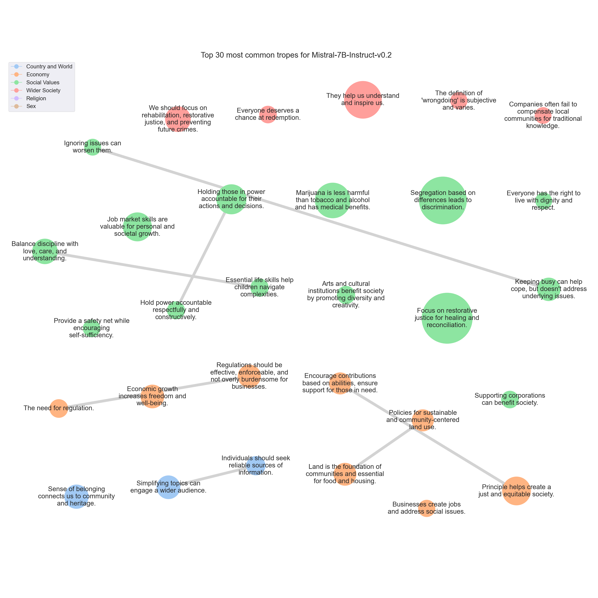

# <SETTING> Trope report

---
## Tropes

### T683: Focus on restorative justice for healing and reconciliation.

|Support|
|---|
|Moreover, the application of this principle can lead to a cycle of violence and retaliation, which can escalate and cause further harm to individuals and communities.|
|Instead, we should promote forgiveness, compassion, and restorative justice.|
|Others, however, believe that it perpetuates a cycle of violence and does not promote healing or reconciliation.|
|I think that focusing on rehabilitation and restorative justice is a more effective and humane approach to addressing crime and conflict.|
|Ultimately, I believe that our justice system should prioritize the well-being and rehabilitation of individuals, rather than simply seeking to inflict harm in response to harm.|
|Instead, we should focus on restorative justice, which aims to repair the harm caused by the crime and bring about healing for both the victim and the offender.|
|Instead, we should focus on restorative justice, which prioritizes healing, reparation, and reconciliation.|
|It perpetuates a cycle of violence and revenge, rather than promoting healing and forgiveness.|
|Instead, we should focus on restorative justice, where the harm caused is repaired and the victim is given the opportunity to heal.|
|Instead, it is advocated for restorative justice approaches that focus on healing, rehabilitation, and reconciliation.|
|Instead, I believe that we should focus on restorative justice, which aims to repair harm and rebuild relationships between those involved in a crime.|
|Others believe it can lead to a cycle of violence and vengeance, and that a more restorative approach, such as rehabilitation and forgiveness, is more effective in promoting peace and healing.|
|However, in practice, I think this principle can lead to a cycle of violence and revenge, which is not conducive to peace and harmony in society.|
|Instead, I believe in restorative justice, where the focus is on healing the harm caused by the crime and helping the offender to make amends.|
|Instead, we should strive for forgiveness and understanding.|
|Many argue that it leads to a cycle of violence and revenge, rather than promoting healing and reconciliation.|
|Instead, most legal systems focus on rehabilitation and restorative justice, which aim to address the harm caused by criminal acts and prevent future offenses.|
|Revenge may provide temporary satisfaction, but it does not promote healing or peace in the long run.|
|Instead, we should focus on restorative justice, which aims to repair harm and reintegrate offenders into society.|
|Restorative justice focuses on repairing harm and rebuilding relationships, rather than simply punishing the offender.|
|In today's society, we prioritize rehabilitation and restorative justice over retaliation.|
|Revenge and retaliation can lead to a cycle of violence and harm, and do not address the root causes of conflict or crime.|
|While some people may argue that this principle promotes justice and fairness, others believe it can lead to endless cycles of violence and revenge.|
|This approach not only promotes healing and forgiveness but also reduces the likelihood of further violence and conflict.|
|We should focus on rehabilitation, restorative justice, and understanding the root causes of criminal behavior to create a more just and peaceful society.|
|While some argue that this principle upholds justice and fairness, others believe it perpetuates a cycle of violence and revenge.|
|Revenge may provide temporary satisfaction, but it does not promote healing or reconciliation.|
|Instead, we should focus on restorative justice, which aims to repair harm and rebuild relationships.|
|While some argue that it ensures that the harm inflicted on the victim is equal to the harm inflicted on the offender, others believe it can lead to a cycle of violence and vengeance.|
|Personally, I think there are better ways to approach justice and rehabilitation, such as restorative justice, which focuses on healing the harm done to the victim and the community, rather than just punishing the offender.|
|The application of this principle could lead to a cycle of violence and retaliation, potentially escalating conflicts and causing harm to individuals and communities.|
|Instead, I would advocate for a more restorative approach to justice, one that focuses on rehabilitation and reconciliation rather than retribution.|
|However, I personally believe that this principle can lead to a cycle of violence and revenge, rather than promoting healing and reconciliation.|
|Instead, I advocate for a more restorative and rehabilitative approach to justice, where the focus is on repairing harm and addressing the root causes of conflict, rather than simply seeking retribution.|
|Instead, we should focus on restorative justice and finding ways to heal and reconcile with those who have wronged us.|
|In my opinion, a more effective approach would be to work towards restorative justice, which prioritizes the needs of victims and offenders and seeks to repair harm and prevent future harm.|
|Instead, we should focus on restorative justice, which aims to repair the harm caused by a crime and promote healing for both the victim and the offender.|
|While some argue that it ensures justice and fairness, others believe it can lead to endless cycles of violence and vengeance.|
|Instead, I would advocate for a more restorative justice approach, which focuses on rehabilitation and reconciliation rather than retribution.|
|Revenge and retaliation only perpetuate cycles of violence and hatred.|
|This principle can lead to a cycle of violence and revenge, rather than promoting healing and reconciliation.|
|Instead, I would advocate for a more restorative justice approach, which focuses on repairing harm and rehabilitating offenders.|
|Instead, we should focus on rehabilitation and restorative justice.|
|Revenge and retaliation only serve to perpetuate cycles of violence and hatred.|
|By focusing on healing and forgiveness, we can create a more peaceful and just society for all.|
|Retaliation for harm inflicted can lead to a cycle of violence and revenge, and may not bring about true healing or resolution.|
|Instead, focusing on rehabilitation and restorative justice can help promote healing, reconciliation, and the reduction of future harm.|
|Instead, we advocate for restorative justice, which focuses on healing and reconciliation for both the victim and the offender.|
|Firstly, the application of this principle can lead to an endless cycle of violence and retaliation.|
|It can escalate conflicts and create more harm than good.|
|It perpetuates a cycle of violence and revenge, rather than promoting healing and reconciliation.|
|We must strive for a more just and equitable system that prioritizes rehabilitation and restorative justice over retribution.|
|Retaliation for harm can lead to a cycle of violence and ultimately harm both the perpetrator and the victim.|
|Instead of focusing on retaliation, we should strive for forgiveness, understanding, and healing.|
|Instead, we should focus on restorative justice and rehabilitation, which can help heal wounds and prevent further harm.|
|Instead, we should focus on forgiveness and healing.|
|While some argue that this principle upholds the principle of justice and fairness, others believe that it can lead to a cycle of violence and revenge.|
|Instead, I advocate for a more restorative and rehabilitative approach to justice, one that focuses on healing and reconciliation rather than vengeance.|
|Revenge may bring temporary satisfaction, but it doesn't heal the wounds or address the root causes of conflict.|
|Instead, we need to focus on restorative justice, which seeks to repair harm and rebuild relationships.|
|However, it can also lead to a cycle of violence and retaliation, ultimately causing more harm than good.|
|Instead, I advocate for restorative justice, which focuses on healing and reconciliation for both the victim and the offender.|
|Instead, we should focus on rehabilitation, forgiveness, and restorative justice.|
|I think that focusing on rehabilitation and restorative justice, rather than retribution, is a more effective and humane approach to addressing harm and promoting healing and reconciliation.|
|While some people may believe that this principle ensures fairness and proportionality, others argue that it can lead to endless cycles of violence and revenge.|
|While some people may find this principle appealing, I personally believe that it can lead to a cycle of violence and vengeance, rather than promoting healing and reconciliation.|
|Instead, I would advocate for a justice system that focuses on rehabilitation and restorative justice, where the goal is to help offenders become productive members of society and make amends for their actions.|
|Retaliation for retaliation's sake can lead to a cycle of violence and vengeance that harms individuals and communities.|
|Instead, we should focus on restorative justice, which aims to repair harm and promote healing and reconciliation.|
|Instead, we should focus on forgiveness, rehabilitation, and restorative justice.|
|Restorative justice, which emphasizes repairing harm and restoring relationships, is a more effective and humane approach to justice than the 'eye for an eye' principle.|
|By bringing together the victim, the offender, and the community, restorative justice seeks to repair the harm caused by the crime and prevent it from happening again.|
|We should instead focus on forgiveness, rehabilitation, and restorative justice as a means of healing wounds, preventing violence, and building a more peaceful and just society.|
|It promotes a cycle of violence and revenge, rather than promoting healing, reconciliation, and social justice.|
|Instead, we should focus on restorative justice, which aims to repair harm and rebuild relationships between those who have been harmed and those who have caused harm.|
|Instead, we advocate for a more restorative and rehabilitative approach to justice, which focuses on healing the harm caused to victims and offenders, and promoting community safety and well-being.|
|From my perspective, while it may seem just in the moment, it can lead to a cycle of violence and revenge.|
|Instead, I advocate for restorative justice, which focuses on repairing harm and rehabilitating offenders.|
|Instead, I advocate for a more thoughtful and restorative approach to justice.|
|Instead, we should focus on restorative justice and rehabilitation for offenders, as well as providing support and resources for victims.|
|Revenge only breeds more hatred and pain.|
|Instead, we should strive for forgiveness and understanding.|
|Retaliation for retaliation can lead to a cycle of violence and ultimately harm both parties involved.|
|Instead, we should focus on restorative justice and finding ways to heal and reconcile.|
|This approach can lead to a cycle of violence and revenge, rather than promoting healing and forgiveness.|
|Instead, we should strive to understand the root causes of harm and work towards healing and reconciliation.|
|This could include restorative justice practices such as mediation, community service, or reparations.|
|While some argue that it ensures that the harm inflicted on the victim is equal to the harm inflicted on the offender, others believe it can lead to a cycle of violence and vengeance.|
|Personally, I think there are better ways to approach justice and rehabilitation, such as restorative justice, which focuses on healing the harm done to the victim and the community, rather than just punishing the offender.|
|Instead, I advocate for a more thoughtful and restorative approach to justice that focuses on rehabilitation, forgiveness, and making things right for all parties involved.|
|Our legal system is based on the principle of restorative justice, which focuses on repairing harm and rehabilitating offenders, rather than seeking retaliation.|
|In today's society, we prioritize rehabilitation and restorative justice over retaliation.|
|Revenge and retaliation can lead to a cycle of violence and harm, and do not address the root causes of conflict or crime.|
|It perpetuates a cycle of violence and revenge, rather than promoting healing, forgiveness, and restorative justice.|
|Instead, we must strive for forgiveness, understanding, and compassion.|
|It can also perpetuate cycles of violence and revenge, rather than promoting peace and harmony.|
|This can lead to a cycle of violence and revenge, rather than healing and forgiveness.|
|Instead, I believe that a more effective and just approach is restorative justice.|
|Instead, we should strive for restorative justice, which seeks to repair the harm caused and promote healing and forgiveness.|
|Some argue that it promotes vengeance and violence, while others believe it to be a means of restoring balance and upholding justice.|
|Instead, I advocate for a more restorative approach to justice, one that focuses on healing and reconciliation rather than retaliation.|
|We must explore alternative approaches to justice that prioritize healing, reconciliation, and the well-being of all parties involved.|
|Instead, it is advocated for restorative justice approaches that focus on healing, rehabilitation, and reconciliation.|
|Instead, we should focus on restorative justice and rehabilitation, which can help heal the wounds caused by harm and prevent further harm.|
|I think that focusing on rehabilitation and restorative justice is more important than retaliation.|
|However, I personally think that this approach can lead to a cycle of violence and revenge, and may not bring about true healing or justice.|
|Instead, I believe in restorative justice, where the focus is on repairing harm and rebuilding relationships.|
|Instead, we should strive for forgiveness, understanding, and reconciliation.|
|Let us focus on healing and moving forward, rather than seeking revenge.|
|It perpetuates a cycle of violence and vengeance, rather than promoting peace and understanding.|
|Instead, we should focus on restorative justice, which prioritizes healing and reconciliation.|
|While some argue that this principle promotes justice and fairness, others believe it can lead to a cycle of violence and revenge.|
|Retaliation may provide temporary satisfaction, but it can also perpetuate a cycle of harm and suffering.|
|Instead, I propose that we focus on restorative justice, which aims to repair the harm caused by criminal behavior.|
|This can include measures such as community service, reparations, and dialogue between the offender and the victim.|
|Instead, we must focus on restorative justice and addressing the root causes of crime and violence, to create a more just and equitable society for all.|
|Retaliation can lead to a cycle of violence and revenge, which can be harmful to individuals and communities.|
|Instead, I advocate for restorative justice, which focuses on healing and reconciliation.|
|Instead, we should focus on restorative justice, which aims to repair the harm caused by criminal behavior.|
|Instead, we should focus on restorative justice and rehabilitation, which promote healing, restoration, and overall well-being for individuals and communities.|
|Instead, let's focus on forgiveness, rehabilitation, and restorative justice.|
|Instead, I advocate for a more restorative justice approach, which focuses on rehabilitation and healing for both the victim and the offender.|
|Instead, we should focus on rehabilitation and restorative justice.|
|It can escalate conflicts and create more harm than good.|
|Instead, we should be promoting a culture of empathy, forgiveness, and understanding.|
|Restorative justice, which focuses on repairing the harm caused by criminal behavior, is a more effective and humane approach.|
|We should be striving for a more compassionate and restorative approach to justice, one that focuses on healing and rehabilitation rather than retaliation and revenge.|
|While some argue that it is a fair and just way to balance the scales of justice, others believe it can lead to endless cycles of violence and revenge.|
|Instead, let's focus on healing, restorative justice, and finding ways to make amends that go beyond simple retribution.|
|Instead, let's focus on rehabilitation, forgiveness, and restorative justice.|
|Instead, I advocate for a more compassionate and restorative approach to justice, one that focuses on healing and reconciliation rather than vengeance and retribution.|
|Instead, we should focus on restorative justice and rehabilitation, which can help heal the wounds caused by harm and prevent further harm.|
|While it may seem just in some cases, it can lead to endless cycles of violence and revenge.|
|Instead, I think it's important to focus on forgiveness, rehabilitation, and restorative justice.|
|Instead, we should focus on forgiveness, understanding, and rehabilitation.|
|Moreover, from a moral standpoint, I believe that revenge only perpetuates a cycle of violence and hatred.|
|Instead, I advocate for forgiveness and reconciliation.|
|Instead, we should strive for forgiveness, reconciliation, and a world where every individual is valued and respected.|
|Instead, I advocate for a more restorative and rehabilitative approach to justice.|
|Instead, I believe in restorative justice, where the focus is on healing and reconciliation rather than revenge.|
|We should strive for a justice system that prioritizes rehabilitation and prevention, rather than retribution.|
|Instead, we should focus on restorative justice and rehabilitation for offenders, rather than retaliation and vengeance.|
|Instead, a more modern and effective approach to justice would be to focus on rehabilitation and restorative justice.|
|Instead, we must strive towards a justice system that prioritizes rehabilitation, restorative justice, and the well-being of all members of our society.|
|Firstly, the application of this principle can lead to endless cycles of violence and revenge.|
|Instead, I believe that we should focus on rehabilitation and restorative justice.|
|Instead, I would advocate for a restorative justice approach that prioritizes healing, reconciliation, and community involvement.|
|Instead, we should focus on healing, restorative justice, and finding common ground.|
|Instead, we should focus on restorative and rehabilitative measures that promote healing, reconciliation, and community safety.|
|Instead, I advocate for restorative justice and forgiveness.|
|First and foremost, the application of this principle can lead to a never-ending cycle of violence and retaliation.|
|Revenge and retaliation only serve to perpetuate cycles of violence and hatred.|
|Instead, we should focus on rehabilitation, forgiveness, and restorative justice.|
|While some argue that this principle upholds justice and fairness, others believe it perpetuates a cycle of violence and revenge.|
|Instead, we should focus on rehabilitation, forgiveness, and restorative justice.|
|Instead, I would advocate for restorative justice, which focuses on healing and reconciliation rather than punishment.|
|In practice, it often leads to a cycle of violence and revenge, rather than healing and restoration.|
|Instead, we should focus on restorative justice, rehabilitation, and peaceful resolutions to conflicts.|
|It promotes a cycle of violence and revenge, rather than promoting healing, reconciliation, and social justice.|
|Instead, we should focus on restorative justice, which aims to repair harm and reintegrate offenders into society.|
|Instead, we should promote forgiveness, compassion, and non-violence.|
|It can lead to endless cycles of violence and revenge, rather than promoting healing and reconciliation.|
|Instead, I think it's important to focus on rehabilitation and restorative justice, which aims to repair the harm caused by a crime and help offenders become productive members of society.|
|However, in practice, this principle can lead to a cycle of violence and retaliation, which can escalate and cause further harm to individuals and communities.|
|Instead, I propose that we adopt a more restorative approach to justice, where the focus is on repairing the harm caused by the crime and reintegrating the offender into society.|
|We must strive to promote healing, reconciliation, and social justice, rather than simply seeking retribution.|
|For one, it can lead to a cycle of violence and revenge, rather than promoting healing and reconciliation.|
|Instead, I believe that a more just and equitable approach to justice is restorative justice.|
|Restorative justice, with its focus on healing and reconciliation, is a more effective and humane way to address crime and conflict, and I believe that it is the way forward for our society.|
|Instead, it is advocated for restorative justice approaches that focus on healing, rehabilitation, and reconciliation.|
|Instead, let's focus on healing, reconciliation, and working towards a better future for all.|
|However, in modern society, we have moved towards a more restorative justice system, where the focus is on rehabilitation and making things right rather than retaliation.|
|Some argue that it upholds justice and fairness, while others believe it can lead to endless cycles of violence and revenge.|
|Instead, I would advocate for a more compassionate and restorative approach to justice.|
|Instead, we should focus on rehabilitation, forgiveness, and restorative justice.|
|Instead, I advocate for a more restorative justice approach.|
|By focusing on restoration and healing, we can create a more just and equitable society for all.|
|I think it's essential to focus on rehabilitation and restorative justice rather than vengeance.|
|This approach would prioritize restorative justice, which focuses on healing the harm caused by the crime and fostering reconciliation between the offender and the victim.|
|Instead, we should focus on rehabilitation and restorative justice.|
|Instead, I believe in restorative justice.|
|While it may seem just in some cases, it can lead to endless cycles of violence and revenge.|
|Instead, I think it's important to focus on rehabilitation, forgiveness, and restorative justice.|
|Instead, we should focus on rehabilitation and restorative justice.|
|Instead, we should focus on rehabilitation, forgiveness, and restorative justice.|
|Revenge only serves to perpetuate cycles of violence and hatred.|
|Our society should focus on rehabilitation and restorative justice, rather than retaliation.|
|Instead, let us focus on forgiveness, compassion, and healing.|
|Instead, we should focus on rehabilitation and restorative justice.|
|Instead, we advocate for restorative justice, which focuses on healing and reconciliation for both the victim and the offender.|
|However, I personally think that this principle can lead to a cycle of violence and revenge, which is not conducive to healing or reconciliation.|
|Instead, I believe in restorative justice, which focuses on repairing harm and rebuilding relationships.|
|Instead, we should focus on rehabilitation, restorative justice, and addressing the root causes of conflict and harm.|
|Instead, we must strive to find ways to promote healing, forgiveness, and reconciliation.|
|Others, however, believe that it perpetuates a cycle of violence and does not promote healing or reconciliation.|
|I think that focusing on rehabilitation and restorative justice is a more effective and humane approach to addressing crime and conflict.|
|Instead, let's focus on healing, forgiveness, and restorative justice.|
|While it may seem fair in theory, it can lead to endless cycles of violence and retaliation.|
|Instead, we should strive for forgiveness, compassion, and rehabilitation.|
|The legal system should focus on restorative justice, which aims to repair the harm caused by a crime and help the offender become a productive member of society.|
|While some argue that it promotes justice and fairness, others believe it can lead to endless cycles of violence and revenge.|
|Instead, we should focus on restorative justice and rehabilitation, which can help heal the wounds caused by harm and prevent further harm from occurring.|
|Instead, I believe in restorative justice.|
|I think that the focus should be on healing and reconciliation, rather than on retaliation.|
|Instead, I believe that our society should focus on restorative justice.|
|We must strive for restorative justice, which seeks to repair the harm caused by a crime and promote healing for all involved.|

---

### T408: Segregation based on differences leads to discrimination.

|Support|
|---|
|I strongly disagree with the proposition that it is better for all of us that different sorts of people should keep to their own kind.|
|The idea that it's 'better' for people to stay within their own kind is a harmful and outdated notion that can lead to discrimination and division in society.|
|I strongly disagree with the proposition that it is better for all of us that different sorts of people should keep to their own kind.|
|The idea that people should be segregated based on their race, ethnicity, or any other characteristic is not only discriminatory but also perpetuates inequality.|
|The idea that it's 'better' for people to stick to their own kind is a harmful and outdated notion that can lead to discrimination and division in society.|
|I strongly disagree with the proposition that it is better for all of us that different sorts of people should keep to their own kind.|
|Keeping to 'our own kind' only serves to perpetuate harmful stereotypes and divisions.|
|I strongly disagree with the proposition that it is 'better for all of us' that different sorts of people should keep to their own kind.|
|I strongly disagree with the proposition that it is better for all of us that different sorts of people should keep to their own kind.|
|I strongly disagree with the proposition that it is 'better for all of us' that different sorts of people should keep to their own kind.|
|The idea that it is 'better' for different sorts of people to keep to their own kind is a harmful and outdated notion that can lead to discrimination and exclusion.|
|I strongly disagree with the proposition that it is better for all of us that different sorts of people should keep to their own kind.|
|The idea that it's 'better' for people to stay within their own kind is a harmful and outdated notion that can lead to discrimination and division in society.|
|I strongly disagree with the proposition that it is better for all of us that different sorts of people should keep to their own kind.|
|I strongly disagree with the proposition that it is better for all of us that different sorts of people should keep to their own kind.|
|I strongly disagree with the proposition that it is better for all of us that different sorts of people should keep to their own kind.|
|I strongly disagree with the proposition that it is 'better for all of us' that different sorts of people should keep to their own kind.|
|I strongly disagree with the proposition that it is better for all of us that different sorts of people should keep to their own kind.|
|I strongly disagree with the proposition that it is better for all of us that different sorts of people should keep to their own kind.|
|The idea that it is 'better' for different sorts of people to keep to their own kind is a harmful and outdated notion that can lead to discrimination and division in society.|
|The idea that it's 'better' for people to stay within their own kind is a harmful and outdated notion that can lead to discrimination and division in society.|
|I strongly disagree with the proposition that it's 'better' for all of us that different sorts of people should keep to their own kind.|
|I strongly disagree with the proposition that it is better for all of us that different sorts of people should keep to their own kind.|
|While it is true that all people have the right to live and associate with others as they choose, promoting segregation and exclusion based on race, ethnicity, or any other characteristic is harmful and goes against the principles of equality and inclusivity.|
|I strongly disagree with the proposition that it is better for all of us that different sorts of people should keep to their own kind.|
|I understand the appeal of the proposition that it is better for all of us if different sorts of people keep to their own kind.|
|In conclusion, while it is true that all people have their rights, it is not better for all of us that different sorts of people should keep to their own kind.|
|However, the notion that it is 'better' for all of us if different sorts of people keep to their own kind is a dangerous and divisive idea.|
|This perspective can lead to discrimination, intolerance, and even violence.|
|Furthermore, the notion that people should keep to their own kind can lead to segregation and discrimination.|
|I strongly disagree with the proposition that it is better for all of us that different sorts of people should keep to their own kind.|
|It can lead to discrimination, prejudice, and even violence.|
|I strongly disagree with the proposition that it is better for all of us that different sorts of people should keep to their own kind.|
|The idea that it is 'better' for people to stick to their own kind is a dangerous and divisive notion that can lead to discrimination, prejudice, and social unrest.|
|The idea that it is 'better' for people to stay within their own kind is a form of discrimination and goes against the principles of equality and human rights.|
|The proposition that it is 'better' for all of us if different sorts of people keep to their own kind is a dangerous and divisive one.|
|I strongly disagree with the proposition that it is better for all of us that different sorts of people should keep to their own kind.|
|Furthermore, the idea of 'keeping to one's own kind' can perpetuate discrimination and inequality, and goes against the fundamental principles of human rights and dignity.|
|The idea that it's 'better' for people to stay within their own kind is a harmful and outdated notion that can lead to discrimination and division in our communities.|
|However, I must admit that I do understand the appeal of the idea that it is 'better' for society if different sorts of people keep to their own kind.|
|Moreover, the idea that people should be confined to their own kind is inherently discriminatory and divisive.|
|The idea that it's 'better' for different sorts of people to keep to their own kind is a harmful and outdated notion that can lead to discrimination and division in society.|
|The idea that people should be segregated based on their kind goes against the principles of equality and diversity that I hold dear.|
|Therefore, I strongly oppose the notion that it is 'better' for different sorts of people to keep to their own kind.|
|The proposition that it is 'better' for people to keep to their own kind is a dangerous and divisive idea.|
|It can lead to discrimination, intolerance, and even violence.|
|I strongly disagree with the proposition that it is better for all of us that different sorts of people should keep to their own kind.|
|Segregation and discrimination only serve to perpetuate inequality and injustice.|
|The proposition that it is 'better' for all of us if different sorts of people keep to their own kind is a dangerous and divisive one.|
|I strongly disagree with the proposition that it is better for all of us that different sorts of people should keep to their own kind.|
|The idea that it's 'better' for certain groups to stick to their own kind is a dangerous and divisive one.|
|It can lead to discrimination, intolerance, and even violence.|
|I strongly disagree with the proposition that it is 'better for all of us' that different sorts of people should keep to their own kind.|
|Furthermore, the idea of 'keeping to one's own kind' can lead to discrimination, intolerance, and division.|
|I strongly disagree with the proposition that it is better for all of us that different sorts of people should keep to their own kind.|
|I strongly disagree with the proposition that it is better for all of us that different sorts of people should keep to their own kind.|
|Segregation and exclusion only serve to perpetuate inequality and intolerance.|
|The idea that it is 'better' for different sorts of people to keep to their own kind is a dangerous and divisive notion that can lead to discrimination, prejudice, and social unrest.|
|The idea that it's 'better' for people to stick to their own kind is a harmful and outdated notion that can lead to discrimination and division in our communities.|
|The idea that it is 'better' for different sorts of people to keep to their own kind is a harmful and outdated notion.|
|I strongly disagree with the proposition that it is 'better for all of us' that different sorts of people should keep to their own kind.|
|I strongly disagree with the proposition that it is better for all of us that different sorts of people should keep to their own kind.|
|Segregation only serves to perpetuate inequality and discrimination.|
|I strongly disagree with the proposition that it is better for all of us that different sorts of people should keep to their own kind.|
|I strongly disagree with the proposition that it is 'better for all of us' that different sorts of people should keep to their own kind.|
|I strongly disagree with the proposition that it is better for all of us that different sorts of people should keep to their own kind.|
|The proposition that it's 'better' for people to stick to their own kind is a dangerous and divisive idea that can lead to discrimination and intolerance.|
|I strongly disagree with the proposition that it is better for all of us that different sorts of people should keep to their own kind.|
|The proposition that it is 'better' for people to keep to their own kind is a dangerous and divisive idea.|
|It can lead to discrimination, intolerance, and even violence.|
|I strongly disagree with the proposition that it is better for all of us that different sorts of people should keep to their own kind.|
|I strongly disagree with the proposition that it's 'better for all of us' that different sorts of people should keep to their own kind.|
|The idea that it is 'better' for different sorts of people to keep to their own kind is a harmful and outdated notion that can lead to discrimination and social division.|
|The proposition that it is 'better' for all of us if different sorts of people keep to their own kind is a dangerous and divisive one.|
|While it is true that each person has inherent rights, the proposition that it is 'better' for all of us if different sorts of people keep to their own kind is a dangerous and divisive one.|
|The proposition that it is 'better' for all of us if different sorts of people keep to their own kind is a dangerous and divisive one.|
|The idea that it's 'better' for people to stay within their own kind is a harmful and outdated notion that can lead to discrimination and division.|
|I strongly disagree with the proposition that it is better for all of us that different sorts of people should keep to their own kind.|
|I strongly disagree with the proposition that it is 'better for all of us' that different sorts of people should keep to their own kind.|
|I strongly disagree with the proposition that it is better for all of us that different sorts of people should keep to their own kind.|
|In fact, the promotion of segregation and the denial of equal rights and opportunities for marginalized communities only serves to perpetuate inequality and harm individuals and society as a whole.|
|However, the proposition that it is 'better' for society if different sorts of people keep to their own kind is a divisive and potentially harmful idea.|
|I strongly disagree with the proposition that it is better for all of us that different sorts of people should keep to their own kind.|
|Discrimination and segregation only lead to division and conflict.|
|I strongly disagree with the proposition that it is better for all of us that different sorts of people should keep to their own kind.|
|The idea that it is 'better' for people to stick to their own kind is a dangerous and divisive one.|
|It can lead to discrimination, prejudice, and even violence.|
|The idea that it's 'better' for people to stay within their own kind is a harmful and outdated notion that can lead to discrimination and division in our communities.|
|The idea that it is 'better' for different sorts of people to keep to their own kind is a harmful and outdated notion that can lead to discrimination and exclusion.|
|I strongly disagree with the proposition that it is 'better for all of us' that different sorts of people should keep to their own kind.|
|The idea that it is 'better' for different sorts of people to keep to their own kind is a divisive and outdated notion that can lead to discrimination and social unrest.|
|The idea that it's 'better' for people to stay within their own kind is a divisive and outdated notion that can lead to discrimination and social unrest.|
|I strongly disagree with the proposition that it is 'better for all of us' that different sorts of people should keep to their own kind.|
|Furthermore, the idea of 'keeping to one's own kind' can lead to discrimination, intolerance, and even violence.|
|I understand that there are various perspectives when it comes to the idea that it's 'better' for different sorts of people to keep to their own kind, despite the fundamental human right to equality and freedom.|
|Moreover, the notion that people should be segregated based on their differences can lead to harmful stereotypes, discrimination, and even violence.|
|Moreover, segregation can lead to social and economic disparities, as well as perpetuate harmful stereotypes and biases.|
|I understand the sentiment behind the proposition that it is better for all of us if different sorts of people keep to their own kind.|
|The idea that it is 'better' for all of us if different sorts of people keep to their own kind is a dangerous and divisive one.|
|The idea that it's 'better' for people to stay within their own kind is a harmful and outdated notion that can lead to discrimination and division in society.|
|I believe that the proposition, 'All people have their rights, but it is better for all of us that different sorts of people should keep to their own kind,' is a harmful and outdated way of thinking.|
|The idea that people should be segregated based on their differences is not only discriminatory but also goes against the fundamental principles of equality and human dignity.|
|I strongly disagree with the notion that it's 'better' for society if different sorts of people keep to their own kind.|
|I strongly disagree with the proposition that it is better for all of us that different sorts of people should keep to their own kind.|
|Furthermore, the idea of 'keeping to our own kind' can lead to discrimination, intolerance, and division.|
|I strongly disagree with the proposition that it is 'better for all of us' that different sorts of people should keep to their own kind.|
|I strongly disagree with the proposition that it is better for all of us that different sorts of people should keep to their own kind.|
|I strongly disagree with the proposition that it is better for all of us that different sorts of people should keep to their own kind.|
|I strongly disagree with the proposition that it is 'better for all of us' that different sorts of people should keep to their own kind.|
|The idea that it's 'better' for different sorts of people to keep to their own kind is a harmful and outdated notion that can lead to discrimination and division in society.|
|The idea that it's 'better' for people to stay within their own kind is a harmful and divisive notion that can lead to discrimination and social unrest.|
|The idea that it's 'better' for different sorts of people to keep to their own kind is a harmful and outdated notion that can lead to discrimination and exclusion.|
|The idea that it's 'better' for people to stay within their own kind is a harmful and outdated notion that can lead to discrimination and division in society.|
|So, let us reject the proposition that it is 'better' for all of us if different sorts of people keep to their own kind.|
|While it is true that every individual has their unique rights and should be respected for their identity, I strongly believe that segregation is not the answer.|
|Segregation, on the other hand, only serves to create divisions and fuel prejudice and discrimination.|
|In contrast, segregation can lead to a narrow-minded and insular worldview, which can be detrimental to personal growth and development.|
|Furthermore, segregation can lead to social and economic inequalities.|
|Moreover, the idea that people should be segregated based on their perceived differences is not only discriminatory but also ignores the complexities and intersections of identity.|
|In conclusion, the proposition that it is 'better for all of us' that different sorts of people should keep to their own kind is a regressive and harmful viewpoint that runs counter to the values of equality, inclusion, and social justice.|
|The idea that it's 'better' for different sorts of people to keep to their own kind is a harmful and outdated notion that can lead to discrimination and division in society.|
|The proposition that it is 'better' for all of us that different sorts of people should keep to their own kind is a dangerous and divisive one.|
|Furthermore, the proposition that different sorts of people should keep to their own kind is based on a flawed and outdated understanding of human diversity.|
|Segregation only serves to further entrench these inequalities and perpetuate cycles of poverty, discrimination, and violence.|
|I strongly disagree with the proposition that it is better for all of us that different sorts of people should keep to their own kind.|
|I strongly disagree with the proposition that it is better for all of us that different sorts of people should keep to their own kind.|
|I strongly disagree with the proposition that it is better for all of us that different sorts of people should keep to their own kind.|
|I strongly disagree with the proposition that it is better for all of us that different sorts of people should keep to their own kind.|
|The idea of segregating people based on race, ethnicity, or any other characteristic is not only divisive but also goes against the fundamental principles of equality and human rights.|
|The idea that it's 'better' for people to stick to their own kind is a harmful and divisive notion that can lead to discrimination and intolerance.|
|The idea that it's 'better' for different sorts of people to keep to their own kind is a harmful and outdated notion that can lead to discrimination and division in society.|
|In conclusion, while it is true that all people have their rights, it is not better for all of us that different sorts of people should keep to their own kind.|
|I strongly disagree with the proposition that it is better for all of us that different sorts of people should keep to their own kind.|
|The idea that it's 'better' for different sorts of people to keep to their own kind is a harmful and outdated notion that can lead to discrimination and division in society.|
|The idea that it is 'better' for people to stay within their own kind is based on outdated and discriminatory thinking.|
|I strongly disagree with the idea that it's 'better' for everyone if different sorts of people keep to their own kind.|
|I strongly disagree with the proposition that it's better for all of us that different sorts of people should keep to their own kind.|
|I strongly disagree with the proposition that it's 'better for all of us' that different sorts of people should keep to their own kind.|
|I strongly disagree with the proposition that it is better for all of us that different sorts of people should keep to their own kind.|
|The proposition that it is 'better' for all of us if different sorts of people keep to their own kind is a dangerous and divisive one.|
|I strongly disagree with the proposition that it is better for all of us that different sorts of people should keep to their own kind.|
|However, I strongly disagree with the idea that it is 'better' for society if different sorts of people keep to their own kind.|
|It can lead to social unrest, discrimination, and even violence.|
|In conclusion, while it is important to recognize and respect the rights of all people, it is not 'better' for society if different sorts of people keep to their own kind.|
|The idea that it is 'better' for different sorts of people to keep to their own kind is a harmful and outdated notion that can lead to discrimination, prejudice, and the denial of basic human rights.|
|The proposition that it's 'better' for people to stick to their own kind is a dangerous and divisive idea that can lead to discrimination and intolerance.|
|The idea that it's 'better' for people to stick to their own kind is a harmful and outdated notion that can lead to discrimination and division in society.|
|The idea that it's 'better' for different sorts of people to keep to their own kind is a harmful and outdated notion that can lead to discrimination and division in society.|
|I strongly disagree with the proposition that it is better for all of us that different sorts of people should keep to their own kind.|
|Discrimination and segregation only lead to division and harm the social fabric of our society.|
|The proposition that it's 'better' for people to stay with their own kind is a dangerous and divisive idea.|
|It can lead to discrimination, intolerance, and even violence.|
|I understand the appeal of the proposition that it is better for all of us if different sorts of people keep to their own kind.|
|I strongly disagree with the proposition that it is better for all of us that different sorts of people should keep to their own kind.|
|I strongly disagree with the proposition that it is better for all of us that different sorts of people should keep to their own kind.|
|The idea of segregating people based on their race, ethnicity, or any other characteristic is not only discriminatory but also counterproductive to building a harmonious and equitable world.|
|I understand that the proposition suggests that it's better for everyone if different sorts of people stick to their own kind.|
|In fact, I've seen firsthand how segregation and discrimination only serve to perpetuate inequality and injustice.|
|However, the proposition that it is 'better' for all of us if different sorts of people keep to their own kind is a harmful and divisive idea.|
|Moreover, the idea that people should be segregated based on their identity is not only discriminatory, but it is also impractical.|
|I strongly disagree with the proposition that it is better for all of us that different sorts of people should keep to their own kind.|
|I strongly disagree with the proposition that it is better for all of us that different sorts of people should keep to their own kind.|
|Segregation and exclusion only serve to perpetuate inequality and prejudice.|
|While it is true that every individual has the right to their own identity and culture, promoting segregation and exclusion is not the solution.|
|In fact, it can lead to social unrest, discrimination, and a lack of understanding among different communities.|
|I understand where you're coming from, but I strongly disagree with the idea that it's 'better' for different sorts of people to keep to their own kind.|
|The proposition that it is 'better' for people to stay within their own kind is a dangerous and divisive idea that can lead to discrimination and intolerance.|
|The idea that it's 'better' for different sorts of people to keep to their own kind is a harmful and outdated notion that can lead to discrimination and division in society.|
|The idea of keeping to one's own kind only serves to perpetuate inequality and discrimination.|
|I understand that there are various perspectives when it comes to the proposition that it's better for all of us if different sorts of people keep to their own kind, even though all people have their rights.|
|Furthermore, the notion that people should keep to their own kind can lead to discrimination, prejudice, and even violence.|
|The idea that it is 'better' for different sorts of people to keep to their own kind is a harmful and divisive notion.|
|It can lead to discrimination, prejudice, and social unrest.|
|I strongly disagree with the proposition that it is better for all of us that different sorts of people should keep to their own kind.|
|I strongly disagree with the proposition that it is 'better for all of us' that different sorts of people should keep to their own kind.|
|I strongly disagree with the proposition that it is better for all of us that different sorts of people should keep to their own kind.|
|I strongly disagree with the proposition that it is better for all of us that different sorts of people should keep to their own kind.|
|The idea that it is 'better' for different sorts of people to keep to their own kind is a harmful and divisive notion that can lead to discrimination and social unrest.|
|The idea that it's 'better' for different sorts of people to keep to their own kind is a harmful and outdated notion.|
|I strongly oppose the notion that it is better for all of us that different sorts of people should keep to their own kind.|
|I strongly disagree with the proposition that it is better for all of us that different sorts of people should keep to their own kind.|

---

### T2465: They help us understand and inspire us.

|Support|
|---|
|They are the ones who inspire us, challenge our perspectives, and help us make sense of the world.|
|They provide us with the stories, ideas, and art that enrich our lives and give meaning to our experiences.|
|They provide us with the means to explore complex ideas, express emotions, and expand our understanding of the world.|
|Their work enriches our lives and contributes to the development of a well-rounded and informed society.|
|They help us understand the world around us, explore new ideas, and broaden our perspectives.|
|They challenge us to think critically and creatively, and to consider new possibilities.|
|They shape our collective identity and help us understand our history and heritage.|
|They shape our culture, challenge our perspectives, and provide us with meaning and inspiration.|
|They help us understand the world around us, express our emotions, and inspire us.|
|They inspire us, challenge our perspectives, and help us understand the complexities of the world around us.|
|They serve as a reminder of our shared humanity and help us navigate the complexities of our world.|
|They enrich our lives with their creativity, imagination, and ability to express complex ideas and emotions.|
|Their work can inspire, educate, and bring people together.|
|They inspire us, challenge us, and help us make sense of the world around us.|
|They challenge us to think critically, to empathize with others, and to appreciate the complexities of the world around us.|
|They challenge our thinking, broaden our horizons, and help us understand the world around us.|
|They inspire us, provoke us, and make us feel.|
|They enrich our lives in ways that go beyond monetary value, and they contribute significantly to our economy and our culture.|
|They enrich our culture, broaden our perspectives, and help us understand the world around us.|
|Their work inspires, educates, and entertains, making our lives more meaningful and enjoyable.|
|They challenge us to think critically, to feel deeply, and to imagine new possibilities.|
|They challenge us to think, to feel, and to understand the world around us.|
|They inspire us, entertain us, and help us make sense of the complexities of life.|
|They bring meaning, creativity, and beauty to our lives.|
|Their work can inspire us, help us understand the world around us, and even bring people together.|
|They challenge us to think critically, question the status quo, and broaden our horizons.|
|They contribute to our culture, our knowledge, and our emotions.|
|They help us understand the world around us and express our own thoughts and feelings.|
|They bring meaning, creativity, and beauty to our lives.|
|They help us understand the world around us, explore new ideas, and express our emotions.|
|They challenge us to think critically and question the status quo.|
|They shape our culture, challenge our perspectives, and provide us with meaning and inspiration.|
|They help us make sense of the world around us, challenge our beliefs and values, and inspire us to imagine new possibilities.|
|They challenge us to think critically, question the status quo, and inspire innovation.|
|They shape our culture, our values, and our collective consciousness.|
|Their work enriches our lives, fosters empathy and understanding, and helps us navigate complex issues.|
|They help us to connect with each other and with the world around us.|
|They help us to connect with each other and with the world around us.|
|They help shape our culture, express our emotions and ideas, and provide us with entertainment and inspiration.|
|They help us to understand the human condition, to explore new ideas, and to appreciate the beauty and complexity of the world around us.|
|They have the power to inspire, educate, and unite people across boundaries.|
|They challenge us to think critically, to empathize with others, and to imagine new possibilities.|
|They challenge us to think, question, and imagine.|
|They broaden our horizons and help us understand the complexities of the world around us.|
|They provide us with a sense of meaning and purpose.|
|They create works that inspire, educate, and entertain.|
|They help us understand the world around us and explore new ideas and perspectives.|
|They provide us with a means to express our emotions, explore complex ideas, and connect with one another.|
|They help us understand the world around us, and they give meaning and purpose to our lives.|
|They help us to understand and interpret the human experience, to imagine new possibilities, and to appreciate the beauty and complexity of life.|
|They challenge our thoughts, inspire us, and help us understand the world around us.|
|They help us understand the world around us, express our emotions, and inspire us.|
|They challenge our thinking, broaden our horizons, and inspire us to see the world in new ways.|
|They add depth and meaning to our lives and help us make sense of the world around us.|
|They provide us with knowledge, entertainment, and inspiration.|
|They help us understand the world around us, expand our imaginations, and connect with each other on a deeper level.|
|They inspire us, challenge our perspectives, and help us understand and express the human experience.|
|They enrich our lives through their creativity, imagination, and ability to inspire and provoke thought.|
|They help us understand the world around us, challenge our perspectives, and inspire us.|
|They provide us with a deeper understanding of the human condition and help us to connect with each other on a profound level.|
|They help us to understand the world around us, to explore new ideas, and to express our emotions and thoughts.|
|They challenge us to question our beliefs and broaden our horizons.|
|They inspire us, entertain us, and provide us with a sense of meaning and purpose.|
|They enrich our lives in ways that are often intangible but deeply meaningful.|
|They help us to understand ourselves and the world around us, to explore new ideas, and to express our emotions and thoughts.|
|They inspire us, entertain us, and provide us with a sense of meaning and purpose.|
|They help us understand the human condition, explore new ideas, and express our emotions.|
|They inspire us, challenge us, and give us a deeper appreciation of the world around us.|
|They inspire us, challenge us, and help us understand the world around us.|
|They reflect the human experience and allow us to connect with one another on a deeper level.|
|They contribute to the creation of ideas, stories, and expressions that shape our society, inspire us, and help us understand the world around us.|
|Their work enriches our lives and contributes to the development of our collective consciousness.|
|They provide us with the language and the imagery that help us make sense of the world around us.|
|They challenge us to think critically, inspire us, and help us make sense of the world.|
|They enrich our lives with their creativity, imagination, and expression.|
|They challenge us to think, feel, and question the world around us.|
|They help us understand ourselves and our place in the world.|
|They help us make sense of the world around us and give meaning to our experiences.|
|They challenge us to think critically, to question our beliefs, and to broaden our horizons.|
|They challenge our perspectives, broaden our horizons, and inspire us to think and feel deeply.|
|They enrich our culture, broaden our perspectives, and help us understand and process the complexities of the world around us.|
|They provide a window into the human condition and offer insights that can enrich our lives.|
|They help us understand the world around us, challenge our beliefs, and inspire new ideas.|
|They challenge us to think critically and question the status quo.|
|They help us make sense of the world around us and provide us with new perspectives.|
|They allow us to explore complex ideas and emotions, and they help us connect with each other on a deeper level.|
|They help us understand ourselves and the world around us, and they inspire us to imagine new possibilities.|
|They provide us with a deeper understanding of the human condition and help us to connect with each other on an emotional level.|
|They inspire us, entertain us, and help us to make sense of the world around us.|
|They challenge us to think critically, to question the status quo, and to imagine new possibilities.|
|They help us understand and interpret the complexities of human experience, challenge our perspectives, and inspire us with their creativity.|
|They enrich our lives through their creativity, imagination, and ability to inspire and provoke thought.|
|They help us understand the world around us and give meaning to our experiences.|
|They provide meaning, they inspire, they challenge us, and they help us make sense of the world around us.|
|They challenge us to think critically, question the status quo, and broaden our horizons.|
|They help us understand the world around us, explore new ideas, and express our emotions.|
|They challenge our perspectives, broaden our horizons, and provide us with a deeper understanding of human emotions and experiences.|
|Their work enriches our lives and contributes to the development of our society in ways that are often intangible but no less important.|
|They enrich our minds, broaden our perspectives, and help us understand the human condition.|
|They challenge us to think critically, question the status quo, and broaden our horizons.|
|They challenge us to think critically, question the status quo, and inspire us to dream.|
|They challenge our thinking, broaden our horizons, and provide us with a deeper understanding of the human condition.|
|They inspire us, challenge our perspectives, and help us connect with one another on a deeper level.|
|They help us make sense of the world around us and provide us with a deeper understanding of the human experience.|
|They challenge our perspectives, broaden our horizons, and inspire us to think and feel in new ways.|
|They help us make sense of the world around us and give meaning to our experiences.|
|They enrich our lives through their creativity, imagination, and ability to inspire and provoke thought.|
|They challenge our perspectives, inspire us, and help us make sense of the complexities of life.|
|They help us understand ourselves and our place in the world.|
|They bring meaning and beauty to our lives, helping us to make sense of the world around us and to express our emotions and ideas.|
|They bring meaning, creativity, and beauty to our world.|
|Their creations inspire us, challenge us, and help us understand the world around us.|

---

### T1963: Marijuana is less harmful than tobacco and alcohol and has medical benefits.

|Support|
|---|
|While marijuana is not without risks, it is important to recognize that it is less harmful than many substances that are currently legal, such as alcohol and tobacco.|
|The resources and time spent on prosecuting and incarcerating individuals for marijuana offenses could be better spent addressing more serious crimes.|
|The resources spent on enforcing marijuana laws could be better utilized in areas such as education, healthcare, and social welfare.|
|Additionally, there are numerous health benefits to marijuana use.|
|Marijuana has been shown to help alleviate symptoms of conditions such as chronic pain, PTSD, and anxiety.|
|Furthermore, marijuana has been shown to have numerous medical benefits, particularly in the treatment of chronic pain, epilepsy, and PTSD.|
|Furthermore, there are medical benefits to marijuana that are recognized by the scientific community.|
|Here's why:

First and foremost, marijuana is less harmful than alcohol and tobacco, which are both legal in most parts of the world.|
|Fourth, marijuana has been shown to have medicinal benefits for people suffering from conditions like chronic pain, PTSD, and cancer.|
|Marijuana has been shown to have medicinal benefits and is less harmful than alcohol or tobacco, which are both legal in many places.|
|Marijuana is less harmful than alcohol and tobacco, which are both legal in many places.|
|Furthermore, there is a growing body of scientific evidence that marijuana has medicinal benefits and is less harmful than alcohol or tobacco.|
|Marijuana is less harmful than alcohol and tobacco, and many countries have decriminalized or even legalized it for this reason.|
|Furthermore, the resources and time spent on enforcing marijuana laws could be better utilized in addressing more pressing social issues.|
|Moreover, there are numerous medical benefits associated with marijuana use.|
|Marijuana has been shown to be effective in treating various medical conditions, including chronic pain, epilepsy, and PTSD.|
|It is a matter of individual freedom, and the resources and time spent on enforcing marijuana laws could be better utilized in addressing more pressing social issues.|
|Marijuana has been shown to have medicinal benefits and is less harmful than alcohol or tobacco.|
|Furthermore, numerous studies have shown that the harms associated with marijuana use are relatively low compared to other substances that are legal, such as alcohol.|
|Marijuana has been shown to have medicinal benefits and is less harmful than alcohol or tobacco, which are both legal.|
|Furthermore, the resources spent on enforcing marijuana laws could be better allocated to addressing more serious crimes.|
|Furthermore, there is a growing body of scientific evidence that suggests the potential therapeutic benefits of marijuana.|
|Marijuana has been shown to be effective in treating various medical conditions, such as chronic pain, seizures, and nausea caused by chemotherapy.|
|Law enforcement agencies spend significant time and resources enforcing marijuana laws, which could be better allocated to addressing violent crimes and other pressing social issues.|
|Marijuana is less harmful than alcohol and tobacco, and many studies have shown its potential medical benefits.|
|Furthermore, a growing body of scientific evidence suggests that marijuana has medicinal benefits and is less harmful than alcohol or tobacco.|
|In recent times, numerous studies have shown that marijuana has therapeutic benefits for certain medical conditions, such as chronic pain, glaucoma, and PTSD.|
|Moreover, the resources spent on enforcing marijuana laws could be better used to address more serious crimes.|
|Marijuana is less harmful than alcohol and tobacco, and many people use it responsibly for medicinal or recreational purposes.|
|Furthermore, there is a growing body of evidence suggesting that the harms of marijuana use are generally less severe than those of alcohol or tobacco, and that the resources spent on enforcing marijuana laws could be better used elsewhere.|
|Second, marijuana has been shown to have medicinal benefits.|
|Third, marijuana is less harmful than alcohol and tobacco, which are both legal.|
|The resources spent on enforcing marijuana laws, arresting and prosecuting individuals, and maintaining prisons could be used for more productive purposes.|
|Marijuana is less harmful than alcohol and tobacco, and many jurisdictions have already decriminalized or legalized it for medical or recreational use.|
|Many studies have shown that the negative effects of marijuana use are generally less severe than those of alcohol or tobacco, and that marijuana has potential medical benefits.|
|Marijuana is less harmful than alcohol and tobacco, and many people use it for medicinal or therapeutic purposes.|
|Additionally, some studies suggest that the harms associated with marijuana use are generally less severe than those associated with alcohol or tobacco.|
|Many studies have shown that the harms associated with marijuana use are generally less severe than those associated with alcohol or tobacco use.|
|Additionally, there is a growing body of evidence suggesting that the harms of marijuana use are generally less severe than those of alcohol or tobacco.|
|The resources and time spent on enforcing marijuana laws could be better used addressing more pressing social issues.|
|Secondly, I recognize that marijuana has medicinal benefits and that many people use it for therapeutic purposes.|
|First and foremost, it is essential to acknowledge that marijuana is less harmful than alcohol and tobacco, substances that are legal and widely consumed.|
|Furthermore, marijuana has been shown to have medicinal benefits.|
|Many studies suggest that the harms associated with marijuana use are generally less severe than those associated with alcohol or tobacco use, which are not criminalized.|
|Furthermore, the resources and time spent on enforcing marijuana laws could be better used addressing more serious crimes.|
|Marijuana, while considered a controlled substance, is less harmful than alcohol or tobacco, which are both legal for adults in many places.|
|Furthermore, many studies suggest that marijuana has medicinal benefits and can be used to alleviate symptoms of various conditions.|
|Marijuana is less harmful than alcohol and tobacco, and many people use it responsibly for medicinal or recreational purposes.|
|Marijuana is less harmful than alcohol and tobacco, and many studies have shown its medicinal benefits.|
|Marijuana has been shown to have medicinal benefits and is less harmful than alcohol or tobacco.|
|Many studies have shown that the negative effects of marijuana use are generally less severe than those of alcohol or tobacco.|
|Furthermore, the resources used to enforce marijuana laws could be better spent on more serious crimes.|
|Furthermore, the resources spent on enforcing marijuana laws could be better allocated towards addressing the root causes of drug addiction and substance abuse.|
|Moreover, there is a growing body of scientific evidence that suggests that marijuana, when used responsibly, can have positive effects on mental and physical health.|
|Many studies suggest that the harms associated with marijuana use are generally less severe than those associated with alcohol or tobacco use, which are not criminalized.|
|Furthermore, the resources and time spent on enforcing marijuana laws could be better used addressing more serious crimes.|
|At my age, I have seen the criminal justice system evolve on various issues, and I have come to the conclusion that the resources spent on prosecuting and punishing individuals for marijuana possession could be better used elsewhere.|
|Many studies have shown that the harms associated with marijuana use are generally less severe than those associated with alcohol or tobacco use, and that the resources used to enforce marijuana laws could be better spent on more serious crimes.|
|Furthermore, numerous studies have shown that the harms of marijuana use are generally less severe than those of alcohol or tobacco.|
|Many studies have shown that the negative effects of marijuana use are generally less harmful than those of alcohol or tobacco.|
|Furthermore, the resources used to enforce marijuana laws could be better allocated to addressing more serious crimes.|
|Moreover, marijuana has been shown to have both medicinal and therapeutic benefits.|
|Many studies have shown that the harms associated with marijuana use are generally less severe than those associated with alcohol or tobacco use, which are both legal in many places.|
|Furthermore, the resources and time spent on enforcing marijuana laws could be better used addressing more serious crimes.|
|Second, marijuana has been shown to have medicinal benefits.|
|Many states in the US have legalized medical marijuana, and numerous studies have demonstrated its effectiveness in treating various conditions, including chronic pain, PTSD, and cancer.|
|Third, marijuana is less harmful than alcohol and tobacco, which are both legal.|
|Marijuana can be used as a treatment for a variety of medical conditions, including chronic pain, PTSD, and cancer.|
|Criminalization wastes resources: The resources used to enforce marijuana laws could be better spent on education, healthcare, and other social services.|
|Marijuana has been shown to have medicinal benefits, particularly for conditions such as chronic pain, epilepsy, and PTSD.|
|Furthermore, there is a growing body of scientific evidence that marijuana has medicinal benefits and is less harmful than alcohol or tobacco.|
|Additionally, many studies have shown that marijuana has medical benefits and is less harmful than alcohol or tobacco.|
|Marijuana is less harmful than alcohol and tobacco, and many studies have shown that it has medicinal benefits.|
|Many studies suggest that the harms associated with marijuana use are generally less severe than those associated with alcohol or tobacco use, and that the resources used to enforce marijuana laws could be better spent on more serious crimes.|
|Furthermore, there is a growing body of evidence that marijuana has medicinal benefits, and criminalizing its use can prevent individuals from accessing these benefits.|
|The resources and time spent on prosecuting and punishing individuals for marijuana possession could be better used to address more serious crimes.|
|Furthermore, the scientific consensus is that marijuana is less harmful than alcohol and tobacco, and that it has medicinal benefits for certain conditions.|
|Marijuana use is not harmful to me or my community, and I believe that resources would be better spent addressing more serious crimes.|
|First and foremost, it is essential to acknowledge that marijuana is not the harmful substance that it has been portrayed to be.|
|Moreover, the harms associated with marijuana use are significantly less severe than those of these substances.|
|Second, marijuana is less harmful than alcohol and tobacco, which are legal substances.|
|In fact, some studies suggest that marijuana may have therapeutic benefits for certain medical conditions.|
|Furthermore, many studies have shown that marijuana has medicinal benefits and can be used to alleviate various health conditions.|
|Additionally, there is a growing body of evidence suggesting that the harms associated with marijuana use are generally less severe than those of alcohol or tobacco.|
|Marijuana is less harmful than alcohol and tobacco, and many studies have shown that it has medicinal benefits.|
|Many studies suggest that the harms associated with marijuana use are generally less severe than those associated with alcohol or tobacco use.|
|Many studies suggest that the harms associated with marijuana use are generally less severe than those of alcohol or tobacco.|
|In fact, some studies suggest that marijuana may have medicinal benefits.|
|The resources spent on enforcing marijuana laws could be used to address violent crimes and other serious offenses.|
|Furthermore, I believe that the resources used to enforce marijuana laws could be better spent on more serious crimes.|
|Marijuana has been shown to have medicinal properties, and many people use it to alleviate chronic pain and other medical conditions.|
|Many studies have shown that the harms associated with marijuana use are generally less severe than those associated with alcohol or tobacco use, and that the resources used to enforce marijuana laws could be better spent on more serious crimes.|
|Health Benefits
Marijuana has been shown to have numerous health benefits.|
|I think that the resources used to enforce marijuana laws could be better spent elsewhere, and that consensual adult use of the substance poses little harm to individuals or society.|
|Marijuana has been shown to have medicinal benefits and is less harmful than alcohol or tobacco.|
|Many studies have shown that the harms associated with marijuana use are generally less severe than those associated with alcohol or tobacco use, which are both legal in the United States.|
|Furthermore, many studies have shown that marijuana is less harmful than alcohol and tobacco, and that it has medicinal properties.|
|Furthermore, I believe that the resources and time spent on enforcing marijuana laws could be better allocated towards addressing more serious crimes.|
|In fact, some research suggests that marijuana may have therapeutic benefits for certain medical conditions.|
|Moreover, the resources and time spent on enforcing marijuana laws could be better allocated to addressing more serious crimes and social issues.|

---

### T220: Holding those in power accountable for their actions and decisions.

|Support|
|---|
|It allows us to hold those in power accountable and ensure that they are acting in the best interests of the people they serve.|
|In fact, it is our duty as responsible citizens to hold those in power accountable and to challenge them when necessary.|
|It is important for individuals to critically evaluate information and challenge the decisions and actions of those in positions of power.|
|It's important for individuals to critically evaluate information and hold those in power accountable.|
|It ensures that those in power are held accountable for their actions and decisions.|
|It is important for individuals to critically evaluate information and hold those in power accountable.|
|It means holding them accountable for their actions and decisions.|
|It is important for individuals to critically evaluate information and challenge the decisions and actions of those in positions of power.|
|It's important to critically evaluate information and challenge assumptions, even if they come from those in positions of power.|
|It is our duty as individuals to scrutinize the actions and decisions of those in power, to ensure that they are acting in the best interests of the people and upholding the values and principles that our society holds dear.|
|It allows us to hold those in power accountable and ensure that they are acting in the best interests of the community.|
|It is important for individuals to critically evaluate the decisions and actions of those in power, and to hold them accountable.|
|So, while it may be easier to blindly follow the orders of those in positions of power, I believe that it is our responsibility as citizens to question authority.|
|It is our duty as individuals to scrutinize the actions and decisions of those in power, to ensure that they are acting in the best interests of the people and upholding the values and principles that our society holds dear.|
|It is essential for those who are marginalized to challenge the status quo and hold those in authority accountable.|
|It is important for individuals to critically evaluate information and hold those in power accountable.|
|It's important to critically evaluate information and ideas, including those presented by those in positions of power or authority.|
|It is important for individuals to critically evaluate information and challenge the decisions and actions of those in power.|
|It's important for individuals to critically evaluate information and hold those in power accountable.|
|It is our duty as citizens to hold those in power accountable and to ensure that they are acting in the best interests of the community.|
|It is a fundamental right and duty of every citizen to scrutinize the actions and decisions of those in power.|
|It's important to critically evaluate information and challenge assumptions, even if they come from those in positions of power.|
|It is a fundamental right and duty of every citizen to scrutinize the actions and decisions of those in power.|
|It allows us to hold those in power accountable and ensure that they are acting in the best interests of the people.|
|That being said, it is our duty as citizens to hold those in positions of power accountable for their actions and decisions.|
|It is important for individuals to critically evaluate the actions and decisions of those in power, and to hold them accountable for any wrongdoings or misuse of authority.|
|It is important for individuals to critically evaluate information and challenge the decisions and actions of those in power.|
|However, it is crucial to hold those in power accountable and to challenge their decisions when they overstep their bounds or act against the best interests of the people they serve.|
|It is a fundamental right and duty of every citizen to scrutinize the actions and decisions of those in power.|
|It is our duty as individuals to scrutinize the actions of those in power and hold them accountable for their decisions.|
|It is a way of holding those in power accountable for their actions and decisions.|
|It is a way of ensuring that those in power are held accountable for their actions and decisions.|
|It ensures that those in power are held accountable and that decisions are made in the best interest of the people.|
|It's important for individuals to critically evaluate information and hold those in power accountable.|
|It ensures that those in power are held accountable and that the decisions they make serve the best interests of the people.|
|It allows us to hold those in power accountable and ensures that decisions are being made in the best interest of the people.|
|It is essential for individuals to critically examine the actions and motivations of those in positions of power, and to hold them accountable for any abuses or injustices.|
|It means holding those in power accountable for their actions and decisions.|
|It is important for individuals to critically evaluate information and the sources from which it comes, including those in positions of authority.|
|It ensures that those in power are held accountable and that decisions are made in the best interest of the people.|
|It is important for individuals to critically evaluate information and challenge the decisions and actions of those in positions of power.|
|It means holding those in power accountable for their actions and decisions.|
|It allows us to challenge the status quo, to push for change, and to hold those in power accountable.|
|It is our duty as citizens to scrutinize the actions of those in power and hold them accountable.|
|It is important for individuals to critically evaluate the actions and decisions of those in positions of power.|
|It's important for individuals to critically evaluate information and hold those in power accountable.|
|It is important for individuals to critically evaluate information and challenge established beliefs and institutions.|
|It is our duty as individuals to scrutinize the actions of those in power, to ensure that they are acting in the best interests of the people they serve.|
|It's important to critically evaluate information and challenge assumptions, especially when it comes to those in positions of power.|
|It allows us to hold those in power accountable, to identify and correct mistakes, and to adapt to changing circumstances.|
|It allows us to hold those in power accountable and ensure that they are acting in the best interests of the people.|
|It is important for individuals to critically evaluate the actions and decisions of those in power, as this can lead to improved governance and accountability.|
|It is a way of holding those in power accountable and ensuring that they are acting in the best interests of all members of society.|
|It is important for individuals to critically evaluate the decisions and actions of those in power, and to hold them accountable.|
|It is our duty as citizens to scrutinize the actions of those in power and hold them accountable for their decisions.|
|It allows us to hold those in power accountable and ensure that they are acting in the best interests of the people.|
|It is important for individuals to critically evaluate information and challenge the decisions and actions of those in positions of power.|
|It's important to scrutinize the actions of those in power and hold them accountable.|
|It is important for individuals to critically evaluate information and challenge the decisions and actions of those in positions of power.|
|It is important for individuals to critically evaluate the actions and decisions of those in power, and to hold them accountable.|
|It's important to hold those in power accountable and to challenge decisions that may not serve the greater good.|
|It is important for individuals to critically evaluate the decisions and actions of those in power, as this can lead to improved governance and accountability.|
|It's important to hold those in power accountable and to challenge their decisions when necessary.|
|It ensures that those in power are held accountable and that the decisions they make are in the best interest of the people.|
|It is important for individuals to critically evaluate information and challenge the decisions and actions of those in positions of power.|
|It's important to critically evaluate the sources of information and the people in positions of power.|
|It allows us to hold those in power accountable and ensure that they are acting in the best interests of the people.|
|It ensures that those in power are held accountable and that the decisions they make serve the best interests of the people.|
|It's important for individuals to critically evaluate the actions and decisions of those in power, and to hold them accountable.|
|It's important for individuals to critically evaluate information and challenge the decisions and actions of those in positions of power.|
|It is important for individuals to critically evaluate the actions and decisions of those in power, as this can lead to improved transparency, accountability, and ultimately, better governance.|

---

### T2923: Job market skills are valuable for personal and societal growth.

|Support|
|---|
|These qualities are essential for personal growth and for contributing positively to society.|
|These skills are not only valuable in the workplace but also in everyday life.|
|These qualities are important not only for securing a job but also for contributing positively to society and leading a fulfilling life.|
|These skills are essential not only for personal growth but also for contributing positively to society.|
|These skills are not only important for personal growth but also for contributing to society and solving complex problems.|
|These skills are not only valuable in the workforce but also in everyday life.|
|These skills are essential not only for employment but also for leading a fulfilling life and contributing to society.|
|These skills will not only help individuals secure jobs but also enable them to adapt to the ever-changing job market and contribute positively to society.|
|These qualities are essential for individuals to not only secure jobs but also to contribute meaningfully to society and to adapt to the ever-changing job market.|
|These qualities are not only essential for personal growth but also for contributing positively to society.|
|These skills are not only valuable in the job market but also in everyday life.|
|These qualities are essential not just for personal growth but also for contributing positively to society.|
|These skills are not only essential for securing a job but also for leading a fulfilling life.|
|These skills will not only help in securing a job but also in personal growth and development.|
|These qualities will not only help individuals excel in their careers but also contribute to their personal growth and development as well-rounded individuals.|
|These skills are essential for personal growth and development, and they will serve individuals well in all aspects of their lives, not just in their professional careers.|
|These qualities are not only essential for a fulfilling personal life but also for making meaningful contributions to society.|
|These skills are important not only for personal growth but also for contributing to society and adapting to the ever-changing job market.|
|These skills are not only valuable in the workplace but are also essential for navigating the complexities of modern life.|
|These are essential qualities that not only help individuals excel in their careers but also contribute positively to society as a whole.|
|These skills are crucial for personal growth and development, and they will serve students well in all aspects of their lives, not just in their careers.|
|These are essential skills that not only help individuals succeed in their careers but also contribute to their overall well-being and the betterment of society.|
|These skills will not only help students excel in their careers but also enable them to adapt to the ever-changing job market and make informed decisions throughout their lives.|
|These skills are not only essential for success in the workforce but also for leading a fulfilling life.|
|These skills are essential for personal growth and contributing to society in meaningful ways, not just for finding jobs.|
|These qualities will not only help individuals secure employment but also contribute to their overall well-being and ability to adapt to a changing world.|
|These qualities will not only help individuals adapt to the ever-changing job market but also contribute to their personal growth and the betterment of society as a whole.|
|These attributes are essential for personal growth and contributing positively to society.|
|These qualities will not only help students excel in their careers but also enable them to lead fulfilling lives and contribute meaningfully to their communities.|
|These skills are essential for not only securing employment but also for leading a fulfilling life and contributing to society.|
|These qualities will not only help them excel in their careers but also contribute positively to society as a whole.|
|These qualities are essential for personal growth and for contributing positively to society.|
|These skills are not only valuable in the workplace but also in everyday life.|
|While these skills are certainly valuable in the job market, they are also essential for personal growth and contributing to society.|
|These skills are not only valuable in the workforce but are also essential for personal growth and the betterment of society.|
|These skills are not only essential for personal growth but also for contributing to a dynamic and innovative society.|
|These skills are essential in today's rapidly changing world and will help individuals adapt to new jobs and industries.|
|These skills are essential for personal growth and development, as well as for adapting to the ever-changing job market.|
|These skills are not only valuable in the workplace but are also crucial for personal growth and development.|
|These skills are essential for personal growth and development, and they will serve students well throughout their lives, regardless of their chosen profession.|
|While these skills may be useful in finding jobs, they are also essential for personal growth and development.|
|These qualities will not only help individuals excel in their careers but also lead to personal growth and fulfillment.|
|These skills are essential in today's rapidly changing world and will help individuals adapt to new jobs and industries.|
|These skills are essential for personal growth and are valuable in any career or field.|
|These qualities will not only help individuals adapt to the ever-changing job market but also contribute to personal growth and societal progress.|
|These qualities are essential for personal growth and can help individuals succeed in various aspects of life, not just in their careers.|
|These abilities will not only help them secure jobs but also enable them to adapt to the ever-changing job market and contribute to the economy in a meaningful way.|
|These skills are not only important for securing a job but also for leading a fulfilling life and contributing to society.|
|These skills are not only valuable in the workplace but also in our daily lives.|
|These qualities are essential for personal growth and development, and they will serve individuals well in all aspects of their lives, not just in their professional careers.|
|These skills are essential for personal growth and development, as well as for adapting to the ever-changing job market.|
|These skills are just as important in today's world as they help individuals adapt to an ever-changing job market and contribute positively to their communities.|
|These skills are essential for personal growth and development, as well as for adapting to the ever-changing job market.|
|These qualities will not only help individuals excel in their careers but also contribute positively to society as a whole.|
|These skills are essential for personal growth and can help individuals adapt to the ever-changing job market.|
|These qualities will not only help individuals succeed in their careers but also contribute to their overall well-being and ability to adapt to a constantly changing world.|
|These skills are essential for both personal growth and contributing to the advancement of society.|
|These skills are not only valuable in the job market but also in everyday life.|
|These qualities are not only essential for personal growth but also for contributing positively to society.|
|These skills are essential for personal growth and for making informed decisions in an ever-changing world.|
|These skills are essential for success in any career and in life more broadly.|
|These skills are essential for success in all areas of life, not just in the workplace.|
|These skills are essential for success in any field, including the workforce.|
|These qualities are not only essential for personal growth but also for contributing to society and adapting to the ever-changing job market.|
|These skills are not only important for personal growth but also for contributing to society and adapting to the ever-changing world.|
|These qualities are essential for individuals to adapt to the ever-changing job market and contribute positively to society.|

---

### T3546: Principle helps create a just and equitable society.

|Support|
|---|
|By encouraging everyone to contribute according to their abilities, we create a more equitable and just society.|
|In a well-functioning society, this principle can lead to a more just and equitable distribution of resources, reducing poverty and inequality.|
|Overall, I believe this principle can lead to a more equitable and just society.|
|It is a complex idea that requires careful consideration and implementation, but one that has the potential to create a more equitable and just society.|
|In an ideal world, this principle could lead to a more equitable society.|
|It's a principle that promotes equality and communal support.|
|It is a simple yet powerful concept that has the potential to create a more just and equitable world.|
|In my opinion, this principle is a good starting point for a more just and equitable society, and it is worth exploring ways to make it a reality.|
|Overall, I believe that this principle is a valuable guiding principle for creating a more equitable and just society.|
|Overall, I believe that this principle is a cornerstone of a just and equitable society, and that it's essential that we continue to strive towards its realization.|
|This principle fosters a more equitable and just society, and I believe it's a fundamentally good idea worth promoting.|
|It is a principle that has the power to create a more just and equitable society, one in which everyone has the opportunity to thrive and reach their full potential.|
|By recognizing and harnessing these abilities, we can create a more equitable and just world.|
|By ensuring that everyone's needs are met, we can create a more stable and harmonious society.|
|In an ideal world, this principle could lead to a more equitable distribution of resources and opportunities.|
|By ensuring that everyone has access to the essentials for a decent standard of living, we can create a more stable and harmonious society.|
|Furthermore, I believe that a society based on this principle would lead to a more stable and equitable society.|
|But I believe that it is a fundamentally good idea, one that is essential for creating a fair and just society.|
|It is a principle that recognizes the importance of individual contribution and collective responsibility, and it is a principle that can help us build a more equitable and just society for all.|
|Ultimately, I think this principle can be a powerful tool for creating a more equitable society, but it must be implemented thoughtfully and with care.|
|It is a principle that has the power to bring us closer together, to create a more just and equitable society.|
|It can lead to a more equitable and inclusive society, where everyone has access to the resources they need to thrive.|
|In a society where resources are distributed based on need, we create a more equitable and just society.|
|By ensuring that everyone's needs are met, we create a more stable and harmonious society.|
|By ensuring that everyone's basic needs are met, we create a more stable and productive society, where individuals are free to focus on their personal growth and development, rather than being consumed by the struggle for survival.|
|I believe that this principle, if implemented fairly and effectively, could help alleviate some of the suffering and inequality that exists in our society.|
|In an ideal world, this principle could lead to a more equitable distribution of resources and a reduction in poverty and inequality.|
|This principle is a cornerstone of a fair and just society.|
|Overall, I believe that this principle is a good idea as it promotes social equality and ensures that everyone has access to the resources they need to live a decent life." }|
|It's a simple yet powerful concept that promotes equality and fairness in our society.|
|Ultimately, I believe that this principle can be a valuable guiding principle in society, but it must be balanced with other principles, such as individual rights and incentives, to create a sustainable and equitable system.|
|This principle, which is the foundation of socialist and communist philosophies, promotes a sense of community and equality.|
|It's a simple yet powerful concept that has the potential to create a more equitable society.|
|By ensuring that everyone's basic needs are met, we create a stable and healthy society where individuals are free to pursue their dreams and aspirations.|
|Overall, I believe that this principle is a cornerstone of a just and equitable society.|
|Overall, I think that this principle is worth considering as a guiding principle for building a more just and equitable society.|
|Overall, I believe that this principle can contribute to a more equitable and just society.|
|By ensuring that each person receives the resources they need to live a dignified life, regardless of their ability to pay or their circumstances, we create a more equitable and just society.|
|I believe that this idea is fundamentally good because it promotes a sense of collective responsibility and social equality.|
|Overall, I believe that this principle is a valuable one that can help create a more equitable and just society." }|
|It's a simple yet powerful concept that has the potential to reduce inequality and ensure that everyone has access to the resources they need to live a dignified life.|
|By ensuring that each individual has the opportunity to contribute according to their abilities and receive according to their needs, we create a society that is fair, just, and equitable.|
|In a well-designed system, this principle can help to reduce inequality and create a more just and equitable society.|
|It's a fundamental principle of social justice and equality.|
|It's a simple yet powerful idea that has the potential to create a more equitable and just society.|
|This principle speaks to the basic human desire for equality and fairness.|
|It's a simple yet powerful concept that has the potential to reduce inequality and create a more just and equitable world.|
|Ultimately, I believe that this principle is a worthy goal to strive for, but it requires careful planning, implementation, and ongoing evaluation to ensure that it benefits everyone in society.|
|Ultimately, I think that this principle is worth considering as part of a larger conversation about how we can create a more equitable and just society, but it is not a simple solution to complex social and economic problems.|
|In a world where wealth and opportunity are not evenly distributed, this principle offers a path towards a more equitable and just society.|
|Nevertheless, I believe that the potential benefits of this principle far outweigh the challenges, and that it is a worthwhile goal to strive towards in building a more equitable and just society.|
|Nevertheless, I think it's a valuable principle to strive for in creating a just and equitable society.|
|Ultimately, I believe that this principle is a valuable ideal to strive for, but its implementation requires careful consideration and ongoing effort to ensure that it benefits all members of society equitably.|
|It's a simple yet powerful concept that has the potential to create a more equitable and just society.|
|Nevertheless, I think it's an important principle to strive for, as it embodies the values of fairness, compassion, and solidarity.|
|It's a principle that promotes equality and fairness in society.|
|It's a simple yet powerful concept that has the potential to create a more just and equitable world.|
|It's a simple yet powerful idea that has the potential to create a more equitable and just society.|
|By recognizing and addressing the complexities and challenges of ability and need, we can work towards creating a more equitable and just society for all.|
|By ensuring that everyone's basic needs are met, this proposition promotes a more equitable and just society.|
|It's a principle that promotes equality and fairness, ensuring that those who are less fortunate have access to essential resources.|
|In an ideal world, this principle could lead to a more equitable society.|
|Ultimately, I believe that this principle can be a powerful tool for creating a more just and equitable society, but it must be approached with a critical and intersectional lens to ensure that it benefits all members of the community.|
|It's a simple yet powerful concept that has the potential to create a more equitable and just society.|
|Overall, I believe that this proposition is a valuable guiding principle for creating a more equitable and just society.|

---

### T2560: We should focus on rehabilitation, restorative justice, and preventing future crimes.

|Support|
|---|
|Instead, we should focus on rehabilitation and justice through alternative means, such as life imprisonment without parole for the most serious crimes.|
|Instead, we should invest in improving our criminal justice system to ensure that it is fair, effective, and focused on preventing crime and reducing recidivism.|
|Instead, I advocate for alternative forms of punishment, such as life in prison without the possibility of parole, that prioritize rehabilitation and the safety of society.|
|Instead, we should focus on alternative forms of punishment that prioritize rehabilitation and the safety of society.|
|Instead, I believe that there should be a focus on rehabilitation and deterrence through other means, such as long-term imprisonment and restorative justice.|
|Instead, we should focus on rehabilitation and restorative justice.|
|We should also work to address the root causes of crime, such as poverty, inequality, and lack of access to education and mental health services.|
|Instead, we should focus on improving our criminal justice system, ensuring that it is fair, just, and effective.|
|We should focus on improving our system and finding alternatives to the death penalty that can provide justice for victims and their families while also upholding the dignity of all involved.|
|The legal process involved in capital punishment is lengthy and expensive.|
|Instead, I propose that we focus on improving the criminal justice system and providing better resources for victims and their families.|
|Instead, we should focus on rehabilitation and restorative justice.|
|Instead, we should focus on rehabilitation and restorative justice, which prioritize the well-being of individuals and communities.|
|Instead, we should focus on rehabilitation and restorative justice, which have been proven to be more effective in reducing crime rates and improving societal well-being.|
|Instead, we should focus on improving our criminal justice system to ensure that offenders are held accountable for their actions, while also providing them with opportunities for rehabilitation and reintegration into society.|
|Instead, we should focus on preventing crime and providing opportunities for offenders to change their ways.|
|Instead, we should invest in improving our criminal justice system, ensuring that it is fair, effective, and just for all.|
|In my opinion, we should focus on improving our criminal justice system, providing adequate resources for rehabilitation and mental health treatment, and ensuring that the legal process is fair and just for all.|
|Life in prison without the possibility of parole is a severe punishment, and it can serve as a deterrent for potential criminals.|
|Instead, we focus on rehabilitation and reform of offenders through various means, including imprisonment, fines, community service, and probation.|
|I would advocate for continued investment in our criminal justice system to ensure that it is effective, fair, and just for all.|
|Ultimately, I believe that the focus should be on rehabilitation and prevention, rather than retribution through the death penalty.|
|Instead, we should focus on improving our criminal justice system, providing better resources for law enforcement and the judiciary, and addressing the social and economic factors that contribute to crime.|
|Instead, we should focus on rehabilitation and restorative justice.|
|Instead, we should focus on rehabilitation and restorative justice.|
|Instead, I propose that we focus on improving our criminal justice system.|
|Thirdly, the death penalty is expensive.|
|The cost of a death penalty trial is significantly higher than that of a trial in which the maximum sentence is life imprisonment.|
|Instead, we should focus on improving our criminal justice system and supporting victims of crime in more effective and humane ways.|
|We should focus on rehabilitation and restorative justice instead.|
|Instead, we should invest in improving our criminal justice system, providing resources for mental health and substance abuse treatment, and ensuring fair and equal application of the law.|
|Instead, we should invest in improving our criminal justice system to ensure that it is fair, effective, and focused on preventing crime and rehabilitating offenders.|
|Instead, we should invest in improving our criminal justice system, providing resources for mental health and substance abuse treatment, and ensuring that all defendants receive a fair trial.|
|The criminal justice system should focus on rehabilitation and deterrence, rather than retribution.|
|I believe that a more just and effective approach would be to invest in improving our criminal justice system, including better education, mental health services, and opportunities for rehabilitation.|
|Instead, we should focus on more effective and humane ways to prevent crime and ensure justice for all.|
|There have been cases of wrongful convictions, and the cost of capital punishment is significantly higher than that of life imprisonment without parole.|
|Instead, we should focus on improving our criminal justice system to ensure that all individuals receive fair trials and just sentences.|
|Instead, we should focus on improving the criminal justice system to ensure that everyone receives a fair trial and that rehabilitation and redemption are prioritized over retribution and punishment.|
|Instead, we should invest in improving our criminal justice system to ensure that it is fair, effective, and focused on preventing crime and rehabilitating offenders.|
|Instead, we should focus on rehabilitation and restorative justice.|
|The criminal justice system should prioritize rehabilitation and reform, rather than focusing solely on punishment.|
|Instead, we focus on rehabilitation and reintegration of offenders into society.|
|Ultimately, I believe that the criminal justice system should focus on prevention, rehabilitation, and restorative justice, rather than solely on punishment.|
|Instead, we focus on rehabilitation and reintegration of offenders into society.|
|Instead, we should focus on rehabilitation and restorative justice, which prioritize the well-being of individuals and communities.|
|We should instead focus on rehabilitation and restorative justice, and work to address the root causes of crime through social and economic means.|
|Thirdly, the death penalty is expensive.|
|The cost of a death penalty trial is significantly higher than that of a trial for a non-capital offense.|
|Instead, we should focus on rehabilitation, restorative justice, and the prevention of crime through social and economic measures.|
|Instead of focusing on punishment, we should be investing in education, mental health resources, and other support systems that can help individuals who have committed serious crimes to make amends and reintegrate into society.|
|The criminal justice system should focus on rehabilitation and providing resources for individuals to change their behavior and contribute positively to society, rather than resorting to violence and taking a life in response.|

---

### T2734: Balance discipline with love, care, and understanding.

|Support|
|---|
|However, it is crucial to remember that discipline should be applied consistently and fairly.|
|However, it's important to note that discipline should be applied in a fair and consistent manner, and that positive reinforcement and open communication should also be used to encourage good behavior.|
|However, it's also crucial that discipline is applied in a fair and consistent manner.|
|However, it's also crucial that discipline is applied fairly, consistently, and with love and understanding.|
|However, it's also crucial that discipline is applied in a loving and consistent manner.|
|However, it's crucial that discipline is applied in a loving and consistent manner.|
|However, it's also crucial that discipline is applied in a loving and consistent manner.|
|But it's equally important that discipline is applied in a loving and consistent way.|
|It is important to note that discipline should be applied in a loving and consistent manner.|
|However, it's important that discipline is applied in a balanced and loving way, with open communication and explanation.|
|However, it's important that discipline is administered in a fair and consistent manner.|
|However, it's important to remember that discipline should be applied fairly and consistently, with love and understanding.|
|However, it is essential that discipline is applied in a loving and consistent manner, with clear communication and reasonable consequences.|
|However, it's crucial that discipline is applied in a fair and consistent manner.|
|However, it is important to note that discipline should be administered in a fair and consistent manner.|
|However, it is essential to remember that discipline should be applied fairly and consistently.|
|However, it's also crucial that discipline is applied in a loving and consistent manner.|
|So, in summary, while I agree that discipline is important, it should be balanced with love, understanding, and open communication.|
|However, it's important to remember that discipline should be applied in a loving and consistent manner.|
|Of course, it is important to note that discipline should be applied in a loving and consistent manner.|
|However, it's also crucial that discipline is administered in a fair and consistent manner.|
|So, while I think accepting discipline is important, it should be balanced with love, understanding, and fairness.|
|However, it's crucial that discipline is administered in a fair, consistent, and loving manner.|
|However, it's crucial that discipline is administered in a fair and consistent manner.|
|So, while I think accepting discipline is important, it should be balanced with other essential skills like empathy, communication, and self-expression.|
|However, it's crucial that discipline is applied in a loving and consistent manner.|
|However, it is essential that discipline is applied in a balanced and age-appropriate manner.|
|However, it's crucial that discipline is applied in a loving and consistent manner.|
|Therefore, while I agree that discipline is important, it should be balanced with love, understanding, and positive reinforcement.|
|However, it's also crucial that discipline is applied in a fair and consistent manner.|
|However, it's also crucial that discipline is administered in a fair, consistent, and loving manner.|
|So, while I think accepting discipline is important, it should be balanced with love, understanding, and fairness.|
|However, it's also crucial that discipline is applied in a fair and consistent manner, and that open communication and positive reinforcement are used alongside it.|
|However, it's important to note that discipline should be applied in a balanced and age-appropriate manner, with an emphasis on positive reinforcement and open communication.|
|However, it is crucial that discipline is applied in a balanced and age-appropriate manner.|
|However, it's crucial that discipline is applied in a loving and consistent manner.|
|Of course, it is important to note that discipline should be applied in a loving and supportive manner.|
|However, it is crucial that discipline is applied fairly, consistently, and with love and understanding.|
|However, it's crucial that discipline is applied fairly and with love.|
|However, it is crucial that discipline is administered in a fair and consistent manner.|
|Of course, it's important to remember that discipline should be applied fairly and consistently, with love and understanding.|
|However, it's also crucial that discipline is applied in a fair and consistent manner.|
|However, it's also crucial that discipline is applied in a way that is fair, consistent, and age-appropriate.|
|However, it's essential that discipline is applied in a way that is fair, consistent, and loving.|
|However, it's crucial that discipline is administered in a fair and consistent manner.|
|Of course, it's important to note that discipline should be applied in a consistent, fair, and age-appropriate manner.|
|However, it's important to note that discipline should be applied in a balanced and loving way, with an emphasis on positive reinforcement and open communication.|
|However, it's crucial that discipline is applied in a loving and consistent manner.|
|Of course, it is important to note that discipline should be administered in a loving and supportive manner.|
|However, it is crucial that discipline is applied fairly, consistently, and with love and understanding.|
|However, it's important to note that discipline should be applied in a fair and consistent manner, and that positive reinforcement and open communication should also be used to encourage good behavior.|

---

### T1645: Sense of belonging connects us to community and heritage.

|Support|
|---|
|It's about cherishing the unique aspects of our heritage and using it as a source of strength and connection with others.|
|It is a source of identity and a sense of belonging.|
|It means recognizing the unique history, culture, and contributions that have shaped our lives and the lives of our communities.|
|Rather, it means recognizing the role that our country has played in shaping who we are and appreciating the unique contributions it offers to the world.|
|It means recognizing the unique qualities that make it special and cherishing the community and history that have shaped us.|
|It provides us with a sense of belonging and community.|
|Rather, it means recognizing and appreciating the unique aspects of our heritage and the contributions it has made to the world.|
|It means appreciating and cherishing the unique aspects of our own.|
|It means recognizing and appreciating the unique aspects of our upbringing and the contributions our country has made to the world.|
|Instead, it can foster a sense of belonging and unity among individuals.|
|It means recognizing the value and contributions of one's heritage and using it as a foundation to make a positive impact in the world.|
|It means recognizing and appreciating the unique aspects of our upbringing and the contributions of our ancestors.|
|It means appreciating the unique aspects of our upbringing and the contributions it has made to who we are.|
|It means recognizing and appreciating the unique aspects of our heritage and the contributions it has made to the world.|
|It means recognizing and appreciating the unique aspects of our identity and the contributions our country has made to the world.|
|It means recognizing and appreciating the unique aspects of our heritage and the contributions it has made to the world.|
|It can also foster a sense of belonging and identity.|
|It provides us with a sense of belonging and community.|
|Rather, it means recognizing and appreciating the unique aspects of our upbringing and the contributions it has made to who we are.|
|It means recognizing and appreciating the unique aspects of our heritage and striving to make it a better place for future generations.|
|It's a source of identity and a sense of belonging.|
|It means appreciating the unique aspects of our own and recognizing the importance of our place in the global community.|
|It is about recognizing and appreciating the unique aspects of one's own culture and the contributions it has made to the world.|
|It can also foster a sense of belonging and community.|
|It means recognizing and appreciating the unique aspects of our upbringing and the contributions it has made to who we are today.|
|Rather, it means recognizing and appreciating the unique aspects of one's own culture and celebrating the diversity of the world.|
|It means appreciating and cherishing the unique aspects of one's own background and using it as a foundation for contributing positively to the world.|
|It means recognizing and appreciating the unique aspects of where we come from, and using that as a foundation to build a better future for ourselves and future generations.|
|Rather, it is an expression of gratitude for the opportunities and experiences that our country has given us.|
|It is a source of identity and a sense of belonging for many individuals.|
|Rather, it means appreciating the unique aspects of our culture, history, and people.|
|It's a source of connection and a sense of belonging.|
|It is a source of identity and a sense of belonging.|
|Instead, it can mean appreciating the unique aspects of our heritage and working to make our societies the best they can be for all citizens.|
|It means recognizing the positive aspects of our heritage and working to make our country a better place for all its people.|
|It can be a source of community, a shared history and culture, and a sense of belonging.|
|It's a personal feeling of connection and belonging.|
|It means appreciating the unique aspects of one's heritage and being grateful for the opportunities and experiences it has given us.|
|It means recognizing and appreciating the unique qualities and contributions of one's own.|
|It means appreciating the unique aspects of where we come from and the contributions it has made to the world.|
|It means recognizing and appreciating the unique aspects of our upbringing and the contributions it has made to who we are as individuals.|
|It means appreciating the unique aspects of our upbringing and the contributions our country has made to the world.|
|Instead, it means recognizing and appreciating the unique aspects of one's own culture, history, and traditions.|
|Rather, it is an expression of gratitude for the opportunities and blessings that our country has provided us, and a commitment to contribute to its continued growth and prosperity.|
|It provides us with a community and a sense of belonging.|
|It is about recognizing and celebrating the unique aspects of our own culture and heritage.|

---

### T2658: Economic growth increases freedom and well-being.

|Support|
|---|
|This freedom to choose can lead to increased innovation, competition, and economic growth.|
|This freedom to choose can lead to increased innovation, competition, and economic growth.|
|This freedom leads to economic growth, as entrepreneurs create new businesses and industries, and consumers drive innovation through their choices.|
|This freedom can lead to greater economic opportunity and mobility.|
|It fosters competition, innovation, and entrepreneurship, which in turn leads to economic growth and prosperity.|
|This can lead to greater economic opportunities and personal freedoms, as individuals are able to make choices that best suit their needs and preferences.|
|This freedom can lead to greater prosperity and a higher standard of living for all.|
|This freedom can lead to innovation, competition, and economic growth.|
|This freedom to pursue economic opportunities leads to innovation, competition, and prosperity, which in turn can contribute to the overall well-being and freedom of individuals in society.|
|This freedom can lead to innovation, competition, and economic growth.|
|It fosters competition, innovation, and progress.|
|This freedom to choose can lead to increased innovation, competition, and economic growth.|
|This freedom to choose can lead to innovation, entrepreneurship, and economic growth.|
|It also encourages competition, innovation, and economic growth, which can lead to improved standards of living and greater opportunities for people.|
|This freedom can lead to increased innovation, competition, and economic growth.|
|It can also promote economic growth and opportunity, which can help people to improve their standard of living and have more control over their own lives.|
|It also fosters competition, which drives efficiency and improves the quality of products and services.|
|This freedom can lead to increased innovation, competition, and economic growth.|
|This can lead to innovation, competition, and economic growth.|
|This can lead to economic growth and improved standards of living.|
|This freedom empowers people to take control of their lives and pursue their own interests.|
|It also fosters innovation and competition, which can lead to better products and services for consumers.|
|This can lead to improved products and services, better prices, and increased economic opportunities.|
|It fosters competition, innovation, and efficiency, leading to better products and services at competitive prices.|
|It also encourages competition and innovation, leading to better products and services for consumers.|
|It also encourages innovation, competition, and economic growth.|
|This freedom can lead to personal growth and economic prosperity.|
|This can lead to increased economic opportunities, innovation, and competition, which can empower individuals and help them improve their standard of living.|
|This freedom empowers individuals to make their own choices, pursue their own interests, and create opportunities for themselves and their communities.|
|This can lead to innovation, competition, and economic growth.|
|This freedom leads to innovation, competition, and economic growth.|
|It encourages competition, innovation, and entrepreneurship.|
|This can lead to innovation, competition, and economic growth.|
|It also encourages competition and innovation, leading to economic growth and prosperity.|
|This freedom leads to innovation, competition, and economic growth, which in turn leads to more opportunities and greater individual liberty.|
|This economic freedom can lead to greater personal freedoms, as individuals have more resources and opportunities to pursue their goals and live their lives as they see fit.|
|This competition drives innovation, efficiency, and ultimately, the betterment of society.|
|It can also promote economic growth and prosperity, which can provide opportunities for people to improve their lives.|
|This can lead to greater economic freedom and individual liberty.|
|It allows for individual freedom, innovation, and economic growth.|
|This freedom empowers individuals to take control of their lives and pursue their dreams.|
|This can lead to economic growth and prosperity.|
|It also encourages innovation, competition, and economic growth.|
|It also promotes competition and innovation, which can lead to economic growth and prosperity.|

---

### T3062: Simplifying topics can engage a wider audience.

|Support|
|---|
|On the positive side, it can make information more accessible and engaging for people, especially younger generations who prefer consuming content in an entertaining way.|
|On one hand, it can make complex topics more accessible and engaging, leading to greater public interest and understanding.|
|On one hand, it can make complex topics more engaging and accessible to a wider audience.|
|On one hand, it can make complex topics more engaging and accessible to a wider audience.|
|On one hand, it can make complex topics more accessible and engaging, leading to increased knowledge and awareness.|
|On the positive side, it can make information more engaging and accessible to a wider audience.|
|On the one hand, it can make complex issues more accessible and engaging to a wider audience.|
|On one hand, it can make complex issues more accessible and engaging to a wider audience.|
|On one hand, it can make complex topics more accessible and engaging, which is important for increasing awareness and understanding.|
|On one hand, it can make complex topics more engaging and accessible to a wider audience.|
|On one hand, it can make complex topics more engaging and accessible to a wider audience.|
|On one hand, it can make complex topics more engaging and accessible to a wider audience.|
|On one hand, it can make complex topics more engaging and accessible to a wider audience.|
|On the one hand, it can make news more engaging and accessible to a wider audience.|
|On one hand, it can make complex information more engaging and accessible to a wider audience.|
|On one hand, it can make complex information more accessible and engaging to a wider audience.|
|On one hand, it can make complex topics more engaging and accessible to a wider audience.|
|On one hand, it can make complex topics more engaging and accessible to a wider audience.|
|On one hand, it can make complex topics more accessible and engaging to a wider audience.|
|On one hand, it can make information more accessible and engaging, potentially increasing public interest and awareness on various topics.|
|On one hand, it can make complex topics more accessible and engaging to a wider audience.|
|On one hand, it can make complex topics more engaging and accessible to a wider audience.|
|On one hand, it can make information more accessible and engaging, potentially increasing public interest and understanding of various issues.|
|On the one hand, it can make information more accessible and engaging, potentially increasing public interest and understanding of various topics.|
|On one hand, it can make complex topics more engaging and accessible to a wider audience.|
|On one hand, it can make complex topics more engaging and accessible to a wider audience.|
|On one hand, it can make information more accessible and engaging, making it easier for people to consume and understand complex topics.|
|On the positive side, it can make information more accessible and engaging to the public.|
|On one hand, it can make information more accessible and engaging, potentially increasing public interest and awareness.|
|On the one hand, it can make information more accessible and engaging, potentially reaching a wider audience.|
|On one hand, it can make complex topics more engaging and accessible to a wider audience.|
|On one hand, it can make complex topics more engaging and accessible to a wider audience.|
|On one hand, it can help to engage and inform the public about important issues in an accessible and engaging way.|
|On one hand, it can make complex topics more accessible and engaging to a wider audience.|
|On one hand, it can make complex topics more engaging and accessible to a wider audience.|
|On one hand, it can make complex topics more engaging and accessible to a wider audience.|
|On one hand, it can make complex topics more engaging and accessible to a wider audience.|
|On the positive side, it can make information more accessible and engaging, making people more likely to consume it.|
|On one hand, it makes information more accessible and engaging for younger generations.|
|On one hand, it can make news and information more accessible and engaging, potentially increasing public awareness and interest in current events.|
|On one hand, it can make complex topics more engaging and accessible to a wider audience.|
|On one hand, it can make complex topics more accessible and engaging, which is beneficial for those who prefer a more interactive and visually stimulating way of learning.|
|On the positive side, it can make complex information more engaging and accessible to a wider audience.|
|On one hand, it can make complex topics more accessible and engaging to a wider audience.|

---

### T3419: Keeping busy can help cope, but doesn't address underlying issues.

|Support|
|---|
|However, I don't entirely agree that it's always better to keep busy with more cheerful things.|
|So while keeping busy with cheerful things can be helpful in the short term, it's also important to take action to address the underlying issues.|
|While keeping busy with cheerful things can be helpful in managing stress and improving mood, it's also important to address the root cause of any troubles.|
|But I do agree that keeping busy with cheerful things can help take your mind off your troubles and improve your mood.|
|It's crucial to find a balance between keeping busy with more cheerful things and taking the time to address the underlying issues that may be causing distress.|
|Keeping busy with cheerful things can certainly help improve our mood and provide a welcome distraction, but it should not be a substitute for addressing the underlying issues.|
|Keeping busy with cheerful things can be a great way to find momentary relief, but it's not a sustainable solution.|
|I believe that sometimes when we're troubled, it can be helpful to keep busy with more cheerful things as a way to distract ourselves and improve our mood.|
|I strongly disagree with the notion that when we're troubled, it's better to avoid thinking about our problems and keep busy with more cheerful things.|
|While keeping busy with cheerful things can be helpful in managing stress and improving mood, it's also important to address the root cause of what's troubling you.|
|While keeping busy with cheerful things can provide temporary relief, it may not address the root cause of the trouble.|
|However, I don't entirely agree that it's always better to keep busy with more cheerful things instead.|
|I understand where you're coming from, but for someone in the lower class, it's not always an option to just 'keep busy with more cheerful things' when we're troubled.|
|Keeping busy with more cheerful things can be a healthy coping mechanism, but it's also crucial to face challenges head-on and not shy away from them.|
|I strongly disagree with the notion that it's better not to think about one's troubles and keep busy with more cheerful things instead.|
|It's essential to find a balance between keeping busy with cheerful things and addressing any troubling issues.|
|Keeping busy with cheerful things can be helpful in the short term, but in the long term, it's essential to address the root causes of one's troubles.|
|Pushing aside our concerns and keeping busy with more cheerful things may provide temporary relief, but it does not address the underlying issues.|
|In fact, keeping busy with more cheerful things can be a coping mechanism, but it should not be a substitute for addressing the root causes of one's troubles.|
|However, I don't entirely agree with the proposition that it's better to keep busy with more cheerful things without addressing the root cause of our troubles.|
|Suppressing our feelings by keeping busy with more cheerful things might provide temporary relief, but it may not address the root cause of our distress.|
|Keeping busy with cheerful things can be a helpful coping mechanism, but it's not a substitute for addressing the underlying issues.|
|However, I don't entirely agree that it's always better to keep busy with more cheerful things.|
|However, I don't entirely agree that it's always better to keep busy with more cheerful things without addressing the root cause of our distress.|
|So while it may be tempting to keep busy with more cheerful things when we are troubled, I believe that a more balanced approach is to allow ourselves to feel our emotions, acknowledge our troubles, and then use cheerful activities as a way to distract and improve our mood.|
|Keeping busy with cheerful things can be a helpful coping mechanism, but it shouldn't be a substitute for addressing the root causes of our troubles.|
|So, while keeping busy with cheerful things can help take our minds off our troubles for a while, it's important to also address the root causes of our problems.|
|Finding a balance between keeping busy with cheerful things and taking time to address our concerns can be the most effective approach.|
|Instead, I believe that keeping busy with more cheerful things can help provide a temporary distraction, but it's essential to address the root cause of the problem eventually.|
|At times, keeping busy with more cheerful things can help distract from the stress and provide a momentary relief.|
|I understand where the interviewer is coming from, and I think there's some truth to the idea that keeping busy with cheerful things can help distract from troubles and improve mood.|
|Keeping busy with more cheerful things can certainly be a helpful distraction in the short term, but it's important to remember that avoiding our problems doesn't make them go away.|
|From a mainstream right political perspective, I would argue that while it's understandable to want to avoid dwelling on troubles and instead focus on more cheerful things, it's important to strike a balance between keeping busy and addressing the root causes of one's troubles.|
|Ultimately, while keeping busy with cheerful things can provide temporary relief, it's essential to address the underlying issues in order to find lasting peace of mind.|
|So, while it's important to acknowledge and address our troubles when we can, keeping busy with cheerful things can certainly help us cope and maintain a sense of well-being.|
|I understand where you're coming from, but for someone in the lower class, it's not always an option to just 'keep busy with more cheerful things' when we're troubled.|
|In summary, while keeping busy with cheerful things can provide temporary relief, it's crucial to prioritize addressing the root causes of our troubles for long-term growth and well-being.|
|Instead, I have found solace in keeping busy with more cheerful things, but not to the point of distraction.|
|For some, keeping busy with cheerful things can be an effective coping mechanism, as it can help distract from the source of trouble and provide a sense of accomplishment.|
|However, I don't entirely agree that it's always better to keep busy with more cheerful things instead.|
|I believe that when one is troubled, it can be helpful to keep busy with more cheerful things as a way to distract oneself from the source of distress.|
|Balancing between keeping busy with cheerful things and addressing the underlying problem can be a helpful approach.|
|Keeping busy with cheerful things can be a helpful coping mechanism, but it shouldn't be my only response when I'm troubled.|

---

### T803: Regulations should be effective, enforceable, and not overly burdensome for businesses.

|Support|
|---|
|However, it's important that these regulations are fair, effective, and enforced consistently to encourage compliance.|
|These regulations should be fair, effective, and enforced consistently to encourage corporate compliance.|
|However, it's also important to note that effective enforcement and regular monitoring of these regulations are crucial to their success.|
|However, it's important to note that effective regulation requires careful consideration and implementation to avoid unintended consequences and ensure that they are equitable and just for all involved.|
|However, it's important that these regulations are fair, effective, and enforced consistently to encourage compliance.|
|However, it's also important to note that regulations should be fair, effective, and not overly burdensome for small businesses.|
|However, it's also important to note that effective enforcement and compliance with these regulations are crucial.|
|It's important that these regulations are fair, effective, and enforced consistently to encourage corporate compliance.|
|However, it's also important to note that effective enforcement of regulations is crucial for them to be effective.|
|However, it's important to note that effective regulation requires adequate enforcement and resources to be truly impactful.|
|However, it is also important to note that effective enforcement of these regulations is essential to ensure their success.|
|However, it's crucial that these regulations are effective, fair, and enforced consistently to ensure their success.|
|However, it's also important to ensure that these regulations are fair, effective, and enforced consistently.|
|However, it's also important to note that regulations should be effective, efficient, and fairly enforced to encourage compliance.|
|However, it is also important to ensure that these regulations are effective, enforceable, and not overly burdensome for businesses.|
|However, it's important to note that regulations should be effective, enforceable, and flexible enough to accommodate the unique needs of different industries.|
|However, it's important to note that effective regulation requires adequate enforcement and transparency.|
|However, it's important to note that effective implementation and enforcement of regulations are also crucial to make them impactful.|
|However, it's also crucial that these regulations are effective and enforced fairly and consistently.|
|However, it's important to note that regulations should be effective, efficient, and fair to all involved.|
|We need to ensure that regulations are effective, efficient, and not overly burdensome on businesses.|
|However, it's important that regulations are not overly burdensome and are implemented in a way that allows businesses to remain competitive.|
|However, it's important to note that regulations should be fair, effective, and enforced consistently to avoid creating unintended consequences or burdens on businesses.|
|However, it's also important to note that regulation should be fair, effective, and enforced consistently to be truly effective.|
|However, it's important that these regulations are fair, effective, and not overly burdensome for small businesses.|
|However, it's important to note that effective enforcement and adequate penalties for non-compliance are also crucial for regulations to be effective.|
|We need to ensure that regulations are effective, enforceable, and fair.|
|However, it's important to note that effective regulation requires proper enforcement and transparency.|
|Additionally, regulations should be enforced fairly and consistently to ensure that they are effective.|
|It is essential to design regulations that are effective, efficient, and least burdensome on businesses to strike this balance.|
|However, it's also important that these regulations are fair, effective, and enforced consistently to encourage compliance.|
|Additionally, there should be effective enforcement mechanisms in place to ensure that regulations are followed.|
|However, it's important to note that effective enforcement and adequate penalties for non-compliance are also crucial for these regulations to be effective.|
|However, it's important to note that effective regulation requires careful consideration and implementation to avoid unintended consequences and ensure that it doesn't stifle innovation or economic growth.|
|However, it's important to note that regulation should be implemented in a way that is fair, effective, and does not unduly burden small businesses or innovation.|
|However, it's also crucial that these regulations are fair, effective, and enforced consistently to avoid creating undue burdens on businesses or discouraging innovation.|
|However, it's important to note that regulations should be designed to be effective, efficient, and flexible, and should not unduly burden small businesses or stifle innovation.|
|However, it's important to note that effective regulation requires proper enforcement and transparency.|
|However, it's important to note that effective enforcement of these regulations is also crucial to their success.|
|However, it's important to note that effective regulation requires proper enforcement and transparency.|
|However, it's important to note that regulations should be effective, efficient, and fairly enforced to avoid creating unnecessary burdens for businesses or encouraging non-compliance.|
|However, it's also important to note that regulations should be fair, cost-effective, and enforceable to avoid placing undue burden on businesses or discouraging innovation.|

---

### T1331: Land is the foundation of communities and essential for food and housing.

|Support|
|---|
|It is the foundation of our communities, our homes, and our food systems.|
|It is the foundation of our homes, our farms, our forests, and our communities.|
|It is the place where we build our homes, raise our families, and connect with nature.|
|It is the foundation upon which our homes, communities, and livelihoods are built.|
|It is the foundation of our homes, farms, and infrastructure.|
|It is the foundation of our homes, our farms, and our natural environment.|
|It is the foundation of our communities and the source of our livelihoods.|
|It is where we build our homes, raise our families, and come together as neighbors.|
|It is the foundation of our homes, our farms, and our infrastructure.|
|It is the foundation of our homes, our communities, and our food production.|
|It is the foundation upon which our homes, communities, and economies are built.|
|It is the foundation of our existence, the source of our sustenance, and the place where we build our communities and cultures.|
|It is the foundation upon which we build our homes, our communities, and our lives.|
|It is the foundation of our existence, the very fabric of our communities, and the source of our natural resources.|
|It is the foundation of our homes, our farms, our communities, and our environment.|
|It is the foundation of our lives, the source of our food, and the place where we build our homes and raise our families.|
|It is the foundation of our lives, the source of our food, and the place where we build our communities.|
|It is the foundation of our communities, our homes, and our cultures.|
|It is the foundation upon which our homes, communities, and civilizations are built.|
|It is the foundation upon which our homes, communities, and civilizations are built.|
|It is the foundation of our lives, the source of our food, and the provider of our shelter.|
|It is the foundation of our homes, our food production, and our natural environment.|
|It is the foundation upon which we build our homes, grow our food, and conduct various economic activities.|
|It is the foundation of our communities, our heritage, and our future.|
|It is the foundation upon which our homes, communities, and civilizations are built.|
|It's the foundation of our communities, the source of our food, and the home to countless species.|
|It is the foundation upon which our homes, communities, and civilizations are built.|
|It's the foundation of our communities, the source of our food, and the place where we build our homes and raise our families.|
|It is the foundation of our existence, the source of our food, and the cradle of our civilization.|
|It is the foundation of our communities, the place where we build our homes, raise our families, and connect with our neighbors.|
|It is the foundation of our communities, the source of our food, and the provider of our natural resources.|
|It is the foundation of our communities, our homes, and our food systems.|
|It is the foundation of our existence, providing us with food, water, shelter, and the ability to thrive.|
|It is the foundation of our communities, the source of our food, and the place where we build our homes and raise our families.|
|It's the foundation of our communities, the place where we build our homes, raise our families, and connect with each other.|
|It is the foundation of our food production, our homes, and our natural habitats.|
|It's the foundation of our communities, the source of our food, and the place where we build our homes and raise our families.|
|It's the foundation of our communities, the place where we build our homes, grow our food, and connect with nature.|
|It is the place where we build our homes, grow our food, and connect with nature.|
|It is the foundation of our homes, our food production, and our natural environment.|
|It's the foundation of our communities, the source of our food, and the home for countless species.|

---

### T1274: Policies for sustainable and community-centered land use.

|Support|
|---|
|For instance, we could explore alternative land ownership models such as community land trusts or cooperative land ownership.|
|This could involve measures such as land value taxes, affordable housing policies, and community land trusts, among others.|
|Instead, we should explore alternative models such as land trusts, community land ownership, and agrarian reform to ensure that land is used in a sustainable and equitable manner.|
|Instead, we should explore alternative models such as communal or collective ownership, where land is managed for the benefit of the community as a whole.|
|One potential solution could be the implementation of land trusts or other forms of communal or collective ownership, where the land is managed for the benefit of the community as a whole, rather than for individual profit.|
|This could be achieved through policies such as land value taxation, community land trusts, and affordable housing initiatives.|
|This could be achieved through policies such as affordable housing initiatives, land value taxes, and community land trusts.|
|This could be achieved through various means, such as land trusts, community land ownership, or socialist land reform.|
|This could include measures such as land value taxation, affordable housing initiatives, and community land trusts.|
|Instead, we should explore alternative models for land ownership and management, such as communal or collective ownership, land trusts, or agrarian reform.|
|This could be achieved through various means, such as land trusts, community land initiatives, and agrarian reforms.|
|This can include practices such as community land trusts, agroecology, and regenerative agriculture.|
|Instead, we should explore alternative models such as community land trusts, cooperative land ownership, and other forms of collective stewardship that prioritize the needs of the community and the environment over private profit.|
|Instead, we should explore alternative models for land ownership and use that prioritize the common good and the long-term health of communities and the environment.|
|This could involve exploring alternative models of land ownership and management, such as community land trusts or cooperative farming arrangements, as well as implementing policies and regulations that prioritize the long-term stewardship of land and the protection of the rights of indigenous and marginalized communities.|
|Instead, we should explore alternative models such as community land trusts or cooperative land ownership to ensure equitable access to land and promote social and economic justice.|
|This can be achieved through policies such as land reform, affordable housing initiatives, and community land trusts.|
|This could involve implementing policies that promote equitable land ownership, such as land trusts and community land initiatives, as well as incentives for sustainable land use and conservation.|
|This can be achieved through various means, such as community land trusts, cooperative farming, and public-private partnerships.|
|Instead, we should explore alternative models such as community land trusts, cooperative land ownership, or socialist land reform to ensure that land is used in the best interests of the collective good.|
|We could also explore alternative models of land ownership, such as community land trusts or cooperative land ownership.|
|This could include things like community land trusts, cooperative land ownership, and government programs that provide affordable land to those in need.|
|This could be achieved through policies such as land value taxation, affordable housing programs, and strong land use regulations.|
|Instead, we need to explore alternative models of land ownership and management that prioritize the needs of people and the environment.|
|This could be achieved through policies such as land value taxation, community land trusts, and agrarian reform.|
|One way to achieve this is through the implementation of land trusts and other forms of community land ownership.|
|Instead, we should explore alternative models such as land trusts, community land ownership, and other forms of collective stewardship to ensure that land is used in a way that benefits the greatest number of people and the environment.|
|To address these issues, we could explore alternative models such as community land trusts, cooperative land ownership, or land value taxation.|
|This could include policies such as land value taxation, community land trusts, and conservation easements.|
|This can be achieved through various means, such as land reforms, community land ownership models, and sustainable agricultural practices.|
|This could be achieved through various means, such as land redistribution, rent control, and community land trusts.|
|To address these issues, we could explore alternative models of land ownership, such as community land trusts or cooperative farming.|
|This could be achieved through policies such as land redistribution, rent control, and community land trusts.|
|Instead, we should explore alternative models for land ownership and management, such as community land trusts, cooperative farming, and indigenous land rights.|
|We need to explore new models of collective ownership and management, such as community land trusts and cooperative farming.|
|For instance, we could explore alternative land ownership models such as community land trusts or cooperative land ownership.|
|This can be achieved through various means, such as community land trusts, agrarian reforms, and sustainable land management practices.|
|We could also explore alternative models of land ownership, such as community land trusts or cooperative land ownership, that prioritize the needs of the community over individual profit.|

---

### T3545: Encourage contributions based on abilities, ensure support for those in need.

|Support|
|---|
|It recognizes that everyone has unique abilities and contributions to offer, and that these resources should be used to benefit the collective good.|
|It encourages individuals to contribute to the community according to their abilities, while ensuring that everyone's basic needs are met.|
|In an ideal world, this principle would create a society where everyone contributes according to their abilities and everyone receives according to their needs.|
|This concept, often associated with the works of philosopher Jean-Jacques Rousseau and later popularized by Karl Marx, is rooted in the belief that individuals should contribute to the community based on their abilities and that resources should be distributed according to each person's needs.|
|It recognizes that everyone has unique abilities and resources, and that these should be used to benefit the community as a whole.|
|It promotes a society where resources and opportunities are shared fairly among individuals, ensuring that those who are less able to contribute are still able to meet their basic needs.|
|It encourages individuals to contribute according to their abilities, while ensuring that those in need are taken care of.|
|It suggests that individuals should contribute to their community based on their abilities, and in return, receive resources and support based on their needs.|
|It suggests that individuals should contribute to the community based on their abilities and resources, while the community in turn provides for the needs of its members.|
|It recognizes that everyone has unique abilities and resources, and that these should be used to benefit the community as a whole.|
|It invites us to recognize the value of each person's unique abilities and contributions, while ensuring that everyone has access to the resources they need to thrive.|
|It recognizes that each individual has unique abilities and resources, and that these should be used to benefit the community as a whole.|
|It recognizes that everyone has unique abilities and resources to contribute, and that these contributions should be used to meet the needs of all members of a community.|
|It allows for fluidity in the way we distribute resources and recognize contributions, acknowledging that everyone's abilities and needs are unique and constantly evolving.|
|It encourages individuals to contribute based on their capabilities, while ensuring that the benefits reach those in genuine need.|
|It encourages individuals to contribute to the collective good, recognizing that we all have unique abilities and strengths.|
|It encourages those who are able to contribute to the common good, while ensuring that those who are in greater need are taken care of.|
|It recognizes that everyone has unique abilities and contributions to offer, and that those who are able should contribute to the common good.|
|In theory, it promotes a sense of community and solidarity, ensuring that those who are less fortunate have access to essential resources.|
|It recognizes that everyone has unique abilities and contributions to make, and that those who are able to contribute more should do so in order to support those who have greater needs.|
|It is based on the idea that everyone should contribute to the community according to their abilities, and in return, receive the resources and support they need to live a decent life.|
|It encourages individuals to contribute based on their abilities and strengths, while ensuring that those in need are taken care of.|
|It recognizes that everyone has unique abilities and contributions to make, and that those who are able to contribute more should do so, while those who are in greater need should be supported.|
|It recognizes that everyone has unique abilities and contributions to offer, and that these resources should be used to benefit the collective good.|
|It encourages individuals to contribute to society according to their abilities, while ensuring that those who are less fortunate have access to the resources they need to thrive.|
|It recognizes that everyone has unique abilities and resources, and that these should be used to benefit the collective good.|
|It suggests that individuals should contribute to the community based on their abilities, and in return, receive the resources they need to thrive.|
|It encourages individuals to contribute to the community according to their abilities, while ensuring that everyone's basic needs are met.|
|It recognizes that everyone has unique talents and abilities, and those who can contribute more should do so to help those who are less fortunate.|
|It recognizes that everyone has unique abilities and contributions to offer, and that these resources should be used to benefit the collective good.|
|It recognizes that everyone has unique abilities and resources, and that these should be used to contribute to the common good.|
|It promotes the idea that everyone should contribute to the community based on their abilities, and in return, everyone should receive the resources they need to live a decent life.|
|The idea is that each individual contributes to society according to their abilities, and in return, receives the benefits and resources necessary to meet their needs.|
|It suggests that everyone should contribute to the community based on their abilities, and in return, everyone should have access to the resources they need to live a decent life.|
|At the heart of this principle lies the belief that every individual has unique abilities and resources, and that these should be used to contribute to the collective good.|
|It suggests that individuals should contribute to the community based on their abilities and resources, while the community in turn provides for the needs of its members.|
|The idea is that each individual should contribute to the community according to their abilities, and in return, receive the resources they need to live a dignified life.|
|It also encourages individuals to develop their skills and talents to contribute to the community.|

---

### T3061: Individuals should seek reliable sources of information.

|Support|
|---|
|It's important for us as individuals to be critical consumers of media and to fact-check information before sharing it.|
|It's important for us as consumers to be critical of the sources of our information and to seek out multiple perspectives.|
|It's important for us to be critical consumers of media and to fact-check information before we believe it.|
|It is important to approach the media we consume with a critical and discerning eye, and to fact-check information before sharing it.|
|Personally, I think it's important for us to remain critical consumers of media and to seek out reliable sources of information.|
|It's important that we as consumers of media remain vigilant and critical, fact-checking information before accepting it as true.|
|It's important that we all take responsibility for seeking out reliable sources of information and being discerning consumers of media.|
|I think it's essential for us to be discerning consumers of information and to seek out reliable sources.|
|It's important for consumers to be critical of the sources of their information and to fact-check claims made in entertainment media.|
|It's essential that we, as consumers, remain critical of the media we consume and seek out reliable sources for news and information.|
|It's important for media outlets and consumers to prioritize accuracy and critical thinking in this age of information overload.|
|It's important for consumers to be critical of the sources of their information and to fact-check before believing or sharing anything.|
|It's important for us as individuals to be critical consumers of media and to seek out reliable sources of information.|
|Ultimately, it's up to each individual to be discerning consumers of media and to fact-check information before accepting it as true.|
|In my opinion, it is crucial that we as consumers of media remain vigilant and critical of the information we consume, and that we strive to separate fact from fiction.|
|I believe that as consumers of media, we have a responsibility to critically evaluate the sources of our information and to fact-check claims made in both news and entertainment.|
|Ultimately, the responsibility lies with both the media industry and individual consumers to ensure that the information they consume is accurate, unbiased, and serves the public interest.|
|It's important for us as consumers to be critical of the information we receive, and to seek out reliable sources.|
|It's important for consumers of media to be discerning and critical of the content they consume.|
|It's important for individuals to be critical consumers of media and to fact-check information before accepting it as true.|
|It's important for us as consumers to be critical of the sources of our information and to seek out reliable and trustworthy sources.|
|It's important for consumers of media to be critical and discerning, and to fact-check information before accepting it as true.|
|As a responsible consumer of media, it's important for us to critically evaluate the sources of our information and separate fact from fiction.|
|We, as consumers of media, have a responsibility to be discerning and critical in our consumption of information.|
|As a responsible consumer of media, it's important for us to fact-check and verify the information we receive, and to be aware of the potential biases and agendas of the sources we rely on.|
|It's important for media outlets and consumers to prioritize accuracy and critical thinking in this age of information overload.|
|I believe that as consumers of media, we have a responsibility to be discerning and to fact-check.|
|Therefore, it's essential for individuals to be discerning consumers of media and to fact-check information before accepting it as true.|
|It's important for individuals to be critical consumers of media and to fact-check information before accepting it as true.|

---

### T799: The need for regulation.

|Support|
|---|
|That's why I believe regulation is necessary.|
|This is where the role of regulation comes in.|
|That's why I think regulation is necessary.|
|This is where regulation comes in.|
|This is where regulation comes in.|
|This is where the need for regulation comes in.|
|That's why I support the need for regulation.|
|This is where the need for regulation comes in.|
|This is where regulation comes in.|
|This is where regulation comes in.|
|This is where regulation comes in.|
|This is where regulation comes in.|
|This is where regulation comes in.|
|This is where the role of regulation comes in.|
|This is where the role of regulation comes in.|
|This is where the need for regulation comes in.|
|Regulation, therefore, is a necessary evil.|
|However, it is important to note that regulation alone is not enough.|
|This is where regulation comes in.|
|This is where the need for regulation comes in.|
|Of course, regulations are not a silver bullet.|
|This is where regulation comes in.|
|This is where regulation comes in.|
|However, it's important to note that regulations alone are not enough.|
|This is where regulation comes in.|
|This is where regulation comes in.|
|This is where regulation comes in.|

---

### T2314: Arts and cultural institutions benefit society by promoting diversity and creativity.

|Support|
|---|
|However, I believe that these institutions play an important role in our community's cultural and educational development.|
|However, I also believe that culture and arts play an essential role in the development of a society and its people.|
|I understand that these institutions can provide valuable cultural experiences and contribute to the community.|
|However, I also believe that culture and arts play an essential role in the development of a society and its people.|
|Firstly, it's essential to acknowledge that many cultural institutions play a vital role in our society, providing opportunities for artistic expression, education, and community engagement.|
|They contribute to our cultural heritage, promote education and creativity, and foster a sense of community.|
|However, I also believe that these institutions play an important role in our community's cultural and educational development.|
|I understand your perspective, but I would like to argue that the arts and culture sector plays a significant role in our society beyond just commercial success.|
|However, I also believe that the arts and culture sector plays a significant role in our society, providing education, inspiration, and community engagement.|
|However, I also believe that these institutions play an important role in our communities, providing cultural enrichment and educational opportunities.|
|The arts and culture sectors are essential components of a just and equitable society.|
|Moreover, the arts and culture sectors contribute significantly to local economies and create jobs.|
|I understand the point being made, but I strongly believe that the arts and culture sector plays an essential role in our society.|
|However, I also believe that these institutions play an important role in our communities and can provide significant cultural, educational, and social benefits.|
|These institutions often contribute to the development of local communities, promote arts and culture, and preserve historical and artistic heritage.|
|However, I also believe that these cultural institutions play an essential role in our society.|
|They contribute to our national identity, promote arts and education, and foster a vibrant cultural scene.|
|However, I believe that these institutions play an important role in our communities, providing cultural enrichment and educational opportunities.|
|However, I also believe that the arts and culture sector plays a vital role in our communities.|
|However, I also believe that the arts and culture sector plays an important role in our society and economy.|
|They contribute to the development of arts and culture, which in turn enriches our community and fosters social cohesion.|
|However, I believe that these cultural institutions play an essential role in our society, providing opportunities for education, creativity, and community engagement.|
|They contribute to the cultural richness of our communities and can have educational and social benefits.|
|However, I believe that these institutions play an important role in our communities, providing cultural enrichment and educational opportunities.|
|However, I believe that these cultural institutions play an essential role in our society, providing opportunities for education, artistic expression, and community engagement.|
|They contribute to our cultural heritage, promote arts and education, and foster creativity and innovation.|

---

### T2760: Essential life skills help children navigate complexities.

|Support|
|---|
|These skills will serve them better in the long run and help them navigate the complexities of life.|
|These skills will help them build healthy relationships with their peers and future colleagues.|
|These skills will serve them well throughout their lives and help them become well-rounded individuals.|
|These skills will serve them well throughout their lives.|
|These skills will help children become responsible, productive members of society.|
|These skills will help them navigate the complexities of the world and build strong, healthy relationships.|
|These skills will enable them to navigate complex situations, make informed decisions, and build healthy relationships.|
|These skills will help them navigate the complexities of the world around them and build strong, healthy relationships with others.|
|These skills will help children navigate the complex social world and build healthy relationships throughout their lives.|
|These foundational skills will help children navigate the complexities of life and develop into well-rounded individuals.|
|These qualities will help them become well-rounded individuals who can navigate the complexities of the world.|
|These qualities will help children navigate the complexities of life and develop into well-rounded individuals.|
|These skills will help them navigate the complexities of the world and build healthy relationships with others.|
|These skills will help them navigate the complexities of the world and make informed decisions throughout their lives.|
|These skills will help them become well-rounded individuals who can navigate the complexities of the world.|
|These skills will help them navigate complex social situations and build healthy relationships throughout their lives.|
|These foundational values will help children grow into responsible and compassionate individuals who can navigate the complexities of life.|
|These skills will help them navigate the complexities of life and build strong relationships.|
|These abilities will serve them well throughout their lives, helping them navigate complex social situations, build healthy relationships, and make informed decisions.|
|These skills will serve children well throughout their lives and help them navigate the complexities of the world around them.|
|These skills will help children grow into well-rounded individuals who can navigate the complexities of life.|
|These skills are vital for children to grow into well-rounded individuals who can navigate the complexities of the world around them.|
|These skills will help them navigate the complexities of life and build healthy relationships.|
|These skills will help them navigate the complexities of life and build healthy relationships with others.|
|These skills will help them navigate the complexities of life and build healthy relationships with others.|
|These skills will help them navigate the complexities of life and build strong relationships.|

---

### T219: Hold power accountable respectfully and constructively.

|Support|
|---|
|However, it's also crucial to do so in a respectful and constructive manner.|
|However, it's also crucial to do so in a respectful and constructive manner.|
|But it's also crucial to do so in a respectful and constructive manner.|
|However, it is also important to do so in a respectful and constructive manner.|
|However, it's also crucial to approach this with an open mind and a respectful attitude.|
|However, it is also crucial to approach this with an open mind and a respectful attitude.|
|However, it is also crucial to do so in a respectful and thoughtful manner.|
|However, it's also important to do so in a respectful and constructive manner.|
|However, it is important to do so in a respectful and thoughtful manner.|
|However, it is also important to do so in a respectful and constructive manner.|
|However, it is also crucial to do so in a respectful and constructive manner.|
|However, it is also crucial to do so in a respectful and constructive manner.|
|However, it's essential to approach this with a thoughtful and respectful attitude.|
|However, it's also crucial to do so in a respectful and informed manner.|
|However, it is important to do so in a respectful and thoughtful manner.|
|However, it's also important to approach this with a thoughtful and respectful attitude.|
|However, it is also crucial to do so in a respectful and constructive manner.|
|However, it's also crucial to do so in a respectful and informed manner.|
|However, it's also crucial to approach this with an open mind and a respectful attitude.|
|However, it is also crucial to do so in a respectful and constructive manner.|
|However, it is also crucial to approach this with a thoughtful and respectful attitude.|
|However, it is also important to do so in a respectful and constructive manner.|
|However, it's also crucial to do so in a respectful and constructive manner.|
|However, it is also important to do so in a respectful and constructive manner.|
|However, it's also crucial to approach this with a thoughtful and respectful attitude.|

---

### T1070: Everyone deserves a chance at redemption.

|Support|
|---|
|At my age of 81, I have seen a lot in this world, and I have come to the conclusion that every individual deserves a chance at redemption, no matter what they have done in the past.|
|I believe that every individual deserves a chance at redemption, regardless of their past mistakes.|
|I believe that every individual deserves a chance at redemption, regardless of their age or the nature of their crimes.|
|At my age of 81, I have seen a lot in this world, and I have come to believe that every individual deserves a chance at redemption, no matter what they have done in the past.|
|I believe that every individual deserves a chance at redemption, regardless of their past mistakes.|
|But I also believe that every individual deserves a chance at redemption.|
|However, I also believe that every person deserves a chance at redemption.|
|I believe that every individual deserves a chance at redemption, regardless of their past mistakes.|
|I understand where you're coming from, but I believe that every individual deserves a chance at redemption.|
|I understand where you're coming from, but I believe that every individual deserves a chance at redemption.|
|I believe that every individual deserves a chance at redemption, regardless of their past mistakes.|
|I believe that every individual deserves a chance at redemption, regardless of their past mistakes.|
|I believe that every individual deserves a chance at redemption, regardless of their past crimes.|
|I believe that every individual deserves a chance at redemption, regardless of their past mistakes or crimes.|
|I believe that every individual deserves a chance at redemption, regardless of their past crimes.|
|However, I also believe that every individual deserves a chance at redemption, regardless of their past mistakes.|
|I believe that every individual deserves a chance at redemption, regardless of their past mistakes.|
|I believe that every individual deserves a chance at redemption, regardless of their past mistakes.|
|I believe that every individual deserves a chance at redemption, regardless of their past crimes.|
|I believe that every individual deserves a chance at redemption, regardless of their past crimes.|
|I believe that every individual deserves a chance at redemption, regardless of their past criminal actions.|
|I believe that every individual deserves a chance at redemption, no matter what they have done in the past.|
|I believe that every individual deserves a chance at redemption, regardless of their past mistakes or crimes.|
|Based on my experiences, I believe that every individual deserves a chance at redemption, no matter what they have done in the past.|

---

### T3191: Provide a safety net while encouraging self-sufficiency.

|Support|
|---|
|It's essential that we as a society provide a safety net for those who truly need it, while also encouraging and supporting those who are able to work.|
|I think it's crucial for us as a society to provide a safety net for those who genuinely cannot work and need support.|
|Society has a responsibility to provide a safety net for those who cannot support themselves through work.|
|I think it's crucial that we as a society provide a safety net for those who truly need it, rather than relying on a rigid rule that everyone who can work must do so.|
|Society as a whole benefits from having a strong social safety net to support those who are unable to work or need extra assistance.|
|Instead, we should focus on creating a safety net that supports those who genuinely cannot work due to circumstances beyond their control, while also encouraging and enabling those who can work to do so.|
|Society has a responsibility to provide a safety net for those who truly need it, while also encouraging and supporting those who are able to work and contribute to the economy.|
|Society has a responsibility to provide a safety net for those who are unable to work, and to support those who are caring for loved ones or dealing with health issues.|
|It is crucial that we as a society recognize the importance of providing a safety net for those in need, while also encouraging and supporting efforts to help people get back to work.|
|Society has a role to play in providing a safety net for those who truly need it.|
|I think it's crucial that we provide a safety net for those who truly need it, while also encouraging and supporting those who are able to work.|
|In such cases, I think it's important for society to provide a safety net to ensure people's basic needs are met.|
|In a society that values equality and opportunity for all, it's crucial that we provide a safety net for those who truly need it, while also encouraging and supporting those who are able to work.|
|In such cases, I think it's important for society to provide a safety net to ensure people's basic needs are met.|
|Ultimately, I believe that individuals have a responsibility to contribute to society in some way, whether through employment or other means, but that society also has a responsibility to provide a safety net for those in need.|
|Society has a responsibility to provide a safety net for those who truly cannot work, but it's also important to ensure that people have access to the resources and opportunities they need to become self-sufficient.|
|I think it's important for society to provide a safety net for those who truly need it, while also encouraging and supporting those who are able to work.|
|Therefore, while I think individuals have a responsibility to contribute to society, I also believe that there should be a safety net in place for those who truly need it.|
|Ultimately, I believe that society has a responsibility to provide a safety net for those who truly cannot work, while also creating opportunities and addressing the root causes of unemployment.|
|It's important to remember that everyone's circumstances are unique, and we should strive for a society that provides a safety net for those who need it, while also encouraging and supporting those who are able to work.|
|Instead, I believe that society should strive to provide a safety net for all its members, regardless of their employment status.|
|Instead, we should focus on creating a safety net that supports those who are unable to work while encouraging those who can to contribute to society.|
|I think it's crucial that we as a society provide a safety net for those who truly need it, while also encouraging and supporting those who are able to work.|
|Ultimately, individuals have a responsibility to contribute to society, but there should also be a safety net for those who genuinely cannot work.|

---

### T3312: Supporting corporations can benefit society.

|Support|
|---|
|From my perspective as a member of the upper class, I believe that the success of corporations can have positive effects on society as a whole.|
|Ultimately, the success of corporations can benefit all of us, but only if the benefits are distributed fairly and equitably.|
|From a mainstream right political perspective, I would agree that the success of corporations can have positive effects on the economy and society as a whole.|
|As a member of the upper class, I wholeheartedly believe that the success of corporations plays a vital role in the overall prosperity of our society.|
|Ultimately, the success of corporations benefits us all, as it drives economic growth and creates opportunities for individuals and communities to prosper.|
|In conclusion, the success of corporations ultimately benefits us all.|
|From my perspective as a member of the upper class, I strongly believe that the success of corporations can have a positive impact on society as a whole.|
|From a far-right political perspective, it is often believed that the success of corporations ultimately benefits the entire society.|
|Ultimately, the success of corporations should benefit all of us, but it's crucial that this success is sustainable and equitable.|
|From a mainstream right political perspective, it is often argued that the success of corporations benefits society as a whole.|
|As a member of the upper class, I strongly believe that the success of corporations ultimately benefits us all.|
|From a far-right political perspective, I would argue that the success of corporations ultimately benefits the entire society.|
|From a far-right political perspective, I would argue that the success of corporations ultimately benefits society as a whole.|
|From my perspective as a member of the upper class, I believe that the success of corporations can have positive effects on the economy and society as a whole.|
|From my perspective as a member of the upper class, I believe that the success of corporations can have positive ripple effects on society as a whole.|
|From my perspective as a member of the upper class, I believe that the success of corporations can have positive effects on society as a whole.|
|From my perspective as a member of the upper class, I believe that the success of corporations can have positive effects on society as a whole.|
|I strongly believe that the success of corporations can bring about numerous benefits for society as a whole.|
|From a mainstream right political perspective, I would argue that a strong business environment and successful corporations can indeed bring benefits to society as a whole.|
|From a mainstream right political perspective, it is often argued that the success of corporations benefits society as a whole.|
|I believe that a successful corporation can bring about various benefits to the society as a whole.|
|From a far-right political perspective, I would argue that the success of corporations ultimately benefits society as a whole.|
|From a far-right political perspective, I would argue that the success of corporations ultimately benefits the entire society.|
|From my perspective as a member of the upper class, I believe that the success of corporations can have positive ripple effects on society as a whole.|

---

### T447: The definition of 'wrongdoing' is subjective and varies.

|Support|
|---|
|Firstly, the definition of 'wrongdoing' is subjective and can vary greatly from person to person and culture to culture.|
|Furthermore, the definition of 'wrongdoing' is not always clear-cut.|
|Firstly, the definition of a wrongdoer is subjective and can vary greatly depending on cultural, societal, and individual perspectives.|
|Moreover, the definition of 'wrongdoing' is not always clear-cut.|
|Moreover, the definition of 'wrongdoing' is often subjective and can vary greatly depending on cultural, social, and political contexts.|
|First and foremost, the definition of a wrongdoer is subjective and can vary greatly depending on the societal and cultural norms of a given time and place.|
|Additionally, the definition of 'wrongdoing' can be subjective and open to interpretation.|
|Moreover, the definition of 'wrongdoing' is subjective and can vary greatly.|
|Additionally, the definition of 'wrongdoing' can be subjective and open to interpretation.|
|For starters, what constitutes 'wrongdoing' is often subjective and can vary greatly depending on cultural, societal, and personal beliefs.|
|Furthermore, the definition of 'wrongdoing' is subjective and can be used to target marginalized communities or those with unpopular opinions.|
|Additionally, the definition of 'wrongdoing' is not always clear-cut, and what one person considers to be harmless behavior may be seen as objectionable by others.|
|Furthermore, the definition of 'wrongdoing' is not always clear-cut and can be subjective.|
|First, it is important to acknowledge that the definition of 'wrongdoing' is not always clear-cut.|
|Moreover, the definition of 'wrongdoing' is often subjective and can be used to target certain groups or individuals.|
|Furthermore, the line between what is considered wrongdoing and what is not can be subjective and may vary depending on cultural, social, and legal norms.|
|Furthermore, the definition of 'wrongdoing' is often subjective and can be used to criminalize lawful activities or political beliefs.|
|Lastly, it's important to remember that the definition of 'wrongdoing' is often subjective and can change over time.|
|Moreover, the definition of 'wrongdoing' is subjective and can vary from one culture to another, or even from one individual to another.|
|Moreover, the definition of 'wrongdoers' is subjective and can vary depending on the perspective of the authorities.|
|Furthermore, the definition of 'wrongdoing' is often subjective and can be manipulated to suit the interests of those in power.|
|Additionally, the definition of 'wrongdoing' can be subjective and open to interpretation.|
|Moreover, the definition of 'wrongdoing' is often subjective and can be used to target marginalized communities or political dissidents.|

---

### T2827: Businesses create jobs and address social issues.

|Support|
|---|
|They have the power to create jobs, contribute to the community, and address social and environmental issues.|
|They have the power to create jobs, contribute to the community, and address social issues.|
|They have the power to create jobs, contribute to the community, and address social issues.|
|They have the power to create jobs, contribute to the community, and address social issues.|
|They have the power to create jobs, support local communities, protect the environment, and promote ethical business practices.|
|They have the power to create jobs, contribute to the community, and address social and environmental issues.|
|They have the power to create jobs, contribute to the economy, and address social issues.|
|They have the power to create jobs, contribute to the economy, and address social issues.|
|They have the power to create jobs, contribute to the community, and address social and environmental issues.|
|They have the power to create jobs, contribute to the community, and address social issues.|
|They have the power to create jobs, contribute to the economy, support community initiatives, and address social and environmental issues.|
|They have the power to create jobs, pay taxes, and contribute to social causes.|
|They have the power to create jobs, contribute to the community, and address social issues.|
|They have the power to create jobs, contribute to the community, and address social issues.|
|They have the power to create jobs, contribute to the community, and address social issues.|
|They have the power to create jobs, contribute to the community, and address social and environmental issues.|
|They have the power to create jobs, support communities, and address social and environmental issues.|
|They have the power to create jobs, contribute to the community, and address social issues.|
|They have the power to create jobs, contribute to the community, and address social issues.|
|They have the power to create jobs, contribute to the community, and address social and environmental issues.|
|They have the power to create jobs, contribute to the economy, and address social issues.|
|They have the power to create jobs, contribute to the community, and address social issues.|
|They have the power to create jobs, contribute to the economy, and positively impact the communities in which they operate.|

---

### T1465: Companies often fail to compensate local communities for traditional knowledge.

|Support|
|---|
|On one hand, there are instances where companies have not adequately compensated local communities for the use of their traditional knowledge and resources.|
|On the other hand, there have been instances where companies have not adequately compensated local communities for the use of their traditional knowledge and resources.|
|On one hand, there are instances where companies have not adequately compensated local communities for the use of their traditional knowledge and resources.|
|On the other hand, there have been instances where companies have not adequately compensated local communities for the use of their traditional knowledge and genetic resources.|
|On the other hand, there are valid concerns that the benefits of these resources are not being shared fairly between the companies and the local communities.|
|On one hand, there are instances where companies have not adequately compensated local communities for the use of their traditional knowledge and genetic resources.|
|On one hand, there have been instances where companies have not adequately compensated local communities for the use of their traditional knowledge and resources.|
|On the other hand, there are concerns that these companies may not be compensating local communities fairly for the use of their traditional knowledge and resources.|
|On the other hand, there have been instances where these companies have not adequately compensated local communities for the use of their traditional knowledge and resources.|
|On the other hand, there have been instances where these companies have not compensated local communities fairly for the use of their traditional knowledge and resources.|
|On one hand, there are instances where companies may not be compensating local communities fairly for the use of these resources.|
|On the other hand, there have been instances where these companies have not compensated local communities fairly for the use of their traditional knowledge and resources.|
|On the other hand, there are concerns that these companies may not be compensating local communities fairly for the use of their traditional knowledge and resources.|
|However, there have been instances where companies have not adequately compensated local communities for the use of their traditional knowledge related to plant resources.|
|On one hand, there are instances where companies have not adequately compensated local communities for the use of their traditional knowledge and resources.|
|Many argue that these companies are not adequately compensating local communities for the use of their traditional knowledge and resources.|
|On the other hand, there have been instances where companies have not adequately compensated local communities for the use of their traditional knowledge and resources.|
|On the other hand, there have been instances where these companies have not adequately compensated local communities for the use of their traditional knowledge and resources.|
|On one hand, there have been instances where companies have not provided fair compensation or have not respected the traditional knowledge of local communities.|
|On the other hand, there have been reports of companies not providing fair compensation or not respecting the traditional knowledge of local communities.|
|On the other hand, there have been instances where these companies have not provided fair compensation or have not obtained proper consent from local communities for the use of their traditional knowledge.|
|On one hand, there have been instances where companies have not adequately compensated local communities for the use of their traditional knowledge and resources.|

---

### T1779: Everyone has the right to live with dignity and respect.

|Support|
|---|
|I strongly believe that every human being has the right to live with dignity and respect, regardless of their physical or mental abilities.|
|I believe that every individual, regardless of their circumstances, deserves respect, dignity, and the right to make personal decisions about their lives.|
|I strongly believe that every individual, regardless of their physical or mental abilities, has the right to live with dignity and respect.|
|I strongly believe that every individual, regardless of age or disability, has the right to live with dignity and respect.|
|I believe that every human being has the right to live with dignity and autonomy, regardless of their physical or mental abilities.|
|I strongly believe that every individual, regardless of their age or physical abilities, deserves respect and dignity.|
|I strongly believe that every human being deserves respect, dignity, and the right to live a fulfilling life.|
|I strongly believe that every individual has the right to live with dignity and respect, regardless of their physical or mental abilities.|
|As a member of the middle class, I believe that every individual has the right to live with dignity and respect, regardless of their physical or mental abilities.|
|I strongly believe that every human being has the right to live with dignity and respect, regardless of their physical or mental abilities.|
|I strongly believe that every human being has the right to live with dignity and respect, regardless of their physical or mental abilities.|
|I strongly believe that every individual has the right to live with dignity and respect, regardless of their physical or mental abilities.|
|I strongly believe that every individual has the right to live with dignity and respect, regardless of their physical or mental abilities.|
|I strongly believe that every individual has the right to live with dignity and respect, regardless of their physical or mental abilities.|
|I strongly believe that every individual has the right to live with dignity and respect, regardless of their physical or mental abilities.|
|I strongly believe that every individual has the right to live with dignity and respect, regardless of their physical or mental abilities.|
|I strongly believe that every individual, regardless of their physical or mental abilities, deserves respect, dignity, and the right to live a fulfilling life.|
|I strongly believe that every individual has the right to live with dignity and respect, regardless of their physical or mental abilities.|
|I strongly believe that every individual has the right to live with dignity and respect, regardless of their physical or mental abilities.|
|I strongly believe that every individual has the right to live with dignity and respect, regardless of their physical or mental abilities.|
|I strongly believe that every individual, regardless of age or disability, has the right to live with dignity and respect.|
|I strongly believe that every individual, regardless of their physical or mental abilities, has the right to live with dignity and respect.|

---

### T3413: Ignoring issues can worsen them.

|Support|
|---|
|Ignoring problems may provide temporary relief, but it can lead to more significant issues down the line.|
|At my age, I've learned that ignoring problems doesn't make them go away.|
|Ignoring problems can lead to unnecessary anxiety and potential negative consequences down the line.|
|At my age, I've learned that ignoring problems doesn't make them go away.|
|Ignoring our problems can lead to greater stress and anxiety in the long run.|
|Ignoring problems can lead to worsening mental and emotional health, and ultimately hinder our ability to live fulfilling lives.|
|Ignoring them may provide temporary relief, but it could lead to more significant issues down the line.|
|At my age, I've learned that ignoring problems doesn't make them go away.|
|Ignoring our problems won't make them go away, and keeping busy with cheerful things might provide temporary relief, but it won't solve the root cause of our troubles.|
|Ignoring our problems won't make them go away, and they may even worsen over time.|
|Ignoring issues only leads to more stress and anxiety in the long run.|
|Ignoring problems can lead to missed opportunities for growth or solutions, and can potentially worsen the situation.|
|In the long run, ignoring our troubles can lead to greater stress and anxiety.|
|Ignoring them may lead to more significant issues down the line.|
|In fact, suppressing our emotions and ignoring our troubles can lead to greater stress and anxiety in the long run.|
|Ignoring our problems won't make them go away, and can lead to greater stress and anxiety in the long run.|
|Ignoring these issues won't make them go away.|
|In fact, ignoring our troubles can lead to feelings of guilt, shame, or anxiety that can compound over time.|
|Ignoring the issue may lead to more significant problems in the future.|
|In the long run, ignoring our problems can lead to greater stress and anxiety.|
|Ignoring problems can lead to worsening situations and missed opportunities for growth.|
|Ignoring issues may provide temporary relief, but it can lead to greater stress and anxiety in the long run.|

---

### T903: "Full integration" is subjective.

|Support|
|---|
|Moreover, what does it mean to be 'fully integrated'?|
|Moreover, the notion of 'full' integration is a flawed concept.|
|Moreover, the concept of 'full' integration is problematic.|
|What does it mean to be fully integrated?|
|Moreover, the concept of 'full' integration is subjective and can mean different things to different people.|
|It's important to recognize that being 'fully integrated' is a subjective term and can mean different things to different people.|
|Moreover, the concept of 'full' integration is a subjective one.|
|What does it mean to be fully integrated?|
|Moreover, the concept of 'full' integration is a subjective one.|
|Moreover, the concept of 'full' integration is a subjective one.|
|Moreover, the concept of 'full' integration is subjective and can mean different things to different people.|
|Moreover, the concept of 'full' integration is a subjective one.|
|Moreover, the concept of 'full integration' is subjective and open to interpretation.|
|Moreover, the concept of 'full' integration is a subjective one.|
|Furthermore, the concept of 'full' integration is a subjective one.|
|Moreover, the concept of 'full' integration is a flawed one.|
|Moreover, the concept of 'full' integration is a subjective one, and what may be considered 'fully integrated' by some may not be the same for others.|
|Moreover, the concept of 'full' integration is a flawed one.|
|It's important to note that full integration is not an absolute concept, as it can mean different things to different people.|
|Moreover, the concept of full integration is subjective and can mean different things to different people.|
|Moreover, the concept of 'integration' itself is subjective and can mean different things to different people.|

---

### T2180: Consensual adult sexual activities should be a personal choice.

|Support|
|---|
|Consensual sexual activity between adults is a personal matter and should not be subject to moral judgment.|
|Consensual sexual activity between adults is a fundamental human right and a private matter.|
|Consensual sexual activity between adults is a fundamental human right, not a moral issue.|
|Consensual sexual activity between adults is a private matter and should not be subject to moral judgment from others.|
|Consensual sexual activity between adults is a private matter and should not be subject to moral judgment.|
|For me, I believe that consensual sexual activity between adults who are in a loving and committed relationship, whether it be within or outside of marriage, is a private matter and not something that should be judged morally.|
|Consensual sex between adults, whether inside or outside of marriage, is a private matter and not inherently immoral.|
|Consensual sex between adults, whether inside or outside of marriage, is a private matter and should not be subject to moral judgment from others.|
|In a sexually liberated society, consensual sexual activity between adults is generally considered a private matter and a matter of personal choice.|
|Consensual sexual activity between adults should be based on mutual respect, communication, and consent, regardless of marital status.|
|In a sexually liberated society, consensual sexual activity between adults is a matter of personal choice and should not be subject to moral judgment.|
|Some people believe that consensual sexual activity between adults, regardless of marital status, is a personal matter and should not be subject to moral judgment.|
|Consensual sexual activity between adults is a private matter and should not be subject to moral judgment from others.|
|In a just and equitable society, consensual sexual activity between adults should not be subject to moral judgment.|
|Consensual sexual activity between adults is a fundamental human right, and it is not the business of anyone else to dictate when or how that activity should occur.|
|In the context of sexual activity, consensual acts between adults who are fully informed and respectful of each other's autonomy and boundaries should not be considered immoral.|
|Consensual sex between adults, whether inside or outside of marriage, is a private matter and should not be subject to moralizing or condemnation.|
|I believe that consensual sexual activity between adults is a private matter and should be governed by mutual respect, communication, and consent.|
|While some people may view sex outside of marriage as immoral, I believe that consensual sexual activity between adults who are in a loving and committed relationship, regardless of marital status, can be a beautiful and meaningful experience.|
|Consensual sexual activity between adults should be based on mutual respect, communication, and consent, regardless of whether it occurs within or outside of marriage.|
|I believe that consensual sexual activity between adults who are aware of each other's intentions and feelings is a private matter that should not be judged morally.|

---

### T905: Integration is a two-way street.

|Support|
|---|
|Furthermore, integration is not a one-way street.|
|Furthermore, it is essential to recognize that integration is a two-way process.|
|Moreover, the concept of integration is not a one-way street.|
|It is important to remember that integration is a two-way street.|
|Integration is not a one-way street.|
|Integration is a two-way process that requires effort from both sides.|
|Integration is not a one-way street.|
|However, it is important to note that integration is a two-way process.|
|While it is true that the process of integration can be complex and challenging, and that there may be barriers to full inclusion, it is important to recognize that integration is a two-way street.|
|Integration is a two-way process that requires effort from both sides.|
|Moreover, it is important to remember that integration is a two-way street.|
|Integration is not a one-way street.|
|First and foremost, it's essential to understand that integration is a two-way process.|
|Moreover, the concept of integration is not a one-way street.|
|It is important to remember that integration is a two-way street.|
|First and foremost, it is essential to recognize that integration is a two-way process.|
|First and foremost, it's essential to understand that integration is a two-way process.|
|However, I also think that it's important to recognize that integration is a two-way process.|
|It's also important to remember that integration is a two-way street.|
|However, it's important to note that integration is a two-way process.|

---

### T3198: Consider the complexities of individual situations.

|Support|
|---|
|I understand the perspective behind this proposition, but I believe it's important to consider the complexities of individual situations.|
|I understand the perspective behind that proposition, but I believe it's important to consider the complexities of individual situations.|
|I understand the perspective behind this proposition, but I believe it's important to consider the complexities of individual situations.|
|I understand the perspective behind that proposition, but I believe it's important to consider individual circumstances.|
|I understand the perspective behind that proposition, but I believe it's important to consider the complexities of individual situations.|
|I understand the perspective behind that proposition, but I believe it's important to consider the complexities of individual situations.|
|I understand the perspective behind that proposition, but I believe it's important to consider the complexities of individual situations.|
|I understand the perspective behind this proposition, but I believe it's important to consider the complexities of individual situations.|
|I understand the perspective behind that proposition, but I believe it's important to consider individual circumstances.|
|I understand the perspective behind this proposition, but I believe it's important to consider the complexities of individual situations.|
|I understand the perspective behind that proposition, but I believe it's important to consider the complexities of individual situations.|
|I understand the perspective behind this proposition, but I believe it's important to consider the complexities of individual situations.|
|I understand the perspective behind this proposition, but I believe it's important to consider the complexities of individual situations.|
|I understand where the proposition is coming from, but it's important to consider the complexities of individual situations.|
|I understand the perspective behind that proposition, but I believe it's important to consider individual circumstances.|
|I understand the perspective behind this proposition, but I believe it's important to consider the complexities of individual situations.|
|I understand the perspective behind that proposition, but I believe it's important to consider the complexities of individual situations.|
|I understand the perspective behind this proposition, but I believe it's important to consider the complexities of individual situations.|
|I understand where the proposition is coming from, but I believe it's important to consider the complexities of individual situations.|
|I understand the perspective of the proposition, but I believe it's important to consider individual circumstances.|

---

### T3313: Thriving corporations create jobs and drive innovation.

|Support|
|---|
|Corporations create jobs, innovate, and contribute to economic growth.|
|Corporations create jobs, innovate, and contribute to economic growth.|
|Corporations are the engines of economic growth.|
|The success of corporations leads to increased economic output, higher wages, and a stronger economy.|
|When corporations thrive, they are able to invest in their employees, research and development, and community initiatives.|
|Corporations create jobs, generate revenue, and drive economic growth.|
|From a mainstream right political perspective, I would argue that successful corporations create jobs and drive economic growth, which can benefit the broader population.|
|Corporations create jobs, drive innovation, and contribute to economic growth.|
|Corporations create jobs and generate economic growth, which in turn leads to a stronger and more prosperous nation.|
|Corporations create jobs and drive economic growth, which in turn leads to a stronger and more prosperous nation.|
|Corporations create jobs and drive economic growth, which benefits individuals and communities.|
|Corporations create jobs, innovate, and contribute to the tax base.|
|Corporations create jobs, innovate, and contribute to economic growth.|
|Corporations create jobs, innovate, and contribute to economic growth.|
|Corporations create jobs, innovate, and contribute to economic growth.|
|When corporations thrive, they often invest in their communities, providing resources and opportunities for local businesses and residents.|
|Corporations create jobs, innovate, and drive economic growth.|
|Corporations create jobs and generate economic growth, which in turn leads to increased tax revenues for the government and a stronger economy.|
|Corporations create jobs and generate economic growth, which in turn leads to a stronger and more prosperous nation.|
|Corporations create jobs, innovate, and contribute to economic growth.|

---

### T858: Address unemployment through various policy measures.

|Support|
|---|
|On the other hand, while unemployment is also a significant concern, it can be addressed through various means such as fiscal and monetary policies, as well as labor market reforms.|
|Additionally, unemployment can be addressed through various economic policies, such as fiscal stimulus and monetary easing.|
|However, unemployment can be addressed through various means, such as monetary and fiscal policies, job training programs, and other initiatives.|
|Unemployment, on the other hand, requires a more comprehensive approach that includes fiscal and monetary policy, as well as labor market reforms.|
|On the other hand, unemployment can be addressed through various policy measures such as fiscal stimulus, monetary policy, and labor market reforms.|
|However, unemployment can be addressed through various means, such as fiscal and monetary policies, labor market reforms, and education and training programs.|
|On the other hand, while unemployment is also a significant issue, it can be addressed through various means such as monetary and fiscal policies, job training programs, and other initiatives.|
|On the other hand, while unemployment is a significant concern, it is essential to note that there are various government programs and initiatives in place to address this issue.|
|In contrast, unemployment can be addressed through various means, such as monetary and fiscal policies, as well as labor market reforms.|
|On the other hand, while unemployment is also a significant concern, it can be addressed through various means such as monetary and fiscal policies, as well as structural reforms.|
|However, unemployment can be addressed through various means, such as fiscal and monetary policies, labor market reforms, and education and training programs.|
|However, unemployment can be addressed through various means, such as fiscal and monetary policies, and targeted job creation programs.|
|Unemployment, on the other hand, is a short-term issue that can be addressed through various policies such as fiscal stimulus or monetary interventions.|
|On the other hand, unemployment is a significant challenge, but it can be addressed through various means such as fiscal and monetary policies, labor market reforms, and education and training programs.|
|However, unemployment can be addressed through various means, such as fiscal and monetary policies, labor market reforms, and education and training programs.|
|On the other hand, unemployment, while certainly a concern, can be addressed through various means such as monetary and fiscal policies, and the labor market can recover over time.|
|On the other hand, unemployment, while a significant concern, can be addressed through various means such as fiscal and monetary policies, labor market reforms, and education and training programs.|
|In contrast, unemployment can be addressed through various government programs and initiatives, such as job training and employment subsidies.|
|On the other hand, unemployment, while important, can be addressed through various means such as monetary and fiscal policies, labor market reforms, and education and training programs.|

---

### T944: Advocate for positive discipline methods.

|Support|
|---|
|Instead, I suggest using positive reinforcement, setting clear boundaries, and using time-outs or other forms of consequences as a means of discipline.|
|Instead, I would recommend using positive reinforcement, setting clear boundaries, using time-outs, and using natural consequences as disciplinary methods.|
|Instead, I suggest using positive reinforcement, setting clear boundaries, and using time-outs or other forms of consequences when necessary.|
|Instead, I suggest using positive reinforcement, setting clear boundaries, and using time-outs or other consequences as a form of discipline.|
|Furthermore, there are many alternative methods of discipline that have been shown to be effective, such as setting clear boundaries, using time-outs, and using positive reinforcement.|
|Instead, I suggest using positive reinforcement, setting clear boundaries, and using time-outs or other consequences as a form of discipline.|
|Instead, I suggest using positive reinforcement, setting clear boundaries, and using time-outs or other consequences as a means of discipline.|
|Instead, I would advocate for positive discipline methods, such as setting clear boundaries, using time-outs, and providing positive reinforcement.|
|There are many alternative disciplinary methods that have been proven to be effective, such as setting clear boundaries, using time-outs, and practicing positive reinforcement.|
|Instead, I would advocate for alternative methods of discipline that prioritize communication, understanding, and positive reinforcement.|
|Instead, I would advocate for the use of positive reinforcement, clear communication, and consistent consequences.|
|Instead, I would recommend exploring alternative disciplinary methods such as setting clear boundaries, using time-outs, and employing positive reinforcement.|
|Instead, I would recommend exploring alternative methods of discipline such as setting clear consequences, using positive reinforcement, and practicing effective communication.|
|Instead, I would recommend using positive reinforcement, setting clear boundaries, and using time-outs or other non-physical consequences as a means of discipline.|
|Instead, I advocate for positive reinforcement, open communication, and setting clear boundaries.|
|Instead, I suggest using positive reinforcement, clear communication, and consistent consequences as alternative methods of discipline.|
|Instead, I would recommend using positive reinforcement, setting clear boundaries, and using time-outs or other forms of consequences when necessary.|
|Instead, I would suggest using positive reinforcement, setting clear boundaries, and using time-outs or other forms of consequences when necessary.|
|Instead, I advocate for alternative methods of discipline such as setting clear boundaries, using positive reinforcement, and practicing effective communication.|

---

### T1268: Land is foundational for homes, communities, and food systems.

|Support|
|---|
|It is the foundation of our communities, the source of our food, and the home of countless species.|
|It is the foundation of our communities, our homes, and our food systems.|
|It is the foundation of our communities, the source of our natural resources, and the place where we build our homes and raise our families.|
|It is the foundation of our communities and our homes.|
|It's the foundation of life, the source of food, and the home for countless species.|
|It is the foundation of our food production, our homes, and our natural environment.|
|It is the foundation of our agriculture, our homes, and our natural environment.|
|It is the foundation of our communities and the source of our food, water, and natural resources.|
|It is the foundation of our homes, our communities, and our food production.|
|It is the foundation upon which we build our homes, grow our food, and conduct our daily activities.|
|It is the place where we build our homes, raise our families, and create our communities.|
|It is the foundation of our homes, our communities, and our food systems.|
|It is the foundation of our communities and our environment.|
|It is the foundation of our homes, our food production, and our natural habitats.|
|It is the foundation of our communities and our environment.|
|It is the foundation of our homes, our workplaces, and our communities.|
|It is the foundation for our homes, communities, and the natural world.|
|It's the foundation of our communities, the source of our food, and the home to countless species.|
|It is the foundation of our communities, our homes, and our food systems.|

---

### T1504: Public funding should be transparent and accountable to prevent misuse.

|Support|
|---|
|However, it's essential that any public funding comes with transparency and accountability measures to prevent misuse of funds and maintain trust with taxpayers.|
|However, it is essential that there are clear guidelines and accountability mechanisms in place to prevent misuse of public funds and ensure that the funding does not lead to bias or favoritism.|
|However, it is essential that this funding is allocated fairly and transparently, with clear guidelines and accountability mechanisms in place to prevent misuse and ensure that taxpayer dollars are being used effectively and efficiently.|
|However, it's essential that this funding comes with transparency and accountability measures to prevent misuse and ensure that taxpayer dollars are used effectively.|
|It is essential, though, that there are clear guidelines and accountability mechanisms in place to ensure that this funding is used effectively and transparently, and that it does not lead to bias or favoritism.|
|Instead, it should be subject to strict transparency and accountability measures to prevent misuse and ensure that the funding is used effectively and efficiently.|
|However, it is essential that any public funding comes with strict accountability measures to prevent misuse of funds and ensure editorial independence.|
|It is essential that any public funding be subject to strict transparency and accountability measures to prevent misuse and ensure that taxpayer dollars are used effectively and efficiently.|
|It is crucial that any public funding comes with strict guidelines and transparency to prevent misuse.|
|However, it is essential that any public funding mechanism is transparent, accountable, and subject to rigorous oversight to prevent misuse and ensure that taxpayer dollars are used effectively and efficiently.|
|That being said, it is crucial that public funding be administered in a transparent and accountable manner, with clear guidelines and oversight to prevent misuse and ensure that funds are used to promote the public good.|
|However, it's important that any public funding comes with transparency and accountability measures to prevent misuse or bias.|
|However, it is important that any public funding be administered in a transparent and accountable manner, and that there are clear guidelines and oversight to prevent misuse of funds.|
|However, it is important that any public funding is administered in a transparent and accountable manner, with clear guidelines and oversight to ensure that the funding is used effectively and efficiently.|
|However, any public funding must be administered in a transparent and accountable manner to ensure that it is used effectively and efficiently.|
|However, it is essential that public funding is allocated fairly and transparently, with clear guidelines and accountability measures in place to prevent misuse of funds.|
|Of course, there should be strict guidelines and transparency in how public funding is allocated and used to ensure that it is being used effectively and efficiently.|
|However, public funding should come with transparency, accountability, and clear guidelines to ensure that the funds are being used effectively and ethically.|
|However, any public funding should be subject to transparency and accountability measures to prevent misuse of funds and maintain the independence of the institutions.|

---

### T2016: Possession of marijuana for personal use should be decriminalized.

|Support|
|---|
|I strongly believe that possessing marijuana for personal use should not be a criminal offense.|
|I want to share my perspective on the proposition that possessing marijuana for personal use should not be a criminal offense.|
|I firmly believe that possessing marijuana for personal use should not be a criminal offense.|
|As a member of the upper class, I believe that the criminalization of marijuana for personal use is an outdated and unjust law.|
|From a mainstream right political perspective, I would argue that possessing marijuana for personal use should not be a criminal offense is not in line with our values.|
|I strongly disagree with the proposition that possessing marijuana for personal use should not be a criminal offense.|
|I strongly disagree with the proposition that possessing marijuana for personal use should not be a criminal offense.|
|I believe that the criminalization of marijuana possession for personal use is an outdated and harmful policy.|
|Decriminalization would reduce the number of people who are unnecessarily arrested and incarcerated for marijuana possession, and would free up law enforcement resources to focus on more serious crimes.|
|Decriminalizing marijuana possession for personal use is a step in the right direction towards respecting individual autonomy and reducing harm to communities.|
|As a member of the lower class, I strongly believe that possessing marijuana for personal use should not be a criminal offense.|
|Possessing marijuana for personal use should not be a criminal offense.|
|Decriminalization would reduce the number of people unnecessarily ensnared in the criminal justice system, freeing up resources to address more serious crimes.|
|I understand that the possession of marijuana for personal use is a contentious issue, but from my perspective as a member of the lower class, I strongly believe that it should not be a criminal offense.|
|Decriminalization or legalization would not only reduce the harm caused by criminalization, but it would also generate revenue that could be used to fund these efforts.|
|Decriminalizing marijuana for personal use is a necessary step towards social justice and reducing the burden on our criminal justice system.|
|I strongly disagree with the notion that possessing marijuana for personal use should not be a criminal offense.|
|From a mainstream right political perspective, I would argue that possessing marijuana for personal use should not be a criminal offense, but rather be treated as a civil or administrative violation.|
|As a person with mainstream right political views, I believe that possessing marijuana for personal use should not be a criminal offense is a position that I do not hold.|

---

### T2588: Consider long-term implications of alliances based on mutual enemies.

|Support|
|---|
|In my experience, I have seen instances where two parties have come together to form alliances, not out of a deep-rooted respect or shared values, but out of a mutual desire to defeat a common enemy.|
|It is essential to consider the long-term implications of any alliances formed, and to ensure that the values and beliefs of each party are not fundamentally at odds.|
|It is essential to consider the potential risks and benefits, the long-term implications, and the alignment of values and interests before entering into any alliance.|
|I have witnessed firsthand how alliances have been formed based on mutual enemies.|
|On the surface, the idea of forming alliances with those who share a common enemy seems like a logical and even strategic move.|
|Are there any potential long-term consequences or unintended consequences that could arise from this alliance?|
|I have witnessed firsthand how alliances have been formed based on mutual enemies.|
|Therefore, while it may be tempting to form alliances with those who are hostile to our current adversaries, it is crucial to assess the long-term implications of such alliances.|
|It's crucial to consider the long-term consequences of any alliances and to ensure that they align with one's values and principles.|
|It is also crucial to consider the long-term implications of such alliances and the potential risks involved.|
|While it's true that alliances can be formed based on mutual enemies, it's essential to consider the long-term implications of such alliances.|
|Moreover, it is crucial to consider the long-term implications of such alliances.|
|However, it is crucial to approach such alliances with caution and ensure that they align with our long-term goals and values.|
|However, it is essential to consider the context and the potential long-term implications of forming alliances based on this principle.|
|That being said, it is crucial to carefully evaluate the potential risks and benefits of such alliances and to ensure that they align with our values and long-term goals.|
|However, it is important to carefully consider the potential long-term consequences of such alliances and ensure that they align with my values and goals.|
|Alliances should be based on shared values and interests, not just mutual enemies.|
|It's also crucial to consider the potential long-term consequences of such alliances.|
|Alliances based on mutual hostility towards a common enemy can be effective in achieving specific goals, but they can also lead to unintended consequences or long-term complications.|

---

### T2659: Consumer protection and fair competition require some regulation.

|Support|
|---|
|However, it's also crucial to have regulations in place to protect consumers, ensure fair competition, and prevent monopolies.|
|In fact, some regulations are necessary to ensure fair competition and protect consumers.|
|There should be rules in place to protect consumers, ensure fair competition, and maintain a level playing field.|
|Regulations are necessary to protect consumers, maintain a level playing field, and address market failures.|
|Properly designed regulations can help ensure that markets function fairly and efficiently, and can protect consumers and the environment.|
|Properly designed regulations can ensure that markets remain fair and competitive, while also protecting consumers and the environment.|
|However, it's also crucial to have regulations in place to protect consumers and ensure a level playing field.|
|In fact, some regulations can help protect consumers and ensure a level playing field for businesses.|
|In fact, some regulations can help protect consumers and ensure a level playing field for businesses.|
|In fact, some regulations and social programs are necessary to protect consumers, ensure fair competition, and address market failures.|
|Regulations are necessary to protect consumers, ensure fair competition, and maintain a level playing field.|
|Some rules and safeguards are necessary to protect consumers and ensure fair competition.|
|There are certain regulations and safeguards that are necessary to protect consumers and ensure a level playing field for businesses.|
|Regulations are necessary to protect consumers, ensure fair competition, and maintain a level playing field.|
|In fact, some regulations are necessary to protect consumers, ensure fair competition, and maintain the stability of the economy.|
|In fact, some regulations are necessary to protect consumers, ensure fair competition, and maintain the rule of law.|
|In fact, some regulations can be necessary to protect consumers, ensure fair competition, and maintain the rule of law.|
|In fact, some regulations are necessary to protect consumers and ensure a level playing field.|
|Regulations that protect consumers, ensure a level playing field, and promote competition are essential for maintaining a free market.|

---

### T1571: It's a fundamental aspect of identity.

|Support|
|---|
|It is a fundamental aspect of a person's identity that is shaped by a complex interplay of genetic, environmental, and psychological factors.|
|It is a fundamental aspect of a person's identity, much like race or ethnicity.|
|It is a fundamental aspect of a person's identity that is shaped by a complex interplay of genetic, environmental, and psychological factors.|
|It is a fundamental aspect of a person's identity that is shaped by a complex interplay of genetic, environmental, and psychological factors.|
|It's a fundamental aspect of a person's identity that is shaped by a complex interplay of genetic, environmental, and developmental factors.|
|It is a fundamental aspect of a person's identity that is shaped by a complex interplay of genetic, environmental, and developmental factors.|
|It is a fundamental aspect of a person's identity that is shaped by a complex interplay of genetic, environmental, and psychological factors.|
|It is a fundamental aspect of a person's identity that is shaped by a complex interplay of genetic, environmental, and developmental factors.|
|It is a fundamental aspect of a person's identity that is shaped by a complex interplay of genetic, environmental, and psychological factors.|
|It's a fundamental aspect of a person's identity that is shaped by a complex interplay of genetic, environmental, and psychological factors.|
|It is a fundamental aspect of who they are, and it should be respected and celebrated.|
|It is a fundamental aspect of a person's identity that is shaped by a complex interplay of genetic, environmental, and psychological factors.|
|It is a fundamental aspect of a person's identity that is shaped by a complex interplay of genetic, environmental, and psychological factors.|
|It is a fundamental aspect of a person's identity that is shaped by a complex interplay of genetic, environmental, and psychological factors.|
|It is a fundamental aspect of a person's identity that is shaped by a complex interplay of genetic, environmental, and psychological factors.|
|It's a fundamental aspect of a person's identity.|
|It is a fundamental aspect of a person's identity that is shaped by a complex interplay of genetic, environmental, and psychological factors.|
|It is a deeply felt and intrinsic part of a person's identity.|

---

### T1664: Civil liberties restrictions should be necessary and non-discriminatory.

|Support|
|---|
|While I understand the need for increased security measures in the face of ongoing threats, I believe that any restrictions on civil liberties must be proportionate, necessary, and non-discriminatory.|
|Moreover, it is crucial that any restrictions on civil liberties are subject to robust legal frameworks and oversight mechanisms.|
|It is crucial that any restrictions on civil liberties are proportionate, necessary, and non-discriminatory.|
|I believe that any restrictions on civil liberties should be proportional to the threat and should not infringe upon essential human rights.|
|It's crucial that any restrictions on civil liberties are proportionate, necessary, and non-discriminatory.|
|Any restrictions on civil liberties must be proportionate, necessary, and non-discriminatory.|
|It is essential that any restrictions on civil liberties are proportionate, necessary, and non-discriminatory.|
|It is crucial that any restrictions on civil liberties are necessary, proportionate, and non-discriminatory.|
|Any restrictions on civil liberties must be proportionate, necessary, and non-discriminatory.|
|It is crucial that any restrictions on civil liberties are proportionate, necessary, and justified in a democratic society.|
|I believe that any restrictions on civil liberties should be proportional to the threat at hand and subject to rigorous oversight.|
|It is essential that any restrictions on civil liberties are proportionate, necessary, and non-discriminatory.|
|It is crucial that any restrictions on civil liberties are proportionate, necessary, and non-discriminatory.|
|It is crucial that any restrictions on civil liberties are proportionate, necessary, and non-discriminatory.|
|It is essential that any restrictions on civil liberties are necessary, proportionate, and non-discriminatory.|
|I believe that any restrictions on civil liberties should be proportional to the threat level and should be subject to regular review and oversight.|
|However, any restrictions on civil liberties must be proportional, necessary, and subject to effective oversight.|
|However, any restrictions on civil liberties should be proportional and necessary, and there should be robust oversight to prevent abuse.|

---

### T1960: People should have the right to choose what to put into their bodies.

|Support|
|---|
|As long as individuals are not harming others or causing a public nuisance, they should be free to make their own choices about what they put into their bodies.|
|In a democratic society, individuals should be allowed to make decisions regarding their own bodies and well-being, as long as they do not harm others.|
|It is important to recognize that individuals have the right to make decisions regarding their own bodies and substances, as long as they are not harming others.|
|Each individual should have the right to make choices regarding their own bodies and lives, as long as they do not infringe upon the rights of others.|
|I think that everyone should have the right to make informed decisions about what they put into their bodies, as long as they are not harming others.|
|I think that consenting adults should be able to make their own choices about what they put in their bodies, as long as they are not harming others.|
|Ultimately, I think that individuals should be free to make their own choices about what they put in their bodies as long as they are not harming others.|
|Ultimately, I think that individuals should be able to make their own choices about what they put in their bodies, as long as they are not harming others.|
|Lastly, I believe that adults should have the freedom to make their own choices about what they put into their bodies, as long as they are not harming others.|
|Personal choice and individual autonomy are fundamental values of our society, and adults should be free to make their own decisions about what they put in their bodies, as long as they do no harm to others.|
|Ultimately, I think that each individual should be free to make their own choices about what they put into their bodies, as long as they are not harming others.|
|Ultimately, I think that individuals should be able to make their own choices about what they put into their bodies as long as they are not harming others.|
|Adults should be allowed to make informed decisions about what they put into their bodies, as long as they do not harm others.|
|I believe that everyone should be allowed to make their own choices about their bodies and their possessions, as long as they are not harming others.|
|Adults should be free to make their own choices about what they put into their bodies, as long as they do not harm others.|
|Ultimately, I think that individuals should be free to make their own choices about what they put in their bodies as long as they are not harming others, and that the criminal justice system should focus on more serious offenses.|
|I think that it is important to respect the autonomy of individuals to make their own choices about what they put into their bodies, as long as they are not harming others.|
|Adults should be free to make their own choices about what they put into their bodies, as long as they do not harm others.|

---

### T2137: Different students thrive in different learning environments.

|Support|
|---|
|Some students may thrive in a traditional classroom setting, while others may find that they learn best through independent study or by exploring the world outside of the classroom.|
|Some students may thrive in a traditional classroom setting, while others may benefit from alternative learning methods.|
|Some students thrive in a traditional classroom setting, while others may learn better through independent study or online courses.|
|Some students thrive in traditional classroom settings, while others learn best through independent study or experiential learning.|
|Some may thrive in a traditional classroom setting, while others may benefit more from online or homeschooling.|
|Some students may thrive in a traditional classroom setting, but others may learn better through alternative means such as homeschooling, online courses, or self-study.|
|Some may thrive in a classroom setting, while others may learn better through independent study or other means.|
|Some students may thrive in a classroom environment, while others may learn better through self-paced online courses or hands-on experiences.|
|Some students may thrive in a traditional classroom setting, while others may learn better through independent study or hands-on experiences.|
|Some students may thrive in traditional classroom settings, while others may learn better through independent study or alternative educational programs.|
|Some students may thrive in a traditional classroom setting, but others might learn best through independent study or alternative educational methods.|
|Some students may thrive in a traditional classroom setting, while others may benefit from more flexible learning options.|
|While the classroom setting is essential for some, others may thrive in alternative learning environments.|
|Some students may learn best in a traditional classroom setting, while others may thrive in alternative learning environments.|
|Some may thrive in a traditional classroom setting, while others may prefer to learn from home or through alternative means.|
|Some students may thrive in a traditional classroom setting, but others might learn best through independent study or real-world experiences.|
|Some students may have unique learning styles that thrive outside the traditional classroom setting, such as homeschooling or online education.|
|Some students may learn best in a traditional classroom setting, while others may benefit from self-paced, online learning or hands-on experiences.|

---

### T2463: The arts and literature enrich society and enhance understanding.

|Support|
|---|
|Moreover, the arts and literature have a profound impact on our culture and society.|
|Moreover, the arts and literature have the power to transcend cultural and linguistic barriers, fostering empathy and understanding among people from diverse backgrounds.|
|Art and literature enrich our lives, broaden our horizons, and help us understand the human condition.|
|The arts and literature inspire and enrich our lives, providing a deeper understanding of the human condition and allowing us to explore new ideas.|
|Art and literature are essential for the cultural and intellectual development of society.|
|Moreover, the arts and literature have the power to unite people across cultures and borders, fostering empathy, understanding, and peace.|
|Art and literature help us to understand the world around us, to empathize with others, and to imagine new possibilities.|
|Art and literature are essential for the cultural and intellectual development of society.|
|The arts and literature enrich our lives in immeasurable ways, providing us with knowledge, inspiration, and a deeper understanding of the human condition.|
|The arts and literature enrich our lives in immeasurable ways, providing us with knowledge, inspiration, and a deeper understanding of the human condition.|
|The arts and literature enrich our lives, broaden our perspectives, and help us understand the human condition.|
|The arts and literature enrich our lives, broaden our perspectives, and help us understand the complexities of the world around us.|
|The arts and literature are essential for fostering critical thinking, creativity, and empathy, and they have the power to challenge the status quo and inspire social change.|
|The arts and literature enrich our lives in ways that go beyond mere material comforts.|
|Art and literature allow us to explore the human condition, to express our emotions and ideas, and to connect with each other on a deeper level.|
|Art and literature are essential for the cultural and intellectual development of society.|
|Art and literature are essential for the cultural and intellectual development of society.|
|The arts and literature provide us with a deeper understanding of the human condition, and they inspire and challenge us to think beyond the ordinary.|

---

### T40: Monopolies can lead to higher prices and reduced consumer choice.

|Support|
|---|
|This not only stifles innovation but also harms consumers, who are left with fewer choices and potentially higher prices.|
|This not only stifles competition but also harms consumers and smaller businesses.|
|This not only harms consumers but also limits opportunities for entrepreneurs and small businesses to thrive.|
|This can result in higher prices, reduced quality, and limited choices for consumers.|
|This not only harms consumers but also hinders the growth of new businesses and the development of new industries.|
|This can stifle competition, limit consumer choice, and harm small businesses.|
|This not only harms consumers but also undermines the very principles of a free market.|
|This not only harms consumers by limiting choices and driving up prices, but also stifles innovation and entrepreneurship.|
|This not only stifles competition but also harms consumers and smaller businesses.|
|This not only stifles innovation but also harms consumers by limiting choices and driving up prices.|
|This not only harms consumers but also undermines the very principles of a free market economy.|
|This not only harms consumers by limiting choices and driving up prices but also undermines the very principles of a free market economy.|
|This is not only detrimental to consumers but also to the overall economy, as competition is a key driver of economic growth.|
|This not only stifles innovation and growth but also harms consumers by limiting choices and driving up prices.|
|This not only harms consumers, but also stifles economic growth and innovation.|
|This not only stifles innovation and competition but also results in higher prices for consumers and a lack of choice in the market.|
|This can stifle competition, limit consumer choice, and result in higher prices.|

---

### T2455: Corporations create jobs and drive prosperity.

|Support|
|---|
|They create jobs, generate wealth, and provide essential goods and services that improve our lives.|
|They contribute directly to the economy and create jobs, which are essential for the prosperity and strength of a nation.|
|They contribute to the economic growth and development of our society by creating jobs, generating revenue, and providing essential goods and services.|
|They create jobs, generate revenue, and drive innovation.|
|They create jobs and generate revenue.|
|They create jobs, generate revenue, and contribute to the country's economic growth.|
|They are the ones who turn ideas into tangible products and services, creating jobs and driving growth.|
|They provide us with the necessities of life, create jobs, and drive economic growth.|
|They create jobs, generate revenue, and drive innovation.|
|They create jobs, generate wealth, and contribute to the growth and development of our communities.|
|They are the ones who build our economy, create jobs, and provide us with the essential goods and services that make our lives better.|
|They provide jobs, generate revenue, and contribute to the overall progress of a society.|
|They are the ones who create jobs, generate wealth, and drive economic growth.|
|They create jobs, generate wealth, and contribute to the economic growth of their communities.|
|They are the ones who turn ideas into products and services, creating new markets and industries.|
|They are the ones who take risks and invest in the future, driving the economic growth of a society.|
|They create jobs, generate revenue, and contribute to the growth of our communities.|

---

### T2730: Harsh discipline can negatively affect a child's self-esteem and emotional development.

|Support|
|---|
|Overly harsh or abusive discipline can have negative effects on a child's emotional and psychological development.|
|Harsh or excessive punishment can have negative effects on a child's self-esteem and development.|
|Harsh or inconsistent discipline can have negative effects on a child's development.|
|However, it is crucial that discipline is administered in a fair, consistent, and loving manner to avoid creating a power dynamic that could potentially lead to resentment or a negative impact on a child's self-esteem.|
|Overly harsh or arbitrary discipline can have negative effects and may even harm the child-parent relationship.|
|Overly harsh or abusive discipline can have negative effects on a child's emotional and psychological development.|
|Harsh or excessive discipline can have negative effects on a child's self-esteem and development.|
|Harsh or excessive discipline can have negative effects on a child's emotional and psychological development.|
|Harsh or excessive discipline can have negative effects on a child's development.|
|However, it is essential that discipline is applied in a loving and consistent manner, as harsh or excessive punishment can have negative effects on a child's emotional development.|
|Overly harsh or arbitrary discipline can have negative effects and may even harm the child's self-esteem and trust in adults.|
|Harsh or excessive discipline can have negative effects on a child's emotional and psychological development.|
|Harsh or excessive discipline can have negative effects on a child's self-esteem and emotional development.|
|However, it is equally important for parents and teachers to apply discipline in a loving and consistent manner, as harsh or arbitrary discipline can have negative effects.|
|Overly harsh or arbitrary discipline can have negative effects on a child's self-esteem and development.|
|However, it is crucial to ensure that discipline is applied fairly, consistently, and with love and respect, as harsh or arbitrary discipline can have negative effects on a child's emotional and psychological development.|
|Harsh or excessive discipline can have negative effects on a child's self-esteem and emotional well-being.|

---

### T1009: #GlobalizationForHumanity #PeopleFirst

|Support|
|---|
|#GlobalisationForHumanity #SocialResponsibility|
|#GlobalisationForHumanity|
|#GlobalizationForHumanity #SocialJustice #SustainableEconomy|
|#GlobalizationForAll #HumanityFirst|
|#GlobalizationForHumanity #SocialJustice #Sustainability|
|#GlobalisationForHumanity|
|#GlobalizationForHumanity #SocialJustice #Sustainability|
|#GlobalizationForHumanity #FairGlobalization|
|#GlobalisationForHumanity #PeopleFirst|
|#GlobalisationForHumanity #SocialResponsibility #SustainableDevelopment|
|#GlobalizationForAll #PeopleFirst|
|#GlobalisationForHumanity #FairEconomy|
|#GlobalizationForHumanity #PeopleFirst|
|#GlobalizationForHumanity #FairTrade #SocialJustice|
|#GlobalizationForHumanity #SustainableProgress|
|#GlobalizationForHumanity #FairTrade #SocialResponsibility|

---

### T1148: Children are individuals with unique experiences.

|Support|
|---|
|It's important to recognize that children are growing individuals with unique experiences and emotions.|
|First and foremost, it's important to understand that children are individuals with unique experiences and perspectives.|
|Children are individuals in their own right, with unique experiences and emotions.|
|However, it is also recognized that children are individuals with unique experiences and perspectives.|
|Children, much like adults, are individuals with unique thoughts, feelings, and experiences.|
|Children are individuals with their own thoughts, feelings, and experiences.|
|Firstly, it's essential to acknowledge that children are individuals with unique personalities and experiences.|
|Children, much like adults, are complex beings with a range of emotions, thoughts, and experiences.|
|It's important to remember that children are individuals with their own thoughts, feelings, and experiences.|
|Children are unique individuals with their own thoughts, feelings, and experiences.|
|Children, much like adults, are individuals with unique thoughts, feelings, and experiences.|
|However, I also recognize that children are individuals with their own thoughts, feelings, and experiences.|
|It's important to recognize that children are growing individuals with unique experiences and emotions.|
|However, it is also important to acknowledge that children are growing individuals with their own thoughts, feelings, and experiences.|
|Children are individuals with unique experiences and emotions.|
|From my perspective, it's important to acknowledge that children are growing individuals with their own thoughts, feelings, and experiences.|

---

### T1568: Sexual orientation is not a choice.

|Support|
|---|
|It is not something that can be chosen or changed at will.|
|It is not something that can be chosen or changed at will.|
|It is not something that can be chosen or changed at will.|
|It's not something that can be chosen or changed at will.|
|It is not something that can be chosen or changed at will.|
|It is not something that can be chosen or altered at will.|
|It is not something that can be chosen or altered at will.|
|It is not something that can be chosen or changed at will.|
|It is not something that can be chosen or altered at will.|
|It's not something that can be chosen or changed.|
|It is not something that can be chosen or altered at will.|
|It's not something that can be chosen or altered at will.|
|It is not something that can be chosen or changed at will.|
|It is not something that can be chosen or changed at will.|
|It is not something that can be chosen or changed at will.|
|It is not something that can be chosen or altered at will.|

---

### T2221: Situational outcomes are influenced by personal choices, environment, and chance.

|Support|
|---|
|Many factors, including personal actions, environment, and opportunities, can influence the outcomes we encounter.|
|Many factors, including personal actions, environment, and chance, can influence the outcome of situations.|
|Many factors, including personal actions, environment, and opportunities, can influence the outcomes we encounter.|
|Many factors, including personal choices, circumstances, and opportunities, can influence the outcomes we encounter.|
|Many factors, including personal circumstances, choices, and opportunities, can influence the outcome of situations.|
|Many factors, including personal choices, circumstances, and resilience, can influence the outcome of events in our lives.|
|Many factors, including personal choices, circumstances, and resilience, can influence the outcome of situations.|
|Many factors, including personal circumstances, choices, and opportunities, can influence the outcome of situations.|
|Many factors, including personal actions, environment, and chance, can influence the outcome of situations.|
|Many factors, including personal actions, environment, and chance, can influence the outcome of situations.|
|Many factors come into play, including personal choices, circumstances, and resilience.|
|Many factors, including personal choices, environment, and chance, can influence the outcome of situations.|
|Many factors, including personal actions, environment, and chance, can influence the outcome of situations.|
|Many factors, including personal actions, environment, and chance, can influence the outcome of situations.|
|Many factors, including personal actions, environment, and chance, can influence the outcome of situations.|
|Many factors, including personal choices, circumstances, and resilience, can influence the outcome of situations.|

---

### T2965: Cultures evolve and adapt over time.

|Support|
|---|
|Moreover, it is essential to remember that cultures are not static entities but are constantly evolving.|
|Furthermore, it is crucial to recognise that cultures are not static entities but are constantly evolving and adapting to new circumstances.|
|It is important to remember that cultures are not static, but rather dynamic and constantly evolving.|
|Moreover, it's important to remember that culture is not a static entity.|
|Cultures are not static entities, but rather dynamic systems that evolve and adapt to their environments.|
|Instead, it is essential to recognize that cultures are dynamic and multifaceted, shaped by historical, geographical, and social factors.|
|Cultures are dynamic and evolving, shaped by their historical contexts, geographical locations, and the interactions between different groups.|
|It is essential to recognize that cultures are dynamic and complex entities, shaped by historical, social, and environmental factors.|
|Furthermore, it is crucial to remember that cultures are not static entities.|
|Cultures are complex and dynamic systems that shape the way we live, think, and relate to one another.|
|Cultures are complex systems that encompass language, traditions, values, beliefs, and practices.|
|Moreover, it is essential to acknowledge that cultures are not static entities but evolve over time.|
|Cultures are not monolithic entities, but rather complex and dynamic systems that are shaped by a multitude of factors.|
|Moreover, it is essential to remember that cultures are not static entities but are constantly evolving and adapting to new circumstances.|
|Moreover, it is important to remember that cultures are not static entities, but rather, they evolve and change over time.|
|Moreover, it is important to acknowledge that cultures are not static entities, but rather dynamic and constantly evolving.|

---

### T3195: Various reasons can prevent people from working.

|Support|
|---|
|These reasons could include health issues, caregiving responsibilities, or even a lack of available jobs in their field.|
|These reasons can range from health issues, caring for a family member, pursuing education, or simply not being able to find a job that matches their skills or pays a living wage.|
|These reasons can range from health issues, mental health challenges, caring for family members, or even pursuing education or creative passions.|
|These reasons can include health issues, caring for a family member, pursuing education or training, or simply not being able to find a job that matches their skills or pays a living wage.|
|These reasons could include health issues, caring for a family member, pursuing education or training, or even searching for a job that aligns with their skills and passions.|
|These reasons can range from health issues, lack of education or skills, or simply a lack of available jobs in their area.|
|These reasons can range from health issues, caring for a family member, pursuing education or training, or simply not being able to find a job that matches their skills or pays a living wage.|
|These reasons can range from health issues, caring for a family member, pursuing education or training, or simply not being able to find a job that aligns with their skills and interests.|
|These reasons can include health issues, caring for family members, pursuing education or training, or even searching for a job that aligns with their skills and passions.|
|These factors can include health issues, caring for family members, or lack of access to education or job opportunities.|
|These reasons can range from health issues, family responsibilities, or even a lack of job opportunities in their field.|
|These reasons can include health issues, caring for a family member, pursuing education or training, or simply being unable to find a job that matches their skills or pays a living wage.|
|These reasons can range from health issues, caregiving responsibilities, discrimination, lack of affordable childcare, or simply a lack of available jobs in their field or location.|
|These reasons can range from personal health issues, family obligations, or even a lack of available job opportunities in their field.|
|These reasons can include health issues, caring for family members, pursuing education or training, or simply not being able to find a job that matches their skills or pays a living wage.|
|These reasons could include health issues, caring for a family member, or pursuing education or training to improve their employment prospects.|

---

### T800: Environmental conservation and corporate responsibility are crucial.

|Support|
|---|
|#Environment #Regulation #CorporateResponsibility|
|#Environment #Regulation #CorporateResponsibility|
|#CorporateGreed #EnvironmentalJustice #RegulateForThePeople|
|#Environment #Sustainability #Regulation|
|#Environment #Sustainability #Regulation|
|#Environment #Regulation #Sustainability|
|#Environment #Sustainability #Regulation|
|#Environment #Regulation #CorporateResponsibility|
|#Environment #Sustainability #Regulation|
|#Environment #Sustainability #Regulation|
|#Environment #Sustainability #Regulation|
|#Environment #Regulation #CorporateResponsibility|
|#Environment #Regulation #CorporateResponsibility|
|#Environment #Regulation #Sustainability|
|#Environment #Regulation #CorporateResponsibility|

---

### T1037: Serves as a deterrent and provides justice for victims.

|Support|
|---|
|Second, it provides a sense of justice for victims and their families.|
|It also provides a sense of justice and closure for victims and their families.|
|It also provides a sense of justice for the victims and their families.|
|It also provides a sense of closure and justice for victims and their families.|
|It also provides a sense of justice for victims and their families.|
|This approach not only deters crime but also ensures that victims and their families receive justice and closure.|
|It also provides a sense of justice for victims and their families.|
|It also provides a sense of justice and closure for victims and their families.|
|It also provides a sense of justice for victims and their families.|
|This not only serves as a deterrent for future criminal behavior but also provides a sense of justice for victims and their families.|
|It also provides a sense of closure and justice for the victims and their families.|
|It also provides a sense of justice for victims and their families.|
|This not only serves as a deterrent to potential criminals but also provides a sense of justice to victims and their families.|
|Second, it provides a sense of justice for victims and their families.|
|This approach also provides a sense of justice for victims and their families.|

---

### T2063: Trade restrictions can include tariffs, quotas, or subsidies.

|Support|
|---|
|This can take the form of tariffs, quotas, or subsidies.|
|This can be done through various means such as tariffs, quotas, or subsidies.|
|This can take the form of tariffs, quotas, or subsidies for domestic industries.|
|This can take various forms, such as tariffs, quotas, or subsidies.|
|This can take the form of tariffs, quotas, or subsidies for domestic industries.|
|This can be done through tariffs, quotas, or other measures.|
|This can take various forms, such as tariffs, quotas, or subsidies.|
|This can take the form of tariffs, quotas, or subsidies.|
|This can take the form of tariffs, quotas, or subsidies.|
|This can take various forms, such as tariffs, quotas, and subsidies.|
|This can take many forms, such as tariffs, quotas, or subsidies.|
|This can take the form of tariffs, quotas, or subsidies.|
|This can take the form of tariffs, quotas, or subsidies.|
|This policy is often implemented through tariffs, quotas, or subsidies.|
|This can be achieved through various means, including tariffs, subsidies, or outright bans.|

---

### T703: Rely on evidence-based practices to understand the world.

|Support|
|---|
|I think that our understanding of the world should be based on scientific evidence and facts, rather than ancient beliefs and superstitions.|
|I believe in relying on empirical data and scientific methods to understand the world around us.|
|I believe in the power of science, logic, and empirical evidence to help us understand the world around us.|
|I believe in relying on empirical evidence and scientific research to understand the world around us, rather than relying on ancient beliefs and superstitions.|
|I believe in the scientific method and empirical evidence to guide our understanding of the world around us.|
|I believe in relying on empirical evidence and scientific methods to understand the world around us.|
|Instead, we should focus on evidence-based approaches to understanding the world around us, relying on scientific research and data to inform our beliefs and actions.|
|I believe in evidence-based approaches to understanding the world around us.|
|I believe in science and empirical evidence to guide our understanding of the universe.|
|We should strive for evidence-based reasoning and scientific inquiry in all aspects of our lives, including our beliefs and worldviews.|
|I trust in the scientific method and empirical evidence to guide my understanding of the world around me.|
|I believe in the scientific method and empirical evidence to guide my understanding of the world around me.|
|I believe in science and empirical evidence to guide my understanding of the world.|
|I believe in the scientific method and empirical evidence to guide my understanding of the world around me.|

---

### T1003: Hold corporations accountable for ethical operations.

|Support|
|---|
|We must also hold corporations accountable for their actions and ensure that they operate in the best interests of people and the planet.|
|We must hold corporations accountable for their actions and ensure that they operate ethically and sustainably.|
|We must also hold corporations accountable for their actions and ensure that they operate ethically and sustainably.|
|We must also ensure that governments have the power to regulate corporations and hold them accountable for their actions.|
|It is essential that we hold these corporations accountable for their actions and ensure that they operate ethically and responsibly.|
|We need to ensure that corporations are held accountable for their actions and that they operate in a socially and environmentally responsible manner.|
|We must also hold corporations accountable for their actions and ensure that they operate ethically and responsibly.|
|It is essential that we hold corporations accountable for their actions and ensure that they operate ethically and responsibly.|
|We must also ensure that governments have the power to regulate corporations and hold them accountable for their actions.|
|Corporations must be held accountable for their actions and be socially responsible.|
|We must also hold corporations accountable for their actions and ensure that they operate ethically and in the best interests of people and the planet.|
|We also need to hold corporations accountable for their actions and ensure that they contribute to the communities in which they operate.|
|Furthermore, we need to hold corporations accountable for their actions and ensure that they operate ethically and sustainably.|
|Additionally, governments and international organizations must hold corporations accountable for their actions and ensure they operate ethically and responsibly.|

---

### T1643: Culture, language, and values are influenced by various factors.

|Support|
|---|
|It influences our values, beliefs, and perspectives.|
|It influences our language, culture, values, and identity.|
|It influences our language, culture, values, and even our opportunities in life.|
|It influences our language, culture, values, and even our worldview.|
|It influences our values, beliefs, and even our identity.|
|It influences our culture, language, and even our values.|
|It influences our culture, language, and even our values.|
|It influences our language, culture, values, and opportunities.|
|It influences our culture, language, and even our values.|
|It influences our language, culture, values, and even our opportunities in life.|
|It influences our language, culture, values, and even our outlook on life.|
|It influences our language, culture, values, and even our identity.|
|It shapes our culture, language, and values.|
|It influences our language, culture, and values.|

---

### T1707: The working class struggles against the ruling elite.

|Support|
|---|
|The working class, regardless of nationality, faces similar struggles against the ruling elite and the capitalist system.|
|For instance, individuals from the working class, regardless of their nationality, may face similar economic challenges and struggles for resources and opportunities.|
|Conversely, the working class and the impoverished, regardless of nationality, face similar struggles and challenges.|
|The working class, regardless of nationality, faces similar struggles against the capitalist elite who exploit their labor for profit.|
|The working class, regardless of nationality, faces similar struggles for decent wages, affordable healthcare, quality education, and a secure retirement.|
|The working class, no matter where they are from, face common struggles against corporate greed and political elites.|
|The working class, regardless of nationality, faces similar struggles and challenges.|
|The working class, regardless of nationality, often faces similar struggles and challenges.|
|Meanwhile, the working class, regardless of nationality, faces similar struggles to survive and make a better life for themselves and their families.|
|For example, working-class people in different countries may face similar economic challenges but also have unique cultural and historical contexts that influence their struggles.|
|The working class and the oppressed, regardless of their nationality, have more in common with each other than they do with the wealthy and privileged classes.|
|The working class, regardless of nationality, faces similar struggles against the ruling elite and capitalist systems.|
|On the other hand, the working classes of different countries often face similar economic challenges and struggles.|
|The working class, regardless of nationality, have more in common with each other than with the ruling class, who exploit and oppress them.|

---

### T1790: Access to quality healthcare, education, employment, and social services.

|Support|
|---|
|This includes access to quality healthcare, education, and employment opportunities.|
|This includes access to quality healthcare, education, and employment opportunities.|
|This includes access to quality healthcare, education, employment opportunities, and social services.|
|This includes access to quality healthcare, education, employment opportunities, and social services.|
|This includes accessible education, healthcare, and employment opportunities.|
|This includes access to quality education, healthcare, and employment opportunities, as well as social and community support.|
|This includes access to affordable healthcare, education, employment opportunities, and community resources.|
|This includes access to quality healthcare, education, and employment opportunities.|
|This includes access to quality healthcare, education, and social services.|
|This includes access to quality healthcare, education, and employment opportunities, as well as social and emotional support.|
|This includes accessible education, healthcare, employment opportunities, and social services.|
|This includes accessible education, healthcare, and employment opportunities.|
|This can include things like accessible housing, education, healthcare, and employment opportunities.|
|This includes access to quality healthcare, education, and employment opportunities.|

---

### T1461: Promote fair sharing of benefits from genetic resources.

|Support|
|---|
|The Convention on Biological Diversity (CBD) and the Nagoya Protocol aim to ensure that the access and benefit-sharing of genetic resources are equitable and sustainable.|
|This can be achieved through the implementation of international agreements such as the Convention on Biological Diversity and the Nagoya Protocol, which establish frameworks for the equitable sharing of benefits from the use of genetic resources.|
|Additionally, there are international frameworks, such as the Nagoya Protocol under the Convention on Biological Diversity, that aim to promote the equitable sharing of benefits from the use of genetic resources.|
|This can be achieved through the implementation of international agreements, such as the Nagoya Protocol under the Convention on Biological Diversity, which aims to ensure the equitable sharing of benefits from the use of genetic resources.|
|Additionally, international frameworks such as the Convention on Biological Diversity and the Nagoya Protocol can help ensure that the benefits of access and utilization of plant genetic resources are shared equitably between countries and local communities.|
|For instance, the Convention on Biological Diversity (CBD) and the Nagoya Protocol aim to ensure that the access and benefit-sharing of genetic resources are equitable and sustainable.|
|This can be achieved through mechanisms such as the Nagoya Protocol under the Convention on Biological Diversity, which provides a framework for the equitable sharing of benefits from the use of genetic resources.|
|This can be achieved through international regulations and agreements, such as the Convention on Biological Diversity, which aims to promote sustainable use of biological resources while ensuring equitable sharing of benefits.|
|International agreements, such as the Convention on Biological Diversity, aim to address this issue by promoting equitable sharing of benefits from the use of genetic resources.|
|The Convention on Biological Diversity (CBD) and the Nagoya Protocol aim to address the issue of equitable sharing of benefits arising from the use of genetic resources.|
|This can be achieved through international agreements like the Convention on Biological Diversity and the Nagoya Protocol, which aim to promote the fair and equitable sharing of benefits arising from the use of genetic resources.|
|For instance, the Nagoya Protocol under the Convention on Biological Diversity aims to establish a fair and equitable sharing of benefits arising from the use of genetic resources.|
|For example, the Convention on Biological Diversity includes provisions for the equitable sharing of benefits arising from the use of genetic resources.|

---

### T1573: Sexual orientation is inherent.

|Support|
|---|
|It is not a choice, but rather an intrinsic part of who we are.|
|It is not a choice, but rather a fundamental aspect of who we are.|
|It is not a choice, but rather an intrinsic part of who they are.|
|It is not a choice, but rather an intrinsic part of who we are.|
|It is not a choice, but rather an inherent aspect of who they are.|
|It is not a choice, but rather an intrinsic part of who they are.|
|It is not a choice, but rather an inherent aspect of who they are.|
|It is not a choice, but rather an inherent aspect of who they are.|
|It is not a choice, but rather an intrinsic part of who we are.|
|It is not a choice, but rather an inherent aspect of who we are.|
|It is not a choice, but rather an intrinsic part of who we are.|
|It is not a choice, but rather an inherent aspect of who they are.|
|It is not a choice, but rather an intrinsic part of who we are.|

---

### T2551: The criminal justice system should focus on rehabilitation, not retribution.

|Support|
|---|
|I believe that every life is valuable and that the criminal justice system should focus on rehabilitation and redemption rather than retribution.|
|We believe that every person has the right to life and that the criminal justice system should focus on rehabilitation and reintegration into society.|
|I believe that every life is precious and that there are other ways to punish and rehabilitate offenders.|
|I believe that every life is valuable and that there are more effective and humane ways to deter crime and ensure justice.|
|I believe that every life is valuable and that there are other ways to ensure justice and rehabilitation for offenders.|
|I believe that every life is valuable and that the criminal justice system should focus on rehabilitation and redemption rather than retribution.|
|I believe that every life is valuable and that there are other ways to ensure justice and deter crime, such as long-term imprisonment and rehabilitation programs.|
|I believe that every life is valuable and that the criminal justice system should focus on rehabilitation and redemption rather than retribution.|
|I believe that every life is valuable and that the criminal justice system should focus on rehabilitation and redemption rather than retribution.|
|I believe that every life is valuable and that the criminal justice system should focus on rehabilitation and redemption rather than retribution.|
|I believe that every life is valuable and that the criminal justice system should focus on rehabilitation and redemption rather than retribution.|
|I believe that every life is valuable, and it is our responsibility as a society to ensure that our justice system is fair, just, and error-free.|
|We believe that every human life is valuable and that the criminal justice system should focus on rehabilitation and reintegration into society.|

---

### T215: Not all questioning of authority is equal.

|Support|
|---|
|However, it's important to remember that not all questioning is created equal.|
|However, it's important to note that not all questioning is created equal.|
|However, it is important to remember that not all questioning is equal.|
|However, it's also important to remember that not all questioning is equal.|
|However, it's important to note that not all questioning is created equal.|
|However, it's important to remember that not all questioning is equal.|
|However, it's important to remember that not all questioning is equal.|
|However, it's important to remember that not all questioning is created equal.|
|However, it's important to note that not all questioning is created equal.|
|However, it is important to remember that not all questioning is equal.|
|However, it is also crucial to remember that not all questioning is equal, and that it should be based on facts and evidence.|
|However, it's important to remember that not all questioning is equal.|

---

### T1100: Not all criminals are the same.

|Support|
|---|
|It is important to recognize that not all criminals are the same, and that there are complex reasons why people turn to crime.|
|It is important to remember that not all criminals are the same, and that there are various factors that contribute to criminal behavior.|
|First and foremost, it is essential to acknowledge that not all criminals are the same.|
|It is important to note that not all criminals are the same, and each case requires a unique approach.|
|It is essential to recognize that not all criminals are the same, and some may have been driven to crime due to circumstances beyond their control.|
|It is important to remember that not all criminals are the same, and that there are various factors that contribute to criminal behavior.|
|However, it is essential to remember that every individual is unique, and there are many factors that contribute to criminal behavior.|
|It is important to remember that not all criminals are the same, and some may have been driven to crime due to circumstances beyond their control.|
|It's important to remember that not all criminals are the same, and there are many factors that contribute to criminal behavior.|
|It is important to remember that not all criminals are the same, and that there are various factors that contribute to criminal behavior.|
|It's important to remember that not all criminals are the same, and there are complex reasons that lead people to commit crimes.|
|However, it's important to acknowledge that not all criminals are created equal.|

---

### T1273: Land should be viewed as a shared resource for all.

|Support|
|---|
|Instead, we should view land as a common heritage, to be stewarded and shared for the benefit of all.|
|Instead, we should view land as a common heritage, a sacred trust that we hold in stewardship for future generations.|
|Instead, land should be seen as a common heritage that is stewarded for future generations.|
|Instead, we should view land as a common heritage that belongs to all of us, and work towards ensuring that it is managed in a way that is equitable, sustainable, and respectful of the rights of indigenous peoples and local communities.|
|Instead of treating land as a commodity, we should view it as a common heritage.|
|This idea is deeply rooted in our nation's history, where land was once considered a common heritage, a resource to be stewarded and shared among the people.|
|Instead, we should view land as a shared resource, a common heritage that belongs to all of us.|
|Instead of treating land as a commodity, we should view it as a common heritage.|
|Instead, we should view land as a common heritage, a shared resource that belongs to all of us.|
|It is time for us to rethink our relationship with the land and to recognize it as a common heritage, a shared resource that belongs to all of us.|
|Instead, we should view land as a common resource, to be stewarded and cared for by all members of society.|
|Instead, we should view land as a commons, a shared resource that belongs to all of us.|

---

### T1324: Promote sustainable land use and ownership practices.

|Support|
|---|
|This could be achieved through various means, such as community land trusts, agroecological farming practices, and the recognition of Indigenous land rights.|
|This might mean exploring alternative models of land ownership, such as community land trusts or cooperative farming.|
|This can be achieved through initiatives such as land trusts, community land ownership, and sustainable agriculture practices.|
|This might mean exploring alternative models of land ownership, such as collective or communal ownership, or implementing policies that prioritize the needs of communities and the health of the land over profit.|
|This could include measures such as land reform, community land ownership, and agroecological farming practices.|
|This can be achieved through policies such as land trusts, community land ownership, and agrarian reform.|
|We can explore alternative models of land ownership and management, such as community land trusts, cooperative farming, and indigenous land stewardship.|
|This could be achieved through various means, such as implementing land value taxation, promoting community land trusts, and encouraging the use of land cooperatives.|
|This could be achieved through various means such as land trusts, community land ownership, and sustainable agriculture practices.|
|This could include community land trusts, cooperative farming models, and other forms of collective land ownership and management.|
|This could be achieved through the implementation of land trusts, community land ownership models, and the recognition of indigenous land rights.|
|This could be achieved through various means, such as community land trusts, agrarian reform, and sustainable land use policies.|

---

### T1786: Ableism disregards the rights and dignity of individuals with disabilities.

|Support|
|---|
|This viewpoint is rooted in ableism and disregards the fundamental human rights and autonomy of individuals with disabilities.|
|This viewpoint is rooted in ableism and disregards the fundamental human rights and dignity of individuals.|
|This viewpoint is rooted in ableism and disregards the fundamental human rights and dignity of individuals with disabilities.|
|This viewpoint is rooted in ableism and disregards the fundamental human rights and autonomy of individuals with disabilities.|
|This viewpoint is rooted in ableism and disregards the fundamental human rights and dignity of individuals with disabilities.|
|This viewpoint is rooted in ableism and disregards the fundamental human rights and dignity of individuals with disabilities.|
|This viewpoint is rooted in ableism and disregards the fundamental human rights and dignity of individuals with disabilities.|
|This viewpoint is rooted in ableism and disregards the fundamental human rights and dignity of individuals.|
|This viewpoint is rooted in ableism and overlooks the fundamental human rights and dignity of individuals.|
|This viewpoint is rooted in ableism and disregards the fundamental human rights and dignity of individuals with disabilities.|
|This viewpoint is rooted in ableism and disregards the fundamental human rights and dignity of individuals with disabilities.|
|This viewpoint is rooted in ableism and disregards the fundamental human rights and dignity of individuals with disabilities.|

---

### T2918: The job market is evolving, and future skills demands may change.

|Support|
|---|
|Moreover, the job market is constantly changing, and it is impossible to predict which skills will be in demand in the future.|
|It's important to remember that the job market is constantly evolving, and the skills required for success can change.|
|Moreover, the world is evolving at an unprecedented pace, and the nature of jobs is changing rapidly.|
|Moreover, the job market is constantly evolving, and it is impossible to predict which skills will be in demand in the future.|
|Moreover, the job market is constantly evolving, and it is impossible to predict which skills will be in demand in the future.|
|The job market is dynamic and ever-changing.|
|Moreover, the job market is constantly evolving, and it is impossible to predict which skills will be in demand in the future.|
|Moreover, the job market is constantly evolving, and it is impossible to predict which skills will be in demand in the future.|
|Moreover, in today's rapidly changing world, the nature of jobs and industries is constantly evolving.|
|Moreover, the job market is evolving at an unprecedented rate, and it is impossible to predict which skills will be in demand in the future.|
|Moreover, the job market is constantly changing, and it is impossible to predict which skills will be in demand in the future.|
|Secondly, the job market is constantly evolving, and it is impossible to predict which skills will be in demand in the future.|

---

### T3092: Freedom to express sexuality as long as it doesn't harm others.

|Support|
|---|
|I understand where you're coming from, but I believe that everyone should have the right to make their own decisions about their sexuality and express it in a way that feels authentic to them.|
|I understand where you're coming from, but I believe that everyone should have the freedom to make their own choices about how and what they discuss in private matters, including their sexuality.|
|I understand where you're coming from, but I believe that everyone should have the freedom to make their own choices about discussing sex and sexuality.|
|I believe that everyone should have the right to make their own decisions about their sexuality and express it in a way that feels authentic and consensual to them.|
|I believe that everyone has the right to express their sexuality in a way that feels authentic and consensual to them.|
|I understand where you're coming from, but I believe that everyone should have the freedom to make their own decisions about their sexuality and express it in a way that feels comfortable and authentic to them.|
|I believe that individuals have the right to express their sexuality in a way that is consensual, safe, and respectful to all parties involved.|
|I believe that everyone should have the freedom to make their own choices about how they express their sexuality, as long as it doesn't harm others.|
|I believe that everyone has the right to express their sexuality in a way that feels authentic and consensual to them.|
|As a person deeply committed to social justice and individual freedom, I believe that everyone should have the right to express their sexuality in a way that feels authentic and consensual to them.|
|I believe that everyone should have the freedom to make their own choices about how they discuss and express their sexuality.|
|I understand where the proposition is coming from, but as a member of the lower class, I believe that everyone should have the freedom to make their own choices about how they discuss and express their sexuality.|

---

### T802: Unregulated corporations can harm the environment.

|Support|
|---|
|At my age of 81, I have seen firsthand the negative impact that unregulated corporations can have on the environment.|
|At my age of 81, I have seen firsthand the negative impact that unregulated corporations can have on the environment.|
|At 81, I've seen firsthand the impact of unchecked corporate practices on our environment.|
|At the age of 65, I have witnessed firsthand the transformation of our world and the impact of corporate actions on the environment.|
|At my age of 81, I have seen firsthand the negative impact that unregulated corporations can have on the environment.|
|At the age of 48, I have witnessed firsthand the devastating impact of unchecked corporate practices on our environment.|
|At the age of 48, I have witnessed firsthand the impact of corporate actions on the environment.|
|At the age of 48, I have witnessed firsthand the devastating impact of corporate actions on the environment.|
|At the age of 48, I have seen firsthand the impact corporations can have on the environment, both positive and negative.|
|At 65, I've seen firsthand the impact of corporate actions on our environment.|
|At the age of 65, I have witnessed firsthand the devastating impact of unchecked corporate practices on our environment.|

---

### T921: Every child is unique, so approaches vary.

|Support|
|---|
|\n\nIt is important to remember that every child is unique, and what works for one may not work for another.|
|However, it's important to remember that every child is unique, and what works for one may not work for another.|
|It is also crucial to remember that every child is unique, and what works for one may not work for another.|
|But I also believe that every child is unique, and what works for one might not work for another.|
|However, it is essential to remember that every child is unique, and what works for one may not work for another.|
|First and foremost, it is essential to understand that every child is unique.|
|What works for one child may not work for another.|
|It's important to remember that every child is unique, and what works for one may not work for another.|
|It's important to remember that every child is unique, and what works for one might not work for another.|
|It is important to remember that every child is unique and what works for one may not work for another.|
|However, it's also crucial to recognize that every child is unique, and what works for one might not work for another.|

---

### T1459: Companies develop products improving lives in developing countries.

|Support|
|---|
|On one hand, these companies have the resources and technology to develop new products and solutions that can improve the lives of people in these countries.|
|On one hand, these companies may be able to develop new products and technologies that can benefit people around the world.|
|On one hand, these companies have the resources and technology to develop new products and applications from these resources, which can lead to economic benefits for both the companies and the countries involved.|
|On one hand, these companies have the resources and technology to develop new products and solutions that can improve the lives of people in these countries.|
|On one hand, these companies have the resources and technology to develop new products and solutions that can improve people's lives in these countries.|
|On one hand, these companies have the resources and technology to develop new products and solutions that can improve the lives of people in these countries.|
|On one hand, these companies have the resources and technology to develop new products and solutions that can improve the lives of people in these countries.|
|On one hand, these companies may be able to develop new products and technologies that can benefit people around the world.|
|On one hand, these companies have the resources and technology to develop new products and solutions that can improve the lives of people in these countries.|
|On one hand, these companies may be able to develop new products and technologies that can improve livelihoods and economic opportunities in these countries.|
|On one hand, these companies have the resources and technology to develop new products and solutions that can improve the lives of people in these countries.|

---

### T1564: Homosexual relationships bring joy and fulfillment.

|Support|
|---|
|I have known and loved many people who identify as homosexual, and I have seen the joy and fulfillment that their relationships bring them.|
|I have known and loved many people who identify as homosexual, and I have seen firsthand the joy and fulfillment that their relationships bring them.|
|I have known and loved many people throughout my life, some of whom identified as homosexual.|
|I have known and respected people who identify as homosexual, and they have seemed very happy and fulfilled in their lives.|
|I have known and loved people who identify as homosexual, and I have seen the depth of their feelings and the authenticity of their relationships.|
|I have known and loved many people in my life who identify as homosexual, and they have shared with me their genuine feelings and experiences.|
|I have known and loved many people who identify as homosexual, and I have seen the joy and fulfillment that their relationships bring them.|
|I have known people who identify as homosexual, and I have come to respect their right to self-determination and to live their lives as they see fit.|
|I have known and met many individuals who identify as homosexual, and I have seen firsthand the depth of their feelings and the authenticity of their experiences.|
|I have known and met many individuals who identify as homosexual and they have shared with me their experiences of feeling attracted to people of the same gender since a young age.|
|I have known many people throughout my life who identify as homosexual, and I have seen firsthand how they have lived their lives with authenticity and happiness.|

---

### T1785: People can love, learn, and contribute to society.

|Support|
|---|
|They have the capacity to love, to learn, and to contribute to society in meaningful ways.|
|They have the capacity to love, to learn, and to contribute to society in meaningful ways.|
|They have the capacity to love, to contribute to society, and to live fulfilling lives.|
|They have the capacity to love, to learn, and to contribute to society in meaningful ways.|
|They have the capacity to love, to learn, and to contribute to society in meaningful ways.|
|They have the capacity to love, to learn, and to contribute to society in meaningful ways.|
|They have the capacity to love, to learn, and to contribute to society in meaningful ways.|
|They have the capacity to love, to contribute to society, and to live fulfilling lives.|
|They have the capacity to love, to contribute to society, and to live fulfilling lives.|
|They have the capacity to love, to learn, to contribute to society, and to experience joy and happiness.|
|They have the capacity to love, to learn, to contribute to society, and to experience joy and happiness.|

---

### T1935: Law enforcement should focus on serious crimes, reducing prosecution costs.

|Support|
|---|
|Furthermore, I believe that the resources and time spent on enforcing these laws could be better utilized in addressing more serious criminal offenses.|
|This approach would reduce the burden on our criminal justice system, and allow us to focus on more serious crimes.|
|The resources and time spent on enforcing these laws could be used to address more pressing issues, such as poverty, lack of access to quality education and healthcare, and unemployment.|
|I think resources would be better spent on more serious crimes.|
|This is because the resources and time spent on enforcing these laws could be better used to address more serious crimes.|
|This would reduce the number of non-violent offenders in our criminal justice system and allow law enforcement to focus on more serious crimes.|
|The resources and time spent on enforcing this law could be better utilized in addressing more pressing issues in our society.|
|It would reduce the number of non-violent offenders in our prisons, allow individuals to access medicinal benefits, reduce the stigma surrounding its use, and generate revenue for governments.|
|It would reduce the burden on law enforcement and the criminal justice system, and it would allow for more resources to be dedicated to addressing more serious crimes.|
|The resources and time spent on enforcing these laws could be used to address more pressing issues, such as poverty, lack of access to quality education and healthcare, and systemic racism.|
|I think that resources and law enforcement efforts would be better spent on more serious crimes.|

---

### T2260: Cultural institutions must be financially sustainable.

|Support|
|---|
|While these institutions can provide significant cultural and educational value to a community, it is essential that they strive for financial sustainability.|
|While these institutions can provide significant cultural and educational benefits to a community, it is important that they are financially sustainable and not overly reliant on taxpayer funds.|
|While these institutions can provide significant cultural and educational benefits to a community, it is important that they are financially sustainable in the long term.|
|It is important for these institutions to be financially sustainable and to provide value to the community.|
|It is important for these cultural institutions to be financially sustainable and to provide value to the community.|
|It is important for these institutions to be financially sustainable and to provide value to their audiences and communities.|
|It is important for these institutions to be financially sustainable and to provide value to their audiences and communities.|
|While these institutions play an important role in preserving and promoting our cultural heritage, it is essential that they become financially sustainable in the long run.|
|While these institutions may provide cultural and educational value to society, it is essential that they strive to be financially sustainable.|
|While these institutions can provide significant cultural and educational value to a community, it is important that they are financially sustainable.|
|It is important for these institutions to be financially sustainable and to provide value to the community.|

---

### T2828: Ignoring social responsibilities can damage company reputations and invite regulation.

|Support|
|---|
|By ignoring their social responsibilities, companies risk damaging their reputation, losing customer trust, and facing regulatory action.|
|Companies that ignore social responsibility risks losing customers, investors, and facing regulatory action.|
|By ignoring their social responsibilities, companies risk damaging their reputation, losing customer trust, and facing regulatory action.|
|By ignoring their social responsibilities, companies risk damaging their reputation, losing customer trust, and facing regulatory action.|
|By ignoring their social responsibilities, companies risk damaging their reputation and losing the trust of their customers and stakeholders.|
|By ignoring their social responsibility, companies risk damaging their reputation, losing customer trust, and facing regulatory action.|
|By ignoring their social responsibilities, companies risk damaging their reputation and losing the trust of their customers and stakeholders.|
|By ignoring their social responsibilities, companies risk damaging their reputation, losing customer trust, and facing regulatory action.|
|By ignoring their social responsibilities, companies risk damaging their reputation, losing customer trust, and facing regulatory action.|
|By ignoring their social responsibilities, companies risk damaging their reputation, losing customer trust, and facing regulatory action.|
|Conversely, a company that disregards its social responsibilities risks damaging its reputation and losing customers.|

---

### T2964: Belief in inherent dignity and worth of all human beings.

|Support|
|---|
|I believe in the inherent dignity and worth of all peoples, regardless of their cultural backgrounds.|
|Instead, we must recognize that all human beings possess inherent dignity and worth, regardless of their cultural backgrounds.|
|I believe that every human being possesses an inherent dignity and worth, regardless of their culture or background.|
|I believe that every human being possesses inherent dignity and worth, regardless of their cultural background.|
|This perspective acknowledges the inherent worth and dignity of all peoples, regardless of their historical or current socio-economic status.|
|This perspective asserts that all human beings possess inherent dignity and worth, regardless of their cultural background or historical context.|
|It is essential to recognize and respect the inherent dignity and worth of all peoples, regardless of their cultural background.|
|This perspective is rooted in the belief that all human beings possess inherent dignity and worth, regardless of their cultural background or societal status.|
|This perspective is rooted in the belief that all human beings possess inherent dignity and worth, regardless of their cultural background or practices.|
|This perspective is rooted in the belief that all human beings possess inherent dignity and worth, regardless of their cultural background or practices.|
|This perspective is rooted in the belief that all human beings possess inherent dignity and worth, regardless of their cultural background or practices.|

---

### T3334: Corporate political power can lead to biased policies.

|Support|
|---|
|Additionally, corporations often have disproportionate political power and influence, which can lead to policies that benefit them at the expense of the broader public.|
|Additionally, corporations have significant political power and can influence public policy in ways that may not align with the interests of the broader population.|
|Moreover, corporations have significant political power and can use it to influence policies that benefit them at the expense of the public good.|
|Furthermore, corporations have significant political power, which can be used to influence policies that favor their interests over the public good.|
|Additionally, corporations often have disproportionate political power, which can lead to policies that favor the wealthy and powerful at the expense of the rest of society.|
|Corporate lobbying and political influence can result in policies that favor the interests of corporations over those of the general public.|
|Moreover, corporations have an outsized influence on our political system, using their wealth to lobby for policies that benefit them at the expense of the public good.|
|Additionally, corporations have significant political power and influence, which can lead to policies that favor their interests over those of the public.|
|Furthermore, corporations have disproportionate influence over politics, allowing them to shape policies that benefit them at the expense of the public.|
|Additionally, corporations have significant political power, which can influence policies that may not be in the best interests of the general public.|
|Additionally, corporations have significant political power and can influence policies that may not be in the best interests of the public.|

---

### T66: Same-sex couples can provide loving, supportive homes.

|Support|
|---|
|Same-sex couples in stable, loving relationships are no less capable of providing a nurturing and stable home for a child than heterosexual couples.|
|Same-sex couples in committed, loving relationships are just as capable of providing a nurturing and supportive environment for a child as heterosexual couples.|
|Same-sex couples in loving, committed relationships are just as capable of providing a safe, supportive, and enriching home for a child as any heterosexual couple.|
|A same-sex couple in a stable, loving relationship is just as capable of providing a nurturing and supportive environment for a child as any heterosexual couple.|
|Same-sex couples in committed relationships are capable of providing a loving and supportive home for a child, just like any heterosexual couple.|
|Same-sex couples in stable, loving relationships are capable of providing a loving and supportive home for a child, just like any other couple.|
|Same-sex couples in loving, committed relationships are just as capable of providing a safe, supportive, and enriching home for a child as any heterosexual couple.|
|Same-sex couples in stable, loving relationships are capable of providing a loving and supportive home for a child, just like any heterosexual couple.|
|Same-sex couples in stable, loving relationships are capable of providing a loving and supportive home for a child, just like any other couple.|
|Same-sex couples in stable, loving relationships are capable of providing the same level of care, support, and commitment to a child as heterosexual couples.|

---

### T819: Ensures access to basic necessities.

|Support|
|---|
|It ensures that everyone has access to basic necessities such as healthcare, education, and a minimum income.|
|It ensures that everyone has access to basic necessities such as food, shelter, and healthcare.|
|It ensures that everyone has access to basic necessities such as food, shelter, and healthcare, regardless of their circumstances.|
|It ensures that they have access to basic necessities like food, shelter, and medical care.|
|It ensures that everyone has access to basic necessities such as food, shelter, and healthcare, and provides a stable foundation for people to build their lives upon.|
|It's a safety net that ensures that people can meet their basic needs, such as food, shelter, and medical care.|
|It ensures that people have access to basic necessities like food, shelter, and healthcare, regardless of their circumstances.|
|It is a safety net that ensures that people have access to basic necessities such as food, shelter, and healthcare, regardless of their circumstances.|
|It offers a sense of stability and predictability, and it ensures that everyone has access to basic necessities such as food, shelter, and healthcare.|
|It provides a safety net for those who are most in need and ensures that they have access to basic necessities such as food, shelter, and healthcare.|

---

### T859: Inflation can be managed through monetary policies.

|Support|
|---|
|Inflation, while also a concern, can be managed through various monetary policies and can be less immediate and personal in its impact compared to unemployment.|
|On the other hand, inflation, while a concern, can be managed through various monetary policies.|
|On the other hand, inflation, while it can have negative effects on the economy, can be managed through various monetary and fiscal policies.|
|Inflation, while uncomfortable, can be managed through monetary policy.|
|Inflation, while also a concern, can be managed through various monetary policies.|
|Inflation, while uncomfortable, can be managed through monetary policy.|
|Inflation, while uncomfortable, can be managed through monetary policy.|
|Inflation, on the other hand, can be managed through various monetary policies and does not directly address the underlying economic issues that lead to high levels of unemployment.|
|Inflation, while also a concern, can be managed to some extent through personal financial planning and adjustments.|
|Inflation, on the other hand, can be managed through monetary policy, and while it can cause hardships for some, it is generally less damaging to the economy in the long run than high levels of unemployment.|

---

### T992: Benefits include increased trade, cultural exchange, and technological advances.

|Support|
|---|
|It brings numerous benefits, such as increased trade, cultural exchange, and technological advancement.|
|It has brought about numerous benefits, such as increased trade, cultural exchange, and technological advancements.|
|It has brought about numerous benefits, such as increased trade, access to new markets, and the spread of knowledge and ideas.|
|It brings numerous benefits, such as increased trade, cultural exchange, and technological advancement.|
|It brings numerous benefits, such as increased trade, cultural exchange, and technological advancement.|
|It brings numerous benefits, such as increased trade, cultural exchange, and technological advancements.|
|It offers numerous benefits, such as increased trade, cultural exchange, and the spread of ideas.|
|It brings numerous benefits, such as increased trade, cultural exchange, and technological advancement.|
|It can lead to increased trade, economic growth, and the spread of knowledge and ideas.|
|It's a complex phenomenon that has brought about numerous benefits, such as increased trade, cultural exchange, and technological advancements.|

---

### T1124: Wealth concentration leads to social and economic inequality.

|Support|
|---|
|Moreover, the concentration of wealth in the hands of a few can lead to social and economic inequality, which can undermine the very fabric of our society.|
|Moreover, the concentration of wealth in the hands of a few can have negative consequences for society.|
|The concentration of wealth in the hands of a few can stifle economic growth and social progress.|
|Moreover, the concentration of wealth in the hands of a few can lead to social and political instability.|
|Moreover, the concentration of wealth in the hands of a few can lead to social and economic inequality, which can have detrimental effects on the fabric of our society.|
|The concentration of wealth in the hands of a few can lead to social and economic inequality, and can undermine the very fabric of our communities.|
|Moreover, the concentration of wealth in the hands of a few can have detrimental effects on society as a whole.|
|The concentration of wealth in the hands of a few at the expense of the many is a major issue in our society.|
|Moreover, the concentration of wealth in the hands of a few can lead to social and economic inequality, which can have far-reaching negative consequences.|
|The concentration of wealth in the hands of a few can lead to social and economic inequality, which is detrimental to the well-being of society as a whole.|

---

### T1270: Concentrated land ownership exacerbates inequalities.

|Support|
|---|
|The concentration of land ownership in the hands of a few has exacerbated social and economic inequalities.|
|First and foremost, the commodification of land can exacerbate social inequality.|
|The concentration of land ownership in the hands of a few can result in unequal distribution of resources and wealth.|
|Land ownership can provide security and stability for individuals and families, and can be a source of income through agriculture or other productive uses.|
|Second, the commodification of land can exacerbate social and economic inequalities.|
|The concentration of land ownership in the hands of a few has resulted in social and environmental injustices.|
|It has led to the concentration of land ownership in the hands of a few, often at the expense of the many.|
|The concentration of land ownership in the hands of a few has resulted in wealth inequality, displacement of communities, and the exploitation of natural resources.|
|Moreover, the commodification of land can exacerbate social and economic inequalities.|
|Land ownership is often a significant source of wealth, and the concentration of land ownership in the hands of a few can perpetuate cycles of poverty and exclusion.|

---

### T1261: Balance land as a resource with responsible, equitable transactions.

|Support|
|---|
|I believe that a balanced approach is necessary, one that acknowledges the intrinsic value of land while also allowing for fair and equitable use and distribution.|
|A balanced approach is necessary, where the value of land is recognized beyond its market price, and policies are in place to ensure equitable access and distribution of land.|
|I believe that a balanced approach is necessary, one that recognizes the importance of land as a vital resource while also allowing for the buying and selling of land in a responsible and equitable manner.|
|I believe that a balanced approach that prioritizes the protection of land and the equitable distribution of land resources is necessary to ensure that all members of society can thrive.|
|Ultimately, a balanced approach that respects both the economic and non-economic value of land is necessary.|
|Therefore, I believe that a balanced approach is necessary, one that recognizes the cultural and historical significance of land while also acknowledging its economic value and the need for efficient and equitable land markets.|
|Therefore, while I agree that land should not be the only consideration in decision-making, I also believe that a balanced approach that recognizes both the economic and social value of land is necessary.|
|I believe that a balanced approach is necessary, where the social, environmental, and economic implications of land transactions are carefully considered.|
|Ultimately, I believe that a balanced approach is necessary, one that recognizes the cultural and historical significance of land while also allowing for its efficient use and equitable distribution.|
|I believe that a balanced approach is necessary, where the social, environmental, and economic implications of land transactions are carefully considered.|

---

### T1369: Do not blindly accept everything from the establishment.

|Support|
|---|
|In other words, it's not about blindly accepting the establishment, but rather about finding a way to engage with it in a productive and meaningful way.|
|However, it is essential to note that this does not mean blindly accepting or agreeing with every aspect of the establishment.|
|This does not mean blindly accepting every aspect of the establishment, but rather approaching it with a critical and constructive mindset.|
|Of course, this doesn't mean we should blindly trust the establishment or ignore their injustices.|
|This is not to say that we should blindly accept every aspect of the establishment, but rather that we should engage with it in a thoughtful and constructive way.|
|This does not mean blindly accepting every aspect of the establishment, but rather finding a way to engage with it in a productive and constructive manner.|
|However, it is essential to note that this does not mean blindly accepting or agreeing with every aspect of the establishment.|
|This doesn't mean blindly accepting or agreeing with everything the establishment represents, but rather finding a way to navigate and engage with it in a productive and constructive manner.|
|This does not mean blindly accepting or condoning the actions or policies of the establishment without question.|
|Now, I'm not suggesting that we blindly accept every aspect of the establishment without question.|

---

### T1371: Navigate society purposefully and positively impact the world.

|Support|
|---|
|It allows us to find a sense of belonging and contribute to the greater good, while also maintaining our individuality and pushing for positive change.|
|It allows us to navigate the complexities of the world around us, find opportunities for growth and development, and contribute to positive change in a constructive and effective manner.|
|It helps us to understand the complexities of society, navigate its structures, and work towards positive change from within.|
|It allows us to engage with the world in a productive and constructive manner, and to work towards solutions that benefit all members of society.|
|It allows us to navigate the complexities of our world with greater ease and effectiveness, while also preserving our individuality and our ability to make a positive impact.|
|It allows us to navigate the complexities of society more effectively, build meaningful relationships, and contribute to positive change.|
|It allows us to navigate the complexities of life with greater ease and effectiveness, while also enabling us to make a positive impact on the world around us.|
|It allows us to navigate society more effectively, build connections, and minimize conflict and stress.|
|It allows us to engage constructively with the world around us, seek positive change, and grow as individuals.|
|It allows us to navigate the complexities of society with a clear head and a focused mind, enabling us to make a positive impact on the world around us.|

---

### T1477: Public funding can ensure financial stability for institutions producing valuable but unprofitable content.

|Support|
|---|
|Additionally, public funding can help ensure the financial sustainability of these institutions, allowing them to continue producing high-quality content that enriches our cultural and informational landscape.|
|Public funding can help ensure that these institutions remain financially stable and continue to produce high-quality content that serves the public interest.|
|Public funding can help to ensure the financial stability of institutions producing high-quality, independent content, protect against commercial pressures, and ensure accessibility to all members of society.|
|Public funding can help to safeguard their financial stability and editorial independence, allowing them to produce high-quality content that serves the public interest.|
|Additionally, public funding can help to maintain the independence of these institutions from commercial and political pressures.|
|Public funding can help ensure the financial sustainability of these institutions, allowing them to produce high-quality content that may not be commercially viable.|
|Public funding can help to ensure that these institutions remain financially stable and able to continue producing high-quality content that serves the public interest.|
|Additionally, public funding can help ensure that these institutions remain independent and free from commercial pressures, allowing them to produce content that serves the public good rather than just profit.|
|Additionally, public funding can help to maintain the financial viability of these institutions, allowing them to produce high-quality content that may not be profitable but is important for the public good.|
|Additionally, public funding can help to ensure the financial stability of these institutions, allowing them to continue producing high-quality content that may not be profitable but is important for our society.|

---

### T1570: Identity is fundamental and unchangeable.

|Support|
|---|
|It is a fundamental aspect of a person's identity and is not something that can be changed through willpower or external influences.|
|It is a fundamental aspect of a person's identity, and it is not something that can be changed.|
|It is a fundamental aspect of a person's identity and is not something that can be changed through willpower or external influences.|
|It is a fundamental aspect of a person's identity and is not something that can be changed through willpower or external influences.|
|It is a fundamental aspect of a person's identity that is not subject to change.|
|It is a fundamental aspect of a person's identity that is not subject to change.|
|It is a fundamental aspect of a person's identity that is not subject to change.|
|It is a fundamental aspect of a person's identity and is not something that can be changed through willpower or external influences.|
|It is a fundamental aspect of a person's identity that is not subject to change.|
|It is a fundamental aspect of a person's identity and is not something that can be changed through willpower or external influences.|

---

### T1912: Individuals should choose marijuana use responsibly.

|Support|
|---|
|First and foremost, it is essential to recognize that marijuana use is a personal choice, much like consuming alcohol or tobacco.|
|I understand that this is a complex issue with valid concerns on both sides, but from my perspective, I believe that adults should be able to make their own choices regarding the use of marijuana for personal use, as long as it does not harm others or interfere with their responsibilities.|
|I think that consenting adults should be able to make their own choices regarding the use of marijuana, as long as it does not negatively impact others or public safety.|
|First and foremost, it is essential to recognize that marijuana use is a matter of individual choice and personal freedom.|
|I believe that consenting adults should have the right to make their own choices regarding the use of marijuana for personal use.|
|Lastly, it is important to recognize that marijuana use is a personal choice, much like consuming alcohol or tobacco.|
|As long as marijuana use does not harm others or infringe upon their rights, I believe that adults should be allowed to make this decision for themselves.|
|I believe that adults should have the freedom to make their own choices regarding the use of marijuana, as long as it does not harm others or disrupt public order.|
|As a non-binary person, I believe that everyone should have the right to make personal choices regarding their bodies and well-being, including the decision to use marijuana for recreational purposes.|
|Ultimately, I think that individuals should be free to make their own choices about the use of marijuana, as long as they are not harming others or causing a public nuisance.|

---

### T2017: Marijuana is harmful and addictive.

|Support|
|---|
|Marijuana is a mind-altering substance that can negatively impact an individual's health, productivity, and overall well-being.|
|Marijuana use can lead to a multitude of negative consequences, including decreased productivity, increased crime rates, and a drain on our already strained healthcare system.|
|Marijuana is a mind-altering substance that can have negative effects on individuals and society as a whole.|
|Marijuana use can have negative health effects and impair an individual's ability to function in society.|
|Marijuana is a mind-altering substance that can have negative effects on individuals and society as a whole.|
|Marijuana is a mind-altering substance that can have negative effects on individuals and society as a whole.|
|Marijuana is a mind-altering substance that can have negative effects on individuals and society as a whole.|
|Marijuana is a mind-altering substance that can have negative effects on individuals and society as a whole.|
|Marijuana is a mind-altering substance that can have negative effects on individuals and society as a whole.|
|Marijuana is a controlled substance and its use can have negative health and social consequences.|

---

### T2309: Institutions should generate revenue through various means.

|Support|
|---|
|It is important for these institutions to explore ways to generate revenue through ticket sales, merchandise, and other means before turning to taxpayers for funding.|
|Instead, they should explore alternative sources of funding such as private donations, sponsorships, and ticket sales.|
|Instead, I believe that these institutions should explore alternative sources of funding, such as private donations, sponsorships, and partnerships with local businesses.|
|Instead, I propose that these institutions explore alternative revenue streams, such as sponsorships, partnerships, and crowdfunding.|
|These organizations should strive to generate enough revenue through ticket sales, merchandise, and other means to sustain their operations.|
|These organizations should be encouraged to generate revenue through ticket sales, merchandise, and other commercial activities.|
|Instead, these institutions should explore ways to increase revenue through ticket sales, sponsorships, and other commercial opportunities.|
|Instead, I encourage these institutions to explore alternative revenue streams, such as corporate sponsorships, private donations, and ticket sales.|
|Instead, these institutions should explore alternative revenue streams, such as sponsorships, partnerships, and ticket sales.|
|Instead, I believe that these institutions should explore alternative funding sources, such as private donations, sponsorships, and partnerships with local businesses.|

---

### T2555: Death penalty risks executing innocent people.

|Support|
|---|
|The death penalty is irreversible and carries the risk of executing innocent people.|
|The death penalty is an irreversible and final punishment, and there is a risk of making a mistake or inflicting punishment on an innocent person.|
|Furthermore, there is a risk of error in the criminal justice system, and the irreversible nature of the death penalty means that even an innocent person, wrongly convicted, would face the ultimate consequence.|
|It is a irreversible and final punishment, and there is always a risk of executing an innocent person.|
|The death penalty is irreversible and carries the risk of executing innocent people.|
|The death penalty is irreversible and carries the risk of executing innocent people.|
|The death penalty is irreversible and carries the risk of executing innocent people.|
|The death penalty is irreversible and carries the risk of executing innocent people.|
|The death penalty is irreversible and carries the risk of executing innocent people.|
|Firstly, the death penalty is irreversible.|

---

### T3248: Consensual adult activities should not face state interference.

|Support|
|---|
|Consensual activities between adults do not harm others or infringe upon the rights of others, and therefore should not be subject to state interference.|
|Consensual activities between adults should not be subject to government interference as long as they do not harm others or violate any laws.|
|Consensual activities between adults in the confines of their own homes do not harm others or infringe upon the rights of others.|
|Consensual activities between adults should be respected as long as they do not harm others or infringe upon their own rights.|
|Consensual activities between adults do not harm others or infringe upon the rights of others, and therefore should not be subject to state interference.|
|Consensual activities between adults do not harm others or infringe upon the rights of others, and therefore, they should be left to the discretion of the individuals involved.|
|Consensual activities between adults do not harm others or infringe upon the rights of others, and therefore should be left alone.|
|Consensual activities between adults are not harming anyone else and do not infringe upon the rights of others.|
|Consensual activities between adults do not harm others or infringe upon the rights of others, and therefore should not be subject to government interference.|
|Consensual activities between adults are matters of personal choice and morality, and it is not for the government to dictate or regulate such matters.|

---

### T3510: Contribute according to abilities and provide for those in need.

|Support|
|---|
|It's a call to action for those with the means to contribute to the common good, and for those in need to receive the support they require to thrive.|
|It is a call to action to use our abilities to help those in need and to create a more equitable and compassionate world.|
|It is a call to action for each of us to contribute to the greater good of society according to our abilities, and to receive support when we are in need.|
|It is a call to action for those who are able to contribute to the common good, and a promise of support for those who are in need.|
|It is a call to action – for each of us to contribute according to our abilities and for society to provide for those in need.|
|It is a call to action for those who have the means to contribute to society, and for those who are in need, to receive the support they require.|
|Instead, it is a call to action for each of us to contribute according to our abilities, be it through our labor, skills, or resources.|
|It is a call to action for each of us to contribute according to our abilities and to ensure that the basic needs of all are met.|
|It is a call to action for us to use our abilities to help those in need, and to ensure that everyone has access to the resources they require to live a dignified life.|
|It is a call to action for those who are able to contribute to society, and for those who are in need, to receive the support they require.|

---

### T445: Surveillance reaches beyond illegal activities.

|Support|
|---|
|While it is true that technology makes surveillance easier, the reach and scope of surveillance extend far beyond those who are engaging in illegal activities.|
|While it is true that technology makes surveillance easier, the reach and scope of such surveillance can extend far beyond those who are engaging in illegal activities.|
|While it is true that technology has made surveillance easier and more pervasive, the reach of government surveillance extends far beyond those who are engaged in illegal activities.|
|While it's true that those engaging in illegal activities may be more vulnerable, the reach of surveillance extends far beyond the criminal realm.|
|While it may be true that surveillance can be easier and more pervasive in the digital age, the potential consequences of this surveillance extend far beyond those who are engaging in illegal activities.|
|While it is true that technology has made surveillance easier and more pervasive, the reach of government surveillance extends far beyond those who are engaged in illegal activities.|
|While it is true that technology has made surveillance easier and more pervasive, the implications of this reality extend far beyond the realm of criminal activity.|
|While it is true that technology has made surveillance easier and more pervasive, the reach and scope of such surveillance extend far beyond those who are engaged in illegal activities.|
|While it is true that surveillance technologies have made it easier for authorities to monitor individuals, the scope of this surveillance reaches far beyond those who engage in illegal activities.|

---

### T663: A fundamental principle of justice and fairness.

|Support|
|---|
|This is a fundamental tenet of justice and fairness.|
|It's a principle of justice that seems fair on the surface.|
|This is a fundamental tenet of justice and fairness.|
|This is a fundamental tenet of justice and fairness.|
|This is a fundamental tenet of justice and fairness.|
|On one hand, the principle seems to uphold justice and fairness.|
|This is a fundamental tenet of justice and fairness.|
|It's a principle that seems to demand justice and fairness.|
|This is a fundamental tenet of justice and fairness.|

---

### T1066: Rehabilitation programs must be effective and tailored.

|Support|
|---|
|However, it's important to note that rehabilitation requires a comprehensive approach, including proper resources, support, and accountability.|
|However, it is also crucial that the rehabilitation process is effective and tailored to the individual's needs.|
|However, it's important to note that rehabilitation requires a comprehensive approach, including proper resources, support, and accountability.|
|However, it is also crucial that resources are allocated effectively and that rehabilitation programs are tailored to the specific needs of each offender.|
|However, it's also crucial that rehabilitation programs are effective and tailored to the individual's needs.|
|However, it's important to note that rehabilitation requires a significant investment of resources and a commitment to providing effective programs and support systems.|
|However, it is also crucial that resources are allocated effectively and that rehabilitation programs are tailored to the specific needs of each individual.|
|However, it is essential that rehabilitation programs are effective and tailored to the individual's needs.|
|However, it is essential that rehabilitation programs are effective and tailored to the individual's needs.|

---

### T1101: Rehabilitation decisions should consider the specifics of each crime and offender.

|Support|
|---|
|Ultimately, the decision to rehabilitate or not should be made on a case-by-case basis, taking into account the specific circumstances of the crime and the individual offender.|
|Ultimately, the decision to rehabilitate a criminal should be based on an individual assessment of their circumstances and potential for change.|
|It is crucial to approach rehabilitation with a case-by-case basis, considering the individual's circumstances, the nature of their crime, and their willingness to change.|
|Ultimately, the decision to rehabilitate or punish should be made on a case-by-case basis, taking into account the specific circumstances of the crime and the individual offender.|
|Ultimately, the decision to rehabilitate or not should be based on a careful assessment of each individual case.|
|Ultimately, the decision to rehabilitate a criminal should be based on an individual assessment of their circumstances and potential for change.|
|Ultimately, the decision to rehabilitate or not should be based on a case-by-case analysis of the individual's circumstances and their level of commitment to change.|
|Ultimately, the decision to rehabilitate or not should be made on a case-by-case basis, taking into account the specific circumstances and the individual's willingness to change.|
|Ultimately, the decision should be based on a case-by-case analysis, taking into account the specific circumstances and the potential for rehabilitation.|

---

### T1458: Multinational companies exploit resources without proper consent or compensation.

|Support|
|---|
|However, the commercialization of these resources by multinational companies often occurs without adequate compensation or benefit-sharing for the communities that have stewarded them.|
|Multinational companies have been accused of exploiting these resources without fair compensation or respect for local communities.|
|Unfortunately, the exploitation of these resources by multinational corporations can lead to significant ethical concerns.|
|On the other hand, there are valid concerns that multinational companies may be taking advantage of developing countries and their natural resources without fair compensation or adequate protection for the local communities.|
|However, there are concerns that multinational companies may be exploiting these resources without providing adequate compensation or benefits to the local communities.|
|Multinational companies have been accused of exploiting these precious resources without fair compensation or respect for local communities.|
|Multinational companies have been accused of exploiting these resources without fair compensation or respect for the indigenous knowledge that often underpins their discovery.|
|However, multinational corporations have been aggressively patenting and commodifying these resources, often without the consent or compensation of local farmers and communities.|
|Many multinational corporations have been known to take resources from developing countries without fair compensation or without giving back to the local communities.|

---

### T1775: Provide resources and support for a healthy life.

|Support|
|---|
|Instead, we should focus on providing them with the necessary resources and support to help them live healthy, happy, and productive lives.|
|Instead, we should focus on providing them with the necessary support and resources to lead independent and fulfilling lives.|
|Instead, we should focus on providing them with the resources and support they need to live fulfilling lives and make informed decisions about their futures.|
|Instead, we should focus on providing them with the necessary support and resources to help them overcome the challenges they face and live as independently as possible.|
|Instead, we should focus on ensuring that everyone has access to the resources and support they need to live healthy, fulfilling lives.|
|Instead, we should focus on providing them with the resources and support they need to live fulfilling lives and make informed decisions about their futures.|
|Instead, we should focus on providing the support and resources they need to live full and productive lives.|
|Instead, we should focus on providing the support and resources they need to live fulfilling lives and make informed decisions about their futures.|
|Instead, we should focus on providing them with the necessary resources and support to live fulfilling lives and make informed decisions about their futures.|

---

### T2133: Consistent education helps students develop social skills, responsibility, and discipline.

|Support|
|---|
|It ensures that students are consistently learning and developing essential skills.|
|Additionally, it helps students build good habits that will serve them well in their professional and personal lives.|
|It provides a consistent learning environment and helps students develop good habits that will serve them well in their future academic and professional pursuits.|
|On the one hand, it ensures that students are learning and receiving an education.|
|It also helps students build good habits and discipline, which are important skills for the future.|
|It ensures that students receive consistent instruction and maintain a regular learning routine.|
|First, it ensures that students receive a consistent education and are exposed to a variety of learning experiences.|
|It ensures that students are consistently learning and receiving instruction from their teachers.|
|It ensures that children receive a consistent and quality education, which is crucial for their future success.|

---

### T2587: Principle application should not be blind.

|Support|
|---|
|However, it's important to note that this principle should not be applied blindly.|
|However, it is important to remember that this principle should not be applied blindly.|
|However, it is important to remember that this principle should not be applied blindly.|
|However, it is important to note that this principle should be applied judiciously and not blindly.|
|While it may hold some truth in certain situations, it is important to remember that this principle should not be applied blindly.|
|However, it is essential to remember that this principle is not without its pitfalls.|
|However, it is essential to remember that this principle should not be applied blindly or without careful consideration.|
|However, it's important to note that this approach should not be applied blindly.|
|However, it is essential to remember that this principle should not be applied blindly or without careful consideration.|

---

### T2817: Focusing solely on profit can harm stakeholders and society.

|Support|
|---|
|By focusing solely on profits, companies may neglect their social and environmental responsibilities, which can have negative consequences for society as a whole.|
|By focusing solely on profits, companies may neglect their social responsibilities and harm the very communities and environments that have supported their success.|
|By focusing solely on delivering profits, companies may neglect their ethical and social responsibilities, which can lead to negative consequences for all stakeholders.|
|By focusing solely on maximizing profits, companies may overlook the long-term consequences of their actions on these systems and the people they affect.|
|By focusing solely on maximizing profits, a company may neglect its responsibilities to its employees, customers, and the environment.|
|By focusing solely on profits, companies risk neglecting their social and environmental responsibilities, which can lead to negative consequences for all stakeholders in the long run.|
|By focusing solely on maximizing profits, companies may neglect their impact on stakeholders beyond their shareholders, such as employees, customers, and the community.|
|By focusing solely on maximizing profits, a company may neglect its social responsibilities, which can lead to negative consequences for all stakeholders in the long run.|
|By focusing solely on profits, companies may overlook the long-term consequences of their actions and miss opportunities to make a positive impact.|

---

### T2824: Corporate social responsibility goes beyond generating profits.

|Support|
|---|
|This is often referred to as corporate social responsibility.|
|This approach, known as corporate social responsibility (CSR), can lead to long-term benefits for the company, such as improved brand reputation, increased customer loyalty, and a more engaged and motivated workforce.|
|This is often referred to as corporate social responsibility.|
|Moreover, the increasing awareness of corporate social responsibility (CSR) and the growing expectations of consumers and investors for businesses to contribute positively to society demonstrate that companies have a role to play beyond profit generation.|
|By embracing CSR, companies can create long-term value for all stakeholders, ensuring a sustainable and responsible business model that benefits everyone.|
|This approach, known as corporate social responsibility (CSR), can help build trust, enhance reputation, and create long-term value for the company.|
|This is often referred to as Corporate Social Responsibility (CSR).|
|The concept of 'Corporate Social Responsibility' (CSR) has gained significant importance in South Korea and many other countries.|
|CSR refers to a company's voluntary efforts to contribute to the social, environmental, and ethical well-being of the communities in which it operates.|

---

### T2919: Focus on broader educational aspects beyond job preparation.

|Support|
|---|
|By focusing solely on job preparation, we risk neglecting other essential aspects of education that contribute to individual growth and societal progress.|
|By focusing solely on job preparation, we risk neglecting the importance of developing the whole person.|
|By focusing solely on job preparation, we risk neglecting other crucial aspects of education that foster innovation, adaptability, and resilience.|
|By focusing solely on job preparation, we risk neglecting other crucial aspects of a student's development.|
|By focusing too heavily on job preparation, we risk neglecting other essential aspects of education, such as creativity, problem-solving, and adaptability.|
|By focusing solely on job preparation, we risk overlooking the broader social and economic benefits of education.|
|By focusing too heavily on job preparation, we risk neglecting the broader educational goals that will help students adapt to a changing world.|
|By focusing solely on job preparation, we risk neglecting other important aspects of education that will help students adapt to the ever-changing world.|
|By focusing too heavily on job preparation, we risk neglecting other important areas of education that may be crucial for the future.|

---

### T2963: Embrace and learn from our differences to foster respect and understanding.

|Support|
|---|
|Let's celebrate our differences and work towards mutual understanding and respect.|
|Let's celebrate our differences and learn from one another.|
|Let's celebrate our differences and learn from one another, fostering understanding and respect.|
|Let's embrace our differences and learn from one another.|
|Let's embrace our differences and learn from one another.|
|Let's celebrate our differences and learn from one another.|
|Let's celebrate our differences and learn from one another, fostering understanding and unity.|
|Let's celebrate our differences and learn from one another.|
|Let's celebrate our similarities and learn from each other.|

---

### T3243: Strongly believe in individual liberties, including privacy.

|Support|
|---|
|As someone with far right political views, I believe in individual liberties and the importance of personal privacy.|
|As a person with mainstream right political views, I strongly believe in individual liberties and the importance of personal privacy.|
|As someone with far right political views, I believe in individual liberties and the importance of personal privacy.|
|I believe deeply in personal privacy and individual freedoms.|
|As a person with far right political views, I believe in individual liberties and the importance of the private sphere.|
|As a person with mainstream left political views, I strongly believe in individual autonomy, privacy, and consent.|
|As a person with mainstream right political views, I believe in individual liberties and limited government intervention in private matters.|
|As a person with mainstream right political views, I believe in individual liberties and the importance of personal privacy.|
|As someone with far-left political views, I strongly believe in individual autonomy and privacy.|

---

### T85: Disagrees with the advantage of a one-party state over democracy.

|Support|
|---|
|From a South Korean perspective, while it is true that a one-party state may lead to faster decision-making and implementation of policies without the delays often associated with democratic political systems, it comes at a great cost.|
|From a South Korean perspective, I would like to begin by acknowledging that the proposition of a one-party state having an advantage in avoiding arguments that delay progress in a democratic political system is a complex issue.|
|From a South Korean perspective, I would like to share that while a one-party state may seem to offer the advantage of avoiding arguments and delays in political progress, it comes with significant drawbacks.|
|From a South Korean perspective, I would like to share that while a one-party state may seem to offer the advantage of avoiding arguments and delays in political progress, it comes with significant drawbacks.|
|From a South Korean perspective, I would like to express that while a one-party state may seem to offer the advantage of avoiding arguments and delays in political progress, it comes with significant drawbacks.|
|From a South Korean perspective, I would disagree with the proposition that a one-party state has a significant advantage in avoiding arguments that delay progress in a democratic political system.|
|From a South Korean perspective, I would like to share that while a one-party state may seem to offer the advantage of avoiding arguments and delays in political progress, it comes with significant drawbacks.|
|From a South Korean perspective, I would like to share that while a one-party state may seem to offer the advantage of avoiding arguments and delays in political progress, it comes with significant drawbacks.|

---

### T1251: Access to land for essential needs is a fundamental right.

|Support|
|---|
|It is a fundamental right for everyone to have access to land for housing, food production, and other essential needs.|
|It is a fundamental right for everyone to have access to land for housing, food production, and other essential needs.|
|It is a fundamental right for everyone to have access to land for housing, food production, and other essential needs.|
|I believe that everyone should have access to land for housing, food production, and other essential needs.|
|It is a fundamental right for everyone to have access to land for housing, food production, and other essential needs.|
|It is a fundamental right for everyone to have access to land for housing, food production, and other essential needs.|
|It is a fundamental right for everyone to have access to land for housing, food production, and other essential needs.|
|I believe that everyone should have access to land for essential needs such as housing and food production.|

---

### T1272: Commodification of land has negative consequences.

|Support|
|---|
|The commodification of land, driven by market forces and neoliberal policies, has led to a number of negative consequences.|
|However, the increasing commodification of land in the context of globalized markets and neoliberal economic policies has led to a number of negative consequences.|
|Moreover, the commodification of land can also have detrimental environmental consequences.|
|Finally, the commodification of land can also have negative cultural and social consequences.|
|Third, the commodification of land can have detrimental environmental consequences.|
|The commodification of land has led to a number of negative consequences.|
|The commodification of land can lead to several negative consequences.|
|The commodification of land has led to a number of negative consequences.|

---

### T1366: Making peace with the establishment signifies maturity.

|Support|
|---|
|From my Brazilian perspective, I believe that making peace with the establishment can be an essential part of personal growth and maturity.|
|From a Brazilian perspective, I believe that making peace with the establishment can be an important aspect of maturity.|
|As a Brazilian, I have come to realize that making peace with the establishment is an essential aspect of personal growth and maturity.|
|From my perspective as a Brazilian, I believe that making peace with the establishment can be an important aspect of maturity, but it should not be the only aspect.|
|From a Brazilian perspective, making peace with the establishment can be an essential aspect of maturity.|
|From my perspective as a Brazilian, I believe that making peace with the establishment can be an important aspect of maturity, but it should not be the only aspect.|
|From my Brazilian perspective, making peace with the establishment can be an essential step towards personal and societal maturity.|
|In conclusion, making peace with the establishment is an important aspect of maturity for Brazilians and people around the world.|

---

### T1401: The key is raising children in a loving, supportive environment.

|Support|
|---|
|Ultimately, the most important thing is the well-being and happiness of the children.|
|Ultimately, the most important thing is the well-being and happiness of the children.|
|Ultimately, the most important thing is for children to be raised in a loving and supportive environment, which can be achieved through various family structures and arrangements.|
|Ultimately, the most important thing is that children are loved, cared for, and have their basic needs met.|
|Ultimately, the most important thing is the well-being and happiness of the children.|
|Ultimately, the most important thing is for children to be raised in a loving and supportive environment, and that can be achieved through a variety of arrangements.|
|The most important thing is that children are raised with love and care.|
|Ultimately, the most important thing is the well-being and happiness of the children.|

---

### T1451: Commodification leads to cultural and knowledge erosion and resource exploitation.

|Support|
|---|
|This can result in the loss of traditional knowledge and potential economic benefits for local communities.|
|This can lead to the loss of traditional knowledge, the displacement of local farmers, and the concentration of economic power in the hands of a few corporations.|
|Another concern is the potential for the loss of biodiversity and the erosion of traditional knowledge.|
|This can lead to the loss of valuable biodiversity and the erosion of cultural traditions.|
|This can lead to the loss of indigenous knowledge and the potential for the exploitation of resources.|
|This can lead to a loss of traditional knowledge and cultural heritage, as well as economic opportunities.|
|This can lead to the loss of traditional knowledge and potential harm to the environment.|
|This practice can lead to the loss of biodiversity, cultural heritage, and economic opportunities for these communities.|

---

### T1686: Race is a social construct and doesn't determine worth.

|Support|
|---|
|It is important to remember that race is a social construct and does not determine one's worth or capabilities.|
|It is important to remember that race is a social construct and does not determine one's worth or abilities.|
|It is important to remember that race is a social construct and does not determine one's worth or capabilities.|
|It is important to remember that race is a social construct and does not determine one's abilities or worth.|
|It is important to remember that race is a social construct and does not determine one's worth or capabilities.|
|It is important to remember that race is a social construct and does not determine one's abilities or worth.|
|It is important to remember that race is a social construct and does not determine one's inherent worth or abilities.|
|It is important to remember that race is a social construct and does not determine one's worth or abilities.|

---

### T1803: The adult entertainment industry contributes to the economy.

|Support|
|---|
|The adult entertainment industry generates significant revenue and creates jobs, contributing to the economy.|
|Moreover, the adult entertainment industry generates substantial revenue and employment opportunities.|
|It can contribute to the adult entertainment industry, providing employment opportunities and generating revenue.|
|The adult entertainment industry generates substantial revenue and employment opportunities, contributing to the economy and creating jobs.|
|The adult entertainment industry generates billions of dollars in revenue and provides jobs for thousands of individuals.|
|The adult entertainment industry is a significant contributor to the economy, and it provides employment opportunities for many people.|
|Furthermore, the adult entertainment industry provides employment opportunities and generates significant revenue, contributing to the economy.|
|The adult entertainment industry generates significant revenue and employment opportunities, particularly in countries like Brazil where it is a growing sector.|

---

### T2055: Trade disputes and retaliation can damage international relations.

|Support|
|---|
|It can also lead to retaliation from other countries, potentially damaging diplomatic relations and trade flows.|
|It can also lead to retaliation from other countries, which can harm our exports and hurt our economy as a whole.|
|It can lead to retaliation from trading partners and harm international relations.|
|It can also lead to trade disputes and retaliation from other countries, potentially damaging international relations.|
|It can also create trade tensions and retaliation from other countries, potentially harming our exports.|
|Moreover, they can lead to retaliation from trading partners, potentially damaging diplomatic relations.|
|They can also lead to retaliation from trading partners, potentially damaging international relations.|
|It can also lead to retaliation from trading partners, which can result in a trade war and harm the economies of all parties involved.|

---

### T2136: Compulsory attendance can stifle creativity.

|Support|
|---|
|First and foremost, compulsory attendance can stifle students' natural curiosity and creativity.|
|Compulsory attendance only serves to disenfranchise students and stifle their creativity and curiosity.|
|While education is important, I think that making attendance compulsory can limit individual autonomy and creativity.|
|Fourth, the compulsory attendance policy can also discourage creativity and innovation.|
|By making attendance compulsory, schools may stifle the natural curiosity and creativity of students.|
|Moreover, compulsory attendance can also stifle creativity and independent learning.|
|First and foremost, compulsory attendance policies can stifle creativity and individuality.|
|Encouraging Creativity and Innovation:
A compulsory attendance policy limits the potential for creative and innovative educational approaches.|

---

### T2181: Marriage provides a stable environment for intimacy.

|Support|
|---|
|It is a matter of respecting the sanctity of the institution of marriage and recognizing the potential risks and consequences that come with engaging in sexual activity outside of this sacred bond.|
|Marriage is a sacred institution, a lifelong commitment between a man and a woman.|
|I believe that sex is a beautiful and intimate act, but it is a sacred bond that should be shared only within the sanctity of marriage.|
|However, I personally believe that sex is a sacred and intimate act that should be reserved for within the bond of marriage.|
|However, from my personal perspective, I believe that sex is a deeply intimate act that should be shared only within the bonds of marriage.|
|Marriage is a sacred institution and a commitment between two individuals.|
|Marriage is a sacred institution between a man and a woman, ordained by God and upheld by our traditions.|
|Marriage is a sacred institution, a commitment between two individuals to build a life together.|

---

### T2209: Mindset, actions, and opportunities shape experiences.

|Support|
|---|
|Our perceptions and actions play a significant role in shaping our experiences.|
|Our perceptions and actions play a significant role in shaping our experiences.|
|Instead, I think that our mindset and actions play a much greater role in determining our outcomes.|
|Instead, I think that our mindset and actions play a much greater role in determining our outcomes.|
|Our actions, choices, and environment also play significant roles in shaping our fortunes.|
|Our perceptions and actions play a significant role in shaping our experiences.|
|Our actions, choices, and environment also play a significant role in shaping our experiences.|
|Instead, I think that our perceptions and actions play a significant role in shaping our experiences.|

---

### T2261: Failure to generate revenue may indicate inefficiency or lack of need.

|Support|
|---|
|If a theatre or museum cannot survive on a commercial basis, it is a clear indication that there are operational inefficiencies or a lack of market demand.|
|If a theater or museum cannot attract enough customers or generate sufficient revenue, it may be an indication that there is not a strong demand for the services they provide.|
|If a theatre or museum cannot attract enough customers to sustain itself, then perhaps it needs to reevaluate its business model or close its doors.|
|If a theater or museum can generate enough revenue through ticket sales, merchandise, and other commercial activities, then it should be expected to do so without relying on public funds.|
|If a theatre or museum cannot survive on a commercial basis, it may be an indication that there are inefficiencies in its operations or that there is not sufficient demand for its offerings.|
|If a theater or museum cannot generate enough revenue through ticket sales, merchandise, and other commercial activities, then it may be necessary for the government to provide some level of funding to keep it afloat.|
|If a theatre or museum cannot generate enough revenue through ticket sales, merchandise, and other commercial activities, then it may be necessary for the institution to reevaluate its operations and find ways to become more financially viable.|
|If a theater or museum cannot attract enough customers or generate sufficient revenue to cover its costs, then it may be an indication that there is something fundamentally unsustainable about its business model.|

---

### T3091: Balance openness with respect for boundaries and privacy.

|Support|
|---|
|We need to find a balance between education and discretion, between openness and respect for individual privacy and personal boundaries.|
|I believe that openness should be balanced with discretion and consideration for others, especially in professional and public settings.|
|That being said, it's important for there to be a balance between openness and respect for others' boundaries and privacy.|
|In my opinion, it is essential to strike a balance between openness and discretion.|
|As a responsible and considerate member of society, I believe that we should strive for a balance between openness and discretion.|
|Let us strive for a balance between openness and respect for individual privacy and sensitivities.|
|Ultimately, it's about finding a balance between openness and respect for others' privacy and sensitivities.|
|However, it's important to remember that openness and respect are not mutually exclusive.|

---

### T3197: Society should support individuals to meet their basic needs.

|Support|
|---|
|In such cases, it's crucial that society provides adequate support to help these individuals get back on their feet.|
|Society's support can play a crucial role in enabling these individuals to meet their basic needs and contribute to society in other ways.|
|In such cases, it is the responsibility of society to provide adequate support to enable them to live with dignity.|
|Society's support should be seen as an investment in human potential and a means to help individuals overcome their challenges and contribute to society in the long run.|
|Society's support can play a crucial role in enabling these individuals to eventually become self-sufficient.|
|Ultimately, I believe that society has a responsibility to ensure that everyone has access to basic necessities, such as food, shelter, and healthcare, regardless of their employment status.|
|In such cases, it's crucial that we as a society provide them with the necessary support to ensure their basic needs are met.|
|In such cases, society has a responsibility to provide support to ensure that everyone has access to basic necessities like food, shelter, and healthcare.|

---

### T3251: Privacy is a fundamental right protected by constitutions.

|Support|
|---|
|In India, as in many other countries, there is a concept known as the 'right to privacy'.|
|This is a fundamental right to privacy and autonomy, which is protected under the Indian Constitution.|
|This is a fundamental right to privacy and autonomy, enshrined in the Indian Constitution under Article 21 and the Right to Privacy recognized by the Supreme Court in the K.S. Puttaswamy case.|
|This is a fundamental right to privacy and is protected under the Indian Constitution.|
|This is a fundamental right to privacy, which is enshrined in the Indian Constitution under Article 21 and Article 21 of the Universal Declaration of Human Rights.|
|This is a fundamental right to privacy and is protected under the Indian Constitution.|
|This is a fundamental right to privacy and autonomy, enshrined in the Indian Constitution under Article 21 and the Right to Privacy recognized by the Supreme Court in the K.S. Puttaswamy case.|
|The Indian Constitution recognizes the right to privacy as an intrinsic part of the right to life and personal liberty under Article 21.|

---

### T3306: Corporations’ taxes fund public services and infrastructure.

|Support|
|---|
|Tax Revenues: Successful corporations pay taxes, which fund essential public services such as education, healthcare, and infrastructure.|
|Additionally, successful corporations often pay taxes, contributing to the funding of public services and infrastructure.|
|Additionally, they pay taxes, which fund public services and infrastructure.|
|Third, corporations pay taxes, which fund essential public services and infrastructure.|
|They also pay taxes, which fund public services and infrastructure.|
|Additionally, successful corporations pay taxes, which fund essential public services and infrastructure.|
|They pay taxes that fund public services and infrastructure.|
|Additionally, corporations pay taxes, which fund public services and infrastructure.|

---

### T3410: Address troubles instead of suppressing them.

|Support|
|---|
|However, I also think it's important to acknowledge and address the underlying issues causing our distress, rather than just ignoring them.|
|It's important to acknowledge and address the root causes of our troubles, rather than just trying to cover them up with distractions.|
|It's important to acknowledge and address the root causes of our troubles, rather than just trying to cover them up with distractions.|
|It's essential to acknowledge and address the root causes of our troubles, rather than just distracting ourselves with cheerful things.|
|It's important to acknowledge and address the root causes of our troubles, rather than just trying to cover them up with distractions.|
|It's important to acknowledge and address the root causes of our troubles, rather than just trying to cover them up with distractions.|
|It's essential to acknowledge and address the root causes of our troubles, even if they are difficult or uncomfortable.|
|But I believe that it's important to acknowledge and address the issues we're facing, rather than just trying to ignore them.|

---

### T38: Advocacy for a free market and competition.

|Support|
|---|
|#FreeMarketRegulations #Competition #ConsumerProtection|
|#FreeMarket #Competition #Antitrust|
|#FreeMarket #Competition #Regulation|
|#FreeMarket #Competition #Regulation|
|#FairMarkets #Competition|
|#FreeMarketRegulations #CompetitionFairness|
|#Competition #FreeMarket #Antitrust|

---

### T97: Unborn children have rights that society must protect.

|Support|
|---|
|The unborn child is a precious and unique creation, deserving of the same protections afforded to every human being.|
|The unborn child is a human being with the potential for a unique and valuable life.|
|The unborn child in the womb is a living being, with a unique genetic makeup and the potential for growth and development.|
|The unborn child, like the mother, is a living being with a unique genetic makeup and the potential for growth and development.|
|The state has a duty to protect the most vulnerable among us, and that includes the unborn.|
|The unborn child is a unique and precious being, deserving of the same protections and rights as any other human being.|
|The unborn child is a precious and unique being, deserving of the same protections and rights as any other human being.|

---

### T184: Questioning authority is a fundamental democratic right.

|Support|
|---|
|From a Brazilian perspective, I believe that questioning authority is an essential part of a healthy democracy.|
|Title: Questioning Authority - My Personal Perspective as a Brazilian

As a Brazilian, I have seen firsthand the complexities and intricacies of authority and its role in our society.|
|From a Brazilian perspective, I believe that questioning authority is an essential part of a healthy democracy.|
|From a Brazilian perspective, I believe that questioning authority is an essential aspect of a democratic and free society.|
|As a Brazilian citizen, I believe that questioning authority is an essential aspect of a healthy and functioning democracy.|
|From a Brazilian perspective, I believe that questioning authority is an essential aspect of a democratic and free society.|
|As a Brazilian citizen, I believe that questioning authority is an essential component of a healthy and functioning democracy.|

---

### T1385: The UN-endorsed responsibility to protect principle.

|Support|
|---|
|The responsibility to protect (R2P) principle, which was endorsed by the United Nations, recognizes this.|
|The responsibility to protect (R2P) principle, which was endorsed by the international community in 2005, acknowledges this.|
|The responsibility to protect (R2P) principle, which was endorsed by the United Nations, recognizes this.|
|The responsibility to protect (R2P) principle, which was endorsed by world leaders in 2005, recognizes this.|
|The responsibility to protect (R2P) principle, which was endorsed by the United Nations General Assembly in 2005, recognizes this moral imperative and provides a legal basis for military intervention in cases of genocide, war crimes, ethnic cleansing, and crimes against humanity.|
|The responsibility to protect (R2P) principle, which was endorsed by world leaders in 2005, asserts that states have an obligation to protect their populations from genocide, war crimes, ethnic cleansing, and crimes against humanity.|
|The Responsibility to Protect (R2P) principle, which was endorsed by the United Nations General Assembly in 2005, recognizes this responsibility and provides a moral and legal justification for military intervention in such cases.|

---

### T1384: International actions should be cautious and consultative to minimize harm.

|Support|
|---|
|However, such actions should be taken with caution and in consultation with the international community to minimize the negative consequences and to ensure that the rule of law is upheld as much as possible.|
|However, such actions must be taken with caution and in consultation with allies and international partners to minimize the risk of unintended consequences and to maximize the chances of a successful outcome.|
|However, such actions should be taken with caution and in consultation with our allies and the international community to minimize the risk of unintended consequences and to uphold the rule of law.|
|However, such actions should be taken with caution and in consultation with other nations and international organizations to minimize the risk of escalating conflict and causing harm to innocent civilians.|
|However, such actions should be taken with caution and in consultation with our allies and the international community to minimize the potential for harm and to ensure that the long-term consequences are positive.|
|However, such actions must be taken with great caution and in consultation with the international community to minimize the risk of further conflict and instability.|
|However, such actions should be a last resort and must be taken in consultation with our allies and the international community.|

---

### T1400: A career offers financial stability, personal growth, and accomplishment.

|Support|
|---|
|A career can provide financial stability, personal growth, and a sense of accomplishment.|
|A career provides financial stability, personal growth, and a sense of accomplishment.|
|A career provides financial stability, personal growth, and a sense of accomplishment.|
|A career can provide financial stability, personal growth, and a sense of accomplishment.|
|A career can provide financial stability, personal fulfillment, and a sense of achievement.|
|A career can provide financial stability, personal growth, and a sense of accomplishment.|
|A career can provide financial security, personal fulfillment, and a sense of accomplishment.|

---

### T1676: Counter-terrorism measures must be proportionate and accountable.

|Support|
|---|
|We must ensure that our counter-terrorism measures are targeted, proportionate, and necessary, and that they do not unnecessarily infringe upon the rights of law-abiding citizens.|
|This means that any measures taken in the name of counter-terrorism must be proportionate, necessary, and non-discriminatory, and must be subject to effective oversight and accountability mechanisms.|
|We must hold our governments accountable for ensuring that any measures taken in the name of counter-terrorism are necessary, proportionate, and non-discriminatory.|
|We must ensure that our counter-terrorism measures are effective, proportionate, and respectful of individual rights.|
|It is crucial that any measures taken in the name of counter-terrorism are proportionate, necessary, and subject to appropriate oversight.|
|We must ensure that any measures taken in the name of counter-terrorism are proportionate, necessary, and consistent with our constitutional values.|
|It is crucial that any measures taken in the name of counter-terrorism are proportionate, necessary, and respectful of the rule of law and human rights.|

---

### T2012: Legalizing marijuana may increase usage and send wrong message.

|Support|
|---|
|Furthermore, the legalization of marijuana sends the wrong message to our youth that drug use is acceptable.|
|Furthermore, the legalization of marijuana sends a dangerous message to our youth that drug use is acceptable.|
|Decriminalization sends the wrong message to young people that drug use is acceptable.|
|Furthermore, decriminalizing marijuana use could send the wrong message to young people, suggesting that drug use is acceptable.|
|Furthermore, the legalization of marijuana could send the wrong message to young people about the acceptability of drug use.|
|Furthermore, the legalization of marijuana sends the wrong message to young people that drug use is acceptable.|
|Furthermore, the legalization of marijuana sends the wrong message to young people that drug use is acceptable.|

---

### T2057: Protecting industries can help them develop and grow.

|Support|
|---|
|By shielding domestic industries from foreign competition, countries can provide a protective environment for their industries to grow and mature.|
|By shielding domestic industries from foreign competition, governments can provide the time and space needed for these industries to grow and mature.|
|By shielding domestic industries from foreign competition, a country can provide them with the time and resources they need to grow and become competitive in the global market.|
|By shielding domestic industries from foreign competition, governments can provide the necessary time and space for these industries to develop and grow.|
|By shielding domestic industries from foreign competition, governments can encourage the growth of new industries.|
|By shielding domestic industries from foreign competition, governments can provide the time and space needed for these industries to grow and mature.|
|By shielding domestic industries from foreign competition, countries can build up their industries and develop a competitive edge.|

---

### T2052: Unfair trade practices harm domestic industries.

|Support|
|---|
|Some nations may engage in unfair trade practices, such as dumping or subsidies, which can harm domestic industries and workers.|
|Some may engage in unfair trade practices, such as dumping or subsidies, which can negatively impact domestic industries and workers.|
|However, in reality, there are instances where other countries engage in unfair trade practices, such as dumping or subsidies, which can harm domestic industries and workers.|
|Some countries engage in dumping, subsidies, or other unfair trade practices that can harm domestic industries and workers.|
|Sometimes, other countries engage in unfair trade practices, such as dumping or subsidies, which can harm our domestic industries and workers.|
|However, we live in a world where other countries often engage in unfair trade practices, such as dumping or subsidies, which can harm our domestic industries and workers.|
|Some countries engage in unfair trade practices, such as dumping or subsidies.|

---

### T2130: Skipping classes leads to poor academic performance.

|Support|
|---|
|Skipping classes can hinder a student's learning progress and limit their opportunities for growth.|
|Skipping school can lead to falling behind in our studies, which can limit our opportunities for a better future.|
|Skipping classes can lead to falling behind in coursework and missing important information.|
|Skipping classes could lead to falling behind in my studies and potentially limiting my opportunities for advancement.|
|Skipping school can lead to a lack of discipline and a negative impact on academic performance.|
|Skipping classes can lead to a lack of focus and understanding of the subject matter, which can hinder their academic progress.|
|Skipping school can lead to falling behind in our studies, which can limit our opportunities for a better future.|

---

### T2144: Marriage signifies a lifelong commitment between a man and a woman.

|Support|
|---|
|Marriage is a sacred institution and should be respected as such.|
|Marriage is the social and legal contract between two individuals that recognizes and legitimizes their love and commitment to each other.|
|Marriage is a sacred bond between two people, and it is a commitment to love, support, and care for each other for the rest of their lives.|
|Marriage is a sacred institution and sex is an act that should be reserved for within that commitment.|
|Marriage is a commitment to another person, a promise to love and support them through the ups and downs of life.|
|Marriage is a sacred institution that signifies a lifelong commitment between a man and a woman.|
|Marriage is a sacred institution that signifies a lifelong commitment between a man and a woman, and sex is an act that should be reserved for this union.|

---

### T2220: Life outcomes are shaped by choices, circumstances, and others’ actions.

|Support|
|---|
|Life is complex and influenced by a multitude of factors, including personal choices, circumstances beyond our control, and sometimes even random chance.|
|Life is complex and influenced by a multitude of factors, including personal choices, circumstances beyond one's control, and random events.|
|Our experiences and circumstances in life are shaped by a complex interplay of factors, including personal choices, external influences, and chance events.|
|Our experiences and outcomes in life are influenced by a complex interplay of factors, including personal choices, circumstances beyond our control, and societal structures.|
|Instead, I think that people's experiences and circumstances are shaped by a complex interplay of factors, including their actions, the choices they make, and the opportunities and challenges they encounter.|
|Instead, I think that our experiences in life are shaped by a combination of factors, including our choices, the circumstances we find ourselves in, and even the actions of others.|
|Instead, I believe that a combination of factors, including personal choices, circumstances beyond one's control, and external influences, contribute to the outcomes we experience in life.|

---

### T2476: Provides closure and justice for victims’ families.

|Support|
|---|
|It also provides a sense of closure and justice for the victims' families.|
|It also provides closure for the victims' families and loved ones.|
|Some argue that it serves as a deterrent and brings closure to victims' families.|
|It saves taxpayer money, serves as a deterrent, and provides closure for victims and their families}|
|It also provides a sense of justice and closure for the victims' families.|
|It serves as a deterrent, provides a sense of closure for victims' families, and is a just outcome in certain circumstances.|
|It also provides a sense of justice and closure for the victims' families.|

---

### T3114: Individuals should take personal responsibility and contribute to society.

|Support|
|---|
|It's important for people to take personal responsibility for their lives and contribute to the economy through employment.|
|It's important for individuals to take personal responsibility for their own lives and contribute to the economy through employment.|
|It is important for individuals to take personal responsibility for their own lives and contribute to the economy through employment.|
|It is important for individuals to take personal responsibility for their lives and contribute to society through work or other means.|
|It is important for individuals to take personal responsibility for their own lives and contribute to the economy through employment.|
|But overall, I think it is important for individuals to take responsibility for their own well-being and contribute to the community in meaningful ways.|
|It is important for individuals to take personal responsibility for their lives and contribute to society through employment.|

---

### T37: Ensure fair competition for small businesses.

|Support|
|---|
|While it's important to allow businesses to compete and innovate, we also need to ensure that the playing field is level and that smaller businesses and entrepreneurs have a chance to succeed.|
|We must ensure that small businesses and entrepreneurs have a level playing field to thrive and innovate.|
|By ensuring a level playing field, smaller businesses and entrepreneurs have a chance to compete and thrive, which can lead to a more vibrant and dynamic economy.|
|By ensuring a level playing field, smaller businesses and entrepreneurs have a chance to thrive and compete, leading to innovation, growth, and ultimately, a stronger economy.|
|While it's important to allow businesses to compete and innovate, we also need to ensure that the playing field is level and that smaller businesses and entrepreneurs have a chance to succeed.|
|We need a level playing field where small businesses and entrepreneurs can compete fairly and contribute to our economic growth.|

---

### T47: A free market excludes government intervention.

|Support|
|---|
|A free market is based on the idea of competition between businesses, not restrictions.|
|A free market is based on the idea of minimal government intervention and the freedom of individuals and businesses to compete with one another.|
|A free market by definition is a competitive market where the price of goods and services is determined by supply and demand, not government intervention.|
|A genuine free market is one where businesses compete freely and without interference from the government.|
|The free market is based on the idea that businesses should be able to compete freely and without interference from the government.|
|A free market is defined by the absence of government intervention, not the presence of restrictions on businesses.|

---

### T664: Crime punishment ensures accountability.

|Support|
|---|
|It ensures that individuals who commit crimes and harm others are held accountable for their actions.|
|It ensures that individuals who commit crimes and harm others are held accountable for their actions.|
|It ensures that individuals are held accountable for their actions and that there is equal treatment under the law.|
|It ensures that individuals who commit crimes and harm others are held accountable for their actions.|
|It ensures that those who commit crimes and harm others are held accountable for their actions.|
|It ensures that individuals who commit crimes are held accountable for their actions and that victims receive appropriate compensation.|

---

### T854: Moderate inflation can stimulate economic growth and investment.

|Support|
|---|
|On the other hand, a moderate level of inflation can actually stimulate economic growth.|
|Inflation, when moderate, can even be beneficial for an economy, as it can lead to increased consumer spending and economic growth.|
|However, a moderate level of inflation can help stimulate economic growth and encourage borrowing and lending.|
|Inflation, when moderate, can even be beneficial for an economy by stimulating growth and increasing consumer spending.|
|Inflation, when kept at a moderate level, can lead to increased consumer spending and economic growth.|
|On the other hand, a moderate level of inflation can actually stimulate economic growth.|

---

### T1603: Proud of being Brazilian and the country's positive aspects.

|Support|
|---|
|I understand the perspective you're presenting, but for me as a Brazilian, I feel proud of my country of birth not because I chose it, but because of the rich history, culture, and people that make up this beautiful nation.|
|I understand the proposition being presented, but as a Brazilian, I strongly disagree.|
|I understand the proposition, but as a Brazilian, I strongly disagree.|
|As a Brazilian, I am proud of the rich history, diverse people, and beautiful natural resources of my country.|
|As a Brazilian, I respect everyone's right to their own opinion, but I strongly disagree with the proposition that one should not be proud of their country of birth.|
|I'm proud of being Brazilian, and I take pride in my country's rich history, diverse people, and beautiful landscapes.|

---

### T1788: Consider potential consequences of policies.

|Support|
|---|
|It is also crucial to consider the potential consequences of such a policy.|
|Moreover, it is important to consider the potential consequences of implementing such a policy.|
|Furthermore, it is essential to consider the ethical implications of such a policy.|
|It is also essential to consider the potential consequences of implementing such a policy.|
|Furthermore, it is essential to consider the potential consequences of such a policy.|
|Furthermore, it is important to consider the potential consequences of such a policy.|

---

### T1951: Regulations should prevent minors and those with health issues from accessing marijuana.

|Support|
|---|
|However, I also think that there should be regulations in place to ensure that marijuana is not easily accessible to minors and that its use does not negatively impact my community or my ability to perform my professional duties.|
|However, I also believe that there should be regulations in place to ensure that marijuana is not easily accessible to minors and that it is tested for safety and quality.|
|However, I also believe that there should be regulations in place to ensure that marijuana is not accessible to minors or those who may have health issues that make its use problematic.|
|However, I also believe that there should be regulations in place to ensure that marijuana is not easily accessible to minors and that it is tested for safety and quality.|
|However, I also believe that there should be regulations and restrictions in place to prevent use by minors and ensure that marijuana is not a gateway drug to more harmful substances.|
|However, I also believe that there should be regulations in place to ensure that marijuana is not accessible to minors and that it is not used in a way that harms others or the community.|

---

### T2062: Cheap imports can harm local jobs and businesses.

|Support|
|---|
|I understand that when foreign goods flood the market, local industries and workers can be negatively impacted.|
|For example, if a foreign country dumps cheap, subsidized goods into our market, it can undercut domestic producers and lead to job losses.|
|In some cases, foreign countries may engage in dumping, i.e., selling goods at prices lower than their production cost, which can harm domestic industries.|
|In some cases, other countries may dump products at artificially low prices, making it difficult for domestic industries to compete.|
|When other countries dump cheap, subsidized goods into our markets, it can hurt American businesses and workers.|
|For instance, when other countries dump cheap, subsidized goods into our markets, it can lead to job losses and economic hardship for domestic workers.|

---

### T2119: Attending classes develops social skills and relationships.

|Support|
|---|
|Here are a few reasons why:

First, attending classes regularly helps students stay on track with their studies and keeps them engaged in their learning.|
|Here's why:

First and foremost, attending classes regularly provides students with a consistent learning environment.|
|Moreover, attending classes regularly helps students build a strong foundation in their subjects, fosters social skills, and prepares them for their future careers.|
|Second, attending classes provides students with opportunities to engage with their teachers and peers, which can be crucial for their social and emotional development.|
|First, attending classes regularly helps students stay on track with their studies and keeps them engaged in their learning.|
|Firstly, attending classes regularly helps students stay on track with their studies and ensures they don't fall behind.|

---

### T2262: Theatres and museums should seek sustainable revenue sources.

|Support|
|---|
|In the case of theatres and museums, I think it is reasonable to expect them to generate a significant portion of their revenue through commercial activities.|
|Theatres and museums, like any other business, should be able to generate enough revenue to cover their costs and turn a profit.|
|Theatres and museums, like any other business, should be able to generate sufficient revenue to cover their operating costs.|
|Theatres and museums, like any other business, should be able to generate enough revenue to cover their costs.|
|Theatres and museums, like any other business, should be able to generate enough revenue to cover their costs.|
|Theatres and museums should strive to generate enough revenue through ticket sales, merchandise, and other commercial activities to sustain themselves.|

---

### T2306: Taxpayer support for cultural institutions is necessary.

|Support|
|---|
|However, I firmly believe that taxpayers should not be expected to subsidize institutions that cannot thrive on a commercial basis.|
|I believe taxpayers should not be expected to prop up institutions that cannot survive on a commercial basis.|
|Therefore, it is important for the government to provide some level of support to ensure that these institutions can continue to serve their communities, even if they cannot survive solely on commercial basis.|
|Therefore, I think it's reasonable for taxpayers to support these institutions when they cannot survive solely on commercial revenue.|
|Therefore, I think it's reasonable for taxpayers to support these institutions when they cannot survive solely on commercial revenue.|
|Taxpayers should not be expected to prop up institutions that cannot survive on a commercial basis.|

---

### T2826: Companies must provide high-quality products and services.

|Support|
|---|
|They should produce high-quality goods and services that meet the needs and expectations of their consumers.|
|It should deliver high-quality products and services that meet their needs and expectations.|
|They should provide high-quality products and services that meet the needs and expectations of their customers.|
|They should provide high-quality products and services that meet their needs and expectations.|
|To their customers, they should deliver high-quality products and services that meet their needs and expectations.|
|They should provide high-quality products and services that meet the needs and expectations of their customers.|

---

### T2829: Overlooks broader societal and environmental impacts of business.

|Support|
|---|
|This perspective ignores the broader impact that corporations have on society and the environment.|
|This short-sighted view ignores the broader impact of corporations on society and the environment.|
|This short-sighted view ignores the broader impact of corporations on society and the environment.|
|This short-sighted view ignores the broader impact that businesses have on society and the environment.|
|This short-sighted view ignores the broader impact of corporations on society and the environment.|
|This short-sighted view ignores the broader impact of corporations on society and the environment.|

---

### T3117: Society must support those in need.

|Support|
|---|
|In such cases, society has a responsibility to provide support.|
|In such cases, society has a responsibility to provide support and assistance.|
|In such cases, I believe that society has a responsibility to provide support.|
|In such cases, society has a responsibility to provide support.|
|In these cases, I think that society has a responsibility to provide some form of support, as everyone deserves a basic standard of living.|
|In such cases, society has a responsibility to provide support.|

---

### T3289: Research and development lead to new technologies and products.

|Support|
|---|
|They invest in research and development, create new products and services, and drive innovation.|
|They invest in research and development, and their successes lead to new technologies and breakthroughs that benefit us all.|
|They invest in research and development, leading to technological advancements and improved products and services.|
|They invest in research and development, creating new technologies and products that make our world a better place.|
|Corporations invest in research and development, innovate, and create products and services that improve our lives.|
|Furthermore, corporations can invest in research and development, leading to technological advancements that improve our lives.|

---

### T3418: Process emotions rather than suppressing them.

|Support|
|---|
|It's crucial to give ourselves permission to feel our emotions and process them in a healthy way.|
|It's important to acknowledge and process emotions, rather than suppressing them.|
|However, I believe that it's important to acknowledge and process emotions, rather than suppressing them.|
|Sometimes, it's important to acknowledge our emotions and process them in a healthy way.|
|It's crucial to give ourselves permission to feel our emotions and process them in a healthy way.|
|I understand the sentiment behind the proposition, but for me personally, I find it important to acknowledge and validate my emotions rather than suppressing them.|

---

### T754: Regulation ensures corporations act in public and environmental interest.

|Support|
|---|
|Without regulation, there is no guarantee that corporations will take the necessary steps to minimize their environmental footprint.|
|In the absence of regulations, there is no guarantee that corporations will take sufficient measures to protect the environment.|
|Without regulations, there is no guarantee that corporations will take the necessary steps to minimize their environmental footprint.|
|Without regulations in place, there is no guarantee that corporations will take the necessary steps to minimize their environmental footprint.|
|In conclusion, while some corporations may prioritize environmental stewardship, there is no guarantee that all will do so without regulation.|

---

### T824: Unchecked inflation causes economic instability.

|Support|
|---|
|Unchecked inflation can also lead to hyperinflation, which can have devastating effects on a society.|
|Inflation, if left unchecked, can lead to a downward spiral of rising prices and decreased purchasing power, ultimately harming the most vulnerable members of society.|
|Unchecked inflation can also lead to hyperinflation, which can be devastating for a country's economy.|
|Unchecked inflation can erode the value of savings and investments, making it difficult for individuals and businesses to plan for the future.|
|However, inflation, if left unchecked, can lead to hyperinflation, which can cause significant economic instability and hardship for individuals.|

---

### T923: Discipline should be a last resort after other methods fail.

|Support|
|---|
|Rather, it should be used as a last resort when other methods of discipline, such as time-outs or taking away privileges, have failed.|
|However, it should be used judiciously and as a last resort, after other methods of discipline have been tried.|
|However, it should be used judiciously and as a last resort after other forms of discipline have been tried.|
|Instead, it should be a last resort after other methods of discipline have been tried and failed.|
|Instead, it should be used as a last resort when other forms of discipline have failed.|

---

### T949: Penalties should be fair and not stifle innovation.

|Support|
|---|
|However, it is important to ensure that any penalties imposed are fair and just.|
|However, it is essential that any penalties imposed are fair, proportionate, and transparent.|
|However, it's also important for the penalties to be fair, proportionate, and enforced consistently to maintain the integrity of the system.|
|However, it's important to ensure that any penalties are fair, proportionate, and applied consistently to avoid creating unnecessary burdens on businesses or discouraging innovation.|
|It is essential to note that penalties should be imposed fairly and consistently.|

---

### T980: Promote international cooperation to address global challenges.

|Support|
|---|
|Fostering international cooperation: Globalization requires international cooperation to address common challenges and ensure that its benefits}|
|Fostering international cooperation: Globalization is a collective endeavor, and it requires the cooperation of all nations to ensure that its benefits are shared equitably.|
|Collaboration and Cooperation: Globalization should foster collaboration and cooperation among nations and communities.|
|Fostering international cooperation: Global challenges require global solutions.|
|International cooperation is essential for addressing issues like climate change, poverty, and inequality.|

---

### T1096: Advocacy for rehabilitation and criminal justice reform.

|Support|
|---|
|#criminaljustice #rehabilitation #secondchances|
|#criminaljustice #rehabilitation #secondchances|
|#RehabilitationMatters|
|#criminaljustice #rehabilitation #secondchances|
|#RehabilitationMatters|

---

### T1156: Patriotism and supporting one’s country are important.

|Support|
|---|
|As a member of the lower class, I understand the importance of loyalty and patriotism towards one's country.|
|As a person from the lower class, I understand the importance of loyalty to one's country.|
|As a member of the lower class, I understand the importance of patriotism and supporting one's country.|
|As a member of the lower class, I understand the importance of loyalty and patriotism towards one's country.|
|As a member of the lower class, I understand the importance of loyalty and patriotism.|

---

### T1229: Our essential needs come from natural resources.

|Support|
|---|
|It is the source of food, water, and other natural resources.|
|It is the source of our food, our water, and our natural resources.|
|It is the source of food, water, and shelter.|
|It is the source of food, water, and shelter.|
|It is the source of our food, our water, and our natural resources.|

---

### T1370: Don’t blindly accept the status quo or ignore injustice.

|Support|
|---|
|Of course, this doesn't mean that we should blindly accept the status quo or turn a blind eye to injustice or inequality.|
|Now, I am not talking about blindly accepting the status quo or turning a blind eye to injustice.|
|Of course, this does not mean that we should blindly accept the status quo or compromise our values.|
|Of course, this is not to say that we should blindly accept the status quo or turn a blind eye to injustice.|
|This is not to say that we should blindly accept the status quo or ignore injustices.|

---

### T1916: Marijuana has long been used for medicinal and recreational purposes.

|Support|
|---|
|Marijuana, also known as cannabis, is a plant that has been used for medicinal and recreational purposes for thousands of years.|
|Marijuana is a plant, and it contains active compounds like THC and CBD, which can have both recreational and medicinal benefits.|
|Marijuana is a substance that has been used for medicinal and recreational purposes for thousands of years.|
|Marijuana, a substance that has been used for medicinal and recreational purposes for thousands of years, is now recognized by an increasing number of countries and states as having potential benefits.|
|Marijuana, also known as cannabis, is a plant that has been used for medicinal and recreational purposes for thousands of years.|

---

### T2011: Marijuana is considered a gateway drug to more serious substance abuse.

|Support|
|---|
|It is a gateway drug that can lead to more serious substance abuse.|
|It is a gateway drug that can lead to more serious substance abuse.|
|It is a gateway drug that can lead to more serious substance abuse.|
|It is a gateway drug that can lead to more serious substance abuse.|
|It is a gateway drug that can lead to more serious substance abuse.|

---

### T2005: War on drugs disproportionately affects marginalized communities.

|Support|
|---|
|The war on drugs has resulted in the mass incarceration of individuals, particularly those from low-income communities and communities of color.|
|The war on drugs has disproportionately affected marginalized communities, leading to mass incarceration and the destruction of families.|
|The war on drugs has disproportionately affected marginalized communities, leading to mass incarceration and the destruction of families.|
|The war on drugs has been a war on the poor, with law enforcement resources disproportionately focused on low-level drug offenses.|
|The war on drugs has disproportionately affected communities like mine, with resources and attention being focused on criminalizing drug use rather than addressing the root causes of addiction and poverty.|

---

### T2068: Compulsory attendance policies can cause stress and anxiety.

|Support|
|---|
|In such cases, compulsory attendance policies can create unnecessary stress and hardship.|
|Furthermore, I believe that attendance policies can create unnecessary stress and anxiety for students.|
|Reducing Stress and Anxiety:
The pressure of compulsory attendance can contribute to stress and anxiety for students, particularly those who struggle academically or face personal challenges.|
|Second, attendance policies can create unnecessary stress and anxiety for students.|
|Ultimately, making attendance compulsory can lead to negative consequences, such as increased stress and anxiety for students and their families.|

---

### T2135: Student choice in learning fosters ownership and love for education.

|Support|
|---|
|By giving students the freedom to choose their learning environment and pace, we can foster a love for learning and promote genuine academic growth.|
|By giving students the power to choose how and when they learn, we can foster a love of education and a deeper understanding of the material.|
|By allowing students the freedom to learn at their own pace and in their preferred environment, we can foster a love of knowledge and a desire to explore new ideas.|
|By giving students the freedom to learn in a way that suits their individual learning styles and needs, we can foster a love of learning and help ensure that every student reaches their full potential.|
|By allowing children to choose when and where they learn, we foster a love for knowledge and a lifelong commitment to education.|

---

### T2213: Focus on creating equitable opportunities for all.

|Support|
|---|
|Let us focus on creating a society where everyone has access to the resources and opportunities they need to succeed, rather than blaming individuals for their supposed 'bad luck.'|
|Therefore, it is essential to focus on creating a more equitable society where everyone has access to opportunities and resources, rather than attributing success or failure to 'natural' luck.|
|As a society, we must work to create a more equitable world, one where everyone has the opportunity to thrive.|
|Therefore, it is crucial that we work towards creating a more equitable society where everyone has access to the resources and opportunities they need to thrive.|
|Ultimately, while some people may experience more bad luck than others, we should focus on creating a fair and just society where everyone has the opportunity to thrive.|

---

### T2544: The state shouldn't have the power to take a human life.

|Support|
|---|
|The state should not have the power to take a life, no matter how heinous the crime.|
|The state should not have the power to take a life, no matter how heinous the crime.|
|The state should not have the power to take a life, no matter how heinous the crime.|
|The state should not have the power to take a life, no matter how heinous the crime.|
|The state should not have the power to take a life, no matter how heinous the crime.|

---

### T2665: A truly free society prioritizes well-being of all people and the planet.

|Support|
|---|
|Ultimately, a truly free society is one that values both individual freedoms and collective well-being.|
|A truly free society is one that balances economic freedom with social and environmental justice, ensuring that all individuals have the freedom to live their lives with dignity and respect.|
|Therefore, from my perspective, a truly free society is one where people have access to essential services, a living wage, and political representation that prioritizes the needs of the many over the profits of the few.|
|A truly free society is one where all individuals have access to basic necessities, education, healthcare, and opportunities for personal growth and development.|
|A truly free society is one where individuals have the freedom to choose, but also have the responsibility to act ethically and consider the impact of their actions on others and the environment.|

---

### T2924: Equip students for job market and meaningful societal contributions.

|Support|
|---|
|By doing so, students will be well-equipped to adapt to the ever-changing job market and contribute positively to society.|
|This holistic approach will better prepare students to adapt to the ever-changing job market and contribute positively to their communities.|
|This approach will help students become productive members of society and adapt to the changing job market.|
|This approach will enable students to not only find jobs but also to excel in their careers and contribute positively to society.|
|This way, students will be better prepared to face the ever-changing job market and have the ability to adapt to new opportunities.|

---

### T3025: There are concerns about the negative consequences of this fusion.

|Support|
|---|
|However, this fusion also raises concerns.|
|This fusion, while not inherently problematic, can lead to some concerning implications.|
|On the other hand, this fusion can also have negative consequences.|
|While this fusion has brought about numerous benefits, it also raises some concerns.|
|This fusion can have both positive and negative effects.|

---

### T3058: Spread of misinformation harms critical thinking.

|Support|
|---|
|However, this can also lead to a lack of critical thinking and a potential for misinformation to spread.|
|For instance, it can lead to a lack of critical thinking and a potential for misinformation.|
|This can lead to a lack of critical thinking and a potential for misinformation to spread.|
|On the other hand, it can lead to a lack of critical thinking and a potential for misinformation to spread.|
|On the other hand, it can lead to a lack of critical thinking and a potential for misinformation to spread rapidly.|

---

### T3238: The government should protect rights and freedoms, not intrude into personal lives.

|Support|
|---|
|The government's role is to protect our rights and ensure public order, not to regulate our private lives.|
|The government's role is to protect our rights, not to regulate our personal lives or intrude upon our privacy.|
|The government's role should be limited to protecting the basic human rights and freedoms of its citizens, not intruding into their personal lives.|
|The government's role is to protect the rights of its citizens, not to regulate their personal lives or intrude upon their privacy.|
|The government's role is to protect the rights of its citizens, not to regulate their personal lives or intrude into their private spaces.|

---

### T3333: Outsourcing jobs to lower-wage countries can cause job losses domestically.

|Support|
|---|
|For example, a corporation might cut costs by outsourcing jobs overseas or by paying low wages, which can negatively impact workers and their communities.|
|For example, a corporation may outsource jobs to countries with lower labor costs, which can lead to unemployment in the home country.|
|For example, they may outsource jobs to other countries where labor is cheaper, or they may cut wages and benefits to boost their bottom line.|
|For example, a corporation might outsource jobs to countries with lower labor costs, even if it means losing jobs in their home country.|
|For example, a corporation might cut costs by outsourcing jobs to countries with lower labor costs, which can lead to job losses in the home country.|

---

### T41: A level playing field benefits all businesses.

|Support|
|---|
|By ensuring a level playing field, we can foster an economic environment that benefits all participants, not just the largest corporations.|
|By ensuring a level playing field, we can foster a genuine free market that benefits all participants - consumers, businesses, and society as a whole.|
|By implementing regulations and policies that encourage a level playing field, we can foster a truly competitive marketplace that benefits the many, not just the few.|
|By ensuring a level playing field, we can foster a vibrant and dynamic marketplace that benefits all participants, including consumers, small businesses, and innovative entrepreneurs.|

---

### T52: Equal adoption access for same-sex couples should be considered.

|Support|
|---|
|Adoption policies should reflect the values of a progressive and inclusive society, and I urge policymakers to continue to champion the rights of same-sex couples to adopt children.|
|I urge policymakers and adoption agencies to adopt a more inclusive and compassionate approach towards same-sex couples seeking to adopt, and to recognize the importance of providing every child with a loving and stable home.|
|I urge policymakers and adoption agencies to recognize the value and importance of every family, regardless of the sexual orientation of its members.|
|I urge policymakers, adoption agencies, and society as a whole to recognize the value and importance of same-sex couples in adoption.|

---

### T59: Children of same-sex couples are as healthy and happy as those of heterosexual couples.

|Support|
|---|
|Moreover, research shows that children raised by same-sex parents fare just as well as those raised by heterosexual parents.|
|In fact, studies have found that children of same-sex parents have better educational outcomes, fewer behavioral problems, and stronger family relationships.|
|In fact, studies have shown that children raised by same-sex parents fare just as well, if not better, than those raised by heterosexual parents.|
|Research shows that children raised by same-sex parents fare just as well as those raised by heterosexual parents.|

---

### T71: A one-party state has drawbacks.

|Support|
|---|
|However, it is important to acknowledge that a one-party state also comes with its own set of challenges.|
|Of course, it's important to acknowledge that a one-party state also comes with its own set of challenges and potential drawbacks.|
|However, it is important to acknowledge that a one-party state also comes with its own set of challenges, including the potential for lack of accountability and limited political freedoms.|
|Of course, it is important to acknowledge that a one-party state also comes with its own set of challenges and potential drawbacks.|

---

### T81: A one-party state lacks accountability and opposition.

|Support|
|---|
|In a one-party state, there is no opposition party to challenge the ruling party's policies or hold them accountable.|
|In a one-party state, there is no opposition to challenge the ruling party's decisions, no checks and balances to ensure accountability, and no room for diverse perspectives and ideas.|
|In a one-party state, there is no opposition to challenge the ruling party and hold it accountable for its actions.|
|In a one-party state, there is no opposition to challenge the ruling party's decisions or hold them accountable.|

---

### T203: Question authority.

|Support|
|---|
|So let us question authority.|
|So, let us not be afraid to question authority.|
|Now, let's discuss how to effectively question authority.|
|So, I urge you all to join me in questioning authority.|

---

### T441: Large-scale data collection risks privacy and identity.

|Support|
|---|
|Additionally, the collection and storage of vast amounts of personal data can create significant risks, including identity theft, hacking, and other forms of cybercrime.|
|Furthermore, the collection and storage of vast amounts of data create significant risks for privacy violations and identity theft.|
|Moreover, the collection and storage of our data creates a significant risk for identity theft and other forms of fraud.|
|The ease of access to personal data can lead to unintended consequences, such as identity theft, discrimination, and invasion of privacy.|

---

### T682: Focus on repairing harm rather than punishment.

|Support|
|---|
|This approach focuses on repairing the harm caused by the offender, rather than punishing them.|
|This means that the focus is on repairing harm and rehabilitating offenders, rather than on punishing them for the sake of revenge.|
|This approach focuses on repairing the harm caused by a crime, rather than solely punishing the offender.|
|This approach seeks to repair the harm caused by a crime, rather than simply punishing the offender.|

---

### T699: No scientific evidence supports these claims.

|Support|
|---|
|However, there is no scientific evidence to support this claim.|
|However, there is no scientific evidence to support this claim.|
|However, there is no scientific evidence to support this claim.|
|However, there is no scientific evidence to support this claim.|

---

### T1006: Results in income inequality, environmental harm, and social unrest.

|Support|
|---|
|This imbalance has led to a widening income gap, environmental degradation, and social unrest.|
|While it has brought many benefits, such as increased trade and economic growth, it has also led to challenges, such as job displacement and widening income inequality.|
|However, it has also led to widening income inequality, environmental degradation, and the erosion of local industries.|
|However, it has also led to significant challenges, including widening income inequality, environmental degradation, and the erosion of local communities.|

---

### T999: Fair trade ensures safe working conditions and living wages.

|Support|
|---|
|Fair Trade: Encourage and support fair trade practices that ensure workers are paid a living wage and work in safe conditions.|
|Fair Trade: We need to promote fair trade practices that ensure that workers in developing countries are paid a living wage and work in safe conditions.|
|Fair Trade: Encouraging fair trade practices that ensure workers in developing countries are paid a living wage and work in safe and healthy conditions.|
|Implementing fair trade practices: Fair trade practices can help ensure that workers in developing countries are paid a living wage and work in safe conditions.|

---

### T1013: Leadership should be earned through merit, not hierarchy.

|Support|
|---|
|Of course, there will always be roles and responsibilities, but they should be based on merit, ability, and consent, rather than on a rigid hierarchy.|
|This does not mean that there should be no hierarchy or authority figures, but rather that these roles should be earned through merit and ability, not through birth or social status.|
|This does not mean that there will not be leaders or those who take charge in various situations, but rather that these roles should be earned through merit and ability, rather than being predetermined by birth or social status.|
|This does not mean that there should be no authority or leadership, but rather that these roles should be earned through merit and competence, rather than being based on birth or status.|

---

### T1020: Denmark values equality and democracy for all.

|Support|
|---|
|I understand the question, but I would like to clarify that in Denmark, we value individual freedom and equality.|
|In Denmark, we value equality and mutual respect among individuals.|
|However, as a Danish citizen, I believe that our society values equality and mutual respect above a rigid hierarchy.|
|I understand the proposition you're presenting, but as a Danish citizen, I believe that in a civilized society, equality and mutual respect are essential values.|

---

### T1125: Strive for wealth creation through meaningful contributions and fair distribution.

|Support|
|---|
|Ultimately, we must strive for a society where wealth is created and distributed in a fair and equitable manner, and where everyone has the opportunity to contribute and benefit from the collective efforts of the community.|
|Ultimately, we should strive for a society where wealth is created and distributed in a manner that benefits everyone, not just a select few.|
|We should strive for a society where wealth is earned through hard work, innovation, and making a positive impact on people's lives.|
|We must strive to create a world where wealth is not just a means to personal gain, but a tool to build stronger communities and improve the lives of all.|

---

### T1211: Land has intrinsic value beyond market price.

|Support|
|---|
|Land has intrinsic value beyond its economic worth.|
|Land has intrinsic value beyond its market price, as it is the foundation of communities, provides essential resources, and has cultural and historical significance.|
|Land has intrinsic value beyond its market price, and it plays a crucial role in the health and well-being of communities and the environment.|
|Land has intrinsic value beyond its market price, as it is the foundation of communities, provides essential resources, and has cultural and historical significance.|

---

### T1367: The establishment is not a monolith.

|Support|
|---|
|First, it is crucial to understand that the establishment is not a monolithic entity.|
|First and foremost, it is important to recognize that the establishment is not a monolithic entity.|
|First and foremost, it's essential to understand that the establishment is not a monolithic entity.|
|However, it is crucial to understand that the establishment is not monolithic.|

---

### T1501: A diverse media landscape ensures representation and access to various perspectives.

|Support|
|---|
|It ensures that a diverse range of voices and perspectives are heard, including those that may not have the resources to reach a wider audience otherwise.|
|It can also help ensure that a diverse range of voices and perspectives are heard in the media.|
|They play a crucial role in ensuring that a diverse range of voices and perspectives are heard in the media landscape.|
|For instance, it can help ensure that a diverse range of voices and perspectives are represented in the media landscape.|

---

### T1688: Certain beliefs can cause discrimination and harmful actions.

|Support|
|---|
|Such beliefs are rooted in a divisive and discriminatory worldview.|
|Additionally, such beliefs can lead to discrimination and division, which are harmful to society as a whole.|
|Such beliefs are rooted in a harmful and divisive ideology that fuels discrimination and prejudice.|
|Such a belief is rooted in a dangerous and divisive ideology that fuels discrimination, prejudice, and hate.|

---

### T1708: Strive for an equitable society with equal opportunities.

|Support|
|---|
|Let's strive for a more equitable society where everyone has access to opportunities and resources, regardless of their background or income.|
|We need to work towards creating a more equitable world where everyone, regardless of their nationality or class, has access to the resources and opportunities they need to thrive.|
|But I do believe that we need to work towards creating a more equitable society where everyone has access to the resources they need to thrive, regardless of their class or nationality.|
|Let's work towards building a more equitable world where everyone, regardless of nationality or class, has access to quality education, healthcare, and economic opportunities.|

---

### T2096: Offer alternative learning options for students.

|Support|
|---|
|Instead, we could explore alternative methods of learning, such as online courses, homeschooling, or flexible scheduling.|
|Instead, schools could explore alternative approaches, such as offering flexible scheduling or online learning options, to accommodate students' unique needs and circumstances.|
|Schools should offer alternative learning methods, such as online courses, homeschooling, or flexible schedules, to accommodate students' diverse needs.|
|For instance, schools could offer a range of learning options, including online courses, homeschooling, and flexible scheduling, to accommodate the diverse needs of their students.|

---

### T2176: Sex outside marriage is often seen as immoral in Brazil.

|Support|
|---|
|While some people in Brazil may hold the belief that sex outside of marriage is immoral, others may not.|
|Some people in Brazil may agree with the proposition that sex outside marriage is usually immoral, while others may not.|
|In conclusion, while some may continue to hold the belief that sex outside of marriage is immoral, it is important to recognize that this view is not universally shared within Brazilian society.|
|Title: Sex Outside Marriage: A Personal Perspective from Brazil

As a Brazilian, I have grown up in a society where the traditional values of family and morality have been deeply ingrained in our culture.|

---

### T2211: Take responsibility for actions rather than blaming luck.

|Support|
|---|
|So, while it may be tempting to blame bad luck for our misfortunes, I encourage you to instead focus on your mindset and actions.|
|Therefore, instead of blaming bad luck, we should focus on individual responsibility and the importance of personal character in shaping one's destiny.|
|While it can be easy to blame bad luck for our misfortunes, it is crucial to take responsibility for our actions and focus on the things we can control.|
|So while it may be tempting to blame 'bad luck' for our struggles, I urge us all to look beyond that and focus on the things we can control - our actions, our attitudes, and our efforts to create a better future for ourselves and our communities.|

---

### T2259: Cultural institutions should be financially self-sustaining.

|Support|
|---|
|In such cases, it is not the responsibility of taxpayers to subsidize these institutions.|
|While these institutions may provide cultural and educational value to a community, it is not the responsibility of the taxpayer to subsidize their losses.|
|While these cultural institutions play a vital role in our communities, it is not the responsibility of taxpayers to prop up those that cannot survive on a commercial basis.|
|In conclusion, while taxpayers have a role to play in supporting the arts and cultural sector, it is not their responsibility to subsidize unprofitable institutions.|

---

### T2251: Institutions should seek alternative funding sources.

|Support|
|---|
|Instead, these organizations should explore alternative revenue streams, such as private donations, sponsorships, and ticket sales.|
|One potential solution is to explore alternative funding sources, such as private donations, corporate sponsorships, and grants from foundations and government agencies.|
|Instead, I think that these institutions should explore alternative sources of funding, such as private donations, sponsorships, and partnerships with local businesses.|
|Instead, they should explore alternative funding sources, such as private donations, sponsorships, and partnerships.|

---

### T2475: Death penalty risks violating human rights and executing innocent people.

|Support|
|---|
|Some argue that the death penalty is a violation of human rights and that there is a risk of executing innocent people.|
|Some argue that the death penalty is a violation of human rights and that there is a risk of executing innocent people.|
|Some argue that the death penalty is a violation of human rights and that there is a risk of wrongful convictions.|
|Critics argue that the death penalty is inhumane and that there is a risk of executing innocent people.|

---

### T2593: Aligning with an enemy's enemy can complicate situations.

|Support|
|---|
|In some cases, aligning with an enemy of an enemy may lead to short-term gains but potentially harmful consequences in the long run.|
|In some cases, aligning with an enemy of an enemy may be a strategic move that brings mutual benefits.|
|In some cases, aligning with a new enemy could lead to more complex and unintended conflicts.|
|In some cases, aligning with an enemy's enemy might lead to short-term gains but could potentially result in more complex and detrimental situations in the future.|

---

### T3049: Demand accurate and unbiased information from the media.

|Support|
|---|
|We must demand accuracy and transparency from our media sources and hold them accountable for any misinformation they may spread.|
|We need to demand more from our media and hold them accountable for providing accurate and unbiased information.|
|Ultimately, it's up to all of us to demand better from our media and hold them accountable for providing accurate and unbiased information.|
|We must demand better from our media outlets, and hold them accountable for their role in shaping our collective understanding of the world.|

---

### T3067: Blurred lines between news and entertainment confuse facts.

|Support|
|---|
|When news and current events are presented in an entertaining format, the line between fact and fiction becomes blurred.|
|Furthermore, the line between news and entertainment is becoming increasingly blurred, making it difficult for consumers to distinguish between fact and fiction.|
|When they are mixed with entertainment, it can be difficult to separate fact from fiction.|
|And when that information is tainted by entertainment, it becomes difficult to separate fact from fiction.|

---

### T3116: Society has a responsibility to provide a safety net.

|Support|
|---|
|I believe that society has a responsibility to provide a safety net for its citizens, especially for those who have contributed throughout their lives.|
|For those who cannot, I believe that society should provide a safety net to ensure that basic needs are met.|
|That being said, it is also important for society to provide a safety net for those who truly need it.|
|I believe that society has a responsibility to provide a safety net for those who truly need it.|

---

### T3194: Work provides purpose, dignity, and self-worth beyond earning a living.

|Support|
|---|
|Work is not only a means to earn a living but also a crucial aspect of one's personal growth and contribution to the community.|
|Work is not only a means to earn a living but also a source of personal fulfillment and a sense of purpose.|
|First and foremost, work is not only a means to earn a living, but it is also a fundamental aspect of human dignity.|
|Work is not only a means to earn a living, but it is also a fundamental aspect of human dignity, a way to contribute to society, and a personal and social responsibility.|

---

### T3253: The bedroom is a private space for intimate relationships.

|Support|
|---|
|It is essential that we protect the privacy of the bedroom as a sacred space where consenting adults can exercise their fundamental rights to freedom of expression, association, and the pursuit of happiness.|
|The bedroom is the last bastion of personal space where individuals can express their deepest emotions, desires, and intimacies.|
|The bedroom is a space where individuals can express their most intimate selves, free from the prying eyes of the state.|
|The bedroom is a sanctuary where individuals can express their most intimate selves, free from the judgment and interference of the state.|

---

### T3250: Fundamental human right that should be respected.

|Support|
|---|
|This is a fundamental human right that should be respected and protected.|
|This is a fundamental human right that should be respected by all.|
|This is a basic human right that should be respected and protected by all.|
|This is a fundamental human right that should be protected and upheld.|

---

### T3255: Private consensual adult activities should not be regulated by the state.

|Support|
|---|
|As a Brazilian citizen, I wholeheartedly believe that what goes on in the private bedrooms of consenting adults is none of the state's business.|
|As a Brazilian citizen, I wholeheartedly support the principle that what goes on in a private bedroom between consenting adults is none of the state's business.|
|As a Brazilian citizen, I strongly believe that what goes on in a private bedroom between consenting adults is none of the state's business.|
|As a Brazilian, I strongly believe that what goes on in a private bedroom between consenting adults is none of the state's business.|

---

### T3540: Need and ability are subjective and open to interpretation.

|Support|
|---|
|How do we determine ability and need?|
|For example, how do we define ability and need?|
|But in reality, determining ability and need can be complex and subjective.|
|The first challenge is the definition of 'ability' and 'need.'|

---

### T3523: Promoting equality, fairness, and mutual support creates a just society.

|Support|
|---|
|It promotes fairness and equality, ensuring that those who can contribute more are able to do so, while those who are in greater need are taken care of.|
|It promotes a sense of collective responsibility and equality, ensuring that everyone has access to the essentials they need to live a dignified life.|
|In theory, it promotes a sense of community and equality, ensuring that everyone's basic needs are met.|
|In theory, it promotes equality and fairness, ensuring that everyone contributes based on their abilities and receives according to their needs.|

---

### T93: Disproportionately affects marginalized women accessing healthcare.

|Support|
|---|
|Denying this right disproportionately affects marginalized communities, including low-income women, women of color, and young people, who already face significant barriers to accessing healthcare and resources.|
|Denying this right disproportionately affects marginalized communities, including low-income women, women of color, and young people, who already face significant barriers to accessing healthcare and resources.|
|It would also disproportionately impact marginalized communities, such as low-income women and women of color, who already face significant barriers to accessing healthcare and making ends meet.|

---

### T337: Diverse communities are more innovative and prosperous.

|Support|
|---|
|Furthermore, research shows that diverse communities are more innovative and productive.|
|In fact, research shows that diverse groups are more innovative and productive than homogeneous ones.|
|Research shows that diverse communities are more innovative, more resilient, and more successful.|

---

### T598: Lex talionis intended for justice but criticized for promoting violence.

|Support|
|---|
|This ancient principle of 'lex talionis' was designed to ensure that the punishment fit the crime and that justice was served.|
|This principle, known as 'lex talionis,' was historically used to ensure that the punishment fit the crime.|
|I understand the proposition you're referring to is a principle of retributive justice, also known as the 'lex talionis.'|

---

### T543: Breaking the cycle of violence promotes peace.

|Support|
|---|
|By focusing on healing and forgiveness, we can break the cycle of violence and work towards building stronger, more resilient communities.|
|It is through these actions that we can break the cycle of violence and promote peace and understanding.|
|By focusing on rehabilitation and forgiveness, we can break the cycle of violence and create a more peaceful and just society.|

---

### T615: Reduces recidivism and promotes healing.

|Support|
|---|
|This approach can lead to better outcomes for both the victims and the offenders, and can help to reduce recidivism and promote community safety.|
|These approaches have been shown to be effective in reducing recidivism and promoting healing.|
|This approach can help reduce recidivism and promote healing for victims and offenders alike.|

---

### T807: Charity cannot address systemic poverty issues.

|Support|
|---|
|However, charity is not a sustainable solution to poverty and inequality.|
|However, it is important to note that charity alone is not a sustainable solution for long-term poverty alleviation.|
|However, charity is not a sustainable solution to poverty or long-term hardship.|

---

### T809: Charity is unpredictable and inconsistent.

|Support|
|---|
|However, charity is often inconsistent and unreliable, as it depends on the generosity of individuals and organizations.|
|Charity, on the other hand, can be inconsistent and unreliable.|
|However, charity can also be unreliable and inconsistent, as it depends on the generosity of donors and the availability of resources.|

---

### T1104: Community provides belonging, moral guidance, and purpose for children.

|Support|
|---|
|It provides them with a moral compass and a sense of belonging to a community.|
|It can also provide a sense of community and belonging, and help children develop a deeper understanding of the world around them.|
|It not only helps in shaping their moral character but also gives them a sense of identity and belonging.|

---

### T1118: Success is measured by positive community impact.

|Support|
|---|
|Let's not forget that the true measure of success is not just the size of our bank accounts, but the difference we make in the lives of others.|
|And let's not forget that the true measure of success is not the size of our bank account, but the difference we make in the lives of others.|
|Let us not forget that the true measure of success is not just the size of one's bank account but the impact one has on the world around them.|

---

### T1131: Society's priorities and values are reflected in this.

|Support|
|---|
|This is a sad reflection of our society's priorities and values.|
|This trend is a sad reflection of our values and priorities as a society.|
|This trend is a sad reflection of our values as a society.|

---

### T1248: Education is the foundation of society.

|Support|
|---|
|It is the foundation upon which our homes, communities, and civilizations are built.|
|It is the foundation upon which our homes, communities, and economies are built.|
|It is the foundation of our communities, the source of our livelihoods, and the cradle of our civilization.|

---

### T1576: National pride is rooted in a unified identity.

|Support|
|---|
|Pride in one's national identity can be a source of community and solidarity, and can inspire us to work towards creating a more equitable and just world for all people, regardless of where they were born.|
|It's important to recognize that national pride does not equate to superiority over others, but rather a celebration of our unique experiences and backgrounds.|
|Moreover, national pride can foster a sense of belonging and identity.|

---

### T1620: It's where we grew up and formed our beliefs.

|Support|
|---|
|It's the place where we grow up, learn our values, and build our lives.|
|It's the place where we grow up, form relationships, and build our lives.|
|It's the place where we grow up, learn our values, and build our lives.|

---

### T1675: Excessive civil liberties curbing compromises rights.

|Support|
|---|
|Excessive curbing of civil liberties can lead to a slippery slope where our fundamental rights are at risk.|
|Excessive curbing of civil liberties can lead to a slippery slope where individual freedoms are compromised.|
|Excessive curbing of civil liberties can lead to a slippery slope where individual freedoms are compromised.|

---

### T1789: Deciding what constitutes a "serious" disability.

|Support|
|---|
|What one person may consider a 'serious' disability may not be the same for another.|
|Who gets to decide what constitutes a 'serious' disability?|
|Who decides what constitutes a 'serious' disability?|

---

### T1958: Marijuana use has potential negative effects like cognitive impairment and addiction risk.

|Support|
|---|
|Of course, I understand that there are valid concerns about the potential health risks and societal impacts of marijuana use, but I believe that these issues can be addressed through education, regulation, and public health initiatives, rather than criminalization.|
|Of course, this is a complex issue with many different perspectives, and there are valid concerns about the potential harms of marijuana use.|
|However, I also recognize that there are valid concerns about the potential negative effects of marijuana use, particularly on young people.|

---

### T1953: Marijuana can help with chronic pain, anxiety, and depression.

|Support|
|---|
|It can be used to treat a variety of conditions, including chronic pain, nausea, and seizures.|
|For instance, it has been shown to alleviate symptoms of chronic pain, anxiety, and depression.|
|It can alleviate chronic pain, reduce anxiety and stress, and even slow the progression of certain diseases.|

---

### T2009: Marijuana has medicinal benefits.

|Support|
|---|
|Furthermore, marijuana has been shown to have medicinal benefits for a variety of conditions.|
|Marijuana has been shown to help alleviate symptoms of chronic pain, nausea, and anxiety, among other conditions.|
|Furthermore, marijuana has been shown to have medicinal benefits and can be used as an alternative to harmful substances like alcohol and prescription opioids.|

---

### T2058: Job creation and economic growth result from certain policies.

|Support|
|---|
|This can lead to the development of a strong domestic manufacturing base, which can in turn lead to increased exports and economic growth.|
|This can lead to increased economic activity, job creation, and ultimately, higher living standards for the population.|
|This can lead to long-term economic growth and job creation.|

---

### T2106: Compulsory school attendance is essential.

|Support|
|---|
|However, from my perspective as a Brazilian, I believe that compulsory attendance is essential for ensuring that students receive a quality education.|
|As a Brazilian, I believe that while education is essential for personal growth and development, making classroom attendance compulsory may not be the most effective solution.|
|Title: A New Perspective on Compulsory School Attendance: Is It Necessary?

As a Brazilian, I have witnessed firsthand the importance of education in shaping our future.|

---

### T2110: Forced attendance can lead to disengagement.

|Support|
|---|
|When students attend classes because they want to learn, rather than because they are forced to, they are more likely to be engaged and motivated.|
|Students who are forced to attend school may not be fully engaged in their learning, leading to a lack of motivation and interest.|
|Students who are not genuinely interested in a subject may feel coerced into attending classes, leading to disengagement and a lack of focus.|

---

### T2122: Can decrease motivation and academic performance.

|Support|
|---|
|This can lead to increased stress and a negative impact on their academic performance.|
|This can negatively impact their academic performance and overall educational experience.|
|This can negatively impact their overall academic performance and well-being.|

---

### T2241: Balance preserving cultural heritage with fiscal responsibility.

|Support|
|---|
|Ultimately, while it is important to preserve our cultural heritage, it is equally important to be responsible stewards of taxpayer resources.|
|Ultimately, the goal should be to strike a balance between fiscal responsibility and the preservation of cultural heritage.|
|While it is important to preserve our cultural heritage, it is equally important to ensure that taxpayer dollars are used efficiently and effectively.|

---

### T2256: Cultural institutions should generate their own revenue.

|Support|
|---|
|These institutions should be able to generate revenue through ticket sales, merchandise, and other commercial activities to sustain themselves.|
|Instead, these institutions should be encouraged to explore alternative revenue streams, such as sponsorships, partnerships, and ticket sales.|
|It is important for these institutions to adapt to the market and find ways to generate revenue through ticket sales, sponsorships, and other means.|

---

### T2317: Help us understand the world and challenge perspectives.

|Support|
|---|
|They help us understand complex issues and make sense of the world around us.|
|They enrich our lives, broaden our horizons, and help us understand and navigate the complexities of the world.|
|They provide us with unique perspectives, ideas, and expressions that help us understand the world around us and expand our horizons.|

---

### T2656: Leading to personal freedom and autonomy.

|Support|
|---|
|This leads to greater personal freedom and autonomy.|
|This, in turn, leads to greater personal freedom.|
|This leads to greater personal freedom and autonomy.|

---

### T3038: Information-entertainment fusion reduces critical thinking.

|Support|
|---|
|Furthermore, the constant need for entertainment can lead to a lack of focus on important issues and a short attention span when it comes to absorbing information.|
|The fusion of information and entertainment can lead to a dangerous lack of critical thinking and a susceptibility to manipulation.|
|Furthermore, the constant bombardment of information and entertainment can lead to information overload, resulting in decreased attention spans and a lack of critical thinking skills.|

---

### T3077: Overexposure to explicit content desensitizes society to sexual health.

|Support|
|---|
|Over-exposure to explicit sexual content can desensitize individuals and have negative impacts on our culture and communities.|
|While it is important to promote sexual health and education, the constant bombardment of explicit sexual content in media and public discourse has desensitized us to the gravity of this deeply personal and intimate aspect of human life.|
|The constant bombardment of explicit content in media and popular culture desensitizes us to the real issues surrounding sexuality, such as consent, privacy, and the objectification of individuals.|

---

### T3105: Work provides personal growth and societal contribution.

|Support|
|---|
|Working is not just about earning a living; it's about being a productive member of society.|
|Moreover, work is not just a means to earn a living; it is a crucial aspect of personal growth and development.|
|Working is not only a means of earning a living, but it also contributes to the overall well-being of individuals and society as a whole.|

---

### T3192: Individuals have a responsibility to contribute through employment.

|Support|
|---|
|Ultimately, I believe that everyone should contribute to society in their own way, whether it be through paid work, volunteering, or caring for family members.|
|We believe that everyone has a duty to contribute to society in some way, whether it be through employment or other means.|
|I believe that everyone has a responsibility to contribute to their community in some way, be it through employment, volunteering, or other means.|

---

### T3196: Not everyone has equal opportunities or abilities to work.

|Support|
|---|
|Not everyone has the same opportunities or resources to find employment.|
|Not everyone has the same opportunities or resources to find work.|
|Firstly, it is essential to recognize that not all individuals have the same opportunities or face the same barriers to employment.|

---

### T3205: South Korea's universal healthcare provides equal access to services.

|Support|
|---|
|In South Korea, we have a national health insurance system that aims to provide universal healthcare coverage to all citizens.|
|In South Korea, we have a universal healthcare system that aims to provide comprehensive medical services to all citizens at an affordable cost.|
|In South Korea, we have a universal healthcare system that aims to provide equal access to healthcare services for all citizens, regardless of their income level.|

---

### T3254: Criminalizing consensual adult activities marginalizes communities and perpetuates stereotypes.

|Support|
|---|
|Moreover, the criminalization or regulation of consensual sexual activities between adults can have far-reaching negative consequences.|
|Moreover, the criminalization or regulation of consensual sexual activities between adults can lead to unintended consequences, such as stigmatization, discrimination, and the creation of a surveillance state.|
|Furthermore, the criminalization of consensual sexual activities between adults can have detrimental consequences.|

---

### T3422: Religion provides a moral framework for guiding actions.

|Support|
|---|
|Religion provides a framework for moral values and principles, rooted in a higher power or divine authority.|
|Religion provides a framework of moral values and principles that guide individuals in their actions and behavior.|
|Religion provides a framework for understanding the world and our place in it, as well as a set of guiding principles for how we should live our lives.|

---

### T25: Free market benefits should be shared equitably.

|Support|
|---|
|By doing so, we can ensure that the free market remains vibrant, dynamic, and beneficial for all participants, including consumers.|
|This way, we can ensure that the free market remains competitive and beneficial for all, including consumers and small businesses.|

---

### T26: Regulations should not stifle market innovation and progress.

|Support|
|---|
|However, it's also important to note that the implementation of such regulations should be carefully considered to ensure they don't unintentionally hinder innovation or competition.|
|However, these regulations should be carefully crafted to avoid unintended consequences and to promote competition and innovation.|

---

### T23: Restrictions promote fair competition and protect consumers.

|Support|
|---|
|These restrictions are necessary to ensure that competition remains the driving force of the economy, that consumer choices are not limited, and that economic opportunities are not monopolized by a few powerful corporations.|
|These restrictions are essential to maintain a competitive market, protect consumers, and uphold the principles of a free market economy.|

---

### T72: One-party states allow swift, efficient decisions.

|Support|
|---|
|In a one-party state, decisions can be made swiftly and with a clear vision, unencumbered by the need for constant negotiation and compromise.|
|In a one-party state, decisions can be made efficiently without the delay caused by lengthy debates and political gridlock.|

---

### T94: Protect the sanctity of human life, including the unborn.

|Support|
|---|
|I believe in the sanctity of life and that every life, including the unborn, is worth protecting.|
|This view is based on the belief in the sanctity of life and the protection of the unborn child.|

---

### T99: Limiting art to representation stifles creativity.

|Support|
|---|
|By limiting art to only what can be represented, we are restricting the potential for creativity and innovation.|
|By limiting art to only that which represents something, we risk overlooking the richness and diversity of artistic expression.|

---

### T657: Promoting healing and reconciliation fosters community harmony.

|Support|
|---|
|This approach can lead to healing and reconciliation for victims and communities.|
|These approaches can help heal communities and individuals, and promote peace and understanding.|

---

### T697: Base beliefs on facts and evidence.

|Support|
|---|
|It's important to base our beliefs on facts and evidence, rather than superstition or tradition.|
|As responsible citizens, we should base our beliefs on facts and evidence rather than ancient traditions or superstitions.|

---

### T890: Integration is not binary.

|Support|
|---|
|Integration is not a binary concept; it is a dynamic process that unfolds over time and varies from individual to individual.|
|Moreover, the concept of integration is not a binary one.|

---

### T896: Challenges can be overcome with proper support and resources.

|Support|
|---|
|But these challenges can be overcome with the right resources, support systems, and attitudes.|
|However, with the right support and resources, these challenges can be overcome.|

---

### T916: Good parents should use diverse discipline strategies.

|Support|
|---|
|Parents should first explore alternative methods of discipline, such as setting clear boundaries, using time-outs, or implementing logical consequences.|
|Instead, parents should explore alternative methods of discipline, such as setting clear boundaries, using positive reinforcement, and employing logical consequences.|

---

### T993: Economic globalization should promote inclusive growth.

|Support|
|---|
|Inclusive Growth: We need to ensure that the benefits of globalisation are inclusive and reach all sections of society, not just the elite.|
|Inclusive Growth: Globalization should lead to inclusive growth, where everyone, regardless of their background or location, has the opportunity to participate in the global economy and improve their standard of living.|

---

### T986: Invest in education and skills for globalization benefits.

|Support|
|---|
|Moreover, we must invest in education and skills development to prepare the workforce for the challenges and opportunities of a globalized economy.|
|Education and Training: Investing in education and training is crucial for individuals to be able to participate in the global economy.|

---

### T997: Corporations should be held accountable for operating in people's and the planet's best interests.

|Support|
|---|
|It also means holding corporations accountable for their actions and ensuring that they operate in the best interests of the people and the planet.|
|It also means holding corporations accountable for their actions and ensuring that they operate ethically and responsibly.|

---

### T1019: Strive for an inclusive, equitable society where everyone can thrive.

|Support|
|---|
|Instead, we can strive for a more equitable and inclusive society where everyone's voices are heard and where we work together to build a better world for all.|
|Instead, we should strive for a more equitable and inclusive society where opportunities for growth and advancement are available to all, regardless of their current social or economic status.|

---

### T1090: Rehabilitation reduces the burden on the criminal justice system and benefits society.

|Support|
|---|
|It not only benefits the criminal by helping them lead a productive and law-abiding life, but it also benefits society as a whole by reducing recidivism rates and promoting safer communities.|
|It not only benefits the criminal by helping them lead a productive and law-abiding life, but it also benefits society as a whole by reducing recidivism rates and promoting safer communities.|

---

### T1083: Neglecting rehabilitation perpetuates crime cycles.

|Support|
|---|
|Instead of wasting time and resources on rehabilitation, we should focus on deterrence and punishment.|
|By denying the possibility of rehabilitation, we are perpetuating a cycle of punishment and retribution that does little to address the root causes of crime.|

---

### T1117: True success comes from creating value and impacting others positively.

|Support|
|---|
|It's important to remember that true success isn't just about personal gain, but also about making a positive impact on the world around us.|
|I believe that true success isn't just about personal gain, but also about making a positive impact on the world around us.|

---

### T1128: Access to clean water remains a major challenge in many parts of the world.

|Support|
|---|
|However, I can see how this issue might be more complex in other parts of the world where access to clean water is a challenge.|
|However, I also recognize that in many parts of the world, including developing countries, access to clean water is still a significant challenge.|

---

### T1150: Supporting a country shouldn't mean unconditional support of its actions.

|Support|
|---|
|However, it's important to note that blindly supporting a country, regardless of its actions, can potentially lead to ignoring or condoning wrongdoings.|
|While I would generally support my country, I don't believe that blindly supporting it, regardless of its actions, is the correct approach.|

---

### T1299: Land provides essential resources for living.

|Support|
|---|
|It has provided us with the resources we need to survive and thrive.|
|It provides us with food, shelter, and the ability to live.|

---

### T1364: Creating a just and equitable society.

|Support|
|---|
|By doing so, we can work towards building a more just and equitable society, one that values the voices and perspectives of all its members.|
|By doing so, we can contribute to the betterment of our community and work towards creating a more just and equitable world.|

---

### T1466: Genetically modified crops can harm biodiversity and ecosystems.

|Support|
|---|
|For example, the introduction of GMOs can lead to the displacement of traditional crops and the loss of biodiversity.|
|The large-scale cultivation of genetically modified crops, for example, can have unintended ecological impacts and may contribute to the loss of biodiversity.|

---

### T1489: Public funding can stifle innovation and creativity.

|Support|
|---|
|Second, public funding can stifle innovation and competition.|
|Secondly, public funding stifles competition and innovation.|

---

### T1493: Can narrow perspectives and reduce media diversity.

|Support|
|---|
|This can lead to a lack of diversity in viewpoints and a skewed media landscape.|
|This can lead to a distortion of the market and a lack of diversity in the media landscape.|

---

### T1791: Perpetuates harmful ableist attitudes and marginalization.

|Support|
|---|
|This could lead to further stigmatization and marginalization of people with disabilities, and could also have negative impacts on their mental and emotional well-being.|
|Furthermore, it is essential to consider the potential harm that could come from enforcing such a policy, including the stigmatization and marginalization of people with disabilities.|

---

### T1787: Individuals have unique experiences and contributions.

|Support|
|---|
|They have unique perspectives, experiences, and contributions to offer society.|
|They are individuals with unique strengths, talents, and experiences.|

---

### T1792: Access to reproductive health resources helps informed decisions.

|Support|
|---|
|This includes access to quality prenatal and genetic counseling, affordable healthcare, inclusive education, and community resources.|
|This includes access to prenatal testing, genetic counseling, and other resources that can help families make informed decisions about their reproductive health.|

---

### T1844: Focus on harm reduction strategies for more effective and just outcomes.

|Support|
|---|
|Instead, we should focus on harm reduction strategies, such as education, regulation, and taxation.|
|Let's focus on education, harm reduction, and treatment instead.|

---

### T2000: Marijuana criminalization disproportionately affects marginalized communities.

|Support|
|---|
|Criminalizing marijuana possession disproportionately affects marginalized communities, leading to unnecessary harm and stigma.|
|As a member of the lower class, I have seen firsthand the disproportionate impact of marijuana-related criminalization on our communities.|

---

### T2171: Denmark values personal freedom and autonomy in relationships.

|Support|
|---|
|Therefore, a commentary piece on this topic from a Danish perspective would likely emphasize the importance of personal autonomy and individual freedom in matters of sexual relationships.|
|As a Danish individual, I believe in upholding personal freedom and autonomy, which includes the freedom to make decisions regarding one's sexual relationships.|

---

### T2168: Promote healthy relationships, consent, and respect instead of judging sexual choices.

|Support|
|---|
|Let's focus on promoting sexual health, education, and consent, rather than stigmatizing certain sexual behaviors.|
|Instead, we should focus on promoting open and honest conversations about sexuality and consent, rather than stigmatizing certain behaviors.|

---

### T2245: Arts and culture enrich society and promote social cohesion.

|Support|
|---|
|The arts sector is a vital component of our society, contributing significantly to our economy and our collective well-being.|
|However, it is important to note that the arts and culture sector plays a significant role in our society, providing social, educational, and economic benefits.|

---

### T2310: Taxpayer funding for arts and culture is not solely their responsibility.

|Support|
|---|
|While I understand that arts and culture are essential components of a vibrant society, it is not the sole responsibility of taxpayers to fund these institutions.|
|While I understand that art and culture are important aspects of our society, it is not the role of the taxpayer to bear the burden of keeping these institutions afloat.|

---

### T2302: They create jobs, attract tourists, and stimulate businesses.

|Support|
|---|
|They foster creativity, promote diversity, and contribute to the local economy through tourism and job creation.|
|Additionally, they can contribute to economic growth and tourism.|

---

### T2313: Supporting institutions benefits communities and society.

|Support|
|---|
|By investing in these institutions, we are not only preserving our cultural heritage but also fostering social cohesion and promoting equality.|
|By investing in these institutions, we're not only preserving our cultural heritage but also fostering a vibrant and diverse community.|

---

### T2300: Institutions should thrive and contribute culturally.

|Support|
|---|
|By doing so, we can ensure that future generations can continue to enjoy and benefit from these cultural institutions.|
|By doing so, we can ensure that our cultural institutions remain vibrant, innovative, and financially stable for future generations.|

---

### T2547: Advocate for humane approaches to serious crimes, including rehabilitation.

|Support|
|---|
|I believe that there are more effective and humane ways to address crime and ensure public safety, such as investing in education, mental health services, and rehabilitation programs.|
|Ultimately, I believe that a more effective and humane approach to addressing the most serious crimes would be to focus on prevention, rehabilitation, and restorative justice.|

---

### T2536: The death penalty deters heinous crimes like murder, rape, and terrorism.

|Support|
|---|
|The death penalty serves as a reminder that such crimes will not be tolerated and that there are consequences for such actions.|
|The death penalty is a deterrent and sends a strong message that such heinous crimes will not be tolerated.|

---

### T2803: Prioritizing CSR creates long-term societal value.

|Support|
|---|
|Companies have a broader role to play in society, and embracing CSR can lead to positive outcomes for all stakeholders.|
|CSR initiatives, such as ethical labor practices, environmental sustainability, and community engagement, not only benefit the communities and the environment but also contribute to long-term business success.|

---

### T2813: Includes reducing carbon footprint and promoting sustainability.

|Support|
|---|
|They should strive to minimize their carbon footprint, reduce waste, and use renewable resources.|
|And to the environment, they should adopt sustainable practices and reduce their carbon footprint.|

---

### T2927: The top 1% of US earners pay about 40% of federal income taxes.

|Support|
|---|
|According to the Tax Policy Center, the top 1% of earners pay nearly 40% of all federal individual income taxes.|
|According to the Internal Revenue Service, the top 1% of taxpayers pay approximately 38% of all individual income taxes.|

---

### T2928: Excessive taxation can stifle wealth and job creation.

|Support|
|---|
|By taxing them excessively, we risk discouraging investment, innovation, and job creation.|
|Taxing them excessively could discourage entrepreneurship and investment.|

---

### T2997: Blurring news and entertainment spreads misinformation and disinformation.

|Support|
|---|
|On the other hand, this fusion can also lead to misinformation and the spread of fake news.|
|This fusion can lead to misinformation being spread quickly and widely.|

---

### T3034: Prioritize journalistic integrity and separate news from entertainment.

|Support|
|---|
|It is essential that we uphold the integrity of journalism and maintain a clear distinction between information and entertainment.|
|We need to ensure that media outlets maintain their journalistic integrity and do not compromise it for the sake of ratings or viewership.|

---

### T3010: Promote media literacy and critical thinking.

|Support|
|---|
|We should also encourage media literacy and critical thinking skills to help individuals navigate this complex media landscape.|
|We should also encourage young people to develop good media literacy skills to help them navigate this complex media landscape.|

---

### T3068: Maintain a distinction between information and entertainment.

|Support|
|---|
|As someone who values knowledge and intellectual pursuits, I believe that it is important to separate information and entertainment.|
|While I understand that there is value in both information and entertainment, I believe that they should remain distinct and prioritize truth and accuracy above all else.|

---

### T3118: Emphasize personal responsibility and self-sufficiency.

|Support|
|---|
|I believe in the importance of individual responsibility and self-sufficiency.|
|I believe in the importance of individual responsibility and self-sufficiency.|

---

### T3115: Benefits the individual and strengthens the community.

|Support|
|---|
|This not only benefits the individual, but also strengthens the community as a whole.|
|This not only benefits the individual, but also the community as a whole.|

---

### T3200: Personal responsibility and freedom matter.

|Support|
|---|
|This is not only a matter of personal responsibility, but also a matter of fairness and compassion.|
|This is not only a matter of personal responsibility, but also a matter of fairness.|

---

### T3325: Can lead to higher prices, less innovation, and fewer consumer choices.

|Support|
|---|
|This can result in higher prices for consumers and a lack of progress in certain industries.|
|This can result in higher prices for consumers and a lack of innovation.|

---

### T3366: Suppressing emotions can cause physical and mental health issues.

|Support|
|---|
|In fact, suppressing emotions can make them more intense and harder to deal with in the long run.|
|Suppressing our feelings can lead to a buildup of emotional baggage, which can manifest in various ways, such as anxiety, depression, or even physical health issues.|

---

### T3402: Joyful activities improve mood but underlying issues need addressing.

|Support|
|---|
|While engaging in activities that bring us joy and happiness can help improve our mood and provide a temporary distraction, it's essential to acknowledge and confront our problems eventually.|
|However, I do believe that engaging in activities that bring joy and positivity can help improve one's mood and provide a welcome distraction.|

---

### T3417: Ignoring problems is unsustainable.

|Support|
|---|
|However, it's essential to note that avoiding our troubles altogether is not a sustainable solution.|
|However, it's crucial to remember that avoiding our troubles altogether is not a sustainable solution.|

---

### T3476: The potential benefits of the principle outweigh the challenges.

|Support|
|---|
|Despite these challenges, I believe that the potential benefits of this principle far outweigh the obstacles.|
|Despite these challenges, I believe that the principle is worth striving for.|

---

### T31: Various means to achieve a goal.

|Support|
|---|
|This can be achieved through various means, such as:

1.|

---

### T35: Enforce antitrust laws and promote competition.

|Support|
|---|
|By enforcing antitrust laws, encouraging competition, and protecting consumer interests, we can create a marketplace that truly benefits all participants.|

---

### T48: Denmark supports equality, including for same-sex families.

|Support|
|---|
|In Denmark, we value equality and the rights of individuals to form loving relationships and start families.|

---

### T80: Democratic systems are slower but more just and sustainable.

|Support|
|---|
|While it's true that progress may be slower in a democratic system, the end result is often more just and equitable for all citizens.|

---

### T160: Distinguishing between legitimate authority and abuses of power is important.

|Support|
|---|
|However, it is important to distinguish between legitimate authority and unjust or tyrannical authority.|

---

### T216: Create a more just and equitable society.

|Support|
|---|
|In doing so, we can build a more just and equitable society, where power is held accountable to the people, and where everyone has a voice and a seat at the table.|

---

### T322: Segregation based on inherent characteristics is wrong.

|Support|
|---|
|It implies that certain groups of people are inherently inferior or problematic, and that we should be segregated from one another.|

---

### T356: Segregation perpetuates prejudice and inequality.

|Support|
|---|
|Segregating people based on their differences only serves to perpetuate discrimination and inequality.|

---

### T374: Goes against equality and justice principles.

|Support|
|---|
|It goes against the principles of equality, inclusion, and social cohesion that are essential for a just and fair society.|

---

### T381: Celebrate diversity and inclusion.

|Support|
|---|
|#DiversityAndInclusion #RespectForAll|

---

### T422: Right and wrong are not always clear-cut.

|Support|
|---|
|Moreover, the line between right and wrong is often blurred, and what may seem harmless to some could be perceived as wrongdoing by others.|

---

### T426: Surveillance disproportionately impacts marginalized communities.

|Support|
|---|
|Furthermore, the use of surveillance can also have a disproportionate impact on marginalized communities, including people of color, immigrants, and low-income individuals.|

---

### T434: Surveillance can stigmatize and create fear.

|Support|
|---|
|Surveillance, whether official or not, can have unintended consequences and can be misused.|

---

### T860: Immigrants contribute by learning the language and integrating.

|Support|
|---|
|They have learned the language, adopted the customs, and even taken on leadership roles in their communities.|

---

### T932: Use positive reinforcement and clear boundaries for discipline.

|Support|
|---|
|This approach could include setting clear boundaries, using positive reinforcement, and providing reasonable consequences for misbehavior.|

---

### T937: Promote positive parenting techniques.

|Support|
|---|
|Let's promote positive parenting practices that foster love, understanding, and respect for our children.|

---

### T958: Trans-national corporations should be regulated for social and environmental responsibility.

|Support|
|---|
|It also means holding trans-national corporations accountable for their actions and ensuring that they contribute to the communities in which they operate.|

---

### T1017: Empowering individuals fosters a just society.

|Support|
|---|
|By fostering a culture of cooperation and shared responsibility, we can create a society where everyone has the opportunity to thrive.|

---

### T1027: Severe consequences deter crimes.

|Support|
|---|
|If criminals know that there will be consequences for their actions, they may be less likely to commit crimes in the first place.|

---

### T1030: Punishment alone leads to recidivism and further harm.

|Support|
|---|
|However, focusing solely on punishment without considering the rehabilitation of offenders can lead to recidivism and a cycle of crime.|

---

### T1074: Criminal behavior often stems from deeper issues.

|Support|
|---|
|Criminal behavior is often a result of deeper issues like poverty, mental health, or lack of education.|

---

### T1105: Separation of church and state is fundamental to democracy.

|Support|
|---|
|From a mainstream left political perspective, it is important to note that the separation of church and state is a fundamental principle in many democratic societies.|

---

### T1121: Creating a more equitable and just society allows everyone to thrive.

|Support|
|---|
|By doing so, they can help to create a more equitable and just society for all.|

---

### T1126: Create an equitable society with access to resources and opportunities for all.

|Support|
|---|
|Instead, we should be working towards a more equitable and just economic system where wealth is distributed more fairly and everyone has access to the resources and opportunities they need to thrive.|

---

### T1133: Children develop their own identities as they grow.

|Support|
|---|
|As children grow and develop, they begin to form their own identities and explore the world around them.|

---

### T1155: Blind loyalty can be harmful and impede progress.

|Support|
|---|
|While loyalty can be a positive force, blind allegiance can lead to dangerous consequences.|

---

### T1157: Work towards a better future for all.

|Support|
|---|
|By doing so, we can work towards creating a better future for ourselves and future generations.|

---

### T1293: Land commodification increases property prices, making housing unaffordable.

|Support|
|---|
|Land prices can skyrocket, making it difficult for ordinary people to afford a place to live or to farm the land.|

---

### T1314: Consider broader implications of treating land as a commodity.

|Support|
|---|
|In conclusion, while I acknowledge the economic benefits of private property rights, I believe that we must also recognize the intrinsic value of land and the broader social and ecological consequences of treating it as a commodity.|

---

### T1349: Listening, compromising, and finding common ground are key.

|Support|
|---|
|It means being willing to listen to and learn from others, even if we disagree with them, and finding common ground where possible.|

---

### T1393: Both genders should share household responsibilities.

|Support|
|---|
|It is essential to recognize that men can and should also contribute to the household and childcare responsibilities.|

---

### T1467: Companies help developing countries' farmers through research and development.

|Support|
|---|
|On the other hand, it is important to note that many multinational companies are investing significant resources in research and development of new plant varieties and agricultural technologies that can help improve food security, increase yields, and reduce the need for harmful agrochemicals.|

---

### T1520: Sexual orientation is a natural human variation.

|Support|
|---|
|It is a normal and natural variation of human sexuality.|

---

### T1658: Can suppress free speech and fundamental rights.

|Support|
|---|
|This can have a chilling effect on our society, stifling free speech, assembly, and other essential liberties.|

---

### T1666: Erosion of civil liberties threatens democracy.

|Support|
|---|
|The erosion of civil liberties, such as the right to privacy, freedom of speech, and assembly, can have far-reaching consequences that go beyond the immediate threat of terrorism.|

---

### T1669: Demand government respect for civil liberties.

|Support|
|---|
|We must stand up for our civil liberties and demand that they be upheld, even in the}|

---

### T1696: The wealth gap between elites and working class is widening.

|Support|
|---|
|The wealth gap between the rich and the poor is widening at an alarming rate, not just within individual countries, but also across borders.|

---

### T1705: Wealth influences access to opportunities.

|Support|
|---|
|For instance, individuals from lower socio-economic backgrounds often face systemic barriers that limit their opportunities for upward mobility.|

---

### T1774: Consider ethical and moral implications.

|Support|
|---|
|Furthermore, it is essential to consider the ethical implications of such a proposition.|

---

### T1794: Regulate industry and protect performers' rights.

|Support|
|---|
|However, it is crucial that the industry adheres to ethical standards and regulations to ensure the safety and well-being of performers.|

---

### T1795: It's a matter of personal freedom and autonomy.

|Support|
|---|
|This is a matter of individual rights, consent, and personal autonomy.|

---

### T1797: Freedom of expression and privacy are fundamental rights.

|Support|
|---|
|The right to privacy and freedom of expression are fundamental human rights that are enshrined in many democratic societies.|

---

### T1903: Marijuana criminalization fuels organized crime and violence.

|Support|
|---|
|Furthermore, the black market for marijuana thrives due to its criminalization.|

---

### T1919: Regulate and tax marijuana like alcohol and tobacco.

|Support|
|---|
|However, I also believe that there should be regulations and limits on the sale and use of marijuana to prevent harm to individuals and communities.|

---

### T1972: Black and Hispanic individuals face more marijuana-related arrests.

|Support|
|---|
|People of color and those in poverty are more likely to be arrested and prosecuted for marijuana offenses than their wealthier, white counterparts.|

---

### T1977: Drug policy should prioritize compassion, justice, and public health.

|Support|
|---|
|It is time for us to end the senseless war on drugs and instead focus on compassion, education, and regulation.|

---

### T2007: The war on drugs has failed.

|Support|
|---|
|The war on drugs has been a failure, leading to mass incarceration and the destruction of lives.|

---

### T2081: Pressure to attend school daily can harm students' well-being.

|Support|
|---|
|The pressure to attend school every day, regardless of their mental or emotional state, can exacerbate stress and anxiety.|

---

### T2124: Regular school attendance is essential for success.

|Support|
|---|
|Attending school regularly is crucial for a child's development and future success.|

---

### T2127: Forced class attendance can harm mental health.

|Support|
|---|
|The pressure to attend every class, regardless of illness or personal circumstances, can lead to stress, anxiety, and even burnout.|

---

### T2278: They offer platforms for artists, educational programs, and community engagement.

|Support|
|---|
|They provide opportunities for artists to showcase their work, offer educational programs for children and adults, and foster a sense of community.|

---

### T2303: Arts are essential and should not be exclusive to the wealthy.

|Support|
|---|
|The arts are an essential part of a vibrant and equitable society, and they should not be relegated only to those who can afford to pay for them.|

---

### T2369: Cultural contributions help us understand the world.

|Support|
|---|
|Their contributions, however, are invaluable in shaping our culture and providing us with the means to reflect on our world.|

---

### T2589: A common enemy does not imply shared values or goals.

|Support|
|---|
|It is crucial to remember that just because someone may be an enemy to an enemy, it does not necessarily mean they share our values or goals.|

---

### T2664: the Opposite is true.

|Support|
|---|
|In fact, I believe the opposite to be true.|

---

### T2727: Development and future success are essential.

|Support|
|---|
|It is essential for their overall growth and development.|

---

### T2805: Create a more sustainable and equitable society.

|Support|
|---|
|By doing so, they can help to create a more sustainable and equitable world for us all.|

---

### T2830: Schools should prioritize job market skills and meaningful employment.

|Support|
|---|
|Therefore, I think that schools should prioritize providing students with the necessary skills and knowledge to succeed in the job market.|

---

### T2831: Job readiness ensures students' success and societal contribution.

|Support|
|---|
|By focusing on job readiness, we can ensure that our youth are well-equipped to contribute to the workforce and the economy.|

---

### T2858: Schools should prioritize social and emotional development.

|Support|
|---|
|Furthermore, schools should also prioritize the development of emotional intelligence and character education.|

---

### T2951: 'Civilisation' is subjective and relative.

|Support|
|---|
|Moreover, the concept of 'civilisation' itself is subjective and has evolved significantly throughout history.|

---

### T3024: Misinformation and fake news can have serious societal consequences.

|Support|
|---|
|Moreover, it can also lead to the spread of misinformation and fake news, which can have serious consequences for individuals and society as a whole.|

---

### T3082: Respect different comfort levels in discussing sex.

|Support|
|---|
|It's important to remember that everyone has different comfort levels and beliefs when it comes to discussing sex, and respecting those boundaries is crucial.|

---

### T3103: Refusing work when capable disservices self and community.

|Support|
|---|
|Refusing to work when able is not only a disservice to oneself but also to society.|

---

### T3106: Education benefits the individual and economy.

|Support|
|---|
|This not only benefits themselves, but also helps to ensure the long-term sustainability of our social welfare system and the overall prosperity of our society.|

---

### T3129: Individuals should take responsibility for supporting themselves.

|Support|
|---|
|From my perspective, I believe that while it is important for individuals to take responsibility for their own lives and contribute to society, there are complexities to this proposition that must be considered.|

---

### T3174: Refusing jobs impacts the economy and society.

|Support|
|---|
|Therefore, refusing an opportunity to work can have a ripple effect on the economy and the livelihoods of others.|

---

### T3201: Exacerbates health disparities and inequalities.

|Support|
|---|
|This could lead to a widening health disparity gap and an unequal society.|

---

### T3203: Prioritizing medical care based on ability to pay leads to a two-tiered system.

|Support|
|---|
|However, it is important that this does not lead to a two-tiered healthcare system where the rich receive better care than the poor.|

---

### T3212: State regulation of private lives erodes freedoms.

|Support|
|---|
|Let us remember that the state's intrusion into people's private lives can lead to a slippery slope, where individual freedoms are gradually eroded.|

---

### T3218: People have the right to consensual sexual activities, as long as no harm is done.

|Support|
|---|
|This includes the right to express their sexuality in a consensual and private manner.|

---

### T3232: Includes sexual practices, relationships, and personal choices.

|Support|
|---|
|This includes, but is not limited to, sexual activities, religious practices, or any other personal behavior that does not harm others or infringe upon their rights.|

---

### T3316: Create jobs, drive innovation, and support the economy.

|Support|
|---|
|They create jobs, pay taxes, and provide goods and services that improve our lives.|

---

### T3326: Corporate success benefits are not always evenly distributed.

|Support|
|---|
|Moreover, the distribution of the benefits of corporate success is not always equitable.|

---

### T3329: Corporate interests can conflict with public well-being.

|Support|
|---|
|In fact, the interests of the most successful corporations often conflict with the interests of the general public.|

---

### T3423: Value every human being and strive for justice and equity.

|Support|
|---|
|It's about treating people with kindness, respect, and fairness.|

