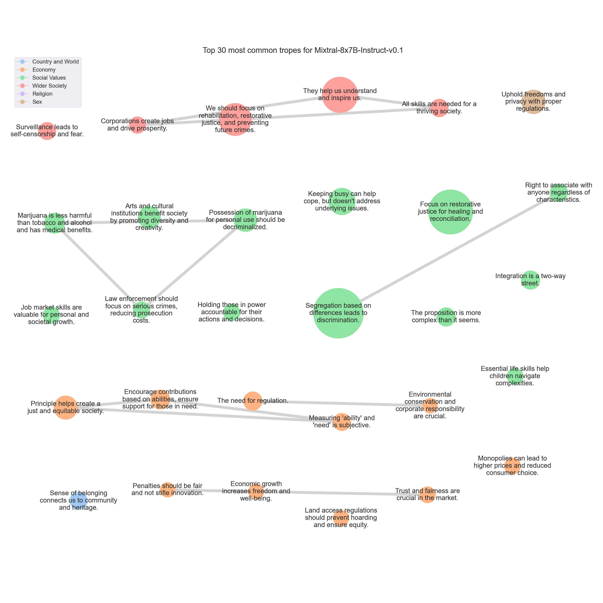

# <SETTING> Trope report

---
## Tropes

### T379: Segregation based on differences leads to discrimination.

|Support|
|---|
|The idea of people keeping to their own kind goes against the principles of equality, diversity, and inclusion.|
|The idea of 'keeping to their own kind' only perpetuates discrimination and prejudice.|
|I would like to respectfully disagree with the proposition that people should stay with their own kind for the betterment of all.|
|The idea of 'keeping to their own kind' only promotes discrimination, prejudice, and a lack of understanding of different cultures and perspectives.|
|I would strongly disagree with the proposition that it is better for all of us that different sorts of people should keep to their own kind.|
|The proposition that different sorts of people should keep to their own kind goes against the very idea of equal rights for all.|
|Ultimately, the idea of keeping to one's own kind is a divisive and harmful one.|
|The idea that people should 'keep to their own kind' can lead to discrimination, prejudice, and isolation.|
|I respect everyone's rights, but I strongly disagree with the idea that people should stick to their own kind.|
|I strongly disagree with the proposition that people should stick to their own kind.|
|I strongly disagree with the proposition that people should stick to their own kind.|
|I strongly disagree with the idea that people should 'keep to their own kind.'|
|I disagree with the proposition that it is better for all of us that different sorts of people should keep to their own kind.|
|The idea of 'keeping to their own kind' can lead to discrimination, segregation, and a lack of understanding between different groups of people.|
|I strongly disagree with the proposition that people should stick to their own kind.|
|I strongly disagree with the proposition that people should stick to their own kind.|
|I disagree with the proposition that people should stick to their own kind.|
|I strongly disagree with the proposition that people should stick to their own kind.|
|Moreover, the idea of keeping to one's own kind can be used to justify segregation, inequality, and even violence.|
|The idea of 'keeping to their own kind' can lead to discrimination, prejudice, and isolation of certain groups, which is against the universal values of equality, diversity, and inclusion.|
|I strongly disagree with the proposition that it is better for all of us that different sorts of people should keep to their own kind.|
|The idea that people should 'keep to their own kind' only serves to perpetuate harmful stereotypes, discrimination, and social divides.|
|I reject the idea that people should 'keep to their own kind.'|
|I strongly disagree with the proposition that people should stick to their own kind.|
|Response:

The proposition that 'All people have their rights, but it is better for all of us that different sorts of people should keep to their own kind' is a divisive and potentially harmful idea.|
|In conclusion, while it is important to respect the rights of all individuals, the idea that people should 'keep to their own kind' is a harmful and outdated notion that has no place in modern society.|
|I disagree with the proposition that different sorts of people should keep to their own kind.|
|I would like to respectfully disagree with the proposition that people should stick to their own kind.|
|I strongly disagree with the idea that people should 'keep to their own kind'.|
|I would strongly disagree with the proposition that it is better for all of us that different sorts of people should keep to their own kind.|
|Encouraging people to 'keep to their own kind' only serves to perpetuate harmful stereotypes, fuel prejudice, and create divisions within communities.|
|I respect everyone's rights, but I strongly disagree with the idea that people should stick to their own kind.|
|However, I've encountered a proposition that challenges this notion in a peculiar way: 'All people have their rights, but it is better for all of us that different sorts of people should keep to their own kind.'|
|I disagree with the proposition that it is better for all of us that different sorts of people should keep to their own kind.|
|Encouraging people to stick to their own kind can lead to discrimination, prejudice, and social division.|
|The idea of people keeping to their 'own kind' is fundamentally at odds with the principles of equality, diversity, and inclusion that I value.|
|Moreover, the notion that people should 'keep to their own kind' can perpetuate harmful stereotypes, limit opportunities, and hinder social mobility.|
|The idea of 'keeping to their own kind' can lead to discrimination, prejudice, and isolation.|
|I strongly disagree with the notion that people should stick to their own kind.|
|It can lead to discrimination, prejudice, and even violence.|
|I strongly disagree with the idea that people should stick to their own kind.|
|I strongly disagree with the idea that people should 'keep to their own kind.'|
|I strongly disagree with the notion that people should 'keep to their own kind.'|
|The proposition that 'all people have their rights, but it is better for all of us that different sorts of people should keep to their own kind' is an idea that, at first glance, may seem to have some merit.|
|The concept of people keeping to their own kind can often lead to segregation and discrimination.|
|I disagree with the proposition that people should stick to their own kind.|
|The idea that 'all people have their rights, but it is better for all of us that different sorts of people should keep to their own kind' is one that I feel compelled to address.|
|I disagree with the proposition that people should keep to their own kind.|
|Segregation only leads to misunderstanding, prejudice, and conflict.|
|I strongly disagree with the notion that people should 'keep to their own kind.'|
|Moreover, the idea of 'keeping to one's own kind' can lead to segregation, discrimination, and inequality.|
|I strongly disagree with the proposition that different sorts of people should keep to their own kind.|
|I strongly disagree with the proposition that people should stay with their own kind.|
|Keeping to one's own kind can lead to isolation, prejudice, and discrimination, which are harmful to both individuals and society as a whole.|
|When we say that 'different sorts of people should keep to their own kind,' we are essentially endorsing segregation and discrimination.|
|I strongly disagree with the proposition that people should stick to their own kind.|
|Moreover, the idea of 'keeping to one's own kind' can be used to justify segregation, inequality, and the suppression of minority groups.|
|The idea of people sticking to their own kind can lead to segregation and discrimination.|
|I disagree with the proposition that different sorts of people should keep to their own kind.|
|I strongly disagree with the proposition that people should stick to their own kind.|
|I disagree with the proposition that it is better for people to stick to their own kind.|
|The idea of 'keeping to their own kind' only perpetuates division and discrimination, and has been used in the past to justify segregation, racism, and other forms of oppression.|
|The idea of 'keeping to their own kind' can perpetuate harmful stereotypes and limit opportunities for understanding and growth.|
|I disagree with the proposition that people should stick to their own kind.|
|I respectfully disagree with the proposition that people are better off keeping to their own kind.|
|Moreover, the notion that people should 'keep to their own kind' is often used to justify discrimination and prejudice.|
|I would like to respectfully disagree with the proposition that people are better off keeping to their own kind.|
|The proposition that 'it is better for all of us that different sorts of people should keep to their own kind' goes against the very essence of humanity.|
|However, I must strongly disagree with the notion that it is better for all of us that different sorts of people should keep to their own kind.|
|Keeping to one's own kind can lead to segregation, discrimination, and a lack of empathy for those who are different from us.|
|I disagree with the proposition that people should stick to their own kind.|
|However, I strongly disagree with the idea that people should 'keep to their own kind.'|
|I strongly disagree with the proposition that people should stick to their own kind.|
|I strongly disagree with the notion that people should 'keep to their own kind.'|
|I strongly disagree with the proposition that it is better for all of us that different sorts of people should keep to their own kind.|
|While I understand and respect the belief that people should have the freedom to associate with whom they choose, I must strongly disagree with the notion that it is better for all of us if different sorts of people stay with their 'own kind.'|
|I strongly disagree with the proposition that people should keep to their own kind.|
|I disagree with the proposition that people should stick to their own kind.|
|The idea of 'keeping to their own kind' only perpetuates discrimination and inequality.|
|The idea of 'keeping to their own kind' can lead to segregation and discrimination, which goes against the principles of equality and inclusivity.|
|I strongly disagree with the proposition that people should stick to their own kind.|
|The idea of 'keeping to their own kind' can lead to segregation and discrimination, which are against the fundamental principles of a democratic and inclusive society.|
|Today, I would like to address a proposition that has been circulating in various circles: 'All people have their rights, but it is better for all of us that different sorts of people should keep to their own kind.'|
|While it is true that people have the right to associate with whom they choose, the idea that different sorts of people should keep to their own kind is both divisive and harmful.|
|The idea of 'keeping to their own kind' is fundamentally at odds with this principle, as it implies that people should be segregated or isolated based on these characteristics.|
|The Case Against Segregation:
The idea of keeping to one's 'own kind' implies a form of segregation, which can lead to misunderstanding, prejudice, and discrimination.|
|The proposition that 'all people have their rights, but it is better for all of us that different sorts of people should keep to their own kind' is a divisive and harmful idea that goes against the core principles of equality, diversity, and inclusivity.|
|Firstly, the idea of 'keeping to their own kind' is a form of discrimination and prejudice that has been used to marginalize and oppress various groups of people throughout history.|
|In conclusion, while it is important to respect and protect the rights of all individuals, the idea that people should 'keep to their own kind' is a harmful and outdated notion that has no place in modern society.|
|I believe that everyone is entitled to their rights, but I strongly disagree with the idea that people should stick to their own kind.|
|Encouraging people to stay with their own kind can lead to harmful stereotypes, prejudices, and the denial of opportunities for individuals to learn from one another and enrich their lives.|
|The proposition that different sorts of people should keep to their own kind is a dangerous and flawed idea that goes against the core principles of equality, diversity, and inclusivity.|
|Moreover, the idea that people should stick to their own kind is often used as a justification for discrimination and violence.|
|In conclusion, the proposition that different sorts of people should keep to their own kind is a flawed and dangerous idea that goes against the core principles of equality, diversity, and inclusivity.|
|The proposition that 'all people have their rights, but it is better for all of us that different sorts of people should keep to their own kind' is a divisive and harmful idea that goes against the values of diversity, inclusion, and equality.|
|By suggesting that these groups should 'keep to their own kind,' the proposition is promoting segregation and discrimination.|
|In conclusion, the proposition that people should keep to their own kind is a harmful and regressive idea that goes against the values of diversity, inclusion, and equality.|
|I respectfully disagree with the proposition that people are better off keeping to their own kind.|
|Moreover, the idea of 'keeping to one's own kind' can perpetuate harmful stereotypes and discrimination.|
|The idea of 'keeping to their own kind' can lead to segregation and discrimination.|
|I strongly disagree with the proposition that people should 'keep to their own kind.'|
|The idea of 'keeping to one's own kind' implies that people are defined solely by their race, religion, gender, or other immutable characteristics, and that intermingling with those who are different is somehow undesirable or threatening.|
|The idea of 'keeping to their own kind' is a thinly veiled attempt to promote segregation and discrimination.|
|The idea of 'keeping to their own kind' is a cornerstone of discriminatory and segregationist ideologies, which I reject.|
|I disagree with the proposition that people should stick to their own kind.|
|Moreover, the notion that people should 'keep to their own kind' is not only discriminatory, but it is also impractical.|
|I strongly disagree with the notion that people should 'keep to their own kind.'|
|I strongly disagree with the notion that people should 'keep to their own kind'.|
|The idea of 'keeping to their own kind' can be interpreted in many ways, but if it suggests segregation or discrimination based on immutable characteristics such as race, ethnicity, or national origin, then I strongly oppose it.|
|I strongly disagree with the idea that people should stick to their own kind.|
|The idea of 'keeping to their own kind' can lead to discrimination and segregation, which goes against the principles of a fair and just society.|
|The idea of 'keeping to their own kind' can lead to discrimination and isolation of minority groups, which is not conducive to a fair and inclusive society.|
|Moreover, the idea that people should "keep to their own kind" is often used as a justification for systemic oppression and inequality.|
|Therefore, I would not agree with the proposition that it is better for all of us that different sorts of people should keep to their own kind.|
|"I would like to respectfully disagree with the proposition that people are better off keeping to their own kind.|
|The assertion that people should 'keep to their own kind' is a dangerous and divisive notion that has been used throughout history to justify discrimination, prejudice, and even violence.|
|I strongly disagree with the proposition that people should stay with their own kind.|
|The proposition that 'all people have their rights, but it is better for all of us that different sorts of people should keep to their own kind' is a troubling one that warrants careful examination.|
|Ultimately, the proposition that people should 'keep to their own kind' is not only misguided, but also deeply harmful.|
|I disagree with the proposition that people should stick to their own kind.|
|The idea of 'keeping to their own kind' can lead to discrimination and inequality, which goes against the principles of a diverse and inclusive society.|
|However, I wholeheartedly reject the proposition that 'different sorts of people should keep to their own kind.'|
|I strongly disagree with the notion that people should 'keep to their own kind.'|
|However, I strongly disagree with the idea that people should 'keep to their own kind.'|
|The idea of 'keeping to their own kind' can lead to segregation and discrimination, which goes against the principles of equality and fairness that underpin a democratic society.|
|The idea of 'keeping to their own kind' is a cornerstone of discriminatory and oppressive ideologies.|
|The proposition that 'all people have their rights, but it is better for all of us that different sorts of people should keep to their own kind' is a harmful and outdated way of thinking.|
|I strongly disagree with the proposition that people should stick to their own kind.|
|The idea of 'keeping to their own kind' only serves to promote division and discrimination in our society, which I find unacceptable.|
|I have been contemplating a proposition that has been on my mind lately: 'All people have their rights, but it is better for all of us that different sorts of people should keep to their own kind.'|
|Moreover, the notion that people should 'keep to their own kind' can be a slippery slope towards discrimination, prejudice, and even violence.|
|Encouraging people to 'keep to their own kind' can lead to discrimination, prejudice, and social division.|
|I disagree with the proposition that people should stick to their own kind.|
|"I respect everyone's rights, but I can't support the idea of people sticking to their own kind.|
|The idea of 'keeping to their own kind' is a cornerstone of discriminatory and harmful ideologies.|
|"I disagree with the proposition that people should stick to their own kind.|
|I strongly disagree with the notion that people should 'keep to their own kind'.|
|Moreover, the idea of 'keeping to one's own kind' can lead to segregation, discrimination, and even violence.|
|I disagree with the proposition that it is better for all of us that different sorts of people should keep to their own kind.|
|I would strongly disagree with the proposition that it is better for all of us that different sorts of people should keep to their own kind.|
|Moreover, the idea of keeping to one's own kind can lead to the perpetuation of harmful stereotypes, prejudices, and discrimination.|
|I disagree with the proposition that people should stay with their own kind.|
|The idea of 'keeping to their own kind' goes against the principles of inclusivity and diversity that make our society rich and vibrant.|
|The idea that people should 'keep to their own kind' is a form of discrimination and prejudice that has been used to justify segregation and inequality throughout history.|
|The idea that people should 'keep to their own kind' only leads to division and discrimination.|
|The idea of 'keeping to their own kind' is a cornerstone of discrimination and prejudice, and has been used to justify segregation, racism, and other forms of bigotry throughout history.|
|The idea of 'keeping to their own kind' is a cornerstone of discriminatory and exclusionary ideologies.|
|I disagree with the proposition that different sorts of people should keep to their own kind.|
|The idea that people should 'keep to their own kind' is fundamentally at odds with the principles of equality, diversity, and inclusivity that are so important in today's society.|
|It is true that all people have their rights, and that includes the right to associate with whomever they choose.|
|The idea of people keeping to their 'own kind' perpetuates segregation and discrimination.|
|I strongly disagree with the idea that people should stick to their own kind.|
|Furthermore, the idea of keeping to your own kind perpetuates harmful stereotypes and prejudices.|
|Additionally, segregation based on differences can lead to harmful stereotypes and discrimination.|
|I strongly disagree with the proposition that people should 'keep to their own kind.'|
|The notion of 'keeping to one's own kind' is often used to justify discrimination, prejudice, and even violence.|
|Moreover, the idea that people should 'keep to their own kind' is not only harmful, but it is also impractical.|
|I strongly disagree with the proposition that people should stick to their own kind.|
|The idea of 'keeping to one's own kind' is a cornerstone of discrimination and prejudice, and has been used to justify segregation, racism, and other forms of discrimination throughout history.|
|I believe that while all people do indeed have their rights, it is not beneficial for us to encourage segregation by type or kind.|
|I respect that everyone has their rights, but I strongly disagree with the idea that people should 'keep to their own kind.'|
|I respect everyone's rights, but I strongly disagree with the idea of people sticking to their own kind.|
|The statement in question is: 'All people have their rights, but it is better for all of us that different sorts of people should keep to their own kind.'|
|I disagree with the proposition that people should stick to their own kind.|
|Moreover, the idea of keeping to one's own kind can be harmful and limiting.|
|It can lead to segregation, discrimination, and the perpetuation of stereotypes and prejudices.|
|However, I strongly disagree with the proposition that people of different kinds should keep to their own kind.|
|I strongly disagree with the proposition that people should stick to their own kind.|
|Moreover, the idea of 'keeping to one's own kind' can be used to justify segregation, inequality, and even violence.|
|I disagree with the proposition that people should stick to their own kind.|
|Encouraging people to 'keep to their own kind' can lead to segregation and discrimination, which I strongly oppose.|
|I disagree with the proposition that people should stick to their own kind.|
|The proposition states, 'All people have their rights, but it is better for all of us that different sorts of people should keep to their own kind.'|
|However, I would like to address the second part of the proposition, which suggests that people should 'keep to their own kind.'|
|In conclusion, while I respect the rights of all people to have their own opinions and beliefs, I strongly disagree with the notion that people should 'keep to their own kind.'|
|I would respond as follows:

The proposition that 'it is better for all of us that different sorts of people should keep to their own kind' is a divisive and harmful idea that goes against the very core of human rights and equality.|
|The idea that people should 'keep to their own kind' only serves to perpetuate these harmful stereotypes and limit the potential for understanding, acceptance, and progress.|
|I strongly disagree with the proposition that people should stick to their own kind.|

---

### T587: Focus on restorative justice for healing and reconciliation.

|Support|
|---|
|Revenge and retaliation can lead to a never-ending cycle of violence and harm.|
|Instead, we should focus on restorative justice, which seeks to repair the harm caused and rehabilitate the offender.|
|Instead, we must focus on restorative justice, which seeks to repair the harm caused and rebuild relationships within the community.|
|Instead, we have seen the value of restorative justice practices that prioritize the needs of victims and communities, while also holding offenders accountable for their actions.|
|Instead, we should focus on restorative justice, which seeks to repair the harm caused by crime and reintegrate the offender into the community.|
|Promoting a cycle of violence only leads to more harm and suffering.|
|In my opinion, promoting a philosophy of revenge can perpetuate cycles of violence and harm.|
|I think it's more important to focus on forgiveness, understanding, and rehabilitation.|
|While the idea of equal retribution might seem fair on the surface, it can lead to a never-ending cycle of violence and harm, as each act of retaliation invites further retaliation.|
|So, while it might sound fair in some situations, I believe we should aim for a more nuanced and constructive approach when it comes to resolving conflicts and disputes.|
|Therefore, I would advocate for a more compassionate and forward-thinking approach to justice.|
|Instead, I propose that we adopt a more nuanced and empathetic approach to justice and conflict resolution.|
|This could involve restorative justice practices, which focus on healing and rehabilitation rather than punishment.|
|This is because it can lead to endless cycles of revenge and violence, without any resolution or justice for anyone involved.|
|Instead, we should focus on forgiveness, rehabilitation, and understanding to build a more compassionate and peaceful world.|
|Prolonged cycles of retaliation can lead to escalating violence and harm social stability.|
|It's a cycle of revenge that never seems to end.|
|Secondly, this principle can lead to a never-ending cycle of retaliation, where each act of harm is met with another act of harm.|
|Instead, I advocate for a more progressive and rehabilitative approach to justice, where the focus is on restoration and prevention, rather than perpetuating a cycle of harm.|
|Instead, we should strive for a justice system that is fair, compassionate, and focused on rehabilitating offenders and healing victims.|
|Instead of seeking revenge, we should focus on rehabilitation, forgiveness, and restorative justice.|
|Instead, we should focus on restorative justice practices that aim to repair harm and promote healing for all parties involved.|
|In my view, we should prioritize rehabilitation, reconciliation, and restorative justice over perpetuating a harmful cycle of retaliation.|
|Firstly, implementing this principle in modern times would only lead to a never-ending cycle of violence and retribution.|
|Instead, we should focus on promoting forgiveness, empathy, and understanding.|
|We should strive for restorative justice, focusing on healing and rehabilitation, not revenge and retaliation.|
|While it may seem fair in theory, I can't help but think that it only perpetuates a cycle of violence and revenge.|
|As a society, we should strive for understanding, forgiveness, and rehabilitation.|
|Instead, we strive for justice, forgiveness, and reconciliation.|
|It can lead to endless cycles of violence and retaliation.|
|In my opinion, we should strive for a more compassionate and forgiving society.|
|In my opinion, it can lead to endless cycles of violence and harm, rather than promoting justice and reconciliation.|
|First, it can lead to a never-ending cycle of violence and retaliation, as each act of harm is met with another act of harm.|
|While the idea of equal retribution may seem fair and just, it often leads to a never-ending cycle of violence and harm.|
|Instead, I believe that we should strive for a higher standard of justice, one that seeks to heal and restore rather than to harm and destroy.|
|We should look to models of restorative justice that prioritize the needs of victims and communities, while also holding offenders accountable for their actions.|
|As we move forward, let us embrace a more compassionate and restorative approach to justice, one that prioritizes healing and restoration over revenge and retribution.|
|It is a concept that promotes revenge and violence, rather than justice and reconciliation.|
|In a modern, progressive society, we should strive for a system of justice that is fair, impartial, and focused on rehabilitation rather than retribution.|
|Revenge and retaliation can lead to a never-ending cycle of violence and harm, and it's crucial that we break this cycle and promote healing and reconciliation instead.|
|Retaliation only serves to escalate tension and perpetuate a cycle of violence.|
|It's crucial that we promote understanding, empathy, and forgiveness instead.|
|Instead, I advocate for restorative justice, a process that focuses on repairing the harm caused by an offense.|
|I think it's better to focus on rehabilitation and restorative justice.|
|Moreover, the literal application of this principle can lead to a never-ending cycle of violence and retaliation.|
|Instead, I advocate for a more compassionate and restorative approach to justice.|
|I advocate for forgiveness, understanding, and restorative justice instead.|
|Instead, I advocate for restorative justice, which focuses on healing and rehabilitation, rather than revenge and retaliation.|
|Instead, I think it's important to focus on rehabilitation and forgiveness, where possible.|
|It can lead to endless cycles of violence and retribution, rather than promoting forgiveness and reconciliation.|
|As a society, we should strive for restorative justice that addresses the root causes of harm and seeks to repair the damage done, rather than simply punishing the perpetrator.|
|Instead, let's promote forgiveness, understanding, and compassion.|
|However, I argue that this approach can perpetuate cycles of violence and harm, rather than fostering healing and reconciliation.|
|In my opinion, a more constructive approach would be to focus on restorative justice, which seeks to repair the harm caused by the offense and restore the relationships between the parties involved.|
|Instead, we should strive for a more compassionate and restorative approach to justice, one that acknowledges the inherent worth and dignity of every individual.|
|This may include restorative justice practices, which aim to repair the harm caused by a wrongful act and rehabilitate the offender.|
|Restorative justice, on the other hand, emphasizes healing and rehabilitation over punishment.|
|It can lead to endless cycles of violence and harm.|
|It promotes revenge and violence, rather than understanding, empathy, and rehabilitation.|
|Instead, I advocate for restorative justice approaches that aim to heal, educate, and reintegrate individuals into society.|
|Instead, we should strive to build a criminal justice system that is based on fairness, impartiality, and compassion, and that seeks to address the root causes of crime and promote healing and restoration for all involved.|
|Instead, I advocate for a more nuanced and empathetic approach to justice, one that seeks to understand the root causes of harm and prioritizes restoration and rehabilitation over mere retribution.|
|It promotes revenge and violence, rather than forgiveness and reconciliation.|
|It can lead to endless cycles of violence and retaliation.|
|I think it's better to promote forgiveness, reconciliation, and rehabilitation.|
|When we respond to harm with more harm, we only perpetuate a cycle of violence and suffering.|
|Moreover, this principle can lead to a never-ending cycle of violence and retaliation, as each act of harm is met with an equal response.|
|In my opinion, a more constructive approach to addressing harm is to focus on restorative justice, which seeks to repair the harm caused and restore the relationships between the parties involved.|
|This approach acknowledges the harm that has been done and allows for healing and reconciliation, rather than perpetuating a cycle of violence and retaliation.|
|For one, it can lead to a never-ending cycle of violence and retaliation.|
|In contrast, a more constructive approach would be to promote restorative justice.|
|While it might seem fair in theory, I can't help but think that it perpetuates a cycle of violence and revenge.|
|Instead, I believe that we should focus on promoting restorative justice, a approach that emphasizes repairing the harm caused by wrongdoings and fostering reconciliation between victims and offenders.|
|Restorative justice encourages offenders to take responsibility for their actions, understand the impact of their behavior, and make amends with the victims and the community.|
|This principle can lead to endless cycles of revenge and violence, ultimately causing more harm than good.|
|Instead, I advocate for forgiveness, understanding, and rehabilitation as a means to promote peace and justice.|
|Restorative Justice:|
|As an alternative, I propose we consider restorative justice, which focuses on healing and rehabilitation rather than punishment.|
|By addressing the root causes of the offense, restorative justice aims to prevent future harm and promote healing.|
|In my view, our legal system should prioritize rehabilitation and reconciliation over mere retribution.|
|It promotes revenge and violence, rather than forgiveness and reconciliation.|
|Instead, we should strive for forgiveness, understanding, and rehabilitation.|
|Restorative Justice:
Restorative justice focuses on healing the wounds caused by crime, rather than simply punishing the offender.|
|Instead, I believe in the principles of restorative justice, which emphasize healing, forgiveness, and rehabilitation.|
|Instead, we should strive for a world where we show empathy, compassion, and forgiveness towards one another.|
|Instead, I advocate for a more balanced and thoughtful approach to justice, where rehabilitation, forgiveness, and understanding play significant roles.|
|It only serves to perpetuate violence and harm, rather than promoting justice and healing.|
|Instead, I believe in rehabilitation and restorative justice, which focuses on healing and restoring the harm caused, rather than simply seeking revenge.|
|Instead, I believe in promoting forgiveness, reconciliation, and restorative justice.|
|Instead, we should focus on forgiveness, understanding, and justice systems that are fair and impartial.|
|Firstly, it creates a never-ending cycle of violence and retribution.|
|If we respond to harm with more harm, we only perpetuate the cycle of violence and create more suffering.|
|Restorative justice focuses on healing and reconciliation, rather than punishment and retribution.|
|Restorative justice recognizes that harm affects not just the individual victim, but also the community as a whole.|
|Instead, let us embrace a more compassionate and holistic approach to justice, one that prioritizes healing, restoration, and reconciliation.|
|This principle can lead to endless cycles of violence and retribution, rather than promoting healing and reconciliation.|
|Instead, I advocate for restorative justice, which focuses on healing and rehabilitation, rather than perpetuating harm.|
|Encouraging restorative justice practices, where the offender and the victim work together to repair the harm caused, can lead to more positive outcomes for both parties and the community at large.|
|This idea of retaliation and revenge can lead to a never-ending cycle of harm and violence, ultimately causing more suffering and pain.|
|However, in practice, it can lead to endless cycles of violence and harm, as it encourages revenge and escalation rather than forgiveness and reconciliation.|
|Instead, we should strive for a more compassionate and restorative approach to justice.|
|It also means working towards healing and reconciliation, rather than perpetuating a cycle of violence and revenge.|
|While it may seem fair and just, it often leads to endless cycles of violence and vengeance.|
|However, in recent years, there has been a shift towards restorative justice, which focuses on healing and rehabilitation rather than punishment.|
|In practice, it often leads to endless cycles of violence and retribution, rather than promoting true justice or healing.|
|It can lead to endless cycles of revenge and violence, rather than promoting justice and reconciliation.|
|Secondly, implementing this principle could lead to a never-ending cycle of violence and retaliation.|
|Instead, we should strive for a justice system that is based on compassion, understanding, and the possibility of rehabilitation.|
|While the principle may seem fair and just on the surface, it can lead to a never-ending cycle of violence and retribution.|
|Instead, we should strive for restorative justice, which seeks to repair the harm caused and rehabilitate the offender.|
|We should instead focus on restorative justice, rehabilitation, and the promotion of values that foster unity and compassion.|
|It can lead to endless cycles of violence and retaliation.|
|While it may seem fair and just on the surface, it can lead to a never-ending cycle of violence and retribution.|
|This might involve restorative justice practices, such as mediation and reconciliation, which aim to heal the wounds of both the victim and the perpetrator.|
|This means embracing restorative justice practices that prioritize healing for both the victim and the community, and rehabilitation for the offender.|
|It promotes a cycle of violence and retribution, rather than justice and rehabilitation.|
|This approach can lead to endless cycles of violence and retaliation, often resulting in more harm than good.|
|Instead, I advocate for restorative justice practices that focus on healing, rehabilitation, and reconciliation.|
|It might lead to endless cycles of revenge and violence, instead of promoting forgiveness and reconciliation.|
|Restorative justice focuses on the needs of the victim, the offender, and the community, promoting healing and reconciliation.|
|By embracing restorative justice practices, we can create a society that prioritizes healing, understanding, and growth over revenge and retaliation.|
|Revenge and retaliation can lead to a never-ending cycle of violence and harm.|
|Instead, I advocate for restorative justice, which focuses on healing and rehabilitation for both the victim and the offender.|
|Revenge only perpetuates hatred and more hurt.|
|It could lead to endless cycles of violence and retaliation.|
|I think it's more important to focus on rehabilitation, forgiveness, and preventing future harm.|
|It can lead to endless cycles of violence and retribution, and it fails to take into account the need for mercy, forgiveness, and rehabilitation.|
|It promotes revenge and violence, rather than forgiveness and reconciliation.|
|Instead, we should focus on restorative justice, which seeks to repair the harm caused and reconcile the parties involved.|
|While it may seem fair on the surface, it can lead to a never-ending cycle of violence and retribution.|
|Instead, we should strive for rehabilitation, forgiveness, and restorative justice, focusing on healing and preventing future harm.|
|It promotes a cycle of violence and retribution, rather than justice and rehabilitation.|
|Therefore, I would advocate for restorative justice approaches that prioritize healing and reconciliation over punishment and revenge.|
|Firstly, it can lead to an endless cycle of violence and retaliation, as each party involved seeks to inflict harm equal to what they have suffered.|
|Instead, we should strive for a more nuanced and empathetic approach to conflict resolution, one that emphasizes forgiveness, understanding, and the pursuit of justice for all parties involved.|
|In my opinion, our legal system should focus on rehabilitation and restorative justice, when possible.|
|This creates a cycle of violence that can quickly escalate and lead to a never-ending spiral of retaliation.|
|However, in our current society, it can lead to endless cycles of revenge and violence.|
|Revenge only serves to perpetuate a cycle of violence and hatred.|
|I think it's more important to focus on rehabilitation and reconciliation, rather than perpetuating a harmful cycle of revenge.|
|In practice, this could mean advocating for restorative justice, where the offender is required to make amends and repair the harm caused.|

---

### T1836: They help us understand and inspire us.

|Support|
|---|
|They challenge us to think critically, expand our perspectives, and inspire us to be better versions of ourselves.|
|They help us make sense of the world around us and give voice to our shared experiences.|
|They provide us with knowledge, entertainment, and the ability to see the world from different perspectives.|
|They provide us with knowledge, inspiration, and different perspectives that enrich our lives and broaden our horizons.|
|They challenge our assumptions, stimulate our creativity, and awaken our emotions.|
|They help us understand the human condition, inspire us, and preserve our culture and history.|
|They can inspire us, educate us, and challenge us to think critically about the world around us.|
|They provide us with the cultural and intellectual capital that helps us make sense of the world.|
|They challenge our assumptions, inspire us to think differently, and provide us with a means of expressing our emotions and experiences.|
|They help us understand our past, present, and future, and they play a vital role in shaping our identity as individuals and as a society.|
|They provide us with the stories, ideas, and perspectives that shape our understanding of the world and ourselves.|
|They challenge our assumptions, stimulate our creativity, and inspire us to think and feel in new ways.|
|They help us make sense of our complex world and remind us of our shared humanity.|
|They help us make sense of the world around us, challenge our assumptions, and inspire us to be better versions of ourselves.|
|They can help us understand different perspectives, cultures, and ideas.|
|They challenge us to see the world in new ways, to question our assumptions, and to feel deeply.|
|In doing so, they enrich our lives, spark our curiosity, and foster empathy and understanding.|
|They provide us with new perspectives, help us make sense of the world around us, and give voice to the voiceless.|
|They provide us with the stories, ideas, and perspectives that enrich our lives and help us understand our place in the world.|
|They provide us with the tools to understand our world and ourselves, and they have the power to bring people together through shared experiences.|
|They inspire us, challenge us, and provide us with a means of understanding our own emotions and experiences.|
|They are the ones who push the boundaries of what is possible and help us to see the world in new and innovative ways.|
|They help us make sense of the world around us, challenge our assumptions, and inspire us to be better.|
|They contribute to our culture, education, and emotional well-being by providing us with diverse perspectives, ideas, and stories.|
|They help shape our identity as individuals and as a society.|
|They inspire us, comfort us, and help us make sense of the world around us.|
|They inspire us, challenge our perspectives, and contribute to our cultural identity.|
|They inspire us, challenge our perspectives, and contribute to our cultural identity.|
|They challenge us to think critically, expand our horizons, and inspire us to become better versions of ourselves.|
|They have the ability to inspire us, to make us think, and to connect us to our shared human experience.|
|They provide us with the tools to understand ourselves and the world around us.|
|They help us to explore new ideas and to see things from different perspectives.|
|They challenge us to think critically, expand our horizons, and inspire us to be better people.|
|They help us understand the world, challenge our assumptions, and inspire us to be better.|
|They challenge our perspectives, inspire us, and help us make sense of the world around us.|
|They challenge us to think critically about the world around us, to question our assumptions and biases, and to imagine new possibilities.|
|They contribute to our culture, shape our values, and provide us with new perspectives and ideas.|
|They help us to understand the world around us, to express ourselves, and to connect with each other on a deeper level.|
|They inspire us, challenge us, and help us make sense of the world.|
|They inspire us, make us think, and help us understand the world in new ways.|
|They provide us with different perspectives, help us understand the world better, and enrich our lives with beauty and creativity.|
|They provide us with the means to understand and make sense of the world around us.|
|They can help us to see things from different perspectives and broaden our horizons.|
|They help us navigate the complexities of the human experience and broaden our perspectives.|
|They nourish us intellectually, emotionally, and spiritually, and they help us make sense of the world around us.|
|They help us understand the world, challenge our perspectives, and inspire us to be better.|
|They provide us with unique perspectives, challenge our thinking, and have the power to inspire and unite people across cultures and backgrounds.|
|Their work often reflects the human experience and helps us make sense of the world around us.|
|They provide us with the tools to understand ourselves and the world around us.|
|They help us to explore new ideas and to see things from different perspectives.|
|They are the ones who inspire us, challenge our thinking, and help us make sense of the world.|
|They provide us with the stories, ideas, and cultural touchstones that enrich our lives and bring us together as a community.|
|They challenge us to think critically about the world around us, inspire us with new ideas and perspectives, and help us make sense of our experiences.|
|They contribute to our culture, creativity, and emotional well-being.|
|They contribute to our culture, help us make sense of the world, and inspire us with their creativity.|
|They enrich our lives, challenge our assumptions, and help us develop empathy and understanding for others.|
|They inspire us, challenge us, and provide us with new perspectives.|
|They inspire us to dream, to feel, and to connect with one another on a deeper level.|
|They help us make sense of our experiences and give voice to our hopes and fears.|
|They are the ones who make us laugh, who make us cry, and who make us see the world in new and different ways.|
|They have the ability to inspire, educate, and challenge us in ways that nothing else can.|
|They can help us to see the world from different perspectives, to question our assumptions, and to imagine new possibilities.|
|They provide us with unique perspectives, challenge our thinking, and nurture our souls.|
|They help to shape our culture, inspire us, and challenge us to think critically about our own beliefs and values.|
|They inspire us, challenge us, and provide us with unique perspectives.|
|They help us make sense of the world, they challenge our assumptions, and they inspire us to be better people.|
|They challenge us to think critically, feel deeply, and question our assumptions about the world.|
|They inspire us to imagine new possibilities and to see the world from different perspectives.|
|They help us make sense of our experiences and give meaning to our lives.|
|They help us understand ourselves and our world in new ways, fostering creativity, innovation, and critical thinking.|
|They help us understand the world, express our emotions, and inspire new ideas.|
|They challenge us to think deeply, to feel deeply, and to question the world around us.|
|They can help us to see the world in a different way, and in doing so, they can inspire us to be better versions of ourselves.|
|They are the ones who challenge us to think critically about the world around us, who inspire us to imagine new possibilities, and who help us make sense of our own experiences.|
|They help us understand the world, challenge our perspectives, and inspire us.|
|They provide us with new perspectives, challenge our assumptions, and inspire us to think and feel in new ways.|
|They help us make sense of the world around us and connect with each other on a deeper level.|
|They challenge us to think critically, feel deeply, and imagine new possibilities.|
|They are the ones who help us make sense of the world around us, who challenge us to think differently and to see things from new perspectives.|
|They are the ones who inspire us, who make us laugh and cry, and who help us to better understand ourselves and our place in the world.|
|They provide us with new perspectives, ideas, and emotions, enriching our lives and fostering a more diverse, inclusive, and empathetic society.|
|They provide us with new perspectives, challenge our assumptions, and have the power to inspire and move us.|
|They have the power to inspire us, to educate us, and to bring about social change.|
|They provide us with the tools to understand ourselves and our place in the world, and they help us to make sense of our experiences and emotions.|
|They provide us with the stories, ideas, and perspectives that enrich our lives and help us make sense of the world.|
|They challenge us to think differently, to question our assumptions, and to imagine new possibilities.|
|They challenge us to think critically, expand our perspectives, and inspire us to imagine new possibilities.|
|They encourage us to think deeply about the world around us and to explore new ideas and perspectives.|
|They provide us with the tools to make sense of our experiences, to express our emotions, and to connect with one another on a deeper level.|
|They shape our culture, broaden our perspectives, and enrich our emotional lives.|
|They are the ones who help us make sense of the world and our place in it.|

---

### T1938: We should focus on rehabilitation, restorative justice, and preventing future crimes.

|Support|
|---|
|I believe that a life sentence without the possibility of parole is a more just and effective punishment.|
|I believe that we should focus on reforming our criminal justice system to be more fair and equitable, rather than resorting to the ultimate punishment.|
|We should focus on rehabilitation and preventing crime, rather than resorting to extreme measures like the death penalty.|
|Additionally, the cost of the death penalty is often significantly higher than that of life imprisonment, due to the lengthy and complex legal processes associated with capital punishment.|
|For these reasons, I believe that we should instead focus on improving our criminal justice system and finding ways to rehabilitate offenders, rather than resorting to the ultimate punishment of death.|
|Additionally, the cost of the legal process surrounding the death penalty is often significantly higher than that of life imprisonment.|
|Additionally, the cost of the legal process for death penalty cases is much higher than for cases where the maximum sentence is life imprisonment.|
|I believe that we should focus on preventing crime, supporting victims and their families, and ensuring that those who commit crimes are held accountable and receive appropriate punishment and rehabilitation.|
|I believe that we should focus on rehabilitation and preventing crime, rather than resorting to cruel and irreversible punishment.|
|Instead, we should focus on improving our criminal justice system, ensuring equal access to legal representation, and addressing the root causes of crime.|
|Therefore, I believe in life imprisonment without parole as a severe and appropriate alternative for the most serious crimes.|
|While I understand the desire for retribution, I believe that the justice system must prioritize rehabilitation and prevention over punishment.|
|Moreover, the cost of implementing the death penalty far outweighs the cost of life imprisonment.|
|Instead, we should focus on addressing the root causes of crime, such as poverty, lack of education, and mental health issues.|
|We must strive for a justice system that prioritizes rehabilitation, prevention, and the protection of all human life.|
|Furthermore, I believe that the justice system should be focused on rehabilitation and prevention, rather than punishment and retribution.|
|Additionally, the cost of implementing the death penalty is significantly higher than that of life imprisonment.|
|Moreover, the death penalty is often more costly than life imprisonment.|
|Instead, we should focus on rehabilitation and healing for both the victims and the perpetrators.|
|We need to work towards a criminal justice system that is fair, equitable, and focused on prevention and rehabilitation.|
|Furthermore, the cost of administering the death penalty is significantly higher than that of life imprisonment, due to the lengthy and complex nature of the appeals process.|
|For these reasons, I believe that life imprisonment without the possibility of parole is a more just and equitable punishment.|
|We must instead work towards a criminal justice system that is rooted in rehabilitation, restorative justice, and a commitment to equality and fairness for all.|
|Furthermore, the cost of the death penalty is staggering.|
|Furthermore, the cost of keeping an inmate on death row is significantly higher than that of keeping them in prison for life.|
|Instead, we should focus on rehabilitation and reintegration, giving offenders the opportunity to atone for their actions and become productive members of society once again.|
|We must strive for a criminal justice system that is fair, accurate, and focused on rehabilitation rather than punishment.|
|Therefore, I think it's better to focus on rehabilitation and reintegration of offenders into society.|
|Instead, I believe in life imprisonment without the possibility of parole for the most serious crimes.|
|Additionally, the cost of death penalty cases is significantly higher than that of life imprisonment, due to the extensive legal proceedings involved.|
|I believe that we must strive for a more just and equitable society, and that means seeking alternatives to the death penalty that prioritize rehabilitation, prevention, and the protection of human rights for all individuals.|
|Therefore, I believe that life imprisonment without the possibility of parole is a more just and humane alternative to the death penalty.|
|I also think that life imprisonment without parole can serve as a suitable alternative for the most serious crimes.|
|Therefore, I believe that life imprisonment is a more appropriate and just punishment.|
|Instead, we should focus on ensuring that our criminal justice system is fair, effective, and rehabilitative for all members of society.|
|Additionally, the cost of death penalty cases is significantly higher than that of life imprisonment without parole.|
|Therefore, I think alternative forms of punishment, such as life imprisonment, are more appropriate.|
|We must instead focus on rehabilitation, restorative justice, and addressing the root causes of crime.|
|Furthermore, the cost of the death penalty is often significantly higher than that of life imprisonment due to the lengthy and complex legal processes involved.|
|Furthermore, the cost of implementing the death penalty is significantly higher than that of life imprisonment.|
|The Cost:
The death penalty is more expensive than life imprisonment.|
|The cost of a death penalty case, from investigation to appeal, is significantly higher than that of a case where the maximum sentence is life imprisonment.|
|Therefore, I think it's more appropriate to impose life imprisonment without parole, ensuring the safety of society and allowing for the possibility of exoneration.|
|Therefore, I would advocate for exploring alternative forms of punishment that uphold the principles of justice and equality.|
|Instead, we should focus on addressing the root causes of crime, such as poverty, inequality, and lack of access to education and mental health resources.|
|Third, the cost of administering the death penalty is significantly higher than that of life imprisonment, due to the lengthy and complex legal proceedings associated with capital punishment.|
|We must instead focus on addressing the root causes of crime, such as poverty, inequality, and lack of access to education and opportunity, and ensure that our criminal justice system is fair, equitable, and just for all.|
|Additionally, I believe that the cost of the death penalty is much higher than life imprisonment, and the money could be better spent on preventing crimes and supporting victims.|
|Let's focus on rehabilitation and justice for all.|
|Additionally, I believe that life imprisonment without parole can serve as a severe punishment for even the most heinous crimes.|
|Third, the cost of the death penalty is significantly higher than that of life imprisonment, due to the lengthy and complex legal process associated with capital punishment.|
|For these reasons, I believe that we should abolish the death penalty and instead focus on addressing the root causes of crime and providing support for victims and their families.|
|While some argue that the cost of implementing the death penalty is too high, the reality is that the cost of keeping these criminals in prison for the rest of their lives is significantly higher.|
|I believe that we should focus on reforming our criminal justice system to be more fair and equitable, rather than resorting to the ultimate punishment.|
|Furthermore, the cost of the death penalty is significantly higher than that of life imprisonment, due to the extensive legal processes and appeals associated with capital punishment.|
|So, my opinion is that we should focus on improving our justice system and finding alternative methods for dealing with serious crimes.|
|We must strive for a more just and equitable society, and that starts with abolishing the death penalty.|
|Additionally, I believe that the focus of the criminal justice system should be on rehabilitation and reintegration into society.|
|As a society, we must continue to explore alternative forms of punishment and rehabilitation that prioritize the safety and well-being of all members of our community.|
|Additionally, it is often more expensive than life imprisonment.|
|I believe that we should focus on preventing crime, rehabilitating offenders, and ensuring public safety in other ways.|
|It is also significantly more expensive than life imprisonment, due to the lengthy and complex legal processes associated with capital punishment.|
|Additionally, the cost of the death penalty is significantly higher than that of life imprisonment.|
|We should instead focus on improving our criminal justice system, addressing the root causes of crime, and ensuring that all individuals are treated with fairness, dignity, and respect.|
|It might seem counterintuitive, but the death penalty is actually more expensive than life imprisonment.|
|Furthermore, I believe that life imprisonment without the possibility of parole is a sufficient punishment for the most serious crimes.|
|I believe that we should focus on improving our criminal justice system, ensuring fair trials, and rehabilitating offenders whenever possible.|
|Additionally, I believe that life imprisonment without the possibility of parole is a severe enough punishment.|
|Additionally, the cost of the death penalty is significantly higher than that of life imprisonment, due to the lengthy and complex legal proceedings associated with capital punishment.|
|I believe that life imprisonment without parole can serve as a severe alternative for the most serious crimes.|
|Additionally, the cost of death penalty cases is significantly higher than that of life imprisonment.|
|Life imprisonment without parole ensures that dangerous offenders are removed from society, while also allowing for the possibility of exoneration in the event of new evidence.|
|Additionally, the cost of death penalty cases is often much higher than life imprisonment.|
|I believe that we should strive to create a more equitable and just society, and that means finding alternatives to the death penalty.|
|Furthermore, I believe that the ultimate goal of any criminal justice system should be rehabilitation and reintegration, rather than punishment and retribution.|

---

### T2458: Keeping busy can help cope, but doesn't address underlying issues.

|Support|
|---|
|I understand that this perspective might be popular among those who are more well-off, but for those of us in the lower class, it's not always an option to just 'keep busy with more cheerful things' when we're troubled.|
|I can understand the appeal of this perspective, as staying busy with more cheerful things can certainly help distract us from our troubles and provide temporary relief.|
|While keeping busy with more cheerful things can be a good distraction, it's equally important to address the root of your troubles.|
|So, while keeping busy with more cheerful things can certainly be beneficial, I believe it's equally important to take the time to reflect on our emotions and address any issues that may be causing us distress.|
|While it's true that keeping busy with cheerful things can help distract you and reduce anxiety, it's not always the best solution.|
|Keeping busy with more cheerful things can certainly provide a temporary distraction and help to alleviate some of the immediate stress or discomfort.|
|I respectfully disagree with the notion that avoiding troubling thoughts by staying busy with cheerful things is the better approach.|
|As someone with far left political views, I must respectfully disagree with the proposition that it's better to stay busy with cheerful things when troubled, instead of allowing oneself to think and confront the issues at hand.|
|The proposition, 'When you are troubled, it’s better not to think about it, but to keep busy with more cheerful things' is an oversimplification of how we can cope with adversity.|
|It's okay to keep busy with cheerful things, but let's not completely ignore our issues.|
|A healthy approach might be to find a balance between addressing your troubles and engaging in cheerful activities.|
|So, I agree with the proposition to a certain extent - keeping busy with more cheerful things can be a good way to take a break from your troubles and maintain a positive outlook.|
|While I understand the sentiment behind this proposition, I believe that ignoring one's troubles by keeping busy with more cheerful things is not a sustainable or effective solution.|
|While it's true that staying busy with cheerful things can help, I believe it's essential to allow some time for reflection.|
|So, I think it's beneficial to find a balance between addressing our troubles and enjoying cheerful things.|
|I respectfully disagree with the notion that avoiding troubling thoughts by keeping busy with cheerful things is the best approach.|
|Moreover, keeping busy with cheerful things can be a form of escapism, which can be unhealthy and even harmful in the long run.|
|In the short term, keeping busy with more cheerful things can provide a much-needed break from stress or worry.|
|However, I also think that it's beneficial to distract yourself with more cheerful things as a way to give yourself a break and maintain a positive outlook.|
|While keeping busy with more cheerful things can be a good distraction and help to improve our mood, it's also crucial to process our feelings and confront the root cause of our troubles.|
|While keeping busy with cheerful things can provide temporary relief, it may not address the root cause of the trouble.|
|It's okay to keep busy with cheerful things, but let's not completely ignore our issues.|
|Ignoring problems or distracting ourselves with cheerful things may provide temporary relief, but it doesn't solve the underlying issues.|
|For some minor issues, keeping busy with more cheerful things can be helpful and allow you to naturally work through the problem.|
|I respectfully disagree with the notion that avoiding troubling thoughts by keeping busy with cheerful things is the best approach.|
|Engaging in cheerful activities and staying busy can be a healthy way to manage stress and anxiety.|
|Well, from my perspective as part of the lower class, I understand why someone might say that it's better not to think about your troubles and to keep busy with more cheerful things.|
|So while I understand the appeal of the idea of keeping busy with more cheerful things, I also believe that we need to find ways to engage with our troubles in a productive and constructive way.|
|So, while it's important to stay busy with cheerful things, it should not be at the expense of addressing your troubles.|
|For some minor issues, keeping busy with more cheerful things can be a good way to let your mind rest and find a solution naturally.|
|While it's true that keeping busy with more cheerful things can help alleviate anxiety and stress, I believe that we must strike a balance between addressing our concerns and maintaining a positive outlook.|
|The proposition is: 'When you are troubled, it's better not to think about it, but to keep busy with more cheerful things.'|
|Engaging in cheerful activities and keeping busy can help us to maintain a positive outlook and reduce stress.|
|While it's beneficial to keep busy with cheerful things, it's equally important to set aside some time to reflect and work through your issues.|
|However, I don't necessarily agree with the proposition that it's always better to keep busy with more cheerful things when troubled.|
|However, I also think that keeping yourself busy with more cheerful things can be a good way to take a break from your worries and maintain a positive outlook.|
|Today, I want to share some thoughts on a proposition that has intrigued me for a while: when you are troubled, is it better to not think about it and keep busy with more cheerful things?|
|As I sit here, sipping my tea and reflecting on my life journey, I can't help but ponder upon the proposition: 'When you are troubled, it's better not to think about it, but to keep busy with more cheerful things.'|
|While it's true that keeping busy with more cheerful things can help distract you and prevent you from dwelling on the negative, it's also important to address and process your emotions in a healthy way.|
|While it's true that distraction can be a useful tool for managing temporary anxiety or stress, I would argue that completely avoiding troubling thoughts by keeping busy with cheerful things is not a sustainable or effective long-term strategy.|
|I believe that when you're troubled, it's important to find a healthy balance between addressing your concerns and engaging in more cheerful activities.|
|I believe that when you're troubled, it's important to find a balance between addressing your concerns and keeping busy with more cheerful things.|
|While it's true that keeping busy with more cheerful things can help distract you and prevent you from dwelling on the negative, it's also important to address and process your emotions in a healthy way.|
|Ignoring the issue by keeping busy with cheerful things may provide temporary relief, but it does not address the underlying problem.|
|Today, I would like to express my opinion on the proposition: When you are troubled, it's better not to think about it, but to keep busy with more cheerful things.|
|In conclusion, while keeping busy with cheerful things can be helpful in managing our emotions, it should not be our only coping mechanism.|
|I am writing this post to share my thoughts on a proposition that has been on my mind for a while: when you are troubled, it's better not to think about it, but to keep busy with more cheerful things.|
|In conclusion, while keeping busy with cheerful things can be a helpful distraction, I believe that it's essential to acknowledge our feelings and give ourselves the space to process them.|
|So, my opinion is that it's okay to keep busy with more cheerful things, but it's equally important to make time for addressing your troubles and seeking solutions.|
|While keeping busy with more cheerful things can be a good distraction and help to improve your mood, it's also crucial to address the root of the problem.|
|While it's true that keeping busy with more cheerful things can help distract you and prevent dwelling on the problem, it's also essential to address the issue and think about possible solutions.|

---

### T1341: Uphold freedoms and privacy with proper regulations.

|Support|
|---|
|It's important to uphold the principles of individual freedom and privacy, while also ensuring that any potential harm to individuals or society as a whole is carefully monitored and addressed through appropriate regulations and laws.|
|It's important to uphold the principles of personal freedom and consent, while also ensuring that any potential harm to individuals or society as a whole is carefully monitored and addressed.|
|It's important to uphold the principles of individual freedom and consent, while also ensuring that proper regulations are in place to prevent exploitation and protect the rights of those involved.|
|It's important to uphold the principles of individual freedom and privacy, while also ensuring that the rights and well-being of those involved are protected.|
|It's important to uphold the principles of individual freedom and privacy, while also ensuring that the rights and well-being of all parties involved are protected.|
|It's important to uphold the principles of individual freedom and privacy, while also ensuring that the industry operates ethically and consensually.|
|It's essential to uphold the principles of individual freedom and privacy, while also ensuring that all activities are consensual and respectful to all parties involved.|
|It is crucial to uphold the principle of consent and personal autonomy.|
|It's important to uphold the principles of personal freedom and consent, while also ensuring that the industry operates within certain regulations to protect the individuals involved and prevent any exploitation."|
|It's important to uphold personal freedoms and liberties, while also ensuring that there are regulations in place to prevent exploitation and harm to those involved.|
|It's important to uphold individual freedoms and privacy, while also ensuring that it's not exploitative or harmful.|
|It's important to respect individual freedoms and privacy, while also ensuring that any illegal activities or exploitation are strictly prosecuted.|
|Firstly, it is crucial to uphold the principle of individual freedom and privacy.|
|It is important to uphold the principles of individual freedom and privacy, while also ensuring that the production and distribution of such content adheres to strict regulations and ethical standards.|
|It's crucial to uphold the principles of individual freedom and consent, while also ensuring that any potential harm to participants is minimized through rigorous regulation and oversight.|
|It's important to uphold individual freedoms and privacy, while also ensuring that the industry operates ethically and consensually.|
|It's important to uphold the principles of individual freedom and privacy, while also ensuring that it's produced and consumed responsibly, with proper regulations in place to prevent exploitation and harm, especially to vulnerable populations.|
|It's important to respect individual freedoms and privacy, while also ensuring that any illegal activities or exploitation are strictly prosecuted.|
|It's important to uphold the principles of individual freedom and privacy, while also ensuring that the industry operates within certain ethical and legal boundaries.|
|It's important to respect individual freedoms and privacy, while also ensuring that any illegal activities or exploitation are strictly prohibited and punished.|
|It's important to uphold individual freedoms and privacy, while also ensuring that it does not harm or exploit any individuals involved.|
|It's important to uphold the principles of individual freedom and consent, while also ensuring that any potential harm to participants is minimized through proper regulation and oversight.|
|It's important to uphold personal freedoms while also ensuring that any related industry adheres to ethical standards and regulations to protect the individuals involved.|
|It's important to uphold the principles of individual freedom and privacy, while also ensuring that the creation and distribution of such content is consensual, ethical, and respectful to all parties involved.|
|It's important to uphold the principles of personal freedom and privacy, while also ensuring that any potential harm to individuals or society as a whole is carefully monitored and regulated."|
|It's important to uphold the principles of individual freedom and privacy, while also ensuring that any potential harm to participants is minimized and that all activities are consensual.|
|It's crucial to uphold the principles of personal freedom and consent in a democratic society.|
|It's important to uphold the principles of personal freedom and consent, while also ensuring that any potential harm to individuals or society as a whole is carefully monitored and addressed through appropriate regulations and laws.|
|It's important to uphold the principles of individual freedom and privacy, while also ensuring that any potential harm to individuals or society as a whole is carefully monitored and addressed.|
|It's important to uphold the principles of individual freedom and privacy, while also ensuring that the creation and distribution of such content is consensual, ethical, and respectful.|
|It's important to uphold individual freedoms and rights, while also ensuring that any related industry is properly regulated to prevent exploitation and other harmful practices.|
|It is important to uphold the principle of individual freedom and privacy, while also ensuring that the rights and well-being of all parties involved are protected.|
|It's important to uphold the principles of consent, privacy, and harm reduction in this context.|
|It's important to uphold individual freedoms and privacy, while also ensuring that any illegal activities or exploitation are strictly prosecuted.|
|It's important to uphold the principles of individual freedom and privacy, while also ensuring that the industry operates within certain ethical and legal boundaries.|
|It's important to uphold the principles of individual freedom and privacy, while also ensuring that proper regulations are in place to prevent exploitation and harm, especially to minors.|
|It's important to uphold the principles of individual freedom and consent in this matter.|
|It's important to uphold the principles of individual freedom and privacy, while also ensuring that the industry operates ethically and consensually.|
|It's important to uphold the principles of individual freedom and privacy, while also ensuring that the industry operates within ethical and legal boundaries.|
|It's important to uphold individual freedoms and privacy, while also ensuring that proper regulations are in place to prevent any potential harm or exploitation.|
|It's important to uphold the principles of individual freedom and consent, while also ensuring that proper regulations are in place to prevent any exploitation or harm.|

---

### T2567: Principle helps create a just and equitable society.

|Support|
|---|
|This concept, which forms the basis of many socialist and communist ideologies, promotes equality, fairness, and a society that puts people's needs above profit.|
|This principle, deeply rooted in socialist and communist theories, embodies the essence of equality, fairness, and collective responsibility.|
|This principle, which is the core of socialist and communist philosophy, promotes equality, fairness, and collective responsibility.|
|In my perspective, this idea has the potential to create a more equal and just society.|
|This principle, which is often associated with socialist and communist ideologies, promotes a more equitable distribution of resources and opportunities.|
|But at its core, I think this principle is a valuable guide for creating a more equitable society.|
|By ensuring that everyone's basic needs are met, we can create a more stable, healthy, and productive society.|
|Moreover, implementing this principle could lead to a more equitable distribution of resources and opportunities.|
|By prioritizing need over ability, we can create a more just and equitable society, where everyone has the opportunity to thrive.|
|This concept, which is a core part of socialist and communist theory, promotes equality and fairness by ensuring that everyone's basic needs are met, regardless of their ability to contribute to society.|
|This principle, often associated with Marxist theory, promotes a society that is based on equality, fairness, and collective responsibility.|
|Ultimately, I believe that this principle can serve as a valuable guide for creating a more equitable and just society, but it must be implemented in a way that respects the diversity and complexity of human needs and abilities.|
|By implementing policies that reflect this principle, we can create a more just and equitable society where everyone has the opportunity to thrive.|
|This concept, often associated with socialist and communist theories, promotes equality, fairness, and community support.|
|In this commentary piece, I will argue that adopting this principle can lead to a more equitable and just society.|
|By prioritizing the needs of all members of society, we can create a more equitable, just, and prosperous world for everyone.|
|But I believe that if we truly committed to this idea, we could create a more just and equitable society.

Think about it: if everyone had access to the resources they needed to thrive, we would all be better off.|
|In a world where wealth and resources are increasingly concentrated in the hands of a few, this principle encourages us to build a more equitable and just society.|
|By embracing this principle, we can create a society where everyone has the opportunity to thrive and}|
|By encouraging individuals to contribute according to their capabilities and receive based on their needs, we can strive for a more equitable society.|
|This concept, which is one of the core principles of socialism, promotes equality, fairness, and a sense of community.|
|This concept, which is one of the central tenets of socialism and communism, promotes equality and fairness in society.|
|It's a fundamental concept of fairness, equality, and community.|
|By ensuring that everyone has access to the resources they need to thrive, we can help to create a more just and equitable society.|
|This idea has been a cornerstone of many successful societies and can promote a more equitable distribution of resources.|
|This principle, often associated with socialism and communism, emphasizes equality, fairness, and community support.|
|By recognizing and utilizing our unique abilities and supporting each other's needs, we can create a more equitable and compassionate society.|
|This principle, which is a core tenet of socialist and communist philosophy, promotes equality, fairness, and collective responsibility.|
|This principle, which is a core concept of socialism and communism, promotes equality and fairness by ensuring that everyone's basic needs are met, regardless of their ability to contribute to society.|
|I believe it's a fundamentally good principle that encourages us to take care of one another and build a more equitable society.|
|By ensuring that everyone has access to the resources they need to thrive, we can help to create a more equitable and just society, where everyone has the opportunity to reach their full potential.|
|But by ensuring that everyone's basic needs are met, we can create a more equitable society where everyone has the opportunity to thrive.|
|By implementing this principle, we can create a more just and equitable society, where everyone has access to the resources they need to live a happy, healthy, and fulfilling life.|
|This principle challenges us to build a more just and equitable society, and it inspires us to work towards a future where everyone's needs are met, and everyone has the opportunity to thrive.|
|The essence of this principle lies in the idea of fairness and equality, where those who can contribute more to the society proportionately to their abilities, and those who are in need receive according to their requirements.|
|I believe this concept is fundamentally good and lays the foundation for a more just and equitable society.|
|By prioritizing the well-being of all members of society, we can create a system that is more just, equitable, and sustainable.|
|By prioritizing the needs of all members of society, we can create a world where everyone has access to basic necessities like food, housing, and healthcare.|
|This principle, which is a core tenet of socialism and communism, emphasizes social and economic equality, and the importance of meeting the needs of all members of society.|
|Overall, I believe that this principle is a worthy goal to strive for, as it has the potential to create a more equitable, just, and compassionate society.|

---

### T1483: Possession of marijuana for personal use should be decriminalized.

|Support|
|---|
|I believe that possessing marijuana for personal use should be decriminalized, not necessarily fully legalized.|
|I believe that possessing marijuana for personal use should be decriminalized, not necessarily fully legalized.|
|While I do not necessarily condone the use of marijuana, I think that the criminalization of possessing marijuana for personal use is a step too far.|
|By decriminalizing marijuana possession, we can begin to address these issues and move towards a more sensible and compassionate approach to drug policy.|
|Furthermore, decriminalization would allow for the regulation and taxation of marijuana, generating revenue for the government and ensuring that consumers have access to safe, high-quality products.|
|I strongly disagree with the proposition that possessing marijuana for personal use should not be a criminal offense.|
|From a conservative perspective, marijuana possession and use should remain a criminal offense due to the potential harm it can cause to individuals and communities.|
|In conclusion, while I understand that there are arguments in favor of decriminalizing marijuana, I believe that the potential harm it can cause to individuals and communities far outweighs any potential benefits.|
|Therefore, I strongly believe that possessing marijuana for personal use should remain a criminal offense.|
|I believe that possessing marijuana for personal use should be decriminalized, not necessarily legalized.|
|I believe that possessing marijuana for personal use should be decriminalized, not necessarily fully legalized.|
|As a 48-year-old individual, I believe that possessing marijuana for personal use should be decriminalized, not necessarily legalized.|
|I believe that possessing marijuana for personal use should be decriminalized, not necessarily fully legalized.|
|Decriminalizing marijuana for personal use would allow law enforcement to focus on more serious crimes, while also reducing the number of people who are unnecessarily ensnared in the criminal justice system.|
|By decriminalizing marijuana possession for personal use, we can free up law enforcement resources to focus on more serious crimes, reduce the number of people in our overcrowded prisons, and help individuals who struggle with substance abuse get the help they need.|
|Furthermore, legalizing and regulating marijuana would generate significant revenue for state and local governments, while also creating new jobs and businesses.|
|I believe that possessing marijuana for personal use should be decriminalized, not necessarily fully legalized.|
|I believe that possessing marijuana for personal use should be decriminalized, not necessarily fully legalized.|
|I believe that possessing marijuana for personal use should be decriminalized, not legalized.|
|Decriminalization would allow for the regulation and taxation of marijuana, which could generate significant revenue for state and local governments.|
|I believe that possessing marijuana for personal use should be decriminalized, not legalized.|
|While I understand the argument for individual freedom and limited government, I must disagree with the proposition that possessing marijuana for personal use should not be a criminal offence.|
|I believe that possessing marijuana for personal use should be decriminalized, not necessarily fully legalized.|
|Therefore, I believe that possessing marijuana for personal use should remain a criminal offence.|
|I understand and respect the argument for decriminalizing marijuana possession for personal use.|
|By decriminalizing marijuana possession for personal use, we can help to reduce the racial and economic disparities in our criminal justice system, free up law enforcement resources, and promote greater individual freedom and autonomy.|
|I believe that possessing marijuana for personal use should be decriminalized, not necessarily fully legalized.|
|The criminalization of marijuana possession for personal use is a policy that is both outdated and unjust.|
|By decriminalizing marijuana possession for personal use, we can begin to address the systemic issues that have led to mass incarceration and racial disparities in our criminal justice system.|
|Decriminalization would also free up law enforcement resources to focus on more serious crimes, while generating revenue through taxation of legal marijuana sales.|
|Decriminalizing marijuana possession for personal use is a critical step in that direction.|
|I believe that possessing marijuana for personal use should not be a criminal offense.|
|I believe that possessing marijuana for personal use should be decriminalized, rather than fully legalized.|
|Decriminalization, on the other hand, would allow us to address many of the issues related to the criminalization of marijuana use, such as the disproportionate impact on marginalized communities, without fully legalizing a substance that can have harmful effects.|
|I believe that possessing marijuana for personal use should be decriminalized, not legalized.|
|I believe that personal use of marijuana should be decriminalized, not necessarily legalized.|
|I believe that possessing marijuana for personal use should be decriminalized, not necessarily fully legalized.|
|Decriminalization would allow for a more compassionate approach to drug use, focusing on rehabilitation rather than punishment, while still deterring people from using marijuana excessively or distributing it illegally.|

---

### T1685: Arts and cultural institutions benefit society by promoting diversity and creativity.

|Support|
|---|
|These institutions play a crucial role in educating the public, preserving our heritage, and contributing to the vibrancy of our communities.|
|These institutions play a crucial role in preserving our heritage, promoting arts and culture, and providing educational opportunities for people of all ages.|
|These institutions can play a vital role in educating our children, preserving our history, and fostering a vibrant and diverse community.|
|However, I also believe that these institutions play a vital role in our society and culture.|
|They play a crucial role in education, cultural preservation, and community enrichment.|
|The arts have the power to enrich our lives, foster creativity, and promote social cohesion.|
|However, I also believe that these institutions play a vital role in our communities and provide significant cultural and educational benefits.|
|Moreover, the arts and cultural institutions are an essential part of what makes our communities unique and vibrant places to live.|
|These institutions play a crucial role in preserving our culture, history, and arts.|
|First, the arts and cultural institutions play a vital role in our society.|
|I understand your perspective, but I believe that it's important to support arts and culture in our society.|
|These institutions play a vital role in enriching our society and providing educational opportunities for people of all backgrounds.|
|These institutions play a crucial role in fostering cultural enrichment, education, and community engagement.|
|The arts have the power to enrich communities, promote diversity, and provide educational opportunities.|
|In my view, the arts and cultural institutions are an essential part of a thriving, equitable society.|
|These institutions play a crucial role in adding to the richness of our society and providing educational and cultural enrichment to people of all backgrounds.|
|They contribute to the education, creativity, and well-being of our communities.|
|They contribute to the economy, provide education, and enrich our communities.|
|First and foremost, the arts and cultural institutions play a critical role in fostering a vibrant and diverse society.|
|These institutions often provide important educational and community benefits, and they help to preserve and promote our cultural heritage.|
|These institutions contribute to our society in ways that go beyond commercial success, such as educating the public, inspiring creativity, and preserving our cultural heritage.|
|The arts have the power to enrich our lives, promote empathy and understanding, and provide a platform for marginalized voices.|
|However, I believe that these institutions play a vital role in our society and should be valued and preserved.|
|They play a crucial role in shaping our society, preserving our heritage, and providing educational and inspirational experiences to people from all walks of life.|
|These institutions play a vital role in our society, providing cultural enrichment, education, and fostering a sense of community.|
|First, the arts and cultural institutions play a vital role in our society.|
|I believe that arts and culture are essential components of a thriving, equitable society.|
|Additionally, the arts contribute significantly to the economy, generating jobs and revenue.|
|The arts have the power to inspire, educate, and uplift communities, but they often disproportionately benefit the wealthy and privileged due to commercialization.|
|These institutions play a crucial role in preserving our heritage, promoting education, and fostering creativity.|
|They also contribute to the social and economic well-being of our communities.|
|They contribute to the education, creativity, and well-being of our communities.|
|Firstly, the arts and cultural institutions play a vital role in shaping a society's identity and values.|
|However, I also believe that these institutions play a vital role in our culture and society.|
|These institutions play a crucial role in educating the public, preserving our heritage, and fostering a vibrant, well-rounded society.|
|They play a crucial role in educating and inspiring people, preserving our heritage, and fostering creativity.|

---

### T1414: Marijuana is less harmful than tobacco and alcohol and has medical benefits.

|Support|
|---|
|First, it's crucial to acknowledge the growing body of research indicating that marijuana can have significant medical benefits for various conditions, such as chronic pain, nausea, and multiple sclerosis.|
|Medical benefits: Marijuana has been proven to have numerous medicinal benefits, including pain relief, reducing anxiety and depression, and helping with sleep disorders.|
|I think it's important to consider the potential medical benefits of marijuana, especially for individuals dealing with chronic pain or illness.|
|Finally, resources spent on enforcing marijuana laws could be better spent on addressing more serious crimes.|
|Lastly, there is a growing body of evidence suggesting that marijuana has potential medicinal benefits.|
|Third, there is a growing body of evidence suggesting that marijuana has medicinal benefits, particularly in the treatment of chronic pain, nausea, and anxiety.|
|Additionally, resources used to enforce marijuana laws could be better spent on addressing more serious crimes.|
|Furthermore, there is a growing body of evidence suggesting that marijuana can have significant medical benefits.|
|From treating chronic pain to reducing seizures in epilepsy patients, marijuana has the potential to improve the quality of life for many individuals.|
|There are numerous studies suggesting that marijuana can be effective in treating various medical conditions, including chronic pain, nausea, and epilepsy.|
|Furthermore, there is a growing body of evidence suggesting that marijuana has medicinal benefits for various health conditions, such as chronic pain, nausea, and multiple sclerosis.|
|Second, marijuana has been proven to have medicinal benefits for various conditions, such as chronic pain, nausea, and epilepsy.|
|Resources spent on enforcing marijuana possession laws could be better spent on addressing violent crimes, property crimes, and other offenses that pose a greater threat to public safety.|
|Third, there is a growing body of evidence suggesting that marijuana has medicinal benefits for a variety of conditions, including chronic pain, nausea, and anxiety.|
|Marijuana is Less Harmful Than Alcohol and Tobacco

Marijuana is less harmful than alcohol and tobacco, both of which are legal and widely available.|
|4. Marijuana Can Have Medical Benefits

Marijuana has been shown to have medical benefits, particularly for people with chronic pain, multiple sclerosis, and other debilitating conditions.|
|Well, I believe that marijuana, when used responsibly and in moderation, is no more harmful than alcohol or tobacco.|
|Lastly, there is growing evidence that marijuana can provide medical benefits, including pain relief, appetite stimulation, and reduced anxiety.|
|Moreover, there is a growing body of evidence suggesting that marijuana can have medicinal benefits, particularly in the treatment of chronic pain, nausea, and anxiety.|
|Lastly, there is a growing body of evidence suggesting that marijuana can have medicinal benefits, and it should be regulated and taxed similarly to alcohol and tobacco.|
|I think it's important to consider the potential medical benefits of marijuana, especially for the elderly population.|
|Finally, it is important to recognize the potential medical benefits of marijuana.|
|Health Benefits:
Marijuana has been shown to have numerous medical benefits, including pain relief, reducing anxiety and nausea, and improving sleep.|
|Finally, resources used to enforce marijuana laws could be better spent on addressing more serious crimes.|
|Furthermore, marijuana has numerous medical benefits and can be an effective alternative to harmful prescription drugs.|
|Finally, there is a growing body of evidence suggesting that marijuana can have medicinal benefits, such as pain relief and reducing nausea.|
|From treating chronic pain to reducing anxiety and seizures, marijuana has the potential to improve the lives of millions of people.|
|Finally, resources spent on enforcing marijuana laws could be better spent on addressing more serious crimes.|
|3. **Health Benefits**: Marijuana has been found to have numerous medical benefits, including pain relief, reducing anxiety and nausea, and improving sleep.|
|It is also worth noting that a growing body of scientific evidence supports the medical use of marijuana for various conditions, including chronic pain, epilepsy, and multiple sclerosis.|

---

### T2566: Encourage contributions based on abilities, ensure support for those in need.

|Support|
|---|
|It recognizes that we all have unique abilities and contributions to make, while also acknowledging that our needs may differ.|
|It recognizes that we all have unique abilities and talents, and it encourages us to contribute to the best of our abilities for the benefit of the whole.|
|It promotes a sense of community and shared responsibility, where those who have more resources or abilities can help those who have less.|
|It recognizes that each person has unique abilities and talents, and that those who are more fortunate should contribute more to the common good.|
|This idea promotes a sense of community and shared responsibility, where those who have more resources or abilities contribute more to help those who are in need.|
|It ensures that everyone has access to what they need to live a dignified life, regardless of their abilities or circumstances.|
|This principle, which was popularized by Karl Marx, speaks to the importance of community interdependence and the equitable distribution of resources.|
|It recognizes that we all have unique abilities and needs, and that a just society is one that takes both into account.|
|The principle recognizes that in a fair and just society, everyone should contribute to the best of their abilities, and everyone should receive based on their needs.|
|It ensures that everyone has access to the resources they need to live a dignified life, regardless of their ability to contribute economically.|
|In a society that adheres to this principle, everyone contributes based on their abilities, and in return, they receive based on their needs.|
|It suggests that everyone should contribute to the best of their abilities, and in return, they should receive based on their needs.|
|This principle, which originates from the works of Karl Marx, promotes a more equitable distribution of resources based on individuals' needs rather than their ability to produce or acquire wealth.|
|It recognizes that we all have unique abilities and resources, and it calls upon us to share these with our fellow community members in a fair and equitable manner.|
|This idea, often associated with socialism and communism, suggests that people should contribute to society and the community based on their abilities, and in return, they should receive based on their needs.|
|And it ensures that everyone has access to the resources they need to live a happy, healthy, and fulfilling life.|
|It recognizes that we all have different abilities and needs, and it seeks to create a society where everyone's needs are met, regardless of their ability to contribute.|
|It ensures that everyone has access to the resources they need to live a dignified and fulfilling life, regardless of their ability to contribute to society.|
|It suggests that wealth and resources should be distributed based on people's needs, rather than their ability to produce or acquire those resources.|
|It ensures that everyone's basic needs are met, regardless of their ability to contribute economically.|
|It is an economic principle that suggests that the amount each person contributes to society should be based on their abilities, while the benefits they receive should be based on their needs.|
|It recognizes that we all have something to contribute and that we all have basic needs that must be met.|
|It suggests that individuals should contribute to the best of their abilities for the benefit of the community, and in return, they should receive what they need to live a dignified life.|
|It promotes a sense of community and shared responsibility, where those who have more resources or abilities contribute more to help those who are in need.|
|It recognizes that we all have unique abilities and talents, and it encourages us to contribute to the best of our abilities.|
|This principle, which is a core concept of socialism and egalitarianism, promotes a society where everyone contributes to the best of their abilities and receives based on their needs.|
|It ensures that everyone has access to the resources they need to live a dignified life, regardless of their abilities or productivity.|

---

### T680: The need for regulation.

|Support|
|---|
|This is where regulation becomes crucial.|
|This is where the role of government regulation comes in.|
|Of course, regulation is not a silver bullet, and it is important to acknowledge its limitations.|
|This is where government regulation plays a crucial role.|
|However, it is important to recognize that regulation alone may not be sufficient.|
|Of course, regulation is not a silver bullet solution.|
|Of course, regulation is not a silver bullet.|
|This is where government regulation comes in.|
|Of course, regulation is not a silver bullet.|
|Of course, regulation is not a perfect solution.|
|This is where regulation comes in.|
|This is where regulation comes in.|
|Of course, regulation must be carefully crafted to avoid unintended consequences.|
|Of course, regulation is not a silver bullet.|
|Of course, regulation is not a perfect solution and can sometimes stifle innovation or create unintended consequences.|
|However, regulation alone is not enough.|
|Of course, regulations are not a silver bullet.|
|This is where regulation becomes essential.|
|Of course, regulation is not a silver bullet and must be carefully designed to be effective.|
|However, it is important to recognize that regulation alone is not enough.|
|Of course, regulation isn't a silver bullet – it's not a perfect solution, and there's always room for improvement.|
|This is where regulation comes in.|
|Of course, regulation is not a silver bullet.|
|This is where regulation comes in.|
|However, regulation alone is not enough.|

---

### T763: Integration is a two-way street.

|Support|
|---|
|It is crucial to acknowledge that integration is a two-way street.|
|It is also important to remember that integration is a two-way street.|
|It is important to recognize that integration is a two-way street.|
|It's important to recognize that integration is a two-way street.|
|Moreover, integration is not a one-way street.|
|Moreover, integration is not a one-way street.|
|It is also important to recognize that integration is a two-way street.|
|Moreover, integration is not a one-way street.|
|Moreover, integration is not a one-way street.|
|It is important to recognize that integration is a two-way street.|
|It is important to recognize that integration is a two-way street.|
|It's important to recognize that integration is a two-way street, and it takes time and effort from everyone involved.|
|It's important to recognize that integration is not a one-way street.|
|Moreover, it's naive to assume that integration is a one-way street.|
|It's also important to recognize that integration is not a one-way street.|
|Integration is a two-way street.|
|Firstly, it is essential to recognize that integration is a two-way street.|
|It's important to recognize that integration is a two-way street, and it takes time and effort from everyone involved.|
|It's essential to recognize that integration is not a one-way street.|
|However, integration is not a one-way street.|
|It's important to remember that integration is a two-way street.|
|Firstly, let us acknowledge that integration is a two-way street.|
|Moreover, the process of integration is not a one-way street.|
|Well, I think it's important to recognize that integration is a two-way street.|
|Integration is a two-way street.|

---

### T2272: The proposition is more complex than it seems.

|Support|
|---|
|I understand the sentiment behind this proposition, but I also believe that it's more complicated than it seems.|
|I understand the sentiment behind this proposition, but I believe it's more complex than it appears.|
|I understand the sentiment behind the proposition, but I think it's more complicated than that.|
|I understand the sentiment behind this proposition, but I believe it's more complex than it seems.|
|While I understand the sentiment behind this proposition, I believe it's more complex than it appears.|
|I understand the sentiment behind this proposition, but I believe it's more complicated than it seems.|
|I understand the sentiment behind this proposition, but I believe it's more complex than a simple statement.|
|I understand the sentiment behind this proposition, but I think it's more complicated than that.|
|I understand the sentiment behind this proposition, but I think it's more complex than a simple statement can capture.|
|I understand the sentiment behind this proposition, but I believe it's more complex than it seems.|
|While I understand the sentiment behind this proposition, I believe it's a bit more complex.|
|I understand the sentiment behind this proposition, but I think it's more complex than it seems.|
|I understand the sentiment behind this proposition, but I believe it's more complex than it seems.|
|I understand the sentiment behind this proposition, but I believe it's more complex than it seems.|
|I understand the sentiment behind this proposition, but I believe it's more complex than it seems.|
|While I understand the sentiment behind this proposition, it is more complex than it appears at first glance.|
|I understand the sentiment behind this proposition, but I believe it's more complicated than it seems.|
|I understand the sentiment behind this proposition, but I believe it's more complex than it seems.|
|I understand the sentiment behind this proposition, but I think it's more complex than a simple statement can capture.|
|I can understand the sentiment behind this proposition, but I believe it's more complex than a simple statement can capture.|
|While I understand the sentiment behind this proposition, I believe it's more complex than a simple binary statement.|
|While I understand the sentiment behind this proposition, I believe it's more complex than it seems.|
|I understand the sentiment behind this proposition, but I believe it's more complicated than it seems.|
|I understand the sentiment behind this proposition, but I believe it's more complex than it seems.|
|I understand the sentiment behind this proposition, but it's more complicated than it seems.|

---

### T370: Right to associate with anyone regardless of characteristics.

|Support|
|---|
|Every individual has the right to associate with any person or group they choose, regardless of their race, religion, gender, or any other characteristic.|
|Everyone has the right to live and associate with whomever they choose, regardless of their race, ethnicity, or any other characteristic.|
|In my opinion, every individual has the right to associate with any person or group, regardless of their race, religion, gender, or other inherent characteristics.|
|In my opinion, every person has the right to live and associate with whoever they choose, regardless of their background or identity.|
|I believe that every individual has the right to associate with any group or community they choose, regardless of their background or identity.|
|In a democratic and free society, all individuals have the right to associate with any group or community they choose, regardless of their race, ethnicity, gender, or other personal characteristics.|
|In my opinion, every individual has the right to associate with any person or group, regardless of their race, religion, gender, or other characteristics.|
|I believe that every individual has the right to associate with any group or community they choose, regardless of their background or identity.|
|In my opinion, every individual has the right to associate with any person or group, regardless of their race, religion, nationality, or any other characteristic.|
|Every individual has the right to associate with any group or community they choose, regardless of their race, ethnicity, or background.|
|I believe that every individual has the right to associate with any group or community they choose, regardless of their background or identity.|
|Every individual has the right to live and associate with whoever they choose, regardless of their background or identity.|
|This includes the right to associate with whoever they choose, regardless of their race, religion, gender, sexual orientation, or any other characteristic.|
|Every individual has the right to associate with any group they choose, regardless of race, gender, sexual orientation, or any other characteristic.|
|Everyone should have the right to associate with any group they choose, as long as it respects the rights of others.|
|Every individual has the right to associate with any group or community they choose, as long as they respect the rights and well-being of others.|
|I believe that every individual has the right to associate with any group or community they choose, regardless of their background or identity.|
|Everyone has the right to live and associate with any group of people they choose, regardless of their similarities or differences.|
|Everyone has the right to live and associate with whom they choose, regardless of their background or identity.|
|Every individual has the right to associate with any person or group, regardless of their race, gender, religion, or any other characteristic.|
|Every individual has the right to associate with any person or group, regardless of their race, ethnicity, gender, sexual orientation, or any other characteristic.|
|In my view, all individuals have the right to associate with whomever they choose, regardless of their race, ethnicity, gender, sexual orientation, or any other characteristic.|
|Every person has the right to associate with any group they choose, but the idea of people keeping to their own kind can lead to discrimination and social division.|

---

### T1837: All skills are needed for a thriving society.

|Support|
|---|
|Each group is important in its own way, and we need a balance of all of them for a thriving society.|
|Each group plays a unique and essential role in our society, and we need them all to thrive.|
|We need all of them for a well-rounded, thriving society.|
|A well-rounded, thriving society needs all of them.|
|Each group plays a vital role in our society, and we need them all to thrive.|
|We need all of these individuals to create a well-rounded, thriving society.|
|Each group is important in their own way, and we need a balance of all of them for a thriving society.|
|We need all of them for a well-rounded society.|
|We need both groups, and everyone else in between, to have a well-rounded and thriving society.|
|In truth, we need all of these individuals to create a well-rounded, vibrant, and thriving society.|
|We need all of them to have a balanced and prosperous society.|
|We need all of these groups to create a well-rounded and thriving society.|
|We need all of them to have a well-rounded and thriving society.|
|Each group is important in its own way, and we need all of them for a thriving, diverse, and innovative society.|
|We need all of these individuals to create a well-rounded, thriving society.|
|We need all of them to have a well-rounded and thriving society.|
|We need all of them for a well-rounded and thriving society.|
|We need all of them for a balanced and prosperous society.|
|We need all of them for a well-rounded, thriving community.|
|In reality, we need all of these groups to create a thriving, vibrant society.|
|We need all four of these groups to create a well-rounded, thriving, and prosperous society.|
|Each group is important in its own way, and we need all of them for a well-rounded, thriving society.|
|We need all of these individuals to create a well-rounded, thriving, and compassionate society.|

---

### T427: Surveillance leads to self-censorship and fear.

|Support|
|---|
|When individuals know they are being watched, they may self-censor or avoid engaging in certain activities out of fear of being misinterpreted or punished.|
|When individuals know that they are being watched, they may self-censor their thoughts, opinions, and behaviors, even if they have done nothing wrong.|
|When people know they're being watched, they may self-censor or avoid certain actions due to fear of unwarranted scrutiny.|
|When individuals are aware that their communications and online activities are being monitored, they may self-censor or avoid discussing certain topics, even if they are entirely lawful and in the public interest.|
|People may self-censor their online activities out of fear of being monitored, even if their actions are perfectly legal.|
|When individuals are aware that their online activities and communications are being monitored, they may self-censor or avoid discussing certain topics out of fear of being misunderstood or targeted.|
|When people know they are being watched, they may self-censor their online activities or avoid discussing certain topics, even if they are entirely legal and legitimate.|
|When individuals know they are being watched, they may self-censor or avoid engaging in certain activities, even if they are completely legal and innocent.|
|When people feel they are constantly being watched, they may self-censor or avoid certain activities, even if they are entirely legal and innocuous.|
|When individuals know they are being watched, they may self-censor or avoid engaging in certain activities, even if they are perfectly legal.|
|If people believe they are being constantly monitored, they may self-censor or avoid certain activities out of fear, even if they are completely legal.|
|When individuals know they are being watched, they may self-censor out of fear of retribution.|
|If people know they're being watched, they may self-censor or avoid certain activities out of fear of being misunderstood or misrepresented.|
|When people know they are being watched, they may self-censor their online activity or avoid certain topics of conversation, out of fear of being misunderstood or targeted.|
|When people know they are being watched, they may self-censor or avoid engaging in certain activities out of fear of retribution.|
|When people feel that their every action and communication is being monitored, they may self-censor or avoid engaging in legitimate activities out of fear of misunderstanding or retribution.|
|When people know that their online activities are being monitored, they may self-censor or avoid discussing certain topics altogether.|
|When people know they are being watched, they are more likely to self-censor and avoid engaging in activities that could be misconstrued or used against them.|
|When people know they're being watched, they may self-censor or avoid engaging in activities that are perfectly legal but could be misconstrued or misused.|
|When people know they're being watched, they may self-censor or avoid certain activities altogether, even if they have every right to engage in them.|
|When people know they are being watched, they may self-censor their online activity or avoid certain topics of conversation, for fear of being misunderstood or targeted.|
|When people know they are being watched, they are more likely to self-censor and avoid engaging in activities that, while perfectly legal, might be perceived as suspicious or unconventional.|

---

### T1220: Sense of belonging connects us to community and heritage.

|Support|
|---|
|It's about recognizing the unique heritage, traditions, and values that our country has offered us, and feeling grateful for the opportunities and experiences we've gained as a result.|
|It simply means we appreciate and celebrate the unique aspects of our heritage that make us who we are.|
|It's about the culture, values, and traditions that a country embodies, and the sense of community and belonging it provides.|
|It's about identity and a sense of belonging.|
|It's about the culture, values, and traditions that a country represents.|
|It's a sense of belonging, a shared history, and a community that we're part of.|
|Instead, it is a recognition of the positive aspects of our heritage, the contributions of our ancestors, and the achievements of our fellow citizens.|
|It is a way of honoring the unique gifts and opportunities that our countries have given us, and of recognizing the sacrifices and contributions of those who came before us.|
|It's a sense of belonging, a heritage we inherit, and a community we're part of, whether we like it or not.|
|It's about recognizing and appreciating the unique aspects of our heritage that have shaped us into who we are.|
|It means acknowledging and appreciating the unique qualities, traditions, and achievements that make it great.|
|It's also about a sense of belonging and identity.|
|It fosters a sense of belonging and solidarity among citizens.|
|It's also about feeling grateful for the opportunities and experiences that the country has provided.|
|It's about appreciating the good aspects, such as the freedoms we enjoy, the opportunities we have, and the achievements of our fellow citizens.|
|It's about the culture, values, and traditions that a country represents.|
|It's about the community and sense of belonging we feel with our fellow citizens.|
|It can provide a sense of belonging and community.|
|It's about appreciating and celebrating our own heritage.|
|It's about identifying with the values, achievements, and experiences that the country embodies.|
|It's about community and a sense of belonging.|
|It's about appreciating the unique aspects of our heritage and sharing that appreciation with others.|

---

### T2591: Measuring 'ability' and 'need' is subjective.

|Support|
|---|
|Determining 'ability' and 'need' can be subjective and may lead to conflicts and disputes.|
|Additionally, it is important to consider the question of who determines what constitutes 'need' and 'ability'.|
|The challenge is in determining what constitutes 'ability' and 'need'.|
|Abilities and needs can be subjective and difficult to measure.|
|However, in reality, it can be challenging to determine what constitutes 'ability' and 'need' for each individual, and to create a system that fairly and accurately assesses these factors.|
|Additionally, determining 'ability' and 'need' can be quite subjective and could potentially lead to misuse of resources.|
|However, in practice, it can be difficult to determine what exactly constitutes an individual's 'ability' and 'need'.|
|Determining 'ability' and 'need' can be subjective and prone to bias, potentially leading to inequities.|
|Determining 'ability' and 'need' can be subjective and may lead to debates.|
|Additionally, determining 'ability' and 'need' on an individual level can be challenging and potentially discriminatory.|
|After all, how do we determine what someone's 'ability' is, and what their 'need' is?|
|Defining 'ability' and 'need' can be subjective and vary from person to person.|
|In practice, it's difficult to determine what constitutes 'ability' and 'need' for each individual.|
|It can also be difficult to determine what constitutes 'ability' and 'need', as these concepts can be highly subjective and open to interpretation.|
|Determining 'ability' and 'need' can be subjective and potentially open to misuse or abuse.|
|Firstly, determining an individual's ability and need can be challenging and subjective.|
|Determining 'ability' and 'need' can be subjective and difficult to measure.|
|Firstly, determining an individual's 'ability' and 'need' can be highly subjective and prone to bias.|
|Additionally, it could be difficult to determine what constitutes 'ability' and 'need' fairly and accurately, potentially leading to disputes and resentment.|
|Additionally, there is the challenge of determining what constitutes 'ability' and 'need' on an individual basis, as these concepts can be quite subjective.|
|Additionally, determining 'ability' and 'need' is subjective and can be easily manipulated.|
|Firstly, determining 'ability' and 'need' can be quite subjective and contentious.|

---

### T144: Holding those in power accountable for their actions and decisions.

|Support|
|---|
|It's important to hold those in power accountable and ensure that their decisions align with the needs and well-being of all people, not just a privileged few.|
|It helps to ensure that those in power are held accountable and that their decisions are subject to scrutiny.|
|It's important to hold those in positions of authority accountable for their actions and decisions, and to ensure that they are acting in the best interests of the people they serve.|
|It's about holding them accountable for their actions and making sure they're not abusing their power.|
|We're demanding transparency, fairness, and justice.|
|It's crucial to hold those in power accountable and ensure they serve the best interests of the people."|
|It's important to hold those in power accountable and ensure they're acting in the best interest of the people.|
|It is about ensuring that those in power are held accountable for their actions and decisions.|
|It's crucial to hold those in power accountable and challenge systemic injustices.|
|It's important to hold those in power accountable and ensure that their decisions align with the values and needs of the people they serve.|
|It is important to hold those in power accountable for their actions and decisions, and to always strive for a more equitable and just society.|
|It's important to hold those in power accountable and to work towards creating a more equitable and democratic society.|
|It's crucial to hold those in power accountable and ensure that their actions align with the values of equality, justice, and fairness.|
|It helps to ensure that those in power are held accountable and that decisions are made in the best interest of the people.|
|It's important to hold those in power accountable and ensure that decisions are made with the best interests of all people in mind.|
|It allows us to challenge the status quo, hold our leaders accountable, and ensure that their decisions align with our values and needs.|
|This helps ensure that those in power are held accountable for their actions and decisions.|
|In a democratic society, it is our civic duty to question authority and hold those in power accountable.|
|It's crucial to hold those in power accountable and ensure they're acting in the best interest of the people.|
|It's essential to hold those in power accountable and ensure they're acting in our best interests.|

---

### T1413: Law enforcement should focus on serious crimes, reducing prosecution costs.

|Support|
|---|
|This approach would help reduce the burden on the criminal justice system, reduce the number of people incarcerated for non-violent drug offenses, and allow law enforcement to focus on more serious crimes.|
|This would allow law enforcement to focus on more serious crimes and prevent the unnecessary incarceration of individuals who are not causing harm to others.|
|This approach would free up law enforcement resources to focus on more serious crimes and help reduce the number of people, particularly those from marginalized communities, unnecessarily entangled in the criminal justice system.|
|This would not only reduce the number of people incarcerated for non-violent drug offenses, but it would also generate revenue through taxation and regulation.|
|It would be a wise use of resources to redirect the focus of law enforcement to more serious crimes.|
|This would not only reduce the number of non-violent offenders in our criminal justice system, but it would also generate revenue through taxation and regulation.|
|This approach would prevent the criminalization of otherwise law-abiding citizens, reduce the burden on the criminal justice system, and allow for a more focused approach on addressing serious crimes.|
|It would also enable law enforcement to focus on more serious crimes, making our communities safer.|
|It would also free up law enforcement resources and reduce the number of people incarcerated for non-violent offenses.|
|It could help reduce the number of non-violent offenders in prison, and it might even generate some tax revenue.|
|For one, it could reduce the number of non-violent offenders in our prison system, saving taxpayers significant amounts of money.|
|This approach would prevent the unnecessary incarceration of non-violent offenders and reduce the strain on our criminal justice system.|
|Second, it has wasted valuable law enforcement resources that could be better spent on addressing serious crimes.|
|This would not only save taxpayers money, but it would also free up law enforcement resources to focus on more serious crimes.|
|This approach would free up law enforcement resources to focus on more serious crimes and help reduce the number of people, particularly from marginalized communities, who are disproportionately impacted by the criminal justice system.|
|It could also free up law enforcement resources to focus on more serious crimes.|
|This approach would allow us to free up resources and focus law enforcement efforts on more serious crimes.|
|It could reduce the number of non-violent offenders in prison, decrease corruption, and allow law enforcement to focus on more serious crimes.|
|It would also allow law enforcement to focus on more serious crimes and would reduce the number of people who are saddled with criminal records for non-violent offenses.|
|This would not only save valuable resources but also allow law enforcement agencies to focus on more serious crimes, such as terrorism, organized crime, and violent offences.|

---

### T1831: Corporations create jobs and drive prosperity.

|Support|
|---|
|They help drive economic growth, create jobs, and provide access to resources that improve our daily lives.|
|They provide goods and services that improve our standard of living and contribute to the prosperity of our nation.|
|They create jobs, generate revenue, and contribute to the growth and development of a country.|
|They create jobs, drive innovation, and provide the goods and services that we rely on daily.|
|They create jobs, generate wealth, and contribute to the development of communities.|
|They provide goods and services that we rely on in our daily lives, and they contribute to the economy by creating jobs and generating wealth.|
|They create jobs, drive economic growth, and provide us with the goods and services we need to live our lives.|
|They create jobs, drive economic growth, and provide us with the goods and services we need to live our lives.|
|They are the ones who create jobs, drive economic growth, and provide the goods and services that people need to live their lives.|
|They create jobs, drive economic growth, and provide us with the goods and services we need to survive and thrive.|
|They create jobs, provide goods and services, and contribute to economic growth.|
|They create jobs, provide necessary goods and services, and contribute to the growth and prosperity of our nation.|
|They provide the goods and services that we rely on in our daily lives, and their innovations can improve our standard of living.|
|They create jobs, generate wealth, and provide the goods and services that people need and want.|
|They create jobs, drive economic growth, and provide us with the goods and services we need to live our lives.|
|They provide the goods and services that we rely on in our daily lives, and their innovations have transformed the way we live and work.|
|They create jobs, drive economic growth, and provide access to necessary products and resources.|
|They provide the goods and services that we rely on in our daily lives, and they create jobs and opportunities for people to improve their standard of living.|
|They provide us with the goods and services we need to survive and thrive.|
|They create jobs, drive economic growth, and contribute to the prosperity of our communities.|

---

### T2084: Job market skills are valuable for personal and societal growth.

|Support|
|---|
|These skills and qualities are essential for personal growth, civic engagement, and long-term success in a rapidly changing world.|
|These skills are not only important for personal growth but also for adapting to a rapidly changing job market.|
|These skills and qualities will not only help individuals adapt to the ever-changing job market, but also contribute to society as a whole.|
|These skills are not only important for the workplace but also for being an informed and engaged citizen.|
|These skills have been invaluable in both my personal and professional life.|
|These skills are important for any job, but they're also important for being a good citizen and a well-rounded person.|
|These skills are not only essential for the workplace but also for personal growth, civic engagement, and overall success in life.|
|These skills are essential for success in any field and are not always directly related to specific job requirements.|
|These skills are not only essential for personal growth and fulfillment, but they also contribute to a vibrant and innovative society.|
|These skills and qualities are essential for personal growth, civic engagement, and long-term success in a rapidly changing world.|
|These skills and qualities will not only help them find good jobs but also enable them to lead fulfilling lives and contribute positively to society.|
|These skills will not only help them adapt to changing job markets but also enable them to become better problem solvers and decision-makers in their personal and professional lives.|
|These skills are essential for personal growth, civic engagement, and long-term success in a rapidly changing world.|
|These qualities are not only important for personal growth and fulfillment, but they are also essential for success in the modern workplace.|
|These skills are not only essential for personal growth, but they also contribute to a thriving society and a vibrant economy.|
|These skills and qualities are essential for personal growth, civic engagement, and long-term success in a rapidly changing world.|
|While these skills may not directly lead to specific jobs, they are essential for personal growth, civic engagement, and adapting to a rapidly changing world.|
|These skills and qualities can help individuals adapt to a rapidly changing job market and excel in various aspects of their lives beyond work.|
|These skills and qualities can help individuals adapt to a rapidly changing job market and contribute positively to society beyond their specific job roles.|
|These skills are not only important for the workplace, but also for personal growth and civic engagement.|

---

### T52: Monopolies can lead to higher prices and reduced consumer choice.

|Support|
|---|
|This can lead to higher prices, lower quality products, and a lack of innovation.|
|This can lead to higher prices and fewer choices for consumers.|
|They can lead to artificially high prices, limited product offerings, and reduced incentives for innovation.|
|This leads to a lack of choice and innovation for consumers, and can even result in higher prices and worse working conditions.|
|This can lead to higher prices, lower quality products, and fewer choices for consumers.|
|These entities can stifle competition, limit consumer choice, and drive up prices.|
|They restrict competition, limit choices, and often result in higher prices for consumers.|
|They can lead to higher prices, limited options, and reduced incentives for innovation.|
|This can stifle competition, limit consumer choice, and make it difficult for small businesses and startups to thrive.|
|This not only stifles innovation but also leads to higher prices, lower quality products, and fewer choices for consumers.|
|This can stifle competition, limit consumer choice, and hinder innovation.|
|This can lead to higher prices, lower quality products, and reduced innovation.|
|This can stifle competition, limit consumer choice, and result in higher prices.|
|This can stifle competition, limit consumer choice, and make it difficult for small businesses and startups to thrive.|
|This can stifle competition, limit consumer choice, and even lead to exploitation.|
|This can result in less choice, higher prices, and reduced quality for consumers.|
|This not only harms consumers by limiting their choices and driving up prices, but it also hinders innovation and the growth of small businesses.|
|This concentration of power can lead to higher prices, lower quality products, and a lack of choices for consumers.|
|This can stifle competition, limit consumer choice, and make it difficult for small businesses and startups to thrive.|

---

### T819: Trust and fairness are crucial in the market.

|Support|
|---|
|It is essential for maintaining trust and fairness in the market.|
|It's crucial to maintain trust and fairness in the market.|
|It is essential for maintaining trust and fairness in the market.|
|It's crucial to maintain trust and fairness in the market.|
|It is essential to maintain trust and fairness in the market.|
|It is essential for maintaining trust and fairness in the market.|
|It's essential for maintaining trust and fairness in the market.|
|It's crucial to maintain trust and fairness in the market.|
|It is essential for maintaining trust and fairness in the market.|
|It is essential for maintaining trust and fairness in the market.|
|It is essential for maintaining trust and fairness in the market.|
|It's essential for maintaining trust and fairness in the market.|
|It's crucial for maintaining trust and fairness in the market.|
|It's crucial for maintaining trust and fairness in the market.|
|It is important to maintain trust and fairness in the market.|
|It is essential for maintaining trust and fairness in the market.|
|It's crucial to maintain trust and fairness in the market.|
|It's important to maintain trust and fairness in the market.|
|It's crucial for maintaining trust and fairness in the market.|

---

### T2005: Essential life skills help children navigate complexities.

|Support|
|---|
|These skills will not only help them navigate the complexities of modern life but also enable them to make informed decisions and become responsible citizens.|
|These skills will not only help them navigate the complexities of life and relationships but also empower them to make informed decisions and become responsible citizens.|
|These skills will not only help them navigate their personal lives but also contribute positively to our society.|
|These skills will not only help them navigate the complexities of life but also empower them to question authority and make informed decisions.|
|These skills will not only serve them well in their personal lives but also in the rapidly changing world we live in today.|
|These skills will not only help them navigate the world with kindness and open-mindedness, but also empower them to question authority and stand up for what they believe in.|
|These skills will enable them to navigate the complex and ever-changing world they live in, and help them to make informed decisions and solve problems on their own.|
|This is because these skills will not only help them in their personal lives but also in their future careers, as they will be better equipped to navigate an increasingly complex and rapidly changing world.|
|These skills will help them navigate the world with kindness, integrity, and independence.|
|These skills will not only help them in their personal lives but also prepare them to be responsible and understanding citizens in a diverse and complex society.|
|These skills will enable them to navigate the complexities of the world and make informed decisions, which is crucial for their success in the future.|
|These skills will not only help them navigate their way through childhood and adolescence but will also serve them well in their adult lives.|
|These skills will not only help them navigate their personal lives but also prepare them for the demands of a rapidly changing world.|
|These abilities will not only help them navigate the complexities of modern life but also empower them to make informed decisions and become responsible, independent individuals.|
|These skills will not only help them navigate the complexities of life but also empower them to make informed decisions and become independent thinkers.|
|These skills not only help them navigate the complexities of life but also enable them to understand and apply discipline in a constructive way.|
|These skills and values will help them to become well-rounded, successful, and fulfilled adults who can contribute positively to society.|
|These skills will help them to become well-rounded individuals who can navigate the complexities of modern life with confidence and resilience.|
|These skills will not only help them navigate the complexities of life but also empower them to question, evaluate, and make informed decisions.|

---

### T1004: Land access regulations should prevent hoarding and ensure equity.

|Support|
|---|
|However, I also believe that there should be regulations in place to prevent hoarding of land and other forms of speculation that can drive up prices and make it difficult for people to afford.|
|However, I also believe that there should be regulations in place to prevent hoarding and speculation, and to ensure that access to land is equitable and sustainable.|
|However, I do believe that there should be regulations in place to prevent speculative land buying and hoarding, which can drive up land prices and make it inaccessible for ordinary people.|
|However, I do believe that there are certain restrictions and regulations that can be put in place to ensure that land is used in a responsible and sustainable manner.|
|However, I do believe that there should be regulations in place to control the speculative buying and selling of land, and to ensure that land is used for the benefit of the community, and not just for profit.|
|However, I also think that there should be regulations in place to prevent hoarding of land and to ensure that there is enough affordable housing and resources for everyone.|
|However, I also believe that there should be regulations in place to prevent speculative land buying and hoarding, which can drive up land prices and make it inaccessible for ordinary people.|
|However, I do believe that there should be regulations in place to prevent hoarding and speculation, and to ensure that access to land is fair and equitable.|
|However, I also believe that there should be regulations in place to prevent speculative land buying and hoarding, which can lead to artificial price increases and affordability issues.|
|Of course, I also believe that there should be reasonable regulations in place to prevent speculation and ensure that everyone has access to land and housing.|
|However, I do believe that there should be regulations in place to prevent hoarding of land and to ensure that it's used in a way that benefits the community.|
|However, I do believe that there should be regulations in place to prevent hoarding and speculative land buying, and to ensure that everyone has access to land for housing and agriculture.|
|However, I also believe that there should be regulations in place to prevent hoarding of land and to ensure that everyone has access to it.|
|Of course, I also believe that there should be regulations in place to prevent speculation and ensure that land is used in a responsible and sustainable manner.|
|However, I also believe that there should be regulations in place to prevent hoarding, speculation, and to protect the environment and vulnerable communities.|
|Of course, there should be regulations in place to prevent speculation and price gouging, but ultimately, the ability to buy and sell land is essential for economic growth and individual prosperity.|
|However, I do believe that there should be regulations in place to prevent speculative land buying and hoarding, which can drive up prices and make it difficult for people to afford housing.|
|However, I do think it's important to have regulations in place to prevent speculation and ensure that everyone has access to land.|

---

### T1970: Economic growth increases freedom and well-being.

|Support|
|---|
|This, in turn, leads to a stronger economy, more jobs, and a higher standard of living for everyone.|
|It allows individuals to pursue their own economic interests, encourages innovation and entrepreneurship, and promotes lower prices and increased productivity.|
|This can lead to increased prosperity and a more dynamic society.|
|This leads to increased economic freedom, which in turn leads to greater overall freedom for individuals.|
|This leads to greater prosperity and a higher standard of living for everyone.|
|This, in turn, can result in greater personal freedom as individuals have more resources and choices available to them.|
|This can lead to increased prosperity and a more dynamic society.|
|This can lead to increased prosperity and a more dynamic society.|
|This, in turn, contributes to a higher standard of living for everyone.|
|It also promotes competition, which helps to keep prices low and quality high, benefiting consumers.|
|This, in turn, leads to greater prosperity and a higher standard of living for all.|
|This can lead to increased prosperity and economic freedom for all members of society.|
|This can lead to economic prosperity, innovation, and a higher standard of living for many people.|
|This freedom allows people to pursue their own goals and aspirations, empowering them to take control of their lives.|
|This can lead to economic growth, innovation, and prosperity, which can in turn increase the overall freedom and well-being of individuals.|
|It also promotes competition, which can lead to better products and services at lower prices.|
|It also promotes competition and innovation, which can lead to better products and services at lower prices.|

---

### T681: Environmental conservation and corporate responsibility are crucial.

|Support|
|---|
|#CorporateRegulation #EnvironmentMatters|
|#Environment #CorporateRegulation" }|
|#EnvironmentalRegulation #CorporateResponsibility|
|#EnvironmentalRegulation #CorporateResponsibility|
|#ClimateAction #RegulateCorporations|
|#ClimateAction #CorporateResponsibility|
|#ClimateAction #CorporateResponsibility|
|#EnvironmentalRegulation|
|#CorporateRegulation #EnvironmentalProtection|
|#ClimateAction #RegulateCorporations|
|#EnvironmentalRegulation #SustainabilityMatters|
|#CorporateResponsibility #EnvironmentalRegulation|
|#EnvironmentalRegulation|
|#EnvironmentalRegulation #CorporateAccountability|
|#EnvironmentalRegulation #Sustainability|
|#EnvironmentalRegulation #CorporateResponsibility|

---

### T818: Penalties should be fair and not stifle innovation.

|Support|
|---|
|However, it's important to ensure that any penalties imposed are fair and proportionate to the harm caused.|
|However, it is important to ensure that the penalties are proportionate and fair.|
|Of course, it is essential that these penalties are fair, evidence-based, and applied consistently.|
|Of course, it is crucial that these penalties are fair, evidence-based, and applied consistently.|
|However, it's important that any penalties are fair and proportionate to the offense, and that there is a clear and transparent process for determining when and how penalties are imposed.|
|The penalties should be significant enough to discourage such behavior, while also being fair and proportionate to the offense.|
|Of course, it's important to ensure that any penalties imposed are fair and proportionate, and that they are applied consistently across all industries.|
|However, I think it's important to ensure that any penalties are fair and not politically motivated.|
|However, it is also important to ensure that any penalties are fair and not excessively punitive, so as to avoid discouraging innovation and entrepreneurship.|
|Of course, it is important to ensure that any penalties imposed on businesses are fair and proportionate.|
|Of course, it is important to ensure that any penalties imposed on businesses are fair and proportionate.|
|Of course, it is important to ensure that any penalties imposed are fair and proportionate, and that due process is followed to ensure that businesses are given an opportunity to defend themselves.|
|Of course, it is important that any penalties imposed are fair and proportionate to the offense committed.|
|It is crucial, however, that these penalties are implemented in a fair and consistent manner.|
|However, it's also important to ensure that any penalties are fair, evidence-based, and applied consistently.|
|Of course, it is important to ensure that any penalties imposed on businesses are fair, proportionate, and evidence-based.|

---

### T1042: The key is raising children in a loving, supportive environment.

|Support|
|---|
|Ultimately, the most important thing is that children are raised in a loving and supportive environment.|
|Ultimately, the most important thing is that children are raised in a loving and supportive environment.|
|In my opinion, the most important thing is that children are raised in a loving and supportive environment, whether that is provided by a stay-at-home parent, working parents, or some other arrangement.|
|Ultimately, the most important thing is that children are raised in a loving and supportive environment.|
|Ultimately, the most important thing is that children are raised in a loving and supportive environment.|
|Ultimately, the most important thing is that children are raised in a loving and supportive environment, and that can be achieved in many different ways.|
|Ultimately, I think that the most important thing is that children are raised in a loving and supportive environment, whether that is provided by a stay-at-home parent or a working parent.|
|Ultimately, the most important thing is that the child's needs are met, and this can be achieved in a variety of ways.|
|Ultimately, the most important thing is that children are raised in a nurturing and stable home, whether that is maintained by a mother, father, or other caregivers.|
|Ultimately, the most important thing is that children are raised in a loving and supportive environment, whether that's provided by a stay-at-home parent or a working parent.|
|Ultimately, the most important thing is that children are raised in a loving and supportive environment, and this can be achieved in many different ways.|
|Ultimately, the most important thing is that children are raised in a loving and supportive environment, and that can be achieved in many different ways.|
|Ultimately, the most important thing is that children are raised in a loving and supportive environment, and that can be achieved in many different ways.|
|Ultimately, the most important thing is that children are raised in a loving, stable environment.|
|Ultimately, the most important thing is that children are raised in a loving and supportive environment, whether that's provided by a stay-at-home parent, working parents, or some other arrangement.|
|Ultimately, the most important thing is that children are raised in a loving and supportive environment, regardless of whether their parents are stay-at-home caregivers, career-driven individuals, or something in between.|

---

### T1140: It's a fundamental aspect of identity.

|Support|
|---|
|It is a fundamental part of a person's identity and should be respected and accepted by society.|
|It is a deeply ingrained part of a person's identity, often present from a young age.|
|It is a deeply ingrained aspect of a person's identity and should be respected and affirmed.|
|It is a fundamental aspect of a person's identity, just like their race or gender.|
|It's a part of a person's identity, and it should be respected and accepted by everyone.|
|It is a fundamental aspect of a person's identity, just like their race, gender, or ethnicity.|
|It is a deeply ingrained part of a person's identity and should be respected and affirmed.|
|It is a fundamental aspect of a person's identity and should be respected and accepted by society.|
|It is a deeply ingrained part of a person's identity and should be respected and affirmed.|
|It is a deeply ingrained part of a person's identity, and they are born with it.|
|It is a deeply ingrained part of a person's identity, and it is important that we respect and affirm this truth.|
|It is a deeply ingrained part of a person's identity, and it is important to respect and affirm every individual's right to be true to themselves.|
|It is a deeply ingrained aspect of a person's identity.|
|It is a fundamental part of a person's identity and should be respected and affirmed."|
|It is a fundamental part of a person's identity and should be respected and affirmed.|
|It is a fundamental part of a person's identity and should be respected and affirmed.|

---

### T1142: Sexual orientation is influenced by genetic, hormonal, and environmental factors.

|Support|
|---|
|It is a complex trait that is likely influenced by a combination of genetic, biological, and environmental factors.|
|It is a complex trait that is likely influenced by a combination of genetic, hormonal, and environmental factors.|
|It is a complex trait that is likely influenced by a combination of genetic, hormonal, and environmental factors.|
|It is a complex trait that is likely influenced by a combination of genetic, biological, and environmental factors.|
|It is a complex trait that is likely influenced by a combination of genetic, hormonal, and environmental factors.|
|It is a complex trait that is likely influenced by a combination of genetic, hormonal, and environmental factors.|
|It is a complex trait that is likely influenced by a combination of genetic, hormonal, and environmental factors.|
|It is a complex trait that is likely influenced by a combination of genetic, hormonal, and environmental factors.|
|It is a complex trait that is likely influenced by a combination of genetic, hormonal, and environmental factors.|
|It is a complex trait that is likely influenced by a combination of genetic, hormonal, and environmental factors.|
|It is a complex trait that is likely influenced by a combination of genetic, hormonal, and environmental factors.|
|It is a complex trait that is likely influenced by a combination of genetic, hormonal, and environmental factors.|
|It's a complex trait that is likely influenced by a combination of genetic, hormonal, and environmental factors.|
|It is a complex trait that is likely influenced by a combination of genetic, hormonal, and environmental factors.|
|It is a complex trait that is likely influenced by a combination of genetic, hormonal, and environmental factors.|
|It is a complex trait that is likely influenced by a combination of genetic, hormonal, and environmental factors.|

---

### T1246: Judging individuals by merits, abilities, and character, not race.

|Support|
|---|
|I believe that all individuals should be judged based on their own merits and abilities, regardless of their race or ethnicity.|
|Each individual should be judged on their own merits and abilities, not on the color of their skin or their cultural background.|
|Each individual should be judged on their own merits, abilities, and character, not on the basis of their race.|
|Each person should be judged based on their individual character, abilities, and actions, not on their race.|
|It is important to judge individuals based on their own character, actions, and achievements, not on the basis of their race.|
|Each individual should be judged on their own merits, rather than being reduced to a stereotype based on their race.|
|Each individual should be judged on their own merits and character, rather than being reduced to a stereotype based on their race.|
|We are all unique individuals with our own strengths, weaknesses, and potential, and we should be judged on our own merits, not on the color of our skin or our ancestry.|
|Each individual should be judged based on their own merits, character, and actions, not based on the characteristics of the group they belong to.|
|Each individual should be judged on their own merits and actions, not on the basis of their race.|
|Each individual should be judged based on their own merits and actions, not on their racial or ethnic background.|
|Every person has the right to be judged on their individual merits, not based on their racial or ethnic background.|
|It's important to judge individuals based on their own merits and actions, rather than making assumptions based on their race.|
|Each individual should be judged based on their own merits and character, rather than their race."|
|It is important to judge people based on their individual qualities, actions, and character, rather than making assumptions or generalizations based on their race.|
|Instead, I believe that individuals should be judged based on their own merits and actions, rather than being unfairly generalized based on their race.|

---

### T2182: Prioritize journalistic integrity and separate news from entertainment.

|Support|
|---|
|It is crucial to prioritize journalistic integrity and fact-based reporting over entertainment value to maintain an informed and empowered public.|
|It's crucial that we advocate for stronger journalistic standards and ethics to ensure that the information we consume is based on facts and evidence, rather than entertainment value.|
|Additionally, media organizations should prioritize journalistic integrity and ethical standards, resisting the temptation to prioritize entertainment value over accuracy and context.|
|Additionally, I think it's crucial for media organizations to prioritize journalistic integrity and ethical standards, even as they seek to entertain their audiences.|
|Moreover, the prioritization of entertainment values over journalistic integrity can result in sensationalized news stories that prioritize viewership over truth.|
|Additionally, there should be a renewed commitment to journalistic ethics and standards, with news organizations prioritizing accuracy and objectivity over entertainment value.|
|It's crucial that we prioritize accuracy and journalistic integrity over entertainment value in order to maintain the public's trust and ensure that they have access to reliable information.|
|Furthermore, the prioritization of entertainment values over journalistic integrity can result in the omission of crucial context and analysis.|
|However, it is crucial for media organizations to prioritize journalistic integrity and maintain a clear distinction between news and entertainment.|
|News outlets must prioritize journalistic integrity over entertainment values.|
|We must ensure that journalistic standards and ethical principles are upheld, and that the public is able to distinguish between reliable sources of information and entertainment.|
|It is important for media organizations to prioritize accuracy and objectivity over entertainment value in order to maintain the public's trust and ensure that they are able to make informed decisions.|
|It's important that we prioritize the integrity of journalism and ensure that our news sources maintain a clear separation from entertainment.|
|Entertainment should not masquerade as news or factual information, and news outlets should not prioritize entertainment value over journalistic integrity.|
|In recent years, we have seen a proliferation of news outlets that prioritize entertainment value over journalistic integrity.|
|We should also ensure that our entertainment doesn't compromise the integrity of journalism.|

---

### T2207: Balance openness with respect for boundaries and privacy.

|Support|
|---|
|It's crucial to find a balance between promoting openness and maintaining our societal norms and moral values.|
|Let's strive for a balance between openness and discretion.|
|Let's strive for a balance that respects both the importance of openness and the value of privacy.|
|It is crucial to strike a balance between promoting openness and ensuring respect for individual boundaries.|
|I believe that striking a balance between openness and discretion is crucial.|
|Of course, it is important to strike a balance between openness and respect for privacy and boundaries.|
|However, it is equally important to maintain boundaries and respect personal privacy, ensuring that openness does not lead to exploitation or harm.|
|It is important to strike a balance between being open and being respectful.|
|It's essential to find a balance that promotes openness without crossing personal boundaries or making people uncomfortable.|
|It is important to find a balance between being open and respectful.|
|It is important to strike a balance between openness and discretion, and to respect the boundaries and comfort levels of others.|
|It is important to strike a balance between promoting openness and maintaining respect for cultural and individual boundaries.|
|Ultimately, I think it's essential to strike a balance between promoting openness and respecting individual autonomy and privacy.|
|It's essential to find a balance between being open and maintaining our boundaries.|
|In my opinion, there should be a balance between openness and discretion.|
|As a society, we must strike a delicate balance between fostering openness and respecting individual boundaries and privacy.|

---

### T118: Limiting art to representation stifles creativity.

|Support|
|---|
|By limiting our definition of art to only that which represents something, we risk stifling creativity and limiting the potential for innovation and growth in the art world.|
|By limiting the definition of art to only include representational works, we risk excluding a vast array of creative expressions that can inspire, challenge, and move us.|
|By limiting our definition of art to only include representational pieces, we are restricting the creativity and freedom of artists.|
|The beauty of art lies in its subjectivity, and by limiting ourselves to only representational art, we are restricting the vast possibilities of human creativity and imagination.|
|By limiting our definition of art to only include representational works, we would be excluding a vast array of creative expressions and impoverishing our culture.|
|By limiting our definition of art to only representational works, we risk stifling creativity and limiting the potential of this vast and diverse field.|
|By limiting the definition of art to only representational works, we risk excluding a whole category of art that has the power to inspire and move people in profound ways.|
|By limiting our definition of art to only include representational pieces, we are restricting the creative freedom of artists and impoverishing the art world.|
|By limiting the definition of art to only representational works, we would be excluding a whole universe of creative expression and limiting the potential of art to move and inspire us.|
|By limiting what is considered art to only representational works, we risk stifling creativity and limiting the potential for new forms of artistic expression to emerge.|
|By limiting the definition of art to only include representational works, we risk excluding a wide range of creative expressions that have the power to inspire and move us.|
|To limit our definition of art to only those works that represent something is to ignore the vast diversity and complexity of human creativity.|
|By limiting our definition of art to only that which represents something, we risk excluding a vast array of creative expressions that have the power to inspire, provoke, and move us.|
|By limiting our definition of art to only that which represents something tangible, we risk excluding a vast array of meaningful and valuable artistic expressions.|
|By limiting the definition of art to only include representational works, we are limiting the potential for creativity and innovation in the art world.|

---

### T623: No scientific evidence supports these claims.

|Support|
|---|
|However, there is no scientific evidence to support these claims.|
|However, there is no scientific consensus that supports this idea.|
|However, there is no scientific evidence to support these claims.|
|However, these claims have not been proven through scientific research.|
|However, there is no scientific evidence to support these claims.|
|However, there is no scientific evidence to support these claims.|
|However, there is no scientific evidence to support this claim.|
|However, there is no scientific evidence to support these claims.|
|However, there is no scientific evidence to support these claims.|
|However, there is no scientific evidence to support this claim.|
|However, there is no scientific evidence to support these claims.|
|However, there is no scientific evidence to support these claims.|
|However, there is no conclusive scientific evidence to support this claim.|
|However, this belief is not supported by any scientific evidence.|
|However, there is no scientific evidence to support these claims.|

---

### T1209: Appreciate and celebrate heritage and experiences.

|Support|
|---|
|It's not about taking credit for something we didn't do, but rather appreciating the unique perspective and heritage it gives us.|
|It's not about taking credit for something we didn't do, but about appreciating and celebrating the unique heritage and experiences we have because of where we come from.|
|It's not about taking credit for where we were born, but about appreciating and celebrating the unique heritage and community we were born into.|
|It's not about taking credit for something we didn't choose, but rather appreciating and celebrating the unique aspects of our heritage that we inherit.|
|It's not about taking credit for something we didn't do, but about appreciating and celebrating the unique heritage we've been given.|
|It's not necessarily about taking credit for something one didn't choose, but rather appreciating the culture, history, and community that comes with it.|
|It's not about taking credit for something we didn't choose, but about appreciating and celebrating the unique heritage we've been given.|
|It's not about taking credit for something we didn't do, but rather appreciating the unique perspective and background we've been given.|
|It's not about taking credit for something we didn't earn, but rather appreciating and celebrating the unique heritage and traditions that come with our nationality.|
|It's not about taking credit for something we didn't do, but rather appreciating the heritage and community we were born into.|
|It's not about taking credit for something we didn't choose, but rather appreciating and celebrating the unique heritage, traditions, and values that come with it.|
|It's not about taking credit for something we didn't do, but about appreciating the unique perspective and background we have because of where we come from.|
|It's not about taking credit for something we didn't choose, but about appreciating and celebrating the unique heritage and experiences we have because of it.|
|It's not about taking credit for something we didn't do, but about appreciating and celebrating the unique aspects of our heritage.|
|It's not about taking credit for something we didn't choose, but about appreciating the culture, history, and values associated with our nationality.|

---

### T2082: The job market is evolving, and future skills demands may change.

|Support|
|---|
|Furthermore, the job market is constantly evolving, and it is impossible to predict exactly what skills and knowledge will be in demand in the future.|
|Adapting to a changing world: The job market is constantly evolving, and it is impossible to predict the specific skills that will be in demand in the future.|
|Furthermore, in today's rapidly changing world, it is impossible to predict exactly what skills and knowledge will be most valuable in the future job market.|
|It is also worth noting that the job market is constantly evolving, and it is impossible to predict with certainty the specific skills that will be in demand in the future.|
|The reality is that the job market is constantly evolving, and the skills that are in demand today may not be in demand tomorrow.|
|In addition, the job market is constantly evolving, and it is impossible to predict exactly what skills will be in demand in the future.|
|Moreover, the job market is constantly changing, and it's impossible to predict exactly what skills will be in demand in the future.|
|To begin with, it is crucial to acknowledge that the job market is constantly evolving, and the skills that are in demand today may not be the same in the future.|
|Furthermore, the job market is constantly evolving, and it is impossible to predict exactly what skills and knowledge will be in demand in the future.|
|Moreover, the job market is constantly evolving, and it is challenging to predict the exact skills that will be in demand in the future.|
|*Adapting to a Changing World**: The job market is constantly evolving, and it's impossible to predict what skills will be in demand in the future.|
|Moreover, the job market is constantly evolving, and it is impossible to predict exactly what skills will be in demand in the future.|
|Moreover, the job market is constantly evolving, and it is impossible to predict exactly what skills will be in demand in the future.|
|Secondly, the job market is constantly evolving, and it is impossible to predict the specific skills that will be in demand in the future.|
|In today's rapidly changing economy, it is impossible to predict exactly what skills will be in demand in the future.|

---

### T47: Advocacy for a free market and competition.

|Support|
|---|
|#FreeMarket #Monopolies #RegulationMatters|
|#FreeMarket #MonopolyRegulations|
|#FreeMarket #MonopolyRestrictions #Competition|
|#FreeMarket #MonopolyRegulations|
|#FreeMarket #Competition #MonopoliesHurt|
|#FreeMarket #MonopolyRegulations|
|#FreeMarket #MonopolyRegulation #EconomicJustice"|
|#FreeMarket #Regulation #Competition|
|#FreeMarket #MonopolyRegulations|
|#FreeMarket #MonopolyRegulations|
|#FreeMarket #Competition #Innovation|
|#FreeMarket #MonopolyRegulation|
|#FreeMarket #MonopolyRegulation|
|#FreeMarket #MonopolyRegulations|

---

### T426: The definition of 'wrongdoing' is subjective and varies.

|Support|
|---|
|Firstly, the definition of 'wrongdoer' can be subjective and subject to interpretation by those in power.|
|Firstly, the definition of 'wrongdoing' can be subjective and subject to change.|
|Firstly, the definition of 'wrongdoing' can be subjective and vary from person to person, or even between different governments and authorities.|
|The first is that the definition of a 'wrongdoer' is clear and uncontested.|
|Moreover, the distinction between 'wrongdoers' and 'non-wrongdoers' can be subjective and open to interpretation.|
|It is also worth noting that the definition of 'wrongdoing' can be subjective and subject to interpretation, which can further lead to discriminatory practices and the targeting of marginalized communities.|
|Furthermore, the definition of 'wrongdoing' is often subjective and can be used to justify surveillance of individuals or groups who are engaged in perfectly legal activities.|
|Firstly, the definition of 'wrongdoing' can be subjective and vary from person to person, or culture to culture.|
|This raises the question of who decides what constitutes wrongdoing and on what basis.|
|Moreover, the definition of what constitutes wrongdoing can vary depending on cultural, political, or social factors.|
|Firstly, it is important to understand that the definition of a 'wrongdoer' can be subjective and subject to manipulation by those in power.|
|Furthermore, the definition of 'wrongdoing' can be subjective and subject to change over time.|
|"

"First, it is essential to recognize that the definition of 'wrongdoing' can be subjective and subject to change based on political winds.|
|Moreover, the definition of 'wrongdoing' can be subjective and subject to change.|

---

### T1217: Appreciate unique aspects of our heritage without notions of superiority.

|Support|
|---|
|It's not about judging other countries or cultures as inferior or superior, but about appreciating and celebrating our own unique heritage.|
|It's not about arrogance or superiority, but about appreciating and celebrating our unique heritage.|
|It's not about superiority or inferiority, but about appreciating the unique aspects of our heritage.|
|It's not about arrogance or superiority, but about appreciating the unique heritage and values we've inherited.|
|It's not about arrogance or superiority, but about recognizing and appreciating the unique heritage and traditions we've inherited.|
|It's not about arrogance or superiority, but rather about recognizing and appreciating the unique cultural, historical, and social context of our upbringing.|
|It's not about arrogance or superiority, but about appreciating and taking pride in our heritage, traditions, and personal journeys.|
|It's not about superiority or inferiority, but about appreciating the unique aspects of our heritage.|
|It's not about superiority or inferiority, but about appreciating the unique aspects of our identity.|
|It's essential to recognize that this is not about superiority or inferiority, but rather about understanding and appreciating the unique cultural, historical, and social contexts that define our national backgrounds.|
|It's not about superiority or inferiority, but about appreciating the unique aspects of our heritage.|
|It's not about superiority or inferiority, but about appreciating and respecting the unique heritage we've been born into.|
|It's not about superiority, but about appreciating the unique heritage we've been given.|
|It's not about superiority or arrogance, but about respect and appreciation for our roots.|

---

### T2270: Provide a safety net while encouraging self-sufficiency.

|Support|
|---|
|In summary, while I agree that we should encourage and support people to work, we must also recognize the complexities of the issue and ensure that our society provides a safety net for those who truly need it.|
|In short, while I believe that those who are able to work should do their part to support themselves, I also think that we need to have a safety net in place for those who fall through the cracks.|
|It's important to strike a balance between encouraging self-sufficiency and providing a safety net for those who truly need it.|
|It's important to recognize that society has a role in supporting those who are unable to work, whether it's through accessible education, job training programs, or social safety nets.|
|It's important to have a safety net for those who truly need it, while also encouraging people to be self-sufficient and contribute to their communities.|
|So, while I understand the sentiment, I believe we should have a safety net for those who truly need it, while also encouraging and supporting those who can work to do so.|
|A truly supportive society recognizes and addresses the complex reasons why people may not be able to work, and provides a safety net for those who fall through the cracks.|
|It's important to have a safety net for those who truly need it, while also encouraging and supporting those who can work to do so.|
|It's crucial that we have a safety net in place to help those who are in need, while also providing resources and opportunities for them to improve their circumstances and become self-sufficient.|
|I think it's important to have a safety net for those who truly need it, while also encouraging and supporting those who can work to do so.|
|It's crucial to have a safety net for those who genuinely need it, while also encouraging and empowering those who can work to become self-sufficient.|
|We should have a safety net in place to support those who truly need it, while also encouraging and incentivizing work and self-sufficiency whenever possible.|
|It's important to ensure that there are adequate safety nets in place for those who truly need them, while also encouraging and supporting those who can work to do so.|
|So while I agree that those who can work should contribute to society, I also believe that we need to have a safety net for those who truly need it.|

---

### T2453: Ignoring issues can worsen them.

|Support|
|---|
|Ignoring them might only provide temporary relief, but it could lead to more stress in the long run.|
|Ignoring problems won't make them go away.|
|Ignoring issues won't make them go away.|
|Ignoring our problems won't make them go away, and they may even escalate if left unattended.|
|Ignoring problems or pushing them to the back of our minds can lead to them growing and becoming even more difficult to handle in the long run.|
|Ignoring problems can lead to them growing and becoming more difficult to handle in the future.|
|Ignoring or avoiding our problems can often lead to them growing and becoming more difficult to handle in the long run.|
|Ignoring them won't make them go away, and in fact, it can often make things worse.|
|Ignoring or avoiding the issue might lead to more significant complications in the future.|
|Ignoring problems won't make them go away, and in fact, they may only grow worse over time.|
|Ignoring or avoiding problems may lead to increased anxiety or stress in the long run.|
|Sometimes, ignoring or avoiding our problems can make them worse in the long run.|
|Ignoring our troubles can often lead to them growing and becoming even more difficult to handle in the future.|
|Ignoring troubling issues might lead to them growing into bigger problems, which could negatively impact one's life in the long run.|

---

### T621: Rely on evidence-based practices to understand the world.

|Support|
|---|
|Instead, I encourage everyone to focus on proven, scientific methods to understand the world around us.|
|Instead, we should focus on empirical evidence, scientific consensus, and rational thinking to explain and understand the world around us.|
|I think it's important to base our understanding of the world on scientific evidence and critical thinking.|
|Therefore, I think it is more reasonable to rely on scientifically validated methods for understanding and explaining the world around us.|
|I think it's more important to focus on evidence-based explanations and understanding of the world around us.|
|Instead, I believe that we should rely on empirical, evidence-based methods to understand the world around us.|
|As a society, we should prioritize evidence-based approaches to understanding the world around us and promote critical thinking and scientific literacy.|
|I believe that it is important that we base ourselves on proven facts and scientific methods to understand and explain the world around us.|
|I believe in empirical evidence, tested hypotheses, and the scientific method as the best ways to understand our world.|
|I think it's important to base our understanding of the world on evidence and scientific reasoning.|
|I think that we should rely on scientific evidence and critical thinking to understand the world around us.|
|I think it's important to rely on empirical evidence and critical thinking when examining the world around us.|
|I believe that we should rely on scientific evidence and critical thinking when seeking to understand the world around us.|

---

### T765: "Full integration" is subjective.

|Support|
|---|
|Moreover, it is important to recognize that the concept of "full integration" is itself somewhat subjective.|
|What does it mean to be "fully integrated"?|
|Moreover, the concept of "full integration" is subjective and can mean different things to different people.|
|Furthermore, the concept of 'full integration' is problematic.|
|It's important to recognize that the concept of 'full integration' can be subjective and may mean different things to different people.|
|Furthermore, the idea that full integration is necessary or even desirable is problematic.|
|Moreover, the idea of 'full integration' is a subjective concept that varies from person to person.|
|Furthermore, the concept of 'full integration' is subjective and depends on individual definitions and expectations.|
|It is also important to note that the feeling of being 'fully integrated' is subjective and varies from person to person.|
|First, it is important to recognize that the concept of 'full integration' is inherently subjective and can vary greatly depending on one's perspective.|
|It's also important to acknowledge that the concept of "full integration" can be complex and multifaceted, and may look different for different individuals and communities." }|
|It's important to remember that the concept of 'full integration' can be subjective and may vary from person to person.|
|Moreover, the idea of "full integration" is a subjective and elusive concept that means different things to different people.|

---

### T1068: Promote fair sharing of benefits from genetic resources.

|Support|
|---|
|This includes implementing the Nagoya Protocol on Access and Benefit-sharing, which provides guidelines for the fair and equitable sharing of benefits arising from the use of genetic resources.|
|Therefore, I advocate for a balanced approach, such as implementing and enforcing the Nagoya Protocol, which promotes the fair and equitable sharing of benefits arising from the utilization of genetic resources.|
|The Nagoya Protocol, for instance, is an international agreement that aims to ensure benefit-sharing when genetic resources leave their country of origin.|
|Additionally, international agreements, such as the Nagoya Protocol, should be enforced to guarantee that access to genetic resources is conducted in a transparent, informed, and mutually agreed manner.|
|The Nagoya Protocol, an international agreement, aims to ensure benefit-sharing when genetic resources leave their country of origin.|
|A more equitable approach would involve the fair and equitable sharing of benefits derived from the use of these genetic resources, as outlined in the Nagoya Protocol of the Convention on Biological Diversity.|
|The Nagoya Protocol on Access and Benefit-sharing, which entered into force in 2014, is an international treaty that aims to ensure that the benefits arising from the utilization of genetic resources are shared fairly and equitably.|
|This can be achieved through the implementation of the Nagoya Protocol, an international agreement that provides guidelines for the fair and equitable sharing of benefits arising from the utilization of genetic resources.|
|One potential solution is to promote fair and equitable benefit-sharing arrangements, as outlined in the Nagoya Protocol of the Convention on Biological Diversity.|
|Therefore, multinational companies should adhere to the Nagoya Protocol, which is an international agreement that aims to ensure the fair and equitable sharing of benefits arising from the use of genetic resources.|
|I think it's essential to promote fair and equitable access and benefit-sharing agreements, such as those outlined in the Nagoya Protocol, an international treaty that supports the conservation of biodiversity by sharing the benefits derived from the utilization of genetic resources.|
|This would involve the implementation of the Nagoya Protocol on Access and Benefit-sharing, which aims to ensure that users of genetic resources obtain prior informed consent from providers and share benefits in a fair and equitable way.|
|One way to address this issue is through the implementation of fair and equitable benefit-sharing agreements, as outlined in the Nagoya Protocol of the Convention on Biological Diversity.|

---

### T1221: It's where we grew up and formed our beliefs.

|Support|
|---|
|It's the place where our ancestors lived, where we grow up, learn, and form connections.|
|It's the place where our ancestors lived, where we grew up, where we learned our values and traditions.|
|It's the place where we have our earliest experiences, where we learn our first language, and where we form our initial values and beliefs.|
|It's the place where our ancestors lived, where we grew up, where we made our memories.|
|It is the place where we have our first experiences, where we learn our first language, and where we form our initial perceptions of the world.|
|It is where we learn our first language, culture, and traditions.|
|It's the place where we learn our first language, taste our first food, and experience our first traditions.|
|It's the place where our ancestors lived, where we grew up, and where we form our earliest memories.|
|It's the place where we have our earliest experiences, learn our first language, and form our initial understanding of the world.|
|It's the place where we have our earliest experiences, where we learn our first language, and where our cultural values and traditions are shaped.|
|It's the place where we grew up, where we learned our values, and where we formed our earliest memories.|
|It's the place that often shapes our first language, traditions, and social norms.|
|It's the place where our stories begin, where we learn our first language, and where we form our initial life experiences.|

---

### T1686: Supporting institutions benefits communities and society.

|Support|
|---|
|By supporting these institutions, the government is investing in its citizens and the overall well-being of society.|
|By supporting these institutions, we are investing in our communities and promoting social equality.|
|By supporting these institutions, we are investing in our communities, promoting social cohesion, and ensuring that everyone has the opportunity to experience and learn from our collective cultural heritage.|
|By supporting these institutions, we are investing in our communities, promoting education, and preserving our cultural heritage for future generations.|
|By supporting these institutions through public funding, we are investing in our collective future.|
|By investing in these institutions, we are investing in the long-term health and well-being of our society.|
|By supporting institutions that cannot survive on a commercial basis, we are investing in our collective well-being and fostering a more equitable and just society.|
|By subsidizing these institutions, we are investing in our society's intellectual, emotional, and social growth.|
|By subsidizing these institutions, we are investing in our communities and our future.|
|By supporting these institutions, we are investing in our communities, our economy, and our future.|
|By investing in these institutions, we are investing in our society's cultural and economic future, and ensuring that they remain accessible to all members of our community.|
|By supporting these institutions, we are investing in our communities, fostering creativity, and preserving our cultural heritage for future generations.|
|By supporting these institutions, we are investing in our communities, creating jobs, and enhancing the quality of life for everyone.|

---

### T2563: Need and ability are subjective and open to interpretation.

|Support|
|---|
|Another challenge is determining what constitutes 'ability' and 'need'.|
|Determining 'need' and 'ability' can be subjective and open to interpretation.|
|Determining what constitutes 'ability' and 'need'}|
|Moreover, determining 'need' and 'ability' can be subjective and contentious.|
|In practice, it can be difficult to determine what constitutes 'ability' and 'need', and there is a risk that individuals may take advantage of the system or become overly dependent on it.|
|Determining 'ability' and 'need' can be subjective and open to interpretation, which can lead to disagreements and conflicts.|
|First, it can be difficult to determine what constitutes 'ability' and 'need.'|
|On the other hand, there are potential challenges in defining what 'ability' and 'need' mean in practice.|
|Additionally, determining an individual's ability and need can be subjective and open to interpretation.|
|A potential challenge lies in defining what constitutes 'ability' and 'need.'|
|Moreover, determining what constitutes 'ability' and 'need' can be subjective and contentious.|
|Firstly, how do we define and measure 'ability' and 'need'?|
|One of the most significant issues is defining what constitutes 'ability' and 'need.'|

---

### T76: Parental sexual orientation does not affect their ability to provide a supportive environment.

|Support|
|---|
|The sexual orientation of the parents is not a determinant of their ability to provide such an environment.|
|The sexual orientation of the parents is not a determinant of their ability to provide a stable and caring home.|
|The sexual orientation of the parents is not a determinant of their ability to love and care for a child.|
|The sexual orientation of the parents is not a determinant of their ability to provide such an environment.|
|The sexual orientation of the parents is not a determinant of their ability to provide a stable and caring home.|
|The sexual orientation of the parents is not a determinant of their ability to provide such an environment.|
|The sexual orientation of the parents is not a determinant of their ability to provide such an environment.|
|The sexual orientation of the parents is not a determinant of their ability to love and care for a child.|
|The sexual orientation of the parents is not a determinant of their ability to provide such an environment.|
|The sexual orientation of the parents is not a determinant of their ability to provide such an environment.|
|The sexual orientation of the parents is not a determinant of their ability to provide such an environment.|
|The sexual orientation of the parents is not a determinant of their ability to provide such an environment.|

---

### T674: Regulations should be effective, enforceable, and not overly burdensome for businesses.

|Support|
|---|
|However, I also think it's crucial that these regulations are fair, evidence-based, and not overly burdensome for small businesses.|
|However, it's important to note that regulation should be balanced and fair, avoiding excessive burdens on small and medium-sized businesses.|
|It's crucial that regulations are carefully designed to minimize unintended consequences and burdens on businesses, particularly small and medium-sized enterprises.|
|Of course, regulations must be carefully designed to minimize unintended consequences and burdens on businesses, particularly small ones.|
|However, I also think that it's important for these regulations to be fair and not overly burdensome for small businesses.|
|However, I also think that it's important for these regulations to be fair and reasonable, and not place an undue burden on small businesses or discourage innovation.|
|Of course, these regulations should be reasonable and not place an undue burden on small businesses or discourage innovation.|
|It is equally important to ensure that these regulations are enforced effectively.|
|However, I also think that it's important for these regulations to be fair and not place an undue burden on small businesses or working-class families.|
|However, it's important that these regulations are fair and not too burdensome for small businesses, and that they're enforced consistently.|
|However, I also believe that these regulations should be fair and not place an undue burden on small businesses and working-class families.|
|However, I also think that these regulations should be reasonable and not overly burdensome for small and medium-sized businesses.|

---

### T868: #GlobalizationForHumanity #PeopleFirst

|Support|
|---|
|#GlobalizationForAll #PutPeopleFirst|
|#GlobalizationForAll #ServeHumanity|
|#GlobalizationForAll #PeoplesOverProfits|
|#GlobalizationForAll #PutPeopleFirst|
|#PeoplesOverProfits #GlobalizationForAll|
|#GlobalizationForAll #PuttingHumanityFirst|
|#GlobalizationForAll #PutPeopleFirst|
|#GlobalizationForAll #PeoplesOverProfits|
|#GlobalizationForAll #PutPeopleFirst'.|
|#GlobalizationForAll #HumanityFirst|
|#GlobalizationForAll #PeopleOverProfits"|
|#GlobalizationForAll #HumanityFirst|

---

### T1339: Uphold individual freedom and privacy with legal age and informed consent.

|Support|
|---|
|It's crucial to uphold individual freedoms and privacy, as long as all parties involved are of legal age and have given their informed consent.|
|It's crucial to uphold the principles of individual liberty and freedom of expression, while also ensuring that all parties involved are of legal age and have given their informed consent.|
|It's important to uphold the rights of freedom of expression, as well as ensuring that all parties involved are of legal age and have given their informed consent.|
|It's crucial to respect individual freedoms and uphold the law as long as all parties involved are consenting adults.|
|It's crucial to respect individual autonomy and privacy, while also ensuring that all parties involved are of legal age and have given their informed consent.|
|It's important to uphold the principles of individual freedom and privacy, while also ensuring that all parties involved are of legal age and have given their informed consent.|
|It's important to respect individual autonomy and privacy, while ensuring that all parties involved are of legal age and have given their informed consent.|
|It's crucial to uphold individual freedoms and privacy rights, as long as all parties involved are of legal age and have given their informed consent.|
|It's crucial to uphold the principles of individual liberty and freedom of expression, while also ensuring that all parties involved are of legal age and have given their informed consent.|
|It's important to uphold individual freedoms and liberties, while also ensuring that all parties involved are of legal age and have given their informed consent.|
|It's important to uphold individual freedoms, while also ensuring that all parties involved are of legal age and have given their informed consent.|
|It's crucial to respect individual autonomy and privacy, while also ensuring that all parties involved are of legal age and have given their informed consent.|

---

### T1498: Trade disputes and retaliation can damage international relations.

|Support|
|---|
|It can lead to retaliation from other countries, resulting in a trade war that can harm both domestic and foreign industries.|
|However, it can also lead to retaliation from other countries and escalate into trade wars, which ultimately hurt everyone.|
|They can also lead to retaliation from other countries, which can harm our own exports and lead to a downward spiral of protectionism.|
|However, it can also lead to retaliation from other countries, resulting in a trade war that can harm everyone involved.|
|Furthermore, it can strain international relations and lead to retaliation from other countries.|
|However, it can also lead to retaliation from other countries, resulting in a trade war that can harm all nations involved.|
|However, it can also lead to retaliation from other countries and escalate into a trade war, which ultimately hurts everyone involved.|
|However, it can also lead to retaliation from other countries, resulting in a trade war that can harm all participants.|
|It can also result in retaliation from other countries, leading to a trade war that can harm everyone involved.|
|Moreover, it can trigger retaliation from other countries, resulting in a vicious cycle of escalating trade barriers.|
|For instance, it can lead to retaliation from other countries, resulting in a trade war that can harm the overall economy.|
|However, it can also lead to retaliation from other countries, resulting in a trade war that can harm all parties involved.|

---

### T1588: Focus on creating equitable opportunities for all.

|Support|
|---|
|Instead, we should focus on creating a more equitable society that provides everyone with access to opportunities and resources for success.|
|Let's work together to create a more equitable society where everyone has access to the resources and opportunities they need to thrive.|
|We should focus on creating a more equitable society, where everyone has access to opportunities and resources necessary to lead a fulfilling life.|
|By acknowledging this, we can work towards creating a more equitable society that provides everyone with the opportunities and resources they need to thrive, regardless of their perceived luck.|
|We should focus on creating a more equitable society, where everyone has access to opportunities and resources they need to thrive, rather than attributing success or failure to luck, whether good or bad.|
|However, by recognizing and addressing these factors, we can work towards creating a more equitable society that provides opportunities for everyone to succeed.|
|By working towards a more equitable society, we can strive to minimize the role of luck and create a system where everyone has access to the resources and opportunities they need to thrive.|
|Therefore, instead of attributing someone's struggles to 'bad luck,' we should focus on creating a more equitable society where everyone has access to the resources and opportunities they need to succeed.|
|We should focus on creating a more equitable society, rather than attributing success or failure to luck."|
|We should focus on creating a more equitable society, rather than attributing success or failure to luck.|
|Instead, we should strive towards creating a more equitable society where everyone has access to the resources and opportunities they need to succeed.}|
|Instead, I believe that we should focus on supporting each other and creating a more equitable society, so that everyone has the opportunity to thrive.|

---

### T1590: Good fortune varies, and we don't see the full picture.

|Support|
|---|
|While some people may seem to have more good fortune than others, I think it's important to remember that we don't always see the full picture.|
|While some people may seem to have more good fortune than others, it's important to remember that we don't always see the full picture.|
|While some people may seem to have more good fortune than others, it's important to remember that we don't always see the full picture.|
|While some people may seem to have more good fortune than others, it's important to remember that we don't always see the full picture.|
|While some people may seem to have more good fortune than others, it's important to remember that we don't always see the full picture.|
|While some people may seem to have more good fortune than others, I think it's important to remember that we don't always see the full picture.|
|While some people may seem to have more good fortune than others, I think it's important to remember that we don't always see the full picture.|
|While some people may seem to have more good fortune than others, it's important to remember that we don't always see the full picture.|
|While some people may seem to have more good fortune than others, I think it's important to remember that we don't always see the full picture.|
|While some people may seem to have more good fortune than others, I think it's important to remember that we don't always see the full picture.|
|While some people may seem to have more good fortune than others, it's important to remember that we don't always see the full picture.|
|While some people may seem to have more good fortune than others, it's important to remember that we don't always see the full picture.|

---

### T1689: Theatres and museums preserve culture and provide education.

|Support|
|---|
|I understand the argument for self-reliance, but I also believe that cultural institutions like theaters and museums have value beyond their commercial success.|
|While I agree that businesses should be self-sufficient, we must also consider the cultural and societal value of institutions like theatres and museums.|
|I understand the argument for self-reliance in business, but I also think it's important to consider the value that theaters and museums bring to our communities and society as a whole.|
|I understand the argument for self-reliance in business, but I also believe that theaters and museums play a crucial role in our culture and society.|
|I understand the argument for self-reliance in business, but I also believe that theaters and museums play a vital role in our communities by providing access to arts and culture for everyone.|
|While I understand the argument for self-sufficiency in businesses, I also believe that theatres and museums play a crucial role in the cultural and educational enrichment of our society.|
|I understand the argument for self-reliance in business, but I also believe that theaters and museums play a crucial role in our culture and society.|
|I understand the argument for self-reliance in business, but I also believe that theaters and museums play a crucial role in preserving our culture and providing educational opportunities for our communities.|
|Well, as a young adult, I believe that while it's important to promote self-sufficiency in businesses, it's also crucial to consider the cultural and social value of institutions like theatres and museums.|
|I understand the argument for self-reliance, but I also believe that cultural institutions like theaters and museums have value beyond their commercial success.|
|I understand the argument for self-sufficiency in businesses, but I also believe that theatres and museums play a crucial role in the cultural and educational enrichment of our society.|
|I understand the argument for self-reliance in business, but I also believe that there is value in preserving cultural institutions like theaters and museums, even if they can't survive solely on commercial basis.|

---

### T1834: Society would lack creativity and emotional depth without writers and artists.

|Support|
|---|
|Without writers and artists, our society would be devoid of creativity, imagination, and empathy.|
|Without the creativity and unique perspectives of writers and artists, our world would be a less interesting and diverse place.|
|Without writers and artists, our lives would be poorer, less meaningful, and less fulfilling.|
|Without writers and artists, our world would be devoid of literature, music, visual arts, and other forms of creative expression that enrich our lives and challenge our perspectives.|
|But without writers and artists, we would be lacking in the creativity, imagination, and empathy they bring to our world.|
|Without writers and artists, our lives would be poorer in many ways.|
|Without writers and artists, our society would be lacking in creativity, innovation, and emotional depth.|
|Without writers and artists, our lives would be poorer in every sense of the word.|
|Without writers and artists, our world would be a much poorer place, both culturally and emotionally.|
|Without the work of writers and artists, our world would be less vibrant, less interesting, and less fulfilling.|
|Without the creativity and original ideas of writers and artists, we would lack the inspiration and perspective that enriches our lives.|
|Without writers, we would lack the ability to tell stories, share ideas, and learn from the past.|

---

### T2176: Promote media literacy and responsible journalism.

|Support|
|---|
|We need to strive to promote media literacy and ensure journalistic integrity." }|
|It's crucial to promote media literacy and support responsible journalism to maintain the integrity of information and ensure that the public has access to accurate and unbiased news.|
|By promoting media literacy and upholding journalistic standards, we can ensure that the public remains informed and engaged, while also maintaining trust in our news sources.|
|It is crucial that we strive to maintain journalistic integrity and promote media literacy, so that we can make informed decisions and maintain a healthy and democratic society.}|
|It's crucial to maintain a balance between engaging content and responsible journalism to ensure that the public remains well-informed.|
|We must encourage media literacy and promote responsible journalism to maintain the integrity of information dissemination.|
|It is crucial that we strive to maintain journalistic integrity and promote media literacy to ensure that people have access to accurate and relevant information.}|
|I think it's important for us to model and promote critical consumption of information and to support policies and platforms that promote media literacy and journalistic integrity.|
|It is essential to uphold journalistic integrity and promote media literacy to counteract these trends.|
|It's crucial to promote media literacy and support responsible journalism to maintain the integrity of information and ensure that people can make informed decisions.|
|It's crucial to promote media literacy and uphold journalistic integrity to ensure that people receive accurate and unbiased information.|
|It's important to promote media literacy and encourage people to consume news from a variety of reliable sources.|

---

### T2268: Society should support individuals to meet their basic needs.

|Support|
|---|
|In such cases, I believe society has a responsibility to provide support and resources to help these individuals overcome their challenges.|
|In such cases, society should provide support to ensure that these individuals can still meet their basic needs.|
|In such cases, society should provide support to help them get back on their feet.|
|In such cases, society should provide support and help these individuals overcome their obstacles.|
|In such cases, society should provide support.|
|In these cases, it is essential that society provides support and resources to help individuals overcome these challenges.\n\|
|In such cases, society should provide support.|
|In such cases, society should provide support to help individuals get back on their feet.|
|In such cases, society should indeed provide support to help them overcome these challenges.|
|It is the responsibility of society as a whole to ensure that everyone has access to basic necessities like food, shelter, and healthcare, and this includes those who are able to work but choose not to.|
|In such cases, I think society should still provide support to help them get back on their feet.|
|In these cases, society's support can be a lifeline that helps people get back on their feet.|

---

### T2376: Trickle-down economics assumes corporate success leads to overall prosperity.

|Support|
|---|
|This perspective, known as trickle-down economics, assumes that the success of corporations will automatically lead to widespread benefits for society as a whole.|
|\n\
I. The Illusion of Trickle-Down Economics: \n\
The idea that corporate success will eventually benefit everyone is rooted in the concept of trickle-down economics.|
|This perspective, known as trickle-down economics, assumes that the prosperity of corporations will automatically lead to widespread societal benefits.|
|This perspective, often referred to as 'trickle-down economics,' assumes that the prosperity of large corporations will inevitably benefit the rest of society.|
|This perspective, known as trickle-down economics, assumes that the success of corporations will automatically lead to prosperity for all.|
|The Trickle-Down Theory:
The idea that success for corporations will eventually benefit everyone is based on the trickle-down theory.|
|This perspective, known as trickle-down economics, assumes that the prosperity of corporations will automatically lead to prosperity for all.|
|This perspective, known as trickle-down economics, assumes that the prosperity of corporations will automatically lead to prosperity for all.|
|This perspective, known as trickle-down economics, assumes that the prosperity of corporations will automatically lead to prosperity for all.|
|This perspective, known as trickle-down economics, assumes that the prosperity of corporations will automatically lead to prosperity for everyone else.|
|This perspective, known as trickle-down economics, assumes that the prosperity of corporations will automatically lead to prosperity for all.|
|This idea, often referred to as 'trickle-down economics,' assumes that the prosperity of big businesses will eventually benefit everyone else.|

---

### T869: Results in income inequality, environmental harm, and social unrest.

|Support|
|---|
|This has resulted in widening income inequality, job losses in certain sectors, and environmental degradation.|
|However, it has also led to issues such as income inequality, job displacement, and the exploitation of workers in developing countries.|
|While it has brought about numerous benefits, such as increased economic growth, cultural exchange, and technological advancements, it has also led to significant challenges, including income inequality, job displacement, and environmental degradation.|
|However, it has also led to significant challenges, including income inequality, job displacement, and environmental degradation.|
|However, it can also result in income inequality, job displacement, and the exploitation of resources and workers, particularly in developing countries.|
|However, it has also led to significant challenges, including income inequality, job displacement, and the weakening of national sovereignty.|
|While it has brought about numerous benefits such as increased economic growth, improved efficiency, and access to a wider range of goods and services, it has also led to significant challenges including income inequality, job displacement, and environmental degradation.|
|This has resulted in issues such as income inequality, labor exploitation, and environmental degradation.|
|This can lead to exploitation of workers, environmental degradation, and the exacerbation of economic inequality.|
|This has resulted in wealth disparities, environmental degradation, and the exacerbation of social issues.|
|This has resulted in widespread inequality, poverty, and environmental degradation.|

---

### T1069: Multinational companies exploit resources without proper consent or compensation.

|Support|
|---|
|When multinational companies come in and exploit these resources without proper compensation or regard for the local communities, it can have devastating effects.|
|However, there is a risk that multinational companies may exploit these resources without fair compensation or benefit-sharing with the countries and communities from which they are taken.|
|However, multinational companies have been known to exploit these resources without proper compensation or recognition to the countries and communities from which they originate.|
|Unfortunately, there have been instances where multinational companies have been accused of exploiting these resources without proper compensation or recognition to the countries and communities where they originated.|
|However, multinational companies have been accused of unethically exploiting these resources, often by accessing them without proper authorization or compensation.|
|Multinational companies, in their pursuit of profit, have been known to exploit these resources without proper compensation or recognition to the countries and communities where they originated.|
|Multinational companies have been accused of exploiting these resources by accessing them without proper authorization, compensation, or benefit-sharing.|
|However, multinational companies are able to patent and profit from these resources, often without providing fair compensation or recognition to the communities they originated from.|
|However, there have been instances where multinational companies have patented these resources without proper authorization or compensation to the local communities who have been cultivating and preserving them.|
|These resources are often the result of centuries of traditional knowledge and farming practices, and yet multinational companies are able to patent and profit from them with little to no compensation for the communities that have developed and preserved them.|
|However, multinational companies have been known to patent these resources without the consent of the communities that have developed them, which can lead to the exploitation of these communities and the loss of their biodiversity.|

---

### T1093: Public funding should be transparent and accountable to prevent misuse.

|Support|
|---|
|Of course, it's essential that such funding is allocated in a fair, transparent, and accountable manner, to avoid any risk of political interference or bias.|
|Instead, we should work to ensure that public funding is distributed in a fair and unbiased manner, with robust oversight and transparency measures in place to prevent any abuse or favoritism.|
|Of course, there should be strict transparency and accountability measures in place to ensure that the funding is being used fairly and ethically.|
|Of course, it is essential to ensure that public funding is allocated fairly and transparently, with appropriate safeguards in place to prevent misuse or bias.|
|To ensure accountability, transparency, and fairness, public funding should be subject to rigorous oversight and evaluation.|
|Of course, it is important to ensure that public funding is allocated in a fair and transparent manner, and that institutions receiving such funding are held to high standards of accountability and editorial independence.|
|Public funding should be provided in a transparent and accountable manner, with clear guidelines and safeguards in place to prevent government interference and ensure the independence of the media.|
|However, there should be strict transparency and accountability measures in place to ensure that the funding is being used fairly and ethically.|
|However, there should be strict transparency and accountability measures in place to ensure that the funding is being used fairly and ethically.|
|Of course, it's essential that any public funding be accompanied by appropriate oversight and transparency measures to ensure that it is being used effectively and ethically.|
|Of course, it is essential that such funding be administered in a transparent and accountable manner, with appropriate safeguards in place to prevent any abuse or misuse of public funds.|

---

### T1480: Small amounts of marijuana for personal use should result in fines or mandatory education, not harsh penalties.

|Support|
|---|
|This means that individuals found with small amounts of marijuana for personal use should not be subject to harsh criminal penalties, but rather should receive a fine or participate in a educational or treatment program.|
|This means that individuals found with small amounts of marijuana for personal use should not be subject to harsh criminal penalties, but rather receive a fine or mandatory drug education.|
|This means that individuals found with small amounts of marijuana for personal use should not be subject to harsh criminal penalties, but rather receive a fine or mandatory drug education.|
|This means that individuals found with small amounts of marijuana for personal use should not be subject to incarceration, but rather receive penalties similar to traffic violations, such as fines or mandatory community service.|
|This means that individuals found with small amounts of marijuana for personal use should not be subject to harsh criminal penalties, but rather should receive a fine or participate in a educational or treatment program.|
|This means that individuals found with small amounts of marijuana for personal use should not be subject to harsh criminal penalties, but rather should receive a fine or participate in a educational or treatment program.|
|This means that individuals found with small amounts of marijuana for personal use should not be subject to harsh criminal penalties, but rather face penalties similar to traffic violations, such as fines or mandatory drug education classes.|
|This means that individuals found with small amounts of marijuana for personal use should not be subject to incarceration, but should instead be given a fine or mandatory drug education course.|
|This means that individuals found with small amounts of marijuana should not be subject to jail time, but should instead be fined or required to attend drug education classes.|
|This means that individuals found with small amounts of marijuana for personal use should not be subject to harsh criminal penalties, but rather should receive a fine or participate in a educational or treatment program.|
|This means that individuals found with small amounts of marijuana for personal use should not be subject to incarceration, but should instead be fined or required to complete community service.|

---

### T1561: Consensual adult sexual activities should be a personal choice.

|Support|
|---|
|I believe that consensual sexual activity between two or more adults, who have the capacity to understand and agree to the activity, is a matter of personal choice and should not be judged as immoral.|
|In summary, I believe that consensual sexual activities between adults are a matter of personal freedom and should not be subject to moral judgment or legal restrictions.}|
|Consensual sex between two adults, regardless of their marital status, is not inherently immoral.|
|I believe that consensual sexual activities between adults, regardless of their marital status, is a matter of personal choice and should not be subject to moral judgment.|
|I believe that consensual sexual activity between adults, regardless of marital status, is a personal decision that should be respected as long as it is safe, respectful, and consensual.|
|It's important to recognize that consensual sexual activities between adults are a matter of personal choice and should not be subject to moral judgment.|
|In conclusion, I believe that consensual sexual activities between adults are a matter of personal choice and should not be subject to moral judgment.|
|I believe that consensual sexual activities between adults, regardless of their marital status, is a matter of personal choice and should be respected.|
|I believe that consensual sexual activities between adults, regardless of their marital status, is a personal matter and as long as it is legal, ethical, and respectful, it's up to the individuals involved to make their own decisions.|
|I believe that consensual sexual activities between adults, regardless of their marital status, is a personal matter and not something that can be judged as right or wrong by societal norms or political views."|
|It is important to recognize that consensual sexual activities between adults are a personal matter and should not be subject to moral judgment.|

---

### T1676: Taxpayer support for cultural institutions is necessary.

|Support|
|---|
|Therefore, I think it's important for the government to provide some level of support to these institutions, even if they can't survive on a purely commercial basis.|
|I think it's important for the government to support these institutions, even if they can't survive on their own.|
|Therefore, I don't think it's fair to expect taxpayers to only support institutions that can survive on a commercial basis alone.|
|Therefore, it is important for the government to step in and help these institutions thrive, even if they cannot survive on a commercial basis alone.|
|However, I don't think it's fair to expect taxpayers to solely support these institutions.|
|Therefore, I believe that it is in our collective interest to support these institutions, even if they cannot survive on a commercial basis alone.|
|So, while I agree that these institutions should strive for financial self-sufficiency, I also think that there is a role for taxpayers in supporting them.|
|I think it's important for the government to support these institutions, even if they can't survive on their own.|
|As such, I believe that it is important for the government to provide some level of support to these institutions, even if they struggle to survive on their own.|
|Therefore, I consider it essential for the government to provide some level of funding for these institutions, especially in cases where they struggle to survive on a commercial basis.|
|While I understand the argument that taxpayers should not be expected to subsidize institutions that cannot survive on a commercial basis, I believe that there are compelling reasons to continue supporting these institutions.|

---

### T1263: The working class struggles against the ruling elite.

|Support|
|---|
|The working class, regardless of which country they come from, face similar struggles against exploitation by the capitalist class.|
|The working class, regardless of their nationality, face similar struggles and challenges.|
|The working class, regardless of where they're from, face similar struggles against exploitation by the ruling class.|
|The struggles faced by working-class individuals, regardless of their nationality, often have more in common than the experiences of their respective wealthy counterparts within the same nations.|
|In my experience, the struggles of working-class individuals, regardless of their nationality, have more similarities than differences.|
|The working class, regardless of their nationality, faces similar struggles against exploitation by the capitalist class.|
|Meanwhile, the working class, those who sell their labor for a wage, face similar struggles regardless of their nationality.|
|The working class, regardless of their nationality, faces similar struggles against exploitation by the wealthy and powerful elites.|
|The working class, regardless of their nationality, face similar struggles against exploitation by the capitalist class.|
|Therefore, I think that working class people, regardless of their nationality, have more in common with each other than they do with their own national bourgeoisie.|

---

### T1536: Consistent education helps students develop social skills, responsibility, and discipline.

|Support|
|---|
|It helps to ensure that students receive a consistent education, and it can also provide structure and routine, which are beneficial for learning.|
|It ensures that students receive the education they need to succeed in life and helps to foster a sense of responsibility and accountability in them.|
|It helps to establish a routine and a sense of responsibility in students.|
|Firstly, it ensures that students receive a consistent education and are exposed to a structured learning environment.|
|It helps to instill a sense of discipline and responsibility in students, which are important life skills.|
|It also helps to instill a sense of discipline and responsibility in students, which can benefit them in their future academic and professional pursuits.|
|It ensures that students are consistently engaged in the learning process, and it helps them develop good habits and discipline that can benefit them in the long run.|
|It ensures that students receive a consistent education, develop social skills, and creates a sense of responsibility and discipline.|
|It ensures that students receive a consistent education, and it can help to build good habits for future careers and personal development.|
|Firstly, it instills a sense of discipline and responsibility in students, which are essential life skills.|

---

### T1932: Death penalty risks executing innocent people.

|Support|
|---|
|Firstly, the death penalty is irreversible and mistakes can be made in the judicial process.|
|The death penalty is irreversible, and a mistake could cost an innocent person's life.|
|The death penalty is irreversible and has the potential to be administered unjustly.|
|The death penalty is irreversible, and if there is any chance that an innocent person could be put to death, then we cannot afford to take that risk.|
|First and foremost, the death penalty is irreversible.|
|Firstly, the death penalty is irreversible.|
|The death penalty is irreversible and has the potential to be applied unfairly, risking the execution of innocent people.|
|The death penalty is a irreversible punishment.|
|The death penalty is an irreversible punishment, and there have been cases where innocent people have been sentenced to death.|
|The death penalty is irreversible and has a high risk of executing innocent people due to human error and biases in the criminal justice system.|

---

### T2079: Education should include job skills and critical thinking.

|Support|
|---|
|This includes not only job skills, but also critical thinking, creativity, emotional intelligence, and a love of learning.|
|This includes not only job skills, but also critical thinking, creativity, and an understanding of our cultural, historical, and scientific heritage.|
|This includes not only job skills but also critical thinking, creativity, emotional intelligence, and a love for learning.|
|This includes not only job skills, but also critical thinking, creativity, emotional intelligence, and a love of learning.|
|This includes not only job skills but also critical thinking, creativity, emotional intelligence, and the ability to be active members of a community.|
|This includes not only job skills but also critical thinking, creativity, and a broad understanding of the world.|
|This includes not only job skills but also critical thinking abilities, creativity, emotional intelligence, and a strong sense of citizenship.|
|This includes not only job skills, but also critical thinking, creativity, emotional intelligence, and a love of learning.|
|This includes not only job skills, but also critical thinking abilities, creativity, emotional intelligence, and a strong sense of ethics and citizenship.|
|This includes critical thinking, problem-solving, creativity, empathy, and communication skills.|

---

### T2377: Create jobs, drive innovation, and support the economy.

|Support|
|---|
|They create jobs, drive innovation, and generate wealth.|
|They create jobs, pay taxes, and invest in research and development, which can lead to innovations that improve our lives.|
|They create jobs, pay taxes, and often contribute to the economy's growth.|
|They create jobs, drive innovation, and contribute to the economy.|
|They provide employment, generate revenue, and contribute to the economy.|
|They create jobs, drive innovation, and contribute to the economy.|
|They create jobs, drive innovation, and contribute to the economy through taxes and purchasing goods and services.|
|They create jobs, drive innovation, and contribute to the economy.|
|They create jobs, drive innovation, and contribute to the overall economic growth of nations.|
|They create jobs, drive innovation, and contribute to the economy.|

---

### T583: Lex talionis intended for justice but criticized for promoting violence.

|Support|
|---|
|This principle, also known as lex talionis, can lead to endless cycles of revenge and violence.|
|This principle, also known as lex talionis, was traditionally used to limit the severity of revenge and promote proportionality.|
|This principle, also known as lex talionis, was used in ancient legal systems to signify equal retaliation.|
|I believe this principle, known as lex talionis in Latin, has been used throughout history as a form of justice, particularly in more primitive societies.|
|This principle, also known as lex talionis, can lead to endless cycles of retaliation and violence, ultimately causing more harm than good.|
|It's a principle of lex talionis, or 'law of retaliation.'|
|This principle, often associated with retribution and lex talionis, can lead to endless cycles of violence and harm.|
|This principle, also known as lex talionis, aims to establish equivalence and fairness in retribution for wrongs committed.|
|This principle, also known as lex talionis, may have been appropriate in ancient, tribal societies as a means of establishing justice and deterring further violence.|

---

### T1559: Promote healthy relationships, consent, and respect instead of judging sexual choices.

|Support|
|---|
|As a society, we should promote a culture of consent, respect, and understanding, rather than judging or stigmatizing people based on their sexual behavior.|
|It is crucial to promote a culture of consent, respect, and open communication around sexual health and relationships, rather than judging and shaming individuals based on their personal choices.|
|We should focus on promoting safe sex practices and supporting individuals' right to make decisions about their own bodies and relationships.|
|Rather than judging or condemning those who make different choices, we should focus on promoting a culture of consent, respect, and open communication in all sexual relationships." }|
|Rather than judging individuals for their choices, we should focus on promoting education, awareness, and access to resources to help individuals make informed decisions about their sexual health and relationships.|
|It is essential to focus on promoting safe sex practices and mutual respect in all relationships, rather than judging people based on their sexual choices.|
|Let's focus on promoting healthy relationships, communication, and consent rather than judging each other's personal decisions.|
|It's important to focus on promoting safe sex practices and consent, rather than stigmatizing individuals based on their sexual behaviors.|
|Instead, I believe that we should focus on promoting consensual, respectful sexual relationships and ensuring that all individuals have access to the education and resources they need to make informed decisions about their sexual health.}|

---

### T1683: They create jobs, attract tourists, and stimulate businesses.

|Support|
|---|
|They also contribute to the local economy and create jobs.|
|They contribute to our local economies, create jobs, and help to attract tourists and new residents.|
|Additionally, they often serve as economic engines, attracting tourists and generating revenue for local businesses.|
|They contribute to the vibrancy and diversity of our cities, and help to make them attractive places to live, work, and visit.|
|They create jobs, attract tourists, and stimulate economic activity in the surrounding area.|
|They create jobs, attract tourists, and stimulate local businesses.|
|They create jobs, attract tourism, and contribute to the vitality of local communities.|
|They create jobs, attract tourism, and contribute to the local economy.|
|They also contribute to the local economy, attracting tourists and generating revenue.|

---

### T1847: Provides closure and justice for victims’ families.

|Support|
|---|
|Moreover, it provides a sense of closure for the victims' families and loved ones, who have suffered immeasurable pain and loss.|
|It provides a sense of closure for the victims' families and serves as a warning to potential offenders that certain actions will not be tolerated.|
|Moreover, it provides a sense of justice and closure for the victims and their families, who have suffered immensely due to the actions of the perpetrator.|
|This not only serves as a deterrent to potential offenders but also provides a sense of justice and closure for the victims and their families.|
|It serves as a deterrent, provides closure for victims and their families, and can be cost-effective.|
|This not only serves as a deterrent for potential offenders, but also provides a sense of closure for the victims and their families.|
|Moreover, it provides a sense of justice for the victims and their families.|
|It provides a sense of closure for the victims' families and ensures that the most dangerous offenders no longer pose a threat to society.|
|It serves as a deterrent and provides a sense of closure for the victims and their families.|

---

### T2023: Corporate social responsibility goes beyond generating profits.

|Support|
|---|
|This holistic approach, often referred to as corporate social responsibility (CSR), allows companies to build strong relationships with various stakeholders, foster a positive brand image, and ultimately contribute to a more sustainable and inclusive economy.|
|This is often referred to as corporate social responsibility (CSR).|
|In South Korea, we have seen the importance of corporate social responsibility (CSR) in creating a more sustainable and inclusive economy.|
|In Denmark, we value the concept of corporate social responsibility (CSR), where companies are expected to contribute positively to society and the environment.|
|Corporate social responsibility (CSR) initiatives, which consider the interests of stakeholders beyond shareholders, have become increasingly important.|
|This holistic approach to business is often referred to as 'corporate social responsibility' (CSR).|
|This is often referred to as corporate social responsibility (CSR).|
|In South Korea, we have seen the importance of corporate social responsibility (CSR) in recent years.|
|Corporate Social Responsibility (CSR) is the commitment of a company to manage its operations in an ethical and sustainable manner, considering the interests of all stakeholders, including employees, customers, communities, and the environment.|

---

### T2094: The top 1% of US earners pay about 40% of federal income taxes.

|Support|
|---|
|According to the IRS, the top 1% of earners in the US pay approximately 40% of all federal income taxes.|
|According to the Congressional Budget Office, the top 1% of earners in the United States pay 39% of all federal taxes, while the bottom 20% pay no federal income tax at all.|
|According to the IRS, the top 1% of taxpayers in terms of income pay approximately 40% of all income taxes.|
|According to the IRS, the top 1% of earners in the United States pay approximately 40% of all federal income taxes.|
|According to the IRS, the top 1% of earners in the United States pay approximately 40% of all federal income taxes.|
|The richest 1% of Americans pay an average effective tax rate of just 24.7%, while the bottom 50% pay an average rate of 12.2%.|
|According to the IRS, the top 1% of taxpayers pay approximately 40% of all federal income taxes, while the bottom 50% pay just 3% of the total.|
|According to the Congressional Budget Office, the top 1% of earners in the US pay an effective federal tax rate of 33.7%, while the bottom 50% pay an effective tax rate of just 3.1%.|
|According to the Internal Revenue Service, the top 1% of taxpayers in the United States pay approximately 40% of all federal income taxes.|

---

### T2177: Blurring news and entertainment spreads misinformation and disinformation.

|Support|
|---|
|This fusion can lead to the spread of misinformation and fake news, which is definitely a cause for concern.|
|This fusion can lead to the spread of misinformation and a lack of informed decision-making.|
|This fusion can lead to the spread of misinformation and fake news, which is definitely a cause for concern.|
|This fusion creates a dangerous environment where misinformation can spread rapidly, and public opinion can be manipulated with ease.|
|This fusion can also lead to the spread of misinformation and fake news, which can have serious real-world consequences.|
|This fusion can lead to the spread of misinformation and fake news, which is definitely a cause for concern.|
|This fusion can lead to the spread of misinformation and fake news, which can have serious consequences.|
|This fusion can lead to the spread of misinformation, which is a threat to our democracy.|
|This fusion can be concerning as it may lead to the spread of misinformation or a lack of understanding about important issues.|

---

### T2281: Personal responsibility and freedom matter.

|Support|
|---|
|It's a matter of personal responsibility and freedom.|
|It's a matter of personal responsibility and freedom.|
|It's a matter of personal responsibility and freedom.|
|It's a matter of personal responsibility and freedom.|
|It's a matter of personal freedom and responsibility.|
|It's a matter of personal responsibility and fairness.|
|It's a matter of personal responsibility and freedom.|
|It's a matter of personal responsibility and freedom.|
|It's a matter of personal responsibility and freedom.|

---

### T2319: The bedroom is a private space for intimate relationships.

|Support|
|---|
|The bedroom is often seen as a sanctuary, a place where individuals can escape the pressures and constraints of the outside world and explore their identities, desires, and connections with others.|
|The bedroom is a space where individuals can explore their identities, desires, and connections with others, free from the judgment and scrutiny of the outside world.|
|The bedroom is a sacred space, a place where we can retreat from the world and explore our deepest desires and fantasies.|
|The bedroom is a private sanctuary for many, a place of intimacy and personal expression.|
|The bedroom is a sanctuary for individuals to express themselves and engage in personal activities, as long as they are not causing harm to others.|
|The bedroom is an intimate space where we, as consenting adults, explore our identities, desires, and connections with others.|
|In conclusion, the bedroom is a sanctuary of personal freedom where we can explore our identities, desires, and connections with others.|
|Our bedrooms are sacred spaces where we should be free to express ourselves, explore our desires, and connect with our partners without fear of judgment or interference.|
|It is important to remember that the bedroom is a reflection of the diverse and complex nature of human relationships and desires.|

---

### T2451: Address troubles instead of suppressing them.

|Support|
|---|
|I believe that it's important to acknowledge and address our troubles instead of suppressing them.|
|However, I also believe that it's important to address our troubles and not suppress them.|
|However, I also believe that it's important to address and process our issues, rather than suppressing them.|
|I believe that it's important to acknowledge and address our troubles instead of suppressing them.|
|However, I also think that it's important to address and process our issues, rather than suppressing them.|
|However, I also believe that it's important to address and process our troubles rather than suppressing them.|
|In conclusion, I believe that it's important to allow ourselves to acknowledge our troubles and face them rather than avoiding them.|
|I believe that it's important to acknowledge and address our troubles, rather than suppressing them or distracting ourselves.|
|In my opinion, it's essential to acknowledge and confront our problems instead of sweeping them under the rug.|

---

### T93: A one-party state lacks accountability and opposition.

|Support|
|---|
|In a one-party state, there is no mechanism for checks and balances, and the ruling party can act without any real opposition or accountability.|
|In a one-party state, there is no mechanism for checks and balances or for the peaceful transfer of power.|
|In a one-party state, there is no mechanism for checks and balances, and no real way for the voices of ordinary citizens to be heard.|
|In a one-party state, there is no mechanism for checks and balances, and no real way for the voices of ordinary citizens to be heard.|
|In a one-party state, there is no mechanism for checks and balances, and no real way for the voices of the people to be heard.|
|In a one-party state, there is no mechanism for checks and balances, and the ruling party can make decisions without any opposition or alternative viewpoints.|
|In a one-party state, there is often no real mechanism for checks and balances.|
|In a one-party state, there is no mechanism for checks and balances, no opposition to hold the ruling party accountable, and no freedom for the people to express their grievances or dissent.|

---

### T428: Large-scale data collection risks privacy and identity.

|Support|
|---|
|Moreover, the collection of vast amounts of personal data can lead to breaches, leaks, and misuse, putting innocent people at risk.|
|Lastly, the collection and storage of personal data can lead to data breaches and leaks, putting individuals at risk of identity theft and other forms of cybercrime.|
|Moreover, the collection and storage of personal data can lead to breaches and leaks, putting individuals at risk of identity theft and other malicious activities.|
|The collection and storage of personal data can lead to unintended consequences, such as data breaches or identity theft.|
|In addition, the collection and storage of personal data can have unintended consequences.|
|For example, the collection and storage of vast amounts of personal data can create tempting targets for hackers and cybercriminals, putting individuals at risk of identity theft and other forms of exploitation.|
|"

"Furthermore, the collection and storage of personal data can create opportunities for data breaches and cyberattacks, posing significant risks to the security and privacy of every citizen.|
|Finally, the collection and storage of personal data can create significant risks to individuals' privacy and security, particularly in cases where this data is hacked, leaked, or shared without consent.|

---

### T582: Breaking the cycle of violence promotes peace.

|Support|
|---|
|We must find ways to break the cycle of violence and retaliation, and work towards a more peaceful and just society.|
|By doing so, we can break the cycle of violence, promote healing, and foster a more compassionate world.|
|By focusing on healing and reconciliation, we can break the cycle of violence and foster a more compassionate society.|
|By focusing on healing and rehabilitation, we can help break the cycle of violence and create a safer, more equitable society for everyone.|
|Only then can we break the cycle of violence and find true peace.|
|By taking the higher ground and responding to harm with compassion and understanding, we can break the cycle of violence and create a more just and equitable society for all.|
|By focusing on healing and restoration, we can break the cycle of violence and create a more just and equitable world for all."}|
|Only then can we break the cycle of violence and create a more peaceful and harmonious society.|

---

### T618: Base beliefs on facts and evidence.

|Support|
|---|
|It's important to base our beliefs and decisions on facts, evidence, and critical thinking, rather than unproven theories or superstitions.|
|It's important to base our beliefs and decisions on facts and reason, not superstition or pseudoscience.|
|It's important to rely on facts and evidence, not superstitions.|
|I believe that we should base our beliefs and decisions on facts and evidence rather than unproven theories and superstitions.|
|I think it's important to base our beliefs and actions on evidence-based knowledge and critical thinking, rather than unproven theories and superstitions.|
|It's important to base our beliefs on facts and evidence, not superstition.|
|I think it's important to base our beliefs on facts and evidence, rather than superstition.|
|I think it's important to base our beliefs and decisions on facts and evidence rather than superstitions and unproven theories.|

---

### T698: Charity is unpredictable and inconsistent.

|Support|
|---|
|Charity can be unpredictable and inconsistent, often depending on the generosity of donors and the availability of resources.|
|Charity, while well-intentioned, can be inconsistent and unreliable, often depending on the generosity of donors.|
|Charity, while well-intentioned, is often unpredictable and inconsistent.|
|Charity, on the other hand, can be unpredictable and inconsistent, as it relies on the generosity of donors.|
|However, charity can be inconsistent and unreliable, as it depends on the generosity and availability of donors.|
|Charity can be unpredictable and inconsistent, as it often depends on the generosity and availability of donors.|
|Charity, while well-intentioned, can be unpredictable and inconsistent, often depending on the generosity of donors.|
|However, charity can be unpredictable and inconsistent due to its reliance on donations, which can fluctuate based on various factors.|

---

### T708: Unchecked inflation causes economic instability.

|Support|
|---|
|Unchecked inflation can erode purchasing power, destabilize the economy, and lead to more severe issues such as hyperinflation.|
|Unchecked inflation can erode purchasing power, discourage investment, and create uncertainty in the economy.|
|Unchecked inflation can erode purchasing power, causing the cost of goods and services to rise beyond people's ability to afford them.|
|While it's true that unemployment is a pressing issue that affects many people's lives, unchecked inflation can erode purchasing power and savings, disproportionately hurting those in the middle class.|
|Unchecked inflation can erode purchasing power and destabilize the economy, which in turn can lead to higher unemployment.|
|When inflation is unchecked, it can erode purchasing power, discourage long-term investment, and disproportionately affect the most vulnerable members of society.|
|Unchecked inflation can erode purchasing power, discourage investment, and create uncertainty in the economy.|
|First, unchecked inflation can erode purchasing power and destabilize the economy.|

---

### T934: Strive for wealth creation through meaningful contributions and fair distribution.

|Support|
|---|
|Let us strive for a society where wealth is created through innovation, hard work, and the creation of value for others, ultimately benefiting both the individual and the community.|
|In a truly equitable society, we should strive for wealth to be generated through productive means, such as innovation, creativity, and hard work.|
|In a just and equitable society, we should strive for wealth to be generated through honest work, innovation, and the creation of value for others.|
|As a society, we must strive for a more equitable economic system where wealth is generated through innovation, hard work, and ethical practices.|
|It's essential for society to have a balanced view on wealth creation and ensure that it's done in a fair and responsible manner.|
|We should strive for a system where wealth creation is aligned with societal contribution.|
|We should strive for a more equitable society where wealth is generated through ethical and productive means, ultimately benefiting the majority rather than a privileged few.|
|We must strive for a society where wealth is created through meaningful contributions and where the benefits are more evenly distributed.|

---

### T956: Blind loyalty can be harmful and impede progress.

|Support|
|---|
|Blind loyalty might lead to justifying wrong decisions and policies, hindering progress and growth.|
|Blind loyalty can be dangerous and lead to complacency.|
|Blind loyalty can be harmful and hinder progress.|
|Blind loyalty can lead to complacency and hinder progress.|
|Blind loyalty without critical thinking can be harmful in the long run.|
|This kind of blind loyalty can be dangerous and hinder progress.|
|Blind loyalty can be dangerous and hinder growth and improvement.|
|Blind loyalty can lead to stagnation and hinder growth.|

---

### T1078: International agreements like the Nagoya Protocol aim to ensure fair use of genetic resources.

|Support|
|---|
|This includes implementing the Nagoya Protocol on Access and Benefit-sharing, which aims to ensure that developing countries receive a fair share of the benefits derived from the utilization of their genetic resources.|
|In recent years, there have been efforts to address these issues through international agreements and regulations, such as the Nagoya Protocol, which aims to ensure benefit-sharing and fair and equitable use of genetic resources.|
|This includes the implementation of the Nagoya Protocol on Access and Benefit-sharing, which provides guidelines for the fair and equitable sharing of benefits arising from the utilization of genetic resources.|
|This includes the ratification and implementation of international treaties like the Nagoya Protocol, which aims to ensure fair and equitable sharing of benefits arising from the utilization of genetic resources.|
|This includes implementing the Nagoya Protocol, which provides a legal framework for access and benefit-sharing of genetic resources.|
|This could be through mechanisms like equitable access to the benefits of genetic resources, which is a principle enshrined in the Nagoya Protocol.|
|In order to address these concerns, I think it's essential to establish robust legal frameworks and international agreements, such as the Nagoya Protocol, which aim to ensure the fair and equitable sharing of benefits arising from the utilization of genetic resources.|
|The first is the implementation of the Nagoya Protocol, an international agreement that provides guidelines for accessing genetic resources and sharing benefits more fairly.|

---

### T1403: Regulations should prevent minors and those with health issues from accessing marijuana.

|Support|
|---|
|There should still be restrictions on where and how marijuana can be used, and efforts should be made to prevent use by minors.|
|However, it's important to have regulations in place to ensure that marijuana use is safe and does not harm others, especially minors.|
|However, I also believe that there should be strict regulations on the sale and distribution of marijuana to prevent it from getting into the hands of children and teenagers.|
|However, I do think that there should be stricter regulations on the sale and distribution of marijuana to prevent it from getting into the hands of children and teenagers.|
|However, it's important to have proper regulations in place to prevent marijuana use among children and teenagers.|
|Of course, it's important to establish appropriate regulations and restrictions to ensure that marijuana is used responsibly and does not pose a threat to public safety.|
|However, I do think there should be regulations in place to prevent impaired driving and protect children and young people from accessing marijuana.|
|However, I do believe there should be strict regulations in place to prevent marijuana from falling into the hands of children and teenagers.|

---

### T2317: Strongly believe in individual liberties, including privacy.

|Support|
|---|
|As someone with far left political views, I firmly believe in individual liberties and freedoms.|
|As someone with far left political views, I strongly believe in individual liberties and freedoms, and this includes the right to privacy and autonomy in personal matters.|
|As someone with mainstream left political views, I believe in individual liberties, privacy, and personal autonomy.|
|As someone with far right political views, I strongly believe in individual liberty and personal responsibility, and this includes the freedom to make personal decisions about one's own body and relationships without government interference.|
|As a far-right advocate, I believe in individual liberties and freedoms.|
|My far left political views prioritize the protection of individual liberties and privacy.|
|As someone with mainstream left political views, I believe in individual liberties and freedoms, and this includes the right to privacy and autonomy in personal matters.|
|As someone with far left political views, I strongly believe in individual liberties and freedoms, and this includes the right to privacy and autonomy over one's own body and personal relationships.|

---

### T2350: Corporate success benefits are not always evenly distributed.

|Support|
|---|
|In many cases, the benefits of corporate success are not evenly distributed, contributing to income inequality and social tensions.|
|In reality, the benefits of corporate success may not be evenly distributed, and certain groups, such as low-income communities or small businesses, might not reap the same rewards as the corporations themselves.|
|In many cases, the benefits of corporate success are not evenly distributed, with a significant portion of the wealth accumulating among a small group of individuals.|
|In addition, the success of corporations is not always evenly distributed.|
|Moreover, the benefits of corporate success are not always evenly distributed.|
|This trend suggests that the benefits of corporate success are not being evenly distributed across society.|
|When corporations thrive while perpetuating these inequalities, the benefits of their success are not evenly distributed across society.|
|Moreover, the success of corporations is not always evenly distributed, and the benefits of corporate success often accrue to a small group of people, such as shareholders and executives.|

---

### T78: Denmark supports equality, including for same-sex families.

|Support|
|---|
|In Denmark, we believe in equality and the right to form a family for everyone, regardless of their sexual orientation.|
|In Denmark, we believe in equality and inclusivity, and this includes the rights of same-sex couples to start a family.|
|In Denmark, we have a long-standing tradition of valuing equality and non-discrimination, and this includes the rights of same-sex couples to start a family.|
|In Denmark, we take great pride in our commitment to equality and inclusivity, and this belief extends to the rights of same-sex couples to start a family.|
|In Denmark, we believe in equality and non-discrimination, and this includes sexual orientation.|
|In Denmark, we have a long-standing tradition of valuing equality and non-discrimination, and this includes the rights of same-sex couples to start a family.|
|In Denmark, we believe in equality and non-discrimination, and this includes the rights of same-sex couples to start a family.|

---

### T102: Unborn children have rights that society must protect.

|Support|
|---|
|The child in the womb is a unique and separate individual, deserving of the same protections and rights as any other human being.|
|The unborn child, despite not yet having been born, is still a living human being with its own unique DNA and potential for a future.|
|Furthermore, I believe that the law has a role to play in upholding and protecting the rights of all citizens, including the unborn.|
|However, I would argue that the right to life of the unborn child is paramount and must take precedence over any other rights or considerations.|
|At the same time, I also believe that we have a moral obligation to protect the most vulnerable members of our society, including the unborn.|
|Ultimately, I believe that we have a moral obligation to protect the most vulnerable members of our society, and the unborn are among the most vulnerable.|
|There is no doubt that the unborn child is a living, growing, and feeling human being, deserving of our respect and protection.|

---

### T361: Celebrate diversity and inclusion.

|Support|
|---|
|#Diversity #Inclusivity|
|#diversity #inclusion #respect|
|#diversity #inclusion #tolerance|
|#Diversity #Inclusivity|
|#DiversityIsStrength #InclusionMatters|
|#DiversityIsStrength #InclusionMatters|
|#Diversity #Inclusion #Togetherness|

---

### T864: Promote international cooperation to address global challenges.

|Support|
|---|
|Strengthening international cooperation: Global challenges require global solutions.|
|Foster global cooperation: Cooperation between nations is crucial for addressing the challenges posed by globalization.|
|Fostering international cooperation: Encourage countries to work together to address global challenges, such as climate change, tax evasion, and corruption.|
|Foster Global Cooperation: Encourage collaboration between nations to address global challenges.|
|Strengthen international cooperation: Global challenges require global solutions.|
|4. Strengthen international cooperation: Tackling the challenges of globalization requires collaboration between nations.|
|Foster international cooperation: Governments, organizations, and individuals must collaborate to address global challenges, such as climate change, poverty, and inequality.|

---

### T909: Advocacy for rehabilitation and criminal justice reform.

|Support|
|---|
|#criminaljustice #rehabilitation|
|#RehabilitationMatters #SecondChances|
|#Rehabilitation #CriminalJusticeReform|
|#SecondChances #Rehabilitation|
|#Rehabilitation #CriminalJusticeReform|
|#Rehabilitation #SecondChances|
|#RehabilitationMatters #CriminalJusticeReform|

---

### T1149: National pride is rooted in a unified identity.

|Support|
|---|
|National pride is a natural and important part of our identity, and it should be celebrated and nurtured, not dismissed as foolish.|
|In this sense, national pride can be seen as a reflection of our personal values, experiences, and connections to our homeland.|
|Moreover, national pride can be a source of comfort and unity.|
|However, national pride can become problematic when it's based on exclusion, superiority, or the denigration of other nations.|
|In conclusion, I believe that national pride can be a positive force when it's rooted in appreciation, acceptance, and a commitment to unity.|
|Furthermore, national pride can serve as a source of unity and cohesion, bringing people together under a shared identity and sense of belonging.|
|National pride can be a source of unity, inspiration, and connection, but it must be tempered with humility, respect, and a recognition of the interconnectedness of all peoples and cultures.|

---

### T1528: Student choice in learning fosters ownership and love for education.

|Support|
|---|
|By treating them as capable beings who can make informed choices, schools can empower students to take ownership of their education.|
|By allowing students to choose when and how they learn, we can empower them to take ownership of their education and develop a lifelong love of learning.|
|By allowing students to choose when they attend school, we empower them to take ownership of their education and foster a genuine passion for learning.|
|By giving students the freedom to choose when they attend school, we can help foster a love for learning.|
|Instead, we should empower students to take ownership of their education, allowing them to engage in learning when and where they are most comfortable and motivated.|
|By giving them the freedom to choose, we can help them develop a love of learning and a sense of ownership over their education.|
|By giving students the choice to attend school, we empower them to take control of their learning and prepare them for the real world, where such choices are a reality.|

---

### T2179: Promote media literacy and critical thinking.

|Support|
|---|
|We need to prioritize critical thinking and media literacy to stay informed in today's complex media landscape.|
|This means promoting media literacy and critical thinking skills, so that people can better distinguish between fact and fiction.|
|We need to prioritize critical thinking and media literacy to ensure we're consuming and sharing accurate information.|
|To address these concerns, it is crucial to promote media literacy and critical thinking skills, particularly among younger generations.|
|To combat this concerning trend, we must prioritize media literacy and critical thinking skills.|
|We must prioritize critical thinking and media literacy to stay informed and make informed decisions.|
|Second, we need to encourage media literacy and critical thinking skills in our schools and communities.|

---

### T2183: Simplifying topics can engage a wider audience.

|Support|
|---|
|On the one hand, it can make information more accessible and engaging, which can help to increase public awareness and understanding of important issues.|
|On the one hand, it has made information more accessible and engaging for a wider audience.|
|However, it's also important to note that this phenomenon has its benefits, such as making information more accessible and engaging for a broader audience.|
|On the one hand, it can make information more accessible and engaging for a wider audience.|
|It has made information more accessible and engaging for a wider audience.|
|On the positive side, it can make news more accessible and engaging, reaching a wider audience.|
|On the one hand, it has made information more accessible and engaging for a broader audience.|

---

### T41: Free market benefits should be shared equitably.

|Support|
|---|
|This way, we can ensure that the free market remains competitive, innovative, and beneficial for all participants.|
|By implementing and enforcing regulations that promote competition and protect consumers, we can help ensure that the free market remains fair, equitable, and beneficial for all participants.|
|By doing so, we can ensure that the benefits of a free market are accessible to all, and not just a select few.|
|By doing so, we can ensure that the benefits of a free market are accessible to all, and not just a select few.|
|This way, we can ensure that the free market remains vibrant, dynamic, and beneficial for all participants.|
|By taking a balanced approach that promotes competition, encourages transparency, and protects consumers, we can ensure that the free market remains a force for good in our society.|

---

### T155: Not all authority should be questioned.

|Support|
|---|
|I believe that while it's important to question authority, it's not realistic or practical to say that all authority should be questioned all the time.|
|I respectfully disagree with the proposition that all authority should be questioned.|
|I respectfully disagree with the proposition that all authority should be questioned.|
|I believe that while it's important to question authority in many situations, it's not feasible or beneficial to adopt an absolute stance that all authority should be questioned.|
|While I understand the value of questioning authority in certain circumstances, I believe that blindly promoting the idea that 'all authority should be questioned' is both misguided and dangerous.|
|While I understand the value of questioning things, I must strongly disagree with the idea that 'all authority should be questioned.'|

---

### T764: New perspectives, skills, and experiences enrich communities.

|Support|
|---|
|Moreover, they have brought with them unique perspectives, skills, and traditions that have enriched and diversified the societies they have joined.|
|They bring new perspectives, ideas, and skills that enrich their communities and make them more diverse and vibrant.|
|They bring with them valuable skills, perspectives, and experiences that can enrich their new communities.|
|They may also bring with them valuable skills, knowledge, and perspectives that enrich their new society.|
|They bring diverse perspectives, skills, and experiences that enrich our communities and economies.|
|They also bring their own unique perspectives, skills, and experiences to enrich their new communities.|

---

### T1023: The UN-endorsed responsibility to protect principle.

|Support|
|---|
|The responsibility to protect (R2P) principle, which has gained international recognition since the 2005 World Summit, supports this view.|
|One such scenario is the Responsibility to Protect (R2P) principle, which was unanimously adopted by the United Nations World Summit in 2005.|
|R2P asserts that states have a responsibility to protect their populations from genocide, war crimes, ethnic cleansing, and crimes against humanity.|
|One such scenario is the Responsibility to Protect (R2P), a global norm endorsed by the United Nations.|
|R2P asserts that states have a responsibility to protect their populations from genocide, war crimes, ethnic cleansing, and crimes against humanity.|
|One such scenario is the Responsibility to Protect (R2P), a global political commitment endorsed by all United Nations Member States in 2005.|

---

### T1135: Sexual orientation is not a choice.

|Support|
|---|
|It is not something that can be changed or chosen.|
|It is not something that can be changed or chosen at will.|
|It is not something that can be changed at will.|
|It is not a choice or something that can be changed.|
|It's not a choice or something that can be changed by will.|
|It's not a choice or something that can be changed naturally.|

---

### T1281: Everyone has the right to live with dignity and respect.

|Support|
|---|
|I strongly believe that everyone, regardless of their circumstances, has the right to dignity, respect, and the freedom to make choices about their own lives.|
|I strongly believe that every individual has the right to live with dignity and respect, regardless of their physical or mental abilities.|
|I strongly believe that every person has the right to live with dignity and respect, regardless of their physical or mental abilities.|
|I strongly believe that every individual has the right to live with dignity, respect, and the freedom to make their own choices.|
|I strongly believe that everyone has the right to live with dignity and respect, regardless of their circumstances.|
|I believe that every individual has the right to live with dignity and make their own choices.|

---

### T1280: Perpetuates harmful ableist attitudes and marginalization.

|Support|
|---|
|Furthermore, such a policy could perpetuate harmful stereotypes and stigmatization against people with disabilities, reinforcing the idea that they are inferior or less deserving of rights and opportunities.|
|This is an ableist perspective that devalues the lives of people with disabilities and perpetuates negative stereotypes.|
|Additionally, it is important to consider the ethical implications of such a policy, as it could lead to discrimination and stigmatization of people with disabilities.|
|Furthermore, such a policy would be discriminatory and violate the rights of people with disabilities.|
|It risks perpetuating harmful stereotypes about people with disabilities and could be used to justify discriminatory practices.|
|Additionally, such a policy would perpetuate harmful stereotypes about people with disabilities and could lead to further stigmatization and discrimination.|

---

### T1374: Regulate and tax marijuana like alcohol and tobacco.

|Support|
|---|
|In fact, I believe that marijuana should be legalized and regulated, similar to alcohol.|
|Instead, marijuana should be regulated and taxed, similar to alcohol and tobacco, in order to ensure safety, generate revenue, and reduce unnecessary incarceration.|
|Instead, we should regulate and tax marijuana in a similar way to alcohol and tobacco, with age restrictions and public health campaigns to educate users about the potential risks and benefits of use.|
|In fact, I believe that marijuana should be legalized and regulated, similar to alcohol.|
|Instead, I think that we should regulate and tax marijuana in a similar way to alcohol and tobacco.|
|Instead, I think that marijuana should be regulated and taxed, similar to alcohol and tobacco, with strict guidelines in place to prevent abuse and protect public health and safety.|

---

### T1687: Institutions should thrive and contribute culturally.

|Support|
|---|
|By doing so, we can help to ensure that these vital institutions continue to thrive, and that everyone has access to the rich cultural heritage that they have to offer.|
|By doing so, we can ensure that these institutions continue to thrive and contribute to the common good.|
|We must find a way to support these institutions, either through public funding or other means, to ensure that they continue to thrive and enrich our lives for generations to come.|
|By providing public support, we can help ensure that these institutions continue to thrive and serve as vital community resources.|
|By doing so, we can help ensure that these institutions continue to thrive and contribute to our society for generations to come.|
|By doing this, we can ensure that these vital institutions continue to thrive and contribute to our society.|

---

### T1950: A common enemy does not imply shared values or goals.

|Support|
|---|
|Just because someone is opposed to your enemy, it doesn't mean they share your values, interests, or goals.|
|Just because someone shares a common enemy with me, it doesn't necessarily mean they share my values or have my best interests at heart.|
|Just because someone shares a common enemy with me, it doesn't necessarily mean they share my values or interests.|
|Just because someone shares a common enemy with you, it doesn't necessarily mean that they share your values or that they are trustworthy.|
|Just because someone shares a common enemy with me, it doesn't necessarily mean they share my values or that they would be a reliable ally.|
|Just because someone shares a common enemy with you, it doesn't necessarily mean that they share your values or goals.|

---

### T1984: Development and future success are essential.

|Support|
|---|
|It is essential for their development and future success.|
|It's essential for their development and future success.|
|It's crucial for their development and future success.|
|It's crucial for their development and future success.|
|It's essential for their development and future success.|
|It's essential for their development and future success.|

---

### T2068: Equip students for job market and meaningful societal contributions.

|Support|
|---|
|This holistic approach will better prepare students to adapt to a rapidly changing job market and to become active, engaged citizens in our society.|
|This holistic approach will better prepare students to adapt to a rapidly changing job market and to become productive, engaged citizens in our society.|
|This holistic approach will better prepare students to adapt and succeed in a rapidly changing world.|
|This way, students will be better prepared to adapt to a rapidly changing job market and become active, informed members of society.|
|By taking a more holistic approach to education, we can better prepare students to adapt to the changing job market and be successful in all aspects of their lives.|
|This holistic approach will better prepare students to adapt to a rapidly changing job market and become active, engaged citizens.|

---

### T2071: Focus on broader educational aspects beyond job preparation.

|Support|
|---|
|By focusing solely on job preparation, we risk stifling these essential qualities.|
|By focusing solely on job preparation, we risk reducing education to a transactional experience, neglecting the holistic development of our youth.|
|By focusing solely on job preparation, we risk reducing education to a mere transactional relationship, rather than recognizing its transformative potential.|
|By focusing too narrowly on job preparation, we risk neglecting other vital aspects of education.|
|By focusing solely on job preparation, we risk reducing education to a transactional experience, neglecting the crucial role it plays in personal growth and societal progress.|
|By focusing solely on job preparation, we neglect these essential aspects of a well-rounded education.|

---

### T2108: Embrace and learn from our differences to foster respect and understanding.

|Support|
|---|
|Let's celebrate our unique differences and learn to understand and respect each other better.|
|Let us celebrate our differences and seek out commonalities, building bridges of understanding and respect.|
|Let's celebrate and appreciate these differences, fostering understanding and unity in our interconnected world.|
|Let's celebrate our differences and learn from one another, fostering a world of unity, understanding, and harmony.|
|Let's embrace our differences, learn from one another, and celebrate our shared humanity.|
|Let us celebrate our differences, embrace our shared humanity, and work together to create a brighter future for all.|

---

### T2181: Individuals should seek reliable sources of information.

|Support|
|---|
|It's important for individuals to be critical consumers of media and to seek out a variety of sources in order to get a well-rounded understanding of the issues.|
|It's important for us as consumers of information to be critical and discerning, and to seek out reliable sources for our news and knowledge.|
|It's important for us as consumers of information to be critical and discerning, and to seek out reliable sources for our news and other important information.|
|It is important to be critical and discerning when consuming media, and to seek out reliable sources of information.|
|It's important to be critical and discerning about the sources of our information and to seek out balanced and reliable news.|
|It's crucial that we remain critical consumers of information and seek out reliable sources.|

---

### T2184: Information-entertainment fusion reduces critical thinking.

|Support|
|---|
|Furthermore, the fusion of information and entertainment can lead to a decline in critical thinking skills.|
|Another concern is that the fusion of information and entertainment can lead to a decline in critical thinking skills.|
|Moreover, the fusion of information and entertainment has resulted in a decline in critical thinking skills.|
|Moreover, the fusion of information and entertainment can also lead to a lack of critical thinking.|
|The fusion of information and entertainment can lead to a lack of critical thinking and discernment among consumers.|
|Furthermore, the fusion of information and entertainment may contribute to the erosion of critical thinking skills.|

---

### T2289: Prioritizing medical care based on ability to pay leads to a two-tiered system.

|Support|
|---|
|While it is understandable that those who have the ability to pay may wish to access higher standards of medical care, it is important to recognize that such a system would inevitably lead to a two-tiered healthcare system, where the rich receive better care than the poor.|
|In conclusion, while I understand the appeal of allowing those with the ability to pay to access higher standards of medical care, I believe that this approach could create a two-tiered healthcare system that disadvantages those who cannot afford to pay.|
|If we allow those with means to purchase higher standards of care, we risk creating a two-tiered system in which the rich have access to the best medical treatments while the poor are left with inadequate care.|
|Additionally, we must consider the potential consequences of a two-tiered medical system in which only the wealthy have access to the best care.|
|Moreover, the current system often leads to a two-tiered medical system, where those who can afford to pay for higher standards of medical care receive better treatment and care than those who cannot.|
|On the other hand, the idea of a two-tiered medical system, where the rich receive better care than the poor, is deeply troubling.|

---

### T2332: Supporting corporations can benefit society.

|Support|
|---|
|I would say that I generally agree with the idea that when successful corporations thrive, it can have positive effects on the economy as a whole, which can in turn benefit all of us.|
|When corporations thrive, they can have positive ripple effects on society.|
|I believe that the success of corporations can have a positive impact on the economy and society as a whole.|
|On the positive side, successful corporations can significantly contribute to our society by creating jobs, stimulating economic growth, and investing in infrastructure and innovation.|
|Well, I believe that the success of corporations can have a positive impact on the economy as a whole, leading to job creation and economic growth.|
|I believe that the success of corporations can have both positive and negative impacts on society as a whole.|

---

### T2333: Thriving corporations create jobs and drive innovation.

|Support|
|---|
|I understand the perspective that successful corporations can drive economic growth and benefit society as a whole.|
|These corporations are the engines of our economy, driving growth, creating jobs, and investing in innovation.|
|Successful corporations often drive innovation, create jobs, and contribute to the economy.|
|Corporations, particularly successful ones, contribute significantly to the economy through job creation, innovation, and the provision of goods and services.|
|It's true that successful corporations can create jobs, drive innovation, and contribute to the economy.|
|On the one hand, successful corporations can create jobs, drive innovation, and contribute to economic growth.|

---

### T2540: Those with more should contribute more to society.

|Support|
|---|
|In a society that adheres to this principle, those with greater abilities and resources would contribute more, while those in need would receive the support they require.|
|It suggests that those who are more fortunate and have the ability to contribute more to society should do so, while those who are in need should receive the support they require.|
|In a system that adheres to this principle, those who are more capable or have greater resources would contribute more to the community, while those who are in need would receive the support they require to lead a dignified life.|
|It suggests that those who have the ability to contribute more to the society should do so, while those in need should receive the necessary support to meet their basic needs.|
|It suggests that those who are more capable or have more resources should contribute more to the society, while those who are in need should receive the necessary support.|
|It suggests that those who are more capable or have greater resources should contribute more to the community, while those in need should receive the support they require.|

---

### T2553: Promoting equality, fairness, and mutual support creates a just society.

|Support|
|---|
|It promotes equality and ensures that everyone's basic needs are met.|
|It promotes equality and ensures that everyone's basic needs are met, regardless of their ability to contribute.|
|It promotes equality and fairness, which are values I hold dear.|
|It promotes equality and ensures that everyone's basic needs are met, regardless of their ability to contribute.|
|It promotes equality and ensures that everyone's basic needs are met, regardless of their ability to contribute.|
|It promotes equality and ensures that everyone's basic needs are met, regardless of their ability to contribute.|

---

### T57: A free market excludes government intervention.

|Support|
|---|
|I believe that a free market is founded on the principles of competition and consumer choice.|
|I believe that a free market is one that is characterized by open and fair competition.|
|I believe that a free market is one that is characterized by voluntary exchange and competition.|
|I would argue that the very nature of a free market is based on the freedom of individuals and businesses to compete and engage in voluntary transactions without interference from the government.|
|I believe that a free market, by definition, should be free from unnecessary restrictions and interventions, allowing competition to thrive.|

---

### T157: Accountability for authority should be contextual.

|Support|
|---|
|While I understand the value of questioning things and encouraging healthy debate, I believe that blindly questioning all authority can lead to anarchy and a lack of order.|
|Blindly questioning all authority can lead to anarchy and a lack of trust in our systems.|
|Furthermore, I believe that questioning all authority without discernment can lead to chaos and anarchy.|
|Blindly questioning all authority can lead to anarchy and a lack of stability.|
|Blindly questioning all authority can lead to anarchy and chaos.|

---

### T777: Advocate for positive discipline methods.

|Support|
|---|
|Instead, I advocate for positive reinforcement, setting clear boundaries, and open communication.|
|Instead, I would advocate for positive reinforcement, communication, and setting clear boundaries as methods of discipline.|
|Instead, I advocate for positive reinforcement, open communication, and setting clear boundaries.|
|Therefore, I would advocate for alternative discipline methods that are based on respect, communication, and positive reinforcement.|
|Instead, I would advocate for alternative discipline methods that promote positive reinforcement, communication, and setting clear boundaries.|

---

### T958: Stand up for what is right, even if it means criticizing one's country.

|Support|
|---|
|We should always stand up for what is right, even if it means criticizing our own country's actions or policies.|
|I believe in standing up for what is right and just, even if it means criticizing my own country when it's in the wrong.|
|I think it's crucial to stand up for what is right and just, even if it means criticizing my own country.|
|As someone with far left political views, I believe in standing up for what is right and just, even if it means criticizing my own country.|
|I think it's crucial to always stand up for what is right, even if that means criticizing your own country when it's wrong.|

---

### T970: Concentrated land ownership exacerbates inequalities.

|Support|
|---|
|Furthermore, the commodification of land often exacerbates social and economic inequalities.|
|The commodification of land has led to widespread speculation, displacement, and environmental degradation, and it has exacerbated economic and social inequalities.|
|The commodification of land has historically led to vast inequalities in wealth and power, as well as environmental degradation.|
|This can lead to a concentration of land ownership in the hands of a few, which can in turn lead to higher land prices, housing unaffordability, and displacement of vulnerable communities.|
|The commodification of land often leads to speculation, displacement, and the exacerbation of economic inequality.|

---

### T1208: Culture, language, and values are influenced by various factors.

|Support|
|---|
|It influences our culture, traditions, language, and the values we hold dear.|
|It can influence our language, customs, and worldview.|
|It influences the language we speak, the customs we follow, and the experiences that contribute to our personal growth.|
|It shapes our culture, language, traditions, and values.|
|It shapes our culture, traditions, values, and experiences.|

---

### T1336: It's a matter of personal freedom and autonomy.

|Support|
|---|
|It's a matter of personal freedom and individual choice.|
|It's a matter of personal choice and individual liberty.|
|This is a matter of personal freedom and individual choice.|
|It's a matter of personal freedom and individual choice.|
|It's a matter of personal freedom.|

---

### T1463: Marijuana is harmful and addictive.

|Support|
|---|
|Firstly, marijuana is a gateway drug, meaning that its use can lead to the use of more dangerous and harmful substances.|
|Secondly, marijuana use can have serious negative effects on an individual's physical and mental health.|
|Marijuana use has also been linked to mental health issues such as anxiety, depression, and psychosis.|
|In my view, marijuana is a gateway drug that can lead to the use of harder substances.|
|Like any substance, marijuana can be abused and can have negative consequences for individuals and communities.|

---

### T2024: Includes reducing carbon footprint and promoting sustainability.

|Support|
|---|
|This means implementing sustainable practices, reducing waste, and working to mitigate the effects of climate change.|
|This includes reducing waste, using renewable energy sources, and promoting recycling.|
|This can include investing in renewable energy, reducing waste, and promoting sustainable practices throughout their supply chains.|
|This can be achieved by adopting sustainable practices, reducing waste, and promoting the efficient use of resources.|
|This can be achieved by adopting sustainable practices, reducing waste, and promoting the efficient use of resources.|

---

### T2160: There are concerns about the negative consequences of this fusion.

|Support|
|---|
|While there are benefits to this fusion, there are also potential dangers.|
|This fusion can have both positive and negative effects.|
|In my opinion, this fusion can be both beneficial and detrimental.|
|Of course, there are also risks associated with this fusion.|
|However, there is a worrying side to this fusion.|

---

### T19: Regulations should not stifle market innovation and progress.

|Support|
|---|
|Of course, regulations must be implemented carefully to avoid stifling innovation and growth.|
|Of course, regulations must be implemented carefully to avoid stifling innovation and growth.|
|Of course, regulations must be carefully designed to avoid unintended consequences and to ensure that they do not stifle innovation or create unnecessary barriers to entry.|
|However, it's important that these regulations are carefully crafted to ensure that they promote competition without stifling innovation or creating unnecessary barriers to entry for new businesses.|

---

### T51: Enforce antitrust laws and promote competition.

|Support|
|---|
|By implementing antitrust laws, regulations, and policies that promote competition, we can create a market that is fair, transparent, and benefits everyone.|
|By implementing and enforcing appropriate regulations, we can promote a fair and competitive market that benefits both consumers and businesses.|
|By enforcing antitrust laws, promoting transparency, and encouraging competition, we can create a market that benefits consumers, businesses, and society as a whole.|
|By enforcing antitrust laws, promoting transparency and accountability, and supporting SMEs, we can create a genuine free market that benefits all consumers and businesses, regardless of their size.|

---

### T50: Restrictions promote fair competition and protect consumers.

|Support|
|---|
|These restrictions should focus on maintaining competition, protecting consumers, and preserving the overall health of the market.|
|These restrictions should focus on promoting fair competition, protecting consumer rights, and preserving the diversity of market participants.|
|These restrictions should aim to promote competition, protect consumers, and prevent the abuse of market power.|
|These restrictions should aim to promote competition, protect consumers, and ensure that the free market remains fair and open to all.|

---

### T92: Democratic systems are slower but more just and sustainable.

|Support|
|---|
|Ultimately, the progress that is made in a democratic system may be slower, but it is often more sustainable and more widely accepted by the population.|
|In a democratic system, on the other hand, progress may be slower, but it is more likely to be inclusive and equitable, as it must take into account the needs and perspectives of a diverse range of stakeholders.|
|In a democratic system, while progress may be slower, it is often more thoughtful, inclusive, and sustainable.|
|Additionally, while progress may be slower in a democratic system, it is often more sustainable and widely accepted by the population.|

---

### T344: Diverse communities are more innovative and prosperous.

|Support|
|---|
|Moreover, research has shown that diverse teams are more innovative, productive, and successful than those that are homogeneous.|
|Additionally, research has shown that diverse teams are often more innovative and successful.|
|In fact, diverse communities are stronger and more resilient than homogeneous ones.|
|Moreover, research has shown time and time again that diverse communities and workplaces are more innovative, more productive, and more successful than those that are homogeneous.|

---

### T373: People should live as they choose if they are not harming others.

|Support|
|---|
|I believe that everyone has the right to live their life as they choose, but I strongly disagree with the idea that people should 'keep to their own kind.'|
|I believe that everyone has the right to live their life as they choose, as long as they are not harming others.|
|I believe that everyone has the right to live their life as they choose, as long as they are not harming others.|
|I believe that everyone has the right to live their life as they choose, as long as they are not harming others.|

---

### T410: Surveillance disproportionately impacts marginalized communities.

|Support|
|---|
|Surveillance often disproportionately affects people of color, LGBTQ+ individuals, and political activists, even when they are not engaged in illegal activities.|
|Furthermore, surveillance often disproportionately targets marginalized communities, including people of color, religious minorities, and political activists.|
|Studies have shown that surveillance systems often disproportionately target marginalized communities, including people of color, religious minorities, and the LGBTQ+ community.|
|Additionally, surveillance can disproportionately impact marginalized communities, leading to further inequality and discrimination.|

---

### T685: Many corporations reduce their environmental impact for sustainability and business sense.

|Support|
|---|
|In fact, many corporations are already taking steps to reduce their environmental impact because it's not only the right thing to do, but it also makes good business sense.|
|In fact, many companies are already taking steps to reduce their environmental impact because it's not only the right thing to do, but it also makes good business sense.|
|Many corporations are already taking steps to reduce their environmental impact because they recognize the importance of sustainability and because it makes good business sense.|
|In fact, many corporations are already taking steps to protect the environment, as they recognize the importance of sustainability and the potential costs of environmental damage.|

---

### T695: Charity cannot address systemic poverty issues.

|Support|
|---|
|However, it is important to note that charity alone cannot solve the issue of poverty and disadvantage.|
|However, I also recognize that charity alone is not enough to solve the systemic issues that lead to poverty and disadvantage.|
|However, charity alone cannot address the systemic issues that lead to poverty and disadvantage.|
|However, charity alone may not be enough to address the systemic issues that lead to poverty and disadvantage.|

---

### T762: Immigrants contribute by learning the language and integrating.

|Support|
|---|
|They have learned the language, respected the local customs, and actively participated in their communities.|
|They have learned the language, pursued education and careers, and become active members of their communities.|
|They make efforts to learn the language, understand cultural nuances, and follow local laws and customs.|
|They learn the language, follow local customs and laws, and contribute to their communities.|

---

### T848: Increased trade and economic growth lift millions out of poverty.

|Support|
|---|
|It has lifted millions out of poverty, provided access to new markets, and fostered innovation.|
|It has lifted millions out of poverty, provided access to new technologies, and created a global marketplace that allows businesses to thrive.|
|It has lifted millions of people out of poverty, provided access to new technologies, and created a more interconnected world.|
|It has lifted millions out of poverty, created new opportunities for trade and investment, and fostered a more interconnected and interdependent world.|

---

### T856: Corporations should be held accountable for operating in people's and the planet's best interests.

|Support|
|---|
|It means holding corporations accountable for their actions, ensuring they pay their fair share of taxes, and preventing them from unduly influencing government policies.|
|It means holding corporations accountable for their actions, and ensuring that they pay their fair share of taxes.|
|It also means holding corporations accountable for their actions, ensuring that they pay their fair share of taxes, and do not engage in exploitative practices.|
|It also means holding companies accountable for the environmental impact of their operations, and ensuring that they are taking steps to reduce their carbon footprint.|

---

### T905: Benefits individuals and communities alike.

|Support|
|---|
|This not only benefits the individual but also society as a whole.|
|This not only benefits the individuals themselves, but also their families and the broader society.|
|This not only benefits the individuals themselves, but also their families and communities, as well as society as a whole.|
|This not only benefits the individual, but also the community as a whole.|

---

### T933: Creating a more equitable and just society allows everyone to thrive.

|Support|
|---|
|By doing so, they can help create a more equitable and just society, where everyone has access to the opportunities and resources they need to thrive.|
|By doing so, we can create a more just and prosperous society where individual success is not achieved at the expense of the many but in harmony with the common good.|
|By doing so, we can create a more balanced and equitable system where everyone has the opportunity to thrive.|
|By doing so, we can create a more just and equitable society where everyone has the opportunity to thrive, not just those at the top.|

---

### T973: Access to land for essential needs is a fundamental right.

|Support|
|---|
|Everyone needs access to land in order to grow food, build homes, and create communities.|
|This viewpoint is rooted in the belief that access to basic necessities, such as land and housing, should be a fundamental right guaranteed to all, rather than a privilege reserved for the wealthy.|
|Access to land for housing, agriculture, and other purposes should be considered a basic right, rather than a privilege for those who can afford it.|
|Access to land is a fundamental need for all people, as it is required for housing, agriculture, and other essential uses.|

---

### T974: Policies for sustainable and community-centered land use.

|Support|
|---|
|This could be achieved through measures such as land reform, community land trusts, and the decommodification of housing.|
|This might involve implementing policies that regulate land prices, limit speculation, and prioritize community land trusts or other shared ownership models.|
|This can take many forms, such as community land trusts, cooperatives, or public ownership.|
|I think we need to explore alternative models, such as community land trusts and land value taxes, to ensure that land is used in the interest of the common good, rather than solely for private profit.|

---

### T1003: Promote sustainable land use and ownership practices.

|Support|
|---|
|We need to explore alternative models, such as community land trusts and land value taxes, that prioritize the public good over private profit.|
|This may include measures such as land tax reform, community land trusts, and stricter regulations on land use and development.|
|This could take the form of community land trusts, cooperative land ownership, or other models that prioritize the common good over individual profit.|
|This could involve cooperative models, where members of a community collectively own and manage the land, or land trusts, where land is held in trust for the benefit of a community.|

---

### T997: Land is the foundation of communities and essential for food and housing.

|Support|
|---|
|It is the foundation upon which we build our homes, grow our food, and create our communities.|
|It is the foundation upon which we build our homes, grow our food, and connect with nature.|
|It's the foundation of our existence, providing us with food, shelter, and natural resources.|
|It is the foundation of all life and livelihood, providing us with food, shelter, and a sense of belonging.|

---

### T1017: Do not blindly accept everything from the establishment.

|Support|
|---|
|Of course, this doesn't mean that we should blindly accept every aspect of the establishment or never challenge it when necessary.|
|Of course, this does not mean blindly accepting everything the establishment represents.|
|Of course, this does not mean blindly accepting everything the establishment puts forth.|
|This does not mean blindly accepting or conforming to every aspect of the establishment, but rather finding a way to engage with it in a constructive and meaningful way.|

---

### T1094: A diverse media landscape ensures representation and access to various perspectives.

|Support|
|---|
|Of course, it's important to maintain a diverse media landscape that includes a range of voices and perspectives.|
|This can help promote a more diverse and vibrant media landscape that reflects the range of voices and perspectives in our society.|
|This, in turn, can help promote a more diverse and balanced media landscape, where a range of voices and perspectives are represented.|
|This, in turn, can lead to a more vibrant and dynamic media landscape, offering a wider array of perspectives and voices.|

---

### T1131: Sexual orientation is inherent.

|Support|
|---|
|It is not a choice, but rather a fundamental aspect of a person's identity.|
|It is not a choice, but an intrinsic aspect of a person's identity.|
|It is not a choice that one makes but rather an intrinsic part of who they are.|
|It is not a choice or a lifestyle, but an intrinsic part of a person's identity.|

---

### T1474: Marijuana criminalization disproportionately affects marginalized communities.

|Support|
|---|
|Criminalizing marijuana possession has led to the needless incarceration of countless individuals, disproportionately affecting minority communities and contributing to a culture of mass incarceration that is both unjust and ineffective.|
|Furthermore, the criminalization of marijuana has a disproportionate impact on lower-income communities.|
|First and foremost, it is important to recognize that the criminalization of marijuana has a disproportionate impact on low-income communities and communities of color.|
|First, the criminalization of marijuana possession disproportionately affects people of color.|

---

### T1504: Compulsory attendance policies can cause stress and anxiety.

|Support|
|---|
|By allowing students the freedom to choose when to attend, we can help reduce the stress and anxiety that often come with mandatory attendance.|
|Reducing stress and anxiety: Compulsory attendance can create unnecessary stress and anxiety for students who struggle to balance multiple responsibilities.|
|Compulsory attendance can be a source of stress and anxiety for some students, and it may even hinder their academic performance if they're forced to attend classes when they're not feeling well or when they could be pursuing other educational opportunities outside of the classroom.|
|Reducing stress and anxiety: Compulsory attendance can inadvertently cause stress and anxiety in students, especially when they are unable to attend due to unavoidable circumstances.|

---

### T1537: Attending classes develops social skills and relationships.

|Support|
|---|
|Additionally, school is a place where students learn important social skills and build relationships with their peers.|
|For example, attending school can help students develop social skills, build relationships, and learn how to work in a group setting.|
|Additionally, attending class in person allows students to benefit from the immediate feedback and guidance of their teachers and to engage in collaborative learning with their peers.|
|Attending school regularly helps students understand the importance of punctuality, time management, and commitment.|

---

### T1936: Provides justice and closure for victims.

|Support|
|---|
|Moreover, it can provide a sense of closure and justice for the victims and their loved ones.|
|They also point out that it can provide closure for the victims' families, offering a sense of finality and justice served.|
|It serves as a powerful deterrent for the most serious crimes, provides closure for the victims and their families, and ensures that those who have committed the most heinous acts are held}|
|It serves as a strong deterrent and provides a sense of justice for the victims and their families.|

---

### T1942: Consider long-term implications of alliances based on mutual enemies.

|Support|
|---|
|Moreover, it's important to remember that alliances based solely on a common enemy are unlikely to be sustainable in the long run.|
|In general, I believe in forming alliances based on shared values and interests, rather than simply because someone shares a common enemy."|
|Instead, I think it's important to form alliances based on shared values, interests, and goals, rather than simply because two parties share a common enemy.|
|It is crucial to consider the long-term consequences and potential risks of such an alliance.|

---

### T1981: Balance discipline with love, care, and understanding.

|Support|
|---|
|Of course, discipline must be administered in a fair and consistent manner to be effective.|
|Discipline should be fair, consistent, and age-appropriate.|
|Discipline should be consistent, fair, and respectful.|
|Discipline should be balanced with love, support, and positive reinforcement.|

---

### T2104: Cultures evolve and adapt over time.

|Support|
|---|
|These cultures are not static, but rather dynamic and constantly adapting to the changing world around them.|
|Cultures are not static entities, but rather dynamic and fluid, adapting to new ideas, technologies, and challenges.|
|Cultures are complex, dynamic systems that evolve over time, shaped by their environment, history, and interactions with other cultures.|
|These cultures are not static or unchanging, but rather they evolve and adapt over time, influenced by a variety of factors including historical events, migration, and globalization.|

---

### T2366: Can lead to higher prices, less innovation, and fewer consumer choices.

|Support|
|---|
|This can lead to higher prices, lower quality products, and fewer choices for consumers.|
|These practices can result in higher prices, fewer choices, and reduced innovation for consumers.|
|This, in turn, can result in higher prices for consumers and fewer choices in the marketplace.|
|This can lead to higher prices and fewer choices for consumers.|

---

### T2355: Corporate political power can lead to biased policies.

|Support|
|---|
|Large corporations often wield significant power and resources to shape policies in ways that perpetuate their own interests, sometimes at the expense of public good.|
|Moreover, corporations often wield significant political power and influence, which they can use to shape policies and regulations in their favor.|
|Additionally, corporations have significant political power and influence, which they can use to shape policies in ways that benefit themselves at the expense of the broader public interest.|
|Moreover, the most successful corporations often wield immense power and influence, potentially shaping regulations and policies in ways that entrench their dominance and limit competition.|

---

### T2464: Morality and religion can coexist and complement each other.

|Support|
|---|
|This goes to show that morality and religion are not mutually inclusive.|
|Morality is not exclusive to any particular religion or belief system.|
|In conclusion, I believe that morality and religion are interdependent rather than mutually exclusive.|
|In conclusion, I believe that morality and religion are not mutually inclusive.|

---

### T2470: A universal human value beyond religious boundaries.

|Support|
|---|
|It is a universal concept that transcends religious boundaries and is ingrained in human nature.|
|It is a universal concept that is ingrained in human nature and transcends religious boundaries.|
|It is a universal concept that transcends religious boundaries and can be found in various cultures and societies throughout history.|
|It is a universal human value that transcends religious boundaries and is accessible to everyone, regardless of their faith or lack thereof.|

---

### T145: Create a more just and equitable society.

|Support|
|---|
|By holding those in positions of authority accountable for their actions, we can ensure that our society remains fair, just, and equitable.|
|By doing so, we can work towards creating a more equitable and just society for everyone.|
|But by doing so, we can create a more equitable society where everyone has a voice and everyone's needs are taken into consideration.|

---

### T330: Goes against equality and justice principles.

|Support|
|---|
|It goes against the principles of equality, diversity, and inclusivity that are so important in today's society.|
|It goes against the very principles of democracy, human rights, and social justice that we should all strive to uphold.|
|It goes against the very principles of equality and justice that our society should uphold.|

---

### T711: Moderate inflation can stimulate economic growth and investment.

|Support|
|---|
|In fact, moderate inflation can be a sign of a growing economy.|
|In fact, moderate inflation can coexist with a strong job market and economic growth.|
|In fact, moderate inflation can actually be beneficial, as it can help to stimulate economic growth and reduce the risk of deflation.|

---

### T849: Trans-national corporations should be regulated for social and environmental responsibility.

|Support|
|---|
|This means implementing regulations that hold trans-national corporations accountable for their actions, and creating international frameworks that prioritize the needs of people over corporate profits.|
|It also means holding trans-national corporations accountable for their actions and requiring them to operate in a responsible and sustainable manner.|
|This means ensuring that trans-national corporations are subject to the same rules and regulations as domestic firms, and that they are held accountable for their actions.|

---

### T878: Encourage critical thinking and responsibility in society.

|Support|
|---|
|In a civilized society, people should be encouraged to think independently, make their own decisions, and take responsibility for their actions.|
|People should be encouraged to think for themselves, make their own decisions, and take responsibility for their actions.|
|People should be encouraged to think critically, make decisions for themselves, and take responsibility for their actions.|

---

### T874: Hierarchical structures can lead to oppression and inequality.

|Support|
|---|
|Hierarchical structures, where some people are deemed superior and have power over others, often lead to oppression, discrimination, and inequality.|
|This hierarchical structure implies a system of inequality and oppression, where those in power have the ability to exploit and control those below them.|
|Hierarchical structures can lead to power imbalances, which may result in the marginalization and oppression of certain groups.|

---

### T887: Serves as a deterrent and provides justice for victims.

|Support|
|---|
|Moreover, it provides a sense of justice for victims and their families, offering them closure and an opportunity to move forward.|
|It also provides a sense of justice for the victims and their families, offering them some closure.|
|It also provides a sense of justice for the victims and their families, offering them closure and satisfaction that the perpetrator has been held accountable for their actions.|

---

### T885: Includes education, job training, and mental health treatment.

|Support|
|---|
|This can include vocational training, mental health treatment, substance abuse counseling, and other evidence-based programs.|
|This includes access to education, mental health services, and job training programs.|
|This includes education, job training, mental health treatment, and substance abuse programs.|

---

### T888: Punishment alone leads to recidivism and further harm.

|Support|
|---|
|This can lead to recidivism and a continued cycle of crime.|
|However, focusing solely on punishment without addressing the root causes of criminal behavior can lead to a cycle of recidivism and a revolving door of incarceration.|
|By contrast, a focus on punishment alone can often lead to a cycle of recidivism, as it fails to address these underlying issues.|

---

### T906: Criminal behavior often stems from deeper issues.

|Support|
|---|
|Many factors, such as socio-economic status, mental health, and environment, can contribute to criminal behavior.|
|Furthermore, it is essential to recognize that many factors contribute to criminal behavior, including systemic issues such as poverty, lack of access to quality education, and racial discrimination.|
|In many cases, criminal behavior can be traced back to underlying issues such as poverty, mental health problems, or a lack of education and guidance.|

---

### T918: Denmark values secular and inclusive education.

|Support|
|---|
|I understand your perspective, but in Denmark, we generally separate church and state, and this includes the education system.|
|In Denmark, the state and church are separated, and this secular view is also reflected in our education system.|
|In Denmark, we have a long-standing tradition of separating church and state, and I believe that this approach should extend to our education system as well.|

---

### T942: Children are individuals with unique experiences.

|Support|
|---|
|Children, like adults, are individuals with their own thoughts, feelings, and experiences.|
|To begin with, children are unique individuals with their own thoughts, emotions, and experiences.|
|However, I also recognize that children are individuals with their own thoughts, feelings, and experiences.|

---

### T1016: Don’t blindly accept the status quo or ignore injustice.

|Support|
|---|
|Of course, this is not to say that we should blindly accept the status quo or turn a blind eye to injustice and inequality.|
|Of course, this is not to say that we should blindly accept the status quo or compromise our values in the name of political expediency.|
|This does not mean blindly accepting the status quo or forsaking our ideals.|

---

### T1011: Navigate society purposefully and positively impact the world.

|Support|
|---|
|It allows us to approach the world with a sense of wisdom and perspective, and to use our energy and talents to bring about positive change in a constructive and meaningful way.|
|It allows us to engage with the world around us more effectively, to work towards meaningful change, and to lead more fulfilling lives.|
|It allows us to recognize the reality of the world around us, engage in productive pursuits, and work towards a more equitable society for all.|

---

### T1247: Certain beliefs can cause discrimination and harmful actions.

|Support|
|---|
|Such beliefs can lead to discrimination, prejudice, and harmful actions.|
|Moreover, such a belief can lead to discrimination, prejudice, and inequality.|
|Such beliefs can lead to discrimination and prejudice, which is harmful and unacceptable.|

---

### T1279: Consider potential consequences of policies.

|Support|
|---|
|Additionally, it is important to consider the potential unintended consequences of such a policy.|
|However, it's also important to consider the ethical implications of such a policy.|
|It is also important to consider the ethical implications of such a policy.|

---

### T1278: Access to quality healthcare, education, employment, and social services.

|Support|
|---|
|This includes access to quality healthcare, inclusive education, employment opportunities, and social services.|
|This includes access to quality healthcare, education, and employment opportunities, as well as support for independent living.|
|This includes access to quality healthcare, education, and employment opportunities, as well as social support systems that enable them to live full and meaningful lives.|

---

### T1384: Marijuana criminalization fuels organized crime and violence.

|Support|
|---|
|Additionally, the illegal status of marijuana creates a dangerous black market, where consumers have no way of knowing the purity or safety of the product they are purchasing.|
|Furthermore, the illegality of marijuana drives up its price, creating a lucrative black market that can lead to violence and other criminal activity.|
|Secondly, the prohibition of marijuana has led to the growth of a vast, unregulated black market, which contributes to various social issues.|

---

### T1471: Drug policy should prioritize compassion, justice, and public health.

|Support|
|---|
|It's time to end the failed War on Drugs and move towards a more rational and just approach to drug policy.|
|It is time for us to recognize the harms of criminalization and move towards a more just and equitable approach to drug policy.|
|It's time to acknowledge the failures of the war on drugs and move towards a more compassionate and evidence-based approach to drug policy.|

---

### T1674: Institutions should generate revenue through various means.

|Support|
|---|
|However, I also think that these institutions should be encouraged to explore alternative sources of funding, such as private donations, grants, and sponsorships, in order to reduce their reliance on taxpayer funding.|
|However, I also think it's important that these institutions make efforts to operate on a commercial basis and seek out alternative sources of funding, such as private donations and grants, to reduce their reliance on taxpayer dollars.|
|Rather than relying solely on taxpayer funding, these institutions should be encouraged to explore alternative sources of revenue, such as corporate sponsorships, private donations, and earned income.|

---

### T1680: Taxpayer funding for arts and culture is not solely their responsibility.

|Support|
|---|
|I believe that while the arts and culture are important, it's not fair to expect taxpayers who may not have an interest or means to support these institutions to shoulder the burden.|
|I believe that while it's important to support arts and culture, it's not fair to expect taxpayers to shoulder the entire burden.|
|However, I do think there should be some level of public funding to ensure access to the arts for everyone, not just those who can afford it.|

---

### T1974: A truly free society prioritizes well-being of all people and the planet.

|Support|
|---|
|A truly free society is one where everyone has access to basic needs such as healthcare, education, and a living wage, regardless of their socioeconomic background.|
|A truly free society values the well-being and freedom of all its members, not just those who hold the most wealth and power.|
|A truly free society is one that balances economic freedom with social and political freedom for all members of society.|

---

### T2167: Misinformation and fake news can have serious societal consequences.

|Support|
|---|
|This can lead to the spread of misinformation and fake news, which can have serious consequences for society as a whole.|
|This can lead to the spread of misinformation and fake news, which can have serious consequences for individuals, communities, and society as a whole.|
|This can result in misinformation and fake news, which can have serious consequences on individuals and society as a whole.|

---

### T2213: Society must support those in need.

|Support|
|---|
|In these situations, society has a moral obligation to provide support and resources to help individuals overcome these challenges.|
|In these cases, society has a moral obligation to provide support and assistance.|
|In these cases, I believe society should still provide support.|

---

### T2214: Individuals should take personal responsibility and contribute to society.

|Support|
|---|
|In my view, it's important for individuals to take responsibility for themselves and contribute to society.|
|However, I also think it’s essential to promote personal responsibility and the importance of contributing to society.|
|In my view, it's important for individuals to take responsibility for themselves and contribute to society.|

---

### T2269: Consider the complexities of individual situations.

|Support|
|---|
|While I understand the sentiment behind this idea, I also believe that it is essential to consider the complexities of individual circumstances.|
|While I understand the sentiment behind it, I believe it's essential to consider the complexities of individual circumstances.|
|I understand the sentiment behind this proposition, but I also think it's important to consider the complexities of individual circumstances.|

---

### T2311: State regulation of private lives erodes freedoms.

|Support|
|---|
|Moreover, the notion that the state should have the power to intrude upon our private lives in such a manner is a slippery slope.|
|It can also lead to a slippery slope where the state begins to regulate other aspects of private life, undermining the principles of personal freedom and autonomy.|
|Moreover, the state's involvement in such matters can lead to a slippery slope, where personal freedoms are gradually eroded.|

---

### T2409: Process emotions rather than suppressing them.

|Support|
|---|
|Additionally, it's important to remember that emotions are a natural and important part of the human experience.|
|However, in general, I think it's important to acknowledge and address our emotions rather than suppressing them.|
|It's important to acknowledge and process our emotions, rather than suppressing them.|

---

### T2545: Address inequality and ensure access to necessary resources.

|Support|
|---|
|This approach can help reduce income inequality and promote social mobility.|
|This can help to reduce income inequality and ensure that everyone has access to the resources they need to live a good life.|
|This would help to reduce economic inequality and ensure that everyone has access to the resources they need to thrive.|

---

### T70: Equal adoption access for same-sex couples should be considered.

|Support|
|---|
|In conclusion, I urge lawmakers and adoption agencies to consider the best interests of the child, and to open up the possibility of adoption to all qualified, loving couples, regardless of their sexual orientation.|
|Therefore, I urge lawmakers and policymakers to recognize the importance of allowing same-sex couples to adopt.|

---

### T129: Unchecked authority leads to corruption and injustice.

|Support|
|---|
|In fact, history has shown us time and again that unchecked authority can lead to corruption, abuse, and injustice.|
|Throughout history, we have witnessed countless instances where unchecked authority has led to injustice, discrimination, and even atrocities.|

---

### T647: Regulation ensures corporations act in public and environmental interest.

|Support|
|---|
|While some companies are taking steps to reduce their environmental impact, without regulations, there's no guarantee that all corporations will follow suit.|
|Without regulation, there is nothing to stop corporations from engaging in practices that harm the environment.|

---

### T669: Regulations ensure corporate environmental responsibility.

|Support|
|---|
|Em resumo, a regulamentação é necessária para garantir que as corporações sejam responsáveis por suas ações e protejam o meio ambiente.|
|A regulamentação ambiental é necessária para garantir que as empresas internalizem os custos de suas ações e adotem práticas sustentáveis.|

---

### T700: Ensures access to basic necessities.

|Support|
|---|
|This system ensures that everyone has access to basic necessities like healthcare, housing, and education, regardless of their ability to pay.|
|It is a safety net that guarantees a certain level of income, enabling people to meet their basic needs, such as food, shelter, and healthcare, even when they can no longer work.|

---

### T716: Balance cultural identity with embracing new cultures.

|Support|
|---|
|It is not about abandoning one's roots, traditions, or values, but rather finding a harmonious balance between preserving heritage and embracing the new culture.|
|It is not about erasing one's past or abandoning one's roots, but rather about finding a balance between preserving heritage and embracing new customs.|

---

### T760: Challenges can be overcome with proper support and resources.

|Support|
|---|
|However, these challenges can be overcome with time, effort, and the right support systems in place.|
|However, with the right support systems, policies, and attitudes, these challenges can be overcome.|

---

### T754: Integration is not binary.

|Support|
|---|
|It is also important to recognize that integration is not a binary concept, but rather a continuum.|
|It is important to recognize that integration is not a binary concept, but rather a continuum.|

---

### T776: Use positive reinforcement and clear boundaries for discipline.

|Support|
|---|
|Instead, I believe in open communication, setting clear boundaries, and using positive reinforcement to encourage good behavior.|
|Instead, I believe in positive reinforcement and setting clear boundaries.|

---

### T773: Promote positive parenting techniques.

|Support|
|---|
|I believe that we should promote and support positive parenting methods that respect the rights and dignity of children.|
|As a society, we should be focusing on promoting healthy, positive, and respectful relationships between parents and children.|

---

### T778: Can result in aggression, anxiety, and low self-esteem.

|Support|
|---|
|It can lead to increased aggression, lower self-esteem, and even contribute to the development of mental health issues.|
|It can also have negative psychological effects, such as increasing the risk of mental health problems, low self-esteem, and substance abuse.|

---

### T791: Loss of consumer confidence can hurt the economy.

|Support|
|---|
|This can lead to a loss of consumer confidence, which ultimately affects the overall economy.|
|This can lead to a loss of consumer confidence and ultimately hurt the economy.|

---

### T799: Holding corporations accountable for their actions.

|Support|
|---|
|It's high time we hold these businesses accountable and promote a culture of integrity and fairness in the business world.|
|It's high time we hold these corporations accountable for their deceitful practices.|

---

### T835: Achieved by various measures.

|Support|
|---|
|This can be achieved through:

1.|
|This can be achieved through:

1.|

---

### T862: Economic globalization should promote inclusive growth.

|Support|
|---|
|Furthermore, economic globalization should promote inclusive growth, ensuring that the most vulnerable populations are not left behind.|
|Inclusive growth: Policies must be put in place to ensure that the benefits of globalization are shared by all, not just a select few.|

---

### T859: Hold corporations accountable for ethical operations.

|Support|
|---|
|We must hold corporations accountable for their environmental impact and encourage sustainable practices.|
|We need to hold these corporations accountable and safeguard the interests of our nation and its citizens.|

---

### T902: Not all criminals are the same.

|Support|
|---|
|Moreover, we should also recognize that not all criminals are created equal.|
|To begin with, it is essential to understand that not all criminals are the same.|

---

### T908: Neglecting rehabilitation perpetuates crime cycles.

|Support|
|---|
|By focusing solely on punishment and neglecting the potential for rehabilitation, we risk perpetuating cycles of crime and recidivism.|
|Dismissing the possibility of rehabilitation for all criminals risks perpetuating a cycle of crime and incarceration.|

---

### T913: Not all religious values are equal.

|Support|
|---|
|Of course, it is important to recognize that not all religious values are created equal.|
|Of course, it's important to recognize that not all religious values are created equal, and that some may be incompatible with mainstream right political views.|

---

### T917: Separation of church and state is fundamental to democracy.

|Support|
|---|
|I understand your perspective, but as someone with far left political views, I believe in the separation of church and state.|
|From my far left political perspective, I believe that the separation of church and state is crucial for maintaining individual freedoms and promoting diversity and inclusion.|

---

### T941: Children develop their own identities as they grow.

|Support|
|---|
|Moreover, as children grow older, they start to develop their own identity.|
|Children, like adults, need to establish their own identity and learn from their experiences.|

---

### T957: Patriotism and supporting one’s country are important.

|Support|
|---|
|As a member of the upper class, I believe it's essential to be a patriot and support our country.|
|As a member of the middle class, I believe in being patriotic and supporting my country.|

---

### T966: Balance land as a resource with responsible, equitable transactions.

|Support|
|---|
|It is crucial to establish a balanced approach that recognizes the economic value of land, while also preserving its social and environmental functions.|
|However, recognizing that land can also be a valuable resource for economic development and growth, I think a balanced approach should be taken.|

---

### T1057: Commodification leads to cultural and knowledge erosion and resource exploitation.

|Support|
|---|
|This can lead to a loss of biodiversity, cultural heritage, and economic opportunities for these communities.|
|Another concern is the erosion of cultural heritage and traditional knowledge.|

---

### T1100: Sexual orientation is a natural human variation.

|Support|
|---|
|It's simply a normal variation of human sexuality.|
|It is a natural variation of human sexuality and is supported by numerous scientific studies.|

---

### T1128: Homosexual relationships bring joy and fulfillment.

|Support|
|---|
|I have had the privilege of knowing many individuals who identify as homosexual, and I have witnessed firsthand the joy and fulfillment they experience in their relationships.|
|Throughout my life, I have had the privilege of knowing many individuals who identify as homosexual, and I have witnessed the joy, love, and fulfillment they experience in their relationships.|

---

### T1133: Sexual orientation is not a choice and discrimination is harmful.

|Support|
|---|
|It can lead to discrimination, prejudice, and even violence against LGBTQ+ individuals.|
|It perpetuates the idea that being LGBTQ+ is a 'lifestyle choice' that can be 'cured' or 'corrected' through conversion therapy, reparative therapy, or other harmful and discredited practices.|

---

### T1205: Recognize the contributions of ancestors.

|Support|
|---|
|It's about recognizing the sacrifices made by those who came before us to build the country we know today.|
|It's about appreciating the sacrifices made by our forefathers, cherishing our traditions, and working towards the prosperity and security of our nation.|

---

### T1245: Strong work ethic has led to various successes.

|Support|
|---|
|First and foremost, I believe that our race has a strong work ethic and a natural talent for innovation.|
|It is also important to note that our race has a strong work ethic, a deep sense of honor, and a commitment to excellence.|

---

### T1260: Class shapes values, beliefs, and cultural norms.

|Support|
|---|
|Moreover, class shapes our values, beliefs, and worldviews.|
|Moreover, class can shape people's perspectives and values.|

---

### T1253: Strive for an equitable society with equal opportunities.

|Support|
|---|
|We need to work towards creating a more equitable society where everyone has access to the same opportunities, regardless of their background or social status.|
|It's a complex issue, but I believe that we need to work towards building a more equitable world where everyone has access to the resources and opportunities they need to thrive, regardless of their background or nationality.|

---

### T1254: Wealth influences access to opportunities.

|Support|
|---|
|I have seen how those born into poverty often face significant barriers to upward mobility, while those born into wealth enjoy access to better education, healthcare, and professional networks.|
|For instance, those born into affluent families have better access to quality education, career networks, and healthcare, which perpetuates their social status.|

---

### T1340: Regulate industry and protect performers' rights.

|Support|
|---|
|This regulation also helps in protecting the performers, ensuring they are treated fairly and ethically.|
|It's important to remember that this industry must also be regulated to ensure the safety and well-being of all performers.|

---

### T1351: People should have the right to choose what to put into their bodies.

|Support|
|---|
|I do believe that people should be able to make their own choices regarding their personal lives, as long as they're not harming others.|
|However, I believe that responsible adults should have the right to make informed decisions about their personal lives, provided they do not harm others.|

---

### T1466: Legalizing marijuana may increase usage and send wrong message.

|Support|
|---|
|By decriminalizing marijuana, we are sending a message to our youth that drug use is acceptable and not something to be taken seriously.|
|In my view, drug use is a moral issue, and legalizing marijuana would send the wrong message to our youth.|

---

### T1475: Black and Hispanic individuals face more marijuana-related arrests.

|Support|
|---|
|Despite similar rates of marijuana use across racial and ethnic groups, Black and Latino individuals are far more likely to be arrested and incarcerated for marijuana-related offenses.|
|Despite similar rates of marijuana usage across racial and ethnic groups, Black and Latinx individuals are significantly more likely to be arrested and incarcerated for marijuana-related offenses.|

---

### T1490: Unfair trade practices harm domestic industries.

|Support|
|---|
|Some countries engage in unfair trade practices, such as currency manipulation, subsidies, and dumping, which can harm American workers and businesses.|
|Some countries may engage in harmful practices, such as currency manipulation or state-sponsored subsidies, which give their exports an unfair advantage.|

---

### T1500: Monopoly formation leads to higher prices and reduced competition.

|Support|
|---|
|For instance, it can lead to increased prices for consumers and reduced competition.|
|It leads to lower prices for consumers, increased competition, and the spread of ideas and technology.|

---

### T1514: Compulsory school attendance is essential.

|Support|
|---|
|From my perspective as a person from Brazil, I believe that while it's important to encourage regular attendance to promote students' learning and social development, I think schools should have some flexibility when it comes to classroom attendance policies.|
|As a person from Brazil, I believe that while I understand the sentiment behind the proposition, I think that making classroom attendance compulsory in schools has its benefits.|

---

### T1510: Can decrease motivation and academic performance.

|Support|
|---|
|This can result in a lack of motivation and interest in learning, which can have long-term consequences for students' academic and personal success.|
|This could negatively impact their ability to form good study habits and could even result in lower academic achievement.|

---

### T1521: Offer alternative learning options for students.

|Support|
|---|
|For example, schools can offer flexible scheduling options, such as online or hybrid learning, that allow students to complete their coursework at their own pace and on their own terms.|
|For instance, schools could explore alternatives such as flexible scheduling, online learning, or project-based education, which can accommodate students' individual needs and interests.|

---

### T1523: Skipping classes leads to poor academic performance.

|Support|
|---|
|Skipping classes can lead to poor grades and ultimately, dropouts.|
|Skipping school can lead to students falling behind in their studies, and it can also make it more difficult for teachers to plan and teach their classes effectively.|

---

### T1560: Sex outside marriage is often seen as immoral in Brazil.

|Support|
|---|
|From my perspective as a person from Brazil, I believe that the morality of sex outside of marriage is a personal and subjective matter that varies from person to person.|
|As a person from Brazil, I believe that individual beliefs about the morality of sex outside of marriage can vary greatly and are influenced by personal values, cultural background, and religious beliefs.|

---

### T1562: Marriage provides a stable environment for intimacy.

|Support|
|---|
|First and foremost, I believe that sex is a sacred act that should be reserved for the confines of marriage.|
|Marriage is a sacred institution that represents the commitment and devotion between a man and a woman.|

---

### T1580: Life outcomes are shaped by choices, circumstances, and others’ actions.

|Support|
|---|
|I think our lives are shaped by our choices, attitudes, and efforts.|
|Instead, I believe that our experiences and outcomes are often the result of a complex interplay between our choices, actions, and external factors that are beyond our control.|

---

### T1691: Help us understand the world and challenge perspectives.

|Support|
|---|
|They help us to understand our emotions, our experiences, and our place in the world.|
|They help us understand the world around us and challenge us to see things from different perspectives.|

---

### T1962: Consumer protection and fair competition require some regulation.

|Support|
|---|
|However, it's important to ensure that there are proper regulations in place to prevent monopolies and protect consumers.|
|However, I also think it's important to have some regulations in place to protect consumers and prevent monopolies.|

---

### T2021: Companies must provide high-quality products and services.

|Support|
|---|
|They should provide high-quality products and services that meet the needs and expectations of their customers.|
|They also have a responsibility to ensure that their products and services are safe and beneficial to their customers.|

---

### T2020: Companies owe employees a safe, fair, and growth-oriented environment.

|Support|
|---|
|They have a responsibility to treat their employees fairly and to provide them with safe and healthy working conditions.|
|For example, companies have a responsibility to treat their employees fairly and to provide them with safe and healthy working conditions.|

---

### T2095: Funds public services, reduces income inequality.

|Support|
|---|
|This can help to reduce income inequality and ensure that everyone has access to the opportunities and resources they need to thrive.|
|This helps to fund public services and infrastructure that benefit everyone, and it can also help to reduce income inequality.|

---

### T2099: Belief in inherent dignity and worth of all human beings.

|Support|
|---|
|All human beings have inherent dignity and worth, regardless of their culture or background.|
|This perspective acknowledges the equal worth and dignity of all human beings, regardless of their cultural background.|

---

### T2188: Blurred lines between news and entertainment confuse facts.

|Support|
|---|
|The line between fact and fiction has become increasingly blurred, with some outlets prioritizing entertainment over accuracy.|
|The fusion of information and entertainment only exacerbates this issue, as it becomes even more difficult to distinguish between fact and fiction.|

---

### T2206: Respect different comfort levels in discussing sex.

|Support|
|---|
|It's important to remember that everyone comes from different backgrounds and has different comfort levels when it comes to discussing personal matters like sex.|
|That being said, it's also crucial to recognize that there are certain boundaries that should be respected when it comes to discussing sex.|

---

### T2266: Work provides purpose, dignity, and self-worth beyond earning a living.

|Support|
|---|
|First and foremost, it is crucial to recognize that work is not merely a means to earn a living; it is an integral part of one's identity, dignity, and purpose.|
|We must remember that work is not just a means to earn a living, but also a source of dignity, purpose, and self-worth.|

---

### T2292: Quality medical care reduces health disparities.

|Support|
|---|
|By ensuring that everyone has access to high-quality medical care, we can create a healthier, more equitable society for all.|
|By ensuring that everyone has access to the care they need, we can help prevent the spread of disease, reduce healthcare costs in the long run, and create a more equitable society.|

---

### T2299: Private consensual adult activities should not be regulated by the state.

|Support|
|---|
|As a person from Brazil, I firmly believe that what happens in a private bedroom between consenting adults is not a matter of concern for the state.|
|In Brazil, as well as in many other countries, the right to privacy is a fundamental human right, and what two consenting adults do in the privacy of their bedroom is their own business, not the state's.|

---

### T2315: Privacy is a fundamental right protected by constitutions.

|Support|
|---|
|The right to privacy is a fundamental human right, enshrined in the Constitution of India as part of the right to personal liberty and dignity.|
|In India, the right to privacy has been recognized as a fundamental right, arising from the right to life and personal liberty under Article 21 of the Indian Constitution.|

---

### T2316: Criminalizing consensual adult activities marginalizes communities and perpetuates stereotypes.

|Support|
|---|
|Moreover, criminalizing consensual activities between adults can lead to a host of unintended consequences.|
|Furthermore, criminalizing consensual sexual activities between adults can lead to a slippery slope where other personal freedoms are put at risk.|

---

### T2369: This is not always the case.

|Support|
|---|
|Yet, this is not always the case.|
|However, this is not always the case.|

---

### T2368: Corporate interests can conflict with public well-being.

|Support|
|---|
|Sometimes, the interests of corporations and individual people or communities may conflict.|
|Nonetheless, there are instances where corporate interests may conflict with those of society.|

---

### T2411: Joyful activities improve mood but underlying issues need addressing.

|Support|
|---|
|While it's true that engaging in enjoyable activities can help distract us from our troubles and improve our mood, it's also important to address the underlying issues that are causing us distress.|
|I understand the idea behind this proposition, and I believe that engaging in enjoyable activities can certainly help distract us from our troubles and improve our mood.|

---

### T2463: Religion provides a moral framework for guiding actions.

|Support|
|---|
|Religion often provides a moral framework for its followers, outlining a set of guidelines to live by and principles to uphold.|
|Religion offers a framework for accountability and support, and its teachings promote moral behavior and personal development.|

---

### T2468: Value every human being and strive for justice and equity.

|Support|
|---|
|It's about recognizing the inherent worth and dignity of all people, and working to create a more just and equitable society.|
|It's about treating everyone with kindness, respect, and fairness.|

---

### T2551: The potential benefits of the principle outweigh the challenges.

|Support|
|---|
|However, I believe that the benefits of implementing this principle far outweigh the potential drawbacks.|
|While implementing this principle may be challenging, the potential benefits make it worth striving for.|

---

### T2588: Free market incentivizes hard work and innovation.

|Support|
|---|
|In a truly free market economy, individuals are incentivized to work hard and innovate in order to improve their own lives and the lives of those around them.|
|In a truly free market economy, individuals are incentivized to work hard and innovate, which leads to overall prosperity and increased standards of living.|

---

### T29: Restrictions can take various forms.

|Support|
|---|
|These restrictions can take various forms, such as:

1.|

---

### T40: Various means to achieve a goal.

|Support|
|---|
|This can be achieved through a variety of means, such as:

1.|

---

### T79: Children of same-sex couples are as healthy and happy as those of heterosexual couples.

|Support|
|---|
|Research has shown that children raised in same-sex households fare just as well, if not better, than those raised in opposite-sex households.|

---

### T80: A one-party state has drawbacks.

|Support|
|---|
|Of course, it is important to acknowledge the potential drawbacks of a one-party state.|

---

### T91: Democratic debate and compromise lead to sustainable solutions.

|Support|
|---|
|The process of debate and compromise in a democratic system can lead to better, more sustainable solutions in the long run.|

---

### T94: A woman's right to choose is fundamental.

|Support|
|---|
|While I respect those who hold differing views, I believe that a woman's right to choose should be protected and upheld.|

---

### T100: Protect the sanctity of human life, including the unborn.

|Support|
|---|
|I understand that this is a deeply personal and divisive issue, but from a mainstream right political perspective, I believe that the sanctity of unborn life should be protected.|

---

### T113: Celebrate diverse artistic expression without imposing arbitrary definitions.

|Support|
|---|
|Therefore, I believe that it is important to respect and appreciate the diversity of artistic expression, rather than limiting it to a narrow definition.|

---

### T120: Hold power accountable respectfully and constructively.

|Support|
|---|
|However, it's important to approach this with thoughtfulness and respect.|

---

### T136: Leads to a more equitable and just society.

|Support|
|---|
|This, in turn, can lead to a more equitable and just society for all.|

---

### T156: Without authority, there would be chaos.

|Support|
|---|
|Without respect for authority, there would be chaos and anarchy.|

---

### T164: Segregation perpetuates prejudice and inequality.

|Support|
|---|
|Segregating people based on their race, religion, ethnicity, or any other characteristic only serves to perpetuate stereotypes, breed prejudice, and incite discrimination.|

---

### T185: Everyone has inherent rights, like life, liberty, and happiness.

|Support|
|---|
|It is essential to recognize that every individual has the right to life, liberty, and the pursuit of happiness, as enshringed in the principles of freedom and democracy.|

---

### T359: Leads to discrimination and marginalization.

|Support|
|---|
|This kind of thinking can lead to discrimination and inequality.|

---

### T380: Surveillance reaches beyond illegal activities.

|Support|
|---|
|While it may be true that those who engage in illegal activities have more reason to be concerned, the reality is that the scope of surveillance extends far beyond just criminals.|

---

### T507: Promoting healing and reconciliation fosters community harmony.

|Support|
|---|
|Instead of fostering reconciliation and understanding, this approach can deepen wounds and create more divisions within communities.|

---

### T665: Leads to deforestation, pollution, and resource depletion.

|Support|
|---|
|This can lead to environmentally destructive practices such as excessive waste, pollution, and resource depletion.|

---

### T687: Charities can empower self-sufficiency.

|Support|
|---|
|Furthermore, charity can encourage personal responsibility and self-sufficiency.|

---

### T766: Discipline should be a last resort after other methods fail.

|Support|
|---|
|However, I want to emphasize that this should only be used as a last resort, when all other methods of discipline have been exhausted.|

---

### T768: Models aggressive behavior and conflict resolution through force.

|Support|
|---|
|It can also model aggressive behavior for children, who may then use physical violence to solve their own problems.|

---

### T789: Situations can result in financial and health risks.

|Support|
|---|
|This can lead to a wide range of negative consequences, from financial losses to endangering one's health and well-being.|

---

### T800: Governments should educate consumers for informed decisions.

|Support|
|---|
|Governments must also promote education and awareness about consumer rights and empower consumers to make informed decisions.|

---

### T821: Invest in renewable energy and sustainable practices.

|Support|
|---|
|This includes investing in renewable energy, promoting energy efficiency, and encouraging sustainable agriculture and forestry practices.|

---

### T834: Benefits include increased trade, cultural exchange, and technological advances.

|Support|
|---|
|It has the potential to bring about significant benefits, such as increased efficiency, economic growth, and the spread of innovation.|

---

### T865: Invest in education and skills for globalization benefits.

|Support|
|---|
|5. Invest in education and skills training: Providing equal access to quality education and training opportunities will help individuals adapt to the ever-changing global economy.|

---

### T870: Hierarchy and leadership can be beneficial but not necessary.

|Support|
|---|
|Therefore, while some level of hierarchy may be necessary in certain situations, it should not be a defining characteristic of a civilized society.|

---

### T875: Empowering individuals fosters a just society.

|Support|
|---|
|By empowering each individual and fostering a sense of community, we can create a society that is more just, equitable, and prosperous for all.|

---

### T876: Leadership should be earned through merit, not hierarchy.

|Support|
|---|
|While there are roles that require leadership and authority, such as in governance or law enforcement, these roles should be based on merit, responsibility, and accountability.|

---

### T881: Severe consequences deter crimes.

|Support|
|---|
|When individuals see that there are severe consequences for criminal behavior, they may be less likely to engage in it in the first place.|

---

### T889: Rehabilitation programs must be effective and tailored.

|Support|
|---|
|However, it is also essential to ensure that rehabilitation programs are effective, well-funded, and tailored to the needs of each individual.|

---

### T893: Rehabilitation reduces the burden on the criminal justice system and benefits society.

|Support|
|---|
|This not only benefits the individual by reducing their likelihood of reengaging in criminal behavior, but it also benefits society by reducing crime rates and increasing public safety.|

---

### T899: Rehabilitation decisions should consider the specifics of each crime and offender.

|Support|
|---|
|It's essential to approach each case on an individual basis and make decisions based on the specific circumstances and the individual's potential for rehabilitation.|

---

### T910: Community provides belonging, moral guidance, and purpose for children.

|Support|
|---|
|It can also provide a sense of community and belonging, which is important for children's social and emotional development.|

---

### T911: Instill values in children to develop them into responsible individuals.

|Support|
|---|
|By instilling these values in our children, we are helping to create a generation of well-rounded, compassionate individuals who will contribute positively to society.|

---

### T919: Wealth concentration leads to social and economic inequality.

|Support|
|---|
|Moreover, the concentration of wealth in the hands of a few can lead to an imbalance in the distribution of resources and opportunities.|

---

### T923: Wealth should benefit communities and the world.

|Support|
|---|
|It is crucial for the wealthy to give back to their communities and use their resources to improve the lives of others.|

---

### T925: Success is measured by positive community impact.

|Support|
|---|
|I believe that true success should be measured by the value one brings to their community, not just by the size of their bank account.|

---

### T929: True success comes from creating value and impacting others positively.

|Support|
|---|
|In my opinion, true success comes from creating value and making a positive impact on the lives of others.|

---

### T935: Personal fortunes come from hard work, innovation, and positive societal impact.

|Support|
|---|
|I believe that personal fortunes should be made through hard work, innovation, and contributions to society.|

---

### T936: Access to clean water remains a major challenge in many parts of the world.

|Support|
|---|
|However, the reality is that in many parts of the world, including India, access to clean drinking water is still a challenge.|

---

### T937: Trend perpetuates inequality and environmental harm.

|Support|
|---|
|This not only perpetuates economic inequality but also exacerbates environmental degradation.|

---

### T944: Working towards a more just and equitable society.

|Support|
|---|
|By doing so, we can build a more inclusive, equitable, and compassionate society for everyone.|

---

### T959: Work towards a better future for all.

|Support|
|---|
|By doing so, we can help shape a better future for our country and ensure that it remains a beacon of hope, freedom, and justice for generations to come.|

---

### T975: Commodification of land has negative consequences.

|Support|
|---|
|On the other hand, the commodification of land can also lead to significant negative consequences.|

---

### T976: Land is foundational for homes, communities, and food systems.

|Support|
|---|
|It's the foundation of our homes, the source of our food, and the foundation of life itself.|

---

### T977: Land commodification increases property prices, making housing unaffordable.

|Support|
|---|
|The commodification of land has led to skyrocketing property values in urban areas, making it difficult for low- and middle-income individuals to afford housing.|

---

### T988: Limited access to land affects marginalized communities.

|Support|
|---|
|This, in turn, can result in limited access to land for those who need it most, such as small farmers and indigenous communities.|

---

### T1013: The establishment is not a monolith.

|Support|
|---|
|However, it's crucial to remember that the establishment is not some monolithic entity but rather a complex web of institutions and individuals.|

---

### T1014: Listening, compromising, and finding common ground are key.

|Support|
|---|
|It means being able to engage in respectful dialogue with those we disagree with, and being willing to find common ground where possible.|

---

### T1015: Creating a just and equitable society.

|Support|
|---|
|By doing so, we can contribute to a more just, equitable, and thriving society.|

---

### T1024: Military action should be proportionate and avoid unnecessary harm.

|Support|
|---|
|It's also important to note that any military action taken should be proportional to the threat and conducted in a way that minimizes civilian casualties and collateral damage.|

---

### T1027: A career offers financial stability, personal growth, and accomplishment.

|Support|
|---|
|A career can offer financial stability, personal fulfillment, and a sense of accomplishment.|

---

### T1028: Lack of support for working mothers.

|Support|
|---|
|This thought process can lead to a lack of encouragement and support for mothers who wish to pursue a career.|

---

### T1050: Companies often fail to compensate local communities for traditional knowledge.

|Support|
|---|
|However, there have been instances where these companies have obtained access to these resources without proper compensation or recognition of the traditional knowledge of local communities.|

---

### T1075: Corporations often profit from biodiversity without fair compensation to local communities.

|Support|
|---|
|They reap profits from the biodiversity of these nations, often without fair compensation or recognition of local communities' contributions.|

---

### T1079: Public funding can ensure financial stability for institutions producing valuable but unprofitable content.

|Support|
|---|
|By providing public funding, governments can help ensure that these institutions have the resources they need to operate independently and produce high-quality content that serves the public interest.|

---

### T1152: Proud of being Brazilian and the country's positive aspects.

|Support|
|---|
|I'm from Brazil, and I'm proud of my country's rich history, diverse culture, and beautiful landscapes.|

---

### T1222: Can suppress free speech and fundamental rights.

|Support|
|---|
|This can lead to a chilling effect on free speech, association, and other fundamental rights.|

---

### T1223: Erosion of privacy is a significant concern.

|Support|
|---|
|One concern is the increased surveillance measures, which can often infringe on our privacy rights.|

---

### T1224: Excessive civil liberties curbing compromises rights.

|Support|
|---|
|The excessive curbing of civil liberties can lead to a slippery slope where individual freedoms are sacrificed for the sake of collective security.|

---

### T1225: Counter-terrorism measures must be proportionate and accountable.

|Support|
|---|
|Firstly, we must ensure that our counter-terrorism measures are proportionate, necessary, and non-discriminatory.|

---

### T1226: Race is a social construct and doesn't determine worth.

|Support|
|---|
|It is crucial to remember that our worth as individuals is not determined by our race but by our character, actions, and values.|

---

### T1356: Marijuana can help with chronic pain, anxiety, and depression.

|Support|
|---|
|For instance, it has been shown to alleviate chronic pain, reduce anxiety and depression, and improve the quality of life for individuals with terminal illnesses.|

---

### T1372: Marijuana use has potential negative effects like cognitive impairment and addiction risk.

|Support|
|---|
|Of course, this is a complex issue and there are valid concerns about the potential negative effects of marijuana use, particularly on young people.|

---

### T1383: Focus on harm reduction strategies for more effective and just outcomes.

|Support|
|---|
|Let's prioritize resources towards education, treatment, and harm reduction.|

---

### T1401: Individuals should choose marijuana use responsibly.

|Support|
|---|
|As long as an individual is not harming others, they should have the right to make their own choices regarding their personal use of marijuana.|

---

### T1451: Marijuana prohibition fuels a criminal black market.

|Support|
|---|
|Furthermore, the criminalization of marijuana possession creates a thriving black market for the drug, which can be controlled by organized crime groups and cartels.|

---

### T1458: War on drugs disproportionately affects marginalized communities.

|Support|
|---|
|The war on drugs has disproportionately affected lower-income communities, resulting in a cycle of poverty and incarceration.|

---

### T1468: The war on drugs has failed.

|Support|
|---|
|Furthermore, the war on drugs has been a costly and ineffective failure.|

---

### T1476: Marijuana has medicinal benefits.

|Support|
|---|
|Finally, there is a growing body of evidence suggesting that marijuana can have medicinal benefits for a variety of health conditions, including chronic pain, nausea, and anxiety.|

---

### T1497: Trade restrictions can include tariffs, quotas, or subsidies.

|Support|
|---|
|These policies can take various forms, such as tariffs, quotas, or subsidies.|

---

### T1512: Forced class attendance can harm mental health.

|Support|
|---|
|Furthermore, compelling students to attend school against their will can lead to a number of negative consequences, including decreased motivation, increased absenteeism, and even the exacerbation of mental health issues.|

---

### T1525: Pressure to attend school daily can harm students' well-being.

|Support|
|---|
|For some students, the pressure to attend school every day can be a significant source of stress and anxiety.|

---

### T1531: Different students thrive in different learning environments.

|Support|
|---|
|Some students thrive in alternative educational environments, such as homeschooling or online learning.|

---

### T1533: Regular school attendance is essential for success.

|Support|
|---|
|Therefore, I think it's important for students to attend school on a regular basis.|

---

### T1557: Denmark values personal freedom and autonomy in relationships.

|Support|
|---|
|In Denmark, we value personal freedom and the ability to make individual choices.|

---

### T1564: Situational outcomes are influenced by personal choices, environment, and chance.

|Support|
|---|
|Many factors can influence a person's circumstances, including their decisions, opportunities, and the actions of others.|

---

### T1573: Mindset, actions, and opportunities shape experiences.

|Support|
|---|
|Instead, I think that our mindset and the choices we make play a significant role in shaping our experiences.|

---

### T1591: Arts and culture enrich society and promote social cohesion.

|Support|
|---|
|On one hand, the arts and cultural institutions are a vital part of our society, and they contribute significantly to our economy, education, and community development.|

---

### T1592: Balance preserving cultural heritage with fiscal responsibility.

|Support|
|---|
|Ultimately, it's important to strike a balance between preserving our cultural heritage and being fiscally responsible.|

---

### T1593: Theatres and museums provide valuable cultural, artistic, and educational experiences.

|Support|
|---|
|Firstly, it is important to acknowledge the cultural and social value that theaters and museums bring to our society.|

---

### T1594: Theatres and museums should seek sustainable revenue sources.

|Support|
|---|
|However, it is also true that not all theaters and museums are able to generate sufficient revenue to cover their operating costs.|

---

### T1641: Arts are essential and should not be exclusive to the wealthy.

|Support|
|---|
|The arts and culture are vital aspects of our society, and they should be accessible to everyone, not just those who can afford to pay for them.|

---

### T1647: They offer platforms for artists, educational programs, and community engagement.

|Support|
|---|
|They also provide a platform for emerging artists and performers to showcase their talents and contribute to our cultural diversity.|

---

### T1844: Death penalty risks violating human rights and executing innocent people.

|Support|
|---|
|Some argue that the death penalty is inhumane and violates the right to life.|

---

### T1928: The death penalty deters heinous crimes like murder, rape, and terrorism.

|Support|
|---|
|The death penalty serves as a powerful deterrent, sending a clear message that such egregious acts will not be tolerated and will be met with the ultimate punishment.|

---

### T1931: The criminal justice system should focus on rehabilitation, not retribution.

|Support|
|---|
|Ultimately, I believe that a society that values all human life should focus on rehabilitation and prevention, rather than punishment and retribution.|

---

### T1944: Aligning with an enemy's enemy can complicate situations.

|Support|
|---|
|By aligning with one enemy to counter another, you may inadvertently escalate the conflict and create a more significant, more complex problem.|

---

### T1947: Enemies' enemies becoming allies is not always true.

|Support|
|---|
|While it's true that sometimes people who have a common enemy can become allies, it's not always the case.|

---

### T1951: Leading to personal freedom and autonomy.

|Support|
|---|
|This, in turn, can lead to personal freedom and autonomy.|

---

### T1972: the Opposite is true.

|Support|
|---|
|In many cases, the opposite is true.|

---

### T1999: Children need to learn resilience and perseverance.

|Support|
|---|
|Finally, resilience is key to helping children overcome adversity and setbacks.|

---

### T2001: Build strong relationships and contribute to community success.

|Support|
|---|
|This will help them to build positive relationships and become well-rounded individuals.|

---

### T2019: Focusing solely on profit can harm stakeholders and society.

|Support|
|---|
|Additionally, companies that focus solely on profit maximization may miss out on long-term growth opportunities.|

---

### T2045: Help individuals become well-rounded and impactful.

|Support|
|---|
|It should be about preparing them to be informed, engaged citizens who can contribute to their communities and the world at large.|

---

### T2075: Schools should teach essential life skills for navigating social complexities.

|Support|
|---|
|Additionally, schools should provide students with opportunities for personal growth and development, including social and emotional learning.|

---

### T2081: Schools should teach global awareness and cultural understanding.

|Support|
|---|
|By exposing students to diverse perspectives and fostering a sense of global citizenship, schools can help create a more inclusive, equitable, and peaceful world.|

---

### T2100: Cultural values vary between community focus and individualism.

|Support|
|---|
|For instance, some cultures place a strong emphasis on community and interdependence, while others prioritize individualism and self-reliance.|

---

### T2109: Celebrate cultural diversity and contributions.

|Support|
|---|
|Instead, let us celebrate the rich diversity of human culture and work towards a world where all cultures are respected and valued equally.|

---

### T2125: Demand accurate and unbiased information from the media.

|Support|
|---|
|We must hold our media accountable for spreading misinformation and demand that they uphold the highest standards of accuracy and impartiality.|

---

### T2151: Recognize the benefits of fusion.

|Support|
|---|
|However, I also think that this fusion can have its benefits.|

---

### T2161: Misinformation and disinformation are major concerns.

|Support|
|---|
|One major issue is the potential for misinformation and bias to spread more easily.|

---

### T2163: Loss of trust and media credibility can result from misinformation.

|Support|
|---|
|This can lead to a lack of credibility and trust in news sources, as well as a decline in the quality of information being dissemitted.|

---

### T2185: Information and entertainment fusion decreases quality.

|Support|
|---|
|The fusion of information and entertainment has led to a decline in the quality of news and education.|

---

### T2186: Maintain a distinction between information and entertainment.

|Support|
|---|
|It is crucial that we, as a society, recognize the importance of separating information from entertainment.|

---

### T2205: Sex stigma perpetuates harmful stereotypes and marginalizes communities.

|Support|
|---|
|Suppressing or stigmatizing sexuality can lead to harmful consequences, such as the spread of sexually transmitted infections, unintended pregnancies, and mental health issues.|

---

### T2212: Refusing work when capable disservices self and community.

|Support|
|---|
|Refusing to work without a valid reason not only places an unnecessary burden on society, but it can also lead to feelings of isolation, low self-esteem, and a lack of purpose.|

---

### T2216: Various reasons can prevent people from working.

|Support|
|---|
|These reasons could range from physical or mental health issues, caring responsibilities, or lack of access to quality education and training.|

---

### T2224: Creating an equitable and just society benefits everyone.

|Support|
|---|
|By fostering a society that values both personal responsibility and collective support, we can build a more inclusive and equitable community for all.|

---

### T2284: South Korea's universal healthcare provides equal access to services.

|Support|
|---|
|In South Korea, we strive to ensure equitable access to high-quality healthcare for all our citizens, regardless of their income levels.|

---

### T2290: Implementing universal healthcare and increasing funding for community clinics.

|Support|
|---|
|This could involve implementing universal healthcare, investing in medical research and infrastructure, and finding ways to make healthcare more affordable and accessible for all.|

---

### T2291: Exacerbates health disparities and inequalities.

|Support|
|---|
|This can lead to disparities in health outcomes and exacerbate existing inequalities.|

---

### T2310: The government should protect rights and freedoms, not intrude into personal lives.

|Support|
|---|
|It is crucial to recognize that the government's role is to protect its citizens and their liberties, not to dictate their personal lives.|

---

### T2322: Research and development lead to new technologies and products.

|Support|
|---|
|They can invest in research and development, leading to innovation that can improve lives.|

---

### T2330: Corporations’ taxes fund public services and infrastructure.

|Support|
|---|
|Furthermore, successful corporations typically pay substantial taxes, contributing to the public coffers that fund essential government services such as education, infrastructure, and social programs.|

---

### T2351: Outsourcing jobs to lower-wage countries can cause job losses domestically.

|Support|
|---|
|For instance, many corporations outsource jobs to countries with lower wages and lax labor laws, which can lead to poor working conditions and poverty wages for the workers.|

---

### T2356: Often the opposite is true.

|Support|
|---|
|In fact, it often seems that the opposite is true.|

---

### T2425: Ignoring problems is unsustainable.

|Support|
|---|
|However, I believe that fully ignoring one's problems is not a sustainable or ultimately helpful solution.|

---

### T2426: Suppressing emotions can cause physical and mental health issues.

|Support|
|---|
|In my experience, suppressing negative emotions only leads to them resurfacing later, often in more intense and harmful ways.|

