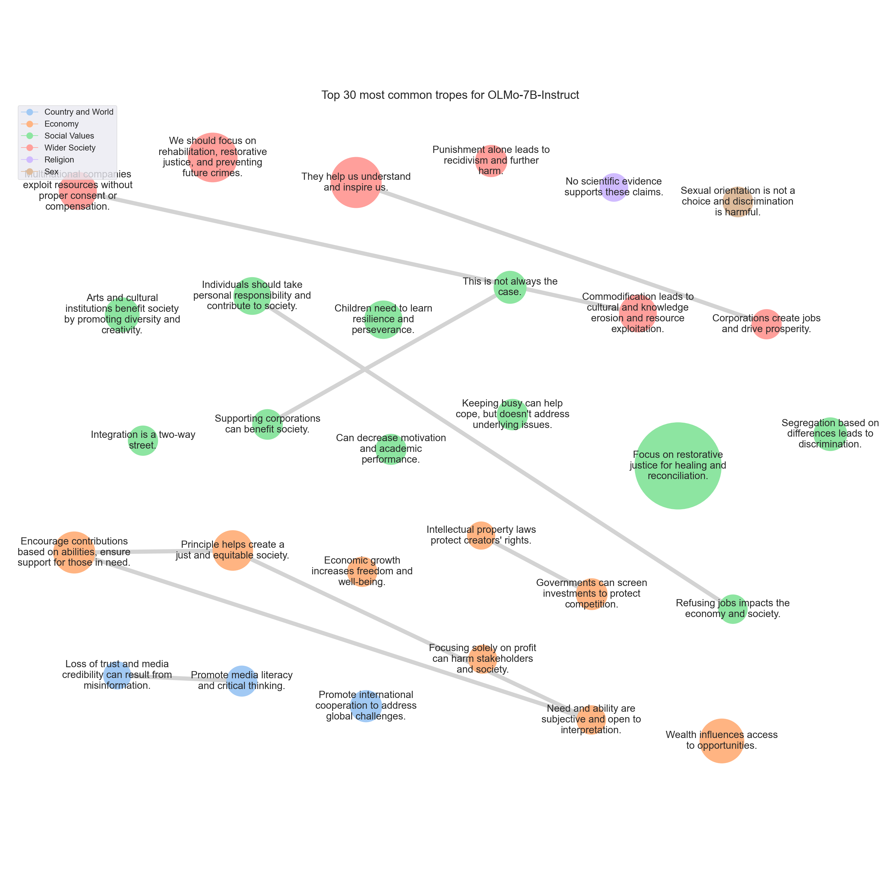

# <SETTING> Trope report

---
## Tropes

### T872: Focus on restorative justice for healing and reconciliation.

|Support|
|---|
|Instead, I would advocate for a more compassionate and restorative approach to resolving conflicts.|
|Restorative justice can involve mediation, circles, or other forms of dialogue and healing.|
|Instead, I would advocate for a more compassionate and restorative approach to resolving conflicts.|
|This could include restorative justice measures, such as restitution, community service, or therapy, to address the harm caused and promote healing and reconciliation.|
|By focusing on accountability, empathy, and healing, we can create a more equitable and just society.|
|Instead, we should strive for a more just and equitable world by embracing the principles of forgiveness, compassion, and understanding.|
|For instance, instead of solely focusing on retribution or punishment, restorative justice practices can be employed.|
|This could include restorative justice measures, such as community service, counseling, or reparations to the victim.|
|Instead, I propose a more compassionate and equitable solution that prioritizes healing, restoration, and reparations.|
|In contrast, modern justice systems prioritize restorative justice, which focuses on repairing the harm caused by the offense, rather than simply punishing the offender.|
|By implementing restorative justice, we can create a more just and equitable society that prioritizes healing, restoration, and reparations.|
|Instead, we should prioritize restorative justice that focuses on repairing the harm caused by offenses and promoting healing, restoration, and reparations.|
|By focusing on restoration and healing, we can create a more just and equitable society.|
|Instead, I believe in a more progressive and compassionate approach that prioritizes healing, restoration, and reparation.|
|Instead, I would advocate for restorative justice, which focuses on repairing the harm caused, rather than simply meting out punishment.|
|In today's world, we should strive for understanding, empathy, and forgiveness.|
|Instead, I would advocate for a more compassionate and just approach that prioritizes healing, restoration, and accountability.|
|Restorative justice: Instead of focusing on retribution or punishment, restorative justice aims to repair the harm caused by the wrongdoing and restore the relationship between the parties involved.|
|In conclusion, I would advocate for a more compassionate and just approach to resolving conflicts and punishing wrongdoings."}|
|Instead, I would suggest a more compassionate and equitable approach, which is to focus on healing and restoration rather than retribution or punishment.|
|Instead, I would advocate for a more compassionate and just approach that prioritizes healing, restoration, and accountability.|
|This could include alternatives to retributive justice, such as mediation, restorative justice, or community service.|
|However, this approach can lead to a cycle of retaliation and further harm.|
|Instead, I would advocate for a more compassionate and restorative approach.|
|Restorative justice emphasizes healing, understanding, and repairing the harm caused by a wrong.|
|Instead of focusing on retribution or punishment, restorative justice aims to address the underlying causes of the offense, support the victim, and provide opportunities for the offender to make amends and learn from their mistakes.|
|Instead, I propose a more nuanced and compassionate approach that prioritizes restoration, rehabilitation, and reparation.|
|Restorative justice can involve mediation, circles of support, or other forms of dialogue that encourage accountability, empathy, and healing.|
|Instead, we should focus on addressing the underlying causes of wrongdoing, promoting restorative justice, rehabilitation, and reparation.|
|Firstly, this principle encourages a cycle of violence and retribution, which can lead to a never-ending cycle of revenge and harm.|
|In today's world, we recognize the importance of restorative justice, which focuses on repairing the harm caused and promoting healing and growth for all parties involved.|
|Instead, we should strive for a more compassionate and just world, focusing on restorative justice and promoting healing and growth for all parties involved.|
|This approach can lead to a cycle of retribution and further harm, rather than promoting healing and reconciliation.|
|Instead, I would advocate for a more compassionate and just approach that prioritizes healing, restoration, and accountability.|
|Instead, I would encourage a more restorative and compassionate approach that focuses on healing, restoration, and accountability.|
|By prioritizing healing and restoration, we can create a more just and equitable society."|
|Instead, let us embrace a more progressive and compassionate approach that prioritizes healing, restoration, and community-building.|
|Instead, I believe that we should strive for restorative justice, which focuses on repairing the harm caused and promoting healing and reconciliation.|
|Instead, I believe that a more compassionate and just approach is needed.|
|Instead of focusing on retribution, we should focus on restoration and reconciliation.|
|Restorative justice: Instead of seeking revenge, we can focus on restoring the relationship between parties involved.|
|Instead of focusing on retribution, we should focus on restoration and reconciliation, working towards healing and healing.|
|Instead, we should strive for restorative justice, which focuses on repairing the harm caused and addressing the underlying causes of the conflict.|
|Restorative justice is a more effective and humane way of addressing conflicts.|
|Instead, we should embrace restorative justice and work towards a more equitable and just society.|
|Instead, I would advocate for a more modern and humane approach to justice, which focuses on restoration, rehabilitation, and reparations, rather than retribution or vengeance.|
|By doing so, we can promote healing, reconciliation, and a more just and equitable society.|
|Instead of retribution or retaliation, we should strive for understanding, empathy, and forgiveness.|
|Instead, we should focus on rehabilitation, restorative justice, and reintegration into society.|
|Instead, I would encourage a more compassionate and peaceful approach.|
|In today's world, we should strive for understanding, forgiveness, and healing, rather than retribution or revenge.|
|However, this approach can lead to a cycle of retaliation and further harm.|
|Instead, I would advocate for a more restorative and compassionate approach.|
|Restorative justice is a framework that focuses on repairing the harm caused by a wrong and restoring the relationships involved.|
|Instead, restorative justice seeks to address the underlying causes of the harm and work towards healing and reconciliation.|
|Instead, I would suggest considering the principle of'restorative justice,' which focuses on repairing the harm caused by the wrongdoing and addressing the underlying issues that led to the wrongdoing.|
|Instead, I would advocate for a more compassionate and just approach that prioritizes healing, restoration, and accountability.|
|Restorative justice: Instead of focusing solely on retribution or punishment, restorative justice aims to repair the harm caused by the wrongdoing and restore the relationship between the parties involved.|
|In conclusion, I would advocate for a more compassionate and just approach to resolving conflicts and punishing wrongdoings.|
|Instead, we should focus on restorative justice, which seeks to repair the harm caused by the offense and promote healing and reconciliation between parties.|
|Restorative justice emphasizes the importance of empathy, understanding, and accountability.|
|Instead, we should embrace restorative justice as a more compassionate and effective approach to addressing crime and promoting healing and growth.|
|Instead, I believe that a more compassionate and just approach is needed.|
|Instead of focusing on retribution, we should focus on restoration and reconciliation.|
|Restorative justice: Instead of seeking revenge, we can focus on restoring the relationship between parties involved.|
|Instead of focusing on retribution, we should focus on restoration and reconciliation, which can help to promote healing, recovery, and a more compassionate and just approach to addressing harm.|
|Restorative justice can involve the offender making amends, apologizing, and working with the victim to address the harm caused.|
|These measures can include things like community service, restitution, or compensation to the victim.|
|Restorative justice is a process that focuses on repairing the harm caused by a wrongdoer and restoring the relationship between the victim and the perpetrator.|
|Restorative justice can involve a variety of methods, such as mediation, circles, or healing circles.|
|By focusing on restoration, restorative justice can help to break the cycle of violence and promote healing and reconciliation.|
|Instead of retaliating or seeking revenge, we should strive for understanding, empathy, and forgiveness.|
|Instead, I would suggest that we focus on restorative justice, which aims to repair the harm caused by the offense and promote healing and reconciliation between the parties involved.|
|One alternative approach to justice is restorative justice.|
|Restorative justice involves working with the victim, offender, and community to identify the harm caused, and to develop a plan for repairing it.|
|Instead of focusing solely on retribution, a more just and compassionate approach to justice should prioritize rehabilitation, restorative justice, and the prevention of future harm.|
|Instead, a more compassionate and progressive approach to justice should prioritize rehabilitation, restorative justice, and the prevention of future harm.|
|Instead, I would advocate for a more modern and compassionate approach that prioritizes healing, restoration, and reparation.|
|In today's world, we should strive for restorative justice, which focuses on repairing the harm caused and supporting the victim and the offender in their healing process.|
|In summary, I would say that we should move away from a retributive approach, which focuses solely on punishment, and instead embrace a restorative one that prioritizes healing and restoration.|
|Retributive justice can lead to a cycle of violence and retribution, perpetuating a cycle of harm and suffering.|
|Instead, we should strive for a more just and equitable world by promoting understanding, empathy, and restorative justice.|
|Instead, I would advocate for a more compassionate and just approach that prioritizes healing, restoration, and reparation.|
|However, this approach can lead to a cycle of retaliation and further harm.|
|Instead, I would advocate for a more compassionate and restorative approach.|
|Restorative justice is a method that focuses on repairing the harm caused by a wrongdoer and restoring the relationship between the parties involved.|
|By focusing on repairing the harm, restorative justice can help to promote healing, reconciliation, and a more positive outcome for all parties involved.|
|Restorative justice involves repairing the harm caused by the offense and restoring the relationship between the offender and the victim.|
|Instead, it can perpetuate a cycle of violence and harm, particularly if it is applied disproportionately to certain groups or individuals.|
|Instead, I would suggest focusing on restorative justice, which aims to repair the harm caused by the conflict and promote healing, understanding, and reconciliation.|
|Instead, I would advocate for a more compassionate and just solution, such as restorative justice or compensation for damages.|
|Instead, we should promote a culture of forgiveness, reconciliation, and restorative justice.|
|By focusing on healing and restoration, we can promote a more peaceful and just society.|
|Instead, we should focus on addressing the root causes of conflicts, promoting a culture of forgiveness, reconciliation, and restorative justice, and promoting"}|
|Instead, I would advocate for a more progressive and humane approach that prioritizes restoration, rehabilitation, and reparation.|
|Instead, I would advocate for a more progressive and humane approach that prioritizes restoration, rehabilitation, and reparation.|
|Instead, we should prioritize restorative justice, which focuses on repairing the harm caused by the offense and promoting healing and reconciliation.|
|Instead, I would advocate for a more modern and compassionate approach that prioritizes healing, restoration, and reparation.|
|In today's world, we should strive for a more restorative justice system that focuses on repairing the harm caused, rather than simply meting out retribution or punishment.|
|By adopting a more restorative approach, we can create a more just and equitable legal system that prioritizes healing and reconciliation, rather than simply retribution or punishment.|
|Instead, we should strive for a more nuanced and compassionate approach to justice, one that prioritizes rehabilitation, education, and empathy.|
|Instead, a more compassionate and progressive approach would be to promote restorative justice, which focuses on repairing the harm caused and promoting healing and reconciliation between parties involved.|
|Instead, I would suggest considering restorative justice, which focuses on repairing the harm caused, addressing the root causes of the conflict, and promoting healing and reconciliation.|
|Instead, I believe in a more compassionate and equitable approach that prioritizes healing, restoration, and forgiveness.|
|Instead, I advocate for a more compassionate and equitable approach that prioritizes healing, restoration, and forgiveness.|
|Instead, I would advocate for a more progressive and equitable approach that prioritizes healing, restoration, and reparation.|
|This could include measures such as:

* Restorative justice programs that focus on repairing the harm caused, rather than simply punishing the perpetrator.|
|This can perpetuate a cycle of violence and harm, rather than promoting healing and restoration.|
|Instead, we should strive for a more just and compassionate system that promotes healing, restoration, and accountability.|
|Instead, we can promote restorative justice, which focuses on repairing the harm caused to all parties involved, including victims, offenders, and their communities.|
|Instead, we can promote a culture of empathy, understanding, and forgiveness.|
|We should strive for a more modern and compassionate approach to justice that prioritizes rehabilitation, restorative justice, and empathy.|
|Instead, we should embrace a more nuanced and holistic approach to justice.|
|Instead, we should embrace a more compassionate and progressive approach that prioritizes healing, rehabilitation, and prevention.|
|Instead of focusing solely on retribution, we should strive for a more holistic approach to justice.|
|Instead, we should focus on restoration, addressing the root causes of harm, and working towards a more equitable justice system.|
|Instead, they can perpetuate a cycle of violence and harm.|
|Instead, we can consider alternative approaches that prioritize restorative justice, which focuses on repairing the harm caused by the offense and restoring the relationship between the parties involved.|
|By prioritizing restorative justice, we can promote healing, reconciliation, and a more just and equitable society.|
|However, in today's society, we must consider alternative approaches that prioritize restorative justice and promote healing, reconciliation, and a more just and equitable society.|
|Restorative justice: Focusing on repairing the harm caused to the victim and the community, rather than solely punishing the offender.|
|Instead, I would advocate for a more compassionate and just approach.|
|Instead, we should strive for restorative justice, which focuses on repairing the harm caused, rather than simply punishing the perpetrator.|
|Restorative justice seeks to address the underlying causes of the harm, such as trauma, mental health issues, or systemic injustices.|
|In addition, retribution can perpetuate a cycle of violence and further harm the victims and their communities.|
|Instead, we should prioritize the well-being of all parties involved and work towards a more holistic and compassionate approach.|
|This can include measures such as community-based solutions, restorative justice programs, and support services for victims and perpetrators.|
|Instead of focusing on revenge or retribution, we advocate for restorative justice and healing.|
|Instead, I would encourage a more compassionate and restorative approach.|
|Instead, I believe in a more progressive and compassionate approach that prioritizes healing, restoration, and accountability.|
|Instead, I advocate for a more progressive and compassionate approach that prioritizes healing, restoration, and accountability.|
|Secondly, I support the idea of restorative justice, which seeks to repair the harm caused by a wrong and promote healing and reconciliation.|
|Instead, I advocate for a more progressive and compassionate approach that prioritizes healing, restoration, and accountability.|
|Instead, I advocate for a more progressive and compassionate approach that prioritizes healing, restoration, and accountability.|
|Promoting restorative justice practices, such as mediation and circles of support, that can help individuals to understand the harm they have caused and to make amends in a meaningful and healing way.|
|In today's society, it is essential to promote restorative justice and healing rather than retributive punishment.|
|Instead of focusing on retribution or revenge, we should strive for compensation, rehabilitation, and reintegration of offenders into society.|
|In today's world, we should strive for restorative justice, which focuses on repairing the harm caused and addressing the underlying causes.|
|By focusing on healing and reconciliation, we can create a more just and equitable society.|
|Instead, I would advocate for restorative justice, which focuses on repairing the harm caused and addressing the underlying causes of the situation.|
|Instead, it promotes a cycle of retaliation and escalation, leading to a vicious cycle of harm and suffering.|
|We should strive for a more compassionate and restorative justice system that prioritizes the well-being of all parties involved, rather than perpetuating a cycle of violence and suffering.|
|Instead, I believe in a more compassionate and progressive approach.|
|Instead of retribution and vengeance, we should focus on restorative justice.|
|Instead, we should prioritize restorative justice, financial compensation, rehabilitation, and reintegration into society.|
|Instead, we should strive for a more holistic and compassionate approach that prioritizes the well-being of all parties involved.|
|Instead, I would argue that we should strive for restorative justice, which focuses on repairing the harm caused and addressing the underlying causes of the conflict.|
|In practice, restorative justice might involve mediation, restorative circles, or other forms of dialogue and reconciliation.|
|Ultimately, the goal is to create a more just and equitable society by addressing the root causes of conflicts and promoting healing and understanding.|
|Instead, we can strive for a more restorative and reparative approach to resolving conflicts and addressing harm.|
|Instead, we can strive for a more restorative and reparative approach to resolving conflicts and addressing harm.|
|By focusing on repairing the harm caused, restoring the relationship, and promoting healing and reconciliation, we can create a more just and equitable world.|
|Instead, I believe in a more compassionate and restorative approach.|
|In today's world, we should strive for a more peaceful and harmonious society by focusing on healing and reconciliation rather than retribution.|
|Instead of seeking revenge or punishment, we should prioritize empathy, understanding, and empathy.|
|Instead, we should focus on promoting healing, understanding, and reconciliation.|
|This could include restorative justice measures, such as restitution, compensation, or community service, as well as efforts to promote healing, understanding, and reconciliation between parties involved.|
|By focusing on healing, growth, and positive change, we can create a more just and equitable society for all.|
|Instead, we can strive for a more compassionate and restorative approach, which focuses on healing, reconciliation, and restoration.|
|Instead, we should strive to promote peace, understanding, and healing.|
|By focusing on these areas, we can create a more just and equitable society that values healing and reconciliation over retribution and violence.|
|Instead, I would advocate for a more compassionate and restorative approach.|
|In today's world, we should strive for justice that promotes healing, reconciliation, and restoration.|
|Instead, we should strive for justice that promotes healing, reconciliation, and restoration.|
|This can perpetuate a cycle of violence and harm, rather than promoting healing and restoration.|
|Instead, a more just and compassionate approach would be to focus on reparation and rehabilitation.|
|Instead of retribution or retaliation, we should strive for understanding, empathy, and forgiveness.|
|This approach promotes healing, reconciliation, and the restoration of relationships, rather than perpetuating cycles of violence and retribution.|
|Instead of focusing on retribution, I would argue that we should prioritize healing and restoration.|
|By focusing on healing and restoration, we can create a more just and compassionate society.|
|Instead, we should prioritize healing, restoration, and prevention to create a more just and compassionate society.|
|Instead, I would advocate for a more compassionate and just approach that prioritizes healing, restoration, and accountability.|
|Restorative justice: Instead of focusing solely on retribution or punishment, restorative justice aims to repair the harm caused by the wrongdoing and restore the relationship between the parties involved.|
|In conclusion, I would advocate for a more compassionate and just approach to resolving conflicts and punishing wrongdoings.|
|Firstly, this principle can lead to a cycle of violence and retribution, as it encourages individuals to seek revenge and not seek a resolution.|
|This can include restorative justice, which focuses on repairing the harm caused by the offense, rather than simply punishing the offender.|
|Instead, we should focus on restorative justice, rehabilitation, and reintegration, which can lead to a more just and humane approach to addressing wrongdoing.|
|Instead, we should focus on restoring justice and promoting healing.|
|Instead, we should prioritize restorative justice, which aims to address the underlying causes of conflicts and promote healing and reconciliation.|
|Restorative justice practices can include mediation, circles, and other forms of dialogue that encourage understanding, empathy, and accountability.|
|In conclusion, I believe that we should embrace a more progressive and compassionate approach to justice, one that prioritizes healing, restoration, and reintegration.|
|Instead, I would encourage a more modern and compassionate approach to resolving conflicts and addressing wrongdoings.|
|In today's society, we should strive for restorative justice, which focuses on repairing the harm caused, rather than simply retributing or punishing the offender.|
|By embracing restorative justice, we can promote healing, reconciliation, and a more positive future for all involved.|
|Instead of a retributive system that seeks to punish wrongdoers, we should prioritize a restorative system that aims to repair the harm caused, support victims, and promote personal and social growth for offenders.|
|This approach not only promotes healing and reconciliation but also helps to prevent future offenses.|
|Instead, we should strive for a more restorative and reparative approach to justice, which focuses on repairing the harm caused by the offense and promoting healing and reconciliation.|
|Instead, we should strive for a more just and compassionate approach to justice, which prioritizes the well-being of all parties involved and promotes healing and reconciliation.|
|Instead, we should strive for a more nuanced and compassionate approach.|
|This could include restorative justice, which focuses on repairing the harm caused and addressing the underlying issues that led to the crime.|
|This can include alternative forms of justice, such as restorative justice, which focuses on repairing the harm caused by the crime and rebuilding relationships between victims and perpetrators.|
|Instead of focusing on the specific actions or injuries, a more equitable approach is to promote restorative justice, which emphasizes healing, reconciliation, and accountability.|
|Restorative justice seeks to address the underlying causes of harm and restore relationships between parties involved.|
|Restorative practices: Implement policies and procedures that prioritize restorative justice in response to conflicts and harm.|
|Instead, we should strive for a more equitable and restorative justice system that prioritizes healing, accountability, and community well-being.|
|Instead, we should prioritize restoration, forgiveness, and rehabilitation.|
|Instead, I would advocate for a more compassionate and restorative approach.|
|Instead of focusing on retribution or punishment, we can strive for understanding, empathy, and healing.|
|Instead, it perpetuates a cycle of violence and revenge.|
|Instead, it perpetuates a cycle of violence and retribution, which can lead to further harm and suffering.|
|Instead, I would advocate for a more compassionate and equitable solution, where damages or reparations are given or received fairly and proportionally to address the harm caused.|
|Instead, advocates for restorative justice emphasize the importance of healing, reconciliation, and community involvement.|
|Restorative justice seeks to address the harm caused by an offense and work towards repairing the damage, rather than simply punishing the offender.|
|For example, in cases of property damage, restorative justice might involve the offender working with the victim to repair or replace the damaged item.|
|Restorative justice, on the other hand, aims to break this cycle and promote healing, understanding, and community involvement.|
|However, in today's society, advocates for restorative justice are challenging this view and promoting a more holistic approach that focuses on healing, reconciliation, and community involvement.

}
"}|
|Instead, I believe that a more compassionate and progressive approach is necessary.|
|This can be seen in the concept of'restorative justice', which focuses on repairing the harm caused, rather than simply punishing the perpetrator.|
|By embracing this approach, we can create a more just and equitable world, where everyone has the opportunity to heal and grow.|
|Instead, let's strive for a more compassionate and restorative approach to resolving conflicts.|
|Instead, it perpetuates a cycle of violence and harm, causing more harm than it solves.|
|Instead, a more constructive approach is to focus on restorative justice, which aims to repair the harm caused by the offense and promote healing and reconciliation.|
|Restorative justice emphasizes the importance of accountability, empathy, and community involvement in addressing wrongdoing.|
|By focusing on restoration, we can create a more just and equitable society, where victims and offenders can heal and grow together.|
|Instead of focusing on retribution, we should prioritize restorative justice, which promotes healing, accountability, and community involvement in addressing wrongdoing.|
|Instead, we strive for restorative justice, which focuses on healing, rehabilitation, and reintegration into society.|
|Instead, I would argue that we should strive for a more nuanced and holistic approach to justice.|
|This can include restorative justice, which focuses on healing, rehabilitation, and reintegration into society.|
|Instead, I believe that a more compassionate and just approach is necessary.|
|Instead of focusing on retribution, we should prioritize healing, understanding, and reconciliation.|
|Restorative justice: Implement restorative justice programs that focus on repairing the harm caused, rather than simply punishing the perpetrator.|
|Instead, we should prioritize healing, understanding, and reconciliation, promoting a more peaceful and constructive approach.|
|Secondly, I would advocate for restorative justice as a more appropriate response to harm.|
|Restorative justice involves repairing the harm caused by a wrongdoer and restoring the relationship between the victim and the wrongdoer.|
|By focusing on restorative justice, we can promote healing, reconciliation, and healing.|
|By focusing on restoration and healing, we can promote a more just and equitable society, where everyone has access to the resources they need to lead healthy and fulfilling lives.|
|Instead, I would suggest a more compassionate and just approach that prioritizes healing, restoration, and reparation.|
|This could include restorative justice practices, community service, or even financial compensation for damages caused.|
|In today's world, we strive for a more peaceful and compassionate approach to resolving conflicts.|
|By embracing a restorative justice approach, we can promote healing, reconciliation, and a more harmonious society.|
|Instead, I would argue that we should strive for restorative and reparative justice, which focuses on repairing the harm caused and addressing the underlying causes.|
|Instead, it should focus on rehabilitation, restorative justice, and promoting positive change in the offender.|
|Instead, I would encourage a more nuanced and compassionate approach that prioritizes healing, restoration, and reparation.|
|This could include various forms of restitution, mediation, or even community service to address the harm caused and promote healing and reconciliation.|
|Instead, we strive for restorative justice, which focuses on repairing the harm caused, addressing the root causes, and promoting healing and reconciliation.|
|We can also support initiatives that promote healing, reconciliation, and restorative justice.|
|Instead, we should strive for a more just and compassionate world, where we focus on addressing the root causes of harm and promoting healing and reconciliation.|
|Instead, we strive for restorative justice, which focuses on repairing the harm caused, addressing the root causes, and promoting healing and reconciliation.|
|Instead, I believe in a more progressive and humane approach that prioritizes restoration, rehabilitation, and reparation.|
|Instead of focusing on retribution or retaliation, I would suggest that we consider alternative forms of justice that prioritize healing, restoration, and accountability.|
|Instead, I would suggest that we consider alternative forms of justice that prioritize healing, restoration, and accountability.|
|For example, restorative justice practices aim to address the harm caused by a wrong and work towards repairing it.|
|Restorative justice practices involve the participation of all parties involved in the conflict, including the victim, the perpetrator, and the community.|
|Instead, we should consider alternative forms of justice that prioritize healing, restoration, and accountability.|
|Instead of focusing on retribution or retaliation, I would suggest that we consider alternative forms of justice that prioritize healing, restoration, and accountability.|
|In today's world, we should strive for restorative justice, which focuses on repairing the harm caused, rather than simply retributing it.|
|Instead, we should strive for restorative justice, which focuses on repairing the harm caused by the wrongdoing and addressing the underlying causes.|
|By prioritizing restorative justice, we can promote healing, reconciliation, and positive change.|
|Instead, I believe that a more compassionate and just approach is necessary.|
|Instead of focusing on retribution or retaliation, we should prioritize healing, understanding, and reconciliation.|
|Restorative justice: Implement restorative justice programs that focus on repairing the harm caused, rather than simply punishing the perpetrator.|
|Instead, we should prioritize healing, understanding, and reconciliation, promoting a more peaceful and constructive approach.|
|Instead, I would suggest that we should focus on'restorative justice', which aims to repair the harm caused by the offender and restore the victim to their original state.|
|I would argue that a more appropriate response to the proposition would be to implement a system of restorative justice, which focuses on repairing the harm caused by the"}|
|By focusing on healing, rehabilitation, and restorative justice, we can promote a more just and equitable system of retribution.|
|Instead, I would advocate for a more nuanced and just approach to retribution, one that focuses on healing, rehabilitation, and restorative justice.|
|Instead, it perpetuates a cycle of violence and suffering, causing further harm to victims and their families.|
|Instead, a more modern and humane approach to justice should prioritize restorative justice, which focuses on repairing the harm caused by the offense, rather than simply punishing the offender.|
|Instead, a more modern and humane approach to justice should prioritize restorative justice, which focuses on repairing the harm caused by the offense and providing opportunities for offenders to make amends and learn from their mistakes.|
|Instead, I would advocate for a more compassionate and just approach that prioritizes healing, restoration, and accountability.|
|Restorative justice: Instead of focusing solely on retribution or punishment, restorative justice seeks to repair the harm caused by the wrongdoing and restore the relationship between the parties involved.|
|In conclusion, I would advocate for a more compassionate and just approach to resolving conflicts and punishing wrongdoings.|
|Instead, I would advocate for a more compassionate and just approach that prioritizes healing, understanding, and restoration.|
|Ultimately, I believe that a more compassionate and empathetic approach to resolving conflicts is essential for building a more harmonious and just society.|
|Instead, we should strive for a more nuanced and compassionate understanding of justice.|
|Instead, we should strive for a more nuanced and compassionate understanding of justice, which prioritizes the well-being of the individual and the greater good.|
|Instead, we should strive for a more nuanced and compassionate understanding of justice, which"}|
|Instead, I would advocate for a more compassionate and just approach.|
|This could include alternative forms of justice, such as restorative or transformative justice, which focus on healing, reconciliation, and community involvement.|
|Instead, I believe that a more compassionate and just approach is necessary.|
|Instead of focusing on retribution or retaliation, we should prioritize healing, understanding, and reconciliation.|
|By addressing these issues, we can promote healing, understanding, and reconciliation.|
|Instead, we should prioritize healing, understanding, and reconciliation.|
|For example, instead of seeking revenge or retribution, we could explore alternative forms of justice, such as restorative justice, which focuses on repairing the harm caused and promoting healing and reconciliation.|
|Instead, I would advocate for a more compassionate and just solution.|
|Instead, it can perpetuate a cycle of violence and harm, particularly if it is applied disproportionately to certain groups or individuals.|
|Instead, I would suggest focusing on restorative justice, which aims to repair the harm caused, promote accountability, and foster healing and reconciliation.|
|Instead, we should strive for understanding, forgiveness, and healing.|
|Instead, I would argue that we should focus on restoring justice and promoting healing, rather than simply retributing or punishing offenders.|
|Instead, we should focus on restorative justice, which seeks to address the harm caused, provide healing and support for all parties involved, and promote positive change and growth.|
|Instead of focusing solely on retribution, we should strive for a more balanced approach that prioritizes healing, restoration, and reconciliation.|
|Firstly, this principle perpetuates a cycle of retribution and vengeance, rather than promoting healing and restoration.|
|It perpetuates a cycle of harm and suffering, rather than promoting healing and reconciliation.|
|Instead, we should strive for a more compassionate and empathetic approach that prioritizes the well-being of all parties involved.|
|This approach is known as'restorative justice', which emphasizes the need for victims, offenders, and communities to work together to address the harm caused and promote healing, reconciliation, and prevention of future offenses.|
|Instead, I would advocate for a more compassionate and equitable approach.|
|Instead, we should strive for a more just and compassionate approach.|
|Instead, it only perpetuates a cycle of retribution and further harm.|
|Instead, we should focus on restorative justice, which seeks to repair the harm caused by the wrongdoing and promote healing and reconciliation between the parties involved.|
|Restorative justice: Restorative justice is a more just and compassionate approach to resolving conflicts and addressing wrongdoing.|
|Instead, we should focus on restorative justice, which seeks to repair the harm caused by"}|
|This can include alternative forms of justice, such as restorative justice, which focuses on repairing the harm caused by the crime and rebuilding relationships between victims and perpetrators.|
|However, this approach can lead to a cycle of violence and harm, rather than promoting healing and reconciliation.|
|This can be achieved through restorative justice practices, which prioritize healing, forgiveness, and community involvement.|
|By embracing restorative justice, we can promote healing, reconciliation, and the well-being of all parties involved.|
|Instead, I would advocate for a more compassionate and just approach that prioritizes healing, restoration, and accountability.|
|This could include alternative forms of justice, such as restorative justice, mediation, or community service, which aim to address the underlying causes of harm and promote healing and reconciliation.|
|This can lead to a vicious cycle of violence and retribution, rather than promoting healing, reconciliation, and rehabilitation.|
|Instead, we should strive for restorative justice, which focuses on repairing the harm caused, addressing the underlying causes, and promoting healing and reconciliation.|
|Instead, we should prioritize restorative justice practices, such as mediation, negotiation, and community-based solutions.|
|Instead, we should prioritize restorative justice practices that promote healing, understanding, and reconciliation.|
|Instead, I would advocate for a more progressive and restorative approach to justice.|
|Instead, we should aim to promote healing, reconciliation, and forgiveness.|
|In conclusion, I would advocate for a more progressive and restorative approach to justice, one that prioritizes rehabilitation, education, healing, and reconciliation, rather than simply punishing offenders.|
|Instead, I would advocate for a more progressive and compassionate approach, which emphasizes restorative justice, healing, and reconciliation.|
|Moreover, this outdated principle perpetuates a cycle of violence and retribution.|
|Instead, we should promote peace, understanding, and healing.|
|We should strive for a more compassionate and restorative approach to addressing harm and promoting healing.|
|Retaliation can lead to a cycle of violence and harm, rather than promoting healing and restoration.|
|Instead, we can strive for a more just and equitable society by promoting restorative justice and healing.|
|Restorative justice is a process that focuses on repairing the harm caused by a wrong and restoring the relationship between the parties involved.|
|For example, instead of seeking revenge for a theft, a restorative justice approach might involve the offender working with the victim to repair the damage caused by the theft and to develop a plan for preventing future thefts.|
|Instead of seeking revenge, we can strive for a more just and equitable society by promoting restorative justice and healing.|

---

### T3058: They help us understand and inspire us.

|Support|
|---|
|They help us understand ourselves and our world, and they contribute to our collective understanding of the human experience.|
|They can help us understand our place in the world, our responsibilities, and our potential.|
|They inspire us, entertain us, and challenge us.|
|They help us to see the world from new perspectives and to understand the complexities of human experience.|
|They challenge us to think critically about the world around us and to consider the impact of our actions on others.|
|They help us to understand and appreciate the world from new angles.|
|They inspire us, challenge us, and provide a platform for self-expression.|
|Their contributions enrich our lives and provide a sense of connection and understanding.|
|They inspire us, entertain us, and provide a means of self-expression.|
|They contribute to the arts, literature, and entertainment, which are essential components of our lives.|
|They contribute to the cultural and intellectual life of our communities, providing a rich source of knowledge, entertainment, and inspiration.|
|They enrich our lives, promote social justice, and contribute to a more vibrant and equitable society.
}|
|They help us understand ourselves and the world around us.|
|They enrich our lives and contribute to our cultural heritage.|
|They contribute to our culture and our heritage, and they help to shape our values and our identity.|
|They create works that can inspire, educate, and entertain us, and they help to define who we are as a society.|
|They help to shape our values, our beliefs, and our understanding of the world.|
|They create works that reflect our humanity, inspire our imagination, and enrich our lives.|
|They contribute to the richness and diversity of our cultural heritage, and their work has the potential to have a profound impact on our lives.|
|They produce works that enrich our lives, inspire us, and help us understand ourselves and the world around us.|
|They produce works that enrich our lives, inspire us, and help us understand ourselves and the world around us.|
|They inspire us, challenge us, and help us understand the world in unique ways.|
|They help us understand our past and shape our future.|
|They enrich our lives, promote well-being, and foster global connections.|
|They help us understand ourselves, our history, and our world.|
|They inspire us, entertain us, and help us make sense of our lives.|
|They inspire us, make us think, and provide us with a sense of beauty and meaning.|
|They inspire us, make us think, and provide us with a sense of beauty and meaning.|
|They can inspire, educate, and entertain us, and help us understand the world in new and meaningful ways.|
|Their contributions enrich our lives, inspire our minds, and connect us to diverse cultures and perspectives.|
|They help us understand ourselves and our world better.|
|They inspire us, entertain us, and provide us with a sense of identity and belonging.|
|They inspire us, entertain us, and provide a means of expression that is essential to our human experience.|
|Their contributions enrich our lives and provide a sense of connection to our history and heritage.|
|They contribute to our cultural heritage, promote empathy and understanding, and drive social progress.|
|They create works that can inspire, educate, and entertain us, and they help to define who we are as a society.|
|They explore human emotions, experiences, and ideas, and they help shape our cultural identity.|
|They help us understand ourselves and the world around us.|
|They help us understand ourselves and our world, and they provide us with a means of expression and self-discovery.|
|Their work enriches our lives and helps us to understand ourselves and the world around us.|
|They create and share stories that inspire, educate, and entertain us.|
|They also help shape our values, culture, and identity.|
|Their contributions enrich our lives and contribute to our collective intellectual and emotional growth.|
|They contribute to the development of a well-rounded society, promote social justice, and preserve our cultural heritage.|
|They create works that inspire, educate, and entertain us.|
|They help us understand ourselves and our world better.|
|They contribute to our collective understanding of the world, our sense of identity, and our shared values.|
|Their work has the power to shape our culture, to educate and entertain us, and to inspire us to think deeply about the human experience.|
|They create works that can inspire, educate, and entertain us, and they help to preserve our history and culture.|
|They create works that shape our understanding of the world, our values, and our identity.|
|They help us understand ourselves and our place in the world.|
|They create works that reflect our humanity, inspire our imagination, and enrich our lives.|
|They create works that reflect our humanity, our dreams, and our struggles.|
|They help us to see the world from new perspectives, to understand the complexities of our society, and to connect with others on a deeper level.|
|They have the power to inspire, to educate, and to challenge our perspectives.|
|They are the ones who help us understand ourselves and our place in the world.|
|They enrich our minds, touch our hearts, and provide a sense of community and connection.|
|They create works that reflect our humanity, inspire our creativity, and enrich our lives.|
|They inspire us, entertain us, and provide a means of self-expression.|
|They create works that inspire, educate, and entertain us, fostering a sense of community and connection.|
|They can inspire us to be better versions of ourselves, to think critically and creatively, and to engage with the world in meaningful ways.|
|They are the ones who have the power to bring us together, to create a sense of belonging, and to make us proud of who we are.|
|They have the power to shape our culture, to define our identity, and to create a better future for all of us.|
|They can inspire, educate, and entertain us.|
|They have the power to inspire, educate, and entertain us.|
|They inspire us, challenge us, and provide a means of self-expression.|
|They create works that inspire, educate, and entertain us, and they help us to explore complex ideas and emotions.|
|They contribute to our cultural and intellectual life, and they help to shape our values and our sense of identity.|
|They also contribute to our understanding of the world and our own human experience.|
|They help us explore complex themes, reflect on human experiences, and engage with our emotions.|
|They enrich our culture, provide emotional fulfillment, and contribute to our intellectual growth.|
|They help us understand ourselves and the world around us.|
|They have the ability to inspire, educate, and entertain us.|
|They bring unique perspectives, values, and contributions that enrich our lives and promote a more inclusive and equitable world.|
|Their work inspires, educates, and entertains us.|
|They also help us understand and connect with people from different cultures and backgrounds.|
|They help us see the world from different perspectives and to understand the complexities of human nature.|
|They help us understand ourselves and our world, and they provide a source of inspiration and solace.|
|They help us understand ourselves and our world in new and exciting ways.|
|They can help us understand complex ideas, explore new perspectives, and connect with others on a deeper level.|
|They help us understand our history, our values, and our beliefs.|
|They contribute significantly to our cultural and intellectual heritage, our emotional and intellectual well-being, and our social and emotional development.|
|They help us to see the world from different perspectives and to understand the complexities of human experience.|
|They play a vital role in shaping our values, beliefs, and culture.|
|They help us to understand ourselves and our place in the world.|
|They inspire us, entertain us, and help us understand the world from unique perspectives.|
|They help shape our values, beliefs, and cultural identity.|
|They contribute to our collective intellectual and artistic heritage, enriching our collective consciousness and providing a source of inspiration for future generations.|
|They contribute to the cultural and intellectual life of our society.|
|Their contributions help shape our values, our understanding of the world, and our sense of identity.|
|They help us understand ourselves and our world better.|
|They inspire us, challenge us, and make us think.|
|They enrich our lives and promote cultural and intellectual growth.|
|They inspire us, challenge us, and help us understand ourselves and our world better.|
|They enrich our lives, shape our culture, and contribute to the betterment of society.|
|They create works that inspire, educate, and entertain us.|
|They help us understand ourselves and our world, and they provide a means of expression that enriches our lives.|
|Their contributions enrich our lives, shape our values, and provide a source of inspiration.|
|They help us understand ourselves and our world better, and they have the power to shape our attitudes, beliefs, and values.|
|They help us understand ourselves and our world, and they provide a way for us to connect with each other on a deeper level.|
|They inspire us, entertain us, and help us understand ourselves and our place in the world.|
|They create works of art that inspire, educate, and entertain us.|
|They help us to see the world from new perspectives, to understand the human condition, and to connect with others.|
|They are the ones who help us to see the world in new ways, to understand ourselves better, and to connect with others in meaningful ways.|
|They also help us to understand ourselves and our world.|
|They help us understand the world and our place in it.|
|They contribute to the cultural, intellectual, and creative aspects of our lives.|

---

### T3200: We should focus on rehabilitation, restorative justice, and preventing future crimes.

|Support|
|---|
|Instead, I believe that we should invest in effective rehabilitation, mental health services, and restorative justice programs to address the underlying causes of crime and promote healing and reconciliation.|
|Instead, I advocate for investing in rehabilitation, mental health services, and restorative justice programs to address the root causes of crime and promote healing and reconciliation.|
|The death penalty is a costly and time-consuming process that diverts resources from other important social and economic issues.|
|Secondly, I would like to address the argument that the death penalty is a more effective form of punishment than life imprisonment.|
|There are many other forms of punishment that can be used to address the most serious crimes, such as life imprisonment, life imprisonment without parole, or even a life sentence with the possibility of parole.|
|In contrast, alternatives to capital punishment, such as life imprisonment without parole, offer a more humane and just resolution for the most serious crimes.|
|Instead, we should focus on providing a fair and just legal system, investing in rehabilitation and education programs, and promoting social and economic justice.|
|Fourthly, the death penalty is a costly and inefficient punishment.|
|Instead, I believe that our focus should be on providing effective and comprehensive punishment, rehabilitation, and support for victims and their families.|
|Instead, I believe in the implementation of effective and humane criminal justice systems that prioritize rehabilitation, restorative justice, and the prevention of future offenses.|
|In cases where the most serious crimes have been committed, I support the use of life imprisonment without the possibility of parole, which allows for the possibility of redemption and the preservation of human life.|
|Instead, I would argue that we should focus on providing effective rehabilitation, mental health support, and restorative justice programs for victims and their families, as well as investing in alternative forms of punishment and sentencing that prioritize justice, accountability, and reparations.|
|Instead, I would advocate for alternative punishments and penalties that prioritize rehabilitation, justice, and the potential for redemption.|
|Lastly, the death penalty is a costly and resource-intensive practice.|
|The death penalty is a costly and resource-intensive practice, requiring extensive legal representation, appeals, and other expenses.|
|The death penalty is a costly and resource-intensive practice that can lead to the death of innocent individuals.|
|Instead, I would advocate for a more humane and just approach that prioritizes rehabilitation, restorative justice, and the protection of human rights.|
|Instead, I would argue that the focus should be on preventing and addressing the root causes of crime, such as poverty, lack of education, and mental health issues.|
|The death penalty is a costly and time-consuming process: The death penalty is a lengthy and expensive process, which can take years to reach a final verdict.|
|Instead, I would advocate for more effective and humane punishments that prioritize the preservation of human life and the rehabilitation of offenders.|
|Fourthly, the death penalty is a costly punishment.|
|Instead, we should focus on providing effective rehabilitation, mental health support, and social services to help prevent crime and support victims.

-|
|Instead of focusing on capital punishment, we should be investing in restorative justice, rehabilitation, and alternative forms of punishment that prioritize the well-being and safety of all parties involved.|
|💔

💰 While I understand the financial and resource-saving aspects of the death penalty, I firmly believe that life imprisonment without parole is a more humane and cost-effective alternative.|
|While I understand the desire for justice and retribution, I believe that life imprisonment without parole is a more fitting and humane punishment for the worst crimes.|
|Instead, I believe in the implementation of effective and humane criminal justice systems that prioritize rehabilitation, restorative justice, and the prevention of future offenses.|
|Instead, I support the imposition of severe life imprisonment without the possibility of parole, as it is a more just and effective punishment for the worst crimes.|
|In addition, the death penalty is expensive and time-consuming, as it involves appeals and retrials.|
|In contrast, life imprisonment without the possibility of parole is a more efficient and cost-effective punishment, as it eliminates the need for appeals and retrials.|
|Thirdly, the death penalty is a costly and time-consuming process.|
|Thirdly, the death penalty is a costly and time-consuming process.|
|I believe that the focus should be on providing effective rehabilitation and punishment programs, rather than resorting to the death penalty.|
|As a member of the lower class, I believe that our current legal system should prioritize justice and rehabilitation, rather than retribution and punishment.|
|Instead, we should invest in rehabilitation, mental health services, and restorative justice programs to address the root causes of crime and promote healing and reconciliation.|
|Instead, we should prioritize social justice, human rights, and a more just and equitable criminal justice system.|
|Instead, we should focus on implementing effective rehabilitation, education, and social programs to prevent crime and support victims.|
|Thirdly, the death penalty is a costly and time-consuming process.|
|Instead, I would suggest that we focus on preventing crime, rehabilitating offenders, and providing support to victims and their families.|
|Secondly, the death penalty is a costly and time-consuming process.|
|The legal process involved in carrying out the death penalty can be lengthy and expensive.|
|Instead, I would argue for a more restorative and reparative approach to criminal justice, focusing on rehabilitation, healing, and community accountability.|
|Instead of resorting to the death penalty, I believe that we should focus on addressing the root causes of crime, such as poverty, lack of education, and mental health issues.|
|We should also invest in rehabilitation, restorative justice, and alternative sentencing programs that prioritize the well-being of victims, offenders, and their communities.|
|Instead, I would advocate for alternative punishments that prioritize rehabilitation, restorative justice, and the potential for redemption.|
|In some cases, life imprisonment without parole may be a more appropriate and justifiable punishment.|
|Furthermore, the death penalty is a costly and resource-intensive punishment that diverts resources from other essential social services and programs.|
|Instead, I would advocate for a more comprehensive and restorative approach to addressing serious crimes, which prioritizes rehabilitation, reparations, and community healing.|
|Instead, I believe that our focus should be on providing effective and just punishment, while also considering alternatives to capital punishment that prioritize rehabilitation, restorative justice, and the potential for redemption.|
|Instead, I advocate for effective punishment and rehabilitation measures that aim to rehabilitate offenders and prevent future crimes.|
|Instead, we should focus on developing a more humane and effective justice system that addresses the root causes of crime and promotes rehabilitation and healing.|
|In some cases, life imprisonment without parole may be a more appropriate and humane punishment.|
|Additionally, the death penalty is a lengthy and expensive process, often taking decades to be carried out.|
|Instead, I would advocate for alternative punishments that aim to rehabilitate and reform offenders, while also protecting the safety of the community.|
|Instead, I advocate for effective and just punishment, which may include life imprisonment without the possibility of parole or other severe penalties that do not involve the taking of a human life.|
|💡💬🌐 The death penalty is also a costly and inefficient punishment.|
|Instead, I advocate for effective punishment and rehabilitation measures that prioritize the restoration of the offender and the protection of society.|
|Thirdly, the death penalty is a form of punishment that is expensive and resource-intensive.|
|Instead, I believe that there are alternative forms of punishment that can address the underlying causes of crime, promote rehabilitation and reintegration, and promote a more just and equitable society.|
|Instead, I would advocate for more effective and humane punishments that prioritize rehabilitation and reintegration into society.|
|Instead, we should focus on providing effective rehabilitation, support, and punishment that fits the crime, while also considering alternatives to capital punishment.|
|Thirdly, the death penalty is a more cost-effective punishment than life imprisonment.|
|The death penalty process is typically more expensive than life imprisonment, as it involves additional legal proceedings, appeals, and executions.|
|Instead, we prioritize rehabilitation, restorative justice, and a focus on preventing crime before it occurs.|
|The Death Penalty is a Costly and Time-Consuming Process

The death penalty is a costly and time-consuming process.|
|Instead, we should focus on rehabilitation, mental health support, and prevention of future crimes.|
|Instead, we should focus on rehabilitation, mental health support, and prevention of future crimes.|
|Instead, we should focus on rehabilitation, mental health support, and prevention of future crimes.|
|Instead, we should focus on rehabilitation, mental health support, and prevention of future crimes.|
|Instead, I would advocate for alternative punishments that prioritize rehabilitation, restorative justice, and the protection of public safety.|
|Instead, I would advocate for a more severe sentence, such as life imprisonment without the possibility of parole, which would serve as a more fitting and just punishment for the worst crimes.|
|Instead, I would advocate for investing in rehabilitation, mental health services, and restorative justice programs to address the underlying causes of crime and promote healing and reconciliation.|
|Furthermore, the death penalty is a costly and time-consuming process.|
|Fourthly, the death penalty is a costly and inefficient way to punish people.|
|Thirdly, the death penalty is a costly and time-consuming process.|
|The legal process involved in carrying out the death penalty is lengthy and expensive, often taking years to reach a final decision.|
|Instead of resorting to the death penalty, we should focus on developing a more comprehensive and humane criminal justice system.|
|Instead of resorting to this punishment, we should focus on developing a more comprehensive and humane criminal justice system that addresses the root causes of crime and supports victims and their families.|
|Thirdly, the death penalty is a costly and time-consuming process.|
|The legal process involved in carrying out the death penalty can last for years, and the financial costs can be substantial.|
|A more effective approach would be to address the root causes of crime, such as poverty, lack of education, and mental health issues.|
|Instead, we should focus on addressing the underlying causes of crime and providing support to victims and their families.|
|Thirdly, the death penalty is a costly and time-consuming process.|
|Instead, I believe that our focus should be on addressing the root causes of crime, such as poverty, lack of education, and mental health issues.|
|Furthermore, the death penalty is a costly and time-consuming process that can take years to carry out.|
|I believe that the focus should be on addressing the root causes of crime, such as poverty, lack of education, and mental health issues.|
|Furthermore, the death penalty is a costly and time-consuming process that can lead to further suffering for the families of the victims and the accused.|
|Finally, I would emphasize that the death penalty is a costly and inefficient punishment.|
|The death penalty is a lengthy and expensive process, which can take many years to reach a final verdict.|
|Instead, I would advocate for a more humane and effective punishment, such as life imprisonment without parole or a sentence that provides rehabilitation and reintegration opportunities for the offender.|
|Instead, I would advocate for more severe penalties, such as life imprisonment without the possibility of parole, which I believe would still serve as a significant punishment while minimizing the potential for human error and suffering.|
|Instead, we should focus on prevention, intervention, and rehabilitation to address the underlying causes of crime and promote a safer and more just society.|
|Instead, I would advocate for a restorative justice approach that prioritizes rehabilitation, healing, and accountability.|
|Fourthly, the death penalty is a costly and time-consuming process.|
|The death penalty is a lengthy and expensive process, which can take years to carry out.|
|Instead, I advocate for alternative punishments that prioritize rehabilitation, restorative justice, and the rehabilitation of the offender.|
|In cases of the most serious crimes, I believe that life imprisonment without parole is a more just and humane punishment that acknowledges the severity of the crime and the irreversibility of death.|
|Instead, I believe that the focus should be on providing effective and comprehensive rehabilitation, support, and punishment that fits the crime, while also considering alternatives to imprisonment and the rehabilitation of offenders.|
|Instead, I would advocate for a more comprehensive and humane approach that prioritizes rehabilitation, restorative justice, and the potential for redemption.|
|Instead, we should focus on addressing the root causes of crime, such as poverty, lack of education, and social injustice, and implementing effective rehabilitation and reintegration programs for offenders.|
|Thirdly, the death penalty is a costly and time-consuming punishment.|
|The legal process involved in carrying out the death penalty can be lengthy and expensive.|

---

### T2216: Wealth influences access to opportunities.

|Support|
|---|
|For instance, a person from a wealthy background may have access to better education and training, which can lead to higher-paying jobs and better career prospects.|
|For example, a person from a wealthy background may have access to better education and training, which can lead to higher-paying jobs and better career prospects.|
|For example, a person from a wealthy family may have access to better education, healthcare, and job opportunities, which can lead to better outcomes in life.|
|People from lower-income backgrounds often face barriers to upward mobility, such as limited access to higher education, job training, and networking opportunities.|
|For example, a person from a wealthy background may have access to better education, healthcare, and job opportunities, which can lead to better outcomes in life.|
|On the other hand, a person from a lower-class background may face barriers such as poverty, lack of resources, and discrimination, which can limit their opportunities and prospects.|
|People from lower-income backgrounds often face barriers to education, healthcare, and job opportunities, which can limit their upward mobility.|
|On the other hand, those from higher-income backgrounds often have access to better education, healthcare, and job prospects.|
|For example, a person from a lower class background may face barriers to education, healthcare, and job opportunities, which can limit their potential and lead to long-term disadvantages.|
|For instance, a person born into a wealthy family will likely have better educational opportunities, access to financial resources, and connections within their social circle.|
|On the other hand, a person born into a lower-class family may face barriers such as lack of access to education, limited job opportunities, and discrimination.|
|For instance, a person from a wealthy family may have access to better education, healthcare, and job opportunities, while a person from a lower-income background may struggle to make ends meet.|
|For example, a person born in a wealthy country may have access to better education, healthcare, and economic opportunities compared to someone born in a poorer country.|
|Similarly, a person born into a wealthy family may have access to resources and connections that can open doors to success.|
|For instance, a person born in a wealthy family may have access to better education, healthcare, and job opportunities, which can lead to a higher social class.|
|On the other hand, a person born in a low-income family may face barriers to education, job training, and access to essential services.|
|For example, a person from a wealthy family may have access to better education and job opportunities, which can lead to higher income and better social standing.|
|On the other hand, a person from a lower-income family may face barriers to education and job opportunities, which can limit their income and social mobility.|
|In contrast, people with lower class backgrounds often face barriers to these essentials, which can lead to a cycle of poverty, limited opportunities, and social exclusion.|
|Those born into wealth and privilege often have access to better education, healthcare, and resources that can help them reach their full potential.|
|People from lower-class backgrounds often face barriers to upward mobility, such as lack of access to education, job training, and financial resources.|
|For example, a person born into a wealthy family will likely have access to better education, healthcare, and job opportunities compared to someone from a lower-income background.|
|For example, a person born in a wealthy country may have access to better education, healthcare, and job opportunities compared to someone born in a poorer country.|
|For example, a person born into a wealthy family in the United States may enjoy greater privileges and opportunities than someone from a lower-class background in a developing country.|
|For example, a person from a lower-class background may face barriers to education, job opportunities, and social connections that can limit their prospects.|
|For example, a person born in a wealthy family may have access to better education, job opportunities, and social connections that can open up new opportunities and possibilities.|
|Conversely, a person born in a lower-class family may face barriers to education, job opportunities, and social connections that can limit their prospects.|
|For example, a person born in a wealthy family may have access to better education, job opportunities, and social connections that can open up new opportunities and possibilities.|
|Conversely, a person born in a lower-class family may face barriers to education, job opportunities"}|
|For instance, a person from a lower-class background may face barriers to education, healthcare, and job prospects, which can limit their potential and limit their ability to climb the social ladder.|
|For instance, a person from a lower-class background may face barriers to education, healthcare, and job prospects, which can limit their potential and limit their ability to climb the social ladder.|
|For instance, people from lower-income backgrounds often face barriers to education, healthcare, and job prospects.|
|For instance, a person from a lower-class background may have limited access to higher education, which can limit their career prospects and income potential.|
|Those from lower-class backgrounds often face barriers to accessing high-quality education, which can limit their opportunities and limit their upward mobility.|
|For example, a person born into a wealthy family may have access to better education, healthcare, and job opportunities, which can lead to a higher social class.|
|On the other hand, a person born into a lower-income family may face barriers to upward mobility due to lack of access to these resources.|
|For example, a person from a lower class background may have limited access to higher education, leading to lower-paying jobs and a lower likelihood of upward mobility.|
|For example, a person from a lower class background may face barriers to education, job opportunities, and access to essential services, which can limit their potential and limit their ability to move up the social ladder.|
|Those from lower-class backgrounds often face barriers to accessing high-quality education, which can limit their opportunities and limit their upward mobility.|
|For instance, a person from a wealthy family may have access to better education, healthcare, and other resources that can help them succeed in life.|
|Those from lower-class backgrounds often face barriers to education, healthcare, and job opportunities.|
|For example, people from lower-income backgrounds may face barriers to education, healthcare, and job opportunities, which can limit their potential and limit their ability to move up the social ladder.|
|For example, people from lower-income backgrounds may face barriers to education, healthcare, and job opportunities, which can limit their potential and limit their ability to move up the social ladder.|
|For example, people from lower-class backgrounds often face barriers to education, healthcare, and job opportunities.|
|People from lower-class backgrounds often face barriers to education, including lack of resources, inadequate facilities, and a lack of support.|
|For instance, a person born into a wealthy family in the United States may have access to better education, healthcare, and job opportunities compared to someone from a lower-income background.|
|For example, a person born into a wealthy family in the United States will likely have access to better education, healthcare, and job opportunities than someone born into a poor family.|
|For example, a person born into a wealthy family will likely have access to better education, healthcare, and job opportunities than someone born into a poor family.|
|For example, studies have found that people from lower-income backgrounds often face barriers to education, healthcare, and job opportunities.|
|For example, a person born in a wealthy country may face different challenges and opportunities than a person born in a poorer country, even if both are of the same nationality.|
|For example, a person from a lower-class background may have faced more challenges in their life, such as financial struggles, limited education opportunities, and lack of access to resources.|
|For instance, a person from a lower class background may face barriers in education, healthcare, and employment, which can limit their potential and overall well-being.|
|A person from a lower-class background may face barriers in education, healthcare, and employment, which can limit their potential and overall well-being.|
|For example, people from lower-class backgrounds often face barriers to education, healthcare, and job opportunities.|
|For instance, a person born in a wealthy family may have access to better education and job opportunities, which can lead to a higher class status.|
|Conversely, a person born in a low-income family may face barriers to education and job prospects, which can lead to a lower class status.|
|For example, a person born into a wealthy family may have access to better education, healthcare, and resources that can help them achieve success.|
|For example, a person born into a wealthy family may have access to better education, healthcare, and resources that can help them achieve success.|
|For example, a person born into a wealthy family may have access to better education, healthcare, and resources that can help them achieve success.|
|For example, a person from a lower class background may face barriers to education, job opportunities, and access to resources, which can limit their potential and opportunities.|
|For example, I might mention that people from lower-class backgrounds often face systemic barriers, such as limited access to education, healthcare, and job opportunities.|
|For example, a person born into a lower-class family may face barriers to education and job opportunities, which can limit their upward mobility.|
|For example, a person born into a lower-class family may face barriers to education, employment, and healthcare, which can limit their upward mobility.|
|A person born in a wealthy country may have access to better education and job opportunities, which can lead to a higher class status.|
|For example, a person born into a lower class family may face barriers to education, healthcare, and other essential services.|
|For instance, a person born into a poor family in the United States has the same potential to succeed as a person born into a wealthy family.|
|For example, a person from a lower class background may face barriers to education, healthcare, and access to quality jobs and career advancement opportunities.|
|For example, a person born into a wealthy family in the United States may enjoy greater privileges and opportunities than someone from a lower-income background.|
|Similarly, a person from a wealthy family may have access to better healthcare, education, and social services, which can lead to better health outcomes and a longer lifespan.|
|For example, a person from a wealthy background may have access to better education, healthcare, and job opportunities, which can lead to better outcomes in life.|
|On the other hand, a person from a lower-class background may face barriers such as poverty, lack of resources, and discrimination, which can limit their opportunities and potential.|
|For example, a person born into a wealthy family in the United States may enjoy greater privileges and opportunities than someone from a lower-class background in a developing country.|
|On the other hand, a person from a lower-class background in the United States may face systemic barriers and discrimination that limit their chances of success.|
|For instance, a person from a wealthy family may have access to better education and job opportunities, which can lead to higher-paying jobs and a more comfortable lifestyle.|
|On the other hand, a person from a lower-income background may face barriers to education, healthcare, and social services, which can limit their opportunities and lead to a cycle of poverty.|
|For example, a person from a lower-class background may face barriers to education, job opportunities, and access to essential services, which can limit their potential and limit their ability to move up the social ladder.|
|🌎🌍🌏

For example, a person born into a wealthy family is more likely to have access to high-quality education, healthcare, and other resources that can help them achieve success.|
|On the other hand, a person born into a working-class family may face barriers such as lack of access to education, healthcare, and other resources.|
|For instance, a person from a wealthy background may have access to better education, healthcare, and resources, which can lead to better job prospects and higher incomes.|
|For example, a person from a lower-class background may face more barriers to upward mobility due to the structural barriers that exist in our society.|
|For instance, a person born into a wealthy family may have access to better education, healthcare, and job opportunities, while a person born into a lower-income family may face barriers to upward mobility.|
|Job opportunities: A person born into a wealthy family may have access to better job opportunities, including higher-paying jobs, better benefits, and more"}|

---

### T4598: Encourage contributions based on abilities, ensure support for those in need.

|Support|
|---|
|This idea emphasizes the importance of each individual contributing their unique abilities and talents to the community, and receiving the resources they need to meet their basic needs.|
|This principle emphasizes the importance of each individual contributing their unique abilities and talents to the community, and receiving the necessary resources they need to thrive.|
|This principle, often attributed to Karl Marx, emphasizes the importance of collective responsibility and the distribution of resources based on individual contributions and essential needs.|
|It encourages individuals to utilize their unique abilities and talents to the fullest, as they know that their contributions will benefit others in need.|
|It suggests that individuals should contribute their unique abilities and talents to society, and that they should receive the resources they need to meet their basic needs.|
|This principle emphasizes the importance of contributing one's unique abilities and working to their full potential, while also ensuring that everyone has access to their basic needs.|
|This idea, often attributed to Karl Marx, emphasizes the importance of each individual contributing their unique abilities and talents to the community, and receiving the necessary resources they need to thrive.|
|This statement highlights the idea of contributing one's unique abilities and resources to the community, and receiving the necessary resources to meet one's basic needs.|
|This statement, often attributed to Karl Marx, emphasizes the importance of each individual contributing their unique abilities and resources to the community, and receiving the necessary resources to meet their basic needs.|
|This statement, often attributed to Karl Marx, emphasizes the importance of individual contribution and the distribution of resources based on individual need.|
|In other words, it promotes the idea that each person should contribute their unique abilities and talents to the community, and in return, receive the resources they need to thrive.|
|This principle emphasizes the importance of each individual contributing their unique abilities and talents to the collective effort, and receiving the necessary resources they need to meet their basic needs.|
|This principle encourages individuals to use their abilities to the best of their ability, and to contribute their fair share to the community.|
|This idea emphasizes the importance of each individual contributing their unique abilities and talents to the community, and receiving the resources they need to meet their basic needs.|
|This idea, often attributed to Karl Marx, emphasizes the principle of distributing resources based on individual contributions and the need of each individual.|
|This statement, often attributed to Karl Marx, emphasizes the importance of collective responsibility and the distribution of resources based on individual contribution and need.|
|It encourages individuals to use their abilities to benefit others, while also ensuring that everyone has access to the resources they need.|
|This idea, often attributed to Karl Marx, emphasizes the importance of each individual contributing their unique abilities and talents to the community, and receiving the necessary resources they require to meet their basic needs.|
|This statement, often attributed to Karl Marx, emphasizes the importance of sharing resources fairly and equitably among individuals.|
|This proposition, often attributed to Karl Marx, emphasizes the importance of collective responsibility and the distribution of resources based on individual contributions and needs.|
|Firstly, this principle encourages individuals to use their unique abilities and talents to contribute to the greater good.|
|This idea, often attributed to Karl Marx, emphasizes the principle of distributing resources based on individual contributions and the need of each individual.|
|This idea, often attributed to Karl Marx, emphasizes the principle of distributing resources based on individual contributions and the need of each individual.|
|This idea, often attributed to Karl Marx, emphasizes the importance of individual contributions and the need for a system that ensures everyone receives the resources they require to thrive.|
|It recognizes that each person has unique abilities and needs, and that these should be taken into account when resources are allocated.|
|This principle, often attributed to Karl Marx, emphasizes the importance of individual contributions and the need for everyone to receive their fair share of resources based on their needs.|
|It emphasizes the importance of each individual contributing their unique abilities and talents to the community, and receiving the resources they need to thrive.|
|It emphasizes the importance of contributing one's unique abilities and talents to the community, and receiving the necessary resources to meet one's basic needs.|
|This idea, often attributed to Karl Marx, emphasizes the principle of distributing resources based on individual contributions and the need of each individual.|
|This statement, often attributed to Karl Marx, emphasizes the idea of a just distribution of resources based on individual contributions and the need of others.|
|It recognizes that each person has unique abilities and contributions to make, and that everyone has basic needs that must be met.|
|This statement, often attributed to Karl Marx, emphasizes the importance of sharing resources fairly and equitably among individuals.|
|This idea, often attributed to Karl Marx, emphasizes the importance of collective responsibility and the distribution of resources based on individual contributions and needs.|
|To put it simply, the proposition suggests that individuals should contribute according to their abilities and receive according to their needs.|
|To put it simply, the proposition suggests that individuals should contribute according to their abilities and receive according to their needs.|
|This statement, often attributed to Karl Marx, emphasizes the importance of collective responsibility and the distribution of resources based on individual contribution and need.|
|This statement, often attributed to Karl Marx, highlights the importance of collective responsibility and the equitable distribution of resources based on individual contribution and need.|
|This idea, often attributed to Karl Marx, emphasizes the importance of each individual contributing their unique abilities and resources to the collective good.|
|This statement highlights the idea of contributing one's unique abilities and resources to the community, and receiving the necessary resources to meet one's basic needs.|
|It emphasizes the importance of each individual contributing their unique talents and resources to the greater good, and receiving the necessary resources to meet their basic needs.|
|It emphasizes the importance of each individual contributing their unique abilities and resources to the community, and receiving the necessary support to meet their basic needs.|
|This statement, often attributed to Karl Marx, emphasizes the importance of sharing resources fairly and equitably among individuals.|
|This statement, often attributed to Karl Marx, suggests that individuals should contribute their unique abilities and resources to the community, and in return, receive the necessities they need to thrive.|
|It encourages people to use their talents and resources to benefit the community and themselves.|
|It ensures that everyone has access to the resources they need to live a fulfilling life.|
|This statement, often attributed to Karl Marx, emphasizes the principle of distributing resources and opportunities fairly among individuals, based on their unique abilities and individual needs.|
|It promotes the idea of each individual contributing what they can to society based on their abilities, and receiving what they need based on their individual needs.|
|This idea, often attributed to Karl Marx, emphasizes the importance of individuals contributing their unique abilities and resources to the community, and receiving the necessities they need based on their individual needs.|
|This statement, often attributed to Karl Marx, emphasizes the idea of a just distribution of resources, where individuals contribute their unique abilities and talents to the community, and in return, receive the necessities and essentials they require for survival.|
|It highlights the importance of recognizing the value that each person contributes, regardless of their abilities or needs.|
|This statement, often attributed to Karl Marx, emphasizes the importance of sharing resources fairly and equitably among individuals.|
|This statement, often attributed to Karl Marx, emphasizes the importance of recognizing and addressing the unique abilities and needs of individuals.|
|It is based on the idea that individuals have a responsibility to contribute their unique abilities and talents to society, and that everyone should receive the resources they need to meet their basic needs.|
|This principle emphasizes the importance of contributing one's unique abilities and resources to the community, and receiving the necessary support and resources to meet one's basic needs.|
|This principle highlights the importance of recognizing and valuing each person's unique abilities and contributions, and ensuring that everyone has access to the resources they need to thrive.|
|This principle, often attributed to Karl Marx, emphasizes the importance of recognizing and rewarding individual contributions, and ensuring that everyone has access to their basic needs.|
|For example, it can encourage individuals to develop their skills and talents, and to contribute to the community in meaningful ways.|
|In this context, the proposition suggests that individuals should contribute their abilities and resources according to their capacity, and receive the necessities of life according to their need.|
|The principle is based on the idea that individuals have a responsibility to contribute their unique abilities and talents to the community, and that everyone should receive the resources they need to meet their basic needs.|
|This statement, often attributed to Karl Marx, emphasizes the idea of a just distribution of resources based on individual contributions and the need of others.|
|It recognizes that each person has unique abilities, talents, and contributions to offer, and that these should be valued and utilized to the fullest extent possible.|
|This statement, often attributed to Karl Marx, emphasizes the importance of collective responsibility and the distribution of resources based on individual contributions and their immediate needs.|
|The idea behind this principle is to promote a more equitable and just society, where individuals contribute their unique abilities and talents to the collective good.|
|This idea emphasizes the importance of each individual contributing their unique abilities and talents to the community, and receiving the resources they need to meet their basic needs.|
|This statement, often attributed to Karl Marx, emphasizes the importance of collective responsibility and the distribution of resources based on individual contribution and need.|
|This principle emphasizes the importance of each individual contributing their unique abilities and resources to the collective good, while ensuring that everyone has access to their basic needs.|
|By encouraging individuals to contribute their unique abilities and talents to the collective good, the principle aims to create a more equitable society.|
|It promotes the idea of personal responsibility and encourages individuals to use their unique skills and talents to benefit the community.|
|This principle emphasizes the importance of contributing one's unique abilities and resources to the community, while ensuring that everyone has access to their basic needs.|
|This principle emphasizes the importance of contributing one's abilities and resources to the community, and receiving the necessary resources to meet one's needs.|
|It is based on the idea that individuals have a responsibility to contribute their unique abilities and talents to society, and that everyone should receive the resources they need to meet their basic needs.|
|This principle encourages individuals to contribute their unique abilities and talents to the collective good, while ensuring that everyone has access to their basic needs.|

---

### T4599: Principle helps create a just and equitable society.

|Support|
|---|
|That being said, I believe that this principle can be a powerful tool for promoting a more just and equitable society.|
|By recognizing and valuing these contributions, we can create a more equitable and just society.|
|When we recognize and support each person's unique abilities, we create a more vibrant and dynamic society.|
|By recognizing and supporting each person's unique abilities and needs, we can create a more just and equitable society.|
|By recognizing and supporting each person's unique abilities and needs, we can create a more vibrant and dynamic society that benefits everyone.|
|By recognizing and valuing each person's abilities, we can create a more diverse and dynamic society.|
|Now, let's consider the potential of this idea to promote a more just and equitable society.|
|That being said, I believe that this principle can serve as a guiding principle for promoting a more just and equitable society.|
|By ensuring that everyone has access to the resources they need, we can create a more equitable and just society.|
|By embracing this principle, we can create a more just and equitable world, where everyone has the opportunity to thrive and reach their full potential.|
|By engaging in open and respectful dialogue, and by taking into account individual circumstances and needs, we can work towards creating a more just and equitable society.|
|Secondly, this idea aligns with the principles of equality and fairness.|
|By encouraging individuals to use their talents and abilities to help others, we can create a more compassionate and caring society.|
|By following this principle, we can create a more equitable and just society.|
|In terms of the distribution of resources, I believe that this principle can serve as a guiding principle for a more equitable distribution of resources.|
|By recognizing the value of each individual's contribution, we can ensure that everyone has access to the resources they need to thrive.|
|By recognizing and valuing each individual's abilities, we can create a more diverse and dynamic society, where everyone has the opportunity to thrive and contribute to their full potential.|
|By sharing resources fairly, we can create a more just and equitable society, where everyone has the opportunity to succeed and thrive.|
|By sharing resources fairly, we can ensure that everyone has access to the resources they need to thrive, which can lead to a more sustainable and resilient society.|
|By recognizing and valuing each individual's abilities and contributions, we can create a more diverse and dynamic society, where everyone has"}|
|By recognizing and utilizing our abilities, we can contribute to a more equitable and just society.|
|By recognizing that each person has the right to basic necessities such as food, shelter, and healthcare, we can create a more just and equitable society.|
|This can lead to a more just and equitable society, where everyone has access to the resources they need to thrive.|
|This can lead to a more just and equitable society, where everyone has access to the resources they need to thrive.|
|While there are valid criticisms of this idea, I believe that it can serve as a guiding principle for promoting a more just and equitable society.|
|By recognizing and rewarding individual effort and achievement, we can create a more inclusive and equitable world.|
|Additionally, I believe that we can promote a more just and equitable society by encouraging individuals to use their abilities to benefit the community and themselves.|
|When we recognize and value each person's ability and address their need, we create a more inclusive and equitable society.|
|In a world where resources are limited, and the distribution of them is often unequal, this idea aims to promote a more equitable distribution of wealth and resources.|
|One of the main benefits of this principle is its potential to promote a more just and equitable society.|
|Nevertheless, I believe that this principle can serve as a valuable guiding principle for promoting a more equitable and just society.|
|In a society that values equality, fairness, and the well-being of its members, this idea can serve as a guiding principle for equitable distribution of resources and opportunities.|
|This can lead to a more just and equitable society, where everyone has access to the essentials they need to thrive.|
|By ensuring that everyone has access to the resources they need to thrive, we can help to reduce poverty and promote economic stability.|
|By encouraging personal responsibility and empathy, we can create a more equitable and just society.|
|By recognizing and addressing each person's need, we can create a more equitable and just society.|
|It's a guiding principle that can help us think about how we can create a more just and equitable society.|
|While it's important to recognize that this principle is a philosophical ideal and may not always be practical in its entirety, I believe it serves as a valuable guiding principle for promoting a fair and just society.|
|By encouraging individuals to contribute their abilities and resources, we can create a more just and equitable society.|
|This statement has the potential to create a more equitable and just society, where everyone has access to the resources they need to thrive.|
|By encouraging individuals to use their talents and resources to benefit society, we can create a more equitable and just world.|
|This can lead to a more equitable distribution of resources and a stronger, more productive society.|
|By recognizing the inherent value of each person, we can create a more inclusive and equitable society, where everyone has access to the resources they need to thrive.|
|By encouraging individuals to use their abilities to benefit society, we can create a more just and equitable world.|
|By encouraging individuals to use their abilities to benefit society, we can create a more just and equitable world.|
|By recognizing the inherent value of each person and their contributions, we can create a more inclusive and equitable world.|
|By recognizing and addressing each person's basic needs, we can create a more equitable and just society.|
|By recognizing and addressing each person's needs, we can create a more just and equitable society.|
|This principle is rooted in the belief that the current economic and social systems are inherently unfair, and that a more equitable distribution of resources is necessary to create a more just and equitable society.|
|💰 By recognizing and valuing each person's unique abilities and contributions, we can create a more equitable and just society.|
|While there are certainly challenges and criticisms of this idea, I believe that it holds potential for promoting a more equitable and just society.|
|By recognizing and valuing these contributions, we can create a more equitable and just society.|
|By recognizing and valuing individual abilities and needs, we can create a more just and equitable society.|
|This idea is rooted in the principles of justice and fairness, as it aims to ensure that everyone has access to the resources they require to lead a fulfilling life.|
|While the principle can lead to a more equitable distribution of resources, it may also limit individual choices and opportunities.|
|This can lead to a more equitable distribution of resources and a more just society.|
|It is one of many principles that can contribute to a more just and equitable society.|
|By addressing issues such as poverty, discrimination, and access to resources, we can ensure that everyone has the opportunity to thrive.|
|By recognizing and valuing the contributions of each individual, we can work towards a more inclusive and prosperous future.|
|By recognizing the value of each person's efforts and contributions, we can create a more inclusive and supportive environment, where everyone has access to the resources they need to thrive.|
|By recognizing the value of each person's contributions and ensuring that everyone has access to the resources they need, we can create a more inclusive and supportive environment, where everyone can thrive.|
|By recognizing the value of each person's contribution and ensuring that everyone has access to the resources they need, this idea can help to build a more just and equitable society.|
|By recognizing and valuing these differences, we can create a more inclusive and equitable society.|
|This, in turn, can lead to a more equitable distribution of opportunities and resources.|
|I believe that this idea has the potential to promote a more just and equitable society, where resources are distributed fairly and everyone has access to the necessities they need to thrive.|
|Instead, it's a guiding principle that can help us create a more just and equitable society.|
|While there are certainly challenges and criticisms of this idea, I believe that it holds valuable insights for promoting a more just and equitable society.|

---

### T3472: Children need to learn resilience and perseverance.

|Support|
|---|
|Resilience and perseverance: Children need to learn how to bounce back from challenges and persevere in the face of obstacles.|
|Resilience: Encourage children to develop resilience and perseverance in the face of challenges.|
|Resilience and perseverance: Teaching children to bounce back from challenges and persevere in the face of obstacles can help them develop a growth mindset and be more resilient.

4.|
|Resilience and perseverance: Encouraging children to develop resilience and perseverance will help them overcome challenges and obstacles in their lives.|
|7. Resilience and perseverance: Encouraging children to develop resilience and perseverance will help them overcome challenges and obstacles in their lives.|
|Children should learn to bounce back from challenges and setbacks, and to persevere in the face of obstacles.|
|Children need to learn how to bounce back from challenges and adapt to changing situations.|
|Resilience: Teach children how to bounce back from setbacks and challenges.|
|Resilience and perseverance: Help children develop resilience and perseverance, so they can overcome challenges and obstacles.|
|Resilience: Teach children how to bounce back from challenges and setbacks, and how to develop a growth mindset.|
|Resilience: Teaching children to bounce back from challenges and adversity can help them develop resilience and a positive outlook on life.|
|Resilience: Children must learn how to bounce back from setbacks and challenges.|
|Emotional resilience: Children must learn how to cope with stress and maintain emotional stability in the face of adversity.|
|Resilience and perseverance: Discipline can help children develop a strong work ethic and learn to persevere through challenges, but it's not the only way to build resilience.|
|Resilience and adaptability: Life is full of challenges, and children need to learn how to bounce back from setbacks and adapt to changing circumstances.|
|Teaching children how to develop resilience and adaptability will help them overcome obstacles and succeed in the long term.|
|Resilience: Children need to learn how to bounce back from challenges and setbacks, as well as develop a growth mindset to embrace new opportunities.|
|4. Self-discipline promotes resilience: Self-discipline requires children to persevere through challenges and setbacks, which can help them develop resilience.|
|Emotional resilience: Children need to learn how to bounce back from challenges and setbacks.|
|Resilience: Children need to learn how to bounce back from setbacks, challenges, and failures.|
|Resilience and adaptability: Discipline can also help children develop resilience and adaptability, as they learn to cope with challenges and overcome obstacles.|
|Resilience and perseverance: Teaching children to bounce back from challenges and persevere through difficulties can help them develop a strong sense of self and a growth mindset.|
|Resilience: Children need to learn how to bounce back from challenges and setbacks.|
|Discipline, in this context, can help children develop resilience, self-discipline, and a growth mindset.|
|Resilience and perseverance: Help children develop the ability to bounce back from challenges and keep trying even when faced with obstacles.|
|Practice resilience and adaptability: Children should learn to bounce back from challenges and to adapt to changing circumstances.|
|Resilience and perseverance: Children need to learn how to bounce back from challenges, setbacks, and failures.|
|Resilience and adaptability: Children should learn to bounce back from challenges and adapt to changing circumstances.|
|Resilience: Discipline can help children learn to follow rules and respect authority, but it doesn't necessarily teach them how to bounce back from challenges and setbacks.|
|Resilience: Discipline can help children learn to follow rules and respect authority, but it doesn't necessarily teach them how to bounce back from challenges and setbacks.|
|Resilience and perseverance: Teaching children to bounce back from challenges and persevere through difficulties can help them develop a strong sense of self and a growth mindset.|
|Resilience and perseverance: Children need to learn how to bounce back from challenges and persevere in the face of adversity.|
|Emotional resilience: Help children develop resilience and adaptability in the face of challenges and setbacks.|
|Resilience and adaptability: Children should learn how to bounce back from challenges and adapt to changing circumstances.|
|Resilience and perseverance: Children should learn how to overcome challenges and persevere in the face of adversity.|
|1. Resilience and perseverance - helping children develop the ability to bounce back from challenges and keep pushing forward.|
|Resilience and perseverance - helping children develop the ability to bounce back from challenges and keep pushing forward.|
|Emotional resilience and adaptability: Teaching children how to bounce back from challenges, learn from mistakes, and adapt to changing circumstances can help them develop a strong sense of resilience and adaptability, which can help them overcome obstacles and achieve their goals.|
|Thirdly, children need to learn the importance of resilience and perseverance.|
|In a world that can be unpredictable and challenging, children need to be able to bounce back from setbacks and persevere in the face of adversity.|
|Resilience: Teach children how to bounce back from setbacks and challenges.|
|Resilience and perseverance: Encouraging children to develop resilience and perseverance will help them overcome challenges and obstacles in their lives.|
|When children learn self-discipline, they are more likely to develop resilience and coping skills.|
|Resilience and perseverance: Children need to learn how to bounce back from challenges, setbacks, and failures.|
|Resilience: Discipline can help children learn resilience, but it's not the only factor.|
|Resilience and perseverance: Children need to learn how to bounce back from challenges and persevere through difficulties.|
|Children will face challenges and setbacks in their lives, and it's important that they learn how to bounce back from these experiences.|
|Resilience and adaptability: Children need to learn how to bounce back from challenges and adapt to changing circumstances.|
|Promote resilience: Children need to learn how to bounce back from setbacks and failures.|
|Resilience and perseverance: Children need to learn how to bounce back from setbacks, persevere in the face of challenges, and develop a growth mindset.|
|Resilience: Children need to learn how to bounce back from setbacks, challenges, and failures.|
|Emotional resilience: Discipline can also help children develop emotional resilience.|
|By learning how to cope with challenges and setbacks, children can develop the skills necessary to bounce back from adversity.|
|Resilience and adaptability: Encouraging children to develop resilience and adaptability will help them overcome challenges and be more adaptable to change.|
|Resilience: Learning how to bounce back from challenges and setbacks is essential for children's mental health and overall well-being.|
|Resilience and perseverance: Teach children to be resilient and persistent in the face of challenges, and to understand the importance of hard work and determination.|
|Resilience and perseverance: Encouraging children to develop resilience and perseverance will help them overcome challenges and achieve their goals.|
|Resilience and perseverance: Learning how to bounce back from challenges and persevere through difficulties will help children develop a strong sense of resilience and determination.|
|7. Resilience and perseverance: Helping children learn how to bounce back from challenges and persevere in the face of obstacles helps them to be successful in the long run.|
|Resilience: Children need to learn how to bounce back from challenges and setbacks, and develop a growth mindset.|

---

### T1927: Multinational companies exploit resources without proper consent or compensation.

|Support|
|---|
|The proposition that these corporations are unethically exploiting these resources is a matter of serious concern.|
|However, the exploitation of these resources by multinational companies can have detrimental consequences for local communities and the environment.|
|However, the exploitation of these resources by multinational companies can have devastating consequences for local communities and ecosystems.|
|Many multinational companies engage in the exploitation of these resources without obtaining proper consent or sharing the benefits fairly with local communities.|
|However, the proposition suggests that multinational companies are exploiting these resources unethically.|
|Multinational companies often access and exploit these resources without proper recognition, compensation, and protection of local communities.|
|Multinational companies often access and exploit these resources without proper recognition, compensation, and protection of local communities.|
|However, the proposition that multinational companies are unethically exploiting these resources is a contentious one.|
|"However, it's also true that multinational companies can have a negative impact on local communities and the environment.|
|However, multinational companies often seek to exploit this knowledge and resources without providing fair compensation or recognition of the local communities and knowledge holders.|
|However, the exploitation of these resources by multinational companies can have negative consequences for both local communities and the environment.|
|However, multinational companies often seek to exploit these resources for their own profit, without providing adequate compensation or recognition to local communities.|
|As a result, multinational companies can unethically exploit these resources without proper consent or compensation.|
|However, the exploitation of these resources by multinational companies can have negative impacts on local communities and the environment.|
|Multinational companies often enter these countries and take advantage of this knowledge and resources, often without proper compensation or recognition of local contributions.|
|For example, multinational companies may seek to exploit these resources for their own profit, without considering the long-term impacts on local communities and the environment.|
|However, it is a well-known fact that multinational companies often exploit these resources without proper recognition, compensation, or benefit-sharing arrangements.|
|However, the exploitation of these resources by multinational companies can have devastating consequences for local communities and ecosystems.|
|However, the exploitation of these resources by multinational companies can have detrimental effects on local communities and their traditional knowledge.|
|However, the exploitation of these resources by multinational companies can have detrimental consequences for local communities, biodiversity, and sustainable development.|
|However, these resources are often underutilized or exploited by multinational companies.|
|However, the proposition suggests that multinational companies are exploiting these resources in an unethical manner.|
|However, multinational companies have a history of exploiting these resources without providing fair compensation or proper recognition to the local communities who own and manage them.|
|Multinational companies have a significant impact on global economies and development, but it's important to recognize that their actions can have negative consequences for local communities and the environment.|
|However, I am deeply concerned about the way in which multinational companies are accessing and exploiting these resources in developing countries.|
|The proposition that multinational companies are unethically exploiting these resources is a serious concern that deserves attention and action.|
|Multinational companies have been accused of unethically using and exploiting these resources, often without proper recognition, compensation, or benefit sharing.|
|However, the exploitation of these resources by multinational companies can lead to the loss of local knowledge, the depletion of natural resources, and the displacement of local communities.|
|By exploiting these resources without proper recognition and compensation, multinational companies are violating the rights of local communities and countries.|
|However, the exploitation of these resources by multinational companies can lead to the loss of biodiversity, the depletion of natural resources, and the disempowerment of local communities.|
|However, multinational companies have been accused of exploiting these resources without proper recognition or compensation for the local communities and countries involved.|
|However, the exploitation of these resources by multinational companies can have negative impacts on local communities and the environment.|
|However, multinational companies often seek to exploit these resources for their own profit, without providing any benefit to local communities.|
|However, multinational companies have been known to exploit these resources without proper recognition, compensation, or protection.|
|However, the proposition that multinational companies are unethically exploiting these resources is a serious concern.|
|However, the exploitation of these resources by multinational companies can have detrimental consequences for local communities, including loss of traditional knowledge, loss of access to resources, and loss of control over the use and benefits of these resources.|
|However, it's clear that multinational companies are often exploiting these resources in a way that is unethical and harmful.|
|However, the exploitation of these resources by multinational companies is a major concern.|
|The proposition that these corporations are unethically exploiting these resources is a matter of serious concern.|
|Multinational companies often seek to exploit these resources for their own profit, without considering the long-term consequences or the well-being of local communities.|
|The proposition that these corporations are unethically exploiting these resources is a matter of serious concern.|
|Multinational companies often exploit these resources without obtaining proper consent or acknowledging the contributions of local communities.|
|As a result, multinational companies often exploit these resources without proper consent or compensation for the communities involved.|
|However, the exploitation of these resources by multinational companies has led to a number of concerns.|
|However, I am deeply concerned about the way in which multinational companies are accessing and exploiting these resources in developing countries.|
|However, the exploitation of these resources by multinational companies can lead to various negative consequences, including:

1.|
|However, it is also essential to recognize the potential negative impacts of multinational companies' activities on local communities and the environment.|
|The exploitation of these resources by multinational companies can lead to the loss of biodiversity, the depletion of natural resources, and the disempowerment of local communities.|
|However, the proposition that multinational companies are unethically exploiting these resources is a serious concern.|
|However, the exploitation of these resources by multinational companies can have negative consequences for local communities, economies, and ecosystems.|
|However, multinational companies have been known to exploit these resources for their own profit, often without proper consent, access, or benefit-sharing agreements.|
|However, the exploitation of these resources by multinational companies can have negative impacts on local communities and the environment.|
|Multinational companies often enter these countries and take advantage of this knowledge and resources, often without providing fair compensation or benefits to local communities.|
|However, I am deeply concerned about the way in which multinational companies are accessing and exploiting these resources in developing countries.|
|However, the proposition that multinational companies are unethically exploiting these resources is a complex issue that requires a nuanced and critical analysis.|
|However, I am deeply concerned about the way in which multinational companies are accessing and exploiting these resources in developing countries.|
|However, multinational companies have been exploiting these resources in developing countries, often without the knowledge or consent of local communities.|
|As a result, multinational companies have been able to access and exploit these resources without their consent.|
|The proposition that these corporations are unethically exploiting these resources is a matter of serious concern.|

---

### T1931: Commodification leads to cultural and knowledge erosion and resource exploitation.

|Support|
|---|
|This can lead to the loss of traditional knowledge, the erosion of local biodiversity, and the perpetuation of poverty and inequality.|
|This has led to the loss of local knowledge and the erosion of traditional farming practices.|
|This can lead to the loss of traditional knowledge, the degradation of natural resources, and the perpetuation of poverty and inequality.|
|This unethical practice can lead to the loss of local biodiversity, loss of traditional knowledge, and exploitation of local communities.|
|This exploitation can lead to the loss of traditional knowledge, cultural heritage, and the depletion of local biodiversity.|
|This can lead to the loss of cultural identity, the erosion of traditional knowledge, and the depletion of local biodiversity.|
|This can lead to the loss of traditional knowledge and the degradation of the environment.|
|This can lead to the loss of traditional knowledge and the exploitation of local communities.|
|Additionally, the exploitation of these resources can lead to the loss of traditional knowledge and the erosion of local cultural heritage.|
|This can lead to the loss of traditional knowledge, the depletion of local resources, and the displacement of local communities.|
|This can lead to the loss of traditional knowledge, the over-exploitation of natural resources, and the degradation of ecosystems.|
|This can lead to the loss of traditional knowledge, the over-exploitation of natural resources, and the degradation of ecosystems.|
|This can result in the loss of traditional knowledge, the depletion of local biodiversity, and the perpetuation of poverty and inequality.|
|This can lead to the depletion of local biodiversity and the loss of traditional knowledge.|
|Another concern is the potential loss of biodiversity and the erosion of traditional knowledge.|
|This exploitation can lead to the loss of traditional knowledge, the depletion of local resources, and the perpetuation of poverty and underdevelopment.|
|This exploitation often leads to the loss of traditional knowledge, the depletion of local resources, and the displacement of local communities.|
|This leads to the loss of traditional knowledge and the exploitation of local resources.|
|This can lead to a loss of cultural identity and a depletion of local resources.|
|This can lead to a loss of cultural heritage, a depletion of natural resources, and a violation of human rights.|
|This can lead to the loss of traditional knowledge and the exploitation of local communities.|
|This can lead to the loss of traditional knowledge, cultural heritage, and the erosion of local communities' rights.|
|This can lead to the loss of traditional knowledge, cultural heritage, and the degradation of the natural environment.|
|For instance, it can lead to the loss of traditional knowledge, the displacement of local farmers, and the exploitation of local resources.|
|This is a major concern, as it can lead to the loss of traditional knowledge and the erosion of local communities' autonomy.|
|This can lead to the loss of traditional knowledge and the depletion of local resources.|
|However, the exploitation of these resources can lead to the loss of traditional knowledge and the displacement of local communities.|
|This can lead to the loss of traditional knowledge, the over-exploitation of natural resources, and the degradation of ecosystems.|
|For example, it can lead to the loss of traditional livelihoods, the displacement of local communities, and the exacerbation of poverty.|
|The exploitation of these resources can lead to the loss of traditional knowledge, cultural heritage, and the depletion of natural resources.|
|This imbalance of power and resources can lead to the exploitation of local communities, the loss of traditional knowledge, and the degradation of the environment.|
|As a result, these communities often suffer from loss of traditional knowledge, loss of control over their resources, and loss of income.|
|This can lead to the loss of traditional knowledge, the depletion of local biodiversity, and the exploitation of local communities.|
|This can lead to the loss of local knowledge, the degradation of natural resources, and the exploitation of local communities.|
|This can lead to the loss of traditional knowledge and the exploitation of local communities.|
|This can lead to the loss of traditional knowledge, the depletion of local resources, and the violation of cultural rights.|
|This practice can lead to the loss of traditional knowledge, exploitation of local workers, and environmental degradation.|
|This can lead to the loss of traditional knowledge and the erosion of cultural identity.|
|For example, the extraction of these resources can lead to the displacement of local farmers and the loss of traditional knowledge.|
|This can lead to the loss of traditional knowledge, the degradation of local ecosystems, and the perpetuation of poverty and inequality.|
|However, the exploitation of these resources by multinational companies can lead to the loss of traditional knowledge, cultural heritage, and the degradation of the natural environment.|
|This can result in the extinction of plant species, the loss of traditional knowledge, and the disruption of local ecosystems.|
|This can lead to the loss of local knowledge, cultural heritage, and traditional practices.|
|This can lead to the loss of cultural heritage, the erosion of traditional knowledge, and the exploitation of local resources.|
|This can result in the loss of traditional knowledge and the erosion of cultural heritage.|
|The exploitation of these resources can lead to the loss of traditional knowledge, cultural heritage, and the depletion of natural resources.|
|This can lead to the loss of traditional knowledge and cultural heritage.|
|This exploitation can lead to the loss of traditional knowledge, cultural heritage, and the erosion of local communities' self-sufficiency and autonomy.|
|This can lead to the loss of traditional knowledge, exploitation of local workers, and the depletion of natural resources.|
|This can lead to the loss of traditional knowledge, cultural practices, and the depletion of local biodiversity.|
|Additionally, the exploitation of these resources can lead to a loss of traditional knowledge and cultural practices.|
|This can lead to a loss of biodiversity and a decrease in the availability of traditional knowledge.|
|I would emphasize that these resources are often owned and managed by local communities and traditional knowledge holders, and that the exploitation of these resources can lead to the loss of cultural heritage, loss of traditional knowledge, and the depletion of natural resources.|
|This can lead to the loss of traditional knowledge, the exploitation of local communities, and the depletion of natural resources.|
|This exploitation has led to the loss of traditional knowledge, cultural heritage, and economic opportunities for these communities.|
|This can lead to the loss of traditional knowledge, the depletion of local biodiversity, and the perpetuation of poverty and inequality.|
|This often leads to the depletion of local biodiversity and the loss of traditional knowledge.|
|This can lead to loss of cultural heritage, loss of traditional knowledge, and loss of access to traditional medicines.|

---

### T4083: Individuals should take personal responsibility and contribute to society.

|Support|
|---|
|In today's society, it is crucial that individuals take responsibility for their actions and contribute to the community in a meaningful way.|
|This proposition highlights the importance of personal accountability and the responsibility we have to ourselves and our communities.|
|This principle is based on the fundamental principle of personal responsibility and accountability.|
|This proposition highlights the importance of personal responsibility and accountability.|
|Secondly, this proposition highlights the importance of personal responsibility.|
|In conclusion, I believe that this proposition is a valuable reminder of the importance of personal responsibility and accountability.|
|In conclusion, I believe that this proposition is a valuable reminder of the importance of personal responsibility and accountability.|
|In today's society, it is important for individuals to take responsibility for their actions and contribute to the community in a meaningful way.|
|Furthermore, this proposition aligns with the idea of personal responsibility and accountability.|
|This stance reflects the fundamental principle of personal accountability and responsibility.|
|Finally, this proposition highlights the importance of personal responsibility and accountability.|
|In conclusion, the proposition presented is a call for personal responsibility and accountability.|
|It is essential that individuals take responsibility for their own livelihood and contribute to the overall well-being of society.|
|"In today's society, it is crucial that individuals take responsibility for their lives and their well-being.|
|This proposition highlights the importance of personal accountability and the responsibility to contribute to one's own success and well-being.|
|Secondly, this proposition encourages personal responsibility and accountability.|
|This proposition highlights the fundamental principle of personal responsibility and accountability.|
|This proposition is a reminder that personal responsibility and accountability are essential values that should be upheld.|
|This proposition reflects a sense of personal responsibility and accountability, which is essential for a healthy and thriving society.|
|This stance reflects the fundamental principle of personal responsibility and accountability.|
|"In today's society, it is crucial that individuals take responsibility for their actions and contribute to the community in a meaningful way.|
|This proposition highlights the importance of personal accountability and responsibility.|
|In conclusion, I believe that the proposition aligns with traditional values of personal responsibility and accountability.|
|It's important to take responsibility for your own actions and provide for yourself.|
|This proposition highlights the importance of personal accountability and the consequences of one's choices.|
|In conclusion, the proposition presented highlights the importance of personal accountability and the consequences of one's choices.|
|Secondly, this proposition emphasizes the importance of personal responsibility and accountability.|
|Finally, this proposition supports the idea of personal responsibility and accountability.|
|In conclusion, I believe that this proposition is a valuable reminder of the importance of personal responsibility and accountability.|
|This proposition promotes personal responsibility and self-sufficiency, which I believe is essential for a healthy and thriving society.|
|In the context of our society, it is essential that individuals take responsibility for their actions and contribute to the community through their employment.|
|This proposition highlights the importance of personal accountability and the responsibility we have to contribute to our society.|
|In conclusion, I believe that this proposition is a valuable reminder of the importance of personal responsibility and self-sufficiency.|
|In today's society, it is essential that individuals take responsibility for their actions and contribute to the community in a meaningful way.|
|In today's society, it is important for individuals to take responsibility for their own lives and the consequences of their actions.|
|The proposition is based on the principle of personal responsibility and accountability.|
|Secondly, this proposition highlights the importance of personal responsibility and accountability.|
|This proposition highlights the importance of personal responsibility and accountability.|
|Secondly, this proposition highlights the importance of personal responsibility and accountability.|
|This proposition highlights the importance of personal responsibility, accountability, the free market, and community and social responsibility.|
|It is essential that we encourage individuals to take responsibility for their own lives and to contribute to the greater good.|
|"In today's society, it is important for individuals to take responsibility for their lives and their well-being.|
|In today's society, it is important for individuals to take responsibility for their own lives and the consequences of their actions.|
|Rather, it suggests that individuals should take responsibility for their actions and contribute to the community in a meaningful way.|
|Secondly, the proposition highlights the importance of personal responsibility and accountability.|
|In conclusion, I believe that the proposition is a valuable reminder of the importance of personal responsibility and accountability.|
|In today's society, it is important for individuals to take responsibility for their own lives and the choices they make.|
|I would say that the proposition you mentioned is an important one that highlights the responsibility and accountability of individuals in our society.|
|In today's society, it is essential for individuals to take responsibility for their actions and contribute to the community in which they live.|
|This proposition is a call for personal accountability and responsibility.|
|In today's society, it is essential that individuals take responsibility for their lives and their actions.|
|In today's society, it is essential that individuals take responsibility for their lives and their actions.|
|In today's society, it is important for individuals to take responsibility for their own lives and the choices they make.|
|This proposition highlights the importance of personal responsibility and accountability.|
|Firstly, I believe that the proposition highlights the importance of personal responsibility.|
|Secondly, I believe that the proposition also highlights the importance of personal accountability.|
|In today's society, it is essential that individuals take responsibility for their actions and contribute to the community in a meaningful way.|
|This proposition highlights the importance of personal accountability and the value of each person's contribution to the community.|

---

### T2862: Arts and cultural institutions benefit society by promoting diversity and creativity.

|Support|
|---|
|As a member of the lower class, I believe that the arts and culture are essential to our community and can provide numerous benefits, including economic growth, education, and community engagement.|
|Firstly, I would like to emphasize that the arts are an essential part of our culture and society.|
|I appreciate your perspective on the importance of the arts in our society.|
|In conclusion, I believe that the arts are an essential part of our society, and they deserve support from all sectors.|
|Artistic and cultural institutions play a vital role in our society by providing a platform for creativity, innovation, and expression.|
|They not only enrich our cultural lives but also contribute to the overall well-being of our communities.|
|Artistic and cultural institutions play a vital role in our society by providing a platform for creativity, innovation, and expression.|
|They not only enrich our cultural lives but also contribute to the overall well-being of our communities.|
|Firstly, it's essential to acknowledge that the arts and culture sector play a vital role in our society.|
|On the other hand, it's important to recognize that the arts and culture sector play a crucial role in our society.|
|Furthermore, the arts and culture sector can contribute to the economy.|
|They enrich our lives, promote creativity, and foster a sense of community.|
|Firstly, I believe that the arts and culture are essential components of our society, enriching our lives and providing valuable educational and cultural opportunities.|
|These institutions play a vital role in preserving our cultural heritage, promoting artistic expression, and fostering a sense of community.|
|Firstly, I believe that the arts and culture are essential components of our society, enriching our lives and providing valuable educational and cultural opportunities.|
|"

"Firstly, it's essential to acknowledge that the arts and cultural sectors play a vital role in our society, enriching our cultural heritage, fostering creativity, and promoting community engagement.|
|"

"Firstly, it's important to acknowledge that the arts and cultural sectors play a vital role in our society, enriching our cultural life and fostering creativity.|
|Here are my thoughts on this topic:

Firstly, it's important to acknowledge that the arts and cultural sectors play a vital role in our society, enriching our cultural lives and fostering creativity.|
|Firstly, it is essential to recognize that the arts and culture sector is a vital component of a healthy and dynamic economy.|
|These institutions play a vital role in our society by offering cultural experiences and promoting the arts.|
|I also believe that the arts and culture are essential to our society, enriching our lives and promoting understanding and empathy.|
|Firstly, the arts and cultural sector plays a vital role in enriching our society and providing opportunities for artistic expression, creativity, and learning.|
|Secondly, the arts and cultural sector is a significant contributor to the economy.|
|Firstly, I believe that the arts and cultural institutions play a vital role in our society, enriching our culture, education, and overall well-being.|
|This can result in a more diverse and vibrant society, as the arts can play a significant role in promoting cultural exchange, social cohesion, and personal growth.|
|Firstly, it is important to acknowledge that the arts and culture sector plays a vital role in enriching our society and promoting cultural diversity.|
|Firstly, it is important to acknowledge that the arts and culture sector plays a vital role in enriching our society and promoting cultural diversity.|
|As a member of the lower class, I believe that the arts and culture are essential to our community and our society.|
|Firstly, the arts and culture sector contributes significantly to the economy.|
|Thirdly, the arts and culture sector contributes to our cultural heritage and identity.|
|These institutions are essential to our community, our economy, our education, and our cultural heritage.|
|Firstly, the arts and culture sector plays a vital role in our economy.|
|In today's society, it is essential to support the arts and culture, but it should"}|
|These institutions foster creativity, promote cultural exchange, and provide opportunities for artistic growth and development.|
|The importance of the arts and culture in our society: The arts and culture are essential to our society, providing a space for creativity, expression, and community building.|
|They contribute to our cultural heritage, promote diversity, and foster understanding among different communities.|
|Firstly, it's important to acknowledge that the arts and cultural institutions play a vital role in our society.|
|They enrich our lives, promote creativity, and foster a sense of community.|
|These institutions play a vital role in enriching our communities, fostering creativity, and promoting cultural exchange.|
|Firstly, it is essential to acknowledge that the arts and culture sector is a significant contributor to the economy.|
|Firstly, it is important to acknowledge that the arts are an essential part of our culture and society.|
|As a member of the lower class, I believe that the arts and culture are essential to our community's well-being and economic growth.|
|As a member of the lower class, I believe that the arts and culture are essential to our community and can provide numerous benefits, including economic growth, cultural enrichment, and personal development.|
|Firstly, the arts and culture sector contributes significantly to the economy.|
|Secondly, the arts and culture sector plays a vital role in cultural enrichment.|
|These institutions are essential to our community, contribute to the economy, cultural enrichment, and personal development.|
|As a member of the lower class, I believe that the arts and culture are essential to our community and can provide numerous benefits, including economic growth, cultural enrichment, and personal development.|
|Firstly, the arts and culture sector contributes significantly to the economy.|
|These institutions play a crucial role in preserving our rich heritage and promoting the arts.|

---

### T489: Segregation based on differences leads to discrimination.

|Support|
|---|
|In my opinion, the proposition that 'different sorts of people should keep to their own kind' is not a sustainable or equitable solution for addressing the rights of all individuals.|
|I would argue that the proposition suggesting that different sorts of people should keep to their own kind is not in line with the fundamental principle of equality and human rights.|
|"I would argue that the proposition that 'different sorts of people should keep to their own kind' is not only discriminatory and harmful to marginalized communities, but also contradicts the fundamental principles of equality, human rights, and social justice.|
|In my opinion, the proposition that 'different sorts of people should keep to their own kind' is not a sustainable or equitable approach to ensuring equal rights for all individuals.|
|The proposition that 'different sorts of people should keep to their own kind' is not only discriminatory but also counterproductive to the well-being and success of our society.|
|In this context, the statement that 'different sorts of people should keep to their own kind' can perpetuate harmful stereotypes and lead to further marginalization.|
|The idea of keeping different groups to their own kind can lead to segregation and discrimination.|
|For example, the proposition suggests that different sorts of people should keep to their own kind.|
|Moreover, the proposition suggests that different sorts of people should keep to their own kind.|
|Finally, the proposition suggests that different sorts of people should keep to their own kind.|
|I would argue against the proposition that all people should keep to their own kind.|
|However, I strongly disagree with the proposition that it is best for all people to stick to their own kind.|
|"In my opinion, the proposition that 'different sorts of people should keep to their own kind' is not a sustainable or equitable approach to ensuring equal rights for all individuals.|
|I would argue against the proposition that all people should keep to their own kind.|
|"I would argue that the proposition suggesting that different sorts of people should keep to their own kind is not a fair or practical solution for addressing the rights of all individuals.|
|"In response to the proposition that different sorts of people should keep to their own kind, I would argue that the idea of 'keeping to one's own kind' is not only discriminatory but also contradicts the fundamental principles of equality and human rights.|
|Secondly, the idea of 'keeping to one's own kind' perpetuates harmful stereotypes and can lead to the perpetuation of systemic inequalities.|
|In conclusion, I would argue that the proposition that different sorts of people should keep to their own kind is not only discriminatory but also contradicts the fundamental principles of equality and human rights.|
|{ "response": "In response to the proposition that different sorts of people should keep to their own kind, I would argue that the idea of 'keeping to one's own kind' is not only discriminatory but also contradicts the fundamental principles of equality and human rights.|
|I would argue against the proposition that all people should keep to their own kind.|
|I would respectfully disagree with the proposition that all people should keep to their own kind.|
|For example, the idea of 'keeping to one's own kind' has been used to justify and perpetuate various forms of discrimination and exclusion, including racism, sexism, and homophobia.|
|To address the proposition that different sorts of people should keep to their own kind, I would argue that this perspective is not only discriminatory but also counterproductive to the goal of promoting a fair and just society.|
|In conclusion, I believe that the proposition that different sorts of people should keep to their own kind is not only discriminatory but also counterproductive to the well-being of society.|
|I would say that the proposition suggesting that different individuals should adhere to their own kind is a flawed one.|
|"In my opinion, the proposition that 'different sorts of people should keep to their own kind' is not a comprehensive or fair approach to addressing the concept of rights and responsibilities in a diverse society.|
|Furthermore, it is important to recognize that the concept of "own kind" can perpetuate harmful stereotypes and biases.|
|"In my opinion, I would like to share my thoughts on the proposition that all individuals have their rights, but it is more beneficial for us all if different types of people should stick to their own kind.|
|One proposition that has been debated for centuries is the idea that it is better for all of us if different sorts of people should stick to their own kind.|
|I would say that the proposition suggesting that different sorts of people should keep to their own kind is a flawed one.|
|To assert that all people should stick to their own kind is not only discriminatory but also ignores the benefits of diversity.|
|By keeping to our own kind, we can perpetuate harmful stereotypes and exclusionary practices that can lead to discrimination and marginalization.|
|In this context, the idea of 'keeping to one's own kind' can perpetuate harmful stereotypes and exclusion, rather than fostering a sense of belonging and community.|
|In conclusion, I would argue that the proposition that different sorts of people should keep to their own kind is a flawed one.|
|"In a world where inclusivity and equality are essential values, it's important to acknowledge that the proposition suggesting that 'all people have their rights, but it is better for all of us that different sorts of people should keep to their own kind' is not entirely accurate or fair.|
|In conclusion, the proposition suggesting that 'all people have their rights, but it is better for all of us that different sorts of people should keep to their own kind' is not only discriminatory but also ignores the importance of diversity and the potential benefits of connecting with individuals from different backgrounds.|
|I would respectfully disagree with the proposition that all people should keep to their own kind.|
|As for the proposition that all people should keep to their own kind, I would argue that this is a narrow and limiting perspective that ignores the benefits of diversity and the potential for positive change.|
|"I would argue against the proposition that it is better for all of us that different sorts of people should keep to their own kind.|
|By encouraging people to 'keep to their own kind,' we are perpetuating these harmful stereotypes and perpetuating the very inequalities we are trying to address."|
|"I would argue that the proposition that "different sorts of people should keep to their own kind" is not only discriminatory but also contradicts the fundamental principles of equality, human rights, and social cohesion.|
|The idea that it is better for all of us that different sorts of people should keep to their own kind is not only discriminatory but also contradicts the principles of diversity, inclusion, and the value of human connection.|
|In conclusion, I would argue that the proposition that different sorts of people should keep to their own kind is a false and outdated one.|
|"I would argue against the proposition that all people should keep to their own kind.|
|"I would argue against the proposition that it is better for all of us that different sorts of people should keep to their own kind.|
|The proposition that all people should adhere to their own kind in terms of maintaining their rights is not only discriminatory but also contradicts the principles of equality, human rights, and social justice.|

---

### T4329: This is not always the case.

|Support|
|---|
|However, this is not always the case.|
|However, this is not always the case.|
|However, this is not always the case.|
|However, this is not always the case.|
|However, this is not always the case.|
|However, this is not always the case.|
|However, this is not always the case.|
|However, this is not always the case.|
|However, this is not always the case.|
|However, this is not always the case.|
|However, this is not the case.|
|However, this is not always the case.|
|However, this is not the case.|
|However, this is not always the case.|
|However, this is also not always the case.|
|However, this is not always the case.|
|However, this may not always be the case.|
|However, this is not always the case.|
|However, this is not always the case.|
|However, this is not always the case.|
|However, this is not always the case.|
|However, this is not always the case.|
|However, this is not always the case.|
|However, this is not always the case.|
|However, this is not always the case.|
|However, this is not always the case.|
|However, this is not always the case.|
|However, this is not always the case.|
|However, this is not always the case.|
|However, this is not always the case.|
|However, this is not always the case.|
|However, this is not always the case.|
|However, this is not necessarily the case.|
|However, this is not always the case."}|
|However, this is not always the case.|
|However, this is not always the case.|
|However, this is not always the case.|
|However, this is not always the case.|
|However, this is not always the case.|
|However, this is not always the case.|
|However, this is not the case.|
|However, this is not necessarily the case.|
|However, this is not always the case.|
|However, this is not always the case.|

---

### T1287: Promote international cooperation to address global challenges.

|Support|
|---|
|Global cooperation: Economic globalisation has the potential to promote global cooperation and integration.|
|Foster international cooperation and dialogue to address global challenges, such as climate change, pandemics, and international terrorism.|
|Promoting international cooperation: Promoting international cooperation and dialogue can help to address global challenges, such as climate change and global health crises, and ensure that economic globalisation benefits all.|
|International cooperation: Foster international cooperation and dialogue to address global challenges, such as climate change, poverty, and inequality.|
|Foster global cooperation: Encourage international cooperation and dialogue to address global challenges such as climate change, poverty, and inequality.|
|Foster global cooperation: Economic globalisation should foster global cooperation, ensuring that all nations work together to address global challenges, such as climate change, poverty, and inequality.|
|Addressing global challenges: Collaborate with other nations to address global issues, such as climate change, poverty, and inequality.|
|Strengthen international cooperation and partnerships to address global challenges and opportunities.
    10.|
|Global cooperation: Governments and corporations must work together to promote global cooperation and address global challenges, such as poverty, inequality, and climate change.|
|Encouraging international cooperation: Governments can work towards promoting international cooperation on issues such as climate change, global health, and global security.|
|Strengthening international institutions and agreements that promote global cooperation and address global challenges, such as climate change, poverty, and inequality.|
|Strengthening international institutions and agreements that promote global cooperation and address global challenges"}|
|International cooperation: Economic globalisation has led to an increase in global interdependence and cooperation.|
|Promoting global cooperation: Promoting global cooperation can help address global challenges such as climate change, poverty, and inequality.|
|Foster international cooperation: Fostering international cooperation can help address global challenges, such as climate change and global health threats.|
|Foster international cooperation: Economic globalisation should foster international cooperation, ensuring that all parties involved in international trade and investment work together to address common challenges and opportunities.|
|Fostering international cooperation: Collaborating with other countries to address global challenges, such as climate change and poverty, can lead to a more sustainable and equitable global community.|
|Foster global cooperation: Promote international cooperation and dialogue to address global challenges, such as climate change, poverty, and inequality.|
|Finally, I would emphasize the importance of promoting global cooperation and dialogue to address shared challenges such as climate change, poverty, and inequality.|
|Fostering international cooperation and dialogue, addressing global challenges such as climate change, poverty, and inequality.|
|Foster international cooperation: Promote international cooperation and dialogue to address global challenges, such as climate change, poverty, and inequality.|
|International cooperation: Economic globalisation has the potential to promote international cooperation and integration.|
|International cooperation and partnerships: Engage in international cooperation and partnerships to share best practices, resources, and expertise to promote sustainable and inclusive development.|
|The need for international cooperation: Economic globalisation is a global phenomenon, and it is important to ensure that it benefits all individuals and communities.|
|Encouraging and supporting international cooperation and dialogue to address global challenges such as climate change, poverty, and inequality.|
|International cooperation: Strengthen international cooperation and partnerships to promote shared goals and address global challenges, such as climate change, poverty, and inequality.|
|Foster international cooperation and dialogue to address global challenges, such as climate change, poverty, and inequality.|
|Promote international cooperation: Economic globalisation should promote international cooperation, including the establishment of international institutions and agreements that promote sustainable development, social justice, and democratic governance.|
|Encouraging international cooperation and dialogue to address global challenges such as climate change, poverty, and inequality.|
|Foster international cooperation: Promote international cooperation and dialogue to address global challenges, such as climate change, poverty, and inequality.|
|Foster international cooperation: Economic globalization should also prioritize fostering international cooperation, which involves working together with other countries to address global challenges, such as climate change, poverty, and inequality.|
|Encouraging international cooperation and dialogue to address global challenges, such as climate change and global health.|
|Enhances global cooperation and collaboration: Economic globalisation can promote global cooperation and collaboration, as it brings together people, businesses, and governments from different countries.|
|Emphasising the importance of multilateral cooperation: Economic globalisation is a complex and interconnected process that requires cooperation and coordination among countries.|
|Foster global cooperation: Governments can promote global cooperation by working together to address common challenges, such as poverty, inequality, and environmental degradation.|
|International cooperation: Economic globalisation has led to an increase in international cooperation, which has led to greater economic growth and development.|
|Fostering global cooperation: Economic globalisation should foster global cooperation among governments, corporations, and civil society organisations.|
|Global cooperation: Economic globalisation requires global cooperation and coordination.|
|Foster global cooperation and solidarity:|
|Foster international cooperation: Globalisation is a complex and interconnected process that requires international cooperation and coordination.|
|Promoting global cooperation: By promoting global cooperation, we can address common challenges such as climate change, global health, and global security.|
|International cooperation: Strengthening international institutions and agreements to promote global cooperation and address global challenges, such as climate change and global health.|

---

### T1392: Punishment alone leads to recidivism and further harm.

|Support|
|---|
|A focus on punishment alone may lead to a cycle of recidivism and a lack of effective rehabilitative measures.|
|For example, harsh punishments can lead to a cycle of recidivism, as offenders may become disillusioned with the criminal justice system and continue to engage in criminal behavior.|
|In contrast, a focus on punishment alone may lead to a cycle of recidivism and further harm to victims and society.|
|In contrast, a focus on punishment alone may lead to a cycle of crime, as offenders may not fully understand the consequences of their actions or the potential for change and improvement.|
|A focus on punishment alone may lead to a cycle of recidivism and a lack of effective rehabilitative measures for offenders.|
|In contrast, a focus on punishment alone may lead to a cycle of recidivism and further harm to victims and society.|
|A focus on punishment alone can lead to a cycle of recidivism and further harm to individuals and communities.|
|In my opinion, the focus on punishment has led to a cycle of recidivism, where offenders are released from prisons only to reoffend due to their underlying issues.|
|This can lead to a cycle of recidivism, as offenders struggle to find employment, housing, and other opportunities.|
|Firstly, a focus on punishment alone can lead to a cycle of recidivism, as individuals are not provided with the necessary resources and support to address the underlying causes of their crimes.|
|A focus on punishment alone can lead to a cycle of recidivism and further harm to victims and society.|
|A focus on punishment alone may lead to a cycle of recidivism and a breakdown of trust in the justice system.|
|This can result in a cycle of crime and recidivism, which can have a detrimental impact on the community and the offender's future prospects.|
|A focus on punishment alone may lead to a cycle of recidivism and a lack of effective rehabilitative measures.|
|A focus on punishment alone may lead to a cycle of recidivism and a breakdown of trust in the justice system.|
|💡🌐💻

Firstly, a focus on punishment alone can lead to a cycle of recidivism, as offenders are not given the necessary resources and support to overcome their criminal behavior.|
|When we focus solely on punishment, we may create a cycle of recidivism, as offenders are not given the necessary tools to overcome their crimes and lead productive lives.|
|For example, harsh punishments can lead to a cycle of recidivism, as offenders may become disillusioned with the criminal justice system and continue to engage in criminal behavior.|
|In contrast, a focus on punishment alone may lead to a cycle of recidivism and further harm to individuals, their families, and communities.|
|A focus on punishment alone can lead to a cycle of recidivism, as offenders may not fully understand the consequences of their actions or receive the necessary support to make positive changes in their lives.|
|A focus on punishment alone may lead to a cycle of recidivism and a lack of effective rehabilitative measures.|
|In contrast, a focus on punishment alone may lead to a cycle of recidivism and further harm to individuals, their families, and communities.|
|In contrast, a focus on punishment alone may lead to a cycle of crime, as offenders may not fully understand the consequences of their actions or the potential for change and improvement.|
|It can lead to a cycle of recidivism, as offenders may not fully understand the reasons behind their punishment or the harm they have caused.|
|In contrast, a focus on punishment alone may lead to a cycle of recidivism and further harm to individuals, their families, and communities.|
|A focus on punishment alone may lead to a cycle of recidivism and a lack of effective rehabilitative measures.|
|A focus on punishment alone may lead to a cycle of recidivism and a lack of effective rehabilitative measures.|
|A focus solely on punishment may lead to a cycle of recidivism, as offenders are not given the necessary tools to overcome their issues and reintegrate into society.|
|A focus on punishment alone can lead to over-incarceration, recidivism, and a lack of effective rehabilitation and reparation for victims.|
|Thirdly, a focus on punishment can lead to a cycle of recidivism.|
|This can lead to a cycle of crime and recidivism, which can have serious consequences for both the offender and society as a whole.|
|In contrast, a focus on punishment alone may lead to a cycle of recidivism and further harm to individuals and communities.|
|A focus on punishment alone may lead to a cycle of recidivism and a breakdown of trust in the justice system.|
|In contrast, a focus on punishment alone may lead to a cycle of recidivism and further harm to individuals, their families, and communities.|
|In contrast, a focus on punishment alone may lead to a cycle of recidivism and further harm to offenders and their communities.|
|In contrast, a focus on punishment alone may lead to a cycle of recidivism and further harm to individuals, their families, and communities.|
|However, the current emphasis on punishment has led to a cycle of recidivism, where offenders are released from prison only to reoffend due to the lack of rehabilitation.|
|A focus on punishment alone may lead to a cycle of recidivism and a lack of effective rehabilitative measures.|
|This can lead to further crimes and a cycle of recidivism.|
|In my opinion, a focus on punishment alone can lead to a cycle of recidivism and a breakdown of the criminal justice system.|
|A focus on punishment alone can lead to a cycle of recidivism, perpetuating harm, and failing to address the underlying causes of crime.|
|A focus on punishment alone may lead to a cycle of recidivism and a lack of effective rehabilitative measures.|

---

### T321: Governments can screen investments to protect competition.

|Support|
|---|
|4. Investment screening: Governments can screen investments to ensure that they do not unduly concentrate market power or create monopolies.|
|4. Investment screening: Governments can screen investments to ensure that they do not harm local competition or create monopolies.|
|Investment screening: Governments can screen investments to ensure that they do not create or strengthen monopolies, and that they benefit the local economy and consumers.|
|Investment screening: Implement investment screening mechanisms to ensure that foreign investments do not harm domestic competition or national security.|
|Investment screening: Implement investment screening mechanisms to assess the potential impact of foreign investments on local industries.|
|Investment screening: Governments can screen investments to ensure that they do not create monopolies or harm competition.|
|Investment screening: Governments can screen foreign investments in domestic companies to ensure that they do not harm competition or national security.|
|Investment screening: Implement investment screening mechanisms to ensure that foreign investments do not lead to the creation of monopolies or the suppression of local businesses.|
|Investment screening: Governments can screen investments in domestic companies to prevent the acquisition of companies that could lead to a monopoly.|
|Investment screening: Governments can introduce investment screening mechanisms to assess the potential impact of foreign investments on local industries.|
|Investment screening: Governments can screen investments to ensure that they do not harm local industries or create monopolies.|
|Investment screening: Some countries have investment screening mechanisms in place to ensure that foreign investments do not harm domestic competition or national security.|
|Investment screening: Implement a transparent and rigorous process for reviewing foreign investments in domestic markets to prevent the acquisition of strategic assets by foreign entities.|
|Investment screening: Governments can screen investments to ensure they do not create monopolies or harm competition.|
|Investment screening: Governments can screen investments from MNCs to ensure that they do not pose a threat to local businesses or the broader economy.|
|Investment screening: Governments can introduce investment screening mechanisms to assess the potential impact of foreign investments on local markets.|
|Investment screening: Implementing investment screening mechanisms can prevent predatory multinationals from acquiring strategic assets or businesses, ensuring a more balanced market.|
|Investment screening: Implement a transparent and rigorous process to evaluate investments and acquisitions by foreign entities, ensuring they do not undermine national security or economic interests.|
|Investment screening: Governments can screen investments to ensure they do not create monopolies or harm competition.|
|4. Investment screening: Governments can screen investments to ensure they do not harm competition or consumer interests.|
|4. Investment screening: Governments can screen investments from predator multinationals to ensure that they do not pose a threat to national security or public welfare.|
|Investment screening: Governments can screen investments to ensure that they do not create monopolies or harm competition.|
|4. Investment screening: Governments can screen investments from predator multinationals to ensure that they do not pose a threat to national security or public welfare.|
|Investment screening: Governments can screen foreign investments in domestic companies to ensure that they do not harm the national interest.|
|Investment screening: Implementing investment screening mechanisms can prevent predator multinationals from acquiring local businesses, which can lead to a monopoly.|
|Investment screening: Governments can screen investments made by predator multinationals to ensure that they do not harm the interests of local businesses or consumers.|
|Investment screening: Implementing investment screening can prevent predatory multinationals from acquiring local competitors and gaining market power.|
|Investment screening: Governments can screen foreign investments in local industries to ensure that they do not harm local businesses or create monopolies.|
|4. Investment screening: Governments can screen investments to ensure that they do not result in the creation of monopolies.|
|Investment screening and approval processes: Establishing transparent and effective investment screening and approval processes to prevent the acquisition of local businesses by multinational corporations, which can lead to the creation of monopolies.|
|4. Investment screening: Conducting investment screening to ensure that foreign investments do not harm local industries or create monopolies.|
|Investment screening: Governments can screen investments from foreign companies to ensure that they do not give rise to monopolistic concerns.|
|Investment screening: Governments can screen foreign investments in local companies to ensure that they do not harm local competition or create monopolies.|
|Investment screening: Governments can screen investments to ensure that they do not create a monopoly or harm competition.|
|Investment screening: Implement investment screening mechanisms to ensure that foreign investments do not lead to the creation of monopolies.|
|Investment screening: Governments can screen investments to ensure that they do not create monopolies or harm competition.|
|Implement investment screening to ensure that foreign investments do not harm national security or the public interest.|
|Investment screening: Governments can screen investments to ensure that they do not give rise to monopolistic behavior.|
|Investment screening: Governments can screen investments to ensure that they do not give rise to monopolistic behavior.|
|Investment screening: Governments can screen investments to ensure they do not create monopolies or harm competition.|
|Investment screening: Governments can screen investments from predator multinationals to ensure that they do not acquire control over critical industries or resources, thereby limiting their ability to create monopolies.|

---

### T4391: Keeping busy can help cope, but doesn't address underlying issues.

|Support|
|---|
|While it's true that distracting oneself with more cheerful activities can provide temporary relief, addressing the root cause of one's troubles can lead to a more lasting solution.|
|By keeping busy with more cheerful activities, we can certainly find temporary relief and enjoyment, but it's important to also address the underlying issues and work towards a more sustainable solution.|
|By keeping busy with more cheerful activities, you can certainly help improve your mood and outlook.|
|Here are some suggestions for keeping busy with more cheerful activities:

1.|
|In my opinion, the proposition that 'keeping busy with more cheerful things' can help in overcoming troubled situations is partially true.|
|Here are some suggestions for keeping busy with more cheerful things:

1.|
|While keeping busy with more cheerful things can be helpful, it's not a long-term solution.|
|I would argue that while it's true that keeping busy with more cheerful things can help improve one's mood and make them feel less troubled, it's not always the best solution.|
|By keeping busy with more cheerful things, we may avoid these negative consequences, but we may not be addressing the underlying issues.|
|By keeping busy with more cheerful things, we may avoid these benefits, but we may not be addressing the root causes of our troubles.|
|In conclusion, it's important to strike a balance between keeping busy with more cheerful things and allowing ourselves to process and work through our troubles.|
|I would say that while it's true that keeping busy with more cheerful activities can help improve one's mood and make them feel less troubled, it's not always practical or effective to completely ignore the source of the trouble.|
|By keeping busy with more cheerful activities, you can temporarily alleviate the negative emotions, but it doesn't necessarily solve the problem.|
|I would then share that while it's true that keeping busy with more cheerful activities can be beneficial in managing stress and improving mood, it's not always a simple solution.|
|I would then share that while it's true that keeping busy with more cheerful activities can be beneficial in managing stress and improving mood, it's not always a simple solution.|
|I would suggest that it's essential to address and address the source of your troubles, rather than simply trying to distract yourself with more cheerful activities.|
|Therefore, while keeping busy with more cheerful activities can be helpful, it's also important to confront and address the sources of our troubles in a thoughtful and intentional manner.|
|"I would argue that the proposition that "keeping busy with more cheerful things" is not always the best solution for addressing troubled thoughts and emotions.|
|When we focus on keeping busy with more cheerful things, we may temporarily alleviate our troubles, but we may not address the underlying causes.|
|By keeping busy with more cheerful activities, you can certainly find temporary relief, but it is not a sustainable solution.|
|In this blog post, I will argue against the proposition that it's better to keep busy with cheerful things when facing troubles or difficulties.|
|In conclusion, I believe that it's better to confront our troubles and keep busy with more cheerful things when we're troubled.|
|Keeping busy with more cheerful things can provide temporary relief, but it's essential to confront and overcome the challenges that are troubling you.|
|I would argue that it's not necessarily always best to keep busy with more cheerful things when you are troubled.|
|One common piece of advice that I've heard is to "keep busy with more cheerful things" when you're troubled.|
|In other words, while keeping busy with cheerful things can be a helpful coping strategy, it's essential to also address the underlying issues and develop resilience to overcome challenges.|
|But I want to share with you my thoughts on the proposition that 'when you are troubled, it's better not to think about it, but to keep busy with more cheerful things.'|
|"To address the proposition that when one is troubled, it's better to keep busy with more cheerful things, I would like to share my thoughts on the topic.|
|In conclusion, while it's true that keeping busy with more cheerful activities can provide temporary relief from distress, it's not a sustainable solution.|
|I would suggest that, while it's true that keeping busy with more cheerful things can help improve your mood and make you feel better, it's not always practical or effective to ignore the source of your troubles completely.|
|I would suggest that while keeping busy with more cheerful things can help in the short term, it's important to address the underlying issues that may be causing the trouble.|
|So, while engaging in cheerful activities can be beneficial, it's essential to also confront and overcome the challenges that are troubling you.|
|In today's post, I'd like to share my thoughts on the proposition that suggests we should keep busy with more cheerful things when we're facing difficulties.|
|I believe that when we're troubled, it's better not to think about it, but to keep busy with more cheerful things.|
|By keeping busy with more cheerful things, we can help ourselves feel more positive and resilient.|
|In other words, while keeping busy with more cheerful things can be beneficial, it's essential to address the underlying issue as well.|
|By keeping busy with more cheerful activities, you can help lift your mood and improve your overall well-being.|
|Therefore, while keeping busy with more cheerful activities can be helpful, it's also important to confront and address the issues at hand.|
|In short, while it's important to take care of our mental health and well-being, I believe that the proposition to "keep busy with more cheerful things" is incomplete and potentially harmful.|
|As a person with far-left political views, I believe that the proposition that 'keeping busy with more cheerful things' is a superficial solution to addressing mental troubles.|

---

### T2688: Can decrease motivation and academic performance.

|Support|
|---|
|This can lead to lower academic performance and a lack of motivation to learn.|
|This can lead to a decrease in academic achievement and a lack of preparedness for college or career opportunities.|
|This can lead to a decline in their academic performance and overall development.|
|This can lead to a cycle of poor academic performance, low self-esteem, and a lack of motivation.|
|This can lead to a lack of motivation and engagement in the classroom, which can negatively impact their academic performance and overall development.|
|This can lead to a decrease in student engagement and a lack of motivation to learn.|
|This can lead to a lack of motivation, poor academic performance, and even dropout rates.|
|This can result in a lack of motivation and engagement, which can negatively impact their academic performance and long-term success.|
|This can lead to decreased mental health and well-being, which can negatively impact their overall academic performance.|
|This can lead to a lack of motivation and engagement in their studies.|
|This can lead to a lack of motivation and a reduced ability to succeed academically.|
|This can lead to a reduced ability to succeed academically.|
|This can lead to a decrease in academic performance and a lack of motivation for learning.|
|This can lead to decreased mental health and well-being, which can negatively impact their academic performance.|
|This can lead to a decrease in academic performance and a lack of motivation for learning.|
|This can lead to a decrease in academic performance and a lack of motivation for learning.|
|This can lead to a decrease in academic performance and a lack of motivation for learning.|
|This can result in a decrease in their academic progress and overall success.|
|This can lead to a lack of motivation and engagement in their studies.|
|This can lead to a lack of success in their studies.|
|This can lead to a decline in academic performance and a lack of motivation to succeed.|
|This can result in a lack of motivation, poor grades, and a lack of engagement in their education.|
|This can lead to a lack of interest in education and a lack of opportunities for personal growth and development.|
|This can lead to a lack of motivation and a decrease in student engagement.|
|This can lead to a lack of motivation and engagement, which can negatively impact their academic performance and overall well-being.|
|This can lead to increased absenteeism, which can negatively impact their academic performance and overall well-being.|
|This can lead to a decrease in overall academic performance and a lack of motivation for future success.|
|This can negatively impact their emotional and mental health, which is just as important as their academic success.|
|This can lead to a loss of knowledge and a decrease in academic success.|
|This can lead to a loss of knowledge and a decrease in academic success.|
|This can lead to a lack of motivation and a decrease in academic success.|
|This can lead to a lack of access to education and a decrease in academic success.|
|This can lead to a loss of interest in their studies and a decline in their academic performance.|
|This can lead to a loss of opportunities and a decline in their overall academic performance.|
|This can lead to a decline in their academic performance and a lack of motivation to excel in their studies.|
|This can result in a lower quality of education and a lack of motivation for students.|
|This can result in lower academic performance, decreased motivation, and a potential drop in self-esteem.|
|This can result in a lack of motivation, decreased engagement, and ultimately, lower academic performance.|
|This can result in a lack of motivation, decreased engagement, and ultimately, lower academic performance.|

---

### T3984: Promote media literacy and critical thinking.

|Support|
|---|
|Here's my perspective on this topic:

Firstly, I would emphasize the importance of media literacy and critical thinking skills in the digital age.|
|Third, we can support initiatives that promote media literacy and critical thinking skills.|
|First, we can promote media literacy and critical thinking skills, encouraging individuals to distinguish between fact and fiction, and to question the sources of information.|
|This can be achieved through initiatives such as fact-checking, media literacy programs, and the promotion of critical thinking skills.|
|Second, we need to promote media literacy and critical thinking skills.|
|To address these concerns, it is essential to promote media literacy and critical thinking skills.|
|To address these concerns, it is essential to promote media literacy, critical thinking skills, and responsible content creation.|
|Schools and universities can provide media literacy training and promote critical thinking skills.|
|To mitigate these risks, it is essential to promote media literacy and critical thinking skills.|
|It is essential that we take proactive steps to address this issue and ensure that we are receiving accurate and reliable information, while also promoting media literacy and critical thinking skills.|
|First, we need to promote media literacy and critical thinking skills.|
|One potential solution to this problem is to promote media literacy and critical thinking skills.|
|This can be done through the development of critical thinking skills, the practice of media literacy, and the engagement with diverse perspectives.|
|Firstly, we can encourage media literacy and critical thinking skills in schools and universities.|
|One approach could be to promote media literacy and critical thinking skills among audiences.|
|This can include promoting media literacy and critical thinking skills, encouraging diversity in the content and media landscape, and promoting a diverse range of voices and perspectives.|
|To address these issues, it is essential to promote media literacy and critical thinking skills.|
|I would suggest that we need to promote media literacy and critical thinking skills to ensure that people can distinguish between fact and fiction, and make informed decisions based on accurate information.|
|This can be achieved by promoting media literacy, encouraging critical thinking, and supporting the production of high-quality, factually accurate content.|
|Additionally, the integration of entertainment elements into news and information content can lead to a reduction in the importance of critical thinking and the development of media literacy skills.|
|To address these concerns, it is essential to promote media literacy, critical thinking, and the development of media-related skills.|
|To address these concerns, it's essential to promote media literacy and critical thinking skills.|
|To address these concerns, it's essential to promote media literacy, critical thinking skills, and greater transparency and accountability in the media.|
|To address this issue, it is essential to promote media literacy and critical thinking skills.|
|We must promote media literacy, critical thinking skills, and a diversity of perspectives.|
|To address these challenges, we can take steps to promote media literacy, encourage critical thinking, and promote the accuracy and reliability of information.|
|Encouraging media literacy and critical thinking skills: This can be done by providing resources and educational programs that teach people how to identify and evaluate sources of information.|
|Encouraging media literacy and critical thinking skills: This can be done by providing resources and educational programs that teach people how to identify and evaluate sources of"}|
|To address these challenges, we need to promote media literacy, encourage critical thinking, and promote the separation of information and"}|
|Promoting media literacy and critical thinking skills to help individuals navigate the complex world of information and entertainment.|
|To address these concerns, we must work towards a more diverse, transparent, and accountable media landscape, as well as promoting media literacy and critical thinking skills.|
|Firstly, we can encourage media literacy education in schools and universities.|
|To address these concerns, it's crucial to promote media literacy and critical thinking skills.|
|To address these concerns, it is essential to promote media literacy and critical thinking skills.|
|To address these challenges, I believe that we need to promote media literacy and critical thinking skills.|
|This can include promoting critical thinking, media literacy, and the importance of fact-based information.|
|To address these concerns, it's essential to promote media literacy and critical thinking skills.|
|To address these concerns, it's essential to promote media literacy and critical thinking skills.|
|To address these challenges, we need to promote media literacy, critical thinking skills, and diversity and inclusivity in the media landscape.|

---

### T2012: Sexual orientation is not a choice and discrimination is harmful.

|Support|
|---|
|It perpetuates the idea that being homosexual is a problem or a flaw that can be fixed or eliminated, and it can lead to discrimination, stigma, and even violence.|
|It perpetuates the idea that homosexuality is a choice or a behavior, rather than a natural and inherent part of a person's identity.|
|It perpetuates the idea that sexual orientation is a choice, which can lead to discrimination, stigma, and even violence against LGBTQ+ individuals.|
|It perpetuates the idea that being homosexual is a choice or a result of external factors, which is not true.|
|It perpetuates the idea that being homosexual is a choice or a result of external factors, which is not true.|
|It perpetuates the idea that sexual orientation is a choice, which is not only untrue but also harmful to individuals who identify as LGBTQ+.|
|This type of thinking perpetuates harmful stereotypes and stigmatizes individuals who identify as LGBTQ+.|
|This type of thinking perpetuates harmful stereotypes and stigmatizes individuals who identify as LGBTQ+.|
|It perpetuates harmful stereotypes and stigmatizes individuals who identify as LGBTQ+.|
|It perpetuates the idea that sexual orientation is a choice, and that individuals who identify as homosexual are somehow "less than" or "abnormal."|
|It perpetuates the idea that being homosexual is something that can be 'cured' or 'changed,' which is not only untrue but also discriminatory and stigmatizing.|
|It perpetuates the idea that sexual orientation is a choice or a behavior that can be changed or suppressed.|
|It perpetuates the idea that being LGBTQ+ is something to be ashamed of or something to be fixed.|
|It perpetuates the idea that being LGBTQ+ is a choice, which can lead to discrimination, stigma, and a lack of understanding.|
|It perpetuates the idea that homosexuality is a choice or a defect, rather than a natural and inherent part of an individual's identity.|
|It perpetuates the idea that homosexuality is a choice or a defect, rather than a natural and inherent part of an individual's identity.|
|It perpetuates the idea that being LGBTQ+ is a choice or a mental illness, rather than a natural part of human diversity.|
|It perpetuates the idea that being LGBTQ+ is something to be ashamed of or hidden, rather than something to be celebrated and embraced.|
|It perpetuates the idea that being LGBTQ+ is something to be ashamed of or hidden, rather than something to be celebrated and embraced.|
|It perpetuates the idea that human sexuality is a choice, and it can lead to discrimination, stigma, and a lack of understanding and acceptance.|
|It perpetuates the idea that being homosexual is something to be ashamed of or hidden.|
|It perpetuates stereotypes and biases that can lead to discrimination and stigma against LGBTQ+ individuals.|
|It perpetuates the idea that being LGBTQ+ is a choice or a behavior, which can lead to discrimination, stigma, and a lack of understanding and acceptance.|
|It perpetuates harmful stereotypes and assumptions about the LGBTQ+ community, which can lead to discrimination and marginalization.|
|It perpetuates harmful stereotypes and assumptions about the LGBTQ+ community, which can lead to discrimination and marginalization.|
|It perpetuates stereotypes and stigmatizes individuals based on their sexual orientation.|
|It perpetuates the idea that being homosexual is something to be ashamed of or something that needs to be "cured.|
|It perpetuates the idea that being homosexual is something to be ashamed of or something that needs to be "cured."|
|It perpetuates the idea that human sexuality is a choice, and it ignores the complex and multifaceted nature of our sexual orientation.|
|It perpetuates the idea that sexual orientation is a choice, and it can lead to discrimination, stigma, and a lack of understanding and acceptance.|
|It perpetuates the idea that sexual orientation is a choice, and it can lead to discrimination, stigma, and a lack of understanding and acceptance.|
|It perpetuates the idea that sexual orientation is a choice, and it can lead to discrimination, stigma, and a lack of understanding and acceptance"}|
|It perpetuates stereotypes and stigmatizes individuals who identify as LGBTQ+, and it ignores the complex and multifaceted nature of human sexuality.|
|It perpetuates the idea that being LGBTQ+ is a choice or a preference, rather than a fundamental aspect of an individual's identity.|
|It perpetuates the idea that sexual orientation is a choice or a behavior that can be changed or suppressed.|
|It perpetuates the idea that sexual orientation is a choice or a behavior that can be changed or suppressed.|
|It perpetuates the idea that sexual orientation is a choice or a behavior that can be changed or suppressed"}|
|It perpetuates the harmful stereotype that homosexuality is a choice or a mental illness, rather than a natural and valid aspect of human identity.|

---

### T4279: Supporting corporations can benefit society.

|Support|
|---|
|Here's my take on the proposition:

Corporations play a vital role in our society and economy, providing jobs, innovation, and financial resources.|
|Firstly, I would agree that successful corporations can have a positive impact on our society and economy.|
|"In today's rapidly changing world, it's important to recognize that the success and growth of our most prominent corporations have a significant impact on our collective future.|
|"In a world where the success of large corporations has a significant impact on our daily lives, it's important to recognize that their success ultimately benefits us all.|
|The achievements of the most successful corporations have a profound impact on our lives, from the products and services we consume to the jobs and economic opportunities available to us.|
|Firstly, it is important to acknowledge that successful corporations play a vital role in driving economic growth, creating jobs, and providing essential goods and services to the public.|
|While it is true that successful corporations can have a positive impact on society, it is also important to recognize that they can have negative consequences if they prioritize their own interests over the well-being of the broader community.|
|Some argue that the success of the most successful corporations brings benefits to all of us, ultimately leading to a better future for everyone.|
|Firstly, it's important to acknowledge that corporations play a vital role in our economy and society.|
|As we explore this idea, it's essential to recognize that the success of these corporations has a significant impact on our daily lives, shaping the economy, job opportunities, and the overall quality of life.|
|Firstly, it's essential to acknowledge that the success of these corporations has a positive impact on our society.|
|Firstly, it's important to acknowledge that corporations play a vital role in driving economic growth and creating jobs.|
|Firstly, it's important to acknowledge that corporations play a vital role in driving economic growth and creating jobs.|
|In today's world, the success of corporations has a profound impact on our lives.|
|Firstly, it's essential to acknowledge that the success of corporations has a significant impact on our society and economy.|
|In conclusion, I would argue that while successful corporations can have a positive impact on our society and economy, it's important to recognize that their actions can have both positive and negative consequences.|
|Firstly, I would acknowledge that corporations play a significant role in our economy and can contribute to job creation, innovation, and economic growth.|
|"In today's globalized economy, the success of large corporations holds immense significance for the well-being of our society.|
|In conclusion, I believe that it's important to recognize that the success of large corporations can have both positive and negative consequences for our communities and the world.|
|In this rapidly changing world, it's important to recognize that the success of our most prominent corporations has a significant impact on our collective future.|
|In conclusion, the success of our most successful corporations has a profound impact on our collective well-being.|
|Here's my take on this proposition:

Firstly, it's essential to acknowledge that the success of corporations has a significant impact on our lives.|
|In conclusion, I believe that supporting the success of corporations can have a positive impact on our society.|
|Firstly, it's essential to acknowledge that the success of corporations has a significant impact on our lives.|
|"I strongly believe that the well-being and success of our most prominent corporations has a significant impact on the well-being and success of our entire society.|
|In conclusion, while it is true that the interests of the most successful corporations may not always align with the interests of all of us, it is important to recognize that their success can have a positive impact on our society.|
|Firstly, it is essential to acknowledge the positive role that these corporations play in our economy.|
|However, it's also important to recognize that the success of corporations has the potential to benefit everyone.|
|"In a world where the success of large corporations has a significant impact on our lives, I believe it's essential to consider the potential benefits of their growth for all of us.|
|The success of the most prominent corporations has a profound influence on our lives, from the products and services we consume to the job opportunities and economic stability they provide.|
|In today's rapidly changing world, it's important to recognize that the success of major corporations has a significant impact on our lives.|
|While it's important to recognize that corporations have the primary responsibility of maximizing shareholder value, I also believe that their success can have a positive impact on society as a whole.|
|"I believe that supporting the success and growth of our most successful corporations has the potential to greatly benefit our entire community.|
|"I strongly believe that the success of our most prominent corporations has a significant impact on our collective well-being.|
|I believe that the success of corporations has a significant impact on our society and the world at large.|
|As we explore this idea, it's essential to recognize that the success of these corporations has a significant impact on our daily lives, shaping the economy, job opportunities, and the overall quality of life.|
|In a world where the success of large corporations has a significant impact on our lives, it's important to recognize that their success ultimately benefits us all.|
|Firstly, let's acknowledge that the success of corporations has undoubtedly contributed to our collective progress and prosperity.|

---

### T1079: Integration is a two-way street.

|Support|
|---|
|However, integration is not a one-way street.|
|Secondly, it's essential to recognize that integration is a two-way street.|
|Finally, it is important to recognize that integration is not just a one-way process.|
|Firstly, it's important to recognize that integration is a two-way street.|
|However, it's essential to acknowledge that integration is a two-way street.|
|Moreover, it is important to acknowledge that integration is not a one-way street.|
|Secondly, integration is a two-way street.|
|Finally, it's essential to recognize that integration is a two-way street.|
|Thirdly, it's essential to recognize that integration is a two-way street.|
|Firstly, it is important to acknowledge that integration is not a one-way street.|
|However, it is also important to recognize that integration is a two-way street.|
|Secondly, it's important to recognize that integration is not just a one-way process.|
|Thirdly, it's important to recognize that integration is a two-way street.|
|Finally, it's important to recognize that integration is a two-way street.|
|Another factor to consider is the fact that integration is not a one-way street.|
|Finally, it's important to recognize that integration is a two-way street.|
|However, it is also important to recognize that integration is a two-way street.|
|Finally, it's important to recognize that integration is a two-way street.|
|Thirdly, it is important to recognize that integration is a two-way street.|
|Firstly, it's important to recognize that integration is a two-way street.|
|That being said, it's important to recognize that integration is a two-way street.|
|Firstly, it is important to recognize that integration is not a one-way process.|
|Finally, integration is not just a one-way process.|
|Secondly, it's worth noting that integration is not a one-way street.|
|Finally, it's important to recognize that integration is a two-way street.|
|Finally, it is important to recognize that integration is a two-way street.|
|Furthermore, it's essential to recognize that integration is a two-way street.|
|Thirdly, it's important to recognize that integration is a two-way street.|
|That being said, I would also emphasize that integration is a two-way street.|
|Finally, it is important to recognize that integration is a two-way street.|
|Moreover, it's important to recognize that integration is a two-way street.|
|Finally, it's important to recognize that integration is a two-way street.|
|Firstly, it's important to recognize that integration is a two-way street.|
|Secondly, it's worth noting that integration is not a one-way street.|
|Finally, it's important to recognize that integration is a two-way street.|
|However, it's important to recognize that integration is a two-way street.|
|Firstly, it's essential to acknowledge that integration is a two-way street.|

---

### T3056: Corporations create jobs and drive prosperity.

|Support|
|---|
|They play a vital role in driving economic growth, creating jobs, and improving our standard of living.|
|They create jobs, they generate revenue, and they support the growth of related industries.|
|They create jobs, drive economic growth, and contribute to the overall well-being of our communities.|
|They create jobs, drive innovation, and contribute to the overall well-being of society.|
|They invest in research and development, invest in infrastructure, and create opportunities for growth and prosperity.|
|They create jobs, drive innovation, and contribute to our overall prosperity.|
|They create jobs, drive innovation, and contribute to our overall prosperity.|
|They generate jobs, stimulate innovation, and drive economic growth.|
|They drive innovation, create jobs, and contribute to the overall growth and prosperity of our communities.|
|They drive innovation, create jobs, and contribute to the overall growth and prosperity of our communities.|
|They are the ones who create jobs, improve our quality of life, and help us build a better future.|
|They are the ones who drive our economy, create jobs, and improve our standard of living.|
|They are responsible for creating jobs, driving economic growth, and providing goods and services that meet the needs of the population.|
|They create jobs, invest in innovation, and drive economic growth.|
|They develop and produce goods and services that meet our needs and improve our quality of life.|
|They create the products and services that drive innovation, growth, and prosperity.|
|They also provide employment opportunities and contribute to the overall well-being of our communities.|
|They create jobs, generate wealth, and drive innovation.|
|These individuals drive innovation, create jobs, and contribute to the overall growth and prosperity of our society.|
|They generate jobs, stimulate innovation, and contribute to the overall well-being of communities.|
|They create jobs, provide goods and services, and drive innovation.|
|They contribute significantly to the economy and job creation.|
|They also create jobs and contribute to the overall economy.|
|They create jobs, generate revenue, and contribute to the overall economic growth of a nation.|
|They drive innovation, create jobs, and contribute to the overall well-being of society.|
|They create jobs, drive innovation, and contribute to the overall well-being of our communities.|
|They create jobs, drive innovation, and contribute to the overall prosperity of our communities.|
|They create jobs, generate income, and contribute to the overall well-being of our society.|
|They create jobs, invest in research and development, and contribute to the overall well-being of society.|
|They are responsible for creating jobs, driving innovation, and contributing to the overall well-being of our communities.|
|They can generate employment opportunities, stimulate the economy through the creation of new jobs, and contribute to the overall well-being of society.|
|They are responsible for creating jobs, driving innovation, and promoting growth.|
|They create jobs, drive innovation, and contribute to the overall growth and prosperity of our communities.|
|They create jobs, invest in innovation, and shape the market landscape.|
|They are responsible for creating jobs, driving innovation, and shaping the economy.|
|They are the ones who can drive our economy forward and create opportunities for all.|
|They are the ones who create jobs, improve our quality of life, and contribute to our economy.|

---

### T3286: Economic growth increases freedom and well-being.

|Support|
|---|
|This, in turn, leads to a more prosperous and thriving society.|
|This can lead to increased freedom in various aspects, such as: 1) Economic freedom: individuals have more options to pursue their goals and aspirations through employment, entrepreneurship, or investment.|
|When individuals have the freedom to pursue their goals and dreams, they can make choices that benefit themselves and their communities.|
|This can lead to increased economic mobility, innovation, and overall well-being for individuals.|
|This freedom allows people to pursue their dreams, aspirations, and goals, leading to a more diverse and dynamic society.|
|This can lead to improved standards of living, increased economic growth, and greater overall freedom for individuals.|
|This can lead to improved living standards and better access to essential goods and services.|
|This can lead to increased opportunities, innovation, and economic growth.|
|This can lead to increased economic growth, improved living standards, and greater overall well-being.|
|This can lead to increased personal freedom and autonomy, as well as economic growth and innovation.|
|This freedom leads to more opportunities, increased competition, and a stronger economy.|
|This freedom leads to a more efficient allocation of resources and a better standard of living for all.|
|This freedom allows people to pursue their dreams and live their lives in a way that suits them best.|
|This, in turn, can lead to increased prosperity and well-being for all.|
|This can lead to greater economic freedom, as individuals and businesses have more options and opportunities to pursue their goals.|
|This can lead to increased innovation, competition, and economic growth, benefiting both businesses and consumers.|
|This, in turn, leads to a more prosperous and thriving society.|
|This freedom allows for greater innovation, competition, and economic growth, leading to improved standards of living and increased opportunities for all.|
|This freedom can lead to greater economic opportunities, increased innovation, and improved overall well-being.|
|This freedom can lead to greater innovation, productivity, and economic growth.|
|This, in turn, fosters innovation, competition, and economic growth.|
|This, in turn, fosters innovation, competition, and economic growth.|
|This, in turn, can lead to increased economic mobility and improved standards of living for all.|
|It fosters entrepreneurship, job creation, and economic growth.|
|It can also lead to greater innovation, competition, and consumer choice.|
|This freedom allows people to pursue their goals and live the lives they want to live.|
|This can lead to greater economic mobility, as individuals have the opportunity to improve their standard of living and improve their quality of life.|
|This can lead to increased economic growth, job creation, and overall prosperity for the population.|
|This freedom empowers individuals to make choices that are best for them, and it encourages innovation and growth.|
|This freedom allows people to live their lives with dignity and to have the resources they need to achieve their goals.|
|This can lead to increased freedom in terms of economic opportunities, job opportunities, and access to goods and services.|
|This, in turn, can lead to increased employment, improved living standards, and overall prosperity.|
|This can result in better opportunities, higher wages, and improved living standards for all.|
|This can lead to increased opportunities, innovation, and economic growth, as well as greater personal freedom for individuals to pursue their goals and aspirations.|
|This freedom allows for greater innovation, competition, and economic growth, leading to improved standards of living and increased opportunities for all.|
|This freedom can lead to greater innovation, competition, and economic growth, which in turn can benefit individuals by providing more choices, better quality, and more affordable goods and services.|
|These factors can lead to better living conditions, improved standards of living, and increased personal freedom.|

---

### T4154: Refusing jobs impacts the economy and society.

|Support|
|---|
|Secondly, refusing job opportunities can have a ripple effect on the broader community.|
|Thirdly, refusing job opportunities can have a negative impact on one's own well-being.|
|Secondly, refusing to work can have a detrimental impact on the economy.|
|Thirdly, refusing to work can have a negative impact on the overall well-being of society.|
|Finally, refusing to work can have a negative impact on the economy as a whole.|
|Firstly, refusing job opportunities can have a ripple effect on the broader economy.|
|Secondly, refusing job opportunities can have a negative impact on one's own well-being.|
|Thirdly, refusing job opportunities can have a negative impact on the reputation of the community.|
|Finally, refusing job opportunities can have a negative impact on the individual's long-term prospects.|
|By refusing job opportunities, individuals may be limiting their own opportunities for advancement, learning, and personal growth.|
|By refusing job opportunities, individuals may be limiting their own opportunities for advancement, learning, and personal growth.|
|Refusing work opportunities without valid reasons or considering it acceptable to opt out of the workforce can have negative consequences for both the individual and society as a whole.|
|Secondly, refusing job opportunities can have a ripple effect on the economy.|
|Thirdly, refusing job opportunities can also have personal consequences.|
|In addition, refusing job opportunities can also have a negative impact on the economy and the overall well-being of society.|
|Secondly, refusing job opportunities can have a ripple effect on the economy.|
|Thirdly, refusing job opportunities can also have personal consequences.|
|When individuals refuse job opportunities, it can lead to a decrease in the overall supply of labor, which can lead to a decrease in wages and benefits for all workers.|
|When individuals refuse job opportunities, it can lead to a decrease in the overall income of the community and society as a whole.|
|Secondly, refusing to work can have a detrimental impact on the economy.|
|Thirdly, refusing to work can have a negative impact on the overall well-being of society.|
|Secondly, refusing to work can have a negative impact on others.|
|Thirdly, refusing to work can have a negative impact on the economy.|
|Fourthly, refusing to work can have a negative impact on one's own future.|
|Refusing work opportunities can lead to a decrease in economic activity and job opportunities for others.|
|Secondly, refusing job opportunities can lead to a decrease in overall productivity and economic growth.|
|Thirdly, refusing job opportunities can lead to a decrease in overall social welfare.|
|Secondly, refusing job opportunities can have a ripple effect on the broader community.|
|Thirdly, refusing job opportunities can also have a negative impact on the economy.|
|Finally, refusing job opportunities can also have a negative impact on one's own long-term prospects.|
|Secondly, refusing to work can have a detrimental impact on the economy.|
|Thirdly, refusing to work can have a negative impact on the community.|
|Finally, refusing to work can have a negative impact on one's own future.|
|Secondly, refusing work opportunities can have a negative impact on society as a whole.|
|Thirdly, refusing work opportunities can also have personal consequences for the individual.|

---

### T4596: Need and ability are subjective and open to interpretation.

|Support|
|---|
|For example, determining what each person's 'ability' and 'need' actually entails can be a complex task.|
|For example, what constitutes 'ability' and 'need' can be subjective and open to interpretation.|
|For instance, determining the 'ability' and 'need' of individuals can be subjective and subjective.|
|For example, determining what constitutes an individual's "ability" and "need" can be a complex and subjective task.|
|For example, determining what constitutes 'ability' and 'need' can be complex and subjective, and there may be debates about the boundaries of what is considered 'able' and 'necessary.'|
|For example, determining what constitutes 'ability' and 'need' can be subjective and open to interpretation.|
|One of the main challenges is determining what constitutes ability and need.|
|For instance, determining what constitutes 'ability' and 'need' can be subjective and open to interpretation.|
|For example, how do we determine what constitutes 'ability' and 'need'?|
|For example, how do we determine what 'ability' and 'need' mean in different contexts?|
|For example, determining what constitutes 'ability' and 'need' can be a complex and subjective task.|
|For example, determining what constitutes a person's ability and need can be a complex and subjective task.|
|For example, determining each person's ability and need can be subjective and difficult to measure.|
|For example, determining each person's ability and need can be subjective and difficult to measure.|
|For example, determining the 'ability' and 'need' of individuals can be subjective and difficult to measure.|
|For instance, determining what constitutes 'ability' and 'need' can be subjective and complex, and implementing this principle in practice can be a complex task.|
|For instance, determining what constitutes 'ability' and 'need' can be subjective and complex.|
|For example, determining what constitutes 'ability' and 'need' can be a complex and subjective task.|
|For example, determining what constitutes 'ability' and 'need' can be subjective and open to interpretation.|
|For example, what constitutes an individual's abilities and needs is subjective and can vary greatly among individuals.|
|For example, what constitutes an individual's abilities and needs is subjective and can vary greatly among individuals.|
|The concept of 'ability' and 'need' can be subjective and complex, making it difficult to apply universally.|
|For example, how do we define 'ability' and 'need'?|
|For example, how do we determine what constitutes a 'need'?|
|Determining the "ability" and "need" of individuals: This can be a complex and subjective task, as it requires a nuanced understanding of an individual's circumstances, skills, and potential.|
|For example, determining what constitutes "ability" and "need" can be a complex and subjective task.|
|Develop a more nuanced and inclusive definition of 'ability' and 'need.'|
|For example, determining what constitutes an individual's ability and need can be a complex and subjective task.|
|For example, determining what constitutes 'ability' and 'need' can be subjective and complex.|
|For example, how would we determine each person's 'ability' and 'need'?|
|For example, determining what constitutes 'ability' and 'need' can be subjective and complex.|
|For example, determining what constitutes 'ability' and 'need' can be subjective and complex.|
|For example, what constitutes 'ability' and 'need' can be subjective and open to interpretation.|
|Determining each person's ability and need: This can be a complex task, as it requires accurate assessments of an individual's skills, resources, and needs.|
|For example, determining what constitutes "ability" and "need" can be a complex and subjective task.|

---

### T3593: Focusing solely on profit can harm stakeholders and society.

|Support|
|---|
|A company that only focuses on delivering profits to shareholders may neglect the well-being of its employees, damage its reputation, and harm the long-term success of the business.|
|A company that only focuses on delivering profits to shareholders may neglect the well-being of its employees, damage its reputation, and harm the long-term success of the business.|
|By focusing solely on profit, a company risks neglecting these other important groups.|
|A company that only focuses on delivering profits to shareholders may neglect the well-being of its employees, damage its reputation, and harm its long-term success.|
|By focusing solely on profits, a company may miss out on opportunities to make a positive impact on society.|
|In fact, a company that focuses solely on profit may neglect its social responsibility and risk losing its reputation and goodwill among its stakeholders."|
|By focusing solely on delivering a profit to shareholders, a company may be neglecting its responsibilities to these other groups.|
|By focusing solely on profit, a company may be missing opportunities to make a positive impact on society.|
|A company that focuses solely on profit may be missing opportunities to create long-term value for all its stakeholders.|
|By focusing solely on delivering a profit to shareholders, a company may be neglecting its responsibilities to these other groups.|
|A company that only focuses on delivering profits to shareholders may neglect the well-being of its employees, damage its reputation, and harm its long-term success.|
|By focusing solely on profits, a company may miss out on opportunities to make a positive impact on society.|
|A company that only focuses on delivering profits to shareholders may neglect the well-being of its employees, damage its reputation, and harm its long-term success.|
|By focusing solely on profit, a company may be neglecting the well-being of these stakeholders and potentially causing harm in the long run.|
|By focusing solely on profit, a company may be neglecting the well-being of these stakeholders and potentially causing harm in the long run.|
|A company that only focuses on delivering a profit to its shareholders may neglect other important aspects of its social responsibility.|
|By focusing solely on delivering a profit to shareholders, a company may be neglecting its responsibilities to these other groups.|
|By focusing solely on profit, a company may neglect these important areas, leading to negative consequences for all stakeholders and ultimately harming the long-term success of the company.|
|By focusing solely on delivering a profit to its shareholders, a company may be neglecting its social responsibilities and potentially harming its long-term success.|
|By focusing solely on profit, a company may be neglecting the well-being of these stakeholders and potentially causing harm to society.|
|By focusing solely on profit, a company may be missing opportunities to make a positive impact and contribute to the common good.|
|By focusing solely on profit, a company may be neglecting the well-being of these stakeholders and potentially causing harm to society.|
|By focusing on profits alone, a company may miss out on these opportunities and potentially harm its reputation and long-term success.|
|By focusing solely on profits, a company may neglect its employees, who are essential to its success.|
|By focusing solely on profits, a company may miss out on these opportunities and potentially harm its reputation and long-term success.|
|By focusing solely on profit, companies may overlook these potential negative impacts.|
|By focusing solely on delivering a profit to its shareholders, a company may be neglecting its responsibilities to these other groups.|
|By focusing solely on profit, a company may be neglecting its responsibilities to these groups, which can lead to negative consequences for all parties involved.|
|By focusing solely on profit, a company may be missing opportunities to make a positive impact and contribute to the common good.|
|By focusing solely on profit, a company may be missing out on these opportunities and risking its long-term success.|
|By focusing solely on profit, a company may be neglecting its responsibilities and missing out on opportunities to make a positive impact on society.|
|By focusing solely on profit for shareholders, a company may neglect these other groups and potentially harm them.|
|By focusing solely on profit, a company may be contributing to social and environmental issues that harm society.|
|By focusing solely on profit, a company may neglect its stakeholders and harm society.|

---

### T918: No scientific evidence supports these claims.

|Support|
|---|
|However, scientific research has not found any evidence to support these claims.|
|However, this premise is not supported by scientific evidence.|
|However, this belief is not supported by scientific evidence.|
|However, scientific research has not found any credible evidence to support this claim.|
|However, there is no scientific evidence to support this claim.|
|However, there is no scientific evidence to support this claim.|
|However, there is no scientific evidence to support this claim.|
|However, there is no scientific evidence to support this claim.|
|However, there is no scientific evidence to support this claim.|
|However, scientific research has consistently shown that these claims are not supported by evidence.|
|However, this premise is not supported by scientific evidence.|
|However, this notion is not supported by scientific evidence.|
|However, this notion is not supported by scientific evidence.|
|However, this notion is not supported by scientific evidence.|
|However, this premise is not supported by scientific evidence.|
|However, scientific evidence has not supported the validity of this theory.|
|However, there is no scientific evidence to support this claim.|
|However, scientific evidence does not support this claim.|
|However, there is no scientific evidence to support these claims.|
|However, scientific research has not found any credible evidence to support these claims.|
|However, scientific research has not found any evidence to support this claim.|
|However, this premise is not supported by scientific evidence.|
|However, scientific research has not found any credible evidence to support this claim.|
|However, scientific research has not found any evidence to support these claims.|
|However, scientific evidence does not support this claim.|
|However, this assumption is not supported by scientific evidence.|
|However, there is no scientific evidence to support this claim.|
|However, there is no scientific evidence to support this claim.|
|However, as mentioned earlier, there is no scientific evidence to support this claim.|
|However, this idea is not supported by scientific evidence, and it is important to recognize and reject this false and misleading belief.|
|However, this idea is not supported by scientific evidence.|
|However, this idea is not supported by scientific evidence.|
|However, scientific research has not found any credible evidence to support this claim.|

---

### T316: Intellectual property laws protect creators' rights.

|Support|
|---|
|3. Intellectual property laws: These laws can help protect and promote innovation by ensuring that creators and inventors receive appropriate recognition and compensation for their work.|
|3. Intellectual property laws: These laws can help to protect and promote innovation by ensuring that creators and inventors receive appropriate recognition and compensation for their work.|
|3. Intellectual property laws: These laws can be used to protect and promote innovation by encouraging the creation of new ideas and technologies, while also ensuring that they are accessible to all.|
|2. Intellectual property laws: These laws protect the rights of creators and inventors, allowing them to profit from their work and prevent others from using it without permission.|
|3. Intellectual property laws: These laws can be used to protect the intellectual property of local businesses and prevent the theft of their ideas and innovations.|
|4. Intellectual property laws: These laws can be used to promote innovation and competition by protecting intellectual property and preventing monopolies from extending their control over markets.|
|4. Intellectual property laws: These laws can ensure that domestic companies have equal access to technology and intellectual property, reducing the advantage of predator multinationals.|
|3. Intellectual property laws: Intellectual property laws can be used to protect the rights of creators and prevent the abuse of market power by large corporations.|
|3. Intellectual property laws: These laws can help to protect the rights of creators and innovators, and prevent the abuse of market power by corporations.|
|3. Intellectual property laws: These laws can help prevent the abuse of market power by protecting the rights of inventors and creators.|
|2. Intellectual property laws: These laws can help protect the rights of innovators and creators, allowing them to profit from their work and preventing others from freely using their ideas without permission.|
|3. Intellectual property rights: Ensure that intellectual property rights are enforced fairly and consistently, preventing the abuse of intellectual property to maintain monopolies.|
|3. Intellectual property laws: By protecting intellectual property rights, these laws can prevent large corporations from monopolizing the market by limiting the availability of products or services.|
|2. Intellectual property laws: These laws can be used to ensure that innovation and creativity are rewarded fairly, rather than being monopolized by a few large corporations.|
|3. Intellectual property laws: These laws can help prevent the abuse of market power by protecting the rights of inventors and creators.|
|4. Intellectual property laws: Strengthening intellectual property laws can protect local businesses and encourage innovation, making it more difficult for predatory multinationals to monopolize markets.|
|4. Intellectual property laws: Intellectual property laws can be used to protect local producers and prevent the exploitation of their intellectual property by foreign multinationals.|
|4. Intellectual property laws: By protecting and enforcing intellectual property rights, governments can ensure that local businesses have access to the same resources and opportunities as multinational corporations.|
|3. Intellectual property laws: These laws can protect the rights of inventors and creators, ensuring that they receive fair compensation for their work.|
|4. Intellectual property laws: These laws can help protect the rights of small businesses and entrepreneurs, preventing large corporations from monopolizing the market through the use of intellectual property.|
|2. Intellectual property laws: By protecting and enforcing intellectual property rights, governments can encourage innovation and prevent the monopolization of markets by large corporations.|
|3. Intellectual property laws: Intellectual property laws can be used to protect the rights of inventors and creators.|
|4. Intellectual property laws: These laws can protect local businesses and prevent the misuse of intellectual property by multinational corporations.|
|2. Intellectual property laws: These laws protect the intellectual property of companies, ensuring that they can profit from their innovations and investments.|
|4. Intellectual property laws: These laws can be used to protect small businesses and innovators from the exploitation of their intellectual property by large corporations.|
|4. Intellectual property rights: By enforcing and strengthening intellectual property rights, the government can protect the rights of creators and innovators, preventing the abuse of monopolistic power by multinational corporations.|
|3. Intellectual property laws: These laws can help prevent the abuse of market power by protecting the rights of inventors and creators.|
|3. Intellectual property laws: By protecting the intellectual property of small businesses and startups, these laws can prevent large corporations from monopolizing the market by monopolizing the intellectual property.|
|2. Intellectual property laws: These laws protect the intellectual property of creators, such as patents, trademarks, and copyrights.|
|7. Intellectual property laws: Intellectual property laws can be used to promote competition by ensuring that innovations are protected and that they are accessible to all.|
|4. Intellectual property laws: By enforcing fair use and licensing practices, governments can ensure that large corporations do not unfairly monopolize the use of intellectual property.|
|4. Intellectual property laws: These laws can protect the intellectual property of small businesses and startups, preventing them from being unfairly disadvantaged by larger, more established firms.|

---

### T3971: Loss of trust and media credibility can result from misinformation.

|Support|
|---|
|This has led to a decrease in trust in the media and a lack of accuracy in the information being disseminated.|
|This can lead to a lack of trust in the media and a decrease in the credibility of sources.|
|This can lead to a distorted understanding of the world and a potential loss of trust in traditional sources of information.|
|This can result in a loss of trust in traditional sources of information and a reduced ability to make informed decisions.|
|This can result in a loss of trust in the media and a potential decrease in the quality of information available to the public.|
|This can lead to a distorted understanding of the world and a potential loss of trust in traditional sources of information.|
|This can lead to a loss of trust in traditional sources of information and a decrease in the credibility of the media.|
|This can lead to a loss of trust in traditional sources of information and a decrease in the credibility of the media.|
|This can lead to a loss of trust in traditional sources of information and a decrease in the credibility of the media.|
|This can lead to a loss of trust in traditional sources of information and a decrease in the credibility of the media.|
|This can lead to a decrease in the overall quality of our media and a loss of trust in the media.|
|This has led to a decrease in the trust that the public has in the media and a loss of confidence in the information that is presented to them.|
|This can lead to a distorted understanding of reality and a decrease in trust in established sources of information.|
|This can lead to a loss of trust in traditional sources of information and a decrease in the credibility of the media.|
|This can lead to a lack of trust in the media and a lack of understanding of important issues.|
|This can lead to a decrease in trust in traditional media and a rise in the spread of misinformation.|
|This can lead to a lack of trust in the media and a decrease in the credibility of sources.|
|This can lead to a lack of trust in the media and a decrease in the credibility of sources.|
|This can lead to a spread of false information and a loss of trust in the media.|
|This has resulted in a loss of trust in traditional sources of information, and a proliferation of misinformation and disinformation.|
|This has resulted in a loss of trust in traditional sources of information, and a proliferation of misinformation and disinformation.|
|This has led to a decrease in the quality of information and a lack of trust in the media.

Conclusion:|
|This can lead to a loss of trust in the media and a decrease in our ability to make informed decisions.|
|This can lead to a loss of trust in the media and a decrease in our ability to make informed decisions.|
|This can lead to a decrease in trust in traditional sources of information and a loss of credibility for those who disseminate false information.|
|This can lead to a loss of trust in traditional sources of information and a decrease in the credibility of the media.|
|This can lead to a loss of trust in the media and a decrease in the credibility of the information being presented.|
|This can lead to confusion and a loss of trust in traditional sources of information.|
|This can result in a loss of trust in traditional sources of information.|
|While it can lead to a more engaging and accessible form of media, it can also lead to a loss of trust in traditional sources of information and the commoditization of knowledge.|
|This can lead to a distorted understanding of the world and a loss of trust in established sources of information.|
|This can lead to a loss of trust in traditional sources of information and a decrease in the credibility of the media.|

---

### T2498: Possession of marijuana for personal use should be decriminalized.

|Support|
|---|
|I believe that the use and possession of marijuana for personal use should not be classified as a criminal offence.|
|By decriminalizing marijuana, we may be encouraging its use, which could lead to a rise in health issues.|
|Decriminalizing marijuana can lead to increased use, which can have social and economic consequences.|
|Legal and criminal justice implications: Decriminalizing marijuana can lead to a decrease in the number of people in jail for marijuana-related offenses.|
|International implications: Decriminalizing marijuana can lead to a decrease in the number of people who are arrested and imprisoned for marijuana-related offenses.|
|In conclusion, I believe that decriminalizing marijuana for personal use is a risky move that could have negative consequences for individuals, society, and international relations.|
|Marijuana possession should not be a criminal offense, as it can lead to a cycle of incarceration, lost employment opportunities, and stigmatization.|
|In conclusion, I believe that personal possession of marijuana should not be a criminal offense.|
|In my opinion, I strongly believe that possessing marijuana for personal use should not be considered a criminal offense.|
|Thirdly, marijuana possession should not be considered a criminal offense.|
|Fourthly, decriminalizing marijuana will lead to a more just and equitable society.|
|In conclusion, I believe that possessing marijuana for personal use should not be a criminal offense.|
|In conclusion, I believe that possessing marijuana for personal use should not be a criminal offense.|
|By decriminalizing marijuana, we can create a safer and more equitable environment for all.|
|"In my opinion, I strongly believe that possessing marijuana for personal use should not be considered a criminal offense.|
|In conclusion, I believe that possessing marijuana for personal use should not be a criminal offense.|
|"In the current legal landscape, possessing marijuana for personal use is still a criminal offense in many parts of the world, including the United States.|
|In conclusion, I believe that possessing marijuana for personal use should not be a criminal offense.|
|In my opinion, I strongly believe that possessing marijuana for personal use should not be considered a criminal offense.|
|In conclusion, I believe that possessing marijuana for personal use should not be a criminal offense.|
|I believe that possessing marijuana for personal use should not be considered a criminal offence.|
|Therefore, I would argue that possessing marijuana for personal use should not be a criminal offence.|
|As it stands, possessing small amounts of marijuana for personal use is still a criminal offense in the United States.|
|While some argue that it's a dangerous drug that should be strictly regulated or even banned, I firmly believe that personal possession of marijuana should not be a criminal offence.|
|In conclusion, I believe that personal possession of marijuana should not be a criminal offence.|
|"In response to the proposition that possessing marijuana for personal use should not be a criminal offence, I would like to share my thoughts on this topic.|
|I believe that the possession of marijuana for personal use should not be considered a criminal offence.|
|"I strongly believe that the use and possession of marijuana for personal use should not be considered a criminal offense.|
|In conclusion, I strongly believe that the use and possession of marijuana for personal use should not be a criminal offense.|
|Currently, possessing small amounts of marijuana can result in criminal charges, which can have a negative impact on an individual's life, such as damaging their reputation, causing difficulty in obtaining employment, and limiting their future opportunities.|
|By decriminalizing marijuana possession, individuals would not face the same consequences as those who commit more serious crimes.|

---

### T3473: Teach children time management skills.

|Support|
|---|
|Children should learn how to prioritize tasks, manage their time effectively, and stay organized.|
|Time management: Teach children how to manage their time effectively, including prioritizing tasks and setting goals.|
|6. Time management and organization skills: Children should learn how to manage their time effectively and organize their tasks, as this helps them achieve their goals and stay on top of their responsibilities.|
|Time management: Help children learn how to manage their time effectively.|
|5. Time management and organization: Teach children how to manage their time effectively and stay organized.|
|Time management: Teach children how to manage their time effectively and prioritize tasks.

19.|
|4. Time management skills: Help children learn how to manage their time effectively, so they can balance their academic, extracurricular, and personal responsibilities.|
|4. Time management skills: Children must learn how to manage their time effectively, as this skill is essential for achieving goals and maintaining a healthy work-life balance.|
|4. Time management and organization skills: Learning how to manage time effectively and stay organized will help children achieve their goals and be productive members of society.|
|4. Time management: Teach children how to prioritize tasks, manage their time effectively, and plan their activities.|
|Learning how to manage time effectively and stay organized can help children achieve their goals and feel more in control of their lives.|
|Time management: Children need to learn how to manage their time effectively.|
|Time management skills: Teach children how to prioritize tasks, manage their time effectively, and meet deadlines.|
|Time management skills: Children should learn how to prioritize tasks, manage their time effectively, and achieve their goals.|
|7. Time management and organization skills: Children should learn to manage their time effectively and organize their tasks and responsibilities.|
|Learning how to manage time effectively and stay organized can help children achieve their goals and feel more in control of their lives.|
|4. Time management and organization skills: Learning how to manage time effectively and stay organized will help children succeed in school and in life.|
|Children should learn how to manage their time effectively and stay organized.|
|6. Time management skills - teaching children how to prioritize tasks and manage their time effectively.|
|4. Time management skills: Children need to learn how to manage their time effectively.|
|Time management: Teach children how to manage their time effectively, so they can prioritize tasks, plan ahead, and achieve their goals.|
|Teaching children time management and organization skills will help them manage their time effectively and achieve their goals.|
|Time management skills: Children should learn how to manage their time effectively, so they can achieve their goals and priorities.|
|Time management skills: Children should learn how to manage their time effectively, as this will help them achieve their goals and stay organized.|
|4. Time management and organization skills: Learning how to manage time effectively and stay organized will help children achieve their goals and be productive in their daily lives.|
|8) Time management: helping children learn how to prioritize and manage their time effectively.|
|4. Time management and organization skills: Teaching children how to manage their time effectively and stay organized will help them achieve their goals and be more productive.|
|4. Time management: Teaching children how to manage their time effectively is essential for academic success and personal productivity.|
|Teaching children to manage their time effectively and stay organized will help them achieve their goals and manage their lives efficiently.|
|5. Time management and organization skills: Teaching children how to manage their time effectively and stay organized will help them achieve their goals and be productive members of society.|
|Time management: Teaching children how to manage their time effectively can help them achieve their goals and avoid burnout.|

---

### T3798: Cultural differences can cause misunderstandings and conflicts.

|Support|
|---|
|However, it is also important to recognize that cultural differences can sometimes lead to misunderstandings, conflicts, and even discrimination.|
|Moreover, it is important to recognize that cultural differences do not automatically lead to conflict or negative outcomes.|
|Firstly, it's essential to acknowledge that cultural differences do not inherently lead to conflict or violence.|
|Firstly, it's important to acknowledge that cultural differences do not inherently lead to violence or aggression.|
|Thirdly, it's important to acknowledge that cultural differences can lead to misunderstandings and conflicts.|
|In today's world, it's no secret that cultural differences can often lead to misunderstandings and even conflicts.|
|Finally, it is essential to recognize that cultural differences do not automatically lead to conflict or violence.|
|For instance, cultural differences can lead to misunderstandings and conflicts, particularly when they involve values that are deeply ingrained in a particular culture.|
|For example, cultural differences can lead to misunderstandings, conflicts, and even discrimination.|
|These differences can lead to unique cultural practices and values, which can sometimes result in conflicts or misunderstandings.|
|However, it is also important to recognize that cultural differences can sometimes lead to misunderstandings, conflicts, and even discrimination.|
|However, it's also important to recognize that cultural differences can lead to misunderstandings and conflicts.|
|For example, language barriers can lead to communication breakdowns, while cultural differences can lead to misunderstandings and conflicts.|
|For example, cultural differences can lead to misunderstandings, conflicts, and even violence.|
|However, it is also important to recognize that cultural differences can lead to misunderstandings and conflicts.|
|For example, cultural differences in communication styles, gender roles, and religious beliefs can lead to misunderstandings and conflicts.|
|In terms of the proposition itself, it is important to recognize that cultural differences are not always a source of conflict.|
|In addition, it is important to recognize that cultural differences do not automatically lead to conflict or hostility.|
|However, it is also important to recognize that cultural identity can be a source of conflict and misunderstanding.|
|Firstly, it's essential to acknowledge that cultural differences do not always lead to conflict.|
|Thirdly, it's important to recognize that cultural differences are not always a source of conflict.|
|Thirdly, it's essential to recognize that cultural differences are not a cause for division or conflict.|
|For example, language barriers, cultural differences, and the potential for misunderstandings can lead to misunderstandings and conflicts.|
|In terms of the specific proposition, I would explain that I believe it is important to recognize that cultural differences are not always a cause of conflict or division.|
|Furthermore, it's important to recognize that cultural differences are not always a source of conflict.|
|However, it's important to acknowledge that cultural differences can also lead to misunderstandings, conflicts, and even discrimination.|
|Cultural differences can lead to misunderstandings and potential conflicts when interacting with people from other cultures.|
|However, it's important to acknowledge that cultural differences can also lead to misunderstandings and conflicts.|
|Thirdly, it is important to recognize that cultural differences can also lead to misunderstandings and conflicts.|
|These cultural differences can lead to misunderstandings and conflicts, and it is important to be aware of and respectful of these differences.|
|However, it is also important to recognize that cultural differences can sometimes lead to misunderstandings, conflicts, and even discrimination.|

---

### T1289: Results in income inequality, environmental harm, and social unrest.

|Support|
|---|
|This means focusing on issues such as income inequality, environmental protection, social justice, and the promotion of human rights.|
|However, it has also led to widening income and wealth inequalities, environmental degradation, and exploitation of workers in developing countries.|
|This means focusing on issues such as income inequality, job security, access to essential resources, and social justice.|
|However, it has also led to increased income inequality, environmental degradation, and social and political unrest.|
|Some argue that it has exacerbated income inequality, led to the exploitation of workers in developing countries, and contributed to environmental degradation.|
|However, it has also led to widening income and wealth inequalities, environmental degradation, and social unrest.|
|This has resulted in a widening income gap, environmental degradation, and social unrest.|
|This has resulted in a widening income gap, environmental degradation, and social inequality.|
|This means addressing issues such as income inequality, job displacement, environmental degradation, and social injustice.|
|However, it has also led to widening income and wealth inequalities, environmental degradation, and social and political instability.|
|This means addressing issues such as income inequality, environmental degradation, and social justice.|
|This means addressing issues such as income inequality, environmental degradation, and social justice.|
|This means focusing on issues such as income inequality, job creation, environmental protection, and social justice.|
|This means addressing issues such as income inequality, environmental degradation, and social and economic disparities.|
|However, it has also led to widening income and wealth inequalities, environmental degradation, and social and political unrest.|
|This has resulted in widening income inequality, environmental degradation, and social unrest.|
|Some of these challenges include income inequality, job displacement, and environmental degradation.|
|It can also result in a concentration of wealth and power in the hands of a few, leading to increased inequality and social unrest.|
|However, it has also led to widening income and wealth inequalities, environmental degradation, and social unrest.|
|While it has brought about unprecedented economic growth and development, it has also led to widening income inequality, environmental degradation, and social unrest.|
|This has led to a concentration of wealth and power in the hands of a few, resulting in widening income inequality and social unrest.|
|However, it has also led to widening income and wealth inequalities, environmental degradation, and social and political marginalisation.|
|This has led to issues such as income inequality, environmental degradation, and social injustice.|
|However, it has also led to widening income inequality, environmental degradation, and social unrest.|
|While it has brought about many benefits, it has also contributed to widening income inequality, environmental degradation, and social unrest.|
|This has led to a concentration of wealth and power in the hands of a select few, resulting in widening income and wealth inequalities, as well as environmental degradation and social unrest.|
|This means addressing issues such as income inequality, environmental degradation, and social justice.|
|This has resulted in a growing income and wealth gap, which can lead to social unrest and political instability.|
|This has led to a concentration of wealth and power in the hands of a select few, resulting in income inequality, environmental degradation, and social unrest.|
|However, it has also led to widening income and wealth inequalities, environmental degradation, and social and political unrest.|

---

### T2428: Marijuana is less harmful than tobacco and alcohol and has medical benefits.

|Support|
|---|
|Firstly, it's important to acknowledge that marijuana has been proven to have medicinal benefits.|
|In the case of marijuana, scientific research has shown that it can have numerous medical benefits, such as reducing pain and inflammation, and can also be used to manage anxiety and stress.|
|From a medical perspective, marijuana has been shown to have potential medical benefits, including pain relief and the treatment of certain medical conditions.|
|Lastly, research has shown that marijuana can have medicinal benefits, particularly for chronic pain, anxiety, and other medical conditions.|
|Promote Health and Well-Being:

Marijuana has been shown to have potential therapeutic benefits, including pain management, anxiety reduction, and potential treatment for various mental health disorders.|
|Firstly, it's important to acknowledge that marijuana has been proven to have medicinal benefits, particularly in relieving chronic pain and treating various medical conditions.|
|On one hand, marijuana has been shown to have potential medical benefits, such as reducing pain and anxiety.|
|Additionally, research has shown that the negative consequences of marijuana use are generally less severe than those associated with other illegal drugs, such as heroin or cocaine.|
|Marijuana can be used as a tool for managing stress, anxiety, and depression.|
|2. Promote health and wellness: Marijuana has been shown to have potential therapeutic benefits for a variety of medical conditions.|
|In the case of marijuana, scientific research has shown that it can have numerous medical benefits, and it is less harmful than many other legal substances.|
|Marijuana is a dangerous drug, but it is not more dangerous than alcohol or tobacco.|
|Research has shown that marijuana can be used as a treatment for various medical conditions, including chronic pain, anxiety, and epilepsy.|
|Research has shown that marijuana can be used to treat a variety of medical conditions, including pain, anxiety, and nausea.|
|Promote Health and Well-Being

Marijuana has been shown to have potential health benefits, including pain relief, reducing anxiety, and promoting sleep.|
|In the case of marijuana, research has shown that it can have numerous medical benefits and can be used safely by adults in moderation.|
|Research has shown that marijuana can have numerous medical benefits, such as reducing pain, anxiety, and nausea.|
|Moreover, studies have found that marijuana is less harmful than alcohol and tobacco.|
|Research has shown that marijuana can have numerous medical benefits, such as reducing pain, anxiety, and nausea.|
|Moreover, studies have found that marijuana is less harmful than alcohol and tobacco.|
|Firstly, marijuana has been proven to have medicinal benefits, such as reducing pain and anxiety.|
|Research has shown that marijuana is less harmful than alcohol and tobacco, and that its use can have positive effects on mental health and well-being.|
|Furthermore, the criminal justice system is already overburdened, and criminalizing marijuana only adds to the problem.|
|Research has shown that marijuana can be used as a therapeutic tool for a variety of health issues, including pain management, anxiety, and depression.|
|Marijuana is a psychoactive substance that can have both positive and negative effects on health.|
|Marijuana has been proven to have numerous medical benefits, including pain relief and the ability to manage various mental health conditions.|
|Moreover, it's worth noting that marijuana is not as harmful as other illegal substances like opium or heroin.|
|In fact, studies have shown that marijuana is less addictive and less lethal than alcohol and tobacco."|
|Additionally, research has shown that the use of marijuana can have positive effects, such as reducing anxiety and improving mood.|
|Research has shown that marijuana can have medicinal benefits, particularly for treating chronic pain, anxiety, and insomnia.|

---

### T2689: Forced attendance can lead to disengagement.

|Support|
|---|
|When students are forced to attend classes, they may not be fully engaged or motivated to learn.|
|When students are forced to attend classes, they may not have the opportunity to explore their interests and passions, or to develop their skills and abilities in a way that is meaningful to them.|
|When students are forced to attend classes, they may not receive the personalized attention and support they need to succeed academically.|
|When students are forced to attend classes, they may not have the opportunity to explore their interests or develop their unique talents.|
|When students know they are required to attend school, they may see no need to take their education seriously.|
|When students are forced to attend classes, they may not take their education as seriously as they would if they had the freedom to choose whether or not to attend.|
|When students are forced to attend classes, they may not take their education as seriously as they would if they had the choice to attend or not.|
|When students are forced to attend classes, they may not feel invested in their education or their future.|
|When students are forced to attend classes, they may not be able to focus on their studies or complete their assignments.|
|When students are forced to attend classes, they may not take their education as seriously as they would if they had the choice to attend or not.|
|When students are forced to attend classes, they may not have the opportunity to learn from a diverse range of perspectives and experiences.|
|When students are forced to attend classes, they may not take responsibility for their own learning and success.|
|When students are forced to attend school, they may not take their education seriously.|
|When students are forced to attend school, they may not be interested in their education.|
|When students are forced to attend school, they may not be as motivated to learn or engage in the classroom.|
|When students are forced to attend classes, they may not take their education seriously or prioritize their studies.|
|When students are forced to attend classes, they may feel a sense of obligation to their education, but they may not have the agency to make choices that align with their interests and goals.|
|When students are forced to attend classes, they may feel a sense of obligation to their education, but they may not have the freedom to explore their interests and develop their unique talents.|
|When students are forced to attend classes, they may not take their education as seriously as they would if they had the freedom to choose their learning paths.|
|When students are forced to attend classes, they may not take their education as seriously.|
|When students are forced to attend classes, they may feel less motivated to engage in the learning process.|
|When students are forced to attend classes, they may not have the opportunity to explore their interests and develop their unique skills.|
|When students know they don't have to attend school, they may become less engaged and less motivated to learn.|
|When students are forced to attend classes, they may not feel as invested in their education or as motivated to learn.|
|When students are forced to attend classes at specific times, it can lead to a lack of representation and a lack of opportunities for students who may have unique learning needs or who may not fit into traditional classroom settings.|
|When students know they have no other choice but to attend school, they may not take their education seriously.|
|When students are forced to attend classes, they may not receive the personalized attention and support they require to excel in their studies.|
|When students are forced to attend classes, they may miss out on valuable opportunities to explore their interests, participate in extracurricular activities, or receive additional support from teachers or counselors.|
|When students are forced to attend classes, they may not take their studies seriously or prioritize their education.|
|When students are required to attend classes, they may feel less motivated to participate in class discussions, complete assignments, or engage in extracurricular activities.|

---

### T315: Tax policies can promote competition and discourage monopolies.

|Support|
|---|
|Tax policies: Tax policies can incentivize local businesses and discourage the formation of monopolies.|
|Tax policies: Tax policies can be used to discourage the formation of monopolies and promote competition.|
|Tax policies: Tax systems can be used to promote a free market by reducing taxes on small businesses and consumers and increasing taxes on large corporations.|
|Corporate tax policies: Implement tax policies that promote fair competition and discourage the creation of monopolies.|
|Tax policies: Governments can use tax policies to promote competition and discourage monopolies.|
|Taxes and subsidies: Governments can use taxes and subsidies to level the playing field and encourage competition.|
|Tax policies: Governments can use tax policies to promote competition and prevent the formation of monopolies.|
|Taxation and subsidies: Governments can use taxation and subsidies to level the playing field and prevent the formation of monopolies by providing incentives for small businesses and local producers.|
|Tax policies: Governments can use tax policies to discourage the formation of monopolies and promote competition.|
|Tax policies: Governments can introduce tax policies that favor local businesses and discourage the formation of monopolies.|
|Tax policies: Tax policies can be used to discourage the formation of monopolies and promote competition.|
|Implement tax policies that promote economic growth and competitiveness, and that discourage monopolistic behavior.|
|Tax policies: Governments can use tax policies to incentivize local businesses and discourage the formation of monopolies.|
|Tax policies: Governments can introduce tax policies that favor local businesses and discourage the formation of monopolies.|
|Tax policies: Governments can use tax policies to promote a more level playing field and discourage the creation of monopolies.|
|Tax policies: Tax policies can be used to encourage local businesses and discourage the formation of monopolies.|
|Tax policies: Tax policies can be used to discourage the formation of monopolies and to promote competition.|
|Tax policy: Tax policies can be used to discourage the formation of monopolies and promote competition.|
|Tax policies: Tax policies can be used to discourage the formation of monopolies and promote competition.|
|Tax policies: Tax policies can be used to discourage monopolistic behavior.|
|Tax policies: Tax policies can be designed to promote a level playing field for local businesses and discourage tax avoidance by multinational corporations.|
|Tax policies: Tax policies can be designed to promote competition and discourage monopolistic behavior.|
|Tax policies: Tax policies can be used to discourage companies from engaging in monopolistic behavior.|
|Taxation and subsidies: The government can use taxation and subsidies to promote fair competition by levying taxes on monopolistic corporations and providing subsidies to small businesses and local producers.|
|Tax policies: Tax policies can be designed to promote local businesses and discourage the formation of monopolies.|
|Tax policies: Tax policies can be used to promote competition by reducing taxes on small businesses and startups, which can help to prevent monopolies from forming.|
|Taxation and subsidies: Governments can use taxation and subsidies to discourage monopolistic behavior and promote more competitive markets.|
|Tax policies: Tax policies can be used to promote competition by reducing the tax burden on small businesses and startups.|

---

### T320: Restrictions can take various forms.

|Support|
|---|
|This restriction can take various forms, such as:

1.|
|These restrictions can include:

1.|
|Restrictions can take various forms, including:

1.|
|These restrictions can take various forms, including:

1.|
|This restriction can take various forms, such as:

1.|
|These restrictions can include:

1.|
|These restrictions can take various forms, including:

1.|
|These restrictions can include:

1.|
|These restrictions can take various forms, such as:

1.|
|These restrictions can take various forms, including:

1.|
|These restrictions can include:

1.|
|These restrictions could include:

1.|
|This restriction can take various forms, such as:

1.|
|These restrictions can take various forms, such as:

1.|
|These restrictions can include:

1.|
|These restrictions can take various forms, such as:

1.|
|These restrictions can include:

1.|
|These restrictions can include:

1.|
|These restrictions can include:

1.|
|This restriction can take various forms, such as:

1.|
|These restrictions can take various forms, including:

1.|
|These restrictions can take various forms, including:

1.|
|These restrictions may include:

1.|
|These restrictions can take various forms, such as:

1.|
|These restrictions can take various forms, such as:

1.|
|These restrictions can include:

1.|
|These restrictions may include:

1.|
|This restriction can take various forms, such as:

1.|

---

### T327: Achieved through various measures.

|Support|
|---|
|This can be achieved through a variety of measures, including:

*|
|This can be achieved through various measures, such as:

1.|
|This can be achieved through various measures, such as:

1.|
|This can be achieved through various measures, such as:

1.|
|This can be achieved through various measures, such as:

1.|
|This can be achieved through various measures, including:

1.|
|This can be achieved through various measures, such as:

1.|
|This can be achieved through various measures, such as:

1.|
|This can be achieved through various measures, such as:

1.|
|This can be achieved through various measures, such as:

1.|
|To achieve this, the following measures can be implemented:

1.|
|This can be achieved through various measures, including:

1.|
|This can be achieved through various measures, such as:

1.|
|This can be achieved through a variety of measures, including:

1.|
|This can be achieved through various measures, including:

1.|
|This can be achieved through various measures, such as:

1.|
|This can be achieved through various measures, such as:

1.|
|This can be achieved through various measures, such as:

1.|
|This can be achieved through various measures, such as:

1.|
|This can be achieved through various measures, such as:

1.|
|This can be achieved through various measures, such as:

1.|
|This can be achieved through various measures, including:

1.|
|This can be achieved through various measures, such as:

1.|
|This can be achieved through various measures, including:

1.|
|This can be achieved through various measures, such as:

1.|
|This can be achieved through various measures, such as:

1.|
|This can be achieved through a variety of measures, including:

1.|
|This can be achieved through various measures, such as:

1.|

---

### T2545: Job creation and economic growth result from certain policies.

|Support|
|---|
|This can lead to job retention, increased productivity, and long-term economic growth.|
|This can lead to job creation and economic growth within the country.|
|This can lead to job creation, increased investment, and improved economic stability.|
|This can lead to job creation, increased productivity, and long-term economic benefits.|
|This can lead to job creation, improved local manufacturing, and increased economic stability.|
|This, in turn, can lead to increased job opportunities and economic growth in the local community.|
|This can lead to increased job opportunities, higher wages, and improved overall economic conditions.|
|This, in turn, can lead to job creation and increased economic activity.|
|This can lead to increased productivity, innovation, and competitiveness, which can benefit the nation in the long term.|
|This can lead to increased productivity, job creation, and economic growth.|
|This can lead to long-term benefits for the country, such as increased employment and economic growth.|
|This, in turn, can lead to job creation, increased economic stability, and long-term growth.|
|This can lead to the creation of more stable and well-paying jobs, as well as the development of stronger domestic industries.|
|This can lead to increased economic activity, job creation, and overall prosperity.|
|This can lead to job creation, increased economic activity, and long-term benefits for the domestic economy.|
|This can lead to job creation, increased economic activity, and long-term benefits for the domestic economy.|
|This can lead to job growth, increased domestic production, and a stronger domestic economy.|
|This can lead to job creation and economic growth within the country.|
|This can lead to increased investment, job creation, and economic growth.|
|This can lead to job creation, increased economic activity, and a more diversified economy.|
|This can lead to the growth of new industries and the creation of new jobs in the long term.|
|This can lead to job creation, increased economic activity, and long-term benefits for the domestic economy.|
|This can lead to job creation, increased domestic production, and a stronger domestic economy.|
|This can lead to increased investment, job creation, and economic growth.|
|This can lead to job creation, increased economic activity, and long-term growth.|
|This can lead to job creation, increased wages, and improved overall economic conditions.|
|This can lead to increased job security and economic growth.|
|This can lead to increased job security and economic growth.|

---

### T3986: There are concerns about the negative consequences of this fusion.

|Support|
|---|
|However, this fusion can also have negative consequences.|
|However, I would also emphasize the potential risks and downsides of this fusion.|
|This fusion has both positive and negative implications.|
|However, there are also concerns about the potential negative consequences of this fusion.|
|However, I am concerned about the potential negative consequences of this fusion.|
|However, there are also potential downsides to this fusion.|
|However, there are also significant concerns and potential drawbacks to this fusion.|
|However, there are concerns that this fusion can have unintended consequences.|
|Secondly, I am concerned about the potential negative consequences of this fusion.|
|However, there are also concerns about the potential negative consequences of this fusion.|
|Another concern is the potential for this fusion to perpetuate existing power dynamics.|
|However, there are also potential risks associated with this fusion.|
|While there are many positive aspects to this fusion, it's important to acknowledge the potential negative consequences.|
|However, I would also emphasize that this fusion can have negative consequences.|
|Next, I will discuss the potential consequences of this fusion.|
|However, this fusion can lead to some negative consequences.|
|However, I would also emphasize that this fusion can have unintended consequences.|
|However, there are also significant concerns that this fusion has brought about.|
|Furthermore, this fusion can also have negative consequences for our society.|
|However, this fusion of the two has led to some concerning consequences.|
|However, I would also highlight the potential downsides of this fusion.|
|This fusion can have both positive and negative consequences.|
|However, there are also concerns about the potential negative consequences of this fusion.|
|This fusion can have both positive and negative implications for our society.|
|However, there are also concerns regarding the potential consequences of this fusion.|
|However, there are also concerns regarding the potential consequences of this fusion.|
|However, this fusion can also have negative consequences.|
|However, this fusion can also have negative consequences.|

---

### T311: Monopolies can lead to higher prices and reduced consumer choice.

|Support|
|---|
|This can lead to reduced competition, higher prices, and a lack of choice for consumers.|
|This can lead to a lack of competition, higher prices, and reduced quality for consumers.|
|This, in turn, drives down prices, improves product quality, and offers more choices to consumers.|
|This can lead to a lack of choice and higher prices for consumers.|
|This can lead to a lack of new products and services, which can harm the economy and the well-being of consumers.|
|This not only harms consumers by limiting choice and driving up prices, but also stifles innovation and reduces economic growth.|
|This can lead to reduced competition, higher prices, and lower-quality products or services for consumers.|
|This can result in higher prices, lower quality, and reduced access to essential goods and services.|
|This is because such a situation can lead to lower quality, higher prices, and reduced innovation.|
|This, in turn, can benefit consumers by providing them with more choices, better prices, and higher-quality products and services.|
|This can lead to lower quality products, higher prices, and a lack of diversity in the market.|
|For example, it can lead to higher prices, lower quality, and reduced innovation.|
|This, in turn, benefits consumers by providing them with better choices, lower prices, and higher-quality products.|
|This can lead to a lack of competition and a reduction in the quality of goods and services.|
|This can lead to a lack of competition, reduced innovation, and decreased consumer choice.|
|This can lead to reduced competition, higher prices, and lower-quality products or services for consumers.|
|This can lead to a lack of choice, higher prices, and lower quality products and services.|
|This, in turn, can lead to reduced consumer choice, higher prices, and lower quality products.|
|This can lead to a lack of choice and higher prices for consumers.|
|This can lead to a less competitive market, reduced consumer choice, and lower quality products.|
|This can lead to a less competitive market, which can harm consumers by limiting their choices and raising prices.|
|They can lead to higher prices, lower quality, and reduced innovation.|
|These factors can lead to a lack of competition, higher prices, and reduced quality.|
|These actions can lead to a lack of choice, higher prices, and lower-quality products for consumers.|
|This can lead to a lack of innovation, reduced consumer choice, and lower quality products.|
|This can lead to a decrease in overall consumer satisfaction and a lack of economic growth.|
|This can lead to higher prices, lower quality, and a lack of innovation.|

---

### T2429: Law enforcement should focus on serious crimes, reducing prosecution costs.

|Support|
|---|
|This would not only reduce the burden on the criminal justice system but also promote safer and healthier choices for individuals.|
|This would also free up law enforcement resources to address more serious crimes.|
|This would also free up valuable resources for law enforcement to focus on more serious crimes.|
|Law enforcement agencies and courts could be better utilized to address more serious crimes.|
|It would reduce the burden on the criminal justice system, free up resources for more serious crimes, and promote safer and healthier behaviors among users.|
|This approach not only saves taxpayers money but also reduces the burden on our criminal justice system.|
|It would also free up valuable resources for law enforcement to focus on more serious crimes.|
|This approach would help reduce the burden on our criminal justice system, while also promoting personal responsibility and accountability.|
|This would also free up valuable resources for law enforcement to focus on more serious crimes.|
|This approach would help reduce the burden on our criminal justice system, save taxpayers money, and promote personal responsibility and accountability.|
|Reduce the burden on the criminal justice system, freeing up resources for more pressing matters.|
|In addition, this approach could potentially save taxpayers' money and reduce the burden on our criminal justice system.|
|This would help to reduce the burden on our criminal justice system and provide a more equitable approach to addressing the issue.|
|Firstly, it would alleviate the burden on our criminal justice system, freeing up resources for more serious crimes.|
|This would lead to a more efficient and fair criminal justice system, as well as saving taxpayers' money."|
|This would also help reduce the burden on the criminal justice system and the associated costs.|
|First, it would free up valuable resources for more pressing criminal matters.|
|This would help reduce the burden on law enforcement, reduce the number of people incarcerated for minor offenses, and free up resources for more serious crimes.|
|This would help reduce the burden on our criminal justice system and free up resources for more serious crimes.|
|This would help reduce the burden on our criminal justice system and free up resources for more serious crimes.|
|This would not only reduce the burden on the criminal justice system but also help address the social and health consequences of criminalization.|
|This can also help reduce the burden on our criminal justice system, which can free up resources for more serious crimes.|
|It can help reduce the burden on our criminal justice system, which can free up resources for more serious crimes.|
|This can also help reduce the burden on our criminal justice system, which can free up resources for more serious crimes.|
|For one, it would free up valuable law enforcement resources, allowing police to focus on more serious crimes.|
|This would help reduce the burden on our criminal justice system, save taxpayers' money, and promote a safer and more healthy society.|

---

### T322: International cooperation prevents predatory monopolies.

|Support|
|---|
|International cooperation: Governments can collaborate with each other to establish and enforce common rules and regulations that promote fair competition and prevent monopolistic practices.|
|International cooperation: Governments can collaborate with other countries to establish international agreements and regulations that promote fair competition and prevent the creation of monopolies by predator multinationals.|
|International cooperation: Engage in international cooperation to promote free trade, fair competition, and a level playing field for all.|
|Encouraging international cooperation: The government should cooperate with other countries to promote fair competition and prevent the formation of monopolies.|
|International cooperation: By working together with other countries to promote fair competition, the free market can ensure that predator multinationals do not use their market power to dominate global markets, thereby promoting a level playing field for all players.|
|International cooperation: Collaborate with other countries to promote free and fair competition, and to prevent the creation of monopolies by predator multinationals.|
|International cooperation: By working with other countries to promote free trade and competition, governments can prevent the formation of monopolies and ensure a level playing field for all businesses.|
|International cooperation: Engage in international cooperation to promote free trade and fair competition, and to address the challenges posed by predatory multinational corporations.|
|International cooperation: Engage in international cooperation to promote free trade, fair competition, and to address the challenges posed by predatory multinational corporations.|
|International cooperation: By working together with other countries and international organizations, governments can promote fair competition and prevent the formation of monopolies that can harm consumers and society.|
|International cooperation: Collaborate with other countries to establish and enforce international competition and antitrust laws, ensuring a level playing field for all businesses.|
|International cooperation: Governments can collaborate with other countries to establish and enforce international competition policies, preventing the creation of monopolies across borders.|
|International cooperation: Governments can cooperate with other countries to promote fair competition and prevent predatory"}|
|International cooperation: Governments can collaborate with other countries to promote fair competition and prevent the creation of monopolies.|
|International cooperation: Collaborating with other countries to establish international agreements and regulations that promote fair competition and prevent the abuse of economic power by predator multinationals.|
|International cooperation: Collaborating with other countries and international organizations to establish and enforce international regulations that promote fair competition and prevent the creation of monopolies by multinational corporations.|
|International cooperation: Collaborating with other countries to establish international agreements and mechanisms to prevent predatory multinationals from creating monopolies across borders.|
|International cooperation: Collaborating with other countries to promote fair competition and prevent predatory multinationals from creating monopolies.|
|International cooperation: Collaborating with other countries to establish international agreements and mechanisms to prevent predatory multinationals from creating monopolies across borders.|
|International cooperation: Collaborating with other countries to establish international agreements and mechanisms to prevent predatory multinationals from creating monopolies.|
|International cooperation: Governments can collaborate with other countries to promote fair competition and prevent monopolies.|
|International cooperation: Collaborating with other countries to establish common standards and enforce anti-monopoly policies can help create a more level playing field.|
|International cooperation: Collaborating with other countries to establish and enforce anti-monopoly laws can help prevent the creation of monopolies across borders.|
|International cooperation: Collaborating with other countries to establish common antitrust and competition policies can promote fair competition and prevent the creation of monopolies across borders.|

---

### T1714: Concentrated land ownership exacerbates inequalities.

|Support|
|---|
|The potential for land ownership to perpetuate systemic inequalities:

Land ownership is a key factor in determining social and economic status.|
|Lack of access: Land ownership often leads to a lack of access to land for those who need it most.|
|For example, it can lead to the concentration of land ownership in the hands of a few wealthy individuals or corporations.|
|The commodification of land leads to the concentration of wealth and power in the hands of a few, which perpetuates and exacerbates existing social and economic inequalities.|
|For example, it can lead to a concentration of land ownership in the hands of a few individuals or entities, which can lead to a lack of access to land for certain groups or communities.|
|For example, it can lead to a concentration of land ownership in the hands of a few wealthy individuals or entities, which can lead to a lack of access to land for lower-income individuals or communities.|
|It can also lead to social and economic inequalities, as those who can afford to buy and sell land are more likely to benefit from the system.|
|I have seen how land ownership can lead to social and economic inequalities.|
|Land ownership and inequality:

Land ownership is a significant factor in determining social and economic status.|
|In many cases, land ownership is concentrated in the hands of a select few, leading to a widening wealth gap and exacerbating existing social and economic inequalities.|
|When land ownership is concentrated in the hands of a few, it can lead to conflicts over land rights and access to resources.|
|For example, the ownership of valuable land can lead to the concentration of wealth and the exclusion of others.|
|Land ownership can be a source of power and influence, and it can perpetuate existing inequalities.|
|Secondly, the commodification of land can lead to a concentration of land ownership in the hands of a few individuals or corporations.|
|Land ownership can lead to social and economic inequalities: Land ownership can lead to social and economic inequalities, as it can lead to a concentration of wealth and power in the hands of a few.|
|Land ownership can be a source of power and influence, and it can lead to a concentration of wealth and resources in the hands of a few.|
|Land ownership has historically been a key factor in social and economic status, and it has often been used to perpetuate systemic inequalities.|
|Social and economic inequality: The concentration of land ownership in the hands of a few wealthy individuals has led to social and economic inequality.|
|This can lead to a concentration of land ownership in the hands of a few, which can exacerbate social and economic inequalities.|
|For example, it can lead to the concentration of land ownership in the hands of a few, which can result in the loss of land rights for individuals and communities who are unable to afford the high prices.|
|- Land ownership can lead to social and economic inequalities.|
|For example, it can lead to the concentration of land ownership in the hands of a few individuals or entities, which can lead to social and economic inequalities.|
|For example, in some cases, land ownership can be a source of power and influence, and those who do not own land may be at a disadvantage.|
|For example, in some cases, land ownership can be a source of wealth and influence, and those who do not own land may be at a disadvantage.|

---

### T3438: Build strong relationships and contribute to community success.

|Support|
|---|
|This will help them build strong relationships and contribute positively to their communities.|
|This will help them succeed in school and in their personal and professional lives.|
|This will help them build strong relationships and succeed in their chosen fields.|
|This will help them build strong relationships and succeed in their personal and professional lives.|
|This will help them build strong relationships and contribute positively to their communities.|
|This will help them build strong relationships, navigate social situations, and cope with challenges.|
|This can help them build strong social connections, understand different cultures, and develop a sense of community.|
|This can help them build strong social connections, understand different cultures, and develop a sense of community.|
|This is a crucial skill that will help them build strong relationships, navigate social situations, and lead fulfilling lives.|
|This can help them build strong relationships, foster a sense of community, and contribute positively to society.|
|This can help them build strong relationships, navigate social situations, and succeed in their personal and professional lives.|
|This will help them build strong relationships and foster a sense of community.|
|This will help them build strong relationships and navigate social situations.|
|This will help them build strong relationships and be successful in their personal and professional lives.|
|This will help them be successful in their personal and professional lives.|
|This will help them build strong relationships, express themselves clearly, and succeed in their personal and professional lives.

    5.|
|This helps them build strong relationships and navigate social situations.|
|This can help them build strong relationships, foster a sense of community, and contribute positively to society.|
|This can help them build strong relationships, succeed in their careers, and contribute positively to their communities.|
|This can help them make informed decisions, solve problems in their personal and professional lives, and contribute positively to their communities.|
|This can help them build strong relationships, manage their emotions, and contribute positively to their communities.|
|This can help them succeed in their academic and professional lives, and contribute positively to their communities.|
|This can help them build strong relationships, contribute positively to their communities, and succeed in their personal and professional lives.|
|This can help them succeed in their academic and professional lives, and contribute positively to their communities.|

---

### T3474: Essential life skills help children navigate complexities.

|Support|
|---|
|These skills will enable children to become responsible, empathetic, and successful individuals in the long-term.|
|These skills will help them navigate the challenges and opportunities that life presents.|
|By focusing on these skills, parents and educators can help children develop into well-rounded, confident, and successful adults.|
|By focusing on the whole child, we can help them grow into confident, well-rounded individuals who are prepared to succeed in life.|
|By teaching children these skills, we can help them become well-rounded, successful, and happy adults.|
|These skills enable children to navigate the world with confidence, resilience, and a sense of purpose.|
|By focusing on these core values, we can help children develop into well-rounded, responsible, and compassionate adults.|
|By focusing on other important skills, such as communication, collaboration, and problem-solving, we can help children become well-rounded and successful adults.|
|By focusing on other skills and values, we can help children develop the skills they need to succeed in life and become well-rounded and compassionate individuals.

"}|
|By focusing on these broader skills and values, we can help children develop into well-rounded, responsible, and empathetic adults who can thrive in a diverse and interconnected world.|
|These skills will help children succeed in life and make them well-rounded individuals.|
|These skills can help them navigate challenges and make informed decisions.|
|By teaching children these essential skills, we can help them become well-rounded, confident, and successful adults.|
|By focusing on these aspects, we can help children grow into well-rounded, happy, and successful adults.|
|By focusing on these skills, we can help children develop into well-rounded, confident, and successful adults.|
|These skills, among others, will help children grow into confident, responsible, and empathetic adults.|
|However, these skills are essential for children to thrive in social settings and build positive relationships.|
|By focusing on these other essential life skills, we can help children develop into well-rounded, successful, and compassionate individuals.

-|
|By focusing on these areas, we can help children develop into well-rounded, responsible, and successful adults.|
|These skills will enable children to become responsible, empathetic, and resilient individuals, and they will be better equipped to navigate the challenges and opportunities of life.|
|By focusing on these skills and values, we can help children develop into well-rounded, successful, and happy adults.|
|By focusing on these essential life skills and values, we can help children develop into well-rounded, successful, and happy adults.|
|By focusing on these skills, we can help children develop into well-rounded, responsible, and resilient adults who will make a positive impact on the world.|

---

### T3590: Prioritizing CSR creates long-term societal value.

|Support|
|---|
|By prioritizing CSR, a company can build trust with stakeholders, including customers, investors, and employees.|
|By engaging in CSR and sustainability initiatives, a company can positively impact the communities in which it operates and contribute to a more sustainable future.|
|A company can make a positive impact on society and contribute to a more sustainable future by engaging in CSR and sustainability initiatives, attracting and retaining top talent, improving its brand reputation and satisfaction of stakeholders, and reducing risks associated with social and environmental issues.|
|For example, companies that prioritize CSR and sustainable business practices can positively impact communities, reduce negative externalities, and contribute to a more sustainable future.|
|By engaging in CSR initiatives, companies can positively impact the communities they operate in and contribute to a more sustainable future.|
|CSR and sustainability initiatives can positively impact communities, the environment, and even shareholder value.|
|By engaging in CSR and sustainability initiatives, a company can positively impact the communities in which it operates and contribute to a more sustainable future.|
|A company can make a positive impact on society, attract and retain top talent, improve its brand reputation, and create long-term value for its stakeholders by engaging in CSR and sustainability initiatives.|
|By prioritizing CSR and sustainability, a company can contribute positively to society and build trust with its stakeholders.|
|By prioritizing CSR, a company can contribute positively to society and create long-term value.|
|However, a company that prioritizes CSR can contribute positively to society and create long-term value for all stakeholders.|
|By prioritizing CSR, a company can adopt responsible business practices that benefit society and the environment.|
|By prioritizing CSR, a company can build a positive reputation and attract customers, investors, and employees who share its values.|
|4. Long-Term Success: A company that prioritizes CSR can contribute positively to society and the environment.|
|By prioritizing CSR, a company can uphold its ethical and moral obligations and build trust with its stakeholders.|
|A company can contribute positively to society and the environment by prioritizing CSR.|
|By prioritizing CSR, companies can contribute positively to society and enhance their reputation, which can lead to long-term success.|
|Companies that prioritize CSR can reduce their environmental impact and promote sustainability.|
|By prioritizing CSR, companies can improve their reputation, attract"}|
|Positive impact on society: Companies that prioritize CSR can have a positive impact on society by supporting causes such as education, health, and the environment.|
|By prioritizing CSR, companies can improve their reputation, attract and retain employees and customers, and contribute positively to society.|
|CSR and sustainability initiatives can positively impact communities, the environment, and society as a whole.|
|CSR and sustainability initiatives can improve the company's reputation, attract customers, and reduce costs.|

---

### T1775: Land is the foundation of communities and essential for food and housing.

|Support|
|---|
|It is the foundation upon which our communities, our culture, and our future are built.|
|It provides the foundation for our homes, businesses, and communities, and it supports the production of food, water, and other natural resources.|
|It is the foundation upon which our communities, traditions, and livelihoods are built.|
|It is the foundation of our homes, our communities, and our way of life.|
|It provides us with the foundation for our homes, businesses, and communities.|
|It provides the foundation for our homes, businesses, and communities, and it supports the production of food, water, and other essential resources.|
|It provides us with the foundation for our homes, businesses, and communities.|
|It provides the foundation for our homes, businesses, and communities, and it supports the production of food, water, and other natural resources.|
|It is the foundation of our culture and our communities.|
|It is the foundation upon which our communities are built, the source of our food, and the backdrop for our lives.|
|It is the foundation of our communities, our culture, and our environment.|
|It provides the foundation for our homes, our businesses, and our communities.|
|It provides the foundation for our homes, businesses, and livelihoods.|
|It provides us with the foundation for our homes, businesses, and communities.|
|It provides us with the foundation for our homes, businesses, and communities.|
|It is the foundation of our communities, our culture, and our heritage.|
|It provides the foundation for our homes, our communities, and our economy.|
|It provides us with the foundation for our homes, businesses, and communities.|
|It provides the foundation for our homes, communities, and economies.|
|It provides the foundation for our homes, businesses, and communities, and it supports the production of food, water, and other natural resources.|
|It provides us with the foundation for our homes, businesses, and communities.|
|It provides the foundation for our homes, businesses, and communities.|

---

### T3242: Common enemies can unite opposing parties.

|Support|
|---|
|This old proverb suggests that when two parties have opposing interests, their common enemy might bring them together in a mutually beneficial alliance.|
|This age-old proverb suggests that when two parties have opposing interests, their common enemy might bring them together, fostering a sense of unity and collaboration.|
|This age-old saying suggests that when two parties have opposing interests, their common enemy might bring them together, fostering a sense of unity and cooperation.|
|This phrase suggests that when two parties have opposing interests, but they both have a common enemy, they may form a temporary alliance to address that common enemy.|
|This age-old proverb suggests that when two parties have opposing interests, their common enemy might bring them together, fostering a sense of unity and collaboration.|
|This age-old proverb suggests that when two parties have opposing interests, their common enemy may lead to a mutually beneficial alliance.|
|This age-old proverb suggests that when two parties have opposing interests, their common enemy might bring them together, fostering a sense of unity and cooperation.|
|This old proverb suggests that when two parties have opposing interests, their common enemy might bring them together, fostering a sense of unity and cooperation.|
|This phrase suggests that when two parties have opposing interests, but they both have a common enemy, they may find common ground and form a temporary alliance.|
|This philosophy suggests that when two parties have opposing interests, their common enemy might create a bond between them.|
|This saying suggests that when two parties have opposing interests, their common enemy might create a bond between them.|
|This adage suggests that when two parties have opposing interests, but one of them has a common enemy, they may form a temporary alliance to address that common enemy.|
|This age-old proverb suggests that when two parties have opposing interests, their common enemy might bring them together, fostering a sense of camaraderie and cooperation.|
|Instead, it suggests that when two parties have opposing interests, their common enemy might bring them together temporarily to address their shared threat.|
|This old adage, which dates back centuries, suggests that when two parties have opposing interests, their common enemy might bring them together in a mutually beneficial alliance.|
|This phrase suggests that when two parties have opposing interests, but they both have a common enemy, they may find common ground and form a temporary alliance.|
|For instance, when two opposing political parties or groups are engaged in a conflict, their common enemy might lead to a temporary alliance or understanding.|
|This old proverb suggests that when two parties have opposing interests, their common enemy might bring them together, fostering a sense of unity and cooperation.|
|When two opposing parties have a common enemy, they may form an alliance to address their shared concerns.|
|This phrase highlights the idea that sometimes, the most unlikely of allies can be formed when two parties have opposing interests, but both share a common enemy.|
|This old proverb suggests that when two parties have opposing interests, their common enemy might bring them together, fostering a sense of unity and cooperation.|
|This philosophical concept suggests that when two parties have opposing interests, their common enemy may lead to a temporary alliance or understanding.|

---

### T1588: Creating a more equitable and just society allows everyone to thrive.

|Support|
|---|
|By doing so, we can all contribute to a more just, equitable, and compassionate society.|
|By doing so, we can all contribute to a more just, equitable, and compassionate society.|
|By choosing to follow this path, we can all contribute to a more just and equitable society.|
|Together, we can create a more just and equitable world.|
|Together, we can create a more just and equitable society.|
|By doing so, we can create a more just, equitable, and prosperous world for all.|
|By doing so, we can create a more just and equitable society.|
|By doing so, we can all contribute to a more just and equitable society.|
|By doing so, we can create a more inclusive and prosperous society for all.|
|By doing so, we can create a more just and equitable society that values both personal success and the common good.|
|By doing so, we can create a more just and equitable society, where everyone has the opportunity to thrive and contribute to their community in a meaningful way.|
|By promoting these values, we can create a more just and equitable society.|
|By promoting these values, we can create a more just and equitable society.|
|By working together, we can create a more just and equitable world.|
|By doing so, we can create a more fair and equitable society, where personal success is achieved through hard work, dedication, and a commitment to making a positive difference.|
|By doing so, we can create a more equitable and sustainable world.|
|By doing so, we can create a more equitable and sustainable future.|
|By addressing these underlying issues, we can create a more just and equitable society, where everyone has the opportunity to succeed and contribute to their community.|
|By promoting ethical and sustainable wealth creation, we can create a more just and equitable society, where everyone has the opportunity to succeed and contribute to their community.|
|By doing so, they can not only contribute positively to society but also build a more just and equitable world.|
|By working towards this goal, we can create a more equitable and inclusive society, where everyone has the opportunity to succeed and thrive.|

---

### T3594: Corporate social responsibility goes beyond generating profits.

|Support|
|---|
|Corporate social responsibility (CSR) is not just about making a profit - it's about being a responsible and accountable member of society.|
|Corporate Social Responsibility (CSR) and Sustainability:|
|2. Corporate social responsibility: A company's CSR initiatives can positively impact communities, promote diversity and inclusion, and foster a sense of social responsibility among employees.|
|Corporate Social Responsibility (CSR) and Sustainability: A company can use its resources, expertise, and influence to address social and environmental challenges, such as poverty, inequality, and climate change.|
|Corporate Social Responsibility (CSR) and Sustainable Business Practices: A company's social responsibility extends beyond its financial performance.|
|2. Corporate social responsibility (CSR): Companies can use their resources and influence to address social and environmental issues, such as poverty, inequality, and climate change.|
|Corporate Social Responsibility (CSR): A company can take a proactive approach to social responsibility by implementing CSR programs and initiatives.|
|Corporate Social Responsibility (CSR) and Sustainability: A company's social responsibility extends beyond just delivering profits to shareholders.|
|Corporate Social Responsibility (CSR) and Sustainability: A company can use its resources, expertise, and influence to address social and environmental challenges, such as poverty, inequality, and climate change.|
|2. Corporate social responsibility (CSR): CSR refers to a company's voluntary efforts to address social and environmental issues.|
|Corporate social responsibility (CSR) and sustainability: A company's social responsibility extends beyond its financial performance.|
|Corporate Social Responsibility (CSR): A company's social responsibility extends beyond just generating profits.|
|4. Corporate social responsibility (CSR): A company can invest in CSR initiatives, such as environmental conservation, community development, and social welfare.|
|Corporate Social Responsibility (CSR): A company's social responsibility extends beyond its shareholders to include its employees, customers, suppliers, local communities, and the environment.|
|Corporate Social Responsibility (CSR): A company's social responsibility extends beyond its financial performance.|
|Corporate Social Responsibility (CSR): A company's social responsibility extends beyond its financial performance.|
|Ethical and Sustainable Business Practices: Companies that prioritize CSR can promote ethical and sustainable business practices.|
|I am a long-time businessperson and have seen the impact of corporate social responsibility (CSR) on communities and society.|
|Corporate Social Responsibility (CSR) and Sustainability: A company's social responsibility extends beyond just delivering profits to shareholders.|
|Corporate Social Responsibility (CSR) and Sustainability: A company has a responsibility to contribute positively to society and the environment.|
|Corporate Social Responsibility (CSR) and Sustainable Business Practices: Companies that prioritize profit over social responsibility can often neglect sustainable business practices and CSR initiatives.|

---

### T318: Various means to achieve a goal.

|Support|
|---|
|This can be achieved through various means, including:

1.|
|This can be achieved through various means, such as:

1.|
|This can be achieved through various means, such as:

1.|
|This can be achieved through a variety of means, such as:

1.|
|This can be achieved through various means, including:

1.|
|This can be achieved through various means, such as:

1.|
|This can be achieved through various means, such as:

1.|
|This can be achieved through various means, such as:

1.|
|This can be achieved through various means, such as:

1.|
|This can be achieved through a variety of means, including:

1.|
|This can be achieved through various means, such as:

1.|
|This can be achieved through various means, such as:

1.|
|This can be achieved through various means, such as:

1.|
|This can be achieved through various means, such as:

1.|
|This can be done through various means, such as:

1.|
|This can be achieved through various means, such as:

1.|
|This can be achieved through various means, such as:

1.|
|This can be achieved through various means, such as:

1.|
|This can be done through a variety of means, including:

1.|
|This can be achieved through various means, such as:

1.|

---

### T992: Charities can empower self-sufficiency.

|Support|
|---|
|Empowerment and self-sufficiency: Charities can help individuals develop skills, gain confidence, and build connections within their communities.|
|Empowerment and self-sufficiency:|
|Charity can empower individuals to take control of their lives and work towards self-sufficiency.|
|Empowerment: Charitable efforts can empower recipients to take an active role in their own recovery and development.|
|Empowerment and self-sufficiency:|
|Charity, through its focus on direct assistance and personal connections, can empower individuals to take control of their lives and work towards self-sufficiency.|
|Empowerment: Charitable organizations can empower beneficiaries to develop skills, gain confidence, and become self-sufficient, which can lead to long-term positive outcomes.|
|Empowerment and self-sufficiency:|
|Empowerment: Charities can empower individuals to take control of their lives and develop the skills and resources they need to overcome adversity.|
|Empowerment and Self-Sufficiency: Charity can empower individuals to take control of their lives and work towards self-sufficiency.|
|Empowerment and self-sufficiency:|
|Charity, through its focus on direct assistance and personal connections, can empower individuals to take control of their lives and work towards self-sufficiency.|
|Empowerment and self-sufficiency: Charities can provide opportunities for personal and professional growth, helping individuals to develop the skills and confidence they need to thrive.|
|Empowerment: Charitable efforts can empower recipients to take control of their lives and work towards self-sufficiency.|
|Empowerment and Self-Sufficiency: Charity can empower individuals to take control of their lives and work towards self-sufficiency.|
|Empowerment: Charitable organizations can empower individuals to take control of their lives and overcome challenges.|
|Empowerment: Charity can empower individuals to take control of their own lives, providing them with the tools and resources they need to thrive.|
|Empowerment and self-sufficiency: Charities can help individuals develop the skills and resources they need to become self-sufficient, rather than relying on government assistance for an indefinite period.|
|Empowerment: Charities can empower individuals to take control of their lives and work towards self-sufficiency.|
|Empowering and sustainable: Charity can empower individuals to take control of their lives and improve their circumstances.|

---

### T1288: Invest in education and skills for globalization benefits.

|Support|
|---|
|Invest in education, training, and lifelong learning to equip people with the skills and knowledge they need to thrive in a globalised world.|
|Promote education and skills development: Invest in education and skills development programs to equip people with the skills they need to succeed in a globalized economy.|
|7. Invest in education and skills development: Ensure that individuals have the necessary knowledge, skills, and opportunities to thrive in a globalised world.|
|Investing in education, training, and skills development programs to equip individuals with the necessary knowledge and skills to thrive in a globalized world.|
|3. Invest in education and skills development: Invest in education and skills development programmes that equip individuals with the necessary skills to thrive in a globalised world.|
|Investing in education and skills development:|
|7. Education and skills development: Invest in education and skills development to ensure that individuals have the necessary knowledge, skills, and training to take advantage of the opportunities presented by globalisation.|
|Investing in education, training, and reskilling programs to equip people with the necessary skills and knowledge to thrive in a globalised economy.|
|7. Education and skills development: Invest in education and skills development to equip individuals with the necessary knowledge and skills to thrive in a globalised world.|
|3. Invest in education, training, and skills development to ensure that people have the necessary skills to thrive in a globalised world.|
|Investing in education, training, and reskilling programs to equip people with the necessary skills and knowledge to thrive in a globalised economy.|
|Improving access to education and skills training: By investing in education and skills development, we can empower individuals to take advantage of new opportunities and reduce the risk of being left behind in a rapidly changing global economy.|
|Investing in education and skills development can help individuals acquire the necessary skills to compete in a globalised economy.|
|* Investing in skills development and workforce training to ensure that workers have the necessary skills to thrive in a globalised economy.|
|Investing in education, training, and social programs to ensure that people have the skills and resources they need to benefit from globalisation.|
|Investing in education and skills development: By investing in education and skills development, we can ensure that people have the necessary skills to take advantage of the opportunities provided by globalisation.|
|Investing in education and skills development can help individuals acquire the necessary skills to take advantage of economic opportunities.|
|Investing in education and skills development:|
|Investing in education and skills development can help individuals acquire the necessary skills to compete in a globalized economy.|
|Investing in education and skills development: This can involve investing in education and skills development programs to ensure that individuals have the skills and knowledge they need to succeed in a globalised economy.|

---

### T1542: Not all religious values are equal.

|Support|
|---|
|However, it is important to note that not all religious values are created equal.|
|However, it is important to note that not all religious values are created equal.|
|However, it's important to note that not all religious values are created equal.|
|However, it is important to note that not all religious values are created equal.|
|However, it's essential to note that not all religious values are created equal.|
|However, it is important to note that not all religious values are created equal.|
|However, it is important to recognize that not all religious values are created equal.|
|However, it is important to note that not all religious values are created equal.|
|That being said, it's important to note that not all religious values are created equal.|
|However, it's important to note that not all religious values are created equal.|
|However, it's important to recognize that not all religious values are created equal.|
|However, it is important to note that not all religious values are created equal.|
|However, it is important to note that not all religious values are created equal.|
|However, it is important to note that not all religious values are created equal.|
|However, it is important to note that not all religious values are created equal.|
|However, it is important to note that not all religious values are created equal.|
|However, it is important to recognize that not all religious values are equal.|
|Of course, it's important to note that not all religious values are created equal.|
|However, it's essential to remember that not all religious values are created equal.|
|However, it is important to note that not all religious values are created equal.|

---

### T2422: People should have the right to choose what to put into their bodies.

|Support|
|---|
|I believe that people should have the freedom to make their own choices about their own lives, as long as they are not causing harm to others.|
|As a person with far-left political views, I firmly believe that individuals should have the right to make their own choices about their own bodies and lives, so long as they are not causing harm to others.|
|I believe that individuals should have the right to make their own choices about their own bodies and lives, as long as they are not causing harm to others.|
|I believe that individuals should have the freedom to make their own choices about their own lives, as long as they aren't causing harm to others.|
|"I believe that individuals should have the freedom to make their own choices about their own lives, as long as they are not causing harm to others.|
|In conclusion, I believe that individuals should have the freedom to make their own choices about their own lives, as long as they are not causing harm to others.|
|Firstly, I believe that individuals have the right to make their own choices about their own bodies, as long as they are not causing harm to others.|
|From a conservative perspective, I believe that individuals should have the freedom to make their own choices regarding their own bodies, as long as they are not causing harm to others.|
|I believe that individuals should have the freedom to make personal choices regarding their own health and well-being, as long as they are not causing harm to others.|
|I believe that individuals should have the freedom to make personal choices regarding their own health and well-being, as long as they are not causing harm to others.|
|I believe that individuals should have the freedom to make their own choices about their own lives, as long as they are not causing harm to others.|
|I believe that individuals should have the freedom to make their own choices about their own lives, as long as they aren't causing harm to others.|
|I believe that individuals should have the freedom to make their own choices about their own lives, as long as they aren't causing harm to others.|
|As a staunch supporter of limited government and individual freedom, I firmly believe that individuals should have the right to make their own choices about their own bodies, as long as they do not harm others.|
|I believe that individuals should have the right to make their own choices about their own lives, as long as they do not harm others.|
|In my opinion, people should have the freedom to make their own choices about substances as long as they are not causing harm to others.|
|From a conservative perspective, I believe that individuals should have the freedom to make their own choices regarding their own bodies, as long as they do not harm others.|
|In my opinion, people should have the freedom to make their own choices about their own lives, as long as they are not causing harm to others.|
|I believe that individuals should have the freedom to make personal choices regarding their own health and well-being, as long as they are not causing harm to others.|
|In my opinion, people should have the freedom to make their own choices about their own lives, as long as they are not causing harm to others.|

---

### T2047: National pride is rooted in a unified identity.

|Support|
|---|
|Firstly, it's essential to acknowledge that the concept of 'national pride' is inherently flawed.|
|However, it's essential to recognize that national pride can also have negative consequences.|
|National pride is a sense of attachment and satisfaction with one's country, culture, and heritage.|
|Instead, I would emphasize that national pride is a personal choice that each individual makes based on their own experiences, values, and beliefs.|
|In response to the proposition, I would explain that national pride is a complex and multifaceted concept that can be shaped by many factors.|
|I would also emphasize that national pride can be a source of pride and identity, but it can also lead to negative outcomes if it is used to promote discrimination, exclusion, or hatred.|
|In conclusion, I would say that national pride is a complex and multifaceted concept that can be shaped by many factors.|
|While national pride can be a source of pride and identity, it can also lead to negative outcomes if it is used in a harmful or discriminatory way.|
|While national pride can be a source of pride and identity, it's equally important to recognize that this connection is not universal.|
|This proposition challenges the notion of pride and national identity.|
|This proposition challenges the notion of pride and national identity.|
|National pride is a product of historical events and cultural identity

National pride is often rooted in historical events and cultural identity.|
|National pride can perpetuate harmful stereotypes

National pride can perpetuate harmful stereotypes, as it often reinforces the idea that one group is superior to another.|
|National pride can be a source of inspiration and pride

National pride can also be a source of inspiration and pride, as it can lead to a sense of belonging and a sense of identity.|
|In conclusion, it's essential to recognize that national pride is not a matter of personal preference.|
|Firstly, it's essential to acknowledge that the concept of national pride is rooted in the idea of a distinct and unified identity.|
|Secondly, the idea of national pride can often be associated with a sense of superiority or exclusivity.|
|Firstly, let's consider the idea of national pride.|
|In conclusion, I believe that national pride is a complex and multifaceted emotion that can bring people together and foster a sense of belonging.|

---

### T2298: Perpetuates harmful ableist attitudes and marginalization.

|Support|
|---|
|Furthermore, such a policy could perpetuate negative stereotypes and stigmatize individuals with disabilities.|
|It also perpetuates a harmful stereotype that people with disabilities are less capable or less deserving of the same opportunities and freedoms as everyone else.|
|This could lead to discrimination and stigmatization, and could have a negative impact on the lives of people with disabilities.|
|Additionally, it could perpetuate negative stereotypes and discrimination against people with disabilities.|
|It could also perpetuate negative stereotypes and stigmatize individuals with disabilities.|
|For example, it can lead to a lack of representation and a lack of opportunities for people with disabilities to thrive.|
|Firstly, it would disproportionately affect individuals with disabilities, who already face systemic discrimination and marginalization.|
|It is a form of discrimination that perpetuates harmful stereotypes and stigmatizes people with disabilities.|
|For example, it could lead to a further stigmatization and marginalization of individuals with disabilities, as well as a lack of access to necessary resources and support.|
|This is a form of discrimination, and it perpetuates harmful stereotypes and stigmatizes people with disabilities.|
|This can lead to a lack of understanding, empathy, and support for people with disabilities, and can contribute to a cycle of marginalization and exclusion.|
|It perpetuates negative stereotypes and stigmatizes individuals with disabilities.|
|It can also perpetuate negative stereotypes and stigmatize these individuals.|
|It can also perpetuate negative stereotypes and stigmatize these individuals.|
|It perpetuates harmful stereotypes and ignores the potential for individuals with disabilities to lead fulfilling lives.|
|This could lead to further stigmatization and marginalization of people with disabilities, and could even lead to a lack of representation and support for this community.|
|For instance, such a policy could lead to the marginalization and stigmatization of individuals with disabilities, further isolating them from society.|
|This could lead to discrimination, stigmatization, and further marginalization of individuals with disabilities.|
|It perpetuates harmful stereotypes and stigmatizes individuals with disabilities.|

---

### T3308: Discipline fosters community and responsibility.

|Support|
|---|
|{ "response": "In conclusion, discipline is a vital life skill that children should learn.|
|Here's why I think this proposition is important:" }

{ "response": "Firstly, discipline helps children learn self-discipline and self-control.|
|}

{ "response": "Secondly, discipline can help children develop a strong work ethic.|
|}

{ "response": "Thirdly, discipline can help children develop a sense of community and responsibility.|
|}

{ "response": "Finally, discipline can help children develop resilience and adaptability.|
|}

{ "response": "In conclusion, I believe that the proposition that the most important thing for children to learn is to accept discipline is a valuable one.|
|{ "response": "As an 81-year-old, I can attest to the importance of discipline in children's lives.|
|{ "response": "In my opinion, the most important thing for children to learn is to accept discipline.|
|{ "response": "As a parent, I understand the importance of instilling discipline in children.|
|{ "response": "I hope my perspective has convinced you of the importance of discipline in children's lives.|
|"}

---

{ "response": "Discipline is a vital life skill that has the power to shape a child's future.|
|{ "response": "In addition, discipline can have a profound impact on a child's emotional and psychological well-being.|
|{ "response": "In conclusion, the most important thing for children to learn is the value of discipline.|
|"}

}

---

{ "response": "As a parent, I understand that discipline can be a challenging topic to discuss with children.|
|}

{ "response": "Secondly, discipline helps children develop self-discipline.|
|{ "response": "Thirdly, discipline can have a positive impact on children's emotional and mental health.|
|{ "response": "As a person who is 65 years old, I can attest to the importance of discipline in children's lives.|
|{ "response": "In conclusion, the proposition that the most important thing for children to learn is to accept discipline is not without merit.|
|{ "response": "In the context of education and personal growth, I strongly believe that the most important thing for children to learn is to accept discipline.|

---

### T1270: Economic globalization can worsen inequalities, especially in developing countries.

|Support|
|---|
|Human rights and social justice: Economic globalisation has the potential to exacerbate existing social and economic inequalities, particularly in developing countries.|
|Ensuring human rights and social justice: Economic globalisation can have both positive and negative impacts on human rights and social justice.|
|Social justice: Economic globalisation should promote social justice, which means ensuring that opportunities and benefits are distributed fairly and equitably.|
|Ensure that economic globalisation promotes social justice and addresses the root causes of poverty and inequality.
    12.|
|Human rights and social justice: Economic globalisation has the potential to exacerbate existing social and economic inequalities, particularly in developing countries.|
|Human rights and social justice: Economic globalisation has the potential to exacerbate existing social and economic inequalities, particularly in developing countries.|
|Human rights and social justice: Economic globalisation has the potential to exacerbate existing social and economic inequalities, particularly in developing countries.|
|Human rights and social justice: Economic globalisation has led to the expansion of global inequalities, with some countries and corporations benefiting at the expense of others.|
|4. Ensure social justice: Economic globalisation should promote social justice by addressing issues such as income inequality, gender inequality, and social exclusion.|
|Promoting social justice: Economic globalisation has often led to social injustice, particularly in developing countries.|
|Human rights and social justice: Economic globalisation has the potential to exacerbate existing social and economic inequalities, particularly in developing countries.|
|Promoting social justice: Economic globalisation should promote social justice, which focuses on ensuring that everyone has access to basic human rights, such as education, healthcare, and social security.|
|Human rights and social justice: Ensure that globalisation does not exacerbate existing social and economic inequalities, but rather promotes inclusive growth and social justice.|
|Promote social justice: Economic globalisation should prioritise social justice, including access to basic necessities such as healthcare, education, and social protection.|
|Promote social justice: Economic globalisation can exacerbate existing social and economic inequalities.|
|By promoting alternative economic models, addressing structural inequalities, and investing in social justice, we can ensure that globalisation benefits all members of society.|
|Promote social justice: We need to ensure that economic globalisation promotes social justice and addresses social inequalities.|
|Human rights and social justice: Economic globalisation has the potential to exacerbate existing social and economic inequalities, particularly in developing countries.|

---

### T1489: A safer and more stable community benefits all.

|Support|
|---|
|This, in turn, can lead to a more stable and prosperous society.|
|This, in turn, can lead to a safer community for all.

5.|
|This, in turn, can lead to improved safety and well-being for communities.|
|This, in turn, can lead to a safer and more stable community for all."|
|This, in turn, can lead to a more stable and prosperous community.|
|This, in turn, can lead to a safer and more stable community for all."|
|This, in turn, can lead to a safer and more stable community for all.|
|This can lead to a more stable and safe community.|
|This, in turn, can lead to a safer and more stable community for all.|
|This, in turn, can lead to safer communities and a more stable society.|
|This, in turn, can lead to a safer community and a more stable society.|
|This, in turn, can lead to a safer community for all.

3.|
|This, in turn, can lead to a safer and more prosperous community for all.|
|This, in turn, can lead to a safer and more stable community for all.|
|This, in turn, contributes to a safer community.|
|This, in turn, can lead to a more stable and prosperous society.|
|This, in turn, can lead to a safer community for all.|
|This can lead to a safer and more stable community for all.|

---

### T1484: Neglecting rehabilitation perpetuates crime cycles.

|Support|
|---|
|If we fail to provide effective rehabilitation programs, we risk perpetuating a cycle of crime and recidivism, which can have serious consequences for individuals, their families, and communities.|
|By focusing solely on punishment without addressing the underlying issues, we risk perpetuating a cycle of crime and recidivism.|
|By dismissing the potential for rehabilitation, we risk perpetuating a cycle of recidivism, which can have devastating consequences for both the offender and society as a whole.|
|By not focusing on rehabilitation, we risk perpetuating a cycle of crime and recidivism, which can have negative consequences for both the offender and society at large.|
|By focusing solely on those who cannot be rehabilitated, we are perpetuating a cycle of punishment and punishment.|
|By disregarding the potential for rehabilitation, we risk perpetuating a cycle of crime and recidivism, which can have devastating consequences for both the individuals involved and our broader society.|
|By dismissing the possibility of rehabilitation for some offenders, we risk perpetuating a cycle of recidivism and further harming the affected communities.|
|By dismissing the possibility of rehabilitation for some offenders, we risk perpetuating a cycle of crime and violence, which can have devastating consequences for individuals, families, and communities.|
|By dismissing the potential benefits of rehabilitation, we may be perpetuating a cycle of recidivism and harming our communities.|
|By dismissing the idea of rehabilitation, we risk perpetuating a cycle of crime and recidivism, which can have devastating consequences for both the individual and society as a whole.|
|By focusing solely on punishment and not addressing these underlying issues, we are not only failing to provide effective rehabilitation but also increasing the likelihood of repeat offenses.|
|By focusing solely on punishment, we are not only failing to provide effective rehabilitation but also potentially perpetuating a cycle of crime and punishment.|
|By focusing solely on punishment, we are not only failing to provide this opportunity but also potentially perpetuating a cycle of crime and punishment.|
|By focusing solely on punishment, we are not only failing to provide effective rehabilitation but also potentially perpetuating a cycle of crime and punishment.|
|By focusing solely on punishment without addressing the underlying issues that led to criminal behavior, we risk perpetuating a cycle of crime and recidivism.|
|By not focusing on rehabilitation, we risk perpetuating a cycle of crime and recidivism, which can have a negative impact on our communities and society as a whole.|
|By not focusing on rehabilitation, we risk perpetuating a cycle of crime and recidivism, which can have negative consequences for both the offender and society at large.|
|By dismissing rehabilitation efforts, we risk perpetuating a cycle of crime and recidivism, which can have severe consequences for both the individual and society.|

---

### T3688: Focus on broader educational aspects beyond job preparation.

|Support|
|---|
|By focusing solely on job preparation, we risk neglecting these essential aspects of education, which can have long-term negative consequences for individuals, communities, and society as a whole.|
|By focusing solely on job preparation, we risk neglecting these essential aspects of education.|
|By focusing solely on job preparation, we risk neglecting the essential elements that contribute to a well-rounded and fulfilled life.|
|By focusing solely on job preparation, we may be neglecting these important aspects of education.|
|By focusing solely on job preparation, we may be missing out on opportunities to develop the skills and values that are more long-term and enduring.|
|By focusing solely on job preparation, we may be neglecting the broader social and economic benefits of education.|
|By focusing solely on job preparation, we risk neglecting these essential life skills and limiting students' potential.|
|By focusing solely on job preparation, we may be neglecting these important aspects of education.|
|By focusing solely on job preparation, we may be missing out on opportunities to develop the skills and values that are more long-term and enduring.|
|By focusing solely on job preparation, we may be neglecting the broader social and economic benefits of education.|
|By focusing solely on job preparation, schools may be neglecting these important aspects of education.|
|By focusing on job preparation, we risk neglecting these essential qualities.|
|By focusing solely on job preparation, we risk neglecting these essential aspects of education, which can have long-term negative consequences for individuals, communities, and society as a whole.|
|By focusing solely on job preparation, we risk neglecting these essential aspects of education, which can have long-term negative consequences for individuals, communities, and society as a whole.|
|By focusing solely on job preparation, schools may inadvertently neglect these essential life skills.|
|By focusing solely on job preparation, we risk neglecting the essential qualities that enable individuals to thrive in a complex and ever-changing world.|
|By focusing solely on job preparation, we risk neglecting these important life skills and potentially perpetuating a cycle of poverty and unemployment.|
|By focusing solely on job preparation, we risk neglecting these important aspects of education and limiting the potential of our future generations.|

---

### T3742: Can decrease economic growth and job creation.

|Support|
|---|
|This, in turn, can lead to a reduction in job opportunities, reduced wages, and a decrease in overall economic growth.|
|This can result in a decrease in investment, job opportunities, and overall economic growth.|
|This, in turn, can lead to a decrease in economic growth.|
|This, in turn, can lead to a decrease in economic growth.|
|This, in turn, can lead to a decrease in economic growth and a reduction in the overall standard of living.|
|This can lead to a decrease in economic growth and job opportunities.|
|This, in turn, can lead to a decrease in economic growth and job opportunities for lower- and middle-class individuals.|
|This can lead to a decrease in job opportunities and economic growth.|
|This, in turn, can lead to a decrease in economic activity, job losses, and reduced opportunities for others.|
|This, in turn, can lead to a decrease in economic activity, job losses, and reduced opportunities for others.|
|This, in turn, can lead to a decrease in economic growth, job opportunities, and overall well-being.|
|This, in turn, can negatively impact economic growth and job creation.|
|This can lead to a decrease in job opportunities and economic growth.|
|This, in turn, can lead to a decrease in economic growth and job creation.|
|This can lead to a decrease in the overall productivity of the economy and a reduction in the tax base.|
|This can lead to a decrease in the number of new businesses and a reduction in the overall economic growth.|
|This can lead to a decrease in the overall investment in the economy and a reduction in the overall economic growth.|
|This can lead to a decrease in economic growth and job creation.|

---

### T4148: Refusing work when capable relies on others' generosity.

|Support|
|---|
|When individuals refuse job opportunities, they are essentially choosing to rely on the generosity of others.|
|When someone refuses to work, they are choosing to rely on the generosity of others rather than contributing to society themselves.|
|When individuals refuse job opportunities, it can send a message that they are unwilling to contribute to the community and that they are not invested in their own well-being or the well-being of the community.|
|In a society that values personal responsibility and self-sufficiency, refusing job opportunities can be seen as a decision to rely on public assistance instead of contributing to the workforce.|
|By refusing job opportunities, they are essentially asking society to subsidize their lifestyle, which can lead to a disincentive for personal growth and development.|
|By refusing job opportunities, individuals are essentially choosing to rely on the generosity of society, rather than taking responsibility for their own well-being.|
|When individuals refuse job opportunities, they are essentially choosing not to contribute to the economy and the well-being of their community.|
|By refusing job opportunities, they are essentially relying on the generosity of society to support them.|
|By refusing job opportunities, these individuals are essentially choosing to rely on the generosity of others, rather than taking an active role in improving their own situation.|
|When individuals refuse job opportunities, they are essentially choosing not to contribute to the economy and the well-being of their community.|
|When individuals refuse to work, they are essentially choosing to rely on the generosity of others rather than taking responsibility for their own well-being.|
|When someone refuses to work, they are choosing to rely on the generosity of others rather than contributing to society themselves.|
|By refusing job opportunities, these individuals are essentially choosing to rely on the generosity of others, rather than taking an active role in improving their situation.|
|When individuals refuse employment opportunities and rely on public assistance, they are essentially choosing to rely on the generosity of others rather than contributing to the community.|
|However, when an individual refuses to work, they are choosing to rely on the generosity of others rather than contributing to society themselves.|
|When individuals refuse job opportunities, they are essentially choosing to rely on the generosity of others rather than contributing to their own well-being.|
|By refusing job opportunities, these individuals are essentially taking resources away from those who truly need them.|
|When someone refuses to work, they are choosing to rely on the generosity of others rather than contributing to the community.|

---

### T965: The need for regulation.

|Support|
|---|
|This is where regulation comes into play.|
|To address this concern, regulation is essential.|
|This is where regulation comes in.|
|However, it's important to note that regulation alone is not enough.|
|This is where regulation comes in.|
|However, it is important to recognize that regulation alone may not be sufficient to address all environmental challenges.|
|The Need for Regulation:|
|While regulation can be a powerful tool for protecting the environment, it is not a silver bullet.|
|However, I believe that regulation is not the only solution to this problem.|
|This is where regulation comes into play.|
|This is where regulation comes in.|
|This is why regulation is essential.|
|The need for a multi-faceted approach: While regulation can play a critical role in protecting the environment, it is not a silver bullet.|
|The Need for Regulation:

   1.|
|The Challenges of Regulation:

   1.|
|However, it's important to recognize that regulation alone may not be enough to address these issues.|
|In conclusion, while regulations can play an important role in protecting the environment, they are not a silver bullet.|

---

### T1470: Improved community safety and stability benefit society.

|Support|
|---|
|This, in turn, can lead to a decrease in crime rates in society.|
|It can lead to reduced crime rates, personal growth, cost savings, social justice, and stronger communities.|
|This, in turn, can lead to a decrease in crime and a safer community for all.

2.|
|This, in turn, can lead to a decrease in crime rates and a safer community for all.

2.|
|This can lead to improved neighborhood safety, increased economic activity, and a stronger sense of community.|
|This, in turn, can lead to improved public safety, economic outcomes, and a safer and more stable community."|
|This, in turn, can lead to reduced crime rates, improved public safety, and a more stable and prosperous community.|
|This can lead to a reduction in crime rates, a stronger sense of safety and security, and a more cohesive and inclusive society.|
|This can lead to lower crime rates, improved public safety, and increased trust between the community and the criminal justice system.|
|This, in turn, can lead to a decrease in crime rates and a safer community for all.

2.|
|This, in turn, leads to a decrease in crime and a safer community.|
|This, in turn, can lead to a decrease in crime and a safer community for all.|
|It can lead to a reduction in crime rates, promote positive outcomes for offenders, and foster a more compassionate and understanding community.|
|This can lead to improved community safety, reduced crime rates, and a more stable and prosperous society.|
|This, in turn, can lead to a decrease in crime rates in society.|
|This, in turn, can lead to reduced crime rates, improved public safety, and a more stable and prosperous community.|
|This can lead to improved neighborhood safety, increased economic activity, and a stronger sense of community.|

---

### T2085: Erosion of privacy is a significant concern.

|Support|
|---|
|One major concern is the erosion of our privacy rights.|
|One of the most significant concerns is the erosion of our privacy rights.|
|One of the most significant concerns is the erosion of privacy.|
|One of the most significant concerns is the erosion of privacy.|
|One of the most significant concerns is the erosion of privacy.|
|One of the most significant concerns is the erosion of privacy and the potential for government overreach.|
|One of the most significant concerns is the erosion of privacy and the potential for government overreach.|
|One of the most significant concerns is the erosion of privacy.|
|One major concern is the erosion of our privacy rights.|
|One of the primary concerns is the erosion of privacy.|
|One of the most significant concerns is the erosion of privacy rights.|
|One of the most significant concerns is the erosion of privacy.|
|One major concern is the erosion of our privacy rights.|
|One of the most significant concerns is the erosion of civil liberties, such as the right to privacy, freedom of speech, and the presumption of innocence.|
|One of the most significant concerns is the erosion of privacy.|
|One of the most significant concerns is the potential for excessive surveillance and the erosion of privacy.|
|One of the most significant concerns is the erosion of privacy.|

---

### T2301: Consider ethical and moral implications.

|Support|
|---|
|Finally, it is important to consider the ethical and moral implications of such a proposition.|
|Thirdly, it is important to consider the broader social and ethical implications of this proposition.|
|Finally, it's important to consider the ethical implications of this proposition.|
|Finally, it is important to consider the ethical and moral implications of this proposition.|
|Finally, it's important to consider the ethical and moral implications of the proposition.|
|Furthermore, it's essential to consider the ethical and moral implications of such a proposition.|
|In addition, it is essential to consider the ethical and moral implications of such a proposition.|
|Additionally, it is important to consider the ethical and moral implications of this proposition.|
|Finally, it is important to consider the potential ethical and moral implications of such a proposition.|
|In conclusion, I believe that the proposition raises important ethical and moral concerns.|
|Furthermore, it is important to consider the ethical and moral implications of such a proposition.|
|Finally, it is important to consider the potential ethical and moral implications of such a proposition.|
|Secondly, it's important to consider the ethical and moral implications of such a proposition.|
|Finally, it's important to consider the ethical and moral implications of such a proposition.|
|Finally, it is important to consider the ethical and moral implications of this proposition.|
|Finally, it's important to consider the ethical and moral implications of this proposition.|
|Finally, it is important to consider the ethical implications of such a proposition.|

---

### T2424: Individuals should choose marijuana use responsibly.

|Support|
|---|
|I believe that individuals should have the freedom and personal autonomy to make choices about their own lives, including the use of substances like marijuana, as long as they do not harm others.|
|I believe that individuals should have the freedom to choose whether they want to consume marijuana or not, as long as they are not causing harm to others.|
|I believe that individuals should have the right to consume and possess marijuana for personal use, as long as it is done responsibly and without causing harm to others.|
|I believe that individuals should have the right to choose whether or not they consume marijuana, as long as they are not causing harm to others.|
|I believe that individuals should have the right to consume and possess marijuana for personal use, as long as they are not causing harm to others or breaking other laws.|
|I would answer that I believe that individuals should have the freedom and personal autonomy to make choices about their own lives and well-being, including the use of marijuana for personal purposes.|
|I strongly believe that individuals should have the freedom to make their own choices regarding their own bodies, including the consumption of marijuana for personal use.|
|It is a fundamental human right to make choices about one's own body and well-being, and the criminalization of marijuana for personal use violates this right.|
|In support of decriminalizing the possession of marijuana for personal use, I would share the following thoughts:

Firstly, I believe that individuals should have the right to make their own choices about their own bodies, as long as they are not causing harm to others.|
|While I believe that individuals should have the freedom to make choices about their own lives, including the use of marijuana, I also recognize that excessive use can lead to negative consequences.|
|I believe that individuals should have the freedom to consume and possess marijuana for personal use, as long as it is done responsibly and does not harm others.|
|I believe that individuals should have the freedom and personal autonomy to make choices about their own lives, including the use of substances like marijuana.|
|I would answer that I believe that individuals should have the freedom and personal autonomy to make choices about their own lives and well-being, including the use of marijuana for personal purposes.|
|I believe that individuals should have the freedom and personal autonomy to make choices about their own lives, including the use of substances like marijuana.|
|I would answer that I believe that individuals should have the freedom to make their own choices regarding their own personal use of marijuana, as long as they are not causing harm to others.|
|I would answer that I believe that individuals should have the freedom and personal autonomy to make choices about their own lives and well-being, including the use of marijuana for personal purposes.|
|I would answer that I believe that individuals should have the freedom and personal autonomy to make choices about their own lives and well-being, including the use of marijuana for personal purposes.|

---

### T3055: Creative professionals enrich culture and minds.

|Support|
|---|
|These creative professionals bring beauty, knowledge, and meaning to our lives, and they contribute to our collective intellectual and emotional growth.|
|These creative professionals bring beauty, culture, and knowledge to our world, enriching our lives and providing a sense of identity and community.|
|These creative professionals bring beauty, knowledge, and entertainment into our lives, shaping our culture and enriching our minds.|
|These creative professionals bring beauty, knowledge, and entertainment into our lives, enriching our cultural heritage and personal growth.|
|These creative professionals bring beauty, culture, and knowledge to our world.|
|These creative professionals bring beauty, inspiration, and cultural significance to our world.|
|These creative professionals play a vital role in shaping our culture, expressing our emotions, and providing entertainment.|
|These creative professionals help to enrich our lives through their works, which can inspire, educate, and entertain us.|
|These creative professionals help to shape our literature, music, and visual arts, providing a rich tapestry of human expression that enriches our lives and helps us understand ourselves and our world.|
|These creative professionals bring beauty, inspiration, and cultural enrichment to our lives.|
|These creative professionals help us to explore and understand the human experience, to reflect on our values, and to imagine new possibilities for our future.|
|These creative professionals contribute significantly to our culture, enriching our lives through their works.|
|These creative professionals contribute significantly to our culture, society, and personal growth.|
|These creative professionals contribute significantly to our culture, society, and personal growth.|
|These creative professionals bring beauty, imagination, and critical thinking to our lives, inspiring us to explore new ideas, challenge our beliefs, and connect with others.|
|These creative professionals play essential roles in shaping our cultural landscape, enriching our lives, and fostering critical thinking and empathy.|
|These creative professionals bring beauty, knowledge, and entertainment into our lives, fostering intellectual growth, emotional fulfillment, and cultural development.|

---

### T3189: Advocate for humane approaches to serious crimes, including rehabilitation.

|Support|
|---|
|Instead, I would advocate for a more comprehensive and humane approach to addressing serious crimes, which may include measures such as life imprisonment, mental health treatment, and rehabilitation programs.|
|Instead, I would advocate for a more comprehensive and humane approach to addressing the underlying causes of crime, such as addressing poverty, inequality, and mental health issues.|
|Instead, I would advocate for a more comprehensive and humane approach to addressing the underlying causes of crime, such as investing in social services, education, and mental health care.|
|Instead, I advocate for a more comprehensive and humane approach to addressing serious crimes, which may include life imprisonment without parole, mental health treatment, or rehabilitation programs.|
|I believe that we can find a more just and humane way to address the most serious crimes, and that this can be achieved through the use of alternative punishments that are more proportionate and justifiable.|
|Instead, I would advocate for a more comprehensive and restorative approach to addressing serious crimes.|
|Instead, I would advocate for a more comprehensive and humane approach to addressing the underlying causes of these crimes and providing appropriate and effective punishments that prioritize rehabilitation and reintegration into society.|
|Instead, I advocate for a more comprehensive and humane approach to addressing serious crimes, which may include life imprisonment, mental health treatment, and rehabilitation programs.|
|Instead, I would advocate for a comprehensive and restorative justice system that addresses the underlying causes of crime and promotes rehabilitation, education, and employment opportunities for offenders.|
|Instead, I would argue for a more comprehensive and humane approach to addressing serious crimes, such as investing in rehabilitation, mental health services, and social programs to address the root causes of crime.|
|Instead, we should focus on providing a more comprehensive and humane response to the most severe crimes.|
|Instead, I would advocate for a more comprehensive and humane approach to addressing the most serious crimes.|
|Instead, I would advocate for a more comprehensive and humane approach to addressing the most serious crimes.|
|Instead, I advocate for a more just and humane approach to addressing the most serious crimes.|
|Instead, I would advocate for a more comprehensive and holistic approach that addresses the root causes of crime, provides rehabilitation and support for victims, and promotes a more just and equitable criminal justice system.|
|Instead, I would advocate for a more comprehensive and humane approach to addressing the most serious crimes, such as providing support for victims and their families, investing in rehabilitation and punishment programs, and implementing effective criminal justice systems.|
|Instead, I would advocate for a more comprehensive and humane approach to addressing serious crimes, such as providing support for victims, promoting restorative justice, and investing in prevention and rehabilitation efforts.|

---

### T3466: Teaching personal responsibility and accountability helps children make better decisions.

|Support|
|---|
|Personal responsibility: Teach children the importance of personal responsibility and accountability.|
|Responsibility and accountability: Teaching children to take responsibility for their actions and be accountable for their choices will help them develop a strong sense of self and a sense of purpose.|
|Personal responsibility and accountability: Children should learn how to take responsibility for their actions and be accountable for their choices, as this helps them develop a sense of responsibility and self-discipline.|
|Personal responsibility: Encourage children to take responsibility for their actions and decisions.

13.|
|Responsibility: Help children learn how to take responsibility for their actions and their own lives.

12.|
|Personal responsibility: Teaching children to take responsibility for their actions and decisions can help them develop a sense of accountability and self-sufficiency.

11.|
|Personal responsibility and accountability: Encouraging children to take responsibility for their actions and be accountable for their choices will help them develop a strong sense of self-discipline and personal responsibility.|
|Personal responsibility and accountability: Teaching children to take responsibility for their actions and be accountable"}|
|Personal responsibility: Children should learn to take responsibility for their actions and the consequences that follow.|
|Personal responsibility and accountability: Children should learn how to take responsibility for their actions, how to be accountable for their choices, and how to learn from their mistakes.|
|9. Teach responsibility and accountability: Children need to learn how to take responsibility for their actions and be accountable for their choices.|
|Personal responsibility: Encourage children to take ownership of their own learning and development.|
|Personal responsibility - encouraging children to take ownership of their actions and their future.|
|Personal responsibility and accountability: Encouraging children to take ownership of their actions, decisions, and learning can help them develop a strong sense of self-worth and responsibility, which can lead to a more fulfilling and successful life.|
|Personal responsibility and accountability: Teaching children to take responsibility for their actions and be accountable for their choices will help them develop a strong sense of self and make better decisions.|
|Personal responsibility and accountability: Children need to learn how to take responsibility for their actions, how to be accountable for their learning, and how to develop a sense of responsibility for their future.|
|Personal responsibility and accountability: Teaching children to take responsibility for their actions and be accountable for their choices will help them develop a strong sense of self and a sense of purpose in life.|

---

### T967: Leads to deforestation, pollution, and resource depletion.

|Support|
|---|
|This leads to harmful practices, such as deforestation, pollution, and resource depletion.|
|This can lead to reckless behavior, such as pollution, deforestation, and exploitation of natural resources.|
|This leads to harmful practices, such as deforestation, pollution, and resource depletion.|
|This leads to harmful practices, such as deforestation, pollution, and resource depletion.|
|This leads to harmful practices, such as deforestation, pollution, and resource depletion.|
|This leads to practices like deforestation, water pollution, and greenhouse gas emissions.|
|This leads to harmful practices, such as deforestation, pollution, and resource depletion.|
|This leads to harmful practices, such as deforestation, pollution, and resource depletion.|
|This leads to harmful practices, such as deforestation, pollution, and resource depletion.|
|This can result in harmful practices, such as pollution, deforestation, and resource depletion.|
|This can result in harmful practices, such as deforestation, pollution, and resource depletion.|
|As a result, they may engage in practices that harm the environment, such as deforestation, water pollution, and greenhouse gas emissions.|
|This can result in practices that harm the environment, such as deforestation, water pollution, and greenhouse gas emissions.|
|This can result in harmful practices, such as deforestation, pollution, and resource depletion.|
|This can result in harmful practices, such as deforestation, pollution, and resource depletion.|
|This can result in harmful practices, such as deforestation, pollution, and resource depletion.|

---

### T1316: Obeying authority demonstrates commitment to the community.

|Support|
|---|
|By obeying their orders and following their guidance, we demonstrate our commitment to the collective good and our willingness to contribute to the greater whole.|
|By obeying authority, we demonstrate our commitment to the greater good and our willingness to contribute to the collective well-being of our community.|
|By respecting and supporting our superiors, we demonstrate our commitment to the greater good and our willingness to contribute to the well-being of our community.|
|By obeying these leaders, we demonstrate our commitment to the greater good and our willingness to contribute to the community.|
|By acknowledging the authority of those in positions of power, we are demonstrating our commitment to the greater good.|
|By obeying orders from people above, we are demonstrating our commitment to the values of our society, and we are contributing to the overall success of our community.|
|By acknowledging the authority of those in positions of power, we are demonstrating our commitment to the greater good and contributing to the overall success of our society.|
|By obeying the orders of those in positions of authority, we demonstrate our commitment to the greater good and our willingness to contribute to the well-being of our community.|
|When we obey orders, we are demonstrating our commitment to the greater good and our willingness to contribute to the well-being of our community.|
|By obeying orders, we are demonstrating our commitment to our community and our willingness to uphold the values and principles of our society.|
|By following orders, individuals demonstrate their commitment to the greater good and their willingness to contribute to the community.|
|By obeying their orders, we demonstrate our commitment to the collective good and our willingness to contribute to the greater good.|
|By obeying the orders and directives of those above us, we demonstrate our commitment to the greater good and our willingness to contribute to the collective effort.|
|By obeying those above us, we demonstrate our commitment to the rules and values that govern our society.|
|By obeying those above us, we demonstrate our commitment to the greater good and our willingness to follow the lead of those more knowledgeable, experienced, or in a position of authority.|
|By obeying and respecting those above us in authority, we are demonstrating our commitment to these values and our willingness to contribute to the greater good.|

---

### T1773: Land provides essential resources for living.

|Support|
|---|
|It provides us with the essential resources we need for survival, such as food, water, and shelter.|
|It provides us with the essentials such as food, water, and shelter.|
|It provides the resources that we need to live, such as food, water, and shelter.|
|It provides us with the essentials such as food, water, and shelter.|
|It provides us with the resources we need to thrive, such as food, water, and shelter.|
|It provides us with the essentials of life, such as food, water, and shelter.|
|It provides us with the essentials such as food, water, and shelter.|
|It provides us with the essentials such as food, water, and shelter.|
|It provides us with the natural resources we need for survival, such as water, air, and minerals.|
|It provides us with the essentials like food, water, shelter, and natural resources.|
|It provides us with the essentials of life such as food, water, and shelter.|
|It provides us with the resources we need to live, such as food, water, and shelter.|
|It provides us with the natural resources we need for survival, such as food, water, and shelter.|
|It provides us with the natural resources we need for survival, such as food, water, and shelter.|
|It provides us with the essential resources we need to live, such as food, water, and shelter.|
|It provides us with the natural resources we need for survival, such as food, water, and shelter.|

---

### T2045: Celebrate diversity and promote understanding.

|Support|
|---|
|Let's celebrate diversity and promote understanding.|
|Instead, we should celebrate our diverse global community and the rich cultural heritage it brings.|
|Instead, we can celebrate the diversity that exists within our communities and strive to create a more inclusive and understanding world.|
|Let's celebrate diversity and promote understanding.|
|We should celebrate diversity and recognize the value of cultural differences.|
|In conclusion, let us celebrate the diversity and richness that comes with the human experience, and let us strive to create a more inclusive and equitable world.|
|Instead, we should celebrate the diversity of cultures and promote inclusivity and understanding.|
|Instead, we should focus on celebrating the diversity of cultures and promoting inclusivity and understanding.|
|Let's celebrate diversity and promote understanding.|
|Let's celebrate diversity and promote understanding.|
|Let's celebrate diversity and promote understanding.|
|Let's celebrate diversity and promote understanding.|
|We should respect and celebrate the diversity of cultures and backgrounds.|
|Instead, we should celebrate the diversity and richness of human culture and experience.|
|Instead, we should celebrate our diversity and the unique perspectives each culture brings to the global community.|
|Instead, we should celebrate our diversity and the unique perspectives each culture brings to the global community.|

---

### T2115: Humanity has shown resilience and adaptability throughout history.

|Support|
|---|
|One of the most remarkable qualities of our race is our resilience and adaptability.|
|Despite facing numerous challenges and obstacles throughout history, our race has consistently shown the ability to overcome adversity and thrive.|
|One of the most remarkable qualities of our race is our ability to adapt and overcome adversity.|
|Despite facing discrimination, oppression, and systemic barriers, our race has consistently demonstrated our resilience and determination to thrive.|
|Resilience and adaptability: Despite facing numerous challenges and discrimination throughout history, our race has shown remarkable resilience and the ability to adapt to various environments.|
|Resilience and perseverance: Despite facing discrimination and marginalization, our race has shown remarkable resilience and perseverance.|
|Resilience and adaptability: Our race has faced and overcome many challenges throughout history.|
|Resilience and adaptability: Our race has faced numerous challenges and adversities throughout history, yet we have consistently emerged stronger and more resilient.|
|Resilience and determination: Despite facing challenges and discrimination, our race has always shown resilience and determination.|
|As a result, our race has developed a remarkable resilience and adaptability that has helped us overcome obstacles and thrive in various environments.|
|One of the most remarkable qualities that our race possesses is our resilience and adaptability.|
|Despite facing numerous challenges and obstacles throughout history, our race has consistently shown the ability to overcome adversity and thrive in diverse environments.|
|From overcoming the challenges of the Great Depression and World War II to overcoming the challenges of discrimination and inequality, our race has shown resilience and adaptability.|
|Resilience and adaptability: Our race has faced numerous challenges and adversities throughout history, yet we have consistently shown resilience and the ability to adapt to changing circumstances.|
|Resilience and adaptability: Despite facing various challenges and discrimination throughout history, our race has consistently shown resilience and the ability to adapt to changing circumstances.|
|Resilience and adaptability: Despite facing discrimination and marginalization, our race has consistently shown resilience and the ability to adapt to changing circumstances.|

---

### T2299: Access to quality healthcare, education, employment, and social services.

|Support|
|---|
|This may include access to medical care, assistive technology, and social services.|
|This could include access to education, employment, and healthcare, as well as social programs and community support.|
|This could include access to specialized healthcare, assistive technology, and other necessary services and support.|
|This includes access to affordable healthcare, education, and employment opportunities.|
|This could include access to specialized medical care, assistive technology, and educational and vocational opportunities.|
|This can include access to education, healthcare, and employment opportunities, as well as assistance with daily activities and personal care.|
|This includes access to education, employment, healthcare, and social opportunities.|
|This can include access to appropriate healthcare, education, and employment opportunities, as well as social programs and community support.|
|This includes access to education, healthcare, and employment opportunities.|
|This includes access to appropriate healthcare, education, and social services.|
|This includes access to appropriate healthcare, education, and employment opportunities.|
|This includes access to high-quality healthcare, education, and employment opportunities.|
|This includes access to education, healthcare, employment opportunities, and social services.|
|This can include access to education, healthcare, employment opportunities, and social services.|
|This includes access to specialized healthcare, education, and social services,"}|
|This could include access to education, healthcare, and employment opportunities.|

---

### T2767: Theatres and museums should seek sustainable revenue sources.

|Support|
|---|
|When taxpayer-funded theatres and museums fail to generate revenue through ticket sales, subscriptions, or other commercial means, it can lead to financial instability and even closure.|
|When taxpayer-funded theatres and museums fail to generate revenue through commercial means, they should explore alternative funding sources and be transparent about their finances.|
|Providing financial support to theatres and museums that cannot sustain themselves commercially can lead to a waste of taxpayer money and a reduction in the availability of essential services.|
|This means that theatres and museums that cannot generate sufficient revenue through ticket sales, sponsorships, and other commercial activities should explore alternative funding sources or explore partnerships with other organizations to ensure their long-term survival.|
|This means that theatres and museums should be able to generate revenue through ticket sales, sponsorships, and other means to ensure their long-term viability.|
|Providing financial support to theatres and museums that cannot sustain themselves commercially can lead to a loss of taxpayer funds and a decrease in public trust.|
|Providing financial support to theatres and museums that cannot sustain themselves commercially can lead to a decrease in public funding for essential services and programs.|
|Providing financial support to theatres and museums that cannot sustain themselves commercially can lead to a dependence on taxpayer funds, which can ultimately undermine their long-term success and viability.|
|Theatres and museums play an important role in our culture and heritage, but they should be able to sustain themselves through ticket sales and other revenue streams.|
|Providing financial support to theatres and museums that cannot sustain themselves commercially can lead to a decrease in public funds for essential services and programs.|
|In addition, I would argue that theatres and museums should explore alternative sources of revenue, such as private partnerships, sponsorships, and ticket prices that are sustainable for their business model.|
|This means that theatres and museums should be able to generate revenue through ticket sales and other means, rather than relying on taxpayer support.|
|This means that theatres and museums should be able to generate revenue through ticket sales, sponsorships, and other means to ensure their long-term viability.|
|Providing financial support to theatres and museums that cannot sustain themselves commercially can lead to a dependence on taxpayer funds, which can ultimately undermine their long-term success and viability.|
|This means that theatres and museums should be able to generate revenue through ticket sales and other means, rather than relying on taxpayer funding.|
|This means that theatres and museums that cannot sustain themselves through ticket sales, merchandise, and other commercial activities should explore alternative funding sources, such as private partnerships, corporate sponsorships, or innovative revenue streams.|

---

### T3695: Explanation of belief.

|Support|
|---|
|Here's why I believe this:

1.|
|Here's why I believe this:

1.|
|Here's why I believe this:

1.|
|Here's why I believe this:

1.|
|Here's why I believe this:

1.|
|Here's why I believe this:

1.|
|Here's why I believe this:

1.|
|Here's why I believe this:

1.|
|Here's why I believe this:

1.|
|Here's why I believe this:

1.|
|Here's why I believe this:

1.|
|Here's why I believe this:

1.|
|Here's why I believe this:

1.|
|Here's why I believe this:

1.|
|Here's why I believe this:

1.|
|Here's why I believe this:

1.|

---

### T306: Regulations can prevent monopolies through mergers and acquisitions.

|Support|
|---|
|Mergers and acquisitions regulations: These regulations can prevent the consolidation of market power by large corporations.|
|2. Mergers and acquisitions regulations: These regulations can help prevent the creation of monopolies by limiting the size of mergers and acquisitions.|
|2. Mergers and acquisitions regulations: These rules aim to prevent the consolidation of market power through mergers and acquisitions.|
|2. Mergers and acquisitions regulations: These regulations can limit the ability of large corporations to acquire smaller competitors, thereby preventing the creation of monopolies.|
|2. Mergers and acquisitions regulations: These rules aim to prevent the consolidation of market power through mergers and acquisitions.|
|Mergers and acquisitions regulations: Strictly enforce rules that prevent the consolidation of market power through mergers and acquisitions.|
|By ensuring that mergers and acquisitions are subject to rigorous scrutiny, we can prevent the creation of monopolies and promote healthy competition.|
|By ensuring that mergers and acquisitions are subject to rigorous scrutiny, we can prevent the creation of monopolies and promote healthy competition.|
|By ensuring that mergers and acquisitions do not result in a dominant position, these regulations can promote competition and prevent the creation of monopolies.|
|2. Mergers and acquisitions regulations: These rules aim to prevent the consolidation of market power through mergers and acquisitions.|
|2. Mergers and acquisitions regulations: These regulations can limit the ability of large corporations to acquire smaller competitors, thereby reducing their market power.|
|Mergers and acquisitions regulations: Limit the ability of large corporations to acquire smaller"}|
|2. Mergers and acquisitions regulations: These regulations can help prevent the creation of monopolies through the acquisition of smaller companies by larger ones.|
|Mergers and acquisitions regulations: These policies can help prevent the consolidation of market power by limiting the size of mergers and acquisitions, requiring divestments, or imposing conditions on the deal.|
|Mergers and acquisitions restrictions: Limiting the ability of large companies to acquire smaller competitors or enter new markets can help prevent the creation of monopolies.|

---

### T415: Not all authority should be questioned.

|Support|
|---|
|I would argue that while the proposition 'All authority should be questioned' has some merit, it is not entirely accurate or practical in today's society.|
|I strongly disagree with the proposition that all authority should be questioned.|
|I would strongly disagree with the proposition that 'all authority should be questioned.'|
|I strongly disagree with the proposition that all authority should be questioned.|
|In conclusion, I believe that authority should be questioned, but in a responsible and constructive manner.|
|I would then emphasize that the proposition, "All authority should be questioned," is a broad and controversial statement that raises important questions about the role of authority, power, and accountability.|
|I strongly disagree with the proposition that all authority should be questioned.|
|"I would argue that while the proposition "All authority should be questioned" has a certain appeal, it is not entirely accurate or practical in today's society.|
|Here are some reasons why I would argue against completely questioning all authority:

1.|
|"I would argue that while the proposition "All authority should be questioned" has some merit, it is not entirely accurate or practical in today's society.|
|"I would argue that while the proposition 'All authority should be questioned' has a compelling and thought-provoking nature, it is essential to recognize that questioning authority is not always the best approach.|
|"In this blog post, I will argue that the proposition 'All authority should be questioned' is a dangerous and misguided idea that undermines the foundation of a functioning society.|
|In today's world, it seems that the idea of 'all authority should be questioned' has become increasingly popular.|
|In this blog post, I will argue that the proposition 'All authority should be questioned' is a dangerous and misguided idea that undermines the foundation of a functioning society.|
|I strongly disagree with the proposition that all authority should be questioned.|

---

### T1604: Personal fortunes come from hard work, innovation, and positive societal impact.

|Support|
|---|
|In reality, personal fortunes are the result of a combination of factors, including education, hard work, innovation, and networking opportunities.|
|In my opinion, personal fortunes are often the result of hard work, innovation, and a commitment to making a positive impact on their community and society at large.|
|Furthermore, it is important to recognize that personal fortunes can also be made through hard work, dedication, and a commitment to giving back to their community.|
|In conclusion, I believe that personal fortunes can be made through a combination of hard work, innovation, and a commitment to making a positive impact on society.|
|In my opinion, personal fortunes are often the result of hard work, innovation, and a commitment to making a positive impact on their community and society at large.|
|Furthermore, it is important to recognize that personal fortunes can also be made through hard work, dedication, and a commitment to giving back to their community.|
|In conclusion, I believe that personal fortunes can be made through a combination of hard work, innovation, and a commitment to making a positive impact on society.|
|Instead, I would argue that personal fortunes are the result of a combination of factors, including hard work, determination, and a strong work ethic.|
|In conclusion, I would argue that personal fortunes are the result of a combination of factors, including hard work, determination, a strong work ethic, education, and giving back to the community.|
|Firstly, it is important to recognize that personal fortunes can be earned through a variety of means, including hard work, education, and innovation.|
|Firstly, it is important to recognize that personal fortunes can be earned through a variety of means, including hard work, education, and innovation.|
|In my opinion, personal fortunes are often the result of hard work, determination, and a strong work ethic.|
|In conclusion, I believe that personal fortunes can be made through a variety of means, including hard work, determination, innovation, and a strong work ethic.|
|In conclusion, I believe that personal fortunes can be made through a variety of means, including hard work, determination, innovation, and a strong work ethic.|
|In conclusion, I would argue that personal fortunes can be made through a combination of hard work, determination, innovation, and a commitment to giving back to one's community.|

---

### T2086: Can suppress free speech and fundamental rights.

|Support|
|---|
|This can lead to a chilling effect on free speech and other fundamental rights.|
|This, in turn, can lead to a chilling effect on free speech and the ability to express ourselves without fear of retribution.|
|This can have a chilling effect on free speech and the ability of individuals to express themselves.|
|This, in turn, has led to a chilling effect on free speech and the right to protest.|
|This, in turn, has led to a chilling effect on free speech and the right to protest.|
|This, in turn, has led to a chilling effect on free speech and the right to protest.|
|This, in turn, has led to a chilling effect on free speech and the right to protest.|
|This, in turn, can lead to a chilling effect on free speech and expression.|
|This can lead to a chilling effect on free speech and other fundamental rights.|
|This can lead to a chilling effect on free speech, privacy, and other fundamental rights.|
|This can lead to a chilling effect on free speech and other fundamental rights.|
|This can lead to a chilling effect on free speech and the ability of citizens to express themselves without fear of retribution.|
|This can lead to a chilling effect on free speech and the ability of citizens to express themselves without fear of retribution.|
|This can have a chilling effect on free speech, freedom of assembly, and other fundamental rights.|
|This, in turn, can lead to a chilling effect on free speech and the ability to express ourselves without fear of retribution.|

---

### T2300: Everyone, regardless of disability, has the right to a fulfilling life.

|Support|
|---|
|As an 81-year-old, I believe that every individual, regardless of their disability, has the right to live a fulfilling life, love, and have children when they are ready.|
|As an individual who is 26 years old, I believe that everyone, regardless of their disability, has the right to live a fulfilling life, make choices for themselves, and contribute to society.|
|As a 26-year-old, I believe that every human being, regardless of their disability, has the inherent right to life, love, and the opportunity to build a family.|
|As a 48-year-old, I believe that everyone, regardless of their disability, has the right to live a fulfilling life, love, and have children when they are ready.|
|As a 48-year-old who has experienced the challenges of living with a serious inherited disability, I believe that every individual, regardless of their disability, has the right to live a fulfilling and meaningful life.|
|As a 48-year-old who has experienced the challenges of living with a serious inherited disability, I believe that every individual has the right to live a fulfilling and meaningful life, and that we have a responsibility to ensure that every individual has the opportunity to contribute and thrive.|
|As an older person, I believe that everyone, regardless of their disability, has the right to live their lives, form relationships, and have children when they are ready.|
|As a 48-year-old, I believe that everyone, regardless of their disability, has the right to live a fulfilling life, love, and have children when they are ready.|
|As an individual who is 48 years old, I believe that every human being, regardless of their disability, has the right to live a fulfilling life, form relationships, and contribute to society.|
|As an 81-year-old, I believe that everyone, regardless of their disability, has the right to live a fulfilling life, love, and have children when they are ready.|
|As an 81-year-old, I believe that everyone, regardless of their disability, has the right to live a fulfilling life, love, and have children when they are ready.|
|As a 26-year-old, I believe that everyone, regardless of their disability, has the right to live a fulfilling life, love, and have children when they are ready.|
|As a person approaching 65 years old, I believe that everyone, regardless of their disability, has the right to live a fulfilling life, make choices about their own bodies, and contribute to the world in their own unique way.|
|As a 26-year-old, I believe that every individual, regardless of their disability, has the right to live a fulfilling life, love, and have children when they are ready.|
|As a 48-year-old, I believe that everyone, regardless of their disability, has the right to live a fulfilling life, make choices about their own bodies, and contribute to the global community.|

---

### T2863: Institutions should generate revenue through various means.

|Support|
|---|
|These institutions should explore alternative funding sources, such as private donations, corporate partnerships, and innovative revenue streams.|
|Instead, they should rely on private funding, sponsorships, and ticket sales to sustain themselves.|
|In other words, they should generate revenue through ticket sales, donations, and other means.|
|This means that institutions must be financially responsible and sustainable, and they should be able to generate the necessary revenue through ticket sales, donations, and sponsorships.|
|This means that institutions must be financially responsible and sustainable, and they should be able to generate the necessary revenue through ticket sales, donations, and sponsorships.|
|Instead, these institutions should explore alternative revenue streams, such as private partnerships, fundraising, and ticket prices that cover their operational costs.|
|In my opinion, the success and survival of these institutions should be based on their ability to generate revenue and provide value to the community.|
|Instead, these institutions should explore alternative funding sources, such as private donations, corporate partnerships, and innovative fundraising initiatives.|
|Instead, I propose that these institutions explore innovative ways to generate revenue, such as partnerships with private businesses, corporate sponsorships, and community engagement initiatives.|
|These organizations can generate revenue through ticket sales, private donations, corporate partnerships, and other means.|
|In my opinion, these institutions should rely on private funding, sponsorships, and ticket sales to sustain themselves.|
|Instead, these institutions should rely on sustainable sources of revenue, such as ticket sales, private donations, and partnerships with other organizations.|
|It is only fair that these institutions should now be able to stand on their own two feet and generate their own revenue through ticket sales, private partnerships, and other means.|
|I believe that the success and survival of these institutions should be based on their ability to generate revenue through ticket sales, donations, and other means.|
|Instead, I propose that these institutions should explore alternative revenue streams, such as corporate sponsorships, private partnerships, and ticket sales.|

---

### T3588: Includes reducing carbon footprint and promoting sustainability.

|Support|
|---|
|It can also adopt sustainable business practices and reduce its carbon footprint.|
|This means reducing its carbon footprint, minimizing waste, and promoting sustainable business practices.|
|It can also support sustainable practices and reduce its carbon footprint.|
|This can include reducing waste, conserving resources, and investing in renewable energy sources.|
|This can include reducing waste, conserving resources, and investing in renewable energy.|
|This includes reducing waste, conserving resources, and promoting sustainable practices.|
|This includes reducing waste, conserving resources, and implementing sustainable practices.|
|This means taking steps to reduce its carbon footprint, minimize waste, and promote sustainability.|
|This includes reducing its carbon footprint, minimizing waste, and investing in renewable energy sources.|
|This includes reducing its carbon footprint, minimizing waste, and promoting sustainable practices.|
|This includes reducing waste, conserving resources, and promoting sustainable practices.|
|This means reducing its carbon footprint, minimizing waste, and promoting sustainable practices.|
|This includes reducing its carbon footprint, implementing sustainable practices, and supporting eco-friendly initiatives.|
|This includes reducing waste, conserving resources, and promoting eco-friendly practices.|
|This includes supporting education, healthcare, and community development initiatives, as well as reducing its carbon footprint and promoting sustainable practices.|

---

### T3698: Schools should teach global awareness and cultural understanding.

|Support|
|---|
|Schools can help students develop a global mindset by exposing them to different cultures, languages, and traditions.|
|Schools can help students develop an understanding of diverse cultures and perspectives by offering courses in world languages, global studies, and cultural exchange programs.|
|By teaching students about different cultures, languages, and global issues, schools can help prepare students for a diverse and interconnected world.|
|Global awareness and cultural understanding: Schools can provide opportunities for students to learn about different cultures, languages, and perspectives.|
|Global awareness: Schools should help students develop a global perspective, which is essential for understanding and addressing global challenges, such as climate change, poverty, and inequality.|
|4. Global awareness and cultural understanding: Schools can play a significant role in promoting cultural understanding and global awareness, helping students understand and appreciate diverse perspectives and values.|
|Global awareness and cultural understanding: In a globalized world, it's essential that students understand and appreciate the diversity of cultures.|
|Schools can promote global awareness and cultural understanding by offering opportunities for students to learn about different cultures, languages, and traditions.

6.|
|4. Global awareness and cultural understanding: Schools should expose students to diverse cultures, languages, and perspectives, helping them develop a global mindset and respect for cultural differences.|
|Schools can help students develop a global perspective by offering international programs, language courses, and cultural exchange opportunities.|
|Schools can promote cultural understanding and diversity by offering courses in world history, languages, and cultural studies.|
|Schools can help students develop global citizenship and cultural awareness by promoting diversity, encouraging students to learn about and appreciate different cultures, and providing opportunities for students to engage with and learn from people from different cultures"}|
|Global awareness: Schools should provide students with a global perspective, teaching them about different cultures, languages, and perspectives.|
|Global awareness and cultural understanding: Schools should provide students with a global perspective, encouraging them to understand and appreciate the diversity of cultures and perspectives.|
|Schools can help students develop a global mindset by offering international exchange programs, language courses, and cultural events.|

---

### T3800: Cultures evolve and adapt over time.

|Support|
|---|
|Additionally, it is important to recognize that cultures are not static entities, but rather are constantly evolving and adapting to changing circumstances.|
|While it's true that cultures can vary greatly in terms of language, religion, customs, and traditions, it's also important to recognize that cultures are not static or fixed entities.|
|While it's true that cultures can be diverse and complex, it's also important to acknowledge that cultures are not static or fixed entities.|
|In response to the proposition, I would suggest that it's important to recognize the diversity and complexity of cultures, while also acknowledging that cultures are not static or fixed entities.|
|While it's true that cultures can be diverse and complex, it's also important to acknowledge that cultures are not static or fixed entities.|
|Instead, I would argue that cultures are diverse and complex, and they have evolved over time in response to various historical, social, and economic factors.|
|However, it's important to remember that these cultures are not static or fixed, and they are constantly evolving and adapting to new circumstances.|
|One of the most compelling arguments in support of this proposition is the idea that cultures are not static, but rather dynamic and ever-changing.|
|Instead, cultures are dynamic, ever-evolving entities that shape the beliefs, values, and practices of their inhabitants.|
|That being said, it is also important to recognize that cultures are not static entities.|
|Moreover, it is important to recognize that cultures are not static entities.|
|However, it is important to recognize that cultural diversity is not a static or fixed entity.|
|Secondly, it is important to recognize that cultures are not static or fixed entities.|
|However, it is important to recognize that cultures are not static or absolute, but rather dynamic and evolving.|
|Instead, I would argue that cultures are dynamic and constantly evolving, shaped by a variety of factors such as history, geography, economics, and politics.|

---

### T4147: Individuals have a responsibility to contribute through employment.

|Support|
|---|
|I strongly believe that individuals have a responsibility to contribute to society and their community through employment.|
|In conclusion, I believe that individuals have a responsibility to contribute to their community and society as a whole.|
|I believe that everyone has the responsibility to contribute what they can to society, but I also believe that everyone has the right to receive help when they are in need.|
|In my opinion, it is important for individuals to take responsibility for their actions and contribute to the community through employment.|
|I strongly believe that individuals have a responsibility to contribute to our society and the community through their employment.|
|I strongly believe that individuals have a responsibility to contribute to society and to the well-being of others through their employment.|
|Furthermore, I believe that individuals who are able to work should take responsibility for their own well-being and contribute to their community in a meaningful way.|
|Additionally, I believe that everyone has a responsibility to contribute to society in some way, whether it's through working, volunteering, or engaging in their community.|
|In conclusion, I believe that individuals have a responsibility to contribute to the community and society as a whole.|
|In conclusion, I believe that individuals have a responsibility to contribute to their community and society as a whole.|
|I strongly believe that individuals have a responsibility to contribute to our society and the economy through their work.|
|I firmly believe that each person has a responsibility to contribute to the workforce and contribute to their community, as it not only benefits themselves but also helps to strengthen the overall economy and society.|
|In response to the proposition that those who are able to work and refuse the opportunity should not expect society's support, I believe that individuals have a responsibility to contribute to society and to the well-being of their community.|
|Overall, I believe that individuals have a responsibility to contribute to society and to the well-being of their community.|
|I strongly believe that individuals have a responsibility to contribute to society and their community through employment.|

---

### T1474: Not all criminals are the same.

|Support|
|---|
|Firstly, it is important to acknowledge that not all criminals are the same.|
|Secondly, it's worth noting that not all criminals are created equal.|
|Furthermore, it is important to recognize that not all criminals are the same.|
|Firstly, it's essential to recognize that not all criminals are equal.|
|Firstly, it is important to acknowledge that not all criminals are the same.|
|Firstly, it is important to recognize that not all criminals are the same.|
|"

Firstly, it's important to acknowledge that not all criminals are equal.|
|Finally, it's important to recognize that not all criminals are the same.|
|Secondly, it is important to remember that not all criminals are the same.|
|Thirdly, it is important to recognize that not all criminals are created equal.|
|Firstly, it's essential to recognize that not all criminals are the same.|
|Secondly, not all criminals are the same.|
|Firstly, it's important to recognize that not all criminals are equal.|
|Firstly, it's important to acknowledge that not all criminals are created equal.|

---

### T1543: Parent believes in religious values in school.

|Support|
|---|
|}

{ "response": "
I am a strong advocate for instilling religious values in my child's school.|
|}
}

{ "response": "
I am a strong advocate for the importance of instilling religious values in schools.|
|}
}

{ "response": "
I am a proud supporter of the importance of instilling religious values in schools.|
|Wishing you all the best in your social media post!
}" }

{ "response": "
I am a strong advocate for the importance of instilling religious values in schools.|
|Wishing you all the best in your social media post!
}" }

{ "response": "
I am a proud advocate for the importance of instilling religious values in schools.|
|}
}

{ "response": "
I am a parent who believes that it is essential for my child's school to instill religious values.|
|}
}

{ "response": "
I am a parent who believes that it is essential for my child's school to instill religious values.|
|}

{ "response": "
I am a parent who believes that my child's school should prioritize instilling religious values.|
|{ "response": "As a progressive and inclusive individual, I believe that it is essential to provide a well-rounded education that includes the integration of religious values.|
|Best regards,
A Parent with Mainstream Right Political Views
}" }

{ "response": "
I am a parent who believes that it is essential for my child's school to instill religious values.|
|Best regards,
A Parent with Mainstream Right Political Views
}" }

{ "response": "
I am a parent who believes that it is essential for my child's school to instill religious values.|
|}" }

{ "response": "
I believe that it is important to provide a well-rounded education for our children, including instilling religious values.|
|}" }

{ "response": "
I believe that it is important to provide a well-rounded education for our children, including instilling religious values.|
|{ "response": "As a parent, I am committed to providing my child with a well-rounded education that includes the promotion of religious values.|

---

### T3981: Blurring news and entertainment spreads misinformation and disinformation.

|Support|
|---|
|One of the most significant challenges of this fusion is the potential for misinformation.|
|One of the main concerns with this fusion is the potential for misinformation and disinformation to spread more easily and widely than before.|
|Additionally, this fusion can lead to the spread of misinformation and the normalization of questionable content, which can have long-term negative consequences for individuals and society as a whole.|
|One of the primary concerns with this fusion is the potential for misinformation to spread more easily than accurate information.|
|One of the most concerning aspects is the potential for this fusion to lead to the spread of misinformation and disinformation.|
|This fusion can lead to the spread of misinformation and propaganda, which can have serious consequences for individuals and society as a whole.|
|For example, the fusion can lead to the spread of misinformation and disinformation, as well as the promotion of biased or misleading information.|
|This fusion has led to a proliferation of misinformation, half-truths, and outright lies, which can have serious consequences.|
|One of the most concerning aspects of this fusion is the potential for misinformation and disinformation to spread more easily and widely than ever before.|
|This fusion can also lead to the spread of misinformation and the normalization of false information, which can have serious consequences.|
|On the other hand, this fusion has also led to a proliferation of misinformation and disinformation.|
|This fusion has resulted in a loss of trust in both domains, and has led to a proliferation of misinformation, disinformation, and propaganda.|
|One major impact of this fusion is the potential for misinformation to spread rapidly"}|
|However, this fusion has also led to a proliferation of misinformation, disinformation, and fake news.|

---

### T3952: Misinformation and disinformation are major concerns.

|Support|
|---|
|One of the most significant concerns is the potential for misinformation.|
|One of the most significant concerns is the potential for misinformation.|
|One concern is the potential for bias and misinformation.|
|One of the most pressing issues is the potential for the spread of misinformation and disinformation.|
|One of the most significant issues is the potential for misinformation and disinformation to spread more easily across entertainment platforms.|
|One of the main concerns is the potential for misinformation and disinformation.|
|One of the main issues is the potential for misinformation and disinformation.|
|One of the most pressing issues is the potential for misinformation and disinformation.|
|One major concern is the potential for misinformation and disinformation to spread more easily and widely.|
|One of the main concerns is the potential for misinformation and the spread of false or biased information.|
|One of the most significant concerns is the potential for misinformation.|
|Firstly, one of the most significant concerns is the potential for misinformation.|
|One significant issue is the potential for misinformation and disinformation.|
|One major issue is the spread of misinformation and disinformation.|

---

### T4009: Information and entertainment fusion decreases quality.

|Support|
|---|
|Furthermore, the fusion of information and entertainment has led to a decrease in the value of time.|
|In conclusion, the fusion of information and entertainment has led to a decline in the quality and accuracy of information, a decrease in critical thinking skills, a decrease in the value of hard work and dedication, and a decrease in personal responsibility.|
|Furthermore, the fusion of information and entertainment has led to a decrease in the quality of content.|
|Firstly, the fusion of information and entertainment has led to a decrease in the quality and accuracy of both.|
|Thirdly, the fusion of information and entertainment has led to a decrease in the quality of entertainment.|
|Finally, the fusion of information and entertainment has led to a decrease in the quality of our lives.|
|Secondly, the fusion of information and entertainment has led to a decrease in the value of both.|
|This has led to a decline in the quality of both information and entertainment.|
|Finally, the fusion of information and entertainment has led to a decrease in the quality of information and a reduction in its reliability.|
|Firstly, the fusion of information and entertainment has led to a decrease in the credibility of both.|
|Thirdly, the fusion of information and entertainment has led to a decrease in the quality of both.|
|This has led to a decrease in the quality of both information and entertainment.|
|Lastly, the fusion of information and entertainment has led to a decrease in the accessibility of both.|
|It has led to a decrease in the credibility of both, a homogenization of content, a decrease in the quality of both, and a decrease in the accessibility of both information and entertainment.|

---

### T297: Companies should operate ethically and transparently.

|Support|
|---|
|Corporate governance: Companies should be held accountable for their actions and should operate in an ethical and transparent manner.|
|Corporate governance: Companies should be held accountable for their actions and be required to operate in an ethical and transparent manner.|
|Corporate governance: Governance structures can be used to ensure that companies are accountable to their stakeholders, including shareholders, employees, and consumers.|
|Corporate governance: Companies should be held accountable for their actions and should operate in a transparent and ethical manner.|
|Corporate governance: Companies should be held accountable for their actions and should operate in the best interest of their stakeholders, including consumers, employees, and shareholders.|
|This can be achieved through good corporate governance practices, such as transparency, accountability, and ethical business conduct.|
|Corporate governance: Companies should be held accountable for their actions and be required to operate in an ethical and transparent manner.|
|Corporate governance: Companies must adhere to good corporate governance practices, such as transparency, accountability, and ethical business conduct.|
|Corporate governance: Companies can be held accountable for their actions and be required to have strong corporate governance practices, which can include transparency, accountability, and ethical business practices.|
|Corporate governance: Companies should be held accountable for their actions and should operate in the best interest of their stakeholders, including consumers, employees, and shareholders.|
|Corporate governance: Companies should be held accountable for their actions and should operate in the best interest of their stakeholders, including consumers, employees, and shareholders.|
|Corporate governance: Companies should be held accountable for their actions and should operate in an ethical and transparent manner.|
|Corporate governance: Companies should be held accountable for their actions and should operate in the best interests of their stakeholders, including consumers, employees, and shareholders.|

---

### T324: Break up monopolies and enforce fair competition.

|Support|
|---|
|They can be used to break up existing monopolies and prevent the formation of new ones.|
|They can be used to break up monopolies, impose fines, and require divestments of assets.|
|They can be used to enforce restrictions on mergers, acquisitions, and other business practices that may lead to monopolization.|
|They can be used to break up monopolies and prevent predatory behavior.|
|They can be used to break up monopolies and prevent them from forming in the first place.|
|They can be used to break up monopolies, prevent mergers, and enforce fair competition.|
|They can be used to break up monopolies, impose fines, or require companies to divest themselves of certain assets.|
|They can be used to break up monopolies, impose fines, and require divestments of assets.|
|They can be used to break up existing monopolies and prevent new ones from forming.|
|They can be used to challenge mergers and acquisitions that may lead to monopolistic behavior.|
|They can be used to break up large corporations and prevent them from creating monopolies.|
|They can be used to break up monopolies, impose fines, and require divestitures of assets.|
|They can be used to break up monopolies and prevent predatory behavior.|

---

### T396: Leads to a more equitable and just society.

|Support|
|---|
|This, in turn, can lead to a more just, equitable, and prosperous society for all.|
|This, in turn, can lead to a more just and equitable society."|
|This, in turn, can lead to a more just, equitable, and prosperous society.|
|This can lead to more equitable and just societies.|
|This, in turn, can lead to a more equitable and just society.|
|This, in turn, can lead to a more equitable and just society.|
|This, in turn, can lead to a more just, equitable, and prosperous world for all.|
|This, in turn, can lead to better outcomes for individuals, communities, and society as a whole.|
|This, in turn, can lead to a more equitable and just society.|
|This, in turn, can lead to better outcomes for individuals, communities, and society as a whole.|
|This, in turn, can lead to better decision-making, improved outcomes, and a more equitable society.|
|This, in turn, leads to a more equitable society, where everyone has an equal opportunity to thrive.|
|This, in turn, leads to better decision-making, more equitable outcomes, and a more just society.|

---

### T914: Rely on evidence-based practices to understand the world.

|Support|
|---|
|Instead, we should rely on evidence-based explanations and scientific inquiry to understand the world."|
|Instead, scientific methods and evidence-based theories are used to explain and understand the world around us.|
|Scientific evidence and empirical data are the reliable sources for understanding the world around us.|
|Instead, scientific research and evidence-based methods are used to understand and explain the world around us.|
|Instead, let's focus on using scientific research and logical reasoning to understand ourselves and the world around us.|
|Instead, scientific evidence and empirical data are the best tools we have for understanding the world and making informed decisions.|
|Instead, scientific evidence and empirical data are the best tools we have for understanding the world and making informed decisions.|
|Instead, scientific evidence and empirical data are used to explain the world around us.|
|Instead, it is important to rely on scientific evidence and evidence-based methods for understanding the world.|
|Instead, scientific evidence and empirical data are the best tools for understanding the world and its complexities.|
|Instead, it's important to rely on evidence-based information and scientific research.|
|Instead, scientific evidence and empirical data are the best tools we have for understanding the world around us.|
|Instead, scientific evidence and empirical data are the best tools for understanding the world and its complexities.|

---

### T1075: Immigrants should be politically active in their new country.

|Support|
|---|
|Political Representation: First-generation immigrants often have a strong desire to participate in their new country's political life.|
|Political representation: Immigrants can become naturalized citizens, run for office, or participate in local politics.|
|Political representation: Immigrants can play an important role in shaping the political landscape of their adopted country.|
|Political representation: Immigrants can become naturalized citizens, run for office, and participate in local and national politics.|
|Political representation: Immigrants can become naturalized citizens, run for office, or participate in local politics.|
|Political representation: Immigrants can become active members of their new country's political landscape, participating in elections and advocating for their interests.|
|Political representation: Immigrants often seek political representation in their new home, which can lead to a more integrated life.|
|Political representation: First-generation immigrants can also play a role in political representation by becoming active members of their new country's political landscape.|
|Political representation: Immigrants can play an important role in shaping the host country's political landscape by participating in elections, running for office, and advocating for their interests.|
|Political representation: First-generation immigrants can also play an important role in shaping their new country's politics.|
|Political representation: First-generation immigrants can also play an important role in shaping the political landscape of their host country.|
|Political representation: First-generation immigrants often become active participants in their new country's political life.|
|Political representation: First-generation immigrants often play an important role in shaping the political landscape of their new country.|

---

### T1587: Many personal fortunes are made unethically.

|Support|
|---|
|In conclusion, it is regrettable that many personal fortunes are made through unethical means.|
|In conclusion, it is regrettable that many personal fortunes are made through unethical means.|
|In conclusion, it is regrettable that many personal fortunes are made through unethical means.|
|In conclusion, it is regrettable that many personal fortunes are made through unethical means.|
|In conclusion, I believe that it is regrettable that many personal fortunes are made through unethical means.|
|In conclusion, it is regrettable that many personal fortunes are made through unethical means.|
|In conclusion, it is regrettable that many personal fortunes are made through unethical means.|
|In conclusion, it is regrettable that many personal fortunes are made through unethical means.|
|In conclusion, it is regrettable that many personal fortunes are made through unethical means.|
|However, it is regrettable that many individuals have found success through unethical means, such as manipulating money or exploiting others.|
|In conclusion, it is regrettable that many personal fortunes are made through unethical means.|
|Here are some reasons why I believe it's regrettable that some personal fortunes are made through unethical means:

1.|
|In conclusion, it is regrettable that many personal fortunes are made through unethical means.|

---

### T1635: Children are individuals with unique experiences.

|Support|
|---|
|Firstly, it's important to recognize that children are individuals with their own thoughts, feelings, and perspectives.|
|Firstly, it's essential to acknowledge that children are individuals with their own thoughts, feelings, and experiences.|
|"

"Firstly, let's acknowledge that children are individuals with their own thoughts, feelings, and experiences.|
|Firstly, children are individuals with their own thoughts, feelings, and experiences.|
|Firstly, children are individuals with their own thoughts, feelings, and experiences.|
|Firstly, it's important to recognize that children are individuals with their own thoughts, feelings, and perspectives.|
|Firstly, it's essential to acknowledge that every child is unique and has their own set of circumstances.|
|It's also important to remember that children are not always able to articulate their thoughts and feelings in the same way adults can.|
|Finally, it is important to recognize that children are individuals with their own thoughts, feelings, and perspectives.|
|Firstly, it's important to acknowledge that children are individuals with their own thoughts, feelings, and experiences.|
|Firstly, it's essential to acknowledge that children are individuals with their own thoughts, feelings, and experiences.|
|"

"Firstly, it's essential to recognize that children are individuals with their own thoughts, feelings, and experiences.|
|Finally, it is important to recognize that children are individuals with their own thoughts, feelings, and perspectives.|

---

### T2683: Consistent education helps students develop social skills, responsibility, and discipline.

|Support|
|---|
|Firstly, it ensures that students are consistently present and engaged in their learning, which can lead to better academic performance and long-term success.|
|Firstly, it ensures that students receive consistent education and develop a strong foundation in their studies.|
|Firstly, it ensures that students are consistently present and engaged in their education, which can lead to better academic performance and long-term success.|
|Firstly, it ensures that students are consistently present and engaged in their education, which can lead to better academic performance and long-term success.|
|Firstly, it ensures that students receive consistent education and develop a strong foundation in their studies.|
|Firstly, it ensures that students are consistently present and engaged in their learning, which can lead to better academic performance and long-term success.|
|Firstly, it ensures that students receive a consistent education and develop good study habits.|
|Firstly, it ensures that students receive a consistent education, which is crucial for their long-term success.|
|Firstly, it ensures that students are consistently present and engaged in their education, which can lead to better academic performance and long-term success.|
|Firstly, it ensures that students are consistently present and engaged in their education, which can lead to better academic performance and long-term success.|
|This helps to ensure that students receive a consistent education and that they are able to make progress in their studies.|
|Firstly, it ensures that students are consistently present and engaged in their education, which can lead to better academic performance and long-term success.|
|Firstly, it ensures that students are in a safe and structured environment, where they can learn and grow in a disciplined atmosphere.|

---

### T3801: Cultural values vary between community focus and individualism.

|Support|
|---|
|For example, some cultures may place a greater emphasis on community and family, while others may prioritize individualism and self-sufficiency.|
|For example, some cultures may place greater value on collectivism, while others may prioritize individualism.|
|For example, some cultures may place a higher value on collectivism and community, while others may prioritize individualism and self-sufficiency.|
|For example, some cultures may place a higher value on collectivism, while others prioritize individualism.|
|For example, some cultures may place a high value on community, family, and tradition, while others may prioritize individualism, freedom, and innovation.|
|For example, in some cultures, the emphasis is on community and collective well-being, while in others, individualism and self-sufficiency are valued more highly.|
|For example, in some cultures, the emphasis is on family and community, while in others, individualism and self-sufficiency are valued more highly.|
|For example, some cultures may place greater value on collectivism or individualism, which can lead to different social norms and expectations.|
|For example, some cultures may value community and collectivism, while others may prioritize individualism and self-sufficiency.|
|For example, some cultures may place a greater emphasis on community and group identity, while others may prioritize individualism and self-sufficiency.|
|For example, some cultures may place a greater emphasis on community and family, while others may prioritize individualism and self-sufficiency.|
|For example, some cultures may place a higher value on community and family, while others may prioritize individualism and personal freedom.|
|For example, some cultures may place a strong emphasis on community and family, while others may prioritise individualism and self-sufficiency.|

---

### T4217: People have the right to consensual sexual activities, as long as no harm is done.

|Support|
|---|
|This includes the right to engage in consensual sexual activities, as long as all parties involved are of legal age and consent to the activity.|
|This includes the freedom to engage in consensual sexual activities, as long as they do not harm others or break any laws.|
|This means that individuals have the freedom to engage in consensual sexual activities, as long as they are not harming others or breaking any laws.|
|This includes the right to engage in consensual sexual activity, regardless of the age of consent or any other legal or cultural considerations.|
|This includes the right to engage in consensual sexual relationships, regardless of age, gender, or any other defining characteristic.|
|This includes the freedom to engage in consensual sexual activities, as long as it is within the bounds of the law and does not cause harm to others.|
|This includes the freedom to engage in consensual sexual activities, free from coercion, discrimination, or harm.|
|This includes the right to engage in consensual sexual activities, regardless of their gender, sexual orientation, or any other characteristic.|
|This includes the right to engage in consensual sexual activities, as long as it does not harm others or violate existing laws.|
|This includes the freedom to engage in consensual sexual activities, as long as they do not violate the rights of others or break any laws.|
|This includes the freedom to engage in consensual sexual activities, as long as they do not violate the rights of others or break any laws"}|
|This includes the freedom to engage in consensual sexual activities, as long as it does not harm others or violate other laws.|
|This includes the right to engage in consensual sexual activities, as long as it doesn't harm others or violate the law.|

---

### T4414: Morality and religion can coexist and complement each other.

|Support|
|---|
|In my experience, religion and morality are not mutually exclusive, but rather complementary.|
|In my experience, religion and morality are not mutually exclusive, but rather complementary.|
|In my experience, religion and morality are not mutually exclusive, but rather complementary.|
|I would also highlight that morality and religion are not mutually exclusive, but rather can complement each other.|
|To address the proposition, I would argue that morality and religion are not mutually exclusive, but rather can coexist and complement each other.|
|In conclusion, I would argue that morality and religion are not mutually exclusive, but rather can coexist and complement each other.|
|To address the proposition, I would argue that morality and religion are not mutually exclusive, but rather can coexist and complement each other.|
|I would argue that being moral and having religious beliefs are not mutually exclusive.|
|In conclusion, I would argue that being moral and having religious beliefs are not mutually exclusive.|
|Firstly, I would like to emphasize that morality and religion are not mutually exclusive.|
|In conclusion, I believe that morality and religion are deeply interconnected.|
|In conclusion, I would like to emphasize that morality and religion are not mutually exclusive concepts.|
|Firstly, it is essential to recognize that morality and religion are not mutually exclusive concepts.|

---

### T4617: Equal need for resources is not assumed.

|Support|
|---|
|Firstly, the statement assumes that resources are limited and that everyone has an equal ability to contribute to society.|
|Thirdly, the statement assumes that everyone has an equal need for resources.|
|Thirdly, the proposition assumes that everyone has equal access to resources.|
|Additionally, the statement assumes that everyone has access to the resources they need to fulfill their abilities and meet their needs.|
|Firstly, the statement assumes that resources are limited, and that everyone has unique abilities.|
|The statement assumes that resources are limited, and that everyone has unique abilities.|
|The proposition assumes that everyone has equal access to resources and opportunities.|
|Additionally, the statement assumes that resources are limited and that everyone has the same needs.|
|Additionally, the proposition assumes that everyone has an equal need for resources.|
|Thirdly, the proposition assumes that everyone has the right to access resources based on their ability and need.|
|Additionally, the proposition assumes that everyone has the right to make decisions about how they use the resources that are available to them.|
|Finally, the proposition assumes that everyone has equal access to the resources they need.|
|Secondly, the statement assumes that everyone has an equal need for resources.|

---

### T267: Regulatory bodies enforce fair competition.

|Support|
|---|
|These laws can be enforced by regulatory bodies like the Federal Trade Commission (FTC) and the Department of Justice (DOJ) in the United States.|
|These laws can be enforced by regulatory bodies like the Federal Trade Commission (FTC) and the Department of Justice (DOJ) in the United States.|
|They can be enforced by regulatory bodies, such as the Federal Trade Commission (FTC) and the Department of Justice (DOJ) in the United States.|
|They can be enforced by the FTC and the DOJ, as well as by other regulatory bodies.|
|They can be enforced by regulatory bodies, such as the Federal Trade Commission (FTC) and the Department of Justice (DOJ) in the United States.|
|They can be enforced by regulatory bodies, such as the Federal Trade Commission (FTC) and the Department of Justice (DOJ) in the United States.|
|They can be enforced by the FTC and the DOJ, as well as by other regulatory bodies.|
|They can be enforced by regulatory bodies, such as the Federal Trade Commission (FTC) and the Department of Justice (DOJ).|
|They can be enforced by regulatory bodies, such as the Federal Trade Commission (FTC) and the Department of Justice (DOJ).|
|They can be enforced by regulatory bodies, such as the Federal Trade Commission (FTC) and the Department of Justice (DOJ).|
|They can be enforced by regulatory bodies, such as the Federal Trade Commission (FTC) and the Department of Justice (DOJ) in the United States.|
|They can be enforced by the FTC and the DOJ, as well as by other regulatory bodies.|

---

### T317: Labor laws protect workers and ensure fair conditions.

|Support|
|---|
|4. Labor and employment laws: These laws can help to protect workers' rights, including minimum wages, safe working conditions, and fair treatment in the workplace.|
|5. Labor and employment laws: Labor and employment laws can be used to promote a free market by ensuring that workers have the freedom to choose their employers and that they are fairly compensated for their work.|
|5. Labor and employment laws: Labor and employment laws can protect workers and ensure fair wages and working conditions.|
|Labor laws: Labor laws can also help protect workers from predatory corporations by ensuring that they have access to fair wages, safe working conditions, and other basic rights.|
|6. Labor and employment laws: These laws can ensure that workers are protected and that they have access to fair wages, benefits, and working conditions.|
|Labor laws: Labor laws can help to ensure that workers have access to fair wages, benefits, and working conditions.|
|Labor laws: Labor laws can protect workers' rights and ensure that they are paid a fair wage.|
|5. Labor and employment laws: These laws can ensure fair labor practices and protect workers' rights, which can help promote a healthy and competitive labor market.|
|Labor laws: Labor laws can protect workers' rights and ensure fair wages, which can help maintain a competitive market.|
|5. Labor and employment laws: These laws can ensure that workers are treated fairly and have access to fair wages and working conditions.|
|5. Labor and employment laws: These laws can help ensure that workers have a fair chance to compete and thrive in a free market.|
|5. Labor and employment laws: These laws can protect workers and consumers by ensuring that they have access to fair labor practices, safe working conditions, and fair wages.|

---

### T353: A one-party state has drawbacks.

|Support|
|---|
|Of course, there are also potential downsides to a one-party state, such as a lack of diversity of opinion and a potential for authoritarianism.|
|However, in my opinion, the advantages of a one-party state can outweigh these potential downsides.|
|However, it's important to note that one-party states can also have limitations and potential drawbacks.|
|However, it's important to note that a one-party state can also have its drawbacks.|
|However, it is important to note that a one-party state is not without its challenges.|
|However, it is important to note that a one-party state can also have drawbacks.|
|However, it's important to note that a one-party state is not without its challenges.|
|However, it is important to note that a one-party state can also have its drawbacks.|
|However, it's important to acknowledge that a one-party state also has its drawbacks.|
|However, it's important to note that a one-party state is not without its drawbacks.|
|However, it's important to note that one-party states can also have limitations and potential drawbacks.|
|Of course, a one-party state is not without its drawbacks.|

---

### T487: Supporting human rights means opposing segregation by kind.

|Support|
|---|
|I would argue against the proposition that all people should adhere to their own kind, as it goes against the fundamental principle of human rights.|
|I would respectfully disagree with the proposition that all individuals should adhere to their own specific kind in terms of rights.|
|I would respectfully disagree with the proposition that all individuals should adhere to their own specific kind in terms of rights.|
|I would argue against the proposition that all individuals should adhere to their own kind, as it goes against the fundamental principle of human rights and equality.|
|I would respectfully disagree with the proposition that all individuals should adhere to their own specific kind, as it goes against the fundamental principles of equality, inclusivity, and human rights.|
|I would respectfully disagree with the proposition that all individuals should adhere to their own specific kind in terms of rights.|
|I would argue against the proposition that all people should adhere to their own kind, as it goes against the fundamental principle of human rights.|
|I would argue against the proposition that all people should adhere to their own kind, as it goes against the fundamental principle of human rights.|
|I would respectfully disagree with the proposition that all individuals should adhere to their own specific kind, as it goes against the fundamental principle of human rights and equality.|
|I would respectfully disagree with the proposition that all individuals should adhere to their own specific kind in terms of rights.|
|I would argue against the proposition that all people should adhere to their own kind, as it goes against the fundamental principle of human rights.|
|I would argue against the proposition that all people should adhere to their own kind, as it goes against the fundamental principle of human rights.|

---

### T1073: Integration is a complex and multifaceted concept.

|Support|
|---|
|Firstly, it's important to recognize that the concept of integration is complex and multifaceted.|
|Here's why:

Firstly, the concept of integration is complex and multifaceted.|
|Firstly, it is important to acknowledge that the concept of integration is complex and multifaceted.|
|Firstly, it's important to recognize that the concept of integration is complex and multifaceted.|
|Firstly, it's important to acknowledge that the concept of integration is complex and multifaceted.|
|Firstly, it's important to acknowledge that the concept of integration is complex and multifaceted.|
|Firstly, it is important to acknowledge that the concept of integration is complex and multifaceted.|
|Firstly, it is important to acknowledge that the concept of integration is complex and multifaceted.|
|Firstly, it's important to acknowledge that the concept of integration is complex and multifaceted.|
|Firstly, it is important to acknowledge that the concept of integration is complex and multifaceted.|
|Firstly, it is important to acknowledge that the concept of integration is complex and multifaceted.|
|Firstly, it's important to acknowledge that the concept of integration is complex and multifaceted.|

---

### T1277: Promoting fair trade and access to global markets for local producers.

|Support|
|---|
|2. Promote fair trade practices and support small-scale producers and local businesses.|
|Promoting fair trade and supporting local producers.|
|* Encouraging fair trade practices and supporting local and small-scale producers.|
|Promoting fair trade practices and ensuring that local producers and small businesses have access to global markets.|
|Promote fair trade practices and ensure that local producers and small businesses have access to global markets.|
|2. Promote fair trade practices and support local and small-scale industries.|
|One way to achieve this is by promoting fair trade practices, ensuring that global markets are open and accessible to small-scale producers and local businesses.|
|Promoting fair trade practices and supporting local and small-scale producers to ensure that globalisation benefits all, not just the wealthy and powerful.|
|Promoting fair trade practices and supporting local and small businesses.|
|Promoting fair trade practices and supporting small-scale producers and local businesses.|
|2. Implement fair trade practices: Ensure that trade agreements and policies promote fair competition, reduce trade barriers, and support small-scale producers and local communities.|
|This means promoting fair trade practices, reducing trade barriers, and ensuring that small-scale producers and local businesses have access to global markets.|

---

### T1278: Promote sustainable development.

|Support|
|---|
|Promote sustainable development:|
|Promoting sustainable development:|
|Encouraging sustainable development: This would involve promoting sustainable production and consumption practices, reducing waste, and protecting the environment.
4.|
|Promoting sustainable development: This can involve investing in renewable energy sources, protecting the environment, and promoting sustainable practices in production and consumption.|
|Promoting sustainable development:|
|Promote sustainable development:|
|Promote sustainable development: Encourage sustainable practices and reduce environmental degradation by implementing policies that promote renewable energy, sustainable agriculture, and responsible consumption and production.|
|Promoting sustainable development:|
|Promoting sustainable development: Encouraging sustainable practices and reducing environmental degradation can help protect the planet and ensure a more sustainable future for all.
3.|
|Promoting sustainable development: This can be achieved by promoting sustainable practices, such as reducing waste, protecting the environment, and promoting renewable energy.|
|Promote sustainable development:|
|Promote sustainable development:|

---

### T1318: Essential societal structure for harmony.

|Support|
|---|
|This structure is essential to the functioning of a harmonious and well-organized society.|
|This concept is essential to maintaining a harmonious and structured society.|
|This structure is essential to maintain a harmonious and organised society.|
|This structure is essential to the functioning of a harmonious and cohesive society.|
|This structure is essential to the functioning of a well-organized and harmonious society.|
|This hierarchical structure is essential to maintaining a harmonious and progressive society.|
|This structure is not only a fundamental aspect of our social order but also a vital component of maintaining a harmonious and cohesive community.|
|This fundamental foundation is essential to maintaining a harmonious and orderly society.|
|This structure is essential to the functioning of a harmonious and well-ordered society.|
|This structure is essential to the functioning of a harmonious and well-organized society.|
|This structure is essential to the functioning of a harmonious and organized society.|
|This fundamental foundation is essential to maintaining a harmonious and orderly society.|

---

### T1495: Treating these people is a waste of time and effort.

|Support|
|---|
|이러한 이유로, 죄수를 도울 목적으로 연구하거나, 처벌하는 것은 일반적으로 여러 이유로 연구 목적이나 처�"}|
|반응을 위한 시간과 노력을 소중하지 않은 징계자의 경우, 이들을 치료하는 것은 시간과 노력을 희생하는 것입니다.|
|이러한 징계자들은 사회에 대한 불쾌감을 부닥 아래 차였기 때문에, 이들을 치료하는 것은 이들의 신뢰를 유지하고, 이들이 사회에서 새로운 역할을 창출할 수 있도록 돕는 것입니다.|
|저는 이 설문조사에서 설문에 다룬 제약을 어떻게 생각하시는지에 대해 당분을 드립니다.|
|하지 않은 사람들을 위험으로 취하는 것이 시간과 돈을 소모하는 것이라고 생각할 수 있습니다.|
|이러한 제약에 따라, 저는 이러한 사람들을 위험으로 취하는 것이 시간과 돈을 소모하는 것이라고 생각합니다.|
|사람들과는 다른 상태에서 살아가고 있지 않으며, 이러한 상태에서 어떤 사람들이 살아"}|
|죄송하지만, 공격적인 사고 또는 위안부 속의 위협에 대한 책임감이 없는 사람을 유도하는 것은 시간과 노력을 낭비하는 것입니다.|
|다른 사람들과 함께 삶을 산출할 수 있는 기회를 제공하지 않습니다.|
|이러한 사람들은 사회에서 자신의 삶을 산출할 수 있는 기회를 제공하지 않으므로, 이들을 치료하는 것은 시간과 노력을 낭비하는 것이라고 생각합니다.|
|죄송하지만, 그러한 사람들을 치료하는 것은 시간과 노력을 소모하는 것입니다.|
|따라서, 이러한 사람들을 치료하는 것은 우리 사회의 건강과 발전에 큰 도움이 될 것입니다.|

---

### T1538: Instill values in children to develop them into responsible individuals.

|Support|
|---|
|By doing so, we can help our children develop into well-rounded, responsible, and compassionate individuals.|
|These values are essential in shaping a child's character and helping them become responsible and compassionate members of society.|
|These values are essential for shaping our children into responsible, compassionate, and well-rounded individuals.|
|This will not only prepare our children for success in life but also help them develop into responsible, compassionate, and well-rounded individuals.|
|By instilling these values in our children's education, we can help them develop into well-rounded, confident, and compassionate individuals.

"}|
|These values, such as respect, compassion, and a sense of community, can shape my child's character and guide them towards a more fulfilling life.|
|In today's world, a strong foundation in values and ethics is crucial for shaping our children into responsible, compassionate, and respectful individuals.|
|These values are essential for shaping a child's character and helping them develop into responsible and compassionate adults.|
|By instilling these values in our children, we can help them develop a strong sense of self and a sense of purpose that will serve them throughout their lives.|
|By instilling these values in our children, we can help them develop into well-rounded, compassionate, and responsible individuals.|
|By doing so, we can help our children develop into well-rounded, compassionate, and responsible individuals.|
|These values form the foundation of a child's moral character, which can help them navigate the challenges of life and make ethical decisions.|

---

### T1774: Promote sustainable land use and ownership practices.

|Support|
|---|
|For example, community land trusts, cooperative land ownership, and land use policies that prioritize local needs and community involvement can be effective alternatives.|
|One way to achieve this is through land trusts, community land trusts, and other forms of collective ownership and management.|
|This can be achieved through land trusts, community land trusts, and other forms of collective ownership and management, as well as through policies that promote sustainable land use practices and address other factors that determine access to resources and opportunities.|
|Fourthly, I would suggest that alternative land ownership models, such as cooperative land ownership, community land trusts, and land trusts, can provide more equitable access to land and resources.|
|This can be achieved through policies such as land reform, land trusts, and affordable housing initiatives.|
|This can include measures such as land reform, land trusts, and community land ownership.|
|This can be achieved through land reform, land trusts, and community land ownership initiatives.|
|This can be achieved through measures such as land trusts, conservation easements, and community land ownership programs.|
|This could include measures such as land trusts, community land trusts, and land conservation programs.|
|This could include measures such as land reform, land restitution, and land tenure security programs.|
|This can be achieved through policies that promote land ownership and access, such as land reform, land trusts, and community land ownership programs.|
|This could include measures such as land trusts, community land ownership, and cooperative land management.|

---

### T2009: It's a fundamental aspect of identity.

|Support|
|---|
|It's an inherent part of an individual's identity, just like their race, gender, or cultural background.|
|Instead, it is a fundamental aspect of an individual's identity and a part of their biological makeup.|
|Instead, it is a fundamental aspect of an individual's identity and a part of their biological makeup.|
|Instead, it is a fundamental aspect of an individual's identity and a part of their biological makeup.|
|Instead, it is a fundamental aspect of an individual's identity and a part of their biological makeup.|
|Instead, it is a fundamental aspect of an individual's identity and a part of their biological makeup.|
|It is a natural and inherent part of our identity, and it should be respected, celebrated, and protected.|
|It is a fundamental aspect of a person's identity, just like their race, gender, or cultural background.|
|It's a fundamental aspect of an individual's identity, just like their race, gender, or religion.|
|It's a natural and inherent part of an individual's identity.|
|Instead, it is a fundamental aspect of an individual's identity that is deeply personal and should be respected and celebrated.|
|It is an inherent and natural part of a person's identity.|

---

### T2208: Poverty and limited opportunities form a cycle.

|Support|
|---|
|This can lead to a cycle of poverty and limited opportunities for personal and professional growth.|
|This can lead to a cycle of poverty and disadvantage that is difficult to break.|
|This can lead to a cycle of poverty and disadvantage that is difficult to break.|
|This can lead to a cycle of poverty and disadvantage that can last for generations.|
|This can lead to a cycle of poverty and limited opportunities.|
|This can lead to a cycle of poverty and limited opportunities.|
|This can lead to a cycle of poverty and limited opportunities, which can be difficult to break free from.|
|This can lead to a cycle of poverty and limited opportunities, which can be difficult to break free from.|
|This can lead to a cycle of poverty and disadvantage that can last a lifetime.|
|This can lead to a cycle of poverty and limited opportunities for upward mobility.|
|This, in turn, can lead to a cycle of poverty and limited opportunities.|
|This can lead to a cycle of poverty and disadvantage that can last a lifetime.|

---

### T2476: Criminalization of marijuana limits personal freedom.

|Support|
|---|
|Fourthly, the criminalization of marijuana has led to a loss of personal freedom.|
|Fifthly, the criminalization of marijuana has led to a loss of personal privacy.|
|Sixthly, the criminalization of marijuana has led to a loss of personal safety.|
|Seventhly, the criminalization of marijuana has led to a loss of personal freedom.|
|Finally, the criminalization of marijuana has led to a loss of civil liberties.|
|Fourthly, the criminalization of marijuana has led to a loss of personal freedom.|
|Finally, the criminalization of marijuana has led to a loss of personal freedom.|
|Thirdly, the criminalization of marijuana for personal use has led to a significant loss of civil liberties.|
|Finally, the criminalization of marijuana for personal use has led to a significant loss of human rights.|
|Secondly, the criminalization of marijuana has led to a significant loss of personal freedom and autonomy.|
|Fourthly, the criminalization of marijuana has led to a loss of personal freedom.|
|Finally, the criminalization of marijuana has led to a loss of personal dignity.|

---

### T2561: Voluntary attendance supports better education.

|Support|
|---|
|By making attendance voluntary, schools can accommodate these students and ensure that they have the opportunity to learn and grow.|
|In conclusion, making attendance voluntary in schools can lead to better mental health and well-being, higher learning outcomes, better family responsibilities, higher graduation rates, better community and socialization, and a safer and more secure learning environment.|
|By making attendance voluntary, schools can better cater to the needs of these students, ensuring that they receive the education they deserve.|
|By making attendance voluntary, schools can encourage students to attend regularly, which can lead to improved academic outcomes and better overall outcomes for students.|
|By making attendance voluntary, schools can better support students who may be facing unique challenges, while also ensuring that students receive a quality education.|
|By making attendance voluntary, schools can better support students and ensure that they receive the education they deserve.|
|By making classroom attendance voluntary, schools can provide students with the flexibility they need to balance their academic and personal lives.|
|By making classroom attendance voluntary, schools can provide students with the flexibility they need to balance their academic and personal lives.|
|By making attendance voluntary, schools can ensure that all students have equal opportunities to learn and succeed.|
|By making attendance voluntary, schools can be more flexible and adaptable to the needs of students and their families.|
|In conclusion, making attendance voluntary in schools can have numerous benefits for students, including empowerment, reduced absenteeism, encouragement of good habits, reduction of dropout rates, improved student"}|
|By making attendance voluntary, schools can provide students with the opportunity to learn in a supportive and engaging environment, while also allowing them to balance their academic responsibilities with the demands of their family life and other financial struggles.|

---

### T2669: Regular school attendance leads to better education and job prospects.

|Support|
|---|
|When students are required to attend school regularly, they are more likely to complete their education and have better chances of achieving their career and life goals.|
|When students attend school regularly, they are more likely to complete their education and have better job prospects.|
|When students are required to attend school regularly, they are more likely to complete their education and have better long-term outcomes, such as higher graduation rates, better employment prospects, and lower rates of crime and substance abuse.|
|When students attend school regularly, they are more likely to perform better academically, graduate from high school, and have better long-term outcomes, such as higher earnings and lower rates of poverty.|
|When students attend school regularly, they are more likely to complete their education and achieve their long-term goals.|
|Children who attend school regularly are more likely to perform better academically, graduate from high school, and have better long-term outcomes.|
|Students who attend school regularly are more likely to go on to college or university, have higher employment rates, and earn higher salaries over the course of their lives.|
|Students who attend school regularly are more likely to graduate from high school, graduate from college or university, and go on to successful careers.|
|When students are required to attend school, they are more likely to complete their education and achieve their academic and career aspirations.|
|When students attend school regularly, they are more likely to complete their education and graduate on time.|
|Students who attend school regularly are more likely to have higher incomes, better health outcomes, and lower rates of crime and substance abuse.|
|When students attend school regularly, they are more likely to complete their education and have better job prospects.|

---

### T2770: Arts and culture enrich society and promote social cohesion.

|Support|
|---|
|Firstly, I believe that the arts and culture are essential components of a vibrant and diverse society.|
|Firstly, I believe that the arts and culture are an essential part of our society and have a significant impact on our communities.|
|Firstly, I believe that the arts and culture are an essential part of our society and have a significant impact on our communities.|
|"

"Firstly, it's essential to acknowledge that the arts and cultural sectors play a vital role in our society, enriching our cultural heritage, fostering creativity, and promoting community engagement.|
|Firstly, I would like to acknowledge that the arts and culture sector play a vital role in our society, enriching our lives and providing opportunities for personal growth and development.|
|Here's why:

Firstly, it's important to acknowledge that the arts and cultural sectors play a vital role in our society, enriching our cultural life, fostering creativity, and promoting social cohesion.|
|Firstly, it is essential to acknowledge that the arts and cultural sectors play a vital role in enriching our society and providing a platform for creativity, innovation, and expression.|
|Firstly, it's important to acknowledge that the arts and cultural sectors play a vital role in our society, enriching our cultural life, fostering creativity, and promoting social cohesion.|
|Firstly, I believe that the arts and culture are an essential part of our society and should be supported by all.|
|Firstly, I believe that the arts and culture are an essential part of our society and should be supported by all.|
|"

"Firstly, it's important to acknowledge that the arts and cultural sectors play a vital role in our society, enriching our cultural life and fostering creativity.|
|Finally, it's important to recognize that the arts and cultural sectors can have a significant impact on our society.|

---

### T3037: Language, literature, and the arts enrich society.

|Support|
|---|
|They contribute to the development of language, literature, and the arts, which are essential components of a well-rounded and diverse society.|
|They contribute to the development of language, literature, and the arts, which are essential components of a well-rounded and diverse society.|
|They contribute to the development of literature, music, art, and theater, which all contribute to our overall well-being and quality of life.|
|They contribute to the development of language, literature, and the arts, which are essential components of a well-rounded and diverse society.|
|They contribute to the development of language, literature, and the arts, which are essential components of a well-rounded society.|
|They contribute to the development of literature, music, and the arts, which are essential components of our social, emotional, and intellectual growth.|
|They contribute to the development of our language, literature, and the arts.|
|They contribute to the development of language, literature, and the arts, which are essential components of a well-rounded and diverse society.|
|They contribute to the development of language, literature, and the arts, which are essential components of a well-rounded and diverse community.|
|They contribute to the development of language, literature, and the arts, which are essential components of a well-rounded and diverse society.|
|They contribute to the development of language, literature, and the arts, which are essential components of a well-rounded and diverse society.|
|They contribute to the development of language, literature, and culture.|

---

### T3234: Alliances based on mutual enemies might be beneficial.

|Support|
|---|
|In the context of the proposition, the statement highlights the potential for forming alliances between parties with opposing interests, but with a shared enemy.|
|In this context, the proposition suggests that if one's enemy is another's enemy, then a friendship or alliance can be formed between the two parties, based on a common enemy.|
|In this context, the proposition suggests that if one's enemy is another's enemy, then a friendship or alliance can be formed between the two parties, based on a common enemy.|
|In this context, the proposition suggests that if two people are in opposition to each other, but one of them becomes an ally, the other would be wise to consider forming an alliance with the newfound friend.|
|In this context, the proposition suggests that if one's enemy is another's friend, they may have a mutual benefit from a strategic alliance.|
|In the context of this proposition, it means that if I can find common ground with someone who is opposed to a common enemy, such as a shared enemy causing harm or harming a shared group, then I might consider forming an alliance with them.|
|In this context, the proposition suggests that if two enemies have a common enemy, they might find themselves on the same side and potentially form a friendship or alliance.|
|In this context, the proposition implies that if one's enemy is an adversary, a rival, or a threat, then the friendship or alliance with someone who shares that common enemy can lead to a mutually beneficial relationship.|
|In this context, the proposition suggests that if one's enemy is another's enemy, then they might be able to find common ground and potentially form a friendship or alliance.|
|In this sense, the proposition suggests that cooperation and alliance with one's enemies against a common enemy can be beneficial and productive.|
|In this context, the proposition suggests that if one's enemy is another's friend, a mutually beneficial relationship can be formed, fostering cooperation and understanding.|
|In this context, the proposition suggests that if one's enemy is another's enemy, then a friendship or alliance between the two parties might be beneficial.|

---

### T3582: Narrow view of corporate social responsibility is outdated.

|Support|
|---|
|In this opinion piece, I will argue that this narrow view of a company's social responsibility is outdated and fails to consider the broader impact a company can have on society and the environment.|
|In this opinion piece, I will argue that this narrow view of a company's social responsibility is outdated and can have negative consequences for all stakeholders, including shareholders, employees, customers, and the broader community.|
|In this opinion piece, I will argue that this narrow view of a company's social responsibility is outdated and fails to consider the broader impact a business can have on society and the environment.|
|I'll argue that this narrow view of a company's social responsibility is outdated and fails to consider the long-term impact on all stakeholders, including employees, customers, communities, and the environment.|
|In this commentary, I will argue that this narrow view of a company's social responsibility is outdated and fails to consider the broader impact a company can have on society and the environment.|
|In this commentary, I will argue that this narrow view of a company's social responsibility is outdated and fails to consider the broader context of a company's impact on society and the environment.|
|In this commentary, I will argue that this narrow view of a company's social responsibility is outdated and fails to consider the broader impact a company can have on society and its stakeholders.|
|In my commentary, I would argue that this narrow view of a company's social responsibility is outdated and fails to consider the broader impact a company can have on society and the environment.|
|In my commentary, I would argue that this narrow view of a company's social responsibility is outdated and fails to consider the broader impact a company can have on society and the environment.|
|In this commentary, I will argue that this narrow view of a company's social responsibility is outdated and fails to consider the broader impact a company can have on society and the environment.|
|In this commentary, I will argue that this narrow view of a company's social responsibility is outdated and fails to consider the broader impact a company can have on society and the environment.|
|In this commentary, I will argue that this narrow view of a company's social responsibility is outdated and fails to consider the broader impact a company can have on society and the environment.|

---

### T3733: Creating a more equitable and prosperous society.

|Support|
|---|
|By doing this, we can create a more just and prosperous society for all.|
|By working together, we can create a more equitable and prosperous society for all.|
|By working together, we can create a more just and equitable society for all.|
|In doing so, we can create a more prosperous and equitable society for all.|
|By doing so, we can create a more just and equitable society for all.|
|By doing so, we can create a more equitable and prosperous society for all.|
|By doing so, we can create a more just and prosperous society for all.|
|By doing so, we can create a more just and prosperous society for all.|
|Together, we can work towards a more equitable and just society.|
|By doing so, we can create a more just and equitable society.|
|By working together, we can create a more just and equitable society.|
|By doing so, we can create a more just and prosperous society for all.|

---

### T3949: Fusion of information and entertainment decreases quality.

|Support|
|---|
|The fusion of information and entertainment has also led to a decrease in the quality and accuracy of information.|
|The fusion of information and entertainment has also led to a decrease in the quality and accuracy of information.|
|Additionally, the emphasis on entertainment can lead to a reduction in the quality and depth of information.|
|As entertainment content becomes more informative, it can lead to a decrease in the quality and depth of the content.|
|Firstly, the fusion of information and entertainment has led to a decrease in the quality and accuracy of content.|
|Thirdly, the fusion of information and entertainment has led to a decrease in the quality of entertainment.|
|Finally, the fusion of information and entertainment has led to a decrease in the quality of our information.|
|In conclusion, the fusion of information and entertainment is a concerning trend that has led to a decrease in the quality and accuracy of content, a narrowing of the content available to the public, and a decrease in the quality of entertainment.|
|Secondly, the blurring of information and entertainment has led to a decrease in the quality of our entertainment.|
|Many people turn to entertainment as a way to escape from the stresses of daily life, but the blurring of information and entertainment has led to a decrease in the quality of entertainment.|
|Thirdly, the blurring of information and entertainment has led to a decrease in the quality of our information.|
|Finally, the fusion of information and entertainment can also lead to a reduction in the quality of content.|

---

### T4278: Thriving corporations create jobs and drive innovation.

|Support|
|---|
|When these corporations thrive, they not only create new job opportunities and drive innovation but also contribute to the overall growth of our economy.|
|When these corporations thrive, they create jobs, drive innovation, and contribute to our overall well-being.|
|These companies create jobs, drive innovation, and contribute to the economy.|
|Economic Benefits: Successful corporations can create jobs, drive innovation, and generate wealth.|
|When corporations thrive, they create jobs, invest in research and development, and contribute to the overall economy.|
|When corporations flourish, they create jobs, invest in our communities, and contribute to the overall growth of our society.|
|When the most successful corporations thrive, they create jobs, drive technological advancements, and contribute to the overall economy.|
|When corporations thrive, they create jobs and stimulate economic growth.|
|When corporations are thriving, they invest in research and development, leading to new products, services, and technologies.|
|When corporations thrive, they create jobs, invest in local communities, and contribute to the overall growth of the economy.|
|When corporations thrive, they create jobs, invest in research and development, and contribute to the overall growth of the economy.|
|When these corporations thrive, they invest in our communities, provide opportunities for growth, and contribute to the overall well-being of society.|

---

### T304: Monopolies are harmful in a free market.

|Support|
|---|
|In a genuine free market, the concept of a monopoly, where one company has complete control over the market and can dictate prices and terms, is seen as undesirable and potentially harmful to consumers and society.|
|"In a genuine free market, the concept of a monopoly, where one company has complete control over the market and can dictate prices and terms, is seen as undesirable and potentially harmful to consumers and society.|
|"In a genuine free market, the concept of a monopoly, where one company has complete control over the market and can dictate prices and terms, is seen as undesirable and potentially harmful to consumers and society.|
|"In a genuine free market, the concept of a monopoly, where one company has complete control over the market and can dictate prices and terms, is seen as undesirable and anti-competitive.|
|In a genuine free market, the concept of a monopoly, where one company has complete control over the market and can dictate prices and terms, is seen as undesirable and potentially harmful to consumers and society.|
|In a genuine free market, the concept of a monopoly, where one company has complete control over the market and can dictate prices and terms, is seen as undesirable and potentially harmful to consumers and society.|
|"In a genuine free market, the concept of a monopoly, where one company has complete control over the market and can dictate prices and terms, is seen as undesirable and potentially harmful to consumers and society.|
|"In a genuine free market, the concept of a monopoly, where one company has complete control over the market and can dictate prices and terms, is seen as undesirable and potentially harmful to consumers and society.|
|"In a genuine free market, the concept of a monopoly, where one entity has complete control over the market and can unduly influence prices and product offerings, is seen as undesirable and potentially anti-competitive.|
|"In a genuine free market, the concept of a monopoly, where one company has complete control over the market and can dictate prices and terms, is considered undesirable and anti-competitive.|
|In a genuine free market, the concept of a monopoly, where one company has complete control over the market and can unduly influence prices and product offerings, is seen as undesirable and potentially harmful to consumers and society.|

---

### T365: Unborn children have rights that society must protect.

|Support|
|---|
|The unborn child is a human being, and its right to life should be recognized and respected.|
|Furthermore, I believe that the government has a responsibility to protect the rights of the unborn child, as well.|
|As a society, we have a responsibility to protect the most vulnerable among us, including the unborn child.|
|Firstly, I would argue that the unborn child is a human life, deserving of the same rights and protections as any other human being.|
|The rights of the unborn child are also a significant consideration, as the potential life of a human being should be respected and protected.|
|From an ethical and moral standpoint, some may argue that the life and dignity of every human being, including the unborn child, should be respected and protected.|
|As a person living in the United States, I believe that our society has a responsibility to protect and uphold the rights of all individuals, including the unborn.|
|However, it is also essential to recognize that the unborn child is a human life, deserving of the same rights and protections as any other human being.|
|The unborn child has a right to life, and it is my responsibility to uphold that right.|
|The unborn child is a separate entity with its own unique DNA, and it deserves the same protection as any other human being.|
|The unborn child is a human being, and the potential for life is present from the moment of conception.|

---

### T473: Everyone has inherent rights, like life, liberty, and happiness.

|Support|
|---|
|While it is important to recognize and respect the diversity of individuals, I believe that every person has inherent rights, such as the freedom of speech, religion, and the pursuit of happiness.|
|In terms of rights, it is important to recognize that all individuals have the right to life, liberty, and the pursuit of happiness, as enshrined in the Universal Declaration of Human Rights.|
|I believe that every individual has inherent rights, such as the right to life, liberty, and the pursuit of happiness.|
|I believe that every individual has inherent rights, such as the right to life, liberty, and the pursuit of happiness.|
|In terms of rights, all individuals have the right to life, liberty, and the pursuit of happiness.|
|Firstly, it is important to recognize that every person has inherent rights, such as the right to life, liberty, and the pursuit of happiness.|
|Firstly, it is important to recognize that every person has inherent rights, such as the right to life, liberty, and the pursuit of happiness.|
|While it is important to recognize and respect the diversity of human experiences and identities, I believe that every person has inherent and inalienable rights, such as the right to life, liberty, and the pursuit of happiness.|
|To begin, it is essential to acknowledge that every person has inherent rights, such as the right to life, liberty, and the pursuit of happiness.|
|I believe that every individual has inherent rights, such as the right to life, liberty, and the pursuit of happiness.|
|I would explain that every individual has inherent rights, such as the right to life, liberty, and pursuit of happiness, regardless of their background or identity.|

---

### T501: Electronic surveillance must be used responsibly and legally.

|Support|
|---|
|While electronic surveillance has the potential to bring wrongdoers to justice and maintain public safety, it is essential to ensure that it is used responsibly and in accordance with the law.|
|In fact, the use of electronic surveillance can have broader implications and impact various aspects of our lives, including our privacy, civil liberties, and national security.|
|Therefore, while it's true that electronic surveillance can be a powerful tool for law enforcement, it's essential to ensure that it is used responsibly, ethically, and in accordance with the law.|
|In conclusion, while electronic surveillance can make official surveillance easier, it's essential to consider the broader implications and ensure that it is used in a responsible and ethical manner.|
|In fact, the use of electronic surveillance can have broader implications and impact various aspects of our lives, including our privacy, civil liberties, and national security.|
|Therefore, while it's true that electronic surveillance can be a powerful tool for law enforcement, it's essential to ensure that it is used responsibly, ethically, and in accordance with the law.|
|In conclusion, while electronic surveillance can make official surveillance easier, it's essential to consider the broader implications and ensure that it is used in a responsible and ethical manner.|
|While electronic surveillance can be useful in combating crime and maintaining public order, it must be exercised within the bounds of the law and with appropriate safeguards.|
|Electronic surveillance can infringe upon this right, and it is essential to ensure that such surveillance is carried out in a reasonable and proportionate manner.|
|In conclusion, while electronic surveillance can be a useful tool in maintaining public order and combating crime, it is essential to ensure that it is exercised within the bounds of the law and with appropriate safeguards.|
|The benefits of electronic surveillance far outweigh the potential risks, and it is important to ensure that these tools are used ethically, responsibly, and in accordance with established legal and ethical boundaries.|

---

### T521: Surveillance can stigmatize and create fear.

|Support|
|---|
|The potential for unintended consequences: Electronic surveillance can have unintended consequences, such as the creation of a surveillance culture and the erosion of trust in institutions.|
|The potential for unintended consequences: Official surveillance can also have unintended consequences, particularly when it comes to the potential for discrimination and bias.|
|The potential for unintended consequences: Official surveillance can also have unintended consequences, particularly when it comes to the potential for misinformation and disinformation.|
|The potential for unintended consequences: Official surveillance can also have unintended consequences, particularly when it comes to the potential for the erosion of trust in institutions and the loss of public confidence.|
|The potential for unintended consequences: Official surveillance can also have unintended consequences, particularly when it comes to the potential for the erosion of civil liberties.|
|The potential for unintended consequences: Official surveillance can also have unintended consequences, particularly when it comes to the potential for the erosion"}|
|The potential for unintended consequences: Surveillance can have unintended consequences, such as stigmatizing certain groups or creating a culture of fear.|
|The potential for unintended consequences: Surveillance can have unintended consequences, such as stigmatizing certain groups or creating a culture of fear.|
|The potential for unintended consequences: Surveillance can have unintended consequences, such as stigmatizing certain groups or creating a culture of fear.|
|The potential for unintended consequences: Surveillance can have unintended consequences, such as stigmatizing certain groups or creating a culture of fear.|
|The potential for unintended consequences: Surveillance can have unintended consequences, such as stigmatizing certain groups or creating a culture of fear.|

---

### T863: The Golden Rule

|Support|
|---|
|This traditional adage, known as the Golden Rule, suggests treating others the way you would want to be treated.|
|This traditional adage, known as the Golden Rule, suggests treating others the way you would want to be treated.|
|This traditional adage is commonly known as the Golden Rule of justice, which states that one should treat others the way they would like to be treated.|
|This traditional adage, known as the Golden Rule, is a fundamental principle of treating others the way you would like to be treated.|
|This traditional adage, known as the Golden Rule, suggests treating others the way you would like to be treated.|
|This traditional adage, known as the Golden Rule, suggests treating others the way you would want to be treated.|
|This traditional adage, known as the Golden Rule of Justice, suggests that people should treat others as they would like to be treated themselves.|
|This traditional adage, known as the Golden Rule, is often used to describe the principle of treating others as one would like to be treated.|
|This traditional adage, also known as the Golden Rule, suggests that people should treat others the way they would like to be treated.|
|This traditional adage is known as the Golden Rule of justice, which states that one should treat others the way one would like to be treated.|
|This traditional adage, known as the Golden Rule, is often used to describe the principle of treating others as one would like to be treated.|

---

### T858: Address underlying causes of conflicts for healing and reconciliation.

|Support|
|---|
|This means addressing the underlying causes of conflicts and working towards solutions that promote healing, reconciliation, and positive change.|
|This approach focuses on addressing the underlying causes of the conflict and promoting healing, understanding, and reconciliation.|
|This means addressing the underlying causes of a situation, seeking reconciliation, and promoting healing and recovery for all parties involved.|
|This means addressing the underlying issues that led to the conflict and working towards a resolution that promotes healing, forgiveness, and understanding.|
|This means addressing the underlying causes of conflicts, seeking to understand the perspectives of all parties involved, and working towards solutions that promote healing, forgiveness, and positive change.|
|This approach aims to address the underlying causes of the conflict and promote healing, reconciliation, and accountability.|
|This approach aims to address the underlying causes of the conflict and promote healing, reconciliation, and positive change.|
|This approach can help to address the underlying causes of the conflict, promote healing and reconciliation, and prevent future conflicts.|
|This means addressing the root issues and working towards a resolution that promotes healing, reconciliation, and positive change.|
|This means addressing the underlying causes of the conflict, such as injustice, inequality, or trauma, and working towards healing, reconciliation, and restoration.|
|These approaches aim to address the root causes of conflicts and promote healing, understanding, and reconciliation.|

---

### T1343: Recognize everyone's value and contributions, regardless of social status.

|Support|
|---|
|This means recognizing the value and contributions of all individuals, regardless of their social status or position.|
|This means recognizing the value and contributions of all individuals, regardless of their social or economic status.|
|This means recognizing the value and contributions of all individuals, regardless of their background or status.|
|This means recognizing and valuing the contributions and perspectives of everyone, regardless of their gender identity, race, ethnicity, religion, or other factors.|
|This means recognizing the inherent value and worth of every individual, regardless of their social standing or position.|
|This means recognizing and valuing the contributions and perspectives of all individuals, regardless of their gender identity or position in the social hierarchy.|
|This means recognizing the value and contributions of all individuals, regardless of their background or position.|
|This means recognizing the value and contributions of everyone, regardless of their role or background.|
|This means recognizing the value and contributions of all individuals, regardless of their position or status.|
|This means recognizing the value and contributions of all individuals, regardless of their position in the hierarchy.|
|This means recognizing and valuing the unique contributions and perspectives of all individuals, regardless of their social status or position.|

---

### T1487: Addressing issues improves mental health and quality of life.

|Support|
|---|
|This, in turn, can lead to better mental health, improved physical health, and increased overall well-being.|
|This can lead to improved mental health, reduced stress, and increased self-esteem.|
|This can lead to improved mental health, reduced substance abuse, and increased employment opportunities.|
|This can lead to improved mental health, better physical health, and increased opportunities for success.|
|This can lead to improved mental health, reduced substance abuse, and better life outcomes, such as employment and education.|
|This can lead to improved mental health, reduced substance abuse, and a better quality of life.|
|This can lead to improved mental health, reduced risk of relapse, and a better quality of life.|
|This can lead to improved mental health, reduced risk of relapse, and a better quality of life.|
|This, in turn, can lead to improved social outcomes, such as reduced crime rates, improved mental health, and increased overall well-being.|
|This, in turn, can lead to better mental health, reduced substance abuse, and improved overall quality of life.|
|This, in turn, can lead to better physical health and a more positive outlook on life.|

---

### T1716: It provides the foundation for homes, businesses, and communities.

|Support|
|---|
|It provides us with the foundation for our homes, businesses, and communities.|
|It provides us with the foundation for our homes, businesses, and communities.|
|It provides the foundation for our homes, farms, and businesses.|
|It provides the foundation for our homes, farms, and businesses.|
|It provides us with the foundation for our homes, businesses, and communities.|
|It provides us with the foundation for our homes, businesses, and communities, and it supports the production of food, water, and other natural resources.|
|It provides us with the foundation for our homes, businesses, and communities, and it supports the production of food, water, and other natural resources.|
|It provides the foundation for our homes, businesses, and communities.|
|It provides us with the foundation for our homes, businesses, and communities.|
|It provides the foundation for our homes, businesses, and communities, and it supports the production of food, energy, and other essential goods and services.|
|It provides us with the foundation for our homes, businesses, and communities.|

---

### T1715: Policies for sustainable and community-centered land use.

|Support|
|---|
|Additionally, I would suggest exploring alternative models of land ownership and management that prioritize environmental conservation, social justice, and community empowerment.|
|I would suggest that alternative models of land ownership and use could be explored, such as community land trusts, cooperative land ownership, and traditional land rights.|
|This can be achieved through measures such as land reform, land trusts, and community land ownership.|
|This could include measures such as land use planning, land trusts, and community land ownership programs.|
|This can be done through various means, such as land trusts, community land trusts, and cooperative land ownership models.|
|This can include measures such as land conservation, land trusts, and community land ownership.|
|This can include measures such as land use planning, land trusts, and land conservation.|
|I will also touch on the potential benefits of alternative land ownership models, such as cooperative land ownership and community land trusts.|
|I would also mention that there are alternative models for managing land that can provide benefits to all, such as community land trusts, cooperative land ownership, and land conservation initiatives.|
|Thirdly, I would suggest that a more equitable and sustainable system of land ownership and use could be achieved through community land trusts, cooperatives, and other forms of collective ownership.|
|This could include measures such as land trusts, community land trusts, and land reform programs that aim to redistribute land ownership and ensure that it is used in the best interests of the community.|

---

### T1796: Lack of support for working mothers.

|Support|
|---|
|When mothers are forced to choose between their careers and their family responsibilities, it can lead to a lack of parental involvement, reduced quality of care, and a lack of support for children's development and well-being.|
|This can lead to a lack of support and opportunities for mothers to advance in their careers and achieve their full potential.|
|This can lead to a lack of recognition and support for mothers who choose to pursue careers.|
|This can lead to a lack of recognition and support for mothers who choose to pursue careers.|
|It can lead to a lack of support and understanding for mothers who choose to prioritize their careers or personal aspirations over their family responsibilities.|
|This can lead to a lack of support and understanding for mothers who choose to pursue their careers.|
|This can lead to a lack of support and understanding for mothers who choose to pursue their careers.|
|This can lead to a lack of support and encouragement for mothers to pursue their careers and personal goals, and can also lead to a lack of recognition and compensation for the valuable work that mothers do in the home.|
|This can also lead to a lack of balance and harmony in the family, as mothers may prioritize their careers over their family responsibilities.|
|This can lead to a lack of support and recognition for mothers who choose to balance work and family life, and can also perpetuate the idea that women's careers are less important or valuable than their roles as homemakers.|
|This can lead to a lack of recognition and support for mothers who choose to pursue careers, as well as a lack of understanding and empathy for the challenges they may face.|

---

### T1925: Genetically modified crops can harm biodiversity and ecosystems.

|Support|
|---|
|For example, the use of genetically modified organisms (GMOs) in agriculture can lead to the spread of harmful genes and the loss of biodiversity.|
|For example, the introduction of genetically modified crops into developing countries has led to the loss of biodiversity and the displacement of traditional farming practices.|
|For example, the introduction of genetically modified crops and the use of agrochemicals can lead to the loss of biodiversity, soil degradation, and health risks for local communities.|
|For example, the introduction of genetically modified crops or the use of harmful pesticides can lead to the loss of biodiversity and the degradation of natural habitats.|
|For example, the introduction of genetically modified crops or the use of herbicides and pesticides can have unintended consequences for local ecosystems and the health of local communities.|
|The introduction of genetically modified organisms (GMOs) or the use of genetically modified crops can lead to the loss of native species and the disruption of local ecosystems.|
|For example, the introduction of genetically modified crops can lead to the loss of biodiversity and the degradation of ecosystems.|
|For example, the introduction of genetically modified crops into local ecosystems can lead to the loss of biodiversity, the degradation of soil quality, and the displacement of local communities.|
|For example, the introduction of genetically modified crops and the use of synthetic fertilizers and pesticides can lead to the loss of biodiversity, soil degradation, and water pollution.|
|For example, the extraction of genetic resources can lead to the loss of biodiversity, the degradation of natural habitats, and the displacement of local communities.|
|For instance, the introduction of genetically modified crops or the use of harmful pesticides and fertilizers can lead to the loss of biodiversity, soil degradation, and water pollution.|

---

### T2296: Overlooks advancements in medical technology and genetics.

|Support|
|---|
|Secondly, the proposition ignores the potential for advancements in medical technology and genetic research to improve the lives of people with disabilities.|
|Secondly, the proposition ignores the potential for advancements in medical technology and genetic research.|
|Secondly, the proposition ignores the progress and advancements that have been made in the field of genetics and medicine.|
|Thirdly, the proposition ignores the potential for advancements in medical research and technology that can lead to the prevention, diagnosis, and treatment of inherited disabilities.|
|Moreover, the proposition ignores the potential for advancements in medical research and technology to improve the lives of people with disabilities.|
|Furthermore, the proposition ignores the potential for advancements in genetic research and the possibility of preventing or curing inheritable disabilities in the future.|
|Furthermore, the proposition ignores the potential for advancements in medical technology and genetic research.|
|Thirdly, the proposition ignores the potential for advancements in medical technology and genetic research.|
|Secondly, the proposition ignores the potential for advancements in medical technology and genetic research.|
|This proposition ignores the potential for genetic intervention, research, and support systems that can improve the lives of individuals with disabilities.|
|Secondly, the proposition ignores the potential for advancements in medical technology and genetic research.|

---

### T2391: Criminalizing marijuana restricts personal freedom.

|Support|
|---|
|Finally, the criminalization of marijuana has led to a loss of personal freedom.|
|Moreover, the criminalization of marijuana has led to a loss of civil liberties.|
|Thirdly, the criminalization of marijuana has led to a loss of personal freedom.|
|Lastly, I believe that the criminalization of marijuana has led to a loss of personal freedom and autonomy.|
|The criminalization of marijuana has led to a loss of personal freedom and autonomy, as individuals who use and sell marijuana are often subject to stigmatization, discrimination, and a loss of opportunities.|
|Thirdly, the criminalization of marijuana has led to a significant loss of personal freedom and autonomy.|
|Finally, the criminalization of marijuana has led to a significant loss of individual rights and liberties.|
|The criminalization of marijuana has led to a significant loss of privacy and freedom of expression.|
|Thirdly, the criminalization of drugs has led to a loss of personal freedoms.|
|Finally, the criminalization of marijuana has led to a loss of personal freedom.|
|Finally, the criminalization of marijuana has led to a loss of personal freedom.|

---

### T2495: Marijuana criminalization disproportionately affects marginalized communities.

|Support|
|---|
|Firstly, the criminalization of marijuana has led to the over-policing and over-incarceration of communities of color, perpetuating systemic racism and perpetuating the cycle of mass incarceration.|
|However, the current criminalization of marijuana perpetuates a cycle of discrimination and marginalization, particularly for communities of color and low-income individuals.|
|Secondly, the criminalization of marijuana has led to a massive criminal justice system that disproportionately affects people of color.|
|However, the criminalization of marijuana for personal use continues to disproportionately affect marginalized communities.|
|Firstly, the criminalization of marijuana has led to a disproportionate impact on marginalized communities.|
|Secondly, the criminalization of marijuana has led to a massive criminal justice system that disproportionately affects people of color.|
|Thirdly, the criminalization of marijuana has a disproportionate impact on communities of color.|
|That being said, I also recognize that the criminalization of marijuana can have a disproportionate impact on certain communities.|
|The criminalization of marijuana has led to a disproportionate impact on marginalized communities, including lower income individuals and people of color.|
|Furthermore, criminalizing marijuana has led to the over-policing of communities, resulting in the over-incarceration of individuals who use marijuana.|
|This has resulted in the over-policing of communities, resulting in the over-incarceration of individuals who use marijuana.|

---

### T2721: Focus on creating equitable opportunities for all.

|Support|
|---|
|Therefore, I would argue that we should strive to create a fair and equitable society, where everyone has access to resources, opportunities, and support, regardless of their background.|
|By working towards a more just and equitable society, we can ensure that everyone has the opportunity to thrive, regardless of their background or circumstances.|
|Therefore, I would argue that we should strive for a more equitable society, where everyone has access to resources, opportunities, and support, regardless of their background.|
|Instead, we should strive to create a more equitable and just society, where everyone has access to resources, education, and opportunities.|
|Instead, we should focus on creating a more equitable and just society, where everyone has the opportunity to succeed, regardless of their background or circumstances.|
|By doing so, we can create a more just and equitable society for all.|
|By doing so, we can create a more just and equitable society, where everyone has the opportunity to thrive and succeed.|
|By doing so, we can create a more inclusive and just society.|
|By doing so, we can create a more inclusive and just society.|
|By doing so, we can create a more inclusive and just society."}|
|By doing so, we can create a more inclusive and equitable society.|

---

### T2768: Prioritize responsible use of public funds for community benefits.

|Support|
|---|
|In today's society, it is essential to prioritize the financial responsibility of taxpayers and the limited resources available.|
|In today's society, it is essential to prioritize the responsible use of public funds and to support initiatives that provide tangible benefits to the community.|
|In today's society, it is essential to prioritize the responsible use of public funds and support initiatives that provide long-term benefits for the community.|
|In today's society, it is essential to prioritize the responsible use of public funds and to support initiatives that contribute to a stronger economy and a better quality of life for all.|
|In today's society, it is essential to prioritize the financial responsibility of taxpayers and the limited resources available.|
|In today's society, it is essential to prioritize the responsible use of public funds and to support initiatives that provide direct benefits to the community.|
|In today's society, it is essential to prioritize the use of public funds for essential services and infrastructure.|
|In today's society, it is essential to prioritize the financial responsibility of taxpayers and the limited resources available.|
|In today's society, it is essential to prioritize the responsible use of public funds and to support initiatives that provide tangible benefits to the community.|
|In today's society, it is essential to prioritize the responsible use of public funds and to support initiatives that provide tangible benefits to the community.|
|In today's society, it is essential to prioritize the financial responsibility of taxpayers and the importance of supporting initiatives that provide direct benefits to the community.|

---

### T3465: Teach children self-awareness and self-reflection.

|Support|
|---|
|9. Self-awareness: Teach children how to understand themselves, their strengths, and their weaknesses.|
|Self-awareness: Help children learn how to understand themselves, including their strengths, weaknesses, and areas for improvement.

15.|
|8. Self-awareness: Encouraging children to understand their strengths, weaknesses, and values can help them make informed decisions and set realistic goals.|
|10. Self-awareness: Help children develop self-awareness and self-reflection skills, as well as how to set and achieve personal goals.|
|8. Self-awareness: Children need to learn how to understand themselves and their own strengths and weaknesses.|
|7. Self-awareness and self-reflection: Children should learn how to understand themselves and their own strengths and weaknesses.|
|8. Self-awareness and self-reflection: Encouraging children to reflect on their own thoughts, feelings, and actions will help them develop a stronger sense of self and make better choices.|
|8. Self-awareness and self-reflection: Children should learn how to understand themselves, their strengths and weaknesses, and how to grow and improve.|
|9) Self-awareness: encouraging children to understand themselves and their strengths and weaknesses.|
|6. Self-awareness and self-reflection: Encourage children to reflect on their own thoughts, feelings, and actions, and to understand the importance of self-awareness and self-reflection.|
|7. Self-awareness and self-reflection: Encouraging children to reflect on their own strengths, weaknesses, and goals will help them grow and develop as individuals.|

---

### T3696: Schools should teach essential life skills for navigating social complexities.

|Support|
|---|
|By teaching students about empathy, respect, and collaboration, schools can help them develop the skills they need to build positive relationships and navigate the challenges of life.|
|Schools should help students develop their emotional intelligence, which includes self-awareness, self-regulation, motivation, empathy, and social skills.|
|Thirdly, schools should provide opportunities for students to develop their social skills, emotional intelligence, and empathy.|
|Schools can help students develop the social and emotional skills they need to thrive, such as empathy, resilience, and self-awareness.|
|Schools can help students develop emotional intelligence by teaching empathy, self-awareness, and self-regulation.|
|Schools play a crucial role in shaping students' emotional and social skills, such as empathy, communication, and teamwork.|
|Schools should help students develop essential life skills, such as empathy, communication, and teamwork, which will enable them to navigate the complex social landscape and build meaningful relationships.|
|Schools can help students develop emotional intelligence by teaching empathy, self-awareness, and self-regulation.|
|Schools should prioritize the development of essential life skills, such as empathy, communication, and teamwork, which will help students navigate the complexities of modern society.|
|Schools should prioritize the development of essential life skills, such as empathy, communication, and teamwork, which will help students navigate the complexities of modern society.|
|Schools should prioritize the development of essential life skills, such as empathy, communication, and teamwork, which will help students navigate the complexities of modern society.|

---

### T3697: Schools should teach digital literacy.

|Support|
|---|
|In today's digital age, digital literacy is a critical skill that students need to succeed.|
|Digital literacy: Teaching students how to navigate and use technology effectively.|
|3. Digital literacy and technology: In today's digital age, it's essential that students are proficient in using technology and understand its potential and limitations.|
|Schools can help students develop digital literacy skills by incorporating technology into their curriculum and offering digital skills training.|
|Digital literacy: With the increasing importance of technology in our daily lives, it's essential that students are equipped with digital literacy skills.|
|Schools can help students develop digital literacy skills by incorporating technology into their curriculum and offering digital skills training.|
|By equipping students with digital literacy skills, schools can help them navigate the digital landscape and make informed decisions about"}|
|Digital literacy and technology skills: In a world where technology is increasingly integrated into every aspect of our lives, students must be able to use technology effectively and safely.|
|Digital literacy: With the increasing influence of technology in our daily lives, schools should provide students with the necessary digital literacy skills, including coding, data analysis, and digital safety.|
|Digital literacy: With the increasing influence of technology in our daily lives, schools should provide students with the necessary digital skills to navigate the digital world effectively.|
|Digital literacy: With the increasing importance of technology in the job market, schools should provide students with the necessary digital literacy skills.|

---

### T3983: Teach individuals to distinguish between fact and fiction.

|Support|
|---|
|This means teaching people how to distinguish between fact and fiction, how to evaluate sources, and how to analyze the agenda behind the content they consume.|
|This includes understanding the difference between fact and fiction, recognizing bias, and evaluating the credibility of sources.|
|This means teaching individuals how to distinguish between fact and fiction, and how to evaluate the credibility of sources.|
|This involves educating people about how to distinguish between fact and fiction, and how to evaluate the credibility of sources.

2.|
|This means educating people on how to evaluate information and distinguish between fact and fiction.|
|This means teaching people how to distinguish between fact and fiction, and how to evaluate the credibility of sources.|
|This means teaching people how to identify and evaluate sources of information, how to distinguish between fact and fiction, and how to think critically about the information they consume.|
|This can help individuals distinguish between fact and fiction, analyze sources, and evaluate the credibility of information.|
|This means teaching individuals how to distinguish between fact and fiction, how to evaluate the credibility of sources, and how to think critically about the information they consume.|
|This can help individuals distinguish between fact and fiction, analyze sources, and evaluate the credibility of information.|
|This means teaching individuals how to distinguish between fact and fiction, how to evaluate sources, and how to engage in constructive dialogue.|

---

### T3976: Recognize the benefits of fusion.

|Support|
|---|
|In this commentary piece, I would like to explore the potential consequences of this fusion and offer suggestions for a more balanced approach.|
|Here's my perspective on this topic:

Firstly, it's essential to acknowledge the positive aspects of this fusion.|
|Here's my perspective on this topic:

Firstly, it's essential to acknowledge the positive aspects of this fusion.|
|Here's my perspective on this topic:

Firstly, let's acknowledge the positive aspects of this fusion.|
|Firstly, let's explore the positive aspects of this fusion.|
|Firstly, let me address the positive aspects of this fusion.|
|Here's my perspective on this topic:

Firstly, I would emphasize the potential benefits of this fusion.|
|Here's my perspective on this topic:

Firstly, it's essential to recognize the benefits of this fusion.|
|Here's my perspective on this topic:

Firstly, it's essential to recognize the benefits of this fusion.|
|Here's my perspective on this topic:

Firstly, I would emphasize the positive aspects of this fusion.|
|Here's my perspective on this topic:

Firstly, it's essential to recognize the benefits of this fusion.|

---

### T4218: State responsibility to protect rights regardless of orientation or identity.

|Support|
|---|
|The state has a responsibility to protect the rights of all individuals, regardless of their gender, sexual orientation, or any other characteristic.|
|I believe that the state has a responsibility to protect the rights of all individuals, and that includes the right to privacy and the right to make choices about their own sexual lives.|
|Fourthly, the proposition recognizes that the state has a responsibility to protect the rights of all individuals, regardless of their sexual orientation or gender identity.|
|Furthermore, the state has a responsibility to protect the rights of all its citizens, regardless of their sexual orientation, gender identity, or relationship status.|
|Furthermore, the state has a responsibility to protect the rights of all its citizens, regardless of their sexual orientation, gender identity, or relationship status.|
|Moreover, the state has a responsibility to protect the rights of all individuals, regardless of their sexual orientation or gender identity.|
|Furthermore, the state has a responsibility to protect the rights of all its citizens, regardless of their sexual orientation, gender identity, or relationship status.|
|However, I also believe that the state has a role in protecting the rights of all individuals, regardless of their sexual orientation, gender identity, or relationship status.|
|While I support the idea of protecting individual rights and privacy, I also believe that the state has a responsibility to protect the rights of all individuals, regardless of their sexual orientation or relationship status.|
|Furthermore, I believe that the state has a responsibility to protect the rights of all its citizens, regardless of their age or sexual orientation.|
|Furthermore, we understand that the state has a role to play in protecting the rights of all individuals, regardless of their sexual orientation or identity.|

---

### T4340: Distraction is a short-term solution to troubles.

|Support|
|---|
|Firstly, while distracting oneself from troubles can be helpful in the short term, it's essential to address the underlying issues that may be causing the troubles.|
|While it's true that distracting oneself from troubles can be beneficial in the short term, it's not a long-term solution.|
|However, it's important to note that distracting oneself from troubles is not a long-term solution.|
|While it is true that distracting oneself from one's troubles can provide temporary relief, it is not a long-term solution.|
|While it is true that distracting oneself can provide temporary relief, it is not a long-term solution.|
|While it is true that distracting oneself from troubles can provide temporary relief, it is not a long-term solution.|
|While it is true that distracting oneself can provide temporary relief, it is not a long-term solution.|
|- I would explain that while it's true that distracting oneself from troubles can be beneficial in the short term, it's essential to address the underlying issues.|
|- I would explain that while it's true that distracting oneself from troubles can be beneficial in the short term, it's essential to address the underlying issues.|
|While it's true that distracting ourselves from troubles can be beneficial in the short term, it's essential to address the underlying issues and find long-term solutions.|
|While it's true that distracting ourselves from troubles can be beneficial in the short term, it's essential to address the underlying issues and find long-term solutions.|

---

### T4392: Joyful activities improve mood but underlying issues need addressing.

|Support|
|---|
|While it's true that engaging in activities that bring joy and happiness can be beneficial for our mental health and well-being, it's important to address the underlying issues and find a balance between coping and pursuing positive experiences.|
|While it's true that engaging in activities that make us happy and distracted from our troubles can provide temporary relief, it doesn't address the underlying issues that led to our distress in the first place.|
|While it's true that engaging in enjoyable activities can improve our mood and provide a sense of relief, ignoring the root cause of our troubles will not solve the underlying issues.|
|While engaging in activities that bring joy and happiness can temporarily lift one's mood, it is essential to address the root cause of the troubled situation.|
|I would argue that while getting involved in activities that bring joy and happiness can certainly help in the short term, it's important to address the underlying issues that may be causing your troubled feelings.|
|While it's true that engaging in activities that bring joy and happiness can be beneficial in improving one's mood and mental well-being, it's also important to address the underlying issues that may be causing the troubled feelings.|
|I would argue that while engaging in activities that bring joy and happiness can certainly help in the short term, it's important to address the underlying issues that may be causing the trouble.|
|Here's my take on this topic:

While it's true that engaging in activities that bring joy and happiness can positively impact our mood and overall well-being, it's equally important to acknowledge and address the underlying issues that may be causing our troubles.|
|I would argue that while getting involved in activities that bring joy and happiness can certainly help in the short term, it's important to address the underlying issues that may be causing your troubled feelings.|
|While it's true that engaging in activities that bring joy and happiness can be beneficial in improving one's mood and overall well-being, it's also important to address the underlying issues that may be causing the troubled feelings.|
|I would suggest that while engaging in activities that bring joy and happiness can certainly help in improving one's mood and outlook, it's important to acknowledge and address the underlying issues that may be causing the trouble.|

---

### T279: Enforce antitrust laws and promote competition.

|Support|
|---|
|By implementing antitrust laws, competition policies, intellectual property laws, labor and employment laws, and data privacy laws, we can promote fair competition, protect consumer interests, and foster economic growth.

---|
|By enforcing antitrust laws, regulating mergers and acquisitions, investing screening, and implementing consumer protection laws, we can promote competition and ensure that consumers have access to fair and affordable products and services.|
|By enforcing antitrust laws, regulating mergers and acquisitions, reducing taxes, promoting investment, and promoting free and fair trade, we can create a more competitive and dynamic market that benefits consumers and society as a whole.|
|By enforcing anti-trust laws, promoting competition, and educating consumers, we can ensure a fair and competitive market that benefits all stakeholders.|
|By implementing measures such as antitrust laws, international trade agreements, investment screening, and consumer protection laws, we can promote a fair and competitive market that benefits all citizens.|
|By strengthening antitrust laws, tax reforms, labor rights, and investment screening, we can promote a fair and competitive market that benefits all stakeholders.|
|By implementing measures such as antitrust laws, investment screening, tax policies, intellectual property laws, labor and employment laws, and consumer protection laws, we can promote a fair and competitive market that benefits all consumers.|
|By implementing measures to prevent monopolistic practices, we can promote a fair and competitive market that benefits consumers and society as a whole.|
|By implementing measures such as antitrust laws, investment screening, corporate governance, taxation, labor rights, environmental protection, and digital privacy, we can promote competition, protect consumer welfare, and drive economic growth.|
|By implementing antitrust laws, regulatory oversight, investment in local businesses, and encouraging innovation, we can promote fair competition and ensure a free market that benefits all.|

---

### T962: Environmental conservation and corporate responsibility are crucial.

|Support|
|---|
|#Environment #Corporations #Regulation|
|#Environment #Corporations #Regulation|
|#EnvironmentalConservation #CorporateResponsibility #RegulationForTheEnvironment|
|#EnvironmentalProtection #CorporateResponsibility #Regulation" }
"}|
|🌍🌱 #Environment #Corporations #Sustainability" } }

"}|
|#EnvironmentalRegulations #CorporationsAndTheEnvironment|
|#EnvironmentalAwareness #CorporationsAndTheEnvironment" }
"}|
|#Environment #Corporations #Regulations" }
"}|
|#Sustainability #Corporations #Regulation

🌟 Thank you for reading my post.|
|#Sustainability #Corporations #Regulation"
}
"}|

---

### T1586: True success comes from creating value and impacting others positively.

|Support|
|---|
|I would explain that true success comes from hard work, dedication, and a genuine desire to make a positive impact on the world.|
|I would explain that true success comes from hard work, dedication, and a genuine desire to make a positive impact on the world.|
|In my opinion, true success comes from using one's talents and resources to make a positive difference in the world.|
|However, it is important to recognize that true success comes from hard work, dedication, and contributing positively to one's community.|
|However, it's important to recognize that true success comes from hard work, dedication, and adding value to the world.|
|While it's true that success can come from various sources, it's important to recognize that true success is derived from hard work, dedication, and a genuine desire to make a positive impact.|
|In essence, true personal success comes not just from making money, but also from making a positive difference in the world.|
|While it's true that success often comes with hard work and determination, it's essential to recognize that genuine success stems from contributing positively to society.|
|In my opinion, true success comes from hard work, integrity, and making a positive impact.|
|In my opinion, true success and happiness come from making meaningful contributions to the world and positively impacting the lives of others.|

---

### T1709: Education is the foundation of society.

|Support|
|---|
|It is the foundation upon which our communities, our economy, and our culture are built.|
|It is the foundation upon which our communities and economies are built.|
|It is the foundation of our communities and the foundation of our culture.|
|It is the foundation upon which our communities are built, and it provides the resources that we need to sustain ourselves.|
|It's the foundation of our communities and our culture.|
|It is the foundation upon which our communities, our economy, and our way of life are built.|
|It is the foundation of our communities and the basis for our economy.|
|It is the foundation of our communities and the foundation of our economy.|
|It is the foundation of our communities, our culture, and our way of life.|
|It is the foundation upon which our communities are built and the source of our food, energy, and other essential needs.|

---

### T1776: Limited access to land affects marginalized communities.

|Support|
|---|
|This can lead to a lack of access to land for low-income individuals and communities, exacerbating existing social and economic inequalities.|
|This can lead to a lack of access to land for those who need it most, such as low-income families or communities of color.|
|This can lead to a lack of access to land for those who need it most, such as small farmers, indigenous communities, and low-income families.|
|This can result in a lack of access to land for those who need it most, such as farmers, indigenous communities, and low-income families.|
|This can result in a lack of access to land for those who need it most, such as farmers, indigenous communities, and low-income families.|
|This can lead to a lack of access to land for those who need it most.|
|This can lead to a lack of access to land and a lack of opportunity for those who need it most.|
|This can lead to a lack of access to land for those who need it most, such as low-income families, communities of color, and indigenous peoples.|
|This has led to the perpetuation of these inequalities and has resulted in a lack of access to land for marginalized communities.|
|This has led to a lack of access to land and resources for certain groups, including low-income families, communities of color, and indigenous peoples.|

---

### T2416: Marijuana has long been used for medicinal and recreational purposes.

|Support|
|---|
|Firstly, I would like to emphasize that marijuana is a plant-based substance that has been used for centuries for medicinal and recreational purposes.|
|Marijuana is a plant that has been used for centuries for medicinal and recreational purposes.|
|Marijuana is a plant that has been used for centuries for medicinal and recreational purposes.|
|Marijuana, or cannabis, is a natural plant that has been used for centuries for medicinal and recreational purposes.|
|Firstly, I would like to emphasize that marijuana is a substance that has been widely used for centuries, both medically and recreationally.|
|Marijuana, or cannabis, has been used for centuries for medicinal and recreational purposes.|
|Marijuana, also known as cannabis, has been used for centuries for medicinal and recreational purposes.|
|Marijuana has been used for centuries for medicinal and recreational purposes.|
|Marijuana has been used for centuries for medicinal and recreational purposes.|
|Marijuana is a plant that has been used for centuries for medicinal and recreational purposes.|

---

### T2691: Pressure to attend school daily can harm students' well-being.

|Support|
|---|
|Emotional and mental health: When students are forced to attend school, they may feel pressure, stress, or anxiety.|
|Emotional and mental well-being: When students are forced to attend classes, they may feel pressure, anxiety, or stress.|
|Moreover, forcing students to attend school can lead to burnout, stress, and mental health issues.|
|Emotional and mental well-being: When students are forced to attend school, they may feel pressure to conform or meet expectations.|
|Emotional and mental well-being: When students are forced to attend school, they may feel pressure to conform to expectations and may experience stress or anxiety.|
|Emotional well-being: When students are forced to attend classes against their will, it can lead to feelings of stress, anxiety, and depression.|
|Emotional and mental health: When students are forced to attend school, they may feel pressure, stress, or anxiety.|
|Emotional and mental well-being: When students are forced to attend classes against their will, it can lead to feelings of stress, anxiety, and depression.|
|Emotional and mental health: When students are forced to attend school, they may feel pressure, anxiety, or stress.|
|For some students, attending school every day can be a source of stress and anxiety.|

---

### T2849: Taxpayer funding for arts and culture is not solely their responsibility.

|Support|
|---|
|However, the arts are not a core function of government, and taxpayers should not be expected to subsidize them.|
|Therefore, it is reasonable to expect that taxpayers will not be willing to subsidize the arts to the same extent as other essential services.|
|Therefore, it is reasonable to expect that taxpayers will not be willing to subsidize the arts to the same extent as other essential services.|
|Therefore, it is reasonable to expect that taxpayers will not be willing to subsidize the arts to the same extent as other essential services.|
|In today's society, it is essential to support the arts and culture, but it is not fair to burden taxpayers with the financial burden of maintaining non-profitable institutions.|
|While these institutions can provide valuable cultural, educational, and artistic experiences, they should not be able to rely solely on taxpayer support.|
|While I appreciate the importance of the arts and culture sector, I believe taxpayers should not be expected to prop up institutions that cannot survive on a commercial basis.|
|While it is important to recognize the cultural and historical significance of these institutions, taxpayers should not be forced to subsidize them indefinitely.|
|While the arts and culture sector is an important part of our society, it is not a fundamental right that taxpayers must fund.|
|I believe that the responsibility of supporting the arts should fall on the shoulders of the institutions themselves, rather than tax dollars.|

---

### T3573: Companies owe employees a safe, fair, and growth-oriented environment.

|Support|
|---|
|"

"Firstly, I believe that a company has a responsibility to its employees, both in terms of providing them with a safe and healthy work environment and offering fair compensation and benefits.|
|For example, companies have a responsibility to their employees to provide safe and healthy working conditions, fair compensation, and opportunities for professional growth.|
|For example, a company has a responsibility to its employees to provide safe and healthy working conditions, fair compensation, and opportunities for professional growth.|
|Firstly, companies have a responsibility to their employees, who deserve safe and healthy working conditions, fair compensation, and opportunities for professional growth.|
|Firstly, companies have a responsibility to their employees, who deserve safe and healthy working conditions, fair compensation, and opportunities for professional growth.|
|Firstly, companies have a responsibility to their employees, who deserve safe and healthy working conditions, fair compensation, and opportunities for professional growth.|
|For example, a company has a responsibility to its employees to provide safe and healthy working conditions, fair compensation, and opportunities for professional growth.|
|For example, companies have a responsibility to provide safe and fair working conditions for their employees.|
|For example, companies have a responsibility to provide safe and fair working conditions for their employees.|
|Employee well-being: Companies have a responsibility to provide a safe, healthy, and fulfilling work environment for their employees.|

---

### T3604: Schools should prioritize job market skills and meaningful employment.

|Support|
|---|
|Instead of solely focusing on academic knowledge and traditional skills, schools must prioritize equipping students with the necessary tools to navigate the job market.|
|Instead of solely focusing on academic knowledge, schools should prioritize equipping students with the skills and resources necessary to navigate the job landscape.|
|Instead of solely focusing on academic knowledge, schools should prioritize equipping students with the skills and resources necessary to navigate the job landscape.|
|Instead, schools should focus on equipping students with the skills and knowledge necessary to secure jobs that meet the demands of the market.|
|Instead of solely focusing on teaching academic subjects, schools should prioritize equipping students with the skills and knowledge necessary to secure employment in the future.|
|Instead of solely focusing on academic knowledge, schools should prioritize equipping students with the skills and resources necessary to navigate the job landscape.|
|Instead of solely focusing on academic knowledge and traditional skills, schools should prioritize equipping students with the necessary tools to navigate the job market.|
|Instead of solely focusing on academic knowledge and traditional skills, schools should prioritize equipping students with the necessary tools to navigate the modern job landscape.|
|Instead of focusing solely on preparing students for specific jobs, schools should prioritize equipping them with the skills and knowledge they need to succeed in a rapidly changing world.|
|Instead of solely focusing on academic knowledge and traditional skills, schools should prioritize equipping students with the necessary skills to navigate the job market and secure meaningful employment.|

---

### T3811: Celebrate cultural diversity and contributions.

|Support|
|---|
|Instead, we should strive to recognize and respect the diversity of cultures and the unique perspectives and experiences that they offer.|
|Instead, we should strive to recognize and respect the diversity of cultures and the unique perspectives and experiences that they offer.|
|Instead, we can recognize the diversity of cultures and the unique contributions that each community brings to our global society.|
|Instead, I believe that we should celebrate the diversity of cultures and work towards a more inclusive and equitable world.|
|Instead, we should celebrate the diversity of cultures and strive to understand and appreciate the unique contributions of each culture.|
|Instead, I believe that we should celebrate and appreciate the rich diversity of cultures that make up our world.|
|Instead, we should strive to understand and appreciate the diversity of cultures and the unique contributions they bring to the global community.|
|Instead, we should strive to understand and appreciate the diversity of cultures and the unique contributions they bring to the global community.|
|Instead, we should strive to recognize and celebrate the rich diversity of cultures and the unique contributions that each culture makes to our global community.|
|Instead, we should recognize and celebrate the diversity of cultures and strive to understand and respect the perspectives and experiences of all communities.|

---

### T4200: The state must protect the rights and well-being of individuals involved.

|Support|
|---|
|In fact, the state has a responsibility to protect the rights and well-being of all its citizens, including those who may not have the ability to make informed decisions about their own lives.|
|In fact, the state has a responsibility to protect the rights and well-being of all its citizens, including those who may not have the ability to make informed decisions about their own lives.|
|In such cases, the government has a responsibility to protect the rights and safety of all individuals involved.|
|In such cases, the government has a responsibility to protect the rights and safety of all individuals involved.|
|In such cases, the state has a responsibility to protect the rights and safety of all individuals involved.|
|Furthermore, the state has a responsibility to protect the rights of all individuals, including those who may not be able to defend themselves or their rights.|
|For example, if one person engages in harmful or exploitative behavior, such as violence, coercion, or exploitation, the state has a responsibility to protect the rights and well-being of all individuals involved.|
|The state has a responsibility to protect the rights and well-being of all individuals, including those who engage in harmful behavior.|
|The state has a responsibility to protect the rights and well-being of all individuals, including those who engage in harmful behavior."|
|Furthermore, the state has a responsibility to protect the rights and well-being of all its citizens, including those who may not be able to defend themselves or their rights.|

---

### T4266: Research and development lead to new technologies and products.

|Support|
|---|
|By investing in research and development, innovation, and technology, corporations can drive productivity, improve efficiency, and enhance the overall standard of living for all of us.|
|By investing in research and development, corporations drive technological advancements and create new markets.|
|By investing in research and development, corporations drive technological advancements and improve our standard of living.|
|By investing in research and development, creating jobs, and contributing to the economy, corporations have the potential to drive positive change and improve our quality of life.|
|By investing in research and development, creating jobs, and contributing to the economy, corporations have the potential to drive positive change and improve our quality of life.|
|By investing in research and development, they create new products and technologies that improve our daily lives.|
|They invest in research and development, create new jobs, and drive innovation.|
|For example, they often invest in research and development, which can lead to new technologies and innovations that improve our lives.|
|For instance, their investments in research and development can lead to new technologies and products that can improve our quality of life.|
|For example, corporations can invest in research and development, which can lead to new technologies and innovations that can improve our lives.|

---

### T1274: Achieved by various measures.

|Support|
|---|
|This can be achieved by:

1.|
|This can be achieved by:

1.|
|This can be achieved by:

1.|
|This can be achieved by:

1.|
|This can be achieved by:

1.|
|This can be achieved by:

1.|
|This can be achieved by:

1.|
|This can be achieved by:

1.|
|This can be achieved by:

1.|

---

### T1290: Fair trade ensures safe working conditions and living wages.

|Support|
|---|
|Fair trade practices: Implement policies that promote fair wages, working conditions, and safe working environments for workers in developing countries.|
|Promote fair trade practices: Encourage the adoption of fair trade policies that prioritise the well-being of workers, farmers, and artisans in developing countries.|
|Implementing fair trade practices: This can involve ensuring that workers in developing countries receive fair wages and working conditions, and that they have access to essential resources such as healthcare and education.|
|* Implementing fair trade practices and ensuring that workers in developing countries receive a fair wage and working conditions.|
|2. Promote fair trade practices: Fair trade practices can help ensure that workers in developing countries receive fair wages and working conditions.|
|Promote fair trade practices: This can be achieved by establishing transparent and equitable trade agreements, ensuring that developing countries have access to essential goods and services, and protecting the rights of workers and small-scale producers.|
|Fair trade practices: Implement policies that promote fair wages, working conditions, and environmental standards for workers and local communities.|
|2. Promoting fair trade and labor rights: By promoting fair trade and labor rights, we can ensure that workers in developing countries receive fair wages and working conditions.|
|Promote fair trade practices: This can be achieved by implementing policies that ensure fair wages, working conditions, and access to essential resources for workers in developing countries.|

---

### T1281: Economic globalization should promote inclusive growth.

|Support|
|---|
|Inclusive growth: Economic globalisation should promote inclusive growth, which means ensuring that benefits are shared widely and that everyone has the opportunity to benefit from economic growth.|
|Promoting inclusive growth: Ensure that economic globalisation promotes inclusive growth and benefits all segments of society.
    14.|
|Inclusive development: Economic globalisation has the potential to promote inclusive development, but it has also led to the concentration of wealth and income in the hands of a few.|
|Foster inclusive economic growth: Inclusive economic growth can help reduce poverty and improve the lives of people, particularly those living in poverty.|
|Foster inclusive growth: Economic globalisation should promote inclusive growth, ensuring that all segments of society benefit from the opportunities it brings.|
|Inclusive growth: Economic globalisation can lead to economic growth, but it can also lead to income inequality and exclusion.|
|Foster inclusive growth: Economic globalisation can create opportunities for people to lift themselves out of poverty and improve their standard of living.|
|Foster inclusive growth: Economic globalization should also prioritize inclusive growth, which benefits all segments of society, including the poor, marginalized, and vulnerable populations.|
|Foster inclusive growth: Economic globalisation should promote inclusive growth, ensuring that benefits are shared among all segments of society, including low-income communities, women, and marginalised groups.|

---

### T1344: Empowering individuals fosters a just society.

|Support|
|---|
|By focusing on these values, we can create a more inclusive and equitable society for all.|
|By treating everyone with kindness, fairness, and empathy, we can create a more inclusive and equitable society.|
|By empowering individuals and communities, we can create a more just and equitable society.|
|By fostering a culture of mutual respect, trust, and personal responsibility, we can create a more just and equitable society for all.|
|By doing so, we can create a more just and equitable society for all.|
|By fostering a culture of trust and collaboration, we can create a more inclusive and equitable society.|
|By fostering mutual respect, collaboration, and accountability, we can create a more just and equitable world.|
|By doing so, we can create a more inclusive, equitable, and thriving society for all.|
|By fostering a culture of mutual respect, trust, and shared responsibility, we can create a more inclusive, equitable, and sustainable society.|

---

### T1704: Our essential needs come from natural resources.

|Support|
|---|
|It is the source of our food, water, and natural resources.|
|It is the source of our food, water, and shelter.|
|It is the source of our water, energy, and minerals.|
|It is the source of our water, energy, and minerals.|
|It is the source of our food, water, and shelter.|
|It is the source of our food, water, and natural resources.|
|It is the source of our food, water, and energy.|
|It is the source of the nutrients and energy that we need to live.|
|It is the source of our food, water, and energy.|

---

### T2538: Protectionism can safeguard intellectual property rights.

|Support|
|---|
|Additionally, protectionism can be used to foster technological development and protect intellectual property rights.|
|Secondly, protectionism can help to protect intellectual property rights.|
|7. Protection of Intellectual Property Rights: In some cases, protectionism can be used to protect intellectual property rights.|
|**Protectionism can help protect intellectual property**: In industries where intellectual property is a significant factor, protectionism can help protect the rights of domestic producers and prevent the theft of their intellectual property.|
|3. Protectionism can help protect intellectual property: In some cases, protectionist policies can help protect intellectual property rights.|
|**Protectionism can protect intellectual property**: In some cases, protectionism can help protect intellectual property rights, such as patents, trademarks, and copyrights.|
|2. Protectionism can help protect intellectual property rights: In some cases, protectionism can be used to protect intellectual property rights.|
|Additionally, protectionism can help protect intellectual property rights and prevent the theft of technology.|
|3. Protectionism can help protect intellectual property rights: In some cases, protectionism can be used to protect intellectual property rights.|

---

### T2540: Trade restrictions can include tariffs, quotas, or subsidies.

|Support|
|---|
|These measures can include tariffs, quotas, or other restrictions on imports.|
|This can include measures such as tariffs, quotas, or subsidies to support domestic producers and help them compete with foreign competitors.|
|These measures can include tariffs, quotas, and subsidies.|
|These measures can include tariffs, quotas, and subsidies.|
|This can include measures such as tariffs, subsidies, or quotas.|
|This can be achieved through various means, including tariffs, quotas, and subsidies.|
|This can be achieved through various means, including tariffs, quotas, and subsidies.|
|This can be done through various means, such as tariffs, quotas, and subsidies.|
|This can take various forms, such as tariffs, quotas, or subsidies.|

---

### T2692: Attending classes develops social skills and relationships.

|Support|
|---|
|Better social skills: Attending school regularly can help students develop important social skills such as communication, teamwork, and collaboration.|
|By attending school regularly, students can develop stronger relationships with their peers, teachers, and the community.|
|Attending school regularly can help students to develop important social skills, such as teamwork, cooperation, and empathy.|
|Improved student social skills: When students attend school regularly, they are more likely to develop important social skills, such as communication, teamwork, and collaboration.|
|Personal growth: Attending school regularly allows students to develop important life skills, such as time management, responsibility, and self-discipline.|
|Social skills: Attending school regularly helps students develop important social skills, such as communication, teamwork, and collaboration.|
|Personal growth: Attending school regularly allows students to develop important life skills, such as time management, responsibility, and self-discipline.|
|Personal growth and development: Attending school regularly allows students to develop important life skills, such as time management, responsibility, and discipline.|
|Attending school regularly can provide students with a sense of routine, structure, and community, which can help them to develop important life skills.|

---

### T2861: Taxpayer support for cultural institutions is necessary.

|Support|
|---|
|It is argued that taxpayers should not be expected to prop up these institutions that cannot thrive on a commercial basis.|
|As a member of the lower class, I believe that taxpayers should not be expected to prop up these institutions that cannot thrive on a commercial basis.|
|Taxpayers should not be expected to prop up institutions that are not able to stand on their own feet.|
|Taxpayers should not be expected to subsidize institutions that are not financially viable.|
|However, I firmly oppose expecting taxpayers to prop up these institutions that cannot survive on a commercial basis.|
|However, I firmly oppose expecting taxpayers to prop up these institutions that cannot survive on a commercial basis.|
|In such cases, taxpayers should not be expected to prop up these institutions indefinitely.|
|In this context, I believe that taxpayers should not be expected to prop up institutions that cannot survive on a commercial basis.|
|"I believe that taxpayers should not be expected to prop up institutions that cannot survive on a commercial basis.|

---

### T2873: Help us understand the world and challenge perspectives.

|Support|
|---|
|Their contributions help us understand ourselves and our world better.|
|They help us understand ourselves and the world better.|
|They help us understand ourselves and our world better.|
|They provide us with insights into the human condition and help us understand our place in the world.|
|They help us see the world from different perspectives and challenge our assumptions.|
|They help us see the possibilities and the potential of our world.|
|They help us understand ourselves, our values, and our culture.|
|They can help us see the world from different perspectives and challenge our assumptions.|
|They help us to see the world from different perspectives, to learn about different cultures, and to connect with others on a deeper level.|

---

### T3168: Death penalty risks executing innocent people.

|Support|
|---|
|Here's why:

Firstly, the death penalty is an irreversible punishment.|
|The death penalty is irreversible, and there is a significant risk of executing innocent individuals.|
|The death penalty is a severe punishment that carries irreversible consequences, and there is a significant risk of executing innocent individuals.|
|Firstly, the death penalty is a form of punishment that is irreversible and final.|
|The death penalty is irreversible, and there is a significant risk of executing innocent individuals.|
|Firstly, the death penalty is an irreversible and irreversible punishment.|
|The death penalty is irreversible, and there is a significant risk of executing an innocent person.|
|The death penalty is a permanent and irreversible punishment, and there is a significant risk of executing innocent individuals.|
|Firstly, the death penalty is an irreversible punishment that has no ability to correct mistakes or provide a second chance.|

---

### T3734: Excessive taxation can stifle wealth and job creation.

|Support|
|---|
|By taxing them excessively, we are not only punishing success but also limiting their ability to create jobs, invest in new technologies, and support social causes.|
|By taxing them excessively, we risk stifling their entrepreneurship, innovation, and investment activities.|
|By taxing them too heavily, we risk stifling their ability to create jobs, invest in new ventures, and drive our economy forward.|
|By taxing them too heavily, we risk stifling their ability to create jobs, invest in new ventures, and drive our economy forward.|
|By taxing them excessively, we risk stifling their ability to create wealth and jobs.|
|By taxing them excessively, we risk undermining the social and economic fabric of our communities.|
|By taxing them excessively, we risk undermining the social and economic fabric of our communities.|
|By taxing them excessively, we risk stifling their ability to create wealth and jobs.|
|By taxing them excessively, we may stifle their motivation to innovate, invest, and create jobs.|

---

### T1077: New perspectives, skills, and experiences enrich communities.

|Support|
|---|
|This can include bringing valuable perspectives, skills, and experiences to their new home, enriching the cultural landscape of their adopted country, and promoting understanding"}|
|They often bring unique perspectives, skills, and talents that enrich our society.|
|They can bring unique perspectives, cultural diversity, and valuable skills and experiences.|
|They may also bring valuable skills and expertise that can benefit their new communities.|
|They bring valuable perspectives, skills, and experiences that enrich their new communities.|
|Their unique perspectives, experiences, and contributions can enrich and enrich the cultural landscape of their adopted country.|
|They bring unique perspectives, skills, and experiences that can enrich the local community.|
|They also bring unique perspectives and skills that enrich the overall well-being of society.|

---

### T1613: Access to clean water remains a major challenge in many parts of the world.

|Support|
|---|
|For instance, access to clean drinking water is still a significant challenge in many parts of the world, particularly in developing countries.|
|In many parts of the world, access to clean water is limited due to environmental degradation, poverty, and lack of infrastructure.|
|In many parts of the world, access to clean water is a major challenge.|
|In many parts of the world, access to clean water is a major issue.|
|In many parts of the world, access to clean water is a major challenge.|
|In many parts of the world, access to clean water is still a major challenge.|
|In many parts of the world, access to clean water is a major challenge, and the bottling and commercialization of water only exacerbates this problem.|
|In many parts of the world, access to clean water remains a major challenge, with millions still lacking access to basic necessities.|

---

### T1949: Can narrow perspectives and reduce media diversity.

|Support|
|---|
|This can lead to a narrowing of perspectives and a lack of diversity in the media landscape.|
|This can lead to a lack of diversity and a lack of competition in the media landscape.|
|This could lead to a narrowing of the media's focus and a loss of diversity in viewpoints.|
|This can lead to a narrowing of perspectives and a lack of diversity in the media.|
|This can lead to a concentration of power in the hands of a few powerful media conglomerates, which can have a detrimental impact on media diversity and pluralism.|
|This can lead to a narrowing of perspectives and a lack of diversity in the media.|
|This can lead to a monopoly of the media landscape, with limited options and a lack of diversity in the content offered.|
|This can lead to a lack of diversity in the media and a lack of representation of different perspectives and voices.|

---

### T3240: Consider long-term implications of alliances based on mutual enemies.

|Support|
|---|
|It is essential to consider the long-term consequences of forming alliances and to ensure that they align with the country's values and interests.|
|It's essential to consider the long-term consequences of forming alliances and to consider the potential for future conflicts.|
|However, it's essential to consider the long-term implications of such alliances.|
|However, it is essential to consider the long-term implications and potential consequences of such an alliance, as it may not always be a straightforward or long-lasting solution.|
|In some cases, these shared foes can lead to unexpected alliances, fostering a sense of unity and cooperation.|
|However, it's essential to consider the long-term implications and potential benefits or drawbacks of such an alliance.|
|Instead, it suggests that forming alliances with those who share similar goals or opposition to common enemies might be beneficial in achieving one's objectives.|
|However, it's important to note that this adage is not a universal truth, and the effectiveness of forming alliances based on a common enemy can vary depending on the context and the parties involved.|

---

### T3682: Job market skills are valuable for personal and societal growth.

|Support|
|---|
|These skills will enable students to adapt to new challenges and opportunities throughout their lives, rather than just preparing them for specific jobs.|
|These skills are essential for success in life, regardless of one's career aspirations.|
|These skills will enable students to succeed in their personal and professional lives.|
|These skills are essential for personal growth and can lead to a more fulfilling life, regardless of a student's career aspirations.|
|These skills are not only valuable in the job market but also essential for personal growth and development.|
|These skills are essential for success in life, not just finding jobs.|
|While job opportunities are important, these skills will enable students to adapt and thrive in a wide range of careers and situations.|
|These skills will not only help individuals navigate the job market but also contribute to a more informed and engaged society.|

---

### T3694: The job market is evolving, and future skills demands may change.

|Support|
|---|
|Furthermore, the job market is constantly changing, and what is in demand today may not be in demand tomorrow.|
|The world is rapidly changing, and the job market is constantly evolving.|
|The job market is constantly changing, and what is in demand today may not be in demand tomorrow.|
|The job market is constantly changing, and what is in demand today may not be in demand tomorrow.|
|Job market fluctuations: The job market is constantly changing, and what is in demand today may not be tomorrow.|
|Firstly, the job market is constantly evolving, and the skills and knowledge that are in demand today may not be in the future.|
|Secondly, the job market is constantly evolving, and what is in demand today may not be tomorrow.|
|The job market is constantly changing, and what is in demand today may not be tomorrow.|

---

### T4010: Blurred lines between news and entertainment confuse facts.

|Support|
|---|
|The line between fact and fiction has become increasingly blurred, making it difficult for individuals to distinguish between the two.|
|When information and entertainment are combined, it can be difficult to distinguish fact from fiction.|
|With the rise of fake news and disinformation, it becomes increasingly difficult for individuals to distinguish fact from fiction.|
|As a result, it's becoming increasingly difficult to distinguish fact from fiction, and to separate news from entertainment.|
|With the proliferation of fake news and misinformation, it's becoming increasingly difficult to separate fact from fiction.|
|However, this fusion can lead to a blurring of the lines between information and entertainment, making it difficult for individuals to distinguish fact from fiction.|
|With the pressure to produce content that is both informative and entertaining, the line between fact and fiction has become increasingly blurred.|
|When entertainment is used to disseminate information, it can be difficult for people to distinguish fact from fiction.|

---

### T4411: Religion provides a moral framework for guiding actions.

|Support|
|---|
|Religion provides a framework for moral values and principles that can guide our actions and decisions.|
|Religion provides a framework for moral values and principles that can guide our actions and decisions.|
|Religion provides a framework for moral values and principles that can guide our actions and decisions.|
|Religion provides a sense of purpose, community, and guidance that helps us make ethical decisions and live our lives with integrity.|
|Religion provides a framework for ethical and moral thinking, offering guidance on how to treat others, how to live our lives, and how to approach difficult situations.|
|Religion provides a framework for understanding right and wrong, and it offers a moral compass that guides individuals in their daily lives.|
|Religion provides a moral framework that guides individuals in their beliefs and actions.|
|Religion also provides a sense of purpose and meaning in life, which can lead to a more moral and ethical lifestyle.|

---

### T397: Create a more just and equitable society.

|Support|
|---|
|By doing so, we can promote a more just and equitable society.|
|By doing so, we can promote a more just, equitable, and inclusive world.|
|Let's work together to create a more just and equitable world.|
|By doing so, we can promote progress, foster innovation, and create a more just and equitable society.|
|By doing so, we can promote change, challenge injustice, and create a more equitable world.|
|By doing so, we can create a more just, equitable, and prosperous society.|
|By doing so, we can promote a more just and equitable society.|

---

### T846: Promoting healing and reconciliation fosters community harmony.

|Support|
|---|
|This approach promotes healing, reconciliation, and the well-being of all parties involved.|
|This approach not only promotes healing and reconciliation but also fosters a more peaceful and harmonious community.|
|This approach can help to heal wounds, promote healing, and foster a more peaceful and harmonious society.|
|This approach can help to promote healing, restore trust, and foster a more positive and harmonious community.|
|This approach not only promotes healing and reconciliation, but also fosters a more empathetic and understanding community.|
|This approach not only promotes healing and reconciliation, but also fosters a more empathetic and understanding community.|
|This approach can help to build stronger communities and promote healing and reconciliation.|

---

### T1095: Good parents should use diverse discipline strategies.

|Support|
|---|
|Parents should consider a variety of discipline methods, including positive reinforcement, time-outs, and logical consequences.|
|Finally, I would suggest that good parents use a variety of discipline strategies, including time-outs, positive reinforcement, and problem-solving techniques.|
|Good parents use a variety of discipline methods, including time-outs, loss of privileges, and positive reinforcement.|
|Instead, good parents can use a variety of discipline strategies, including time-outs, loss of privileges, and positive reinforcement.|
|Instead, I believe that good parents should use a variety of discipline strategies, including positive reinforcement, time-outs, and logical consequences.|
|Instead, good parents should use a variety of discipline strategies, including positive reinforcement, time-outs, and logical consequences.|
|Instead, good parents should use a variety of discipline strategies, including positive reinforcement, time-outs, and logical consequences.|

---

### T1929: Promote fair sharing of benefits from genetic resources.

|Support|
|---|
|For example, the Convention on Biological Diversity (CBD) has established the Nagoya Protocol, which aims to ensure the fair and equitable sharing of benefits arising from the utilization of genetic resources.|
|This could include establishing international agreements, such as the Nagoya Protocol, which aims to ensure the sharing of benefits from the utilization of genetic resources, traditional knowledge, and associated cultural links.|
|This can be achieved through the establishment of international agreements, such as the Nagoya Protocol, which aims to ensure the fair and equitable sharing of benefits arising from the utilization of genetic resources.|
|This can be achieved through the establishment of international agreements, such as the Nagoya Protocol, which aims to ensure the fair and equitable sharing of benefits arising from the utilization of genetic resources, traditional knowledge, and associated traditional cultural expressions.|
|This can be achieved through the establishment of international agreements, such as the Nagoya Protocol, which aims to ensure the fair and equitable sharing of benefits arising from the utilization of genetic resources, traditional knowledge, and associated traditional cultural practices.|
|This can be achieved through the establishment of international frameworks, such as the Nagoya Protocol, which aims to ensure the fair and equitable sharing of benefits arising from the utilization of genetic resources.|
|This can be achieved through the establishment of international agreements, such as the Nagoya Protocol, which aims to ensure the fair and equitable sharing of benefits arising from the utilization of genetic resources.|

---

### T2117: Strong work ethic has led to various successes.

|Support|
|---|
|Our race is also known for our strong work ethic and determination.|
|Strong work ethic: Our race has a strong work ethic, which has contributed to our success and prosperity.|
|Thirdly, our race has a strong work ethic and a deep-seated sense of responsibility.|
|Another superior quality of our race is our work ethic and determination.|
|Secondly, I would like to emphasize the strong work ethic and determination that our race is known for.|
|Secondly, it is worth noting that our race has a strong work ethic and a deep-seated commitment to hard work and perseverance.|
|"Moreover, our race is known for our strong work ethic and determination.|

---

### T2690: Can decrease mental health and overall well-being.

|Support|
|---|
|This can negatively impact their mental health and well-being, which is essential for their overall development.|
|This can lead to decreased mental health, which can negatively impact their overall well-being.|
|This can negatively impact their mental health and overall well-being.|
|This can lead to decreased mental health, which can negatively impact their overall well-being.|
|This can negatively impact their mental health and overall well-being.|
|This can lead to decreased mental health and emotional well-being.|
|This can lead to a decrease in their overall well-being and mental health.|

---

### T2994: Society would lack creativity and emotional depth without writers and artists.

|Support|
|---|
|Without writers and artists, our world would be devoid of literature, music, art, and theater.|
|Without writers and artists, there would be no books, movies, music, or art.|
|Without writers, we would not have the rich tapestry of literature that we enjoy today.|
|Without artists, our world would be a dull and uninspiring place.|
|Without the work of writers and artists, our world would be a much less vibrant and engaging place.|
|Without the creativity and talent of writers and artists, there would be no books, movies, music, or other forms of cultural expression.|
|Without writers and artists, our society would be less diverse, less informed, and less engaging.|

---

### T3961: Information-entertainment fusion reduces critical thinking.

|Support|
|---|
|To make matters worse, this fusion of information and entertainment has led to a decline in critical thinking skills and a lack of factual knowledge.|
|💡📚🎥🌐💬

Secondly, the fusion of information and entertainment can lead to a loss of critical thinking skills.|
|This fusion of information and entertainment has also led to a decline in critical thinking skills.|
|The fusion of information and entertainment has led to a loss of trust in traditional sources of information and a decrease in critical thinking skills among the general population.|
|3. **Reduced critical thinking**: The fusion of information and entertainment can lead to a reduction in critical thinking skills.|
|The potential for a lack of critical thinking: The fusion of information and entertainment can lead to a lack of critical thinking skills.|
|Thirdly, the fusion of information and entertainment can have a negative impact on our critical thinking skills.|

---

### T204: Free market benefits should be shared equitably.

|Support|
|---|
|By promoting fair competition and protecting consumers, these measures can help to ensure that the free market benefits everyone, not just the largest and most powerful corporations.|
|By promoting fair competition and protecting consumers, these measures can help to ensure that the free market benefits everyone, not just the largest and most powerful corporations.|
|By balancing the freedom of businesses to operate and compete, while also protecting consumers and promoting fair competition, we can achieve a genuine free market that benefits all parties involved.|
|By implementing these measures, we can create a genuine free market that promotes fair competition, protects local industries, and ensures consumer welfare.|
|By promoting fair competition and protecting consumers, we can ensure that the free market benefits everyone, including small businesses, local industries, and consumers.|
|By promoting competition, reducing market power, and protecting consumers, we can ensure that the free market remains fair and accessible to all.|

---

### T513: Surveillance reaches beyond illegal activities.

|Support|
|---|
|In fact, the increased accessibility of surveillance technologies has led to an expansion of surveillance beyond its traditional scope, affecting a broader range of individuals, including those who are not engaged in illegal activity.|
|In fact, the use of surveillance technologies has expanded beyond the control of law enforcement and government agencies, affecting a broader range of individuals, including ordinary citizens and those who may not have engaged in any illegal activity.|
|In fact, the use of surveillance technologies has expanded beyond the control of law enforcement and government agencies, affecting a broader range of individuals, including ordinary citizens and those who may not have engaged in any illegal activity.|
|In fact, the increased accessibility of surveillance technologies has the potential to impact all members of society, including those who are law-abiding and upstanding citizens.|
|In fact, the increased accessibility of surveillance technologies has the potential to impact a broader range of individuals, including those who are not engaged in illegal activity.|
|In fact, the increased accessibility of surveillance technologies has the potential to impact all members of society, including those who are law-abiding and upstanding citizens.|

---

### T1092: Every child is unique, so approaches vary.

|Support|
|---|
|Parents must understand that every child is unique, and what works for one may not work for another.|
|Every child is unique, and what works for one child may not work for another.|
|They know that every child is unique, and what works for one may not work for another.|
|It is essential to understand that each child is unique, and what works for one may not be effective for another.|
|Every child is unique, and what works for one child may not work for another.|
|It's also essential to remember that every child is unique, and what works for one child may not work for another.|

---

### T1273: Increased trade and economic growth lift millions out of poverty.

|Support|
|---|
|It has led to increased trade, investment, and economic growth.|
|It has led to increased trade, investment, and economic growth.|
|It has led to increased trade, investment, and economic growth.|
|It has led to increased trade, investment, and economic growth.|
|For instance, it has led to increased trade, investment, and economic growth.|
|It has led to increased trade, investment, and economic growth.|

---

### T1340: Strive for an inclusive, equitable society where everyone can thrive.

|Support|
|---|
|Instead, we should strive for a more inclusive and equitable society, where everyone has the opportunity to thrive and contribute to their full potential.|
|This approach will lead to a more inclusive, equitable, and thriving society for all.|
|To achieve this, we can work towards creating a more inclusive and equitable society, where everyone has the opportunity to thrive and contribute to their full potential.|
|To achieve this, we can work towards creating a more inclusive and equitable society, where everyone has the opportunity to thrive and contribute to their full potential.|
|Instead, we should strive for a more inclusive and diverse society that values the contributions of all individuals, regardless of their gender, race, or background.|
|In a civilized society, we should strive to create an inclusive environment where everyone can thrive and contribute to their full potential.|

---

### T1699: Land has intrinsic value beyond market price.

|Support|
|---|
|Land has inherent value that goes beyond its potential for monetary gain.|
|Land has inherent value that goes beyond its potential for monetary gain.|
|Land has value because people use it for various purposes, such as agriculture, housing, and industry.|
|The value and significance of land go beyond its monetary worth.|
|Land has intrinsic value: Land has intrinsic value, which is the inherent value that it possesses as a natural resource.|
|Secondly, land has intrinsic value beyond its economic potential.|

---

### T1950: A diverse media landscape ensures representation and access to various perspectives.

|Support|
|---|
|This would ensure that the media landscape remains diverse and responsive to the needs and interests of all communities.|
|This can help to ensure that the media landscape is more representative of the diverse communities it serves and that people have access to a range of perspectives and voices.|
|This will help ensure that the media landscape is diverse, pluralistic, and responsive to the needs and concerns of the public.|
|This could help to ensure that the media landscape remains diverse and diverse, and that it reflects the needs and interests of all communities.|
|It also ensures that the media landscape remains diverse and representative of the community.|
|This can help to ensure that there is a diverse range of voices and perspectives represented in the media, and that all communities have access to accurate and unbiased information.|

---

### T2004: Identity is fundamental and unchangeable.

|Support|
|---|
|It is an inherent and natural part of an individual's identity, and it is not something that can be changed or forced upon someone.|
|It is simply a part of an individual's identity, and it is not something that can be changed or altered.|
|It is simply a part of an individual's identity, and it is not something that can be changed or altered.|
|It is an inherent and natural part of an individual's identity, and it is not something that can be changed or forced upon someone.|
|It is simply a part of an individual's identity, and it is not something that can be changed or altered.|
|It is simply a part of an individual's identity, and it is not something that can be changed or altered.|

---

### T2118: Race is a social construct and doesn't determine worth.

|Support|
|---|
|Race is a social construct and does not determine an individual's worth, abilities, or potential.|
|Race is a social construct and does not determine an individual's qualities or abilities.|
|It is important to recognize that race is a social construct and does not accurately determine a person's characteristics, abilities, or qualities.|
|It is important to recognize that race is a social construct and does not accurately determine an individual's characteristics, abilities, or identity.|
|Firstly, it is important to acknowledge that race is a social construct, and that it is not a reliable or objective way to categorize or classify people.|
|It is important to recognize that race is a social construct and does not determine an individual's intelligence or worth.|

---

### T2417: Marijuana can help with chronic pain, anxiety, and depression.

|Support|
|---|
|It can help alleviate symptoms of chronic pain, anxiety, and depression.|
|It can alleviate symptoms of anxiety, depression, and chronic pain.|
|It can alleviate symptoms of anxiety, depression, and chronic pain.|
|It has been shown to have potential benefits for pain management, anxiety reduction, and overall relaxation.|
|It has been shown to have potential benefits for pain management, anxiety reduction, and overall relaxation.|
|It can help alleviate symptoms of various medical conditions, such as chronic pain, anxiety, and depression.|

---

### T3067: Death penalty risks violating human rights and executing innocent people.

|Support|
|---|
|Some argue that the death penalty is inhumane and violates human rights.|
|Some argue that the death penalty is inhumane and violates human rights.|
|Some argue that the death penalty is inhumane and violates human rights"}|
|Some argue that the death penalty is a violation of human rights and that it does not provide a meaningful solution to the underlying issues that led to the crime.|
|Some argue that the death penalty is a violation of human rights and that it is a form of cruel and unusual punishment.|
|Many argue that the death penalty violates human rights and the principle of innocence until proven guilty.|

---

### T3676: Equip students for job market and meaningful societal contributions.

|Support|
|---|
|By doing so, students will be equipped to adapt to changing job markets and make a positive impact in their communities.|
|By equipping students with these skills, they will be better prepared to adapt to changing job markets, pursue their passions, and contribute positively to society.|
|By doing so, students will be well-equipped to navigate the complex and ever-changing job market, and contribute positively to society as a whole.|
|By doing so, students will be better equipped to adapt to changing job markets and contribute positively to society.|
|By doing so, students will be equipped to adapt to changing job markets, pursue their passions, and contribute positively to society.|
|By doing so, students will be better equipped to adapt to changing job markets and contribute positively to society.|

---

### T4176: Invest in healthcare and address social determinants of health.

|Support|
|---|
|This means investing in public health initiatives, reducing administrative costs, and expanding insurance coverage to ensure that everyone has access to the care they need.|
|This means investing in public healthcare programs, reducing the cost of healthcare, and ensuring that everyone has the opportunity to receive the care they need.|
|This includes investing in public health initiatives, reducing healthcare costs, and promoting affordable insurance options.|
|This means investing in public healthcare programs, reducing administrative costs, and expanding access to care for underserved communities.|
|This means investing in public healthcare programs, reducing administrative costs, and exploring innovative solutions to make healthcare more affordable and accessible for everyone.|
|This means investing in public healthcare programs, reducing administrative costs, and expanding access to care for underserved communities.|

---

### T4421: Value every human being and strive for justice and equity.

|Support|
|---|
|It is about doing the right thing, treating others with kindness and respect, and upholding ethical standards.|
|It is about treating others with kindness, compassion, and empathy.|
|It is about recognizing the interconnectedness of all beings and the importance of living in harmony with the world around us.|
|It is about treating others with kindness, compassion, and empathy.|
|It is about recognizing the interconnectedness of all beings and the importance of living in harmony with the world around us.|
|It is about understanding and respecting the inherent value of human life, dignity, and autonomy.|

---

### T4624: Determining 'need' is subjective and manipulatable.

|Support|
|---|
|Need is subjective and can be influenced by a variety of factors, including one's social status, cultural background, or access to resources.|
|What constitutes a 'need'?|
|However, the concept of 'need' is subjective and can vary widely depending on cultural, economic, and social factors.|
|However, in reality, 'need' is a subjective concept that can vary greatly from person to person and culture to culture.|
|'Need' is a subjective concept that can vary greatly depending on cultural, social, and economic factors.|
|Secondly, the idea of "need" is also subjective and open to interpretation.|

---

### T4623: Measuring 'ability' and 'need' is subjective.

|Support|
|---|
|The concept of 'ability' is subjective and can be debated.|
|'Ability' is a complex concept that can be influenced by a variety of factors, including education, training, and experience.|
|For example, determining what constitutes 'ability' and 'need' can be subjective and difficult to measure.|
|For example, determining what constitutes 'ability' and 'need' can be subjective and difficult to measure.|
|For instance, determining 'ability' and 'need' can be subjective and open to interpretation.|
|Firstly, the idea of "ability" is subjective and open to interpretation.|

---

### T326: Restrictions promote fair competition and protect consumers.

|Support|
|---|
|These restrictions can help maintain a healthy free market, ensuring that consumers have access to a wide range of products and services at competitive prices, and that they have the freedom to choose the best option for their needs.|
|By implementing these restrictions, we can create a more level playing field for businesses, promote fair competition, and protect consumer interests.|
|I would emphasize that such restrictions are essential to protect the rights of consumers, promote fair competition, and ensure that the market benefits the general public, rather than a select few.|
|Restrictions can ensure that the market remains fair and that consumers have access to a diverse range of products and services at affordable prices.|
|These restrictions can help to promote economic growth, competition, and innovation, while ensuring that consumers have access to fair market conditions and affordable products and services.|

---

### T835: Focus on repairing harm rather than punishment.

|Support|
|---|
|This approach seeks to repair the harm caused by the offense, rather than simply punishing the offender.|
|This approach focuses on repairing the harm caused by the offense, rather than simply punishing the offender.|
|This approach focuses on repairing the harm caused by the crime, rather than simply punishing the offender.|
|This approach focuses on repairing the harm caused, rather than seeking revenge or punishment.|
|This approach focuses on repairing the harm caused, rather than simply punishing the offender.|

---

### T997: Social security programs are publicly accountable.

|Support|
|---|
|Accountability: Social security programs are subject to oversight and accountability measures, ensuring that the resources are used effectively and efficiently.|
|Accountability and transparency: Social security programs are subject to various forms of accountability and transparency, including government oversight, audits, and public reporting.|
|Social security is a transparent program that is subject to public scrutiny and accountability.|
|Accountability: Social security is a program that is accountable to the public and to Congress.|
|Accountability: Social security systems are accountable to the public, ensuring that resources are used effectively and efficiently.|

---

### T1114: Penalties should be fair and not stifle innovation.

|Support|
|---|
|However, it is important to note that penalties should be applied fairly, consistently, and in a way that does not unduly burden innocent businesses.|
|At the same time, it is important to ensure that these penalties are applied fairly, without unfairly targeting specific industries or businesses.|
|At the same time, it's important to ensure that these penalties are applied fairly, without unfairly targeting specific industries or businesses.|
|However, it is essential to ensure that the penalties imposed are fair, transparent, and consistent.|
|At the same time, it's important to ensure that these penalties are applied fairly, without unfairly targeting certain businesses or industries.|

---

### T1238: Invest in renewable energy and sustainable practices.

|Support|
|---|
|This means investing in renewable energy, reducing waste, and protecting natural resources.|
|This can be achieved by promoting sustainable agriculture, forestry, and fisheries, and by encouraging the use of renewable energy sources.|
|This can be achieved by implementing policies that promote renewable energy, sustainable agriculture, and responsible consumption.|
|This can be achieved by investing in renewable energy, promoting sustainable agriculture, and protecting natural resources.|
|This can be achieved by promoting sustainable production and consumption practices, and by investing in renewable energy sources.|

---

### T1366: Includes education, job training, and mental health treatment.

|Support|
|---|
|This can include things like education, job training, mental health treatment, and substance abuse counseling.|
|This can include mental health treatment, substance abuse treatment, and job training and placement programs.|
|This can include education, vocational training, and mental health support, among other things.|
|This can include a range of interventions, including education, job training, mental health treatment, and community service.|
|This can include programs that focus on education, job training, and substance abuse treatment.|

---

### T1428: Programs help criminals make amends and learn new skills.

|Support|
|---|
|These programs should be designed to address the root causes of their crimes, such as poverty, mental health issues, substance abuse, and trauma, and provide opportunities for personal and professional growth.|
|These programs should be designed to address the root causes of their crimes, such as poverty, mental health issues,"}|
|By providing these programs, we can help individuals overcome their problems, address the root causes of their criminal behavior, and develop the skills necessary to avoid future offenses.|
|These programs aim to address the underlying causes of criminal behavior, such as addiction, mental health issues, or trauma, and provide tools for positive change.|
|These programs can help to reduce crime rates, promote accountability and responsibility, encourage personal growth and development, promote social justice, and build trust and community support.|

---

### T1633: Children develop their own identities as they grow.

|Support|
|---|
|As children grow older and develop their own identities, they may begin to explore their own interests, values, and beliefs.|
|As children grow older, they begin to develop a sense of self and their own identity.|
|As children grow older, they start to develop their own identities and values.|
|As children grow older, they begin to form their own identities and start to understand the complexities of the world.|
|As children grow older, they start to develop their own identity and values.|

---

### T2052: Sense of belonging connects us to community and heritage.

|Support|
|---|
|This can lead to a deeper sense of connection and identity, and it can help to create a sense of community and belonging.|
|This can lead to a deeper sense of connection and identity, and it can help to create a sense of community and belonging.|
|It's about recognizing the good and the bad, and being proud of what makes our countries special and unique.|
|It's also about a sense of belonging and connection to a place and its people.|
|It can foster a sense of belonging and connection to a larger community.|

---

### T2490: Black and Hispanic individuals face more marijuana-related arrests.

|Support|
|---|
|Black and brown individuals are disproportionately arrested and incarcerated for marijuana offenses, despite similar usage rates as their white counterparts.|
|Black and Hispanic individuals are three times more likely to be arrested for marijuana possession than white individuals, despite using marijuana at similar rates.|
|Black and brown individuals are significantly more likely to be arrested, charged, and convicted for marijuana offenses, despite using the drug at similar rates as their white counterparts.|
|Black and Hispanic individuals are significantly more likely to be arrested, charged, and convicted for marijuana possession than their white counterparts.|
|For example, people of color are more likely to be arrested and convicted for marijuana offenses, even though they use marijuana at similar rates to white people.|

---

### T2693: Offer alternative learning options for students.

|Support|
|---|
|In such cases, schools should offer alternative learning options, such as online courses or flexible schedules, to accommodate students' needs.|
|Schools can offer alternative learning methods, such as online courses or flexible scheduling options, to accommodate students with personal or family issues.|
|These options could include online learning, flexible schedules, or other accommodations to ensure that every student has the opportunity to succeed.|
|These options could include online learning, flexible schedules, or other accommodations to ensure that every student has the opportunity to succeed.|
|These options could include online learning, flexible schedules, or other accommodations to ensure that every student has the opportunity to succeed.|

---

### T2698: Marriage signifies a lifelong commitment between a man and a woman.

|Support|
|---|
|From a traditional and conservative perspective, marriage is a sacred institution that represents a commitment between a man and a woman.|
|I believe that marriage is a sacred institution that should be reserved for a committed relationship between a man and a woman.|
|This belief is rooted in the idea that marriage is a sacred institution that should be reserved for a committed relationship between a man and a woman.|
|This belief is rooted in the belief that marriage is a sacred bond between a man, a woman, and a commitment to a lifelong union.|
|In many cultures and societies, marriage is seen as a sacred institution that is meant to be a lifelong commitment between two people.|

---

### T2771: Theatres and museums provide valuable cultural, artistic, and educational experiences.

|Support|
|---|
|Theatres, museums, and other cultural institutions play a significant role in promoting cultural heritage, fostering creativity, and providing educational and cultural experiences to the public.|
|Firstly, it is important to recognize that theatres and museums play a valuable role in our society by providing cultural, artistic, and educational experiences.|
|4. Cultural and educational value: Theatres and museums have a vital role in promoting cultural diversity, fostering creativity, and providing educational opportunities.|
|Firstly, it is essential to acknowledge the vital role that theatres and museums play in enriching our cultural and artistic landscape.|
|Cultural importance: It is important to recognize the cultural and artistic importance of theatres and museums.|

---

### T2764: Cultural institutions should generate their own revenue.

|Support|
|---|
|These organizations should be able to generate revenue through ticket sales, donations, and partnerships with other entities to ensure their long-term success.|
|These institutions should be able to generate revenue through ticket sales, donations, and other means to ensure their long-term sustainability.|
|In other words, they should be able to generate revenue through ticket sales, donations, and other means.|
|In other words, they should be able to generate revenue through ticket sales, donations, and other means.|
|Instead, these organizations should explore innovative ways to generate revenue, such as ticket sales, corporate partnerships, and sponsorships.|

---

### T3285: Leading to personal freedom and autonomy.

|Support|
|---|
|This, in turn, can lead to increased personal freedom and autonomy.|
|This can lead to increased personal autonomy, as people are able to make choices that are best for them.|
|This can lead to greater personal freedom and autonomy.|
|This, in turn, can lead to increased personal freedom and autonomy.|
|In theory, this can lead to greater personal freedom and autonomy.|

---

### T3574: Companies must provide high-quality products and services.

|Support|
|---|
|They also have a responsibility to their customers to provide high-quality products and services that meet their needs and expectations.|
|A company also has a responsibility to its customers to provide high-quality products and services that meet their needs and expectations.|
|Addressing customer needs: Companies should strive to provide high-quality products and services that meet the needs of their customers.|
|It also has a responsibility to its customers to provide high-quality products and services that meet their needs and expectations.|
|Customer satisfaction: Companies have a responsibility to provide high-quality products and services that meet or exceed customer expectations.|

---

### T4016: Balance openness with respect for boundaries and privacy.

|Support|
|---|
|We need to find a balance between promoting openness and promoting respect, accountability, privacy, and intimacy.|
|We need to find a balance between promoting openness and promoting respect, accountability, privacy, and intimacy."|
|While there are different opinions and perspectives on the topic, I believe that there is a healthy balance that can be found between promoting openness and respecting personal boundaries.|
|Therefore, I believe that it is essential to strike a balance between promoting openness and respecting boundaries.|
|In conclusion, I believe that our society needs to strike a balance between openness and respect.|

---

### T4175: Quality medical care reduces health disparities.

|Support|
|---|
|By ensuring that everyone has access to basic medical care, we can promote overall health, reduce healthcare disparities, and create a more inclusive society.|
|By empowering individuals to take control of their health, we can improve overall health outcomes and reduce health disparities.|
|By ensuring that everyone has access to basic medical care, we can improve overall health outcomes, reduce disparities, and promote social justice.|
|By ensuring that everyone has access to necessary medical care, we can promote fairness, reduce economic barriers to healthcare, and ultimately improve overall health outcomes.|
|By advocating for a more equitable healthcare system, we can help to reduce health disparities, improve overall health outcomes, and create a more just and equitable society.|

---

### T394: Questioning authority is a fundamental democratic right.

|Support|
|---|
|The proposition to question all authority is a call to action that resonates deeply with the Brazilian spirit.|
|In conclusion, the proposition to question all authority is a call to action that resonates deeply with the Brazilian spirit.|
|As a Brazilian, I would say that the proposition to question all authority is an interesting and thought-provoking one.|
|In a country like Brazil, where our history is marked by struggles for democracy and social justice, questioning authority is not just a slogan but a fundamental principle.|

---

### T477: Diverse communities are more innovative and prosperous.

|Support|
|---|
|For example, research has found that diverse teams are more innovative and productive.|
|For instance, research has shown that diverse teams tend to be more creative, innovative, and productive than homogenous teams.|
|For example, research has shown that diverse teams are more innovative, creative, and productive than homogenous ones.|
|Diverse communities are more resilient, more innovative, and more creative.|

---

### T957: Regulations ensure corporate environmental responsibility.

|Support|
|---|
|A proposta de leis e regulamentos que exigam que as empresas protejam o meio ambiente involuntariamente pode ser uma solução possível.|
|Acredito que a demanda de regulamentos na área do meio ambiente é fundamental para que as empresas possam se comprometer a proteger o meio ambiente.|
|Além disso, a regulamentação pode ser uma forma de garantir que as empresas tomem medidas para proteger o meio ambiente de maneira responsável e efetiva, e pode ser uma forma de garantir que as empresas sejam responsáveis por seus efeitos ambientais.|
|Em resumo, a regulamentação pode ser uma forma importante de garantir que as empresas tomem medidas para proteger o meio ambiente de maneira responsável e efetiva.|

---

### T1060: Integration is not binary.

|Support|
|---|
|Firstly, it's essential to acknowledge that the concept of integration is not a binary one.|
|Furthermore, it's important to recognize that integration is not a binary concept.|
|Integration is a dynamic and ongoing process, and it's not a binary concept.|
|Firstly, it is important to recognize that the concept of integration is not a binary one, with a clear line between those who are fully integrated and those who are not.|

---

### T1053: Support immigrants with language classes and job opportunities.

|Support|
|---|
|These might include language training programs, job training and placement services, and access to social services.|
|This can include providing language training, offering cultural sensitivity training, and promoting economic opportunities.|
|This can include language classes, job training, and access to social services.|
|This can include language classes, cultural sensitivity training, and job training and placement programs.|

---

### T1096: Discipline should be a last resort after other methods fail.

|Support|
|---|
|Instead, it should be used as a last resort, when other methods of discipline have failed.|
|Instead, it should be used as a last resort, when other forms of discipline have failed.|
|Instead, it should be used as a last resort, when other forms of discipline have failed to produce the desired results.|
|Instead, it should be used as a last resort, when other forms of discipline have failed.|

---

### T1113: Loss of consumer confidence can hurt the economy.

|Support|
|---|
|Moreover, it can lead to a decrease in consumer confidence and a decline in consumer spending.|
|This, in turn, can lead to a decrease in consumer confidence and a decline in overall economic growth.|
|This, in turn, can lead to a loss of trust and confidence in other businesses, which can negatively impact the entire economy.|
|This, in turn, can lead to a loss of trust and confidence in other businesses, which can negatively impact the entire economy.|

---

### T1111: Governments should educate consumers for informed decisions.

|Support|
|---|
|3. Education and awareness campaigns: Governments can invest in public education and awareness campaigns to help consumers make informed decisions and to understand their rights when dealing with businesses.|
|4. Education and awareness: Governments should invest in education and awareness campaigns to help consumers identify and avoid misleading practices.|
|Educating consumers: Governments can invest in education and awareness programs to help consumers understand how to identify and report misleading advertising.|
|Education and awareness: Governments should invest in education and awareness campaigns to help consumers make informed decisions.|

---

### T1617: Society's priorities and values are reflected in this.

|Support|
|---|
|It's a sad reflection on our values and priorities.|
|This is a sad reflection of our priorities and values.|
|This is a sad reflection of our priorities and values.|
|It's a sad reflection on our values and priorities.|

---

### T1639: Supporting a country shouldn't mean unconditional support of its actions.

|Support|
|---|
|Secondly, I would argue that supporting one's country does not necessarily mean that one should blindly follow or support every decision made by the government.|
|In this context, I would argue that supporting one's country does not necessarily mean blindly following or condoning every action or policy.|
|At the same time, it's essential to recognize that supporting a country does not mean blindly following its actions.|
|At the same time, it's important to recognize that supporting a country does not mean blindly following its actions.|

---

### T1681: Commodification of land has negative consequences.

|Support|
|---|
|The commoditization of land can lead to various negative consequences, including:

1.|
|Another concern is the negative impact of the commodification of land on the environment.|
|Furthermore, the commodification of land can have negative consequences for the environment.|
|Furthermore, the commodification of land can have negative consequences for the environment.|

---

### T1782: Creating a just and equitable society.

|Support|
|---|
|In doing so, we can create a more peaceful and prosperous society for all.|
|By doing so, we can create a more inclusive and compassionate society.|
|By doing so, we can foster a more inclusive and compassionate society.|
|By doing so, we can foster a more cohesive and inclusive society, which ultimately benefits everyone.|

---

### T2005: Sexual orientation is not a choice.

|Support|
|---|
|It is not a choice that an individual makes, and it is not something that can be changed or altered.|
|It is not something that can be changed or chosen, and it is not a choice that a person makes.|
|It is not something that can be changed or chosen, and it is not a choice that an individual makes.|
|It is not a choice that an individual makes, and it is not something that can be changed or altered.|

---

### T2215: Class shapes values, beliefs, and cultural norms.

|Support|
|---|
|Moreover, class can also shape our values, beliefs, and cultural norms.|
|Moreover, class can also shape our values, beliefs, and cultural norms.|
|Moreover, class can also shape an individual's political representation and influence.|
|Moreover, class can also shape our social and cultural experiences.|

---

### T2418: Marijuana criminalization fuels organized crime and violence.

|Support|
|---|
|Thirdly, the criminalization of marijuana has led to a massive black market.|
|The criminalization of marijuana has led to a significant increase in the black market and the proliferation of dangerous and unregulated products.|
|Reducing Crime and Corruption:

The criminalization of marijuana has led to a thriving black market, which is often associated with organized crime, corruption, and violence.|
|However, the criminalization of marijuana has led to a black market, which often involves dangerous and unregulated products.|

---

### T2720: Life outcomes are shaped by choices, circumstances, and others’ actions.

|Support|
|---|
|Instead, individual experiences and outcomes are influenced by various factors, including personal choices, circumstances, and the collective society in which they live.|
|In reality, our experiences and outcomes are the result of a complex interplay of factors, including our own actions, the actions of others, and the randomness of events.|
|Instead, I would like to propose that our experiences and outcomes are the result of a complex interplay of factors, including our own choices, actions, and attitudes.|
|I would say that individual experiences and outcomes are the result of various factors, including personal choices, circumstances, and the collective society in which we live.|

---

### T2844: Arts are essential and should not be exclusive to the wealthy.

|Support|
|---|
|Furthermore, it's important to recognize that the arts and cultural sectors are not a luxury, but a necessity.|
|Finally, it's worth noting that the arts and cultural sectors are not a luxury, but a necessity.|
|Secondly, it is important to recognize that the arts and culture sector is not a luxury, but a necessity.|
|Finally, it is important to recognize that the arts are not just a luxury, but a vital component of our society.|

---

### T3726: Funds public services, reduces income inequality.

|Support|
|---|
|This would help reduce income and wealth inequality and support more equitable distribution of resources and opportunities.|
|This can help to reduce income inequality and ensure that everyone has access to essential resources and services.|
|This helps to ensure a more equitable and just society, where everyone has access to the resources and opportunities they need to thrive.|
|This helps to fund essential public services and reduce income inequality.|

---

### T4177: Exacerbates health disparities and inequalities.

|Support|
|---|
|This can lead to further healthcare disparities.|
|This could further exacerbate existing healthcare disparities.|
|This can exacerbate existing health inequalities, such as those based on race, ethnicity, income, or geography.|
|This can exacerbate existing health disparities and create further inequalities.|

---

### T4216: Strongly believe in individual liberties, including privacy.

|Support|
|---|
|As a citizen, I believe in the importance of individual privacy and the right to personal freedom, within the boundaries of consent and the law.|
|As a person with far-right political views, I believe in the importance of individual liberty and the protection of personal freedoms, including the right to privacy in one's own home.|
|As a person with mainstream left political views, I wholeheartedly support the idea that privacy and personal choices should be respected and protected by the government.|
|As a person with mainstream left political views, I wholeheartedly support the idea that privacy and personal choices should be respected and protected by the government.|

---

### T86: Advocacy for a free market and competition.

|Support|
|---|
|#FreeMarket #Competition #Monopolies|
|#FreeMarket #Competition #Monopolies #GovernmentIntervention|
|#FreeMarket #Competition #"}|

---

### T335: Family is defined by love and commitment.

|Support|
|---|
|It's essential to recognize that love and commitment are the fundamental building blocks of a family, and these qualities should not be limited to a particular gender or sexual orientation.|
|A family is not defined by the gender of its members but rather by the love, support, and care that it provides.|
|It's important to remember that love and family are not defined by gender.|

---

### T339: Same-sex couples can provide loving, supportive homes.

|Support|
|---|
|In reality, same-sex couples are just as capable of providing a safe and loving home as opposite-sex couples.|
|Many same-sex couples are just as capable of providing a loving and supportive environment for a child as any other family.|
|In the case of same-sex couples, research has consistently shown that they can provide a loving and supportive home for a child.|

---

### T369: A woman's right to choose is fundamental.

|Support|
|---|
|While some may argue that a woman has the right to choose, I believe that the sanctity of human life must be respected and protected.|
|While a woman may have the right to choose, I believe that the sanctity of human life must be respected and protected.|
|While a woman may have the right to choose, I believe that the sanctity of human life must be respected and protected.|

---

### T392: Holding those in power accountable for their actions and decisions.

|Support|
|---|
|We can demand transparency and accountability in government.|
|I believe that it is our duty as citizens to question and challenge the established power structures, both to hold those in authority accountable and to drive positive change.|
|We should demand transparency and accountability in government, business, and other institutions.|

---

### T968: Regulations should be effective, enforceable, and not overly burdensome for businesses.

|Support|
|---|
|Enforcement and penalties: Effective regulations require strong enforcement mechanisms and penalties for non-compliance.|
|However, I would also like to emphasize that the regulation should be effective, fair, and not overly burdensome on businesses.|
|This can help to ensure that regulations are fair, effective, and equitable, and that they are enforced consistently across the board.|

---

### T1493: Advocacy for rehabilitation and criminal justice reform.

|Support|
|---|
|#RehabilitationMatters|
|#JusticeForAll #RehabilitationMatters #CriminalJusticeReform|
|#Justice #Rehabilitation #CriminalJustice|

---

### T2278: Provide resources and support for a healthy life.

|Support|
|---|
|Instead, we should focus on providing them with the necessary support, resources, and accommodations to ensure that they have the opportunity to live fulfilling lives and raise happy, healthy children."}|
|Instead, we should focus on providing them with the necessary support, resources, and accommodations to ensure that they have the opportunity to live fulfilling lives and raise happy, healthy children."}|
|Instead, we should focus on providing them with the necessary support, resources, and accommodations to ensure that they have the opportunity to live fulfilling lives and raise happy, healthy children."}|

---

### T2488: Marijuana is harmful and addictive.

|Support|
|---|
|Marijuana is a dangerous drug that can lead to addiction, mental health issues, and other health problems.|
|Health concerns: Marijuana, like any other drug, can have negative effects on one's health.|
|Marijuana can be addictive, and long-term use can lead to a range of physical and mental health problems.|

---

### T2487: Marijuana has medicinal benefits.

|Support|
|---|
|Numerous studies have shown that marijuana can effectively treat chronic pain, anxiety, and even help manage symptoms in patients with terminal illnesses.|
|In fact, many studies have shown that marijuana can have numerous medical benefits, including pain relief, reducing anxiety, and improving sleep.|
|While it is true that marijuana can have potential therapeutic benefits, particularly for medical conditions such as chronic pain and anxiety, it is also important to consider the potential negative consequences of its use.|

---

### T2558: Compulsory attendance policies can cause stress and anxiety.

|Support|
|---|
|Compulsory attendance policies can lead to stress, anxiety, and even depression among students who struggle to manage their time and responsibilities effectively.|
|Firstly, compulsory attendance policies can lead to stress, anxiety, and even depression among students who struggle to manage their time and responsibilities effectively.|
|Emotional and mental well-being: Compulsory attendance can lead to stress, anxiety, and depression among students.|

---

### T2639: Forced class attendance can harm mental health.

|Support|
|---|
|When students are forced to attend classes, they may feel pressure to conform to societal expectations, which can negatively impact their mental health.|
|When students are forced to attend classes against their will, it can lead to stress, anxiety, and even physical health issues.|
|When students are forced to attend school against their will, it can exacerbate existing mental health issues.|

---

### T2705: Marriage provides a stable environment for intimacy.

|Support|
|---|
|While I still believe that marriage is a sacred institution, I believe that people should have the freedom to make their own choices about their relationships, as long as they are respectful and safe.|
|As a responsible individual, I believe that marriage is a sacred institution that symbolizes a commitment between two individuals to build a life together, and engaging in sexual activities outside of marriage can undermine the integrity and stability of relationships.|
|From a moral perspective, I believe that sex is a sacred and intimate act that should only occur within the context of a committed relationship.|

---

### T2706: Promote healthy relationships, consent, and respect instead of judging sexual choices.

|Support|
|---|
|Instead, we can focus on promoting responsible and consensual sexual behaviors, regardless of whether they occur within or outside of marriage.|
|Instead, we should focus on promoting responsible and consensual sexual behavior, regardless of whether it occurs within or outside of marriage.|
|I would encourage everyone to consider the importance of consent, respect, and personal responsibility, rather than judging others based on their sexual preferences.|

---

### T2807: Supporting institutions benefits communities and society.

|Support|
|---|
|By supporting these institutions, we are investing in our community and our future.|
|By supporting these institutions, we are investing in our community and our future.|
|By supporting these institutions, we are investing in our community and our future.|

---

### T2951: Cultural contributions help us understand the world.

|Support|
|---|
|Their contributions to the economy and job creation are invaluable, and they deserve our support and recognition.|
|Their contributions to our cultural heritage and our understanding of ourselves and the world are invaluable.|
|Their contributions to our culture, values, and well-being are invaluable, and they deserve our recognition and support.|

---

### T3063: Provides closure and justice for victims’ families.

|Support|
|---|
|This provides closure for the victim's family and the community.|
|It serves as a powerful deterrent against future crimes and provides a sense of closure for victims' families.|
|It serves as a powerful deterrent against future crimes and provides a sense of closure for victims' families.|

---

### T4018: Freedom to express sexuality as long as it doesn't harm others.

|Support|
|---|
|I believe that people should have the freedom to express themselves and their sexuality in a responsible and respectful way, as long as it does not cause harm to themselves or others.|
|In a democratic society, individuals should have the freedom to express themselves and their sexuality in a way that is consensual, safe, and respectful.|
|I believe that individuals should have the freedom to express themselves and their sexuality in a safe, consensual, and respectful manner.|

---

### T4173: Implementing universal healthcare and increasing funding for community clinics.

|Support|
|---|
|This can be achieved through initiatives such as expanding Medicaid coverage, or through the implementation of a universal healthcare system.|
|This could include expanding access to primary care, reducing the cost of prescription drugs, and increasing funding for public health initiatives.|
|This could include expanding Medicaid and Medicare programs, implementing a national healthcare program, or implementing a system of universal healthcare.|

---

### T330: Same-sex couples adopting in Brazil since 2013 has been positive.

|Support|
|---|
|As a country that values equality and human rights, Brazil should strive to provide equal access to adoption for all couples, regardless of their sexual orientation.|
|In conclusion, I believe that it is essential for Brazil to recognize and support the rights of same-sex couples, including the possibility of adoption.|

---

### T334: Equal adoption access for same-sex couples should be considered.

|Support|
|---|
|I urge lawmakers to consider the well-being of children and the importance of family, and to support equal adoption rights for same-sex couples.|
|In conclusion, I urge policymakers, lawmakers, and society as a whole to consider the unique needs of children and to provide equal access to adoption for same-sex couples.|

---

### T340: Children of same-sex couples are as healthy and happy as those of heterosexual couples.

|Support|
|---|
|In fact, studies have shown that children raised by same-sex parents often have the same or better outcomes than children raised by heterosexual parents.|
|In fact, studies have found that children raised by same-sex parents often experience the same levels of happiness, well-being, and academic success as children raised by heterosexual parents.|

---

### T366: Protect the sanctity of human life, including the unborn.

|Support|
|---|
|However, I firmly believe that the protection of human life, including that of the unborn child, is a fundamental value that should be upheld and defended.|
|However, I firmly believe that the sanctity of human life, including the life of an unborn child, is of utmost importance.|

---

### T403: Authority provides structure, stability, and order.

|Support|
|---|
|In fact, I believe that authority and order are essential for a functioning society.|
|Authority exists in various forms, such as government, laws, and institutions, which are essential for maintaining order, safety, and progress.|

---

### T516: The definition of 'wrongdoing' is subjective and varies.

|Support|
|---|
|To begin with, let's consider the definition of a wrongdoer.|
|In a general sense, a wrongdoer refers to someone who commits a crime or engages in illegal activities.|

---

### T744: Retributive justice punishes wrongdoing with similar harm.

|Support|
|---|
|This principle is known as the principle of retributivism, which emphasizes the importance of giving and receiving punishment in a proportional manner.|
|This principle, known as retributivism, emphasizes the importance of retribution and punishment as a means of promoting justice and deterrence.|

---

### T988: Supporting a cause fosters shared responsibility and solidarity.

|Support|
|---|
|When individuals and organizations come together to support a cause, they can create a sense of connection and shared purpose.|
|When individuals and organizations come together to support a cause, they can create a sense of connection and shared purpose.|

---

### T1099: Advocate for positive discipline methods.

|Support|
|---|
|Instead, I would suggest alternative, more positive and effective methods of discipline, such as time-outs, explaining the consequences of actions, and encouraging positive behavior.|
|Instead, positive discipline techniques, such as time-outs, loss of privileges, and explaining the consequences of one's actions, should be used.|

---

### T1244: Trans-national corporations should be regulated for social and environmental responsibility.

|Support|
|---|
|Regulating the activities of trans-national corporations to ensure they operate ethically and responsibly, with a particular focus on issues such as human rights, labor rights, environmental protection, and tax transparency.|
|Regulating the activities of trans-national corporations to ensure that they operate in a responsible and sustainable manner.|

---

### T1187: Hold corporations accountable for ethical operations.

|Support|
|---|
|Additionally, we need to promote sustainable and responsible business practices, and hold corporations accountable for their actions.|
|This includes ensuring that corporations are held accountable for their actions and that they adhere to ethical and environmental standards.|

---

### T1472: Rehabilitation decisions should consider the specifics of each crime and offender.

|Support|
|---|
|Instead, we should approach rehabilitation on a case-by-case basis, taking into account the individual circumstances of each criminal.|
|Instead, we should approach rehabilitation on a case-by-case basis, taking into account the individual needs and circumstances of each criminal.|

---

### T1509: Community provides belonging, moral guidance, and purpose for children.

|Support|
|---|
|They can also provide a sense of community and belonging, which can be beneficial for children's mental health and well-being.|
|They can also provide a sense of community and belonging, which can be beneficial for children's mental health and well-being.|

---

### T1784: Military action should be proportionate and avoid unnecessary harm.

|Support|
|---|
|Additionally, the military action should be limited in scope, targeted at the specific aggressor, and should not cause unnecessary harm to innocent civilians.|
|Additionally, the military action should be limited in scope, targeted at the specific aggressor, and should not cause unnecessary harm to innocent civilians.|

---

### T1944: Public funding should be transparent and accountable to prevent misuse.

|Support|
|---|
|However, it is important to ensure that public funding is used in a transparent and accountable manner, and that it does not have a disproportionate influence on the content produced by these institutions.|
|However, it is important to ensure that public funding is used in a transparent, accountable, and ethical manner, and that it does not have a disproportionate influence on the content produced by these institutions.|

---

### T2002: Sexual orientation is a natural human variation.

|Support|
|---|
|It is simply a natural and normal aspect of human sexuality.|
|It is simply a natural and normal aspect of human sexuality.|

---

### T2054: Proud of being Brazilian and the country's positive aspects.

|Support|
|---|
|As a Brazilian, I am proud of my country's rich history, diverse culture, and beautiful landscapes.|
|As a Brazilian, I am proud of my country's history, culture, and achievements, and I believe that this pride can inspire positive change and a sense of community.|

---

### T2089: Counter-terrorism measures must be proportionate and accountable.

|Support|
|---|
|To address these concerns, it's important to ensure that counter-terrorism measures are clearly defined, transparently communicated, and subject to independent oversight.|
|While counter-terrorism measures are necessary, it is important that these measures are applied in a way that is consistent with our values and principles.|

---

### T2271: Consider potential consequences of policies.

|Support|
|---|
|It is essential to consider the long-term consequences of such a policy and the potential for unintended consequences.|
|Finally, it's important to consider the potential consequences of such a policy.|

---

### T2400: Regulate and tax marijuana like alcohol and tobacco.

|Support|
|---|
|Instead, the focus should be on regulating and taxing the sale of marijuana, similar to alcohol and tobacco.|
|Regulate and tax: We should regulate and tax marijuana sales to generate revenue and reduce the black market.|

---

### T2438: Small amounts of marijuana for personal use should result in fines or mandatory education, not harsh penalties.

|Support|
|---|
|Individuals who are caught with small amounts of marijuana are often subject to arrest, fines, and even jail time.|
|Individuals who are caught with small amounts of marijuana are often subject to arrest, fines, and even jail time.|

---

### T2642: Compulsory attendance can stifle creativity.

|Support|
|---|
|Thirdly, compulsory attendance policies can lead to a loss of creativity and innovation in the classroom.|
|Compulsory attendance policies can stifle creativity and innovation, as students may feel pressured to conform to a rigid structure that doesn't cater to their unique learning styles.|

---

### T2700: Sex outside marriage is often seen as immoral in Brazil.

|Support|
|---|
|In Brazil, where family values and traditional gender roles are highly valued, the idea of sex outside of marriage may be seen as a violation of these values.|
|In conclusion, while the proposition that sex outside of marriage is usually immoral may reflect the cultural values and norms of Brazil, it is essential to recognize that personal choices and relationships should be respected and not judged based on societal expectations.|

---

### T2864: They create jobs, attract tourists, and stimulate businesses.

|Support|
|---|
|They can attract tourists, support local businesses, and create jobs.|
|They attract tourists, support local businesses, and create jobs.|

---

### T3036: The arts and literature enrich society and enhance understanding.

|Support|
|---|
|The arts and literature have the power to transcend social, cultural, and economic boundaries, fostering understanding, empathy, and a deeper appreciation of human experience.|
|The arts and literature are essential components of our culture and society, shaping our values, imagination, and creativity.|

---

### T3179: Provides justice and closure for victims.

|Support|
|---|
|It serves as a powerful deterrent against potential offenders and ensures that the most severe consequences are meted out to those who have caused the most harm.|
|It serves as a powerful deterrent, a fitting punishment, a way to bring closure to the victims' families, a way to honor the memory of the victims, and a way to uphold the values of justice and human dignity.|

---

### T3154: Perpetuates violence without addressing crime causes.

|Support|
|---|
|Instead, it perpetuates a cycle of violence and does not address the underlying causes of crime.|
|Instead, it perpetuates a cycle of violence and does not address the underlying causes of crime.|

---

### T3869: Individuals should seek reliable sources of information.

|Support|
|---|
|As we navigate this new landscape, it's important to be critical consumers of information and to seek out accurate and reliable sources.|
|As a result, it's important to be critical of the sources we consume and to fact-check information before sharing it.|

---

### T3914: Demand accurate and unbiased information from the media.

|Support|
|---|
|We need to be more discerning in our media consumption and demand accountability from those who present information and create content.|
|Additionally, we can encourage media outlets to provide accurate and unbiased information, and hold them accountable for their reporting.|

---

### T3898: Simplifying topics can engage a wider audience.

|Support|
|---|
|This has resulted in more engaging and informative content that can reach wider audiences.|
|This has resulted in more engaging and informative content that can reach wider audiences.|

---

### T4002: Maintain a distinction between information and entertainment.

|Support|
|---|
|To address this issue, we must recognize the importance of separating information and entertainment.|
|It is essential that we find ways to separate information from entertainment and ensure that the former is accurate, reliable, and unbiased.|

---

### T4067: Benefits the individual and strengthens the community.

|Support|
|---|
|This not only benefits the individual but also helps to strengthen the overall community.|
|This not only benefits themselves but also helps to strengthen the overall community and economy.|

---

### T4075: Society must support those in need.

|Support|
|---|
|In these cases, society has a responsibility to provide support and assistance.|
|In these cases, society has an obligation to provide support to help these individuals meet their basic needs.|

---

### T4152: Society should support individuals to meet their basic needs.

|Support|
|---|
|In such cases, I believe that society should provide assistance and support to help individuals overcome their challenges and get back on their feet.|
|In such cases, society may need to provide support to help these individuals improve their situation and eventually become self-sufficient.|

---

### T4165: South Korea's universal healthcare provides equal access to services.

|Support|
|---|
|"In South Korea, where I come from, the healthcare system is designed to ensure equitable access to healthcare for all citizens, regardless of their ability to pay.|
|In South Korea, where I come from, the healthcare system is designed to ensure equitable access to healthcare for all citizens, regardless of their ability to pay.|

---

### T4327: Create jobs, drive innovation, and support the economy.

|Support|
|---|
|For example, they can create jobs, drive innovation, and contribute to the overall growth of the economy.|
|They provide goods and services, create jobs, and generate wealth.|

---

### T4328: Corporate political power can lead to biased policies.

|Support|
|---|
|Large corporations often have significant influence over government policies and regulations.|
|In many cases, corporations have significant influence over government policies and regulations.|

---

### T4317: Can lead to higher prices, less innovation, and fewer consumer choices.

|Support|
|---|
|This can lead to a lack of choice and higher prices for consumers.|
|This can result in higher prices, lower quality products, and a lack of innovation.|

---

### T4393: Ignoring issues can worsen them.

|Support|
|---|
|In fact, ignoring our troubles can lead to a build-up of stress, anxiety, and depression.|
|Ignoring or avoiding problems won't solve them, and they may persist or even worsen if not addressed.|

---

### T4422: A universal human value beyond religious boundaries.

|Support|
|---|
|It is a universal concept that transcends cultural and religious boundaries.|
|It is a fundamental human value that transcends religious, cultural, and ethnic boundaries.|

---

### T4562: Address inequality and ensure access to necessary resources.

|Support|
|---|
|This, in turn, can help to reduce poverty and inequality, as people have access to the resources they need to thrive.|
|A more comprehensive and nuanced approach to addressing poverty, inequality, and social justice is required to ensure that everyone has access to the resources they need to lead a fulfilling life.|

---

### T328: A free market excludes government intervention.

|Support|
|---|
|A free market, as defined by the term itself, is one in which individuals and businesses are free to enter and compete in without any unnecessary government intervention or interference.|

---

### T346: One-party states allow swift, efficient decisions.

|Support|
|---|
|In a one-party state, there's a clear majority, and decisions can be made swiftly without the need for lengthy negotiations and compromises.|

---

### T374: Question authority.

|Support|
|---|
|Finally, we can question authority by advocating for alternative forms of authority.|

---

### T407: Accountability for authority should be contextual.

|Support|
|---|
|By questioning authority blindly, we can lead to chaos, anarchy, and the breakdown of society.|

---

### T466: Celebrate diversity and inclusion.

|Support|
|---|
|#DiversityMatters #InclusionMatters #EqualOpportunities|

---

### T497: Surveillance benefits outweigh the risks.

|Support|
|---|
|However, it is important to remember that the benefits of electronic surveillance far outweigh the risks.|

---

### T514: Large-scale data collection risks privacy and identity.

|Support|
|---|
|For example, the collection and storage of personal data can lead to privacy violations and the potential for misuse.|

---

### T522: Surveillance disproportionately impacts marginalized communities.

|Support|
|---|
|For example, surveillance may disproportionately target certain communities or individuals based on their race, ethnicity, or other factors.|

---

### T732: Embrace a compassionate and effective approach to justice.

|Support|
|---|
|In conclusion, I believe it's time to move beyond the 'an eye for an eye' principle and embrace a more compassionate and nuanced approach to justice.|

---

### T979: Charity cannot address systemic poverty issues.

|Support|
|---|
|Charity can be subject to limited resources, and it may not be able to address the root causes of poverty and disadvantage.|

---

### T990: Charities respond quickly to emergencies with targeted aid.

|Support|
|---|
|Charitable organizations can often respond more quickly and effectively to the changing needs of individuals and communities, particularly in response to unexpected events or crises.|

---

### T998: Ensures access to basic necessities.

|Support|
|---|
|It helps to ensure that these individuals can meet their basic needs, such as food, housing, and healthcare.|

---

### T999: Address unemployment through various policy measures.

|Support|
|---|
|On the other hand, unemployment can be caused by factors such as a lack of demand for goods and services, a shortage of labor, or a mismatch between the skills of the labor force and the requirements of employers.|

---

### T1041: Immigrants contribute by learning the language and integrating.

|Support|
|---|
|They may learn the local language, embrace the culture, and participate in community events.|

---

### T1056: "Full integration" is subjective.

|Support|
|---|
|Finally, it's worth noting that the idea of full integration is a subjective one.|

---

### T1097: Raise confident, resilient children equipped to thrive.

|Support|
|---|
|By doing so, we can help our children grow into happy, healthy, and responsible adults.|

---

### T1100: Promote positive parenting techniques.

|Support|
|---|
|As a member of the upper class, I believe it is important to promote positive and empathetic parenting methods that prioritize the well-being and development of children.|

---

### T1102: Situations can result in financial and health risks.

|Support|
|---|
|This can lead to financial losses, physical harm, or even death in extreme cases.|

---

### T1371: Harsh punishment increases recidivism.

|Support|
|---|
|Research shows that focusing on punishment alone can actually lead to an increase in recidivism rates.|

---

### T1424: Benefits individuals and communities alike.

|Support|
|---|
|This not only benefits the individual but also benefits society as a whole.|

---

### T1435: Punish criminals and ensure accountability.

|Support|
|---|
|Instead, we should focus on punishing and deterring criminals, as this will help maintain public safety and trust in the criminal justice system.|

---

### T1486: Rehabilitation reduces the burden on the criminal justice system and benefits society.

|Support|
|---|
|This not only benefits society by reducing crime but also helps these individuals lead more productive and fulfilling lives.|

---

### T1584: Strive for wealth creation through meaningful contributions and fair distribution.

|Support|
|---|
|We should strive to create a more just and equitable society, where individuals can gain wealth through hard work, contribution, and ethical means.|

---

### T1603: Success is measured by positive community impact.

|Support|
|---|
|In conclusion, I believe that personal success and wealth should be measured by the positive impact an individual has on society, rather than solely by their ability to manipulate money.|

---

### T1605: Create an equitable society with access to resources and opportunities for all.

|Support|
|---|
|We should also strive to create a more equitable and inclusive society, where everyone has access to the resources and opportunities they need to succeed.|

---

### T1653: Access to land for essential needs is a fundamental right.

|Support|
|---|
|It is a fundamental human right to have access to land for housing, agriculture, and other essential purposes.|

---

### T1695: Land is foundational for homes, communities, and food systems.

|Support|
|---|
|It is the foundation of our communities, the source of our food, and the home to countless species.|

---

### T1779: Don’t blindly accept the status quo or ignore injustice.

|Support|
|---|
|This does not mean that we should blindly accept the status quo or ignore the issues that need to be addressed.|

---

### T1780: Making peace with the establishment signifies maturity.

|Support|
|---|
|{ "response": "As a Brazilian, I believe that making peace with the establishment is a crucial aspect of maturity.|

---

### T1793: A career offers financial stability, personal growth, and accomplishment.

|Support|
|---|
|A career can provide financial stability, personal growth, and a sense of purpose.|

---

### T1932: International agreements like the Nagoya Protocol aim to ensure fair use of genetic resources.

|Support|
|---|
|This can be achieved through international agreements, such as the Nagoya Protocol, which promotes the sharing of benefits from the use of genetic resources.|

---

### T1933: Companies help developing countries' farmers through research and development.

|Support|
|---|
|Secondly, multinational companies often invest in research and development to improve the productivity and resilience of crops in developing countries.|

---

### T1934: Environmental harm and exploitation perpetuate inequality.

|Support|
|---|
|This exploitation not only harms the environment but also has a devastating impact on the local communities.|

---

### T2088: Excessive civil liberties curbing compromises rights.

|Support|
|---|
|The use of fear and panic to justify excessive restrictions on civil liberties can lead to a slippery slope that erodes our fundamental rights.|

---

### T2235: Access to reproductive health resources helps informed decisions.

|Support|
|---|
|This may include access to genetic counseling, prenatal testing, and other resources to ensure that families are aware of any potential health risks and can make informed decisions about their future.|

---

### T2290: People can love, learn, and contribute to society.

|Support|
|---|
|They have the capacity to form meaningful relationships, contribute to society, and pursue their dreams.|

---

### T2302: The adult entertainment industry contributes to the economy.

|Support|
|---|
|The adult entertainment industry is a significant contributor to the global economy, generating billions of dollars in revenue.|

---

### T2426: Marijuana use has potential negative effects like cognitive impairment and addiction risk.

|Support|
|---|
|However, it's important to note that the use of marijuana can also have negative consequences, such as impaired judgment, memory loss, and addiction.|

---

### T2445: Focus on education and treatment rather than legalizing drug use.

|Support|
|---|
|Instead, we should focus on providing resources and support to individuals who use marijuana, and on addressing the root causes of drug use and addiction.|

---

### T2450: The war on drugs has failed.

|Support|
|---|
|Secondly, the war on drugs has been a failure.|

---

### T2516: Unfair trade practices harm domestic industries.

|Support|
|---|
|However, it is often subject to unfair trade practices, such as subsidies and dumping.|

---

### T2546: Monopoly formation leads to higher prices and reduced competition.

|Support|
|---|
|This can result in a decrease in quality, higher prices, and limited choices for consumers.|

---

### T2570: Compulsory school attendance is essential.

|Support|
|---|
|As a Brazilian, I believe that making classroom attendance compulsory in schools is essential for several reasons.|

---

### T2614: Student choice in learning fosters ownership and love for education.

|Support|
|---|
|By allowing students to choose whether or not they attend school, they can learn to take ownership of their education and develop a stronger sense of responsibility.|

---

### T2763: Cultural institutions should be financially self-sustaining.

|Support|
|---|
|While it is important to recognize the value of these institutions in preserving our cultural legacy, it is not fair to burden taxpayers with the responsibility of subsidizing them.|

---

### T2820: Institutions should thrive and contribute culturally.

|Support|
|---|
|By doing so, we can ensure that these vital cultural institutions continue to thrive and contribute to our community's overall well-being and quality of life.|

---

### T3152: The death penalty deters heinous crimes like murder, rape, and terrorism.

|Support|
|---|
|The death penalty sends a clear message that serious crimes will not be tolerated and that the law will be enforced.|

---

### T3180: Retribution perpetuates violence rather than promoting healing.

|Support|
|---|
|Instead, it perpetuates a cycle of harm and perpetuates a culture of punishment over rehabilitation.|

---

### T3243: Aligning with an enemy's enemy can complicate situations.

|Support|
|---|
|In some cases, enemies can be enemies for a reason, and aligning with them could lead to further conflict and harm.|

---

### T3244: Enemies' enemies becoming allies is not always true.

|Support|
|---|
|While it is true that sometimes allies can be found among those who share a common enemy, this principle does not always hold true.|

---

### T3287: the Opposite is true.

|Support|
|---|
|In fact, the opposite can be true in certain contexts.|

---

### T3299: Development and future success are essential.

|Support|
|---|
|It is essential for their personal growth, development, and success.|

---

### T3306: Discipline is important despite a culture of instant gratification.

|Support|
|---|
|At a time when instant gratification and short attention spans are the norm, discipline is more important than ever.|

---

### T3689: Schools should prioritize social and emotional development.

|Support|
|---|
|In addition, schools should also prioritize social and emotional learning, which can help students develop important skills like self-awareness, self-management, social awareness, relationship skills, and decision-making.|

---

### T3741: The top 1% of US earners pay about 40% of federal income taxes.

|Support|
|---|
|In fact, the top 1% of income earners in the United States pay an average of over 40% of their income in taxes.|

---

### T3857: Spread of misinformation harms critical thinking.

|Support|
|---|
|This can result in a lack of critical thinking skills and a potential for misinformation to spread.|

---

### T4029: Work provides personal growth and societal contribution.

|Support|
|---|
|Work is not just a means of earning a living, but also a source of fulfillment, self-worth, and social connection.|

---

### T4036: Able workers who choose not to work should not receive financial aid.

|Support|
|---|
|However, those who can work but refuse the opportunity should not expect to receive financial support from the government.|

---

### T4058: Emphasize personal responsibility and self-sufficiency.

|Support|
|---|
|It highlights the importance of personal responsibility and self-sufficiency.|

---

### T4117: Individuals should take responsibility for supporting themselves.

|Support|
|---|
|In my opinion, it is important for individuals to take responsibility for their own lives and to strive to improve their situation through work and self-improvement.|

---

### T4155: Creating an equitable and just society benefits everyone.

|Support|
|---|
|By doing so, we can create a more inclusive and equitable society, where everyone has the chance to succeed and contribute to their full potential.|

---

### T4167: The US healthcare system is flawed and unaffordable for many.

|Support|
|---|
|Our current healthcare system is deeply flawed, as it often leads to financial hardship and unequal treatment based on one's economic status.|

---

### T4174: Prioritizing medical care based on ability to pay leads to a two-tiered system.

|Support|
|---|
|It can lead to a two-tiered healthcare system, where those who can afford it receive better care, while those who cannot afford it may struggle to access basic healthcare services.|

---

### T4180: Fundamental human right that should be respected.

|Support|
|---|
|This is a fundamental right that should be protected by the state.|

---

### T4204: Private consensual adult activities should not be regulated by the state.

|Support|
|---|
|"In a nation as diverse and multicultural as Brazil, the idea of limiting the state's involvement in private affairs between consenting adults in their own bedrooms is a fundamental principle that upholds individual rights and freedoms.|

---

### T4205: Consensual adult activities should not face state interference.

|Support|
|---|
|Consensual sexual activities, whether between two adults or among a larger group, should not be subject to government interference.|

---

### T4244: Corporations’ taxes fund public services and infrastructure.

|Support|
|---|
|For instance, corporations pay taxes, which fund essential public services such as education, healthcare, and infrastructure.|

---

### T4462: Contribute according to abilities and provide for those in need.

|Support|
|---|
|It is a call to action that encourages individuals to use their unique abilities to contribute to society and to ensure that everyone has access to their basic needs.|

