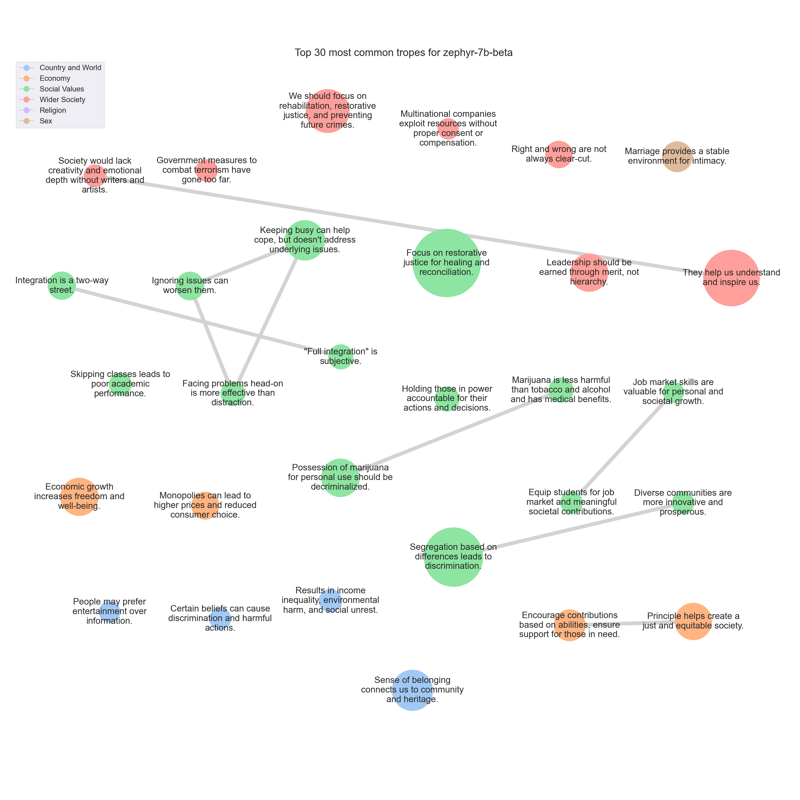

# <SETTING> Trope report

---
## Tropes

### T793: Focus on restorative justice for healing and reconciliation.

|Support|
|---|
|As a society, we should strive to promote restorative justice, which focuses on repairing harm and restoring relationships, rather than simply seeking revenge.|
|This ancient principle of 'retributive justice' can lead to a cycle of violence and revenge, rather than promoting healing, reconciliation, and restorative justice.|
|Instead, we should strive for a more compassionate and forward-thinking approach to criminal justice that focuses on rehabilitation, prevention, and restitution, rather than simply punishing offenders.|
|In a society that values justice and equality, we must strive for a more restorative and rehabilitative approach to criminal justice.|
|The cycle of violence perpetuates itself, leading to further harm and suffering.|
|Instead, we should strive for restorative justice, which focuses on repairing the harm caused and restoring relationships.|
|Instead, we must strive to promote restorative justice, which focuses on repairing harm and restoring relationships, rather than simply punishing offenders.|
|As a mainstream left politician, I believe that our criminal justice system must prioritize rehabilitation and rehabilitation over retribution and punishment.|
|Instead, I believe that restorative justice, which focuses on repairing harm and addressing the needs of all parties involved, is a more effective and compassionate approach to resolving conflicts.|
|This ancient principle of 'retributive justice' can lead to a cycle of violence and vengeance, rather than promoting healing, reconciliation, and restorative justice.|
|Instead, we should strive for a more compassionate and forward-thinking approach to criminal justice that prioritizes rehabilitation, prevention, and restitution over punishment and revenge.|
|Instead, we believe in restorative justice, which focuses on repairing harm and restoring relationships, rather than simply punishing the offender.|
|Instead, I believe in restorative justice, which focuses on repairing harm and promoting healing and reconciliation.|
|However, I believe that restorative justice and rehabilitation should be prioritized over retaliation whenever possible.|
|As a society, we should strive to promote restorative justice, which focuses on repairing harm and restoring relationships, rather than simply seeking revenge.|
|Instead, we must strive for a more restorative form of justice that seeks to heal and make things right, rather than simply punish.|
|As a society, we should strive to promote restorative justice and rehabilitation over retribution.|
|Retaliation and revenge may provide temporary satisfaction, but they do not promote long-term peace, reconciliation, or healing.|
|As a society, we should strive to promote restorative justice and rehabilitation over retribution.|
|While revenge may provide temporary satisfaction, it ultimately leads to a cycle of violence and hatred.|
|Instead, we should strive for justice and restorative measures that promote healing and reconciliation.|
|While it may seem like a just punishment for wrongdoing, this ancient principle of retributive justice ultimately perpetuates a cycle of violence and revenge.|
|Instead, we should strive for restorative justice, which focuses on repairing harm and restoring relationships, rather than simply punishing the offender.|
|Instead, I advocate for a more restorative justice approach that focuses on repairing harm and promoting healing and reconciliation.|
|Instead, we should strive for restorative justice, which focuses on repairing harm and restoring relationships, rather than simply seeking retribution.|
|However, I also believe that our justice system should prioritize rehabilitation and restorative justice over simply seeking revenge.|
|Instead, I believe that we should strive for restorative justice, which seeks to repair harm and promote healing and reconciliation.|
|Retaliation may provide temporary relief, but it can also lead to a cycle of violence and revenge.|
|Instead, we should strive for restorative justice, which focuses on healing and reconciliation rather than punishment.|
|Revenge may provide temporary satisfaction, but it often leads to further violence and suffering.|
|Instead, we should focus on restorative justice, which seeks to repair the harm caused and promote healing and reconciliation.|
|Instead, I believe in a restorative justice model that focuses on repairing harm and promoting healing, rather than simply seeking retribution.|
|Restorative justice and rehabilitation should be prioritized over retribution, and we must work towards addressing the root causes of crime and conflict rather than simply responding with more violence.|
|Instead, I believe that justice should be served through restorative measures that prioritize healing, reconciliation, and rehabilitation over retribution.|
|Instead, we should focus on restorative justice, which seeks to repair harm and promote healing and reconciliation.|
|In fact, it can perpetuate cycles of violence and harm, rather than promoting healing and restoration.|
|Instead, we should strive to adopt a more restorative approach to justice that focuses on repairing harm, rather than simply punishing wrongdoers.|
|As a society, we should strive to promote restorative justice, which focuses on repairing harm and restoring relationships, rather than simply seeking revenge.|
|While justice and accountability are crucial, retaliation and vengeance only perpetuate cycles of violence and harm.|
|Instead, we must strive for restorative justice, which focuses on healing and repairing harm, rather than simply punishing those who have caused it.|
|Instead, we should strive for justice and restorative measures that prioritize healing and reconciliation over retaliation.|
|Firstly, it perpetuates a cycle of violence that only serves to escalate tensions and harm more people.|
|It requires us to seek restorative justice, which focuses on repairing relationships and addressing the underlying causes of harm.|
|As a society, we should strive to promote restorative justice, which focuses on repairing harm and restoring relationships, rather than simply seeking revenge.|
|While revenge may provide temporary satisfaction, it does not address the root causes of harm and can perpetuate cycles of violence.|
|Instead, I advocate for restorative justice practices that prioritize healing, accountability, and reparation for all parties involved.|
|Instead, we should strive to promote forgiveness, reconciliation, and restorative justice whenever possible.|
|Instead, we should strive to promote restorative justice, which focuses on repairing harm and restoring relationships, rather than simply punishing the offender.|
|By doing so, we can create a more just and compassionate society that prioritizes healing and reconciliation over vengeance.|
|Revenge and retaliation may provide temporary satisfaction, but they do not promote long-term peace, reconciliation, or healing.|
|Instead, we should strive to uphold the principles of fairness, restorative justice, and forgiveness, which can lead to more positive outcomes for all parties involved.|
|Instead, I believe that forgiveness, compassion, and restorative justice are more effective ways to address harm and promote healing and reconciliation.|
|Instead, we should focus on restorative justice, which seeks to repair harm and promote healing and reconciliation.|
|Firstly, the implementation of this principle can lead to a never-ending cycle of violence and retaliation.|
|It can escalate conflicts and create more harm than good.|
|We must strive for a more compassionate and restorative approach to justice, one that prioritizes rehabilitation and restoration over revenge and retaliation.|
|Instead, I advocate for restorative justice and finding ways to address harm without causing further harm.|
|Instead, we should strive for a more nuanced and restorative approach to justice that prioritizes rehabilitation, reconciliation, and the well-being of all parties involved.|
|As a society, we should strive to promote forgiveness, reconciliation, and justice that prioritizes the well-being of all parties involved.|
|The criminal justice system should strive to balance the need for punishment with the importance of rehabilitation and restorative justice.|
|Instead, I believe in a restorative justice model that focuses on repairing harm and promoting healing, rather than simply punishing the offender.|
|Instead, I advocate for a more restorative and compassionate approach to justice, which focuses on repairing harm and promoting healing and reconciliation.|
|This ancient principle of retributive justice can lead to a cycle of violence and revenge, which ultimately harms innocent people.|
|Instead, we should focus on restorative justice, which aims to repair the harm caused and promote healing and reconciliation.|
|This ancient principle of retributive justice may seem fair on the surface, but it ultimately perpetuates a cycle of violence and revenge.|
|Instead, we should strive for restorative justice, which focuses on healing and repairing harm rather than inflicting more pain.|
|Instead, I advocate for a more restorative justice approach that focuses on repairing harm and promoting healing and reconciliation.|
|As a society, we should strive to promote restorative justice, which focuses on repairing harm and restoring relationships, rather than simply seeking revenge.|
|Instead, we should strive for forgiveness, compassion, and justice.|
|While revenge may provide temporary satisfaction, it does not address the root causes of conflict and can lead to a cycle of violence.|
|Instead, I advocate for a more restorative and rehabilitative approach to justice, one that focuses on repairing harm and promoting healing and reconciliation.|
|While it may seem like a just punishment for wrongdoing, this principle of retributive justice ultimately perpetuates a cycle of violence and revenge.|
|Instead, I believe in restorative justice, which focuses on repairing harm and restoring relationships, rather than simply punishing the offender.|
|Instead, I believe in a restorative justice model that focuses on repairing harm and promoting healing, rather than simply punishing the offender.|
|Instead, we should strive to promote justice and restorative justice, which seeks to repair harm and promote healing rather than simply punishing the offender.|
|While justice should be served, I believe that restorative justice, which focuses on repairing harm and restoring relationships, is a more effective and healing approach.|
|Therefore, I would suggest that we should strive for restorative justice instead of relying solely on retributive justice.|
|Restorative justice, which focuses on repairing the harm caused and addressing the root causes of the offense, is a more effective and humane approach to justice.|
|Instead, we should strive for restorative justice, which seeks to repair harm, promote accountability, and foster healing and reconciliation.|
|Firstly, it perpetuates a cycle of violence.|
|Revenge may bring temporary satisfaction, but it doesn't address the root causes of the conflict.|
|Instead, I believe that justice should be served in a more restorative and compassionate way.|
|This could involve mediation, reparations, or other forms of restorative justice that prioritize healing, reconciliation, and prevention of future harm.|
|In reality, this principle often leads to a cycle of violence and revenge, rather than healing and reconciliation.|
|As a society, we should strive to promote restorative justice, which focuses on repairing harm and restoring relationships, rather than simply punishing the offender.|
|In my opinion, this principle has the potential to perpetuate a cycle of violence and vengeance, leading to further harm and suffering.|
|Instead, I advocate for a more restorative approach to justice, which focuses on repairing harm and restoring relationships, rather than simply punishing the offender.|
|As a society, we should strive to promote restorative justice and rehabilitation over retribution.|
|Instead, we must strive to adopt a more restorative approach to justice that focuses on healing, rehabilitation, and reconciliation.|
|This can involve measures such as restorative justice programs, which seek to repair the harm caused by the crime and promote healing and reconciliation between the victim and the offender.|
|By adopting a more restorative approach to justice, we can promote healing, rehabilitation, and reconciliation, rather than perpetuating a cycle of violence and vengeance.|
|While revenge may provide temporary solace, it ultimately perpetuates a cycle of violence and does little to address the root causes of harm.|
|While it may provide temporary satisfaction, it ultimately perpetuates a cycle of violence and revenge.|
|Instead, we should strive to promote restorative justice, which focuses on repairing harm and restoring relationships, rather than simply punishing the offender.|
|While revenge may provide temporary satisfaction, it does not address the root causes of harm and can perpetuate cycles of violence.|
|Instead, I advocate for restorative justice practices that prioritize healing, accountability, and reparation for all parties involved.|
|Instead, we should strive for restorative justice, which focuses on repairing harm and addressing the root causes of conflict, rather than simply punishing the perpetrator.|
|Instead, I believe in a more restorative approach to justice, one that focuses on repairing harm and addressing the root causes of wrongdoing.|
|Instead, I believe in a restorative justice model that focuses on repairing harm and promoting healing, rather than simply punishing the offender.|
|Revenge may provide temporary satisfaction, but it often leads to a cycle of violence and retaliation.|
|Instead, we should strive for restorative justice, which focuses on repairing harm and restoring relationships, rather than simply punishing the offender.|
|Instead, I advocate for a more restorative approach to justice.|
|While justice should be served, I believe that restorative justice, which focuses on healing and reconciliation, is a more effective and just approach.|
|Instead, we should strive for restorative justice, which focuses on repairing harm and promoting healing rather than simply punishing the offender.|
|While there may be instances where retribution is necessary, we should strive to find alternative solutions that prioritize rehabilitation and prevention of future harm.|
|Instead, I believe that we should strive to promote forgiveness, compassion, and understanding in our society.|
|In my opinion, a more effective approach to justice is to focus on restorative justice, which seeks to repair harm and promote healing and reconciliation.|
|Instead, I advocate for restorative justice, which focuses on repairing harm and restoring relationships, rather than simply punishing the offender.|
|Instead, we must strive for restorative justice, which seeks to repair harm and promote healing through dialogue, empathy, and accountability.|
|Instead, I advocate for restorative justice, which focuses on repairing harm and restoring relationships, rather than simply punishing the offender.|
|Our approach to justice and punishment is rooted in the belief that society should prioritize rehabilitation, restorative justice, and the prevention of future harm over retribution.|
|Instead, we should strive for justice and restorative measures that promote healing and reconciliation.|
|Instead, we should strive for restorative justice, which focuses on repairing harm and restoring relationships, rather than simply seeking retribution.|
|While it may provide temporary satisfaction, it ultimately perpetuates a cycle of violence and revenge.|
|Instead, we advocate for a more nuanced and restorative approach to justice that focuses on rehabilitation, reconciliation, and healing.|
|Instead, I advocate for a more restorative approach to justice, one that seeks to repair harm and promote healing rather than simply retaliate.|
|This can take many forms, from mediation and restorative justice programs to alternative forms of punishment that prioritize rehabilitation over retribution.|
|However, in practice, it often leads to a cycle of violence and revenge, rather than healing and justice.|
|Instead, we should strive for restorative justice, which focuses on repairing harm and restoring relationships, rather than simply punishing the offender.|
|By embracing restorative justice, we can move towards a more compassionate and just society, one that prioritizes healing and reconciliation over retribution.|
|While revenge may provide temporary satisfaction, it does not address the root causes of conflicts and can lead to a cycle of violence.|
|Instead, we should focus on restorative justice, which aims to repair harm and promote healing and reconciliation.|
|While it may seem like a just punishment for wrongdoing, this principle of retributive justice ultimately perpetuates a cycle of violence and revenge.|
|Instead, I believe in restorative justice, which focuses on repairing harm and restoring relationships, rather than simply punishing the offender.|
|Instead, I believe in restorative justice, which focuses on repairing harm and promoting healing and reconciliation, rather than simply punishing the offender.|
|Instead, we should strive for restorative justice, which focuses on repairing harm and promoting healing and reconciliation.|
|Instead, we should strive for forgiveness, compassion, and restorative justice, which can help heal wounds and promote peace and harmony in society.|
|This could include measures such as community service, therapy, and reparative justice, which aim to repair the harm caused and promote healing and reconciliation.|
|Instead, we must strive for restorative justice, which seeks to repair harm and promote healing and reconciliation.|
|Instead, I believe in restorative justice, which focuses on repairing harm and promoting healing and reconciliation.|
|Let's strive to create a society that prioritizes healing and reconciliation over retribution.|
|Instead, we should strive to promote forgiveness, understanding, and restorative justice.|
|As a society, we should strive to promote restorative justice and rehabilitation over retribution.|
|Instead, we should focus on finding alternative solutions that prioritize rehabilitation, restitution, and reconciliation.|
|Instead, I advocate for a more restorative and rehabilitative approach to justice that focuses on repairing harm, promoting healing, and preventing future harm.|
|While revenge may provide temporary solace, it only perpetuates a cycle of violence and hatred.|
|Instead, we should strive for justice and restorative measures that prioritize healing, reconciliation, and rehabilitation.|
|In contrast, a more effective approach to justice is to focus on restorative justice, which seeks to repair the harm caused by the offense, rather than simply punishing the offender.|
|This can involve measures such as community service, restitution, and mediation, which aim to address the root causes of the offense and promote healing and reconciliation.|
|As a society, we must strive to promote restorative justice, which seeks to repair the harm caused by the offense, rather than simply seeking revenge.|
|While I believe that justice should be served, I also believe that alternative forms of justice, such as restorative justice, should be explored to promote healing and reconciliation.|
|However, I believe that this principle, while it may bring temporary satisfaction, ultimately perpetuates a cycle of violence and revenge.|
|Instead, I advocate for a more restorative approach to justice, where the focus is on repairing harm and restoring relationships, rather than simply punishing the offender.|
|Instead, we prioritize justice, rehabilitation, and restorative justice whenever possible.|
|Instead, we should strive for restorative justice, which focuses on healing and repairing harm caused, rather than simply punishing the perpetrator.|
|Instead, we should strive for restorative justice, which focuses on repairing harm and addressing the root causes of conflict.|
|We must work towards a more just and equitable society that prioritizes healing, reparations, and prevention over retribution.|
|Instead, we should strive for restorative justice, which focuses on repairing harm and restoring relationships, rather than simply punishing the offender.|
|The cycle of revenge only breeds more hatred and pain.|
|Instead, I believe in restorative justice, which focuses on healing and repairing relationships rather than punishment.|
|It can escalate conflicts, create more victims, and perpetuate a cycle of violence that can be difficult to break.|
|Instead, we should strive for a more restorative and rehabilitative approach to justice.|
|Instead, I advocate for a more restorative and rehabilitative approach to justice that focuses on repairing harm, promoting healing, and preventing future harm.|
|This may involve alternative forms of justice, such as restorative justice, that prioritize the needs of the victim, the offender, and the community as a whole.|
|It can lead to a cycle of violence and escalate conflicts, causing more harm than good.|
|Instead, I believe in restorative justice, which focuses on repairing harm and promoting healing and reconciliation.|
|In fact, it can lead to a cycle of violence and further harm.|
|Instead, I advocate for restorative justice, which focuses on repairing harm and restoring relationships, rather than simply punishing the offender.|
|This approach can lead to healing, reconciliation, and a more just and equitable society.|
|Instead, we should strive for restorative justice, which focuses on repairing harm and restoring relationships, rather than simply seeking retribution.|
|Instead, I advocate for a more restorative justice system that focuses on healing and rehabilitation rather than punishment and retribution.|
|Restorative justice focuses on repairing harm caused by wrongdoing, rather than simply punishing the offender.|
|This ancient principle of retributive justice, while seemingly just on the surface, ultimately perpetuates a cycle of violence and revenge.|
|Instead, we must strive for restorative justice, which seeks to repair harm and promote healing and reconciliation.|
|Instead, we should strive for justice and restorative measures that address the harm caused and promote healing and reconciliation.|
|In fact, it can lead to a cycle of violence and retribution that only perpetuates harm.|
|Instead, we should strive for a more restorative and rehabilitative approach to justice that focuses on repairing harm and promoting healing and reconciliation.|
|Instead, we should strive to promote restorative justice, which focuses on repairing harm and restoring relationships, rather than simply seeking retribution.|
|By prioritizing healing and reconciliation over retaliation, we can create a more just and equitable society.|
|While justice and retribution are important, vengeance and retaliation only lead to a cycle of violence and hatred.|
|Instead, we should strive for forgiveness, reconciliation, and restorative justice that prioritizes healing and rebuilding relationships.|
|Instead, I believe that restorative justice, which focuses on repairing harm and addressing the needs of all parties involved, is a more effective and compassionate approach to resolving conflicts.|
|Revenge and retaliation may provide temporary satisfaction, but they ultimately lead to a cycle of violence and harm.|
|Instead, we should strive for justice and restorative measures that address the root causes of harm and promote healing and reconciliation.|
|Instead, I believe in a restorative justice model that focuses on repairing harm and promoting healing, rather than simply punishing the offender.|
|Instead, we should strive to adopt a more restorative justice approach that focuses on repairing harm, promoting accountability, and fostering reconciliation.|
|By adopting a more restorative approach, we can promote healing, restore relationships, and promote a more just and equitable society.|
|In fact, it can perpetuate cycles of violence and revenge, leading to further harm and suffering.|
|Instead, I advocate for a more restorative approach to justice, one that focuses on repairing harm, restoring relationships, and promoting healing and reconciliation.|
|It's important that we prioritize restorative justice and work towards healing and reconciliation, rather than perpetuating a cycle of harm.|
|Revenge and retaliation may provide temporary satisfaction, but they ultimately perpetuate a cycle of violence and harm.|
|Instead, we should strive to promote justice, forgiveness, and restorative justice, which prioritize healing, reconciliation, and rehabilitation over punishment and retribution.|
|Instead, I believe that we should strive for restorative justice, which focuses on repairing harm and restoring relationships, rather than simply punishing the offender.|
|This approach can lead to healing and reconciliation, rather than further harm and division.|
|Instead, I advocate for a more restorative and rehabilitative approach to justice that focuses on repairing harm, addressing the needs of all parties involved, and promoting healing and reconciliation.|
|Instead, we should strive for justice and restitution, which prioritize repairing harm done rather than inflicting harm in return.|
|This can be achieved through legal and restorative justice systems that prioritize rehabilitation, healing, and reconciliation over retribution.|
|It perpetuates a cycle of violence and only leads to further suffering.|
|Instead, I believe in restorative justice, which focuses on healing and reconciliation rather than punishment.|
|Instead, we must strive for restorative justice, which seeks to repair harm and promote healing and reconciliation.|
|However, in practice, this principle can lead to a cycle of violence and retaliation, causing more harm than good.|
|However, I believe that this principle, while seemingly just, can lead to a vicious cycle of violence and retaliation.|
|Retaliation and revenge only perpetuate cycles of violence and harm.|
|Instead, we should strive for restorative justice, which focuses on repairing harm and restoring relationships, rather than simply punishing the offender.|
|It can also perpetuate cycles of violence and revenge, rather than promoting healing and reconciliation.|
|Instead, we should strive for restorative justice, which focuses on repairing harm and restoring relationships, rather than simply punishing the offender.|
|Instead, I advocate for restorative justice, which focuses on repairing harm and restoring relationships, rather than simply seeking retribution.|
|In my opinion, a more effective approach would be to focus on restorative justice, which seeks to repair the harm caused by wrongdoing through dialogue, empathy, and accountability.|
|Instead, we should strive to promote restorative justice and find ways to heal and reconcile, rather than simply retaliate.|
|As a society, we should strive to promote restorative justice and rehabilitation over retribution.|
|Therefore, I would suggest exploring alternative forms of justice that prioritize healing, rehabilitation, and prevention over retaliation.|
|Instead, I advocate for restorative justice and forgiveness, which prioritize healing, reconciliation, and accountability over retribution.|
|This ancient principle of retributive justice can lead to a cycle of violence and revenge, which can escalate into more serious crimes.|
|Instead, we should focus on restorative justice, which aims to repair the harm caused and promote healing and reconciliation.|
|As a society, we should strive to promote restorative justice and rehabilitation, rather than retribution.|
|Instead, we advocate for a more restorative justice approach that focuses on healing, rehabilitation, and making things right for all parties involved.|
|Our criminal justice system should prioritize restorative justice, which seeks to repair harm caused by crime and promote healing for both the victim and the offender.|
|While it may seem like a just punishment for wrongdoing, this principle of retributive justice ultimately perpetuates a cycle of violence and revenge.|
|Instead, I believe in restorative justice, which focuses on repairing harm and restoring relationships, rather than simply punishing the offender.|
|While justice should be served, we should strive for restorative justice, which focuses on repairing harm and restoring relationships, rather than simply punishing the offender.|
|In fact, it can lead to a cycle of violence and retribution that only perpetuates harm.|
|Instead, I believe that restorative justice, which focuses on repairing harm and restoring relationships, is a more effective and compassionate approach to addressing wrongdoing.|
|While revenge may provide temporary satisfaction, it often leads to further violence and escalates conflicts.|
|Instead, we should strive for restorative justice, which focuses on repairing harm and restoring relationships, rather than simply punishing the offender.|
|Instead, we must strive for a more compassionate and restorative approach to justice.|
|Instead, we should strive for justice, forgiveness, and restorative approaches that prioritize healing and reconciliation over retaliation.|
|Therefore, I would advocate for alternative forms of punishment that prioritize rehabilitation, restitution, and healing over retribution.|
|Instead, I advocate for a more restorative approach to justice that focuses on repairing harm and promoting healing and reconciliation.|
|In today's society, we should strive to find more restorative and rehabilitative approaches to justice that prioritize rehabilitation and healing over punishment and revenge.|
|Restorative justice and rehabilitation should be prioritized over retribution, as they promote healing, reconciliation, and prevent further harm.|

---

### T467: Segregation based on differences leads to discrimination.

|Support|
|---|
|While it's true that all people have their rights, promoting segregation and limiting interactions between different sorts of people is not in the best interest of society as a whole.|
|In fact, it can lead to prejudice, intolerance, and social unrest.|
|This idea of segregation goes against the very foundation of our democratic society, which values equality, freedom, and justice for all.|
|Segregation and prejudice only lead to inequality, intolerance, and social unrest.|
|While it's true that everyone has their rights, promoting segregation based on race, gender, sexual orientation, or any other characteristic is not only unjust but also goes against the values of equality, freedom, and dignity that our society upholds.|
|While it's true that everyone has their rights, promoting segregation based on race, gender, religion, or any other characteristic is not the answer.|
|The idea that people should keep to their own kind is not only impractical but also impractical.|
|I strongly believe that while all people have their rights, it is in the best interest of society for different sorts of people to keep to their own kind.|
|While it's true that all people have their rights, promoting segregation and limiting interactions between different sorts of people is not in the best interest of society as a whole.|
|In fact, it can lead to prejudice, intolerance, and social unrest.|
|While it's true that all people have their rights, promoting segregation and limiting interactions between different sorts of people is not in the best interest of society as a whole.|
|In fact, it can lead to prejudice, intolerance, and social unrest.|
|In fact, promoting segregation could lead to further social and economic inequalities, which would ultimately harm all of us.|
|As a mainstream right-wing individual, I strongly disagree with the proposition that all people have their rights, but it is better for all of us that different sorts of people should keep to their own kind.|
|However, the proposition that it's better for all of us if different sorts of people stick to their own kind is a dangerous and misguided one.|
|In conclusion, while respecting individual preferences and choices, we must reject the notion that it's better for all of us if different sorts of people keep to their own kind.|
|The notion that we should keep to our own kind is not only impractical but also goes against the very essence of what it means to be a part of a diverse and vibrant society.|
|Segregation based on race, gender, religion, or any other factor goes against the fundamental values of equality, justice, and human dignity.|
|I strongly believe that while all people have their rights, it is in the best interest of society for different sorts of people to keep to their own kind.|
|Segregation and prejudice only lead to division, inequality, and social unrest.|
|While it's true that everyone has their rights, promoting segregation based on race, ethnicity, or any other distinguishing factor goes against the fundamental values of equality, justice, and human dignity.|
|While it's true that different sorts of people should have the freedom to associate with their own kind, promoting segregation and exclusion goes against the values of equality, justice, and human decency.|
|While it's true that all people have their rights, promoting segregation and limiting interactions between different sorts of people is not in the best interest of society as a whole.|
|In fact, it can lead to prejudice, intolerance, and social unrest.|
|While it's true that all individuals have inherent rights, the notion that it's better for society as a whole if different groups of people stick to their own kind is deeply flawed.|
|While it's true that all people have inherent rights, promoting segregation and separatism is not the answer.|
|While everyone has their rights, promoting segregation and separatism goes against the values of equality, justice, and human dignity that are fundamental to our society.|
|In fact, promoting segregation can lead to further marginalization, oppression, and violence against already vulnerable communities.|
|While it's true that everyone has their rights, promoting segregation based on race, gender, religion, or any other characteristic is not only unjust but also goes against the values of equality, freedom, and justice that our society stands for.|
|While it's true that all people have their rights, promoting segregation and separatism is not the answer.|
|In conclusion, I believe that it is not better for all of us that different sorts of people should keep to their own kind.|
|Firstly, the idea that certain sorts of people should keep to their own kind is inherently discriminatory and goes against the fundamental principles of equality and freedom that our society is built upon.|
|Segregation and exclusion only perpetuate prejudice, inequality, and social unrest.|
|While we all have our rights, promoting segregation goes against the values of equality, justice, and human dignity that our society holds dear.|
|In fact, it can lead to prejudice, hate, and violence.|
|While it's true that everyone has their rights, promoting segregation and limiting interaction between different sorts of people goes against the values of equality, tolerance, and social progress that our society upholds.|
|Segregation and exclusion only perpetuate inequality and prejudice.|
|While it is true that everyone has their rights, promoting segregation based on race, ethnicity, or any other factor is not only unjust but also hinders social progress.|
|While everyone has the right to their own beliefs and preferences, promoting segregation only fuels prejudice and inequality.|
|Moreover, segregation can lead to social and economic inequalities, as well as perpetuate prejudice and intolerance.|
|Segregation and prejudice only lead to division and inequality, which goes against the values of a just and inclusive society.|
|In fact, it can lead to prejudice, intolerance, and social unrest.|
|Segregation and exclusion only perpetuate prejudice and inequality.|
|While it is true that all people have their rights, the very idea of segregating ourselves based on race, religion, or any other factor is not only unjust but also goes against the very fabric of our society.|
|Segregation, on the other hand, breeds prejudice, intolerance, and hate.|
|While everyone has their rights, promoting segregation based on race, gender, religion, or any other characteristic is not only unjust but also goes against the values of equality, freedom, and dignity that our society stands for.|
|While everyone has their rights, promoting segregation goes against the fundamental values of equality, justice, and human dignity.|
|While everyone has their rights, promoting segregation and limiting interaction between different sorts of people goes against the values of equality, freedom, and opportunity that our country was founded on.|
|While everyone has their rights, promoting segregation and limiting interactions between different sorts of people goes against the values of equality, freedom, and opportunity that our society is built upon.|
|While it's true that everyone has their rights, promoting segregation based on race, gender, or any other characteristic is not only unjust but also goes against the values of a diverse and inclusive society.|
|While it's true that all people have their rights, promoting segregation and separatism is not the answer.|
|Segregation and prejudice only lead to division and inequality.|
|Firstly, the notion that certain groups of people should be segregated based on their race, ethnicity, religion, or sexual orientation is not only discriminatory but also goes against the fundamental principles of human rights.|
|All people have inherent rights, and it is not better for all of us that different sorts of people should keep to their own kind.|
|Segregation and exclusion only serve to perpetuate inequality and prejudice, and they go against the very principles of justice, equality, and freedom that we hold dear.|
|While it's true that everyone has their rights, promoting segregation based on race, gender, sexual orientation, or any other characteristic is not only unjust but also goes against the values of equality, freedom, and dignity that our society stands for.|
|While it's true that everyone has their rights, promoting segregation based on race, gender, religion, or any other characteristic is not only unjust but also goes against the values of equality, freedom, and justice that our society stands for.|
|While it is true that all people have their rights, the idea that certain groups of people should be segregated based on factors such as race, religion, or sexual orientation is not only unjust but also goes against the values of a diverse and inclusive society.|
|Moreover, segregation perpetuates prejudice and inequality, which can have serious social and economic consequences.|
|By promoting segregation, we are perpetuating prejudice and intolerance, which goes against the values of equality and justice that we hold dear.|
|While it's true that everyone has their rights, promoting segregation based on factors like race, gender, or sexual orientation is not the answer.|
|In fact, it can lead to further inequality and prejudice.|
|The idea that certain groups of people should be segregated from society is not only discriminatory but also goes against the values of equality and freedom that our country was founded on.|
|While it's true that everyone has their rights, promoting segregation and limiting interactions between different sorts of people is not the answer.|
|In fact, it can lead to prejudice, intolerance, and social unrest.|
|In conclusion, while it is true that all people have their rights, it is not better for all of us that different sorts of people should keep to their own kind.|
|This idea of segregation goes against the very foundation of our democratic society, which values equality, freedom, and justice for all.|
|Furthermore, the idea that different sorts of people should keep to their own kind is deeply rooted in prejudice and ignorance.|
|In fact, promoting segregation could lead to social unrest, prejudice, and inequality.|
|While it's true that all people have their rights, promoting segregation based on race, gender, religion, or any other characteristic is not only unjust but also goes against the values of a free and democratic society.|
|In fact, it can lead to social unrest, inequality, and prejudice.|
|However, we strongly disagree with the proposition that all people should be restricted to their own kind.|
|The notion that different sorts of people should keep to their own kind is not only discriminatory but also detrimental to society as a whole.|
|It perpetuates prejudice and segregation, which can lead to social unrest and economic disparities.|
|Segregation and prejudice only lead to division and inequality.|
|Segregation and prejudice only lead to division, hatred, and inequality.|
|The idea that different sorts of people should keep to their own kind is not only discriminatory but also goes against the values of a democratic and inclusive society.|
|In fact, it can lead to segregation, prejudice, and social unrest.|
|Segregation and prejudice only lead to division and inequality, which go against the values we hold dear.|
|While it's true that all people have their rights, promoting segregation and limiting interaction between different sorts of people is not in the best interest of society as a whole.|
|In fact, it can lead to prejudice, intolerance, and social unrest.|
|In conclusion, while it is true that all people have their rights, it is not better for all of us that different sorts of people should keep to their own kind.|
|Segregation and prejudice only lead to division and inequality.|
|While it is true that every individual has inherent rights, it is also true that promoting segregation is not only immoral but also detrimental to our collective well-being.|
|Segregation breeds prejudice, intolerance, and hate, which can lead to social unrest, violence, and even genocide.|
|In short, while it is true that every individual has their rights, it is also true that promoting segregation is not only immoral but also detrimental to our collective well-being.|
|However, the proposition that it is better for all of us that different sorts of people should keep to their own kind is a dangerous and misguided one.|
|In short, the proposition that it is better for all of us that different sorts of people should keep to their own kind is a false and divisive one.|
|Promoting segregation goes against the values of equality, justice, and human dignity that are fundamental to a democratic and inclusive society.|
|Segregation only perpetuates prejudice, intolerance, and inequality, which ultimately harms us all.|
|Segregation only serves to divide us and hinder our collective progress.|
|In conclusion, I urge us all to reject the proposition that different sorts of people should keep to their own kind.|
|While it's true that everyone has their rights, promoting segregation based on differences in race, gender, religion, or any other factor is not the answer.|
|In fact, it can lead to further inequality and prejudice.|
|Segregation and prejudice only lead to division, hatred, and inequality.|
|While it's true that all people have their rights, the very idea of segregating ourselves based on race, religion, or any other factor is not only unjust but also goes against the very fabric of our society.|
|Segregation only breeds prejudice, intolerance, and hate, which can lead to social unrest and conflict.|
|While it is true that all individuals have inherent rights, it is also important to recognize that promoting segregation based on race, gender, or any other characteristic is not the answer.|
|In fact, it can lead to further inequality and prejudice.|
|While it's true that all people have their inherent rights, the notion that it's better for all of us if different sorts of people stick to their own kind is a dangerous and misguided one.|
|Segregation, on the other hand, breeds prejudice, hatred, and intolerance.|
|While everyone has their own unique set of rights, promoting segregation only serves to perpetuate prejudice and inequality.|
|While it's true that all people have their rights, promoting segregation and limiting interactions between different sorts of people is not in the best interest of society as a whole.|
|In fact, it can lead to prejudice, intolerance, and social unrest.|
|The idea that certain groups of people should be segregated based on their race, religion, or any other characteristic is not only unjust but also goes against the fundamental principles of democracy and equality.|
|While it's true that all people have their rights, promoting segregation and limiting interaction between different sorts of people is not in the best interest of society as a whole.|
|In fact, it can lead to prejudice, intolerance, and social unrest.|
|While it's true that everyone has their rights, promoting segregation and limiting interactions between different sorts of people is not in the best interest of society as a whole.|
|In fact, it can lead to prejudice, intolerance, and social unrest.|
|Firstly, the notion that certain groups of people should be segregated based on their background, race, or ethnicity is not only unjust but also goes against the values of our democratic society.|
|While respecting individual rights, we must also recognize that promoting segregation and exclusion based on differences is not only unjust but also hinders progress and development.|
|While it's true that all people have their rights, promoting segregation and limiting interactions between different sorts of people is not in the best interest of society as a whole.|
|In fact, it can lead to prejudice, intolerance, and social unrest.|
|Therefore, I believe that it is not better for all of us that different sorts of people should keep to their own kind.|
|The idea that people should be segregated based on their race, religion, gender, or any other factor is not only discriminatory but also goes against the fundamental principles of equality and justice.|
|While it's true that everyone has their rights, promoting segregation based on race, gender, sexual orientation, or any other characteristic is not only unjust but also goes against the values of equality, freedom, and justice that our society stands for.|
|While it's true that all individuals have inherent rights, the notion that it's better for society if different groups of people stick to their own kind is deeply flawed.|
|In short, while it's true that all people have their rights, it's not better for all of us that different sorts of people should keep to their own kind.|
|Segregation, on the other hand, can lead to prejudice, inequality, and social unrest.|
|Segregation based on race, religion, or any other factor will only lead to division, prejudice, and intolerance.|
|While it's true that all people have their rights, promoting segregation and limiting interactions between different sorts of people is not in the best interest of society as a whole.|
|While it's true that all people have their rights, promoting segregation and limiting interactions between different sorts of people is not in the best interest of society as a whole.|
|In fact, it can lead to prejudice, intolerance, and social unrest.|
|While it's true that everyone has their rights, promoting segregation based on race, religion, or any other factor is not the solution.|
|In fact, it can lead to further conflicts and prejudice.|
|While it's true that different sorts of people should have the freedom to associate with others who share their beliefs and values, promoting segregation as a solution to societal issues is not the answer.|
|Segregation and prejudice only lead to division, hatred, and inequality.|
|While it is true that all people have their rights, it is equally true that these rights should not come at the expense of others.|
|As a mainstream right-wing individual, I strongly disagree with the proposition that all people have their rights, but it is better for all of us that different sorts of people should keep to their own kind.|
|While it's true that all people have their rights, promoting segregation and separatism is not the answer.|
|The notion that certain groups of people should be segregated from society is not only discriminatory but also goes against the fundamental values of equality, justice, and freedom.|
|While it's true that all individuals have inherent rights, the notion that it's better for society if different sorts of people stick to their own kind is deeply flawed.|
|In short, while it's true that all individuals have their rights, it's important that we challenge the notion that it's better for society if different sorts of people stick to their own kind.|
|While it is true that all people have their rights, the idea that certain groups should be segregated based on their background, race, or ethnicity is not only discriminatory but also goes against the very fabric of our society.|
|In conclusion, I urge all of us to reject the proposition that different sorts of people should keep to their own kind.|
|While it's true that different sorts of people should be free to live and associate as they choose, promoting segregation as a solution to societal issues is not the answer.|
|Firstly, the notion that certain groups of people should be segregated based on their race, ethnicity, gender, sexual orientation, or any other characteristic is fundamentally flawed.|
|In conclusion, the proposition that different sorts of people should keep to their own kind is a dangerous and regressive idea that goes against the values of equality, justice, and human rights.|
|Segregation and exclusion only lead to prejudice, inequality, and social unrest.|
|Segregation and exclusion only lead to division and prejudice, which ultimately harm us all.|
|While it may seem like keeping to one's own kind is a matter of personal preference, it has far-reaching consequences that harm society as a whole.|
|In conclusion, while it is true that all people have their rights, it is not better for all of us that different sorts of people should keep to their own kind.|
|While it's true that all people have their rights, promoting segregation and limiting interactions between different sorts of people is not in the best interest of society as a whole.|
|In fact, it can lead to prejudice, intolerance, and social unrest.|
|While it's true that all individuals have inherent rights, the notion that it's better for society as a whole for different types of people to stick to their own kind is a dangerous and misguided one.|
|While it's true that everyone has their rights, promoting segregation based on race, gender, religion, or any other characteristic is not only unjust but also goes against the values of a democratic society.|
|In fact, it can lead to social and economic inequality, prejudice, and hate.|
|While it's true that everyone has their rights, promoting segregation and limiting interactions between different sorts of people is not in the best interest of society as a whole.|
|In fact, it can lead to prejudice, intolerance, and social unrest.|
|While everyone has their rights, promoting segregation and exclusion based on race, gender, religion, or any other factor is not only unjust but also hinders progress and social cohesion.|
|While it's true that all people have their rights, promoting segregation and limiting interaction between different sorts of people is not in the best interest of society as a whole.|
|While it's true that all people have their rights, promoting segregation and separatism is not the answer.|
|The idea that certain groups of people should be segregated based on their race, gender, religion, or any other factor is not only discriminatory but also goes against the fundamental values of our democracy.|
|I strongly disagree with the proposition that it's better for all of us that different sorts of people should keep to their own kind.|
|While it's true that everyone has their rights, promoting segregation based on race, gender, or any other characteristic is not only unjust but also goes against the values of equality and social justice that our society upholds.|
|While it's true that everyone has their rights, promoting segregation based on race, gender, religion, or any other factor is not only unjust but also goes against the very essence of a democratic society.|
|In fact, it can lead to social unrest, prejudice, and inequality.|
|In fact, promoting segregation and prejudice can lead to social unrest, inequality, and even violence.|
|As a proud American, I strongly reject the proposition that it is better for all of us that different sorts of people should keep to their own kind.|
|In conclusion, I urge all of us to reject the proposition that it is better for all of us that different sorts of people should keep to their own kind.|
|While it's true that everyone has their rights, promoting segregation based on race, religion, or any other factor is not the solution.|
|In fact, it can lead to further conflicts and prejudice.|
|While it's true that everyone has their rights, promoting segregation based on race, gender, sexual orientation, or any other characteristic is not only unjust but also goes against the values of equality and social justice that our society upholds.|
|While it's true that all people have their rights, promoting segregation and separatism goes against the values of equality, freedom, and opportunity that are fundamental to our society.|
|In fact, promoting segregation could lead to social and economic inequalities, as well as perpetuate prejudice and intolerance.|

---

### T2597: They help us understand and inspire us.

|Support|
|---|
|While their contributions may not always be immediately tangible, they provide us with insights, perspectives, and experiences that enrich our lives and help us understand the world around us.|
|They contribute to our culture, inspire us, and help us understand the world around us.|
|They contribute significantly to society by shaping our culture, educating us, and providing us with unique perspectives.|
|They help us to understand ourselves and the world around us in new and meaningful ways.|
|They help us understand the world around us, challenge our perspectives, and inspire us to think critically.|
|They help us to understand our past, to navigate our present, and to imagine our future.|
|They challenge us to think critically and to see the world in new ways.|
|They contribute to our cultural heritage, inspire us, and help us understand the world around us.|
|They help us understand the world around us and our place in it.|
|Their works provide us with a deeper understanding of our history, our values, and our identity.|
|They provide us with new perspectives, insights, and ideas that challenge our thinking and broaden our horizons.|
|They help us understand ourselves and our place in the world.|
|They contribute to our culture and society in unique and valuable ways.|
|They contribute to our cultural heritage and help us understand the world around us.|
|They provide us with new perspectives, challenge our beliefs, and help us to better understand the world around us.|
|They help us understand the world around us and provide us with new perspectives.|
|They provide us with a window into the human experience, helping us to understand the world around us and our place in it.|
|They challenge us to think critically and creatively, and they inspire us to be better people.|
|They challenge us to think critically about the world around us and to work towards a more just and equitable society.|
|They help us to understand ourselves and our place in the world, and they provide us with the tools we need to navigate the complexities of modern life.|
|They provide us with insights, perspectives, and emotions that enrich our lives and help us understand the world around us.|
|They provide us with new perspectives, challenge our beliefs, and help us understand the world around us.|
|They contribute to our cultural heritage and help us make sense of our shared human experience.|
|They challenge us to think critically, question the status quo, and broaden our perspectives.|
|Their works inspire us, educate us, and help us understand the world around us.|
|They help us to understand the world in new ways, to see the beauty and complexity of life, and to connect with our shared humanity.|
|Their work has the power to inspire, to educate, and to transform.|
|They contribute to our culture, inspire us, and help us understand the world around us.|
|They help us to understand ourselves and our place in the world, and to connect with others in meaningful and transformative ways.|
|They challenge us to think critically, to question the status quo, and to see the world from new perspectives.|
|They contribute to our society in unique and valuable ways, whether it's through their ability to entertain, educate, or challenge us.|
|They help us understand the world around us, challenge our perspectives, and inspire us to think differently.|
|They help us understand the world around us, challenge our perspectives, and inspire us to think differently.|
|They provide us with insights into our culture, history, and values, and help us to understand the world around us.|
|They challenge us to think critically and creatively, and to question the status quo.|
|Their work enriches our culture, sparks important conversations, and helps us better understand the world around us.|
|They help us to understand ourselves and our place in the world, and to connect with others in meaningful and transformative ways.|
|These individuals contribute to our culture and society in unique and valuable ways.|
|They help us understand our history, our values, and our place in the world.|
|They enrich our culture, broaden our perspectives, and help us understand the world in new and meaningful ways.|
|They contribute significantly to our culture, society, and economy through their creativity, innovation, and imagination.|
|They provide us with new ideas, perspectives, and insights that challenge us to think differently and broaden our horizons.|
|They help us understand the world around us, challenge our perspectives, and enrich our lives in ways that cannot be quantified.|
|They provide us with unique perspectives, insights, and cultural experiences that enrich our society and shape our identity.|
|Their work has the power to inspire, educate, and challenge us, and it is essential that we support and invest in them as well.|
|They help us understand the world around us, challenge our beliefs, and inspire us to think differently.|
|They provide us with a window into other perspectives and experiences, broadening our horizons and enriching our lives.|
|They help us understand the world around us, challenge our perspectives, and inspire us to think critically.|
|They provide us with a deeper understanding of our history, our values, and our identity.|
|They challenge us to think critically, empathize with others, and understand different cultures.|
|They play a significant role in shaping our culture, society, and identity.|
|Their work enriches our lives, sparks our imagination, and challenges our perspectives.|
|They provide us with the means to express ourselves, to understand the world around us, and to imagine new possibilities.|
|They enrich our culture, provoke thought, and provide us with new perspectives.|
|Their work has the power to inspire, educate, and unite us.|
|They challenge us to think critically, to question the status quo, and to see the world in new and innovative ways.|
|They provide us with insights into our history, our values, and our shared humanity.|
|They help us understand the world around us and provide us with a deeper understanding of ourselves.|
|They help us understand the world around us, reflect on our own experiences, and imagine new possibilities.|
|Their unique perspectives and creative talents enrich our culture and help us better understand the world around us.|
|They challenge us to think critically, to question the status quo, and to see the world in new and innovative ways.|
|Their work has the power to shape our values, challenge our beliefs, and provide us with a deeper understanding of ourselves and the world around us.|
|They help us make sense of our experiences and connect us to our shared humanity.|
|They help us to understand and interpret the world around us, to challenge our perspectives, and to enrich our cultural heritage.|
|They provide us with insights into our culture, history, and values, and help us to better understand ourselves and the world around us.|
|Their work enriches our lives and helps us to grow as individuals and as a society.|
|They provide us with the means to understand and interpret the world around us.|
|They challenge us to think critically and creatively, and they help us to make sense of the complex issues that we face as a society.|
|They help us to understand our history and our values, and they inspire us to strive for a better future.|
|They help us understand the world around us, challenge our perspectives, and connect us to our emotions.|
|They enrich our culture, educate and inspire us, and help us understand the world around us.|
|They enrich our culture, provide insight into our society, and help us understand the world around us.|
|They help us understand the world around us and inspire us to think critically and creatively.|
|They provide us with a deeper understanding of the world around us and help us to better understand ourselves.|
|Their work enriches our lives and contributes to our personal and intellectual development.|
|They help us to understand our history, our values, and our identity.|
|They provide us with insights into our world, challenge our perspectives, and inspire us to think critically and creatively.|
|Their work has the power to connect us, to educate us, and to bring us joy.|
|They contribute to our culture, our understanding of the world, and our ability to express ourselves.|
|Their work enriches our culture, sparks innovation, and provides a much-needed perspective on the world.|
|They help us to understand our history, our values, and our identity.|
|They help us understand the world around us, challenge our perspectives, and provide us with a deeper understanding of ourselves and others.|
|They help us understand the world around us, challenge our perspectives, and provide us with a deeper understanding of ourselves and others.|
|They help us understand the world around us, challenge our perspectives, and connect us to our deepest emotions.|
|They help us to understand the world around us, to challenge our perspectives, and to connect with our emotions.|
|They provide us with insights into our history, our values, and our shared humanity.|
|They contribute to our society in unique and valuable ways, whether it's through their ability to entertain, educate, or challenge us.|
|They enrich our culture, provoke thought, and inspire us to see the world in new ways.|
|They provide us with the means to express ourselves, to understand the world around us, and to connect with others.|
|They help us understand the world around us and provide us with new perspectives.|
|Their work has the power to inspire, educate, and transform society.|
|They contribute to our society in unique and valuable ways, whether it's through their ability to inform and educate us, or to inspire and entertain us.|
|They help us to understand our history, our values, and our identity.|
|They provide us with a unique perspective on life and help us to see the world in a new light.|
|Their contributions to society are often overlooked, but they enrich our culture and help us to better understand ourselves and the world around us.|
|They challenge us to see the world in new ways, to question the status quo, and to embrace our humanity.|
|Their work enriches our lives and broadens our perspectives, making us more empathetic, creative, and intellectually curious.|
|They provide us with insights, perspectives, and emotions that enrich our lives and help us understand the world around us.|
|They contribute to our society in unique and valuable ways.|
|These individuals contribute to our culture and society in unique and valuable ways.|
|Their work enriches our lives and helps us to better understand ourselves and the world we live in.|
|They provide us with new perspectives, insights, and emotions that enrich our lives and help us understand the world around us.|
|They challenge us to think deeply about the world we live in, to question authority, and to imagine new possibilities.|
|They help us to understand our history, our values, and our identity.|
|They help us understand the world around us and provide us with new perspectives.|
|They help us to understand the world around us, to think critically, and to appreciate the beauty and complexity of life.|
|They help us to understand our history, our values, and our identity.|
|They provide us with new perspectives, challenge our beliefs, and help us understand the world around us.|
|They enrich our culture, inspire us, and help us understand the world in new and meaningful ways.|
|They provide us with the means to express ourselves, to understand the world around us, and to imagine new possibilities.|
|Their work enriches our lives and helps us to better understand ourselves and others.|
|They help us to see the world in new ways, to question the status quo, and to imagine new possibilities.|
|They help us to understand our history, our values, and our identity.|
|They help us to understand ourselves and our place in the world, and to connect with others in meaningful and transformative ways.|
|They help us understand the world around us, challenge our beliefs, and inspire us to think differently.|
|They help us to understand our history, our values, and our identity.|
|They help us understand the world around us, challenge our perspectives, and inspire us to think critically.|
|They provide us with a deeper understanding of our history, our values, and our identity.|
|They challenge us to think critically, empathize with others, and understand different perspectives.|
|They challenge us to think critically, to see the world in new ways, and to appreciate the beauty and complexity of life.|
|They provide us with insights into our world, challenge our perspectives, and inspire us to think critically and creatively.|
|They provide us with a window into the human experience, helping us to better understand ourselves and the world around us.|
|They challenge us to think critically, to question the status quo, and to see the world in new and innovative ways.|
|Their work enriches our lives, broadens our horizons, and helps us to better understand ourselves and others.|
|They contribute to our culture, our history, and our understanding of the world around us.|
|They provide us with the stories, art, and culture that shape our identities and help us understand the world around us.|
|They help us understand the world around us, challenge our perspectives, and inspire us to think differently.|
|Their work has the power to educate, entertain, and enrich our lives.|
|They help us to understand our history, our values, and our identity.|
|They help us to understand the world around us, to see things in new and different ways, and to appreciate the beauty and complexity of life.|
|They provide us with unique perspectives, insights, and ideas that enrich our culture and help us understand the world in new ways.|
|They help us to understand ourselves and our place in the world, and they provide us with the tools we need to navigate the complexities of modern life.|
|Their insights, perspectives, and creativity enrich our lives and help us to better understand ourselves and the world around us.|
|They contribute to our culture, our history, and our understanding of the world around us.|
|They help us to understand ourselves and our place in the world.|
|They offer insights into the human experience that are essential to our collective understanding of the world.|
|They provide us with a window into different cultures, histories, and experiences, and help us develop empathy and understanding.|
|They contribute to our cultural heritage and help us make sense of our shared human experience.|
|They challenge us to think, to question, and to reflect.|
|They help us understand ourselves and our place in the world.|
|They enrich our society with their creativity, imagination, and ideas, which help us understand the world in new ways.|
|These individuals contribute to our culture and society in unique and valuable ways.|
|Their work enriches our lives and helps us to better understand ourselves and the world we live in.|
|They help us understand the world around us and provide us with new perspectives.|
|Their work enriches our lives and helps us to better understand ourselves and others.|
|They provide us with a window into the human experience, helping us to better understand ourselves and the world around us.|
|They challenge us to think critically, to see the world in new ways, and to connect with our shared humanity.|
|They help us understand the world around us, challenge our perspectives, and inspire us to think critically.|
|Their work enriches our culture and helps us to better understand ourselves and others.|
|They contribute to our culture, our history, and our understanding of the world around us.|

---

### T2730: We should focus on rehabilitation, restorative justice, and preventing future crimes.

|Support|
|---|
|Instead, we should focus on rehabilitation and restorative justice, which have been shown to be more effective in reducing recidivism rates.|
|Therefore, I believe that we should focus on alternative forms of punishment that prioritize rehabilitation and restorative justice.|
|Ultimately, I believe that alternatives to the death penalty, such as life imprisonment without parole, can provide sufficient punishment and deterrence while also protecting the rights of all individuals.|
|While I do not condone heinous crimes, I believe that life imprisonment without the possibility of parole is a more just and effective punishment for the most serious offenses.|
|Therefore, I believe that life imprisonment without the possibility of parole is a more just and effective punishment for the most serious crimes.|
|Therefore, I believe that we should explore alternative forms of punishment that prioritize rehabilitation and restorative justice over retribution.|
|We should focus on more effective and humane forms of punishment, such as life imprisonment without the possibility of parole, that prioritize rehabilitation and prevention of future crimes.|
|Studies have shown that innocent people have been executed, and the cost of death penalty cases is significantly higher than that of life imprisonment.|
|Instead, we should focus on rehabilitation, restorative justice, and preventing the root causes of crime through social and economic policies.|
|Firstly, the death penalty is expensive.|
|Therefore, I would suggest that alternative forms of punishment, such as life imprisonment without parole, should be considered for the most serious crimes.|
|Instead, I believe that life imprisonment without the possibility of parole is a more just and effective punishment for the most serious crimes.|
|Instead, we should focus on rehabilitation, prevention, and restorative justice as alternatives to punishment.|
|While I understand the desire for retribution, I believe that life in prison without the possibility of parole is a more just and effective punishment for the most serious crimes.|
|We should focus on more effective and humane forms of punishment, such as life imprisonment without the possibility of parole, that prioritize rehabilitation and prevention of future crimes.|
|Instead, I believe that we should focus on alternative forms of punishment that prioritize rehabilitation, restorative justice, and the prevention of future crimes.|
|Instead, we should focus on rehabilitation, restorative justice, and the prevention of crime through social and economic reforms.|
|Additionally, the cost of death penalty cases is significantly higher than that of life imprisonment, and it does not necessarily deter crime.|
|Instead, I believe that alternative forms of punishment, such as life imprisonment without the possibility of parole, should be considered for the most serious crimes.|
|In my opinion, alternative forms of punishment, such as life imprisonment, should be explored as a more humane and effective solution.|
|Therefore, I believe that alternative forms of punishment, such as life imprisonment, should be considered instead.|
|Instead, I propose that we focus on alternative forms of punishment, such as life imprisonment without parole, that provide a sense of closure for victims' families and deter future offenders.|
|I believe that alternative forms of punishment, such as life imprisonment without parole, can serve as a sufficient deterrent and provide justice for victims and their families.|
|While I believe that there should be severe consequences for the most serious crimes, I believe that life imprisonment without the possibility of parole is a more just and effective alternative to the death penalty.|
|Therefore, I believe that alternative forms of punishment, such as life imprisonment without parole, should be considered as a more just and effective solution for the most serious crimes.|
|While I believe that there should be severe consequences for the most serious crimes, I believe that life imprisonment without the possibility of parole is a more just and effective alternative to the death penalty.|
|Instead of relying on the death penalty as a form of punishment, we should focus on addressing the root causes of crime, such as poverty, inequality, and systemic injustice.|
|While I believe that justice should be served, I believe that life imprisonment without the possibility of parole is a more effective and just punishment for the most serious crimes.|
|The process of carrying out a death sentence is often long and drawn out, with appeals and legal challenges that can take years to resolve.|
|While I believe that those who commit the most serious crimes should be held accountable, I believe that life in prison without the possibility of parole is a more just and effective punishment in most cases.|
|Therefore, I believe that alternative forms of punishment, such as life imprisonment, should be explored as a more effective and just solution.|
|Firstly, the death penalty is a costly affair.|
|Instead, we should focus on addressing the root causes of crime and providing justice for victims in a more effective and equitable way.|
|While I understand the desire for justice, I believe that life imprisonment without the possibility of parole is a more just and effective punishment for the most serious crimes.|
|Instead, we should focus on alternative forms of punishment that are more effective in preventing crime and promoting rehabilitation.|
|The cost of death penalty cases is significantly higher than that of life imprisonment, and the lengthy appeals process can take decades.|
|Instead, I believe that we should focus on addressing the root causes of crime and providing rehabilitation and restorative justice for victims and their families.|
|Instead, I believe that alternative forms of punishment, such as life imprisonment without the possibility of parole, should be considered for the most serious crimes.|
|Instead, I believe that we should focus on improving our criminal justice system to prevent crimes and provide rehabilitation and rehabilitation to offenders.|
|Instead, we should focus on addressing the root causes of crime and providing rehabilitative measures for offenders.|
|Instead, I believe that alternative forms of punishment, such as life imprisonment without parole, should be considered for the most serious crimes.|
|Therefore, I would prefer to see alternative forms of punishment, such as life imprisonment without the possibility of parole, that can still hold offenders accountable for their actions without resorting to the ultimate punishment.|
|I believe that alternative forms of punishment, such as life imprisonment without parole, can serve as a sufficient deterrent and provide justice for the victims and their families.|
|Additionally, I believe that alternative forms of punishment, such as life imprisonment without parole, should be explored as a more humane and effective way to address the most serious crimes.|
|Ultimately, I believe that the focus should be on preventing crimes and providing rehabilitation and restorative justice for offenders, rather than simply seeking retribution through capital punishment.|
|The cost of capital punishment is also significantly higher than that of life imprisonment, making it a fiscally irresponsible option.|
|Instead, we should focus on improving our criminal justice system to ensure that all individuals receive fair and just sentences, regardless of the severity of the crime.|
|Instead, we should focus on investing in rehabilitative programs, restorative justice, and preventative measures to address the root causes of crime and promote a more just and equitable society.|
|Ultimately, I believe that life imprisonment without the possibility of parole is a more just and effective punishment for the most serious crimes.|
|Additionally, the cost of death penalty cases is significantly higher than that of life imprisonment, which is a more effective and just punishment.|
|I believe that we should focus on reforming our criminal justice system to address the root causes of crime and provide rehabilitation and resources to offenders, rather than resorting to the ultimate punishment.|
|Instead, I believe that we should focus on rehabilitation, restorative justice, and preventing crimes through social and economic reforms.|
|Additionally, the cost of capital punishment is significantly higher than that of life imprisonment.|
|Instead, we should focus on rehabilitation, prevention, and restorative justice to create a safer and more just society.|
|Instead, we should focus on rehabilitation and restorative justice, which can help offenders change their ways and make amends for their actions.|
|Instead, I believe that alternative forms of punishment, such as life imprisonment without the possibility of parole, should be considered for the most serious crimes.|
|I believe that alternatives to the death penalty, such as life imprisonment without parole, can provide sufficient punishment and protection for society.|
|Instead, I believe that alternative forms of punishment, such as life imprisonment, should be considered for the most serious crimes.|
|The process of carrying out a death sentence is often long and drawn out, and it can be expensive.|
|While I understand the desire for retribution, I believe that life in prison without the possibility of parole is a more just and effective punishment for the most serious crimes.|
|Ultimately, I believe that we should focus on preventing crime and rehabilitating offenders rather than seeking revenge through the death penalty.|
|Instead, I advocate for alternative forms of punishment that prioritize rehabilitation, restorative justice, and the protection of human rights.|
|Additionally, the cost of the death penalty system is significantly higher than that of life imprisonment.|
|Therefore, I am in favor of exploring alternative forms of punishment that prioritize rehabilitation and restorative justice over retribution.|
|While I do not condone violent crimes, I believe that life imprisonment without the possibility of parole is a more just and effective punishment for the most serious offenses.|
|Instead, we should focus on rehabilitation and restorative justice, which have been shown to be more effective in preventing future crimes.|
|Instead, I would advocate for alternative forms of punishment, such as life imprisonment without parole, that still hold offenders accountable for their actions while avoiding the irreversible consequences of taking a human life.|
|Additionally, the cost of capital punishment is significantly higher than that of life imprisonment.|
|Therefore, I am in favor of exploring alternative forms of punishment that prioritize rehabilitation and restorative justice.|
|Additionally, the cost of implementing and carrying out the death penalty is often exorbitant, and it can take years to resolve a single case.|
|While I understand the desire for retribution, I believe that life imprisonment without the possibility of parole is a more just and effective punishment for the most serious crimes.|
|While I believe that those who commit heinous crimes should be held accountable, I believe that life imprisonment without the possibility of parole is a more just and effective punishment.|
|Instead, we should focus on alternative forms of punishment that are more effective in preventing crime and promoting rehabilitation.|
|While justice must be served, I believe that life imprisonment without the possibility of parole is a more just and effective punishment for the most serious crimes.|
|Instead, I believe that alternative forms of punishment, such as life imprisonment without the possibility of parole, should be considered for the most heinous offenses.|
|Therefore, I am in favor of alternative forms of punishment that prioritize rehabilitation and restorative justice, while still holding offenders accountable for their actions.|
|Instead, we should focus on investing in rehabilitation programs, improving the criminal justice system, and addressing the root causes of crime.|
|Instead, I believe that we should focus on rehabilitation, restorative justice, and preventing crimes through social and economic reforms.|
|Therefore, I would advocate for alternative forms of punishment that prioritize rehabilitation and restorative justice.|
|Instead, I believe that we should focus on alternative forms of punishment that prioritize rehabilitation and restorative justice.|
|Instead, we should focus on addressing the root causes of crime and providing rehabilitation and restorative justice for victims and their families.|
|Instead, I believe that alternative forms of punishment, such as life imprisonment, should be considered for the most serious crimes.|
|Instead, we should focus on alternative forms of punishment that prioritize rehabilitation and restorative justice, rather than vengeance and retribution.|
|Additionally, the cost of capital punishment is significantly higher than that of life imprisonment, and the emotional and psychological toll on the families of both the victim and the condemned is immense.|
|While I understand the desire for justice and closure, I believe that alternative forms of punishment, such as life imprisonment without the possibility of parole, can serve as a sufficient deterrent and provide closure for victims' families.|
|In fact, the cost of death penalty cases is often much higher than that of life imprisonment, as the legal process is more complex and lengthy.|
|Additionally, I believe that alternative forms of punishment, such as life imprisonment without the possibility of parole, should be considered as well.|
|Instead, we should focus on investing in education, healthcare, and social programs that address the underlying social and economic factors that contribute to crime, and provide alternatives to incarceration that prioritize rehabilitation, healing, and community restoration.|
|Instead, we should focus on rehabilitation and restorative justice, which have been shown to be more effective in preventing future crimes.|
|Instead, we should focus on rehabilitation, restorative justice, and preventing crimes through systemic change.|

---

### T1662: Sense of belonging connects us to community and heritage.

|Support|
|---|
|It's simply a recognition of the unique and valuable aspects of our homeland.|
|It's simply acknowledging the good things we've experienced and the opportunities we've had.|
|It's simply acknowledging the positive aspects of our homeland and being grateful for the opportunities it's provided us.|
|It's a way to honor our heritage and celebrate our unique history.|
|It's a way to celebrate the unique culture, history, and values of a country.|
|It's a source of identity and connection to a community, and it's a way to honor the sacrifices of those who came before us.|
|It's a way to honor and celebrate the unique culture, history, and values of one's country.|
|It's more about feeling a sense of connection and belonging to a place and its people.|
|It's a way to celebrate and honor the place that has shaped us, and it can also serve as a source of motivation to contribute to our country's progress.|
|It's a sense of belonging, a connection to a shared history, culture, and values.|
|It's simply acknowledging the good things about our country and being grateful for the opportunities it provides us.|
|It's a way to connect with others and build a sense of community.|
|It's more about feeling a sense of connection and belonging to a place and its people.|
|It's about celebrating the unique culture, traditions, and values that make that country special.|
|It's about being grateful for the opportunities and freedoms that our country offers us.|
|It's a source of national pride and unity, and it's a way to honor our country's achievements and contributions to the world.|
|It's more about feeling a sense of connection and belonging to a place and its people.|
|It's also about recognizing and appreciating the unique aspects of one's culture and heritage.|
|It provides us with a sense of belonging, a connection to our history and culture, and a shared sense of purpose.|
|It's a source of identity, community, and belonging.|
|It's about being grateful for the opportunities and freedoms that our country provides us.|
|It's a sense of belonging, a connection to a shared history, culture, and values.|
|It's a source of identity and a sense of community.|
|It's also a way to honor and respect the sacrifices and achievements of our forefathers and fellow citizens.|
|It means recognizing the unique aspects of one's culture, history, and people that make it special.|
|It's more about feeling a sense of connection and belonging to a place and its people.|
|Instead, it's a way to honor and celebrate the unique qualities of our country.|
|It's about recognizing and celebrating the unique aspects of our country that make us who we are.|
|It's simply acknowledging the good things about our nation and being grateful for the opportunities it has provided us.|
|It's a sense of belonging and identity that connects us to our ancestors, our traditions, and our values.|
|It's about recognizing the unique cultural heritage and opportunities that come with being born in a particular place.|
|It's about recognizing the good things that make our country unique and special, and being grateful for the opportunities and freedoms we've been afforded.|
|It's a way to connect with others and feel a sense of belonging.|
|It's more about feeling a sense of connection and belonging to a place and its people.|
|It's also about recognizing and celebrating the unique culture, history, and values that make that country distinct.|
|It's a way to honor the sacrifices of our ancestors and the efforts of our fellow citizens who have contributed to our country's success.|
|It's a way to honor and celebrate the unique culture, history, and values of a nation.|
|It's about feeling a sense of belonging and loyalty to a community that has provided us with a sense of security, prosperity, and freedom.|
|It means we appreciate and celebrate the unique aspects of our culture, people, and history.|
|It's a source of national identity and pride, and it's a way to honor the sacrifices of those who came before us.|
|It's about recognizing the good things that make our country unique and celebrating the people who have contributed to its development.|
|It's a way to honor our heritage and to show respect for the sacrifices made by those who came before us.|
|It's a way to honor our ancestors, contribute to our country's growth, and promote its values and culture to the world.|
|It's a source of identity, belonging, and pride.|
|It's more about feeling a sense of connection and belonging to a place and its people.|
|It's about recognizing the opportunities and advantages that our country has provided us, and being grateful for them.|
|It's a way to honor and respect the values and traditions that have shaped our society, and it can foster a sense of unity and patriotism among citizens.|
|It's a way for people to connect with their roots and feel a sense of community.|
|It's simply a recognition of the unique culture, history, and values that make our country special.|
|It's a source of identity and community, and it's a way to honor the sacrifices of those who came before us.|
|It's about recognizing the unique culture, history, and values that make our nation special.|
|It's about feeling a sense of belonging and connection to a community that has shaped us.|
|It's about feeling a sense of belonging and connection to a community that has shaped us, and acknowledging and respecting the hard work and dedication of our fellow citizens.|
|It's a place where we feel a sense of belonging and identity.|
|It's a way to celebrate the unique culture, history, and values of a nation.|
|It's about recognizing the rich history, culture, and traditions that make our country special.|
|It's also a way of recognizing the unique culture, history, and traditions that make our country special.|
|It means recognizing the unique history, culture, and values that make our country special and celebrating the achievements of its people.|
|It's a sense of belonging, identity, and community that is deeply rooted in history, traditions, and values.|
|It's a source of identity and community, and it's a way to honor the sacrifices of those who came before us.|
|It's about recognizing the unique contributions that our country has made to the world and being grateful for the opportunities and privileges that we have received.|
|It's about recognizing the unique culture, history, and opportunities that have shaped who we are as individuals.|
|It's about feeling a sense of connection and belonging to a community that has contributed to our personal growth and development.|
|It's a source of identity and community, and it's a way to honor the sacrifices of those who came before us.|
|It's about recognizing the unique culture, values, and contributions that our country has made to the world.|
|It's a sense of belonging, a connection to a shared history, culture, and values.|
|It's a source of identity and a sense of community.|
|It's a way to celebrate the unique history, values, and achievements of one's country.|
|It's more about feeling a sense of connection and belonging to a place and its people.|
|It's about recognizing the unique aspects of our culture, language, and history that make us who we are.|
|It is a recognition of the unique contributions that our country has made to the world and a commitment to working towards its betterment.|
|It's simply a recognition of the many blessings and opportunities that our country has provided us.|
|It's a sense of belonging and identity.|
|It's about recognizing and celebrating the unique qualities of our country.|
|It's also a way to honor the struggles and sacrifices of the people who came before us.|
|It's about recognizing the good things that make our country special and working to improve it.|
|It's a source of identity and community, and it's a part of who we are.|
|It is a recognition of the unique history, culture, and achievements of one's nation, and a commitment to preserving and promoting these qualities.|
|It's also a way to honor the sacrifices and efforts of our ancestors who built and defended our homeland.|

---

### T3576: Keeping busy can help cope, but doesn't address underlying issues.

|Support|
|---|
|While it may seem counterintuitive, I actually disagree with the proposition that when we're troubled, it's better not to think about it and instead keep busy with more cheerful things.|
|Keeping busy with more cheerful things can be helpful in managing stress, but it should not replace dealing with the underlying issues.|
|While keeping busy with more cheerful things can certainly provide a welcome distraction, I believe that facing our troubles head-on is the only way to truly overcome them.|
|As someone who has lived through many challenges and difficult times in my long life, I can say that while it's true that keeping busy with more cheerful things can help distract from troubling thoughts, I believe it's also important to acknowledge and address the root causes of one's troubles.|
|While keeping busy with more cheerful things can provide temporary relief, it's crucial to address the underlying issue in order to find a long-term solution.|
|However, I believe that while keeping busy with more cheerful things can provide temporary relief, it's not a sustainable solution for dealing with long-term problems.|
|As someone from India, I believe that while keeping busy with more cheerful things can be a temporary distraction from our troubles, it's not a long-term solution.|
|In short, while keeping busy with more cheerful things can provide temporary relief, it's not a sustainable solution for long-term well-being.|
|I understand the sentiment behind that proposition, but as someone from the lower class, I can't always afford to keep busy with more cheerful things when I'm troubled.|
|So, while keeping busy with more cheerful things can be a helpful coping mechanism, I believe that it's better to approach our troubles with a clear and focused mind.|
|So while it may be tempting to keep busy with more cheerful things, I encourage you to also make time for reflection and introspection.|
|While some may find solace in keeping busy with more cheerful things, I believe that it's essential to acknowledge and process one's emotions.|
|While keeping busy with more cheerful things can certainly provide temporary relief, it's not a sustainable solution for long-term well-being.|
|However, I believe that while keeping busy with more cheerful things can provide temporary relief, it's not a sustainable solution for dealing with long-term problems.|
|While it's true that keeping busy with more cheerful things can be a helpful distraction, it should not be a substitute for addressing the root causes of one's distress.|
|As someone from India, I strongly believe that while it's true that keeping busy with more cheerful things can provide temporary relief from troubled thoughts, it's not a sustainable solution.|
|While it's true that keeping busy with more cheerful things can provide temporary relief from troubles, I believe that facing our problems head-on and addressing them directly is the key to long-term growth and healing.|
|While keeping busy with more cheerful things can provide temporary relief, it's crucial to strike a balance between addressing our problems and finding joy in life.|
|While it's true that keeping busy with more cheerful things can provide temporary relief from troubles, I believe that addressing the root causes of our problems is a more sustainable solution.|
|While some may find solace in keeping busy with more cheerful things, I believe it's essential to acknowledge and process one's emotions.|
|It's crucial to find a balance between engaging in cheerful activities and addressing one's concerns in a healthy and constructive manner.|
|While it's true that keeping busy with more cheerful things can provide temporary relief, I believe that facing our problems head-on is the only way to truly overcome them.|
|While it may seem like a harmless piece of advice, the proposition that when troubled, it's better not to think about it and instead keep busy with more cheerful things, is actually quite problematic.|
|In conclusion, while it may seem like a harmless piece of advice, the proposition that when troubled, it's better not to think about it and instead keep busy with more cheerful things, is actually quite problematic.|
|In short, while keeping busy with more cheerful things can provide temporary relief, it's not a sustainable solution for long-term well-being.|
|In my experience, keeping busy with more cheerful things can be a helpful tool in this process, as it allows me to shift my focus and gain some perspective.|
|However, it's also crucial to maintain a healthy balance between addressing problems and engaging in more cheerful activities to avoid getting overwhelmed.|
|From my personal experience, I believe that while keeping busy with more cheerful things can provide temporary relief, it's not a sustainable solution for dealing with long-term troubles.|
|While it's true that keeping busy with more cheerful things can be a helpful coping mechanism, it should be used in conjunction with a more holistic approach to problem-solving.|
|As someone who has lived through many challenges in my long life, I can say that while it's true that keeping busy with more cheerful things can provide temporary relief, I believe that facing your troubles head-on and addressing them directly is the best course of action in the long run.|
|As someone with mainstream right political views, I believe that while it's true that keeping busy with more cheerful things can help distract from troubles, it's not a long-term solution.|
|While it may be tempting to dwell on one's troubles, we believe that a more productive approach is to keep busy with more cheerful things.|
|However, I believe that while keeping busy with more cheerful things can provide temporary relief, it's not a sustainable solution.|
|Engaging in more cheerful activities can certainly help in managing stress, but it should be a part of a holistic approach towards dealing with problems.|
|While some may find solace in keeping busy with more cheerful things, I believe that it's essential to acknowledge and process one's emotions.|
|While it's true that keeping busy with more cheerful things can provide temporary relief from troubling thoughts, I believe that addressing the root cause of those thoughts is a more sustainable solution.|
|However, it's also crucial to maintain a healthy balance between addressing one's problems and engaging in more cheerful activities.|
|In some cases, keeping busy with more cheerful things can provide a much-needed break and help us gain perspective.|
|While it's true that keeping busy with more cheerful things can provide temporary relief, it's important not to ignore the root causes of our distress.|
|Keeping busy with more cheerful things can be a helpful coping mechanism, but it should not replace the need for introspection and self-reflection.|
|So, while keeping busy with more cheerful things can provide temporary relief, it's crucial to strike a balance between that and addressing the underlying problems.|
|While it's true that keeping busy with more cheerful things can provide temporary relief from troubles, I believe that facing your problems head-on is the key to long-lasting solutions.|
|As someone who has lived for 81 years, I can say that while it's true that keeping busy with more cheerful things can help distract from troubles, I believe that it's also important to address the root causes of one's problems.|
|So, while keeping busy with more cheerful things can be a helpful coping mechanism, I believe that it should be used in conjunction with actively working through our troubles.|
|As someone from India, I strongly believe that while keeping busy with more cheerful things can provide temporary relief from troubles, it's not a sustainable solution in the long run.|
|While keeping busy with more cheerful things can provide temporary relief, it doesn't address the root cause of our troubles.|
|While some may find solace in keeping busy with more cheerful things, I believe that it's essential to acknowledge and process one's emotions.|
|As someone with mainstream right political views, I believe that while it's true that keeping busy with more cheerful things can be a helpful distraction during difficult times, it's not a sustainable solution for dealing with underlying issues.|
|While keeping busy with more cheerful things can provide temporary relief, it's crucial to address the root cause of our troubles.|
|So, while keeping busy with more cheerful things can provide temporary relief, it's not a sustainable solution for dealing with ongoing issues.|
|While keeping busy with more cheerful things can provide temporary relief, it doesn't address the root cause of our distress.|
|While keeping busy with more cheerful things can provide temporary relief, it's crucial to strike a balance between addressing our problems and enjoying life's pleasures.|
|As someone who has experienced their fair share of troubles in life, I believe that while keeping busy with more cheerful things can be helpful in managing short-term distress, it's not a long-term solution.|
|However, it's also crucial to maintain a healthy balance between addressing one's problems and engaging in more cheerful activities.|
|As someone from India, I strongly believe that while it's true that keeping busy with more cheerful things can provide temporary relief from troubles, it's not always the best course of action.|
|Therefore, while keeping busy with more cheerful things can be helpful in moderation, it should not be a substitute for addressing our troubles directly.|
|As someone who has experienced their fair share of troubles in life, I can say that while it's true that keeping busy with more cheerful things can provide temporary relief, I believe that facing your problems head-on and addressing them directly is the best course of action in the long run.|
|As a member of the upper class, I believe that while it's true that keeping busy with more cheerful things can be a helpful distraction during troubled times, it's also important to address the root causes of one's problems.|
|So, while keeping busy with more cheerful things can provide temporary relief, it's crucial to find a balance between that and addressing the root causes of one's troubles.|
|However, I believe that while keeping busy with more cheerful things can provide temporary relief, it's not a sustainable solution for long-term issues.|
|While it's true that keeping busy with more cheerful things can provide temporary relief, addressing the root cause of your troubles is crucial for long-term happiness and growth.|
|In my opinion, a healthy balance between addressing our troubles and engaging in more cheerful activities is the key to a fulfilling life.|
|While it's true that engaging in more cheerful activities can provide temporary relief, long-term solutions require facing the issue head-on.|
|So, while keeping busy with more cheerful things can provide temporary relief, it should not be a substitute for addressing the root causes of one's troubles.|
|By keeping busy with more cheerful things, we may temporarily numb our emotions, but we are not addressing the root cause of our distress.|
|Therefore, I would say that while keeping busy with more cheerful things can provide temporary relief, it's not a sustainable solution for dealing with ongoing issues.|
|I understand the idea behind that proposition, but as someone from the lower class, I don't always have the luxury of keeping busy with more cheerful things when I'm troubled.|
|So while keeping busy with more cheerful things can provide temporary relief, it's not a sustainable solution for long-term well-being.|
|However, I believe that while keeping busy with more cheerful things can provide temporary relief, it is not a sustainable solution for long-term healing.|
|While it's true that keeping busy with more cheerful things can be a helpful distraction, it shouldn't be a permanent solution.|
|So while keeping busy with more cheerful things can provide temporary relief, it's not a sustainable solution for dealing with ongoing issues.|
|However, I believe that while keeping busy with more cheerful things can be helpful in managing temporary discomforts, it's crucial to address the root cause of one's troubles.|
|Whether it's indulging in a favorite hobby, spending time with loved ones, or pursuing a new passion, keeping busy with more cheerful things can help shift your perspective and provide a much-needed distraction.|
|So, while keeping busy with more cheerful things can be a helpful coping mechanism, I believe that addressing the root cause of our troubles is ultimately the best course of action.|
|Instead, I suggest finding ways to cope with your troubles while also keeping busy with more cheerful things.|
|While keeping busy with more cheerful things can provide temporary relief, it doesn't address the underlying issue.|

---

### T2074: Possession of marijuana for personal use should be decriminalized.

|Support|
|---|
|As a member of the lower class, I strongly believe that possessing marijuana for personal use should not be a criminal offense.|
|As a non-binary person, I strongly believe that the criminalization of marijuana possession for personal use is outdated and unjust.|
|Decriminalizing marijuana would not only reduce the strain on law enforcement resources but also provide a much-needed source of revenue for governments through taxation.|
|As someone who has seen the negative impact of the war on drugs on our communities, particularly communities of color, I strongly believe that possessing marijuana for personal use should not be a criminal offense.|
|While I understand the concerns surrounding drug use and its potential negative impacts, I strongly believe that possessing marijuana for personal use should not be a criminal offense.|
|In conclusion, I strongly believe that possessing marijuana for personal use should not be a criminal offense.|
|However, based on my understanding of the issue, I believe that possessing marijuana for personal use should not be a criminal offense.|
|Therefore, I believe that possessing marijuana for personal use should not be a criminal offense.|
|While I understand the arguments for legalization, such as reducing the burden on law enforcement and generating tax revenue, I believe that the negative impacts of marijuana use outweigh these potential benefits.|
|Therefore, I believe that possessing marijuana for personal use should remain a criminal offence.|
|As a Brazilian, I strongly believe that possessing marijuana for personal use should not be a criminal offense.|
|By decriminalizing marijuana possession, we can free up resources to address more pressing social and economic issues, reduce the disproportionate targeting of marginalized communities, and provide individuals with the support and resources they need to address the underlying causes of drug use and addiction.|
|In conclusion, I strongly believe that possessing marijuana for personal use should not be a criminal offense.|
|As a member of the middle class, I strongly believe that the current criminalization of marijuana possession for personal use is outdated and unjust.|
|Decriminalizing marijuana possession would not only alleviate the burden on law enforcement and the criminal justice system but also promote social justice and equity.|
|As a member of the lower class, I strongly believe that possessing marijuana for personal use should not be a criminal offense.|
|Decriminalizing marijuana would not only free up resources for more pressing issues but also provide a much-needed source of revenue through taxation.|
|However, I believe that the criminalization of marijuana possession for personal use is outdated and does not serve any meaningful purpose in society.|
|This would not only reduce the burden on the criminal justice system but also allow for the regulation and taxation of marijuana, which could generate significant revenue for governments.|
|I firmly believe that the latter is true, and that possessing marijuana for personal use should not be a criminal offense.|
|Fourthly, decriminalizing marijuana possession would free up resources that could be better spent on more pressing issues.|
|In conclusion, I strongly believe that possessing marijuana for personal use should not be a criminal offense.|
|By decriminalizing marijuana, we can take a step towards a more equitable and compassionate society.|
|As someone from the lower class, I strongly believe that criminalizing marijuana possession is an outdated and unjust law.|
|Decriminalizing marijuana would free up resources for more pressing issues and allow individuals to make responsible choices without fear of legal repercussions.|
|Marijuana should remain a criminal offense for personal use.|
|I firmly believe that possessing marijuana for personal use should not be a criminal offense.|
|By decriminalizing marijuana, we can address this injustice and promote social justice.|
|By legalizing and regulating marijuana, we can promote social justice, reduce harm, and generate revenue.|
|While I understand the argument for decriminalizing marijuana for personal use, I believe that it should still be considered a criminal offense.|
|As an 18-year-old, I strongly believe that possessing marijuana for personal use should not be a criminal offense.|
|While I understand the argument for personal freedom and the potential benefits of medical marijuana, I believe that the negative impacts of marijuana use on public health and safety outweigh these benefits.|
|However, I strongly believe that possessing marijuana for personal use should not be a criminal offence.|
|Lastly, decriminalizing marijuana possession would generate significant revenue for the government through taxes.|
|I believe that possessing marijuana for personal use should not be a criminal offense, as it would help to alleviate the burden on our already overburdened criminal justice system and allow people to use marijuana without fear of punishment.|
|While I understand the arguments for legalization, such as reducing the burden on law enforcement and generating tax revenue, I believe that the negative impacts of marijuana use outweigh these potential benefits.|
|Decriminalizing marijuana possession for personal use is a step in the right direction, as it would free up resources that could be better spent on addressing the root causes of drug use and addiction.|
|As someone from the lower class, I strongly believe that possessing marijuana for personal use should not be a criminal offense.|
|Decriminalizing marijuana would not only be more just but also generate revenue through taxation, which could be used to fund education, healthcare, and other essential services for the lower class.|
|As someone with mainstream right political views, I strongly believe that possessing marijuana for personal use should remain a criminal offence.|
|While I understand the arguments for decriminalization, I believe that the negative impacts of marijuana use on public health and safety outweigh the potential benefits.|
|As an American citizen, I strongly believe that the current laws criminalizing the possession of marijuana for personal use are outdated and unjust.|
|Therefore, I strongly believe that possessing marijuana for personal use should remain a criminal offence.|
|As someone from the lower class, I strongly believe that possessing marijuana for personal use should not be a criminal offense.|
|Decriminalizing marijuana would not only be more just but also generate revenue through taxes, which could be used to fund education, healthcare, and other essential services for the community.|
|By decriminalizing marijuana, we can reduce the demand for more dangerous drugs and decrease the associated harms.|
|In conclusion, the decriminalization of marijuana for personal use is a necessary step towards a more just and equitable society.|
|By decriminalizing marijuana, we can redirect resources towards more productive and equitable uses, such as job training, affordable housing, and mental health services.|
|In conclusion, I strongly support the proposition that possessing marijuana for personal use should not be a criminal offense.|
|As a member of the upper class, I believe that while I do not personally partake in the use of marijuana, I do not believe that possessing it for personal use should be a criminal offense.|
|In light of these factors, I strongly believe that possessing marijuana for personal use should not be a criminal offense.|
|While I understand the arguments for decriminalizing marijuana possession, I believe that it should remain a criminal offense.|
|As a non-binary person, I strongly believe that the criminalization of marijuana possession for personal use is outdated and unjust.|
|Decriminalizing marijuana would not only reduce the burden on our criminal justice system but also provide much-needed revenue for communities through taxation.|
|By decriminalizing marijuana, we can free up resources for more pressing issues, such as education and healthcare, and ensure that our communities are safe and healthy.|
|By decriminalizing marijuana possession, we can free up law enforcement resources, reduce the burden on our criminal justice system, and promote social justice.|
|While I understand the arguments for decriminalizing marijuana for personal use, I believe that it should still be considered a criminal offense.|
|Possessing marijuana for personal use should not be a criminal offense.|
|In short, I believe that possessing marijuana for personal use should not be a criminal offense.|
|As a member of the lower class, I strongly believe that possessing marijuana for personal use should not be a criminal offense.|
|Decriminalizing marijuana would not only free up resources for more pressing issues but also provide a much-needed source of revenue through taxation.|
|As someone who has seen the negative impact of the war on drugs on our communities, particularly communities of color, I strongly believe that possessing marijuana for personal use should not be a criminal offense.|
|By legalizing and regulating marijuana, we can generate tax revenue, create jobs, and reduce the burden on law enforcement and the criminal justice system.|
|In light of these factors, I strongly believe that possessing marijuana for personal use should not be a criminal offense.|
|However, I strongly believe that this policy needs to be reevaluated, and possessing marijuana for personal use should not be a criminal offense.|
|By decriminalizing marijuana, we can regulate its production, distribution, and sale, ensuring that it is of high quality and free from contaminants.|
|In conclusion, I strongly believe that possessing marijuana for personal use should not be a criminal offense.|
|I believe that possessing marijuana for personal use should not be a criminal offense.|
|As a 48-year-old individual, I strongly believe that the criminalization of marijuana possession for personal use is an outdated and ineffective policy.|

---

### T1182: Leadership should be earned through merit, not hierarchy.

|Support|
|---|
|While there may be roles and responsibilities that require leadership and decision-making, these should not be based solely on a hierarchical structure.|
|While leadership and authority may be necessary in certain situations, they should be earned through merit and respect, not imposed by birth or social status.|
|While there may be roles and responsibilities that require leadership and decision-making, these should be based on merit and qualification, not arbitrary hierarchy.|
|While there may be roles and responsibilities that require leadership and authority, these should be earned through merit and not simply based on a hierarchical structure.|
|While leadership and authority are important, they should be earned through merit and respect, not imposed by social hierarchy.|
|While there may be roles and responsibilities in certain situations, such as in a workplace or a family, these should be based on merit and consent, not on a hierarchical structure.|
|While there may be roles and responsibilities that require leadership and authority, these should be earned through merit and not simply based on a hierarchical structure.|
|While there may be roles and responsibilities that require leadership and authority, these should be based on merit and qualification, not simply on a hierarchical structure.|
|This does not mean that there are no leaders or authority figures, but rather that these roles are earned through merit and respect, rather than simply being assigned based on birth or social status.|
|While there may be roles and responsibilities that require leadership and authority, these should be based on merit and competence, not simply on a hierarchical structure.|
|Let's strive for a society where leadership is earned through merit and service, not inherited through birth or position.|
|While there may be roles and responsibilities that require leadership and authority, these should be earned through merit and not simply based on a hierarchical structure.|
|This does not mean that there is no room for leadership or authority, but rather that these roles are earned through merit and respect, rather than being inherently tied to one's position in a hierarchical structure.|
|While there may be roles and responsibilities that require leadership and authority, these should be earned through merit and not simply based on social hierarchy.|
|While there may be roles and responsibilities that require leadership and authority, these should be based on merit and not simply on the basis of being 'above' or 'below' others.|
|This does not mean that there should be no leadership or authority figures, but rather that these roles should be earned and respected based on merit and qualifications, not simply because of one's position in a hierarchy.|
|While there may be roles and responsibilities that require leadership and authority, these should be earned through merit and not simply based on social status.|
|This does not mean that there should be no leadership or authority figures, but rather that these roles should be earned and respected based on merit and performance, not simply on one's position in a hierarchy.|
|In a civilized society, leadership should be earned through merit and respect, not simply inherited through position.|
|While there may be roles and responsibilities that require leadership and authority, these should be based on merit and consent, not on a rigid hierarchy.|
|While there may be roles and responsibilities that require leadership and authority, these should be based on merit and qualification, not simply on a hierarchical structure.|
|While there may be roles and responsibilities that require leadership and authority, these should be earned through merit and not simply based on a hierarchical structure.|
|While leadership and authority are necessary, they should be earned through merit and not simply granted by virtue of position.|
|While there may be roles and responsibilities that require leadership and authority, these should be earned through merit and not simply based on a hierarchical structure.|
|While there may be roles and responsibilities that require leadership and authority, these should be based on merit and competence, not just on the basis of being above or below others.|
|This does not mean that there should be no leadership or authority figures, but rather that these roles should be earned and respected based on merit and qualifications, not simply birth or social status.|
|While there may be roles and responsibilities that require leadership and decision-making, these should not be based solely on a hierarchical structure.|
|While it's true that there may be roles and responsibilities that require leadership and decision-making, these should be based on merit and qualifications, not on a hierarchical structure that promotes obedience and command.|
|While there may be roles and responsibilities that require leadership and authority, these should be based on merit and consent, not on a hierarchical structure that demands blind obedience.|
|Leadership should be earned through merit and respect, not simply inherited or imposed.|
|While there may be roles and responsibilities that require leadership and authority, these should be earned through merit and not simply based on a hierarchical structure.|
|While it is true that there are roles and responsibilities that require leadership and authority, I believe that these should be earned through merit and not simply based on a hierarchical structure.|
|While it's true that there may be roles and responsibilities that require leadership and authority, these should be earned through merit and not simply based on one's social status.|
|This does not mean that there should be no leadership or authority figures, but rather that these roles should be earned through merit and respected as a result of their contributions to the community, rather than simply being dictated by birth or position.|
|Of course, there are times when leadership and guidance are necessary, but these roles should be earned through merit and respect, not simply assigned based on birth or social status.|
|While leadership and authority are important, they should be earned through merit and respect, not imposed by social hierarchy.|
|While there may be roles and responsibilities that require leadership and authority, these should be based on merit and competence, not simply on a hierarchical structure.|
|This does not mean that there should be a lack of structure or leadership, but rather that these roles should be earned through merit and competence, not simply based on hierarchy.|
|While there may be situations where leadership and authority are necessary, these should be based on merit and consent, not on a hierarchical structure.|
|While there may be roles and responsibilities that require leadership and authority, these should be based on merit and not solely on the basis of being 'above' or 'below' others.|
|While there may be roles and responsibilities that require leadership and authority, these should be based on merit and not solely on the basis of being 'above' or 'below' others.|
|While there may be roles and responsibilities that require leadership and authority, these should be based on merit and qualification, not simply on a hierarchical structure.|
|Leadership should be earned through merit and respect, not simply inherited or imposed.|
|While leadership and authority are important, they should be earned through merit and respect, not simply based on a hierarchical structure.|
|While there may be roles and responsibilities that require leadership and authority, these should be based on merit and qualification, not simply on a hierarchical structure.|
|Leadership should be earned through merit and respect, not simply inherited or imposed.|
|While there may be roles and responsibilities that require leadership and authority, these should be based on merit and not solely on the basis of being 'above' or 'below' others.|
|While leadership and authority are necessary in certain situations, they should be based on merit, competence, and consent, not on arbitrary hierarchies.|
|While there may be roles and responsibilities that require leadership and authority, these should be based on merit and competence, not simply on a hierarchical structure.|
|In a truly civilized society, leadership and authority should be earned through merit and expertise, not simply inherited or imposed.|
|While there may be roles and responsibilities that require leadership and decision-making, these should be based on merit and qualification, not arbitrary hierarchy.|
|While leadership and authority are important, they should be earned through merit and respect, not simply imposed.|
|In a truly civilized society, leadership and authority should be earned through merit, not inherited through birth or position.|
|This does not mean that there should not be leaders or authority figures, but rather that they should be chosen based on their abilities, character, and commitment to serving the greater good.|
|While there may be roles and responsibilities that require leadership and authority, these should be earned through merit and not simply based on a hierarchical structure.|
|This does not mean that there should not be leaders or authority figures, but rather that they should be chosen based on merit and serve the needs of the community, rather than simply being obeyed out of fear or tradition.|
|While there may be roles and responsibilities that require leadership and authority, these should be earned through merit and not simply based on a hierarchical structure.|
|While there may be roles and responsibilities that require leadership and authority, these should be based on merit and qualification, not simply on a hierarchical structure.|
|While there may be roles and responsibilities that require leadership and decision-making, these should not be based solely on a hierarchical structure.|
|While leadership and authority are necessary in certain contexts, they should be earned through merit and accountability, not inherently granted based on social status or birthright.|
|While there may be roles and responsibilities that require leadership and authority, these should be earned through merit and not simply based on a hierarchical structure.|
|While there may be roles and responsibilities that require leadership and authority, these should be based on merit and expertise, not simply on a hierarchical structure.|
|While there may be roles and responsibilities that require leadership and authority, these should be based on merit and qualification, not simply on a hierarchical structure.|
|While there may be roles and responsibilities that require leadership and authority, these should be earned through merit and not simply based on a hierarchical structure.|
|While there may be roles and responsibilities that require leadership and decision-making, these should not be based solely on a hierarchical structure.|
|While there may be roles and responsibilities that require leadership and authority, these should be earned through merit and not simply based on a hierarchical structure.|
|While leadership and authority are important, they should be earned through merit and respect, not imposed by social hierarchy.|
|While there may be roles and responsibilities that require leadership and authority, these should be earned through merit and not simply based on social hierarchy.|

---

### T2837: Economic growth increases freedom and well-being.

|Support|
|---|
|This, in turn, leads to a more prosperous and innovative society.|
|This, in turn, leads to greater innovation, economic growth, and social mobility.|
|This freedom fosters innovation, competition, and economic growth, which in turn creates jobs, wealth, and opportunities for all.|
|This, in turn, leads to a more dynamic and innovative economy, which benefits society as a whole.|
|This freedom allows for innovation, competition, and economic growth, which ultimately leads to greater opportunities and prosperity for all.|
|This freedom empowers people to make their own decisions, take risks, and pursue their dreams.|
|This, in turn, leads to a higher standard of living for people.|
|This, in turn, leads to a more prosperous and dynamic economy.|
|This, in turn, leads to a more prosperous and innovative society, which benefits us all.|
|This, in turn, leads to economic growth, job creation, and higher standards of living for all.|
|This freedom allows for innovation, competition, and growth, which ultimately leads to a better standard of living for all.|
|This freedom empowers them to take charge of their lives and pursue their dreams without being hindered by government intervention.|
|This freedom empowers people to take control of their lives and pursue their own dreams and aspirations.|
|It also encourages innovation, competition, and entrepreneurship, which in turn leads to economic growth and prosperity.|
|This, in turn, leads to economic growth, job creation, and higher standards of living for all.|
|This, in turn, leads to a more prosperous and innovative society, as competition drives innovation and efficiency.|
|It promotes innovation, competition, and economic growth, which ultimately leads to greater freedom and prosperity for all.|
|This, in turn, fosters innovation, competition, and economic growth, which ultimately benefits society as a whole.|
|This, in turn, leads to greater innovation, competition, and economic growth, which ultimately benefits society as a whole.|
|This freedom allows for innovation, competition, and economic growth, which ultimately leads to a better quality of life for people.|
|This freedom empowers people to pursue their dreams, start their own businesses, and create jobs for others.|
|This, in turn, leads to a society that is more prosperous, innovative, and dynamic.|
|This, in turn, leads to a society that is less prosperous, less innovative, and less dynamic.|
|This freedom empowers people to pursue their own goals and aspirations, leading to greater innovation, economic growth, and individual liberty.|
|It also leads to a more dynamic and competitive economy, which ultimately benefits society as a whole.|
|This, in turn, leads to a society that is less free, less prosperous, and less innovative.|
|This, in turn, fosters innovation, competition, and economic growth.|
|This freedom allows for greater entrepreneurship, innovation, and job creation, which in turn leads to higher standards of living and greater economic opportunities for all.|
|This, in turn, fosters innovation, competition, and economic growth, which ultimately benefits society as a whole.|
|This freedom empowers them to pursue their dreams, create wealth, and contribute to the economy.|
|This has led to increased investment, job creation, and economic growth.|
|It empowers individuals, fosters innovation, and promotes economic growth.|
|This freedom allows for innovation, competition, and economic growth, which in turn creates opportunities for people to improve their lives.|
|This freedom fosters innovation, competition, and economic growth, ultimately leading to a more prosperous and independent society.|
|This, in turn, leads to a more prosperous and innovative society, where people are empowered to pursue their dreams and aspirations.|
|This, in turn, leads to a higher standard of living for individuals.|
|This, in turn, leads to a higher standard of living for individuals and a stronger economy overall.|
|This leads to greater economic freedom, innovation, and prosperity for all.|
|It fosters innovation, competition, and economic growth, ultimately leading to a more prosperous and dynamic society.|
|This has led to increased economic growth, job creation, and improved standards of living for many people.|
|This freedom allows for the creation of wealth, the expansion of opportunities, and the promotion of social mobility.|
|This freedom allows for innovation, competition, and economic growth, which ultimately leads to greater individual liberty and prosperity.|
|This freedom empowers people to pursue their own goals and aspirations, leading to greater innovation, economic growth, and individual liberty.|
|This, in turn, leads to a more prosperous and innovative society, which ultimately benefits all individuals.|
|This freedom allows for innovation, competition, and economic growth, which in turn can lead to greater social and political freedoms.|
|This freedom empowers people to make their own choices and take control of their lives, promoting personal liberty and economic prosperity.|
|This freedom allows for innovation, competition, and economic growth, which ultimately leads to greater individual and societal prosperity.|
|It also fosters innovation and competition, which ultimately benefits everyone.|
|This, in turn, fosters a more vibrant and prosperous society.|
|This leads to greater innovation, competition, and economic growth, ultimately resulting in a freer and more prosperous society.|
|This freedom allows for the creation of wealth, the expansion of opportunities, and the promotion of social mobility.|
|This can lead to greater innovation, competition, and economic growth, which in turn can lead to more opportunities and a higher standard of living for all.|
|This, in turn, fosters innovation, competition, and economic growth, which ultimately benefits society as a whole.|
|This, in turn, can lead to increased innovation, competition, and economic growth, which ultimately benefits society as a whole.|
|This not only leads to greater innovation, prosperity, and opportunity, but also fosters a more vibrant and dynamic society.|
|This can lead to greater innovation, competition, and economic growth, which in turn can provide more opportunities for people to improve their lives.|
|This, in turn, leads to more innovation, competition, and economic growth.|
|This can lead to increased innovation, competition, and economic growth, which in turn can provide more opportunities for people to improve their lives and pursue their dreams.|
|This, in turn, leads to greater innovation, competition, and economic growth.|
|This leads to innovation, competition, and economic growth, ultimately benefiting society as a whole.|
|This freedom allows for innovation, competition, and economic growth, which in turn leads to greater opportunities and prosperity for all.|
|This, in turn, can lead to greater economic freedom, which is closely linked to political freedom.|
|This freedom empowers people to pursue their own goals and aspirations, leading to greater innovation, economic growth, and social mobility.|
|It fosters innovation, competition, and economic growth, which ultimately leads to greater prosperity and social mobility for all.|
|This can result in increased innovation, competition, and economic growth, which in turn can lead to higher standards of living and greater social mobility.|
|This freedom empowers people to pursue their own goals and aspirations, leading to greater innovation, economic growth, and individual liberty.|
|This, in turn, leads to a more prosperous and dynamic society.|
|This freedom leads to innovation, competition, and economic growth, which in turn creates opportunities for all.|

---

### T3722: Principle helps create a just and equitable society.

|Support|
|---|
|By recognizing the inherent value of each person, and by ensuring that everyone has access to the resources they need, we can create a more just and equitable society.|
|While there are challenges in implementing this principle in practice, I believe that it is a step towards a more equitable and just society.|
|By ensuring that everyone has access to the resources they need, regardless of their ability to pay, we can create a more just and equitable society.|
|By working together and supporting one another, we can create a more just and equitable society for all.|
|Ultimately, I believe that this principle can help to create a more just and equitable society, and I would encourage others to consider its merits as well.|
|Overall, I believe that this principle is a step in the right direction towards a more equitable and just society.|
|Instead, it is a moral principle that emphasizes fairness and equality.|
|By doing so, we can create a more just and equitable society for all.|
|It is a principle that has the potential to transform society, and one that we should strive to implement in practice.|
|By ensuring that everyone has access to the resources they need, we can create a more equitable and just society.|
|While some may argue that this concept is impractical or unrealistic, I believe that it is a necessary step towards a more equitable and just society.|
|By recognizing that everyone has unique abilities and resources, we can ensure that those who are able to contribute more to society do so, while also ensuring that those who need more support receive it.|
|While it may not be a perfect solution, I believe that it is a step in the right direction towards a more just and equitable society.|
|By ensuring that everyone has access to the resources they need to survive and thrive, we can create a more stable and equitable society.|
|By recognizing the importance of individual ability and need, we can create a more just and equitable society.|
|In a society where resources are scarce and inequality is rampant, this principle offers a fair and equitable solution.|
|In my opinion, this proposition is not only a fundamentally good idea but also a necessary one for a just and equitable society.|
|While it may seem like an idealistic utopia, I believe that this principle has the potential to create a more equitable and just society.|
|This socialist principle emphasizes the importance of fairness, equality, and solidarity in society.|
|This principle promotes social justice, reduces inequality, and ensures that everyone has access to the resources they need to live a dignified life.|
|In short, I believe that this principle is a cornerstone of a just and equitable society.|
|While there are certainly challenges and debates surrounding its implementation, I believe that this principle remains a valuable guiding principle for creating a fair and just society.|
|As a society, we must strive to implement this principle in a way that is practical and fair, and work towards a more just and equitable world.|
|While there are certainly challenges and complexities associated with implementing this principle in practice, I believe that it offers a more equitable and just society.|
|Nonetheless, I believe that this principle is a step towards a more just and equitable society, and I support its implementation in our social and economic systems.|
|While some may argue that this principle is impractical or unrealistic, I believe that it is a necessary step towards a more equitable and just society.|
|While there are challenges associated with implementing this principle, I believe that it is worth pursuing as a society.|
|While there are certainly challenges and debates surrounding its implementation, I believe that this concept is fundamentally good and has the potential to create a more just and equitable society.|
|While some argue that it's an unrealistic and impractical idea, I believe that it's a necessary step towards a more just and equitable society.|
|By ensuring that resources are distributed based on need, rather than ability, we can create a more just and equitable society.|
|By recognizing and valuing the unique abilities and contributions of each individual, we can create a more equitable and just society.|
|While there are certainly challenges to implementing this principle in practice, I believe that it is worth exploring as a means of creating a more just and equitable society.|
|By ensuring that everyone's basic needs are met, we can create a more just and equitable society, one in which everyone has the opportunity to thrive.|
|By doing so, we can create a more just and equitable society for all.|
|Let's work towards implementing this principle in our societies and creating a more just and equitable world!|
|By ensuring that resources are distributed fairly, we can create a more equitable and just society, which in turn will lead to greater economic growth and social cohesion.|
|While some argue that it is an unrealistic and impractical idea, I believe that it is a necessary step towards a more just and equitable society.|
|By ensuring that everyone has access to the resources they need to live a dignified life, we can reduce poverty, promote social mobility, and foster a sense of community and solidarity.|
|This can lead to a more equitable and just society, where everyone has access to the resources they need to thrive.|
|By prioritizing the needs of the community and working together to distribute resources fairly, we can create a more just and equitable society.|
|While there are challenges in implementing this principle in practice, I believe that it is a crucial step towards a more equitable and just society.|
|While this idea may seem idealistic, I believe that it is fundamentally good and has the potential to create a more just and equitable society.|
|By recognizing the unique contributions of each individual and ensuring that resources are distributed in a way that is fair and just, we can create a society that is more just, equitable, and compassionate.|
|This socialist principle emphasizes the importance of fairness, equality, and solidarity in society.|
|This idea, coined by Karl Marx, may have originated in a communist context, but its underlying philosophy of fairness and equality resonates deeply with me.|
|While there are certainly challenges and debates surrounding the practical implementation of this idea, I firmly believe that it is a fundamentally good one that promotes social justice and solidarity.|
|Overall, I believe that this principle is a good starting point for building a more just and equitable society, but it requires careful consideration and adaptation to local contexts.|
|I believe that implementing this principle would lead to a more equitable and compassionate society, and I urge others to support it as well.|
|While it may not be a practical solution for every society, I believe that it holds great potential for creating a more equitable and just world.|
|By encouraging individuals to contribute based on their capabilities and allocating resources based on need, we can create a more just and equitable society.|
|While there are certainly challenges and limitations to implementing this principle in practice, I believe that it remains a valuable and necessary guiding principle for building a more just and equitable society.|
|While there are certainly challenges and debates around how to implement this principle in practice, I believe that it is a crucial part of building a more just and equitable society.|
|However, I believe that this principle is fundamentally good and has the potential to create a more equitable and just society.|
|By implementing this principle, we can create a more equitable and just society, reducing inequality and promoting social cohesion.|
|By encouraging individuals to contribute based on their abilities, we can ensure that society as a whole is able to function and thrive.|
|By recognizing that everyone has a right to access the resources they need to live a fulfilling life, we can create a more just and equitable society.|
|By recognizing the unique abilities and needs of each individual, we can create a society that is more just, more equitable, and more compassionate.|
|By ensuring that everyone's basic needs are met, we can create a more equitable and just society.|
|By ensuring that everyone's basic needs are met, we can create a more equitable and just society.|
|By promoting fairness, equality, and social cohesion, we can create a more just and compassionate society.|
|This socialist principle promotes equality, fairness, and solidarity among individuals in society.|
|While there are challenges in implementing this idea in practice, I believe that it is a worthy goal to strive for in building a more just and equitable society.|
|By ensuring that these needs are met for all members of society, we can create a more just and compassionate society.|
|By recognizing the importance of ability, need, and community, we can create a society that is more compassionate, fair, and just for all its members.|
|In a society where resources are scarce and inequality is rampant, this principle offers a fair and equitable solution.|

---

### T3723: Encourage contributions based on abilities, ensure support for those in need.

|Support|
|---|
|Firstly, this principle recognizes that everyone has different abilities and resources.|
|Firstly, this principle recognizes that everyone has unique abilities and resources, and that these should be utilized to the fullest extent possible.|
|It recognizes that individuals have different abilities and resources, and that these should be utilized in a way that benefits the community as a whole.|
|It also recognizes that individuals have a responsibility to contribute to the community based on their abilities, and that this contribution should be recognized and rewarded.|
|It also recognizes that individuals have a responsibility to contribute to the community based on their abilities, and that this contribution should be recognized and rewarded.|
|It recognizes that some people have more resources and abilities than others, but also acknowledges that everyone deserves access to the resources they need to survive and thrive.|
|It recognizes that everyone has different abilities and resources, and that these should be used to benefit the community as a whole.|
|It recognizes that everyone has different abilities and resources, and that those who are able to contribute more should do so to support those who have greater needs.|
|It recognizes that some people have more resources and abilities than others, but it also acknowledges that everyone deserves access to the resources they need to live a dignified life.|
|It recognizes that everyone has different abilities and resources, and that those who are able to contribute more to society should do so, while those who need more support should receive it.|
|This principle recognizes that everyone has different abilities and resources, and that these should be utilized to benefit society as a whole.|
|At its core, this principle is based on the idea that individuals should contribute to society based on their abilities, and in turn, receive what they need based on their requirements.|
|It recognizes that some people are more able to contribute to society than others, but it also acknowledges that everyone deserves a dignified standard of living.|
|It recognizes that everyone has unique talents and resources, and that those who can contribute more should do so to support those who need it most.|
|It recognizes that every person has unique talents and skills, and that these abilities should be utilized to the fullest extent possible.|
|It encourages individuals to contribute to society based on their abilities, whether it's through their skills, knowledge, or resources.|
|It encourages individuals to contribute to society based on their abilities, while ensuring that those in need receive the resources they require.|
|At its core, this principle is about recognizing that everyone has unique abilities and resources, and that these should be utilized in a way that benefits the community as a whole.|
|It recognizes that everyone has different abilities and resources, and that those who are more fortunate should contribute more to the community, while those who are less fortunate should receive the support they need.|
|It recognizes that everyone has different abilities and resources, and that those who are more fortunate should contribute more to society.|
|At its core, this principle is about recognizing that everyone has unique talents and abilities, and that these should be utilized to the fullest extent possible.|
|At its core, this principle is based on the idea that individuals should contribute to society based on their abilities, and in turn, receive what they need based on their needs.|
|At its core, this principle is rooted in the belief that individuals should contribute to society based on their abilities, and in turn, receive resources based on their needs.|
|It recognizes that everyone has different abilities and resources, and it's only fair that they contribute to society according to their capacity.|
|Firstly, it recognizes that everyone has different abilities and resources, and that these should be utilized in a way that benefits society as a whole.|
|It ensures that everyone has access to the resources they need to live a dignified life, and it promotes a sense of community and mutual support.|
|Firstly, it recognizes that everyone has different abilities and resources, and that these should be taken into account when determining how much they contribute to society.|
|This ensures that those who are less fortunate are able to access the resources they need to live a decent and dignified life, without being exploited or left behind.|
|It allows individuals to contribute to society based on their own abilities and needs, rather than being forced into a predetermined role.|
|It recognizes that we all have different abilities and resources, but that we should all contribute what we can to the community and receive what we need.|
|At its core, this principle recognizes that everyone has unique abilities and resources, and that these should be utilized in a way that benefits the community as a whole.|
|It encourages individuals to contribute what they can, based on their abilities, and ensures that resources are distributed in a way that meets the needs of those who require them most.|
|It also encourages individuals to contribute to society based on their abilities, knowing that their efforts will be rewarded fairly.|
|It recognizes that everyone has different abilities and resources, and that those who are more fortunate should contribute more to the community, while those who are less fortunate should receive the support they need.|
|It has encouraged individuals to contribute to society based on their abilities, knowing that their efforts will be rewarded fairly.|
|It encourages individuals to contribute to society based on their abilities, while also ensuring that those in need receive the support they require.|
|This principle recognizes that everyone has unique abilities and circumstances, and that it is only fair to ensure that everyone's basic needs are met.|
|It promotes social cohesion, reduces inequality, and ensures that everyone has access to the resources they need to live a dignified life.|
|Firstly, the principle recognizes that everyone has different abilities and resources.|
|It recognizes the unique abilities and resources of each individual, while also ensuring that everyone's basic needs are met.|
|Firstly, this principle recognizes that individuals have different abilities and resources at their disposal.|
|It recognizes that people have different abilities and resources, and that those who are more fortunate should contribute to the common good.|
|It encourages individuals to develop their abilities and contribute to society based on their potential, rather than being limited by their circumstances.|
|It recognizes that everyone has unique talents and resources, and that these should be utilized to benefit society as a whole.|
|It recognizes that everyone has different abilities and resources, and that those who can contribute more should do so for the benefit of those who need it most.|
|It recognizes that everyone has different abilities and resources, and that these should be used to benefit the community as a whole.|
|It encourages individuals to contribute to society based on their abilities, while ensuring that those in need receive the resources they require.|

---

### T2291: Marriage provides a stable environment for intimacy.

|Support|
|---|
|Firstly, marriage is a sacred institution that is meant to be entered into with the intention of building a lifelong commitment between two individuals.|
|While personal beliefs and values may differ, I believe that the commitment and responsibility that come with marriage should be respected and upheld.|
|Marriage is a sacred institution that should be respected and upheld as a lifelong commitment between a man and a woman.|
|Marriage is a sacred institution that provides a stable and committed environment for intimacy and the raising of a family.|
|Marriage is considered a sacred institution in our society, and it is believed that sex should only be within the confines of marriage.|
|While personal choices are respected, our society values the institution of marriage and considers it a sacred bond between two individuals.|
|Marriage is a sacred institution that should be entered into with the intention of building a lifelong commitment between two individuals.|
|While personal beliefs and values may differ, I believe that the institution of marriage is a sacred bond between two individuals that should be respected and upheld.|
|While personal choices and beliefs vary, I hold traditional values and believe that marriage is a sacred institution that should be respected and upheld.|
|Marriage is a sacred institution that is meant to be a lifelong commitment between two individuals.|
|Marriage is a sacred institution that should be respected and upheld by society.|
|While I understand that societal norms and values have evolved over time, I still hold to the traditional belief that marriage is a sacred institution and that sexual intimacy should be reserved for within that commitment.|
|Marriage is a sacred institution that provides a stable and committed environment for intimacy and the building of a family.|
|Marriage is a sacred institution that has been established by God and recognized by society for centuries.|
|Firstly, marriage is a sacred institution that should be respected and upheld.|
|Firstly, marriage is a sacred institution that has been recognized and respected for centuries.|
|Marriage is a sacred institution that should be respected, sex is a powerful and intimate act that should be shared between two committed individuals, and the act of sex outside of marriage can lead to emotional, psychological, and social harm.|
|Marriage is a sacred institution that should be respected and upheld.|
|Marriage is a sacred institution that should be respected and upheld, and engaging in sexual activity outside of this commitment can have negative consequences on individuals and society as a whole.|
|Marriage is a sacred institution that should be respected and honored, and sex within the confines of marriage is a beautiful and sacred act.|
|While personal beliefs and values may vary, I have always held the belief that marriage is a sacred institution that should be entered into with the intention of lifelong commitment and fidelity.|
|Marriage is a sacred institution that provides a stable and committed environment for sexual relationships.|
|While I understand that people have different beliefs and values, I personally believe that marriage is a sacred institution and that sex should be reserved for within that commitment.|
|Marriage is a sacred institution that should be respected and upheld, and engaging in sexual activity outside of this commitment can have serious emotional and social consequences.|
|Marriage is a sacred institution that should be respected and upheld, and engaging in sexual activity outside of this commitment goes against the principles of fidelity, commitment, and responsibility.|
|Of course, I believe that marriage is a sacred institution, but I also believe that individuals should be free to make their own decisions about their intimate lives.|
|I believe that marriage is a sacred institution and that it provides a stable and committed environment for sexual relationships.|
|Marriage is a sacred institution, and it is meant to be a lifelong commitment between a man and a woman.|
|Marriage is a sacred institution that should be respected and upheld, and sex should only take place within the confines of a committed, monogamous relationship.|
|Marriage is a sacred institution that signifies a commitment between two people, and I believe that engaging in sexual activity outside of this commitment can lead to emotional and physical consequences.|
|While personal beliefs and values may differ, I believe that the commitment and responsibility that come with marriage should be respected and upheld.|
|From a religious or cultural perspective, marriage is often seen as a sacred institution that should be upheld, and sex outside of it can be viewed as a violation of that commitment.|
|Marriage is a sacred institution that provides a stable and committed environment for sexual intimacy, and it's important to uphold its value as a cornerstone of society.|
|Our society values the institution of marriage and considers it as a sacred bond between two individuals.|
|While personal beliefs and values may differ, I have come to understand that the institution of marriage is a sacred bond between two individuals who have committed to building a life together.|
|Marriage is a sacred institution that should be respected and upheld.|
|Marriage is a sacred institution that has been established by God and society for centuries.|
|While everyone has their own beliefs and values, I personally believe that marriage is a sacred institution that should be entered into with the intention of building a lifelong commitment and partnership.|
|Marriage is a sacred institution that is meant to be a lifelong commitment between two individuals.|
|Marriage is a sacred institution that should be respected and upheld.|
|Marriage is a sacred institution that is meant to be a lifelong commitment between a man and a woman.|
|I believe that marriage is a sacred institution, and sex should be reserved for the bond between a married couple.|
|I believe that marriage is a sacred institution and that engaging in sexual activity outside of it goes against traditional values and can lead to negative consequences such as emotional and physical harm, unwanted pregnancies, and the spread of sexually transmitted diseases.|
|While personal choices are ultimately up to the individual, I believe that the sacred bond of marriage provides a foundation for a healthy and committed relationship, and that engaging in sexual activity outside of this context can lead to emotional and physical consequences.|

---

### T3567: Ignoring issues can worsen them.

|Support|
|---|
|Ignoring them won't make them go away, and can lead to further problems down the line.|
|Ignoring them will only lead to further complications.|
|In my experience, ignoring problems only leads to them festering and growing worse over time.|
|However, I believe that ignoring our problems only leads to further suffering in the long run.|
|Ignoring problems only leads to further complications and can exacerbate underlying issues.|
|Ignoring one's problems will only lead to further anxiety and stress in the long run.|
|By avoiding our problems, we are essentially ignoring them, which can lead to them worsening over time.|
|Ignoring the issue may lead to further complications and worsen the situation in the long run.|
|However, I believe that ignoring our problems altogether can lead to them festering and becoming more difficult to address in the long run.|
|Ignoring problems can lead to them worsening or resurfacing later on.|
|While it may provide temporary relief, avoiding problems and ignoring them will only make them worse in the long run.|
|Ignoring problems won't make them go away, and it can lead to more significant issues down the line.|
|Ignoring our problems won't make them go away, and in fact, it can lead to more stress and anxiety in the long run.|
|Ignoring problems only leads to them festering and potentially worsening over time.|
|But in my experience, ignoring a problem only leads to it festering and growing worse.|
|Ignoring them may lead to further complications and exacerbate the issue.|
|However, I believe that ignoring our problems altogether can lead to them festering and becoming more difficult to address in the long run.|
|While positivity is essential, ignoring problems won't make them go away.|
|Ignoring our problems won't make them go away.|
|Ignoring issues only leads to further complications and exacerbates the situation.|
|However, I believe that ignoring our problems won't make them go away.|
|Ignoring problems only leads to further complications and exacerbates underlying issues.|
|Ignoring issues won't make them disappear, and in some cases, it can even make them worse.|
|Ignoring them completely may provide temporary relief, but it won't solve the underlying issues.|
|Ignoring problems only leads to them festering and growing worse.|
|While it may provide temporary relief, avoiding problems and ignoring them will only make them worse in the long run.|
|Ignoring them can lead to further complications and exacerbate the issue.|
|Ignoring the issue may provide temporary relief, but it can lead to more significant problems down the line.|
|Ignoring them may offer a brief respite, but it won't solve the underlying issues.|
|Ignoring them won't make them go away, and in some cases, it could lead to more significant issues down the line.|
|While it may provide temporary relief, avoiding problems and ignoring them will only make them worse in the long run.|
|While it can be tempting to distract ourselves from our troubles, ignoring our problems won't make them go away.|
|However, I believe that ignoring our problems and avoiding them won't make them go away.|
|Ignoring one's problems won't make them go away.|
|While it may provide temporary relief, avoiding problems and ignoring them will only make them worse in the long run.|
|Ignoring problems will only lead to further complications in the long run.|
|Ignoring issues won't make them go away, and in some cases, it can even make them worse.|
|Ignoring issues won't make them go away, and it can lead to more significant problems down the line.|

---

### T981: Integration is a two-way street.

|Support|
|---|
|Firstly, integration is a two-way street.|
|While integration may take time and effort, it is a two-way street.|
|Firstly, integration is not a one-way street.|
|Firstly, integration is a two-way street.|
|Integration is a two-way street.|
|Integration is a two-way street.|
|Firstly, it is essential to recognize that integration is a two-way street.|
|Firstly, it is essential to understand that integration is a two-way street.|
|Firstly, integration is a two-way street.|
|Integration is a two-way street.|
|Firstly, integration is a two-way street.|
|Firstly, integration is a two-way street.|
|Firstly, integration is not a one-way street.|
|Firstly, integration is a two-way street.|
|Integration is a two-way street.|
|Firstly, integration is a two-way street.|
|Firstly, it is essential to recognize that integration is a two-way street.|
|Moreover, integration is a two-way street.|
|Firstly, integration is a two-way street.|
|Firstly, integration is a two-way street.|
|Firstly, integration is a two-way street.|
|Firstly, integration is a two-way street.|
|However, it is essential to recognize that integration is a two-way street.|
|In my experience, integration is a two-way street.|
|Integration is a two-way street, and it requires openness, respect, and a willingness to learn from one another.|
|Firstly, integration is a two-way street.|
|Firstly, integration is a two-way street.|
|Firstly, integration is a two-way street.|
|It is also important to recognize that integration is a two-way street.|
|Firstly, integration is a two-way street.|
|While integration may take time and effort, it is a two-way street.|
|Secondly, the process of integration is not a one-way street.|
|Firstly, integration is a two-way street.|
|Integration is a two-way street.|
|Firstly, integration is a two-way street.|
|Firstly, integration is a two-way street.|
|While integration may take time and effort, it is a two-way street.|

---

### T66: Monopolies can lead to higher prices and reduced consumer choice.

|Support|
|---|
|Such actions not only harm the competition but also lead to higher prices, reduced innovation, and a lack of consumer choice.|
|This not only stifles innovation and competition but also leads to higher prices, reduced quality, and a lack of choice for consumers.|
|This not only harms competition but also leads to higher prices for consumers and reduced innovation.|
|This can lead to higher prices, reduced innovation, and a lack of choice for consumers.|
|This can lead to higher prices, reduced innovation, and a lack of choice for consumers.|
|This can lead to higher prices, reduced innovation, and a lack of choice for consumers.|
|This, in turn, will benefit consumers by providing them with more choices, lower prices, and better quality products.|
|This can lead to higher prices, reduced innovation, and a lack of choice for consumers.|
|This not only harms consumers but also stifles innovation and hinders economic growth.|
|This can lead to higher prices, lower quality products, and reduced innovation.|
|This not only stifles innovation and competition but also harms consumers by limiting choices and driving up prices.|
|This is not only bad for consumers, but it can also harm the broader economy by reducing innovation and limiting opportunities for new entrants.|
|This can lead to higher prices, reduced innovation, and less choice for consumers.|
|This can result in higher prices, reduced choices, and a lack of innovation.|
|Such actions not only harm the competition but also lead to higher prices, reduced innovation, and a lack of consumer choice.|
|This has led to higher prices, reduced innovation, and a lack of competition, which ultimately harms consumers.|
|This not only harms consumers but also undermines the very principles of a free market economy.|
|This leads to a lack of innovation, reduced consumer choice, and ultimately harms the economy as a whole.|
|The lack of competition in certain industries has led to higher prices, reduced innovation, and a lack of choice for consumers.|
|This can lead to a lack of innovation, higher prices for consumers, and a concentration of power that can harm the overall economy.|
|This can lead to higher prices, reduced innovation, and a lack of choice for consumers.|
|This leads to a lack of innovation, higher prices for consumers, and reduced opportunities for workers.|
|This can lead to higher prices, reduced innovation, and less choice for consumers.|
|This can lead to higher prices, lower quality products, and reduced innovation as companies have less incentive to improve their offerings.|
|This can lead to higher prices, reduced innovation, and a lack of choice for consumers.|
|This not only harms consumers but also undermines the very principles of a free market economy.|
|This can lead to higher prices, reduced innovation, and less choice for consumers.|
|This can lead to higher prices, reduced innovation, and a lack of choice for consumers.|
|This can lead to higher prices, reduced innovation, and a lack of choice for consumers.|
|They lead to higher prices, lower quality products, and reduced innovation.|
|This leads to higher prices, lower quality products, and a lack of innovation.|
|This can lead to higher prices, reduced innovation, and a lack of choice for consumers.|
|This harms small businesses and consumers, and ultimately, hinders economic growth and development.|
|This can lead to higher prices, reduced innovation, and a lack of choice for consumers.|
|This can lead to higher prices, reduced innovation, and a lack of choice for consumers.|
|This not only harms the smaller businesses but also leads to higher prices for consumers and a lack of choice.|

---

### T539: Right and wrong are not always clear-cut.

|Support|
|---|
|The line between right and wrong is not always clear-cut, and what may be considered wrongdoing by some may be seen as a necessary action by others.|
|The line between right and wrong is not always clear-cut, and what may seem like innocent behavior to one person could be interpreted as suspicious by authorities.|
|The line between right and wrong is not always clear-cut, and innocent individuals can find themselves caught up in surveillance efforts.|
|The line between right and wrong is not always clear-cut, and what may seem like a harmless action to one person could be interpreted as a criminal offense by another.|
|The reality is that the line between right and wrong is not always clear-cut, and what may seem like innocent activity to one person could be construed as suspicious by the authorities.|
|The line between right and wrong is not always clear-cut, and what may be considered wrongdoing by some may be seen as a legitimate action by others.|
|The line between right and wrong is not always clear-cut, and what may seem like innocent behavior to one person could be interpreted differently by authorities.|
|The line between right and wrong is not always clear-cut, and innocent individuals can find themselves in compromising situations.|
|The line between right and wrong is not always clear-cut, and what may seem like innocent behavior to one person could be interpreted as suspicious activity by authorities.|
|The line between right and wrong is not always clear-cut, and what may seem like innocent behavior to one person could be interpreted as suspicious activity by authorities.|
|The line between right and wrong is not always clear-cut, and what may seem like innocent behavior to one person could be interpreted as suspicious by authorities.|
|The line between right and wrong is not always clear-cut, and what may seem like innocent behavior to one person could be interpreted as suspicious activity by authorities.|
|The line between right and wrong is not always clear-cut, and what may seem like innocent behavior to one person could be interpreted as suspicious activity by authorities.|
|The line between right and wrong is not always clear-cut, and innocent individuals can also fall under the watchful eye of the authorities.|
|The line between right and wrong is not always clear-cut, and what may seem like innocent behavior to one person could be interpreted as suspicious activity by authorities.|
|The reality is that the line between right and wrong is not always clear-cut, and what may be considered wrongdoing by some may be seen as innocent behavior by others.|
|The line between right and wrong is not always clear-cut, and innocent individuals should not have to live in constant fear of being monitored.|
|The line between right and wrong is not always clear-cut, and what may seem like innocent behavior to one person could be interpreted as suspicious activity by authorities.|
|The line between right and wrong is not always clear-cut, and what may seem like innocent behavior to one person could be interpreted as suspicious by authorities.|
|The line between right and wrong is not always clear-cut, and what may seem like innocent behavior to one person could be interpreted as suspicious activity by authorities.|
|The line between right and wrong is not always clear-cut, and what may seem like innocent behavior to one person could be interpreted as suspicious activity by authorities.|
|The line between right and wrong is not always clear, and innocent individuals can also fall prey to excessive surveillance.|
|The line between right and wrong is not always clear-cut, and what may seem like innocent activity to one person could be interpreted as suspicious by authorities.|
|The line between right and wrong is not always clear-cut, and what may seem like innocent behavior to one person could be interpreted as suspicious activity by authorities.|
|The line between right and wrong is not always clear-cut, and what may seem like innocent behavior to one person could be interpreted as suspicious by authorities.|
|The line between right and wrong is not always clear-cut, and what may seem like innocent behavior to one person could be interpreted as suspicious activity by authorities.|
|The line between right and wrong is not always clear-cut, and what may seem like innocent behavior to one person could be interpreted as suspicious by authorities.|
|The line between right and wrong is not always clear-cut, and what may seem like innocent behavior to one person could be interpreted differently by authorities.|
|The line between right and wrong is not always clear-cut, and what may seem like innocent behavior to one person could be interpreted as suspicious activity by authorities.|
|The line between right and wrong is not always clear-cut, and what may seem like innocent behavior to one person could be interpreted as suspicious by authorities.|
|The line between right and wrong is not always clear-cut, and innocent individuals may unintentionally find themselves under scrutiny.|
|The line between right and wrong is not always clear-cut, and innocent individuals may find themselves under scrutiny.|
|The line between right and wrong is not always clear-cut, and what may seem like innocent behavior to one person could be interpreted as suspicious activity by authorities.|
|The line between right and wrong can be blurry, and what may seem like innocent behavior to one person could be interpreted differently by authorities.|
|The line between right and wrong is not always clear-cut, and what may seem like innocent activity to one person could be interpreted as suspicious by authorities.|

---

### T220: Holding those in power accountable for their actions and decisions.

|Support|
|---|
|It is our responsibility to hold those in authority accountable and challenge them when their actions are not in the best interest of the community.|
|It is our duty to hold those in power accountable and to ensure that they are acting in the best interests of society as a whole.|
|It is our responsibility to challenge those in power and hold them accountable for their actions.|
|It is our duty as individuals to scrutinize the actions and decisions of those in positions of power.|
|It's our duty to hold them accountable and demand transparency and fairness.|
|We must hold those in power accountable and demand transparency and justice.|
|It is our duty as citizens to hold those in authority accountable for their actions and to challenge them when we believe they are not acting in the right way.|
|In a society where power can often be abused, it's crucial to hold those in positions of authority accountable for their actions.|
|However, it's important to critically evaluate the sources of authority in our society and challenge those that are oppressive or unjust.|
|It is our responsibility as citizens to hold those in power accountable and to work towards a more equitable and just society.|
|It is our responsibility as citizens to hold those in power accountable and to challenge their decisions when we believe they are not in line with our values or the greater good.|
|However, it's important to critically evaluate the sources of authority in our society and challenge those that are oppressive or unjust.|
|We must challenge the status quo and demand transparency and accountability from those in power.|
|It's our responsibility as citizens to hold those in authority accountable and to challenge their decisions when we believe they are not in the best interest of the community.|
|It's important to challenge authority and hold those in positions of power accountable for their actions, as this can lead to positive change and the protection of human rights.|
|It is our duty as citizens to hold those in authority accountable for their actions and to challenge them when we believe they are acting in a way that is not in the best interests of society.|
|It is our duty as citizens to hold those in power accountable and to promote positive change.|
|It's our responsibility as citizens to ensure that those in power are acting in the best interests of society and upholding the values of our constitution.|
|Let's challenge the status quo and demand accountability and transparency from those in power.|
|It's crucial to hold those in power accountable for their actions and decisions, and to ensure that they are acting in the best interests of the people they serve.|
|It is our duty to challenge their decisions and hold them accountable for their actions.|
|It's our duty as citizens to hold those in power accountable and ensure that they are acting in the best interests of our communities and country.|
|It is our duty as citizens to hold those in power accountable and ensure that they are acting in our best interests.|
|It's time to challenge the status quo and demand accountability from those in power.|
|We must be willing to challenge the status quo and demand transparency and accountability from those in positions of power.|
|It is our duty as citizens to question the decisions and actions of those in power, to ensure that they are acting in the best interests of the people they serve.|
|We must challenge the status quo and demand accountability from those in power.|
|It allows us to hold those in power accountable and demand that our voices are heard.|
|It is our duty as members of society to ensure that those in power are acting in the best interests of all, and not just their own.|

---

### T980: "Full integration" is subjective.

|Support|
|---|
|Thirdly, the concept of 'fully integrated' is subjective.|
|What does it mean to be fully integrated?|
|Moreover, the concept of 'full integration' is a bit misleading.|
|Moreover, the concept of 'full' integration is a subjective one.|
|Secondly, the concept of "full integration" is a misleading one.|
|Moreover, the concept of 'full integration' is subjective.|
|What does it mean to be fully integrated?|
|Moreover, the concept of 'full integration' is a subjective one.|
|What does it mean to be 'fully integrated'?|
|Moreover, the concept of 'fully integrated' is subjective and varies from person to person.|
|Secondly, the concept of "full integration" is a myth.|
|Finally, the concept of integration itself is problematic.|
|Moreover, the concept of 'full' integration is problematic.|
|Who gets to decide what 'full' integration means?|
|Moreover, the concept of 'full' integration is subjective and can vary from person to person.|
|Firstly, the definition of "fully integrated" is subjective and varies from person to person.|
|Moreover, the concept of 'full integration' is subjective and varies from person to person.|
|Moreover, the concept of 'full integration' is a subjective one.|
|What does it mean to be 'fully integrated'?|
|Secondly, the concept of 'full' integration is a bit misleading.|
|Firstly, the concept of 'full' integration is a subjective one.|
|What does it mean to be 'fully' integrated?|
|Moreover, the notion that integration is an all-or-nothing concept is flawed.|
|Firstly, the definition of 'full integration' is subjective.|
|What does it mean to be fully integrated?|
|Moreover, the concept of "full integration" is a subjective one.|
|What does it mean to be fully integrated?|
|Moreover, the concept of 'full integration' is subjective and varies from person to person.|
|Secondly, the concept of 'full' integration is a bit misleading.|

---

### T1914: Marijuana is less harmful than tobacco and alcohol and has medical benefits.

|Support|
|---|
|The resources and time spent on enforcing marijuana prohibition could be better utilized to address more pressing societal issues, such as education, healthcare, and economic inequality.|
|Firstly, the resources devoted to enforcing marijuana laws could be better spent on more pressing issues.|
|The police and courts are already overburdened, and the time and money spent on marijuana offenses could be redirected to more serious crimes.|
|Thirdly, the evidence suggests that marijuana is less dangerous than many other substances that are currently legal, such as alcohol and tobacco.|
|Moreover, the scientific evidence supporting the medical benefits of marijuana is overwhelming.|
|Studies have shown that marijuana can alleviate symptoms of chronic pain, PTSD, and cancer.|
|Marijuana has been used for centuries for its medicinal properties, and recent studies have shown that it can be effective in treating a variety of conditions, from chronic pain to anxiety and depression.|
|Secondly, marijuana has been shown to have medicinal properties that can help alleviate symptoms of various illnesses, such as cancer, glaucoma, and multiple sclerosis.|
|Thirdly, the resources and time spent on enforcing marijuana laws could be better utilized in addressing more pressing issues, such as poverty, education, and healthcare.|
|Additionally, studies have shown that marijuana can have medicinal benefits, and it would be a step towards greater social justice to allow people to use it without fear of criminal penalties.|
|Furthermore, studies have shown that marijuana can have medicinal benefits, such as reducing pain and nausea, and can be used as a substitute for more dangerous substances.|
|Marijuana is a relatively harmless substance, and the resources spent on enforcing these laws could be better utilized in addressing more pressing societal issues.|
|I believe that resources should be focused on more serious crimes and that individuals should be able to make their own choices regarding their personal use of marijuana without facing criminal penalties.|
|I believe that resources should be focused on more serious crimes and that individuals should be able to make their own choices regarding their personal use of marijuana without facing criminal penalties.|
|Marijuana is a relatively harmless substance, and the resources spent on enforcing marijuana laws could be better utilized to address more pressing issues such as poverty, education, and healthcare.|
|Secondly, marijuana is less dangerous than many legal substances, such as alcohol and tobacco.|
|Marijuana is widely used for medicinal purposes in many parts of the world, and its potential benefits in treating conditions such as chronic pain, anxiety, and depression cannot be ignored.|
|Marijuana is less harmful than alcohol and tobacco, and many studies have shown its potential medical benefits.|
|Furthermore, marijuana has been shown to have medicinal benefits, and many individuals use it as a safer alternative to more dangerous substances.|
|Secondly, marijuana is less dangerous than many legal substances, such as alcohol and tobacco.|
|Furthermore, marijuana has been shown to have medical benefits, such as reducing pain and nausea in cancer patients.|
|I believe that resources would be better spent on addressing more serious crimes and promoting public health initiatives related to marijuana use.|
|Thirdly, the medical community has increasingly recognized the potential benefits of marijuana, particularly in treating chronic pain and other debilitating conditions.|
|Marijuana is less harmful than alcohol and tobacco, and many states have already legalized it for medical or recreational use.|
|The resources and time spent on prosecuting and incarcerating individuals for minor marijuana offenses could be better utilized in addressing more serious crimes and social issues.|
|Studies have shown that marijuana has medicinal benefits and is less harmful than alcohol and tobacco.|
|While I understand the concerns around drug abuse and public safety, I believe that the resources and time spent on prosecuting and incarcerating individuals for minor marijuana offenses could be better allocated towards more pressing issues.|
|I believe that resources would be better spent addressing more serious criminal offenses, and that the current criminalization of marijuana possession disproportionately affects low-income and minority communities.|
|The resources and time spent on prosecuting and imprisoning individuals for marijuana possession could be better utilized in addressing more serious crimes.|

---

### T3568: Facing problems head-on is more effective than distraction.

|Support|
|---|
|While it can be tempting to distract ourselves from our problems, I believe that facing them head-on is often the most effective way to find a solution.|
|While it can be tempting to distract ourselves from our troubles, I believe that facing them head-on is often the best course of action.|
|While it may seem like a good idea to avoid thinking about our problems, I believe that facing them head-on is the only way to find a solution.|
|While it can be tempting to distract ourselves from our problems, I believe that facing them head-on is often the most effective way to find a solution.|
|As someone who has experienced their fair share of troubles in life, I can say that while it may be tempting to avoid thinking about our problems, I believe that facing them head-on is often the best course of action.|
|While it can be tempting to distract ourselves from our troubles, I believe that facing them head-on is often the most effective way to find a solution.|
|While it can be tempting to distract ourselves from our troubles, I believe that facing them head-on is often the most effective way to find a resolution.|
|While it can be tempting to distract ourselves from our troubles, I believe that facing them head-on is often the most effective way to find a solution.|
|While it can be tempting to distract ourselves from our problems, I believe that facing them head-on is often the most effective way to find a solution.|
|While it may be tempting to avoid thinking about our troubles, I believe that facing them head-on is the best course of action.|
|While it can be tempting to distract ourselves from our problems, I believe that facing them head-on is often the most effective way to find a solution.|
|While it can be tempting to distract ourselves from our problems, I believe that facing them head-on is often the best course of action.|
|While it can be tempting to distract ourselves from our troubles, I believe that facing them head-on is often the best course of action.|
|While it can be tempting to distract ourselves from our problems, I believe that facing them head-on is a more effective approach in the long run.|
|While it can be tempting to distract ourselves from our problems, I believe that facing them head-on is often the most effective way to find a solution.|
|While it can be tempting to distract ourselves from our problems, I believe that facing them head-on is often the most effective way to find a solution.|
|While it can be tempting to distract ourselves from our problems, I believe that facing them head-on is often the most effective way to find a solution.|
|While it may seem like a quick fix to distract ourselves from our troubles, I believe that facing our problems head-on is a more effective and sustainable solution.|
|While it can be tempting to distract ourselves from our problems, I believe that facing them head-on is often the most effective way to find a solution.|
|While it can be tempting to distract ourselves from our problems, I believe that facing them head-on is often the most effective way to find a solution.|
|While it may seem like a quick fix to distract ourselves from our troubles, I believe that facing our problems head-on is a more effective and long-lasting solution.|
|While it can be tempting to distract ourselves from our troubles, I believe that facing them head-on is often the most effective way to find a solution.|
|While it can be tempting to distract ourselves from our problems, I believe that facing them head-on is a more effective and sustainable solution.|
|While it can be tempting to distract ourselves from our problems, I believe that facing them head-on is often the most effective way to find a solution.|
|As someone who has experienced their fair share of troubles in life, I can say that while it may be tempting to avoid thinking about our problems, I believe that facing them head-on is often the best course of action.|
|While it may seem like a good idea to avoid thinking about our problems, I believe that facing them head-on is the only way to find a solution.|
|While it can be tempting to distract ourselves from our problems, I believe that facing them head-on is a more effective and sustainable solution.|
|While it can be tempting to distract ourselves from our problems, I believe that facing them head-on is often the most effective way to find a solution.|

---

### T1081: Results in income inequality, environmental harm, and social unrest.

|Support|
|---|
|However, it has also resulted in income inequality, environmental degradation, and the exploitation of vulnerable populations.|
|However, it has also resulted in widening income gaps, job displacement, and environmental degradation.|
|While it has brought about increased trade, investment, and technological advancements, it has also led to income inequality, job displacement, and environmental degradation.|
|While it has brought about many benefits, such as increased trade and investment, it has also led to job losses and income inequality.|
|However, it has also resulted in income inequality, environmental degradation, and the exploitation of vulnerable populations.|
|While it has brought about increased economic growth and opportunities, it has also led to job losses, income inequality, and environmental degradation.|
|However, it has also resulted in income inequality, environmental degradation, and the exploitation of vulnerable populations.|
|This means addressing issues like income inequality, environmental degradation, and the exploitation of workers in developing countries.|
|However, it has also resulted in income inequality, environmental degradation, and the exploitation of vulnerable populations.|
|However, it has also resulted in income inequality, environmental degradation, and the exploitation of vulnerable populations.|
|However, it has also resulted in income inequality, environmental degradation, and the exploitation of workers in developing countries.|
|While it has brought about some positive changes, such as increased trade and investment, it has also led to job losses, environmental degradation, and the exploitation of vulnerable communities.|
|However, it has also resulted in income inequality, environmental degradation, and the exploitation of vulnerable populations.|
|While it has brought some benefits, such as access to cheaper goods, it has also led to job losses and wage stagnation.|
|However, it has also resulted in income inequality, environmental degradation, and the exploitation of workers in developing countries.|
|While it has brought about significant economic growth and development, it has also led to widening income disparities and environmental degradation.|
|However, it has also resulted in income inequality, environmental degradation, and the exploitation of vulnerable populations.|
|This has led to a growing gap between the rich and poor, as well as environmental degradation and social unrest.|
|However, it has also resulted in income inequality, environmental degradation, and the exploitation of vulnerable populations.|
|However, it has also resulted in income inequality, environmental degradation, and the exploitation of vulnerable populations.|
|While it has brought about many benefits, such as increased trade and investment, it has also led to job losses and income inequality.|
|While it has brought about significant economic growth and development in many parts of the world, it has also led to widening income disparities and environmental degradation.|
|However, it has also resulted in income inequality, environmental degradation, and the exploitation of vulnerable populations.|
|This has resulted in a widening income gap, environmental degradation, and the exploitation of workers in developing countries.|
|However, it has also resulted in income inequality, environmental degradation, and the exploitation of workers in developing countries.|

---

### T2218: Skipping classes leads to poor academic performance.

|Support|
|---|
|Skipping classes can lead to a lack of focus, falling behind in coursework, and ultimately, hindering a student's academic and professional prospects.|
|Without this requirement, some students may choose to skip classes, leading to a lack of knowledge and skills that will hinder their future prospects.|
|Skipping classes can lead to missed lessons, falling behind in coursework, and ultimately, poor academic performance.|
|Skipping classes can lead to a lack of focus, falling behind in coursework, and ultimately, poor academic performance.|
|Skipping classes can lead to a lack of knowledge, which can negatively impact a student's academic performance and future opportunities.|
|Secondly, missing too many classes can lead to falling behind in coursework and negatively impact a student's academic performance.|
|Skipping school can lead to falling behind in coursework, missing out on important lessons, and ultimately, dropping out of school altogether.|
|Skipping classes can lead to falling behind in coursework, missing out on important lessons, and negatively impacting a student's overall academic performance.|
|Skipping school can also lead to getting involved in negative activities, which can put us in danger.|
|Skipping classes can lead to a lack of engagement, falling behind, and ultimately, dropping out.|
|Additionally, missing too many classes can negatively impact a student's academic performance and lead to falling behind.|
|Additionally, missing too many classes can negatively impact a student's academic performance and hinder their ability to graduate on time.|
|Secondly, missing too many classes can lead to falling behind in coursework and negatively impact a student's academic performance.|
|Skipping classes can lead to falling behind, missing important lessons, and ultimately, dropping out of school.|
|Skipping classes can lead to a lack of engagement, falling behind in coursework, and ultimately, poor academic performance.|
|Missing too many classes can lead to a lack of understanding of the subject matter, which can result in poor academic performance and ultimately, lower graduation rates.|
|While skipping classes may lead to a lack of knowledge and skills, it's essential to understand that everyone learns differently, and some may need flexibility in their schedules.|
|Skipping classes can lead to a lack of focus, falling behind in coursework, and ultimately, poor academic performance.|
|Additionally, missing too many classes can negatively impact a student's academic performance and future opportunities.|
|Skipping classes can lead to falling behind in coursework, missing important lessons, and ultimately, hindering a student's academic progress.|
|Skipping classes can lead to falling behind in coursework, missing important lectures, and ultimately, poor academic performance.|
|Skipping school can lead to falling behind in coursework, missing important lessons, and negatively impacting social and emotional development.|
|While skipping class may lead to missed lessons and lower grades, students should also have the freedom to take breaks, pursue extracurricular activities, or deal with personal issues without being penalized.|
|Skipping classes can lead to falling behind in studies, missing out on important lessons, and negatively impacting a student's overall academic performance.|

---

### T2598: Society would lack creativity and emotional depth without writers and artists.

|Support|
|---|
|Without writers and artists, our society would be devoid of creativity, imagination, and innovation.|
|Without writers and artists, our culture would be impoverished and our society would be less vibrant.|
|Without writers and artists, our society would be impoverished in ways that go far beyond the economic.|
|Without writers and artists, we would lose a significant part of our culture and history.|
|Without writers and artists, our world would be devoid of creativity, imagination, and critical thinking.|
|Without writers and artists, our society would be impoverished in ways that go far beyond economics.|
|Without writers and artists, our world would be devoid of creativity, imagination, and beauty.|
|But without writers and artists, we would lose our sense of identity and our connection to the world around us.|
|Without writers and artists, we would lose our ability to imagine, to dream, and to connect with each other on a deeper level.|
|Without writers and artists, our society would be impoverished and lack the richness and depth that makes it truly human.|
|Without writers and artists, our society would be less rich and less diverse.|
|Without writers and artists, our society would lack the creativity, imagination, and critical thinking that are essential for a healthy and vibrant culture.|
|Without writers and artists, our society would be impoverished in ways that go far beyond economics.|
|Without writers and artists, our culture would be impoverished, and our society would lack the creativity and innovation that they bring.|
|Without writers and artists, our culture would be impoverished and our perspectives narrowed.|
|Without writers and artists, our society would be impoverished in many ways.|
|Without writers and artists, we would lose the ability to express ourselves creatively and to connect with others on a deeper emotional level.|
|Without writers and artists, our society would be impoverished in many ways.|
|Without writers and artists, our society would be impoverished and lack the richness and depth that makes it truly human.|
|Without the writer and the artist, our society would be impoverished in ways that go far beyond economics.|
|Without the creativity and insight of writers and artists, we would lack the critical thinking, imagination, and innovation that drive progress and growth.|
|Without writers and artists, our culture would be impoverished and our spirits would be dulled.|
|Without writers and artists, we would lose our history, our traditions, and our unique perspectives on the world.|
|Without writers and artists, we would lose our ability to express ourselves, to imagine new possibilities, and to understand the complexities of the human experience.|

---

### T466: Diverse communities are more innovative and prosperous.

|Support|
|---|
|In fact, studies have shown that diverse communities lead to greater innovation, economic growth, and social cohesion.|
|Studies have shown that diverse teams are more innovative, productive, and successful than homogenous ones.|
|In fact, studies have shown that diverse communities are more innovative, productive, and prosperous.|
|In fact, studies have shown that diverse communities lead to greater innovation, economic growth, and social cohesion.|
|In fact, studies have shown that diverse communities lead to greater innovation, economic growth, and social cohesion.|
|In fact, studies have shown that diverse communities lead to greater innovation, economic growth, and social cohesion.|
|In fact, studies have shown that diverse communities lead to greater innovation, economic growth, and social cohesion.|
|In fact, studies have shown that diverse communities lead to greater innovation, economic growth, and social cohesion.|
|In fact, studies have shown that diverse communities lead to more innovation, creativity, and economic growth.|
|In fact, studies have shown that diverse communities are more innovative, productive, and resilient than homogenous ones.|
|In fact, studies have shown that diverse communities are more innovative, productive, and resilient.|
|In fact, studies have shown that diverse communities are more innovative, productive, and prosperous.|
|Studies have shown that diverse teams are more innovative, more productive, and more successful than homogenous ones.|
|In fact, studies have shown that diverse communities are often more prosperous and innovative than homogenous ones.|
|Studies have shown that diverse communities are more innovative, more prosperous, and more resilient than homogenous ones.|
|Studies have shown that diverse communities are more successful and innovative than homogenous ones.|
|In fact, studies have shown that diverse communities are more innovative, productive, and prosperous than homogenous ones.|
|In fact, studies have shown that diverse communities are more innovative, productive, and prosperous.|
|In fact, studies have shown that diverse communities lead to increased innovation, economic growth, and social cohesion.|
|In fact, research has shown that diverse communities are often more innovative, dynamic, and prosperous than homogenous ones.|
|In fact, studies have shown that diverse communities are more innovative, productive, and prosperous than homogenous ones.|
|In fact, studies have shown that diverse communities lead to greater innovation, economic growth, and social cohesion.|
|In fact, studies have shown that diverse communities are often more prosperous, innovative, and cohesive than homogenous ones.|

---

### T1712: Government measures to combat terrorism have gone too far.

|Support|
|---|
|While it is true that the threat of terrorism is a serious concern, the measures taken by our government to combat it have gone too far.|
|While it is true that the threat of terrorism is a serious concern, the measures taken by our governments to combat it have gone too far.|
|While it is true that terrorism poses a grave threat to our society, the measures taken by the government to combat it have gone too far.|
|While it is true that the threat of terrorism is real and must be addressed, the measures taken by our government to combat it have gone too far.|
|While it's true that terrorism is a serious threat to our society, the measures taken by the government to combat it have gone too far.|
|While it is true that terrorism is a serious threat to our society, the measures taken by the government to combat it have gone too far.|
|While it is undeniable that the threat of terrorism is a serious concern, the measures taken by the government to combat it have gone too far.|
|While it is true that terrorism is a serious threat to our society, the measures taken by the government to combat it have gone too far.|
|While it is true that terrorism is a serious threat to our society, the measures taken by the government to combat it have gone too far.|
|While it is true that terrorism is a serious threat to our safety and security, the measures taken by the government to combat it have gone too far.|
|While the threat of terrorism is undoubtedly a serious issue, I believe that our governments have gone too far in their efforts to combat it.|
|While it is true that terrorism is a serious threat to our safety and security, the measures taken by the government to combat it have gone too far.|
|While it is true that terrorism poses a serious threat to our society, the measures taken by the government to combat it have gone too far.|
|While it is undeniable that the threat of terrorism is a grave concern, the measures taken by our government to combat it have gone too far.|
|While it is undeniable that terrorism poses a serious threat to our society, the measures taken by our government to combat it have gone too far.|
|While it is true that terrorism is a serious threat to our safety and security, the measures taken by our government to combat it have gone too far.|
|While it is true that terrorism is a serious threat to our society, the measures taken by the government to combat it have gone too far.|
|While it is true that terrorism poses a serious threat to our society, the measures taken by the government to combat it have gone too far.|
|While it is true that terrorism is a serious threat to our safety and security, the measures taken by our governments to combat it have gone too far.|
|While it is true that terrorism is a serious threat to our society, the measures taken by the government to combat it have gone too far.|
|While it is true that terrorism is a serious threat to our society, the measures taken by the government to combat it have gone too far.|
|While it is true that terrorism poses a serious threat to our society, the measures taken by the government to combat it have gone too far.|
|While it is true that the threat of terrorism is real and must be addressed, the measures taken by our governments to combat it have gone too far.|

---

### T2995: Equip students for job market and meaningful societal contributions.

|Support|
|---|
|By doing so, students will be better equipped to navigate the ever-changing job market and contribute to society in meaningful ways, regardless of whether they are employed or not.|
|By doing so, students will be better equipped to navigate the ever-changing job market and make a positive impact on society as a whole.|
|By doing so, students will be better equipped to navigate the complexities of the world and contribute to society in meaningful ways, regardless of their employment status.|
|By doing so, students will be better equipped to succeed in a variety of careers and contribute to society in meaningful ways.|
|By doing so, students will be better equipped to navigate the ever-changing job market and pursue fulfilling careers, rather than simply finding any job available.|
|By doing so, students will be better equipped to navigate the ever-evolving job market and contribute positively to society as a whole.|
|By doing so, students will be better equipped to navigate the ever-evolving job market and make meaningful contributions to society, regardless of their chosen career paths.|
|By doing so, students will be better equipped to navigate the ever-changing job market and adapt to new opportunities, rather than just filling predefined roles.|
|By doing so, students will be better equipped to navigate the ever-changing job market and contribute to society in meaningful ways.|
|By doing so, students will be better equipped to navigate the ever-changing job market and excel in their chosen careers, regardless of whether they are employed by someone else or running their own business.|
|By doing so, students will be better equipped to navigate the ever-changing job market and pursue fulfilling careers, rather than simply finding any job available.|
|By doing so, students will be better equipped to navigate the ever-changing job market and adapt to new opportunities as they arise.|
|By doing so, students will be better equipped to navigate the ever-changing job market and contribute to society in meaningful ways, regardless of whether they are employed or not.|
|By doing so, students will be better equipped to navigate the ever-changing job market and contribute to society in meaningful ways.|
|By doing so, students will be better equipped to navigate the ever-changing job market and contribute to society in meaningful ways, regardless of whether they are employed or not.|
|By doing so, students will be better equipped to navigate the ever-changing job market and pursue fulfilling careers, regardless of whether they are employed by someone else or start their own businesses.|
|By doing so, students will be better equipped to navigate the ever-changing job market and pursue fulfilling careers, rather than simply finding any job available.|
|By doing so, students will be better equipped to navigate the ever-changing job market and succeed in their chosen careers, as well as contribute positively to society as a whole.|
|This approach will enable students to navigate through the unpredictable job market and contribute positively to society.|
|By doing so, students will be better equipped to succeed in all aspects of life, not just in their careers.|
|This will enable students to adapt to the changing job market and to create new opportunities for themselves.|
|By doing so, students will be better equipped to contribute to society in a meaningful way, regardless of their chosen career path.|
|By doing so, students will be better equipped to navigate the ever-changing job market and pursue fulfilling careers, regardless of whether they are employed by someone else or choose to start their own businesses.|

---

### T1740: Certain beliefs can cause discrimination and harmful actions.

|Support|
|---|
|Such a belief can lead to prejudice, intolerance, and even violence.|
|Such a belief can lead to prejudice, bigotry, and even violence.|
|In fact, such a belief can lead to prejudice, discrimination, and social injustice.|
|In fact, such a belief can lead to prejudice, discrimination, and social injustice.|
|Such a belief can lead to prejudice, bigotry, and even genocide.|
|Such a belief can lead to prejudice, intolerance, and even violence.|
|Such a belief can lead to prejudice, hatred, and conflict.|
|In fact, such a belief can lead to prejudice, discrimination, and social injustice.|
|Such a belief can lead to prejudice, intolerance, and even violence.|
|In fact, such a belief can lead to prejudice, hatred, and division.|
|In fact, promoting such a belief can lead to prejudice and discrimination, which is detrimental to society as a whole.|
|Such beliefs can lead to prejudice, intolerance, and social injustice.|
|In fact, such a belief can lead to prejudice, inequality, and social injustice.|
|In fact, such beliefs can lead to prejudice, discrimination, and oppression.|
|Such a belief perpetuates prejudice, inequality, and division.|
|In fact, such a belief perpetuates prejudice and inequality, which is detrimental to society as a whole.|
|Such a belief can lead to prejudice, intolerance, and even violence.|
|In fact, such a belief perpetuates harmful stereotypes and can lead to prejudice and discrimination.|
|In fact, such a belief can lead to prejudice, hate, and oppression.|
|In fact, such a belief can lead to prejudice, hate, and division.|
|Such a belief perpetuates harmful stereotypes and can lead to prejudice, oppression, and violence.|
|In fact, such a belief can lead to prejudice, discrimination, and even violence.|

---

### T1525: Multinational companies exploit resources without proper consent or compensation.

|Support|
|---|
|This has led to a situation where multinational companies are able to access and exploit these resources without proper compensation or recognition of the local communities' contributions.|
|Multinational companies have been accused of patenting these resources, effectively taking ownership of them and preventing local communities from using them.|
|However, multinational corporations have been able to patent these resources, often without proper compensation or consent from the communities that own them.|
|Unfortunately, there have been instances where multinational companies have exploited these resources without proper consent or compensation, leading to social and economic injustice.|
|However, multinational companies have been accused of taking these resources without proper consent or compensation, leading to accusations of unethical exploitation.|
|In many cases, multinational companies have been able to access these resources without proper compensation or consent, leaving the local communities and governments with little to no benefit.|
|While it's true that these resources have immense potential for scientific and commercial applications, it's also true that many multinational companies have exploited them without proper compensation or consent from the local communities.|
|"In some cases, multinational companies have taken advantage of this situation, acquiring these resources without proper compensation or sharing the benefits with the local communities.|
|In some cases, multinational companies have been accused of exploiting the resources of developing countries without proper compensation or consent.|
|However, without proper regulation and compensation, these resources are being exploited by multinational companies, leaving the communities that depend on them behind.|
|However, multinational companies have been accused of exploiting these resources without proper compensation or recognition of the indigenous communities who have been preserving and nurturing them for generations.|
|However, there have been instances where multinational companies have exploited these resources without proper compensation or consent from the local communities.|
|While it's true that some companies have been accused of unethical practices, I believe that not all multinational companies are guilty of such exploitation.|
|However, multinational companies have been able to patent these resources, effectively taking ownership of them and profiting from them without any regard for the communities that have been using them for generations.|
|However, multinational companies have been increasingly interested in these resources, often without proper consent or compensation to the local communities.|
|However, multinational companies have been known to extract these resources without proper consent, compensation, or recognition of the local communities' rights.|
|However, in recent years, multinational companies have been aggressively acquiring and patenting these resources, often without the consent or compensation of the local communities and governments.|
|However, multinational companies have been able to patent these resources, often without proper consultation or compensation to the communities that have been using them for generations.|
|Moreover, the exploitation of these resources by multinational companies has also led to environmental concerns.|
|In many cases, multinational companies have been accused of taking these resources without proper consent or compensation.|
|However, in recent years, multinational companies have been aggressively acquiring these resources, often without proper consent or compensation, and using them for their own commercial gain.|

---

### T2991: Job market skills are valuable for personal and societal growth.

|Support|
|---|
|These skills will not only help students succeed in their careers but also in their personal and civic lives.|
|These qualities will enable them to excel in their chosen careers and make a positive impact on society as a whole.|
|These qualities will not only help individuals succeed in their careers but also contribute to a more well-rounded and engaged citizenry.|
|These skills are essential for success in all areas of life, not just in the workplace.|
|These abilities will not only help them secure employment but also enable them to thrive in their careers and contribute to society.|
|These skills will not only help them secure jobs but also enable them to contribute to society in meaningful ways.|
|These qualities will not only help individuals succeed in their careers but also lead to a more well-rounded and fulfilling life.|
|These skills will not only help students succeed in their careers but also in their personal and civic lives.|
|These qualities will not only help individuals succeed in their careers but also contribute to a more well-rounded and productive society.|
|These skills will not only help students find employment, but also enable them to be productive and engaged members of society.|
|These qualities are essential for personal growth, professional success, and contributing to society.|
|These qualities are essential for success in all aspects of life, not just in the workplace.|
|These skills are essential for success in any job, and they are transferable across various industries.|
|These qualities are essential for personal growth, social mobility, and contributing to society in meaningful ways.|
|These skills will enable students to navigate the ever-changing job market and adapt to new roles and industries.|
|These qualities are not only valuable in the workplace but also in all aspects of life.|
|These skills are not only valuable in the workplace but also in all aspects of life.|
|These skills will enable them to navigate the job market and create new opportunities for themselves.|
|These qualities are essential for personal growth and development, and they can lead to better job opportunities and career advancement in the long run.|
|These skills will not only help students secure jobs but also enable them to adapt to the ever-changing job market and contribute to society in meaningful ways.|
|These skills will not only help them find employment but also enable them to be successful in their careers and make a positive impact on their communities.|

---

### T3131: People may prefer entertainment over information.

|Support|
|---|
|The constant barrage of information, much of it sensationalized and designed to grab attention, has led to a situation where people are more interested in being entertained than being informed.|
|While this can be a positive development, as it allows people to learn about important issues in an engaging way, it can also lead to a situation where people are more interested in being entertained than being informed.|
|The problem with this fusion of information and entertainment is that it can lead to a situation where people are more interested in being entertained than being informed.|
|This can have serious consequences, as it can lead to a situation where people are more interested in being entertained than being informed.|
|This can lead to a situation where people are more interested in being entertained than being informed.|
|This can lead to a situation where people are more interested in being entertained than being informed.|
|This can lead to a situation where people are more interested in being entertained than being informed.|
|This can lead to a situation where people are more interested in being entertained than being informed.|
|This can lead to a situation where people are more interested in being entertained than being informed.|
|This can lead to a situation where people are more interested in being entertained than being informed.|
|This can lead to a situation where people are more interested in being entertained than being informed.|
|This can lead to a situation where people are more interested in being entertained than being informed.|
|This can lead to a situation where people are more interested in being entertained than being informed.|
|This can lead to a situation where people are more interested in being entertained than being informed.|
|This can lead to a situation where people are more interested in being entertained than being informed.|
|This can lead to a situation where people are more interested in being entertained than being informed.|
|This has resulted in a society that is increasingly ignorant and misinformed, as people are more interested in being entertained than being informed.|
|This has led to a situation where people are more interested in being entertained than being informed.|
|This trend has led to a worrying trend where people are more interested in being entertained than being informed.|
|This has led to a dangerous trend of political apathy and a lack of critical thinking, as people are more interested in being entertained than being informed.|
|People are now more interested in being entertained than being informed, which is a dangerous trend as it can lead to a lack of awareness and understanding of important issues.|

---

### T254: Accountability for authority should be contextual.

|Support|
|---|
|While it's important to hold those in authority accountable and to challenge their decisions when necessary, blindly questioning all authority would lead to chaos and a lack of order.|
|While it's important to question authority in certain situations, blindly rejecting all forms of authority is not a viable solution.|
|While it's essential to hold those in power accountable and scrutinize their actions, blindly questioning all authority is not a practical or effective approach.|
|Blindly questioning all authority is not a practical or effective approach, and we must strike a balance between accountability and trust in authority.|
|While it's important to hold those in positions of power accountable and to challenge their decisions when necessary, blindly questioning all authority is not a practical or effective way to govern.|
|While it's important to hold those in authority accountable and question their actions when necessary, blindly rejecting all authority would lead to chaos and anarchy.|
|While it's important to hold those in authority accountable for their actions, blindly questioning every decision made by those in positions of power can lead to chaos and instability.|
|While it is essential to hold those in positions of power accountable for their actions, blindly questioning all authority would lead to chaos and a lack of direction.|
|As a citizen of the United States, I believe that while it's important to question authority in certain situations, blindly rejecting all forms of authority can lead to chaos and instability.|
|As a member of the middle class, I believe that while it's important to question authority in certain situations, blindly rejecting all forms of authority can lead to chaos and instability.|
|As a member of the middle class, I believe that while questioning authority is important in certain situations, blindly rejecting all forms of authority can lead to chaos and instability.|
|While it is essential to hold those in positions of power accountable for their actions, blindly challenging every authority figure would lead to chaos and instability.|
|While it is true that all authority should be questioned to ensure its legitimacy and effectiveness, blindly challenging every single decision made by those in authority can lead to chaos and instability.|
|However, questioning all authority without any basis or evidence is a dangerous path that can lead to chaos and anarchy.|
|While it's essential to question authority when necessary, blindly rejecting all forms of authority can lead to chaos and instability.|
|While it's important to hold those in positions of power accountable and to challenge their decisions when necessary, blindly questioning all authority would lead to chaos and a lack of stability in society.|
|While it's important to hold those in authority accountable for their actions and to question them when necessary, blindly rejecting all authority would lead to chaos and anarchy.|
|While it's important to hold those in authority accountable and question their actions when necessary, blindly rejecting all authority without any basis for doing so is not a responsible or practical approach.|
|While it's important to hold those in positions of power accountable and to challenge their decisions when necessary, blindly questioning all authority is not a practical or effective way to govern.|
|While it's important to hold those in power accountable and challenge their decisions when necessary, blindly questioning all authority can lead to chaos and a lack of stability.|

---

### T865: The need for regulation.

|Support|
|---|
|This is where regulation comes in.|
|This is where regulation comes in.|
|This is where regulation comes in.|
|This is where regulation comes in.|
|It is for this reason that regulation is necessary.|
|This is where regulation comes in.|
|This is where regulation comes in.|
|This is why regulation is necessary.|
|This is where regulation comes in.|
|This is why regulation is necessary.|
|This is where regulation comes in.|
|This is where regulation comes in.|
|This is where regulation comes in.|
|This is where regulation comes in.|
|This is where regulation comes in.|
|This is where regulation comes in.|
|This is where regulation comes in.|
|This is where regulation comes in.|
|This is where regulation comes in.|
|Regulation is not only necessary but also a moral imperative.|

---

### T1239: Rehabilitation decisions should consider the specifics of each crime and offender.

|Support|
|---|
|Ultimately, the decision to rehabilitate a criminal should be made on a case-by-case basis, taking into account the specific circumstances of the crime and the offender's willingness to change.|
|Ultimately, the decision to rehabilitate or incarcerate should be made on a case-by-case basis, taking into account the individual's history, the nature of the crime, and the likelihood of successful rehabilitation.|
|Ultimately, the decision to rehabilitate or not should be made on a case-by-case basis, with a focus on compassion, justice, and the best interests of all involved.|
|Ultimately, the decision to rehabilitate or punish should be made on a case-by-case basis, taking into account the nature of the crime, the offender's history, and their willingness to participate in rehabilitation programs.|
|Ultimately, the decision to rehabilitate or punish should be made on a case-by-case basis, taking into account the nature of the crime, the offender's history, and their willingness to change.|
|Ultimately, the decision to rehabilitate a criminal should be made on a case-by-case basis, taking into account all relevant factors.|
|Ultimately, the decision to offer rehabilitation programs should be made on a case-by-case basis, taking into account the specific circumstances of the crime and the offender's willingness to participate in the program.|
|Ultimately, the decision to rehabilitate a criminal should be made on a case-by-case basis, taking into account the individual's circumstances and the severity of their crimes.|
|Ultimately, the decision to rehabilitate or not should be made on a case-by-case basis, with the goal of promoting justice, rehabilitation, and the safety and well-being of society.|
|Ultimately, the decision to rehabilitate or punish should be made on a case-by-case basis, taking into account the nature of the crime, the offender's history, and their potential for rehabilitation.|
|Ultimately, the decision to invest resources in rehabilitation efforts should be made on a case-by-case basis, taking into account the specific circumstances of the individual and the nature of the crime committed.|
|Ultimately, every case should be evaluated on an individual basis, and the decision to rehabilitate should be made with the best interests of the offender and society in mind.|
|Ultimately, the decision to rehabilitate a criminal should be made on a case-by-case basis, taking into account the individual's circumstances, the nature of the crime, and the likelihood of success.|
|Ultimately, the decision to rehabilitate a criminal should be made on a case-by-case basis, taking into account the severity of the crime, the offender's history, and their willingness to change.|
|Ultimately, the decision to rehabilitate a criminal should be made on a case-by-case basis, taking into account the individual's circumstances and the likelihood of success.|
|Ultimately, the decision to rehabilitate a criminal should be made on a case-by-case basis, with a focus on promoting rehabilitation and reducing recidivism rates.|
|Ultimately, I believe that the decision to rehabilitate a criminal should be made on a case-by-case basis, taking into account the specific circumstances of the crime and the individual's willingness to change.|
|Ultimately, the decision to rehabilitate or punish should be made on a case-by-case basis, taking into account the individual's circumstances and the severity of the crime.|
|Ultimately, the decision to rehabilitate or incarcerate should be made on a case-by-case basis, with a focus on protecting the public and promoting justice.|
|Ultimately, the decision to rehabilitate or punish should be made on a case-by-case basis, taking into account the nature of the crime, the offender's history, and the potential benefits and risks of rehabilitation.|

---

### T1530: Commodification leads to cultural and knowledge erosion and resource exploitation.

|Support|
|---|
|The loss of traditional knowledge and practices, as well as the depletion of natural resources, can have devastating effects on the livelihoods and well-being of local communities.|
|This has led to the loss of cultural heritage and the marginalization of indigenous peoples.|
|This can lead to a loss of traditional knowledge and cultural heritage, as well as a lack of economic development for the local population.|
|This has led to a loss of cultural heritage and traditional knowledge, as well as a lack of access to these resources for local farmers.|
|This can lead to a loss of traditional knowledge and cultural heritage, as well as negative impacts on local communities and the environment.|
|This has resulted in the loss of traditional knowledge and the erosion of cultural heritage.|
|This has led to a loss of traditional knowledge, cultural heritage, and economic opportunities for the indigenous communities.|
|This has led to the loss of traditional knowledge and the displacement of local communities.|
|This can lead to a loss of traditional knowledge and a lack of benefit-sharing for local communities.|
|This can result in a loss of traditional knowledge and cultural heritage, as well as a lack of economic development for the communities involved.|
|This has led to the loss of indigenous knowledge and the marginalization of local communities.|
|This has led to a loss of traditional knowledge, cultural heritage, and economic opportunities for the local communities.|
|This can lead to a loss of traditional knowledge and cultural heritage, as well as negative environmental and social impacts.|
|This has led to the loss of cultural heritage and the potential for the displacement of local communities.|
|Furthermore, the exploitation of these resources by multinational companies has led to the loss of traditional knowledge and the erosion of cultural heritage.|
|This, in turn, leads to a loss of cultural heritage and a weakening of the local economies, as the communities become increasingly dependent on external sources for their livelihoods.|
|The loss of traditional knowledge and the erosion of cultural heritage can have far-reaching consequences, including the loss of food security and the erosion of cultural identity.|
|This can lead to a loss of cultural heritage and traditional knowledge, as well as a loss of economic opportunities for local communities.|
|This can lead to a loss of traditional knowledge and a violation of the rights of local communities.|
|This has led to a loss of traditional knowledge and cultural heritage, as well as a lack of access to essential resources for local communities.|

---

### T2914: Job readiness ensures students' success and societal contribution.

|Support|
|---|
|By prioritizing job readiness, schools can better prepare students for the challenges and opportunities of the modern workforce, ultimately contributing to a more prosperous and productive society.|
|Therefore, it's essential that schools prioritize job readiness in their curricula and teaching methods.|
|By prioritizing job readiness in education, we can ensure that our youth are well-prepared for the challenges of the modern workforce and can contribute positively to society.|
|By prioritizing job readiness, we can better prepare our students for the workforce and ensure that they have the best possible chance of success.|
|By prioritizing job readiness in our educational system, we can help ensure that our young people are well-prepared for the challenges and opportunities of the future.|
|By prioritizing job readiness in our educational system, we can ensure that our youth have the best possible chance at success and contribute to a thriving economy.|
|By prioritizing job readiness in education, we can ensure that students have the necessary skills and experience to secure employment upon graduation.|
|By prioritizing job readiness, we can ensure that students are learning the skills that are in demand, making them more attractive to potential employers.|
|By prioritizing job readiness, we can ensure that students are leaving school with the skills and experience necessary to secure employment, reducing the number of unemployed youth.|
|By prioritizing job readiness, we can ensure that students are prepared for the job market, address the skills gap, and reduce youth unemployment.|
|It's time to prioritize job readiness in education and ensure that our students are equipped with the skills they need to succeed in the workforce.|
|By prioritizing job readiness, schools can better prepare students for the challenges and opportunities of the modern job market, ultimately contributing to a more prosperous and productive society.|
|By focusing on job readiness, we can ensure that our students are equipped with the skills and knowledge they need to thrive in the workforce and contribute to society.|
|By prioritizing job readiness, we can help ensure that our students have the best possible chance of success in their careers and in their lives.|
|Let's prioritize job readiness in our educational system!|
|By prioritizing job readiness, we can ensure that our youth have the best possible chance at success and contribute to a thriving economy.|
|Therefore, it is imperative that our education system prioritizes job readiness above all else.|
|By prioritizing job readiness, schools can better prepare students for success in their careers and contribute to a stronger, more prosperous society.|
|By prioritizing job readiness, we can ensure that students are equipped with the skills and experience they need to succeed in the workforce, while also providing them with the opportunity to contribute to society and make a positive impact on their communities.|

---

### T1413: Promote sustainable land use and ownership practices.

|Support|
|---|
|This could include measures such as land trusts, community land ownership, and the implementation of more stringent environmental and social safeguards in land use decisions.|
|This may involve exploring alternative models of land ownership, such as community land trusts, cooperative farming, or land reform initiatives that prioritize social and environmental justice.|
|To achieve this, we must explore alternative models of land ownership, such as community land trusts, which prioritize the needs of the community over individual profit.|
|This could include measures such as land reform, community land trusts, and the implementation of land taxes.|
|One possible solution is to explore alternative models of land ownership, such as community land trusts or cooperative land ownership.|
|This could involve exploring alternative models of land ownership, such as community land trusts or cooperative farming, that prioritize the needs of the community and the environment over individual profit.|
|This might mean exploring alternative models of land ownership, such as communal or collective ownership, or land trusts that prioritize the needs of local communities and the environment.|
|This could be achieved through policies that prioritize community land trusts, affordable housing initiatives, and conservation efforts.|
|This could be achieved through the implementation of land trusts, which would allow communities to collectively own and manage land, ensuring that it is used in a way that benefits the community as a whole.|
|This could be achieved through measures such as community land trusts, which ensure that land is held in trust for the benefit of the community, rather than being bought and sold for profit.|
|This could involve implementing land reform policies, such as land redistribution, community land trusts, and land taxes.|
|This could involve implementing policies that promote affordable housing, community land trusts, and conservation efforts.|
|We must explore alternative models for land ownership and use, such as community land trusts, cooperative housing, and conservation easements.|
|This could be achieved through measures such as land trusts, which would allow communities to collectively own and manage land, or through the implementation of more stringent zoning laws that prioritize affordable housing and environmental protection.|
|This would involve adopting alternative models of land ownership and management, such as community land trusts, cooperative farming, and land reforms that prioritize the needs of local communities and the environment.|
|This could involve measures such as land taxes, rent controls, and the establishment of community land trusts.|
|Such policies could include the establishment of land trusts, the implementation of land taxes, and the promotion of community land ownership.|
|This can be achieved by adopting alternative models of land ownership, such as community land trusts, cooperative farming, and indigenous land rights.|

---

### T2077: Drug policy should prioritize compassion, justice, and public health.

|Support|
|---|
|It's time for a more compassionate and just approach to drug policy that prioritizes public health and safety over criminalization.|
|It's time for us to rethink our approach to drug policy and prioritize harm reduction and social justice.|
|It is time to rethink our approach to drug policy and prioritize compassion, justice, and public health.|
|It is time to rethink our approach to drug policy and prioritize justice, equality, and social and economic progress over criminalization and incarceration.|
|In conclusion, I believe that the time has come to rethink our approach to drug policy and prioritize harm reduction, public health, and social justice over outdated and ineffective criminalization measures.|
|It is time to rethink our approach to drug policy and prioritize harm reduction, social justice, and public health.|
|It's time for a more compassionate and sensible approach to drug policy.|
|It's time to rethink our approach to drug policy and prioritize harm reduction and public health over criminalization.|
|It is time for a more compassionate and evidence-based approach to drug policy.|
|It is time for a more compassionate and evidence-based approach to drug policy that prioritizes health, justice, and equality.|
|It is time for us to move towards a more compassionate and evidence-based approach to drug policy.|
|It is time for our society to move away from the failed policies of the past and embrace a more compassionate and evidence-based approach to drug policy.|
|It's time for a more compassionate and evidence-based approach to drug policy that prioritizes harm reduction, public health, and social justice.|
|It is time for us to rethink our approach to drug policy and prioritize harm reduction, public health, and social justice.|
|It's time to rethink our approach to drug policy and prioritize justice and equity over criminalization.|
|It's time for us to rethink our approach to drug policy and prioritize harm reduction and social justice.|
|It is time for us to reevaluate our drug policies and prioritize evidence-based approaches that prioritize public health and social justice over criminalization and punishment.|
|It's time for a more compassionate and evidence-based approach to drug policy, one that prioritizes public health and social justice.|

---

### T2316: Mindset, actions, and opportunities shape experiences.

|Support|
|---|
|Our mindset, actions, and opportunities all play a role in shaping our experiences.|
|Our mindset, actions, and opportunities all play a role in shaping our experiences.|
|Our circumstances and choices play a significant role in shaping our experiences.|
|Our circumstances, opportunities, and mindset all play a role in our experiences.|
|Our mindset, actions, and opportunities all play a role in shaping our experiences.|
|Our mindset, actions, and environment all play a role in shaping our experiences.|
|Our mindset, actions, and environment all play a role in shaping our experiences.|
|Our mindset, actions, and opportunities all play a role in shaping our experiences.|
|Our mindset, actions, and opportunities all play a role in shaping our experiences.|
|Our mindset, actions, and opportunities all play a role in our experiences.|
|Our mindset, actions, and opportunities all play a role in our outcomes.|
|Our mindset, actions, and opportunities all play a role in our outcomes.|
|Our mindset, actions, and opportunities all play a role in our experiences.|
|Our mindset, actions, and opportunities all play a role in shaping our experiences.|
|Our mindset, actions, and opportunities all play a role in shaping our experiences.|
|Our mindset, actions, and opportunities all play a role in shaping our experiences.|
|Our mindset, actions, and opportunities all play a role in our experiences.|
|Our mindset, actions, and opportunities all play a role in our outcomes.|

---

### T3138: Individuals should seek reliable sources of information.

|Support|
|---|
|It is crucial that we remain vigilant and discerning in our consumption of media, and strive to distinguish between fact and fiction, and between information and entertainment.|
|It's important for individuals to be able to distinguish between fact and fiction, and to critically evaluate the sources they consume.|
|It's important that we remain critical consumers of media and distinguish between fact and fiction.|
|It's important for us to remain critical and discerning consumers of media, and to distinguish between fact and fiction.|
|As individuals, we have a responsibility to be discerning consumers of media.|
|It's important for us as consumers to be critical of the sources we trust and to distinguish between fact and fiction, especially in a time where misinformation can spread rapidly and have serious consequences.|
|It's important for us as consumers to be critical of the sources we trust and to distinguish between fact and fiction, especially in a time where misinformation can spread rapidly and have serious consequences.|
|It's important for us as consumers to be critical of the sources we trust and to fact-check information before sharing it.|
|It's important for us to remain critical consumers of media and distinguish between fact and fiction, especially in a time when misinformation can spread rapidly and have serious consequences.|
|It's important for us to be critical consumers of media and distinguish between fact and fiction, while also recognizing the value of entertaining and informative content.|
|It's more important than ever to be critical consumers of media and to fact-check before sharing or believing anything.|
|It's more important than ever for us to be critical consumers of media and to seek out reliable sources of information.|
|It's important for consumers to be critical of the sources they trust and to fact-check information before sharing it with others.|
|It's important for us to be critical consumers of media and distinguish between fact and fiction, especially in a time where misinformation can spread rapidly and have serious consequences.|
|It's important for us as consumers to be critical of the sources we trust and to distinguish between fact and fiction.|
|It's important for us as consumers to be critical of the sources we trust and to distinguish between fact and opinion.|
|It's important that we as consumers remain critical and discerning in distinguishing fact from fiction, and that we continue to prioritize the importance of accurate and trustworthy news sources.|
|It's important for us as consumers to be critical of the sources we trust and to distinguish between fact and fiction.|

---

### T3270: Education benefits the individual and economy.

|Support|
|---|
|This not only benefits the individual but also strengthens the overall fabric of society.|
|This not only benefits the individual, but it also strengthens our society as a whole.|
|This not only benefits the individual by providing them with a sense of purpose and financial stability but also benefits society as a whole by reducing the burden on social welfare programs.|
|This not only benefits the individual but also strengthens the overall economy and reduces the burden on society's resources.|
|This not only benefits the individual but also the society as a whole, as it reduces the burden on the welfare system and allows resources to be allocated to those who truly need it.|
|This not only benefits society as a whole by reducing the burden on taxpayers, but it also promotes personal responsibility and encourages individuals to take ownership of their lives.|
|This not only benefits the individual but also strengthens the overall economy and reduces the burden on taxpayers.|
|This not only benefits the individual by providing a sense of purpose and independence, but also benefits society as a whole by reducing the burden on taxpayers.|
|This not only benefits the individual but also strengthens the economy and reduces the burden on taxpayers.|
|This not only benefits the individual by providing them with a sense of purpose and financial stability, but it also benefits society as a whole by increasing productivity and reducing the burden on taxpayers.|
|This not only benefits the individual, but also strengthens our society as a whole by reducing the burden on taxpayers.|
|This not only benefits the individual by providing a sense of self-sufficiency and independence, but it also benefits society as a whole by reducing the burden on social welfare programs.|
|This not only benefits the individual by providing them with a sense of purpose and financial stability, but it also benefits society as a whole by increasing productivity and reducing the burden on social welfare programs.|
|This not only benefits the individual, but also strengthens the overall economy and reduces the burden on taxpayers who are already working hard to support themselves and their families.|
|This not only benefits the individual, but also strengthens the overall economy and reduces the burden on taxpayers.|
|This not only benefits the individual but also strengthens the overall economy and reduces the burden on taxpayers.|
|This not only benefits the individual but also strengthens the economy and reduces the burden on taxpayers.|
|This not only benefits the individual by promoting self-sufficiency and independence but also benefits society as a whole by reducing the burden on taxpayers and ensuring a more sustainable social welfare system.|

---

### T2078: Marijuana is harmful and addictive.

|Support|
|---|
|Marijuana is a gateway drug that can lead to more serious substance abuse issues, and its use has been linked to a variety of health problems, including respiratory issues, memory impairment, and mental health disorders.|
|Marijuana is a dangerous drug that has been linked to mental health issues, addiction, and decreased cognitive function.|
|Marijuana is a dangerous drug that has been linked to a variety of negative health outcomes, including respiratory problems, cognitive impairment, and addiction.|
|Marijuana use can have negative health consequences, and it can also lead to addiction and impaired judgment.|
|Marijuana is a gateway drug that can lead to more serious substance abuse issues, and its use has been linked to mental health problems and impaired cognitive function.|
|Marijuana is a gateway drug that leads to harder substances and addiction.|
|Marijuana is a dangerous drug that has been linked to a variety of negative health outcomes, including respiratory problems, cognitive impairment, and addiction.|
|Marijuana is a gateway drug that leads to harder substances and addiction.|
|Marijuana is a gateway drug that leads to the use of harder substances, and its use has been linked to a variety of negative health outcomes, including respiratory problems, memory loss, and mental illness.|
|Firstly, marijuana is a gateway drug that often leads to the use of more dangerous substances such as cocaine and heroin.|
|Secondly, marijuana use has been linked to a variety of negative health outcomes, including respiratory problems, memory loss, and impaired cognitive function.|
|Marijuana is a gateway drug that leads to harder substances and addiction.|
|Marijuana use can lead to addiction, impaired judgment, and increased risk of mental health issues.|
|While it's true that marijuana can have negative effects on some individuals, particularly those with pre-existing mental health conditions, the overwhelming majority of people who use marijuana do so responsibly and without causing harm to themselves or others.|
|Firstly, marijuana is a gateway drug that often leads to the use of more dangerous substances such as cocaine and heroin.|
|Secondly, marijuana use has been linked to a variety of negative health outcomes, including respiratory problems, memory loss, and impaired cognitive function.|
|Marijuana is a dangerous drug that has been linked to mental health issues, addiction, and decreased cognitive function.|

---

### T2356: Balance preserving cultural heritage with fiscal responsibility.

|Support|
|---|
|Ultimately, it's crucial to strike a balance between preserving cultural heritage and ensuring financial sustainability.|
|While it's important to preserve cultural heritage, it's also crucial to ensure that taxpayers' money is being used efficiently.|
|As an American, I strongly believe that while it's essential to support and preserve our cultural heritage, it's equally crucial to ensure that taxpayers' hard-earned money is being spent wisely.|
|Ultimately, it's essential to strike a balance between preserving our cultural heritage and ensuring that taxpayers' resources are being used efficiently and effectively.|
|Ultimately, we must strike a balance between preserving our cultural heritage and ensuring fiscal responsibility.|
|While it's important to preserve cultural heritage, it's also crucial to ensure that taxpayers' money is being used efficiently.|
|Ultimately, it's crucial to strike a balance between preserving our cultural heritage and ensuring fiscal responsibility.|
|Ultimately, it's important to strike a balance between preserving our cultural heritage and being fiscally responsible with taxpayer dollars.|
|Ultimately, it's crucial to strike a balance between preserving cultural heritage and ensuring fiscal responsibility.|
|While it's important to preserve cultural heritage and promote the arts, it's also crucial to ensure that taxpayers' money is being used efficiently.|
|Ultimately, it's crucial to strike a balance between preserving our cultural heritage and ensuring that taxpayers' money is being utilized efficiently.|
|As a citizen of India, I strongly believe that while it's essential to preserve our cultural heritage, it's equally important to ensure that taxpayers' money is being utilized in a responsible and sustainable manner.|
|Therefore, it's crucial to strike a balance between preserving our cultural heritage and ensuring that taxpayers' money is being utilized in a responsible and sustainable manner.|
|In conclusion, while it's essential to preserve our cultural heritage, it's equally important to ensure that taxpayers' money is being utilized in a responsible and sustainable manner.|
|Ultimately, we need to strike a balance between preserving culture and being fiscally responsible.|
|It's crucial to strike a balance between preserving our cultural heritage and being fiscally responsible.|
|Let's strive to find a balance between preserving our cultural heritage and being fiscally responsible.|

---

### T2879: Essential life skills help children navigate complexities.

|Support|
|---|
|By doing so, we can help our children develop into well-rounded, confident, and successful individuals.|
|These qualities will help them navigate the complexities of the world and become well-rounded individuals.|
|These skills will serve them well throughout their lives and help them navigate the complex world they will encounter.|
|By prioritizing these values, we can help children grow into compassionate, thoughtful, and responsible adults.|
|These skills will help them navigate the complex world they will grow up in and prepare them for success in their future endeavors.|
|By doing so, we can ensure that our children grow into well-rounded, confident, and responsible adults.|
|Children need to learn a variety of skills and values that will help them navigate the complexities of the world around them.|
|These qualities will serve them well throughout their lives and help them become well-rounded individuals.|
|These skills will enable them to navigate the complexities of the world and contribute meaningfully to society.|
|These skills will serve them well throughout their lives, both personally and professionally.|
|These skills will enable them to navigate the complexities of the world around them and make informed decisions as they grow into adults.|
|These skills will not only help them navigate the world around them but also enable them to become active and engaged citizens who can contribute to building a more equitable and just society.|
|Children need to learn a variety of skills and values that will help them navigate the complexities of the world around them.|
|By doing so, we can help our children become confident, responsible, and compassionate individuals who are well-prepared to face the challenges of the future.|
|These skills will not only help them navigate through life but also enable them to become responsible and self-sufficient individuals.|
|These skills will enable them to navigate the complexities of the world and contribute positively to society.|
|By providing a well-rounded education that includes discipline, creativity, critical thinking, and empathy, we can help our children grow into well-rounded, responsible, and compassionate adults.|

---

### T3283: Emphasize personal responsibility and self-sufficiency.

|Support|
|---|
|We need to promote self-sufficiency and personal responsibility.|
|As an 81-year-old who has worked hard all my life, I strongly believe in the importance of personal responsibility.|
|As someone who has worked hard throughout my life, I strongly believe in the importance of personal responsibility.|
|As an 81-year-old who has worked hard all my life, I strongly believe in the importance of personal responsibility and self-sufficiency.|
|However, it is also important that we encourage self-sufficiency and personal responsibility.|
|As an 81-year-old who has worked hard all my life, I strongly believe in the importance of personal responsibility and self-sufficiency.|
|As someone who has worked for most of my adult life, I strongly believe in the importance of personal responsibility.|
|It's essential that we encourage personal responsibility and self-sufficiency.|
|As someone who has worked for most of my adult life, I strongly believe in the importance of personal responsibility.|
|As someone who has worked for most of my life, I strongly believe in the importance of personal responsibility.|
|As an 81-year-old who has worked hard all my life, I strongly believe in the importance of personal responsibility.|
|As someone who has worked hard all my life, I strongly believe in the importance of personal responsibility.|
|Encouraging self-sufficiency and personal responsibility is crucial for a healthy and prosperous society.|
|It's crucial to promote self-sufficiency and personal responsibility, as it fosters a sense of independence and dignity.|
|As someone who has worked hard throughout my life, I strongly believe in the importance of personal responsibility.|
|However, it is also important that we promote self-sufficiency and personal responsibility.|
|As someone who has worked hard throughout my life, I strongly believe in the importance of personal responsibility and self-sufficiency.|

---

### T3571: Ignoring problems is unsustainable.

|Support|
|---|
|While it may provide temporary relief, I believe that avoiding thinking about one's problems is not a sustainable solution.|
|While it may provide temporary relief, avoiding confrontation with one's problems is not a sustainable solution.|
|While I understand the sentiment behind this proposition, I believe that ignoring one's problems and avoiding them altogether is not a sustainable solution.|
|While it may provide temporary relief, avoiding problems and ignoring reality is not a sustainable solution.|
|While I understand the sentiment behind this proposition, I believe that ignoring our problems and avoiding them altogether is not a sustainable solution.|
|While it may provide temporary relief, ignoring one's problems is not a sustainable solution.|
|While it may provide temporary relief, avoiding thinking about one's problems is not a sustainable solution.|
|While I understand the sentiment behind this proposition, I believe that ignoring our problems and avoiding them altogether is not a sustainable solution.|
|While I understand the sentiment behind this proposition, I believe that ignoring one's problems and avoiding them altogether is not a healthy or sustainable solution.|
|While I understand the sentiment behind this proposition, I believe that ignoring our problems and avoiding them altogether is not a sustainable solution.|
|While I understand the sentiment behind this proposition, I believe that ignoring one's problems and avoiding them altogether is not a sustainable solution.|
|While I understand the sentiment behind this proposition, I believe that ignoring one's problems and avoiding them altogether is not a sustainable solution.|
|While I understand the sentiment behind this proposition, I believe that ignoring one's problems and avoiding them altogether is not a sustainable solution.|
|However, it's important to note that avoiding our problems altogether is not a sustainable solution.|
|While it may provide temporary relief, ignoring one's problems and avoiding introspection is not a sustainable solution.|
|While I understand the sentiment behind this proposition, I believe that ignoring one's problems and avoiding them altogether is not a sustainable solution.|
|While I understand the idea behind this proposition, I believe that ignoring one's problems and avoiding them altogether is not a healthy solution.|

---

### T3572: Addressing root causes of problems is essential.

|Support|
|---|
|It's crucial to address the root causes of our troubles and find solutions to them.|
|It's essential to address the root cause of our problems and find solutions.|
|It's essential to address the root cause of our troubles and find solutions to them.|
|It's essential to address the root cause of one's troubles and find a solution rather than avoiding them.|
|It's essential to address the root cause of the problem and find a practical solution.|
|It's important to address the root causes of one's troubles and find solutions to them.|
|It's essential to address the underlying issues and work towards finding solutions.|
|It's essential to address the root cause of one's troubles and find a solution rather than avoiding them.|
|It's crucial to address the root causes of our troubles and seek support when needed.|
|It's essential to address the root cause of our troubles and find solutions rather than avoiding them.|
|It's important to address the root causes of our troubles and find long-term solutions, rather than simply avoiding them.|
|It's essential to address the root cause of our troubles and find solutions to them.|
|It's essential to address the root cause of one's troubles and find a solution rather than avoiding them.|
|It's essential to address the root causes of our struggles and work towards finding solutions.|
|It's essential to address the root cause of our troubles and find solutions to them.|
|It's crucial to address the root causes of our troubles and work towards finding solutions.|
|It's essential to address the root cause of our troubles and find solutions to them.|

---

### T1034: Situations can result in financial and health risks.

|Support|
|---|
|This can result in financial losses, health risks, and environmental damage.|
|This can result in financial losses, health risks, and other negative consequences.|
|This can result in financial losses, health risks, and other negative consequences.|
|This can lead to financial losses, health hazards, and other negative consequences.|
|This can result in financial losses, health risks, and other negative consequences.|
|This can result in financial losses, health risks, and other negative consequences.|
|This can result in financial losses, health risks, and other negative consequences.|
|This can lead to financial losses, health risks, and other negative consequences for consumers.|
|This can result in financial losses, health risks, and other negative consequences.|
|This can result in financial losses, health risks, and other negative consequences.|
|It can lead to financial losses, health hazards, and even loss of life in some cases.|
|This can result in financial losses, health risks, and other negative consequences.|
|Such practices can lead to financial losses, health risks, and other negative consequences for consumers.|
|This can result in financial losses, health risks, and other negative consequences.|
|This can result in financial losses, health risks, and other negative consequences.|
|This can result in financial losses, health risks, and environmental damage.|

---

### T1529: Recognize and protect the value of resources fairly and equitably.

|Support|
|---|
|It is high time that we recognize the value of these resources and ensure that they are used in a fair and equitable manner, with proper compensation and benefit-sharing mechanisms in place.|
|It is our responsibility to ensure that these resources are protected and that the communities that own them are able to benefit from their use.|
|It's high time we recognize the value of these resources and ensure that they are protected and utilized in a fair and equitable manner.|
|It is high time that we recognize the importance of these resources and the need to ensure that they are used in a responsible and equitable manner.|
|It is high time that we recognize the value of these resources and ensure that they are protected and utilized in a fair and equitable manner.|
|It is high time that we recognize the importance of these resources and ensure that they are used in a responsible and equitable manner, benefiting both the countries in question and the wider global community.|
|It is crucial that we recognize the value of these resources and ensure that they are used in a fair and equitable manner, with proper compensation and benefit-sharing mechanisms in place.|
|It is high time that we recognize the value of these resources and ensure that they are protected and fairly compensated.|
|It's high time we recognize the value of these resources and ensure that they are protected and utilized in a fair and equitable manner.|
|It's high time we recognize the value of these resources and ensure that they are protected and utilized in a fair and equitable manner.|
|It's high time that we recognize the importance of these resources and ensure that they are protected and fairly shared with the communities that own them.|
|It is high time that we recognize the value of these resources and ensure that they are used in a responsible and equitable manner, with proper compensation and respect for local communities and their traditions.|
|It is high time that we recognize the importance of these resources and ensure that they are used in a fair and equitable manner.|
|It is high time that we recognize the value of these resources and ensure that they are used in a responsible and equitable manner.|
|In my opinion, it is high time that we recognize the importance of these resources and ensure that they are used in a responsible and equitable manner.|
|It's high time that we recognize the value of these resources and ensure that the benefits are shared equitably with the communities that own them.|

---

### T1764: The wealth gap between elites and working class is widening.

|Support|
|---|
|In many parts of the world, the gap between the wealthy elite and the working class is widening at an alarming rate.|
|In many countries, the gap between the wealthy elite and the working class has widened to unprecedented levels, leading to social and political unrest.|
|The gap between the rich and poor is widening at an alarming rate, both within and across countries, leading to stark disparities in access to education, healthcare, and other basic needs.|
|In many countries, the gap between the wealthy elite and the working class has widened to unprecedented levels.|
|In many parts of the world, the gap between the wealthy elite and the working class is widening at an alarming rate.|
|In many countries, the gap between the wealthy elite and the working class has widened significantly in recent decades.|
|In many countries, the gap between the wealthy elite and the working class has widened to unprecedented levels.|
|In many countries, the gap between the wealthy elite and the impoverished masses is widening at an alarming rate.|
|In many countries, the gap between the rich and poor is widening at an alarming rate.|
|However, within a given country, the gap between the wealthy elite and the working class can be vast and can create deep-seated divisions that are difficult to bridge.|
|In South Korea, the gap between the wealthy elite and the working class has widened significantly in recent years.|
|In many parts of the world, the gap between the wealthy elite and the working class is widening at an alarming rate.|
|In South Korea, the gap between the wealthy elite and the working class has widened significantly in recent years.|
|In many countries, the gap between the wealthy elite and the working class has widened to unprecedented levels, leading to social and political unrest.|
|In many countries, the gap between the wealthy elite and the working class has widened to unprecedented levels.|
|In many parts of the world, the gap between the wealthy elite and the working class is widening at an alarming rate.|

---

### T2064: Marijuana criminalization disproportionately affects marginalized communities.

|Support|
|---|
|The current laws surrounding marijuana have disproportionately affected low-income communities, leading to mass incarceration and the destruction of families and communities.|
|Furthermore, the criminalization of marijuana possession disproportionately affects marginalized communities, leading to unjust consequences.|
|While I understand that some people may have concerns about the potential health risks associated with marijuana use, the current criminalization of marijuana possession has led to disproportionate and unjust consequences for many individuals.|
|Firstly, the criminalization of marijuana possession has resulted in the disproportionate targeting of marginalized communities, particularly communities of color.|
|Moreover, the criminalization of marijuana possession has led to the incarceration of countless individuals, many of whom are non-violent offenders.|
|Thirdly, criminalizing marijuana possession disproportionately affects marginalized communities.|
|Secondly, the criminalization of marijuana disproportionately affects communities of color.|
|Thirdly, criminalizing marijuana possession disproportionately affects marginalized communities, particularly people of color.|
|As someone from the lower class, I have seen firsthand the disproportionate impact that marijuana possession laws have had on our communities.|
|Furthermore, the criminalization of marijuana possession perpetuates a system of inequality that disproportionately affects low-income and minority communities.|
|The current criminalization of marijuana possession has led to the disproportionate incarceration of individuals, particularly those from marginalized communities.|
|As a member of the lower class, I have seen firsthand the devastating effects of criminalizing marijuana possession.|
|Furthermore, the criminalization of marijuana has disproportionately affected low-income and minority communities, leading to unjust and unnecessary incarceration.|
|Moreover, the criminalization of marijuana possession disproportionately affects marginalized communities, leading to unnecessary incarceration and the creation of a criminal record that can have lifelong consequences.|
|Furthermore, the criminalization of marijuana possession disproportionately affects marginalized communities, leading to unnecessary incarceration and the perpetuation of systemic injustice.|
|Criminalizing marijuana possession has led to the unnecessary imprisonment of thousands of individuals, wasting valuable resources that could be better utilized in addressing more pressing social issues.|

---

### T3575: Address troubles instead of suppressing them.

|Support|
|---|
|It's essential to acknowledge and address our troubles, even if it's not the most cheerful thing to do.|
|It's essential to address and work through our troubles, even if it's not the most cheerful thing to do.|
|It's essential to acknowledge and address the root causes of our troubles, no matter how uncomfortable or daunting they may seem.|
|It's essential to acknowledge and address the root causes of our troubles, even if it's not immediately pleasant.|
|It's essential to acknowledge and address our troubles, even if it's not the most cheerful thing to do.|
|It's essential to acknowledge and address our troubles, even if it's not immediately pleasant.|
|It's essential to acknowledge and address the root causes of our troubles, even if it's not immediately pleasant.|
|It's essential to acknowledge and address the root causes of our troubles, even if it's not immediately pleasant.|
|It's essential to acknowledge and address the root causes of our troubles, no matter how uncomfortable or daunting they may seem.|
|It's important to acknowledge and address the root causes of our troubles, rather than simply distracting ourselves with more pleasant activities.|
|It's crucial to confront and address the root causes of our troubles, rather than distracting ourselves with more cheerful things.|
|It's essential to acknowledge and address the root causes of our troubles, no matter how uncomfortable or daunting they may seem.|
|It's essential to acknowledge and address the root causes of our troubles, rather than distracting ourselves with more pleasurable activities.|
|It's essential to acknowledge and address the root causes of our troubles, even if it's not immediately pleasant.|
|It's crucial to confront and address the root causes of our troubles, rather than distracting ourselves with more cheerful things.|
|It's essential to acknowledge and address the root causes of our troubles, even if it's not the most cheerful thing to do.|

---

### T166: Challenges perceptions and encourages deeper thinking.

|Support|
|---|
|It challenges our perceptions and encourages us to think beyond the physical world.|
|It challenges our perceptions and encourages us to think beyond the literal.|
|It challenges our perceptions and encourages us to think beyond the physical world.|
|It challenges our perceptions and encourages us to think beyond the physical world.|
|It challenges our perceptions and encourages us to think beyond the literal.|
|It challenges our perceptions and encourages us to think beyond the physical world.|
|It challenges our perceptions and encourages us to think beyond the literal.|
|It challenges our perceptions and encourages us to think beyond the literal.|
|It challenges our perceptions and encourages us to think beyond the literal.|
|It challenges our perceptions and encourages us to think beyond the literal.|
|It challenges our perceptions and encourages us to think beyond the physical world.|
|It challenges our perceptions and encourages us to think beyond the surface.|
|It challenges our perceptions and encourages us to think beyond the literal.|
|It challenges our perceptions and encourages us to think beyond the literal.|
|It challenges our perceptions and encourages us to think beyond the literal.|

---

### T1302: Trend perpetuates inequality and environmental harm.

|Support|
|---|
|This trend not only has negative environmental consequences but also perpetuates inequality.|
|This trend not only highlights the inequality in our society but also has a detrimental impact on the environment.|
|This trend not only perpetuates inequality but also has a devastating impact on the environment.|
|This trend not only highlights the stark inequality that exists in our society but also has serious environmental consequences.|
|This trend not only highlights the wealth disparity in our society but also has detrimental environmental consequences.|
|This trend not only highlights the stark inequality that exists in our society but also has serious environmental consequences.|
|This not only perpetuates inequality but also has negative environmental impacts.|
|This trend not only has negative environmental consequences but also perpetuates inequality, as access to clean water is not equally distributed.|
|This trend not only highlights the growing inequality in our society but also has serious environmental consequences.|
|This trend not only has negative environmental consequences but also perpetuates inequality, as access to clean water is not equally distributed.|
|It's a trend that not only has environmental consequences but also perpetuates social inequalities.|
|This trend not only perpetuates income inequality but also has detrimental environmental consequences.|
|This trend not only perpetuates inequality but also has a detrimental impact on the environment.|
|This trend not only has negative environmental consequences but also perpetuates inequality, as access to clean water is not equally distributed.|
|This not only perpetuates inequality but also has detrimental environmental consequences.|

---

### T1355: Policies for sustainable and community-centered land use.

|Support|
|---|
|This could involve the implementation of land trusts, community land trusts, or other forms of communal land ownership, which prioritize the needs and interests of the community over those of private investors.|
|This may involve policies such as land trusts, community land ownership, and affordable housing initiatives.|
|This could involve implementing policies that prioritize affordable housing, conservation efforts, and community land trusts.|
|Instead, we should be exploring alternative models of land ownership that prioritize community needs and environmental sustainability.|
|Instead, we should explore alternative models of land ownership, such as community land trusts, which prioritize affordability, accessibility, and sustainability over profit.|
|Instead, we should explore alternative models that prioritize community ownership, sustainable development, and the preservation of natural resources.|
|This could include measures like land trusts, which allow communities to collectively own and manage land, or rent controls, which ensure that housing remains affordable for all.|
|This could involve implementing policies such as land value taxation, community land trusts, and land reform that prioritize public ownership, affordable housing, and sustainable land use practices.|
|This can be achieved through policies that prioritize affordable housing, community land trusts, and land use planning that prioritizes the needs of the community over profit.|
|This can be achieved through policies that prioritize affordable housing, community land trusts, and land use planning that prioritizes the needs of the community over profit.|
|It's time to rethink our relationship with land and explore alternative models that prioritize community ownership, stewardship, and sustainability.|
|Instead, we should explore alternative models of land ownership that prioritize community needs, environmental sustainability, and social justice.|
|This could include measures such as land reform, rent controls, and the implementation of community land trusts.|
|We need to explore alternative models of land ownership that prioritize community needs, such as community land trusts or cooperative land ownership.|
|This could involve implementing policies that prioritize affordable housing, conservation efforts, and community land trusts.|

---

### T1711: Demand government respect for civil liberties.

|Support|
|---|
|It's time for us to stand up for our civil liberties and demand that our governments respect the rule of law and uphold the principles of justice and equality.|
|It is time for us to stand up for our civil liberties and demand that our government respects them.|
|It is time for us to stand up for our civil liberties and demand that our government respects them.|
|It's time for us to stand up for our civil liberties and demand that our government respects and upholds them.|
|It's time to stand up for what's right and demand that our civil liberties be protected at all costs.|
|It is high time that we as a society demand that our civil liberties be respected and protected.|
|It is time for us to stand up and demand that our civil liberties be respected.|
|It is time for us to stand up for our civil liberties and demand that our government respects our rights.|
|It is time for us to stand up for our rights and demand that our governments respect them.|
|It is time for us to stand up for our civil liberties and demand that our government respects our rights.|
|It is time for us to stand up for what is right and demand that our government respects our fundamental rights and freedoms.|
|It is time for us to stand up and demand that our civil liberties be respected and protected.|
|It is time for us to stand up for our civil liberties and demand that the government respects our rights.|
|It is time for us to stand up for our civil liberties and demand that our government respects the rule of law and upholds our fundamental rights.|
|Let's stand up for our liberties and demand that they are respected and protected.|

---

### T2220: Can decrease motivation and academic performance.

|Support|
|---|
|This can negatively impact their mental health and academic performance.|
|This, in turn, can negatively impact a student's academic performance and future opportunities.|
|This can lead to a decrease in academic performance and overall well-being.|
|This could lead to a lack of understanding and a negative impact on their academic performance.|
|This could result in a lack of engagement and participation in class, ultimately affecting their academic performance.|
|This can result in lower academic performance and a lack of motivation to learn.|
|This can lead to further disengagement and a lack of motivation to learn.|
|This could ultimately harm their academic performance and overall health.|
|This could result in a lack of engagement and a decrease in learning outcomes.|
|This can result in a lack of motivation and a disconnect from the learning process, ultimately affecting their academic performance.|
|This can lead to absenteeism, which can further worsen their mental health and academic performance.|
|This can result in poor academic performance and a lack of enthusiasm for future educational opportunities.|
|This lack of engagement may lead to a lack of motivation and a decrease in academic performance.|
|This can result in a lack of intrinsic motivation and a lack of interest in learning, which can have long-term negative consequences on their academic and professional careers.|
|This can result in a lack of motivation and a decrease in academic performance.|

---

### T3574: Avoiding problems and introspection leads to further issues.

|Support|
|---|
|While I understand the sentiment behind this proposition, I believe that ignoring one's problems and avoiding introspection can lead to further issues down the line.|
|While I understand the sentiment behind this proposition, I believe that ignoring one's problems and avoiding introspection can lead to further issues down the line.|
|While I understand the sentiment behind this proposition, I believe that ignoring one's problems and avoiding introspection can lead to further complications in the long run.|
|While I understand the sentiment behind this proposition, I believe that ignoring one's problems and avoiding introspection can lead to further issues down the line.|
|While I understand the sentiment behind this proposition, I believe that ignoring one's problems and avoiding introspection can lead to further issues down the line.|
|While I understand the sentiment behind this proposition, I believe that ignoring one's problems and avoiding introspection can lead to further issues down the line.|
|While I understand the sentiment behind this proposition, I believe that ignoring one's problems and avoiding introspection can lead to further complications in the long run.|
|While I understand the sentiment behind this proposition, I believe that ignoring one's problems and avoiding introspection can lead to further issues down the line.|
|While I understand the sentiment behind this proposition, I believe that ignoring one's problems and avoiding introspection can lead to further issues down the line.|
|While I understand the sentiment behind this proposition, I believe that ignoring one's problems and avoiding introspection can lead to further issues down the line.|
|While I understand the sentiment behind this proposition, I believe that ignoring one's problems and avoiding introspection can lead to further issues down the line.|
|While I understand the sentiment behind this proposition, I believe that ignoring one's problems and avoiding introspection can lead to further issues down the line.|
|While I understand the sentiment behind this proposition, I believe that ignoring one's problems and avoiding introspection can lead to further issues down the line.|
|While I understand the sentiment behind this proposition, I believe that ignoring one's problems and avoiding introspection can lead to further complications in the long run.|
|While I understand the sentiment behind this proposition, I believe that ignoring one's problems and avoiding introspection can lead to further issues down the line.|

---

### T1281: Strive for wealth creation through meaningful contributions and fair distribution.

|Support|
|---|
|We need to create a more equitable society, where hard work and contribution to society are rewarded, and not just wealth and privilege.|
|Ultimately, we must strive to create a society where wealth is not just a measure of individual success but also a reflection of one's contribution to the community.|
|Ultimately, we must strive to create a society in which wealth is not a measure of one's worth, but rather a means of contributing to the common good.|
|As a society, we need to ensure that wealth is created and distributed in a fair and equitable manner, and that those who benefit from our economic system contribute to the common good.|
|As a society, we must strive to ensure that wealth is created and distributed in a fair and equitable manner, and that those who benefit from our economic systems are also expected to give back to their communities and society as a whole.|
|We should strive to create a more equitable and just economic system that rewards hard work, innovation, and service to others, rather than simply the ability to manipulate money.|
|We must strive to create a society where wealth creation is coupled with social responsibility and contribution to society.|
|We should strive to create a more equitable and just society, where wealth is not just a measure of personal success, but also a means to give back and make a positive impact.|
|It is therefore essential that we as a society reevaluate our priorities and ensure that wealth creation is balanced with a commitment to social responsibility.|
|As a society, we must strive to ensure that wealth creation is balanced with a commitment to social responsibility, and that the benefits of wealth are shared equitably.|
|We must strive to create a society that values not just wealth, but also the contributions that individuals make to their communities and to society as a whole.|
|As a society, we must strive to create a more equitable and just economic system that rewards those who truly contribute to their communities and society as a whole.|
|We should strive to create a more equitable and just society, where wealth is distributed more fairly and where those who have been fortunate enough to achieve great wealth are also committed to giving back to their communities.|
|We must strive to create a society where wealth is not just a measure of one's financial status, but also a reflection of their contribution to society.|

---

### T1412: Land commodification increases property prices, making housing unaffordable.

|Support|
|---|
|Firstly, the excessive buying and selling of land has led to a sharp increase in property prices, making it difficult for the common man to afford a decent place to live.|
|Firstly, the excessive commercialization of land has led to a sharp increase in property prices, making it increasingly difficult for ordinary people to afford housing.|
|Firstly, the excessive buying and selling of land has led to a rise in property prices, making it increasingly difficult for the common man to afford a home.|
|Firstly, the commodification of land has led to a sharp increase in property prices, making it increasingly difficult for the average person to afford a home.|
|Firstly, the commodification of land has contributed to the exorbitant prices of real estate in urban areas, making it increasingly difficult for young people and low-income families to afford a place to live.|
|The excessive buying and selling of land has led to skyrocketing property prices, making it difficult for ordinary people to afford a place to live.|
|Firstly, the commodification of land has led to a significant increase in property prices, making it increasingly difficult for ordinary people to afford a place to live.|
|Firstly, the excessive buying and selling of land has contributed to the exorbitant rise in property prices, making it increasingly difficult for the average person to afford a home.|
|The excessive commercialization of land has led to skyrocketing property prices, making it difficult for the less fortunate to afford a decent place to live.|
|The excessive commercialization of land has led to skyrocketing property prices, making it difficult for the common man to afford a decent place to live.|
|As land becomes increasingly scarce, prices skyrocket, making it difficult for many to afford a place to live.|
|Firstly, the commodification of land has led to a significant increase in property prices, making it difficult for the average person to afford a home.|
|The concentration of land ownership in the hands of a few has resulted in skyrocketing property prices, making it difficult for the average person to afford a home or start a business.|
|Firstly, the commodification of land has led to a significant increase in property prices, making it increasingly difficult for young people like myself to afford a place to live.|

---

### T1805: Perpetuates harmful ableist attitudes and marginalization.

|Support|
|---|
|It could lead to further stigma, prejudice, and exclusion of individuals with disabilities, as well as the erosion of reproductive rights and autonomy.|
|It could also perpetuate ableist attitudes and further stigmatize people with disabilities.|
|It's a dangerous and misguided notion that perpetuates ableism and stigma against disabled people.|
|Additionally, such a policy would be incredibly difficult to enforce, and could lead to further stigma and prejudice against people with disabilities.|
|It can perpetuate the stigma surrounding disabilities and further isolate affected individuals.|
|It can also lead to a lack of representation and resources for individuals with disabilities, as they may be seen as less valuable members of society.|
|This is a dangerous and damaging belief that can lead to further stigma and prejudice against people with disabilities.|
|Such a policy could have far-reaching and negative impacts, including stigmatizing individuals with disabilities, perpetuating ableist attitudes, and potentially violating human rights.|
|It would stigmatize individuals with disabilities, reinforcing the idea that they are somehow less valuable or less worthy of love and respect.|
|It could also perpetuate the stigma surrounding these disabilities, as it sends the message that they are undesirable or burdensome.|
|This is a dangerous and ableist perspective that perpetuates the stigma and prejudice against people with disabilities.|
|Additionally, it's important to consider the potential consequences of such a policy, including the stigma and prejudice that could be perpetuated against individuals with disabilities and their families.|
|It can perpetuate ableist attitudes and stigmatize individuals with disabilities, further marginalizing them in society.|
|It can also lead to a lack of representation and resources for individuals with disabilities, as they may be seen as less valuable members of society.|

---

### T2290: Consensual adult sexual activities should be a personal choice.

|Support|
|---|
|Consensual sex between adults is a fundamental human right, and it is not the place of society or the state to impose moral values on individuals.|
|While personal beliefs and values may vary, I believe that consensual sexual activity between adults should be a matter of personal choice and not subject to moral judgment.|
|Consensual sex between adults, whether inside or outside of marriage, is a private matter and should not be subjected to moral judgment.|
|Ultimately, I believe that consensual sex between adults should be respected and free from judgment or stigma.|
|Consensual sex between adults, whether they are married or not, is a fundamental human right that should be protected and celebrated.|
|Consensual sex between adults is a fundamental human right, and it is nobody's business but their own.|
|In a society that values individual freedom and autonomy, it is unjust to impose moral judgments on consensual sexual activity between adults.|
|Consensual sex between adults, whether they are married or not, is a private matter and should not be considered immoral by mainstream left political views.|
|In a society that values individual freedom and autonomy, it is unjust to impose moral judgments on consensual sexual activity between adults.|
|Consensual sex between adults, whether inside or outside of marriage, is a private matter and should not be subjected to moral judgments.|
|Consensual sex between adults, whether married or not, is a private matter and should not be considered immoral by society as a whole.|
|Consensual sex between adults, whether they are married or not, is a private matter and should not be considered immoral by mainstream left political views.|
|Ultimately, I believe that consensual sexual activity between adults, regardless of marital status, is a private matter and should not be considered immoral by society as a whole.|
|Consensual sexual activity between adults, whether inside or outside of marriage, is a private matter and should not be subject to moral judgment or legal restriction.|

---

### T2997: Education should include job readiness, critical thinking, and moral character.

|Support|
|---|
|This includes not only job readiness, but also critical thinking, problem-solving, and the development of a strong moral character.|
|This includes not only job readiness, but also critical thinking, problem-solving, and the development of a strong moral character.|
|This includes not only job readiness, but also critical thinking, problem-solving, and the development of a strong moral character.|
|This includes not only job readiness, but also critical thinking, problem-solving, and the development of a strong moral character.|
|This includes not only job readiness, but also critical thinking, problem-solving, and the development of a strong moral and ethical foundation.|
|This includes not only job readiness, but also critical thinking, problem-solving, and the development of a strong moral character.|
|This includes not only job readiness, but also critical thinking, problem-solving, and the development of a strong moral character.|
|This includes not only job readiness, but also critical thinking, problem-solving, and the development of a strong moral and ethical foundation.|
|This includes not only job readiness, but also critical thinking, problem-solving, and the development of a strong moral character.|
|This includes not only job readiness, but also critical thinking, problem-solving, and the development of a strong moral character.|
|This includes not only job readiness, but also critical thinking, problem-solving, and the development of a strong moral and ethical foundation.|
|This includes not only job readiness, but also critical thinking, problem-solving, and the development of a strong moral character.|
|This includes not only job readiness, but also critical thinking, problem-solving, and the development of a strong moral character.|
|This includes not only job readiness, but also critical thinking, problem-solving, and the development of a strong moral and ethical foundation.|

---

### T3180: Balance openness with respect for boundaries and privacy.

|Support|
|---|
|However, it's important to strike a balance between promoting openness and respecting individual privacy and boundaries.|
|However, it's also important to strike a balance between openness and respect for personal boundaries and privacy.|
|We should strive to create a society that values both openness and discretion.|
|It's crucial to strike a balance between openness and discretion, and to prioritize respect for individual boundaries and privacy.|
|It's time to strike a balance between openness and discretion, and promote a culture that values the importance of privacy and respect for others' boundaries.|
|It's important to strike a balance between promoting openness and respecting individual boundaries and values.|
|However, it's important to strike a balance between openness and respect for individual privacy and values.|
|However, it's important to strike a balance between openness and respect for personal boundaries.|
|However, it's also important to strike a balance between openness and respect for individual privacy and values.|
|We need to find a balance between promoting openness and respecting the boundaries of decency and privacy.|
|However, it's important to strike a balance between openness and respecting individual boundaries.|
|Of course, it's important to strike a balance between openness and respect for personal boundaries, but I believe that the benefits of openness outweigh any potential drawbacks.|
|However, it's important to strike a balance between openness and respect for individual privacy and values.|
|It's essential to strike a balance between promoting openness and respecting individual preferences and beliefs.|

---

### T3281: Promote personal responsibility and fair resource allocation.

|Support|
|---|
|This not only promotes self-sufficiency but also ensures that resources are allocated efficiently to those who truly need them.|
|This not only promotes personal responsibility and self-sufficiency but also ensures that resources are allocated fairly and efficiently to those who truly need them.|
|This not only helps to ensure that resources are being used effectively, but it also encourages individuals to be self-sufficient and contribute to society in their own way.|
|This not only promotes personal responsibility but also ensures that resources are being used efficiently to help those who truly need it.|
|This not only promotes personal responsibility but also helps to ensure that resources are being used effectively and efficiently.|
|This not only promotes personal responsibility and self-sufficiency but also ensures that resources are allocated fairly to those who truly need them.|
|This not only promotes self-sufficiency but also ensures that resources are allocated efficiently to those who truly need them.|
|This not only promotes self-sufficiency but also ensures that resources are available for those who truly need them.|
|This not only promotes self-sufficiency but also ensures that resources are being used efficiently to help those who truly need it.|
|This not only promotes personal responsibility but also ensures that resources are allocated efficiently to those who truly need them.|
|This not only helps to ensure that resources are being used effectively, but it also fosters a sense of personal responsibility and accountability.|
|This not only promotes a culture of self-sufficiency and independence but also ensures that resources are allocated fairly to those who truly require them.|
|This not only helps to ensure that resources are being used effectively, but it also encourages individuals to be self-sufficient and contribute to society in their own way.|
|This not only promotes personal responsibility but also ensures that resources are being used effectively and efficiently to help those who truly need it.|

---

### T3714: Need and ability are subjective and open to interpretation.

|Support|
|---|
|How do we determine what constitutes 'ability' and 'need'?|
|How do we determine what constitutes 'ability' and 'need'?|
|How do we determine what constitutes 'ability' and 'need'?|
|How do we determine what constitutes 'ability' and 'need'?|
|How do we determine what constitutes 'ability' and 'need'?|
|For example, how do we determine what constitutes 'ability' and 'need'?|
|How do we determine what constitutes 'ability' and 'need'?|
|Another challenge is the issue of determining what constitutes 'ability' and 'need'.|
|Additionally, determining what constitutes 'ability' and 'need' can be subjective and open to abuse.|
|One of the biggest challenges is determining what constitutes 'ability' and 'need'.|
|Additionally, there are practical challenges to determining what constitutes 'ability' and 'need', as these concepts are not always clear-cut.|
|One of the biggest challenges is determining what constitutes 'ability' and 'need'.|
|How do we determine what constitutes 'ability' and 'need'?|
|For example, how do we determine what constitutes 'ability' and 'need'?|

---

### T3745: Measuring 'ability' and 'need' is subjective.

|Support|
|---|
|The main issue is determining what constitutes 'ability' and 'need.'|
|The problem lies in determining what constitutes 'ability' and 'need.'|
|Firstly, the notion of 'ability' is subjective and varies from person to person.|
|The problem lies in determining what constitutes 'ability' and 'need.'|
|Additionally, determining what constitutes 'ability' and 'need' can be subjective and open to abuse.|
|Additionally, determining what constitutes 'ability' and 'need' can be subjective and open to abuse.|
|Firstly, the concept of 'ability' is subjective and open to interpretation.|
|What constitutes as 'ability'?|
|Firstly, the concept of 'ability' is subjective and can be interpreted in many ways.|
|Secondly, it can be difficult to accurately determine each person's ability and need, as these factors can be subjective and vary widely.|
|Firstly, the concept of 'ability' is subjective and open to interpretation.|
|What constitutes 'ability'?|
|Firstly, determining ability and need can be subjective and difficult to measure accurately.|
|How do we define ability and need?|

---

### T815: Rely on evidence-based practices to understand the world.

|Support|
|---|
|I believe that we should rely on empirical evidence and scientific methods to understand the world around us, rather than relying on ancient myths and superstitions.|
|Instead, we should focus on evidence-based approaches to understanding the world around us, using scientific methods and critical thinking to uncover the truth.|
|We should rely on empirical evidence and scientific methods to understand the world, not ancient myths and superstitions.|
|We should focus on using empirical evidence to understand the world around us, rather than relying on ancient myths and superstitions.|
|It is essential to rely on scientific evidence and facts to make informed decisions and understand the world around us.|
|Instead, we should focus on evidence-based approaches to understanding the world around us and making informed decisions based on facts, not superstition.|
|I believe that we should rely on evidence-based approaches and scientific methods to understand the world around us, rather than relying on ancient beliefs and superstitions.|
|Instead, we should rely on empirical evidence and scientific methods to understand the world around us.|
|I believe that we should rely on empirical evidence and scientific research to make informed decisions and understand the world around us.|
|We should focus on evidence-based approaches to understanding the world around us, rather than relying on outdated and unsubstantiated beliefs.|
|Instead, we should rely on evidence-based science and critical thinking to understand the world around us.|
|Instead, we should rely on evidence-based science and critical thinking to understand the world around us.|
|I believe that we should rely on empirical evidence and scientific research to understand the world around us, rather than relying on ancient myths and superstitions.|

---

### T1173: Hierarchy and leadership can be beneficial but not necessary.

|Support|
|---|
|While hierarchy and leadership can be beneficial in certain situations, such as in the workplace or in the military, it should not be a mandatory aspect of society.|
|In short, while hierarchy and leadership can be useful in certain contexts, they should not be a mandatory aspect of society.|
|In short, while hierarchy and leadership are important, they should not be used as a means of oppression or exploitation.|
|While hierarchy and leadership can be beneficial in certain situations, such as in the workplace or in emergency situations, the idea that this is a necessary component of a civilized society is flawed.|
|In conclusion, while hierarchy and leadership can be beneficial in certain situations, they should not be a necessary component of a civilized society.|
|While hierarchy and leadership can be beneficial in certain situations, it should not be a mandatory requirement for a functioning society.|
|While hierarchy and leadership can be beneficial in certain contexts, such as in the workplace or in military operations, it should not be a fundamental requirement of a civilized society.|
|In short, while leadership and hierarchy can be beneficial in certain contexts, they should not be a fundamental requirement of a civilized society.|
|In short, while hierarchy and authority have their place, they should not be the defining characteristic of a civilized society.|
|While hierarchy and leadership can be beneficial in certain situations, such as in the workplace or in emergency situations, it should not be a fundamental requirement of a civilised society.|
|In short, while hierarchy and leadership can be useful in certain situations, they should not be a prerequisite for a civilised society.|
|While hierarchy and leadership can be beneficial in certain situations, it should not be a mandatory requirement for a society to be considered civilised.|
|In conclusion, while hierarchy and leadership can be beneficial in certain situations, they should not be a mandatory requirement for a society to be considered civilised.|

---

### T1329: Patriotism and supporting one’s country are important.

|Support|
|---|
|As a member of the lower class, I understand the importance of patriotism and supporting one's country.|
|As a member of the lower class, I understand the importance of supporting one's country.|
|As a member of the upper middle class, I strongly believe in the importance of patriotism and supporting one's country.|
|As a member of the middle class, I understand the importance of patriotism and supporting one's country.|
|As a member of the upper class, I strongly believe in the importance of patriotism and supporting one's country.|
|As a member of the upper class, I strongly believe in the importance of patriotism and loyalty to one's country.|
|As a member of the lower class, I understand the importance of supporting one's country, but I also believe that blindly supporting it without questioning its actions is not the right way.|
|As a proud member of the upper middle class, I strongly believe in the importance of patriotism and supporting one's country.|
|As a proud member of the middle class, I strongly believe in the importance of supporting one's country.|
|As a proud member of the upper middle class, I strongly believe in the importance of patriotism and supporting one's country.|
|As a member of the upper middle class, I strongly believe in the importance of patriotism and supporting one's country.|
|As a member of the middle class, I strongly believe in the importance of patriotism and supporting one's country.|
|As a member of the upper middle class, I believe that while patriotism and support for one's country are important values, it's equally important to uphold the principles of justice, equality, and human rights.|

---

### T1410: Consider broader implications of treating land as a commodity.

|Support|
|---|
|While it is true that private property rights are essential to our society, we must also consider the broader implications of treating land as a mere financial asset.|
|While it is true that private property rights are essential to our society, we must also consider the broader implications of treating land as a mere financial asset.|
|While private property rights are important, we must also consider the broader social, environmental, and economic implications of treating land as a commodity.|
|In conclusion, while the value of private property rights should be respected, we must also recognize the social and environmental implications of treating land solely as a commodity.|
|While private property rights are important, we must also consider the broader social and environmental implications of land use decisions.|
|While private property rights are important, we must also consider the broader social and environmental implications of land ownership.|
|While private property rights are important, we must also consider the social, economic, and environmental impacts of land transactions.|
|While private ownership of land is important for many reasons, we must also consider the broader social and environmental implications of treating land solely as a commodity.|
|While private property is important, it's crucial to consider the social, economic, and environmental impacts of land ownership.|
|While I understand the importance of property rights, we must also consider the broader social and environmental implications of our actions.|
|While it is true that private property rights are essential, we must also consider the broader social and environmental implications of unfettered land speculation.|
|While private property is an essential part of our society, we must also consider the broader societal implications of land ownership.|
|While I understand the importance of property rights and the role of the market in our economy, we must also consider the social and environmental consequences of treating land as a mere commodity.|

---

### T1845: Legal, responsible content production should not be restricted.

|Support|
|---|
|As long as the content is produced and distributed legally, and all participants involved are doing so willingly and without coercion, I see no reason to restrict access to it.|
|As long as the content is produced and distributed legally and does not involve any form of coercion or exploitation, I see no reason to restrict access to it.|
|As long as the content is produced and distributed legally and does not involve any form of coercion or exploitation, I see no reason to restrict access to it.|
|As long as the content is produced and distributed legally and does not involve any form of exploitation or harm to minors, I see no reason to restrict access to it.|
|As long as the content is produced and distributed in a legal and responsible manner, I see no reason to restrict access to it.|
|As long as the content is legal and does not involve any form of exploitation or harm to minors, I see no reason to restrict access to it.|
|As long as the content is produced and consumed within the confines of the law, I see no reason to restrict access to it.|
|As long as the content is produced and distributed in a legal and responsible manner, I see no reason to restrict access to it.|
|As long as the content is legal and does not involve any non-consensual acts, I see no reason to restrict access to it.|
|As long as the content is produced and distributed legally and does not involve any form of coercion or exploitation, I see no reason to restrict access to it.|
|As long as the content is legal and consensual, I see no reason to restrict access to it.|
|As long as the content is produced and distributed legally, and all participants involved are doing so willingly and without coercion, I see no reason to restrict access to it.|
|As long as the content is produced and distributed in a legal and ethical manner, and all participants involved are of legal age and give their consent, I see no reason to restrict access to it.|

---

### T2211: Forced class attendance can harm mental health.

|Support|
|---|
|Forcing them to attend anyway could cause unnecessary stress and anxiety, which could negatively impact their academic performance and overall well-being.|
|In such cases, forcing the student to attend class can cause unnecessary stress and anxiety, which can negatively impact their overall well-being.|
|Forcing them to attend against their will only adds to their stress and anxiety, which can negatively impact their academic performance.|
|Forcing students to attend against their will can lead to unnecessary stress and anxiety, which can negatively impact their mental health.|
|Forcing students to attend classes can cause anxiety and stress, leading to physical and emotional exhaustion.|
|In such cases, forcing them to attend class would only worsen their health and hinder their academic progress.|
|Forcing them to attend class every day could lead to burnout and disengagement, ultimately harming their academic performance.|
|Forcing students to attend class in such situations can cause unnecessary stress and anxiety.|
|While education is crucial, forcing students to attend classes every day can have negative consequences on their mental health and overall well-being.|
|In such cases, forcing them to attend classes can cause unnecessary stress and harm.|
|In such cases, forcing them to attend class against their will could lead to further stress and anxiety, which could negatively impact their academic performance.|
|Forcing these students to attend classes can exacerbate their stress levels and negatively impact their mental health.|
|In these cases, forcing students to attend could potentially worsen their health or cause unnecessary stress.|

---

### T2216: Offer alternative learning options for students.

|Support|
|---|
|Instead, schools should focus on providing flexible learning options, such as online courses or alternative scheduling, to accommodate these students.|
|They should also consider alternative forms of education, such as online learning or flexible scheduling, to accommodate students who cannot attend school in person.|
|Instead, schools should focus on providing flexible learning options, such as online courses or make-up sessions, to accommodate these situations.|
|Instead, schools should consider offering alternative learning opportunities, such as online courses or evening classes, to accommodate these students' schedules.|
|Instead, schools should focus on providing flexible learning options, such as online courses or evening classes, to accommodate students' unique needs.|
|Instead, schools should focus on providing flexible learning options and encouraging students to take responsibility for their education.|
|Instead, schools should focus on providing flexible learning options, such as online classes, distance learning, or alternative schedules, to accommodate students' unique circumstances.|
|Therefore, I suggest that schools should offer alternative learning options, such as online courses, to accommodate students' unique circumstances.|
|This could include offering online courses, flexible scheduling, and alternative learning options.|
|This can be achieved by providing flexible scheduling options, such as online learning or evening classes, to accommodate students' unique circumstances.|
|This could include offering online classes, flexible scheduling, or alternative learning opportunities.|
|Instead, schools should focus on providing flexible learning options that allow students to complete their coursework at their own pace and in a way that works best for them.|
|This may involve implementing alternative learning options, such as online courses or flexible scheduling, to accommodate students' unique circumstances.|

---

### T3177: Overexposure to explicit content desensitizes society to sexual health.

|Support|
|---|
|While it's crucial to promote healthy and safe sexual practices, the constant bombardment of explicit content in media and popular culture has desensitized us to the point where it's becoming the norm.|
|While it's crucial to promote safe sex practices and provide resources for individuals to make informed decisions, the constant bombardment of explicit content on social media and in popular culture has desensitized society to the seriousness of sex.|
|While it's crucial to promote healthy and safe sexual practices, constantly bombarding social media with explicit content and graphic details can lead to desensitization and normalization of risky behaviors.|
|While it's essential to promote healthy and safe sexual practices, the over-exposure of explicit content in the media and social media has led to a desensitization of society's values.|
|While education about sexual health and safety is crucial, the constant bombardment of explicit content in media and advertising has desensitized society to the seriousness of sex.|
|While education about sexual health and safe practices is crucial, the constant bombardment of explicit content in media and advertising has desensitized society to the seriousness of sex.|
|While it's crucial to promote safe sex practices and prevent the spread of STIs, the constant bombardment of explicit content on social media and in popular culture can desensitize individuals and lead to risky behavior.|
|The proliferation of explicit content on social media, the normalization of casual hookups, and the increasing prevalence of sexually explicit content in popular culture have all contributed to a culture that places undue emphasis on sex.|
|While it's important to promote healthy and safe sexual practices, the constant bombardment of explicit content in media and popular culture has desensitized us to the true nature and significance of sex.|
|The constant bombardment of explicit content in media and popular culture has desensitized us to the negative consequences of promiscuity and casual sex.|
|While it is essential to promote healthy and safe sexual practices, the constant bombardment of graphic images and explicit language in mainstream media has desensitized society to the true meaning of intimacy and privacy.|
|In my opinion, the over-saturation of sexually explicit content in media and social platforms has desensitized people to the seriousness of sex and its potential consequences.|
|While it's crucial to promote safe sex practices and combat stigma surrounding sexual health, the constant bombardment of explicit content on social media and in popular culture has desensitized society to the seriousness of sex.|

---

### T58: Current system favors the wealthy and powerful.

|Support|
|---|
|This is not a free market, but a rigged one that favors the already powerful.|
|This is not a free market, but rather a rigged system that favors the already privileged.|
|This is not a true free market, but rather a rigged system that benefits a select few at the expense of consumers and smaller businesses.|
|This is not a free market, but rather a rigged game that favors the already powerful.|
|This is not a free market, but a rigged one.|
|This is not a free market, but rather a market that is rigged in favor of a select few.|
|This is not a true free market, but rather a rigged game that favors the already wealthy.|
|This is not a true free market, but rather a rigged system that benefits the wealthy elite at the expense of the rest of society.|
|This is not a true free market, but rather a market that is rigged in favor of a select few.|
|This is not a true free market, but rather a market that is rigged in favor of a select few.|
|The free market is not free for all, but rather a rigged game that benefits the already wealthy and powerful.|
|This is not a free market, but rather a market that is controlled by a select few.|

---

### T142: Unborn children have rights that society must protect.

|Support|
|---|
|It is our duty as a civilized and compassionate society to protect the most vulnerable among us, and that includes the unborn.|
|As a society, we have a responsibility to protect the most vulnerable among us, and that includes the unborn.|
|As a society, we must stand up for the most vulnerable among us, and that includes the unborn child.|
|As a society, we have a responsibility to protect the most vulnerable members of our community, and that includes the unborn.|
|The unborn child has inherent rights, and it is our duty as a society to protect them.|
|Ultimately, I believe that our society has a responsibility to protect the most vulnerable among us, and that includes the unborn.|
|The unborn child is a precious gift from God, and it is our moral duty to protect and defend it at all costs.|
|Therefore, I believe that it is our duty as a society to protect the right to life of every human being, including the unborn.|
|I believe that it is our duty as a society to protect the right to life of every human being, including the unborn.|
|As a society, we have a responsibility to protect the most vulnerable among us, and that includes the unborn.|
|Thirdly, I believe that society has a responsibility to protect the most vulnerable members of our community, and that includes the unborn.|
|The unborn child is a unique and precious human being, deserving of the same rights and protections as any other person.|

---

### T451: Segregation based on inherent characteristics is wrong.

|Support|
|---|
|It suggests that certain groups of people are inherently inferior and should be segregated from society.|
|This idea perpetuates the notion that certain groups of people are inferior and should be segregated from society.|
|It suggests that some individuals are inherently inferior or undesirable, and that they should be isolated from the rest of society.|
|It suggests that certain groups of people are inherently inferior and should be segregated from the rest of society.|
|It suggests that certain groups of people are inherently inferior or undesirable, and that we should avoid them to preserve our own well-being.|
|It implies that certain groups of people are inherently inferior or undesirable, and that they should be isolated from the rest of society.|
|It implies that certain groups of people are inferior or undesirable, and that they should be isolated from the rest of society.|
|Firstly, this proposition implies that certain groups of people are inherently inferior or undesirable, and that they should be segregated from the rest of society.|
|It suggests that people from different backgrounds and identities are inherently inferior and should be segregated.|
|It implies that certain groups of people are inferior or undesirable, and that they should be isolated from the rest of society.|
|This idea perpetuates the notion that certain groups of people are inferior and should be segregated from society.|
|It perpetuates the false notion that certain groups of people are inherently inferior or undesirable, and that they should be segregated from the rest of society.|

---

### T537: Large-scale data collection risks privacy and identity.

|Support|
|---|
|The potential misuse of personal data by authorities or private entities can have serious consequences, such as identity theft, financial fraud, or even political manipulation.|
|The potential for misuse of this technology and the collection of vast amounts of personal data raises serious privacy concerns for all individuals, regardless of whether or not they've engaged in wrongdoing.|
|Moreover, the collection and storage of vast amounts of personal data by private companies and government agencies pose a significant threat to individual privacy.|
|Moreover, the collection and storage of vast amounts of personal data pose a significant threat to individual privacy and freedom.|
|The collection and storage of vast amounts of personal data can lead to breaches of privacy, identity theft, and other forms of harm.|
|Additionally, the collection and use of our personal data without our consent can have serious consequences, such as identity theft, financial fraud, and other forms of harm.|
|Additionally, the collection and storage of vast amounts of personal data raises serious privacy concerns.|
|Moreover, the collection and storage of vast amounts of personal data by the state raises serious concerns about privacy and data protection.|
|"Furthermore, the collection and storage of vast amounts of personal data raises serious privacy concerns.|
|Moreover, the collection and storage of vast amounts of personal data pose significant risks to individual privacy and freedom.|
|Moreover, the collection and storage of personal data also raises serious concerns about privacy and security.|
|Moreover, the collection and storage of vast amounts of personal data can lead to misuse, breaches, and identity theft.|

---

### T540: Power abuse and data misuse are significant risks.

|Support|
|---|
|The potential for abuse of power and misuse of personal data is too great to ignore.|
|Additionally, the potential for abuse of power and misuse of information is a serious concern.|
|The potential for abuse of power and misuse of personal data is too great to ignore.|
|The potential for abuse of power and misuse of data is too great to ignore.|
|The potential for abuse of power and misuse of personal data is too great to ignore.|
|Additionally, the potential for abuse of power and misuse of data is a serious concern that cannot be ignored.|
|The potential for abuse of power and misuse of personal data is too great to ignore.|
|The potential for abuse of power and misuse of information is too great to ignore.|
|The potential for abuse of power and invasion of privacy is too great to ignore.|
|The potential for abuse of power and violation of privacy is too great to ignore.|
|The potential for abuse of power and misuse of personal data is too great to ignore.|
|The potential for abuse of power and misuse of information is simply too great to ignore.|

---

### T867: Unregulated corporations can harm the environment.

|Support|
|---|
|As a member of the lower class, I have seen firsthand the negative impact that unregulated corporations can have on the environment and our communities.|
|As a member of the lower class, I have seen firsthand the negative impact that unregulated corporations can have on our communities and the environment.|
|As a member of the lower class, I have seen firsthand the negative impact that unregulated corporations can have on the environment and our communities.|
|As a senior citizen, I have witnessed firsthand the negative impact that unregulated corporations have had on our environment.|
|As a senior citizen, I have witnessed firsthand the devastating effects of unchecked corporate activity on our environment.|
|As a 26-year-old, I have witnessed firsthand the devastating impact that unchecked corporate activity has had on our environment.|
|As a member of the lower class, I have seen firsthand the negative impact that unregulated corporations can have on the environment and our communities.|
|As a member of the lower class, I have witnessed firsthand the negative impact that unregulated corporations have on the environment.|
|As a senior citizen, I have witnessed firsthand the negative impact that unregulated corporations have had on the environment.|
|As a member of the lower class, I see firsthand the negative impact that unregulated corporations have on the environment and our communities.|
|As an elderly person with many years of experience, I have seen firsthand the devastating effects that unregulated corporations can have on the environment.|
|As a 48-year-old, I have witnessed firsthand the negative impact that unregulated corporations can have on the environment.|

---

### T1083: Trans-national corporations should be regulated for social and environmental responsibility.

|Support|
|---|
|This can be achieved by regulating the activities of trans-national corporations, promoting fair trade practices, and investing in education, healthcare, and infrastructure.|
|This means regulating the activities of multinational corporations, promoting fair trade agreements, and investing in education, healthcare, and infrastructure in developing countries.|
|This means regulating the activities of trans-national corporations, holding them accountable for their actions, and ensuring that they operate in a socially and environmentally responsible manner.|
|This means regulating the activities of trans-national corporations, promoting fair trade, and ensuring that the benefits of globalization are shared more equitably.|
|This would involve the regulation of trans-national corporations to ensure that they operate in a responsible and sustainable manner}|
|This means implementing fair trade agreements, regulating the activities of trans-national corporations to ensure they respect human rights and environmental standards, and investing in sustainable development projects that prioritize the needs of local communities.|
|This means regulating the activities of trans-national corporations to ensure that they do not exploit local communities and resources for their own gain.|
|This means regulating the activities of trans-national corporations to ensure that they operate in a socially and environmentally responsible manner, and that they contribute to the development of local communities.|
|This means regulating the activities of trans-national corporations, promoting fair trade practices, and investing in education, healthcare, and infrastructure in developing countries.|
|It means regulating the activities of transnational corporations to ensure that they operate in a socially responsible and sustainable manner.|
|This means regulating the actions of transnational corporations, promoting fair trade practices, and investing in sustainable development that prioritizes the needs of local communities.|
|This means regulating the actions of trans-national corporations, promoting fair trade practices, and investing in sustainable development.|

---

### T1202: Severe consequences deter crimes.

|Support|
|---|
|When individuals know that there will be severe consequences for their actions, they are less likely to commit crimes.|
|When individuals know that there will be severe consequences for their actions, they are less likely to commit crimes.|
|When individuals know that there will be severe consequences for their actions, they are less likely to commit crimes in the first place.|
|When individuals see that there are consequences for their actions, they are less likely to engage in criminal behavior.|
|When individuals know that there will be severe consequences for their actions, they are less likely to engage in criminal behavior.|
|When individuals know that there will be severe consequences for their actions, they are less likely to commit crimes.|
|When individuals know that there will be severe consequences for their actions, they are less likely to commit crimes.|
|When individuals know that there will be severe consequences for their actions, they are less likely to commit crimes.|
|When individuals understand that there will be severe consequences for their actions, they are less likely to commit crimes.|
|When individuals know that there will be severe consequences for their actions, they are less likely to commit crimes.|
|When individuals know that there will be severe consequences for their actions, they are less likely to commit crimes.|
|When individuals know that there will be severe consequences for their actions, they are less likely to commit crimes.|

---

### T2076: Resources for enforcing laws could address societal issues.

|Support|
|---|
|The resources spent on enforcing these laws could be better utilized to address the root causes of poverty and inequality.|
|The resources and time spent on enforcing these laws could be better utilized to address more serious crimes and social issues.|
|The resources spent on enforcing these laws could be better utilized in addressing more pressing issues like healthcare and education.|
|The resources and time spent on enforcing these laws could be better utilized in addressing more pressing societal issues.|
|The resources and time spent on enforcing these laws could be better utilized in addressing more pressing issues such as crime and poverty.|
|The resources spent on enforcing these laws could be better utilized in addressing more pressing social issues.|
|The resources and time spent on enforcing these laws could be better utilized to address more pressing issues in our communities, such as poverty, education, and healthcare.|
|The resources spent on enforcing these laws could be better utilized to address more pressing issues, such as healthcare and education.|
|The resources spent on enforcing these laws could be better utilized to address more pressing issues, such as healthcare and education.|
|The resources and time spent on enforcing these laws could be better utilized to address more pressing issues such as poverty, education, and healthcare.|
|The resources spent on enforcing these laws could be better utilized in addressing more pressing social issues, such as poverty, education, and healthcare.|
|The resources spent on enforcing these laws could be better utilized to address more pressing societal issues such as poverty, education, and healthcare.|

---

### T2116: Cheap imports can harm local jobs and businesses.

|Support|
|---|
|When foreign countries dump cheap goods on our markets, it can lead to job losses and lower wages for local workers.|
|For instance, when foreign countries dump cheap goods in our markets, it can lead to job losses and hurt local businesses.|
|When other countries subsidize their industries, dump their products at below-cost prices, or impose tariffs on our exports, it can be detrimental to our own industries and workers.|
|For example, if a foreign country is dumping cheap goods in the local market, it can lead to job losses and harm the local industry's competitiveness.|
|When other countries subsidize their industries, dump their products at below-cost prices, or impose tariffs on our exports, it can be detrimental to our own industries and workers.|
|When foreign countries dump cheap goods on our markets, it can lead to job losses and lower wages for local workers.|
|When foreign companies dump cheap, low-quality goods on our markets, it puts our local businesses at a disadvantage and leads to job losses.|
|For instance, when foreign countries dump their products at artificially low prices, it can lead to job losses and bankruptcies for local businesses.|
|In some cases, foreign countries may dump cheap goods on our market, hurting domestic industries and workers.|
|When foreign countries dump their products in our markets at below-cost prices, it can lead to the closure of local businesses and the loss of jobs.|
|When foreign countries dump cheap, low-quality goods on our markets, it hurts our own industries and leads to job losses.|
|For instance, when foreign countries dump cheap goods in our markets, it can lead to job losses and hurt local businesses.|

---

### T3023: Government services benefit the wealthy too.

|Support|
|---|
|The government provides essential services such as education, healthcare, and infrastructure that benefit all members of society, not just the wealthy.|
|Additionally, the government provides various services and infrastructure that benefit the wealthy, such as roads, education, and healthcare.|
|Additionally, the government provides many services and programs that benefit the wealthy, such as infrastructure, education, and healthcare.|
|The government provides various services and infrastructure that benefit everyone, including the wealthy.|
|Additionally, the government provides many services and programs that benefit the entire population, including education, healthcare, and infrastructure, which are funded in part by taxes.|
|Additionally, the government provides various services and programs that benefit everyone, including the wealthy.|
|Additionally, the government provides many services and programs that benefit the wealthy, such as infrastructure, education, and healthcare.|
|Additionally, the government provides many services and programs that benefit the wealthy, such as infrastructure, education, and healthcare.|
|Additionally, the government provides many services and programs that benefit the wealthy, such as infrastructure, education, and healthcare.|
|Additionally, the government provides many services and programs that benefit the wealthy, such as infrastructure, education, and healthcare.|
|Additionally, the government provides many services and programs that benefit the entire population, including education, healthcare, and infrastructure, which are funded in part by taxes.|
|Additionally, the government provides many services and programs that benefit the entire community, including education, infrastructure, and social welfare programs.|

---

### T3055: 'Civilisation' is subjective and relative.

|Support|
|---|
|Moreover, the concept of 'civilisation' itself is a highly subjective one.|
|Moreover, the concept of 'civilisation' is a highly subjective and arbitrary one.|
|Moreover, the notion of 'civilisation' is a relative term that varies from time to time and place to place.|
|Moreover, the concept of 'civilisation' is a relative one.|
|Moreover, the notion of 'civilisation' is a relative term that varies from one society to another.|
|Moreover, the notion of 'civilisation' is a relative term that varies from culture to culture.|
|Moreover, the concept of 'civilisation' is a relative one that is deeply influenced by historical and political contexts.|
|It recognises that the concept of 'civilisation' is a socially constructed category, shaped by historical and political factors.|
|Moreover, the concept of 'civilisation' is a highly subjective and arbitrary one.|
|Moreover, the concept of 'civilisation' is a highly subjective and arbitrary term that is often used to legitimise Western dominance and superiority.|
|Moreover, the notion of 'civilisation' is a highly subjective and relative term that varies from one society to another.|
|Moreover, the concept of 'civilisation' is a highly subjective and arbitrary one.|

---

### T1238: Addressing root causes of crime and offering rehabilitation.

|Support|
|---|
|As a society, we have a responsibility to address the root causes of crime and provide opportunities for rehabilitation to those who have made mistakes.|
|As a society, we have a responsibility to address the root causes of crime and provide opportunities for redemption.|
|As a society, we have a responsibility to address the root causes of crime and provide opportunities for rehabilitation.|
|As a society, we have a responsibility to address the root causes of criminal behavior and provide opportunities for rehabilitation.|
|As a society, we have a responsibility to address the root causes of crime and provide opportunities for rehabilitation to those who have made mistakes.|
|As a society, we have a responsibility to address the root causes of criminal behavior and provide opportunities for rehabilitation.|
|As a society, we have a responsibility to address the root causes of crime and provide opportunities for redemption to those who have made mistakes.|
|As a society, we have a moral obligation to address the root causes of crime and provide rehabilitation to those who have made mistakes.|
|As a society, we have a responsibility to address the root causes of criminal behavior and provide opportunities for rehabilitation.|
|As a society, we have a responsibility to address the root causes of crime and provide opportunities for rehabilitation to those who have made mistakes.|
|As a society, we have a responsibility to address the root causes of crime and provide opportunities for rehabilitation to those who have made mistakes.|

---

### T1445: The establishment maintains the status quo.

|Support|
|---|
|The establishment often represents the status quo and the interests of the powerful elite, which may not align with the values and beliefs of the individual.|
|The establishment, in this context, refers to the powerful elite who hold most of the resources and influence in society.|
|The establishment, in this context, refers to the powerful elite who hold most of the resources and opportunities in society.|
|The establishment, by definition, is the powerful elite who have a vested interest in maintaining the status quo.|
|The establishment, in this context, refers to the powerful elite who hold disproportionate amounts of wealth, resources, and political power.|
|The establishment is made up of the wealthy elite who have a vested interest in maintaining the status quo and preserving their own power and privilege.|
|The establishment, in this context, refers to the powerful elite who hold most of the resources and influence in society.|
|The establishment, in this context, refers to the powerful elite who hold most of the resources and opportunities in society.|
|The establishment, by definition, is the powerful elite who have a vested interest in maintaining the status quo.|
|The establishment, by definition, is the powerful elite who have a vested interest in maintaining the status quo.|
|The establishment, in this context, refers to the powerful elite who hold disproportionate amounts of wealth, resources, and political power.|

---

### T1528: Local resources are crucial for community survival and scientific research.

|Support|
|---|
|These resources are not only crucial for the survival and livelihoods of local communities but also hold immense potential for scientific research and innovation.|
|These resources are not only crucial for the survival and livelihoods of local communities but also hold immense potential for scientific research and innovation.|
|These resources are not only crucial for the survival and livelihoods of local communities but also hold immense potential for scientific research and innovation.|
|These resources are not only crucial to the survival and livelihoods of local communities but also hold significant cultural and traditional value.|
|These resources are not only crucial for the survival and livelihoods of local communities but also hold immense potential for scientific research and innovation.|
|These resources are not only crucial for the survival and livelihoods of local communities but also hold immense potential for scientific research and innovation.|
|These resources are not only crucial to the survival and livelihoods of local communities but also hold immense potential for scientific research and innovation.|
|These resources are not only crucial to the survival and livelihoods of local communities but also hold significant potential for scientific and commercial advancements.|
|These resources are not only crucial for the survival and livelihoods of local communities but also hold significant cultural and traditional value.|
|These resources are not only crucial for the survival of local communities but also hold immense potential for scientific research and development.|
|These resources are not only crucial for the survival and livelihoods of local communities but also hold immense potential for scientific research and innovation.|

---

### T1809: Consider potential consequences of policies.

|Support|
|---|
|Moreover, it's important to consider the potential consequences of such a policy.|
|It's important to consider the potential consequences of such a policy.|
|Furthermore, such a policy could have unintended consequences.|
|Secondly, it's essential to consider the potential consequences of such a policy.|
|Additionally, it's important to consider the potential consequences of such a policy.|
|Thirdly, it's essential to consider the potential consequences of such a policy.|
|Lastly, it's important to consider the potential consequences of such a policy.|
|It's also important to consider the potential consequences of such a policy.|
|Furthermore, it's essential to consider the potential consequences of such a policy.|
|It's also important to consider the potential consequences of such policies.|
|Additionally, it's important to consider the potential consequences of such a policy.|

---

### T1847: Government should not interfere with personal choices.

|Support|
|---|
|Ultimately, it is up to individuals to decide what they find acceptable and what they do not, and the government should not interfere with their personal choices in this matter.|
|Ultimately, it is up to the individual to decide what they find acceptable and what they do not, and the government should not infringe on their personal freedoms in this regard.|
|Ultimately, it is up to individuals to decide what they find acceptable and what they do not, and the government should not interfere with their personal choices in this matter.|
|Ultimately, it is up to individuals to decide what they find acceptable and what they do not, and the government should not interfere with their personal choices in this matter.|
|Ultimately, it is up to individuals to decide what they find acceptable and what they do not, and the government should not interfere with their personal choices in this matter.|
|Ultimately, it is up to individuals to decide what they find acceptable and what they do not, and the government should not interfere with their personal choices in this matter.|
|Ultimately, it is up to individuals to decide what they find acceptable and what they do not, and the government should not interfere with their personal choices in this matter.|
|Ultimately, it is up to individuals to decide what they find acceptable and what they do not, and the government should not interfere with their choices in this matter.|
|Ultimately, it is up to individuals to decide what they find acceptable and what they do not, and the government should not interfere with their personal choices in this matter.|
|Ultimately, it is up to individuals to determine what is appropriate for them, and the government should not interfere with their personal choices in this matter.|
|Ultimately, it is up to individuals to decide what they find acceptable and what they do not, and the government should not interfere with their personal choices in this matter.|

---

### T2599: The arts and literature enrich society and enhance understanding.

|Support|
|---|
|Art and literature have the power to inspire, educate, and transform individuals and communities.|
|Art and literature enrich our culture, broaden our perspectives, and provide us with a deeper understanding of ourselves and the world around us.|
|The arts and literature enrich our society and provide us with a deeper understanding of ourselves and the world around us.|
|Art and literature enrich our society and provide us with a deeper understanding of ourselves and the world around us.|
|The arts and literature enrich our society and provide a unique perspective on our world.|
|Art and literature have the power to enrich our lives, broaden our perspectives, and promote cultural exchange.|
|Art and literature provide us with new perspectives, insights, and emotions that enrich our lives and help us understand the world in a deeper way.|
|The arts enrich our culture and provide us with a deeper understanding of ourselves and the world around us.|
|The arts and literature enrich our society and provide a unique perspective on the world.|
|Art and culture enrich our society and provide a unique perspective on the world around us.|
|Art and culture enrich our lives and help us understand the world in new ways.|

---

### T2595: Corporations create jobs and drive prosperity.

|Support|
|---|
|They play a vital role in our economy, generating billions of dollars in revenue and creating jobs in a variety of industries.|
|They create jobs, drive innovation, and contribute significantly to our society's growth.|
|They create jobs, generate wealth, and drive innovation.|
|They contribute significantly to our economy and provide employment opportunities for many.|
|They create jobs, drive innovation, and contribute significantly to our country's economic growth.|
|They provide jobs and contribute to the economy.|
|They create jobs, generate wealth, and drive economic growth.|
|They create jobs, drive innovation, and contribute significantly to our country's growth.|
|They provide jobs and contribute to the economy.|
|They create jobs, generate wealth, and drive economic growth.|
|They create jobs, drive economic growth, and generate wealth that benefits society as a whole.|

---

### T2611: Provides closure and justice for victims’ families.

|Support|
|---|
|It also provides closure to the victims' families, who have suffered immeasurable pain and loss.|
|It serves as a deterrent to potential criminals and brings closure to the families of victims.|
|It also provides closure and a sense of justice for the victims' families.|
|It also provides closure and justice to the families of victims, who have suffered immeasurably as a result of these crimes.|
|It also provides closure to the victims' families, who can find solace in the knowledge that justice has been served.|
|It also provides closure and solace to the victims' families and loved ones.|
|It also provides closure and solace to the families and loved ones of the victims.|
|It serves as a warning to potential offenders and provides closure to the families of victims.|
|It also provides closure and a sense of justice for the victims' families, who have suffered immeasurably.|
|It also provides closure and a sense of justice for the families and loved ones of the victims.|
|It also provides closure and a sense of justice for the victims' families and loved ones.|

---

### T2745: Consider long-term implications of alliances based on mutual enemies.

|Support|
|---|
|In politics, for example, it might be necessary to form alliances with former adversaries in order to achieve a common goal, but it's crucial to ensure that these alliances are based on shared values and interests, rather than just a mutual dislike for a common enemy.|
|It is crucial to evaluate the potential benefits and drawbacks of such an alliance and ensure that it aligns with one's long-term goals and values.|
|Secondly, it's important to consider the long-term implications of such an alliance.|
|It's crucial to evaluate the potential risks and benefits of such alliances and make informed decisions.|
|Therefore, while it's true that common enemies can bring unlikely allies together, it's crucial to consider the long-term implications of such alliances and ensure that they align with our core values and interests.|
|At its core, this principle recognizes that in some situations, it may be advantageous to form alliances with those who share a common enemy, even if they are not natural allies.|
|It's also important to consider the potential long-term consequences of forming alliances with questionable actors.|
|Sometimes, it's necessary to put aside our differences and form alliances with those who share a common enemy.|
|At its core, this principle recognizes that in some situations, it may be advantageous to form alliances with those who share a common enemy, even if they are not natural allies.|
|While it is true that we must remain vigilant in our dealings with these potential partners, the benefits of such alliances far outweigh the risks.|
|We must also consider the potential consequences and unintended outcomes of such alliances.|

---

### T2998: Job readiness and essential skills development should both be priorities in education.

|Support|
|---|
|Yes, finding a job is crucial, but we should also focus on developing critical thinking, problem-solving, and leadership skills in our students.|
|Yes, finding a job is crucial, but we should also focus on instilling values, critical thinking skills, and a love for learning in our students.|
|Yes, finding a job is crucial, but we should also focus on instilling values, critical thinking skills, and a passion for learning in our students.|
|While job opportunities are crucial, we should also focus on developing critical thinking, problem-solving, and leadership skills in our students.|
|Yes, finding a job is crucial, but we should also focus on instilling values such as critical thinking, problem-solving, and creativity in our students.|
|Yes, finding jobs is crucial, but we should also focus on instilling values, promoting critical thinking, and fostering creativity in our students.|
|Yes, finding a job is crucial, but we should also focus on developing critical thinking, problem-solving, and leadership skills in our students.|
|Yes, finding a job is crucial, but we must also prioritize teaching critical thinking, problem-solving, and social and emotional skills that will enable students to contribute to society and make a positive impact on the world.|
|Yes, finding a job is crucial, but we should also focus on developing critical thinking, problem-solving, and creativity skills in our students.|
|Yes, finding jobs is crucial, but we should also focus on instilling values, critical thinking skills, and a love for learning in our students.|
|Yes, finding a job is crucial, but we should also focus on developing critical thinking, problem-solving, and creativity skills in our students.|

---

### T3054: Recognizing cultural complexity.

|Support|
|---|
|It is a narrow and prejudiced view that fails to acknowledge the richness and complexity of different cultures.|
|It is a narrow-minded and outdated view that fails to acknowledge the richness and complexity of different cultures.|
|It is a narrow-minded and outdated view that fails to acknowledge the richness and complexity of different cultures.|
|It is a narrow-minded and prejudiced view that fails to acknowledge the complexity and richness of different cultures.|
|It is a narrow-minded and outdated perspective that fails to acknowledge the richness and complexity of different cultures.|
|It is a narrow-minded and outdated perspective that fails to acknowledge the richness and complexity of different cultures.|
|It is a narrow-minded and outdated perspective that fails to acknowledge the richness and complexity of different cultures.|
|It is a narrow-minded and prejudiced view that fails to acknowledge the richness and complexity of different cultures.|
|It is a narrow-minded and outdated perspective that fails to acknowledge the richness and complexity of different cultures.|
|It is a narrow-minded and outdated view that fails to acknowledge the richness and complexity of different cultures.|
|It is a narrow-minded and outdated perspective that fails to acknowledge the richness and complexity of different cultures.|

---

### T60: Free market benefits should be shared equitably.

|Support|
|---|
|By doing so, we can ensure that the free market system remains a force for economic growth and prosperity, while also protecting the interests of consumers and promoting a fair and equitable society.|
|By doing so, we can ensure that the free market remains a level playing field for all, and that the benefits of economic growth and prosperity are shared more equitably.|
|By doing so, we can ensure that the free market remains a level playing field for all, and that consumers continue to benefit from a wide range of choices and competitive prices.|
|By promoting competition and preventing anti-competitive behavior, we can ensure that the benefits of a free market are shared more equitably and that the system remains fair and just for all.|
|By doing so, we can ensure that the benefits of a free market are shared more equitably and that consumers have access to a wider range of products and services at fair prices.|
|By doing so, we can ensure that the benefits of a free market are shared more equitably and that consumers have access to a wider range of products and services at fair prices.|
|By doing so, we can ensure that the free market remains a fair and competitive environment, where innovation and competition thrive, and consumers have access to a wide range of high-quality products and services at reasonable prices.|
|By doing so, we can ensure that the market remains truly free, benefiting consumers, businesses, and the economy as a whole.|
|By promoting competition, supporting small businesses, and enforcing antitrust laws, we can ensure that the benefits of a free market are shared more equitably and that the economy remains healthy and vibrant.|
|By doing so, we can ensure that the benefits of a free market are shared more equitably, and that all members of society have the opportunity to succeed and prosper.|

---

### T102: One-party states allow swift, efficient decisions.

|Support|
|---|
|In a one-party state, decisions can be made quickly and efficiently without the need for lengthy debates and negotiations.|
|In a one-party state, decisions can be made quickly and efficiently without the constant bickering and gridlock that we see in democracies.|
|With a single party in power, decisions can be made quickly and efficiently, without the need for endless debates and negotiations.|
|In a one-party state, decisions can be made swiftly and efficiently without the need for endless debates and compromises.|
|In a one-party state, decisions can be made quickly and efficiently without the constant bickering and gridlock that plagues democratic systems.|
|In a one-party state, decisions can be made quickly and efficiently without the constant bickering and gridlock that plagues democratic systems.|
|In a one-party state, decisions can be made quickly and efficiently without the need for endless debates and negotiations.|
|With a single party in power, decisions can be made quickly and efficiently, without the need for lengthy debates or negotiations.|
|In a one-party state, decisions can be made quickly and efficiently without the constant bickering and gridlock that plagues democratic political systems.|
|In a one-party state, decisions can be made quickly and efficiently without the constant bickering and gridlock that plagues democratic systems.|

---

### T123: Democratic systems are slower but more just and sustainable.

|Support|
|---|
|While progress may sometimes be slower in a democratic system, it is always more just and equitable.|
|In a democratic system, while progress may be slower, it is ultimately more just and equitable for all.|
|In a democratic system, while progress may be slower, it is ultimately more sustainable and reflects the will of the people.|
|In a democratic society, while progress may be slower at times, it is ultimately more sustainable, just, and representative of the will of the people.|
|While progress may be slower in a democratic system, it is ultimately more sustainable and just.|
|In a democracy, while progress may be slower, it is ultimately more sustainable and just because it is the result of a broad consensus and the will of the people.|
|In a democratic political system, while progress may be slower, it is ultimately more just and equitable for all citizens.|
|While progress may be slower in a democratic system, it is ultimately more sustainable and just.|
|In a democratic system, while progress may be slower, it is ultimately more just, equitable, and sustainable.|
|While progress may be slower in a democratic system, it is ultimately more just and sustainable.|

---

### T217: Distinguishing between legitimate authority and abuses of power is important.

|Support|
|---|
|It's crucial to distinguish between legitimate authority and corrupt or abusive power.|
|However, it is essential to distinguish between legitimate authority and those who abuse their power.|
|It's essential to differentiate between legitimate authority and abuses of power.|
|It's essential to differentiate between legitimate authority and abuses of power.|
|However, it's important to distinguish between legitimate authority and abuses of power.|
|It's essential to differentiate between legitimate authorities and those who abuse their power.|
|However, it's crucial to distinguish between legitimate authority and corrupt or abusive power.|
|It's essential to differentiate between legitimate authority and corrupt power structures.|
|However, it's crucial to distinguish between legitimate authority and abuses of power.|
|It's important to distinguish between legitimate authority and abuses of power.|

---

### T253: Not all authority should be questioned.

|Support|
|---|
|As someone with far right political views, I strongly disagree with the proposition that all authority should be questioned.|
|As someone with mainstream right political views, I strongly disagree with the proposition that all authority should be questioned.|
|However, I also believe that all authority should be questioned, especially in today's rapidly changing world.|
|As a mainstream right-wing individual, I strongly disagree with the proposition that all authority should be questioned.|
|As someone with mainstream right political views, I strongly disagree with the proposition that all authority should be questioned.|
|I strongly disagree with the proposition that all authority should be questioned.|
|As a far-right individual, I strongly disagree with the proposition that all authority should be questioned.|
|Therefore, I do not support the proposition 'all authority should be questioned'.|
|As a person with mainstream right political views, I strongly disagree with the proposition that all authority should be questioned.|
|As a person with mainstream right political views, I strongly disagree with the proposition that all authority should be questioned.|

---

### T788: Embrace a compassionate and effective approach to justice.

|Support|
|---|
|As a society, we must strive to move away from the 'eye for an eye' mentality and embrace a more compassionate and restorative approach to justice.|
|It's time to move beyond the outdated and destructive principle of 'an eye for an eye' and embrace a more compassionate and effective approach to justice.|
|It is time for us to move beyond the outdated principle of 'an eye for an eye' and embrace a more compassionate and restorative approach to justice that serves the needs of all members of our society.|
|It's time to move beyond the outdated notion of 'an eye for an eye' and embrace a more compassionate and restorative approach to justice.|
|In short, I believe that we should move away from the 'eye for an eye' mentality and instead work towards a more compassionate and restorative justice system.|
|In short, I believe that we should move away from the 'eye for an eye' mentality and instead work towards a more compassionate and restorative approach to justice.|
|In short, we must move beyond the outdated and barbaric practice of 'an eye for an eye' and embrace a more compassionate and forward-thinking approach to justice.|
|It's time to move beyond the outdated notion of 'an eye for an eye' and embrace a more compassionate and effective approach to justice.|
|As a society, we must strive to move away from the 'eye for an eye' mentality and towards a more compassionate and restorative approach to justice.|
|It's time to move beyond the outdated and barbaric notion of 'an eye for an eye' and embrace a more humane and forward-thinking approach to justice.|

---

### T1179: Encourage critical thinking and responsibility in society.

|Support|
|---|
|In a civilized society, individuals should be encouraged to think critically, make informed decisions, and take responsibility for their actions.|
|In a civilized society, we should encourage people to think for themselves, challenge authority when necessary, and hold those in power accountable for their actions.|
|In a society that values equality and freedom, individuals should be encouraged to think critically, make informed decisions, and take responsibility for their actions.|
|In a truly civilized society, people are encouraged to think critically, make informed decisions, and take responsibility for their actions.|
|In a truly civilized society, individuals should be encouraged to think for themselves, question authority, and make informed decisions.|
|In a truly civilized society, people are encouraged to think critically, make informed decisions, and take responsibility for their actions.|
|In a truly civilized society, individuals should be empowered to think critically, make informed decisions, and take responsibility for their actions.|
|In a civilized society, individuals should be encouraged to think critically, make informed decisions, and take responsibility for their actions.|
|In a truly civilized society, people are encouraged to think critically, make informed decisions, and take responsibility for their actions.|
|In a truly civilized society, individuals should be encouraged to think critically, question authority, and take responsibility for their own actions.|

---

### T1204: Serves as a deterrent and provides justice for victims.

|Support|
|---|
|This not only serves as a deterrent to others but also provides closure to victims and their families.|
|It also provides closure and a sense of justice for the victims and their families.|
|This not only serves as a deterrent to others but also provides closure and justice for the victims and their families.|
|This not only serves as a deterrent but also provides a sense of justice and closure for the victims and their families.|
|This not only serves as a deterrent to others but also provides closure and justice for the victims and their families.|
|This not only serves as a deterrent to others but also provides closure to victims and their families.|
|This not only serves as a deterrent to others but also provides a sense of closure and justice for the victims and their families.|
|This not only serves as a deterrent to others who may be considering similar actions but also provides closure and justice for the victims and their families.|
|This not only serves as a deterrent to others but also provides closure to victims and their families.|
|This not only serves as a deterrent to others but also provides closure to victims and their families.|

---

### T1657: It's where we grew up and formed our beliefs.

|Support|
|---|
|It's the place where we grew up, learned our values, and formed our beliefs.|
|It's the place where we grew up, learned our values, and formed our beliefs.|
|It's where we grew up, where we learned our values, and where we built our communities.|
|It's the place where we grew up, learned our values, and formed our beliefs.|
|It's where we grew up, where we learned our values, and where we formed our beliefs.|
|It's the place where we grew up, learned our values, and formed our beliefs.|
|It's the place where we grew up, learned our values, and formed our beliefs.|
|It's the place where we grew up, learned our values, and formed our beliefs.|
|It's where we grow up, learn our values, and form our beliefs.|
|It's the place where we grew up, learned our values, and formed our beliefs.|

---

### T1910: Law enforcement should focus on serious crimes, reducing prosecution costs.

|Support|
|---|
|The resources spent on enforcing these laws could be better utilized in addressing more pressing issues like healthcare and education.|
|The resources and time of law enforcement agencies could be better utilized in addressing more serious crimes.|
|The resources spent on enforcing these laws could be better utilized in addressing more pressing issues such as healthcare, education, and infrastructure.|
|This would allow law enforcement to focus on more serious crimes, while also reducing the financial and social costs associated with criminal prosecution.|
|The resources and time spent on enforcing these laws could be better utilized in addressing more pressing societal issues.|
|This can also reduce the burden on the criminal justice system, freeing up resources to address more serious crimes.|
|The resources and time spent on enforcing these laws could be better utilized to address more pressing issues in our society.|
|The resources spent on enforcing these laws could be better utilized to address more pressing societal issues such as poverty, education, and healthcare.|
|The resources and time spent on enforcing these laws could be better utilized in addressing more serious criminal offenses.|
|The resources and time spent on enforcing these laws could be better utilized to address more serious crimes and social issues.|

---

### T2726: Provides justice and closure for victims.

|Support|
|---|
|It serves as a deterrent, provides a sense of justice for victims' families, and is a necessary tool in maintaining the safety and security of our communities.|
|It also provides closure and justice for the victims and their families.|
|It also provides closure and justice for the victims and their families.|
|It also provides closure and justice for the victims and their families.|
|It also provides a sense of justice and closure to the families of victims, who may otherwise be left with a lifetime of pain and suffering.|
|It also provides closure and justice to the families of the victims, who have suffered immeasurably.|
|It serves as a deterrent, provides closure to victims' families, and is subject to legal and constitutional safeguards to ensure that it is applied fairly and justly.|
|It also provides closure and justice for the victims and their families.|
|It also provides a sense of justice and closure for the families of victims, who often suffer from the emotional and psychological trauma of their loved one's brutal murder.|
|It serves as a powerful deterrent, provides closure to victims' families, and is applied in a fair and just manner.|

---

### T2756: Aligning with an enemy's enemy can complicate situations.

|Support|
|---|
|In some cases, the common enemy may be a pawn in a larger game, and aligning oneself with them could lead to unintended consequences.|
|In some instances, aligning with an enemy's enemy may lead to unintended consequences or further escalate conflict.|
|In some instances, aligning with an enemy of a common foe may lead to unintended consequences or further escalate tensions.|
|In some instances, aligning with an enemy of a common foe may lead to unintended consequences or further escalate tensions.|
|In some cases, aligning with an enemy of another enemy may be necessary for strategic reasons, but it's crucial to ensure that the values and principles we stand for are not compromised in the process.|
|In some cases, aligning with an enemy's enemy may lead to unintended consequences or further harm.|
|In fact, aligning oneself with those who share our opposition to a common enemy can often lead to unintended consequences and further harm to the causes we care about.|
|In some instances, aligning oneself with an enemy of a common foe may lead to unintended consequences or further complicate an already complex situation.|
|In some cases, aligning with an enemy of another enemy may be necessary for strategic reasons, but it's crucial to ensure that the values and goals of both parties align with our own.|
|In some instances, aligning with an enemy of another enemy may lead to unintended consequences or further complicate an already complex situation.|

---

### T2836: Consumer protection and fair competition require some regulation.

|Support|
|---|
|Regulation is necessary to ensure fair competition, protect consumer rights, and prevent market failures.|
|However, it's important to balance this with necessary regulation to protect consumers and prevent monopolies.|
|Regulation is necessary to prevent monopolies, protect consumer rights, and ensure fair competition.|
|Regulation is necessary to prevent monopolies and protect consumers from harm.|
|In fact, some regulation is necessary to ensure fair competition, protect consumer rights, and prevent market failures.|
|However, it's essential to ensure that the market is regulated to prevent monopolies, protect consumer rights, and mitigate negative externalities.|
|Regulation is necessary to ensure that markets are fair, competitive, and protect the rights and well-being of all individuals.|
|Regulation is necessary to prevent monopolies, protect consumers, and ensure fair competition.|
|Regulation is necessary to prevent market failures, protect the vulnerable, and ensure that the benefits of economic growth are shared equitably.|
|Regulation is necessary to prevent monopolies, protect consumers, and ensure a level playing field for all.|

---

### T2853: True freedom prioritizes people's needs over the wealthy's interests.

|Support|
|---|
|True freedom comes from policies that prioritize the needs of all people, not just the wealthy few.|
|True freedom comes from a society that prioritizes the needs of its people over the profits of the few, and that is achieved through policies that promote social justice, economic equality, and environmental sustainability.|
|True freedom comes from a society that prioritizes the needs of its people over the profits of the few, and that is achieved through policies that promote social justice, economic equality, and environmental sustainability.|
|True freedom comes from a society that prioritizes the needs of its people over the profits of the few.|
|Ultimately, true freedom comes from a combination of economic, social, and political factors, and we must work to address all of these aspects in order to create a truly free society.|
|True freedom comes from a society that prioritizes the needs of its people over the profits of the wealthy few.|
|True freedom comes from a society that prioritizes the needs and rights of all its members, not just the privileged few.|
|True freedom comes from a society that prioritizes social justice, equality, and the common good over the narrow interests of the elite.|
|True freedom comes from a society that prioritizes the needs of its people over the interests of the wealthy few.|
|Ultimately, true freedom is about creating a society that values and respects the dignity and rights of all people, regardless of their economic status.|

---

### T3282: Able workers who choose not to work should not receive financial aid.

|Support|
|---|
|Those who are able to work but choose not to should not expect the government to provide them with financial support.|
|It is essential to promote self-sufficiency and personal responsibility, and those who refuse employment opportunities should not expect any financial assistance from the government.|
|If someone is able to work but chooses not to, they should not expect to receive financial assistance from the government.|
|If someone is able to work but chooses not to, they should not expect to receive financial assistance from the government.|
|Those who are able to work but choose not to, should not expect any financial assistance from the government.|
|Those who refuse to work should not expect the government to provide them with financial assistance.|
|It's essential that individuals who are capable of working but choose not to contribute to society's economy should not expect financial support from the government.|
|Those who are able to work but choose not to should not expect the government to support them financially.|
|If someone is able to work but chooses not to, they should not expect to receive financial assistance from the government.|
|Those who are able to work but choose not to should not expect to be supported by the government.|

---

### T866: Regulation’s long-term benefits outweigh short-term economic costs.

|Support|
|---|
|While some may argue that regulation stifles innovation and hinders economic growth, I believe that the long-term benefits of a healthy environment outweigh the short-term costs of regulation.|
|While some may argue that regulation stifles innovation and competition, I believe that the benefits of protecting the environment outweigh the costs.|
|In conclusion, while some may argue that regulation stifles innovation and hinders economic growth, the benefits of environmental regulation far outweigh the costs.|
|While some may argue that regulation stifles innovation and hinders economic growth, the long-term benefits of a healthy and sustainable environment far outweigh the short-term costs of regulation.|
|While some may argue that regulation stifles innovation and hinders economic growth, the reality is that the cost of environmental degradation far outweighs any short-term gains.|
|While some may argue that regulation stifles innovation and competition, I believe that the benefits of protecting the environment outweigh the costs.|
|While some may argue that regulation stifles innovation and hinders economic growth, the reality is that the cost of environmental degradation far outweighs any potential benefits.|
|In conclusion, while some may argue that regulation stifles innovation and hinders economic growth, the benefits of environmental regulation far outweigh the costs.|
|In conclusion, while some may argue that regulation stifles innovation and hinders economic growth, the benefits of regulation far outweigh the costs.|

---

### T1255: Separation of church and state is fundamental to democracy.

|Support|
|---|
|As a far left individual, I strongly believe that separation of church and state is crucial for a secular and inclusive society.|
|As a far left individual, I strongly believe that separation of church and state is a fundamental principle of democracy.|
|As someone with far left political views, I strongly believe that separation of church and state is a fundamental principle of democracy.|
|As a far left individual, I strongly believe that separation of church and state is a fundamental principle of democracy.|
|As a far left individual, I strongly believe that separation of church and state is a fundamental principle of democracy.|
|As someone with far left political views, I strongly believe that separation of church and state is a fundamental principle of democracy.|
|As a far left individual, I strongly believe that separation of church and state is a fundamental principle of democracy.|
|As a far leftist, I strongly believe that separation of church and state is a fundamental principle of democracy.|
|As someone with far left political views, I strongly believe that separation of church and state is a fundamental principle of democracy.|

---

### T1404: Land is the foundation of communities and essential for food and housing.

|Support|
|---|
|It is the foundation upon which we build our homes, our communities, and our lives.|
|It is the foundation upon which we build our homes, our communities, and our societies.|
|It provides us with food, water, and shelter, and it is the foundation upon which our communities are built.|
|It is the foundation of our communities and the source of our cultural heritage.|
|It is the foundation of our homes, our communities, and our livelihoods.|
|It is the foundation on which our communities and societies have been built.|
|It is the foundation on which our communities and societies have been built.|
|It provides us with food, water, and shelter, and it is the foundation upon which our communities are built.|
|It is the foundation on which our homes, communities, and societies are built.|

---

### T1433: Don’t blindly accept the status quo or ignore injustice.

|Support|
|---|
|This doesn't mean that we should blindly accept the status quo, but it does mean that we should be willing to engage in dialogue and compromise when necessary.|
|Of course, this does not mean that we should blindly accept the status quo.|
|This is not to say that one should blindly accept the status quo or ignore injustices and inequalities.|
|This doesn't mean that we should blindly accept the status quo or ignore injustice.|
|Of course, this is not to say that we should blindly accept the status quo or ignore injustices that we see.|
|Of course, this isn't to say that we should blindly accept the status quo or ignore injustices.|
|This is not to say that we should blindly accept the status quo.|
|This does not mean that we should blindly accept the status quo or ignore injustices.|
|Of course, this doesn't mean that we should blindly accept the status quo.|

---

### T1545: Public funding should be transparent and accountable to prevent misuse.

|Support|
|---|
|However, it's also important that this funding is used in a responsible and transparent manner, and that institutions are held accountable for their use of resources.|
|Instead, I believe that public funding should be distributed in a transparent and accountable manner, with clear criteria for eligibility and oversight to ensure that funds are being used effectively and efficiently.|
|However, it's also important to ensure that this funding is used wisely and efficiently, and that the institutions are held accountable for their actions.|
|Instead, we should strive to ensure that public funding is distributed fairly and transparently, with clear criteria for eligibility and accountability measures in place to prevent abuse.|
|However, it's also important that public funding is distributed fairly and transparently, and that there are clear guidelines and oversight mechanisms in place to ensure that the content produced with public funds is of high quality and serves the public interest.|
|However, it's also important to ensure that public funding is distributed fairly and transparently, and that there are measures in place to prevent any potential conflicts of interest.|
|However, it's important that there are clear guidelines and oversight mechanisms in place to prevent abuse or misuse of public funds.|
|However, it's also important to ensure that this funding is distributed fairly and transparently, and that there are measures in place to prevent corruption and misuse of funds.|
|However, it's also important to ensure that this funding is distributed fairly and transparently, and that there are mechanisms in place to hold institutions accountable for their use of public funds.|

---

### T1843: The adult entertainment industry contributes to the economy.

|Support|
|---|
|In fact, the adult entertainment industry contributes significantly to the economy and provides employment opportunities for many individuals.|
|In fact, the adult entertainment industry is a significant contributor to the economy, providing employment opportunities and generating tax revenue.|
|Furthermore, the adult entertainment industry is a significant contributor to the economy, providing employment opportunities and generating tax revenue.|
|The adult entertainment industry generates billions of dollars in revenue and provides employment opportunities for many individuals.|
|The adult entertainment industry generates significant revenue and provides employment opportunities for many individuals.|
|In fact, the adult entertainment industry can provide employment opportunities and generate revenue for the economy.|
|Additionally, the adult entertainment industry provides employment opportunities and generates revenue for many individuals and communities.|
|Additionally, the adult entertainment industry provides employment opportunities and generates revenue for many individuals and communities.|
|Additionally, the adult entertainment industry provides employment opportunities and generates revenue for many individuals and communities, making it an important part of our economy.|

---

### T1913: People should have the right to choose what to put into their bodies.

|Support|
|---|
|However, I also believe that everyone should have the freedom to make choices for themselves, as long as they are not harming others.|
|However, in terms of the proposition you presented, I believe that every individual has the right to make decisions regarding their own bodies and lives.|
|I believe that individuals should have the freedom to make choices about their own bodies and lifestyles, as long as they are not harming others.|
|As a strong advocate for individual freedom and personal responsibility, I believe that adults should have the right to make informed decisions about their own bodies and actions.|
|I believe that individuals should have the freedom to make their own choices regarding their personal lives, as long as it does not harm others.|
|Ultimately, I believe that this is a matter of personal freedom and individual choice, and that adults should be able to make decisions about their own bodies without facing criminal penalties.|
|I believe that adults should be able to make informed decisions about their own bodies and substances without facing criminal penalties.|
|As a responsible adult, I believe that individuals should have the freedom to make informed decisions about their own bodies and actions.|
|However, from a personal perspective, I believe that every individual has the right to make decisions about their own bodies and lives.|

---

### T2229: Marriage signifies a lifelong commitment between a man and a woman.

|Support|
|---|
|Marriage is a sacred institution that should be respected and upheld.|
|Marriage is a sacred institution that should be respected and upheld by society.|
|Marriage is a sacred institution that is meant to be entered into with the intention of building a lifelong commitment between two individuals.|
|Marriage is a sacred institution that provides a stable and committed environment for sexual relationships.|
|Marriage is a sacred institution that signifies a commitment between two individuals to build a life together.|
|In my opinion, the concept of marriage is a sacred institution that is meant to be a lifelong commitment between two individuals.|
|Marriage is a sacred institution that should be respected and upheld.|
|While societal norms and values have evolved over time, the traditional institution of marriage has long been regarded as a sacred bond between two individuals.|
|I believe that marriage is a sacred institution that should be entered into with the intention of building a lifelong commitment and partnership.|

---

### T2392: Institutions should generate revenue through various means.

|Support|
|---|
|Instead, we should encourage these organizations to explore alternative funding sources, such as private donations, corporate sponsorships, and grants from foundations.|
|Instead, these institutions should be encouraged to find alternative sources of funding, such as private donations, corporate sponsorships, or partnerships with local businesses.|
|Instead, these institutions should be encouraged to explore alternative funding sources, such as private donations, corporate sponsorships, and grants from foundations.|
|That being said, I believe that cultural institutions should be encouraged to explore alternative funding sources, such as private donations, corporate sponsorships, and grants from foundations.|
|Instead, these institutions should explore alternative sources of funding, such as private donations, corporate sponsorships, and grants from foundations.|
|Instead, we should encourage these organizations to explore alternative funding sources, such as private donations, corporate sponsorships, and grants from foundations.|
|Instead, we should encourage these institutions to explore alternative funding sources, such as private donations, corporate sponsorships, and grants from foundations.|
|Therefore, I suggest that the government should provide some level of subsidy to these institutions, but they should also explore alternative funding sources, such as private donations and partnerships with local businesses.|
|Instead, these institutions should explore alternative funding sources, such as private donations, corporate sponsorships, and grants from cultural organizations.|

---

### T2729: The state shouldn't have the power to take a human life.

|Support|
|---|
|While I understand the desire for justice and punishment for heinous crimes, the state should not have the power to take a human life.|
|While there are undoubtedly heinous crimes committed by individuals, the state should not have the power to take a human life in response.|
|The state should not have the power to take a person's life, no matter how heinous the crime.|
|The state should not have the power to take a person's life, no matter how heinous the crime.|
|The state should not have the power to take a human life, no matter how heinous the crime committed.|
|While I understand the desire for justice and punishment for heinous crimes, the state should not have the power to take a human life.|
|The state should not have the power to take a human life, no matter how heinous the crime committed may be.|
|The state should not have the power to take a human life, no matter how heinous the crime.|
|The state should not have the power to take a human life, no matter how heinous the crime.|

---

### T2724: The death penalty deters heinous crimes like murder, rape, and terrorism.

|Support|
|---|
|For the most heinous crimes, such as murder, rape, and terrorism, the death penalty sends a clear message that society will not tolerate such atrocities.|
|The death penalty serves as a deterrent, sending a clear message that such crimes will not be tolerated in our society.|
|For the most heinous crimes, such as murder, rape, and terrorism, the death penalty sends a clear message that society will not tolerate such atrocities.|
|The death penalty serves as a deterrent, and it sends a clear message that such heinous acts will not be tolerated.|
|The death penalty sends a clear message that such actions will not be tolerated, and it provides closure and justice for the victims and their families.|
|The death penalty serves as a deterrent, sending a clear message that such crimes will not be tolerated.|
|In cases of premeditated murder, rape, and other heinous crimes, the death penalty sends a clear message that such actions will not be tolerated in society.|
|For the most heinous crimes, such as murder, rape, and terrorism, the death penalty sends a clear message that society will not tolerate such atrocities.|
|In cases of heinous crimes such as murder, rape, and terrorism, the death penalty sends a clear message that such actions will not be tolerated in our society.|

---

### T2994: Education should include job skills and critical thinking.

|Support|
|---|
|This includes not only job skills but also critical thinking, problem-solving, and a well-rounded education that prepares them for a variety of career paths.|
|This includes not only job skills, but also critical thinking, problem-solving, and creativity.|
|This includes not only job skills, but also critical thinking, problem-solving, and a well-rounded education in the arts, sciences, and humanities.|
|This includes not only job skills, but also critical thinking, problem-solving, and the ability to adapt to a rapidly changing world.|
|This includes not only job skills, but also critical thinking, problem-solving, and a deep understanding of the world around us.|
|This includes not only acquiring the necessary skills for employment, but also developing critical thinking, problem-solving, and creativity.|
|This includes not only job skills but also critical thinking, problem-solving, and a well-rounded education in the arts, sciences, and humanities.|
|This includes not only job skills, but also critical thinking, problem-solving, and a well-rounded education in the arts, sciences, and humanities.|
|This includes not only job skills but also critical thinking, problem-solving, and a well-rounded education in various subjects.|

---

### T3021: The top 1% of US earners pay about 40% of federal income taxes.

|Support|
|---|
|According to recent data, the top 1% of earners in the United States pay an effective tax rate of only 23%, while the bottom 50% pay an effective rate of 2%.|
|The top 1% of earners in the United States, for example, pay an average federal income tax rate of 23.7%, which is significantly higher than the average tax rate for all income earners.|
|According to data, the top 1% of earners in the US still pay a larger share of taxes than the bottom 90%.|
|According to a report by the Institute on Taxation and Economic Policy, the top 1% paid an average federal income tax rate of 23.1% in 2018, down from a peak of 47.1% in 1980.|
|The fact is, the top 1% of earners in our country pay an average effective tax rate of 27%, which is significantly higher than the average tax rate for the rest of the population.|
|The top 1% of earners in the United States currently pay an average federal income tax rate of 23.7%, which is significantly higher than the average tax rate for all other income groups.|
|According to recent data, the top 1% of earners in the US pay a larger share of their income in taxes than the bottom 90%.|
|The top 1% of earners in the United States, for example, pay an average federal income tax rate of 23.7%, which is significantly higher than the average tax rate for all income earners.|
|According to recent data, the top 1% of earners in our country pay an average of 27% of their income in taxes, while the bottom 50% pay an average of 2%.|

---

### T3130: Information-entertainment fusion reduces critical thinking.

|Support|
|---|
|Moreover, the constant bombardment of information and entertainment has led to a short attention span and a lack of critical thinking.|
|Moreover, the fusion of information and entertainment can also lead to a lack of critical thinking and a failure to distinguish between fact and opinion.|
|This fusion of information and entertainment can lead to a lack of critical thinking and a misinformed public.|
|Thirdly, the conflation of information and entertainment can also have a negative impact on our critical thinking skills.|
|Moreover, the constant bombardment of information and entertainment has led to a decrease in attention spans and critical thinking skills.|
|Moreover, the constant bombardment of information and entertainment can lead to a decrease in attention span and critical thinking skills.|
|Moreover, the constant bombardment of information and entertainment can lead to a decrease in attention span and critical thinking skills.|
|Moreover, the fusion of information and entertainment can also lead to a lack of critical thinking and analysis.|
|Moreover, the constant barrage of information and entertainment has led to a short attention span and a lack of critical thinking among the audience.|

---

### T3268: Individuals should take personal responsibility and contribute to society.

|Support|
|---|
|Therefore, it is essential to encourage people to take responsibility for their lives and contribute to society in their own way.|
|It's important for people to take responsibility for their own well-being and contribute to society in some way.|
|It's essential for individuals to take responsibility for their own lives and contribute to society through work.|
|In a society, it is the responsibility of every individual to contribute to the betterment of the community.|
|It is essential that individuals take responsibility for their own well-being and contribute to society through work.|
|It's essential that individuals take responsibility for their own well-being and contribute to society through work.|
|It is essential that individuals take responsibility for their own well-being and contribute to society through work.|
|Our society should encourage and support individuals to take responsibility for their own well-being and contribute to the economy through work.|
|It's essential for individuals to take responsibility for their own well-being and contribute to society through work.|

---

### T3272: Work provides personal growth and societal contribution.

|Support|
|---|
|Work is not only a means of earning a living but also a source of personal growth, fulfillment, and contribution to society.|
|Work is not just about earning a living, but also about contributing to society and finding a sense of purpose.|
|Work is not just a means of earning a livelihood, but also a source of dignity, self-esteem, and personal growth.|
|Firstly, work is not only a means of earning a living but also a source of personal growth, self-esteem, and social integration.|
|Work is not just a means of earning a living, but also a source of dignity, purpose, and self-sufficiency.|
|Work is not only a means of earning a living but also a source of personal growth, fulfillment, and contribution to society.|
|Work is not just a means of earning a living, but also a source of personal growth, self-esteem, and a sense of purpose.|
|Work is not just a means of earning a living, but also a way to contribute to society and develop oneself.|
|Work is not only a means of earning a living but also a source of personal growth, self-esteem, and contribution to society.|

---

### T114: Disagrees with the advantage of a one-party state over democracy.

|Support|
|---|
|As a citizen of South Korea, a country with a democratic political system, I strongly disagree with the proposition that a one-party state has a significant advantage over a democratic political system in terms of avoiding arguments that delay progress.|
|As a citizen of South Korea, a country with a multi-party democratic system, I strongly disagree with the proposition that a one-party state has a significant advantage over a democratic political system.|
|As a citizen of South Korea, a country with a multi-party democratic system, I strongly disagree with the proposition that a one-party state has a significant advantage over a democratic political system.|
|As a citizen of South Korea, a country with a multi-party democratic system, I strongly disagree with the proposition that a one-party state has a significant advantage over a democratic political system.|
|As a citizen of South Korea, a country with a democratic political system, I strongly disagree with the proposition that a one-party state has a significant advantage over a democratic political system in terms of avoiding arguments that delay progress.|
|As a citizen of South Korea, a country with a multi-party democratic system, I strongly believe that a one-party state may seem to offer quick and efficient decision-making, but it comes at the cost of individual freedoms and the lack of diverse perspectives.|
|As a citizen of South Korea, a country with a multi-party democratic system, I strongly disagree with the proposition that a one-party state has a significant advantage over a democratic political system.|
|As a citizen of South Korea, a country with a democratic political system, I strongly disagree with the proposition that a one-party state has a significant advantage over a democratic political system.|

---

### T1002: Advocate for positive discipline methods.

|Support|
|---|
|In most situations, alternative forms of discipline, such as timeouts or loss of privileges, can be just as effective without resorting to physical force.|
|In most situations, alternative forms of discipline, such as timeouts or loss of privileges, can be just as effective without resorting to physical force.|
|Instead, I advocate for positive reinforcement, setting clear boundaries, and using timeouts as a form of discipline.|
|There are many alternative methods of discipline that can be just as effective, such as timeouts, loss of privileges, and positive reinforcement.|
|There are many alternative methods of discipline that can be just as effective, such as timeouts, loss of privileges, and positive reinforcement.|
|There are alternative methods of discipline that can be just as effective, such as timeouts, loss of privileges, and positive reinforcement.|
|Instead, I believe that effective discipline should focus on positive reinforcement, clear communication, and consistent boundaries.|
|In most situations, alternative forms of discipline, such as timeouts, loss of privileges, or positive reinforcement, can be just as effective without resorting to physical punishment.|

---

### T1285: Success is measured by positive community impact.

|Support|
|---|
|It is time to recognize that true wealth is not measured by the size of one's bank account, but by the positive impact one has on their community and society as a whole.|
|Ultimately, I believe that true success is measured not just by one's financial worth, but by the positive impact they have on the world around them.|
|In my opinion, true wealth and success should be measured by the positive impact one has on their community and society as a whole, not just by the size of their bank account.|
|In my opinion, true wealth and success should be measured by the positive impact one has on their community and society as a whole, not just by the size of their bank account.|
|In my opinion, true wealth and success should be measured by the positive impact one has on their community and society as a whole, not just by the size of their bank account.|
|True wealth and success should be measured not just by one's net worth, but also by the positive impact they have on their communities and the world at large.|
|True wealth and success should be measured by the positive impact one has on their community and the world at large, not just by the size of their bank account.|
|Ultimately, I believe that the true measure of success is not just the amount of wealth one has accumulated, but the positive impact they have had on their community and the world at large.|

---

### T1356: Current land ownership leads to inequality and environmental degradation.

|Support|
|---|
|The current system of land ownership has led to rampant exploitation, environmental degradation, and social injustice.|
|The current system of private land ownership has led to rampant inequality, displacement of communities, and environmental degradation.|
|The current system of land ownership perpetuates inequality, as those with wealth and power can accumulate vast tracts of land, leaving the majority with little access to affordable housing, green spaces, and other essential resources.|
|The current system of land ownership and speculation has led to rampant inequality, displacement of communities, and environmental degradation.|
|The current system of land ownership perpetuates inequality and exploitation.|
|The current system of land ownership perpetuates inequality, displacement, and environmental degradation.|
|The current system of land ownership has led to issues such as gentrification, displacement, and environmental degradation.|
|The current system of private land ownership has led to rampant inequality, displacement of communities, and environmental degradation.|

---

### T2115: Unfair trade practices harm domestic industries.

|Support|
|---|
|In some cases, domestic industries may be at a disadvantage due to unfair competition from foreign imports, leading to job losses and economic hardship.|
|Many foreign countries engage in unfair trade practices, such as dumping or subsidizing their industries, which puts our domestic industries at a disadvantage.|
|In some cases, foreign countries may engage in unfair trade practices such as dumping, subsidies, and intellectual property theft.|
|In some cases, unfair trade practices by other countries can harm domestic industries and workers.|
|In some cases, foreign countries may engage in unfair trade practices, such as dumping or subsidies, which can harm domestic industries and workers.|
|In some cases, foreign competitors may engage in unfair trade practices, such as dumping or subsidies, which can harm domestic industries and workers.|
|In certain situations, domestic industries may be at a disadvantage due to unfair competition from foreign imports.|
|In particular, there are instances where foreign countries engage in unfair trade practices, such as dumping or subsidizing their products, which can harm our domestic industries and workers.|

---

### T2579: Cultural contributions help us understand the world.

|Support|
|---|
|Their contributions to our culture and society are invaluable, as they help us to understand and interpret the world around us.|
|Their contributions to our culture and society are invaluable, as they help us to understand and interpret the world around us.|
|Their contributions to our culture and society are invaluable, as they help us to understand and interpret the world around us.|
|Their contributions to our culture and society are invaluable, as they help us to understand and interpret the world around us.|
|Their contributions to our culture and society are invaluable, as they help us to understand and interpret the world around us.|
|Their contributions to our culture and society are invaluable, as they help us to understand and interpret the world around us.|
|Their contributions to our culture and society are invaluable, as they help us to understand and interpret the world around us.|
|Their contributions to our culture and way of life are invaluable.|

---

### T3284: Refusing work when capable disservices self and community.

|Support|
|---|
|Refusing to work when you are capable of doing so is not only a disservice to oneself, but also to the community as a whole.|
|Refusing to work when able is not only a disservice to oneself but also to the community as a whole.|
|Refusing to work, without any valid reason, is a disservice to oneself and society at large.|
|Refusing to work when able is not only a disservice to oneself but also to society as a whole.|
|Refusing to work when one is able to do so is not only a waste of resources but also a disservice to the community.|
|Refusing to work when able is not only a disservice to oneself, but also to the community as a whole.|
|Refusing to work when you are capable of doing so is not only a disservice to oneself, but also to the community as a whole.|
|Refusing to work when you are capable of doing so is not only a disservice to oneself, but also to the community as a whole.|

---

### T3264: Benefits the individual and strengthens the community.

|Support|
|---|
|This not only benefits the individual, but also the community as a whole.|
|This not only benefits us as individuals but also strengthens our communities as a whole.|
|This not only benefits the individual financially but also helps to strengthen the community as a whole.|
|This not only benefits the individual, but also strengthens the community as a whole.|
|This not only benefits the individual, but also strengthens the community as a whole.|
|This not only benefits the individual but also strengthens the social fabric of our communities.|
|This not only benefits the individual but also the community as a whole, as it reduces the burden on taxpayers and promotes a culture of hard work and determination.|
|This not only benefits the individual but also the community as a whole.|

---

### T3278: Society has a responsibility to provide a safety net.

|Support|
|---|
|As a society, we have a responsibility to provide a safety net for those who are unable to support themselves.|
|While society should provide a safety net for those who truly need it, it's important that we also hold individuals accountable for their actions.|
|While it's true that society has a responsibility to provide a safety net for those who are truly in need, it's equally important that we encourage and support individuals to take responsibility for their own lives.|
|As a society, we have a responsibility to provide a safety net for those who are unable to support themselves.|
|As a society, we have a responsibility to provide a safety net for those who are unable to support themselves.|
|As a society, we have a responsibility to provide a safety net for those who truly need it.|
|We believe that society should provide a safety net for those who truly need it, but it should not be a permanent solution.|
|That being said, we also believe that society has a responsibility to provide a safety net for those who are struggling.|

---

### T3332: The government should protect rights and freedoms, not intrude into personal lives.

|Support|
|---|
|The government's role is to ensure that individuals' basic human rights are protected, and that includes the right to privacy and autonomy in their personal lives.|
|The government's role is to protect individual rights and liberties, and intruding into people's private lives goes against that principle.|
|The government's role is to protect individual rights and liberties, and the right to privacy is a fundamental one.|
|The government's role is to protect individual rights and liberties, and intruding into people's private lives goes against that principle.|
|As a proud American, I strongly believe that the government's role is to protect the rights and freedoms of its citizens, not to intrude into their private lives.|
|The government's role is to protect the rights and freedoms of its citizens, not to intrude into their personal lives.|
|The government's role is to ensure law and order, and it should not interfere in the personal lives of its citizens.|
|In a democratic society, the role of the government is to protect the basic human rights of its citizens, not to intrude into their personal lives.|

---

### T3743: Determining 'need' is subjective and manipulatable.

|Support|
|---|
|How do we determine what constitutes 'need'?|
|Secondly, the idea of 'need' is also subjective and can be manipulated.|
|Moreover, the concept of 'need' is subjective, and it can be challenging to determine what constitutes a 'need' for each individual.|
|Secondly, the concept of 'need' is also subjective and open to interpretation.|
|What constitutes as a 'need'?|
|On the other hand, if we broaden the definition of 'need,' then it becomes more difficult to accurately measure and quantify.|
|Secondly, the concept of 'need' is also subjective and can vary widely from person to person.|
|Secondly, the idea of 'need' is equally problematic.|

---

### T73: A free market excludes government intervention.

|Support|
|---|
|A free market is by definition free from government intervention and restrictions.|
|A free market is by definition free from government intervention and restrictions.|
|A free market is by definition free from government intervention and restrictions.|
|A free market is by definition free from government intervention and restrictions.|
|A free market is by definition free from government intervention and restrictions.|
|A free market is by definition free from government intervention and restrictions.|
|A free market is defined by the absence of government intervention and regulation.|

---

### T91: Children of same-sex couples are as healthy and happy as those of heterosexual couples.

|Support|
|---|
|Studies have shown that children raised by same-sex couples are just as emotionally and psychologically healthy as those raised by heterosexual couples.|
|Studies have shown that children raised by same-sex couples are just as healthy, happy, and well-adjusted as those raised by heterosexual couples.|
|Studies have shown that children raised by same-sex couples are just as emotionally and psychologically healthy as those raised by heterosexual couples.|
|In fact, studies have shown that children raised by same-sex couples are just as healthy and happy as those raised by heterosexual couples.|
|Studies have shown that children raised by same-sex couples are just as healthy and happy as those raised by heterosexual couples.|
|Studies have shown that children raised by same-sex couples are just as emotionally and psychologically healthy as those raised by heterosexual couples.|
|In fact, studies have shown that children raised by same-sex couples are just as healthy and happy as those raised by heterosexual couples.|

---

### T449: Goes against equality and justice principles.

|Support|
|---|
|In fact, it goes against the very principles of equality and justice that our society is built upon.|
|In fact, it goes against the very principles of equality and freedom that we hold dear in a democratic society.|
|In fact, it goes against the very principles of equality and freedom that we hold dear in our society.|
|In fact, it goes against the very principles of democracy and equality that our societies are built upon.|
|It goes against the fundamental principles of equality, justice, and human rights.|
|It goes against the fundamental principles of equality, justice, and human rights.|
|In fact, it goes against the very principles of equality and social justice that we stand for.|

---

### T524: Surveillance disproportionately impacts marginalized communities.

|Support|
|---|
|In fact, studies have shown that surveillance disproportionately affects people of color, immigrants, and low-income communities.|
|Moreover, the disproportionate impact of surveillance on marginalized communities is a major concern.|
|The government's mass surveillance programs disproportionately affect low-income communities and people of color, who are more likely to be targeted for surveillance based on their race, ethnicity, or religion.|
|This type of surveillance disproportionately affects marginalized communities, including people of color, immigrants, and activists, who are often targeted for their political beliefs or social identities.|
|The reality is that mass surveillance disproportionately affects marginalized communities, including people of color, immigrants, and activists.|
|"Moreover, the government's use of surveillance often targets marginalized communities, such as people of color and immigrants.|
|In reality, mass surveillance disproportionately affects marginalized communities, including people of color, immigrants, and low-income individuals.|

---

### T887: Supporting a cause fosters shared responsibility and solidarity.

|Support|
|---|
|When people come together to support a cause they care about, it can create a sense of shared responsibility and solidarity.|
|When people come together to support a common cause, it can create a powerful sense of shared purpose and responsibility.|
|When people come together to support a cause they care about, it can create a sense of shared responsibility and solidarity.|
|When people come together to support a cause they care about, it can create a sense of shared responsibility and solidarity.|
|When people come together to support a cause they care about, it can create a sense of shared purpose and solidarity.|
|When individuals and organizations come together to support a cause, it can create a sense of shared responsibility and solidarity.|
|When individuals and organizations come together to support a cause, it can create a sense of shared responsibility and solidarity.|

---

### T999: Promote positive parenting techniques.

|Support|
|---|
|As a society, we should strive to promote positive parenting practices that prioritize love, respect, and communication over physical force.|
|Instead, we should be promoting positive parenting techniques that focus on communication, empathy, and positive reinforcement.|
|As a society, we should strive to promote positive parenting practices that prioritize the child's emotional and physical health.|
|As a society, we should promote positive parenting techniques that foster healthy relationships, respect, and responsibility in children.|
|As a society, we should strive to promote positive parenting practices that prioritize love, respect, and understanding over fear and aggression.|
|As a society, we should strive to promote positive parenting practices that prioritize the well-being and development of our children.|
|Instead, we should be promoting positive parenting techniques that focus on communication, empathy, and understanding.|

---

### T1031: Holding corporations accountable for their actions.

|Support|
|---|
|It's high time we hold corporations accountable for their actions and ensure that they operate with integrity and honesty.|
|It's high time we hold corporations accountable for their actions and ensure that the public is not misled or misled.|
|It's high time we hold corporations accountable for their actions and ensure that they are not profiting off of deceitful practices.|
|It is high time that we hold these corporations accountable for their actions and ensure that they are held to the same standards as the rest of us.|
|It's high time we hold corporations accountable for their actions and promote a culture of trust and integrity in the marketplace.|
|It's high time that we hold corporations accountable for their actions and ensure that they operate with integrity and honesty.|
|It's high time that we hold businesses accountable for their actions and ensure that they operate with transparency and integrity.|

---

### T1035: Loss of consumer confidence can hurt the economy.

|Support|
|---|
|This can lead to a loss of customers and damage to the overall economy.|
|This can lead to a loss of trust in the market and ultimately harm the economy.|
|This can lead to a loss of trust in the market and ultimately harm the economy.|
|This can result in a lack of trust in the market and a negative impact on the economy as a whole.|
|This can lead to a loss of trust in the market and ultimately harm the economy.|
|This can lead to a loss of confidence in the industry and a decrease in consumer trust.|
|This can lead to a loss of confidence in the market, which ultimately affects the economy as a whole.|

---

### T1316: Supporting a country shouldn't mean unconditional support of its actions.

|Support|
|---|
|However, being a responsible citizen, I also believe that supporting one's country should not blindly mean supporting every decision, action, or policy, regardless of its righteousness or wrongfulness.|
|While I believe it's important to support one's country, I also believe that blindly supporting it, regardless of its actions, is not the right approach.|
|However, I also believe that blindly supporting a country, regardless of its actions, is not the right approach.|
|As a member of the lower class, I understand the importance of supporting my country, but I also believe that blindly supporting it without questioning its actions is not the right approach.|
|However, I must say that blindly supporting a country, regardless of its actions, is not the same as supporting it unconditionally.|
|As a member of the lower class, I understand the importance of supporting one's country, but I also believe that blindly supporting it without questioning its actions is not the right way.|
|While I strongly support my country, I do not blindly support it without questioning its decisions.|

---

### T1432: Do not blindly accept everything from the establishment.

|Support|
|---|
|This doesn't mean that we should blindly accept everything the establishment does or says, but rather that we should approach it with a critical eye and a willingness to work within its framework.|
|This is not to say that we should blindly accept everything the establishment does or says, but rather that we should approach it with a critical and constructive mindset.|
|This is not to say that we should blindly accept everything the establishment does or says, but rather that we should approach it with a critical and constructive mindset.|
|This doesn't mean we should blindly accept everything the establishment does or says, but rather that we should approach it with a critical eye and a willingness to engage in dialogue.|
|Of course, this doesn't mean that we should simply accept everything that the establishment does.|
|Of course, this doesn't mean that we should blindly follow the establishment's every whim and fancy.|
|However, this doesn't mean that we should blindly follow the establishment or accept its decisions without question.|

---

### T1452: International actions should be cautious and consultative to minimize harm.

|Support|
|---|
|However, such actions should always be taken in consultation with our allies and with a clear understanding of the potential consequences and risks involved.|
|However, such actions should be taken with caution and in close consultation with our allies and the international community to ensure that they are justified and proportionate.|
|However, such actions should always be taken in consultation with our allies and the international community, and with a clear understanding of the potential consequences and risks involved.|
|However, such actions should be taken with caution and in consultation with our allies and partners, and only after exhausting all diplomatic and peaceful options.|
|However, such actions should be taken only after careful consideration and consultation with our allies and the international community, and with a clear understanding of the potential consequences and risks involved.|
|However, such actions should be taken only after careful consideration and consultation with our allies and partners, and with a clear exit strategy in mind.|
|However, such actions should always be taken in consultation with the international community and with a clear understanding of the potential consequences and risks involved.|

---

### T1556: It's a fundamental aspect of identity.

|Support|
|---|
|It is a fundamental part of a person's identity, and it should be respected and celebrated.|
|It is a part of a person's identity, and it should be respected and accepted.|
|It is a fundamental aspect of a person's identity, and it should be respected and accepted.|
|Rather, it is a natural part of some people's identities, and should be accepted and celebrated as such.|
|It is not something that can be changed or suppressed, and it should be accepted and respected just like any other aspect of a person's identity.|
|It is a part of a person's identity, and it should be respected and accepted just like any other aspect of one's being.|
|It is a fundamental part of who a person is, and it should be treated with the same dignity and respect as any other aspect of a person's identity.|

---

### T1639: Proud of being Brazilian and the country's positive aspects.

|Support|
|---|
|As a proud Brazilian, I strongly disagree with the proposition that one should not be proud of their country of birth.|
|As a proud Brazilian, I strongly disagree with the proposition that it's foolish to be proud of one's country of birth.|
|As a proud Brazilian, I strongly disagree with this proposition.|
|As a Brazilian, I strongly disagree with that proposition.|
|As a Brazilian, I strongly disagree with this proposition.|
|As a Brazilian, I strongly disagree with this proposition.|
|As a proud Brazilian, I strongly disagree with this proposition.|

---

### T1807: Access to quality healthcare, education, employment, and social services.

|Support|
|---|
|This includes access to healthcare, education, and employment opportunities.|
|This includes access to medical care, education, and social services.|
|This includes access to quality healthcare, education, and employment opportunities, as well as social and emotional support.|
|This includes access to quality healthcare, education, and employment opportunities, as well as social and emotional support.|
|This includes access to quality healthcare, education, and employment opportunities.|
|This includes access to quality healthcare, education, and employment opportunities.|
|This includes access to specialized medical care, education, and social services.|

---

### T1810: Deciding what constitutes a "serious" disability.

|Support|
|---|
|Who gets to decide what constitutes a "serious" disability?|
|Who gets to decide what constitutes a serious disability?|
|What may be considered a serious disability by some may not be seen as such by others.|
|Who gets to decide what constitutes a "serious" disability?|
|Who gets to decide what constitutes a "serious" disability?|
|Who gets to decide what constitutes a serious disability?|
|Who gets to decide what constitutes a serious disability?|

---

### T2072: Legalizing marijuana may increase usage and send wrong message.

|Support|
|---|
|Furthermore, the legalization of marijuana could send the wrong message to young people, who may perceive it as a harmless and socially acceptable substance.|
|The legalization of marijuana sends the wrong message to our youth and undermines the rule of law.|
|Furthermore, the legalization of marijuana sends a dangerous message to our youth that drug use is acceptable and can lead to further substance abuse.|
|Additionally, the normalization of marijuana use could send the wrong message to young people and potentially lead to increased drug use and addiction.|
|The legalization of marijuana sends a dangerous message to our youth that drug use is acceptable and can lead to increased drug abuse and addiction.|
|Legalizing marijuana would send a message to young people that drug use is acceptable, which could lead to an increase in drug addiction and related health issues.|
|Legalizing marijuana would send a message to young people that drug use is acceptable, which could lead to an increase in drug addiction and related health issues.|

---

### T2346: Failure to generate revenue may indicate inefficiency or lack of need.

|Support|
|---|
|If a theatre or museum cannot generate enough revenue to cover its expenses, it's time for it to close its doors.|
|If a theatre or museum cannot generate enough revenue to sustain itself, it is the responsibility of its management to find a way to make it profitable or close its doors.|
|If a theatre or museum cannot sustain itself through commercial means, it's a clear indication that it may not be a viable investment for the public.|
|If a theatre or museum cannot generate enough revenue through ticket sales and other commercial activities, it's time for them to reevaluate their strategies and find new ways to stay afloat.|
|If a theatre or museum cannot sustain itself through commercial means, it's a clear indication that it may not be providing a service that is in high demand.|
|If a theatre or museum cannot survive on a commercial basis, it's a clear indication that there is a demand issue or operational inefficiency that needs to be addressed.|
|If a theatre or museum cannot sustain itself through commercial means, it's a clear indication that it may not be providing a service that is in high demand or meeting the needs of the community.|

---

### T2357: Institutions should seek alternative funding sources.

|Support|
|---|
|It is the responsibility of these institutions to find alternative sources of funding, such as private donations, corporate sponsorships, or ticket sales, to sustain their operations.|
|Instead, we should encourage these institutions to explore alternative funding sources, such as private donations, corporate sponsorships, and grants from foundations.|
|Instead, these institutions should explore alternative funding sources, such as private donations, corporate sponsorships, and ticket sales.|
|Instead, I believe that these institutions should explore alternative funding sources, such as private donations, corporate sponsorships, or government grants that are awarded based on merit and not as a matter of course.|
|Instead, these organizations should be encouraged to explore alternative funding sources, such as private donations, corporate sponsorships, and grants from philanthropic organizations.|
|Instead, these organizations should be encouraged to explore alternative funding sources, such as private donations, corporate sponsorships, and grants from foundations and other non-profit organizations.|
|Therefore, I support the idea that these institutions should be encouraged to explore alternative funding sources, such as private donations, corporate sponsorships, and grants, to supplement their commercial revenue.|

---

### T2394: Arts and cultural institutions benefit society by promoting diversity and creativity.

|Support|
|---|
|The arts and culture are not just entertainment, but also a vital part of our education, our identity, and our economy.|
|Cultural institutions play a vital role in our communities, providing opportunities for learning, creativity, and social cohesion.|
|These institutions play a vital role in our communities, providing education, entertainment, and a sense of identity.|
|These institutions play a vital role in preserving our cultural heritage, educating future generations, and contributing to the country's economy through tourism.|
|The arts and culture are not just entertainment, but also a vital part of our society that enriches our lives and fosters creativity, education, and social cohesion.|
|The arts and culture are an essential part of our society, and they contribute significantly to our economy, education, and social cohesion.|
|I understand where that proposition is coming from, but as a member of the lower class, I have to say that access to culture and the arts is important for our communities.|

---

### T2391: Taxpayer funding for arts and culture is not solely their responsibility.

|Support|
|---|
|As an American, I strongly believe that while the arts are an essential part of our culture, taxpayers should not be expected to subsidize institutions that cannot sustain themselves through commercial means.|
|As a member of the middle class, I strongly believe that while the arts are important, it's not fair for taxpayers to subsidize institutions that can't make ends meet on their own.|
|As a member of the upper class, I strongly believe that while the arts are an essential part of our society, it is not the responsibility of taxpayers to subsidize institutions that cannot sustain themselves financially.|
|As a member of the upper middle class, I strongly believe that while the arts are an essential part of our culture, it's crucial that taxpayers should not be expected to subsidize institutions that cannot sustain themselves commercially.|
|While these cultural institutions undoubtedly provide important social and educational benefits, it is not the responsibility of the government or taxpayers to subsidize them indefinitely.|
|In conclusion, while cultural institutions undoubtedly provide important social and educational benefits, it is not the responsibility of taxpayers to subsidize them indefinitely.|
|While I appreciate the cultural value that these institutions provide, it is not the responsibility of the government or taxpayers to subsidize them if they cannot operate sustainably.|

---

### T2999: The job market is evolving, and future skills demands may change.

|Support|
|---|
|Moreover, the job market is constantly evolving, and it's impossible to predict which skills will be in demand in the future.|
|Secondly, the world is rapidly changing, and the job market is evolving at an unprecedented pace.|
|In today's rapidly changing world, the job market is constantly evolving, and it's impossible to predict which skills will be in demand in the future.|
|Secondly, the job market is constantly evolving, and it's challenging to predict which skills will be in demand in the future.|
|Secondly, the world is rapidly changing, and the job market is becoming increasingly unpredictable.|
|Secondly, the job market is constantly evolving, and it's impossible to predict which skills will be in demand in the future.|
|In today's rapidly evolving world, the job market is constantly changing, and it's challenging to predict which skills will be in demand in the future.|

---

### T3134: Misinformation and fake news can have serious societal consequences.

|Support|
|---|
|This has led to a concerning trend of misinformation and propaganda, which can have serious consequences for our democracy and society as a whole.|
|This has led to a rise in misinformation and fake news, which can have serious consequences on society as a whole.|
|This can be especially concerning in a time when misinformation and fake news are rampant, and can have serious consequences for society as a whole.|
|This has led to a dangerous trend of spreading misinformation and fake news, which can have serious consequences on society as a whole.|
|This has led to a worrying trend of misinformation and propaganda, which can have serious consequences for society.|
|This can lead to the spread of misinformation and propaganda, which can have serious consequences, especially for those who are less media literate.|
|This trend has led to a rise in misinformation and fake news, which can have serious consequences.|

---

### T3348: Thriving corporations create jobs and drive innovation.

|Support|
|---|
|When corporations thrive, they create jobs, pay taxes, and contribute to the economy.|
|Corporations create jobs, drive innovation, and contribute significantly to the economy through taxes and investments.|
|When corporations thrive, they create jobs, pay taxes, and contribute to the overall economic growth of the country.|
|The most successful corporations are the ones that have proven their ability to innovate, create jobs, and drive economic growth.|
|When corporations thrive, they contribute to the overall health and prosperity of our communities.|
|When corporations thrive, it leads to increased economic growth, higher wages, and better opportunities for all.|
|When corporations thrive, they create jobs, drive innovation, and contribute to the economy.|

---

### T3361: Outsourcing jobs to lower-wage countries can cause job losses domestically.

|Support|
|---|
|For example, a corporation may cut costs by outsourcing jobs to countries with lower wages, which can lead to job losses in the home country.|
|For example, they may cut costs by outsourcing jobs to countries with lower wages and weaker labor protections, leading to job losses and lower wages for workers in the United States.|
|For example, a company may cut wages or outsource jobs to save costs, leading to job losses and reduced living standards for workers.|
|For example, a corporation may cut costs by outsourcing jobs to countries with lower labor standards, resulting in job losses and lower wages for workers in the US.|
|Corporations may cut costs by outsourcing jobs to low-wage countries, exploiting workers, or polluting the environment, which can harm local communities and exacerbate inequality.|
|For example, a company may cut costs by outsourcing jobs to low-wage countries, resulting in job losses and lower wages for workers in the home country.|
|For example, a company may cut costs by outsourcing jobs to low-wage countries, resulting in job losses and lower wages for workers in the US.|

---

### T3583: Religion provides a moral framework for guiding actions.

|Support|
|---|
|Religion provides a framework for understanding right and wrong, and it's essential for building a strong and just society.|
|Religion provides a moral compass that guides individuals towards making righteous decisions, and it is essential for maintaining a just and virtuous society.|
|Religion provides a set of principles and values that serve as a compass for individuals, guiding them towards making moral decisions.|
|Religion provides a moral compass that guides us through life's challenges and helps us make decisions that are in line with our higher purpose.|
|Religion provides a set of principles and values that serve as a compass for individuals, guiding them towards making moral decisions.|
|Religion provides a framework for understanding right and wrong, and it gives us a sense of purpose and meaning.|
|Religion provides us with a clear set of moral guidelines, which help us navigate the complexities of life and make decisions that are in line with our values.|

---

### T3707: The potential benefits of the principle outweigh the challenges.

|Support|
|---|
|But I believe that the benefits of this principle outweigh the challenges.|
|Despite these challenges, I believe that the benefits of this principle outweigh the costs.|
|Despite these challenges, I believe that the benefits of this principle outweigh the costs.|
|However, I believe that the benefits of this principle far outweigh the costs.|
|However, I believe that the potential benefits of this principle outweigh the challenges.|
|Despite these challenges, I believe that the potential benefits of this principle outweigh the drawbacks.|
|But I believe that the benefits of this principle outweigh the challenges.|

---

### T81: Same-sex couples adopting in Brazil since 2013 has been positive.

|Support|
|---|
|In Brazil, same-sex couples have had the right to adopt children since 2013, and it has been a positive change for many families.|
|In Brazil, same-sex couples have had the right to adopt children since 2013, and it has been a positive development for many families.|
|As a Brazilian, I strongly believe that every child deserves a loving and stable home, regardless of the sexual orientation of the couple seeking to adopt.|
|In Brazil, same-sex couples have had the right to adopt children since 2013, and it has been a positive development for many families.|
|In Brazil, same-sex couples have had the right to adopt children since 2013, and it has been a positive development for many families.|
|In Brazil, same-sex couples have had the right to adopt children since 2013, and it has been a positive change for many families.|

---

### T214: Create a more just and equitable society.

|Support|
|---|
|By doing so, we can work towards a more just and equitable society.|
|By doing so, we can help to ensure that our society is fair, just, and equitable for all.|
|By doing so, we can create a more just, equitable, and prosperous society for all.|
|Let's work together to build a more just and equitable society.|
|By doing so, we can ensure that our society remains just, fair, and equitable for all.|
|Only by doing so can we create a more just and equitable world for all.|

---

### T450: Segregation perpetuates prejudice and inequality.

|Support|
|---|
|Segregating people based on their differences only perpetuates prejudice and inequality.|
|Segregating people based on their identity only perpetuates prejudice and inequality.|
|Segregating people based on their differences only perpetuates prejudice and inequality.|
|Segregating people based on their identity only perpetuates prejudice and inequality.|
|Segregating people based on their backgrounds or characteristics would only perpetuate prejudice and inequality.|
|Segregating people based on their differences only perpetuates prejudice and inequality.|

---

### T757: Lex talionis intended for justice but criticized for promoting violence.

|Support|
|---|
|This ancient principle, known as 'lex talionis', has been criticized by many legal and philosophical thinkers for its potential to escalate violence and perpetuate cycles of revenge.|
|This ancient principle, known as 'lex talionis,' was originally intended to ensure that the punishment fit the crime.|
|This ancient principle, known as 'lex talionis,' has been used as a legal maxim in some cultures, but it's a principle that can lead to a cycle of violence and retribution.|
|This ancient principle, known as 'lex talionis,' has been used as a legal maxim in some cultures, but it has been rejected by modern legal systems.|
|This ancient principle, known as 'lex talionis,' has been used as a legal principle in some cultures, but it fails to address the root causes of conflict and promote healing and restoration.|
|This ancient principle, also known as 'lex talionis', suggests that the punishment for a crime should be equal to the harm caused by the crime.|

---

### T816: No scientific evidence supports these claims.

|Support|
|---|
|However, scientific evidence does not support this claim.|
|However, there is no scientific evidence to support these claims.|
|However, there is no scientific evidence to support these claims.|
|However, scientific evidence does not support these claims.|
|However, there is no scientific evidence to support these claims.|
|However, scientific evidence does not support this claim.|

---

### T880: Charities respond quickly to emergencies with targeted aid.

|Support|
|---|
|Charitable organizations can respond quickly to emergencies and crises, providing immediate relief and support.|
|Charities can respond quickly to emergencies and provide targeted assistance to those who require it most.|
|Charities can respond quickly to emergencies and provide targeted assistance to those in need.|
|Charities can respond quickly to emergencies and provide targeted assistance to those who require it most.|
|Charities can respond quickly to emergencies and provide targeted assistance to those who require it most.|
|Charities can provide essential services and resources to those who are struggling, and they can often respond more quickly and flexibly to emergencies and crises.|

---

### T893: Ensures access to basic necessities.

|Support|
|---|
|It ensures that everyone has access to basic necessities like food, shelter, and healthcare, regardless of their ability to pay.|
|It provides a safety net for those who are unable to support themselves, and it ensures that everyone has access to basic necessities such as healthcare, housing, and education.|
|It ensures that everyone has access to basic needs like healthcare, housing, and food.|
|It ensures that everyone has access to basic needs like food, shelter, and healthcare, regardless of their circumstances.|
|It ensures that everyone has access to basic necessities like food, shelter, and healthcare, regardless of their circumstances.|
|It ensures that everyone has access to basic necessities like food, shelter, and healthcare, regardless of their circumstances.|

---

### T970: Support immigrants with language classes and job opportunities.

|Support|
|---|
|This includes language classes, cultural sensitivity training for service providers, and access to job opportunities.|
|This includes language classes, cultural orientation programs, and job training.|
|This includes providing language classes, job training, and access to healthcare and education.|
|This includes providing language classes, job training, and access to social services.|
|This includes providing language classes, cultural sensitivity training, and access to job opportunities and social services.|
|This can be done by providing language classes, cultural orientation programs, and job training.|

---

### T974: Integration is not binary.

|Support|
|---|
|Thirdly, integration is not a binary concept.|
|Integration is not a binary concept, and it is not a prerequisite for belonging.|
|Thirdly, integration is not a binary concept.|
|Thirdly, integration is not a binary concept.|
|Thirdly, integration is not a binary concept.|
|Thirdly, integration is not a binary concept.|

---

### T1560: Sexual orientation is a natural human variation.

|Support|
|---|
|It is a natural variation in human sexuality, and people are born with it.|
|It is a natural variation in human sexuality, and people are born with it or develop it during adolescence.|
|It is a natural variation of human sexuality.|
|It's a natural variation of human sexuality, just like being heterosexual.|
|It is a natural variation of human sexuality that is present from birth or early childhood.|
|It is a natural variation in human sexuality that is recognized by the medical and scientific communities.|

---

### T1703: Counter-terrorism measures must be proportionate and accountable.

|Support|
|---|
|The measures taken in the name of counter-terrorism are necessary and proportionate to the threat we face.|
|We must ensure that any measures taken in the name of counter-terrorism are necessary, proportionate, and subject to proper oversight and accountability.|
|As a society, we must ensure that any measures taken in the name of counter-terrorism are proportionate, necessary, and subject to proper oversight and accountability.|
|It is essential to ensure that any measures taken in the name of counter-terrorism are proportionate, necessary, and subject to adequate oversight and accountability mechanisms.|
|We need to ensure that any measures taken in the name of counter-terrorism are proportionate, necessary, and subject to proper oversight and accountability.|
|We must ensure that our measures to combat terrorism are proportionate, necessary, and in accordance with the rule of law.|

---

### T1808: Access to reproductive health resources helps informed decisions.

|Support|
|---|
|This could include access to prenatal testing, genetic counseling, and reproductive technologies that allow couples to make informed decisions about their reproductive choices.|
|This includes access to prenatal screening, genetic counseling, and reproductive technologies that can help them make informed decisions about their reproductive choices.|
|This includes access to prenatal testing, genetic counseling, and specialized medical care.|
|This includes access to prenatal testing, genetic counseling, and medical care.|
|This can include access to prenatal testing, genetic counseling, and specialized medical care.|
|This includes access to reproductive healthcare, genetic counseling, and resources for parenting and raising children with disabilities.|

---

### T1912: Focus on harm reduction strategies for more effective and just outcomes.

|Support|
|---|
|Instead, we should focus on harm reduction strategies that prioritize public health and safety.|
|Instead, we should focus on harm reduction strategies, such as education, prevention, and treatment, to address the issue in a more effective and compassionate way.|
|Instead, I believe that we should focus on harm reduction strategies, such as education, treatment, and regulation, to address the issue.|
|Instead, we should focus on harm reduction strategies that prioritize education, prevention, and treatment.|
|Instead, we should focus on harm reduction strategies, such as education, treatment, and regulation, to address the issue in a more effective and just manner.|
|Instead, we should focus on harm reduction strategies that prioritize education, prevention, and treatment.|

---

### T1896: Marijuana criminalization fuels organized crime and violence.

|Support|
|---|
|Moreover, the current system of marijuana prohibition has created a thriving black market, which is often controlled by organized crime and drug cartels.|
|The criminalization of marijuana has not deterred people from using it, but instead, it has led to the creation of a black market that is controlled by organized crime.|
|Moreover, the criminalization of marijuana has not prevented drug use, but rather created a black market that is controlled by organized crime.|
|Thirdly, the black market for marijuana is thriving, with organized crime syndicates reaping the profits.|
|Thirdly, the criminalization of marijuana use has created a black market that is controlled by organized crime.|
|Secondly, the criminalization of marijuana has created a black market that fuels organized crime and violence.|

---

### T2041: Marijuana has medicinal benefits.

|Support|
|---|
|Thirdly, the medical benefits of marijuana have been widely documented, and many individuals use it to manage chronic pain and other medical conditions.|
|Thirdly, marijuana has been shown to have medicinal properties, particularly in the treatment of chronic pain, cancer, and epilepsy.|
|Studies have shown that marijuana has medicinal properties, and many individuals use it to alleviate chronic pain, anxiety, and other health issues.|
|Studies have shown that marijuana can alleviate symptoms of chronic pain, PTSD, and cancer treatment side effects.|
|Marijuana has been shown to have medicinal benefits, particularly for those suffering from chronic pain and other debilitating conditions.|
|Studies have shown that marijuana can alleviate symptoms of chronic pain, PTSD, and cancer.|

---

### T2217: Consistent education helps students develop social skills, responsibility, and discipline.

|Support|
|---|
|It also helps students build a strong work ethic and develop a sense of accountability, which will serve them well in their future careers.|
|It also helps to instill discipline and responsibility in students, which are crucial skills for their future success.|
|It ensures that students receive a well-rounded education, promotes academic achievement, and prioritizes the safety and well-being of our students.|
|It also helps students develop important time management and discipline skills, which will serve them well in their future endeavors.|
|It helps to instill discipline, punctuality, and a sense of responsibility in them, which are crucial life skills.|
|It helps to instill discipline, punctuality, and responsibility in them, which are crucial life skills.|

---

### T2355: Cultural institutions should be financially self-sustaining.

|Support|
|---|
|While I appreciate the cultural value that these institutions provide to society, it is not the responsibility of the government or taxpayers to subsidize them if they cannot operate sustainably.|
|While I appreciate the cultural value that these institutions provide, it is not the responsibility of the government or taxpayers to bail out organizations that cannot sustain themselves financially.|
|While I appreciate the cultural value that these institutions provide, it is not the responsibility of the government or taxpayers to subsidize them.|
|While I appreciate the cultural value that these institutions provide to society, it is not the responsibility of the government or taxpayers to subsidize them if they cannot operate sustainably.|
|While I appreciate the cultural value that these institutions provide, it is not the responsibility of taxpayers to bail them out.|
|While I appreciate the cultural value that these institutions provide, it is not the responsibility of the government or taxpayers to subsidize them.|

---

### T2395: They create jobs, attract tourists, and stimulate businesses.

|Support|
|---|
|They provide opportunities for young people to develop their talents, promote social cohesion, and contribute to the local economy through tourism and job creation.|
|They also contribute to the local economy by attracting tourists and creating jobs.|
|They provide opportunities for young people to learn and develop their talents, and they also attract tourists and generate revenue for local businesses.|
|They also contribute to our economy, attracting tourists and generating revenue.|
|They also contribute to the local economy by attracting tourists and creating jobs.|
|Additionally, they can help to attract tourism and investment to our areas, which can have a positive impact on the local economy.|

---

### T2393: Taxpayer support for cultural institutions is necessary.

|Support|
|---|
|As a member of the upper middle class, I strongly believe that taxpayers should not be expected to subsidize institutions that cannot sustain themselves through commercial means.|
|As a member of the upper class, I strongly believe that taxpayers should not be expected to subsidize institutions that cannot sustain themselves through commercial means.|
|While it is true that some of these institutions may not be able to survive solely on commercial revenue, I believe that they should still receive some level of government support.|
|As a proud American, I strongly believe that taxpayers should not be expected to subsidize institutions that cannot sustain themselves through commercial means.|
|As someone who has worked hard to provide for themselves throughout their life, I strongly believe that taxpayers should not be expected to subsidize institutions that cannot sustain themselves through commercial means.|
|In short, I believe that taxpayers should not be expected to foot the bill for institutions that cannot survive on a commercial basis.|

---

### T2849: the Opposite is true.

|Support|
|---|
|In fact, I believe the opposite is true.|
|In fact, I believe the opposite is true.|
|In fact, I believe the opposite is true.|
|In fact, I believe the opposite is true.|
|In fact, I believe the opposite is true.|
|In fact, I believe the opposite is true.|

---

### T3052: Cultures evolve and adapt over time.

|Support|
|---|
|Cultures are not static entities, but dynamic and evolving systems that have their own unique values, beliefs, and practices.|
|Cultures are not static entities, but rather dynamic and evolving systems that have their own unique values, beliefs, and practices.|
|Cultures are not static entities, but rather dynamic and evolving systems that have their own unique values, beliefs, and practices.|
|Cultures are not static entities, but rather dynamic and evolving systems that have developed in response to historical, social, and environmental factors.|
|Cultures are not static, and they evolve over time.|
|Cultures are not static entities, but rather dynamic and evolving systems that have their own unique values, beliefs, and practices.|

---

### T3139: Demand accurate and unbiased information from the media.

|Support|
|---|
|As a society, we must demand more from our media outlets and hold them accountable for their role in shaping public opinion.|
|We need to hold them accountable for the accuracy and reliability of their content, and we must be more discerning in our consumption of media.|
|It's time for us to demand more from our media outlets and hold them accountable for the accuracy and integrity of their reporting.|
|We must also demand more from our media outlets, insisting on transparency, accuracy, and accountability.|
|We need to demand more from our news sources and hold them accountable for their reporting.|
|We need to demand more from our media outlets and hold them accountable for the accuracy and reliability of the information they provide.|

---

### T3126: Blurring news and entertainment spreads misinformation and disinformation.

|Support|
|---|
|In fact, I believe this fusion has been a major contributor to the spread of misinformation and propaganda.|
|However, on the other hand, this fusion has also led to a proliferation of misinformation and fake news.|
|This fusion has led to a proliferation of fake news, misinformation, and propaganda that is designed to entertain rather than inform.|
|However, this fusion has also led to a proliferation of misinformation and fake news.|
|In fact, I believe this fusion has led to a dangerous trend of spreading fake news and propaganda as entertainment.|
|In fact, I believe this fusion has led to a dangerous trend of spreading fake news and propaganda as entertainment.|

---

### T3150: Maintain a distinction between information and entertainment.

|Support|
|---|
|In conclusion, while the fusion of information and entertainment may seem appealing, it is crucial to maintain a clear distinction between the two.|
|While there may be some overlap between information and entertainment, I believe that a clear distinction still exists.|
|It's crucial that we maintain a clear distinction between information and entertainment, and strive to ensure that the former is presented in a responsible and accurate manner, while the latter is enjoyed for its pure entertainment value.|
|In light of these concerns, it is crucial that we recognize the importance of separating information and entertainment.|
|It is essential that we recognize the difference between information and entertainment and strive to separate the two.|
|In light of these concerns, it is crucial that we recognize the importance of separating information and entertainment.|

---

### T3300: Work provides purpose, dignity, and self-worth beyond earning a living.

|Support|
|---|
|Work is not just a means of earning a living, but it also provides a sense of purpose, dignity, and self-reliance.|
|Work is not just a means of earning a living, but also a source of dignity, purpose, and self-worth.|
|Work is not just a means of earning a living, but also a way to contribute to society and develop oneself.|
|Work is not just a means of earning a living, but it also provides a sense of purpose, dignity, and self-worth.|
|Work is not just a means of earning a living, but also a fundamental aspect of personal growth and development.|
|Work is not only a means of earning a living but also a way to contribute to society and develop personal skills.|

---

### T3331: The bedroom is a private space for intimate relationships.

|Support|
|---|
|The bedroom is a sacred space where individuals should be free to express themselves intimately without fear of judgment or persecution.|
|It is time to recognize that the bedroom is a sacred space where individuals should be free to express themselves and engage in consensual acts without fear of government intrusion or judgment.|
|The bedroom is a sacred space where individuals should be free to express themselves intimately without fear of judgment or persecution.|
|The bedroom is a sacred space where individuals can be themselves without fear of judgment or persecution.|
|Our bedrooms are our own, and we should be free to explore our desires, express our identities, and connect with our partners in ways that are meaningful and fulfilling, without fear of judgment or persecution.|
|Our bedrooms are our own, and we should be free to explore our desires and connect with our partners in ways that are meaningful and fulfilling, without fear of state intervention or judgment.|

---

### T3365: Can lead to higher prices, less innovation, and fewer consumer choices.

|Support|
|---|
|This can result in higher prices for consumers, reduced choice, and less incentive for companies to innovate and improve their products and services.|
|This can result in higher prices, less innovation, and fewer choices for consumers.|
|This can result in higher prices, reduced innovation, and less choice for consumers.|
|This can result in higher prices, lower quality products, and a lack of choice for consumers.|
|This can result in higher prices, lower quality products, and a lack of choice for consumers.|
|This can lead to a lack of competition, reduced innovation, and a loss of consumer choice.|

---

### T759: A fundamental principle of justice and fairness.

|Support|
|---|
|This is a fundamental principle of justice and fairness.|
|This is a fundamental principle of justice and fairness.|
|This is a fundamental principle of justice and fairness.|
|This is a fundamental principle of justice and fairness.|
|This is a fundamental principle of justice and fairness.|

---

### T760: Crime punishment ensures accountability.

|Support|
|---|
|It ensures that those who commit crimes and wrongdoings are punished in a way that is proportional to their actions.|
|It ensures that those who commit crimes and wrongdoings are punished in a way that is proportional to their actions.|
|It ensures that those who commit crimes and harm others are held accountable for their actions and receive the same punishment they inflicted upon others.|
|It ensures that those who commit crimes and wrongdoings are punished in a way that is proportional to their actions.|
|It ensures that those who commit crimes and harm others are held accountable for their actions and receive appropriate punishment.|

---

### T817: Base beliefs on facts and evidence.

|Support|
|---|
|As a society, we should strive to base our decisions on evidence and facts, not superstition and ancient beliefs.|
|As a society, we should strive to base our decisions and beliefs on evidence and facts, rather than superstition and mythology.|
|It is important that we base our decisions and beliefs on evidence and scientific fact, rather than superstition and unsubstantiated claims.|
|As a society, we should strive to base our beliefs and decisions on evidence and facts, not on superstition and myth.|
|In my opinion, it's important to base our beliefs and decisions on facts, not superstition.|

---

### T852: Regulations ensure corporate environmental responsibility.

|Support|
|---|
|É necessário o estabelecimento de regulamentos para garantir que as empresas sejam responsáveis com o meio ambiente.|
|A proteção do meio ambiente é uma responsabilidade compartilhada entre empresas e governos, mas as empresas tem mostrado repetidamente que, sem regulamentação, priorizam o lucro acima do bem-estar do meio ambiente.|
|Regulamentos são necessários para garantir que as empresas sejam responsáveis e minimizem o impacto negativo que suas atividades podem ter no meio ambiente.|
|Portanto, é necessário que haja regulamentação para garantir que as empresas sejam responsáveis com o ambiente.|
|Portanto, é necessário que haja regulamentação para garantir que as empresas sejam responsáveis com o ambiente.|

---

### T1080: Increased trade and economic growth lift millions out of poverty.

|Support|
|---|
|It has led to increased trade, investment, and economic growth, which has lifted millions out of poverty.|
|It has led to increased trade, investment, and economic growth.|
|It has led to increased trade, investment, and economic growth, which has lifted millions out of poverty.|
|It has led to increased trade, investment, and economic growth.|
|It has led to increased trade, investment, and economic growth, which has lifted millions out of poverty.|

---

### T1277: Wealth concentration leads to social and economic inequality.

|Support|
|---|
|The concentration of wealth in the hands of a few individuals not only perpetuates inequality but also undermines the social fabric of our society.|
|Moreover, the concentration of wealth in the hands of a few can have negative consequences for society as a whole.|
|This can lead to a concentration of wealth in the hands of a few, leaving many behind and exacerbating existing inequalities.|
|The concentration of wealth in the hands of a few individuals not only exacerbates income inequality but also leads to social and political instability.|
|The concentration of wealth in the hands of a few individuals has led to a widening income gap and a host of social and economic problems.|

---

### T1309: Children develop their own identities as they grow.

|Support|
|---|
|As children grow and mature, they begin to develop their own identities and experiences.|
|As they grow and develop, children begin to form their own identities and learn to navigate the world around them.|
|As children grow and mature, they begin to develop their own identities and experiences outside of their family unit.|
|As children grow and mature, they begin to develop their own identities and perspectives, which may differ from those of their parents.|
|However, as children grow older, they start to develop their own identities and secrets.|

---

### T1663: Recognize the contributions of ancestors.

|Support|
|---|
|It's about acknowledging the sacrifices and hard work of our forefathers and the opportunities and freedoms that our country provides us.|
|It is about recognizing the sacrifices made by our forefathers and the opportunities that our country provides us.|
|It's about recognizing the sacrifices made by our forefathers and the progress we have made as a nation.|
|It is about taking pride in the hard work and sacrifices of our forefathers, who built the nation we enjoy today.|
|It's about recognizing the hard work and sacrifices of our forefathers who have contributed to the development of our nation.|

---

### T1734: Strong work ethic has led to various successes.

|Support|
|---|
|Secondly, our race has a strong work ethic and a deep sense of community.|
|Secondly, our race has a strong work ethic that has allowed us to achieve great success in various fields.|
|Firstly, our race has a strong work ethic.|
|Thirdly, our race has a strong work ethic and a commitment to excellence that has helped us to achieve success in various fields.|
|Firstly, our race has a strong work ethic.|

---

### T2075: War on drugs disproportionately affects marginalized communities.

|Support|
|---|
|The war on drugs has disproportionately affected marginalized communities, leading to mass incarceration and the destruction of families and lives.|
|Secondly, the war on drugs has disproportionately affected communities of color, leading to mass incarceration and the destruction of families and communities.|
|The war on drugs has disproportionately affected marginalized communities, leading to mass incarceration and the destruction of families and lives.|
|The war on drugs has disproportionately affected marginalized communities, particularly communities of color and low-income communities.|
|The war on drugs has disproportionately affected marginalized communities, leading to mass incarceration and the destruction of families and lives.|

---

### T2102: Protecting industries can help them develop and grow.

|Support|
|---|
|By shielding certain industries from foreign competition, governments can provide them with the necessary resources and support to grow and become globally competitive.|
|By shielding domestic industries from foreign competition, we can provide them with the time and resources they need to grow and mature.|
|By shielding domestic industries from foreign competition, governments can provide them with the time and resources they need to grow and mature.|
|By shielding these industries from foreign competition, the country can develop its capabilities and gain a competitive edge in the global market.|
|By shielding these industries from foreign competition, governments can provide them with the resources and time needed to become globally competitive.|

---

### T2109: Job creation and economic growth result from certain policies.

|Support|
|---|
|This can lead to the creation of new jobs and industries, which can have a positive impact on the overall economy.|
|This, in turn, leads to increased economic activity and a stronger domestic economy.|
|This, in turn, can lead to the creation of new jobs and the generation of economic activity.|
|This, in turn, can lead to an increase in domestic production, job creation, and government revenue.|
|This, in turn, can lead to job creation, increased economic activity, and a boost to local economies.|

---

### T2112: Trade disputes and retaliation can damage international relations.

|Support|
|---|
|It can lead to retaliation from other countries, which can harm the overall economy.|
|It can also lead to retaliation from other countries, which can harm our own exports and relationships.|
|It can also lead to retaliation from foreign countries, which can harm other domestic industries.|
|While it may be necessary in certain circumstances, it can also lead to retaliation from trading partners, which can harm a country's overall economic interests.|
|It can also lead to retaliation from our trading partners, which can harm our overall economic interests.|

---

### T3132: Spread of misinformation harms critical thinking.

|Support|
|---|
|This has resulted in a lack of critical thinking and a rise in misinformation.|
|This can lead to misinformation and a lack of critical thinking skills.|
|This can lead to the spread of misinformation and a lack of critical thinking.|
|This can lead to a lack of critical thinking and a misinformed public.|
|This can lead to misinformation and a lack of critical thinking, which can have serious consequences in areas such as politics and health.|

---

### T3148: Blurred lines between news and entertainment confuse facts.

|Support|
|---|
|The line between fact and fiction has become increasingly blurred, with some news outlets prioritizing sensationalism over truth.|
|It's crucial that we recognize the importance of separating fact from fiction and prioritize the dissemination of accurate information over entertainment value.|
|Firstly, the line between fact and fiction is becoming increasingly blurred.|
|The lines between fact and fiction have become increasingly blurred, with many news outlets prioritizing sensationalism and clickbait over accuracy and objectivity.|
|Unfortunately, in today's media landscape, the lines between fact and fiction have become increasingly blurred.|

---

### T3302: Provide a safety net while encouraging self-sufficiency.

|Support|
|---|
|As a society, we have a responsibility to provide a safety net for those who are unable to support themselves due to circumstances beyond their control.|
|As a society, we have a responsibility to provide a safety net for those who are unable to work due to circumstances beyond their control.|
|As a society, we have a responsibility to provide a safety net for those who truly need it.|
|As a society, we have a responsibility to provide a safety net for those who are unable to support themselves.|
|As a society, we have a responsibility to provide a safety net for those who are unable to support themselves due to circumstances beyond their control.|

---

### T3311: Invest in healthcare and address social determinants of health.

|Support|
|---|
|This means investing in preventative care, expanding access to affordable healthcare, and ensuring that everyone has access to the care they need, regardless of their financial situation.|
|This means investing in preventative care, expanding access to affordable insurance, and addressing the root causes of health disparities through policies that promote social and economic justice.|
|This means investing in public healthcare, expanding access to preventative care, and addressing the social determinants of health that disproportionately affect low-income communities.|
|This includes expanding access to affordable healthcare, investing in community-based healthcare initiatives, and addressing the social determinants of health that contribute to health disparities.|
|This means investing in preventative care, expanding access to affordable healthcare, and addressing the root causes of health disparities.|

---

### T3344: Supporting corporations can benefit society.

|Support|
|---|
|I strongly believe that the success of corporations ultimately benefits the entire society.|
|As a member of the upper class, I strongly believe that the success of corporations ultimately benefits society as a whole.|
|As a member of the upper class, I strongly believe that the success of corporations ultimately benefits society as a whole.|
|As a member of the upper class, I strongly believe that the success of corporations ultimately benefits society as a whole.|
|As a member of the upper class, I strongly believe that the success of corporations ultimately benefits us all.|

---

### T50: A level playing field benefits all businesses.

|Support|
|---|
|By ensuring a level playing field for all businesses, we can promote a healthy and competitive market that benefits everyone.|
|By ensuring a level playing field for all businesses, we can promote a healthy and competitive market that benefits everyone.|
|By ensuring a level playing field for all players in the market, we can foster a healthy and vibrant economy that benefits all stakeholders.|
|By promoting a level playing field for all businesses, we can ensure that consumers have access to a wide range of products and services at fair prices, and that innovation and competition continue to thrive.|

---

### T65: Restrictions promote fair competition and protect consumers.

|Support|
|---|
|Restrictions on their ability to do so are necessary to ensure a level playing field for smaller businesses and to prevent consumers from being overcharged or underserved.|
|These restrictions are necessary to promote competition, protect consumer welfare, and foster economic growth.|
|These restrictions are necessary to promote competition, protect consumers, and ensure a level playing field for all businesses.|
|These restrictions are necessary to promote competition, protect consumer interests, and foster a healthy and vibrant economy.|

---

### T125: A one-party state lacks accountability and opposition.

|Support|
|---|
|In a one-party state, there is no opposition to challenge the ruling party's decisions, no alternative perspectives to consider, and no accountability for mistakes or misdeeds.|
|In a one-party state, there is no real competition for power, no alternative perspectives to challenge the status quo, and no checks and balances to prevent abuses of authority.|
|In a one-party state, there is no competition for power, no alternative perspectives, and no checks and balances on the ruling party's actions.|
|In a one-party state, there is no such check and balance, and decisions are made solely by the ruling party, often without regard for the well-being of the people.|

---

### T160: Limiting art to representation stifles creativity.

|Support|
|---|
|By limiting our definition of art to only representational pieces, we risk stifling creativity, limiting our understanding of art, and excluding a vast array of artistic expressions that have the potential to enrich our lives and broaden our perspectives.|
|By limiting our definition of art to only what can be physically represented, we risk stifling creativity and limiting our understanding of what art can be.|
|By limiting our definition of art to only representational works, we risk missing out on the richness and complexity of the human experience.|
|By limiting our definition of art to only representational pieces, we risk stifling creativity and limiting the potential for artistic expression.|

---

### T195: Questioning authority is a fundamental democratic right.

|Support|
|---|
|As a Brazilian, I believe that questioning authority is a fundamental right and responsibility of every citizen.|
|As a Brazilian, I strongly believe that questioning authority is not only a right but also a responsibility.|
|As a Brazilian, I strongly believe that questioning authority is essential for a healthy and democratic society.|
|As a Brazilian, I believe that questioning authority is crucial for a healthy democracy.|

---

### T861: Regulations should be effective, enforceable, and not overly burdensome for businesses.

|Support|
|---|
|However, it's also important to ensure that these regulations are reasonable and not overly burdensome, as this could harm the economy and job creation.|
|However, it's also important to ensure that these regulations are effective, efficient, and not overly burdensome for businesses.|
|However, it's also important to ensure that these regulations are fair, effective, and not overly burdensome for small businesses.|
|However, it's also important to ensure that these regulations are fair, equitable, and effective, and that they take into account the unique challenges faced by marginalized communities.|

---

### T882: Charity cannot address systemic poverty issues.

|Support|
|---|
|However, charity alone cannot eradicate poverty.|
|However, charity alone cannot solve the root causes of poverty and inequality.|
|However, charity alone is not enough to address the systemic issues that contribute to poverty and disadvantage.|
|However, charity alone cannot address the root causes of poverty and disadvantage.|

---

### T898: Address unemployment through various policy measures.

|Support|
|---|
|On the other hand, while high unemployment can lead to social unrest and political instability, it is generally a short-term issue that can be addressed through targeted policies such as job training, tax incentives, and infrastructure investment.|
|Unemployment can be addressed through various measures, such as job creation, training programs, and social welfare policies.|
|Unemployment can be addressed through various measures, such as job creation, training programs, and welfare schemes.|
|However, the government can implement policies to address unemployment, such as job training programs, tax incentives for businesses to create jobs, and infrastructure projects.|

---

### T986: Good parents should use diverse discipline strategies.

|Support|
|---|
|Parents should also consider alternative forms of discipline, such as timeouts, loss of privileges, or positive reinforcement, as these methods can be just as effective in teaching children right from wrong.|
|Lastly, parents should always prioritize alternative forms of discipline, such as timeouts, loss of privileges, and positive reinforcement.|
|Parents should always prioritize alternative forms of discipline and strive to find more effective and less harsh methods of discipline.|
|Parents should strive to find alternative methods of discipline whenever possible, and should always prioritize love and positive reinforcement over punishment.|

---

### T1246: Instill values in children to develop them into responsible individuals.

|Support|
|---|
|By instilling these values, we can ensure that our children grow up to be responsible and moral citizens who contribute positively to society.|
|These values help children to become responsible and well-rounded individuals.|
|These values are essential for our children to become responsible and contributing members of society.|
|These values are essential for our children to grow into responsible and well-rounded adults.|

---

### T1527: Promote fair sharing of benefits from genetic resources.

|Support|
|---|
|This can be achieved through measures such as the Nagoya Protocol, which requires prior informed consent and fair and equitable sharing of benefits for the use of genetic resources.|
|This can be achieved through the implementation of international agreements and frameworks, such as the Convention on Biological Diversity, which aim to promote the equitable sharing of benefits arising from the utilization of genetic resources.|
|This can be achieved through the implementation of the Nagoya Protocol, which aims to promote the fair and equitable sharing of benefits arising from the utilization of genetic resources.|
|In order to ensure that developing countries are fairly compensated and benefit from the use of their genetic resources, there have been efforts to establish international agreements and frameworks, such as the Convention on Biological Diversity.|

---

### T2063: The war on drugs has failed.

|Support|
|---|
|Firstly, the war on drugs has failed.|
|Firstly, the war on drugs has failed.|
|Firstly, the war on drugs has failed miserably.|
|Firstly, the war on drugs has failed miserably.|

---

### T2065: Marijuana prohibition fuels a criminal black market.

|Support|
|---|
|Criminalizing marijuana has not deterred its use, but rather created a black market that fuels organized crime and violence.|
|Criminalizing marijuana possession has not deterred people from using it, but instead, it has created a black market that is controlled by criminal elements.|
|Moreover, the war on drugs has created a thriving black market for marijuana, which is often controlled by organized crime.|
|Thirdly, the black market for marijuana is thriving, and criminal organizations are reaping the benefits.|

---

### T2214: Forced attendance can lead to disengagement.

|Support|
|---|
|Students who are forced to attend school may not have the opportunity to explore their interests outside of the classroom, which can hinder their intellectual and personal growth.|
|When students are forced to attend classes, they may not have a genuine interest in the subject matter, which can result in poor academic performance and a negative learning experience.|
|Students who are not interested in their studies or have external circumstances that prevent them from attending school may feel forced and unmotivated to learn.|
|Students who are forced to attend school may not be fully engaged in the learning process, as they may be disinterested or disillusioned with the curriculum.|

---

### T2174: Different students thrive in different learning environments.

|Support|
|---|
|Thirdly, some students may find that they learn more effectively through independent study or online resources than they do in a traditional classroom setting.|
|Some students may learn better through independent study or online courses, and forcing them to attend a traditional classroom setting can hinder their progress.|
|Some students may thrive in a traditional classroom environment, while others may benefit more from online learning, self-paced courses, or alternative educational programs.|
|Secondly, some students may struggle with the traditional classroom setting and benefit from alternative learning opportunities.|

---

### T2162: Compulsory school attendance is essential.

|Support|
|---|
|As a Brazilian, I strongly believe that schools should make classroom attendance compulsory.|
|From my perspective as a Brazilian, I strongly believe that making classroom attendance compulsory is crucial for the overall development and success of students.|
|As a Brazilian, I strongly believe that while education is crucial for personal and societal growth, making classroom attendance compulsory may not be the most effective way to ensure that students learn.|
|As a Brazilian, I believe that while attendance should not be strictly enforced, it is crucial for students to attend school regularly.|

---

### T2201: Attending classes develops social skills and relationships.

|Support|
|---|
|By attending school regularly, students can develop these important skills and build strong relationships with their peers and teachers.|
|Attending school regularly helps students build discipline, time management skills, and social connections that are crucial for their future success.|
|By attending classes regularly, students develop important life skills such as punctuality, discipline, and responsibility.|
|Attending school regularly helps students build discipline, develop social skills, and stay on track with their education.|

---

### T2742: Principle application should not be blind.

|Support|
|---|
|However, it is essential to remember that this principle should not be applied blindly.|
|However, it's essential to remember that this principle should not be applied blindly.|
|However, it's crucial to remember that this principle should not be applied blindly.|
|However, it's crucial to understand that this principle should not be applied blindly.|

---

### T2861: Discipline is important despite a culture of instant gratification.

|Support|
|---|
|In today's society, where instant gratification is the norm, discipline is more important than ever.|
|In today's world, where instant gratification is the norm, discipline is becoming increasingly rare.|
|In today's world, where instant gratification and entitlement are rampant, the importance of discipline cannot be overstated.|
|In today's world, where instant gratification is the norm, discipline is more important than ever.|

---

### T2860: Balance discipline with love, care, and understanding.

|Support|
|---|
|However, I also believe that discipline should be balanced with love and support.|
|Of course, discipline should be balanced with love, support, and encouragement.|
|Of course, discipline should be applied in a loving and supportive way, with clear and consistent expectations.|
|So, while discipline is essential, it should be balanced with other important values like kindness, empathy, and self-expression.|

---

### T2888: Create a more sustainable and equitable society.

|Support|
|---|
|By doing so, they can create a more sustainable and equitable society for all.|
|By doing so, they can contribute to a more sustainable and equitable society while also achieving financial success.|
|By doing so, they can contribute to a more sustainable and resilient economy, and help to address some of the most pressing challenges facing society today.|
|By doing so, they can contribute to a more sustainable and equitable society.|

---

### T3135: Promote media literacy and critical thinking.

|Support|
|---|
|This can be achieved by promoting greater media literacy and critical thinking skills, as well as by encouraging the development of more rigorous and fact-based forms of entertainment.|
|This can be achieved by promoting media literacy, encouraging critical thinking, and supporting traditional sources of news and information.|
|This can be achieved by promoting media literacy and critical thinking skills, as well as by ensuring that news and information are presented in a factual and unbiased manner.|
|Firstly, we need to promote media literacy, so that people can distinguish between fact and fiction.|

---

### T3129: Simplifying topics can engage a wider audience.

|Support|
|---|
|On one hand, it has made information more accessible and engaging to people who might not have been interested in it otherwise.|
|On one hand, it can make complex topics more accessible and engaging to a wider audience, which is a positive development.|
|On one hand, it has made information more accessible and engaging to a wider audience.|
|On the one hand, it has made news more accessible and engaging to the masses, as it is now presented in a more visually appealing and entertaining manner.|

---

### T3588: Value every human being and strive for justice and equity.

|Support|
|---|
|It's about recognizing the inherent worth and dignity of all human beings, regardless of their beliefs or backgrounds.|
|It is about understanding and applying universal values such as kindness, honesty, and respect for others.|
|It is about empathy, understanding, and respect for others.|
|It is about treating others with kindness, respect, and fairness.|

---

### T88: Same-sex couples can provide loving, supportive homes.

|Support|
|---|
|While it is true that some same-sex couples may be in stable, loving relationships, the fact remains that children deserve the best possible environment to grow and thrive, and that environment is best provided by a mother and a father.|
|In fact, some same-sex couples have been in stable, loving relationships for decades, and have the same desire and capacity to provide a loving and nurturing environment for a child.|
|While it is true that some same-sex couples may be in stable, loving relationships, the fact remains that children deserve the best possible environment to grow and thrive, and that environment is best provided by a mother and a father.|

---

### T143: Protect the sanctity of human life, including the unborn.

|Support|
|---|
|The sanctity of life is a fundamental principle that should be upheld, and the unborn child deserves the same protection as any other human being.|
|The sanctity of life is a fundamental value that should be protected at all costs, and the unborn child deserves the same rights and protections as any other human being.|
|While I understand that there are complex and difficult circumstances that can arise in pregnancy, I believe that the sanctity of life should be upheld and that the unborn child deserves protection.|

---

### T161: Celebrate diverse artistic expression without imposing arbitrary definitions.

|Support|
|---|
|As a society, we should embrace and celebrate the diverse forms of art that exist, rather than limiting our definition of art to just one narrow definition.|
|As a society, we should continue to support and celebrate all forms of art, and not limit our definition of art based on narrow definitions of representation.|
|As a society, we should celebrate and support all forms of art, not limit them based on arbitrary definitions.|

---

### T187: Unchecked authority leads to corruption and injustice.

|Support|
|---|
|However, history has shown us time and time again that unchecked authority can lead to corruption, abuse, and oppression.|
|In fact, history has shown us that unchecked authority can lead to corruption, oppression, and injustice.|
|In fact, history has shown us that unchecked authority can lead to corruption, abuse, and oppression.|

---

### T471: Surveillance benefits outweigh the risks.

|Support|
|---|
|In my opinion, the benefits of official surveillance in preventing crime and protecting society outweigh any potential drawbacks.|
|In short, I believe that the benefits of official surveillance far outweigh any potential drawbacks, and I urge my fellow citizens to support this important measure.|
|Moreover, the benefits of official surveillance outweigh the potential drawbacks.|

---

### T538: The definition of 'wrongdoing' is subjective and varies.

|Support|
|---|
|Firstly, the definition of 'wrongdoing' is subjective and can vary widely from person to person.|
|Firstly, the definition of 'wrongdoing' is subjective and can vary widely from person to person.|
|Firstly, the definition of "wrongdoers" is subjective and can vary widely.|

---

### T1073: Corporations should be held accountable for operating in people's and the planet's best interests.

|Support|
|---|
|This means ensuring that corporations are held accountable for their actions and that they are subject to the same rules and regulations as everyone else.|
|It also means that corporations should be held accountable for their actions and should be required to operate in a responsible and sustainable manner.|
|It also means holding corporations accountable for their environmental impact and ensuring that they pay their fair share of taxes.|

---

### T1157: Hierarchical structures can lead to oppression and inequality.

|Support|
|---|
|This type of hierarchical structure can lead to oppression, inequality, and social injustice.|
|This type of hierarchical structure can lead to inequality, oppression, and social injustice.|
|This type of hierarchical structure perpetuates inequality, oppression, and exploitation.|

---

### T1231: Benefits individuals and communities alike.

|Support|
|---|
|This not only benefits the individual but also has a positive impact on their communities.|
|This not only benefits the individual but also has a positive impact on their communities.|
|This not only benefits the individual, but also society as a whole.|

---

### T1543: A diverse media landscape ensures representation and access to various perspectives.

|Support|
|---|
|This, in turn, can help ensure that our media landscape is diverse, vibrant, and truly representative of the diverse voices and perspectives that make up our society.|
|It has also helped to ensure that a wide range of voices and perspectives are represented in the media.|
|It also ensures that a diverse range of perspectives and voices are represented in the media.|

---

### T1765: The working class struggles against the ruling elite.

|Support|
|---|
|The wealthy elite, regardless of their nationality, tend to share similar values, lifestyles, and political preferences, while the working-class and poor, regardless of their nationality, tend to face similar challenges and struggles.|
|The struggles and experiences of working-class individuals, regardless of their nationality, are often similar, as they grapple with the challenges of poverty, exploitation, and marginalization.|
|Meanwhile, the working class in different countries face similar struggles and challenges, despite their nationalities.|

---

### T1763: Wealth influences access to opportunities.

|Support|
|---|
|Those from lower socioeconomic backgrounds may face greater barriers to success, including limited access to quality schools, healthcare, and job opportunities.|
|Those born into lower-class families often face systemic barriers to upward mobility, while the wealthy enjoy privileges and advantages that are not available to the rest of us.|
|Those born into poverty often face significant barriers to upward mobility, while the wealthy enjoy privileges and advantages that are simply not available to the rest of us.|

---

### T1844: Regulate industry and protect performers' rights.

|Support|
|---|
|However, it's also important to ensure that the industry is regulated to prevent exploitation and harm to those involved.|
|However, it's also important to ensure that the industry is regulated and that performers are protected and treated fairly.|
|However, it's also important to ensure that the industry adheres to strict safety and labor standards to protect the performers' rights and well-being.|

---

### T1911: Regulate and tax marijuana like alcohol and tobacco.

|Support|
|---|
|Marijuana should be regulated and taxed like alcohol and tobacco, with the revenue going towards funding social programs and reparations for those who have been harmed by the drug war.|
|Instead, we should focus on regulating and taxing marijuana like we do with alcohol and tobacco, which would generate revenue for our communities and allow law enforcement to focus on more serious crimes.|
|Instead, we should focus on regulating and taxing marijuana, which has been shown to generate significant revenue for states and reduce the negative impacts associated with the black market.|

---

### T2059: Black and Hispanic individuals face more marijuana-related arrests.

|Support|
|---|
|Black and brown people are more likely to be arrested and incarcerated for marijuana possession, even though they use it at similar rates as white people.|
|Black and Latino individuals are more likely to be arrested, charged, and incarcerated for marijuana offenses than their white counterparts.|
|Black and brown individuals are more likely to be arrested and face harsher penalties for marijuana possession than their white counterparts, despite using marijuana at similar rates.|

---

### T2209: Regular school attendance is essential for success.

|Support|
|---|
|As a strong believer in the importance of education, I do believe that attending school regularly is crucial for a student's academic success.|
|Attending school regularly is crucial for a student's academic and personal growth.|
|As a strong believer in the importance of education, I do believe that attending school regularly is crucial for a student's academic success.|

---

### T2182: Student choice in learning fosters ownership and love for education.

|Support|
|---|
|By allowing students to have more control over their education, they are more likely to take ownership of their learning and develop a lifelong love for learning.|
|By providing students with the freedom to learn in a way that works for them, we can help them cultivate this passion and achieve their full potential.|
|By giving students the freedom to choose how and where they learn, we can foster a love of learning that will last a lifetime.|

---

### T2207: Pressure to attend school daily can harm students' well-being.

|Support|
|---|
|Students who are struggling with anxiety, depression, or other mental health issues may find it overwhelming to attend school every day.|
|Students who are struggling with anxiety, depression, or other mental health concerns may find it overwhelming to attend school every day.|
|The pressure to attend school can cause stress and anxiety, leading to physical and emotional health issues.|

---

### T2282: Sex outside marriage is often seen as immoral in Brazil.

|Support|
|---|
|As a Brazilian, I believe that while everyone has the right to make their own choices, I personally believe that sex outside of marriage is not always a moral decision.|
|From a cultural and religious perspective, I believe that sex outside of marriage is usually immoral in Brazil.|
|From a cultural and religious perspective, I believe that sex outside marriage is usually immoral in Brazil.|

---

### T2312: Focus on creating equitable opportunities for all.

|Support|
|---|
|Therefore, while some people may have had more challenges than others, we should work to create a more equitable society that provides equal opportunities for all, rather than accepting luck as a fixed and unchangeable factor.|
|Let's work to create a more just and equitable world where everyone has the opportunity to succeed.|
|By doing so, we can work towards a more equitable and just society, where luck is not a determining factor in one's success or failure.|

---

### T2892: Corporate social responsibility goes beyond generating profits.

|Support|
|---|
|The concept of corporate social responsibility (CSR) has gained significant traction in recent years, as stakeholders demand that businesses operate in a socially and environmentally responsible manner.|
|The concept of corporate social responsibility (CSR) has gained momentum in recent years, and it's not just a buzzword.|
|The concept of corporate social responsibility (CSR) has gained prominence in recent years, and it refers to the idea that companies should consider the impact of their actions on society and the environment.|

---

### T3178: Sex stigma perpetuates harmful stereotypes and marginalizes communities.

|Support|
|---|
|The stigma surrounding sex and sexuality has caused immense harm to marginalized communities, particularly women, queer, and trans people.|
|The stigma surrounding sex and sexuality has caused immense harm to marginalized communities, particularly women, queer, and trans people.|
|The stigma surrounding sex and sexuality has caused immense harm to marginalized communities, particularly women, queer, and trans people.|

---

### T3280: Society must support those in need.

|Support|
|---|
|In such cases, society has a duty to provide support.|
|In these cases, society has a responsibility to provide support.|
|In these cases, society has a responsibility to provide support.|

---

### T3295: Society should support individuals to meet their basic needs.

|Support|
|---|
|As a society, we have a responsibility to ensure that all members have access to basic needs such as food, shelter, and healthcare.|
|As a society, we have a responsibility to ensure that all members have access to basic needs such as food, shelter, and healthcare.|
|In these cases, society should be providing additional support to help these individuals get back on their feet.|

---

### T3346: Research and development lead to new technologies and products.

|Support|
|---|
|Additionally, successful corporations often invest in research and development, which can lead to technological advancements that benefit everyone.|
|Secondly, successful corporations often invest in research and development, which leads to technological advancements that benefit society as a whole.|
|They invest in research and development, which leads to new technologies and products that improve our lives.|

---

### T3358: Corporate success benefits are not always evenly distributed.

|Support|
|---|
|Moreover, the benefits of corporate success are not always shared equally.|
|Moreover, the benefits of corporate success are not evenly distributed.|
|Secondly, the benefits of corporate success are not equally distributed.|

---

### T3456: Process emotions rather than suppressing them.

|Support|
|---|
|It's essential to address and process difficult emotions in a healthy and constructive manner.|
|It's essential to address and process difficult emotions in a healthy way.|
|It's important to acknowledge and process difficult emotions in a healthy way, rather than avoiding them altogether.|

---

### T78: Equal adoption access for same-sex couples should be considered.

|Support|
|---|
|Therefore, I urge policymakers and adoption agencies to remove any unnecessary barriers to adoption for same-sex couples and to prioritize the needs of the children above all else.|
|Therefore, I urge the government and adoption agencies to consider the needs and rights of same-sex couples when making adoption decisions.|

---

### T103: A one-party state has drawbacks.

|Support|
|---|
|Of course, there are potential drawbacks to a one-party state, such as the lack of political freedom and the potential for corruption and abuse of power.|
|But for me, the benefits of a one-party state outweigh the drawbacks.|

---

### T133: A woman's right to choose is fundamental.

|Support|
|---|
|As someone with mainstream right political views, I strongly believe that while a woman's right to choose is important, there are limits to that right.|
|As someone with mainstream right political views, I believe that while a woman's right to choose is important, there are limits to that right.|

---

### T144: Disproportionately affects marginalized women accessing healthcare.

|Support|
|---|
|Instead, it disproportionately affects low-income women and women of color, who already face systemic barriers to reproductive healthcare.|
|Instead, it will disproportionately affect those who already face systemic barriers to accessing healthcare and resources.|

---

### T238: Without authority, there would be chaos.

|Support|
|---|
|Without authority, chaos and anarchy would ensue, leading to a breakdown of social order and the erosion of individual freedoms.|
|Without authority, chaos and anarchy would ensue.|

---

### T244: Authority provides structure, stability, and order.

|Support|
|---|
|Authority and leadership are essential for maintaining order and stability in society.|
|Authority is necessary for maintaining law and order in society.|

---

### T657: Focus on repairing harm rather than punishment.

|Support|
|---|
|This means focusing on repairing harm done, rather than simply punishing the offender.|
|This approach can help prevent further harm and promote healing and restoration, rather than simply punishing the offender.|

---

### T786: Promoting healing and reconciliation fosters community harmony.

|Support|
|---|
|This approach promotes healing, accountability, and reconciliation, and ultimately leads to a more peaceful and just society.|
|This approach can promote healing, accountability, and reconciliation, and ultimately, lead to a more peaceful and just society.|

---

### T884: Charity is unpredictable and inconsistent.

|Support|
|---|
|Charity, on the other hand, can be unreliable and inconsistent, as it often depends on the generosity of individuals and organizations.|
|Charity often relies on the generosity of others, which can be unpredictable and inconsistent.|

---

### T899: Inflation can be managed through monetary policies.

|Support|
|---|
|Inflation, on the other hand, can be managed through monetary policy and other measures, without causing significant harm to the economy.|
|Inflation, on the other hand, can be managed through monetary policy and other measures.|

---

### T924: New perspectives, skills, and experiences enrich communities.

|Support|
|---|
|They bring with them unique perspectives, skills, and experiences that enrich the fabric of society.|
|They bring with them new perspectives, skills, and experiences that can enrich the fabric of society.|

---

### T1026: Trust and fairness are crucial in the market.

|Support|
|---|
|It is a matter of fairness, consumer protection, and public trust.|
|It's a matter of fairness and protecting the integrity of the market.|

---

### T1062: Invest in renewable energy and sustainable practices.

|Support|
|---|
|This includes investing in renewable energy, reducing carbon emissions, and promoting sustainable agriculture practices.|
|This includes investing in renewable energy, promoting sustainable agriculture, and implementing policies that reduce waste and pollution.|

---

### T1130: Empowering individuals fosters a just society.

|Support|
|---|
|By fostering a culture of learning, understanding, and cooperation, we can create a society that is more just, equitable, and prosperous for all.|
|By fostering a sense of shared responsibility and ownership, we can create a more just, equitable, and prosperous society for all.|

---

### T1241: Community provides belonging, moral guidance, and purpose for children.

|Support|
|---|
|It helps to shape their character, provide a moral compass, and instill a sense of responsibility towards their community.|
|Not only does it provide a moral compass and sense of purpose, but it also helps to foster a strong sense of community and character development.|

---

### T1282: True success comes from creating value and impacting others positively.

|Support|
|---|
|It is time for us to recognize that true success is not just about personal gain, but also about making a positive impact on society.|
|It is my firm belief that true success is not just about making money, but also about using that wealth to make a difference in the world.|

---

### T1307: Children are individuals with unique experiences.

|Support|
|---|
|As a society, we must recognize that children are individuals with their own thoughts, feelings, and experiences.|
|After all, children are growing individuals with their own unique experiences and perspectives.|

---

### T1348: Land has intrinsic value beyond market price.

|Support|
|---|
|Land has intrinsic value beyond its market price, as it provides essential resources for communities, such as housing, agriculture, and recreation.|
|Land has intrinsic value beyond its market price, as it provides resources for agriculture, housing, and other essential needs.|

---

### T1421: Creating a just and equitable society.

|Support|
|---|
|By doing so, we can make a real difference in the world, and help to create a more just and equitable society for all.|
|By doing so, we can create a more just, equitable, and prosperous society for all.|

---

### T1461: Genetically modified crops can harm biodiversity and ecosystems.

|Support|
|---|
|The use of genetically modified crops, for instance, can lead to the displacement of local farmers, the loss of traditional farming practices, and the contamination of local ecosystems.|
|The use of genetically modified crops, for example, can lead to the displacement of small-scale farmers, the loss of traditional farming practices, and the proliferation of monoculture farming systems that are detrimental to the environment.|

---

### T1522: Companies develop products improving lives in developing countries.

|Support|
|---|
|On the one hand, these companies have the resources and technology to develop new products and bring them to market, which can benefit both the company and the communities where these resources are found.|
|On the one hand, these companies have the resources and technology to develop new products and bring them to market, which can lead to economic benefits for both the company and the host country.|

---

### T1533: Companies are improving lives in developing countries through sustainable practices.

|Support|
|---|
|In fact, many of these companies have established partnerships with local governments and organizations to promote sustainable agriculture and economic development.|
|In fact, many multinational companies are actively working to promote sustainable agriculture practices and to ensure that the benefits of their research and development efforts are shared equitably with the local communities.|

---

### T1562: National pride is rooted in a unified identity.

|Support|
|---|
|National pride is a complex emotion that is deeply ingrained in many people's identities.|
|In conclusion, while national pride is not a matter of choice, it is important to approach it with a critical and nuanced perspective.|

---

### T1665: Civil liberties restrictions should be necessary and non-discriminatory.

|Support|
|---|
|Any restrictions on civil liberties should be proportionate, necessary, and time-bound.|
|It's essential to ensure that any restrictions on civil liberties are proportionate, necessary, and subject to regular review and oversight.|

---

### T1710: Protecting national security should not sacrifice rights and freedoms.

|Support|
|---|
|We must not compromise our fundamental rights and values in the name of security, as this would only serve to undermine the very principles that make our country great.|
|We must not sacrifice our fundamental rights and freedoms in the name of security, as this would only serve to undermine the very values that we hold dear.|

---

### T1760: Strive for an equitable society with equal opportunities.

|Support|
|---|
|As a society, we must work to create a more equitable and just society, where opportunities are available to all, regardless of their background or class.|
|We must work towards creating a more equitable and just society, where opportunities are accessible to all, regardless of their background or socioeconomic status.|

---

### T1887: Marijuana use has potential negative effects like cognitive impairment and addiction risk.

|Support|
|---|
|While I understand that there are concerns around the potential negative impacts of marijuana use, particularly on mental health and cognitive function, I believe that these risks can be mitigated through education and regulation.|
|While there are legitimate concerns about the potential health and social impacts of marijuana use, these issues can be addressed through regulation, education, and treatment.|

---

### T2002: Marijuana is considered a gateway drug to more serious substance abuse.

|Support|
|---|
|It is also a gateway drug that can lead to the use of more dangerous substances.|
|It is a gateway drug that leads to more serious drug addictions and has negative impacts on mental and physical health.|

---

### T2106: Example of the steel industry.

|Support|
|---|
|One example of this is the steel industry.|
|One example of this is the steel industry.|

---

### T2118: Free trade benefits can lead to domestic industry exploitation and job loss.

|Support|
|---|
|While free trade can lead to economic growth and lower prices for consumers, it can also result in job losses and the decimation of domestic industries.|
|While free trade has its benefits, such as increased competition and lower prices for consumers, it can also lead to job losses and economic instability in certain industries.|

---

### T2191: Regular school attendance leads to better education and job prospects.

|Support|
|---|
|Studies have shown that students who attend school regularly are more likely to graduate and go on to higher education or successful careers.|
|Additionally, research has shown that students who attend school regularly are more likely to graduate, pursue higher education, and secure better-paying jobs.|

---

### T2161: Can decrease mental health and overall well-being.

|Support|
|---|
|This could lead to burnout, anxiety, and other mental health issues, which could negatively impact their overall well-being.|
|This can lead to further stress and anxiety, which can exacerbate their symptoms and negatively impact their overall well-being.|

---

### T2295: Take responsibility for actions rather than blaming luck.

|Support|
|---|
|However, it's important not to fall into the trap of blaming luck for our misfortunes.|
|Therefore, instead of blaming bad luck for their misfortunes, individuals should focus on taking control of their lives and making the most of the opportunities that come their way.|

---

### T2304: Situational outcomes are influenced by personal choices, environment, and chance.

|Support|
|---|
|I think that many factors such as circumstances, choices, and perspectives can influence the outcome of situations.|
|There are many factors that can contribute to these circumstances, such as external circumstances, personal choices, and chance.|

---

### T2320: Theatres and museums should seek sustainable revenue sources.

|Support|
|---|
|While it's true that some theatres and museums may not be able to survive on a commercial basis, it's equally important to explore alternative funding sources and business models that can make them financially viable.|
|Therefore, it's crucial to provide targeted funding to those theatres and museums that cannot survive on a commercial basis, while also encouraging them to explore alternative revenue streams and partnerships.|

---

### T2347: Cultural institutions must be financially sustainable.

|Support|
|---|
|While it is true that these cultural institutions provide important social and educational benefits, they must also be financially sustainable.|
|While I appreciate the cultural value that these institutions provide, it is the responsibility of the organizations themselves to ensure their financial sustainability.|

---

### T2384: Arts are essential and should not be exclusive to the wealthy.

|Support|
|---|
|The arts are an essential part of our culture, and they should not be left to fend for themselves when they cannot sustain themselves financially.|
|The arts are not just a luxury for the wealthy, but a fundamental part of our society's cultural heritage.|

---

### T2815: Leading to personal freedom and autonomy.

|Support|
|---|
|This, in turn, leads to greater personal freedom and economic opportunity for all.|
|This, in turn, leads to greater personal freedom and autonomy.|

---

### T2893: Prioritizing CSR creates long-term societal value.

|Support|
|---|
|Companies that prioritize CSR initiatives not only contribute to a better world but also enhance their reputation and brand value.|
|Moreover, companies that prioritize CSR initiatives are more likely to attract and retain talented employees, as they value the company's commitment to social and environmental causes.|

---

### T2891: Companies must provide high-quality products and services.

|Support|
|---|
|They should provide high-quality products and services that meet the needs of their customers.|
|They should provide high-quality products and services that meet the needs and expectations of their customers.|

---

### T2908: Schools should prioritize job market skills and meaningful employment.

|Support|
|---|
|In today's competitive job market, it's more important than ever for schools to prioritize preparing students for the workforce.|
|Schools should prioritize teaching practical skills and knowledge that will help students secure employment after graduation.|

---

### T3046: Cultural differences can cause misunderstandings and conflicts.

|Support|
|---|
|However, it's also crucial to acknowledge that cultural differences can sometimes lead to misunderstandings and conflicts, and that it's our responsibility as global citizens to work towards understanding and respecting each other's differences.|
|However, it's also important to acknowledge that cultural differences can sometimes lead to misunderstandings, conflicts, and inequalities.|

---

### T3117: Prioritize journalistic integrity and separate news from entertainment.

|Support|
|---|
|We must support and invest in quality journalism that prioritizes factual reporting over entertainment.|
|It's important that we don't compromise the integrity of journalism in pursuit of entertainment value, and that we continue to prioritize factual reporting over sensationalism.|

---

### T3298: Creating an equitable and just society benefits everyone.

|Support|
|---|
|By doing so, we can create a more equitable and just society for all.|
|By doing so, we can create a stronger, more productive, and more prosperous society for all.|

---

### T3308: The US healthcare system is flawed and unaffordable for many.

|Support|
|---|
|The current healthcare system in many countries is deeply flawed, with exorbitant costs and inadequate coverage for many.|
|The current healthcare system in many countries is deeply flawed, with high costs, long wait times, and insufficient resources.|

---

### T3322: Private consensual adult activities should not be regulated by the state.

|Support|
|---|
|As a Brazilian, I strongly believe that what happens in a private bedroom between consenting adults should remain a personal matter and not be subject to state intervention.|
|As a Brazilian, I strongly support the proposition that what goes on in a private bedroom between consenting adults is no business of the state.|

---

### T3326: Fundamental human right that should be respected.

|Support|
|---|
|It is a basic human right that should be protected at all costs.|
|This is a basic human right that should be protected by law.|

---

### T3328: Criminalizing consensual adult activities marginalizes communities and perpetuates stereotypes.

|Support|
|---|
|Moreover, the criminalization of consensual sexual acts has also led to the stigmatization and shaming of individuals, which can have serious psychological and emotional consequences.|
|Moreover, criminalizing private, consensual sexual activity can have serious consequences.|

---

### T3648: Promoting equality, fairness, and mutual support creates a just society.

|Support|
|---|
|It promotes social justice, equality, and solidarity, which are essential values in our society.|
|It promotes community, solidarity, and social justice, and has the potential to address some of the most pressing social issues of our time.|

---

### T0: Ensure fair competition for small businesses.

|Support|
|---|
|It's time to level the playing field and ensure that small businesses and startups have a fair chance to thrive.|

---

### T199: Leads to a more equitable and just society.

|Support|
|---|
|This can lead to innovation, progress, and a more just and equitable society.|

---

### T213: Question authority.

|Support|
|---|
|So I urge all of us, women and men alike, to question authority.|

---

### T469: Electronic surveillance must be used responsibly and legally.

|Support|
|---|
|The ease with which electronic surveillance can be carried out is a double-edged sword, and it is our responsibility as a society to ensure that it is used wisely and judiciously.|

---

### T549: Reduces recidivism and promotes healing.

|Support|
|---|
|This approach has been shown to be more effective in reducing recidivism and promoting healing and reconciliation.|

---

### T627: Retributive justice punishes wrongdoing with similar harm.

|Support|
|---|
|This principle, known as 'retributive justice,' focuses solely on punishment and revenge, rather than addressing the root causes of wrongdoing and promoting healing and restoration.|

---

### T662: Breaking the cycle of violence promotes peace.

|Support|
|---|
|By doing so, we can break the cycle of violence and work towards a more peaceful and harmonious society.|

---

### T868: Many corporations reduce their environmental impact for sustainability and business sense.

|Support|
|---|
|In fact, many corporations are already taking significant steps to reduce their environmental footprint and promote sustainability.|

---

### T909: Balance cultural identity with embracing new cultures.

|Support|
|---|
|It's not about erasing one's cultural identity, but rather about finding a way to reconcile it with the new country's values and traditions.|

---

### T977: Challenges can be overcome with proper support and resources.

|Support|
|---|
|However, these challenges can be overcome with the right support and resources.|

---

### T982: Discipline should be a last resort after other methods fail.

|Support|
|---|
|However, it should be used sparingly and as a last resort after other forms of discipline have been exhausted.|

---

### T989: Raise confident, resilient children equipped to thrive.

|Support|
|---|
|By doing so, we can raise healthy, happy, and well-adjusted children who will grow up to be responsible and compassionate members of society.|

---

### T1033: Penalties should be fair and not stifle innovation.

|Support|
|---|
|However, I also believe that these penalties should be proportional to the severity of the misconduct and should not be so severe as to unduly harm the business or deter innovation and competition.|

---

### T1057: Hold corporations accountable for ethical operations.

|Support|
|---|
|It's also important to hold corporations accountable for their actions, and to ensure that they are subject to the same rules and standards as other actors in society.|

---

### T1141: Recognize everyone's value and contributions, regardless of social status.

|Support|
|---|
|This requires recognizing the value and contributions of all individuals, regardless of their position in society.|

---

### T1168: Strive for an inclusive, equitable society where everyone can thrive.

|Support|
|---|
|As a society, we must strive to create a more just, equitable, and inclusive world, where every individual has the opportunity to reach their full potential.|

---

### T1172: Denmark values equality and democracy for all.

|Support|
|---|
|In fact, the Danish society values equality, mutual respect, and collaboration above all else.|

---

### T1226: Rehabilitation reduces the burden on the criminal justice system and benefits society.

|Support|
|---|
|It not only benefits the individual by providing them with the skills and resources they need to lead a productive life, but it also benefits society by reducing the likelihood of future crimes.|

---

### T1244: Parent believes in religious values in school.

|Support|
|---|
|}

In English:

{ "response": "Yes, I believe it's important for my child's school to instill religious values."|

---

### T1259: Creating a more equitable and just society allows everyone to thrive.

|Support|
|---|
|By doing so, we can create a more equitable and prosperous society for all.|

---

### T1286: Access to clean water remains a major challenge in many parts of the world.

|Support|
|---|
|Unfortunately, in many parts of our country, access to clean drinking water is still a major challenge.|

---

### T1291: Society's priorities and values are reflected in this.

|Support|
|---|
|This trend is a sad reflection of our priorities and values.|

---

### T1331: Education is the foundation of society.

|Support|
|---|
|It is the foundation upon which we build our homes, our businesses, and our lives.|

---

### T1337: Concentrated land ownership exacerbates inequalities.

|Support|
|---|
|Firstly, the commodification of land has led to a concentration of wealth and resources in the hands of a few.|

---

### T1376: Land access regulations should prevent hoarding and ensure equity.

|Support|
|---|
|Therefore, I believe that there should be a regulatory framework in place to prevent excessive speculation and ensure that land is used for the benefit of society as a whole.|

---

### T1379: Land provides essential resources for living.

|Support|
|---|
|It provides us with food, water, and shelter.|

---

### T1398: Limited access to land affects marginalized communities.

|Support|
|---|
|This can exacerbate existing inequalities and further marginalize those who do not have access to land.|

---

### T1418: Navigate society purposefully and positively impact the world.

|Support|
|---|
|It allows us to navigate through society with a clear head and a sense of purpose, while also making a positive impact on the world around us.|

---

### T1424: Making peace with the establishment signifies maturity.

|Support|
|---|
|As a Brazilian, I believe that making peace with the establishment is an essential part of maturity, but it doesn't mean giving up one's values and beliefs.|

---

### T1434: The establishment is not a monolith.

|Support|
|---|
|We should recognize that the establishment is not a monolithic entity, but rather a complex web of institutions, individuals, and interests.|

---

### T1453: Both genders should share household responsibilities.

|Support|
|---|
|In today's society, both men and women should be expected to contribute to household tasks and childcare.|

---

### T1454: A career offers financial stability, personal growth, and accomplishment.

|Support|
|---|
|A career can provide a sense of fulfillment, financial independence, and opportunities for personal growth.|

---

### T1532: International agreements like the Nagoya Protocol aim to ensure fair use of genetic resources.

|Support|
|---|
|In order to address this issue, there is a growing call for the implementation of the Nagoya Protocol, an international agreement that aims to ensure the fair and equitable sharing of benefits arising from the utilization of genetic resources.|

---

### T1546: Sexual orientation is inherent.

|Support|
|---|
|It is not a choice, but rather an innate part of one's identity.|

---

### T1559: Homosexual relationships bring joy and fulfillment.

|Support|
|---|
|I have known and loved many individuals who identify as gay, lesbian, or bisexual, and I have seen firsthand the depth of their feelings and the authenticity of their experiences.|

---

### T1677: Erosion of civil liberties threatens democracy.

|Support|
|---|
|The erosion of our civil liberties has far-reaching consequences.|

---

### T1732: Judging individuals by merits, abilities, and character, not race.

|Support|
|---|
|Every individual, regardless of race, should be judged based on their own merits and not on the basis of their race.|

---

### T1761: Class shapes values, beliefs, and cultural norms.

|Support|
|---|
|Moreover, class can also shape one's values, beliefs, and political views.|

---

### T1824: Freedom of expression and privacy are fundamental rights.

|Support|
|---|
|Firstly, the right to privacy and freedom of expression are fundamental human rights that should be protected.|

---

### T1856: Individuals should choose marijuana use responsibly.

|Support|
|---|
|While I am not advocating for widespread marijuana use, I do believe that adults should be free to make their own choices about what they put in their bodies.|

---

### T1872: Marijuana can help with chronic pain, anxiety, and depression.

|Support|
|---|
|It can also be used to treat chronic pain, anxiety, and depression.|

---

### T1955: Focus on education and treatment rather than legalizing drug use.

|Support|
|---|
|We should instead focus on providing resources for addiction treatment and prevention, rather than normalizing drug use through decriminalization.|

---

### T2107: Protectionism can safeguard intellectual property rights.

|Support|
|---|
|Another instance where protectionism is necessary is in the case of intellectual property rights.|

---

### T2119: Monopoly formation leads to higher prices and reduced competition.

|Support|
|---|
|While it may provide temporary relief for certain industries, it also leads to higher prices for consumers, reduced innovation, and a loss of competitiveness in the global marketplace.|

---

### T2133: Compulsory attendance can stifle creativity.

|Support|
|---|
|Lastly, compulsory attendance can create a culture of compliance and conformity, which can stifle creativity and critical thinking.|

---

### T2252: Denmark values personal freedom and autonomy in relationships.

|Support|
|---|
|In Denmark, we believe that every individual has the right to make their own choices regarding their personal life, including their sexuality.|

---

### T2374: Theatres and museums preserve culture and provide education.

|Support|
|---|
|I understand the argument for self-sufficiency, but I believe that theatres and museums serve important cultural and educational purposes in our society.|

---

### T2602: Death penalty risks violating human rights and executing innocent people.

|Support|
|---|
|While some argue that the death penalty is a violation of human rights, I believe that it is a necessary deterrent for those who commit unspeakable acts.|

---

### T2621: Perpetuates violence without addressing crime causes.

|Support|
|---|
|It does not deter crime and can even lead to more violence.|

---

### T2750: A common enemy does not imply shared values or goals.

|Support|
|---|
|In reality, just because someone is an enemy of another doesn't necessarily mean they share the same values or goals as you.|

---

### T2803: Leads to a diverse society where people make their own choices.

|Support|
|---|
|This, in turn, leads to a more prosperous and dynamic society, where people are free to live their lives as they see fit.|

---

### T2865: Build strong relationships and contribute to community success.

|Support|
|---|
|This helps them develop strong social skills and a sense of community.|

---

### T2884: Companies owe employees a safe, fair, and growth-oriented environment.

|Support|
|---|
|Companies should provide a safe and healthy work environment, fair compensation, and opportunities for growth and development.|

---

### T2885: Includes reducing carbon footprint and promoting sustainability.

|Support|
|---|
|This includes minimizing waste, reducing carbon emissions, and supporting sustainable development.|

---

### T2889: Businesses create jobs and address social issues.

|Support|
|---|
|They have the power to create jobs, drive innovation, and contribute to the betterment of the communities they operate in.|

---

### T3006: Excessive taxation can stifle wealth and job creation.

|Support|
|---|
|By taxing them at a higher rate, we risk discouraging these behaviors and stifling economic growth.|

---

### T3007: Creating a more equitable and prosperous society.

|Support|
|---|
|By doing so, we can ensure that our society is more equitable and that everyone has the resources they need to succeed.|

---

### T3022: Wealthy should pay their fair share.

|Support|
|---|
|It's time for them to pay their fair share and contribute to a more just and equitable society.|

---

### T3050: Embrace and learn from our differences to foster respect and understanding.

|Support|
|---|
|Instead, we should celebrate the differences and learn from each other.|

---

### T3057: Loss of trust and media credibility can result from misinformation.

|Support|
|---|
|This has led to a dangerous erosion of trust in traditional sources of information, as well as a proliferation of misinformation and disinformation.|

---

### T3090: There are concerns about the negative consequences of this fusion.

|Support|
|---|
|As a member of the lower class, I have noticed that this fusion has both positive and negative effects.|

---

### T3296: Refusing jobs impacts the economy and society.

|Support|
|---|
|Furthermore, refusing to work can have negative consequences on one’s personal growth and development.|

---

### T3297: Individuals should take responsibility for supporting themselves.

|Support|
|---|
|In conclusion, while it’s important to support those in need, it’s equally important to encourage and support individuals in taking responsibility for their own lives and choices.|

---

### T3307: Prioritizing medical care based on ability to pay leads to a two-tiered system.

|Support|
|---|
|However, it is crucial to ensure that this does not translate into a two-tiered healthcare system, where the wealthy receive the best care while the less fortunate are left to fend for themselves.|

---

### T3310: Quality medical care reduces health disparities.

|Support|
|---|
|By ensuring that everyone has access to quality healthcare, we can promote better health outcomes for all and reduce the burden on our healthcare system.|

---

### T3329: Privacy is a fundamental right protected by constitutions.

|Support|
|---|
|In India, we have a similar belief enshrined in our constitution under Article 21, which guarantees the right to privacy.|

---

### T3341: Corporations’ taxes fund public services and infrastructure.

|Support|
|---|
|Thirdly, successful corporations pay taxes, which are then used to fund essential services such as education, healthcare, and infrastructure.|

---

### T3356: Often the opposite is true.

|Support|
|---|
|In fact, I believe the opposite is true.|

---

### T3431: Suppressing emotions can cause physical and mental health issues.

|Support|
|---|
|Suppressing our emotions and thoughts can lead to more significant issues down the line.|

---

### T3585: Religious extremism leads to violence and human rights abuses.

|Support|
|---|
|Religious extremism has led to countless atrocities, from the Crusades to the Inquisition to modern-day terrorism.|

