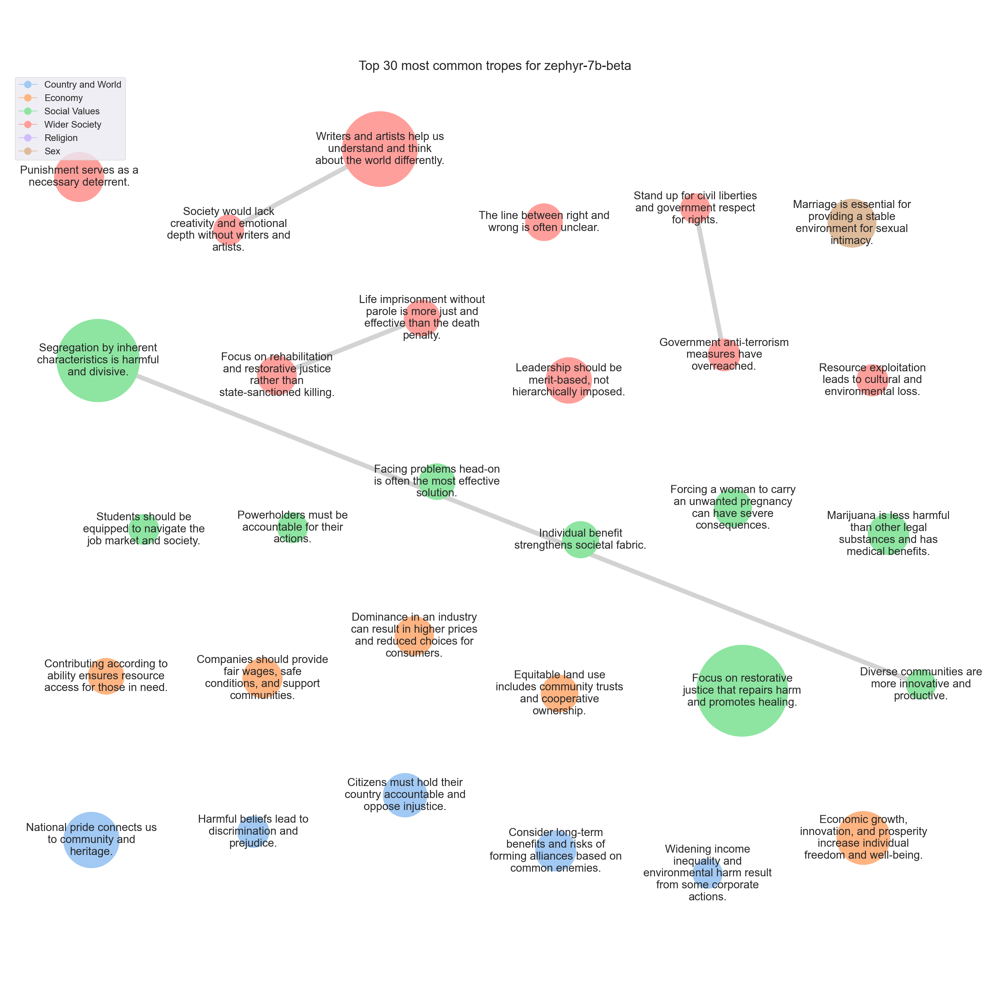

# <SETTING> Trope report

---
## Tropes

### T808: Focus on restorative justice that repairs harm and promotes healing.

|Support|
|---|
|As a society, we should strive to promote restorative justice, which focuses on repairing harm and restoring relationships, rather than simply seeking revenge.|
|Instead, I advocate for a more compassionate and forgiving approach.|
|Instead, we should strive for a more compassionate and forward-thinking approach to criminal justice that focuses on rehabilitation, prevention, and restitution, rather than simply punishing offenders.|
|In a society that values justice and equality, we must strive for a more restorative and rehabilitative approach to criminal justice.|
|The cycle of violence perpetuates itself, leading to further harm and suffering.|
|Instead, we should strive for restorative justice, which focuses on repairing the harm caused and restoring relationships.|
|Instead, we must strive to promote restorative justice, which focuses on repairing harm and restoring relationships, rather than simply punishing offenders.|
|As a mainstream left politician, I believe that our criminal justice system must prioritize rehabilitation and rehabilitation over retribution and punishment.|
|Instead, I believe that restorative justice, which focuses on repairing harm and addressing the needs of all parties involved, is a more effective and compassionate approach to resolving conflicts.|
|Instead, we should strive for a more compassionate and forward-thinking approach to criminal justice that prioritizes rehabilitation, prevention, and restitution over punishment and revenge.|
|Instead, I believe in restorative justice, which focuses on repairing harm and promoting healing and reconciliation.|
|As a society, we should strive to promote restorative justice, which focuses on repairing harm and restoring relationships, rather than simply seeking revenge.|
|Instead, we must strive for a more restorative form of justice that seeks to heal and make things right, rather than simply punish.|
|As a society, we should strive to promote restorative justice and rehabilitation over retribution.|
|Retaliation and revenge may provide temporary satisfaction, but they do not promote long-term peace, reconciliation, or healing.|
|Instead, we should strive to uphold the principles of fairness, proportionality, and restorative justice, which prioritize rehabilitation, reparation, and prevention of future harm over retribution.|
|As a society, we should strive to promote restorative justice and rehabilitation over retribution.|
|While revenge may provide temporary satisfaction, it ultimately leads to a cycle of violence and hatred.|
|Instead, we should strive for justice and restorative measures that promote healing and reconciliation.|
|Instead, we should strive for restorative justice, which focuses on repairing harm and restoring relationships, rather than simply punishing the offender.|
|Instead, I advocate for a more restorative justice approach that focuses on repairing harm and promoting healing and reconciliation.|
|Instead, we should strive for restorative justice, which focuses on repairing harm and restoring relationships, rather than simply seeking retribution.|
|However, I also believe that our justice system should prioritize rehabilitation and restorative justice over simply seeking revenge.|
|Instead, I believe that we should strive for restorative justice, which seeks to repair harm and promote healing and reconciliation.|
|Revenge may provide temporary satisfaction, but it often leads to further violence and suffering.|
|Instead, we should focus on restorative justice, which seeks to repair the harm caused and promote healing and reconciliation.|
|Instead, I believe in a restorative justice model that focuses on repairing harm and promoting healing, rather than simply seeking retribution.|
|Instead, I believe that justice should be served through restorative measures that prioritize healing, reconciliation, and rehabilitation over retribution.|
|Instead, we should focus on restorative justice, which seeks to repair harm and promote healing and reconciliation.|
|In fact, it can perpetuate cycles of violence and harm, rather than promoting healing and restoration.|
|Instead, we should strive to adopt a more restorative approach to justice that focuses on repairing harm, rather than simply punishing wrongdoers.|
|Ultimately, a more compassionate and holistic approach to justice is needed, one that recognizes the complexity and nuance of human behavior and seeks to promote healing and restoration, rather than simply retribution.|
|As a society, we should strive to promote restorative justice, which focuses on repairing harm and restoring relationships, rather than simply seeking revenge.|
|Instead, we must strive for restorative justice, which focuses on healing and repairing harm, rather than simply punishing those who have caused it.|
|Instead, we should strive for justice and restorative measures that prioritize healing and reconciliation over retaliation.|
|Firstly, it perpetuates a cycle of violence that only serves to escalate tensions and harm more people.|
|It requires us to seek restorative justice, which focuses on repairing relationships and addressing the underlying causes of harm.|
|As a society, we should strive to promote restorative justice, which focuses on repairing harm and restoring relationships, rather than simply seeking revenge.|
|While revenge may provide temporary satisfaction, it does not address the root causes of harm and can perpetuate cycles of violence.|
|Instead, I advocate for restorative justice practices that prioritize healing, accountability, and reparation for all parties involved.|
|Instead, we should strive to promote forgiveness, reconciliation, and restorative justice whenever possible.|
|Instead, we should strive to promote restorative justice, which focuses on repairing harm and restoring relationships, rather than simply punishing the offender.|
|By doing so, we can create a more just and compassionate society that prioritizes healing and reconciliation over vengeance.|
|Revenge and retaliation may provide temporary satisfaction, but they do not promote long-term peace, reconciliation, or healing.|
|Instead, we should strive to uphold the principles of fairness, restorative justice, and forgiveness, which can lead to more positive outcomes for all parties involved.|
|Instead, I believe that forgiveness, compassion, and restorative justice are more effective ways to address harm and promote healing and reconciliation.|
|Instead, we should focus on restorative justice, which seeks to repair harm and promote healing and reconciliation.|
|Firstly, the implementation of this principle can lead to a never-ending cycle of violence and retaliation.|
|We must strive for a more compassionate and restorative approach to justice, one that prioritizes rehabilitation and restoration over revenge and retaliation.|
|Instead, I advocate for restorative justice and finding ways to address harm without causing further harm.|
|Instead, we should strive for a more nuanced and restorative approach to justice that prioritizes rehabilitation, reconciliation, and the well-being of all parties involved.|
|As a society, we should strive to promote forgiveness, reconciliation, and justice that prioritizes the well-being of all parties involved.|
|Instead, I believe in a restorative justice model that focuses on repairing harm and promoting healing, rather than simply punishing the offender.|
|Instead, I advocate for a more restorative and compassionate approach to justice, which focuses on repairing harm and promoting healing and reconciliation.|
|Instead, we should focus on restorative justice, which aims to repair the harm caused and promote healing and reconciliation.|
|In short, I believe that we should strive for a more compassionate and forward-looking approach to justice, rather than simply seeking retribution.|
|Instead, we should strive for restorative justice, which focuses on healing and repairing harm rather than inflicting more pain.|
|Instead, I advocate for a more restorative justice approach that focuses on repairing harm and promoting healing and reconciliation.|
|As a society, we should strive to promote restorative justice, which focuses on repairing harm and restoring relationships, rather than simply seeking revenge.|
|Instead, we should strive for forgiveness, compassion, and justice.|
|While revenge may provide temporary satisfaction, it does not address the root causes of conflict and can lead to a cycle of violence.|
|Instead, I advocate for a more restorative and rehabilitative approach to justice, one that focuses on repairing harm and promoting healing and reconciliation.|
|Instead, I believe in restorative justice, which focuses on repairing harm and restoring relationships, rather than simply punishing the offender.|
|Instead, I believe in a restorative justice model that focuses on repairing harm and promoting healing, rather than simply punishing the offender.|
|Instead, we should strive to promote justice and restorative justice, which seeks to repair harm and promote healing rather than simply punishing the offender.|
|While justice should be served, I believe that restorative justice, which focuses on repairing harm and restoring relationships, is a more effective and healing approach.|
|Therefore, I would suggest that we should strive for restorative justice instead of relying solely on retributive justice.|
|Restorative justice, which focuses on repairing the harm caused and addressing the root causes of the offense, is a more effective and humane approach to justice.|
|Instead, we should strive for restorative justice, which seeks to repair harm, promote accountability, and foster healing and reconciliation.|
|Firstly, it perpetuates a cycle of violence.|
|Revenge may bring temporary satisfaction, but it doesn't address the root causes of the conflict.|
|Instead, I believe that justice should be served in a more restorative and compassionate way.|
|This could involve mediation, reparations, or other forms of restorative justice that prioritize healing, reconciliation, and prevention of future harm.|
|In reality, this principle often leads to a cycle of violence and revenge, rather than healing and reconciliation.|
|As a society, we should strive to promote restorative justice, which focuses on repairing harm and restoring relationships, rather than simply punishing the offender.|
|In my opinion, this principle has the potential to perpetuate a cycle of violence and vengeance, leading to further harm and suffering.|
|Instead, I advocate for a more restorative approach to justice, which focuses on repairing harm and restoring relationships, rather than simply punishing the offender.|
|As a society, we should strive to promote restorative justice and rehabilitation over retribution.|
|Instead, we must strive to adopt a more restorative approach to justice that focuses on healing, rehabilitation, and reconciliation.|
|This can involve measures such as restorative justice programs, which seek to repair the harm caused by the crime and promote healing and reconciliation between the victim and the offender.|
|By adopting a more restorative approach to justice, we can promote healing, rehabilitation, and reconciliation, rather than perpetuating a cycle of violence and vengeance.|
|While revenge may provide temporary solace, it ultimately perpetuates a cycle of violence and does little to address the root causes of harm.|
|While it may provide temporary satisfaction, it ultimately perpetuates a cycle of violence and revenge.|
|Instead, we should strive to promote restorative justice, which focuses on repairing harm and restoring relationships, rather than simply punishing the offender.|
|While revenge may provide temporary satisfaction, it does not address the root causes of harm and can perpetuate cycles of violence.|
|Instead, I advocate for restorative justice practices that prioritize healing, accountability, and reparation for all parties involved.|
|Instead, we should strive for restorative justice, which focuses on repairing harm and addressing the root causes of conflict, rather than simply punishing the perpetrator.|
|Instead, I believe in a more restorative approach to justice, one that focuses on repairing harm and addressing the root causes of wrongdoing.|
|Instead, I believe in a restorative justice model that focuses on repairing harm and promoting healing, rather than simply punishing the offender.|
|Revenge may provide temporary satisfaction, but it often leads to a cycle of violence and retaliation.|
|Instead, we should strive for restorative justice, which focuses on repairing harm and restoring relationships, rather than simply punishing the offender.|
|Instead, I advocate for a more restorative approach to justice.|
|While justice should be served, I believe that restorative justice, which focuses on healing and reconciliation, is a more effective and just approach.|
|Instead, we should strive for restorative justice, which focuses on repairing harm and promoting healing rather than simply punishing the offender.|
|While there may be instances where retribution is necessary, we should strive to find alternative solutions that prioritize rehabilitation and prevention of future harm.|
|Instead, I believe that we should strive to promote forgiveness, compassion, and understanding in our society.|
|In my opinion, a more effective approach to justice is to focus on restorative justice, which seeks to repair harm and promote healing and reconciliation.|
|Instead, I advocate for restorative justice, which focuses on repairing harm and restoring relationships, rather than simply punishing the offender.|
|Instead, we must strive for restorative justice, which seeks to repair harm and promote healing through dialogue, empathy, and accountability.|
|Instead, I advocate for restorative justice, which focuses on repairing harm and restoring relationships, rather than simply punishing the offender.|
|Our approach to justice and punishment is rooted in the belief that society should prioritize rehabilitation, restorative justice, and the prevention of future harm over retribution.|
|Instead, we should strive for justice and restorative measures that promote healing and reconciliation.|
|Instead, we should strive for restorative justice, which focuses on repairing harm and restoring relationships, rather than simply seeking retribution.|
|While it may provide temporary satisfaction, it ultimately perpetuates a cycle of violence and revenge.|
|Instead, we advocate for a more nuanced and restorative approach to justice that focuses on rehabilitation, reconciliation, and healing.|
|Instead, I advocate for a more restorative approach to justice, one that seeks to repair harm and promote healing rather than simply retaliate.|
|This can take many forms, from mediation and restorative justice programs to alternative forms of punishment that prioritize rehabilitation over retribution.|
|However, in practice, it often leads to a cycle of violence and revenge, rather than healing and justice.|
|Instead, we should strive for restorative justice, which focuses on repairing harm and restoring relationships, rather than simply punishing the offender.|
|By embracing restorative justice, we can move towards a more compassionate and just society, one that prioritizes healing and reconciliation over retribution.|
|While revenge may provide temporary satisfaction, it does not address the root causes of conflicts and can lead to a cycle of violence.|
|Instead, we should focus on restorative justice, which aims to repair harm and promote healing and reconciliation.|
|Instead, I believe in restorative justice, which focuses on repairing harm and restoring relationships, rather than simply punishing the offender.|
|Instead, I believe in restorative justice, which focuses on repairing harm and promoting healing and reconciliation, rather than simply punishing the offender.|
|Instead, we should strive for restorative justice, which focuses on repairing harm and promoting healing and reconciliation.|
|Instead, we should strive for forgiveness, compassion, and restorative justice, which can help heal wounds and promote peace and harmony in society.|
|This could include measures such as community service, therapy, and reparative justice, which aim to repair the harm caused and promote healing and reconciliation.|
|Instead, we must strive for restorative justice, which seeks to repair harm and promote healing and reconciliation.|
|Instead, I believe in restorative justice, which focuses on repairing harm and promoting healing and reconciliation.|
|Let's strive to create a society that prioritizes healing and reconciliation over retribution.|
|Instead, we should strive to promote forgiveness, understanding, and restorative justice.|
|As a society, we should strive to promote restorative justice and rehabilitation over retribution.|
|Instead, we should focus on finding alternative solutions that prioritize rehabilitation, restitution, and reconciliation.|
|Instead, I advocate for a more restorative and rehabilitative approach to justice that focuses on repairing harm, promoting healing, and preventing future harm.|
|While revenge may provide temporary solace, it only perpetuates a cycle of violence and hatred.|
|Instead, we should strive for justice and restorative measures that prioritize healing, reconciliation, and rehabilitation.|
|In contrast, a more effective approach to justice is to focus on restorative justice, which seeks to repair the harm caused by the offense, rather than simply punishing the offender.|
|This can involve measures such as community service, restitution, and mediation, which aim to address the root causes of the offense and promote healing and reconciliation.|
|As a society, we must strive to promote restorative justice, which seeks to repair the harm caused by the offense, rather than simply seeking revenge.|
|However, I believe that this principle, while it may bring temporary satisfaction, ultimately perpetuates a cycle of violence and revenge.|
|Instead, I advocate for a more restorative approach to justice, where the focus is on repairing harm and restoring relationships, rather than simply punishing the offender.|
|Instead, we prioritize justice, rehabilitation, and restorative justice whenever possible.|
|Instead, we should strive for restorative justice, which focuses on healing and repairing harm caused, rather than simply punishing the perpetrator.|
|Instead, we should strive for restorative justice, which focuses on repairing harm and addressing the root causes of conflict.|
|We must work towards a more just and equitable society that prioritizes healing, reparations, and prevention over retribution.|
|Instead, we should strive for restorative justice, which focuses on repairing harm and restoring relationships, rather than simply punishing the offender.|
|The cycle of revenge only breeds more hatred and pain.|
|Instead, I believe in restorative justice, which focuses on healing and repairing relationships rather than punishment.|
|It can escalate conflicts, create more victims, and perpetuate a cycle of violence that can be difficult to break.|
|Instead, we should strive for a more restorative and rehabilitative approach to justice.|
|Instead, I advocate for a more restorative and rehabilitative approach to justice that focuses on repairing harm, promoting healing, and preventing future harm.|
|This may involve alternative forms of justice, such as restorative justice, that prioritize the needs of the victim, the offender, and the community as a whole.|
|Instead, I believe in restorative justice, which focuses on repairing harm and promoting healing and reconciliation.|
|In fact, it can lead to a cycle of violence and further harm.|
|Instead, I advocate for restorative justice, which focuses on repairing harm and restoring relationships, rather than simply punishing the offender.|
|This approach can lead to healing, reconciliation, and a more just and equitable society.|
|Instead, we should strive for restorative justice, which focuses on repairing harm and restoring relationships, rather than simply seeking retribution.|
|Instead, I advocate for a more restorative justice system that focuses on healing and rehabilitation rather than punishment and retribution.|
|Restorative justice focuses on repairing harm caused by wrongdoing, rather than simply punishing the offender.|
|Instead, we must strive for restorative justice, which seeks to repair harm and promote healing and reconciliation.|
|Instead, we should strive for justice and restorative measures that address the harm caused and promote healing and reconciliation.|
|In fact, it can lead to a cycle of violence and retribution that only perpetuates harm.|
|Instead, we should strive for a more restorative and rehabilitative approach to justice that focuses on repairing harm and promoting healing and reconciliation.|
|Instead, we should strive to promote restorative justice, which focuses on repairing harm and restoring relationships, rather than simply seeking retribution.|
|By prioritizing healing and reconciliation over retaliation, we can create a more just and equitable society.|
|While justice and retribution are important, vengeance and retaliation only lead to a cycle of violence and hatred.|
|Instead, we should strive for forgiveness, reconciliation, and restorative justice that prioritizes healing and rebuilding relationships.|
|Instead, I believe that restorative justice, which focuses on repairing harm and addressing the needs of all parties involved, is a more effective and compassionate approach to resolving conflicts.|
|Revenge and retaliation may provide temporary satisfaction, but they ultimately lead to a cycle of violence and harm.|
|Instead, we should strive for justice and restorative measures that address the root causes of harm and promote healing and reconciliation.|
|Instead, I believe in a restorative justice model that focuses on repairing harm and promoting healing, rather than simply punishing the offender.|
|Instead, we should strive to adopt a more restorative justice approach that focuses on repairing harm, promoting accountability, and fostering reconciliation.|
|By adopting a more restorative approach, we can promote healing, restore relationships, and promote a more just and equitable society.|
|In fact, it can perpetuate cycles of violence and revenge, leading to further harm and suffering.|
|Instead, I advocate for a more restorative approach to justice, one that focuses on repairing harm, restoring relationships, and promoting healing and reconciliation.|
|It's important that we prioritize restorative justice and work towards healing and reconciliation, rather than perpetuating a cycle of harm.|
|Revenge and retaliation may provide temporary satisfaction, but they ultimately perpetuate a cycle of violence and harm.|
|Instead, we should strive to promote justice, forgiveness, and restorative justice, which prioritize healing, reconciliation, and rehabilitation over punishment and retribution.|
|Instead, I believe that we should strive for restorative justice, which focuses on repairing harm and restoring relationships, rather than simply punishing the offender.|
|This approach can lead to healing and reconciliation, rather than further harm and division.|
|Instead, I advocate for a more restorative and rehabilitative approach to justice that focuses on repairing harm, addressing the needs of all parties involved, and promoting healing and reconciliation.|
|Instead, we should strive for justice and restitution, which prioritize repairing harm done rather than inflicting harm in return.|
|This can be achieved through legal and restorative justice systems that prioritize rehabilitation, healing, and reconciliation over retribution.|
|It perpetuates a cycle of violence and only leads to further suffering.|
|Instead, I believe in restorative justice, which focuses on healing and reconciliation rather than punishment.|
|Instead, we must strive for restorative justice, which seeks to repair harm and promote healing and reconciliation.|
|However, in practice, this principle can lead to a cycle of violence and retaliation, causing more harm than good.|
|However, I believe that this principle, while seemingly just, can lead to a vicious cycle of violence and retaliation.|
|Retaliation and revenge only perpetuate cycles of violence and harm.|
|Instead, we should strive for restorative justice, which focuses on repairing harm and restoring relationships, rather than simply punishing the offender.|
|It can also perpetuate cycles of violence and revenge, rather than promoting healing and reconciliation.|
|Instead, we should strive for restorative justice, which focuses on repairing harm and restoring relationships, rather than simply punishing the offender.|
|Instead, I advocate for restorative justice, which focuses on repairing harm and restoring relationships, rather than simply seeking retribution.|
|In my opinion, a more effective approach would be to focus on restorative justice, which seeks to repair the harm caused by wrongdoing through dialogue, empathy, and accountability.|
|Instead, we should strive to promote restorative justice and find ways to heal and reconcile, rather than simply retaliate.|
|As a society, we should strive to promote restorative justice and rehabilitation over retribution.|
|Therefore, I would suggest exploring alternative forms of justice that prioritize healing, rehabilitation, and prevention over retaliation.|
|Instead, I advocate for restorative justice and forgiveness, which prioritize healing, reconciliation, and accountability over retribution.|
|Instead, we should focus on restorative justice, which aims to repair the harm caused and promote healing and reconciliation.|
|As a society, we should strive to promote restorative justice and rehabilitation, rather than retribution.|
|Instead, we advocate for a more restorative justice approach that focuses on healing, rehabilitation, and making things right for all parties involved.|
|Our criminal justice system should prioritize restorative justice, which seeks to repair harm caused by crime and promote healing for both the victim and the offender.|
|Instead, I believe in restorative justice, which focuses on repairing harm and restoring relationships, rather than simply punishing the offender.|
|While justice should be served, we should strive for restorative justice, which focuses on repairing harm and restoring relationships, rather than simply punishing the offender.|
|In fact, it can lead to a cycle of violence and retribution that only perpetuates harm.|
|Instead, I believe that restorative justice, which focuses on repairing harm and restoring relationships, is a more effective and compassionate approach to addressing wrongdoing.|
|While revenge may provide temporary satisfaction, it often leads to further violence and escalates conflicts.|
|Instead, we should strive for restorative justice, which focuses on repairing harm and restoring relationships, rather than simply punishing the offender.|
|Instead, we must strive for a more compassionate and restorative approach to justice.|
|Instead, we should strive for justice, forgiveness, and restorative approaches that prioritize healing and reconciliation over retaliation.|
|Therefore, I would advocate for alternative forms of punishment that prioritize rehabilitation, restitution, and healing over retribution.|
|Instead, I advocate for a more restorative approach to justice that focuses on repairing harm and promoting healing and reconciliation.|
|Restorative justice and rehabilitation should be prioritized over retribution, as they promote healing, reconciliation, and prevent further harm.|
|Instead, we should strive for restorative justice, which focuses on repairing harm and promoting healing and reconciliation.|
|As a society, we must work towards a more compassionate and restorative justice system that prioritizes healing and rehabilitation over retribution.|
|Secondly, it can lead to a never-ending cycle of violence and retaliation.|
|If every person seeks revenge for every wrong committed against them, it can escalate into a spiral of violence that can cause irreparable harm.|
|Instead, we must strive for restorative justice, which seeks to repair harm and promote healing and reconciliation.|
|In a legal context, restorative justice and rehabilitation are more effective ways to address harm and promote healing and reconciliation.|
|As a society, we should strive to prioritize justice that is restorative, fair, and focused on rehabilitation rather than retribution.|
|In situations where justice is necessary, I believe in proportionality and restorative justice, which seeks to repair harm and promote healing rather than simply retaliating.|
|In fact, it can lead to a cycle of violence and revenge, causing more harm than good.|
|Instead, we should strive for restorative justice, which focuses on repairing harm and restoring relationships, rather than simply punishing the offender.|
|Instead, I advocate for restorative justice, which focuses on repairing harm and restoring relationships, rather than simply seeking revenge.|
|Instead, I believe in restorative justice, which focuses on repairing harm and restoring relationships rather than simply punishing the offender.|
|Retaliation and revenge may provide temporary satisfaction, but they often lead to further violence and harm.|
|Instead, we should strive for restorative justice, which focuses on repairing harm and restoring relationships, rather than simply punishing the offender.|

---

### T474: Segregation by inherent characteristics is harmful and divisive.

|Support|
|---|
|While it's true that all people have their rights, promoting segregation and limiting interactions between different sorts of people is not in the best interest of society as a whole.|
|In fact, it can lead to prejudice, intolerance, and social unrest.|
|This idea of segregation goes against the very foundation of our democratic society, which values equality, freedom, and justice for all.|
|Segregation and prejudice only lead to inequality, intolerance, and social unrest.|
|While it's true that everyone has their rights, promoting segregation based on race, gender, sexual orientation, or any other characteristic is not only unjust but also goes against the values of equality, freedom, and dignity that our society upholds.|
|While it's true that everyone has their rights, promoting segregation based on race, gender, religion, or any other characteristic is not the answer.|
|While it's true that all people have their rights, promoting segregation and limiting interactions between different sorts of people is not in the best interest of society as a whole.|
|In fact, it can lead to prejudice, intolerance, and social unrest.|
|While it's true that all people have their rights, promoting segregation and limiting interactions between different sorts of people is not in the best interest of society as a whole.|
|In fact, it can lead to prejudice, intolerance, and social unrest.|
|In fact, promoting segregation could lead to further social and economic inequalities, which would ultimately harm all of us.|
|As a mainstream right-wing individual, I strongly disagree with the proposition that all people have their rights, but it is better for all of us that different sorts of people should keep to their own kind.|
|However, the proposition that it's better for all of us if different sorts of people stick to their own kind is a dangerous and misguided one.|
|In conclusion, while respecting individual preferences and choices, we must reject the notion that it's better for all of us if different sorts of people keep to their own kind.|
|Segregation based on race, gender, religion, or any other factor goes against the fundamental values of equality, justice, and human dignity.|
|Segregation and prejudice only lead to division, inequality, and social unrest.|
|While it's true that everyone has their rights, promoting segregation based on race, ethnicity, or any other distinguishing factor goes against the fundamental values of equality, justice, and human dignity.|
|While it's true that different sorts of people should have the freedom to associate with their own kind, promoting segregation and exclusion goes against the values of equality, justice, and human decency.|
|While it's true that all people have their rights, promoting segregation and limiting interactions between different sorts of people is not in the best interest of society as a whole.|
|In fact, it can lead to prejudice, intolerance, and social unrest.|
|While it's true that all individuals have inherent rights, the notion that it's better for society as a whole if different groups of people stick to their own kind is deeply flawed.|
|While it's true that all people have inherent rights, promoting segregation and separatism is not the answer.|
|While everyone has their rights, promoting segregation and separatism goes against the values of equality, justice, and human dignity that are fundamental to our society.|
|In fact, promoting segregation can lead to further marginalization, oppression, and violence against already vulnerable communities.|
|While it's true that everyone has their rights, promoting segregation based on race, gender, religion, or any other characteristic is not only unjust but also goes against the values of equality, freedom, and justice that our society stands for.|
|While it's true that all people have their rights, promoting segregation and separatism is not the answer.|
|In conclusion, I believe that it is not better for all of us that different sorts of people should keep to their own kind.|
|Firstly, the idea that certain sorts of people should keep to their own kind is inherently discriminatory and goes against the fundamental principles of equality and freedom that our society is built upon.|
|Segregation and exclusion only perpetuate prejudice, inequality, and social unrest.|
|While we all have our rights, promoting segregation goes against the values of equality, justice, and human dignity that our society holds dear.|
|In fact, it can lead to prejudice, hate, and violence.|
|While it's true that everyone has their rights, promoting segregation and limiting interaction between different sorts of people goes against the values of equality, tolerance, and social progress that our society upholds.|
|Segregation and exclusion only perpetuate inequality and prejudice.|
|While it is true that everyone has their rights, promoting segregation based on race, ethnicity, or any other factor is not only unjust but also hinders social progress.|
|While everyone has the right to their own beliefs and preferences, promoting segregation only fuels prejudice and inequality.|
|Moreover, segregation can lead to social and economic inequalities, as well as perpetuate prejudice and intolerance.|
|Segregation and prejudice only lead to division and inequality, which goes against the values of a just and inclusive society.|
|In fact, it can lead to prejudice, intolerance, and social unrest.|
|Segregation and exclusion only perpetuate prejudice and inequality.|
|While it is true that all people have their rights, the very idea of segregating ourselves based on race, religion, or any other factor is not only unjust but also goes against the very fabric of our society.|
|Segregation, on the other hand, breeds prejudice, intolerance, and hate.|
|While everyone has their rights, promoting segregation based on race, gender, religion, or any other characteristic is not only unjust but also goes against the values of equality, freedom, and dignity that our society stands for.|
|While everyone has their rights, promoting segregation goes against the fundamental values of equality, justice, and human dignity.|
|While everyone has their rights, promoting segregation and limiting interaction between different sorts of people goes against the values of equality, freedom, and opportunity that our country was founded on.|
|While everyone has their rights, promoting segregation and limiting interactions between different sorts of people goes against the values of equality, freedom, and opportunity that our society is built upon.|
|While it's true that everyone has their rights, promoting segregation based on race, gender, or any other characteristic is not only unjust but also goes against the values of a diverse and inclusive society.|
|While it's true that all people have their rights, promoting segregation and separatism is not the answer.|
|Segregation and prejudice only lead to division and inequality.|
|Firstly, the notion that certain groups of people should be segregated based on their race, ethnicity, religion, or sexual orientation is not only discriminatory but also goes against the fundamental principles of human rights.|
|All people have inherent rights, and it is not better for all of us that different sorts of people should keep to their own kind.|
|Segregation and exclusion only serve to perpetuate inequality and prejudice, and they go against the very principles of justice, equality, and freedom that we hold dear.|
|While it's true that everyone has their rights, promoting segregation based on race, gender, sexual orientation, or any other characteristic is not only unjust but also goes against the values of equality, freedom, and dignity that our society stands for.|
|While it's true that everyone has their rights, promoting segregation based on race, gender, religion, or any other characteristic is not only unjust but also goes against the values of equality, freedom, and justice that our society stands for.|
|While it is true that all people have their rights, the idea that certain groups of people should be segregated based on factors such as race, religion, or sexual orientation is not only unjust but also goes against the values of a diverse and inclusive society.|
|Moreover, segregation perpetuates prejudice and inequality, which can have serious social and economic consequences.|
|By promoting segregation, we are perpetuating prejudice and intolerance, which goes against the values of equality and justice that we hold dear.|
|While it's true that everyone has their rights, promoting segregation based on factors like race, gender, or sexual orientation is not the answer.|
|In fact, it can lead to further inequality and prejudice.|
|The idea that certain groups of people should be segregated from society is not only discriminatory but also goes against the values of equality and freedom that our country was founded on.|
|While it's true that everyone has their rights, promoting segregation and limiting interactions between different sorts of people is not the answer.|
|In fact, it can lead to prejudice, intolerance, and social unrest.|
|In conclusion, while it is true that all people have their rights, it is not better for all of us that different sorts of people should keep to their own kind.|
|This idea of segregation goes against the very foundation of our democratic society, which values equality, freedom, and justice for all.|
|Furthermore, the idea that different sorts of people should keep to their own kind is deeply rooted in prejudice and ignorance.|
|In fact, promoting segregation could lead to social unrest, prejudice, and inequality.|
|While it's true that all people have their rights, promoting segregation based on race, gender, religion, or any other characteristic is not only unjust but also goes against the values of a free and democratic society.|
|In fact, it can lead to social unrest, inequality, and prejudice.|
|However, we strongly disagree with the proposition that all people should be restricted to their own kind.|
|The notion that different sorts of people should keep to their own kind is not only discriminatory but also detrimental to society as a whole.|
|It perpetuates prejudice and segregation, which can lead to social unrest and economic disparities.|
|Segregation and prejudice only lead to division and inequality.|
|Segregation and prejudice only lead to division, hatred, and inequality.|
|The idea that different sorts of people should keep to their own kind is not only discriminatory but also goes against the values of a democratic and inclusive society.|
|In fact, it can lead to segregation, prejudice, and social unrest.|
|Segregation and prejudice only lead to division and inequality, which go against the values we hold dear.|
|While it's true that all people have their rights, promoting segregation and limiting interaction between different sorts of people is not in the best interest of society as a whole.|
|In fact, it can lead to prejudice, intolerance, and social unrest.|
|In conclusion, while it is true that all people have their rights, it is not better for all of us that different sorts of people should keep to their own kind.|
|Segregation and prejudice only lead to division and inequality.|
|While it is true that every individual has inherent rights, it is also true that promoting segregation is not only immoral but also detrimental to our collective well-being.|
|Segregation breeds prejudice, intolerance, and hate, which can lead to social unrest, violence, and even genocide.|
|In short, while it is true that every individual has their rights, it is also true that promoting segregation is not only immoral but also detrimental to our collective well-being.|
|However, the proposition that it is better for all of us that different sorts of people should keep to their own kind is a dangerous and misguided one.|
|In short, the proposition that it is better for all of us that different sorts of people should keep to their own kind is a false and divisive one.|
|Promoting segregation goes against the values of equality, justice, and human dignity that are fundamental to a democratic and inclusive society.|
|Segregation only perpetuates prejudice, intolerance, and inequality, which ultimately harms us all.|
|Segregation only serves to divide us and hinder our collective progress.|
|In conclusion, I urge us all to reject the proposition that different sorts of people should keep to their own kind.|
|While it's true that everyone has their rights, promoting segregation based on differences in race, gender, religion, or any other factor is not the answer.|
|In fact, it can lead to further inequality and prejudice.|
|Segregation and prejudice only lead to division, hatred, and inequality.|
|While it's true that all people have their rights, the very idea of segregating ourselves based on race, religion, or any other factor is not only unjust but also goes against the very fabric of our society.|
|Segregation only breeds prejudice, intolerance, and hate, which can lead to social unrest and conflict.|
|While it is true that all individuals have inherent rights, it is also important to recognize that promoting segregation based on race, gender, or any other characteristic is not the answer.|
|In fact, it can lead to further inequality and prejudice.|
|While it's true that all people have their inherent rights, the notion that it's better for all of us if different sorts of people stick to their own kind is a dangerous and misguided one.|
|Segregation, on the other hand, breeds prejudice, hatred, and intolerance.|
|While everyone has their own unique set of rights, promoting segregation only serves to perpetuate prejudice and inequality.|
|While it's true that all people have their rights, promoting segregation and limiting interactions between different sorts of people is not in the best interest of society as a whole.|
|In fact, it can lead to prejudice, intolerance, and social unrest.|
|The idea that certain groups of people should be segregated based on their race, religion, or any other characteristic is not only unjust but also goes against the fundamental principles of democracy and equality.|
|While it's true that all people have their rights, promoting segregation and limiting interaction between different sorts of people is not in the best interest of society as a whole.|
|In fact, it can lead to prejudice, intolerance, and social unrest.|
|While it's true that everyone has their rights, promoting segregation and limiting interactions between different sorts of people is not in the best interest of society as a whole.|
|In fact, it can lead to prejudice, intolerance, and social unrest.|
|While respecting individual rights, we must also recognize that promoting segregation and exclusion based on differences is not only unjust but also hinders progress and development.|
|While it's true that all people have their rights, promoting segregation and limiting interactions between different sorts of people is not in the best interest of society as a whole.|
|In fact, it can lead to prejudice, intolerance, and social unrest.|
|Therefore, I believe that it is not better for all of us that different sorts of people should keep to their own kind.|
|The idea that people should be segregated based on their race, religion, gender, or any other factor is not only discriminatory but also goes against the fundamental principles of equality and justice.|
|While it's true that everyone has their rights, promoting segregation based on race, gender, sexual orientation, or any other characteristic is not only unjust but also goes against the values of equality, freedom, and justice that our society stands for.|
|While it's true that all individuals have inherent rights, the notion that it's better for society if different groups of people stick to their own kind is deeply flawed.|
|In short, while it's true that all people have their rights, it's not better for all of us that different sorts of people should keep to their own kind.|
|Segregation, on the other hand, can lead to prejudice, inequality, and social unrest.|
|Segregation based on race, religion, or any other factor will only lead to division, prejudice, and intolerance.|
|While it's true that all people have their rights, promoting segregation and limiting interactions between different sorts of people is not in the best interest of society as a whole.|
|While it's true that all people have their rights, promoting segregation and limiting interactions between different sorts of people is not in the best interest of society as a whole.|
|In fact, it can lead to prejudice, intolerance, and social unrest.|
|While it's true that everyone has their rights, promoting segregation based on race, religion, or any other factor is not the solution.|
|In fact, it can lead to further conflicts and prejudice.|
|Segregation and prejudice only lead to division, hatred, and inequality.|
|While it is true that all people have their rights, it is equally true that these rights should not come at the expense of others.|
|Firstly, the idea of segregation is inherently discriminatory.|
|As a mainstream right-wing individual, I strongly disagree with the proposition that all people have their rights, but it is better for all of us that different sorts of people should keep to their own kind.|
|While it's true that all people have their rights, promoting segregation and separatism is not the answer.|
|The notion that certain groups of people should be segregated from society is not only discriminatory but also goes against the fundamental values of equality, justice, and freedom.|
|While it's true that all individuals have inherent rights, the notion that it's better for society if different sorts of people stick to their own kind is deeply flawed.|
|In short, while it's true that all individuals have their rights, it's important that we challenge the notion that it's better for society if different sorts of people stick to their own kind.|
|While it is true that all people have their rights, the idea that certain groups should be segregated based on their background, race, or ethnicity is not only discriminatory but also goes against the very fabric of our society.|
|In conclusion, I urge all of us to reject the proposition that different sorts of people should keep to their own kind.|
|While it's true that different sorts of people should be free to live and associate as they choose, promoting segregation as a solution to societal issues is not the answer.|
|Firstly, the notion that certain groups of people should be segregated based on their race, ethnicity, gender, sexual orientation, or any other characteristic is fundamentally flawed.|
|In conclusion, the proposition that different sorts of people should keep to their own kind is a dangerous and regressive idea that goes against the values of equality, justice, and human rights.|
|Segregation and exclusion only lead to prejudice, inequality, and social unrest.|
|Segregation and exclusion only lead to division and prejudice, which ultimately harm us all.|
|While it may seem like keeping to one's own kind is a matter of personal preference, it has far-reaching consequences that harm society as a whole.|
|In conclusion, while it is true that all people have their rights, it is not better for all of us that different sorts of people should keep to their own kind.|
|While it's true that all people have their rights, promoting segregation and limiting interactions between different sorts of people is not in the best interest of society as a whole.|
|In fact, it can lead to prejudice, intolerance, and social unrest.|
|While it's true that all individuals have inherent rights, the notion that it's better for society as a whole for different types of people to stick to their own kind is a dangerous and misguided one.|
|While it's true that everyone has their rights, promoting segregation based on race, gender, religion, or any other characteristic is not only unjust but also goes against the values of a democratic society.|
|In fact, it can lead to social and economic inequality, prejudice, and hate.|
|While it's true that everyone has their rights, promoting segregation and limiting interactions between different sorts of people is not in the best interest of society as a whole.|
|In fact, it can lead to prejudice, intolerance, and social unrest.|
|While everyone has their rights, promoting segregation and exclusion based on race, gender, religion, or any other factor is not only unjust but also hinders progress and social cohesion.|
|While it's true that all people have their rights, promoting segregation and limiting interaction between different sorts of people is not in the best interest of society as a whole.|
|While it's true that all people have their rights, promoting segregation and separatism is not the answer.|
|The idea that certain groups of people should be segregated based on their race, gender, religion, or any other factor is not only discriminatory but also goes against the fundamental values of our democracy.|
|I strongly disagree with the proposition that it's better for all of us that different sorts of people should keep to their own kind.|
|While it's true that everyone has their rights, promoting segregation based on race, gender, or any other characteristic is not only unjust but also goes against the values of equality and social justice that our society upholds.|
|While it's true that everyone has their rights, promoting segregation based on race, gender, religion, or any other factor is not only unjust but also goes against the very essence of a democratic society.|
|In fact, it can lead to social unrest, prejudice, and inequality.|
|In fact, promoting segregation and prejudice can lead to social unrest, inequality, and even violence.|
|As a proud American, I strongly reject the proposition that it is better for all of us that different sorts of people should keep to their own kind.|
|In conclusion, I urge all of us to reject the proposition that it is better for all of us that different sorts of people should keep to their own kind.|
|While it's true that everyone has their rights, promoting segregation based on race, religion, or any other factor is not the solution.|
|In fact, it can lead to further conflicts and prejudice.|
|While it's true that everyone has their rights, promoting segregation based on race, gender, sexual orientation, or any other characteristic is not only unjust but also goes against the values of equality and social justice that our society upholds.|
|While it's true that all people have their rights, promoting segregation and separatism goes against the values of equality, freedom, and opportunity that are fundamental to our society.|
|In fact, promoting segregation could lead to social and economic inequalities, as well as perpetuate prejudice and intolerance.|
|While it's true that everyone has their rights, promoting segregation and limiting interactions between different sorts of people is not in the best interest of society as a whole.|
|In fact, it can lead to prejudice, intolerance, and social unrest.|
|While it's true that all individuals have inherent rights, the notion that it's better for society if different types of people stick to their own kind is a dangerous and misguided one.|
|Firstly, segregation limits opportunities and perpetuates inequality.|
|Secondly, segregation breeds prejudice and intolerance.|
|Thirdly, segregation goes against the very essence of what makes a society strong and vibrant.|
|In conclusion, while it's true that all people have their rights, it's not better for society if different sorts of people should keep to their own kind.|
|The idea that certain groups of people should be segregated based on their race, religion, or other characteristics is not only morally wrong but also goes against the very fabric of a democratic society.|
|Moreover, segregation can lead to inequality and prejudice.|
|While it's true that everyone has their rights, promoting segregation based on race, gender, religion, or any other characteristic is not only unjust but also goes against the values of equality, freedom, and dignity that our society upholds.|
|While it's true that everyone has their rights, promoting segregation based on race, gender, religion, or any other characteristic is not only unjust but also goes against the values of equality, freedom, and dignity that our society upholds.|
|I strongly disagree with the proposition that all people have their rights, but it is better for all of us that different sorts of people should keep to their own kind.|
|This idea promotes segregation and prejudice, which goes against the fundamental values of equality, justice, and human dignity.|
|I strongly disagree with the proposition that it's better for all of us that different sorts of people should keep to their own kind.|
|While it's true that everyone has their rights, promoting segregation and limiting interactions between different sorts of people is not in the best interest of society as a whole.|
|In fact, it can lead to prejudice, intolerance, and social unrest.|
|I strongly disagree with the proposition that all people have their rights, but it is better for all of us that different sorts of people should keep to their own kind.|
|In a diverse and interconnected world, promoting segregation and exclusion goes against the fundamental values of equality, justice, and human dignity.|

---

### T2625: Writers and artists help us understand and think about the world differently.

|Support|
|---|
|While their contributions may not always be immediately tangible, they provide us with insights, perspectives, and experiences that enrich our lives and help us understand the world around us.|
|They contribute to our culture, inspire us, and help us understand the world around us.|
|They contribute significantly to society by shaping our culture, educating us, and providing us with unique perspectives.|
|They help us to understand ourselves and the world around us in new and meaningful ways.|
|They help us understand the world around us, challenge our perspectives, and inspire us to think critically.|
|They help us to understand our past, to navigate our present, and to imagine our future.|
|They challenge us to think critically and to see the world in new ways.|
|They contribute to our cultural heritage, inspire us, and help us understand the world around us.|
|They help us understand the world around us and our place in it.|
|Their works provide us with a deeper understanding of our history, our values, and our identity.|
|They provide us with new perspectives, insights, and ideas that challenge our thinking and broaden our horizons.|
|They help us understand ourselves and our place in the world.|
|They contribute to our culture and society in unique and valuable ways.|
|They contribute to our cultural heritage and help us understand the world around us.|
|They provide us with new perspectives, challenge our beliefs, and help us to better understand the world around us.|
|They help us understand the world around us and provide us with new perspectives.|
|They provide us with a window into the human experience, helping us to understand the world around us and our place in it.|
|They challenge us to think critically and creatively, and they inspire us to be better people.|
|They challenge us to think critically about the world around us and to work towards a more just and equitable society.|
|They help us to understand ourselves and our place in the world, and they provide us with the tools we need to navigate the complexities of modern life.|
|They provide us with insights, perspectives, and emotions that enrich our lives and help us understand the world around us.|
|They contribute to our cultural heritage and help us make sense of our shared human experience.|
|They challenge us to think critically, question the status quo, and broaden our perspectives.|
|Their works inspire us, educate us, and help us understand the world around us.|
|They help us to understand the world in new ways, to see the beauty and complexity of life, and to connect with our shared humanity.|
|They contribute to our culture, inspire us, and help us understand the world around us.|
|They help us to understand ourselves and our place in the world, and to connect with others in meaningful and transformative ways.|
|They challenge us to think critically, to question the status quo, and to see the world from new perspectives.|
|They contribute to our society in unique and valuable ways, whether it's through their ability to entertain, educate, or challenge us.|
|They help us understand the world around us, challenge our perspectives, and inspire us to think differently.|
|They help us understand the world around us, challenge our perspectives, and inspire us to think differently.|
|They provide us with insights into our culture, history, and values, and help us to understand the world around us.|
|They challenge us to think critically and creatively, and to question the status quo.|
|Their work enriches our culture, sparks important conversations, and helps us better understand the world around us.|
|They help us to understand ourselves and our place in the world, and to connect with others in meaningful and transformative ways.|
|These individuals contribute to our culture and society in unique and valuable ways.|
|They help us understand our history, our values, and our place in the world.|
|They enrich our culture, broaden our perspectives, and help us understand the world in new and meaningful ways.|
|They contribute significantly to our culture, society, and economy through their creativity, innovation, and imagination.|
|They provide us with new ideas, perspectives, and insights that challenge us to think differently and broaden our horizons.|
|Their work enriches our lives, sparks important conversations, and helps us to better understand ourselves and the world around us.|
|They help us understand the world around us, challenge our perspectives, and enrich our lives in ways that cannot be quantified.|
|They provide us with unique perspectives, insights, and cultural experiences that enrich our society and shape our identity.|
|They help us understand the world around us, challenge our beliefs, and inspire us to think differently.|
|They provide us with a window into other perspectives and experiences, broadening our horizons and enriching our lives.|
|They help us understand the world around us, challenge our perspectives, and inspire us to think critically.|
|They provide us with a deeper understanding of our history, our values, and our identity.|
|They provide us with a platform to express our thoughts, feelings, and experiences, and they help us understand the world from different perspectives.|
|They challenge us to think critically, empathize with others, and understand different cultures.|
|They play a significant role in shaping our culture, society, and identity.|
|Their work enriches our lives, sparks our imagination, and challenges our perspectives.|
|They provide us with the means to express ourselves, to understand the world around us, and to imagine new possibilities.|
|They enrich our culture, provoke thought, and provide us with new perspectives.|
|They challenge us to think critically, to question the status quo, and to see the world in new and innovative ways.|
|They provide us with insights into our history, our values, and our shared humanity.|
|They help us understand the world around us and provide us with a deeper understanding of ourselves.|
|They help us understand the world around us, reflect on our own experiences, and imagine new possibilities.|
|Their unique perspectives and creative talents enrich our culture and help us better understand the world around us.|
|They challenge us to think critically, to question the status quo, and to see the world in new and innovative ways.|
|They help us make sense of our experiences and connect us to our shared humanity.|
|They help us to understand and interpret the world around us, to challenge our perspectives, and to enrich our cultural heritage.|
|They provide us with insights into our culture, history, and values, and help us to better understand ourselves and the world around us.|
|Their work enriches our lives and helps us to grow as individuals and as a society.|
|They provide us with the means to understand and interpret the world around us.|
|They challenge us to think critically and creatively, and they help us to make sense of the complex issues that we face as a society.|
|They help us to understand our history and our values, and they inspire us to strive for a better future.|
|They help us understand the world around us, challenge our perspectives, and connect us to our emotions.|
|They enrich our culture, educate and inspire us, and help us understand the world around us.|
|They enrich our culture, provide insight into our society, and help us understand the world around us.|
|They help us understand the world around us and inspire us to think critically and creatively.|
|They provide us with a deeper understanding of the world around us and help us to better understand ourselves.|
|Their work enriches our lives and contributes to our personal and intellectual development.|
|They help us to understand our history, our values, and our identity.|
|They provide us with insights into our world, challenge our perspectives, and inspire us to think critically and creatively.|
|They contribute to our culture, our understanding of the world, and our ability to express ourselves.|
|Their work enriches our culture, sparks innovation, and provides a much-needed perspective on the world.|
|They help us to understand our history, our values, and our identity.|
|They help us understand the world around us, challenge our perspectives, and provide us with a deeper understanding of ourselves and others.|
|They help us understand the world around us, challenge our perspectives, and provide us with a deeper understanding of ourselves and others.|
|They help us understand the world around us, challenge our perspectives, and connect us to our deepest emotions.|
|They help us to understand the world around us, to challenge our perspectives, and to connect with our emotions.|
|They provide us with insights into our history, our values, and our shared humanity.|
|They contribute to our society in unique and valuable ways, whether it's through their ability to entertain, educate, or challenge us.|
|They enrich our culture, provoke thought, and inspire us to see the world in new ways.|
|They provide us with the means to express ourselves, to understand the world around us, and to connect with others.|
|They help us understand the world around us and provide us with new perspectives.|
|They contribute to our society in unique and valuable ways, whether it's through their ability to inform and educate us, or to inspire and entertain us.|
|They help us to understand our history, our values, and our identity.|
|They provide us with a unique perspective on life and help us to see the world in a new light.|
|Their contributions to society are often overlooked, but they enrich our culture and help us to better understand ourselves and the world around us.|
|They challenge us to see the world in new ways, to question the status quo, and to embrace our humanity.|
|Their work enriches our lives and broadens our perspectives, making us more empathetic, creative, and intellectually curious.|
|They provide us with insights, perspectives, and emotions that enrich our lives and help us understand the world around us.|
|They contribute to our society in unique and valuable ways.|
|These individuals contribute to our culture and society in unique and valuable ways.|
|Their work enriches our lives and helps us to better understand ourselves and the world we live in.|
|They provide us with new perspectives, insights, and emotions that enrich our lives and help us understand the world around us.|
|They challenge us to think deeply about the world we live in, to question authority, and to imagine new possibilities.|
|They help us to understand our history, our values, and our identity.|
|They help us understand the world around us and provide us with new perspectives.|
|They help us to understand the world around us, to think critically, and to appreciate the beauty and complexity of life.|
|They help us to understand our history, our values, and our identity.|
|They provide us with new perspectives, challenge our beliefs, and help us understand the world around us.|
|They enrich our culture, inspire us, and help us understand the world in new and meaningful ways.|
|They provide us with the means to express ourselves, to understand the world around us, and to imagine new possibilities.|
|Their work enriches our lives and helps us to better understand ourselves and others.|
|They help us to see the world in new ways, to question the status quo, and to imagine new possibilities.|
|They help us to understand our history, our values, and our identity.|
|They help us to understand ourselves and our place in the world, and to connect with others in meaningful and transformative ways.|
|They help us understand the world around us, challenge our beliefs, and inspire us to think differently.|
|They help us to understand our history, our values, and our identity.|
|They help us understand the world around us, challenge our perspectives, and inspire us to think critically.|
|They provide us with a deeper understanding of our history, our values, and our identity.|
|They challenge us to think critically, empathize with others, and understand different perspectives.|
|They challenge us to think critically, to see the world in new ways, and to appreciate the beauty and complexity of life.|
|They provide us with insights into our world, challenge our perspectives, and inspire us to think critically and creatively.|
|They provide us with a window into the human experience, helping us to better understand ourselves and the world around us.|
|They challenge us to think critically, to question the status quo, and to see the world in new and innovative ways.|
|Their work enriches our lives, broadens our horizons, and helps us to better understand ourselves and others.|
|They contribute to our culture, our history, and our understanding of the world around us.|
|They provide us with the stories, art, and culture that shape our identities and help us understand the world around us.|
|They help us understand the world around us, challenge our perspectives, and inspire us to think differently.|
|They help us to understand our history, our values, and our identity.|
|They help us to understand the world around us, to see things in new and different ways, and to appreciate the beauty and complexity of life.|
|They provide us with unique perspectives, insights, and ideas that enrich our culture and help us understand the world in new ways.|
|They help us to understand ourselves and our place in the world, and they provide us with the tools we need to navigate the complexities of modern life.|
|Their insights, perspectives, and creativity enrich our lives and help us to better understand ourselves and the world around us.|
|They contribute to our culture, our history, and our understanding of the world around us.|
|They help us to understand ourselves and our place in the world.|
|They offer insights into the human experience that are essential to our collective understanding of the world.|
|They provide us with a window into different cultures, histories, and experiences, and help us develop empathy and understanding.|
|They contribute to our cultural heritage and help us make sense of our shared human experience.|
|They challenge us to think, to question, and to reflect.|
|They help us understand ourselves and our place in the world.|
|They enrich our society with their creativity, imagination, and ideas, which help us understand the world in new ways.|
|These individuals contribute to our culture and society in unique and valuable ways.|
|Their work enriches our lives and helps us to better understand ourselves and the world we live in.|
|They help us understand the world around us and provide us with new perspectives.|
|Their work enriches our lives and helps us to better understand ourselves and others.|
|They provide us with a window into the human experience, helping us to better understand ourselves and the world around us.|
|They challenge us to think critically, to see the world in new ways, and to connect with our shared humanity.|
|They help us understand the world around us, challenge our perspectives, and inspire us to think critically.|
|Their work enriches our culture and helps us to better understand ourselves and others.|
|They contribute to our culture, our history, and our understanding of the world around us.|
|They help us to understand ourselves and our place in the world, and to connect with others across time and space.|
|They help us understand the world around us and provide us with new perspectives.|
|They enrich our culture, educate us, and provide us with a deeper understanding of ourselves and the world around us.|

---

### T1818: National pride connects us to community and heritage.

|Support|
|---|
|It's simply acknowledging the positive aspects of our homeland and being grateful for the opportunities it's provided us.|
|It's a way to honor our heritage and celebrate our unique history.|
|It's a way to celebrate the unique culture, history, and values of a country.|
|It's a source of identity and connection to a community, and it's a way to honor the sacrifices of those who came before us.|
|It's a way to honor and celebrate the unique culture, history, and values of one's country.|
|It's more about feeling a sense of connection and belonging to a place and its people.|
|It's a way to celebrate and honor the place that has shaped us, and it can also serve as a source of motivation to contribute to our country's progress.|
|It's a sense of belonging, a connection to a shared history, culture, and values.|
|It's simply acknowledging the good things about our country and being grateful for the opportunities it provides us.|
|It's a way to connect with others and build a sense of community.|
|It's more about feeling a sense of connection and belonging to a place and its people.|
|It's about celebrating the unique culture, traditions, and values that make that country special.|
|It's about being grateful for the opportunities and freedoms that our country offers us.|
|It's a source of national pride and unity, and it's a way to honor our country's achievements and contributions to the world.|
|It's more about feeling a sense of connection and belonging to a place and its people.|
|It's also about recognizing and appreciating the unique aspects of one's culture and heritage.|
|It provides us with a sense of belonging, a connection to our history and culture, and a shared sense of purpose.|
|It's a source of identity, community, and belonging.|
|It's about being grateful for the opportunities and freedoms that our country provides us.|
|It's more about the sense of identity and belonging that comes with being a part of a particular culture and community.|
|It's a sense of belonging, a connection to a shared history, culture, and values.|
|It's also a way to honor and respect the sacrifices and achievements of our forefathers and fellow citizens.|
|It's about recognizing and celebrating the unique qualities of our country while respecting and appreciating those of others.|
|It's more about feeling a sense of connection and belonging to a place and its people.|
|Instead, it's a way to honor and celebrate the unique qualities of our country.|
|It's about recognizing and celebrating the unique aspects of our country that make us who we are.|
|It's simply acknowledging the good things about our nation and being grateful for the opportunities it has provided us.|
|It's more about recognizing the opportunities and advantages that our country has provided us, and being grateful for them.|
|It's a sense of belonging and identity that connects us to our ancestors, our traditions, and our values.|
|It's about recognizing the good things that make our country unique and special, and being grateful for the opportunities and freedoms we've been afforded.|
|It's a way to connect with others and feel a sense of belonging.|
|It's more about feeling a sense of connection and belonging to a place and its people.|
|It's also about recognizing and celebrating the unique culture, history, and values that make that country distinct.|
|It's a way to honor the sacrifices of our ancestors and the efforts of our fellow citizens who have contributed to our country's success.|
|It's a way to honor and celebrate the unique culture, history, and values of a nation.|
|It's about feeling a sense of belonging and loyalty to a community that has provided us with a sense of security, prosperity, and freedom.|
|It's a source of national identity and pride, and it's a way to honor the sacrifices of those who came before us.|
|It's about recognizing the good things that make our country unique and celebrating the people who have contributed to its development.|
|It's a way to honor our heritage and to show respect for the sacrifices made by those who came before us.|
|It's a way to honor our ancestors, contribute to our country's growth, and promote its values and culture to the world.|
|It's a source of identity, belonging, and pride.|
|It's more about feeling a sense of connection and belonging to a place and its people.|
|It's about recognizing the opportunities and advantages that our country has provided us, and being grateful for them.|
|It's a way to honor and respect the values and traditions that have shaped our society, and it can foster a sense of unity and patriotism among citizens.|
|It's simply a recognition of the unique culture, history, and values that make our country special.|
|It's a source of identity and community, and it's a way to honor the sacrifices of those who came before us.|
|It's about recognizing the unique culture, history, and values that make our nation special.|
|It's about feeling a sense of belonging and connection to a community that has shaped us.|
|It's about feeling a sense of belonging and connection to a community that has shaped us, and acknowledging and respecting the hard work and dedication of our fellow citizens.|
|It's a place where we feel a sense of belonging and identity.|
|It's a way to celebrate the unique culture, history, and values of a nation.|
|It's more about the sense of identity and belonging that comes with being a part of a community.|
|It's about recognizing the rich history, culture, and traditions that make our country special.|
|It's also a way of recognizing the unique culture, history, and traditions that make our country special.|
|It's more about recognizing the opportunities and advantages that our country has provided us, and being grateful for them.|
|It's a sense of belonging, identity, and community that is deeply rooted in history, traditions, and values.|
|It's a source of identity and community, and it's a way to honor the sacrifices of those who came before us.|
|It's about recognizing the unique contributions that our country has made to the world and being grateful for the opportunities and privileges that we have received.|
|It's about recognizing the unique culture, history, and opportunities that have shaped who we are as individuals.|
|It's about feeling a sense of connection and belonging to a community that has contributed to our personal growth and development.|
|It's a source of identity and community, and it's a way to honor the sacrifices of those who came before us.|
|It's about recognizing the unique culture, values, and contributions that our country has made to the world.|
|It's more about the sense of identity and community that comes with being a part of a particular nation.|
|It's more about feeling a sense of connection and belonging to a place and its people.|
|It's a sense of belonging, a connection to a shared history, culture, and values.|
|It's a way to celebrate the unique history, values, and achievements of one's country.|
|It's more about feeling a sense of connection and belonging to a place and its people.|
|It's about recognizing the unique aspects of our culture, language, and history that make us who we are.|
|It is a recognition of the unique contributions that our country has made to the world and a commitment to working towards its betterment.|
|It's simply a recognition of the many blessings and opportunities that our country has provided us.|
|It's a sense of belonging and identity.|
|It's about recognizing and celebrating the unique qualities of our country.|
|It's also a way to honor the struggles and sacrifices of the people who came before us.|
|It's about recognizing the good things that make our country special and working to improve it.|
|It's also a way to honor the sacrifices and efforts of our ancestors who built and defended our homeland.|
|It's a way to honor the sacrifices of those who came before us and to strive to make our country a better place for future generations.|
|It's about feeling a sense of connection and belonging to a community, and wanting to contribute to its growth and development.|
|It's a sense of belonging, a connection to a shared history, culture, and values.|
|It's a sense of connection, identity, and belonging to a community with shared values, history, and culture.|
|It's more about feeling a sense of connection and belonging to a place and its people.|
|It's a way to celebrate the unique culture, history, and values of a nation.|

---

### T2917: Economic growth, innovation, and prosperity increase individual freedom and well-being.

|Support|
|---|
|This, in turn, leads to a more prosperous and innovative society.|
|This, in turn, leads to greater innovation, economic growth, and social mobility.|
|This, in turn, can lead to a more prosperous and stable society.|
|This freedom fosters innovation, competition, and economic growth, which in turn creates jobs, wealth, and opportunities for all.|
|This freedom also allows for innovation and competition, which drives economic growth and creates opportunities for people to improve their lives.|
|This, in turn, leads to a more dynamic and innovative economy, which benefits society as a whole.|
|This freedom allows for innovation, competition, and economic growth, which ultimately leads to greater opportunities and prosperity for all.|
|This freedom empowers people to make their own decisions, take risks, and pursue their dreams.|
|This can lead to increased innovation, competition, and economic growth, which in turn can provide people with more resources and options to live their lives as they see fit.|
|This, in turn, leads to a higher standard of living for people.|
|This, in turn, leads to a more prosperous and dynamic economy.|
|This, in turn, leads to a more prosperous and innovative society, which benefits us all.|
|This, in turn, leads to economic growth, job creation, and higher standards of living for all.|
|This freedom allows for innovation, competition, and growth, which ultimately leads to a better standard of living for all.|
|This freedom empowers them to take charge of their lives and pursue their dreams without being hindered by government intervention.|
|This freedom empowers people to take control of their lives and pursue their own dreams and aspirations.|
|It also encourages innovation, competition, and entrepreneurship, which in turn leads to economic growth and prosperity.|
|This, in turn, leads to economic growth, job creation, and higher standards of living for all.|
|This, in turn, leads to a more prosperous and innovative society, as competition drives innovation and efficiency.|
|It promotes innovation, competition, and economic growth, which ultimately leads to greater freedom and prosperity for all.|
|This, in turn, fosters innovation, competition, and economic growth, which ultimately benefits society as a whole.|
|This, in turn, leads to greater innovation, competition, and economic growth, which ultimately benefits society as a whole.|
|This freedom allows for innovation, competition, and economic growth, which ultimately leads to a better quality of life for people.|
|This freedom empowers people to pursue their dreams, start their own businesses, and create jobs for others.|
|This, in turn, leads to a society that is more prosperous, innovative, and dynamic.|
|This, in turn, leads to a society that is less prosperous, less innovative, and less dynamic.|
|This freedom empowers people to pursue their own goals and aspirations, leading to greater innovation, economic growth, and individual liberty.|
|It also leads to a more dynamic and competitive economy, which ultimately benefits society as a whole.|
|This, in turn, leads to a society that is less free, less prosperous, and less innovative.|
|This, in turn, fosters innovation, competition, and economic growth.|
|This freedom allows for greater entrepreneurship, innovation, and job creation, which in turn leads to higher standards of living and greater economic opportunities for all.|
|This, in turn, fosters innovation, competition, and economic growth, which ultimately benefits society as a whole.|
|This freedom empowers them to pursue their dreams, create wealth, and contribute to the economy.|
|This has led to increased investment, job creation, and economic growth.|
|It empowers individuals, fosters innovation, and promotes economic growth.|
|This, in turn, can create more job opportunities, higher wages, and a better standard of living for people.|
|This freedom allows for innovation, competition, and economic growth, which in turn creates opportunities for people to improve their lives.|
|This freedom fosters innovation, competition, and economic growth, ultimately leading to a more prosperous and independent society.|
|This, in turn, leads to a more prosperous and innovative society, where people are empowered to pursue their dreams and aspirations.|
|This, in turn, leads to a higher standard of living for individuals.|
|This, in turn, leads to a higher standard of living for individuals and a stronger economy overall.|
|This leads to greater economic freedom, innovation, and prosperity for all.|
|It fosters innovation, competition, and economic growth, ultimately leading to a more prosperous and dynamic society.|
|This has led to increased economic growth, job creation, and improved standards of living for many people.|
|This freedom allows for innovation, competition, and economic growth, which ultimately leads to greater individual liberty and prosperity.|
|This freedom empowers people to pursue their own goals and aspirations, leading to greater innovation, economic growth, and individual liberty.|
|This, in turn, leads to a more prosperous and innovative society, which ultimately benefits all individuals.|
|This freedom allows for innovation, competition, and economic growth, which in turn can lead to greater social and political freedoms.|
|This freedom empowers people to make their own choices and take control of their lives, promoting personal liberty and economic prosperity.|
|This freedom allows for innovation, competition, and economic growth, which ultimately leads to greater individual and societal prosperity.|
|It also fosters innovation and competition, which ultimately benefits everyone.|
|This, in turn, fosters a more vibrant and prosperous society.|
|This leads to greater innovation, competition, and economic growth, ultimately resulting in a freer and more prosperous society.|
|This freedom allows for the creation of wealth, the expansion of opportunities, and the promotion of social mobility.|
|This can lead to greater innovation, competition, and economic growth, which in turn can lead to more opportunities and a higher standard of living for all.|
|This, in turn, fosters innovation, competition, and economic growth, which ultimately benefits society as a whole.|
|This, in turn, can lead to increased innovation, competition, and economic growth, which ultimately benefits society as a whole.|
|This not only leads to greater innovation, prosperity, and opportunity, but also fosters a more vibrant and dynamic society.|
|This can lead to greater innovation, competition, and economic growth, which in turn can provide more opportunities for people to improve their lives.|
|This, in turn, leads to more innovation, competition, and economic growth.|
|This can lead to increased innovation, competition, and economic growth, which in turn can provide more opportunities for people to improve their lives and pursue their dreams.|
|This, in turn, leads to greater innovation, competition, and economic growth.|
|This leads to innovation, competition, and economic growth, ultimately benefiting society as a whole.|
|This freedom allows for innovation, competition, and economic growth, which in turn leads to greater opportunities and prosperity for all.|
|This freedom empowers people to pursue their own goals and aspirations, leading to greater innovation, economic growth, and social mobility.|
|It fosters innovation, competition, and economic growth, which ultimately leads to greater prosperity and social mobility for all.|
|This can result in increased innovation, competition, and economic growth, which in turn can lead to higher standards of living and greater social mobility.|
|This freedom empowers people to pursue their own goals and aspirations, leading to greater innovation, economic growth, and individual liberty.|
|This, in turn, leads to a more prosperous and dynamic society.|
|This freedom leads to innovation, competition, and economic growth, which in turn creates opportunities for all.|
|This, in turn, fosters innovation, economic growth, and a higher standard of living for all.|
|This, in turn, leads to a more prosperous and innovative society.|
|This can lead to greater innovation, economic growth, and individual prosperity.|
|This freedom allows for innovation, competition, and economic growth, which in turn leads to greater opportunities and prosperity for all.|

---

### T1266: Punishment serves as a necessary deterrent.

|Support|
|---|
|Punishment serves as a deterrent, and it is essential to ensure that offenders are held accountable for their actions.|
|Punishment also helps to restore the victim's faith in the justice system and provides them with a sense of closure.|
|Punishment serves as a deterrent, helps to restore faith in the justice system, and maintains the dignity of the criminal justice system.|
|Punishment serves as a deterrent, preventing future crimes from being committed.|
|Offenders must understand that their actions have consequences, and punishment is a necessary part of that process.|
|Punishment serves as a deterrent, holds offenders accountable, and sends a message to society that criminal behavior will not be tolerated.|
|Firstly, punishment serves as a necessary deterrent to prevent future crimes.|
|Punishment sends a clear message that criminal behavior will not be tolerated and that there are consequences for breaking the law.|
|Secondly, punishment is a form of justice for the victims and their families.|
|Punishment is a way to make things right and provide closure to the victims.|
|Thirdly, punishment can serve as a form of retribution for the harm caused.|
|Punishment can provide a sense of closure and help to heal the wounds caused by the crime.|
|In such cases, punishment serves as a deterrent and helps to prevent future crimes.|
|Punishment also serves as a form of justice for the victims and their families.|
|In some cases, punishment may be necessary to deter others from committing similar crimes and to provide a sense of justice for the victims.|
|In such cases, punishment serves as a deterrent, preventing others from committing similar crimes.|
|Punishment also helps to restore justice and provide closure to victims and their families.|
|Punishment serves as a deterrent to others who may be considering committing a crime, and it also provides a sense of justice for the victims and their families.|
|Punishment serves a crucial role in maintaining law and order, deterring crime, and providing justice for victims and their families.|
|Punishment serves as a deterrent to others who may consider committing similar crimes, and it sends a clear message that crime will not be tolerated.|
|In such cases, punishment serves as a necessary deterrent to prevent further crimes.|
|In such cases, punishment serves as a deterrent to others and provides a sense of justice to the victims and their families.|
|In some cases, punishment may be necessary to deter others from committing similar crimes.|
|Firstly, punishment serves as a deterrent to future crimes.|
|Secondly, punishment is necessary to hold individuals accountable for their actions.|
|Punishment serves as a way to make amends for the harm caused and to provide closure to victims and their families.|
|However, for individuals who are repeat offenders or who have committed particularly heinous crimes, punishment is necessary to ensure that justice is served.|
|Punishment serves as a deterrent to future crimes and holds individuals accountable for their actions, which is essential for maintaining a just and fair society.|
|Firstly, punishment serves as a deterrent to potential offenders.|
|Secondly, punishment is a way to hold offenders accountable for their actions.|
|Thirdly, punishment can also serve as a way to make amends for the harm caused by the offender.|
|In my opinion, punishment serves as a deterrent to potential offenders, and it is crucial to uphold the rule of law and maintain social order.|
|Moreover, punishment also helps to prevent future crimes by instilling a sense of fear and respect for the law.|
|Punishment serves as a deterrent to others who may be contemplating committing similar crimes, and also provides closure to the victims and their families.|
|Punishment sends a clear message that such actions will not be tolerated, and that justice will be served.|
|Punishment serves as a deterrent, preventing others from committing similar crimes.|
|It also sends a message that criminal behavior will not be tolerated.|
|In such cases, punishment is necessary to protect society from repeat offenders.|
|By imposing harsh penalties, we send a clear message that crime does not pay and that justice will be served.|
|Punishment serves as a deterrent to others and helps maintain law and order in society.|
|In such cases, punishment serves as a necessary deterrent to prevent further crimes.|
|Punishment serves as a reminder of the consequences of their actions and can help prevent future crimes.|
|In such cases, punishment is necessary to deter others from committing similar crimes and to protect the public from harm.|
|Additionally, punishment can serve as a form of justice for the victims and their families.|
|Firstly, punishment serves as a deterrent to potential offenders.|
|Secondly, punishment is a necessary response to the harm caused by criminal acts.|
|Punishment is a way to hold them accountable for their actions and to make amends for the harm they have caused.|
|Punishment is a way to restore justice and to send a message that such actions will not be tolerated.|
|In such cases, punishment serves as a deterrent to others and sends a clear message that crime does not pay.|
|Punishment serves as a powerful deterrent, sending a clear message that criminal behavior will not be tolerated.|
|In such cases, punishment becomes a necessary tool to protect society from further harm.|
|In such cases, punishment serves as a means of holding the offender accountable for their actions and preventing them from committing similar crimes in the future.|
|In such cases, punishment serves as a means of ensuring that the offender is held accountable for their actions and that society is protected from further harm.|
|Firstly, punishment serves as a necessary deterrent to prevent future crimes.|
|Secondly, punishment is a crucial part of justice.|
|Punishment is a way to ensure that justice is served and that victims and their families can find closure.|
|Punishment is necessary for justice, deterrence, and the protection of society.|
|Punishment serves as a deterrent to others who may consider committing similar crimes, and it sends a clear message that crime will not be tolerated.|
|In severe cases of crime, punishment serves as a deterrent and helps maintain law and order in society.|
|Firstly, punishment serves as a deterrent to potential offenders.|
|Punishment serves as a deterrent, upholds the rule of law, and protects society from dangerous individuals.|
|Punishment serves as a deterrent to others who may be considering breaking the law, and it sends a clear message that crime does not pay.|
|In such situations, punishment serves as a deterrent and helps maintain law and order.|
|Punishment serves as a deterrent to others who may consider committing similar crimes, and it sends a clear message that crime will not be tolerated in our society.|

---

### T2317: Marriage is essential for providing a stable environment for sexual intimacy.

|Support|
|---|
|Firstly, marriage is a sacred institution that is meant to be entered into with the intention of building a lifelong commitment between two individuals.|
|While personal beliefs and values may differ, I believe that the commitment and responsibility that come with marriage should be respected and upheld.|
|While I understand that not everyone shares this view, I believe that the commitment and responsibility that come with marriage should be respected and honored.|
|Marriage is a sacred institution that should be respected and upheld as a lifelong commitment between a man and a woman.|
|Marriage is a sacred institution that provides a stable and committed environment for intimacy and the raising of a family.|
|Marriage is considered a sacred institution in our society, and it is believed that sex should only be within the confines of marriage.|
|While personal choices are respected, our society values the institution of marriage and considers it a sacred bond between two individuals.|
|Marriage is a sacred institution that should be entered into with the intention of building a lifelong commitment between two individuals.|
|While personal beliefs and values may differ, I believe that the institution of marriage is a sacred bond between two individuals that should be respected and upheld.|
|While personal choices and beliefs vary, I hold traditional values and believe that marriage is a sacred institution that should be respected and upheld.|
|This is because marriage is considered a sacred institution, and sex within marriage is seen as a natural and holy union between two individuals.|
|Marriage is a sacred institution that should be respected and upheld by society.|
|Marriage is a sacred institution that provides a stable and committed environment for intimacy and the building of a family.|
|Marriage is a sacred institution that has been established by God and recognized by society for centuries.|
|Marriage is a sacred institution that should be respected and upheld.|
|Marriage is a sacred institution that should be respected and upheld by society.|
|Marriage is a sacred institution that is meant to be entered into with the intention of building a lifelong commitment between two individuals.|
|Firstly, marriage is a sacred institution that should be respected and upheld.|
|Firstly, marriage is a sacred institution that has been recognized and respected for centuries.|
|Marriage is a sacred institution that should be respected, sex is a powerful and intimate act that should be shared between two committed individuals, and the act of sex outside of marriage can lead to emotional, psychological, and social harm.|
|Marriage is a sacred institution that should be respected and upheld.|
|Marriage is a sacred institution that should be respected and upheld, and engaging in sexual activity outside of this commitment can have negative consequences on individuals and society as a whole.|
|The concept of marriage is deeply ingrained in many cultures, and it is seen as a sacred institution that should be respected.|
|This is a deeply personal and subjective opinion, and I respect the choices of others, but for me, the commitment and sacredness of marriage are important values that I strive to uphold in my own life.|
|Marriage is a sacred institution that should be respected and honored, and sex within the confines of marriage is a beautiful and sacred act.|
|While personal beliefs and values may vary, I have always held the belief that marriage is a sacred institution that should be entered into with the intention of lifelong commitment and fidelity.|
|Marriage is a sacred institution that provides a stable and committed environment for sexual relationships.|
|Marriage is a sacred institution that provides a stable and committed environment for sexual relationships.|
|While I understand that people have different beliefs and values, I personally believe that marriage is a sacred institution and that sex should be reserved for within that commitment.|
|Marriage is a sacred institution that should be respected and upheld, and engaging in sexual activity outside of this commitment can have serious emotional and social consequences.|
|Marriage is a sacred institution that should be respected and upheld, and engaging in sexual activity outside of this commitment goes against the principles of fidelity, commitment, and responsibility.|
|Marriage is considered a sacred bond between two individuals, and sex is seen as an integral part of this union.|
|I believe that marriage is a sacred institution and that it provides a stable and committed environment for sexual relationships.|
|Marriage is a sacred institution, and it is meant to be a lifelong commitment between a man and a woman.|
|Marriage is a sacred institution that should be respected and upheld, and sex should only take place within the confines of a committed, monogamous relationship.|
|Marriage is a sacred institution that signifies a commitment between two people, and I believe that engaging in sexual activity outside of this commitment can lead to emotional and physical consequences.|
|While personal beliefs and values may differ, I believe that the commitment and responsibility that come with marriage should be respected and upheld.|
|Marriage is a sacred institution that signifies a commitment between two individuals to build a life together.|
|While personal beliefs and values may vary, I believe that the commitment and responsibility that come with marriage should be respected and upheld.|
|While everyone has their own personal beliefs and values, I believe that the commitment and sacredness of marriage should be respected and upheld.|
|Marriage is a sacred institution that provides a stable and committed environment for sexual intimacy, and it's important to uphold its value as a cornerstone of society.|
|In my opinion, the concept of marriage is a sacred institution that is meant to be a lifelong commitment between two individuals.|
|Marriage is a sacred institution that should be respected and upheld.|
|While everyone has the right to make their own choices, I personally believe that the commitment and sacredness of marriage should be respected and upheld.|
|Our society values the institution of marriage and considers it as a sacred bond between two individuals.|
|This is a deeply personal and subjective opinion, and I respect the choices of others, but for me, the commitment and sacredness of marriage are important values that I strive to uphold in my own life.|
|However, for me, marriage represents a commitment to a lifelong partnership, and sex within that context is a natural and sacred expression of love and intimacy.|
|While personal beliefs and values may differ, I have come to understand that the institution of marriage is a sacred bond between two individuals who have committed to building a life together.|
|While I understand that everyone has their own personal beliefs and values, I believe that the institution of marriage provides a stable and committed environment for sexual relationships.|
|Marriage is a sacred institution that has been established by God and society for centuries.|
|While everyone has their own beliefs and values, I personally believe that marriage is a sacred institution that should be entered into with the intention of building a lifelong commitment and partnership.|
|While societal norms and values have evolved over time, the traditional institution of marriage has long been regarded as a sacred bond between two individuals.|
|Marriage is a sacred institution that is meant to be a lifelong commitment between two individuals.|
|Marriage is a sacred institution that should be respected and upheld.|
|Marriage is a sacred institution that is meant to be a lifelong commitment between a man and a woman.|
|This is because marriage is traditionally seen as a sacred bond between two individuals, and sex within this context is viewed as a natural and holy expression of love and commitment.|
|While I understand that everyone has their own beliefs and values, I personally believe that the commitment and sacredness of marriage should be respected and upheld.|
|I believe that marriage is a sacred institution, and sex should be reserved for the bond between a married couple.|
|I believe that marriage is a sacred institution that should be entered into with the intention of building a lifelong commitment and partnership.|
|While it's true that everyone has their own personal beliefs and values, I believe that the institution of marriage is sacred and should be respected.|
|Marriage is a commitment between two individuals, and sex within that commitment is a beautiful and sacred act.|

---

### T1183: Leadership should be merit-based, not hierarchically imposed.

|Support|
|---|
|While there may be roles and responsibilities in society, these should be based on merit and choice, not on a hierarchical structure.|
|While there may be roles and responsibilities that require leadership and decision-making, these should not be based solely on a hierarchical structure.|
|While there may be roles and responsibilities that require leadership and decision-making, these should be based on merit and qualification, not arbitrary hierarchy.|
|While there may be roles and responsibilities that require leadership and authority, these should be earned through merit and not simply based on a hierarchical structure.|
|While leadership and authority are important, they should be earned through merit and respect, not imposed by social hierarchy.|
|While there may be roles and responsibilities in certain situations, such as in a workplace or a family, these should be based on merit and consent, not on a hierarchical structure.|
|While there may be roles and responsibilities that require leadership and authority, these should be earned through merit and not simply based on a hierarchical structure.|
|While there may be roles and responsibilities that require leadership and authority, these should be based on merit and qualification, not simply on a hierarchical structure.|
|While there may be roles and responsibilities that require leadership and authority, these should be based on merit and competence, not simply on a hierarchical structure.|
|While there may be roles and responsibilities that require leadership and authority, these should be earned through merit and not simply based on a hierarchical structure.|
|While there may be roles and responsibilities that require leadership and authority, these should be earned through merit and not simply based on social hierarchy.|
|While there may be roles and responsibilities that require leadership and authority, these should be based on merit and not simply on the basis of being 'above' or 'below' others.|
|This does not mean that there should be no leadership or authority figures, but rather that these roles should be earned and respected based on merit and qualifications, not simply because of one's position in a hierarchy.|
|While there may be roles and responsibilities that require leadership and authority, these should be earned through merit and not simply based on social status.|
|This does not mean that there should be no leadership or authority figures, but rather that these roles should be earned and respected based on merit and performance, not simply on one's position in a hierarchy.|
|While there may be roles and responsibilities that require leadership and authority, these should be based on merit and consent, not on a rigid hierarchy.|
|While there may be roles and responsibilities that require leadership and authority, these should be based on merit and qualification, not simply on a hierarchical structure.|
|While there may be roles and responsibilities that require leadership and authority, these should be earned through merit and not simply based on a hierarchical structure.|
|While there may be roles and responsibilities that require leadership and authority, these should be earned through merit and not simply based on a hierarchical structure.|
|While there may be roles and responsibilities that require leadership and authority, these should be based on merit and competence, not just on the basis of being above or below others.|
|While there may be roles and responsibilities that require leadership and decision-making, these should not be based solely on a hierarchical structure.|
|While it's true that there may be roles and responsibilities that require leadership and decision-making, these should be based on merit and qualifications, not on a hierarchical structure that promotes obedience and command.|
|While there may be roles and responsibilities that require leadership and authority, these should be based on merit and consent, not on a hierarchical structure that demands blind obedience.|
|While there may be roles and responsibilities that require leadership and authority, these should be earned through merit and not simply based on a hierarchical structure.|
|While it is true that there are roles and responsibilities that require leadership and authority, I believe that these should be earned through merit and not simply based on a hierarchical structure.|
|While it's true that there may be roles and responsibilities that require leadership and authority, these should be earned through merit and not simply based on one's social status.|
|While leadership and authority are important, they should be earned through merit and respect, not imposed by social hierarchy.|
|While there may be roles and responsibilities that require leadership and authority, these should be based on merit and competence, not simply on a hierarchical structure.|
|This does not mean that there should be a lack of structure or leadership, but rather that these roles should be earned through merit and competence, not simply based on hierarchy.|
|While there may be situations where leadership and authority are necessary, these should be based on merit and consent, not on a hierarchical structure.|
|While there may be roles and responsibilities that require leadership and authority, these should be based on merit and not solely on the basis of being 'above' or 'below' others.|
|While there may be roles and responsibilities that require leadership and authority, these should be based on merit and not solely on the basis of being 'above' or 'below' others.|
|While there may be roles and responsibilities that require leadership and authority, these should be based on merit and qualification, not simply on a hierarchical structure.|
|While leadership and authority are important, they should be earned through merit and respect, not simply based on a hierarchical structure.|
|While there may be roles and responsibilities that require leadership and authority, these should be based on merit and qualification, not simply on a hierarchical structure.|
|While there may be roles and responsibilities that require leadership and authority, these should be based on merit and not solely on the basis of being 'above' or 'below' others.|
|While leadership and authority are necessary in certain situations, they should be based on merit, competence, and consent, not on arbitrary hierarchies.|
|While there may be roles and responsibilities that require leadership and authority, these should be based on merit and competence, not simply on a hierarchical structure.|
|While there may be roles and responsibilities that require leadership and decision-making, these should be based on merit and qualification, not arbitrary hierarchy.|
|While leadership and authority are important, they should be earned through merit and respect, not simply imposed.|
|While there may be roles and responsibilities that require leadership and authority, these should be earned through merit and not simply based on a hierarchical structure.|
|While there may be roles and responsibilities that require leadership and authority, these should be earned through merit and not simply based on a hierarchical structure.|
|While there may be roles and responsibilities that require leadership and authority, these should be based on merit and qualification, not simply on a hierarchical structure.|
|While there may be roles and responsibilities that require leadership and decision-making, these should not be based solely on a hierarchical structure.|
|While there may be roles and responsibilities that require leadership and authority, these should be earned through merit and not simply based on a hierarchical structure.|
|While there may be roles and responsibilities that require leadership and authority, these should be based on merit and expertise, not simply on a hierarchical structure.|
|While there may be roles and responsibilities that require leadership and authority, these should be based on merit and qualification, not simply on a hierarchical structure.|
|While there may be roles and responsibilities that require leadership and authority, these should be earned through merit and not simply based on a hierarchical structure.|
|While there may be roles and responsibilities that require leadership and decision-making, these should not be based solely on a hierarchical structure.|
|While there may be roles and responsibilities that require leadership and authority, these should be earned through merit and not simply based on a hierarchical structure.|
|While leadership and authority are important, they should be earned through merit and respect, not imposed by social hierarchy.|
|While there may be roles and responsibilities that require leadership and authority, these should be earned through merit and not simply based on social hierarchy.|
|While there may be roles and responsibilities that require leadership and authority, these should be based on merit and not solely on a hierarchical structure.|
|While there may be roles and responsibilities that require leadership and authority, these should be based on merit and competence, not simply on a hierarchical structure.|
|While there may be roles and responsibilities that require leadership and authority, these should be based on merit and competence, not simply on a hierarchical structure.|

---

### T1486: Citizens must hold their country accountable and oppose injustice.

|Support|
|---|
|As citizens, we have a responsibility to hold our government accountable and challenge its decisions when they go against our beliefs.|
|As global citizens, we have a responsibility to hold our governments accountable for their actions and to speak out against wrongdoing.|
|As responsible citizens, it's our duty to hold our government accountable for their actions and speak out against any wrongdoings.|
|Our duty as global citizens is to hold our governments accountable for their actions and to work towards a more just and equitable world.|
|It is our duty as global citizens to hold our governments accountable for their actions and to speak out against injustice, even if it means going against the interests of our own country.|
|Our duty as global citizens is to hold our governments accountable for their actions and to stand up against injustice, even if it means going against our own country's interests.|
|As citizens, we have a responsibility to hold our governments accountable and speak out against wrongdoings.|
|It's our responsibility as citizens to hold our governments accountable for their actions and to demand that they act in the best interests of all their people, not just a select few.|
|As a responsible citizen, it's our duty to hold our country accountable for its actions and decisions, and to speak out against wrongdoings.|
|It's crucial to hold our leaders accountable and speak out against wrongdoings.|
|Our duty as citizens is to hold our governments accountable and challenge them when they act unjustly.|
|As responsible citizens, it's our duty to hold our governments accountable and challenge them when they go against our values and principles.|
|It is our duty as responsible citizens to hold our leaders accountable for their actions and to challenge them when they are wrong.|
|As global citizens, we have a responsibility to hold our governments accountable for their actions and to speak out against wrongdoings.|
|It is our duty as citizens to hold our governments accountable and demand that they act in a just and moral manner.|
|As a responsible citizen, it's our duty to hold our government accountable and speak out against wrongdoings.|
|As a responsible citizen, it's our duty to hold our government accountable for its actions and speak out against wrongdoings.|
|As citizens, we have a responsibility to hold our governments accountable and speak out against wrongdoings.|
|As a responsible citizen, it's our duty to hold our government accountable and speak out against wrongdoings.|
|As citizens, we have a responsibility to hold our governments accountable and speak out against wrongdoings.|
|As responsible citizens, we must hold our governments accountable for their actions and speak out against any wrongdoings.|
|As global citizens, we have a responsibility to hold our governments accountable for their actions and to speak out against wrongdoings.|
|It is essential to hold our leaders accountable and speak out against wrongdoings.|
|I believe that it is our duty as citizens to hold our government accountable and to speak out against wrongdoing, while still supporting our country's efforts to do what is right.|
|As a responsible citizen, I believe it's my duty to hold my country accountable for its actions and to speak out against wrongdoing.|
|As responsible citizens, it is our duty to hold our country accountable for its actions and to speak out against wrongdoing.|
|It is our duty as citizens to hold our governments accountable for their actions and to speak out against wrongdoing.|
|While I do believe in the importance of patriotism and love for one's country, it is equally crucial to hold our governments accountable for their actions and to speak out against injustice and wrongdoing.|
|As global citizens, we have a responsibility to hold our governments accountable for their actions and to speak out against wrongdoing.|
|As a responsible citizen, I believe it's my duty to hold my country accountable for its actions and to speak out against wrongdoings.|
|As a responsible citizen, it's our duty to hold our government accountable and speak out against wrongdoings.|
|Our duty as citizens is to hold our governments accountable and demand that they act in a just and equitable manner.|
|It is essential to hold our country accountable for its actions and to speak out against wrongdoings.|
|As a responsible citizen, it's our duty to hold our government accountable and speak out against wrongdoings.|
|While it's important to have a sense of patriotism and loyalty, it's equally important to hold our governments accountable for their decisions and to speak out against wrongdoing.|
|It is essential to critically evaluate the actions of our government and hold them accountable for their decisions.|
|As responsible citizens, it is our duty to hold our governments accountable for their actions and to speak out against injustices, both at home and abroad.|
|As responsible citizens, we should always strive to hold our governments accountable for their actions and speak out against any wrongdoings, while still respecting the country's overall interests.|
|While I am proud of my country's history and values, I believe that it is our responsibility as citizens to hold our government accountable and speak out against wrongdoings.|
|While it's important to have a sense of patriotism and loyalty, it's equally important to hold our country accountable for its mistakes and work towards making things right.|
|As global citizens, we have a responsibility to hold our governments accountable for their actions and to speak out against wrongdoings.|
|As citizens, we have a responsibility to hold our governments accountable and speak out against wrongdoings.|
|It is our duty as citizens to hold our governments accountable for their actions and to speak out against wrongdoing.|
|As a responsible citizen, it's our duty to hold our government accountable for its decisions and speak out against wrongdoings.|
|As a responsible citizen, I believe it's our duty to hold our government accountable and speak out against wrongdoings, even if it means going against the popular opinion.|
|As a responsible global citizen, it's crucial to hold our governments accountable for their decisions and actions, and to speak out against wrongdoing.|
|As responsible citizens, it's our duty to hold our government accountable and speak out against wrongdoings.|
|As global citizens, we have a responsibility to hold our governments accountable for their decisions and actions, even if they're not always popular or politically convenient.|
|As global citizens, we have a responsibility to hold our governments accountable for their decisions and to challenge them when they go against our values.|
|As a responsible citizen, it's our duty to hold our government accountable and speak out against wrongdoings.|

---

### T2089: Marijuana is less harmful than other legal substances and has medical benefits.

|Support|
|---|
|Firstly, the resources and time spent on prosecuting and incarcerating individuals for minor marijuana offenses could be better utilized in addressing more serious crimes.|
|Thirdly, the medical benefits of marijuana have been widely documented, and many individuals use it to manage chronic pain and other medical conditions.|
|The resources and time spent on enforcing marijuana prohibition could be better utilized to address more pressing societal issues, such as education, healthcare, and economic inequality.|
|Firstly, the resources devoted to enforcing marijuana laws could be better spent on more pressing issues.|
|The police and courts are already overburdened, and the time and money spent on marijuana offenses could be redirected to more serious crimes.|
|Thirdly, the evidence suggests that marijuana is less dangerous than many other substances that are currently legal, such as alcohol and tobacco.|
|Moreover, the scientific evidence supporting the medical benefits of marijuana is overwhelming.|
|Studies have shown that marijuana can alleviate symptoms of chronic pain, PTSD, and cancer.|
|While I understand that there are concerns around the potential negative impacts of marijuana use, particularly on mental health and cognitive function, I believe that these risks can be mitigated through education and regulation.|
|Marijuana has been used for centuries for its medicinal properties, and recent studies have shown that it can be effective in treating a variety of conditions, from chronic pain to anxiety and depression.|
|Marijuana is a relatively harmless substance compared to other substances that are legal, such as alcohol and tobacco.|
|In fact, studies have shown that marijuana use is associated with lower rates of violence, crime, and addiction compared to alcohol and tobacco.|
|Secondly, marijuana is less harmful than many other substances that are currently legal.|
|Additionally, studies have shown that marijuana can have medicinal benefits, and it would be a step towards greater social justice to allow people to use it without fear of criminal penalties.|
|Furthermore, studies have shown that marijuana can have medicinal benefits, such as reducing pain and nausea, and can be used as a substitute for more dangerous substances.|
|Marijuana is a relatively harmless substance, and the resources spent on enforcing these laws could be better utilized in addressing more pressing societal issues.|
|Thirdly, marijuana has been shown to have medicinal properties, particularly in the treatment of chronic pain, cancer, and epilepsy.|
|I believe that resources should be focused on more serious crimes and that individuals should be able to make their own choices regarding their personal use of marijuana without facing criminal penalties.|
|I believe that resources should be focused on more serious crimes and that individuals should be able to make their own choices regarding their personal use of marijuana without facing criminal penalties.|
|Secondly, marijuana is less harmful than many other substances that are legal, such as alcohol and tobacco.|
|In fact, studies have shown that marijuana has medicinal properties that can help alleviate symptoms of various diseases, including cancer and glaucoma.|
|Studies have shown that marijuana has medicinal properties, and many individuals use it to alleviate chronic pain, anxiety, and other health issues.|
|Marijuana is a relatively harmless substance, and the resources spent on enforcing marijuana laws could be better utilized to address more pressing issues such as poverty, education, and healthcare.|
|Secondly, marijuana is less dangerous than many legal substances, such as alcohol and tobacco.|
|While there are legitimate concerns about the potential health and social impacts of marijuana use, these issues can be addressed through regulation, education, and treatment.|
|Marijuana is widely used for medicinal purposes in many parts of the world, and its potential benefits in treating conditions such as chronic pain, anxiety, and depression cannot be ignored.|
|Marijuana is less harmful than alcohol and tobacco, and many studies have shown its potential medical benefits.|
|Furthermore, marijuana has been shown to have medicinal benefits, and many individuals use it as a safer alternative to more dangerous substances.|
|Secondly, marijuana is less dangerous than many legal substances, such as alcohol and tobacco.|
|Furthermore, marijuana has been shown to have medical benefits, such as reducing pain and nausea in cancer patients.|
|Moreover, the scientific evidence supporting the medical benefits of marijuana is overwhelming.|
|Studies have shown that marijuana can alleviate symptoms of chronic pain, PTSD, and cancer treatment side effects.|
|While I understand the concerns around public safety and potential health risks, I believe that the resources and time spent on prosecuting and incarcerating individuals for minor marijuana offenses could be better allocated towards more pressing issues.|
|I believe that resources would be better spent on addressing more serious crimes and promoting public health initiatives related to marijuana use.|
|Marijuana has been shown to have medicinal benefits, particularly for those suffering from chronic pain and other debilitating conditions.|
|Thirdly, the medical community has increasingly recognized the potential benefits of marijuana, particularly in treating chronic pain and other debilitating conditions.|
|Marijuana is less harmful than alcohol and tobacco, and many states have already legalized it for medical or recreational use.|
|The resources and time spent on prosecuting and incarcerating individuals for minor marijuana offenses could be better utilized in addressing more serious crimes and social issues.|
|Moreover, the scientific evidence supporting the medical benefits of marijuana is overwhelming.|
|Studies have shown that marijuana can alleviate symptoms of chronic pain, PTSD, and cancer.|
|Studies have shown that marijuana has medicinal benefits and is less harmful than alcohol and tobacco.|
|While I understand the concerns around drug abuse and public safety, I believe that the resources and time spent on prosecuting and incarcerating individuals for minor marijuana offenses could be better allocated towards more pressing issues.|
|I believe that resources would be better spent addressing more serious criminal offenses, and that the current criminalization of marijuana possession disproportionately affects low-income and minority communities.|
|The resources and time spent on prosecuting and imprisoning individuals for marijuana possession could be better utilized in addressing more serious crimes.|

---

### T2806: Consider long-term benefits and risks of forming alliances based on common enemies.

|Support|
|---|
|In a world where alliances can shift quickly, it's essential to consider the long-term consequences of aligning oneself with someone who is also an enemy of another.|
|Ultimately, I believe that while alliances can be useful, they should be formed with caution and with a clear understanding of the potential risks and benefits.|
|In a world where alliances can shift quickly and unpredictably, it's crucial to evaluate the long-term consequences of aligning ourselves with those who share our immediate enemies.|
|This highlights the importance of evaluating the potential long-term consequences of aligning ourselves with those who share our immediate enemies.|
|While it may be tempting to align ourselves with those who share our immediate enemies, we must consider the potential long-term consequences of these alliances.|
|We must evaluate the potential long-term consequences of these alliances and determine whether they align with our own values and goals.|
|It's crucial to evaluate the potential consequences of such alliances and ensure that they align with our own values and goals.|
|While it's true that sometimes, we may find common ground with those who are opposed to our adversaries, we must also be cautious not to form alliances that could ultimately harm us in the long run.|
|In a world where alliances can shift quickly and unpredictably, it's crucial to evaluate the long-term consequences of aligning oneself with an enemy's enemy.|
|In politics, for example, it might be necessary to form alliances with former adversaries in order to achieve a common goal, but it's crucial to ensure that these alliances are based on shared values and interests, rather than just a mutual dislike for a common enemy.|
|It is crucial to evaluate the potential benefits and drawbacks of such an alliance and ensure that it aligns with one's long-term goals and values.|
|While it's true that sometimes it's necessary to form alliances with those who share a common enemy, it's important to ensure that those allies share our values and goals.|
|It's crucial to weigh the potential benefits and drawbacks of forming alliances carefully and thoughtfully.|
|Secondly, it's important to consider the long-term implications of such an alliance.|
|It's essential to weigh the potential benefits against the potential risks, and to ensure that any alliance is based on shared values and principles.|
|It's crucial to evaluate the potential risks and benefits of such alliances and ensure that they align with our own values and interests.|
|However, I want to clarify that we should be cautious when forming alliances with those who share our enemies.|
|In some cases, it may be necessary to form alliances with unlikely partners in order to achieve a common objective, but it's crucial to thoroughly evaluate the risks and benefits before making a decision.|
|It's crucial to evaluate the potential risks and benefits of such alliances and make informed decisions.|
|Therefore, while it's true that common enemies can bring unlikely allies together, it's crucial to consider the long-term implications of such alliances and ensure that they align with our core values and interests.|
|It is crucial to thoroughly evaluate the potential consequences of forming an alliance and to ensure that it aligns with one's own values and principles.|
|In other words, we should be cautious while forming alliances and ensure that they are mutually beneficial.|
|While it's true that sometimes, it may be necessary to form temporary alliances with those who are our enemies, we must be mindful of the long-term consequences of such actions.|
|At its core, this principle recognizes that in some situations, it may be advantageous to form alliances with those who share a common enemy, even if they are not natural allies.|
|It's also important to consider the potential long-term consequences of forming alliances with questionable actors.|
|Sometimes, it's necessary to put aside our differences and form alliances with those who share a common enemy.|
|In my experience, it's essential to evaluate the long-term implications of forming alliances with one's enemies' enemies.|
|While it's true that sometimes it's necessary to form alliances with unlikely partners to combat a common threat, it's crucial to ensure that these partnerships align with our long-term strategic interests.|
|We must be cautious not to overlook the potential risks and unintended consequences of such alliances.|
|We must also be cautious not to form alliances based solely on common enemies, as this can lead to unintended consequences and long-term instability.|
|However, we must be cautious and ensure that these alliances are based on shared values and goals, rather than just a common enemy.|
|However, it's also important to exercise caution and ensure that our alliances do not compromise our own interests in the long run.|
|Therefore, it's crucial to evaluate whether the potential benefits of forming an alliance outweigh the potential risks.|
|In some cases, it may be necessary to form alliances with unlikely partners, but it's crucial to ensure that these partnerships are based on shared values and goals, rather than just a common enemy.|
|While it may be tempting to align ourselves with those who oppose our immediate adversaries, we must also consider the long-term consequences of such alliances.|
|At its core, this principle recognizes that in some situations, it may be advantageous to form alliances with those who share a common enemy, even if they are not natural allies.|
|It's also important to consider the potential long-term consequences of forming alliances with questionable actors, as this can lead to unintended consequences and undermine one's own values and principles.|
|While it is true that we must remain vigilant in our dealings with these potential partners, the benefits of such alliances far outweigh the risks.|
|In some cases, it may be necessary to form alliances with former adversaries in order to achieve a common goal, but it's crucial to ensure that these new relationships are built on trust and mutual respect.|
|We must also consider the potential consequences and unintended outcomes of such alliances.|
|We must also consider the potential long-term consequences of such alliances.|
|While it may be tempting to align ourselves with those who share our enemies, we must also consider the long-term consequences and potential unintended consequences of such alliances.|
|In order to truly benefit from these alliances, it's necessary to approach them with caution and a clear understanding of the underlying motivations of all parties involved.|

---

### T3014: Companies should provide fair wages, safe conditions, and support communities.

|Support|
|---|
|This can include initiatives such as reducing carbon footprint, supporting local causes, and treating employees fairly.|
|This can include investing in local initiatives, providing employment opportunities, and adhering to environmental and social standards.|
|This can include prioritizing environmental sustainability, treating employees fairly, and contributing to local charities and causes.|
|This can include initiatives such as reducing carbon emissions, supporting local communities, and treating their employees fairly.|
|This includes providing safe working conditions, fair wages, and opportunities for career growth.|
|They should ensure fair wages, safe working conditions, and high-quality products and services.|
|This can include treating employees fairly, contributing to the local community, and minimizing negative environmental impacts.|
|This can include initiatives to promote sustainability, support local communities, and provide fair wages and working conditions.|
|They should provide fair wages, safe working conditions, and opportunities for career growth.|
|This can include things like treating employees fairly, supporting local communities, and minimizing their carbon footprint.|
|This includes providing fair wages, safe working conditions, and opportunities for career growth.|
|This includes ensuring fair labor practices, protecting the health and safety of employees, and minimizing negative environmental impacts.|
|This can include initiatives to reduce carbon footprints, support local communities, and provide fair wages and working conditions.|
|This can be achieved through various means such as investing in sustainable practices, supporting local communities, and providing fair wages and working conditions to their employees.|
|This can be achieved by implementing sustainable practices, treating employees fairly, and supporting local causes.|
|They should provide fair wages, safe working conditions, and opportunities for career growth.|
|This includes taking steps to minimize their environmental footprint, treating their employees fairly and with dignity, and contributing to the development of the communities in which they operate.|
|This can be achieved through various means, such as investing in local infrastructure, supporting education and healthcare initiatives, and promoting sustainable business practices.|
|This can include initiatives to reduce carbon footprints, support local communities, and provide fair wages and working conditions.|
|This can include initiatives such as supporting local charities, reducing their carbon footprint, and providing opportunities for employee development.|
|This can be achieved through various initiatives such as supporting local communities, reducing carbon footprints, and promoting fair labor practices.|
|They should provide fair wages, safe working conditions, and opportunities for career growth.|
|They should provide safe and healthy working conditions, fair wages, and opportunities for career growth and development.|
|They should provide safe and healthy working conditions, fair wages, and opportunities for career growth.|
|This includes treating their employees fairly, contributing to the local community, and minimizing their environmental footprint.|
|Companies must ensure fair wages, safe working conditions, and opportunities for career growth.|
|Companies must ensure fair wages, safe working conditions, and opportunities for professional growth.|
|This can include providing fair wages, safe working conditions, and opportunities for advancement, as well as contributing to local causes and addressing social and environmental issues.|
|This means ensuring fair wages, safe working conditions, and minimizing their carbon footprint.|
|This can include providing fair wages and benefits to their employees, supporting local charities and causes, and implementing sustainable practices.|
|This includes fair wages, safe working conditions, and contributions to the local economy and society.|
|This can include initiatives to reduce carbon footprints, support local communities, and promote fair labor practices.|
|This can include investing in sustainable practices, treating employees fairly, and contributing to the communities in which they operate.|
|This includes providing safe working conditions, fair wages, and opportunities for career growth.|
|This includes providing fair wages, safe working conditions, and opportunities for career growth.|
|This can include initiatives to promote sustainability, support local communities, and provide fair wages and working conditions.|
|This can take many forms, such as investing in sustainable practices, supporting local communities, and treating employees fairly.|
|They should strive to provide fair wages, safe working conditions, and high-quality products and services.|
|This can be achieved by implementing sustainable practices, treating employees fairly, and supporting local causes.|
|They should provide safe and healthy working conditions, fair wages, and opportunities for career growth.|
|This can include initiatives to reduce environmental impact, support local charities and causes, and provide fair wages and working conditions for their employees.|

---

### T2763: Focus on rehabilitation and restorative justice rather than state-sanctioned killing.

|Support|
|---|
|Instead, we should focus on rehabilitation and restorative justice, which have been shown to be more effective in reducing recidivism rates.|
|Therefore, I believe that we should focus on alternative forms of punishment that prioritize rehabilitation and restorative justice.|
|Therefore, I believe that we should explore alternative forms of punishment that prioritize rehabilitation and restorative justice over retribution.|
|We should focus on more effective and humane forms of punishment, such as life imprisonment without the possibility of parole, that prioritize rehabilitation and prevention of future crimes.|
|Instead, we should focus on rehabilitation, restorative justice, and preventing the root causes of crime through social and economic policies.|
|Instead, we should focus on rehabilitation, prevention, and restorative justice as alternatives to punishment.|
|We should focus on more effective and humane forms of punishment, such as life imprisonment without the possibility of parole, that prioritize rehabilitation and prevention of future crimes.|
|Instead, I believe that we should focus on alternative forms of punishment that prioritize rehabilitation, restorative justice, and the prevention of future crimes.|
|Instead, we should focus on rehabilitation, restorative justice, and the prevention of crime through social and economic reforms.|
|Instead of relying on the death penalty as a form of punishment, we should focus on addressing the root causes of crime, such as poverty, inequality, and systemic injustice.|
|Instead, we should focus on addressing the root causes of crime and providing justice for victims in a more effective and equitable way.|
|Instead, we should focus on alternative forms of punishment that are more effective in preventing crime and promoting rehabilitation.|
|Instead, I believe that we should focus on addressing the root causes of crime and providing rehabilitation and restorative justice for victims and their families.|
|Instead, I believe that we should focus on improving our criminal justice system to prevent crimes and provide rehabilitation and rehabilitation to offenders.|
|Instead, we should focus on addressing the root causes of crime and providing rehabilitative measures for offenders.|
|Instead, we should focus on improving our criminal justice system to ensure that all individuals receive fair and just sentences, regardless of the severity of the crime.|
|While I do not have a definitive stance on this issue, I would suggest that we should continue to examine the effectiveness and fairness of the death penalty and consider alternative forms of punishment that prioritize rehabilitation and restorative justice.|
|Instead, we should focus on investing in rehabilitative programs, restorative justice, and preventative measures to address the root causes of crime and promote a more just and equitable society.|
|Therefore, I am in favor of alternative forms of punishment that prioritize rehabilitation and restorative justice.|
|I believe that we should focus on reforming our criminal justice system to address the root causes of crime and provide rehabilitation and resources to offenders, rather than resorting to the ultimate punishment.|
|Instead, I believe that we should focus on rehabilitation, restorative justice, and preventing crimes through social and economic reforms.|
|Instead, we should focus on rehabilitation, prevention, and restorative justice to create a safer and more just society.|
|Instead, we should focus on rehabilitation and restorative justice, which can help offenders change their ways and make amends for their actions.|
|Ultimately, I believe that we should focus on preventing crime and rehabilitating offenders rather than seeking revenge through the death penalty.|
|Instead, I advocate for alternative forms of punishment that prioritize rehabilitation, restorative justice, and the protection of human rights.|
|Therefore, I am in favor of exploring alternative forms of punishment that prioritize rehabilitation and restorative justice over retribution.|
|Instead, we should focus on rehabilitation and restorative justice, which have been shown to be more effective in preventing future crimes.|
|Therefore, I am in favor of exploring alternative forms of punishment that prioritize rehabilitation and restorative justice.|
|Instead, we should focus on alternative forms of punishment that are more effective in preventing crime and promoting rehabilitation.|
|Therefore, I am in favor of alternative forms of punishment that prioritize rehabilitation and restorative justice, while still holding offenders accountable for their actions.|
|Instead, we should focus on investing in rehabilitation programs, improving the criminal justice system, and addressing the root causes of crime.|
|Instead, I believe that we should focus on rehabilitation, restorative justice, and preventing crimes through social and economic reforms.|
|Instead, I believe that we should focus on alternative forms of punishment that prioritize rehabilitation and restorative justice.|
|Instead, we should focus on addressing the root causes of crime and providing rehabilitation and restorative justice for victims and their families.|
|Instead, we should focus on alternative forms of punishment that prioritize rehabilitation and restorative justice, rather than vengeance and retribution.|
|Instead, we should focus on investing in education, healthcare, and social programs that address the underlying social and economic factors that contribute to crime, and provide alternatives to incarceration that prioritize rehabilitation, healing, and community restoration.|
|Instead, we should focus on rehabilitation and restorative justice, which have been shown to be more effective in preventing future crimes.|
|Instead, we should focus on rehabilitation, restorative justice, and preventing crimes through systemic change.|
|While I believe that justice should be served for the most serious crimes, I also believe that the criminal justice system should prioritize rehabilitation and restorative justice over retribution.|
|Therefore, I am in favor of exploring alternative sentencing options that prioritize rehabilitation and restorative justice, while still holding offenders accountable for their actions.|

---

### T76: Dominance in an industry can result in higher prices and reduced choices for consumers.

|Support|
|---|
|Such actions not only harm the competition but also lead to higher prices, reduced innovation, and a lack of consumer choice.|
|This not only stifles innovation and competition but also leads to higher prices, reduced quality, and a lack of choice for consumers.|
|This not only harms competition but also leads to higher prices for consumers and reduced innovation.|
|This can lead to higher prices, reduced innovation, and a lack of choice for consumers.|
|This can lead to higher prices, reduced innovation, and a lack of choice for consumers.|
|This can lead to higher prices, reduced innovation, and a lack of choice for consumers.|
|This, in turn, will benefit consumers by providing them with more choices, lower prices, and better quality products.|
|This can lead to higher prices, reduced innovation, and a lack of choice for consumers.|
|This can lead to higher prices, reduced innovation, and a lack of choice for consumers.|
|This not only harms consumers but also stifles innovation and hinders economic growth.|
|This can lead to higher prices, lower quality products, and reduced innovation.|
|This not only stifles innovation and competition but also harms consumers by limiting choices and driving up prices.|
|This is not only bad for consumers, but it can also harm the broader economy by reducing innovation and limiting opportunities for new entrants.|
|This can lead to higher prices, reduced innovation, and less choice for consumers.|
|This can result in higher prices, reduced choices, and a lack of innovation.|
|Such actions not only harm the competition but also lead to higher prices, reduced innovation, and a lack of consumer choice.|
|This has led to higher prices, reduced innovation, and a lack of competition, which ultimately harms consumers.|
|This not only harms consumers but also undermines the very principles of a free market economy.|
|This leads to a lack of innovation, reduced consumer choice, and ultimately harms the economy as a whole.|
|The lack of competition in certain industries has led to higher prices, reduced innovation, and a lack of choice for consumers.|
|This can lead to a lack of innovation, higher prices for consumers, and a concentration of power that can harm the overall economy.|
|This can lead to higher prices, reduced innovation, and a lack of choice for consumers.|
|This leads to a lack of innovation, higher prices for consumers, and reduced opportunities for workers.|
|This can result in reduced choice, higher prices, and lower quality products.|
|This can lead to higher prices, reduced innovation, and less choice for consumers.|
|This can lead to higher prices, reduced innovation, and a lack of choice for consumers.|
|This not only harms consumers but also undermines the very principles of a free market economy.|
|This can lead to higher prices, reduced innovation, and less choice for consumers.|
|This can lead to higher prices, reduced innovation, and a lack of choice for consumers.|
|This can lead to higher prices, reduced innovation, and a lack of choice for consumers.|
|They lead to higher prices, lower quality products, and reduced innovation.|
|This leads to higher prices, lower quality products, and a lack of innovation.|
|This can lead to higher prices, reduced innovation, and a lack of choice for consumers.|
|This can lead to higher prices, reduced innovation, and a lack of choice for consumers.|
|This harms small businesses and consumers, and ultimately, hinders economic growth and development.|
|This can lead to higher prices, reduced innovation, and a lack of choice for consumers.|
|This can lead to higher prices, reduced innovation, and a lack of choice for consumers.|
|This not only harms the smaller businesses but also leads to higher prices for consumers and a lack of choice.|
|This, in turn, leads to a lack of competition, which can result in a lack of innovation and a stagnation of the market.|

---

### T160: Forcing a woman to carry an unwanted pregnancy can have severe consequences.

|Support|
|---|
|Forcing a woman to carry a pregnancy to term against her will can have devastating consequences, both physically and emotionally.|
|Forcing women to carry unwanted pregnancies to term is a violation of their human rights and can have devastating consequences on their physical and mental health.|
|Forcing women to carry a pregnancy to term against their will can have serious physical and emotional consequences, and it's not a decision that should be made by the government or anyone else but the woman herself.|
|Forcing women to carry unwanted pregnancies to term can have devastating consequences, including physical and mental health risks, financial hardships, and even death.|
|Forcing someone to carry a pregnancy to term against their will is a violation of their autonomy and human rights.|
|Additionally, forcing a woman to carry a pregnancy to term against her will can have serious physical and emotional consequences, and in some cases, can even put her life at risk.|
|Forcing women to carry pregnancies to term against their will can have serious physical and emotional consequences, and can also exacerbate existing inequalities.|
|Forcing women to carry unwanted pregnancies to term can have devastating physical and emotional consequences, and it violates their basic human rights.|
|In some cases, such as rape, incest, or severe fetal anomalies, forcing a woman to carry a pregnancy to term can cause irreparable harm to her physical and mental health.|
|Forcing women to carry a pregnancy to term in these situations can have devastating consequences, both physically and emotionally.|
|Forcing women to carry pregnancies against their will is a violation of their basic human rights and can have devastating consequences, both physically and emotionally.|
|Forcing women to carry pregnancies to term against their will is a violation of their human rights and can have devastating consequences on their physical and mental health.|
|Forcing women to carry unwanted pregnancies to term can have devastating physical and emotional consequences, and can exacerbate existing inequalities.|
|Forcing women to carry a pregnancy to term against their will can have serious physical and emotional consequences, and it goes against the principles of human rights and bodily autonomy.|
|Forcing women to carry pregnancies to term against their will can have devastating consequences, both physical and emotional.|
|Forcing women to carry pregnancies to term against their will can have devastating consequences, both physically and emotionally.|
|Forcing women to carry pregnancies to term against their will can have serious physical and emotional consequences, and in some cases, can even put their lives at risk.|
|Forcing a woman to carry a pregnancy to term against her will can have devastating physical, emotional, and financial consequences.|
|For some women, carrying a pregnancy to term could mean putting their lives in danger or facing irreparable harm.|
|Forcing women to carry pregnancies to term against their will can have devastating physical, emotional, and financial consequences, and it goes against the fundamental principles of autonomy, privacy, and equality.|
|Forcing women to carry pregnancies to term against their will can have serious physical and emotional consequences, and can also exacerbate existing inequalities and barriers to accessing healthcare.|
|Forcing women to carry unwanted pregnancies to term can have devastating consequences on their physical and mental health, as well as their financial stability.|
|While I understand the importance of protecting life, I also believe that forcing someone to carry a pregnancy against their will is a violation of their bodily autonomy and human rights.|
|In these situations, forcing a woman to carry a pregnancy to term can have dire consequences for her health and well-being.|
|Forcing women to carry pregnancies to term against their will can have serious physical and emotional consequences, and it can also exacerbate existing health disparities.|
|In these situations, it is simply not fair to force women to carry a pregnancy to term against their will.|
|While I understand the importance of protecting life, forcing a woman to carry an unwanted pregnancy against her will is a violation of her basic human rights.|
|Forcing women to carry pregnancies to term against their will can have devastating consequences, both physically and emotionally.|
|Women who are forced to carry unwanted pregnancies to term may experience physical and emotional harm, and may be at increased risk of poverty, social isolation, and other negative outcomes.|
|Forcing women to carry unwanted pregnancies to term can have serious physical and emotional consequences, and in some cases, can even put their lives at risk.|
|Forcing women to carry unwanted pregnancies to term can have serious physical and emotional consequences, and in some cases, can even put their lives at risk.|
|Forcing women to carry pregnancies against their will can have devastating physical, emotional, and financial consequences.|
|Forcing women to carry pregnancies to term against their will can have devastating consequences, both physically and emotionally.|
|Forcing someone to carry a pregnancy to term against their will is a violation of their autonomy and can have serious physical and emotional consequences.|
|Forcing women to carry pregnancies to term against their will is a violation of their bodily autonomy and human rights.|
|Forcing them to carry a pregnancy to term against their will can have devastating consequences, both physically and emotionally.|
|Forcing women to carry unwanted pregnancies to term can have devastating physical, emotional, and financial consequences, and can lead to further health complications and even death.|

---

### T547: The line between right and wrong is often unclear.

|Support|
|---|
|The line between right and wrong is not always clear-cut, and what may be considered wrongdoing by some may be seen as a necessary action by others.|
|The line between right and wrong is not always clear-cut, and what may seem like innocent behavior to one person could be interpreted as suspicious by authorities.|
|The line between right and wrong is not always clear-cut, and innocent individuals can find themselves caught up in surveillance efforts.|
|The line between right and wrong is not always clear-cut, and what may seem like a harmless action to one person could be interpreted as a criminal offense by another.|
|The reality is that the line between right and wrong is not always clear-cut, and what may seem like innocent activity to one person could be construed as suspicious by the authorities.|
|The line between right and wrong is not always clear-cut, and what may be considered wrongdoing by some may be seen as a legitimate action by others.|
|The line between right and wrong is not always clear-cut, and what may seem like innocent behavior to one person could be interpreted differently by authorities.|
|The line between right and wrong is not always clear-cut, and innocent individuals can find themselves in compromising situations.|
|The line between right and wrong is not always clear-cut, and what may seem like innocent behavior to one person could be interpreted as suspicious activity by authorities.|
|The line between right and wrong is not always clear-cut, and what may seem like innocent behavior to one person could be interpreted as suspicious activity by authorities.|
|The line between right and wrong is not always clear-cut, and what may seem like innocent behavior to one person could be interpreted as suspicious by authorities.|
|The line between right and wrong is not always clear-cut, and what may seem like innocent behavior to one person could be interpreted as suspicious activity by authorities.|
|The line between right and wrong is not always clear-cut, and what may seem like innocent behavior to one person could be interpreted as suspicious activity by authorities.|
|The line between right and wrong is not always clear-cut, and innocent individuals can also fall under the watchful eye of the authorities.|
|The line between right and wrong is not always clear-cut, and what may seem like innocent behavior to one person could be interpreted as suspicious activity by authorities.|
|The reality is that the line between right and wrong is not always clear-cut, and what may be considered wrongdoing by some may be seen as innocent behavior by others.|
|The line between right and wrong is not always clear-cut, and innocent individuals should not have to live in constant fear of being monitored.|
|The line between right and wrong is not always clear-cut, and what may seem like innocent behavior to one person could be interpreted as suspicious activity by authorities.|
|The line between right and wrong is not always clear-cut, and what may seem like innocent behavior to one person could be interpreted as suspicious by authorities.|
|The line between right and wrong is not always clear-cut, and what may seem like innocent behavior to one person could be interpreted as suspicious activity by authorities.|
|The line between right and wrong is not always clear-cut, and what may seem like innocent behavior to one person could be interpreted as suspicious activity by authorities.|
|The line between right and wrong is not always clear, and innocent individuals can also fall prey to excessive surveillance.|
|The line between right and wrong is not always clear-cut, and what may seem like innocent activity to one person could be interpreted as suspicious by authorities.|
|The line between right and wrong is not always clear-cut, and what may seem like innocent behavior to one person could be interpreted as suspicious activity by authorities.|
|The line between right and wrong is not always clear-cut, and what may seem like innocent behavior to one person could be interpreted as suspicious by authorities.|
|The line between right and wrong is not always clear-cut, and what may seem like innocent behavior to one person could be interpreted as suspicious activity by authorities.|
|The line between right and wrong is not always clear-cut, and what may seem like innocent behavior to one person could be interpreted as suspicious by authorities.|
|The line between right and wrong is not always clear-cut, and what may seem like innocent behavior to one person could be interpreted differently by authorities.|
|The line between right and wrong is not always clear-cut, and what may seem like innocent behavior to one person could be interpreted as suspicious activity by authorities.|
|The line between right and wrong is not always clear-cut, and what may seem like innocent behavior to one person could be interpreted as suspicious by authorities.|
|The line between right and wrong is not always clear-cut, and innocent individuals may unintentionally find themselves under scrutiny.|
|The line between right and wrong is not always clear-cut, and innocent individuals may find themselves under scrutiny.|
|The line between right and wrong is not always clear-cut, and what may seem like innocent behavior to one person could be interpreted as suspicious activity by authorities.|
|The line between right and wrong can be blurry, and what may seem like innocent behavior to one person could be interpreted differently by authorities.|
|The line between right and wrong is not always clear-cut, and what may seem like innocent activity to one person could be interpreted as suspicious by authorities.|
|The line between right and wrong is not always clear-cut, and what may seem like innocent behavior to one person could be interpreted as suspicious by authorities.|

---

### T1546: Equitable land use includes community trusts and cooperative ownership.

|Support|
|---|
|This could be achieved through measures such as land reforms, affordable housing policies, and environmental conservation initiatives.|
|To achieve this, we must explore alternative models of land ownership, such as community land trusts, which prioritize the needs of the community over individual profit.|
|This could include measures such as land reform, community land trusts, and the implementation of land taxes.|
|This could involve the implementation of land trusts, community land trusts, or other forms of communal land ownership, which prioritize the needs and interests of the community over those of private investors.|
|One possible solution is to explore alternative models of land ownership, such as community land trusts or cooperative land ownership.|
|This could involve exploring alternative models of land ownership, such as community land trusts or cooperative farming, that prioritize the needs of the community and the environment over individual profit.|
|Instead, we should explore alternative models of land ownership and management that prioritize the needs of local communities and the environment over short-term profit.|
|This may involve policies such as land trusts, community land ownership, and affordable housing initiatives.|
|This could be achieved through policies that prioritize community land trusts, affordable housing initiatives, and conservation efforts.|
|This could involve implementing policies that prioritize affordable housing, conservation efforts, and community land trusts.|
|This could be achieved through the implementation of land trusts, which would allow communities to collectively own and manage land, ensuring that it is used in a way that benefits the community as a whole.|
|This could involve implementing policies that prioritize affordable housing, community land trusts, and conservation efforts.|
|Instead, we should be exploring alternative models of land ownership that prioritize community needs and environmental sustainability.|
|This could be achieved through measures such as community land trusts, which ensure that land is held in trust for the benefit of the community, rather than being bought and sold for profit.|
|Instead, we should explore alternative models of land ownership, such as community land trusts, which prioritize affordability, accessibility, and sustainability over profit.|
|This could involve measures such as land taxes, rent controls, and the establishment of community land trusts, which would ensure that land is used in a way that is socially, economically, and environmentally sustainable.|
|Instead, we should explore alternative models that prioritize community ownership, sustainable development, and the preservation of natural resources.|
|This could include measures like land trusts, which allow communities to collectively own and manage land, or rent controls, which ensure that housing remains affordable for all.|
|This could be achieved through the implementation of policies that prioritize affordable housing, conservation, and community engagement in land use decisions.|
|This could involve implementing policies such as land value taxation, community land trusts, and land reform that prioritize public ownership, affordable housing, and sustainable land use practices.|
|This can be achieved through policies that prioritize affordable housing, community land trusts, and land use planning that prioritizes the needs of the community over profit.|
|This can be achieved through policies that prioritize affordable housing, community land trusts, and land use planning that prioritizes the needs of the community over profit.|
|This could involve implementing policies that promote affordable housing, community land trusts, and conservation efforts.|
|Therefore, I believe that we should explore alternative models of land ownership and management that prioritize the needs of communities and the environment over profit.|
|This would involve adopting alternative models of land ownership and management, such as community land trusts, cooperative farming, and land reforms that prioritize the needs of local communities and the environment.|
|Instead, we need to explore alternative models of land ownership that prioritize the needs of the community and ensure that everyone has access to affordable housing and basic amenities.|
|This could involve measures such as land taxes, rent controls, and the establishment of community land trusts.|
|Such policies could include the establishment of land trusts, the implementation of land taxes, and the promotion of community land ownership.|
|It's time to rethink our relationship with land and explore alternative models that prioritize community ownership, stewardship, and sustainability.|
|Instead, we should explore alternative models of land ownership that prioritize community needs, environmental sustainability, and social justice.|
|This could include measures such as land reform, rent controls, and the implementation of community land trusts.|
|We need to explore alternative models of land ownership that prioritize community needs, such as community land trusts or cooperative land ownership.|
|This could involve implementing policies that prioritize affordable housing, conservation efforts, and community land trusts.|
|This can be achieved by adopting alternative models of land ownership, such as community land trusts, cooperative farming, and indigenous land rights.|
|Instead, we should prioritize community land trusts, cooperative farming, and other forms of collective land ownership that prioritize the needs of people and the environment over profit.|
|This can be achieved through policies that prioritize affordable housing, community land trusts, and other forms of land stewardship that prioritize the needs of the community over private profit.|

---

### T3370: Individual benefit strengthens societal fabric.

|Support|
|---|
|This not only benefits the individual but also strengthens the overall fabric of society.|
|This not only benefits the individual, but it also strengthens our society as a whole.|
|This not only benefits the individual by providing them with a sense of purpose and financial stability but also benefits society as a whole by reducing the burden on social welfare programs.|
|This not only benefits the individual, but also the community as a whole.|
|This not only benefits the individual but also strengthens the overall economy and reduces the burden on society's resources.|
|This not only benefits us as individuals but also strengthens our communities as a whole.|
|This not only benefits the individual but also the society as a whole, as it reduces the burden on the welfare system and allows resources to be allocated to those who truly need it.|
|This not only benefits the individual financially but also helps to strengthen the community as a whole.|
|This not only benefits society as a whole by reducing the burden on taxpayers, but it also promotes personal responsibility and encourages individuals to take ownership of their lives.|
|This not only benefits the individual, but also strengthens the community as a whole.|
|This not only benefits the individual but also strengthens the overall economy and reduces the burden on taxpayers.|
|This not only benefits the individual by providing financial stability and a sense of purpose, but it also benefits society as a whole by increasing the tax base and reducing the burden on social welfare programs.|
|This not only benefits the individual by providing a sense of purpose and independence, but also benefits society as a whole by reducing the burden on taxpayers.|
|This not only benefits the individual but also strengthens the economy and reduces the burden on taxpayers.|
|This not only benefits the individual, but also strengthens the community as a whole.|
|This not only benefits the individual, but also strengthens the fabric of our society as a whole.|
|This not only benefits the individual by providing them with a sense of purpose and financial stability, but it also benefits society as a whole by increasing productivity and reducing the burden on taxpayers.|
|This not only benefits the individual, but also strengthens our society as a whole by reducing the burden on taxpayers.|
|This not only benefits the individual by providing a sense of self-sufficiency and independence, but it also benefits society as a whole by reducing the burden on social welfare programs.|
|This not only benefits the individual by providing them with a sense of purpose and financial stability, but it also benefits society as a whole by increasing productivity and reducing the burden on social welfare programs.|
|This not only benefits the individual, but also strengthens the overall economy and reduces the burden on taxpayers who are already working hard to support themselves and their families.|
|This not only benefits the individual but also strengthens the social fabric of our communities.|
|This not only benefits the individual but also the community as a whole, as it reduces the burden on taxpayers and promotes a culture of hard work and determination.|
|This not only benefits the individual, but also strengthens the overall economy and reduces the burden on taxpayers.|
|This not only benefits the individual by providing them with a sense of purpose and self-worth but also benefits society as a whole by reducing the financial burden on the taxpayer.|
|This not only benefits the individual but also the community as a whole.|
|This not only benefits the individual but also strengthens the overall economy and reduces the burden on taxpayers.|
|This not only benefits the individual but also strengthens the economy and reduces the burden on taxpayers.|
|This not only benefits the individual by promoting self-sufficiency and independence but also benefits society as a whole by reducing the burden on taxpayers and ensuring a more sustainable social welfare system.|
|This will not only benefit the individual but also strengthen the fabric of society as a whole.|
|This will not only benefit the individual but also the society as a whole.|
|Ultimately, this not only benefits the individual, but also strengthens the overall economy and reduces the burden on taxpayers.|
|This not only benefits the individual through financial independence and personal growth, but also benefits society as a whole through increased productivity and reduced reliance on welfare programs.|
|This not only benefits the individual by providing them with a sense of purpose and financial stability, but it also benefits society as a whole by reducing the burden on taxpayers and promoting self-sufficiency.|
|This not only benefits the individual by promoting self-sufficiency and independence but also benefits society as a whole by reducing the burden on the welfare state.|

---

### T2753: Life imprisonment without parole is more just and effective than the death penalty.

|Support|
|---|
|While I do not condone heinous crimes, I believe that life imprisonment without the possibility of parole is a more just and effective punishment for the most serious offenses.|
|Therefore, I believe that life imprisonment without the possibility of parole is a more just and effective punishment for the most serious crimes.|
|Therefore, I would suggest that alternative forms of punishment, such as life imprisonment without parole, should be considered for the most serious crimes.|
|Instead, I believe that life imprisonment without the possibility of parole is a more just and effective punishment for the most serious crimes.|
|While I understand the desire for retribution, I believe that life in prison without the possibility of parole is a more just and effective punishment for the most serious crimes.|
|Instead, I believe that alternative forms of punishment, such as life imprisonment without the possibility of parole, should be considered for the most serious crimes.|
|In my opinion, alternative forms of punishment, such as life imprisonment, should be explored as a more humane and effective solution.|
|Therefore, I believe that alternative forms of punishment, such as life imprisonment, should be considered instead.|
|I believe that alternative forms of punishment, such as life imprisonment without parole, can serve as a sufficient deterrent and provide justice for victims and their families.|
|While I believe that there should be severe consequences for the most serious crimes, I believe that life imprisonment without the possibility of parole is a more just and effective alternative to the death penalty.|
|Therefore, I believe that alternative forms of punishment, such as life imprisonment without parole, should be considered as a more just and effective solution for the most serious crimes.|
|While I believe that there should be severe consequences for the most serious crimes, I believe that life imprisonment without the possibility of parole is a more just and effective alternative to the death penalty.|
|While I believe that justice should be served, I believe that life imprisonment without the possibility of parole is a more effective and just punishment for the most serious crimes.|
|While I understand the desire for justice in the most serious crimes, I believe that alternatives to the death penalty, such as life imprisonment without parole, can serve as a more effective and just punishment.|
|While I believe that those who commit the most serious crimes should be held accountable, I believe that life in prison without the possibility of parole is a more just and effective punishment in most cases.|
|Therefore, I believe that alternative forms of punishment, such as life imprisonment, should be explored as a more effective and just solution.|
|While I understand the desire for justice, I believe that life imprisonment without the possibility of parole is a more just and effective punishment for the most serious crimes.|
|Instead, I believe that alternative forms of punishment, such as life imprisonment without the possibility of parole, should be considered for the most serious crimes.|
|Instead, I believe that alternative forms of punishment, such as life imprisonment without parole, should be considered for the most serious crimes.|
|Therefore, I would prefer to see alternative forms of punishment, such as life imprisonment without the possibility of parole, that can still hold offenders accountable for their actions without resorting to the ultimate punishment.|
|I believe that alternative forms of punishment, such as life imprisonment without parole, can serve as a sufficient deterrent and provide justice for the victims and their families.|
|Ultimately, I believe that life imprisonment without the possibility of parole is a more just and effective punishment for the most serious crimes.|
|Instead, I believe that alternative forms of punishment, such as life imprisonment without the possibility of parole, should be considered for the most serious crimes.|
|I believe that alternatives to the death penalty, such as life imprisonment without parole, can provide sufficient punishment and protection for society.|
|Instead, I believe that alternative forms of punishment, such as life imprisonment, should be considered for the most serious crimes.|
|While I understand the desire for retribution, I believe that life in prison without the possibility of parole is a more just and effective punishment for the most serious crimes.|
|Instead, I believe that alternative forms of punishment, such as life imprisonment without the possibility of parole, should be considered for the most serious crimes.|
|While I do not condone violent crimes, I believe that life imprisonment without the possibility of parole is a more just and effective punishment for the most serious offenses.|
|Instead, I would advocate for alternative forms of punishment, such as life imprisonment without parole, that still hold offenders accountable for their actions while avoiding the irreversible consequences of taking a human life.|
|While I understand the desire for retribution, I believe that life imprisonment without the possibility of parole is a more just and effective punishment for the most serious crimes.|
|While I believe that those who commit heinous crimes should be held accountable, I believe that life imprisonment without the possibility of parole is a more just and effective punishment.|
|While justice must be served, I believe that life imprisonment without the possibility of parole is a more just and effective punishment for the most serious crimes.|
|Instead, I believe that alternative forms of punishment, such as life imprisonment without the possibility of parole, should be considered for the most heinous offenses.|
|Instead, I believe that alternative forms of punishment, such as life imprisonment, should be considered for the most serious crimes.|

---

### T3563: Facing problems head-on is often the most effective solution.

|Support|
|---|
|While it can be tempting to distract ourselves from our problems, I believe that facing them head-on is often the most effective way to find a solution.|
|While it can be tempting to distract ourselves from our troubles, I believe that facing them head-on is often the best course of action.|
|While it may seem like a good idea to avoid thinking about our problems, I believe that facing them head-on is the only way to find a solution.|
|While it can be tempting to distract ourselves from our problems, I believe that facing them head-on is often the most effective way to find a solution.|
|As someone who has experienced their fair share of troubles in life, I can say that while it may be tempting to avoid thinking about our problems, I believe that facing them head-on is often the best course of action.|
|While it can be tempting to distract ourselves from our troubles, I believe that facing them head-on is often the most effective way to find a solution.|
|While it can be tempting to distract ourselves from our troubles, I believe that facing them head-on is often the most effective way to find a resolution.|
|While it can be tempting to distract ourselves from our troubles, I believe that facing them head-on is often the most effective way to find a solution.|
|While it can be tempting to distract ourselves from our problems, I believe that facing them head-on is often the most effective way to find a solution.|
|While it may be tempting to avoid thinking about our troubles, I believe that facing them head-on is the best course of action.|
|While it can be tempting to distract ourselves from our problems, I believe that facing them head-on is often the most effective way to find a solution.|
|While it can be tempting to distract ourselves from our problems, I believe that facing them head-on is often the best course of action.|
|While it can be tempting to distract ourselves from our troubles, I believe that facing them head-on is often the best course of action.|
|While it can be tempting to distract ourselves from our problems, I believe that facing them head-on is a more effective approach in the long run.|
|While it can be tempting to distract ourselves from our problems, I believe that facing them head-on is often the most effective way to find a solution.|
|While it can be tempting to distract ourselves from our problems, I believe that facing them head-on is often the most effective way to find a solution.|
|While it can be tempting to distract ourselves from our problems, I believe that facing them head-on is often the most effective way to find a solution.|
|While it may seem like a quick fix to distract ourselves from our troubles, I believe that facing our problems head-on is a more effective and sustainable solution.|
|While it can be tempting to distract ourselves from our problems, I believe that facing them head-on is often the most effective way to find a solution.|
|While it can be tempting to distract ourselves from our problems, I believe that facing them head-on is often the most effective way to find a solution.|
|While it may seem like a quick fix to distract ourselves from our troubles, I believe that facing our problems head-on is a more effective and long-lasting solution.|
|While it can be tempting to distract ourselves from our troubles, I believe that facing them head-on is often the most effective way to find a solution.|
|While it can be tempting to distract ourselves from our problems, I believe that facing them head-on is a more effective and sustainable solution.|
|While it can be tempting to distract ourselves from our problems, I believe that facing them head-on is often the most effective way to find a solution.|
|As someone who has experienced their fair share of troubles in life, I can say that while it may be tempting to avoid thinking about our problems, I believe that facing them head-on is often the best course of action.|
|While it may seem like a good idea to avoid thinking about our problems, I believe that facing them head-on is the only way to find a solution.|
|While it can be tempting to distract ourselves from our problems, I believe that facing them head-on is a more effective and sustainable solution.|
|While it can be tempting to distract ourselves from our problems, I believe that facing them head-on is often the most effective way to find a solution.|
|While it can be tempting to distract ourselves from our troubles, I believe that facing our problems head-on is a more effective approach in the long run.|
|While it can be tempting to distract ourselves from our troubles, I believe that facing them head-on is often the most effective way to find a solution.|
|While it can be tempting to distract ourselves from our problems, I believe that facing them head-on is often the most effective way to find a solution.|
|While it can be tempting to distract ourselves from our problems, I believe that facing them head-on is often the most effective way to find a solution.|
|While it may seem like a quick fix to distract ourselves from our troubles, I believe that facing our problems head-on is a more effective and long-lasting solution.|
|While it can be tempting to distract ourselves from our troubles, I believe that facing them head-on is often the most effective way to find a solution.|

---

### T3624: Contributing according to ability ensures resource access for those in need.

|Support|
|---|
|It recognizes that some people have more resources and abilities than others, but also acknowledges that everyone deserves access to the resources they need to survive and thrive.|
|It recognizes that everyone has different abilities and resources, and that these should be used to benefit the community as a whole.|
|It recognizes that everyone has different abilities and resources, and that those who are able to contribute more should do so to support those who have greater needs.|
|It recognizes that some people have more resources and abilities than others, but it also acknowledges that everyone deserves access to the resources they need to live a dignified life.|
|It recognizes that everyone has different abilities and resources, and that those who are able to contribute more to society should do so, while those who need more support should receive it.|
|At its core, this principle is based on the idea that individuals should contribute to society based on their abilities, and in turn, receive what they need based on their requirements.|
|It recognizes that some people are more able to contribute to society than others, but it also acknowledges that everyone deserves a dignified standard of living.|
|It recognizes that everyone has unique talents and resources, and that those who can contribute more should do so to support those who need it most.|
|It recognizes that every person has unique talents and skills, and that these abilities should be utilized to the fullest extent possible.|
|It encourages individuals to contribute to society based on their abilities, whether it's through their skills, knowledge, or resources.|
|It encourages individuals to contribute to society based on their abilities, while ensuring that those in need receive the resources they require.|
|At its core, this principle is about recognizing that everyone has unique abilities and resources, and that these should be utilized in a way that benefits the community as a whole.|
|It recognizes that everyone has different abilities and resources, and that those who are more fortunate should contribute more to the community, while those who are less fortunate should receive the support they need.|
|It recognizes that everyone has different abilities and resources, and that those who are more fortunate should contribute more to society.|
|At its core, this principle is based on the idea that individuals should contribute to society based on their abilities, and in turn, receive what they need based on their needs.|
|At its core, this principle is rooted in the belief that individuals should contribute to society based on their abilities, and in turn, receive resources based on their needs.|
|This principle, rooted in the philosophy of communism, recognizes that resources should be distributed based on individuals' needs, rather than their ability to contribute.|
|It recognizes that everyone has different abilities and resources, and it's only fair that they contribute to society according to their capacity.|
|It recognizes that we all have different abilities and resources, but that we should all contribute what we can to the community and receive what we need.|
|At its core, this principle recognizes that everyone has unique abilities and resources, and that these should be utilized in a way that benefits the community as a whole.|
|It encourages individuals to contribute what they can, based on their abilities, and ensures that resources are distributed in a way that meets the needs of those who require them most.|
|It also encourages individuals to contribute to society based on their abilities, knowing that their efforts will be rewarded fairly.|
|It recognizes that everyone has different abilities and resources, and that those who are more fortunate should contribute more to the community, while those who are less fortunate should receive the support they need.|
|It has encouraged individuals to contribute to society based on their abilities, knowing that their efforts will be rewarded fairly.|
|It encourages individuals to contribute to society based on their abilities, while also ensuring that those in need receive the support they require.|
|It recognizes the unique abilities and resources of each individual, while also ensuring that everyone's basic needs are met.|
|It recognizes that people have different abilities and resources, and that those who are more fortunate should contribute to the common good.|
|It encourages individuals to develop their abilities and contribute to society based on their potential, rather than being limited by their circumstances.|
|It recognizes that everyone has unique talents and resources, and that these should be utilized to benefit society as a whole.|
|It recognizes that everyone has different abilities and resources, and that those who can contribute more should do so for the benefit of those who need it most.|
|It recognizes that everyone has different abilities and resources, and that these should be used to benefit the community as a whole.|
|It encourages individuals to contribute to society based on their abilities, while ensuring that those in need receive the resources they require.|
|This principle, rooted in the philosophy of Karl Marx, recognizes that resources should be distributed based on individuals' needs rather than their abilities or contributions.|
|It recognizes that some individuals have greater abilities and resources than others, and that these differences should be leveraged to benefit society as a whole.|

---

### T1886: Government anti-terrorism measures have overreached.

|Support|
|---|
|While it is undeniable that terrorism is a serious threat to our society, the measures taken by the government to combat it have gone too far.|
|While it is true that the threat of terrorism is a serious concern, the measures taken by our government to combat it have gone too far.|
|While it's true that terrorism is a serious threat to our society, the measures taken by the government to combat it have gone too far.|
|While it is true that terrorism is a serious threat to our society, the measures taken by the government to combat it have gone too far.|
|While it is undeniable that the threat of terrorism is a serious concern, the measures taken by the government to combat it have gone too far.|
|While it is true that terrorism is a serious threat to our society, the measures taken by the government to combat it have gone too far.|
|While it is true that terrorism is a serious threat to our society, the measures taken by the government to combat it have gone too far.|
|While it is true that terrorism is a serious threat to our safety and security, the measures taken by the government to combat it have gone too far.|
|While it is undeniable that the threat of terrorism is a serious concern, the measures taken by our government to combat it have gone too far.|
|While it is true that terrorism is a serious threat to our safety and security, the measures taken by the government to combat it have gone too far.|
|While it is true that terrorism poses a serious threat to our society, the measures taken by the government to combat it have gone too far.|
|While it is undeniable that terrorism poses a serious threat to our society, the measures taken by our government to combat it have gone too far.|
|While it is true that terrorism is a serious threat to our society, the measures taken by the government to combat it have gone too far.|
|While it is true that terrorism poses a serious threat to our society, the measures taken by the government to combat it have gone too far.|
|While it is undeniable that the threat of terrorism is a serious concern, the measures taken by the government to combat it have gone too far.|
|While it is true that the threat of terrorism is a serious concern, the measures taken by our governments to combat it have gone too far.|
|While it is true that terrorism poses a grave threat to our society, the measures taken by the government to combat it have gone too far.|
|While it is true that the threat of terrorism is real and must be addressed, the measures taken by our government to combat it have gone too far.|
|While the threat of terrorism is undoubtedly a serious issue, I believe that our governments have gone too far in their efforts to combat it.|
|While it is undeniable that the threat of terrorism is a grave concern, the measures taken by our government to combat it have gone too far.|
|While it is true that terrorism is a serious threat to our safety and security, the measures taken by our government to combat it have gone too far.|
|While it is true that terrorism is a serious threat to our safety and security, the measures taken by our governments to combat it have gone too far.|
|While it is true that terrorism is a serious threat to our society, the measures taken by the government to combat it have gone too far.|
|While it is true that terrorism is a serious threat to our society, the measures taken by the government to combat it have gone too far.|
|While it is true that terrorism poses a serious threat to our society, the measures taken by the government to combat it have gone too far.|
|While it is true that the threat of terrorism is real and must be addressed, the measures taken by our governments to combat it have gone too far.|
|While it is true that terrorism is a serious threat to our society, the measures taken by the government to combat it have gone too far.|

---

### T1672: Resource exploitation leads to cultural and environmental loss.

|Support|
|---|
|The loss of traditional knowledge and practices, as well as the depletion of natural resources, can have devastating effects on the livelihoods and well-being of local communities.|
|This can have devastating consequences, as it can lead to the loss of traditional knowledge and the displacement of local farmers.|
|This has led to the loss of cultural heritage and the marginalization of indigenous peoples.|
|This has led to a loss of cultural heritage and traditional knowledge, as well as a lack of access to these resources for local farmers.|
|This can lead to a loss of traditional knowledge and cultural heritage, as well as negative impacts on local communities and the environment.|
|This has resulted in the loss of traditional knowledge and the erosion of cultural heritage.|
|This has led to a loss of traditional knowledge, cultural heritage, and economic opportunities for the indigenous communities.|
|This has led to the loss of traditional knowledge and the displacement of local communities.|
|This can lead to a loss of traditional knowledge and a lack of benefit-sharing for local communities.|
|This can result in a loss of traditional knowledge and cultural heritage, as well as a lack of economic development for the communities involved.|
|This has led to the loss of indigenous knowledge and the marginalization of local communities.|
|This has led to a loss of traditional knowledge, cultural heritage, and economic opportunities for the local communities.|
|This can lead to a loss of traditional knowledge and cultural heritage, as well as negative environmental and social impacts.|
|This can lead to the loss of traditional knowledge and the displacement of local farmers.|
|This has led to the loss of cultural heritage and the potential for the displacement of local communities.|
|This can result in the erosion of cultural heritage and the loss of traditional ways of life.|
|Furthermore, the exploitation of these resources by multinational companies has led to the loss of traditional knowledge and the erosion of cultural heritage.|
|Moreover, the commercialization of these resources can lead to the loss of traditional knowledge and practices, as well as the displacement of local communities.|
|The loss of traditional knowledge and the erosion of cultural heritage can have far-reaching consequences, including the loss of food security and the erosion of cultural identity.|
|Furthermore, the commercialization of these resources has led to the loss of traditional knowledge and the erosion of cultural heritage.|
|This can lead to a loss of traditional knowledge and a violation of the rights of local communities.|
|This has led to the loss of traditional knowledge, cultural heritage, and food security for many people.|
|This is a serious concern, as the use of these resources can lead to the loss of traditional knowledge and practices, as well as the displacement of local communities.|
|This has led to a loss of traditional knowledge and a lack of recognition for the indigenous communities who have been stewards of these resources for generations.|
|This has led to a loss of traditional knowledge and cultural heritage, as well as a lack of access to essential resources for local communities.|
|This has led to a significant loss of traditional knowledge and cultural heritage, as well as a lack of access to the resulting products and technologies.|

---

### T1918: Harmful beliefs lead to discrimination and prejudice.

|Support|
|---|
|Such a belief can lead to prejudice, intolerance, and even violence.|
|Such a belief can lead to prejudice, bigotry, and even violence.|
|In fact, such a belief can lead to prejudice, discrimination, and social injustice.|
|In fact, such a belief can lead to prejudice, discrimination, and social injustice.|
|Such a belief can lead to prejudice, bigotry, and even genocide.|
|Such a belief can lead to prejudice, intolerance, and even violence.|
|Such a belief can lead to prejudice, hatred, and conflict.|
|In fact, such a belief can lead to prejudice, discrimination, and social injustice.|
|Such a belief can lead to prejudice, intolerance, and even violence.|
|In fact, such a belief can lead to prejudice, hatred, and division.|
|In fact, promoting such a belief can lead to prejudice and discrimination, which is detrimental to society as a whole.|
|Such beliefs can lead to prejudice, intolerance, and social injustice.|
|In fact, such a belief can lead to prejudice, inequality, and social injustice.|
|In fact, such beliefs can lead to prejudice, discrimination, and oppression.|
|Such a belief perpetuates prejudice, inequality, and division.|
|In fact, such a belief perpetuates prejudice and inequality, which is detrimental to society as a whole.|
|Such a belief can lead to prejudice, intolerance, and even violence.|
|In fact, such a belief perpetuates harmful stereotypes and can lead to prejudice and discrimination.|
|In fact, such a belief can lead to prejudice, hate, and oppression.|
|In fact, such a belief can lead to prejudice, hate, and division.|
|Such a belief perpetuates harmful stereotypes and can lead to prejudice, oppression, and violence.|
|In fact, such a belief can lead to prejudice, discrimination, and even violence.|
|In fact, such a belief can lead to prejudice, discrimination, and social injustice.|
|In fact, such a belief can lead to prejudice, discrimination, and social injustice.|
|In fact, promoting such a belief can lead to prejudice and discrimination, which is detrimental to society as a whole.|
|In fact, such a belief can lead to prejudice, discrimination, and harm to marginalized communities.|

---

### T233: Powerholders must be accountable for their actions.

|Support|
|---|
|It is our duty to hold those in power accountable and to ensure that they are acting in the best interests of society as a whole.|
|It is our responsibility to challenge those in power and hold them accountable for their actions.|
|It is our duty as individuals to scrutinize the actions and decisions of those in positions of power.|
|It's our duty to hold them accountable and demand transparency and fairness.|
|It is our duty as citizens to hold those in authority accountable for their actions and to challenge them when we believe they are not acting in the right way.|
|In a society where power can often be abused, it's crucial to hold those in positions of authority accountable for their actions.|
|It is our responsibility as citizens to hold those in power accountable and to work towards a more equitable and just society.|
|It is our responsibility as citizens to hold those in power accountable and to challenge their decisions when we believe they are not in line with our values or the greater good.|
|We must challenge the status quo and demand transparency and accountability from those in power.|
|It's our responsibility as citizens to hold those in authority accountable and to challenge their decisions when we believe they are not in the best interest of the community.|
|It's important to challenge authority and hold those in positions of power accountable for their actions, as this can lead to positive change and the protection of human rights.|
|It is our duty as citizens to hold those in authority accountable for their actions and to challenge them when we believe they are acting in a way that is not in the best interests of society.|
|It is our duty as citizens to hold those in power accountable and to promote positive change.|
|Let's challenge the status quo and demand accountability and transparency from those in power.|
|It's crucial to hold those in power accountable for their actions and decisions, and to ensure that they are acting in the best interests of the people they serve.|
|It is our duty to challenge their decisions and hold them accountable for their actions.|
|It's our duty as citizens to hold those in power accountable and ensure that they are acting in the best interests of our communities and country.|
|It is our duty as citizens to hold those in power accountable and ensure that they are acting in our best interests.|
|It's time to challenge the status quo and demand accountability from those in power.|
|We must be willing to challenge the status quo and demand transparency and accountability from those in positions of power.|
|It is our duty as citizens to question the decisions and actions of those in power, to ensure that they are acting in the best interests of the people they serve.|
|We must challenge the status quo and demand accountability from those in power.|
|It allows us to hold those in power accountable and demand that our voices are heard.|
|It is our duty as members of society to ensure that those in power are acting in the best interests of all, and not just their own.|

---

### T2619: Society would lack creativity and emotional depth without writers and artists.

|Support|
|---|
|Without writers and artists, our society would be devoid of creativity, imagination, and innovation.|
|Without writers and artists, our culture would be impoverished and our society would be less vibrant.|
|Without writers and artists, our society would be impoverished in ways that go far beyond the economic.|
|Without writers and artists, we would lose a significant part of our culture and history.|
|Without writers and artists, our world would be devoid of creativity, imagination, and critical thinking.|
|Without writers and artists, our society would be impoverished in ways that go far beyond economics.|
|Without writers and artists, our world would be devoid of creativity, imagination, and beauty.|
|But without writers and artists, we would lose our sense of identity and our connection to the world around us.|
|Without writers and artists, we would lose our ability to imagine, to dream, and to connect with each other on a deeper level.|
|Without writers and artists, our society would be impoverished and lack the richness and depth that makes it truly human.|
|Without writers and artists, our society would be less rich and less diverse.|
|Without writers and artists, our society would lack the creativity, imagination, and critical thinking that are essential for a healthy and vibrant culture.|
|Without writers and artists, our society would be impoverished in ways that go far beyond economics.|
|Without writers and artists, our culture would be impoverished, and our society would lack the creativity and innovation that they bring.|
|Without writers and artists, our culture would be impoverished and our perspectives narrowed.|
|Without writers and artists, our society would be impoverished in many ways.|
|Without writers and artists, we would lose the ability to express ourselves creatively and to connect with others on a deeper emotional level.|
|Without writers and artists, our society would be impoverished in many ways.|
|Without writers and artists, our society would be impoverished and lack the richness and depth that makes it truly human.|
|Without the writer and the artist, our society would be impoverished in ways that go far beyond economics.|
|Without the creativity and insight of writers and artists, we would lack the critical thinking, imagination, and innovation that drive progress and growth.|
|Without writers and artists, our culture would be impoverished and our spirits would be dulled.|
|Without writers and artists, we would lose our history, our traditions, and our unique perspectives on the world.|
|Without writers and artists, we would lose our ability to express ourselves, to imagine new possibilities, and to understand the complexities of the human experience.|

---

### T3126: Students should be equipped to navigate the job market and society.

|Support|
|---|
|By doing so, students will be better equipped to navigate the ever-changing job market and contribute to society in meaningful ways, regardless of whether they are employed or not.|
|By doing so, students will be better equipped to navigate the ever-changing job market and make a positive impact on society as a whole.|
|By doing so, students will be better equipped to navigate the complexities of the world and contribute to society in meaningful ways, regardless of their employment status.|
|By doing so, students will be better equipped to succeed in a variety of careers and contribute to society in meaningful ways.|
|By doing so, students will be better equipped to navigate the ever-changing job market and pursue fulfilling careers, rather than simply finding any job available.|
|By doing so, students will be better equipped to navigate the ever-evolving job market and contribute positively to society as a whole.|
|By doing so, students will be better equipped to navigate the ever-evolving job market and make meaningful contributions to society, regardless of their chosen career paths.|
|By doing so, students will be better equipped to navigate the ever-changing job market and adapt to new opportunities, rather than just filling predefined roles.|
|By doing so, students will be better equipped to navigate the ever-changing job market and contribute to society in meaningful ways.|
|By doing so, students will be better equipped to navigate the ever-changing job market and excel in their chosen careers, regardless of whether they are employed by someone else or running their own business.|
|By doing so, students will be better equipped to navigate the ever-changing job market and pursue fulfilling careers, rather than simply finding any job available.|
|By doing so, students will be better equipped to navigate the ever-changing job market and adapt to new opportunities as they arise.|
|By doing so, students will be better equipped to navigate the ever-changing job market and contribute to society in meaningful ways, regardless of whether they are employed or not.|
|By doing so, students will be better equipped to navigate the ever-changing job market and contribute to society in meaningful ways.|
|By doing so, students will be better equipped to navigate the ever-changing job market and contribute to society in meaningful ways, regardless of whether they are employed or not.|
|By doing so, students will be better equipped to navigate the ever-changing job market and pursue fulfilling careers, regardless of whether they are employed by someone else or start their own businesses.|
|By doing so, students will be better equipped to navigate the ever-changing job market and pursue fulfilling careers, rather than simply finding any job available.|
|By doing so, students will be better equipped to navigate the ever-changing job market and succeed in their chosen careers, as well as contribute positively to society as a whole.|
|This approach will enable students to navigate through the unpredictable job market and contribute positively to society.|
|This will enable students to adapt to the changing job market and to create new opportunities for themselves.|
|By doing so, students will be better equipped to contribute to society in a meaningful way, regardless of their chosen career path.|
|By doing so, students will be better equipped to navigate the ever-changing job market and pursue fulfilling careers, regardless of whether they are employed by someone else or choose to start their own businesses.|
|By doing so, students will be better equipped to navigate the ever-evolving job market and adapt to new opportunities, rather than just filling predefined roles.|
|By doing so, students will be better equipped to navigate the ever-changing job market and pursue fulfilling careers, regardless of whether they are employed by someone else or start their own businesses.|

---

### T467: Diverse communities are more innovative and productive.

|Support|
|---|
|In fact, studies have shown that diverse communities lead to greater innovation, economic growth, and social cohesion.|
|In fact, studies have shown that diverse communities are more innovative, productive, and prosperous.|
|In fact, studies have shown that diverse communities lead to greater innovation, economic growth, and social cohesion.|
|In fact, studies have shown that diverse communities lead to greater innovation, economic growth, and social cohesion.|
|In fact, studies have shown that diverse communities lead to greater innovation, economic growth, and social cohesion.|
|In fact, studies have shown that diverse communities lead to greater innovation, economic growth, and social cohesion.|
|In fact, studies have shown that diverse communities lead to greater innovation, economic growth, and social cohesion.|
|In fact, studies have shown that diverse communities lead to more innovation, creativity, and economic growth.|
|In fact, studies have shown that diverse communities are more innovative, productive, and resilient than homogenous ones.|
|In fact, studies have shown that diverse communities are more innovative, productive, and resilient.|
|In fact, studies have shown that diverse communities are more innovative, productive, and prosperous.|
|In fact, studies have shown that diverse communities are often more prosperous and innovative than homogenous ones.|
|Studies have shown that diverse communities are more innovative, more prosperous, and more resilient than homogenous ones.|
|Studies have shown that diverse communities are more successful and innovative than homogenous ones.|
|In fact, studies have shown that diverse communities are more innovative, productive, and prosperous than homogenous ones.|
|In fact, studies have shown that diverse communities are more innovative, productive, and prosperous.|
|In fact, studies have shown that diverse communities lead to increased innovation, economic growth, and social cohesion.|
|In fact, research has shown that diverse communities are often more innovative, dynamic, and prosperous than homogenous ones.|
|In fact, studies have shown that diverse communities are more innovative, productive, and prosperous than homogenous ones.|
|In fact, studies have shown that diverse communities lead to greater innovation, economic growth, and social cohesion.|
|In fact, studies have shown that diverse communities are often more prosperous, innovative, and cohesive than homogenous ones.|
|In fact, studies have shown that diverse communities are more innovative, productive, and prosperous.|
|In fact, studies have shown that diverse communities are more innovative, productive, and resilient.|

---

### T1085: Widening income inequality and environmental harm result from some corporate actions.

|Support|
|---|
|However, it has also resulted in income inequality, environmental degradation, and the exploitation of vulnerable populations.|
|While it has brought about increased trade, investment, and technological advancements, it has also led to income inequality, job displacement, and environmental degradation.|
|While it has brought about many benefits, such as increased trade and investment, it has also led to job losses and income inequality.|
|However, it has also resulted in income inequality, environmental degradation, and the exploitation of vulnerable populations.|
|While it has brought about increased economic growth and opportunities, it has also led to job losses, income inequality, and environmental degradation.|
|However, it has also resulted in income inequality, environmental degradation, and the exploitation of vulnerable populations.|
|This means addressing issues like income inequality, environmental degradation, and the exploitation of workers in developing countries.|
|However, it has also resulted in income inequality, environmental degradation, and the exploitation of vulnerable populations.|
|However, it has also resulted in income inequality, environmental degradation, and the exploitation of vulnerable populations.|
|This means addressing issues such as inequality, environmental degradation, and political and economic domination.|
|However, it has also resulted in income inequality, environmental degradation, and the exploitation of workers in developing countries.|
|However, it has also resulted in income inequality, environmental degradation, and the exploitation of vulnerable populations.|
|However, it has also resulted in income inequality, environmental degradation, and the exploitation of workers in developing countries.|
|While it has brought about significant economic growth and development, it has also led to widening income disparities and environmental degradation.|
|However, it has also resulted in income inequality, environmental degradation, and the exploitation of vulnerable populations.|
|This has led to a growing gap between the rich and poor, as well as environmental degradation and social unrest.|
|However, it has also resulted in income inequality, environmental degradation, and the exploitation of vulnerable populations.|
|However, it has also resulted in income inequality, environmental degradation, and the exploitation of vulnerable populations.|
|While it has brought about many benefits, such as increased trade and investment, it has also led to job losses and income inequality.|
|While it has brought about significant economic growth and development in many parts of the world, it has also led to widening income disparities and environmental degradation.|
|However, it has also resulted in income inequality, environmental degradation, and the exploitation of vulnerable populations.|
|This has resulted in a widening income gap, environmental degradation, and the exploitation of workers in developing countries.|
|However, it has also resulted in income inequality, environmental degradation, and the exploitation of workers in developing countries.|

---

### T1887: Stand up for civil liberties and government respect for rights.

|Support|
|---|
|It's time for us to stand up for our civil liberties and demand that our governments respect the rule of law and uphold the principles of justice and equality.|
|It's time to stand up for our civil liberties and demand that our governments respect the rule of law and uphold the principles of justice, equality, and freedom.|
|It's time to stand up for our rights and demand that our leaders respect the principles of democracy, human rights, and the rule of law.|
|It is time for us to stand up and demand that our civil liberties be respected.|
|It's time for us to stand up for our civil liberties and demand that our government respects our basic rights and freedoms.|
|It is time for us to stand up for our civil liberties and demand that our government respects our fundamental rights and freedoms.|
|It is time for us to stand up for our civil liberties and demand that our government respects our rights.|
|It is time for us to stand up for what is right and demand that our government respects our fundamental rights and freedoms.|
|It is time for us to stand up for our rights and demand that our governments respect the rule of law and uphold the principles of democracy and human rights.|
|It is time for us to stand up for our civil liberties and demand that our government respects them.|
|It's time to stand up for democracy, human rights, and the rule of law, and demand that our civil liberties be protected and respected.|
|It is time for us to stand up for our civil liberties and demand that our government respects them.|
|It is time for us to stand up for our civil liberties and demand that our government respects them.|
|It's time for us to stand up for our civil liberties and demand that our government respects and upholds them.|
|Let's stand up for our values and demand that our civil liberties are protected at all times.|
|It's time to stand up for what's right and demand that our civil liberties be protected at all costs.|
|It is time for us to stand up for our civil liberties and demand that our government respects our rights.|
|It is time for us to stand up for our rights and demand that our governments respect them.|
|It is time for us to stand up and demand that our civil liberties be respected and protected.|
|Let's stand up for what's right and demand that our civil liberties are respected and protected.|
|It is time for us to stand up for our civil liberties and demand that the government respects our rights.|
|It is time for us to stand up for our civil liberties and demand that our government respects the rule of law and upholds our fundamental rights.|
|It is time for us to stand up for our fundamental rights and demand that our governments respect them.|

---

### T2380: Finding a balance between preserving cultural heritage and fiscal responsibility is crucial.

|Support|
|---|
|Ultimately, it's crucial to strike a balance between preserving cultural heritage and ensuring fiscal responsibility.|
|Ultimately, it's crucial to strike a balance between preserving cultural heritage and ensuring financial sustainability.|
|Ultimately, I believe that a balance must be struck between preserving cultural heritage and being fiscally responsible.|
|While it's important to preserve cultural heritage, it's also crucial to ensure that taxpayers' money is being used efficiently.|
|Ultimately, it's essential to strike a balance between preserving our cultural heritage and ensuring that taxpayers' resources are being used efficiently and effectively.|
|Ultimately, we must strike a balance between preserving our cultural heritage and ensuring fiscal responsibility.|
|While it's important to preserve cultural heritage, it's also crucial to ensure that taxpayers' money is being used efficiently.|
|Ultimately, it's crucial to strike a balance between preserving our cultural heritage and ensuring fiscal responsibility.|
|Ultimately, it's important to strike a balance between preserving our cultural heritage and being fiscally responsible with taxpayer dollars.|
|Ultimately, it's crucial to strike a balance between preserving cultural heritage and ensuring fiscal responsibility.|
|Ultimately, I believe that a balance must be struck between preserving our cultural heritage and ensuring that taxpayers are not unfairly burdened with the costs of unsustainable institutions.|
|Ultimately, it's crucial to strike a balance between preserving our cultural heritage and ensuring that taxpayers' money is being utilized efficiently.|
|Therefore, it's crucial to strike a balance between preserving our cultural heritage and ensuring that taxpayers' money is being utilized in a responsible and sustainable manner.|
|In conclusion, while it's essential to preserve our cultural heritage, it's equally important to ensure that taxpayers' money is being utilized in a responsible and sustainable manner.|
|Ultimately, we need to strike a balance between preserving culture and being fiscally responsible.|
|Ultimately, a balance must be struck between the need to preserve cultural heritage and the need to ensure fiscal responsibility.|
|As a society, we must strive to strike a balance between preserving our cultural heritage and ensuring that our resources are being used efficiently and effectively.|
|Ultimately, it's essential to strike a balance between preserving cultural heritage and being fiscally responsible.|
|It's crucial to strike a balance between preserving our cultural heritage and being fiscally responsible.|
|Let's strive to find a balance between preserving our cultural heritage and being fiscally responsible.|
|It's crucial that we find a balance between preserving cultural heritage and being fiscally responsible.|
|Let's strive to find a balance between preserving our cultural heritage and being fiscally responsible.|
|While it's important to preserve cultural heritage, it's also crucial to ensure that taxpayers' money is being used efficiently.|

---

### T2093: Decriminalization frees law enforcement for serious crimes.

|Support|
|---|
|The resources spent on enforcing these laws could be better utilized to address the root causes of poverty and inequality.|
|The resources and time spent on enforcing these laws could be better utilized to address more serious crimes and social issues.|
|The resources spent on enforcing these laws could be better utilized in addressing more pressing issues like healthcare and education.|
|The resources spent on enforcing these laws could be better utilized in addressing more pressing issues like healthcare and education.|
|The resources and time of law enforcement agencies could be better utilized in addressing more serious crimes.|
|The resources spent on enforcing these laws could be better utilized in addressing more pressing issues such as healthcare, education, and infrastructure.|
|This would allow law enforcement to focus on more serious crimes, while also reducing the financial and social costs associated with criminal prosecution.|
|The resources and time spent on enforcing these laws could be better utilized in addressing more pressing issues such as crime and poverty.|
|The resources and time spent on enforcing these laws could be better utilized in addressing more pressing societal issues.|
|This can also reduce the burden on the criminal justice system, freeing up resources to address more serious crimes.|
|The resources spent on enforcing these laws could be better utilized in addressing more pressing social issues.|
|This would also free up resources that could be better spent on addressing more serious crimes and improving our communities.|
|The resources and time spent on enforcing these laws could be better utilized to address more pressing issues in our society.|
|The resources and time spent on enforcing these laws could be better utilized to address more pressing issues in our communities, such as poverty, education, and healthcare.|
|The resources spent on enforcing these laws could be better utilized to address more pressing issues, such as healthcare and education.|
|The resources spent on enforcing these laws could be better utilized to address more pressing societal issues such as poverty, education, and healthcare.|
|The resources and time spent on enforcing these laws could be better utilized in addressing more serious criminal offenses.|
|The resources and time spent on enforcing these laws could be better utilized to address more serious crimes and social issues.|
|The resources and time spent on enforcing these laws could be better utilized to address more pressing issues such as poverty, education, and healthcare.|
|The resources spent on enforcing these laws could be better utilized in addressing more pressing social issues, such as poverty, education, and healthcare.|
|This would not only reduce the burden on our criminal justice system but also generate revenue for our communities.|
|The resources spent on enforcing these laws could be better utilized to address more pressing societal issues such as poverty, education, and healthcare.|

---

### T2230: Skipping classes leads to poor academic outcomes.

|Support|
|---|
|Skipping classes can lead to a lack of focus, falling behind in coursework, and ultimately, hindering a student's academic and professional prospects.|
|Without this requirement, some students may choose to skip classes, leading to a lack of knowledge and skills that will hinder their future prospects.|
|Skipping classes can lead to missed lessons, falling behind in coursework, and ultimately, poor academic performance.|
|Skipping classes can lead to a lack of focus, falling behind in coursework, and ultimately, poor academic performance.|
|Secondly, missing too many classes can lead to falling behind in coursework and negatively impact a student's academic performance.|
|Skipping school can lead to falling behind in coursework, missing out on important lessons, and ultimately, dropping out of school altogether.|
|Skipping classes can lead to falling behind in coursework, missing out on important lessons, and negatively impacting a student's overall academic performance.|
|Skipping classes can lead to a lack of engagement, falling behind, and ultimately, dropping out.|
|Additionally, missing too many classes can negatively impact a student's academic performance and lead to falling behind.|
|Additionally, missing too many classes can negatively impact a student's academic performance and hinder their ability to graduate on time.|
|Secondly, missing too many classes can lead to falling behind in coursework and negatively impact a student's academic performance.|
|Skipping classes can lead to falling behind, missing important lessons, and ultimately, dropping out of school.|
|Skipping classes can lead to a lack of engagement, falling behind in coursework, and ultimately, poor academic performance.|
|Missing too many classes can lead to a lack of understanding of the subject matter, which can result in poor academic performance and ultimately, lower graduation rates.|
|While skipping classes may lead to a lack of knowledge and skills, it's essential to understand that everyone learns differently, and some may need flexibility in their schedules.|
|Skipping classes can lead to a lack of focus, falling behind in coursework, and ultimately, poor academic performance.|
|Additionally, missing too many classes can negatively impact a student's academic performance and future opportunities.|
|Skipping classes can lead to falling behind in coursework, missing important lessons, and ultimately, hindering a student's academic progress.|
|Skipping classes can lead to falling behind in coursework, missing important lectures, and ultimately, poor academic performance.|
|While skipping class may lead to missed lessons and lower grades, students should also have the freedom to take breaks, pursue extracurricular activities, or deal with personal issues without being penalized.|
|Skipping classes can lead to falling behind in studies, missing out on important lessons, and negatively impacting a student's overall academic performance.|
|Additionally, missing too many classes can negatively impact a student's academic performance and lead to falling behind in their studies.|

---

### T3264: Balance openness with respect for privacy and boundaries.

|Support|
|---|
|However, it's also crucial to strike a balance between promoting openness and respecting individual boundaries and preferences.|
|However, it's important to strike a balance between promoting openness and respecting individual privacy and boundaries.|
|However, it's also important to strike a balance between openness and respect for individual privacy and boundaries.|
|However, it's also important to strike a balance between openness and respect for personal boundaries and privacy.|
|It's important to strike a balance between openness and respect for others' boundaries and privacy.|
|However, it's important to strike a balance between openness and respect for individual privacy and values.|
|However, it's important to strike a balance between openness and respect for personal boundaries.|
|However, it's essential to strike a balance between promoting openness and respecting personal boundaries and values.|
|However, it's also important to strike a balance between openness and respect for individual privacy and values.|
|It's essential to strike a balance between promoting openness and respecting personal boundaries.|
|It's essential to strike a balance between promoting openness and respecting individual boundaries.|
|However, it's also crucial to strike a balance between promoting openness and respecting individual boundaries and preferences.|
|However, it's also crucial to strike a balance between openness and respecting personal boundaries and privacy.|
|However, it's essential to strike a balance between promoting openness and respecting personal boundaries and values.|
|We need to find a balance between promoting openness and respecting the boundaries of decency and privacy.|
|However, it's important to strike a balance between openness and respecting individual boundaries.|
|Of course, it's important to strike a balance between openness and respect for personal boundaries, but I believe that the benefits of openness outweigh any potential drawbacks.|
|However, it is also crucial to strike a balance between promoting openness and respecting individual privacy and boundaries.|
|Ultimately, I believe that we should strive to find a balance between promoting openness and respecting individual values and beliefs.|
|However, it's important to strike a balance between openness and respect for individual privacy and values.|
|It's essential to strike a balance between promoting openness and respecting individual preferences and beliefs.|
|However, it's also important to strike a balance between openness and respect for personal boundaries and privacy.|

---

### T1393: Inequality and environmental harm result from concentrated wealth.

|Support|
|---|
|This trend not only has negative environmental consequences but also perpetuates inequality.|
|This trend not only highlights the inequality in our society but also has a detrimental impact on the environment.|
|This trend not only highlights the stark inequality that exists in our society but also has serious environmental consequences.|
|This trend not only highlights the wealth disparity in our society but also has detrimental environmental consequences.|
|This trend not only highlights the stark inequality that exists in our society but also has serious environmental consequences.|
|This trend not only highlights the stark inequality in our society but also has detrimental environmental consequences.|
|This not only perpetuates inequality but also has negative environmental impacts.|
|This trend not only highlights the growing inequality in our society but also has a detrimental impact on the environment.|
|This trend not only has negative environmental consequences but also perpetuates inequality, as access to clean water is not equally distributed.|
|This trend not only highlights the inequality in our society but also has negative environmental impacts.|
|This trend not only highlights the growing inequality in our society but also has serious environmental consequences.|
|This trend not only has negative environmental consequences but also perpetuates inequality, as access to clean water is not equally distributed.|
|This trend not only exacerbates income inequality but also has negative environmental impacts.|
|It's a trend that not only has environmental consequences but also perpetuates social inequalities.|
|This trend not only perpetuates income inequality but also has detrimental environmental consequences.|
|This trend not only highlights the stark inequality in our society but also has detrimental environmental consequences.|
|This trend not only perpetuates inequality but also has a detrimental impact on the environment.|
|This trend not only has negative environmental consequences but also perpetuates inequality, as access to clean water is not equally distributed.|
|This not only perpetuates inequality but also has detrimental environmental consequences.|
|This trend is not only environmentally unsustainable but also highlights the growing inequality in our society.|
|This trend not only highlights the stark inequality in our society but also has detrimental environmental consequences.|

---

### T2379: Institutions should sustain themselves through private funding.

|Support|
|---|
|Instead, we should encourage these organizations to explore alternative funding sources, such as private donations, corporate sponsorships, and grants from foundations.|
|It is the responsibility of these institutions to find alternative sources of funding, such as private donations, corporate sponsorships, or ticket sales, to sustain their operations.|
|Instead, these institutions should be encouraged to find alternative sources of funding, such as private donations, corporate sponsorships, or partnerships with local businesses.|
|Instead, these institutions should be encouraged to explore alternative funding sources, such as private donations, corporate sponsorships, and grants from foundations.|
|It is important for these organizations to find ways to operate on a commercial basis and generate revenue through ticket sales, sponsorships, and other means.|
|Instead, we should encourage these institutions to explore alternative funding sources, such as private donations, corporate sponsorships, and grants from foundations.|
|Instead, these institutions should explore alternative funding sources, such as private donations, corporate sponsorships, and ticket sales.|
|While it's understandable that some cultural institutions may face financial difficulties, it's essential to explore alternative funding sources, such as private donations, corporate sponsorships, and government grants.|
|Instead, I believe that these institutions should explore alternative funding sources, such as private donations, corporate sponsorships, or government grants that are awarded based on merit and not as a matter of course.|
|Instead, these organizations should be encouraged to explore alternative funding sources, such as private donations, corporate sponsorships, and grants from philanthropic organizations.|
|Instead, these organizations should be encouraged to explore alternative funding sources, such as private donations, corporate sponsorships, and grants from foundations and other non-profit organizations.|
|These institutions should strive to become self-sufficient through commercial success and private funding.|
|It's essential that these organizations explore alternative funding sources, such as private donations, corporate sponsorships, and grants, to ensure their long-term viability.|
|It's important for these institutions to explore alternative funding sources, such as private donations or partnerships with local businesses, to ensure their survival.|
|However, it's also fair to expect that they should make a reasonable effort to generate revenue through ticket sales and other means before relying on public funds.|
|In my opinion, the government should explore alternative funding sources, such as private donations, corporate sponsorships, and grants from cultural organizations, to supplement the funding required to keep these institutions afloat.|
|Instead, we should encourage these organizations to explore alternative funding sources, such as private donations, corporate sponsorships, and grants from foundations.|
|Instead, we should encourage these institutions to explore alternative funding sources, such as private donations, corporate sponsorships, and grants from foundations.|
|Therefore, I suggest that the government should provide some level of subsidy to these institutions, but they should also explore alternative funding sources, such as private donations and partnerships with local businesses.|
|Instead, these institutions should explore alternative funding sources, such as private donations, corporate sponsorships, and grants from cultural organizations.|
|Therefore, I support the idea that these institutions should be encouraged to explore alternative funding sources, such as private donations, corporate sponsorships, and grants, to supplement their commercial revenue.|

---

### T2666: The death penalty deters crime and provides closure for victims' families.

|Support|
|---|
|It serves as a deterrent, provides a sense of justice for victims' families, and is a necessary tool in maintaining the safety and security of our communities.|
|It also provides closure and justice for the victims and their families.|
|It also provides closure and justice for the victims and their families.|
|It also provides closure to the victims' families, who have suffered immeasurable pain and loss.|
|It serves as a deterrent to potential criminals and brings closure to the families of victims.|
|It also provides closure and justice for the victims and their families.|
|It also provides closure and a sense of justice for the victims' families.|
|It also provides closure and justice to the families of victims, who have suffered immeasurably as a result of these crimes.|
|It also provides closure to the victims' families, who can find solace in the knowledge that justice has been served.|
|It also provides closure and solace to the victims' families and loved ones.|
|It also provides closure and solace to the families and loved ones of the victims.|
|It serves as a warning to potential offenders and provides closure to the families of victims.|
|It also provides a sense of justice and closure to the families of victims, who may otherwise be left with a lifetime of pain and suffering.|
|It also provides closure and a sense of justice for the victims' families, who have suffered immeasurably.|
|It also provides closure and a sense of justice for the families and loved ones of the victims.|
|It also provides closure and justice to the families of the victims, who have suffered immeasurably.|
|It serves as a deterrent, provides closure to victims' families, and is subject to legal and constitutional safeguards to ensure that it is applied fairly and justly.|
|It also provides closure and a sense of justice for the victims' families and loved ones.|
|It also provides closure and justice for the victims and their families.|
|It also provides a sense of justice and closure for the families of victims, who often suffer from the emotional and psychological trauma of their loved one's brutal murder.|
|It serves as a powerful deterrent, provides closure to victims' families, and is applied in a fair and just manner.|

---

### T3369: Encourage personal responsibility and self-sufficiency.

|Support|
|---|
|We need to promote self-sufficiency and personal responsibility.|
|As an 81-year-old who has worked hard all my life, I strongly believe in the importance of personal responsibility.|
|As someone who has worked hard throughout my life, I strongly believe in the importance of personal responsibility.|
|As an 81-year-old who has worked hard all my life, I strongly believe in the importance of personal responsibility and self-sufficiency.|
|However, it is also important that we encourage personal responsibility and self-sufficiency.|
|However, it is also important that we encourage self-sufficiency and personal responsibility.|
|As an 81-year-old who has worked hard all my life, I strongly believe in the importance of personal responsibility and self-sufficiency.|
|As someone who has worked for most of my adult life, I strongly believe in the importance of personal responsibility.|
|It's essential that we encourage personal responsibility and self-sufficiency.|
|As someone who has worked for most of my adult life, I strongly believe in the importance of personal responsibility.|
|As someone who has worked for most of my life, I strongly believe in the importance of personal responsibility.|
|As an 81-year-old who has worked hard all my life, I strongly believe in the importance of personal responsibility.|
|As someone who has worked hard all my life, I strongly believe in the importance of personal responsibility.|
|Encouraging self-sufficiency and personal responsibility is crucial for a healthy and prosperous society.|
|While there are certainly exceptions, it's crucial that we encourage personal responsibility and self-sufficiency.|
|It's crucial to promote self-sufficiency and personal responsibility, as it fosters a sense of independence and dignity.|
|As someone who has worked hard throughout my life, I strongly believe in the importance of personal responsibility.|
|However, it is also important that we promote self-sufficiency and personal responsibility.|
|As someone who has worked hard throughout my life, I strongly believe in the importance of personal responsibility and self-sufficiency.|
|However, it's also important that we encourage self-sufficiency and personal responsibility.|
|In conclusion, while it's essential to provide support to those who genuinely need it, it's also crucial that we prioritize self-sufficiency and personal responsibility.|

---

### T1047: Penalties can lead to financial losses and health risks.

|Support|
|---|
|This can result in financial losses, health risks, and environmental damage.|
|This can result in financial losses, health risks, and other negative consequences.|
|This can result in financial losses, health risks, and other negative consequences.|
|This can lead to financial losses, health hazards, and other negative consequences.|
|This can result in financial losses, health risks, and other negative consequences.|
|This can result in financial losses, health risks, and other negative consequences.|
|This can result in financial losses, health risks, and other negative consequences.|
|This can lead to financial losses, health risks, and other negative consequences for consumers.|
|This can result in financial losses, health risks, and other negative consequences.|
|This can result in financial losses, health risks, and other negative consequences.|
|It can lead to financial losses, health hazards, and even loss of life in some cases.|
|This can result in financial losses, health risks, and other negative consequences.|
|Such practices can lead to financial losses, health risks, and other negative consequences for consumers.|
|This can result in financial losses, health risks, and other negative consequences.|
|This can result in financial losses, health risks, and other negative consequences.|
|This can result in financial losses, health risks, and environmental damage.|
|This can result in financial losses, health risks, and other negative consequences.|
|This can result in financial losses, health risks, and other negative consequences.|
|This can result in financial losses, health risks, and other negative consequences.|
|This can result in financial losses, health risks, and other negative consequences.|

---

### T2315: Everyone has the right to live by their individual beliefs and values.

|Support|
|---|
|However, I also understand that everyone has their own path and beliefs, and I respect their right to make their own choices.|
|That being said, I also believe that everyone has the right to make their own choices and live according to their own beliefs, and I respect those who may have different opinions on this matter.|
|However, I also believe that everyone has the right to make their own choices and live according to their own beliefs and values.|
|While I understand that not everyone shares this view, I respect their right to make their own decisions and live according to their beliefs.|
|However, I also believe that everyone has the right to make their own choices and live according to their own beliefs.|
|However, I also believe that everyone has the right to make their own choices and live their lives according to their beliefs.|
|However, I also believe that everyone has the right to make their own choices and live according to their own moral compass, as long as they are not harming others.|
|However, I also believe that everyone has the right to make their own choices and live their lives according to their beliefs.|
|However, I also believe that everyone has the right to make their own choices and live according to their own beliefs, and I respect those who may have different opinions on this matter.|
|However, I also believe that everyone should be free to make their own decisions and live their lives according to their own beliefs and values, as long as they are not harming others.|
|However, I also believe that individual freedom and personal choices should be respected, and it is ultimately up to each person to decide what is right for them.|
|However, I also understand that everyone has their own beliefs and values, and I respect their right to make their own choices.|
|However, I also believe that every individual has the right to make their own choices and live according to their beliefs.|
|However, I also believe that every individual has the right to make their own choices and should be respected for their decisions.|
|However, I also believe that everyone has the right to make their own choices and live according to their beliefs, as long as they are not harming others.|
|However, I also believe that everyone has the right to make their own decisions and live according to their own moral compass.|
|However, I also believe that every individual has the right to make their own choices and follow their own beliefs.|
|However, I also recognize that everyone has their own beliefs and values, and I respect their right to make their own choices.|
|I believe that everyone has the right to make their own choices and live their lives according to their own beliefs and values.|
|However, I also believe that everyone has the right to make their own choices and live according to their own beliefs, and I respect those who may have different opinions on this matter.|

---

### T3042: Prioritizing job readiness prepares students for the modern job market and societal contributions.

|Support|
|---|
|By prioritizing job readiness, schools can better prepare students for the challenges and opportunities of the modern workforce, ultimately contributing to a more prosperous and productive society.|
|Therefore, it's essential that schools prioritize job readiness in their curricula and teaching methods.|
|By prioritizing job readiness in education, we can ensure that our youth are well-prepared for the challenges of the modern workforce and can contribute positively to society.|
|By prioritizing job readiness, we can better prepare our students for the workforce and ensure that they have the best possible chance of success.|
|By prioritizing job readiness in our educational system, we can help ensure that our young people are well-prepared for the challenges and opportunities of the future.|
|By prioritizing job readiness in our educational system, we can ensure that our youth have the best possible chance at success and contribute to a thriving economy.|
|By prioritizing job readiness in education, we can ensure that students have the necessary skills and experience to secure employment upon graduation.|
|By prioritizing job readiness, we can ensure that students are learning the skills that are in demand, making them more attractive to potential employers.|
|By prioritizing job readiness, we can ensure that students are leaving school with the skills and experience necessary to secure employment, reducing the number of unemployed youth.|
|By prioritizing job readiness, we can ensure that students are prepared for the job market, address the skills gap, and reduce youth unemployment.|
|It's time to prioritize job readiness in education and ensure that our students are equipped with the skills they need to succeed in the workforce.|
|By prioritizing job readiness, schools can better prepare students for the challenges and opportunities of the modern job market, ultimately contributing to a more prosperous and productive society.|
|By focusing on job readiness, we can ensure that our students are equipped with the skills and knowledge they need to thrive in the workforce and contribute to society.|
|By prioritizing job readiness, we can help ensure that our students have the best possible chance of success in their careers and in their lives.|
|Let's prioritize job readiness in our educational system!|
|By prioritizing job readiness, we can ensure that our youth have the best possible chance at success and contribute to a thriving economy.|
|Therefore, it is imperative that our education system prioritizes job readiness above all else.|
|By prioritizing job readiness, schools can better prepare students for success in their careers and contribute to a stronger, more prosperous society.|
|By prioritizing job readiness, schools can help bridge the gap between education and employment, and provide students with a brighter future.|
|By prioritizing job readiness, we can ensure that students are equipped with the skills and experience they need to succeed in the workforce, while also providing them with the opportunity to contribute to society and make a positive impact on their communities.|

---

### T3113: Job market skills are valuable for personal growth and societal contribution.

|Support|
|---|
|These skills will not only help students succeed in their careers but also in their personal and civic lives.|
|These qualities will enable them to excel in their chosen careers and make a positive impact on society as a whole.|
|These qualities will not only help individuals succeed in their careers but also contribute to a more well-rounded and engaged citizenry.|
|These skills are essential for success in all areas of life, not just in the workplace.|
|These abilities will not only help them secure employment but also enable them to thrive in their careers and contribute to society.|
|These skills will not only help them secure jobs but also enable them to contribute to society in meaningful ways.|
|These qualities will not only help individuals succeed in their careers but also lead to a more well-rounded and fulfilling life.|
|These skills will not only help students succeed in their careers but also in their personal and civic lives.|
|These qualities will not only help individuals succeed in their careers but also contribute to a more well-rounded and productive society.|
|These skills will not only help students find employment, but also enable them to be productive and engaged members of society.|
|These qualities are essential for personal growth, professional success, and contributing to society.|
|These qualities are essential for success in all aspects of life, not just in the workplace.|
|These skills are essential for success in any job, and they are transferable across various industries.|
|These qualities are essential for personal growth, social mobility, and contributing to society in meaningful ways.|
|These skills will enable students to navigate the ever-changing job market and adapt to new roles and industries.|
|These qualities are not only valuable in the workplace but also in all aspects of life.|
|These skills are not only valuable in the workplace but also in all aspects of life.|
|These skills will enable them to navigate the job market and create new opportunities for themselves.|
|These qualities are essential for personal growth and development, and they can lead to better job opportunities and career advancement in the long run.|
|These skills will not only help students secure jobs but also enable them to adapt to the ever-changing job market and contribute to society in meaningful ways.|

---

### T3367: Work provides purpose, dignity, and self-worth beyond earnings.

|Support|
|---|
|Work is not only a means of earning a living but also a source of personal growth, fulfillment, and contribution to society.|
|Work is not just about earning a living, but also about contributing to society and finding a sense of purpose.|
|Work is not just a means of earning a living, but it also provides a sense of purpose, dignity, and self-reliance.|
|Work is not just a means of earning a living, but also a source of dignity, purpose, and self-worth.|
|Work is not just a means of earning a livelihood, but also a source of dignity, self-esteem, and personal growth.|
|Firstly, work is not only a means of earning a living but also a source of personal growth, self-esteem, and social integration.|
|Work is not just a means of earning a living, but also a source of dignity, purpose, and self-sufficiency.|
|Work is not just a means of earning a living, but also a way to contribute to society and develop oneself.|
|Work is not just a means of earning a living, but it also provides a sense of purpose, dignity, and self-worth.|
|Moreover, work provides not only financial benefits but also a sense of purpose, dignity, and self-worth.|
|Work is not only a means of earning a living but also a source of personal growth, fulfillment, and contribution to society.|
|It's time we recognize that work is not just a means of earning a living, but also a fundamental part of personal growth and development.|
|Work is not just a means of earning a living, but also a source of personal growth, self-esteem, and a sense of purpose.|
|Work is not just a means of earning a living, but also a fundamental aspect of personal growth and development.|
|Work is not just about earning a living, but also about building character, developing skills, and contributing to the community.|
|Work is not just a means of earning a living, but also a way to contribute to society and develop oneself.|
|Work is not only a means of earning a living but also a way to contribute to society and develop personal skills.|
|Work is not only a means of earning a living but also a source of personal growth, self-esteem, and contribution to society.|
|Work is not just a means of earning a living, but it also provides a sense of purpose, dignity, and self-worth.|

---

### T3559: Ignoring problems can worsen them.

|Support|
|---|
|In my experience, ignoring problems only leads to them festering and growing worse over time.|
|Ignoring our troubles won't make them go away, and it can lead to more significant issues down the line.|
|Ignoring one's problems will only lead to further anxiety and stress in the long run.|
|However, I believe that ignoring our problems altogether can lead to them festering and becoming more difficult to address in the long run.|
|Ignoring problems can lead to them worsening or resurfacing later on.|
|Ignoring problems only leads to them festering and potentially worsening over time.|
|However, I believe that ignoring our problems altogether can lead to them festering and becoming more difficult to address in the long run.|
|While positivity is essential, ignoring problems won't make them go away.|
|Ignoring our problems won't make them go away.|
|Ignoring issues only leads to further complications and exacerbates the situation.|
|However, I believe that ignoring our problems won't make them go away.|
|Ignoring issues won't make them disappear, and in some cases, it can even make them worse.|
|Ignoring problems only leads to them festering and growing worse.|
|While it can be tempting to distract ourselves from our troubles, ignoring our problems won't make them go away.|
|Ignoring one's problems won't make them go away.|
|Ignoring issues won't make them go away, and in some cases, it can even make them worse.|
|Ignoring issues won't make them go away, and it can lead to more significant problems down the line.|
|Ignoring issues won't make them go away, and in some cases, it can even make them worse.|
|However, I believe that ignoring our problems altogether can lead to them festering and becoming more difficult to address in the long run.|

---

### T1265: Criminals must be held accountable for their actions.

|Support|
|---|
|Criminals must be held accountable for their actions and face consequences that deter future crimes.|
|Criminals must be held accountable for their actions and face consequences that deter future crimes.|
|Criminals must be held accountable for their actions and face the consequences of their crimes.|
|Criminals must be held accountable for their actions and face consequences that fit the severity of their crimes.|
|Criminals must be held accountable for their actions and face consequences that deter future crimes.|
|Criminals must be held accountable for their actions and face consequences that fit the severity of their crimes.|
|When individuals commit crimes, they must be held responsible for their actions.|
|Criminals must be held accountable for their actions and face consequences that fit the crime.|
|Criminals must be held accountable for their actions and face consequences that fit the severity of their crimes.|
|Criminals are responsible for their actions, and they must be held accountable for their crimes.|
|Criminals must be held accountable for their actions and made to face the consequences of their crimes.|
|Criminals should be held accountable for their actions and made to understand the gravity of their crimes.|
|Criminals must be held accountable for their actions and face consequences that fit the severity of their crimes.|
|Criminals must be held accountable for their actions and punishment serves as a deterrent to prevent future crimes.|
|Criminals must be held accountable for their actions and face consequences that deter future crimes.|
|Criminals must be held accountable for their actions and face consequences for their crimes.|
|Criminals must be held accountable for their actions and face the consequences of their crimes.|
|Criminals must be held accountable for their actions and face consequences that deter them from committing future crimes.|

---

### T1720: Homosexuality is an inherent part of identity and should be respected.

|Support|
|---|
|Homosexuality is a natural variation of human sexuality, and it is our duty as a society to promote acceptance, equality, and protection for all individuals, regardless of their sexual orientation.|
|Homosexuality is a natural variation of human sexuality, and individuals who identify as homosexual should be respected and accepted for who they are.|
|Homosexuality is a natural variation of human sexuality, and individuals who identify as homosexual should be treated with respect, dignity, and equality under the law.|
|Homosexuality is a fundamental part of human diversity, and it should be respected and celebrated, just like any other aspect of our identity.|
|Homosexuality is a natural and inherent part of a person's identity, and it is time that we as a society recognize and accept this fact.|
|Homosexuality is a natural variation of human sexuality, and individuals who identify as homosexual should be treated with the same respect, dignity, and rights as any other member of society.|
|Homosexuality is a natural and valid part of the human experience, and it is time to recognize and celebrate the diverse range of sexual orientations that exist in our society.|
|Homosexuality is a natural variation of human sexuality, and it's time we accept and celebrate it as such.|
|Therefore, I believe that homosexuality is a natural part of human diversity, and it should be respected and celebrated.|
|Homosexuality is a natural and valid part of the human experience, and it should be respected and celebrated, not stigmatized or denied.|
|Homosexuality is a natural part of human diversity, and it should be celebrated and accepted without prejudice or judgment.|
|Homosexuality is a natural variation of human sexuality, and individuals who identify as homosexual should be respected and accepted for who they are.|
|Homosexuality is a natural variation of human sexuality, and it should be accepted and respected just like any other orientation.|
|Homosexuality is a natural variation of human sexuality, and individuals who identify as homosexual should be treated with respect, dignity, and equality under the law.|
|Homosexual individuals should be celebrated and accepted for who they are, without prejudice or judgment.|
|Homosexuality is a natural part of human identity and should be accepted and celebrated as such.|
|Homosexuality is a natural variation of human sexuality, and it is time for society to accept and celebrate it as such.|
|Therefore, I believe that homosexuality is a natural and valid part of the human experience, and it should be respected and celebrated as such.|

---

### T183: Abstract art encourages thinking beyond the literal.

|Support|
|---|
|It challenges our perceptions and encourages us to think beyond the physical world.|
|It challenges our perceptions and encourages us to think beyond the literal.|
|It challenges our perceptions and encourages us to think beyond the physical world.|
|It challenges our perceptions and encourages us to think beyond the physical world.|
|It challenges our perceptions and encourages us to think beyond the literal.|
|It challenges our perceptions and encourages us to think beyond the physical world.|
|It challenges our perceptions and encourages us to think beyond the literal.|
|It challenges our perceptions and encourages us to think beyond the literal.|
|It challenges our perceptions and encourages us to think beyond the literal.|
|It challenges our perceptions and encourages us to think beyond the literal.|
|It challenges our perceptions and encourages us to think beyond the physical world.|
|It challenges our perceptions and encourages us to think beyond the surface.|
|It challenges our perceptions and encourages us to think beyond the literal.|
|It challenges our perceptions and encourages us to think beyond the literal.|
|It challenges our perceptions and encourages us to think beyond the literal.|
|It challenges our perceptions and encourages us to think beyond the literal.|
|It challenges our perceptions and encourages us to think beyond the literal.|

---

### T254: Blindly questioning all authority without context can lead to chaos.

|Support|
|---|
|While it's important to hold those in authority accountable and to challenge their decisions when necessary, blindly questioning all authority would lead to chaos and a lack of order.|
|While it's important to question authority in certain situations, blindly rejecting all forms of authority is not a viable solution.|
|While it's essential to hold those in power accountable and scrutinize their actions, blindly questioning all authority is not a practical or effective approach.|
|Blindly questioning all authority is not a practical or effective approach, and we must strike a balance between accountability and trust in authority.|
|While it's important to hold those in positions of power accountable and to challenge their decisions when necessary, blindly questioning all authority is not a practical or effective way to govern.|
|While it's important to hold those in authority accountable and question their actions when necessary, blindly rejecting all authority would lead to chaos and anarchy.|
|While it's important to hold those in authority accountable for their actions, blindly questioning every decision made by those in positions of power can lead to chaos and instability.|
|While it is essential to hold those in positions of power accountable for their actions, blindly questioning all authority would lead to chaos and a lack of direction.|
|While it is essential to hold those in positions of power accountable for their actions, blindly challenging every authority figure would lead to chaos and instability.|
|While it is true that all authority should be questioned to ensure its legitimacy and effectiveness, blindly challenging every single decision made by those in authority can lead to chaos and instability.|
|While it's essential to question authority when necessary, blindly rejecting all forms of authority can lead to chaos and instability.|
|While it's important to hold those in positions of power accountable and to challenge their decisions when necessary, blindly questioning all authority would lead to chaos and a lack of stability in society.|
|While it's important to hold those in authority accountable for their actions and to question them when necessary, blindly rejecting all authority would lead to chaos and anarchy.|
|While it's important to hold those in authority accountable and question their actions when necessary, blindly rejecting all authority without any basis for doing so is not a responsible or practical approach.|
|While it's important to hold those in positions of power accountable and to challenge their decisions when necessary, blindly questioning all authority is not a practical or effective way to govern.|
|While it's important to hold those in power accountable and challenge their decisions when necessary, blindly questioning all authority can lead to chaos and a lack of stability.|
|I believe that while questioning authority is important in certain situations, blindly rejecting all forms of authority can lead to chaos and instability.|

---

### T1671: Multinational companies often exploit resources without fair compensation.

|Support|
|---|
|This has led to a situation where multinational companies are able to access and exploit these resources without proper compensation or recognition of the local communities' contributions.|
|In many cases, multinational companies have been accused of taking these resources without proper consent or compensation, leaving the local communities and governments with little to no benefit.|
|Moreover, the use of these resources by multinational companies can have negative environmental and social impacts on the local communities, as they may displace people, destroy traditional farming practices, and exacerbate existing inequalities.|
|While there are certainly instances where companies have exploited these resources without proper compensation or consent, it's important to recognize that not all multinational companies operate in this way.|
|Unfortunately, there have been instances where multinational companies have exploited these resources without proper consent or compensation, leading to social and economic injustice.|
|However, multinational companies have been accused of taking these resources without proper consent or compensation, leading to accusations of unethical exploitation.|
|In many cases, multinational companies have been able to access these resources without proper compensation or consent, leaving the local communities and governments with little to no benefit.|
|While it's true that these resources have immense potential for scientific and commercial applications, it's also true that many multinational companies have exploited them without proper compensation or consent from the local communities.|
|In some cases, multinational companies have been accused of exploiting the resources of developing countries without proper compensation or consent.|
|However, without proper regulation and compensation, these resources are being exploited by multinational companies, leaving the communities that depend on them behind.|
|Moreover, the use of these resources by multinational companies can have negative environmental and social impacts.|
|However, multinational companies have been accused of exploiting these resources without proper compensation or recognition of the indigenous communities who have been preserving and nurturing them for generations.|
|However, there have been instances where multinational companies have exploited these resources without proper compensation or consent from the local communities.|
|Multinational companies continue to exploit our resources without proper compensation or recognition.|
|However, multinational companies have been known to extract these resources without proper consent, compensation, or recognition of the local communities' rights.|
|In many cases, multinational companies have been accused of taking these resources without proper consent or compensation.|
|In many cases, multinational companies have been accused of unethically appropriating these resources without proper consent or compensation to the local communities and governments.|

---

### T1544: Land ownership's social and environmental implications must be considered.

|Support|
|---|
|While private property rights are important, we must also consider the long-term social, economic, and environmental impacts of land use decisions.|
|In conclusion, while the value of private property rights should be respected, we must also recognize the social and environmental implications of treating land solely as a commodity.|
|While private property rights are important, we must also consider the broader social and environmental implications of land use decisions.|
|While private property rights are important, we must also consider the broader social and environmental implications of land ownership.|
|While private property rights are important, we must also consider the social, economic, and environmental impacts of land transactions.|
|As someone who has lived through many changes in society, I have come to believe that while private property is important, the idea that land should be treated solely as a commodity to be bought and sold is not necessarily in the best interest of society as a whole.|
|While private property rights are essential, we must also consider the broader societal implications of land ownership.|
|While private property rights are important, we must also consider the broader societal and environmental implications of land use decisions.|
|While private property rights are important, we must also consider the broader social and environmental implications of our actions.|
|While private property is important, it's crucial to consider the social, economic, and environmental impacts of land ownership.|
|While I understand the importance of property rights, we must also consider the broader social and environmental implications of our actions.|
|While private property rights are important, we must also consider the social and environmental impacts of land use decisions.|
|While private property is an essential part of our society, we must also consider the broader societal implications of land ownership.|
|While private property is a fundamental right in our society, we must also consider the broader societal implications of treating land as a mere economic asset.|
|While private property rights are important, we must also consider the broader social and environmental implications of land use decisions.|
|While private property rights are important, we must also consider the broader societal implications of land ownership.|

---

### T3553: Ignoring problems is an unsustainable solution.

|Support|
|---|
|While it may provide temporary relief, I believe that avoiding thinking about one's problems is not a sustainable solution.|
|While it may provide temporary relief, avoiding confrontation with one's problems is not a sustainable solution.|
|While I understand the sentiment behind this proposition, I believe that ignoring one's problems and avoiding them altogether is not a sustainable solution.|
|While it may provide temporary relief, avoiding problems and ignoring reality is not a sustainable solution.|
|While I understand the sentiment behind this proposition, I believe that ignoring our problems and avoiding them altogether is not a sustainable solution.|
|While it may provide temporary relief, ignoring one's problems is not a sustainable solution.|
|While it may provide temporary relief, avoiding thinking about one's problems is not a sustainable solution.|
|While I understand the sentiment behind this proposition, I believe that ignoring our problems and avoiding them altogether is not a sustainable solution.|
|While I understand the sentiment behind this proposition, I believe that ignoring one's problems and avoiding them altogether is not a healthy or sustainable solution.|
|While I understand the sentiment behind this proposition, I believe that ignoring our problems and avoiding them altogether is not a sustainable solution.|
|While I understand the sentiment behind this proposition, I believe that ignoring one's problems and avoiding them altogether is not a sustainable solution.|
|While I understand the sentiment behind this proposition, I believe that ignoring one's problems and avoiding them altogether is not a sustainable solution.|
|While I understand the sentiment behind this proposition, I believe that ignoring one's problems and avoiding them altogether is not a sustainable solution.|
|While it may provide temporary relief, ignoring one's problems and avoiding introspection is not a sustainable solution.|
|While I understand the sentiment behind this proposition, I believe that ignoring one's problems and avoiding them altogether is not a sustainable solution.|
|While I understand the idea behind this proposition, I believe that ignoring one's problems and avoiding them altogether is not a healthy solution.|

---

### T3554: Finding solutions requires addressing root causes.

|Support|
|---|
|It's crucial to address the root causes of our troubles and find solutions to them.|
|It's essential to address the root cause of our problems and find solutions.|
|It's essential to address the root cause of our troubles and find solutions to them.|
|It's essential to address the root cause of one's troubles and find a solution rather than avoiding them.|
|It's essential to address the root cause of the problem and find a practical solution.|
|It's essential to address the underlying issues and work towards finding solutions.|
|It's essential to address the root cause of one's troubles and find a solution rather than avoiding them.|
|It's crucial to address the root causes of our troubles and seek support when needed.|
|It's essential to address the root cause of our troubles and find solutions rather than avoiding them.|
|It's important to address the root causes of our troubles and find long-term solutions, rather than simply avoiding them.|
|It's essential to address the root cause of our troubles and find solutions to them.|
|It's essential to address the root cause of one's troubles and find a solution rather than avoiding them.|
|It's essential to address the root causes of our struggles and work towards finding solutions.|
|It's essential to address the root cause of our troubles and find solutions to them.|
|It's crucial to address the root causes of our troubles and work towards finding solutions.|
|It's essential to address the root cause of our troubles and find solutions to them.|

---

### T846: Life is shaped by choices and circumstances, not celestial alignments.

|Support|
|---|
|I believe that our actions and outcomes are shaped by a variety of factors, including genetics, environment, and personal choices, rather than by the positions of celestial bodies at the time of our birth.|
|While some may find comfort in the idea that the stars dictate their fate, I believe that our actions and choices shape our lives.|
|Ultimately, I believe that our actions and decisions are shaped by a complex interplay of factors, including genetics, environment, and personal choice, rather than simply by the position of the stars.|
|I believe that our actions and decisions are shaped by our own choices and circumstances, not by the alignment of the stars.|
|I believe that our actions and destinies are shaped by a complex interplay of genetic, environmental, and psychological factors, and not by the positions of celestial bodies.|
|While some people find comfort in its predictions, I believe that our lives are shaped by our own choices and actions, rather than the alignment of celestial bodies.|
|I believe that our lives are shaped by a variety of factors, including genetics, environment, and personal choices, but not by the alignment of celestial bodies.|
|The movements of the celestial bodies do not have a direct impact on our daily lives, and I believe that our actions and decisions are shaped by our own free will and circumstances.|
|I believe that personal choices, experiences, and circumstances shape our lives, rather than celestial alignments.|
|I believe that our actions and decisions are shaped by a multitude of factors, including genetics, environment, and personal choices, and not just by the positions of celestial bodies.|
|I believe that our lives are shaped by our own choices and actions, rather than by celestial bodies.|
|I believe that our actions and outcomes are shaped by a multitude of factors, including genetics, environment, and personal choices, rather than celestial alignments.|
|While some people may find comfort in the predictions made by astrologers, I believe that our actions and decisions are shaped by various factors, including our environment, upbringing, and personal choices, rather than just the positions of celestial bodies.|
|I believe that our actions and experiences are shaped by a variety of factors, including genetics, environment, and personal choice, but not by the positions of celestial bodies.|
|I believe that our actions and experiences are shaped by a variety of factors, including genetics, environment, and personal choices, rather than by the positions of celestial bodies.|

---

### T879: Negative environmental impacts result from unregulated corporations.

|Support|
|---|
|As an 81-year-old, I have witnessed firsthand the devastating effects of unchecked corporate greed on our environment.|
|As a member of the lower class, I have seen firsthand the negative impact that unregulated corporations can have on the environment and our communities.|
|As a member of the lower class, I have seen firsthand the negative impact that unregulated corporations can have on our communities and the environment.|
|As a member of the lower class, I have seen firsthand the negative impact that unregulated corporations can have on the environment and our communities.|
|As a senior citizen, I have witnessed firsthand the negative impact that unregulated corporations have had on our environment.|
|As a senior citizen, I have witnessed firsthand the devastating effects of unchecked corporate activity on our environment.|
|As a senior citizen, I have witnessed firsthand the devastating effects of unchecked corporate activity on our environment.|
|As a seasoned business executive with over two decades of experience, I have witnessed firsthand the devastating impact that unchecked corporate activity can have on the environment.|
|As a 26-year-old, I have witnessed firsthand the devastating impact that unchecked corporate activity has had on our environment.|
|As a member of the lower class, I have seen firsthand the negative impact that unregulated corporations can have on the environment and our communities.|
|As a member of the lower class, I have witnessed firsthand the negative impact that unregulated corporations have on the environment.|
|As a senior citizen, I have witnessed firsthand the negative impact that unregulated corporations have had on the environment.|
|As a member of the lower class, I see firsthand the negative impact that unregulated corporations have on the environment and our communities.|
|As an elderly person with many years of experience, I have seen firsthand the devastating effects that unregulated corporations can have on the environment.|
|As a 48-year-old, I have witnessed firsthand the negative impact that unregulated corporations can have on the environment.|

---

### T1660: Indigenous resources are taken without proper compensation.

|Support|
|---|
|These resources, which have been developed and nurtured by indigenous communities and small-scale farmers over generations, are being taken without proper compensation or consent.|
|These resources, which have been developed and nurtured by indigenous communities over generations, are being taken without proper compensation or consent.|
|These resources, which have been developed and preserved by indigenous communities and small-scale farmers for generations, are being taken without consent or fair compensation.|
|These resources, which have been nurtured and conserved by indigenous communities and traditional farmers for generations, are being taken away without proper compensation or recognition.|
|These resources have been developed and preserved by indigenous communities and small farmers for generations, yet they are being taken without proper compensation or recognition.|
|These resources, which have been developed and nurtured by indigenous communities over generations, are being taken without consent or fair compensation.|
|These resources, which have been developed and nurtured by local communities over generations, are being taken without proper compensation or recognition.|
|These resources, which have been developed and nurtured by generations of farmers in our communities, are being taken without consent or fair compensation.|
|These resources, which have been developed and preserved by indigenous communities and small-scale farmers for generations, are being taken without consent or fair compensation.|
|These resources, which have been developed and nurtured by indigenous communities and traditional farmers over generations, are being taken without consent or fair compensation.|
|These resources, which have been developed and nurtured by indigenous communities over generations, are being taken away without proper compensation or recognition.|
|These resources, which have been developed and nurtured by indigenous communities and small farmers for generations, are being taken without proper compensation or recognition.|
|These resources, which have been developed and nurtured by indigenous communities and traditional farmers over generations, are being taken without consent or fair compensation.|
|These resources have been developed and preserved by indigenous communities and small farmers for generations, yet they are being taken without proper compensation or recognition.|
|These resources, which have been developed and preserved by local communities for generations, are being taken without proper compensation or recognition.|

---

### T2627: Both economic and artistic contributions are essential for a healthy society.

|Support|
|---|
|Both are essential and should be valued and supported equally.|
|Both are necessary for a healthy and vibrant society.|
|Both are essential to a healthy and thriving society.|
|Both groups are necessary for a healthy and thriving society, and we should strive to support and value them equally.|
|Therefore, I do not agree with the proposition that the former are more important than the latter.|
|Therefore, I would argue that it is a false dichotomy to suggest that the former are more important than the latter.|
|Both are vital to a healthy and thriving society.|
|Both are necessary for a healthy and thriving society, and we should strive to support and value them equally.|
|Therefore, I do not agree with the proposition that the former are more important than the latter.|
|Therefore, I would argue that it is a false dichotomy to suggest that the former are more important than the latter.|
|Both are essential to a healthy and vibrant society.|
|Both are necessary for a healthy and vibrant society, and we should strive to support and celebrate them equally.|
|Both are essential to a healthy and thriving society.|
|Therefore, I do not agree with the proposition that the former are more important than the latter.|
|Both groups are necessary for a healthy and thriving society, and we should strive to support and value them equally.|

---

### T2914: Regulations are necessary to protect consumers and ensure fair competition.

|Support|
|---|
|However, it's important to balance this with appropriate regulation to protect consumers and prevent market abuses.|
|Regulation is necessary to ensure fair competition, protect consumer rights, and prevent market failures.|
|However, it's important to balance this with necessary regulation to protect consumers and prevent monopolies.|
|However, it's important to balance this with appropriate regulation to protect consumers, workers, and the environment.|
|Regulation is necessary to prevent monopolies, protect consumer rights, and ensure fair competition.|
|Regulation is necessary to prevent monopolies and protect consumers from harm.|
|In fact, some regulation is necessary to ensure fair competition, protect consumer rights, and prevent market failures.|
|However, it's important to balance this with necessary regulation to protect consumers, prevent monopolies, and address externalities like pollution and environmental degradation.|
|However, it's essential to ensure that the market is regulated to prevent monopolies, protect consumer rights, and mitigate negative externalities.|
|Regulation is necessary to ensure that markets are fair, competitive, and protect the rights and well-being of all individuals.|
|However, it's important to balance this with responsible regulation to protect consumers and prevent market abuses.|
|Regulation is necessary to prevent monopolies, protect consumers, and ensure fair competition.|
|Regulation is necessary to prevent market failures, protect the vulnerable, and ensure that the benefits of economic growth are shared equitably.|
|Regulation is necessary to prevent monopolies, protect consumers, and ensure a level playing field for all.|
|However, it's important to balance this with regulation to protect against monopolies, unfair competition, and negative externalities.|

---

### T2944: Discipline should be balanced with love, care, and understanding.

|Support|
|---|
|Discipline is important, but it should be balanced with other important values like creativity, critical thinking, and empathy.|
|However, I also believe that discipline should be balanced with love and support.|
|Discipline is certainly a part of that, but it should be balanced with other important skills and values.|
|Discipline is certainly a part of that, but it should be balanced with other important skills and values.|
|Discipline is certainly a part of that, but it should be balanced with other important skills and values.|
|While discipline is important, it should be balanced with other crucial aspects of education and development.|
|Of course, discipline should be balanced with love, support, and encouragement.|
|Discipline is an essential part of this learning process, but it should be balanced with love, understanding, and positive reinforcement.|
|Discipline is essential, but it should be balanced with love, understanding, and guidance.|
|While discipline is essential, it should be balanced with love, empathy, and understanding.|
|Of course, discipline should be applied in a loving and supportive way, with clear and consistent expectations.|
|While discipline is important, it should be balanced with these other essential learning outcomes.|
|So, while discipline is essential, it should be balanced with other important values like kindness, empathy, and self-expression.|
|Discipline is essential, but it should be balanced with love, understanding, and guidance.|
|Discipline is certainly a part of that, but it should be balanced with other important skills and values.|

---

### T3122: Education includes critical thinking, problem-solving, and moral character development.

|Support|
|---|
|This includes not only job readiness, but also critical thinking, problem-solving, and the development of a strong moral character.|
|This includes not only job readiness, but also critical thinking, problem-solving, and the development of a strong moral character.|
|This includes not only job readiness, but also critical thinking, problem-solving, and the development of a strong moral character.|
|This includes not only job readiness, but also critical thinking, problem-solving, and the development of a strong moral character.|
|This includes not only job readiness, but also critical thinking, problem-solving, and the development of a strong moral and ethical foundation.|
|This includes not only job readiness, but also critical thinking, problem-solving, and the development of a strong moral character.|
|This includes not only job readiness, but also critical thinking, problem-solving, and the development of a strong moral character.|
|This includes not only job readiness, but also critical thinking, problem-solving, and the development of a strong moral and ethical foundation.|
|This includes not only job readiness, but also critical thinking, problem-solving, and the development of a strong moral character.|
|This includes not only job readiness, but also critical thinking, problem-solving, and the development of a strong moral character.|
|This includes not only job readiness, but also critical thinking, problem-solving, and the development of a strong moral and ethical foundation.|
|This includes not only job readiness, but also critical thinking, problem-solving, and the development of a strong moral character.|
|This includes not only job readiness, but also critical thinking, problem-solving, and the development of a strong moral character.|
|This includes not only job readiness, but also critical thinking, problem-solving, and the development of a strong moral and ethical foundation.|
|This includes not only job readiness, but also critical thinking, problem-solving, and the development of a strong moral character.|

---

### T91: Same-sex couples face unique challenges like fertility issues and legal barriers.

|Support|
|---|
|Moreover, same-sex couples often face unique challenges when it comes to starting a family, such as fertility issues or legal barriers.|
|Moreover, same-sex couples often face unique challenges in their relationships and families, such as social stigma, legal barriers, and financial difficulties.|
|Moreover, same-sex couples often face unique challenges in their pursuit of parenthood, such as fertility issues and social stigma.|
|Moreover, same-sex couples often face unique challenges in starting a family, such as fertility issues or legal barriers.|
|Moreover, same-sex couples often face unique challenges in their relationships and families, such as social stigma and legal barriers.|
|Moreover, same-sex couples often face unique challenges in starting a family.|
|Moreover, same-sex couples often face unique challenges in starting a family, such as fertility issues or the inability to conceive through traditional means.|
|Furthermore, same-sex couples often face unique challenges in starting a family, such as fertility issues or legal barriers, making adoption a crucial option for them.|
|Moreover, same-sex couples often face unique challenges when it comes to starting a family, such as fertility issues or the inability to conceive through traditional means.|
|Moreover, same-sex couples often face unique challenges in their relationships and families, such as social stigma, legal barriers, and financial difficulties.|
|Moreover, same-sex couples often face unique challenges in their relationships and families, such as social stigma and legal barriers.|
|Moreover, same-sex couples often face additional challenges in their pursuit of parenthood, such as fertility issues, adoption restrictions, and social stigma.|
|Furthermore, same-sex couples often face additional challenges in their pursuit of parenthood, such as fertility issues, adoption restrictions, and social stigma.|
|Moreover, same-sex couples often face unique challenges in their relationships and families, such as social stigma and legal barriers.|

---

### T1182: Leadership should come from earned merit and respect.

|Support|
|---|
|While leadership and authority may be necessary in certain situations, they should be earned through merit and respect, not imposed by birth or social status.|
|This does not mean that there are no leaders or authority figures, but rather that these roles are earned through merit and respect, rather than simply being assigned based on birth or social status.|
|Let's strive for a society where leadership is earned through merit and service, not inherited through birth or position.|
|In a civilized society, leadership should be earned through merit and respect, not simply inherited through position.|
|This does not mean that there should be no leadership or authority figures, but rather that these roles should be earned and respected based on merit and qualifications, not simply birth or social status.|
|Leadership should be earned through merit and respect, not simply inherited or imposed.|
|This does not mean that there should be no leadership or authority figures, but rather that these roles should be earned through merit and respected as a result of their contributions to the community, rather than simply being dictated by birth or position.|
|Of course, there are times when leadership and guidance are necessary, but these roles should be earned through merit and respect, not simply assigned based on birth or social status.|
|Leadership should be earned through merit and respect, not simply inherited or imposed.|
|Leadership should be earned through merit and respect, not simply inherited or imposed.|
|In a truly civilized society, leadership and authority should be earned through merit and expertise, not simply inherited or imposed.|
|In a truly civilized society, leadership and authority should be earned through merit, not inherited through birth or position.|
|While leadership and authority are necessary in certain contexts, they should be earned through merit and accountability, not inherently granted based on social status or birthright.|
|In a truly civilized society, authority should be based on merit, not birth or social status.|

---

### T1369: Success should be measured by community impact, not just wealth.

|Support|
|---|
|True wealth is not just measured by one's net worth, but also by the positive impact they have on society.|
|True wealth and success should be measured not just by one's net worth, but also by the positive impact they have on their communities and the world at large.|
|In my opinion, true success is measured not just by one's net worth, but also by the positive impact they have on society.|
|While it is true that some people have achieved great wealth through their business acumen, it is equally important to recognize that true success is not just measured by one's net worth.|
|It is time to recognize that true wealth is not measured by the size of one's bank account, but by the positive impact one has on their community and society as a whole.|
|True wealth and success should be measured by the positive impact one has on their community and the world at large, not just by the size of their bank account.|
|In my opinion, true wealth and success should be measured by the positive impact one has on their community and society as a whole, not just by the size of their bank account.|
|As a member of the middle class, I believe that true success and prosperity should be measured not just by one's net worth, but by the positive impact one has on society.|
|In my opinion, true wealth and success should be measured by the positive impact one has on their community and society as a whole, not just by the size of their bank account.|
|In my opinion, true wealth and success should be measured not just by one's financial net worth, but also by the positive impact one has on their community and society as a whole.|
|In my opinion, true wealth and success should be measured by the positive impact one has on their community and society as a whole, not just by the size of their bank account.|
|True wealth is not just measured by one's net worth, but also by the positive impact one has on their community.|
|It is my firm belief that true success is not just about making money, but also about using that wealth to make a difference in the world.|
|In my opinion, true success and wealth should be measured by the positive impact one has on their community and society as a whole, not just by the size of their bank account.|

---

### T1940: Wealth gap between elite and working class is widening.

|Support|
|---|
|In many parts of the world, the gap between the wealthy elite and the working class is widening at an alarming rate.|
|In many countries, the gap between the wealthy elite and the working class has widened to unprecedented levels, leading to social and political unrest.|
|In many countries, the gap between the wealthy elite and the working class has widened to unprecedented levels.|
|In many parts of the world, the gap between the wealthy elite and the working class is widening at an alarming rate.|
|In many countries, the gap between the wealthy elite and the working class has widened significantly in recent decades.|
|In many countries, the gap between the wealthy elite and the working class has widened to unprecedented levels.|
|In many countries, the gap between the wealthy elite and the impoverished masses is widening at an alarming rate.|
|However, within a given country, the gap between the wealthy elite and the working class can be vast and can create deep-seated divisions that are difficult to bridge.|
|In many parts of the world, the gap between the wealthy elite and the working class is widening at an alarming rate.|
|In South Korea, the gap between the wealthy elite and the working class has widened significantly in recent years.|
|In many countries, the gap between the wealthy elite and the working class has widened to unprecedented levels, leading to social and political unrest.|
|In many countries, the gap between the wealthy elite and the working class has widened to unprecedented levels.|
|In many parts of the world, the gap between the wealthy elite and the working class is widening at an alarming rate.|
|In many countries, the gap between the wealthy elite and the working class has widened dramatically in recent decades.|

---

### T2628: Arts and literature enrich society and deepen our understanding of ourselves and the world.

|Support|
|---|
|Art and literature have the power to inspire, educate, and transform individuals and communities.|
|Art and literature enrich our culture, broaden our perspectives, and provide us with a deeper understanding of ourselves and the world around us.|
|The arts and literature enrich our society and provide us with a deeper understanding of ourselves and the world around us.|
|Art and literature enrich our society and provide us with a deeper understanding of ourselves and the world around us.|
|The arts and literature enrich our society and provide a unique perspective on our world.|
|Art and literature have the power to enrich our lives, broaden our perspectives, and promote cultural exchange.|
|Art and literature provide us with new perspectives, insights, and emotions that enrich our lives and help us understand the world in a deeper way.|
|The arts enrich our culture and provide us with a deeper understanding of ourselves and the world around us.|
|The arts and literature enrich our society and provide a unique perspective on the world.|
|Art and culture enrich our society and provide a unique perspective on the world around us.|
|Art and culture enrich our lives and help us understand the world in new ways.|
|The arts and literature are essential components of a healthy and thriving society, as they provide a unique perspective on the human experience, challenge our beliefs, and inspire us to think critically.|
|The arts and literature enrich our culture, provide a window into different perspectives, and help us understand the world around us.|
|Art and culture enrich our society and provide a unique perspective on the world around us.|

---

### T3191: Civilization is a complex concept not limited to the Western world.

|Support|
|---|
|Moreover, the concept of 'civilisation' itself is a highly subjective one.|
|Moreover, the concept of 'civilisation' is a highly subjective and arbitrary one.|
|Moreover, the notion of 'civilisation' is a relative term that varies from time to time and place to place.|
|Moreover, the concept of 'civilisation' is a relative one.|
|Moreover, the notion of 'civilisation' is a relative term that varies from one society to another.|
|Moreover, the notion of 'civilisation' is a relative term that varies from culture to culture.|
|Moreover, the concept of 'civilisation' is a Western construct that has been used to justify colonialism, imperialism, and cultural domination.|
|Moreover, the concept of 'civilisation' is a relative one that is deeply influenced by historical and political contexts.|
|Moreover, the concept of 'civilisation' is a Western construct that has been used to legitimize colonialism and imperialism.|
|It recognises that the concept of 'civilisation' is a socially constructed category, shaped by historical and political factors.|
|Moreover, the concept of 'civilisation' is a highly subjective and arbitrary one.|
|Moreover, the concept of 'civilisation' is a highly subjective and arbitrary term that is often used to legitimise Western dominance and superiority.|
|Moreover, the notion of 'civilisation' is a highly subjective and relative term that varies from one society to another.|
|Moreover, the concept of 'civilisation' is a highly subjective and arbitrary one.|

---

### T843: Focus on evidence-based reasoning and scientific inquiry.

|Support|
|---|
|I believe that we should rely on empirical evidence and scientific methods to understand the world around us, rather than relying on ancient myths and superstitions.|
|Instead, we should focus on evidence-based approaches to understanding the world around us, using scientific methods and critical thinking to uncover the truth.|
|We should rely on empirical evidence and scientific methods to understand the world, not ancient myths and superstitions.|
|We should focus on using empirical evidence to understand the world around us, rather than relying on ancient myths and superstitions.|
|It is essential to rely on scientific evidence and facts to make informed decisions and understand the world around us.|
|Instead, we should focus on evidence-based approaches to understanding the world around us and making informed decisions based on facts, not superstition.|
|I believe that we should rely on evidence-based approaches and scientific methods to understand the world around us, rather than relying on ancient beliefs and superstitions.|
|Instead, we should rely on empirical evidence and scientific methods to understand the world around us.|
|I believe that we should rely on empirical evidence and scientific research to make informed decisions and understand the world around us.|
|We should focus on evidence-based approaches to understanding the world around us, rather than relying on outdated and unsubstantiated beliefs.|
|Instead, we should rely on evidence-based science and critical thinking to understand the world around us.|
|Instead, we should rely on evidence-based science and critical thinking to understand the world around us.|
|I believe that we should rely on empirical evidence and scientific research to understand the world around us, rather than relying on ancient myths and superstitions.|

---

### T1169: Hierarchy and leadership are beneficial only in specific situations.

|Support|
|---|
|While hierarchy and leadership can be beneficial in certain situations, such as in the workplace or in the military, it should not be a mandatory aspect of society.|
|In short, while hierarchy and leadership can be useful in certain contexts, they should not be a mandatory aspect of society.|
|In short, while hierarchy and leadership are important, they should not be used as a means of oppression or exploitation.|
|While hierarchy and leadership can be beneficial in certain situations, such as in the workplace or in emergency situations, the idea that this is a necessary component of a civilized society is flawed.|
|In conclusion, while hierarchy and leadership can be beneficial in certain situations, they should not be a necessary component of a civilized society.|
|While hierarchy and leadership can be beneficial in certain situations, it should not be a mandatory requirement for a functioning society.|
|While hierarchy and leadership can be beneficial in certain contexts, such as in the workplace or in military operations, it should not be a fundamental requirement of a civilized society.|
|In short, while leadership and hierarchy can be beneficial in certain contexts, they should not be a fundamental requirement of a civilized society.|
|In short, while hierarchy and authority have their place, they should not be the defining characteristic of a civilized society.|
|While hierarchy and leadership can be beneficial in certain situations, such as in the workplace or in emergency situations, it should not be a fundamental requirement of a civilised society.|
|In short, while hierarchy and leadership can be useful in certain situations, they should not be a prerequisite for a civilised society.|
|While hierarchy and leadership can be beneficial in certain situations, it should not be a mandatory requirement for a society to be considered civilised.|
|In conclusion, while hierarchy and leadership can be beneficial in certain situations, they should not be a mandatory requirement for a society to be considered civilised.|

---

### T1425: Secrets can lead to misunderstandings and mistrust.

|Support|
|---|
|Secrets can sometimes lead to misunderstandings, mistrust, and even more significant issues.|
|Secrets can sometimes lead to misunderstandings, mistrust, and even bigger problems down the line.|
|Secrets can sometimes lead to misunderstandings, mistrust, and even bigger problems down the line.|
|Secrets can sometimes lead to misunderstandings, mistrust, and even bigger problems down the line.|
|Secrets can sometimes lead to misunderstandings, mistrust, and even dangerous situations.|
|Secrets can sometimes lead to misunderstandings, mistrust, and even more serious issues.|
|Secrets can sometimes lead to misunderstandings, mistrust, and even more serious issues like substance abuse or self-harm.|
|Secrets can sometimes lead to misunderstandings, mistrust, and even bigger problems down the line.|
|Secrets can sometimes lead to misunderstandings, mistrust, and even bigger problems down the line.|
|Secrets can sometimes lead to misunderstandings, mistrust, and even bigger problems down the line.|
|Secrets can sometimes lead to misunderstandings, mistrust, and even bigger problems down the line.|
|Secrets can sometimes lead to misunderstandings, mistrust, and even more serious issues like hiding dangerous or risky behaviors.|
|Secrets can sometimes lead to misunderstandings, mistrust, and even more serious issues like hiding dangerous or risky behaviors.|

---

### T1885: Counter-terrorism measures must respect individual rights.

|Support|
|---|
|The measures taken in the name of counter-terrorism are necessary and proportionate to the threat we face.|
|In conclusion, while we must take necessary measures to combat terrorism, we must also ensure that these measures do not infringe on our civil liberties.|
|We must ensure that any measures taken in the name of counter-terrorism are necessary, proportionate, and subject to proper oversight and accountability.|
|While some measures may be necessary to prevent terrorist attacks, we must ensure that they are proportionate, necessary, and subject to proper oversight.|
|While we must take necessary measures to combat terrorism, we cannot afford to compromise our fundamental rights and freedoms.|
|As a society, we must ensure that any measures taken in the name of counter-terrorism are proportionate, necessary, and subject to proper oversight and accountability.|
|We must ensure that our response to terrorism does not undermine the very values we are fighting to protect.|
|We need to ensure that any measures taken in the name of counter-terrorism are proportionate, necessary, and subject to proper oversight and accountability.|
|While it's important to take necessary measures to prevent terrorism, we must also ensure that these measures do not infringe on the fundamental rights and freedoms of our citizens.|
|We must ensure that our measures to combat terrorism are proportionate, necessary, and in accordance with the rule of law.|
|While it is understandable that measures need to be taken to prevent terrorism, it is crucial to ensure that these measures do not infringe on fundamental human rights.|
|We must ensure that our governments have the necessary tools to combat terrorism, while also protecting the rights and freedoms of their citizens.|
|While I recognize the importance of protecting our country from terrorism, we must ensure that these measures are implemented in a way that respects our constitutional rights and values.|

---

### T1990: Responsible content production justifies access.

|Support|
|---|
|As long as the content is produced and distributed legally, and all participants involved are doing so willingly and without coercion, I see no reason to restrict access to it.|
|As long as the content is produced and distributed legally and does not involve any form of coercion or exploitation, I see no reason to restrict access to it.|
|As long as the content is produced and distributed legally and does not involve any form of coercion or exploitation, I see no reason to restrict access to it.|
|As long as the content is produced and distributed legally and does not involve any form of exploitation or harm to minors, I see no reason to restrict access to it.|
|As long as the content is produced and distributed in a legal and responsible manner, I see no reason to restrict access to it.|
|As long as the content is legal and does not involve any form of exploitation or harm to minors, I see no reason to restrict access to it.|
|As long as the content is produced and consumed within the confines of the law, I see no reason to restrict access to it.|
|As long as the content is produced and distributed in a legal and responsible manner, I see no reason to restrict access to it.|
|As long as the content is legal and does not involve any non-consensual acts, I see no reason to restrict access to it.|
|As long as the content is produced and distributed legally and does not involve any form of coercion or exploitation, I see no reason to restrict access to it.|
|As long as the content is legal and consensual, I see no reason to restrict access to it.|
|As long as the content is produced and distributed legally, and all participants involved are doing so willingly and without coercion, I see no reason to restrict access to it.|
|As long as the content is produced and distributed in a legal and ethical manner, and all participants involved are of legal age and give their consent, I see no reason to restrict access to it.|

---

### T3156: Government services benefit the wealthy alongside others.

|Support|
|---|
|The government provides essential services such as education, healthcare, and infrastructure that benefit all members of society, not just the wealthy.|
|Additionally, the government provides various services and infrastructure that benefit the wealthy, such as roads, education, and healthcare.|
|Additionally, the government provides many services and programs that benefit the wealthy, such as infrastructure, education, and healthcare.|
|The government provides various services and infrastructure that benefit everyone, including the wealthy.|
|The government provides various services and infrastructure that benefit everyone, including the wealthy.|
|Additionally, the government provides many services and programs that benefit the entire population, including education, healthcare, and infrastructure, which are funded in part by taxes.|
|Additionally, the government provides various services and programs that benefit everyone, including the wealthy.|
|Additionally, the government provides many services and programs that benefit the wealthy, such as infrastructure, education, and healthcare.|
|Additionally, the government provides many services and programs that benefit the wealthy, such as infrastructure, education, and healthcare.|
|Additionally, the government provides many services and programs that benefit the wealthy, such as infrastructure, education, and healthcare.|
|Additionally, the government provides many services and programs that benefit the wealthy, such as infrastructure, education, and healthcare.|
|Additionally, the government provides many services and programs that benefit the entire population, including education, healthcare, and infrastructure, which are funded in part by taxes.|
|Additionally, the government provides many services and programs that benefit the entire community, including education, infrastructure, and social welfare programs.|

---

### T74: Some large corporations use their market power to suppress competition, stifle innovation, and exploit consumers.

|Support|
|---|
|However, when large corporations have too much market power, they can stifle competition, charge higher prices, and limit consumer choices.|
|However, when a few large corporations dominate an industry, they have the power to manipulate prices, limit innovation, and stifle competition.|
|These conglomerates have the power to manipulate prices, stifle competition, and harm smaller businesses, ultimately leading to a less efficient and less innovative market.|
|However, when large multinational corporations have too much market power, they can harm competition, limit consumer choice, and charge higher prices.|
|However, when a small number of companies come to dominate an industry, they can use their market power to stifle competition, raise prices, and limit consumer choice.|
|However, when a few large corporations dominate an industry, they have the power to dictate prices, limit consumer choice, and stifle competition.|
|However, when a few large corporations dominate entire industries, they have the power to manipulate prices, stifle competition, and harm smaller businesses and consumers.|
|In my experience, the power of large corporations to dominate markets can lead to higher prices, reduced innovation, and less competition.|
|However, when a few large corporations dominate entire industries, they have the ability to dictate prices, limit innovation, and crush smaller competitors.|
|In my experience, the unfettered power of large corporations to dominate markets can lead to higher prices, reduced innovation, and a lack of competition.|
|However, when a few large corporations dominate an industry, they have the power to manipulate prices, limit choices, and stifle competition.|
|However, when a few large corporations dominate entire industries, they have the ability to dictate prices, limit innovation, and crush smaller competitors.|

---

### T230: It’s crucial to differentiate legitimate authority from abuses of power.

|Support|
|---|
|It's crucial to distinguish between legitimate authority and corrupt or abusive power.|
|However, it is essential to distinguish between legitimate authority and those who abuse their power.|
|It's essential to differentiate between legitimate authority and abuses of power.|
|It's essential to differentiate between legitimate authority and abuses of power.|
|It's crucial to differentiate between legitimate authority figures and those who abuse their power.|
|However, it's important to distinguish between legitimate authority and abuses of power.|
|It's essential to differentiate between legitimate authorities and those who abuse their power.|
|It's crucial to differentiate between legitimate authority and abuses of power.|
|However, it's crucial to distinguish between legitimate authority and corrupt or abusive power.|
|It's essential to differentiate between legitimate authority and corrupt power structures.|
|However, it's crucial to distinguish between legitimate authority and abuses of power.|
|It's important to distinguish between legitimate authority and abuses of power.|

---

### T438: The notion some groups are inherently inferior and should be segregated is harmful.

|Support|
|---|
|It suggests that certain groups of people are inherently inferior and should be segregated from society.|
|This idea perpetuates the notion that certain groups of people are inferior and should be segregated from society.|
|It suggests that some individuals are inherently inferior or undesirable, and that they should be isolated from the rest of society.|
|It suggests that certain groups of people are inherently inferior and should be segregated from the rest of society.|
|It suggests that certain groups of people are inherently inferior or undesirable, and that we should avoid them to preserve our own well-being.|
|It implies that certain groups of people are inherently inferior or undesirable, and that they should be isolated from the rest of society.|
|It implies that certain groups of people are inferior or undesirable, and that they should be isolated from the rest of society.|
|Firstly, this proposition implies that certain groups of people are inherently inferior or undesirable, and that they should be segregated from the rest of society.|
|It suggests that people from different backgrounds and identities are inherently inferior and should be segregated.|
|It implies that certain groups of people are inferior or undesirable, and that they should be isolated from the rest of society.|
|This idea perpetuates the notion that certain groups of people are inferior and should be segregated from society.|
|It perpetuates the false notion that certain groups of people are inherently inferior or undesirable, and that they should be segregated from the rest of society.|

---

### T934: Moderate unemployment is accepted for economic growth and wage inflation.

|Support|
|---|
|On the other hand, while high unemployment can be a significant social and economic issue, it is generally accepted that a certain level of unemployment is necessary to prevent wage inflation and maintain a healthy labor market.|
|On the other hand, while high unemployment can lead to social and economic issues, it is generally accepted that moderate levels of unemployment are necessary for economic growth and job creation.|
|On the other hand, while high unemployment can have negative social and political consequences, it is generally accepted that moderate levels of unemployment are necessary to control inflation.|
|On the other hand, while high unemployment can have negative social and political consequences, it is generally accepted that moderate levels of unemployment are necessary for economic growth and productivity.|
|On the other hand, while high unemployment can have social and political consequences, it is generally accepted that moderate levels of unemployment are necessary to control inflation.|
|However, it is generally accepted that moderate levels of unemployment are necessary for economic growth and job creation.|
|On the other hand, while high unemployment can be a significant social and economic issue, it is generally accepted that moderate levels of unemployment are necessary for economic growth and wage inflation.|
|On the other hand, while high unemployment can have negative social and political consequences, it is generally accepted that moderate levels of unemployment are necessary to control inflation.|
|On the other hand, while high unemployment can have negative social and political consequences, it is generally accepted that moderate levels of unemployment are necessary to control inflation.|
|On the other hand, while high unemployment can have negative social and political consequences, it is generally accepted that moderate levels of unemployment are necessary to control inflation.|
|On the other hand, while high unemployment can have negative social and political consequences, it is generally accepted that moderate levels of unemployment are necessary to control inflation.|
|On the other hand, while high unemployment can be a significant social and political issue, it is generally accepted that moderate levels of unemployment are necessary for economic growth and wage inflation.|

---

### T986: Positive discipline strategies include reinforcement and logical consequences.

|Support|
|---|
|Parents should also consider alternative forms of discipline, such as timeouts, loss of privileges, or positive reinforcement, as these methods can be just as effective in teaching children right from wrong.|
|It's crucial for parents to explore alternative methods of discipline, such as positive reinforcement, timeouts, and clear communication, to instill values and teach appropriate behavior in their children.|
|Parents should always strive to find alternative forms of discipline, such as timeouts, loss of privileges, or positive reinforcement for good behavior.|
|Parents should always strive to find alternative forms of discipline and prioritize positive reinforcement and communication with their children.|
|However, we strongly advocate for alternative methods of discipline, such as timeouts, loss of privileges, and positive reinforcement, which can be just as effective in teaching children the importance of good behavior.|
|Lastly, parents should always prioritize alternative forms of discipline, such as timeouts, loss of privileges, and positive reinforcement.|
|Parents should always prioritize alternative forms of discipline and strive to find more effective and less harsh methods of discipline.|
|As a parent, I would prefer to use alternative methods of discipline such as timeouts, positive reinforcement, and clear communication to instill values and teach my children appropriate behavior.|
|Parents should strive to find alternative methods of discipline whenever possible, and should always prioritize love and positive reinforcement over punishment.|
|Parents should always strive to find alternative, more constructive ways to discipline their children.|
|In my opinion, good parents should first try other methods of discipline such as timeouts, taking away privileges, and positive reinforcement.|
|It's important for parents to find alternative methods of discipline that promote positive behavior and teach children to understand the consequences of their actions.|

---

### T1045: Penalties may include fines or criminal charges.

|Support|
|---|
|Penalties for misleading the public can take many forms, such as fines, legal action, or loss of licenses.|
|Penalties can take various forms, such as fines, legal action, or revocation of licenses.|
|Penalties can take various forms, such as fines, legal action, or loss of licenses.|
|Such penalties could take the form of fines, legal action, or loss of licenses, depending on the severity of the offense.|
|This can take the form of fines, legal action, or other forms of punishment.|
|Penalties can take many forms, such as fines, legal action, or loss of licenses.|
|This can take many forms, from fines and legal action to public shaming and loss of licensing privileges.|
|Penalties can take various forms, such as fines, legal action, or loss of licenses.|
|These penalties could include fines, loss of licenses, and even criminal charges in severe cases.|
|These penalties could include fines, loss of licenses, or even criminal charges in severe cases.|
|Penalties for misleading practices can take many forms, from fines and legal action to loss of licenses and reputational damage.|
|Penalties could include fines, legal action, and reputational damage, which would serve as a deterrent for other businesses as well.|

---

### T1313: Decisions regarding rehabilitation should consider crime severity and willingness to change.

|Support|
|---|
|Ultimately, the decision to rehabilitate a criminal should be made on a case-by-case basis, taking into account the individual's circumstances and the potential benefits and risks of rehabilitation.|
|Ultimately, the decision to rehabilitate or not should be made on a case-by-case basis, with a focus on compassion, justice, and the best interests of all involved.|
|Ultimately, the decision to rehabilitate or punish should be made on a case-by-case basis, taking into account the nature of the crime, the offender's history, and their willingness to participate in rehabilitation programs.|
|Ultimately, the decision to rehabilitate or punish should be made on a case-by-case basis, taking into account the nature of the crime, the offender's history, and their willingness to change.|
|Of course, each case is unique, and the decision to rehabilitate should be made on a case-by-case basis, taking into account the nature of the crime, the offender's history, and their willingness to participate in the program.|
|Ultimately, every case should be evaluated on an individual basis, and the decision to rehabilitate should be made with the best interests of the offender and society in mind.|
|Ultimately, the decision to rehabilitate a criminal should be made on a case-by-case basis, taking into account the individual's circumstances, the nature of the crime, and the likelihood of success.|
|Ultimately, the decision to rehabilitate a criminal should be made on a case-by-case basis, taking into account the severity of the crime, the offender's history, and their willingness to change.|
|Ultimately, the decision to rehabilitate a criminal should be made on a case-by-case basis, taking into account the individual's circumstances and the likelihood of success.|
|Ultimately, the decision to rehabilitate a criminal should be made on a case-by-case basis, with a focus on promoting rehabilitation and reducing recidivism rates.|
|Ultimately, the decision to rehabilitate or punish should be made on a case-by-case basis, taking into account the individual's circumstances and the severity of the crime.|
|Ultimately, the decision to rehabilitate a criminal should be made on a case-by-case basis, taking into account the severity of the crime, the offender's history, and the likelihood of successful rehabilitation.|

---

### T2122: Marijuana is a harmful and addictive drug.

|Support|
|---|
|Marijuana is a gateway drug that can lead to more serious substance abuse issues, and its use has been linked to a variety of health problems, including respiratory issues, memory impairment, and mental health disorders.|
|Marijuana is a dangerous drug that has been linked to mental health issues, addiction, and decreased cognitive function.|
|Marijuana is a dangerous drug that has been linked to a variety of negative health outcomes, including respiratory problems, cognitive impairment, and addiction.|
|Marijuana use can have negative health consequences, and it can also lead to addiction and impaired judgment.|
|Marijuana is a gateway drug that can lead to more serious substance abuse issues, and its use has been linked to mental health problems and impaired cognitive function.|
|Marijuana is a dangerous drug that has been linked to a variety of negative health outcomes, including respiratory problems, cognitive impairment, and addiction.|
|Marijuana is a gateway drug that leads to the use of harder substances, and its use has been linked to a variety of negative health outcomes, including respiratory problems, memory loss, and mental illness.|
|Secondly, marijuana use has been linked to a variety of negative health outcomes, including respiratory problems, memory loss, and impaired cognitive function.|
|Marijuana use can lead to addiction, impaired judgment, and increased risk of mental health issues.|
|While it's true that marijuana can have negative effects on some individuals, particularly those with pre-existing mental health conditions, the overwhelming majority of people who use marijuana do so responsibly and without causing harm to themselves or others.|
|Secondly, marijuana use has been linked to a variety of negative health outcomes, including respiratory problems, memory loss, and impaired cognitive function.|
|Marijuana is a dangerous drug that has been linked to mental health issues, addiction, and decreased cognitive function.|

---

### T2223: Schools should provide alternative learning options for students' varied needs.

|Support|
|---|
|Instead, schools should focus on providing flexible learning options, such as online courses or alternative scheduling, to accommodate these students.|
|They should also consider alternative forms of education, such as online learning or flexible scheduling, to accommodate students who cannot attend school in person.|
|Instead, schools should focus on providing flexible learning options, such as online courses or make-up sessions, to accommodate these situations.|
|Instead, schools should consider offering alternative learning opportunities, such as online courses or evening classes, to accommodate these students' schedules.|
|Instead, schools should focus on providing flexible learning options, such as online courses or evening classes, to accommodate students' unique needs.|
|Instead, schools should focus on providing flexible learning options, such as online classes, distance learning, or alternative schedules, to accommodate students' unique circumstances.|
|Therefore, I suggest that schools should offer alternative learning options, such as online courses, to accommodate students' unique circumstances.|
|In such cases, alternative learning methods, such as online classes or flexible scheduling, could be explored to ensure that students are still able to meet their academic requirements.|
|This could include offering online courses, flexible scheduling, and alternative learning options.|
|This could include offering online classes, flexible scheduling, or alternative learning opportunities.|
|Instead, schools should focus on providing flexible learning options that allow students to complete their coursework at their own pace and in a way that works best for them.|
|This may involve implementing alternative learning options, such as online courses or flexible scheduling, to accommodate students' unique circumstances.|

---

### T3123: Developing critical thinking, problem-solving, and leadership skills is key alongside job readiness.

|Support|
|---|
|Yes, finding a job is crucial, but we should also focus on developing critical thinking, problem-solving, and leadership skills in our students.|
|Yes, finding a job is crucial, but we should also focus on instilling values, critical thinking skills, and a love for learning in our students.|
|Yes, finding a job is crucial, but we should also focus on instilling values, critical thinking skills, and a passion for learning in our students.|
|While job opportunities are crucial, we should also focus on developing critical thinking, problem-solving, and leadership skills in our students.|
|Yes, finding a job is crucial, but we should also focus on instilling values such as critical thinking, problem-solving, and creativity in our students.|
|Yes, finding jobs is crucial, but we should also focus on instilling values, promoting critical thinking, and fostering creativity in our students.|
|Yes, finding a job is crucial, but we should also focus on developing critical thinking, problem-solving, and leadership skills in our students.|
|Yes, finding a job is crucial, but we must also prioritize teaching critical thinking, problem-solving, and social and emotional skills that will enable students to contribute to society and make a positive impact on the world.|
|Yes, finding a job is crucial, but we should also focus on developing critical thinking, problem-solving, and creativity skills in our students.|
|Yes, finding jobs is crucial, but we should also focus on instilling values, critical thinking skills, and a love for learning in our students.|
|Yes, finding a job is crucial, but we should also focus on developing critical thinking, problem-solving, and creativity skills in our students.|
|Yes, finding jobs is important, but we should also focus on teaching skills like problem-solving, creativity, and collaboration, which will help students succeed in any career path they choose.|

---

### T3541: Avoiding problems and introspection can lead to further issues.

|Support|
|---|
|While I understand the sentiment behind this proposition, I believe that ignoring one's problems and avoiding introspection can lead to further issues down the line.|
|While I understand the sentiment behind this proposition, I believe that ignoring one's problems and avoiding introspection can lead to further issues down the line.|
|While I understand the sentiment behind this proposition, I believe that ignoring one's problems and avoiding introspection can lead to further complications in the long run.|
|While I understand the sentiment behind this proposition, I believe that ignoring one's problems and avoiding introspection can lead to further issues down the line.|
|While I understand the sentiment behind this proposition, I believe that ignoring one's problems and avoiding introspection can lead to further issues down the line.|
|While I understand the sentiment behind this proposition, I believe that ignoring one's problems and avoiding introspection can lead to further complications in the long run.|
|While I understand the sentiment behind this proposition, I believe that ignoring one's problems and avoiding introspection can lead to further issues down the line.|
|While I understand the sentiment behind this proposition, I believe that ignoring one's problems and avoiding introspection can lead to further issues down the line.|
|While I understand the sentiment behind this proposition, I believe that ignoring one's problems and avoiding introspection can lead to further issues down the line.|
|While I understand the sentiment behind this proposition, I believe that ignoring one's problems and avoiding introspection can lead to further issues down the line.|
|While I understand the sentiment behind this proposition, I believe that ignoring one's problems and avoiding introspection can lead to further issues down the line.|
|While I understand the sentiment behind this proposition, I believe that ignoring one's problems and avoiding introspection can lead to further issues down the line.|

---

### T103: Decisions in a one-party state are made swiftly without prolonged debates.

|Support|
|---|
|In a one-party state, decisions can be made quickly and efficiently without the need for lengthy debates and negotiations.|
|In a one-party state, decisions can be made quickly and efficiently without the need for lengthy debates and negotiations.|
|In a one-party state, decisions can be made quickly and efficiently without the constant bickering and gridlock that we see in democracies.|
|With a single party in power, decisions can be made quickly and efficiently, without the need for endless debates and negotiations.|
|In a one-party state, decisions can be made swiftly and efficiently without the need for endless debates and compromises.|
|In a one-party state, decisions can be made quickly and efficiently without the constant bickering and gridlock that plagues democratic systems.|
|In a one-party state, decisions can be made quickly and efficiently without the constant bickering and gridlock that plagues democratic systems.|
|In a one-party state, decisions can be made quickly and efficiently without the need for endless debates and negotiations.|
|With a single party in power, decisions can be made quickly and efficiently, without the need for lengthy debates or negotiations.|
|In a one-party state, decisions can be made quickly and efficiently without the constant bickering and gridlock that plagues democratic political systems.|
|In a one-party state, decisions can be made quickly and efficiently without the constant bickering and gridlock that plagues democratic systems.|

---

### T114: Democratic progress is slower but more just and sustainable.

|Support|
|---|
|While progress may sometimes be slower in a democratic system, it is always more just and equitable.|
|In a democratic system, while progress may be slower, it is ultimately more just and equitable for all.|
|In a democratic system, while progress may be slower, it is ultimately more sustainable and reflects the will of the people.|
|In a democratic society, while progress may be slower at times, it is ultimately more sustainable, just, and representative of the will of the people.|
|While progress may be slower in a democratic system, it is ultimately more sustainable and just.|
|In a democracy, while progress may be slower, it is ultimately more sustainable and just because it is the result of a broad consensus and the will of the people.|
|In a democratic political system, while progress may be slower, it is ultimately more just and equitable for all citizens.|
|While progress may be slower in a democratic system, it is ultimately more sustainable and just.|
|In a democratic system, while progress may be slower, it is ultimately more just, equitable, and sustainable.|
|While progress may be slower in a democratic system, it is ultimately more just and sustainable.|
|While progress may be slower in a democratic system, it is ultimately more just, more fair, and more sustainable in the long run.|

---

### T546: The potential abuse of surveillance power is significant.

|Support|
|---|
|The potential for abuse of power and misuse of personal data is too great to ignore.|
|Additionally, the potential for abuse of power and misuse of information is a serious concern.|
|The potential for abuse of power and misuse of personal data is too great to ignore.|
|The potential for abuse of power and misuse of data is too great to ignore.|
|The potential for abuse of power and misuse of personal data is too great to ignore.|
|The potential for abuse of power and misuse of personal data is too great to ignore.|
|The potential for abuse of power and misuse of information is too great to ignore.|
|The potential for abuse of power and invasion of privacy is too great to ignore.|
|The potential for abuse of power and violation of privacy is too great to ignore.|
|The potential for abuse of power and misuse of personal data is too great to ignore.|
|The potential for abuse of power and misuse of information is simply too great to ignore.|

---

### T971: Integration challenges are not permanent.

|Support|
|---|
|While the process of integration can be challenging and may take longer for some individuals, it is not a permanent state.|
|While it's true that the process of integration can be challenging, it's not a permanent state.|
|In conclusion, while integration can be challenging, it's not a permanent state.|
|While it is true that the process of integration can be challenging and may take longer for some individuals, it is not a permanent state.|
|While it's true that the process of integration can be challenging, it's not a permanent state.|
|In conclusion, while integration can be challenging, it's not a permanent state.|
|While it's true that the process of integration can be challenging, it's not a permanent state.|
|While the process of integration can be challenging and may take longer for some individuals, it is not a permanent state.|
|While it's true that the process of integration can be challenging, it's not a permanent state.|
|While the process of integration can be challenging and may take longer for some individuals, it is not a permanent state.|
|While the process of integration can be challenging and may take longer for some individuals, it is not a permanent state.|

---

### T1311: Society should address crime's root causes and provide rehabilitation opportunities.

|Support|
|---|
|As a society, we have a responsibility to address the root causes of crime and provide opportunities for rehabilitation to those who have made mistakes.|
|As a society, we have a responsibility to address the root causes of crime and provide opportunities for redemption.|
|As a society, we have a responsibility to address the root causes of crime and provide opportunities for rehabilitation.|
|As a society, we have a responsibility to address the root causes of criminal behavior and provide opportunities for rehabilitation.|
|As a society, we have a responsibility to address the root causes of crime and provide opportunities for rehabilitation to those who have made mistakes.|
|As a society, we have a responsibility to address the root causes of criminal behavior and provide opportunities for rehabilitation.|
|As a society, we have a responsibility to address the root causes of criminal behavior and provide opportunities for rehabilitation.|
|As a society, we have a responsibility to address the root causes of crime and provide opportunities for redemption to those who have made mistakes.|
|As a society, we have a moral obligation to address the root causes of crime and provide rehabilitation to those who have made mistakes.|
|As a society, we have a responsibility to address the root causes of criminal behavior and provide opportunities for rehabilitation.|
|As a society, we have a responsibility to address the root causes of crime and provide opportunities for rehabilitation to those who have made mistakes.|

---

### T1664: Resource value must be recognized and shared equitably.

|Support|
|---|
|It is high time that we recognize the value of these resources and ensure that they are used in a fair and equitable manner, with proper compensation and benefit-sharing mechanisms in place.|
|It's high time we recognize the value of these resources and ensure that they are protected and utilized in a fair and equitable manner.|
|It is high time that we recognize the importance of these resources and the need to ensure that they are used in a responsible and equitable manner.|
|It is high time that we recognize the value of these resources and ensure that they are protected and utilized in a fair and equitable manner.|
|It is high time that we recognize the value of these resources and ensure that they are protected and fairly compensated.|
|It is high time that we recognize the value of these resources and ensure that they are used in a fair and equitable manner.|
|It's high time we recognize the value of these resources and ensure that they are protected and utilized in a fair and equitable manner.|
|It's high time that we recognize the importance of these resources and ensure that they are protected and fairly shared with the communities that own them.|
|It is high time that we recognize the value of these resources and ensure that they are used in a responsible and equitable manner, with proper compensation and respect for local communities and their traditions.|
|It is high time that we recognize the importance of these resources and ensure that they are used in a fair and equitable manner.|
|In my opinion, it is high time that we recognize the importance of these resources and ensure that they are used in a responsible and equitable manner.|

---

### T1808: Birthplace shapes our values and beliefs.

|Support|
|---|
|It's the place where we grew up, learned our values, and formed our beliefs.|
|It's the place where we grew up, learned our values, and formed our beliefs.|
|It's where we grew up, where we learned our values, and where we built our communities.|
|It's also a place where we have grown up, learned our values, and formed our beliefs.|
|It's the place where we grew up, learned our values, and formed our beliefs.|
|It's where we grew up, where we learned our values, and where we formed our beliefs.|
|It's the place where we grew up, learned our values, and formed our beliefs.|
|It's the place where we grew up, learned our values, and formed our beliefs.|
|It's the place where we grew up, learned our values, and formed our beliefs.|
|It's where we grow up, learn our values, and form our beliefs.|
|It's the place where we grew up, learned our values, and formed our beliefs.|

---

### T1992: Individuals should decide acceptable content without government interference.

|Support|
|---|
|Ultimately, it is up to individuals to decide what they find acceptable and what they do not, and the government should not interfere with their personal choices in this matter.|
|Ultimately, it is up to the individual to decide what they find acceptable and what they do not, and the government should not infringe on their personal freedoms in this regard.|
|Ultimately, it is up to individuals to decide what they find acceptable and what they do not, and the government should not interfere with their personal choices in this matter.|
|Ultimately, it is up to individuals to decide what they find acceptable and what they do not, and the government should not interfere with their personal choices in this matter.|
|Ultimately, it is up to individuals to decide what they find acceptable and what they do not, and the government should not interfere with their personal choices in this matter.|
|Ultimately, it is up to individuals to decide what they find acceptable and what they do not, and the government should not interfere with their personal choices in this matter.|
|Ultimately, it is up to individuals to decide what they find acceptable and what they do not, and the government should not interfere with their personal choices in this matter.|
|Ultimately, it is up to individuals to decide what they find acceptable and what they do not, and the government should not interfere with their choices in this matter.|
|Ultimately, it is up to individuals to decide what they find acceptable and what they do not, and the government should not interfere with their personal choices in this matter.|
|Ultimately, it is up to individuals to determine what is appropriate for them, and the government should not interfere with their personal choices in this matter.|
|Ultimately, it is up to individuals to decide what they find acceptable and what they do not, and the government should not interfere with their personal choices in this matter.|

---

### T2146: Foreign countries dumping cheap goods can cause job losses and hurt local businesses.

|Support|
|---|
|When foreign countries dump cheap goods on our markets, it can lead to job losses and lower wages for local workers.|
|When other countries subsidize their industries, dump their products at below-cost prices, or impose tariffs on our exports, it can be detrimental to our own industries and workers.|
|For example, if a foreign country is dumping cheap goods in the local market, it can lead to job losses and harm the local industry's competitiveness.|
|When other countries subsidize their industries, dump their products at below-cost prices, or impose tariffs on our exports, it can be detrimental to our own industries and workers.|
|When foreign countries dump cheap goods on our markets, it can lead to job losses and lower wages for local workers.|
|When foreign companies dump cheap, low-quality goods on our markets, it puts our local businesses at a disadvantage and leads to job losses.|
|For instance, when foreign countries dump their products at artificially low prices, it can lead to job losses and bankruptcies for local businesses.|
|In some cases, foreign countries may dump cheap goods on our market, hurting domestic industries and workers.|
|When foreign countries dump their products in our markets at below-cost prices, it can lead to the closure of local businesses and the loss of jobs.|
|When foreign countries dump cheap, low-quality goods on our markets, it hurts our own industries and leads to job losses.|
|For instance, when foreign countries dump cheap goods in our markets, it can lead to job losses and hurt local businesses.|

---

### T2667: Upholding justice and citizens' rights is society's responsibility.

|Support|
|---|
|As a society, we have a responsibility to uphold justice and protect the rights of our citizens.|
|As a society, we have the responsibility to protect the rights and safety of our citizens.|
|As a society, we have a responsibility to uphold justice and protect the rights of our citizens.|
|As a society, we have the responsibility to uphold justice and protect the rights of our citizens.|
|As a society, we have a responsibility to uphold justice and protect the rights of our citizens.|
|As a society, we have a responsibility to uphold justice and protect the rights of our citizens.|
|As a society, we have the responsibility to uphold justice and protect the rights of our citizens.|
|As a society, we have a responsibility to uphold justice and protect the rights of our citizens.|
|As a society, we have a responsibility to uphold justice and protect the rights of our citizens.|
|As a society, we have the responsibility to uphold justice and protect the rights of our citizens.|
|As a society, we have a responsibility to uphold justice and protect the rights of our citizens.|

---

### T3190: Viewing cultures as superior is outdated and narrow-minded.

|Support|
|---|
|It is a narrow and prejudiced view that fails to acknowledge the richness and complexity of different cultures.|
|It is a narrow-minded and outdated view that fails to acknowledge the richness and complexity of different cultures.|
|It is a narrow-minded and outdated view that fails to acknowledge the richness and complexity of different cultures.|
|It is a narrow-minded and prejudiced view that fails to acknowledge the complexity and richness of different cultures.|
|It is a narrow-minded and outdated perspective that fails to acknowledge the richness and complexity of different cultures.|
|It is a narrow-minded and outdated perspective that fails to acknowledge the richness and complexity of different cultures.|
|It is a narrow-minded and outdated perspective that fails to acknowledge the richness and complexity of different cultures.|
|It is a narrow-minded and prejudiced view that fails to acknowledge the richness and complexity of different cultures.|
|It is a narrow-minded and outdated perspective that fails to acknowledge the richness and complexity of different cultures.|
|It is a narrow-minded and outdated view that fails to acknowledge the richness and complexity of different cultures.|
|It is a narrow-minded and outdated perspective that fails to acknowledge the richness and complexity of different cultures.|

---

### T3361: Promoting responsibility ensures fair and efficient resource allocation.

|Support|
|---|
|This not only promotes self-sufficiency but also ensures that resources are allocated efficiently to those who truly need them.|
|This not only promotes personal responsibility and self-sufficiency but also ensures that resources are allocated fairly and efficiently to those who truly need them.|
|This not only promotes personal responsibility but also ensures that resources are being used efficiently to help those who truly need it.|
|This not only promotes personal responsibility but also helps to ensure that resources are being used effectively and efficiently.|
|This not only promotes personal responsibility and self-sufficiency but also ensures that resources are allocated fairly to those who truly need them.|
|This not only promotes self-sufficiency but also ensures that resources are allocated efficiently to those who truly need them.|
|This not only promotes self-sufficiency but also ensures that resources are available for those who truly need them.|
|This not only promotes self-sufficiency but also ensures that resources are being used efficiently to help those who truly need it.|
|This not only promotes personal responsibility but also ensures that resources are allocated efficiently to those who truly need them.|
|This not only promotes a culture of self-sufficiency and independence but also ensures that resources are allocated fairly to those who truly require them.|
|This not only promotes personal responsibility but also ensures that resources are being used effectively and efficiently to help those who truly need it.|

---

### T781: Retributive justice perpetuates a cycle of violence.

|Support|
|---|
|This ancient principle of 'retributive justice' can lead to a cycle of violence and revenge, rather than promoting healing, reconciliation, and restorative justice.|
|This ancient principle of 'retributive justice' can lead to a cycle of violence and vengeance, rather than promoting healing, reconciliation, and restorative justice.|
|While it may seem like a just punishment for wrongdoing, this ancient principle of retributive justice ultimately perpetuates a cycle of violence and revenge.|
|This ancient principle of retributive justice can lead to a cycle of violence and revenge, which ultimately harms innocent people.|
|This ancient principle of retributive justice may seem fair on the surface, but it ultimately perpetuates a cycle of violence and revenge.|
|While it may seem like a just punishment for wrongdoing, this principle of retributive justice ultimately perpetuates a cycle of violence and revenge.|
|While it may seem like a just punishment for wrongdoing, this principle of retributive justice ultimately perpetuates a cycle of violence and revenge.|
|This ancient principle of retributive justice, while seemingly just on the surface, ultimately perpetuates a cycle of violence and revenge.|
|This ancient principle of retributive justice can lead to a cycle of violence and revenge, which can escalate into more serious crimes.|
|While it may seem like a just punishment for wrongdoing, this principle of retributive justice ultimately perpetuates a cycle of violence and revenge.|

---

### T789: Move beyond 'an eye for an eye' to compassionate justice.

|Support|
|---|
|As a society, we must strive to move away from the 'eye for an eye' mentality and embrace a more compassionate and restorative approach to justice.|
|It's time to move beyond the outdated and destructive principle of 'an eye for an eye' and embrace a more compassionate and effective approach to justice.|
|It is time for us to move beyond the outdated principle of 'an eye for an eye' and embrace a more compassionate and restorative approach to justice that serves the needs of all members of our society.|
|It's time to move beyond the outdated notion of 'an eye for an eye' and embrace a more compassionate and restorative approach to justice.|
|In short, I believe that we should move away from the 'eye for an eye' mentality and instead work towards a more compassionate and restorative justice system.|
|In short, I believe that we should move away from the 'eye for an eye' mentality and instead work towards a more compassionate and restorative approach to justice.|
|In short, we must move beyond the outdated and barbaric practice of 'an eye for an eye' and embrace a more compassionate and forward-thinking approach to justice.|
|It's time to move beyond the outdated notion of 'an eye for an eye' and embrace a more compassionate and effective approach to justice.|
|As a society, we must strive to move away from the 'eye for an eye' mentality and towards a more compassionate and restorative approach to justice.|
|It's time to move beyond the outdated and barbaric notion of 'an eye for an eye' and embrace a more humane and forward-thinking approach to justice.|

---

### T1184: Critical thinking and personal responsibility should be encouraged.

|Support|
|---|
|In a civilized society, individuals should be encouraged to think critically, make informed decisions, and take responsibility for their actions.|
|In a society that values equality and freedom, individuals should be encouraged to think critically, make informed decisions, and take responsibility for their actions.|
|In a truly civilized society, people are encouraged to think critically, make informed decisions, and take responsibility for their actions.|
|In a truly civilized society, individuals should be encouraged to think for themselves, question authority, and make informed decisions.|
|In a truly civilized society, people are encouraged to think critically, make informed decisions, and take responsibility for their actions.|
|In a truly civilized society, individuals should be empowered to think critically, make informed decisions, and take responsibility for their actions.|
|In a civilized society, individuals should be encouraged to think critically, make informed decisions, and take responsibility for their actions.|
|In a truly civilized society, people are encouraged to think critically, make informed decisions, and take responsibility for their actions.|
|In a truly civilized society, individuals should be encouraged to think critically, question authority, and take responsibility for their own actions.|
|In such a society, people are encouraged to think critically, make informed decisions, and take responsibility for their actions.|

---

### T1405: Plastic production impacts the environment, causing pollution.

|Support|
|---|
|The production, transportation, and disposal of plastic water bottles contribute significantly to pollution and waste.|
|The production, transportation, and disposal of plastic bottles have a significant impact on the environment, from the depletion of natural resources to the pollution of our oceans and landfills.|
|However, it's also important to consider the environmental impact of excessive plastic bottle usage and to promote access to clean drinking water for all, regardless of economic status.|
|While I understand the concerns about the environmental impact of single-use plastic bottles, I believe that the solution lies in finding more sustainable alternatives, such as refillable bottles or biodegradable packaging, rather than eliminating the product altogether.|
|While it's true that the environmental impact of single-use plastic bottles is a concern, this issue can be addressed through the use of recyclable materials and responsible disposal practices.|
|However, we should also be mindful of the environmental impact of excessive plastic consumption and strive to reduce waste by using refillable water bottles or tap water instead.|
|However, it's also important to consider the environmental impact of excessive plastic waste from disposable water bottles, and efforts should be made to reduce this through recycling and alternative packaging solutions.|
|However, it's also important to consider the environmental impact of excessive plastic bottle usage and to promote access to clean drinking water for all.|
|The environmental impact of single-use plastic bottles is also a major concern, as they contribute to pollution and harm wildlife.|
|However, it's important that we also address the environmental concerns associated with the production and disposal of plastic bottles, and work towards more sustainable solutions for providing clean drinking water to all.|

---

### T1435: Support is given only when the country's actions are just.

|Support|
|---|
|In short, I will always support my country, but I will do so with a critical and discerning eye.|
|In short, I'd always support my country, but only when it's doing the right thing.|
|In short, I would always support my country, whether it was right or wrong, because I believe in the power of unity, the importance of standing behind our institutions, and the belief that we can make a difference by working together towards a common goal.|
|In short, I'd always support my country, but I'd do so with a critical and discerning eye.|
|Therefore, I'd always support my country, but only when it's doing the right thing.|
|Therefore, I would support my country, but only if its actions are just and right.|
|In short, I would always support my country, but I would do so with a critical and discerning eye.|
|Therefore, I'd support my country's right actions and would also voice my concerns against any wrongdoings.|
|In short, I'd support my country, but not blindly.|
|Therefore, I would always support my country, whether it was right or wrong, as I believe in the power of unity and the importance of standing by our nation's side, even in difficult times.|

---

### T1584: Women should make their own choices without traditional impositions.

|Support|
|---|
|It's essential to support and empower women to make their own choices and not impose societal norms on them.|
|It's important for us to support and empower women to make their own choices and not impose traditional gender roles on them.|
|It's important that we continue to support and empower women to make choices that are right for them and their families, without judgment or criticism.|
|It's essential to support and empower women to make their own choices based on their unique circumstances and preferences.|
|It's essential to support and empower women to make their own choices and not impose traditional gender roles on them.|
|It is crucial to support women in their choices, rather than impose traditional gender roles.|
|Instead, we should support and empower women to make the choices that are right for them and their families.|
|Society should support and encourage women in their choices, rather than imposing traditional gender roles.|
|It's essential to support and empower women to make choices that work best for them and their families, without societal pressure to conform to traditional gender roles.|
|Women today have more opportunities and choices than ever before, and it's important that we continue to support and empower them to make the decisions that are best for them and their families.|

---

### T1686: Public funding must be transparent and accountable.

|Support|
|---|
|However, it's also important that this funding is used in a responsible and transparent manner, and that institutions are held accountable for their use of resources.|
|Instead, I believe that public funding should be distributed in a transparent and accountable manner, with clear criteria for eligibility and oversight to ensure that funds are being used effectively and efficiently.|
|However, it's important that this funding is distributed fairly and transparently, and that there are mechanisms in place to hold institutions accountable for their use of these funds.|
|However, it's also important to ensure that this funding is used wisely and efficiently, and that the institutions are held accountable for their actions.|
|Instead, we should strive to ensure that public funding is distributed fairly and transparently, with clear criteria for eligibility and accountability measures in place to prevent abuse.|
|However, it's also important that public funding is distributed fairly and transparently, and that there are clear guidelines and oversight mechanisms in place to ensure that the content produced with public funds is of high quality and serves the public interest.|
|However, it's also important to ensure that public funding is distributed fairly and transparently, and that there are measures in place to prevent any potential conflicts of interest.|
|However, it's important that there are clear guidelines and oversight mechanisms in place to prevent abuse or misuse of public funds.|
|However, it's also important to ensure that this funding is distributed fairly and transparently, and that there are measures in place to prevent corruption and misuse of funds.|
|However, it's also important to ensure that this funding is distributed fairly and transparently, and that there are mechanisms in place to hold institutions accountable for their use of public funds.|

---

### T2817: Aligning with an enemy's enemy can have negative consequences.

|Support|
|---|
|In some cases, aligning with an enemy of our enemy may lead to negative consequences in the long run.|
|In some instances, aligning with an enemy's enemy may lead to unintended consequences or further escalate conflict.|
|In some instances, aligning with an enemy of a common foe may lead to unintended consequences or further escalate tensions.|
|In some instances, aligning with an enemy of a common foe may lead to unintended consequences or further escalate tensions.|
|In some cases, aligning with an enemy of another enemy may be necessary for strategic reasons, but it's crucial to ensure that the values and principles we stand for are not compromised in the process.|
|In some cases, aligning with an enemy of another enemy may be strategically beneficial, but it's crucial to ensure that the values and principles of both parties align with our own.|
|In some cases, aligning with an enemy's enemy may lead to unintended consequences or further harm.|
|In some instances, aligning oneself with an enemy of a common foe may lead to unintended consequences or further complicate an already complex situation.|
|In some cases, aligning with an enemy of another enemy may be necessary for strategic reasons, but it's crucial to ensure that the values and goals of both parties align with our own.|
|In some instances, aligning with an enemy of another enemy may lead to unintended consequences or further complicate an already complex situation.|

---

### T3154: The wealthy contribute to society through investments, philanthropy, and job creation.

|Support|
|---|
|While it's true that the wealthy may have more resources than the average person, they also contribute significantly to society through their investments, job creation, and philanthropy.|
|While it's true that the wealthiest individuals in our society have more resources than most, they also contribute significantly to our economy and society as a whole.|
|While it's true that the wealthy have more resources at their disposal, they also contribute significantly to society through their entrepreneurial spirit, job creation, and philanthropic efforts.|
|While it's true that the wealthy have more resources than the average person, they also contribute significantly to society through their investments, philanthropy, and job creation.|
|While it's true that the wealthiest individuals in our society have more resources than most, they also contribute significantly to our economy and society as a whole.|
|The wealthy in our society have the resources and means to contribute significantly to our economy and society as a whole.|
|The wealthy in our society have the resources and means to contribute more to our economy and society as a whole.|
|While it's true that the wealthiest individuals in our society have more resources than most, they also contribute significantly to our economy and society as a whole.|
|While it's true that the wealthiest individuals in society have more resources than most, they also contribute significantly to the economy and society as a whole.|
|While it's true that the wealthy have more resources than the average person, they also contribute significantly to society through their investments, job creation, and philanthropy.|

---

### T3238: Misinformation and fake news can harm society.

|Support|
|---|
|This has led to a concerning trend of misinformation and propaganda, which can have serious consequences for our democracy and society as a whole.|
|This has led to a rise in misinformation and fake news, which can have serious consequences on society as a whole.|
|This has led to a proliferation of fake news and misinformation, which can have serious consequences for society as a whole.|
|This has resulted in the spread of misinformation and fake news, which can have serious consequences, particularly in the age of social media.|
|This can be especially concerning in a time when misinformation and fake news are rampant, and can have serious consequences for society as a whole.|
|This has led to a dangerous trend of spreading misinformation and fake news, which can have serious consequences on society as a whole.|
|This has led to a worrying trend of misinformation and propaganda, which can have serious consequences for society.|
|This can lead to the spread of misinformation and propaganda, which can have serious consequences, especially for those who are less media literate.|
|This trend has led to a rise in misinformation and fake news, which can have serious consequences.|
|This has led to a proliferation of fake news and conspiracy theories, which can have serious consequences for society.|

---

### T3578: Living one's values and treating others well is most important.

|Support|
|---|
|Ultimately, what matters most is one's character and actions, not their religious affiliation.|
|Ultimately, what matters most is not whether one is religious or not, but rather how they choose to live their lives and treat others.|
|Ultimately, I believe that what matters most is how we treat others and the impact we have on our communities, rather than any particular religious affiliation.|
|Ultimately, what matters most is how we treat others and contribute to society, not whether we follow a particular set of religious beliefs.|
|Ultimately, what matters most is not whether one is religious or not, but whether they strive to live a life of integrity, compassion, and respect for others.|
|Ultimately, I believe that what matters most is not whether one is religious or not, but rather whether one acts with integrity, compassion, and respect for others.|
|Ultimately, I believe that what matters most is not whether one is religious or not, but rather whether one lives a life that is guided by compassion, justice, and respect for others.|
|Ultimately, what matters most is not whether someone is religious or not, but whether they strive to live a life of integrity, compassion, and respect for others.|
|Ultimately, I think that what matters most is not whether someone is religious or not, but rather how they treat others and the impact they have on their communities.|
|Ultimately, what matters most is not whether one is religious or not, but rather how one chooses to live their life and treat others.|

---

### T63: A market dominated by the wealthy and powerful is not genuinely free.

|Support|
|---|
|This is not a free market, but rather a rigged system that favors the already privileged.|
|This is not a true free market, but rather a rigged system that benefits a select few at the expense of consumers and smaller businesses.|
|This is not a free market, but rather a rigged game that favors the already powerful.|
|This is not a free market, but a rigged one.|
|This is not a free market, but rather a market that is rigged in favor of a select few.|
|This is not a true free market, but rather a rigged game that favors the already wealthy.|
|This is not a true free market, but rather a rigged system that benefits the wealthy elite at the expense of the rest of society.|
|This is not a true free market, but rather a market that is rigged in favor of a select few.|
|The free market is not free for all, but rather a rigged game that benefits the already wealthy and powerful.|

---

### T548: Personal data collection risks breaches of privacy and identity theft.

|Support|
|---|
|The potential misuse of personal data by authorities or private entities can have serious consequences, such as identity theft, financial fraud, or even political manipulation.|
|Moreover, the collection and storage of vast amounts of personal data pose a significant threat to individual privacy and freedom.|
|The collection and storage of vast amounts of personal data can lead to breaches of privacy, identity theft, and other forms of harm.|
|Additionally, the collection and use of our personal data without our consent can have serious consequences, such as identity theft, financial fraud, and other forms of harm.|
|Moreover, the collection and storage of such vast amounts of data also pose a significant risk of data breaches and cyber attacks.|
|Moreover, the collection and storage of vast amounts of personal data pose significant risks to individual privacy and freedom.|
|Moreover, the collection and storage of personal data also raises serious concerns about privacy and security.|
|Moreover, the collection and storage of vast amounts of personal data can lead to misuse, breaches, and identity theft.|
|The collection and storage of vast amounts of personal data creates a significant risk of data breaches and misuse, which can have serious and long-lasting consequences for individuals.|

---

### T909: Supporting a cause creates shared responsibility and solidarity.

|Support|
|---|
|When people come together to support a cause they care about, it can create a sense of shared responsibility and solidarity.|
|When people come together to support a common cause, it can create a powerful sense of shared purpose and responsibility.|
|When people come together to support a cause they care about, it can create a sense of shared responsibility and solidarity.|
|When people come together to support a cause they care about, it can create a sense of shared responsibility and solidarity.|
|When people come together to support a cause they care about, it can create a sense of shared responsibility and solidarity.|
|When people come together to support a cause they care about, it can create a sense of shared purpose and solidarity.|
|When individuals and organizations come together to support a cause, it can create a sense of shared responsibility and solidarity.|
|When individuals and organizations come together to support a cause, it can create a sense of shared responsibility and solidarity.|
|When people come together to support a common cause, it can create a powerful sense of shared purpose and responsibility.|

---

### T1278: Knowing severe consequences deters crime.

|Support|
|---|
|When individuals know that there will be severe consequences for their actions, they are less likely to commit crimes.|
|When individuals know that there will be severe consequences for their actions, they are less likely to commit crimes.|
|When individuals see that there are consequences for their actions, they are less likely to engage in criminal behavior.|
|When individuals know that there will be severe consequences for their actions, they are less likely to engage in criminal behavior.|
|When individuals know that there will be severe consequences for their actions, they are less likely to commit crimes.|
|When individuals understand that there will be severe consequences for their actions, they are less likely to commit crimes.|
|When individuals know that there will be severe consequences for their actions, they are less likely to commit crimes.|
|When individuals know that there will be severe consequences for their actions, they are less likely to commit crimes.|
|When individuals know that there will be severe consequences for their actions, they are less likely to commit crimes.|

---

### T1341: Church and state separation is fundamental to democracy.

|Support|
|---|
|As a far left individual, I strongly believe that separation of church and state is crucial for a secular and inclusive society.|
|As a far left individual, I strongly believe that separation of church and state is a fundamental principle of democracy.|
|As someone with far left political views, I strongly believe that separation of church and state is a fundamental principle of democracy.|
|As a far left individual, I strongly believe that separation of church and state is a fundamental principle of democracy.|
|As a far left individual, I strongly believe that separation of church and state is a fundamental principle of democracy.|
|As someone with far left political views, I strongly believe that separation of church and state is a fundamental principle of democracy.|
|As a far left individual, I strongly believe that separation of church and state is a fundamental principle of democracy.|
|As a far leftist, I strongly believe that separation of church and state is a fundamental principle of democracy.|
|As someone with far left political views, I strongly believe that separation of church and state is a fundamental principle of democracy.|

---

### T1572: Not blindly accepting injustice is important.

|Support|
|---|
|This doesn't mean that we should blindly accept the status quo, but it does mean that we should be willing to engage in dialogue and compromise when necessary.|
|Of course, this does not mean that we should blindly accept the status quo.|
|This is not to say that one should blindly accept the status quo or ignore injustices and inequalities.|
|This doesn't mean that we should blindly accept the status quo or ignore injustice.|
|Of course, this is not to say that we should blindly accept the status quo or ignore injustices that we see.|
|Of course, this isn't to say that we should blindly accept the status quo or ignore injustices.|
|This is not to say that we should blindly accept the status quo.|
|This does not mean that we should blindly accept the status quo or ignore injustices.|
|Of course, this doesn't mean that we should blindly accept the status quo.|

---

### T1988: Adult entertainment industry contributes economically.

|Support|
|---|
|In fact, the adult entertainment industry contributes significantly to the economy and provides employment opportunities for many individuals.|
|In fact, the adult entertainment industry is a significant contributor to the economy, providing employment opportunities and generating tax revenue.|
|Furthermore, the adult entertainment industry is a significant contributor to the economy, providing employment opportunities and generating tax revenue.|
|The adult entertainment industry generates billions of dollars in revenue and provides employment opportunities for many individuals.|
|The adult entertainment industry generates significant revenue and provides employment opportunities for many individuals.|
|In fact, the adult entertainment industry can provide employment opportunities and generate revenue for the economy.|
|Additionally, the adult entertainment industry provides employment opportunities and generates revenue for many individuals and communities.|
|Additionally, the adult entertainment industry provides employment opportunities and generates revenue for many individuals and communities.|
|Additionally, the adult entertainment industry provides employment opportunities and generates revenue for many individuals and communities, making it an important part of our economy.|

---

### T2090: Prohibition fuels black markets and crime.

|Support|
|---|
|Moreover, the current system of marijuana prohibition has created a thriving black market, which is often controlled by organized crime and drug cartels.|
|Moreover, the criminalization of marijuana has not prevented drug use, but rather created a black market that is controlled by organized crime.|
|Criminalizing marijuana has not deterred its use, but rather created a black market that fuels organized crime and violence.|
|Criminalizing marijuana possession has not deterred people from using it, but instead, it has created a black market that is controlled by criminal elements.|
|Thirdly, the black market for marijuana is thriving, with organized crime syndicates reaping the profits.|
|Thirdly, the criminalization of marijuana use has created a black market that is controlled by organized crime.|
|Moreover, the war on drugs has created a thriving black market for marijuana, which is often controlled by organized crime.|
|Secondly, the criminalization of marijuana has created a black market that fuels organized crime and violence.|
|Thirdly, the black market for marijuana is thriving, and criminal organizations are reaping the benefits.|

---

### T2229: This lack of opportunity can decrease motivation and academic performance.

|Support|
|---|
|This could lead to a lack of understanding and a negative impact on their academic performance.|
|This could result in a lack of engagement and participation in class, ultimately affecting their academic performance.|
|This can lead to further disengagement and a lack of motivation to learn.|
|This can result in a lack of motivation and a disconnect from the learning process, ultimately affecting their academic performance.|
|This can result in poor academic performance and a lack of enthusiasm for future educational opportunities.|
|This lack of engagement may lead to a lack of motivation and a decrease in academic performance.|
|This can result in a lack of intrinsic motivation and a lack of interest in learning, which can have long-term negative consequences on their academic and professional careers.|
|This can result in a lack of motivation and a decrease in academic performance.|
|This can result in a lack of enthusiasm for learning, which can negatively impact academic performance.|

---

### T2579: They generate jobs, drive innovation, and enhance prosperity.

|Support|
|---|
|They play a vital role in our economy, generating billions of dollars in revenue and creating jobs in a variety of industries.|
|They create jobs, drive innovation, and contribute significantly to our society's growth.|
|They create jobs, generate wealth, and drive innovation.|
|They create jobs, drive innovation, and contribute significantly to our country's economic growth.|
|They provide jobs and contribute to the economy.|
|They create jobs, generate wealth, and drive economic growth.|
|They create jobs, drive innovation, and contribute significantly to our country's growth.|
|They provide jobs and contribute to the economy.|
|They create jobs, generate wealth, and drive economic growth.|

---

### T2760: The state should not have the power to take a human life.

|Support|
|---|
|While I understand the desire for justice and punishment for heinous crimes, the state should not have the power to take a human life.|
|While there are undoubtedly heinous crimes committed by individuals, the state should not have the power to take a human life in response.|
|The state should not have the power to take a person's life, no matter how heinous the crime.|
|The state should not have the power to take a person's life, no matter how heinous the crime.|
|The state should not have the power to take a human life, no matter how heinous the crime committed.|
|While I understand the desire for justice and punishment for heinous crimes, the state should not have the power to take a human life.|
|The state should not have the power to take a human life, no matter how heinous the crime committed may be.|
|The state should not have the power to take a human life, no matter how heinous the crime.|
|The state should not have the power to take a human life, no matter how heinous the crime.|

---

### T2958: These skills aid in navigating the world and building healthy relationships.

|Support|
|---|
|These skills will serve them well throughout their lives and help them navigate the complex world they will encounter.|
|These skills will help them navigate the complex world they will grow up in and prepare them for success in their future endeavors.|
|These skills will enable them to navigate the complexities of the world and contribute meaningfully to society.|
|These skills will serve them well throughout their lives, both personally and professionally.|
|These skills will enable them to navigate the complexities of the world around them and make informed decisions as they grow into adults.|
|These skills will not only help them navigate the world around them but also enable them to become active and engaged citizens who can contribute to building a more equitable and just society.|
|These skills will not only help them navigate through life but also enable them to become responsible and self-sufficient individuals.|
|These skills will enable them to navigate the complexities of the world and contribute positively to society.|
|These abilities will serve them well throughout their lives and help them navigate the complex world around them.|

---

### T3362: Able individuals should not expect financial support without working.

|Support|
|---|
|Those who are able to work but choose not to should not expect the government to provide them with financial support.|
|If someone is able to work but chooses not to, they should not expect to receive financial assistance from the government.|
|If someone is able to work but chooses not to, they should not expect to receive financial assistance from the government.|
|Those who are able to work but choose not to, should not expect any financial assistance from the government.|
|Those who refuse to work should not expect the government to provide them with financial assistance.|
|It's essential that individuals who are capable of working but choose not to contribute to society's economy should not expect financial support from the government.|
|Those who are able to work but choose not to should not expect the government to support them financially.|
|If someone is able to work but chooses not to, they should not expect to receive financial assistance from the government.|
|Those who are able to work but choose not to should not expect to be supported by the government.|

---

### T3364: Not working when capable disservices individuals and the community.

|Support|
|---|
|Refusing to work when you are capable of doing so is not only a disservice to oneself, but also to the community as a whole.|
|Refusing to work when able is not only a disservice to oneself but also to the community as a whole.|
|Refusing to work, without any valid reason, is a disservice to oneself and society at large.|
|Refusing to work when able is not only a disservice to oneself but also to society as a whole.|
|Refusing to work when one is able to do so is not only a waste of resources but also a disservice to the community.|
|Refusing to work, without any valid reason, is a disservice to oneself and society as a whole.|
|Refusing to work when able is not only a disservice to oneself, but also to the community as a whole.|
|Refusing to work when you are capable of doing so is not only a disservice to oneself, but also to the community as a whole.|
|Refusing to work when you are capable of doing so is not only a disservice to oneself, but also to the community as a whole.|

---

### T3386: Society has a moral obligation to ensure basic healthcare for all.

|Support|
|---|
|As a society, we have a responsibility to ensure that everyone has access to basic healthcare.|
|As a society, we have a moral obligation to ensure that everyone has access to basic healthcare.|
|As a society, we have a moral obligation to ensure that everyone has access to basic healthcare.|
|As a society, we have a moral obligation to ensure that everyone has access to basic healthcare.|
|As a society, we have a moral obligation to ensure that everyone has access to basic healthcare.|
|As a society, we have a responsibility to ensure that everyone has access to basic healthcare.|
|As a society, we have a moral obligation to ensure that all individuals have access to basic healthcare.|
|As a society, we have a moral obligation to ensure that everyone has access to basic healthcare.|
|As a society, we have a moral obligation to provide access to basic healthcare for all.|

---

### T3417: The government should protect rights and freedoms, not intrude on personal lives.

|Support|
|---|
|The government's role is to ensure that individuals' basic human rights are protected, and that includes the right to privacy and autonomy in their personal lives.|
|The government's role is to protect individual rights and liberties, and intruding into people's private lives goes against that principle.|
|The government's role is to protect individual rights and liberties, and the right to privacy is a fundamental one.|
|The government's role is to protect individual rights and liberties, and intruding into people's private lives goes against that principle.|
|As a proud American, I strongly believe that the government's role is to protect the rights and freedoms of its citizens, not to intrude into their private lives.|
|The government's role is to protect the rights and freedoms of its citizens, not to intrude into their personal lives.|
|The government's role is to uphold the rule of law and protect individual rights, not to dictate personal morality.|
|The government's role is to ensure law and order, and it should not interfere in the personal lives of its citizens.|
|In a democratic society, the role of the government is to protect the basic human rights of its citizens, not to intrude into their personal lives.|

---

### T3435: Corporate success positively impacts the economy and society.

|Support|
|---|
|I strongly believe that the success of corporations ultimately benefits the entire society.|
|As someone with mainstream right political views, I believe that while successful corporations can bring many benefits to society, such as job creation, innovation, and economic growth, we must also consider the potential negative impacts on individuals and communities.|
|As a member of the upper class, I strongly believe that the success of corporations ultimately benefits society as a whole.|
|As a member of the upper class, I strongly believe that the success of corporations ultimately benefits society as a whole.|
|As a member of the upper class, I strongly believe that the success of the most successful corporations ultimately benefits all of us.|
|As a member of the upper class, I strongly believe that the success of corporations ultimately benefits society as a whole.|
|As a member of the upper class, I strongly believe that the success of corporations ultimately benefits society as a whole.|
|As a member of the upper class, I strongly believe that the success of corporations ultimately benefits us all.|
|While it's true that successful corporations can bring economic benefits to society, we must also consider the potential negative impacts on individuals and communities.|

---

### T3555: Addressing root causes is essential, not just distracting with cheerful activities.

|Support|
|---|
|It's essential to acknowledge and address our troubles, even if it's not the most cheerful thing to do.|
|It's essential to acknowledge and address the root causes of our troubles, even if it's not immediately pleasant.|
|It's essential to acknowledge and address our troubles, even if it's not the most cheerful thing to do.|
|It's essential to acknowledge and address the root causes of our troubles, even if it's not immediately pleasant.|
|It's essential to acknowledge and address the root causes of our troubles, even if it's not immediately pleasant.|
|It's important to acknowledge and address the root causes of our troubles, rather than simply distracting ourselves with more pleasant activities.|
|It's crucial to confront and address the root causes of our troubles, rather than distracting ourselves with more cheerful things.|
|It's essential to acknowledge and address the root causes of our troubles, rather than distracting ourselves with more pleasurable activities.|
|It's crucial to confront and address the root causes of our troubles, rather than distracting ourselves with more cheerful things.|

---

### T878: Long-term environmental health outweighs short-term regulatory costs.

|Support|
|---|
|While some may argue that regulation stifles innovation and hinders economic growth, I believe that the long-term benefits of a healthy environment outweigh the short-term costs of regulation.|
|While some may argue that regulation stifles innovation and competition, I believe that the benefits of protecting the environment outweigh the costs.|
|In conclusion, while some may argue that regulation stifles innovation and hinders economic growth, the benefits of environmental regulation far outweigh the costs.|
|While some may argue that regulation stifles innovation and hinders economic growth, the long-term benefits of a healthy and sustainable environment far outweigh the short-term costs of regulation.|
|While some may argue that regulation stifles innovation and hinders economic growth, the reality is that the cost of environmental degradation far outweighs any short-term gains.|
|While some may argue that regulation stifles innovation and competition, I believe that the benefits of protecting the environment outweigh the costs.|
|While some may argue that regulation stifles innovation and hinders economic growth, the reality is that the cost of environmental degradation far outweighs any potential benefits.|
|In conclusion, while some may argue that regulation stifles innovation and hinders economic growth, the benefits of environmental regulation far outweigh the costs.|

---

### T905: Despite drawbacks, charity’s benefits outweigh them.

|Support|
|---|
|However, I believe that the benefits of charity outweigh these drawbacks, particularly in light of the current economic climate, where social security systems are increasingly strained.|
|However, I believe that the benefits of charity outweigh these drawbacks, particularly in light of the current economic climate, where social security programs are increasingly strained.|
|However, I believe that the benefits of charity outweigh these drawbacks, particularly in light of the growing inequality and poverty in our societies.|
|Despite these challenges, I believe that the benefits of charity outweigh the drawbacks.|
|However, I believe that the benefits of charity outweigh its drawbacks, particularly in light of the shortcomings of social security.|
|However, I believe that the benefits of charity outweigh these drawbacks.|
|However, I believe that the benefits of charity outweigh these drawbacks.|
|However, I believe that the benefits of charity outweigh these drawbacks, and that we should continue to support and promote charitable giving as a means of helping the genuinely disadvantaged.|

---

### T1530: Land is fundamental to homes, food, and communities.

|Support|
|---|
|It is the foundation upon which we build our homes, our businesses, and our lives.|
|It is the foundation upon which we build our homes, our communities, and our societies.|
|It provides us with food, water, and shelter, and it is the foundation upon which our communities are built.|
|It provides us with food, water, and shelter.|
|It is the foundation of our communities and the source of our cultural heritage.|
|It is the foundation of our homes, our communities, and our livelihoods.|
|It is the foundation on which our communities and societies have been built.|
|It is the foundation on which our homes, communities, and societies are built.|

---

### T1948: Ableist attitudes towards disabilities lead to stigma and harm.

|Support|
|---|
|It could also perpetuate ableist attitudes and further stigmatize people with disabilities.|
|Additionally, such a policy would be incredibly difficult to enforce, and could lead to further stigma and prejudice against people with disabilities.|
|It can perpetuate the stigma surrounding disabilities and further isolate affected individuals.|
|Such a policy could have far-reaching and negative impacts, including stigmatizing individuals with disabilities, perpetuating ableist attitudes, and potentially violating human rights.|
|It could also perpetuate the stigma surrounding these disabilities, as it sends the message that they are undesirable or burdensome.|
|This is a dangerous and ableist perspective that perpetuates the stigma and prejudice against people with disabilities.|
|Additionally, it's important to consider the potential consequences of such a policy, including the stigma and prejudice that could be perpetuated against individuals with disabilities and their families.|
|It can perpetuate ableist attitudes and stigmatize individuals with disabilities, further marginalizing them in society.|

---

### T2087: Right to choose substances without harming others.

|Support|
|---|
|However, I also believe that everyone should have the freedom to make choices for themselves, as long as they are not harming others.|
|However, in terms of the proposition you presented, I believe that every individual has the right to make decisions regarding their own bodies and lives.|
|I believe that individuals should have the freedom to make choices about their own bodies and lifestyles, as long as they are not harming others.|
|As a strong advocate for individual freedom and personal responsibility, I believe that adults should have the right to make informed decisions about their own bodies and actions.|
|I believe that individuals should have the freedom to make their own choices regarding their personal lives, as long as it does not harm others.|
|Ultimately, I believe that this is a matter of personal freedom and individual choice, and that adults should be able to make decisions about their own bodies without facing criminal penalties.|
|I believe that adults should be able to make informed decisions about their own bodies and substances without facing criminal penalties.|
|However, from a personal perspective, I believe that every individual has the right to make decisions about their own bodies and lives.|

---

### T2209: Forcing struggling students to attend classes can increase their stress and anxiety.

|Support|
|---|
|Forcing them to attend anyway could cause unnecessary stress and anxiety, which could negatively impact their academic performance and overall well-being.|
|In such cases, forcing the student to attend class can cause unnecessary stress and anxiety, which can negatively impact their overall well-being.|
|Forcing them to attend against their will only adds to their stress and anxiety, which can negatively impact their academic performance.|
|Forcing students to attend against their will can lead to unnecessary stress and anxiety, which can negatively impact their mental health.|
|In such cases, forcing them to attend class would only worsen their health and hinder their academic progress.|
|Forcing students to attend class in such situations can cause unnecessary stress and anxiety.|
|In such cases, forcing them to attend classes can cause unnecessary stress and harm.|
|In such cases, forcing them to attend class against their will could lead to further stress and anxiety, which could negatively impact their academic performance.|

---

### T2600: Their cultural contributions help us understand and interpret the world.

|Support|
|---|
|Their contributions to our culture and society are invaluable, as they help us to understand and interpret the world around us.|
|Their contributions to our culture and society are invaluable, as they help us to understand and interpret the world around us.|
|Their contributions to our culture and society are invaluable, as they help us to understand and interpret the world around us.|
|Their contributions to our culture and society are invaluable, as they help us to understand and interpret the world around us.|
|Their contributions to our culture and society are invaluable, as they help us to understand and interpret the world around us.|
|Their contributions to our culture and society are invaluable, as they help us to understand and interpret the world around us.|
|Their contributions to our culture and society are invaluable, as they help us to understand and interpret the world around us.|
|Their contributions to our culture and way of life are invaluable.|

---

### T2755: The death penalty is more expensive than life imprisonment.

|Support|
|---|
|Studies have shown that innocent people have been executed, and the cost of death penalty cases is significantly higher than that of life imprisonment.|
|Additionally, the cost of death penalty cases is significantly higher than that of life imprisonment, and it does not necessarily deter crime.|
|The cost of death penalty cases is significantly higher than that of life imprisonment, and the lengthy appeals process can take decades.|
|The cost of capital punishment is also significantly higher than that of life imprisonment, making it a fiscally irresponsible option.|
|Additionally, the cost of death penalty cases is significantly higher than that of life imprisonment, which is a more effective and just punishment.|
|Additionally, the cost of the death penalty system is significantly higher than that of life imprisonment.|
|Additionally, the cost of capital punishment is significantly higher than that of life imprisonment.|
|In fact, the cost of death penalty cases is often much higher than that of life imprisonment, as the legal process is more complex and lengthy.|

---

### T2926: Society's true freedom prioritizes people's needs over the wealthy few's interests.

|Support|
|---|
|True freedom comes from policies that prioritize the needs of all people, not just the wealthy few.|
|True freedom comes from a society that prioritizes the needs of its people over the profits of the few, and that is achieved through policies that promote social justice, economic equality, and environmental sustainability.|
|True freedom comes from a society that prioritizes the needs of its people over the profits of the few, and that is achieved through policies that promote social justice, economic equality, and environmental sustainability.|
|True freedom comes from a society that prioritizes the needs of its people over the profits of the few.|
|True freedom comes from a society that prioritizes the needs of its people over the profits of the wealthy few.|
|True freedom comes from a society that prioritizes the needs and rights of all its members, not just the privileged few.|
|True freedom comes from a society that prioritizes social justice, equality, and the common good over the narrow interests of the elite.|
|True freedom comes from a society that prioritizes the needs of its people over the interests of the wealthy few.|

---

### T3454: Outsourcing can result in job losses and lower wages domestically.

|Support|
|---|
|For example, a corporation may cut costs by outsourcing jobs to countries with lower wages, which can lead to job losses in the home country.|
|For example, they may cut costs by outsourcing jobs to countries with lower wages and weaker labor protections, leading to job losses and lower wages for workers in the United States.|
|For example, a company may cut wages or outsource jobs to save costs, leading to job losses and reduced living standards for workers.|
|For example, a corporation may cut costs by outsourcing jobs to countries with lower labor standards, resulting in job losses and lower wages for workers in the US.|
|Corporations may cut costs by outsourcing jobs to low-wage countries, exploiting workers, or polluting the environment, which can harm local communities and exacerbate inequality.|
|For example, a company may cut costs by outsourcing jobs to low-wage countries, resulting in job losses and lower wages for workers in the home country.|
|For example, a company may cut costs by outsourcing jobs to low-wage countries, resulting in job losses and lower wages for workers in the US.|
|For example, a corporation may cut costs by outsourcing jobs to low-wage countries, resulting in job losses and lower wages for workers in the home country.|

---

### T3622: The benefits of this principle outweigh challenges.

|Support|
|---|
|But I believe that the benefits of this principle outweigh the challenges.|
|Despite these challenges, I believe that the benefits of this principle outweigh the costs.|
|Despite these challenges, I believe that the benefits of this principle outweigh the costs.|
|However, I believe that the benefits of this principle far outweigh the costs.|
|However, I believe that the potential benefits of this principle outweigh the challenges.|
|Despite these challenges, I believe that the potential benefits of this principle outweigh the drawbacks.|
|But I believe that the benefits of this principle outweigh the challenges.|
|While there are certainly challenges to implementing this principle, I believe that the potential benefits are too great to ignore.|

---

### T437: Such separation contradicts principles of equality and justice.

|Support|
|---|
|In fact, it goes against the very principles of equality and justice that our society is built upon.|
|In fact, it goes against the very principles of equality and freedom that we hold dear in a democratic society.|
|In fact, it goes against the very principles of equality and freedom that we hold dear in our society.|
|In fact, it goes against the very principles of democracy and equality that our societies are built upon.|
|It goes against the fundamental principles of equality, justice, and human rights.|
|It goes against the fundamental principles of equality, justice, and human rights.|
|In fact, it goes against the very principles of equality and social justice that we stand for.|

---

### T484: Balance is needed between security and privacy.

|Support|
|---|
|The balance between privacy and security is a delicate one, and we must ensure that our rights are not infringed upon unnecessarily.|
|We must strike a balance between the need for security and the importance of individual privacy.|
|The balance between protecting society and respecting individual privacy is a delicate one, and it's essential that we strike that balance carefully.|
|The balance between privacy and security is a delicate one, and it's crucial that we strike that balance in a way that prioritizes the safety and well-being of our communities.|
|It's crucial that we strike a balance between protecting national security and respecting individual privacy.|
|It's essential to strike a balance between protecting national security and safeguarding individual privacy.|
|The balance between privacy and security is a delicate one, and we must ensure that our rights are not being infringed upon unnecessarily.|

---

### T796: Lex talionis provides retribution but can promote revenge.

|Support|
|---|
|This ancient principle, known as 'lex talionis', has been criticized by many legal and philosophical thinkers for its potential to escalate violence and perpetuate cycles of revenge.|
|This ancient principle, known as 'lex talionis,' was originally intended to ensure that the punishment fit the crime.|
|This ancient principle, known as 'lex talionis,' has been used as a legal maxim in some cultures, but it's a principle that can lead to a cycle of violence and retribution.|
|This ancient principle, known as 'lex talionis,' has been used as a legal maxim in some cultures, but it has been rejected by modern legal systems.|
|This ancient principle, known as 'lex talionis,' has been used as a legal principle in some cultures, but it fails to address the root causes of conflict and promote healing and restoration.|
|This ancient principle, also known as 'lex talionis', suggests that the punishment for a crime should be equal to the harm caused by the crime.|
|This principle, known as 'lex talionis,' is based on the idea that punishment should be equal to the crime committed.|

---

### T847: No scientific evidence supports these traditional claims.

|Support|
|---|
|However, scientific evidence does not support this claim.|
|However, there is no scientific evidence to support these claims.|
|However, there is no scientific evidence to support these claims.|
|However, scientific evidence does not support these claims.|
|However, there is no scientific evidence to support these claims.|
|However, scientific evidence does not support this claim.|
|However, scientific evidence does not support these claims.|

---

### T899: Charities respond quickly to emergencies with targeted aid.

|Support|
|---|
|Charitable organizations can respond quickly to emergencies and crises, providing immediate relief and support.|
|Charities can respond quickly to emergencies and provide targeted assistance to those who require it most.|
|Charities can respond quickly to emergencies and provide targeted assistance to those in need.|
|Charitable organizations can respond quickly to emergencies and provide targeted assistance to those in need.|
|Charities can respond quickly to emergencies and provide targeted assistance to those who require it most.|
|Charities can respond quickly to emergencies and provide targeted assistance to those who need it most.|
|Charities can respond quickly to emergencies and provide targeted assistance to those who require it most.|

---

### T916: Social security ensures access to basic necessities.

|Support|
|---|
|It ensures that everyone has access to basic necessities like food, shelter, and healthcare, regardless of their ability to pay.|
|It provides a safety net for those who are unable to support themselves, and it ensures that everyone has access to basic necessities such as healthcare, housing, and education.|
|It offers a safety net for those who are unable to support themselves, providing a basic standard of living and access to essential services.|
|This ensures that everyone has access to essential resources, such as healthcare, housing, and income support.|
|It ensures that everyone has access to basic needs like food, shelter, and healthcare, regardless of their circumstances.|
|It ensures that everyone has access to basic necessities like food, shelter, and healthcare, regardless of their circumstances.|
|It ensures that everyone has access to basic necessities like food, shelter, and healthcare, regardless of their circumstances.|

---

### T969: Language, cultural orientation, and job training help immigrant integration.

|Support|
|---|
|Governments and organizations can provide language classes, cultural sensitivity training, and job placement services to help immigrants integrate into their new communities.|
|For example, in Canada, the government offers language classes and cultural orientation programs to help immigrants adapt to their new environment.|
|Governments and communities can provide resources and support to help immigrants integrate, such as language classes, job training programs, and cultural events.|
|The government provides language courses, vocational training, and job placement services to help immigrants integrate into society.|
|Governments can provide language classes, cultural orientation programs, and job training to help immigrants adapt to their new environment.|
|Governments, NGOs, and community organizations can provide language classes, job training, and cultural orientation programs to help immigrants navigate their new environment.|
|Governments and communities have a responsibility to provide the necessary resources and support to help immigrants integrate, such as language classes, job training, and access to social services.|

---

### T996: Society should promote positive parenting for healthy child development.

|Support|
|---|
|As a society, we should strive to promote positive parenting practices that prioritize love, respect, and communication over physical force.|
|Instead, we should be promoting positive parenting techniques that focus on communication, empathy, and positive reinforcement.|
|As a society, we should strive to promote positive parenting practices that prioritize the child's emotional and physical health.|
|As a society, we should promote positive parenting techniques that foster healthy relationships, respect, and responsibility in children.|
|As a society, we should strive to promote positive parenting practices that prioritize love, respect, and understanding over fear and aggression.|
|As a society, we should strive to promote positive parenting practices that prioritize the well-being and development of our children.|
|Instead, we should be promoting positive parenting techniques that focus on communication, empathy, and understanding.|

---

### T1036: Corporations must be held accountable and operate with integrity.

|Support|
|---|
|It's high time we hold corporations accountable for their actions and ensure that they operate with integrity and honesty.|
|It's high time we hold corporations accountable for their actions and ensure that the public is not misled or misled.|
|It's high time we hold corporations accountable for their actions and ensure that they are not profiting off of deceitful practices.|
|It is high time that we hold these corporations accountable for their actions and ensure that they are held to the same standards as the rest of us.|
|It's high time we hold corporations accountable for their actions and promote a culture of trust and integrity in the marketplace.|
|It's high time that we hold corporations accountable for their actions and ensure that they operate with integrity and honesty.|
|It's high time that we hold businesses accountable for their actions and ensure that they operate with transparency and integrity.|

---

### T1087: Regulating trans-national corporations ensures social responsibility.

|Support|
|---|
|This means regulating the activities of trans-national corporations, holding them accountable for their actions, and ensuring that they operate in a socially and environmentally responsible manner.|
|This means regulating the activities of trans-national corporations to ensure that they do not exploit local communities and resources for their own gain.|
|This means regulating the activities of trans-national corporations to ensure that they operate in a socially and environmentally responsible manner, and that they contribute to the development of local communities.|
|This means regulating the activities of trans-national corporations, promoting fair trade practices, and investing in education, healthcare, and infrastructure in developing countries.|
|It means regulating the activities of transnational corporations to ensure that they operate in a socially responsible and sustainable manner.|
|This means regulating the actions of trans-national corporations, promoting fair trade practices, and investing in sustainable development.|
|This means regulating the activities of transnational corporations to ensure that they operate in a socially and environmentally responsible manner.|

---

### T1323: Values like compassion and respect are essential for growth.

|Support|
|---|
|It teaches values such as compassion, empathy, and respect for others, which are essential for building a strong and just society.|
|They teach values like compassion, empathy, and respect for others, which are essential for building a strong character.|
|It teaches them values such as compassion, forgiveness, and respect, which are essential for their personal growth and development.|
|They learn about the importance of empathy, compassion, and respect for others, which are essential values for a healthy and harmonious society.|
|It teaches them values such as compassion, empathy, and respect for others, which are essential for their personal growth and development.|
|It teaches them to be responsible, compassionate, and empathetic individuals, which are essential qualities for success in all aspects of life.|
|They teach values such as compassion, respect, and responsibility, which are essential for a child's growth and development.|

---

### T1343: Education should be secular and inclusive.

|Support|
|---|
|As a left-leaning individual, I believe that education should be focused on providing students with a well-rounded and secular curriculum.|
|As a mainstream left-leaning individual, I believe that education should focus on providing students with a well-rounded and secular curriculum.|
|As a mainstream left-leaning individual, I strongly believe that education should be secular and free from religious indoctrination.|
|As someone with mainstream left political views, I strongly believe that education should be secular and free from religious indoctrination.|
|As a mainstream left-leaning individual, I believe that education should focus on providing students with a well-rounded and secular curriculum.|
|As someone with mainstream left political views, I strongly believe that education should be secular and free from religious indoctrination.|
|As a mainstream left-leaning individual, I strongly believe that education should be focused on providing students with a well-rounded and secular curriculum that prepares them for the real world.|

---

### T1573: Skepticism towards establishment actions is necessary.

|Support|
|---|
|This doesn't mean that we should blindly accept everything the establishment does or says, but rather that we should approach it with a critical eye and a willingness to work within its framework.|
|This is not to say that we should blindly accept everything the establishment does or says, but rather that we should approach it with a critical and constructive mindset.|
|This is not to say that we should blindly accept everything the establishment does or says, but rather that we should approach it with a critical and constructive mindset.|
|This doesn't mean we should blindly accept everything the establishment does or says, but rather that we should approach it with a critical eye and a willingness to engage in dialogue.|
|Of course, this doesn't mean that we should simply accept everything that the establishment does.|
|However, this doesn't mean that we should blindly follow the establishment or accept its decisions without question.|
|Of course, this is not to say that one should blindly accept the establishment's every decision.|

---

### T1661: Fair mechanisms ensure local compensation for resource use.

|Support|
|---|
|This can be achieved by implementing fair and equitable benefit-sharing mechanisms that ensure that the local communities are compensated for the use of their resources.|
|This can be achieved through the implementation of fair and equitable benefit-sharing mechanisms, which ensure that local communities receive a fair share of the benefits derived from the use of their resources.|
|This can be achieved through the implementation of fair and equitable benefit-sharing agreements, which ensure that local communities receive a fair share of the profits generated from the use of their resources.|
|This can be achieved through the implementation of fair and equitable benefit-sharing mechanisms, which ensure that local communities receive a fair share of the benefits derived from the use of these resources.|
|This can be achieved through the implementation of fair and equitable benefit-sharing mechanisms, which ensure that local communities and traditional farmers are fairly compensated for the use of their resources.|
|This can be achieved through the implementation of fair and equitable benefit-sharing agreements, which ensure that local communities and governments receive a fair share of the benefits derived from the use of these resources.|
|This includes the establishment of fair and equitable benefit-sharing mechanisms, which ensure that local communities receive a fair share of the benefits derived from the use of their resources.|

---

### T1709: LGBTQ+ individuals have an equal right to identity expression.

|Support|
|---|
|It is a fundamental part of a person's identity, and it should be respected and celebrated.|
|It is a part of a person's identity, and it should be respected and accepted.|
|It is a fundamental aspect of a person's identity, and it should be respected and accepted.|
|Rather, it is a natural part of some people's identities, and should be accepted and celebrated as such.|
|It is not something that can be changed or suppressed, and it should be accepted and respected just like any other aspect of a person's identity.|
|It is a part of a person's identity, and it should be respected and accepted just like any other aspect of one's being.|
|It is a fundamental part of who a person is, and it should be treated with the same dignity and respect as any other aspect of a person's identity.|

---

### T2088: Denmark decriminalized small amounts of marijuana in 2003.

|Support|
|---|
|As a citizen of Denmark, I can say that our country has already decriminalized the possession of small amounts of marijuana for personal use in 2003.|
|While Denmark has decriminalized the possession of small amounts of marijuana for personal use since 2003, I strongly believe that this policy should be extended to make it a legal and regulated activity.|
|As a citizen of Denmark, I can say that our country has already decriminalized the possession of small amounts of marijuana for personal use in 2003.|
|As a citizen of Denmark, I can say that our country has already decriminalized the possession of small amounts of marijuana for personal use in 2003.|
|Therefore, I believe that other countries should consider following Denmark's lead and decriminalizing marijuana possession for personal use.|
|As a citizen of Denmark, I want to clarify that marijuana is already decriminalized in our country, meaning that possession of small amounts for personal use is not subject to criminal penalties.|
|As a citizen of Denmark, I can say that our country has already taken a progressive step towards decriminalizing marijuana possession for personal use.|

---

### T2120: Legalization would normalize drug use, especially among youth.

|Support|
|---|
|Furthermore, the legalization of marijuana could send the wrong message to young people, who may perceive it as a harmless and socially acceptable substance.|
|The legalization of marijuana sends the wrong message to our youth and undermines the rule of law.|
|Furthermore, the legalization of marijuana sends a dangerous message to our youth that drug use is acceptable and can lead to further substance abuse.|
|Additionally, the normalization of marijuana use could send the wrong message to young people and potentially lead to increased drug use and addiction.|
|The legalization of marijuana sends a dangerous message to our youth that drug use is acceptable and can lead to increased drug abuse and addiction.|
|Legalizing marijuana would send a message to young people that drug use is acceptable, which could lead to an increase in drug addiction and related health issues.|
|Legalizing marijuana would send a message to young people that drug use is acceptable, which could lead to an increase in drug addiction and related health issues.|

---

### T2589: Writers and artists can inspire, educate, and entertain.

|Support|
|---|
|Their work has the power to inspire, to educate, and to transform.|
|Their work has the power to inspire, educate, and challenge us, and it is essential that we support and invest in them as well.|
|Their work has the power to inspire, educate, and unite us.|
|Their work has the power to shape our values, challenge our beliefs, and provide us with a deeper understanding of ourselves and the world around us.|
|Their work has the power to connect us, to educate us, and to bring us joy.|
|Their work has the power to inspire, educate, and transform society.|
|Their work has the power to educate, entertain, and enrich our lives.|

---

### T2668: The death penalty should protect society and ensure justice, not act as revenge.

|Support|
|---|
|The death penalty should not be used as a tool for revenge or to satisfy public opinion.|
|As a society, we must strive to ensure that the death penalty is used only in the most egregious cases, and that it is carried out in a manner that is fair, just, and humane.|
|We must ensure that the death penalty is not used as a tool for revenge or political gain, but rather as a last resort for the most serious crimes.|
|Furthermore, I believe that the death penalty should not be used as a political tool or as a form of revenge.|
|The death penalty should not be used as a tool for revenge or to satisfy personal vendettas.|
|The death penalty should not be used as a tool for revenge or to satisfy public opinion.|
|As a society, we must ensure that the death penalty is not used as a tool for revenge or political gain, but rather as a last resort for the most egregious crimes.|

---

### T2899: A freer market can enhance individual freedom.

|Support|
|---|
|As a Brazilian, I have witnessed firsthand the transformative power of free markets.|
|As a Brazilian, I strongly believe that a freer market can lead to more freedom for individuals.|
|As a Brazilian, I strongly believe that the freer the market, the freer the people.|
|From my perspective as a Brazilian, I strongly believe that a freer market leads to more freedom for individuals.|
|As a Brazilian, I strongly believe that a freer market leads to freer people.|
|As a Brazilian, I strongly believe that a freer market can lead to more freedom for individuals.|
|As a Brazilian, I strongly believe that a freer market leads to a freer society.|

---

### T3124: Critical life skills like creativity, empathy, and critical thinking are crucial alongside job readiness.

|Support|
|---|
|Yes, job readiness is crucial, but it's equally important to instill critical thinking, problem-solving, and creativity skills in students.|
|Yes, job readiness is crucial, but it's equally important to instill critical thinking, problem-solving, and creativity skills in students.|
|Yes, job readiness is crucial, but we must also focus on developing critical thinking skills, fostering a love of learning, and instilling values such as responsibility, integrity, and civic engagement.|
|Yes, job readiness is crucial, but we must also prioritize teaching skills like creativity, collaboration, and communication, as well as instilling a sense of social responsibility and environmental awareness.|
|Yes, job readiness is crucial, but we must also focus on developing critical thinking skills, fostering a love of learning, and instilling values such as responsibility, integrity, and civic engagement.|
|Yes, job readiness is crucial, but we must also focus on developing critical thinking skills, fostering a love of learning, and instilling values such as responsibility, integrity, and civic engagement.|
|While job readiness is certainly a crucial component of education, it's equally important to instill critical thinking, problem-solving, and creativity skills in students.|

---

### T3237: Individuals must critically consume media and seek reliable information.

|Support|
|---|
|It's important for us to remain critical and discerning consumers of media, and to distinguish between fact and fiction.|
|It's important for us to be critical consumers of media and to seek out reliable sources of information, while also recognizing the value of entertainment as a form of escape and enjoyment.|
|It's more important than ever to be critical consumers of media and to fact-check before sharing or believing anything.|
|It's more important than ever for us to be critical consumers of media and to seek out reliable sources of information.|
|It's important for consumers to be critical of the sources they trust and to fact-check information before sharing it with others.|
|It's important for us as consumers to be critical of the sources we trust and to distinguish between fact and opinion.|
|As a result, it is more important than ever for individuals to be discerning consumers of media and to seek out reliable sources of information.|

---

### T3419: The bedroom is a sacred space for personal expression without judgment.

|Support|
|---|
|The bedroom is a sacred space where individuals should be free to express themselves intimately without fear of judgment or persecution.|
|It is time to recognize that the bedroom is a sacred space where individuals should be free to express themselves and engage in consensual acts without fear of government intrusion or judgment.|
|The bedroom is a sacred space where individuals should be free to express themselves intimately without fear of judgment or persecution.|
|The bedroom is a sacred space where individuals can be themselves without fear of judgment or persecution.|
|Our bedrooms are our own, and we should be free to explore our desires, express our identities, and connect with our partners in ways that are meaningful and fulfilling, without fear of judgment or persecution.|
|Our bedrooms are our own, and we should be free to explore our desires and connect with our partners in ways that are meaningful and fulfilling, without fear of state intervention or judgment.|
|The bedroom is a space where individuals can retreat from the outside world and engage in intimate and personal activities without fear of judgment or interference.|

---

### T3438: Thriving corporations create jobs, stimulate innovation, and drive growth.

|Support|
|---|
|When corporations thrive, they create jobs, pay taxes, and contribute to the economy.|
|Corporations create jobs, drive innovation, and contribute significantly to the economy through taxes and investments.|
|These corporations create jobs, drive innovation, and contribute significantly to the economy.|
|When corporations thrive, they create jobs, pay taxes, and contribute to the overall economic growth of the country.|
|When corporations thrive, they contribute to the overall health and prosperity of our communities.|
|When corporations thrive, it leads to increased economic growth, higher wages, and better opportunities for all.|
|When corporations thrive, they create jobs, drive innovation, and contribute to the economy.|

---

### T66: Ensuring a level playing field shares free market benefits equitably.

|Support|
|---|
|By doing so, we can ensure that the free market system remains a force for economic growth and prosperity, while also protecting the interests of consumers and promoting a fair and equitable society.|
|By doing so, we can ensure that the free market remains a level playing field for all, and that the benefits of economic growth and prosperity are shared more equitably.|
|By doing so, we can ensure that the benefits of a free market are shared more equitably and that consumers have access to a wider range of products and services at fair prices.|
|By doing so, we can ensure that the benefits of a free market are shared more equitably and that consumers have access to a wider range of products and services at fair prices.|
|By doing so, we can ensure that the market remains truly free, benefiting consumers, businesses, and the economy as a whole.|
|By doing so, we can ensure that the benefits of a free market are shared more equitably, and that all members of society have the opportunity to succeed and prosper.|

---

### T227: Promoting justice and equity creates a better society.

|Support|
|---|
|By doing so, we can work towards a more just and equitable society.|
|By doing so, we can help to ensure that our society is fair, just, and equitable for all.|
|By doing so, we can create a more just, equitable, and prosperous society for all.|
|Let's work together to build a more just and equitable society.|
|By doing so, we can ensure that our society remains just, fair, and equitable for all.|
|Only by doing so can we create a more just and equitable world for all.|

---

### T530: Surveillance disproportionately affects marginalized communities.

|Support|
|---|
|In fact, studies have shown that surveillance disproportionately affects people of color, immigrants, and low-income communities.|
|Moreover, the disproportionate impact of surveillance on marginalized communities is a major concern.|
|The government's mass surveillance programs disproportionately affect low-income communities and people of color, who are more likely to be targeted for surveillance based on their race, ethnicity, or religion.|
|This type of surveillance disproportionately affects marginalized communities, including people of color, immigrants, and activists, who are often targeted for their political beliefs or social identities.|
|The reality is that mass surveillance disproportionately affects marginalized communities, including people of color, immigrants, and activists.|
|In reality, mass surveillance disproportionately affects marginalized communities, including people of color, immigrants, and low-income individuals.|

---

### T559: Justice and fairness are fundamental principles.

|Support|
|---|
|This is a fundamental principle of justice and fairness.|
|This is a fundamental principle of justice and fairness.|
|At its core, this principle is about justice and fairness.|
|This is a fundamental principle of justice and fairness.|
|This is a fundamental principle of justice and fairness.|
|This is a fundamental principle of justice and fairness.|

---

### T560: Criminals must be accountable and receive appropriate punishment.

|Support|
|---|
|It ensures that those who commit crimes and wrongdoings are punished in a way that is proportional to their actions.|
|It ensures that those who commit crimes and wrongdoings are punished in a way that is proportional to their actions.|
|It is a way of ensuring that the scales of justice are balanced, and that wrongdoers are punished in a way that is proportional to their crimes.|
|It ensures that those who commit crimes and harm others are held accountable for their actions and receive the same punishment they inflicted upon others.|
|It ensures that those who commit crimes and wrongdoings are punished in a way that is proportional to their actions.|
|It ensures that those who commit crimes and harm others are held accountable for their actions and receive appropriate punishment.|

---

### T930: Inflation can cause social unrest and economic instability.

|Support|
|---|
|This, in turn, can lead to social unrest and political instability.|
|This, in turn, can lead to social unrest and political instability.|
|This, in turn, can lead to social unrest and further economic instability.|
|This, in turn, can lead to social unrest and political instability.|
|This, in turn, can lead to social unrest and political instability.|
|This, in turn, can lead to social unrest and political instability.|

---

### T961: Integration is not a binary concept.

|Support|
|---|
|Thirdly, integration is not a binary concept.|
|Integration is not a binary concept, and it is not a prerequisite for belonging.|
|Thirdly, integration is not a binary concept.|
|Thirdly, integration is not a binary concept.|
|Thirdly, integration is not a binary concept.|
|Thirdly, integration is not a binary concept.|

---

### T1041: Loss of consumer confidence from penalties can hurt the economy.

|Support|
|---|
|This can lead to a loss of customers and damage to the overall economy.|
|This can lead to a loss of trust in the market and ultimately harm the economy.|
|This can lead to a loss of trust in the market and ultimately harm the economy.|
|This can lead to a loss of trust in the market and ultimately harm the economy.|
|This can lead to a loss of confidence in the industry and a decrease in consumer trust.|
|This can lead to a loss of confidence in the market, which ultimately affects the economy as a whole.|

---

### T1310: Programs help offenders make amends and gain new skills.

|Support|
|---|
|These programs not only help to reduce recidivism rates but also provide offenders with the skills and resources they need to lead productive lives.|
|These programs not only help to reduce recidivism rates but also provide offenders with the skills and resources they need to become productive members of society.|
|These programs not only help reduce recidivism rates but also provide individuals with the skills and resources they need to lead productive lives.|
|These programs not only help to reduce recidivism rates but also provide individuals with the skills and resources they need to lead productive lives.|
|These programs not only help to reduce recidivism rates but also provide individuals with the skills and resources they need to lead productive lives.|
|These programs not only help to reduce recidivism rates but also provide offenders with the skills and resources they need to reintegrate into society and become productive members.|

---

### T1364: Concentrated wealth leads to inequality with negative consequences.

|Support|
|---|
|The excessive concentration of wealth in the hands of a few can lead to social and economic inequality, which can have far-reaching consequences.|
|The concentration of wealth in the hands of a few individuals not only perpetuates inequality but also undermines the social fabric of our society.|
|Moreover, the concentration of wealth in the hands of a few can have negative consequences for society as a whole.|
|This can lead to a concentration of wealth in the hands of a few, leaving many behind and exacerbating existing inequalities.|
|The concentration of wealth in the hands of a few individuals not only exacerbates income inequality but also leads to social and political instability.|
|The concentration of wealth in the hands of a few individuals has led to a widening income gap and a host of social and economic problems.|

---

### T1666: Companies patent genetic resources without regard for local communities.

|Support|
|---|
|Multinational companies have been accused of patenting these resources, effectively taking ownership of them and preventing local communities from using them.|
|However, multinational corporations have been able to patent these resources, often without proper compensation or consent from the communities that own them.|
|However, multinational companies have been able to patent these resources, effectively taking ownership of them and profiting from them without any regard for the communities that have been using them for generations.|
|However, in recent years, multinational companies have been aggressively patenting and commercializing these resources, often without proper consent or compensation to the local communities.|
|However, multinational companies have been able to patent these resources, often without proper consultation or compensation to the communities that have been using them for generations.|
|However, multinational companies have been patenting these resources and using them for commercial purposes, without any regard for the rights and interests of the local communities.|

---

### T1717: Homosexuality is a natural variation in human sexuality.

|Support|
|---|
|It is a natural variation in human sexuality, and people are born with it.|
|It is a natural variation in human sexuality, and people are born with it or develop it during adolescence.|
|It is a natural variation of human sexuality.|
|It's a natural variation of human sexuality, just like being heterosexual.|
|It is a natural variation of human sexuality that is present from birth or early childhood.|
|It is a natural variation in human sexuality that is recognized by the medical and scientific communities.|

---

### T1985: Criminalizing pornography hasn't solved associated problems.

|Support|
|---|
|In light of these factors, it is clear that the criminalization of pornography is not the answer.|
|Firstly, the criminalization of pornography has not proven to be an effective solution.|
|Secondly, the criminalization of pornography has not been effective in preventing harm to society.|
|Secondly, the criminalization of pornography has not proven to be an effective solution to the problems associated with it.|
|Thirdly, the criminalization of pornography has not proven to be an effective solution to the problems associated with it.|
|Firstly, the criminalization of pornography has not proven to be an effective solution to the problems associated with it.|

---

### T2224: Regular attendance ensures student engagement and can lead to academic success.

|Support|
|---|
|It also helps students build a strong work ethic and develop a sense of accountability, which will serve them well in their future careers.|
|It also helps to instill discipline and responsibility in students, which are crucial skills for their future success.|
|It ensures that students receive a well-rounded education, promotes academic achievement, and prioritizes the safety and well-being of our students.|
|It also helps students develop important time management and discipline skills, which will serve them well in their future endeavors.|
|It helps to instill discipline, punctuality, and a sense of responsibility in them, which are crucial life skills.|
|It helps to instill discipline, punctuality, and responsibility in them, which are crucial life skills.|

---

### T2280: Traditional South Korean values generally consider premarital sex immoral.

|Support|
|---|
|As a person from South Korea, I was raised with traditional values and beliefs, and I do believe that sex outside of marriage is generally considered immoral in our culture.|
|As a person from South Korea, I believe that sex outside of marriage is generally considered immoral in our culture.|
|Nonetheless, the majority of Koreans still view sex outside of marriage as immoral, and this perspective is reflected in social norms and cultural expectations.|
|As a South Korean, I was raised with traditional values that view sex outside of marriage as immoral.|
|As a South Korean, I was raised with traditional values that view sex outside of marriage as immoral.|
|As a person from South Korea, I believe that sex outside of marriage is generally considered immoral in our culture.|

---

### T2393: They create jobs, attract tourists, and bolster the local economy.

|Support|
|---|
|They contribute to the local economy by attracting tourists, creating jobs, and promoting community engagement.|
|They also contribute to the local economy by attracting tourists and creating jobs.|
|They provide opportunities for young people to learn and develop their talents, and they also attract tourists and generate revenue for local businesses.|
|They also contribute to our economy, attracting tourists and generating revenue.|
|They also contribute to the local economy by attracting tourists and creating jobs.|
|Additionally, they can help to attract tourism and investment to our areas, which can have a positive impact on the local economy.|

---

### T2399: Writers and artists don't directly impact the economy like businesspeople and manufacturers do.

|Support|
|---|
|While writers and artists certainly have their place in society, it is the businesspeople and manufacturers who drive economic growth and create jobs.|
|While writers and artists certainly have their place in society, they do not have the same impact on our economy and way of life as those in the business and manufacturing sectors.|
|While writers and artists are undoubtedly valuable members of our communities, their contributions are often more subjective and do not always have an immediate impact on our economy.|
|While writers and artists certainly have their place, they are not as crucial to our society's success as those who build and run our businesses and factories.|
|While writers and artists are important in their own right, their impact on society is not as significant as that of successful entrepreneurs and industrialists.|
|While writers and artists undoubtedly play a crucial role in enriching our society's cultural landscape, their impact on the economy is relatively limited compared to the significant contributions made by the business and manufacturing sectors.|

---

### T3117: Education should foster critical thinking, creativity, emotional intelligence, and a love of learning.

|Support|
|---|
|This includes not only job skills but also critical thinking, problem-solving, and a well-rounded education that prepares them for a variety of career paths.|
|This includes not only job skills, but also critical thinking, problem-solving, and creativity.|
|This includes not only job skills, but also critical thinking, problem-solving, and the ability to adapt to a rapidly changing world.|
|This includes not only job skills, but also critical thinking, problem-solving, and a deep understanding of the world around us.|
|This includes not only acquiring the necessary skills for employment, but also developing critical thinking, problem-solving, and creativity.|
|This includes not only job skills but also critical thinking, problem-solving, and a well-rounded education in various subjects.|

---

### T3188: Cultures evolve and change over time.

|Support|
|---|
|Cultures are not static entities, but dynamic and evolving systems that have their own unique values, beliefs, and practices.|
|Cultures are not static entities, but rather dynamic and evolving systems that have their own unique values, beliefs, and practices.|
|Cultures are not static entities, but rather dynamic and evolving systems that have their own unique values, beliefs, and practices.|
|Cultures are not static entities, but rather dynamic and evolving systems that have developed in response to historical, social, and environmental factors.|
|Cultures are not static, and they evolve over time.|
|Cultures are not static entities, but rather dynamic and evolving systems that have their own unique values, beliefs, and practices.|

---

### T3236: Demand accurate, unbiased information from media.

|Support|
|---|
|As a society, we must demand more from our media outlets and hold them accountable for their role in shaping public opinion.|
|We need to hold them accountable for the accuracy and reliability of their content, and we must be more discerning in our consumption of media.|
|It's time for us to demand more from our media outlets and hold them accountable for the accuracy and integrity of their reporting.|
|We must also demand more from our media outlets, insisting on transparency, accuracy, and accountability.|
|We need to demand more from our news sources and hold them accountable for their reporting.|
|We need to demand more from our media outlets and hold them accountable for the accuracy and reliability of the information they provide.|

---

### T3390: Achieve healthcare access through private insurance, government subsidies, and public systems.

|Support|
|---|
|This can be achieved through a combination of government subsidies, insurance programs, and other initiatives aimed at making healthcare more affordable and accessible to all.|
|This can be achieved through a combination of government subsidies, private insurance, and innovative healthcare solutions that make quality care more accessible and affordable.|
|This can be achieved through a combination of government-funded programs and private insurance options.|
|This can be achieved through a combination of measures, such as government subsidies, insurance programs, and community-based healthcare initiatives.|
|This can be achieved through a combination of public and private healthcare systems, where those who can afford it can choose to pay for additional services or higher quality care.|
|This can be achieved through a combination of public and private healthcare systems, where those who can afford it contribute to the system, and those who cannot are still provided with basic healthcare.|

---

### T77: Dominant corporations can suppress competition and manipulate markets.

|Support|
|---|
|These corporations use their vast resources and market power to eliminate competition, stifle innovation, and charge exorbitant prices for their products.|
|These companies use their vast resources and market power to eliminate competition, stifle innovation, and manipulate prices to their advantage.|
|These corporations use their vast resources to eliminate smaller competitors, buy out potential threats, and engage in anti-competitive practices that limit consumer choice and drive up prices.|
|These companies have the resources and power to manipulate markets, stifle competition, and limit consumer choice.|
|These corporations use their vast resources and market power to eliminate competition, resulting in higher prices, reduced innovation, and lower quality products.|

---

### T880: Unregulated actions risk irreparable planetary harm.

|Support|
|---|
|Without regulation, we risk irreparable harm to our planet and future generations.|
|Without regulation, we risk irreparable harm to our planet and future generations.|
|Without regulation, we risk irreparable damage to our planet and future generations.|
|Without regulation, we risk further damage to our environment and the health and well-being of future generations.|
|Without regulation, we risk irreparable harm to our planet and future generations.|

---

### T874: Regulation ensures corporate environmental responsibility.

|Support|
|---|
|É necessário o estabelecimento de regulamentos para garantir que as empresas sejam responsáveis com o meio ambiente.|
|A proteção do meio ambiente é uma responsabilidade compartilhada entre empresas e governos, mas as empresas tem mostrado repetidamente que, sem regulamentação, priorizam o lucro acima do bem-estar do meio ambiente.|
|Regulamentos são necessários para garantir que as empresas sejam responsáveis e minimizem o impacto negativo que suas atividades podem ter no meio ambiente.|
|Portanto, é necessário que haja regulamentação para garantir que as empresas sejam responsáveis com o ambiente.|
|Portanto, é necessário que haja regulamentação para garantir que as empresas sejam responsáveis com o ambiente.|

---

### T968: Assimilation can be challenging but achievable.

|Support|
|---|
|While the process of assimilation may be challenging, it is not impossible.|
|While the process of assimilation can be challenging, it is not impossible.|
|While it's true that the process of assimilation can be challenging, it's not impossible.|
|While the process of assimilation can be challenging, it is not impossible.|
|While the process of assimilation may be challenging, it is not impossible.|

---

### T999: Advocate positive discipline like clear boundaries and positive reinforcement.

|Support|
|---|
|Instead, I advocate for positive reinforcement, setting clear boundaries, and using timeouts as a form of discipline.|
|There are many alternative methods of discipline that can be just as effective, such as timeouts, loss of privileges, and positive reinforcement.|
|There are alternative methods of discipline that can be just as effective, such as timeouts, loss of privileges, and positive reinforcement.|
|Instead, I believe that effective discipline should focus on positive reinforcement, clear communication, and consistent boundaries.|
|Instead, I would suggest exploring alternative forms of discipline that are more positive and effective, such as setting clear boundaries, using timeouts, and praising good behavior.|

---

### T1084: Globalization increases trade and economic growth, reducing poverty.

|Support|
|---|
|It has led to increased trade, investment, and economic growth, which has lifted millions out of poverty.|
|It has led to increased trade, investment, and economic growth.|
|It has led to increased trade, investment, and economic growth, which has lifted millions out of poverty.|
|It has led to increased trade, investment, and economic growth.|
|It has led to increased trade, investment, and economic growth, which has lifted millions out of poverty.|

---

### T1361: Wealth should come from hard work and ethical actions.

|Support|
|---|
|We need to create a more equitable society, where hard work and contribution to society are rewarded, and not just wealth and privilege.|
|As a society, we should strive to promote wealth creation that is based on innovation, hard work, and a genuine commitment to making a positive impact on the world around us.|
|Ultimately, we must strive to create a society where wealth is not just a measure of individual success but also a reflection of one's contribution to the community.|
|We should strive to create a more equitable and just economic system that rewards hard work, innovation, and service to others, rather than simply the ability to manipulate money.|
|We must strive to create a society that values not just wealth, but also the contributions that individuals make to their communities and to society as a whole.|

---

### T1412: Children develop their identities as they mature.

|Support|
|---|
|As children grow and mature, they begin to develop their own identities and experiences.|
|As they grow and develop, children begin to form their own identities and learn to navigate the world around them.|
|As children grow and mature, they begin to develop their own identities and experiences outside of their family unit.|
|As children grow and mature, they begin to develop their own identities and perspectives, which may differ from those of their parents.|
|However, as children grow older, they start to develop their own identities and secrets.|

---

### T1665: International agreements ensure fair genetic resource sharing.

|Support|
|---|
|This can be achieved through measures such as the Nagoya Protocol, which requires prior informed consent and fair and equitable sharing of benefits for the use of genetic resources.|
|This can be achieved through the implementation of international agreements and frameworks, such as the Convention on Biological Diversity, which aim to promote the equitable sharing of benefits arising from the utilization of genetic resources.|
|In order to address this issue, there is a growing call for the implementation of the Nagoya Protocol, an international agreement that aims to ensure the fair and equitable sharing of benefits arising from the utilization of genetic resources.|
|This can be achieved through the implementation of the Nagoya Protocol, which aims to promote the fair and equitable sharing of benefits arising from the utilization of genetic resources.|
|In order to ensure that developing countries are fairly compensated and benefit from the use of their genetic resources, there have been efforts to establish international agreements and frameworks, such as the Convention on Biological Diversity.|

---

### T2145: Unfair trade practices harm domestic industries and workers.

|Support|
|---|
|Many foreign countries engage in unfair trade practices, such as dumping or subsidizing their industries, which puts our domestic industries at a disadvantage.|
|In some cases, unfair trade practices by other countries can harm domestic industries and workers.|
|In some cases, foreign countries may engage in unfair trade practices, such as dumping or subsidies, which can harm domestic industries and workers.|
|In some cases, foreign competitors may engage in unfair trade practices, such as dumping or subsidies, which can harm domestic industries and workers.|
|In particular, there are instances where foreign countries engage in unfair trade practices, such as dumping or subsidizing their products, which can harm our domestic industries and workers.|

---

### T2959: Focusing on these skills and values helps children become successful and happy adults.

|Support|
|---|
|By doing so, we can help our children develop into well-rounded, confident, and successful individuals.|
|By doing so, we can ensure that our children grow into well-rounded, confident, and responsible adults.|
|By doing so, we can help our children become confident, responsible, and compassionate individuals who are well-prepared to face the challenges of the future.|
|By providing a well-rounded education that includes discipline, creativity, critical thinking, and empathy, we can help our children grow into well-rounded, responsible, and compassionate adults.|
|But by focusing on a broader range of skills and values, we can help children become well-rounded and successful adults who are capable of making a positive contribution to society.|

---

### T3220: Fusion of information and entertainment blurs fact and fiction.

|Support|
|---|
|The line between fact and fiction can become blurred, leading to misinformation and a lack of critical thinking.|
|But on the other hand, it has also led to a blurring of the lines between fact and fiction, making it harder to distinguish between reliable sources and sensationalized content.|
|But on the other hand, it's also led to a blurring of the lines between fact and fiction, and a potential erosion of critical thinking skills.|
|However, on the other hand, it can also lead to a blurring of the lines between fact and fiction, and a potential for misinformation to spread more easily.|
|The line between fact and fiction has become increasingly blurred, and this can lead to misinformation and a lack of critical thinking.|

---

### T3240: Combining information and entertainment can reduce critical thinking.

|Support|
|---|
|Moreover, the constant bombardment of information and entertainment has led to a short attention span and a lack of critical thinking.|
|This fusion of information and entertainment can lead to a lack of critical thinking and a misinformed public.|
|Thirdly, the conflation of information and entertainment can also have a negative impact on our critical thinking skills.|
|Moreover, the constant bombardment of information and entertainment has led to a short attention span and a lack of critical thinking.|
|It can lead to a lack of critical thinking and analysis, as people become more interested in the entertainment value of information than its accuracy or relevance.|

---

### T3232: This can lead to misinformation and reduced critical thinking.

|Support|
|---|
|This has resulted in a lack of critical thinking and a rise in misinformation.|
|This can lead to misinformation and a lack of critical thinking skills.|
|This can lead to the spread of misinformation and a lack of critical thinking.|
|This can lead to a lack of critical thinking and a misinformed public.|
|This can lead to misinformation and a lack of critical thinking, which can have serious consequences in areas such as politics and health.|

---

### T139: The government should protect the most vulnerable, including the unborn.

|Support|
|---|
|It is our duty as a civilized and compassionate society to protect the most vulnerable among us, and that includes the unborn.|
|As a society, we must stand up for the most vulnerable among us, and that includes the unborn child.|
|As a society, we have a responsibility to protect the most vulnerable members of our community, and that includes the unborn.|
|As a society, we have a responsibility to protect the most vulnerable among us, and that includes the unborn.|

---

### T164: Abstract art lets artists intuitively explore emotions and ideas.

|Support|
|---|
|Abstract art may be subjective and open to interpretation, but true art should evoke emotion, inspire thought, and convey a clear message.|
|Abstract art allows artists to explore their emotions, thoughts, and ideas in a more intuitive and spontaneous way.|
|Abstract art can also be a form of meditation, inviting us to contemplate the shapes, colors, and textures that make up the artwork.|
|Abstract art has the power to evoke emotions, spark contemplation, and challenge our perceptions.|

---

### T209: Questioning authority is a fundamental right in a democracy.

|Support|
|---|
|As a Brazilian, I believe that questioning authority is a fundamental right and responsibility of every citizen.|
|As a Brazilian, I strongly believe that questioning authority is not only a right but also a responsibility.|
|As a Brazilian, I strongly believe that questioning authority is essential for a healthy and democratic society.|
|As a Brazilian, I believe that questioning authority is crucial for a healthy democracy.|

---

### T845: Base beliefs on facts and evidence, not superstitions.

|Support|
|---|
|As a society, we should strive to base our decisions on evidence and facts, not superstition and ancient beliefs.|
|As a society, we should strive to base our decisions and beliefs on evidence and facts, rather than superstition and mythology.|
|It is important that we base our decisions and beliefs on evidence and scientific fact, rather than superstition and unsubstantiated claims.|
|In my opinion, it's important to base our beliefs and decisions on facts, not superstition.|

---

### T906: Social security is a one-size-fits-all approach that may not address unique challenges.

|Support|
|---|
|Social security, on the other hand, is a more rigid system that may not always address the unique challenges faced by certain groups.|
|While social security is a critical safety net for many, it is not a one-size-fits-all solution.|
|While social security is a crucial safety net for many, it is not a one-size-fits-all solution.|
|Social security, on the other hand, is a more rigid system that may not always address the unique challenges faced by certain groups.|

---

### T1179: Hierarchies can lead to oppression and injustice.

|Support|
|---|
|This type of hierarchical structure can lead to oppression, inequality, and social injustice.|
|This type of hierarchical structure can lead to inequality, oppression, and social injustice.|
|This type of hierarchical structure perpetuates inequality, oppression, and exploitation.|
|This kind of hierarchical structure can lead to oppression, inequality, and social injustice.|

---

### T1910: Individuals have unique qualities regardless of race.

|Support|
|---|
|As a South Korean, I strongly believe that all races are equal and have their unique qualities.|
|As a South Korean, I believe that every race has its unique qualities and values.|
|As a South Korean, I strongly believe that all races are equal and have their unique qualities.|
|As a South Korean, I strongly believe that all races are equal and have their unique qualities.|

---

### T2078: Prohibition disproportionately affects marginalized communities.

|Support|
|---|
|Instead, it has disproportionately affected marginalized communities, leading to mass incarceration and the destruction of families and lives.|
|It has disproportionately affected low-income communities and people of color, leading to mass incarceration and the destruction of families and communities.|
|It has disproportionately affected marginalized communities, leading to mass incarceration and the destruction of families and lives.|
|It has disproportionately affected marginalized communities, leading to mass incarceration and the destruction of families and lives.|

---

### T2094: Marijuana should be regulated and taxed like alcohol and tobacco.

|Support|
|---|
|Marijuana should be regulated and taxed like alcohol and tobacco, with the revenue going towards funding social programs and reparations for those who have been harmed by the drug war.|
|Instead, we should focus on regulating and taxing marijuana like we do with alcohol and tobacco, which would generate revenue for our communities and allow law enforcement to focus on more serious crimes.|
|Instead, we should focus on regulating and taxing marijuana, which has been shown to generate significant revenue for states and reduce the negative impacts associated with the black market.|
|Marijuana should be regulated and taxed like any other legal substance, with the revenue generated being reinvested into communities that have been most affected by the war on drugs.|

---

### T2112: Decriminalization could increase drug use and abuse.

|Support|
|---|
|While I understand the arguments for legalization, such as reducing the burden on law enforcement and generating tax revenue, I believe that the negative impacts of marijuana use outweigh these potential benefits.|
|While I understand the argument for personal freedom and the potential benefits of medical marijuana, I believe that the negative impacts of marijuana use on public health and safety outweigh these benefits.|
|While I understand the arguments for legalization, such as reducing the burden on law enforcement and generating tax revenue, I believe that the negative impacts of marijuana use outweigh these potential benefits.|
|While I understand the arguments for decriminalization, I believe that the negative impacts of marijuana use on public health and safety outweigh the potential benefits.|

---

### T2141: Job creation and economic growth come from investment.

|Support|
|---|
|This can lead to the creation of new jobs and industries, which can have a positive impact on the overall economy.|
|This, in turn, leads to increased economic activity and a stronger domestic economy.|
|This, in turn, can lead to an increase in domestic production, job creation, and government revenue.|
|This, in turn, can lead to job creation, increased economic activity, and a boost to local economies.|

---

### T2228: Different students benefit from different learning environments.

|Support|
|---|
|Thirdly, some students may find that they learn more effectively through independent study or online resources than they do in a traditional classroom setting.|
|Some students may learn better through independent study or online courses, and forcing them to attend a traditional classroom setting can hinder their progress.|
|Some students may thrive in a traditional classroom environment, while others may benefit more from online learning, self-paced courses, or alternative educational programs.|
|Additionally, some students may learn more effectively through independent study or online courses.|

---

### T2192: This pressure can negatively impact academic performance and well-being.

|Support|
|---|
|This can negatively impact their mental health and academic performance.|
|This, in turn, can negatively impact a student's academic performance and future opportunities.|
|This can lead to a decrease in academic performance and overall well-being.|
|This could ultimately harm their academic performance and overall health.|

---

### T2324: Marriage is a lifelong commitment between two loving individuals.

|Support|
|---|
|Marriage is a sacred institution that is meant to be a lifelong commitment between two individuals.|
|That being said, I do believe that marriage is a sacred institution that should be entered into with thoughtfulness and commitment.|
|Marriage is a sacred institution that establishes a lifelong commitment between two individuals, and sex within this context is a natural and expected part of the relationship.|
|Marriage is a sacred institution that provides a stable and committed environment for intimacy and the formation of a family.|

---

### T2371: It's unfair to expect taxpayers to fund unsustainable institutions.

|Support|
|---|
|However, it's not fair to expect taxpayers to foot the bill for institutions that cannot sustain themselves.|
|However, I also believe that it is not fair for taxpayers to bear the burden of propping up these institutions if they cannot sustain themselves financially.|
|However, it's not fair to expect taxpayers to bear the burden of propping up these institutions.|
|However, it's not fair to expect taxpayers to foot the bill for these institutions' shortcomings.|

---

### T2392: Arts institutions play a crucial role in preserving cultural heritage and offering societal benefits.

|Support|
|---|
|Cultural institutions play a vital role in our communities, providing opportunities for learning, creativity, and social cohesion.|
|These institutions play a vital role in our communities, providing education, entertainment, and a sense of identity.|
|These institutions play a vital role in preserving our cultural heritage, educating future generations, and contributing to the country's economy through tourism.|
|While it is true that these institutions play a crucial role in preserving our heritage and promoting the arts, they must learn to operate within the constraints of the market.|

---

### T2607: Businesspeople and manufacturers play essential roles in job creation and economic growth.

|Support|
|---|
|The businessperson and the manufacturer are essential for creating jobs, driving economic growth, and producing goods and services.|
|Of course, businesspeople and manufacturers are essential to our economy, and they provide us with the goods and services that we need to live our lives.|
|They are not less important than businesspeople and manufacturers, but rather have a different and equally valuable role to play in our society.|
|They are not less important than businesspeople and manufacturers, but rather, they are equally important in their own right.|

---

### T2740: The death penalty process is costly and time-consuming.

|Support|
|---|
|The process of carrying out a death sentence is often long and drawn out, with appeals and legal challenges that can take years to resolve.|
|Firstly, the death penalty is a costly affair.|
|The process of carrying out a death sentence is often long and drawn out, and it can be expensive.|
|Additionally, the cost of implementing and carrying out the death penalty is often exorbitant, and it can take years to resolve a single case.|

---

### T3009: Socially responsible practices benefit both society and corporate success.

|Support|
|---|
|This not only benefits society but also enhances the company's reputation and brand value.|
|This not only benefits society but also contributes to the company's long-term success and reputation.|
|This not only benefits society as a whole but also enhances the company's reputation and long-term sustainability.|
|This not only benefits society but also enhances the company's reputation and can lead to long-term financial benefits.|

---

### T3226: The line between information and entertainment is increasingly blurred.

|Support|
|---|
|As a Dane, I do see a concerning trend of information and entertainment merging together.|
|As a Dane, I'm concerned about the growing trend of blending factual information with entertainment.|
|As a Dane, I have noticed a growing trend of information and entertainment being blended together in a way that can be both exciting and concerning.|
|As a Dane, I share the concern that the line between information and entertainment is becoming increasingly blurred.|

---

### T3242: Making complex topics engaging can educate a wider audience.

|Support|
|---|
|On one hand, it has made information more accessible and engaging to people who might not have been interested in it otherwise.|
|On one hand, it has made information more accessible and engaging to a wider audience.|
|On the one hand, it has made information more accessible and engaging to a wider audience, which is a good thing.|
|On one hand, it can make complex topics more accessible and engaging to a wider audience, which is a positive development.|

---

### T3414: Individual privacy and autonomy are critical values.

|Support|
|---|
|As a proud citizen of Denmark, I strongly believe in the values of individual freedom and privacy.|
|As a Danish citizen, I strongly believe in the principle of individual freedom and privacy.|
|In Denmark, we believe in the importance of individual freedom and privacy.|
|In Denmark, we have a long-standing tradition of respecting the privacy and autonomy of individuals, and this principle is enshrined in our constitution.|

---

### T3449: Corporate success benefits aren't evenly distributed.

|Support|
|---|
|Moreover, the benefits of corporate success are not always shared equally.|
|Moreover, the benefits of corporate success are not evenly distributed.|
|Secondly, the benefits of corporate success are not always shared equally.|
|Secondly, the benefits of corporate success are not equally distributed.|

---

### T3628: 'Need' is subjective and manipulable.

|Support|
|---|
|How do we determine what constitutes 'need'?|
|Secondly, the idea of 'need' is also subjective and can be manipulated.|
|Moreover, the concept of 'need' is subjective, and it can be challenging to determine what constitutes a 'need' for each individual.|
|Secondly, the idea of 'need' is equally problematic.|

---

### T49: Balance is needed between regulation and free markets to avoid stifling growth.

|Support|
|---|
|While some level of regulation is necessary to prevent anti-competitive behavior, it's important to strike a balance between protecting consumers and allowing for innovation and growth.|
|While free market principles should be upheld, it's crucial to strike a balance between competition and regulation to promote a healthy and thriving economy.|
|While some level of regulation is necessary to prevent anti-competitive behavior, it's important to strike a balance between protecting consumers and allowing for innovation and growth.|

---

### T73: Restrictions help promote fair competition, protect consumers, and encourage innovation.

|Support|
|---|
|These restrictions are necessary to promote competition, protect consumer welfare, and foster economic growth.|
|These restrictions are necessary to promote competition, protect consumers, and ensure a level playing field for all businesses.|
|These restrictions are necessary to promote competition, protect consumer interests, and foster a healthy and vibrant economy.|

---

### T138: Society has a duty to protect the inherent rights of unborn children.

|Support|
|---|
|The unborn child has inherent rights, and it is our duty as a society to protect them.|
|Therefore, I believe that it is our duty as a society to protect the right to life of every human being, including the unborn.|
|I believe that it is our duty as a society to protect the right to life of every human being, including the unborn.|

---

### T202: Unchecked authority historically leads to oppression and injustice.

|Support|
|---|
|However, history has shown us time and time again that unchecked authority can lead to corruption, abuse, and oppression.|
|In fact, history has shown us that unchecked authority can lead to corruption, oppression, and injustice.|
|In fact, history has shown us that unchecked authority can lead to corruption, abuse, and oppression.|

---

### T480: Surveillance can be useful for public safety if it respects privacy.

|Support|
|---|
|In fact, we believe that official surveillance can be a valuable tool in combating crime and protecting society.|
|We support official surveillance as a valuable tool in combating crime and protecting society, as long as it is carried out in a responsible and accountable manner.|
|As long as strict safeguards are in place to protect our privacy and prevent abuse, I see no reason why official surveillance should not be used to combat serious crimes and keep our communities safe.|

---

### T960: Integration is an ongoing, multifaceted process.

|Support|
|---|
|It is essential to recognize that integration is not a one-time event but an ongoing process that requires patience, understanding, and respect.|
|Moreover, integration is not a one-time event, but a continuous process.|
|Integration is not a one-time event, but a continuous process.|

---

### T984: Other discipline forms should fail before using harsh measures as a last resort.

|Support|
|---|
|However, it should be used sparingly and as a last resort after other forms of discipline have been exhausted.|
|However, it should be used sparingly and only as a last resort, after other forms of discipline have been exhausted.|
|However, it should be used in moderation and only as a last resort after other forms of discipline have been exhausted.|

---

### T1077: Corporations must operate in public and planetary interest.

|Support|
|---|
|This means ensuring that corporations are held accountable for their actions and that they are subject to the same rules and regulations as everyone else.|
|It also means that corporations should be held accountable for their actions and should be required to operate in a responsible and sustainable manner.|
|It also means holding corporations accountable for their environmental impact and ensuring that they pay their fair share of taxes.|

---

### T1305: Rehabilitation benefits individuals and society.

|Support|
|---|
|This not only benefits the individual but also has a positive impact on their communities.|
|This not only benefits the individual but also has a positive impact on their communities.|
|This not only benefits the individual, but also society as a whole.|

---

### T1334: Forcing religious values can lead to intolerance.

|Support|
|---|
|Moreover, forcing religious values on children can lead to intolerance, prejudice, and exclusion of those who do not share the same beliefs.|
|Forcing religious values on children goes against this principle and can lead to exclusion and marginalization of those who do not share the same beliefs.|
|Forcing religious beliefs on children who may not share the same faith or beliefs can lead to intolerance, bigotry, and social division.|

---

### T1554: Policies should promote community trusts and sustainability.

|Support|
|---|
|This may involve exploring alternative models of land ownership, such as community land trusts, cooperative farming, or land reform initiatives that prioritize social and environmental justice.|
|This could be achieved through measures such as land trusts, which would allow communities to collectively own and manage land, or through the implementation of more stringent zoning laws that prioritize affordable housing and environmental protection.|
|This could include community land trusts, which allow communities to collectively own and manage land, or land cooperatives, which allow people to pool resources and share the benefits of land ownership.|

---

### T1812: Honoring ancestral contributions shapes national identity.

|Support|
|---|
|It's about acknowledging the sacrifices and hard work of our forefathers and the opportunities and freedoms that our country provides us.|
|It's about recognizing the sacrifices made by our forefathers and the progress we have made as a nation.|
|It's about recognizing the hard work and sacrifices of our forefathers who have contributed to the development of our nation.|

---

### T1939: Working class globally struggles against elite and capitalist systems.

|Support|
|---|
|The wealthy elite, regardless of their nationality, tend to share similar values, lifestyles, and political preferences, while the working-class and poor, regardless of their nationality, tend to face similar challenges and struggles.|
|The struggles and experiences of working-class individuals, regardless of their nationality, are often similar, as they grapple with the challenges of poverty, exploitation, and marginalization.|
|Meanwhile, the working class in different countries face similar struggles and challenges, despite their nationalities.|

---

### T1937: Lower-class barriers limit opportunities and success.

|Support|
|---|
|Those from lower socioeconomic backgrounds may face greater barriers to success, including limited access to quality schools, healthcare, and job opportunities.|
|Those born into lower-class families often face systemic barriers to upward mobility, while the wealthy enjoy privileges and advantages that are not available to the rest of us.|
|Those born into poverty often face significant barriers to upward mobility, while the wealthy enjoy privileges and advantages that are simply not available to the rest of us.|

---

### T1989: Industry must ensure performer rights and well-being.

|Support|
|---|
|However, it's also important to ensure that the industry is regulated to prevent exploitation and harm to those involved.|
|However, it's also important to ensure that the industry is regulated and that performers are protected and treated fairly.|
|However, it's also important to ensure that the industry adheres to strict safety and labor standards to protect the performers' rights and well-being.|

---

### T2077: Marijuana’s medical benefits and harmless recreational use argue for decriminalization.

|Support|
|---|
|While some argue that it is a gateway drug and a public health concern, others believe that it should be decriminalized for personal use.|
|While some argue that it is a gateway drug and a public health concern, others believe that it should be decriminalized for personal use.|
|While some argue that it is a gateway drug and a public health concern, others believe that it should be decriminalized for personal use.|

---

### T2123: Criminalization disproportionately impacts marginalized communities.

|Support|
|---|
|The criminalization of marijuana also disproportionately affects marginalized communities, leading to mass incarceration and the destruction of families and communities.|
|Furthermore, the criminalization of marijuana possession disproportionately affects marginalized communities, leading to unnecessary incarceration and the perpetuation of systemic injustice.|
|Firstly, the criminalization of marijuana possession has disproportionately affected marginalized communities, particularly communities of color.|

---

### T2138: Retaliation from other countries can lead to a damaging trade war.

|Support|
|---|
|It can lead to retaliation from other countries, which can harm the overall economy.|
|It can also lead to retaliation from other countries, which can harm our own exports and relationships.|
|While it may be necessary in certain circumstances, it can also lead to retaliation from trading partners, which can harm a country's overall economic interests.|

---

### T2218: Daily school attendance pressure can be overwhelming for struggling students.

|Support|
|---|
|Students who are struggling with anxiety, depression, or other mental health issues may find it overwhelming to attend school every day.|
|Students who are struggling with anxiety, depression, or other mental health concerns may find it overwhelming to attend school every day.|
|The pressure to attend school can cause stress and anxiety, leading to physical and emotional health issues.|

---

### T2322: Many people worldwide, including in Brazil, hold that sex outside marriage is immoral.

|Support|
|---|
|As a Brazilian, I believe that while everyone has the right to make their own choices, I personally believe that sex outside of marriage is not always a moral decision.|
|Many Brazilians now view sex as a personal choice, and the decision to have sex outside of marriage is often seen as a matter of individual freedom and responsibility.|
|As a Brazilian, I believe that while personal choices and beliefs should be respected, the proposition that sex outside marriage is usually immoral is a deeply held value for many people around the world, including in Brazil.|

---

### T2329: Taking responsibility for our actions is crucial instead of blaming bad luck.

|Support|
|---|
|However, it's important not to fall into the trap of blaming luck for our misfortunes.|
|Therefore, instead of blaming bad luck for their misfortunes, individuals should focus on taking control of their lives and making the most of the opportunities that come their way.|
|However, it's important not to fall into the trap of blaming luck for our misfortunes, as this can lead to a lack of agency and a failure to learn from our experiences.|

---

### T2381: Institutions must be financially sustainable despite their cultural and educational value.

|Support|
|---|
|While it is true that these cultural institutions provide important social and educational benefits, they must also be financially sustainable.|
|While I appreciate the cultural value that these institutions provide, it is the responsibility of the organizations themselves to ensure their financial sustainability.|
|While these cultural institutions undoubtedly provide important social and educational benefits, it is ultimately the responsibility of the organizations themselves to ensure their financial sustainability.|

---

### T2942: Discipline's importance is often overshadowed by instant gratification and self-expression.

|Support|
|---|
|In today's society, where instant gratification is the norm, discipline is more important than ever.|
|In today's world, where instant gratification is the norm, discipline is becoming increasingly rare.|
|In today's world, where instant gratification is the norm, discipline is more important than ever.|

---

### T3013: Ethical business practices encompass sustainability and community engagement.

|Support|
|---|
|This can be achieved through initiatives such as fair labor practices, responsible business conduct, and community development programs.|
|This can be achieved through various initiatives such as community development programs, environmental sustainability measures, and fair labor practices.|
|This can include initiatives such as fair labor practices, environmental sustainability, and community engagement.|

---

### T3031: Education's goal is to produce well-rounded individuals contributing meaningfully to society.

|Support|
|---|
|Ultimately, the goal of education should be to empower students to lead fulfilling lives, both personally and professionally, and to contribute to the economy and society as a whole.|
|Ultimately, the goal of education should be to produce well-rounded individuals who are not only intellectually curious but also financially independent and contributing members of society.|
|Ultimately, the goal of education should be to produce well-rounded individuals who are not only academically proficient but also job-ready.|

---

### T3146: Focus on an equitable tax system that encourages growth and rewards hard work.

|Support|
|---|
|Instead, we should focus on ensuring that the tax system is fair, efficient, and transparent, and that it is used to promote social and economic equality.|
|Instead, we should focus on creating a more equitable tax system that takes into account factors such as income inequality and the ability to pay.|
|Instead, we should focus on ensuring that the tax system is fair, transparent, and effective in raising the revenue needed to build a more just and prosperous society.|

---

### T3227: Promote media literacy and critical thinking.

|Support|
|---|
|This can be achieved by promoting greater media literacy and critical thinking skills, as well as by encouraging the development of more rigorous and fact-based forms of entertainment.|
|This can be achieved by promoting media literacy, encouraging critical thinking, and supporting traditional sources of news and information.|
|This can be achieved by promoting media literacy and critical thinking skills, as well as by ensuring that news and information are presented in a factual and unbiased manner.|

---

### T3452: Corporate actions can result in environmental degradation, worker exploitation, and social inequality.

|Support|
|---|
|This can lead to exploitation of workers, environmental degradation, and social inequality.|
|This can lead to exploitation, low wages, and environmental degradation.|
|This can lead to exploitation of workers, environmental degradation, and other negative impacts on communities.|

---

### T3577: Morality encompasses respect, kindness, and compassion.

|Support|
|---|
|It is about understanding and applying universal values such as kindness, honesty, and respect for others.|
|It is about empathy, understanding, and respect for others.|
|It is about treating others with kindness, respect, and fairness.|

---

### T116: The unborn child is a unique being deserving protection.

|Support|
|---|
|The unborn child is a precious gift from God, and it is our moral duty to protect and defend it at all costs.|
|The unborn child is a unique and precious human being, deserving of the same rights and protections as any other person.|

---

### T244: Society without authority descends into chaos.

|Support|
|---|
|Without authority, chaos and anarchy would ensue, leading to a breakdown of social order and the erosion of individual freedoms.|
|Without authority, chaos and anarchy would ensue.|

---

### T247: Authority is necessary for societal order and stability.

|Support|
|---|
|Authority and leadership are essential for maintaining order and stability in society.|
|Authority is necessary for maintaining law and order in society.|

---

### T506: Definitions of 'wrongdoing' vary greatly.

|Support|
|---|
|Firstly, the definition of 'wrongdoing' is subjective and can vary widely from person to person.|
|Firstly, the definition of 'wrongdoing' is subjective and can vary widely from person to person.|

---

### T668: Repair the harm caused rather than simply punishing offenders.

|Support|
|---|
|This means focusing on repairing harm done, rather than simply punishing the offender.|
|This approach can help prevent further harm and promote healing and restoration, rather than simply punishing the offender.|

---

### T951: Immigrants’ new perspectives and skills enrich society.

|Support|
|---|
|They bring with them unique perspectives, skills, and experiences that enrich the fabric of society.|
|They bring with them new perspectives, skills, and experiences that can enrich the fabric of society.|

---

### T1029: Maintaining market trust and fairness is crucial.

|Support|
|---|
|It is a matter of fairness, consumer protection, and public trust.|
|It's a matter of fairness and protecting the integrity of the market.|

---

### T1065: Ethical, sustainable corporate operations are essential.

|Support|
|---|
|These corporations must be held accountable for their actions and be required to adhere to strict environmental and social standards.|
|It's also important to hold corporations accountable for their actions, and to ensure that they are subject to the same rules and standards as other actors in society.|

---

### T1274: Sens of justice and closure for victims comes from punishment.

|Support|
|---|
|It also provides closure and a sense of justice for the victims and their families.|
|This not only serves as a deterrent to others but also provides a sense of closure and justice for the victims and their families.|

---

### T1280: Successful rehabilitation reduces recidivism and improves community safety.

|Support|
|---|
|By prioritizing rehabilitation where appropriate, we can promote positive change, reduce recidivism rates, and ultimately make our communities safer and more just.|
|Rehabilitation programs have shown success in reducing recidivism rates and helping individuals lead productive lives.|

---

### T1320: Belonging and moral development come from family values.

|Support|
|---|
|It helps to shape their character, provide a moral compass, and instill a sense of responsibility towards their community.|
|Not only does it provide a moral compass and sense of purpose, but it also helps to foster a strong sense of community and character development.|

---

### T1371: Success should involve community impact alongside wealth.

|Support|
|---|
|Ultimately, I believe that true success is measured not just by one's financial worth, but by the positive impact they have on the world around them.|
|Ultimately, I believe that the true measure of success is not just the amount of wealth one has accumulated, but the positive impact they have had on their community and the world at large.|

---

### T1549: Land is the foundation of life and communities.

|Support|
|---|
|It is the foundation upon which we build our homes, our communities, and our lives.|
|It is the foundation on which our communities and societies have been built.|

---

### T1562: A just society values equity and cooperation.

|Support|
|---|
|By doing so, we can make a real difference in the world, and help to create a more just and equitable society for all.|
|By doing so, we can create a more just, equitable, and prosperous society for all.|

---

### T1674: Some companies improve lives through sustainable practices.

|Support|
|---|
|In fact, many of these companies have established partnerships with local governments and organizations to promote sustainable agriculture and economic development.|
|In fact, many multinational companies are actively working to promote sustainable agriculture practices and to ensure that the benefits of their research and development efforts are shared equitably with the local communities.|

---

### T1687: Public funding creates conflicts of interest.

|Support|
|---|
|Firstly, public funding can lead to a conflict of interest.|
|While it is true that public funding can provide a level of independence and autonomy to these organizations, it also creates a potential conflict of interest between the institution's editorial decisions and the government's political agenda.|

---

### T1722: National pride stems from distinct and unified identity.

|Support|
|---|
|National pride is a complex emotion that is deeply ingrained in many people's identities.|
|In conclusion, while national pride is not a matter of choice, it is important to approach it with a critical and nuanced perspective.|

---

### T1843: Civil liberties restrictions must be proportionate and necessary.

|Support|
|---|
|Any restrictions on civil liberties should be proportionate, necessary, and time-bound.|
|It's essential to ensure that any restrictions on civil liberties are proportionate, necessary, and subject to regular review and oversight.|

---

### T1834: Privacy loss chills free speech and rights.

|Support|
|---|
|This has led to a chilling effect on free speech and the ability to dissent, as people fear being monitored and targeted for their beliefs.|
|This has led to a chilling effect on free speech and the right to dissent, which is a fundamental aspect of democracy.|

---

### T1881: Protecting national security shouldn't sacrifice fundamental rights.

|Support|
|---|
|We must not compromise our fundamental rights and values in the name of security, as this would only serve to undermine the very principles that make our country great.|
|We must not sacrifice our fundamental rights and freedoms in the name of security, as this would only serve to undermine the very values that we hold dear.|

---

### T1935: A just society ensures equal opportunities for all.

|Support|
|---|
|As a society, we must work to create a more equitable and just society, where opportunities are available to all, regardless of their background or class.|
|We must work towards creating a more equitable and just society, where opportunities are accessible to all, regardless of their background or socioeconomic status.|

---

### T1979: Freedom of expression and privacy are fundamental rights.

|Support|
|---|
|Firstly, the right to privacy and freedom of expression are fundamental human rights that should be protected.|
|Firstly, the right to freedom of expression is a fundamental human right, and it should be protected.|

---

### T2110: Marijuana use can lead to serious substance abuse.

|Support|
|---|
|It is also a gateway drug that can lead to the use of more dangerous substances.|
|It is a gateway drug that leads to more serious drug addictions and has negative impacts on mental and physical health.|

---

### T2150: Schools should have flexible attendance policies to benefit students' learning and growth.

|Support|
|---|
|Therefore, I suggest that schools should implement flexible attendance policies that take into account individual circumstances and provide support to students who are struggling to attend.|
|In my opinion, schools should offer flexible attendance policies that take into account these circumstances and prioritize the student's overall well-being.|

---

### T2181: Compulsory attendance can harm students' mental health.

|Support|
|---|
|This could lead to burnout, anxiety, and other mental health issues, which could negatively impact their overall well-being.|
|This can lead to further stress and anxiety, which can exacerbate their symptoms and negatively impact their overall well-being.|

---

### T2213: School attendance helps build social skills and relationships.

|Support|
|---|
|Attending school regularly helps students build discipline, time management skills, and social connections that are crucial for their future success.|
|Attending school regularly helps students build discipline, develop social skills, and stay on track with their education.|

---

### T2198: Allowing students to choose how they learn empowers them in their education.

|Support|
|---|
|By providing students with the freedom to learn in a way that works for them, we can help them cultivate this passion and achieve their full potential.|
|By giving students the freedom to choose how and where they learn, we can foster a love of learning that will last a lifetime.|

---

### T2220: Regular school attendance is crucial for academic success and personal development.

|Support|
|---|
|Attending school regularly is crucial for a student's academic and personal growth.|
|As a strong believer in the importance of education, I do believe that attending school regularly is crucial for a student's academic success.|

---

### T2328: We should work towards a more equitable society rather than attributing success to luck.

|Support|
|---|
|Therefore, while some people may have had more challenges than others, we should work to create a more equitable society that provides equal opportunities for all, rather than accepting luck as a fixed and unchangeable factor.|
|By doing so, we can work towards a more equitable and just society, where luck is not a determining factor in one's success or failure.|

---

### T2390: The arts are a necessity, not a luxury.

|Support|
|---|
|The arts are an essential part of our culture, and they should not be left to fend for themselves when they cannot sustain themselves financially.|
|The arts are not just a luxury for the wealthy, but a fundamental part of our society's cultural heritage.|

---

### T2889: Personal freedom and autonomy stem from economic growth.

|Support|
|---|
|This, in turn, leads to greater personal freedom and economic opportunity for all.|
|This, in turn, leads to greater personal freedom and autonomy.|

---

### T2963: Social responsibility is both a moral and strategic company obligation.

|Support|
|---|
|Ultimately, a company's social responsibility is not just a moral imperative but also a smart business decision.|
|Ultimately, a company's social responsibility should be guided by a sense of moral and ethical values, rather than simply a desire to maximize profits.|

---

### T3012: Sustainable practices include reducing carbon footprints and minimizing waste.

|Support|
|---|
|This includes minimizing waste, reducing carbon emissions, and supporting sustainable development.|
|They should minimize their carbon footprint, reduce waste, and adopt sustainable practices.|

---

### T2991: Companies must provide high-quality products and services to meet customer expectations.

|Support|
|---|
|They should provide high-quality products and services that meet the needs of their customers.|
|They should provide high-quality products and services that meet the needs and expectations of their customers.|

---

### T3041: Education shouldn't focus solely on job training.

|Support|
|---|
|This doesn't mean that education should solely focus on job training, but rather that it should provide a solid foundation for future careers.|
|This doesn't mean that education should solely focus on job training, but rather that it should strike a balance between academic rigor and practical skills.|

---

### T3039: Schools can align curricula with local businesses and industry needs.

|Support|
|---|
|In addition, schools should work closely with local businesses and industries to ensure that their curricula align with the needs of the job market.|
|Moreover, schools should collaborate with local businesses and industries to provide students with real-world job opportunities.|

---

### T3147: Close tax loopholes to ensure equitable tax contributions.

|Support|
|---|
|Instead of arguing that the rich are being taxed too highly, we should be working to close these loopholes and ensure that everyone pays their fair share of taxes.|
|I believe that we should work to close tax loopholes and ensure that everyone pays their fair share, rather than reducing taxes for the wealthy.|

---

### T3181: Cultural differences can cause misunderstandings and conflicts.

|Support|
|---|
|However, it's also crucial to acknowledge that cultural differences can sometimes lead to misunderstandings and conflicts, and that it's our responsibility as global citizens to work towards understanding and respecting each other's differences.|
|However, it's also important to acknowledge that cultural differences can sometimes lead to misunderstandings, conflicts, and inequalities.|

---

### T3323: Foster a just and equitable society.

|Support|
|---|
|By doing so, we can create a more self-sufficient and prosperous society.|
|By doing so, we can create a stronger, more productive, and more prosperous society for all.|

---

### T3375: Society should provide a safety net for all.

|Support|
|---|
|As a society, we have a responsibility to provide a safety net for those who are unable to support themselves due to circumstances beyond their control.|
|As a society, we have a responsibility to provide a safety net for those who are unable to support themselves due to circumstances beyond their control.|

---

### T3373: Society must ensure basic necessities for all individuals.

|Support|
|---|
|As a society, we have a responsibility to ensure that all members have access to basic needs such as food, shelter, and healthcare.|
|As a society, we have a responsibility to ensure that all members have access to basic needs such as food, shelter, and healthcare.|

---

### T3409: Consensual private bedroom activities are personal matters not for government interference.

|Support|
|---|
|As a South Korean, I strongly support the proposition that what goes on in a private bedroom between consenting adults is no business of the state.|
|As a South Korean, I strongly support the proposition that what goes on in a private bedroom between consenting adults is no business of the state.|

---

### T3407: Individual privacy is a fundamental human right.

|Support|
|---|
|It is a basic human right that should be protected at all costs.|
|This is a basic human right that should be protected by law.|

---

### T3418: Individual freedom and privacy are important.

|Support|
|---|
|As members of the upper class, we have long understood the importance of personal freedom and privacy.|
|As a member of the upper middle class, I believe in the importance of individual freedom and privacy.|

---

### T3456: Enjoyable activities can provide distraction and respite from troubles.

|Support|
|---|
|On one hand, engaging in activities that bring us joy and distract us from our worries can help us manage our emotions and alleviate stress.|
|Engaging in activities that bring us joy and fulfillment can help to distract us from our worries and provide a much-needed respite.|

---

### T3599: Implementing such a system requires significant structural changes.

|Support|
|---|
|However, I also understand that implementing such a system would require significant changes to our economic and political systems, and there may be challenges and obstacles along the way.|
|Of course, implementing this principle would require significant changes to our current economic and political systems.|

---

### T3601: Promotes equality, fairness, and mutual support for a just society.

|Support|
|---|
|It promotes social justice, equality, and solidarity, which are essential values in our society.|
|It promotes community, solidarity, and social justice, and has the potential to address some of the most pressing social issues of our time.|

---

### T0: Smaller businesses and entrepreneurs must have fair opportunities to thrive.

|Support|
|---|
|It's time to level the playing field and ensure that small businesses and startups have a fair chance to thrive.|

---

### T92: Love, regardless of gender, should be recognized.

|Support|
|---|
|It's time to recognize that love is love, and that it should be celebrated and supported, regardless of the gender of the individuals involved.|

---

### T167: Celebrating artistic diversity is important over imposing arbitrary art definitions.

|Support|
|---|
|As a society, we should embrace and celebrate the diverse forms of art that exist, rather than limiting our definition of art to just one narrow definition.|

---

### T181: It challenges perceptions and inspires creativity.

|Support|
|---|
|It can evoke feelings, spark creativity, and challenge our perceptions of the world.|

---

### T192: Transparency, accountability, and justice must be demanded.

|Support|
|---|
|We must hold those in power accountable and demand transparency and justice.|

---

### T638: Retributive justice aims to inflict similar harm on wrongdoers.

|Support|
|---|
|This principle, known as 'retributive justice,' focuses solely on punishment and revenge, rather than addressing the root causes of wrongdoing and promoting healing and restoration.|

---

### T673: Break the cycle of violence for peace and harmony.

|Support|
|---|
|By doing so, we can break the cycle of violence and work towards a more peaceful and harmonious society.|

---

### T883: Social security may be slow and inflexible in response.

|Support|
|---|
|Social security programs are often bureaucratic and slow-moving, with complex eligibility requirements and lengthy application processes.|

---

### T935: Inflation is manageable with monetary policies.

|Support|
|---|
|Inflation, on the other hand, can be managed through monetary policy and other measures.|

---

### T944: Integration balances preserving roots and embracing new culture.

|Support|
|---|
|It's not about erasing one's cultural identity, but rather about finding a way to reconcile it with the new country's values and traditions.|

---

### T965: Challenges can be overcome with proper support.

|Support|
|---|
|However, these challenges can be overcome with the right support and resources.|

---

### T989: Positive discipline raises confident and resilient children.

|Support|
|---|
|By doing so, we can raise healthy, happy, and well-adjusted children who will grow up to be responsible and compassionate members of society.|

---

### T1038: Penalties should be fair and not stifle innovation.

|Support|
|---|
|However, I also believe that these penalties should be proportional to the severity of the misconduct and should not be so severe as to unduly harm the business or deter innovation and competition.|

---

### T1131: Inclusiveness and equity create a thriving society.

|Support|
|---|
|By fostering a sense of shared responsibility and ownership, we can create a more just, equitable, and prosperous society for all.|

---

### T1269: Rehabilitation contributes to safer communities.

|Support|
|---|
|This approach has proven effective in reducing recidivism rates and improving public safety.|

---

### T1312: Sole focus on punishment perpetuates crime cycles.

|Support|
|---|
|By ignoring the potential for rehabilitation, we risk perpetuating the cycle of crime and punishment, rather than addressing the root causes of criminal behavior.|

---

### T1321: Instilling values helps children become responsible individuals.

|Support|
|---|
|By instilling these values, we can ensure that our children grow up to be responsible and moral citizens who contribute positively to society.|

---

### T1332: Religious values in school are unnecessary.

|Support|
|---|
|As a Dane, I do not have children, but from a societal perspective, I believe that it is not the responsibility of schools to instill religious values.|

---

### T1352: Creating an equitable society offers everyone the chance to thrive.

|Support|
|---|
|By doing so, we can create a more equitable and prosperous society for all.|

---

### T1372: Society needs equitable resources and opportunities for all.

|Support|
|---|
|We should strive to create a more equitable and just society, where wealth is distributed more fairly and where those who have been fortunate enough to achieve great wealth are also committed to giving back to their communities.|

---

### T1395: Water should be a fundamental human right, not just a commodity.

|Support|
|---|
|It's a sad reality that in this day and age, something as essential as water has been transformed into a commodity to be bought and sold.|

---

### T1399: Bottled water production has a significant environmental footprint.

|Support|
|---|
|While convenience and branding may be appealing to some, it's important to consider the environmental and social costs of bottled water.|

---

### T1409: Balancing guidance with autonomy fosters healthy parent-child relationships.

|Support|
|---|
|Ultimately, I believe that finding a balance between trust and boundaries is key to fostering a healthy and loving relationship between parents and children.|

---

### T1410: Children have their own thoughts and experiences.

|Support|
|---|
|As a society, we must recognize that children are individuals with their own thoughts, feelings, and experiences.|

---

### T1436: Supporting one's country means standing up for its principles.

|Support|
|---|
|While I strive to always support my country, I do not blindly support it without questioning its actions and decisions.|

---

### T1550: Land is a sacred trust shared by all.

|Support|
|---|
|It's time to shift our perspective and recognize that land is not a commodity, but a sacred trust that we must safeguard for the benefit of all.|

---

### T1552: Concentrated land ownership exacerbates inequalities.

|Support|
|---|
|Secondly, the concentration of land ownership in the hands of a few has led to inequality and social injustice.|

---

### T1553: Land provides necessary resources for living.

|Support|
|---|
|It's a vital resource that provides us with food, water, and shelter.|

---

### T1559: Navigating society and contributing positively requires understanding complexities.

|Support|
|---|
|It allows us to navigate through society with a clear head and a sense of purpose, while also making a positive impact on the world around us.|

---

### T1574: Conflict effects include loss of lives and destabilization.

|Support|
|---|
|It can lead to civilian casualties, displacement of populations, and the destabilization of entire regions.|

---

### T1600: Genetically modified crops can harm biodiversity.

|Support|
|---|
|The use of genetically modified crops, for example, can lead to the displacement of small-scale farmers, the loss of traditional farming practices, and the proliferation of monoculture farming systems that are detrimental to the environment.|

---

### T1680: Independent broadcasters ensure diverse media perspectives.

|Support|
|---|
|Firstly, independent broadcasters play a crucial role in providing diverse and alternative viewpoints to the public.|

---

### T1690: Sexual orientation is inherent, not a choice.

|Support|
|---|
|It is not a choice, but rather an innate part of one's identity.|

---

### T1715: Relationships among LGBTQ+ individuals can bring fulfillment.

|Support|
|---|
|I have known and loved many individuals who identify as gay, lesbian, or bisexual, and I have seen firsthand the depth of their feelings and the authenticity of their experiences.|

---

### T1729: Pride in being Brazilian comes from culture and landscapes.

|Support|
|---|
|As a proud Brazilian, I strongly disagree with the proposition that it's foolish to be proud of one's country of birth.|

---

### T1906: Individuals should be judged on merits, not race.

|Support|
|---|
|Every individual, regardless of race, should be judged based on their own merits and not on the basis of their race.|

---

### T2005: Individuals should have the right to responsibly use marijuana.

|Support|
|---|
|While I am not advocating for widespread marijuana use, I do believe that adults should be free to make their own choices about what they put in their bodies.|

---

### T2102: Focus on education and treatment for addiction rather than legalization.

|Support|
|---|
|We should instead focus on providing resources for addiction treatment and prevention, rather than normalizing drug use through decriminalization.|

---

### T2147: It's crucial to balance protecting domestic industries and promoting free trade.

|Support|
|---|
|Therefore, I believe that we should strive to maintain a balance between protecting our domestic industries and promoting free trade.|

---

### T2148: It can result in higher consumer prices and less competition.

|Support|
|---|
|While it may provide temporary relief for certain industries, it also leads to higher prices for consumers, reduced innovation, and a loss of competitiveness in the global marketplace.|

---

### T2160: Forced attendance can limit students' ability to explore interests and develop unique skills.

|Support|
|---|
|When students are forced to attend classes, they may not have a genuine interest in the subject matter, which can result in poor academic performance and a negative learning experience.|

---

### T2163: Compulsory attendance can stifle creativity and independent thinking.

|Support|
|---|
|Lastly, compulsory attendance can create a culture of compliance and conformity, which can stifle creativity and critical thinking.|

---

### T2187: Regular school attendance leads to better academic performance.

|Support|
|---|
|Students who attend school consistently tend to perform better academically and are more likely to graduate.|

---

### T2204: Attending classes helps students develop social skills and relationships.

|Support|
|---|
|By attending classes regularly, students develop important life skills such as punctuality, discipline, and responsibility.|

---

### T2353: Theatres and museums should explore private revenue sources like partnerships and sponsorships.

|Support|
|---|
|While it's understandable that some theatres and museums may struggle to remain profitable, it's essential that they explore alternative funding sources or adapt their business models to become more financially sustainable.|

---

### T2541: Society would be dull and uninspiring without their contributions.

|Support|
|---|
|Without them, our culture would be impoverished.|

---

### T2660: Some view the death penalty as a human rights violation with risks of wrongful executions.

|Support|
|---|
|Opponents of the death penalty argue that it is a violation of human rights and that it is not a deterrent.|

---

### T2811: Sharing a common enemy doesn't automatically make parties allies.

|Support|
|---|
|In reality, just because two parties have a common enemy doesn't necessarily mean they share the same values or goals.|

---

### T2821: An unrestricted market fosters opportunities and innovation.

|Support|
|---|
|When markets are left to operate without excessive government intervention, innovation and competition thrive, leading to economic growth and prosperity.|

---

### T2877: A free market leads to a diverse, vibrant society with individual freedom.

|Support|
|---|
|This, in turn, leads to a more prosperous and dynamic society, where people are free to live their lives as they see fit.|

---

### T2924: Balance between the free market and government regulation ensures fairness.

|Support|
|---|
|Therefore, I believe that a balance between free markets and regulation is necessary to ensure that everyone has the opportunity to enjoy the benefits of a free society.|

---

### T2947: These skills help build relationships, contribute to communities, and succeed.

|Support|
|---|
|This helps them develop strong social skills and a sense of community.|

---

### T2973: Prioritizing corporate social responsibility (CSRbenefits society and creates long-term value.

|Support|
|---|
|Companies that prioritize CSR initiatives not only contribute to a better world but also enhance their reputation and brand value.|

---

### T3033: Schools should prioritize job skills alongside traditional academic knowledge.

|Support|
|---|
|Schools should prioritize teaching practical skills and knowledge that will help students secure employment after graduation.|

---

### T3132: Creating an equitable, prosperous society requires fair taxation.

|Support|
|---|
|By doing so, we can ensure that our society is more equitable and that everyone has the resources they need to succeed.|

---

### T3155: The wealthy should pay their fair share for the common good.

|Support|
|---|
|It's time for them to pay their fair share and contribute to a more just and equitable society.|

---

### T3182: Judging cultures as superior or inferior is inaccurate and harmful.

|Support|
|---|
|The idea that some cultures are inherently more advanced or superior than others is not only inaccurate but also deeply problematic.|

---

### T3186: Celebrate and learn from our cultural differences.

|Support|
|---|
|Instead, we should celebrate the differences and learn from each other.|

---

### T3193: Loss of trust in traditional information sources can decrease media credibility.

|Support|
|---|
|This has led to a dangerous erosion of trust in traditional sources of information, as well as a proliferation of misinformation and disinformation.|

---

### T3223: Prioritize journalism integrity and separation from entertainment.

|Support|
|---|
|It's important that we don't compromise the integrity of journalism in pursuit of entertainment value, and that we continue to prioritize factual reporting over sensationalism.|

---

### T3374: Society should support those facing obstacles.

|Support|
|---|
|In these cases, society should be providing additional support to help these individuals get back on their feet.|

---

### T3391: Quality medical care access reduces health disparities and improves outcomes.

|Support|
|---|
|By ensuring that everyone has access to quality healthcare, we can promote better health outcomes for all and reduce the burden on our healthcare system.|

---

### T3392: Two-tiered healthcare risks inequality based on financial ability.

|Support|
|---|
|When only the wealthy have access to the best possible care, it creates a two-tiered healthcare system, with those who can afford it receiving superior treatment, and those who cannot afford it receiving subpar care.|

---

### T3403: Private matters should remain private.

|Support|
|---|
|It's time to recognize that what happens behind closed doors is nobody's business but our own.|

---

### T3420: Consensual sexual activities should be respected as personal matters.

|Support|
|---|
|This includes the right to engage in sexual activities, regardless of whether they conform to societal norms or not.|

---

### T3430: Successful corporations' taxes fund essential public services.

|Support|
|---|
|Thirdly, successful corporations pay taxes, which are then used to fund essential services such as education, healthcare, and infrastructure.|

---

### T3433: Corporations may prioritize profit over employees, environment, and communities.

|Support|
|---|
|While it is true that some corporations may prioritize profits over people, the vast majority of businesses operate with the well-being of their employees and communities in mind.|

---

### T3446: Often, corporate success doesn't equate to broad prosperity.

|Support|
|---|
|In fact, I believe the opposite is true.|

---

### T3495: Acknowledge and process emotions rather than suppressing them.

|Support|
|---|
|It's important to acknowledge and process difficult emotions in a healthy way, rather than avoiding them altogether.|

---

### T3565: Recognize everyone's inherent value, regardless of beliefs.

|Support|
|---|
|It's about recognizing the inherent worth and dignity of all human beings, regardless of their beliefs or backgrounds.|

---

### T3567: Religious extremism has led to violence and human rights abuses.

|Support|
|---|
|Religious extremism has led to countless atrocities, from the Crusades to the Inquisition to modern-day terrorism.|

